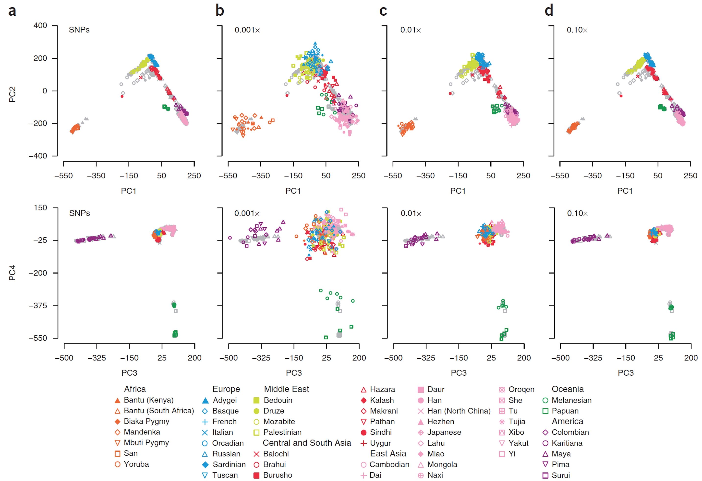
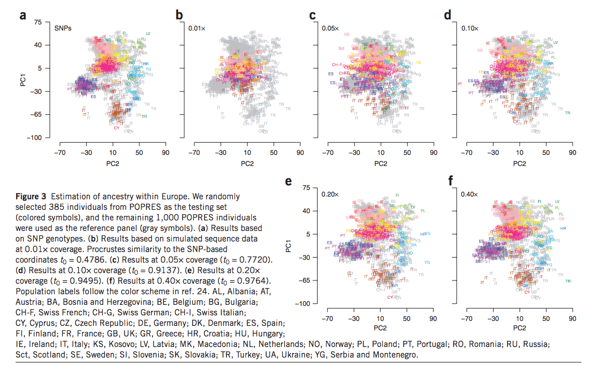
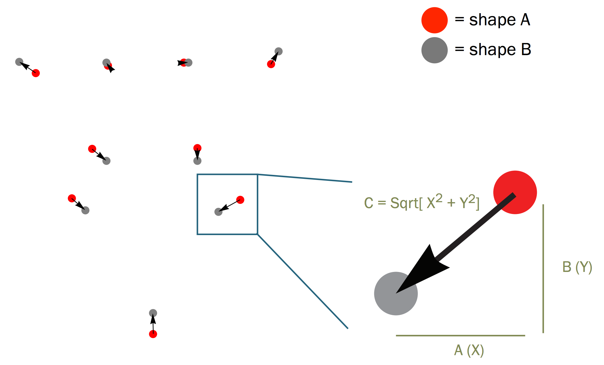
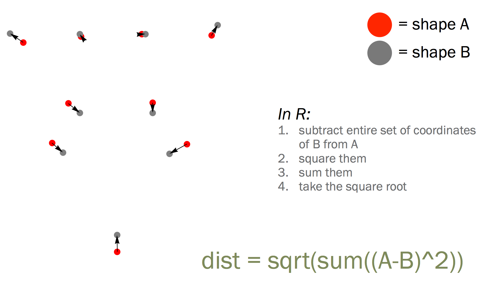

Ancestry estimation and control of population stratification for sequence-based association studies
========================================================
author: Alexander Frieden
date: 

Overview
===========================

* Often times we would like to check for ancestry data using Prinicpal Component Analysis (PCA) on genome data.  

* Prinicipal Component Analysis is a method used to cluster data.  

* However, genome data is not often available and exome data is.  This method tries to take off target reads from exome data and the exome data and make calls and make ancestry calls based off of that new data set.  

Paper (part 2)
===========================
* Principal Components are defined as the product of a weight vector a genotype vector, with weights reflecting the marginal information about ancestry.  

* Targeting sequencing tends to be bad at giving ancestry information.   

Paper (part 3)
==========================
* We compare each sequenced sample to a reference sample whose ancestral data is known and where the whole genome snp information is known.  

Validaiton
===========================

* simulate low coverage data on worldwide an european data. 

* Take targeted sequence data from 1000 genome data set.  

* Results show continental ancestry and sometimes particular areas of European ancestry.  

* To do this they built method Laser (Locating Ancestry from SEquence Reads)

World Wide Ancestry
============================

* Using data from Human Genome Diversity Panel (HGDP) consisting 938 individuals from 53 populations.  

* 700 of samples used to construct PCAs.  First four used to identify continential groups

* Accuracy assessed by comparing the ancestry estimates obtained from LASER to the PCA coordinates of test individuals using original SNP genotypes and pearson correlation coefficients and Proscrustes similiarity score.  

* Although final results were fuzzy, continental groups were well seperated.  Pearson correlation $r^2$ scores ranged from 0.7396 from PC4 to 0.9506 for PC1.  

Results
============================

Results (part 2)
============================

* Among samples tested, 1 European (CEU) and 1 Yoruba (YRI) nuclear family selected among the HapMap Project samples (each nuclear family included a mother, a father, and a child.)

* When using HGDP as the reference, both these families were correctly placed in the correct positions.  

Difference in Coverage
=============================

Finland data set
============================

* Took 941 finnish samples from exome data set.  Used 470 individuals and at 8.4 mil SNPS with $MAF \geq 0.01$.

* Took remaining 471 individuals on this reference map using ancestry estimates derived from whole genome sequencing data as a gold standard.  How did they get whole genome data?

* Results using this were better than using exome alone.  

* $t_0 = 09763$ and $r^2 = 0.9778$ for PC1 and $r^2=0.9259$ for PC2 for LASER

* $t_0 = 08263$ and $r^2 = 0.9411$ for PC1 and $r^2=0.4373$ for PC2 for exome

Table Results
==============================

Conclusions
==============================
* Off target reads as low as 0.001x we can still reconstruct worldwide continental ancestry

* If samples genotyped at higher density or whole genome sequenced, authors expect better results.  

* Simulations show using estimates ancestry addresses imperfect matching of case and control.  

* Also shows that when population structure is stratified much more different than expected, different methods must be applied.

Extra method slides
==============================
Extra method slides

Step one: PCA on reference genotypes to define reference space. 
==============================

Usually the construction of principal axes follows from the classical approach to PCA, which is applied to the scaled matrix (individuals by SNPs) of observed genotypes (AA, AB, BB; say B is the minor allele in all cases).   

In this case we are doing:  Let $G$ be a matrix.  Let each $G_{ij}={0,1,2}$.  This represents the number of reference alleles at locus $j=1,...,L$ for individual $i=1,...,N$.  

$\mu_j$ is the column mean.  $\sigma_j$ is the column standard deviation.  

Step one: PCA on reference genotypes to define reference space. 
==============================

We then define $Q_{ij} = (G_{ij}-\mu_{ij})/\sigma_{ij}$.  They then run eigen decomposition which is the factorization of a matrix into eigenvalues and eigenvectors.  

To do this, let $M$ be an $N\times N$ matrix such that $M=QQ^T$

Matrix Tranpose
==============================
Transpose of a matrix is indicated as $A^T$.  It is a reflection about the diagonal.  
$$ 
\left[
  \begin{array}{ c c }
     1 & 2 \\
  \end{array} 
\right]^T = \left[
  \begin{array}{ c c }
     1 \\
     2
  \end{array} 
\right] \\
\left[
  \begin{array}{ c c }
     1 & 2 \\
     3 & 4
  \end{array} 
\right]^T = \left[
  \begin{array}{ c c }
     1 & 3\\
     2 & 4
  \end{array} 
\right] \\
\left[
  \begin{array}{ c c }
     1 & 2 \\
     3 & 4 \\
     5 & 6 
  \end{array} 
\right]^T = \left[
  \begin{array}{ c c }
     1 & 3 & 5\\
     2 & 4 & 6
  \end{array} 
\right] \\
$$
It has a number of properties that you can learn in any linear algebra book.  A number of these properties have parallels to group theory.  

Extra Method Slides
============================
For our matrix $M$, the $k^{th}$ principal component given by $\lambda_k^{1/2}v_k$ where $\lambda_k$ is the kth eigen value of M and $v_k$ is the corresponding eigenvector.  

Laser: Simulating sequence data.  
============================

This is step two in our process.  This step is unneccesary if you have the aligned data for the reference individuals.  Why is this data not usually available?

For sample $h$ and locus $j$ let $C_{hj}$ tally the total number of overlapping reads and $S_{hj}$ tally the subset that match the reference allele.  Let $C^{\prime}$ and $S^{\prime}$ represent these matrixes.  Reference counts come from the following piecewise binomial function:
$$
S_{ij}^{\prime} | G_{ij},C_{ij}^\prime ~ \begin{cases} 
      Binomial(C_{ij}^\prime, \epsilon) & G_{ij} = 0 \\
      Binomial(C_{ij}^\prime, 0.05) & G_{ij} = 1 \\
      Binomial(C_{ij}^\prime, 1 - \epsilon) & G_{ij} = 2
   \end{cases}
$$
Where $\epsilon$ is the sequencing error rate per base.  For Illumina data this is Q30 which means about one in 1 in 1000 or 0.001

Laser: Procrustes Analysis
============================

We want to place the study sample in PCA reference space.  

To do this we need to do Procrustes Analysis.  

Procrustes Analysis
============================

Many terms that mean the same thing:

Procrustes superimposition  
Procrustes fitting  
Generalized Procrustes Analysis (GPA)  
Generalized least squares (GLS)  
Least squares fitting

Procrustes Analysis (part 2)
============================
* Centers all shapes at the origin (0,0,0)
* Usually scales all shapes to the same size (usually “unit size” or size =
1.0)
* Rotates each shape around the origin until the sum of squared distances
among them is minimized (similar to least-squares fit of a regression line)
* Ensures that the differences in shape are minimized

Procrustes Analysis (part 3)
============================

Procrustes Analysis (part 4)
============================
Sum of distances between corresponding landmarks of two shapes.

Laser Procrustes Analysis
============================

Using previous work (25,26) we find a transformation $f$.  This transformation includes translation, scaling, rotation, and reflection) that maximizes the similarity between $f(X)$ and $Y$ 

Remember X is the $N\times K$ matrix of reference individuals composed of K principal components from PCA on combined data. Y is the similar thing for reference only.  

Set $Z_h^* = f(Z_h)$ be the coordinates of the study sample in the reference coordinate space.  

Laser Procrustes Analysis (part 2)
============================

Success is then quantified by Procrustes Similarity Statistic as we saw before.  

$$
t(X,Y) = \sqrt{1 - D}
$$
Where D is the scaled minimum sum of squared Euclidean distances between $f(X)$ and Y across all possible transformations.  Values range from [0,1]

Lower Proscrustes similairty corresponds to greater uncertainty and less reliable $Z_h^*$

