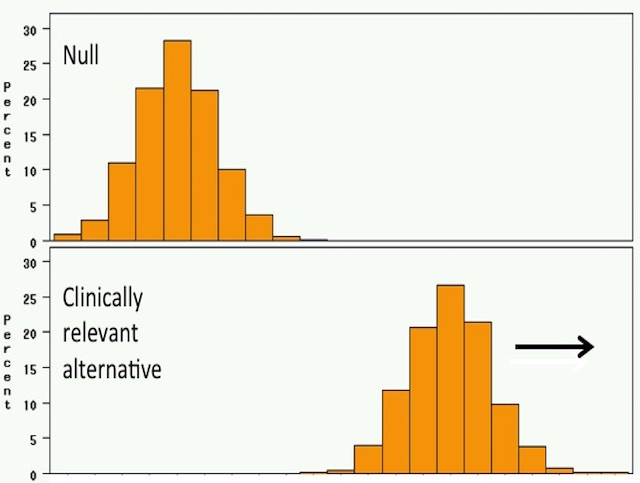
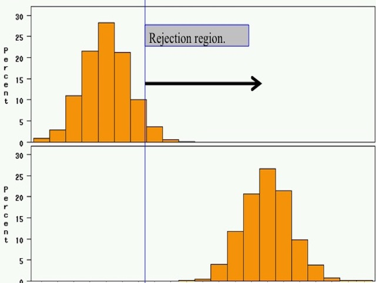

## Lets Begin

Science is built with facts as a house is with stones – but a collection of facts is no more a science than a heap of stones is a house.

					– Jules Henri Poincare

## What is R

R is a scripting language so we can just run this and it doesn't need to get compiled into any other form.  It is arguably the primary language used by statistics, biostatistics, and statistical genetics.  Alternatives to this can be SPSS, SAS, Python, and Julia.  You can use whatever you want but all code I will be presenting will be in R  

## R Studio

R Studio is a development enviornment for coding in R, I highly recommend it.  


## Github

GitHub is a Web-based Git repository hosting service. It offers all of the distributed revision control and source code management (SCM) functionality of Git as well as adding its own features. Unlike Git, which is strictly a command-line tool, GitHub provides a Web-based graphical interface and desktop as well as mobile integration. It also provides access control and several collaboration features such as bug tracking, feature requests, task management, and wikis for every project.

## Github

We will use github for pulling down data and sharing.  Please make an account at github.com

## Sites to get help

Don’t go at this stuff alone!
I am always available for help
However, one of the best places to go is Q and A sites.  

## Biostars

Biostars is a stackexchange style site for questions and answers to get help on anything from bioinformatics to statistical genetics.  Questions are answered quickly.  


##Central Dogma of Statistics


## Axioms of probability


Let A be an event defined over probability space S.  Then $P(A) \geq 0$

$P(S) = 1$

Let A and B be any two mutually exclusive events defined over S.  Then:

$$
P(A \cup B) = P(A) + P(B)
$$

## Quick overview of probability and statistics

$P(A^c) = 1 - P(A)$

By second Axiom, $P(S) = 1 = P(A \cup A^c)$

Since $A$ and $A^c$ are mutually exclusive then we can use third axiom.  

$$
1 = P(A \cup A^c) = P(A) + P(A^c) \\
1 = P(A) + P(A^c) \\
1 - P(A) = P(A^c)
$$

## Conditional Probability

Conditional Probability is the idea that we want to ask about one probability's event given that another event has occured.  

Let $A$ and $B$ be any two events defined on $S$ such that $P(B) > 0$.  The conditional probability of $A$, assuming that $B$ has occured is written $P(A|B)$.  It is given by:

$$
P(A|B) = \frac{P(A\cap B)}{P(B)}
$$

## Random Variable 

a random variable is a variable whose value is subject to variations due to chance.  A random variable can take on a set of possible different values.  The set of values this can be is usually referred to as the sample space.  

## Expected Value

The expected value of a random variable is intuitively the long-run average value of repetitions of the experiment it represents.  

The law of large numbers guarantees that the arithmetic mean of the values almost surely converges to the expected value as the number of repetitions goes to infinity.

## Expected Value

$$
E(X) = \sum_{k}k\frac{1}{n} = \frac{1}{n}\sum_{all \, k}k
$$

Example: Dice roll

$$
\begin{align}
E(X) & = \frac{1}{6}\sum_{i=1}^{6}i = \frac{1}{6}(1+2+3+4+5+6) \\
& = \frac{1}{6}(21) = \frac{21}{6} = 3.5
\end{align}
$$

## Expected Value

This can also be written as:
$$
E(X) = \mu = \mu_X = \sum_{all \, k}k\cdot p_X(k)
$$

Notice this is only for the discrete case.  

## Continuous expected value

If Y is a continuous random variable with probability density function (pdf) $f_Y(y)$ then the expected value is:

$$
E(X) = \mu = \mu_X = \int_{-\infty}^{\infty}y\cdot f_Y(y)dy
$$

Assuming both the sum and the integral converge absolutely.  This creates some issues that I think can be resolved but for our purposes we want them to converge (You can do some crazy stuff with dirac delta functions and other distributions that get around classic functions).  To converge absolutely, we want:

$$
\sum_{all \, k}k\cdot p_X(k) < \infty  \int_{-\infty}^{\infty}y\cdot f_Y(y)dy < \infty
$$

## Variance

The variance of a random variable is the expected value of its squared deviations from $\mu$.  If X is discrete with pdf $p_X(k)$

$$
Var(X) = \sigma^2 = E\left[(X - \mu)^2\right] = \sum_{all \, k}(k-\mu)^2\cdot p_X(k)
$$
If Y is continuous with pdf $f_Y(y)$
$$
Var(Y) = \sigma^2 = E\left[(Y - \mu)^2\right] = \int_{-\infty}^{\infty}(y-\mu)^2\cdot f_Y(y)dy
$$

##Variability of biological experiment

V(Genomic Measurement) = 
Phenotypic variability
+ Measurement Error + Natural biological variation

What does this mean?

## Experimental Design Issues

In biology, traditional approaches to inquiry involved hypothesis testing.
We identify a problem and postulate a mechanism
we design an experiment in which we perturb the system and then look for changes.  The response of the system either validates or invalidates our hypothesis

In these types of experiments, we attempt to tightly control the variables so as to carefully measure the influence of these, perturbing a single parameter at a time

Good experimental design requires sufficient replication to estimate the effects we wish to measure

## Basis of Experimental Design

Functional genomics technologies have dramatically changed the way in which we approach biological questions.

We can now survey the responses of thousands of genes, proteins, or metabolites in a particular system and look for patterns of expression
These “hypothesis generating” experiments do not (necessarily) require a mechanistic hypothesis ahead of time. However, this does not mean we do not have to carefully design our experiment and analyze the data.

Here, we attempt to control the variables so as to carefully measure the influence of these, perturbing a single parameter at a time

Good experimental design requires sufficient replication to estimate the effects we wish to measure

## Types of Experiments

**Class Comparison**  
Can I find genes that distinguish between two classes, such as tumor and normal?

**Class Discovery**  
Given what I think is a uniform group of samples, can I find subsets that are biologically meaningful?

**Classification**  
Given a set of samples in different classes, can I assign a new, unknown sample to one of the classes?

**Mechanistic Studies**  
Can I discover a causative mechanism associated with the distinction between classes?

These are often not completely distinct and a single dataset can often be used for multiple purposes

## Class Discovery

The Question: Given data on a collection of samples, are there biologically interesting patterns that exist?

Unsupervised methods do not use the sample classification as input – they do not take into account, for example, whether the samples come from ALL or AML patients. 

They simply group samples together based on some measure of similarity between them. 

Useful approaches to data analysis are unsupervised methods such as hierarchical clustering or k-means clustering.

## Class Comparison

The Question: Given a collection of samples that can be grouped into two or more classes, can we find patterns of gene expression that distinguish them?

Analysis methods typically rely on statistical comparisons, such as t-test or ANOVA to find genes whose patterns are significantly correlated with the various classes.

These supervised methods use the sample classification as input – we might compare, for example, gene expression differences between ALL and AML patients. 

The effectiveness of these analyses increase as we increase our sample size.

## Class Prediction

The Question: Given samples that I can know belong to various groups, can I find a rule that will allow me to assign new samples to one of the groups?

There are a wide range of algorithms that can be used for class prediction, including weighted voting, k Nearest Neighbors (kNN) and Artificial Neural Networks.

One must have sufficient sample numbers to allow an algorithm to be trained and then to have it tested on an independent set of samples.

Often sample sources are limited and one uses cross validation.

## Mechanistic Analysis

The Question: Given a collection of samples representing various phenotypes, can I find a biological mechanism that provides a mechanistic basis for the observed differences?

This often involves a meta-analysis of the data, bringing in other information such as gene functional assignments to gain insight.

There are a wide range of software tools that have been developed such as EASE, GO Miner, and GenMAPP that  can help put the results into context.

These experiments are often hypothesis testing experiments that use microarrays as the readout.

## The relationship between types

All of these various experimental types are related and often are used together.

Class discovery methods are often used as a first analysis of any experiment as a means of quality control.

Nearly every experiment involves a comparison between classes representing different phenotypes or treatments.

The start of class prediction is class comparison to find genes that distinguish the various classes.

Mechanistic analysis begins with gene selection and the best classification genes are those that explain the mechanism underlying the classes.

## The Experimental Design

The Experimental Design dictates a good deal of what you can do with the data.

Good normalization and processing reflects the experimental design.

The design also facilitates certain comparisons between samples and provides the statistical power you need for assigning confidence limits to individual measurements.

The design must reflect experimental reality.

The most straight-forward designs compare expression in two classes of samples to look for patterns that distinguish them.

## Sample Size and Power Calculations

What is Statistical Power?  

Statistical Power refers to the is the likelihood that a study will detect an effect when there is an effect there to be detected. If statistical power is high, the probability of concluding there is no effect when, in fact, there is one, goes down.


## Picturing statistical power

study 1: 263 cases, 1241 controls


## Picturing statistical power

study 1: 263 cases, 1241 controls


## Picturing statistical power

study 1: 263 cases, 1241 controls


## More on Power

Study 2: 18 treated, 72 controls, STD DEV = 2


## More on Power

Study 2: 18 treated, 72 controls, STD DEV=10


## More on Power

Study 2: 18 treated, 72 controls, effect size=1.0


## More on Power
Bigger difference from the null mean.


## More on Power
Bigger standard deviation


## More on Power
Higher Significance Level


## Sample Size Calculations

Based on these elements, you can write a formal mathematical equation that relates power, sample size, effect size, standard deviation, and significance level.  

We will derive this.  

## Deriving Z-Test Formulas: 1-Sample, 1-Sided

Suppose we have random variables

$$Y_1,Y_2,\ldots,Y_n$$

And we want to compare the hypothesis:

$$H_0:\mu=\mu_0$$
$$H_1:\mu>\mu_0$$

Where $\mu$ is the mean of the distribution and $\mu_0$ is a specified comparison value.  

## Deriving Z-Test Formulas: 1-Sample, 1-Sided

The test statistic will be the sample average.  

$$X = \bar{Y} = \frac{1}{n}\sum_{i=i}^{n}Y_i$$

## Deriving Z-Test Formulas: 1-Sample, 1-Sided

Since we're testing whether the mean is larger than $\mu_0$, we'll reject the null hypothesis if $X$ turns out to be "too big". 

We'll need a critical value, $cv$ that serves as the cut-off point; that is, if our observed value of $X$ turns out to be larger than cvcv, then we'll reject the null hypothesis. If cvcv is very large, then it'll be very unlikely to observe a value of $X$ larger than $cv$. On the other hand, if $cv$ is too small, i.e. too close to $\mu_0$, then it'll be much more likely to observe a value of $X$ larger than $cv$.

## Deriving Z-Test Formulas: 1-Sample, 1-Sided

So, would we rather have a large or small critical value, and how do we decide? This is based on our desired Type I error rate, $\alpha$, which is often set at the familiar value of 0.05, or 5%. Specifically, if the null hypothesis is true, we want the probability of rejecting the null hypothesis to be αα. We can write this in symbols as:

$$\alpha = P(X \geq cv \,|\, H_0)$$

## Deriving Z-Test Formulas: 1-Sample, 1-Sided

Using some algebra:

$$
\begin{aligned}
\alpha & = P(X \geq cv \,|\, H_0) \\
& = 1 - P(X \leq cv \,|\, H_0)
\end{aligned}
$$
Since probabilities sum to one.
$$
= 1 - P\left(\frac{X-\mu_0}{\sigma_n} \leq \frac{cv-\mu_0}{\sigma_n}\,|\, H_0\right)
$$

## Remember

If a random variable is normally distributed with mean $\mu$ and variance $\sigma^2$, then subtracting $a$ makes the mean $\mu-a$, and dividing by $b$ makes the variance $\sigma^2/b^2$.  We can use this to our advantage.  

$$X \sim N(\mu,\sigma^2) \implies \frac{X-\mu}{\sigma} \sim N(0,1) $$

Using this, we can then get the following:
$$
\begin{align}
&\alpha = 1 - P\left(\frac{X-\mu_0}{\sigma_n} \leq \frac{cv-\mu_0}{\sigma_n}\,|\, H_0\right) \\
& = 1 - \Phi\left(\frac{cv-\mu_0}{\sigma_n}\right)
\end{align}
$$

## Deriving Z-Test Formulas: 1-Sample, 1-Sided

So, 

$$
\alpha  = 1 - \Phi\left(\frac{cv-\mu_0}{\sigma_n}\right)  \\
1 - \alpha = \Phi\left(\frac{cv-\mu_0}{\sigma_n}\right)
$$

Using definition of standard normal quantile:

$$
z_{1-\alpha} = \frac{cv-\mu_0}{\sigma_n} \\
cv = \mu_0 + z_{1-\alpha}\sigma_n
$$

## Critical Value Result

Acceptance Region: Accept $H_0$ if $X<\mu_0+z_{1−\alpha}\sigma_n$   
Rejection Region: Reject $H_0$ if $X\geq\mu_0+z_{1−\alpha}\sigma_n$

Note also that:

Let $z_a$ be the $a^{th}$ quantile of the standard normal distribution. That is, the area under the standard normal curve to the left of $z_a$ is $a$.  Then

$$
z_a = -z_{1-a}
$$

## Power Derivation

$$ 
\begin{align}
Power & = P(X\geq\mu_0 + z_{1-\alpha}\sigma_n \,|\, H_1) \\
& = 1 - P(X<\mu_0 + z_{1-\alpha}\sigma_n \,|\, H_1) \\
& = 1 - P\left(\frac{X-\mu}{\sigma_n}<\frac{\mu_0 + z_{1-\alpha}\sigma_n -\mu}{\sigma_n} \,|\, H_1\right) \\
& = 1- \Phi\left(\frac{\mu_0-\mu}{\sigma_n} + z_{1-\alpha}\right) \\
\end{align}
$$

And using the symmetry here of $1-\Phi(x) = \Phi(-x)$ or $z_a = -z(1-a)$

$$
Power  =  \Phi\left(\frac{\mu_0-\mu}{\sigma_n} - z_{1-\alpha}\right)
$$

## Type I and Type II Error

In statistical hypothesis testing, a type I error is the incorrect rejection of a true null hypothesis (a "false positive"), while a type II error is the failure to reject a false null hypothesis (a "false negative"). More simply stated, a type I error is detecting an effect that is not present, while a type II error is failing to detect an effect that is present.

## Sample Size

A formula for sample size can be obtained by algebraically solving for nn in the above power formula. Here, we'll solve for $\sigma_n$, and below we'll fill in the specific form of σnσn for the cases when the data are normal and binomial.  First, note that the typical notation is Power = $1-\beta$, where $\beta$ is the Type II error rate. First lets take the power formula from before:

$$
1-\beta = \Phi\left(\frac{\mu-\mu_0}{\sigma_n}-z_{1-\alpha}\right) \\
$$
Then apply our definition of standard normal quantiles
$$
z_{1-\beta} = \frac{\mu-\mu_0}{\sigma_n}-z_{1-\alpha}
$$

## Sample Size

Then some algebra:

$$
\frac{1}{\sigma_n} = \frac{z_{1-\beta} + z_{1-\alpha}}{\mu-\mu_0}
$$

## Normal Data

Now suppose the data $Y_1,Y_2,...,Y_n$ are independently and identically distributed (iid) to $N(\mu,\sigma^2)$.  Let $X=\bar{Y}=\frac{1}{n}\sum_{i=1}^{n}Y_i=E(Y)$.  

Then we know the expected value is similiarly distributed.  (We will not prove this).  So $\bar{Y} \sim N(\mu,\sigma^2/n)$

Thus we replace $\sigma_n$ with $\sigma/\sqrt{n}$ and use our standard normal identity and power equation:

$$
Power = \Phi\left(\frac{\mu - \mu_0}{\sigma/\sqrt{n}}-z_{1-\alpha}\right) \\
n = \left(\sigma\frac{z_{1-\beta}+z_{1-\alpha}}{\mu-\mu_0}\right)^2
$$

## Binomial Data

Binomial data is a series of binary outcomes (coin flips).  

Suppose the data $Y_1,Y_2,...,Y_n$ represent $n$ independent binary outcomes, each with success probability $p$.  Then the test statistic is the sample proportion, $X = \hat{p}=\frac{1}{n}\sum_{i=1}^{n}Y_i$.  For large n, we get the approximate distribution (you guessed it)

$$
\hat{p} \sim N\left(p,\frac{p(1-p)}{n}\right)  
$$

So we take our previous sample size and power calculations and replace $\sigma_n$ with $\sqrt{p(1-p)/n}$

## Binomial Data

We are left with

$$
Power = \Phi\left(\frac{p-p_0}{\sqrt{p(1-p)/n}}-z_{1-\alpha}\right)
$$

and

$$
n=p(1-p)\left(\frac{z_{1-\beta}+z_{1-\alpha}}{p-p_0}\right)^2
$$

## Quantile

Please note $z_a$ is the quantile of the standard normal distribution such that the area under the curve to the left of $z_a$ is $a$. These quantiles are easily obtained from a standard normal distribution table or programatically. For example, if $\alpha=0.05$, then we have the familiar values of $z_{1−\alpha}=1.64$ and $z_{1−\alpha/2}=1.96$.

## Example Sample Size Calculation

How many people would you need to sample in each group to achieve power of 80%?  Assume our mean is 120 and we are comparing to 115 and standard deviation is 24.  

## Example 1 Solution

So remember, $\beta$ is our type 2 error.  This means $1-\beta$ is our power.  Since our power is 80%, that means $\beta$ is 20%.  Thus we have:
$$
\begin{align}
n & = \left(\sigma\frac{z_{1-\beta}+z_{1-\alpha}}{\mu-\mu_0}\right)^2 \\
& = \left(24\frac{0.84+1.64}{120-115}\right)^2 \\
& = \left(\frac{59.52}{5}\right)^2 = 141.7052 
\end{align}
$$


## Example 2 Sample Size

What power can I achieve if my our mean is 100 and we are comparing to 90 and standard deviation is 10 with 12 samples?

## Example 2 Sample Size Solution

$$
\begin{align}
Power & = \Phi\left(\frac{\mu - \mu_0}{\sigma/\sqrt{n}}-z_{1-\alpha}\right) \\
& = \Phi\left(\frac{100 - 90}{10/\sqrt{12}}-1.64\right) \\
& = \Phi(\frac{10\sqrt(12)}{10} - 1.64) = \Phi(1.82) = 0.9656
\end{align}
$$

## Loading data

Then we are going to load data in.  A lot of data is loaded from file formats

```{r}
mydata = read.table("dummyTable.txt")
mydata
```


## Loading data

We can also check the class for an object, in this case it will be a data frame

```{r}
class(mydata)
```

As we can see, our table has headers:
```{r}
mydata <- read.table("dummyTable.txt",header = TRUE)
mydata
```


## Manipulating Data

Notice now all of our data has nice headers.  And we can index off of them. This will give us a data frame. 

```{r}
mydata["val1"]
```

This will give us an array.  

```{r}
mydata$val1
```

## Operations

We can do basic vector math

```{r}
a <- c(1,2,3)
b <- c(10,11,12,13)
a+b
```

Other vector operations

```{r}
min(a,b)
max(a,b)
```

## R example of sample size calculation

In our previous sample size calculation,we saw we got 142 as the sample size.  Lets see if we we can do this now in r.  

```{r}
mu=115
mu0=120
sd=24
alpha=0.05
beta=0.20
(n=(sd*(qnorm(1-alpha)+qnorm(1-beta))/(mu-mu0))^2)
```
So,  because of our errors i rounding, we are actually a full sample off.  

## R example of sample size calculation

And as we expect

```{r}
z=(mu-mu0)/sd*sqrt(n)
(Power=pnorm(abs(z)-qnorm(1-alpha)))
```

## R example of power calculation

Remember the question is: What power can I achieve if my our mean is 100 and we are comparing to 90 and standard deviation is 10 with 12 samples?

Lets set up our variables

```{r}
alpha=0.05
mu = 100
mu0 = 90
sd = 10
n = 12
Power = pnorm((100-90)/10*sqrt(12)-qnorm(1-alpha))
Power
```

