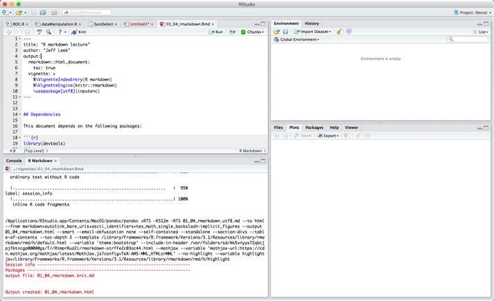
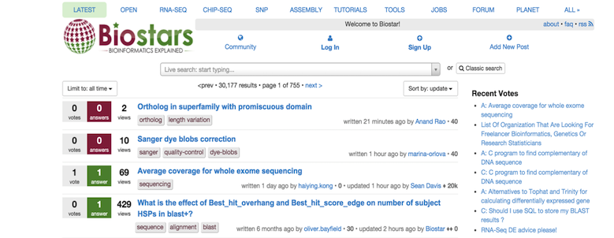
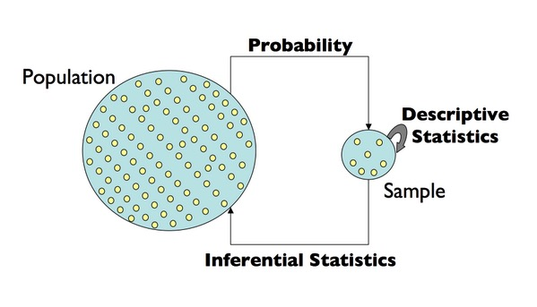
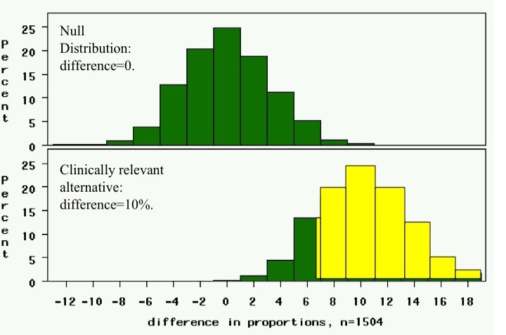
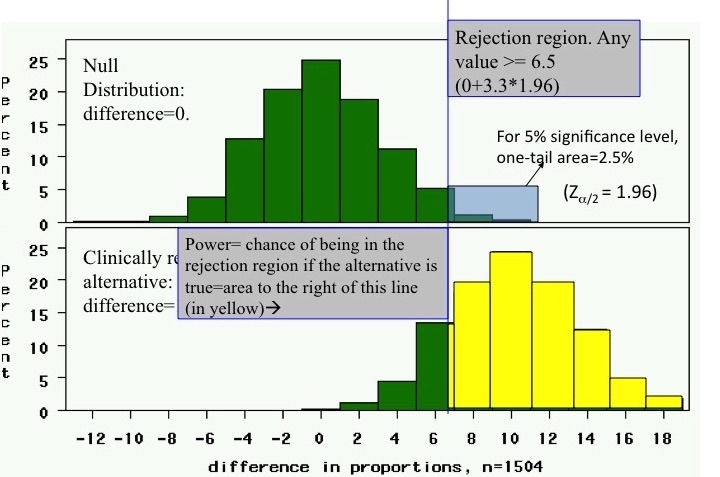

## Lets Begin

Science is built with facts as a house is with stones – but a collection of facts is no more a science than a heap of stones is a house.

					– Jules Henri Poincare

## What is R

R is a scripting language so we can just run this and it doesn't need to get compiled into any other form.  It is arguably the primary language used by statistics, biostatistics, and statistical genetics.  Alternatives to this can be SPSS, SAS, Python, and Julia.  You can use whatever you want but all code I will be presenting will be in R  

## R Studio

R Studio is a development enviornment for coding in R, I highly recommend it.  



## Github

GitHub is a Web-based Git repository hosting service. It offers all of the distributed revision control and source code management (SCM) functionality of Git as well as adding its own features. Unlike Git, which is strictly a command-line tool, GitHub provides a Web-based graphical interface and desktop as well as mobile integration. It also provides access control and several collaboration features such as bug tracking, feature requests, task management, and wikis for every project.

## Github

We will use github for pulling down data and sharing.  Please make an account at github.com

## Sites to get help

Don’t go at this stuff alone!
I am always available for help
However, one of the best places to go is Q and A sites.  

## Biostars

Biostars is a stackexchange style site for questions and answers to get help on anything from bioinformatics to statistical genetics.  Questions are answered quickly.  



##Central Dogma of Statistics




##Variability of biological experiment

V(Genomic Measurement) = 
Phenotypic variability
+ Measurement Error + Natural biological variation

What does this mean?

## Experimental Design Issues

In biology, traditional approaches to inquiry involved hypothesis testing.
We identify a problem and postulate a mechanism
we design an experiment in which we perturb the system and then look for changes.  The response of the system either validates or invalidates our hypothesis

In these types of experiments, we attempt to tightly control the variables so as to carefully measure the influence of these, perturbing a single parameter at a time

Good experimental design requires sufficient replication to estimate the effects we wish to measure

## Basis of Experimental Design

Functional genomics technologies have dramatically changed the way in which we approach biological questions.

We can now survey the responses of thousands of genes, proteins, or metabolites in a particular system and look for patterns of expression
These “hypothesis generating” experiments do not (necessarily) require a mechanistic hypothesis ahead of time. However, this does not mean we do not have to carefully design our experiment and analyze the data.

Here, we attempt to control the variables so as to carefully measure the influence of these, perturbing a single parameter at a time

Good experimental design requires sufficient replication to estimate the effects we wish to measure

## Types of Experiments

**Class Comparison**  
Can I find genes that distinguish between two classes, such as tumor and normal?

**Class Discovery**  
Given what I think is a uniform group of samples, can I find subsets that are biologically meaningful?

**Classification**  
Given a set of samples in different classes, can I assign a new, unknown sample to one of the classes?

**Mechanistic Studies**  
Can I discover a causative mechanism associated with the distinction between classes?

These are often not completely distinct and a single dataset can often be used for multiple purposes

## Class Discovery

The Question: Given data on a collection of samples, are there biologically interesting patterns that exist?

Unsupervised methods do not use the sample classification as input – they do not take into account, for example, whether the samples come from ALL or AML patients. 

They simply group samples together based on some measure of similarity between them. 

Useful approaches to data analysis are unsupervised methods such as hierarchical clustering or k-means clustering.

## Class Comparison

The Question: Given a collection of samples that can be grouped into two or more classes, can we find patterns of gene expression that distinguish them?

Analysis methods typically rely on statistical comparisons, such as t-test or ANOVA to find genes whose patterns are significantly correlated with the various classes.

These supervised methods use the sample classification as input – we might compare, for example, gene expression differences between ALL and AML patients. 

The effectiveness of these analyses increase as we increase our sample size.

## Class Prediction

The Question: Given samples that I can know belong to various groups, can I find a rule that will allow me to assign new samples to one of the groups?

There are a wide range of algorithms that can be used for class prediction, including weighted voting, k Nearest Neighbors (kNN) and Artificial Neural Networks.

One must have sufficient sample numbers to allow an algorithm to be trained and then to have it tested on an independent set of samples.

Often sample sources are limited and one uses cross validation.

## Mechanistic Analysis

The Question: Given a collection of samples representing various phenotypes, can I find a biological mechanism that provides a mechanistic basis for the observed differences?

This often involves a meta-analysis of the data, bringing in other information such as gene functional assignments to gain insight.

There are a wide range of software tools that have been developed such as EASE, GO Miner, and GenMAPP that  can help put the results into context.

These experiments are often hypothesis testing experiments that use microarrays as the readout.

## The relationship between types

All of these various experimental types are related and often are used together.

Class discovery methods are often used as a first analysis of any experiment as a means of quality control.

Nearly every experiment involves a comparison between classes representing different phenotypes or treatments.

The start of class prediction is class comparison to find genes that distinguish the various classes.

Mechanistic analysis begins with gene selection and the best classification genes are those that explain the mechanism underlying the classes.

## The Experimental Design

The Experimental Design dictates a good deal of what you can do with the data.

Good normalization and processing reflects the experimental design.

The design also facilitates certain comparisons between samples and provides the statistical power you need for assigning confidence limits to individual measurements.

The design must reflect experimental reality.

The most straight-forward designs compare expression in two classes of samples to look for patterns that distinguish them.

## Sample Size and Power Calculations

What is Statistical Power?  

Statistical Power refers to the is the likelihood that a study will detect an effect when there is an effect there to be detected. If statistical power is high, the probability of concluding there is no effect when, in fact, there is one, goes down.


## Picturing statistical power

study 1: 263 cases, 1241 controls


## Picturing statistical power



## Loading data

Then we are going to load data in.  A lot of data is loaded from file formats

```{r}
mydata = read.table("dummyTable.txt")
mydata
```


## Loading data

We can also check the class for an object, in this case it will be a data frame

```{r}
class(mydata)
```

As we can see, our table has headers:
```{r}
mydata <- read.table("dummyTable.txt",header = TRUE)
mydata
```


## Manipulating Data

Notice now all of our data has nice headers.  And we can index off of them. This will give us a data frame. 

```{r}
mydata["val1"]
```

This will give us an array.  

```{r}
mydata$val1
```

## Operations

We can do basic vector math

```{r}
a <- c(1,2,3)
b <- c(10,11,12,13)
a+b
```

Other vector operations

```{r}
min(a,b)
max(a,b)
```

