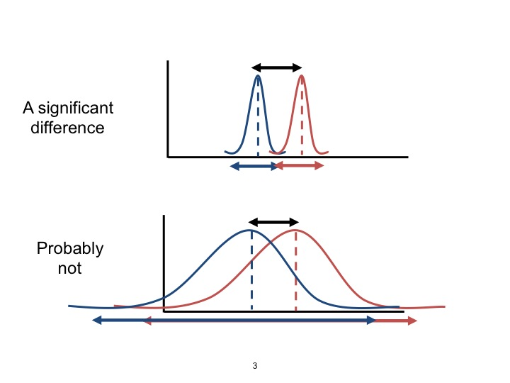
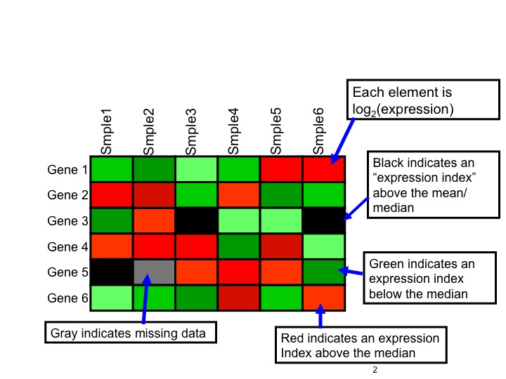
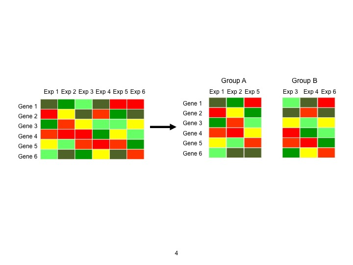

## Introduction

Finally have university email: alexander_frieden@uml.edu

Feel free to use both addresses

Lets go back to review previous content

# Review


## Type I Error Defintion

A type I error occurs when the null hypothesis is true, but is rejected. It is asserting something that is absent, a false hit. 

A type I error may be compared with a so-called false positive (a result that indicates that a given condition is present when it actually is not present) in tests where a single condition is tested for.

## Type 1 Error Example  

**Hypothesis:** "Adding water to toothpaste protects against cavities."

**Null hypothesis:** "Adding water to toothpaste has no effect on cavities."

This null hypothesis is tested against experimental data with a view to nullifying it with evidence to the contrary.

A type I occurs when detecting an effect (adding water to toothpaste protects against cavities) that is not present. The null hypothesis is true (i.e., it is true that adding water to toothpaste has no effect on cavities), but this null hypothesis is rejected based on bad experimental data.

## False Positive Example 

I have two sequencing datasets, a gold standard and a new one that my lab has generated from a new technology.  For brevity we will call $G$ the gold standard and $N$ the new technology dataset.  I see a genetic variant in $N$ that I do not see in $G$.  

Is this a type I error?

We will get into more of this later

<div class="notes">
don't think of erroneous variant calls in terms of Type 1 error, because you are not testing a null hypothesis. Its either a TP, TN, FP, FN
</div>

## Type II Error Definition

A type II error occurs when the null hypothesis is false, but erroneously fails to be rejected. It is failing to assert what is present, a miss. A type II error may be compared with a so-called false negative (where an actual 'hit' was disregarded by the test and seen as a 'miss') in a test checking for a single condition with a definitive result of true or false. A Type II error is committed when we fail to believe a truth.

The rate of the type II error is denoted by the Greek letter $\beta$(beta) and related to the power of a test (which equals $1-\beta$).

The goal of the test is to determine if the null hypothesis can be rejected. A statistical test can either reject or fail to reject a null hypothesis, but never prove it true.

## Type II Error Example

**Hypothesis:** "Adding fluoride to toothpaste protects against cavities."

**Null hypothesis:** "Adding fluoride to toothpaste has no effect on cavities."

This null hypothesis is tested against experimental data with a view to nullifying it with evidence to the contrary.

A type II error occurs when failing to detect an effect (adding fluoride to toothpaste protects against cavities) that is present. The null hypothesis is false (i.e., adding fluoride is actually effective against cavities), but the experimental data is such that the null hypothesis cannot be rejected.

## T Test

So if I have two data sets, and I want to see if they are different I can compare their means.  This, while valuable, doesn't really give me very much information.  

Paired data can involve taking two measurements on the same subjects, called repeated sampling. For example, think of studying the effectiveness of a diet plan. You would weigh each participant prior to starting the diet and again following some time on the diet. 

Depending on how much weight they lost you would determine if the diet was effective. Paired data does not always need to involve two measurements on the same subject; it can also involve taking one measurement on each of two related subjects. For example, we may study husband-wife pairs, mother-son pairs, or pairs of twins.

## T Test

The null hypothesis for pattern analysis tools essentially states that there is no spatial pattern among the features, or among the values associated with the features, in the study area -- said another way: the expected pattern is just one of the many possible versions of complete spatial randomness. The Z score is a test of statistical significance that helps you decide whether or not to reject the null hypothesis. The p-value is the probability that you have falsely rejected the null hypothesis.

## T Test

To give an example: the critical Z score values when using a 95% confidence level are -1.96 and +1.96 standard deviations. The p-value associated with a 95% confidence level is 0.05. If your Z score is between -1.96 and +1.96, your p-value will be larger than 0.05, and you cannot reject your null hypothsis; the pattern exhibited is a pattern that could very likely be one version of a random pattern. 

If the Z score falls outside that range (for example -2.5 or +5.4), the pattern exhibited is probably too unusual to be just another version of random chance and the p-value will be small to reflect this. In this case, it is possible to reject the null hypothesis and proceed with figuring out what might be causing the statistically significant spatial pattern.


## Hypothesis Testing Example

An old blood alcohol testing device is producing the following outputs:
```{r}
values<-c(12.3,12.6,13.2,13.1,13.1,12.7,13.1,12.8,12.9,12.4,13.6,
         12.6,12.4,13.3,12.4,12.7,13.1,12.6,12.6,13.1,12.9,12.7,12.4,
         12.6,12.4,12.6,12.5,12.4,12.7,12.9)
```
We expect the machine to produce a reading of 12.6%.  Should the machine be recalibrated?  Assume we have a significance of $\alpha = 0.05$ and a standard deviation $\sigma = 0.4$

## Hypothesis Testing Example Solution Part 1
First, what is our hypothesis?
$$
H_0: \mu = 12.6 \\
H_a: \mu \neq 12.6
$$

Is this one sided or a two sided test?
<div class="notes">
* It is a two sided test  
* The values can shift either to the left or right
</div>

## Hypothesis Testing Example Solution Part 2
Since it is two sided we want to consider $Z \leq -1.96$ and $Z \geq 1.96$.  This is because we are looking at 5% split across both tail ends or 2.5% across end end.  In general, $z_{0.025}$ = 1.96 and -1.96 for each end, or on one side $z_{0.05} = 1.64$ or -1.64

Since we are two sided and computing the mean of our values to get 12.76:
$$
\frac{\bar{x}-12.6}{0.4/\sqrt{30}} \leq -1.96\;or\;\frac{\bar{x}-12.6}{0.4/\sqrt{30}} \geq 1.96   \\
\frac{12.76-12.6}{0.4/\sqrt{30}} \leq -1.96\;or\;\frac{12.76-12.6}{0.4/\sqrt{30}} \geq 1.96   \\
2.19 \leq -1.96\;or\;2.19 \geq 1.96
$$
So what?

## Hypothesis Testing Example Solution Part 2
So one of these conditions is met, so we reject the null hypothesis, we need to recalibrate.    

## Hypothesis Testing Example 2

Now lets suppose we try a different instrument.  Here we have collected 16 readings with a standard deviation of $\sigma = 1$ and a measurement we want of 12.6 again.  We have found our mean of these measurements to be 12.5.  Should we recalibrate the machine?  

## Hypothesis Testing Example 2

So lets calculate the z score:

$$
z = \frac{\bar{x} - \mu_0}{\sigma/\sqrt{n}} = \frac{12.5-12.6}{1/\sqrt{16}} = \frac{-0.1}{0.25} = -0.4
$$

$-0.4 \leq -1.96$ or $-0.4 \geq 1.96$?  No.  So what happens?

<div class="notes">
We fail to reject null hypothesis  
We never accept the null hypothesis
</div>

# R Review


## Data Structures


R's base data structures can be organised by their dimensionality (1d, 2d, or nd) and whether they're homogeneous (all contents must be of the same type) or heterogeneous (the contents can be of different types). This gives rise to the five data types most often used in data analysis: 

|    | Homogeneous   | Heterogeneous |
|----|---------------|---------------|
| 1d | Atomic vector | List          |
| 2d | Matrix        | Data frame    |
| nd | Array         |               |

## Factors

One important use of attributes is to define factors. A factor is a vector that can contain only predefined values, and is used to store categorical data. Factors are built on top of integer vectors using two attributes: the `class()`, "factor", which makes them behave differently from regular integer vectors, and the `levels()`, which defines the set of allowed values. \index{factors|(}

## Factors
```{r}
x <- factor(c("a", "b", "b", "a"))
x
class(x)
levels(x)
```

## Factors
```{r}
# You can't use values that are not in the levels
x[2] <- "c"
x

# You can't combine factors
c(factor("a"), factor("b"))
```

## Factors
Factors are useful when you know the possible values a variable may take, even if you don't see all values in a given dataset. Using a factor instead of a character vector makes it obvious when some groups contain no observations:

```{r}
sex_char <- c("m", "m", "m")
sex_factor <- factor(sex_char, levels = c("m", "f"))
```

## Factors
```{r}
table(sex_char)
table(sex_factor)
```

## Factors
Sometimes when a data frame is read directly from a file, a column you'd thought would produce a numeric vector instead produces a factor. This is caused by a non-numeric value in the column, often a missing value encoded in a special way like `.` or `-`. To remedy the situation, coerce the vector from a factor to a character vector, and then from a character to a double vector. (Be sure to check for missing values after this process.) Of course, a much better plan is to discover what caused the problem in the first place and fix that; using the `na.strings` argument to `read.csv()` is often a good place to start.


## Factors
```{r}
# Reading in "text" instead of from a file here:
z <- read.csv(text = "value\n12\n1\n.\n9")
typeof(z$value)
as.double(z$value)
# Oops, that's not right: 3 2 1 4 are the levels of a factor, 
# not the values we read in!
```

## Factors

```{r}
class(z$value)
# We can fix it now:
as.double(as.character(z$value))
```

## Factors
```{r}
# Or change how we read it in:
z <- read.csv(text = "value\n12\n1\n.\n9", na.strings=".")
typeof(z$value)
class(z$value)
z$value
# Perfect! :)
```

## Basics

```{r}
x <- rnorm(1000)                   # atomic vectors
head(x)
y <- x + rnorm(1000, sd=.5)
head(y)
```


## Basics Continued
```{r}
df <- data.frame(x=x, y=y)         # object of class 'data.frame'
plot(y ~ x, df)                    # generic plot, method plot.formula
```


## More Basics
```{r}
fit <- lm(y ~x, df)                # object of class 'lm'
fit
```

## Plotting
We can fit lots of stuff on one plot (as we saw last week with our normal dist)
```{r}
plot(y ~ x, df)   # Y ~ X, values from 'df'
fit <- lm(y ~ x, df) #lm(): linear model, returns class 'lm'
abline(fit)  # plot regression line
```

## Introduction to Variance

Variance measures how far a set of numbers are spread out.  

A variance of zero indicates that all the values are identical. Variance is always non-negative.  

A small variance indicates that the data points tend to be very close to the mean (expected value) and hence to each other, while a high variance indicates that the data points are very spread out around the mean and from each other.

## Introduction to Standard Deviation

Standard Deviation gives you a sense of how dispersed (spread out) the data in your sample is from the Mean (Average). Said another way – it lets you know if you can rely on the Mean to give you a meaningful representation of the data.

## ANOVA introduction

Keep in mind, simplest anova is a t-test.  

We are often interested in determining whether the means from more than two
populations or groups are equal or not. To test whether the difference in means
is statistically significant we can perform analysis of variance (ANOVA) using the
R function aov(). If the ANOVA F-test(General case for T-test) shows there is a significant difference in means between the groups we may want to perform multiple comparisons
between all pair-wise means to determine how they differ.

Note: both of these are special cases of a linear regression.

This is a lot, so we are going to look at an example to get better insight.  


## More on T Test



## Expression Vectors

Crucial concept for understanding clustering
Each gene is represented by a vector where coordinates are its values log(expression) in each sample  
$$
x = log(expression)_{sample1} \\ 
y = log(expression)_{sample2}  \\
z = log(expression)_{sample3}  \\
etc.
$$
For example, if we do six experiments, 
$$
Gene1 = (1.2, 0.5, 0, 0.25, 0.75, 1.4) \\
Gene2 = (0.2, 0.5, 1.2, 0.25, 1.0, 1.5) \\
Gene3 = (1.2, 0.5, 0, 0.25, 0.75, 1.4) \\
etc.
$$

## Expression Matrix
These gene expression vectors of log(expression) values can be used to construct an expression matrix

gene| sample1| sample2| sample3| sample4
-----|-----|-----|-----|-----
gene1|1.2|2.5|5|6.25
gene2|4.2|2.5|1.2|0.25
gene3|1.2|6.5|4|0.25

This is often represented as a red/green colored matrix


## Expression Matrix
The Expression Matrix is a representation of data frommultiple microarray experiments.



## t-tests (Between Subjects or unpaired)  
Assign experiments to two groups, e.g., in the expression matrix below, assign Experiments 1, 2 and 5 to group A, and experiments 3, 4 and 6 to group B.



## T test

Determine whether a gene’s expression levels are significantly different between the two groups by one of three methods:

“Just alpha” (a significance level): If the calculated p-value for a gene is less than or equal to the user-input alpha (critical p-value), the gene is considered significant.		
					OR
Use Bonferroni corrections to reduce the probability of erroneously classifying nonsignificant genes as significant.

B) Standard Bonferroni correction: The user-input alpha is divided by the total number of genes to give a critical p-value that is used as above –> $p_{critical} = \alpha/N$. 

## Bonferroni Correction

Statistical inference logic is based on rejecting the null hypotheses if the likelihood of the observed data under the null hypotheses is low. The problem of multiplicity arises from the fact that as we increase the number of hypotheses being tested, we also increase the likelihood of a rare event, and therefore, the likelihood of incorrectly rejecting a null hypothesis (i.e., make a Type I error).

The Bonferroni correction is based on the idea that if an experimenter is testing m hypotheses, then one way of maintaining the familywise error rate (FWER) is to test each individual hypothesis at a statistical significance level of 1/m times the desired maximum overall level.

## Bonferroni Correction (Continued)

So, if the desired significance level for the whole family of tests is $\alpha$, then the Bonferroni correction would test each individual hypothesis at a significance level of $\alpha/m$. For example, if a trial is testing m = 8 hypotheses with a desired $\alpha = 0.05$, then the Bonferroni correction would test each individual hypothesis at $\alpha = 0.05/8 = 0.00625$.

Statistically significant simply means that a given result is unlikely to occur if the null hypothesis is true (i.e., no difference among groups, no effect of treatment, no relation among variables).


## ANOVA random normal example

```{r}
anova(fit) 
```
Why is the last column so low?
<div class="notes">
This is a normal distribution so it makes sense that our probability of making an error i.e. the p value is close to zero.  
</div>

## ANOVA Example (Part 2)

drug| values
---|---:
Drug A|4 5 4 3 2 4 3 4 4
Drug B|6 8 4 5 4 6 5 8 6
Drug C|6 7 6 6 7 5 6 5 5

## ANOVA Example (Part 3)

To make side-by-side boxplots of the variable pain grouped by the variable drug
we must first read in the data into the appropriate format.

```{r}
pain = c(4, 5, 4, 3, 2, 4, 3, 4, 4, 6, 8, 4, 5, 4, 6, 5, 8, 6, 6, 7, 6, 6, 7, 5, 6, 5, 5)
drug = c(rep("A",9), rep("B",9), rep("C",9))
drug
migraine = data.frame(pain,drug)
```


## ANOVA Example (Part 4)
Note the command rep("A",9) constructs a list of nine A‟s in a row. The variable
drug is therefore a list of length 27 consisting of nine A‟s followed by nine B‟s
followed by nine C‟s.
If we print the data frame migraine we can see the format the data should be on
in order to make side-by-side boxplots and perform ANOVA (note the output is
cut-off between observations 6-25 for space purposes).

## ANOVA Example (Part 5)
```{r}
head(migraine)
```

## ANOVA Example (Part 6)
```{r}
plot(pain ~ drug, data=migraine)
```

## ANOVA Example (Part 7)

From the boxplots it appears that the mean pain for drug A is lower than that for
drugs B and C.
Next, the R function $aov()$ can be used for fitting ANOVA models. The general
form is

```{r}
#aov(response ~ factor, data=data_name)
```

where **response** represents the response variable and **factor** the variable that
separates the data into groups. Both variables should be contained in the data frame called **data_name**. 

Once the ANOVA model is fit, one can look at the
results using the **summary()** function. This produces the standard ANOVA table. 

## ANOVA Example (Part 8)
```{r}
results = aov(pain ~ drug, data=migraine)
summary(results)
```

Studying the output of the ANOVA table above we see that the F-statistic is
11.91 with a p-value equal to 0.0003. We clearly reject the null hypothesis of
equal means for all three drug groups. 

## ANOVA Example (Part 9)

The ANOVA F-test answers the question whether there are significant
differences in the K population means. However, it does not provide us with any
information about how they differ. Therefore when you reject $H_0$ in ANOVA,
additional analyses are required to determine what is driving the difference in
means. The function pairwise.t.test computes the pair-wise comparisons
between group means with corrections for multiple testing. The general form is

```{r}
#pairwise.t.test(reponse, factor, p.adjust = method, alternative = c("two.sided",
#"less", "greater"))
```

## ANOVA Example (Part 10)

```{r}
pairwise.t.test(pain, drug, p.adjust="bonferroni")
```

## ANOVA Example (Part 11)

The results state that the difference in means is not significantly different
between drugs B and C (p-value = 1.00), but both are significantly different from
drug A (p-values = 0.00119 and 0.00068, respectively). Hence, we can conclude
that the mean pain is significantly different for drug A.
Another multiple comparisons procedure is Tukey‟s method (a.k.a. Tukey's
Honest Significance Test). The function TukeyHSD() creates a set of confidence
intervals on the differences between means with the specified family-wise
probability of coverage. The general form is

# More Advanced R
## R
Get Column Names
```{r}
pdata<-read.delim("files/ALLphenoData.tsv")
colnames(pdata)
```

## More R
Look at top of file
```{r}
head(pdata)
```

## Summary
To look at a summary of our data
```{r}
summary(pdata$sex)
```

```{r}
summary(pdata$cyto.normal)
```

## Get particular elements
```{r}
pdata[1:5, 3:4]
```

## More on looping
```{r}
pdata[1:5, ]
```

## Compose functions
```{r}
head(pdata[pdata$age > 21,])
```

## Subsetting
It seems from below that there are 17 females over 40 in the data set, but when sub-setting pdata to contain just those individuals 19 rows are selected. Why? What can we do to correct this?

```{r}
idx <- pdata$sex == "F" & pdata$age > 40
table(idx)
```

```{r}
dim(pdata[idx,])
```

So why are we getting 19?

## Subsetting 
```{r}
pdata[idx,]$sex
```
So the NA's are the problem, we can actually remove them.
```{r}
summary(idx)
summary(subset(idx, !is.na(idx)))

```

## More subsetting
Use the **mol.biol** column to subset the data to contain just individuals with 'BCR/ABL' or 'NEG':
```{r}
bcrabl <- pdata[pdata$mol.biol %in% c("BCR/ABL", "NEG"),]
bcrabl
```

## Factors
The mol.biol column is a factor, and retains all levels even after subsetting. How might you drop the unused factor levels?


Read more about factors here:  
http://www.stat.berkeley.edu/~s133/factors.html

## More with levels
```{r}
table(bcrabl$BT)
```
How might one collapse B1, B2, … to a single type B, and likewise for T1, T2, …, so there are only two subtypes, B and T
```{r}
levels(bcrabl$BT) <- substring(levels(bcrabl$BT), 1, 1)
table(bcrabl$BT)
```

## Aggregate
Now lets use **aggregate()** to calculate the average age of males and females in the **BCR/ABL** and **NEG** treatment groups.

```{r}
aggregate(age ~ mol.biol + sex, bcrabl, mean)
```

## T Test (again)
```{r}
t.test(age ~ mol.biol, bcrabl)
```

## and plot results
```{r}
boxplot(age ~ mol.biol, bcrabl)
```
<div class="notes">
We removed all other results so only two of the columns are present.  
</div>

## Confidence Intervals

* The confidence interval can be expressed in terms of samples (or repeated samples): "Were this procedure to be repeated on multiple samples, the calculated confidence interval (which would differ for each sample) would encompass the true population parameter 90% of the time.

* Note that this does not refer to repeated measurement of the same sample, but repeated sampling.

* The confidence interval can be expressed in terms of a single sample: There is a 90% probability that the calculated confidence interval from some future experiment encompasses the true value of the population parameter.


## What Confidence Intervals are Not
* A 95% confidence interval does not mean that 95% of the sample data lie within the interval.

* A confidence interval is not a range of plausible values for the sample mean, though it may be understood as an estimate of plausible values for the population parameter.

* A particular confidence interval of 95% calculated from an experiment does not mean that there is a 95% probability of a sample mean from a repeat of the experiment falling within this interval.

## Example

Suppose we want to estimate the average weight of an adult male in Boston, MA. We draw a random sample of 1,000 men from a population of 1,000,000 men and weigh them. We find that the average man in our sample weighs 180 pounds, and the standard deviation of the sample is 30 pounds. What is the 95% confidence interval.

## CI Solution 
Compute the standard error by dividing the standard deviation by the square root of the sample size:  
$$
SE = \frac{\sigma}{\sqrt{n}} = \frac{30}{\sqrt{1000}} = 0.9486833
$$
Now compute the standard error by 2 to get the margin of error.  
MOE = (2)(SE) = 2*0.95 = 1.9

## CI Solution
Compute the confidence interval by adding the margin of error to the mean and then subtracting the margin of error from the mean:
$$
180 + 1.9 = 181.9 \\
180 - 1.9 = 178.1
$$

The 95% confidence interval is 178.1 to 181.9. The federal government has reported the average weight in the USA is 195.  This confidence interval tells us that we can be fairly confident that Bostonians are lighter than average because the upper boundary of the confidence interval (181.9) is still below the national average (195).  

## Using Confidence Interval in R

To use Confidence Interval in R, all I need to do is to do:
```{r}
mean = 180;sd = 30;n = 1000
error <- qnorm(0.975)*sd/sqrt(n)
error
left <- mean - error
left
right <- mean + error
right
```
<div class="notes">
1.96 is the approximate value of the 97.5 percentile point of the normal distribution used in probability and statistics. 95% of the area under a normal curve lies within roughly 1.96 standard deviations of the mean,
</div>