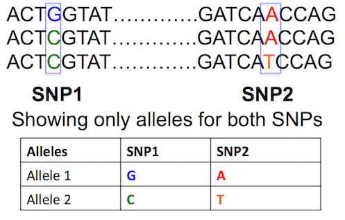
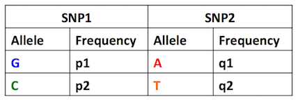

## T distribution vs Normal Distribution


## Bioconductor

Bioconductor is, for R, the largest library to do bioinformatics and statistical genetics.  

## Install Bioconductor

To install 
```{r install bioconudctor}
## try http:// if https:// URLs are not supported
source("https://bioconductor.org/biocLite.R")
biocLite()
```

## To install
```{r}
source("https://bioconductor.org/biocLite.R")
biocLite()
```

## Locus

Think of this an interval or a union of intervals across a set of base pairs.  


## Linkage Disequilibrium 
Linkage equilibrium occurs when the genotype present at one locus is independent of the
genotype at a second locus.
Linkage disequilibrium occurs when genotypes at the two loci are not independent of another.

## Calculation of Linkage Disequilibrium
Suppose there are two genes on Chromosome 5 of James, each with two alleles





## Linkage Disequilibrium
For shortage, Linkage Disequilibrium is abreviated LD

i.e. Assume we are in LD.  

## Linkage Disequilibrium

For better understanding of LD calculation, it is divided
into five steps:

## LD Calculation Step 1

If p1 and p2 =frequency of the alleles at SNP1 and
q1 and q2 =frequency of the alleles at SNP2 then
in tabular form it could be written as follows 



## Haplotype Defintion

A haplotype is, in the simplest terms, a specific group of genes or alleles that progeny inherited from one parent.

This means what variants in each gene does mom or dad pass down to child.  

The haplotype frequency, then, is the frequency that a particular haplotype exists at a particular locus for particular alleles.  

You can read more about haplotype frequency estimation here:
http://www.stat.washington.edu/thompson/Stat550/Notes/2013/Chap_1_Secs_5-6.pdf


## Linkage Disequilibrium
This can be found at:
http://pbgworks.org/sites/pbgworks.org/files/measuresoflinkagedisequilibrium-111119214123-phpapp01_0.pdf


## Bonferroni Correction

As we saw last week, Bonferroni correction can be used to change the critical p value that we want to hit

## Bonferroni Correction Code

```{r}
pvals = c(.001, .001, .001, .02, .22, .59, .87)
BONF = p.adjust(pvals, "bonferroni")
BH = p.adjust(pvals, "BH")
res = cbind(pvals, BH=round(BH, 3), BONF=round(BONF, 3))
```

## Bonferroni Correction Code (Part 2)
```{r}
# set a method so this will fit
plot.p.values <- function(){
  matplot(res, ylab="p-values", xlab="sorted outcomes")
  abline(h=0.05, lty=2)
  matlines(res)
  legend(1, .9, legend=c("Bonferroni", "Benjamini-Hochberg", "Unadjusted"), 
       col=c(3, 2, 1), lty=c(3, 2, 1), cex=0.7)
}
```

## Bonferroni Correction Code (Part 3)
```{r}
plot.p.values()
```