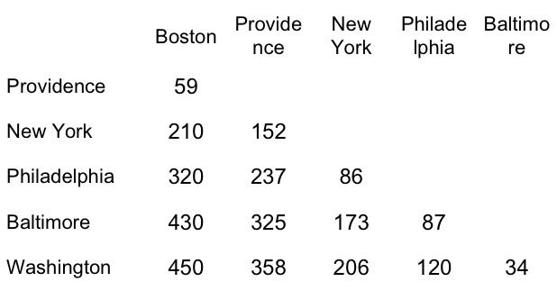
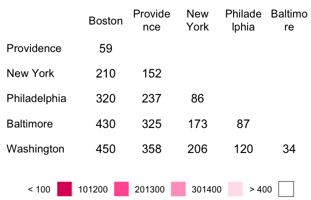
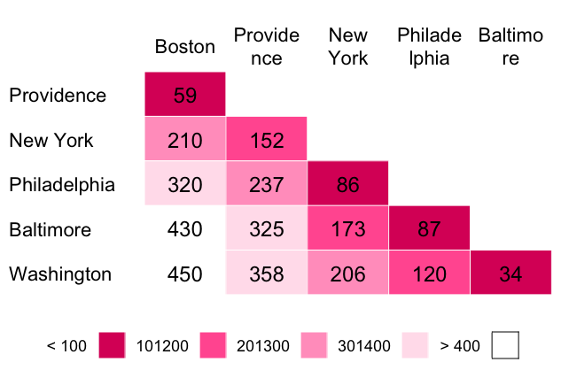
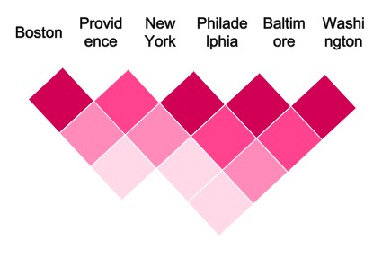
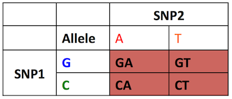
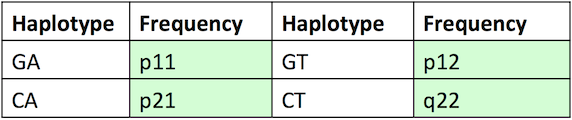
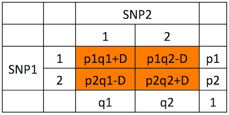

## T distribution

* This distribution was discovered by W. S. Gosset, the chief statistician of the Guinness brewery in Dublin, Ireland. He discovered the t-distribution in order to deal with small samples arising in statistical quality control.

* The brewery had a policy against employees publishing under their own names, thus he published is results about the t-distribution under the pen name "Student", and that name has become attached to the distribution.

## T distribution vs Normal Distribution
* The normal distribution is used when the population distribution of data is assumed normal. 

* The t statistic is an estimate of the standard error of the mean of the population or how well known is the mean based on the sample size.

## T distribution

If $\bar{X}$ is the sample mean and S the sample standard deviation for a random sample of size $n$ from a population with mean $\mu$ and standard deviation $\sigma$, define 

$$
Z = \frac{\bar{X} - \mu}{\sigma/\sqrt(n)}
$$
and
$$
T =\frac{\bar{X} - \mu}{se(\bar{X})} = \frac{\bar{X} - \mu}{S / \sqrt{n}}
$$

## T distribution

We know:
* both Z and T are approximately Normal(0, 1), if n is large.
* Z is exactly Normal(0, 1) regardless of the size of n, if the population distribution is exactly normal.
* T is exactly Student(n - 1), if the population distribution is exactly normal.

## T distribution

* We know item 3 just by definition. That is how the t-distribution was originally defined.

* Comparing 1 and  3, it is clear that the t-distribution is close to the Normal(0, 1) distribution if n is large. Hence the difference only matters when n is small. 

* For this reason the t-distribution is sometimes called a "small sample" distribution, but that name is misleading in two ways

## T distribution

The distribution of T is Student(n - 1) for all sample sizes n large or small.
The key assumption is not that n is small, but that the population is exactly normal.

## T distribution code example 1 part 1

```{r define_sampling_distribution}
n <- 5;nsim <- 1000;mu <- 500;sigma <- 100
xbar <- double(nsim)
sx <- double(nsim)
for (i in 1:nsim) {
   x <- rnorm(n, mu, sigma)
   xbar[i] <- mean(x)
   sx[i] <- sd(x)
}
zstat <- (xbar - mu) / (sigma / sqrt(n))
tstat <- (xbar - mu) / (sx / sqrt(n))
nbin <- 30
zout <- hist(zstat, probability=TRUE, plot=FALSE, breaks=nbin)

```

## T distribution code example 1 part 2

```{r}
tout <- hist(tstat, probability=TRUE, plot=FALSE, breaks=nbin)
foo <- range(-3, 3, zout$breaks, tout$breaks)
xx <- seq(foo[1], foo[2], length=1000)
zz <- dnorm(xx)
tt <- dt(xx, df=n-1)
```

## T distribution code example 1 part 3
```{r}
samplingDistributionZStat<-function() {
  hist(zstat, probability=TRUE, xlim=range(xx), xlab="",
   ylim=range(0, zout$intensities, zz, tt), breaks=nbin,
   main=paste("Sampling Distribution of z-statistic, n =", n))
  lines(xx, zz)
  lines(xx, tt, col=2)
}
```

## T distribution code example 1 part 4
```{r plot_sampling_distribution_z_state}
samplingDistributionZStat()
```

## T distribution code example 1 part 5
```{r}
samplingDistributionTStat<-function() {
  hist(tstat, probability=TRUE, xlim=range(xx), xlab="",
   ylim=range(0, tout$intensities, zz, tt), breaks=nbin,
   main=paste("Sampling Distribution of t-statistic, n =", n))
  lines(xx, zz)
  lines(xx, tt, col=2)
}
```

## distribution code example 1 part 6
```{r sampling_distribution_t_stat}
samplingDistributionTStat()
```

## T distribution compare curves
* One why to compare Student's t-distribution and the standard normal distribution is just to run the simulation in the preceding section with different sample sizes n.

* Another way is just to plot the theoretical density curves for various t-distributions and the standard normal distribution (no simulation).

## T distribution compare curves (part 2)

```{r}
compareCurves<-function(){
  n <- c(3, 4, 5, 10, 15, 20, 25, 30)
  df <- n - 1
  quantile <- qt(1 - 0.01, df=min(df))
  quantile
  xx <- seq(-quantile, quantile, length=1000)
  plot(xx, dnorm(xx), type="l", xlab="", ylab="Relative Frequency")
  for (i in 1:length(df)) {
    lines(xx, dt(xx, df=df[i]), col=i+1)
  }
}
```

## T distribution compare curves (part 3)
increasing in sample size means we approach normal distribution (tallest one)

```{r}
compareCurves()
```

## T distribution example

Acme Corporation manufactures light bulbs. The CEO claims that an average Acme light bulb lasts 300 days. A researcher randomly selects 15 bulbs for testing. The sampled bulbs last an average of 290 days, with a standard deviation of 50 days. If the CEO's claim were true, what is the probability that 15 randomly selected bulbs would have an average life of no more than 290 days?

## T distribution solution

The first thing we need to do is compute the t score, based on the following equation:
$$
\begin{align}
t & = \frac{\bar{x} - \mu}{s/\sqrt{n}} \\
& = \frac{290-300}{50 / \sqrt{15}} = \frac{-10}{12.909945} = - 0.7745966
\end{align}
$$
Where $\bar{x}$ is the sample mean, $\mu$ is the population mean, s is the standard deviation of the sample, and n is the sample size.


## Homework 

* If you have any questions please email me and we can meet and work on it.  

* If you need an extension on homework, please let me know as we did have a snow day last week.  

## Difficult Material

*  One of the difficulties of this is that it combines biology, stats, and programming

*  Don't feel bad if this is difficult, because it is.  

## Bioconductor

Bioconductor is, for R, the largest library to do bioinformatics and statistical genetics.  

## Install Bioconductor

To install 
```{r install bioconductor}
## try http:// if https:// URLs are not supported
source("https://bioconductor.org/biocLite.R")
biocLite()
```

## Locus

Think of this an interval or a union of intervals across a set of base pairs.  


## Linkage Disequilibrium 
Linkage equilibrium occurs when the genotype present at one locus is independent of the
genotype at a second locus.
Linkage disequilibrium occurs when genotypes at the two loci are not independent of another.

## Calculation of Linkage Disequilibrium
Suppose there are two genes on Chromosome 5 of James, each with two alleles


## Linkage Disequilibrium
For shortage, Linkage Disequilibrium is abreviated LD

i.e. Assume we are in LD.  

## Distances Among East Coast Cities



## Distances Among East Coast Cities (part 2)



## Distances Among East Coast Cities (part 3)



## Distances Among East Coast Cities (part 4)



## Linkage Disequilibrium

For better understanding of LD calculation, it is divided
into five steps:

## LD Calculation Step 1

If p1 and p2 =frequency of the alleles at SNP1 and
q1 and q2 =frequency of the alleles at SNP2 then
in tabular form it could be written as follows 


## Haplotype Defintion

A haplotype is, in the simplest terms, a specific group of genes or alleles that progeny inherited from one parent.

This means what variants in each gene does mom or dad pass down to child.  

The haplotype frequency, then, is the frequency that a particular haplotype exists at a particular locus for particular alleles.  

You can read more about haplotype frequency estimation here:
http://www.stat.washington.edu/thompson/Stat550/Notes/2013/Chap_1_Secs_5-6.pdf

## LD Calculation Step 2
From our example of two SNPs each with two alleles all
possible haplotypes are 




## LD Calculation Step 2 (part 2)
Suppose haplotype frequencies are as follows:



## Linkage Equilibrium (Step 3)

When haplotype frequencies are equal to the product of their corresponding allele frequencies, it means the loci are in linkage equilibrium.

  Haplotype Frequency                 Product of Allele Frequency     
---------------------     ---------   ----------   
     $p_{11}$                =        $p_1q_1$        
     $p_{12}$                =        $p_1q_2$       
     $p_{21}$                =        $p_2q_1$        
     $p_{22}$                =        $p_2q_2$ 

## Step 4: Calculate Difference

We can deduce linkage disequilibrium for each haplotype as the deviation of observed haplotype frequency from its corresponding allelic frequencies expected under equilibrium.  
  
  


## Step 4: Calculate Difference

After solving above for D, we get as follows: 

$$
D_{11} = p_{11} - p_1q_1 \\
D_{12} = p_{12} - p_1q_2 \\
D_{21} = p_{21} - p_2q_1 \\
D_{22} = p_{22} - p_2q_2
$$

Where the $D_{ij}$'s are our difference, the $p_{ij}$'s are the observed, and the $p_iq_j$'s are our expectation under equilibrium.  

## Step 5: Calculation of Linkage Disequilibrium Measure D

While we are not going to prove, this (maybe an exercise?), the measure we can show to be:

$$
D = p_{11}p_{22} − p_{12}p_{21}
$$

## LD Example 1

If allele frequencies of $p_1$ and $q_1$ are both 0.5 and equilibrium occurs (only Ab and aB exist in the population)

$$
P_{11} = p_1q_1= (0.5)(0.5) = 0.25 \\
P_{22} = p_2q_2= (0.5)(0.5) = 0.25 \\
P_{12} = p_1q_2= (0.5)(0.5) = 0.25 \\
P_{21} = p_2q_1= (0.5)(0.5) = 0.25 
$$

## LD Example 1

Now calculate D
$$
\begin{align}
D & = (P_{11})(P_{22}) -(P_{12})(P_{21}) \\
  & = (0.25)(0.25) - (0.25)(0.25) = 0 
\end{align}
$$
So what has happened here?
<div class="notes">
Linkage Equilibrium!
</div>

## Standardization of LD Measure (D)

* Sometimes, depending on allele frequency of two loci, the value of D can be negative
* Why is this a problem?
* To solve this, we standardize the value.  

<div class="notes">
Because this is a measurement of frequencies, so it can't be negative
</div>

## Standardization of D 

In a common standardization method, a relative measure of disequilibrium (D) compared to its maximum is used: 
$$
D` = \frac{D}{D_{max}}
$$

When D is positive: $D_{max} = min[(p_1q_2)\,or\,(p_2q_1)]$

When D is negative: $D_{max} = min[(p_1q_1)\,or\,(p_2q_2)]$

This standardization makes D-values range
between 0 and 1 

## Correlation Coefficient as a Measure of LD

Another commonly used measure to calculate LD between loci is Pearson coefficient of correlation (r)
$$
r = \frac{D}{\sqrt{p_1p_2q_1q_2}} = \frac{D}{\sqrt{p_1(1-p_1)q_1(1-q_1)}}
$$
However, squared coefficient of correlation ($r^2$) is often used to remove the arbitrary sign introduced.  

Why are these two quantities the same?

## Degrees of Freedom

* The number of degrees of freedom is the number of values in the final calculation of a statistic that are free to vary. 

* The number of independent ways by which a dynamic system can move, without violating any constraint imposed on it, is called number of degrees of freedom.

## Chi Squared Distribution

If $Z_1, . . . , Z_k$ are independent standard normal random variables, then
$$
\chi^2 = Z_1^2 + . . . + Z_k^2
$$
has a $\chi^2$ distribution with k degrees of freedom.  

## Chi Squared Distribution Part 2

The functions **pchisq()** and qchisq() find probabilities and
quantiles, respectively, from the χ
2 distributions

## Testing for LD with D

* $D_{ij} = 0$ corresponds to the status of no linkage disequilibrium
* It is often of interest to test the null hypothesis

$$
H_0 : D_{ij} = 0 \\
H_a : D_{ij} \neq 0 
$$

Look familiar?  As this turns out, we can't use our standard normal approach.  

## Testing for LD with D (part 2)

One way to do this is to use a chi-square statistic z:

$$
Z^2 = \left(\frac{\hat{D_{ij}}-E_0(\hat{D_{ij}})}{Var_0(\hat{D_{ij}})}\right)^2
$$

Where $E_0$ is the expected value and $Var_0$ is the variance calculated under the assumption of no LD i.e. $D_{ij} = 0$ 


## Measuring LD with $r^2$

Define a random variable $X_A$ to be 1 if the allele at the first locus is $A$ and 0 if the allele is $a$.  What is this?

Define a random variable $X_B$ to be 1 if the allele at the second locus is $B$ and 0 if the allele is $b$.

$$
\begin{align}
r_{AB} & = \frac{COV(X_A,X_B)}{\sqrt{Var(X_A)Var(X_B)}} = \frac{D_{AB}}{\sqrt{p_A(1-p_A)p_B(1-p_B)}}
\end{align}
$$
And for $r^2$
$$
\begin{align}
r_{AB}^2 &= \left(\frac{D_{AB}}{\sqrt{p_A(1-p_A)p_B(1-p_B)}}\right)^2
\end{align}
$$

## Measuring LD with $r^2$

It turns out that we can state:
$$
X^2 = N\hat{r}^2
$$
Where N is the number of haplotypes

## LD Example (part 1)

Let’s assume that we have genotypic data for the two SNPs with two alleles each 

Genotypic data
$$
GA = 474 \\
GT = 611 \\
CA = 142 \\
CT = 773 \\
Total = 2000 \\
$$

## LD Example (part 2)

Haplotype Frequencies:

$$
GA = 474 / 2000 = .2370 \\
GT = 611 / 2000 = .3055 \\
CA = 142 / 2000 = .0710 \\
CT = 773 / 2000 = .3865
$$

Allele Frequencies:

$$
G = 0.542 \\ 
C = 0.457 \\
A = 0.308 \\
T = 0.692 \\
$$

## LD Example (part 3) 
Input values in the equation for D to calculate
linkage disequilibrium

$$
\begin{align}
D & = P_{11}P_{22} - P_{12}P_{21} = \\
& = (0.2370)(0.3865) - (0.3055)(0.0710) \\
& = 0.0699
\end{align}
$$

Now calculate $D_{max}$.  Remember $D_{max} = min[(p_1q_2),(p_2q_1)]$ 
$$
\begin{align}
D_{max} & = min[p_1q_2,p_2q_1] \\
& = min[(0.5425)(0.692),(0.4575)(0.308)] \\
& = 0.141
\end{align}
$$

## LD Example (part 4) 

So:
$$
D' = \frac{D}{D_{max}} = \frac{0.0699}{0.141} = 0.496
$$

To look at correlation coefficient:
$$
\begin{align}
r & = \frac{D}{\sqrt{p_1p_2q_1q_2}} = \frac{0.0699}{\sqrt{(0.5425)(0.4575)(0.308)(0.692)}} \\
& = \frac{0.0699}{0.23} = 0.304 \\
r^2 & = 0 .092
\end{align}
$$

## LD Example Conclusion

* LD is 50% of the theoretical maximum

* What about $r^2$ score?

* $D'$ and $r^2$ have a big difference in that a high value of $D'$ does not mean that one locus can predict the other with high accuracy, which in the case of say imputing SNPs could be a major issue. 

* On the other hand, an $r^2$ of 1 implies perfect predictability; if we know the allele at one locus we can predict perfectly the allele at the second locus and vice-versa. 

i.e. we can't predict one allele from the other in this.  


## Linkage Disequilibrium
This can be found at:
http://pbgworks.org/sites/pbgworks.org/files/measuresoflinkagedisequilibrium-111119214123-phpapp01_0.pdf

## LD in R
Lets look at an LD dataset
```{r}
biocLite("snpStats") # install the snpStats bioconductor package.   
library(snpStats)
data(ld.example)
```

## LD in R (part 2)

The data are drawn from the International HapMap Project and concern 603 SNPs over a 1mb region of chromosome 22 in sample of Europeans (ceph.1mb) and a sample of Africans (yri.1mb):
```{r hapmap_data}
ceph.1mb
yri.1mb
```

## LD in R (part 3)
The details of these SNP are stored in the dataframe support.ld:

```{r snp_data}
class(support.ld)
head(support.ld)
```

## LD in R (part 4)
* The function for calculating measures of linkage disequilibrium (LD) in snpStats is ld. 
* The following two commands call this function to calculate the D-prime and R-squared measures of LD between pairs of SNPs for the European and African samples:
```{r calculate_ld}
ld.ceph <- ld(ceph.1mb, stats=c("D.prime", "R.squared"), depth=100)
ld.yri <- ld(yri.1mb, stats=c("D.prime", "R.squared"), depth=100)
```

## LD Depth
* The argument depth specifies the maximum separation between pairs of SNPs to be considered.
* i.e. $depth=1$ would have specified calculation of LD only between immediately adjacent SNPs

## LD in R(part 5)
* Both ld.ceph and ld.yri are lists with two elements each, named D.prime and R.squared.
* These elements are (upper triangular) band matrices, stored in a packed form defined in the Matrix package. They are too large to be listed, but the Matrix package provides an image.  

## LD in R(part 6)
```{r}
# european population
image(ld.ceph$D.prime, lwd=0)
```

## LD in R(part 7)
```{r}
image(ld.yri$D.prime, lwd=0)
```

## LD in R(part 8)

Takeaways:  
* There are fairly well-defined “blocks” of LD, and
* LD is more pronounced in the Europeans than in the Africans.
The second point is demonstrated by extracting the D-prime values from the matrices.  We can see it by looking at the quantiles.  

```{r}
quantile(ld.ceph$D.prime@x, na.rm=TRUE)
quantile(ld.yri$D.prime@x, na.rm=TRUE)
```

## LD in R (part 9)

* The current plot is pretty hard to see, would be easier to see if we can see it in color.  
* We first create a set of 10 colours ranging from yellow (for low values) to red (for high values)

```{r define color spectrum}
spectrum <- rainbow(10, start=0, end=1/6)[10:1]
print(spectrum)
```

## LD in R (part 10)
```{r}
image(ld.ceph$D.prime, lwd=0, cuts=9, col.regions=spectrum, colorkey=TRUE)
```

## LD in R (part 11)
```{r}
image(ld.ceph$D.prime[75:274,75:274], lwd=0, cuts=9, 
      col.regions=spectrum,colorkey=TRUE)
```

## Why do we care about LD

We care because a lot of the methods out there require LD or use it in some way.  


# More on Hypothesis Testing

## Motivation

* Say you have a set of hypotheses that you wish to test simultaneously. The first idea that might come to mind is to test each hypothesis separately, using some level of significance α.

* At first blush, this doesn’t seem like a bad idea. However, consider a case where you have 20 hypotheses to test, and a significance level of 0.05. What’s the probability of observing at least one significant result just due to chance?

## Calculation

$$
P(at\,least\,one\,result\,is\,significant) = \\
1 - P(no\,results\,are\,significant) \\
= 1 - (1 - 0.05)^{20} = 0.641 
$$

So, with 20 tests being considered, we have a 64% chance of observing at least one significantresult, even if all of the tests are actually not significant.

## Bonferroni Correction

As we saw last week, Bonferroni correction can be used to change the critical p value that we want to hit.  

## Bonferroni Correction Code

```{r}
pvals = c(.001, .001, .001, .02, .22, .59, .87)
BONF = p.adjust(pvals, "bonferroni")
BH = p.adjust(pvals, "BH")
res = cbind(pvals, BH=round(BH, 3), BONF=round(BONF, 3))
```

## Bonferroni Correction Code (Part 2)
```{r}
# set a method so this will fit
plot.p.values <- function(){
  matplot(res, ylab="p-values", xlab="sorted outcomes")
  abline(h=0.05, lty=2)
  matlines(res)
  legend(1, .9, legend=c("Bonferroni", "Benjamini-Hochberg", "Unadjusted"), 
       col=c(3, 2, 1), lty=c(3, 2, 1), cex=0.7)
}
```

## Bonferroni Correction Code (Part 3)
```{r}
plot.p.values()
```

## Another Example
```{r p-value example}
require(graphics)
set.seed(123)
x <- rnorm(50, mean = c(rep(0, 25), rep(3, 25)))
p <- 2*pnorm(sort(-abs(x)))
round(p, 3)
round(p.adjust(p), 3)
round(p.adjust(p, "BH"), 3)
```

## Another Example (part 2)
```{r}
## or all of them at once (dropping the "fdr" alias):
p.adjust.M <- p.adjust.methods[p.adjust.methods != "fdr"]
p.adj    <- sapply(p.adjust.M, function(meth) p.adjust(p, meth))
round(p.adj, 3)
## or a bit nicer:
noquote(apply(p.adj, 2, format.pval, digits = 3))
```

## Another Example (part 3)
```{r}
matplot(p, p.adj, ylab="p.adjust(p, meth)", type = "l", 
        asp = 1, lty = 1:6,main = "P-value adjustments")
legend(0.7, 0.6, p.adjust.M, col = 1:6, lty = 1:6)
```


