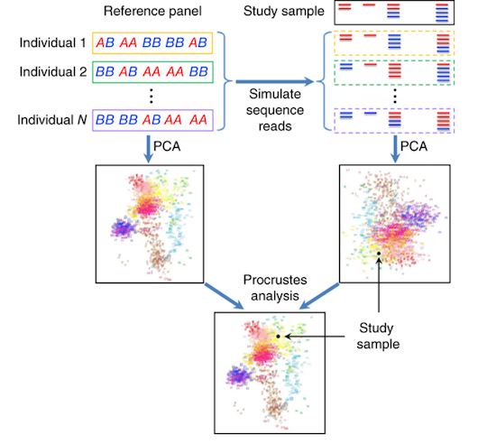
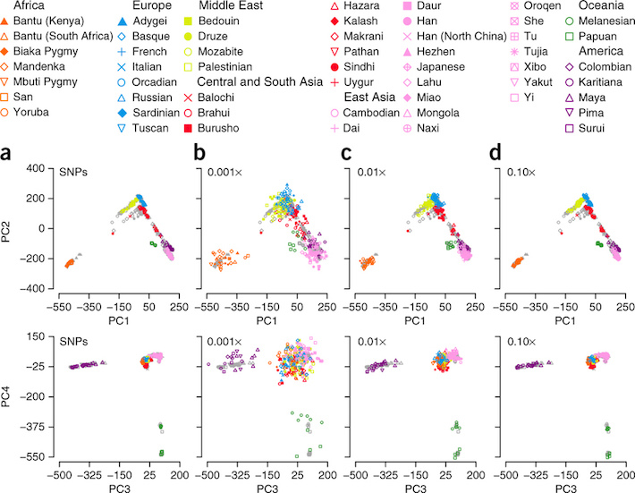

## PCA

* This week we will work with a statistical tool called principal component analysis.  

## What is it?

is a statistical procedure that uses an orthogonal transformation to convert a set of observations of possibly correlated variables into a set of values of linearly uncorrelated variables called principal components. 

Before we get into it, lets introduce the various topics

## Covariance

* Standard deviation and variance only operate on 1 dimension, so that you could
only calculate the standard deviation for each dimension of the data set independently of the other dimensions. 

* However, it is useful to have a similar measure to find out how
much the dimensions vary from the mean with respect to each other

* Covariance is such a measure. Covariance is always measured between 2 dimensions.  If you calculate the covariance between one dimension and itself, you get the variance. 

## Covariance (part 2)

* So, if you had a 3-dimensional data set $(x, y, z)$, then you could measure the
covariance between the x and y dimensions, the x and z dimensions, and the y and z
dimensions. Measuring the covariance between x and x, or y and y, or z and z would
give you the variance of the x, y and z dimensions respectively.

## Covariance (part 3)

The formula for covariance is very similar to the formula for variance. The formula
for variance could also be written like this: 
$$
var(X) = \frac{\sum_{i=1}^n(X_i-\bar{X})(X_i-\bar{X})}{n-1}
$$

where I have simply expanded the square term to show both parts. So given that knowledge,
here is the formula for covariance:

$$
COV(X) = \frac{\sum_{i=1}^n(X_i-\bar{X})(Y_i-\bar{Y})}{n-1}
$$

## Covariance Matrix

A useful way to get all the possible covariance values between all the different
dimensions is to calculate them all and put them in a matrix. So, the definition for
the covariance matrix for a set of data with $n$ dimensions is:
$$
C^{n\times n} = (c_{ij},c_{ij} = cov(DIM_i,DIM_j))
$$

where $C^{n\times n}$ is a matrix with $n$ rows and $n$ columns, and $DIM_x$ is the $x^{th}$ dimension.

## Covariance Matrix Example

3 dimensional covariance matrix
$$
C = \left( \begin{array}{ccc}
cov(x,x) & cov(x,y) & cov(x,z) \\
cov(y,x) & cov(y,y) & cov(y,z) \\
cov(z,x) & cov(z,y) & cov(z,z) \end{array} \right)
$$

Notice the matrix is symmetrical about the diagonal.  Why?
<div class="notes">
Because $cov(a,b) = cov(b,a)$
</div>

## Covariance Example

Calculate covariance between x and y

      x                     y     
------------           ----------   
     10                   43        
     39                   13      
     19                   32
     23                   21
     28                   20

## Covariance Example (part 2)
Mean of x = 23.8, Mean of y = 25.8
$$
\begin{align}
COV(X) & = \frac{\sum_{i=1}^n(X_i-\bar{X})(Y_i-\bar{Y})}{n-1} \\
& = \frac{(-13.8)(17.2) + (15.2)(-12.8) + (-4.8)(6.2) + (-0.8)(-4.8) + (4.2)(-5.8)}{5-1} \\
& = \frac{-237.36 + -194.56 + -29.76 + 3.84 + -24.36}{4} \\
& = \frac{-482.2}{4} = -120.55
\end{align}
$$

## Covariance Example (part 3)

or we can do 
```{r covariance_example}
x=c(10,39,19,23,28)
y=c(43,13,32,21,20)
cov(x,y)
```

## Matrix Multiplication
Example of one non-eigenvector and one eigenvector.  

$$
 \left( \begin{array}{cc}
2 & 3 \\
2 & 1
\end{array} \right) \times \left( \begin{array}{cc}
1 \\
3
\end{array} \right) =\left( \begin{array}{cc}
11 \\
5
\end{array} \right)
$$
and
$$
 \left( \begin{array}{cc}
2 & 3 \\
2 & 1
\end{array} \right) \times \left( \begin{array}{cc}
3 \\
2
\end{array} \right) =\left( \begin{array}{cc}
12 \\
8
\end{array} \right) =4\left( \begin{array}{cc}
3 \\
2
\end{array} \right)
$$

## Matrix Multiplication (part 2)
How a scaled eigenvector is still and eigenvector
$$
2 \times \left( \begin{array}{cc}
3 \\
2
\end{array} \right) =\left( \begin{array}{cc}
6 \\
4
\end{array} \right)
$$
$$
 \left( \begin{array}{cc}
2 & 3 \\
2 & 1
\end{array} \right) \times \left( \begin{array}{cc}
6 \\
4
\end{array} \right) =\left( \begin{array}{cc}
24 \\
16
\end{array} \right) = 4\left( \begin{array}{cc}
6 \\
4
\end{array} \right)
$$

## Eigenvectors

* As you know, you can multiply two matrices together, provided they are compatible
sizes. 

* Eigenvectors are a special case of this. Consider the two multiplications between
a matrix and a vector in the first matrix example

## Eigenvectors (part 2)

* In the first example, the resulting vector is not an integer multiple of the original
vector, whereas in the second example, the example is exactly 4 times the vector we
began with. 

* Why is this? Well, the vector is a vector in 2 dimensional space. The vector [3 2] (from the second example multiplication) represents an arrow pointing from the origin.  The other matrix, the square one, can be thought of as a transformation matrix.

## Properties of Eigenvectors

You should first know that eigenvectors
can only be found for square matrices. And, not every square matrix has eigenvectors.
And, given an $n\times n$ matrix that does have eigenvectors, there are $n$ of them.
Given a $3\times 3$ matrix, there are 3 eigenvectors.

Another property of eigenvectors is that even if I scale the vector by some amount
before I multiply it, I still get the same multiple of it as a result.  

Lastly, all the eigenvectors of a matrix are perpendicular,
ie. at right angles to each other, no matter how many dimensions you have i.e. orthogonal.

## Eigenvectors (part 3)

* Lastly, all the eigenvectors of a matrix are perpendicular,
ie. at right angles to each other, no matter how many dimensions you have i.e. orthogonal.

* This is important because it means that you can express the data in terms of these perpendicular eigenvectors,
instead of expressing them in terms of the $x$ and $y$ axes. We will be doing this later in the section on PCA.

* Often times, eigenvectors are normalized so their length is one.  

## Finding Eigenvectors

How does one go about finding these mystical eigenvectors? Unfortunately, it’s
only easy(ish) if you have a rather small matrix, like no bigger than about $3\times 3$.  

* The usual way to find the eigenvectors is by complicated iterative methods, which are sometimes neccesary.  

## Eigenvalues

In the previous examples, we saw we got an eigenvector of 4.  

Eigenvectors and eigenvalues always come in pairs.  

## Principal Components Analysis

* It is a way of identifying patterns in data, and expressing the data in such a way as to highlight
their similarities and differences

* Since patterns in data can be hard to find in data of high dimension, where the luxury of graphical representation is not available, PCA is a powerful tool for analysing data


## PCA Method Part 1: Substract the mean

For PCA to work properly, you have to subtract the mean from each of the data dimensions.
The mean subtracted is the average across each dimension. So, all the $x$ values have $\bar{x}$ (the mean of $x$) subtracted and all the $y$ values subtracted from $\bar{y}$.  

This produces a data set whose mean is zero.

## PCA Method Part 2: Calculate the covariance matrix

We can do this by doing what we did in a previous section before

## PCA Part 3: Calculate the eigenvectors and eigenvalues of the covariance matrix

* Since the covariance matrix is square, we can calculate the eigenvectors and eigenvalues
for this matrix. These are rather important, as they tell us useful information about
our data. 

## PCA Part 4: Choosing components and forming a feature vector

Here is where the notion of data compression and reduced dimensionality comes into
it. 

In fact, it turns out that the eigenvector with the highest eigenvalue is the principle component of the data set.

In general, once eigenvectors are found from the covariance matrix, the next step
is to order them by eigenvalue, highest to lowest. This gives you the components in
order of significance. 

Now, if you like, you can decide to ignore the components of
lesser significance. You do lose some information, but if the eigenvalues are small, you
don’t lose much.

## PCA Part 4: Choosing components and forming a feature vector

If you leave out some components, the final data set will have less
dimensions than the original. To be precise, if you originally have ✣ dimensions in
your data, and so you calculate  eigenvectors and eigenvalues, and then you choose
only the first $p$ eigenvectors, then the final data set has only $p$ dimensions

What needs to be done now is you need to form a feature vector, which is just
a fancy name for a matrix of vectors. This is constructed by taking the eigenvectors
that you want to keep from the list of eigenvectors, and forming a matrix with these
eigenvectors in the columns

$$
FeatureVector = (eig_1\,eig_2\,...\,eig_n)
$$

## PCA Part 5: Choosing components and forming a feature vector

Once we have chosen the components (eigenvectors) that we wish to keep in our data and formed a feature vector, we simply take the transpose of the vector and multiply it on the left of the original data set, transposed.

$$
FinalData = RowFeatureData\times RowDataAdjust
$$

where $RowFeatureData$ is the matrix with the eigenvectors in the columns tranposed so that the eigenvectors are now in the rows, with the more significant eigenvector at the top.  

$RowDataAdjust$ is the mean-adjusted data transposed.  

## PCA Part 5: Choosing components and forming a feature vector

What will this give us?  It will give us the original data solely in terms of the vectors
we chose.  This was why it was important that eigenvectors are always perpendicular to each other.

So what have we done here? Basically we have transformed our data so that is
expressed in terms of the patterns between them, where the patterns are the lines that
most closely describe the relationships between the data. 

This is helpful because we have now classified our data point as a combination of the contributions from each of those lines. Initially we can have simple x and y axes. This is fine, but the x and y values of each data point don’t really tell us exactly how that point relates to the rest of the data. 

In the case of the transformation using both eigenvectors, we have simply altered the data so that it is in terms of those eigenvectors instead of
the usual axes.

## PCA Example in R
I will use the iris dataset for the demonstration. The data contain four continuous variables which corresponds to physical measures of flowers and a categorical variable describing the flowers’ species.
```{r pca_example}
# Load data
data(iris)
head(iris, 3)
```

## PCA Example in R (part 2)

We will apply PCA to the four continuous variables and use the categorical variable to visualize the PCs later. Notice that in the following code we apply a log transformation to the continuous variables as suggested by:

http://tgmstat.wordpress.com/2013/11/28/computing-and-visualizing-pca-in-r/#ref1 

And set center and scale. equal to TRUE in the call to prcomp to standardize the variables prior to the application of PCA:

## PCA Example in R (part 3)

```{r}
# log transform 
log.ir <- log(iris[, 1:4])
ir.species <- iris[, 5]
 
# apply PCA - scale. = TRUE is highly 
# advisable, but default is FALSE. 
ir.pca <- prcomp(log.ir,
                 center = TRUE,
                 scale. = TRUE) 
```

## PCA Example in R (part 4)

Since skewness and the magnitude of the variables influence the resulting PCs, it is good practice to apply skewness transformation, center and scale the variables prior to the application of PCA. 

In the example above, we applied a log transformation to the variables but we could have been more general and applied a different transformation.  

## PCA Example in R (part 5)

* The **prcomp** function returns an object of class prcomp, which have some methods available. 

* The print method returns the standard deviation of each of the four PCs, and their rotation (or loadings), which are the coefficients of the linear combinations of the continuous variables.

## PCA Example in R (part 6)

```{r prcomp}
# print method
print(ir.pca)
```

## PCA Example in R (part 7)

* The plot method returns a plot of the variances (y-axis) associated with the PCs (x-axis). The Figure below is useful to decide how many PCs to retain for further analysis. 

* In this simple case with only 4 PCs this is not a hard task and we can see that the first two PCs explain most of the variability in the data.

## PCA Example in R (part 8)

```{r}
# plot method
plot(ir.pca, type = "l")
```

## PCA Example in R (part 9)

```{r}
install.packages("devtools")
library(devtools)
install_github("ggbiplot", "vqv")
library(ggbiplot)
```

## PCA Example in R (part 10)

```{r}
plotPCA<-function(){
g <- ggbiplot(ir.pca, obs.scale = 1, var.scale = 1, 
              groups = ir.species, ellipse = TRUE, 
              circle = TRUE)
g <- g + scale_color_discrete(name = '')
g <- g + theme(legend.direction = 'horizontal', 
               legend.position = 'top')
print(g)
}
```

## PCA Example in R (part 11)

```{r}
plotPCA()
```


## Install Bioconductor and packages

```{r install_packages}
source("http://bioconductor.org/biocLite.R")
biocLite("gdsfmt")
biocLite("SNPRelate")
# Load the R packages: gdsfmt and SNPRelate
library(gdsfmt)
library(SNPRelate)
```

## PCA on vcf data (part 1)
```{r load_vcf_data}
## Load our vcf data
vcf.fn <- system.file("extdata", "sequence.vcf", package="SNPRelate")
## we can also explictly load the data
## vcf.fn <- "C:/your_folder/your_vcf_file.vcf"
```

## PCA on vcf data (part 2)

```{r}
# Reformat
snpgdsVCF2GDS(vcf.fn, "test.gds", method="biallelic.only")
snpgdsSummary("test.gds")
```

## PCA on vcf data (part 3)
```{r}
# Open the GDS file
genofile <- snpgdsOpen(snpgdsExampleFileName())
pop_code <- read.gdsn(index.gdsn(genofile, path="sample.annot/pop.group"))
table(pop_code)
```


## PCA on vcf data (part 4)

```{r hap_map_ethnicity_values}
# Display the first six values
head(pop_code)
```

## HapMap populations

    Key     Description    
-------     ------ 
    ASW     African ancestry in Southwest USA    
    CEU     Utah residents with Northern and Western European ancestry from the CEPH collection   
    CHB     Han Chinese in Beijing, China
    CHD     Chinese in Metropolitan Denver, Colorado
    GIH     Gujarati Indians in Houston, Texas
    JPT     Japanese in Tokyo, Japan
    LWK     Luhya in Webuye, Kenya
    MXL     Mexican ancestry in Los Angeles, California

## HapMap populations (part 2)
    Key     Description  
-------     ------ 
    MKK     Maasai in Kinyawa, Kenya
    TSI     Toscani in Italia
    YRI     Yoruba in Ibadan, Nigeria
    
## PCA on vcf data (part 5)

* It is suggested to use a pruned set of SNPs which are in approximate linkage equilibrium with each other to avoid the strong influence of SNP clusters in principal component analysis and relatedness analysis.

* Interesting paper relating to this here:
https://cdr.lib.unc.edu/indexablecontent/uuid:0a68bb86-def4-4493-ae41-2d3228668b84

* This is called LD-based SNP pruning.  

## PCA on vcf data (part 6)

```{r ld_snp_pruning}
set.seed(1000)
# Try different LD thresholds for sensitivity analysis
snpset <- snpgdsLDpruning(genofile, ld.threshold=0.2)
```


## PCA on vcf data (part 7)
Now we can see all the names of our snpset.  Question: what do we not see here?

```{r}
names(snpset)
# Get all selected snp id
snpset.id <- unlist(snpset)
```


## PCA on vcf data (part 8)
The functions in SNPRelate for PCA include calculating the genetic covariance matrix from genotypes, computing the correlation coefficients between sample loadings and genotypes for each SNP, calculating SNP eigenvectors (loadings), and estimating the sample loadings of a new dataset from specified SNP eigenvectors.

## Quick review: Covariance matrix and covariance

## Review eigenvectors and eigenvalues

## PCA on vcf data (part 9)

```{r run_pca}
# Run PCA
pca <- snpgdsPCA(genofile, snp.id=snpset.id, num.thread=2)
```

## PCA on vcf data (part 10)

* The following codeshows how to calculate the percent of variation is accounted for by the top principal components. 

* It is clear to see the first two eigenvectors hold the largest percentage of variance among the population, although the total variance accounted for is still less the one-quarter of the total.

## PCA on vcf data (part 11)

```{r}
# variance proportion (%)
pc.percent <- pca$varprop*100
head(round(pc.percent, 2))
```

## PCA on vcf data (part 12)
In the case of no prior population information, we can compose it
```{r}
tab <- data.frame(sample.id = pca$sample.id,
    EV1 = pca$eigenvect[,1],    # the first eigenvector
    EV2 = pca$eigenvect[,2],    # the second eigenvector
    stringsAsFactors = FALSE)
head(tab)
```

## PCA on vcf data (part 13)

```{r plot_pca}
# Draw
plot(tab$EV2, tab$EV1, xlab="eigenvector 2", ylab="eigenvector 1")
```

## PCA on vcf data (part 14)

```{r}
# Get sample id
sample.id <- read.gdsn(index.gdsn(genofile, "sample.id"))
# Get population information
#   or pop_code <- scan("pop.txt", what=character())
#   if it is stored in a text file "pop.txt"
pop_code <- read.gdsn(index.gdsn(genofile, "sample.annot/pop.group"))
# assume the order of sample IDs is as the same as population codes
head(cbind(sample.id, pop_code))
```

## PCA on vcf data (part 15)
```{r}
# Make a data.frame
tab <- data.frame(sample.id = pca$sample.id,
    pop = factor(pop_code)[match(pca$sample.id, sample.id)],
    EV1 = pca$eigenvect[,1],    # the first eigenvector
    EV2 = pca$eigenvect[,2],    # the second eigenvector
    stringsAsFactors = FALSE)
head(tab)
```


## PCA on vcf data (part 16)
```{r}
# Draw
graphpca <- function() {
plot(tab$EV2, tab$EV1, col=as.integer(tab$pop), xlab="eigenvector 2",
     ylab="eigenvector 1")
legend("bottomright", legend=levels(tab$pop), pch="o",
       col=1:nlevels(tab$pop))
}
```

## PCA on vcf data (part 17)
```{r draw_it}
graphpca()
```

## PCA for ancestry

Each principal component represents a direction in the feature space in which the data varies the most. When performing PCA on dense genotyping data these axes of variation represent genetic ancestry.  

Recent paper that tries to do this:

http://www.nature.com/ng/journal/v46/n4/full/ng.2924.html


## PCA for ancestry

that introduces the method, LASER, that  gets around this problem by estimating ancestry of sequenced individuals using off-target reads without directly calling genotypes. 

The LASER algorithm first  constructs a PCA map using the the reference panel of individuals. It places each study sample into the reference PCA map one at a time. 

It does this by simulating sequence reads for each of the reference individuals to exactly match the coverage of the study sample. 

## PCA for ancestry

To construct this second PCA map, LASER  uses the pile up counts of non-reference base pairs in the study and (simulated) reference sample reads. 

The final step applies Procrustes analysis to transform reference and study sample points from this second PCA into the original PCA  space constructed with the reference genotypes. 

LASER computes a Procrustes similarity statistic, ranging from 0 to 1, that  to compare the mappings between the two PCA spaces for reference samples. The higher this value, the more confident one can be in the placement of the study sample in the reference PCA space.

## PCA for ancestry



## PCA for ancestry

The authors randomly selected 238 individuals from the HGDP dataset  as test samples and the remaining 700 as the reference samples. As the simulated sequence coverage increases, the Procrustes similarity score increases from .950 (.001x) .994 (.01x) .999 (.10x). 


## PCA for ancestry


