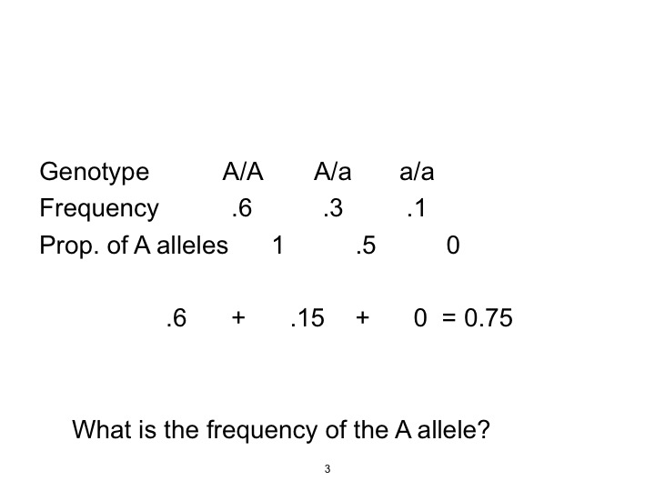
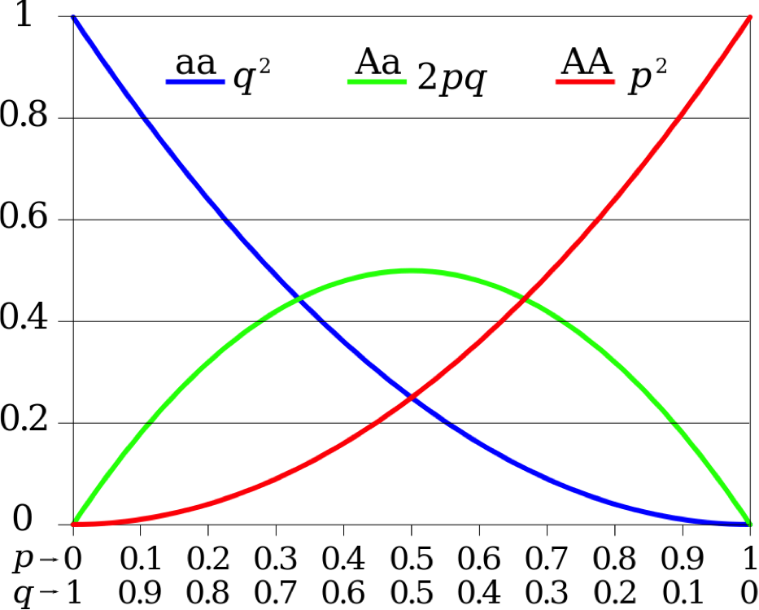
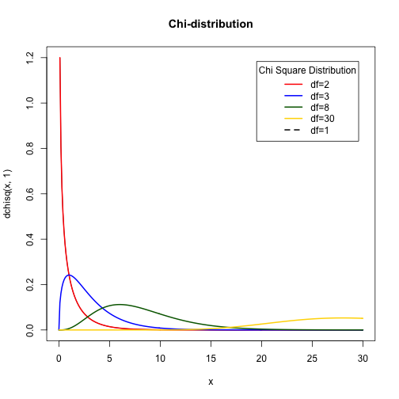
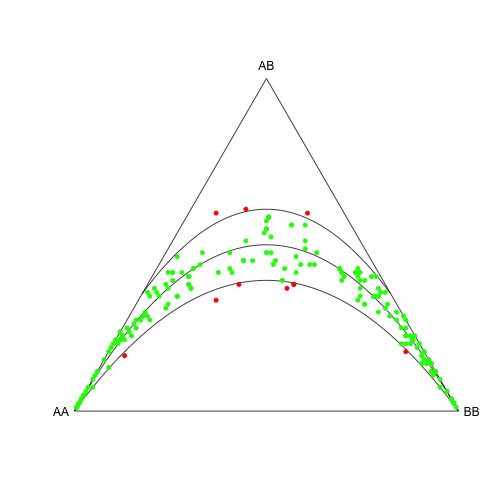
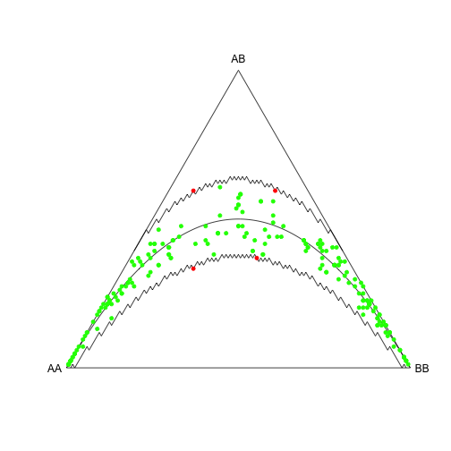

Week6_Notes: Hardy Weinberg, More PCA
========================================================
author: Alexander Frieden
date: 3/07/2016


Hardy Weinberg
========================================================
In 1908 the Mathematician G.H. Hardy wrote in Science about an observation he had.  

It turned out a German Physician Wilhelm Weinberg had come up with the same thing.  

Thus this equation that was known as Hardy's law was now Hardy Weinberg


The Hardy–Weinberg principle, also known as the Hardy–Weinberg equilibrium, model, theorem, or law, states that allele and genotype frequencies in a population will remain constant from generation to generation in the absence of other evolutionary influences. 

Example
============================================================




Example (part 2)
===================================
In general we let $f_{A/A}$,$f_{A/a}$, and $f_{a/a}$ be the three genotype frequencies at a locus with two alleles then the population frequencies of alleles A are given by 
$$
\begin{align}
p&=f_{A/A} + 1/2f_{A/a} \\
q&=f_{a/a} + 1/2f_{A/a}
\end{align}
$$

Note that p + q = 1.  


Hardy Weinberg Part 3
========================================================
How can we get genotype frequencies from allele 
frequencies?

Assuming random mating, the equilibrium genotype 
frequencies will be

$$
\begin{align}
&f_{A/A} = p^2 \\
&f_{A/a} = 2pq \\
&f_{a/a} = q^2
\end{align}
$$

These proportions are obtained after a single generation of
random mating.

Hardy Weinberg Part 4
========================================================
What are the allele frequencies in the next generation?

We compute:
$$
\begin{align}
p' &= f_{A/A} + \frac{1}{2}f_{A/a} \\
   &=p^2 + \frac{1}{2}(2pq) = p^2 + pq \\
   &=p(p + q) = p(1) = p

\end{align}
$$

The allele frequencies are unchanged!


Hardy Weinberg Part 5
========================================================


Hardy Weinberg Part 5 Explanation
========================================================
Hardy–Weinberg proportions for two alleles: the horizontal axis shows the two allele frequencies p and q 

the vertical axis shows the expected genotype frequencies. 

Each line shows one of the three possible genotypes.

Hardy Weinberg Part 6
========================================================

Note that rare alleles are rarely found in homozygotes


HWE Example
=======================================
Albinism is a rare genetically inherited trait that is only expressed in the phenotype of homozygous recessive individuals (aa).  

The most characteristic symptom is a marked deficiency in the skin and hair pigment melanin. 

This condition can occur among any human group as well as among other animal species.  The average human frequency of albinism in North America is only about 1 in 20,000.

HWE Example (part 2)
=======================================

Referring back to the Hardy-Weinberg equation (p² + 2pq + q² = 1), the frequency of homozygous recessive individuals (aa) in a population is q².  Therefore, in North America the following must be true for albinism:
$$
q^2 = \frac{1}{20,000} = 0.00005
$$

By taking the square root of both sides of this equation, we get:   

$$
q=.00707
$$

In other words, the frequency of the recessive albinism allele (a) is $.00707$ or about 1 in 140.  Knowing one of the two variables $(q)$ in the Hardy-Weinberg equation, it is easy to solve for the other $(p)$.

HWE Example (part 3)
=======================================

Solving:
$$
\begin{align}
p &= 1 - q \\
  &= 1 - 0.00707 \\
  &= 0.99293
\end{align}
$$
The frequency of the dominant, normal allele (A) is, therefore, .99293 or about 99 in 100.

HWE Example (part 4)
=======================================
The next step is to plug the frequencies of p and q into the Hardy-Weinberg equation:


$$
p^2 + 2pq + q^2 = 1 \\
(.993)^2 + 2 (.993)(.007) + (.007)^2 = 1 \\
.986 + .014 + .00005 = 1
$$

HWE Example (part 4)
========================================
This gives us the frequencies for each of the three genotypes for this trait in the population:

$p^2$ =
predicted frequency
of homozygous
dominant individuals	 = .986 = 98.6%

$2pq$ =
predicted frequency
of heterozygous
individuals	 = .014 = 1.4%

$q^2$ =
predicted frequency
of homozygous
recessive individuals 
(the albinos)	 = .00005 = .005%

HWE Example (part 5)
========================================

With a frequency of .005% (about 1 in 20,000), albinos are extremely rare.  However, heterozygous carriers for this trait, with a predicted frequency of 1.4% (about 1 in 72), are far more common than most people imagine.  There are roughly 278 times more carriers than albinos.  Clearly, though, the vast majority of humans (98.6%) probably are homozygous dominant and do not have the albinism allele.

Value of HWE
==========================================

By the outset of the 20th century, geneticists were able to use Punnett squares to predict the probability of offspring genotypes for particular traits based on the known genotypes of their two parents when the traits followed simple Mendelian rules of dominance and recessiveness.  

The Hardy-Weinberg equation essentially allowed geneticists to do the same thing for entire populations.

Hardy Weinberg Implementation
=========================================

```r
install.packages("HardyWeinberg", repos = "http://cran.us.r-project.org")
```

```

The downloaded binary packages are in
	/var/folders/tj/8dxhxfns3fb0fx5kswwdvjbr0000gp/T//Rtmpe9jtaQ/downloaded_packages
```

```r
library("HardyWeinberg")
```


R Example 
==================================
We store the genotype counts (298, 489 and 213 for $MM$, $MN$ and $NN$ respectively)

```r
x <- c(MM = 298, MN = 489, NN = 213)
HW.test <- HWChisq(x, verbose = TRUE)
```

```
Chi-square test with continuity correction for Hardy-Weinberg equilibrium (autosomal)
Chi2 =  0.1789563 DF =  1 p-value =  0.6722717 D =  -3.69375 f =  0.01488253 
```

R Example (part 2)
=============================================

This shows that the chi-square statistic has value 0.179, and that the corresponding p value
for the test is 0.6723. Taking Taking a significance level of $\alpha = 0.05$, we do not reject HWE
for the mn locus. 

R Example (part 3)
=============================================

When verbose is set to FALSE (default) the test is silent, and HW.test is
a list object containing the results of the test (chi-square statistic, the p value of the test,
half the deviation from HWE (D) for the heterozygote $D = \frac{1}{2}(f_{AB} − e_{AB})$, the minor allele
frequency $p$ and the inbreeding coefficient $f$. 

The coefficient of inbreeding ("f") is a measure of the likelihood of genetic effects due to inbreeding to be expected based on a known pedigree (i.e. a fully documented genealogy e.g. due to a fixed system of breeding).

R Example (part 4)
=============================================

By default, HWChisq applies a continuity correction. This is not recommended for low minor allele frequencies. In order to perform a chi-square test without Yates’ continuity correction, it is necessary to set the cc parameter to zero.  

HWE with Correction
=============================================


```r
HW.test <- HWChisq(x, cc = 0, verbose = TRUE)
```

```
Chi-square test for Hardy-Weinberg equilibrium (autosomal)
Chi2 =  0.2214896 DF =  1 p-value =  0.6379073 D =  -3.69375 f =  0.01488253 
```

There is no significant deviation from HWE.  

Chi-Square Distribution
=======================================

```r
plotChi<-function(){
x=seq(0,30,0.1)
plot(x,dchisq(x,1),main="Chi-distribution",type="l",col="black")
colors <- c("red", "blue", "darkgreen", "gold", "black")
degf <- c(1, 3, 8, 30)
for (i in 1:4){lines(x,dchisq(x,degf[i]), lwd=2, col=colors[i])}
labels <- c("df=2", "df=3", "df=8", "df=30", "df=1")
legend("topright", inset=.05, title="Chi Square Distribution",labels, lwd=2, lty=c(1, 1, 1, 1, 2), col=colors)
}
```


Chi-Square Distribution (part 2)
=======================================

```r
plotChi()
```



Chi-Square Test
=======================================

* A statistical test that can test out ratios is the Chi-Square aka Goodness of Fit test.

* An important question to answer in any genetic experiment is how can we decide if our data fits any of the Mendelian ratios we have discussed.

Chi-Square Test (part 2)
=======================================

Chi-Square Formula:

$$
\chi^2 = \sum\frac{(Observed\,Value - Expected\,Value)^2}{Expected\,Value}
$$

Degrees of freedom (df) = n-1 where n is the number of classes


Chi-Square Example 
============================

The chi-square test provides a method for testing the association between the row and column variables in a two-way table. The null hypothesis $H_0$ assumes that there is no association between the variables (in other words, one variable does not vary according to the other variable)

The alternative hypothesis $H_a$ claims that some association does exist. The alternative hypothesis does not specify the type of association, so close attention to the data is required to interpret the information provided by the test.


Chi-Square Example (part 2)
============================

Original

|Goals|4|5|6|
|----|---------------|---------------|----|
| Grades | 49 | 50 |69|
| Popular |24 |36 |38|
| Sports |19|22|28|

Expected

|Goals|4|5|6|
|----|---------------|---------------|----|
| Grades |46.1|54.2|67.7|
| Popular |26.9|31.6|39.5|
| Sports |18.9|22.2|27.8|
Grade 4 with "grades" chosen to be most important, is calculated to be 168*92/335 = 46.1, for example.


Chi-Square Example (part 2)
============================

The chi-square statistic for the above example is computed as follows: 
$$
X^2 = \frac{(49 - 46.1)^2}{46.1} + \frac{(50 - 54.2)^2}{54.2} + \frac{(69 - 67.7)^2}{67.7} \\
+ .... + \frac{(28 - 27.8)^2}{27.8} \\
= 0.18 + 0.33 + 0.03 + .... + 0.01  \\
= 1.51
$$

Chi-Square Example (part 3)
============================

The degrees of freedom are equal to (3-1)(3-1) = 2*2 = 4, so we are interested in the probability P($X^2$ > 1.51) = 0.8244 on 4 degrees of freedom. 

This indicates that there is no association between the choice of most important factor and the grade of the student -- the difference between observed and expected values under the null hypothesis is negligible.

Similiar thing in R
==================================


```r
## From Agresti(2007) p.39
M <- as.table(rbind(c(762, 327, 468), c(484, 239, 477)))
dimnames(M) <- list(gender = c("F", "M"),
                    party = c("Democrat","Independent", "Republican"))
(Xsq <- chisq.test(M))  # Prints test summary
```

```

	Pearson's Chi-squared test

data:  M
X-squared = 30.07, df = 2, p-value = 2.954e-07
```

Similiar thing in R (part 2)
==================================

We can also get the following metadata:

```r
Xsq$observed   # observed counts (same as M)
```

```
      party
gender Democrat Independent Republican
     F      762         327        468
     M      484         239        477
```

```r
Xsq$expected   # expected counts under the null
```

```
      party
gender Democrat Independent Republican
     F 703.6714    319.6453   533.6834
     M 542.3286    246.3547   411.3166
```

Similiar thing in R (part 3)
==================================


```r
Xsq$residuals  # Pearson residuals
```

```
      party
gender   Democrat Independent Republican
     F  2.1988558   0.4113702 -2.8432397
     M -2.5046695  -0.4685829  3.2386734
```

```r
Xsq$stdres     # standardized residuals
```

```
      party
gender   Democrat Independent Republican
     F  4.5020535   0.6994517 -5.3159455
     M -4.5020535  -0.6994517  5.3159455
```

Example #2
===================================

```r
data(Markers)
Markers[1:12,]
```

```
   SNP1   iG   iT SNP2 SNP3
1    TT  641 1037   AA   GG
2    GT 1207  957   AC   AG
3    TT 1058 1686   AA   GG
4    GG 1348  466   CC   AA
5    GT 1176  948   AC   AG
6    GG 1906  912   CC   AA
7    GG 1844  705   CC   AA
8    GG 2007  599   CC   AA
9    GT 1369 1018   AC   AG
10   GG 1936  953   CC   AA
11   GG 1952  632   AC   AG
12 <NA>  947  920   AC   AG
```

Example #2 part 2
======================================

Note that this data is at the level of each individual. Dataframe Markers contains one SNP
with missings (SNP1), the two allele intensities of that SNP (iG and iT) and two covariate
markers (SNP2 and SNP3). Here, the covariates have no missing values. We first test SNP1 for
HWE using a chi-square test and ignoring the missing genotypes:


Example #3 part 4
======================================
The data we just looked at is in a data frame, but the Hardy-Weinberg Chi Square test only takes a vector of genotype counts.  How do we convert between these two?  

Example #3 part 3
======================================

Answer: We need to take one vector from the Markers data frame.  

```r
Xt <- table(Markers[,1])
Xv <- as.vector(Xt)
names(Xv) <- names(Xt)
HW.test <- HWChisq(Xv,cc=0,verbose=TRUE)
```

```
Chi-square test for Hardy-Weinberg equilibrium (autosomal)
Chi2 =  8.67309 DF =  1 p-value =  0.003229431 D =  -6.77551 f =  0.297491 
```


Inbreeding coefficient
==========================================


HWE Power
======================================
Tests for HWE have low power for small samples with a low minor allele frequency or samples that deviate only moderately from HWE. It is therefore important to be able to compute power. 

The function **HWPower** can be used to compute the power of a test for HWE. Function mac is used to compute the minor allele count. When setting $\theta=4$ we get the type 1 error rate of the test.  

Type 2 occurs when the null hypothesis is false, but erroneously fails to be rejected.  
Type 1 occurs when the null hypothesis $H_0$ is true, but is rejected

HWE Power (part 2)
=======================================


```r
 x <- c(MM = 298, MN = 489, NN = 213)
n <- sum(x)
nM <- mac(x)
pw4 <- HWPower(n, nM, alpha = 0.05, test = "exact", theta = 4,
               pvaluetype = "selome")
print(pw4)
```

```
[1] 0.04822774
```

HWE Power (part 3)
=========================================

```r
 pw8 <- HWPower(n, nM, alpha = 0.05, test = "exact", theta = 8,
                pvaluetype = "selome")
print(pw8)
```

```
[1] 0.9996853
```

HWE Power (part 4)
==========================================
These computations show that for a large sample like this one, the type I error rate (0.0482) is very close to the nominal rate, 0.05

Also the standard exact test has good power (0.9997) for detecting deviations as large $\theta = 8$, which is a doubling of the number of heterozygotes
with respect to HWE. 

Type I error rate and power for the chi-square test can be calculated
by setting **test="chisq"**. 

With the allele frequency of this sample (0.5425), $\theta = 8$ amounts to an inbreeding coefficient of -0.1698.


Plotting HWE
================================
Genetic association studies, genome-wide association studies in particular, use many genetic markers. 

In this context graphics such as ternary plots, log-ratio plots and Q-Q plots become particularly useful, because they can reveal whether HWE is a reasonable assumption for the whole data set. 

We begin to explore the Han Chinese HapMap data set by making a ternary plot.

Plotting HWE (part 2)
================================

```r
data("HapMapCHBChr1", package = "HardyWeinberg")
HWTernaryPlot(HapMapCHBChr1, region = 1, vbounds = FALSE)
```



```
$minp
[1] 0.243975

$maxp
[1] 0.756025

$inrange
[1] 87

$percinrange
[1] 38.67

$nsignif
[1] 10
```


Plotting HWE (part 3)
==================================

```r
HWTernaryPlot(HapMapCHBChr1, region = 7, vbounds = FALSE)
```



```
warning: monomorphic marker
Chi-square test with continuity correction for Hardy-Weinberg equilibrium (autosomal)
Chi2 =  NA DF =  1 p-value =  1 D =  0 f =  0 
Haldane Exact test for Hardy-Weinberg equilibrium (autosomal)
using DOST p-value
sample counts: nAA =  0 nAB =  0 nBB =  84 
H0: HWE (D==0), H1: D <> 0 
D =  0 p =  1 
Chi-square test with continuity correction for Hardy-Weinberg equilibrium (autosomal)
Chi2 =  83.2515 DF =  1 p-value =  0 D =  0.00297619 f =  -0.005988024 
Haldane Exact test for Hardy-Weinberg equilibrium (autosomal)
using DOST p-value
sample counts: nAA =  0 nAB =  1 nBB =  83 
H0: HWE (D==0), H1: D <> 0 
D =  0.00297619 p =  1 
Chi-square test with continuity correction for Hardy-Weinberg equilibrium (autosomal)
Chi2 =  20.12955 DF =  1 p-value =  7.236971e-06 D =  0.01190476 f =  -0.01204819 
Haldane Exact test for Hardy-Weinberg equilibrium (autosomal)
using DOST p-value
sample counts: nAA =  0 nAB =  2 nBB =  82 
H0: HWE (D==0), H1: D <> 0 
D =  0.01190476 p =  1 
Chi-square test with continuity correction for Hardy-Weinberg equilibrium (autosomal)
Chi2 =  8.430523 DF =  1 p-value =  0.003689741 D =  0.02678571 f =  -0.01818182 
Haldane Exact test for Hardy-Weinberg equilibrium (autosomal)
using DOST p-value
sample counts: nAA =  0 nAB =  3 nBB =  81 
H0: HWE (D==0), H1: D <> 0 
D =  0.02678571 p =  1 
Chi-square test with continuity correction for Hardy-Weinberg equilibrium (autosomal)
Chi2 =  4.342133 DF =  1 p-value =  0.03718032 D =  0.04761905 f =  -0.02439024 
Haldane Exact test for Hardy-Weinberg equilibrium (autosomal)
using DOST p-value
sample counts: nAA =  0 nAB =  4 nBB =  80 
H0: HWE (D==0), H1: D <> 0 
D =  0.04761905 p =  1 
Chi-square test with continuity correction for Hardy-Weinberg equilibrium (autosomal)
Chi2 =  2.462119 DF =  1 p-value =  0.1166214 D =  0.07440476 f =  -0.03067485 
Haldane Exact test for Hardy-Weinberg equilibrium (autosomal)
using DOST p-value
sample counts: nAA =  0 nAB =  5 nBB =  79 
H0: HWE (D==0), H1: D <> 0 
D =  0.07440476 p =  1 
Chi-square test with continuity correction for Hardy-Weinberg equilibrium (autosomal)
Chi2 =  1.456561 DF =  1 p-value =  0.227478 D =  0.1071429 f =  -0.03703704 
Haldane Exact test for Hardy-Weinberg equilibrium (autosomal)
using DOST p-value
sample counts: nAA =  0 nAB =  6 nBB =  78 
H0: HWE (D==0), H1: D <> 0 
D =  0.1071429 p =  1 
Chi-square test with continuity correction for Hardy-Weinberg equilibrium (autosomal)
Chi2 =  0.868215 DF =  1 p-value =  0.35145 D =  0.1458333 f =  -0.04347826 
Haldane Exact test for Hardy-Weinberg equilibrium (autosomal)
using DOST p-value
sample counts: nAA =  0 nAB =  7 nBB =  77 
H0: HWE (D==0), H1: D <> 0 
D =  0.1458333 p =  1 
Chi-square test with continuity correction for Hardy-Weinberg equilibrium (autosomal)
Chi2 =  0.5060938 DF =  1 p-value =  0.4768347 D =  0.1904762 f =  -0.05 
Haldane Exact test for Hardy-Weinberg equilibrium (autosomal)
using DOST p-value
sample counts: nAA =  0 nAB =  8 nBB =  76 
H0: HWE (D==0), H1: D <> 0 
D =  0.1904762 p =  1 
Chi-square test with continuity correction for Hardy-Weinberg equilibrium (autosomal)
Chi2 =  0.279037 DF =  1 p-value =  0.5973331 D =  0.2410714 f =  -0.05660377 
Haldane Exact test for Hardy-Weinberg equilibrium (autosomal)
using DOST p-value
sample counts: nAA =  0 nAB =  9 nBB =  75 
H0: HWE (D==0), H1: D <> 0 
D =  0.2410714 p =  1 
Chi-square test with continuity correction for Hardy-Weinberg equilibrium (autosomal)
Chi2 =  0.1391348 DF =  1 p-value =  0.7091427 D =  0.297619 f =  -0.06329114 
Haldane Exact test for Hardy-Weinberg equilibrium (autosomal)
using DOST p-value
sample counts: nAA =  0 nAB =  10 nBB =  74 
H0: HWE (D==0), H1: D <> 0 
D =  0.297619 p =  1 
Chi-square test with continuity correction for Hardy-Weinberg equilibrium (autosomal)
Chi2 =  0.05931912 DF =  1 p-value =  0.8075754 D =  0.360119 f =  -0.07006369 
Haldane Exact test for Hardy-Weinberg equilibrium (autosomal)
using DOST p-value
sample counts: nAA =  0 nAB =  11 nBB =  73 
H0: HWE (D==0), H1: D <> 0 
D =  0.360119 p =  1 
Chi-square test with continuity correction for Hardy-Weinberg equilibrium (autosomal)
Chi2 =  0.02342209 DF =  1 p-value =  0.8783645 D =  0.4285714 f =  -0.07692308 
Haldane Exact test for Hardy-Weinberg equilibrium (autosomal)
using DOST p-value
sample counts: nAA =  0 nAB =  12 nBB =  72 
H0: HWE (D==0), H1: D <> 0 
D =  0.4285714 p =  1 
Chi-square test with continuity correction for Hardy-Weinberg equilibrium (autosomal)
Chi2 =  0.02136064 DF =  1 p-value =  0.8838008 D =  0.5029762 f =  -0.08387097 
Haldane Exact test for Hardy-Weinberg equilibrium (autosomal)
using DOST p-value
sample counts: nAA =  0 nAB =  13 nBB =  71 
H0: HWE (D==0), H1: D <> 0 
D =  0.5029762 p =  1 
Chi-square test with continuity correction for Hardy-Weinberg equilibrium (autosomal)
Chi2 =  0.04663518 DF =  1 p-value =  0.8290253 D =  0.5833333 f =  -0.09090909 
Haldane Exact test for Hardy-Weinberg equilibrium (autosomal)
using DOST p-value
sample counts: nAA =  0 nAB =  14 nBB =  70 
H0: HWE (D==0), H1: D <> 0 
D =  0.5833333 p =  1 
Chi-square test with continuity correction for Hardy-Weinberg equilibrium (autosomal)
Chi2 =  0.09495322 DF =  1 p-value =  0.7579721 D =  0.6696429 f =  -0.09803922 
Haldane Exact test for Hardy-Weinberg equilibrium (autosomal)
using DOST p-value
sample counts: nAA =  0 nAB =  15 nBB =  69 
H0: HWE (D==0), H1: D <> 0 
D =  0.6696429 p =  1 
Chi-square test with continuity correction for Hardy-Weinberg equilibrium (autosomal)
Chi2 =  0.1634349 DF =  1 p-value =  0.6860136 D =  0.7619048 f =  -0.1052632 
Haldane Exact test for Hardy-Weinberg equilibrium (autosomal)
using DOST p-value
sample counts: nAA =  0 nAB =  16 nBB =  68 
H0: HWE (D==0), H1: D <> 0 
D =  0.7619048 p =  0.9092924 
Chi-square test with continuity correction for Hardy-Weinberg equilibrium (autosomal)
Chi2 =  0.2501355 DF =  1 p-value =  0.6169797 D =  0.860119 f =  -0.1125828 
Haldane Exact test for Hardy-Weinberg equilibrium (autosomal)
using DOST p-value
sample counts: nAA =  0 nAB =  17 nBB =  67 
H0: HWE (D==0), H1: D <> 0 
D =  0.860119 p =  0.8135774 
Chi-square test with continuity correction for Hardy-Weinberg equilibrium (autosomal)
Chi2 =  0.3537481 DF =  1 p-value =  0.551999 D =  0.9642857 f =  -0.12 
Haldane Exact test for Hardy-Weinberg equilibrium (autosomal)
using DOST p-value
sample counts: nAA =  0 nAB =  18 nBB =  66 
H0: HWE (D==0), H1: D <> 0 
D =  0.9642857 p =  0.7219826 
Chi-square test with continuity correction for Hardy-Weinberg equilibrium (autosomal)
Chi2 =  0.4734135 DF =  1 p-value =  0.491421 D =  1.074405 f =  -0.1275168 
Haldane Exact test for Hardy-Weinberg equilibrium (autosomal)
using DOST p-value
sample counts: nAA =  0 nAB =  19 nBB =  65 
H0: HWE (D==0), H1: D <> 0 
D =  1.074405 p =  0.6353447 
Chi-square test with continuity correction for Hardy-Weinberg equilibrium (autosomal)
Chi2 =  0.6085939 DF =  1 p-value =  0.4353177 D =  1.190476 f =  -0.1351351 
Haldane Exact test for Hardy-Weinberg equilibrium (autosomal)
using DOST p-value
sample counts: nAA =  0 nAB =  20 nBB =  64 
H0: HWE (D==0), H1: D <> 0 
D =  1.190476 p =  0.5543276 
Chi-square test with continuity correction for Hardy-Weinberg equilibrium (autosomal)
Chi2 =  0.7589893 DF =  1 p-value =  0.383645 D =  1.3125 f =  -0.1428571 
Haldane Exact test for Hardy-Weinberg equilibrium (autosomal)
using DOST p-value
sample counts: nAA =  0 nAB =  21 nBB =  63 
H0: HWE (D==0), H1: D <> 0 
D =  1.3125 p =  0.4794185 
Chi-square test with continuity correction for Hardy-Weinberg equilibrium (autosomal)
Chi2 =  0.9244792 DF =  1 p-value =  0.3363016 D =  1.440476 f =  -0.1506849 
Haldane Exact test for Hardy-Weinberg equilibrium (autosomal)
using DOST p-value
sample counts: nAA =  0 nAB =  22 nBB =  62 
H0: HWE (D==0), H1: D <> 0 
D =  1.440476 p =  0.4109301 
Chi-square test with continuity correction for Hardy-Weinberg equilibrium (autosomal)
Chi2 =  1.105082 DF =  1 p-value =  0.2931535 D =  1.574405 f =  -0.1586207 
Haldane Exact test for Hardy-Weinberg equilibrium (autosomal)
using DOST p-value
sample counts: nAA =  0 nAB =  23 nBB =  61 
H0: HWE (D==0), H1: D <> 0 
D =  1.574405 p =  0.3490091 
Chi-square test with continuity correction for Hardy-Weinberg equilibrium (autosomal)
Chi2 =  1.300926 DF =  1 p-value =  0.2540442 D =  1.714286 f =  -0.1666667 
Haldane Exact test for Hardy-Weinberg equilibrium (autosomal)
using DOST p-value
sample counts: nAA =  0 nAB =  24 nBB =  60 
H0: HWE (D==0), H1: D <> 0 
D =  1.714286 p =  0.2936491 
Chi-square test with continuity correction for Hardy-Weinberg equilibrium (autosomal)
Chi2 =  1.51223 DF =  1 p-value =  0.2187992 D =  1.860119 f =  -0.1748252 
Haldane Exact test for Hardy-Weinberg equilibrium (autosomal)
using DOST p-value
sample counts: nAA =  0 nAB =  25 nBB =  59 
H0: HWE (D==0), H1: D <> 0 
D =  1.860119 p =  0.2447076 
Chi-square test with continuity correction for Hardy-Weinberg equilibrium (autosomal)
Chi2 =  1.739286 DF =  1 p-value =  0.1872293 D =  2.011905 f =  -0.1830986 
Haldane Exact test for Hardy-Weinberg equilibrium (autosomal)
using DOST p-value
sample counts: nAA =  0 nAB =  26 nBB =  58 
H0: HWE (D==0), H1: D <> 0 
D =  2.011905 p =  0.2019265 
Chi-square test with continuity correction for Hardy-Weinberg equilibrium (autosomal)
Chi2 =  1.982453 DF =  1 p-value =  0.1591322 D =  2.169643 f =  -0.1914894 
Haldane Exact test for Hardy-Weinberg equilibrium (autosomal)
using DOST p-value
sample counts: nAA =  0 nAB =  27 nBB =  57 
H0: HWE (D==0), H1: D <> 0 
D =  2.169643 p =  0.1649541 
Chi-square test with continuity correction for Hardy-Weinberg equilibrium (autosomal)
Chi2 =  2.242143 DF =  1 p-value =  0.1342948 D =  2.333333 f =  -0.2 
Haldane Exact test for Hardy-Weinberg equilibrium (autosomal)
using DOST p-value
sample counts: nAA =  0 nAB =  28 nBB =  56 
H0: HWE (D==0), H1: D <> 0 
D =  2.333333 p =  0.1333671 
Chi-square test with continuity correction for Hardy-Weinberg equilibrium (autosomal)
Chi2 =  2.51882 DF =  1 p-value =  0.1124948 D =  2.502976 f =  -0.2086331 
Haldane Exact test for Hardy-Weinberg equilibrium (autosomal)
using DOST p-value
sample counts: nAA =  0 nAB =  29 nBB =  55 
H0: HWE (D==0), H1: D <> 0 
D =  2.502976 p =  0.1066937 
Chi-square test with continuity correction for Hardy-Weinberg equilibrium (autosomal)
Chi2 =  2.812993 DF =  1 p-value =  0.09350377 D =  2.678571 f =  -0.2173913 
Haldane Exact test for Hardy-Weinberg equilibrium (autosomal)
using DOST p-value
sample counts: nAA =  0 nAB =  30 nBB =  54 
H0: HWE (D==0), H1: D <> 0 
D =  2.678571 p =  0.08443385 
Chi-square test with continuity correction for Hardy-Weinberg equilibrium (autosomal)
Chi2 =  3.125217 DF =  1 p-value =  0.07708962 D =  2.860119 f =  -0.2262774 
Haldane Exact test for Hardy-Weinberg equilibrium (autosomal)
using DOST p-value
sample counts: nAA =  0 nAB =  31 nBB =  53 
H0: HWE (D==0), H1: D <> 0 
D =  2.860119 p =  0.06607867 
Chi-square test with continuity correction for Hardy-Weinberg equilibrium (autosomal)
Chi2 =  3.456085 DF =  1 p-value =  0.06301936 D =  3.047619 f =  -0.2352941 
Haldane Exact test for Hardy-Weinberg equilibrium (autosomal)
using DOST p-value
sample counts: nAA =  0 nAB =  32 nBB =  52 
H0: HWE (D==0), H1: D <> 0 
D =  3.047619 p =  0.05112656 
Chi-square test with continuity correction for Hardy-Weinberg equilibrium (autosomal)
Chi2 =  3.806233 DF =  1 p-value =  0.05106216 D =  3.241071 f =  -0.2444444 
Haldane Exact test for Hardy-Weinberg equilibrium (autosomal)
using DOST p-value
sample counts: nAA =  0 nAB =  33 nBB =  51 
H0: HWE (D==0), H1: D <> 0 
D =  3.241071 p =  0.03909678 
Chi-square test with continuity correction for Hardy-Weinberg equilibrium (autosomal)
Chi2 =  4.176336 DF =  1 p-value =  0.04099223 D =  3.440476 f =  -0.2537313 
Haldane Exact test for Hardy-Weinberg equilibrium (autosomal)
using DOST p-value
sample counts: nAA =  0 nAB =  34 nBB =  50 
H0: HWE (D==0), H1: D <> 0 
D =  3.440476 p =  0.02953979 
Chi-square test with continuity correction for Hardy-Weinberg equilibrium (autosomal)
Chi2 =  4.567107 DF =  1 p-value =  0.03259156 D =  3.645833 f =  -0.2631579 
Haldane Exact test for Hardy-Weinberg equilibrium (autosomal)
using DOST p-value
sample counts: nAA =  0 nAB =  35 nBB =  49 
H0: HWE (D==0), H1: D <> 0 
D =  3.645833 p =  0.02204462 
Chi-square test with continuity correction for Hardy-Weinberg equilibrium (autosomal)
Chi2 =  4.979301 DF =  1 p-value =  0.02565235 D =  3.857143 f =  -0.2727273 
Haldane Exact test for Hardy-Weinberg equilibrium (autosomal)
using DOST p-value
sample counts: nAA =  0 nAB =  36 nBB =  48 
H0: HWE (D==0), H1: D <> 0 
D =  3.857143 p =  0.0162434 
Chi-square test with continuity correction for Hardy-Weinberg equilibrium (autosomal)
Chi2 =  5.41371 DF =  1 p-value =  0.01997921 D =  4.074405 f =  -0.2824427 
Haldane Exact test for Hardy-Weinberg equilibrium (autosomal)
using DOST p-value
sample counts: nAA =  0 nAB =  37 nBB =  47 
H0: HWE (D==0), H1: D <> 0 
D =  4.074405 p =  0.01181338 
Chi-square test with continuity correction for Hardy-Weinberg equilibrium (autosomal)
Chi2 =  5.871171 DF =  1 p-value =  0.01539081 D =  4.297619 f =  -0.2923077 
Haldane Exact test for Hardy-Weinberg equilibrium (autosomal)
using DOST p-value
sample counts: nAA =  0 nAB =  38 nBB =  46 
H0: HWE (D==0), H1: D <> 0 
D =  4.297619 p =  0.00847678 
Chi-square test with continuity correction for Hardy-Weinberg equilibrium (autosomal)
Chi2 =  6.35256 DF =  1 p-value =  0.0117212 D =  4.526786 f =  -0.3023256 
Haldane Exact test for Hardy-Weinberg equilibrium (autosomal)
using DOST p-value
sample counts: nAA =  0 nAB =  39 nBB =  45 
H0: HWE (D==0), H1: D <> 0 
D =  4.526786 p =  0.005998952 
Chi-square test with continuity correction for Hardy-Weinberg equilibrium (autosomal)
Chi2 =  6.858799 DF =  1 p-value =  0.008820582 D =  4.761905 f =  -0.3125 
Haldane Exact test for Hardy-Weinberg equilibrium (autosomal)
using DOST p-value
sample counts: nAA =  0 nAB =  40 nBB =  44 
H0: HWE (D==0), H1: D <> 0 
D =  4.761905 p =  0.004185315 
Chi-square test with continuity correction for Hardy-Weinberg equilibrium (autosomal)
Chi2 =  7.390853 DF =  1 p-value =  0.006555639 D =  5.002976 f =  -0.3228346 
Haldane Exact test for Hardy-Weinberg equilibrium (autosomal)
using DOST p-value
sample counts: nAA =  0 nAB =  41 nBB =  43 
H0: HWE (D==0), H1: D <> 0 
D =  5.002976 p =  0.002877404 
Chi-square test with continuity correction for Hardy-Weinberg equilibrium (autosomal)
Chi2 =  7.949735 DF =  1 p-value =  0.004809441 D =  5.25 f =  -0.3333333 
Haldane Exact test for Hardy-Weinberg equilibrium (autosomal)
using DOST p-value
sample counts: nAA =  0 nAB =  42 nBB =  42 
H0: HWE (D==0), H1: D <> 0 
D =  5.25 p =  0.001948478 
Chi-square test with continuity correction for Hardy-Weinberg equilibrium (autosomal)
Chi2 =  8.536508 DF =  1 p-value =  0.003480928 D =  5.502976 f =  -0.344 
Haldane Exact test for Hardy-Weinberg equilibrium (autosomal)
using DOST p-value
sample counts: nAA =  0 nAB =  43 nBB =  41 
H0: HWE (D==0), H1: D <> 0 
D =  5.502976 p =  0.001298986 
Chi-square test with continuity correction for Hardy-Weinberg equilibrium (autosomal)
Chi2 =  9.152283 DF =  1 p-value =  0.002484079 D =  5.761905 f =  -0.3548387 
Haldane Exact test for Hardy-Weinberg equilibrium (autosomal)
using DOST p-value
sample counts: nAA =  0 nAB =  44 nBB =  40 
H0: HWE (D==0), H1: D <> 0 
D =  5.761905 p =  0.0008521346 
Chi-square test with continuity correction for Hardy-Weinberg equilibrium (autosomal)
Chi2 =  9.798227 DF =  1 p-value =  0.001746802 D =  6.026786 f =  -0.3658537 
Haldane Exact test for Hardy-Weinberg equilibrium (autosomal)
using DOST p-value
sample counts: nAA =  0 nAB =  45 nBB =  39 
H0: HWE (D==0), H1: D <> 0 
D =  6.026786 p =  0.0005497642 
Chi-square test with continuity correction for Hardy-Weinberg equilibrium (autosomal)
Chi2 =  10.47556 DF =  1 p-value =  0.001209641 D =  6.297619 f =  -0.3770492 
Haldane Exact test for Hardy-Weinberg equilibrium (autosomal)
using DOST p-value
sample counts: nAA =  0 nAB =  46 nBB =  38 
H0: HWE (D==0), H1: D <> 0 
D =  6.297619 p =  0.000348631 
Chi-square test with continuity correction for Hardy-Weinberg equilibrium (autosomal)
Chi2 =  11.18557 DF =  1 p-value =  0.0008243611 D =  6.574405 f =  -0.3884298 
Haldane Exact test for Hardy-Weinberg equilibrium (autosomal)
using DOST p-value
sample counts: nAA =  0 nAB =  47 nBB =  37 
H0: HWE (D==0), H1: D <> 0 
D =  6.574405 p =  0.00021718 
Chi-square test with continuity correction for Hardy-Weinberg equilibrium (autosomal)
Chi2 =  11.92958 DF =  1 p-value =  0.0005524953 D =  6.857143 f =  -0.4 
Haldane Exact test for Hardy-Weinberg equilibrium (autosomal)
using DOST p-value
sample counts: nAA =  0 nAB =  48 nBB =  36 
H0: HWE (D==0), H1: D <> 0 
D =  6.857143 p =  0.0001328208 
Chi-square test with continuity correction for Hardy-Weinberg equilibrium (autosomal)
Chi2 =  12.70902 DF =  1 p-value =  0.0003638961 D =  7.145833 f =  -0.4117647 
Haldane Exact test for Hardy-Weinberg equilibrium (autosomal)
using DOST p-value
sample counts: nAA =  0 nAB =  49 nBB =  35 
H0: HWE (D==0), H1: D <> 0 
D =  7.145833 p =  0.00007969248 
Chi-square test with continuity correction for Hardy-Weinberg equilibrium (autosomal)
Chi2 =  13.52535 DF =  1 p-value =  0.0002353626 D =  7.440476 f =  -0.4237288 
Haldane Exact test for Hardy-Weinberg equilibrium (autosomal)
using DOST p-value
sample counts: nAA =  0 nAB =  50 nBB =  34 
H0: HWE (D==0), H1: D <> 0 
D =  7.440476 p =  0.00004687793 
Chi-square test with continuity correction for Hardy-Weinberg equilibrium (autosomal)
Chi2 =  14.38012 DF =  1 p-value =  0.0001493711 D =  7.741071 f =  -0.4358974 
Haldane Exact test for Hardy-Weinberg equilibrium (autosomal)
using DOST p-value
sample counts: nAA =  0 nAB =  51 nBB =  33 
H0: HWE (D==0), H1: D <> 0 
D =  7.741071 p =  0.0000270144 
Chi-square test with continuity correction for Hardy-Weinberg equilibrium (autosomal)
Chi2 =  15.27495 DF =  1 p-value =  9.294099e-05 D =  8.047619 f =  -0.4482759 
Haldane Exact test for Hardy-Weinberg equilibrium (autosomal)
using DOST p-value
sample counts: nAA =  0 nAB =  52 nBB =  32 
H0: HWE (D==0), H1: D <> 0 
D =  8.047619 p =  0.00001523889 
Chi-square test with continuity correction for Hardy-Weinberg equilibrium (autosomal)
Chi2 =  16.21154 DF =  1 p-value =  5.6648e-05 D =  8.360119 f =  -0.4608696 
Haldane Exact test for Hardy-Weinberg equilibrium (autosomal)
using DOST p-value
sample counts: nAA =  0 nAB =  53 nBB =  31 
H0: HWE (D==0), H1: D <> 0 
D =  8.360119 p =  0.000008407665 
Chi-square test with continuity correction for Hardy-Weinberg equilibrium (autosomal)
Chi2 =  17.19168 DF =  1 p-value =  3.379136e-05 D =  8.678571 f =  -0.4736842 
Haldane Exact test for Hardy-Weinberg equilibrium (autosomal)
using DOST p-value
sample counts: nAA =  0 nAB =  54 nBB =  30 
H0: HWE (D==0), H1: D <> 0 
D =  8.678571 p =  0.000004532828 
Chi-square test with continuity correction for Hardy-Weinberg equilibrium (autosomal)
Chi2 =  18.21723 DF =  1 p-value =  1.970873e-05 D =  9.002976 f =  -0.4867257 
Haldane Exact test for Hardy-Weinberg equilibrium (autosomal)
using DOST p-value
sample counts: nAA =  0 nAB =  55 nBB =  29 
H0: HWE (D==0), H1: D <> 0 
D =  9.002976 p =  0.000002385699 
Chi-square test with continuity correction for Hardy-Weinberg equilibrium (autosomal)
Chi2 =  19.29018 DF =  1 p-value =  1.122824e-05 D =  9.333333 f =  -0.5 
Haldane Exact test for Hardy-Weinberg equilibrium (autosomal)
using DOST p-value
sample counts: nAA =  0 nAB =  56 nBB =  28 
H0: HWE (D==0), H1: D <> 0 
D =  9.333333 p =  0.000001224518 
Chi-square test with continuity correction for Hardy-Weinberg equilibrium (autosomal)
Chi2 =  20.41258 DF =  1 p-value =  6.241829e-06 D =  9.669643 f =  -0.5135135 
Haldane Exact test for Hardy-Weinberg equilibrium (autosomal)
using DOST p-value
sample counts: nAA =  0 nAB =  57 nBB =  27 
H0: HWE (D==0), H1: D <> 0 
D =  9.669643 p =  0.000000612259 
Chi-square test with continuity correction for Hardy-Weinberg equilibrium (autosomal)
Chi2 =  21.58659 DF =  1 p-value =  3.382074e-06 D =  10.0119 f =  -0.5272727 
Haldane Exact test for Hardy-Weinberg equilibrium (autosomal)
using DOST p-value
sample counts: nAA =  0 nAB =  58 nBB =  26 
H0: HWE (D==0), H1: D <> 0 
D =  10.0119 p =  0.0000002978557 
Chi-square test with continuity correction for Hardy-Weinberg equilibrium (autosomal)
Chi2 =  22.81452 DF =  1 p-value =  1.784128e-06 D =  10.36012 f =  -0.5412844 
Haldane Exact test for Hardy-Weinberg equilibrium (autosomal)
using DOST p-value
sample counts: nAA =  0 nAB =  59 nBB =  25 
H0: HWE (D==0), H1: D <> 0 
D =  10.36012 p =  0.0000001408045 
Chi-square test with continuity correction for Hardy-Weinberg equilibrium (autosomal)
Chi2 =  24.09874 DF =  1 p-value =  9.151993e-07 D =  10.71429 f =  -0.5555556 
Haldane Exact test for Hardy-Weinberg equilibrium (autosomal)
using DOST p-value
sample counts: nAA =  0 nAB =  60 nBB =  24 
H0: HWE (D==0), H1: D <> 0 
D =  10.71429 p =  0.00000006458923 
Chi-square test with continuity correction for Hardy-Weinberg equilibrium (autosomal)
Chi2 =  25.4418 DF =  1 p-value =  4.559323e-07 D =  11.0744 f =  -0.5700935 
Haldane Exact test for Hardy-Weinberg equilibrium (autosomal)
using DOST p-value
sample counts: nAA =  0 nAB =  61 nBB =  23 
H0: HWE (D==0), H1: D <> 0 
D =  11.0744 p =  0.00000002870633 
Chi-square test with continuity correction for Hardy-Weinberg equilibrium (autosomal)
Chi2 =  26.84633 DF =  1 p-value =  2.202926e-07 D =  11.44048 f =  -0.5849057 
Haldane Exact test for Hardy-Weinberg equilibrium (autosomal)
using DOST p-value
sample counts: nAA =  0 nAB =  62 nBB =  22 
H0: HWE (D==0), H1: D <> 0 
D =  11.44048 p =  0.00000001234104 
Chi-square test with continuity correction for Hardy-Weinberg equilibrium (autosomal)
Chi2 =  28.31513 DF =  1 p-value =  1.03087e-07 D =  11.8125 f =  -0.6 
Haldane Exact test for Hardy-Weinberg equilibrium (autosomal)
using DOST p-value
sample counts: nAA =  0 nAB =  63 nBB =  21 
H0: HWE (D==0), H1: D <> 0 
D =  11.8125 p =  0.000000005122695 
Chi-square test with continuity correction for Hardy-Weinberg equilibrium (autosomal)
Chi2 =  29.85115 DF =  1 p-value =  4.665195e-08 D =  12.19048 f =  -0.6153846 
Haldane Exact test for Hardy-Weinberg equilibrium (autosomal)
using DOST p-value
sample counts: nAA =  0 nAB =  64 nBB =  20 
H0: HWE (D==0), H1: D <> 0 
D =  12.19048 p =  0.000000002049078 
Chi-square test with continuity correction for Hardy-Weinberg equilibrium (autosomal)
Chi2 =  31.45749 DF =  1 p-value =  2.038551e-08 D =  12.5744 f =  -0.631068 
Haldane Exact test for Hardy-Weinberg equilibrium (autosomal)
using DOST p-value
sample counts: nAA =  0 nAB =  65 nBB =  19 
H0: HWE (D==0), H1: D <> 0 
D =  12.5744 p =  0.0000000007881069 
Chi-square test with continuity correction for Hardy-Weinberg equilibrium (autosomal)
Chi2 =  33.1374 DF =  1 p-value =  8.587091e-09 D =  12.96429 f =  -0.6470588 
Haldane Exact test for Hardy-Weinberg equilibrium (autosomal)
using DOST p-value
sample counts: nAA =  0 nAB =  66 nBB =  18 
H0: HWE (D==0), H1: D <> 0 
D =  12.96429 p =  0.0000000002907581 
Chi-square test with continuity correction for Hardy-Weinberg equilibrium (autosomal)
Chi2 =  34.89434 DF =  1 p-value =  3.480907e-09 D =  13.36012 f =  -0.6633663 
Haldane Exact test for Hardy-Weinberg equilibrium (autosomal)
using DOST p-value
sample counts: nAA =  0 nAB =  67 nBB =  17 
H0: HWE (D==0), H1: D <> 0 
D =  13.36012 p =  0.0000000001026204 
Chi-square test with continuity correction for Hardy-Weinberg equilibrium (autosomal)
Chi2 =  36.73194 DF =  1 p-value =  1.355403e-09 D =  13.7619 f =  -0.68 
Haldane Exact test for Hardy-Weinberg equilibrium (autosomal)
using DOST p-value
sample counts: nAA =  0 nAB =  68 nBB =  16 
H0: HWE (D==0), H1: D <> 0 
D =  13.7619 p =  0.00000000003454548 
Chi-square test with continuity correction for Hardy-Weinberg equilibrium (autosomal)
Chi2 =  38.65403 DF =  1 p-value =  5.059858e-10 D =  14.16964 f =  -0.6969697 
Haldane Exact test for Hardy-Weinberg equilibrium (autosomal)
using DOST p-value
sample counts: nAA =  0 nAB =  69 nBB =  15 
H0: HWE (D==0), H1: D <> 0 
D =  14.16964 p =  0.00000000001105449 
Chi-square test with continuity correction for Hardy-Weinberg equilibrium (autosomal)
Chi2 =  40.66466 DF =  1 p-value =  1.807259e-10 D =  14.58333 f =  -0.7142857 
Haldane Exact test for Hardy-Weinberg equilibrium (autosomal)
using DOST p-value
sample counts: nAA =  0 nAB =  70 nBB =  14 
H0: HWE (D==0), H1: D <> 0 
D =  14.58333 p =  0.000000000003349987 
Chi-square test with continuity correction for Hardy-Weinberg equilibrium (autosomal)
Chi2 =  42.76811 DF =  1 p-value =  6.162859e-11 D =  15.00298 f =  -0.7319588 
Haldane Exact test for Hardy-Weinberg equilibrium (autosomal)
using DOST p-value
sample counts: nAA =  0 nAB =  71 nBB =  13 
H0: HWE (D==0), H1: D <> 0 
D =  15.00298 p =  0.0000000000009570122 
Chi-square test with continuity correction for Hardy-Weinberg equilibrium (autosomal)
Chi2 =  44.96889 DF =  1 p-value =  2.001888e-11 D =  15.42857 f =  -0.75 
Haldane Exact test for Hardy-Weinberg equilibrium (autosomal)
using DOST p-value
sample counts: nAA =  0 nAB =  72 nBB =  12 
H0: HWE (D==0), H1: D <> 0 
D =  15.42857 p =  0.0000000000002566836 
Chi-square test with continuity correction for Hardy-Weinberg equilibrium (autosomal)
Chi2 =  47.27179 DF =  1 p-value =  6.179501e-12 D =  15.86012 f =  -0.7684211 
Haldane Exact test for Hardy-Weinberg equilibrium (autosomal)
using DOST p-value
sample counts: nAA =  0 nAB =  73 nBB =  11 
H0: HWE (D==0), H1: D <> 0 
D =  15.86012 p =  0.00000000000006417089 
Chi-square test with continuity correction for Hardy-Weinberg equilibrium (autosomal)
Chi2 =  49.68186 DF =  1 p-value =  1.808109e-12 D =  16.29762 f =  -0.787234 
Haldane Exact test for Hardy-Weinberg equilibrium (autosomal)
using DOST p-value
sample counts: nAA =  0 nAB =  74 nBB =  10 
H0: HWE (D==0), H1: D <> 0 
D =  16.29762 p =  0.00000000000001487699 
Chi-square test with continuity correction for Hardy-Weinberg equilibrium (autosomal)
Chi2 =  52.20444 DF =  1 p-value =  5.001555e-13 D =  16.74107 f =  -0.8064516 
Haldane Exact test for Hardy-Weinberg equilibrium (autosomal)
using DOST p-value
sample counts: nAA =  0 nAB =  75 nBB =  9 
H0: HWE (D==0), H1: D <> 0 
D =  16.74107 p =  0.000000000000003330669 
Chi-square test with continuity correction for Hardy-Weinberg equilibrium (autosomal)
Chi2 =  54.84522 DF =  1 p-value =  1.304512e-13 D =  17.19048 f =  -0.826087 
Haldane Exact test for Hardy-Weinberg equilibrium (autosomal)
using DOST p-value
sample counts: nAA =  0 nAB =  76 nBB =  8 
H0: HWE (D==0), H1: D <> 0 
D =  17.19048 p =  0.0000000000000004440892 
Chi-square test with continuity correction for Hardy-Weinberg equilibrium (autosomal)
Chi2 =  57.61019 DF =  1 p-value =  3.197442e-14 D =  17.64583 f =  -0.8461538 
Haldane Exact test for Hardy-Weinberg equilibrium (autosomal)
using DOST p-value
sample counts: nAA =  0 nAB =  77 nBB =  7 
H0: HWE (D==0), H1: D <> 0 
D =  17.64583 p =  0.0000000000000002220446 
Chi-square test with continuity correction for Hardy-Weinberg equilibrium (autosomal)
Chi2 =  60.50572 DF =  1 p-value =  7.327472e-15 D =  18.10714 f =  -0.8666667 
Haldane Exact test for Hardy-Weinberg equilibrium (autosomal)
using DOST p-value
sample counts: nAA =  0 nAB =  78 nBB =  6 
H0: HWE (D==0), H1: D <> 0 
D =  18.10714 p =  0.0000000000000002220446 
Chi-square test with continuity correction for Hardy-Weinberg equilibrium (autosomal)
Chi2 =  63.53856 DF =  1 p-value =  1.554312e-15 D =  18.5744 f =  -0.8876404 
Haldane Exact test for Hardy-Weinberg equilibrium (autosomal)
using DOST p-value
sample counts: nAA =  0 nAB =  79 nBB =  5 
H0: HWE (D==0), H1: D <> 0 
D =  18.5744 p =  0 
Chi-square test with continuity correction for Hardy-Weinberg equilibrium (autosomal)
Chi2 =  66.71589 DF =  1 p-value =  3.330669e-16 D =  19.04762 f =  -0.9090909 
Haldane Exact test for Hardy-Weinberg equilibrium (autosomal)
using DOST p-value
sample counts: nAA =  0 nAB =  80 nBB =  4 
H0: HWE (D==0), H1: D <> 0 
D =  19.04762 p =  0.0000000000000002220446 
Chi-square test with continuity correction for Hardy-Weinberg equilibrium (autosomal)
Chi2 =  70.04532 DF =  1 p-value =  1.110223e-16 D =  19.52679 f =  -0.9310345 
Haldane Exact test for Hardy-Weinberg equilibrium (autosomal)
using DOST p-value
sample counts: nAA =  0 nAB =  81 nBB =  3 
H0: HWE (D==0), H1: D <> 0 
D =  19.52679 p =  0 
Chi-square test with continuity correction for Hardy-Weinberg equilibrium (autosomal)
Chi2 =  73.53494 DF =  1 p-value =  0 D =  20.0119 f =  -0.9534884 
Haldane Exact test for Hardy-Weinberg equilibrium (autosomal)
using DOST p-value
sample counts: nAA =  0 nAB =  82 nBB =  2 
H0: HWE (D==0), H1: D <> 0 
D =  20.0119 p =  0 
Chi-square test with continuity correction for Hardy-Weinberg equilibrium (autosomal)
Chi2 =  77.19337 DF =  1 p-value =  0 D =  20.50298 f =  -0.9764706 
Haldane Exact test for Hardy-Weinberg equilibrium (autosomal)
using DOST p-value
sample counts: nAA =  0 nAB =  83 nBB =  1 
H0: HWE (D==0), H1: D <> 0 
D =  20.50298 p =  0 
Chi-square test with continuity correction for Hardy-Weinberg equilibrium (autosomal)
Chi2 =  81.02976 DF =  1 p-value =  0 D =  21 f =  -1 
Haldane Exact test for Hardy-Weinberg equilibrium (autosomal)
using DOST p-value
sample counts: nAA =  0 nAB =  84 nBB =  0 
H0: HWE (D==0), H1: D <> 0 
D =  21 p =  0 
Chi-square test with continuity correction for Hardy-Weinberg equilibrium (autosomal)
Chi2 =  21.11751 DF =  1 p-value =  4.319638e-06 D =  -0.9880952 f =  1 
Haldane Exact test for Hardy-Weinberg equilibrium (autosomal)
using DOST p-value
sample counts: nAA =  1 nAB =  0 nBB =  83 
H0: HWE (D==0), H1: D <> 0 
D =  -0.9880952 p =  0.01197605 
Chi-square test with continuity correction for Hardy-Weinberg equilibrium (autosomal)
Chi2 =  9.072948 DF =  1 p-value =  0.002594186 D =  -0.9732143 f =  0.6606061 
Haldane Exact test for Hardy-Weinberg equilibrium (autosomal)
using DOST p-value
sample counts: nAA =  1 nAB =  1 nBB =  82 
H0: HWE (D==0), H1: D <> 0 
D =  -0.9732143 p =  0.03592814 
Chi-square test with continuity correction for Hardy-Weinberg equilibrium (autosomal)
Chi2 =  4.805547 DF =  1 p-value =  0.02836825 D =  -0.952381 f =  0.4878049 
Haldane Exact test for Hardy-Weinberg equilibrium (autosomal)
using DOST p-value
sample counts: nAA =  1 nAB =  2 nBB =  81 
H0: HWE (D==0), H1: D <> 0 
D =  -0.952381 p =  0.07163854 
Chi-square test with continuity correction for Hardy-Weinberg equilibrium (autosomal)
Chi2 =  2.813039 DF =  1 p-value =  0.09350108 D =  -0.9255952 f =  0.3815951 
Haldane Exact test for Hardy-Weinberg equilibrium (autosomal)
using DOST p-value
sample counts: nAA =  1 nAB =  3 nBB =  80 
H0: HWE (D==0), H1: D <> 0 
D =  -0.9255952 p =  0.1186717 
Chi-square test with continuity correction for Hardy-Weinberg equilibrium (autosomal)
Chi2 =  1.728166 DF =  1 p-value =  0.1886452 D =  -0.8928571 f =  0.308642 
Haldane Exact test for Hardy-Weinberg equilibrium (autosomal)
using DOST p-value
sample counts: nAA =  1 nAB =  4 nBB =  79 
H0: HWE (D==0), H1: D <> 0 
D =  -0.8928571 p =  0.1763812 
Chi-square test with continuity correction for Hardy-Weinberg equilibrium (autosomal)
Chi2 =  1.079395 DF =  1 p-value =  0.2988329 D =  -0.8541667 f =  0.2546584 
Haldane Exact test for Hardy-Weinberg equilibrium (autosomal)
using DOST p-value
sample counts: nAA =  1 nAB =  5 nBB =  78 
H0: HWE (D==0), H1: D <> 0 
D =  -0.8541667 p =  0.2439226 
Chi-square test with continuity correction for Hardy-Weinberg equilibrium (autosomal)
Chi2 =  0.6685937 DF =  1 p-value =  0.4135423 D =  -0.8095238 f =  0.2125 
Haldane Exact test for Hardy-Weinberg equilibrium (autosomal)
using DOST p-value
sample counts: nAA =  1 nAB =  6 nBB =  77 
H0: HWE (D==0), H1: D <> 0 
D =  -0.8095238 p =  0.3202738 
Chi-square test with continuity correction for Hardy-Weinberg equilibrium (autosomal)
Chi2 =  0.4006302 DF =  1 p-value =  0.5267639 D =  -0.7589286 f =  0.1781971 
Haldane Exact test for Hardy-Weinberg equilibrium (autosomal)
using DOST p-value
sample counts: nAA =  1 nAB =  7 nBB =  76 
H0: HWE (D==0), H1: D <> 0 
D =  -0.7589286 p =  0.4042601 
Chi-square test with continuity correction for Hardy-Weinberg equilibrium (autosomal)
Chi2 =  0.2252107 DF =  1 p-value =  0.635098 D =  -0.702381 f =  0.1493671 
Haldane Exact test for Hardy-Weinberg equilibrium (autosomal)
using DOST p-value
sample counts: nAA =  1 nAB =  8 nBB =  75 
H0: HWE (D==0), H1: D <> 0 
D =  -0.702381 p =  0.494585 
Chi-square test with continuity correction for Hardy-Weinberg equilibrium (autosomal)
Chi2 =  0.1137488 DF =  1 p-value =  0.7359159 D =  -0.639881 f =  0.1244933 
Haldane Exact test for Hardy-Weinberg equilibrium (autosomal)
using DOST p-value
sample counts: nAA =  1 nAB =  9 nBB =  74 
H0: HWE (D==0), H1: D <> 0 
D =  -0.639881 p =  0.5898645 
Chi-square test with continuity correction for Hardy-Weinberg equilibrium (autosomal)
Chi2 =  0.04906312 DF =  1 p-value =  0.8247016 D =  -0.5714286 f =  0.1025641 
Haldane Exact test for Hardy-Weinberg equilibrium (autosomal)
using DOST p-value
sample counts: nAA =  1 nAB =  10 nBB =  73 
H0: HWE (D==0), H1: D <> 0 
D =  -0.5714286 p =  0.6886638 
Chi-square test with continuity correction for Hardy-Weinberg equilibrium (autosomal)
Chi2 =  0.02036808 DF =  1 p-value =  0.8865139 D =  -0.4970238 f =  0.08287841 
Haldane Exact test for Hardy-Weinberg equilibrium (autosomal)
using DOST p-value
sample counts: nAA =  1 nAB =  11 nBB =  72 
H0: HWE (D==0), H1: D <> 0 
D =  -0.4970238 p =  0.7895358 
Chi-square test with continuity correction for Hardy-Weinberg equilibrium (autosomal)
Chi2 =  0.02066116 DF =  1 p-value =  0.8857059 D =  -0.4166667 f =  0.06493506 
Haldane Exact test for Hardy-Weinberg equilibrium (autosomal)
using DOST p-value
sample counts: nAA =  1 nAB =  12 nBB =  71 
H0: HWE (D==0), H1: D <> 0 
D =  -0.4166667 p =  0.8910586 
Chi-square test with continuity correction for Hardy-Weinberg equilibrium (autosomal)
Chi2 =  0.04528002 DF =  1 p-value =  0.83149 D =  -0.3303571 f =  0.04836601 
Haldane Exact test for Hardy-Weinberg equilibrium (autosomal)
using DOST p-value
sample counts: nAA =  1 nAB =  13 nBB =  70 
H0: HWE (D==0), H1: D <> 0 
D =  -0.3303571 p =  0.9918714 
Chi-square test with continuity correction for Hardy-Weinberg equilibrium (autosomal)
Chi2 =  0.09106648 DF =  1 p-value =  0.7628257 D =  -0.2380952 f =  0.03289474 
Haldane Exact test for Hardy-Weinberg equilibrium (autosomal)
using DOST p-value
sample counts: nAA =  1 nAB =  14 nBB =  69 
H0: HWE (D==0), H1: D <> 0 
D =  -0.2380952 p =  1 
Chi-square test with continuity correction for Hardy-Weinberg equilibrium (autosomal)
Chi2 =  0.155862 DF =  1 p-value =  0.6929952 D =  -0.139881 f =  0.01830931 
Haldane Exact test for Hardy-Weinberg equilibrium (autosomal)
using DOST p-value
sample counts: nAA =  1 nAB =  15 nBB =  68 
H0: HWE (D==0), H1: D <> 0 
D =  -0.139881 p =  1 
Chi-square test with continuity correction for Hardy-Weinberg equilibrium (autosomal)
Chi2 =  0.2381926 DF =  1 p-value =  0.6255146 D =  -0.03571429 f =  0.004444444 
Haldane Exact test for Hardy-Weinberg equilibrium (autosomal)
using DOST p-value
sample counts: nAA =  1 nAB =  16 nBB =  67 
H0: HWE (D==0), H1: D <> 0 
D =  -0.03571429 p =  1 
Chi-square test with continuity correction for Hardy-Weinberg equilibrium (autosomal)
Chi2 =  0.178648 DF =  1 p-value =  0.6725377 D =  0.07440476 f =  -0.008830802 
Haldane Exact test for Hardy-Weinberg equilibrium (autosomal)
using DOST p-value
sample counts: nAA =  1 nAB =  17 nBB =  66 
H0: HWE (D==0), H1: D <> 0 
D =  0.07440476 p =  1 
Chi-square test with continuity correction for Hardy-Weinberg equilibrium (autosomal)
Chi2 =  0.08275018 DF =  1 p-value =  0.7736045 D =  0.1904762 f =  -0.02162162 
Haldane Exact test for Hardy-Weinberg equilibrium (autosomal)
using DOST p-value
sample counts: nAA =  1 nAB =  18 nBB =  65 
H0: HWE (D==0), H1: D <> 0 
D =  0.1904762 p =  1 
Chi-square test with continuity correction for Hardy-Weinberg equilibrium (autosomal)
Chi2 =  0.0281827 DF =  1 p-value =  0.86668 D =  0.3125 f =  -0.03401361 
Haldane Exact test for Hardy-Weinberg equilibrium (autosomal)
using DOST p-value
sample counts: nAA =  1 nAB =  19 nBB =  64 
H0: HWE (D==0), H1: D <> 0 
D =  0.3125 p =  1 
Chi-square test with continuity correction for Hardy-Weinberg equilibrium (autosomal)
Chi2 =  0.01010609 DF =  1 p-value =  0.9199243 D =  0.4404762 f =  -0.04607721 
Haldane Exact test for Hardy-Weinberg equilibrium (autosomal)
using DOST p-value
sample counts: nAA =  1 nAB =  20 nBB =  63 
H0: HWE (D==0), H1: D <> 0 
D =  0.4404762 p =  1 
Chi-square test with continuity correction for Hardy-Weinberg equilibrium (autosomal)
Chi2 =  0.02481023 DF =  1 p-value =  0.8748408 D =  0.5744048 f =  -0.05787106 
Haldane Exact test for Hardy-Weinberg equilibrium (autosomal)
using DOST p-value
sample counts: nAA =  1 nAB =  21 nBB =  62 
H0: HWE (D==0), H1: D <> 0 
D =  0.5744048 p =  1 
Chi-square test with continuity correction for Hardy-Weinberg equilibrium (autosomal)
Chi2 =  0.06944444 DF =  1 p-value =  0.7921474 D =  0.7142857 f =  -0.06944444 
Haldane Exact test for Hardy-Weinberg equilibrium (autosomal)
using DOST p-value
sample counts: nAA =  1 nAB =  22 nBB =  61 
H0: HWE (D==0), H1: D <> 0 
D =  0.7142857 p =  0.9579699 
Chi-square test with continuity correction for Hardy-Weinberg equilibrium (autosomal)
Chi2 =  0.1418216 DF =  1 p-value =  0.7064767 D =  0.860119 f =  -0.08083916 
Haldane Exact test for Hardy-Weinberg equilibrium (autosomal)
using DOST p-value
sample counts: nAA =  1 nAB =  23 nBB =  60 
H0: HWE (D==0), H1: D <> 0 
D =  0.860119 p =  0.8564764 
Chi-square test with continuity correction for Hardy-Weinberg equilibrium (autosomal)
Chi2 =  0.2402741 DF =  1 p-value =  0.6240082 D =  1.011905 f =  -0.09209101 
Haldane Exact test for Hardy-Weinberg equilibrium (autosomal)
using DOST p-value
sample counts: nAA =  1 nAB =  24 nBB =  59 
H0: HWE (D==0), H1: D <> 0 
D =  1.011905 p =  0.75808 
Chi-square test with continuity correction for Hardy-Weinberg equilibrium (autosomal)
Chi2 =  0.3635464 DF =  1 p-value =  0.5465432 D =  1.169643 f =  -0.1032309 
Haldane Exact test for Hardy-Weinberg equilibrium (autosomal)
using DOST p-value
sample counts: nAA =  1 nAB =  25 nBB =  58 
H0: HWE (D==0), H1: D <> 0 
D =  1.169643 p =  0.6640823 
Chi-square test with continuity correction for Hardy-Weinberg equilibrium (autosomal)
Chi2 =  0.5107143 DF =  1 p-value =  0.4748298 D =  1.333333 f =  -0.1142857 
Haldane Exact test for Hardy-Weinberg equilibrium (autosomal)
using DOST p-value
sample counts: nAA =  1 nAB =  26 nBB =  57 
H0: HWE (D==0), H1: D <> 0 
D =  1.333333 p =  0.5755844 
Chi-square test with continuity correction for Hardy-Weinberg equilibrium (autosomal)
Chi2 =  0.6811232 DF =  1 p-value =  0.4092002 D =  1.502976 f =  -0.1252791 
Haldane Exact test for Hardy-Weinberg equilibrium (autosomal)
using DOST p-value
sample counts: nAA =  1 nAB =  27 nBB =  56 
H0: HWE (D==0), H1: D <> 0 
D =  1.502976 p =  0.4934583 
Chi-square test with continuity correction for Hardy-Weinberg equilibrium (autosomal)
Chi2 =  0.8743415 DF =  1 p-value =  0.3497562 D =  1.678571 f =  -0.1362319 
Haldane Exact test for Hardy-Weinberg equilibrium (autosomal)
using DOST p-value
sample counts: nAA =  1 nAB =  28 nBB =  55 
H0: HWE (D==0), H1: D <> 0 
D =  1.678571 p =  0.4183314 
Chi-square test with continuity correction for Hardy-Weinberg equilibrium (autosomal)
Chi2 =  1.090124 DF =  1 p-value =  0.2964438 D =  1.860119 f =  -0.1471627 
Haldane Exact test for Hardy-Weinberg equilibrium (autosomal)
using DOST p-value
sample counts: nAA =  1 nAB =  29 nBB =  54 
H0: HWE (D==0), H1: D <> 0 
D =  1.860119 p =  0.350584 
Chi-square test with continuity correction for Hardy-Weinberg equilibrium (autosomal)
Chi2 =  1.328382 DF =  1 p-value =  0.2490933 D =  2.047619 f =  -0.1580882 
Haldane Exact test for Hardy-Weinberg equilibrium (autosomal)
using DOST p-value
sample counts: nAA =  1 nAB =  30 nBB =  53 
H0: HWE (D==0), H1: D <> 0 
D =  2.047619 p =  0.2903603 
Chi-square test with continuity correction for Hardy-Weinberg equilibrium (autosomal)
Chi2 =  1.589164 DF =  1 p-value =  0.2074456 D =  2.241071 f =  -0.1690236 
Haldane Exact test for Hardy-Weinberg equilibrium (autosomal)
using DOST p-value
sample counts: nAA =  1 nAB =  31 nBB =  52 
H0: HWE (D==0), H1: D <> 0 
D =  2.241071 p =  0.2375881 
Chi-square test with continuity correction for Hardy-Weinberg equilibrium (autosomal)
Chi2 =  1.872638 DF =  1 p-value =  0.1711733 D =  2.440476 f =  -0.1799824 
Haldane Exact test for Hardy-Weinberg equilibrium (autosomal)
using DOST p-value
sample counts: nAA =  1 nAB =  32 nBB =  51 
H0: HWE (D==0), H1: D <> 0 
D =  2.440476 p =  0.1920086 
Chi-square test with continuity correction for Hardy-Weinberg equilibrium (autosomal)
Chi2 =  2.179074 DF =  1 p-value =  0.1398986 D =  2.645833 f =  -0.1909774 
Haldane Exact test for Hardy-Weinberg equilibrium (autosomal)
using DOST p-value
sample counts: nAA =  1 nAB =  33 nBB =  50 
H0: HWE (D==0), H1: D <> 0 
D =  2.645833 p =  0.1532101 
Chi-square test with continuity correction for Hardy-Weinberg equilibrium (autosomal)
Chi2 =  2.508838 DF =  1 p-value =  0.1132094 D =  2.857143 f =  -0.2020202 
Haldane Exact test for Hardy-Weinberg equilibrium (autosomal)
using DOST p-value
sample counts: nAA =  1 nAB =  34 nBB =  49 
H0: HWE (D==0), H1: D <> 0 
D =  2.857143 p =  0.1206653 
Chi-square test with continuity correction for Hardy-Weinberg equilibrium (autosomal)
Chi2 =  2.862383 DF =  1 p-value =  0.09067309 D =  3.074405 f =  -0.2131215 
Haldane Exact test for Hardy-Weinberg equilibrium (autosomal)
using DOST p-value
sample counts: nAA =  1 nAB =  35 nBB =  48 
H0: HWE (D==0), H1: D <> 0 
D =  3.074405 p =  0.09376874 
Chi-square test with continuity correction for Hardy-Weinberg equilibrium (autosomal)
Chi2 =  3.240238 DF =  1 p-value =  0.07185019 D =  3.297619 f =  -0.2242915 
Haldane Exact test for Hardy-Weinberg equilibrium (autosomal)
using DOST p-value
sample counts: nAA =  1 nAB =  36 nBB =  47 
H0: HWE (D==0), H1: D <> 0 
D =  3.297619 p =  0.07187227 
Chi-square test with continuity correction for Hardy-Weinberg equilibrium (autosomal)
Chi2 =  3.643011 DF =  1 p-value =  0.05630503 D =  3.526786 f =  -0.2355397 
Haldane Exact test for Hardy-Weinberg equilibrium (autosomal)
using DOST p-value
sample counts: nAA =  1 nAB =  37 nBB =  46 
H0: HWE (D==0), H1: D <> 0 
D =  3.526786 p =  0.0543166 
Chi-square test with continuity correction for Hardy-Weinberg equilibrium (autosomal)
Chi2 =  4.071377 DF =  1 p-value =  0.04361571 D =  3.761905 f =  -0.246875 
Haldane Exact test for Hardy-Weinberg equilibrium (autosomal)
using DOST p-value
sample counts: nAA =  1 nAB =  38 nBB =  45 
H0: HWE (D==0), H1: D <> 0 
D =  3.761905 p =  0.04045805 
Chi-square test with continuity correction for Hardy-Weinberg equilibrium (autosomal)
Chi2 =  4.526082 DF =  1 p-value =  0.03338197 D =  4.002976 f =  -0.2583061 
Haldane Exact test for Hardy-Weinberg equilibrium (autosomal)
using DOST p-value
sample counts: nAA =  1 nAB =  39 nBB =  44 
H0: HWE (D==0), H1: D <> 0 
D =  4.002976 p =  0.02968958 
Chi-square test with continuity correction for Hardy-Weinberg equilibrium (autosomal)
Chi2 =  5.007937 DF =  1 p-value =  0.02523136 D =  4.25 f =  -0.2698413 
Haldane Exact test for Hardy-Weinberg equilibrium (autosomal)
using DOST p-value
sample counts: nAA =  1 nAB =  40 nBB =  43 
H0: HWE (D==0), H1: D <> 0 
D =  4.25 p =  0.02145592 
Chi-square test with continuity correction for Hardy-Weinberg equilibrium (autosomal)
Chi2 =  5.517818 DF =  1 p-value =  0.01882372 D =  4.502976 f =  -0.2814884 
Haldane Exact test for Hardy-Weinberg equilibrium (autosomal)
using DOST p-value
sample counts: nAA =  1 nAB =  41 nBB =  42 
H0: HWE (D==0), H1: D <> 0 
D =  4.502976 p =  0.01526308 
Chi-square test with continuity correction for Hardy-Weinberg equilibrium (autosomal)
Chi2 =  6.05667 DF =  1 p-value =  0.01385387 D =  4.761905 f =  -0.2932551 
Haldane Exact test for Hardy-Weinberg equilibrium (autosomal)
using DOST p-value
sample counts: nAA =  1 nAB =  42 nBB =  41 
H0: HWE (D==0), H1: D <> 0 
D =  4.761905 p =  0.01068286 
Chi-square test with continuity correction for Hardy-Weinberg equilibrium (autosomal)
Chi2 =  6.625498 DF =  1 p-value =  0.0100529 D =  5.026786 f =  -0.3051491 
Haldane Exact test for Hardy-Weinberg equilibrium (autosomal)
using DOST p-value
sample counts: nAA =  1 nAB =  43 nBB =  40 
H0: HWE (D==0), H1: D <> 0 
D =  5.026786 p =  0.007353097 
Chi-square test with continuity correction for Hardy-Weinberg equilibrium (autosomal)
Chi2 =  7.225377 DF =  1 p-value =  0.007188009 D =  5.297619 f =  -0.3171775 
Haldane Exact test for Hardy-Weinberg equilibrium (autosomal)
using DOST p-value
sample counts: nAA =  1 nAB =  44 nBB =  39 
H0: HWE (D==0), H1: D <> 0 
D =  5.297619 p =  0.004974696 
Chi-square test with continuity correction for Hardy-Weinberg equilibrium (autosomal)
Chi2 =  7.857446 DF =  1 p-value =  0.005061182 D =  5.574405 f =  -0.3293476 
Haldane Exact test for Hardy-Weinberg equilibrium (autosomal)
using DOST p-value
sample counts: nAA =  1 nAB =  45 nBB =  38 
H0: HWE (D==0), H1: D <> 0 
D =  5.574405 p =  0.003306279 
Chi-square test with continuity correction for Hardy-Weinberg equilibrium (autosomal)
Chi2 =  8.522917 DF =  1 p-value =  0.00350702 D =  5.857143 f =  -0.3416667 
Haldane Exact test for Hardy-Weinberg equilibrium (autosomal)
using DOST p-value
sample counts: nAA =  1 nAB =  46 nBB =  37 
H0: HWE (D==0), H1: D <> 0 
D =  5.857143 p =  0.002157441 
Chi-square test with continuity correction for Hardy-Weinberg equilibrium (autosomal)
Chi2 =  9.223067 DF =  1 p-value =  0.002389848 D =  6.145833 f =  -0.3541417 
Haldane Exact test for Hardy-Weinberg equilibrium (autosomal)
using DOST p-value
sample counts: nAA =  1 nAB =  47 nBB =  36 
H0: HWE (D==0), H1: D <> 0 
D =  6.145833 p =  0.001381336 
Chi-square test with continuity correction for Hardy-Weinberg equilibrium (autosomal)
Chi2 =  9.959251 DF =  1 p-value =  0.001600431 D =  6.440476 f =  -0.3667797 
Haldane Exact test for Hardy-Weinberg equilibrium (autosomal)
using DOST p-value
sample counts: nAA =  1 nAB =  48 nBB =  35 
H0: HWE (D==0), H1: D <> 0 
D =  6.440476 p =  0.0008672417 
Chi-square test with continuity correction for Hardy-Weinberg equilibrium (autosomal)
Chi2 =  10.7329 DF =  1 p-value =  0.001052475 D =  6.741071 f =  -0.3795877 
Haldane Exact test for Hardy-Weinberg equilibrium (autosomal)
using DOST p-value
sample counts: nAA =  1 nAB =  49 nBB =  34 
H0: HWE (D==0), H1: D <> 0 
D =  6.741071 p =  0.0005335344 
Chi-square test with continuity correction for Hardy-Weinberg equilibrium (autosomal)
Chi2 =  11.54551 DF =  1 p-value =  0.0006791298 D =  7.047619 f =  -0.3925729 
Haldane Exact test for Hardy-Weinberg equilibrium (autosomal)
using DOST p-value
sample counts: nAA =  1 nAB =  50 nBB =  33 
H0: HWE (D==0), H1: D <> 0 
D =  7.047619 p =  0.0003214021 
Chi-square test with continuity correction for Hardy-Weinberg equilibrium (autosomal)
Chi2 =  12.39869 DF =  1 p-value =  0.0004296363 D =  7.360119 f =  -0.4057424 
Haldane Exact test for Hardy-Weinberg equilibrium (autosomal)
using DOST p-value
sample counts: nAA =  1 nAB =  51 nBB =  32 
H0: HWE (D==0), H1: D <> 0 
D =  7.360119 p =  0.0001894352 
Chi-square test with continuity correction for Hardy-Weinberg equilibrium (autosomal)
Chi2 =  13.29409 DF =  1 p-value =  0.000266244 D =  7.678571 f =  -0.4191033 
Haldane Exact test for Hardy-Weinberg equilibrium (autosomal)
using DOST p-value
sample counts: nAA =  1 nAB =  52 nBB =  31 
H0: HWE (D==0), H1: D <> 0 
D =  7.678571 p =  0.0001091534 
Chi-square test with continuity correction for Hardy-Weinberg equilibrium (autosomal)
Chi2 =  14.23349 DF =  1 p-value =  0.0001614709 D =  8.002976 f =  -0.4326629 
Haldane Exact test for Hardy-Weinberg equilibrium (autosomal)
using DOST p-value
sample counts: nAA =  1 nAB =  53 nBB =  30 
H0: HWE (D==0), H1: D <> 0 
D =  8.002976 p =  0.00006143175 
Chi-square test with continuity correction for Hardy-Weinberg equilibrium (autosomal)
Chi2 =  15.21875 DF =  1 p-value =  9.574802e-05 D =  8.333333 f =  -0.4464286 
Haldane Exact test for Hardy-Weinberg equilibrium (autosomal)
using DOST p-value
sample counts: nAA =  1 nAB =  54 nBB =  29 
H0: HWE (D==0), H1: D <> 0 
D =  8.333333 p =  0.00003373758 
Chi-square test with continuity correction for Hardy-Weinberg equilibrium (autosomal)
Chi2 =  16.25182 DF =  1 p-value =  5.54563e-05 D =  8.669643 f =  -0.4604078 
Haldane Exact test for Hardy-Weinberg equilibrium (autosomal)
using DOST p-value
sample counts: nAA =  1 nAB =  55 nBB =  28 
H0: HWE (D==0), H1: D <> 0 
D =  8.669643 p =  0.00001806164 
Chi-square test with continuity correction for Hardy-Weinberg equilibrium (autosomal)
Chi2 =  17.33476 DF =  1 p-value =  3.134008e-05 D =  9.011905 f =  -0.4746082 
Haldane Exact test for Hardy-Weinberg equilibrium (autosomal)
using DOST p-value
sample counts: nAA =  1 nAB =  56 nBB =  27 
H0: HWE (D==0), H1: D <> 0 
D =  9.011905 p =  0.000009415551 
Chi-square test with continuity correction for Hardy-Weinberg equilibrium (autosomal)
Chi2 =  18.46975 DF =  1 p-value =  1.726223e-05 D =  9.360119 f =  -0.4890375 
Haldane Exact test for Hardy-Weinberg equilibrium (autosomal)
using DOST p-value
sample counts: nAA =  1 nAB =  57 nBB =  26 
H0: HWE (D==0), H1: D <> 0 
D =  9.360119 p =  0.000004773815 
Chi-square test with continuity correction for Hardy-Weinberg equilibrium (autosomal)
Chi2 =  19.65907 DF =  1 p-value =  9.25627e-06 D =  9.714286 f =  -0.5037037 
Haldane Exact test for Hardy-Weinberg equilibrium (autosomal)
using DOST p-value
sample counts: nAA =  1 nAB =  58 nBB =  25 
H0: HWE (D==0), H1: D <> 0 
D =  9.714286 p =  0.000002351048 
Chi-square test with continuity correction for Hardy-Weinberg equilibrium (autosomal)
Chi2 =  20.90514 DF =  1 p-value =  4.825987e-06 D =  10.0744 f =  -0.518615 
Haldane Exact test for Hardy-Weinberg equilibrium (autosomal)
using DOST p-value
sample counts: nAA =  1 nAB =  59 nBB =  24 
H0: HWE (D==0), H1: D <> 0 
D =  10.0744 p =  0.000001123135 
Chi-square test with continuity correction for Hardy-Weinberg equilibrium (autosomal)
Chi2 =  22.21048 DF =  1 p-value =  2.443365e-06 D =  10.44048 f =  -0.5337797 
Haldane Exact test for Hardy-Weinberg equilibrium (autosomal)
using DOST p-value
sample counts: nAA =  1 nAB =  60 nBB =  23 
H0: HWE (D==0), H1: D <> 0 
D =  10.44048 p =  0.000000519665 
Chi-square test with continuity correction for Hardy-Weinberg equilibrium (autosomal)
Chi2 =  23.57778 DF =  1 p-value =  1.19965e-06 D =  10.8125 f =  -0.5492063 
Haldane Exact test for Hardy-Weinberg equilibrium (autosomal)
using DOST p-value
sample counts: nAA =  1 nAB =  61 nBB =  22 
H0: HWE (D==0), H1: D <> 0 
D =  10.8125 p =  0.0000002325005 
Chi-square test with continuity correction for Hardy-Weinberg equilibrium (autosomal)
Chi2 =  25.00985 DF =  1 p-value =  5.703811e-07 D =  11.19048 f =  -0.5649038 
Haldane Exact test for Hardy-Weinberg equilibrium (autosomal)
using DOST p-value
sample counts: nAA =  1 nAB =  62 nBB =  21 
H0: HWE (D==0), H1: D <> 0 
D =  11.19048 p =  0.0000001004048 
Chi-square test with continuity correction for Hardy-Weinberg equilibrium (autosomal)
Chi2 =  26.50968 DF =  1 p-value =  2.622212e-07 D =  11.5744 f =  -0.5808813 
Haldane Exact test for Hardy-Weinberg equilibrium (autosomal)
using DOST p-value
sample counts: nAA =  1 nAB =  63 nBB =  20 
H0: HWE (D==0), H1: D <> 0 
D =  11.5744 p =  0.00000004176966 
Chi-square test with continuity correction for Hardy-Weinberg equilibrium (autosomal)
Chi2 =  28.08039 DF =  1 p-value =  1.163791e-07 D =  11.96429 f =  -0.597148 
Haldane Exact test for Hardy-Weinberg equilibrium (autosomal)
using DOST p-value
sample counts: nAA =  1 nAB =  64 nBB =  19 
H0: HWE (D==0), H1: D <> 0 
D =  11.96429 p =  0.00000001670328 
Chi-square test with continuity correction for Hardy-Weinberg equilibrium (autosomal)
Chi2 =  29.7253 DF =  1 p-value =  4.978083e-08 D =  12.36012 f =  -0.6137136 
Haldane Exact test for Hardy-Weinberg equilibrium (autosomal)
using DOST p-value
sample counts: nAA =  1 nAB =  65 nBB =  18 
H0: HWE (D==0), H1: D <> 0 
D =  12.36012 p =  0.000000006405225 
Chi-square test with continuity correction for Hardy-Weinberg equilibrium (autosomal)
Chi2 =  31.44791 DF =  1 p-value =  2.048634e-08 D =  12.7619 f =  -0.6305882 
Haldane Exact test for Hardy-Weinberg equilibrium (autosomal)
using DOST p-value
sample counts: nAA =  1 nAB =  66 nBB =  17 
H0: HWE (D==0), H1: D <> 0 
D =  12.7619 p =  0.000000002349093 
Chi-square test with continuity correction for Hardy-Weinberg equilibrium (autosomal)
Chi2 =  33.2519 DF =  1 p-value =  8.096081e-09 D =  13.16964 f =  -0.6477822 
Haldane Exact test for Hardy-Weinberg equilibrium (autosomal)
using DOST p-value
sample counts: nAA =  1 nAB =  67 nBB =  16 
H0: HWE (D==0), H1: D <> 0 
D =  13.16964 p =  0.0000000008214918 
Chi-square test with continuity correction for Hardy-Weinberg equilibrium (autosomal)
Chi2 =  35.14117 DF =  1 p-value =  3.066493e-09 D =  13.58333 f =  -0.6653061 
Haldane Exact test for Hardy-Weinberg equilibrium (autosomal)
using DOST p-value
sample counts: nAA =  1 nAB =  68 nBB =  15 
H0: HWE (D==0), H1: D <> 0 
D =  13.58333 p =  0.0000000002730141 
Chi-square test with continuity correction for Hardy-Weinberg equilibrium (autosomal)
Chi2 =  37.11984 DF =  1 p-value =  1.110877e-09 D =  14.00298 f =  -0.6831712 
Haldane Exact test for Hardy-Weinberg equilibrium (autosomal)
using DOST p-value
sample counts: nAA =  1 nAB =  69 nBB =  14 
H0: HWE (D==0), H1: D <> 0 
D =  14.00298 p =  0.00000000008589995 
Chi-square test with continuity correction for Hardy-Weinberg equilibrium (autosomal)
Chi2 =  39.19227 DF =  1 p-value =  3.840569e-10 D =  14.42857 f =  -0.7013889 
Haldane Exact test for Hardy-Weinberg equilibrium (autosomal)
using DOST p-value
sample counts: nAA =  1 nAB =  70 nBB =  13 
H0: HWE (D==0), H1: D <> 0 
D =  14.42857 p =  0.00000000002547695 
Chi-square test with continuity correction for Hardy-Weinberg equilibrium (autosomal)
Chi2 =  41.36308 DF =  1 p-value =  1.264229e-10 D =  14.86012 f =  -0.7199712 
Haldane Exact test for Hardy-Weinberg equilibrium (autosomal)
using DOST p-value
sample counts: nAA =  1 nAB =  71 nBB =  12 
H0: HWE (D==0), H1: D <> 0 
D =  14.86012 p =  0.00000000000708722 
Chi-square test with continuity correction for Hardy-Weinberg equilibrium (autosomal)
Chi2 =  43.63713 DF =  1 p-value =  3.952683e-11 D =  15.29762 f =  -0.7389304 
Haldane Exact test for Hardy-Weinberg equilibrium (autosomal)
using DOST p-value
sample counts: nAA =  1 nAB =  72 nBB =  11 
H0: HWE (D==0), H1: D <> 0 
D =  15.29762 p =  0.000000000001838307 
Chi-square test with continuity correction for Hardy-Weinberg equilibrium (autosomal)
Chi2 =  46.01959 DF =  1 p-value =  1.170763e-11 D =  15.74107 f =  -0.7582796 
Haldane Exact test for Hardy-Weinberg equilibrium (autosomal)
using DOST p-value
sample counts: nAA =  1 nAB =  73 nBB =  10 
H0: HWE (D==0), H1: D <> 0 
D =  15.74107 p =  0.0000000000004418688 
Chi-square test with continuity correction for Hardy-Weinberg equilibrium (autosomal)
Chi2 =  48.51594 DF =  1 p-value =  3.276157e-12 D =  16.19048 f =  -0.778032 
Haldane Exact test for Hardy-Weinberg equilibrium (autosomal)
using DOST p-value
sample counts: nAA =  1 nAB =  74 nBB =  9 
H0: HWE (D==0), H1: D <> 0 
D =  16.19048 p =  0.00000000000009725554 
Chi-square test with continuity correction for Hardy-Weinberg equilibrium (autosomal)
Chi2 =  51.13197 DF =  1 p-value =  8.636425e-13 D =  16.64583 f =  -0.7982018 
Haldane Exact test for Hardy-Weinberg equilibrium (autosomal)
using DOST p-value
sample counts: nAA =  1 nAB =  75 nBB =  8 
H0: HWE (D==0), H1: D <> 0 
D =  16.64583 p =  0.00000000000001976197 
Chi-square test with continuity correction for Hardy-Weinberg equilibrium (autosomal)
Chi2 =  53.87383 DF =  1 p-value =  2.13829e-13 D =  17.10714 f =  -0.8188034 
Haldane Exact test for Hardy-Weinberg equilibrium (autosomal)
using DOST p-value
sample counts: nAA =  1 nAB =  76 nBB =  7 
H0: HWE (D==0), H1: D <> 0 
D =  17.10714 p =  0.000000000000003552714 
Chi-square test with continuity correction for Hardy-Weinberg equilibrium (autosomal)
Chi2 =  56.74806 DF =  1 p-value =  4.951595e-14 D =  17.5744 f =  -0.8398521 
Haldane Exact test for Hardy-Weinberg equilibrium (autosomal)
using DOST p-value
sample counts: nAA =  1 nAB =  77 nBB =  6 
H0: HWE (D==0), H1: D <> 0 
D =  17.5744 p =  0.0000000000000006661338 
Chi-square test with continuity correction for Hardy-Weinberg equilibrium (autosomal)
Chi2 =  59.76159 DF =  1 p-value =  1.065814e-14 D =  18.04762 f =  -0.8613636 
Haldane Exact test for Hardy-Weinberg equilibrium (autosomal)
using DOST p-value
sample counts: nAA =  1 nAB =  78 nBB =  5 
H0: HWE (D==0), H1: D <> 0 
D =  18.04762 p =  0.0000000000000002220446 
Chi-square test with continuity correction for Hardy-Weinberg equilibrium (autosomal)
Chi2 =  62.92178 DF =  1 p-value =  2.109424e-15 D =  18.52679 f =  -0.8833546 
Haldane Exact test for Hardy-Weinberg equilibrium (autosomal)
using DOST p-value
sample counts: nAA =  1 nAB =  79 nBB =  4 
H0: HWE (D==0), H1: D <> 0 
D =  18.52679 p =  0 
Chi-square test with continuity correction for Hardy-Weinberg equilibrium (autosomal)
Chi2 =  66.23645 DF =  1 p-value =  4.440892e-16 D =  19.0119 f =  -0.9058423 
Haldane Exact test for Hardy-Weinberg equilibrium (autosomal)
using DOST p-value
sample counts: nAA =  1 nAB =  80 nBB =  3 
H0: HWE (D==0), H1: D <> 0 
D =  19.0119 p =  0 
Chi-square test with continuity correction for Hardy-Weinberg equilibrium (autosomal)
Chi2 =  69.71393 DF =  1 p-value =  1.110223e-16 D =  19.50298 f =  -0.9288448 
Haldane Exact test for Hardy-Weinberg equilibrium (autosomal)
using DOST p-value
sample counts: nAA =  1 nAB =  81 nBB =  2 
H0: HWE (D==0), H1: D <> 0 
D =  19.50298 p =  0 
Chi-square test with continuity correction for Hardy-Weinberg equilibrium (autosomal)
Chi2 =  73.3631 DF =  1 p-value =  0 D =  20 f =  -0.952381 
Haldane Exact test for Hardy-Weinberg equilibrium (autosomal)
using DOST p-value
sample counts: nAA =  1 nAB =  82 nBB =  1 
H0: HWE (D==0), H1: D <> 0 
D =  20 p =  0 
Chi-square test with continuity correction for Hardy-Weinberg equilibrium (autosomal)
Chi2 =  77.19337 DF =  1 p-value =  0 D =  20.50298 f =  -0.9764706 
Haldane Exact test for Hardy-Weinberg equilibrium (autosomal)
using DOST p-value
sample counts: nAA =  1 nAB =  83 nBB =  0 
H0: HWE (D==0), H1: D <> 0 
D =  20.50298 p =  0 
Chi-square test with continuity correction for Hardy-Weinberg equilibrium (autosomal)
Chi2 =  47.29276 DF =  1 p-value =  6.113776e-12 D =  -1.952381 f =  1 
Haldane Exact test for Hardy-Weinberg equilibrium (autosomal)
using DOST p-value
sample counts: nAA =  2 nAB =  0 nBB =  82 
H0: HWE (D==0), H1: D <> 0 
D =  -1.952381 p =  0.0002177463 
Chi-square test with continuity correction for Hardy-Weinberg equilibrium (autosomal)
Chi2 =  29.6551 DF =  1 p-value =  5.161664e-08 D =  -1.925595 f =  0.793865 
Haldane Exact test for Hardy-Weinberg equilibrium (autosomal)
using DOST p-value
sample counts: nAA =  2 nAB =  1 nBB =  81 
H0: HWE (D==0), H1: D <> 0 
D =  -1.925595 p =  0.001088732 
Chi-square test with continuity correction for Hardy-Weinberg equilibrium (autosomal)
Chi2 =  19.99794 DF =  1 p-value =  7.752554e-06 D =  -1.892857 f =  0.654321 
Haldane Exact test for Hardy-Weinberg equilibrium (autosomal)
using DOST p-value
sample counts: nAA =  2 nAB =  2 nBB =  80 
H0: HWE (D==0), H1: D <> 0 
D =  -1.892857 p =  0.003252836 
Chi-square test with continuity correction for Hardy-Weinberg equilibrium (autosomal)
Chi2 =  14.1326 DF =  1 p-value =  0.000170366 D =  -1.854167 f =  0.552795 
Haldane Exact test for Hardy-Weinberg equilibrium (autosomal)
using DOST p-value
sample counts: nAA =  2 nAB =  3 nBB =  79 
H0: HWE (D==0), H1: D <> 0 
D =  -1.854167 p =  0.007527611 
Chi-square test with continuity correction for Hardy-Weinberg equilibrium (autosomal)
Chi2 =  10.30234 DF =  1 p-value =  0.001328614 D =  -1.809524 f =  0.475 
Haldane Exact test for Hardy-Weinberg equilibrium (autosomal)
using DOST p-value
sample counts: nAA =  2 nAB =  4 nBB =  78 
H0: HWE (D==0), H1: D <> 0 
D =  -1.809524 p =  0.01486907 
Chi-square test with continuity correction for Hardy-Weinberg equilibrium (autosomal)
Chi2 =  7.664689 DF =  1 p-value =  0.005631197 D =  -1.758929 f =  0.4129979 
Haldane Exact test for Hardy-Weinberg equilibrium (autosomal)
using DOST p-value
sample counts: nAA =  2 nAB =  5 nBB =  77 
H0: HWE (D==0), H1: D <> 0 
D =  -1.758929 p =  0.02632175 
Chi-square test with continuity correction for Hardy-Weinberg equilibrium (autosomal)
Chi2 =  5.774245 DF =  1 p-value =  0.01626271 D =  -1.702381 f =  0.3620253 
Haldane Exact test for Hardy-Weinberg equilibrium (autosomal)
using DOST p-value
sample counts: nAA =  2 nAB =  6 nBB =  76 
H0: HWE (D==0), H1: D <> 0 
D =  -1.702381 p =  0.04296055 
Chi-square test with continuity correction for Hardy-Weinberg equilibrium (autosomal)
Chi2 =  4.377443 DF =  1 p-value =  0.03641759 D =  -1.639881 f =  0.3190504 
Haldane Exact test for Hardy-Weinberg equilibrium (autosomal)
using DOST p-value
sample counts: nAA =  2 nAB =  7 nBB =  75 
H0: HWE (D==0), H1: D <> 0 
D =  -1.639881 p =  0.06582761 
Chi-square test with continuity correction for Hardy-Weinberg equilibrium (autosomal)
Chi2 =  3.321252 DF =  1 p-value =  0.06838971 D =  -1.571429 f =  0.2820513 
Haldane Exact test for Hardy-Weinberg equilibrium (autosomal)
using DOST p-value
sample counts: nAA =  2 nAB =  8 nBB =  74 
H0: HWE (D==0), H1: D <> 0 
D =  -1.571429 p =  0.09586794 
Chi-square test with continuity correction for Hardy-Weinberg equilibrium (autosomal)
Chi2 =  2.508865 DF =  1 p-value =  0.1132075 D =  -1.497024 f =  0.2496278 
Haldane Exact test for Hardy-Weinberg equilibrium (autosomal)
using DOST p-value
sample counts: nAA =  2 nAB =  9 nBB =  73 
H0: HWE (D==0), H1: D <> 0 
D =  -1.497024 p =  0.1338677 
Chi-square test with continuity correction for Hardy-Weinberg equilibrium (autosomal)
Chi2 =  1.876623 DF =  1 p-value =  0.1707184 D =  -1.416667 f =  0.2207792 
Haldane Exact test for Hardy-Weinberg equilibrium (autosomal)
using DOST p-value
sample counts: nAA =  2 nAB =  10 nBB =  72 
H0: HWE (D==0), H1: D <> 0 
D =  -1.416667 p =  0.180399 
Chi-square test with continuity correction for Hardy-Weinberg equilibrium (autosomal)
Chi2 =  1.3813 DF =  1 p-value =  0.2398799 D =  -1.330357 f =  0.1947712 
Haldane Exact test for Hardy-Weinberg equilibrium (autosomal)
using DOST p-value
sample counts: nAA =  2 nAB =  11 nBB =  71 
H0: HWE (D==0), H1: D <> 0 
D =  -1.330357 p =  0.235775 
Chi-square test with continuity correction for Hardy-Weinberg equilibrium (autosomal)
Chi2 =  0.9927285 DF =  1 p-value =  0.3190764 D =  -1.238095 f =  0.1710526 
Haldane Exact test for Hardy-Weinberg equilibrium (autosomal)
using DOST p-value
sample counts: nAA =  2 nAB =  12 nBB =  70 
H0: HWE (D==0), H1: D <> 0 
D =  -1.238095 p =  0.3000185 
Chi-square test with continuity correction for Hardy-Weinberg equilibrium (autosomal)
Chi2 =  0.6893735 DF =  1 p-value =  0.4063776 D =  -1.139881 f =  0.1492014 
Haldane Exact test for Hardy-Weinberg equilibrium (autosomal)
using DOST p-value
sample counts: nAA =  2 nAB =  13 nBB =  69 
H0: HWE (D==0), H1: D <> 0 
D =  -1.139881 p =  0.3728451 
Chi-square test with continuity correction for Hardy-Weinberg equilibrium (autosomal)
Chi2 =  0.4555556 DF =  1 p-value =  0.4997084 D =  -1.035714 f =  0.1288889 
Haldane Exact test for Hardy-Weinberg equilibrium (autosomal)
using DOST p-value
sample counts: nAA =  2 nAB =  14 nBB =  68 
H0: HWE (D==0), H1: D <> 0 
D =  -1.035714 p =  0.4536641 
Chi-square test with continuity correction for Hardy-Weinberg equilibrium (autosomal)
Chi2 =  0.2796723 DF =  1 p-value =  0.5969161 D =  -0.9255952 f =  0.1098552 
Haldane Exact test for Hardy-Weinberg equilibrium (autosomal)
using DOST p-value
sample counts: nAA =  2 nAB =  15 nBB =  67 
H0: HWE (D==0), H1: D <> 0 
D =  -0.9255952 p =  0.5415951 
Chi-square test with continuity correction for Hardy-Weinberg equilibrium (autosomal)
Chi2 =  0.1530205 DF =  1 p-value =  0.6956655 D =  -0.8095238 f =  0.09189189 
Haldane Exact test for Hardy-Weinberg equilibrium (autosomal)
using DOST p-value
sample counts: nAA =  2 nAB =  16 nBB =  66 
H0: HWE (D==0), H1: D <> 0 
D =  -0.8095238 p =  0.6355013 
Chi-square test with continuity correction for Hardy-Weinberg equilibrium (autosomal)
Chi2 =  0.06899903 DF =  1 p-value =  0.7927998 D =  -0.6875 f =  0.07482993 
Haldane Exact test for Hardy-Weinberg equilibrium (autosomal)
using DOST p-value
sample counts: nAA =  2 nAB =  17 nBB =  65 
H0: HWE (D==0), H1: D <> 0 
D =  -0.6875 p =  0.7340356 
Chi-square test with continuity correction for Hardy-Weinberg equilibrium (autosomal)
Chi2 =  0.02255939 DF =  1 p-value =  0.8806085 D =  -0.5595238 f =  0.05853051 
Haldane Exact test for Hardy-Weinberg equilibrium (autosomal)
using DOST p-value
sample counts: nAA =  2 nAB =  18 nBB =  64 
H0: HWE (D==0), H1: D <> 0 
D =  -0.5595238 p =  0.835698 
Chi-square test with continuity correction for Hardy-Weinberg equilibrium (autosomal)
Chi2 =  0.00981773 DF =  1 p-value =  0.9210712 D =  -0.4255952 f =  0.04287856 
Haldane Exact test for Hardy-Weinberg equilibrium (autosomal)
using DOST p-value
sample counts: nAA =  2 nAB =  19 nBB =  63 
H0: HWE (D==0), H1: D <> 0 
D =  -0.4255952 p =  0.9388997 
Chi-square test with continuity correction for Hardy-Weinberg equilibrium (autosomal)
Chi2 =  0.02777778 DF =  1 p-value =  0.8676323 D =  -0.2857143 f =  0.02777778 
Haldane Exact test for Hardy-Weinberg equilibrium (autosomal)
using DOST p-value
sample counts: nAA =  2 nAB =  20 nBB =  62 
H0: HWE (D==0), H1: D <> 0 
D =  -0.2857143 p =  1 
Chi-square test with continuity correction for Hardy-Weinberg equilibrium (autosomal)
Chi2 =  0.07412932 DF =  1 p-value =  0.7854167 D =  -0.139881 f =  0.01314685 
Haldane Exact test for Hardy-Weinberg equilibrium (autosomal)
using DOST p-value
sample counts: nAA =  2 nAB =  21 nBB =  61 
H0: HWE (D==0), H1: D <> 0 
D =  -0.139881 p =  1 
Chi-square test with continuity correction for Hardy-Weinberg equilibrium (autosomal)
Chi2 =  0.1327018 DF =  1 p-value =  0.715647 D =  0.01190476 f =  -0.001083424 
Haldane Exact test for Hardy-Weinberg equilibrium (autosomal)
using DOST p-value
sample counts: nAA =  2 nAB =  22 nBB =  60 
H0: HWE (D==0), H1: D <> 0 
D =  0.01190476 p =  1 
Chi-square test with continuity correction for Hardy-Weinberg equilibrium (autosomal)
Chi2 =  0.05328557 DF =  1 p-value =  0.8174417 D =  0.1696429 f =  -0.01497242 
Haldane Exact test for Hardy-Weinberg equilibrium (autosomal)
using DOST p-value
sample counts: nAA =  2 nAB =  23 nBB =  59 
H0: HWE (D==0), H1: D <> 0 
D =  0.1696429 p =  1 
Chi-square test with continuity correction for Hardy-Weinberg equilibrium (autosomal)
Chi2 =  0.01357143 DF =  1 p-value =  0.9072591 D =  0.3333333 f =  -0.02857143 
Haldane Exact test for Hardy-Weinberg equilibrium (autosomal)
using DOST p-value
sample counts: nAA =  2 nAB =  24 nBB =  58 
H0: HWE (D==0), H1: D <> 0 
D =  0.3333333 p =  1 
Chi-square test with continuity correction for Hardy-Weinberg equilibrium (autosomal)
Chi2 =  0.0106725 DF =  1 p-value =  0.9177187 D =  0.5029762 f =  -0.04192508 
Haldane Exact test for Hardy-Weinberg equilibrium (autosomal)
using DOST p-value
sample counts: nAA =  2 nAB =  25 nBB =  57 
H0: HWE (D==0), H1: D <> 0 
D =  0.5029762 p =  1 
Chi-square test with continuity correction for Hardy-Weinberg equilibrium (autosomal)
Chi2 =  0.04228103 DF =  1 p-value =  0.837085 D =  0.6785714 f =  -0.05507246 
Haldane Exact test for Hardy-Weinberg equilibrium (autosomal)
using DOST p-value
sample counts: nAA =  2 nAB =  26 nBB =  56 
H0: HWE (D==0), H1: D <> 0 
D =  0.6785714 p =  0.9817834 
Chi-square test with continuity correction for Hardy-Weinberg equilibrium (autosomal)
Chi2 =  0.1065645 DF =  1 p-value =  0.7440898 D =  0.860119 f =  -0.06804803 
Haldane Exact test for Hardy-Weinberg equilibrium (autosomal)
using DOST p-value
sample counts: nAA =  2 nAB =  27 nBB =  55 
H0: HWE (D==0), H1: D <> 0 
D =  0.860119 p =  0.8756258 
Chi-square test with continuity correction for Hardy-Weinberg equilibrium (autosomal)
Chi2 =  0.2020842 DF =  1 p-value =  0.6530437 D =  1.047619 f =  -0.08088235 
Haldane Exact test for Hardy-Weinberg equilibrium (autosomal)
using DOST p-value
sample counts: nAA =  2 nAB =  28 nBB =  54 
H0: HWE (D==0), H1: D <> 0 
D =  1.047619 p =  0.7721504 
Chi-square test with continuity correction for Hardy-Weinberg equilibrium (autosomal)
Chi2 =  0.3277312 DF =  1 p-value =  0.5669981 D =  1.241071 f =  -0.09360269 
Haldane Exact test for Hardy-Weinberg equilibrium (autosomal)
using DOST p-value
sample counts: nAA =  2 nAB =  29 nBB =  53 
H0: HWE (D==0), H1: D <> 0 
D =  1.241071 p =  0.6729583 
Chi-square test with continuity correction for Hardy-Weinberg equilibrium (autosomal)
Chi2 =  0.4826751 DF =  1 p-value =  0.4872131 D =  1.440476 f =  -0.1062335 
Haldane Exact test for Hardy-Weinberg equilibrium (autosomal)
using DOST p-value
sample counts: nAA =  2 nAB =  30 nBB =  52 
H0: HWE (D==0), H1: D <> 0 
D =  1.440476 p =  0.5794343 
Chi-square test with continuity correction for Hardy-Weinberg equilibrium (autosomal)
Chi2 =  0.6663237 DF =  1 p-value =  0.4143363 D =  1.645833 f =  -0.118797 
Haldane Exact test for Hardy-Weinberg equilibrium (autosomal)
using DOST p-value
sample counts: nAA =  2 nAB =  31 nBB =  51 
H0: HWE (D==0), H1: D <> 0 
D =  1.645833 p =  0.4926972 
Chi-square test with continuity correction for Hardy-Weinberg equilibrium (autosomal)
Chi2 =  0.8782905 DF =  1 p-value =  0.3486703 D =  1.857143 f =  -0.1313131 
Haldane Exact test for Hardy-Weinberg equilibrium (autosomal)
using DOST p-value
sample counts: nAA =  2 nAB =  32 nBB =  50 
H0: HWE (D==0), H1: D <> 0 
D =  1.857143 p =  0.4135687 
Chi-square test with continuity correction for Hardy-Weinberg equilibrium (autosomal)
Chi2 =  1.118368 DF =  1 p-value =  0.2902701 D =  2.074405 f =  -0.1438003 
Haldane Exact test for Hardy-Weinberg equilibrium (autosomal)
using DOST p-value
sample counts: nAA =  2 nAB =  33 nBB =  49 
H0: HWE (D==0), H1: D <> 0 
D =  2.074405 p =  0.3425618 
Chi-square test with continuity correction for Hardy-Weinberg equilibrium (autosomal)
Chi2 =  1.386508 DF =  1 p-value =  0.2389957 D =  2.297619 f =  -0.1562753 
Haldane Exact test for Hardy-Weinberg equilibrium (autosomal)
using DOST p-value
sample counts: nAA =  2 nAB =  34 nBB =  48 
H0: HWE (D==0), H1: D <> 0 
D =  2.297619 p =  0.2798887 
Chi-square test with continuity correction for Hardy-Weinberg equilibrium (autosomal)
Chi2 =  1.682802 DF =  1 p-value =  0.1945525 D =  2.526786 f =  -0.1687537 
Haldane Exact test for Hardy-Weinberg equilibrium (autosomal)
using DOST p-value
sample counts: nAA =  2 nAB =  35 nBB =  47 
H0: HWE (D==0), H1: D <> 0 
D =  2.526786 p =  0.2254844 
Chi-square test with continuity correction for Hardy-Weinberg equilibrium (autosomal)
Chi2 =  2.007471 DF =  1 p-value =  0.1565261 D =  2.761905 f =  -0.18125 
Haldane Exact test for Hardy-Weinberg equilibrium (autosomal)
using DOST p-value
sample counts: nAA =  2 nAB =  36 nBB =  46 
H0: HWE (D==0), H1: D <> 0 
D =  2.761905 p =  0.1790435 
Chi-square test with continuity correction for Hardy-Weinberg equilibrium (autosomal)
Chi2 =  2.360851 DF =  1 p-value =  0.1244143 D =  3.002976 f =  -0.1937776 
Haldane Exact test for Hardy-Weinberg equilibrium (autosomal)
using DOST p-value
sample counts: nAA =  2 nAB =  37 nBB =  45 
H0: HWE (D==0), H1: D <> 0 
D =  3.002976 p =  0.1400664 
Chi-square test with continuity correction for Hardy-Weinberg equilibrium (autosomal)
Chi2 =  2.743386 DF =  1 p-value =  0.09765762 D =  3.25 f =  -0.2063492 
Haldane Exact test for Hardy-Weinberg equilibrium (autosomal)
using DOST p-value
sample counts: nAA =  2 nAB =  38 nBB =  44 
H0: HWE (D==0), H1: D <> 0 
D =  3.25 p =  0.1079094 
Chi-square test with continuity correction for Hardy-Weinberg equilibrium (autosomal)
Chi2 =  3.155623 DF =  1 p-value =  0.07566579 D =  3.502976 f =  -0.2189767 
Haldane Exact test for Hardy-Weinberg equilibrium (autosomal)
using DOST p-value
sample counts: nAA =  2 nAB =  39 nBB =  43 
H0: HWE (D==0), H1: D <> 0 
D =  3.502976 p =  0.08183609 
Chi-square test with continuity correction for Hardy-Weinberg equilibrium (autosomal)
Chi2 =  3.598203 DF =  1 p-value =  0.05784207 D =  3.761905 f =  -0.2316716 
Haldane Exact test for Hardy-Weinberg equilibrium (autosomal)
using DOST p-value
sample counts: nAA =  2 nAB =  40 nBB =  42 
H0: HWE (D==0), H1: D <> 0 
D =  3.761905 p =  0.06106531 
Chi-square test with continuity correction for Hardy-Weinberg equilibrium (autosomal)
Chi2 =  4.071858 DF =  1 p-value =  0.0436033 D =  4.026786 f =  -0.2444444 
Haldane Exact test for Hardy-Weinberg equilibrium (autosomal)
using DOST p-value
sample counts: nAA =  2 nAB =  41 nBB =  41 
H0: HWE (D==0), H1: D <> 0 
D =  4.026786 p =  0.04481291 
Chi-square test with continuity correction for Hardy-Weinberg equilibrium (autosomal)
Chi2 =  4.577409 DF =  1 p-value =  0.03239617 D =  4.297619 f =  -0.2573058 
Haldane Exact test for Hardy-Weinberg equilibrium (autosomal)
using DOST p-value
sample counts: nAA =  2 nAB =  42 nBB =  40 
H0: HWE (D==0), H1: D <> 0 
D =  4.297619 p =  0.0323263 
Chi-square test with continuity correction for Hardy-Weinberg equilibrium (autosomal)
Chi2 =  5.115764 DF =  1 p-value =  0.02370942 D =  4.574405 f =  -0.2702655 
Haldane Exact test for Hardy-Weinberg equilibrium (autosomal)
using DOST p-value
sample counts: nAA =  2 nAB =  43 nBB =  39 
H0: HWE (D==0), H1: D <> 0 
D =  4.574405 p =  0.02291018 
Chi-square test with continuity correction for Hardy-Weinberg equilibrium (autosomal)
Chi2 =  5.687917 DF =  1 p-value =  0.01708212 D =  4.857143 f =  -0.2833333 
Haldane Exact test for Hardy-Weinberg equilibrium (autosomal)
using DOST p-value
sample counts: nAA =  2 nAB =  44 nBB =  38 
H0: HWE (D==0), H1: D <> 0 
D =  4.857143 p =  0.0159435 
Chi-square test with continuity correction for Hardy-Weinberg equilibrium (autosomal)
Chi2 =  6.294945 DF =  1 p-value =  0.01210828 D =  5.145833 f =  -0.2965186 
Haldane Exact test for Hardy-Weinberg equilibrium (autosomal)
using DOST p-value
sample counts: nAA =  2 nAB =  45 nBB =  37 
H0: HWE (D==0), H1: D <> 0 
D =  5.145833 p =  0.01088861 
Chi-square test with continuity correction for Hardy-Weinberg equilibrium (autosomal)
Chi2 =  6.938012 DF =  1 p-value =  0.008438284 D =  5.440476 f =  -0.3098305 
Haldane Exact test for Hardy-Weinberg equilibrium (autosomal)
using DOST p-value
sample counts: nAA =  2 nAB =  46 nBB =  36 
H0: HWE (D==0), H1: D <> 0 
D =  5.440476 p =  0.007293424 
Chi-square test with continuity correction for Hardy-Weinberg equilibrium (autosomal)
Chi2 =  7.618368 DF =  1 p-value =  0.005777676 D =  5.741071 f =  -0.323278 
Haldane Exact test for Hardy-Weinberg equilibrium (autosomal)
using DOST p-value
sample counts: nAA =  2 nAB =  47 nBB =  35 
H0: HWE (D==0), H1: D <> 0 
D =  5.741071 p =  0.004788302 
Chi-square test with continuity correction for Hardy-Weinberg equilibrium (autosomal)
Chi2 =  8.337349 DF =  1 p-value =  0.003883822 D =  6.047619 f =  -0.33687 
Haldane Exact test for Hardy-Weinberg equilibrium (autosomal)
using DOST p-value
sample counts: nAA =  2 nAB =  48 nBB =  34 
H0: HWE (D==0), H1: D <> 0 
D =  6.047619 p =  0.003079122 
Chi-square test with continuity correction for Hardy-Weinberg equilibrium (autosomal)
Chi2 =  9.096383 DF =  1 p-value =  0.002561154 D =  6.360119 f =  -0.3506153 
Haldane Exact test for Hardy-Weinberg equilibrium (autosomal)
using DOST p-value
sample counts: nAA =  2 nAB =  49 nBB =  33 
H0: HWE (D==0), H1: D <> 0 
D =  6.360119 p =  0.001937997 
Chi-square test with continuity correction for Hardy-Weinberg equilibrium (autosomal)
Chi2 =  9.896988 DF =  1 p-value =  0.001655495 D =  6.678571 f =  -0.3645224 
Haldane Exact test for Hardy-Weinberg equilibrium (autosomal)
using DOST p-value
sample counts: nAA =  2 nAB =  50 nBB =  32 
H0: HWE (D==0), H1: D <> 0 
D =  6.678571 p =  0.001192957 
Chi-square test with continuity correction for Hardy-Weinberg equilibrium (autosomal)
Chi2 =  10.74078 DF =  1 p-value =  0.001048003 D =  7.002976 f =  -0.3786002 
Haldane Exact test for Hardy-Weinberg equilibrium (autosomal)
using DOST p-value
sample counts: nAA =  2 nAB =  51 nBB =  31 
H0: HWE (D==0), H1: D <> 0 
D =  7.002976 p =  0.0007176048 
Chi-square test with continuity correction for Hardy-Weinberg equilibrium (autosomal)
Chi2 =  11.62946 DF =  1 p-value =  0.0006491525 D =  7.333333 f =  -0.3928571 
Haldane Exact test for Hardy-Weinberg equilibrium (autosomal)
using DOST p-value
sample counts: nAA =  2 nAB =  52 nBB =  30 
H0: HWE (D==0), H1: D <> 0 
D =  7.333333 p =  0.0004214559 
Chi-square test with continuity correction for Hardy-Weinberg equilibrium (autosomal)
Chi2 =  12.56486 DF =  1 p-value =  0.0003930679 D =  7.669643 f =  -0.407302 
Haldane Exact test for Hardy-Weinberg equilibrium (autosomal)
using DOST p-value
sample counts: nAA =  2 nAB =  53 nBB =  29 
H0: HWE (D==0), H1: D <> 0 
D =  7.669643 p =  0.0002414438 
Chi-square test with continuity correction for Hardy-Weinberg equilibrium (autosomal)
Chi2 =  13.54889 DF =  1 p-value =  0.0002324288 D =  8.011905 f =  -0.4219436 
Haldane Exact test for Hardy-Weinberg equilibrium (autosomal)
using DOST p-value
sample counts: nAA =  2 nAB =  54 nBB =  28 
H0: HWE (D==0), H1: D <> 0 
D =  8.011905 p =  0.0001347839 
Chi-square test with continuity correction for Hardy-Weinberg equilibrium (autosomal)
Chi2 =  14.58358 DF =  1 p-value =  0.0001340775 D =  8.360119 f =  -0.4367905 
Haldane Exact test for Hardy-Weinberg equilibrium (autosomal)
using DOST p-value
sample counts: nAA =  2 nAB =  55 nBB =  27 
H0: HWE (D==0), H1: D <> 0 
D =  8.360119 p =  0.00007323942 
Chi-square test with continuity correction for Hardy-Weinberg equilibrium (autosomal)
Chi2 =  15.67109 DF =  1 p-value =  7.53674e-05 D =  8.714286 f =  -0.4518519 
Haldane Exact test for Hardy-Weinberg equilibrium (autosomal)
using DOST p-value
sample counts: nAA =  2 nAB =  56 nBB =  26 
H0: HWE (D==0), H1: D <> 0 
D =  8.714286 p =  0.00003869255 
Chi-square test with continuity correction for Hardy-Weinberg equilibrium (autosomal)
Chi2 =  16.81368 DF =  1 p-value =  4.123492e-05 D =  9.074405 f =  -0.4671365 
Haldane Exact test for Hardy-Weinberg equilibrium (autosomal)
using DOST p-value
sample counts: nAA =  2 nAB =  57 nBB =  25 
H0: HWE (D==0), H1: D <> 0 
D =  9.074405 p =  0.00001984881 
Chi-square test with continuity correction for Hardy-Weinberg equilibrium (autosomal)
Chi2 =  18.01376 DF =  1 p-value =  2.193139e-05 D =  9.440476 f =  -0.4826537 
Haldane Exact test for Hardy-Weinberg equilibrium (autosomal)
using DOST p-value
sample counts: nAA =  2 nAB =  58 nBB =  24 
H0: HWE (D==0), H1: D <> 0 
D =  9.440476 p =  0.00000987345 
Chi-square test with continuity correction for Hardy-Weinberg equilibrium (autosomal)
Chi2 =  19.27386 DF =  1 p-value =  1.132461e-05 D =  9.8125 f =  -0.4984127 
Haldane Exact test for Hardy-Weinberg equilibrium (autosomal)
using DOST p-value
sample counts: nAA =  2 nAB =  59 nBB =  23 
H0: HWE (D==0), H1: D <> 0 
D =  9.8125 p =  0.000004755341 
Chi-square test with continuity correction for Hardy-Weinberg equilibrium (autosomal)
Chi2 =  20.59667 DF =  1 p-value =  5.66947e-06 D =  10.19048 f =  -0.5144231 
Haldane Exact test for Hardy-Weinberg equilibrium (autosomal)
using DOST p-value
sample counts: nAA =  2 nAB =  60 nBB =  22 
H0: HWE (D==0), H1: D <> 0 
D =  10.19048 p =  0.000002213936 
Chi-square test with continuity correction for Hardy-Weinberg equilibrium (autosomal)
Chi2 =  21.98501 DF =  1 p-value =  2.747882e-06 D =  10.5744 f =  -0.5306945 
Haldane Exact test for Hardy-Weinberg equilibrium (autosomal)
using DOST p-value
sample counts: nAA =  2 nAB =  61 nBB =  21 
H0: HWE (D==0), H1: D <> 0 
D =  10.5744 p =  0.0000009945909 
Chi-square test with continuity correction for Hardy-Weinberg equilibrium (autosomal)
Chi2 =  23.44188 DF =  1 p-value =  1.287449e-06 D =  10.96429 f =  -0.5472371 
Haldane Exact test for Hardy-Weinberg equilibrium (autosomal)
using DOST p-value
sample counts: nAA =  2 nAB =  62 nBB =  20 
H0: HWE (D==0), H1: D <> 0 
D =  10.96429 p =  0.0000004302987 
Chi-square test with continuity correction for Hardy-Weinberg equilibrium (autosomal)
Chi2 =  24.97045 DF =  1 p-value =  5.821587e-07 D =  11.36012 f =  -0.5640609 
Haldane Exact test for Hardy-Weinberg equilibrium (autosomal)
using DOST p-value
sample counts: nAA =  2 nAB =  63 nBB =  19 
H0: HWE (D==0), H1: D <> 0 
D =  11.36012 p =  0.0000001788976 
Chi-square test with continuity correction for Hardy-Weinberg equilibrium (autosomal)
Chi2 =  26.57405 DF =  1 p-value =  2.536281e-07 D =  11.7619 f =  -0.5811765 
Haldane Exact test for Hardy-Weinberg equilibrium (autosomal)
using DOST p-value
sample counts: nAA =  2 nAB =  64 nBB =  18 
H0: HWE (D==0), H1: D <> 0 
D =  11.7619 p =  0.00000007130333 
Chi-square test with continuity correction for Hardy-Weinberg equilibrium (autosomal)
Chi2 =  28.25622 DF =  1 p-value =  1.062727e-07 D =  12.16964 f =  -0.5985946 
Haldane Exact test for Hardy-Weinberg equilibrium (autosomal)
using DOST p-value
sample counts: nAA =  2 nAB =  65 nBB =  17 
H0: HWE (D==0), H1: D <> 0 
D =  12.16964 p =  0.00000002717262 
Chi-square test with continuity correction for Hardy-Weinberg equilibrium (autosomal)
Chi2 =  30.0207 DF =  1 p-value =  4.274588e-08 D =  12.58333 f =  -0.6163265 
Haldane Exact test for Hardy-Weinberg equilibrium (autosomal)
using DOST p-value
sample counts: nAA =  2 nAB =  66 nBB =  16 
H0: HWE (D==0), H1: D <> 0 
D =  12.58333 p =  0.000000009871374 
Chi-square test with continuity correction for Hardy-Weinberg equilibrium (autosomal)
Chi2 =  31.87145 DF =  1 p-value =  1.647208e-08 D =  13.00298 f =  -0.6343836 
Haldane Exact test for Hardy-Weinberg equilibrium (autosomal)
using DOST p-value
sample counts: nAA =  2 nAB =  67 nBB =  15 
H0: HWE (D==0), H1: D <> 0 
D =  13.00298 p =  0.000000003407172 
Chi-square test with continuity correction for Hardy-Weinberg equilibrium (autosomal)
Chi2 =  33.81264 DF =  1 p-value =  6.068316e-09 D =  13.42857 f =  -0.6527778 
Haldane Exact test for Hardy-Weinberg equilibrium (autosomal)
using DOST p-value
sample counts: nAA =  2 nAB =  68 nBB =  14 
H0: HWE (D==0), H1: D <> 0 
D =  13.42857 p =  0.000000001113098 
Chi-square test with continuity correction for Hardy-Weinberg equilibrium (autosomal)
Chi2 =  35.84873 DF =  1 p-value =  2.132475e-09 D =  13.86012 f =  -0.6715213 
Haldane Exact test for Hardy-Weinberg equilibrium (autosomal)
using DOST p-value
sample counts: nAA =  2 nAB =  69 nBB =  13 
H0: HWE (D==0), H1: D <> 0 
D =  13.86012 p =  0.0000000003426996 
Chi-square test with continuity correction for Hardy-Weinberg equilibrium (autosomal)
Chi2 =  37.98438 DF =  1 p-value =  7.131324e-10 D =  14.29762 f =  -0.6906268 
Haldane Exact test for Hardy-Weinberg equilibrium (autosomal)
using DOST p-value
sample counts: nAA =  2 nAB =  70 nBB =  12 
H0: HWE (D==0), H1: D <> 0 
D =  14.29762 p =  0.00000000009893886 
Chi-square test with continuity correction for Hardy-Weinberg equilibrium (autosomal)
Chi2 =  40.22459 DF =  1 p-value =  2.263812e-10 D =  14.74107 f =  -0.7101075 
Haldane Exact test for Hardy-Weinberg equilibrium (autosomal)
using DOST p-value
sample counts: nAA =  2 nAB =  71 nBB =  11 
H0: HWE (D==0), H1: D <> 0 
D =  14.74107 p =  0.00000000002663003 
Chi-square test with continuity correction for Hardy-Weinberg equilibrium (autosomal)
Chi2 =  42.57461 DF =  1 p-value =  6.80368e-11 D =  15.19048 f =  -0.7299771 
Haldane Exact test for Hardy-Weinberg equilibrium (autosomal)
using DOST p-value
sample counts: nAA =  2 nAB =  72 nBB =  10 
H0: HWE (D==0), H1: D <> 0 
D =  15.19048 p =  0.000000000006636691 
Chi-square test with continuity correction for Hardy-Weinberg equilibrium (autosomal)
Chi2 =  45.04004 DF =  1 p-value =  1.930467e-11 D =  15.64583 f =  -0.7502498 
Haldane Exact test for Hardy-Weinberg equilibrium (autosomal)
using DOST p-value
sample counts: nAA =  2 nAB =  73 nBB =  9 
H0: HWE (D==0), H1: D <> 0 
D =  15.64583 p =  0.000000000001519229 
Chi-square test with continuity correction for Hardy-Weinberg equilibrium (autosomal)
Chi2 =  47.62682 DF =  1 p-value =  5.155876e-12 D =  16.10714 f =  -0.7709402 
Haldane Exact test for Hardy-Weinberg equilibrium (autosomal)
using DOST p-value
sample counts: nAA =  2 nAB =  74 nBB =  8 
H0: HWE (D==0), H1: D <> 0 
D =  16.10714 p =  0.0000000000003161915 
Chi-square test with continuity correction for Hardy-Weinberg equilibrium (autosomal)
Chi2 =  50.34124 DF =  1 p-value =  1.292078e-12 D =  16.5744 f =  -0.7920637 
Haldane Exact test for Hardy-Weinberg equilibrium (autosomal)
using DOST p-value
sample counts: nAA =  2 nAB =  75 nBB =  7 
H0: HWE (D==0), H1: D <> 0 
D =  16.5744 p =  0.00000000000005928591 
Chi-square test with continuity correction for Hardy-Weinberg equilibrium (autosomal)
Chi2 =  53.18998 DF =  1 p-value =  3.027578e-13 D =  17.04762 f =  -0.8136364 
Haldane Exact test for Hardy-Weinberg equilibrium (autosomal)
using DOST p-value
sample counts: nAA =  2 nAB =  76 nBB =  6 
H0: HWE (D==0), H1: D <> 0 
D =  17.04762 p =  0.000000000000009992007 
Chi-square test with continuity correction for Hardy-Weinberg equilibrium (autosomal)
Chi2 =  56.18016 DF =  1 p-value =  6.616929e-14 D =  17.52679 f =  -0.8356748 
Haldane Exact test for Hardy-Weinberg equilibrium (autosomal)
using DOST p-value
sample counts: nAA =  2 nAB =  77 nBB =  5 
H0: HWE (D==0), H1: D <> 0 
D =  17.52679 p =  0.000000000000001332268 
Chi-square test with continuity correction for Hardy-Weinberg equilibrium (autosomal)
Chi2 =  59.31934 DF =  1 p-value =  1.34337e-14 D =  18.0119 f =  -0.8581963 
Haldane Exact test for Hardy-Weinberg equilibrium (autosomal)
using DOST p-value
sample counts: nAA =  2 nAB =  78 nBB =  4 
H0: HWE (D==0), H1: D <> 0 
D =  18.0119 p =  0 
Chi-square test with continuity correction for Hardy-Weinberg equilibrium (autosomal)
Chi2 =  62.61556 DF =  1 p-value =  2.553513e-15 D =  18.50298 f =  -0.881219 
Haldane Exact test for Hardy-Weinberg equilibrium (autosomal)
using DOST p-value
sample counts: nAA =  2 nAB =  79 nBB =  3 
H0: HWE (D==0), H1: D <> 0 
D =  18.50298 p =  0 
Chi-square test with continuity correction for Hardy-Weinberg equilibrium (autosomal)
Chi2 =  66.07738 DF =  1 p-value =  4.440892e-16 D =  19 f =  -0.9047619 
Haldane Exact test for Hardy-Weinberg equilibrium (autosomal)
using DOST p-value
sample counts: nAA =  2 nAB =  80 nBB =  2 
H0: HWE (D==0), H1: D <> 0 
D =  19 p =  0 
Chi-square test with continuity correction for Hardy-Weinberg equilibrium (autosomal)
Chi2 =  69.71393 DF =  1 p-value =  1.110223e-16 D =  19.50298 f =  -0.9288448 
Haldane Exact test for Hardy-Weinberg equilibrium (autosomal)
using DOST p-value
sample counts: nAA =  2 nAB =  81 nBB =  1 
H0: HWE (D==0), H1: D <> 0 
D =  19.50298 p =  0 
Chi-square test with continuity correction for Hardy-Weinberg equilibrium (autosomal)
Chi2 =  73.53494 DF =  1 p-value =  0 D =  20.0119 f =  -0.9534884 
Haldane Exact test for Hardy-Weinberg equilibrium (autosomal)
using DOST p-value
sample counts: nAA =  2 nAB =  82 nBB =  0 
H0: HWE (D==0), H1: D <> 0 
D =  20.0119 p =  0 
Chi-square test with continuity correction for Hardy-Weinberg equilibrium (autosomal)
Chi2 =  58.34271 DF =  1 p-value =  2.198242e-14 D =  -2.892857 f =  1 
Haldane Exact test for Hardy-Weinberg equilibrium (autosomal)
using DOST p-value
sample counts: nAA =  3 nAB =  0 nBB =  81 
H0: HWE (D==0), H1: D <> 0 
D =  -2.892857 p =  0.000006679335 
Chi-square test with continuity correction for Hardy-Weinberg equilibrium (autosomal)
Chi2 =  42.11855 DF =  1 p-value =  8.590428e-11 D =  -2.854167 f =  0.8509317 
Haldane Exact test for Hardy-Weinberg equilibrium (autosomal)
using DOST p-value
sample counts: nAA =  3 nAB =  1 nBB =  80 
H0: HWE (D==0), H1: D <> 0 
D =  -2.854167 p =  0.00004675535 
Chi-square test with continuity correction for Hardy-Weinberg equilibrium (autosomal)
Chi2 =  31.51234 DF =  1 p-value =  1.981764e-08 D =  -2.809524 f =  0.7375 
Haldane Exact test for Hardy-Weinberg equilibrium (autosomal)
using DOST p-value
sample counts: nAA =  3 nAB =  2 nBB =  79 
H0: HWE (D==0), H1: D <> 0 
D =  -2.809524 p =  0.0001861502 
Chi-square test with continuity correction for Hardy-Weinberg equilibrium (autosomal)
Chi2 =  24.19083 DF =  1 p-value =  8.724678e-07 D =  -2.758929 f =  0.6477987 
Haldane Exact test for Hardy-Weinberg equilibrium (autosomal)
using DOST p-value
sample counts: nAA =  3 nAB =  3 nBB =  78 
H0: HWE (D==0), H1: D <> 0 
D =  -2.758929 p =  0.0005532232 
Chi-square test with continuity correction for Hardy-Weinberg equilibrium (autosomal)
Chi2 =  18.92083 DF =  1 p-value =  1.362568e-05 D =  -2.702381 f =  0.5746835 
Haldane Exact test for Hardy-Weinberg equilibrium (autosomal)
using DOST p-value
sample counts: nAA =  3 nAB =  4 nBB =  77 
H0: HWE (D==0), H1: D <> 0 
D =  -2.702381 p =  0.001363554 
Chi-square test with continuity correction for Hardy-Weinberg equilibrium (autosomal)
Chi2 =  15.00035 DF =  1 p-value =  0.0001074914 D =  -2.639881 f =  0.5136074 
Haldane Exact test for Hardy-Weinberg equilibrium (autosomal)
using DOST p-value
sample counts: nAA =  3 nAB =  5 nBB =  76 
H0: HWE (D==0), H1: D <> 0 
D =  -2.639881 p =  0.002943187 
Chi-square test with continuity correction for Hardy-Weinberg equilibrium (autosomal)
Chi2 =  12.00567 DF =  1 p-value =  0.0005303892 D =  -2.571429 f =  0.4615385 
Haldane Exact test for Hardy-Weinberg equilibrium (autosomal)
using DOST p-value
sample counts: nAA =  3 nAB =  6 nBB =  75 
H0: HWE (D==0), H1: D <> 0 
D =  -2.571429 p =  0.005746951 
Chi-square test with continuity correction for Hardy-Weinberg equilibrium (autosomal)
Chi2 =  9.668661 DF =  1 p-value =  0.001874379 D =  -2.497024 f =  0.4163772 
Haldane Exact test for Hardy-Weinberg equilibrium (autosomal)
using DOST p-value
sample counts: nAA =  3 nAB =  7 nBB =  74 
H0: HWE (D==0), H1: D <> 0 
D =  -2.497024 p =  0.01036854 
Chi-square test with continuity correction for Hardy-Weinberg equilibrium (autosomal)
Chi2 =  7.812869 DF =  1 p-value =  0.005187548 D =  -2.416667 f =  0.3766234 
Haldane Exact test for Hardy-Weinberg equilibrium (autosomal)
using DOST p-value
sample counts: nAA =  3 nAB =  8 nBB =  73 
H0: HWE (D==0), H1: D <> 0 
D =  -2.416667 p =  0.01753946 
Chi-square test with continuity correction for Hardy-Weinberg equilibrium (autosomal)
Chi2 =  6.318313 DF =  1 p-value =  0.01194972 D =  -2.330357 f =  0.3411765 
Haldane Exact test for Hardy-Weinberg equilibrium (autosomal)
using DOST p-value
sample counts: nAA =  3 nAB =  9 nBB =  72 
H0: HWE (D==0), H1: D <> 0 
D =  -2.330357 p =  0.02811475 
Chi-square test with continuity correction for Hardy-Weinberg equilibrium (autosomal)
Chi2 =  5.101108 DF =  1 p-value =  0.02391056 D =  -2.238095 f =  0.3092105 
Haldane Exact test for Hardy-Weinberg equilibrium (autosomal)
using DOST p-value
sample counts: nAA =  3 nAB =  10 nBB =  71 
H0: HWE (D==0), H1: D <> 0 
D =  -2.238095 p =  0.04304457 
Chi-square test with continuity correction for Hardy-Weinberg equilibrium (autosomal)
Chi2 =  4.101185 DF =  1 p-value =  0.04285316 D =  -2.139881 f =  0.2800935 
Haldane Exact test for Hardy-Weinberg equilibrium (autosomal)
using DOST p-value
sample counts: nAA =  3 nAB =  11 nBB =  70 
H0: HWE (D==0), H1: D <> 0 
D =  -2.139881 p =  0.06333199 
Chi-square test with continuity correction for Hardy-Weinberg equilibrium (autosomal)
Chi2 =  3.274637 DF =  1 p-value =  0.07035849 D =  -2.035714 f =  0.2533333 
Haldane Exact test for Hardy-Weinberg equilibrium (autosomal)
using DOST p-value
sample counts: nAA =  3 nAB =  12 nBB =  69 
H0: HWE (D==0), H1: D <> 0 
D =  -2.035714 p =  0.08997882 
Chi-square test with continuity correction for Hardy-Weinberg equilibrium (autosomal)
Chi2 =  2.588787 DF =  1 p-value =  0.1076227 D =  -1.925595 f =  0.2285412 
Haldane Exact test for Hardy-Weinberg equilibrium (autosomal)
using DOST p-value
sample counts: nAA =  3 nAB =  13 nBB =  68 
H0: HWE (D==0), H1: D <> 0 
D =  -1.925595 p =  0.1239228 
Chi-square test with continuity correction for Hardy-Weinberg equilibrium (autosomal)
Chi2 =  2.018937 DF =  1 p-value =  0.1553478 D =  -1.809524 f =  0.2054054 
Haldane Exact test for Hardy-Weinberg equilibrium (autosomal)
using DOST p-value
sample counts: nAA =  3 nAB =  14 nBB =  67 
H0: HWE (D==0), H1: D <> 0 
D =  -1.809524 p =  0.1659703 
Chi-square test with continuity correction for Hardy-Weinberg equilibrium (autosomal)
Chi2 =  1.546161 DF =  1 p-value =  0.213703 D =  -1.6875 f =  0.1836735 
Haldane Exact test for Hardy-Weinberg equilibrium (autosomal)
using DOST p-value
sample counts: nAA =  3 nAB =  15 nBB =  66 
H0: HWE (D==0), H1: D <> 0 
D =  -1.6875 p =  0.2167304 
Chi-square test with continuity correction for Hardy-Weinberg equilibrium (autosomal)
Chi2 =  1.155788 DF =  1 p-value =  0.2823408 D =  -1.559524 f =  0.1631382 
Haldane Exact test for Hardy-Weinberg equilibrium (autosomal)
using DOST p-value
sample counts: nAA =  3 nAB =  16 nBB =  65 
H0: HWE (D==0), H1: D <> 0 
D =  -1.559524 p =  0.2765548 
Chi-square test with continuity correction for Hardy-Weinberg equilibrium (autosomal)
Chi2 =  0.8363272 DF =  1 p-value =  0.3604493 D =  -1.425595 f =  0.1436282 
Haldane Exact test for Hardy-Weinberg equilibrium (autosomal)
using DOST p-value
sample counts: nAA =  3 nAB =  17 nBB =  64 
H0: HWE (D==0), H1: D <> 0 
D =  -1.425595 p =  0.3454903 
Chi-square test with continuity correction for Hardy-Weinberg equilibrium (autosomal)
Chi2 =  0.5787037 DF =  1 p-value =  0.4468209 D =  -1.285714 f =  0.125 
Haldane Exact test for Hardy-Weinberg equilibrium (autosomal)
using DOST p-value
sample counts: nAA =  3 nAB =  18 nBB =  63 
H0: HWE (D==0), H1: D <> 0 
D =  -1.285714 p =  0.4232474 
Chi-square test with continuity correction for Hardy-Weinberg equilibrium (autosomal)
Chi2 =  0.3756995 DF =  1 p-value =  0.5399138 D =  -1.139881 f =  0.1071329 
Haldane Exact test for Hardy-Weinberg equilibrium (autosomal)
using DOST p-value
sample counts: nAA =  3 nAB =  19 nBB =  62 
H0: HWE (D==0), H1: D <> 0 
D =  -1.139881 p =  0.5091894 
Chi-square test with continuity correction for Hardy-Weinberg equilibrium (autosomal)
Chi2 =  0.2215425 DF =  1 p-value =  0.6378671 D =  -0.9880952 f =  0.08992416 
Haldane Exact test for Hardy-Weinberg equilibrium (autosomal)
using DOST p-value
sample counts: nAA =  3 nAB =  20 nBB =  61 
H0: HWE (D==0), H1: D <> 0 
D =  -0.9880952 p =  0.6023434 
Chi-square test with continuity correction for Hardy-Weinberg equilibrium (autosomal)
Chi2 =  0.1115992 DF =  1 p-value =  0.7383308 D =  -0.8303571 f =  0.07328605 
Haldane Exact test for Hardy-Weinberg equilibrium (autosomal)
using DOST p-value
sample counts: nAA =  3 nAB =  21 nBB =  60 
H0: HWE (D==0), H1: D <> 0 
D =  -0.8303571 p =  0.7014327 
Chi-square test with continuity correction for Hardy-Weinberg equilibrium (autosomal)
Chi2 =  0.04214286 DF =  1 p-value =  0.8373477 D =  -0.6666667 f =  0.05714286 
Haldane Exact test for Hardy-Weinberg equilibrium (autosomal)
using DOST p-value
sample counts: nAA =  3 nAB =  22 nBB =  59 
H0: HWE (D==0), H1: D <> 0 
D =  -0.6666667 p =  0.8049303 
Chi-square test with continuity correction for Hardy-Weinberg equilibrium (autosomal)
Chi2 =  0.01017634 DF =  1 p-value =  0.9196474 D =  -0.4970238 f =  0.04142893 
Haldane Exact test for Hardy-Weinberg equilibrium (autosomal)
using DOST p-value
sample counts: nAA =  3 nAB =  23 nBB =  58 
H0: HWE (D==0), H1: D <> 0 
D =  -0.4970238 p =  0.9111278 
Chi-square test with continuity correction for Hardy-Weinberg equilibrium (autosomal)
Chi2 =  0.01329553 DF =  1 p-value =  0.9082024 D =  -0.3214286 f =  0.02608696 
Haldane Exact test for Hardy-Weinberg equilibrium (autosomal)
using DOST p-value
sample counts: nAA =  3 nAB =  24 nBB =  57 
H0: HWE (D==0), H1: D <> 0 
D =  -0.3214286 p =  1 
Chi-square test with continuity correction for Hardy-Weinberg equilibrium (autosomal)
Chi2 =  0.04958311 DF =  1 p-value =  0.8237903 D =  -0.139881 f =  0.01106664 
Haldane Exact test for Hardy-Weinberg equilibrium (autosomal)
using DOST p-value
sample counts: nAA =  3 nAB =  25 nBB =  56 
H0: HWE (D==0), H1: D <> 0 
D =  -0.139881 p =  1 
Chi-square test with continuity correction for Hardy-Weinberg equilibrium (autosomal)
Chi2 =  0.07719237 DF =  1 p-value =  0.7811389 D =  0.04761905 f =  -0.003676471 
Haldane Exact test for Hardy-Weinberg equilibrium (autosomal)
using DOST p-value
sample counts: nAA =  3 nAB =  26 nBB =  55 
H0: HWE (D==0), H1: D <> 0 
D =  0.04761905 p =  1 
Chi-square test with continuity correction for Hardy-Weinberg equilibrium (autosomal)
Chi2 =  0.02193382 DF =  1 p-value =  0.8822633 D =  0.2410714 f =  -0.01818182 
Haldane Exact test for Hardy-Weinberg equilibrium (autosomal)
using DOST p-value
sample counts: nAA =  3 nAB =  27 nBB =  54 
H0: HWE (D==0), H1: D <> 0 
D =  0.2410714 p =  1 
Chi-square test with continuity correction for Hardy-Weinberg equilibrium (autosomal)
Chi2 =  0.006447518 DF =  1 p-value =  0.9360015 D =  0.4404762 f =  -0.03248464 
Haldane Exact test for Hardy-Weinberg equilibrium (autosomal)
using DOST p-value
sample counts: nAA =  3 nAB =  28 nBB =  53 
H0: HWE (D==0), H1: D <> 0 
D =  0.4404762 p =  1 
Chi-square test with continuity correction for Hardy-Weinberg equilibrium (autosomal)
Chi2 =  0.02885635 DF =  1 p-value =  0.8651111 D =  0.6458333 f =  -0.04661654 
Haldane Exact test for Hardy-Weinberg equilibrium (autosomal)
using DOST p-value
sample counts: nAA =  3 nAB =  29 nBB =  52 
H0: HWE (D==0), H1: D <> 0 
D =  0.6458333 p =  0.9986636 
Chi-square test with continuity correction for Hardy-Weinberg equilibrium (autosomal)
Chi2 =  0.08765687 DF =  1 p-value =  0.7671774 D =  0.8571429 f =  -0.06060606 
Haldane Exact test for Hardy-Weinberg equilibrium (autosomal)
using DOST p-value
sample counts: nAA =  3 nAB =  30 nBB =  51 
H0: HWE (D==0), H1: D <> 0 
D =  0.8571429 p =  0.8883401 
Chi-square test with continuity correction for Hardy-Weinberg equilibrium (autosomal)
Chi2 =  0.1816663 DF =  1 p-value =  0.6699451 D =  1.074405 f =  -0.07447906 
Haldane Exact test for Hardy-Weinberg equilibrium (autosomal)
using DOST p-value
sample counts: nAA =  3 nAB =  31 nBB =  50 
H0: HWE (D==0), H1: D <> 0 
D =  1.074405 p =  0.7804375 
Chi-square test with continuity correction for Hardy-Weinberg equilibrium (autosomal)
Chi2 =  0.3099795 DF =  1 p-value =  0.5776928 D =  1.297619 f =  -0.08825911 
Haldane Exact test for Hardy-Weinberg equilibrium (autosomal)
using DOST p-value
sample counts: nAA =  3 nAB =  32 nBB =  49 
H0: HWE (D==0), H1: D <> 0 
D =  1.297619 p =  0.6768181 
Chi-square test with continuity correction for Hardy-Weinberg equilibrium (autosomal)
Chi2 =  0.4719338 DF =  1 p-value =  0.4920989 D =  1.526786 f =  -0.1019678 
Haldane Exact test for Hardy-Weinberg equilibrium (autosomal)
using DOST p-value
sample counts: nAA =  3 nAB =  33 nBB =  48 
H0: HWE (D==0), H1: D <> 0 
D =  1.526786 p =  0.5791124 
Chi-square test with continuity correction for Hardy-Weinberg equilibrium (autosomal)
Chi2 =  0.6670801 DF =  1 p-value =  0.4140715 D =  1.761905 f =  -0.115625 
Haldane Exact test for Hardy-Weinberg equilibrium (autosomal)
using DOST p-value
sample counts: nAA =  3 nAB =  34 nBB =  47 
H0: HWE (D==0), H1: D <> 0 
D =  1.761905 p =  0.4886494 
Chi-square test with continuity correction for Hardy-Weinberg equilibrium (autosomal)
Chi2 =  0.8951597 DF =  1 p-value =  0.3440829 D =  2.002976 f =  -0.1292491 
Haldane Exact test for Hardy-Weinberg equilibrium (autosomal)
using DOST p-value
sample counts: nAA =  3 nAB =  35 nBB =  46 
H0: HWE (D==0), H1: D <> 0 
D =  2.002976 p =  0.4064104 
Chi-square test with continuity correction for Hardy-Weinberg equilibrium (autosomal)
Chi2 =  1.156085 DF =  1 p-value =  0.282279 D =  2.25 f =  -0.1428571 
Haldane Exact test for Hardy-Weinberg equilibrium (autosomal)
using DOST p-value
sample counts: nAA =  3 nAB =  36 nBB =  45 
H0: HWE (D==0), H1: D <> 0 
D =  2.25 p =  0.3330085 
Chi-square test with continuity correction for Hardy-Weinberg equilibrium (autosomal)
Chi2 =  1.449922 DF =  1 p-value =  0.2285404 D =  2.502976 f =  -0.1564651 
Haldane Exact test for Hardy-Weinberg equilibrium (autosomal)
using DOST p-value
sample counts: nAA =  3 nAB =  37 nBB =  44 
H0: HWE (D==0), H1: D <> 0 
D =  2.502976 p =  0.2686944 
Chi-square test with continuity correction for Hardy-Weinberg equilibrium (autosomal)
Chi2 =  1.776882 DF =  1 p-value =  0.1825327 D =  2.761905 f =  -0.170088 
Haldane Exact test for Hardy-Weinberg equilibrium (autosomal)
using DOST p-value
sample counts: nAA =  3 nAB =  38 nBB =  43 
H0: HWE (D==0), H1: D <> 0 
D =  2.761905 p =  0.2133844 
Chi-square test with continuity correction for Hardy-Weinberg equilibrium (autosomal)
Chi2 =  2.137305 DF =  1 p-value =  0.1437542 D =  3.026786 f =  -0.1837398 
Haldane Exact test for Hardy-Weinberg equilibrium (autosomal)
using DOST p-value
sample counts: nAA =  3 nAB =  39 nBB =  42 
H0: HWE (D==0), H1: D <> 0 
D =  3.026786 p =  0.1667059 
Chi-square test with continuity correction for Hardy-Weinberg equilibrium (autosomal)
Chi2 =  2.531657 DF =  1 p-value =  0.111583 D =  3.297619 f =  -0.1974341 
Haldane Exact test for Hardy-Weinberg equilibrium (autosomal)
using DOST p-value
sample counts: nAA =  3 nAB =  40 nBB =  41 
H0: HWE (D==0), H1: D <> 0 
D =  3.297619 p =  0.1280569 
Chi-square test with continuity correction for Hardy-Weinberg equilibrium (autosomal)
Chi2 =  2.960519 DF =  1 p-value =  0.08532057 D =  3.574405 f =  -0.2111834 
Haldane Exact test for Hardy-Weinberg equilibrium (autosomal)
using DOST p-value
sample counts: nAA =  3 nAB =  41 nBB =  40 
H0: HWE (D==0), H1: D <> 0 
D =  3.574405 p =  0.09666984 
Chi-square test with continuity correction for Hardy-Weinberg equilibrium (autosomal)
Chi2 =  3.424583 DF =  1 p-value =  0.06423245 D =  3.857143 f =  -0.225 
Haldane Exact test for Hardy-Weinberg equilibrium (autosomal)
using DOST p-value
sample counts: nAA =  3 nAB =  42 nBB =  39 
H0: HWE (D==0), H1: D <> 0 
D =  3.857143 p =  0.0716769 
Chi-square test with continuity correction for Hardy-Weinberg equilibrium (autosomal)
Chi2 =  3.924652 DF =  1 p-value =  0.04758303 D =  4.145833 f =  -0.2388956 
Haldane Exact test for Hardy-Weinberg equilibrium (autosomal)
using DOST p-value
sample counts: nAA =  3 nAB =  43 nBB =  38 
H0: HWE (D==0), H1: D <> 0 
D =  4.145833 p =  0.05217021 
Chi-square test with continuity correction for Hardy-Weinberg equilibrium (autosomal)
Chi2 =  4.461631 DF =  1 p-value =  0.03466438 D =  4.440476 f =  -0.2528814 
Haldane Exact test for Hardy-Weinberg equilibrium (autosomal)
using DOST p-value
sample counts: nAA =  3 nAB =  44 nBB =  37 
H0: HWE (D==0), H1: D <> 0 
D =  4.440476 p =  0.03725333 
Chi-square test with continuity correction for Hardy-Weinberg equilibrium (autosomal)
Chi2 =  5.03653 DF =  1 p-value =  0.02481816 D =  4.741071 f =  -0.2669683 
Haldane Exact test for Hardy-Weinberg equilibrium (autosomal)
using DOST p-value
sample counts: nAA =  3 nAB =  45 nBB =  36 
H0: HWE (D==0), H1: D <> 0 
D =  4.741071 p =  0.02608184 
Chi-square test with continuity correction for Hardy-Weinberg equilibrium (autosomal)
Chi2 =  5.650459 DF =  1 p-value =  0.0174508 D =  5.047619 f =  -0.2811671 
Haldane Exact test for Hardy-Weinberg equilibrium (autosomal)
using DOST p-value
sample counts: nAA =  3 nAB =  46 nBB =  35 
H0: HWE (D==0), H1: D <> 0 
D =  5.047619 p =  0.01789202 
Chi-square test with continuity correction for Hardy-Weinberg equilibrium (autosomal)
Chi2 =  6.304634 DF =  1 p-value =  0.01204228 D =  5.360119 f =  -0.2954881 
Haldane Exact test for Hardy-Weinberg equilibrium (autosomal)
using DOST p-value
sample counts: nAA =  3 nAB =  47 nBB =  34 
H0: HWE (D==0), H1: D <> 0 
D =  5.360119 p =  0.01201794 
Chi-square test with continuity correction for Hardy-Weinberg equilibrium (autosomal)
Chi2 =  7.00037 DF =  1 p-value =  0.008149285 D =  5.678571 f =  -0.3099415 
Haldane Exact test for Hardy-Weinberg equilibrium (autosomal)
using DOST p-value
sample counts: nAA =  3 nAB =  48 nBB =  33 
H0: HWE (D==0), H1: D <> 0 
D =  5.678571 p =  0.00789831 
Chi-square test with continuity correction for Hardy-Weinberg equilibrium (autosomal)
Chi2 =  7.73909 DF =  1 p-value =  0.005403801 D =  6.002976 f =  -0.3245374 
Haldane Exact test for Hardy-Weinberg equilibrium (autosomal)
using DOST p-value
sample counts: nAA =  3 nAB =  49 nBB =  32 
H0: HWE (D==0), H1: D <> 0 
D =  6.002976 p =  0.005075004 
Chi-square test with continuity correction for Hardy-Weinberg equilibrium (autosomal)
Chi2 =  8.522321 DF =  1 p-value =  0.003508167 D =  6.333333 f =  -0.3392857 
Haldane Exact test for Hardy-Weinberg equilibrium (autosomal)
using DOST p-value
sample counts: nAA =  3 nAB =  50 nBB =  31 
H0: HWE (D==0), H1: D <> 0 
D =  6.333333 p =  0.003185512 
Chi-square test with continuity correction for Hardy-Weinberg equilibrium (autosomal)
Chi2 =  9.3517 DF =  1 p-value =  0.002227787 D =  6.669643 f =  -0.3541963 
Haldane Exact test for Hardy-Weinberg equilibrium (autosomal)
using DOST p-value
sample counts: nAA =  3 nAB =  51 nBB =  30 
H0: HWE (D==0), H1: D <> 0 
D =  6.669643 p =  0.001951558 
Chi-square test with continuity correction for Hardy-Weinberg equilibrium (autosomal)
Chi2 =  10.22898 DF =  1 p-value =  0.001382515 D =  7.011905 f =  -0.369279 
Haldane Exact test for Hardy-Weinberg equilibrium (autosomal)
using DOST p-value
sample counts: nAA =  3 nAB =  52 nBB =  29 
H0: HWE (D==0), H1: D <> 0 
D =  7.011905 p =  0.00116583 
Chi-square test with continuity correction for Hardy-Weinberg equilibrium (autosomal)
Chi2 =  11.15601 DF =  1 p-value =  0.0008375981 D =  7.360119 f =  -0.3845436 
Haldane Exact test for Hardy-Weinberg equilibrium (autosomal)
using DOST p-value
sample counts: nAA =  3 nAB =  53 nBB =  28 
H0: HWE (D==0), H1: D <> 0 
D =  7.360119 p =  0.0006784264 
Chi-square test with continuity correction for Hardy-Weinberg equilibrium (autosomal)
Chi2 =  12.13479 DF =  1 p-value =  0.0004948973 D =  7.714286 f =  -0.4 
Haldane Exact test for Hardy-Weinberg equilibrium (autosomal)
using DOST p-value
sample counts: nAA =  3 nAB =  54 nBB =  27 
H0: HWE (D==0), H1: D <> 0 
D =  7.714286 p =  0.0003841612 
Chi-square test with continuity correction for Hardy-Weinberg equilibrium (autosomal)
Chi2 =  13.16743 DF =  1 p-value =  0.0002848566 D =  8.074405 f =  -0.415658 
Haldane Exact test for Hardy-Weinberg equilibrium (autosomal)
using DOST p-value
sample counts: nAA =  3 nAB =  55 nBB =  26 
H0: HWE (D==0), H1: D <> 0 
D =  8.074405 p =  0.0002114269 
Chi-square test with continuity correction for Hardy-Weinberg equilibrium (autosomal)
Chi2 =  14.25617 DF =  1 p-value =  0.0001595368 D =  8.440476 f =  -0.4315277 
Haldane Exact test for Hardy-Weinberg equilibrium (autosomal)
using DOST p-value
sample counts: nAA =  3 nAB =  56 nBB =  25 
H0: HWE (D==0), H1: D <> 0 
D =  8.440476 p =  0.0001129522 
Chi-square test with continuity correction for Hardy-Weinberg equilibrium (autosomal)
Chi2 =  15.40339 DF =  1 p-value =  8.683255e-05 D =  8.8125 f =  -0.447619 
Haldane Exact test for Hardy-Weinberg equilibrium (autosomal)
using DOST p-value
sample counts: nAA =  3 nAB =  57 nBB =  24 
H0: HWE (D==0), H1: D <> 0 
D =  8.8125 p =  0.00005849549 
Chi-square test with continuity correction for Hardy-Weinberg equilibrium (autosomal)
Chi2 =  16.6116 DF =  1 p-value =  4.586962e-05 D =  9.190476 f =  -0.4639423 
Haldane Exact test for Hardy-Weinberg equilibrium (autosomal)
using DOST p-value
sample counts: nAA =  3 nAB =  58 nBB =  23 
H0: HWE (D==0), H1: D <> 0 
D =  9.190476 p =  0.00002932226 
Chi-square test with continuity correction for Hardy-Weinberg equilibrium (autosomal)
Chi2 =  17.88349 DF =  1 p-value =  2.348502e-05 D =  9.574405 f =  -0.4805078 
Haldane Exact test for Hardy-Weinberg equilibrium (autosomal)
using DOST p-value
sample counts: nAA =  3 nAB =  59 nBB =  22 
H0: HWE (D==0), H1: D <> 0 
D =  9.574405 p =  0.00001420416 
Chi-square test with continuity correction for Hardy-Weinberg equilibrium (autosomal)
Chi2 =  19.22188 DF =  1 p-value =  1.163721e-05 D =  9.964286 f =  -0.4973262 
Haldane Exact test for Hardy-Weinberg equilibrium (autosomal)
using DOST p-value
sample counts: nAA =  3 nAB =  60 nBB =  21 
H0: HWE (D==0), H1: D <> 0 
D =  9.964286 p =  0.000006637513 
Chi-square test with continuity correction for Hardy-Weinberg equilibrium (autosomal)
Chi2 =  20.62978 DF =  1 p-value =  5.572268e-06 D =  10.36012 f =  -0.5144082 
Haldane Exact test for Hardy-Weinberg equilibrium (autosomal)
using DOST p-value
sample counts: nAA =  3 nAB =  61 nBB =  20 
H0: HWE (D==0), H1: D <> 0 
D =  10.36012 p =  0.00000298621 
Chi-square test with continuity correction for Hardy-Weinberg equilibrium (autosomal)
Chi2 =  22.11036 DF =  1 p-value =  2.574165e-06 D =  10.7619 f =  -0.5317647 
Haldane Exact test for Hardy-Weinberg equilibrium (autosomal)
using DOST p-value
sample counts: nAA =  3 nAB =  62 nBB =  19 
H0: HWE (D==0), H1: D <> 0 
D =  10.7619 p =  0.000001290705 
Chi-square test with continuity correction for Hardy-Weinberg equilibrium (autosomal)
Chi2 =  23.667 DF =  1 p-value =  1.145296e-06 D =  11.16964 f =  -0.5494071 
Haldane Exact test for Hardy-Weinberg equilibrium (autosomal)
using DOST p-value
sample counts: nAA =  3 nAB =  63 nBB =  18 
H0: HWE (D==0), H1: D <> 0 
D =  11.16964 p =  0.0000005346758 
Chi-square test with continuity correction for Hardy-Weinberg equilibrium (autosomal)
Chi2 =  25.30327 DF =  1 p-value =  4.898787e-07 D =  11.58333 f =  -0.5673469 
Haldane Exact test for Hardy-Weinberg equilibrium (autosomal)
using DOST p-value
sample counts: nAA =  3 nAB =  64 nBB =  17 
H0: HWE (D==0), H1: D <> 0 
D =  11.58333 p =  0.0000002117192 
Chi-square test with continuity correction for Hardy-Weinberg equilibrium (autosomal)
Chi2 =  27.02293 DF =  1 p-value =  2.010561e-07 D =  12.00298 f =  -0.5855961 
Haldane Exact test for Hardy-Weinberg equilibrium (autosomal)
using DOST p-value
sample counts: nAA =  3 nAB =  65 nBB =  16 
H0: HWE (D==0), H1: D <> 0 
D =  12.00298 p =  0.00000007990022 
Chi-square test with continuity correction for Hardy-Weinberg equilibrium (autosomal)
Chi2 =  28.83001 DF =  1 p-value =  7.901741e-08 D =  12.42857 f =  -0.6041667 
Haldane Exact test for Hardy-Weinberg equilibrium (autosomal)
using DOST p-value
sample counts: nAA =  3 nAB =  66 nBB =  15 
H0: HWE (D==0), H1: D <> 0 
D =  12.42857 p =  0.00000002864199 
Chi-square test with continuity correction for Hardy-Weinberg equilibrium (autosomal)
Chi2 =  30.72873 DF =  1 p-value =  2.96738e-08 D =  12.86012 f =  -0.6230714 
Haldane Exact test for Hardy-Weinberg equilibrium (autosomal)
using DOST p-value
sample counts: nAA =  3 nAB =  67 nBB =  14 
H0: HWE (D==0), H1: D <> 0 
D =  12.86012 p =  0.000000009715878 
Chi-square test with continuity correction for Hardy-Weinberg equilibrium (autosomal)
Chi2 =  32.72362 DF =  1 p-value =  1.062384e-08 D =  13.29762 f =  -0.6423232 
Haldane Exact test for Hardy-Weinberg equilibrium (autosomal)
using DOST p-value
sample counts: nAA =  3 nAB =  68 nBB =  13 
H0: HWE (D==0), H1: D <> 0 
D =  13.29762 p =  0.00000000310532 
Chi-square test with continuity correction for Hardy-Weinberg equilibrium (autosomal)
Chi2 =  34.81943 DF =  1 p-value =  3.617445e-09 D =  13.74107 f =  -0.6619355 
Haldane Exact test for Hardy-Weinberg equilibrium (autosomal)
using DOST p-value
sample counts: nAA =  3 nAB =  69 nBB =  12 
H0: HWE (D==0), H1: D <> 0 
D =  13.74107 p =  0.0000000009304915 
Chi-square test with continuity correction for Hardy-Weinberg equilibrium (autosomal)
Chi2 =  37.02124 DF =  1 p-value =  1.168493e-09 D =  14.19048 f =  -0.6819222 
Haldane Exact test for Hardy-Weinberg equilibrium (autosomal)
using DOST p-value
sample counts: nAA =  3 nAB =  70 nBB =  11 
H0: HWE (D==0), H1: D <> 0 
D =  14.19048 p =  0.0000000002598843 
Chi-square test with continuity correction for Hardy-Weinberg equilibrium (autosomal)
Chi2 =  39.33442 DF =  1 p-value =  3.570906e-10 D =  14.64583 f =  -0.7022977 
Haldane Exact test for Hardy-Weinberg equilibrium (autosomal)
using DOST p-value
sample counts: nAA =  3 nAB =  71 nBB =  10 
H0: HWE (D==0), H1: D <> 0 
D =  14.64583 p =  0.00000000006719603 
Chi-square test with continuity correction for Hardy-Weinberg equilibrium (autosomal)
Chi2 =  41.76468 DF =  1 p-value =  1.029465e-10 D =  15.10714 f =  -0.7230769 
Haldane Exact test for Hardy-Weinberg equilibrium (autosomal)
using DOST p-value
sample counts: nAA =  3 nAB =  72 nBB =  9 
H0: HWE (D==0), H1: D <> 0 
D =  15.10714 p =  0.00000000001595368 
Chi-square test with continuity correction for Hardy-Weinberg equilibrium (autosomal)
Chi2 =  44.31807 DF =  1 p-value =  2.791278e-11 D =  15.5744 f =  -0.7442754 
Haldane Exact test for Hardy-Weinberg equilibrium (autosomal)
using DOST p-value
sample counts: nAA =  3 nAB =  73 nBB =  8 
H0: HWE (D==0), H1: D <> 0 
D =  15.5744 p =  0.00000000000344369 
Chi-square test with continuity correction for Hardy-Weinberg equilibrium (autosomal)
Chi2 =  47.00105 DF =  1 p-value =  7.09488e-12 D =  16.04762 f =  -0.7659091 
Haldane Exact test for Hardy-Weinberg equilibrium (autosomal)
using DOST p-value
sample counts: nAA =  3 nAB =  74 nBB =  7 
H0: HWE (D==0), H1: D <> 0 
D =  16.04762 p =  0.0000000000006676881 
Chi-square test with continuity correction for Hardy-Weinberg equilibrium (autosomal)
Chi2 =  49.82047 DF =  1 p-value =  1.684763e-12 D =  16.52679 f =  -0.7879949 
Haldane Exact test for Hardy-Weinberg equilibrium (autosomal)
using DOST p-value
sample counts: nAA =  3 nAB =  75 nBB =  6 
H0: HWE (D==0), H1: D <> 0 
D =  16.52679 p =  0.000000000000114353 
Chi-square test with continuity correction for Hardy-Weinberg equilibrium (autosomal)
Chi2 =  52.78361 DF =  1 p-value =  3.723688e-13 D =  17.0119 f =  -0.8105502 
Haldane Exact test for Hardy-Weinberg equilibrium (autosomal)
using DOST p-value
sample counts: nAA =  3 nAB =  76 nBB =  5 
H0: HWE (D==0), H1: D <> 0 
D =  17.0119 p =  0.00000000000001687539 
Chi-square test with continuity correction for Hardy-Weinberg equilibrium (autosomal)
Chi2 =  55.89824 DF =  1 p-value =  7.627232e-14 D =  17.50298 f =  -0.8335932 
Haldane Exact test for Hardy-Weinberg equilibrium (autosomal)
using DOST p-value
sample counts: nAA =  3 nAB =  77 nBB =  4 
H0: HWE (D==0), H1: D <> 0 
D =  17.50298 p =  0.000000000000002220446 
Chi-square test with continuity correction for Hardy-Weinberg equilibrium (autosomal)
Chi2 =  59.17262 DF =  1 p-value =  1.44329e-14 D =  18 f =  -0.8571429 
Haldane Exact test for Hardy-Weinberg equilibrium (autosomal)
using DOST p-value
sample counts: nAA =  3 nAB =  78 nBB =  3 
H0: HWE (D==0), H1: D <> 0 
D =  18 p =  0.0000000000000002220446 
Chi-square test with continuity correction for Hardy-Weinberg equilibrium (autosomal)
Chi2 =  62.61556 DF =  1 p-value =  2.553513e-15 D =  18.50298 f =  -0.881219 
Haldane Exact test for Hardy-Weinberg equilibrium (autosomal)
using DOST p-value
sample counts: nAA =  3 nAB =  79 nBB =  2 
H0: HWE (D==0), H1: D <> 0 
D =  18.50298 p =  0.0000000000000002220446 
Chi-square test with continuity correction for Hardy-Weinberg equilibrium (autosomal)
Chi2 =  66.23645 DF =  1 p-value =  4.440892e-16 D =  19.0119 f =  -0.9058423 
Haldane Exact test for Hardy-Weinberg equilibrium (autosomal)
using DOST p-value
sample counts: nAA =  3 nAB =  80 nBB =  1 
H0: HWE (D==0), H1: D <> 0 
D =  19.0119 p =  0 
Chi-square test with continuity correction for Hardy-Weinberg equilibrium (autosomal)
Chi2 =  70.04532 DF =  1 p-value =  1.110223e-16 D =  19.52679 f =  -0.9310345 
Haldane Exact test for Hardy-Weinberg equilibrium (autosomal)
using DOST p-value
sample counts: nAA =  3 nAB =  81 nBB =  0 
H0: HWE (D==0), H1: D <> 0 
D =  19.52679 p =  0.0000000000000002220446 
Chi-square test with continuity correction for Hardy-Weinberg equilibrium (autosomal)
Chi2 =  64.29859 DF =  1 p-value =  1.110223e-15 D =  -3.809524 f =  1 
Haldane Exact test for Hardy-Weinberg equilibrium (autosomal)
using DOST p-value
sample counts: nAA =  4 nAB =  0 nBB =  80 
H0: HWE (D==0), H1: D <> 0 
D =  -3.809524 p =  0.0000002904059 
Chi-square test with continuity correction for Hardy-Weinberg equilibrium (autosomal)
Chi2 =  49.97905 DF =  1 p-value =  1.553979e-12 D =  -3.758929 f =  0.8825996 
Haldane Exact test for Hardy-Weinberg equilibrium (autosomal)
using DOST p-value
sample counts: nAA =  4 nAB =  1 nBB =  79 
H0: HWE (D==0), H1: D <> 0 
D =  -3.758929 p =  0.000002613653 
Chi-square test with continuity correction for Hardy-Weinberg equilibrium (autosomal)
Chi2 =  39.66497 DF =  1 p-value =  3.014853e-10 D =  -3.702381 f =  0.7873418 
Haldane Exact test for Hardy-Weinberg equilibrium (autosomal)
using DOST p-value
sample counts: nAA =  4 nAB =  2 nBB =  78 
H0: HWE (D==0), H1: D <> 0 
D =  -3.702381 p =  0.00001300251 
Chi-square test with continuity correction for Hardy-Weinberg equilibrium (autosomal)
Chi2 =  31.98246 DF =  1 p-value =  1.555708e-08 D =  -3.639881 f =  0.7081644 
Haldane Exact test for Hardy-Weinberg equilibrium (autosomal)
using DOST p-value
sample counts: nAA =  4 nAB =  3 nBB =  77 
H0: HWE (D==0), H1: D <> 0 
D =  -3.639881 p =  0.00004719369 
Chi-square test with continuity correction for Hardy-Weinberg equilibrium (autosomal)
Chi2 =  26.10232 DF =  1 p-value =  3.237951e-07 D =  -3.571429 f =  0.6410256 
Haldane Exact test for Hardy-Weinberg equilibrium (autosomal)
using DOST p-value
sample counts: nAA =  4 nAB =  4 nBB =  76 
H0: HWE (D==0), H1: D <> 0 
D =  -3.571429 p =  0.0001394228 
Chi-square test with continuity correction for Hardy-Weinberg equilibrium (autosomal)
Chi2 =  21.49976 DF =  1 p-value =  3.538735e-06 D =  -3.497024 f =  0.5831266 
Haldane Exact test for Hardy-Weinberg equilibrium (autosomal)
using DOST p-value
sample counts: nAA =  4 nAB =  5 nBB =  75 
H0: HWE (D==0), H1: D <> 0 
D =  -3.497024 p =  0.0003550969 
Chi-square test with continuity correction for Hardy-Weinberg equilibrium (autosomal)
Chi2 =  17.8294 DF =  1 p-value =  2.416212e-05 D =  -3.416667 f =  0.5324675 
Haldane Exact test for Hardy-Weinberg equilibrium (autosomal)
using DOST p-value
sample counts: nAA =  4 nAB =  6 nBB =  74 
H0: HWE (D==0), H1: D <> 0 
D =  -3.416667 p =  0.0008073169 
Chi-square test with continuity correction for Hardy-Weinberg equilibrium (autosomal)
Chi2 =  14.85632 DF =  1 p-value =  0.0001160186 D =  -3.330357 f =  0.4875817 
Haldane Exact test for Hardy-Weinberg equilibrium (autosomal)
using DOST p-value
sample counts: nAA =  4 nAB =  7 nBB =  73 
H0: HWE (D==0), H1: D <> 0 
D =  -3.330357 p =  0.001676519 
Chi-square test with continuity correction for Hardy-Weinberg equilibrium (autosomal)
Chi2 =  12.4162 DF =  1 p-value =  0.0004256243 D =  -3.238095 f =  0.4473684 
Haldane Exact test for Hardy-Weinberg equilibrium (autosomal)
using DOST p-value
sample counts: nAA =  4 nAB =  8 nBB =  72 
H0: HWE (D==0), H1: D <> 0 
D =  -3.238095 p =  0.003231709 
Chi-square test with continuity correction for Hardy-Weinberg equilibrium (autosomal)
Chi2 =  10.3913 DF =  1 p-value =  0.001266106 D =  -3.139881 f =  0.4109856 
Haldane Exact test for Hardy-Weinberg equilibrium (autosomal)
using DOST p-value
sample counts: nAA =  4 nAB =  9 nBB =  71 
H0: HWE (D==0), H1: D <> 0 
D =  -3.139881 p =  0.005850976 
Chi-square test with continuity correction for Hardy-Weinberg equilibrium (autosomal)
Chi2 =  8.695437 DF =  1 p-value =  0.003190076 D =  -3.035714 f =  0.3777778 
Haldane Exact test for Hardy-Weinberg equilibrium (autosomal)
using DOST p-value
sample counts: nAA =  4 nAB =  10 nBB =  70 
H0: HWE (D==0), H1: D <> 0 
D =  -3.035714 p =  0.01003834 
Chi-square test with continuity correction for Hardy-Weinberg equilibrium (autosomal)
Chi2 =  7.264411 DF =  1 p-value =  0.007033432 D =  -2.925595 f =  0.3472271 
Haldane Exact test for Hardy-Weinberg equilibrium (autosomal)
using DOST p-value
sample counts: nAA =  4 nAB =  11 nBB =  69 
H0: HWE (D==0), H1: D <> 0 
D =  -2.925595 p =  0.01643357 
Chi-square test with continuity correction for Hardy-Weinberg equilibrium (autosomal)
Chi2 =  6.049587 DF =  1 p-value =  0.01390955 D =  -2.809524 f =  0.3189189 
Haldane Exact test for Hardy-Weinberg equilibrium (autosomal)
using DOST p-value
sample counts: nAA =  4 nAB =  12 nBB =  68 
H0: HWE (D==0), H1: D <> 0 
D =  -2.809524 p =  0.02581183 
Chi-square test with continuity correction for Hardy-Weinberg equilibrium (autosomal)
Chi2 =  5.013605 DF =  1 p-value =  0.02514888 D =  -2.6875 f =  0.292517 
Haldane Exact test for Hardy-Weinberg equilibrium (autosomal)
using DOST p-value
sample counts: nAA =  4 nAB =  13 nBB =  67 
H0: HWE (D==0), H1: D <> 0 
D =  -2.6875 p =  0.03907006 
Chi-square test with continuity correction for Hardy-Weinberg equilibrium (autosomal)
Chi2 =  4.127403 DF =  1 p-value =  0.04219406 D =  -2.559524 f =  0.267746 
Haldane Exact test for Hardy-Weinberg equilibrium (autosomal)
using DOST p-value
sample counts: nAA =  4 nAB =  14 nBB =  66 
H0: HWE (D==0), H1: D <> 0 
D =  -2.559524 p =  0.05719867 
Chi-square test with continuity correction for Hardy-Weinberg equilibrium (autosomal)
Chi2 =  3.368118 DF =  1 p-value =  0.06646963 D =  -2.425595 f =  0.2443778 
Haldane Exact test for Hardy-Weinberg equilibrium (autosomal)
using DOST p-value
sample counts: nAA =  4 nAB =  15 nBB =  65 
H0: HWE (D==0), H1: D <> 0 
D =  -2.425595 p =  0.0812377 
Chi-square test with continuity correction for Hardy-Weinberg equilibrium (autosomal)
Chi2 =  2.717593 DF =  1 p-value =  0.0992476 D =  -2.285714 f =  0.2222222 
Haldane Exact test for Hardy-Weinberg equilibrium (autosomal)
using DOST p-value
sample counts: nAA =  4 nAB =  16 nBB =  64 
H0: HWE (D==0), H1: D <> 0 
D =  -2.285714 p =  0.112219 
Chi-square test with continuity correction for Hardy-Weinberg equilibrium (autosomal)
Chi2 =  2.161276 DF =  1 p-value =  0.1415271 D =  -2.139881 f =  0.2011189 
Haldane Exact test for Hardy-Weinberg equilibrium (autosomal)
using DOST p-value
sample counts: nAA =  4 nAB =  17 nBB =  63 
H0: HWE (D==0), H1: D <> 0 
D =  -2.139881 p =  0.1510976 
Chi-square test with continuity correction for Hardy-Weinberg equilibrium (autosomal)
Chi2 =  1.687425 DF =  1 p-value =  0.1939407 D =  -1.988095 f =  0.1809317 
Haldane Exact test for Hardy-Weinberg equilibrium (autosomal)
using DOST p-value
sample counts: nAA =  4 nAB =  18 nBB =  62 
H0: HWE (D==0), H1: D <> 0 
D =  -1.988095 p =  0.1986762 
Chi-square test with continuity correction for Hardy-Weinberg equilibrium (autosomal)
Chi2 =  1.286501 DF =  1 p-value =  0.2566938 D =  -1.830357 f =  0.1615445 
Haldane Exact test for Hardy-Weinberg equilibrium (autosomal)
using DOST p-value
sample counts: nAA =  4 nAB =  19 nBB =  61 
H0: HWE (D==0), H1: D <> 0 
D =  -1.830357 p =  0.2555308 
Chi-square test with continuity correction for Hardy-Weinberg equilibrium (autosomal)
Chi2 =  0.9507143 DF =  1 p-value =  0.3295375 D =  -1.666667 f =  0.1428571 
Haldane Exact test for Hardy-Weinberg equilibrium (autosomal)
using DOST p-value
sample counts: nAA =  4 nAB =  20 nBB =  60 
H0: HWE (D==0), H1: D <> 0 
D =  -1.666667 p =  0.3219417 
Chi-square test with continuity correction for Hardy-Weinberg equilibrium (autosomal)
Chi2 =  0.6736792 DF =  1 p-value =  0.4117718 D =  -1.497024 f =  0.1247829 
Haldane Exact test for Hardy-Weinberg equilibrium (autosomal)
using DOST p-value
sample counts: nAA =  4 nAB =  21 nBB =  59 
H0: HWE (D==0), H1: D <> 0 
D =  -1.497024 p =  0.3978399 
Chi-square test with continuity correction for Hardy-Weinberg equilibrium (autosomal)
Chi2 =  0.4501449 DF =  1 p-value =  0.5022661 D =  -1.321429 f =  0.1072464 
Haldane Exact test for Hardy-Weinberg equilibrium (autosomal)
using DOST p-value
sample counts: nAA =  4 nAB =  22 nBB =  58 
H0: HWE (D==0), H1: D <> 0 
D =  -1.321429 p =  0.4827724 
Chi-square test with continuity correction for Hardy-Weinberg equilibrium (autosomal)
Chi2 =  0.2757874 DF =  1 p-value =  0.5994757 D =  -1.139881 f =  0.0901813 
Haldane Exact test for Hardy-Weinberg equilibrium (autosomal)
using DOST p-value
sample counts: nAA =  4 nAB =  23 nBB =  57 
H0: HWE (D==0), H1: D <> 0 
D =  -1.139881 p =  0.5758931 
Chi-square test with continuity correction for Hardy-Weinberg equilibrium (autosomal)
Chi2 =  0.1470453 DF =  1 p-value =  0.7013751 D =  -0.952381 f =  0.07352941 
Haldane Exact test for Hardy-Weinberg equilibrium (autosomal)
using DOST p-value
sample counts: nAA =  4 nAB =  24 nBB =  56 
H0: HWE (D==0), H1: D <> 0 
D =  -0.952381 p =  0.6759809 
Chi-square test with continuity correction for Hardy-Weinberg equilibrium (autosomal)
Chi2 =  0.06099106 DF =  1 p-value =  0.8049363 D =  -0.7589286 f =  0.05723906 
Haldane Exact test for Hardy-Weinberg equilibrium (autosomal)
using DOST p-value
sample counts: nAA =  4 nAB =  25 nBB =  55 
H0: HWE (D==0), H1: D <> 0 
D =  -0.7589286 p =  0.7814852 
Chi-square test with continuity correction for Hardy-Weinberg equilibrium (autosomal)
Chi2 =  0.01522715 DF =  1 p-value =  0.9017917 D =  -0.5595238 f =  0.04126427 
Haldane Exact test for Hardy-Weinberg equilibrium (autosomal)
using DOST p-value
sample counts: nAA =  4 nAB =  26 nBB =  54 
H0: HWE (D==0), H1: D <> 0 
D =  -0.5595238 p =  0.8905965 
Chi-square test with continuity correction for Hardy-Weinberg equilibrium (autosomal)
Chi2 =  0.00780372 DF =  1 p-value =  0.9296075 D =  -0.3541667 f =  0.02556391 
Haldane Exact test for Hardy-Weinberg equilibrium (autosomal)
using DOST p-value
sample counts: nAA =  4 nAB =  27 nBB =  53 
H0: HWE (D==0), H1: D <> 0 
D =  -0.3541667 p =  1 
Chi-square test with continuity correction for Hardy-Weinberg equilibrium (autosomal)
Chi2 =  0.03715182 DF =  1 p-value =  0.8471563 D =  -0.1428571 f =  0.01010101 
Haldane Exact test for Hardy-Weinberg equilibrium (autosomal)
using DOST p-value
sample counts: nAA =  4 nAB =  28 nBB =  52 
H0: HWE (D==0), H1: D <> 0 
D =  -0.1428571 p =  1 
Chi-square test with continuity correction for Hardy-Weinberg equilibrium (autosomal)
Chi2 =  0.05227717 DF =  1 p-value =  0.8191472 D =  0.07440476 f =  -0.00515783 
Haldane Exact test for Hardy-Weinberg equilibrium (autosomal)
using DOST p-value
sample counts: nAA =  4 nAB =  29 nBB =  51 
H0: HWE (D==0), H1: D <> 0 
D =  0.07440476 p =  1 
Chi-square test with continuity correction for Hardy-Weinberg equilibrium (autosomal)
Chi2 =  0.01065318 DF =  1 p-value =  0.9177929 D =  0.297619 f =  -0.02024291 
Haldane Exact test for Hardy-Weinberg equilibrium (autosomal)
using DOST p-value
sample counts: nAA =  4 nAB =  30 nBB =  50 
H0: HWE (D==0), H1: D <> 0 
D =  0.297619 p =  1 
Chi-square test with continuity correction for Hardy-Weinberg equilibrium (autosomal)
Chi2 =  0.01040597 DF =  1 p-value =  0.918749 D =  0.5267857 f =  -0.03518187 
Haldane Exact test for Hardy-Weinberg equilibrium (autosomal)
using DOST p-value
sample counts: nAA =  4 nAB =  31 nBB =  49 
H0: HWE (D==0), H1: D <> 0 
D =  0.5267857 p =  1 
Chi-square test with continuity correction for Hardy-Weinberg equilibrium (autosomal)
Chi2 =  0.05020508 DF =  1 p-value =  0.8227068 D =  0.7619048 f =  -0.05 
Haldane Exact test for Hardy-Weinberg equilibrium (autosomal)
using DOST p-value
sample counts: nAA =  4 nAB =  32 nBB =  48 
H0: HWE (D==0), H1: D <> 0 
D =  0.7619048 p =  0.9409643 
Chi-square test with continuity correction for Hardy-Weinberg equilibrium (autosomal)
Chi2 =  0.129009 DF =  1 p-value =  0.7194618 D =  1.002976 f =  -0.06472057 
Haldane Exact test for Hardy-Weinberg equilibrium (autosomal)
using DOST p-value
sample counts: nAA =  4 nAB =  33 nBB =  47 
H0: HWE (D==0), H1: D <> 0 
D =  1.002976 p =  0.8278856 
Chi-square test with continuity correction for Hardy-Weinberg equilibrium (autosomal)
Chi2 =  0.2460317 DF =  1 p-value =  0.6198832 D =  1.25 f =  -0.07936508 
Haldane Exact test for Hardy-Weinberg equilibrium (autosomal)
using DOST p-value
sample counts: nAA =  4 nAB =  34 nBB =  46 
H0: HWE (D==0), H1: D <> 0 
D =  1.25 p =  0.7183684 
Chi-square test with continuity correction for Hardy-Weinberg equilibrium (autosomal)
Chi2 =  0.4007155 DF =  1 p-value =  0.52672 D =  1.502976 f =  -0.09395349 
Haldane Exact test for Hardy-Weinberg equilibrium (autosomal)
using DOST p-value
sample counts: nAA =  4 nAB =  35 nBB =  45 
H0: HWE (D==0), H1: D <> 0 
D =  1.502976 p =  0.6143824 
Chi-square test with continuity correction for Hardy-Weinberg equilibrium (autosomal)
Chi2 =  0.5927075 DF =  1 p-value =  0.441374 D =  1.761905 f =  -0.1085044 
Haldane Exact test for Hardy-Weinberg equilibrium (autosomal)
using DOST p-value
sample counts: nAA =  4 nAB =  36 nBB =  44 
H0: HWE (D==0), H1: D <> 0 
D =  1.761905 p =  0.5175898 
Chi-square test with continuity correction for Hardy-Weinberg equilibrium (autosomal)
Chi2 =  0.8218415 DF =  1 p-value =  0.3646423 D =  2.026786 f =  -0.1230352 
Haldane Exact test for Hardy-Weinberg equilibrium (autosomal)
using DOST p-value
sample counts: nAA =  4 nAB =  37 nBB =  43 
H0: HWE (D==0), H1: D <> 0 
D =  2.026786 p =  0.4292721 
Chi-square test with continuity correction for Hardy-Weinberg equilibrium (autosomal)
Chi2 =  1.088122 DF =  1 p-value =  0.2968878 D =  2.297619 f =  -0.1375624 
Haldane Exact test for Hardy-Weinberg equilibrium (autosomal)
using DOST p-value
sample counts: nAA =  4 nAB =  38 nBB =  42 
H0: HWE (D==0), H1: D <> 0 
D =  2.297619 p =  0.3502888 
Chi-square test with continuity correction for Hardy-Weinberg equilibrium (autosomal)
Chi2 =  1.39171 DF =  1 p-value =  0.2381165 D =  2.574405 f =  -0.1521013 
Haldane Exact test for Hardy-Weinberg equilibrium (autosomal)
using DOST p-value
sample counts: nAA =  4 nAB =  39 nBB =  41 
H0: HWE (D==0), H1: D <> 0 
D =  2.574405 p =  0.281069 
Chi-square test with continuity correction for Hardy-Weinberg equilibrium (autosomal)
Chi2 =  1.732917 DF =  1 p-value =  0.1880388 D =  2.857143 f =  -0.1666667 
Haldane Exact test for Hardy-Weinberg equilibrium (autosomal)
using DOST p-value
sample counts: nAA =  4 nAB =  40 nBB =  40 
H0: HWE (D==0), H1: D <> 0 
D =  2.857143 p =  0.2216346 
Chi-square test with continuity correction for Hardy-Weinberg equilibrium (autosomal)
Chi2 =  2.112189 DF =  1 p-value =  0.1461301 D =  3.145833 f =  -0.1812725 
Haldane Exact test for Hardy-Weinberg equilibrium (autosomal)
using DOST p-value
sample counts: nAA =  4 nAB =  41 nBB =  39 
H0: HWE (D==0), H1: D <> 0 
D =  3.145833 p =  0.1716487 
Chi-square test with continuity correction for Hardy-Weinberg equilibrium (autosomal)
Chi2 =  2.530109 DF =  1 p-value =  0.1116925 D =  3.440476 f =  -0.1959322 
Haldane Exact test for Hardy-Weinberg equilibrium (autosomal)
using DOST p-value
sample counts: nAA =  4 nAB =  42 nBB =  38 
H0: HWE (D==0), H1: D <> 0 
D =  3.440476 p =  0.1304838 
Chi-square test with continuity correction for Hardy-Weinberg equilibrium (autosomal)
Chi2 =  2.987383 DF =  1 p-value =  0.08391568 D =  3.741071 f =  -0.2106586 
Haldane Exact test for Hardy-Weinberg equilibrium (autosomal)
using DOST p-value
sample counts: nAA =  4 nAB =  43 nBB =  37 
H0: HWE (D==0), H1: D <> 0 
D =  3.741071 p =  0.09730009 
Chi-square test with continuity correction for Hardy-Weinberg equilibrium (autosomal)
Chi2 =  3.484842 DF =  1 p-value =  0.06193327 D =  4.047619 f =  -0.2254642 
Haldane Exact test for Hardy-Weinberg equilibrium (autosomal)
using DOST p-value
sample counts: nAA =  4 nAB =  44 nBB =  36 
H0: HWE (D==0), H1: D <> 0 
D =  4.047619 p =  0.07112586 
Chi-square test with continuity correction for Hardy-Weinberg equilibrium (autosomal)
Chi2 =  4.023437 DF =  1 p-value =  0.04487218 D =  4.360119 f =  -0.240361 
Haldane Exact test for Hardy-Weinberg equilibrium (autosomal)
using DOST p-value
sample counts: nAA =  4 nAB =  45 nBB =  35 
H0: HWE (D==0), H1: D <> 0 
D =  4.360119 p =  0.05093371 
Chi-square test with continuity correction for Hardy-Weinberg equilibrium (autosomal)
Chi2 =  4.604237 DF =  1 p-value =  0.03189304 D =  4.678571 f =  -0.2553606 
Haldane Exact test for Hardy-Weinberg equilibrium (autosomal)
using DOST p-value
sample counts: nAA =  4 nAB =  46 nBB =  34 
H0: HWE (D==0), H1: D <> 0 
D =  4.678571 p =  0.0357058 
Chi-square test with continuity correction for Hardy-Weinberg equilibrium (autosomal)
Chi2 =  5.22843 DF =  1 p-value =  0.02222058 D =  5.002976 f =  -0.2704747 
Haldane Exact test for Hardy-Weinberg equilibrium (autosomal)
using DOST p-value
sample counts: nAA =  4 nAB =  47 nBB =  33 
H0: HWE (D==0), H1: D <> 0 
D =  5.002976 p =  0.02448524 
Chi-square test with continuity correction for Hardy-Weinberg equilibrium (autosomal)
Chi2 =  5.897321 DF =  1 p-value =  0.01516393 D =  5.333333 f =  -0.2857143 
Haldane Exact test for Hardy-Weinberg equilibrium (autosomal)
using DOST p-value
sample counts: nAA =  4 nAB =  48 nBB =  32 
H0: HWE (D==0), H1: D <> 0 
D =  5.333333 p =  0.01641195 
Chi-square test with continuity correction for Hardy-Weinberg equilibrium (autosomal)
Chi2 =  6.612335 DF =  1 p-value =  0.01012748 D =  5.669643 f =  -0.3010906 
Haldane Exact test for Hardy-Weinberg equilibrium (autosomal)
using DOST p-value
sample counts: nAA =  4 nAB =  49 nBB =  31 
H0: HWE (D==0), H1: D <> 0 
D =  5.669643 p =  0.01074348 
Chi-square test with continuity correction for Hardy-Weinberg equilibrium (autosomal)
Chi2 =  7.375017 DF =  1 p-value =  0.006613615 D =  6.011905 f =  -0.3166144 
Haldane Exact test for Hardy-Weinberg equilibrium (autosomal)
using DOST p-value
sample counts: nAA =  4 nAB =  50 nBB =  30 
H0: HWE (D==0), H1: D <> 0 
D =  6.011905 p =  0.006862361 
Chi-square test with continuity correction for Hardy-Weinberg equilibrium (autosomal)
Chi2 =  8.187036 DF =  1 p-value =  0.004219081 D =  6.360119 f =  -0.3322967 
Haldane Exact test for Hardy-Weinberg equilibrium (autosomal)
using DOST p-value
sample counts: nAA =  4 nAB =  51 nBB =  29 
H0: HWE (D==0), H1: D <> 0 
D =  6.360119 p =  0.004273029 
Chi-square test with continuity correction for Hardy-Weinberg equilibrium (autosomal)
Chi2 =  9.050185 DF =  1 p-value =  0.002626682 D =  6.714286 f =  -0.3481481 
Haldane Exact test for Hardy-Weinberg equilibrium (autosomal)
using DOST p-value
sample counts: nAA =  4 nAB =  52 nBB =  28 
H0: HWE (D==0), H1: D <> 0 
D =  6.714286 p =  0.00259115 
Chi-square test with continuity correction for Hardy-Weinberg equilibrium (autosomal)
Chi2 =  9.966391 DF =  1 p-value =  0.001594237 D =  7.074405 f =  -0.3641796 
Haldane Exact test for Hardy-Weinberg equilibrium (autosomal)
using DOST p-value
sample counts: nAA =  4 nAB =  53 nBB =  27 
H0: HWE (D==0), H1: D <> 0 
D =  7.074405 p =  0.001528526 
Chi-square test with continuity correction for Hardy-Weinberg equilibrium (autosomal)
Chi2 =  10.93771 DF =  1 p-value =  0.0009422644 D =  7.440476 f =  -0.3804017 
Haldane Exact test for Hardy-Weinberg equilibrium (autosomal)
using DOST p-value
sample counts: nAA =  4 nAB =  54 nBB =  26 
H0: HWE (D==0), H1: D <> 0 
D =  7.440476 p =  0.0008761311 
Chi-square test with continuity correction for Hardy-Weinberg equilibrium (autosomal)
Chi2 =  11.96635 DF =  1 p-value =  0.0005416997 D =  7.8125 f =  -0.3968254 
Haldane Exact test for Hardy-Weinberg equilibrium (autosomal)
using DOST p-value
sample counts: nAA =  4 nAB =  55 nBB =  25 
H0: HWE (D==0), H1: D <> 0 
D =  7.8125 p =  0.0004873418 
Chi-square test with continuity correction for Hardy-Weinberg equilibrium (autosomal)
Chi2 =  13.05465 DF =  1 p-value =  0.0003025328 D =  8.190476 f =  -0.4134615 
Haldane Exact test for Hardy-Weinberg equilibrium (autosomal)
using DOST p-value
sample counts: nAA =  4 nAB =  56 nBB =  24 
H0: HWE (D==0), H1: D <> 0 
D =  8.190476 p =  0.000262708 
Chi-square test with continuity correction for Hardy-Weinberg equilibrium (autosomal)
Chi2 =  14.2051 DF =  1 p-value =  0.0001639253 D =  8.574405 f =  -0.4303211 
Haldane Exact test for Hardy-Weinberg equilibrium (autosomal)
using DOST p-value
sample counts: nAA =  4 nAB =  57 nBB =  23 
H0: HWE (D==0), H1: D <> 0 
D =  8.574405 p =  0.0001370388 
Chi-square test with continuity correction for Hardy-Weinberg equilibrium (autosomal)
Chi2 =  15.42038 DF =  1 p-value =  8.605532e-05 D =  8.964286 f =  -0.4474153 
Haldane Exact test for Hardy-Weinberg equilibrium (autosomal)
using DOST p-value
sample counts: nAA =  4 nAB =  58 nBB =  22 
H0: HWE (D==0), H1: D <> 0 
D =  8.964286 p =  0.00006906234 
Chi-square test with continuity correction for Hardy-Weinberg equilibrium (autosomal)
Chi2 =  16.70329 DF =  1 p-value =  4.370508e-05 D =  9.360119 f =  -0.4647554 
Haldane Exact test for Hardy-Weinberg equilibrium (autosomal)
using DOST p-value
sample counts: nAA =  4 nAB =  59 nBB =  21 
H0: HWE (D==0), H1: D <> 0 
D =  9.360119 p =  0.00003356587 
Chi-square test with continuity correction for Hardy-Weinberg equilibrium (autosomal)
Chi2 =  18.05685 DF =  1 p-value =  2.144055e-05 D =  9.761905 f =  -0.4823529 
Haldane Exact test for Hardy-Weinberg equilibrium (autosomal)
using DOST p-value
sample counts: nAA =  4 nAB =  60 nBB =  20 
H0: HWE (D==0), H1: D <> 0 
D =  9.761905 p =  0.0000157025 
Chi-square test with continuity correction for Hardy-Weinberg equilibrium (autosomal)
Chi2 =  19.48425 DF =  1 p-value =  1.014327e-05 D =  10.16964 f =  -0.5002196 
Haldane Exact test for Hardy-Weinberg equilibrium (autosomal)
using DOST p-value
sample counts: nAA =  4 nAB =  61 nBB =  19 
H0: HWE (D==0), H1: D <> 0 
D =  10.16964 p =  0.000007055424 
Chi-square test with continuity correction for Hardy-Weinberg equilibrium (autosomal)
Chi2 =  20.98886 DF =  1 p-value =  4.61961e-06 D =  10.58333 f =  -0.5183673 
Haldane Exact test for Hardy-Weinberg equilibrium (autosomal)
using DOST p-value
sample counts: nAA =  4 nAB =  62 nBB =  18 
H0: HWE (D==0), H1: D <> 0 
D =  10.58333 p =  0.000003037589 
Chi-square test with continuity correction for Hardy-Weinberg equilibrium (autosomal)
Chi2 =  22.57429 DF =  1 p-value =  2.021717e-06 D =  11.00298 f =  -0.5368085 
Haldane Exact test for Hardy-Weinberg equilibrium (autosomal)
using DOST p-value
sample counts: nAA =  4 nAB =  63 nBB =  17 
H0: HWE (D==0), H1: D <> 0 
D =  11.00298 p =  0.000001249794 
Chi-square test with continuity correction for Hardy-Weinberg equilibrium (autosomal)
Chi2 =  24.24436 DF =  1 p-value =  8.48553e-07 D =  11.42857 f =  -0.5555556 
Haldane Exact test for Hardy-Weinberg equilibrium (autosomal)
using DOST p-value
sample counts: nAA =  4 nAB =  64 nBB =  16 
H0: HWE (D==0), H1: D <> 0 
D =  11.42857 p =  0.0000004899661 
Chi-square test with continuity correction for Hardy-Weinberg equilibrium (autosomal)
Chi2 =  26.00311 DF =  1 p-value =  3.408685e-07 D =  11.86012 f =  -0.5746215 
Haldane Exact test for Hardy-Weinberg equilibrium (autosomal)
using DOST p-value
sample counts: nAA =  4 nAB =  65 nBB =  15 
H0: HWE (D==0), H1: D <> 0 
D =  11.86012 p =  0.0000001824167 
Chi-square test with continuity correction for Hardy-Weinberg equilibrium (autosomal)
Chi2 =  27.85484 DF =  1 p-value =  1.307664e-07 D =  12.29762 f =  -0.5940196 
Haldane Exact test for Hardy-Weinberg equilibrium (autosomal)
using DOST p-value
sample counts: nAA =  4 nAB =  66 nBB =  14 
H0: HWE (D==0), H1: D <> 0 
D =  12.29762 p =  0.00000006425297 
Chi-square test with continuity correction for Hardy-Weinberg equilibrium (autosomal)
Chi2 =  29.80413 DF =  1 p-value =  4.779718e-08 D =  12.74107 f =  -0.6137634 
Haldane Exact test for Hardy-Weinberg equilibrium (autosomal)
using DOST p-value
sample counts: nAA =  4 nAB =  67 nBB =  13 
H0: HWE (D==0), H1: D <> 0 
D =  12.74107 p =  0.00000002131952 
Chi-square test with continuity correction for Hardy-Weinberg equilibrium (autosomal)
Chi2 =  31.85583 DF =  1 p-value =  1.660502e-08 D =  13.19048 f =  -0.6338673 
Haldane Exact test for Hardy-Weinberg equilibrium (autosomal)
using DOST p-value
sample counts: nAA =  4 nAB =  68 nBB =  12 
H0: HWE (D==0), H1: D <> 0 
D =  13.19048 p =  0.000000006630648 
Chi-square test with continuity correction for Hardy-Weinberg equilibrium (autosomal)
Chi2 =  34.0151 DF =  1 p-value =  5.468612e-09 D =  13.64583 f =  -0.6543457 
Haldane Exact test for Hardy-Weinberg equilibrium (autosomal)
using DOST p-value
sample counts: nAA =  4 nAB =  69 nBB =  11 
H0: HWE (D==0), H1: D <> 0 
D =  13.64583 p =  0.000000001921823 
Chi-square test with continuity correction for Hardy-Weinberg equilibrium (autosomal)
Chi2 =  36.2874 DF =  1 p-value =  1.702608e-09 D =  14.10714 f =  -0.6752137 
Haldane Exact test for Hardy-Weinberg equilibrium (autosomal)
using DOST p-value
sample counts: nAA =  4 nAB =  70 nBB =  10 
H0: HWE (D==0), H1: D <> 0 
D =  14.10714 p =  0.0000000005155674 
Chi-square test with continuity correction for Hardy-Weinberg equilibrium (autosomal)
Chi2 =  38.67858 DF =  1 p-value =  4.996632e-10 D =  14.5744 f =  -0.696487 
Haldane Exact test for Hardy-Weinberg equilibrium (autosomal)
using DOST p-value
sample counts: nAA =  4 nAB =  71 nBB =  9 
H0: HWE (D==0), H1: D <> 0 
D =  14.5744 p =  0.0000000001269789 
Chi-square test with continuity correction for Hardy-Weinberg equilibrium (autosomal)
Chi2 =  41.19481 DF =  1 p-value =  1.377877e-10 D =  15.04762 f =  -0.7181818 
Haldane Exact test for Hardy-Weinberg equilibrium (autosomal)
using DOST p-value
sample counts: nAA =  4 nAB =  72 nBB =  8 
H0: HWE (D==0), H1: D <> 0 
D =  15.04762 p =  0.00000000002842837 
Chi-square test with continuity correction for Hardy-Weinberg equilibrium (autosomal)
Chi2 =  43.84271 DF =  1 p-value =  3.558553e-11 D =  15.52679 f =  -0.740315 
Haldane Exact test for Hardy-Weinberg equilibrium (autosomal)
using DOST p-value
sample counts: nAA =  4 nAB =  73 nBB =  7 
H0: HWE (D==0), H1: D <> 0 
D =  15.52679 p =  0.000000000005714762 
Chi-square test with continuity correction for Hardy-Weinberg equilibrium (autosomal)
Chi2 =  46.62927 DF =  1 p-value =  8.576917e-12 D =  16.0119 f =  -0.7629041 
Haldane Exact test for Hardy-Weinberg equilibrium (autosomal)
using DOST p-value
sample counts: nAA =  4 nAB =  74 nBB =  6 
H0: HWE (D==0), H1: D <> 0 
D =  16.0119 p =  0.00000000000101541 
Chi-square test with continuity correction for Hardy-Weinberg equilibrium (autosomal)
Chi2 =  49.56198 DF =  1 p-value =  1.922018e-12 D =  16.50298 f =  -0.7859674 
Haldane Exact test for Hardy-Weinberg equilibrium (autosomal)
using DOST p-value
sample counts: nAA =  4 nAB =  75 nBB =  5 
H0: HWE (D==0), H1: D <> 0 
D =  16.50298 p =  0.0000000000001563194 
Chi-square test with continuity correction for Hardy-Weinberg equilibrium (autosomal)
Chi2 =  52.64881 DF =  1 p-value =  3.989031e-13 D =  17 f =  -0.8095238 
Haldane Exact test for Hardy-Weinberg equilibrium (autosomal)
using DOST p-value
sample counts: nAA =  4 nAB =  76 nBB =  4 
H0: HWE (D==0), H1: D <> 0 
D =  17 p =  0.0000000000000204281 
Chi-square test with continuity correction for Hardy-Weinberg equilibrium (autosomal)
Chi2 =  55.89824 DF =  1 p-value =  7.627232e-14 D =  17.50298 f =  -0.8335932 
Haldane Exact test for Hardy-Weinberg equilibrium (autosomal)
using DOST p-value
sample counts: nAA =  4 nAB =  77 nBB =  3 
H0: HWE (D==0), H1: D <> 0 
D =  17.50298 p =  0.000000000000002220446 
Chi-square test with continuity correction for Hardy-Weinberg equilibrium (autosomal)
Chi2 =  59.31934 DF =  1 p-value =  1.34337e-14 D =  18.0119 f =  -0.8581963 
Haldane Exact test for Hardy-Weinberg equilibrium (autosomal)
using DOST p-value
sample counts: nAA =  4 nAB =  78 nBB =  2 
H0: HWE (D==0), H1: D <> 0 
D =  18.0119 p =  0 
Chi-square test with continuity correction for Hardy-Weinberg equilibrium (autosomal)
Chi2 =  62.92178 DF =  1 p-value =  2.109424e-15 D =  18.52679 f =  -0.8833546 
Haldane Exact test for Hardy-Weinberg equilibrium (autosomal)
using DOST p-value
sample counts: nAA =  4 nAB =  79 nBB =  1 
H0: HWE (D==0), H1: D <> 0 
D =  18.52679 p =  0.0000000000000002220446 
Chi-square test with continuity correction for Hardy-Weinberg equilibrium (autosomal)
Chi2 =  66.71589 DF =  1 p-value =  3.330669e-16 D =  19.04762 f =  -0.9090909 
Haldane Exact test for Hardy-Weinberg equilibrium (autosomal)
using DOST p-value
sample counts: nAA =  4 nAB =  80 nBB =  0 
H0: HWE (D==0), H1: D <> 0 
D =  19.04762 p =  0.0000000000000002220446 
Chi-square test with continuity correction for Hardy-Weinberg equilibrium (autosomal)
Chi2 =  68.00666 DF =  1 p-value =  1.110223e-16 D =  -4.702381 f =  1 
Haldane Exact test for Hardy-Weinberg equilibrium (autosomal)
using DOST p-value
sample counts: nAA =  5 nAB =  0 nBB =  79 
H0: HWE (D==0), H1: D <> 0 
D =  -4.702381 p =  0.00000001643807 
Chi-square test with continuity correction for Hardy-Weinberg equilibrium (autosomal)
Chi2 =  55.32379 DF =  1 p-value =  1.022515e-13 D =  -4.639881 f =  0.9027215 
Haldane Exact test for Hardy-Weinberg equilibrium (autosomal)
using DOST p-value
sample counts: nAA =  5 nAB =  1 nBB =  78 
H0: HWE (D==0), H1: D <> 0 
D =  -4.639881 p =  0.0000001808188 
Chi-square test with continuity correction for Hardy-Weinberg equilibrium (autosomal)
Chi2 =  45.61119 DF =  1 p-value =  1.442146e-11 D =  -4.571429 f =  0.8205128 
Haldane Exact test for Hardy-Weinberg equilibrium (autosomal)
using DOST p-value
sample counts: nAA =  5 nAB =  2 nBB =  77 
H0: HWE (D==0), H1: D <> 0 
D =  -4.571429 p =  0.000001079154 
Chi-square test with continuity correction for Hardy-Weinberg equilibrium (autosomal)
Chi2 =  38.00215 DF =  1 p-value =  7.066662e-10 D =  -4.497024 f =  0.7498759 
Haldane Exact test for Hardy-Weinberg equilibrium (autosomal)
using DOST p-value
sample counts: nAA =  5 nAB =  3 nBB =  76 
H0: HWE (D==0), H1: D <> 0 
D =  -4.497024 p =  0.000004626426 
Chi-square test with continuity correction for Hardy-Weinberg equilibrium (autosomal)
Chi2 =  31.92621 DF =  1 p-value =  1.601417e-08 D =  -4.416667 f =  0.6883117 
Haldane Exact test for Hardy-Weinberg equilibrium (autosomal)
using DOST p-value
sample counts: nAA =  5 nAB =  4 nBB =  75 
H0: HWE (D==0), H1: D <> 0 
D =  -4.416667 p =  0.00001593193 
Chi-square test with continuity correction for Hardy-Weinberg equilibrium (autosomal)
Chi2 =  26.99532 DF =  1 p-value =  2.039481e-07 D =  -4.330357 f =  0.6339869 
Haldane Exact test for Hardy-Weinberg equilibrium (autosomal)
using DOST p-value
sample counts: nAA =  5 nAB =  5 nBB =  74 
H0: HWE (D==0), H1: D <> 0 
D =  -4.330357 p =  0.00004676511 
Chi-square test with continuity correction for Hardy-Weinberg equilibrium (autosomal)
Chi2 =  22.93802 DF =  1 p-value =  1.673097e-06 D =  -4.238095 f =  0.5855263 
Haldane Exact test for Hardy-Weinberg equilibrium (autosomal)
using DOST p-value
sample counts: nAA =  5 nAB =  6 nBB =  73 
H0: HWE (D==0), H1: D <> 0 
D =  -4.238095 p =  0.000121329 
Chi-square test with continuity correction for Hardy-Weinberg equilibrium (autosomal)
Chi2 =  19.55971 DF =  1 p-value =  9.750392e-06 D =  -4.139881 f =  0.5418777 
Haldane Exact test for Hardy-Weinberg equilibrium (autosomal)
using DOST p-value
sample counts: nAA =  5 nAB =  7 nBB =  72 
H0: HWE (D==0), H1: D <> 0 
D =  -4.139881 p =  0.0002850332 
Chi-square test with continuity correction for Hardy-Weinberg equilibrium (autosomal)
Chi2 =  16.71796 DF =  1 p-value =  4.336859e-05 D =  -4.035714 f =  0.5022222 
Haldane Exact test for Hardy-Weinberg equilibrium (autosomal)
using DOST p-value
sample counts: nAA =  5 nAB =  8 nBB =  71 
H0: HWE (D==0), H1: D <> 0 
D =  -4.035714 p =  0.0006167782 
Chi-square test with continuity correction for Hardy-Weinberg equilibrium (autosomal)
Chi2 =  14.30654 DF =  1 p-value =  0.000155324 D =  -3.925595 f =  0.4659131 
Haldane Exact test for Hardy-Weinberg equilibrium (autosomal)
using DOST p-value
sample counts: nAA =  5 nAB =  9 nBB =  70 
H0: HWE (D==0), H1: D <> 0 
D =  -3.925595 p =  0.001244882 
Chi-square test with continuity correction for Hardy-Weinberg equilibrium (autosomal)
Chi2 =  12.24497 DF =  1 p-value =  0.0004665138 D =  -3.809524 f =  0.4324324 
Haldane Exact test for Hardy-Weinberg equilibrium (autosomal)
using DOST p-value
sample counts: nAA =  5 nAB =  10 nBB =  69 
H0: HWE (D==0), H1: D <> 0 
D =  -3.809524 p =  0.002366195 
Chi-square test with continuity correction for Hardy-Weinberg equilibrium (autosomal)
Chi2 =  10.47133 DF =  1 p-value =  0.001212413 D =  -3.6875 f =  0.4013605 
Haldane Exact test for Hardy-Weinberg equilibrium (autosomal)
using DOST p-value
sample counts: nAA =  5 nAB =  11 nBB =  68 
H0: HWE (D==0), H1: D <> 0 
D =  -3.6875 p =  0.004267192 
Chi-square test with continuity correction for Hardy-Weinberg equilibrium (autosomal)
Chi2 =  8.937404 DF =  1 p-value =  0.002793895 D =  -3.559524 f =  0.3723537 
Haldane Exact test for Hardy-Weinberg equilibrium (autosomal)
using DOST p-value
sample counts: nAA =  5 nAB =  12 nBB =  67 
H0: HWE (D==0), H1: D <> 0 
D =  -3.559524 p =  0.007344997 
Chi-square test with continuity correction for Hardy-Weinberg equilibrium (autosomal)
Chi2 =  7.605191 DF =  1 p-value =  0.005820048 D =  -3.425595 f =  0.3451274 
Haldane Exact test for Hardy-Weinberg equilibrium (autosomal)
using DOST p-value
sample counts: nAA =  5 nAB =  13 nBB =  66 
H0: HWE (D==0), H1: D <> 0 
D =  -3.425595 p =  0.01212549 
Chi-square test with continuity correction for Hardy-Weinberg equilibrium (autosomal)
Chi2 =  6.444444 DF =  1 p-value =  0.01112998 D =  -3.285714 f =  0.3194444 
Haldane Exact test for Hardy-Weinberg equilibrium (autosomal)
using DOST p-value
sample counts: nAA =  5 nAB =  14 nBB =  65 
H0: HWE (D==0), H1: D <> 0 
D =  -3.285714 p =  0.01927503 
Chi-square test with continuity correction for Hardy-Weinberg equilibrium (autosomal)
Chi2 =  5.430859 DF =  1 p-value =  0.01978395 D =  -3.139881 f =  0.2951049 
Haldane Exact test for Hardy-Weinberg equilibrium (autosomal)
using DOST p-value
sample counts: nAA =  5 nAB =  15 nBB =  64 
H0: HWE (D==0), H1: D <> 0 
D =  -3.139881 p =  0.02960214 
Chi-square test with continuity correction for Hardy-Weinberg equilibrium (autosomal)
Chi2 =  4.544748 DF =  1 p-value =  0.03301988 D =  -2.988095 f =  0.2719393 
Haldane Exact test for Hardy-Weinberg equilibrium (autosomal)
using DOST p-value
sample counts: nAA =  5 nAB =  16 nBB =  63 
H0: HWE (D==0), H1: D <> 0 
D =  -2.988095 p =  0.04404565 
Chi-square test with continuity correction for Hardy-Weinberg equilibrium (autosomal)
Chi2 =  3.770048 DF =  1 p-value =  0.05217812 D =  -2.830357 f =  0.249803 
Haldane Exact test for Hardy-Weinberg equilibrium (autosomal)
using DOST p-value
sample counts: nAA =  5 nAB =  17 nBB =  62 
H0: HWE (D==0), H1: D <> 0 
D =  -2.830357 p =  0.06364671 
Chi-square test with continuity correction for Hardy-Weinberg equilibrium (autosomal)
Chi2 =  3.093571 DF =  1 p-value =  0.07860212 D =  -2.666667 f =  0.2285714 
Haldane Exact test for Hardy-Weinberg equilibrium (autosomal)
using DOST p-value
sample counts: nAA =  5 nAB =  18 nBB =  61 
H0: HWE (D==0), H1: D <> 0 
D =  -2.666667 p =  0.08950343 
Chi-square test with continuity correction for Hardy-Weinberg equilibrium (autosomal)
Chi2 =  2.504428 DF =  1 p-value =  0.1135267 D =  -2.497024 f =  0.2081369 
Haldane Exact test for Hardy-Weinberg equilibrium (autosomal)
using DOST p-value
sample counts: nAA =  5 nAB =  19 nBB =  60 
H0: HWE (D==0), H1: D <> 0 
D =  -2.497024 p =  0.1227089 
Chi-square test with continuity correction for Hardy-Weinberg equilibrium (autosomal)
Chi2 =  1.993585 DF =  1 p-value =  0.1579665 D =  -2.321429 f =  0.1884058 
Haldane Exact test for Hardy-Weinberg equilibrium (autosomal)
using DOST p-value
sample counts: nAA =  5 nAB =  20 nBB =  59 
H0: HWE (D==0), H1: D <> 0 
D =  -2.321429 p =  0.1642754 
Chi-square test with continuity correction for Hardy-Weinberg equilibrium (autosomal)
Chi2 =  1.553526 DF =  1 p-value =  0.2126157 D =  -2.139881 f =  0.169296 
Haldane Exact test for Hardy-Weinberg equilibrium (autosomal)
using DOST p-value
sample counts: nAA =  5 nAB =  21 nBB =  58 
H0: HWE (D==0), H1: D <> 0 
D =  -2.139881 p =  0.2150503 
Chi-square test with continuity correction for Hardy-Weinberg equilibrium (autosomal)
Chi2 =  1.177971 DF =  1 p-value =  0.2777695 D =  -1.952381 f =  0.1507353 
Haldane Exact test for Hardy-Weinberg equilibrium (autosomal)
using DOST p-value
sample counts: nAA =  5 nAB =  22 nBB =  57 
H0: HWE (D==0), H1: D <> 0 
D =  -1.952381 p =  0.2756298 
Chi-square test with continuity correction for Hardy-Weinberg equilibrium (autosomal)
Chi2 =  0.8616713 DF =  1 p-value =  0.3532714 D =  -1.758929 f =  0.1326599 
Haldane Exact test for Hardy-Weinberg equilibrium (autosomal)
using DOST p-value
sample counts: nAA =  5 nAB =  23 nBB =  56 
H0: HWE (D==0), H1: D <> 0 
D =  -1.758929 p =  0.34628 
Chi-square test with continuity correction for Hardy-Weinberg equilibrium (autosomal)
Chi2 =  0.6002327 DF =  1 p-value =  0.4384893 D =  -1.559524 f =  0.1150132 
Haldane Exact test for Hardy-Weinberg equilibrium (autosomal)
using DOST p-value
sample counts: nAA =  5 nAB =  24 nBB =  55 
H0: HWE (D==0), H1: D <> 0 
D =  -1.559524 p =  0.4268736 
Chi-square test with continuity correction for Hardy-Weinberg equilibrium (autosomal)
Chi2 =  0.3899802 DF =  1 p-value =  0.5323098 D =  -1.354167 f =  0.09774436 
Haldane Exact test for Hardy-Weinberg equilibrium (autosomal)
using DOST p-value
sample counts: nAA =  5 nAB =  25 nBB =  54 
H0: HWE (D==0), H1: D <> 0 
D =  -1.354167 p =  0.5168497 
Chi-square test with continuity correction for Hardy-Weinberg equilibrium (autosomal)
Chi2 =  0.2278466 DF =  1 p-value =  0.6331251 D =  -1.142857 f =  0.08080808 
Haldane Exact test for Hardy-Weinberg equilibrium (autosomal)
using DOST p-value
sample counts: nAA =  5 nAB =  26 nBB =  53 
H0: HWE (D==0), H1: D <> 0 
D =  -1.142857 p =  0.6152041 
Chi-square test with continuity correction for Hardy-Weinberg equilibrium (autosomal)
Chi2 =  0.1112827 DF =  1 p-value =  0.7386885 D =  -0.9255952 f =  0.0641634 
Haldane Exact test for Hardy-Weinberg equilibrium (autosomal)
using DOST p-value
sample counts: nAA =  5 nAB =  27 nBB =  52 
H0: HWE (D==0), H1: D <> 0 
D =  -0.9255952 p =  0.7205129 
Chi-square test with continuity correction for Hardy-Weinberg equilibrium (autosomal)
Chi2 =  0.03818355 DF =  1 p-value =  0.845075 D =  -0.702381 f =  0.04777328 
Haldane Exact test for Hardy-Weinberg equilibrium (autosomal)
using DOST p-value
sample counts: nAA =  5 nAB =  28 nBB =  51 
H0: HWE (D==0), H1: D <> 0 
D =  -0.702381 p =  0.8309895 
Chi-square test with continuity correction for Hardy-Weinberg equilibrium (autosomal)
Chi2 =  0.006828148 DF =  1 p-value =  0.9341437 D =  -0.4732143 f =  0.03160405 
Haldane Exact test for Hardy-Weinberg equilibrium (autosomal)
using DOST p-value
sample counts: nAA =  5 nAB =  29 nBB =  50 
H0: HWE (D==0), H1: D <> 0 
D =  -0.4732143 p =  0.9445724 
Chi-square test with continuity correction for Hardy-Weinberg equilibrium (autosomal)
Chi2 =  0.01583008 DF =  1 p-value =  0.8998763 D =  -0.2380952 f =  0.015625 
Haldane Exact test for Hardy-Weinberg equilibrium (autosomal)
using DOST p-value
sample counts: nAA =  5 nAB =  30 nBB =  49 
H0: HWE (D==0), H1: D <> 0 
D =  -0.2380952 p =  1 
Chi-square test with continuity correction for Hardy-Weinberg equilibrium (autosomal)
Chi2 =  0.0623985 DF =  1 p-value =  0.8027444 D =  0.00297619 f =  -0.0001920492 
Haldane Exact test for Hardy-Weinberg equilibrium (autosomal)
using DOST p-value
sample counts: nAA =  5 nAB =  31 nBB =  48 
H0: HWE (D==0), H1: D <> 0 
D =  0.00297619 p =  1 
Chi-square test with continuity correction for Hardy-Weinberg equilibrium (autosomal)
Chi2 =  0.01322751 DF =  1 p-value =  0.9084365 D =  0.25 f =  -0.01587302 
Haldane Exact test for Hardy-Weinberg equilibrium (autosomal)
using DOST p-value
sample counts: nAA =  5 nAB =  32 nBB =  47 
H0: HWE (D==0), H1: D <> 0 
D =  0.25 p =  1 
Chi-square test with continuity correction for Hardy-Weinberg equilibrium (autosomal)
Chi2 =  0.008002908 DF =  1 p-value =  0.9287172 D =  0.5029762 f =  -0.03144186 
Haldane Exact test for Hardy-Weinberg equilibrium (autosomal)
using DOST p-value
sample counts: nAA =  5 nAB =  33 nBB =  46 
H0: HWE (D==0), H1: D <> 0 
D =  0.5029762 p =  1 
Chi-square test with continuity correction for Hardy-Weinberg equilibrium (autosomal)
Chi2 =  0.04567922 DF =  1 p-value =  0.83076 D =  0.7619048 f =  -0.04692082 
Haldane Exact test for Hardy-Weinberg equilibrium (autosomal)
using DOST p-value
sample counts: nAA =  5 nAB =  34 nBB =  45 
H0: HWE (D==0), H1: D <> 0 
D =  0.7619048 p =  0.9434773 
Chi-square test with continuity correction for Hardy-Weinberg equilibrium (autosomal)
Chi2 =  0.1254659 DF =  1 p-value =  0.7231803 D =  1.026786 f =  -0.06233062 
Haldane Exact test for Hardy-Weinberg equilibrium (autosomal)
using DOST p-value
sample counts: nAA =  5 nAB =  35 nBB =  44 
H0: HWE (D==0), H1: D <> 0 
D =  1.026786 p =  0.8267017 
Chi-square test with continuity correction for Hardy-Weinberg equilibrium (autosomal)
Chi2 =  0.2468026 DF =  1 p-value =  0.6193355 D =  1.297619 f =  -0.07769066 
Haldane Exact test for Hardy-Weinberg equilibrium (autosomal)
using DOST p-value
sample counts: nAA =  5 nAB =  36 nBB =  43 
H0: HWE (D==0), H1: D <> 0 
D =  1.297619 p =  0.7136119 
Chi-square test with continuity correction for Hardy-Weinberg equilibrium (autosomal)
Chi2 =  0.4093389 DF =  1 p-value =  0.5223053 D =  1.574405 f =  -0.09301917 
Haldane Exact test for Hardy-Weinberg equilibrium (autosomal)
using DOST p-value
sample counts: nAA =  5 nAB =  37 nBB =  42 
H0: HWE (D==0), H1: D <> 0 
D =  1.574405 p =  0.6064018 
Chi-square test with continuity correction for Hardy-Weinberg equilibrium (autosomal)
Chi2 =  0.6129167 DF =  1 p-value =  0.4336917 D =  1.857143 f =  -0.1083333 
Haldane Exact test for Hardy-Weinberg equilibrium (autosomal)
using DOST p-value
sample counts: nAA =  5 nAB =  38 nBB =  41 
H0: HWE (D==0), H1: D <> 0 
D =  1.857143 p =  0.5069199 
Chi-square test with continuity correction for Hardy-Weinberg equilibrium (autosomal)
Chi2 =  0.8575565 DF =  1 p-value =  0.3544234 D =  2.145833 f =  -0.1236495 
Haldane Exact test for Hardy-Weinberg equilibrium (autosomal)
using DOST p-value
sample counts: nAA =  5 nAB =  39 nBB =  40 
H0: HWE (D==0), H1: D <> 0 
D =  2.145833 p =  0.4165795 
Chi-square test with continuity correction for Hardy-Weinberg equilibrium (autosomal)
Chi2 =  1.143445 DF =  1 p-value =  0.2849255 D =  2.440476 f =  -0.1389831 
Haldane Exact test for Hardy-Weinberg equilibrium (autosomal)
using DOST p-value
sample counts: nAA =  5 nAB =  40 nBB =  39 
H0: HWE (D==0), H1: D <> 0 
D =  2.440476 p =  0.3363081 
Chi-square test with continuity correction for Hardy-Weinberg equilibrium (autosomal)
Chi2 =  1.470928 DF =  1 p-value =  0.2251993 D =  2.741071 f =  -0.1543489 
Haldane Exact test for Hardy-Weinberg equilibrium (autosomal)
using DOST p-value
sample counts: nAA =  5 nAB =  41 nBB =  38 
H0: HWE (D==0), H1: D <> 0 
D =  2.741071 p =  0.2665371 
Chi-square test with continuity correction for Hardy-Weinberg equilibrium (autosomal)
Chi2 =  1.840498 DF =  1 p-value =  0.1748926 D =  3.047619 f =  -0.1697613 
Haldane Exact test for Hardy-Weinberg equilibrium (autosomal)
using DOST p-value
sample counts: nAA =  5 nAB =  42 nBB =  37 
H0: HWE (D==0), H1: D <> 0 
D =  3.047619 p =  0.2072319 
Chi-square test with continuity correction for Hardy-Weinberg equilibrium (autosomal)
Chi2 =  2.252793 DF =  1 p-value =  0.1333735 D =  3.360119 f =  -0.1852338 
Haldane Exact test for Hardy-Weinberg equilibrium (autosomal)
using DOST p-value
sample counts: nAA =  5 nAB =  43 nBB =  36 
H0: HWE (D==0), H1: D <> 0 
D =  3.360119 p =  0.1579521 
Chi-square test with continuity correction for Hardy-Weinberg equilibrium (autosomal)
Chi2 =  2.708588 DF =  1 p-value =  0.09980927 D =  3.678571 f =  -0.2007797 
Haldane Exact test for Hardy-Weinberg equilibrium (autosomal)
using DOST p-value
sample counts: nAA =  5 nAB =  44 nBB =  35 
H0: HWE (D==0), H1: D <> 0 
D =  3.678571 p =  0.1179365 
Chi-square test with continuity correction for Hardy-Weinberg equilibrium (autosomal)
Chi2 =  3.208797 DF =  1 p-value =  0.07324331 D =  4.002976 f =  -0.2164119 
Haldane Exact test for Hardy-Weinberg equilibrium (autosomal)
using DOST p-value
sample counts: nAA =  5 nAB =  45 nBB =  34 
H0: HWE (D==0), H1: D <> 0 
D =  4.002976 p =  0.08619835 
Chi-square test with continuity correction for Hardy-Weinberg equilibrium (autosomal)
Chi2 =  3.754464 DF =  1 p-value =  0.05266667 D =  4.333333 f =  -0.2321429 
Haldane Exact test for Hardy-Weinberg equilibrium (autosomal)
using DOST p-value
sample counts: nAA =  5 nAB =  46 nBB =  33 
H0: HWE (D==0), H1: D <> 0 
D =  4.333333 p =  0.06162233 
Chi-square test with continuity correction for Hardy-Weinberg equilibrium (autosomal)
Chi2 =  4.346768 DF =  1 p-value =  0.03707926 D =  4.669643 f =  -0.2479848 
Haldane Exact test for Hardy-Weinberg equilibrium (autosomal)
using DOST p-value
sample counts: nAA =  5 nAB =  47 nBB =  32 
H0: HWE (D==0), H1: D <> 0 
D =  4.669643 p =  0.04305378 
Chi-square test with continuity correction for Hardy-Weinberg equilibrium (autosomal)
Chi2 =  4.987017 DF =  1 p-value =  0.02553819 D =  5.011905 f =  -0.2639498 
Haldane Exact test for Hardy-Weinberg equilibrium (autosomal)
using DOST p-value
sample counts: nAA =  5 nAB =  48 nBB =  31 
H0: HWE (D==0), H1: D <> 0 
D =  5.011905 p =  0.02937284 
Chi-square test with continuity correction for Hardy-Weinberg equilibrium (autosomal)
Chi2 =  5.676656 DF =  1 p-value =  0.0171921 D =  5.360119 f =  -0.2800498 
Haldane Exact test for Hardy-Weinberg equilibrium (autosomal)
using DOST p-value
sample counts: nAA =  5 nAB =  49 nBB =  30 
H0: HWE (D==0), H1: D <> 0 
D =  5.360119 p =  0.01955009 
Chi-square test with continuity correction for Hardy-Weinberg equilibrium (autosomal)
Chi2 =  6.417263 DF =  1 p-value =  0.01130162 D =  5.714286 f =  -0.2962963 
Haldane Exact test for Hardy-Weinberg equilibrium (autosomal)
using DOST p-value
sample counts: nAA =  5 nAB =  50 nBB =  29 
H0: HWE (D==0), H1: D <> 0 
D =  5.714286 p =  0.01268242 
Chi-square test with continuity correction for Hardy-Weinberg equilibrium (autosomal)
Chi2 =  7.210553 DF =  1 p-value =  0.007247615 D =  6.074405 f =  -0.3127011 
Haldane Exact test for Hardy-Weinberg equilibrium (autosomal)
using DOST p-value
sample counts: nAA =  5 nAB =  51 nBB =  28 
H0: HWE (D==0), H1: D <> 0 
D =  6.074405 p =  0.008010535 
Chi-square test with continuity correction for Hardy-Weinberg equilibrium (autosomal)
Chi2 =  8.058382 DF =  1 p-value =  0.00452936 D =  6.440476 f =  -0.3292757 
Haldane Exact test for Hardy-Weinberg equilibrium (autosomal)
using DOST p-value
sample counts: nAA =  5 nAB =  52 nBB =  27 
H0: HWE (D==0), H1: D <> 0 
D =  6.440476 p =  0.004920979 
Chi-square test with continuity correction for Hardy-Weinberg equilibrium (autosomal)
Chi2 =  8.962751 DF =  1 p-value =  0.002755396 D =  6.8125 f =  -0.3460317 
Haldane Exact test for Hardy-Weinberg equilibrium (autosomal)
using DOST p-value
sample counts: nAA =  5 nAB =  53 nBB =  26 
H0: HWE (D==0), H1: D <> 0 
D =  6.8125 p =  0.002936714 
Chi-square test with continuity correction for Hardy-Weinberg equilibrium (autosomal)
Chi2 =  9.92581 DF =  1 p-value =  0.001629771 D =  7.190476 f =  -0.3629808 
Haldane Exact test for Hardy-Weinberg equilibrium (autosomal)
using DOST p-value
sample counts: nAA =  5 nAB =  54 nBB =  25 
H0: HWE (D==0), H1: D <> 0 
D =  7.190476 p =  0.001700364 
Chi-square test with continuity correction for Hardy-Weinberg equilibrium (autosomal)
Chi2 =  10.94986 DF =  1 p-value =  0.0009361047 D =  7.574405 f =  -0.3801344 
Haldane Exact test for Hardy-Weinberg equilibrium (autosomal)
using DOST p-value
sample counts: nAA =  5 nAB =  55 nBB =  24 
H0: HWE (D==0), H1: D <> 0 
D =  7.574405 p =  0.000953889 
Chi-square test with continuity correction for Hardy-Weinberg equilibrium (autosomal)
Chi2 =  12.03738 DF =  1 p-value =  0.0005214419 D =  7.964286 f =  -0.3975045 
Haldane Exact test for Hardy-Weinberg equilibrium (autosomal)
using DOST p-value
sample counts: nAA =  5 nAB =  56 nBB =  23 
H0: HWE (D==0), H1: D <> 0 
D =  7.964286 p =  0.0005177068 
Chi-square test with continuity correction for Hardy-Weinberg equilibrium (autosomal)
Chi2 =  13.191 DF =  1 p-value =  0.0002812975 D =  8.360119 f =  -0.4151027 
Haldane Exact test for Hardy-Weinberg equilibrium (autosomal)
using DOST p-value
sample counts: nAA =  5 nAB =  57 nBB =  22 
H0: HWE (D==0), H1: D <> 0 
D =  8.360119 p =  0.0002713922 
Chi-square test with continuity correction for Hardy-Weinberg equilibrium (autosomal)
Chi2 =  14.41352 DF =  1 p-value =  0.0001467449 D =  8.761905 f =  -0.4329412 
Haldane Exact test for Hardy-Weinberg equilibrium (autosomal)
using DOST p-value
sample counts: nAA =  5 nAB =  58 nBB =  21 
H0: HWE (D==0), H1: D <> 0 
D =  8.761905 p =  0.0001371734 
Chi-square test with continuity correction for Hardy-Weinberg equilibrium (autosomal)
Chi2 =  15.70795 DF =  1 p-value =  7.391267e-05 D =  9.169643 f =  -0.4510321 
Haldane Exact test for Hardy-Weinberg equilibrium (autosomal)
using DOST p-value
sample counts: nAA =  5 nAB =  59 nBB =  20 
H0: HWE (D==0), H1: D <> 0 
D =  9.169643 p =  0.00006672027 
Chi-square test with continuity correction for Hardy-Weinberg equilibrium (autosomal)
Chi2 =  17.07749 DF =  1 p-value =  3.588508e-05 D =  9.583333 f =  -0.4693878 
Haldane Exact test for Hardy-Weinberg equilibrium (autosomal)
using DOST p-value
sample counts: nAA =  5 nAB =  60 nBB =  19 
H0: HWE (D==0), H1: D <> 0 
D =  9.583333 p =  0.00003116243 
Chi-square test with continuity correction for Hardy-Weinberg equilibrium (autosomal)
Chi2 =  18.52553 DF =  1 p-value =  1.676432e-05 D =  10.00298 f =  -0.4880209 
Haldane Exact test for Hardy-Weinberg equilibrium (autosomal)
using DOST p-value
sample counts: nAA =  5 nAB =  61 nBB =  18 
H0: HWE (D==0), H1: D <> 0 
D =  10.00298 p =  0.00001394314 
Chi-square test with continuity correction for Hardy-Weinberg equilibrium (autosomal)
Chi2 =  20.0557 DF =  1 p-value =  7.521899e-06 D =  10.42857 f =  -0.5069444 
Haldane Exact test for Hardy-Weinberg equilibrium (autosomal)
using DOST p-value
sample counts: nAA =  5 nAB =  62 nBB =  17 
H0: HWE (D==0), H1: D <> 0 
D =  10.42857 p =  0.000005960727 
Chi-square test with continuity correction for Hardy-Weinberg equilibrium (autosomal)
Chi2 =  21.67184 DF =  1 p-value =  3.235057e-06 D =  10.86012 f =  -0.5261716 
Haldane Exact test for Hardy-Weinberg equilibrium (autosomal)
using DOST p-value
sample counts: nAA =  5 nAB =  63 nBB =  16 
H0: HWE (D==0), H1: D <> 0 
D =  10.86012 p =  0.000002427527 
Chi-square test with continuity correction for Hardy-Weinberg equilibrium (autosomal)
Chi2 =  23.37805 DF =  1 p-value =  1.330886e-06 D =  11.29762 f =  -0.5457159 
Haldane Exact test for Hardy-Weinberg equilibrium (autosomal)
using DOST p-value
sample counts: nAA =  5 nAB =  64 nBB =  15 
H0: HWE (D==0), H1: D <> 0 
D =  11.29762 p =  0.0000009386644 
Chi-square test with continuity correction for Hardy-Weinberg equilibrium (autosomal)
Chi2 =  25.17868 DF =  1 p-value =  5.225657e-07 D =  11.74107 f =  -0.5655914 
Haldane Exact test for Hardy-Weinberg equilibrium (autosomal)
using DOST p-value
sample counts: nAA =  5 nAB =  65 nBB =  14 
H0: HWE (D==0), H1: D <> 0 
D =  11.74107 p =  0.0000003433205 
Chi-square test with continuity correction for Hardy-Weinberg equilibrium (autosomal)
Chi2 =  27.07838 DF =  1 p-value =  1.953705e-07 D =  12.19048 f =  -0.5858124 
Haldane Exact test for Hardy-Weinberg equilibrium (autosomal)
using DOST p-value
sample counts: nAA =  5 nAB =  66 nBB =  13 
H0: HWE (D==0), H1: D <> 0 
D =  12.19048 p =  0.000000118266 
Chi-square test with continuity correction for Hardy-Weinberg equilibrium (autosomal)
Chi2 =  29.08207 DF =  1 p-value =  6.937603e-08 D =  12.64583 f =  -0.6063936 
Haldane Exact test for Hardy-Weinberg equilibrium (autosomal)
using DOST p-value
sample counts: nAA =  5 nAB =  67 nBB =  12 
H0: HWE (D==0), H1: D <> 0 
D =  12.64583 p =  0.00000003817978 
Chi-square test with continuity correction for Hardy-Weinberg equilibrium (autosomal)
Chi2 =  31.195 DF =  1 p-value =  2.333665e-08 D =  13.10714 f =  -0.6273504 
Haldane Exact test for Hardy-Weinberg equilibrium (autosomal)
using DOST p-value
sample counts: nAA =  5 nAB =  68 nBB =  11 
H0: HWE (D==0), H1: D <> 0 
D =  13.10714 p =  0.00000001148436 
Chi-square test with continuity correction for Hardy-Weinberg equilibrium (autosomal)
Chi2 =  33.42275 DF =  1 p-value =  7.415159e-09 D =  13.5744 f =  -0.6486986 
Haldane Exact test for Hardy-Weinberg equilibrium (autosomal)
using DOST p-value
sample counts: nAA =  5 nAB =  69 nBB =  10 
H0: HWE (D==0), H1: D <> 0 
D =  13.5744 p =  0.000000003196828 
Chi-square test with continuity correction for Hardy-Weinberg equilibrium (autosomal)
Chi2 =  35.77126 DF =  1 p-value =  2.218972e-09 D =  14.04762 f =  -0.6704545 
Haldane Exact test for Hardy-Weinberg equilibrium (autosomal)
using DOST p-value
sample counts: nAA =  5 nAB =  70 nBB =  9 
H0: HWE (D==0), H1: D <> 0 
D =  14.04762 p =  0.0000000008168326 
Chi-square test with continuity correction for Hardy-Weinberg equilibrium (autosomal)
Chi2 =  38.24687 DF =  1 p-value =  6.233704e-10 D =  14.52679 f =  -0.6926352 
Haldane Exact test for Hardy-Weinberg equilibrium (autosomal)
using DOST p-value
sample counts: nAA =  5 nAB =  71 nBB =  8 
H0: HWE (D==0), H1: D <> 0 
D =  14.52679 p =  0.0000000001896927 
Chi-square test with continuity correction for Hardy-Weinberg equilibrium (autosomal)
Chi2 =  40.85632 DF =  1 p-value =  1.638429e-10 D =  15.0119 f =  -0.7152581 
Haldane Exact test for Hardy-Weinberg equilibrium (autosomal)
using DOST p-value
sample counts: nAA =  5 nAB =  72 nBB =  7 
H0: HWE (D==0), H1: D <> 0 
D =  15.0119 p =  0.00000000003954992 
Chi-square test with continuity correction for Hardy-Weinberg equilibrium (autosomal)
Chi2 =  43.60679 DF =  1 p-value =  4.014444e-11 D =  15.50298 f =  -0.7383416 
Haldane Exact test for Hardy-Weinberg equilibrium (autosomal)
using DOST p-value
sample counts: nAA =  5 nAB =  73 nBB =  6 
H0: HWE (D==0), H1: D <> 0 
D =  15.50298 p =  0.000000000007288836 
Chi-square test with continuity correction for Hardy-Weinberg equilibrium (autosomal)
Chi2 =  46.50595 DF =  1 p-value =  9.134027e-12 D =  16 f =  -0.7619048 
Haldane Exact test for Hardy-Weinberg equilibrium (autosomal)
using DOST p-value
sample counts: nAA =  5 nAB =  74 nBB =  5 
H0: HWE (D==0), H1: D <> 0 
D =  16 p =  0.000000000001163292 
Chi-square test with continuity correction for Hardy-Weinberg equilibrium (autosomal)
Chi2 =  49.56198 DF =  1 p-value =  1.922018e-12 D =  16.50298 f =  -0.7859674 
Haldane Exact test for Hardy-Weinberg equilibrium (autosomal)
using DOST p-value
sample counts: nAA =  5 nAB =  75 nBB =  4 
H0: HWE (D==0), H1: D <> 0 
D =  16.50298 p =  0.0000000000001565414 
Chi-square test with continuity correction for Hardy-Weinberg equilibrium (autosomal)
Chi2 =  52.78361 DF =  1 p-value =  3.723688e-13 D =  17.0119 f =  -0.8105502 
Haldane Exact test for Hardy-Weinberg equilibrium (autosomal)
using DOST p-value
sample counts: nAA =  5 nAB =  76 nBB =  3 
H0: HWE (D==0), H1: D <> 0 
D =  17.0119 p =  0.00000000000001687539 
Chi-square test with continuity correction for Hardy-Weinberg equilibrium (autosomal)
Chi2 =  56.18016 DF =  1 p-value =  6.616929e-14 D =  17.52679 f =  -0.8356748 
Haldane Exact test for Hardy-Weinberg equilibrium (autosomal)
using DOST p-value
sample counts: nAA =  5 nAB =  77 nBB =  2 
H0: HWE (D==0), H1: D <> 0 
D =  17.52679 p =  0.000000000000001554312 
Chi-square test with continuity correction for Hardy-Weinberg equilibrium (autosomal)
Chi2 =  59.76159 DF =  1 p-value =  1.065814e-14 D =  18.04762 f =  -0.8613636 
Haldane Exact test for Hardy-Weinberg equilibrium (autosomal)
using DOST p-value
sample counts: nAA =  5 nAB =  78 nBB =  1 
H0: HWE (D==0), H1: D <> 0 
D =  18.04762 p =  0.0000000000000002220446 
Chi-square test with continuity correction for Hardy-Weinberg equilibrium (autosomal)
Chi2 =  63.53856 DF =  1 p-value =  1.554312e-15 D =  18.5744 f =  -0.8876404 
Haldane Exact test for Hardy-Weinberg equilibrium (autosomal)
using DOST p-value
sample counts: nAA =  5 nAB =  79 nBB =  0 
H0: HWE (D==0), H1: D <> 0 
D =  18.5744 p =  0 
Chi-square test with continuity correction for Hardy-Weinberg equilibrium (autosomal)
Chi2 =  70.5323 DF =  1 p-value =  0 D =  -5.571429 f =  1 
Haldane Exact test for Hardy-Weinberg equilibrium (autosomal)
using DOST p-value
sample counts: nAA =  6 nAB =  0 nBB =  78 
H0: HWE (D==0), H1: D <> 0 
D =  -5.571429 p =  0.000000001151712 
Chi-square test with continuity correction for Hardy-Weinberg equilibrium (autosomal)
Chi2 =  59.17585 DF =  1 p-value =  1.44329e-14 D =  -5.497024 f =  0.9166253 
Haldane Exact test for Hardy-Weinberg equilibrium (autosomal)
using DOST p-value
sample counts: nAA =  6 nAB =  1 nBB =  77 
H0: HWE (D==0), H1: D <> 0 
D =  -5.497024 p =  0.00000001497225 
Chi-square test with continuity correction for Hardy-Weinberg equilibrium (autosomal)
Chi2 =  50.10331 DF =  1 p-value =  1.458611e-12 D =  -5.416667 f =  0.8441558 
Haldane Exact test for Hardy-Weinberg equilibrium (autosomal)
using DOST p-value
sample counts: nAA =  6 nAB =  2 nBB =  76 
H0: HWE (D==0), H1: D <> 0 
D =  -5.416667 p =  0.0000001042262 
Chi-square test with continuity correction for Hardy-Weinberg equilibrium (autosomal)
Chi2 =  42.73532 DF =  1 p-value =  6.267031e-11 D =  -5.330357 f =  0.7803922 
Haldane Exact test for Hardy-Weinberg equilibrium (autosomal)
using DOST p-value
sample counts: nAA =  6 nAB =  3 nBB =  75 
H0: HWE (D==0), H1: D <> 0 
D =  -5.330357 p =  0.0000005153353 
Chi-square test with continuity correction for Hardy-Weinberg equilibrium (autosomal)
Chi2 =  36.66655 DF =  1 p-value =  1.401639e-09 D =  -5.238095 f =  0.7236842 
Haldane Exact test for Hardy-Weinberg equilibrium (autosomal)
using DOST p-value
sample counts: nAA =  6 nAB =  4 nBB =  74 
H0: HWE (D==0), H1: D <> 0 
D =  -5.238095 p =  0.000002026766 
Chi-square test with continuity correction for Hardy-Weinberg equilibrium (autosomal)
Chi2 =  31.60642 DF =  1 p-value =  1.888042e-08 D =  -5.139881 f =  0.6727698 
Haldane Exact test for Hardy-Weinberg equilibrium (autosomal)
using DOST p-value
sample counts: nAA =  6 nAB =  5 nBB =  73 
H0: HWE (D==0), H1: D <> 0 
D =  -5.139881 p =  0.000006736065 
Chi-square test with continuity correction for Hardy-Weinberg equilibrium (autosomal)
Chi2 =  27.34219 DF =  1 p-value =  1.704513e-07 D =  -5.035714 f =  0.6266667 
Haldane Exact test for Hardy-Weinberg equilibrium (autosomal)
using DOST p-value
sample counts: nAA =  6 nAB =  6 nBB =  72 
H0: HWE (D==0), H1: D <> 0 
D =  -5.035714 p =  0.00001963726 
Chi-square test with continuity correction for Hardy-Weinberg equilibrium (autosomal)
Chi2 =  23.71518 DF =  1 p-value =  1.116978e-06 D =  -4.925595 f =  0.5845991 
Haldane Exact test for Hardy-Weinberg equilibrium (autosomal)
using DOST p-value
sample counts: nAA =  6 nAB =  7 nBB =  71 
H0: HWE (D==0), H1: D <> 0 
D =  -4.925595 p =  0.00005148477 
Chi-square test with continuity correction for Hardy-Weinberg equilibrium (autosomal)
Chi2 =  20.60509 DF =  1 p-value =  5.644591e-06 D =  -4.809524 f =  0.5459459 
Haldane Exact test for Hardy-Weinberg equilibrium (autosomal)
using DOST p-value
sample counts: nAA =  6 nAB =  8 nBB =  70 
H0: HWE (D==0), H1: D <> 0 
D =  -4.809524 p =  0.0001235692 
Chi-square test with continuity correction for Hardy-Weinberg equilibrium (autosomal)
Chi2 =  17.91934 DF =  1 p-value =  2.304673e-05 D =  -4.6875 f =  0.5102041 
Haldane Exact test for Hardy-Weinberg equilibrium (autosomal)
using DOST p-value
sample counts: nAA =  6 nAB =  9 nBB =  69 
H0: HWE (D==0), H1: D <> 0 
D =  -4.6875 p =  0.0002750979 
Chi-square test with continuity correction for Hardy-Weinberg equilibrium (autosomal)
Chi2 =  15.58579 DF =  1 p-value =  7.884485e-05 D =  -4.559524 f =  0.4769614 
Haldane Exact test for Hardy-Weinberg equilibrium (autosomal)
using DOST p-value
sample counts: nAA =  6 nAB =  10 nBB =  68 
H0: HWE (D==0), H1: D <> 0 
D =  -4.559524 p =  0.0005738261 
Chi-square test with continuity correction for Hardy-Weinberg equilibrium (autosomal)
Chi2 =  13.54755 DF =  1 p-value =  0.0002325953 D =  -4.425595 f =  0.4458771 
Haldane Exact test for Hardy-Weinberg equilibrium (autosomal)
using DOST p-value
sample counts: nAA =  6 nAB =  11 nBB =  67 
H0: HWE (D==0), H1: D <> 0 
D =  -4.425595 p =  0.001130361 
Chi-square test with continuity correction for Hardy-Weinberg equilibrium (autosomal)
Chi2 =  11.75926 DF =  1 p-value =  0.0006054131 D =  -4.285714 f =  0.4166667 
Haldane Exact test for Hardy-Weinberg equilibrium (autosomal)
using DOST p-value
sample counts: nAA =  6 nAB =  12 nBB =  66 
H0: HWE (D==0), H1: D <> 0 
D =  -4.285714 p =  0.002116131 
Chi-square test with continuity correction for Hardy-Weinberg equilibrium (autosomal)
Chi2 =  10.18445 DF =  1 p-value =  0.001416301 D =  -4.139881 f =  0.3890909 
Haldane Exact test for Hardy-Weinberg equilibrium (autosomal)
using DOST p-value
sample counts: nAA =  6 nAB =  13 nBB =  65 
H0: HWE (D==0), H1: D <> 0 
D =  -4.139881 p =  0.003784356 
Chi-square test with continuity correction for Hardy-Weinberg equilibrium (autosomal)
Chi2 =  8.79351 DF =  1 p-value =  0.00302304 D =  -3.988095 f =  0.3629469 
Haldane Exact test for Hardy-Weinberg equilibrium (autosomal)
using DOST p-value
sample counts: nAA =  6 nAB =  14 nBB =  64 
H0: HWE (D==0), H1: D <> 0 
D =  -3.988095 p =  0.006492516 
Chi-square test with continuity correction for Hardy-Weinberg equilibrium (autosomal)
Chi2 =  7.562242 DF =  1 p-value =  0.005960381 D =  -3.830357 f =  0.3380615 
Haldane Exact test for Hardy-Weinberg equilibrium (autosomal)
using DOST p-value
sample counts: nAA =  6 nAB =  15 nBB =  63 
H0: HWE (D==0), H1: D <> 0 
D =  -3.830357 p =  0.01072386 
Chi-square test with continuity correction for Hardy-Weinberg equilibrium (autosomal)
Chi2 =  6.470714 DF =  1 p-value =  0.01096664 D =  -3.666667 f =  0.3142857 
Haldane Exact test for Hardy-Weinberg equilibrium (autosomal)
using DOST p-value
sample counts: nAA =  6 nAB =  16 nBB =  62 
H0: HWE (D==0), H1: D <> 0 
D =  -3.666667 p =  0.01710463 
Chi-square test with continuity correction for Hardy-Weinberg equilibrium (autosomal)
Chi2 =  5.502422 DF =  1 p-value =  0.01899016 D =  -3.497024 f =  0.2914909 
Haldane Exact test for Hardy-Weinberg equilibrium (autosomal)
using DOST p-value
sample counts: nAA =  6 nAB =  17 nBB =  61 
H0: HWE (D==0), H1: D <> 0 
D =  -3.497024 p =  0.02641304 
Chi-square test with continuity correction for Hardy-Weinberg equilibrium (autosomal)
Chi2 =  4.643617 DF =  1 p-value =  0.03116924 D =  -3.321429 f =  0.2695652 
Haldane Exact test for Hardy-Weinberg equilibrium (autosomal)
using DOST p-value
sample counts: nAA =  6 nAB =  18 nBB =  60 
H0: HWE (D==0), H1: D <> 0 
D =  -3.321429 p =  0.03957578 
Chi-square test with continuity correction for Hardy-Weinberg equilibrium (autosomal)
Chi2 =  3.882798 DF =  1 p-value =  0.0487832 D =  -3.139881 f =  0.2484106 
Haldane Exact test for Hardy-Weinberg equilibrium (autosomal)
using DOST p-value
sample counts: nAA =  6 nAB =  19 nBB =  59 
H0: HWE (D==0), H1: D <> 0 
D =  -3.139881 p =  0.0576482 
Chi-square test with continuity correction for Hardy-Weinberg equilibrium (autosomal)
Chi2 =  3.210302 DF =  1 p-value =  0.07317597 D =  -2.952381 f =  0.2279412 
Haldane Exact test for Hardy-Weinberg equilibrium (autosomal)
using DOST p-value
sample counts: nAA =  6 nAB =  20 nBB =  58 
H0: HWE (D==0), H1: D <> 0 
D =  -2.952381 p =  0.08177553 
Chi-square test with continuity correction for Hardy-Weinberg equilibrium (autosomal)
Chi2 =  2.617987 DF =  1 p-value =  0.1056584 D =  -2.758929 f =  0.2080808 
Haldane Exact test for Hardy-Weinberg equilibrium (autosomal)
using DOST p-value
sample counts: nAA =  6 nAB =  21 nBB =  57 
H0: HWE (D==0), H1: D <> 0 
D =  -2.758929 p =  0.1131343 
Chi-square test with continuity correction for Hardy-Weinberg equilibrium (autosomal)
Chi2 =  2.098974 DF =  1 p-value =  0.1473981 D =  -2.559524 f =  0.1887621 
Haldane Exact test for Hardy-Weinberg equilibrium (autosomal)
using DOST p-value
sample counts: nAA =  6 nAB =  22 nBB =  56 
H0: HWE (D==0), H1: D <> 0 
D =  -2.559524 p =  0.1528554 
Chi-square test with continuity correction for Hardy-Weinberg equilibrium (autosomal)
Chi2 =  1.64744 DF =  1 p-value =  0.1993078 D =  -2.354167 f =  0.1699248 
Haldane Exact test for Hardy-Weinberg equilibrium (autosomal)
using DOST p-value
sample counts: nAA =  6 nAB =  23 nBB =  55 
H0: HWE (D==0), H1: D <> 0 
D =  -2.354167 p =  0.2019333 
Chi-square test with continuity correction for Hardy-Weinberg equilibrium (autosomal)
Chi2 =  1.258456 DF =  1 p-value =  0.2619436 D =  -2.142857 f =  0.1515152 
Haldane Exact test for Hardy-Weinberg equilibrium (autosomal)
using DOST p-value
sample counts: nAA =  6 nAB =  24 nBB =  54 
H0: HWE (D==0), H1: D <> 0 
D =  -2.142857 p =  0.2611281 
Chi-square test with continuity correction for Hardy-Weinberg equilibrium (autosomal)
Chi2 =  0.9278488 DF =  1 p-value =  0.3354225 D =  -1.925595 f =  0.1334846 
Haldane Exact test for Hardy-Weinberg equilibrium (autosomal)
using DOST p-value
sample counts: nAA =  6 nAB =  25 nBB =  53 
H0: HWE (D==0), H1: D <> 0 
D =  -1.925595 p =  0.3308703 
Chi-square test with continuity correction for Hardy-Weinberg equilibrium (autosomal)
Chi2 =  0.6520917 DF =  1 p-value =  0.4193658 D =  -1.702381 f =  0.1157895 
Haldane Exact test for Hardy-Weinberg equilibrium (autosomal)
using DOST p-value
sample counts: nAA =  6 nAB =  26 nBB =  52 
H0: HWE (D==0), H1: D <> 0 
D =  -1.702381 p =  0.4111783 
Chi-square test with continuity correction for Hardy-Weinberg equilibrium (autosomal)
Chi2 =  0.4282127 DF =  1 p-value =  0.5128673 D =  -1.473214 f =  0.09838998 
Haldane Exact test for Hardy-Weinberg equilibrium (autosomal)
using DOST p-value
sample counts: nAA =  6 nAB =  27 nBB =  51 
H0: HWE (D==0), H1: D <> 0 
D =  -1.473214 p =  0.5015992 
Chi-square test with continuity correction for Hardy-Weinberg equilibrium (autosomal)
Chi2 =  0.2537207 DF =  1 p-value =  0.6144673 D =  -1.238095 f =  0.08125 
Haldane Exact test for Hardy-Weinberg equilibrium (autosomal)
using DOST p-value
sample counts: nAA =  6 nAB =  28 nBB =  50 
H0: HWE (D==0), H1: D <> 0 
D =  -1.238095 p =  0.6011823 
Chi-square test with continuity correction for Hardy-Weinberg equilibrium (autosomal)
Chi2 =  0.1265429 DF =  1 p-value =  0.7220437 D =  -0.9970238 f =  0.06433647 
Haldane Exact test for Hardy-Weinberg equilibrium (autosomal)
using DOST p-value
sample counts: nAA =  6 nAB =  29 nBB =  49 
H0: HWE (D==0), H1: D <> 0 
D =  -0.9970238 p =  0.7084917 
Chi-square test with continuity correction for Hardy-Weinberg equilibrium (autosomal)
Chi2 =  0.04497354 DF =  1 p-value =  0.8320527 D =  -0.75 f =  0.04761905 
Haldane Exact test for Hardy-Weinberg equilibrium (autosomal)
using DOST p-value
sample counts: nAA =  6 nAB =  30 nBB =  48 
H0: HWE (D==0), H1: D <> 0 
D =  -0.75 p =  0.8216595 
Chi-square test with continuity correction for Hardy-Weinberg equilibrium (autosomal)
Chi2 =  0.007630814 DF =  1 p-value =  0.9303897 D =  -0.4970238 f =  0.03106977 
Haldane Exact test for Hardy-Weinberg equilibrium (autosomal)
using DOST p-value
sample counts: nAA =  6 nAB =  31 nBB =  47 
H0: HWE (D==0), H1: D <> 0 
D =  -0.4970238 p =  0.9384778 
Chi-square test with continuity correction for Hardy-Weinberg equilibrium (autosomal)
Chi2 =  0.01342115 DF =  1 p-value =  0.9077717 D =  -0.2380952 f =  0.01466276 
Haldane Exact test for Hardy-Weinberg equilibrium (autosomal)
using DOST p-value
sample counts: nAA =  6 nAB =  32 nBB =  46 
H0: HWE (D==0), H1: D <> 0 
D =  -0.2380952 p =  1 
Chi-square test with continuity correction for Hardy-Weinberg equilibrium (autosomal)
Chi2 =  0.04817855 DF =  1 p-value =  0.8262636 D =  0.02678571 f =  -0.001626016 
Haldane Exact test for Hardy-Weinberg equilibrium (autosomal)
using DOST p-value
sample counts: nAA =  6 nAB =  33 nBB =  45 
H0: HWE (D==0), H1: D <> 0 
D =  0.02678571 p =  1 
Chi-square test with continuity correction for Hardy-Weinberg equilibrium (autosomal)
Chi2 =  0.007699873 DF =  1 p-value =  0.9300762 D =  0.297619 f =  -0.01781896 
Haldane Exact test for Hardy-Weinberg equilibrium (autosomal)
using DOST p-value
sample counts: nAA =  6 nAB =  34 nBB =  44 
H0: HWE (D==0), H1: D <> 0 
D =  0.297619 p =  1 
Chi-square test with continuity correction for Hardy-Weinberg equilibrium (autosomal)
Chi2 =  0.01340453 DF =  1 p-value =  0.9078285 D =  0.5744048 f =  -0.03393705 
Haldane Exact test for Hardy-Weinberg equilibrium (autosomal)
using DOST p-value
sample counts: nAA =  6 nAB =  35 nBB =  43 
H0: HWE (D==0), H1: D <> 0 
D =  0.5744048 p =  1 
Chi-square test with continuity correction for Hardy-Weinberg equilibrium (autosomal)
Chi2 =  0.06458333 DF =  1 p-value =  0.7993932 D =  0.8571429 f =  -0.05 
Haldane Exact test for Hardy-Weinberg equilibrium (autosomal)
using DOST p-value
sample counts: nAA =  6 nAB =  36 nBB =  42 
H0: HWE (D==0), H1: D <> 0 
D =  0.8571429 p =  0.9048476 
Chi-square test with continuity correction for Hardy-Weinberg equilibrium (autosomal)
Chi2 =  0.1607534 DF =  1 p-value =  0.6884638 D =  1.145833 f =  -0.06602641 
Haldane Exact test for Hardy-Weinberg equilibrium (autosomal)
using DOST p-value
sample counts: nAA =  6 nAB =  37 nBB =  41 
H0: HWE (D==0), H1: D <> 0 
D =  1.145833 p =  0.7854693 
Chi-square test with continuity correction for Hardy-Weinberg equilibrium (autosomal)
Chi2 =  0.3016404 DF =  1 p-value =  0.5828558 D =  1.440476 f =  -0.0820339 
Haldane Exact test for Hardy-Weinberg equilibrium (autosomal)
using DOST p-value
sample counts: nAA =  6 nAB =  38 nBB =  40 
H0: HWE (D==0), H1: D <> 0 
D =  1.440476 p =  0.6707725 
Chi-square test with continuity correction for Hardy-Weinberg equilibrium (autosomal)
Chi2 =  0.4871643 DF =  1 p-value =  0.485195 D =  1.741071 f =  -0.09803922 
Haldane Exact test for Hardy-Weinberg equilibrium (autosomal)
using DOST p-value
sample counts: nAA =  6 nAB =  39 nBB =  39 
H0: HWE (D==0), H1: D <> 0 
D =  1.741071 p =  0.5630636 
Chi-square test with continuity correction for Hardy-Weinberg equilibrium (autosomal)
Chi2 =  0.7174266 DF =  1 p-value =  0.3969893 D =  2.047619 f =  -0.1140584 
Haldane Exact test for Hardy-Weinberg equilibrium (autosomal)
using DOST p-value
sample counts: nAA =  6 nAB =  40 nBB =  38 
H0: HWE (D==0), H1: D <> 0 
D =  2.047619 p =  0.4642215 
Chi-square test with continuity correction for Hardy-Weinberg equilibrium (autosomal)
Chi2 =  0.9927008 DF =  1 p-value =  0.3190832 D =  2.360119 f =  -0.1301066 
Haldane Exact test for Hardy-Weinberg equilibrium (autosomal)
using DOST p-value
sample counts: nAA =  6 nAB =  41 nBB =  37 
H0: HWE (D==0), H1: D <> 0 
D =  2.360119 p =  0.3756044 
Chi-square test with continuity correction for Hardy-Weinberg equilibrium (autosomal)
Chi2 =  1.313424 DF =  1 p-value =  0.2517756 D =  2.678571 f =  -0.1461988 
Haldane Exact test for Hardy-Weinberg equilibrium (autosomal)
using DOST p-value
sample counts: nAA =  6 nAB =  42 nBB =  36 
H0: HWE (D==0), H1: D <> 0 
D =  2.678571 p =  0.2980066 
Chi-square test with continuity correction for Hardy-Weinberg equilibrium (autosomal)
Chi2 =  1.680191 DF =  1 p-value =  0.194899 D =  3.002976 f =  -0.1623492 
Haldane Exact test for Hardy-Weinberg equilibrium (autosomal)
using DOST p-value
sample counts: nAA =  6 nAB =  43 nBB =  35 
H0: HWE (D==0), H1: D <> 0 
D =  3.002976 p =  0.231665 
Chi-square test with continuity correction for Hardy-Weinberg equilibrium (autosomal)
Chi2 =  2.09375 DF =  1 p-value =  0.1479026 D =  3.333333 f =  -0.1785714 
Haldane Exact test for Hardy-Weinberg equilibrium (autosomal)
using DOST p-value
sample counts: nAA =  6 nAB =  44 nBB =  34 
H0: HWE (D==0), H1: D <> 0 
D =  3.333333 p =  0.1763104 
Chi-square test with continuity correction for Hardy-Weinberg equilibrium (autosomal)
Chi2 =  2.554997 DF =  1 p-value =  0.109946 D =  3.669643 f =  -0.1948791 
Haldane Exact test for Hardy-Weinberg equilibrium (autosomal)
using DOST p-value
sample counts: nAA =  6 nAB =  45 nBB =  33 
H0: HWE (D==0), H1: D <> 0 
D =  3.669643 p =  0.1312544 
Chi-square test with continuity correction for Hardy-Weinberg equilibrium (autosomal)
Chi2 =  3.064975 DF =  1 p-value =  0.0799964 D =  4.011905 f =  -0.2112853 
Haldane Exact test for Hardy-Weinberg equilibrium (autosomal)
using DOST p-value
sample counts: nAA =  6 nAB =  46 nBB =  32 
H0: HWE (D==0), H1: D <> 0 
D =  4.011905 p =  0.09549739 
Chi-square test with continuity correction for Hardy-Weinberg equilibrium (autosomal)
Chi2 =  3.624874 DF =  1 p-value =  0.05692189 D =  4.360119 f =  -0.2278028 
Haldane Exact test for Hardy-Weinberg equilibrium (autosomal)
using DOST p-value
sample counts: nAA =  6 nAB =  47 nBB =  31 
H0: HWE (D==0), H1: D <> 0 
D =  4.360119 p =  0.06784531 
Chi-square test with continuity correction for Hardy-Weinberg equilibrium (autosomal)
Chi2 =  4.236029 DF =  1 p-value =  0.03957463 D =  4.714286 f =  -0.2444444 
Haldane Exact test for Hardy-Weinberg equilibrium (autosomal)
using DOST p-value
sample counts: nAA =  6 nAB =  48 nBB =  30 
H0: HWE (D==0), H1: D <> 0 
D =  4.714286 p =  0.04702076 
Chi-square test with continuity correction for Hardy-Weinberg equilibrium (autosomal)
Chi2 =  4.899922 DF =  1 p-value =  0.02685792 D =  5.074405 f =  -0.2612226 
Haldane Exact test for Hardy-Weinberg equilibrium (autosomal)
using DOST p-value
sample counts: nAA =  6 nAB =  49 nBB =  29 
H0: HWE (D==0), H1: D <> 0 
D =  5.074405 p =  0.03175928 
Chi-square test with continuity correction for Hardy-Weinberg equilibrium (autosomal)
Chi2 =  5.618182 DF =  1 p-value =  0.01777508 D =  5.440476 f =  -0.2781497 
Haldane Exact test for Hardy-Weinberg equilibrium (autosomal)
using DOST p-value
sample counts: nAA =  6 nAB =  50 nBB =  28 
H0: HWE (D==0), H1: D <> 0 
D =  5.440476 p =  0.02088368 
Chi-square test with continuity correction for Hardy-Weinberg equilibrium (autosomal)
Chi2 =  6.392593 DF =  1 p-value =  0.01145975 D =  5.8125 f =  -0.2952381 
Haldane Exact test for Hardy-Weinberg equilibrium (autosomal)
using DOST p-value
sample counts: nAA =  6 nAB =  51 nBB =  27 
H0: HWE (D==0), H1: D <> 0 
D =  5.8125 p =  0.01335411 
Chi-square test with continuity correction for Hardy-Weinberg equilibrium (autosomal)
Chi2 =  7.225089 DF =  1 p-value =  0.007189161 D =  6.190476 f =  -0.3125 
Haldane Exact test for Hardy-Weinberg equilibrium (autosomal)
using DOST p-value
sample counts: nAA =  6 nAB =  52 nBB =  26 
H0: HWE (D==0), H1: D <> 0 
D =  6.190476 p =  0.00829423 
Chi-square test with continuity correction for Hardy-Weinberg equilibrium (autosomal)
Chi2 =  8.117767 DF =  1 p-value =  0.004383351 D =  6.574405 f =  -0.3299477 
Haldane Exact test for Hardy-Weinberg equilibrium (autosomal)
using DOST p-value
sample counts: nAA =  6 nAB =  53 nBB =  25 
H0: HWE (D==0), H1: D <> 0 
D =  6.574405 p =  0.004997297 
Chi-square test with continuity correction for Hardy-Weinberg equilibrium (autosomal)
Chi2 =  9.072888 DF =  1 p-value =  0.00259427 D =  6.964286 f =  -0.3475936 
Haldane Exact test for Hardy-Weinberg equilibrium (autosomal)
using DOST p-value
sample counts: nAA =  6 nAB =  54 nBB =  24 
H0: HWE (D==0), H1: D <> 0 
D =  6.964286 p =  0.002916709 
Chi-square test with continuity correction for Hardy-Weinberg equilibrium (autosomal)
Chi2 =  10.09288 DF =  1 p-value =  0.00148843 D =  7.360119 f =  -0.36545 
Haldane Exact test for Hardy-Weinberg equilibrium (autosomal)
using DOST p-value
sample counts: nAA =  6 nAB =  55 nBB =  23 
H0: HWE (D==0), H1: D <> 0 
D =  7.360119 p =  0.001646649 
Chi-square test with continuity correction for Hardy-Weinberg equilibrium (autosomal)
Chi2 =  11.18036 DF =  1 p-value =  0.0008266758 D =  7.761905 f =  -0.3835294 
Haldane Exact test for Hardy-Weinberg equilibrium (autosomal)
using DOST p-value
sample counts: nAA =  6 nAB =  56 nBB =  22 
H0: HWE (D==0), H1: D <> 0 
D =  7.761905 p =  0.0008977467 
Chi-square test with continuity correction for Hardy-Weinberg equilibrium (autosomal)
Chi2 =  12.33812 DF =  1 p-value =  0.000443801 D =  8.169643 f =  -0.4018445 
Haldane Exact test for Hardy-Weinberg equilibrium (autosomal)
using DOST p-value
sample counts: nAA =  6 nAB =  57 nBB =  21 
H0: HWE (D==0), H1: D <> 0 
D =  8.169643 p =  0.0004718256 
Chi-square test with continuity correction for Hardy-Weinberg equilibrium (autosomal)
Chi2 =  13.56915 DF =  1 p-value =  0.0002299329 D =  8.583333 f =  -0.4204082 
Haldane Exact test for Hardy-Weinberg equilibrium (autosomal)
using DOST p-value
sample counts: nAA =  6 nAB =  58 nBB =  20 
H0: HWE (D==0), H1: D <> 0 
D =  8.583333 p =  0.0002385832 
Chi-square test with continuity correction for Hardy-Weinberg equilibrium (autosomal)
Chi2 =  14.87665 DF =  1 p-value =  0.0001147747 D =  9.002976 f =  -0.4392333 
Haldane Exact test for Hardy-Weinberg equilibrium (autosomal)
using DOST p-value
sample counts: nAA =  6 nAB =  59 nBB =  19 
H0: HWE (D==0), H1: D <> 0 
D =  9.002976 p =  0.000115824 
Chi-square test with continuity correction for Hardy-Weinberg equilibrium (autosomal)
Chi2 =  16.26403 DF =  1 p-value =  5.509996e-05 D =  9.428571 f =  -0.4583333 
Haldane Exact test for Hardy-Weinberg equilibrium (autosomal)
using DOST p-value
sample counts: nAA =  6 nAB =  60 nBB =  18 
H0: HWE (D==0), H1: D <> 0 
D =  9.428571 p =  0.00005385521 
Chi-square test with continuity correction for Hardy-Weinberg equilibrium (autosomal)
Chi2 =  17.73493 DF =  1 p-value =  2.539204e-05 D =  9.860119 f =  -0.4777217 
Haldane Exact test for Hardy-Weinberg equilibrium (autosomal)
using DOST p-value
sample counts: nAA =  6 nAB =  61 nBB =  17 
H0: HWE (D==0), H1: D <> 0 
D =  9.860119 p =  0.00002392116 
Chi-square test with continuity correction for Hardy-Weinberg equilibrium (autosomal)
Chi2 =  19.29324 DF =  1 p-value =  1.121025e-05 D =  10.29762 f =  -0.4974123 
Haldane Exact test for Hardy-Weinberg equilibrium (autosomal)
using DOST p-value
sample counts: nAA =  6 nAB =  62 nBB =  16 
H0: HWE (D==0), H1: D <> 0 
D =  10.29762 p =  0.00001011998 
Chi-square test with continuity correction for Hardy-Weinberg equilibrium (autosomal)
Chi2 =  20.94309 DF =  1 p-value =  4.731318e-06 D =  10.74107 f =  -0.5174194 
Haldane Exact test for Hardy-Weinberg equilibrium (autosomal)
using DOST p-value
sample counts: nAA =  6 nAB =  63 nBB =  15 
H0: HWE (D==0), H1: D <> 0 
D =  10.74107 p =  0.00000406422 
Chi-square test with continuity correction for Hardy-Weinberg equilibrium (autosomal)
Chi2 =  22.68889 DF =  1 p-value =  1.904659e-06 D =  11.19048 f =  -0.5377574 
Haldane Exact test for Hardy-Weinberg equilibrium (autosomal)
using DOST p-value
sample counts: nAA =  6 nAB =  64 nBB =  14 
H0: HWE (D==0), H1: D <> 0 
D =  11.19048 p =  0.000001543611 
Chi-square test with continuity correction for Hardy-Weinberg equilibrium (autosomal)
Chi2 =  24.53535 DF =  1 p-value =  7.295911e-07 D =  11.64583 f =  -0.5584416 
Haldane Exact test for Hardy-Weinberg equilibrium (autosomal)
using DOST p-value
sample counts: nAA =  6 nAB =  65 nBB =  13 
H0: HWE (D==0), H1: D <> 0 
D =  11.64583 p =  0.0000005520666 
Chi-square test with continuity correction for Hardy-Weinberg equilibrium (autosomal)
Chi2 =  26.48746 DF =  1 p-value =  2.652538e-07 D =  12.10714 f =  -0.5794872 
Haldane Exact test for Hardy-Weinberg equilibrium (autosomal)
using DOST p-value
sample counts: nAA =  6 nAB =  66 nBB =  12 
H0: HWE (D==0), H1: D <> 0 
D =  12.10714 p =  0.0000001850046 
Chi-square test with continuity correction for Hardy-Weinberg equilibrium (autosomal)
Chi2 =  28.55058 DF =  1 p-value =  9.128231e-08 D =  12.5744 f =  -0.6009103 
Haldane Exact test for Hardy-Weinberg equilibrium (autosomal)
using DOST p-value
sample counts: nAA =  6 nAB =  67 nBB =  11 
H0: HWE (D==0), H1: D <> 0 
D =  12.5744 p =  0.00000005775642 
Chi-square test with continuity correction for Hardy-Weinberg equilibrium (autosomal)
Chi2 =  30.73039 DF =  1 p-value =  2.964846e-08 D =  13.04762 f =  -0.6227273 
Haldane Exact test for Hardy-Weinberg equilibrium (autosomal)
using DOST p-value
sample counts: nAA =  6 nAB =  68 nBB =  10 
H0: HWE (D==0), H1: D <> 0 
D =  13.04762 p =  0.00000001668347 
Chi-square test with continuity correction for Hardy-Weinberg equilibrium (autosomal)
Chi2 =  33.03296 DF =  1 p-value =  9.060986e-09 D =  13.52679 f =  -0.6449553 
Haldane Exact test for Hardy-Weinberg equilibrium (autosomal)
using DOST p-value
sample counts: nAA =  6 nAB =  69 nBB =  9 
H0: HWE (D==0), H1: D <> 0 
D =  13.52679 p =  0.000000004422886 
Chi-square test with continuity correction for Hardy-Weinberg equilibrium (autosomal)
Chi2 =  35.46474 DF =  1 p-value =  2.597091e-09 D =  14.0119 f =  -0.667612 
Haldane Exact test for Hardy-Weinberg equilibrium (autosomal)
using DOST p-value
sample counts: nAA =  6 nAB =  70 nBB =  8 
H0: HWE (D==0), H1: D <> 0 
D =  14.0119 p =  0.000000001065526 
Chi-square test with continuity correction for Hardy-Weinberg equilibrium (autosomal)
Chi2 =  38.03265 DF =  1 p-value =  6.957052e-10 D =  14.50298 f =  -0.6907158 
Haldane Exact test for Hardy-Weinberg equilibrium (autosomal)
using DOST p-value
sample counts: nAA =  6 nAB =  71 nBB =  7 
H0: HWE (D==0), H1: D <> 0 
D =  14.50298 p =  0.0000000002304292 
Chi-square test with continuity correction for Hardy-Weinberg equilibrium (autosomal)
Chi2 =  40.74405 DF =  1 p-value =  1.735312e-10 D =  15 f =  -0.7142857 
Haldane Exact test for Hardy-Weinberg equilibrium (autosomal)
using DOST p-value
sample counts: nAA =  6 nAB =  72 nBB =  6 
H0: HWE (D==0), H1: D <> 0 
D =  15 p =  0.00000000004404144 
Chi-square test with continuity correction for Hardy-Weinberg equilibrium (autosomal)
Chi2 =  43.60679 DF =  1 p-value =  4.014444e-11 D =  15.50298 f =  -0.7383416 
Haldane Exact test for Hardy-Weinberg equilibrium (autosomal)
using DOST p-value
sample counts: nAA =  6 nAB =  73 nBB =  5 
H0: HWE (D==0), H1: D <> 0 
D =  15.50298 p =  0.000000000007288836 
Chi-square test with continuity correction for Hardy-Weinberg equilibrium (autosomal)
Chi2 =  46.62927 DF =  1 p-value =  8.576917e-12 D =  16.0119 f =  -0.7629041 
Haldane Exact test for Hardy-Weinberg equilibrium (autosomal)
using DOST p-value
sample counts: nAA =  6 nAB =  74 nBB =  4 
H0: HWE (D==0), H1: D <> 0 
D =  16.0119 p =  0.00000000000101541 
Chi-square test with continuity correction for Hardy-Weinberg equilibrium (autosomal)
Chi2 =  49.82047 DF =  1 p-value =  1.684763e-12 D =  16.52679 f =  -0.7879949 
Haldane Exact test for Hardy-Weinberg equilibrium (autosomal)
using DOST p-value
sample counts: nAA =  6 nAB =  75 nBB =  3 
H0: HWE (D==0), H1: D <> 0 
D =  16.52679 p =  0.000000000000114575 
Chi-square test with continuity correction for Hardy-Weinberg equilibrium (autosomal)
Chi2 =  53.18998 DF =  1 p-value =  3.027578e-13 D =  17.04762 f =  -0.8136364 
Haldane Exact test for Hardy-Weinberg equilibrium (autosomal)
using DOST p-value
sample counts: nAA =  6 nAB =  76 nBB =  2 
H0: HWE (D==0), H1: D <> 0 
D =  17.04762 p =  0.000000000000009992007 
Chi-square test with continuity correction for Hardy-Weinberg equilibrium (autosomal)
Chi2 =  56.74806 DF =  1 p-value =  4.951595e-14 D =  17.5744 f =  -0.8398521 
Haldane Exact test for Hardy-Weinberg equilibrium (autosomal)
using DOST p-value
sample counts: nAA =  6 nAB =  77 nBB =  1 
H0: HWE (D==0), H1: D <> 0 
D =  17.5744 p =  0.0000000000000006661338 
Chi-square test with continuity correction for Hardy-Weinberg equilibrium (autosomal)
Chi2 =  60.50572 DF =  1 p-value =  7.327472e-15 D =  18.10714 f =  -0.8666667 
Haldane Exact test for Hardy-Weinberg equilibrium (autosomal)
using DOST p-value
sample counts: nAA =  6 nAB =  78 nBB =  0 
H0: HWE (D==0), H1: D <> 0 
D =  18.10714 p =  0.0000000000000002220446 
Chi-square test with continuity correction for Hardy-Weinberg equilibrium (autosomal)
Chi2 =  72.36068 DF =  1 p-value =  0 D =  -6.416667 f =  1 
Haldane Exact test for Hardy-Weinberg equilibrium (autosomal)
using DOST p-value
sample counts: nAA =  7 nAB =  0 nBB =  77 
H0: HWE (D==0), H1: D <> 0 
D =  -6.416667 p =  0.00000000009659518 
Chi-square test with continuity correction for Hardy-Weinberg equilibrium (autosomal)
Chi2 =  62.07631 DF =  1 p-value =  3.330669e-15 D =  -6.330357 f =  0.9267974 
Haldane Exact test for Hardy-Weinberg equilibrium (autosomal)
using DOST p-value
sample counts: nAA =  7 nAB =  1 nBB =  76 
H0: HWE (D==0), H1: D <> 0 
D =  -6.330357 p =  0.000000001448928 
Chi-square test with continuity correction for Hardy-Weinberg equilibrium (autosomal)
Chi2 =  53.6018 DF =  1 p-value =  2.455813e-13 D =  -6.238095 f =  0.8618421 
Haldane Exact test for Hardy-Weinberg equilibrium (autosomal)
using DOST p-value
sample counts: nAA =  7 nAB =  2 nBB =  75 
H0: HWE (D==0), H1: D <> 0 
D =  -6.238095 p =  0.00000001152513 
Chi-square test with continuity correction for Hardy-Weinberg equilibrium (autosomal)
Chi2 =  46.53143 DF =  1 p-value =  9.01601e-12 D =  -6.139881 f =  0.8036619 
Haldane Exact test for Hardy-Weinberg equilibrium (autosomal)
using DOST p-value
sample counts: nAA =  7 nAB =  3 nBB =  74 
H0: HWE (D==0), H1: D <> 0 
D =  -6.139881 p =  0.00000006455778 
Chi-square test with continuity correction for Hardy-Weinberg equilibrium (autosomal)
Chi2 =  40.56815 DF =  1 p-value =  1.898768e-10 D =  -6.035714 f =  0.7511111 
Haldane Exact test for Hardy-Weinberg equilibrium (autosomal)
using DOST p-value
sample counts: nAA =  7 nAB =  4 nBB =  73 
H0: HWE (D==0), H1: D <> 0 
D =  -6.035714 p =  0.0000002854686 
Chi-square test with continuity correction for Hardy-Weinberg equilibrium (autosomal)
Chi2 =  35.49033 DF =  1 p-value =  2.563193e-09 D =  -5.925595 f =  0.7032851 
Haldane Exact test for Hardy-Weinberg equilibrium (autosomal)
using DOST p-value
sample counts: nAA =  7 nAB =  5 nBB =  72 
H0: HWE (D==0), H1: D <> 0 
D =  -5.925595 p =  0.00000105954 
Chi-square test with continuity correction for Hardy-Weinberg equilibrium (autosomal)
Chi2 =  31.12994 DF =  1 p-value =  2.413206e-08 D =  -5.809524 f =  0.6594595 
Haldane Exact test for Hardy-Weinberg equilibrium (autosomal)
using DOST p-value
sample counts: nAA =  7 nAB =  6 nBB =  71 
H0: HWE (D==0), H1: D <> 0 
D =  -5.809524 p =  0.000003428511 
Chi-square test with continuity correction for Hardy-Weinberg equilibrium (autosomal)
Chi2 =  27.35763 DF =  1 p-value =  1.69096e-07 D =  -5.6875 f =  0.6190476 
Haldane Exact test for Hardy-Weinberg equilibrium (autosomal)
using DOST p-value
sample counts: nAA =  7 nAB =  7 nBB =  70 
H0: HWE (D==0), H1: D <> 0 
D =  -5.6875 p =  0.000009922601 
Chi-square test with continuity correction for Hardy-Weinberg equilibrium (autosomal)
Chi2 =  24.07256 DF =  1 p-value =  9.27727e-07 D =  -5.559524 f =  0.5815691 
Haldane Exact test for Hardy-Weinberg equilibrium (autosomal)
using DOST p-value
sample counts: nAA =  7 nAB =  8 nBB =  69 
H0: HWE (D==0), H1: D <> 0 
D =  -5.559524 p =  0.00002615782 
Chi-square test with continuity correction for Hardy-Weinberg equilibrium (autosomal)
Chi2 =  21.19518 DF =  1 p-value =  4.148057e-06 D =  -5.425595 f =  0.5466267 
Haldane Exact test for Hardy-Weinberg equilibrium (autosomal)
using DOST p-value
sample counts: nAA =  7 nAB =  9 nBB =  68 
H0: HWE (D==0), H1: D <> 0 
D =  -5.425595 p =  0.00006366935 
Chi-square test with continuity correction for Hardy-Weinberg equilibrium (autosomal)
Chi2 =  18.66204 DF =  1 p-value =  1.560589e-05 D =  -5.285714 f =  0.5138889 
Haldane Exact test for Hardy-Weinberg equilibrium (autosomal)
using DOST p-value
sample counts: nAA =  7 nAB =  10 nBB =  67 
H0: HWE (D==0), H1: D <> 0 
D =  -5.285714 p =  0.0001445908 
Chi-square test with continuity correction for Hardy-Weinberg equilibrium (autosomal)
Chi2 =  16.42204 DF =  1 p-value =  5.069228e-05 D =  -5.139881 f =  0.4830769 
Haldane Exact test for Hardy-Weinberg equilibrium (autosomal)
using DOST p-value
sample counts: nAA =  7 nAB =  11 nBB =  66 
H0: HWE (D==0), H1: D <> 0 
D =  -5.139881 p =  0.0003088857 
Chi-square test with continuity correction for Hardy-Weinberg equilibrium (autosomal)
Chi2 =  14.43371 DF =  1 p-value =  0.0001451799 D =  -4.988095 f =  0.4539545 
Haldane Exact test for Hardy-Weinberg equilibrium (autosomal)
using DOST p-value
sample counts: nAA =  7 nAB =  12 nBB =  65 
H0: HWE (D==0), H1: D <> 0 
D =  -4.988095 p =  0.0006248376 
Chi-square test with continuity correction for Hardy-Weinberg equilibrium (autosomal)
Chi2 =  12.66308 DF =  1 p-value =  0.0003729472 D =  -4.830357 f =  0.4263199 
Haldane Exact test for Hardy-Weinberg equilibrium (autosomal)
using DOST p-value
sample counts: nAA =  7 nAB =  13 nBB =  64 
H0: HWE (D==0), H1: D <> 0 
D =  -4.830357 p =  0.001203341 
Chi-square test with continuity correction for Hardy-Weinberg equilibrium (autosomal)
Chi2 =  11.08214 DF =  1 p-value =  0.0008716302 D =  -4.666667 f =  0.4 
Haldane Exact test for Hardy-Weinberg equilibrium (autosomal)
using DOST p-value
sample counts: nAA =  7 nAB =  14 nBB =  63 
H0: HWE (D==0), H1: D <> 0 
D =  -4.666667 p =  0.002216162 
Chi-square test with continuity correction for Hardy-Weinberg equilibrium (autosomal)
Chi2 =  9.667661 DF =  1 p-value =  0.001875399 D =  -4.497024 f =  0.374845 
Haldane Exact test for Hardy-Weinberg equilibrium (autosomal)
using DOST p-value
sample counts: nAA =  7 nAB =  15 nBB =  62 
H0: HWE (D==0), H1: D <> 0 
D =  -4.497024 p =  0.0039177 
Chi-square test with continuity correction for Hardy-Weinberg equilibrium (autosomal)
Chi2 =  8.400239 DF =  1 p-value =  0.003751716 D =  -4.321429 f =  0.3507246 
Haldane Exact test for Hardy-Weinberg equilibrium (autosomal)
using DOST p-value
sample counts: nAA =  7 nAB =  16 nBB =  61 
H0: HWE (D==0), H1: D <> 0 
D =  -4.321429 p =  0.006668929 
Chi-square test with continuity correction for Hardy-Weinberg equilibrium (autosomal)
Chi2 =  7.263604 DF =  1 p-value =  0.007036594 D =  -4.139881 f =  0.3275253 
Haldane Exact test for Hardy-Weinberg equilibrium (autosomal)
using DOST p-value
sample counts: nAA =  7 nAB =  17 nBB =  60 
H0: HWE (D==0), H1: D <> 0 
D =  -4.139881 p =  0.01096113 
Chi-square test with continuity correction for Hardy-Weinberg equilibrium (autosomal)
Chi2 =  6.244039 DF =  1 p-value =  0.0124612 D =  -3.952381 f =  0.3051471 
Haldane Exact test for Hardy-Weinberg equilibrium (autosomal)
using DOST p-value
sample counts: nAA =  7 nAB =  18 nBB =  59 
H0: HWE (D==0), H1: D <> 0 
D =  -3.952381 p =  0.01743598 
Chi-square test with continuity correction for Hardy-Weinberg equilibrium (autosomal)
Chi2 =  5.329939 DF =  1 p-value =  0.02096212 D =  -3.758929 f =  0.2835017 
Haldane Exact test for Hardy-Weinberg equilibrium (autosomal)
using DOST p-value
sample counts: nAA =  7 nAB =  19 nBB =  58 
H0: HWE (D==0), H1: D <> 0 
D =  -3.758929 p =  0.02689768 
Chi-square test with continuity correction for Hardy-Weinberg equilibrium (autosomal)
Chi2 =  4.51145 DF =  1 p-value =  0.03366869 D =  -3.559524 f =  0.262511 
Haldane Exact test for Hardy-Weinberg equilibrium (autosomal)
using DOST p-value
sample counts: nAA =  7 nAB =  20 nBB =  57 
H0: HWE (D==0), H1: D <> 0 
D =  -3.559524 p =  0.04031226 
Chi-square test with continuity correction for Hardy-Weinberg equilibrium (autosomal)
Chi2 =  3.780182 DF =  1 p-value =  0.05186302 D =  -3.354167 f =  0.2421053 
Haldane Exact test for Hardy-Weinberg equilibrium (autosomal)
using DOST p-value
sample counts: nAA =  7 nAB =  21 nBB =  56 
H0: HWE (D==0), H1: D <> 0 
D =  -3.354167 p =  0.0587895 
Chi-square test with continuity correction for Hardy-Weinberg equilibrium (autosomal)
Chi2 =  3.128979 DF =  1 p-value =  0.07691189 D =  -3.142857 f =  0.2222222 
Haldane Exact test for Hardy-Weinberg equilibrium (autosomal)
using DOST p-value
sample counts: nAA =  7 nAB =  22 nBB =  55 
H0: HWE (D==0), H1: D <> 0 
D =  -3.142857 p =  0.08354369 
Chi-square test with continuity correction for Hardy-Weinberg equilibrium (autosomal)
Chi2 =  2.551728 DF =  1 p-value =  0.1101737 D =  -2.925595 f =  0.2028059 
Haldane Exact test for Hardy-Weinberg equilibrium (autosomal)
using DOST p-value
sample counts: nAA =  7 nAB =  23 nBB =  54 
H0: HWE (D==0), H1: D <> 0 
D =  -2.925595 p =  0.1158318 
Chi-square test with continuity correction for Hardy-Weinberg equilibrium (autosomal)
Chi2 =  2.043202 DF =  1 p-value =  0.1528875 D =  -2.702381 f =  0.1838057 
Haldane Exact test for Hardy-Weinberg equilibrium (autosomal)
using DOST p-value
sample counts: nAA =  7 nAB =  24 nBB =  53 
H0: HWE (D==0), H1: D <> 0 
D =  -2.702381 p =  0.1568697 
Chi-square test with continuity correction for Hardy-Weinberg equilibrium (autosomal)
Chi2 =  1.598938 DF =  1 p-value =  0.2060538 D =  -2.473214 f =  0.1651759 
Haldane Exact test for Hardy-Weinberg equilibrium (autosomal)
using DOST p-value
sample counts: nAA =  7 nAB =  25 nBB =  52 
H0: HWE (D==0), H1: D <> 0 
D =  -2.473214 p =  0.2077314 
Chi-square test with continuity correction for Hardy-Weinberg equilibrium (autosomal)
Chi2 =  1.215127 DF =  1 p-value =  0.2703191 D =  -2.238095 f =  0.146875 
Haldane Exact test for Hardy-Weinberg equilibrium (autosomal)
using DOST p-value
sample counts: nAA =  7 nAB =  26 nBB =  51 
H0: HWE (D==0), H1: D <> 0 
D =  -2.238095 p =  0.2692386 
Chi-square test with continuity correction for Hardy-Weinberg equilibrium (autosomal)
Chi2 =  0.8885297 DF =  1 p-value =  0.3458761 D =  -1.997024 f =  0.128865 
Haldane Exact test for Hardy-Weinberg equilibrium (autosomal)
using DOST p-value
sample counts: nAA =  7 nAB =  27 nBB =  50 
H0: HWE (D==0), H1: D <> 0 
D =  -1.997024 p =  0.3418513 
Chi-square test with continuity correction for Hardy-Weinberg equilibrium (autosomal)
Chi2 =  0.6164021 DF =  1 p-value =  0.4323874 D =  -1.75 f =  0.1111111 
Haldane Exact test for Hardy-Weinberg equilibrium (autosomal)
using DOST p-value
sample counts: nAA =  7 nAB =  28 nBB =  49 
H0: HWE (D==0), H1: D <> 0 
D =  -1.75 p =  0.4255723 
Chi-square test with continuity correction for Hardy-Weinberg equilibrium (autosomal)
Chi2 =  0.3964357 DF =  1 p-value =  0.5289358 D =  -1.497024 f =  0.0935814 
Haldane Exact test for Hardy-Weinberg equilibrium (autosomal)
using DOST p-value
sample counts: nAA =  7 nAB =  29 nBB =  48 
H0: HWE (D==0), H1: D <> 0 
D =  -1.497024 p =  0.5198788 
Chi-square test with continuity correction for Hardy-Weinberg equilibrium (autosomal)
Chi2 =  0.2267062 DF =  1 p-value =  0.633977 D =  -1.238095 f =  0.07624633 
Haldane Exact test for Hardy-Weinberg equilibrium (autosomal)
using DOST p-value
sample counts: nAA =  7 nAB =  30 nBB =  47 
H0: HWE (D==0), H1: D <> 0 
D =  -1.238095 p =  0.6236914 
Chi-square test with continuity correction for Hardy-Weinberg equilibrium (autosomal)
Chi2 =  0.1056311 DF =  1 p-value =  0.7451739 D =  -0.9732143 f =  0.05907859 
Haldane Exact test for Hardy-Weinberg equilibrium (autosomal)
using DOST p-value
sample counts: nAA =  7 nAB =  31 nBB =  46 
H0: HWE (D==0), H1: D <> 0 
D =  -0.9732143 p =  0.7353898 
Chi-square test with continuity correction for Hardy-Weinberg equilibrium (autosomal)
Chi2 =  0.03193366 DF =  1 p-value =  0.8581733 D =  -0.702381 f =  0.04205274 
Haldane Exact test for Hardy-Weinberg equilibrium (autosomal)
using DOST p-value
sample counts: nAA =  7 nAB =  32 nBB =  45 
H0: HWE (D==0), H1: D <> 0 
D =  -0.702381 p =  0.8528774 
Chi-square test with continuity correction for Hardy-Weinberg equilibrium (autosomal)
Chi2 =  0.004612552 DF =  1 p-value =  0.9458527 D =  -0.4255952 f =  0.02514507 
Haldane Exact test for Hardy-Weinberg equilibrium (autosomal)
using DOST p-value
sample counts: nAA =  7 nAB =  33 nBB =  44 
H0: HWE (D==0), H1: D <> 0 
D =  -0.4255952 p =  0.9736919 
Chi-square test with continuity correction for Hardy-Weinberg equilibrium (autosomal)
Chi2 =  0.02291667 DF =  1 p-value =  0.879674 D =  -0.1428571 f =  0.008333333 
Haldane Exact test for Hardy-Weinberg equilibrium (autosomal)
using DOST p-value
sample counts: nAA =  7 nAB =  34 nBB =  43 
H0: HWE (D==0), H1: D <> 0 
D =  -0.1428571 p =  1 
Chi-square test with continuity correction for Hardy-Weinberg equilibrium (autosomal)
Chi2 =  0.02178014 DF =  1 p-value =  0.8826735 D =  0.1458333 f =  -0.008403361 
Haldane Exact test for Hardy-Weinberg equilibrium (autosomal)
using DOST p-value
sample counts: nAA =  7 nAB =  35 nBB =  42 
H0: HWE (D==0), H1: D <> 0 
D =  0.1458333 p =  1 
Chi-square test with continuity correction for Hardy-Weinberg equilibrium (autosomal)
Chi2 =  0.004694053 DF =  1 p-value =  0.9453771 D =  0.4404762 f =  -0.02508475 
Haldane Exact test for Hardy-Weinberg equilibrium (autosomal)
using DOST p-value
sample counts: nAA =  7 nAB =  36 nBB =  41 
H0: HWE (D==0), H1: D <> 0 
D =  0.4404762 p =  1 
Chi-square test with continuity correction for Hardy-Weinberg equilibrium (autosomal)
Chi2 =  0.03609217 DF =  1 p-value =  0.8493253 D =  0.7410714 f =  -0.04172951 
Haldane Exact test for Hardy-Weinberg equilibrium (autosomal)
using DOST p-value
sample counts: nAA =  7 nAB =  37 nBB =  40 
H0: HWE (D==0), H1: D <> 0 
D =  0.7410714 p =  0.9554317 
Chi-square test with continuity correction for Hardy-Weinberg equilibrium (autosomal)
Chi2 =  0.1156282 DF =  1 p-value =  0.7338253 D =  1.047619 f =  -0.05835544 
Haldane Exact test for Hardy-Weinberg equilibrium (autosomal)
using DOST p-value
sample counts: nAA =  7 nAB =  38 nBB =  39 
H0: HWE (D==0), H1: D <> 0 
D =  1.047619 p =  0.8313495 
Chi-square test with continuity correction for Hardy-Weinberg equilibrium (autosomal)
Chi2 =  0.2431614 DF =  1 p-value =  0.6219321 D =  1.360119 f =  -0.07497949 
Haldane Exact test for Hardy-Weinberg equilibrium (autosomal)
using DOST p-value
sample counts: nAA =  7 nAB =  39 nBB =  38 
H0: HWE (D==0), H1: D <> 0 
D =  1.360119 p =  0.7110834 
Chi-square test with continuity correction for Hardy-Weinberg equilibrium (autosomal)
Chi2 =  0.4187442 DF =  1 p-value =  0.5175643 D =  1.678571 f =  -0.09161793 
Haldane Exact test for Hardy-Weinberg equilibrium (autosomal)
using DOST p-value
sample counts: nAA =  7 nAB =  40 nBB =  37 
H0: HWE (D==0), H1: D <> 0 
D =  1.678571 p =  0.5973122 
Chi-square test with continuity correction for Hardy-Weinberg equilibrium (autosomal)
Chi2 =  0.6426128 DF =  1 p-value =  0.4227663 D =  2.002976 f =  -0.1082864 
Haldane Exact test for Hardy-Weinberg equilibrium (autosomal)
using DOST p-value
sample counts: nAA =  7 nAB =  41 nBB =  36 
H0: HWE (D==0), H1: D <> 0 
D =  2.002976 p =  0.4922927 
Chi-square test with continuity correction for Hardy-Weinberg equilibrium (autosomal)
Chi2 =  0.9151786 DF =  1 p-value =  0.3387441 D =  2.333333 f =  -0.125 
Haldane Exact test for Hardy-Weinberg equilibrium (autosomal)
using DOST p-value
sample counts: nAA =  7 nAB =  42 nBB =  35 
H0: HWE (D==0), H1: D <> 0 
D =  2.333333 p =  0.3977287 
Chi-square test with continuity correction for Hardy-Weinberg equilibrium (autosomal)
Chi2 =  1.237023 DF =  1 p-value =  0.2660457 D =  2.669643 f =  -0.1417734 
Haldane Exact test for Hardy-Weinberg equilibrium (autosomal)
using DOST p-value
sample counts: nAA =  7 nAB =  43 nBB =  34 
H0: HWE (D==0), H1: D <> 0 
D =  2.669643 p =  0.3146968 
Chi-square test with continuity correction for Hardy-Weinberg equilibrium (autosomal)
Chi2 =  1.60889 DF =  1 p-value =  0.2046479 D =  3.011905 f =  -0.1586207 
Haldane Exact test for Hardy-Weinberg equilibrium (autosomal)
using DOST p-value
sample counts: nAA =  7 nAB =  44 nBB =  33 
H0: HWE (D==0), H1: D <> 0 
D =  3.011905 p =  0.2436335 
Chi-square test with continuity correction for Hardy-Weinberg equilibrium (autosomal)
Chi2 =  2.031688 DF =  1 p-value =  0.1540495 D =  3.360119 f =  -0.1755559 
Haldane Exact test for Hardy-Weinberg equilibrium (autosomal)
using DOST p-value
sample counts: nAA =  7 nAB =  45 nBB =  32 
H0: HWE (D==0), H1: D <> 0 
D =  3.360119 p =  0.1843791 
Chi-square test with continuity correction for Hardy-Weinberg equilibrium (autosomal)
Chi2 =  2.506481 DF =  1 p-value =  0.1133788 D =  3.714286 f =  -0.1925926 
Haldane Exact test for Hardy-Weinberg equilibrium (autosomal)
using DOST p-value
sample counts: nAA =  7 nAB =  46 nBB =  31 
H0: HWE (D==0), H1: D <> 0 
D =  3.714286 p =  0.1362688 
Chi-square test with continuity correction for Hardy-Weinberg equilibrium (autosomal)
Chi2 =  3.034495 DF =  1 p-value =  0.0815119 D =  4.074405 f =  -0.2097441 
Haldane Exact test for Hardy-Weinberg equilibrium (autosomal)
using DOST p-value
sample counts: nAA =  7 nAB =  47 nBB =  30 
H0: HWE (D==0), H1: D <> 0 
D =  4.074405 p =  0.09825575 
Chi-square test with continuity correction for Hardy-Weinberg equilibrium (autosomal)
Chi2 =  3.617112 DF =  1 p-value =  0.05718808 D =  4.440476 f =  -0.2270237 
Haldane Exact test for Hardy-Weinberg equilibrium (autosomal)
using DOST p-value
sample counts: nAA =  7 nAB =  48 nBB =  29 
H0: HWE (D==0), H1: D <> 0 
D =  4.440476 p =  0.06904702 
Chi-square test with continuity correction for Hardy-Weinberg equilibrium (autosomal)
Chi2 =  4.255873 DF =  1 p-value =  0.03911484 D =  4.8125 f =  -0.2444444 
Haldane Exact test for Hardy-Weinberg equilibrium (autosomal)
using DOST p-value
sample counts: nAA =  7 nAB =  49 nBB =  28 
H0: HWE (D==0), H1: D <> 0 
D =  4.8125 p =  0.04723721 
Chi-square test with continuity correction for Hardy-Weinberg equilibrium (autosomal)
Chi2 =  4.952484 DF =  1 p-value =  0.02605322 D =  5.190476 f =  -0.2620192 
Haldane Exact test for Hardy-Weinberg equilibrium (autosomal)
using DOST p-value
sample counts: nAA =  7 nAB =  50 nBB =  27 
H0: HWE (D==0), H1: D <> 0 
D =  5.190476 p =  0.03142509 
Chi-square test with continuity correction for Hardy-Weinberg equilibrium (autosomal)
Chi2 =  5.708813 DF =  1 p-value =  0.01687995 D =  5.574405 f =  -0.279761 
Haldane Exact test for Hardy-Weinberg equilibrium (autosomal)
using DOST p-value
sample counts: nAA =  7 nAB =  51 nBB =  26 
H0: HWE (D==0), H1: D <> 0 
D =  5.574405 p =  0.02030449 
Chi-square test with continuity correction for Hardy-Weinberg equilibrium (autosomal)
Chi2 =  6.5269 DF =  1 p-value =  0.0106255 D =  5.964286 f =  -0.2976827 
Haldane Exact test for Hardy-Weinberg equilibrium (autosomal)
using DOST p-value
sample counts: nAA =  7 nAB =  52 nBB =  25 
H0: HWE (D==0), H1: D <> 0 
D =  5.964286 p =  0.0127252 
Chi-square test with continuity correction for Hardy-Weinberg equilibrium (autosomal)
Chi2 =  7.408958 DF =  1 p-value =  0.006489989 D =  6.360119 f =  -0.3157973 
Haldane Exact test for Hardy-Weinberg equilibrium (autosomal)
using DOST p-value
sample counts: nAA =  7 nAB =  53 nBB =  24 
H0: HWE (D==0), H1: D <> 0 
D =  6.360119 p =  0.007724792 
Chi-square test with continuity correction for Hardy-Weinberg equilibrium (autosomal)
Chi2 =  8.357382 DF =  1 p-value =  0.003841236 D =  6.761905 f =  -0.3341176 
Haldane Exact test for Hardy-Weinberg equilibrium (autosomal)
using DOST p-value
sample counts: nAA =  7 nAB =  54 nBB =  23 
H0: HWE (D==0), H1: D <> 0 
D =  6.761905 p =  0.004535271 
Chi-square test with continuity correction for Hardy-Weinberg equilibrium (autosomal)
Chi2 =  9.374753 DF =  1 p-value =  0.002199944 D =  7.169643 f =  -0.352657 
Haldane Exact test for Hardy-Weinberg equilibrium (autosomal)
using DOST p-value
sample counts: nAA =  7 nAB =  55 nBB =  22 
H0: HWE (D==0), H1: D <> 0 
D =  7.169643 p =  0.002571008 
Chi-square test with continuity correction for Hardy-Weinberg equilibrium (autosomal)
Chi2 =  10.46385 DF =  1 p-value =  0.001217334 D =  7.583333 f =  -0.3714286 
Haldane Exact test for Hardy-Weinberg equilibrium (autosomal)
using DOST p-value
sample counts: nAA =  7 nAB =  56 nBB =  21 
H0: HWE (D==0), H1: D <> 0 
D =  7.583333 p =  0.001404796 
Chi-square test with continuity correction for Hardy-Weinberg equilibrium (autosomal)
Chi2 =  11.62765 DF =  1 p-value =  0.0006497857 D =  8.002976 f =  -0.3904458 
Haldane Exact test for Hardy-Weinberg equilibrium (autosomal)
using DOST p-value
sample counts: nAA =  7 nAB =  57 nBB =  20 
H0: HWE (D==0), H1: D <> 0 
D =  8.002976 p =  0.0007383885 
Chi-square test with continuity correction for Hardy-Weinberg equilibrium (autosomal)
Chi2 =  12.86936 DF =  1 p-value =  0.0003340062 D =  8.428571 f =  -0.4097222 
Haldane Exact test for Hardy-Weinberg equilibrium (autosomal)
using DOST p-value
sample counts: nAA =  7 nAB =  58 nBB =  19 
H0: HWE (D==0), H1: D <> 0 
D =  8.428571 p =  0.0003725516 
Chi-square test with continuity correction for Hardy-Weinberg equilibrium (autosomal)
Chi2 =  14.19239 DF =  1 p-value =  0.0001650365 D =  8.860119 f =  -0.4292718 
Haldane Exact test for Hardy-Weinberg equilibrium (autosomal)
using DOST p-value
sample counts: nAA =  7 nAB =  59 nBB =  18 
H0: HWE (D==0), H1: D <> 0 
D =  8.860119 p =  0.0001800059 
Chi-square test with continuity correction for Hardy-Weinberg equilibrium (autosomal)
Chi2 =  15.60042 DF =  1 p-value =  7.823739e-05 D =  9.297619 f =  -0.4491087 
Haldane Exact test for Hardy-Weinberg equilibrium (autosomal)
using DOST p-value
sample counts: nAA =  7 nAB =  60 nBB =  17 
H0: HWE (D==0), H1: D <> 0 
D =  9.297619 p =  0.00008306905 
Chi-square test with continuity correction for Hardy-Weinberg equilibrium (autosomal)
Chi2 =  17.09734 DF =  1 p-value =  3.551195e-05 D =  9.741071 f =  -0.4692473 
Haldane Exact test for Hardy-Weinberg equilibrium (autosomal)
using DOST p-value
sample counts: nAA =  7 nAB =  61 nBB =  16 
H0: HWE (D==0), H1: D <> 0 
D =  9.741071 p =  0.00003650582 
Chi-square test with continuity correction for Hardy-Weinberg equilibrium (autosomal)
Chi2 =  18.68736 DF =  1 p-value =  1.540003e-05 D =  10.19048 f =  -0.4897025 
Haldane Exact test for Hardy-Weinberg equilibrium (autosomal)
using DOST p-value
sample counts: nAA =  7 nAB =  62 nBB =  15 
H0: HWE (D==0), H1: D <> 0 
D =  10.19048 p =  0.00001522692 
Chi-square test with continuity correction for Hardy-Weinberg equilibrium (autosomal)
Chi2 =  20.37492 DF =  1 p-value =  6.365869e-06 D =  10.64583 f =  -0.5104895 
Haldane Exact test for Hardy-Weinberg equilibrium (autosomal)
using DOST p-value
sample counts: nAA =  7 nAB =  63 nBB =  14 
H0: HWE (D==0), H1: D <> 0 
D =  10.64583 p =  0.000006005559 
Chi-square test with continuity correction for Hardy-Weinberg equilibrium (autosomal)
Chi2 =  22.1648 DF =  1 p-value =  2.502196e-06 D =  11.10714 f =  -0.5316239 
Haldane Exact test for Hardy-Weinberg equilibrium (autosomal)
using DOST p-value
sample counts: nAA =  7 nAB =  64 nBB =  13 
H0: HWE (D==0), H1: D <> 0 
D =  11.10714 p =  0.000002230064 
Chi-square test with continuity correction for Hardy-Weinberg equilibrium (autosomal)
Chi2 =  24.06209 DF =  1 p-value =  9.327892e-07 D =  11.5744 f =  -0.5531219 
Haldane Exact test for Hardy-Weinberg equilibrium (autosomal)
using DOST p-value
sample counts: nAA =  7 nAB =  65 nBB =  12 
H0: HWE (D==0), H1: D <> 0 
D =  11.5744 p =  0.0000007757996 
Chi-square test with continuity correction for Hardy-Weinberg equilibrium (autosomal)
Chi2 =  26.07221 DF =  1 p-value =  3.288836e-07 D =  12.04762 f =  -0.575 
Haldane Exact test for Hardy-Weinberg equilibrium (autosomal)
using DOST p-value
sample counts: nAA =  7 nAB =  66 nBB =  11 
H0: HWE (D==0), H1: D <> 0 
D =  12.04762 p =  0.000000251386 
Chi-square test with continuity correction for Hardy-Weinberg equilibrium (autosomal)
Chi2 =  28.20097 DF =  1 p-value =  1.093497e-07 D =  12.52679 f =  -0.5972754 
Haldane Exact test for Hardy-Weinberg equilibrium (autosomal)
using DOST p-value
sample counts: nAA =  7 nAB =  67 nBB =  10 
H0: HWE (D==0), H1: D <> 0 
D =  12.52679 p =  0.00000007535911 
Chi-square test with continuity correction for Hardy-Weinberg equilibrium (autosomal)
Chi2 =  30.45456 DF =  1 p-value =  3.417796e-08 D =  13.0119 f =  -0.619966 
Haldane Exact test for Hardy-Weinberg equilibrium (autosomal)
using DOST p-value
sample counts: nAA =  7 nAB =  68 nBB =  9 
H0: HWE (D==0), H1: D <> 0 
D =  13.0119 p =  0.00000002073006 
Chi-square test with continuity correction for Hardy-Weinberg equilibrium (autosomal)
Chi2 =  32.83958 DF =  1 p-value =  1.000862e-08 D =  13.50298 f =  -0.64309 
Haldane Exact test for Hardy-Weinberg equilibrium (autosomal)
using DOST p-value
sample counts: nAA =  7 nAB =  69 nBB =  8 
H0: HWE (D==0), H1: D <> 0 
D =  13.50298 p =  0.00000000518136 
Chi-square test with continuity correction for Hardy-Weinberg equilibrium (autosomal)
Chi2 =  35.3631 DF =  1 p-value =  2.736226e-09 D =  14 f =  -0.6666667 
Haldane Exact test for Hardy-Weinberg equilibrium (autosomal)
using DOST p-value
sample counts: nAA =  7 nAB =  70 nBB =  7 
H0: HWE (D==0), H1: D <> 0 
D =  14 p =  0.000000001162369 
Chi-square test with continuity correction for Hardy-Weinberg equilibrium (autosomal)
Chi2 =  38.03265 DF =  1 p-value =  6.957052e-10 D =  14.50298 f =  -0.6907158 
Haldane Exact test for Hardy-Weinberg equilibrium (autosomal)
using DOST p-value
sample counts: nAA =  7 nAB =  71 nBB =  6 
H0: HWE (D==0), H1: D <> 0 
D =  14.50298 p =  0.0000000002304292 
Chi-square test with continuity correction for Hardy-Weinberg equilibrium (autosomal)
Chi2 =  40.85632 DF =  1 p-value =  1.638429e-10 D =  15.0119 f =  -0.7152581 
Haldane Exact test for Hardy-Weinberg equilibrium (autosomal)
using DOST p-value
sample counts: nAA =  7 nAB =  72 nBB =  5 
H0: HWE (D==0), H1: D <> 0 
D =  15.0119 p =  0.00000000003954992 
Chi-square test with continuity correction for Hardy-Weinberg equilibrium (autosomal)
Chi2 =  43.84271 DF =  1 p-value =  3.558553e-11 D =  15.52679 f =  -0.740315 
Haldane Exact test for Hardy-Weinberg equilibrium (autosomal)
using DOST p-value
sample counts: nAA =  7 nAB =  73 nBB =  4 
H0: HWE (D==0), H1: D <> 0 
D =  15.52679 p =  0.000000000005714984 
Chi-square test with continuity correction for Hardy-Weinberg equilibrium (autosomal)
Chi2 =  47.00105 DF =  1 p-value =  7.09488e-12 D =  16.04762 f =  -0.7659091 
Haldane Exact test for Hardy-Weinberg equilibrium (autosomal)
using DOST p-value
sample counts: nAA =  7 nAB =  74 nBB =  3 
H0: HWE (D==0), H1: D <> 0 
D =  16.04762 p =  0.0000000000006676881 
Chi-square test with continuity correction for Hardy-Weinberg equilibrium (autosomal)
Chi2 =  50.34124 DF =  1 p-value =  1.292078e-12 D =  16.5744 f =  -0.7920637 
Haldane Exact test for Hardy-Weinberg equilibrium (autosomal)
using DOST p-value
sample counts: nAA =  7 nAB =  75 nBB =  2 
H0: HWE (D==0), H1: D <> 0 
D =  16.5744 p =  0.00000000000005906386 
Chi-square test with continuity correction for Hardy-Weinberg equilibrium (autosomal)
Chi2 =  53.87383 DF =  1 p-value =  2.13829e-13 D =  17.10714 f =  -0.8188034 
Haldane Exact test for Hardy-Weinberg equilibrium (autosomal)
using DOST p-value
sample counts: nAA =  7 nAB =  76 nBB =  1 
H0: HWE (D==0), H1: D <> 0 
D =  17.10714 p =  0.000000000000003552714 
Chi-square test with continuity correction for Hardy-Weinberg equilibrium (autosomal)
Chi2 =  57.61019 DF =  1 p-value =  3.197442e-14 D =  17.64583 f =  -0.8461538 
Haldane Exact test for Hardy-Weinberg equilibrium (autosomal)
using DOST p-value
sample counts: nAA =  7 nAB =  77 nBB =  0 
H0: HWE (D==0), H1: D <> 0 
D =  17.64583 p =  0.0000000000000002220446 
Chi-square test with continuity correction for Hardy-Weinberg equilibrium (autosomal)
Chi2 =  73.74377 DF =  1 p-value =  0 D =  -7.238095 f =  1 
Haldane Exact test for Hardy-Weinberg equilibrium (autosomal)
using DOST p-value
sample counts: nAA =  8 nAB =  0 nBB =  76 
H0: HWE (D==0), H1: D <> 0 
D =  -7.238095 p =  0.000000000009470116 
Chi-square test with continuity correction for Hardy-Weinberg equilibrium (autosomal)
Chi2 =  64.33475 DF =  1 p-value =  9.992007e-16 D =  -7.139881 f =  0.934554 
Haldane Exact test for Hardy-Weinberg equilibrium (autosomal)
using DOST p-value
sample counts: nAA =  8 nAB =  1 nBB =  75 
H0: HWE (D==0), H1: D <> 0 
D =  -7.139881 p =  0.000000000160992 
Chi-square test with continuity correction for Hardy-Weinberg equilibrium (autosomal)
Chi2 =  56.39582 DF =  1 p-value =  5.928591e-14 D =  -7.035714 f =  0.8755556 
Haldane Exact test for Hardy-Weinberg equilibrium (autosomal)
using DOST p-value
sample counts: nAA =  8 nAB =  2 nBB =  74 
H0: HWE (D==0), H1: D <> 0 
D =  -7.035714 p =  0.000000001440398 
Chi-square test with continuity correction for Hardy-Weinberg equilibrium (autosomal)
Chi2 =  49.63199 DF =  1 p-value =  1.854628e-12 D =  -6.925595 f =  0.821971 
Haldane Exact test for Hardy-Weinberg equilibrium (autosomal)
using DOST p-value
sample counts: nAA =  8 nAB =  3 nBB =  73 
H0: HWE (D==0), H1: D <> 0 
D =  -6.925595 p =  0.000000009014484 
Chi-square test with continuity correction for Hardy-Weinberg equilibrium (autosomal)
Chi2 =  43.81952 DF =  1 p-value =  3.600953e-11 D =  -6.809524 f =  0.772973 
Haldane Exact test for Hardy-Weinberg equilibrium (autosomal)
using DOST p-value
sample counts: nAA =  8 nAB =  4 nBB =  72 
H0: HWE (D==0), H1: D <> 0 
D =  -6.809524 p =  0.00000004426702 
Chi-square test with continuity correction for Hardy-Weinberg equilibrium (autosomal)
Chi2 =  38.7862 DF =  1 p-value =  4.72859e-10 D =  -6.6875 f =  0.7278912 
Haldane Exact test for Hardy-Weinberg equilibrium (autosomal)
using DOST p-value
sample counts: nAA =  8 nAB =  5 nBB =  71 
H0: HWE (D==0), H1: D <> 0 
D =  -6.6875 p =  0.0000001814661 
Chi-square test with continuity correction for Hardy-Weinberg equilibrium (autosomal)
Chi2 =  34.39772 DF =  1 p-value =  4.492481e-09 D =  -6.559524 f =  0.6861768 
Haldane Exact test for Hardy-Weinberg equilibrium (autosomal)
using DOST p-value
sample counts: nAA =  8 nAB =  6 nBB =  70 
H0: HWE (D==0), H1: D <> 0 
D =  -6.559524 p =  0.0000006453296 
Chi-square test with continuity correction for Hardy-Weinberg equilibrium (autosomal)
Chi2 =  30.5481 DF =  1 p-value =  3.256904e-08 D =  -6.425595 f =  0.6473763 
Haldane Exact test for Hardy-Weinberg equilibrium (autosomal)
using DOST p-value
sample counts: nAA =  8 nAB =  7 nBB =  69 
H0: HWE (D==0), H1: D <> 0 
D =  -6.425595 p =  0.000002043275 
Chi-square test with continuity correction for Hardy-Weinberg equilibrium (autosomal)
Chi2 =  27.15278 DF =  1 p-value =  1.879949e-07 D =  -6.285714 f =  0.6111111 
Haldane Exact test for Hardy-Weinberg equilibrium (autosomal)
using DOST p-value
sample counts: nAA =  8 nAB =  8 nBB =  68 
H0: HWE (D==0), H1: D <> 0 
D =  -6.285714 p =  0.000005868341 
Chi-square test with continuity correction for Hardy-Weinberg equilibrium (autosomal)
Chi2 =  24.14365 DF =  1 p-value =  8.941072e-07 D =  -6.139881 f =  0.5770629 
Haldane Exact test for Hardy-Weinberg equilibrium (autosomal)
using DOST p-value
sample counts: nAA =  8 nAB =  9 nBB =  67 
H0: HWE (D==0), H1: D <> 0 
D =  -6.139881 p =  0.00001550184 
Chi-square test with continuity correction for Hardy-Weinberg equilibrium (autosomal)
Chi2 =  21.46536 DF =  1 p-value =  3.602794e-06 D =  -5.988095 f =  0.5449621 
Haldane Exact test for Hardy-Weinberg equilibrium (autosomal)
using DOST p-value
sample counts: nAA =  8 nAB =  10 nBB =  66 
H0: HWE (D==0), H1: D <> 0 
D =  -5.988095 p =  0.00003806983 
Chi-square test with continuity correction for Hardy-Weinberg equilibrium (autosomal)
Chi2 =  19.07257 DF =  1 p-value =  1.25841e-05 D =  -5.830357 f =  0.5145784 
Haldane Exact test for Hardy-Weinberg equilibrium (autosomal)
using DOST p-value
sample counts: nAA =  8 nAB =  11 nBB =  65 
H0: HWE (D==0), H1: D <> 0 
D =  -5.830357 p =  0.00008765584 
Chi-square test with continuity correction for Hardy-Weinberg equilibrium (autosomal)
Chi2 =  16.92786 DF =  1 p-value =  3.882758e-05 D =  -5.666667 f =  0.4857143 
Haldane Exact test for Hardy-Weinberg equilibrium (autosomal)
using DOST p-value
sample counts: nAA =  8 nAB =  12 nBB =  64 
H0: HWE (D==0), H1: D <> 0 
D =  -5.666667 p =  0.0001905204 
Chi-square test with continuity correction for Hardy-Weinberg equilibrium (autosomal)
Chi2 =  15.00015 DF =  1 p-value =  0.0001075028 D =  -5.497024 f =  0.458199 
Haldane Exact test for Hardy-Weinberg equilibrium (autosomal)
using DOST p-value
sample counts: nAA =  8 nAB =  13 nBB =  63 
H0: HWE (D==0), H1: D <> 0 
D =  -5.497024 p =  0.0003930846 
Chi-square test with continuity correction for Hardy-Weinberg equilibrium (autosomal)
Chi2 =  13.26345 DF =  1 p-value =  0.0002706307 D =  -5.321429 f =  0.4318841 
Haldane Exact test for Hardy-Weinberg equilibrium (autosomal)
using DOST p-value
sample counts: nAA =  8 nAB =  14 nBB =  62 
H0: HWE (D==0), H1: D <> 0 
D =  -5.321429 p =  0.0007734388 
Chi-square test with continuity correction for Hardy-Weinberg equilibrium (autosomal)
Chi2 =  11.69594 DF =  1 p-value =  0.0006263648 D =  -5.139881 f =  0.40664 
Haldane Exact test for Hardy-Weinberg equilibrium (autosomal)
using DOST p-value
sample counts: nAA =  8 nAB =  15 nBB =  61 
H0: HWE (D==0), H1: D <> 0 
D =  -5.139881 p =  0.001456974 
Chi-square test with continuity correction for Hardy-Weinberg equilibrium (autosomal)
Chi2 =  10.27918 DF =  1 p-value =  0.001345396 D =  -4.952381 f =  0.3823529 
Haldane Exact test for Hardy-Weinberg equilibrium (autosomal)
using DOST p-value
sample counts: nAA =  8 nAB =  16 nBB =  60 
H0: HWE (D==0), H1: D <> 0 
D =  -4.952381 p =  0.002636321 
Chi-square test with continuity correction for Hardy-Weinberg equilibrium (autosomal)
Chi2 =  8.997527 DF =  1 p-value =  0.002703452 D =  -4.758929 f =  0.3589226 
Haldane Exact test for Hardy-Weinberg equilibrium (autosomal)
using DOST p-value
sample counts: nAA =  8 nAB =  17 nBB =  59 
H0: HWE (D==0), H1: D <> 0 
D =  -4.758929 p =  0.004595099 
Chi-square test with continuity correction for Hardy-Weinberg equilibrium (autosomal)
Chi2 =  7.837661 DF =  1 p-value =  0.005116877 D =  -4.559524 f =  0.3362599 
Haldane Exact test for Hardy-Weinberg equilibrium (autosomal)
using DOST p-value
sample counts: nAA =  8 nAB =  18 nBB =  58 
H0: HWE (D==0), H1: D <> 0 
D =  -4.559524 p =  0.007733981 
Chi-square test with continuity correction for Hardy-Weinberg equilibrium (autosomal)
Chi2 =  6.788207 DF =  1 p-value =  0.009176201 D =  -4.354167 f =  0.3142857 
Haldane Exact test for Hardy-Weinberg equilibrium (autosomal)
using DOST p-value
sample counts: nAA =  8 nAB =  19 nBB =  57 
H0: HWE (D==0), H1: D <> 0 
D =  -4.354167 p =  0.01259641 
Chi-square test with continuity correction for Hardy-Weinberg equilibrium (autosomal)
Chi2 =  5.839417 DF =  1 p-value =  0.01567102 D =  -4.142857 f =  0.2929293 
Haldane Exact test for Hardy-Weinberg equilibrium (autosomal)
using DOST p-value
sample counts: nAA =  8 nAB =  20 nBB =  56 
H0: HWE (D==0), H1: D <> 0 
D =  -4.142857 p =  0.01989006 
Chi-square test with continuity correction for Hardy-Weinberg equilibrium (autosomal)
Chi2 =  4.982919 DF =  1 p-value =  0.02559876 D =  -3.925595 f =  0.2721271 
Haldane Exact test for Hardy-Weinberg equilibrium (autosomal)
using DOST p-value
sample counts: nAA =  8 nAB =  21 nBB =  55 
H0: HWE (D==0), H1: D <> 0 
D =  -3.925595 p =  0.030499 
Chi-square test with continuity correction for Hardy-Weinberg equilibrium (autosomal)
Chi2 =  4.211514 DF =  1 p-value =  0.04015049 D =  -3.702381 f =  0.2518219 
Haldane Exact test for Hardy-Weinberg equilibrium (autosomal)
using DOST p-value
sample counts: nAA =  8 nAB =  22 nBB =  54 
H0: HWE (D==0), H1: D <> 0 
D =  -3.702381 p =  0.04548108 
Chi-square test with continuity correction for Hardy-Weinberg equilibrium (autosomal)
Chi2 =  3.519003 DF =  1 p-value =  0.06066892 D =  -3.473214 f =  0.2319618 
Haldane Exact test for Hardy-Weinberg equilibrium (autosomal)
using DOST p-value
sample counts: nAA =  8 nAB =  23 nBB =  53 
H0: HWE (D==0), H1: D <> 0 
D =  -3.473214 p =  0.06604513 
Chi-square test with continuity correction for Hardy-Weinberg equilibrium (autosomal)
Chi2 =  2.900049 DF =  1 p-value =  0.08857687 D =  -3.238095 f =  0.2125 
Haldane Exact test for Hardy-Weinberg equilibrium (autosomal)
using DOST p-value
sample counts: nAA =  8 nAB =  24 nBB =  52 
H0: HWE (D==0), H1: D <> 0 
D =  -3.238095 p =  0.09350371 
Chi-square test with continuity correction for Hardy-Weinberg equilibrium (autosomal)
Chi2 =  2.350057 DF =  1 p-value =  0.1252785 D =  -2.997024 f =  0.1933935 
Haldane Exact test for Hardy-Weinberg equilibrium (autosomal)
using DOST p-value
sample counts: nAA =  8 nAB =  25 nBB =  51 
H0: HWE (D==0), H1: D <> 0 
D =  -2.997024 p =  0.1291999 
Chi-square test with continuity correction for Hardy-Weinberg equilibrium (autosomal)
Chi2 =  1.865079 DF =  1 p-value =  0.1720397 D =  -2.75 f =  0.1746032 
Haldane Exact test for Hardy-Weinberg equilibrium (autosomal)
using DOST p-value
sample counts: nAA =  8 nAB =  26 nBB =  50 
H0: HWE (D==0), H1: D <> 0 
D =  -2.75 p =  0.1744092 
Chi-square test with continuity correction for Hardy-Weinberg equilibrium (autosomal)
Chi2 =  1.441735 DF =  1 p-value =  0.2298588 D =  -2.497024 f =  0.156093 
Haldane Exact test for Hardy-Weinberg equilibrium (autosomal)
using DOST p-value
sample counts: nAA =  8 nAB =  27 nBB =  49 
H0: HWE (D==0), H1: D <> 0 
D =  -2.497024 p =  0.2302232 
Chi-square test with continuity correction for Hardy-Weinberg equilibrium (autosomal)
Chi2 =  1.077137 DF =  1 p-value =  0.2993388 D =  -2.238095 f =  0.1378299 
Haldane Exact test for Hardy-Weinberg equilibrium (autosomal)
using DOST p-value
sample counts: nAA =  8 nAB =  28 nBB =  48 
H0: HWE (D==0), H1: D <> 0 
D =  -2.238095 p =  0.2974233 
Chi-square test with continuity correction for Hardy-Weinberg equilibrium (autosomal)
Chi2 =  0.7688413 DF =  1 p-value =  0.3805757 D =  -1.973214 f =  0.1197832 
Haldane Exact test for Hardy-Weinberg equilibrium (autosomal)
using DOST p-value
sample counts: nAA =  8 nAB =  29 nBB =  47 
H0: HWE (D==0), H1: D <> 0 
D =  -1.973214 p =  0.3763591 
Chi-square test with continuity correction for Hardy-Weinberg equilibrium (autosomal)
Chi2 =  0.5147906 DF =  1 p-value =  0.4730724 D =  -1.702381 f =  0.1019244 
Haldane Exact test for Hardy-Weinberg equilibrium (autosomal)
using DOST p-value
sample counts: nAA =  8 nAB =  30 nBB =  46 
H0: HWE (D==0), H1: D <> 0 
D =  -1.702381 p =  0.4668465 
Chi-square test with continuity correction for Hardy-Weinberg equilibrium (autosomal)
Chi2 =  0.3132795 DF =  1 p-value =  0.5756747 D =  -1.425595 f =  0.08422718 
Haldane Exact test for Hardy-Weinberg equilibrium (autosomal)
using DOST p-value
sample counts: nAA =  8 nAB =  31 nBB =  45 
H0: HWE (D==0), H1: D <> 0 
D =  -1.425595 p =  0.5681005 
Chi-square test with continuity correction for Hardy-Weinberg equilibrium (autosomal)
Chi2 =  0.1629167 DF =  1 p-value =  0.6864853 D =  -1.142857 f =  0.06666667 
Haldane Exact test for Hardy-Weinberg equilibrium (autosomal)
using DOST p-value
sample counts: nAA =  8 nAB =  32 nBB =  44 
H0: HWE (D==0), H1: D <> 0 
D =  -1.142857 p =  0.6787164 
Chi-square test with continuity correction for Hardy-Weinberg equilibrium (autosomal)
Chi2 =  0.06259647 DF =  1 p-value =  0.8024382 D =  -0.8541667 f =  0.04921969 
Haldane Exact test for Hardy-Weinberg equilibrium (autosomal)
using DOST p-value
sample counts: nAA =  8 nAB =  33 nBB =  43 
H0: HWE (D==0), H1: D <> 0 
D =  -0.8541667 p =  0.7967066 
Chi-square test with continuity correction for Hardy-Weinberg equilibrium (autosomal)
Chi2 =  0.01147371 DF =  1 p-value =  0.9146974 D =  -0.5595238 f =  0.03186441 
Haldane Exact test for Hardy-Weinberg equilibrium (autosomal)
using DOST p-value
sample counts: nAA =  8 nAB =  34 nBB =  42 
H0: HWE (D==0), H1: D <> 0 
D =  -0.5595238 p =  0.919596 
Chi-square test with continuity correction for Hardy-Weinberg equilibrium (autosomal)
Chi2 =  0.008942851 DF =  1 p-value =  0.924659 D =  -0.2589286 f =  0.01458019 
Haldane Exact test for Hardy-Weinberg equilibrium (autosomal)
using DOST p-value
sample counts: nAA =  8 nAB =  35 nBB =  41 
H0: HWE (D==0), H1: D <> 0 
D =  -0.2589286 p =  1 
Chi-square test with continuity correction for Hardy-Weinberg equilibrium (autosomal)
Chi2 =  0.03510279 DF =  1 p-value =  0.8513804 D =  0.04761905 f =  -0.00265252 
Haldane Exact test for Hardy-Weinberg equilibrium (autosomal)
using DOST p-value
sample counts: nAA =  8 nAB =  36 nBB =  40 
H0: HWE (D==0), H1: D <> 0 
D =  0.04761905 p =  1 
Chi-square test with continuity correction for Hardy-Weinberg equilibrium (autosomal)
Chi2 =  0.004174564 DF =  1 p-value =  0.9484838 D =  0.360119 f =  -0.01985234 
Haldane Exact test for Hardy-Weinberg equilibrium (autosomal)
using DOST p-value
sample counts: nAA =  8 nAB =  37 nBB =  39 
H0: HWE (D==0), H1: D <> 0 
D =  0.360119 p =  1 
Chi-square test with continuity correction for Hardy-Weinberg equilibrium (autosomal)
Chi2 =  0.02454886 DF =  1 p-value =  0.8754964 D =  0.6785714 f =  -0.03703704 
Haldane Exact test for Hardy-Weinberg equilibrium (autosomal)
using DOST p-value
sample counts: nAA =  8 nAB =  38 nBB =  38 
H0: HWE (D==0), H1: D <> 0 
D =  0.6785714 p =  0.9812899 
Chi-square test with continuity correction for Hardy-Weinberg equilibrium (autosomal)
Chi2 =  0.09606139 DF =  1 p-value =  0.7566083 D =  1.002976 f =  -0.05422365 
Haldane Exact test for Hardy-Weinberg equilibrium (autosomal)
using DOST p-value
sample counts: nAA =  8 nAB =  39 nBB =  37 
H0: HWE (D==0), H1: D <> 0 
D =  1.002976 p =  0.8532973 
Chi-square test with continuity correction for Hardy-Weinberg equilibrium (autosomal)
Chi2 =  0.21875 DF =  1 p-value =  0.639994 D =  1.333333 f =  -0.07142857 
Haldane Exact test for Hardy-Weinberg equilibrium (autosomal)
using DOST p-value
sample counts: nAA =  8 nAB =  40 nBB =  36 
H0: HWE (D==0), H1: D <> 0 
D =  1.333333 p =  0.7287028 
Chi-square test with continuity correction for Hardy-Weinberg equilibrium (autosomal)
Chi2 =  0.3928453 DF =  1 p-value =  0.5308076 D =  1.669643 f =  -0.08866761 
Haldane Exact test for Hardy-Weinberg equilibrium (autosomal)
using DOST p-value
sample counts: nAA =  8 nAB =  41 nBB =  35 
H0: HWE (D==0), H1: D <> 0 
D =  1.669643 p =  0.6104978 
Chi-square test with continuity correction for Hardy-Weinberg equilibrium (autosomal)
Chi2 =  0.618763 DF =  1 p-value =  0.4315073 D =  2.011905 f =  -0.1059561 
Haldane Exact test for Hardy-Weinberg equilibrium (autosomal)
using DOST p-value
sample counts: nAA =  8 nAB =  42 nBB =  34 
H0: HWE (D==0), H1: D <> 0 
D =  2.011905 p =  0.501238 
Chi-square test with continuity correction for Hardy-Weinberg equilibrium (autosomal)
Chi2 =  0.8970983 DF =  1 p-value =  0.343561 D =  2.360119 f =  -0.123309 
Haldane Exact test for Hardy-Weinberg equilibrium (autosomal)
using DOST p-value
sample counts: nAA =  8 nAB =  43 nBB =  33 
H0: HWE (D==0), H1: D <> 0 
D =  2.360119 p =  0.4028799 
Chi-square test with continuity correction for Hardy-Weinberg equilibrium (autosomal)
Chi2 =  1.228621 DF =  1 p-value =  0.2676753 D =  2.714286 f =  -0.1407407 
Haldane Exact test for Hardy-Weinberg equilibrium (autosomal)
using DOST p-value
sample counts: nAA =  8 nAB =  44 nBB =  32 
H0: HWE (D==0), H1: D <> 0 
D =  2.714286 p =  0.3166823 
Chi-square test with continuity correction for Hardy-Weinberg equilibrium (autosomal)
Chi2 =  1.614275 DF =  1 p-value =  0.203892 D =  3.074405 f =  -0.1582657 
Haldane Exact test for Hardy-Weinberg equilibrium (autosomal)
using DOST p-value
sample counts: nAA =  8 nAB =  45 nBB =  31 
H0: HWE (D==0), H1: D <> 0 
D =  3.074405 p =  0.2431805 
Chi-square test with continuity correction for Hardy-Weinberg equilibrium (autosomal)
Chi2 =  2.055171 DF =  1 p-value =  0.1516903 D =  3.440476 f =  -0.1758977 
Haldane Exact test for Hardy-Weinberg equilibrium (autosomal)
using DOST p-value
sample counts: nAA =  8 nAB =  46 nBB =  30 
H0: HWE (D==0), H1: D <> 0 
D =  3.440476 p =  0.1822309 
Chi-square test with continuity correction for Hardy-Weinberg equilibrium (autosomal)
Chi2 =  2.552593 DF =  1 p-value =  0.1101134 D =  3.8125 f =  -0.1936508 
Haldane Exact test for Hardy-Weinberg equilibrium (autosomal)
using DOST p-value
sample counts: nAA =  8 nAB =  47 nBB =  29 
H0: HWE (D==0), H1: D <> 0 
D =  3.8125 p =  0.1331133 
Chi-square test with continuity correction for Hardy-Weinberg equilibrium (autosomal)
Chi2 =  3.107994 DF =  1 p-value =  0.07790886 D =  4.190476 f =  -0.2115385 
Haldane Exact test for Hardy-Weinberg equilibrium (autosomal)
using DOST p-value
sample counts: nAA =  8 nAB =  48 nBB =  28 
H0: HWE (D==0), H1: D <> 0 
D =  4.190476 p =  0.09467355 
Chi-square test with continuity correction for Hardy-Weinberg equilibrium (autosomal)
Chi2 =  3.723001 DF =  1 p-value =  0.05366783 D =  4.574405 f =  -0.2295743 
Haldane Exact test for Hardy-Weinberg equilibrium (autosomal)
using DOST p-value
sample counts: nAA =  8 nAB =  49 nBB =  27 
H0: HWE (D==0), H1: D <> 0 
D =  4.574405 p =  0.06548195 
Chi-square test with continuity correction for Hardy-Weinberg equilibrium (autosomal)
Chi2 =  4.399416 DF =  1 p-value =  0.03595125 D =  4.964286 f =  -0.2477718 
Haldane Exact test for Hardy-Weinberg equilibrium (autosomal)
using DOST p-value
sample counts: nAA =  8 nAB =  50 nBB =  26 
H0: HWE (D==0), H1: D <> 0 
D =  4.964286 p =  0.04398976 
Chi-square test with continuity correction for Hardy-Weinberg equilibrium (autosomal)
Chi2 =  5.139219 DF =  1 p-value =  0.02339117 D =  5.360119 f =  -0.2661445 
Haldane Exact test for Hardy-Weinberg equilibrium (autosomal)
using DOST p-value
sample counts: nAA =  8 nAB =  51 nBB =  25 
H0: HWE (D==0), H1: D <> 0 
D =  5.360119 p =  0.02866399 
Chi-square test with continuity correction for Hardy-Weinberg equilibrium (autosomal)
Chi2 =  5.944576 DF =  1 p-value =  0.01476264 D =  5.761905 f =  -0.2847059 
Haldane Exact test for Hardy-Weinberg equilibrium (autosomal)
using DOST p-value
sample counts: nAA =  8 nAB =  52 nBB =  24 
H0: HWE (D==0), H1: D <> 0 
D =  5.761905 p =  0.01809073 
Chi-square test with continuity correction for Hardy-Weinberg equilibrium (autosomal)
Chi2 =  6.817844 DF =  1 p-value =  0.009025146 D =  6.169643 f =  -0.3034695 
Haldane Exact test for Hardy-Weinberg equilibrium (autosomal)
using DOST p-value
sample counts: nAA =  8 nAB =  53 nBB =  23 
H0: HWE (D==0), H1: D <> 0 
D =  6.169643 p =  0.01104189 
Chi-square test with continuity correction for Hardy-Weinberg equilibrium (autosomal)
Chi2 =  7.761574 DF =  1 p-value =  0.005336942 D =  6.583333 f =  -0.322449 
Haldane Exact test for Hardy-Weinberg equilibrium (autosomal)
using DOST p-value
sample counts: nAA =  8 nAB =  54 nBB =  22 
H0: HWE (D==0), H1: D <> 0 
D =  6.583333 p =  0.006506975 
Chi-square test with continuity correction for Hardy-Weinberg equilibrium (autosomal)
Chi2 =  8.778526 DF =  1 p-value =  0.003047974 D =  7.002976 f =  -0.3416582 
Haldane Exact test for Hardy-Weinberg equilibrium (autosomal)
using DOST p-value
sample counts: nAA =  8 nAB =  55 nBB =  21 
H0: HWE (D==0), H1: D <> 0 
D =  7.002976 p =  0.00369557 
Chi-square test with continuity correction for Hardy-Weinberg equilibrium (autosomal)
Chi2 =  9.871672 DF =  1 p-value =  0.001678429 D =  7.428571 f =  -0.3611111 
Haldane Exact test for Hardy-Weinberg equilibrium (autosomal)
using DOST p-value
sample counts: nAA =  8 nAB =  56 nBB =  20 
H0: HWE (D==0), H1: D <> 0 
D =  7.428571 p =  0.002018818 
Chi-square test with continuity correction for Hardy-Weinberg equilibrium (autosomal)
Chi2 =  11.04421 DF =  1 p-value =  0.0008896456 D =  7.860119 f =  -0.3808219 
Haldane Exact test for Hardy-Weinberg equilibrium (autosomal)
using DOST p-value
sample counts: nAA =  8 nAB =  57 nBB =  19 
H0: HWE (D==0), H1: D <> 0 
D =  7.860119 p =  0.001058496 
Chi-square test with continuity correction for Hardy-Weinberg equilibrium (autosomal)
Chi2 =  12.29958 DF =  1 p-value =  0.0004530613 D =  8.297619 f =  -0.4008051 
Haldane Exact test for Hardy-Weinberg equilibrium (autosomal)
using DOST p-value
sample counts: nAA =  8 nAB =  58 nBB =  18 
H0: HWE (D==0), H1: D <> 0 
D =  8.297619 p =  0.0005314018 
Chi-square test with continuity correction for Hardy-Weinberg equilibrium (autosomal)
Chi2 =  13.64145 DF =  1 p-value =  0.0002212466 D =  8.741071 f =  -0.4210753 
Haldane Exact test for Hardy-Weinberg equilibrium (autosomal)
using DOST p-value
sample counts: nAA =  8 nAB =  59 nBB =  17 
H0: HWE (D==0), H1: D <> 0 
D =  8.741071 p =  0.000254771 
Chi-square test with continuity correction for Hardy-Weinberg equilibrium (autosomal)
Chi2 =  15.07378 DF =  1 p-value =  0.0001033895 D =  9.190476 f =  -0.4416476 
Haldane Exact test for Hardy-Weinberg equilibrium (autosomal)
using DOST p-value
sample counts: nAA =  8 nAB =  60 nBB =  16 
H0: HWE (D==0), H1: D <> 0 
D =  9.190476 p =  0.0001163017 
Chi-square test with continuity correction for Hardy-Weinberg equilibrium (autosomal)
Chi2 =  16.60079 DF =  1 p-value =  4.613178e-05 D =  9.645833 f =  -0.4625375 
Haldane Exact test for Hardy-Weinberg equilibrium (autosomal)
using DOST p-value
sample counts: nAA =  8 nAB =  61 nBB =  15 
H0: HWE (D==0), H1: D <> 0 
D =  9.645833 p =  0.00005038336 
Chi-square test with continuity correction for Hardy-Weinberg equilibrium (autosomal)
Chi2 =  18.227 DF =  1 p-value =  1.96079e-05 D =  10.10714 f =  -0.4837607 
Haldane Exact test for Hardy-Weinberg equilibrium (autosomal)
using DOST p-value
sample counts: nAA =  8 nAB =  62 nBB =  14 
H0: HWE (D==0), H1: D <> 0 
D =  10.10714 p =  0.0000206356 
Chi-square test with continuity correction for Hardy-Weinberg equilibrium (autosomal)
Chi2 =  19.95726 DF =  1 p-value =  7.919288e-06 D =  10.5744 f =  -0.5053335 
Haldane Exact test for Hardy-Weinberg equilibrium (autosomal)
using DOST p-value
sample counts: nAA =  8 nAB =  63 nBB =  13 
H0: HWE (D==0), H1: D <> 0 
D =  10.5744 p =  0.000007956232 
Chi-square test with continuity correction for Hardy-Weinberg equilibrium (autosomal)
Chi2 =  21.79671 DF =  1 p-value =  3.031187e-06 D =  11.04762 f =  -0.5272727 
Haldane Exact test for Hardy-Weinberg equilibrium (autosomal)
using DOST p-value
sample counts: nAA =  8 nAB =  64 nBB =  12 
H0: HWE (D==0), H1: D <> 0 
D =  11.04762 p =  0.000002873454 
Chi-square test with continuity correction for Hardy-Weinberg equilibrium (autosomal)
Chi2 =  23.75091 DF =  1 p-value =  1.096435e-06 D =  11.52679 f =  -0.5495956 
Haldane Exact test for Hardy-Weinberg equilibrium (autosomal)
using DOST p-value
sample counts: nAA =  8 nAB =  65 nBB =  11 
H0: HWE (D==0), H1: D <> 0 
D =  11.52679 p =  0.0000009664955 
Chi-square test with continuity correction for Hardy-Weinberg equilibrium (autosomal)
Chi2 =  25.82575 DF =  1 p-value =  3.736691e-07 D =  12.0119 f =  -0.5723199 
Haldane Exact test for Hardy-Weinberg equilibrium (autosomal)
using DOST p-value
sample counts: nAA =  8 nAB =  66 nBB =  10 
H0: HWE (D==0), H1: D <> 0 
D =  12.0119 p =  0.0000003007039 
Chi-square test with continuity correction for Hardy-Weinberg equilibrium (autosomal)
Chi2 =  28.02756 DF =  1 p-value =  1.195998e-07 D =  12.50298 f =  -0.5954642 
Haldane Exact test for Hardy-Weinberg equilibrium (autosomal)
using DOST p-value
sample counts: nAA =  8 nAB =  67 nBB =  9 
H0: HWE (D==0), H1: D <> 0 
D =  12.50298 p =  0.00000008584027 
Chi-square test with continuity correction for Hardy-Weinberg equilibrium (autosomal)
Chi2 =  30.3631 DF =  1 p-value =  3.5828e-08 D =  13 f =  -0.6190476 
Haldane Exact test for Hardy-Weinberg equilibrium (autosomal)
using DOST p-value
sample counts: nAA =  8 nAB =  68 nBB =  8 
H0: HWE (D==0), H1: D <> 0 
D =  13 p =  0.00000002226207 
Chi-square test with continuity correction for Hardy-Weinberg equilibrium (autosomal)
Chi2 =  32.83958 DF =  1 p-value =  1.000862e-08 D =  13.50298 f =  -0.64309 
Haldane Exact test for Hardy-Weinberg equilibrium (autosomal)
using DOST p-value
sample counts: nAA =  8 nAB =  69 nBB =  7 
H0: HWE (D==0), H1: D <> 0 
D =  13.50298 p =  0.00000000518136 
Chi-square test with continuity correction for Hardy-Weinberg equilibrium (autosomal)
Chi2 =  35.46474 DF =  1 p-value =  2.597091e-09 D =  14.0119 f =  -0.667612 
Haldane Exact test for Hardy-Weinberg equilibrium (autosomal)
using DOST p-value
sample counts: nAA =  8 nAB =  70 nBB =  6 
H0: HWE (D==0), H1: D <> 0 
D =  14.0119 p =  0.000000001065526 
Chi-square test with continuity correction for Hardy-Weinberg equilibrium (autosomal)
Chi2 =  38.24687 DF =  1 p-value =  6.233704e-10 D =  14.52679 f =  -0.6926352 
Haldane Exact test for Hardy-Weinberg equilibrium (autosomal)
using DOST p-value
sample counts: nAA =  8 nAB =  71 nBB =  5 
H0: HWE (D==0), H1: D <> 0 
D =  14.52679 p =  0.0000000001896929 
Chi-square test with continuity correction for Hardy-Weinberg equilibrium (autosomal)
Chi2 =  41.19481 DF =  1 p-value =  1.377877e-10 D =  15.04762 f =  -0.7181818 
Haldane Exact test for Hardy-Weinberg equilibrium (autosomal)
using DOST p-value
sample counts: nAA =  8 nAB =  72 nBB =  4 
H0: HWE (D==0), H1: D <> 0 
D =  15.04762 p =  0.00000000002842837 
Chi-square test with continuity correction for Hardy-Weinberg equilibrium (autosomal)
Chi2 =  44.31807 DF =  1 p-value =  2.791278e-11 D =  15.5744 f =  -0.7442754 
Haldane Exact test for Hardy-Weinberg equilibrium (autosomal)
using DOST p-value
sample counts: nAA =  8 nAB =  73 nBB =  3 
H0: HWE (D==0), H1: D <> 0 
D =  15.5744 p =  0.00000000000344369 
Chi-square test with continuity correction for Hardy-Weinberg equilibrium (autosomal)
Chi2 =  47.62682 DF =  1 p-value =  5.155876e-12 D =  16.10714 f =  -0.7709402 
Haldane Exact test for Hardy-Weinberg equilibrium (autosomal)
using DOST p-value
sample counts: nAA =  8 nAB =  74 nBB =  2 
H0: HWE (D==0), H1: D <> 0 
D =  16.10714 p =  0.0000000000003161915 
Chi-square test with continuity correction for Hardy-Weinberg equilibrium (autosomal)
Chi2 =  51.13197 DF =  1 p-value =  8.636425e-13 D =  16.64583 f =  -0.7982018 
Haldane Exact test for Hardy-Weinberg equilibrium (autosomal)
using DOST p-value
sample counts: nAA =  8 nAB =  75 nBB =  1 
H0: HWE (D==0), H1: D <> 0 
D =  16.64583 p =  0.00000000000001976197 
Chi-square test with continuity correction for Hardy-Weinberg equilibrium (autosomal)
Chi2 =  54.84522 DF =  1 p-value =  1.304512e-13 D =  17.19048 f =  -0.826087 
Haldane Exact test for Hardy-Weinberg equilibrium (autosomal)
using DOST p-value
sample counts: nAA =  8 nAB =  76 nBB =  0 
H0: HWE (D==0), H1: D <> 0 
D =  17.19048 p =  0.0000000000000006661338 
Chi-square test with continuity correction for Hardy-Weinberg equilibrium (autosomal)
Chi2 =  74.82521 DF =  1 p-value =  0 D =  -8.035714 f =  1 
Haldane Exact test for Hardy-Weinberg equilibrium (autosomal)
using DOST p-value
sample counts: nAA =  9 nAB =  0 nBB =  75 
H0: HWE (D==0), H1: D <> 0 
D =  -8.035714 p =  0.000000000001066172 
Chi-square test with continuity correction for Hardy-Weinberg equilibrium (autosomal)
Chi2 =  66.14016 DF =  1 p-value =  4.440892e-16 D =  -7.925595 f =  0.940657 
Haldane Exact test for Hardy-Weinberg equilibrium (autosomal)
using DOST p-value
sample counts: nAA =  9 nAB =  1 nBB =  74 
H0: HWE (D==0), H1: D <> 0 
D =  -7.925595 p =  0.00000000002025727 
Chi-square test with continuity correction for Hardy-Weinberg equilibrium (autosomal)
Chi2 =  58.67384 DF =  1 p-value =  1.865175e-14 D =  -7.809524 f =  0.8864865 
Haldane Exact test for Hardy-Weinberg equilibrium (autosomal)
using DOST p-value
sample counts: nAA =  9 nAB =  2 nBB =  73 
H0: HWE (D==0), H1: D <> 0 
D =  -7.809524 p =  0.0000000002013491 
Chi-square test with continuity correction for Hardy-Weinberg equilibrium (autosomal)
Chi2 =  52.20505 DF =  1 p-value =  4.999334e-13 D =  -7.6875 f =  0.8367347 
Haldane Exact test for Hardy-Weinberg equilibrium (autosomal)
using DOST p-value
sample counts: nAA =  9 nAB =  3 nBB =  72 
H0: HWE (D==0), H1: D <> 0 
D =  -7.6875 p =  0.000000001392313 
Chi-square test with continuity correction for Hardy-Weinberg equilibrium (autosomal)
Chi2 =  46.56127 DF =  1 p-value =  8.879786e-12 D =  -7.559524 f =  0.7907846 
Haldane Exact test for Hardy-Weinberg equilibrium (autosomal)
using DOST p-value
sample counts: nAA =  9 nAB =  4 nBB =  71 
H0: HWE (D==0), H1: D <> 0 
D =  -7.559524 p =  0.000000007517272 
Chi-square test with continuity correction for Hardy-Weinberg equilibrium (autosomal)
Chi2 =  41.6063 DF =  1 p-value =  1.116328e-10 D =  -7.425595 f =  0.7481259 
Haldane Exact test for Hardy-Weinberg equilibrium (autosomal)
using DOST p-value
sample counts: nAA =  9 nAB =  5 nBB =  70 
H0: HWE (D==0), H1: D <> 0 
D =  -7.425595 p =  0.00000003372874 
Chi-square test with continuity correction for Hardy-Weinberg equilibrium (autosomal)
Chi2 =  37.23148 DF =  1 p-value =  1.049065e-09 D =  -7.285714 f =  0.7083333 
Haldane Exact test for Hardy-Weinberg equilibrium (autosomal)
using DOST p-value
sample counts: nAA =  9 nAB =  6 nBB =  69 
H0: HWE (D==0), H1: D <> 0 
D =  -7.285714 p =  0.0000001307413 
Chi-square test with continuity correction for Hardy-Weinberg equilibrium (autosomal)
Chi2 =  33.34925 DF =  1 p-value =  7.700739e-09 D =  -7.139881 f =  0.671049 
Haldane Exact test for Hardy-Weinberg equilibrium (autosomal)
using DOST p-value
sample counts: nAA =  9 nAB =  7 nBB =  68 
H0: HWE (D==0), H1: D <> 0 
D =  -7.139881 p =  0.0000004494968 
Chi-square test with continuity correction for Hardy-Weinberg equilibrium (autosomal)
Chi2 =  29.88844 DF =  1 p-value =  4.576338e-08 D =  -6.988095 f =  0.6359697 
Haldane Exact test for Hardy-Weinberg equilibrium (autosomal)
using DOST p-value
sample counts: nAA =  9 nAB =  8 nBB =  67 
H0: HWE (D==0), H1: D <> 0 
D =  -6.988095 p =  0.000001396847 
Chi-square test with continuity correction for Hardy-Weinberg equilibrium (autosomal)
Chi2 =  26.7907 DF =  1 p-value =  2.267264e-07 D =  -6.830357 f =  0.6028369 
Haldane Exact test for Hardy-Weinberg equilibrium (autosomal)
using DOST p-value
sample counts: nAA =  9 nAB =  9 nBB =  66 
H0: HWE (D==0), H1: D <> 0 
D =  -6.830357 p =  0.000003979452 
Chi-square test with continuity correction for Hardy-Weinberg equilibrium (autosomal)
Chi2 =  24.00786 DF =  1 p-value =  9.594337e-07 D =  -6.666667 f =  0.5714286 
Haldane Exact test for Hardy-Weinberg equilibrium (autosomal)
using DOST p-value
sample counts: nAA =  9 nAB =  10 nBB =  65 
H0: HWE (D==0), H1: D <> 0 
D =  -6.666667 p =  0.0000105074 
Chi-square test with continuity correction for Hardy-Weinberg equilibrium (autosomal)
Chi2 =  21.49988 DF =  1 p-value =  3.538513e-06 D =  -6.497024 f =  0.541553 
Haldane Exact test for Hardy-Weinberg equilibrium (autosomal)
using DOST p-value
sample counts: nAA =  9 nAB =  11 nBB =  64 
H0: HWE (D==0), H1: D <> 0 
D =  -6.497024 p =  0.00002593709 
Chi-square test with continuity correction for Hardy-Weinberg equilibrium (autosomal)
Chi2 =  19.23326 DF =  1 p-value =  1.156804e-05 D =  -6.321429 f =  0.5130435 
Haldane Exact test for Hardy-Weinberg equilibrium (autosomal)
using DOST p-value
sample counts: nAA =  9 nAB =  12 nBB =  63 
H0: HWE (D==0), H1: D <> 0 
D =  -6.321429 p =  0.00006027462 
Chi-square test with continuity correction for Hardy-Weinberg equilibrium (autosomal)
Chi2 =  17.17982 DF =  1 p-value =  3.400296e-05 D =  -6.139881 f =  0.4857547 
Haldane Exact test for Hardy-Weinberg equilibrium (autosomal)
using DOST p-value
sample counts: nAA =  9 nAB =  13 nBB =  62 
H0: HWE (D==0), H1: D <> 0 
D =  -6.139881 p =  0.0001326246 
Chi-square test with continuity correction for Hardy-Weinberg equilibrium (autosomal)
Chi2 =  15.31573 DF =  1 p-value =  9.095595e-05 D =  -5.952381 f =  0.4595588 
Haldane Exact test for Hardy-Weinberg equilibrium (autosomal)
using DOST p-value
sample counts: nAA =  9 nAB =  14 nBB =  61 
H0: HWE (D==0), H1: D <> 0 
D =  -5.952381 p =  0.0002776264 
Chi-square test with continuity correction for Hardy-Weinberg equilibrium (autosomal)
Chi2 =  13.62075 DF =  1 p-value =  0.0002236993 D =  -5.758929 f =  0.4343434 
Haldane Exact test for Hardy-Weinberg equilibrium (autosomal)
using DOST p-value
sample counts: nAA =  9 nAB =  15 nBB =  60 
H0: HWE (D==0), H1: D <> 0 
D =  -5.758929 p =  0.0005551199 
Chi-square test with continuity correction for Hardy-Weinberg equilibrium (autosomal)
Chi2 =  12.07761 DF =  1 p-value =  0.0005103103 D =  -5.559524 f =  0.4100088 
Haldane Exact test for Hardy-Weinberg equilibrium (autosomal)
using DOST p-value
sample counts: nAA =  9 nAB =  16 nBB =  59 
H0: HWE (D==0), H1: D <> 0 
D =  -5.559524 p =  0.001063858 
Chi-square test with continuity correction for Hardy-Weinberg equilibrium (autosomal)
Chi2 =  10.67152 DF =  1 p-value =  0.001087979 D =  -5.354167 f =  0.3864662 
Haldane Exact test for Hardy-Weinberg equilibrium (autosomal)
using DOST p-value
sample counts: nAA =  9 nAB =  17 nBB =  58 
H0: HWE (D==0), H1: D <> 0 
D =  -5.354167 p =  0.001959845 
Chi-square test with continuity correction for Hardy-Weinberg equilibrium (autosomal)
Chi2 =  9.389769 DF =  1 p-value =  0.002181997 D =  -5.142857 f =  0.3636364 
Haldane Exact test for Hardy-Weinberg equilibrium (autosomal)
using DOST p-value
sample counts: nAA =  9 nAB =  18 nBB =  57 
H0: HWE (D==0), H1: D <> 0 
D =  -5.142857 p =  0.003479354 
Chi-square test with continuity correction for Hardy-Weinberg equilibrium (autosomal)
Chi2 =  8.221423 DF =  1 p-value =  0.004139872 D =  -4.925595 f =  0.3414483 
Haldane Exact test for Hardy-Weinberg equilibrium (autosomal)
using DOST p-value
sample counts: nAA =  9 nAB =  19 nBB =  56 
H0: HWE (D==0), H1: D <> 0 
D =  -4.925595 p =  0.005965824 
Chi-square test with continuity correction for Hardy-Weinberg equilibrium (autosomal)
Chi2 =  7.157028 DF =  1 p-value =  0.007467081 D =  -4.702381 f =  0.3198381 
Haldane Exact test for Hardy-Weinberg equilibrium (autosomal)
using DOST p-value
sample counts: nAA =  9 nAB =  20 nBB =  55 
H0: HWE (D==0), H1: D <> 0 
D =  -4.702381 p =  0.009898623 
Chi-square test with continuity correction for Hardy-Weinberg equilibrium (autosomal)
Chi2 =  6.188409 DF =  1 p-value =  0.01285897 D =  -4.473214 f =  0.2987478 
Haldane Exact test for Hardy-Weinberg equilibrium (autosomal)
using DOST p-value
sample counts: nAA =  9 nAB =  21 nBB =  54 
H0: HWE (D==0), H1: D <> 0 
D =  -4.473214 p =  0.01592027 
Chi-square test with continuity correction for Hardy-Weinberg equilibrium (autosomal)
Chi2 =  5.308486 DF =  1 p-value =  0.02122179 D =  -4.238095 f =  0.278125 
Haldane Exact test for Hardy-Weinberg equilibrium (autosomal)
using DOST p-value
sample counts: nAA =  9 nAB =  22 nBB =  53 
H0: HWE (D==0), H1: D <> 0 
D =  -4.238095 p =  0.02485726 
Chi-square test with continuity correction for Hardy-Weinberg equilibrium (autosomal)
Chi2 =  4.511124 DF =  1 p-value =  0.03367511 D =  -3.997024 f =  0.257922 
Haldane Exact test for Hardy-Weinberg equilibrium (autosomal)
using DOST p-value
sample counts: nAA =  9 nAB =  23 nBB =  52 
H0: HWE (D==0), H1: D <> 0 
D =  -3.997024 p =  0.03772847 
Chi-square test with continuity correction for Hardy-Weinberg equilibrium (autosomal)
Chi2 =  3.791005 DF =  1 p-value =  0.05152869 D =  -3.75 f =  0.2380952 
Haldane Exact test for Hardy-Weinberg equilibrium (autosomal)
using DOST p-value
sample counts: nAA =  9 nAB =  24 nBB =  51 
H0: HWE (D==0), H1: D <> 0 
D =  -3.75 p =  0.05573465 
Chi-square test with continuity correction for Hardy-Weinberg equilibrium (autosomal)
Chi2 =  3.143528 DF =  1 p-value =  0.07622875 D =  -3.497024 f =  0.2186047 
Haldane Exact test for Hardy-Weinberg equilibrium (autosomal)
using DOST p-value
sample counts: nAA =  9 nAB =  25 nBB =  50 
H0: HWE (D==0), H1: D <> 0 
D =  -3.497024 p =  0.08022305 
Chi-square test with continuity correction for Hardy-Weinberg equilibrium (autosomal)
Chi2 =  2.564715 DF =  1 p-value =  0.1092722 D =  -3.238095 f =  0.1994135 
Haldane Exact test for Hardy-Weinberg equilibrium (autosomal)
using DOST p-value
sample counts: nAA =  9 nAB =  26 nBB =  49 
H0: HWE (D==0), H1: D <> 0 
D =  -3.238095 p =  0.1126231 
Chi-square test with continuity correction for Hardy-Weinberg equilibrium (autosomal)
Chi2 =  2.05114 DF =  1 p-value =  0.1520923 D =  -2.973214 f =  0.1804878 
Haldane Exact test for Hardy-Weinberg equilibrium (autosomal)
using DOST p-value
sample counts: nAA =  9 nAB =  27 nBB =  48 
H0: HWE (D==0), H1: D <> 0 
D =  -2.973214 p =  0.1543522 
Chi-square test with continuity correction for Hardy-Weinberg equilibrium (autosomal)
Chi2 =  1.599864 DF =  1 p-value =  0.2059225 D =  -2.702381 f =  0.1617962 
Haldane Exact test for Hardy-Weinberg equilibrium (autosomal)
using DOST p-value
sample counts: nAA =  9 nAB =  28 nBB =  47 
H0: HWE (D==0), H1: D <> 0 
D =  -2.702381 p =  0.2066953 
Chi-square test with continuity correction for Hardy-Weinberg equilibrium (autosomal)
Chi2 =  1.208383 DF =  1 p-value =  0.2716525 D =  -2.425595 f =  0.1433093 
Haldane Exact test for Hardy-Weinberg equilibrium (autosomal)
using DOST p-value
sample counts: nAA =  9 nAB =  29 nBB =  46 
H0: HWE (D==0), H1: D <> 0 
D =  -2.425595 p =  0.2706669 
Chi-square test with continuity correction for Hardy-Weinberg equilibrium (autosomal)
Chi2 =  0.8745833 DF =  1 p-value =  0.3496896 D =  -2.142857 f =  0.125 
Haldane Exact test for Hardy-Weinberg equilibrium (autosomal)
using DOST p-value
sample counts: nAA =  9 nAB =  30 nBB =  45 
H0: HWE (D==0), H1: D <> 0 
D =  -2.142857 p =  0.3468689 
Chi-square test with continuity correction for Hardy-Weinberg equilibrium (autosomal)
Chi2 =  0.5966992 DF =  1 p-value =  0.4398402 D =  -1.854167 f =  0.1068427 
Haldane Exact test for Hardy-Weinberg equilibrium (autosomal)
using DOST p-value
sample counts: nAA =  9 nAB =  31 nBB =  44 
H0: HWE (D==0), H1: D <> 0 
D =  -1.854167 p =  0.4353616 
Chi-square test with continuity correction for Hardy-Weinberg equilibrium (autosomal)
Chi2 =  0.3732842 DF =  1 p-value =  0.5412195 D =  -1.559524 f =  0.08881356 
Haldane Exact test for Hardy-Weinberg equilibrium (autosomal)
using DOST p-value
sample counts: nAA =  9 nAB =  32 nBB =  43 
H0: HWE (D==0), H1: D <> 0 
D =  -1.559524 p =  0.5355665 
Chi-square test with continuity correction for Hardy-Weinberg equilibrium (autosomal)
Chi2 =  0.2031816 DF =  1 p-value =  0.6521649 D =  -1.258929 f =  0.07088989 
Haldane Exact test for Hardy-Weinberg equilibrium (autosomal)
using DOST p-value
sample counts: nAA =  9 nAB =  33 nBB =  42 
H0: HWE (D==0), H1: D <> 0 
D =  -1.258929 p =  0.6462191 
Chi-square test with continuity correction for Hardy-Weinberg equilibrium (autosomal)
Chi2 =  0.08550067 DF =  1 p-value =  0.769977 D =  -0.952381 f =  0.0530504 
Haldane Exact test for Hardy-Weinberg equilibrium (autosomal)
using DOST p-value
sample counts: nAA =  9 nAB =  34 nBB =  41 
H0: HWE (D==0), H1: D <> 0 
D =  -0.952381 p =  0.7653834 
Chi-square test with continuity correction for Hardy-Weinberg equilibrium (autosomal)
Chi2 =  0.01959704 DF =  1 p-value =  0.8886683 D =  -0.639881 f =  0.03527482 
Haldane Exact test for Hardy-Weinberg equilibrium (autosomal)
using DOST p-value
sample counts: nAA =  9 nAB =  35 nBB =  40 
H0: HWE (D==0), H1: D <> 0 
D =  -0.639881 p =  0.8905352 
Chi-square test with continuity correction for Hardy-Weinberg equilibrium (autosomal)
Chi2 =  0.005055687 DF =  1 p-value =  0.9433155 D =  -0.3214286 f =  0.01754386 
Haldane Exact test for Hardy-Weinberg equilibrium (autosomal)
using DOST p-value
sample counts: nAA =  9 nAB =  36 nBB =  39 
H0: HWE (D==0), H1: D <> 0 
D =  -0.3214286 p =  1 
Chi-square test with continuity correction for Hardy-Weinberg equilibrium (autosomal)
Chi2 =  0.04053725 DF =  1 p-value =  0.8404338 D =  0.00297619 f =  -0.000160901 
Haldane Exact test for Hardy-Weinberg equilibrium (autosomal)
using DOST p-value
sample counts: nAA =  9 nAB =  37 nBB =  38 
H0: HWE (D==0), H1: D <> 0 
D =  0.00297619 p =  1 
Chi-square test with continuity correction for Hardy-Weinberg equilibrium (autosomal)
Chi2 =  0.004464286 DF =  1 p-value =  0.9467287 D =  0.3333333 f =  -0.01785714 
Haldane Exact test for Hardy-Weinberg equilibrium (autosomal)
using DOST p-value
sample counts: nAA =  9 nAB =  38 nBB =  37 
H0: HWE (D==0), H1: D <> 0 
D =  0.3333333 p =  1 
Chi-square test with continuity correction for Hardy-Weinberg equilibrium (autosomal)
Chi2 =  0.02246485 DF =  1 p-value =  0.8808571 D =  0.6696429 f =  -0.03556188 
Haldane Exact test for Hardy-Weinberg equilibrium (autosomal)
using DOST p-value
sample counts: nAA =  9 nAB =  39 nBB =  36 
H0: HWE (D==0), H1: D <> 0 
D =  0.6696429 p =  0.9848138 
Chi-square test with continuity correction for Hardy-Weinberg equilibrium (autosomal)
Chi2 =  0.09459361 DF =  1 p-value =  0.7584166 D =  1.011905 f =  -0.05329154 
Haldane Exact test for Hardy-Weinberg equilibrium (autosomal)
using DOST p-value
sample counts: nAA =  9 nAB =  40 nBB =  35 
H0: HWE (D==0), H1: D <> 0 
D =  1.011905 p =  0.8532973 
Chi-square test with continuity correction for Hardy-Weinberg equilibrium (autosomal)
Chi2 =  0.2211054 DF =  1 p-value =  0.6381989 D =  1.360119 f =  -0.07106204 
Haldane Exact test for Hardy-Weinberg equilibrium (autosomal)
using DOST p-value
sample counts: nAA =  9 nAB =  41 nBB =  34 
H0: HWE (D==0), H1: D <> 0 
D =  1.360119 p =  0.7252757 
Chi-square test with continuity correction for Hardy-Weinberg equilibrium (autosomal)
Chi2 =  0.4024486 DF =  1 p-value =  0.5258274 D =  1.714286 f =  -0.08888889 
Haldane Exact test for Hardy-Weinberg equilibrium (autosomal)
using DOST p-value
sample counts: nAA =  9 nAB =  42 nBB =  33 
H0: HWE (D==0), H1: D <> 0 
D =  1.714286 p =  0.6040076 
Chi-square test with continuity correction for Hardy-Weinberg equilibrium (autosomal)
Chi2 =  0.6392595 DF =  1 p-value =  0.4239791 D =  2.074405 f =  -0.1067872 
Haldane Exact test for Hardy-Weinberg equilibrium (autosomal)
using DOST p-value
sample counts: nAA =  9 nAB =  43 nBB =  32 
H0: HWE (D==0), H1: D <> 0 
D =  2.074405 p =  0.49227 
Chi-square test with continuity correction for Hardy-Weinberg equilibrium (autosomal)
Chi2 =  0.9323593 DF =  1 p-value =  0.3342506 D =  2.440476 f =  -0.1247718 
Haldane Exact test for Hardy-Weinberg equilibrium (autosomal)
using DOST p-value
sample counts: nAA =  9 nAB =  44 nBB =  31 
H0: HWE (D==0), H1: D <> 0 
D =  2.440476 p =  0.3921686 
Chi-square test with continuity correction for Hardy-Weinberg equilibrium (autosomal)
Chi2 =  1.282751 DF =  1 p-value =  0.2573881 D =  2.8125 f =  -0.1428571 
Haldane Exact test for Hardy-Weinberg equilibrium (autosomal)
using DOST p-value
sample counts: nAA =  9 nAB =  45 nBB =  30 
H0: HWE (D==0), H1: D <> 0 
D =  2.8125 p =  0.3050246 
Chi-square test with continuity correction for Hardy-Weinberg equilibrium (autosomal)
Chi2 =  1.69162 DF =  1 p-value =  0.1933875 D =  3.190476 f =  -0.1610577 
Haldane Exact test for Hardy-Weinberg equilibrium (autosomal)
using DOST p-value
sample counts: nAA =  9 nAB =  46 nBB =  29 
H0: HWE (D==0), H1: D <> 0 
D =  3.190476 p =  0.2313484 
Chi-square test with continuity correction for Hardy-Weinberg equilibrium (autosomal)
Chi2 =  2.160332 DF =  1 p-value =  0.1416141 D =  3.574405 f =  -0.1793876 
Haldane Exact test for Hardy-Weinberg equilibrium (autosomal)
using DOST p-value
sample counts: nAA =  9 nAB =  47 nBB =  28 
H0: HWE (D==0), H1: D <> 0 
D =  3.574405 p =  0.170896 
Chi-square test with continuity correction for Hardy-Weinberg equilibrium (autosomal)
Chi2 =  2.690435 DF =  1 p-value =  0.1009522 D =  3.964286 f =  -0.197861 
Haldane Exact test for Hardy-Weinberg equilibrium (autosomal)
using DOST p-value
sample counts: nAA =  9 nAB =  48 nBB =  27 
H0: HWE (D==0), H1: D <> 0 
D =  3.964286 p =  0.1227945 
Chi-square test with continuity correction for Hardy-Weinberg equilibrium (autosomal)
Chi2 =  3.283666 DF =  1 p-value =  0.06997248 D =  4.360119 f =  -0.2164918 
Haldane Exact test for Hardy-Weinberg equilibrium (autosomal)
using DOST p-value
sample counts: nAA =  9 nAB =  49 nBB =  26 
H0: HWE (D==0), H1: D <> 0 
D =  4.360119 p =  0.0857099 
Chi-square test with continuity correction for Hardy-Weinberg equilibrium (autosomal)
Chi2 =  3.941947 DF =  1 p-value =  0.04709625 D =  4.761905 f =  -0.2352941 
Haldane Exact test for Hardy-Weinberg equilibrium (autosomal)
using DOST p-value
sample counts: nAA =  9 nAB =  50 nBB =  25 
H0: HWE (D==0), H1: D <> 0 
D =  4.761905 p =  0.05803416 
Chi-square test with continuity correction for Hardy-Weinberg equilibrium (autosomal)
Chi2 =  4.667396 DF =  1 p-value =  0.0307405 D =  5.169643 f =  -0.2542819 
Haldane Exact test for Hardy-Weinberg equilibrium (autosomal)
using DOST p-value
sample counts: nAA =  9 nAB =  51 nBB =  24 
H0: HWE (D==0), H1: D <> 0 
D =  5.169643 p =  0.03806245 
Chi-square test with continuity correction for Hardy-Weinberg equilibrium (autosomal)
Chi2 =  5.462332 DF =  1 p-value =  0.01943069 D =  5.583333 f =  -0.2734694 
Haldane Exact test for Hardy-Weinberg equilibrium (autosomal)
using DOST p-value
sample counts: nAA =  9 nAB =  52 nBB =  23 
H0: HWE (D==0), H1: D <> 0 
D =  5.583333 p =  0.02414277 
Chi-square test with continuity correction for Hardy-Weinberg equilibrium (autosomal)
Chi2 =  6.32928 DF =  1 p-value =  0.01187605 D =  6.002976 f =  -0.2928706 
Haldane Exact test for Hardy-Weinberg equilibrium (autosomal)
using DOST p-value
sample counts: nAA =  9 nAB =  53 nBB =  22 
H0: HWE (D==0), H1: D <> 0 
D =  6.002976 p =  0.014785 
Chi-square test with continuity correction for Hardy-Weinberg equilibrium (autosomal)
Chi2 =  7.270978 DF =  1 p-value =  0.007007763 D =  6.428571 f =  -0.3125 
Haldane Exact test for Hardy-Weinberg equilibrium (autosomal)
using DOST p-value
sample counts: nAA =  9 nAB =  54 nBB =  21 
H0: HWE (D==0), H1: D <> 0 
D =  6.428571 p =  0.008725827 
Chi-square test with continuity correction for Hardy-Weinberg equilibrium (autosomal)
Chi2 =  8.290392 DF =  1 p-value =  0.003985539 D =  6.860119 f =  -0.332372 
Haldane Exact test for Hardy-Weinberg equilibrium (autosomal)
using DOST p-value
sample counts: nAA =  9 nAB =  55 nBB =  20 
H0: HWE (D==0), H1: D <> 0 
D =  6.860119 p =  0.004953134 
Chi-square test with continuity correction for Hardy-Weinberg equilibrium (autosomal)
Chi2 =  9.39072 DF =  1 p-value =  0.002180866 D =  7.297619 f =  -0.3525014 
Haldane Exact test for Hardy-Weinberg equilibrium (autosomal)
using DOST p-value
sample counts: nAA =  9 nAB =  56 nBB =  19 
H0: HWE (D==0), H1: D <> 0 
D =  7.297619 p =  0.002698344 
Chi-square test with continuity correction for Hardy-Weinberg equilibrium (autosomal)
Chi2 =  10.57541 DF =  1 p-value =  0.00114602 D =  7.741071 f =  -0.3729032 
Haldane Exact test for Hardy-Weinberg equilibrium (autosomal)
using DOST p-value
sample counts: nAA =  9 nAB =  57 nBB =  18 
H0: HWE (D==0), H1: D <> 0 
D =  7.741071 p =  0.0014074 
Chi-square test with continuity correction for Hardy-Weinberg equilibrium (autosomal)
Chi2 =  11.84816 DF =  1 p-value =  0.0005771829 D =  8.190476 f =  -0.3935927 
Haldane Exact test for Hardy-Weinberg equilibrium (autosomal)
using DOST p-value
sample counts: nAA =  9 nAB =  58 nBB =  17 
H0: HWE (D==0), H1: D <> 0 
D =  8.190476 p =  0.0007009498 
Chi-square test with continuity correction for Hardy-Weinberg equilibrium (autosomal)
Chi2 =  13.21296 DF =  1 p-value =  0.0002780197 D =  8.645833 f =  -0.4145854 
Haldane Exact test for Hardy-Weinberg equilibrium (autosomal)
using DOST p-value
sample counts: nAA =  9 nAB =  59 nBB =  16 
H0: HWE (D==0), H1: D <> 0 
D =  8.645833 p =  0.0003323673 
Chi-square test with continuity correction for Hardy-Weinberg equilibrium (autosomal)
Chi2 =  14.67408 DF =  1 p-value =  0.0001277917 D =  9.107143 f =  -0.4358974 
Haldane Exact test for Hardy-Weinberg equilibrium (autosomal)
using DOST p-value
sample counts: nAA =  9 nAB =  60 nBB =  15 
H0: HWE (D==0), H1: D <> 0 
D =  9.107143 p =  0.0001495425 
Chi-square test with continuity correction for Hardy-Weinberg equilibrium (autosomal)
Chi2 =  16.23609 DF =  1 p-value =  5.591862e-05 D =  9.574405 f =  -0.4575452 
Haldane Exact test for Hardy-Weinberg equilibrium (autosomal)
using DOST p-value
sample counts: nAA =  9 nAB =  61 nBB =  14 
H0: HWE (D==0), H1: D <> 0 
D =  9.574405 p =  0.00006360458 
Chi-square test with continuity correction for Hardy-Weinberg equilibrium (autosomal)
Chi2 =  17.9039 DF =  1 p-value =  2.323439e-05 D =  10.04762 f =  -0.4795455 
Haldane Exact test for Hardy-Weinberg equilibrium (autosomal)
using DOST p-value
sample counts: nAA =  9 nAB =  62 nBB =  13 
H0: HWE (D==0), H1: D <> 0 
D =  10.04762 p =  0.00002546358 
Chi-square test with continuity correction for Hardy-Weinberg equilibrium (autosomal)
Chi2 =  19.68278 DF =  1 p-value =  9.14216e-06 D =  10.52679 f =  -0.5019157 
Haldane Exact test for Hardy-Weinberg equilibrium (autosomal)
using DOST p-value
sample counts: nAA =  9 nAB =  63 nBB =  12 
H0: HWE (D==0), H1: D <> 0 
D =  10.52679 p =  0.000009547809 
Chi-square test with continuity correction for Hardy-Weinberg equilibrium (autosomal)
Chi2 =  21.57834 DF =  1 p-value =  3.396668e-06 D =  11.0119 f =  -0.5246739 
Haldane Exact test for Hardy-Weinberg equilibrium (autosomal)
using DOST p-value
sample counts: nAA =  9 nAB =  64 nBB =  11 
H0: HWE (D==0), H1: D <> 0 
D =  11.0119 p =  0.000003333754 
Chi-square test with continuity correction for Hardy-Weinberg equilibrium (autosomal)
Chi2 =  23.59661 DF =  1 p-value =  1.187967e-06 D =  11.50298 f =  -0.5478384 
Haldane Exact test for Hardy-Weinberg equilibrium (autosomal)
using DOST p-value
sample counts: nAA =  9 nAB =  65 nBB =  10 
H0: HWE (D==0), H1: D <> 0 
D =  11.50298 p =  0.000001076601 
Chi-square test with continuity correction for Hardy-Weinberg equilibrium (autosomal)
Chi2 =  25.74405 DF =  1 p-value =  3.898275e-07 D =  12 f =  -0.5714286 
Haldane Exact test for Hardy-Weinberg equilibrium (autosomal)
using DOST p-value
sample counts: nAA =  9 nAB =  66 nBB =  9 
H0: HWE (D==0), H1: D <> 0 
D =  12 p =  0.0000003189603 
Chi-square test with continuity correction for Hardy-Weinberg equilibrium (autosomal)
Chi2 =  28.02756 DF =  1 p-value =  1.195998e-07 D =  12.50298 f =  -0.5954642 
Haldane Exact test for Hardy-Weinberg equilibrium (autosomal)
using DOST p-value
sample counts: nAA =  9 nAB =  67 nBB =  8 
H0: HWE (D==0), H1: D <> 0 
D =  12.50298 p =  0.00000008584027 
Chi-square test with continuity correction for Hardy-Weinberg equilibrium (autosomal)
Chi2 =  30.45456 DF =  1 p-value =  3.417796e-08 D =  13.0119 f =  -0.619966 
Haldane Exact test for Hardy-Weinberg equilibrium (autosomal)
using DOST p-value
sample counts: nAA =  9 nAB =  68 nBB =  7 
H0: HWE (D==0), H1: D <> 0 
D =  13.0119 p =  0.00000002073006 
Chi-square test with continuity correction for Hardy-Weinberg equilibrium (autosomal)
Chi2 =  33.03296 DF =  1 p-value =  9.060986e-09 D =  13.52679 f =  -0.6449553 
Haldane Exact test for Hardy-Weinberg equilibrium (autosomal)
using DOST p-value
sample counts: nAA =  9 nAB =  69 nBB =  6 
H0: HWE (D==0), H1: D <> 0 
D =  13.52679 p =  0.000000004422886 
Chi-square test with continuity correction for Hardy-Weinberg equilibrium (autosomal)
Chi2 =  35.77126 DF =  1 p-value =  2.218972e-09 D =  14.04762 f =  -0.6704545 
Haldane Exact test for Hardy-Weinberg equilibrium (autosomal)
using DOST p-value
sample counts: nAA =  9 nAB =  70 nBB =  5 
H0: HWE (D==0), H1: D <> 0 
D =  14.04762 p =  0.0000000008168326 
Chi-square test with continuity correction for Hardy-Weinberg equilibrium (autosomal)
Chi2 =  38.67858 DF =  1 p-value =  4.996632e-10 D =  14.5744 f =  -0.696487 
Haldane Exact test for Hardy-Weinberg equilibrium (autosomal)
using DOST p-value
sample counts: nAA =  9 nAB =  71 nBB =  4 
H0: HWE (D==0), H1: D <> 0 
D =  14.5744 p =  0.0000000001269789 
Chi-square test with continuity correction for Hardy-Weinberg equilibrium (autosomal)
Chi2 =  41.76468 DF =  1 p-value =  1.029465e-10 D =  15.10714 f =  -0.7230769 
Haldane Exact test for Hardy-Weinberg equilibrium (autosomal)
using DOST p-value
sample counts: nAA =  9 nAB =  72 nBB =  3 
H0: HWE (D==0), H1: D <> 0 
D =  15.10714 p =  0.00000000001595368 
Chi-square test with continuity correction for Hardy-Weinberg equilibrium (autosomal)
Chi2 =  45.04004 DF =  1 p-value =  1.930467e-11 D =  15.64583 f =  -0.7502498 
Haldane Exact test for Hardy-Weinberg equilibrium (autosomal)
using DOST p-value
sample counts: nAA =  9 nAB =  73 nBB =  2 
H0: HWE (D==0), H1: D <> 0 
D =  15.64583 p =  0.000000000001519229 
Chi-square test with continuity correction for Hardy-Weinberg equilibrium (autosomal)
Chi2 =  48.51594 DF =  1 p-value =  3.276157e-12 D =  16.19048 f =  -0.778032 
Haldane Exact test for Hardy-Weinberg equilibrium (autosomal)
using DOST p-value
sample counts: nAA =  9 nAB =  74 nBB =  1 
H0: HWE (D==0), H1: D <> 0 
D =  16.19048 p =  0.00000000000009747758 
Chi-square test with continuity correction for Hardy-Weinberg equilibrium (autosomal)
Chi2 =  52.20444 DF =  1 p-value =  5.001555e-13 D =  16.74107 f =  -0.8064516 
Haldane Exact test for Hardy-Weinberg equilibrium (autosomal)
using DOST p-value
sample counts: nAA =  9 nAB =  75 nBB =  0 
H0: HWE (D==0), H1: D <> 0 
D =  16.74107 p =  0.000000000000003330669 
Chi-square test with continuity correction for Hardy-Weinberg equilibrium (autosomal)
Chi2 =  75.69289 DF =  1 p-value =  0 D =  -8.809524 f =  1 
Haldane Exact test for Hardy-Weinberg equilibrium (autosomal)
using DOST p-value
sample counts: nAA =  10 nAB =  0 nBB =  74 
H0: HWE (D==0), H1: D <> 0 
D =  -8.809524 p =  0.0000000000001359548 
Chi-square test with continuity correction for Hardy-Weinberg equilibrium (autosomal)
Chi2 =  67.61419 DF =  1 p-value =  2.220446e-16 D =  -8.6875 f =  0.9455782 
Haldane Exact test for Hardy-Weinberg equilibrium (autosomal)
using DOST p-value
sample counts: nAA =  10 nAB =  1 nBB =  73 
H0: HWE (D==0), H1: D <> 0 
D =  -8.6875 p =  0.000000000002855051 
Chi-square test with continuity correction for Hardy-Weinberg equilibrium (autosomal)
Chi2 =  60.5632 DF =  1 p-value =  7.105427e-15 D =  -8.559524 f =  0.8953923 
Haldane Exact test for Hardy-Weinberg equilibrium (autosomal)
using DOST p-value
sample counts: nAA =  10 nAB =  2 nBB =  72 
H0: HWE (D==0), H1: D <> 0 
D =  -8.559524 p =  0.00000000003121134 
Chi-square test with continuity correction for Hardy-Weinberg equilibrium (autosomal)
Chi2 =  54.36978 DF =  1 p-value =  1.660894e-13 D =  -8.425595 f =  0.8488756 
Haldane Exact test for Hardy-Weinberg equilibrium (autosomal)
using DOST p-value
sample counts: nAA =  10 nAB =  3 nBB =  71 
H0: HWE (D==0), H1: D <> 0 
D =  -8.425595 p =  0.0000000002363089 
Chi-square test with continuity correction for Hardy-Weinberg equilibrium (autosomal)
Chi2 =  48.89815 DF =  1 p-value =  2.696066e-12 D =  -8.285714 f =  0.8055556 
Haldane Exact test for Hardy-Weinberg equilibrium (autosomal)
using DOST p-value
sample counts: nAA =  10 nAB =  4 nBB =  70 
H0: HWE (D==0), H1: D <> 0 
D =  -8.285714 p =  0.00000000139122 
Chi-square test with continuity correction for Hardy-Weinberg equilibrium (autosomal)
Chi2 =  44.03887 DF =  1 p-value =  3.219192e-11 D =  -8.139881 f =  0.765035 
Haldane Exact test for Hardy-Weinberg equilibrium (autosomal)
using DOST p-value
sample counts: nAA =  10 nAB =  5 nBB =  69 
H0: HWE (D==0), H1: D <> 0 
D =  -8.139881 p =  0.000000006780807 
Chi-square test with continuity correction for Hardy-Weinberg equilibrium (autosomal)
Chi2 =  39.70296 DF =  1 p-value =  2.956771e-10 D =  -7.988095 f =  0.7269772 
Haldane Exact test for Hardy-Weinberg equilibrium (autosomal)
using DOST p-value
sample counts: nAA =  10 nAB =  6 nBB =  68 
H0: HWE (D==0), H1: D <> 0 
D =  -7.988095 p =  0.00000002845222 
Chi-square test with continuity correction for Hardy-Weinberg equilibrium (autosomal)
Chi2 =  35.81747 DF =  1 p-value =  2.166959e-09 D =  -7.830357 f =  0.6910954 
Haldane Exact test for Hardy-Weinberg equilibrium (autosomal)
using DOST p-value
sample counts: nAA =  10 nAB =  7 nBB =  67 
H0: HWE (D==0), H1: D <> 0 
D =  -7.830357 p =  0.0000001055449 
Chi-square test with continuity correction for Hardy-Weinberg equilibrium (autosomal)
Chi2 =  32.32214 DF =  1 p-value =  1.306164e-08 D =  -7.666667 f =  0.6571429 
Haldane Exact test for Hardy-Weinberg equilibrium (autosomal)
using DOST p-value
sample counts: nAA =  10 nAB =  8 nBB =  66 
H0: HWE (D==0), H1: D <> 0 
D =  -7.666667 p =  0.0000003528156 
Chi-square test with continuity correction for Hardy-Weinberg equilibrium (autosomal)
Chi2 =  29.16685 DF =  1 p-value =  6.640558e-08 D =  -7.497024 f =  0.624907 
Haldane Exact test for Hardy-Weinberg equilibrium (autosomal)
using DOST p-value
sample counts: nAA =  10 nAB =  9 nBB =  65 
H0: HWE (D==0), H1: D <> 0 
D =  -7.497024 p =  0.000001078143 
Chi-square test with continuity correction for Hardy-Weinberg equilibrium (autosomal)
Chi2 =  26.30965 DF =  1 p-value =  2.908314e-07 D =  -7.321429 f =  0.5942029 
Haldane Exact test for Hardy-Weinberg equilibrium (autosomal)
using DOST p-value
sample counts: nAA =  10 nAB =  10 nBB =  64 
H0: HWE (D==0), H1: D <> 0 
D =  -7.321429 p =  0.000003045397 
Chi-square test with continuity correction for Hardy-Weinberg equilibrium (autosomal)
Chi2 =  23.71523 DF =  1 p-value =  1.116953e-06 D =  -7.139881 f =  0.5648693 
Haldane Exact test for Hardy-Weinberg equilibrium (autosomal)
using DOST p-value
sample counts: nAA =  10 nAB =  11 nBB =  63 
H0: HWE (D==0), H1: D <> 0 
D =  -7.139881 p =  0.000008021852 
Chi-square test with continuity correction for Hardy-Weinberg equilibrium (autosomal)
Chi2 =  21.35368 DF =  1 p-value =  3.818861e-06 D =  -6.952381 f =  0.5367647 
Haldane Exact test for Hardy-Weinberg equilibrium (autosomal)
using DOST p-value
sample counts: nAA =  10 nAB =  12 nBB =  62 
H0: HWE (D==0), H1: D <> 0 
D =  -6.952381 p =  0.00001984547 
Chi-square test with continuity correction for Hardy-Weinberg equilibrium (autosomal)
Chi2 =  19.19961 DF =  1 p-value =  1.177375e-05 D =  -6.758929 f =  0.5097643 
Haldane Exact test for Hardy-Weinberg equilibrium (autosomal)
using DOST p-value
sample counts: nAA =  10 nAB =  13 nBB =  61 
H0: HWE (D==0), H1: D <> 0 
D =  -6.758929 p =  0.00004638174 
Chi-square test with continuity correction for Hardy-Weinberg equilibrium (autosomal)
Chi2 =  17.23129 DF =  1 p-value =  3.309406e-05 D =  -6.559524 f =  0.4837577 
Haldane Exact test for Hardy-Weinberg equilibrium (autosomal)
using DOST p-value
sample counts: nAA =  10 nAB =  14 nBB =  60 
H0: HWE (D==0), H1: D <> 0 
D =  -6.559524 p =  0.0001029082 
Chi-square test with continuity correction for Hardy-Weinberg equilibrium (autosomal)
Chi2 =  15.43011 DF =  1 p-value =  8.561339e-05 D =  -6.354167 f =  0.4586466 
Haldane Exact test for Hardy-Weinberg equilibrium (autosomal)
using DOST p-value
sample counts: nAA =  10 nAB =  15 nBB =  59 
H0: HWE (D==0), H1: D <> 0 
D =  -6.354167 p =  0.0002176485 
Chi-square test with continuity correction for Hardy-Weinberg equilibrium (autosomal)
Chi2 =  13.78004 DF =  1 p-value =  0.0002055086 D =  -6.142857 f =  0.4343434 
Haldane Exact test for Hardy-Weinberg equilibrium (autosomal)
using DOST p-value
sample counts: nAA =  10 nAB =  16 nBB =  58 
H0: HWE (D==0), H1: D <> 0 
D =  -6.142857 p =  0.0004403352 
Chi-square test with continuity correction for Hardy-Weinberg equilibrium (autosomal)
Chi2 =  12.26724 DF =  1 p-value =  0.0004609795 D =  -5.925595 f =  0.4107695 
Haldane Exact test for Hardy-Weinberg equilibrium (autosomal)
using DOST p-value
sample counts: nAA =  10 nAB =  17 nBB =  57 
H0: HWE (D==0), H1: D <> 0 
D =  -5.925595 p =  0.0008547469 
Chi-square test with continuity correction for Hardy-Weinberg equilibrium (autosomal)
Chi2 =  10.87974 DF =  1 p-value =  0.0009722165 D =  -5.702381 f =  0.3878543 
Haldane Exact test for Hardy-Weinberg equilibrium (autosomal)
using DOST p-value
sample counts: nAA =  10 nAB =  18 nBB =  56 
H0: HWE (D==0), H1: D <> 0 
D =  -5.702381 p =  0.001596048 
Chi-square test with continuity correction for Hardy-Weinberg equilibrium (autosomal)
Chi2 =  9.607156 DF =  1 p-value =  0.001938206 D =  -5.473214 f =  0.3655337 
Haldane Exact test for Hardy-Weinberg equilibrium (autosomal)
using DOST p-value
sample counts: nAA =  10 nAB =  19 nBB =  55 
H0: HWE (D==0), H1: D <> 0 
D =  -5.473214 p =  0.002873367 
Chi-square test with continuity correction for Hardy-Weinberg equilibrium (autosomal)
Chi2 =  8.440439 DF =  1 p-value =  0.003669676 D =  -5.238095 f =  0.34375 
Haldane Exact test for Hardy-Weinberg equilibrium (autosomal)
using DOST p-value
sample counts: nAA =  10 nAB =  20 nBB =  54 
H0: HWE (D==0), H1: D <> 0 
D =  -5.238095 p =  0.004997282 
Chi-square test with continuity correction for Hardy-Weinberg equilibrium (autosomal)
Chi2 =  7.371731 DF =  1 p-value =  0.006625712 D =  -4.997024 f =  0.3224505 
Haldane Exact test for Hardy-Weinberg equilibrium (autosomal)
using DOST p-value
sample counts: nAA =  10 nAB =  21 nBB =  53 
H0: HWE (D==0), H1: D <> 0 
D =  -4.997024 p =  0.008410716 
Chi-square test with continuity correction for Hardy-Weinberg equilibrium (autosomal)
Chi2 =  6.39418 DF =  1 p-value =  0.01144951 D =  -4.75 f =  0.3015873 
Haldane Exact test for Hardy-Weinberg equilibrium (autosomal)
using DOST p-value
sample counts: nAA =  10 nAB =  22 nBB =  52 
H0: HWE (D==0), H1: D <> 0 
D =  -4.75 p =  0.01372023 
Chi-square test with continuity correction for Hardy-Weinberg equilibrium (autosomal)
Chi2 =  5.501816 DF =  1 p-value =  0.01899674 D =  -4.497024 f =  0.2811163 
Haldane Exact test for Hardy-Weinberg equilibrium (autosomal)
using DOST p-value
sample counts: nAA =  10 nAB =  23 nBB =  51 
H0: HWE (D==0), H1: D <> 0 
D =  -4.497024 p =  0.02172298 
Chi-square test with continuity correction for Hardy-Weinberg equilibrium (autosomal)
Chi2 =  4.689439 DF =  1 p-value =  0.03034856 D =  -4.238095 f =  0.2609971 
Haldane Exact test for Hardy-Weinberg equilibrium (autosomal)
using DOST p-value
sample counts: nAA =  10 nAB =  24 nBB =  50 
H0: HWE (D==0), H1: D <> 0 
D =  -4.238095 p =  0.03342299 
Chi-square test with continuity correction for Hardy-Weinberg equilibrium (autosomal)
Chi2 =  3.952526 DF =  1 p-value =  0.04680105 D =  -3.973214 f =  0.2411924 
Haldane Exact test for Hardy-Weinberg equilibrium (autosomal)
using DOST p-value
sample counts: nAA =  10 nAB =  25 nBB =  49 
H0: HWE (D==0), H1: D <> 0 
D =  -3.973214 p =  0.05002947 
Chi-square test with continuity correction for Hardy-Weinberg equilibrium (autosomal)
Chi2 =  3.287153 DF =  1 p-value =  0.06982397 D =  -3.702381 f =  0.2216679 
Haldane Exact test for Hardy-Weinberg equilibrium (autosomal)
using DOST p-value
sample counts: nAA =  10 nAB =  26 nBB =  48 
H0: HWE (D==0), H1: D <> 0 
D =  -3.702381 p =  0.07292957 
Chi-square test with continuity correction for Hardy-Weinberg equilibrium (autosomal)
Chi2 =  2.689924 DF =  1 p-value =  0.1009846 D =  -3.425595 f =  0.2023914 
Haldane Exact test for Hardy-Weinberg equilibrium (autosomal)
using DOST p-value
sample counts: nAA =  10 nAB =  27 nBB =  47 
H0: HWE (D==0), H1: D <> 0 
D =  -3.425595 p =  0.1036299 
Chi-square test with continuity correction for Hardy-Weinberg equilibrium (autosomal)
Chi2 =  2.157917 DF =  1 p-value =  0.1418369 D =  -3.142857 f =  0.1833333 
Haldane Exact test for Hardy-Weinberg equilibrium (autosomal)
using DOST p-value
sample counts: nAA =  10 nAB =  28 nBB =  46 
H0: HWE (D==0), H1: D <> 0 
D =  -3.142857 p =  0.1436636 
Chi-square test with continuity correction for Hardy-Weinberg equilibrium (autosomal)
Chi2 =  1.688632 DF =  1 p-value =  0.1937814 D =  -2.854167 f =  0.1644658 
Haldane Exact test for Hardy-Weinberg equilibrium (autosomal)
using DOST p-value
sample counts: nAA =  10 nAB =  29 nBB =  45 
H0: HWE (D==0), H1: D <> 0 
D =  -2.854167 p =  0.1944649 
Chi-square test with continuity correction for Hardy-Weinberg equilibrium (autosomal)
Chi2 =  1.279953 DF =  1 p-value =  0.2579077 D =  -2.559524 f =  0.1457627 
Haldane Exact test for Hardy-Weinberg equilibrium (autosomal)
using DOST p-value
sample counts: nAA =  10 nAB =  30 nBB =  44 
H0: HWE (D==0), H1: D <> 0 
D =  -2.559524 p =  0.2572195 
Chi-square test with continuity correction for Hardy-Weinberg equilibrium (autosomal)
Chi2 =  0.9301118 DF =  1 p-value =  0.3348339 D =  -2.258929 f =  0.1271996 
Haldane Exact test for Hardy-Weinberg equilibrium (autosomal)
using DOST p-value
sample counts: nAA =  10 nAB =  31 nBB =  43 
H0: HWE (D==0), H1: D <> 0 
D =  -2.258929 p =  0.3327034 
Chi-square test with continuity correction for Hardy-Weinberg equilibrium (autosomal)
Chi2 =  0.637654 DF =  1 p-value =  0.4245616 D =  -1.952381 f =  0.1087533 
Haldane Exact test for Hardy-Weinberg equilibrium (autosomal)
using DOST p-value
sample counts: nAA =  10 nAB =  32 nBB =  42 
H0: HWE (D==0), H1: D <> 0 
D =  -1.952381 p =  0.4211309 
Chi-square test with continuity correction for Hardy-Weinberg equilibrium (autosomal)
Chi2 =  0.401417 DF =  1 p-value =  0.5263584 D =  -1.639881 f =  0.09040197 
Haldane Exact test for Hardy-Weinberg equilibrium (autosomal)
using DOST p-value
sample counts: nAA =  10 nAB =  33 nBB =  41 
H0: HWE (D==0), H1: D <> 0 
D =  -1.639881 p =  0.5220325 
Chi-square test with continuity correction for Hardy-Weinberg equilibrium (autosomal)
Chi2 =  0.2205066 DF =  1 p-value =  0.6386542 D =  -1.321429 f =  0.07212476 
Haldane Exact test for Hardy-Weinberg equilibrium (autosomal)
using DOST p-value
sample counts: nAA =  10 nAB =  34 nBB =  40 
H0: HWE (D==0), H1: D <> 0 
D =  -1.321429 p =  0.6341855 
Chi-square test with continuity correction for Hardy-Weinberg equilibrium (autosomal)
Chi2 =  0.0942782 DF =  1 p-value =  0.7588072 D =  -0.9970238 f =  0.05390185 
Haldane Exact test for Hardy-Weinberg equilibrium (autosomal)
using DOST p-value
sample counts: nAA =  10 nAB =  35 nBB =  39 
H0: HWE (D==0), H1: D <> 0 
D =  -0.9970238 p =  0.7556143 
Chi-square test with continuity correction for Hardy-Weinberg equilibrium (autosomal)
Chi2 =  0.02232143 DF =  1 p-value =  0.8812352 D =  -0.6666667 f =  0.03571429 
Haldane Exact test for Hardy-Weinberg equilibrium (autosomal)
using DOST p-value
sample counts: nAA =  10 nAB =  36 nBB =  38 
H0: HWE (D==0), H1: D <> 0 
D =  -0.6666667 p =  0.8836698 
Chi-square test with continuity correction for Hardy-Weinberg equilibrium (autosomal)
Chi2 =  0.004446837 DF =  1 p-value =  0.9468328 D =  -0.3303571 f =  0.01754386 
Haldane Exact test for Hardy-Weinberg equilibrium (autosomal)
using DOST p-value
sample counts: nAA =  10 nAB =  37 nBB =  37 
H0: HWE (D==0), H1: D <> 0 
D =  -0.3303571 p =  1 
Chi-square test with continuity correction for Hardy-Weinberg equilibrium (autosomal)
Chi2 =  0.03638191 DF =  1 p-value =  0.848729 D =  0.01190476 f =  -0.0006269592 
Haldane Exact test for Hardy-Weinberg equilibrium (autosomal)
using DOST p-value
sample counts: nAA =  10 nAB =  38 nBB =  36 
H0: HWE (D==0), H1: D <> 0 
D =  0.01190476 p =  1 
Chi-square test with continuity correction for Hardy-Weinberg equilibrium (autosomal)
Chi2 =  0.003709122 DF =  1 p-value =  0.9514368 D =  0.360119 f =  -0.01881511 
Haldane Exact test for Hardy-Weinberg equilibrium (autosomal)
using DOST p-value
sample counts: nAA =  10 nAB =  39 nBB =  35 
H0: HWE (D==0), H1: D <> 0 
D =  0.360119 p =  1 
Chi-square test with continuity correction for Hardy-Weinberg equilibrium (autosomal)
Chi2 =  0.02796296 DF =  1 p-value =  0.8671959 D =  0.7142857 f =  -0.03703704 
Haldane Exact test for Hardy-Weinberg equilibrium (autosomal)
using DOST p-value
sample counts: nAA =  10 nAB =  40 nBB =  34 
H0: HWE (D==0), H1: D <> 0 
D =  0.7142857 p =  0.9678121 
Chi-square test with continuity correction for Hardy-Weinberg equilibrium (autosomal)
Chi2 =  0.10945 DF =  1 p-value =  0.7407711 D =  1.074405 f =  -0.05530872 
Haldane Exact test for Hardy-Weinberg equilibrium (autosomal)
using DOST p-value
sample counts: nAA =  10 nAB =  41 nBB =  33 
H0: HWE (D==0), H1: D <> 0 
D =  1.074405 p =  0.8330697 
Chi-square test with continuity correction for Hardy-Weinberg equilibrium (autosomal)
Chi2 =  0.2486776 DF =  1 p-value =  0.6180078 D =  1.440476 f =  -0.07364577 
Haldane Exact test for Hardy-Weinberg equilibrium (autosomal)
using DOST p-value
sample counts: nAA =  10 nAB =  42 nBB =  32 
H0: HWE (D==0), H1: D <> 0 
D =  1.440476 p =  0.7024829 
Chi-square test with continuity correction for Hardy-Weinberg equilibrium (autosomal)
Chi2 =  0.4463492 DF =  1 p-value =  0.5040738 D =  1.8125 f =  -0.09206349 
Haldane Exact test for Hardy-Weinberg equilibrium (autosomal)
using DOST p-value
sample counts: nAA =  10 nAB =  43 nBB =  31 
H0: HWE (D==0), H1: D <> 0 
D =  1.8125 p =  0.5795282 
Chi-square test with continuity correction for Hardy-Weinberg equilibrium (autosomal)
Chi2 =  0.7033619 DF =  1 p-value =  0.4016563 D =  2.190476 f =  -0.1105769 
Haldane Exact test for Hardy-Weinberg equilibrium (autosomal)
using DOST p-value
sample counts: nAA =  10 nAB =  44 nBB =  30 
H0: HWE (D==0), H1: D <> 0 
D =  2.190476 p =  0.4671124 
Chi-square test with continuity correction for Hardy-Weinberg equilibrium (autosomal)
Chi2 =  1.020805 DF =  1 p-value =  0.3123282 D =  2.574405 f =  -0.1292009 
Haldane Exact test for Hardy-Weinberg equilibrium (autosomal)
using DOST p-value
sample counts: nAA =  10 nAB =  45 nBB =  29 
H0: HWE (D==0), H1: D <> 0 
D =  2.574405 p =  0.3673661 
Chi-square test with continuity correction for Hardy-Weinberg equilibrium (autosomal)
Chi2 =  1.399959 DF =  1 p-value =  0.2367304 D =  2.964286 f =  -0.1479501 
Haldane Exact test for Hardy-Weinberg equilibrium (autosomal)
using DOST p-value
sample counts: nAA =  10 nAB =  46 nBB =  28 
H0: HWE (D==0), H1: D <> 0 
D =  2.964286 p =  0.2815297 
Chi-square test with continuity correction for Hardy-Weinberg equilibrium (autosomal)
Chi2 =  1.842298 DF =  1 p-value =  0.1746818 D =  3.360119 f =  -0.1668391 
Haldane Exact test for Hardy-Weinberg equilibrium (autosomal)
using DOST p-value
sample counts: nAA =  10 nAB =  47 nBB =  27 
H0: HWE (D==0), H1: D <> 0 
D =  3.360119 p =  0.2099432 
Chi-square test with continuity correction for Hardy-Weinberg equilibrium (autosomal)
Chi2 =  2.349493 DF =  1 p-value =  0.1253238 D =  3.761905 f =  -0.1858824 
Haldane Exact test for Hardy-Weinberg equilibrium (autosomal)
using DOST p-value
sample counts: nAA =  10 nAB =  48 nBB =  26 
H0: HWE (D==0), H1: D <> 0 
D =  3.761905 p =  0.1521317 
Chi-square test with continuity correction for Hardy-Weinberg equilibrium (autosomal)
Chi2 =  2.92341 DF =  1 p-value =  0.08730319 D =  4.169643 f =  -0.2050944 
Haldane Exact test for Hardy-Weinberg equilibrium (autosomal)
using DOST p-value
sample counts: nAA =  10 nAB =  49 nBB =  25 
H0: HWE (D==0), H1: D <> 0 
D =  4.169643 p =  0.1069649 
Chi-square test with continuity correction for Hardy-Weinberg equilibrium (autosomal)
Chi2 =  3.566122 DF =  1 p-value =  0.05896986 D =  4.583333 f =  -0.2244898 
Haldane Exact test for Hardy-Weinberg equilibrium (autosomal)
using DOST p-value
sample counts: nAA =  10 nAB =  50 nBB =  24 
H0: HWE (D==0), H1: D <> 0 
D =  4.583333 p =  0.07286165 
Chi-square test with continuity correction for Hardy-Weinberg equilibrium (autosomal)
Chi2 =  4.279911 DF =  1 p-value =  0.03856536 D =  5.002976 f =  -0.2440831 
Haldane Exact test for Hardy-Weinberg equilibrium (autosomal)
using DOST p-value
sample counts: nAA =  10 nAB =  51 nBB =  23 
H0: HWE (D==0), H1: D <> 0 
D =  5.002976 p =  0.04800508 
Chi-square test with continuity correction for Hardy-Weinberg equilibrium (autosomal)
Chi2 =  5.067274 DF =  1 p-value =  0.02438169 D =  5.428571 f =  -0.2638889 
Haldane Exact test for Hardy-Weinberg equilibrium (autosomal)
using DOST p-value
sample counts: nAA =  10 nAB =  52 nBB =  22 
H0: HWE (D==0), H1: D <> 0 
D =  5.428571 p =  0.03053885 
Chi-square test with continuity correction for Hardy-Weinberg equilibrium (autosomal)
Chi2 =  5.930934 DF =  1 p-value =  0.01487735 D =  5.860119 f =  -0.2839221 
Haldane Exact test for Hardy-Weinberg equilibrium (autosomal)
using DOST p-value
sample counts: nAA =  10 nAB =  53 nBB =  21 
H0: HWE (D==0), H1: D <> 0 
D =  5.860119 p =  0.01872346 
Chi-square test with continuity correction for Hardy-Weinberg equilibrium (autosomal)
Chi2 =  6.873848 DF =  1 p-value =  0.008746611 D =  6.297619 f =  -0.3041978 
Haldane Exact test for Hardy-Weinberg equilibrium (autosomal)
using DOST p-value
sample counts: nAA =  10 nAB =  54 nBB =  20 
H0: HWE (D==0), H1: D <> 0 
D =  6.297619 p =  0.01104107 
Chi-square test with continuity correction for Hardy-Weinberg equilibrium (autosomal)
Chi2 =  7.899218 DF =  1 p-value =  0.004945618 D =  6.741071 f =  -0.3247312 
Haldane Exact test for Hardy-Weinberg equilibrium (autosomal)
using DOST p-value
sample counts: nAA =  10 nAB =  55 nBB =  19 
H0: HWE (D==0), H1: D <> 0 
D =  6.741071 p =  0.00624844 
Chi-square test with continuity correction for Hardy-Weinberg equilibrium (autosomal)
Chi2 =  9.010502 DF =  1 p-value =  0.002684326 D =  7.190476 f =  -0.3455378 
Haldane Exact test for Hardy-Weinberg equilibrium (autosomal)
using DOST p-value
sample counts: nAA =  10 nAB =  56 nBB =  18 
H0: HWE (D==0), H1: D <> 0 
D =  7.190476 p =  0.003385459 
Chi-square test with continuity correction for Hardy-Weinberg equilibrium (autosomal)
Chi2 =  10.21143 DF =  1 p-value =  0.001395728 D =  7.645833 f =  -0.3666334 
Haldane Exact test for Hardy-Weinberg equilibrium (autosomal)
using DOST p-value
sample counts: nAA =  10 nAB =  57 nBB =  17 
H0: HWE (D==0), H1: D <> 0 
D =  7.645833 p =  0.00175141 
Chi-square test with continuity correction for Hardy-Weinberg equilibrium (autosomal)
Chi2 =  11.50602 DF =  1 p-value =  0.0006937106 D =  8.107143 f =  -0.3880342 
Haldane Exact test for Hardy-Weinberg equilibrium (autosomal)
using DOST p-value
sample counts: nAA =  10 nAB =  58 nBB =  16 
H0: HWE (D==0), H1: D <> 0 
D =  8.107143 p =  0.000862559 
Chi-square test with continuity correction for Hardy-Weinberg equilibrium (autosomal)
Chi2 =  12.89859 DF =  1 p-value =  0.0003288294 D =  8.574405 f =  -0.4097568 
Haldane Exact test for Hardy-Weinberg equilibrium (autosomal)
using DOST p-value
sample counts: nAA =  10 nAB =  59 nBB =  15 
H0: HWE (D==0), H1: D <> 0 
D =  8.574405 p =  0.0004030595 
Chi-square test with continuity correction for Hardy-Weinberg equilibrium (autosomal)
Chi2 =  14.39378 DF =  1 p-value =  0.0001482912 D =  9.047619 f =  -0.4318182 
Haldane Exact test for Hardy-Weinberg equilibrium (autosomal)
using DOST p-value
sample counts: nAA =  10 nAB =  60 nBB =  14 
H0: HWE (D==0), H1: D <> 0 
D =  9.047619 p =  0.0001780276 
Chi-square test with continuity correction for Hardy-Weinberg equilibrium (autosomal)
Chi2 =  15.99657 DF =  1 p-value =  6.345735e-05 D =  9.526786 f =  -0.4542358 
Haldane Exact test for Hardy-Weinberg equilibrium (autosomal)
using DOST p-value
sample counts: nAA =  10 nAB =  61 nBB =  13 
H0: HWE (D==0), H1: D <> 0 
D =  9.526786 p =  0.00007400667 
Chi-square test with continuity correction for Hardy-Weinberg equilibrium (autosomal)
Chi2 =  17.7123 DF =  1 p-value =  2.569592e-05 D =  10.0119 f =  -0.4770278 
Haldane Exact test for Hardy-Weinberg equilibrium (autosomal)
using DOST p-value
sample counts: nAA =  10 nAB =  62 nBB =  12 
H0: HWE (D==0), H1: D <> 0 
D =  10.0119 p =  0.00002881138 
Chi-square test with continuity correction for Hardy-Weinberg equilibrium (autosomal)
Chi2 =  19.54671 DF =  1 p-value =  9.81694e-06 D =  10.50298 f =  -0.5002126 
Haldane Exact test for Hardy-Weinberg equilibrium (autosomal)
using DOST p-value
sample counts: nAA =  10 nAB =  63 nBB =  11 
H0: HWE (D==0), H1: D <> 0 
D =  10.50298 p =  0.00001044379 
Chi-square test with continuity correction for Hardy-Weinberg equilibrium (autosomal)
Chi2 =  21.50595 DF =  1 p-value =  3.527321e-06 D =  11 f =  -0.5238095 
Haldane Exact test for Hardy-Weinberg equilibrium (autosomal)
using DOST p-value
sample counts: nAA =  10 nAB =  64 nBB =  10 
H0: HWE (D==0), H1: D <> 0 
D =  11 p =  0.000003501049 
Chi-square test with continuity correction for Hardy-Weinberg equilibrium (autosomal)
Chi2 =  23.59661 DF =  1 p-value =  1.187967e-06 D =  11.50298 f =  -0.5478384 
Haldane Exact test for Hardy-Weinberg equilibrium (autosomal)
using DOST p-value
sample counts: nAA =  10 nAB =  65 nBB =  9 
H0: HWE (D==0), H1: D <> 0 
D =  11.50298 p =  0.000001076601 
Chi-square test with continuity correction for Hardy-Weinberg equilibrium (autosomal)
Chi2 =  25.82575 DF =  1 p-value =  3.736691e-07 D =  12.0119 f =  -0.5723199 
Haldane Exact test for Hardy-Weinberg equilibrium (autosomal)
using DOST p-value
sample counts: nAA =  10 nAB =  66 nBB =  8 
H0: HWE (D==0), H1: D <> 0 
D =  12.0119 p =  0.0000003007039 
Chi-square test with continuity correction for Hardy-Weinberg equilibrium (autosomal)
Chi2 =  28.20097 DF =  1 p-value =  1.093497e-07 D =  12.52679 f =  -0.5972754 
Haldane Exact test for Hardy-Weinberg equilibrium (autosomal)
using DOST p-value
sample counts: nAA =  10 nAB =  67 nBB =  7 
H0: HWE (D==0), H1: D <> 0 
D =  12.52679 p =  0.00000007535911 
Chi-square test with continuity correction for Hardy-Weinberg equilibrium (autosomal)
Chi2 =  30.73039 DF =  1 p-value =  2.964846e-08 D =  13.04762 f =  -0.6227273 
Haldane Exact test for Hardy-Weinberg equilibrium (autosomal)
using DOST p-value
sample counts: nAA =  10 nAB =  68 nBB =  6 
H0: HWE (D==0), H1: D <> 0 
D =  13.04762 p =  0.00000001668347 
Chi-square test with continuity correction for Hardy-Weinberg equilibrium (autosomal)
Chi2 =  33.42275 DF =  1 p-value =  7.415159e-09 D =  13.5744 f =  -0.6486986 
Haldane Exact test for Hardy-Weinberg equilibrium (autosomal)
using DOST p-value
sample counts: nAA =  10 nAB =  69 nBB =  5 
H0: HWE (D==0), H1: D <> 0 
D =  13.5744 p =  0.000000003196828 
Chi-square test with continuity correction for Hardy-Weinberg equilibrium (autosomal)
Chi2 =  36.2874 DF =  1 p-value =  1.702608e-09 D =  14.10714 f =  -0.6752137 
Haldane Exact test for Hardy-Weinberg equilibrium (autosomal)
using DOST p-value
sample counts: nAA =  10 nAB =  70 nBB =  4 
H0: HWE (D==0), H1: D <> 0 
D =  14.10714 p =  0.0000000005155674 
Chi-square test with continuity correction for Hardy-Weinberg equilibrium (autosomal)
Chi2 =  39.33442 DF =  1 p-value =  3.570906e-10 D =  14.64583 f =  -0.7022977 
Haldane Exact test for Hardy-Weinberg equilibrium (autosomal)
using DOST p-value
sample counts: nAA =  10 nAB =  71 nBB =  3 
H0: HWE (D==0), H1: D <> 0 
D =  14.64583 p =  0.00000000006719603 
Chi-square test with continuity correction for Hardy-Weinberg equilibrium (autosomal)
Chi2 =  42.57461 DF =  1 p-value =  6.80368e-11 D =  15.19048 f =  -0.7299771 
Haldane Exact test for Hardy-Weinberg equilibrium (autosomal)
using DOST p-value
sample counts: nAA =  10 nAB =  72 nBB =  2 
H0: HWE (D==0), H1: D <> 0 
D =  15.19048 p =  0.000000000006636913 
Chi-square test with continuity correction for Hardy-Weinberg equilibrium (autosomal)
Chi2 =  46.01959 DF =  1 p-value =  1.170763e-11 D =  15.74107 f =  -0.7582796 
Haldane Exact test for Hardy-Weinberg equilibrium (autosomal)
using DOST p-value
sample counts: nAA =  10 nAB =  73 nBB =  1 
H0: HWE (D==0), H1: D <> 0 
D =  15.74107 p =  0.0000000000004418688 
Chi-square test with continuity correction for Hardy-Weinberg equilibrium (autosomal)
Chi2 =  49.68186 DF =  1 p-value =  1.808109e-12 D =  16.29762 f =  -0.787234 
Haldane Exact test for Hardy-Weinberg equilibrium (autosomal)
using DOST p-value
sample counts: nAA =  10 nAB =  74 nBB =  0 
H0: HWE (D==0), H1: D <> 0 
D =  16.29762 p =  0.00000000000001487699 
Chi-square test with continuity correction for Hardy-Weinberg equilibrium (autosomal)
Chi2 =  76.40352 DF =  1 p-value =  0 D =  -9.559524 f =  1 
Haldane Exact test for Hardy-Weinberg equilibrium (autosomal)
using DOST p-value
sample counts: nAA =  11 nAB =  0 nBB =  73 
H0: HWE (D==0), H1: D <> 0 
D =  -9.559524 p =  0.00000000000001942212 
Chi-square test with continuity correction for Hardy-Weinberg equilibrium (autosomal)
Chi2 =  68.83855 DF =  1 p-value =  1.110223e-16 D =  -9.425595 f =  0.9496252 
Haldane Exact test for Hardy-Weinberg equilibrium (autosomal)
using DOST p-value
sample counts: nAA =  11 nAB =  1 nBB =  72 
H0: HWE (D==0), H1: D <> 0 
D =  -9.425595 p =  0.0000000000004467087 
Chi-square test with continuity correction for Hardy-Weinberg equilibrium (autosomal)
Chi2 =  62.15278 DF =  1 p-value =  3.219647e-15 D =  -9.285714 f =  0.9027778 
Haldane Exact test for Hardy-Weinberg equilibrium (autosomal)
using DOST p-value
sample counts: nAA =  11 nAB =  2 nBB =  71 
H0: HWE (D==0), H1: D <> 0 
D =  -9.285714 p =  0.000000000005326616 
Chi-square test with continuity correction for Hardy-Weinberg equilibrium (autosomal)
Chi2 =  56.21249 DF =  1 p-value =  6.505907e-14 D =  -9.139881 f =  0.859021 
Haldane Exact test for Hardy-Weinberg equilibrium (autosomal)
using DOST p-value
sample counts: nAA =  11 nAB =  3 nBB =  70 
H0: HWE (D==0), H1: D <> 0 
D =  -9.139881 p =  0.00000000004382366 
Chi-square test with continuity correction for Hardy-Weinberg equilibrium (autosomal)
Chi2 =  50.90892 DF =  1 p-value =  9.675594e-13 D =  -8.988095 f =  0.8179848 
Haldane Exact test for Hardy-Weinberg equilibrium (autosomal)
using DOST p-value
sample counts: nAA =  11 nAB =  4 nBB =  69 
H0: HWE (D==0), H1: D <> 0 
D =  -8.988095 p =  0.0000000002793825 
Chi-square test with continuity correction for Hardy-Weinberg equilibrium (autosomal)
Chi2 =  46.15289 DF =  1 p-value =  1.093758e-11 D =  -8.830357 f =  0.7793538 
Haldane Exact test for Hardy-Weinberg equilibrium (autosomal)
using DOST p-value
sample counts: nAA =  11 nAB =  5 nBB =  68 
H0: HWE (D==0), H1: D <> 0 
D =  -8.830357 p =  0.000000001469784 
Chi-square test with continuity correction for Hardy-Weinberg equilibrium (autosomal)
Chi2 =  41.87071 DF =  1 p-value =  9.751222e-11 D =  -8.666667 f =  0.7428571 
Haldane Exact test for Hardy-Weinberg equilibrium (autosomal)
using DOST p-value
sample counts: nAA =  11 nAB =  6 nBB =  67 
H0: HWE (D==0), H1: D <> 0 
D =  -8.666667 p =  0.000000006636634 
Chi-square test with continuity correction for Hardy-Weinberg equilibrium (autosomal)
Chi2 =  38.00108 DF =  1 p-value =  7.070564e-10 D =  -8.497024 f =  0.708261 
Haldane Exact test for Hardy-Weinberg equilibrium (autosomal)
using DOST p-value
sample counts: nAA =  11 nAB =  7 nBB =  66 
H0: HWE (D==0), H1: D <> 0 
D =  -8.497024 p =  0.00000002641829 
Chi-square test with continuity correction for Hardy-Weinberg equilibrium (autosomal)
Chi2 =  34.49264 DF =  1 p-value =  4.278661e-09 D =  -8.321429 f =  0.6753623 
Haldane Exact test for Hardy-Weinberg equilibrium (autosomal)
using DOST p-value
sample counts: nAA =  11 nAB =  8 nBB =  65 
H0: HWE (D==0), H1: D <> 0 
D =  -8.321429 p =  0.00000009451556 
Chi-square test with continuity correction for Hardy-Weinberg equilibrium (autosomal)
Chi2 =  31.30217 DF =  1 p-value =  2.208328e-08 D =  -8.139881 f =  0.643984 
Haldane Exact test for Hardy-Weinberg equilibrium (autosomal)
using DOST p-value
sample counts: nAA =  11 nAB =  9 nBB =  64 
H0: HWE (D==0), H1: D <> 0 
D =  -8.139881 p =  0.0000003083476 
Chi-square test with continuity correction for Hardy-Weinberg equilibrium (autosomal)
Chi2 =  28.39304 DF =  1 p-value =  9.902044e-08 D =  -7.952381 f =  0.6139706 
Haldane Exact test for Hardy-Weinberg equilibrium (autosomal)
using DOST p-value
sample counts: nAA =  11 nAB =  10 nBB =  63 
H0: HWE (D==0), H1: D <> 0 
D =  -7.952381 p =  0.00000092768 
Chi-square test with continuity correction for Hardy-Weinberg equilibrium (autosomal)
Chi2 =  25.7341 DF =  1 p-value =  3.91841e-07 D =  -7.758929 f =  0.5851852 
Haldane Exact test for Hardy-Weinberg equilibrium (autosomal)
using DOST p-value
sample counts: nAA =  11 nAB =  11 nBB =  62 
H0: HWE (D==0), H1: D <> 0 
D =  -7.758929 p =  0.000002596897 
Chi-square test with continuity correction for Hardy-Weinberg equilibrium (autosomal)
Chi2 =  23.29871 DF =  1 p-value =  1.386932e-06 D =  -7.559524 f =  0.5575066 
Haldane Exact test for Hardy-Weinberg equilibrium (autosomal)
using DOST p-value
sample counts: nAA =  11 nAB =  12 nBB =  61 
H0: HWE (D==0), H1: D <> 0 
D =  -7.559524 p =  0.000006813215 
Chi-square test with continuity correction for Hardy-Weinberg equilibrium (autosomal)
Chi2 =  21.06398 DF =  1 p-value =  4.441999e-06 D =  -7.354167 f =  0.5308271 
Haldane Exact test for Hardy-Weinberg equilibrium (autosomal)
using DOST p-value
sample counts: nAA =  11 nAB =  13 nBB =  60 
H0: HWE (D==0), H1: D <> 0 
D =  -7.354167 p =  0.00001685299 
Chi-square test with continuity correction for Hardy-Weinberg equilibrium (autosomal)
Chi2 =  19.01022 DF =  1 p-value =  1.300205e-05 D =  -7.142857 f =  0.5050505 
Haldane Exact test for Hardy-Weinberg equilibrium (autosomal)
using DOST p-value
sample counts: nAA =  11 nAB =  14 nBB =  59 
H0: HWE (D==0), H1: D <> 0 
D =  -7.142857 p =  0.0000394991 
Chi-square test with continuity correction for Hardy-Weinberg equilibrium (autosomal)
Chi2 =  17.12037 DF =  1 p-value =  3.5084e-05 D =  -6.925595 f =  0.4800908 
Haldane Exact test for Hardy-Weinberg equilibrium (autosomal)
using DOST p-value
sample counts: nAA =  11 nAB =  15 nBB =  58 
H0: HWE (D==0), H1: D <> 0 
D =  -6.925595 p =  0.00008808529 
Chi-square test with continuity correction for Hardy-Weinberg equilibrium (autosomal)
Chi2 =  15.37966 DF =  1 p-value =  8.792958e-05 D =  -6.702381 f =  0.4558704 
Haldane Exact test for Hardy-Weinberg equilibrium (autosomal)
using DOST p-value
sample counts: nAA =  11 nAB =  16 nBB =  57 
H0: HWE (D==0), H1: D <> 0 
D =  -6.702381 p =  0.0001875757 
Chi-square test with continuity correction for Hardy-Weinberg equilibrium (autosomal)
Chi2 =  13.77524 DF =  1 p-value =  0.0002060335 D =  -6.473214 f =  0.4323196 
Haldane Exact test for Hardy-Weinberg equilibrium (autosomal)
using DOST p-value
sample counts: nAA =  11 nAB =  17 nBB =  56 
H0: HWE (D==0), H1: D <> 0 
D =  -6.473214 p =  0.000382595 
Chi-square test with continuity correction for Hardy-Weinberg equilibrium (autosomal)
Chi2 =  12.29591 DF =  1 p-value =  0.0004539524 D =  -6.238095 f =  0.409375 
Haldane Exact test for Hardy-Weinberg equilibrium (autosomal)
using DOST p-value
sample counts: nAA =  11 nAB =  18 nBB =  55 
H0: HWE (D==0), H1: D <> 0 
D =  -6.238095 p =  0.0007494529 
Chi-square test with continuity correction for Hardy-Weinberg equilibrium (autosomal)
Chi2 =  10.93188 DF =  1 p-value =  0.0009452359 D =  -5.997024 f =  0.3869791 
Haldane Exact test for Hardy-Weinberg equilibrium (autosomal)
using DOST p-value
sample counts: nAA =  11 nAB =  19 nBB =  54 
H0: HWE (D==0), H1: D <> 0 
D =  -5.997024 p =  0.001413176 
Chi-square test with continuity correction for Hardy-Weinberg equilibrium (autosomal)
Chi2 =  9.674603 DF =  1 p-value =  0.001868326 D =  -5.75 f =  0.3650794 
Haldane Exact test for Hardy-Weinberg equilibrium (autosomal)
using DOST p-value
sample counts: nAA =  11 nAB =  20 nBB =  53 
H0: HWE (D==0), H1: D <> 0 
D =  -5.75 p =  0.00257025 
Chi-square test with continuity correction for Hardy-Weinberg equilibrium (autosomal)
Chi2 =  8.516597 DF =  1 p-value =  0.003519219 D =  -5.497024 f =  0.3436279 
Haldane Exact test for Hardy-Weinberg equilibrium (autosomal)
using DOST p-value
sample counts: nAA =  11 nAB =  21 nBB =  52 
H0: HWE (D==0), H1: D <> 0 
D =  -5.497024 p =  0.004517072 
Chi-square test with continuity correction for Hardy-Weinberg equilibrium (autosomal)
Chi2 =  7.451309 DF =  1 p-value =  0.006339034 D =  -5.238095 f =  0.3225806 
Haldane Exact test for Hardy-Weinberg equilibrium (autosomal)
using DOST p-value
sample counts: nAA =  11 nAB =  22 nBB =  51 
H0: HWE (D==0), H1: D <> 0 
D =  -5.238095 p =  0.007682958 
Chi-square test with continuity correction for Hardy-Weinberg equilibrium (autosomal)
Chi2 =  6.473002 DF =  1 p-value =  0.01095254 D =  -4.973214 f =  0.301897 
Haldane Exact test for Hardy-Weinberg equilibrium (autosomal)
using DOST p-value
sample counts: nAA =  11 nAB =  23 nBB =  50 
H0: HWE (D==0), H1: D <> 0 
D =  -4.973214 p =  0.0126649 
Chi-square test with continuity correction for Hardy-Weinberg equilibrium (autosomal)
Chi2 =  5.576659 DF =  1 p-value =  0.01820141 D =  -4.702381 f =  0.2815396 
Haldane Exact test for Hardy-Weinberg equilibrium (autosomal)
using DOST p-value
sample counts: nAA =  11 nAB =  24 nBB =  49 
H0: HWE (D==0), H1: D <> 0 
D =  -4.702381 p =  0.02025932 
Chi-square test with continuity correction for Hardy-Weinberg equilibrium (autosomal)
Chi2 =  4.757902 DF =  1 p-value =  0.02916407 D =  -4.425595 f =  0.2614735 
Haldane Exact test for Hardy-Weinberg equilibrium (autosomal)
using DOST p-value
sample counts: nAA =  11 nAB =  25 nBB =  48 
H0: HWE (D==0), H1: D <> 0 
D =  -4.425595 p =  0.03148413 
Chi-square test with continuity correction for Hardy-Weinberg equilibrium (autosomal)
Chi2 =  4.012917 DF =  1 p-value =  0.04515298 D =  -4.142857 f =  0.2416667 
Haldane Exact test for Hardy-Weinberg equilibrium (autosomal)
using DOST p-value
sample counts: nAA =  11 nAB =  26 nBB =  47 
H0: HWE (D==0), H1: D <> 0 
D =  -4.142857 p =  0.04758277 
Chi-square test with continuity correction for Hardy-Weinberg equilibrium (autosomal)
Chi2 =  3.338394 DF =  1 p-value =  0.06768063 D =  -3.854167 f =  0.2220888 
Haldane Exact test for Hardy-Weinberg equilibrium (autosomal)
using DOST p-value
sample counts: nAA =  11 nAB =  27 nBB =  46 
H0: HWE (D==0), H1: D <> 0 
D =  -3.854167 p =  0.07000163 
Chi-square test with continuity correction for Hardy-Weinberg equilibrium (autosomal)
Chi2 =  2.731481 DF =  1 p-value =  0.09838801 D =  -3.559524 f =  0.2027119 
Haldane Exact test for Hardy-Weinberg equilibrium (autosomal)
using DOST p-value
sample counts: nAA =  11 nAB =  28 nBB =  45 
H0: HWE (D==0), H1: D <> 0 
D =  -3.559524 p =  0.100333 
Chi-square test with continuity correction for Hardy-Weinberg equilibrium (autosomal)
Chi2 =  2.189734 DF =  1 p-value =  0.1389333 D =  -3.258929 f =  0.1835093 
Haldane Exact test for Hardy-Weinberg equilibrium (autosomal)
using DOST p-value
sample counts: nAA =  11 nAB =  29 nBB =  44 
H0: HWE (D==0), H1: D <> 0 
D =  -3.258929 p =  0.1402194 
Chi-square test with continuity correction for Hardy-Weinberg equilibrium (autosomal)
Chi2 =  1.71108 DF =  1 p-value =  0.1908453 D =  -2.952381 f =  0.1644562 
Haldane Exact test for Hardy-Weinberg equilibrium (autosomal)
using DOST p-value
sample counts: nAA =  11 nAB =  30 nBB =  43 
H0: HWE (D==0), H1: D <> 0 
D =  -2.952381 p =  0.1912194 
Chi-square test with continuity correction for Hardy-Weinberg equilibrium (autosomal)
Chi2 =  1.29379 DF =  1 p-value =  0.2553508 D =  -2.639881 f =  0.1455291 
Haldane Exact test for Hardy-Weinberg equilibrium (autosomal)
using DOST p-value
sample counts: nAA =  11 nAB =  31 nBB =  42 
H0: HWE (D==0), H1: D <> 0 
D =  -2.639881 p =  0.2546433 
Chi-square test with continuity correction for Hardy-Weinberg equilibrium (autosomal)
Chi2 =  0.936442 DF =  1 p-value =  0.3331946 D =  -2.321429 f =  0.1267057 
Haldane Exact test for Hardy-Weinberg equilibrium (autosomal)
using DOST p-value
sample counts: nAA =  11 nAB =  32 nBB =  41 
H0: HWE (D==0), H1: D <> 0 
D =  -2.321429 p =  0.3313724 
Chi-square test with continuity correction for Hardy-Weinberg equilibrium (autosomal)
Chi2 =  0.6379068 DF =  1 p-value =  0.4244698 D =  -1.997024 f =  0.1079646 
Haldane Exact test for Hardy-Weinberg equilibrium (autosomal)
using DOST p-value
sample counts: nAA =  11 nAB =  33 nBB =  40 
H0: HWE (D==0), H1: D <> 0 
D =  -1.997024 p =  0.4216851 
Chi-square test with continuity correction for Hardy-Weinberg equilibrium (autosomal)
Chi2 =  0.3973214 DF =  1 p-value =  0.5284758 D =  -1.666667 f =  0.08928571 
Haldane Exact test for Hardy-Weinberg equilibrium (autosomal)
using DOST p-value
sample counts: nAA =  11 nAB =  34 nBB =  39 
H0: HWE (D==0), H1: D <> 0 
D =  -1.666667 p =  0.5251145 
Chi-square test with continuity correction for Hardy-Weinberg equilibrium (autosomal)
Chi2 =  0.2140747 DF =  1 p-value =  0.6435922 D =  -1.330357 f =  0.0706496 
Haldane Exact test for Hardy-Weinberg equilibrium (autosomal)
using DOST p-value
sample counts: nAA =  11 nAB =  35 nBB =  38 
H0: HWE (D==0), H1: D <> 0 
D =  -1.330357 p =  0.6403644 
Chi-square test with continuity correction for Hardy-Weinberg equilibrium (autosomal)
Chi2 =  0.08779257 DF =  1 p-value =  0.7670024 D =  -0.9880952 f =  0.05203762 
Haldane Exact test for Hardy-Weinberg equilibrium (autosomal)
using DOST p-value
sample counts: nAA =  11 nAB =  36 nBB =  37 
H0: HWE (D==0), H1: D <> 0 
D =  -0.9880952 p =  0.765305 
Chi-square test with continuity correction for Hardy-Weinberg equilibrium (autosomal)
Chi2 =  0.01832582 DF =  1 p-value =  0.892317 D =  -0.639881 f =  0.03343181 
Haldane Exact test for Hardy-Weinberg equilibrium (autosomal)
using DOST p-value
sample counts: nAA =  11 nAB =  37 nBB =  36 
H0: HWE (D==0), H1: D <> 0 
D =  -0.639881 p =  0.8970606 
Chi-square test with continuity correction for Hardy-Weinberg equilibrium (autosomal)
Chi2 =  0.005740741 DF =  1 p-value =  0.9396039 D =  -0.2857143 f =  0.01481481 
Haldane Exact test for Hardy-Weinberg equilibrium (autosomal)
using DOST p-value
sample counts: nAA =  11 nAB =  38 nBB =  35 
H0: HWE (D==0), H1: D <> 0 
D =  -0.2857143 p =  1 
Chi-square test with continuity correction for Hardy-Weinberg equilibrium (autosomal)
Chi2 =  0.02484615 DF =  1 p-value =  0.874751 D =  0.07440476 f =  -0.003830244 
Haldane Exact test for Hardy-Weinberg equilibrium (autosomal)
using DOST p-value
sample counts: nAA =  11 nAB =  39 nBB =  34 
H0: HWE (D==0), H1: D <> 0 
D =  0.07440476 p =  1 
Chi-square test with continuity correction for Hardy-Weinberg equilibrium (autosomal)
Chi2 =  0.004125472 DF =  1 p-value =  0.9487872 D =  0.4404762 f =  -0.02251978 
Haldane Exact test for Hardy-Weinberg equilibrium (autosomal)
using DOST p-value
sample counts: nAA =  11 nAB =  40 nBB =  33 
H0: HWE (D==0), H1: D <> 0 
D =  0.4404762 p =  1 
Chi-square test with continuity correction for Hardy-Weinberg equilibrium (autosomal)
Chi2 =  0.04338624 DF =  1 p-value =  0.8349997 D =  0.8125 f =  -0.04126984 
Haldane Exact test for Hardy-Weinberg equilibrium (autosomal)
using DOST p-value
sample counts: nAA =  11 nAB =  41 nBB =  32 
H0: HWE (D==0), H1: D <> 0 
D =  0.8125 p =  0.9316257 
Chi-square test with continuity correction for Hardy-Weinberg equilibrium (autosomal)
Chi2 =  0.1432195 DF =  1 p-value =  0.7051011 D =  1.190476 f =  -0.06009615 
Haldane Exact test for Hardy-Weinberg equilibrium (autosomal)
using DOST p-value
sample counts: nAA =  11 nAB =  42 nBB =  31 
H0: HWE (D==0), H1: D <> 0 
D =  1.190476 p =  0.79414 
Chi-square test with continuity correction for Hardy-Weinberg equilibrium (autosomal)
Chi2 =  0.3044205 DF =  1 p-value =  0.5811243 D =  1.574405 f =  -0.07901419 
Haldane Exact test for Hardy-Weinberg equilibrium (autosomal)
using DOST p-value
sample counts: nAA =  11 nAB =  43 nBB =  30 
H0: HWE (D==0), H1: D <> 0 
D =  1.574405 p =  0.6620712 
Chi-square test with continuity correction for Hardy-Weinberg equilibrium (autosomal)
Chi2 =  0.5279867 DF =  1 p-value =  0.4674545 D =  1.964286 f =  -0.09803922 
Haldane Exact test for Hardy-Weinberg equilibrium (autosomal)
using DOST p-value
sample counts: nAA =  11 nAB =  44 nBB =  29 
H0: HWE (D==0), H1: D <> 0 
D =  1.964286 p =  0.539039 
Chi-square test with continuity correction for Hardy-Weinberg equilibrium (autosomal)
Chi2 =  0.8151173 DF =  1 p-value =  0.3666116 D =  2.360119 f =  -0.1171863 
Haldane Exact test for Hardy-Weinberg equilibrium (autosomal)
using DOST p-value
sample counts: nAA =  11 nAB =  45 nBB =  28 
H0: HWE (D==0), H1: D <> 0 
D =  2.360119 p =  0.4279565 
Chi-square test with continuity correction for Hardy-Weinberg equilibrium (autosomal)
Chi2 =  1.167215 DF =  1 p-value =  0.2799743 D =  2.761905 f =  -0.1364706 
Haldane Exact test for Hardy-Weinberg equilibrium (autosomal)
using DOST p-value
sample counts: nAA =  11 nAB =  46 nBB =  27 
H0: HWE (D==0), H1: D <> 0 
D =  2.761905 p =  0.3308219 
Chi-square test with continuity correction for Hardy-Weinberg equilibrium (autosomal)
Chi2 =  1.585885 DF =  1 p-value =  0.207915 D =  3.169643 f =  -0.1559069 
Haldane Exact test for Hardy-Weinberg equilibrium (autosomal)
using DOST p-value
sample counts: nAA =  11 nAB =  47 nBB =  26 
H0: HWE (D==0), H1: D <> 0 
D =  3.169643 p =  0.2486244 
Chi-square test with continuity correction for Hardy-Weinberg equilibrium (autosomal)
Chi2 =  2.072945 DF =  1 p-value =  0.1499318 D =  3.583333 f =  -0.1755102 
Haldane Exact test for Hardy-Weinberg equilibrium (autosomal)
using DOST p-value
sample counts: nAA =  11 nAB =  48 nBB =  25 
H0: HWE (D==0), H1: D <> 0 
D =  3.583333 p =  0.1813719 
Chi-square test with continuity correction for Hardy-Weinberg equilibrium (autosomal)
Chi2 =  2.630421 DF =  1 p-value =  0.1048339 D =  4.002976 f =  -0.1952955 
Haldane Exact test for Hardy-Weinberg equilibrium (autosomal)
using DOST p-value
sample counts: nAA =  11 nAB =  49 nBB =  24 
H0: HWE (D==0), H1: D <> 0 
D =  4.002976 p =  0.128224 
Chi-square test with continuity correction for Hardy-Weinberg equilibrium (autosomal)
Chi2 =  3.260561 DF =  1 p-value =  0.07096483 D =  4.428571 f =  -0.2152778 
Haldane Exact test for Hardy-Weinberg equilibrium (autosomal)
using DOST p-value
sample counts: nAA =  11 nAB =  50 nBB =  23 
H0: HWE (D==0), H1: D <> 0 
D =  4.428571 p =  0.08770105 
Chi-square test with continuity correction for Hardy-Weinberg equilibrium (autosomal)
Chi2 =  3.965839 DF =  1 p-value =  0.04643238 D =  4.860119 f =  -0.2354722 
Haldane Exact test for Hardy-Weinberg equilibrium (autosomal)
using DOST p-value
sample counts: nAA =  11 nAB =  51 nBB =  22 
H0: HWE (D==0), H1: D <> 0 
D =  4.860119 p =  0.05792907 
Chi-square test with continuity correction for Hardy-Weinberg equilibrium (autosomal)
Chi2 =  4.748961 DF =  1 p-value =  0.02931599 D =  5.297619 f =  -0.2558942 
Haldane Exact test for Hardy-Weinberg equilibrium (autosomal)
using DOST p-value
sample counts: nAA =  11 nAB =  52 nBB =  21 
H0: HWE (D==0), H1: D <> 0 
D =  5.297619 p =  0.03688185 
Chi-square test with continuity correction for Hardy-Weinberg equilibrium (autosomal)
Chi2 =  5.612879 DF =  1 p-value =  0.01782894 D =  5.741071 f =  -0.2765591 
Haldane Exact test for Hardy-Weinberg equilibrium (autosomal)
using DOST p-value
sample counts: nAA =  11 nAB =  53 nBB =  20 
H0: HWE (D==0), H1: D <> 0 
D =  5.741071 p =  0.02258695 
Chi-square test with continuity correction for Hardy-Weinberg equilibrium (autosomal)
Chi2 =  6.560801 DF =  1 p-value =  0.01042494 D =  6.190476 f =  -0.2974828 
Haldane Exact test for Hardy-Weinberg equilibrium (autosomal)
using DOST p-value
sample counts: nAA =  11 nAB =  54 nBB =  19 
H0: HWE (D==0), H1: D <> 0 
D =  6.190476 p =  0.01327576 
Chi-square test with continuity correction for Hardy-Weinberg equilibrium (autosomal)
Chi2 =  7.596201 DF =  1 p-value =  0.005849142 D =  6.645833 f =  -0.3186813 
Haldane Exact test for Hardy-Weinberg equilibrium (autosomal)
using DOST p-value
sample counts: nAA =  11 nAB =  55 nBB =  18 
H0: HWE (D==0), H1: D <> 0 
D =  6.645833 p =  0.007470582 
Chi-square test with continuity correction for Hardy-Weinberg equilibrium (autosomal)
Chi2 =  8.722836 DF =  1 p-value =  0.003142489 D =  7.107143 f =  -0.3401709 
Haldane Exact test for Hardy-Weinberg equilibrium (autosomal)
using DOST p-value
sample counts: nAA =  11 nAB =  56 nBB =  17 
H0: HWE (D==0), H1: D <> 0 
D =  7.107143 p =  0.004013939 
Chi-square test with continuity correction for Hardy-Weinberg equilibrium (autosomal)
Chi2 =  9.94476 DF =  1 p-value =  0.001613079 D =  7.574405 f =  -0.3619684 
Haldane Exact test for Hardy-Weinberg equilibrium (autosomal)
using DOST p-value
sample counts: nAA =  11 nAB =  57 nBB =  16 
H0: HWE (D==0), H1: D <> 0 
D =  7.574405 p =  0.00205308 
Chi-square test with continuity correction for Hardy-Weinberg equilibrium (autosomal)
Chi2 =  11.26634 DF =  1 p-value =  0.0007892506 D =  8.047619 f =  -0.3840909 
Haldane Exact test for Hardy-Weinberg equilibrium (autosomal)
using DOST p-value
sample counts: nAA =  11 nAB =  58 nBB =  15 
H0: HWE (D==0), H1: D <> 0 
D =  8.047619 p =  0.0009963255 
Chi-square test with continuity correction for Hardy-Weinberg equilibrium (autosomal)
Chi2 =  12.69229 DF =  1 p-value =  0.0003671667 D =  8.526786 f =  -0.406556 
Haldane Exact test for Hardy-Weinberg equilibrium (autosomal)
using DOST p-value
sample counts: nAA =  11 nAB =  59 nBB =  14 
H0: HWE (D==0), H1: D <> 0 
D =  8.526786 p =  0.0004569928 
Chi-square test with continuity correction for Hardy-Weinberg equilibrium (autosomal)
Chi2 =  14.22766 DF =  1 p-value =  0.0001619726 D =  9.011905 f =  -0.4293817 
Haldane Exact test for Hardy-Weinberg equilibrium (autosomal)
using DOST p-value
sample counts: nAA =  11 nAB =  60 nBB =  13 
H0: HWE (D==0), H1: D <> 0 
D =  9.011905 p =  0.0001972666 
Chi-square test with continuity correction for Hardy-Weinberg equilibrium (autosomal)
Chi2 =  15.87788 DF =  1 p-value =  6.756374e-05 D =  9.502976 f =  -0.4525868 
Haldane Exact test for Hardy-Weinberg equilibrium (autosomal)
using DOST p-value
sample counts: nAA =  11 nAB =  61 nBB =  12 
H0: HWE (D==0), H1: D <> 0 
D =  9.502976 p =  0.00007973969 
Chi-square test with continuity correction for Hardy-Weinberg equilibrium (autosomal)
Chi2 =  17.64881 DF =  1 p-value =  2.656815e-05 D =  10 f =  -0.4761905 
Haldane Exact test for Hardy-Weinberg equilibrium (autosomal)
using DOST p-value
sample counts: nAA =  11 nAB =  62 nBB =  11 
H0: HWE (D==0), H1: D <> 0 
D =  10 p =  0.00003000969 
Chi-square test with continuity correction for Hardy-Weinberg equilibrium (autosomal)
Chi2 =  19.54671 DF =  1 p-value =  9.81694e-06 D =  10.50298 f =  -0.5002126 
Haldane Exact test for Hardy-Weinberg equilibrium (autosomal)
using DOST p-value
sample counts: nAA =  11 nAB =  63 nBB =  10 
H0: HWE (D==0), H1: D <> 0 
D =  10.50298 p =  0.00001044379 
Chi-square test with continuity correction for Hardy-Weinberg equilibrium (autosomal)
Chi2 =  21.57834 DF =  1 p-value =  3.396668e-06 D =  11.0119 f =  -0.5246739 
Haldane Exact test for Hardy-Weinberg equilibrium (autosomal)
using DOST p-value
sample counts: nAA =  11 nAB =  64 nBB =  9 
H0: HWE (D==0), H1: D <> 0 
D =  11.0119 p =  0.000003333754 
Chi-square test with continuity correction for Hardy-Weinberg equilibrium (autosomal)
Chi2 =  23.75091 DF =  1 p-value =  1.096435e-06 D =  11.52679 f =  -0.5495956 
Haldane Exact test for Hardy-Weinberg equilibrium (autosomal)
using DOST p-value
sample counts: nAA =  11 nAB =  65 nBB =  8 
H0: HWE (D==0), H1: D <> 0 
D =  11.52679 p =  0.0000009664955 
Chi-square test with continuity correction for Hardy-Weinberg equilibrium (autosomal)
Chi2 =  26.07221 DF =  1 p-value =  3.288836e-07 D =  12.04762 f =  -0.575 
Haldane Exact test for Hardy-Weinberg equilibrium (autosomal)
using DOST p-value
sample counts: nAA =  11 nAB =  66 nBB =  7 
H0: HWE (D==0), H1: D <> 0 
D =  12.04762 p =  0.000000251386 
Chi-square test with continuity correction for Hardy-Weinberg equilibrium (autosomal)
Chi2 =  28.55058 DF =  1 p-value =  9.128231e-08 D =  12.5744 f =  -0.6009103 
Haldane Exact test for Hardy-Weinberg equilibrium (autosomal)
using DOST p-value
sample counts: nAA =  11 nAB =  67 nBB =  6 
H0: HWE (D==0), H1: D <> 0 
D =  12.5744 p =  0.00000005775642 
Chi-square test with continuity correction for Hardy-Weinberg equilibrium (autosomal)
Chi2 =  31.195 DF =  1 p-value =  2.333665e-08 D =  13.10714 f =  -0.6273504 
Haldane Exact test for Hardy-Weinberg equilibrium (autosomal)
using DOST p-value
sample counts: nAA =  11 nAB =  68 nBB =  5 
H0: HWE (D==0), H1: D <> 0 
D =  13.10714 p =  0.00000001148436 
Chi-square test with continuity correction for Hardy-Weinberg equilibrium (autosomal)
Chi2 =  34.0151 DF =  1 p-value =  5.468612e-09 D =  13.64583 f =  -0.6543457 
Haldane Exact test for Hardy-Weinberg equilibrium (autosomal)
using DOST p-value
sample counts: nAA =  11 nAB =  69 nBB =  4 
H0: HWE (D==0), H1: D <> 0 
D =  13.64583 p =  0.000000001921823 
Chi-square test with continuity correction for Hardy-Weinberg equilibrium (autosomal)
Chi2 =  37.02124 DF =  1 p-value =  1.168493e-09 D =  14.19048 f =  -0.6819222 
Haldane Exact test for Hardy-Weinberg equilibrium (autosomal)
using DOST p-value
sample counts: nAA =  11 nAB =  70 nBB =  3 
H0: HWE (D==0), H1: D <> 0 
D =  14.19048 p =  0.0000000002598846 
Chi-square test with continuity correction for Hardy-Weinberg equilibrium (autosomal)
Chi2 =  40.22459 DF =  1 p-value =  2.263812e-10 D =  14.74107 f =  -0.7101075 
Haldane Exact test for Hardy-Weinberg equilibrium (autosomal)
using DOST p-value
sample counts: nAA =  11 nAB =  71 nBB =  2 
H0: HWE (D==0), H1: D <> 0 
D =  14.74107 p =  0.00000000002663003 
Chi-square test with continuity correction for Hardy-Weinberg equilibrium (autosomal)
Chi2 =  43.63713 DF =  1 p-value =  3.952683e-11 D =  15.29762 f =  -0.7389304 
Haldane Exact test for Hardy-Weinberg equilibrium (autosomal)
using DOST p-value
sample counts: nAA =  11 nAB =  72 nBB =  1 
H0: HWE (D==0), H1: D <> 0 
D =  15.29762 p =  0.000000000001838307 
Chi-square test with continuity correction for Hardy-Weinberg equilibrium (autosomal)
Chi2 =  47.27179 DF =  1 p-value =  6.179501e-12 D =  15.86012 f =  -0.7684211 
Haldane Exact test for Hardy-Weinberg equilibrium (autosomal)
using DOST p-value
sample counts: nAA =  11 nAB =  73 nBB =  0 
H0: HWE (D==0), H1: D <> 0 
D =  15.86012 p =  0.00000000000006417089 
Chi-square test with continuity correction for Hardy-Weinberg equilibrium (autosomal)
Chi2 =  76.99537 DF =  1 p-value =  0 D =  -10.28571 f =  1 
Haldane Exact test for Hardy-Weinberg equilibrium (autosomal)
using DOST p-value
sample counts: nAA =  12 nAB =  0 nBB =  72 
H0: HWE (D==0), H1: D <> 0 
D =  -10.28571 p =  0.00000000000000308075 
Chi-square test with continuity correction for Hardy-Weinberg equilibrium (autosomal)
Chi2 =  69.87012 DF =  1 p-value =  1.110223e-16 D =  -10.13988 f =  0.953007 
Haldane Exact test for Hardy-Weinberg equilibrium (autosomal)
using DOST p-value
sample counts: nAA =  12 nAB =  1 nBB =  71 
H0: HWE (D==0), H1: D <> 0 
D =  -10.13988 p =  0.00000000000007701874 
Chi-square test with continuity correction for Hardy-Weinberg equilibrium (autosomal)
Chi2 =  63.50632 DF =  1 p-value =  1.554312e-15 D =  -9.988095 f =  0.9089924 
Haldane Exact test for Hardy-Weinberg equilibrium (autosomal)
using DOST p-value
sample counts: nAA =  12 nAB =  2 nBB =  70 
H0: HWE (D==0), H1: D <> 0 
D =  -9.988095 p =  0.0000000000009947805 
Chi-square test with continuity correction for Hardy-Weinberg equilibrium (autosomal)
Chi2 =  57.79696 DF =  1 p-value =  2.908784e-14 D =  -9.830357 f =  0.8676123 
Haldane Exact test for Hardy-Weinberg equilibrium (autosomal)
using DOST p-value
sample counts: nAA =  12 nAB =  3 nBB =  69 
H0: HWE (D==0), H1: D <> 0 
D =  -9.830357 p =  0.000000000008836689 
Chi-square test with continuity correction for Hardy-Weinberg equilibrium (autosomal)
Chi2 =  52.65357 DF =  1 p-value =  3.979039e-13 D =  -9.666667 f =  0.8285714 
Haldane Exact test for Hardy-Weinberg equilibrium (autosomal)
using DOST p-value
sample counts: nAA =  12 nAB =  4 nBB =  68 
H0: HWE (D==0), H1: D <> 0 
D =  -9.666667 p =  0.00000000006064334 
Chi-square test with continuity correction for Hardy-Weinberg equilibrium (autosomal)
Chi2 =  48.00254 DF =  1 p-value =  4.256706e-12 D =  -9.497024 f =  0.791615 
Haldane Exact test for Hardy-Weinberg equilibrium (autosomal)
using DOST p-value
sample counts: nAA =  12 nAB =  5 nBB =  67 
H0: HWE (D==0), H1: D <> 0 
D =  -9.497024 p =  0.0000000003424715 
Chi-square test with continuity correction for Hardy-Weinberg equilibrium (autosomal)
Chi2 =  43.78222 DF =  1 p-value =  3.670242e-11 D =  -9.321429 f =  0.7565217 
Haldane Exact test for Hardy-Weinberg equilibrium (autosomal)
using DOST p-value
sample counts: nAA =  12 nAB =  6 nBB =  66 
H0: HWE (D==0), H1: D <> 0 
D =  -9.321429 p =  0.000000001655642 
Chi-square test with continuity correction for Hardy-Weinberg equilibrium (autosomal)
Chi2 =  39.94064 DF =  1 p-value =  2.617985e-10 D =  -9.139881 f =  0.7230987 
Haldane Exact test for Hardy-Weinberg equilibrium (autosomal)
using DOST p-value
sample counts: nAA =  12 nAB =  7 nBB =  65 
H0: HWE (D==0), H1: D <> 0 
D =  -9.139881 p =  0.000000007038826 
Chi-square test with continuity correction for Hardy-Weinberg equilibrium (autosomal)
Chi2 =  36.43381 DF =  1 p-value =  1.579396e-09 D =  -8.952381 f =  0.6911765 
Haldane Exact test for Hardy-Weinberg equilibrium (autosomal)
using DOST p-value
sample counts: nAA =  12 nAB =  8 nBB =  64 
H0: HWE (D==0), H1: D <> 0 
D =  -8.952381 p =  0.00000002683283 
Chi-square test with continuity correction for Hardy-Weinberg equilibrium (autosomal)
Chi2 =  33.22424 DF =  1 p-value =  8.212062e-09 D =  -8.758929 f =  0.6606061 
Haldane Exact test for Hardy-Weinberg equilibrium (autosomal)
using DOST p-value
sample counts: nAA =  12 nAB =  9 nBB =  63 
H0: HWE (D==0), H1: D <> 0 
D =  -8.758929 p =  0.0000000930716 
Chi-square test with continuity correction for Hardy-Weinberg equilibrium (autosomal)
Chi2 =  30.27986 DF =  1 p-value =  3.739891e-08 D =  -8.559524 f =  0.6312555 
Haldane Exact test for Hardy-Weinberg equilibrium (autosomal)
using DOST p-value
sample counts: nAA =  12 nAB =  10 nBB =  62 
H0: HWE (D==0), H1: D <> 0 
D =  -8.559524 p =  0.000000297087 
Chi-square test with continuity correction for Hardy-Weinberg equilibrium (autosomal)
Chi2 =  27.57314 DF =  1 p-value =  1.51265e-07 D =  -8.354167 f =  0.6030075 
Haldane Exact test for Hardy-Weinberg equilibrium (autosomal)
using DOST p-value
sample counts: nAA =  12 nAB =  11 nBB =  61 
H0: HWE (D==0), H1: D <> 0 
D =  -8.354167 p =  0.0000008806208 
Chi-square test with continuity correction for Hardy-Weinberg equilibrium (autosomal)
Chi2 =  25.08031 DF =  1 p-value =  5.49915e-07 D =  -8.142857 f =  0.5757576 
Haldane Exact test for Hardy-Weinberg equilibrium (autosomal)
using DOST p-value
sample counts: nAA =  12 nAB =  12 nBB =  60 
H0: HWE (D==0), H1: D <> 0 
D =  -8.142857 p =  0.00000244183 
Chi-square test with continuity correction for Hardy-Weinberg equilibrium (autosomal)
Chi2 =  22.78081 DF =  1 p-value =  1.815695e-06 D =  -7.925595 f =  0.549412 
Haldane Exact test for Hardy-Weinberg equilibrium (autosomal)
using DOST p-value
sample counts: nAA =  12 nAB =  13 nBB =  59 
H0: HWE (D==0), H1: D <> 0 
D =  -7.925595 p =  0.000006372146 
Chi-square test with continuity correction for Hardy-Weinberg equilibrium (autosomal)
Chi2 =  20.65678 DF =  1 p-value =  5.494219e-06 D =  -7.702381 f =  0.5238866 
Haldane Exact test for Hardy-Weinberg equilibrium (autosomal)
using DOST p-value
sample counts: nAA =  12 nAB =  14 nBB =  58 
H0: HWE (D==0), H1: D <> 0 
D =  -7.702381 p =  0.00001572861 
Chi-square test with continuity correction for Hardy-Weinberg equilibrium (autosomal)
Chi2 =  18.69267 DF =  1 p-value =  1.535717e-05 D =  -7.473214 f =  0.4991055 
Haldane Exact test for Hardy-Weinberg equilibrium (autosomal)
using DOST p-value
sample counts: nAA =  12 nAB =  15 nBB =  57 
H0: HWE (D==0), H1: D <> 0 
D =  -7.473214 p =  0.00003687903 
Chi-square test with continuity correction for Hardy-Weinberg equilibrium (autosomal)
Chi2 =  16.87489 DF =  1 p-value =  3.992623e-05 D =  -7.238095 f =  0.475 
Haldane Exact test for Hardy-Weinberg equilibrium (autosomal)
using DOST p-value
sample counts: nAA =  12 nAB =  16 nBB =  56 
H0: HWE (D==0), H1: D <> 0 
D =  -7.238095 p =  0.0000824385 
Chi-square test with continuity correction for Hardy-Weinberg equilibrium (autosomal)
Chi2 =  15.19157 DF =  1 p-value =  9.713626e-05 D =  -6.997024 f =  0.4515076 
Haldane Exact test for Hardy-Weinberg equilibrium (autosomal)
using DOST p-value
sample counts: nAA =  12 nAB =  17 nBB =  55 
H0: HWE (D==0), H1: D <> 0 
D =  -6.997024 p =  0.0001762374 
Chi-square test with continuity correction for Hardy-Weinberg equilibrium (autosomal)
Chi2 =  13.63228 DF =  1 p-value =  0.0002223303 D =  -6.75 f =  0.4285714 
Haldane Exact test for Hardy-Weinberg equilibrium (autosomal)
using DOST p-value
sample counts: nAA =  12 nAB =  18 nBB =  54 
H0: HWE (D==0), H1: D <> 0 
D =  -6.75 p =  0.0003612912 
Chi-square test with continuity correction for Hardy-Weinberg equilibrium (autosomal)
Chi2 =  12.18787 DF =  1 p-value =  0.0004810119 D =  -6.497024 f =  0.4061395 
Haldane Exact test for Hardy-Weinberg equilibrium (autosomal)
using DOST p-value
sample counts: nAA =  12 nAB =  19 nBB =  53 
H0: HWE (D==0), H1: D <> 0 
D =  -6.497024 p =  0.0007119195 
Chi-square test with continuity correction for Hardy-Weinberg equilibrium (autosomal)
Chi2 =  10.85032 DF =  1 p-value =  0.0009877843 D =  -6.238095 f =  0.3841642 
Haldane Exact test for Hardy-Weinberg equilibrium (autosomal)
using DOST p-value
sample counts: nAA =  12 nAB =  20 nBB =  52 
H0: HWE (D==0), H1: D <> 0 
D =  -6.238095 p =  0.001351185 
Chi-square test with continuity correction for Hardy-Weinberg equilibrium (autosomal)
Chi2 =  9.612565 DF =  1 p-value =  0.001932505 D =  -5.973214 f =  0.3626016 
Haldane Exact test for Hardy-Weinberg equilibrium (autosomal)
using DOST p-value
sample counts: nAA =  12 nAB =  21 nBB =  51 
H0: HWE (D==0), H1: D <> 0 
D =  -5.973214 p =  0.002474564 
Chi-square test with continuity correction for Hardy-Weinberg equilibrium (autosomal)
Chi2 =  8.468382 DF =  1 p-value =  0.003613728 D =  -5.702381 f =  0.3414113 
Haldane Exact test for Hardy-Weinberg equilibrium (autosomal)
using DOST p-value
sample counts: nAA =  12 nAB =  22 nBB =  50 
H0: HWE (D==0), H1: D <> 0 
D =  -5.702381 p =  0.004380074 
Chi-square test with continuity correction for Hardy-Weinberg equilibrium (autosomal)
Chi2 =  7.412317 DF =  1 p-value =  0.006477883 D =  -5.425595 f =  0.3205557 
Haldane Exact test for Hardy-Weinberg equilibrium (autosomal)
using DOST p-value
sample counts: nAA =  12 nAB =  23 nBB =  49 
H0: HWE (D==0), H1: D <> 0 
D =  -5.425595 p =  0.007503861 
Chi-square test with continuity correction for Hardy-Weinberg equilibrium (autosomal)
Chi2 =  6.439583 DF =  1 p-value =  0.01116048 D =  -5.142857 f =  0.3 
Haldane Exact test for Hardy-Weinberg equilibrium (autosomal)
using DOST p-value
sample counts: nAA =  12 nAB =  24 nBB =  48 
H0: HWE (D==0), H1: D <> 0 
D =  -5.142857 p =  0.01245846 
Chi-square test with continuity correction for Hardy-Weinberg equilibrium (autosomal)
Chi2 =  5.545986 DF =  1 p-value =  0.01852311 D =  -4.854167 f =  0.2797119 
Haldane Exact test for Hardy-Weinberg equilibrium (autosomal)
using DOST p-value
sample counts: nAA =  12 nAB =  25 nBB =  47 
H0: HWE (D==0), H1: D <> 0 
D =  -4.854167 p =  0.02006873 
Chi-square test with continuity correction for Hardy-Weinberg equilibrium (autosomal)
Chi2 =  4.727867 DF =  1 p-value =  0.02967766 D =  -4.559524 f =  0.259661 
Haldane Exact test for Hardy-Weinberg equilibrium (autosomal)
using DOST p-value
sample counts: nAA =  12 nAB =  26 nBB =  46 
H0: HWE (D==0), H1: D <> 0 
D =  -4.559524 p =  0.03139804 
Chi-square test with continuity correction for Hardy-Weinberg equilibrium (autosomal)
Chi2 =  3.982047 DF =  1 p-value =  0.04598765 D =  -4.258929 f =  0.239819 
Haldane Exact test for Hardy-Weinberg equilibrium (autosomal)
using DOST p-value
sample counts: nAA =  12 nAB =  27 nBB =  45 
H0: HWE (D==0), H1: D <> 0 
D =  -4.258929 p =  0.04775549 
Chi-square test with continuity correction for Hardy-Weinberg equilibrium (autosomal)
Chi2 =  3.305779 DF =  1 p-value =  0.06903659 D =  -3.952381 f =  0.2201592 
Haldane Exact test for Hardy-Weinberg equilibrium (autosomal)
using DOST p-value
sample counts: nAA =  12 nAB =  28 nBB =  44 
H0: HWE (D==0), H1: D <> 0 
D =  -3.952381 p =  0.0706739 
Chi-square test with continuity correction for Hardy-Weinberg equilibrium (autosomal)
Chi2 =  2.696715 DF =  1 p-value =  0.1005553 D =  -3.639881 f =  0.2006563 
Haldane Exact test for Hardy-Weinberg equilibrium (autosomal)
using DOST p-value
sample counts: nAA =  12 nAB =  29 nBB =  43 
H0: HWE (D==0), H1: D <> 0 
D =  -3.639881 p =  0.1018495 
Chi-square test with continuity correction for Hardy-Weinberg equilibrium (autosomal)
Chi2 =  2.152862 DF =  1 p-value =  0.1423044 D =  -3.321429 f =  0.1812865 
Haldane Exact test for Hardy-Weinberg equilibrium (autosomal)
using DOST p-value
sample counts: nAA =  12 nAB =  30 nBB =  42 
H0: HWE (D==0), H1: D <> 0 
D =  -3.321429 p =  0.1430374 
Chi-square test with continuity correction for Hardy-Weinberg equilibrium (autosomal)
Chi2 =  1.672563 DF =  1 p-value =  0.1959156 D =  -2.997024 f =  0.1620274 
Haldane Exact test for Hardy-Weinberg equilibrium (autosomal)
using DOST p-value
sample counts: nAA =  12 nAB =  31 nBB =  41 
H0: HWE (D==0), H1: D <> 0 
D =  -2.997024 p =  0.1959033 
Chi-square test with continuity correction for Hardy-Weinberg equilibrium (autosomal)
Chi2 =  1.254464 DF =  1 p-value =  0.2627015 D =  -2.666667 f =  0.1428571 
Haldane Exact test for Hardy-Weinberg equilibrium (autosomal)
using DOST p-value
sample counts: nAA =  12 nAB =  32 nBB =  40 
H0: HWE (D==0), H1: D <> 0 
D =  -2.666667 p =  0.2618396 
Chi-square test with continuity correction for Hardy-Weinberg equilibrium (autosomal)
Chi2 =  0.8974995 DF =  1 p-value =  0.3434531 D =  -2.330357 f =  0.1237553 
Haldane Exact test for Hardy-Weinberg equilibrium (autosomal)
using DOST p-value
sample counts: nAA =  12 nAB =  33 nBB =  39 
H0: HWE (D==0), H1: D <> 0 
D =  -2.330357 p =  0.3417623 
Chi-square test with continuity correction for Hardy-Weinberg equilibrium (autosomal)
Chi2 =  0.6008677 DF =  1 p-value =  0.4382471 D =  -1.988095 f =  0.1047022 
Haldane Exact test for Hardy-Weinberg equilibrium (autosomal)
using DOST p-value
sample counts: nAA =  12 nAB =  34 nBB =  38 
H0: HWE (D==0), H1: D <> 0 
D =  -1.988095 p =  0.4359161 
Chi-square test with continuity correction for Hardy-Weinberg equilibrium (autosomal)
Chi2 =  0.36402 DF =  1 p-value =  0.5462821 D =  -1.639881 f =  0.08567874 
Haldane Exact test for Hardy-Weinberg equilibrium (autosomal)
using DOST p-value
sample counts: nAA =  12 nAB =  35 nBB =  37 
H0: HWE (D==0), H1: D <> 0 
D =  -1.639881 p =  0.5437161 
Chi-square test with continuity correction for Hardy-Weinberg equilibrium (autosomal)
Chi2 =  0.1866461 DF =  1 p-value =  0.6657228 D =  -1.285714 f =  0.06666667 
Haldane Exact test for Hardy-Weinberg equilibrium (autosomal)
using DOST p-value
sample counts: nAA =  12 nAB =  36 nBB =  36 
H0: HWE (D==0), H1: D <> 0 
D =  -1.285714 p =  0.6636587 
Chi-square test with continuity correction for Hardy-Weinberg equilibrium (autosomal)
Chi2 =  0.06866414 DF =  1 p-value =  0.7932918 D =  -0.9255952 f =  0.04764823 
Haldane Exact test for Hardy-Weinberg equilibrium (autosomal)
using DOST p-value
sample counts: nAA =  12 nAB =  37 nBB =  35 
H0: HWE (D==0), H1: D <> 0 
D =  -0.9255952 p =  0.7933264 
Chi-square test with continuity correction for Hardy-Weinberg equilibrium (autosomal)
Chi2 =  0.0102119 DF =  1 p-value =  0.9195076 D =  -0.5595238 f =  0.02860621 
Haldane Exact test for Hardy-Weinberg equilibrium (autosomal)
using DOST p-value
sample counts: nAA =  12 nAB =  38 nBB =  34 
H0: HWE (D==0), H1: D <> 0 
D =  -0.5595238 p =  0.9294998 
Chi-square test with continuity correction for Hardy-Weinberg equilibrium (autosomal)
Chi2 =  0.01164021 DF =  1 p-value =  0.9140831 D =  -0.1875 f =  0.00952381 
Haldane Exact test for Hardy-Weinberg equilibrium (autosomal)
using DOST p-value
sample counts: nAA =  12 nAB =  39 nBB =  33 
H0: HWE (D==0), H1: D <> 0 
D =  -0.1875 p =  1 
Chi-square test with continuity correction for Hardy-Weinberg equilibrium (autosomal)
Chi2 =  0.01119291 DF =  1 p-value =  0.9157438 D =  0.1904762 f =  -0.009615385 
Haldane Exact test for Hardy-Weinberg equilibrium (autosomal)
using DOST p-value
sample counts: nAA =  12 nAB =  40 nBB =  32 
H0: HWE (D==0), H1: D <> 0 
D =  0.1904762 p =  1 
Chi-square test with continuity correction for Hardy-Weinberg equilibrium (autosomal)
Chi2 =  0.01117874 DF =  1 p-value =  0.9157969 D =  0.5744048 f =  -0.02882748 
Haldane Exact test for Hardy-Weinberg equilibrium (autosomal)
using DOST p-value
sample counts: nAA =  12 nAB =  41 nBB =  31 
H0: HWE (D==0), H1: D <> 0 
D =  0.5744048 p =  1 
Chi-square test with continuity correction for Hardy-Weinberg equilibrium (autosomal)
Chi2 =  0.07451838 DF =  1 p-value =  0.7848682 D =  0.9642857 f =  -0.04812834 
Haldane Exact test for Hardy-Weinberg equilibrium (autosomal)
using DOST p-value
sample counts: nAA =  12 nAB =  42 nBB =  30 
H0: HWE (D==0), H1: D <> 0 
D =  0.9642857 p =  0.8773776 
Chi-square test with continuity correction for Hardy-Weinberg equilibrium (autosomal)
Chi2 =  0.2021223 DF =  1 p-value =  0.6530132 D =  1.360119 f =  -0.06753362 
Haldane Exact test for Hardy-Weinberg equilibrium (autosomal)
using DOST p-value
sample counts: nAA =  12 nAB =  43 nBB =  29 
H0: HWE (D==0), H1: D <> 0 
D =  1.360119 p =  0.7380617 
Chi-square test with continuity correction for Hardy-Weinberg equilibrium (autosomal)
Chi2 =  0.3951121 DF =  1 p-value =  0.5296244 D =  1.761905 f =  -0.08705882 
Haldane Exact test for Hardy-Weinberg equilibrium (autosomal)
using DOST p-value
sample counts: nAA =  12 nAB =  44 nBB =  28 
H0: HWE (D==0), H1: D <> 0 
D =  1.761905 p =  0.6060367 
Chi-square test with continuity correction for Hardy-Weinberg equilibrium (autosomal)
Chi2 =  0.6548217 DF =  1 p-value =  0.4183941 D =  2.169643 f =  -0.1067194 
Haldane Exact test for Hardy-Weinberg equilibrium (autosomal)
using DOST p-value
sample counts: nAA =  12 nAB =  45 nBB =  27 
H0: HWE (D==0), H1: D <> 0 
D =  2.169643 p =  0.4849422 
Chi-square test with continuity correction for Hardy-Weinberg equilibrium (autosomal)
Chi2 =  0.9827988 DF =  1 p-value =  0.3215088 D =  2.583333 f =  -0.1265306 
Haldane Exact test for Hardy-Weinberg equilibrium (autosomal)
using DOST p-value
sample counts: nAA =  12 nAB =  46 nBB =  26 
H0: HWE (D==0), H1: D <> 0 
D =  2.583333 p =  0.377525 
Chi-square test with continuity correction for Hardy-Weinberg equilibrium (autosomal)
Chi2 =  1.380809 DF =  1 p-value =  0.2399634 D =  3.002976 f =  -0.1465079 
Haldane Exact test for Hardy-Weinberg equilibrium (autosomal)
using DOST p-value
sample counts: nAA =  12 nAB =  47 nBB =  25 
H0: HWE (D==0), H1: D <> 0 
D =  3.002976 p =  0.2854531 
Chi-square test with continuity correction for Hardy-Weinberg equilibrium (autosomal)
Chi2 =  1.850839 DF =  1 p-value =  0.1736858 D =  3.428571 f =  -0.1666667 
Haldane Exact test for Hardy-Weinberg equilibrium (autosomal)
using DOST p-value
sample counts: nAA =  12 nAB =  48 nBB =  24 
H0: HWE (D==0), H1: D <> 0 
D =  3.428571 p =  0.2092699 
Chi-square test with continuity correction for Hardy-Weinberg equilibrium (autosomal)
Chi2 =  2.395105 DF =  1 p-value =  0.1217156 D =  3.860119 f =  -0.1870224 
Haldane Exact test for Hardy-Weinberg equilibrium (autosomal)
using DOST p-value
sample counts: nAA =  12 nAB =  49 nBB =  23 
H0: HWE (D==0), H1: D <> 0 
D =  3.860119 p =  0.1484855 
Chi-square test with continuity correction for Hardy-Weinberg equilibrium (autosomal)
Chi2 =  3.016058 DF =  1 p-value =  0.08244364 D =  4.297619 f =  -0.2075906 
Haldane Exact test for Hardy-Weinberg equilibrium (autosomal)
using DOST p-value
sample counts: nAA =  12 nAB =  50 nBB =  22 
H0: HWE (D==0), H1: D <> 0 
D =  4.297619 p =  0.1017774 
Chi-square test with continuity correction for Hardy-Weinberg equilibrium (autosomal)
Chi2 =  3.716393 DF =  1 p-value =  0.05388066 D =  4.741071 f =  -0.2283871 
Haldane Exact test for Hardy-Weinberg equilibrium (autosomal)
using DOST p-value
sample counts: nAA =  12 nAB =  51 nBB =  21 
H0: HWE (D==0), H1: D <> 0 
D =  4.741071 p =  0.06725851 
Chi-square test with continuity correction for Hardy-Weinberg equilibrium (autosomal)
Chi2 =  4.499058 DF =  1 p-value =  0.03391353 D =  5.190476 f =  -0.2494279 
Haldane Exact test for Hardy-Weinberg equilibrium (autosomal)
using DOST p-value
sample counts: nAA =  12 nAB =  52 nBB =  20 
H0: HWE (D==0), H1: D <> 0 
D =  5.190476 p =  0.0427612 
Chi-square test with continuity correction for Hardy-Weinberg equilibrium (autosomal)
Chi2 =  5.367269 DF =  1 p-value =  0.02051808 D =  5.645833 f =  -0.2707293 
Haldane Exact test for Hardy-Weinberg equilibrium (autosomal)
using DOST p-value
sample counts: nAA =  12 nAB =  53 nBB =  19 
H0: HWE (D==0), H1: D <> 0 
D =  5.645833 p =  0.02609552 
Chi-square test with continuity correction for Hardy-Weinberg equilibrium (autosomal)
Chi2 =  6.324519 DF =  1 p-value =  0.01190798 D =  6.107143 f =  -0.2923077 
Haldane Exact test for Hardy-Weinberg equilibrium (autosomal)
using DOST p-value
sample counts: nAA =  12 nAB =  54 nBB =  18 
H0: HWE (D==0), H1: D <> 0 
D =  6.107143 p =  0.01524803 
Chi-square test with continuity correction for Hardy-Weinberg equilibrium (autosomal)
Chi2 =  7.374594 DF =  1 p-value =  0.006615172 D =  6.574405 f =  -0.3141801 
Haldane Exact test for Hardy-Weinberg equilibrium (autosomal)
using DOST p-value
sample counts: nAA =  12 nAB =  55 nBB =  17 
H0: HWE (D==0), H1: D <> 0 
D =  6.574405 p =  0.008507574 
Chi-square test with continuity correction for Hardy-Weinberg equilibrium (autosomal)
Chi2 =  8.521591 DF =  1 p-value =  0.003509576 D =  7.047619 f =  -0.3363636 
Haldane Exact test for Hardy-Weinberg equilibrium (autosomal)
using DOST p-value
sample counts: nAA =  12 nAB =  56 nBB =  16 
H0: HWE (D==0), H1: D <> 0 
D =  7.047619 p =  0.004518842 
Chi-square test with continuity correction for Hardy-Weinberg equilibrium (autosomal)
Chi2 =  9.769933 DF =  1 p-value =  0.001773889 D =  7.526786 f =  -0.3588761 
Haldane Exact test for Hardy-Weinberg equilibrium (autosomal)
using DOST p-value
sample counts: nAA =  12 nAB =  57 nBB =  15 
H0: HWE (D==0), H1: D <> 0 
D =  7.526786 p =  0.002277241 
Chi-square test with continuity correction for Hardy-Weinberg equilibrium (autosomal)
Chi2 =  11.12439 DF =  1 p-value =  0.0008519983 D =  8.011905 f =  -0.3817357 
Haldane Exact test for Hardy-Weinberg equilibrium (autosomal)
using DOST p-value
sample counts: nAA =  12 nAB =  58 nBB =  14 
H0: HWE (D==0), H1: D <> 0 
D =  8.011905 p =  0.001084664 
Chi-square test with continuity correction for Hardy-Weinberg equilibrium (autosomal)
Chi2 =  12.59011 DF =  1 p-value =  0.0003877937 D =  8.502976 f =  -0.404961 
Haldane Exact test for Hardy-Weinberg equilibrium (autosomal)
using DOST p-value
sample counts: nAA =  12 nAB =  59 nBB =  13 
H0: HWE (D==0), H1: D <> 0 
D =  8.502976 p =  0.0004861868 
Chi-square test with continuity correction for Hardy-Weinberg equilibrium (autosomal)
Chi2 =  14.17262 DF =  1 p-value =  0.0001667799 D =  9 f =  -0.4285714 
Haldane Exact test for Hardy-Weinberg equilibrium (autosomal)
using DOST p-value
sample counts: nAA =  12 nAB =  60 nBB =  12 
H0: HWE (D==0), H1: D <> 0 
D =  9 p =  0.0002040647 
Chi-square test with continuity correction for Hardy-Weinberg equilibrium (autosomal)
Chi2 =  15.87788 DF =  1 p-value =  6.756374e-05 D =  9.502976 f =  -0.4525868 
Haldane Exact test for Hardy-Weinberg equilibrium (autosomal)
using DOST p-value
sample counts: nAA =  12 nAB =  61 nBB =  11 
H0: HWE (D==0), H1: D <> 0 
D =  9.502976 p =  0.00007973969 
Chi-square test with continuity correction for Hardy-Weinberg equilibrium (autosomal)
Chi2 =  17.7123 DF =  1 p-value =  2.569592e-05 D =  10.0119 f =  -0.4770278 
Haldane Exact test for Hardy-Weinberg equilibrium (autosomal)
using DOST p-value
sample counts: nAA =  12 nAB =  62 nBB =  10 
H0: HWE (D==0), H1: D <> 0 
D =  10.0119 p =  0.00002881138 
Chi-square test with continuity correction for Hardy-Weinberg equilibrium (autosomal)
Chi2 =  19.68278 DF =  1 p-value =  9.14216e-06 D =  10.52679 f =  -0.5019157 
Haldane Exact test for Hardy-Weinberg equilibrium (autosomal)
using DOST p-value
sample counts: nAA =  12 nAB =  63 nBB =  9 
H0: HWE (D==0), H1: D <> 0 
D =  10.52679 p =  0.000009547809 
Chi-square test with continuity correction for Hardy-Weinberg equilibrium (autosomal)
Chi2 =  21.79671 DF =  1 p-value =  3.031187e-06 D =  11.04762 f =  -0.5272727 
Haldane Exact test for Hardy-Weinberg equilibrium (autosomal)
using DOST p-value
sample counts: nAA =  12 nAB =  64 nBB =  8 
H0: HWE (D==0), H1: D <> 0 
D =  11.04762 p =  0.000002873454 
Chi-square test with continuity correction for Hardy-Weinberg equilibrium (autosomal)
Chi2 =  24.06209 DF =  1 p-value =  9.327892e-07 D =  11.5744 f =  -0.5531219 
Haldane Exact test for Hardy-Weinberg equilibrium (autosomal)
using DOST p-value
sample counts: nAA =  12 nAB =  65 nBB =  7 
H0: HWE (D==0), H1: D <> 0 
D =  11.5744 p =  0.0000007757996 
Chi-square test with continuity correction for Hardy-Weinberg equilibrium (autosomal)
Chi2 =  26.48746 DF =  1 p-value =  2.652538e-07 D =  12.10714 f =  -0.5794872 
Haldane Exact test for Hardy-Weinberg equilibrium (autosomal)
using DOST p-value
sample counts: nAA =  12 nAB =  66 nBB =  6 
H0: HWE (D==0), H1: D <> 0 
D =  12.10714 p =  0.0000001850046 
Chi-square test with continuity correction for Hardy-Weinberg equilibrium (autosomal)
Chi2 =  29.08207 DF =  1 p-value =  6.937603e-08 D =  12.64583 f =  -0.6063936 
Haldane Exact test for Hardy-Weinberg equilibrium (autosomal)
using DOST p-value
sample counts: nAA =  12 nAB =  67 nBB =  5 
H0: HWE (D==0), H1: D <> 0 
D =  12.64583 p =  0.00000003817978 
Chi-square test with continuity correction for Hardy-Weinberg equilibrium (autosomal)
Chi2 =  31.85583 DF =  1 p-value =  1.660502e-08 D =  13.19048 f =  -0.6338673 
Haldane Exact test for Hardy-Weinberg equilibrium (autosomal)
using DOST p-value
sample counts: nAA =  12 nAB =  68 nBB =  4 
H0: HWE (D==0), H1: D <> 0 
D =  13.19048 p =  0.000000006630649 
Chi-square test with continuity correction for Hardy-Weinberg equilibrium (autosomal)
Chi2 =  34.81943 DF =  1 p-value =  3.617445e-09 D =  13.74107 f =  -0.6619355 
Haldane Exact test for Hardy-Weinberg equilibrium (autosomal)
using DOST p-value
sample counts: nAA =  12 nAB =  69 nBB =  3 
H0: HWE (D==0), H1: D <> 0 
D =  13.74107 p =  0.0000000009304915 
Chi-square test with continuity correction for Hardy-Weinberg equilibrium (autosomal)
Chi2 =  37.98438 DF =  1 p-value =  7.131324e-10 D =  14.29762 f =  -0.6906268 
Haldane Exact test for Hardy-Weinberg equilibrium (autosomal)
using DOST p-value
sample counts: nAA =  12 nAB =  70 nBB =  2 
H0: HWE (D==0), H1: D <> 0 
D =  14.29762 p =  0.00000000009893886 
Chi-square test with continuity correction for Hardy-Weinberg equilibrium (autosomal)
Chi2 =  41.36308 DF =  1 p-value =  1.264229e-10 D =  14.86012 f =  -0.7199712 
Haldane Exact test for Hardy-Weinberg equilibrium (autosomal)
using DOST p-value
sample counts: nAA =  12 nAB =  71 nBB =  1 
H0: HWE (D==0), H1: D <> 0 
D =  14.86012 p =  0.00000000000708722 
Chi-square test with continuity correction for Hardy-Weinberg equilibrium (autosomal)
Chi2 =  44.96889 DF =  1 p-value =  2.001888e-11 D =  15.42857 f =  -0.75 
Haldane Exact test for Hardy-Weinberg equilibrium (autosomal)
using DOST p-value
sample counts: nAA =  12 nAB =  72 nBB =  0 
H0: HWE (D==0), H1: D <> 0 
D =  15.42857 p =  0.0000000000002566836 
Chi-square test with continuity correction for Hardy-Weinberg equilibrium (autosomal)
Chi2 =  77.49517 DF =  1 p-value =  0 D =  -10.9881 f =  1 
Haldane Exact test for Hardy-Weinberg equilibrium (autosomal)
using DOST p-value
sample counts: nAA =  13 nAB =  0 nBB =  71 
H0: HWE (D==0), H1: D <> 0 
D =  -10.9881 p =  0.0000000000000005385926 
Chi-square test with continuity correction for Hardy-Weinberg equilibrium (autosomal)
Chi2 =  70.74967 DF =  1 p-value =  0 D =  -10.83036 f =  0.9558708 
Haldane Exact test for Hardy-Weinberg equilibrium (autosomal)
using DOST p-value
sample counts: nAA =  13 nAB =  1 nBB =  70 
H0: HWE (D==0), H1: D <> 0 
D =  -10.83036 p =  0.000000000000014542 
Chi-square test with continuity correction for Hardy-Weinberg equilibrium (autosomal)
Chi2 =  64.67071 DF =  1 p-value =  8.881784e-16 D =  -10.66667 f =  0.9142857 
Haldane Exact test for Hardy-Weinberg equilibrium (autosomal)
using DOST p-value
sample counts: nAA =  13 nAB =  2 nBB =  69 
H0: HWE (D==0), H1: D <> 0 
D =  -10.66667 p =  0.0000000000002022472 
Chi-square test with continuity correction for Hardy-Weinberg equilibrium (autosomal)
Chi2 =  59.17126 DF =  1 p-value =  1.44329e-14 D =  -10.49702 f =  0.874969 
Haldane Exact test for Hardy-Weinberg equilibrium (autosomal)
using DOST p-value
sample counts: nAA =  13 nAB =  3 nBB =  68 
H0: HWE (D==0), H1: D <> 0 
D =  -10.49702 p =  0.000000000001929136 
Chi-square test with continuity correction for Hardy-Weinberg equilibrium (autosomal)
Chi2 =  54.17839 DF =  1 p-value =  1.830758e-13 D =  -10.32143 f =  0.8376812 
Haldane Exact test for Hardy-Weinberg equilibrium (autosomal)
using DOST p-value
sample counts: nAA =  13 nAB =  4 nBB =  67 
H0: HWE (D==0), H1: D <> 0 
D =  -10.32143 p =  0.00000000001417886 
Chi-square test with continuity correction for Hardy-Weinberg equilibrium (autosomal)
Chi2 =  49.63066 DF =  1 p-value =  1.85596e-12 D =  -10.13988 f =  0.8022133 
Haldane Exact test for Hardy-Weinberg equilibrium (autosomal)
using DOST p-value
sample counts: nAA =  13 nAB =  5 nBB =  66 
H0: HWE (D==0), H1: D <> 0 
D =  -10.13988 p =  0.00000000008554683 
Chi-square test with continuity correction for Hardy-Weinberg equilibrium (autosomal)
Chi2 =  45.47598 DF =  1 p-value =  1.54522e-11 D =  -9.952381 f =  0.7683824 
Haldane Exact test for Hardy-Weinberg equilibrium (autosomal)
using DOST p-value
sample counts: nAA =  13 nAB =  6 nBB =  65 
H0: HWE (D==0), H1: D <> 0 
D =  -9.952381 p =  0.0000000004408238 
Chi-square test with continuity correction for Hardy-Weinberg equilibrium (autosomal)
Chi2 =  41.67 DF =  1 p-value =  1.080542e-10 D =  -9.758929 f =  0.7360269 
Haldane Exact test for Hardy-Weinberg equilibrium (autosomal)
using DOST p-value
sample counts: nAA =  13 nAB =  7 nBB =  64 
H0: HWE (D==0), H1: D <> 0 
D =  -9.758929 p =  0.000000001993295 
Chi-square test with continuity correction for Hardy-Weinberg equilibrium (autosomal)
Chi2 =  38.17475 DF =  1 p-value =  6.468411e-10 D =  -9.559524 f =  0.7050044 
Haldane Exact test for Hardy-Weinberg equilibrium (autosomal)
using DOST p-value
sample counts: nAA =  13 nAB =  8 nBB =  63 
H0: HWE (D==0), H1: D <> 0 
D =  -9.559524 p =  0.000000008065182 
Chi-square test with continuity correction for Hardy-Weinberg equilibrium (autosomal)
Chi2 =  34.95758 DF =  1 p-value =  3.369674e-09 D =  -9.354167 f =  0.675188 
Haldane Exact test for Hardy-Weinberg equilibrium (autosomal)
using DOST p-value
sample counts: nAA =  13 nAB =  9 nBB =  62 
H0: HWE (D==0), H1: D <> 0 
D =  -9.354167 p =  0.00000002963397 
Chi-square test with continuity correction for Hardy-Weinberg equilibrium (autosomal)
Chi2 =  31.99032 DF =  1 p-value =  1.549428e-08 D =  -9.142857 f =  0.6464646 
Haldane Exact test for Hardy-Weinberg equilibrium (autosomal)
using DOST p-value
sample counts: nAA =  13 nAB =  10 nBB =  61 
H0: HWE (D==0), H1: D <> 0 
D =  -9.142857 p =  0.0000001000163 
Chi-square test with continuity correction for Hardy-Weinberg equilibrium (autosomal)
Chi2 =  29.24857 DF =  1 p-value =  6.366328e-08 D =  -8.925595 f =  0.6187332 
Haldane Exact test for Hardy-Weinberg equilibrium (autosomal)
using DOST p-value
sample counts: nAA =  13 nAB =  11 nBB =  60 
H0: HWE (D==0), H1: D <> 0 
D =  -8.925595 p =  0.0000003129085 
Chi-square test with continuity correction for Hardy-Weinberg equilibrium (autosomal)
Chi2 =  26.71111 DF =  1 p-value =  2.362597e-07 D =  -8.702381 f =  0.5919028 
Haldane Exact test for Hardy-Weinberg equilibrium (autosomal)
using DOST p-value
sample counts: nAA =  13 nAB =  12 nBB =  59 
H0: HWE (D==0), H1: D <> 0 
D =  -8.702381 p =  0.0000009142069 
Chi-square test with continuity correction for Hardy-Weinberg equilibrium (autosomal)
Chi2 =  24.35944 DF =  1 p-value =  7.993414e-07 D =  -8.473214 f =  0.5658915 
Haldane Exact test for Hardy-Weinberg equilibrium (autosomal)
using DOST p-value
sample counts: nAA =  13 nAB =  13 nBB =  58 
H0: HWE (D==0), H1: D <> 0 
D =  -8.473214 p =  0.000002509605 
Chi-square test with continuity correction for Hardy-Weinberg equilibrium (autosomal)
Chi2 =  22.17739 DF =  1 p-value =  2.485837e-06 D =  -8.238095 f =  0.540625 
Haldane Exact test for Hardy-Weinberg equilibrium (autosomal)
using DOST p-value
sample counts: nAA =  13 nAB =  14 nBB =  57 
H0: HWE (D==0), H1: D <> 0 
D =  -8.238095 p =  0.000006506049 
Chi-square test with continuity correction for Hardy-Weinberg equilibrium (autosomal)
Chi2 =  20.15079 DF =  1 p-value =  7.157051e-06 D =  -7.997024 f =  0.5160361 
Haldane Exact test for Hardy-Weinberg equilibrium (autosomal)
using DOST p-value
sample counts: nAA =  13 nAB =  15 nBB =  56 
H0: HWE (D==0), H1: D <> 0 
D =  -7.997024 p =  0.0000159976 
Chi-square test with continuity correction for Hardy-Weinberg equilibrium (autosomal)
Chi2 =  18.2672 DF =  1 p-value =  1.91985e-05 D =  -7.75 f =  0.4920635 
Haldane Exact test for Hardy-Weinberg equilibrium (autosomal)
using DOST p-value
sample counts: nAA =  13 nAB =  16 nBB =  55 
H0: HWE (D==0), H1: D <> 0 
D =  -7.75 p =  0.00003744703 
Chi-square test with continuity correction for Hardy-Weinberg equilibrium (autosomal)
Chi2 =  16.51564 DF =  1 p-value =  4.825034e-05 D =  -7.497024 f =  0.4686512 
Haldane Exact test for Hardy-Weinberg equilibrium (autosomal)
using DOST p-value
sample counts: nAA =  13 nAB =  17 nBB =  54 
H0: HWE (D==0), H1: D <> 0 
D =  -7.497024 p =  0.00008371048 
Chi-square test with continuity correction for Hardy-Weinberg equilibrium (autosomal)
Chi2 =  14.88649 DF =  1 p-value =  0.0001141779 D =  -7.238095 f =  0.4457478 
Haldane Exact test for Hardy-Weinberg equilibrium (autosomal)
using DOST p-value
sample counts: nAA =  13 nAB =  18 nBB =  53 
H0: HWE (D==0), H1: D <> 0 
D =  -7.238095 p =  0.0001791983 
Chi-square test with continuity correction for Hardy-Weinberg equilibrium (autosomal)
Chi2 =  13.37122 DF =  1 p-value =  0.0002555156 D =  -6.973214 f =  0.4233062 
Haldane Exact test for Hardy-Weinberg equilibrium (autosomal)
using DOST p-value
sample counts: nAA =  13 nAB =  19 nBB =  52 
H0: HWE (D==0), H1: D <> 0 
D =  -6.973214 p =  0.0003682284 
Chi-square test with continuity correction for Hardy-Weinberg equilibrium (autosomal)
Chi2 =  11.96232 DF =  1 p-value =  0.0005428723 D =  -6.702381 f =  0.401283 
Haldane Exact test for Hardy-Weinberg equilibrium (autosomal)
using DOST p-value
sample counts: nAA =  13 nAB =  20 nBB =  51 
H0: HWE (D==0), H1: D <> 0 
D =  -6.702381 p =  0.0007278467 
Chi-square test with continuity correction for Hardy-Weinberg equilibrium (autosomal)
Chi2 =  10.65317 DF =  1 p-value =  0.001098824 D =  -6.425595 f =  0.3796378 
Haldane Exact test for Hardy-Weinberg equilibrium (autosomal)
using DOST p-value
sample counts: nAA =  13 nAB =  21 nBB =  50 
H0: HWE (D==0), H1: D <> 0 
D =  -6.425595 p =  0.001386445 
Chi-square test with continuity correction for Hardy-Weinberg equilibrium (autosomal)
Chi2 =  9.437917 DF =  1 p-value =  0.002125448 D =  -6.142857 f =  0.3583333 
Haldane Exact test for Hardy-Weinberg equilibrium (autosomal)
using DOST p-value
sample counts: nAA =  13 nAB =  22 nBB =  49 
H0: HWE (D==0), H1: D <> 0 
D =  -6.142857 p =  0.00254926 
Chi-square test with continuity correction for Hardy-Weinberg equilibrium (autosomal)
Chi2 =  8.311409 DF =  1 p-value =  0.003939683 D =  -5.854167 f =  0.3373349 
Haldane Exact test for Hardy-Weinberg equilibrium (autosomal)
using DOST p-value
sample counts: nAA =  13 nAB =  23 nBB =  48 
H0: HWE (D==0), H1: D <> 0 
D =  -5.854167 p =  0.0045311 
Chi-square test with continuity correction for Hardy-Weinberg equilibrium (autosomal)
Chi2 =  7.269112 DF =  1 p-value =  0.007015046 D =  -5.559524 f =  0.3166102 
Haldane Exact test for Hardy-Weinberg equilibrium (autosomal)
using DOST p-value
sample counts: nAA =  13 nAB =  24 nBB =  47 
H0: HWE (D==0), H1: D <> 0 
D =  -5.559524 p =  0.007795308 
Chi-square test with continuity correction for Hardy-Weinberg equilibrium (autosomal)
Chi2 =  6.307052 DF =  1 p-value =  0.01202587 D =  -5.258929 f =  0.2961287 
Haldane Exact test for Hardy-Weinberg equilibrium (autosomal)
using DOST p-value
sample counts: nAA =  13 nAB =  25 nBB =  46 
H0: HWE (D==0), H1: D <> 0 
D =  -5.258929 p =  0.01299591 
Chi-square test with continuity correction for Hardy-Weinberg equilibrium (autosomal)
Chi2 =  5.421752 DF =  1 p-value =  0.0198874 D =  -4.952381 f =  0.2758621 
Haldane Exact test for Hardy-Weinberg equilibrium (autosomal)
using DOST p-value
sample counts: nAA =  13 nAB =  26 nBB =  45 
H0: HWE (D==0), H1: D <> 0 
D =  -4.952381 p =  0.02101735 
Chi-square test with continuity correction for Hardy-Weinberg equilibrium (autosomal)
Chi2 =  4.610192 DF =  1 p-value =  0.03178247 D =  -4.639881 f =  0.2557834 
Haldane Exact test for Hardy-Weinberg equilibrium (autosomal)
using DOST p-value
sample counts: nAA =  13 nAB =  27 nBB =  44 
H0: HWE (D==0), H1: D <> 0 
D =  -4.639881 p =  0.03300342 
Chi-square test with continuity correction for Hardy-Weinberg equilibrium (autosomal)
Chi2 =  3.869766 DF =  1 p-value =  0.04916337 D =  -4.321429 f =  0.2358674 
Haldane Exact test for Hardy-Weinberg equilibrium (autosomal)
using DOST p-value
sample counts: nAA =  13 nAB =  28 nBB =  43 
H0: HWE (D==0), H1: D <> 0 
D =  -4.321429 p =  0.05036459 
Chi-square test with continuity correction for Hardy-Weinberg equilibrium (autosomal)
Chi2 =  3.198246 DF =  1 p-value =  0.07371731 D =  -3.997024 f =  0.2160901 
Haldane Exact test for Hardy-Weinberg equilibrium (autosomal)
using DOST p-value
sample counts: nAA =  13 nAB =  29 nBB =  42 
H0: HWE (D==0), H1: D <> 0 
D =  -3.997024 p =  0.07475217 
Chi-square test with continuity correction for Hardy-Weinberg equilibrium (autosomal)
Chi2 =  2.59375 DF =  1 p-value =  0.1072861 D =  -3.666667 f =  0.1964286 
Haldane Exact test for Hardy-Weinberg equilibrium (autosomal)
using DOST p-value
sample counts: nAA =  13 nAB =  30 nBB =  41 
H0: HWE (D==0), H1: D <> 0 
D =  -3.666667 p =  0.1079883 
Chi-square test with continuity correction for Hardy-Weinberg equilibrium (autosomal)
Chi2 =  2.054721 DF =  1 p-value =  0.151735 D =  -3.330357 f =  0.1768611 
Haldane Exact test for Hardy-Weinberg equilibrium (autosomal)
using DOST p-value
sample counts: nAA =  13 nAB =  31 nBB =  40 
H0: HWE (D==0), H1: D <> 0 
D =  -3.330357 p =  0.1519458 
Chi-square test with continuity correction for Hardy-Weinberg equilibrium (autosomal)
Chi2 =  1.579901 DF =  1 p-value =  0.208775 D =  -2.988095 f =  0.1573668 
Haldane Exact test for Hardy-Weinberg equilibrium (autosomal)
using DOST p-value
sample counts: nAA =  13 nAB =  32 nBB =  39 
H0: HWE (D==0), H1: D <> 0 
D =  -2.988095 p =  0.2083778 
Chi-square test with continuity correction for Hardy-Weinberg equilibrium (autosomal)
Chi2 =  1.168311 DF =  1 p-value =  0.2797486 D =  -2.639881 f =  0.1379257 
Haldane Exact test for Hardy-Weinberg equilibrium (autosomal)
using DOST p-value
sample counts: nAA =  13 nAB =  33 nBB =  38 
H0: HWE (D==0), H1: D <> 0 
D =  -2.639881 p =  0.2787078 
Chi-square test with continuity correction for Hardy-Weinberg equilibrium (autosomal)
Chi2 =  0.8192387 DF =  1 p-value =  0.3654029 D =  -2.285714 f =  0.1185185 
Haldane Exact test for Hardy-Weinberg equilibrium (autosomal)
using DOST p-value
sample counts: nAA =  13 nAB =  34 nBB =  37 
H0: HWE (D==0), H1: D <> 0 
D =  -2.285714 p =  0.3638022 
Chi-square test with continuity correction for Hardy-Weinberg equilibrium (autosomal)
Chi2 =  0.5322228 DF =  1 p-value =  0.4656738 D =  -1.925595 f =  0.0991267 
Haldane Exact test for Hardy-Weinberg equilibrium (autosomal)
using DOST p-value
sample counts: nAA =  13 nAB =  35 nBB =  36 
H0: HWE (D==0), H1: D <> 0 
D =  -1.925595 p =  0.4637544 
Chi-square test with continuity correction for Hardy-Weinberg equilibrium (autosomal)
Chi2 =  0.3070414 DF =  1 p-value =  0.5795014 D =  -1.559524 f =  0.0797322 
Haldane Exact test for Hardy-Weinberg equilibrium (autosomal)
using DOST p-value
sample counts: nAA =  13 nAB =  36 nBB =  35 
H0: HWE (D==0), H1: D <> 0 
D =  -1.559524 p =  0.5777186 
Chi-square test with continuity correction for Hardy-Weinberg equilibrium (autosomal)
Chi2 =  0.1437037 DF =  1 p-value =  0.7046264 D =  -1.1875 f =  0.06031746 
Haldane Exact test for Hardy-Weinberg equilibrium (autosomal)
using DOST p-value
sample counts: nAA =  13 nAB =  37 nBB =  34 
H0: HWE (D==0), H1: D <> 0 
D =  -1.1875 p =  0.7038288 
Chi-square test with continuity correction for Hardy-Weinberg equilibrium (autosomal)
Chi2 =  0.04244291 DF =  1 p-value =  0.8367778 D =  -0.8095238 f =  0.04086538 
Haldane Exact test for Hardy-Weinberg equilibrium (autosomal)
using DOST p-value
sample counts: nAA =  13 nAB =  38 nBB =  33 
H0: HWE (D==0), H1: D <> 0 
D =  -0.8095238 p =  0.8392314 
Chi-square test with continuity correction for Hardy-Weinberg equilibrium (autosomal)
Chi2 =  0.003710481 DF =  1 p-value =  0.9514279 D =  -0.4255952 f =  0.02135922 
Haldane Exact test for Hardy-Weinberg equilibrium (autosomal)
using DOST p-value
sample counts: nAA =  13 nAB =  39 nBB =  32 
H0: HWE (D==0), H1: D <> 0 
D =  -0.4255952 p =  0.9802424 
Chi-square test with continuity correction for Hardy-Weinberg equilibrium (autosomal)
Chi2 =  0.02817257 DF =  1 p-value =  0.8667037 D =  -0.03571429 f =  0.001782531 
Haldane Exact test for Hardy-Weinberg equilibrium (autosomal)
using DOST p-value
sample counts: nAA =  13 nAB =  40 nBB =  31 
H0: HWE (D==0), H1: D <> 0 
D =  -0.03571429 p =  1 
Chi-square test with continuity correction for Hardy-Weinberg equilibrium (autosomal)
Chi2 =  0.003313243 DF =  1 p-value =  0.9540985 D =  0.360119 f =  -0.01788089 
Haldane Exact test for Hardy-Weinberg equilibrium (autosomal)
using DOST p-value
sample counts: nAA =  13 nAB =  41 nBB =  30 
H0: HWE (D==0), H1: D <> 0 
D =  0.360119 p =  1 
Chi-square test with continuity correction for Hardy-Weinberg equilibrium (autosomal)
Chi2 =  0.03318547 DF =  1 p-value =  0.8554503 D =  0.7619048 f =  -0.03764706 
Haldane Exact test for Hardy-Weinberg equilibrium (autosomal)
using DOST p-value
sample counts: nAA =  13 nAB =  42 nBB =  29 
H0: HWE (D==0), H1: D <> 0 
D =  0.7619048 p =  0.9513328 
Chi-square test with continuity correction for Hardy-Weinberg equilibrium (autosomal)
Chi2 =  0.1302195 DF =  1 p-value =  0.7182045 D =  1.169643 f =  -0.05753184 
Haldane Exact test for Hardy-Weinberg equilibrium (autosomal)
using DOST p-value
sample counts: nAA =  13 nAB =  43 nBB =  28 
H0: HWE (D==0), H1: D <> 0 
D =  1.169643 p =  0.8063084 
Chi-square test with continuity correction for Hardy-Weinberg equilibrium (autosomal)
Chi2 =  0.2956851 DF =  1 p-value =  0.5866002 D =  1.583333 f =  -0.07755102 
Haldane Exact test for Hardy-Weinberg equilibrium (autosomal)
using DOST p-value
sample counts: nAA =  13 nAB =  44 nBB =  27 
H0: HWE (D==0), H1: D <> 0 
D =  1.583333 p =  0.6667251 
Chi-square test with continuity correction for Hardy-Weinberg equilibrium (autosomal)
Chi2 =  0.5310749 DF =  1 p-value =  0.4661553 D =  2.002976 f =  -0.09772034 
Haldane Exact test for Hardy-Weinberg equilibrium (autosomal)
using DOST p-value
sample counts: nAA =  13 nAB =  45 nBB =  26 
H0: HWE (D==0), H1: D <> 0 
D =  2.002976 p =  0.5368802 
Chi-square test with continuity correction for Hardy-Weinberg equilibrium (autosomal)
Chi2 =  0.8381076 DF =  1 p-value =  0.3599385 D =  2.428571 f =  -0.1180556 
Haldane Exact test for Hardy-Weinberg equilibrium (autosomal)
using DOST p-value
sample counts: nAA =  13 nAB =  46 nBB =  25 
H0: HWE (D==0), H1: D <> 0 
D =  2.428571 p =  0.4202388 
Chi-square test with continuity correction for Hardy-Weinberg equilibrium (autosomal)
Chi2 =  1.218733 DF =  1 p-value =  0.2696094 D =  2.860119 f =  -0.1385725 
Haldane Exact test for Hardy-Weinberg equilibrium (autosomal)
using DOST p-value
sample counts: nAA =  13 nAB =  47 nBB =  24 
H0: HWE (D==0), H1: D <> 0 
D =  2.860119 p =  0.3191495 
Chi-square test with continuity correction for Hardy-Weinberg equilibrium (autosomal)
Chi2 =  1.675139 DF =  1 p-value =  0.1955716 D =  3.297619 f =  -0.1592869 
Haldane Exact test for Hardy-Weinberg equilibrium (autosomal)
using DOST p-value
sample counts: nAA =  13 nAB =  48 nBB =  23 
H0: HWE (D==0), H1: D <> 0 
D =  3.297619 p =  0.2347157 
Chi-square test with continuity correction for Hardy-Weinberg equilibrium (autosomal)
Chi2 =  2.209758 DF =  1 p-value =  0.1371402 D =  3.741071 f =  -0.1802151 
Haldane Exact test for Hardy-Weinberg equilibrium (autosomal)
using DOST p-value
sample counts: nAA =  13 nAB =  49 nBB =  22 
H0: HWE (D==0), H1: D <> 0 
D =  3.741071 p =  0.1668324 
Chi-square test with continuity correction for Hardy-Weinberg equilibrium (autosomal)
Chi2 =  2.825273 DF =  1 p-value =  0.09279109 D =  4.190476 f =  -0.201373 
Haldane Exact test for Hardy-Weinberg equilibrium (autosomal)
using DOST p-value
sample counts: nAA =  13 nAB =  50 nBB =  21 
H0: HWE (D==0), H1: D <> 0 
D =  4.190476 p =  0.1143687 
Chi-square test with continuity correction for Hardy-Weinberg equilibrium (autosomal)
Chi2 =  3.524636 DF =  1 p-value =  0.06046309 D =  4.645833 f =  -0.2227772 
Haldane Exact test for Hardy-Weinberg equilibrium (autosomal)
using DOST p-value
sample counts: nAA =  13 nAB =  51 nBB =  20 
H0: HWE (D==0), H1: D <> 0 
D =  4.645833 p =  0.07545159 
Chi-square test with continuity correction for Hardy-Weinberg equilibrium (autosomal)
Chi2 =  4.311072 DF =  1 p-value =  0.0378651 D =  5.107143 f =  -0.2444444 
Haldane Exact test for Hardy-Weinberg equilibrium (autosomal)
using DOST p-value
sample counts: nAA =  13 nAB =  52 nBB =  19 
H0: HWE (D==0), H1: D <> 0 
D =  5.107143 p =  0.04779049 
Chi-square test with continuity correction for Hardy-Weinberg equilibrium (autosomal)
Chi2 =  5.188095 DF =  1 p-value =  0.02274214 D =  5.574405 f =  -0.2663917 
Haldane Exact test for Hardy-Weinberg equilibrium (autosomal)
using DOST p-value
sample counts: nAA =  13 nAB =  53 nBB =  18 
H0: HWE (D==0), H1: D <> 0 
D =  5.574405 p =  0.02898818 
Chi-square test with continuity correction for Hardy-Weinberg equilibrium (autosomal)
Chi2 =  6.159525 DF =  1 p-value =  0.01307063 D =  6.047619 f =  -0.2886364 
Haldane Exact test for Hardy-Weinberg equilibrium (autosomal)
using DOST p-value
sample counts: nAA =  13 nAB =  54 nBB =  17 
H0: HWE (D==0), H1: D <> 0 
D =  6.047619 p =  0.01679186 
Chi-square test with continuity correction for Hardy-Weinberg equilibrium (autosomal)
Chi2 =  7.229503 DF =  1 p-value =  0.007171504 D =  6.526786 f =  -0.3111963 
Haldane Exact test for Hardy-Weinberg equilibrium (autosomal)
using DOST p-value
sample counts: nAA =  13 nAB =  55 nBB =  16 
H0: HWE (D==0), H1: D <> 0 
D =  6.526786 p =  0.009260691 
Chi-square test with continuity correction for Hardy-Weinberg equilibrium (autosomal)
Chi2 =  8.402512 DF =  1 p-value =  0.003747028 D =  7.011905 f =  -0.3340896 
Haldane Exact test for Hardy-Weinberg equilibrium (autosomal)
using DOST p-value
sample counts: nAA =  13 nAB =  56 nBB =  15 
H0: HWE (D==0), H1: D <> 0 
D =  7.011905 p =  0.004845866 
Chi-square test with continuity correction for Hardy-Weinberg equilibrium (autosomal)
Chi2 =  9.683395 DF =  1 p-value =  0.001859407 D =  7.502976 f =  -0.3573352 
Haldane Exact test for Hardy-Weinberg equilibrium (autosomal)
using DOST p-value
sample counts: nAA =  13 nAB =  57 nBB =  14 
H0: HWE (D==0), H1: D <> 0 
D =  7.502976 p =  0.002396712 
Chi-square test with continuity correction for Hardy-Weinberg equilibrium (autosomal)
Chi2 =  11.07738 DF =  1 p-value =  0.0008738714 D =  8 f =  -0.3809524 
Haldane Exact test for Hardy-Weinberg equilibrium (autosomal)
using DOST p-value
sample counts: nAA =  13 nAB =  58 nBB =  13 
H0: HWE (D==0), H1: D <> 0 
D =  8 p =  0.001115536 
Chi-square test with continuity correction for Hardy-Weinberg equilibrium (autosomal)
Chi2 =  12.59011 DF =  1 p-value =  0.0003877937 D =  8.502976 f =  -0.404961 
Haldane Exact test for Hardy-Weinberg equilibrium (autosomal)
using DOST p-value
sample counts: nAA =  13 nAB =  59 nBB =  12 
H0: HWE (D==0), H1: D <> 0 
D =  8.502976 p =  0.0004861868 
Chi-square test with continuity correction for Hardy-Weinberg equilibrium (autosomal)
Chi2 =  14.22766 DF =  1 p-value =  0.0001619726 D =  9.011905 f =  -0.4293817 
Haldane Exact test for Hardy-Weinberg equilibrium (autosomal)
using DOST p-value
sample counts: nAA =  13 nAB =  60 nBB =  11 
H0: HWE (D==0), H1: D <> 0 
D =  9.011905 p =  0.0001972666 
Chi-square test with continuity correction for Hardy-Weinberg equilibrium (autosomal)
Chi2 =  15.99657 DF =  1 p-value =  6.345735e-05 D =  9.526786 f =  -0.4542358 
Haldane Exact test for Hardy-Weinberg equilibrium (autosomal)
using DOST p-value
sample counts: nAA =  13 nAB =  61 nBB =  10 
H0: HWE (D==0), H1: D <> 0 
D =  9.526786 p =  0.00007400667 
Chi-square test with continuity correction for Hardy-Weinberg equilibrium (autosomal)
Chi2 =  17.9039 DF =  1 p-value =  2.323439e-05 D =  10.04762 f =  -0.4795455 
Haldane Exact test for Hardy-Weinberg equilibrium (autosomal)
using DOST p-value
sample counts: nAA =  13 nAB =  62 nBB =  9 
H0: HWE (D==0), H1: D <> 0 
D =  10.04762 p =  0.00002546358 
Chi-square test with continuity correction for Hardy-Weinberg equilibrium (autosomal)
Chi2 =  19.95726 DF =  1 p-value =  7.919288e-06 D =  10.5744 f =  -0.5053335 
Haldane Exact test for Hardy-Weinberg equilibrium (autosomal)
using DOST p-value
sample counts: nAA =  13 nAB =  63 nBB =  8 
H0: HWE (D==0), H1: D <> 0 
D =  10.5744 p =  0.000007956232 
Chi-square test with continuity correction for Hardy-Weinberg equilibrium (autosomal)
Chi2 =  22.1648 DF =  1 p-value =  2.502196e-06 D =  11.10714 f =  -0.5316239 
Haldane Exact test for Hardy-Weinberg equilibrium (autosomal)
using DOST p-value
sample counts: nAA =  13 nAB =  64 nBB =  7 
H0: HWE (D==0), H1: D <> 0 
D =  11.10714 p =  0.000002230064 
Chi-square test with continuity correction for Hardy-Weinberg equilibrium (autosomal)
Chi2 =  24.53535 DF =  1 p-value =  7.295911e-07 D =  11.64583 f =  -0.5584416 
Haldane Exact test for Hardy-Weinberg equilibrium (autosomal)
using DOST p-value
sample counts: nAA =  13 nAB =  65 nBB =  6 
H0: HWE (D==0), H1: D <> 0 
D =  11.64583 p =  0.0000005520666 
Chi-square test with continuity correction for Hardy-Weinberg equilibrium (autosomal)
Chi2 =  27.07838 DF =  1 p-value =  1.953705e-07 D =  12.19048 f =  -0.5858124 
Haldane Exact test for Hardy-Weinberg equilibrium (autosomal)
using DOST p-value
sample counts: nAA =  13 nAB =  66 nBB =  5 
H0: HWE (D==0), H1: D <> 0 
D =  12.19048 p =  0.000000118266 
Chi-square test with continuity correction for Hardy-Weinberg equilibrium (autosomal)
Chi2 =  29.80413 DF =  1 p-value =  4.779718e-08 D =  12.74107 f =  -0.6137634 
Haldane Exact test for Hardy-Weinberg equilibrium (autosomal)
using DOST p-value
sample counts: nAA =  13 nAB =  67 nBB =  4 
H0: HWE (D==0), H1: D <> 0 
D =  12.74107 p =  0.00000002131952 
Chi-square test with continuity correction for Hardy-Weinberg equilibrium (autosomal)
Chi2 =  32.72362 DF =  1 p-value =  1.062384e-08 D =  13.29762 f =  -0.6423232 
Haldane Exact test for Hardy-Weinberg equilibrium (autosomal)
using DOST p-value
sample counts: nAA =  13 nAB =  68 nBB =  3 
H0: HWE (D==0), H1: D <> 0 
D =  13.29762 p =  0.00000000310532 
Chi-square test with continuity correction for Hardy-Weinberg equilibrium (autosomal)
Chi2 =  35.84873 DF =  1 p-value =  2.132475e-09 D =  13.86012 f =  -0.6715213 
Haldane Exact test for Hardy-Weinberg equilibrium (autosomal)
using DOST p-value
sample counts: nAA =  13 nAB =  69 nBB =  2 
H0: HWE (D==0), H1: D <> 0 
D =  13.86012 p =  0.0000000003426996 
Chi-square test with continuity correction for Hardy-Weinberg equilibrium (autosomal)
Chi2 =  39.19227 DF =  1 p-value =  3.840569e-10 D =  14.42857 f =  -0.7013889 
Haldane Exact test for Hardy-Weinberg equilibrium (autosomal)
using DOST p-value
sample counts: nAA =  13 nAB =  70 nBB =  1 
H0: HWE (D==0), H1: D <> 0 
D =  14.42857 p =  0.00000000002547695 
Chi-square test with continuity correction for Hardy-Weinberg equilibrium (autosomal)
Chi2 =  42.76811 DF =  1 p-value =  6.162859e-11 D =  15.00298 f =  -0.7319588 
Haldane Exact test for Hardy-Weinberg equilibrium (autosomal)
using DOST p-value
sample counts: nAA =  13 nAB =  71 nBB =  0 
H0: HWE (D==0), H1: D <> 0 
D =  15.00298 p =  0.0000000000009572343 
Chi-square test with continuity correction for Hardy-Weinberg equilibrium (autosomal)
Chi2 =  77.92214 DF =  1 p-value =  0 D =  -11.66667 f =  1 
Haldane Exact test for Hardy-Weinberg equilibrium (autosomal)
using DOST p-value
sample counts: nAA =  14 nAB =  0 nBB =  70 
H0: HWE (D==0), H1: D <> 0 
D =  -11.66667 p =  0.0000000000000001031348 
Chi-square test with continuity correction for Hardy-Weinberg equilibrium (autosomal)
Chi2 =  71.50721 DF =  1 p-value =  0 D =  -11.49702 f =  0.958323 
Haldane Exact test for Hardy-Weinberg equilibrium (autosomal)
using DOST p-value
sample counts: nAA =  14 nAB =  1 nBB =  69 
H0: HWE (D==0), H1: D <> 0 
D =  -11.49702 p =  0.000000000000002990908 
Chi-square test with continuity correction for Hardy-Weinberg equilibrium (autosomal)
Chi2 =  65.68115 DF =  1 p-value =  5.551115e-16 D =  -11.32143 f =  0.9188406 
Haldane Exact test for Hardy-Weinberg equilibrium (autosomal)
using DOST p-value
sample counts: nAA =  14 nAB =  2 nBB =  68 
H0: HWE (D==0), H1: D <> 0 
D =  -11.32143 p =  0.00000000000004456237 
Chi-square test with continuity correction for Hardy-Weinberg equilibrium (autosomal)
Chi2 =  60.3722 DF =  1 p-value =  7.882583e-15 D =  -11.13988 f =  0.881328 
Haldane Exact test for Hardy-Weinberg equilibrium (autosomal)
using DOST p-value
sample counts: nAA =  14 nAB =  3 nBB =  67 
H0: HWE (D==0), H1: D <> 0 
D =  -11.13988 p =  0.0000000000004542522 
Chi-square test with continuity correction for Hardy-Weinberg equilibrium (autosomal)
Chi2 =  55.51956 DF =  1 p-value =  9.248158e-14 D =  -10.95238 f =  0.8455882 
Haldane Exact test for Hardy-Weinberg equilibrium (autosomal)
using DOST p-value
sample counts: nAA =  14 nAB =  4 nBB =  66 
H0: HWE (D==0), H1: D <> 0 
D =  -10.95238 p =  0.000000000003559821 
Chi-square test with continuity correction for Hardy-Weinberg equilibrium (autosomal)
Chi2 =  51.0714 DF =  1 p-value =  8.906209e-13 D =  -10.75893 f =  0.8114478 
Haldane Exact test for Hardy-Weinberg equilibrium (autosomal)
using DOST p-value
sample counts: nAA =  14 nAB =  5 nBB =  65 
H0: HWE (D==0), H1: D <> 0 
D =  -10.75893 p =  0.00000000002285088 
Chi-square test with continuity correction for Hardy-Weinberg equilibrium (autosomal)
Chi2 =  46.98337 DF =  1 p-value =  7.159162e-12 D =  -10.55952 f =  0.7787533 
Haldane Exact test for Hardy-Weinberg equilibrium (autosomal)
using DOST p-value
sample counts: nAA =  14 nAB =  6 nBB =  64 
H0: HWE (D==0), H1: D <> 0 
D =  -10.55952 p =  0.0000000001250221 
Chi-square test with continuity correction for Hardy-Weinberg equilibrium (autosomal)
Chi2 =  43.2173 DF =  1 p-value =  4.898559e-11 D =  -10.35417 f =  0.7473684 
Haldane Exact test for Hardy-Weinberg equilibrium (autosomal)
using DOST p-value
sample counts: nAA =  14 nAB =  7 nBB =  63 
H0: HWE (D==0), H1: D <> 0 
D =  -10.35417 p =  0.0000000005990614 
Chi-square test with continuity correction for Hardy-Weinberg equilibrium (autosomal)
Chi2 =  39.74024 DF =  1 p-value =  2.900862e-10 D =  -10.14286 f =  0.7171717 
Haldane Exact test for Hardy-Weinberg equilibrium (autosomal)
using DOST p-value
sample counts: nAA =  14 nAB =  8 nBB =  62 
H0: HWE (D==0), H1: D <> 0 
D =  -10.14286 p =  0.00000000256383 
Chi-square test with continuity correction for Hardy-Weinberg equilibrium (autosomal)
Chi2 =  36.52364 DF =  1 p-value =  1.508263e-09 D =  -9.925595 f =  0.6880545 
Haldane Exact test for Hardy-Weinberg equilibrium (autosomal)
using DOST p-value
sample counts: nAA =  14 nAB =  9 nBB =  61 
H0: HWE (D==0), H1: D <> 0 
D =  -9.925595 p =  0.000000009946596 
Chi-square test with continuity correction for Hardy-Weinberg equilibrium (autosomal)
Chi2 =  33.54263 DF =  1 p-value =  6.971903e-09 D =  -9.702381 f =  0.659919 
Haldane Exact test for Hardy-Weinberg equilibrium (autosomal)
using DOST p-value
sample counts: nAA =  14 nAB =  10 nBB =  60 
H0: HWE (D==0), H1: D <> 0 
D =  -9.702381 p =  0.00000003538614 
Chi-square test with continuity correction for Hardy-Weinberg equilibrium (autosomal)
Chi2 =  30.77555 DF =  1 p-value =  2.896651e-08 D =  -9.473214 f =  0.6326774 
Haldane Exact test for Hardy-Weinberg equilibrium (autosomal)
using DOST p-value
sample counts: nAA =  14 nAB =  11 nBB =  59 
H0: HWE (D==0), H1: D <> 0 
D =  -9.473214 p =  0.0000001165081 
Chi-square test with continuity correction for Hardy-Weinberg equilibrium (autosomal)
Chi2 =  28.20341 DF =  1 p-value =  1.092121e-07 D =  -9.238095 f =  0.60625 
Haldane Exact test for Hardy-Weinberg equilibrium (autosomal)
using DOST p-value
sample counts: nAA =  14 nAB =  12 nBB =  58 
H0: HWE (D==0), H1: D <> 0 
D =  -9.238095 p =  0.0000003576728 
Chi-square test with continuity correction for Hardy-Weinberg equilibrium (autosomal)
Chi2 =  25.80956 DF =  1 p-value =  3.768169e-07 D =  -8.997024 f =  0.5805646 
Haldane Exact test for Hardy-Weinberg equilibrium (autosomal)
using DOST p-value
sample counts: nAA =  14 nAB =  13 nBB =  57 
H0: HWE (D==0), H1: D <> 0 
D =  -8.997024 p =  0.000001030151 
Chi-square test with continuity correction for Hardy-Weinberg equilibrium (autosomal)
Chi2 =  23.57937 DF =  1 p-value =  1.198661e-06 D =  -8.75 f =  0.5555556 
Haldane Exact test for Hardy-Weinberg equilibrium (autosomal)
using DOST p-value
sample counts: nAA =  14 nAB =  14 nBB =  56 
H0: HWE (D==0), H1: D <> 0 
D =  -8.75 p =  0.000002797961 
Chi-square test with continuity correction for Hardy-Weinberg equilibrium (autosomal)
Chi2 =  21.49991 DF =  1 p-value =  3.538457e-06 D =  -8.497024 f =  0.5311628 
Haldane Exact test for Hardy-Weinberg equilibrium (autosomal)
using DOST p-value
sample counts: nAA =  14 nAB =  15 nBB =  55 
H0: HWE (D==0), H1: D <> 0 
D =  -8.497024 p =  0.000007197842 
Chi-square test with continuity correction for Hardy-Weinberg equilibrium (autosomal)
Chi2 =  19.5598 DF =  1 p-value =  9.749951e-06 D =  -8.238095 f =  0.5073314 
Haldane Exact test for Hardy-Weinberg equilibrium (autosomal)
using DOST p-value
sample counts: nAA =  14 nAB =  16 nBB =  54 
H0: HWE (D==0), H1: D <> 0 
D =  -8.238095 p =  0.00001760356 
Chi-square test with continuity correction for Hardy-Weinberg equilibrium (autosomal)
Chi2 =  17.74896 DF =  1 p-value =  2.520557e-05 D =  -7.973214 f =  0.4840108 
Haldane Exact test for Hardy-Weinberg equilibrium (autosomal)
using DOST p-value
sample counts: nAA =  14 nAB =  17 nBB =  53 
H0: HWE (D==0), H1: D <> 0 
D =  -7.973214 p =  0.00004106086 
Chi-square test with continuity correction for Hardy-Weinberg equilibrium (autosomal)
Chi2 =  16.05847 DF =  1 p-value =  6.141613e-05 D =  -7.702381 f =  0.4611547 
Haldane Exact test for Hardy-Weinberg equilibrium (autosomal)
using DOST p-value
sample counts: nAA =  14 nAB =  18 nBB =  52 
H0: HWE (D==0), H1: D <> 0 
D =  -7.702381 p =  0.00009159893 
Chi-square test with continuity correction for Hardy-Weinberg equilibrium (autosomal)
Chi2 =  14.48046 DF =  1 p-value =  0.0001416211 D =  -7.425595 f =  0.4387199 
Haldane Exact test for Hardy-Weinberg equilibrium (autosomal)
using DOST p-value
sample counts: nAA =  14 nAB =  19 nBB =  51 
H0: HWE (D==0), H1: D <> 0 
D =  -7.425595 p =  0.0001959018 
Chi-square test with continuity correction for Hardy-Weinberg equilibrium (autosomal)
Chi2 =  13.00792 DF =  1 p-value =  0.0003101768 D =  -7.142857 f =  0.4166667 
Haldane Exact test for Hardy-Weinberg equilibrium (autosomal)
using DOST p-value
sample counts: nAA =  14 nAB =  20 nBB =  50 
H0: HWE (D==0), H1: D <> 0 
D =  -7.142857 p =  0.0004025251 
Chi-square test with continuity correction for Hardy-Weinberg equilibrium (autosomal)
Chi2 =  11.63466 DF =  1 p-value =  0.0006473415 D =  -6.854167 f =  0.394958 
Haldane Exact test for Hardy-Weinberg equilibrium (autosomal)
using DOST p-value
sample counts: nAA =  14 nAB =  21 nBB =  49 
H0: HWE (D==0), H1: D <> 0 
D =  -6.854167 p =  0.0007960931 
Chi-square test with continuity correction for Hardy-Weinberg equilibrium (autosomal)
Chi2 =  10.35522 DF =  1 p-value =  0.001291094 D =  -6.559524 f =  0.3735593 
Haldane Exact test for Hardy-Weinberg equilibrium (autosomal)
using DOST p-value
sample counts: nAA =  14 nAB =  22 nBB =  48 
H0: HWE (D==0), H1: D <> 0 
D =  -6.559524 p =  0.001517985 
Chi-square test with continuity correction for Hardy-Weinberg equilibrium (autosomal)
Chi2 =  9.164748 DF =  1 p-value =  0.002467216 D =  -6.258929 f =  0.3524384 
Haldane Exact test for Hardy-Weinberg equilibrium (autosomal)
using DOST p-value
sample counts: nAA =  14 nAB =  23 nBB =  47 
H0: HWE (D==0), H1: D <> 0 
D =  -6.258929 p =  0.002794729 
Chi-square test with continuity correction for Hardy-Weinberg equilibrium (autosomal)
Chi2 =  8.058997 DF =  1 p-value =  0.004527825 D =  -5.952381 f =  0.331565 
Haldane Exact test for Hardy-Weinberg equilibrium (autosomal)
using DOST p-value
sample counts: nAA =  14 nAB =  24 nBB =  46 
H0: HWE (D==0), H1: D <> 0 
D =  -5.952381 p =  0.004974469 
Chi-square test with continuity correction for Hardy-Weinberg equilibrium (autosomal)
Chi2 =  7.034222 DF =  1 p-value =  0.00799666 D =  -5.639881 f =  0.3109106 
Haldane Exact test for Hardy-Weinberg equilibrium (autosomal)
using DOST p-value
sample counts: nAA =  14 nAB =  25 nBB =  45 
H0: HWE (D==0), H1: D <> 0 
D =  -5.639881 p =  0.008570287 
Chi-square test with continuity correction for Hardy-Weinberg equilibrium (autosomal)
Chi2 =  6.087155 DF =  1 p-value =  0.01361682 D =  -5.321429 f =  0.2904483 
Haldane Exact test for Hardy-Weinberg equilibrium (autosomal)
using DOST p-value
sample counts: nAA =  14 nAB =  26 nBB =  44 
H0: HWE (D==0), H1: D <> 0 
D =  -5.321429 p =  0.01430676 
Chi-square test with continuity correction for Hardy-Weinberg equilibrium (autosomal)
Chi2 =  5.214956 DF =  1 p-value =  0.02239342 D =  -4.997024 f =  0.2701529 
Haldane Exact test for Hardy-Weinberg equilibrium (autosomal)
using DOST p-value
sample counts: nAA =  14 nAB =  27 nBB =  43 
H0: HWE (D==0), H1: D <> 0 
D =  -4.997024 p =  0.02316307 
Chi-square test with continuity correction for Hardy-Weinberg equilibrium (autosomal)
Chi2 =  4.415179 DF =  1 p-value =  0.03562055 D =  -4.666667 f =  0.25 
Haldane Exact test for Hardy-Weinberg equilibrium (autosomal)
using DOST p-value
sample counts: nAA =  14 nAB =  28 nBB =  42 
H0: HWE (D==0), H1: D <> 0 
D =  -4.666667 p =  0.03640275 
Chi-square test with continuity correction for Hardy-Weinberg equilibrium (autosomal)
Chi2 =  3.68574 DF =  1 p-value =  0.05487963 D =  -4.330357 f =  0.2299668 
Haldane Exact test for Hardy-Weinberg equilibrium (autosomal)
using DOST p-value
sample counts: nAA =  14 nAB =  29 nBB =  41 
H0: HWE (D==0), H1: D <> 0 
D =  -4.330357 p =  0.05557746 
Chi-square test with continuity correction for Hardy-Weinberg equilibrium (autosomal)
Chi2 =  3.024891 DF =  1 p-value =  0.08199583 D =  -3.988095 f =  0.2100313 
Haldane Exact test for Hardy-Weinberg equilibrium (autosomal)
using DOST p-value
sample counts: nAA =  14 nAB =  30 nBB =  40 
H0: HWE (D==0), H1: D <> 0 
D =  -3.988095 p =  0.08249115 
Chi-square test with continuity correction for Hardy-Weinberg equilibrium (autosomal)
Chi2 =  2.431198 DF =  1 p-value =  0.118942 D =  -3.639881 f =  0.1901726 
Haldane Exact test for Hardy-Weinberg equilibrium (autosomal)
using DOST p-value
sample counts: nAA =  14 nAB =  31 nBB =  39 
H0: HWE (D==0), H1: D <> 0 
D =  -3.639881 p =  0.1191127 
Chi-square test with continuity correction for Hardy-Weinberg equilibrium (autosomal)
Chi2 =  1.903519 DF =  1 p-value =  0.167685 D =  -3.285714 f =  0.1703704 
Haldane Exact test for Hardy-Weinberg equilibrium (autosomal)
using DOST p-value
sample counts: nAA =  14 nAB =  32 nBB =  38 
H0: HWE (D==0), H1: D <> 0 
D =  -3.285714 p =  0.1674305 
Chi-square test with continuity correction for Hardy-Weinberg equilibrium (autosomal)
Chi2 =  1.440987 DF =  1 p-value =  0.2299797 D =  -2.925595 f =  0.1506052 
Haldane Exact test for Hardy-Weinberg equilibrium (autosomal)
using DOST p-value
sample counts: nAA =  14 nAB =  33 nBB =  37 
H0: HWE (D==0), H1: D <> 0 
D =  -2.925595 p =  0.2292512 
Chi-square test with continuity correction for Hardy-Weinberg equilibrium (autosomal)
Chi2 =  1.043 DF =  1 p-value =  0.3071247 D =  -2.559524 f =  0.1308582 
Haldane Exact test for Hardy-Weinberg equilibrium (autosomal)
using DOST p-value
sample counts: nAA =  14 nAB =  34 nBB =  36 
H0: HWE (D==0), H1: D <> 0 
D =  -2.559524 p =  0.3059579 
Chi-square test with continuity correction for Hardy-Weinberg equilibrium (autosomal)
Chi2 =  0.7092063 DF =  1 p-value =  0.3997074 D =  -2.1875 f =  0.1111111 
Haldane Exact test for Hardy-Weinberg equilibrium (autosomal)
using DOST p-value
sample counts: nAA =  14 nAB =  35 nBB =  35 
H0: HWE (D==0), H1: D <> 0 
D =  -2.1875 p =  0.3982539 
Chi-square test with continuity correction for Hardy-Weinberg equilibrium (autosomal)
Chi2 =  0.4394936 DF =  1 p-value =  0.507367 D =  -1.809524 f =  0.09134615 
Haldane Exact test for Hardy-Weinberg equilibrium (autosomal)
using DOST p-value
sample counts: nAA =  14 nAB =  36 nBB =  34 
H0: HWE (D==0), H1: D <> 0 
D =  -1.809524 p =  0.5059327 
Chi-square test with continuity correction for Hardy-Weinberg equilibrium (autosomal)
Chi2 =  0.2339846 DF =  1 p-value =  0.6285849 D =  -1.425595 f =  0.07154593 
Haldane Exact test for Hardy-Weinberg equilibrium (autosomal)
using DOST p-value
sample counts: nAA =  14 nAB =  37 nBB =  33 
H0: HWE (D==0), H1: D <> 0 
D =  -1.425595 p =  0.6277149 
Chi-square test with continuity correction for Hardy-Weinberg equilibrium (autosomal)
Chi2 =  0.09303002 DF =  1 p-value =  0.7603599 D =  -1.035714 f =  0.0516934 
Haldane Exact test for Hardy-Weinberg equilibrium (autosomal)
using DOST p-value
sample counts: nAA =  14 nAB =  38 nBB =  32 
H0: HWE (D==0), H1: D <> 0 
D =  -1.035714 p =  0.7611962 
Chi-square test with continuity correction for Hardy-Weinberg equilibrium (autosomal)
Chi2 =  0.01720418 DF =  1 p-value =  0.895645 D =  -0.639881 f =  0.03177183 
Haldane Exact test for Hardy-Weinberg equilibrium (autosomal)
using DOST p-value
sample counts: nAA =  14 nAB =  39 nBB =  31 
H0: HWE (D==0), H1: D <> 0 
D =  -0.639881 p =  0.902932 
Chi-square test with continuity correction for Hardy-Weinberg equilibrium (autosomal)
Chi2 =  0.007303114 DF =  1 p-value =  0.9318971 D =  -0.2380952 f =  0.01176471 
Haldane Exact test for Hardy-Weinberg equilibrium (autosomal)
using DOST p-value
sample counts: nAA =  14 nAB =  40 nBB =  30 
H0: HWE (D==0), H1: D <> 0 
D =  -0.2380952 p =  1 
Chi-square test with continuity correction for Hardy-Weinberg equilibrium (autosomal)
Chi2 =  0.01207874 DF =  1 p-value =  0.912486 D =  0.1696429 f =  -0.008344313 
Haldane Exact test for Hardy-Weinberg equilibrium (autosomal)
using DOST p-value
sample counts: nAA =  14 nAB =  41 nBB =  29 
H0: HWE (D==0), H1: D <> 0 
D =  0.1696429 p =  1 
Chi-square test with continuity correction for Hardy-Weinberg equilibrium (autosomal)
Chi2 =  0.0116035 DF =  1 p-value =  0.9142182 D =  0.5833333 f =  -0.02857143 
Haldane Exact test for Hardy-Weinberg equilibrium (autosomal)
using DOST p-value
sample counts: nAA =  14 nAB =  42 nBB =  28 
H0: HWE (D==0), H1: D <> 0 
D =  0.5833333 p =  1 
Chi-square test with continuity correction for Hardy-Weinberg equilibrium (autosomal)
Chi2 =  0.08121903 DF =  1 p-value =  0.7756522 D =  1.002976 f =  -0.04893277 
Haldane Exact test for Hardy-Weinberg equilibrium (autosomal)
using DOST p-value
sample counts: nAA =  14 nAB =  43 nBB =  27 
H0: HWE (D==0), H1: D <> 0 
D =  1.002976 p =  0.8661298 
Chi-square test with continuity correction for Hardy-Weinberg equilibrium (autosomal)
Chi2 =  0.2223669 DF =  1 p-value =  0.6372423 D =  1.428571 f =  -0.06944444 
Haldane Exact test for Hardy-Weinberg equilibrium (autosomal)
using DOST p-value
sample counts: nAA =  14 nAB =  44 nBB =  26 
H0: HWE (D==0), H1: D <> 0 
D =  1.428571 p =  0.7201738 
Chi-square test with continuity correction for Hardy-Weinberg equilibrium (autosomal)
Chi2 =  0.4367236 DF =  1 p-value =  0.5087081 D =  1.860119 f =  -0.09012257 
Haldane Exact test for Hardy-Weinberg equilibrium (autosomal)
using DOST p-value
sample counts: nAA =  14 nAB =  45 nBB =  25 
H0: HWE (D==0), H1: D <> 0 
D =  1.860119 p =  0.5827036 
Chi-square test with continuity correction for Hardy-Weinberg equilibrium (autosomal)
Chi2 =  0.7262052 DF =  1 p-value =  0.394116 D =  2.297619 f =  -0.1109833 
Haldane Exact test for Hardy-Weinberg equilibrium (autosomal)
using DOST p-value
sample counts: nAA =  14 nAB =  46 nBB =  24 
H0: HWE (D==0), H1: D <> 0 
D =  2.297619 p =  0.4578622 
Chi-square test with continuity correction for Hardy-Weinberg equilibrium (autosomal)
Chi2 =  1.092974 DF =  1 p-value =  0.2958131 D =  2.741071 f =  -0.132043 
Haldane Exact test for Hardy-Weinberg equilibrium (autosomal)
using DOST p-value
sample counts: nAA =  14 nAB =  47 nBB =  23 
H0: HWE (D==0), H1: D <> 0 
D =  2.741071 p =  0.3486629 
Chi-square test with continuity correction for Hardy-Weinberg equilibrium (autosomal)
Chi2 =  1.539447 DF =  1 p-value =  0.2147002 D =  3.190476 f =  -0.1533181 
Haldane Exact test for Hardy-Weinberg equilibrium (autosomal)
using DOST p-value
sample counts: nAA =  14 nAB =  48 nBB =  22 
H0: HWE (D==0), H1: D <> 0 
D =  3.190476 p =  0.25677 
Chi-square test with continuity correction for Hardy-Weinberg equilibrium (autosomal)
Chi2 =  2.068302 DF =  1 p-value =  0.1503888 D =  3.645833 f =  -0.1748252 
Haldane Exact test for Hardy-Weinberg equilibrium (autosomal)
using DOST p-value
sample counts: nAA =  14 nAB =  49 nBB =  21 
H0: HWE (D==0), H1: D <> 0 
D =  3.645833 p =  0.1824737 
Chi-square test with continuity correction for Hardy-Weinberg equilibrium (autosomal)
Chi2 =  2.682494 DF =  1 p-value =  0.1014567 D =  4.107143 f =  -0.1965812 
Haldane Exact test for Hardy-Weinberg equilibrium (autosomal)
using DOST p-value
sample counts: nAA =  14 nAB =  50 nBB =  20 
H0: HWE (D==0), H1: D <> 0 
D =  4.107143 p =  0.1248464 
Chi-square test with continuity correction for Hardy-Weinberg equilibrium (autosomal)
Chi2 =  3.385261 DF =  1 p-value =  0.06578175 D =  4.574405 f =  -0.2186033 
Haldane Exact test for Hardy-Weinberg equilibrium (autosomal)
using DOST p-value
sample counts: nAA =  14 nAB =  51 nBB =  19 
H0: HWE (D==0), H1: D <> 0 
D =  4.574405 p =  0.08203757 
Chi-square test with continuity correction for Hardy-Weinberg equilibrium (autosomal)
Chi2 =  4.180145 DF =  1 p-value =  0.04090021 D =  5.047619 f =  -0.2409091 
Haldane Exact test for Hardy-Weinberg equilibrium (autosomal)
using DOST p-value
sample counts: nAA =  14 nAB =  52 nBB =  18 
H0: HWE (D==0), H1: D <> 0 
D =  5.047619 p =  0.05163848 
Chi-square test with continuity correction for Hardy-Weinberg equilibrium (autosomal)
Chi2 =  5.071 DF =  1 p-value =  0.02432934 D =  5.526786 f =  -0.2635164 
Haldane Exact test for Hardy-Weinberg equilibrium (autosomal)
using DOST p-value
sample counts: nAA =  14 nAB =  53 nBB =  17 
H0: HWE (D==0), H1: D <> 0 
D =  5.526786 p =  0.0310473 
Chi-square test with continuity correction for Hardy-Weinberg equilibrium (autosomal)
Chi2 =  6.062018 DF =  1 p-value =  0.01381198 D =  6.011905 f =  -0.2864436 
Haldane Exact test for Hardy-Weinberg equilibrium (autosomal)
using DOST p-value
sample counts: nAA =  14 nAB =  54 nBB =  16 
H0: HWE (D==0), H1: D <> 0 
D =  6.011905 p =  0.017775 
Chi-square test with continuity correction for Hardy-Weinberg equilibrium (autosomal)
Chi2 =  7.157743 DF =  1 p-value =  0.007464106 D =  6.502976 f =  -0.3097094 
Haldane Exact test for Hardy-Weinberg equilibrium (autosomal)
using DOST p-value
sample counts: nAA =  14 nAB =  55 nBB =  15 
H0: HWE (D==0), H1: D <> 0 
D =  6.502976 p =  0.009656706 
Chi-square test with continuity correction for Hardy-Weinberg equilibrium (autosomal)
Chi2 =  8.363095 DF =  1 p-value =  0.003829178 D =  7 f =  -0.3333333 
Haldane Exact test for Hardy-Weinberg equilibrium (autosomal)
using DOST p-value
sample counts: nAA =  14 nAB =  56 nBB =  14 
H0: HWE (D==0), H1: D <> 0 
D =  7 p =  0.004959062 
Chi-square test with continuity correction for Hardy-Weinberg equilibrium (autosomal)
Chi2 =  9.683395 DF =  1 p-value =  0.001859407 D =  7.502976 f =  -0.3573352 
Haldane Exact test for Hardy-Weinberg equilibrium (autosomal)
using DOST p-value
sample counts: nAA =  14 nAB =  57 nBB =  13 
H0: HWE (D==0), H1: D <> 0 
D =  7.502976 p =  0.002396712 
Chi-square test with continuity correction for Hardy-Weinberg equilibrium (autosomal)
Chi2 =  11.12439 DF =  1 p-value =  0.0008519983 D =  8.011905 f =  -0.3817357 
Haldane Exact test for Hardy-Weinberg equilibrium (autosomal)
using DOST p-value
sample counts: nAA =  14 nAB =  58 nBB =  12 
H0: HWE (D==0), H1: D <> 0 
D =  8.011905 p =  0.001084664 
Chi-square test with continuity correction for Hardy-Weinberg equilibrium (autosomal)
Chi2 =  12.69229 DF =  1 p-value =  0.0003671667 D =  8.526786 f =  -0.406556 
Haldane Exact test for Hardy-Weinberg equilibrium (autosomal)
using DOST p-value
sample counts: nAA =  14 nAB =  59 nBB =  11 
H0: HWE (D==0), H1: D <> 0 
D =  8.526786 p =  0.0004569928 
Chi-square test with continuity correction for Hardy-Weinberg equilibrium (autosomal)
Chi2 =  14.39378 DF =  1 p-value =  0.0001482912 D =  9.047619 f =  -0.4318182 
Haldane Exact test for Hardy-Weinberg equilibrium (autosomal)
using DOST p-value
sample counts: nAA =  14 nAB =  60 nBB =  10 
H0: HWE (D==0), H1: D <> 0 
D =  9.047619 p =  0.0001780276 
Chi-square test with continuity correction for Hardy-Weinberg equilibrium (autosomal)
Chi2 =  16.23609 DF =  1 p-value =  5.591862e-05 D =  9.574405 f =  -0.4575452 
Haldane Exact test for Hardy-Weinberg equilibrium (autosomal)
using DOST p-value
sample counts: nAA =  14 nAB =  61 nBB =  9 
H0: HWE (D==0), H1: D <> 0 
D =  9.574405 p =  0.00006360458 
Chi-square test with continuity correction for Hardy-Weinberg equilibrium (autosomal)
Chi2 =  18.227 DF =  1 p-value =  1.96079e-05 D =  10.10714 f =  -0.4837607 
Haldane Exact test for Hardy-Weinberg equilibrium (autosomal)
using DOST p-value
sample counts: nAA =  14 nAB =  62 nBB =  8 
H0: HWE (D==0), H1: D <> 0 
D =  10.10714 p =  0.0000206356 
Chi-square test with continuity correction for Hardy-Weinberg equilibrium (autosomal)
Chi2 =  20.37492 DF =  1 p-value =  6.365869e-06 D =  10.64583 f =  -0.5104895 
Haldane Exact test for Hardy-Weinberg equilibrium (autosomal)
using DOST p-value
sample counts: nAA =  14 nAB =  63 nBB =  7 
H0: HWE (D==0), H1: D <> 0 
D =  10.64583 p =  0.000006005559 
Chi-square test with continuity correction for Hardy-Weinberg equilibrium (autosomal)
Chi2 =  22.68889 DF =  1 p-value =  1.904659e-06 D =  11.19048 f =  -0.5377574 
Haldane Exact test for Hardy-Weinberg equilibrium (autosomal)
using DOST p-value
sample counts: nAA =  14 nAB =  64 nBB =  6 
H0: HWE (D==0), H1: D <> 0 
D =  11.19048 p =  0.000001543611 
Chi-square test with continuity correction for Hardy-Weinberg equilibrium (autosomal)
Chi2 =  25.17868 DF =  1 p-value =  5.225657e-07 D =  11.74107 f =  -0.5655914 
Haldane Exact test for Hardy-Weinberg equilibrium (autosomal)
using DOST p-value
sample counts: nAA =  14 nAB =  65 nBB =  5 
H0: HWE (D==0), H1: D <> 0 
D =  11.74107 p =  0.0000003433205 
Chi-square test with continuity correction for Hardy-Weinberg equilibrium (autosomal)
Chi2 =  27.85484 DF =  1 p-value =  1.307664e-07 D =  12.29762 f =  -0.5940196 
Haldane Exact test for Hardy-Weinberg equilibrium (autosomal)
using DOST p-value
sample counts: nAA =  14 nAB =  66 nBB =  4 
H0: HWE (D==0), H1: D <> 0 
D =  12.29762 p =  0.00000006425297 
Chi-square test with continuity correction for Hardy-Weinberg equilibrium (autosomal)
Chi2 =  30.72873 DF =  1 p-value =  2.96738e-08 D =  12.86012 f =  -0.6230714 
Haldane Exact test for Hardy-Weinberg equilibrium (autosomal)
using DOST p-value
sample counts: nAA =  14 nAB =  67 nBB =  3 
H0: HWE (D==0), H1: D <> 0 
D =  12.86012 p =  0.000000009715878 
Chi-square test with continuity correction for Hardy-Weinberg equilibrium (autosomal)
Chi2 =  33.81264 DF =  1 p-value =  6.068316e-09 D =  13.42857 f =  -0.6527778 
Haldane Exact test for Hardy-Weinberg equilibrium (autosomal)
using DOST p-value
sample counts: nAA =  14 nAB =  68 nBB =  2 
H0: HWE (D==0), H1: D <> 0 
D =  13.42857 p =  0.000000001113098 
Chi-square test with continuity correction for Hardy-Weinberg equilibrium (autosomal)
Chi2 =  37.11984 DF =  1 p-value =  1.110877e-09 D =  14.00298 f =  -0.6831712 
Haldane Exact test for Hardy-Weinberg equilibrium (autosomal)
using DOST p-value
sample counts: nAA =  14 nAB =  69 nBB =  1 
H0: HWE (D==0), H1: D <> 0 
D =  14.00298 p =  0.00000000008590018 
Chi-square test with continuity correction for Hardy-Weinberg equilibrium (autosomal)
Chi2 =  40.66466 DF =  1 p-value =  1.807259e-10 D =  14.58333 f =  -0.7142857 
Haldane Exact test for Hardy-Weinberg equilibrium (autosomal)
using DOST p-value
sample counts: nAA =  14 nAB =  70 nBB =  0 
H0: HWE (D==0), H1: D <> 0 
D =  14.58333 p =  0.000000000003349987 
Chi-square test with continuity correction for Hardy-Weinberg equilibrium (autosomal)
Chi2 =  78.2905 DF =  1 p-value =  0 D =  -12.32143 f =  1 
Haldane Exact test for Hardy-Weinberg equilibrium (autosomal)
using DOST p-value
sample counts: nAA =  15 nAB =  0 nBB =  69 
H0: HWE (D==0), H1: D <> 0 
D =  -12.32143 p =  0.00000000000000002151732 
Chi-square test with continuity correction for Hardy-Weinberg equilibrium (autosomal)
Chi2 =  72.16528 DF =  1 p-value =  0 D =  -12.13988 f =  0.9604427 
Haldane Exact test for Hardy-Weinberg equilibrium (autosomal)
using DOST p-value
sample counts: nAA =  15 nAB =  1 nBB =  68 
H0: HWE (D==0), H1: D <> 0 
D =  -12.13988 p =  0.000000000000000667037 
Chi-square test with continuity correction for Hardy-Weinberg equilibrium (autosomal)
Chi2 =  66.56454 DF =  1 p-value =  3.330669e-16 D =  -11.95238 f =  0.9227941 
Haldane Exact test for Hardy-Weinberg equilibrium (autosomal)
using DOST p-value
sample counts: nAA =  15 nAB =  2 nBB =  67 
H0: HWE (D==0), H1: D <> 0 
D =  -11.95238 p =  0.00000000000001059956 
Chi-square test with continuity correction for Hardy-Weinberg equilibrium (autosomal)
Chi2 =  61.42844 DF =  1 p-value =  4.551914e-15 D =  -11.75893 f =  0.8868687 
Haldane Exact test for Hardy-Weinberg equilibrium (autosomal)
using DOST p-value
sample counts: nAA =  15 nAB =  3 nBB =  66 
H0: HWE (D==0), H1: D <> 0 
D =  -11.75893 p =  0.0000000000001149884 
Chi-square test with continuity correction for Hardy-Weinberg equilibrium (autosomal)
Chi2 =  56.70573 DF =  1 p-value =  5.062617e-14 D =  -11.55952 f =  0.8525022 
Haldane Exact test for Hardy-Weinberg equilibrium (autosomal)
using DOST p-value
sample counts: nAA =  15 nAB =  4 nBB =  65 
H0: HWE (D==0), H1: D <> 0 
D =  -11.55952 p =  0.0000000000009570585 
Chi-square test with continuity correction for Hardy-Weinberg equilibrium (autosomal)
Chi2 =  52.35231 DF =  1 p-value =  4.638512e-13 D =  -11.35417 f =  0.8195489 
Haldane Exact test for Hardy-Weinberg equilibrium (autosomal)
using DOST p-value
sample counts: nAA =  15 nAB =  5 nBB =  64 
H0: HWE (D==0), H1: D <> 0 
D =  -11.35417 p =  0.000000000006512207 
Chi-square test with continuity correction for Hardy-Weinberg equilibrium (autosomal)
Chi2 =  48.33008 DF =  1 p-value =  3.601897e-12 D =  -11.14286 f =  0.7878788 
Haldane Exact test for Hardy-Weinberg equilibrium (autosomal)
using DOST p-value
sample counts: nAA =  15 nAB =  6 nBB =  63 
H0: HWE (D==0), H1: D <> 0 
D =  -11.14286 p =  0.00000000003769901 
Chi-square test with continuity correction for Hardy-Weinberg equilibrium (autosomal)
Chi2 =  44.60602 DF =  1 p-value =  2.409506e-11 D =  -10.9256 f =  0.7573757 
Haldane Exact test for Hardy-Weinberg equilibrium (autosomal)
using DOST p-value
sample counts: nAA =  15 nAB =  7 nBB =  62 
H0: HWE (D==0), H1: D <> 0 
D =  -10.9256 p =  0.0000000001907978 
Chi-square test with continuity correction for Hardy-Weinberg equilibrium (autosomal)
Chi2 =  41.15136 DF =  1 p-value =  1.408854e-10 D =  -10.70238 f =  0.7279352 
Haldane Exact test for Hardy-Weinberg equilibrium (autosomal)
using DOST p-value
sample counts: nAA =  15 nAB =  8 nBB =  61 
H0: HWE (D==0), H1: D <> 0 
D =  -10.70238 p =  0.0000000008610435 
Chi-square test with continuity correction for Hardy-Weinberg equilibrium (autosomal)
Chi2 =  37.941 DF =  1 p-value =  7.291682e-10 D =  -10.47321 f =  0.6994633 
Haldane Exact test for Hardy-Weinberg equilibrium (autosomal)
using DOST p-value
sample counts: nAA =  15 nAB =  9 nBB =  60 
H0: HWE (D==0), H1: D <> 0 
D =  -10.47321 p =  0.00000000351682 
Chi-square test with continuity correction for Hardy-Weinberg equilibrium (autosomal)
Chi2 =  34.95294 DF =  1 p-value =  3.377711e-09 D =  -10.2381 f =  0.671875 
Haldane Exact test for Hardy-Weinberg equilibrium (autosomal)
using DOST p-value
sample counts: nAA =  15 nAB =  10 nBB =  59 
H0: HWE (D==0), H1: D <> 0 
D =  -10.2381 p =  0.00000001315173 
Chi-square test with continuity correction for Hardy-Weinberg equilibrium (autosomal)
Chi2 =  32.16787 DF =  1 p-value =  1.414099e-08 D =  -9.997024 f =  0.6450931 
Haldane Exact test for Hardy-Weinberg equilibrium (autosomal)
using DOST p-value
sample counts: nAA =  15 nAB =  11 nBB =  58 
H0: HWE (D==0), H1: D <> 0 
D =  -9.997024 p =  0.00000004545058 
Chi-square test with continuity correction for Hardy-Weinberg equilibrium (autosomal)
Chi2 =  29.56878 DF =  1 p-value =  5.396713e-08 D =  -9.75 f =  0.6190476 
Haldane Exact test for Hardy-Weinberg equilibrium (autosomal)
using DOST p-value
sample counts: nAA =  15 nAB =  12 nBB =  57 
H0: HWE (D==0), H1: D <> 0 
D =  -9.75 p =  0.0000001462467 
Chi-square test with continuity correction for Hardy-Weinberg equilibrium (autosomal)
Chi2 =  27.14067 DF =  1 p-value =  1.891763e-07 D =  -9.497024 f =  0.5936744 
Haldane Exact test for Hardy-Weinberg equilibrium (autosomal)
using DOST p-value
sample counts: nAA =  15 nAB =  13 nBB =  56 
H0: HWE (D==0), H1: D <> 0 
D =  -9.497024 p =  0.0000004408816 
Chi-square test with continuity correction for Hardy-Weinberg equilibrium (autosomal)
Chi2 =  24.87025 DF =  1 p-value =  6.132147e-07 D =  -9.238095 f =  0.568915 
Haldane Exact test for Hardy-Weinberg equilibrium (autosomal)
using DOST p-value
sample counts: nAA =  15 nAB =  14 nBB =  55 
H0: HWE (D==0), H1: D <> 0 
D =  -9.238095 p =  0.000001251717 
Chi-square test with continuity correction for Hardy-Weinberg equilibrium (autosomal)
Chi2 =  22.74578 DF =  1 p-value =  1.849093e-06 D =  -8.973214 f =  0.5447154 
Haldane Exact test for Hardy-Weinberg equilibrium (autosomal)
using DOST p-value
sample counts: nAA =  15 nAB =  15 nBB =  54 
H0: HWE (D==0), H1: D <> 0 
D =  -8.973214 p =  0.000003361632 
Chi-square test with continuity correction for Hardy-Weinberg equilibrium (autosomal)
Chi2 =  20.75685 DF =  1 p-value =  5.214483e-06 D =  -8.702381 f =  0.5210264 
Haldane Exact test for Hardy-Weinberg equilibrium (autosomal)
using DOST p-value
sample counts: nAA =  15 nAB =  16 nBB =  53 
H0: HWE (D==0), H1: D <> 0 
D =  -8.702381 p =  0.000008572094 
Chi-square test with continuity correction for Hardy-Weinberg equilibrium (autosomal)
Chi2 =  18.89418 DF =  1 p-value =  1.381732e-05 D =  -8.425595 f =  0.497802 
Haldane Exact test for Hardy-Weinberg equilibrium (autosomal)
using DOST p-value
sample counts: nAA =  15 nAB =  17 nBB =  52 
H0: HWE (D==0), H1: D <> 0 
D =  -8.425595 p =  0.00002082196 
Chi-square test with continuity correction for Hardy-Weinberg equilibrium (autosomal)
Chi2 =  17.14958 DF =  1 p-value =  3.454852e-05 D =  -8.142857 f =  0.475 
Haldane Exact test for Hardy-Weinberg equilibrium (autosomal)
using DOST p-value
sample counts: nAA =  15 nAB =  18 nBB =  51 
H0: HWE (D==0), H1: D <> 0 
D =  -8.142857 p =  0.00004831384 
Chi-square test with continuity correction for Hardy-Weinberg equilibrium (autosomal)
Chi2 =  15.51574 DF =  1 p-value =  8.1821e-05 D =  -7.854167 f =  0.452581 
Haldane Exact test for Hardy-Weinberg equilibrium (autosomal)
using DOST p-value
sample counts: nAA =  15 nAB =  19 nBB =  50 
H0: HWE (D==0), H1: D <> 0 
D =  -7.854167 p =  0.000107349 
Chi-square test with continuity correction for Hardy-Weinberg equilibrium (autosomal)
Chi2 =  13.98618 DF =  1 p-value =  0.0001841595 D =  -7.559524 f =  0.4305085 
Haldane Exact test for Hardy-Weinberg equilibrium (autosomal)
using DOST p-value
sample counts: nAA =  15 nAB =  20 nBB =  49 
H0: HWE (D==0), H1: D <> 0 
D =  -7.559524 p =  0.0002288921 
Chi-square test with continuity correction for Hardy-Weinberg equilibrium (autosomal)
Chi2 =  12.55514 DF =  1 p-value =  0.000395119 D =  -7.258929 f =  0.4087481 
Haldane Exact test for Hardy-Weinberg equilibrium (autosomal)
using DOST p-value
sample counts: nAA =  15 nAB =  21 nBB =  48 
H0: HWE (D==0), H1: D <> 0 
D =  -7.258929 p =  0.0004692315 
Chi-square test with continuity correction for Hardy-Weinberg equilibrium (autosomal)
Chi2 =  11.21751 DF =  1 p-value =  0.0008102894 D =  -6.952381 f =  0.3872679 
Haldane Exact test for Hardy-Weinberg equilibrium (autosomal)
using DOST p-value
sample counts: nAA =  15 nAB =  22 nBB =  47 
H0: HWE (D==0), H1: D <> 0 
D =  -6.952381 p =  0.0009263805 
Chi-square test with continuity correction for Hardy-Weinberg equilibrium (autosomal)
Chi2 =  9.968805 DF =  1 p-value =  0.001592148 D =  -6.639881 f =  0.3660377 
Haldane Exact test for Hardy-Weinberg equilibrium (autosomal)
using DOST p-value
sample counts: nAA =  15 nAB =  23 nBB =  46 
H0: HWE (D==0), H1: D <> 0 
D =  -6.639881 p =  0.001763916 
Chi-square test with continuity correction for Hardy-Weinberg equilibrium (autosomal)
Chi2 =  8.805028 DF =  1 p-value =  0.003004015 D =  -6.321429 f =  0.3450292 
Haldane Exact test for Hardy-Weinberg equilibrium (autosomal)
using DOST p-value
sample counts: nAA =  15 nAB =  24 nBB =  45 
H0: HWE (D==0), H1: D <> 0 
D =  -6.321429 p =  0.003243562 
Chi-square test with continuity correction for Hardy-Weinberg equilibrium (autosomal)
Chi2 =  7.722693 DF =  1 p-value =  0.005453098 D =  -5.997024 f =  0.3242156 
Haldane Exact test for Hardy-Weinberg equilibrium (autosomal)
using DOST p-value
sample counts: nAA =  15 nAB =  25 nBB =  44 
H0: HWE (D==0), H1: D <> 0 
D =  -5.997024 p =  0.005766748 
Chi-square test with continuity correction for Hardy-Weinberg equilibrium (autosomal)
Chi2 =  6.71875 DF =  1 p-value =  0.009540447 D =  -5.666667 f =  0.3035714 
Haldane Exact test for Hardy-Weinberg equilibrium (autosomal)
using DOST p-value
sample counts: nAA =  15 nAB =  26 nBB =  43 
H0: HWE (D==0), H1: D <> 0 
D =  -5.666667 p =  0.009923391 
Chi-square test with continuity correction for Hardy-Weinberg equilibrium (autosomal)
Chi2 =  5.790555 DF =  1 p-value =  0.0161125 D =  -5.330357 f =  0.2830725 
Haldane Exact test for Hardy-Weinberg equilibrium (autosomal)
using DOST p-value
sample counts: nAA =  15 nAB =  27 nBB =  42 
H0: HWE (D==0), H1: D <> 0 
D =  -5.330357 p =  0.01654323 
Chi-square test with continuity correction for Hardy-Weinberg equilibrium (autosomal)
Chi2 =  4.935839 DF =  1 p-value =  0.02630529 D =  -4.988095 f =  0.2626959 
Haldane Exact test for Hardy-Weinberg equilibrium (autosomal)
using DOST p-value
sample counts: nAA =  15 nAB =  28 nBB =  41 
H0: HWE (D==0), H1: D <> 0 
D =  -4.988095 p =  0.02674136 
Chi-square test with continuity correction for Hardy-Weinberg equilibrium (autosomal)
Chi2 =  4.152682 DF =  1 p-value =  0.04156864 D =  -4.639881 f =  0.2424195 
Haldane Exact test for Hardy-Weinberg equilibrium (autosomal)
using DOST p-value
sample counts: nAA =  15 nAB =  29 nBB =  40 
H0: HWE (D==0), H1: D <> 0 
D =  -4.639881 p =  0.04194585 
Chi-square test with continuity correction for Hardy-Weinberg equilibrium (autosomal)
Chi2 =  3.439486 DF =  1 p-value =  0.06365551 D =  -4.285714 f =  0.2222222 
Haldane Exact test for Hardy-Weinberg equilibrium (autosomal)
using DOST p-value
sample counts: nAA =  15 nAB =  30 nBB =  39 
H0: HWE (D==0), H1: D <> 0 
D =  -4.285714 p =  0.06389239 
Chi-square test with continuity correction for Hardy-Weinberg equilibrium (autosomal)
Chi2 =  2.794957 DF =  1 p-value =  0.09456131 D =  -3.925595 f =  0.2020837 
Haldane Exact test for Hardy-Weinberg equilibrium (autosomal)
using DOST p-value
sample counts: nAA =  15 nAB =  31 nBB =  38 
H0: HWE (D==0), H1: D <> 0 
D =  -3.925595 p =  0.09457034 
Chi-square test with continuity correction for Hardy-Weinberg equilibrium (autosomal)
Chi2 =  2.218089 DF =  1 p-value =  0.1364018 D =  -3.559524 f =  0.1819842 
Haldane Exact test for Hardy-Weinberg equilibrium (autosomal)
using DOST p-value
sample counts: nAA =  15 nAB =  32 nBB =  37 
H0: HWE (D==0), H1: D <> 0 
D =  -3.559524 p =  0.1361074 
Chi-square test with continuity correction for Hardy-Weinberg equilibrium (autosomal)
Chi2 =  1.708148 DF =  1 p-value =  0.1912258 D =  -3.1875 f =  0.1619048 
Haldane Exact test for Hardy-Weinberg equilibrium (autosomal)
using DOST p-value
sample counts: nAA =  15 nAB =  33 nBB =  36 
H0: HWE (D==0), H1: D <> 0 
D =  -3.1875 p =  0.1905878 
Chi-square test with continuity correction for Hardy-Weinberg equilibrium (autosomal)
Chi2 =  1.26466 DF =  1 p-value =  0.2607709 D =  -2.809524 f =  0.1418269 
Haldane Exact test for Hardy-Weinberg equilibrium (autosomal)
using DOST p-value
sample counts: nAA =  15 nAB =  34 nBB =  35 
H0: HWE (D==0), H1: D <> 0 
D =  -2.809524 p =  0.2598098 
Chi-square test with continuity correction for Hardy-Weinberg equilibrium (autosomal)
Chi2 =  0.8874013 DF =  1 p-value =  0.3461825 D =  -2.425595 f =  0.1217326 
Haldane Exact test for Hardy-Weinberg equilibrium (autosomal)
using DOST p-value
sample counts: nAA =  15 nAB =  35 nBB =  34 
H0: HWE (D==0), H1: D <> 0 
D =  -2.425595 p =  0.3450062 
Chi-square test with continuity correction for Hardy-Weinberg equilibrium (autosomal)
Chi2 =  0.5763915 DF =  1 p-value =  0.4477302 D =  -2.035714 f =  0.1016043 
Haldane Exact test for Hardy-Weinberg equilibrium (autosomal)
using DOST p-value
sample counts: nAA =  15 nAB =  36 nBB =  33 
H0: HWE (D==0), H1: D <> 0 
D =  -2.035714 p =  0.4465618 
Chi-square test with continuity correction for Hardy-Weinberg equilibrium (autosomal)
Chi2 =  0.3318867 DF =  1 p-value =  0.5645502 D =  -1.639881 f =  0.08142456 
Haldane Exact test for Hardy-Weinberg equilibrium (autosomal)
using DOST p-value
sample counts: nAA =  15 nAB =  37 nBB =  32 
H0: HWE (D==0), H1: D <> 0 
D =  -1.639881 p =  0.5637785 
Chi-square test with continuity correction for Hardy-Weinberg equilibrium (autosomal)
Chi2 =  0.1543758 DF =  1 p-value =  0.6943883 D =  -1.238095 f =  0.06117647 
Haldane Exact test for Hardy-Weinberg equilibrium (autosomal)
using DOST p-value
sample counts: nAA =  15 nAB =  38 nBB =  31 
H0: HWE (D==0), H1: D <> 0 
D =  -1.238095 p =  0.6947388 
Chi-square test with continuity correction for Hardy-Weinberg equilibrium (autosomal)
Chi2 =  0.04457764 DF =  1 p-value =  0.8327826 D =  -0.8303571 f =  0.04084321 
Haldane Exact test for Hardy-Weinberg equilibrium (autosomal)
using DOST p-value
sample counts: nAA =  15 nAB =  39 nBB =  30 
H0: HWE (D==0), H1: D <> 0 
D =  -0.8303571 p =  0.8363102 
Chi-square test with continuity correction for Hardy-Weinberg equilibrium (autosomal)
Chi2 =  0.003440233 DF =  1 p-value =  0.9532281 D =  -0.4166667 f =  0.02040816 
Haldane Exact test for Hardy-Weinberg equilibrium (autosomal)
using DOST p-value
sample counts: nAA =  15 nAB =  40 nBB =  29 
H0: HWE (D==0), H1: D <> 0 
D =  -0.4166667 p =  0.9843166 
Chi-square test with continuity correction for Hardy-Weinberg equilibrium (autosomal)
Chi2 =  0.03124134 DF =  1 p-value =  0.859703 D =  0.00297619 f =  -0.0001452011 
Haldane Exact test for Hardy-Weinberg equilibrium (autosomal)
using DOST p-value
sample counts: nAA =  15 nAB =  41 nBB =  28 
H0: HWE (D==0), H1: D <> 0 
D =  0.00297619 p =  1 
Chi-square test with continuity correction for Hardy-Weinberg equilibrium (autosomal)
Chi2 =  0.003616898 DF =  1 p-value =  0.9520436 D =  0.4285714 f =  -0.02083333 
Haldane Exact test for Hardy-Weinberg equilibrium (autosomal)
using DOST p-value
sample counts: nAA =  15 nAB =  42 nBB =  27 
H0: HWE (D==0), H1: D <> 0 
D =  0.4285714 p =  1 
Chi-square test with continuity correction for Hardy-Weinberg equilibrium (autosomal)
Chi2 =  0.04907552 DF =  1 p-value =  0.8246798 D =  0.860119 f =  -0.04167267 
Haldane Exact test for Hardy-Weinberg equilibrium (autosomal)
using DOST p-value
sample counts: nAA =  15 nAB =  43 nBB =  26 
H0: HWE (D==0), H1: D <> 0 
D =  0.860119 p =  0.9172145 
Chi-square test with continuity correction for Hardy-Weinberg equilibrium (autosomal)
Chi2 =  0.1692553 DF =  1 p-value =  0.6807745 D =  1.297619 f =  -0.0626797 
Haldane Exact test for Hardy-Weinberg equilibrium (autosomal)
using DOST p-value
sample counts: nAA =  15 nAB =  44 nBB =  25 
H0: HWE (D==0), H1: D <> 0 
D =  1.297619 p =  0.7658043 
Chi-square test with continuity correction for Hardy-Weinberg equilibrium (autosomal)
Chi2 =  0.3660426 DF =  1 p-value =  0.5451693 D =  1.741071 f =  -0.08387097 
Haldane Exact test for Hardy-Weinberg equilibrium (autosomal)
using DOST p-value
sample counts: nAA =  15 nAB =  45 nBB =  24 
H0: HWE (D==0), H1: D <> 0 
D =  1.741071 p =  0.6216612 
Chi-square test with continuity correction for Hardy-Weinberg equilibrium (autosomal)
Chi2 =  0.6415786 DF =  1 p-value =  0.4231397 D =  2.190476 f =  -0.1052632 
Haldane Exact test for Hardy-Weinberg equilibrium (autosomal)
using DOST p-value
sample counts: nAA =  15 nAB =  46 nBB =  23 
H0: HWE (D==0), H1: D <> 0 
D =  2.190476 p =  0.4895652 
Chi-square test with continuity correction for Hardy-Weinberg equilibrium (autosomal)
Chi2 =  0.9982675 DF =  1 p-value =  0.3177301 D =  2.645833 f =  -0.1268731 
Haldane Exact test for Hardy-Weinberg equilibrium (autosomal)
using DOST p-value
sample counts: nAA =  15 nAB =  47 nBB =  22 
H0: HWE (D==0), H1: D <> 0 
D =  2.645833 p =  0.3731676 
Chi-square test with continuity correction for Hardy-Weinberg equilibrium (autosomal)
Chi2 =  1.438786 DF =  1 p-value =  0.2303359 D =  3.107143 f =  -0.1487179 
Haldane Exact test for Hardy-Weinberg equilibrium (autosomal)
using DOST p-value
sample counts: nAA =  15 nAB =  48 nBB =  21 
H0: HWE (D==0), H1: D <> 0 
D =  3.107143 p =  0.2746774 
Chi-square test with continuity correction for Hardy-Weinberg equilibrium (autosomal)
Chi2 =  1.966094 DF =  1 p-value =  0.160863 D =  3.574405 f =  -0.170815 
Haldane Exact test for Hardy-Weinberg equilibrium (autosomal)
using DOST p-value
sample counts: nAA =  15 nAB =  49 nBB =  20 
H0: HWE (D==0), H1: D <> 0 
D =  3.574405 p =  0.1947675 
Chi-square test with continuity correction for Hardy-Weinberg equilibrium (autosomal)
Chi2 =  2.58345 DF =  1 p-value =  0.107986 D =  4.047619 f =  -0.1931818 
Haldane Exact test for Hardy-Weinberg equilibrium (autosomal)
using DOST p-value
sample counts: nAA =  15 nAB =  50 nBB =  19 
H0: HWE (D==0), H1: D <> 0 
D =  4.047619 p =  0.1327027 
Chi-square test with continuity correction for Hardy-Weinberg equilibrium (autosomal)
Chi2 =  3.294423 DF =  1 p-value =  0.06951554 D =  4.526786 f =  -0.2158365 
Haldane Exact test for Hardy-Weinberg equilibrium (autosomal)
using DOST p-value
sample counts: nAA =  15 nAB =  51 nBB =  18 
H0: HWE (D==0), H1: D <> 0 
D =  4.526786 p =  0.08664349 
Chi-square test with continuity correction for Hardy-Weinberg equilibrium (autosomal)
Chi2 =  4.102908 DF =  1 p-value =  0.04280951 D =  5.011905 f =  -0.2387975 
Haldane Exact test for Hardy-Weinberg equilibrium (autosomal)
using DOST p-value
sample counts: nAA =  15 nAB =  52 nBB =  17 
H0: HWE (D==0), H1: D <> 0 
D =  5.011905 p =  0.05405262 
Chi-square test with continuity correction for Hardy-Weinberg equilibrium (autosomal)
Chi2 =  5.013151 DF =  1 p-value =  0.02515548 D =  5.502976 f =  -0.2620836 
Haldane Exact test for Hardy-Weinberg equilibrium (autosomal)
using DOST p-value
sample counts: nAA =  15 nAB =  53 nBB =  16 
H0: HWE (D==0), H1: D <> 0 
D =  5.502976 p =  0.03211731 
Chi-square test with continuity correction for Hardy-Weinberg equilibrium (autosomal)
Chi2 =  6.029762 DF =  1 p-value =  0.01406663 D =  6 f =  -0.2857143 
Haldane Exact test for Hardy-Weinberg equilibrium (autosomal)
using DOST p-value
sample counts: nAA =  15 nAB =  54 nBB =  15 
H0: HWE (D==0), H1: D <> 0 
D =  6 p =  0.01811246 
Chi-square test with continuity correction for Hardy-Weinberg equilibrium (autosomal)
Chi2 =  7.157743 DF =  1 p-value =  0.007464106 D =  6.502976 f =  -0.3097094 
Haldane Exact test for Hardy-Weinberg equilibrium (autosomal)
using DOST p-value
sample counts: nAA =  15 nAB =  55 nBB =  14 
H0: HWE (D==0), H1: D <> 0 
D =  6.502976 p =  0.009656706 
Chi-square test with continuity correction for Hardy-Weinberg equilibrium (autosomal)
Chi2 =  8.402512 DF =  1 p-value =  0.003747028 D =  7.011905 f =  -0.3340896 
Haldane Exact test for Hardy-Weinberg equilibrium (autosomal)
using DOST p-value
sample counts: nAA =  15 nAB =  56 nBB =  13 
H0: HWE (D==0), H1: D <> 0 
D =  7.011905 p =  0.004845866 
Chi-square test with continuity correction for Hardy-Weinberg equilibrium (autosomal)
Chi2 =  9.769933 DF =  1 p-value =  0.001773889 D =  7.526786 f =  -0.3588761 
Haldane Exact test for Hardy-Weinberg equilibrium (autosomal)
using DOST p-value
sample counts: nAA =  15 nAB =  57 nBB =  12 
H0: HWE (D==0), H1: D <> 0 
D =  7.526786 p =  0.002277241 
Chi-square test with continuity correction for Hardy-Weinberg equilibrium (autosomal)
Chi2 =  11.26634 DF =  1 p-value =  0.0007892506 D =  8.047619 f =  -0.3840909 
Haldane Exact test for Hardy-Weinberg equilibrium (autosomal)
using DOST p-value
sample counts: nAA =  15 nAB =  58 nBB =  11 
H0: HWE (D==0), H1: D <> 0 
D =  8.047619 p =  0.0009963255 
Chi-square test with continuity correction for Hardy-Weinberg equilibrium (autosomal)
Chi2 =  12.89859 DF =  1 p-value =  0.0003288294 D =  8.574405 f =  -0.4097568 
Haldane Exact test for Hardy-Weinberg equilibrium (autosomal)
using DOST p-value
sample counts: nAA =  15 nAB =  59 nBB =  10 
H0: HWE (D==0), H1: D <> 0 
D =  8.574405 p =  0.0004030595 
Chi-square test with continuity correction for Hardy-Weinberg equilibrium (autosomal)
Chi2 =  14.67408 DF =  1 p-value =  0.0001277917 D =  9.107143 f =  -0.4358974 
Haldane Exact test for Hardy-Weinberg equilibrium (autosomal)
using DOST p-value
sample counts: nAA =  15 nAB =  60 nBB =  9 
H0: HWE (D==0), H1: D <> 0 
D =  9.107143 p =  0.0001495425 
Chi-square test with continuity correction for Hardy-Weinberg equilibrium (autosomal)
Chi2 =  16.60079 DF =  1 p-value =  4.613178e-05 D =  9.645833 f =  -0.4625375 
Haldane Exact test for Hardy-Weinberg equilibrium (autosomal)
using DOST p-value
sample counts: nAA =  15 nAB =  61 nBB =  8 
H0: HWE (D==0), H1: D <> 0 
D =  9.645833 p =  0.00005038336 
Chi-square test with continuity correction for Hardy-Weinberg equilibrium (autosomal)
Chi2 =  18.68736 DF =  1 p-value =  1.540003e-05 D =  10.19048 f =  -0.4897025 
Haldane Exact test for Hardy-Weinberg equilibrium (autosomal)
using DOST p-value
sample counts: nAA =  15 nAB =  62 nBB =  7 
H0: HWE (D==0), H1: D <> 0 
D =  10.19048 p =  0.00001522692 
Chi-square test with continuity correction for Hardy-Weinberg equilibrium (autosomal)
Chi2 =  20.94309 DF =  1 p-value =  4.731318e-06 D =  10.74107 f =  -0.5174194 
Haldane Exact test for Hardy-Weinberg equilibrium (autosomal)
using DOST p-value
sample counts: nAA =  15 nAB =  63 nBB =  6 
H0: HWE (D==0), H1: D <> 0 
D =  10.74107 p =  0.00000406422 
Chi-square test with continuity correction for Hardy-Weinberg equilibrium (autosomal)
Chi2 =  23.37805 DF =  1 p-value =  1.330886e-06 D =  11.29762 f =  -0.5457159 
Haldane Exact test for Hardy-Weinberg equilibrium (autosomal)
using DOST p-value
sample counts: nAA =  15 nAB =  64 nBB =  5 
H0: HWE (D==0), H1: D <> 0 
D =  11.29762 p =  0.0000009386644 
Chi-square test with continuity correction for Hardy-Weinberg equilibrium (autosomal)
Chi2 =  26.00311 DF =  1 p-value =  3.408685e-07 D =  11.86012 f =  -0.5746215 
Haldane Exact test for Hardy-Weinberg equilibrium (autosomal)
using DOST p-value
sample counts: nAA =  15 nAB =  65 nBB =  4 
H0: HWE (D==0), H1: D <> 0 
D =  11.86012 p =  0.0000001824167 
Chi-square test with continuity correction for Hardy-Weinberg equilibrium (autosomal)
Chi2 =  28.83001 DF =  1 p-value =  7.901741e-08 D =  12.42857 f =  -0.6041667 
Haldane Exact test for Hardy-Weinberg equilibrium (autosomal)
using DOST p-value
sample counts: nAA =  15 nAB =  66 nBB =  3 
H0: HWE (D==0), H1: D <> 0 
D =  12.42857 p =  0.00000002864199 
Chi-square test with continuity correction for Hardy-Weinberg equilibrium (autosomal)
Chi2 =  31.87145 DF =  1 p-value =  1.647208e-08 D =  13.00298 f =  -0.6343836 
Haldane Exact test for Hardy-Weinberg equilibrium (autosomal)
using DOST p-value
sample counts: nAA =  15 nAB =  67 nBB =  2 
H0: HWE (D==0), H1: D <> 0 
D =  13.00298 p =  0.000000003407173 
Chi-square test with continuity correction for Hardy-Weinberg equilibrium (autosomal)
Chi2 =  35.14117 DF =  1 p-value =  3.066493e-09 D =  13.58333 f =  -0.6653061 
Haldane Exact test for Hardy-Weinberg equilibrium (autosomal)
using DOST p-value
sample counts: nAA =  15 nAB =  68 nBB =  1 
H0: HWE (D==0), H1: D <> 0 
D =  13.58333 p =  0.0000000002730141 
Chi-square test with continuity correction for Hardy-Weinberg equilibrium (autosomal)
Chi2 =  38.65403 DF =  1 p-value =  5.059858e-10 D =  14.16964 f =  -0.6969697 
Haldane Exact test for Hardy-Weinberg equilibrium (autosomal)
using DOST p-value
sample counts: nAA =  15 nAB =  69 nBB =  0 
H0: HWE (D==0), H1: D <> 0 
D =  14.16964 p =  0.00000000001105449 
Chi-square test with continuity correction for Hardy-Weinberg equilibrium (autosomal)
Chi2 =  78.61093 DF =  1 p-value =  0 D =  -12.95238 f =  1 
Haldane Exact test for Hardy-Weinberg equilibrium (autosomal)
using DOST p-value
sample counts: nAA =  16 nAB =  0 nBB =  68 
H0: HWE (D==0), H1: D <> 0 
D =  -12.95238 p =  0.000000000000000004868883 
Chi-square test with continuity correction for Hardy-Weinberg equilibrium (autosomal)
Chi2 =  72.74112 DF =  1 p-value =  0 D =  -12.75893 f =  0.9622896 
Haldane Exact test for Hardy-Weinberg equilibrium (autosomal)
using DOST p-value
sample counts: nAA =  16 nAB =  1 nBB =  67 
H0: HWE (D==0), H1: D <> 0 
D =  -12.75893 p =  0.0000000000000001606731 
Chi-square test with continuity correction for Hardy-Weinberg equilibrium (autosomal)
Chi2 =  67.34182 DF =  1 p-value =  2.220446e-16 D =  -12.55952 f =  0.9262511 
Haldane Exact test for Hardy-Weinberg equilibrium (autosomal)
using DOST p-value
sample counts: nAA =  16 nAB =  2 nBB =  66 
H0: HWE (D==0), H1: D <> 0 
D =  -12.55952 p =  0.000000000000002712401 
Chi-square test with continuity correction for Hardy-Weinberg equilibrium (autosomal)
Chi2 =  62.3626 DF =  1 p-value =  2.88658e-15 D =  -12.35417 f =  0.8917293 
Haldane Exact test for Hardy-Weinberg equilibrium (autosomal)
using DOST p-value
sample counts: nAA =  16 nAB =  3 nBB =  65 
H0: HWE (D==0), H1: D <> 0 
D =  -12.35417 p =  0.00000000000003120034 
Chi-square test with continuity correction for Hardy-Weinberg equilibrium (autosomal)
Chi2 =  57.75983 DF =  1 p-value =  2.964295e-14 D =  -12.14286 f =  0.8585859 
Haldane Exact test for Hardy-Weinberg equilibrium (autosomal)
using DOST p-value
sample counts: nAA =  16 nAB =  4 nBB =  64 
H0: HWE (D==0), H1: D <> 0 
D =  -12.14286 p =  0.0000000000002748472 
Chi-square test with continuity correction for Hardy-Weinberg equilibrium (autosomal)
Chi2 =  53.49571 DF =  1 p-value =  2.591261e-13 D =  -11.9256 f =  0.8266969 
Haldane Exact test for Hardy-Weinberg equilibrium (autosomal)
using DOST p-value
sample counts: nAA =  16 nAB =  5 nBB =  63 
H0: HWE (D==0), H1: D <> 0 
D =  -11.9256 p =  0.000000000001975945 
Chi-square test with continuity correction for Hardy-Weinberg equilibrium (autosomal)
Chi2 =  49.53729 DF =  1 p-value =  1.946332e-12 D =  -11.70238 f =  0.7959514 
Haldane Exact test for Hardy-Weinberg equilibrium (autosomal)
using DOST p-value
sample counts: nAA =  16 nAB =  6 nBB =  62 
H0: HWE (D==0), H1: D <> 0 
D =  -11.70238 p =  0.00000000001206567 
Chi-square test with continuity correction for Hardy-Weinberg equilibrium (autosomal)
Chi2 =  45.85579 DF =  1 p-value =  1.272871e-11 D =  -11.47321 f =  0.7662493 
Haldane Exact test for Hardy-Weinberg equilibrium (autosomal)
using DOST p-value
sample counts: nAA =  16 nAB =  7 nBB =  61 
H0: HWE (D==0), H1: D <> 0 
D =  -11.47321 p =  0.00000000006431046 
Chi-square test with continuity correction for Hardy-Weinberg equilibrium (autosomal)
Chi2 =  42.42599 DF =  1 p-value =  7.340817e-11 D =  -11.2381 f =  0.7375 
Haldane Exact test for Hardy-Weinberg equilibrium (autosomal)
using DOST p-value
sample counts: nAA =  16 nAB =  8 nBB =  60 
H0: HWE (D==0), H1: D <> 0 
D =  -11.2381 p =  0.0000000003051832 
Chi-square test with continuity correction for Hardy-Weinberg equilibrium (autosomal)
Chi2 =  39.22572 DF =  1 p-value =  3.775341e-10 D =  -10.99702 f =  0.7096217 
Haldane Exact test for Hardy-Weinberg equilibrium (autosomal)
using DOST p-value
sample counts: nAA =  16 nAB =  9 nBB =  59 
H0: HWE (D==0), H1: D <> 0 
D =  -10.99702 p =  0.00000000130882 
Chi-square test with continuity correction for Hardy-Weinberg equilibrium (autosomal)
Chi2 =  36.23545 DF =  1 p-value =  1.748607e-09 D =  -10.75 f =  0.6825397 
Haldane Exact test for Hardy-Weinberg equilibrium (autosomal)
using DOST p-value
sample counts: nAA =  16 nAB =  10 nBB =  58 
H0: HWE (D==0), H1: D <> 0 
D =  -10.75 p =  0.000000005132122 
Chi-square test with continuity correction for Hardy-Weinberg equilibrium (autosomal)
Chi2 =  33.43792 DF =  1 p-value =  7.357538e-09 D =  -10.49702 f =  0.656186 
Haldane Exact test for Hardy-Weinberg equilibrium (autosomal)
using DOST p-value
sample counts: nAA =  16 nAB =  11 nBB =  57 
H0: HWE (D==0), H1: D <> 0 
D =  -10.49702 p =  0.00000001857161 
Chi-square test with continuity correction for Hardy-Weinberg equilibrium (autosomal)
Chi2 =  30.81785 DF =  1 p-value =  2.834186e-08 D =  -10.2381 f =  0.6304985 
Haldane Exact test for Hardy-Weinberg equilibrium (autosomal)
using DOST p-value
sample counts: nAA =  16 nAB =  12 nBB =  56 
H0: HWE (D==0), H1: D <> 0 
D =  -10.2381 p =  0.00000006249185 
Chi-square test with continuity correction for Hardy-Weinberg equilibrium (autosomal)
Chi2 =  28.3617 DF =  1 p-value =  1.006367e-07 D =  -9.973214 f =  0.6054201 
Haldane Exact test for Hardy-Weinberg equilibrium (autosomal)
using DOST p-value
sample counts: nAA =  16 nAB =  13 nBB =  55 
H0: HWE (D==0), H1: D <> 0 
D =  -9.973214 p =  0.0000001967592 
Chi-square test with continuity correction for Hardy-Weinberg equilibrium (autosomal)
Chi2 =  26.05743 DF =  1 p-value =  3.314104e-07 D =  -9.702381 f =  0.5808981 
Haldane Exact test for Hardy-Weinberg equilibrium (autosomal)
using DOST p-value
sample counts: nAA =  16 nAB =  14 nBB =  54 
H0: HWE (D==0), H1: D <> 0 
D =  -9.702381 p =  0.0000005827193 
Chi-square test with continuity correction for Hardy-Weinberg equilibrium (autosomal)
Chi2 =  23.89435 DF =  1 p-value =  1.017701e-06 D =  -9.425595 f =  0.5568841 
Haldane Exact test for Hardy-Weinberg equilibrium (autosomal)
using DOST p-value
sample counts: nAA =  16 nAB =  15 nBB =  53 
H0: HWE (D==0), H1: D <> 0 
D =  -9.425595 p =  0.000001630506 
Chi-square test with continuity correction for Hardy-Weinberg equilibrium (autosomal)
Chi2 =  21.86292 DF =  1 p-value =  2.928387e-06 D =  -9.142857 f =  0.5333333 
Haldane Exact test for Hardy-Weinberg equilibrium (autosomal)
using DOST p-value
sample counts: nAA =  16 nAB =  16 nBB =  52 
H0: HWE (D==0), H1: D <> 0 
D =  -9.142857 p =  0.000004326826 
Chi-square test with continuity correction for Hardy-Weinberg equilibrium (autosomal)
Chi2 =  19.95465 DF =  1 p-value =  7.930069e-06 D =  -8.854167 f =  0.5102041 
Haldane Exact test for Hardy-Weinberg equilibrium (autosomal)
using DOST p-value
sample counts: nAA =  16 nAB =  17 nBB =  51 
H0: HWE (D==0), H1: D <> 0 
D =  -8.854167 p =  0.00001092488 
Chi-square test with continuity correction for Hardy-Weinberg equilibrium (autosomal)
Chi2 =  18.162 DF =  1 p-value =  2.028871e-05 D =  -8.559524 f =  0.4874576 
Haldane Exact test for Hardy-Weinberg equilibrium (autosomal)
using DOST p-value
sample counts: nAA =  16 nAB =  18 nBB =  50 
H0: HWE (D==0), H1: D <> 0 
D =  -8.559524 p =  0.00002632033 
Chi-square test with continuity correction for Hardy-Weinberg equilibrium (autosomal)
Chi2 =  16.47821 DF =  1 p-value =  4.92123e-05 D =  -8.258929 f =  0.4650578 
Haldane Exact test for Hardy-Weinberg equilibrium (autosomal)
using DOST p-value
sample counts: nAA =  16 nAB =  19 nBB =  49 
H0: HWE (D==0), H1: D <> 0 
D =  -8.258929 p =  0.00006065453 
Chi-square test with continuity correction for Hardy-Weinberg equilibrium (autosomal)
Chi2 =  14.89731 DF =  1 p-value =  0.000113525 D =  -7.952381 f =  0.4429708 
Haldane Exact test for Hardy-Weinberg equilibrium (autosomal)
using DOST p-value
sample counts: nAA =  16 nAB =  20 nBB =  48 
H0: HWE (D==0), H1: D <> 0 
D =  -7.952381 p =  0.0001339889 
Chi-square test with continuity correction for Hardy-Weinberg equilibrium (autosomal)
Chi2 =  13.41394 DF =  1 p-value =  0.0002497613 D =  -7.639881 f =  0.4211649 
Haldane Exact test for Hardy-Weinberg equilibrium (autosomal)
using DOST p-value
sample counts: nAA =  16 nAB =  21 nBB =  47 
H0: HWE (D==0), H1: D <> 0 
D =  -7.639881 p =  0.00028427 
Chi-square test with continuity correction for Hardy-Weinberg equilibrium (autosomal)
Chi2 =  12.02339 DF =  1 p-value =  0.0005253717 D =  -7.321429 f =  0.3996101 
Haldane Exact test for Hardy-Weinberg equilibrium (autosomal)
using DOST p-value
sample counts: nAA =  16 nAB =  22 nBB =  46 
H0: HWE (D==0), H1: D <> 0 
D =  -7.321429 p =  0.0005801992 
Chi-square test with continuity correction for Hardy-Weinberg equilibrium (autosomal)
Chi2 =  10.72146 DF =  1 p-value =  0.001059002 D =  -6.997024 f =  0.3782784 
Haldane Exact test for Hardy-Weinberg equilibrium (autosomal)
using DOST p-value
sample counts: nAA =  16 nAB =  23 nBB =  45 
H0: HWE (D==0), H1: D <> 0 
D =  -6.997024 p =  0.001140907 
Chi-square test with continuity correction for Hardy-Weinberg equilibrium (autosomal)
Chi2 =  9.504464 DF =  1 p-value =  0.002049726 D =  -6.666667 f =  0.3571429 
Haldane Exact test for Hardy-Weinberg equilibrium (autosomal)
using DOST p-value
sample counts: nAA =  16 nAB =  24 nBB =  44 
H0: HWE (D==0), H1: D <> 0 
D =  -6.666667 p =  0.002164323 
Chi-square test with continuity correction for Hardy-Weinberg equilibrium (autosomal)
Chi2 =  8.369167 DF =  1 p-value =  0.003816405 D =  -6.330357 f =  0.3361783 
Haldane Exact test for Hardy-Weinberg equilibrium (autosomal)
using DOST p-value
sample counts: nAA =  16 nAB =  25 nBB =  43 
H0: HWE (D==0), H1: D <> 0 
D =  -6.330357 p =  0.003965535 
Chi-square test with continuity correction for Hardy-Weinberg equilibrium (autosomal)
Chi2 =  7.312745 DF =  1 p-value =  0.006846725 D =  -5.988095 f =  0.3153605 
Haldane Exact test for Hardy-Weinberg equilibrium (autosomal)
using DOST p-value
sample counts: nAA =  16 nAB =  26 nBB =  42 
H0: HWE (D==0), H1: D <> 0 
D =  -5.988095 p =  0.007024975 
Chi-square test with continuity correction for Hardy-Weinberg equilibrium (autosomal)
Chi2 =  6.332762 DF =  1 p-value =  0.01185276 D =  -5.639881 f =  0.2946665 
Haldane Exact test for Hardy-Weinberg equilibrium (autosomal)
using DOST p-value
sample counts: nAA =  16 nAB =  27 nBB =  41 
H0: HWE (D==0), H1: D <> 0 
D =  -5.639881 p =  0.01204369 
Chi-square test with continuity correction for Hardy-Weinberg equilibrium (autosomal)
Chi2 =  5.42714 DF =  1 p-value =  0.01982612 D =  -5.285714 f =  0.2740741 
Haldane Exact test for Hardy-Weinberg equilibrium (autosomal)
using DOST p-value
sample counts: nAA =  16 nAB =  28 nBB =  40 
H0: HWE (D==0), H1: D <> 0 
D =  -5.285714 p =  0.01999931 
Chi-square test with continuity correction for Hardy-Weinberg equilibrium (autosomal)
Chi2 =  4.594132 DF =  1 p-value =  0.03208158 D =  -4.925595 f =  0.2535621 
Haldane Exact test for Hardy-Weinberg equilibrium (autosomal)
using DOST p-value
sample counts: nAA =  16 nAB =  29 nBB =  39 
H0: HWE (D==0), H1: D <> 0 
D =  -4.925595 p =  0.03219183 
Chi-square test with continuity correction for Hardy-Weinberg equilibrium (autosomal)
Chi2 =  3.832307 DF =  1 p-value =  0.05027368 D =  -4.559524 f =  0.2331102 
Haldane Exact test for Hardy-Weinberg equilibrium (autosomal)
using DOST p-value
sample counts: nAA =  16 nAB =  30 nBB =  38 
H0: HWE (D==0), H1: D <> 0 
D =  -4.559524 p =  0.05026411 
Chi-square test with continuity correction for Hardy-Weinberg equilibrium (autosomal)
Chi2 =  3.140529 DF =  1 p-value =  0.07636903 D =  -4.1875 f =  0.2126984 
Haldane Exact test for Hardy-Weinberg equilibrium (autosomal)
using DOST p-value
sample counts: nAA =  16 nAB =  31 nBB =  37 
H0: HWE (D==0), H1: D <> 0 
D =  -4.1875 p =  0.07617908 
Chi-square test with continuity correction for Hardy-Weinberg equilibrium (autosomal)
Chi2 =  2.517942 DF =  1 p-value =  0.1125574 D =  -3.809524 f =  0.1923077 
Haldane Exact test for Hardy-Weinberg equilibrium (autosomal)
using DOST p-value
sample counts: nAA =  16 nAB =  32 nBB =  36 
H0: HWE (D==0), H1: D <> 0 
D =  -3.809524 p =  0.1121361 
Chi-square test with continuity correction for Hardy-Weinberg equilibrium (autosomal)
Chi2 =  1.963961 DF =  1 p-value =  0.1610904 D =  -3.425595 f =  0.1719193 
Haldane Exact test for Hardy-Weinberg equilibrium (autosomal)
using DOST p-value
sample counts: nAA =  16 nAB =  33 nBB =  35 
H0: HWE (D==0), H1: D <> 0 
D =  -3.425595 p =  0.160414 
Chi-square test with continuity correction for Hardy-Weinberg equilibrium (autosomal)
Chi2 =  1.478257 DF =  1 p-value =  0.2240474 D =  -3.035714 f =  0.1515152 
Haldane Exact test for Hardy-Weinberg equilibrium (autosomal)
using DOST p-value
sample counts: nAA =  16 nAB =  34 nBB =  34 
H0: HWE (D==0), H1: D <> 0 
D =  -3.035714 p =  0.2231395 
Chi-square test with continuity correction for Hardy-Weinberg equilibrium (autosomal)
Chi2 =  1.060755 DF =  1 p-value =  0.303043 D =  -2.639881 f =  0.1310773 
Haldane Exact test for Hardy-Weinberg equilibrium (autosomal)
using DOST p-value
sample counts: nAA =  16 nAB =  35 nBB =  33 
H0: HWE (D==0), H1: D <> 0 
D =  -2.639881 p =  0.3019944 
Chi-square test with continuity correction for Hardy-Weinberg equilibrium (autosomal)
Chi2 =  0.7116242 DF =  1 p-value =  0.3989051 D =  -2.238095 f =  0.1105882 
Haldane Exact test for Hardy-Weinberg equilibrium (autosomal)
using DOST p-value
sample counts: nAA =  16 nAB =  36 nBB =  32 
H0: HWE (D==0), H1: D <> 0 
D =  -2.238095 p =  0.3978955 
Chi-square test with continuity correction for Hardy-Weinberg equilibrium (autosomal)
Chi2 =  0.4312733 DF =  1 p-value =  0.5113648 D =  -1.830357 f =  0.09003074 
Haldane Exact test for Hardy-Weinberg equilibrium (autosomal)
using DOST p-value
sample counts: nAA =  16 nAB =  37 nBB =  31 
H0: HWE (D==0), H1: D <> 0 
D =  -1.830357 p =  0.510696 
Chi-square test with continuity correction for Hardy-Weinberg equilibrium (autosomal)
Chi2 =  0.2203499 DF =  1 p-value =  0.6387735 D =  -1.416667 f =  0.06938776 
Haldane Exact test for Hardy-Weinberg equilibrium (autosomal)
using DOST p-value
sample counts: nAA =  16 nAB =  38 nBB =  30 
H0: HWE (D==0), H1: D <> 0 
D =  -1.416667 p =  0.6389682 
Chi-square test with continuity correction for Hardy-Weinberg equilibrium (autosomal)
Chi2 =  0.07973851 DF =  1 p-value =  0.7776521 D =  -0.9970238 f =  0.04864237 
Haldane Exact test for Hardy-Weinberg equilibrium (autosomal)
using DOST p-value
sample counts: nAA =  16 nAB =  39 nBB =  29 
H0: HWE (D==0), H1: D <> 0 
D =  -0.9970238 p =  0.7799267 
Chi-square test with continuity correction for Hardy-Weinberg equilibrium (autosomal)
Chi2 =  0.01056134 DF =  1 p-value =  0.9181468 D =  -0.5714286 f =  0.02777778 
Haldane Exact test for Hardy-Weinberg equilibrium (autosomal)
using DOST p-value
sample counts: nAA =  16 nAB =  40 nBB =  28 
H0: HWE (D==0), H1: D <> 0 
D =  -0.5714286 p =  0.9295317 
Chi-square test with continuity correction for Hardy-Weinberg equilibrium (autosomal)
Chi2 =  0.01418006 DF =  1 p-value =  0.9052119 D =  -0.139881 f =  0.006777217 
Haldane Exact test for Hardy-Weinberg equilibrium (autosomal)
using DOST p-value
sample counts: nAA =  16 nAB =  41 nBB =  27 
H0: HWE (D==0), H1: D <> 0 
D =  -0.139881 p =  1 
Chi-square test with continuity correction for Hardy-Weinberg equilibrium (autosomal)
Chi2 =  0.004289676 DF =  1 p-value =  0.9477794 D =  0.297619 f =  -0.01437608 
Haldane Exact test for Hardy-Weinberg equilibrium (autosomal)
using DOST p-value
sample counts: nAA =  16 nAB =  42 nBB =  26 
H0: HWE (D==0), H1: D <> 0 
D =  0.297619 p =  1 
Chi-square test with continuity correction for Hardy-Weinberg equilibrium (autosomal)
Chi2 =  0.02896261 DF =  1 p-value =  0.8648654 D =  0.7410714 f =  -0.03569892 
Haldane Exact test for Hardy-Weinberg equilibrium (autosomal)
using DOST p-value
sample counts: nAA =  16 nAB =  43 nBB =  25 
H0: HWE (D==0), H1: D <> 0 
D =  0.7410714 p =  0.9594966 
Chi-square test with continuity correction for Hardy-Weinberg equilibrium (autosomal)
Chi2 =  0.1316686 DF =  1 p-value =  0.7167082 D =  1.190476 f =  -0.05720824 
Haldane Exact test for Hardy-Weinberg equilibrium (autosomal)
using DOST p-value
sample counts: nAA =  16 nAB =  44 nBB =  24 
H0: HWE (D==0), H1: D <> 0 
D =  1.190476 p =  0.8032931 
Chi-square test with continuity correction for Hardy-Weinberg equilibrium (autosomal)
Chi2 =  0.3145316 DF =  1 p-value =  0.5749126 D =  1.645833 f =  -0.07892108 
Haldane Exact test for Hardy-Weinberg equilibrium (autosomal)
using DOST p-value
sample counts: nAA =  16 nAB =  45 nBB =  23 
H0: HWE (D==0), H1: D <> 0 
D =  1.645833 p =  0.6532493 
Chi-square test with continuity correction for Hardy-Weinberg equilibrium (autosomal)
Chi2 =  0.5799474 DF =  1 p-value =  0.4463329 D =  2.107143 f =  -0.1008547 
Haldane Exact test for Hardy-Weinberg equilibrium (autosomal)
using DOST p-value
sample counts: nAA =  16 nAB =  46 nBB =  22 
H0: HWE (D==0), H1: D <> 0 
D =  2.107143 p =  0.5147474 
Chi-square test with continuity correction for Hardy-Weinberg equilibrium (autosomal)
Chi2 =  0.9305937 DF =  1 p-value =  0.3347087 D =  2.574405 f =  -0.1230266 
Haldane Exact test for Hardy-Weinberg equilibrium (autosomal)
using DOST p-value
sample counts: nAA =  16 nAB =  47 nBB =  21 
H0: HWE (D==0), H1: D <> 0 
D =  2.574405 p =  0.3920449 
Chi-square test with continuity correction for Hardy-Weinberg equilibrium (autosomal)
Chi2 =  1.369442 DF =  1 p-value =  0.2419078 D =  3.047619 f =  -0.1454545 
Haldane Exact test for Hardy-Weinberg equilibrium (autosomal)
using DOST p-value
sample counts: nAA =  16 nAB =  48 nBB =  20 
H0: HWE (D==0), H1: D <> 0 
D =  3.047619 p =  0.2878647 
Chi-square test with continuity correction for Hardy-Weinberg equilibrium (autosomal)
Chi2 =  1.899771 DF =  1 p-value =  0.1681039 D =  3.526786 f =  -0.1681567 
Haldane Exact test for Hardy-Weinberg equilibrium (autosomal)
using DOST p-value
sample counts: nAA =  16 nAB =  49 nBB =  19 
H0: HWE (D==0), H1: D <> 0 
D =  3.526786 p =  0.2032309 
Chi-square test with continuity correction for Hardy-Weinberg equilibrium (autosomal)
Chi2 =  2.525183 DF =  1 p-value =  0.1120418 D =  4.011905 f =  -0.1911514 
Haldane Exact test for Hardy-Weinberg equilibrium (autosomal)
using DOST p-value
sample counts: nAA =  16 nAB =  50 nBB =  18 
H0: HWE (D==0), H1: D <> 0 
D =  4.011905 p =  0.1375667 
Chi-square test with continuity correction for Hardy-Weinberg equilibrium (autosomal)
Chi2 =  3.249619 DF =  1 p-value =  0.07144005 D =  4.502976 f =  -0.2144578 
Haldane Exact test for Hardy-Weinberg equilibrium (autosomal)
using DOST p-value
sample counts: nAA =  16 nAB =  51 nBB =  17 
H0: HWE (D==0), H1: D <> 0 
D =  4.502976 p =  0.08901201 
Chi-square test with continuity correction for Hardy-Weinberg equilibrium (autosomal)
Chi2 =  4.077381 DF =  1 p-value =  0.04346097 D =  5 f =  -0.2380952 
Haldane Exact test for Hardy-Weinberg equilibrium (autosomal)
using DOST p-value
sample counts: nAA =  16 nAB =  52 nBB =  16 
H0: HWE (D==0), H1: D <> 0 
D =  5 p =  0.05487519 
Chi-square test with continuity correction for Hardy-Weinberg equilibrium (autosomal)
Chi2 =  5.013151 DF =  1 p-value =  0.02515548 D =  5.502976 f =  -0.2620836 
Haldane Exact test for Hardy-Weinberg equilibrium (autosomal)
using DOST p-value
sample counts: nAA =  16 nAB =  53 nBB =  15 
H0: HWE (D==0), H1: D <> 0 
D =  5.502976 p =  0.03211731 
Chi-square test with continuity correction for Hardy-Weinberg equilibrium (autosomal)
Chi2 =  6.062018 DF =  1 p-value =  0.01381198 D =  6.011905 f =  -0.2864436 
Haldane Exact test for Hardy-Weinberg equilibrium (autosomal)
using DOST p-value
sample counts: nAA =  16 nAB =  54 nBB =  14 
H0: HWE (D==0), H1: D <> 0 
D =  6.011905 p =  0.017775 
Chi-square test with continuity correction for Hardy-Weinberg equilibrium (autosomal)
Chi2 =  7.229503 DF =  1 p-value =  0.007171504 D =  6.526786 f =  -0.3111963 
Haldane Exact test for Hardy-Weinberg equilibrium (autosomal)
using DOST p-value
sample counts: nAA =  16 nAB =  55 nBB =  13 
H0: HWE (D==0), H1: D <> 0 
D =  6.526786 p =  0.009260691 
Chi-square test with continuity correction for Hardy-Weinberg equilibrium (autosomal)
Chi2 =  8.521591 DF =  1 p-value =  0.003509576 D =  7.047619 f =  -0.3363636 
Haldane Exact test for Hardy-Weinberg equilibrium (autosomal)
using DOST p-value
sample counts: nAA =  16 nAB =  56 nBB =  12 
H0: HWE (D==0), H1: D <> 0 
D =  7.047619 p =  0.004518842 
Chi-square test with continuity correction for Hardy-Weinberg equilibrium (autosomal)
Chi2 =  9.94476 DF =  1 p-value =  0.001613079 D =  7.574405 f =  -0.3619684 
Haldane Exact test for Hardy-Weinberg equilibrium (autosomal)
using DOST p-value
sample counts: nAA =  16 nAB =  57 nBB =  11 
H0: HWE (D==0), H1: D <> 0 
D =  7.574405 p =  0.00205308 
Chi-square test with continuity correction for Hardy-Weinberg equilibrium (autosomal)
Chi2 =  11.50602 DF =  1 p-value =  0.0006937106 D =  8.107143 f =  -0.3880342 
Haldane Exact test for Hardy-Weinberg equilibrium (autosomal)
using DOST p-value
sample counts: nAA =  16 nAB =  58 nBB =  10 
H0: HWE (D==0), H1: D <> 0 
D =  8.107143 p =  0.000862559 
Chi-square test with continuity correction for Hardy-Weinberg equilibrium (autosomal)
Chi2 =  13.21296 DF =  1 p-value =  0.0002780197 D =  8.645833 f =  -0.4145854 
Haldane Exact test for Hardy-Weinberg equilibrium (autosomal)
using DOST p-value
sample counts: nAA =  16 nAB =  59 nBB =  9 
H0: HWE (D==0), H1: D <> 0 
D =  8.645833 p =  0.0003323673 
Chi-square test with continuity correction for Hardy-Weinberg equilibrium (autosomal)
Chi2 =  15.07378 DF =  1 p-value =  0.0001033895 D =  9.190476 f =  -0.4416476 
Haldane Exact test for Hardy-Weinberg equilibrium (autosomal)
using DOST p-value
sample counts: nAA =  16 nAB =  60 nBB =  8 
H0: HWE (D==0), H1: D <> 0 
D =  9.190476 p =  0.0001163017 
Chi-square test with continuity correction for Hardy-Weinberg equilibrium (autosomal)
Chi2 =  17.09734 DF =  1 p-value =  3.551195e-05 D =  9.741071 f =  -0.4692473 
Haldane Exact test for Hardy-Weinberg equilibrium (autosomal)
using DOST p-value
sample counts: nAA =  16 nAB =  61 nBB =  7 
H0: HWE (D==0), H1: D <> 0 
D =  9.741071 p =  0.00003650582 
Chi-square test with continuity correction for Hardy-Weinberg equilibrium (autosomal)
Chi2 =  19.29324 DF =  1 p-value =  1.121025e-05 D =  10.29762 f =  -0.4974123 
Haldane Exact test for Hardy-Weinberg equilibrium (autosomal)
using DOST p-value
sample counts: nAA =  16 nAB =  62 nBB =  6 
H0: HWE (D==0), H1: D <> 0 
D =  10.29762 p =  0.00001011998 
Chi-square test with continuity correction for Hardy-Weinberg equilibrium (autosomal)
Chi2 =  21.67184 DF =  1 p-value =  3.235057e-06 D =  10.86012 f =  -0.5261716 
Haldane Exact test for Hardy-Weinberg equilibrium (autosomal)
using DOST p-value
sample counts: nAA =  16 nAB =  63 nBB =  5 
H0: HWE (D==0), H1: D <> 0 
D =  10.86012 p =  0.000002427527 
Chi-square test with continuity correction for Hardy-Weinberg equilibrium (autosomal)
Chi2 =  24.24436 DF =  1 p-value =  8.48553e-07 D =  11.42857 f =  -0.5555556 
Haldane Exact test for Hardy-Weinberg equilibrium (autosomal)
using DOST p-value
sample counts: nAA =  16 nAB =  64 nBB =  4 
H0: HWE (D==0), H1: D <> 0 
D =  11.42857 p =  0.0000004899661 
Chi-square test with continuity correction for Hardy-Weinberg equilibrium (autosomal)
Chi2 =  27.02293 DF =  1 p-value =  2.010561e-07 D =  12.00298 f =  -0.5855961 
Haldane Exact test for Hardy-Weinberg equilibrium (autosomal)
using DOST p-value
sample counts: nAA =  16 nAB =  65 nBB =  3 
H0: HWE (D==0), H1: D <> 0 
D =  12.00298 p =  0.00000007990022 
Chi-square test with continuity correction for Hardy-Weinberg equilibrium (autosomal)
Chi2 =  30.0207 DF =  1 p-value =  4.274588e-08 D =  12.58333 f =  -0.6163265 
Haldane Exact test for Hardy-Weinberg equilibrium (autosomal)
using DOST p-value
sample counts: nAA =  16 nAB =  66 nBB =  2 
H0: HWE (D==0), H1: D <> 0 
D =  12.58333 p =  0.000000009871374 
Chi-square test with continuity correction for Hardy-Weinberg equilibrium (autosomal)
Chi2 =  33.2519 DF =  1 p-value =  8.096081e-09 D =  13.16964 f =  -0.6477822 
Haldane Exact test for Hardy-Weinberg equilibrium (autosomal)
using DOST p-value
sample counts: nAA =  16 nAB =  67 nBB =  1 
H0: HWE (D==0), H1: D <> 0 
D =  13.16964 p =  0.0000000008214918 
Chi-square test with continuity correction for Hardy-Weinberg equilibrium (autosomal)
Chi2 =  36.73194 DF =  1 p-value =  1.355403e-09 D =  13.7619 f =  -0.68 
Haldane Exact test for Hardy-Weinberg equilibrium (autosomal)
using DOST p-value
sample counts: nAA =  16 nAB =  68 nBB =  0 
H0: HWE (D==0), H1: D <> 0 
D =  13.7619 p =  0.00000000003454548 
Chi-square test with continuity correction for Hardy-Weinberg equilibrium (autosomal)
Chi2 =  78.89165 DF =  1 p-value =  0 D =  -13.55952 f =  1 
Haldane Exact test for Hardy-Weinberg equilibrium (autosomal)
using DOST p-value
sample counts: nAA =  17 nAB =  0 nBB =  67 
H0: HWE (D==0), H1: D <> 0 
D =  -13.55952 p =  0.000000000000000001190171 
Chi-square test with continuity correction for Hardy-Weinberg equilibrium (autosomal)
Chi2 =  73.24817 DF =  1 p-value =  0 D =  -13.35417 f =  0.9639098 
Haldane Exact test for Hardy-Weinberg equilibrium (autosomal)
using DOST p-value
sample counts: nAA =  17 nAB =  1 nBB =  66 
H0: HWE (D==0), H1: D <> 0 
D =  -13.35417 p =  0.000000000000000041656 
Chi-square test with continuity correction for Hardy-Weinberg equilibrium (autosomal)
Chi2 =  68.0295 DF =  1 p-value =  1.110223e-16 D =  -13.14286 f =  0.9292929 
Haldane Exact test for Hardy-Weinberg equilibrium (autosomal)
using DOST p-value
sample counts: nAA =  17 nAB =  2 nBB =  65 
H0: HWE (D==0), H1: D <> 0 
D =  -13.14286 p =  0.0000000000000007444835 
Chi-square test with continuity correction for Hardy-Weinberg equilibrium (autosomal)
Chi2 =  63.19271 DF =  1 p-value =  1.887379e-15 D =  -12.9256 f =  0.8960182 
Haldane Exact test for Hardy-Weinberg equilibrium (autosomal)
using DOST p-value
sample counts: nAA =  17 nAB =  3 nBB =  64 
H0: HWE (D==0), H1: D <> 0 
D =  -12.9256 p =  0.000000000000009050627 
Chi-square test with continuity correction for Hardy-Weinberg equilibrium (autosomal)
Chi2 =  58.70042 DF =  1 p-value =  1.831868e-14 D =  -12.70238 f =  0.8639676 
Haldane Exact test for Hardy-Weinberg equilibrium (autosomal)
using DOST p-value
sample counts: nAA =  17 nAB =  4 nBB =  63 
H0: HWE (D==0), H1: D <> 0 
D =  -12.70238 p =  0.00000000000008412295 
Chi-square test with continuity correction for Hardy-Weinberg equilibrium (autosomal)
Chi2 =  54.51992 DF =  1 p-value =  1.538769e-13 D =  -12.47321 f =  0.8330352 
Haldane Exact test for Hardy-Weinberg equilibrium (autosomal)
using DOST p-value
sample counts: nAA =  17 nAB =  5 nBB =  62 
H0: HWE (D==0), H1: D <> 0 
D =  -12.47321 p =  0.0000000000006371172 
Chi-square test with continuity correction for Hardy-Weinberg equilibrium (autosomal)
Chi2 =  50.62255 DF =  1 p-value =  1.119549e-12 D =  -12.2381 f =  0.803125 
Haldane Exact test for Hardy-Weinberg equilibrium (autosomal)
using DOST p-value
sample counts: nAA =  17 nAB =  6 nBB =  61 
H0: HWE (D==0), H1: D <> 0 
D =  -12.2381 p =  0.00000000000409226 
Chi-square test with continuity correction for Hardy-Weinberg equilibrium (autosomal)
Chi2 =  46.98311 DF =  1 p-value =  7.160161e-12 D =  -11.99702 f =  0.7741502 
Haldane Exact test for Hardy-Weinberg equilibrium (autosomal)
using DOST p-value
sample counts: nAA =  17 nAB =  7 nBB =  60 
H0: HWE (D==0), H1: D <> 0 
D =  -11.99702 p =  0.00000000002291045 
Chi-square test with continuity correction for Hardy-Weinberg equilibrium (autosomal)
Chi2 =  43.57937 DF =  1 p-value =  4.071088e-11 D =  -11.75 f =  0.7460317 
Haldane Exact test for Hardy-Weinberg equilibrium (autosomal)
using DOST p-value
sample counts: nAA =  17 nAB =  8 nBB =  59 
H0: HWE (D==0), H1: D <> 0 
D =  -11.75 p =  0.0000000001140379 
Chi-square test with continuity correction for Hardy-Weinberg equilibrium (autosomal)
Chi2 =  40.39167 DF =  1 p-value =  2.078258e-10 D =  -11.49702 f =  0.7186977 
Haldane Exact test for Hardy-Weinberg equilibrium (autosomal)
using DOST p-value
sample counts: nAA =  17 nAB =  9 nBB =  58 
H0: HWE (D==0), H1: D <> 0 
D =  -11.49702 p =  0.0000000005122986 
Chi-square test with continuity correction for Hardy-Weinberg equilibrium (autosomal)
Chi2 =  37.4026 DF =  1 p-value =  9.609399e-10 D =  -11.2381 f =  0.6920821 
Haldane Exact test for Hardy-Weinberg equilibrium (autosomal)
using DOST p-value
sample counts: nAA =  17 nAB =  10 nBB =  57 
H0: HWE (D==0), H1: D <> 0 
D =  -11.2381 p =  0.000000002101518 
Chi-square test with continuity correction for Hardy-Weinberg equilibrium (autosomal)
Chi2 =  34.59671 DF =  1 p-value =  4.055921e-09 D =  -10.97321 f =  0.6661247 
Haldane Exact test for Hardy-Weinberg equilibrium (autosomal)
using DOST p-value
sample counts: nAA =  17 nAB =  11 nBB =  56 
H0: HWE (D==0), H1: D <> 0 
D =  -10.97321 p =  0.000000007945744 
Chi-square test with continuity correction for Hardy-Weinberg equilibrium (autosomal)
Chi2 =  31.96024 DF =  1 p-value =  1.573609e-08 D =  -10.70238 f =  0.6407698 
Haldane Exact test for Hardy-Weinberg equilibrium (autosomal)
using DOST p-value
sample counts: nAA =  17 nAB =  12 nBB =  55 
H0: HWE (D==0), H1: D <> 0 
D =  -10.70238 p =  0.00000002790164 
Chi-square test with continuity correction for Hardy-Weinberg equilibrium (autosomal)
Chi2 =  29.48095 DF =  1 p-value =  5.646909e-08 D =  -10.4256 f =  0.6159662 
Haldane Exact test for Hardy-Weinberg equilibrium (autosomal)
using DOST p-value
sample counts: nAA =  17 nAB =  13 nBB =  54 
H0: HWE (D==0), H1: D <> 0 
D =  -10.4256 p =  0.00000009156924 
Chi-square test with continuity correction for Hardy-Weinberg equilibrium (autosomal)
Chi2 =  27.14792 DF =  1 p-value =  1.884682e-07 D =  -10.14286 f =  0.5916667 
Haldane Exact test for Hardy-Weinberg equilibrium (autosomal)
using DOST p-value
sample counts: nAA =  17 nAB =  14 nBB =  53 
H0: HWE (D==0), H1: D <> 0 
D =  -10.14286 p =  0.0000002823466 
Chi-square test with continuity correction for Hardy-Weinberg equilibrium (autosomal)
Chi2 =  24.9514 DF =  1 p-value =  5.879395e-07 D =  -9.854167 f =  0.5678271 
Haldane Exact test for Hardy-Weinberg equilibrium (autosomal)
using DOST p-value
sample counts: nAA =  17 nAB =  15 nBB =  52 
H0: HWE (D==0), H1: D <> 0 
D =  -9.854167 p =  0.0000008216104 
Chi-square test with continuity correction for Hardy-Weinberg equilibrium (autosomal)
Chi2 =  22.88268 DF =  1 p-value =  1.721967e-06 D =  -9.559524 f =  0.5444068 
Haldane Exact test for Hardy-Weinberg equilibrium (autosomal)
using DOST p-value
sample counts: nAA =  17 nAB =  16 nBB =  51 
H0: HWE (D==0), H1: D <> 0 
D =  -9.559524 p =  0.000002264934 
Chi-square test with continuity correction for Hardy-Weinberg equilibrium (autosomal)
Chi2 =  20.93399 DF =  1 p-value =  4.753854e-06 D =  -9.258929 f =  0.5213675 
Haldane Exact test for Hardy-Weinberg equilibrium (autosomal)
using DOST p-value
sample counts: nAA =  17 nAB =  17 nBB =  50 
H0: HWE (D==0), H1: D <> 0 
D =  -9.258929 p =  0.000005934402 
Chi-square test with continuity correction for Hardy-Weinberg equilibrium (autosomal)
Chi2 =  19.09837 DF =  1 p-value =  1.241509e-05 D =  -8.952381 f =  0.4986737 
Haldane Exact test for Hardy-Weinberg equilibrium (autosomal)
using DOST p-value
sample counts: nAA =  17 nAB =  18 nBB =  49 
H0: HWE (D==0), H1: D <> 0 
D =  -8.952381 p =  0.00001482058 
Chi-square test with continuity correction for Hardy-Weinberg equilibrium (autosomal)
Chi2 =  17.36963 DF =  1 p-value =  3.077041e-05 D =  -8.639881 f =  0.476292 
Haldane Exact test for Hardy-Weinberg equilibrium (autosomal)
using DOST p-value
sample counts: nAA =  17 nAB =  19 nBB =  48 
H0: HWE (D==0), H1: D <> 0 
D =  -8.639881 p =  0.00003536683 
Chi-square test with continuity correction for Hardy-Weinberg equilibrium (autosomal)
Chi2 =  15.74223 DF =  1 p-value =  7.258552e-05 D =  -8.321429 f =  0.454191 
Haldane Exact test for Hardy-Weinberg equilibrium (autosomal)
using DOST p-value
sample counts: nAA =  17 nAB =  20 nBB =  47 
H0: HWE (D==0), H1: D <> 0 
D =  -8.321429 p =  0.00008081872 
Chi-square test with continuity correction for Hardy-Weinberg equilibrium (autosomal)
Chi2 =  14.21125 DF =  1 p-value =  0.0001633908 D =  -7.997024 f =  0.4323411 
Haldane Exact test for Hardy-Weinberg equilibrium (autosomal)
using DOST p-value
sample counts: nAA =  17 nAB =  21 nBB =  46 
H0: HWE (D==0), H1: D <> 0 
D =  -7.997024 p =  0.0001771904 
Chi-square test with continuity correction for Hardy-Weinberg equilibrium (autosomal)
Chi2 =  12.77232 DF =  1 p-value =  0.000351786 D =  -7.666667 f =  0.4107143 
Haldane Exact test for Hardy-Weinberg equilibrium (autosomal)
using DOST p-value
sample counts: nAA =  17 nAB =  22 nBB =  45 
H0: HWE (D==0), H1: D <> 0 
D =  -7.666667 p =  0.0003733451 
Chi-square test with continuity correction for Hardy-Weinberg equilibrium (autosomal)
Chi2 =  11.42158 DF =  1 p-value =  0.0007259609 D =  -7.330357 f =  0.389284 
Haldane Exact test for Hardy-Weinberg equilibrium (autosomal)
using DOST p-value
sample counts: nAA =  17 nAB =  23 nBB =  44 
H0: HWE (D==0), H1: D <> 0 
D =  -7.330357 p =  0.0007571262 
Chi-square test with continuity correction for Hardy-Weinberg equilibrium (autosomal)
Chi2 =  10.15561 DF =  1 p-value =  0.001438629 D =  -6.988095 f =  0.3680251 
Haldane Exact test for Hardy-Weinberg equilibrium (autosomal)
using DOST p-value
sample counts: nAA =  17 nAB =  24 nBB =  43 
H0: HWE (D==0), H1: D <> 0 
D =  -6.988095 p =  0.001479741 
Chi-square test with continuity correction for Hardy-Weinberg equilibrium (autosomal)
Chi2 =  8.97144 DF =  1 p-value =  0.002742325 D =  -6.639881 f =  0.3469134 
Haldane Exact test for Hardy-Weinberg equilibrium (autosomal)
using DOST p-value
sample counts: nAA =  17 nAB =  25 nBB =  42 
H0: HWE (D==0), H1: D <> 0 
D =  -6.639881 p =  0.002790433 
Chi-square test with continuity correction for Hardy-Weinberg equilibrium (autosomal)
Chi2 =  7.866481 DF =  1 p-value =  0.005035955 D =  -6.285714 f =  0.3259259 
Haldane Exact test for Hardy-Weinberg equilibrium (autosomal)
using DOST p-value
sample counts: nAA =  17 nAB =  26 nBB =  41 
H0: HWE (D==0), H1: D <> 0 
D =  -6.285714 p =  0.005082524 
Chi-square test with continuity correction for Hardy-Weinberg equilibrium (autosomal)
Chi2 =  6.838513 DF =  1 p-value =  0.008921306 D =  -5.925595 f =  0.3050406 
Haldane Exact test for Hardy-Weinberg equilibrium (autosomal)
using DOST p-value
sample counts: nAA =  17 nAB =  27 nBB =  40 
H0: HWE (D==0), H1: D <> 0 
D =  -5.925595 p =  0.00894984 
Chi-square test with continuity correction for Hardy-Weinberg equilibrium (autosomal)
Chi2 =  5.885655 DF =  1 p-value =  0.01526472 D =  -5.559524 f =  0.2842362 
Haldane Exact test for Hardy-Weinberg equilibrium (autosomal)
using DOST p-value
sample counts: nAA =  17 nAB =  28 nBB =  39 
H0: HWE (D==0), H1: D <> 0 
D =  -5.559524 p =  0.01524907 
Chi-square test with continuity correction for Hardy-Weinberg equilibrium (autosomal)
Chi2 =  5.006349 DF =  1 p-value =  0.02525451 D =  -5.1875 f =  0.2634921 
Haldane Exact test for Hardy-Weinberg equilibrium (autosomal)
using DOST p-value
sample counts: nAA =  17 nAB =  29 nBB =  38 
H0: HWE (D==0), H1: D <> 0 
D =  -5.1875 p =  0.02515899 
Chi-square test with continuity correction for Hardy-Weinberg equilibrium (autosomal)
Chi2 =  4.19934 DF =  1 p-value =  0.04043971 D =  -4.809524 f =  0.2427885 
Haldane Exact test for Hardy-Weinberg equilibrium (autosomal)
using DOST p-value
sample counts: nAA =  17 nAB =  30 nBB =  37 
H0: HWE (D==0), H1: D <> 0 
D =  -4.809524 p =  0.04022206 
Chi-square test with continuity correction for Hardy-Weinberg equilibrium (autosomal)
Chi2 =  3.463662 DF =  1 p-value =  0.06273123 D =  -4.425595 f =  0.222106 
Haldane Exact test for Hardy-Weinberg equilibrium (autosomal)
using DOST p-value
sample counts: nAA =  17 nAB =  31 nBB =  36 
H0: HWE (D==0), H1: D <> 0 
D =  -4.425595 p =  0.06234946 
Chi-square test with continuity correction for Hardy-Weinberg equilibrium (autosomal)
Chi2 =  2.798626 DF =  1 p-value =  0.0943451 D =  -4.035714 f =  0.201426 
Haldane Exact test for Hardy-Weinberg equilibrium (autosomal)
using DOST p-value
sample counts: nAA =  17 nAB =  32 nBB =  35 
H0: HWE (D==0), H1: D <> 0 
D =  -4.035714 p =  0.09376821 
Chi-square test with continuity correction for Hardy-Weinberg equilibrium (autosomal)
Chi2 =  2.20381 DF =  1 p-value =  0.1376701 D =  -3.639881 f =  0.18073 
Haldane Exact test for Hardy-Weinberg equilibrium (autosomal)
using DOST p-value
sample counts: nAA =  17 nAB =  33 nBB =  34 
H0: HWE (D==0), H1: D <> 0 
D =  -3.639881 p =  0.136892 
Chi-square test with continuity correction for Hardy-Weinberg equilibrium (autosomal)
Chi2 =  1.679048 DF =  1 p-value =  0.1950509 D =  -3.238095 f =  0.16 
Haldane Exact test for Hardy-Weinberg equilibrium (autosomal)
using DOST p-value
sample counts: nAA =  17 nAB =  34 nBB =  33 
H0: HWE (D==0), H1: D <> 0 
D =  -3.238095 p =  0.1941057 
Chi-square test with continuity correction for Hardy-Weinberg equilibrium (autosomal)
Chi2 =  1.22443 DF =  1 p-value =  0.268493 D =  -2.830357 f =  0.1392183 
Haldane Exact test for Hardy-Weinberg equilibrium (autosomal)
using DOST p-value
sample counts: nAA =  17 nAB =  35 nBB =  32 
H0: HWE (D==0), H1: D <> 0 
D =  -2.830357 p =  0.26747 
Chi-square test with continuity correction for Hardy-Weinberg equilibrium (autosomal)
Chi2 =  0.8402915 DF =  1 p-value =  0.3593134 D =  -2.416667 f =  0.1183673 
Haldane Exact test for Hardy-Weinberg equilibrium (autosomal)
using DOST p-value
sample counts: nAA =  17 nAB =  36 nBB =  31 
H0: HWE (D==0), H1: D <> 0 
D =  -2.416667 p =  0.3583727 
Chi-square test with continuity correction for Hardy-Weinberg equilibrium (autosomal)
Chi2 =  0.5272141 DF =  1 p-value =  0.4677805 D =  -1.997024 f =  0.09742994 
Haldane Exact test for Hardy-Weinberg equilibrium (autosomal)
using DOST p-value
sample counts: nAA =  17 nAB =  37 nBB =  30 
H0: HWE (D==0), H1: D <> 0 
D =  -1.997024 p =  0.467175 
Chi-square test with continuity correction for Hardy-Weinberg equilibrium (autosomal)
Chi2 =  0.2860243 DF =  1 p-value =  0.5927796 D =  -1.571429 f =  0.07638889 
Haldane Exact test for Hardy-Weinberg equilibrium (autosomal)
using DOST p-value
sample counts: nAA =  17 nAB =  38 nBB =  29 
H0: HWE (D==0), H1: D <> 0 
D =  -1.571429 p =  0.5929206 
Chi-square test with continuity correction for Hardy-Weinberg equilibrium (autosomal)
Chi2 =  0.1177937 DF =  1 p-value =  0.7314399 D =  -1.139881 f =  0.05522711 
Haldane Exact test for Hardy-Weinberg equilibrium (autosomal)
using DOST p-value
sample counts: nAA =  17 nAB =  39 nBB =  28 
H0: HWE (D==0), H1: D <> 0 
D =  -1.139881 p =  0.7331752 
Chi-square test with continuity correction for Hardy-Weinberg equilibrium (autosomal)
Chi2 =  0.02384114 DF =  1 p-value =  0.8772898 D =  -0.702381 f =  0.03392754 
Haldane Exact test for Hardy-Weinberg equilibrium (autosomal)
using DOST p-value
sample counts: nAA =  17 nAB =  40 nBB =  27 
H0: HWE (D==0), H1: D <> 0 
D =  -0.702381 p =  0.8840597 
Chi-square test with continuity correction for Hardy-Weinberg equilibrium (autosomal)
Chi2 =  0.005736802 DF =  1 p-value =  0.9396246 D =  -0.2589286 f =  0.01247312 
Haldane Exact test for Hardy-Weinberg equilibrium (autosomal)
using DOST p-value
sample counts: nAA =  17 nAB =  41 nBB =  26 
H0: HWE (D==0), H1: D <> 0 
D =  -0.2589286 p =  1 
Chi-square test with continuity correction for Hardy-Weinberg equilibrium (autosomal)
Chi2 =  0.009716891 DF =  1 p-value =  0.9214763 D =  0.1904762 f =  -0.009153318 
Haldane Exact test for Hardy-Weinberg equilibrium (autosomal)
using DOST p-value
sample counts: nAA =  17 nAB =  42 nBB =  25 
H0: HWE (D==0), H1: D <> 0 
D =  0.1904762 p =  1 
Chi-square test with continuity correction for Hardy-Weinberg equilibrium (autosomal)
Chi2 =  0.01709479 DF =  1 p-value =  0.8959754 D =  0.6458333 f =  -0.03096903 
Haldane Exact test for Hardy-Weinberg equilibrium (autosomal)
using DOST p-value
sample counts: nAA =  17 nAB =  43 nBB =  24 
H0: HWE (D==0), H1: D <> 0 
D =  0.6458333 p =  0.9930543 
Chi-square test with continuity correction for Hardy-Weinberg equilibrium (autosomal)
Chi2 =  0.1059785 DF =  1 p-value =  0.7447698 D =  1.107143 f =  -0.05299145 
Haldane Exact test for Hardy-Weinberg equilibrium (autosomal)
using DOST p-value
sample counts: nAA =  17 nAB =  44 nBB =  23 
H0: HWE (D==0), H1: D <> 0 
D =  1.107143 p =  0.8324871 
Chi-square test with continuity correction for Hardy-Weinberg equilibrium (autosomal)
Chi2 =  0.2787593 DF =  1 p-value =  0.5975155 D =  1.574405 f =  -0.07523823 
Haldane Exact test for Hardy-Weinberg equilibrium (autosomal)
using DOST p-value
sample counts: nAA =  17 nAB =  45 nBB =  22 
H0: HWE (D==0), H1: D <> 0 
D =  1.574405 p =  0.6771477 
Chi-square test with continuity correction for Hardy-Weinberg equilibrium (autosomal)
Chi2 =  0.5381198 DF =  1 p-value =  0.463213 D =  2.047619 f =  -0.09772727 
Haldane Exact test for Hardy-Weinberg equilibrium (autosomal)
using DOST p-value
sample counts: nAA =  17 nAB =  46 nBB =  21 
H0: HWE (D==0), H1: D <> 0 
D =  2.047619 p =  0.5329946 
Chi-square test with continuity correction for Hardy-Weinberg equilibrium (autosomal)
Chi2 =  0.8870463 DF =  1 p-value =  0.346279 D =  2.526786 f =  -0.1204768 
Haldane Exact test for Hardy-Weinberg equilibrium (autosomal)
using DOST p-value
sample counts: nAA =  17 nAB =  47 nBB =  20 
H0: HWE (D==0), H1: D <> 0 
D =  2.526786 p =  0.4048585 
Chi-square test with continuity correction for Hardy-Weinberg equilibrium (autosomal)
Chi2 =  1.328843 DF =  1 p-value =  0.2490112 D =  3.011905 f =  -0.1435054 
Haldane Exact test for Hardy-Weinberg equilibrium (autosomal)
using DOST p-value
sample counts: nAA =  17 nAB =  48 nBB =  19 
H0: HWE (D==0), H1: D <> 0 
D =  3.011905 p =  0.2959333 
Chi-square test with continuity correction for Hardy-Weinberg equilibrium (autosomal)
Chi2 =  1.867148 DF =  1 p-value =  0.1718021 D =  3.502976 f =  -0.166832 
Haldane Exact test for Hardy-Weinberg equilibrium (autosomal)
using DOST p-value
sample counts: nAA =  17 nAB =  49 nBB =  18 
H0: HWE (D==0), H1: D <> 0 
D =  3.502976 p =  0.2075426 
Chi-square test with continuity correction for Hardy-Weinberg equilibrium (autosomal)
Chi2 =  2.505952 DF =  1 p-value =  0.1134169 D =  4 f =  -0.1904762 
Haldane Exact test for Hardy-Weinberg equilibrium (autosomal)
using DOST p-value
sample counts: nAA =  17 nAB =  50 nBB =  17 
H0: HWE (D==0), H1: D <> 0 
D =  4 p =  0.1392132 
Chi-square test with continuity correction for Hardy-Weinberg equilibrium (autosomal)
Chi2 =  3.249619 DF =  1 p-value =  0.07144005 D =  4.502976 f =  -0.2144578 
Haldane Exact test for Hardy-Weinberg equilibrium (autosomal)
using DOST p-value
sample counts: nAA =  17 nAB =  51 nBB =  16 
H0: HWE (D==0), H1: D <> 0 
D =  4.502976 p =  0.08901201 
Chi-square test with continuity correction for Hardy-Weinberg equilibrium (autosomal)
Chi2 =  4.102908 DF =  1 p-value =  0.04280951 D =  5.011905 f =  -0.2387975 
Haldane Exact test for Hardy-Weinberg equilibrium (autosomal)
using DOST p-value
sample counts: nAA =  17 nAB =  52 nBB =  15 
H0: HWE (D==0), H1: D <> 0 
D =  5.011905 p =  0.05405262 
Chi-square test with continuity correction for Hardy-Weinberg equilibrium (autosomal)
Chi2 =  5.071 DF =  1 p-value =  0.02432934 D =  5.526786 f =  -0.2635164 
Haldane Exact test for Hardy-Weinberg equilibrium (autosomal)
using DOST p-value
sample counts: nAA =  17 nAB =  53 nBB =  14 
H0: HWE (D==0), H1: D <> 0 
D =  5.526786 p =  0.0310473 
Chi-square test with continuity correction for Hardy-Weinberg equilibrium (autosomal)
Chi2 =  6.159525 DF =  1 p-value =  0.01307063 D =  6.047619 f =  -0.2886364 
Haldane Exact test for Hardy-Weinberg equilibrium (autosomal)
using DOST p-value
sample counts: nAA =  17 nAB =  54 nBB =  13 
H0: HWE (D==0), H1: D <> 0 
D =  6.047619 p =  0.01679186 
Chi-square test with continuity correction for Hardy-Weinberg equilibrium (autosomal)
Chi2 =  7.374594 DF =  1 p-value =  0.006615172 D =  6.574405 f =  -0.3141801 
Haldane Exact test for Hardy-Weinberg equilibrium (autosomal)
using DOST p-value
sample counts: nAA =  17 nAB =  55 nBB =  12 
H0: HWE (D==0), H1: D <> 0 
D =  6.574405 p =  0.008507574 
Chi-square test with continuity correction for Hardy-Weinberg equilibrium (autosomal)
Chi2 =  8.722836 DF =  1 p-value =  0.003142489 D =  7.107143 f =  -0.3401709 
Haldane Exact test for Hardy-Weinberg equilibrium (autosomal)
using DOST p-value
sample counts: nAA =  17 nAB =  56 nBB =  11 
H0: HWE (D==0), H1: D <> 0 
D =  7.107143 p =  0.004013939 
Chi-square test with continuity correction for Hardy-Weinberg equilibrium (autosomal)
Chi2 =  10.21143 DF =  1 p-value =  0.001395728 D =  7.645833 f =  -0.3666334 
Haldane Exact test for Hardy-Weinberg equilibrium (autosomal)
using DOST p-value
sample counts: nAA =  17 nAB =  57 nBB =  10 
H0: HWE (D==0), H1: D <> 0 
D =  7.645833 p =  0.00175141 
Chi-square test with continuity correction for Hardy-Weinberg equilibrium (autosomal)
Chi2 =  11.84816 DF =  1 p-value =  0.0005771829 D =  8.190476 f =  -0.3935927 
Haldane Exact test for Hardy-Weinberg equilibrium (autosomal)
using DOST p-value
sample counts: nAA =  17 nAB =  58 nBB =  9 
H0: HWE (D==0), H1: D <> 0 
D =  8.190476 p =  0.0007009498 
Chi-square test with continuity correction for Hardy-Weinberg equilibrium (autosomal)
Chi2 =  13.64145 DF =  1 p-value =  0.0002212466 D =  8.741071 f =  -0.4210753 
Haldane Exact test for Hardy-Weinberg equilibrium (autosomal)
using DOST p-value
sample counts: nAA =  17 nAB =  59 nBB =  8 
H0: HWE (D==0), H1: D <> 0 
D =  8.741071 p =  0.000254771 
Chi-square test with continuity correction for Hardy-Weinberg equilibrium (autosomal)
Chi2 =  15.60042 DF =  1 p-value =  7.823739e-05 D =  9.297619 f =  -0.4491087 
Haldane Exact test for Hardy-Weinberg equilibrium (autosomal)
using DOST p-value
sample counts: nAA =  17 nAB =  60 nBB =  7 
H0: HWE (D==0), H1: D <> 0 
D =  9.297619 p =  0.00008306905 
Chi-square test with continuity correction for Hardy-Weinberg equilibrium (autosomal)
Chi2 =  17.73493 DF =  1 p-value =  2.539204e-05 D =  9.860119 f =  -0.4777217 
Haldane Exact test for Hardy-Weinberg equilibrium (autosomal)
using DOST p-value
sample counts: nAA =  17 nAB =  61 nBB =  6 
H0: HWE (D==0), H1: D <> 0 
D =  9.860119 p =  0.00002392116 
Chi-square test with continuity correction for Hardy-Weinberg equilibrium (autosomal)
Chi2 =  20.0557 DF =  1 p-value =  7.521899e-06 D =  10.42857 f =  -0.5069444 
Haldane Exact test for Hardy-Weinberg equilibrium (autosomal)
using DOST p-value
sample counts: nAA =  17 nAB =  62 nBB =  5 
H0: HWE (D==0), H1: D <> 0 
D =  10.42857 p =  0.000005960727 
Chi-square test with continuity correction for Hardy-Weinberg equilibrium (autosomal)
Chi2 =  22.57429 DF =  1 p-value =  2.021717e-06 D =  11.00298 f =  -0.5368085 
Haldane Exact test for Hardy-Weinberg equilibrium (autosomal)
using DOST p-value
sample counts: nAA =  17 nAB =  63 nBB =  4 
H0: HWE (D==0), H1: D <> 0 
D =  11.00298 p =  0.000001249794 
Chi-square test with continuity correction for Hardy-Weinberg equilibrium (autosomal)
Chi2 =  25.30327 DF =  1 p-value =  4.898787e-07 D =  11.58333 f =  -0.5673469 
Haldane Exact test for Hardy-Weinberg equilibrium (autosomal)
using DOST p-value
sample counts: nAA =  17 nAB =  64 nBB =  3 
H0: HWE (D==0), H1: D <> 0 
D =  11.58333 p =  0.0000002117192 
Chi-square test with continuity correction for Hardy-Weinberg equilibrium (autosomal)
Chi2 =  28.25622 DF =  1 p-value =  1.062727e-07 D =  12.16964 f =  -0.5985946 
Haldane Exact test for Hardy-Weinberg equilibrium (autosomal)
using DOST p-value
sample counts: nAA =  17 nAB =  65 nBB =  2 
H0: HWE (D==0), H1: D <> 0 
D =  12.16964 p =  0.00000002717262 
Chi-square test with continuity correction for Hardy-Weinberg equilibrium (autosomal)
Chi2 =  31.44791 DF =  1 p-value =  2.048634e-08 D =  12.7619 f =  -0.6305882 
Haldane Exact test for Hardy-Weinberg equilibrium (autosomal)
using DOST p-value
sample counts: nAA =  17 nAB =  66 nBB =  1 
H0: HWE (D==0), H1: D <> 0 
D =  12.7619 p =  0.000000002349093 
Chi-square test with continuity correction for Hardy-Weinberg equilibrium (autosomal)
Chi2 =  34.89434 DF =  1 p-value =  3.480907e-09 D =  13.36012 f =  -0.6633663 
Haldane Exact test for Hardy-Weinberg equilibrium (autosomal)
using DOST p-value
sample counts: nAA =  17 nAB =  67 nBB =  0 
H0: HWE (D==0), H1: D <> 0 
D =  13.36012 p =  0.0000000001026206 
Chi-square test with continuity correction for Hardy-Weinberg equilibrium (autosomal)
Chi2 =  79.13908 DF =  1 p-value =  0 D =  -14.14286 f =  1 
Haldane Exact test for Hardy-Weinberg equilibrium (autosomal)
using DOST p-value
sample counts: nAA =  18 nAB =  0 nBB =  66 
H0: HWE (D==0), H1: D <> 0 
D =  -14.14286 p =  0.000000000000000000313203 
Chi-square test with continuity correction for Hardy-Weinberg equilibrium (autosomal)
Chi2 =  73.69703 DF =  1 p-value =  0 D =  -13.9256 f =  0.9653394 
Haldane Exact test for Hardy-Weinberg equilibrium (autosomal)
using DOST p-value
sample counts: nAA =  18 nAB =  1 nBB =  65 
H0: HWE (D==0), H1: D <> 0 
D =  -13.9256 p =  0.00000000000000001158851 
Chi-square test with continuity correction for Hardy-Weinberg equilibrium (autosomal)
Chi2 =  68.64075 DF =  1 p-value =  1.110223e-16 D =  -13.70238 f =  0.9319838 
Haldane Exact test for Hardy-Weinberg equilibrium (autosomal)
using DOST p-value
sample counts: nAA =  18 nAB =  2 nBB =  64 
H0: HWE (D==0), H1: D <> 0 
D =  -13.70238 p =  0.0000000000000002185894 
Chi-square test with continuity correction for Hardy-Weinberg equilibrium (autosomal)
Chi2 =  63.93339 DF =  1 p-value =  1.332268e-15 D =  -13.47321 f =  0.8998211 
Haldane Exact test for Hardy-Weinberg equilibrium (autosomal)
using DOST p-value
sample counts: nAA =  18 nAB =  3 nBB =  63 
H0: HWE (D==0), H1: D <> 0 
D =  -13.47321 p =  0.000000000000002800262 
Chi-square test with continuity correction for Hardy-Weinberg equilibrium (autosomal)
Chi2 =  59.54263 DF =  1 p-value =  1.199041e-14 D =  -13.2381 f =  0.86875 
Haldane Exact test for Hardy-Weinberg equilibrium (autosomal)
using DOST p-value
sample counts: nAA =  18 nAB =  4 nBB =  62 
H0: HWE (D==0), H1: D <> 0 
D =  -13.2381 p =  0.00000000000002738619 
Chi-square test with continuity correction for Hardy-Weinberg equilibrium (autosomal)
Chi2 =  55.44004 DF =  1 p-value =  9.636736e-14 D =  -12.99702 f =  0.8386787 
Haldane Exact test for Hardy-Weinberg equilibrium (autosomal)
using DOST p-value
sample counts: nAA =  18 nAB =  5 nBB =  61 
H0: HWE (D==0), H1: D <> 0 
D =  -12.99702 p =  0.0000000000002179271 
Chi-square test with continuity correction for Hardy-Weinberg equilibrium (autosomal)
Chi2 =  51.60053 DF =  1 p-value =  6.802336e-13 D =  -12.75 f =  0.8095238 
Haldane Exact test for Hardy-Weinberg equilibrium (autosomal)
using DOST p-value
sample counts: nAA =  18 nAB =  6 nBB =  60 
H0: HWE (D==0), H1: D <> 0 
D =  -12.75 p =  0.000000000001468696 
Chi-square test with continuity correction for Hardy-Weinberg equilibrium (autosomal)
Chi2 =  48.00191 DF =  1 p-value =  4.258038e-12 D =  -12.49702 f =  0.7812093 
Haldane Exact test for Hardy-Weinberg equilibrium (autosomal)
using DOST p-value
sample counts: nAA =  18 nAB =  7 nBB =  59 
H0: HWE (D==0), H1: D <> 0 
D =  -12.49702 p =  0.000000000008615946 
Chi-square test with continuity correction for Hardy-Weinberg equilibrium (autosomal)
Chi2 =  44.62449 DF =  1 p-value =  2.386868e-11 D =  -12.2381 f =  0.7536657 
Haldane Exact test for Hardy-Weinberg equilibrium (autosomal)
using DOST p-value
sample counts: nAA =  18 nAB =  8 nBB =  58 
H0: HWE (D==0), H1: D <> 0 
D =  -12.2381 p =  0.00000000004488109 
Chi-square test with continuity correction for Hardy-Weinberg equilibrium (autosomal)
Chi2 =  41.4508 DF =  1 p-value =  1.208752e-10 D =  -11.97321 f =  0.7268293 
Haldane Exact test for Hardy-Weinberg equilibrium (autosomal)
using DOST p-value
sample counts: nAA =  18 nAB =  9 nBB =  57 
H0: HWE (D==0), H1: D <> 0 
D =  -11.97321 p =  0.0000000002107389 
Chi-square test with continuity correction for Hardy-Weinberg equilibrium (autosomal)
Chi2 =  38.46526 DF =  1 p-value =  5.573714e-10 D =  -11.70238 f =  0.7006415 
Haldane Exact test for Hardy-Weinberg equilibrium (autosomal)
using DOST p-value
sample counts: nAA =  18 nAB =  10 nBB =  56 
H0: HWE (D==0), H1: D <> 0 
D =  -11.70238 p =  0.0000000009024873 
Chi-square test with continuity correction for Hardy-Weinberg equilibrium (autosomal)
Chi2 =  35.65398 DF =  1 p-value =  2.356653e-09 D =  -11.4256 f =  0.6750484 
Haldane Exact test for Hardy-Weinberg equilibrium (autosomal)
using DOST p-value
sample counts: nAA =  18 nAB =  11 nBB =  55 
H0: HWE (D==0), H1: D <> 0 
D =  -11.4256 p =  0.000000003558141 
Chi-square test with continuity correction for Hardy-Weinberg equilibrium (autosomal)
Chi2 =  33.00458 DF =  1 p-value =  9.194187e-09 D =  -11.14286 f =  0.65 
Haldane Exact test for Hardy-Weinberg equilibrium (autosomal)
using DOST p-value
sample counts: nAA =  18 nAB =  12 nBB =  54 
H0: HWE (D==0), H1: D <> 0 
D =  -11.14286 p =  0.00000001301388 
Chi-square test with continuity correction for Hardy-Weinberg equilibrium (autosomal)
Chi2 =  30.50597 DF =  1 p-value =  3.328412e-08 D =  -10.85417 f =  0.6254502 
Haldane Exact test for Hardy-Weinberg equilibrium (autosomal)
using DOST p-value
sample counts: nAA =  18 nAB =  13 nBB =  53 
H0: HWE (D==0), H1: D <> 0 
D =  -10.85417 p =  0.00000004443603 
Chi-square test with continuity correction for Hardy-Weinberg equilibrium (autosomal)
Chi2 =  28.14822 DF =  1 p-value =  1.123712e-07 D =  -10.55952 f =  0.6013559 
Haldane Exact test for Hardy-Weinberg equilibrium (autosomal)
using DOST p-value
sample counts: nAA =  18 nAB =  14 nBB =  52 
H0: HWE (D==0), H1: D <> 0 
D =  -10.55952 p =  0.0000001423992 
Chi-square test with continuity correction for Hardy-Weinberg equilibrium (autosomal)
Chi2 =  25.92245 DF =  1 p-value =  3.554121e-07 D =  -10.25893 f =  0.5776772 
Haldane Exact test for Hardy-Weinberg equilibrium (autosomal)
using DOST p-value
sample counts: nAA =  18 nAB =  15 nBB =  51 
H0: HWE (D==0), H1: D <> 0 
D =  -10.25893 p =  0.0000004302006 
Chi-square test with continuity correction for Hardy-Weinberg equilibrium (autosomal)
Chi2 =  23.82071 DF =  1 p-value =  1.057389e-06 D =  -9.952381 f =  0.5543767 
Haldane Exact test for Hardy-Weinberg equilibrium (autosomal)
using DOST p-value
sample counts: nAA =  18 nAB =  16 nBB =  50 
H0: HWE (D==0), H1: D <> 0 
D =  -9.952381 p =  0.000001229956 
Chi-square test with continuity correction for Hardy-Weinberg equilibrium (autosomal)
Chi2 =  21.83587 DF =  1 p-value =  2.969961e-06 D =  -9.639881 f =  0.5314192 
Haldane Exact test for Hardy-Weinberg equilibrium (autosomal)
using DOST p-value
sample counts: nAA =  18 nAB =  17 nBB =  49 
H0: HWE (D==0), H1: D <> 0 
D =  -9.639881 p =  0.000003338846 
Chi-square test with continuity correction for Hardy-Weinberg equilibrium (autosomal)
Chi2 =  19.96156 DF =  1 p-value =  7.901498e-06 D =  -9.321429 f =  0.5087719 
Haldane Exact test for Hardy-Weinberg equilibrium (autosomal)
using DOST p-value
sample counts: nAA =  18 nAB =  18 nBB =  48 
H0: HWE (D==0), H1: D <> 0 
D =  -9.321429 p =  0.000008630426 
Chi-square test with continuity correction for Hardy-Weinberg equilibrium (autosomal)
Chi2 =  18.19207 DF =  1 p-value =  1.997087e-05 D =  -8.997024 f =  0.4864039 
Haldane Exact test for Hardy-Weinberg equilibrium (autosomal)
using DOST p-value
sample counts: nAA =  18 nAB =  19 nBB =  47 
H0: HWE (D==0), H1: D <> 0 
D =  -8.997024 p =  0.00002129504 
Chi-square test with continuity correction for Hardy-Weinberg equilibrium (autosomal)
Chi2 =  16.52232 DF =  1 p-value =  4.808071e-05 D =  -8.666667 f =  0.4642857 
Haldane Exact test for Hardy-Weinberg equilibrium (autosomal)
using DOST p-value
sample counts: nAA =  18 nAB =  20 nBB =  46 
H0: HWE (D==0), H1: D <> 0 
D =  -8.666667 p =  0.00005026674 
Chi-square test with continuity correction for Hardy-Weinberg equilibrium (autosomal)
Chi2 =  14.94778 DF =  1 p-value =  0.0001105279 D =  -8.330357 f =  0.4423898 
Haldane Exact test for Hardy-Weinberg equilibrium (autosomal)
using DOST p-value
sample counts: nAA =  18 nAB =  21 nBB =  45 
H0: HWE (D==0), H1: D <> 0 
D =  -8.330357 p =  0.0001137286 
Chi-square test with continuity correction for Hardy-Weinberg equilibrium (autosomal)
Chi2 =  13.46443 DF =  1 p-value =  0.000243129 D =  -7.988095 f =  0.4206897 
Haldane Exact test for Hardy-Weinberg equilibrium (autosomal)
using DOST p-value
sample counts: nAA =  18 nAB =  22 nBB =  44 
H0: HWE (D==0), H1: D <> 0 
D =  -7.988095 p =  0.0002470452 
Chi-square test with continuity correction for Hardy-Weinberg equilibrium (autosomal)
Chi2 =  12.06871 DF =  1 p-value =  0.0005127508 D =  -7.639881 f =  0.3991603 
Haldane Exact test for Hardy-Weinberg equilibrium (autosomal)
using DOST p-value
sample counts: nAA =  18 nAB =  23 nBB =  43 
H0: HWE (D==0), H1: D <> 0 
D =  -7.639881 p =  0.000515997 
Chi-square test with continuity correction for Hardy-Weinberg equilibrium (autosomal)
Chi2 =  10.75751 DF =  1 p-value =  0.00103857 D =  -7.285714 f =  0.3777778 
Haldane Exact test for Hardy-Weinberg equilibrium (autosomal)
using DOST p-value
sample counts: nAA =  18 nAB =  24 nBB =  42 
H0: HWE (D==0), H1: D <> 0 
D =  -7.285714 p =  0.001037657 
Chi-square test with continuity correction for Hardy-Weinberg equilibrium (autosomal)
Chi2 =  9.5281 DF =  1 p-value =  0.002023495 D =  -6.925595 f =  0.3565191 
Haldane Exact test for Hardy-Weinberg equilibrium (autosomal)
using DOST p-value
sample counts: nAA =  18 nAB =  25 nBB =  41 
H0: HWE (D==0), H1: D <> 0 
D =  -6.925595 p =  0.002011421 
Chi-square test with continuity correction for Hardy-Weinberg equilibrium (autosomal)
Chi2 =  8.378133 DF =  1 p-value =  0.003797624 D =  -6.559524 f =  0.3353621 
Haldane Exact test for Hardy-Weinberg equilibrium (autosomal)
using DOST p-value
sample counts: nAA =  18 nAB =  26 nBB =  40 
H0: HWE (D==0), H1: D <> 0 
D =  -6.559524 p =  0.003762237 
Chi-square test with continuity correction for Hardy-Weinberg equilibrium (autosomal)
Chi2 =  7.305608 DF =  1 p-value =  0.006873972 D =  -6.1875 f =  0.3142857 
Haldane Exact test for Hardy-Weinberg equilibrium (autosomal)
using DOST p-value
sample counts: nAA =  18 nAB =  27 nBB =  39 
H0: HWE (D==0), H1: D <> 0 
D =  -6.1875 p =  0.006796495 
Chi-square test with continuity correction for Hardy-Weinberg equilibrium (autosomal)
Chi2 =  6.308854 DF =  1 p-value =  0.01201365 D =  -5.809524 f =  0.2932692 
Haldane Exact test for Hardy-Weinberg equilibrium (autosomal)
using DOST p-value
sample counts: nAA =  18 nAB =  28 nBB =  38 
H0: HWE (D==0), H1: D <> 0 
D =  -5.809524 p =  0.01186804 
Chi-square test with continuity correction for Hardy-Weinberg equilibrium (autosomal)
Chi2 =  5.386506 DF =  1 p-value =  0.02029306 D =  -5.425595 f =  0.2722928 
Haldane Exact test for Hardy-Weinberg equilibrium (autosomal)
using DOST p-value
sample counts: nAA =  18 nAB =  29 nBB =  37 
H0: HWE (D==0), H1: D <> 0 
D =  -5.425595 p =  0.02004709 
Chi-square test with continuity correction for Hardy-Weinberg equilibrium (autosomal)
Chi2 =  4.5375 DF =  1 p-value =  0.03315999 D =  -5.035714 f =  0.2513369 
Haldane Exact test for Hardy-Weinberg equilibrium (autosomal)
using DOST p-value
sample counts: nAA =  18 nAB =  30 nBB =  36 
H0: HWE (D==0), H1: D <> 0 
D =  -5.035714 p =  0.03277887 
Chi-square test with continuity correction for Hardy-Weinberg equilibrium (autosomal)
Chi2 =  3.761051 DF =  1 p-value =  0.05245961 D =  -4.639881 f =  0.2303827 
Haldane Exact test for Hardy-Weinberg equilibrium (autosomal)
using DOST p-value
sample counts: nAA =  18 nAB =  31 nBB =  35 
H0: HWE (D==0), H1: D <> 0 
D =  -4.639881 p =  0.05191278 
Chi-square test with continuity correction for Hardy-Weinberg equilibrium (autosomal)
Chi2 =  3.056648 DF =  1 p-value =  0.08040736 D =  -4.238095 f =  0.2094118 
Haldane Exact test for Hardy-Weinberg equilibrium (autosomal)
using DOST p-value
sample counts: nAA =  18 nAB =  32 nBB =  34 
H0: HWE (D==0), H1: D <> 0 
D =  -4.238095 p =  0.07967826 
Chi-square test with continuity correction for Hardy-Weinberg equilibrium (autosomal)
Chi2 =  2.424049 DF =  1 p-value =  0.1194858 D =  -3.830357 f =  0.1884058 
Haldane Exact test for Hardy-Weinberg equilibrium (autosomal)
using DOST p-value
sample counts: nAA =  18 nAB =  33 nBB =  33 
H0: HWE (D==0), H1: D <> 0 
D =  -3.830357 p =  0.1185836 
Chi-square test with continuity correction for Hardy-Weinberg equilibrium (autosomal)
Chi2 =  1.863265 DF =  1 p-value =  0.1722484 D =  -3.416667 f =  0.1673469 
Haldane Exact test for Hardy-Weinberg equilibrium (autosomal)
using DOST p-value
sample counts: nAA =  18 nAB =  34 nBB =  32 
H0: HWE (D==0), H1: D <> 0 
D =  -3.416667 p =  0.1712202 
Chi-square test with continuity correction for Hardy-Weinberg equilibrium (autosomal)
Chi2 =  1.374568 DF =  1 p-value =  0.2410286 D =  -2.997024 f =  0.1462175 
Haldane Exact test for Hardy-Weinberg equilibrium (autosomal)
using DOST p-value
sample counts: nAA =  18 nAB =  35 nBB =  31 
H0: HWE (D==0), H1: D <> 0 
D =  -2.997024 p =  0.2399701 
Chi-square test with continuity correction for Hardy-Weinberg equilibrium (autosomal)
Chi2 =  0.958478 DF =  1 p-value =  0.3275706 D =  -2.571429 f =  0.125 
Haldane Exact test for Hardy-Weinberg equilibrium (autosomal)
using DOST p-value
sample counts: nAA =  18 nAB =  36 nBB =  30 
H0: HWE (D==0), H1: D <> 0 
D =  -2.571429 p =  0.3266359 
Chi-square test with continuity correction for Hardy-Weinberg equilibrium (autosomal)
Chi2 =  0.6157691 DF =  1 p-value =  0.4326239 D =  -2.139881 f =  0.103677 
Haldane Exact test for Hardy-Weinberg equilibrium (autosomal)
using DOST p-value
sample counts: nAA =  18 nAB =  37 nBB =  29 
H0: HWE (D==0), H1: D <> 0 
D =  -2.139881 p =  0.4320402 
Chi-square test with continuity correction for Hardy-Weinberg equilibrium (autosomal)
Chi2 =  0.3474671 DF =  1 p-value =  0.5555505 D =  -1.702381 f =  0.08223117 
Haldane Exact test for Hardy-Weinberg equilibrium (autosomal)
using DOST p-value
sample counts: nAA =  18 nAB =  38 nBB =  28 
H0: HWE (D==0), H1: D <> 0 
D =  -1.702381 p =  0.5556641 
Chi-square test with continuity correction for Hardy-Weinberg equilibrium (autosomal)
Chi2 =  0.1548526 DF =  1 p-value =  0.6939405 D =  -1.258929 f =  0.06064516 
Haldane Exact test for Hardy-Weinberg equilibrium (autosomal)
using DOST p-value
sample counts: nAA =  18 nAB =  39 nBB =  27 
H0: HWE (D==0), H1: D <> 0 
D =  -1.258929 p =  0.6954069 
Chi-square test with continuity correction for Hardy-Weinberg equilibrium (autosomal)
Chi2 =  0.03946517 DF =  1 p-value =  0.8425299 D =  -0.8095238 f =  0.0389016 
Haldane Exact test for Hardy-Weinberg equilibrium (autosomal)
using DOST p-value
sample counts: nAA =  18 nAB =  40 nBB =  26 
H0: HWE (D==0), H1: D <> 0 
D =  -0.8095238 p =  0.8475462 
Chi-square test with continuity correction for Hardy-Weinberg equilibrium (autosomal)
Chi2 =  0.003108779 DF =  1 p-value =  0.9555358 D =  -0.3541667 f =  0.01698302 
Haldane Exact test for Hardy-Weinberg equilibrium (autosomal)
using DOST p-value
sample counts: nAA =  18 nAB =  41 nBB =  25 
H0: HWE (D==0), H1: D <> 0 
D =  -0.3541667 p =  1 
Chi-square test with continuity correction for Hardy-Weinberg equilibrium (autosomal)
Chi2 =  0.01687925 DF =  1 p-value =  0.8966296 D =  0.1071429 f =  -0.005128205 
Haldane Exact test for Hardy-Weinberg equilibrium (autosomal)
using DOST p-value
sample counts: nAA =  18 nAB =  42 nBB =  24 
H0: HWE (D==0), H1: D <> 0 
D =  0.1071429 p =  1 
Chi-square test with continuity correction for Hardy-Weinberg equilibrium (autosomal)
Chi2 =  0.01059123 DF =  1 p-value =  0.9180315 D =  0.5744048 f =  -0.02744986 
Haldane Exact test for Hardy-Weinberg equilibrium (autosomal)
using DOST p-value
sample counts: nAA =  18 nAB =  43 nBB =  23 
H0: HWE (D==0), H1: D <> 0 
D =  0.5744048 p =  1 
Chi-square test with continuity correction for Hardy-Weinberg equilibrium (autosomal)
Chi2 =  0.08948347 DF =  1 p-value =  0.7648348 D =  1.047619 f =  -0.05 
Haldane Exact test for Hardy-Weinberg equilibrium (autosomal)
using DOST p-value
sample counts: nAA =  18 nAB =  44 nBB =  22 
H0: HWE (D==0), H1: D <> 0 
D =  1.047619 p =  0.8533348 
Chi-square test with continuity correction for Hardy-Weinberg equilibrium (autosomal)
Chi2 =  0.2562472 DF =  1 p-value =  0.6127102 D =  1.526786 f =  -0.07279693 
Haldane Exact test for Hardy-Weinberg equilibrium (autosomal)
using DOST p-value
sample counts: nAA =  18 nAB =  45 nBB =  21 
H0: HWE (D==0), H1: D <> 0 
D =  1.526786 p =  0.6931647 
Chi-square test with continuity correction for Hardy-Weinberg equilibrium (autosomal)
Chi2 =  0.5138873 DF =  1 p-value =  0.4734609 D =  2.011905 f =  -0.09585933 
Haldane Exact test for Hardy-Weinberg equilibrium (autosomal)
using DOST p-value
sample counts: nAA =  18 nAB =  46 nBB =  20 
H0: HWE (D==0), H1: D <> 0 
D =  2.011905 p =  0.5440408 
Chi-square test with continuity correction for Hardy-Weinberg equilibrium (autosomal)
Chi2 =  0.8657372 DF =  1 p-value =  0.3521381 D =  2.502976 f =  -0.1192062 
Haldane Exact test for Hardy-Weinberg equilibrium (autosomal)
using DOST p-value
sample counts: nAA =  18 nAB =  47 nBB =  19 
H0: HWE (D==0), H1: D <> 0 
D =  2.502976 p =  0.4113321 
Chi-square test with continuity correction for Hardy-Weinberg equilibrium (autosomal)
Chi2 =  1.315476 DF =  1 p-value =  0.2514055 D =  3 f =  -0.1428571 
Haldane Exact test for Hardy-Weinberg equilibrium (autosomal)
using DOST p-value
sample counts: nAA =  18 nAB =  48 nBB =  18 
H0: HWE (D==0), H1: D <> 0 
D =  3 p =  0.2986485 
Chi-square test with continuity correction for Hardy-Weinberg equilibrium (autosomal)
Chi2 =  1.867148 DF =  1 p-value =  0.1718021 D =  3.502976 f =  -0.166832 
Haldane Exact test for Hardy-Weinberg equilibrium (autosomal)
using DOST p-value
sample counts: nAA =  18 nAB =  49 nBB =  17 
H0: HWE (D==0), H1: D <> 0 
D =  3.502976 p =  0.2075426 
Chi-square test with continuity correction for Hardy-Weinberg equilibrium (autosomal)
Chi2 =  2.525183 DF =  1 p-value =  0.1120418 D =  4.011905 f =  -0.1911514 
Haldane Exact test for Hardy-Weinberg equilibrium (autosomal)
using DOST p-value
sample counts: nAA =  18 nAB =  50 nBB =  16 
H0: HWE (D==0), H1: D <> 0 
D =  4.011905 p =  0.1375667 
Chi-square test with continuity correction for Hardy-Weinberg equilibrium (autosomal)
Chi2 =  3.294423 DF =  1 p-value =  0.06951554 D =  4.526786 f =  -0.2158365 
Haldane Exact test for Hardy-Weinberg equilibrium (autosomal)
using DOST p-value
sample counts: nAA =  18 nAB =  51 nBB =  15 
H0: HWE (D==0), H1: D <> 0 
D =  4.526786 p =  0.08664349 
Chi-square test with continuity correction for Hardy-Weinberg equilibrium (autosomal)
Chi2 =  4.180145 DF =  1 p-value =  0.04090021 D =  5.047619 f =  -0.2409091 
Haldane Exact test for Hardy-Weinberg equilibrium (autosomal)
using DOST p-value
sample counts: nAA =  18 nAB =  52 nBB =  14 
H0: HWE (D==0), H1: D <> 0 
D =  5.047619 p =  0.05163848 
Chi-square test with continuity correction for Hardy-Weinberg equilibrium (autosomal)
Chi2 =  5.188095 DF =  1 p-value =  0.02274214 D =  5.574405 f =  -0.2663917 
Haldane Exact test for Hardy-Weinberg equilibrium (autosomal)
using DOST p-value
sample counts: nAA =  18 nAB =  53 nBB =  13 
H0: HWE (D==0), H1: D <> 0 
D =  5.574405 p =  0.02898818 
Chi-square test with continuity correction for Hardy-Weinberg equilibrium (autosomal)
Chi2 =  6.324519 DF =  1 p-value =  0.01190798 D =  6.107143 f =  -0.2923077 
Haldane Exact test for Hardy-Weinberg equilibrium (autosomal)
using DOST p-value
sample counts: nAA =  18 nAB =  54 nBB =  12 
H0: HWE (D==0), H1: D <> 0 
D =  6.107143 p =  0.01524803 
Chi-square test with continuity correction for Hardy-Weinberg equilibrium (autosomal)
Chi2 =  7.596201 DF =  1 p-value =  0.005849142 D =  6.645833 f =  -0.3186813 
Haldane Exact test for Hardy-Weinberg equilibrium (autosomal)
using DOST p-value
sample counts: nAA =  18 nAB =  55 nBB =  11 
H0: HWE (D==0), H1: D <> 0 
D =  6.645833 p =  0.007470582 
Chi-square test with continuity correction for Hardy-Weinberg equilibrium (autosomal)
Chi2 =  9.010502 DF =  1 p-value =  0.002684326 D =  7.190476 f =  -0.3455378 
Haldane Exact test for Hardy-Weinberg equilibrium (autosomal)
using DOST p-value
sample counts: nAA =  18 nAB =  56 nBB =  10 
H0: HWE (D==0), H1: D <> 0 
D =  7.190476 p =  0.003385459 
Chi-square test with continuity correction for Hardy-Weinberg equilibrium (autosomal)
Chi2 =  10.57541 DF =  1 p-value =  0.00114602 D =  7.741071 f =  -0.3729032 
Haldane Exact test for Hardy-Weinberg equilibrium (autosomal)
using DOST p-value
sample counts: nAA =  18 nAB =  57 nBB =  9 
H0: HWE (D==0), H1: D <> 0 
D =  7.741071 p =  0.0014074 
Chi-square test with continuity correction for Hardy-Weinberg equilibrium (autosomal)
Chi2 =  12.29958 DF =  1 p-value =  0.0004530613 D =  8.297619 f =  -0.4008051 
Haldane Exact test for Hardy-Weinberg equilibrium (autosomal)
using DOST p-value
sample counts: nAA =  18 nAB =  58 nBB =  8 
H0: HWE (D==0), H1: D <> 0 
D =  8.297619 p =  0.0005314018 
Chi-square test with continuity correction for Hardy-Weinberg equilibrium (autosomal)
Chi2 =  14.19239 DF =  1 p-value =  0.0001650365 D =  8.860119 f =  -0.4292718 
Haldane Exact test for Hardy-Weinberg equilibrium (autosomal)
using DOST p-value
sample counts: nAA =  18 nAB =  59 nBB =  7 
H0: HWE (D==0), H1: D <> 0 
D =  8.860119 p =  0.0001800059 
Chi-square test with continuity correction for Hardy-Weinberg equilibrium (autosomal)
Chi2 =  16.26403 DF =  1 p-value =  5.509996e-05 D =  9.428571 f =  -0.4583333 
Haldane Exact test for Hardy-Weinberg equilibrium (autosomal)
using DOST p-value
sample counts: nAA =  18 nAB =  60 nBB =  6 
H0: HWE (D==0), H1: D <> 0 
D =  9.428571 p =  0.00005385521 
Chi-square test with continuity correction for Hardy-Weinberg equilibrium (autosomal)
Chi2 =  18.52553 DF =  1 p-value =  1.676432e-05 D =  10.00298 f =  -0.4880209 
Haldane Exact test for Hardy-Weinberg equilibrium (autosomal)
using DOST p-value
sample counts: nAA =  18 nAB =  61 nBB =  5 
H0: HWE (D==0), H1: D <> 0 
D =  10.00298 p =  0.00001394314 
Chi-square test with continuity correction for Hardy-Weinberg equilibrium (autosomal)
Chi2 =  20.98886 DF =  1 p-value =  4.61961e-06 D =  10.58333 f =  -0.5183673 
Haldane Exact test for Hardy-Weinberg equilibrium (autosomal)
using DOST p-value
sample counts: nAA =  18 nAB =  62 nBB =  4 
H0: HWE (D==0), H1: D <> 0 
D =  10.58333 p =  0.000003037589 
Chi-square test with continuity correction for Hardy-Weinberg equilibrium (autosomal)
Chi2 =  23.667 DF =  1 p-value =  1.145296e-06 D =  11.16964 f =  -0.5494071 
Haldane Exact test for Hardy-Weinberg equilibrium (autosomal)
using DOST p-value
sample counts: nAA =  18 nAB =  63 nBB =  3 
H0: HWE (D==0), H1: D <> 0 
D =  11.16964 p =  0.0000005346758 
Chi-square test with continuity correction for Hardy-Weinberg equilibrium (autosomal)
Chi2 =  26.57405 DF =  1 p-value =  2.536281e-07 D =  11.7619 f =  -0.5811765 
Haldane Exact test for Hardy-Weinberg equilibrium (autosomal)
using DOST p-value
sample counts: nAA =  18 nAB =  64 nBB =  2 
H0: HWE (D==0), H1: D <> 0 
D =  11.7619 p =  0.00000007130333 
Chi-square test with continuity correction for Hardy-Weinberg equilibrium (autosomal)
Chi2 =  29.7253 DF =  1 p-value =  4.978083e-08 D =  12.36012 f =  -0.6137136 
Haldane Exact test for Hardy-Weinberg equilibrium (autosomal)
using DOST p-value
sample counts: nAA =  18 nAB =  65 nBB =  1 
H0: HWE (D==0), H1: D <> 0 
D =  12.36012 p =  0.000000006405225 
Chi-square test with continuity correction for Hardy-Weinberg equilibrium (autosomal)
Chi2 =  33.1374 DF =  1 p-value =  8.587091e-09 D =  12.96429 f =  -0.6470588 
Haldane Exact test for Hardy-Weinberg equilibrium (autosomal)
using DOST p-value
sample counts: nAA =  18 nAB =  66 nBB =  0 
H0: HWE (D==0), H1: D <> 0 
D =  12.96429 p =  0.0000000002907581 
Chi-square test with continuity correction for Hardy-Weinberg equilibrium (autosomal)
Chi2 =  79.35828 DF =  1 p-value =  0 D =  -14.70238 f =  1 
Haldane Exact test for Hardy-Weinberg equilibrium (autosomal)
using DOST p-value
sample counts: nAA =  19 nAB =  0 nBB =  65 
H0: HWE (D==0), H1: D <> 0 
D =  -14.70238 p =  0.00000000000000000008846192 
Chi-square test with continuity correction for Hardy-Weinberg equilibrium (autosomal)
Chi2 =  74.0962 DF =  1 p-value =  0 D =  -14.47321 f =  0.966607 
Haldane Exact test for Hardy-Weinberg equilibrium (autosomal)
using DOST p-value
sample counts: nAA =  19 nAB =  1 nBB =  64 
H0: HWE (D==0), H1: D <> 0 
D =  -14.47321 p =  0.000000000000000003450015 
Chi-square test with continuity correction for Hardy-Weinberg equilibrium (autosomal)
Chi2 =  69.18622 DF =  1 p-value =  1.110223e-16 D =  -14.2381 f =  0.934375 
Haldane Exact test for Hardy-Weinberg equilibrium (autosomal)
using DOST p-value
sample counts: nAA =  19 nAB =  2 nBB =  63 
H0: HWE (D==0), H1: D <> 0 
D =  -14.2381 p =  0.00000000000000006849215 
Chi-square test with continuity correction for Hardy-Weinberg equilibrium (autosomal)
Chi2 =  64.59651 DF =  1 p-value =  8.881784e-16 D =  -13.99702 f =  0.9032072 
Haldane Exact test for Hardy-Weinberg equilibrium (autosomal)
using DOST p-value
sample counts: nAA =  19 nAB =  3 nBB =  62 
H0: HWE (D==0), H1: D <> 0 
D =  -13.99702 p =  0.0000000000000009221702 
Chi-square test with continuity correction for Hardy-Weinberg equilibrium (autosomal)
Chi2 =  60.29894 DF =  1 p-value =  8.104628e-15 D =  -13.75 f =  0.8730159 
Haldane Exact test for Hardy-Weinberg equilibrium (autosomal)
using DOST p-value
sample counts: nAA =  19 nAB =  4 nBB =  61 
H0: HWE (D==0), H1: D <> 0 
D =  -13.75 p =  0.000000000000009465673 
Chi-square test with continuity correction for Hardy-Weinberg equilibrium (autosomal)
Chi2 =  56.26864 DF =  1 p-value =  6.317169e-14 D =  -13.49702 f =  0.8437209 
Haldane Exact test for Hardy-Weinberg equilibrium (autosomal)
using DOST p-value
sample counts: nAA =  19 nAB =  5 nBB =  60 
H0: HWE (D==0), H1: D <> 0 
D =  -13.49702 p =  0.00000000000007895283 
Chi-square test with continuity correction for Hardy-Weinberg equilibrium (autosomal)
Chi2 =  52.48353 DF =  1 p-value =  4.338752e-13 D =  -13.2381 f =  0.8152493 
Haldane Exact test for Hardy-Weinberg equilibrium (autosomal)
using DOST p-value
sample counts: nAA =  19 nAB =  6 nBB =  59 
H0: HWE (D==0), H1: D <> 0 
D =  -13.2381 p =  0.0000000000005570245 
Chi-square test with continuity correction for Hardy-Weinberg equilibrium (autosomal)
Chi2 =  48.92398 DF =  1 p-value =  2.660761e-12 D =  -12.97321 f =  0.7875339 
Haldane Exact test for Hardy-Weinberg equilibrium (autosomal)
using DOST p-value
sample counts: nAA =  19 nAB =  7 nBB =  58 
H0: HWE (D==0), H1: D <> 0 
D =  -12.97321 p =  0.000000000003416642 
Chi-square test with continuity correction for Hardy-Weinberg equilibrium (autosomal)
Chi2 =  45.57249 DF =  1 p-value =  1.470923e-11 D =  -12.70238 f =  0.7605132 
Haldane Exact test for Hardy-Weinberg equilibrium (autosomal)
using DOST p-value
sample counts: nAA =  19 nAB =  8 nBB =  57 
H0: HWE (D==0), H1: D <> 0 
D =  -12.70238 p =  0.00000000001858656 
Chi-square test with continuity correction for Hardy-Weinberg equilibrium (autosomal)
Chi2 =  42.41346 DF =  1 p-value =  7.38799e-11 D =  -12.4256 f =  0.7341305 
Haldane Exact test for Hardy-Weinberg equilibrium (autosomal)
using DOST p-value
sample counts: nAA =  19 nAB =  9 nBB =  56 
H0: HWE (D==0), H1: D <> 0 
D =  -12.4256 p =  0.00000000009103744 
Chi-square test with continuity correction for Hardy-Weinberg equilibrium (autosomal)
Chi2 =  39.43292 DF =  1 p-value =  3.395251e-10 D =  -12.14286 f =  0.7083333 
Haldane Exact test for Hardy-Weinberg equilibrium (autosomal)
using DOST p-value
sample counts: nAA =  19 nAB =  10 nBB =  55 
H0: HWE (D==0), H1: D <> 0 
D =  -12.14286 p =  0.0000000004062287 
Chi-square test with continuity correction for Hardy-Weinberg equilibrium (autosomal)
Chi2 =  36.61837 DF =  1 p-value =  1.436715e-09 D =  -11.85417 f =  0.6830732 
Haldane Exact test for Hardy-Weinberg equilibrium (autosomal)
using DOST p-value
sample counts: nAA =  19 nAB =  11 nBB =  54 
H0: HWE (D==0), H1: D <> 0 
D =  -11.85417 p =  0.000000001666994 
Chi-square test with continuity correction for Hardy-Weinberg equilibrium (autosomal)
Chi2 =  33.95861 DF =  1 p-value =  5.629693e-09 D =  -11.55952 f =  0.6583051 
Haldane Exact test for Hardy-Weinberg equilibrium (autosomal)
using DOST p-value
sample counts: nAA =  19 nAB =  12 nBB =  53 
H0: HWE (D==0), H1: D <> 0 
D =  -11.55952 p =  0.000000006339241 
Chi-square test with continuity correction for Hardy-Weinberg equilibrium (autosomal)
Chi2 =  31.4436 DF =  1 p-value =  2.053181e-08 D =  -11.25893 f =  0.6339869 
Haldane Exact test for Hardy-Weinberg equilibrium (autosomal)
using DOST p-value
sample counts: nAA =  19 nAB =  13 nBB =  52 
H0: HWE (D==0), H1: D <> 0 
D =  -11.25893 p =  0.00000002248195 
Chi-square test with continuity correction for Hardy-Weinberg equilibrium (autosomal)
Chi2 =  29.06432 DF =  1 p-value =  7.001481e-08 D =  -10.95238 f =  0.6100796 
Haldane Exact test for Hardy-Weinberg equilibrium (autosomal)
using DOST p-value
sample counts: nAA =  19 nAB =  14 nBB =  51 
H0: HWE (D==0), H1: D <> 0 
D =  -10.95238 p =  0.00000007475356 
Chi-square test with continuity correction for Hardy-Weinberg equilibrium (autosomal)
Chi2 =  26.81266 DF =  1 p-value =  2.24164e-07 D =  -10.63988 f =  0.5865463 
Haldane Exact test for Hardy-Weinberg equilibrium (autosomal)
using DOST p-value
sample counts: nAA =  19 nAB =  15 nBB =  50 
H0: HWE (D==0), H1: D <> 0 
D =  -10.63988 p =  0.0000002340919 
Chi-square test with continuity correction for Hardy-Weinberg equilibrium (autosomal)
Chi2 =  24.68137 DF =  1 p-value =  6.763495e-07 D =  -10.32143 f =  0.5633528 
Haldane Exact test for Hardy-Weinberg equilibrium (autosomal)
using DOST p-value
sample counts: nAA =  19 nAB =  16 nBB =  49 
H0: HWE (D==0), H1: D <> 0 
D =  -10.32143 p =  0.0000006930555 
Chi-square test with continuity correction for Hardy-Weinberg equilibrium (autosomal)
Chi2 =  22.66392 DF =  1 p-value =  1.929577e-06 D =  -9.997024 f =  0.5404666 
Haldane Exact test for Hardy-Weinberg equilibrium (autosomal)
using DOST p-value
sample counts: nAA =  19 nAB =  17 nBB =  48 
H0: HWE (D==0), H1: D <> 0 
D =  -9.997024 p =  0.000001946325 
Chi-square test with continuity correction for Hardy-Weinberg equilibrium (autosomal)
Chi2 =  20.75446 DF =  1 p-value =  5.220973e-06 D =  -9.666667 f =  0.5178571 
Haldane Exact test for Hardy-Weinberg equilibrium (autosomal)
using DOST p-value
sample counts: nAA =  19 nAB =  18 nBB =  47 
H0: HWE (D==0), H1: D <> 0 
D =  -9.666667 p =  0.000005199648 
Chi-square test with continuity correction for Hardy-Weinberg equilibrium (autosomal)
Chi2 =  18.94778 DF =  1 p-value =  1.343452e-05 D =  -9.330357 f =  0.4954955 
Haldane Exact test for Hardy-Weinberg equilibrium (autosomal)
using DOST p-value
sample counts: nAA =  19 nAB =  19 nBB =  46 
H0: HWE (D==0), H1: D <> 0 
D =  -9.330357 p =  0.00001324734 
Chi-square test with continuity correction for Hardy-Weinberg equilibrium (autosomal)
Chi2 =  17.23921 DF =  1 p-value =  3.295641e-05 D =  -8.988095 f =  0.4733542 
Haldane Exact test for Hardy-Weinberg equilibrium (autosomal)
using DOST p-value
sample counts: nAA =  19 nAB =  20 nBB =  45 
H0: HWE (D==0), H1: D <> 0 
D =  -8.988095 p =  0.00003225731 
Chi-square test with continuity correction for Hardy-Weinberg equilibrium (autosomal)
Chi2 =  15.62458 DF =  1 p-value =  7.724381e-05 D =  -8.639881 f =  0.4514072 
Haldane Exact test for Hardy-Weinberg equilibrium (autosomal)
using DOST p-value
sample counts: nAA =  19 nAB =  21 nBB =  44 
H0: HWE (D==0), H1: D <> 0 
D =  -8.639881 p =  0.00007521488 
Chi-square test with continuity correction for Hardy-Weinberg equilibrium (autosomal)
Chi2 =  14.10023 DF =  1 p-value =  0.0001733229 D =  -8.285714 f =  0.4296296 
Haldane Exact test for Hardy-Weinberg equilibrium (autosomal)
using DOST p-value
sample counts: nAA =  19 nAB =  22 nBB =  43 
H0: HWE (D==0), H1: D <> 0 
D =  -8.285714 p =  0.0001682239 
Chi-square test with continuity correction for Hardy-Weinberg equilibrium (autosomal)
Chi2 =  12.66289 DF =  1 p-value =  0.0003729848 D =  -7.925595 f =  0.4079975 
Haldane Exact test for Hardy-Weinberg equilibrium (autosomal)
using DOST p-value
sample counts: nAA =  19 nAB =  23 nBB =  42 
H0: HWE (D==0), H1: D <> 0 
D =  -7.925595 p =  0.0003614312 
Chi-square test with continuity correction for Hardy-Weinberg equilibrium (autosomal)
Chi2 =  11.30974 DF =  1 p-value =  0.0007710157 D =  -7.559524 f =  0.3864881 
Haldane Exact test for Hardy-Weinberg equilibrium (autosomal)
using DOST p-value
sample counts: nAA =  19 nAB =  24 nBB =  41 
H0: HWE (D==0), H1: D <> 0 
D =  -7.559524 p =  0.0007469428 
Chi-square test with continuity correction for Hardy-Weinberg equilibrium (autosomal)
Chi2 =  10.03831 DF =  1 p-value =  0.001533181 D =  -7.1875 f =  0.3650794 
Haldane Exact test for Hardy-Weinberg equilibrium (autosomal)
using DOST p-value
sample counts: nAA =  19 nAB =  25 nBB =  40 
H0: HWE (D==0), H1: D <> 0 
D =  -7.1875 p =  0.001486543 
Chi-square test with continuity correction for Hardy-Weinberg equilibrium (autosomal)
Chi2 =  8.846483 DF =  1 p-value =  0.002936542 D =  -6.809524 f =  0.34375 
Haldane Exact test for Hardy-Weinberg equilibrium (autosomal)
using DOST p-value
sample counts: nAA =  19 nAB =  26 nBB =  39 
H0: HWE (D==0), H1: D <> 0 
D =  -6.809524 p =  0.002851959 
Chi-square test with continuity correction for Hardy-Weinberg equilibrium (autosomal)
Chi2 =  7.732493 DF =  1 p-value =  0.005423581 D =  -6.425595 f =  0.3224795 
Haldane Exact test for Hardy-Weinberg equilibrium (autosomal)
using DOST p-value
sample counts: nAA =  19 nAB =  27 nBB =  38 
H0: HWE (D==0), H1: D <> 0 
D =  -6.425595 p =  0.005279366 
Chi-square test with continuity correction for Hardy-Weinberg equilibrium (autosomal)
Chi2 =  6.694877 DF =  1 p-value =  0.009669032 D =  -6.035714 f =  0.3012478 
Haldane Exact test for Hardy-Weinberg equilibrium (autosomal)
using DOST p-value
sample counts: nAA =  19 nAB =  28 nBB =  37 
H0: HWE (D==0), H1: D <> 0 
D =  -6.035714 p =  0.009437268 
Chi-square test with continuity correction for Hardy-Weinberg equilibrium (autosomal)
Chi2 =  5.732477 DF =  1 p-value =  0.01665397 D =  -5.639881 f =  0.2800355 
Haldane Exact test for Hardy-Weinberg equilibrium (autosomal)
using DOST p-value
sample counts: nAA =  19 nAB =  29 nBB =  36 
H0: HWE (D==0), H1: D <> 0 
D =  -5.639881 p =  0.01630244 
Chi-square test with continuity correction for Hardy-Weinberg equilibrium (autosomal)
Chi2 =  4.844424 DF =  1 p-value =  0.02773565 D =  -5.238095 f =  0.2588235 
Haldane Exact test for Hardy-Weinberg equilibrium (autosomal)
using DOST p-value
sample counts: nAA =  19 nAB =  30 nBB =  35 
H0: HWE (D==0), H1: D <> 0 
D =  -5.238095 p =  0.02723235 
Chi-square test with continuity correction for Hardy-Weinberg equilibrium (autosomal)
Chi2 =  4.030128 DF =  1 p-value =  0.04469454 D =  -4.830357 f =  0.2375933 
Haldane Exact test for Hardy-Weinberg equilibrium (autosomal)
using DOST p-value
sample counts: nAA =  19 nAB =  31 nBB =  34 
H0: HWE (D==0), H1: D <> 0 
D =  -4.830357 p =  0.04401504 
Chi-square test with continuity correction for Hardy-Weinberg equilibrium (autosomal)
Chi2 =  3.289271 DF =  1 p-value =  0.06973397 D =  -4.416667 f =  0.2163265 
Haldane Exact test for Hardy-Weinberg equilibrium (autosomal)
using DOST p-value
sample counts: nAA =  19 nAB =  32 nBB =  33 
H0: HWE (D==0), H1: D <> 0 
D =  -4.416667 p =  0.06887122 
Chi-square test with continuity correction for Hardy-Weinberg equilibrium (autosomal)
Chi2 =  2.6218 DF =  1 p-value =  0.1054048 D =  -3.997024 f =  0.1950051 
Haldane Exact test for Hardy-Weinberg equilibrium (autosomal)
using DOST p-value
sample counts: nAA =  19 nAB =  33 nBB =  32 
H0: HWE (D==0), H1: D <> 0 
D =  -3.997024 p =  0.1043801 
Chi-square test with continuity correction for Hardy-Weinberg equilibrium (autosomal)
Chi2 =  2.027922 DF =  1 p-value =  0.1544316 D =  -3.571429 f =  0.1736111 
Haldane Exact test for Hardy-Weinberg equilibrium (autosomal)
using DOST p-value
sample counts: nAA =  19 nAB =  34 nBB =  31 
H0: HWE (D==0), H1: D <> 0 
D =  -3.571429 p =  0.1533043 
Chi-square test with continuity correction for Hardy-Weinberg equilibrium (autosomal)
Chi2 =  1.508106 DF =  1 p-value =  0.2194283 D =  -3.139881 f =  0.1521269 
Haldane Exact test for Hardy-Weinberg equilibrium (autosomal)
using DOST p-value
sample counts: nAA =  19 nAB =  35 nBB =  30 
H0: HWE (D==0), H1: D <> 0 
D =  -3.139881 p =  0.2183036 
Chi-square test with continuity correction for Hardy-Weinberg equilibrium (autosomal)
Chi2 =  1.063077 DF =  1 p-value =  0.3025144 D =  -2.702381 f =  0.1305348 
Haldane Exact test for Hardy-Weinberg equilibrium (autosomal)
using DOST p-value
sample counts: nAA =  19 nAB =  36 nBB =  29 
H0: HWE (D==0), H1: D <> 0 
D =  -2.702381 p =  0.3015484 
Chi-square test with continuity correction for Hardy-Weinberg equilibrium (autosomal)
Chi2 =  0.69382 DF =  1 p-value =  0.4048681 D =  -2.258929 f =  0.1088172 
Haldane Exact test for Hardy-Weinberg equilibrium (autosomal)
using DOST p-value
sample counts: nAA =  19 nAB =  37 nBB =  28 
H0: HWE (D==0), H1: D <> 0 
D =  -2.258929 p =  0.404276 
Chi-square test with continuity correction for Hardy-Weinberg equilibrium (autosomal)
Chi2 =  0.4015815 DF =  1 p-value =  0.5262736 D =  -1.809524 f =  0.08695652 
Haldane Exact test for Hardy-Weinberg equilibrium (autosomal)
using DOST p-value
sample counts: nAA =  19 nAB =  38 nBB =  27 
H0: HWE (D==0), H1: D <> 0 
D =  -1.809524 p =  0.5263632 
Chi-square test with continuity correction for Hardy-Weinberg equilibrium (autosomal)
Chi2 =  0.1878751 DF =  1 p-value =  0.6646911 D =  -1.354167 f =  0.06493506 
Haldane Exact test for Hardy-Weinberg equilibrium (autosomal)
using DOST p-value
sample counts: nAA =  19 nAB =  39 nBB =  26 
H0: HWE (D==0), H1: D <> 0 
D =  -1.354167 p =  0.666008 
Chi-square test with continuity correction for Hardy-Weinberg equilibrium (autosomal)
Chi2 =  0.05448608 DF =  1 p-value =  0.8154333 D =  -0.8928571 f =  0.04273504 
Haldane Exact test for Hardy-Weinberg equilibrium (autosomal)
using DOST p-value
sample counts: nAA =  19 nAB =  40 nBB =  25 
H0: HWE (D==0), H1: D <> 0 
D =  -0.8928571 p =  0.8196173 
Chi-square test with continuity correction for Hardy-Weinberg equilibrium (autosomal)
Chi2 =  0.003479865 DF =  1 p-value =  0.9529598 D =  -0.4255952 f =  0.0203385 
Haldane Exact test for Hardy-Weinberg equilibrium (autosomal)
using DOST p-value
sample counts: nAA =  19 nAB =  41 nBB =  24 
H0: HWE (D==0), H1: D <> 0 
D =  -0.4255952 p =  0.9819685 
Chi-square test with continuity correction for Hardy-Weinberg equilibrium (autosomal)
Chi2 =  0.02353306 DF =  1 p-value =  0.878079 D =  0.04761905 f =  -0.002272727 
Haldane Exact test for Hardy-Weinberg equilibrium (autosomal)
using DOST p-value
sample counts: nAA =  19 nAB =  42 nBB =  23 
H0: HWE (D==0), H1: D <> 0 
D =  0.04761905 p =  1 
Chi-square test with continuity correction for Hardy-Weinberg equilibrium (autosomal)
Chi2 =  0.007374133 DF =  1 p-value =  0.9315676 D =  0.5267857 f =  -0.02511707 
Haldane Exact test for Hardy-Weinberg equilibrium (autosomal)
using DOST p-value
sample counts: nAA =  19 nAB =  43 nBB =  22 
H0: HWE (D==0), H1: D <> 0 
D =  0.5267857 p =  1 
Chi-square test with continuity correction for Hardy-Weinberg equilibrium (autosomal)
Chi2 =  0.08031626 DF =  1 p-value =  0.7768693 D =  1.011905 f =  -0.04821327 
Haldane Exact test for Hardy-Weinberg equilibrium (autosomal)
using DOST p-value
sample counts: nAA =  19 nAB =  44 nBB =  21 
H0: HWE (D==0), H1: D <> 0 
D =  1.011905 p =  0.8658345 
Chi-square test with continuity correction for Hardy-Weinberg equilibrium (autosomal)
Chi2 =  0.2453868 DF =  1 p-value =  0.6203423 D =  1.502976 f =  -0.07158044 
Haldane Exact test for Hardy-Weinberg equilibrium (autosomal)
using DOST p-value
sample counts: nAA =  19 nAB =  45 nBB =  20 
H0: HWE (D==0), H1: D <> 0 
D =  1.502976 p =  0.7011959 
Chi-square test with continuity correction for Hardy-Weinberg equilibrium (autosomal)
Chi2 =  0.5059524 DF =  1 p-value =  0.4768963 D =  2 f =  -0.0952381 
Haldane Exact test for Hardy-Weinberg equilibrium (autosomal)
using DOST p-value
sample counts: nAA =  19 nAB =  46 nBB =  19 
H0: HWE (D==0), H1: D <> 0 
D =  2 p =  0.5477386 
Chi-square test with continuity correction for Hardy-Weinberg equilibrium (autosomal)
Chi2 =  0.8657372 DF =  1 p-value =  0.3521381 D =  2.502976 f =  -0.1192062 
Haldane Exact test for Hardy-Weinberg equilibrium (autosomal)
using DOST p-value
sample counts: nAA =  19 nAB =  47 nBB =  18 
H0: HWE (D==0), H1: D <> 0 
D =  2.502976 p =  0.4113321 
Chi-square test with continuity correction for Hardy-Weinberg equilibrium (autosomal)
Chi2 =  1.328843 DF =  1 p-value =  0.2490112 D =  3.011905 f =  -0.1435054 
Haldane Exact test for Hardy-Weinberg equilibrium (autosomal)
using DOST p-value
sample counts: nAA =  19 nAB =  48 nBB =  17 
H0: HWE (D==0), H1: D <> 0 
D =  3.011905 p =  0.2959333 
Chi-square test with continuity correction for Hardy-Weinberg equilibrium (autosomal)
Chi2 =  1.899771 DF =  1 p-value =  0.1681039 D =  3.526786 f =  -0.1681567 
Haldane Exact test for Hardy-Weinberg equilibrium (autosomal)
using DOST p-value
sample counts: nAA =  19 nAB =  49 nBB =  16 
H0: HWE (D==0), H1: D <> 0 
D =  3.526786 p =  0.2032309 
Chi-square test with continuity correction for Hardy-Weinberg equilibrium (autosomal)
Chi2 =  2.58345 DF =  1 p-value =  0.107986 D =  4.047619 f =  -0.1931818 
Haldane Exact test for Hardy-Weinberg equilibrium (autosomal)
using DOST p-value
sample counts: nAA =  19 nAB =  50 nBB =  15 
H0: HWE (D==0), H1: D <> 0 
D =  4.047619 p =  0.1327027 
Chi-square test with continuity correction for Hardy-Weinberg equilibrium (autosomal)
Chi2 =  3.385261 DF =  1 p-value =  0.06578175 D =  4.574405 f =  -0.2186033 
Haldane Exact test for Hardy-Weinberg equilibrium (autosomal)
using DOST p-value
sample counts: nAA =  19 nAB =  51 nBB =  14 
H0: HWE (D==0), H1: D <> 0 
D =  4.574405 p =  0.08203757 
Chi-square test with continuity correction for Hardy-Weinberg equilibrium (autosomal)
Chi2 =  4.311072 DF =  1 p-value =  0.0378651 D =  5.107143 f =  -0.2444444 
Haldane Exact test for Hardy-Weinberg equilibrium (autosomal)
using DOST p-value
sample counts: nAA =  19 nAB =  52 nBB =  13 
H0: HWE (D==0), H1: D <> 0 
D =  5.107143 p =  0.04779049 
Chi-square test with continuity correction for Hardy-Weinberg equilibrium (autosomal)
Chi2 =  5.367269 DF =  1 p-value =  0.02051808 D =  5.645833 f =  -0.2707293 
Haldane Exact test for Hardy-Weinberg equilibrium (autosomal)
using DOST p-value
sample counts: nAA =  19 nAB =  53 nBB =  12 
H0: HWE (D==0), H1: D <> 0 
D =  5.645833 p =  0.02609552 
Chi-square test with continuity correction for Hardy-Weinberg equilibrium (autosomal)
Chi2 =  6.560801 DF =  1 p-value =  0.01042494 D =  6.190476 f =  -0.2974828 
Haldane Exact test for Hardy-Weinberg equilibrium (autosomal)
using DOST p-value
sample counts: nAA =  19 nAB =  54 nBB =  11 
H0: HWE (D==0), H1: D <> 0 
D =  6.190476 p =  0.01327576 
Chi-square test with continuity correction for Hardy-Weinberg equilibrium (autosomal)
Chi2 =  7.899218 DF =  1 p-value =  0.004945618 D =  6.741071 f =  -0.3247312 
Haldane Exact test for Hardy-Weinberg equilibrium (autosomal)
using DOST p-value
sample counts: nAA =  19 nAB =  55 nBB =  10 
H0: HWE (D==0), H1: D <> 0 
D =  6.741071 p =  0.00624844 
Chi-square test with continuity correction for Hardy-Weinberg equilibrium (autosomal)
Chi2 =  9.39072 DF =  1 p-value =  0.002180866 D =  7.297619 f =  -0.3525014 
Haldane Exact test for Hardy-Weinberg equilibrium (autosomal)
using DOST p-value
sample counts: nAA =  19 nAB =  56 nBB =  9 
H0: HWE (D==0), H1: D <> 0 
D =  7.297619 p =  0.002698344 
Chi-square test with continuity correction for Hardy-Weinberg equilibrium (autosomal)
Chi2 =  11.04421 DF =  1 p-value =  0.0008896456 D =  7.860119 f =  -0.3808219 
Haldane Exact test for Hardy-Weinberg equilibrium (autosomal)
using DOST p-value
sample counts: nAA =  19 nAB =  57 nBB =  8 
H0: HWE (D==0), H1: D <> 0 
D =  7.860119 p =  0.001058496 
Chi-square test with continuity correction for Hardy-Weinberg equilibrium (autosomal)
Chi2 =  12.86936 DF =  1 p-value =  0.0003340062 D =  8.428571 f =  -0.4097222 
Haldane Exact test for Hardy-Weinberg equilibrium (autosomal)
using DOST p-value
sample counts: nAA =  19 nAB =  58 nBB =  7 
H0: HWE (D==0), H1: D <> 0 
D =  8.428571 p =  0.0003725516 
Chi-square test with continuity correction for Hardy-Weinberg equilibrium (autosomal)
Chi2 =  14.87665 DF =  1 p-value =  0.0001147747 D =  9.002976 f =  -0.4392333 
Haldane Exact test for Hardy-Weinberg equilibrium (autosomal)
using DOST p-value
sample counts: nAA =  19 nAB =  59 nBB =  6 
H0: HWE (D==0), H1: D <> 0 
D =  9.002976 p =  0.000115824 
Chi-square test with continuity correction for Hardy-Weinberg equilibrium (autosomal)
Chi2 =  17.07749 DF =  1 p-value =  3.588508e-05 D =  9.583333 f =  -0.4693878 
Haldane Exact test for Hardy-Weinberg equilibrium (autosomal)
using DOST p-value
sample counts: nAA =  19 nAB =  60 nBB =  5 
H0: HWE (D==0), H1: D <> 0 
D =  9.583333 p =  0.00003116243 
Chi-square test with continuity correction for Hardy-Weinberg equilibrium (autosomal)
Chi2 =  19.48425 DF =  1 p-value =  1.014327e-05 D =  10.16964 f =  -0.5002196 
Haldane Exact test for Hardy-Weinberg equilibrium (autosomal)
using DOST p-value
sample counts: nAA =  19 nAB =  61 nBB =  4 
H0: HWE (D==0), H1: D <> 0 
D =  10.16964 p =  0.000007055424 
Chi-square test with continuity correction for Hardy-Weinberg equilibrium (autosomal)
Chi2 =  22.11036 DF =  1 p-value =  2.574165e-06 D =  10.7619 f =  -0.5317647 
Haldane Exact test for Hardy-Weinberg equilibrium (autosomal)
using DOST p-value
sample counts: nAA =  19 nAB =  62 nBB =  3 
H0: HWE (D==0), H1: D <> 0 
D =  10.7619 p =  0.000001290705 
Chi-square test with continuity correction for Hardy-Weinberg equilibrium (autosomal)
Chi2 =  24.97045 DF =  1 p-value =  5.821587e-07 D =  11.36012 f =  -0.5640609 
Haldane Exact test for Hardy-Weinberg equilibrium (autosomal)
using DOST p-value
sample counts: nAA =  19 nAB =  63 nBB =  2 
H0: HWE (D==0), H1: D <> 0 
D =  11.36012 p =  0.0000001788976 
Chi-square test with continuity correction for Hardy-Weinberg equilibrium (autosomal)
Chi2 =  28.08039 DF =  1 p-value =  1.163791e-07 D =  11.96429 f =  -0.597148 
Haldane Exact test for Hardy-Weinberg equilibrium (autosomal)
using DOST p-value
sample counts: nAA =  19 nAB =  64 nBB =  1 
H0: HWE (D==0), H1: D <> 0 
D =  11.96429 p =  0.00000001670328 
Chi-square test with continuity correction for Hardy-Weinberg equilibrium (autosomal)
Chi2 =  31.45749 DF =  1 p-value =  2.038551e-08 D =  12.5744 f =  -0.631068 
Haldane Exact test for Hardy-Weinberg equilibrium (autosomal)
using DOST p-value
sample counts: nAA =  19 nAB =  65 nBB =  0 
H0: HWE (D==0), H1: D <> 0 
D =  12.5744 p =  0.0000000007881069 
Chi-square test with continuity correction for Hardy-Weinberg equilibrium (autosomal)
Chi2 =  79.55333 DF =  1 p-value =  0 D =  -15.2381 f =  1 
Haldane Exact test for Hardy-Weinberg equilibrium (autosomal)
using DOST p-value
sample counts: nAA =  20 nAB =  0 nBB =  64 
H0: HWE (D==0), H1: D <> 0 
D =  -15.2381 p =  0.0000000000000000000267443 
Chi-square test with continuity correction for Hardy-Weinberg equilibrium (autosomal)
Chi2 =  74.45252 DF =  1 p-value =  0 D =  -14.99702 f =  0.9677357 
Haldane Exact test for Hardy-Weinberg equilibrium (autosomal)
using DOST p-value
sample counts: nAA =  20 nAB =  1 nBB =  63 
H0: HWE (D==0), H1: D <> 0 
D =  -14.99702 p =  0.000000000000000001096516 
Chi-square test with continuity correction for Hardy-Weinberg equilibrium (autosomal)
Chi2 =  69.6746 DF =  1 p-value =  1.110223e-16 D =  -14.75 f =  0.9365079 
Haldane Exact test for Hardy-Weinberg equilibrium (autosomal)
using DOST p-value
sample counts: nAA =  20 nAB =  2 nBB =  62 
H0: HWE (D==0), H1: D <> 0 
D =  -14.75 p =  0.00000000000000002285416 
Chi-square test with continuity correction for Hardy-Weinberg equilibrium (autosomal)
Chi2 =  65.19187 DF =  1 p-value =  6.661338e-16 D =  -14.49702 f =  0.9062326 
Haldane Exact test for Hardy-Weinberg equilibrium (autosomal)
using DOST p-value
sample counts: nAA =  20 nAB =  3 nBB =  61 
H0: HWE (D==0), H1: D <> 0 
D =  -14.49702 p =  0.0000000000000003226262 
Chi-square test with continuity correction for Hardy-Weinberg equilibrium (autosomal)
Chi2 =  60.97972 DF =  1 p-value =  5.77316e-15 D =  -14.2381 f =  0.8768328 
Haldane Exact test for Hardy-Weinberg equilibrium (autosomal)
using DOST p-value
sample counts: nAA =  20 nAB =  4 nBB =  60 
H0: HWE (D==0), H1: D <> 0 
D =  -14.2381 p =  0.000000000000003467834 
Chi-square test with continuity correction for Hardy-Weinberg equilibrium (autosomal)
Chi2 =  57.01625 DF =  1 p-value =  4.318768e-14 D =  -13.97321 f =  0.8482385 
Haldane Exact test for Hardy-Weinberg equilibrium (autosomal)
using DOST p-value
sample counts: nAA =  20 nAB =  5 nBB =  59 
H0: HWE (D==0), H1: D <> 0 
D =  -13.97321 p =  0.00000000000003025283 
Chi-square test with continuity correction for Hardy-Weinberg equilibrium (autosomal)
Chi2 =  53.28195 DF =  1 p-value =  2.889911e-13 D =  -13.70238 f =  0.8203849 
Haldane Exact test for Hardy-Weinberg equilibrium (autosomal)
using DOST p-value
sample counts: nAA =  20 nAB =  6 nBB =  58 
H0: HWE (D==0), H1: D <> 0 
D =  -13.70238 p =  0.0000000000002229742 
Chi-square test with continuity correction for Hardy-Weinberg equilibrium (autosomal)
Chi2 =  49.75937 DF =  1 p-value =  1.738054e-12 D =  -13.4256 f =  0.7932126 
Haldane Exact test for Hardy-Weinberg equilibrium (autosomal)
using DOST p-value
sample counts: nAA =  20 nAB =  7 nBB =  57 
H0: HWE (D==0), H1: D <> 0 
D =  -13.4256 p =  0.000000000001427144 
Chi-square test with continuity correction for Hardy-Weinberg equilibrium (autosomal)
Chi2 =  46.43292 DF =  1 p-value =  9.480972e-12 D =  -13.14286 f =  0.7666667 
Haldane Exact test for Hardy-Weinberg equilibrium (autosomal)
using DOST p-value
sample counts: nAA =  20 nAB =  8 nBB =  56 
H0: HWE (D==0), H1: D <> 0 
D =  -13.14286 p =  0.000000000008092373 
Chi-square test with continuity correction for Hardy-Weinberg equilibrium (autosomal)
Chi2 =  43.2886 DF =  1 p-value =  4.723277e-11 D =  -12.85417 f =  0.7406963 
Haldane Exact test for Hardy-Weinberg equilibrium (autosomal)
using DOST p-value
sample counts: nAA =  20 nAB =  9 nBB =  55 
H0: HWE (D==0), H1: D <> 0 
D =  -12.85417 p =  0.0000000000412704 
Chi-square test with continuity correction for Hardy-Weinberg equilibrium (autosomal)
Chi2 =  40.31387 DF =  1 p-value =  2.162683e-10 D =  -12.55952 f =  0.7152542 
Haldane Exact test for Hardy-Weinberg equilibrium (autosomal)
using DOST p-value
sample counts: nAA =  20 nAB =  10 nBB =  54 
H0: HWE (D==0), H1: D <> 0 
D =  -12.55952 p =  0.0000000001915474 
Chi-square test with continuity correction for Hardy-Weinberg equilibrium (autosomal)
Chi2 =  37.49745 DF =  1 p-value =  9.153275e-10 D =  -12.25893 f =  0.6902966 
Haldane Exact test for Hardy-Weinberg equilibrium (autosomal)
using DOST p-value
sample counts: nAA =  20 nAB =  11 nBB =  53 
H0: HWE (D==0), H1: D <> 0 
D =  -12.25893 p =  0.0000000008167365 
Chi-square test with continuity correction for Hardy-Weinberg equilibrium (autosomal)
Chi2 =  34.8292 DF =  1 p-value =  3.599347e-09 D =  -11.95238 f =  0.6657825 
Haldane Exact test for Hardy-Weinberg equilibrium (autosomal)
using DOST p-value
sample counts: nAA =  20 nAB =  12 nBB =  52 
H0: HWE (D==0), H1: D <> 0 
D =  -11.95238 p =  0.000000003223982 
Chi-square test with continuity correction for Hardy-Weinberg equilibrium (autosomal)
Chi2 =  32.3 DF =  1 p-value =  1.32113e-08 D =  -11.63988 f =  0.6416735 
Haldane Exact test for Hardy-Weinberg equilibrium (autosomal)
using DOST p-value
sample counts: nAA =  20 nAB =  13 nBB =  51 
H0: HWE (D==0), H1: D <> 0 
D =  -11.63988 p =  0.00000001185686 
Chi-square test with continuity correction for Hardy-Weinberg equilibrium (autosomal)
Chi2 =  29.90166 DF =  1 p-value =  4.54523e-08 D =  -11.32143 f =  0.6179337 
Haldane Exact test for Hardy-Weinberg equilibrium (autosomal)
using DOST p-value
sample counts: nAA =  20 nAB =  14 nBB =  50 
H0: HWE (D==0), H1: D <> 0 
D =  -11.32143 p =  0.00000004084404 
Chi-square test with continuity correction for Hardy-Weinberg equilibrium (autosomal)
Chi2 =  27.62679 DF =  1 p-value =  1.471269e-07 D =  -10.99702 f =  0.5945294 
Haldane Exact test for Hardy-Weinberg equilibrium (autosomal)
using DOST p-value
sample counts: nAA =  20 nAB =  15 nBB =  49 
H0: HWE (D==0), H1: D <> 0 
D =  -10.99702 p =  0.0000001323825 
Chi-square test with continuity correction for Hardy-Weinberg equilibrium (autosomal)
Chi2 =  25.46875 DF =  1 p-value =  4.496067e-07 D =  -10.66667 f =  0.5714286 
Haldane Exact test for Hardy-Weinberg equilibrium (autosomal)
using DOST p-value
sample counts: nAA =  20 nAB =  16 nBB =  48 
H0: HWE (D==0), H1: D <> 0 
D =  -10.66667 p =  0.0000004052764 
Chi-square test with continuity correction for Hardy-Weinberg equilibrium (autosomal)
Chi2 =  23.42158 DF =  1 p-value =  1.301105e-06 D =  -10.33036 f =  0.5486012 
Haldane Exact test for Hardy-Weinberg equilibrium (autosomal)
using DOST p-value
sample counts: nAA =  20 nAB =  17 nBB =  47 
H0: HWE (D==0), H1: D <> 0 
D =  -10.33036 p =  0.0000011758 
Chi-square test with continuity correction for Hardy-Weinberg equilibrium (autosomal)
Chi2 =  21.47995 DF =  1 p-value =  3.575484e-06 D =  -9.988095 f =  0.5260188 
Haldane Exact test for Hardy-Weinberg equilibrium (autosomal)
using DOST p-value
sample counts: nAA =  20 nAB =  18 nBB =  46 
H0: HWE (D==0), H1: D <> 0 
D =  -9.988095 p =  0.000003242101 
Chi-square test with continuity correction for Hardy-Weinberg equilibrium (autosomal)
Chi2 =  19.63905 DF =  1 p-value =  9.35378e-06 D =  -9.639881 f =  0.5036542 
Haldane Exact test for Hardy-Weinberg equilibrium (autosomal)
using DOST p-value
sample counts: nAA =  20 nAB =  19 nBB =  45 
H0: HWE (D==0), H1: D <> 0 
D =  -9.639881 p =  0.000008517593 
Chi-square test with continuity correction for Hardy-Weinberg equilibrium (autosomal)
Chi2 =  17.89463 DF =  1 p-value =  2.33479e-05 D =  -9.285714 f =  0.4814815 
Haldane Exact test for Hardy-Weinberg equilibrium (autosomal)
using DOST p-value
sample counts: nAA =  20 nAB =  20 nBB =  44 
H0: HWE (D==0), H1: D <> 0 
D =  -9.285714 p =  0.00002136753 
Chi-square test with continuity correction for Hardy-Weinberg equilibrium (autosomal)
Chi2 =  16.24289 DF =  1 p-value =  5.57183e-05 D =  -8.925595 f =  0.459476 
Haldane Exact test for Hardy-Weinberg equilibrium (autosomal)
using DOST p-value
sample counts: nAA =  20 nAB =  21 nBB =  43 
H0: HWE (D==0), H1: D <> 0 
D =  -8.925595 p =  0.00005128273 
Chi-square test with continuity correction for Hardy-Weinberg equilibrium (autosomal)
Chi2 =  14.68048 DF =  1 p-value =  0.0001273587 D =  -8.559524 f =  0.4376141 
Haldane Exact test for Hardy-Weinberg equilibrium (autosomal)
using DOST p-value
sample counts: nAA =  20 nAB =  22 nBB =  42 
H0: HWE (D==0), H1: D <> 0 
D =  -8.559524 p =  0.0001179502 
Chi-square test with continuity correction for Hardy-Weinberg equilibrium (autosomal)
Chi2 =  13.20444 DF =  1 p-value =  0.000279286 D =  -8.1875 f =  0.415873 
Haldane Exact test for Hardy-Weinberg equilibrium (autosomal)
using DOST p-value
sample counts: nAA =  20 nAB =  23 nBB =  41 
H0: HWE (D==0), H1: D <> 0 
D =  -8.1875 p =  0.0002603636 
Chi-square test with continuity correction for Hardy-Weinberg equilibrium (autosomal)
Chi2 =  11.81223 DF =  1 p-value =  0.0005884296 D =  -7.809524 f =  0.3942308 
Haldane Exact test for Hardy-Weinberg equilibrium (autosomal)
using DOST p-value
sample counts: nAA =  20 nAB =  24 nBB =  40 
H0: HWE (D==0), H1: D <> 0 
D =  -7.809524 p =  0.0005523111 
Chi-square test with continuity correction for Hardy-Weinberg equilibrium (autosomal)
Chi2 =  10.50162 DF =  1 p-value =  0.001192698 D =  -7.425595 f =  0.3726662 
Haldane Exact test for Hardy-Weinberg equilibrium (autosomal)
using DOST p-value
sample counts: nAA =  20 nAB =  25 nBB =  39 
H0: HWE (D==0), H1: D <> 0 
D =  -7.425595 p =  0.001127223 
Chi-square test with continuity correction for Hardy-Weinberg equilibrium (autosomal)
Chi2 =  9.270759 DF =  1 p-value =  0.002328412 D =  -7.035714 f =  0.3511586 
Haldane Exact test for Hardy-Weinberg equilibrium (autosomal)
using DOST p-value
sample counts: nAA =  20 nAB =  26 nBB =  38 
H0: HWE (D==0), H1: D <> 0 
D =  -7.035714 p =  0.002215649 
Chi-square test with continuity correction for Hardy-Weinberg equilibrium (autosomal)
Chi2 =  8.11809 DF =  1 p-value =  0.00438257 D =  -6.639881 f =  0.3296882 
Haldane Exact test for Hardy-Weinberg equilibrium (autosomal)
using DOST p-value
sample counts: nAA =  20 nAB =  27 nBB =  37 
H0: HWE (D==0), H1: D <> 0 
D =  -6.639881 p =  0.004198054 
Chi-square test with continuity correction for Hardy-Weinberg equilibrium (autosomal)
Chi2 =  7.042376 DF =  1 p-value =  0.007960337 D =  -6.238095 f =  0.3082353 
Haldane Exact test for Hardy-Weinberg equilibrium (autosomal)
using DOST p-value
sample counts: nAA =  20 nAB =  28 nBB =  36 
H0: HWE (D==0), H1: D <> 0 
D =  -6.238095 p =  0.007673572 
Chi-square test with continuity correction for Hardy-Weinberg equilibrium (autosomal)
Chi2 =  6.042669 DF =  1 p-value =  0.01396415 D =  -5.830357 f =  0.2867809 
Haldane Exact test for Hardy-Weinberg equilibrium (autosomal)
using DOST p-value
sample counts: nAA =  20 nAB =  29 nBB =  35 
H0: HWE (D==0), H1: D <> 0 
D =  -5.830357 p =  0.0135412 
Chi-square test with continuity correction for Hardy-Weinberg equilibrium (autosomal)
Chi2 =  5.118309 DF =  1 p-value =  0.02367468 D =  -5.416667 f =  0.2653061 
Haldane Exact test for Hardy-Weinberg equilibrium (autosomal)
using DOST p-value
sample counts: nAA =  20 nAB =  30 nBB =  34 
H0: HWE (D==0), H1: D <> 0 
D =  -5.416667 p =  0.02308352 
Chi-square test with continuity correction for Hardy-Weinberg equilibrium (autosomal)
Chi2 =  4.26891 DF =  1 p-value =  0.03881583 D =  -4.997024 f =  0.2437927 
Haldane Exact test for Hardy-Weinberg equilibrium (autosomal)
using DOST p-value
sample counts: nAA =  20 nAB =  31 nBB =  33 
H0: HWE (D==0), H1: D <> 0 
D =  -4.997024 p =  0.03803461 
Chi-square test with continuity correction for Hardy-Weinberg equilibrium (autosomal)
Chi2 =  3.494358 DF =  1 p-value =  0.06157829 D =  -4.571429 f =  0.2222222 
Haldane Exact test for Hardy-Weinberg equilibrium (autosomal)
using DOST p-value
sample counts: nAA =  20 nAB =  32 nBB =  32 
H0: HWE (D==0), H1: D <> 0 
D =  -4.571429 p =  0.06060574 
Chi-square test with continuity correction for Hardy-Weinberg equilibrium (autosomal)
Chi2 =  2.794806 DF =  1 p-value =  0.09457023 D =  -4.139881 f =  0.2005768 
Haldane Exact test for Hardy-Weinberg equilibrium (autosomal)
using DOST p-value
sample counts: nAA =  20 nAB =  33 nBB =  31 
H0: HWE (D==0), H1: D <> 0 
D =  -4.139881 p =  0.09343648 
Chi-square test with continuity correction for Hardy-Weinberg equilibrium (autosomal)
Chi2 =  2.170672 DF =  1 p-value =  0.1406648 D =  -3.702381 f =  0.1788384 
Haldane Exact test for Hardy-Weinberg equilibrium (autosomal)
using DOST p-value
sample counts: nAA =  20 nAB =  34 nBB =  30 
H0: HWE (D==0), H1: D <> 0 
D =  -3.702381 p =  0.1394402 
Chi-square test with continuity correction for Hardy-Weinberg equilibrium (autosomal)
Chi2 =  1.622639 DF =  1 p-value =  0.2027242 D =  -3.258929 f =  0.1569892 
Haldane Exact test for Hardy-Weinberg equilibrium (autosomal)
using DOST p-value
sample counts: nAA =  20 nAB =  35 nBB =  29 
H0: HWE (D==0), H1: D <> 0 
D =  -3.258929 p =  0.2015242 
Chi-square test with continuity correction for Hardy-Weinberg equilibrium (autosomal)
Chi2 =  1.151656 DF =  1 p-value =  0.2832027 D =  -2.809524 f =  0.1350114 
Haldane Exact test for Hardy-Weinberg equilibrium (autosomal)
using DOST p-value
sample counts: nAA =  20 nAB =  36 nBB =  28 
H0: HWE (D==0), H1: D <> 0 
D =  -2.809524 p =  0.2821889 
Chi-square test with continuity correction for Hardy-Weinberg equilibrium (autosomal)
Chi2 =  0.7589404 DF =  1 p-value =  0.3836603 D =  -2.354167 f =  0.1128871 
Haldane Exact test for Hardy-Weinberg equilibrium (autosomal)
using DOST p-value
sample counts: nAA =  20 nAB =  37 nBB =  27 
H0: HWE (D==0), H1: D <> 0 
D =  -2.354167 p =  0.3830435 
Chi-square test with continuity correction for Hardy-Weinberg equilibrium (autosomal)
Chi2 =  0.4459829 DF =  1 p-value =  0.5042488 D =  -1.892857 f =  0.09059829 
Haldane Exact test for Hardy-Weinberg equilibrium (autosomal)
using DOST p-value
sample counts: nAA =  20 nAB =  38 nBB =  26 
H0: HWE (D==0), H1: D <> 0 
D =  -1.892857 p =  0.504314 
Chi-square test with continuity correction for Hardy-Weinberg equilibrium (autosomal)
Chi2 =  0.2145548 DF =  1 p-value =  0.6432206 D =  -1.425595 f =  0.06812687 
Haldane Exact test for Hardy-Weinberg equilibrium (autosomal)
using DOST p-value
sample counts: nAA =  20 nAB =  39 nBB =  25 
H0: HWE (D==0), H1: D <> 0 
D =  -1.425595 p =  0.6444488 
Chi-square test with continuity correction for Hardy-Weinberg equilibrium (autosomal)
Chi2 =  0.06671488 DF =  1 p-value =  0.7961814 D =  -0.952381 f =  0.04545455 
Haldane Exact test for Hardy-Weinberg equilibrium (autosomal)
using DOST p-value
sample counts: nAA =  20 nAB =  40 nBB =  24 
H0: HWE (D==0), H1: D <> 0 
D =  -0.952381 p =  0.7999354 
Chi-square test with continuity correction for Hardy-Weinberg equilibrium (autosomal)
Chi2 =  0.004819855 DF =  1 p-value =  0.9446512 D =  -0.4732143 f =  0.02256279 
Haldane Exact test for Hardy-Weinberg equilibrium (autosomal)
using DOST p-value
sample counts: nAA =  20 nAB =  41 nBB =  23 
H0: HWE (D==0), H1: D <> 0 
D =  -0.4732143 p =  0.9654201 
Chi-square test with continuity correction for Hardy-Weinberg equilibrium (autosomal)
Chi2 =  0.02812991 DF =  1 p-value =  0.8668038 D =  0.01190476 f =  -0.000567215 
Haldane Exact test for Hardy-Weinberg equilibrium (autosomal)
using DOST p-value
sample counts: nAA =  20 nAB =  42 nBB =  22 
H0: HWE (D==0), H1: D <> 0 
D =  0.01190476 p =  1 
Chi-square test with continuity correction for Hardy-Weinberg equilibrium (autosomal)
Chi2 =  0.006096656 DF =  1 p-value =  0.9377636 D =  0.5029762 f =  -0.02395464 
Haldane Exact test for Hardy-Weinberg equilibrium (autosomal)
using DOST p-value
sample counts: nAA =  20 nAB =  43 nBB =  21 
H0: HWE (D==0), H1: D <> 0 
D =  0.5029762 p =  1 
Chi-square test with continuity correction for Hardy-Weinberg equilibrium (autosomal)
Chi2 =  0.07738095 DF =  1 p-value =  0.7808785 D =  1 f =  -0.04761905 
Haldane Exact test for Hardy-Weinberg equilibrium (autosomal)
using DOST p-value
sample counts: nAA =  20 nAB =  44 nBB =  20 
H0: HWE (D==0), H1: D <> 0 
D =  1 p =  0.8699989 
Chi-square test with continuity correction for Hardy-Weinberg equilibrium (autosomal)
Chi2 =  0.2453868 DF =  1 p-value =  0.6203423 D =  1.502976 f =  -0.07158044 
Haldane Exact test for Hardy-Weinberg equilibrium (autosomal)
using DOST p-value
sample counts: nAA =  20 nAB =  45 nBB =  19 
H0: HWE (D==0), H1: D <> 0 
D =  1.502976 p =  0.7011959 
Chi-square test with continuity correction for Hardy-Weinberg equilibrium (autosomal)
Chi2 =  0.5138873 DF =  1 p-value =  0.4734609 D =  2.011905 f =  -0.09585933 
Haldane Exact test for Hardy-Weinberg equilibrium (autosomal)
using DOST p-value
sample counts: nAA =  20 nAB =  46 nBB =  18 
H0: HWE (D==0), H1: D <> 0 
D =  2.011905 p =  0.5440408 
Chi-square test with continuity correction for Hardy-Weinberg equilibrium (autosomal)
Chi2 =  0.8870463 DF =  1 p-value =  0.346279 D =  2.526786 f =  -0.1204768 
Haldane Exact test for Hardy-Weinberg equilibrium (autosomal)
using DOST p-value
sample counts: nAA =  20 nAB =  47 nBB =  17 
H0: HWE (D==0), H1: D <> 0 
D =  2.526786 p =  0.4048585 
Chi-square test with continuity correction for Hardy-Weinberg equilibrium (autosomal)
Chi2 =  1.369442 DF =  1 p-value =  0.2419078 D =  3.047619 f =  -0.1454545 
Haldane Exact test for Hardy-Weinberg equilibrium (autosomal)
using DOST p-value
sample counts: nAA =  20 nAB =  48 nBB =  16 
H0: HWE (D==0), H1: D <> 0 
D =  3.047619 p =  0.2878647 
Chi-square test with continuity correction for Hardy-Weinberg equilibrium (autosomal)
Chi2 =  1.966094 DF =  1 p-value =  0.160863 D =  3.574405 f =  -0.170815 
Haldane Exact test for Hardy-Weinberg equilibrium (autosomal)
using DOST p-value
sample counts: nAA =  20 nAB =  49 nBB =  15 
H0: HWE (D==0), H1: D <> 0 
D =  3.574405 p =  0.1947675 
Chi-square test with continuity correction for Hardy-Weinberg equilibrium (autosomal)
Chi2 =  2.682494 DF =  1 p-value =  0.1014567 D =  4.107143 f =  -0.1965812 
Haldane Exact test for Hardy-Weinberg equilibrium (autosomal)
using DOST p-value
sample counts: nAA =  20 nAB =  50 nBB =  14 
H0: HWE (D==0), H1: D <> 0 
D =  4.107143 p =  0.1248464 
Chi-square test with continuity correction for Hardy-Weinberg equilibrium (autosomal)
Chi2 =  3.524636 DF =  1 p-value =  0.06046309 D =  4.645833 f =  -0.2227772 
Haldane Exact test for Hardy-Weinberg equilibrium (autosomal)
using DOST p-value
sample counts: nAA =  20 nAB =  51 nBB =  13 
H0: HWE (D==0), H1: D <> 0 
D =  4.645833 p =  0.07545159 
Chi-square test with continuity correction for Hardy-Weinberg equilibrium (autosomal)
Chi2 =  4.499058 DF =  1 p-value =  0.03391353 D =  5.190476 f =  -0.2494279 
Haldane Exact test for Hardy-Weinberg equilibrium (autosomal)
using DOST p-value
sample counts: nAA =  20 nAB =  52 nBB =  12 
H0: HWE (D==0), H1: D <> 0 
D =  5.190476 p =  0.0427612 
Chi-square test with continuity correction for Hardy-Weinberg equilibrium (autosomal)
Chi2 =  5.612879 DF =  1 p-value =  0.01782894 D =  5.741071 f =  -0.2765591 
Haldane Exact test for Hardy-Weinberg equilibrium (autosomal)
using DOST p-value
sample counts: nAA =  20 nAB =  53 nBB =  11 
H0: HWE (D==0), H1: D <> 0 
D =  5.741071 p =  0.02258695 
Chi-square test with continuity correction for Hardy-Weinberg equilibrium (autosomal)
Chi2 =  6.873848 DF =  1 p-value =  0.008746611 D =  6.297619 f =  -0.3041978 
Haldane Exact test for Hardy-Weinberg equilibrium (autosomal)
using DOST p-value
sample counts: nAA =  20 nAB =  54 nBB =  10 
H0: HWE (D==0), H1: D <> 0 
D =  6.297619 p =  0.01104107 
Chi-square test with continuity correction for Hardy-Weinberg equilibrium (autosomal)
Chi2 =  8.290392 DF =  1 p-value =  0.003985539 D =  6.860119 f =  -0.332372 
Haldane Exact test for Hardy-Weinberg equilibrium (autosomal)
using DOST p-value
sample counts: nAA =  20 nAB =  55 nBB =  9 
H0: HWE (D==0), H1: D <> 0 
D =  6.860119 p =  0.004953134 
Chi-square test with continuity correction for Hardy-Weinberg equilibrium (autosomal)
Chi2 =  9.871672 DF =  1 p-value =  0.001678429 D =  7.428571 f =  -0.3611111 
Haldane Exact test for Hardy-Weinberg equilibrium (autosomal)
using DOST p-value
sample counts: nAA =  20 nAB =  56 nBB =  8 
H0: HWE (D==0), H1: D <> 0 
D =  7.428571 p =  0.002018818 
Chi-square test with continuity correction for Hardy-Weinberg equilibrium (autosomal)
Chi2 =  11.62765 DF =  1 p-value =  0.0006497857 D =  8.002976 f =  -0.3904458 
Haldane Exact test for Hardy-Weinberg equilibrium (autosomal)
using DOST p-value
sample counts: nAA =  20 nAB =  57 nBB =  7 
H0: HWE (D==0), H1: D <> 0 
D =  8.002976 p =  0.0007383885 
Chi-square test with continuity correction for Hardy-Weinberg equilibrium (autosomal)
Chi2 =  13.56915 DF =  1 p-value =  0.0002299329 D =  8.583333 f =  -0.4204082 
Haldane Exact test for Hardy-Weinberg equilibrium (autosomal)
using DOST p-value
sample counts: nAA =  20 nAB =  58 nBB =  6 
H0: HWE (D==0), H1: D <> 0 
D =  8.583333 p =  0.0002385832 
Chi-square test with continuity correction for Hardy-Weinberg equilibrium (autosomal)
Chi2 =  15.70795 DF =  1 p-value =  7.391267e-05 D =  9.169643 f =  -0.4510321 
Haldane Exact test for Hardy-Weinberg equilibrium (autosomal)
using DOST p-value
sample counts: nAA =  20 nAB =  59 nBB =  5 
H0: HWE (D==0), H1: D <> 0 
D =  9.169643 p =  0.00006672027 
Chi-square test with continuity correction for Hardy-Weinberg equilibrium (autosomal)
Chi2 =  18.05685 DF =  1 p-value =  2.144055e-05 D =  9.761905 f =  -0.4823529 
Haldane Exact test for Hardy-Weinberg equilibrium (autosomal)
using DOST p-value
sample counts: nAA =  20 nAB =  60 nBB =  4 
H0: HWE (D==0), H1: D <> 0 
D =  9.761905 p =  0.0000157025 
Chi-square test with continuity correction for Hardy-Weinberg equilibrium (autosomal)
Chi2 =  20.62978 DF =  1 p-value =  5.572268e-06 D =  10.36012 f =  -0.5144082 
Haldane Exact test for Hardy-Weinberg equilibrium (autosomal)
using DOST p-value
sample counts: nAA =  20 nAB =  61 nBB =  3 
H0: HWE (D==0), H1: D <> 0 
D =  10.36012 p =  0.00000298621 
Chi-square test with continuity correction for Hardy-Weinberg equilibrium (autosomal)
Chi2 =  23.44188 DF =  1 p-value =  1.287449e-06 D =  10.96429 f =  -0.5472371 
Haldane Exact test for Hardy-Weinberg equilibrium (autosomal)
using DOST p-value
sample counts: nAA =  20 nAB =  62 nBB =  2 
H0: HWE (D==0), H1: D <> 0 
D =  10.96429 p =  0.0000004302987 
Chi-square test with continuity correction for Hardy-Weinberg equilibrium (autosomal)
Chi2 =  26.50968 DF =  1 p-value =  2.622212e-07 D =  11.5744 f =  -0.5808813 
Haldane Exact test for Hardy-Weinberg equilibrium (autosomal)
using DOST p-value
sample counts: nAA =  20 nAB =  63 nBB =  1 
H0: HWE (D==0), H1: D <> 0 
D =  11.5744 p =  0.00000004176966 
Chi-square test with continuity correction for Hardy-Weinberg equilibrium (autosomal)
Chi2 =  29.85115 DF =  1 p-value =  4.665195e-08 D =  12.19048 f =  -0.6153846 
Haldane Exact test for Hardy-Weinberg equilibrium (autosomal)
using DOST p-value
sample counts: nAA =  20 nAB =  64 nBB =  0 
H0: HWE (D==0), H1: D <> 0 
D =  12.19048 p =  0.000000002049078 
Chi-square test with continuity correction for Hardy-Weinberg equilibrium (autosomal)
Chi2 =  79.72751 DF =  1 p-value =  0 D =  -15.75 f =  1 
Haldane Exact test for Hardy-Weinberg equilibrium (autosomal)
using DOST p-value
sample counts: nAA =  21 nAB =  0 nBB =  63 
H0: HWE (D==0), H1: D <> 0 
D =  -15.75 p =  0.000000000000000000008633987 
Chi-square test with continuity correction for Hardy-Weinberg equilibrium (autosomal)
Chi2 =  74.7716 DF =  1 p-value =  0 D =  -15.49702 f =  0.9687442 
Haldane Exact test for Hardy-Weinberg equilibrium (autosomal)
using DOST p-value
sample counts: nAA =  21 nAB =  1 nBB =  62 
H0: HWE (D==0), H1: D <> 0 
D =  -15.49702 p =  0.0000000000000000003712614 
Chi-square test with continuity correction for Hardy-Weinberg equilibrium (autosomal)
Chi2 =  70.11305 DF =  1 p-value =  1.110223e-16 D =  -15.2381 f =  0.9384164 
Haldane Exact test for Hardy-Weinberg equilibrium (autosomal)
using DOST p-value
sample counts: nAA =  21 nAB =  2 nBB =  61 
H0: HWE (D==0), H1: D <> 0 
D =  -15.2381 p =  0.00000000000000000810538 
Chi-square test with continuity correction for Hardy-Weinberg equilibrium (autosomal)
Chi2 =  65.72761 DF =  1 p-value =  5.551115e-16 D =  -14.97321 f =  0.9089431 
Haldane Exact test for Hardy-Weinberg equilibrium (autosomal)
using DOST p-value
sample counts: nAA =  21 nAB =  3 nBB =  60 
H0: HWE (D==0), H1: D <> 0 
D =  -14.97321 p =  0.0000000000000001197095 
Chi-square test with continuity correction for Hardy-Weinberg equilibrium (autosomal)
Chi2 =  61.59362 DF =  1 p-value =  4.218847e-15 D =  -14.70238 f =  0.8802566 
Haldane Exact test for Hardy-Weinberg equilibrium (autosomal)
using DOST p-value
sample counts: nAA =  21 nAB =  4 nBB =  59 
H0: HWE (D==0), H1: D <> 0 
D =  -14.70238 p =  0.000000000000001344633 
Chi-square test with continuity correction for Hardy-Weinberg equilibrium (autosomal)
Chi2 =  57.69172 DF =  1 p-value =  3.064216e-14 D =  -14.4256 f =  0.8522947 
Haldane Exact test for Hardy-Weinberg equilibrium (autosomal)
using DOST p-value
sample counts: nAA =  21 nAB =  5 nBB =  58 
H0: HWE (D==0), H1: D <> 0 
D =  -14.4256 p =  0.00000000000001224445 
Chi-square test with continuity correction for Hardy-Weinberg equilibrium (autosomal)
Chi2 =  54.00458 DF =  1 p-value =  2.000622e-13 D =  -14.14286 f =  0.825 
Haldane Exact test for Hardy-Weinberg equilibrium (autosomal)
using DOST p-value
sample counts: nAA =  21 nAB =  6 nBB =  57 
H0: HWE (D==0), H1: D <> 0 
D =  -14.14286 p =  0.00000000000009409814 
Chi-square test with continuity correction for Hardy-Weinberg equilibrium (autosomal)
Chi2 =  50.51666 DF =  1 p-value =  1.18161e-12 D =  -13.85417 f =  0.7983193 
Haldane Exact test for Hardy-Weinberg equilibrium (autosomal)
using DOST p-value
sample counts: nAA =  21 nAB =  7 nBB =  56 
H0: HWE (D==0), H1: D <> 0 
D =  -13.85417 p =  0.0000000000006273165 
Chi-square test with continuity correction for Hardy-Weinberg equilibrium (autosomal)
Chi2 =  47.21398 DF =  1 p-value =  6.364465e-12 D =  -13.55952 f =  0.7722034 
Haldane Exact test for Hardy-Weinberg equilibrium (autosomal)
using DOST p-value
sample counts: nAA =  21 nAB =  8 nBB =  55 
H0: HWE (D==0), H1: D <> 0 
D =  -13.55952 p =  0.000000000003701163 
Chi-square test with continuity correction for Hardy-Weinberg equilibrium (autosomal)
Chi2 =  44.08398 DF =  1 p-value =  3.14585e-11 D =  -13.25893 f =  0.7466063 
Haldane Exact test for Hardy-Weinberg equilibrium (autosomal)
using DOST p-value
sample counts: nAA =  21 nAB =  9 nBB =  54 
H0: HWE (D==0), H1: D <> 0 
D =  -13.25893 p =  0.00000000001962033 
Chi-square test with continuity correction for Hardy-Weinberg equilibrium (autosomal)
Chi2 =  41.11535 DF =  1 p-value =  1.435045e-10 D =  -12.95238 f =  0.7214854 
Haldane Exact test for Hardy-Weinberg equilibrium (autosomal)
using DOST p-value
sample counts: nAA =  21 nAB =  10 nBB =  53 
H0: HWE (D==0), H1: D <> 0 
D =  -12.95238 p =  0.00000000009456288 
Chi-square test with continuity correction for Hardy-Weinberg equilibrium (autosomal)
Chi2 =  38.2979 DF =  1 p-value =  6.072788e-10 D =  -12.63988 f =  0.6968007 
Haldane Exact test for Hardy-Weinberg equilibrium (autosomal)
using DOST p-value
sample counts: nAA =  21 nAB =  11 nBB =  52 
H0: HWE (D==0), H1: D <> 0 
D =  -12.63988 p =  0.0000000004182959 
Chi-square test with continuity correction for Hardy-Weinberg equilibrium (autosomal)
Chi2 =  35.62244 DF =  1 p-value =  2.395123e-09 D =  -12.32143 f =  0.6725146 
Haldane Exact test for Hardy-Weinberg equilibrium (autosomal)
using DOST p-value
sample counts: nAA =  21 nAB =  12 nBB =  51 
H0: HWE (D==0), H1: D <> 0 
D =  -12.32143 p =  0.000000001711351 
Chi-square test with continuity correction for Hardy-Weinberg equilibrium (autosomal)
Chi2 =  33.08069 DF =  1 p-value =  8.841243e-09 D =  -11.99702 f =  0.6485921 
Haldane Exact test for Hardy-Weinberg equilibrium (autosomal)
using DOST p-value
sample counts: nAA =  21 nAB =  13 nBB =  50 
H0: HWE (D==0), H1: D <> 0 
D =  -11.99702 p =  0.00000000651712 
Chi-square test with continuity correction for Hardy-Weinberg equilibrium (autosomal)
Chi2 =  30.66518 DF =  1 p-value =  3.066186e-08 D =  -11.66667 f =  0.625 
Haldane Exact test for Hardy-Weinberg equilibrium (autosomal)
using DOST p-value
sample counts: nAA =  21 nAB =  14 nBB =  49 
H0: HWE (D==0), H1: D <> 0 
D =  -11.66667 p =  0.00000002322491 
Chi-square test with continuity correction for Hardy-Weinberg equilibrium (autosomal)
Chi2 =  28.36918 DF =  1 p-value =  1.002486e-07 D =  -11.33036 f =  0.601707 
Haldane Exact test for Hardy-Weinberg equilibrium (autosomal)
using DOST p-value
sample counts: nAA =  21 nAB =  15 nBB =  48 
H0: HWE (D==0), H1: D <> 0 
D =  -11.33036 p =  0.0000000778037 
Chi-square test with continuity correction for Hardy-Weinberg equilibrium (autosomal)
Chi2 =  26.18664 DF =  1 p-value =  3.099596e-07 D =  -10.9881 f =  0.5786834 
Haldane Exact test for Hardy-Weinberg equilibrium (autosomal)
using DOST p-value
sample counts: nAA =  21 nAB =  16 nBB =  47 
H0: HWE (D==0), H1: D <> 0 
D =  -10.9881 p =  0.0000002459654 
Chi-square test with continuity correction for Hardy-Weinberg equilibrium (autosomal)
Chi2 =  24.11211 DF =  1 p-value =  9.088676e-07 D =  -10.63988 f =  0.5559011 
Haldane Exact test for Hardy-Weinberg equilibrium (autosomal)
using DOST p-value
sample counts: nAA =  21 nAB =  17 nBB =  46 
H0: HWE (D==0), H1: D <> 0 
D =  -10.63988 p =  0.0000007362421 
Chi-square test with continuity correction for Hardy-Weinberg equilibrium (autosomal)
Chi2 =  22.14072 DF =  1 p-value =  2.533778e-06 D =  -10.28571 f =  0.5333333 
Haldane Exact test for Hardy-Weinberg equilibrium (autosomal)
using DOST p-value
sample counts: nAA =  21 nAB =  18 nBB =  45 
H0: HWE (D==0), H1: D <> 0 
D =  -10.28571 p =  0.000002092624 
Chi-square test with continuity correction for Hardy-Weinberg equilibrium (autosomal)
Chi2 =  20.26809 DF =  1 p-value =  6.731384e-06 D =  -9.925595 f =  0.5109545 
Haldane Exact test for Hardy-Weinberg equilibrium (autosomal)
using DOST p-value
sample counts: nAA =  21 nAB =  19 nBB =  44 
H0: HWE (D==0), H1: D <> 0 
D =  -9.925595 p =  0.000005662051 
Chi-square test with continuity correction for Hardy-Weinberg equilibrium (autosomal)
Chi2 =  18.49034 DF =  1 p-value =  1.707674e-05 D =  -9.559524 f =  0.4887401 
Haldane Exact test for Hardy-Weinberg equilibrium (autosomal)
using DOST p-value
sample counts: nAA =  21 nAB =  20 nBB =  43 
H0: HWE (D==0), H1: D <> 0 
D =  -9.559524 p =  0.00001461564 
Chi-square test with continuity correction for Hardy-Weinberg equilibrium (autosomal)
Chi2 =  16.80402 DF =  1 p-value =  4.144539e-05 D =  -9.1875 f =  0.4666667 
Haldane Exact test for Hardy-Weinberg equilibrium (autosomal)
using DOST p-value
sample counts: nAA =  21 nAB =  21 nBB =  42 
H0: HWE (D==0), H1: D <> 0 
D =  -9.1875 p =  0.00003606243 
Chi-square test with continuity correction for Hardy-Weinberg equilibrium (autosomal)
Chi2 =  15.20609 DF =  1 p-value =  9.639209e-05 D =  -8.809524 f =  0.4447115 
Haldane Exact test for Hardy-Weinberg equilibrium (autosomal)
using DOST p-value
sample counts: nAA =  21 nAB =  22 nBB =  41 
H0: HWE (D==0), H1: D <> 0 
D =  -8.809524 p =  0.00008519506 
Chi-square test with continuity correction for Hardy-Weinberg equilibrium (autosomal)
Chi2 =  13.69389 DF =  1 p-value =  0.0002151528 D =  -8.425595 f =  0.4228529 
Haldane Exact test for Hardy-Weinberg equilibrium (autosomal)
using DOST p-value
sample counts: nAA =  21 nAB =  23 nBB =  40 
H0: HWE (D==0), H1: D <> 0 
D =  -8.425595 p =  0.0001929911 
Chi-square test with continuity correction for Hardy-Weinberg equilibrium (autosomal)
Chi2 =  12.26514 DF =  1 p-value =  0.0004614975 D =  -8.035714 f =  0.4010695 
Haldane Exact test for Hardy-Weinberg equilibrium (autosomal)
using DOST p-value
sample counts: nAA =  21 nAB =  24 nBB =  39 
H0: HWE (D==0), H1: D <> 0 
D =  -8.035714 p =  0.0004197464 
Chi-square test with continuity correction for Hardy-Weinberg equilibrium (autosomal)
Chi2 =  10.91789 DF =  1 p-value =  0.0009524007 D =  -7.639881 f =  0.3793409 
Haldane Exact test for Hardy-Weinberg equilibrium (autosomal)
using DOST p-value
sample counts: nAA =  21 nAB =  25 nBB =  38 
H0: HWE (D==0), H1: D <> 0 
D =  -7.639881 p =  0.0008775255 
Chi-square test with continuity correction for Hardy-Weinberg equilibrium (autosomal)
Chi2 =  9.650503 DF =  1 p-value =  0.001892997 D =  -7.238095 f =  0.3576471 
Haldane Exact test for Hardy-Weinberg equilibrium (autosomal)
using DOST p-value
sample counts: nAA =  21 nAB =  26 nBB =  37 
H0: HWE (D==0), H1: D <> 0 
D =  -7.238095 p =  0.001765192 
Chi-square test with continuity correction for Hardy-Weinberg equilibrium (autosomal)
Chi2 =  8.461672 DF =  1 p-value =  0.003627083 D =  -6.830357 f =  0.3359684 
Haldane Exact test for Hardy-Weinberg equilibrium (autosomal)
using DOST p-value
sample counts: nAA =  21 nAB =  27 nBB =  36 
H0: HWE (D==0), H1: D <> 0 
D =  -6.830357 p =  0.003419538 
Chi-square test with continuity correction for Hardy-Weinberg equilibrium (autosomal)
Chi2 =  7.350379 DF =  1 p-value =  0.006704862 D =  -6.416667 f =  0.3142857 
Haldane Exact test for Hardy-Weinberg equilibrium (autosomal)
using DOST p-value
sample counts: nAA =  21 nAB =  28 nBB =  35 
H0: HWE (D==0), H1: D <> 0 
D =  -6.416667 p =  0.006384471 
Chi-square test with continuity correction for Hardy-Weinberg equilibrium (autosomal)
Chi2 =  6.315898 DF =  1 p-value =  0.01196601 D =  -5.997024 f =  0.2925802 
Haldane Exact test for Hardy-Weinberg equilibrium (autosomal)
using DOST p-value
sample counts: nAA =  21 nAB =  29 nBB =  34 
H0: HWE (D==0), H1: D <> 0 
D =  -5.997024 p =  0.01149642 
Chi-square test with continuity correction for Hardy-Weinberg equilibrium (autosomal)
Chi2 =  5.357784 DF =  1 p-value =  0.02062998 D =  -5.571429 f =  0.2708333 
Haldane Exact test for Hardy-Weinberg equilibrium (autosomal)
using DOST p-value
sample counts: nAA =  21 nAB =  30 nBB =  33 
H0: HWE (D==0), H1: D <> 0 
D =  -5.571429 p =  0.0199777 
Chi-square test with continuity correction for Hardy-Weinberg equilibrium (autosomal)
Chi2 =  4.475867 DF =  1 p-value =  0.03437676 D =  -5.139881 f =  0.2490267 
Haldane Exact test for Hardy-Weinberg equilibrium (autosomal)
using DOST p-value
sample counts: nAA =  21 nAB =  31 nBB =  32 
H0: HWE (D==0), H1: D <> 0 
D =  -5.139881 p =  0.03352038 
Chi-square test with continuity correction for Hardy-Weinberg equilibrium (autosomal)
Chi2 =  3.670251 DF =  1 p-value =  0.05539185 D =  -4.702381 f =  0.227142 
Haldane Exact test for Hardy-Weinberg equilibrium (autosomal)
using DOST p-value
sample counts: nAA =  21 nAB =  32 nBB =  31 
H0: HWE (D==0), H1: D <> 0 
D =  -4.702381 p =  0.05433334 
Chi-square test with continuity correction for Hardy-Weinberg equilibrium (autosomal)
Chi2 =  2.94131 DF =  1 p-value =  0.08634068 D =  -4.258929 f =  0.2051613 
Haldane Exact test for Hardy-Weinberg equilibrium (autosomal)
using DOST p-value
sample counts: nAA =  21 nAB =  33 nBB =  30 
H0: HWE (D==0), H1: D <> 0 
D =  -4.258929 p =  0.08511666 
Chi-square test with continuity correction for Hardy-Weinberg equilibrium (autosomal)
Chi2 =  2.289689 DF =  1 p-value =  0.130236 D =  -3.809524 f =  0.1830664 
Haldane Exact test for Hardy-Weinberg equilibrium (autosomal)
using DOST p-value
sample counts: nAA =  21 nAB =  34 nBB =  29 
H0: HWE (D==0), H1: D <> 0 
D =  -3.809524 p =  0.1289259 
Chi-square test with continuity correction for Hardy-Weinberg equilibrium (autosomal)
Chi2 =  1.716305 DF =  1 p-value =  0.1901694 D =  -3.354167 f =  0.1608392 
Haldane Exact test for Hardy-Weinberg equilibrium (autosomal)
using DOST p-value
sample counts: nAA =  21 nAB =  35 nBB =  28 
H0: HWE (D==0), H1: D <> 0 
D =  -3.354167 p =  0.1888984 
Chi-square test with continuity correction for Hardy-Weinberg equilibrium (autosomal)
Chi2 =  1.222349 DF =  1 p-value =  0.2689001 D =  -2.892857 f =  0.1384615 
Haldane Exact test for Hardy-Weinberg equilibrium (autosomal)
using DOST p-value
sample counts: nAA =  21 nAB =  36 nBB =  27 
H0: HWE (D==0), H1: D <> 0 
D =  -2.892857 p =  0.2678365 
Chi-square test with continuity correction for Hardy-Weinberg equilibrium (autosomal)
Chi2 =  0.809296 DF =  1 p-value =  0.3683285 D =  -2.425595 f =  0.1159152 
Haldane Exact test for Hardy-Weinberg equilibrium (autosomal)
using DOST p-value
sample counts: nAA =  21 nAB =  37 nBB =  26 
H0: HWE (D==0), H1: D <> 0 
D =  -2.425595 p =  0.3676826 
Chi-square test with continuity correction for Hardy-Weinberg equilibrium (autosomal)
Chi2 =  0.478905 DF =  1 p-value =  0.4889187 D =  -1.952381 f =  0.09318182 
Haldane Exact test for Hardy-Weinberg equilibrium (autosomal)
using DOST p-value
sample counts: nAA =  21 nAB =  38 nBB =  25 
H0: HWE (D==0), H1: D <> 0 
D =  -1.952381 p =  0.4889621 
Chi-square test with continuity correction for Hardy-Weinberg equilibrium (autosomal)
Chi2 =  0.2332326 DF =  1 p-value =  0.6291372 D =  -1.473214 f =  0.07024266 
Haldane Exact test for Hardy-Weinberg equilibrium (autosomal)
using DOST p-value
sample counts: nAA =  21 nAB =  39 nBB =  24 
H0: HWE (D==0), H1: D <> 0 
D =  -1.473214 p =  0.6303136 
Chi-square test with continuity correction for Hardy-Weinberg equilibrium (autosomal)
Chi2 =  0.07464153 DF =  1 p-value =  0.7846948 D =  -0.9880952 f =  0.04707884 
Haldane Exact test for Hardy-Weinberg equilibrium (autosomal)
using DOST p-value
sample counts: nAA =  21 nAB =  40 nBB =  23 
H0: HWE (D==0), H1: D <> 0 
D =  -0.9880952 p =  0.7882373 
Chi-square test with continuity correction for Hardy-Weinberg equilibrium (autosomal)
Chi2 =  0.005813169 DF =  1 p-value =  0.9392249 D =  -0.4970238 f =  0.02367116 
Haldane Exact test for Hardy-Weinberg equilibrium (autosomal)
using DOST p-value
sample counts: nAA =  21 nAB =  41 nBB =  22 
H0: HWE (D==0), H1: D <> 0 
D =  -0.4970238 p =  0.957179 
Chi-square test with continuity correction for Hardy-Weinberg equilibrium (autosomal)
Chi2 =  0.0297619 DF =  1 p-value =  0.8630316 D =  0 f =  0 
Haldane Exact test for Hardy-Weinberg equilibrium (autosomal)
using DOST p-value
sample counts: nAA =  21 nAB =  42 nBB =  21 
H0: HWE (D==0), H1: D <> 0 
D =  0 p =  1 
Chi-square test with continuity correction for Hardy-Weinberg equilibrium (autosomal)
Chi2 =  0.006096656 DF =  1 p-value =  0.9377636 D =  0.5029762 f =  -0.02395464 
Haldane Exact test for Hardy-Weinberg equilibrium (autosomal)
using DOST p-value
sample counts: nAA =  21 nAB =  43 nBB =  20 
H0: HWE (D==0), H1: D <> 0 
D =  0.5029762 p =  1 
Chi-square test with continuity correction for Hardy-Weinberg equilibrium (autosomal)
Chi2 =  0.08031626 DF =  1 p-value =  0.7768693 D =  1.011905 f =  -0.04821327 
Haldane Exact test for Hardy-Weinberg equilibrium (autosomal)
using DOST p-value
sample counts: nAA =  21 nAB =  44 nBB =  19 
H0: HWE (D==0), H1: D <> 0 
D =  1.011905 p =  0.8658345 
Chi-square test with continuity correction for Hardy-Weinberg equilibrium (autosomal)
Chi2 =  0.2562472 DF =  1 p-value =  0.6127102 D =  1.526786 f =  -0.07279693 
Haldane Exact test for Hardy-Weinberg equilibrium (autosomal)
using DOST p-value
sample counts: nAA =  21 nAB =  45 nBB =  18 
H0: HWE (D==0), H1: D <> 0 
D =  1.526786 p =  0.6931647 
Chi-square test with continuity correction for Hardy-Weinberg equilibrium (autosomal)
Chi2 =  0.5381198 DF =  1 p-value =  0.463213 D =  2.047619 f =  -0.09772727 
Haldane Exact test for Hardy-Weinberg equilibrium (autosomal)
using DOST p-value
sample counts: nAA =  21 nAB =  46 nBB =  17 
H0: HWE (D==0), H1: D <> 0 
D =  2.047619 p =  0.5329946 
Chi-square test with continuity correction for Hardy-Weinberg equilibrium (autosomal)
Chi2 =  0.9305937 DF =  1 p-value =  0.3347087 D =  2.574405 f =  -0.1230266 
Haldane Exact test for Hardy-Weinberg equilibrium (autosomal)
using DOST p-value
sample counts: nAA =  21 nAB =  47 nBB =  16 
H0: HWE (D==0), H1: D <> 0 
D =  2.574405 p =  0.3920449 
Chi-square test with continuity correction for Hardy-Weinberg equilibrium (autosomal)
Chi2 =  1.438786 DF =  1 p-value =  0.2303359 D =  3.107143 f =  -0.1487179 
Haldane Exact test for Hardy-Weinberg equilibrium (autosomal)
using DOST p-value
sample counts: nAA =  21 nAB =  48 nBB =  15 
H0: HWE (D==0), H1: D <> 0 
D =  3.107143 p =  0.2746774 
Chi-square test with continuity correction for Hardy-Weinberg equilibrium (autosomal)
Chi2 =  2.068302 DF =  1 p-value =  0.1503888 D =  3.645833 f =  -0.1748252 
Haldane Exact test for Hardy-Weinberg equilibrium (autosomal)
using DOST p-value
sample counts: nAA =  21 nAB =  49 nBB =  14 
H0: HWE (D==0), H1: D <> 0 
D =  3.645833 p =  0.1824737 
Chi-square test with continuity correction for Hardy-Weinberg equilibrium (autosomal)
Chi2 =  2.825273 DF =  1 p-value =  0.09279109 D =  4.190476 f =  -0.201373 
Haldane Exact test for Hardy-Weinberg equilibrium (autosomal)
using DOST p-value
sample counts: nAA =  21 nAB =  50 nBB =  13 
H0: HWE (D==0), H1: D <> 0 
D =  4.190476 p =  0.1143687 
Chi-square test with continuity correction for Hardy-Weinberg equilibrium (autosomal)
Chi2 =  3.716393 DF =  1 p-value =  0.05388066 D =  4.741071 f =  -0.2283871 
Haldane Exact test for Hardy-Weinberg equilibrium (autosomal)
using DOST p-value
sample counts: nAA =  21 nAB =  51 nBB =  12 
H0: HWE (D==0), H1: D <> 0 
D =  4.741071 p =  0.06725851 
Chi-square test with continuity correction for Hardy-Weinberg equilibrium (autosomal)
Chi2 =  4.748961 DF =  1 p-value =  0.02931599 D =  5.297619 f =  -0.2558942 
Haldane Exact test for Hardy-Weinberg equilibrium (autosomal)
using DOST p-value
sample counts: nAA =  21 nAB =  52 nBB =  11 
H0: HWE (D==0), H1: D <> 0 
D =  5.297619 p =  0.03688185 
Chi-square test with continuity correction for Hardy-Weinberg equilibrium (autosomal)
Chi2 =  5.930934 DF =  1 p-value =  0.01487735 D =  5.860119 f =  -0.2839221 
Haldane Exact test for Hardy-Weinberg equilibrium (autosomal)
using DOST p-value
sample counts: nAA =  21 nAB =  53 nBB =  10 
H0: HWE (D==0), H1: D <> 0 
D =  5.860119 p =  0.01872346 
Chi-square test with continuity correction for Hardy-Weinberg equilibrium (autosomal)
Chi2 =  7.270978 DF =  1 p-value =  0.007007763 D =  6.428571 f =  -0.3125 
Haldane Exact test for Hardy-Weinberg equilibrium (autosomal)
using DOST p-value
sample counts: nAA =  21 nAB =  54 nBB =  9 
H0: HWE (D==0), H1: D <> 0 
D =  6.428571 p =  0.008725827 
Chi-square test with continuity correction for Hardy-Weinberg equilibrium (autosomal)
Chi2 =  8.778526 DF =  1 p-value =  0.003047974 D =  7.002976 f =  -0.3416582 
Haldane Exact test for Hardy-Weinberg equilibrium (autosomal)
using DOST p-value
sample counts: nAA =  21 nAB =  55 nBB =  8 
H0: HWE (D==0), H1: D <> 0 
D =  7.002976 p =  0.00369557 
Chi-square test with continuity correction for Hardy-Weinberg equilibrium (autosomal)
Chi2 =  10.46385 DF =  1 p-value =  0.001217334 D =  7.583333 f =  -0.3714286 
Haldane Exact test for Hardy-Weinberg equilibrium (autosomal)
using DOST p-value
sample counts: nAA =  21 nAB =  56 nBB =  7 
H0: HWE (D==0), H1: D <> 0 
D =  7.583333 p =  0.001404796 
Chi-square test with continuity correction for Hardy-Weinberg equilibrium (autosomal)
Chi2 =  12.33812 DF =  1 p-value =  0.000443801 D =  8.169643 f =  -0.4018445 
Haldane Exact test for Hardy-Weinberg equilibrium (autosomal)
using DOST p-value
sample counts: nAA =  21 nAB =  57 nBB =  6 
H0: HWE (D==0), H1: D <> 0 
D =  8.169643 p =  0.0004718256 
Chi-square test with continuity correction for Hardy-Weinberg equilibrium (autosomal)
Chi2 =  14.41352 DF =  1 p-value =  0.0001467449 D =  8.761905 f =  -0.4329412 
Haldane Exact test for Hardy-Weinberg equilibrium (autosomal)
using DOST p-value
sample counts: nAA =  21 nAB =  58 nBB =  5 
H0: HWE (D==0), H1: D <> 0 
D =  8.761905 p =  0.0001371734 
Chi-square test with continuity correction for Hardy-Weinberg equilibrium (autosomal)
Chi2 =  16.70329 DF =  1 p-value =  4.370508e-05 D =  9.360119 f =  -0.4647554 
Haldane Exact test for Hardy-Weinberg equilibrium (autosomal)
using DOST p-value
sample counts: nAA =  21 nAB =  59 nBB =  4 
H0: HWE (D==0), H1: D <> 0 
D =  9.360119 p =  0.00003356587 
Chi-square test with continuity correction for Hardy-Weinberg equilibrium (autosomal)
Chi2 =  19.22188 DF =  1 p-value =  1.163721e-05 D =  9.964286 f =  -0.4973262 
Haldane Exact test for Hardy-Weinberg equilibrium (autosomal)
using DOST p-value
sample counts: nAA =  21 nAB =  60 nBB =  3 
H0: HWE (D==0), H1: D <> 0 
D =  9.964286 p =  0.000006637513 
Chi-square test with continuity correction for Hardy-Weinberg equilibrium (autosomal)
Chi2 =  21.98501 DF =  1 p-value =  2.747882e-06 D =  10.5744 f =  -0.5306945 
Haldane Exact test for Hardy-Weinberg equilibrium (autosomal)
using DOST p-value
sample counts: nAA =  21 nAB =  61 nBB =  2 
H0: HWE (D==0), H1: D <> 0 
D =  10.5744 p =  0.0000009945909 
Chi-square test with continuity correction for Hardy-Weinberg equilibrium (autosomal)
Chi2 =  25.00985 DF =  1 p-value =  5.703811e-07 D =  11.19048 f =  -0.5649038 
Haldane Exact test for Hardy-Weinberg equilibrium (autosomal)
using DOST p-value
sample counts: nAA =  21 nAB =  62 nBB =  1 
H0: HWE (D==0), H1: D <> 0 
D =  11.19048 p =  0.0000001004048 
Chi-square test with continuity correction for Hardy-Weinberg equilibrium (autosomal)
Chi2 =  28.31513 DF =  1 p-value =  1.03087e-07 D =  11.8125 f =  -0.6 
Haldane Exact test for Hardy-Weinberg equilibrium (autosomal)
using DOST p-value
sample counts: nAA =  21 nAB =  63 nBB =  0 
H0: HWE (D==0), H1: D <> 0 
D =  11.8125 p =  0.000000005122695 
Chi-square test with continuity correction for Hardy-Weinberg equilibrium (autosomal)
Chi2 =  79.88353 DF =  1 p-value =  0 D =  -16.2381 f =  1 
Haldane Exact test for Hardy-Weinberg equilibrium (autosomal)
using DOST p-value
sample counts: nAA =  22 nAB =  0 nBB =  62 
H0: HWE (D==0), H1: D <> 0 
D =  -16.2381 p =  0.000000000000000000002970091 
Chi-square test with continuity correction for Hardy-Weinberg equilibrium (autosomal)
Chi2 =  75.05805 DF =  1 p-value =  0 D =  -15.97321 f =  0.9696477 
Haldane Exact test for Hardy-Weinberg equilibrium (autosomal)
using DOST p-value
sample counts: nAA =  22 nAB =  1 nBB =  61 
H0: HWE (D==0), H1: D <> 0 
D =  -15.97321 p =  0.0000000000000000001336541 
Chi-square test with continuity correction for Hardy-Weinberg equilibrium (autosomal)
Chi2 =  70.5075 DF =  1 p-value =  0 D =  -15.70238 f =  0.9401283 
Haldane Exact test for Hardy-Weinberg equilibrium (autosomal)
using DOST p-value
sample counts: nAA =  22 nAB =  2 nBB =  60 
H0: HWE (D==0), H1: D <> 0 
D =  -15.70238 p =  0.000000000000000003050139 
Chi-square test with continuity correction for Hardy-Weinberg equilibrium (autosomal)
Chi2 =  66.2105 DF =  1 p-value =  4.440892e-16 D =  -15.4256 f =  0.9113768 
Haldane Exact test for Hardy-Weinberg equilibrium (autosomal)
using DOST p-value
sample counts: nAA =  22 nAB =  3 nBB =  59 
H0: HWE (D==0), H1: D <> 0 
D =  -15.4256 p =  0.00000000000000004703647 
Chi-square test with continuity correction for Hardy-Weinberg equilibrium (autosomal)
Chi2 =  62.14792 DF =  1 p-value =  3.219647e-15 D =  -15.14286 f =  0.8833333 
Haldane Exact test for Hardy-Weinberg equilibrium (autosomal)
using DOST p-value
sample counts: nAA =  22 nAB =  4 nBB =  58 
H0: HWE (D==0), H1: D <> 0 
D =  -15.14286 p =  0.0000000000000005510617 
Chi-square test with continuity correction for Hardy-Weinberg equilibrium (autosomal)
Chi2 =  58.30255 DF =  1 p-value =  2.242651e-14 D =  -14.85417 f =  0.8559424 
Haldane Exact test for Hardy-Weinberg equilibrium (autosomal)
using DOST p-value
sample counts: nAA =  22 nAB =  5 nBB =  57 
H0: HWE (D==0), H1: D <> 0 
D =  -14.85417 p =  0.000000000000005228415 
Chi-square test with continuity correction for Hardy-Weinberg equilibrium (autosomal)
Chi2 =  54.65895 DF =  1 p-value =  1.433298e-13 D =  -14.55952 f =  0.8291525 
Haldane Exact test for Hardy-Weinberg equilibrium (autosomal)
using DOST p-value
sample counts: nAA =  22 nAB =  6 nBB =  56 
H0: HWE (D==0), H1: D <> 0 
D =  -14.55952 p =  0.00000000000004182183 
Chi-square test with continuity correction for Hardy-Weinberg equilibrium (autosomal)
Chi2 =  51.20321 DF =  1 p-value =  8.327783e-13 D =  -14.25893 f =  0.802916 
Haldane Exact test for Hardy-Weinberg equilibrium (autosomal)
using DOST p-value
sample counts: nAA =  22 nAB =  7 nBB =  55 
H0: HWE (D==0), H1: D <> 0 
D =  -14.25893 p =  0.0000000000002899128 
Chi-square test with continuity correction for Hardy-Weinberg equilibrium (autosomal)
Chi2 =  47.92278 DF =  1 p-value =  4.433454e-12 D =  -13.95238 f =  0.7771883 
Haldane Exact test for Hardy-Weinberg equilibrium (autosomal)
using DOST p-value
sample counts: nAA =  22 nAB =  8 nBB =  54 
H0: HWE (D==0), H1: D <> 0 
D =  -13.95238 p =  0.000000000001776868 
Chi-square test with continuity correction for Hardy-Weinberg equilibrium (autosomal)
Chi2 =  44.80635 DF =  1 p-value =  2.17516e-11 D =  -13.63988 f =  0.7519278 
Haldane Exact test for Hardy-Weinberg equilibrium (autosomal)
using DOST p-value
sample counts: nAA =  22 nAB =  9 nBB =  53 
H0: HWE (D==0), H1: D <> 0 
D =  -13.63988 p =  0.000000000009775662 
Chi-square test with continuity correction for Hardy-Weinberg equilibrium (autosomal)
Chi2 =  41.84371 DF =  1 p-value =  9.886847e-11 D =  -13.32143 f =  0.7270955 
Haldane Exact test for Hardy-Weinberg equilibrium (autosomal)
using DOST p-value
sample counts: nAA =  22 nAB =  10 nBB =  52 
H0: HWE (D==0), H1: D <> 0 
D =  -13.32143 p =  0.00000000004885151 
Chi-square test with continuity correction for Hardy-Weinberg equilibrium (autosomal)
Chi2 =  39.02562 DF =  1 p-value =  4.182805e-10 D =  -12.99702 f =  0.7026549 
Haldane Exact test for Hardy-Weinberg equilibrium (autosomal)
using DOST p-value
sample counts: nAA =  22 nAB =  11 nBB =  51 
H0: HWE (D==0), H1: D <> 0 
D =  -12.99702 p =  0.0000000002238515 
Chi-square test with continuity correction for Hardy-Weinberg equilibrium (autosomal)
Chi2 =  36.34375 DF =  1 p-value =  1.654088e-09 D =  -12.66667 f =  0.6785714 
Haldane Exact test for Hardy-Weinberg equilibrium (autosomal)
using DOST p-value
sample counts: nAA =  22 nAB =  12 nBB =  50 
H0: HWE (D==0), H1: D <> 0 
D =  -12.66667 p =  0.0000000009478558 
Chi-square test with continuity correction for Hardy-Weinberg equilibrium (autosomal)
Chi2 =  33.79057 DF =  1 p-value =  6.137553e-09 D =  -12.33036 f =  0.6548127 
Haldane Exact test for Hardy-Weinberg equilibrium (autosomal)
using DOST p-value
sample counts: nAA =  22 nAB =  13 nBB =  49 
H0: HWE (D==0), H1: D <> 0 
D =  -12.33036 p =  0.000000003732488 
Chi-square test with continuity correction for Hardy-Weinberg equilibrium (autosomal)
Chi2 =  31.35929 DF =  1 p-value =  2.1443e-08 D =  -11.9881 f =  0.631348 
Haldane Exact test for Hardy-Weinberg equilibrium (autosomal)
using DOST p-value
sample counts: nAA =  22 nAB =  14 nBB =  48 
H0: HWE (D==0), H1: D <> 0 
D =  -11.9881 p =  0.00000001374211 
Chi-square test with continuity correction for Hardy-Weinberg equilibrium (autosomal)
Chi2 =  29.04377 DF =  1 p-value =  7.076116e-08 D =  -11.63988 f =  0.608148 
Haldane Exact test for Hardy-Weinberg equilibrium (autosomal)
using DOST p-value
sample counts: nAA =  22 nAB =  15 nBB =  47 
H0: HWE (D==0), H1: D <> 0 
D =  -11.63988 p =  0.00000004752004 
Chi-square test with continuity correction for Hardy-Weinberg equilibrium (autosomal)
Chi2 =  26.8385 DF =  1 p-value =  2.211869e-07 D =  -11.28571 f =  0.5851852 
Haldane Exact test for Hardy-Weinberg equilibrium (autosomal)
using DOST p-value
sample counts: nAA =  22 nAB =  16 nBB =  46 
H0: HWE (D==0), H1: D <> 0 
D =  -11.28571 p =  0.0000001549354 
Chi-square test with continuity correction for Hardy-Weinberg equilibrium (autosomal)
Chi2 =  24.7385 DF =  1 p-value =  6.565932e-07 D =  -10.9256 f =  0.562433 
Haldane Exact test for Hardy-Weinberg equilibrium (autosomal)
using DOST p-value
sample counts: nAA =  22 nAB =  17 nBB =  45 
H0: HWE (D==0), H1: D <> 0 
D =  -10.9256 p =  0.0000004778835 
Chi-square test with continuity correction for Hardy-Weinberg equilibrium (autosomal)
Chi2 =  22.73934 DF =  1 p-value =  1.855305e-06 D =  -10.55952 f =  0.5398661 
Haldane Exact test for Hardy-Weinberg equilibrium (autosomal)
using DOST p-value
sample counts: nAA =  22 nAB =  18 nBB =  44 
H0: HWE (D==0), H1: D <> 0 
D =  -10.55952 p =  0.000001398437 
Chi-square test with continuity correction for Hardy-Weinberg equilibrium (autosomal)
Chi2 =  20.83704 DF =  1 p-value =  5.000653e-06 D =  -10.1875 f =  0.5174603 
Haldane Exact test for Hardy-Weinberg equilibrium (autosomal)
using DOST p-value
sample counts: nAA =  22 nAB =  19 nBB =  43 
H0: HWE (D==0), H1: D <> 0 
D =  -10.1875 p =  0.000003892249 
Chi-square test with continuity correction for Hardy-Weinberg equilibrium (autosomal)
Chi2 =  19.02807 DF =  1 p-value =  1.288099e-05 D =  -9.809524 f =  0.4951923 
Haldane Exact test for Hardy-Weinberg equilibrium (autosomal)
using DOST p-value
sample counts: nAA =  22 nAB =  20 nBB =  42 
H0: HWE (D==0), H1: D <> 0 
D =  -9.809524 p =  0.00001032628 
Chi-square test with continuity correction for Hardy-Weinberg equilibrium (autosomal)
Chi2 =  17.30931 DF =  1 p-value =  3.176271e-05 D =  -9.425595 f =  0.4730396 
Haldane Exact test for Hardy-Weinberg equilibrium (autosomal)
using DOST p-value
sample counts: nAA =  22 nAB =  21 nBB =  41 
H0: HWE (D==0), H1: D <> 0 
D =  -9.425595 p =  0.00002616391 
Chi-square test with continuity correction for Hardy-Weinberg equilibrium (autosomal)
Chi2 =  15.67803 DF =  1 p-value =  7.509121e-05 D =  -9.035714 f =  0.4509804 
Haldane Exact test for Hardy-Weinberg equilibrium (autosomal)
using DOST p-value
sample counts: nAA =  22 nAB =  22 nBB =  40 
H0: HWE (D==0), H1: D <> 0 
D =  -9.035714 p =  0.00006341658 
Chi-square test with continuity correction for Hardy-Weinberg equilibrium (autosomal)
Chi2 =  14.13187 DF =  1 p-value =  0.0001704313 D =  -8.639881 f =  0.4289936 
Haldane Exact test for Hardy-Weinberg equilibrium (autosomal)
using DOST p-value
sample counts: nAA =  22 nAB =  23 nBB =  39 
H0: HWE (D==0), H1: D <> 0 
D =  -8.639881 p =  0.0001472589 
Chi-square test with continuity correction for Hardy-Weinberg equilibrium (autosomal)
Chi2 =  12.66881 DF =  1 p-value =  0.0003718068 D =  -8.238095 f =  0.4070588 
Haldane Exact test for Hardy-Weinberg equilibrium (autosomal)
using DOST p-value
sample counts: nAA =  22 nAB =  24 nBB =  38 
H0: HWE (D==0), H1: D <> 0 
D =  -8.238095 p =  0.000328018 
Chi-square test with continuity correction for Hardy-Weinberg equilibrium (autosomal)
Chi2 =  11.28714 DF =  1 p-value =  0.0007804601 D =  -7.830357 f =  0.3851559 
Haldane Exact test for Hardy-Weinberg equilibrium (autosomal)
using DOST p-value
sample counts: nAA =  22 nAB =  25 nBB =  37 
H0: HWE (D==0), H1: D <> 0 
D =  -7.830357 p =  0.0007016831 
Chi-square test with continuity correction for Hardy-Weinberg equilibrium (autosomal)
Chi2 =  9.985481 DF =  1 p-value =  0.001577793 D =  -7.416667 f =  0.3632653 
Haldane Exact test for Hardy-Weinberg equilibrium (autosomal)
using DOST p-value
sample counts: nAA =  22 nAB =  26 nBB =  36 
H0: HWE (D==0), H1: D <> 0 
D =  -7.416667 p =  0.001442916 
Chi-square test with continuity correction for Hardy-Weinberg equilibrium (autosomal)
Chi2 =  8.762764 DF =  1 p-value =  0.003074427 D =  -6.997024 f =  0.3413678 
Haldane Exact test for Hardy-Weinberg equilibrium (autosomal)
using DOST p-value
sample counts: nAA =  22 nAB =  27 nBB =  35 
H0: HWE (D==0), H1: D <> 0 
D =  -6.997024 p =  0.002854789 
Chi-square test with continuity correction for Hardy-Weinberg equilibrium (autosomal)
Chi2 =  7.6182 DF =  1 p-value =  0.005778213 D =  -6.571429 f =  0.3194444 
Haldane Exact test for Hardy-Weinberg equilibrium (autosomal)
using DOST p-value
sample counts: nAA =  22 nAB =  28 nBB =  34 
H0: HWE (D==0), H1: D <> 0 
D =  -6.571429 p =  0.005438371 
Chi-square test with continuity correction for Hardy-Weinberg equilibrium (autosomal)
Chi2 =  6.55129 DF =  1 p-value =  0.01048082 D =  -6.139881 f =  0.2974766 
Haldane Exact test for Hardy-Weinberg equilibrium (autosomal)
using DOST p-value
sample counts: nAA =  22 nAB =  29 nBB =  33 
H0: HWE (D==0), H1: D <> 0 
D =  -6.139881 p =  0.00998191 
Chi-square test with continuity correction for Hardy-Weinberg equilibrium (autosomal)
Chi2 =  5.561814 DF =  1 p-value =  0.01835638 D =  -5.702381 f =  0.2754457 
Haldane Exact test for Hardy-Weinberg equilibrium (autosomal)
using DOST p-value
sample counts: nAA =  22 nAB =  30 nBB =  32 
H0: HWE (D==0), H1: D <> 0 
D =  -5.702381 p =  0.01766288 
Chi-square test with continuity correction for Hardy-Weinberg equilibrium (autosomal)
Chi2 =  4.649833 DF =  1 p-value =  0.03105658 D =  -5.258929 f =  0.2533333 
Haldane Exact test for Hardy-Weinberg equilibrium (autosomal)
using DOST p-value
sample counts: nAA =  22 nAB =  31 nBB =  31 
H0: HWE (D==0), H1: D <> 0 
D =  -5.258929 p =  0.03014644 
Chi-square test with continuity correction for Hardy-Weinberg equilibrium (autosomal)
Chi2 =  3.81568 DF =  1 p-value =  0.05077499 D =  -4.809524 f =  0.2311213 
Haldane Exact test for Hardy-Weinberg equilibrium (autosomal)
using DOST p-value
sample counts: nAA =  22 nAB =  32 nBB =  30 
H0: HWE (D==0), H1: D <> 0 
D =  -4.809524 p =  0.04965201 
Chi-square test with continuity correction for Hardy-Weinberg equilibrium (autosomal)
Chi2 =  3.059968 DF =  1 p-value =  0.08024325 D =  -4.354167 f =  0.2087912 
Haldane Exact test for Hardy-Weinberg equilibrium (autosomal)
using DOST p-value
sample counts: nAA =  22 nAB =  33 nBB =  29 
H0: HWE (D==0), H1: D <> 0 
D =  -4.354167 p =  0.0789489 
Chi-square test with continuity correction for Hardy-Weinberg equilibrium (autosomal)
Chi2 =  2.383585 DF =  1 p-value =  0.1226158 D =  -3.892857 f =  0.1863248 
Haldane Exact test for Hardy-Weinberg equilibrium (autosomal)
using DOST p-value
sample counts: nAA =  22 nAB =  34 nBB =  28 
H0: HWE (D==0), H1: D <> 0 
D =  -3.892857 p =  0.1212372 
Chi-square test with continuity correction for Hardy-Weinberg equilibrium (autosomal)
Chi2 =  1.787703 DF =  1 p-value =  0.1812062 D =  -3.425595 f =  0.1637036 
Haldane Exact test for Hardy-Weinberg equilibrium (autosomal)
using DOST p-value
sample counts: nAA =  22 nAB =  35 nBB =  27 
H0: HWE (D==0), H1: D <> 0 
D =  -3.425595 p =  0.1798769 
Chi-square test with continuity correction for Hardy-Weinberg equilibrium (autosomal)
Chi2 =  1.273781 DF =  1 p-value =  0.2590586 D =  -2.952381 f =  0.1409091 
Haldane Exact test for Hardy-Weinberg equilibrium (autosomal)
using DOST p-value
sample counts: nAA =  22 nAB =  36 nBB =  26 
H0: HWE (D==0), H1: D <> 0 
D =  -2.952381 p =  0.2579534 
Chi-square test with continuity correction for Hardy-Weinberg equilibrium (autosomal)
Chi2 =  0.8435714 DF =  1 p-value =  0.3583773 D =  -2.473214 f =  0.1179225 
Haldane Exact test for Hardy-Weinberg equilibrium (autosomal)
using DOST p-value
sample counts: nAA =  22 nAB =  37 nBB =  25 
H0: HWE (D==0), H1: D <> 0 
D =  -2.473214 p =  0.3577072 
Chi-square test with continuity correction for Hardy-Weinberg equilibrium (autosomal)
Chi2 =  0.499132 DF =  1 p-value =  0.4798818 D =  -1.988095 f =  0.0947249 
Haldane Exact test for Hardy-Weinberg equilibrium (autosomal)
using DOST p-value
sample counts: nAA =  22 nAB =  38 nBB =  24 
H0: HWE (D==0), H1: D <> 0 
D =  -1.988095 p =  0.4799101 
Chi-square test with continuity correction for Hardy-Weinberg equilibrium (autosomal)
Chi2 =  0.242835 DF =  1 p-value =  0.6221659 D =  -1.497024 f =  0.07129695 
Haldane Exact test for Hardy-Weinberg equilibrium (autosomal)
using DOST p-value
sample counts: nAA =  22 nAB =  39 nBB =  23 
H0: HWE (D==0), H1: D <> 0 
D =  -1.497024 p =  0.6233181 
Chi-square test with continuity correction for Hardy-Weinberg equilibrium (autosomal)
Chi2 =  0.07738095 DF =  1 p-value =  0.7808785 D =  -1 f =  0.04761905 
Haldane Exact test for Hardy-Weinberg equilibrium (autosomal)
using DOST p-value
sample counts: nAA =  22 nAB =  40 nBB =  22 
H0: HWE (D==0), H1: D <> 0 
D =  -1 p =  0.7843569 
Chi-square test with continuity correction for Hardy-Weinberg equilibrium (autosomal)
Chi2 =  0.005813169 DF =  1 p-value =  0.9392249 D =  -0.4970238 f =  0.02367116 
Haldane Exact test for Hardy-Weinberg equilibrium (autosomal)
using DOST p-value
sample counts: nAA =  22 nAB =  41 nBB =  21 
H0: HWE (D==0), H1: D <> 0 
D =  -0.4970238 p =  0.957179 
Chi-square test with continuity correction for Hardy-Weinberg equilibrium (autosomal)
Chi2 =  0.02812991 DF =  1 p-value =  0.8668038 D =  0.01190476 f =  -0.000567215 
Haldane Exact test for Hardy-Weinberg equilibrium (autosomal)
using DOST p-value
sample counts: nAA =  22 nAB =  42 nBB =  20 
H0: HWE (D==0), H1: D <> 0 
D =  0.01190476 p =  1 
Chi-square test with continuity correction for Hardy-Weinberg equilibrium (autosomal)
Chi2 =  0.007374133 DF =  1 p-value =  0.9315676 D =  0.5267857 f =  -0.02511707 
Haldane Exact test for Hardy-Weinberg equilibrium (autosomal)
using DOST p-value
sample counts: nAA =  22 nAB =  43 nBB =  19 
H0: HWE (D==0), H1: D <> 0 
D =  0.5267857 p =  1 
Chi-square test with continuity correction for Hardy-Weinberg equilibrium (autosomal)
Chi2 =  0.08948347 DF =  1 p-value =  0.7648348 D =  1.047619 f =  -0.05 
Haldane Exact test for Hardy-Weinberg equilibrium (autosomal)
using DOST p-value
sample counts: nAA =  22 nAB =  44 nBB =  18 
H0: HWE (D==0), H1: D <> 0 
D =  1.047619 p =  0.8533348 
Chi-square test with continuity correction for Hardy-Weinberg equilibrium (autosomal)
Chi2 =  0.2787593 DF =  1 p-value =  0.5975155 D =  1.574405 f =  -0.07523823 
Haldane Exact test for Hardy-Weinberg equilibrium (autosomal)
using DOST p-value
sample counts: nAA =  22 nAB =  45 nBB =  17 
H0: HWE (D==0), H1: D <> 0 
D =  1.574405 p =  0.6771477 
Chi-square test with continuity correction for Hardy-Weinberg equilibrium (autosomal)
Chi2 =  0.5799474 DF =  1 p-value =  0.4463329 D =  2.107143 f =  -0.1008547 
Haldane Exact test for Hardy-Weinberg equilibrium (autosomal)
using DOST p-value
sample counts: nAA =  22 nAB =  46 nBB =  16 
H0: HWE (D==0), H1: D <> 0 
D =  2.107143 p =  0.5147474 
Chi-square test with continuity correction for Hardy-Weinberg equilibrium (autosomal)
Chi2 =  0.9982675 DF =  1 p-value =  0.3177301 D =  2.645833 f =  -0.1268731 
Haldane Exact test for Hardy-Weinberg equilibrium (autosomal)
using DOST p-value
sample counts: nAA =  22 nAB =  47 nBB =  15 
H0: HWE (D==0), H1: D <> 0 
D =  2.645833 p =  0.3731676 
Chi-square test with continuity correction for Hardy-Weinberg equilibrium (autosomal)
Chi2 =  1.539447 DF =  1 p-value =  0.2147002 D =  3.190476 f =  -0.1533181 
Haldane Exact test for Hardy-Weinberg equilibrium (autosomal)
using DOST p-value
sample counts: nAA =  22 nAB =  48 nBB =  14 
H0: HWE (D==0), H1: D <> 0 
D =  3.190476 p =  0.25677 
Chi-square test with continuity correction for Hardy-Weinberg equilibrium (autosomal)
Chi2 =  2.209758 DF =  1 p-value =  0.1371402 D =  3.741071 f =  -0.1802151 
Haldane Exact test for Hardy-Weinberg equilibrium (autosomal)
using DOST p-value
sample counts: nAA =  22 nAB =  49 nBB =  13 
H0: HWE (D==0), H1: D <> 0 
D =  3.741071 p =  0.1668324 
Chi-square test with continuity correction for Hardy-Weinberg equilibrium (autosomal)
Chi2 =  3.016058 DF =  1 p-value =  0.08244364 D =  4.297619 f =  -0.2075906 
Haldane Exact test for Hardy-Weinberg equilibrium (autosomal)
using DOST p-value
sample counts: nAA =  22 nAB =  50 nBB =  12 
H0: HWE (D==0), H1: D <> 0 
D =  4.297619 p =  0.1017774 
Chi-square test with continuity correction for Hardy-Weinberg equilibrium (autosomal)
Chi2 =  3.965839 DF =  1 p-value =  0.04643238 D =  4.860119 f =  -0.2354722 
Haldane Exact test for Hardy-Weinberg equilibrium (autosomal)
using DOST p-value
sample counts: nAA =  22 nAB =  51 nBB =  11 
H0: HWE (D==0), H1: D <> 0 
D =  4.860119 p =  0.05792907 
Chi-square test with continuity correction for Hardy-Weinberg equilibrium (autosomal)
Chi2 =  5.067274 DF =  1 p-value =  0.02438169 D =  5.428571 f =  -0.2638889 
Haldane Exact test for Hardy-Weinberg equilibrium (autosomal)
using DOST p-value
sample counts: nAA =  22 nAB =  52 nBB =  10 
H0: HWE (D==0), H1: D <> 0 
D =  5.428571 p =  0.03053885 
Chi-square test with continuity correction for Hardy-Weinberg equilibrium (autosomal)
Chi2 =  6.32928 DF =  1 p-value =  0.01187605 D =  6.002976 f =  -0.2928706 
Haldane Exact test for Hardy-Weinberg equilibrium (autosomal)
using DOST p-value
sample counts: nAA =  22 nAB =  53 nBB =  9 
H0: HWE (D==0), H1: D <> 0 
D =  6.002976 p =  0.014785 
Chi-square test with continuity correction for Hardy-Weinberg equilibrium (autosomal)
Chi2 =  7.761574 DF =  1 p-value =  0.005336942 D =  6.583333 f =  -0.322449 
Haldane Exact test for Hardy-Weinberg equilibrium (autosomal)
using DOST p-value
sample counts: nAA =  22 nAB =  54 nBB =  8 
H0: HWE (D==0), H1: D <> 0 
D =  6.583333 p =  0.006506975 
Chi-square test with continuity correction for Hardy-Weinberg equilibrium (autosomal)
Chi2 =  9.374753 DF =  1 p-value =  0.002199944 D =  7.169643 f =  -0.352657 
Haldane Exact test for Hardy-Weinberg equilibrium (autosomal)
using DOST p-value
sample counts: nAA =  22 nAB =  55 nBB =  7 
H0: HWE (D==0), H1: D <> 0 
D =  7.169643 p =  0.002571008 
Chi-square test with continuity correction for Hardy-Weinberg equilibrium (autosomal)
Chi2 =  11.18036 DF =  1 p-value =  0.0008266758 D =  7.761905 f =  -0.3835294 
Haldane Exact test for Hardy-Weinberg equilibrium (autosomal)
using DOST p-value
sample counts: nAA =  22 nAB =  56 nBB =  6 
H0: HWE (D==0), H1: D <> 0 
D =  7.761905 p =  0.0008977467 
Chi-square test with continuity correction for Hardy-Weinberg equilibrium (autosomal)
Chi2 =  13.191 DF =  1 p-value =  0.0002812975 D =  8.360119 f =  -0.4151027 
Haldane Exact test for Hardy-Weinberg equilibrium (autosomal)
using DOST p-value
sample counts: nAA =  22 nAB =  57 nBB =  5 
H0: HWE (D==0), H1: D <> 0 
D =  8.360119 p =  0.0002713922 
Chi-square test with continuity correction for Hardy-Weinberg equilibrium (autosomal)
Chi2 =  15.42038 DF =  1 p-value =  8.605532e-05 D =  8.964286 f =  -0.4474153 
Haldane Exact test for Hardy-Weinberg equilibrium (autosomal)
using DOST p-value
sample counts: nAA =  22 nAB =  58 nBB =  4 
H0: HWE (D==0), H1: D <> 0 
D =  8.964286 p =  0.00006906234 
Chi-square test with continuity correction for Hardy-Weinberg equilibrium (autosomal)
Chi2 =  17.88349 DF =  1 p-value =  2.348502e-05 D =  9.574405 f =  -0.4805078 
Haldane Exact test for Hardy-Weinberg equilibrium (autosomal)
using DOST p-value
sample counts: nAA =  22 nAB =  59 nBB =  3 
H0: HWE (D==0), H1: D <> 0 
D =  9.574405 p =  0.00001420416 
Chi-square test with continuity correction for Hardy-Weinberg equilibrium (autosomal)
Chi2 =  20.59667 DF =  1 p-value =  5.66947e-06 D =  10.19048 f =  -0.5144231 
Haldane Exact test for Hardy-Weinberg equilibrium (autosomal)
using DOST p-value
sample counts: nAA =  22 nAB =  60 nBB =  2 
H0: HWE (D==0), H1: D <> 0 
D =  10.19048 p =  0.000002213936 
Chi-square test with continuity correction for Hardy-Weinberg equilibrium (autosomal)
Chi2 =  23.57778 DF =  1 p-value =  1.19965e-06 D =  10.8125 f =  -0.5492063 
Haldane Exact test for Hardy-Weinberg equilibrium (autosomal)
using DOST p-value
sample counts: nAA =  22 nAB =  61 nBB =  1 
H0: HWE (D==0), H1: D <> 0 
D =  10.8125 p =  0.0000002325005 
Chi-square test with continuity correction for Hardy-Weinberg equilibrium (autosomal)
Chi2 =  26.84633 DF =  1 p-value =  2.202926e-07 D =  11.44048 f =  -0.5849057 
Haldane Exact test for Hardy-Weinberg equilibrium (autosomal)
using DOST p-value
sample counts: nAA =  22 nAB =  62 nBB =  0 
H0: HWE (D==0), H1: D <> 0 
D =  11.44048 p =  0.00000001234104 
Chi-square test with continuity correction for Hardy-Weinberg equilibrium (autosomal)
Chi2 =  80.0236 DF =  1 p-value =  0 D =  -16.70238 f =  1 
Haldane Exact test for Hardy-Weinberg equilibrium (autosomal)
using DOST p-value
sample counts: nAA =  23 nAB =  0 nBB =  61 
H0: HWE (D==0), H1: D <> 0 
D =  -16.70238 p =  0.000000000000000000001086619 
Chi-square test with continuity correction for Hardy-Weinberg equilibrium (autosomal)
Chi2 =  75.31573 DF =  1 p-value =  0 D =  -16.4256 f =  0.9704589 
Haldane Exact test for Hardy-Weinberg equilibrium (autosomal)
using DOST p-value
sample counts: nAA =  23 nAB =  1 nBB =  60 
H0: HWE (D==0), H1: D <> 0 
D =  -16.4256 p =  0.00000000000000000005107109 
Chi-square test with continuity correction for Hardy-Weinberg equilibrium (autosomal)
Chi2 =  70.86292 DF =  1 p-value =  0 D =  -16.14286 f =  0.9416667 
Haldane Exact test for Hardy-Weinberg equilibrium (autosomal)
using DOST p-value
sample counts: nAA =  23 nAB =  2 nBB =  59 
H0: HWE (D==0), H1: D <> 0 
D =  -16.14286 p =  0.000000000000000001215998 
Chi-square test with continuity correction for Hardy-Weinberg equilibrium (autosomal)
Chi2 =  66.64627 DF =  1 p-value =  3.330669e-16 D =  -15.85417 f =  0.9135654 
Haldane Exact test for Hardy-Weinberg equilibrium (autosomal)
using DOST p-value
sample counts: nAA =  23 nAB =  3 nBB =  58 
H0: HWE (D==0), H1: D <> 0 
D =  -15.85417 p =  0.00000000000000001954419 
Chi-square test with continuity correction for Hardy-Weinberg equilibrium (autosomal)
Chi2 =  62.64878 DF =  1 p-value =  2.442491e-15 D =  -15.55952 f =  0.8861017 
Haldane Exact test for Hardy-Weinberg equilibrium (autosomal)
using DOST p-value
sample counts: nAA =  23 nAB =  4 nBB =  57 
H0: HWE (D==0), H1: D <> 0 
D =  -15.55952 p =  0.0000000000000002384043 
Chi-square test with continuity correction for Hardy-Weinberg equilibrium (autosomal)
Chi2 =  58.85513 DF =  1 p-value =  1.698641e-14 D =  -15.25893 f =  0.8592257 
Haldane Exact test for Hardy-Weinberg equilibrium (autosomal)
using DOST p-value
sample counts: nAA =  23 nAB =  5 nBB =  56 
H0: HWE (D==0), H1: D <> 0 
D =  -15.25893 p =  0.000000000000002352816 
Chi-square test with continuity correction for Hardy-Weinberg equilibrium (autosomal)
Chi2 =  55.25148 DF =  1 p-value =  1.060263e-13 D =  -14.95238 f =  0.8328912 
Haldane Exact test for Hardy-Weinberg equilibrium (autosomal)
using DOST p-value
sample counts: nAA =  23 nAB =  6 nBB =  55 
H0: HWE (D==0), H1: D <> 0 
D =  -14.95238 p =  0.00000000000001955726 
Chi-square test with continuity correction for Hardy-Weinberg equilibrium (autosomal)
Chi2 =  51.82536 DF =  1 p-value =  6.066259e-13 D =  -14.63988 f =  0.807055 
Haldane Exact test for Hardy-Weinberg equilibrium (autosomal)
using DOST p-value
sample counts: nAA =  23 nAB =  7 nBB =  54 
H0: HWE (D==0), H1: D <> 0 
D =  -14.63988 p =  0.0000000000001407511 
Chi-square test with continuity correction for Hardy-Weinberg equilibrium (autosomal)
Chi2 =  48.56546 DF =  1 p-value =  3.194445e-12 D =  -14.32143 f =  0.7816764 
Haldane Exact test for Hardy-Weinberg equilibrium (autosomal)
using DOST p-value
sample counts: nAA =  23 nAB =  8 nBB =  53 
H0: HWE (D==0), H1: D <> 0 
D =  -14.32143 p =  0.0000000000008947876 
Chi-square test with continuity correction for Hardy-Weinberg equilibrium (autosomal)
Chi2 =  45.46157 DF =  1 p-value =  1.556633e-11 D =  -13.99702 f =  0.7567176 
Haldane Exact test for Hardy-Weinberg equilibrium (autosomal)
using DOST p-value
sample counts: nAA =  23 nAB =  9 nBB =  52 
H0: HWE (D==0), H1: D <> 0 
D =  -13.99702 p =  0.000000000005101518 
Chi-square test with continuity correction for Hardy-Weinberg equilibrium (autosomal)
Chi2 =  42.50446 DF =  1 p-value =  7.052103e-11 D =  -13.66667 f =  0.7321429 
Haldane Exact test for Hardy-Weinberg equilibrium (autosomal)
using DOST p-value
sample counts: nAA =  23 nAB =  10 nBB =  51 
H0: HWE (D==0), H1: D <> 0 
D =  -13.66667 p =  0.00000000002639576 
Chi-square test with continuity correction for Hardy-Weinberg equilibrium (autosomal)
Chi2 =  39.68576 DF =  1 p-value =  2.982919e-10 D =  -13.33036 f =  0.7079184 
Haldane Exact test for Hardy-Weinberg equilibrium (autosomal)
using DOST p-value
sample counts: nAA =  23 nAB =  11 nBB =  50 
H0: HWE (D==0), H1: D <> 0 
D =  -13.33036 p =  0.0000000001251236 
Chi-square test with continuity correction for Hardy-Weinberg equilibrium (autosomal)
Chi2 =  36.9979 DF =  1 p-value =  1.182564e-09 D =  -12.9881 f =  0.6840125 
Haldane Exact test for Hardy-Weinberg equilibrium (autosomal)
using DOST p-value
sample counts: nAA =  23 nAB =  12 nBB =  49 
H0: HWE (D==0), H1: D <> 0 
D =  -12.9881 p =  0.0000000005476077 
Chi-square test with continuity correction for Hardy-Weinberg equilibrium (autosomal)
Chi2 =  34.43403 DF =  1 p-value =  4.409459e-09 D =  -12.63988 f =  0.660395 
Haldane Exact test for Hardy-Weinberg equilibrium (autosomal)
using DOST p-value
sample counts: nAA =  23 nAB =  13 nBB =  48 
H0: HWE (D==0), H1: D <> 0 
D =  -12.63988 p =  0.000000002226908 
Chi-square test with continuity correction for Hardy-Weinberg equilibrium (autosomal)
Chi2 =  31.98796 DF =  1 p-value =  1.551309e-08 D =  -12.28571 f =  0.637037 
Haldane Exact test for Hardy-Weinberg equilibrium (autosomal)
using DOST p-value
sample counts: nAA =  23 nAB =  14 nBB =  47 
H0: HWE (D==0), H1: D <> 0 
D =  -12.28571 p =  0.000000008459908 
Chi-square test with continuity correction for Hardy-Weinberg equilibrium (autosomal)
Chi2 =  29.65412 DF =  1 p-value =  5.164283e-08 D =  -11.9256 f =  0.6139114 
Haldane Exact test for Hardy-Weinberg equilibrium (autosomal)
using DOST p-value
sample counts: nAA =  23 nAB =  15 nBB =  46 
H0: HWE (D==0), H1: D <> 0 
D =  -11.9256 p =  0.00000003015998 
Chi-square test with continuity correction for Hardy-Weinberg equilibrium (autosomal)
Chi2 =  27.42746 DF =  1 p-value =  1.630984e-07 D =  -11.55952 f =  0.5909921 
Haldane Exact test for Hardy-Weinberg equilibrium (autosomal)
using DOST p-value
sample counts: nAA =  23 nAB =  16 nBB =  45 
H0: HWE (D==0), H1: D <> 0 
D =  -11.55952 p =  0.0000001012936 
Chi-square test with continuity correction for Hardy-Weinberg equilibrium (autosomal)
Chi2 =  25.30349 DF =  1 p-value =  4.898212e-07 D =  -11.1875 f =  0.568254 
Haldane Exact test for Hardy-Weinberg equilibrium (autosomal)
using DOST p-value
sample counts: nAA =  23 nAB =  17 nBB =  44 
H0: HWE (D==0), H1: D <> 0 
D =  -11.1875 p =  0.0000003215632 
Chi-square test with continuity correction for Hardy-Weinberg equilibrium (autosomal)
Chi2 =  23.27816 DF =  1 p-value =  1.401829e-06 D =  -10.80952 f =  0.5456731 
Haldane Exact test for Hardy-Weinberg equilibrium (autosomal)
using DOST p-value
sample counts: nAA =  23 nAB =  18 nBB =  43 
H0: HWE (D==0), H1: D <> 0 
D =  -10.80952 p =  0.0000009676873 
Chi-square test with continuity correction for Hardy-Weinberg equilibrium (autosomal)
Chi2 =  21.34787 DF =  1 p-value =  3.83047e-06 D =  -10.4256 f =  0.5232263 
Haldane Exact test for Hardy-Weinberg equilibrium (autosomal)
using DOST p-value
sample counts: nAA =  23 nAB =  19 nBB =  42 
H0: HWE (D==0), H1: D <> 0 
D =  -10.4256 p =  0.000002767417 
Chi-square test with continuity correction for Hardy-Weinberg equilibrium (autosomal)
Chi2 =  19.50943 DF =  1 p-value =  1.001044e-05 D =  -10.03571 f =  0.5008913 
Haldane Exact test for Hardy-Weinberg equilibrium (autosomal)
using DOST p-value
sample counts: nAA =  23 nAB =  20 nBB =  41 
H0: HWE (D==0), H1: D <> 0 
D =  -10.03571 p =  0.000007537576 
Chi-square test with continuity correction for Hardy-Weinberg equilibrium (autosomal)
Chi2 =  17.76005 DF =  1 p-value =  2.505909e-05 D =  -9.639881 f =  0.4786464 
Haldane Exact test for Hardy-Weinberg equilibrium (autosomal)
using DOST p-value
sample counts: nAA =  23 nAB =  21 nBB =  40 
H0: HWE (D==0), H1: D <> 0 
D =  -9.639881 p =  0.00001958991 
Chi-square test with continuity correction for Hardy-Weinberg equilibrium (autosomal)
Chi2 =  16.09729 DF =  1 p-value =  6.017023e-05 D =  -9.238095 f =  0.4564706 
Haldane Exact test for Hardy-Weinberg equilibrium (autosomal)
using DOST p-value
sample counts: nAA =  23 nAB =  22 nBB =  39 
H0: HWE (D==0), H1: D <> 0 
D =  -9.238095 p =  0.00004866305 
Chi-square test with continuity correction for Hardy-Weinberg equilibrium (autosomal)
Chi2 =  14.51906 DF =  1 p-value =  0.0001387486 D =  -8.830357 f =  0.4343434 
Haldane Exact test for Hardy-Weinberg equilibrium (autosomal)
using DOST p-value
sample counts: nAA =  23 nAB =  23 nBB =  38 
H0: HWE (D==0), H1: D <> 0 
D =  -8.830357 p =  0.0001157082 
Chi-square test with continuity correction for Hardy-Weinberg equilibrium (autosomal)
Chi2 =  13.02362 DF =  1 p-value =  0.0003075875 D =  -8.416667 f =  0.4122449 
Haldane Exact test for Hardy-Weinberg equilibrium (autosomal)
using DOST p-value
sample counts: nAA =  23 nAB =  24 nBB =  37 
H0: HWE (D==0), H1: D <> 0 
D =  -8.416667 p =  0.0002636817 
Chi-square test with continuity correction for Hardy-Weinberg equilibrium (autosomal)
Chi2 =  11.60951 DF =  1 p-value =  0.0006561548 D =  -7.997024 f =  0.3901554 
Haldane Exact test for Hardy-Weinberg equilibrium (autosomal)
using DOST p-value
sample counts: nAA =  23 nAB =  25 nBB =  36 
H0: HWE (D==0), H1: D <> 0 
D =  -7.997024 p =  0.0005765398 
Chi-square test with continuity correction for Hardy-Weinberg equilibrium (autosomal)
Chi2 =  10.27561 DF =  1 p-value =  0.001348005 D =  -7.571429 f =  0.3680556 
Haldane Exact test for Hardy-Weinberg equilibrium (autosomal)
using DOST p-value
sample counts: nAA =  23 nAB =  26 nBB =  35 
H0: HWE (D==0), H1: D <> 0 
D =  -7.571429 p =  0.001210692 
Chi-square test with continuity correction for Hardy-Weinberg equilibrium (autosomal)
Chi2 =  9.021074 DF =  1 p-value =  0.002668845 D =  -7.139881 f =  0.3459265 
Haldane Exact test for Hardy-Weinberg equilibrium (autosomal)
using DOST p-value
sample counts: nAA =  23 nAB =  27 nBB =  34 
H0: HWE (D==0), H1: D <> 0 
D =  -7.139881 p =  0.002443765 
Chi-square test with continuity correction for Hardy-Weinberg equilibrium (autosomal)
Chi2 =  7.845362 DF =  1 p-value =  0.005095127 D =  -6.702381 f =  0.3237493 
Haldane Exact test for Hardy-Weinberg equilibrium (autosomal)
using DOST p-value
sample counts: nAA =  23 nAB =  28 nBB =  33 
H0: HWE (D==0), H1: D <> 0 
D =  -6.702381 p =  0.004744883 
Chi-square test with continuity correction for Hardy-Weinberg equilibrium (autosomal)
Chi2 =  6.748207 DF =  1 p-value =  0.009384196 D =  -6.258929 f =  0.3015054 
Haldane Exact test for Hardy-Weinberg equilibrium (autosomal)
using DOST p-value
sample counts: nAA =  23 nAB =  29 nBB =  32 
H0: HWE (D==0), H1: D <> 0 
D =  -6.258929 p =  0.008867649 
Chi-square test with continuity correction for Hardy-Weinberg equilibrium (autosomal)
Chi2 =  5.72963 DF =  1 p-value =  0.016681 D =  -5.809524 f =  0.2791762 
Haldane Exact test for Hardy-Weinberg equilibrium (autosomal)
using DOST p-value
sample counts: nAA =  23 nAB =  30 nBB =  31 
H0: HWE (D==0), H1: D <> 0 
D =  -5.809524 p =  0.01596058 
Chi-square test with continuity correction for Hardy-Weinberg equilibrium (autosomal)
Chi2 =  4.78993 DF =  1 p-value =  0.02862658 D =  -5.354167 f =  0.2567433 
Haldane Exact test for Hardy-Weinberg equilibrium (autosomal)
using DOST p-value
sample counts: nAA =  23 nAB =  31 nBB =  30 
H0: HWE (D==0), H1: D <> 0 
D =  -5.354167 p =  0.02767934 
Chi-square test with continuity correction for Hardy-Weinberg equilibrium (autosomal)
Chi2 =  3.929691 DF =  1 p-value =  0.04744066 D =  -4.892857 f =  0.234188 
Haldane Exact test for Hardy-Weinberg equilibrium (autosomal)
using DOST p-value
sample counts: nAA =  23 nAB =  32 nBB =  29 
H0: HWE (D==0), H1: D <> 0 
D =  -4.892857 p =  0.04627159 
Chi-square test with continuity correction for Hardy-Weinberg equilibrium (autosomal)
Chi2 =  3.149777 DF =  1 p-value =  0.07593733 D =  -4.425595 f =  0.211492 
Haldane Exact test for Hardy-Weinberg equilibrium (autosomal)
using DOST p-value
sample counts: nAA =  23 nAB =  33 nBB =  28 
H0: HWE (D==0), H1: D <> 0 
D =  -4.425595 p =  0.07459192 
Chi-square test with continuity correction for Hardy-Weinberg equilibrium (autosomal)
Chi2 =  2.451343 DF =  1 p-value =  0.1174244 D =  -3.952381 f =  0.1886364 
Haldane Exact test for Hardy-Weinberg equilibrium (autosomal)
using DOST p-value
sample counts: nAA =  23 nAB =  34 nBB =  27 
H0: HWE (D==0), H1: D <> 0 
D =  -3.952381 p =  0.1159961 
Chi-square test with continuity correction for Hardy-Weinberg equilibrium (autosomal)
Chi2 =  1.835836 DF =  1 p-value =  0.1754398 D =  -3.473214 f =  0.1656024 
Haldane Exact test for Hardy-Weinberg equilibrium (autosomal)
using DOST p-value
sample counts: nAA =  23 nAB =  35 nBB =  26 
H0: HWE (D==0), H1: D <> 0 
D =  -3.473214 p =  0.1740696 
Chi-square test with continuity correction for Hardy-Weinberg equilibrium (autosomal)
Chi2 =  1.305007 DF =  1 p-value =  0.2533006 D =  -2.988095 f =  0.142371 
Haldane Exact test for Hardy-Weinberg equilibrium (autosomal)
using DOST p-value
sample counts: nAA =  23 nAB =  36 nBB =  25 
H0: HWE (D==0), H1: D <> 0 
D =  -2.988095 p =  0.2521683 
Chi-square test with continuity correction for Hardy-Weinberg equilibrium (autosomal)
Chi2 =  0.8609173 DF =  1 p-value =  0.3534821 D =  -2.497024 f =  0.1189227 
Haldane Exact test for Hardy-Weinberg equilibrium (autosomal)
using DOST p-value
sample counts: nAA =  23 nAB =  37 nBB =  24 
H0: HWE (D==0), H1: D <> 0 
D =  -2.497024 p =  0.3527984 
Chi-square test with continuity correction for Hardy-Weinberg equilibrium (autosomal)
Chi2 =  0.5059524 DF =  1 p-value =  0.4768963 D =  -2 f =  0.0952381 
Haldane Exact test for Hardy-Weinberg equilibrium (autosomal)
using DOST p-value
sample counts: nAA =  23 nAB =  38 nBB =  23 
H0: HWE (D==0), H1: D <> 0 
D =  -2 p =  0.4769192 
Chi-square test with continuity correction for Hardy-Weinberg equilibrium (autosomal)
Chi2 =  0.242835 DF =  1 p-value =  0.6221659 D =  -1.497024 f =  0.07129695 
Haldane Exact test for Hardy-Weinberg equilibrium (autosomal)
using DOST p-value
sample counts: nAA =  23 nAB =  39 nBB =  22 
H0: HWE (D==0), H1: D <> 0 
D =  -1.497024 p =  0.6233181 
Chi-square test with continuity correction for Hardy-Weinberg equilibrium (autosomal)
Chi2 =  0.07464153 DF =  1 p-value =  0.7846948 D =  -0.9880952 f =  0.04707884 
Haldane Exact test for Hardy-Weinberg equilibrium (autosomal)
using DOST p-value
sample counts: nAA =  23 nAB =  40 nBB =  21 
H0: HWE (D==0), H1: D <> 0 
D =  -0.9880952 p =  0.7882373 
Chi-square test with continuity correction for Hardy-Weinberg equilibrium (autosomal)
Chi2 =  0.004819855 DF =  1 p-value =  0.9446512 D =  -0.4732143 f =  0.02256279 
Haldane Exact test for Hardy-Weinberg equilibrium (autosomal)
using DOST p-value
sample counts: nAA =  23 nAB =  41 nBB =  20 
H0: HWE (D==0), H1: D <> 0 
D =  -0.4732143 p =  0.9654201 
Chi-square test with continuity correction for Hardy-Weinberg equilibrium (autosomal)
Chi2 =  0.02353306 DF =  1 p-value =  0.878079 D =  0.04761905 f =  -0.002272727 
Haldane Exact test for Hardy-Weinberg equilibrium (autosomal)
using DOST p-value
sample counts: nAA =  23 nAB =  42 nBB =  19 
H0: HWE (D==0), H1: D <> 0 
D =  0.04761905 p =  1 
Chi-square test with continuity correction for Hardy-Weinberg equilibrium (autosomal)
Chi2 =  0.01059123 DF =  1 p-value =  0.9180315 D =  0.5744048 f =  -0.02744986 
Haldane Exact test for Hardy-Weinberg equilibrium (autosomal)
using DOST p-value
sample counts: nAA =  23 nAB =  43 nBB =  18 
H0: HWE (D==0), H1: D <> 0 
D =  0.5744048 p =  1 
Chi-square test with continuity correction for Hardy-Weinberg equilibrium (autosomal)
Chi2 =  0.1059785 DF =  1 p-value =  0.7447698 D =  1.107143 f =  -0.05299145 
Haldane Exact test for Hardy-Weinberg equilibrium (autosomal)
using DOST p-value
sample counts: nAA =  23 nAB =  44 nBB =  17 
H0: HWE (D==0), H1: D <> 0 
D =  1.107143 p =  0.8324871 
Chi-square test with continuity correction for Hardy-Weinberg equilibrium (autosomal)
Chi2 =  0.3145316 DF =  1 p-value =  0.5749126 D =  1.645833 f =  -0.07892108 
Haldane Exact test for Hardy-Weinberg equilibrium (autosomal)
using DOST p-value
sample counts: nAA =  23 nAB =  45 nBB =  16 
H0: HWE (D==0), H1: D <> 0 
D =  1.645833 p =  0.6532493 
Chi-square test with continuity correction for Hardy-Weinberg equilibrium (autosomal)
Chi2 =  0.6415786 DF =  1 p-value =  0.4231397 D =  2.190476 f =  -0.1052632 
Haldane Exact test for Hardy-Weinberg equilibrium (autosomal)
using DOST p-value
sample counts: nAA =  23 nAB =  46 nBB =  15 
H0: HWE (D==0), H1: D <> 0 
D =  2.190476 p =  0.4895652 
Chi-square test with continuity correction for Hardy-Weinberg equilibrium (autosomal)
Chi2 =  1.092974 DF =  1 p-value =  0.2958131 D =  2.741071 f =  -0.132043 
Haldane Exact test for Hardy-Weinberg equilibrium (autosomal)
using DOST p-value
sample counts: nAA =  23 nAB =  47 nBB =  14 
H0: HWE (D==0), H1: D <> 0 
D =  2.741071 p =  0.3486629 
Chi-square test with continuity correction for Hardy-Weinberg equilibrium (autosomal)
Chi2 =  1.675139 DF =  1 p-value =  0.1955716 D =  3.297619 f =  -0.1592869 
Haldane Exact test for Hardy-Weinberg equilibrium (autosomal)
using DOST p-value
sample counts: nAA =  23 nAB =  48 nBB =  13 
H0: HWE (D==0), H1: D <> 0 
D =  3.297619 p =  0.2347157 
Chi-square test with continuity correction for Hardy-Weinberg equilibrium (autosomal)
Chi2 =  2.395105 DF =  1 p-value =  0.1217156 D =  3.860119 f =  -0.1870224 
Haldane Exact test for Hardy-Weinberg equilibrium (autosomal)
using DOST p-value
sample counts: nAA =  23 nAB =  49 nBB =  12 
H0: HWE (D==0), H1: D <> 0 
D =  3.860119 p =  0.1484855 
Chi-square test with continuity correction for Hardy-Weinberg equilibrium (autosomal)
Chi2 =  3.260561 DF =  1 p-value =  0.07096483 D =  4.428571 f =  -0.2152778 
Haldane Exact test for Hardy-Weinberg equilibrium (autosomal)
using DOST p-value
sample counts: nAA =  23 nAB =  50 nBB =  11 
H0: HWE (D==0), H1: D <> 0 
D =  4.428571 p =  0.08770105 
Chi-square test with continuity correction for Hardy-Weinberg equilibrium (autosomal)
Chi2 =  4.279911 DF =  1 p-value =  0.03856536 D =  5.002976 f =  -0.2440831 
Haldane Exact test for Hardy-Weinberg equilibrium (autosomal)
using DOST p-value
sample counts: nAA =  23 nAB =  51 nBB =  10 
H0: HWE (D==0), H1: D <> 0 
D =  5.002976 p =  0.04800508 
Chi-square test with continuity correction for Hardy-Weinberg equilibrium (autosomal)
Chi2 =  5.462332 DF =  1 p-value =  0.01943069 D =  5.583333 f =  -0.2734694 
Haldane Exact test for Hardy-Weinberg equilibrium (autosomal)
using DOST p-value
sample counts: nAA =  23 nAB =  52 nBB =  9 
H0: HWE (D==0), H1: D <> 0 
D =  5.583333 p =  0.02414277 
Chi-square test with continuity correction for Hardy-Weinberg equilibrium (autosomal)
Chi2 =  6.817844 DF =  1 p-value =  0.009025146 D =  6.169643 f =  -0.3034695 
Haldane Exact test for Hardy-Weinberg equilibrium (autosomal)
using DOST p-value
sample counts: nAA =  23 nAB =  53 nBB =  8 
H0: HWE (D==0), H1: D <> 0 
D =  6.169643 p =  0.01104189 
Chi-square test with continuity correction for Hardy-Weinberg equilibrium (autosomal)
Chi2 =  8.357382 DF =  1 p-value =  0.003841236 D =  6.761905 f =  -0.3341176 
Haldane Exact test for Hardy-Weinberg equilibrium (autosomal)
using DOST p-value
sample counts: nAA =  23 nAB =  54 nBB =  7 
H0: HWE (D==0), H1: D <> 0 
D =  6.761905 p =  0.004535271 
Chi-square test with continuity correction for Hardy-Weinberg equilibrium (autosomal)
Chi2 =  10.09288 DF =  1 p-value =  0.00148843 D =  7.360119 f =  -0.36545 
Haldane Exact test for Hardy-Weinberg equilibrium (autosomal)
using DOST p-value
sample counts: nAA =  23 nAB =  55 nBB =  6 
H0: HWE (D==0), H1: D <> 0 
D =  7.360119 p =  0.001646649 
Chi-square test with continuity correction for Hardy-Weinberg equilibrium (autosomal)
Chi2 =  12.03738 DF =  1 p-value =  0.0005214419 D =  7.964286 f =  -0.3975045 
Haldane Exact test for Hardy-Weinberg equilibrium (autosomal)
using DOST p-value
sample counts: nAA =  23 nAB =  56 nBB =  5 
H0: HWE (D==0), H1: D <> 0 
D =  7.964286 p =  0.0005177068 
Chi-square test with continuity correction for Hardy-Weinberg equilibrium (autosomal)
Chi2 =  14.2051 DF =  1 p-value =  0.0001639253 D =  8.574405 f =  -0.4303211 
Haldane Exact test for Hardy-Weinberg equilibrium (autosomal)
using DOST p-value
sample counts: nAA =  23 nAB =  57 nBB =  4 
H0: HWE (D==0), H1: D <> 0 
D =  8.574405 p =  0.0001370388 
Chi-square test with continuity correction for Hardy-Weinberg equilibrium (autosomal)
Chi2 =  16.6116 DF =  1 p-value =  4.586962e-05 D =  9.190476 f =  -0.4639423 
Haldane Exact test for Hardy-Weinberg equilibrium (autosomal)
using DOST p-value
sample counts: nAA =  23 nAB =  58 nBB =  3 
H0: HWE (D==0), H1: D <> 0 
D =  9.190476 p =  0.00002932226 
Chi-square test with continuity correction for Hardy-Weinberg equilibrium (autosomal)
Chi2 =  19.27386 DF =  1 p-value =  1.132461e-05 D =  9.8125 f =  -0.4984127 
Haldane Exact test for Hardy-Weinberg equilibrium (autosomal)
using DOST p-value
sample counts: nAA =  23 nAB =  59 nBB =  2 
H0: HWE (D==0), H1: D <> 0 
D =  9.8125 p =  0.000004755341 
Chi-square test with continuity correction for Hardy-Weinberg equilibrium (autosomal)
Chi2 =  22.21048 DF =  1 p-value =  2.443365e-06 D =  10.44048 f =  -0.5337797 
Haldane Exact test for Hardy-Weinberg equilibrium (autosomal)
using DOST p-value
sample counts: nAA =  23 nAB =  60 nBB =  1 
H0: HWE (D==0), H1: D <> 0 
D =  10.44048 p =  0.000000519665 
Chi-square test with continuity correction for Hardy-Weinberg equilibrium (autosomal)
Chi2 =  25.4418 DF =  1 p-value =  4.559323e-07 D =  11.0744 f =  -0.5700935 
Haldane Exact test for Hardy-Weinberg equilibrium (autosomal)
using DOST p-value
sample counts: nAA =  23 nAB =  61 nBB =  0 
H0: HWE (D==0), H1: D <> 0 
D =  11.0744 p =  0.00000002870633 
Chi-square test with continuity correction for Hardy-Weinberg equilibrium (autosomal)
Chi2 =  80.14958 DF =  1 p-value =  0 D =  -17.14286 f =  1 
Haldane Exact test for Hardy-Weinberg equilibrium (autosomal)
using DOST p-value
sample counts: nAA =  24 nAB =  0 nBB =  60 
H0: HWE (D==0), H1: D <> 0 
D =  -17.14286 p =  0.0000000000000000000004220751 
Chi-square test with continuity correction for Hardy-Weinberg equilibrium (autosomal)
Chi2 =  75.54782 DF =  1 p-value =  0 D =  -16.85417 f =  0.9711885 
Haldane Exact test for Hardy-Weinberg equilibrium (autosomal)
using DOST p-value
sample counts: nAA =  24 nAB =  1 nBB =  59 
H0: HWE (D==0), H1: D <> 0 
D =  -16.85417 p =  0.00000000000000000002068168 
Chi-square test with continuity correction for Hardy-Weinberg equilibrium (autosomal)
Chi2 =  71.18347 DF =  1 p-value =  0 D =  -16.55952 f =  0.9430508 
Haldane Exact test for Hardy-Weinberg equilibrium (autosomal)
using DOST p-value
sample counts: nAA =  24 nAB =  2 nBB =  58 
H0: HWE (D==0), H1: D <> 0 
D =  -16.55952 p =  0.0000000000000000005128709 
Chi-square test with continuity correction for Hardy-Weinberg equilibrium (autosomal)
Chi2 =  67.03974 DF =  1 p-value =  2.220446e-16 D =  -16.25893 f =  0.9155354 
Haldane Exact test for Hardy-Weinberg equilibrium (autosomal)
using DOST p-value
sample counts: nAA =  24 nAB =  3 nBB =  57 
H0: HWE (D==0), H1: D <> 0 
D =  -16.25893 p =  0.000000000000000008576988 
Chi-square test with continuity correction for Hardy-Weinberg equilibrium (autosomal)
Chi2 =  63.10146 DF =  1 p-value =  1.998401e-15 D =  -15.95238 f =  0.8885942 
Haldane Exact test for Hardy-Weinberg equilibrium (autosomal)
using DOST p-value
sample counts: nAA =  24 nAB =  4 nBB =  56 
H0: HWE (D==0), H1: D <> 0 
D =  -15.95238 p =  0.0000000000000001087581 
Chi-square test with continuity correction for Hardy-Weinberg equilibrium (autosomal)
Chi2 =  59.35491 DF =  1 p-value =  1.321165e-14 D =  -15.63988 f =  0.8621821 
Haldane Exact test for Hardy-Weinberg equilibrium (autosomal)
using DOST p-value
sample counts: nAA =  24 nAB =  5 nBB =  55 
H0: HWE (D==0), H1: D <> 0 
D =  -15.63988 p =  0.000000000000001114715 
Chi-square test with continuity correction for Hardy-Weinberg equilibrium (autosomal)
Chi2 =  55.78769 DF =  1 p-value =  8.071321e-14 D =  -15.32143 f =  0.8362573 
Haldane Exact test for Hardy-Weinberg equilibrium (autosomal)
using DOST p-value
sample counts: nAA =  24 nAB =  6 nBB =  54 
H0: HWE (D==0), H1: D <> 0 
D =  -15.32143 p =  0.000000000000009614322 
Chi-square test with continuity correction for Hardy-Weinberg equilibrium (autosomal)
Chi2 =  52.38856 DF =  1 p-value =  4.554135e-13 D =  -14.99702 f =  0.8107804 
Haldane Exact test for Hardy-Weinberg equilibrium (autosomal)
using DOST p-value
sample counts: nAA =  24 nAB =  7 nBB =  53 
H0: HWE (D==0), H1: D <> 0 
D =  -14.99702 p =  0.00000000000007173175 
Chi-square test with continuity correction for Hardy-Weinberg equilibrium (autosomal)
Chi2 =  49.14732 DF =  1 p-value =  2.374434e-12 D =  -14.66667 f =  0.7857143 
Haldane Exact test for Hardy-Weinberg equilibrium (autosomal)
using DOST p-value
sample counts: nAA =  24 nAB =  8 nBB =  52 
H0: HWE (D==0), H1: D <> 0 
D =  -14.66667 p =  0.0000000000004723342 
Chi-square test with continuity correction for Hardy-Weinberg equilibrium (autosomal)
Chi2 =  46.05475 DF =  1 p-value =  1.149936e-11 D =  -14.33036 f =  0.7610242 
Haldane Exact test for Hardy-Weinberg equilibrium (autosomal)
using DOST p-value
sample counts: nAA =  24 nAB =  9 nBB =  51 
H0: HWE (D==0), H1: D <> 0 
D =  -14.33036 p =  0.000000000002786926 
Chi-square test with continuity correction for Hardy-Weinberg equilibrium (autosomal)
Chi2 =  43.10247 DF =  1 p-value =  5.194667e-11 D =  -13.9881 f =  0.7366771 
Haldane Exact test for Hardy-Weinberg equilibrium (autosomal)
using DOST p-value
sample counts: nAA =  24 nAB =  10 nBB =  50 
H0: HWE (D==0), H1: D <> 0 
D =  -13.9881 p =  0.00000000001491038 
Chi-square test with continuity correction for Hardy-Weinberg equilibrium (autosomal)
Chi2 =  40.28288 DF =  1 p-value =  2.197257e-10 D =  -13.63988 f =  0.7126419 
Haldane Exact test for Hardy-Weinberg equilibrium (autosomal)
using DOST p-value
sample counts: nAA =  24 nAB =  11 nBB =  49 
H0: HWE (D==0), H1: D <> 0 
D =  -13.63988 p =  0.00000000007302282 
Chi-square test with continuity correction for Hardy-Weinberg equilibrium (autosomal)
Chi2 =  37.58912 DF =  1 p-value =  8.733045e-10 D =  -13.28571 f =  0.6888889 
Haldane Exact test for Hardy-Weinberg equilibrium (autosomal)
using DOST p-value
sample counts: nAA =  24 nAB =  12 nBB =  48 
H0: HWE (D==0), H1: D <> 0 
D =  -13.28571 p =  0.0000000003299082 
Chi-square test with continuity correction for Hardy-Weinberg equilibrium (autosomal)
Chi2 =  35.01494 DF =  1 p-value =  3.271858e-09 D =  -12.9256 f =  0.6653899 
Haldane Exact test for Hardy-Weinberg equilibrium (autosomal)
using DOST p-value
sample counts: nAA =  24 nAB =  13 nBB =  47 
H0: HWE (D==0), H1: D <> 0 
D =  -12.9256 p =  0.000000001383797 
Chi-square test with continuity correction for Hardy-Weinberg equilibrium (autosomal)
Chi2 =  32.55472 DF =  1 p-value =  1.158834e-08 D =  -12.55952 f =  0.6421181 
Haldane Exact test for Hardy-Weinberg equilibrium (autosomal)
using DOST p-value
sample counts: nAA =  24 nAB =  14 nBB =  46 
H0: HWE (D==0), H1: D <> 0 
D =  -12.55952 p =  0.000000005417841 
Chi-square test with continuity correction for Hardy-Weinberg equilibrium (autosomal)
Chi2 =  30.20339 DF =  1 p-value =  3.890296e-08 D =  -12.1875 f =  0.6190476 
Haldane Exact test for Hardy-Weinberg equilibrium (autosomal)
using DOST p-value
sample counts: nAA =  24 nAB =  15 nBB =  45 
H0: HWE (D==0), H1: D <> 0 
D =  -12.1875 p =  0.00000001988966 
Chi-square test with continuity correction for Hardy-Weinberg equilibrium (autosomal)
Chi2 =  27.95637 DF =  1 p-value =  1.24082e-07 D =  -11.80952 f =  0.5961538 
Haldane Exact test for Hardy-Weinberg equilibrium (autosomal)
using DOST p-value
sample counts: nAA =  24 nAB =  16 nBB =  44 
H0: HWE (D==0), H1: D <> 0 
D =  -11.80952 p =  0.00000006873204 
Chi-square test with continuity correction for Hardy-Weinberg equilibrium (autosomal)
Chi2 =  25.80957 DF =  1 p-value =  3.768165e-07 D =  -11.4256 f =  0.573413 
Haldane Exact test for Hardy-Weinberg equilibrium (autosomal)
using DOST p-value
sample counts: nAA =  24 nAB =  17 nBB =  43 
H0: HWE (D==0), H1: D <> 0 
D =  -11.4256 p =  0.0000002243204 
Chi-square test with continuity correction for Hardy-Weinberg equilibrium (autosomal)
Chi2 =  23.75932 DF =  1 p-value =  1.091652e-06 D =  -11.03571 f =  0.5508021 
Haldane Exact test for Hardy-Weinberg equilibrium (autosomal)
using DOST p-value
sample counts: nAA =  24 nAB =  18 nBB =  42 
H0: HWE (D==0), H1: D <> 0 
D =  -11.03571 p =  0.0000006934354 
Chi-square test with continuity correction for Hardy-Weinberg equilibrium (autosomal)
Chi2 =  21.8024 DF =  1 p-value =  3.022215e-06 D =  -10.63988 f =  0.5282991 
Haldane Exact test for Hardy-Weinberg equilibrium (autosomal)
using DOST p-value
sample counts: nAA =  24 nAB =  19 nBB =  41 
H0: HWE (D==0), H1: D <> 0 
D =  -10.63988 p =  0.000002035424 
Chi-square test with continuity correction for Hardy-Weinberg equilibrium (autosomal)
Chi2 =  19.93594 DF =  1 p-value =  8.00807e-06 D =  -10.2381 f =  0.5058824 
Haldane Exact test for Hardy-Weinberg equilibrium (autosomal)
using DOST p-value
sample counts: nAA =  24 nAB =  20 nBB =  40 
H0: HWE (D==0), H1: D <> 0 
D =  -10.2381 p =  0.000005685366 
Chi-square test with continuity correction for Hardy-Weinberg equilibrium (autosomal)
Chi2 =  18.15745 DF =  1 p-value =  2.033726e-05 D =  -9.830357 f =  0.483531 
Haldane Exact test for Hardy-Weinberg equilibrium (autosomal)
using DOST p-value
sample counts: nAA =  24 nAB =  21 nBB =  39 
H0: HWE (D==0), H1: D <> 0 
D =  -9.830357 p =  0.00001514046 
Chi-square test with continuity correction for Hardy-Weinberg equilibrium (autosomal)
Chi2 =  16.46478 DF =  1 p-value =  4.956224e-05 D =  -9.416667 f =  0.4612245 
Haldane Exact test for Hardy-Weinberg equilibrium (autosomal)
using DOST p-value
sample counts: nAA =  24 nAB =  22 nBB =  38 
H0: HWE (D==0), H1: D <> 0 
D =  -9.416667 p =  0.00003850469 
Chi-square test with continuity correction for Hardy-Weinberg equilibrium (autosomal)
Chi2 =  14.85613 DF =  1 p-value =  0.0001160303 D =  -8.997024 f =  0.4389429 
Haldane Exact test for Hardy-Weinberg equilibrium (autosomal)
using DOST p-value
sample counts: nAA =  24 nAB =  23 nBB =  37 
H0: HWE (D==0), H1: D <> 0 
D =  -8.997024 p =  0.00009365007 
Chi-square test with continuity correction for Hardy-Weinberg equilibrium (autosomal)
Chi2 =  13.33001 DF =  1 p-value =  0.0002611927 D =  -8.571429 f =  0.4166667 
Haldane Exact test for Hardy-Weinberg equilibrium (autosomal)
using DOST p-value
sample counts: nAA =  24 nAB =  24 nBB =  36 
H0: HWE (D==0), H1: D <> 0 
D =  -8.571429 p =  0.0002181062 
Chi-square test with continuity correction for Hardy-Weinberg equilibrium (autosomal)
Chi2 =  11.88522 DF =  1 p-value =  0.0005658111 D =  -8.139881 f =  0.3943764 
Haldane Exact test for Hardy-Weinberg equilibrium (autosomal)
using DOST p-value
sample counts: nAA =  24 nAB =  25 nBB =  35 
H0: HWE (D==0), H1: D <> 0 
D =  -8.139881 p =  0.0004869314 
Chi-square test with continuity correction for Hardy-Weinberg equilibrium (autosomal)
Chi2 =  10.52089 DF =  1 p-value =  0.001180324 D =  -7.702381 f =  0.3720529 
Haldane Exact test for Hardy-Weinberg equilibrium (autosomal)
using DOST p-value
sample counts: nAA =  24 nAB =  26 nBB =  34 
H0: HWE (D==0), H1: D <> 0 
D =  -7.702381 p =  0.001043084 
Chi-square test with continuity correction for Hardy-Weinberg equilibrium (autosomal)
Chi2 =  9.236433 DF =  1 p-value =  0.002372467 D =  -7.258929 f =  0.3496774 
Haldane Exact test for Hardy-Weinberg equilibrium (autosomal)
using DOST p-value
sample counts: nAA =  24 nAB =  27 nBB =  33 
H0: HWE (D==0), H1: D <> 0 
D =  -7.258929 p =  0.002145748 
Chi-square test with continuity correction for Hardy-Weinberg equilibrium (autosomal)
Chi2 =  8.031537 DF =  1 p-value =  0.004596981 D =  -6.809524 f =  0.3272311 
Haldane Exact test for Hardy-Weinberg equilibrium (autosomal)
using DOST p-value
sample counts: nAA =  24 nAB =  28 nBB =  32 
H0: HWE (D==0), H1: D <> 0 
D =  -6.809524 p =  0.004241824 
Chi-square test with continuity correction for Hardy-Weinberg equilibrium (autosomal)
Chi2 =  6.906192 DF =  1 p-value =  0.008589775 D =  -6.354167 f =  0.3046953 
Haldane Exact test for Hardy-Weinberg equilibrium (autosomal)
using DOST p-value
sample counts: nAA =  24 nAB =  29 nBB =  31 
H0: HWE (D==0), H1: D <> 0 
D =  -6.354167 p =  0.008063158 
Chi-square test with continuity correction for Hardy-Weinberg equilibrium (autosomal)
Chi2 =  5.860666 DF =  1 p-value =  0.01548293 D =  -5.892857 f =  0.2820513 
Haldane Exact test for Hardy-Weinberg equilibrium (autosomal)
using DOST p-value
sample counts: nAA =  24 nAB =  30 nBB =  30 
H0: HWE (D==0), H1: D <> 0 
D =  -5.892857 p =  0.01474559 
Chi-square test with continuity correction for Hardy-Weinberg equilibrium (autosomal)
Chi2 =  4.895517 DF =  1 p-value =  0.02692651 D =  -5.425595 f =  0.2592803 
Haldane Exact test for Hardy-Weinberg equilibrium (autosomal)
using DOST p-value
sample counts: nAA =  24 nAB =  31 nBB =  29 
H0: HWE (D==0), H1: D <> 0 
D =  -5.425595 p =  0.02595484 
Chi-square test with continuity correction for Hardy-Weinberg equilibrium (autosomal)
Chi2 =  4.011591 DF =  1 p-value =  0.04518849 D =  -4.952381 f =  0.2363636 
Haldane Exact test for Hardy-Weinberg equilibrium (autosomal)
using DOST p-value
sample counts: nAA =  24 nAB =  32 nBB =  28 
H0: HWE (D==0), H1: D <> 0 
D =  -4.952381 p =  0.04398881 
Chi-square test with continuity correction for Hardy-Weinberg equilibrium (autosomal)
Chi2 =  3.210027 DF =  1 p-value =  0.07318827 D =  -4.473214 f =  0.2132822 
Haldane Exact test for Hardy-Weinberg equilibrium (autosomal)
using DOST p-value
sample counts: nAA =  24 nAB =  33 nBB =  27 
H0: HWE (D==0), H1: D <> 0 
D =  -4.473214 p =  0.07180982 
Chi-square test with continuity correction for Hardy-Weinberg equilibrium (autosomal)
Chi2 =  2.492267 DF =  1 p-value =  0.1144068 D =  -3.988095 f =  0.190017 
Haldane Exact test for Hardy-Weinberg equilibrium (autosomal)
using DOST p-value
sample counts: nAA =  24 nAB =  34 nBB =  26 
H0: HWE (D==0), H1: D <> 0 
D =  -3.988095 p =  0.1129488 
Chi-square test with continuity correction for Hardy-Weinberg equilibrium (autosomal)
Chi2 =  1.86006 DF =  1 p-value =  0.1726179 D =  -3.497024 f =  0.1665485 
Haldane Exact test for Hardy-Weinberg equilibrium (autosomal)
using DOST p-value
sample counts: nAA =  24 nAB =  35 nBB =  25 
H0: HWE (D==0), H1: D <> 0 
D =  -3.497024 p =  0.1712267 
Chi-square test with continuity correction for Hardy-Weinberg equilibrium (autosomal)
Chi2 =  1.315476 DF =  1 p-value =  0.2514055 D =  -3 f =  0.1428571 
Haldane Exact test for Hardy-Weinberg equilibrium (autosomal)
using DOST p-value
sample counts: nAA =  24 nAB =  36 nBB =  24 
H0: HWE (D==0), H1: D <> 0 
D =  -3 p =  0.2502638 
Chi-square test with continuity correction for Hardy-Weinberg equilibrium (autosomal)
Chi2 =  0.8609173 DF =  1 p-value =  0.3534821 D =  -2.497024 f =  0.1189227 
Haldane Exact test for Hardy-Weinberg equilibrium (autosomal)
using DOST p-value
sample counts: nAA =  24 nAB =  37 nBB =  23 
H0: HWE (D==0), H1: D <> 0 
D =  -2.497024 p =  0.3527984 
Chi-square test with continuity correction for Hardy-Weinberg equilibrium (autosomal)
Chi2 =  0.499132 DF =  1 p-value =  0.4798818 D =  -1.988095 f =  0.0947249 
Haldane Exact test for Hardy-Weinberg equilibrium (autosomal)
using DOST p-value
sample counts: nAA =  24 nAB =  38 nBB =  22 
H0: HWE (D==0), H1: D <> 0 
D =  -1.988095 p =  0.4799101 
Chi-square test with continuity correction for Hardy-Weinberg equilibrium (autosomal)
Chi2 =  0.2332326 DF =  1 p-value =  0.6291372 D =  -1.473214 f =  0.07024266 
Haldane Exact test for Hardy-Weinberg equilibrium (autosomal)
using DOST p-value
sample counts: nAA =  24 nAB =  39 nBB =  21 
H0: HWE (D==0), H1: D <> 0 
D =  -1.473214 p =  0.6303136 
Chi-square test with continuity correction for Hardy-Weinberg equilibrium (autosomal)
Chi2 =  0.06671488 DF =  1 p-value =  0.7961814 D =  -0.952381 f =  0.04545455 
Haldane Exact test for Hardy-Weinberg equilibrium (autosomal)
using DOST p-value
sample counts: nAA =  24 nAB =  40 nBB =  20 
H0: HWE (D==0), H1: D <> 0 
D =  -0.952381 p =  0.7999354 
Chi-square test with continuity correction for Hardy-Weinberg equilibrium (autosomal)
Chi2 =  0.003479865 DF =  1 p-value =  0.9529598 D =  -0.4255952 f =  0.0203385 
Haldane Exact test for Hardy-Weinberg equilibrium (autosomal)
using DOST p-value
sample counts: nAA =  24 nAB =  41 nBB =  19 
H0: HWE (D==0), H1: D <> 0 
D =  -0.4255952 p =  0.9819685 
Chi-square test with continuity correction for Hardy-Weinberg equilibrium (autosomal)
Chi2 =  0.01687925 DF =  1 p-value =  0.8966296 D =  0.1071429 f =  -0.005128205 
Haldane Exact test for Hardy-Weinberg equilibrium (autosomal)
using DOST p-value
sample counts: nAA =  24 nAB =  42 nBB =  18 
H0: HWE (D==0), H1: D <> 0 
D =  0.1071429 p =  1 
Chi-square test with continuity correction for Hardy-Weinberg equilibrium (autosomal)
Chi2 =  0.01709479 DF =  1 p-value =  0.8959754 D =  0.6458333 f =  -0.03096903 
Haldane Exact test for Hardy-Weinberg equilibrium (autosomal)
using DOST p-value
sample counts: nAA =  24 nAB =  43 nBB =  17 
H0: HWE (D==0), H1: D <> 0 
D =  0.6458333 p =  0.9930543 
Chi-square test with continuity correction for Hardy-Weinberg equilibrium (autosomal)
Chi2 =  0.1316686 DF =  1 p-value =  0.7167082 D =  1.190476 f =  -0.05720824 
Haldane Exact test for Hardy-Weinberg equilibrium (autosomal)
using DOST p-value
sample counts: nAA =  24 nAB =  44 nBB =  16 
H0: HWE (D==0), H1: D <> 0 
D =  1.190476 p =  0.8032931 
Chi-square test with continuity correction for Hardy-Weinberg equilibrium (autosomal)
Chi2 =  0.3660426 DF =  1 p-value =  0.5451693 D =  1.741071 f =  -0.08387097 
Haldane Exact test for Hardy-Weinberg equilibrium (autosomal)
using DOST p-value
sample counts: nAA =  24 nAB =  45 nBB =  15 
H0: HWE (D==0), H1: D <> 0 
D =  1.741071 p =  0.6216612 
Chi-square test with continuity correction for Hardy-Weinberg equilibrium (autosomal)
Chi2 =  0.7262052 DF =  1 p-value =  0.394116 D =  2.297619 f =  -0.1109833 
Haldane Exact test for Hardy-Weinberg equilibrium (autosomal)
using DOST p-value
sample counts: nAA =  24 nAB =  46 nBB =  14 
H0: HWE (D==0), H1: D <> 0 
D =  2.297619 p =  0.4578622 
Chi-square test with continuity correction for Hardy-Weinberg equilibrium (autosomal)
Chi2 =  1.218733 DF =  1 p-value =  0.2696094 D =  2.860119 f =  -0.1385725 
Haldane Exact test for Hardy-Weinberg equilibrium (autosomal)
using DOST p-value
sample counts: nAA =  24 nAB =  47 nBB =  13 
H0: HWE (D==0), H1: D <> 0 
D =  2.860119 p =  0.3191495 
Chi-square test with continuity correction for Hardy-Weinberg equilibrium (autosomal)
Chi2 =  1.850839 DF =  1 p-value =  0.1736858 D =  3.428571 f =  -0.1666667 
Haldane Exact test for Hardy-Weinberg equilibrium (autosomal)
using DOST p-value
sample counts: nAA =  24 nAB =  48 nBB =  12 
H0: HWE (D==0), H1: D <> 0 
D =  3.428571 p =  0.2092699 
Chi-square test with continuity correction for Hardy-Weinberg equilibrium (autosomal)
Chi2 =  2.630421 DF =  1 p-value =  0.1048339 D =  4.002976 f =  -0.1952955 
Haldane Exact test for Hardy-Weinberg equilibrium (autosomal)
using DOST p-value
sample counts: nAA =  24 nAB =  49 nBB =  11 
H0: HWE (D==0), H1: D <> 0 
D =  4.002976 p =  0.128224 
Chi-square test with continuity correction for Hardy-Weinberg equilibrium (autosomal)
Chi2 =  3.566122 DF =  1 p-value =  0.05896986 D =  4.583333 f =  -0.2244898 
Haldane Exact test for Hardy-Weinberg equilibrium (autosomal)
using DOST p-value
sample counts: nAA =  24 nAB =  50 nBB =  10 
H0: HWE (D==0), H1: D <> 0 
D =  4.583333 p =  0.07286165 
Chi-square test with continuity correction for Hardy-Weinberg equilibrium (autosomal)
Chi2 =  4.667396 DF =  1 p-value =  0.0307405 D =  5.169643 f =  -0.2542819 
Haldane Exact test for Hardy-Weinberg equilibrium (autosomal)
using DOST p-value
sample counts: nAA =  24 nAB =  51 nBB =  9 
H0: HWE (D==0), H1: D <> 0 
D =  5.169643 p =  0.03806245 
Chi-square test with continuity correction for Hardy-Weinberg equilibrium (autosomal)
Chi2 =  5.944576 DF =  1 p-value =  0.01476264 D =  5.761905 f =  -0.2847059 
Haldane Exact test for Hardy-Weinberg equilibrium (autosomal)
using DOST p-value
sample counts: nAA =  24 nAB =  52 nBB =  8 
H0: HWE (D==0), H1: D <> 0 
D =  5.761905 p =  0.01809073 
Chi-square test with continuity correction for Hardy-Weinberg equilibrium (autosomal)
Chi2 =  7.408958 DF =  1 p-value =  0.006489989 D =  6.360119 f =  -0.3157973 
Haldane Exact test for Hardy-Weinberg equilibrium (autosomal)
using DOST p-value
sample counts: nAA =  24 nAB =  53 nBB =  7 
H0: HWE (D==0), H1: D <> 0 
D =  6.360119 p =  0.007724792 
Chi-square test with continuity correction for Hardy-Weinberg equilibrium (autosomal)
Chi2 =  9.072888 DF =  1 p-value =  0.00259427 D =  6.964286 f =  -0.3475936 
Haldane Exact test for Hardy-Weinberg equilibrium (autosomal)
using DOST p-value
sample counts: nAA =  24 nAB =  54 nBB =  6 
H0: HWE (D==0), H1: D <> 0 
D =  6.964286 p =  0.002916709 
Chi-square test with continuity correction for Hardy-Weinberg equilibrium (autosomal)
Chi2 =  10.94986 DF =  1 p-value =  0.0009361047 D =  7.574405 f =  -0.3801344 
Haldane Exact test for Hardy-Weinberg equilibrium (autosomal)
using DOST p-value
sample counts: nAA =  24 nAB =  55 nBB =  5 
H0: HWE (D==0), H1: D <> 0 
D =  7.574405 p =  0.000953889 
Chi-square test with continuity correction for Hardy-Weinberg equilibrium (autosomal)
Chi2 =  13.05465 DF =  1 p-value =  0.0003025328 D =  8.190476 f =  -0.4134615 
Haldane Exact test for Hardy-Weinberg equilibrium (autosomal)
using DOST p-value
sample counts: nAA =  24 nAB =  56 nBB =  4 
H0: HWE (D==0), H1: D <> 0 
D =  8.190476 p =  0.000262708 
Chi-square test with continuity correction for Hardy-Weinberg equilibrium (autosomal)
Chi2 =  15.40339 DF =  1 p-value =  8.683255e-05 D =  8.8125 f =  -0.447619 
Haldane Exact test for Hardy-Weinberg equilibrium (autosomal)
using DOST p-value
sample counts: nAA =  24 nAB =  57 nBB =  3 
H0: HWE (D==0), H1: D <> 0 
D =  8.8125 p =  0.00005849549 
Chi-square test with continuity correction for Hardy-Weinberg equilibrium (autosomal)
Chi2 =  18.01376 DF =  1 p-value =  2.193139e-05 D =  9.440476 f =  -0.4826537 
Haldane Exact test for Hardy-Weinberg equilibrium (autosomal)
using DOST p-value
sample counts: nAA =  24 nAB =  58 nBB =  2 
H0: HWE (D==0), H1: D <> 0 
D =  9.440476 p =  0.00000987345 
Chi-square test with continuity correction for Hardy-Weinberg equilibrium (autosomal)
Chi2 =  20.90514 DF =  1 p-value =  4.825987e-06 D =  10.0744 f =  -0.518615 
Haldane Exact test for Hardy-Weinberg equilibrium (autosomal)
using DOST p-value
sample counts: nAA =  24 nAB =  59 nBB =  1 
H0: HWE (D==0), H1: D <> 0 
D =  10.0744 p =  0.000001123135 
Chi-square test with continuity correction for Hardy-Weinberg equilibrium (autosomal)
Chi2 =  24.09874 DF =  1 p-value =  9.151993e-07 D =  10.71429 f =  -0.5555556 
Haldane Exact test for Hardy-Weinberg equilibrium (autosomal)
using DOST p-value
sample counts: nAA =  24 nAB =  60 nBB =  0 
H0: HWE (D==0), H1: D <> 0 
D =  10.71429 p =  0.00000006458923 
Chi-square test with continuity correction for Hardy-Weinberg equilibrium (autosomal)
Chi2 =  80.26302 DF =  1 p-value =  0 D =  -17.55952 f =  1 
Haldane Exact test for Hardy-Weinberg equilibrium (autosomal)
using DOST p-value
sample counts: nAA =  25 nAB =  0 nBB =  59 
H0: HWE (D==0), H1: D <> 0 
D =  -17.55952 p =  0.0000000000000000000001737956 
Chi-square test with continuity correction for Hardy-Weinberg equilibrium (autosomal)
Chi2 =  75.75704 DF =  1 p-value =  0 D =  -17.25893 f =  0.9718451 
Haldane Exact test for Hardy-Weinberg equilibrium (autosomal)
using DOST p-value
sample counts: nAA =  25 nAB =  1 nBB =  58 
H0: HWE (D==0), H1: D <> 0 
D =  -17.25893 p =  0.000000000000000000008863577 
Chi-square test with continuity correction for Hardy-Weinberg equilibrium (autosomal)
Chi2 =  71.47271 DF =  1 p-value =  0 D =  -16.95238 f =  0.9442971 
Haldane Exact test for Hardy-Weinberg equilibrium (autosomal)
using DOST p-value
sample counts: nAA =  25 nAB =  2 nBB =  57 
H0: HWE (D==0), H1: D <> 0 
D =  -16.95238 p =  0.0000000000000000002285591 
Chi-square test with continuity correction for Hardy-Weinberg equilibrium (autosomal)
Chi2 =  67.39502 DF =  1 p-value =  2.220446e-16 D =  -16.63988 f =  0.9173093 
Haldane Exact test for Hardy-Weinberg equilibrium (autosomal)
using DOST p-value
sample counts: nAA =  25 nAB =  3 nBB =  56 
H0: HWE (D==0), H1: D <> 0 
D =  -16.63988 p =  0.000000000000000003970958 
Chi-square test with continuity correction for Hardy-Weinberg equilibrium (autosomal)
Chi2 =  63.51041 DF =  1 p-value =  1.554312e-15 D =  -16.32143 f =  0.8908382 
Haldane Exact test for Hardy-Weinberg equilibrium (autosomal)
using DOST p-value
sample counts: nAA =  25 nAB =  4 nBB =  55 
H0: HWE (D==0), H1: D <> 0 
D =  -16.32143 p =  0.00000000000000005226418 
Chi-square test with continuity correction for Hardy-Weinberg equilibrium (autosomal)
Chi2 =  59.80657 DF =  1 p-value =  1.04361e-14 D =  -15.99702 f =  0.8648431 
Haldane Exact test for Hardy-Weinberg equilibrium (autosomal)
using DOST p-value
sample counts: nAA =  25 nAB =  5 nBB =  54 
H0: HWE (D==0), H1: D <> 0 
D =  -15.99702 p =  0.0000000000000005555304 
Chi-square test with continuity correction for Hardy-Weinberg equilibrium (autosomal)
Chi2 =  56.27232 DF =  1 p-value =  6.306067e-14 D =  -15.66667 f =  0.8392857 
Haldane Exact test for Hardy-Weinberg equilibrium (autosomal)
using DOST p-value
sample counts: nAA =  25 nAB =  6 nBB =  53 
H0: HWE (D==0), H1: D <> 0 
D =  -15.66667 p =  0.000000000000004964677 
Chi-square test with continuity correction for Hardy-Weinberg equilibrium (autosomal)
Chi2 =  52.89753 DF =  1 p-value =  3.513856e-13 D =  -15.33036 f =  0.8141299 
Haldane Exact test for Hardy-Weinberg equilibrium (autosomal)
using DOST p-value
sample counts: nAA =  25 nAB =  7 nBB =  52 
H0: HWE (D==0), H1: D <> 0 
D =  -15.33036 p =  0.00000000000003834821 
Chi-square test with continuity correction for Hardy-Weinberg equilibrium (autosomal)
Chi2 =  49.67299 DF =  1 p-value =  1.816325e-12 D =  -14.9881 f =  0.7893417 
Haldane Exact test for Hardy-Weinberg equilibrium (autosomal)
using DOST p-value
sample counts: nAA =  25 nAB =  8 nBB =  51 
H0: HWE (D==0), H1: D <> 0 
D =  -14.9881 p =  0.0000000000002612059 
Chi-square test with continuity correction for Hardy-Weinberg equilibrium (autosomal)
Chi2 =  46.59033 DF =  1 p-value =  8.749113e-12 D =  -14.63988 f =  0.7648888 
Haldane Exact test for Hardy-Weinberg equilibrium (autosomal)
using DOST p-value
sample counts: nAA =  25 nAB =  9 nBB =  50 
H0: HWE (D==0), H1: D <> 0 
D =  -14.63988 p =  0.000000000001592949 
Chi-square test with continuity correction for Hardy-Weinberg equilibrium (autosomal)
Chi2 =  43.64195 DF =  1 p-value =  3.942946e-11 D =  -14.28571 f =  0.7407407 
Haldane Exact test for Hardy-Weinberg equilibrium (autosomal)
using DOST p-value
sample counts: nAA =  25 nAB =  10 nBB =  49 
H0: HWE (D==0), H1: D <> 0 
D =  -14.28571 p =  0.000000000008801468 
Chi-square test with continuity correction for Hardy-Weinberg equilibrium (autosomal)
Chi2 =  40.82096 DF =  1 p-value =  1.668339e-10 D =  -13.9256 f =  0.7168684 
Haldane Exact test for Hardy-Weinberg equilibrium (autosomal)
using DOST p-value
sample counts: nAA =  25 nAB =  11 nBB =  48 
H0: HWE (D==0), H1: D <> 0 
D =  -13.9256 p =  0.00000000004448 
Chi-square test with continuity correction for Hardy-Weinberg equilibrium (autosomal)
Chi2 =  38.1211 DF =  1 p-value =  6.648707e-10 D =  -13.55952 f =  0.6932441 
Haldane Exact test for Hardy-Weinberg equilibrium (autosomal)
using DOST p-value
sample counts: nAA =  25 nAB =  12 nBB =  47 
H0: HWE (D==0), H1: D <> 0 
D =  -13.55952 p =  0.0000000002072008 
Chi-square test with continuity correction for Hardy-Weinberg equilibrium (autosomal)
Chi2 =  35.53672 DF =  1 p-value =  2.502876e-09 D =  -13.1875 f =  0.6698413 
Haldane Exact test for Hardy-Weinberg equilibrium (autosomal)
using DOST p-value
sample counts: nAA =  25 nAB =  13 nBB =  46 
H0: HWE (D==0), H1: D <> 0 
D =  -13.1875 p =  0.0000000008953986 
Chi-square test with continuity correction for Hardy-Weinberg equilibrium (autosomal)
Chi2 =  33.06269 DF =  1 p-value =  8.92347e-09 D =  -12.80952 f =  0.6466346 
Haldane Exact test for Hardy-Weinberg equilibrium (autosomal)
using DOST p-value
sample counts: nAA =  25 nAB =  14 nBB =  45 
H0: HWE (D==0), H1: D <> 0 
D =  -12.80952 p =  0.000000003608864 
Chi-square test with continuity correction for Hardy-Weinberg equilibrium (autosomal)
Chi2 =  30.69441 DF =  1 p-value =  3.020344e-08 D =  -12.4256 f =  0.6235997 
Haldane Exact test for Hardy-Weinberg equilibrium (autosomal)
using DOST p-value
sample counts: nAA =  25 nAB =  15 nBB =  44 
H0: HWE (D==0), H1: D <> 0 
D =  -12.4256 p =  0.00000001362781 
Chi-square test with continuity correction for Hardy-Weinberg equilibrium (autosomal)
Chi2 =  28.42773 DF =  1 p-value =  9.726233e-08 D =  -12.03571 f =  0.600713 
Haldane Exact test for Hardy-Weinberg equilibrium (autosomal)
using DOST p-value
sample counts: nAA =  25 nAB =  16 nBB =  43 
H0: HWE (D==0), H1: D <> 0 
D =  -12.03571 p =  0.00000004840233 
Chi-square test with continuity correction for Hardy-Weinberg equilibrium (autosomal)
Chi2 =  26.25895 DF =  1 p-value =  2.985687e-07 D =  -11.63988 f =  0.5779518 
Haldane Exact test for Hardy-Weinberg equilibrium (autosomal)
using DOST p-value
sample counts: nAA =  25 nAB =  17 nBB =  42 
H0: HWE (D==0), H1: D <> 0 
D =  -11.63988 p =  0.0000001622317 
Chi-square test with continuity correction for Hardy-Weinberg equilibrium (autosomal)
Chi2 =  24.18477 DF =  1 p-value =  8.752166e-07 D =  -11.2381 f =  0.5552941 
Haldane Exact test for Hardy-Weinberg equilibrium (autosomal)
using DOST p-value
sample counts: nAA =  25 nAB =  18 nBB =  41 
H0: HWE (D==0), H1: D <> 0 
D =  -11.2381 p =  0.0000005146144 
Chi-square test with continuity correction for Hardy-Weinberg equilibrium (autosomal)
Chi2 =  22.2023 DF =  1 p-value =  2.453803e-06 D =  -10.83036 f =  0.5327185 
Haldane Exact test for Hardy-Weinberg equilibrium (autosomal)
using DOST p-value
sample counts: nAA =  25 nAB =  19 nBB =  40 
H0: HWE (D==0), H1: D <> 0 
D =  -10.83036 p =  0.000001548765 
Chi-square test with continuity correction for Hardy-Weinberg equilibrium (autosomal)
Chi2 =  20.30898 DF =  1 p-value =  6.589062e-06 D =  -10.41667 f =  0.5102041 
Haldane Exact test for Hardy-Weinberg equilibrium (autosomal)
using DOST p-value
sample counts: nAA =  25 nAB =  20 nBB =  39 
H0: HWE (D==0), H1: D <> 0 
D =  -10.41667 p =  0.000004431851 
Chi-square test with continuity correction for Hardy-Weinberg equilibrium (autosomal)
Chi2 =  18.50263 DF =  1 p-value =  1.696698e-05 D =  -9.997024 f =  0.4877305 
Haldane Exact test for Hardy-Weinberg equilibrium (autosomal)
using DOST p-value
sample counts: nAA =  25 nAB =  21 nBB =  38 
H0: HWE (D==0), H1: D <> 0 
D =  -9.997024 p =  0.00001208085 
Chi-square test with continuity correction for Hardy-Weinberg equilibrium (autosomal)
Chi2 =  16.78139 DF =  1 p-value =  4.194253e-05 D =  -9.571429 f =  0.4652778 
Haldane Exact test for Hardy-Weinberg equilibrium (autosomal)
using DOST p-value
sample counts: nAA =  25 nAB =  22 nBB =  37 
H0: HWE (D==0), H1: D <> 0 
D =  -9.571429 p =  0.00003142201 
Chi-square test with continuity correction for Hardy-Weinberg equilibrium (autosomal)
Chi2 =  15.14373 DF =  1 p-value =  9.962865e-05 D =  -9.139881 f =  0.4428262 
Haldane Exact test for Hardy-Weinberg equilibrium (autosomal)
using DOST p-value
sample counts: nAA =  25 nAB =  23 nBB =  36 
H0: HWE (D==0), H1: D <> 0 
D =  -9.139881 p =  0.00007809306 
Chi-square test with continuity correction for Hardy-Weinberg equilibrium (autosomal)
Chi2 =  13.58841 DF =  1 p-value =  0.0002275864 D =  -8.702381 f =  0.4203565 
Haldane Exact test for Hardy-Weinberg equilibrium (autosomal)
using DOST p-value
sample counts: nAA =  25 nAB =  24 nBB =  35 
H0: HWE (D==0), H1: D <> 0 
D =  -8.702381 p =  0.0001856821 
Chi-square test with continuity correction for Hardy-Weinberg equilibrium (autosomal)
Chi2 =  12.11451 DF =  1 p-value =  0.0005003098 D =  -8.258929 f =  0.3978495 
Haldane Exact test for Hardy-Weinberg equilibrium (autosomal)
using DOST p-value
sample counts: nAA =  25 nAB =  25 nBB =  34 
H0: HWE (D==0), H1: D <> 0 
D =  -8.258929 p =  0.0004228358 
Chi-square test with continuity correction for Hardy-Weinberg equilibrium (autosomal)
Chi2 =  10.7214 DF =  1 p-value =  0.001059033 D =  -7.809524 f =  0.375286 
Haldane Exact test for Hardy-Weinberg equilibrium (autosomal)
using DOST p-value
sample counts: nAA =  25 nAB =  26 nBB =  33 
H0: HWE (D==0), H1: D <> 0 
D =  -7.809524 p =  0.000923036 
Chi-square test with continuity correction for Hardy-Weinberg equilibrium (autosomal)
Chi2 =  9.408752 DF =  1 p-value =  0.002159522 D =  -7.354167 f =  0.3526474 
Haldane Exact test for Hardy-Weinberg equilibrium (autosomal)
using DOST p-value
sample counts: nAA =  25 nAB =  27 nBB =  32 
H0: HWE (D==0), H1: D <> 0 
D =  -7.354167 p =  0.001933102 
Chi-square test with continuity correction for Hardy-Weinberg equilibrium (autosomal)
Chi2 =  8.176511 DF =  1 p-value =  0.00424363 D =  -6.892857 f =  0.3299145 
Haldane Exact test for Hardy-Weinberg equilibrium (autosomal)
using DOST p-value
sample counts: nAA =  25 nAB =  28 nBB =  31 
H0: HWE (D==0), H1: D <> 0 
D =  -6.892857 p =  0.003886636 
Chi-square test with continuity correction for Hardy-Weinberg equilibrium (autosomal)
Chi2 =  7.024924 DF =  1 p-value =  0.00803829 D =  -6.425595 f =  0.3070687 
Haldane Exact test for Hardy-Weinberg equilibrium (autosomal)
using DOST p-value
sample counts: nAA =  25 nAB =  29 nBB =  30 
H0: HWE (D==0), H1: D <> 0 
D =  -6.425595 p =  0.007506288 
Chi-square test with continuity correction for Hardy-Weinberg equilibrium (autosomal)
Chi2 =  5.954525 DF =  1 p-value =  0.01467956 D =  -5.952381 f =  0.2840909 
Haldane Exact test for Hardy-Weinberg equilibrium (autosomal)
using DOST p-value
sample counts: nAA =  25 nAB =  30 nBB =  29 
H0: HWE (D==0), H1: D <> 0 
D =  -5.952381 p =  0.01393219 
Chi-square test with continuity correction for Hardy-Weinberg equilibrium (autosomal)
Chi2 =  4.966144 DF =  1 p-value =  0.02584821 D =  -5.473214 f =  0.2609621 
Haldane Exact test for Hardy-Weinberg equilibrium (autosomal)
using DOST p-value
sample counts: nAA =  25 nAB =  31 nBB =  28 
H0: HWE (D==0), H1: D <> 0 
D =  -5.473214 p =  0.02486187 
Chi-square test with continuity correction for Hardy-Weinberg equilibrium (autosomal)
Chi2 =  4.060911 DF =  1 p-value =  0.04388681 D =  -4.988095 f =  0.2376631 
Haldane Exact test for Hardy-Weinberg equilibrium (autosomal)
using DOST p-value
sample counts: nAA =  25 nAB =  32 nBB =  27 
H0: HWE (D==0), H1: D <> 0 
D =  -4.988095 p =  0.04266971 
Chi-square test with continuity correction for Hardy-Weinberg equilibrium (autosomal)
Chi2 =  3.240263 DF =  1 p-value =  0.0718491 D =  -4.497024 f =  0.2141743 
Haldane Exact test for Hardy-Weinberg equilibrium (autosomal)
using DOST p-value
sample counts: nAA =  25 nAB =  33 nBB =  26 
H0: HWE (D==0), H1: D <> 0 
D =  -4.497024 p =  0.07045447 
Chi-square test with continuity correction for Hardy-Weinberg equilibrium (autosomal)
Chi2 =  2.505952 DF =  1 p-value =  0.1134169 D =  -4 f =  0.1904762 
Haldane Exact test for Hardy-Weinberg equilibrium (autosomal)
using DOST p-value
sample counts: nAA =  25 nAB =  34 nBB =  25 
H0: HWE (D==0), H1: D <> 0 
D =  -4 p =  0.1119489 
Chi-square test with continuity correction for Hardy-Weinberg equilibrium (autosomal)
Chi2 =  1.86006 DF =  1 p-value =  0.1726179 D =  -3.497024 f =  0.1665485 
Haldane Exact test for Hardy-Weinberg equilibrium (autosomal)
using DOST p-value
sample counts: nAA =  25 nAB =  35 nBB =  24 
H0: HWE (D==0), H1: D <> 0 
D =  -3.497024 p =  0.1712267 
Chi-square test with continuity correction for Hardy-Weinberg equilibrium (autosomal)
Chi2 =  1.305007 DF =  1 p-value =  0.2533006 D =  -2.988095 f =  0.142371 
Haldane Exact test for Hardy-Weinberg equilibrium (autosomal)
using DOST p-value
sample counts: nAA =  25 nAB =  36 nBB =  23 
H0: HWE (D==0), H1: D <> 0 
D =  -2.988095 p =  0.2521683 
Chi-square test with continuity correction for Hardy-Weinberg equilibrium (autosomal)
Chi2 =  0.8435714 DF =  1 p-value =  0.3583773 D =  -2.473214 f =  0.1179225 
Haldane Exact test for Hardy-Weinberg equilibrium (autosomal)
using DOST p-value
sample counts: nAA =  25 nAB =  37 nBB =  22 
H0: HWE (D==0), H1: D <> 0 
D =  -2.473214 p =  0.3577072 
Chi-square test with continuity correction for Hardy-Weinberg equilibrium (autosomal)
Chi2 =  0.478905 DF =  1 p-value =  0.4889187 D =  -1.952381 f =  0.09318182 
Haldane Exact test for Hardy-Weinberg equilibrium (autosomal)
using DOST p-value
sample counts: nAA =  25 nAB =  38 nBB =  21 
H0: HWE (D==0), H1: D <> 0 
D =  -1.952381 p =  0.4889621 
Chi-square test with continuity correction for Hardy-Weinberg equilibrium (autosomal)
Chi2 =  0.2145548 DF =  1 p-value =  0.6432206 D =  -1.425595 f =  0.06812687 
Haldane Exact test for Hardy-Weinberg equilibrium (autosomal)
using DOST p-value
sample counts: nAA =  25 nAB =  39 nBB =  20 
H0: HWE (D==0), H1: D <> 0 
D =  -1.425595 p =  0.6444488 
Chi-square test with continuity correction for Hardy-Weinberg equilibrium (autosomal)
Chi2 =  0.05448608 DF =  1 p-value =  0.8154333 D =  -0.8928571 f =  0.04273504 
Haldane Exact test for Hardy-Weinberg equilibrium (autosomal)
using DOST p-value
sample counts: nAA =  25 nAB =  40 nBB =  19 
H0: HWE (D==0), H1: D <> 0 
D =  -0.8928571 p =  0.8196173 
Chi-square test with continuity correction for Hardy-Weinberg equilibrium (autosomal)
Chi2 =  0.003108779 DF =  1 p-value =  0.9555358 D =  -0.3541667 f =  0.01698302 
Haldane Exact test for Hardy-Weinberg equilibrium (autosomal)
using DOST p-value
sample counts: nAA =  25 nAB =  41 nBB =  18 
H0: HWE (D==0), H1: D <> 0 
D =  -0.3541667 p =  1 
Chi-square test with continuity correction for Hardy-Weinberg equilibrium (autosomal)
Chi2 =  0.009716891 DF =  1 p-value =  0.9214763 D =  0.1904762 f =  -0.009153318 
Haldane Exact test for Hardy-Weinberg equilibrium (autosomal)
using DOST p-value
sample counts: nAA =  25 nAB =  42 nBB =  17 
H0: HWE (D==0), H1: D <> 0 
D =  0.1904762 p =  1 
Chi-square test with continuity correction for Hardy-Weinberg equilibrium (autosomal)
Chi2 =  0.02896261 DF =  1 p-value =  0.8648654 D =  0.7410714 f =  -0.03569892 
Haldane Exact test for Hardy-Weinberg equilibrium (autosomal)
using DOST p-value
sample counts: nAA =  25 nAB =  43 nBB =  16 
H0: HWE (D==0), H1: D <> 0 
D =  0.7410714 p =  0.9594966 
Chi-square test with continuity correction for Hardy-Weinberg equilibrium (autosomal)
Chi2 =  0.1692553 DF =  1 p-value =  0.6807745 D =  1.297619 f =  -0.0626797 
Haldane Exact test for Hardy-Weinberg equilibrium (autosomal)
using DOST p-value
sample counts: nAA =  25 nAB =  44 nBB =  15 
H0: HWE (D==0), H1: D <> 0 
D =  1.297619 p =  0.7658043 
Chi-square test with continuity correction for Hardy-Weinberg equilibrium (autosomal)
Chi2 =  0.4367236 DF =  1 p-value =  0.5087081 D =  1.860119 f =  -0.09012257 
Haldane Exact test for Hardy-Weinberg equilibrium (autosomal)
using DOST p-value
sample counts: nAA =  25 nAB =  45 nBB =  14 
H0: HWE (D==0), H1: D <> 0 
D =  1.860119 p =  0.5827036 
Chi-square test with continuity correction for Hardy-Weinberg equilibrium (autosomal)
Chi2 =  0.8381076 DF =  1 p-value =  0.3599385 D =  2.428571 f =  -0.1180556 
Haldane Exact test for Hardy-Weinberg equilibrium (autosomal)
using DOST p-value
sample counts: nAA =  25 nAB =  46 nBB =  13 
H0: HWE (D==0), H1: D <> 0 
D =  2.428571 p =  0.4202388 
Chi-square test with continuity correction for Hardy-Weinberg equilibrium (autosomal)
Chi2 =  1.380809 DF =  1 p-value =  0.2399634 D =  3.002976 f =  -0.1465079 
Haldane Exact test for Hardy-Weinberg equilibrium (autosomal)
using DOST p-value
sample counts: nAA =  25 nAB =  47 nBB =  12 
H0: HWE (D==0), H1: D <> 0 
D =  3.002976 p =  0.2854531 
Chi-square test with continuity correction for Hardy-Weinberg equilibrium (autosomal)
Chi2 =  2.072945 DF =  1 p-value =  0.1499318 D =  3.583333 f =  -0.1755102 
Haldane Exact test for Hardy-Weinberg equilibrium (autosomal)
using DOST p-value
sample counts: nAA =  25 nAB =  48 nBB =  11 
H0: HWE (D==0), H1: D <> 0 
D =  3.583333 p =  0.1813719 
Chi-square test with continuity correction for Hardy-Weinberg equilibrium (autosomal)
Chi2 =  2.92341 DF =  1 p-value =  0.08730319 D =  4.169643 f =  -0.2050944 
Haldane Exact test for Hardy-Weinberg equilibrium (autosomal)
using DOST p-value
sample counts: nAA =  25 nAB =  49 nBB =  10 
H0: HWE (D==0), H1: D <> 0 
D =  4.169643 p =  0.1069649 
Chi-square test with continuity correction for Hardy-Weinberg equilibrium (autosomal)
Chi2 =  3.941947 DF =  1 p-value =  0.04709625 D =  4.761905 f =  -0.2352941 
Haldane Exact test for Hardy-Weinberg equilibrium (autosomal)
using DOST p-value
sample counts: nAA =  25 nAB =  50 nBB =  9 
H0: HWE (D==0), H1: D <> 0 
D =  4.761905 p =  0.05803416 
Chi-square test with continuity correction for Hardy-Weinberg equilibrium (autosomal)
Chi2 =  5.139219 DF =  1 p-value =  0.02339117 D =  5.360119 f =  -0.2661445 
Haldane Exact test for Hardy-Weinberg equilibrium (autosomal)
using DOST p-value
sample counts: nAA =  25 nAB =  51 nBB =  8 
H0: HWE (D==0), H1: D <> 0 
D =  5.360119 p =  0.02866399 
Chi-square test with continuity correction for Hardy-Weinberg equilibrium (autosomal)
Chi2 =  6.5269 DF =  1 p-value =  0.0106255 D =  5.964286 f =  -0.2976827 
Haldane Exact test for Hardy-Weinberg equilibrium (autosomal)
using DOST p-value
sample counts: nAA =  25 nAB =  52 nBB =  7 
H0: HWE (D==0), H1: D <> 0 
D =  5.964286 p =  0.0127252 
Chi-square test with continuity correction for Hardy-Weinberg equilibrium (autosomal)
Chi2 =  8.117767 DF =  1 p-value =  0.004383351 D =  6.574405 f =  -0.3299477 
Haldane Exact test for Hardy-Weinberg equilibrium (autosomal)
using DOST p-value
sample counts: nAA =  25 nAB =  53 nBB =  6 
H0: HWE (D==0), H1: D <> 0 
D =  6.574405 p =  0.004997297 
Chi-square test with continuity correction for Hardy-Weinberg equilibrium (autosomal)
Chi2 =  9.92581 DF =  1 p-value =  0.001629771 D =  7.190476 f =  -0.3629808 
Haldane Exact test for Hardy-Weinberg equilibrium (autosomal)
using DOST p-value
sample counts: nAA =  25 nAB =  54 nBB =  5 
H0: HWE (D==0), H1: D <> 0 
D =  7.190476 p =  0.001700364 
Chi-square test with continuity correction for Hardy-Weinberg equilibrium (autosomal)
Chi2 =  11.96635 DF =  1 p-value =  0.0005416997 D =  7.8125 f =  -0.3968254 
Haldane Exact test for Hardy-Weinberg equilibrium (autosomal)
using DOST p-value
sample counts: nAA =  25 nAB =  55 nBB =  4 
H0: HWE (D==0), H1: D <> 0 
D =  7.8125 p =  0.0004873418 
Chi-square test with continuity correction for Hardy-Weinberg equilibrium (autosomal)
Chi2 =  14.25617 DF =  1 p-value =  0.0001595368 D =  8.440476 f =  -0.4315277 
Haldane Exact test for Hardy-Weinberg equilibrium (autosomal)
using DOST p-value
sample counts: nAA =  25 nAB =  56 nBB =  3 
H0: HWE (D==0), H1: D <> 0 
D =  8.440476 p =  0.0001129522 
Chi-square test with continuity correction for Hardy-Weinberg equilibrium (autosomal)
Chi2 =  16.81368 DF =  1 p-value =  4.123492e-05 D =  9.074405 f =  -0.4671365 
Haldane Exact test for Hardy-Weinberg equilibrium (autosomal)
using DOST p-value
sample counts: nAA =  25 nAB =  57 nBB =  2 
H0: HWE (D==0), H1: D <> 0 
D =  9.074405 p =  0.00001984881 
Chi-square test with continuity correction for Hardy-Weinberg equilibrium (autosomal)
Chi2 =  19.65907 DF =  1 p-value =  9.25627e-06 D =  9.714286 f =  -0.5037037 
Haldane Exact test for Hardy-Weinberg equilibrium (autosomal)
using DOST p-value
sample counts: nAA =  25 nAB =  58 nBB =  1 
H0: HWE (D==0), H1: D <> 0 
D =  9.714286 p =  0.000002351048 
Chi-square test with continuity correction for Hardy-Weinberg equilibrium (autosomal)
Chi2 =  22.81452 DF =  1 p-value =  1.784128e-06 D =  10.36012 f =  -0.5412844 
Haldane Exact test for Hardy-Weinberg equilibrium (autosomal)
using DOST p-value
sample counts: nAA =  25 nAB =  59 nBB =  0 
H0: HWE (D==0), H1: D <> 0 
D =  10.36012 p =  0.0000001408045 
Chi-square test with continuity correction for Hardy-Weinberg equilibrium (autosomal)
Chi2 =  80.36523 DF =  1 p-value =  0 D =  -17.95238 f =  1 
Haldane Exact test for Hardy-Weinberg equilibrium (autosomal)
using DOST p-value
sample counts: nAA =  26 nAB =  0 nBB =  58 
H0: HWE (D==0), H1: D <> 0 
D =  -17.95238 p =  0.00000000000000000000007575707 
Chi-square test with continuity correction for Hardy-Weinberg equilibrium (autosomal)
Chi2 =  75.94568 DF =  1 p-value =  0 D =  -17.63988 f =  0.9724364 
Haldane Exact test for Hardy-Weinberg equilibrium (autosomal)
using DOST p-value
sample counts: nAA =  26 nAB =  1 nBB =  57 
H0: HWE (D==0), H1: D <> 0 
D =  -17.63988 p =  0.000000000000000000004015125 
Chi-square test with continuity correction for Hardy-Weinberg equilibrium (autosomal)
Chi2 =  71.73361 DF =  1 p-value =  0 D =  -17.32143 f =  0.9454191 
Haldane Exact test for Hardy-Weinberg equilibrium (autosomal)
using DOST p-value
sample counts: nAA =  26 nAB =  2 nBB =  56 
H0: HWE (D==0), H1: D <> 0 
D =  -17.32143 p =  0.0000000000000000001075006 
Chi-square test with continuity correction for Hardy-Weinberg equilibrium (autosomal)
Chi2 =  67.7156 DF =  1 p-value =  2.220446e-16 D =  -16.99702 f =  0.9189059 
Haldane Exact test for Hardy-Weinberg equilibrium (autosomal)
using DOST p-value
sample counts: nAA =  26 nAB =  3 nBB =  55 
H0: HWE (D==0), H1: D <> 0 
D =  -16.99702 p =  0.000000000000000001937559 
Chi-square test with continuity correction for Hardy-Weinberg equilibrium (autosomal)
Chi2 =  63.87946 DF =  1 p-value =  1.332268e-15 D =  -16.66667 f =  0.8928571 
Haldane Exact test for Hardy-Weinberg equilibrium (autosomal)
using DOST p-value
sample counts: nAA =  26 nAB =  4 nBB =  54 
H0: HWE (D==0), H1: D <> 0 
D =  -16.66667 p =  0.00000000000000002643282 
Chi-square test with continuity correction for Hardy-Weinberg equilibrium (autosomal)
Chi2 =  60.21412 DF =  1 p-value =  8.548717e-15 D =  -16.33036 f =  0.8672357 
Haldane Exact test for Hardy-Weinberg equilibrium (autosomal)
using DOST p-value
sample counts: nAA =  26 nAB =  5 nBB =  53 
H0: HWE (D==0), H1: D <> 0 
D =  -16.33036 p =  0.0000000000000002909816 
Chi-square test with continuity correction for Hardy-Weinberg equilibrium (autosomal)
Chi2 =  56.70948 DF =  1 p-value =  5.051515e-14 D =  -15.9881 f =  0.8420063 
Haldane Exact test for Hardy-Weinberg equilibrium (autosomal)
using DOST p-value
sample counts: nAA =  26 nAB =  6 nBB =  52 
H0: HWE (D==0), H1: D <> 0 
D =  -15.9881 p =  0.000000000000002690987 
Chi-square test with continuity correction for Hardy-Weinberg equilibrium (autosomal)
Chi2 =  53.35638 DF =  1 p-value =  2.782219e-13 D =  -15.63988 f =  0.8171357 
Haldane Exact test for Hardy-Weinberg equilibrium (autosomal)
using DOST p-value
sample counts: nAA =  26 nAB =  7 nBB =  51 
H0: HWE (D==0), H1: D <> 0 
D =  -15.63988 p =  0.00000000000002149207 
Chi-square test with continuity correction for Hardy-Weinberg equilibrium (autosomal)
Chi2 =  50.14648 DF =  1 p-value =  1.426859e-12 D =  -15.28571 f =  0.7925926 
Haldane Exact test for Hardy-Weinberg equilibrium (autosomal)
using DOST p-value
sample counts: nAA =  26 nAB =  8 nBB =  50 
H0: HWE (D==0), H1: D <> 0 
D =  -15.28571 p =  0.0000000000001512454 
Chi-square test with continuity correction for Hardy-Weinberg equilibrium (autosomal)
Chi2 =  47.07219 DF =  1 p-value =  6.841971e-12 D =  -14.9256 f =  0.7683469 
Haldane Exact test for Hardy-Weinberg equilibrium (autosomal)
using DOST p-value
sample counts: nAA =  26 nAB =  9 nBB =  49 
H0: HWE (D==0), H1: D <> 0 
D =  -14.9256 p =  0.000000000000952192 
Chi-square test with continuity correction for Hardy-Weinberg equilibrium (autosomal)
Chi2 =  44.12662 DF =  1 p-value =  3.07806e-11 D =  -14.55952 f =  0.7443701 
Haldane Exact test for Hardy-Weinberg equilibrium (autosomal)
using DOST p-value
sample counts: nAA =  26 nAB =  10 nBB =  48 
H0: HWE (D==0), H1: D <> 0 
D =  -14.55952 p =  0.000000000005427013 
Chi-square test with continuity correction for Hardy-Weinberg equilibrium (autosomal)
Chi2 =  41.30349 DF =  1 p-value =  1.303359e-10 D =  -14.1875 f =  0.7206349 
Haldane Exact test for Hardy-Weinberg equilibrium (autosomal)
using DOST p-value
sample counts: nAA =  26 nAB =  11 nBB =  47 
H0: HWE (D==0), H1: D <> 0 
D =  -14.1875 p =  0.00000000002826932 
Chi-square test with continuity correction for Hardy-Weinberg equilibrium (autosomal)
Chi2 =  38.59713 DF =  1 p-value =  5.209546e-10 D =  -13.80952 f =  0.6971154 
Haldane Exact test for Hardy-Weinberg equilibrium (autosomal)
using DOST p-value
sample counts: nAA =  26 nAB =  12 nBB =  46 
H0: HWE (D==0), H1: D <> 0 
D =  -13.80952 p =  0.0000000001356282 
Chi-square test with continuity correction for Hardy-Weinberg equilibrium (autosomal)
Chi2 =  36.00239 DF =  1 p-value =  1.970755e-09 D =  -13.4256 f =  0.6737864 
Haldane Exact test for Hardy-Weinberg equilibrium (autosomal)
using DOST p-value
sample counts: nAA =  26 nAB =  13 nBB =  45 
H0: HWE (D==0), H1: D <> 0 
D =  -13.4256 p =  0.0000000006031792 
Chi-square test with continuity correction for Hardy-Weinberg equilibrium (autosomal)
Chi2 =  33.51463 DF =  1 p-value =  7.072989e-09 D =  -13.03571 f =  0.6506239 
Haldane Exact test for Hardy-Weinberg equilibrium (autosomal)
using DOST p-value
sample counts: nAA =  26 nAB =  14 nBB =  44 
H0: HWE (D==0), H1: D <> 0 
D =  -13.03571 p =  0.000000002499971 
Chi-square test with continuity correction for Hardy-Weinberg equilibrium (autosomal)
Chi2 =  31.12967 DF =  1 p-value =  2.413534e-08 D =  -12.63988 f =  0.6276046 
Haldane Exact test for Hardy-Weinberg equilibrium (autosomal)
using DOST p-value
sample counts: nAA =  26 nAB =  15 nBB =  43 
H0: HWE (D==0), H1: D <> 0 
D =  -12.63988 p =  0.00000000970034 
Chi-square test with continuity correction for Hardy-Weinberg equilibrium (autosomal)
Chi2 =  28.84378 DF =  1 p-value =  7.84576e-08 D =  -12.2381 f =  0.6047059 
Haldane Exact test for Hardy-Weinberg equilibrium (autosomal)
using DOST p-value
sample counts: nAA =  26 nAB =  16 nBB =  42 
H0: HWE (D==0), H1: D <> 0 
D =  -12.2381 p =  0.00000003537394 
Chi-square test with continuity correction for Hardy-Weinberg equilibrium (autosomal)
Chi2 =  26.6536 DF =  1 p-value =  2.433963e-07 D =  -11.83036 f =  0.581906 
Haldane Exact test for Hardy-Weinberg equilibrium (autosomal)
using DOST p-value
sample counts: nAA =  26 nAB =  17 nBB =  41 
H0: HWE (D==0), H1: D <> 0 
D =  -11.83036 p =  0.0000001216372 
Chi-square test with continuity correction for Hardy-Weinberg equilibrium (autosomal)
Chi2 =  24.55621 DF =  1 p-value =  7.217337e-07 D =  -11.41667 f =  0.5591837 
Haldane Exact test for Hardy-Weinberg equilibrium (autosomal)
using DOST p-value
sample counts: nAA =  26 nAB =  18 nBB =  40 
H0: HWE (D==0), H1: D <> 0 
D =  -11.41667 p =  0.0000003955304 
Chi-square test with continuity correction for Hardy-Weinberg equilibrium (autosomal)
Chi2 =  22.54901 DF =  1 p-value =  2.048499e-06 D =  -10.99702 f =  0.5365181 
Haldane Exact test for Hardy-Weinberg equilibrium (autosomal)
using DOST p-value
sample counts: nAA =  26 nAB =  19 nBB =  39 
H0: HWE (D==0), H1: D <> 0 
D =  -10.99702 p =  0.000001219269 
Chi-square test with continuity correction for Hardy-Weinberg equilibrium (autosomal)
Chi2 =  20.62977 DF =  1 p-value =  5.572274e-06 D =  -10.57143 f =  0.5138889 
Haldane Exact test for Hardy-Weinberg equilibrium (autosomal)
using DOST p-value
sample counts: nAA =  26 nAB =  20 nBB =  38 
H0: HWE (D==0), H1: D <> 0 
D =  -10.57143 p =  0.000003570746 
Chi-square test with continuity correction for Hardy-Weinberg equilibrium (autosomal)
Chi2 =  18.7966 DF =  1 p-value =  1.454262e-05 D =  -10.13988 f =  0.4912761 
Haldane Exact test for Hardy-Weinberg equilibrium (autosomal)
using DOST p-value
sample counts: nAA =  26 nAB =  21 nBB =  37 
H0: HWE (D==0), H1: D <> 0 
D =  -10.13988 p =  0.000009953328 
Chi-square test with continuity correction for Hardy-Weinberg equilibrium (autosomal)
Chi2 =  17.04791 DF =  1 p-value =  3.644847e-05 D =  -9.702381 f =  0.4686601 
Haldane Exact test for Hardy-Weinberg equilibrium (autosomal)
using DOST p-value
sample counts: nAA =  26 nAB =  22 nBB =  36 
H0: HWE (D==0), H1: D <> 0 
D =  -9.702381 p =  0.00002645031 
Chi-square test with continuity correction for Hardy-Weinberg equilibrium (autosomal)
Chi2 =  15.38244 DF =  1 p-value =  8.780048e-05 D =  -9.258929 f =  0.4460215 
Haldane Exact test for Hardy-Weinberg equilibrium (autosomal)
using DOST p-value
sample counts: nAA =  26 nAB =  23 nBB =  35 
H0: HWE (D==0), H1: D <> 0 
D =  -9.258929 p =  0.00006710524 
Chi-square test with continuity correction for Hardy-Weinberg equilibrium (autosomal)
Chi2 =  13.79923 DF =  1 p-value =  0.0002034199 D =  -8.809524 f =  0.423341 
Haldane Exact test for Hardy-Weinberg equilibrium (autosomal)
using DOST p-value
sample counts: nAA =  26 nAB =  24 nBB =  34 
H0: HWE (D==0), H1: D <> 0 
D =  -8.809524 p =  0.0001627317 
Chi-square test with continuity correction for Hardy-Weinberg equilibrium (autosomal)
Chi2 =  12.29761 DF =  1 p-value =  0.0004535383 D =  -8.354167 f =  0.4005994 
Haldane Exact test for Hardy-Weinberg equilibrium (autosomal)
using DOST p-value
sample counts: nAA =  26 nAB =  25 nBB =  33 
H0: HWE (D==0), H1: D <> 0 
D =  -8.354167 p =  0.0003776003 
Chi-square test with continuity correction for Hardy-Weinberg equilibrium (autosomal)
Chi2 =  10.87723 DF =  1 p-value =  0.0009735398 D =  -7.892857 f =  0.3777778 
Haldane Exact test for Hardy-Weinberg equilibrium (autosomal)
using DOST p-value
sample counts: nAA =  26 nAB =  26 nBB =  32 
H0: HWE (D==0), H1: D <> 0 
D =  -7.892857 p =  0.0008391228 
Chi-square test with continuity correction for Hardy-Weinberg equilibrium (autosomal)
Chi2 =  9.537996 DF =  1 p-value =  0.002012613 D =  -7.425595 f =  0.3548571 
Haldane Exact test for Hardy-Weinberg equilibrium (autosomal)
using DOST p-value
sample counts: nAA =  26 nAB =  27 nBB =  31 
H0: HWE (D==0), H1: D <> 0 
D =  -7.425595 p =  0.001787238 
Chi-square test with continuity correction for Hardy-Weinberg equilibrium (autosomal)
Chi2 =  8.280145 DF =  1 p-value =  0.004008094 D =  -6.952381 f =  0.3318182 
Haldane Exact test for Hardy-Weinberg equilibrium (autosomal)
using DOST p-value
sample counts: nAA =  26 nAB =  28 nBB =  30 
H0: HWE (D==0), H1: D <> 0 
D =  -6.952381 p =  0.003650749 
Chi-square test with continuity correction for Hardy-Weinberg equilibrium (autosomal)
Chi2 =  7.104187 DF =  1 p-value =  0.007690409 D =  -6.473214 f =  0.308642 
Haldane Exact test for Hardy-Weinberg equilibrium (autosomal)
using DOST p-value
sample counts: nAA =  26 nAB =  29 nBB =  29 
H0: HWE (D==0), H1: D <> 0 
D =  -6.473214 p =  0.007155785 
Chi-square test with continuity correction for Hardy-Weinberg equilibrium (autosomal)
Chi2 =  6.01094 DF =  1 p-value =  0.01421745 D =  -5.988095 f =  0.2853091 
Haldane Exact test for Hardy-Weinberg equilibrium (autosomal)
using DOST p-value
sample counts: nAA =  26 nAB =  30 nBB =  28 
H0: HWE (D==0), H1: D <> 0 
D =  -5.988095 p =  0.01346485 
Chi-square test with continuity correction for Hardy-Weinberg equilibrium (autosomal)
Chi2 =  5.001526 DF =  1 p-value =  0.02532497 D =  -5.497024 f =  0.2618001 
Haldane Exact test for Hardy-Weinberg equilibrium (autosomal)
using DOST p-value
sample counts: nAA =  26 nAB =  31 nBB =  27 
H0: HWE (D==0), H1: D <> 0 
D =  -5.497024 p =  0.02433178 
Chi-square test with continuity correction for Hardy-Weinberg equilibrium (autosomal)
Chi2 =  4.077381 DF =  1 p-value =  0.04346097 D =  -5 f =  0.2380952 
Haldane Exact test for Hardy-Weinberg equilibrium (autosomal)
using DOST p-value
sample counts: nAA =  26 nAB =  32 nBB =  26 
H0: HWE (D==0), H1: D <> 0 
D =  -5 p =  0.04223823 
Chi-square test with continuity correction for Hardy-Weinberg equilibrium (autosomal)
Chi2 =  3.240263 DF =  1 p-value =  0.0718491 D =  -4.497024 f =  0.2141743 
Haldane Exact test for Hardy-Weinberg equilibrium (autosomal)
using DOST p-value
sample counts: nAA =  26 nAB =  33 nBB =  25 
H0: HWE (D==0), H1: D <> 0 
D =  -4.497024 p =  0.07045447 
Chi-square test with continuity correction for Hardy-Weinberg equilibrium (autosomal)
Chi2 =  2.492267 DF =  1 p-value =  0.1144068 D =  -3.988095 f =  0.190017 
Haldane Exact test for Hardy-Weinberg equilibrium (autosomal)
using DOST p-value
sample counts: nAA =  26 nAB =  34 nBB =  24 
H0: HWE (D==0), H1: D <> 0 
D =  -3.988095 p =  0.1129488 
Chi-square test with continuity correction for Hardy-Weinberg equilibrium (autosomal)
Chi2 =  1.835836 DF =  1 p-value =  0.1754398 D =  -3.473214 f =  0.1656024 
Haldane Exact test for Hardy-Weinberg equilibrium (autosomal)
using DOST p-value
sample counts: nAA =  26 nAB =  35 nBB =  23 
H0: HWE (D==0), H1: D <> 0 
D =  -3.473214 p =  0.1740696 
Chi-square test with continuity correction for Hardy-Weinberg equilibrium (autosomal)
Chi2 =  1.273781 DF =  1 p-value =  0.2590586 D =  -2.952381 f =  0.1409091 
Haldane Exact test for Hardy-Weinberg equilibrium (autosomal)
using DOST p-value
sample counts: nAA =  26 nAB =  36 nBB =  22 
H0: HWE (D==0), H1: D <> 0 
D =  -2.952381 p =  0.2579534 
Chi-square test with continuity correction for Hardy-Weinberg equilibrium (autosomal)
Chi2 =  0.809296 DF =  1 p-value =  0.3683285 D =  -2.425595 f =  0.1159152 
Haldane Exact test for Hardy-Weinberg equilibrium (autosomal)
using DOST p-value
sample counts: nAA =  26 nAB =  37 nBB =  21 
H0: HWE (D==0), H1: D <> 0 
D =  -2.425595 p =  0.3676826 
Chi-square test with continuity correction for Hardy-Weinberg equilibrium (autosomal)
Chi2 =  0.4459829 DF =  1 p-value =  0.5042488 D =  -1.892857 f =  0.09059829 
Haldane Exact test for Hardy-Weinberg equilibrium (autosomal)
using DOST p-value
sample counts: nAA =  26 nAB =  38 nBB =  20 
H0: HWE (D==0), H1: D <> 0 
D =  -1.892857 p =  0.504314 
Chi-square test with continuity correction for Hardy-Weinberg equilibrium (autosomal)
Chi2 =  0.1878751 DF =  1 p-value =  0.6646911 D =  -1.354167 f =  0.06493506 
Haldane Exact test for Hardy-Weinberg equilibrium (autosomal)
using DOST p-value
sample counts: nAA =  26 nAB =  39 nBB =  19 
H0: HWE (D==0), H1: D <> 0 
D =  -1.354167 p =  0.666008 
Chi-square test with continuity correction for Hardy-Weinberg equilibrium (autosomal)
Chi2 =  0.03946517 DF =  1 p-value =  0.8425299 D =  -0.8095238 f =  0.0389016 
Haldane Exact test for Hardy-Weinberg equilibrium (autosomal)
using DOST p-value
sample counts: nAA =  26 nAB =  40 nBB =  18 
H0: HWE (D==0), H1: D <> 0 
D =  -0.8095238 p =  0.8475462 
Chi-square test with continuity correction for Hardy-Weinberg equilibrium (autosomal)
Chi2 =  0.005736802 DF =  1 p-value =  0.9396246 D =  -0.2589286 f =  0.01247312 
Haldane Exact test for Hardy-Weinberg equilibrium (autosomal)
using DOST p-value
sample counts: nAA =  26 nAB =  41 nBB =  17 
H0: HWE (D==0), H1: D <> 0 
D =  -0.2589286 p =  1 
Chi-square test with continuity correction for Hardy-Weinberg equilibrium (autosomal)
Chi2 =  0.004289676 DF =  1 p-value =  0.9477794 D =  0.297619 f =  -0.01437608 
Haldane Exact test for Hardy-Weinberg equilibrium (autosomal)
using DOST p-value
sample counts: nAA =  26 nAB =  42 nBB =  16 
H0: HWE (D==0), H1: D <> 0 
D =  0.297619 p =  1 
Chi-square test with continuity correction for Hardy-Weinberg equilibrium (autosomal)
Chi2 =  0.04907552 DF =  1 p-value =  0.8246798 D =  0.860119 f =  -0.04167267 
Haldane Exact test for Hardy-Weinberg equilibrium (autosomal)
using DOST p-value
sample counts: nAA =  26 nAB =  43 nBB =  15 
H0: HWE (D==0), H1: D <> 0 
D =  0.860119 p =  0.9172145 
Chi-square test with continuity correction for Hardy-Weinberg equilibrium (autosomal)
Chi2 =  0.2223669 DF =  1 p-value =  0.6372423 D =  1.428571 f =  -0.06944444 
Haldane Exact test for Hardy-Weinberg equilibrium (autosomal)
using DOST p-value
sample counts: nAA =  26 nAB =  44 nBB =  14 
H0: HWE (D==0), H1: D <> 0 
D =  1.428571 p =  0.7201738 
Chi-square test with continuity correction for Hardy-Weinberg equilibrium (autosomal)
Chi2 =  0.5310749 DF =  1 p-value =  0.4661553 D =  2.002976 f =  -0.09772034 
Haldane Exact test for Hardy-Weinberg equilibrium (autosomal)
using DOST p-value
sample counts: nAA =  26 nAB =  45 nBB =  13 
H0: HWE (D==0), H1: D <> 0 
D =  2.002976 p =  0.5368802 
Chi-square test with continuity correction for Hardy-Weinberg equilibrium (autosomal)
Chi2 =  0.9827988 DF =  1 p-value =  0.3215088 D =  2.583333 f =  -0.1265306 
Haldane Exact test for Hardy-Weinberg equilibrium (autosomal)
using DOST p-value
sample counts: nAA =  26 nAB =  46 nBB =  12 
H0: HWE (D==0), H1: D <> 0 
D =  2.583333 p =  0.377525 
Chi-square test with continuity correction for Hardy-Weinberg equilibrium (autosomal)
Chi2 =  1.585885 DF =  1 p-value =  0.207915 D =  3.169643 f =  -0.1559069 
Haldane Exact test for Hardy-Weinberg equilibrium (autosomal)
using DOST p-value
sample counts: nAA =  26 nAB =  47 nBB =  11 
H0: HWE (D==0), H1: D <> 0 
D =  3.169643 p =  0.2486244 
Chi-square test with continuity correction for Hardy-Weinberg equilibrium (autosomal)
Chi2 =  2.349493 DF =  1 p-value =  0.1253238 D =  3.761905 f =  -0.1858824 
Haldane Exact test for Hardy-Weinberg equilibrium (autosomal)
using DOST p-value
sample counts: nAA =  26 nAB =  48 nBB =  10 
H0: HWE (D==0), H1: D <> 0 
D =  3.761905 p =  0.1521317 
Chi-square test with continuity correction for Hardy-Weinberg equilibrium (autosomal)
Chi2 =  3.283666 DF =  1 p-value =  0.06997248 D =  4.360119 f =  -0.2164918 
Haldane Exact test for Hardy-Weinberg equilibrium (autosomal)
using DOST p-value
sample counts: nAA =  26 nAB =  49 nBB =  9 
H0: HWE (D==0), H1: D <> 0 
D =  4.360119 p =  0.0857099 
Chi-square test with continuity correction for Hardy-Weinberg equilibrium (autosomal)
Chi2 =  4.399416 DF =  1 p-value =  0.03595125 D =  4.964286 f =  -0.2477718 
Haldane Exact test for Hardy-Weinberg equilibrium (autosomal)
using DOST p-value
sample counts: nAA =  26 nAB =  50 nBB =  8 
H0: HWE (D==0), H1: D <> 0 
D =  4.964286 p =  0.04398976 
Chi-square test with continuity correction for Hardy-Weinberg equilibrium (autosomal)
Chi2 =  5.708813 DF =  1 p-value =  0.01687995 D =  5.574405 f =  -0.279761 
Haldane Exact test for Hardy-Weinberg equilibrium (autosomal)
using DOST p-value
sample counts: nAA =  26 nAB =  51 nBB =  7 
H0: HWE (D==0), H1: D <> 0 
D =  5.574405 p =  0.02030449 
Chi-square test with continuity correction for Hardy-Weinberg equilibrium (autosomal)
Chi2 =  7.225089 DF =  1 p-value =  0.007189161 D =  6.190476 f =  -0.3125 
Haldane Exact test for Hardy-Weinberg equilibrium (autosomal)
using DOST p-value
sample counts: nAA =  26 nAB =  52 nBB =  6 
H0: HWE (D==0), H1: D <> 0 
D =  6.190476 p =  0.00829423 
Chi-square test with continuity correction for Hardy-Weinberg equilibrium (autosomal)
Chi2 =  8.962751 DF =  1 p-value =  0.002755396 D =  6.8125 f =  -0.3460317 
Haldane Exact test for Hardy-Weinberg equilibrium (autosomal)
using DOST p-value
sample counts: nAA =  26 nAB =  53 nBB =  5 
H0: HWE (D==0), H1: D <> 0 
D =  6.8125 p =  0.002936714 
Chi-square test with continuity correction for Hardy-Weinberg equilibrium (autosomal)
Chi2 =  10.93771 DF =  1 p-value =  0.0009422644 D =  7.440476 f =  -0.3804017 
Haldane Exact test for Hardy-Weinberg equilibrium (autosomal)
using DOST p-value
sample counts: nAA =  26 nAB =  54 nBB =  4 
H0: HWE (D==0), H1: D <> 0 
D =  7.440476 p =  0.0008761311 
Chi-square test with continuity correction for Hardy-Weinberg equilibrium (autosomal)
Chi2 =  13.16743 DF =  1 p-value =  0.0002848566 D =  8.074405 f =  -0.415658 
Haldane Exact test for Hardy-Weinberg equilibrium (autosomal)
using DOST p-value
sample counts: nAA =  26 nAB =  55 nBB =  3 
H0: HWE (D==0), H1: D <> 0 
D =  8.074405 p =  0.0002114269 
Chi-square test with continuity correction for Hardy-Weinberg equilibrium (autosomal)
Chi2 =  15.67109 DF =  1 p-value =  7.53674e-05 D =  8.714286 f =  -0.4518519 
Haldane Exact test for Hardy-Weinberg equilibrium (autosomal)
using DOST p-value
sample counts: nAA =  26 nAB =  56 nBB =  2 
H0: HWE (D==0), H1: D <> 0 
D =  8.714286 p =  0.00003869255 
Chi-square test with continuity correction for Hardy-Weinberg equilibrium (autosomal)
Chi2 =  18.46975 DF =  1 p-value =  1.726223e-05 D =  9.360119 f =  -0.4890375 
Haldane Exact test for Hardy-Weinberg equilibrium (autosomal)
using DOST p-value
sample counts: nAA =  26 nAB =  57 nBB =  1 
H0: HWE (D==0), H1: D <> 0 
D =  9.360119 p =  0.000004773815 
Chi-square test with continuity correction for Hardy-Weinberg equilibrium (autosomal)
Chi2 =  21.58659 DF =  1 p-value =  3.382074e-06 D =  10.0119 f =  -0.5272727 
Haldane Exact test for Hardy-Weinberg equilibrium (autosomal)
using DOST p-value
sample counts: nAA =  26 nAB =  58 nBB =  0 
H0: HWE (D==0), H1: D <> 0 
D =  10.0119 p =  0.0000002978557 
Chi-square test with continuity correction for Hardy-Weinberg equilibrium (autosomal)
Chi2 =  80.4573 DF =  1 p-value =  0 D =  -18.32143 f =  1 
Haldane Exact test for Hardy-Weinberg equilibrium (autosomal)
using DOST p-value
sample counts: nAA =  27 nAB =  0 nBB =  57 
H0: HWE (D==0), H1: D <> 0 
D =  -18.32143 p =  0.00000000000000000000003491413 
Chi-square test with continuity correction for Hardy-Weinberg equilibrium (autosomal)
Chi2 =  76.11567 DF =  1 p-value =  0 D =  -17.99702 f =  0.9729686 
Haldane Exact test for Hardy-Weinberg equilibrium (autosomal)
using DOST p-value
sample counts: nAA =  27 nAB =  1 nBB =  56 
H0: HWE (D==0), H1: D <> 0 
D =  -17.99702 p =  0.000000000000000000001920277 
Chi-square test with continuity correction for Hardy-Weinberg equilibrium (autosomal)
Chi2 =  71.96875 DF =  1 p-value =  0 D =  -17.66667 f =  0.9464286 
Haldane Exact test for Hardy-Weinberg equilibrium (autosomal)
using DOST p-value
sample counts: nAA =  27 nAB =  2 nBB =  55 
H0: HWE (D==0), H1: D <> 0 
D =  -17.66667 p =  0.00000000000000000005330893 
Chi-square test with continuity correction for Hardy-Weinberg equilibrium (autosomal)
Chi2 =  68.00449 DF =  1 p-value =  1.110223e-16 D =  -17.33036 f =  0.9203414 
Haldane Exact test for Hardy-Weinberg equilibrium (autosomal)
using DOST p-value
sample counts: nAA =  27 nAB =  3 nBB =  54 
H0: HWE (D==0), H1: D <> 0 
D =  -17.33036 p =  0.0000000000000000009954342 
Chi-square test with continuity correction for Hardy-Weinberg equilibrium (autosomal)
Chi2 =  64.21192 DF =  1 p-value =  1.110223e-15 D =  -16.9881 f =  0.8946708 
Haldane Exact test for Hardy-Weinberg equilibrium (autosomal)
using DOST p-value
sample counts: nAA =  27 nAB =  4 nBB =  53 
H0: HWE (D==0), H1: D <> 0 
D =  -16.9881 p =  0.00000000000000001405787 
Chi-square test with continuity correction for Hardy-Weinberg equilibrium (autosomal)
Chi2 =  60.58102 DF =  1 p-value =  7.105427e-15 D =  -16.63988 f =  0.8693827 
Haldane Exact test for Hardy-Weinberg equilibrium (autosomal)
using DOST p-value
sample counts: nAA =  27 nAB =  5 nBB =  52 
H0: HWE (D==0), H1: D <> 0 
D =  -16.63988 p =  0.0000000000000001600722 
Chi-square test with continuity correction for Hardy-Weinberg equilibrium (autosomal)
Chi2 =  57.1027 DF =  1 p-value =  4.141132e-14 D =  -16.28571 f =  0.8444444 
Haldane Exact test for Hardy-Weinberg equilibrium (autosomal)
using DOST p-value
sample counts: nAA =  27 nAB =  6 nBB =  51 
H0: HWE (D==0), H1: D <> 0 
D =  -16.28571 p =  0.000000000000001530017 
Chi-square test with continuity correction for Hardy-Weinberg equilibrium (autosomal)
Chi2 =  53.76863 DF =  1 p-value =  2.255973e-13 D =  -15.9256 f =  0.8198253 
Haldane Exact test for Hardy-Weinberg equilibrium (autosomal)
using DOST p-value
sample counts: nAA =  27 nAB =  7 nBB =  50 
H0: HWE (D==0), H1: D <> 0 
D =  -15.9256 p =  0.00000000000001262005 
Chi-square test with continuity correction for Hardy-Weinberg equilibrium (autosomal)
Chi2 =  50.57126 DF =  1 p-value =  1.149192e-12 D =  -15.55952 f =  0.795496 
Haldane Exact test for Hardy-Weinberg equilibrium (autosomal)
using DOST p-value
sample counts: nAA =  27 nAB =  8 nBB =  49 
H0: HWE (D==0), H1: D <> 0 
D =  -15.55952 p =  0.00000000000009164946 
Chi-square test with continuity correction for Hardy-Weinberg equilibrium (autosomal)
Chi2 =  47.5037 DF =  1 p-value =  5.490053e-12 D =  -15.1875 f =  0.7714286 
Haldane Exact test for Hardy-Weinberg equilibrium (autosomal)
using DOST p-value
sample counts: nAA =  27 nAB =  9 nBB =  48 
H0: HWE (D==0), H1: D <> 0 
D =  -15.1875 p =  0.0000000000005949856 
Chi-square test with continuity correction for Hardy-Weinberg equilibrium (autosomal)
Chi2 =  44.55969 DF =  1 p-value =  2.467204e-11 D =  -14.80952 f =  0.7475962 
Haldane Exact test for Hardy-Weinberg equilibrium (autosomal)
using DOST p-value
sample counts: nAA =  27 nAB =  10 nBB =  47 
H0: HWE (D==0), H1: D <> 0 
D =  -14.80952 p =  0.000000000003494202 
Chi-square test with continuity correction for Hardy-Weinberg equilibrium (autosomal)
Chi2 =  41.73352 DF =  1 p-value =  1.046003e-10 D =  -14.4256 f =  0.7239731 
Haldane Exact test for Hardy-Weinberg equilibrium (autosomal)
using DOST p-value
sample counts: nAA =  27 nAB =  11 nBB =  46 
H0: HWE (D==0), H1: D <> 0 
D =  -14.4256 p =  0.00000000001874043 
Chi-square test with continuity correction for Hardy-Weinberg equilibrium (autosomal)
Chi2 =  39.02004 DF =  1 p-value =  4.19477e-10 D =  -14.03571 f =  0.7005348 
Haldane Exact test for Hardy-Weinberg equilibrium (autosomal)
using DOST p-value
sample counts: nAA =  27 nAB =  12 nBB =  45 
H0: HWE (D==0), H1: D <> 0 
D =  -14.03571 p =  0.00000000009250455 
Chi-square test with continuity correction for Hardy-Weinberg equilibrium (autosomal)
Chi2 =  36.41459 DF =  1 p-value =  1.595048e-09 D =  -13.63988 f =  0.6772573 
Haldane Exact test for Hardy-Weinberg equilibrium (autosomal)
using DOST p-value
sample counts: nAA =  27 nAB =  13 nBB =  44 
H0: HWE (D==0), H1: D <> 0 
D =  -13.63988 p =  0.0000000004229411 
Chi-square test with continuity correction for Hardy-Weinberg equilibrium (autosomal)
Chi2 =  33.91296 DF =  1 p-value =  5.763355e-09 D =  -13.2381 f =  0.6541176 
Haldane Exact test for Hardy-Weinberg equilibrium (autosomal)
using DOST p-value
sample counts: nAA =  27 nAB =  14 nBB =  43 
H0: HWE (D==0), H1: D <> 0 
D =  -13.2381 p =  0.000000001800773 
Chi-square test with continuity correction for Hardy-Weinberg equilibrium (autosomal)
Chi2 =  31.51137 DF =  1 p-value =  1.982754e-08 D =  -12.83036 f =  0.6310935 
Haldane Exact test for Hardy-Weinberg equilibrium (autosomal)
using DOST p-value
sample counts: nAA =  27 nAB =  15 nBB =  42 
H0: HWE (D==0), H1: D <> 0 
D =  -12.83036 p =  0.000000007172479 
Chi-square test with continuity correction for Hardy-Weinberg equilibrium (autosomal)
Chi2 =  29.20647 DF =  1 p-value =  6.506151e-08 D =  -12.41667 f =  0.6081633 
Haldane Exact test for Hardy-Weinberg equilibrium (autosomal)
using DOST p-value
sample counts: nAA =  27 nAB =  16 nBB =  41 
H0: HWE (D==0), H1: D <> 0 
D =  -12.41667 p =  0.00000002682804 
Chi-square test with continuity correction for Hardy-Weinberg equilibrium (autosomal)
Chi2 =  26.99527 DF =  1 p-value =  2.039541e-07 D =  -11.99702 f =  0.5853056 
Haldane Exact test for Hardy-Weinberg equilibrium (autosomal)
using DOST p-value
sample counts: nAA =  27 nAB =  17 nBB =  40 
H0: HWE (D==0), H1: D <> 0 
D =  -11.99702 p =  0.00000009454888 
Chi-square test with continuity correction for Hardy-Weinberg equilibrium (autosomal)
Chi2 =  24.87514 DF =  1 p-value =  6.116599e-07 D =  -11.57143 f =  0.5625 
Haldane Exact test for Hardy-Weinberg equilibrium (autosomal)
using DOST p-value
sample counts: nAA =  27 nAB =  18 nBB =  39 
H0: HWE (D==0), H1: D <> 0 
D =  -11.57143 p =  0.0000003148549 
Chi-square test with continuity correction for Hardy-Weinberg equilibrium (autosomal)
Chi2 =  22.84383 DF =  1 p-value =  1.757123e-06 D =  -11.13988 f =  0.539726 
Haldane Exact test for Hardy-Weinberg equilibrium (autosomal)
using DOST p-value
sample counts: nAA =  27 nAB =  19 nBB =  38 
H0: HWE (D==0), H1: D <> 0 
D =  -11.13988 p =  0.0000009931657 
Chi-square test with continuity correction for Hardy-Weinberg equilibrium (autosomal)
Chi2 =  20.89939 DF =  1 p-value =  4.840475e-06 D =  -10.70238 f =  0.5169638 
Haldane Exact test for Hardy-Weinberg equilibrium (autosomal)
using DOST p-value
sample counts: nAA =  27 nAB =  20 nBB =  37 
H0: HWE (D==0), H1: D <> 0 
D =  -10.70238 p =  0.000002973833 
Chi-square test with continuity correction for Hardy-Weinberg equilibrium (autosomal)
Chi2 =  19.04022 DF =  1 p-value =  1.27992e-05 D =  -10.25893 f =  0.4941935 
Haldane Exact test for Hardy-Weinberg equilibrium (autosomal)
using DOST p-value
sample counts: nAA =  27 nAB =  21 nBB =  36 
H0: HWE (D==0), H1: D <> 0 
D =  -10.25893 p =  0.000008468329 
Chi-square test with continuity correction for Hardy-Weinberg equilibrium (autosomal)
Chi2 =  17.26501 DF =  1 p-value =  3.25119e-05 D =  -9.809524 f =  0.4713959 
Haldane Exact test for Hardy-Weinberg equilibrium (autosomal)
using DOST p-value
sample counts: nAA =  27 nAB =  22 nBB =  35 
H0: HWE (D==0), H1: D <> 0 
D =  -9.809524 p =  0.00002296993 
Chi-square test with continuity correction for Hardy-Weinberg equilibrium (autosomal)
Chi2 =  15.57277 DF =  1 p-value =  7.938973e-05 D =  -9.354167 f =  0.4485514 
Haldane Exact test for Hardy-Weinberg equilibrium (autosomal)
using DOST p-value
sample counts: nAA =  27 nAB =  23 nBB =  34 
H0: HWE (D==0), H1: D <> 0 
D =  -9.354167 p =  0.00005942953 
Chi-square test with continuity correction for Hardy-Weinberg equilibrium (autosomal)
Chi2 =  13.96281 DF =  1 p-value =  0.0001864628 D =  -8.892857 f =  0.425641 
Haldane Exact test for Hardy-Weinberg equilibrium (autosomal)
using DOST p-value
sample counts: nAA =  27 nAB =  24 nBB =  33 
H0: HWE (D==0), H1: D <> 0 
D =  -8.892857 p =  0.0001468391 
Chi-square test with continuity correction for Hardy-Weinberg equilibrium (autosomal)
Chi2 =  12.43474 DF =  1 p-value =  0.0004214221 D =  -8.425595 f =  0.4026454 
Haldane Exact test for Hardy-Weinberg equilibrium (autosomal)
using DOST p-value
sample counts: nAA =  27 nAB =  25 nBB =  32 
H0: HWE (D==0), H1: D <> 0 
D =  -8.425595 p =  0.0003468322 
Chi-square test with continuity correction for Hardy-Weinberg equilibrium (autosomal)
Chi2 =  10.98845 DF =  1 p-value =  0.0009168143 D =  -7.952381 f =  0.3795455 
Haldane Exact test for Hardy-Weinberg equilibrium (autosomal)
using DOST p-value
sample counts: nAA =  27 nAB =  26 nBB =  31 
H0: HWE (D==0), H1: D <> 0 
D =  -7.952381 p =  0.0007838093 
Chi-square test with continuity correction for Hardy-Weinberg equilibrium (autosomal)
Chi2 =  9.624156 DF =  1 p-value =  0.001920347 D =  -7.473214 f =  0.3563218 
Haldane Exact test for Hardy-Weinberg equilibrium (autosomal)
using DOST p-value
sample counts: nAA =  27 nAB =  27 nBB =  30 
H0: HWE (D==0), H1: D <> 0 
D =  -7.473214 p =  0.001696017 
Chi-square test with continuity correction for Hardy-Weinberg equilibrium (autosomal)
Chi2 =  8.342354 DF =  1 p-value =  0.003873138 D =  -6.988095 f =  0.3329552 
Haldane Exact test for Hardy-Weinberg equilibrium (autosomal)
using DOST p-value
sample counts: nAA =  27 nAB =  28 nBB =  29 
H0: HWE (D==0), H1: D <> 0 
D =  -6.988095 p =  0.00351594 
Chi-square test with continuity correction for Hardy-Weinberg equilibrium (autosomal)
Chi2 =  7.14385 DF =  1 p-value =  0.007522149 D =  -6.497024 f =  0.3094259 
Haldane Exact test for Hardy-Weinberg equilibrium (autosomal)
using DOST p-value
sample counts: nAA =  27 nAB =  29 nBB =  28 
H0: HWE (D==0), H1: D <> 0 
D =  -6.497024 p =  0.00698649 
Chi-square test with continuity correction for Hardy-Weinberg equilibrium (autosomal)
Chi2 =  6.029762 DF =  1 p-value =  0.01406663 D =  -6 f =  0.2857143 
Haldane Exact test for Hardy-Weinberg equilibrium (autosomal)
using DOST p-value
sample counts: nAA =  27 nAB =  30 nBB =  27 
H0: HWE (D==0), H1: D <> 0 
D =  -6 p =  0.01331242 
Chi-square test with continuity correction for Hardy-Weinberg equilibrium (autosomal)
Chi2 =  5.001526 DF =  1 p-value =  0.02532497 D =  -5.497024 f =  0.2618001 
Haldane Exact test for Hardy-Weinberg equilibrium (autosomal)
using DOST p-value
sample counts: nAA =  27 nAB =  31 nBB =  26 
H0: HWE (D==0), H1: D <> 0 
D =  -5.497024 p =  0.02433178 
Chi-square test with continuity correction for Hardy-Weinberg equilibrium (autosomal)
Chi2 =  4.060911 DF =  1 p-value =  0.04388681 D =  -4.988095 f =  0.2376631 
Haldane Exact test for Hardy-Weinberg equilibrium (autosomal)
using DOST p-value
sample counts: nAA =  27 nAB =  32 nBB =  25 
H0: HWE (D==0), H1: D <> 0 
D =  -4.988095 p =  0.04266971 
Chi-square test with continuity correction for Hardy-Weinberg equilibrium (autosomal)
Chi2 =  3.210027 DF =  1 p-value =  0.07318827 D =  -4.473214 f =  0.2132822 
Haldane Exact test for Hardy-Weinberg equilibrium (autosomal)
using DOST p-value
sample counts: nAA =  27 nAB =  33 nBB =  24 
H0: HWE (D==0), H1: D <> 0 
D =  -4.473214 p =  0.07180982 
Chi-square test with continuity correction for Hardy-Weinberg equilibrium (autosomal)
Chi2 =  2.451343 DF =  1 p-value =  0.1174244 D =  -3.952381 f =  0.1886364 
Haldane Exact test for Hardy-Weinberg equilibrium (autosomal)
using DOST p-value
sample counts: nAA =  27 nAB =  34 nBB =  23 
H0: HWE (D==0), H1: D <> 0 
D =  -3.952381 p =  0.1159961 
Chi-square test with continuity correction for Hardy-Weinberg equilibrium (autosomal)
Chi2 =  1.787703 DF =  1 p-value =  0.1812062 D =  -3.425595 f =  0.1637036 
Haldane Exact test for Hardy-Weinberg equilibrium (autosomal)
using DOST p-value
sample counts: nAA =  27 nAB =  35 nBB =  22 
H0: HWE (D==0), H1: D <> 0 
D =  -3.425595 p =  0.1798769 
Chi-square test with continuity correction for Hardy-Weinberg equilibrium (autosomal)
Chi2 =  1.222349 DF =  1 p-value =  0.2689001 D =  -2.892857 f =  0.1384615 
Haldane Exact test for Hardy-Weinberg equilibrium (autosomal)
using DOST p-value
sample counts: nAA =  27 nAB =  36 nBB =  21 
H0: HWE (D==0), H1: D <> 0 
D =  -2.892857 p =  0.2678365 
Chi-square test with continuity correction for Hardy-Weinberg equilibrium (autosomal)
Chi2 =  0.7589404 DF =  1 p-value =  0.3836603 D =  -2.354167 f =  0.1128871 
Haldane Exact test for Hardy-Weinberg equilibrium (autosomal)
using DOST p-value
sample counts: nAA =  27 nAB =  37 nBB =  20 
H0: HWE (D==0), H1: D <> 0 
D =  -2.354167 p =  0.3830435 
Chi-square test with continuity correction for Hardy-Weinberg equilibrium (autosomal)
Chi2 =  0.4015815 DF =  1 p-value =  0.5262736 D =  -1.809524 f =  0.08695652 
Haldane Exact test for Hardy-Weinberg equilibrium (autosomal)
using DOST p-value
sample counts: nAA =  27 nAB =  38 nBB =  19 
H0: HWE (D==0), H1: D <> 0 
D =  -1.809524 p =  0.5263632 
Chi-square test with continuity correction for Hardy-Weinberg equilibrium (autosomal)
Chi2 =  0.1548526 DF =  1 p-value =  0.6939405 D =  -1.258929 f =  0.06064516 
Haldane Exact test for Hardy-Weinberg equilibrium (autosomal)
using DOST p-value
sample counts: nAA =  27 nAB =  39 nBB =  18 
H0: HWE (D==0), H1: D <> 0 
D =  -1.258929 p =  0.6954069 
Chi-square test with continuity correction for Hardy-Weinberg equilibrium (autosomal)
Chi2 =  0.02384114 DF =  1 p-value =  0.8772898 D =  -0.702381 f =  0.03392754 
Haldane Exact test for Hardy-Weinberg equilibrium (autosomal)
using DOST p-value
sample counts: nAA =  27 nAB =  40 nBB =  17 
H0: HWE (D==0), H1: D <> 0 
D =  -0.702381 p =  0.8840597 
Chi-square test with continuity correction for Hardy-Weinberg equilibrium (autosomal)
Chi2 =  0.01418006 DF =  1 p-value =  0.9052119 D =  -0.139881 f =  0.006777217 
Haldane Exact test for Hardy-Weinberg equilibrium (autosomal)
using DOST p-value
sample counts: nAA =  27 nAB =  41 nBB =  16 
H0: HWE (D==0), H1: D <> 0 
D =  -0.139881 p =  1 
Chi-square test with continuity correction for Hardy-Weinberg equilibrium (autosomal)
Chi2 =  0.003616898 DF =  1 p-value =  0.9520436 D =  0.4285714 f =  -0.02083333 
Haldane Exact test for Hardy-Weinberg equilibrium (autosomal)
using DOST p-value
sample counts: nAA =  27 nAB =  42 nBB =  15 
H0: HWE (D==0), H1: D <> 0 
D =  0.4285714 p =  1 
Chi-square test with continuity correction for Hardy-Weinberg equilibrium (autosomal)
Chi2 =  0.08121903 DF =  1 p-value =  0.7756522 D =  1.002976 f =  -0.04893277 
Haldane Exact test for Hardy-Weinberg equilibrium (autosomal)
using DOST p-value
sample counts: nAA =  27 nAB =  43 nBB =  14 
H0: HWE (D==0), H1: D <> 0 
D =  1.002976 p =  0.8661298 
Chi-square test with continuity correction for Hardy-Weinberg equilibrium (autosomal)
Chi2 =  0.2956851 DF =  1 p-value =  0.5866002 D =  1.583333 f =  -0.07755102 
Haldane Exact test for Hardy-Weinberg equilibrium (autosomal)
using DOST p-value
sample counts: nAA =  27 nAB =  44 nBB =  13 
H0: HWE (D==0), H1: D <> 0 
D =  1.583333 p =  0.6667251 
Chi-square test with continuity correction for Hardy-Weinberg equilibrium (autosomal)
Chi2 =  0.6548217 DF =  1 p-value =  0.4183941 D =  2.169643 f =  -0.1067194 
Haldane Exact test for Hardy-Weinberg equilibrium (autosomal)
using DOST p-value
sample counts: nAA =  27 nAB =  45 nBB =  12 
H0: HWE (D==0), H1: D <> 0 
D =  2.169643 p =  0.4849422 
Chi-square test with continuity correction for Hardy-Weinberg equilibrium (autosomal)
Chi2 =  1.167215 DF =  1 p-value =  0.2799743 D =  2.761905 f =  -0.1364706 
Haldane Exact test for Hardy-Weinberg equilibrium (autosomal)
using DOST p-value
sample counts: nAA =  27 nAB =  46 nBB =  11 
H0: HWE (D==0), H1: D <> 0 
D =  2.761905 p =  0.3308219 
Chi-square test with continuity correction for Hardy-Weinberg equilibrium (autosomal)
Chi2 =  1.842298 DF =  1 p-value =  0.1746818 D =  3.360119 f =  -0.1668391 
Haldane Exact test for Hardy-Weinberg equilibrium (autosomal)
using DOST p-value
sample counts: nAA =  27 nAB =  47 nBB =  10 
H0: HWE (D==0), H1: D <> 0 
D =  3.360119 p =  0.2099432 
Chi-square test with continuity correction for Hardy-Weinberg equilibrium (autosomal)
Chi2 =  2.690435 DF =  1 p-value =  0.1009522 D =  3.964286 f =  -0.197861 
Haldane Exact test for Hardy-Weinberg equilibrium (autosomal)
using DOST p-value
sample counts: nAA =  27 nAB =  48 nBB =  9 
H0: HWE (D==0), H1: D <> 0 
D =  3.964286 p =  0.1227945 
Chi-square test with continuity correction for Hardy-Weinberg equilibrium (autosomal)
Chi2 =  3.723001 DF =  1 p-value =  0.05366783 D =  4.574405 f =  -0.2295743 
Haldane Exact test for Hardy-Weinberg equilibrium (autosomal)
using DOST p-value
sample counts: nAA =  27 nAB =  49 nBB =  8 
H0: HWE (D==0), H1: D <> 0 
D =  4.574405 p =  0.06548195 
Chi-square test with continuity correction for Hardy-Weinberg equilibrium (autosomal)
Chi2 =  4.952484 DF =  1 p-value =  0.02605322 D =  5.190476 f =  -0.2620192 
Haldane Exact test for Hardy-Weinberg equilibrium (autosomal)
using DOST p-value
sample counts: nAA =  27 nAB =  50 nBB =  7 
H0: HWE (D==0), H1: D <> 0 
D =  5.190476 p =  0.03142509 
Chi-square test with continuity correction for Hardy-Weinberg equilibrium (autosomal)
Chi2 =  6.392593 DF =  1 p-value =  0.01145975 D =  5.8125 f =  -0.2952381 
Haldane Exact test for Hardy-Weinberg equilibrium (autosomal)
using DOST p-value
sample counts: nAA =  27 nAB =  51 nBB =  6 
H0: HWE (D==0), H1: D <> 0 
D =  5.8125 p =  0.01335411 
Chi-square test with continuity correction for Hardy-Weinberg equilibrium (autosomal)
Chi2 =  8.058382 DF =  1 p-value =  0.00452936 D =  6.440476 f =  -0.3292757 
Haldane Exact test for Hardy-Weinberg equilibrium (autosomal)
using DOST p-value
sample counts: nAA =  27 nAB =  52 nBB =  5 
H0: HWE (D==0), H1: D <> 0 
D =  6.440476 p =  0.004920979 
Chi-square test with continuity correction for Hardy-Weinberg equilibrium (autosomal)
Chi2 =  9.966391 DF =  1 p-value =  0.001594237 D =  7.074405 f =  -0.3641796 
Haldane Exact test for Hardy-Weinberg equilibrium (autosomal)
using DOST p-value
sample counts: nAA =  27 nAB =  53 nBB =  4 
H0: HWE (D==0), H1: D <> 0 
D =  7.074405 p =  0.001528526 
Chi-square test with continuity correction for Hardy-Weinberg equilibrium (autosomal)
Chi2 =  12.13479 DF =  1 p-value =  0.0004948973 D =  7.714286 f =  -0.4 
Haldane Exact test for Hardy-Weinberg equilibrium (autosomal)
using DOST p-value
sample counts: nAA =  27 nAB =  54 nBB =  3 
H0: HWE (D==0), H1: D <> 0 
D =  7.714286 p =  0.0003841612 
Chi-square test with continuity correction for Hardy-Weinberg equilibrium (autosomal)
Chi2 =  14.58358 DF =  1 p-value =  0.0001340775 D =  8.360119 f =  -0.4367905 
Haldane Exact test for Hardy-Weinberg equilibrium (autosomal)
using DOST p-value
sample counts: nAA =  27 nAB =  55 nBB =  2 
H0: HWE (D==0), H1: D <> 0 
D =  8.360119 p =  0.00007323942 
Chi-square test with continuity correction for Hardy-Weinberg equilibrium (autosomal)
Chi2 =  17.33476 DF =  1 p-value =  3.134008e-05 D =  9.011905 f =  -0.4746082 
Haldane Exact test for Hardy-Weinberg equilibrium (autosomal)
using DOST p-value
sample counts: nAA =  27 nAB =  56 nBB =  1 
H0: HWE (D==0), H1: D <> 0 
D =  9.011905 p =  0.000009415551 
Chi-square test with continuity correction for Hardy-Weinberg equilibrium (autosomal)
Chi2 =  20.41258 DF =  1 p-value =  6.241829e-06 D =  9.669643 f =  -0.5135135 
Haldane Exact test for Hardy-Weinberg equilibrium (autosomal)
using DOST p-value
sample counts: nAA =  27 nAB =  57 nBB =  0 
H0: HWE (D==0), H1: D <> 0 
D =  9.669643 p =  0.000000612259 
Chi-square test with continuity correction for Hardy-Weinberg equilibrium (autosomal)
Chi2 =  80.54018 DF =  1 p-value =  0 D =  -18.66667 f =  1 
Haldane Exact test for Hardy-Weinberg equilibrium (autosomal)
using DOST p-value
sample counts: nAA =  28 nAB =  0 nBB =  56 
H0: HWE (D==0), H1: D <> 0 
D =  -18.66667 p =  0.0000000000000000000000169936 
Chi-square test with continuity correction for Hardy-Weinberg equilibrium (autosomal)
Chi2 =  76.26867 DF =  1 p-value =  0 D =  -18.33036 f =  0.9734471 
Haldane Exact test for Hardy-Weinberg equilibrium (autosomal)
using DOST p-value
sample counts: nAA =  28 nAB =  1 nBB =  55 
H0: HWE (D==0), H1: D <> 0 
D =  -18.33036 p =  0.0000000000000000000009686353 
Chi-square test with continuity correction for Hardy-Weinberg equilibrium (autosomal)
Chi2 =  72.18032 DF =  1 p-value =  0 D =  -17.9881 f =  0.9473354 
Haldane Exact test for Hardy-Weinberg equilibrium (autosomal)
using DOST p-value
sample counts: nAA =  28 nAB =  2 nBB =  54 
H0: HWE (D==0), H1: D <> 0 
D =  -17.9881 p =  0.00000000000000000002784608 
Chi-square test with continuity correction for Hardy-Weinberg equilibrium (autosomal)
Chi2 =  68.26426 DF =  1 p-value =  1.110223e-16 D =  -17.63988 f =  0.9216296 
Haldane Exact test for Hardy-Weinberg equilibrium (autosomal)
using DOST p-value
sample counts: nAA =  28 nAB =  3 nBB =  53 
H0: HWE (D==0), H1: D <> 0 
D =  -17.63988 p =  0.0000000000000000005380289 
Chi-square test with continuity correction for Hardy-Weinberg equilibrium (autosomal)
Chi2 =  64.5106 DF =  1 p-value =  9.992007e-16 D =  -17.28571 f =  0.8962963 
Haldane Exact test for Hardy-Weinberg equilibrium (autosomal)
using DOST p-value
sample counts: nAA =  28 nAB =  4 nBB =  52 
H0: HWE (D==0), H1: D <> 0 
D =  -17.28571 p =  0.00000000000000000785611 
Chi-square test with continuity correction for Hardy-Weinberg equilibrium (autosomal)
Chi2 =  60.91027 DF =  1 p-value =  5.995204e-15 D =  -16.9256 f =  0.8713038 
Haldane Exact test for Hardy-Weinberg equilibrium (autosomal)
using DOST p-value
sample counts: nAA =  28 nAB =  5 nBB =  51 
H0: HWE (D==0), H1: D <> 0 
D =  -16.9256 p =  0.0000000000000000924206 
Chi-square test with continuity correction for Hardy-Weinberg equilibrium (autosomal)
Chi2 =  57.45504 DF =  1 p-value =  3.452794e-14 D =  -16.55952 f =  0.846622 
Haldane Exact test for Hardy-Weinberg equilibrium (autosomal)
using DOST p-value
sample counts: nAA =  28 nAB =  6 nBB =  50 
H0: HWE (D==0), H1: D <> 0 
D =  -16.55952 p =  0.0000000000000009119849 
Chi-square test with continuity correction for Hardy-Weinberg equilibrium (autosomal)
Chi2 =  54.13735 DF =  1 p-value =  1.869616e-13 D =  -16.1875 f =  0.8222222 
Haldane Exact test for Hardy-Weinberg equilibrium (autosomal)
using DOST p-value
sample counts: nAA =  28 nAB =  7 nBB =  49 
H0: HWE (D==0), H1: D <> 0 
D =  -16.1875 p =  0.000000000000007760096 
Chi-square test with continuity correction for Hardy-Weinberg equilibrium (autosomal)
Chi2 =  50.95036 DF =  1 p-value =  9.473533e-13 D =  -15.80952 f =  0.7980769 
Haldane Exact test for Hardy-Weinberg equilibrium (autosomal)
using DOST p-value
sample counts: nAA =  28 nAB =  8 nBB =  48 
H0: HWE (D==0), H1: D <> 0 
D =  -15.80952 p =  0.00000000000005809371 
Chi-square test with continuity correction for Hardy-Weinberg equilibrium (autosomal)
Chi2 =  47.88779 DF =  1 p-value =  4.513279e-12 D =  -15.4256 f =  0.7741598 
Haldane Exact test for Hardy-Weinberg equilibrium (autosomal)
using DOST p-value
sample counts: nAA =  28 nAB =  9 nBB =  47 
H0: HWE (D==0), H1: D <> 0 
D =  -15.4256 p =  0.0000000000003884887 
Chi-square test with continuity correction for Hardy-Weinberg equilibrium (autosomal)
Chi2 =  44.94396 DF =  1 p-value =  2.027556e-11 D =  -15.03571 f =  0.7504456 
Haldane Exact test for Hardy-Weinberg equilibrium (autosomal)
using DOST p-value
sample counts: nAA =  28 nAB =  10 nBB =  46 
H0: HWE (D==0), H1: D <> 0 
D =  -15.03571 p =  0.000000000002348405 
Chi-square test with continuity correction for Hardy-Weinberg equilibrium (autosomal)
Chi2 =  42.11369 DF =  1 p-value =  8.611811e-11 D =  -14.63988 f =  0.72691 
Haldane Exact test for Hardy-Weinberg equilibrium (autosomal)
using DOST p-value
sample counts: nAA =  28 nAB =  11 nBB =  45 
H0: HWE (D==0), H1: D <> 0 
D =  -14.63988 p =  0.00000000001295501 
Chi-square test with continuity correction for Hardy-Weinberg equilibrium (autosomal)
Chi2 =  39.39232 DF =  1 p-value =  3.466584e-10 D =  -14.2381 f =  0.7035294 
Haldane Exact test for Hardy-Weinberg equilibrium (autosomal)
using DOST p-value
sample counts: nAA =  28 nAB =  12 nBB =  44 
H0: HWE (D==0), H1: D <> 0 
D =  -14.2381 p =  0.0000000000657255 
Chi-square test with continuity correction for Hardy-Weinberg equilibrium (autosomal)
Chi2 =  36.77561 DF =  1 p-value =  1.325383e-09 D =  -13.83036 f =  0.6802811 
Haldane Exact test for Hardy-Weinberg equilibrium (autosomal)
using DOST p-value
sample counts: nAA =  28 nAB =  13 nBB =  43 
H0: HWE (D==0), H1: D <> 0 
D =  -13.83036 p =  0.0000000003086321 
Chi-square test with continuity correction for Hardy-Weinberg equilibrium (autosomal)
Chi2 =  34.25977 DF =  1 p-value =  4.822491e-09 D =  -13.41667 f =  0.6571429 
Haldane Exact test for Hardy-Weinberg equilibrium (autosomal)
using DOST p-value
sample counts: nAA =  28 nAB =  14 nBB =  42 
H0: HWE (D==0), H1: D <> 0 
D =  -13.41667 p =  0.000000001348609 
Chi-square test with continuity correction for Hardy-Weinberg equilibrium (autosomal)
Chi2 =  31.8414 DF =  1 p-value =  1.672884e-08 D =  -12.99702 f =  0.6340932 
Haldane Exact test for Hardy-Weinberg equilibrium (autosomal)
using DOST p-value
sample counts: nAA =  28 nAB =  15 nBB =  41 
H0: HWE (D==0), H1: D <> 0 
D =  -12.99702 p =  0.000000005508516 
Chi-square test with continuity correction for Hardy-Weinberg equilibrium (autosomal)
Chi2 =  29.51751 DF =  1 p-value =  5.541393e-08 D =  -12.57143 f =  0.6111111 
Haldane Exact test for Hardy-Weinberg equilibrium (autosomal)
using DOST p-value
sample counts: nAA =  28 nAB =  16 nBB =  40 
H0: HWE (D==0), H1: D <> 0 
D =  -12.57143 p =  0.00000002111353 
Chi-square test with continuity correction for Hardy-Weinberg equilibrium (autosomal)
Chi2 =  27.28543 DF =  1 p-value =  1.755294e-07 D =  -12.13988 f =  0.5881759 
Haldane Exact test for Hardy-Weinberg equilibrium (autosomal)
using DOST p-value
sample counts: nAA =  28 nAB =  17 nBB =  39 
H0: HWE (D==0), H1: D <> 0 
D =  -12.13988 p =  0.00000007619004 
Chi-square test with continuity correction for Hardy-Weinberg equilibrium (autosomal)
Chi2 =  25.14286 DF =  1 p-value =  5.323629e-07 D =  -11.70238 f =  0.5652674 
Haldane Exact test for Hardy-Weinberg equilibrium (autosomal)
using DOST p-value
sample counts: nAA =  28 nAB =  18 nBB =  38 
H0: HWE (D==0), H1: D <> 0 
D =  -11.70238 p =  0.0000002595852 
Chi-square test with continuity correction for Hardy-Weinberg equilibrium (autosomal)
Chi2 =  23.08785 DF =  1 p-value =  1.547654e-06 D =  -11.25893 f =  0.5423656 
Haldane Exact test for Hardy-Weinberg equilibrium (autosomal)
using DOST p-value
sample counts: nAA =  28 nAB =  19 nBB =  37 
H0: HWE (D==0), H1: D <> 0 
D =  -11.25893 p =  0.0000008370847 
Chi-square test with continuity correction for Hardy-Weinberg equilibrium (autosomal)
Chi2 =  21.11875 DF =  1 p-value =  4.316835e-06 D =  -10.80952 f =  0.5194508 
Haldane Exact test for Hardy-Weinberg equilibrium (autosomal)
using DOST p-value
sample counts: nAA =  28 nAB =  20 nBB =  36 
H0: HWE (D==0), H1: D <> 0 
D =  -10.80952 p =  0.000002560269 
Chi-square test with continuity correction for Hardy-Weinberg equilibrium (autosomal)
Chi2 =  19.23423 DF =  1 p-value =  1.156217e-05 D =  -10.35417 f =  0.4965035 
Haldane Exact test for Hardy-Weinberg equilibrium (autosomal)
using DOST p-value
sample counts: nAA =  28 nAB =  21 nBB =  35 
H0: HWE (D==0), H1: D <> 0 
D =  -10.35417 p =  0.00000744084 
Chi-square test with continuity correction for Hardy-Weinberg equilibrium (autosomal)
Chi2 =  17.43326 DF =  1 p-value =  2.975728e-05 D =  -9.892857 f =  0.4735043 
Haldane Exact test for Hardy-Weinberg equilibrium (autosomal)
using DOST p-value
sample counts: nAA =  28 nAB =  22 nBB =  34 
H0: HWE (D==0), H1: D <> 0 
D =  -9.892857 p =  0.00002058084 
Chi-square test with continuity correction for Hardy-Weinberg equilibrium (autosomal)
Chi2 =  15.71514 DF =  1 p-value =  7.363242e-05 D =  -9.425595 f =  0.4504338 
Haldane Exact test for Hardy-Weinberg equilibrium (autosomal)
using DOST p-value
sample counts: nAA =  28 nAB =  23 nBB =  33 
H0: HWE (D==0), H1: D <> 0 
D =  -9.425595 p =  0.00005424971 
Chi-square test with continuity correction for Hardy-Weinberg equilibrium (autosomal)
Chi2 =  14.07944 DF =  1 p-value =  0.0001752488 D =  -8.952381 f =  0.4272727 
Haldane Exact test for Hardy-Weinberg equilibrium (autosomal)
using DOST p-value
sample counts: nAA =  28 nAB =  24 nBB =  32 
H0: HWE (D==0), H1: D <> 0 
D =  -8.952381 p =  0.0001364358 
Chi-square test with continuity correction for Hardy-Weinberg equilibrium (autosomal)
Chi2 =  12.52605 DF =  1 p-value =  0.000401317 D =  -8.473214 f =  0.4040017 
Haldane Exact test for Hardy-Weinberg equilibrium (autosomal)
using DOST p-value
sample counts: nAA =  28 nAB =  25 nBB =  31 
H0: HWE (D==0), H1: D <> 0 
D =  -8.473214 p =  0.0003277052 
Chi-square test with continuity correction for Hardy-Weinberg equilibrium (autosomal)
Chi2 =  11.05515 DF =  1 p-value =  0.0008844107 D =  -7.988095 f =  0.3806012 
Haldane Exact test for Hardy-Weinberg equilibrium (autosomal)
using DOST p-value
sample counts: nAA =  28 nAB =  26 nBB =  30 
H0: HWE (D==0), H1: D <> 0 
D =  -7.988095 p =  0.0007523538 
Chi-square test with continuity correction for Hardy-Weinberg equilibrium (autosomal)
Chi2 =  9.667234 DF =  1 p-value =  0.001875835 D =  -7.497024 f =  0.3570517 
Haldane Exact test for Hardy-Weinberg equilibrium (autosomal)
using DOST p-value
sample counts: nAA =  28 nAB =  27 nBB =  29 
H0: HWE (D==0), H1: D <> 0 
D =  -7.497024 p =  0.001652126 
Chi-square test with continuity correction for Hardy-Weinberg equilibrium (autosomal)
Chi2 =  8.363095 DF =  1 p-value =  0.003829178 D =  -7 f =  0.3333333 
Haldane Exact test for Hardy-Weinberg equilibrium (autosomal)
using DOST p-value
sample counts: nAA =  28 nAB =  28 nBB =  28 
H0: HWE (D==0), H1: D <> 0 
D =  -7 p =  0.003472085 
Chi-square test with continuity correction for Hardy-Weinberg equilibrium (autosomal)
Chi2 =  7.14385 DF =  1 p-value =  0.007522149 D =  -6.497024 f =  0.3094259 
Haldane Exact test for Hardy-Weinberg equilibrium (autosomal)
using DOST p-value
sample counts: nAA =  28 nAB =  29 nBB =  27 
H0: HWE (D==0), H1: D <> 0 
D =  -6.497024 p =  0.00698649 
Chi-square test with continuity correction for Hardy-Weinberg equilibrium (autosomal)
Chi2 =  6.01094 DF =  1 p-value =  0.01421745 D =  -5.988095 f =  0.2853091 
Haldane Exact test for Hardy-Weinberg equilibrium (autosomal)
using DOST p-value
sample counts: nAA =  28 nAB =  30 nBB =  26 
H0: HWE (D==0), H1: D <> 0 
D =  -5.988095 p =  0.01346485 
Chi-square test with continuity correction for Hardy-Weinberg equilibrium (autosomal)
Chi2 =  4.966144 DF =  1 p-value =  0.02584821 D =  -5.473214 f =  0.2609621 
Haldane Exact test for Hardy-Weinberg equilibrium (autosomal)
using DOST p-value
sample counts: nAA =  28 nAB =  31 nBB =  25 
H0: HWE (D==0), H1: D <> 0 
D =  -5.473214 p =  0.02486187 
Chi-square test with continuity correction for Hardy-Weinberg equilibrium (autosomal)
Chi2 =  4.011591 DF =  1 p-value =  0.04518849 D =  -4.952381 f =  0.2363636 
Haldane Exact test for Hardy-Weinberg equilibrium (autosomal)
using DOST p-value
sample counts: nAA =  28 nAB =  32 nBB =  24 
H0: HWE (D==0), H1: D <> 0 
D =  -4.952381 p =  0.04398881 
Chi-square test with continuity correction for Hardy-Weinberg equilibrium (autosomal)
Chi2 =  3.149777 DF =  1 p-value =  0.07593733 D =  -4.425595 f =  0.211492 
Haldane Exact test for Hardy-Weinberg equilibrium (autosomal)
using DOST p-value
sample counts: nAA =  28 nAB =  33 nBB =  23 
H0: HWE (D==0), H1: D <> 0 
D =  -4.425595 p =  0.07459192 
Chi-square test with continuity correction for Hardy-Weinberg equilibrium (autosomal)
Chi2 =  2.383585 DF =  1 p-value =  0.1226158 D =  -3.892857 f =  0.1863248 
Haldane Exact test for Hardy-Weinberg equilibrium (autosomal)
using DOST p-value
sample counts: nAA =  28 nAB =  34 nBB =  22 
H0: HWE (D==0), H1: D <> 0 
D =  -3.892857 p =  0.1212372 
Chi-square test with continuity correction for Hardy-Weinberg equilibrium (autosomal)
Chi2 =  1.716305 DF =  1 p-value =  0.1901694 D =  -3.354167 f =  0.1608392 
Haldane Exact test for Hardy-Weinberg equilibrium (autosomal)
using DOST p-value
sample counts: nAA =  28 nAB =  35 nBB =  21 
H0: HWE (D==0), H1: D <> 0 
D =  -3.354167 p =  0.1888984 
Chi-square test with continuity correction for Hardy-Weinberg equilibrium (autosomal)
Chi2 =  1.151656 DF =  1 p-value =  0.2832027 D =  -2.809524 f =  0.1350114 
Haldane Exact test for Hardy-Weinberg equilibrium (autosomal)
using DOST p-value
sample counts: nAA =  28 nAB =  36 nBB =  20 
H0: HWE (D==0), H1: D <> 0 
D =  -2.809524 p =  0.2821889 
Chi-square test with continuity correction for Hardy-Weinberg equilibrium (autosomal)
Chi2 =  0.69382 DF =  1 p-value =  0.4048681 D =  -2.258929 f =  0.1088172 
Haldane Exact test for Hardy-Weinberg equilibrium (autosomal)
using DOST p-value
sample counts: nAA =  28 nAB =  37 nBB =  19 
H0: HWE (D==0), H1: D <> 0 
D =  -2.258929 p =  0.404276 
Chi-square test with continuity correction for Hardy-Weinberg equilibrium (autosomal)
Chi2 =  0.3474671 DF =  1 p-value =  0.5555505 D =  -1.702381 f =  0.08223117 
Haldane Exact test for Hardy-Weinberg equilibrium (autosomal)
using DOST p-value
sample counts: nAA =  28 nAB =  38 nBB =  18 
H0: HWE (D==0), H1: D <> 0 
D =  -1.702381 p =  0.5556641 
Chi-square test with continuity correction for Hardy-Weinberg equilibrium (autosomal)
Chi2 =  0.1177937 DF =  1 p-value =  0.7314399 D =  -1.139881 f =  0.05522711 
Haldane Exact test for Hardy-Weinberg equilibrium (autosomal)
using DOST p-value
sample counts: nAA =  28 nAB =  39 nBB =  17 
H0: HWE (D==0), H1: D <> 0 
D =  -1.139881 p =  0.7331752 
Chi-square test with continuity correction for Hardy-Weinberg equilibrium (autosomal)
Chi2 =  0.01056134 DF =  1 p-value =  0.9181468 D =  -0.5714286 f =  0.02777778 
Haldane Exact test for Hardy-Weinberg equilibrium (autosomal)
using DOST p-value
sample counts: nAA =  28 nAB =  40 nBB =  16 
H0: HWE (D==0), H1: D <> 0 
D =  -0.5714286 p =  0.9295317 
Chi-square test with continuity correction for Hardy-Weinberg equilibrium (autosomal)
Chi2 =  0.03124134 DF =  1 p-value =  0.859703 D =  0.00297619 f =  -0.0001452011 
Haldane Exact test for Hardy-Weinberg equilibrium (autosomal)
using DOST p-value
sample counts: nAA =  28 nAB =  41 nBB =  15 
H0: HWE (D==0), H1: D <> 0 
D =  0.00297619 p =  1 
Chi-square test with continuity correction for Hardy-Weinberg equilibrium (autosomal)
Chi2 =  0.0116035 DF =  1 p-value =  0.9142182 D =  0.5833333 f =  -0.02857143 
Haldane Exact test for Hardy-Weinberg equilibrium (autosomal)
using DOST p-value
sample counts: nAA =  28 nAB =  42 nBB =  14 
H0: HWE (D==0), H1: D <> 0 
D =  0.5833333 p =  1 
Chi-square test with continuity correction for Hardy-Weinberg equilibrium (autosomal)
Chi2 =  0.1302195 DF =  1 p-value =  0.7182045 D =  1.169643 f =  -0.05753184 
Haldane Exact test for Hardy-Weinberg equilibrium (autosomal)
using DOST p-value
sample counts: nAA =  28 nAB =  43 nBB =  13 
H0: HWE (D==0), H1: D <> 0 
D =  1.169643 p =  0.8063084 
Chi-square test with continuity correction for Hardy-Weinberg equilibrium (autosomal)
Chi2 =  0.3951121 DF =  1 p-value =  0.5296244 D =  1.761905 f =  -0.08705882 
Haldane Exact test for Hardy-Weinberg equilibrium (autosomal)
using DOST p-value
sample counts: nAA =  28 nAB =  44 nBB =  12 
H0: HWE (D==0), H1: D <> 0 
D =  1.761905 p =  0.6060367 
Chi-square test with continuity correction for Hardy-Weinberg equilibrium (autosomal)
Chi2 =  0.8151173 DF =  1 p-value =  0.3666116 D =  2.360119 f =  -0.1171863 
Haldane Exact test for Hardy-Weinberg equilibrium (autosomal)
using DOST p-value
sample counts: nAA =  28 nAB =  45 nBB =  11 
H0: HWE (D==0), H1: D <> 0 
D =  2.360119 p =  0.4279565 
Chi-square test with continuity correction for Hardy-Weinberg equilibrium (autosomal)
Chi2 =  1.399959 DF =  1 p-value =  0.2367304 D =  2.964286 f =  -0.1479501 
Haldane Exact test for Hardy-Weinberg equilibrium (autosomal)
using DOST p-value
sample counts: nAA =  28 nAB =  46 nBB =  10 
H0: HWE (D==0), H1: D <> 0 
D =  2.964286 p =  0.2815297 
Chi-square test with continuity correction for Hardy-Weinberg equilibrium (autosomal)
Chi2 =  2.160332 DF =  1 p-value =  0.1416141 D =  3.574405 f =  -0.1793876 
Haldane Exact test for Hardy-Weinberg equilibrium (autosomal)
using DOST p-value
sample counts: nAA =  28 nAB =  47 nBB =  9 
H0: HWE (D==0), H1: D <> 0 
D =  3.574405 p =  0.170896 
Chi-square test with continuity correction for Hardy-Weinberg equilibrium (autosomal)
Chi2 =  3.107994 DF =  1 p-value =  0.07790886 D =  4.190476 f =  -0.2115385 
Haldane Exact test for Hardy-Weinberg equilibrium (autosomal)
using DOST p-value
sample counts: nAA =  28 nAB =  48 nBB =  8 
H0: HWE (D==0), H1: D <> 0 
D =  4.190476 p =  0.09467355 
Chi-square test with continuity correction for Hardy-Weinberg equilibrium (autosomal)
Chi2 =  4.255873 DF =  1 p-value =  0.03911484 D =  4.8125 f =  -0.2444444 
Haldane Exact test for Hardy-Weinberg equilibrium (autosomal)
using DOST p-value
sample counts: nAA =  28 nAB =  49 nBB =  7 
H0: HWE (D==0), H1: D <> 0 
D =  4.8125 p =  0.04723721 
Chi-square test with continuity correction for Hardy-Weinberg equilibrium (autosomal)
Chi2 =  5.618182 DF =  1 p-value =  0.01777508 D =  5.440476 f =  -0.2781497 
Haldane Exact test for Hardy-Weinberg equilibrium (autosomal)
using DOST p-value
sample counts: nAA =  28 nAB =  50 nBB =  6 
H0: HWE (D==0), H1: D <> 0 
D =  5.440476 p =  0.02088368 
Chi-square test with continuity correction for Hardy-Weinberg equilibrium (autosomal)
Chi2 =  7.210553 DF =  1 p-value =  0.007247615 D =  6.074405 f =  -0.3127011 
Haldane Exact test for Hardy-Weinberg equilibrium (autosomal)
using DOST p-value
sample counts: nAA =  28 nAB =  51 nBB =  5 
H0: HWE (D==0), H1: D <> 0 
D =  6.074405 p =  0.008010535 
Chi-square test with continuity correction for Hardy-Weinberg equilibrium (autosomal)
Chi2 =  9.050185 DF =  1 p-value =  0.002626682 D =  6.714286 f =  -0.3481481 
Haldane Exact test for Hardy-Weinberg equilibrium (autosomal)
using DOST p-value
sample counts: nAA =  28 nAB =  52 nBB =  4 
H0: HWE (D==0), H1: D <> 0 
D =  6.714286 p =  0.00259115 
Chi-square test with continuity correction for Hardy-Weinberg equilibrium (autosomal)
Chi2 =  11.15601 DF =  1 p-value =  0.0008375981 D =  7.360119 f =  -0.3845436 
Haldane Exact test for Hardy-Weinberg equilibrium (autosomal)
using DOST p-value
sample counts: nAA =  28 nAB =  53 nBB =  3 
H0: HWE (D==0), H1: D <> 0 
D =  7.360119 p =  0.0006784264 
Chi-square test with continuity correction for Hardy-Weinberg equilibrium (autosomal)
Chi2 =  13.54889 DF =  1 p-value =  0.0002324288 D =  8.011905 f =  -0.4219436 
Haldane Exact test for Hardy-Weinberg equilibrium (autosomal)
using DOST p-value
sample counts: nAA =  28 nAB =  54 nBB =  2 
H0: HWE (D==0), H1: D <> 0 
D =  8.011905 p =  0.0001347839 
Chi-square test with continuity correction for Hardy-Weinberg equilibrium (autosomal)
Chi2 =  16.25182 DF =  1 p-value =  5.54563e-05 D =  8.669643 f =  -0.4604078 
Haldane Exact test for Hardy-Weinberg equilibrium (autosomal)
using DOST p-value
sample counts: nAA =  28 nAB =  55 nBB =  1 
H0: HWE (D==0), H1: D <> 0 
D =  8.669643 p =  0.00001806164 
Chi-square test with continuity correction for Hardy-Weinberg equilibrium (autosomal)
Chi2 =  19.29018 DF =  1 p-value =  1.122824e-05 D =  9.333333 f =  -0.5 
Haldane Exact test for Hardy-Weinberg equilibrium (autosomal)
using DOST p-value
sample counts: nAA =  28 nAB =  56 nBB =  0 
H0: HWE (D==0), H1: D <> 0 
D =  9.333333 p =  0.000001224518 
Chi-square test with continuity correction for Hardy-Weinberg equilibrium (autosomal)
Chi2 =  80.61467 DF =  1 p-value =  0 D =  -18.9881 f =  1 
Haldane Exact test for Hardy-Weinberg equilibrium (autosomal)
using DOST p-value
sample counts: nAA =  29 nAB =  0 nBB =  55 
H0: HWE (D==0), H1: D <> 0 
D =  -18.9881 p =  0.000000000000000000000008726444 
Chi-square test with continuity correction for Hardy-Weinberg equilibrium (autosomal)
Chi2 =  76.4061 DF =  1 p-value =  0 D =  -18.63988 f =  0.9738765 
Haldane Exact test for Hardy-Weinberg equilibrium (autosomal)
using DOST p-value
sample counts: nAA =  29 nAB =  1 nBB =  54 
H0: HWE (D==0), H1: D <> 0 
D =  -18.63988 p =  0.0000000000000000000005148602 
Chi-square test with continuity correction for Hardy-Weinberg equilibrium (autosomal)
Chi2 =  72.37019 DF =  1 p-value =  0 D =  -18.28571 f =  0.9481481 
Haldane Exact test for Hardy-Weinberg equilibrium (autosomal)
using DOST p-value
sample counts: nAA =  29 nAB =  2 nBB =  53 
H0: HWE (D==0), H1: D <> 0 
D =  -18.28571 p =  0.00000000000000000001530882 
Chi-square test with continuity correction for Hardy-Weinberg equilibrium (autosomal)
Chi2 =  68.49712 DF =  1 p-value =  1.110223e-16 D =  -17.9256 f =  0.9227823 
Haldane Exact test for Hardy-Weinberg equilibrium (autosomal)
using DOST p-value
sample counts: nAA =  29 nAB =  3 nBB =  52 
H0: HWE (D==0), H1: D <> 0 
D =  -17.9256 p =  0.0000000000000000003057089 
Chi-square test with continuity correction for Hardy-Weinberg equilibrium (autosomal)
Chi2 =  64.77794 DF =  1 p-value =  8.881784e-16 D =  -17.55952 f =  0.897748 
Haldane Exact test for Hardy-Weinberg equilibrium (autosomal)
using DOST p-value
sample counts: nAA =  29 nAB =  4 nBB =  51 
H0: HWE (D==0), H1: D <> 0 
D =  -17.55952 p =  0.000000000000000004610143 
Chi-square test with continuity correction for Hardy-Weinberg equilibrium (autosomal)
Chi2 =  61.20444 DF =  1 p-value =  5.107026e-15 D =  -17.1875 f =  0.8730159 
Haldane Exact test for Hardy-Weinberg equilibrium (autosomal)
using DOST p-value
sample counts: nAA =  29 nAB =  5 nBB =  50 
H0: HWE (D==0), H1: D <> 0 
D =  -17.1875 p =  0.00000000000000005597098 
Chi-square test with continuity correction for Hardy-Weinberg equilibrium (autosomal)
Chi2 =  57.76914 DF =  1 p-value =  2.942091e-14 D =  -16.80952 f =  0.8485577 
Haldane Exact test for Hardy-Weinberg equilibrium (autosomal)
using DOST p-value
sample counts: nAA =  29 nAB =  6 nBB =  49 
H0: HWE (D==0), H1: D <> 0 
D =  -16.80952 p =  0.0000000000000005695793 
Chi-square test with continuity correction for Hardy-Weinberg equilibrium (autosomal)
Chi2 =  54.4652 DF =  1 p-value =  1.582068e-13 D =  -16.4256 f =  0.8243465 
Haldane Exact test for Hardy-Weinberg equilibrium (autosomal)
using DOST p-value
sample counts: nAA =  29 nAB =  7 nBB =  48 
H0: HWE (D==0), H1: D <> 0 
D =  -16.4256 p =  0.000000000000004994513 
Chi-square test with continuity correction for Hardy-Weinberg equilibrium (autosomal)
Chi2 =  51.28637 DF =  1 p-value =  7.982504e-13 D =  -16.03571 f =  0.8003565 
Haldane Exact test for Hardy-Weinberg equilibrium (autosomal)
using DOST p-value
sample counts: nAA =  29 nAB =  8 nBB =  47 
H0: HWE (D==0), H1: D <> 0 
D =  -16.03571 p =  0.00000000000003850372 
Chi-square test with continuity correction for Hardy-Weinberg equilibrium (autosomal)
Chi2 =  48.22698 DF =  1 p-value =  3.796297e-12 D =  -15.63988 f =  0.7765627 
Haldane Exact test for Hardy-Weinberg equilibrium (autosomal)
using DOST p-value
sample counts: nAA =  29 nAB =  9 nBB =  46 
H0: HWE (D==0), H1: D <> 0 
D =  -15.63988 p =  0.0000000000002649646 
Chi-square test with continuity correction for Hardy-Weinberg equilibrium (autosomal)
Chi2 =  45.28185 DF =  1 p-value =  1.706235e-11 D =  -15.2381 f =  0.7529412 
Haldane Exact test for Hardy-Weinberg equilibrium (autosomal)
using DOST p-value
sample counts: nAA =  29 nAB =  10 nBB =  45 
H0: HWE (D==0), H1: D <> 0 
D =  -15.2381 p =  0.000000000001647049 
Chi-square test with continuity correction for Hardy-Weinberg equilibrium (autosomal)
Chi2 =  42.4463 DF =  1 p-value =  7.264966e-11 D =  -14.83036 f =  0.7294686 
Haldane Exact test for Hardy-Weinberg equilibrium (autosomal)
using DOST p-value
sample counts: nAA =  29 nAB =  11 nBB =  44 
H0: HWE (D==0), H1: D <> 0 
D =  -14.83036 p =  0.000000000009336462 
Chi-square test with continuity correction for Hardy-Weinberg equilibrium (autosomal)
Chi2 =  39.71609 DF =  1 p-value =  2.936954e-10 D =  -14.41667 f =  0.7061224 
Haldane Exact test for Hardy-Weinberg equilibrium (autosomal)
using DOST p-value
sample counts: nAA =  29 nAB =  12 nBB =  43 
H0: HWE (D==0), H1: D <> 0 
D =  -14.41667 p =  0.00000000004863791 
Chi-square test with continuity correction for Hardy-Weinberg equilibrium (autosomal)
Chi2 =  37.08742 DF =  1 p-value =  1.129503e-09 D =  -13.99702 f =  0.6828808 
Haldane Exact test for Hardy-Weinberg equilibrium (autosomal)
using DOST p-value
sample counts: nAA =  29 nAB =  13 nBB =  42 
H0: HWE (D==0), H1: D <> 0 
D =  -13.99702 p =  0.000000000234348 
Chi-square test with continuity correction for Hardy-Weinberg equilibrium (autosomal)
Chi2 =  34.55686 DF =  1 p-value =  4.139805e-09 D =  -13.57143 f =  0.6597222 
Haldane Exact test for Hardy-Weinberg equilibrium (autosomal)
using DOST p-value
sample counts: nAA =  29 nAB =  14 nBB =  41 
H0: HWE (D==0), H1: D <> 0 
D =  -13.57143 p =  0.000000001049941 
Chi-square test with continuity correction for Hardy-Weinberg equilibrium (autosomal)
Chi2 =  32.12138 DF =  1 p-value =  1.448345e-08 D =  -13.13988 f =  0.6366258 
Haldane Exact test for Hardy-Weinberg equilibrium (autosomal)
using DOST p-value
sample counts: nAA =  29 nAB =  15 nBB =  40 
H0: HWE (D==0), H1: D <> 0 
D =  -13.13988 p =  0.000000004393872 
Chi-square test with continuity correction for Hardy-Weinberg equilibrium (autosomal)
Chi2 =  29.77832 DF =  1 p-value =  4.843792e-08 D =  -12.70238 f =  0.613571 
Haldane Exact test for Hardy-Weinberg equilibrium (autosomal)
using DOST p-value
sample counts: nAA =  29 nAB =  16 nBB =  39 
H0: HWE (D==0), H1: D <> 0 
D =  -12.70238 p =  0.00000001724161 
Chi-square test with continuity correction for Hardy-Weinberg equilibrium (autosomal)
Chi2 =  27.52534 DF =  1 p-value =  1.550499e-07 D =  -12.25893 f =  0.5905376 
Haldane Exact test for Hardy-Weinberg equilibrium (autosomal)
using DOST p-value
sample counts: nAA =  29 nAB =  17 nBB =  38 
H0: HWE (D==0), H1: D <> 0 
D =  -12.25893 p =  0.00000006364782 
Chi-square test with continuity correction for Hardy-Weinberg equilibrium (autosomal)
Chi2 =  25.36045 DF =  1 p-value =  4.755693e-07 D =  -11.80952 f =  0.5675057 
Haldane Exact test for Hardy-Weinberg equilibrium (autosomal)
using DOST p-value
sample counts: nAA =  29 nAB =  18 nBB =  37 
H0: HWE (D==0), H1: D <> 0 
D =  -11.80952 p =  0.0000002216618 
Chi-square test with continuity correction for Hardy-Weinberg equilibrium (autosomal)
Chi2 =  23.28198 DF =  1 p-value =  1.399044e-06 D =  -11.35417 f =  0.5444555 
Haldane Exact test for Hardy-Weinberg equilibrium (autosomal)
using DOST p-value
sample counts: nAA =  29 nAB =  19 nBB =  36 
H0: HWE (D==0), H1: D <> 0 
D =  -11.35417 p =  0.0000007300546 
Chi-square test with continuity correction for Hardy-Weinberg equilibrium (autosomal)
Chi2 =  21.28859 DF =  1 p-value =  3.950768e-06 D =  -10.89286 f =  0.5213675 
Haldane Exact test for Hardy-Weinberg equilibrium (autosomal)
using DOST p-value
sample counts: nAA =  29 nAB =  20 nBB =  35 
H0: HWE (D==0), H1: D <> 0 
D =  -10.89286 p =  0.000002278697 
Chi-square test with continuity correction for Hardy-Weinberg equilibrium (autosomal)
Chi2 =  19.37921 DF =  1 p-value =  1.071673e-05 D =  -10.4256 f =  0.4982222 
Haldane Exact test for Hardy-Weinberg equilibrium (autosomal)
using DOST p-value
sample counts: nAA =  29 nAB =  21 nBB =  34 
H0: HWE (D==0), H1: D <> 0 
D =  -10.4256 p =  0.000006752554 
Chi-square test with continuity correction for Hardy-Weinberg equilibrium (autosomal)
Chi2 =  17.55312 DF =  1 p-value =  2.79392e-05 D =  -9.952381 f =  0.475 
Haldane Exact test for Hardy-Weinberg equilibrium (autosomal)
using DOST p-value
sample counts: nAA =  29 nAB =  22 nBB =  33 
H0: HWE (D==0), H1: D <> 0 
D =  -9.952381 p =  0.0000190271 
Chi-square test with continuity correction for Hardy-Weinberg equilibrium (autosomal)
Chi2 =  15.80987 DF =  1 p-value =  7.003611e-05 D =  -9.473214 f =  0.4516816 
Haldane Exact test for Hardy-Weinberg equilibrium (autosomal)
using DOST p-value
sample counts: nAA =  29 nAB =  23 nBB =  32 
H0: HWE (D==0), H1: D <> 0 
D =  -9.473214 p =  0.00005104765 
Chi-square test with continuity correction for Hardy-Weinberg equilibrium (autosomal)
Chi2 =  14.14934 DF =  1 p-value =  0.0001688567 D =  -8.988095 f =  0.4282473 
Haldane Exact test for Hardy-Weinberg equilibrium (autosomal)
using DOST p-value
sample counts: nAA =  29 nAB =  24 nBB =  31 
H0: HWE (D==0), H1: D <> 0 
D =  -8.988095 p =  0.000130547 
Chi-square test with continuity correction for Hardy-Weinberg equilibrium (autosomal)
Chi2 =  12.57168 DF =  1 p-value =  0.0003916366 D =  -8.497024 f =  0.4046775 
Haldane Exact test for Hardy-Weinberg equilibrium (autosomal)
using DOST p-value
sample counts: nAA =  29 nAB =  25 nBB =  30 
H0: HWE (D==0), H1: D <> 0 
D =  -8.497024 p =  0.0003185351 
Chi-square test with continuity correction for Hardy-Weinberg equilibrium (autosomal)
Chi2 =  11.07738 DF =  1 p-value =  0.0008738714 D =  -8 f =  0.3809524 
Haldane Exact test for Hardy-Weinberg equilibrium (autosomal)
using DOST p-value
sample counts: nAA =  29 nAB =  26 nBB =  29 
H0: HWE (D==0), H1: D <> 0 
D =  -8 p =  0.0007421463 
Chi-square test with continuity correction for Hardy-Weinberg equilibrium (autosomal)
Chi2 =  9.667234 DF =  1 p-value =  0.001875835 D =  -7.497024 f =  0.3570517 
Haldane Exact test for Hardy-Weinberg equilibrium (autosomal)
using DOST p-value
sample counts: nAA =  29 nAB =  27 nBB =  28 
H0: HWE (D==0), H1: D <> 0 
D =  -7.497024 p =  0.001652126 
Chi-square test with continuity correction for Hardy-Weinberg equilibrium (autosomal)
Chi2 =  8.342354 DF =  1 p-value =  0.003873138 D =  -6.988095 f =  0.3329552 
Haldane Exact test for Hardy-Weinberg equilibrium (autosomal)
using DOST p-value
sample counts: nAA =  29 nAB =  28 nBB =  27 
H0: HWE (D==0), H1: D <> 0 
D =  -6.988095 p =  0.00351594 
Chi-square test with continuity correction for Hardy-Weinberg equilibrium (autosomal)
Chi2 =  7.104187 DF =  1 p-value =  0.007690409 D =  -6.473214 f =  0.308642 
Haldane Exact test for Hardy-Weinberg equilibrium (autosomal)
using DOST p-value
sample counts: nAA =  29 nAB =  29 nBB =  26 
H0: HWE (D==0), H1: D <> 0 
D =  -6.473214 p =  0.007155785 
Chi-square test with continuity correction for Hardy-Weinberg equilibrium (autosomal)
Chi2 =  5.954525 DF =  1 p-value =  0.01467956 D =  -5.952381 f =  0.2840909 
Haldane Exact test for Hardy-Weinberg equilibrium (autosomal)
using DOST p-value
sample counts: nAA =  29 nAB =  30 nBB =  25 
H0: HWE (D==0), H1: D <> 0 
D =  -5.952381 p =  0.01393219 
Chi-square test with continuity correction for Hardy-Weinberg equilibrium (autosomal)
Chi2 =  4.895517 DF =  1 p-value =  0.02692651 D =  -5.425595 f =  0.2592803 
Haldane Exact test for Hardy-Weinberg equilibrium (autosomal)
using DOST p-value
sample counts: nAA =  29 nAB =  31 nBB =  24 
H0: HWE (D==0), H1: D <> 0 
D =  -5.425595 p =  0.02595484 
Chi-square test with continuity correction for Hardy-Weinberg equilibrium (autosomal)
Chi2 =  3.929691 DF =  1 p-value =  0.04744066 D =  -4.892857 f =  0.234188 
Haldane Exact test for Hardy-Weinberg equilibrium (autosomal)
using DOST p-value
sample counts: nAA =  29 nAB =  32 nBB =  23 
H0: HWE (D==0), H1: D <> 0 
D =  -4.892857 p =  0.04627159 
Chi-square test with continuity correction for Hardy-Weinberg equilibrium (autosomal)
Chi2 =  3.059968 DF =  1 p-value =  0.08024325 D =  -4.354167 f =  0.2087912 
Haldane Exact test for Hardy-Weinberg equilibrium (autosomal)
using DOST p-value
sample counts: nAA =  29 nAB =  33 nBB =  22 
H0: HWE (D==0), H1: D <> 0 
D =  -4.354167 p =  0.0789489 
Chi-square test with continuity correction for Hardy-Weinberg equilibrium (autosomal)
Chi2 =  2.289689 DF =  1 p-value =  0.130236 D =  -3.809524 f =  0.1830664 
Haldane Exact test for Hardy-Weinberg equilibrium (autosomal)
using DOST p-value
sample counts: nAA =  29 nAB =  34 nBB =  21 
H0: HWE (D==0), H1: D <> 0 
D =  -3.809524 p =  0.1289259 
Chi-square test with continuity correction for Hardy-Weinberg equilibrium (autosomal)
Chi2 =  1.622639 DF =  1 p-value =  0.2027242 D =  -3.258929 f =  0.1569892 
Haldane Exact test for Hardy-Weinberg equilibrium (autosomal)
using DOST p-value
sample counts: nAA =  29 nAB =  35 nBB =  20 
H0: HWE (D==0), H1: D <> 0 
D =  -3.258929 p =  0.2015242 
Chi-square test with continuity correction for Hardy-Weinberg equilibrium (autosomal)
Chi2 =  1.063077 DF =  1 p-value =  0.3025144 D =  -2.702381 f =  0.1305348 
Haldane Exact test for Hardy-Weinberg equilibrium (autosomal)
using DOST p-value
sample counts: nAA =  29 nAB =  36 nBB =  19 
H0: HWE (D==0), H1: D <> 0 
D =  -2.702381 p =  0.3015484 
Chi-square test with continuity correction for Hardy-Weinberg equilibrium (autosomal)
Chi2 =  0.6157691 DF =  1 p-value =  0.4326239 D =  -2.139881 f =  0.103677 
Haldane Exact test for Hardy-Weinberg equilibrium (autosomal)
using DOST p-value
sample counts: nAA =  29 nAB =  37 nBB =  18 
H0: HWE (D==0), H1: D <> 0 
D =  -2.139881 p =  0.4320402 
Chi-square test with continuity correction for Hardy-Weinberg equilibrium (autosomal)
Chi2 =  0.2860243 DF =  1 p-value =  0.5927796 D =  -1.571429 f =  0.07638889 
Haldane Exact test for Hardy-Weinberg equilibrium (autosomal)
using DOST p-value
sample counts: nAA =  29 nAB =  38 nBB =  17 
H0: HWE (D==0), H1: D <> 0 
D =  -1.571429 p =  0.5929206 
Chi-square test with continuity correction for Hardy-Weinberg equilibrium (autosomal)
Chi2 =  0.07973851 DF =  1 p-value =  0.7776521 D =  -0.9970238 f =  0.04864237 
Haldane Exact test for Hardy-Weinberg equilibrium (autosomal)
using DOST p-value
sample counts: nAA =  29 nAB =  39 nBB =  16 
H0: HWE (D==0), H1: D <> 0 
D =  -0.9970238 p =  0.7799267 
Chi-square test with continuity correction for Hardy-Weinberg equilibrium (autosomal)
Chi2 =  0.003440233 DF =  1 p-value =  0.9532281 D =  -0.4166667 f =  0.02040816 
Haldane Exact test for Hardy-Weinberg equilibrium (autosomal)
using DOST p-value
sample counts: nAA =  29 nAB =  40 nBB =  15 
H0: HWE (D==0), H1: D <> 0 
D =  -0.4166667 p =  0.9843166 
Chi-square test with continuity correction for Hardy-Weinberg equilibrium (autosomal)
Chi2 =  0.01207874 DF =  1 p-value =  0.912486 D =  0.1696429 f =  -0.008344313 
Haldane Exact test for Hardy-Weinberg equilibrium (autosomal)
using DOST p-value
sample counts: nAA =  29 nAB =  41 nBB =  14 
H0: HWE (D==0), H1: D <> 0 
D =  0.1696429 p =  1 
Chi-square test with continuity correction for Hardy-Weinberg equilibrium (autosomal)
Chi2 =  0.03318547 DF =  1 p-value =  0.8554503 D =  0.7619048 f =  -0.03764706 
Haldane Exact test for Hardy-Weinberg equilibrium (autosomal)
using DOST p-value
sample counts: nAA =  29 nAB =  42 nBB =  13 
H0: HWE (D==0), H1: D <> 0 
D =  0.7619048 p =  0.9513328 
Chi-square test with continuity correction for Hardy-Weinberg equilibrium (autosomal)
Chi2 =  0.2021223 DF =  1 p-value =  0.6530132 D =  1.360119 f =  -0.06753362 
Haldane Exact test for Hardy-Weinberg equilibrium (autosomal)
using DOST p-value
sample counts: nAA =  29 nAB =  43 nBB =  12 
H0: HWE (D==0), H1: D <> 0 
D =  1.360119 p =  0.7380617 
Chi-square test with continuity correction for Hardy-Weinberg equilibrium (autosomal)
Chi2 =  0.5279867 DF =  1 p-value =  0.4674545 D =  1.964286 f =  -0.09803922 
Haldane Exact test for Hardy-Weinberg equilibrium (autosomal)
using DOST p-value
sample counts: nAA =  29 nAB =  44 nBB =  11 
H0: HWE (D==0), H1: D <> 0 
D =  1.964286 p =  0.539039 
Chi-square test with continuity correction for Hardy-Weinberg equilibrium (autosomal)
Chi2 =  1.020805 DF =  1 p-value =  0.3123282 D =  2.574405 f =  -0.1292009 
Haldane Exact test for Hardy-Weinberg equilibrium (autosomal)
using DOST p-value
sample counts: nAA =  29 nAB =  45 nBB =  10 
H0: HWE (D==0), H1: D <> 0 
D =  2.574405 p =  0.3673661 
Chi-square test with continuity correction for Hardy-Weinberg equilibrium (autosomal)
Chi2 =  1.69162 DF =  1 p-value =  0.1933875 D =  3.190476 f =  -0.1610577 
Haldane Exact test for Hardy-Weinberg equilibrium (autosomal)
using DOST p-value
sample counts: nAA =  29 nAB =  46 nBB =  9 
H0: HWE (D==0), H1: D <> 0 
D =  3.190476 p =  0.2313484 
Chi-square test with continuity correction for Hardy-Weinberg equilibrium (autosomal)
Chi2 =  2.552593 DF =  1 p-value =  0.1101134 D =  3.8125 f =  -0.1936508 
Haldane Exact test for Hardy-Weinberg equilibrium (autosomal)
using DOST p-value
sample counts: nAA =  29 nAB =  47 nBB =  8 
H0: HWE (D==0), H1: D <> 0 
D =  3.8125 p =  0.1331133 
Chi-square test with continuity correction for Hardy-Weinberg equilibrium (autosomal)
Chi2 =  3.617112 DF =  1 p-value =  0.05718808 D =  4.440476 f =  -0.2270237 
Haldane Exact test for Hardy-Weinberg equilibrium (autosomal)
using DOST p-value
sample counts: nAA =  29 nAB =  48 nBB =  7 
H0: HWE (D==0), H1: D <> 0 
D =  4.440476 p =  0.06904702 
Chi-square test with continuity correction for Hardy-Weinberg equilibrium (autosomal)
Chi2 =  4.899922 DF =  1 p-value =  0.02685792 D =  5.074405 f =  -0.2612226 
Haldane Exact test for Hardy-Weinberg equilibrium (autosomal)
using DOST p-value
sample counts: nAA =  29 nAB =  49 nBB =  6 
H0: HWE (D==0), H1: D <> 0 
D =  5.074405 p =  0.03175928 
Chi-square test with continuity correction for Hardy-Weinberg equilibrium (autosomal)
Chi2 =  6.417263 DF =  1 p-value =  0.01130162 D =  5.714286 f =  -0.2962963 
Haldane Exact test for Hardy-Weinberg equilibrium (autosomal)
using DOST p-value
sample counts: nAA =  29 nAB =  50 nBB =  5 
H0: HWE (D==0), H1: D <> 0 
D =  5.714286 p =  0.01268242 
Chi-square test with continuity correction for Hardy-Weinberg equilibrium (autosomal)
Chi2 =  8.187036 DF =  1 p-value =  0.004219081 D =  6.360119 f =  -0.3322967 
Haldane Exact test for Hardy-Weinberg equilibrium (autosomal)
using DOST p-value
sample counts: nAA =  29 nAB =  51 nBB =  4 
H0: HWE (D==0), H1: D <> 0 
D =  6.360119 p =  0.004273029 
Chi-square test with continuity correction for Hardy-Weinberg equilibrium (autosomal)
Chi2 =  10.22898 DF =  1 p-value =  0.001382515 D =  7.011905 f =  -0.369279 
Haldane Exact test for Hardy-Weinberg equilibrium (autosomal)
using DOST p-value
sample counts: nAA =  29 nAB =  52 nBB =  3 
H0: HWE (D==0), H1: D <> 0 
D =  7.011905 p =  0.00116583 
Chi-square test with continuity correction for Hardy-Weinberg equilibrium (autosomal)
Chi2 =  12.56486 DF =  1 p-value =  0.0003930679 D =  7.669643 f =  -0.407302 
Haldane Exact test for Hardy-Weinberg equilibrium (autosomal)
using DOST p-value
sample counts: nAA =  29 nAB =  53 nBB =  2 
H0: HWE (D==0), H1: D <> 0 
D =  7.669643 p =  0.0002414438 
Chi-square test with continuity correction for Hardy-Weinberg equilibrium (autosomal)
Chi2 =  15.21875 DF =  1 p-value =  9.574802e-05 D =  8.333333 f =  -0.4464286 
Haldane Exact test for Hardy-Weinberg equilibrium (autosomal)
using DOST p-value
sample counts: nAA =  29 nAB =  54 nBB =  1 
H0: HWE (D==0), H1: D <> 0 
D =  8.333333 p =  0.00003373758 
Chi-square test with continuity correction for Hardy-Weinberg equilibrium (autosomal)
Chi2 =  18.21723 DF =  1 p-value =  1.970873e-05 D =  9.002976 f =  -0.4867257 
Haldane Exact test for Hardy-Weinberg equilibrium (autosomal)
using DOST p-value
sample counts: nAA =  29 nAB =  55 nBB =  0 
H0: HWE (D==0), H1: D <> 0 
D =  9.002976 p =  0.000002385699 
Chi-square test with continuity correction for Hardy-Weinberg equilibrium (autosomal)
Chi2 =  80.68146 DF =  1 p-value =  0 D =  -19.28571 f =  1 
Haldane Exact test for Hardy-Weinberg equilibrium (autosomal)
using DOST p-value
sample counts: nAA =  30 nAB =  0 nBB =  54 
H0: HWE (D==0), H1: D <> 0 
D =  -19.28571 p =  0.000000000000000000000004723488 
Chi-square test with continuity correction for Hardy-Weinberg equilibrium (autosomal)
Chi2 =  76.52918 DF =  1 p-value =  0 D =  -18.9256 f =  0.9742608 
Haldane Exact test for Hardy-Weinberg equilibrium (autosomal)
using DOST p-value
sample counts: nAA =  30 nAB =  1 nBB =  53 
H0: HWE (D==0), H1: D <> 0 
D =  -18.9256 p =  0.0000000000000000000002881328 
Chi-square test with continuity correction for Hardy-Weinberg equilibrium (autosomal)
Chi2 =  72.53997 DF =  1 p-value =  0 D =  -18.55952 f =  0.948874 
Haldane Exact test for Hardy-Weinberg equilibrium (autosomal)
using DOST p-value
sample counts: nAA =  30 nAB =  2 nBB =  52 
H0: HWE (D==0), H1: D <> 0 
D =  -18.55952 p =  0.000000000000000000008851331 
Chi-square test with continuity correction for Hardy-Weinberg equilibrium (autosomal)
Chi2 =  68.70497 DF =  1 p-value =  1.110223e-16 D =  -18.1875 f =  0.9238095 
Haldane Exact test for Hardy-Weinberg equilibrium (autosomal)
using DOST p-value
sample counts: nAA =  30 nAB =  3 nBB =  51 
H0: HWE (D==0), H1: D <> 0 
D =  -18.1875 p =  0.000000000000000000182485 
Chi-square test with continuity correction for Hardy-Weinberg equilibrium (autosomal)
Chi2 =  65.01605 DF =  1 p-value =  7.771561e-16 D =  -17.80952 f =  0.8990385 
Haldane Exact test for Hardy-Weinberg equilibrium (autosomal)
using DOST p-value
sample counts: nAA =  30 nAB =  4 nBB =  50 
H0: HWE (D==0), H1: D <> 0 
D =  -17.80952 p =  0.00000000000000000283908 
Chi-square test with continuity correction for Hardy-Weinberg equilibrium (autosomal)
Chi2 =  61.46575 DF =  1 p-value =  4.551914e-15 D =  -17.4256 f =  0.8745332 
Haldane Exact test for Hardy-Weinberg equilibrium (autosomal)
using DOST p-value
sample counts: nAA =  30 nAB =  5 nBB =  49 
H0: HWE (D==0), H1: D <> 0 
D =  -17.4256 p =  0.00000000000000003553563 
Chi-square test with continuity correction for Hardy-Weinberg equilibrium (autosomal)
Chi2 =  58.04729 DF =  1 p-value =  2.553513e-14 D =  -17.03571 f =  0.8502674 
Haldane Exact test for Hardy-Weinberg equilibrium (autosomal)
using DOST p-value
sample counts: nAA =  30 nAB =  6 nBB =  48 
H0: HWE (D==0), H1: D <> 0 
D =  -17.03571 p =  0.0000000000000003725535 
Chi-square test with continuity correction for Hardy-Weinberg equilibrium (autosomal)
Chi2 =  54.75445 DF =  1 p-value =  1.365574e-13 D =  -16.63988 f =  0.8262155 
Haldane Exact test for Hardy-Weinberg equilibrium (autosomal)
using DOST p-value
sample counts: nAA =  30 nAB =  7 nBB =  47 
H0: HWE (D==0), H1: D <> 0 
D =  -16.63988 p =  0.000000000000003363233 
Chi-square test with continuity correction for Hardy-Weinberg equilibrium (autosomal)
Chi2 =  51.58156 DF =  1 p-value =  6.86784e-13 D =  -16.2381 f =  0.8023529 
Haldane Exact test for Hardy-Weinberg equilibrium (autosomal)
using DOST p-value
sample counts: nAA =  30 nAB =  8 nBB =  46 
H0: HWE (D==0), H1: D <> 0 
D =  -16.2381 p =  0.00000000000002667425 
Chi-square test with continuity correction for Hardy-Weinberg equilibrium (autosomal)
Chi2 =  48.52345 DF =  1 p-value =  3.263612e-12 D =  -15.83036 f =  0.7786561 
Haldane Exact test for Hardy-Weinberg equilibrium (autosomal)
using DOST p-value
sample counts: nAA =  30 nAB =  9 nBB =  45 
H0: HWE (D==0), H1: D <> 0 
D =  -15.83036 p =  0.0000000000001887117 
Chi-square test with continuity correction for Hardy-Weinberg equilibrium (autosomal)
Chi2 =  45.57545 DF =  1 p-value =  1.468703e-11 D =  -15.41667 f =  0.755102 
Haldane Exact test for Hardy-Weinberg equilibrium (autosomal)
using DOST p-value
sample counts: nAA =  30 nAB =  10 nBB =  44 
H0: HWE (D==0), H1: D <> 0 
D =  -15.41667 p =  0.000000000001205128 
Chi-square test with continuity correction for Hardy-Weinberg equilibrium (autosomal)
Chi2 =  42.73331 DF =  1 p-value =  6.273493e-11 D =  -14.99702 f =  0.7316684 
Haldane Exact test for Hardy-Weinberg equilibrium (autosomal)
using DOST p-value
sample counts: nAA =  30 nAB =  11 nBB =  43 
H0: HWE (D==0), H1: D <> 0 
D =  -14.99702 p =  0.000000000007013224 
Chi-square test with continuity correction for Hardy-Weinberg equilibrium (autosomal)
Chi2 =  39.9932 DF =  1 p-value =  2.548485e-10 D =  -14.57143 f =  0.7083333 
Haldane Exact test for Hardy-Weinberg equilibrium (autosomal)
using DOST p-value
sample counts: nAA =  30 nAB =  12 nBB =  42 
H0: HWE (D==0), H1: D <> 0 
D =  -14.57143 p =  0.00000000003748078 
Chi-square test with continuity correction for Hardy-Weinberg equilibrium (autosomal)
Chi2 =  37.3517 DF =  1 p-value =  9.863488e-10 D =  -14.13988 f =  0.6850757 
Haldane Exact test for Hardy-Weinberg equilibrium (autosomal)
using DOST p-value
sample counts: nAA =  30 nAB =  13 nBB =  41 
H0: HWE (D==0), H1: D <> 0 
D =  -14.13988 p =  0.0000000001851312 
Chi-square test with continuity correction for Hardy-Weinberg equilibrium (autosomal)
Chi2 =  34.80575 DF =  1 p-value =  3.64295e-09 D =  -13.70238 f =  0.6618746 
Haldane Exact test for Hardy-Weinberg equilibrium (autosomal)
using DOST p-value
sample counts: nAA =  30 nAB =  14 nBB =  40 
H0: HWE (D==0), H1: D <> 0 
D =  -13.70238 p =  0.0000000008496693 
Chi-square test with continuity correction for Hardy-Weinberg equilibrium (autosomal)
Chi2 =  32.35267 DF =  1 p-value =  1.285802e-08 D =  -13.25893 f =  0.6387097 
Haldane Exact test for Hardy-Weinberg equilibrium (autosomal)
using DOST p-value
sample counts: nAA =  30 nAB =  15 nBB =  39 
H0: HWE (D==0), H1: D <> 0 
D =  -13.25893 p =  0.000000003639786 
Chi-square test with continuity correction for Hardy-Weinberg equilibrium (autosomal)
Chi2 =  29.99011 DF =  1 p-value =  4.342563e-08 D =  -12.80952 f =  0.6155606 
Haldane Exact test for Hardy-Weinberg equilibrium (autosomal)
using DOST p-value
sample counts: nAA =  30 nAB =  16 nBB =  38 
H0: HWE (D==0), H1: D <> 0 
D =  -12.80952 p =  0.000000014609 
Chi-square test with continuity correction for Hardy-Weinberg equilibrium (autosomal)
Chi2 =  27.71604 DF =  1 p-value =  1.40493e-07 D =  -12.35417 f =  0.5924076 
Haldane Exact test for Hardy-Weinberg equilibrium (autosomal)
using DOST p-value
sample counts: nAA =  30 nAB =  17 nBB =  37 
H0: HWE (D==0), H1: D <> 0 
D =  -12.35417 p =  0.00000005511933 
Chi-square test with continuity correction for Hardy-Weinberg equilibrium (autosomal)
Chi2 =  25.52878 DF =  1 p-value =  4.358332e-07 D =  -11.89286 f =  0.5692308 
Haldane Exact test for Hardy-Weinberg equilibrium (autosomal)
using DOST p-value
sample counts: nAA =  30 nAB =  18 nBB =  36 
H0: HWE (D==0), H1: D <> 0 
D =  -11.89286 p =  0.0000001960399 
Chi-square test with continuity correction for Hardy-Weinberg equilibrium (autosomal)
Chi2 =  23.42695 DF =  1 p-value =  1.297481e-06 D =  -11.4256 f =  0.5460105 
Haldane Exact test for Hardy-Weinberg equilibrium (autosomal)
using DOST p-value
sample counts: nAA =  30 nAB =  19 nBB =  35 
H0: HWE (D==0), H1: D <> 0 
D =  -11.4256 p =  0.0000006588527 
Chi-square test with continuity correction for Hardy-Weinberg equilibrium (autosomal)
Chi2 =  21.40948 DF =  1 p-value =  3.709319e-06 D =  -10.95238 f =  0.5227273 
Haldane Exact test for Hardy-Weinberg equilibrium (autosomal)
using DOST p-value
sample counts: nAA =  30 nAB =  20 nBB =  34 
H0: HWE (D==0), H1: D <> 0 
D =  -10.95238 p =  0.000002096692 
Chi-square test with continuity correction for Hardy-Weinberg equilibrium (autosomal)
Chi2 =  19.47562 DF =  1 p-value =  1.018919e-05 D =  -10.47321 f =  0.4993614 
Haldane Exact test for Hardy-Weinberg equilibrium (autosomal)
using DOST p-value
sample counts: nAA =  30 nAB =  21 nBB =  33 
H0: HWE (D==0), H1: D <> 0 
D =  -10.47321 p =  0.000006329294 
Chi-square test with continuity correction for Hardy-Weinberg equilibrium (autosomal)
Chi2 =  17.6249 DF =  1 p-value =  2.690421e-05 D =  -9.988095 f =  0.4758934 
Haldane Exact test for Hardy-Weinberg equilibrium (autosomal)
using DOST p-value
sample counts: nAA =  30 nAB =  22 nBB =  32 
H0: HWE (D==0), H1: D <> 0 
D =  -9.988095 p =  0.00001815139 
Chi-square test with continuity correction for Hardy-Weinberg equilibrium (autosomal)
Chi2 =  15.85718 DF =  1 p-value =  6.830673e-05 D =  -9.497024 f =  0.4523033 
Haldane Exact test for Hardy-Weinberg equilibrium (autosomal)
using DOST p-value
sample counts: nAA =  30 nAB =  23 nBB =  31 
H0: HWE (D==0), H1: D <> 0 
D =  -9.497024 p =  0.00004951759 
Chi-square test with continuity correction for Hardy-Weinberg equilibrium (autosomal)
Chi2 =  14.17262 DF =  1 p-value =  0.0001667799 D =  -9 f =  0.4285714 
Haldane Exact test for Hardy-Weinberg equilibrium (autosomal)
using DOST p-value
sample counts: nAA =  30 nAB =  24 nBB =  30 
H0: HWE (D==0), H1: D <> 0 
D =  -9 p =  0.0001286404 
Chi-square test with continuity correction for Hardy-Weinberg equilibrium (autosomal)
Chi2 =  12.57168 DF =  1 p-value =  0.0003916366 D =  -8.497024 f =  0.4046775 
Haldane Exact test for Hardy-Weinberg equilibrium (autosomal)
using DOST p-value
sample counts: nAA =  30 nAB =  25 nBB =  29 
H0: HWE (D==0), H1: D <> 0 
D =  -8.497024 p =  0.0003185351 
Chi-square test with continuity correction for Hardy-Weinberg equilibrium (autosomal)
Chi2 =  11.05515 DF =  1 p-value =  0.0008844107 D =  -7.988095 f =  0.3806012 
Haldane Exact test for Hardy-Weinberg equilibrium (autosomal)
using DOST p-value
sample counts: nAA =  30 nAB =  26 nBB =  28 
H0: HWE (D==0), H1: D <> 0 
D =  -7.988095 p =  0.0007523538 
Chi-square test with continuity correction for Hardy-Weinberg equilibrium (autosomal)
Chi2 =  9.624156 DF =  1 p-value =  0.001920347 D =  -7.473214 f =  0.3563218 
Haldane Exact test for Hardy-Weinberg equilibrium (autosomal)
using DOST p-value
sample counts: nAA =  30 nAB =  27 nBB =  27 
H0: HWE (D==0), H1: D <> 0 
D =  -7.473214 p =  0.001696017 
Chi-square test with continuity correction for Hardy-Weinberg equilibrium (autosomal)
Chi2 =  8.280145 DF =  1 p-value =  0.004008094 D =  -6.952381 f =  0.3318182 
Haldane Exact test for Hardy-Weinberg equilibrium (autosomal)
using DOST p-value
sample counts: nAA =  30 nAB =  28 nBB =  26 
H0: HWE (D==0), H1: D <> 0 
D =  -6.952381 p =  0.003650749 
Chi-square test with continuity correction for Hardy-Weinberg equilibrium (autosomal)
Chi2 =  7.024924 DF =  1 p-value =  0.00803829 D =  -6.425595 f =  0.3070687 
Haldane Exact test for Hardy-Weinberg equilibrium (autosomal)
using DOST p-value
sample counts: nAA =  30 nAB =  29 nBB =  25 
H0: HWE (D==0), H1: D <> 0 
D =  -6.425595 p =  0.007506288 
Chi-square test with continuity correction for Hardy-Weinberg equilibrium (autosomal)
Chi2 =  5.860666 DF =  1 p-value =  0.01548293 D =  -5.892857 f =  0.2820513 
Haldane Exact test for Hardy-Weinberg equilibrium (autosomal)
using DOST p-value
sample counts: nAA =  30 nAB =  30 nBB =  24 
H0: HWE (D==0), H1: D <> 0 
D =  -5.892857 p =  0.01474559 
Chi-square test with continuity correction for Hardy-Weinberg equilibrium (autosomal)
Chi2 =  4.78993 DF =  1 p-value =  0.02862658 D =  -5.354167 f =  0.2567433 
Haldane Exact test for Hardy-Weinberg equilibrium (autosomal)
using DOST p-value
sample counts: nAA =  30 nAB =  31 nBB =  23 
H0: HWE (D==0), H1: D <> 0 
D =  -5.354167 p =  0.02767934 
Chi-square test with continuity correction for Hardy-Weinberg equilibrium (autosomal)
Chi2 =  3.81568 DF =  1 p-value =  0.05077499 D =  -4.809524 f =  0.2311213 
Haldane Exact test for Hardy-Weinberg equilibrium (autosomal)
using DOST p-value
sample counts: nAA =  30 nAB =  32 nBB =  22 
H0: HWE (D==0), H1: D <> 0 
D =  -4.809524 p =  0.04965201 
Chi-square test with continuity correction for Hardy-Weinberg equilibrium (autosomal)
Chi2 =  2.94131 DF =  1 p-value =  0.08634068 D =  -4.258929 f =  0.2051613 
Haldane Exact test for Hardy-Weinberg equilibrium (autosomal)
using DOST p-value
sample counts: nAA =  30 nAB =  33 nBB =  21 
H0: HWE (D==0), H1: D <> 0 
D =  -4.258929 p =  0.08511666 
Chi-square test with continuity correction for Hardy-Weinberg equilibrium (autosomal)
Chi2 =  2.170672 DF =  1 p-value =  0.1406648 D =  -3.702381 f =  0.1788384 
Haldane Exact test for Hardy-Weinberg equilibrium (autosomal)
using DOST p-value
sample counts: nAA =  30 nAB =  34 nBB =  20 
H0: HWE (D==0), H1: D <> 0 
D =  -3.702381 p =  0.1394402 
Chi-square test with continuity correction for Hardy-Weinberg equilibrium (autosomal)
Chi2 =  1.508106 DF =  1 p-value =  0.2194283 D =  -3.139881 f =  0.1521269 
Haldane Exact test for Hardy-Weinberg equilibrium (autosomal)
using DOST p-value
sample counts: nAA =  30 nAB =  35 nBB =  19 
H0: HWE (D==0), H1: D <> 0 
D =  -3.139881 p =  0.2183036 
Chi-square test with continuity correction for Hardy-Weinberg equilibrium (autosomal)
Chi2 =  0.958478 DF =  1 p-value =  0.3275706 D =  -2.571429 f =  0.125 
Haldane Exact test for Hardy-Weinberg equilibrium (autosomal)
using DOST p-value
sample counts: nAA =  30 nAB =  36 nBB =  18 
H0: HWE (D==0), H1: D <> 0 
D =  -2.571429 p =  0.3266359 
Chi-square test with continuity correction for Hardy-Weinberg equilibrium (autosomal)
Chi2 =  0.5272141 DF =  1 p-value =  0.4677805 D =  -1.997024 f =  0.09742994 
Haldane Exact test for Hardy-Weinberg equilibrium (autosomal)
using DOST p-value
sample counts: nAA =  30 nAB =  37 nBB =  17 
H0: HWE (D==0), H1: D <> 0 
D =  -1.997024 p =  0.467175 
Chi-square test with continuity correction for Hardy-Weinberg equilibrium (autosomal)
Chi2 =  0.2203499 DF =  1 p-value =  0.6387735 D =  -1.416667 f =  0.06938776 
Haldane Exact test for Hardy-Weinberg equilibrium (autosomal)
using DOST p-value
sample counts: nAA =  30 nAB =  38 nBB =  16 
H0: HWE (D==0), H1: D <> 0 
D =  -1.416667 p =  0.6389682 
Chi-square test with continuity correction for Hardy-Weinberg equilibrium (autosomal)
Chi2 =  0.04457764 DF =  1 p-value =  0.8327826 D =  -0.8303571 f =  0.04084321 
Haldane Exact test for Hardy-Weinberg equilibrium (autosomal)
using DOST p-value
sample counts: nAA =  30 nAB =  39 nBB =  15 
H0: HWE (D==0), H1: D <> 0 
D =  -0.8303571 p =  0.8363102 
Chi-square test with continuity correction for Hardy-Weinberg equilibrium (autosomal)
Chi2 =  0.007303114 DF =  1 p-value =  0.9318971 D =  -0.2380952 f =  0.01176471 
Haldane Exact test for Hardy-Weinberg equilibrium (autosomal)
using DOST p-value
sample counts: nAA =  30 nAB =  40 nBB =  14 
H0: HWE (D==0), H1: D <> 0 
D =  -0.2380952 p =  1 
Chi-square test with continuity correction for Hardy-Weinberg equilibrium (autosomal)
Chi2 =  0.003313243 DF =  1 p-value =  0.9540985 D =  0.360119 f =  -0.01788089 
Haldane Exact test for Hardy-Weinberg equilibrium (autosomal)
using DOST p-value
sample counts: nAA =  30 nAB =  41 nBB =  13 
H0: HWE (D==0), H1: D <> 0 
D =  0.360119 p =  1 
Chi-square test with continuity correction for Hardy-Weinberg equilibrium (autosomal)
Chi2 =  0.07451838 DF =  1 p-value =  0.7848682 D =  0.9642857 f =  -0.04812834 
Haldane Exact test for Hardy-Weinberg equilibrium (autosomal)
using DOST p-value
sample counts: nAA =  30 nAB =  42 nBB =  12 
H0: HWE (D==0), H1: D <> 0 
D =  0.9642857 p =  0.8773776 
Chi-square test with continuity correction for Hardy-Weinberg equilibrium (autosomal)
Chi2 =  0.3044205 DF =  1 p-value =  0.5811243 D =  1.574405 f =  -0.07901419 
Haldane Exact test for Hardy-Weinberg equilibrium (autosomal)
using DOST p-value
sample counts: nAA =  30 nAB =  43 nBB =  11 
H0: HWE (D==0), H1: D <> 0 
D =  1.574405 p =  0.6620712 
Chi-square test with continuity correction for Hardy-Weinberg equilibrium (autosomal)
Chi2 =  0.7033619 DF =  1 p-value =  0.4016563 D =  2.190476 f =  -0.1105769 
Haldane Exact test for Hardy-Weinberg equilibrium (autosomal)
using DOST p-value
sample counts: nAA =  30 nAB =  44 nBB =  10 
H0: HWE (D==0), H1: D <> 0 
D =  2.190476 p =  0.4671124 
Chi-square test with continuity correction for Hardy-Weinberg equilibrium (autosomal)
Chi2 =  1.282751 DF =  1 p-value =  0.2573881 D =  2.8125 f =  -0.1428571 
Haldane Exact test for Hardy-Weinberg equilibrium (autosomal)
using DOST p-value
sample counts: nAA =  30 nAB =  45 nBB =  9 
H0: HWE (D==0), H1: D <> 0 
D =  2.8125 p =  0.3050246 
Chi-square test with continuity correction for Hardy-Weinberg equilibrium (autosomal)
Chi2 =  2.055171 DF =  1 p-value =  0.1516903 D =  3.440476 f =  -0.1758977 
Haldane Exact test for Hardy-Weinberg equilibrium (autosomal)
using DOST p-value
sample counts: nAA =  30 nAB =  46 nBB =  8 
H0: HWE (D==0), H1: D <> 0 
D =  3.440476 p =  0.1822309 
Chi-square test with continuity correction for Hardy-Weinberg equilibrium (autosomal)
Chi2 =  3.034495 DF =  1 p-value =  0.0815119 D =  4.074405 f =  -0.2097441 
Haldane Exact test for Hardy-Weinberg equilibrium (autosomal)
using DOST p-value
sample counts: nAA =  30 nAB =  47 nBB =  7 
H0: HWE (D==0), H1: D <> 0 
D =  4.074405 p =  0.09825575 
Chi-square test with continuity correction for Hardy-Weinberg equilibrium (autosomal)
Chi2 =  4.236029 DF =  1 p-value =  0.03957463 D =  4.714286 f =  -0.2444444 
Haldane Exact test for Hardy-Weinberg equilibrium (autosomal)
using DOST p-value
sample counts: nAA =  30 nAB =  48 nBB =  6 
H0: HWE (D==0), H1: D <> 0 
D =  4.714286 p =  0.04702076 
Chi-square test with continuity correction for Hardy-Weinberg equilibrium (autosomal)
Chi2 =  5.676656 DF =  1 p-value =  0.0171921 D =  5.360119 f =  -0.2800498 
Haldane Exact test for Hardy-Weinberg equilibrium (autosomal)
using DOST p-value
sample counts: nAA =  30 nAB =  49 nBB =  5 
H0: HWE (D==0), H1: D <> 0 
D =  5.360119 p =  0.01955009 
Chi-square test with continuity correction for Hardy-Weinberg equilibrium (autosomal)
Chi2 =  7.375017 DF =  1 p-value =  0.006613615 D =  6.011905 f =  -0.3166144 
Haldane Exact test for Hardy-Weinberg equilibrium (autosomal)
using DOST p-value
sample counts: nAA =  30 nAB =  50 nBB =  4 
H0: HWE (D==0), H1: D <> 0 
D =  6.011905 p =  0.006862361 
Chi-square test with continuity correction for Hardy-Weinberg equilibrium (autosomal)
Chi2 =  9.3517 DF =  1 p-value =  0.002227787 D =  6.669643 f =  -0.3541963 
Haldane Exact test for Hardy-Weinberg equilibrium (autosomal)
using DOST p-value
sample counts: nAA =  30 nAB =  51 nBB =  3 
H0: HWE (D==0), H1: D <> 0 
D =  6.669643 p =  0.001951558 
Chi-square test with continuity correction for Hardy-Weinberg equilibrium (autosomal)
Chi2 =  11.62946 DF =  1 p-value =  0.0006491525 D =  7.333333 f =  -0.3928571 
Haldane Exact test for Hardy-Weinberg equilibrium (autosomal)
using DOST p-value
sample counts: nAA =  30 nAB =  52 nBB =  2 
H0: HWE (D==0), H1: D <> 0 
D =  7.333333 p =  0.0004214559 
Chi-square test with continuity correction for Hardy-Weinberg equilibrium (autosomal)
Chi2 =  14.23349 DF =  1 p-value =  0.0001614709 D =  8.002976 f =  -0.4326629 
Haldane Exact test for Hardy-Weinberg equilibrium (autosomal)
using DOST p-value
sample counts: nAA =  30 nAB =  53 nBB =  1 
H0: HWE (D==0), H1: D <> 0 
D =  8.002976 p =  0.00006143175 
Chi-square test with continuity correction for Hardy-Weinberg equilibrium (autosomal)
Chi2 =  17.19168 DF =  1 p-value =  3.379136e-05 D =  8.678571 f =  -0.4736842 
Haldane Exact test for Hardy-Weinberg equilibrium (autosomal)
using DOST p-value
sample counts: nAA =  30 nAB =  54 nBB =  0 
H0: HWE (D==0), H1: D <> 0 
D =  8.678571 p =  0.000004532828 
Chi-square test with continuity correction for Hardy-Weinberg equilibrium (autosomal)
Chi2 =  80.74114 DF =  1 p-value =  0 D =  -19.55952 f =  1 
Haldane Exact test for Hardy-Weinberg equilibrium (autosomal)
using DOST p-value
sample counts: nAA =  31 nAB =  0 nBB =  53 
H0: HWE (D==0), H1: D <> 0 
D =  -19.55952 p =  0.00000000000000000000000269283 
Chi-square test with continuity correction for Hardy-Weinberg equilibrium (autosomal)
Chi2 =  76.63894 DF =  1 p-value =  0 D =  -19.1875 f =  0.9746032 
Haldane Exact test for Hardy-Weinberg equilibrium (autosomal)
using DOST p-value
sample counts: nAA =  31 nAB =  1 nBB =  52 
H0: HWE (D==0), H1: D <> 0 
D =  -19.1875 p =  0.0000000000000000000001696483 
Chi-square test with continuity correction for Hardy-Weinberg equilibrium (autosomal)
Chi2 =  72.69107 DF =  1 p-value =  0 D =  -18.80952 f =  0.9495192 
Haldane Exact test for Hardy-Weinberg equilibrium (autosomal)
using DOST p-value
sample counts: nAA =  31 nAB =  2 nBB =  51 
H0: HWE (D==0), H1: D <> 0 
D =  -18.80952 p =  0.000000000000000000005378658 
Chi-square test with continuity correction for Hardy-Weinberg equilibrium (autosomal)
Chi2 =  68.88945 DF =  1 p-value =  1.110223e-16 D =  -18.4256 f =  0.9247199 
Haldane Exact test for Hardy-Weinberg equilibrium (autosomal)
using DOST p-value
sample counts: nAA =  31 nAB =  3 nBB =  50 
H0: HWE (D==0), H1: D <> 0 
D =  -18.4256 p =  0.0000000000000000001143672 
Chi-square test with continuity correction for Hardy-Weinberg equilibrium (autosomal)
Chi2 =  65.22672 DF =  1 p-value =  6.661338e-16 D =  -18.03571 f =  0.9001783 
Haldane Exact test for Hardy-Weinberg equilibrium (autosomal)
using DOST p-value
sample counts: nAA =  31 nAB =  4 nBB =  49 
H0: HWE (D==0), H1: D <> 0 
D =  -18.03571 p =  0.000000000000000001833846 
Chi-square test with continuity correction for Hardy-Weinberg equilibrium (autosomal)
Chi2 =  61.69611 DF =  1 p-value =  3.996803e-15 D =  -17.63988 f =  0.8758682 
Haldane Exact test for Hardy-Weinberg equilibrium (autosomal)
using DOST p-value
sample counts: nAA =  31 nAB =  5 nBB =  48 
H0: HWE (D==0), H1: D <> 0 
D =  -17.63988 p =  0.00000000000000002364088 
Chi-square test with continuity correction for Hardy-Weinberg equilibrium (autosomal)
Chi2 =  58.29144 DF =  1 p-value =  2.264855e-14 D =  -17.2381 f =  0.8517647 
Haldane Exact test for Hardy-Weinberg equilibrium (autosomal)
using DOST p-value
sample counts: nAA =  31 nAB =  6 nBB =  47 
H0: HWE (D==0), H1: D <> 0 
D =  -17.2381 p =  0.0000000000000002550978 
Chi-square test with continuity correction for Hardy-Weinberg equilibrium (autosomal)
Chi2 =  55.00707 DF =  1 p-value =  1.201261e-13 D =  -16.83036 f =  0.8278437 
Haldane Exact test for Hardy-Weinberg equilibrium (autosomal)
using DOST p-value
sample counts: nAA =  31 nAB =  7 nBB =  46 
H0: HWE (D==0), H1: D <> 0 
D =  -16.83036 p =  0.00000000000000236863 
Chi-square test with continuity correction for Hardy-Weinberg equilibrium (autosomal)
Chi2 =  51.83784 DF =  1 p-value =  6.027401e-13 D =  -16.41667 f =  0.8040816 
Haldane Exact test for Hardy-Weinberg equilibrium (autosomal)
using DOST p-value
sample counts: nAA =  31 nAB =  8 nBB =  45 
H0: HWE (D==0), H1: D <> 0 
D =  -16.41667 p =  0.00000000000001930891 
Chi-square test with continuity correction for Hardy-Weinberg equilibrium (autosomal)
Chi2 =  48.77908 DF =  1 p-value =  2.864819e-12 D =  -15.99702 f =  0.7804559 
Haldane Exact test for Hardy-Weinberg equilibrium (autosomal)
using DOST p-value
sample counts: nAA =  31 nAB =  9 nBB =  44 
H0: HWE (D==0), H1: D <> 0 
D =  -15.99702 p =  0.0000000000001403109 
Chi-square test with continuity correction for Hardy-Weinberg equilibrium (autosomal)
Chi2 =  45.82653 DF =  1 p-value =  1.292011e-11 D =  -15.57143 f =  0.7569444 
Haldane Exact test for Hardy-Weinberg equilibrium (autosomal)
using DOST p-value
sample counts: nAA =  31 nAB =  10 nBB =  43 
H0: HWE (D==0), H1: D <> 0 
D =  -15.57143 p =  0.0000000000009197134 
Chi-square test with continuity correction for Hardy-Weinberg equilibrium (autosomal)
Chi2 =  42.97638 DF =  1 p-value =  5.540479e-11 D =  -15.13988 f =  0.7335256 
Haldane Exact test for Hardy-Weinberg equilibrium (autosomal)
using DOST p-value
sample counts: nAA =  31 nAB =  11 nBB =  42 
H0: HWE (D==0), H1: D <> 0 
D =  -15.13988 p =  0.000000000005489846 
Chi-square test with continuity correction for Hardy-Weinberg equilibrium (autosomal)
Chi2 =  40.22518 DF =  1 p-value =  2.263127e-10 D =  -14.70238 f =  0.7101783 
Haldane Exact test for Hardy-Weinberg equilibrium (autosomal)
using DOST p-value
sample counts: nAA =  31 nAB =  12 nBB =  41 
H0: HWE (D==0), H1: D <> 0 
D =  -14.70238 p =  0.00000000003007235 
Chi-square test with continuity correction for Hardy-Weinberg equilibrium (autosomal)
Chi2 =  37.56986 DF =  1 p-value =  8.819678e-10 D =  -14.25893 f =  0.6868817 
Haldane Exact test for Hardy-Weinberg equilibrium (autosomal)
using DOST p-value
sample counts: nAA =  31 nAB =  13 nBB =  40 
H0: HWE (D==0), H1: D <> 0 
D =  -14.25893 p =  0.00000000015214 
Chi-square test with continuity correction for Hardy-Weinberg equilibrium (autosomal)
Chi2 =  35.00772 DF =  1 p-value =  3.284004e-09 D =  -13.80952 f =  0.6636156 
Haldane Exact test for Hardy-Weinberg equilibrium (autosomal)
using DOST p-value
sample counts: nAA =  31 nAB =  14 nBB =  39 
H0: HWE (D==0), H1: D <> 0 
D =  -13.80952 p =  0.0000000007146636 
Chi-square test with continuity correction for Hardy-Weinberg equilibrium (autosomal)
Chi2 =  32.53639 DF =  1 p-value =  1.169813e-08 D =  -13.35417 f =  0.6403596 
Haldane Exact test for Hardy-Weinberg equilibrium (autosomal)
using DOST p-value
sample counts: nAA =  31 nAB =  15 nBB =  38 
H0: HWE (D==0), H1: D <> 0 
D =  -13.35417 p =  0.000000003131069 
Chi-square test with continuity correction for Hardy-Weinberg equilibrium (autosomal)
Chi2 =  30.15384 DF =  1 p-value =  3.990958e-08 D =  -12.89286 f =  0.617094 
Haldane Exact test for Hardy-Weinberg equilibrium (autosomal)
using DOST p-value
sample counts: nAA =  31 nAB =  16 nBB =  37 
H0: HWE (D==0), H1: D <> 0 
D =  -12.89286 p =  0.00000001284316 
Chi-square test with continuity correction for Hardy-Weinberg equilibrium (autosomal)
Chi2 =  27.85835 DF =  1 p-value =  1.305293e-07 D =  -12.4256 f =  0.5937989 
Haldane Exact test for Hardy-Weinberg equilibrium (autosomal)
using DOST p-value
sample counts: nAA =  31 nAB =  17 nBB =  36 
H0: HWE (D==0), H1: D <> 0 
D =  -12.4256 p =  0.00000004948251 
Chi-square test with continuity correction for Hardy-Weinberg equilibrium (autosomal)
Chi2 =  25.64853 DF =  1 p-value =  4.096067e-07 D =  -11.95238 f =  0.5704545 
Haldane Exact test for Hardy-Weinberg equilibrium (autosomal)
using DOST p-value
sample counts: nAA =  31 nAB =  18 nBB =  35 
H0: HWE (D==0), H1: D <> 0 
D =  -11.95238 p =  0.0000001795728 
Chi-square test with continuity correction for Hardy-Weinberg equilibrium (autosomal)
Chi2 =  23.52329 DF =  1 p-value =  1.234106e-06 D =  -11.47321 f =  0.5470413 
Haldane Exact test for Hardy-Weinberg equilibrium (autosomal)
using DOST p-value
sample counts: nAA =  31 nAB =  19 nBB =  34 
H0: HWE (D==0), H1: D <> 0 
D =  -11.47321 p =  0.0000006152818 
Chi-square test with continuity correction for Hardy-Weinberg equilibrium (autosomal)
Chi2 =  21.48186 DF =  1 p-value =  3.571924e-06 D =  -10.9881 f =  0.5235394 
Haldane Exact test for Hardy-Weinberg equilibrium (autosomal)
using DOST p-value
sample counts: nAA =  31 nAB =  20 nBB =  33 
H0: HWE (D==0), H1: D <> 0 
D =  -10.9881 p =  0.000001994526 
Chi-square test with continuity correction for Hardy-Weinberg equilibrium (autosomal)
Chi2 =  19.52375 DF =  1 p-value =  9.93567e-06 D =  -10.49702 f =  0.4999291 
Haldane Exact test for Hardy-Weinberg equilibrium (autosomal)
using DOST p-value
sample counts: nAA =  31 nAB =  21 nBB =  32 
H0: HWE (D==0), H1: D <> 0 
D =  -10.49702 p =  0.000006127677 
Chi-square test with continuity correction for Hardy-Weinberg equilibrium (autosomal)
Chi2 =  17.64881 DF =  1 p-value =  2.656815e-05 D =  -10 f =  0.4761905 
Haldane Exact test for Hardy-Weinberg equilibrium (autosomal)
using DOST p-value
sample counts: nAA =  31 nAB =  22 nBB =  31 
H0: HWE (D==0), H1: D <> 0 
D =  -10 p =  0.00001786848 
Chi-square test with continuity correction for Hardy-Weinberg equilibrium (autosomal)
Chi2 =  15.85718 DF =  1 p-value =  6.830673e-05 D =  -9.497024 f =  0.4523033 
Haldane Exact test for Hardy-Weinberg equilibrium (autosomal)
using DOST p-value
sample counts: nAA =  31 nAB =  23 nBB =  30 
H0: HWE (D==0), H1: D <> 0 
D =  -9.497024 p =  0.00004951759 
Chi-square test with continuity correction for Hardy-Weinberg equilibrium (autosomal)
Chi2 =  14.14934 DF =  1 p-value =  0.0001688567 D =  -8.988095 f =  0.4282473 
Haldane Exact test for Hardy-Weinberg equilibrium (autosomal)
using DOST p-value
sample counts: nAA =  31 nAB =  24 nBB =  29 
H0: HWE (D==0), H1: D <> 0 
D =  -8.988095 p =  0.000130547 
Chi-square test with continuity correction for Hardy-Weinberg equilibrium (autosomal)
Chi2 =  12.52605 DF =  1 p-value =  0.000401317 D =  -8.473214 f =  0.4040017 
Haldane Exact test for Hardy-Weinberg equilibrium (autosomal)
using DOST p-value
sample counts: nAA =  31 nAB =  25 nBB =  28 
H0: HWE (D==0), H1: D <> 0 
D =  -8.473214 p =  0.0003277052 
Chi-square test with continuity correction for Hardy-Weinberg equilibrium (autosomal)
Chi2 =  10.98845 DF =  1 p-value =  0.0009168143 D =  -7.952381 f =  0.3795455 
Haldane Exact test for Hardy-Weinberg equilibrium (autosomal)
using DOST p-value
sample counts: nAA =  31 nAB =  26 nBB =  27 
H0: HWE (D==0), H1: D <> 0 
D =  -7.952381 p =  0.0007838093 
Chi-square test with continuity correction for Hardy-Weinberg equilibrium (autosomal)
Chi2 =  9.537996 DF =  1 p-value =  0.002012613 D =  -7.425595 f =  0.3548571 
Haldane Exact test for Hardy-Weinberg equilibrium (autosomal)
using DOST p-value
sample counts: nAA =  31 nAB =  27 nBB =  26 
H0: HWE (D==0), H1: D <> 0 
D =  -7.425595 p =  0.001787238 
Chi-square test with continuity correction for Hardy-Weinberg equilibrium (autosomal)
Chi2 =  8.176511 DF =  1 p-value =  0.00424363 D =  -6.892857 f =  0.3299145 
Haldane Exact test for Hardy-Weinberg equilibrium (autosomal)
using DOST p-value
sample counts: nAA =  31 nAB =  28 nBB =  25 
H0: HWE (D==0), H1: D <> 0 
D =  -6.892857 p =  0.003886636 
Chi-square test with continuity correction for Hardy-Weinberg equilibrium (autosomal)
Chi2 =  6.906192 DF =  1 p-value =  0.008589775 D =  -6.354167 f =  0.3046953 
Haldane Exact test for Hardy-Weinberg equilibrium (autosomal)
using DOST p-value
sample counts: nAA =  31 nAB =  29 nBB =  24 
H0: HWE (D==0), H1: D <> 0 
D =  -6.354167 p =  0.008063158 
Chi-square test with continuity correction for Hardy-Weinberg equilibrium (autosomal)
Chi2 =  5.72963 DF =  1 p-value =  0.016681 D =  -5.809524 f =  0.2791762 
Haldane Exact test for Hardy-Weinberg equilibrium (autosomal)
using DOST p-value
sample counts: nAA =  31 nAB =  30 nBB =  23 
H0: HWE (D==0), H1: D <> 0 
D =  -5.809524 p =  0.01596058 
Chi-square test with continuity correction for Hardy-Weinberg equilibrium (autosomal)
Chi2 =  4.649833 DF =  1 p-value =  0.03105658 D =  -5.258929 f =  0.2533333 
Haldane Exact test for Hardy-Weinberg equilibrium (autosomal)
using DOST p-value
sample counts: nAA =  31 nAB =  31 nBB =  22 
H0: HWE (D==0), H1: D <> 0 
D =  -5.258929 p =  0.03014644 
Chi-square test with continuity correction for Hardy-Weinberg equilibrium (autosomal)
Chi2 =  3.670251 DF =  1 p-value =  0.05539185 D =  -4.702381 f =  0.227142 
Haldane Exact test for Hardy-Weinberg equilibrium (autosomal)
using DOST p-value
sample counts: nAA =  31 nAB =  32 nBB =  21 
H0: HWE (D==0), H1: D <> 0 
D =  -4.702381 p =  0.05433334 
Chi-square test with continuity correction for Hardy-Weinberg equilibrium (autosomal)
Chi2 =  2.794806 DF =  1 p-value =  0.09457023 D =  -4.139881 f =  0.2005768 
Haldane Exact test for Hardy-Weinberg equilibrium (autosomal)
using DOST p-value
sample counts: nAA =  31 nAB =  33 nBB =  20 
H0: HWE (D==0), H1: D <> 0 
D =  -4.139881 p =  0.09343648 
Chi-square test with continuity correction for Hardy-Weinberg equilibrium (autosomal)
Chi2 =  2.027922 DF =  1 p-value =  0.1544316 D =  -3.571429 f =  0.1736111 
Haldane Exact test for Hardy-Weinberg equilibrium (autosomal)
using DOST p-value
sample counts: nAA =  31 nAB =  34 nBB =  19 
H0: HWE (D==0), H1: D <> 0 
D =  -3.571429 p =  0.1533043 
Chi-square test with continuity correction for Hardy-Weinberg equilibrium (autosomal)
Chi2 =  1.374568 DF =  1 p-value =  0.2410286 D =  -2.997024 f =  0.1462175 
Haldane Exact test for Hardy-Weinberg equilibrium (autosomal)
using DOST p-value
sample counts: nAA =  31 nAB =  35 nBB =  18 
H0: HWE (D==0), H1: D <> 0 
D =  -2.997024 p =  0.2399701 
Chi-square test with continuity correction for Hardy-Weinberg equilibrium (autosomal)
Chi2 =  0.8402915 DF =  1 p-value =  0.3593134 D =  -2.416667 f =  0.1183673 
Haldane Exact test for Hardy-Weinberg equilibrium (autosomal)
using DOST p-value
sample counts: nAA =  31 nAB =  36 nBB =  17 
H0: HWE (D==0), H1: D <> 0 
D =  -2.416667 p =  0.3583727 
Chi-square test with continuity correction for Hardy-Weinberg equilibrium (autosomal)
Chi2 =  0.4312733 DF =  1 p-value =  0.5113648 D =  -1.830357 f =  0.09003074 
Haldane Exact test for Hardy-Weinberg equilibrium (autosomal)
using DOST p-value
sample counts: nAA =  31 nAB =  37 nBB =  16 
H0: HWE (D==0), H1: D <> 0 
D =  -1.830357 p =  0.510696 
Chi-square test with continuity correction for Hardy-Weinberg equilibrium (autosomal)
Chi2 =  0.1543758 DF =  1 p-value =  0.6943883 D =  -1.238095 f =  0.06117647 
Haldane Exact test for Hardy-Weinberg equilibrium (autosomal)
using DOST p-value
sample counts: nAA =  31 nAB =  38 nBB =  15 
H0: HWE (D==0), H1: D <> 0 
D =  -1.238095 p =  0.6947388 
Chi-square test with continuity correction for Hardy-Weinberg equilibrium (autosomal)
Chi2 =  0.01720418 DF =  1 p-value =  0.895645 D =  -0.639881 f =  0.03177183 
Haldane Exact test for Hardy-Weinberg equilibrium (autosomal)
using DOST p-value
sample counts: nAA =  31 nAB =  39 nBB =  14 
H0: HWE (D==0), H1: D <> 0 
D =  -0.639881 p =  0.902932 
Chi-square test with continuity correction for Hardy-Weinberg equilibrium (autosomal)
Chi2 =  0.02817257 DF =  1 p-value =  0.8667037 D =  -0.03571429 f =  0.001782531 
Haldane Exact test for Hardy-Weinberg equilibrium (autosomal)
using DOST p-value
sample counts: nAA =  31 nAB =  40 nBB =  13 
H0: HWE (D==0), H1: D <> 0 
D =  -0.03571429 p =  1 
Chi-square test with continuity correction for Hardy-Weinberg equilibrium (autosomal)
Chi2 =  0.01117874 DF =  1 p-value =  0.9157969 D =  0.5744048 f =  -0.02882748 
Haldane Exact test for Hardy-Weinberg equilibrium (autosomal)
using DOST p-value
sample counts: nAA =  31 nAB =  41 nBB =  12 
H0: HWE (D==0), H1: D <> 0 
D =  0.5744048 p =  1 
Chi-square test with continuity correction for Hardy-Weinberg equilibrium (autosomal)
Chi2 =  0.1432195 DF =  1 p-value =  0.7051011 D =  1.190476 f =  -0.06009615 
Haldane Exact test for Hardy-Weinberg equilibrium (autosomal)
using DOST p-value
sample counts: nAA =  31 nAB =  42 nBB =  11 
H0: HWE (D==0), H1: D <> 0 
D =  1.190476 p =  0.79414 
Chi-square test with continuity correction for Hardy-Weinberg equilibrium (autosomal)
Chi2 =  0.4463492 DF =  1 p-value =  0.5040738 D =  1.8125 f =  -0.09206349 
Haldane Exact test for Hardy-Weinberg equilibrium (autosomal)
using DOST p-value
sample counts: nAA =  31 nAB =  43 nBB =  10 
H0: HWE (D==0), H1: D <> 0 
D =  1.8125 p =  0.5795282 
Chi-square test with continuity correction for Hardy-Weinberg equilibrium (autosomal)
Chi2 =  0.9323593 DF =  1 p-value =  0.3342506 D =  2.440476 f =  -0.1247718 
Haldane Exact test for Hardy-Weinberg equilibrium (autosomal)
using DOST p-value
sample counts: nAA =  31 nAB =  44 nBB =  9 
H0: HWE (D==0), H1: D <> 0 
D =  2.440476 p =  0.3921686 
Chi-square test with continuity correction for Hardy-Weinberg equilibrium (autosomal)
Chi2 =  1.614275 DF =  1 p-value =  0.203892 D =  3.074405 f =  -0.1582657 
Haldane Exact test for Hardy-Weinberg equilibrium (autosomal)
using DOST p-value
sample counts: nAA =  31 nAB =  45 nBB =  8 
H0: HWE (D==0), H1: D <> 0 
D =  3.074405 p =  0.2431805 
Chi-square test with continuity correction for Hardy-Weinberg equilibrium (autosomal)
Chi2 =  2.506481 DF =  1 p-value =  0.1133788 D =  3.714286 f =  -0.1925926 
Haldane Exact test for Hardy-Weinberg equilibrium (autosomal)
using DOST p-value
sample counts: nAA =  31 nAB =  46 nBB =  7 
H0: HWE (D==0), H1: D <> 0 
D =  3.714286 p =  0.1362688 
Chi-square test with continuity correction for Hardy-Weinberg equilibrium (autosomal)
Chi2 =  3.624874 DF =  1 p-value =  0.05692189 D =  4.360119 f =  -0.2278028 
Haldane Exact test for Hardy-Weinberg equilibrium (autosomal)
using DOST p-value
sample counts: nAA =  31 nAB =  47 nBB =  6 
H0: HWE (D==0), H1: D <> 0 
D =  4.360119 p =  0.06784531 
Chi-square test with continuity correction for Hardy-Weinberg equilibrium (autosomal)
Chi2 =  4.987017 DF =  1 p-value =  0.02553819 D =  5.011905 f =  -0.2639498 
Haldane Exact test for Hardy-Weinberg equilibrium (autosomal)
using DOST p-value
sample counts: nAA =  31 nAB =  48 nBB =  5 
H0: HWE (D==0), H1: D <> 0 
D =  5.011905 p =  0.02937284 
Chi-square test with continuity correction for Hardy-Weinberg equilibrium (autosomal)
Chi2 =  6.612335 DF =  1 p-value =  0.01012748 D =  5.669643 f =  -0.3010906 
Haldane Exact test for Hardy-Weinberg equilibrium (autosomal)
using DOST p-value
sample counts: nAA =  31 nAB =  49 nBB =  4 
H0: HWE (D==0), H1: D <> 0 
D =  5.669643 p =  0.01074348 
Chi-square test with continuity correction for Hardy-Weinberg equilibrium (autosomal)
Chi2 =  8.522321 DF =  1 p-value =  0.003508167 D =  6.333333 f =  -0.3392857 
Haldane Exact test for Hardy-Weinberg equilibrium (autosomal)
using DOST p-value
sample counts: nAA =  31 nAB =  50 nBB =  3 
H0: HWE (D==0), H1: D <> 0 
D =  6.333333 p =  0.003185512 
Chi-square test with continuity correction for Hardy-Weinberg equilibrium (autosomal)
Chi2 =  10.74078 DF =  1 p-value =  0.001048003 D =  7.002976 f =  -0.3786002 
Haldane Exact test for Hardy-Weinberg equilibrium (autosomal)
using DOST p-value
sample counts: nAA =  31 nAB =  51 nBB =  2 
H0: HWE (D==0), H1: D <> 0 
D =  7.002976 p =  0.0007176048 
Chi-square test with continuity correction for Hardy-Weinberg equilibrium (autosomal)
Chi2 =  13.29409 DF =  1 p-value =  0.000266244 D =  7.678571 f =  -0.4191033 
Haldane Exact test for Hardy-Weinberg equilibrium (autosomal)
using DOST p-value
sample counts: nAA =  31 nAB =  52 nBB =  1 
H0: HWE (D==0), H1: D <> 0 
D =  7.678571 p =  0.0001091534 
Chi-square test with continuity correction for Hardy-Weinberg equilibrium (autosomal)
Chi2 =  16.21154 DF =  1 p-value =  5.6648e-05 D =  8.360119 f =  -0.4608696 
Haldane Exact test for Hardy-Weinberg equilibrium (autosomal)
using DOST p-value
sample counts: nAA =  31 nAB =  53 nBB =  0 
H0: HWE (D==0), H1: D <> 0 
D =  8.360119 p =  0.000008407665 
Chi-square test with continuity correction for Hardy-Weinberg equilibrium (autosomal)
Chi2 =  80.7942 DF =  1 p-value =  0 D =  -19.80952 f =  1 
Haldane Exact test for Hardy-Weinberg equilibrium (autosomal)
using DOST p-value
sample counts: nAA =  32 nAB =  0 nBB =  52 
H0: HWE (D==0), H1: D <> 0 
D =  -19.80952 p =  0.000000000000000000000001615698 
Chi-square test with continuity correction for Hardy-Weinberg equilibrium (autosomal)
Chi2 =  76.73629 DF =  1 p-value =  0 D =  -19.4256 f =  0.9749066 
Haldane Exact test for Hardy-Weinberg equilibrium (autosomal)
using DOST p-value
sample counts: nAA =  32 nAB =  1 nBB =  51 
H0: HWE (D==0), H1: D <> 0 
D =  -19.4256 p =  0.0000000000000000000001050204 
Chi-square test with continuity correction for Hardy-Weinberg equilibrium (autosomal)
Chi2 =  72.82465 DF =  1 p-value =  0 D =  -19.03571 f =  0.9500891 
Haldane Exact test for Hardy-Weinberg equilibrium (autosomal)
using DOST p-value
sample counts: nAA =  32 nAB =  2 nBB =  50 
H0: HWE (D==0), H1: D <> 0 
D =  -19.03571 p =  0.000000000000000000003433044 
Chi-square test with continuity correction for Hardy-Weinberg equilibrium (autosomal)
Chi2 =  69.05196 DF =  1 p-value =  1.110223e-16 D =  -18.63988 f =  0.9255209 
Haldane Exact test for Hardy-Weinberg equilibrium (autosomal)
using DOST p-value
sample counts: nAA =  32 nAB =  3 nBB =  49 
H0: HWE (D==0), H1: D <> 0 
D =  -18.63988 p =  0.00000000000000000007521395 
Chi-square test with continuity correction for Hardy-Weinberg equilibrium (autosomal)
Chi2 =  65.41151 DF =  1 p-value =  5.551115e-16 D =  -18.2381 f =  0.9011765 
Haldane Exact test for Hardy-Weinberg equilibrium (autosomal)
using DOST p-value
sample counts: nAA =  32 nAB =  4 nBB =  48 
H0: HWE (D==0), H1: D <> 0 
D =  -18.2381 p =  0.000000000000000001241831 
Chi-square test with continuity correction for Hardy-Weinberg equilibrium (autosomal)
Chi2 =  61.89715 DF =  1 p-value =  3.663736e-15 D =  -17.83036 f =  0.8770312 
Haldane Exact test for Hardy-Weinberg equilibrium (autosomal)
using DOST p-value
sample counts: nAA =  32 nAB =  5 nBB =  47 
H0: HWE (D==0), H1: D <> 0 
D =  -17.83036 p =  0.00000000000000001647319 
Chi-square test with continuity correction for Hardy-Weinberg equilibrium (autosomal)
Chi2 =  58.50327 DF =  1 p-value =  2.031708e-14 D =  -17.41667 f =  0.8530612 
Haldane Exact test for Hardy-Weinberg equilibrium (autosomal)
using DOST p-value
sample counts: nAA =  32 nAB =  6 nBB =  46 
H0: HWE (D==0), H1: D <> 0 
D =  -17.41667 p =  0.0000000000000001827873 
Chi-square test with continuity correction for Hardy-Weinberg equilibrium (autosomal)
Chi2 =  55.22473 DF =  1 p-value =  1.074696e-13 D =  -16.99702 f =  0.8292435 
Haldane Exact test for Hardy-Weinberg equilibrium (autosomal)
using DOST p-value
sample counts: nAA =  32 nAB =  7 nBB =  45 
H0: HWE (D==0), H1: D <> 0 
D =  -16.99702 p =  0.000000000000001744103 
Chi-square test with continuity correction for Hardy-Weinberg equilibrium (autosomal)
Chi2 =  52.05686 DF =  1 p-value =  5.391243e-13 D =  -16.57143 f =  0.8055556 
Haldane Exact test for Hardy-Weinberg equilibrium (autosomal)
using DOST p-value
sample counts: nAA =  32 nAB =  8 nBB =  44 
H0: HWE (D==0), H1: D <> 0 
D =  -16.57143 p =  0.00000000000001460082 
Chi-square test with continuity correction for Hardy-Weinberg equilibrium (autosomal)
Chi2 =  48.99542 DF =  1 p-value =  2.565614e-12 D =  -16.13988 f =  0.7819755 
Haldane Exact test for Hardy-Weinberg equilibrium (autosomal)
using DOST p-value
sample counts: nAA =  32 nAB =  9 nBB =  43 
H0: HWE (D==0), H1: D <> 0 
D =  -16.13988 p =  0.0000000000001088834 
Chi-square test with continuity correction for Hardy-Weinberg equilibrium (autosomal)
Chi2 =  46.03658 DF =  1 p-value =  1.160649e-11 D =  -15.70238 f =  0.7584819 
Haldane Exact test for Hardy-Weinberg equilibrium (autosomal)
using DOST p-value
sample counts: nAA =  32 nAB =  10 nBB =  42 
H0: HWE (D==0), H1: D <> 0 
D =  -15.70238 p =  0.0000000000007319423 
Chi-square test with continuity correction for Hardy-Weinberg equilibrium (autosomal)
Chi2 =  43.1769 DF =  1 p-value =  5.000766e-11 D =  -15.25893 f =  0.7350538 
Haldane Exact test for Hardy-Weinberg equilibrium (autosomal)
using DOST p-value
sample counts: nAA =  32 nAB =  11 nBB =  41 
H0: HWE (D==0), H1: D <> 0 
D =  -15.25893 p =  0.000000000004477526 
Chi-square test with continuity correction for Hardy-Weinberg equilibrium (autosomal)
Chi2 =  40.4133 DF =  1 p-value =  2.055377e-10 D =  -14.80952 f =  0.7116705 
Haldane Exact test for Hardy-Weinberg equilibrium (autosomal)
using DOST p-value
sample counts: nAA =  32 nAB =  12 nBB =  40 
H0: HWE (D==0), H1: D <> 0 
D =  -14.80952 p =  0.00000000002511851 
Chi-square test with continuity correction for Hardy-Weinberg equilibrium (autosomal)
Chi2 =  37.74305 DF =  1 p-value =  8.070385e-10 D =  -14.35417 f =  0.6883117 
Haldane Exact test for Hardy-Weinberg equilibrium (autosomal)
using DOST p-value
sample counts: nAA =  32 nAB =  13 nBB =  39 
H0: HWE (D==0), H1: D <> 0 
D =  -14.35417 p =  0.0000000001300493 
Chi-square test with continuity correction for Hardy-Weinberg equilibrium (autosomal)
Chi2 =  35.16377 DF =  1 p-value =  3.031099e-09 D =  -13.89286 f =  0.6649573 
Haldane Exact test for Hardy-Weinberg equilibrium (autosomal)
using DOST p-value
sample counts: nAA =  32 nAB =  14 nBB =  38 
H0: HWE (D==0), H1: D <> 0 
D =  -13.89286 p =  0.0000000006247229 
Chi-square test with continuity correction for Hardy-Weinberg equilibrium (autosomal)
Chi2 =  32.67342 DF =  1 p-value =  1.090176e-08 D =  -13.4256 f =  0.6415873 
Haldane Exact test for Hardy-Weinberg equilibrium (autosomal)
using DOST p-value
sample counts: nAA =  32 nAB =  15 nBB =  37 
H0: HWE (D==0), H1: D <> 0 
D =  -13.4256 p =  0.00000000279689 
Chi-square test with continuity correction for Hardy-Weinberg equilibrium (autosomal)
Chi2 =  30.27027 DF =  1 p-value =  3.758431e-08 D =  -12.95238 f =  0.6181818 
Haldane Exact test for Hardy-Weinberg equilibrium (autosomal)
using DOST p-value
sample counts: nAA =  32 nAB =  16 nBB =  36 
H0: HWE (D==0), H1: D <> 0 
D =  -12.95238 p =  0.00000001171437 
Chi-square test with continuity correction for Hardy-Weinberg equilibrium (autosomal)
Chi2 =  27.95289 DF =  1 p-value =  1.24305e-07 D =  -12.47321 f =  0.5947212 
Haldane Exact test for Hardy-Weinberg equilibrium (autosomal)
using DOST p-value
sample counts: nAA =  32 nAB =  17 nBB =  35 
H0: HWE (D==0), H1: D <> 0 
D =  -12.47321 p =  0.00000004604904 
Chi-square test with continuity correction for Hardy-Weinberg equilibrium (autosomal)
Chi2 =  25.72019 DF =  1 p-value =  3.946758e-07 D =  -11.9881 f =  0.5711855 
Haldane Exact test for Hardy-Weinberg equilibrium (autosomal)
using DOST p-value
sample counts: nAA =  32 nAB =  18 nBB =  34 
H0: HWE (D==0), H1: D <> 0 
D =  -11.9881 p =  0.0000001703642 
Chi-square test with continuity correction for Hardy-Weinberg equilibrium (autosomal)
Chi2 =  23.57137 DF =  1 p-value =  1.203649e-06 D =  -11.49702 f =  0.5475549 
Haldane Exact test for Hardy-Weinberg equilibrium (autosomal)
using DOST p-value
sample counts: nAA =  32 nAB =  19 nBB =  33 
H0: HWE (D==0), H1: D <> 0 
D =  -11.49702 p =  0.0000005945879 
Chi-square test with continuity correction for Hardy-Weinberg equilibrium (autosomal)
Chi2 =  21.50595 DF =  1 p-value =  3.527321e-06 D =  -11 f =  0.5238095 
Haldane Exact test for Hardy-Weinberg equilibrium (autosomal)
using DOST p-value
sample counts: nAA =  32 nAB =  20 nBB =  32 
H0: HWE (D==0), H1: D <> 0 
D =  -11 p =  0.000001961586 
Chi-square test with continuity correction for Hardy-Weinberg equilibrium (autosomal)
Chi2 =  19.52375 DF =  1 p-value =  9.93567e-06 D =  -10.49702 f =  0.4999291 
Haldane Exact test for Hardy-Weinberg equilibrium (autosomal)
using DOST p-value
sample counts: nAA =  32 nAB =  21 nBB =  31 
H0: HWE (D==0), H1: D <> 0 
D =  -10.49702 p =  0.000006127677 
Chi-square test with continuity correction for Hardy-Weinberg equilibrium (autosomal)
Chi2 =  17.6249 DF =  1 p-value =  2.690421e-05 D =  -9.988095 f =  0.4758934 
Haldane Exact test for Hardy-Weinberg equilibrium (autosomal)
using DOST p-value
sample counts: nAA =  32 nAB =  22 nBB =  30 
H0: HWE (D==0), H1: D <> 0 
D =  -9.988095 p =  0.00001815139 
Chi-square test with continuity correction for Hardy-Weinberg equilibrium (autosomal)
Chi2 =  15.80987 DF =  1 p-value =  7.003611e-05 D =  -9.473214 f =  0.4516816 
Haldane Exact test for Hardy-Weinberg equilibrium (autosomal)
using DOST p-value
sample counts: nAA =  32 nAB =  23 nBB =  29 
H0: HWE (D==0), H1: D <> 0 
D =  -9.473214 p =  0.00005104765 
Chi-square test with continuity correction for Hardy-Weinberg equilibrium (autosomal)
Chi2 =  14.07944 DF =  1 p-value =  0.0001752488 D =  -8.952381 f =  0.4272727 
Haldane Exact test for Hardy-Weinberg equilibrium (autosomal)
using DOST p-value
sample counts: nAA =  32 nAB =  24 nBB =  28 
H0: HWE (D==0), H1: D <> 0 
D =  -8.952381 p =  0.0001364358 
Chi-square test with continuity correction for Hardy-Weinberg equilibrium (autosomal)
Chi2 =  12.43474 DF =  1 p-value =  0.0004214221 D =  -8.425595 f =  0.4026454 
Haldane Exact test for Hardy-Weinberg equilibrium (autosomal)
using DOST p-value
sample counts: nAA =  32 nAB =  25 nBB =  27 
H0: HWE (D==0), H1: D <> 0 
D =  -8.425595 p =  0.0003468322 
Chi-square test with continuity correction for Hardy-Weinberg equilibrium (autosomal)
Chi2 =  10.87723 DF =  1 p-value =  0.0009735398 D =  -7.892857 f =  0.3777778 
Haldane Exact test for Hardy-Weinberg equilibrium (autosomal)
using DOST p-value
sample counts: nAA =  32 nAB =  26 nBB =  26 
H0: HWE (D==0), H1: D <> 0 
D =  -7.892857 p =  0.0008391228 
Chi-square test with continuity correction for Hardy-Weinberg equilibrium (autosomal)
Chi2 =  9.408752 DF =  1 p-value =  0.002159522 D =  -7.354167 f =  0.3526474 
Haldane Exact test for Hardy-Weinberg equilibrium (autosomal)
using DOST p-value
sample counts: nAA =  32 nAB =  27 nBB =  25 
H0: HWE (D==0), H1: D <> 0 
D =  -7.354167 p =  0.001933102 
Chi-square test with continuity correction for Hardy-Weinberg equilibrium (autosomal)
Chi2 =  8.031537 DF =  1 p-value =  0.004596981 D =  -6.809524 f =  0.3272311 
Haldane Exact test for Hardy-Weinberg equilibrium (autosomal)
using DOST p-value
sample counts: nAA =  32 nAB =  28 nBB =  24 
H0: HWE (D==0), H1: D <> 0 
D =  -6.809524 p =  0.004241824 
Chi-square test with continuity correction for Hardy-Weinberg equilibrium (autosomal)
Chi2 =  6.748207 DF =  1 p-value =  0.009384196 D =  -6.258929 f =  0.3015054 
Haldane Exact test for Hardy-Weinberg equilibrium (autosomal)
using DOST p-value
sample counts: nAA =  32 nAB =  29 nBB =  23 
H0: HWE (D==0), H1: D <> 0 
D =  -6.258929 p =  0.008867649 
Chi-square test with continuity correction for Hardy-Weinberg equilibrium (autosomal)
Chi2 =  5.561814 DF =  1 p-value =  0.01835638 D =  -5.702381 f =  0.2754457 
Haldane Exact test for Hardy-Weinberg equilibrium (autosomal)
using DOST p-value
sample counts: nAA =  32 nAB =  30 nBB =  22 
H0: HWE (D==0), H1: D <> 0 
D =  -5.702381 p =  0.01766288 
Chi-square test with continuity correction for Hardy-Weinberg equilibrium (autosomal)
Chi2 =  4.475867 DF =  1 p-value =  0.03437676 D =  -5.139881 f =  0.2490267 
Haldane Exact test for Hardy-Weinberg equilibrium (autosomal)
using DOST p-value
sample counts: nAA =  32 nAB =  31 nBB =  21 
H0: HWE (D==0), H1: D <> 0 
D =  -5.139881 p =  0.03352038 
Chi-square test with continuity correction for Hardy-Weinberg equilibrium (autosomal)
Chi2 =  3.494358 DF =  1 p-value =  0.06157829 D =  -4.571429 f =  0.2222222 
Haldane Exact test for Hardy-Weinberg equilibrium (autosomal)
using DOST p-value
sample counts: nAA =  32 nAB =  32 nBB =  20 
H0: HWE (D==0), H1: D <> 0 
D =  -4.571429 p =  0.06060574 
Chi-square test with continuity correction for Hardy-Weinberg equilibrium (autosomal)
Chi2 =  2.6218 DF =  1 p-value =  0.1054048 D =  -3.997024 f =  0.1950051 
Haldane Exact test for Hardy-Weinberg equilibrium (autosomal)
using DOST p-value
sample counts: nAA =  32 nAB =  33 nBB =  19 
H0: HWE (D==0), H1: D <> 0 
D =  -3.997024 p =  0.1043801 
Chi-square test with continuity correction for Hardy-Weinberg equilibrium (autosomal)
Chi2 =  1.863265 DF =  1 p-value =  0.1722484 D =  -3.416667 f =  0.1673469 
Haldane Exact test for Hardy-Weinberg equilibrium (autosomal)
using DOST p-value
sample counts: nAA =  32 nAB =  34 nBB =  18 
H0: HWE (D==0), H1: D <> 0 
D =  -3.416667 p =  0.1712202 
Chi-square test with continuity correction for Hardy-Weinberg equilibrium (autosomal)
Chi2 =  1.22443 DF =  1 p-value =  0.268493 D =  -2.830357 f =  0.1392183 
Haldane Exact test for Hardy-Weinberg equilibrium (autosomal)
using DOST p-value
sample counts: nAA =  32 nAB =  35 nBB =  17 
H0: HWE (D==0), H1: D <> 0 
D =  -2.830357 p =  0.26747 
Chi-square test with continuity correction for Hardy-Weinberg equilibrium (autosomal)
Chi2 =  0.7116242 DF =  1 p-value =  0.3989051 D =  -2.238095 f =  0.1105882 
Haldane Exact test for Hardy-Weinberg equilibrium (autosomal)
using DOST p-value
sample counts: nAA =  32 nAB =  36 nBB =  16 
H0: HWE (D==0), H1: D <> 0 
D =  -2.238095 p =  0.3978955 
Chi-square test with continuity correction for Hardy-Weinberg equilibrium (autosomal)
Chi2 =  0.3318867 DF =  1 p-value =  0.5645502 D =  -1.639881 f =  0.08142456 
Haldane Exact test for Hardy-Weinberg equilibrium (autosomal)
using DOST p-value
sample counts: nAA =  32 nAB =  37 nBB =  15 
H0: HWE (D==0), H1: D <> 0 
D =  -1.639881 p =  0.5637785 
Chi-square test with continuity correction for Hardy-Weinberg equilibrium (autosomal)
Chi2 =  0.09303002 DF =  1 p-value =  0.7603599 D =  -1.035714 f =  0.0516934 
Haldane Exact test for Hardy-Weinberg equilibrium (autosomal)
using DOST p-value
sample counts: nAA =  32 nAB =  38 nBB =  14 
H0: HWE (D==0), H1: D <> 0 
D =  -1.035714 p =  0.7611962 
Chi-square test with continuity correction for Hardy-Weinberg equilibrium (autosomal)
Chi2 =  0.003710481 DF =  1 p-value =  0.9514279 D =  -0.4255952 f =  0.02135922 
Haldane Exact test for Hardy-Weinberg equilibrium (autosomal)
using DOST p-value
sample counts: nAA =  32 nAB =  39 nBB =  13 
H0: HWE (D==0), H1: D <> 0 
D =  -0.4255952 p =  0.9802424 
Chi-square test with continuity correction for Hardy-Weinberg equilibrium (autosomal)
Chi2 =  0.01119291 DF =  1 p-value =  0.9157438 D =  0.1904762 f =  -0.009615385 
Haldane Exact test for Hardy-Weinberg equilibrium (autosomal)
using DOST p-value
sample counts: nAA =  32 nAB =  40 nBB =  12 
H0: HWE (D==0), H1: D <> 0 
D =  0.1904762 p =  1 
Chi-square test with continuity correction for Hardy-Weinberg equilibrium (autosomal)
Chi2 =  0.04338624 DF =  1 p-value =  0.8349997 D =  0.8125 f =  -0.04126984 
Haldane Exact test for Hardy-Weinberg equilibrium (autosomal)
using DOST p-value
sample counts: nAA =  32 nAB =  41 nBB =  11 
H0: HWE (D==0), H1: D <> 0 
D =  0.8125 p =  0.9316257 
Chi-square test with continuity correction for Hardy-Weinberg equilibrium (autosomal)
Chi2 =  0.2486776 DF =  1 p-value =  0.6180078 D =  1.440476 f =  -0.07364577 
Haldane Exact test for Hardy-Weinberg equilibrium (autosomal)
using DOST p-value
sample counts: nAA =  32 nAB =  42 nBB =  10 
H0: HWE (D==0), H1: D <> 0 
D =  1.440476 p =  0.7024829 
Chi-square test with continuity correction for Hardy-Weinberg equilibrium (autosomal)
Chi2 =  0.6392595 DF =  1 p-value =  0.4239791 D =  2.074405 f =  -0.1067872 
Haldane Exact test for Hardy-Weinberg equilibrium (autosomal)
using DOST p-value
sample counts: nAA =  32 nAB =  43 nBB =  9 
H0: HWE (D==0), H1: D <> 0 
D =  2.074405 p =  0.49227 
Chi-square test with continuity correction for Hardy-Weinberg equilibrium (autosomal)
Chi2 =  1.228621 DF =  1 p-value =  0.2676753 D =  2.714286 f =  -0.1407407 
Haldane Exact test for Hardy-Weinberg equilibrium (autosomal)
using DOST p-value
sample counts: nAA =  32 nAB =  44 nBB =  8 
H0: HWE (D==0), H1: D <> 0 
D =  2.714286 p =  0.3166823 
Chi-square test with continuity correction for Hardy-Weinberg equilibrium (autosomal)
Chi2 =  2.031688 DF =  1 p-value =  0.1540495 D =  3.360119 f =  -0.1755559 
Haldane Exact test for Hardy-Weinberg equilibrium (autosomal)
using DOST p-value
sample counts: nAA =  32 nAB =  45 nBB =  7 
H0: HWE (D==0), H1: D <> 0 
D =  3.360119 p =  0.1843791 
Chi-square test with continuity correction for Hardy-Weinberg equilibrium (autosomal)
Chi2 =  3.064975 DF =  1 p-value =  0.0799964 D =  4.011905 f =  -0.2112853 
Haldane Exact test for Hardy-Weinberg equilibrium (autosomal)
using DOST p-value
sample counts: nAA =  32 nAB =  46 nBB =  6 
H0: HWE (D==0), H1: D <> 0 
D =  4.011905 p =  0.09549739 
Chi-square test with continuity correction for Hardy-Weinberg equilibrium (autosomal)
Chi2 =  4.346768 DF =  1 p-value =  0.03707926 D =  4.669643 f =  -0.2479848 
Haldane Exact test for Hardy-Weinberg equilibrium (autosomal)
using DOST p-value
sample counts: nAA =  32 nAB =  47 nBB =  5 
H0: HWE (D==0), H1: D <> 0 
D =  4.669643 p =  0.04305378 
Chi-square test with continuity correction for Hardy-Weinberg equilibrium (autosomal)
Chi2 =  5.897321 DF =  1 p-value =  0.01516393 D =  5.333333 f =  -0.2857143 
Haldane Exact test for Hardy-Weinberg equilibrium (autosomal)
using DOST p-value
sample counts: nAA =  32 nAB =  48 nBB =  4 
H0: HWE (D==0), H1: D <> 0 
D =  5.333333 p =  0.01641195 
Chi-square test with continuity correction for Hardy-Weinberg equilibrium (autosomal)
Chi2 =  7.73909 DF =  1 p-value =  0.005403801 D =  6.002976 f =  -0.3245374 
Haldane Exact test for Hardy-Weinberg equilibrium (autosomal)
using DOST p-value
sample counts: nAA =  32 nAB =  49 nBB =  3 
H0: HWE (D==0), H1: D <> 0 
D =  6.002976 p =  0.005075004 
Chi-square test with continuity correction for Hardy-Weinberg equilibrium (autosomal)
Chi2 =  9.896988 DF =  1 p-value =  0.001655495 D =  6.678571 f =  -0.3645224 
Haldane Exact test for Hardy-Weinberg equilibrium (autosomal)
using DOST p-value
sample counts: nAA =  32 nAB =  50 nBB =  2 
H0: HWE (D==0), H1: D <> 0 
D =  6.678571 p =  0.001192957 
Chi-square test with continuity correction for Hardy-Weinberg equilibrium (autosomal)
Chi2 =  12.39869 DF =  1 p-value =  0.0004296363 D =  7.360119 f =  -0.4057424 
Haldane Exact test for Hardy-Weinberg equilibrium (autosomal)
using DOST p-value
sample counts: nAA =  32 nAB =  51 nBB =  1 
H0: HWE (D==0), H1: D <> 0 
D =  7.360119 p =  0.0001894352 
Chi-square test with continuity correction for Hardy-Weinberg equilibrium (autosomal)
Chi2 =  15.27495 DF =  1 p-value =  9.294099e-05 D =  8.047619 f =  -0.4482759 
Haldane Exact test for Hardy-Weinberg equilibrium (autosomal)
using DOST p-value
sample counts: nAA =  32 nAB =  52 nBB =  0 
H0: HWE (D==0), H1: D <> 0 
D =  8.047619 p =  0.00001523889 
Chi-square test with continuity correction for Hardy-Weinberg equilibrium (autosomal)
Chi2 =  80.84108 DF =  1 p-value =  0 D =  -20.03571 f =  1 
Haldane Exact test for Hardy-Weinberg equilibrium (autosomal)
using DOST p-value
sample counts: nAA =  33 nAB =  0 nBB =  51 
H0: HWE (D==0), H1: D <> 0 
D =  -20.03571 p =  0.000000000000000000000001019615 
Chi-square test with continuity correction for Hardy-Weinberg equilibrium (autosomal)
Chi2 =  76.82199 DF =  1 p-value =  0 D =  -19.63988 f =  0.9751736 
Haldane Exact test for Hardy-Weinberg equilibrium (autosomal)
using DOST p-value
sample counts: nAA =  33 nAB =  1 nBB =  50 
H0: HWE (D==0), H1: D <> 0 
D =  -19.63988 p =  0.00000000000000000000006831421 
Chi-square test with continuity correction for Hardy-Weinberg equilibrium (autosomal)
Chi2 =  72.94174 DF =  1 p-value =  0 D =  -19.2381 f =  0.9505882 
Haldane Exact test for Hardy-Weinberg equilibrium (autosomal)
using DOST p-value
sample counts: nAA =  33 nAB =  2 nBB =  49 
H0: HWE (D==0), H1: D <> 0 
D =  -19.2381 p =  0.000000000000000000002300363 
Chi-square test with continuity correction for Hardy-Weinberg equilibrium (autosomal)
Chi2 =  69.19369 DF =  1 p-value =  1.110223e-16 D =  -18.83036 f =  0.9262187 
Haldane Exact test for Hardy-Weinberg equilibrium (autosomal)
using DOST p-value
sample counts: nAA =  33 nAB =  3 nBB =  48 
H0: HWE (D==0), H1: D <> 0 
D =  -18.83036 p =  0.0000000000000000000518816 
Chi-square test with continuity correction for Hardy-Weinberg equilibrium (autosomal)
Chi2 =  65.57172 DF =  1 p-value =  5.551115e-16 D =  -18.41667 f =  0.9020408 
Haldane Exact test for Hardy-Weinberg equilibrium (autosomal)
using DOST p-value
sample counts: nAA =  33 nAB =  4 nBB =  47 
H0: HWE (D==0), H1: D <> 0 
D =  -18.41667 p =  0.0000000000000000008812405 
Chi-square test with continuity correction for Hardy-Weinberg equilibrium (autosomal)
Chi2 =  62.07025 DF =  1 p-value =  3.330669e-15 D =  -17.99702 f =  0.8780311 
Haldane Exact test for Hardy-Weinberg equilibrium (autosomal)
using DOST p-value
sample counts: nAA =  33 nAB =  5 nBB =  46 
H0: HWE (D==0), H1: D <> 0 
D =  -17.99702 p =  0.00000000000000001201835 
Chi-square test with continuity correction for Hardy-Weinberg equilibrium (autosomal)
Chi2 =  58.68417 DF =  1 p-value =  1.854072e-14 D =  -17.57143 f =  0.8541667 
Haldane Exact test for Hardy-Weinberg equilibrium (autosomal)
using DOST p-value
sample counts: nAA =  33 nAB =  6 nBB =  45 
H0: HWE (D==0), H1: D <> 0 
D =  -17.57143 p =  0.0000000000000001370142 
Chi-square test with continuity correction for Hardy-Weinberg equilibrium (autosomal)
Chi2 =  55.40882 DF =  1 p-value =  9.792167e-14 D =  -17.13988 f =  0.8304254 
Haldane Exact test for Hardy-Weinberg equilibrium (autosomal)
using DOST p-value
sample counts: nAA =  33 nAB =  7 nBB =  44 
H0: HWE (D==0), H1: D <> 0 
D =  -17.13988 p =  0.000000000000001342331 
Chi-square test with continuity correction for Hardy-Weinberg equilibrium (autosomal)
Chi2 =  52.23997 DF =  1 p-value =  4.911627e-13 D =  -16.70238 f =  0.8067855 
Haldane Exact test for Hardy-Weinberg equilibrium (autosomal)
using DOST p-value
sample counts: nAA =  33 nAB =  8 nBB =  43 
H0: HWE (D==0), H1: D <> 0 
D =  -16.70238 p =  0.00000000000001153043 
Chi-square test with continuity correction for Hardy-Weinberg equilibrium (autosomal)
Chi2 =  49.17379 DF =  1 p-value =  2.342571e-12 D =  -16.25893 f =  0.7832258 
Haldane Exact test for Hardy-Weinberg equilibrium (autosomal)
using DOST p-value
sample counts: nAA =  33 nAB =  9 nBB =  42 
H0: HWE (D==0), H1: D <> 0 
D =  -16.25893 p =  0.00000000000008816999 
Chi-square test with continuity correction for Hardy-Weinberg equilibrium (autosomal)
Chi2 =  46.20683 DF =  1 p-value =  1.06406e-11 D =  -15.80952 f =  0.7597254 
Haldane Exact test for Hardy-Weinberg equilibrium (autosomal)
using DOST p-value
sample counts: nAA =  33 nAB =  10 nBB =  41 
H0: HWE (D==0), H1: D <> 0 
D =  -15.80952 p =  0.0000000000006073412 
Chi-square test with continuity correction for Hardy-Weinberg equilibrium (autosomal)
Chi2 =  43.336 DF =  1 p-value =  4.610234e-11 D =  -15.35417 f =  0.7362637 
Haldane Exact test for Hardy-Weinberg equilibrium (autosomal)
using DOST p-value
sample counts: nAA =  33 nAB =  11 nBB =  40 
H0: HWE (D==0), H1: D <> 0 
D =  -15.35417 p =  0.000000000003804451 
Chi-square test with continuity correction for Hardy-Weinberg equilibrium (autosomal)
Chi2 =  40.55858 DF =  1 p-value =  1.908093e-10 D =  -14.89286 f =  0.7128205 
Haldane Exact test for Hardy-Weinberg equilibrium (autosomal)
using DOST p-value
sample counts: nAA =  33 nAB =  12 nBB =  39 
H0: HWE (D==0), H1: D <> 0 
D =  -14.89286 p =  0.00000000002183943 
Chi-square test with continuity correction for Hardy-Weinberg equilibrium (autosomal)
Chi2 =  37.87216 DF =  1 p-value =  7.553546e-10 D =  -14.4256 f =  0.6893756 
Haldane Exact test for Hardy-Weinberg equilibrium (autosomal)
using DOST p-value
sample counts: nAA =  33 nAB =  13 nBB =  38 
H0: HWE (D==0), H1: D <> 0 
D =  -14.4256 p =  0.0000000001156213 
Chi-square test with continuity correction for Hardy-Weinberg equilibrium (autosomal)
Chi2 =  35.27469 DF =  1 p-value =  2.86329e-09 D =  -13.95238 f =  0.6659091 
Haldane Exact test for Hardy-Weinberg equilibrium (autosomal)
using DOST p-value
sample counts: nAA =  33 nAB =  14 nBB =  37 
H0: HWE (D==0), H1: D <> 0 
D =  -13.95238 p =  0.0000000005675205 
Chi-square test with continuity correction for Hardy-Weinberg equilibrium (autosomal)
Chi2 =  32.76442 DF =  1 p-value =  1.040318e-08 D =  -13.47321 f =  0.642401 
Haldane Exact test for Hardy-Weinberg equilibrium (autosomal)
using DOST p-value
sample counts: nAA =  33 nAB =  15 nBB =  36 
H0: HWE (D==0), H1: D <> 0 
D =  -13.47321 p =  0.00000000259422 
Chi-square test with continuity correction for Hardy-Weinberg equilibrium (autosomal)
Chi2 =  30.33991 DF =  1 p-value =  3.625873e-08 D =  -12.9881 f =  0.6188315 
Haldane Exact test for Hardy-Weinberg equilibrium (autosomal)
using DOST p-value
sample counts: nAA =  33 nAB =  16 nBB =  35 
H0: HWE (D==0), H1: D <> 0 
D =  -12.9881 p =  0.00000001108539 
Chi-square test with continuity correction for Hardy-Weinberg equilibrium (autosomal)
Chi2 =  28.00006 DF =  1 p-value =  1.213116e-07 D =  -12.49702 f =  0.5951807 
Haldane Exact test for Hardy-Weinberg equilibrium (autosomal)
using DOST p-value
sample counts: nAA =  33 nAB =  17 nBB =  34 
H0: HWE (D==0), H1: D <> 0 
D =  -12.49702 p =  0.00000004442282 
Chi-square test with continuity correction for Hardy-Weinberg equilibrium (autosomal)
Chi2 =  25.74405 DF =  1 p-value =  3.898275e-07 D =  -12 f =  0.5714286 
Haldane Exact test for Hardy-Weinberg equilibrium (autosomal)
using DOST p-value
sample counts: nAA =  33 nAB =  18 nBB =  33 
H0: HWE (D==0), H1: D <> 0 
D =  -12 p =  0.0000001674009 
Chi-square test with continuity correction for Hardy-Weinberg equilibrium (autosomal)
Chi2 =  23.57137 DF =  1 p-value =  1.203649e-06 D =  -11.49702 f =  0.5475549 
Haldane Exact test for Hardy-Weinberg equilibrium (autosomal)
using DOST p-value
sample counts: nAA =  33 nAB =  19 nBB =  32 
H0: HWE (D==0), H1: D <> 0 
D =  -11.49702 p =  0.0000005945879 
Chi-square test with continuity correction for Hardy-Weinberg equilibrium (autosomal)
Chi2 =  21.48186 DF =  1 p-value =  3.571924e-06 D =  -10.9881 f =  0.5235394 
Haldane Exact test for Hardy-Weinberg equilibrium (autosomal)
using DOST p-value
sample counts: nAA =  33 nAB =  20 nBB =  31 
H0: HWE (D==0), H1: D <> 0 
D =  -10.9881 p =  0.000001994526 
Chi-square test with continuity correction for Hardy-Weinberg equilibrium (autosomal)
Chi2 =  19.47562 DF =  1 p-value =  1.018919e-05 D =  -10.47321 f =  0.4993614 
Haldane Exact test for Hardy-Weinberg equilibrium (autosomal)
using DOST p-value
sample counts: nAA =  33 nAB =  21 nBB =  30 
H0: HWE (D==0), H1: D <> 0 
D =  -10.47321 p =  0.000006329294 
Chi-square test with continuity correction for Hardy-Weinberg equilibrium (autosomal)
Chi2 =  17.55312 DF =  1 p-value =  2.79392e-05 D =  -9.952381 f =  0.475 
Haldane Exact test for Hardy-Weinberg equilibrium (autosomal)
using DOST p-value
sample counts: nAA =  33 nAB =  22 nBB =  29 
H0: HWE (D==0), H1: D <> 0 
D =  -9.952381 p =  0.0000190271 
Chi-square test with continuity correction for Hardy-Weinberg equilibrium (autosomal)
Chi2 =  15.71514 DF =  1 p-value =  7.363242e-05 D =  -9.425595 f =  0.4504338 
Haldane Exact test for Hardy-Weinberg equilibrium (autosomal)
using DOST p-value
sample counts: nAA =  33 nAB =  23 nBB =  28 
H0: HWE (D==0), H1: D <> 0 
D =  -9.425595 p =  0.00005424971 
Chi-square test with continuity correction for Hardy-Weinberg equilibrium (autosomal)
Chi2 =  13.96281 DF =  1 p-value =  0.0001864628 D =  -8.892857 f =  0.425641 
Haldane Exact test for Hardy-Weinberg equilibrium (autosomal)
using DOST p-value
sample counts: nAA =  33 nAB =  24 nBB =  27 
H0: HWE (D==0), H1: D <> 0 
D =  -8.892857 p =  0.0001468391 
Chi-square test with continuity correction for Hardy-Weinberg equilibrium (autosomal)
Chi2 =  12.29761 DF =  1 p-value =  0.0004535383 D =  -8.354167 f =  0.4005994 
Haldane Exact test for Hardy-Weinberg equilibrium (autosomal)
using DOST p-value
sample counts: nAA =  33 nAB =  25 nBB =  26 
H0: HWE (D==0), H1: D <> 0 
D =  -8.354167 p =  0.0003776003 
Chi-square test with continuity correction for Hardy-Weinberg equilibrium (autosomal)
Chi2 =  10.7214 DF =  1 p-value =  0.001059033 D =  -7.809524 f =  0.375286 
Haldane Exact test for Hardy-Weinberg equilibrium (autosomal)
using DOST p-value
sample counts: nAA =  33 nAB =  26 nBB =  25 
H0: HWE (D==0), H1: D <> 0 
D =  -7.809524 p =  0.000923036 
Chi-square test with continuity correction for Hardy-Weinberg equilibrium (autosomal)
Chi2 =  9.236433 DF =  1 p-value =  0.002372467 D =  -7.258929 f =  0.3496774 
Haldane Exact test for Hardy-Weinberg equilibrium (autosomal)
using DOST p-value
sample counts: nAA =  33 nAB =  27 nBB =  24 
H0: HWE (D==0), H1: D <> 0 
D =  -7.258929 p =  0.002145748 
Chi-square test with continuity correction for Hardy-Weinberg equilibrium (autosomal)
Chi2 =  7.845362 DF =  1 p-value =  0.005095127 D =  -6.702381 f =  0.3237493 
Haldane Exact test for Hardy-Weinberg equilibrium (autosomal)
using DOST p-value
sample counts: nAA =  33 nAB =  28 nBB =  23 
H0: HWE (D==0), H1: D <> 0 
D =  -6.702381 p =  0.004744883 
Chi-square test with continuity correction for Hardy-Weinberg equilibrium (autosomal)
Chi2 =  6.55129 DF =  1 p-value =  0.01048082 D =  -6.139881 f =  0.2974766 
Haldane Exact test for Hardy-Weinberg equilibrium (autosomal)
using DOST p-value
sample counts: nAA =  33 nAB =  29 nBB =  22 
H0: HWE (D==0), H1: D <> 0 
D =  -6.139881 p =  0.00998191 
Chi-square test with continuity correction for Hardy-Weinberg equilibrium (autosomal)
Chi2 =  5.357784 DF =  1 p-value =  0.02062998 D =  -5.571429 f =  0.2708333 
Haldane Exact test for Hardy-Weinberg equilibrium (autosomal)
using DOST p-value
sample counts: nAA =  33 nAB =  30 nBB =  21 
H0: HWE (D==0), H1: D <> 0 
D =  -5.571429 p =  0.0199777 
Chi-square test with continuity correction for Hardy-Weinberg equilibrium (autosomal)
Chi2 =  4.26891 DF =  1 p-value =  0.03881583 D =  -4.997024 f =  0.2437927 
Haldane Exact test for Hardy-Weinberg equilibrium (autosomal)
using DOST p-value
sample counts: nAA =  33 nAB =  31 nBB =  20 
H0: HWE (D==0), H1: D <> 0 
D =  -4.997024 p =  0.03803461 
Chi-square test with continuity correction for Hardy-Weinberg equilibrium (autosomal)
Chi2 =  3.289271 DF =  1 p-value =  0.06973397 D =  -4.416667 f =  0.2163265 
Haldane Exact test for Hardy-Weinberg equilibrium (autosomal)
using DOST p-value
sample counts: nAA =  33 nAB =  32 nBB =  19 
H0: HWE (D==0), H1: D <> 0 
D =  -4.416667 p =  0.06887122 
Chi-square test with continuity correction for Hardy-Weinberg equilibrium (autosomal)
Chi2 =  2.424049 DF =  1 p-value =  0.1194858 D =  -3.830357 f =  0.1884058 
Haldane Exact test for Hardy-Weinberg equilibrium (autosomal)
using DOST p-value
sample counts: nAA =  33 nAB =  33 nBB =  18 
H0: HWE (D==0), H1: D <> 0 
D =  -3.830357 p =  0.1185836 
Chi-square test with continuity correction for Hardy-Weinberg equilibrium (autosomal)
Chi2 =  1.679048 DF =  1 p-value =  0.1950509 D =  -3.238095 f =  0.16 
Haldane Exact test for Hardy-Weinberg equilibrium (autosomal)
using DOST p-value
sample counts: nAA =  33 nAB =  34 nBB =  17 
H0: HWE (D==0), H1: D <> 0 
D =  -3.238095 p =  0.1941057 
Chi-square test with continuity correction for Hardy-Weinberg equilibrium (autosomal)
Chi2 =  1.060755 DF =  1 p-value =  0.303043 D =  -2.639881 f =  0.1310773 
Haldane Exact test for Hardy-Weinberg equilibrium (autosomal)
using DOST p-value
sample counts: nAA =  33 nAB =  35 nBB =  16 
H0: HWE (D==0), H1: D <> 0 
D =  -2.639881 p =  0.3019944 
Chi-square test with continuity correction for Hardy-Weinberg equilibrium (autosomal)
Chi2 =  0.5763915 DF =  1 p-value =  0.4477302 D =  -2.035714 f =  0.1016043 
Haldane Exact test for Hardy-Weinberg equilibrium (autosomal)
using DOST p-value
sample counts: nAA =  33 nAB =  36 nBB =  15 
H0: HWE (D==0), H1: D <> 0 
D =  -2.035714 p =  0.4465618 
Chi-square test with continuity correction for Hardy-Weinberg equilibrium (autosomal)
Chi2 =  0.2339846 DF =  1 p-value =  0.6285849 D =  -1.425595 f =  0.07154593 
Haldane Exact test for Hardy-Weinberg equilibrium (autosomal)
using DOST p-value
sample counts: nAA =  33 nAB =  37 nBB =  14 
H0: HWE (D==0), H1: D <> 0 
D =  -1.425595 p =  0.6277149 
Chi-square test with continuity correction for Hardy-Weinberg equilibrium (autosomal)
Chi2 =  0.04244291 DF =  1 p-value =  0.8367778 D =  -0.8095238 f =  0.04086538 
Haldane Exact test for Hardy-Weinberg equilibrium (autosomal)
using DOST p-value
sample counts: nAA =  33 nAB =  38 nBB =  13 
H0: HWE (D==0), H1: D <> 0 
D =  -0.8095238 p =  0.8392314 
Chi-square test with continuity correction for Hardy-Weinberg equilibrium (autosomal)
Chi2 =  0.01164021 DF =  1 p-value =  0.9140831 D =  -0.1875 f =  0.00952381 
Haldane Exact test for Hardy-Weinberg equilibrium (autosomal)
using DOST p-value
sample counts: nAA =  33 nAB =  39 nBB =  12 
H0: HWE (D==0), H1: D <> 0 
D =  -0.1875 p =  1 
Chi-square test with continuity correction for Hardy-Weinberg equilibrium (autosomal)
Chi2 =  0.004125472 DF =  1 p-value =  0.9487872 D =  0.4404762 f =  -0.02251978 
Haldane Exact test for Hardy-Weinberg equilibrium (autosomal)
using DOST p-value
sample counts: nAA =  33 nAB =  40 nBB =  11 
H0: HWE (D==0), H1: D <> 0 
D =  0.4404762 p =  1 
Chi-square test with continuity correction for Hardy-Weinberg equilibrium (autosomal)
Chi2 =  0.10945 DF =  1 p-value =  0.7407711 D =  1.074405 f =  -0.05530872 
Haldane Exact test for Hardy-Weinberg equilibrium (autosomal)
using DOST p-value
sample counts: nAA =  33 nAB =  41 nBB =  10 
H0: HWE (D==0), H1: D <> 0 
D =  1.074405 p =  0.8330697 
Chi-square test with continuity correction for Hardy-Weinberg equilibrium (autosomal)
Chi2 =  0.4024486 DF =  1 p-value =  0.5258274 D =  1.714286 f =  -0.08888889 
Haldane Exact test for Hardy-Weinberg equilibrium (autosomal)
using DOST p-value
sample counts: nAA =  33 nAB =  42 nBB =  9 
H0: HWE (D==0), H1: D <> 0 
D =  1.714286 p =  0.6040076 
Chi-square test with continuity correction for Hardy-Weinberg equilibrium (autosomal)
Chi2 =  0.8970983 DF =  1 p-value =  0.343561 D =  2.360119 f =  -0.123309 
Haldane Exact test for Hardy-Weinberg equilibrium (autosomal)
using DOST p-value
sample counts: nAA =  33 nAB =  43 nBB =  8 
H0: HWE (D==0), H1: D <> 0 
D =  2.360119 p =  0.4028799 
Chi-square test with continuity correction for Hardy-Weinberg equilibrium (autosomal)
Chi2 =  1.60889 DF =  1 p-value =  0.2046479 D =  3.011905 f =  -0.1586207 
Haldane Exact test for Hardy-Weinberg equilibrium (autosomal)
using DOST p-value
sample counts: nAA =  33 nAB =  44 nBB =  7 
H0: HWE (D==0), H1: D <> 0 
D =  3.011905 p =  0.2436335 
Chi-square test with continuity correction for Hardy-Weinberg equilibrium (autosomal)
Chi2 =  2.554997 DF =  1 p-value =  0.109946 D =  3.669643 f =  -0.1948791 
Haldane Exact test for Hardy-Weinberg equilibrium (autosomal)
using DOST p-value
sample counts: nAA =  33 nAB =  45 nBB =  6 
H0: HWE (D==0), H1: D <> 0 
D =  3.669643 p =  0.1312544 
Chi-square test with continuity correction for Hardy-Weinberg equilibrium (autosomal)
Chi2 =  3.754464 DF =  1 p-value =  0.05266667 D =  4.333333 f =  -0.2321429 
Haldane Exact test for Hardy-Weinberg equilibrium (autosomal)
using DOST p-value
sample counts: nAA =  33 nAB =  46 nBB =  5 
H0: HWE (D==0), H1: D <> 0 
D =  4.333333 p =  0.06162233 
Chi-square test with continuity correction for Hardy-Weinberg equilibrium (autosomal)
Chi2 =  5.22843 DF =  1 p-value =  0.02222058 D =  5.002976 f =  -0.2704747 
Haldane Exact test for Hardy-Weinberg equilibrium (autosomal)
using DOST p-value
sample counts: nAA =  33 nAB =  47 nBB =  4 
H0: HWE (D==0), H1: D <> 0 
D =  5.002976 p =  0.02448524 
Chi-square test with continuity correction for Hardy-Weinberg equilibrium (autosomal)
Chi2 =  7.00037 DF =  1 p-value =  0.008149285 D =  5.678571 f =  -0.3099415 
Haldane Exact test for Hardy-Weinberg equilibrium (autosomal)
using DOST p-value
sample counts: nAA =  33 nAB =  48 nBB =  3 
H0: HWE (D==0), H1: D <> 0 
D =  5.678571 p =  0.00789831 
Chi-square test with continuity correction for Hardy-Weinberg equilibrium (autosomal)
Chi2 =  9.096383 DF =  1 p-value =  0.002561154 D =  6.360119 f =  -0.3506153 
Haldane Exact test for Hardy-Weinberg equilibrium (autosomal)
using DOST p-value
sample counts: nAA =  33 nAB =  49 nBB =  2 
H0: HWE (D==0), H1: D <> 0 
D =  6.360119 p =  0.001937997 
Chi-square test with continuity correction for Hardy-Weinberg equilibrium (autosomal)
Chi2 =  11.54551 DF =  1 p-value =  0.0006791298 D =  7.047619 f =  -0.3925729 
Haldane Exact test for Hardy-Weinberg equilibrium (autosomal)
using DOST p-value
sample counts: nAA =  33 nAB =  50 nBB =  1 
H0: HWE (D==0), H1: D <> 0 
D =  7.047619 p =  0.0003214021 
Chi-square test with continuity correction for Hardy-Weinberg equilibrium (autosomal)
Chi2 =  14.38012 DF =  1 p-value =  0.0001493711 D =  7.741071 f =  -0.4358974 
Haldane Exact test for Hardy-Weinberg equilibrium (autosomal)
using DOST p-value
sample counts: nAA =  33 nAB =  51 nBB =  0 
H0: HWE (D==0), H1: D <> 0 
D =  7.741071 p =  0.0000270144 
Chi-square test with continuity correction for Hardy-Weinberg equilibrium (autosomal)
Chi2 =  80.88215 DF =  1 p-value =  0 D =  -20.2381 f =  1 
Haldane Exact test for Hardy-Weinberg equilibrium (autosomal)
using DOST p-value
sample counts: nAA =  34 nAB =  0 nBB =  50 
H0: HWE (D==0), H1: D <> 0 
D =  -20.2381 p =  0.0000000000000000000000006763783 
Chi-square test with continuity correction for Hardy-Weinberg equilibrium (autosomal)
Chi2 =  76.89669 DF =  1 p-value =  0 D =  -19.83036 f =  0.9754062 
Haldane Exact test for Hardy-Weinberg equilibrium (autosomal)
using DOST p-value
sample counts: nAA =  34 nAB =  1 nBB =  49 
H0: HWE (D==0), H1: D <> 0 
D =  -19.83036 p =  0.0000000000000000000000466701 
Chi-square test with continuity correction for Hardy-Weinberg equilibrium (autosomal)
Chi2 =  73.04321 DF =  1 p-value =  0 D =  -19.41667 f =  0.9510204 
Haldane Exact test for Hardy-Weinberg equilibrium (autosomal)
using DOST p-value
sample counts: nAA =  34 nAB =  2 nBB =  48 
H0: HWE (D==0), H1: D <> 0 
D =  -19.41667 p =  0.000000000000000000001617426 
Chi-square test with continuity correction for Hardy-Weinberg equilibrium (autosomal)
Chi2 =  69.31566 DF =  1 p-value =  1.110223e-16 D =  -18.99702 f =  0.9268186 
Haldane Exact test for Hardy-Weinberg equilibrium (autosomal)
using DOST p-value
sample counts: nAA =  34 nAB =  3 nBB =  47 
H0: HWE (D==0), H1: D <> 0 
D =  -18.99702 p =  0.00000000000000000003752041 
Chi-square test with continuity correction for Hardy-Weinberg equilibrium (autosomal)
Chi2 =  65.70848 DF =  1 p-value =  5.551115e-16 D =  -18.57143 f =  0.9027778 
Haldane Exact test for Hardy-Weinberg equilibrium (autosomal)
using DOST p-value
sample counts: nAA =  34 nAB =  4 nBB =  46 
H0: HWE (D==0), H1: D <> 0 
D =  -18.57143 p =  0.0000000000000000006550887 
Chi-square test with continuity correction for Hardy-Weinberg equilibrium (autosomal)
Chi2 =  62.21659 DF =  1 p-value =  3.108624e-15 D =  -18.13988 f =  0.8788753 
Haldane Exact test for Hardy-Weinberg equilibrium (autosomal)
using DOST p-value
sample counts: nAA =  34 nAB =  5 nBB =  45 
H0: HWE (D==0), H1: D <> 0 
D =  -18.13988 p =  0.000000000000000009177531 
Chi-square test with continuity correction for Hardy-Weinberg equilibrium (autosomal)
Chi2 =  58.83535 DF =  1 p-value =  1.709743e-14 D =  -17.70238 f =  0.8550891 
Haldane Exact test for Hardy-Weinberg equilibrium (autosomal)
using DOST p-value
sample counts: nAA =  34 nAB =  6 nBB =  44 
H0: HWE (D==0), H1: D <> 0 
D =  -17.70238 p =  0.0000000000000001074099 
Chi-square test with continuity correction for Hardy-Weinberg equilibrium (autosomal)
Chi2 =  55.56053 DF =  1 p-value =  9.05942e-14 D =  -17.25893 f =  0.8313978 
Haldane Exact test for Hardy-Weinberg equilibrium (autosomal)
using DOST p-value
sample counts: nAA =  34 nAB =  7 nBB =  43 
H0: HWE (D==0), H1: D <> 0 
D =  -17.25893 p =  0.000000000000001079582 
Chi-square test with continuity correction for Hardy-Weinberg equilibrium (autosomal)
Chi2 =  52.38832 DF =  1 p-value =  4.554135e-13 D =  -16.80952 f =  0.8077803 
Haldane Exact test for Hardy-Weinberg equilibrium (autosomal)
using DOST p-value
sample counts: nAA =  34 nAB =  8 nBB =  42 
H0: HWE (D==0), H1: D <> 0 
D =  -16.80952 p =  0.000000000000009507686 
Chi-square test with continuity correction for Hardy-Weinberg equilibrium (autosomal)
Chi2 =  49.31525 DF =  1 p-value =  2.17959e-12 D =  -16.35417 f =  0.7842158 
Haldane Exact test for Hardy-Weinberg equilibrium (autosomal)
using DOST p-value
sample counts: nAA =  34 nAB =  9 nBB =  41 
H0: HWE (D==0), H1: D <> 0 
D =  -16.35417 p =  0.00000000000007448959 
Chi-square test with continuity correction for Hardy-Weinberg equilibrium (autosomal)
Chi2 =  46.33825 DF =  1 p-value =  9.950263e-12 D =  -15.89286 f =  0.7606838 
Haldane Exact test for Hardy-Weinberg equilibrium (autosomal)
using DOST p-value
sample counts: nAA =  34 nAB =  10 nBB =  40 
H0: HWE (D==0), H1: D <> 0 
D =  -15.89286 p =  0.000000000000525364 
Chi-square test with continuity correction for Hardy-Weinberg equilibrium (autosomal)
Chi2 =  43.45456 DF =  1 p-value =  4.339185e-11 D =  -15.4256 f =  0.737164 
Haldane Exact test for Hardy-Weinberg equilibrium (autosomal)
using DOST p-value
sample counts: nAA =  34 nAB =  11 nBB =  39 
H0: HWE (D==0), H1: D <> 0 
D =  -15.4256 p =  0.000000000003367239 
Chi-square test with continuity correction for Hardy-Weinberg equilibrium (autosomal)
Chi2 =  40.6618 DF =  1 p-value =  1.809912e-10 D =  -14.95238 f =  0.7136364 
Haldane Exact test for Hardy-Weinberg equilibrium (autosomal)
using DOST p-value
sample counts: nAA =  34 nAB =  12 nBB =  38 
H0: HWE (D==0), H1: D <> 0 
D =  -14.95238 p =  0.0000000000197639 
Chi-square test with continuity correction for Hardy-Weinberg equilibrium (autosomal)
Chi2 =  37.95787 DF =  1 p-value =  7.22889e-10 D =  -14.47321 f =  0.6900809 
Haldane Exact test for Hardy-Weinberg equilibrium (autosomal)
using DOST p-value
sample counts: nAA =  34 nAB =  13 nBB =  37 
H0: HWE (D==0), H1: D <> 0 
D =  -14.47321 p =  0.000000000106907 
Chi-square test with continuity correction for Hardy-Weinberg equilibrium (autosomal)
Chi2 =  35.34102 DF =  1 p-value =  2.767414e-09 D =  -13.9881 f =  0.6664776 
Haldane Exact test for Hardy-Weinberg equilibrium (autosomal)
using DOST p-value
sample counts: nAA =  34 nAB =  14 nBB =  36 
H0: HWE (D==0), H1: D <> 0 
D =  -13.9881 p =  0.0000000005357541 
Chi-square test with continuity correction for Hardy-Weinberg equilibrium (autosomal)
Chi2 =  32.80981 DF =  1 p-value =  1.016308e-08 D =  -13.49702 f =  0.6428065 
Haldane Exact test for Hardy-Weinberg equilibrium (autosomal)
using DOST p-value
sample counts: nAA =  34 nAB =  15 nBB =  35 
H0: HWE (D==0), H1: D <> 0 
D =  -13.49702 p =  0.000000002498477 
Chi-square test with continuity correction for Hardy-Weinberg equilibrium (autosomal)
Chi2 =  30.3631 DF =  1 p-value =  3.5828e-08 D =  -13 f =  0.6190476 
Haldane Exact test for Hardy-Weinberg equilibrium (autosomal)
using DOST p-value
sample counts: nAA =  34 nAB =  16 nBB =  34 
H0: HWE (D==0), H1: D <> 0 
D =  -13 p =  0.00000001088335 
Chi-square test with continuity correction for Hardy-Weinberg equilibrium (autosomal)
Chi2 =  28.00006 DF =  1 p-value =  1.213116e-07 D =  -12.49702 f =  0.5951807 
Haldane Exact test for Hardy-Weinberg equilibrium (autosomal)
using DOST p-value
sample counts: nAA =  34 nAB =  17 nBB =  33 
H0: HWE (D==0), H1: D <> 0 
D =  -12.49702 p =  0.00000004442282 
Chi-square test with continuity correction for Hardy-Weinberg equilibrium (autosomal)
Chi2 =  25.72019 DF =  1 p-value =  3.946758e-07 D =  -11.9881 f =  0.5711855 
Haldane Exact test for Hardy-Weinberg equilibrium (autosomal)
using DOST p-value
sample counts: nAA =  34 nAB =  18 nBB =  32 
H0: HWE (D==0), H1: D <> 0 
D =  -11.9881 p =  0.0000001703642 
Chi-square test with continuity correction for Hardy-Weinberg equilibrium (autosomal)
Chi2 =  23.52329 DF =  1 p-value =  1.234106e-06 D =  -11.47321 f =  0.5470413 
Haldane Exact test for Hardy-Weinberg equilibrium (autosomal)
using DOST p-value
sample counts: nAA =  34 nAB =  19 nBB =  31 
H0: HWE (D==0), H1: D <> 0 
D =  -11.47321 p =  0.0000006152818 
Chi-square test with continuity correction for Hardy-Weinberg equilibrium (autosomal)
Chi2 =  21.40948 DF =  1 p-value =  3.709319e-06 D =  -10.95238 f =  0.5227273 
Haldane Exact test for Hardy-Weinberg equilibrium (autosomal)
using DOST p-value
sample counts: nAA =  34 nAB =  20 nBB =  30 
H0: HWE (D==0), H1: D <> 0 
D =  -10.95238 p =  0.000002096692 
Chi-square test with continuity correction for Hardy-Weinberg equilibrium (autosomal)
Chi2 =  19.37921 DF =  1 p-value =  1.071673e-05 D =  -10.4256 f =  0.4982222 
Haldane Exact test for Hardy-Weinberg equilibrium (autosomal)
using DOST p-value
sample counts: nAA =  34 nAB =  21 nBB =  29 
H0: HWE (D==0), H1: D <> 0 
D =  -10.4256 p =  0.000006752554 
Chi-square test with continuity correction for Hardy-Weinberg equilibrium (autosomal)
Chi2 =  17.43326 DF =  1 p-value =  2.975728e-05 D =  -9.892857 f =  0.4735043 
Haldane Exact test for Hardy-Weinberg equilibrium (autosomal)
using DOST p-value
sample counts: nAA =  34 nAB =  22 nBB =  28 
H0: HWE (D==0), H1: D <> 0 
D =  -9.892857 p =  0.00002058084 
Chi-square test with continuity correction for Hardy-Weinberg equilibrium (autosomal)
Chi2 =  15.57277 DF =  1 p-value =  7.938973e-05 D =  -9.354167 f =  0.4485514 
Haldane Exact test for Hardy-Weinberg equilibrium (autosomal)
using DOST p-value
sample counts: nAA =  34 nAB =  23 nBB =  27 
H0: HWE (D==0), H1: D <> 0 
D =  -9.354167 p =  0.00005942953 
Chi-square test with continuity correction for Hardy-Weinberg equilibrium (autosomal)
Chi2 =  13.79923 DF =  1 p-value =  0.0002034199 D =  -8.809524 f =  0.423341 
Haldane Exact test for Hardy-Weinberg equilibrium (autosomal)
using DOST p-value
sample counts: nAA =  34 nAB =  24 nBB =  26 
H0: HWE (D==0), H1: D <> 0 
D =  -8.809524 p =  0.0001627317 
Chi-square test with continuity correction for Hardy-Weinberg equilibrium (autosomal)
Chi2 =  12.11451 DF =  1 p-value =  0.0005003098 D =  -8.258929 f =  0.3978495 
Haldane Exact test for Hardy-Weinberg equilibrium (autosomal)
using DOST p-value
sample counts: nAA =  34 nAB =  25 nBB =  25 
H0: HWE (D==0), H1: D <> 0 
D =  -8.258929 p =  0.0004228358 
Chi-square test with continuity correction for Hardy-Weinberg equilibrium (autosomal)
Chi2 =  10.52089 DF =  1 p-value =  0.001180324 D =  -7.702381 f =  0.3720529 
Haldane Exact test for Hardy-Weinberg equilibrium (autosomal)
using DOST p-value
sample counts: nAA =  34 nAB =  26 nBB =  24 
H0: HWE (D==0), H1: D <> 0 
D =  -7.702381 p =  0.001043084 
Chi-square test with continuity correction for Hardy-Weinberg equilibrium (autosomal)
Chi2 =  9.021074 DF =  1 p-value =  0.002668845 D =  -7.139881 f =  0.3459265 
Haldane Exact test for Hardy-Weinberg equilibrium (autosomal)
using DOST p-value
sample counts: nAA =  34 nAB =  27 nBB =  23 
H0: HWE (D==0), H1: D <> 0 
D =  -7.139881 p =  0.002443765 
Chi-square test with continuity correction for Hardy-Weinberg equilibrium (autosomal)
Chi2 =  7.6182 DF =  1 p-value =  0.005778213 D =  -6.571429 f =  0.3194444 
Haldane Exact test for Hardy-Weinberg equilibrium (autosomal)
using DOST p-value
sample counts: nAA =  34 nAB =  28 nBB =  22 
H0: HWE (D==0), H1: D <> 0 
D =  -6.571429 p =  0.005438371 
Chi-square test with continuity correction for Hardy-Weinberg equilibrium (autosomal)
Chi2 =  6.315898 DF =  1 p-value =  0.01196601 D =  -5.997024 f =  0.2925802 
Haldane Exact test for Hardy-Weinberg equilibrium (autosomal)
using DOST p-value
sample counts: nAA =  34 nAB =  29 nBB =  21 
H0: HWE (D==0), H1: D <> 0 
D =  -5.997024 p =  0.01149642 
Chi-square test with continuity correction for Hardy-Weinberg equilibrium (autosomal)
Chi2 =  5.118309 DF =  1 p-value =  0.02367468 D =  -5.416667 f =  0.2653061 
Haldane Exact test for Hardy-Weinberg equilibrium (autosomal)
using DOST p-value
sample counts: nAA =  34 nAB =  30 nBB =  20 
H0: HWE (D==0), H1: D <> 0 
D =  -5.416667 p =  0.02308352 
Chi-square test with continuity correction for Hardy-Weinberg equilibrium (autosomal)
Chi2 =  4.030128 DF =  1 p-value =  0.04469454 D =  -4.830357 f =  0.2375933 
Haldane Exact test for Hardy-Weinberg equilibrium (autosomal)
using DOST p-value
sample counts: nAA =  34 nAB =  31 nBB =  19 
H0: HWE (D==0), H1: D <> 0 
D =  -4.830357 p =  0.04401504 
Chi-square test with continuity correction for Hardy-Weinberg equilibrium (autosomal)
Chi2 =  3.056648 DF =  1 p-value =  0.08040736 D =  -4.238095 f =  0.2094118 
Haldane Exact test for Hardy-Weinberg equilibrium (autosomal)
using DOST p-value
sample counts: nAA =  34 nAB =  32 nBB =  18 
H0: HWE (D==0), H1: D <> 0 
D =  -4.238095 p =  0.07967826 
Chi-square test with continuity correction for Hardy-Weinberg equilibrium (autosomal)
Chi2 =  2.20381 DF =  1 p-value =  0.1376701 D =  -3.639881 f =  0.18073 
Haldane Exact test for Hardy-Weinberg equilibrium (autosomal)
using DOST p-value
sample counts: nAA =  34 nAB =  33 nBB =  17 
H0: HWE (D==0), H1: D <> 0 
D =  -3.639881 p =  0.136892 
Chi-square test with continuity correction for Hardy-Weinberg equilibrium (autosomal)
Chi2 =  1.478257 DF =  1 p-value =  0.2240474 D =  -3.035714 f =  0.1515152 
Haldane Exact test for Hardy-Weinberg equilibrium (autosomal)
using DOST p-value
sample counts: nAA =  34 nAB =  34 nBB =  16 
H0: HWE (D==0), H1: D <> 0 
D =  -3.035714 p =  0.2231395 
Chi-square test with continuity correction for Hardy-Weinberg equilibrium (autosomal)
Chi2 =  0.8874013 DF =  1 p-value =  0.3461825 D =  -2.425595 f =  0.1217326 
Haldane Exact test for Hardy-Weinberg equilibrium (autosomal)
using DOST p-value
sample counts: nAA =  34 nAB =  35 nBB =  15 
H0: HWE (D==0), H1: D <> 0 
D =  -2.425595 p =  0.3450062 
Chi-square test with continuity correction for Hardy-Weinberg equilibrium (autosomal)
Chi2 =  0.4394936 DF =  1 p-value =  0.507367 D =  -1.809524 f =  0.09134615 
Haldane Exact test for Hardy-Weinberg equilibrium (autosomal)
using DOST p-value
sample counts: nAA =  34 nAB =  36 nBB =  14 
H0: HWE (D==0), H1: D <> 0 
D =  -1.809524 p =  0.5059327 
Chi-square test with continuity correction for Hardy-Weinberg equilibrium (autosomal)
Chi2 =  0.1437037 DF =  1 p-value =  0.7046264 D =  -1.1875 f =  0.06031746 
Haldane Exact test for Hardy-Weinberg equilibrium (autosomal)
using DOST p-value
sample counts: nAA =  34 nAB =  37 nBB =  13 
H0: HWE (D==0), H1: D <> 0 
D =  -1.1875 p =  0.7038288 
Chi-square test with continuity correction for Hardy-Weinberg equilibrium (autosomal)
Chi2 =  0.0102119 DF =  1 p-value =  0.9195076 D =  -0.5595238 f =  0.02860621 
Haldane Exact test for Hardy-Weinberg equilibrium (autosomal)
using DOST p-value
sample counts: nAA =  34 nAB =  38 nBB =  12 
H0: HWE (D==0), H1: D <> 0 
D =  -0.5595238 p =  0.9294998 
Chi-square test with continuity correction for Hardy-Weinberg equilibrium (autosomal)
Chi2 =  0.02484615 DF =  1 p-value =  0.874751 D =  0.07440476 f =  -0.003830244 
Haldane Exact test for Hardy-Weinberg equilibrium (autosomal)
using DOST p-value
sample counts: nAA =  34 nAB =  39 nBB =  11 
H0: HWE (D==0), H1: D <> 0 
D =  0.07440476 p =  1 
Chi-square test with continuity correction for Hardy-Weinberg equilibrium (autosomal)
Chi2 =  0.02796296 DF =  1 p-value =  0.8671959 D =  0.7142857 f =  -0.03703704 
Haldane Exact test for Hardy-Weinberg equilibrium (autosomal)
using DOST p-value
sample counts: nAA =  34 nAB =  40 nBB =  10 
H0: HWE (D==0), H1: D <> 0 
D =  0.7142857 p =  0.9678121 
Chi-square test with continuity correction for Hardy-Weinberg equilibrium (autosomal)
Chi2 =  0.2211054 DF =  1 p-value =  0.6381989 D =  1.360119 f =  -0.07106204 
Haldane Exact test for Hardy-Weinberg equilibrium (autosomal)
using DOST p-value
sample counts: nAA =  34 nAB =  41 nBB =  9 
H0: HWE (D==0), H1: D <> 0 
D =  1.360119 p =  0.7252757 
Chi-square test with continuity correction for Hardy-Weinberg equilibrium (autosomal)
Chi2 =  0.618763 DF =  1 p-value =  0.4315073 D =  2.011905 f =  -0.1059561 
Haldane Exact test for Hardy-Weinberg equilibrium (autosomal)
using DOST p-value
sample counts: nAA =  34 nAB =  42 nBB =  8 
H0: HWE (D==0), H1: D <> 0 
D =  2.011905 p =  0.501238 
Chi-square test with continuity correction for Hardy-Weinberg equilibrium (autosomal)
Chi2 =  1.237023 DF =  1 p-value =  0.2660457 D =  2.669643 f =  -0.1417734 
Haldane Exact test for Hardy-Weinberg equilibrium (autosomal)
using DOST p-value
sample counts: nAA =  34 nAB =  43 nBB =  7 
H0: HWE (D==0), H1: D <> 0 
D =  2.669643 p =  0.3146968 
Chi-square test with continuity correction for Hardy-Weinberg equilibrium (autosomal)
Chi2 =  2.09375 DF =  1 p-value =  0.1479026 D =  3.333333 f =  -0.1785714 
Haldane Exact test for Hardy-Weinberg equilibrium (autosomal)
using DOST p-value
sample counts: nAA =  34 nAB =  44 nBB =  6 
H0: HWE (D==0), H1: D <> 0 
D =  3.333333 p =  0.1763104 
Chi-square test with continuity correction for Hardy-Weinberg equilibrium (autosomal)
Chi2 =  3.208797 DF =  1 p-value =  0.07324331 D =  4.002976 f =  -0.2164119 
Haldane Exact test for Hardy-Weinberg equilibrium (autosomal)
using DOST p-value
sample counts: nAA =  34 nAB =  45 nBB =  5 
H0: HWE (D==0), H1: D <> 0 
D =  4.002976 p =  0.08619835 
Chi-square test with continuity correction for Hardy-Weinberg equilibrium (autosomal)
Chi2 =  4.604237 DF =  1 p-value =  0.03189304 D =  4.678571 f =  -0.2553606 
Haldane Exact test for Hardy-Weinberg equilibrium (autosomal)
using DOST p-value
sample counts: nAA =  34 nAB =  46 nBB =  4 
H0: HWE (D==0), H1: D <> 0 
D =  4.678571 p =  0.0357058 
Chi-square test with continuity correction for Hardy-Weinberg equilibrium (autosomal)
Chi2 =  6.304634 DF =  1 p-value =  0.01204228 D =  5.360119 f =  -0.2954881 
Haldane Exact test for Hardy-Weinberg equilibrium (autosomal)
using DOST p-value
sample counts: nAA =  34 nAB =  47 nBB =  3 
H0: HWE (D==0), H1: D <> 0 
D =  5.360119 p =  0.01201794 
Chi-square test with continuity correction for Hardy-Weinberg equilibrium (autosomal)
Chi2 =  8.337349 DF =  1 p-value =  0.003883822 D =  6.047619 f =  -0.33687 
Haldane Exact test for Hardy-Weinberg equilibrium (autosomal)
using DOST p-value
sample counts: nAA =  34 nAB =  48 nBB =  2 
H0: HWE (D==0), H1: D <> 0 
D =  6.047619 p =  0.003079122 
Chi-square test with continuity correction for Hardy-Weinberg equilibrium (autosomal)
Chi2 =  10.7329 DF =  1 p-value =  0.001052475 D =  6.741071 f =  -0.3795877 
Haldane Exact test for Hardy-Weinberg equilibrium (autosomal)
using DOST p-value
sample counts: nAA =  34 nAB =  49 nBB =  1 
H0: HWE (D==0), H1: D <> 0 
D =  6.741071 p =  0.0005335344 
Chi-square test with continuity correction for Hardy-Weinberg equilibrium (autosomal)
Chi2 =  13.52535 DF =  1 p-value =  0.0002353626 D =  7.440476 f =  -0.4237288 
Haldane Exact test for Hardy-Weinberg equilibrium (autosomal)
using DOST p-value
sample counts: nAA =  34 nAB =  50 nBB =  0 
H0: HWE (D==0), H1: D <> 0 
D =  7.440476 p =  0.00004687793 
Chi-square test with continuity correction for Hardy-Weinberg equilibrium (autosomal)
Chi2 =  80.91773 DF =  1 p-value =  0 D =  -20.41667 f =  1 
Haldane Exact test for Hardy-Weinberg equilibrium (autosomal)
using DOST p-value
sample counts: nAA =  35 nAB =  0 nBB =  49 
H0: HWE (D==0), H1: D <> 0 
D =  -20.41667 p =  0.0000000000000000000000004714152 
Chi-square test with continuity correction for Hardy-Weinberg equilibrium (autosomal)
Chi2 =  76.96094 DF =  1 p-value =  0 D =  -19.99702 f =  0.9756062 
Haldane Exact test for Hardy-Weinberg equilibrium (autosomal)
using DOST p-value
sample counts: nAA =  35 nAB =  1 nBB =  48 
H0: HWE (D==0), H1: D <> 0 
D =  -19.99702 p =  0.00000000000000000000003347048 
Chi-square test with continuity correction for Hardy-Weinberg equilibrium (autosomal)
Chi2 =  73.12977 DF =  1 p-value =  0 D =  -19.57143 f =  0.9513889 
Haldane Exact test for Hardy-Weinberg equilibrium (autosomal)
using DOST p-value
sample counts: nAA =  35 nAB =  2 nBB =  47 
H0: HWE (D==0), H1: D <> 0 
D =  -19.57143 p =  0.00000000000000000000119286 
Chi-square test with continuity correction for Hardy-Weinberg equilibrium (autosomal)
Chi2 =  69.41872 DF =  1 p-value =  1.110223e-16 D =  -19.13988 f =  0.9273252 
Haldane Exact test for Hardy-Weinberg equilibrium (autosomal)
using DOST p-value
sample counts: nAA =  35 nAB =  3 nBB =  46 
H0: HWE (D==0), H1: D <> 0 
D =  -19.13988 p =  0.00000000000000000002843852 
Chi-square test with continuity correction for Hardy-Weinberg equilibrium (autosomal)
Chi2 =  65.82271 DF =  1 p-value =  4.440892e-16 D =  -18.70238 f =  0.9033928 
Haldane Exact test for Hardy-Weinberg equilibrium (autosomal)
using DOST p-value
sample counts: nAA =  35 nAB =  4 nBB =  45 
H0: HWE (D==0), H1: D <> 0 
D =  -18.70238 p =  0.0000000000000000005099697 
Chi-square test with continuity correction for Hardy-Weinberg equilibrium (autosomal)
Chi2 =  62.33713 DF =  1 p-value =  2.88658e-15 D =  -18.25893 f =  0.8795699 
Haldane Exact test for Hardy-Weinberg equilibrium (autosomal)
using DOST p-value
sample counts: nAA =  35 nAB =  5 nBB =  44 
H0: HWE (D==0), H1: D <> 0 
D =  -18.25893 p =  0.000000000000000007333369 
Chi-square test with continuity correction for Hardy-Weinberg equilibrium (autosomal)
Chi2 =  58.95777 DF =  1 p-value =  1.609823e-14 D =  -17.80952 f =  0.8558352 
Haldane Exact test for Hardy-Weinberg equilibrium (autosomal)
using DOST p-value
sample counts: nAA =  35 nAB =  6 nBB =  43 
H0: HWE (D==0), H1: D <> 0 
D =  -17.80952 p =  0.00000000000000008804024 
Chi-square test with continuity correction for Hardy-Weinberg equilibrium (autosomal)
Chi2 =  55.6808 DF =  1 p-value =  8.526513e-14 D =  -17.35417 f =  0.8321678 
Haldane Exact test for Hardy-Weinberg equilibrium (autosomal)
using DOST p-value
sample counts: nAA =  35 nAB =  7 nBB =  42 
H0: HWE (D==0), H1: D <> 0 
D =  -17.35417 p =  0.0000000000000009071398 
Chi-square test with continuity correction for Hardy-Weinberg equilibrium (autosomal)
Chi2 =  52.50279 DF =  1 p-value =  4.296563e-13 D =  -16.89286 f =  0.808547 
Haldane Exact test for Hardy-Weinberg equilibrium (autosomal)
using DOST p-value
sample counts: nAA =  35 nAB =  8 nBB =  41 
H0: HWE (D==0), H1: D <> 0 
D =  -16.89286 p =  0.000000000000008184525 
Chi-square test with continuity correction for Hardy-Weinberg equilibrium (autosomal)
Chi2 =  49.42063 DF =  1 p-value =  2.06557e-12 D =  -16.4256 f =  0.7849524 
Haldane Exact test for Hardy-Weinberg equilibrium (autosomal)
using DOST p-value
sample counts: nAA =  35 nAB =  9 nBB =  40 
H0: HWE (D==0), H1: D <> 0 
D =  -16.4256 p =  0.00000000000006564891 
Chi-square test with continuity correction for Hardy-Weinberg equilibrium (autosomal)
Chi2 =  46.43159 DF =  1 p-value =  9.4873e-12 D =  -15.95238 f =  0.7613636 
Haldane Exact test for Hardy-Weinberg equilibrium (autosomal)
using DOST p-value
sample counts: nAA =  35 nAB =  10 nBB =  39 
H0: HWE (D==0), H1: D <> 0 
D =  -15.95238 p =  0.0000000000004737106 
Chi-square test with continuity correction for Hardy-Weinberg equilibrium (autosomal)
Chi2 =  43.53325 DF =  1 p-value =  4.168177e-11 D =  -15.47321 f =  0.7377607 
Haldane Exact test for Hardy-Weinberg equilibrium (autosomal)
using DOST p-value
sample counts: nAA =  35 nAB =  11 nBB =  38 
H0: HWE (D==0), H1: D <> 0 
D =  -15.47321 p =  0.000000000003104191 
Chi-square test with continuity correction for Hardy-Weinberg equilibrium (autosomal)
Chi2 =  40.72351 DF =  1 p-value =  1.753644e-10 D =  -14.9881 f =  0.7141237 
Haldane Exact test for Hardy-Weinberg equilibrium (autosomal)
using DOST p-value
sample counts: nAA =  35 nAB =  12 nBB =  37 
H0: HWE (D==0), H1: D <> 0 
D =  -14.9881 p =  0.00000000001861496 
Chi-square test with continuity correction for Hardy-Weinberg equilibrium (autosomal)
Chi2 =  38.00061 DF =  1 p-value =  7.072236e-10 D =  -14.49702 f =  0.6904323 
Haldane Exact test for Hardy-Weinberg equilibrium (autosomal)
using DOST p-value
sample counts: nAA =  35 nAB =  13 nBB =  36 
H0: HWE (D==0), H1: D <> 0 
D =  -14.49702 p =  0.0000000001028004 
Chi-square test with continuity correction for Hardy-Weinberg equilibrium (autosomal)
Chi2 =  35.3631 DF =  1 p-value =  2.736226e-09 D =  -14 f =  0.6666667 
Haldane Exact test for Hardy-Weinberg equilibrium (autosomal)
using DOST p-value
sample counts: nAA =  35 nAB =  14 nBB =  35 
H0: HWE (D==0), H1: D <> 0 
D =  -14 p =  0.0000000005255669 
Chi-square test with continuity correction for Hardy-Weinberg equilibrium (autosomal)
Chi2 =  32.80981 DF =  1 p-value =  1.016308e-08 D =  -13.49702 f =  0.6428065 
Haldane Exact test for Hardy-Weinberg equilibrium (autosomal)
using DOST p-value
sample counts: nAA =  35 nAB =  15 nBB =  34 
H0: HWE (D==0), H1: D <> 0 
D =  -13.49702 p =  0.000000002498477 
Chi-square test with continuity correction for Hardy-Weinberg equilibrium (autosomal)
Chi2 =  30.33991 DF =  1 p-value =  3.625873e-08 D =  -12.9881 f =  0.6188315 
Haldane Exact test for Hardy-Weinberg equilibrium (autosomal)
using DOST p-value
sample counts: nAA =  35 nAB =  16 nBB =  33 
H0: HWE (D==0), H1: D <> 0 
D =  -12.9881 p =  0.00000001108539 
Chi-square test with continuity correction for Hardy-Weinberg equilibrium (autosomal)
Chi2 =  27.95289 DF =  1 p-value =  1.24305e-07 D =  -12.47321 f =  0.5947212 
Haldane Exact test for Hardy-Weinberg equilibrium (autosomal)
using DOST p-value
sample counts: nAA =  35 nAB =  17 nBB =  32 
H0: HWE (D==0), H1: D <> 0 
D =  -12.47321 p =  0.00000004604904 
Chi-square test with continuity correction for Hardy-Weinberg equilibrium (autosomal)
Chi2 =  25.64853 DF =  1 p-value =  4.096067e-07 D =  -11.95238 f =  0.5704545 
Haldane Exact test for Hardy-Weinberg equilibrium (autosomal)
using DOST p-value
sample counts: nAA =  35 nAB =  18 nBB =  31 
H0: HWE (D==0), H1: D <> 0 
D =  -11.95238 p =  0.0000001795728 
Chi-square test with continuity correction for Hardy-Weinberg equilibrium (autosomal)
Chi2 =  23.42695 DF =  1 p-value =  1.297481e-06 D =  -11.4256 f =  0.5460105 
Haldane Exact test for Hardy-Weinberg equilibrium (autosomal)
using DOST p-value
sample counts: nAA =  35 nAB =  19 nBB =  30 
H0: HWE (D==0), H1: D <> 0 
D =  -11.4256 p =  0.0000006588527 
Chi-square test with continuity correction for Hardy-Weinberg equilibrium (autosomal)
Chi2 =  21.28859 DF =  1 p-value =  3.950768e-06 D =  -10.89286 f =  0.5213675 
Haldane Exact test for Hardy-Weinberg equilibrium (autosomal)
using DOST p-value
sample counts: nAA =  35 nAB =  20 nBB =  29 
H0: HWE (D==0), H1: D <> 0 
D =  -10.89286 p =  0.000002278697 
Chi-square test with continuity correction for Hardy-Weinberg equilibrium (autosomal)
Chi2 =  19.23423 DF =  1 p-value =  1.156217e-05 D =  -10.35417 f =  0.4965035 
Haldane Exact test for Hardy-Weinberg equilibrium (autosomal)
using DOST p-value
sample counts: nAA =  35 nAB =  21 nBB =  28 
H0: HWE (D==0), H1: D <> 0 
D =  -10.35417 p =  0.00000744084 
Chi-square test with continuity correction for Hardy-Weinberg equilibrium (autosomal)
Chi2 =  17.26501 DF =  1 p-value =  3.25119e-05 D =  -9.809524 f =  0.4713959 
Haldane Exact test for Hardy-Weinberg equilibrium (autosomal)
using DOST p-value
sample counts: nAA =  35 nAB =  22 nBB =  27 
H0: HWE (D==0), H1: D <> 0 
D =  -9.809524 p =  0.00002296993 
Chi-square test with continuity correction for Hardy-Weinberg equilibrium (autosomal)
Chi2 =  15.38244 DF =  1 p-value =  8.780048e-05 D =  -9.258929 f =  0.4460215 
Haldane Exact test for Hardy-Weinberg equilibrium (autosomal)
using DOST p-value
sample counts: nAA =  35 nAB =  23 nBB =  26 
H0: HWE (D==0), H1: D <> 0 
D =  -9.258929 p =  0.00006710524 
Chi-square test with continuity correction for Hardy-Weinberg equilibrium (autosomal)
Chi2 =  13.58841 DF =  1 p-value =  0.0002275864 D =  -8.702381 f =  0.4203565 
Haldane Exact test for Hardy-Weinberg equilibrium (autosomal)
using DOST p-value
sample counts: nAA =  35 nAB =  24 nBB =  25 
H0: HWE (D==0), H1: D <> 0 
D =  -8.702381 p =  0.0001856821 
Chi-square test with continuity correction for Hardy-Weinberg equilibrium (autosomal)
Chi2 =  11.88522 DF =  1 p-value =  0.0005658111 D =  -8.139881 f =  0.3943764 
Haldane Exact test for Hardy-Weinberg equilibrium (autosomal)
using DOST p-value
sample counts: nAA =  35 nAB =  25 nBB =  24 
H0: HWE (D==0), H1: D <> 0 
D =  -8.139881 p =  0.0004869314 
Chi-square test with continuity correction for Hardy-Weinberg equilibrium (autosomal)
Chi2 =  10.27561 DF =  1 p-value =  0.001348005 D =  -7.571429 f =  0.3680556 
Haldane Exact test for Hardy-Weinberg equilibrium (autosomal)
using DOST p-value
sample counts: nAA =  35 nAB =  26 nBB =  23 
H0: HWE (D==0), H1: D <> 0 
D =  -7.571429 p =  0.001210692 
Chi-square test with continuity correction for Hardy-Weinberg equilibrium (autosomal)
Chi2 =  8.762764 DF =  1 p-value =  0.003074427 D =  -6.997024 f =  0.3413678 
Haldane Exact test for Hardy-Weinberg equilibrium (autosomal)
using DOST p-value
sample counts: nAA =  35 nAB =  27 nBB =  22 
H0: HWE (D==0), H1: D <> 0 
D =  -6.997024 p =  0.002854789 
Chi-square test with continuity correction for Hardy-Weinberg equilibrium (autosomal)
Chi2 =  7.350379 DF =  1 p-value =  0.006704862 D =  -6.416667 f =  0.3142857 
Haldane Exact test for Hardy-Weinberg equilibrium (autosomal)
using DOST p-value
sample counts: nAA =  35 nAB =  28 nBB =  21 
H0: HWE (D==0), H1: D <> 0 
D =  -6.416667 p =  0.006384471 
Chi-square test with continuity correction for Hardy-Weinberg equilibrium (autosomal)
Chi2 =  6.042669 DF =  1 p-value =  0.01396415 D =  -5.830357 f =  0.2867809 
Haldane Exact test for Hardy-Weinberg equilibrium (autosomal)
using DOST p-value
sample counts: nAA =  35 nAB =  29 nBB =  20 
H0: HWE (D==0), H1: D <> 0 
D =  -5.830357 p =  0.0135412 
Chi-square test with continuity correction for Hardy-Weinberg equilibrium (autosomal)
Chi2 =  4.844424 DF =  1 p-value =  0.02773565 D =  -5.238095 f =  0.2588235 
Haldane Exact test for Hardy-Weinberg equilibrium (autosomal)
using DOST p-value
sample counts: nAA =  35 nAB =  30 nBB =  19 
H0: HWE (D==0), H1: D <> 0 
D =  -5.238095 p =  0.02723235 
Chi-square test with continuity correction for Hardy-Weinberg equilibrium (autosomal)
Chi2 =  3.761051 DF =  1 p-value =  0.05245961 D =  -4.639881 f =  0.2303827 
Haldane Exact test for Hardy-Weinberg equilibrium (autosomal)
using DOST p-value
sample counts: nAA =  35 nAB =  31 nBB =  18 
H0: HWE (D==0), H1: D <> 0 
D =  -4.639881 p =  0.05191278 
Chi-square test with continuity correction for Hardy-Weinberg equilibrium (autosomal)
Chi2 =  2.798626 DF =  1 p-value =  0.0943451 D =  -4.035714 f =  0.201426 
Haldane Exact test for Hardy-Weinberg equilibrium (autosomal)
using DOST p-value
sample counts: nAA =  35 nAB =  32 nBB =  17 
H0: HWE (D==0), H1: D <> 0 
D =  -4.035714 p =  0.09376821 
Chi-square test with continuity correction for Hardy-Weinberg equilibrium (autosomal)
Chi2 =  1.963961 DF =  1 p-value =  0.1610904 D =  -3.425595 f =  0.1719193 
Haldane Exact test for Hardy-Weinberg equilibrium (autosomal)
using DOST p-value
sample counts: nAA =  35 nAB =  33 nBB =  16 
H0: HWE (D==0), H1: D <> 0 
D =  -3.425595 p =  0.160414 
Chi-square test with continuity correction for Hardy-Weinberg equilibrium (autosomal)
Chi2 =  1.26466 DF =  1 p-value =  0.2607709 D =  -2.809524 f =  0.1418269 
Haldane Exact test for Hardy-Weinberg equilibrium (autosomal)
using DOST p-value
sample counts: nAA =  35 nAB =  34 nBB =  15 
H0: HWE (D==0), H1: D <> 0 
D =  -2.809524 p =  0.2598098 
Chi-square test with continuity correction for Hardy-Weinberg equilibrium (autosomal)
Chi2 =  0.7092063 DF =  1 p-value =  0.3997074 D =  -2.1875 f =  0.1111111 
Haldane Exact test for Hardy-Weinberg equilibrium (autosomal)
using DOST p-value
sample counts: nAA =  35 nAB =  35 nBB =  14 
H0: HWE (D==0), H1: D <> 0 
D =  -2.1875 p =  0.3982539 
Chi-square test with continuity correction for Hardy-Weinberg equilibrium (autosomal)
Chi2 =  0.3070414 DF =  1 p-value =  0.5795014 D =  -1.559524 f =  0.0797322 
Haldane Exact test for Hardy-Weinberg equilibrium (autosomal)
using DOST p-value
sample counts: nAA =  35 nAB =  36 nBB =  13 
H0: HWE (D==0), H1: D <> 0 
D =  -1.559524 p =  0.5777186 
Chi-square test with continuity correction for Hardy-Weinberg equilibrium (autosomal)
Chi2 =  0.06866414 DF =  1 p-value =  0.7932918 D =  -0.9255952 f =  0.04764823 
Haldane Exact test for Hardy-Weinberg equilibrium (autosomal)
using DOST p-value
sample counts: nAA =  35 nAB =  37 nBB =  12 
H0: HWE (D==0), H1: D <> 0 
D =  -0.9255952 p =  0.7933264 
Chi-square test with continuity correction for Hardy-Weinberg equilibrium (autosomal)
Chi2 =  0.005740741 DF =  1 p-value =  0.9396039 D =  -0.2857143 f =  0.01481481 
Haldane Exact test for Hardy-Weinberg equilibrium (autosomal)
using DOST p-value
sample counts: nAA =  35 nAB =  38 nBB =  11 
H0: HWE (D==0), H1: D <> 0 
D =  -0.2857143 p =  1 
Chi-square test with continuity correction for Hardy-Weinberg equilibrium (autosomal)
Chi2 =  0.003709122 DF =  1 p-value =  0.9514368 D =  0.360119 f =  -0.01881511 
Haldane Exact test for Hardy-Weinberg equilibrium (autosomal)
using DOST p-value
sample counts: nAA =  35 nAB =  39 nBB =  10 
H0: HWE (D==0), H1: D <> 0 
D =  0.360119 p =  1 
Chi-square test with continuity correction for Hardy-Weinberg equilibrium (autosomal)
Chi2 =  0.09459361 DF =  1 p-value =  0.7584166 D =  1.011905 f =  -0.05329154 
Haldane Exact test for Hardy-Weinberg equilibrium (autosomal)
using DOST p-value
sample counts: nAA =  35 nAB =  40 nBB =  9 
H0: HWE (D==0), H1: D <> 0 
D =  1.011905 p =  0.8532973 
Chi-square test with continuity correction for Hardy-Weinberg equilibrium (autosomal)
Chi2 =  0.3928453 DF =  1 p-value =  0.5308076 D =  1.669643 f =  -0.08866761 
Haldane Exact test for Hardy-Weinberg equilibrium (autosomal)
using DOST p-value
sample counts: nAA =  35 nAB =  41 nBB =  8 
H0: HWE (D==0), H1: D <> 0 
D =  1.669643 p =  0.6104978 
Chi-square test with continuity correction for Hardy-Weinberg equilibrium (autosomal)
Chi2 =  0.9151786 DF =  1 p-value =  0.3387441 D =  2.333333 f =  -0.125 
Haldane Exact test for Hardy-Weinberg equilibrium (autosomal)
using DOST p-value
sample counts: nAA =  35 nAB =  42 nBB =  7 
H0: HWE (D==0), H1: D <> 0 
D =  2.333333 p =  0.3977287 
Chi-square test with continuity correction for Hardy-Weinberg equilibrium (autosomal)
Chi2 =  1.680191 DF =  1 p-value =  0.194899 D =  3.002976 f =  -0.1623492 
Haldane Exact test for Hardy-Weinberg equilibrium (autosomal)
using DOST p-value
sample counts: nAA =  35 nAB =  43 nBB =  6 
H0: HWE (D==0), H1: D <> 0 
D =  3.002976 p =  0.231665 
Chi-square test with continuity correction for Hardy-Weinberg equilibrium (autosomal)
Chi2 =  2.708588 DF =  1 p-value =  0.09980927 D =  3.678571 f =  -0.2007797 
Haldane Exact test for Hardy-Weinberg equilibrium (autosomal)
using DOST p-value
sample counts: nAA =  35 nAB =  44 nBB =  5 
H0: HWE (D==0), H1: D <> 0 
D =  3.678571 p =  0.1179365 
Chi-square test with continuity correction for Hardy-Weinberg equilibrium (autosomal)
Chi2 =  4.023437 DF =  1 p-value =  0.04487218 D =  4.360119 f =  -0.240361 
Haldane Exact test for Hardy-Weinberg equilibrium (autosomal)
using DOST p-value
sample counts: nAA =  35 nAB =  45 nBB =  4 
H0: HWE (D==0), H1: D <> 0 
D =  4.360119 p =  0.05093371 
Chi-square test with continuity correction for Hardy-Weinberg equilibrium (autosomal)
Chi2 =  5.650459 DF =  1 p-value =  0.0174508 D =  5.047619 f =  -0.2811671 
Haldane Exact test for Hardy-Weinberg equilibrium (autosomal)
using DOST p-value
sample counts: nAA =  35 nAB =  46 nBB =  3 
H0: HWE (D==0), H1: D <> 0 
D =  5.047619 p =  0.01789202 
Chi-square test with continuity correction for Hardy-Weinberg equilibrium (autosomal)
Chi2 =  7.618368 DF =  1 p-value =  0.005777676 D =  5.741071 f =  -0.323278 
Haldane Exact test for Hardy-Weinberg equilibrium (autosomal)
using DOST p-value
sample counts: nAA =  35 nAB =  47 nBB =  2 
H0: HWE (D==0), H1: D <> 0 
D =  5.741071 p =  0.004788302 
Chi-square test with continuity correction for Hardy-Weinberg equilibrium (autosomal)
Chi2 =  9.959251 DF =  1 p-value =  0.001600431 D =  6.440476 f =  -0.3667797 
Haldane Exact test for Hardy-Weinberg equilibrium (autosomal)
using DOST p-value
sample counts: nAA =  35 nAB =  48 nBB =  1 
H0: HWE (D==0), H1: D <> 0 
D =  6.440476 p =  0.0008672417 
Chi-square test with continuity correction for Hardy-Weinberg equilibrium (autosomal)
Chi2 =  12.70902 DF =  1 p-value =  0.0003638961 D =  7.145833 f =  -0.4117647 
Haldane Exact test for Hardy-Weinberg equilibrium (autosomal)
using DOST p-value
sample counts: nAA =  35 nAB =  49 nBB =  0 
H0: HWE (D==0), H1: D <> 0 
D =  7.145833 p =  0.00007969248 
Chi-square test with continuity correction for Hardy-Weinberg equilibrium (autosomal)
Chi2 =  80.94806 DF =  1 p-value =  0 D =  -20.57143 f =  1 
Haldane Exact test for Hardy-Weinberg equilibrium (autosomal)
using DOST p-value
sample counts: nAA =  36 nAB =  0 nBB =  48 
H0: HWE (D==0), H1: D <> 0 
D =  -20.57143 p =  0.0000000000000000000000003450565 
Chi-square test with continuity correction for Hardy-Weinberg equilibrium (autosomal)
Chi2 =  77.01521 DF =  1 p-value =  0 D =  -20.13988 f =  0.9757751 
Haldane Exact test for Hardy-Weinberg equilibrium (autosomal)
using DOST p-value
sample counts: nAA =  36 nAB =  1 nBB =  47 
H0: HWE (D==0), H1: D <> 0 
D =  -20.13988 p =  0.00000000000000000000002518912 
Chi-square test with continuity correction for Hardy-Weinberg equilibrium (autosomal)
Chi2 =  73.20205 DF =  1 p-value =  0 D =  -19.70238 f =  0.9516964 
Haldane Exact test for Hardy-Weinberg equilibrium (autosomal)
using DOST p-value
sample counts: nAA =  36 nAB =  2 nBB =  46 
H0: HWE (D==0), H1: D <> 0 
D =  -19.70238 p =  0.0000000000000000000009224522 
Chi-square test with continuity correction for Hardy-Weinberg equilibrium (autosomal)
Chi2 =  69.50357 DF =  1 p-value =  1.110223e-16 D =  -19.25893 f =  0.9277419 
Haldane Exact test for Hardy-Weinberg equilibrium (autosomal)
using DOST p-value
sample counts: nAA =  36 nAB =  3 nBB =  45 
H0: HWE (D==0), H1: D <> 0 
D =  -19.25893 p =  0.00000000000000000002258404 
Chi-square test with continuity correction for Hardy-Weinberg equilibrium (autosomal)
Chi2 =  65.91517 DF =  1 p-value =  4.440892e-16 D =  -18.80952 f =  0.9038902 
Haldane Exact test for Hardy-Weinberg equilibrium (autosomal)
using DOST p-value
sample counts: nAA =  36 nAB =  4 nBB =  44 
H0: HWE (D==0), H1: D <> 0 
D =  -18.80952 p =  0.000000000000000000415637 
Chi-square test with continuity correction for Hardy-Weinberg equilibrium (autosomal)
Chi2 =  62.43265 DF =  1 p-value =  2.775558e-15 D =  -18.35417 f =  0.8801199 
Haldane Exact test for Hardy-Weinberg equilibrium (autosomal)
using DOST p-value
sample counts: nAA =  36 nAB =  5 nBB =  43 
H0: HWE (D==0), H1: D <> 0 
D =  -18.35417 p =  0.000000000000000006130285 
Chi-square test with continuity correction for Hardy-Weinberg equilibrium (autosomal)
Chi2 =  59.0522 DF =  1 p-value =  1.532108e-14 D =  -17.89286 f =  0.8564103 
Haldane Exact test for Hardy-Weinberg equilibrium (autosomal)
using DOST p-value
sample counts: nAA =  36 nAB =  6 nBB =  42 
H0: HWE (D==0), H1: D <> 0 
D =  -17.89286 p =  0.00000000000000007543871 
Chi-square test with continuity correction for Hardy-Weinberg equilibrium (autosomal)
Chi2 =  55.77037 DF =  1 p-value =  8.149037e-14 D =  -17.4256 f =  0.8327407 
Haldane Exact test for Hardy-Weinberg equilibrium (autosomal)
using DOST p-value
sample counts: nAA =  36 nAB =  7 nBB =  41 
H0: HWE (D==0), H1: D <> 0 
D =  -17.4256 p =  0.0000000000000007962463 
Chi-square test with continuity correction for Hardy-Weinberg equilibrium (autosomal)
Chi2 =  52.58407 DF =  1 p-value =  4.122258e-13 D =  -16.95238 f =  0.8090909 
Haldane Exact test for Hardy-Weinberg equilibrium (autosomal)
using DOST p-value
sample counts: nAA =  36 nAB =  8 nBB =  40 
H0: HWE (D==0), H1: D <> 0 
D =  -16.95238 p =  0.000000000000007354381 
Chi-square test with continuity correction for Hardy-Weinberg equilibrium (autosomal)
Chi2 =  49.49055 DF =  1 p-value =  1.993294e-12 D =  -16.47321 f =  0.7854406 
Haldane Exact test for Hardy-Weinberg equilibrium (autosomal)
using DOST p-value
sample counts: nAA =  36 nAB =  9 nBB =  39 
H0: HWE (D==0), H1: D <> 0 
D =  -16.47321 p =  0.00000000000006034941 
Chi-square test with continuity correction for Hardy-Weinberg equilibrium (autosomal)
Chi2 =  46.48739 DF =  1 p-value =  9.220957e-12 D =  -15.9881 f =  0.7617697 
Haldane Exact test for Hardy-Weinberg equilibrium (autosomal)
using DOST p-value
sample counts: nAA =  36 nAB =  10 nBB =  38 
H0: HWE (D==0), H1: D <> 0 
D =  -15.9881 p =  0.000000000000445203 
Chi-square test with continuity correction for Hardy-Weinberg equilibrium (autosomal)
Chi2 =  43.57248 DF =  1 p-value =  4.085432e-11 D =  -15.49702 f =  0.7380581 
Haldane Exact test for Hardy-Weinberg equilibrium (autosomal)
using DOST p-value
sample counts: nAA =  36 nAB =  11 nBB =  37 
H0: HWE (D==0), H1: D <> 0 
D =  -15.49702 p =  0.000000000002980517 
Chi-square test with continuity correction for Hardy-Weinberg equilibrium (autosomal)
Chi2 =  40.74405 DF =  1 p-value =  1.735312e-10 D =  -15 f =  0.7142857 
Haldane Exact test for Hardy-Weinberg equilibrium (autosomal)
using DOST p-value
sample counts: nAA =  36 nAB =  12 nBB =  36 
H0: HWE (D==0), H1: D <> 0 
D =  -15 p =  0.00000000001824709 
Chi-square test with continuity correction for Hardy-Weinberg equilibrium (autosomal)
Chi2 =  38.00061 DF =  1 p-value =  7.072236e-10 D =  -14.49702 f =  0.6904323 
Haldane Exact test for Hardy-Weinberg equilibrium (autosomal)
using DOST p-value
sample counts: nAA =  36 nAB =  13 nBB =  35 
H0: HWE (D==0), H1: D <> 0 
D =  -14.49702 p =  0.0000000001028004 
Chi-square test with continuity correction for Hardy-Weinberg equilibrium (autosomal)
Chi2 =  35.34102 DF =  1 p-value =  2.767414e-09 D =  -13.9881 f =  0.6664776 
Haldane Exact test for Hardy-Weinberg equilibrium (autosomal)
using DOST p-value
sample counts: nAA =  36 nAB =  14 nBB =  34 
H0: HWE (D==0), H1: D <> 0 
D =  -13.9881 p =  0.0000000005357541 
Chi-square test with continuity correction for Hardy-Weinberg equilibrium (autosomal)
Chi2 =  32.76442 DF =  1 p-value =  1.040318e-08 D =  -13.47321 f =  0.642401 
Haldane Exact test for Hardy-Weinberg equilibrium (autosomal)
using DOST p-value
sample counts: nAA =  36 nAB =  15 nBB =  33 
H0: HWE (D==0), H1: D <> 0 
D =  -13.47321 p =  0.00000000259422 
Chi-square test with continuity correction for Hardy-Weinberg equilibrium (autosomal)
Chi2 =  30.27027 DF =  1 p-value =  3.758431e-08 D =  -12.95238 f =  0.6181818 
Haldane Exact test for Hardy-Weinberg equilibrium (autosomal)
using DOST p-value
sample counts: nAA =  36 nAB =  16 nBB =  32 
H0: HWE (D==0), H1: D <> 0 
D =  -12.95238 p =  0.00000001171437 
Chi-square test with continuity correction for Hardy-Weinberg equilibrium (autosomal)
Chi2 =  27.85835 DF =  1 p-value =  1.305293e-07 D =  -12.4256 f =  0.5937989 
Haldane Exact test for Hardy-Weinberg equilibrium (autosomal)
using DOST p-value
sample counts: nAA =  36 nAB =  17 nBB =  31 
H0: HWE (D==0), H1: D <> 0 
D =  -12.4256 p =  0.00000004948251 
Chi-square test with continuity correction for Hardy-Weinberg equilibrium (autosomal)
Chi2 =  25.52878 DF =  1 p-value =  4.358332e-07 D =  -11.89286 f =  0.5692308 
Haldane Exact test for Hardy-Weinberg equilibrium (autosomal)
using DOST p-value
sample counts: nAA =  36 nAB =  18 nBB =  30 
H0: HWE (D==0), H1: D <> 0 
D =  -11.89286 p =  0.0000001960399 
Chi-square test with continuity correction for Hardy-Weinberg equilibrium (autosomal)
Chi2 =  23.28198 DF =  1 p-value =  1.399044e-06 D =  -11.35417 f =  0.5444555 
Haldane Exact test for Hardy-Weinberg equilibrium (autosomal)
using DOST p-value
sample counts: nAA =  36 nAB =  19 nBB =  29 
H0: HWE (D==0), H1: D <> 0 
D =  -11.35417 p =  0.0000007300546 
Chi-square test with continuity correction for Hardy-Weinberg equilibrium (autosomal)
Chi2 =  21.11875 DF =  1 p-value =  4.316835e-06 D =  -10.80952 f =  0.5194508 
Haldane Exact test for Hardy-Weinberg equilibrium (autosomal)
using DOST p-value
sample counts: nAA =  36 nAB =  20 nBB =  28 
H0: HWE (D==0), H1: D <> 0 
D =  -10.80952 p =  0.000002560269 
Chi-square test with continuity correction for Hardy-Weinberg equilibrium (autosomal)
Chi2 =  19.04022 DF =  1 p-value =  1.27992e-05 D =  -10.25893 f =  0.4941935 
Haldane Exact test for Hardy-Weinberg equilibrium (autosomal)
using DOST p-value
sample counts: nAA =  36 nAB =  21 nBB =  27 
H0: HWE (D==0), H1: D <> 0 
D =  -10.25893 p =  0.000008468329 
Chi-square test with continuity correction for Hardy-Weinberg equilibrium (autosomal)
Chi2 =  17.04791 DF =  1 p-value =  3.644847e-05 D =  -9.702381 f =  0.4686601 
Haldane Exact test for Hardy-Weinberg equilibrium (autosomal)
using DOST p-value
sample counts: nAA =  36 nAB =  22 nBB =  26 
H0: HWE (D==0), H1: D <> 0 
D =  -9.702381 p =  0.00002645031 
Chi-square test with continuity correction for Hardy-Weinberg equilibrium (autosomal)
Chi2 =  15.14373 DF =  1 p-value =  9.962865e-05 D =  -9.139881 f =  0.4428262 
Haldane Exact test for Hardy-Weinberg equilibrium (autosomal)
using DOST p-value
sample counts: nAA =  36 nAB =  23 nBB =  25 
H0: HWE (D==0), H1: D <> 0 
D =  -9.139881 p =  0.00007809306 
Chi-square test with continuity correction for Hardy-Weinberg equilibrium (autosomal)
Chi2 =  13.33001 DF =  1 p-value =  0.0002611927 D =  -8.571429 f =  0.4166667 
Haldane Exact test for Hardy-Weinberg equilibrium (autosomal)
using DOST p-value
sample counts: nAA =  36 nAB =  24 nBB =  24 
H0: HWE (D==0), H1: D <> 0 
D =  -8.571429 p =  0.0002181062 
Chi-square test with continuity correction for Hardy-Weinberg equilibrium (autosomal)
Chi2 =  11.60951 DF =  1 p-value =  0.0006561548 D =  -7.997024 f =  0.3901554 
Haldane Exact test for Hardy-Weinberg equilibrium (autosomal)
using DOST p-value
sample counts: nAA =  36 nAB =  25 nBB =  23 
H0: HWE (D==0), H1: D <> 0 
D =  -7.997024 p =  0.0005765398 
Chi-square test with continuity correction for Hardy-Weinberg equilibrium (autosomal)
Chi2 =  9.985481 DF =  1 p-value =  0.001577793 D =  -7.416667 f =  0.3632653 
Haldane Exact test for Hardy-Weinberg equilibrium (autosomal)
using DOST p-value
sample counts: nAA =  36 nAB =  26 nBB =  22 
H0: HWE (D==0), H1: D <> 0 
D =  -7.416667 p =  0.001442916 
Chi-square test with continuity correction for Hardy-Weinberg equilibrium (autosomal)
Chi2 =  8.461672 DF =  1 p-value =  0.003627083 D =  -6.830357 f =  0.3359684 
Haldane Exact test for Hardy-Weinberg equilibrium (autosomal)
using DOST p-value
sample counts: nAA =  36 nAB =  27 nBB =  21 
H0: HWE (D==0), H1: D <> 0 
D =  -6.830357 p =  0.003419538 
Chi-square test with continuity correction for Hardy-Weinberg equilibrium (autosomal)
Chi2 =  7.042376 DF =  1 p-value =  0.007960337 D =  -6.238095 f =  0.3082353 
Haldane Exact test for Hardy-Weinberg equilibrium (autosomal)
using DOST p-value
sample counts: nAA =  36 nAB =  28 nBB =  20 
H0: HWE (D==0), H1: D <> 0 
D =  -6.238095 p =  0.007673572 
Chi-square test with continuity correction for Hardy-Weinberg equilibrium (autosomal)
Chi2 =  5.732477 DF =  1 p-value =  0.01665397 D =  -5.639881 f =  0.2800355 
Haldane Exact test for Hardy-Weinberg equilibrium (autosomal)
using DOST p-value
sample counts: nAA =  36 nAB =  29 nBB =  19 
H0: HWE (D==0), H1: D <> 0 
D =  -5.639881 p =  0.01630244 
Chi-square test with continuity correction for Hardy-Weinberg equilibrium (autosomal)
Chi2 =  4.5375 DF =  1 p-value =  0.03315999 D =  -5.035714 f =  0.2513369 
Haldane Exact test for Hardy-Weinberg equilibrium (autosomal)
using DOST p-value
sample counts: nAA =  36 nAB =  30 nBB =  18 
H0: HWE (D==0), H1: D <> 0 
D =  -5.035714 p =  0.03277887 
Chi-square test with continuity correction for Hardy-Weinberg equilibrium (autosomal)
Chi2 =  3.463662 DF =  1 p-value =  0.06273123 D =  -4.425595 f =  0.222106 
Haldane Exact test for Hardy-Weinberg equilibrium (autosomal)
using DOST p-value
sample counts: nAA =  36 nAB =  31 nBB =  17 
H0: HWE (D==0), H1: D <> 0 
D =  -4.425595 p =  0.06234946 
Chi-square test with continuity correction for Hardy-Weinberg equilibrium (autosomal)
Chi2 =  2.517942 DF =  1 p-value =  0.1125574 D =  -3.809524 f =  0.1923077 
Haldane Exact test for Hardy-Weinberg equilibrium (autosomal)
using DOST p-value
sample counts: nAA =  36 nAB =  32 nBB =  16 
H0: HWE (D==0), H1: D <> 0 
D =  -3.809524 p =  0.1121361 
Chi-square test with continuity correction for Hardy-Weinberg equilibrium (autosomal)
Chi2 =  1.708148 DF =  1 p-value =  0.1912258 D =  -3.1875 f =  0.1619048 
Haldane Exact test for Hardy-Weinberg equilibrium (autosomal)
using DOST p-value
sample counts: nAA =  36 nAB =  33 nBB =  15 
H0: HWE (D==0), H1: D <> 0 
D =  -3.1875 p =  0.1905878 
Chi-square test with continuity correction for Hardy-Weinberg equilibrium (autosomal)
Chi2 =  1.043 DF =  1 p-value =  0.3071247 D =  -2.559524 f =  0.1308582 
Haldane Exact test for Hardy-Weinberg equilibrium (autosomal)
using DOST p-value
sample counts: nAA =  36 nAB =  34 nBB =  14 
H0: HWE (D==0), H1: D <> 0 
D =  -2.559524 p =  0.3059579 
Chi-square test with continuity correction for Hardy-Weinberg equilibrium (autosomal)
Chi2 =  0.5322228 DF =  1 p-value =  0.4656738 D =  -1.925595 f =  0.0991267 
Haldane Exact test for Hardy-Weinberg equilibrium (autosomal)
using DOST p-value
sample counts: nAA =  36 nAB =  35 nBB =  13 
H0: HWE (D==0), H1: D <> 0 
D =  -1.925595 p =  0.4637544 
Chi-square test with continuity correction for Hardy-Weinberg equilibrium (autosomal)
Chi2 =  0.1866461 DF =  1 p-value =  0.6657228 D =  -1.285714 f =  0.06666667 
Haldane Exact test for Hardy-Weinberg equilibrium (autosomal)
using DOST p-value
sample counts: nAA =  36 nAB =  36 nBB =  12 
H0: HWE (D==0), H1: D <> 0 
D =  -1.285714 p =  0.6636587 
Chi-square test with continuity correction for Hardy-Weinberg equilibrium (autosomal)
Chi2 =  0.01832582 DF =  1 p-value =  0.892317 D =  -0.639881 f =  0.03343181 
Haldane Exact test for Hardy-Weinberg equilibrium (autosomal)
using DOST p-value
sample counts: nAA =  36 nAB =  37 nBB =  11 
H0: HWE (D==0), H1: D <> 0 
D =  -0.639881 p =  0.8970606 
Chi-square test with continuity correction for Hardy-Weinberg equilibrium (autosomal)
Chi2 =  0.03638191 DF =  1 p-value =  0.848729 D =  0.01190476 f =  -0.0006269592 
Haldane Exact test for Hardy-Weinberg equilibrium (autosomal)
using DOST p-value
sample counts: nAA =  36 nAB =  38 nBB =  10 
H0: HWE (D==0), H1: D <> 0 
D =  0.01190476 p =  1 
Chi-square test with continuity correction for Hardy-Weinberg equilibrium (autosomal)
Chi2 =  0.02246485 DF =  1 p-value =  0.8808571 D =  0.6696429 f =  -0.03556188 
Haldane Exact test for Hardy-Weinberg equilibrium (autosomal)
using DOST p-value
sample counts: nAA =  36 nAB =  39 nBB =  9 
H0: HWE (D==0), H1: D <> 0 
D =  0.6696429 p =  0.9848138 
Chi-square test with continuity correction for Hardy-Weinberg equilibrium (autosomal)
Chi2 =  0.21875 DF =  1 p-value =  0.639994 D =  1.333333 f =  -0.07142857 
Haldane Exact test for Hardy-Weinberg equilibrium (autosomal)
using DOST p-value
sample counts: nAA =  36 nAB =  40 nBB =  8 
H0: HWE (D==0), H1: D <> 0 
D =  1.333333 p =  0.7287028 
Chi-square test with continuity correction for Hardy-Weinberg equilibrium (autosomal)
Chi2 =  0.6426128 DF =  1 p-value =  0.4227663 D =  2.002976 f =  -0.1082864 
Haldane Exact test for Hardy-Weinberg equilibrium (autosomal)
using DOST p-value
sample counts: nAA =  36 nAB =  41 nBB =  7 
H0: HWE (D==0), H1: D <> 0 
D =  2.002976 p =  0.4922927 
Chi-square test with continuity correction for Hardy-Weinberg equilibrium (autosomal)
Chi2 =  1.313424 DF =  1 p-value =  0.2517756 D =  2.678571 f =  -0.1461988 
Haldane Exact test for Hardy-Weinberg equilibrium (autosomal)
using DOST p-value
sample counts: nAA =  36 nAB =  42 nBB =  6 
H0: HWE (D==0), H1: D <> 0 
D =  2.678571 p =  0.2980066 
Chi-square test with continuity correction for Hardy-Weinberg equilibrium (autosomal)
Chi2 =  2.252793 DF =  1 p-value =  0.1333735 D =  3.360119 f =  -0.1852338 
Haldane Exact test for Hardy-Weinberg equilibrium (autosomal)
using DOST p-value
sample counts: nAA =  36 nAB =  43 nBB =  5 
H0: HWE (D==0), H1: D <> 0 
D =  3.360119 p =  0.1579521 
Chi-square test with continuity correction for Hardy-Weinberg equilibrium (autosomal)
Chi2 =  3.484842 DF =  1 p-value =  0.06193327 D =  4.047619 f =  -0.2254642 
Haldane Exact test for Hardy-Weinberg equilibrium (autosomal)
using DOST p-value
sample counts: nAA =  36 nAB =  44 nBB =  4 
H0: HWE (D==0), H1: D <> 0 
D =  4.047619 p =  0.07112586 
Chi-square test with continuity correction for Hardy-Weinberg equilibrium (autosomal)
Chi2 =  5.03653 DF =  1 p-value =  0.02481816 D =  4.741071 f =  -0.2669683 
Haldane Exact test for Hardy-Weinberg equilibrium (autosomal)
using DOST p-value
sample counts: nAA =  36 nAB =  45 nBB =  3 
H0: HWE (D==0), H1: D <> 0 
D =  4.741071 p =  0.02608184 
Chi-square test with continuity correction for Hardy-Weinberg equilibrium (autosomal)
Chi2 =  6.938012 DF =  1 p-value =  0.008438284 D =  5.440476 f =  -0.3098305 
Haldane Exact test for Hardy-Weinberg equilibrium (autosomal)
using DOST p-value
sample counts: nAA =  36 nAB =  46 nBB =  2 
H0: HWE (D==0), H1: D <> 0 
D =  5.440476 p =  0.007293424 
Chi-square test with continuity correction for Hardy-Weinberg equilibrium (autosomal)
Chi2 =  9.223067 DF =  1 p-value =  0.002389848 D =  6.145833 f =  -0.3541417 
Haldane Exact test for Hardy-Weinberg equilibrium (autosomal)
using DOST p-value
sample counts: nAA =  36 nAB =  47 nBB =  1 
H0: HWE (D==0), H1: D <> 0 
D =  6.145833 p =  0.001381336 
Chi-square test with continuity correction for Hardy-Weinberg equilibrium (autosomal)
Chi2 =  11.92958 DF =  1 p-value =  0.0005524953 D =  6.857143 f =  -0.4 
Haldane Exact test for Hardy-Weinberg equilibrium (autosomal)
using DOST p-value
sample counts: nAA =  36 nAB =  48 nBB =  0 
H0: HWE (D==0), H1: D <> 0 
D =  6.857143 p =  0.0001328208 
Chi-square test with continuity correction for Hardy-Weinberg equilibrium (autosomal)
Chi2 =  80.97338 DF =  1 p-value =  0 D =  -20.70238 f =  1 
Haldane Exact test for Hardy-Weinberg equilibrium (autosomal)
using DOST p-value
sample counts: nAA =  37 nAB =  0 nBB =  47 
H0: HWE (D==0), H1: D <> 0 
D =  -20.70238 p =  0.0000000000000000000000002651487 
Chi-square test with continuity correction for Hardy-Weinberg equilibrium (autosomal)
Chi2 =  77.05987 DF =  1 p-value =  0 D =  -20.25893 f =  0.975914 
Haldane Exact test for Hardy-Weinberg equilibrium (autosomal)
using DOST p-value
sample counts: nAA =  37 nAB =  1 nBB =  46 
H0: HWE (D==0), H1: D <> 0 
D =  -20.25893 p =  0.00000000000000000000001988615 
Chi-square test with continuity correction for Hardy-Weinberg equilibrium (autosomal)
Chi2 =  73.26054 DF =  1 p-value =  0 D =  -19.80952 f =  0.9519451 
Haldane Exact test for Hardy-Weinberg equilibrium (autosomal)
using DOST p-value
sample counts: nAA =  37 nAB =  2 nBB =  45 
H0: HWE (D==0), H1: D <> 0 
D =  -19.80952 p =  0.000000000000000000000747762 
Chi-square test with continuity correction for Hardy-Weinberg equilibrium (autosomal)
Chi2 =  69.5708 DF =  1 p-value =  1.110223e-16 D =  -19.35417 f =  0.9280719 
Haldane Exact test for Hardy-Weinberg equilibrium (autosomal)
using DOST p-value
sample counts: nAA =  37 nAB =  3 nBB =  44 
H0: HWE (D==0), H1: D <> 0 
D =  -19.35417 p =  0.00000000000000000001878642 
Chi-square test with continuity correction for Hardy-Weinberg equilibrium (autosomal)
Chi2 =  65.98648 DF =  1 p-value =  4.440892e-16 D =  -18.89286 f =  0.9042735 
Haldane Exact test for Hardy-Weinberg equilibrium (autosomal)
using DOST p-value
sample counts: nAA =  37 nAB =  4 nBB =  43 
H0: HWE (D==0), H1: D <> 0 
D =  -18.89286 p =  0.0000000000000000003545831 
Chi-square test with continuity correction for Hardy-Weinberg equilibrium (autosomal)
Chi2 =  62.50377 DF =  1 p-value =  2.664535e-15 D =  -18.4256 f =  0.8805291 
Haldane Exact test for Hardy-Weinberg equilibrium (autosomal)
using DOST p-value
sample counts: nAA =  37 nAB =  5 nBB =  42 
H0: HWE (D==0), H1: D <> 0 
D =  -18.4256 p =  0.000000000000000005360192 
Chi-square test with continuity correction for Hardy-Weinberg equilibrium (autosomal)
Chi2 =  59.11924 DF =  1 p-value =  1.487699e-14 D =  -17.95238 f =  0.8568182 
Haldane Exact test for Hardy-Weinberg equilibrium (autosomal)
using DOST p-value
sample counts: nAA =  37 nAB =  6 nBB =  41 
H0: HWE (D==0), H1: D <> 0 
D =  -17.95238 p =  0.00000000000000006756472 
Chi-square test with continuity correction for Hardy-Weinberg equilibrium (autosomal)
Chi2 =  55.82978 DF =  1 p-value =  7.904788e-14 D =  -17.47321 f =  0.8331205 
Haldane Exact test for Hardy-Weinberg equilibrium (autosomal)
using DOST p-value
sample counts: nAA =  37 nAB =  7 nBB =  40 
H0: HWE (D==0), H1: D <> 0 
D =  -17.47321 p =  0.0000000000000007300026 
Chi-square test with continuity correction for Hardy-Weinberg equilibrium (autosomal)
Chi2 =  52.63265 DF =  1 p-value =  4.021228e-13 D =  -16.9881 f =  0.8094158 
Haldane Exact test for Hardy-Weinberg equilibrium (autosomal)
using DOST p-value
sample counts: nAA =  37 nAB =  8 nBB =  39 
H0: HWE (D==0), H1: D <> 0 
D =  -16.9881 p =  0.000000000000006897527 
Chi-square test with continuity correction for Hardy-Weinberg equilibrium (autosomal)
Chi2 =  49.52541 DF =  1 p-value =  1.958211e-12 D =  -16.49702 f =  0.7856839 
Haldane Exact test for Hardy-Weinberg equilibrium (autosomal)
using DOST p-value
sample counts: nAA =  37 nAB =  9 nBB =  38 
H0: HWE (D==0), H1: D <> 0 
D =  -16.49702 p =  0.00000000000005786327 
Chi-square test with continuity correction for Hardy-Weinberg equilibrium (autosomal)
Chi2 =  46.50595 DF =  1 p-value =  9.134027e-12 D =  -16 f =  0.7619048 
Haldane Exact test for Hardy-Weinberg equilibrium (autosomal)
using DOST p-value
sample counts: nAA =  37 nAB =  10 nBB =  37 
H0: HWE (D==0), H1: D <> 0 
D =  -16 p =  0.0000000000004360891 
Chi-square test with continuity correction for Hardy-Weinberg equilibrium (autosomal)
Chi2 =  43.57248 DF =  1 p-value =  4.085432e-11 D =  -15.49702 f =  0.7380581 
Haldane Exact test for Hardy-Weinberg equilibrium (autosomal)
using DOST p-value
sample counts: nAA =  37 nAB =  11 nBB =  36 
H0: HWE (D==0), H1: D <> 0 
D =  -15.49702 p =  0.000000000002980517 
Chi-square test with continuity correction for Hardy-Weinberg equilibrium (autosomal)
Chi2 =  40.72351 DF =  1 p-value =  1.753644e-10 D =  -14.9881 f =  0.7141237 
Haldane Exact test for Hardy-Weinberg equilibrium (autosomal)
using DOST p-value
sample counts: nAA =  37 nAB =  12 nBB =  35 
H0: HWE (D==0), H1: D <> 0 
D =  -14.9881 p =  0.00000000001861496 
Chi-square test with continuity correction for Hardy-Weinberg equilibrium (autosomal)
Chi2 =  37.95787 DF =  1 p-value =  7.22889e-10 D =  -14.47321 f =  0.6900809 
Haldane Exact test for Hardy-Weinberg equilibrium (autosomal)
using DOST p-value
sample counts: nAA =  37 nAB =  13 nBB =  34 
H0: HWE (D==0), H1: D <> 0 
D =  -14.47321 p =  0.000000000106907 
Chi-square test with continuity correction for Hardy-Weinberg equilibrium (autosomal)
Chi2 =  35.27469 DF =  1 p-value =  2.86329e-09 D =  -13.95238 f =  0.6659091 
Haldane Exact test for Hardy-Weinberg equilibrium (autosomal)
using DOST p-value
sample counts: nAA =  37 nAB =  14 nBB =  33 
H0: HWE (D==0), H1: D <> 0 
D =  -13.95238 p =  0.0000000005675205 
Chi-square test with continuity correction for Hardy-Weinberg equilibrium (autosomal)
Chi2 =  32.67342 DF =  1 p-value =  1.090176e-08 D =  -13.4256 f =  0.6415873 
Haldane Exact test for Hardy-Weinberg equilibrium (autosomal)
using DOST p-value
sample counts: nAA =  37 nAB =  15 nBB =  32 
H0: HWE (D==0), H1: D <> 0 
D =  -13.4256 p =  0.00000000279689 
Chi-square test with continuity correction for Hardy-Weinberg equilibrium (autosomal)
Chi2 =  30.15384 DF =  1 p-value =  3.990958e-08 D =  -12.89286 f =  0.617094 
Haldane Exact test for Hardy-Weinberg equilibrium (autosomal)
using DOST p-value
sample counts: nAA =  37 nAB =  16 nBB =  31 
H0: HWE (D==0), H1: D <> 0 
D =  -12.89286 p =  0.00000001284316 
Chi-square test with continuity correction for Hardy-Weinberg equilibrium (autosomal)
Chi2 =  27.71604 DF =  1 p-value =  1.40493e-07 D =  -12.35417 f =  0.5924076 
Haldane Exact test for Hardy-Weinberg equilibrium (autosomal)
using DOST p-value
sample counts: nAA =  37 nAB =  17 nBB =  30 
H0: HWE (D==0), H1: D <> 0 
D =  -12.35417 p =  0.00000005511933 
Chi-square test with continuity correction for Hardy-Weinberg equilibrium (autosomal)
Chi2 =  25.36045 DF =  1 p-value =  4.755693e-07 D =  -11.80952 f =  0.5675057 
Haldane Exact test for Hardy-Weinberg equilibrium (autosomal)
using DOST p-value
sample counts: nAA =  37 nAB =  18 nBB =  29 
H0: HWE (D==0), H1: D <> 0 
D =  -11.80952 p =  0.0000002216618 
Chi-square test with continuity correction for Hardy-Weinberg equilibrium (autosomal)
Chi2 =  23.08785 DF =  1 p-value =  1.547654e-06 D =  -11.25893 f =  0.5423656 
Haldane Exact test for Hardy-Weinberg equilibrium (autosomal)
using DOST p-value
sample counts: nAA =  37 nAB =  19 nBB =  28 
H0: HWE (D==0), H1: D <> 0 
D =  -11.25893 p =  0.0000008370847 
Chi-square test with continuity correction for Hardy-Weinberg equilibrium (autosomal)
Chi2 =  20.89939 DF =  1 p-value =  4.840475e-06 D =  -10.70238 f =  0.5169638 
Haldane Exact test for Hardy-Weinberg equilibrium (autosomal)
using DOST p-value
sample counts: nAA =  37 nAB =  20 nBB =  27 
H0: HWE (D==0), H1: D <> 0 
D =  -10.70238 p =  0.000002973833 
Chi-square test with continuity correction for Hardy-Weinberg equilibrium (autosomal)
Chi2 =  18.7966 DF =  1 p-value =  1.454262e-05 D =  -10.13988 f =  0.4912761 
Haldane Exact test for Hardy-Weinberg equilibrium (autosomal)
using DOST p-value
sample counts: nAA =  37 nAB =  21 nBB =  26 
H0: HWE (D==0), H1: D <> 0 
D =  -10.13988 p =  0.000009953328 
Chi-square test with continuity correction for Hardy-Weinberg equilibrium (autosomal)
Chi2 =  16.78139 DF =  1 p-value =  4.194253e-05 D =  -9.571429 f =  0.4652778 
Haldane Exact test for Hardy-Weinberg equilibrium (autosomal)
using DOST p-value
sample counts: nAA =  37 nAB =  22 nBB =  25 
H0: HWE (D==0), H1: D <> 0 
D =  -9.571429 p =  0.00003142201 
Chi-square test with continuity correction for Hardy-Weinberg equilibrium (autosomal)
Chi2 =  14.85613 DF =  1 p-value =  0.0001160303 D =  -8.997024 f =  0.4389429 
Haldane Exact test for Hardy-Weinberg equilibrium (autosomal)
using DOST p-value
sample counts: nAA =  37 nAB =  23 nBB =  24 
H0: HWE (D==0), H1: D <> 0 
D =  -8.997024 p =  0.00009365007 
Chi-square test with continuity correction for Hardy-Weinberg equilibrium (autosomal)
Chi2 =  13.02362 DF =  1 p-value =  0.0003075875 D =  -8.416667 f =  0.4122449 
Haldane Exact test for Hardy-Weinberg equilibrium (autosomal)
using DOST p-value
sample counts: nAA =  37 nAB =  24 nBB =  23 
H0: HWE (D==0), H1: D <> 0 
D =  -8.416667 p =  0.0002636817 
Chi-square test with continuity correction for Hardy-Weinberg equilibrium (autosomal)
Chi2 =  11.28714 DF =  1 p-value =  0.0007804601 D =  -7.830357 f =  0.3851559 
Haldane Exact test for Hardy-Weinberg equilibrium (autosomal)
using DOST p-value
sample counts: nAA =  37 nAB =  25 nBB =  22 
H0: HWE (D==0), H1: D <> 0 
D =  -7.830357 p =  0.0007016831 
Chi-square test with continuity correction for Hardy-Weinberg equilibrium (autosomal)
Chi2 =  9.650503 DF =  1 p-value =  0.001892997 D =  -7.238095 f =  0.3576471 
Haldane Exact test for Hardy-Weinberg equilibrium (autosomal)
using DOST p-value
sample counts: nAA =  37 nAB =  26 nBB =  21 
H0: HWE (D==0), H1: D <> 0 
D =  -7.238095 p =  0.001765192 
Chi-square test with continuity correction for Hardy-Weinberg equilibrium (autosomal)
Chi2 =  8.11809 DF =  1 p-value =  0.00438257 D =  -6.639881 f =  0.3296882 
Haldane Exact test for Hardy-Weinberg equilibrium (autosomal)
using DOST p-value
sample counts: nAA =  37 nAB =  27 nBB =  20 
H0: HWE (D==0), H1: D <> 0 
D =  -6.639881 p =  0.004198054 
Chi-square test with continuity correction for Hardy-Weinberg equilibrium (autosomal)
Chi2 =  6.694877 DF =  1 p-value =  0.009669032 D =  -6.035714 f =  0.3012478 
Haldane Exact test for Hardy-Weinberg equilibrium (autosomal)
using DOST p-value
sample counts: nAA =  37 nAB =  28 nBB =  19 
H0: HWE (D==0), H1: D <> 0 
D =  -6.035714 p =  0.009437268 
Chi-square test with continuity correction for Hardy-Weinberg equilibrium (autosomal)
Chi2 =  5.386506 DF =  1 p-value =  0.02029306 D =  -5.425595 f =  0.2722928 
Haldane Exact test for Hardy-Weinberg equilibrium (autosomal)
using DOST p-value
sample counts: nAA =  37 nAB =  29 nBB =  18 
H0: HWE (D==0), H1: D <> 0 
D =  -5.425595 p =  0.02004709 
Chi-square test with continuity correction for Hardy-Weinberg equilibrium (autosomal)
Chi2 =  4.19934 DF =  1 p-value =  0.04043971 D =  -4.809524 f =  0.2427885 
Haldane Exact test for Hardy-Weinberg equilibrium (autosomal)
using DOST p-value
sample counts: nAA =  37 nAB =  30 nBB =  17 
H0: HWE (D==0), H1: D <> 0 
D =  -4.809524 p =  0.04022206 
Chi-square test with continuity correction for Hardy-Weinberg equilibrium (autosomal)
Chi2 =  3.140529 DF =  1 p-value =  0.07636903 D =  -4.1875 f =  0.2126984 
Haldane Exact test for Hardy-Weinberg equilibrium (autosomal)
using DOST p-value
sample counts: nAA =  37 nAB =  31 nBB =  16 
H0: HWE (D==0), H1: D <> 0 
D =  -4.1875 p =  0.07617908 
Chi-square test with continuity correction for Hardy-Weinberg equilibrium (autosomal)
Chi2 =  2.218089 DF =  1 p-value =  0.1364018 D =  -3.559524 f =  0.1819842 
Haldane Exact test for Hardy-Weinberg equilibrium (autosomal)
using DOST p-value
sample counts: nAA =  37 nAB =  32 nBB =  15 
H0: HWE (D==0), H1: D <> 0 
D =  -3.559524 p =  0.1361074 
Chi-square test with continuity correction for Hardy-Weinberg equilibrium (autosomal)
Chi2 =  1.440987 DF =  1 p-value =  0.2299797 D =  -2.925595 f =  0.1506052 
Haldane Exact test for Hardy-Weinberg equilibrium (autosomal)
using DOST p-value
sample counts: nAA =  37 nAB =  33 nBB =  14 
H0: HWE (D==0), H1: D <> 0 
D =  -2.925595 p =  0.2292512 
Chi-square test with continuity correction for Hardy-Weinberg equilibrium (autosomal)
Chi2 =  0.8192387 DF =  1 p-value =  0.3654029 D =  -2.285714 f =  0.1185185 
Haldane Exact test for Hardy-Weinberg equilibrium (autosomal)
using DOST p-value
sample counts: nAA =  37 nAB =  34 nBB =  13 
H0: HWE (D==0), H1: D <> 0 
D =  -2.285714 p =  0.3638022 
Chi-square test with continuity correction for Hardy-Weinberg equilibrium (autosomal)
Chi2 =  0.36402 DF =  1 p-value =  0.5462821 D =  -1.639881 f =  0.08567874 
Haldane Exact test for Hardy-Weinberg equilibrium (autosomal)
using DOST p-value
sample counts: nAA =  37 nAB =  35 nBB =  12 
H0: HWE (D==0), H1: D <> 0 
D =  -1.639881 p =  0.5437161 
Chi-square test with continuity correction for Hardy-Weinberg equilibrium (autosomal)
Chi2 =  0.08779257 DF =  1 p-value =  0.7670024 D =  -0.9880952 f =  0.05203762 
Haldane Exact test for Hardy-Weinberg equilibrium (autosomal)
using DOST p-value
sample counts: nAA =  37 nAB =  36 nBB =  11 
H0: HWE (D==0), H1: D <> 0 
D =  -0.9880952 p =  0.765305 
Chi-square test with continuity correction for Hardy-Weinberg equilibrium (autosomal)
Chi2 =  0.004446837 DF =  1 p-value =  0.9468328 D =  -0.3303571 f =  0.01754386 
Haldane Exact test for Hardy-Weinberg equilibrium (autosomal)
using DOST p-value
sample counts: nAA =  37 nAB =  37 nBB =  10 
H0: HWE (D==0), H1: D <> 0 
D =  -0.3303571 p =  1 
Chi-square test with continuity correction for Hardy-Weinberg equilibrium (autosomal)
Chi2 =  0.004464286 DF =  1 p-value =  0.9467287 D =  0.3333333 f =  -0.01785714 
Haldane Exact test for Hardy-Weinberg equilibrium (autosomal)
using DOST p-value
sample counts: nAA =  37 nAB =  38 nBB =  9 
H0: HWE (D==0), H1: D <> 0 
D =  0.3333333 p =  1 
Chi-square test with continuity correction for Hardy-Weinberg equilibrium (autosomal)
Chi2 =  0.09606139 DF =  1 p-value =  0.7566083 D =  1.002976 f =  -0.05422365 
Haldane Exact test for Hardy-Weinberg equilibrium (autosomal)
using DOST p-value
sample counts: nAA =  37 nAB =  39 nBB =  8 
H0: HWE (D==0), H1: D <> 0 
D =  1.002976 p =  0.8532973 
Chi-square test with continuity correction for Hardy-Weinberg equilibrium (autosomal)
Chi2 =  0.4187442 DF =  1 p-value =  0.5175643 D =  1.678571 f =  -0.09161793 
Haldane Exact test for Hardy-Weinberg equilibrium (autosomal)
using DOST p-value
sample counts: nAA =  37 nAB =  40 nBB =  7 
H0: HWE (D==0), H1: D <> 0 
D =  1.678571 p =  0.5973122 
Chi-square test with continuity correction for Hardy-Weinberg equilibrium (autosomal)
Chi2 =  0.9927008 DF =  1 p-value =  0.3190832 D =  2.360119 f =  -0.1301066 
Haldane Exact test for Hardy-Weinberg equilibrium (autosomal)
using DOST p-value
sample counts: nAA =  37 nAB =  41 nBB =  6 
H0: HWE (D==0), H1: D <> 0 
D =  2.360119 p =  0.3756044 
Chi-square test with continuity correction for Hardy-Weinberg equilibrium (autosomal)
Chi2 =  1.840498 DF =  1 p-value =  0.1748926 D =  3.047619 f =  -0.1697613 
Haldane Exact test for Hardy-Weinberg equilibrium (autosomal)
using DOST p-value
sample counts: nAA =  37 nAB =  42 nBB =  5 
H0: HWE (D==0), H1: D <> 0 
D =  3.047619 p =  0.2072319 
Chi-square test with continuity correction for Hardy-Weinberg equilibrium (autosomal)
Chi2 =  2.987383 DF =  1 p-value =  0.08391568 D =  3.741071 f =  -0.2106586 
Haldane Exact test for Hardy-Weinberg equilibrium (autosomal)
using DOST p-value
sample counts: nAA =  37 nAB =  43 nBB =  4 
H0: HWE (D==0), H1: D <> 0 
D =  3.741071 p =  0.09730009 
Chi-square test with continuity correction for Hardy-Weinberg equilibrium (autosomal)
Chi2 =  4.461631 DF =  1 p-value =  0.03466438 D =  4.440476 f =  -0.2528814 
Haldane Exact test for Hardy-Weinberg equilibrium (autosomal)
using DOST p-value
sample counts: nAA =  37 nAB =  44 nBB =  3 
H0: HWE (D==0), H1: D <> 0 
D =  4.440476 p =  0.03725333 
Chi-square test with continuity correction for Hardy-Weinberg equilibrium (autosomal)
Chi2 =  6.294945 DF =  1 p-value =  0.01210828 D =  5.145833 f =  -0.2965186 
Haldane Exact test for Hardy-Weinberg equilibrium (autosomal)
using DOST p-value
sample counts: nAA =  37 nAB =  45 nBB =  2 
H0: HWE (D==0), H1: D <> 0 
D =  5.145833 p =  0.01088861 
Chi-square test with continuity correction for Hardy-Weinberg equilibrium (autosomal)
Chi2 =  8.522917 DF =  1 p-value =  0.00350702 D =  5.857143 f =  -0.3416667 
Haldane Exact test for Hardy-Weinberg equilibrium (autosomal)
using DOST p-value
sample counts: nAA =  37 nAB =  46 nBB =  1 
H0: HWE (D==0), H1: D <> 0 
D =  5.857143 p =  0.002157441 
Chi-square test with continuity correction for Hardy-Weinberg equilibrium (autosomal)
Chi2 =  11.18557 DF =  1 p-value =  0.0008243611 D =  6.574405 f =  -0.3884298 
Haldane Exact test for Hardy-Weinberg equilibrium (autosomal)
using DOST p-value
sample counts: nAA =  37 nAB =  47 nBB =  0 
H0: HWE (D==0), H1: D <> 0 
D =  6.574405 p =  0.00021718 
Chi-square test with continuity correction for Hardy-Weinberg equilibrium (autosomal)
Chi2 =  80.99386 DF =  1 p-value =  0 D =  -20.80952 f =  1 
Haldane Exact test for Hardy-Weinberg equilibrium (autosomal)
using DOST p-value
sample counts: nAA =  38 nAB =  0 nBB =  46 
H0: HWE (D==0), H1: D <> 0 
D =  -20.80952 p =  0.0000000000000000000000002138296 
Chi-square test with continuity correction for Hardy-Weinberg equilibrium (autosomal)
Chi2 =  77.09525 DF =  1 p-value =  0 D =  -20.35417 f =  0.976024 
Haldane Exact test for Hardy-Weinberg equilibrium (autosomal)
using DOST p-value
sample counts: nAA =  38 nAB =  1 nBB =  45 
H0: HWE (D==0), H1: D <> 0 
D =  -20.35417 p =  0.00000000000000000000001646488 
Chi-square test with continuity correction for Hardy-Weinberg equilibrium (autosomal)
Chi2 =  73.30563 DF =  1 p-value =  0 D =  -19.89286 f =  0.9521368 
Haldane Exact test for Hardy-Weinberg equilibrium (autosomal)
using DOST p-value
sample counts: nAA =  38 nAB =  2 nBB =  44 
H0: HWE (D==0), H1: D <> 0 
D =  -19.89286 p =  0.0000000000000000000006352548 
Chi-square test with continuity correction for Hardy-Weinberg equilibrium (autosomal)
Chi2 =  69.62084 DF =  1 p-value =  1.110223e-16 D =  -19.4256 f =  0.9283175 
Haldane Exact test for Hardy-Weinberg equilibrium (autosomal)
using DOST p-value
sample counts: nAA =  38 nAB =  3 nBB =  43 
H0: HWE (D==0), H1: D <> 0 
D =  -19.4256 p =  0.00000000000000000001636627 
Chi-square test with continuity correction for Hardy-Weinberg equilibrium (autosomal)
Chi2 =  66.03709 DF =  1 p-value =  4.440892e-16 D =  -18.95238 f =  0.9045455 
Haldane Exact test for Hardy-Weinberg equilibrium (autosomal)
using DOST p-value
sample counts: nAA =  38 nAB =  4 nBB =  42 
H0: HWE (D==0), H1: D <> 0 
D =  -18.95238 p =  0.0000000000000000003165812 
Chi-square test with continuity correction for Hardy-Weinberg equilibrium (autosomal)
Chi2 =  62.55094 DF =  1 p-value =  2.553513e-15 D =  -18.47321 f =  0.8808003 
Haldane Exact test for Hardy-Weinberg equilibrium (autosomal)
using DOST p-value
sample counts: nAA =  38 nAB =  5 nBB =  41 
H0: HWE (D==0), H1: D <> 0 
D =  -18.47321 p =  0.000000000000000004901682 
Chi-square test with continuity correction for Hardy-Weinberg equilibrium (autosomal)
Chi2 =  59.15929 DF =  1 p-value =  1.454392e-14 D =  -17.9881 f =  0.8570618 
Haldane Exact test for Hardy-Weinberg equilibrium (autosomal)
using DOST p-value
sample counts: nAA =  38 nAB =  6 nBB =  40 
H0: HWE (D==0), H1: D <> 0 
D =  -17.9881 p =  0.00000000000000006324313 
Chi-square test with continuity correction for Hardy-Weinberg equilibrium (autosomal)
Chi2 =  55.8594 DF =  1 p-value =  7.782663e-14 D =  -17.49702 f =  0.8333097 
Haldane Exact test for Hardy-Weinberg equilibrium (autosomal)
using DOST p-value
sample counts: nAA =  38 nAB =  7 nBB =  39 
H0: HWE (D==0), H1: D <> 0 
D =  -17.49702 p =  0.0000000000000006989905 
Chi-square test with continuity correction for Hardy-Weinberg equilibrium (autosomal)
Chi2 =  52.64881 DF =  1 p-value =  3.989031e-13 D =  -17 f =  0.8095238 
Haldane Exact test for Hardy-Weinberg equilibrium (autosomal)
using DOST p-value
sample counts: nAA =  38 nAB =  8 nBB =  38 
H0: HWE (D==0), H1: D <> 0 
D =  -17 p =  0.000000000000006751679 
Chi-square test with continuity correction for Hardy-Weinberg equilibrium (autosomal)
Chi2 =  49.52541 DF =  1 p-value =  1.958211e-12 D =  -16.49702 f =  0.7856839 
Haldane Exact test for Hardy-Weinberg equilibrium (autosomal)
using DOST p-value
sample counts: nAA =  38 nAB =  9 nBB =  37 
H0: HWE (D==0), H1: D <> 0 
D =  -16.49702 p =  0.00000000000005786327 
Chi-square test with continuity correction for Hardy-Weinberg equilibrium (autosomal)
Chi2 =  46.48739 DF =  1 p-value =  9.220957e-12 D =  -15.9881 f =  0.7617697 
Haldane Exact test for Hardy-Weinberg equilibrium (autosomal)
using DOST p-value
sample counts: nAA =  38 nAB =  10 nBB =  36 
H0: HWE (D==0), H1: D <> 0 
D =  -15.9881 p =  0.000000000000445203 
Chi-square test with continuity correction for Hardy-Weinberg equilibrium (autosomal)
Chi2 =  43.53325 DF =  1 p-value =  4.168177e-11 D =  -15.47321 f =  0.7377607 
Haldane Exact test for Hardy-Weinberg equilibrium (autosomal)
using DOST p-value
sample counts: nAA =  38 nAB =  11 nBB =  35 
H0: HWE (D==0), H1: D <> 0 
D =  -15.47321 p =  0.000000000003104191 
Chi-square test with continuity correction for Hardy-Weinberg equilibrium (autosomal)
Chi2 =  40.6618 DF =  1 p-value =  1.809912e-10 D =  -14.95238 f =  0.7136364 
Haldane Exact test for Hardy-Weinberg equilibrium (autosomal)
using DOST p-value
sample counts: nAA =  38 nAB =  12 nBB =  34 
H0: HWE (D==0), H1: D <> 0 
D =  -14.95238 p =  0.0000000000197639 
Chi-square test with continuity correction for Hardy-Weinberg equilibrium (autosomal)
Chi2 =  37.87216 DF =  1 p-value =  7.553546e-10 D =  -14.4256 f =  0.6893756 
Haldane Exact test for Hardy-Weinberg equilibrium (autosomal)
using DOST p-value
sample counts: nAA =  38 nAB =  13 nBB =  33 
H0: HWE (D==0), H1: D <> 0 
D =  -14.4256 p =  0.0000000001156213 
Chi-square test with continuity correction for Hardy-Weinberg equilibrium (autosomal)
Chi2 =  35.16377 DF =  1 p-value =  3.031099e-09 D =  -13.89286 f =  0.6649573 
Haldane Exact test for Hardy-Weinberg equilibrium (autosomal)
using DOST p-value
sample counts: nAA =  38 nAB =  14 nBB =  32 
H0: HWE (D==0), H1: D <> 0 
D =  -13.89286 p =  0.0000000006247229 
Chi-square test with continuity correction for Hardy-Weinberg equilibrium (autosomal)
Chi2 =  32.53639 DF =  1 p-value =  1.169813e-08 D =  -13.35417 f =  0.6403596 
Haldane Exact test for Hardy-Weinberg equilibrium (autosomal)
using DOST p-value
sample counts: nAA =  38 nAB =  15 nBB =  31 
H0: HWE (D==0), H1: D <> 0 
D =  -13.35417 p =  0.000000003131069 
Chi-square test with continuity correction for Hardy-Weinberg equilibrium (autosomal)
Chi2 =  29.99011 DF =  1 p-value =  4.342563e-08 D =  -12.80952 f =  0.6155606 
Haldane Exact test for Hardy-Weinberg equilibrium (autosomal)
using DOST p-value
sample counts: nAA =  38 nAB =  16 nBB =  30 
H0: HWE (D==0), H1: D <> 0 
D =  -12.80952 p =  0.000000014609 
Chi-square test with continuity correction for Hardy-Weinberg equilibrium (autosomal)
Chi2 =  27.52534 DF =  1 p-value =  1.550499e-07 D =  -12.25893 f =  0.5905376 
Haldane Exact test for Hardy-Weinberg equilibrium (autosomal)
using DOST p-value
sample counts: nAA =  38 nAB =  17 nBB =  29 
H0: HWE (D==0), H1: D <> 0 
D =  -12.25893 p =  0.00000006364782 
Chi-square test with continuity correction for Hardy-Weinberg equilibrium (autosomal)
Chi2 =  25.14286 DF =  1 p-value =  5.323629e-07 D =  -11.70238 f =  0.5652674 
Haldane Exact test for Hardy-Weinberg equilibrium (autosomal)
using DOST p-value
sample counts: nAA =  38 nAB =  18 nBB =  28 
H0: HWE (D==0), H1: D <> 0 
D =  -11.70238 p =  0.0000002595852 
Chi-square test with continuity correction for Hardy-Weinberg equilibrium (autosomal)
Chi2 =  22.84383 DF =  1 p-value =  1.757123e-06 D =  -11.13988 f =  0.539726 
Haldane Exact test for Hardy-Weinberg equilibrium (autosomal)
using DOST p-value
sample counts: nAA =  38 nAB =  19 nBB =  27 
H0: HWE (D==0), H1: D <> 0 
D =  -11.13988 p =  0.0000009931657 
Chi-square test with continuity correction for Hardy-Weinberg equilibrium (autosomal)
Chi2 =  20.62977 DF =  1 p-value =  5.572274e-06 D =  -10.57143 f =  0.5138889 
Haldane Exact test for Hardy-Weinberg equilibrium (autosomal)
using DOST p-value
sample counts: nAA =  38 nAB =  20 nBB =  26 
H0: HWE (D==0), H1: D <> 0 
D =  -10.57143 p =  0.000003570746 
Chi-square test with continuity correction for Hardy-Weinberg equilibrium (autosomal)
Chi2 =  18.50263 DF =  1 p-value =  1.696698e-05 D =  -9.997024 f =  0.4877305 
Haldane Exact test for Hardy-Weinberg equilibrium (autosomal)
using DOST p-value
sample counts: nAA =  38 nAB =  21 nBB =  25 
H0: HWE (D==0), H1: D <> 0 
D =  -9.997024 p =  0.00001208085 
Chi-square test with continuity correction for Hardy-Weinberg equilibrium (autosomal)
Chi2 =  16.46478 DF =  1 p-value =  4.956224e-05 D =  -9.416667 f =  0.4612245 
Haldane Exact test for Hardy-Weinberg equilibrium (autosomal)
using DOST p-value
sample counts: nAA =  38 nAB =  22 nBB =  24 
H0: HWE (D==0), H1: D <> 0 
D =  -9.416667 p =  0.00003850469 
Chi-square test with continuity correction for Hardy-Weinberg equilibrium (autosomal)
Chi2 =  14.51906 DF =  1 p-value =  0.0001387486 D =  -8.830357 f =  0.4343434 
Haldane Exact test for Hardy-Weinberg equilibrium (autosomal)
using DOST p-value
sample counts: nAA =  38 nAB =  23 nBB =  23 
H0: HWE (D==0), H1: D <> 0 
D =  -8.830357 p =  0.0001157082 
Chi-square test with continuity correction for Hardy-Weinberg equilibrium (autosomal)
Chi2 =  12.66881 DF =  1 p-value =  0.0003718068 D =  -8.238095 f =  0.4070588 
Haldane Exact test for Hardy-Weinberg equilibrium (autosomal)
using DOST p-value
sample counts: nAA =  38 nAB =  24 nBB =  22 
H0: HWE (D==0), H1: D <> 0 
D =  -8.238095 p =  0.000328018 
Chi-square test with continuity correction for Hardy-Weinberg equilibrium (autosomal)
Chi2 =  10.91789 DF =  1 p-value =  0.0009524007 D =  -7.639881 f =  0.3793409 
Haldane Exact test for Hardy-Weinberg equilibrium (autosomal)
using DOST p-value
sample counts: nAA =  38 nAB =  25 nBB =  21 
H0: HWE (D==0), H1: D <> 0 
D =  -7.639881 p =  0.0008775255 
Chi-square test with continuity correction for Hardy-Weinberg equilibrium (autosomal)
Chi2 =  9.270759 DF =  1 p-value =  0.002328412 D =  -7.035714 f =  0.3511586 
Haldane Exact test for Hardy-Weinberg equilibrium (autosomal)
using DOST p-value
sample counts: nAA =  38 nAB =  26 nBB =  20 
H0: HWE (D==0), H1: D <> 0 
D =  -7.035714 p =  0.002215649 
Chi-square test with continuity correction for Hardy-Weinberg equilibrium (autosomal)
Chi2 =  7.732493 DF =  1 p-value =  0.005423581 D =  -6.425595 f =  0.3224795 
Haldane Exact test for Hardy-Weinberg equilibrium (autosomal)
using DOST p-value
sample counts: nAA =  38 nAB =  27 nBB =  19 
H0: HWE (D==0), H1: D <> 0 
D =  -6.425595 p =  0.005279366 
Chi-square test with continuity correction for Hardy-Weinberg equilibrium (autosomal)
Chi2 =  6.308854 DF =  1 p-value =  0.01201365 D =  -5.809524 f =  0.2932692 
Haldane Exact test for Hardy-Weinberg equilibrium (autosomal)
using DOST p-value
sample counts: nAA =  38 nAB =  28 nBB =  18 
H0: HWE (D==0), H1: D <> 0 
D =  -5.809524 p =  0.01186804 
Chi-square test with continuity correction for Hardy-Weinberg equilibrium (autosomal)
Chi2 =  5.006349 DF =  1 p-value =  0.02525451 D =  -5.1875 f =  0.2634921 
Haldane Exact test for Hardy-Weinberg equilibrium (autosomal)
using DOST p-value
sample counts: nAA =  38 nAB =  29 nBB =  17 
H0: HWE (D==0), H1: D <> 0 
D =  -5.1875 p =  0.02515899 
Chi-square test with continuity correction for Hardy-Weinberg equilibrium (autosomal)
Chi2 =  3.832307 DF =  1 p-value =  0.05027368 D =  -4.559524 f =  0.2331102 
Haldane Exact test for Hardy-Weinberg equilibrium (autosomal)
using DOST p-value
sample counts: nAA =  38 nAB =  30 nBB =  16 
H0: HWE (D==0), H1: D <> 0 
D =  -4.559524 p =  0.05026411 
Chi-square test with continuity correction for Hardy-Weinberg equilibrium (autosomal)
Chi2 =  2.794957 DF =  1 p-value =  0.09456131 D =  -3.925595 f =  0.2020837 
Haldane Exact test for Hardy-Weinberg equilibrium (autosomal)
using DOST p-value
sample counts: nAA =  38 nAB =  31 nBB =  15 
H0: HWE (D==0), H1: D <> 0 
D =  -3.925595 p =  0.09457034 
Chi-square test with continuity correction for Hardy-Weinberg equilibrium (autosomal)
Chi2 =  1.903519 DF =  1 p-value =  0.167685 D =  -3.285714 f =  0.1703704 
Haldane Exact test for Hardy-Weinberg equilibrium (autosomal)
using DOST p-value
sample counts: nAA =  38 nAB =  32 nBB =  14 
H0: HWE (D==0), H1: D <> 0 
D =  -3.285714 p =  0.1674305 
Chi-square test with continuity correction for Hardy-Weinberg equilibrium (autosomal)
Chi2 =  1.168311 DF =  1 p-value =  0.2797486 D =  -2.639881 f =  0.1379257 
Haldane Exact test for Hardy-Weinberg equilibrium (autosomal)
using DOST p-value
sample counts: nAA =  38 nAB =  33 nBB =  13 
H0: HWE (D==0), H1: D <> 0 
D =  -2.639881 p =  0.2787078 
Chi-square test with continuity correction for Hardy-Weinberg equilibrium (autosomal)
Chi2 =  0.6008677 DF =  1 p-value =  0.4382471 D =  -1.988095 f =  0.1047022 
Haldane Exact test for Hardy-Weinberg equilibrium (autosomal)
using DOST p-value
sample counts: nAA =  38 nAB =  34 nBB =  12 
H0: HWE (D==0), H1: D <> 0 
D =  -1.988095 p =  0.4359161 
Chi-square test with continuity correction for Hardy-Weinberg equilibrium (autosomal)
Chi2 =  0.2140747 DF =  1 p-value =  0.6435922 D =  -1.330357 f =  0.0706496 
Haldane Exact test for Hardy-Weinberg equilibrium (autosomal)
using DOST p-value
sample counts: nAA =  38 nAB =  35 nBB =  11 
H0: HWE (D==0), H1: D <> 0 
D =  -1.330357 p =  0.6403644 
Chi-square test with continuity correction for Hardy-Weinberg equilibrium (autosomal)
Chi2 =  0.02232143 DF =  1 p-value =  0.8812352 D =  -0.6666667 f =  0.03571429 
Haldane Exact test for Hardy-Weinberg equilibrium (autosomal)
using DOST p-value
sample counts: nAA =  38 nAB =  36 nBB =  10 
H0: HWE (D==0), H1: D <> 0 
D =  -0.6666667 p =  0.8836698 
Chi-square test with continuity correction for Hardy-Weinberg equilibrium (autosomal)
Chi2 =  0.04053725 DF =  1 p-value =  0.8404338 D =  0.00297619 f =  -0.000160901 
Haldane Exact test for Hardy-Weinberg equilibrium (autosomal)
using DOST p-value
sample counts: nAA =  38 nAB =  37 nBB =  9 
H0: HWE (D==0), H1: D <> 0 
D =  0.00297619 p =  1 
Chi-square test with continuity correction for Hardy-Weinberg equilibrium (autosomal)
Chi2 =  0.02454886 DF =  1 p-value =  0.8754964 D =  0.6785714 f =  -0.03703704 
Haldane Exact test for Hardy-Weinberg equilibrium (autosomal)
using DOST p-value
sample counts: nAA =  38 nAB =  38 nBB =  8 
H0: HWE (D==0), H1: D <> 0 
D =  0.6785714 p =  0.9812899 
Chi-square test with continuity correction for Hardy-Weinberg equilibrium (autosomal)
Chi2 =  0.2431614 DF =  1 p-value =  0.6219321 D =  1.360119 f =  -0.07497949 
Haldane Exact test for Hardy-Weinberg equilibrium (autosomal)
using DOST p-value
sample counts: nAA =  38 nAB =  39 nBB =  7 
H0: HWE (D==0), H1: D <> 0 
D =  1.360119 p =  0.7110834 
Chi-square test with continuity correction for Hardy-Weinberg equilibrium (autosomal)
Chi2 =  0.7174266 DF =  1 p-value =  0.3969893 D =  2.047619 f =  -0.1140584 
Haldane Exact test for Hardy-Weinberg equilibrium (autosomal)
using DOST p-value
sample counts: nAA =  38 nAB =  40 nBB =  6 
H0: HWE (D==0), H1: D <> 0 
D =  2.047619 p =  0.4642215 
Chi-square test with continuity correction for Hardy-Weinberg equilibrium (autosomal)
Chi2 =  1.470928 DF =  1 p-value =  0.2251993 D =  2.741071 f =  -0.1543489 
Haldane Exact test for Hardy-Weinberg equilibrium (autosomal)
using DOST p-value
sample counts: nAA =  38 nAB =  41 nBB =  5 
H0: HWE (D==0), H1: D <> 0 
D =  2.741071 p =  0.2665371 
Chi-square test with continuity correction for Hardy-Weinberg equilibrium (autosomal)
Chi2 =  2.530109 DF =  1 p-value =  0.1116925 D =  3.440476 f =  -0.1959322 
Haldane Exact test for Hardy-Weinberg equilibrium (autosomal)
using DOST p-value
sample counts: nAA =  38 nAB =  42 nBB =  4 
H0: HWE (D==0), H1: D <> 0 
D =  3.440476 p =  0.1304838 
Chi-square test with continuity correction for Hardy-Weinberg equilibrium (autosomal)
Chi2 =  3.924652 DF =  1 p-value =  0.04758303 D =  4.145833 f =  -0.2388956 
Haldane Exact test for Hardy-Weinberg equilibrium (autosomal)
using DOST p-value
sample counts: nAA =  38 nAB =  43 nBB =  3 
H0: HWE (D==0), H1: D <> 0 
D =  4.145833 p =  0.05217021 
Chi-square test with continuity correction for Hardy-Weinberg equilibrium (autosomal)
Chi2 =  5.687917 DF =  1 p-value =  0.01708212 D =  4.857143 f =  -0.2833333 
Haldane Exact test for Hardy-Weinberg equilibrium (autosomal)
using DOST p-value
sample counts: nAA =  38 nAB =  44 nBB =  2 
H0: HWE (D==0), H1: D <> 0 
D =  4.857143 p =  0.0159435 
Chi-square test with continuity correction for Hardy-Weinberg equilibrium (autosomal)
Chi2 =  7.857446 DF =  1 p-value =  0.005061182 D =  5.574405 f =  -0.3293476 
Haldane Exact test for Hardy-Weinberg equilibrium (autosomal)
using DOST p-value
sample counts: nAA =  38 nAB =  45 nBB =  1 
H0: HWE (D==0), H1: D <> 0 
D =  5.574405 p =  0.003306279 
Chi-square test with continuity correction for Hardy-Weinberg equilibrium (autosomal)
Chi2 =  10.47556 DF =  1 p-value =  0.001209641 D =  6.297619 f =  -0.3770492 
Haldane Exact test for Hardy-Weinberg equilibrium (autosomal)
using DOST p-value
sample counts: nAA =  38 nAB =  46 nBB =  0 
H0: HWE (D==0), H1: D <> 0 
D =  6.297619 p =  0.000348631 
Chi-square test with continuity correction for Hardy-Weinberg equilibrium (autosomal)
Chi2 =  81.00965 DF =  1 p-value =  0 D =  -20.89286 f =  1 
Haldane Exact test for Hardy-Weinberg equilibrium (autosomal)
using DOST p-value
sample counts: nAA =  39 nAB =  0 nBB =  45 
H0: HWE (D==0), H1: D <> 0 
D =  -20.89286 p =  0.0000000000000000000000001809327 
Chi-square test with continuity correction for Hardy-Weinberg equilibrium (autosomal)
Chi2 =  77.12157 DF =  1 p-value =  0 D =  -20.4256 f =  0.9761058 
Haldane Exact test for Hardy-Weinberg equilibrium (autosomal)
using DOST p-value
sample counts: nAA =  39 nAB =  1 nBB =  44 
H0: HWE (D==0), H1: D <> 0 
D =  -20.4256 p =  0.00000000000000000000001429368 
Chi-square test with continuity correction for Hardy-Weinberg equilibrium (autosomal)
Chi2 =  73.33762 DF =  1 p-value =  0 D =  -19.95238 f =  0.9522727 
Haldane Exact test for Hardy-Weinberg equilibrium (autosomal)
using DOST p-value
sample counts: nAA =  39 nAB =  2 nBB =  43 
H0: HWE (D==0), H1: D <> 0 
D =  -19.95238 p =  0.0000000000000000000005654838 
Chi-square test with continuity correction for Hardy-Weinberg equilibrium (autosomal)
Chi2 =  69.65402 DF =  1 p-value =  1.110223e-16 D =  -19.47321 f =  0.9284802 
Haldane Exact test for Hardy-Weinberg equilibrium (autosomal)
using DOST p-value
sample counts: nAA =  39 nAB =  3 nBB =  42 
H0: HWE (D==0), H1: D <> 0 
D =  -19.47321 p =  0.00000000000000000001492983 
Chi-square test with continuity correction for Hardy-Weinberg equilibrium (autosomal)
Chi2 =  66.06732 DF =  1 p-value =  4.440892e-16 D =  -18.9881 f =  0.9047079 
Haldane Exact test for Hardy-Weinberg equilibrium (autosomal)
using DOST p-value
sample counts: nAA =  39 nAB =  4 nBB =  41 
H0: HWE (D==0), H1: D <> 0 
D =  -18.9881 p =  0.0000000000000000002957776 
Chi-square test with continuity correction for Hardy-Weinberg equilibrium (autosomal)
Chi2 =  62.57445 DF =  1 p-value =  2.553513e-15 D =  -18.49702 f =  0.8809355 
Haldane Exact test for Hardy-Weinberg equilibrium (autosomal)
using DOST p-value
sample counts: nAA =  39 nAB =  5 nBB =  40 
H0: HWE (D==0), H1: D <> 0 
D =  -18.49702 p =  0.000000000000000004687454 
Chi-square test with continuity correction for Hardy-Weinberg equilibrium (autosomal)
Chi2 =  59.17262 DF =  1 p-value =  1.44329e-14 D =  -18 f =  0.8571429 
Haldane Exact test for Hardy-Weinberg equilibrium (autosomal)
using DOST p-value
sample counts: nAA =  39 nAB =  6 nBB =  39 
H0: HWE (D==0), H1: D <> 0 
D =  -18 p =  0.00000000000000006186535 
Chi-square test with continuity correction for Hardy-Weinberg equilibrium (autosomal)
Chi2 =  55.8594 DF =  1 p-value =  7.782663e-14 D =  -17.49702 f =  0.8333097 
Haldane Exact test for Hardy-Weinberg equilibrium (autosomal)
using DOST p-value
sample counts: nAA =  39 nAB =  7 nBB =  38 
H0: HWE (D==0), H1: D <> 0 
D =  -17.49702 p =  0.0000000000000006989905 
Chi-square test with continuity correction for Hardy-Weinberg equilibrium (autosomal)
Chi2 =  52.63265 DF =  1 p-value =  4.021228e-13 D =  -16.9881 f =  0.8094158 
Haldane Exact test for Hardy-Weinberg equilibrium (autosomal)
using DOST p-value
sample counts: nAA =  39 nAB =  8 nBB =  37 
H0: HWE (D==0), H1: D <> 0 
D =  -16.9881 p =  0.000000000000006897527 
Chi-square test with continuity correction for Hardy-Weinberg equilibrium (autosomal)
Chi2 =  49.49055 DF =  1 p-value =  1.993294e-12 D =  -16.47321 f =  0.7854406 
Haldane Exact test for Hardy-Weinberg equilibrium (autosomal)
using DOST p-value
sample counts: nAA =  39 nAB =  9 nBB =  36 
H0: HWE (D==0), H1: D <> 0 
D =  -16.47321 p =  0.00000000000006034941 
Chi-square test with continuity correction for Hardy-Weinberg equilibrium (autosomal)
Chi2 =  46.43159 DF =  1 p-value =  9.4873e-12 D =  -15.95238 f =  0.7613636 
Haldane Exact test for Hardy-Weinberg equilibrium (autosomal)
using DOST p-value
sample counts: nAA =  39 nAB =  10 nBB =  35 
H0: HWE (D==0), H1: D <> 0 
D =  -15.95238 p =  0.0000000000004737106 
Chi-square test with continuity correction for Hardy-Weinberg equilibrium (autosomal)
Chi2 =  43.45456 DF =  1 p-value =  4.339185e-11 D =  -15.4256 f =  0.737164 
Haldane Exact test for Hardy-Weinberg equilibrium (autosomal)
using DOST p-value
sample counts: nAA =  39 nAB =  11 nBB =  34 
H0: HWE (D==0), H1: D <> 0 
D =  -15.4256 p =  0.000000000003367239 
Chi-square test with continuity correction for Hardy-Weinberg equilibrium (autosomal)
Chi2 =  40.55858 DF =  1 p-value =  1.908093e-10 D =  -14.89286 f =  0.7128205 
Haldane Exact test for Hardy-Weinberg equilibrium (autosomal)
using DOST p-value
sample counts: nAA =  39 nAB =  12 nBB =  33 
H0: HWE (D==0), H1: D <> 0 
D =  -14.89286 p =  0.00000000002183943 
Chi-square test with continuity correction for Hardy-Weinberg equilibrium (autosomal)
Chi2 =  37.74305 DF =  1 p-value =  8.070385e-10 D =  -14.35417 f =  0.6883117 
Haldane Exact test for Hardy-Weinberg equilibrium (autosomal)
using DOST p-value
sample counts: nAA =  39 nAB =  13 nBB =  32 
H0: HWE (D==0), H1: D <> 0 
D =  -14.35417 p =  0.0000000001300493 
Chi-square test with continuity correction for Hardy-Weinberg equilibrium (autosomal)
Chi2 =  35.00772 DF =  1 p-value =  3.284004e-09 D =  -13.80952 f =  0.6636156 
Haldane Exact test for Hardy-Weinberg equilibrium (autosomal)
using DOST p-value
sample counts: nAA =  39 nAB =  14 nBB =  31 
H0: HWE (D==0), H1: D <> 0 
D =  -13.80952 p =  0.0000000007146636 
Chi-square test with continuity correction for Hardy-Weinberg equilibrium (autosomal)
Chi2 =  32.35267 DF =  1 p-value =  1.285802e-08 D =  -13.25893 f =  0.6387097 
Haldane Exact test for Hardy-Weinberg equilibrium (autosomal)
using DOST p-value
sample counts: nAA =  39 nAB =  15 nBB =  30 
H0: HWE (D==0), H1: D <> 0 
D =  -13.25893 p =  0.000000003639786 
Chi-square test with continuity correction for Hardy-Weinberg equilibrium (autosomal)
Chi2 =  29.77832 DF =  1 p-value =  4.843792e-08 D =  -12.70238 f =  0.613571 
Haldane Exact test for Hardy-Weinberg equilibrium (autosomal)
using DOST p-value
sample counts: nAA =  39 nAB =  16 nBB =  29 
H0: HWE (D==0), H1: D <> 0 
D =  -12.70238 p =  0.00000001724161 
Chi-square test with continuity correction for Hardy-Weinberg equilibrium (autosomal)
Chi2 =  27.28543 DF =  1 p-value =  1.755294e-07 D =  -12.13988 f =  0.5881759 
Haldane Exact test for Hardy-Weinberg equilibrium (autosomal)
using DOST p-value
sample counts: nAA =  39 nAB =  17 nBB =  28 
H0: HWE (D==0), H1: D <> 0 
D =  -12.13988 p =  0.00000007619004 
Chi-square test with continuity correction for Hardy-Weinberg equilibrium (autosomal)
Chi2 =  24.87514 DF =  1 p-value =  6.116599e-07 D =  -11.57143 f =  0.5625 
Haldane Exact test for Hardy-Weinberg equilibrium (autosomal)
using DOST p-value
sample counts: nAA =  39 nAB =  18 nBB =  27 
H0: HWE (D==0), H1: D <> 0 
D =  -11.57143 p =  0.0000003148549 
Chi-square test with continuity correction for Hardy-Weinberg equilibrium (autosomal)
Chi2 =  22.54901 DF =  1 p-value =  2.048499e-06 D =  -10.99702 f =  0.5365181 
Haldane Exact test for Hardy-Weinberg equilibrium (autosomal)
using DOST p-value
sample counts: nAA =  39 nAB =  19 nBB =  26 
H0: HWE (D==0), H1: D <> 0 
D =  -10.99702 p =  0.000001219269 
Chi-square test with continuity correction for Hardy-Weinberg equilibrium (autosomal)
Chi2 =  20.30898 DF =  1 p-value =  6.589062e-06 D =  -10.41667 f =  0.5102041 
Haldane Exact test for Hardy-Weinberg equilibrium (autosomal)
using DOST p-value
sample counts: nAA =  39 nAB =  20 nBB =  25 
H0: HWE (D==0), H1: D <> 0 
D =  -10.41667 p =  0.000004431851 
Chi-square test with continuity correction for Hardy-Weinberg equilibrium (autosomal)
Chi2 =  18.15745 DF =  1 p-value =  2.033726e-05 D =  -9.830357 f =  0.483531 
Haldane Exact test for Hardy-Weinberg equilibrium (autosomal)
using DOST p-value
sample counts: nAA =  39 nAB =  21 nBB =  24 
H0: HWE (D==0), H1: D <> 0 
D =  -9.830357 p =  0.00001514046 
Chi-square test with continuity correction for Hardy-Weinberg equilibrium (autosomal)
Chi2 =  16.09729 DF =  1 p-value =  6.017023e-05 D =  -9.238095 f =  0.4564706 
Haldane Exact test for Hardy-Weinberg equilibrium (autosomal)
using DOST p-value
sample counts: nAA =  39 nAB =  22 nBB =  23 
H0: HWE (D==0), H1: D <> 0 
D =  -9.238095 p =  0.00004866305 
Chi-square test with continuity correction for Hardy-Weinberg equilibrium (autosomal)
Chi2 =  14.13187 DF =  1 p-value =  0.0001704313 D =  -8.639881 f =  0.4289936 
Haldane Exact test for Hardy-Weinberg equilibrium (autosomal)
using DOST p-value
sample counts: nAA =  39 nAB =  23 nBB =  22 
H0: HWE (D==0), H1: D <> 0 
D =  -8.639881 p =  0.0001472589 
Chi-square test with continuity correction for Hardy-Weinberg equilibrium (autosomal)
Chi2 =  12.26514 DF =  1 p-value =  0.0004614975 D =  -8.035714 f =  0.4010695 
Haldane Exact test for Hardy-Weinberg equilibrium (autosomal)
using DOST p-value
sample counts: nAA =  39 nAB =  24 nBB =  21 
H0: HWE (D==0), H1: D <> 0 
D =  -8.035714 p =  0.0004197464 
Chi-square test with continuity correction for Hardy-Weinberg equilibrium (autosomal)
Chi2 =  10.50162 DF =  1 p-value =  0.001192698 D =  -7.425595 f =  0.3726662 
Haldane Exact test for Hardy-Weinberg equilibrium (autosomal)
using DOST p-value
sample counts: nAA =  39 nAB =  25 nBB =  20 
H0: HWE (D==0), H1: D <> 0 
D =  -7.425595 p =  0.001127223 
Chi-square test with continuity correction for Hardy-Weinberg equilibrium (autosomal)
Chi2 =  8.846483 DF =  1 p-value =  0.002936542 D =  -6.809524 f =  0.34375 
Haldane Exact test for Hardy-Weinberg equilibrium (autosomal)
using DOST p-value
sample counts: nAA =  39 nAB =  26 nBB =  19 
H0: HWE (D==0), H1: D <> 0 
D =  -6.809524 p =  0.002851959 
Chi-square test with continuity correction for Hardy-Weinberg equilibrium (autosomal)
Chi2 =  7.305608 DF =  1 p-value =  0.006873972 D =  -6.1875 f =  0.3142857 
Haldane Exact test for Hardy-Weinberg equilibrium (autosomal)
using DOST p-value
sample counts: nAA =  39 nAB =  27 nBB =  18 
H0: HWE (D==0), H1: D <> 0 
D =  -6.1875 p =  0.006796495 
Chi-square test with continuity correction for Hardy-Weinberg equilibrium (autosomal)
Chi2 =  5.885655 DF =  1 p-value =  0.01526472 D =  -5.559524 f =  0.2842362 
Haldane Exact test for Hardy-Weinberg equilibrium (autosomal)
using DOST p-value
sample counts: nAA =  39 nAB =  28 nBB =  17 
H0: HWE (D==0), H1: D <> 0 
D =  -5.559524 p =  0.01524907 
Chi-square test with continuity correction for Hardy-Weinberg equilibrium (autosomal)
Chi2 =  4.594132 DF =  1 p-value =  0.03208158 D =  -4.925595 f =  0.2535621 
Haldane Exact test for Hardy-Weinberg equilibrium (autosomal)
using DOST p-value
sample counts: nAA =  39 nAB =  29 nBB =  16 
H0: HWE (D==0), H1: D <> 0 
D =  -4.925595 p =  0.03219183 
Chi-square test with continuity correction for Hardy-Weinberg equilibrium (autosomal)
Chi2 =  3.439486 DF =  1 p-value =  0.06365551 D =  -4.285714 f =  0.2222222 
Haldane Exact test for Hardy-Weinberg equilibrium (autosomal)
using DOST p-value
sample counts: nAA =  39 nAB =  30 nBB =  15 
H0: HWE (D==0), H1: D <> 0 
D =  -4.285714 p =  0.06389239 
Chi-square test with continuity correction for Hardy-Weinberg equilibrium (autosomal)
Chi2 =  2.431198 DF =  1 p-value =  0.118942 D =  -3.639881 f =  0.1901726 
Haldane Exact test for Hardy-Weinberg equilibrium (autosomal)
using DOST p-value
sample counts: nAA =  39 nAB =  31 nBB =  14 
H0: HWE (D==0), H1: D <> 0 
D =  -3.639881 p =  0.1191127 
Chi-square test with continuity correction for Hardy-Weinberg equilibrium (autosomal)
Chi2 =  1.579901 DF =  1 p-value =  0.208775 D =  -2.988095 f =  0.1573668 
Haldane Exact test for Hardy-Weinberg equilibrium (autosomal)
using DOST p-value
sample counts: nAA =  39 nAB =  32 nBB =  13 
H0: HWE (D==0), H1: D <> 0 
D =  -2.988095 p =  0.2083778 
Chi-square test with continuity correction for Hardy-Weinberg equilibrium (autosomal)
Chi2 =  0.8974995 DF =  1 p-value =  0.3434531 D =  -2.330357 f =  0.1237553 
Haldane Exact test for Hardy-Weinberg equilibrium (autosomal)
using DOST p-value
sample counts: nAA =  39 nAB =  33 nBB =  12 
H0: HWE (D==0), H1: D <> 0 
D =  -2.330357 p =  0.3417623 
Chi-square test with continuity correction for Hardy-Weinberg equilibrium (autosomal)
Chi2 =  0.3973214 DF =  1 p-value =  0.5284758 D =  -1.666667 f =  0.08928571 
Haldane Exact test for Hardy-Weinberg equilibrium (autosomal)
using DOST p-value
sample counts: nAA =  39 nAB =  34 nBB =  11 
H0: HWE (D==0), H1: D <> 0 
D =  -1.666667 p =  0.5251145 
Chi-square test with continuity correction for Hardy-Weinberg equilibrium (autosomal)
Chi2 =  0.0942782 DF =  1 p-value =  0.7588072 D =  -0.9970238 f =  0.05390185 
Haldane Exact test for Hardy-Weinberg equilibrium (autosomal)
using DOST p-value
sample counts: nAA =  39 nAB =  35 nBB =  10 
H0: HWE (D==0), H1: D <> 0 
D =  -0.9970238 p =  0.7556143 
Chi-square test with continuity correction for Hardy-Weinberg equilibrium (autosomal)
Chi2 =  0.005055687 DF =  1 p-value =  0.9433155 D =  -0.3214286 f =  0.01754386 
Haldane Exact test for Hardy-Weinberg equilibrium (autosomal)
using DOST p-value
sample counts: nAA =  39 nAB =  36 nBB =  9 
H0: HWE (D==0), H1: D <> 0 
D =  -0.3214286 p =  1 
Chi-square test with continuity correction for Hardy-Weinberg equilibrium (autosomal)
Chi2 =  0.004174564 DF =  1 p-value =  0.9484838 D =  0.360119 f =  -0.01985234 
Haldane Exact test for Hardy-Weinberg equilibrium (autosomal)
using DOST p-value
sample counts: nAA =  39 nAB =  37 nBB =  8 
H0: HWE (D==0), H1: D <> 0 
D =  0.360119 p =  1 
Chi-square test with continuity correction for Hardy-Weinberg equilibrium (autosomal)
Chi2 =  0.1156282 DF =  1 p-value =  0.7338253 D =  1.047619 f =  -0.05835544 
Haldane Exact test for Hardy-Weinberg equilibrium (autosomal)
using DOST p-value
sample counts: nAA =  39 nAB =  38 nBB =  7 
H0: HWE (D==0), H1: D <> 0 
D =  1.047619 p =  0.8313495 
Chi-square test with continuity correction for Hardy-Weinberg equilibrium (autosomal)
Chi2 =  0.4871643 DF =  1 p-value =  0.485195 D =  1.741071 f =  -0.09803922 
Haldane Exact test for Hardy-Weinberg equilibrium (autosomal)
using DOST p-value
sample counts: nAA =  39 nAB =  39 nBB =  6 
H0: HWE (D==0), H1: D <> 0 
D =  1.741071 p =  0.5630636 
Chi-square test with continuity correction for Hardy-Weinberg equilibrium (autosomal)
Chi2 =  1.143445 DF =  1 p-value =  0.2849255 D =  2.440476 f =  -0.1389831 
Haldane Exact test for Hardy-Weinberg equilibrium (autosomal)
using DOST p-value
sample counts: nAA =  39 nAB =  40 nBB =  5 
H0: HWE (D==0), H1: D <> 0 
D =  2.440476 p =  0.3363081 
Chi-square test with continuity correction for Hardy-Weinberg equilibrium (autosomal)
Chi2 =  2.112189 DF =  1 p-value =  0.1461301 D =  3.145833 f =  -0.1812725 
Haldane Exact test for Hardy-Weinberg equilibrium (autosomal)
using DOST p-value
sample counts: nAA =  39 nAB =  41 nBB =  4 
H0: HWE (D==0), H1: D <> 0 
D =  3.145833 p =  0.1716487 
Chi-square test with continuity correction for Hardy-Weinberg equilibrium (autosomal)
Chi2 =  3.424583 DF =  1 p-value =  0.06423245 D =  3.857143 f =  -0.225 
Haldane Exact test for Hardy-Weinberg equilibrium (autosomal)
using DOST p-value
sample counts: nAA =  39 nAB =  42 nBB =  3 
H0: HWE (D==0), H1: D <> 0 
D =  3.857143 p =  0.0716769 
Chi-square test with continuity correction for Hardy-Weinberg equilibrium (autosomal)
Chi2 =  5.115764 DF =  1 p-value =  0.02370942 D =  4.574405 f =  -0.2702655 
Haldane Exact test for Hardy-Weinberg equilibrium (autosomal)
using DOST p-value
sample counts: nAA =  39 nAB =  43 nBB =  2 
H0: HWE (D==0), H1: D <> 0 
D =  4.574405 p =  0.02291018 
Chi-square test with continuity correction for Hardy-Weinberg equilibrium (autosomal)
Chi2 =  7.225377 DF =  1 p-value =  0.007188009 D =  5.297619 f =  -0.3171775 
Haldane Exact test for Hardy-Weinberg equilibrium (autosomal)
using DOST p-value
sample counts: nAA =  39 nAB =  44 nBB =  1 
H0: HWE (D==0), H1: D <> 0 
D =  5.297619 p =  0.004974696 
Chi-square test with continuity correction for Hardy-Weinberg equilibrium (autosomal)
Chi2 =  9.798227 DF =  1 p-value =  0.001746802 D =  6.026786 f =  -0.3658537 
Haldane Exact test for Hardy-Weinberg equilibrium (autosomal)
using DOST p-value
sample counts: nAA =  39 nAB =  45 nBB =  0 
H0: HWE (D==0), H1: D <> 0 
D =  6.026786 p =  0.0005497642 
Chi-square test with continuity correction for Hardy-Weinberg equilibrium (autosomal)
Chi2 =  81.02085 DF =  1 p-value =  0 D =  -20.95238 f =  1 
Haldane Exact test for Hardy-Weinberg equilibrium (autosomal)
using DOST p-value
sample counts: nAA =  40 nAB =  0 nBB =  44 
H0: HWE (D==0), H1: D <> 0 
D =  -20.95238 p =  0.0000000000000000000000001606032 
Chi-square test with continuity correction for Hardy-Weinberg equilibrium (autosomal)
Chi2 =  77.13903 DF =  1 p-value =  0 D =  -20.47321 f =  0.9761601 
Haldane Exact test for Hardy-Weinberg equilibrium (autosomal)
using DOST p-value
sample counts: nAA =  40 nAB =  1 nBB =  43 
H0: HWE (D==0), H1: D <> 0 
D =  -20.47321 p =  0.00000000000000000000001300886 
Chi-square test with continuity correction for Hardy-Weinberg equilibrium (autosomal)
Chi2 =  73.35674 DF =  1 p-value =  0 D =  -19.9881 f =  0.9523539 
Haldane Exact test for Hardy-Weinberg equilibrium (autosomal)
using DOST p-value
sample counts: nAA =  40 nAB =  2 nBB =  42 
H0: HWE (D==0), H1: D <> 0 
D =  -19.9881 p =  0.0000000000000000000005273821 
Chi-square test with continuity correction for Hardy-Weinberg equilibrium (autosomal)
Chi2 =  69.67055 DF =  1 p-value =  1.110223e-16 D =  -19.49702 f =  0.9285613 
Haldane Exact test for Hardy-Weinberg equilibrium (autosomal)
using DOST p-value
sample counts: nAA =  40 nAB =  3 nBB =  41 
H0: HWE (D==0), H1: D <> 0 
D =  -19.49702 p =  0.00000000000000000001425995 
Chi-square test with continuity correction for Hardy-Weinberg equilibrium (autosomal)
Chi2 =  66.07738 DF =  1 p-value =  4.440892e-16 D =  -19 f =  0.9047619 
Haldane Exact test for Hardy-Weinberg equilibrium (autosomal)
using DOST p-value
sample counts: nAA =  40 nAB =  4 nBB =  40 
H0: HWE (D==0), H1: D <> 0 
D =  -19 p =  0.0000000000000000002891537 
Chi-square test with continuity correction for Hardy-Weinberg equilibrium (autosomal)
Chi2 =  62.57445 DF =  1 p-value =  2.553513e-15 D =  -18.49702 f =  0.8809355 
Haldane Exact test for Hardy-Weinberg equilibrium (autosomal)
using DOST p-value
sample counts: nAA =  40 nAB =  5 nBB =  39 
H0: HWE (D==0), H1: D <> 0 
D =  -18.49702 p =  0.000000000000000004687454 
Chi-square test with continuity correction for Hardy-Weinberg equilibrium (autosomal)
Chi2 =  59.15929 DF =  1 p-value =  1.454392e-14 D =  -17.9881 f =  0.8570618 
Haldane Exact test for Hardy-Weinberg equilibrium (autosomal)
using DOST p-value
sample counts: nAA =  40 nAB =  6 nBB =  38 
H0: HWE (D==0), H1: D <> 0 
D =  -17.9881 p =  0.00000000000000006324313 
Chi-square test with continuity correction for Hardy-Weinberg equilibrium (autosomal)
Chi2 =  55.82978 DF =  1 p-value =  7.904788e-14 D =  -17.47321 f =  0.8331205 
Haldane Exact test for Hardy-Weinberg equilibrium (autosomal)
using DOST p-value
sample counts: nAA =  40 nAB =  7 nBB =  37 
H0: HWE (D==0), H1: D <> 0 
D =  -17.47321 p =  0.0000000000000007300026 
Chi-square test with continuity correction for Hardy-Weinberg equilibrium (autosomal)
Chi2 =  52.58407 DF =  1 p-value =  4.122258e-13 D =  -16.95238 f =  0.8090909 
Haldane Exact test for Hardy-Weinberg equilibrium (autosomal)
using DOST p-value
sample counts: nAA =  40 nAB =  8 nBB =  36 
H0: HWE (D==0), H1: D <> 0 
D =  -16.95238 p =  0.000000000000007354381 
Chi-square test with continuity correction for Hardy-Weinberg equilibrium (autosomal)
Chi2 =  49.42063 DF =  1 p-value =  2.06557e-12 D =  -16.4256 f =  0.7849524 
Haldane Exact test for Hardy-Weinberg equilibrium (autosomal)
using DOST p-value
sample counts: nAA =  40 nAB =  9 nBB =  35 
H0: HWE (D==0), H1: D <> 0 
D =  -16.4256 p =  0.00000000000006564891 
Chi-square test with continuity correction for Hardy-Weinberg equilibrium (autosomal)
Chi2 =  46.33825 DF =  1 p-value =  9.950263e-12 D =  -15.89286 f =  0.7606838 
Haldane Exact test for Hardy-Weinberg equilibrium (autosomal)
using DOST p-value
sample counts: nAA =  40 nAB =  10 nBB =  34 
H0: HWE (D==0), H1: D <> 0 
D =  -15.89286 p =  0.000000000000525364 
Chi-square test with continuity correction for Hardy-Weinberg equilibrium (autosomal)
Chi2 =  43.336 DF =  1 p-value =  4.610234e-11 D =  -15.35417 f =  0.7362637 
Haldane Exact test for Hardy-Weinberg equilibrium (autosomal)
using DOST p-value
sample counts: nAA =  40 nAB =  11 nBB =  33 
H0: HWE (D==0), H1: D <> 0 
D =  -15.35417 p =  0.000000000003804451 
Chi-square test with continuity correction for Hardy-Weinberg equilibrium (autosomal)
Chi2 =  40.4133 DF =  1 p-value =  2.055377e-10 D =  -14.80952 f =  0.7116705 
Haldane Exact test for Hardy-Weinberg equilibrium (autosomal)
using DOST p-value
sample counts: nAA =  40 nAB =  12 nBB =  32 
H0: HWE (D==0), H1: D <> 0 
D =  -14.80952 p =  0.00000000002511851 
Chi-square test with continuity correction for Hardy-Weinberg equilibrium (autosomal)
Chi2 =  37.56986 DF =  1 p-value =  8.819678e-10 D =  -14.25893 f =  0.6868817 
Haldane Exact test for Hardy-Weinberg equilibrium (autosomal)
using DOST p-value
sample counts: nAA =  40 nAB =  13 nBB =  31 
H0: HWE (D==0), H1: D <> 0 
D =  -14.25893 p =  0.00000000015214 
Chi-square test with continuity correction for Hardy-Weinberg equilibrium (autosomal)
Chi2 =  34.80575 DF =  1 p-value =  3.64295e-09 D =  -13.70238 f =  0.6618746 
Haldane Exact test for Hardy-Weinberg equilibrium (autosomal)
using DOST p-value
sample counts: nAA =  40 nAB =  14 nBB =  30 
H0: HWE (D==0), H1: D <> 0 
D =  -13.70238 p =  0.0000000008496693 
Chi-square test with continuity correction for Hardy-Weinberg equilibrium (autosomal)
Chi2 =  32.12138 DF =  1 p-value =  1.448345e-08 D =  -13.13988 f =  0.6366258 
Haldane Exact test for Hardy-Weinberg equilibrium (autosomal)
using DOST p-value
sample counts: nAA =  40 nAB =  15 nBB =  29 
H0: HWE (D==0), H1: D <> 0 
D =  -13.13988 p =  0.000000004393872 
Chi-square test with continuity correction for Hardy-Weinberg equilibrium (autosomal)
Chi2 =  29.51751 DF =  1 p-value =  5.541393e-08 D =  -12.57143 f =  0.6111111 
Haldane Exact test for Hardy-Weinberg equilibrium (autosomal)
using DOST p-value
sample counts: nAA =  40 nAB =  16 nBB =  28 
H0: HWE (D==0), H1: D <> 0 
D =  -12.57143 p =  0.00000002111353 
Chi-square test with continuity correction for Hardy-Weinberg equilibrium (autosomal)
Chi2 =  26.99527 DF =  1 p-value =  2.039541e-07 D =  -11.99702 f =  0.5853056 
Haldane Exact test for Hardy-Weinberg equilibrium (autosomal)
using DOST p-value
sample counts: nAA =  40 nAB =  17 nBB =  27 
H0: HWE (D==0), H1: D <> 0 
D =  -11.99702 p =  0.00000009454888 
Chi-square test with continuity correction for Hardy-Weinberg equilibrium (autosomal)
Chi2 =  24.55621 DF =  1 p-value =  7.217337e-07 D =  -11.41667 f =  0.5591837 
Haldane Exact test for Hardy-Weinberg equilibrium (autosomal)
using DOST p-value
sample counts: nAA =  40 nAB =  18 nBB =  26 
H0: HWE (D==0), H1: D <> 0 
D =  -11.41667 p =  0.0000003955304 
Chi-square test with continuity correction for Hardy-Weinberg equilibrium (autosomal)
Chi2 =  22.2023 DF =  1 p-value =  2.453803e-06 D =  -10.83036 f =  0.5327185 
Haldane Exact test for Hardy-Weinberg equilibrium (autosomal)
using DOST p-value
sample counts: nAA =  40 nAB =  19 nBB =  25 
H0: HWE (D==0), H1: D <> 0 
D =  -10.83036 p =  0.000001548765 
Chi-square test with continuity correction for Hardy-Weinberg equilibrium (autosomal)
Chi2 =  19.93594 DF =  1 p-value =  8.00807e-06 D =  -10.2381 f =  0.5058824 
Haldane Exact test for Hardy-Weinberg equilibrium (autosomal)
using DOST p-value
sample counts: nAA =  40 nAB =  20 nBB =  24 
H0: HWE (D==0), H1: D <> 0 
D =  -10.2381 p =  0.000005685366 
Chi-square test with continuity correction for Hardy-Weinberg equilibrium (autosomal)
Chi2 =  17.76005 DF =  1 p-value =  2.505909e-05 D =  -9.639881 f =  0.4786464 
Haldane Exact test for Hardy-Weinberg equilibrium (autosomal)
using DOST p-value
sample counts: nAA =  40 nAB =  21 nBB =  23 
H0: HWE (D==0), H1: D <> 0 
D =  -9.639881 p =  0.00001958991 
Chi-square test with continuity correction for Hardy-Weinberg equilibrium (autosomal)
Chi2 =  15.67803 DF =  1 p-value =  7.509121e-05 D =  -9.035714 f =  0.4509804 
Haldane Exact test for Hardy-Weinberg equilibrium (autosomal)
using DOST p-value
sample counts: nAA =  40 nAB =  22 nBB =  22 
H0: HWE (D==0), H1: D <> 0 
D =  -9.035714 p =  0.00006341658 
Chi-square test with continuity correction for Hardy-Weinberg equilibrium (autosomal)
Chi2 =  13.69389 DF =  1 p-value =  0.0002151528 D =  -8.425595 f =  0.4228529 
Haldane Exact test for Hardy-Weinberg equilibrium (autosomal)
using DOST p-value
sample counts: nAA =  40 nAB =  23 nBB =  21 
H0: HWE (D==0), H1: D <> 0 
D =  -8.425595 p =  0.0001929911 
Chi-square test with continuity correction for Hardy-Weinberg equilibrium (autosomal)
Chi2 =  11.81223 DF =  1 p-value =  0.0005884296 D =  -7.809524 f =  0.3942308 
Haldane Exact test for Hardy-Weinberg equilibrium (autosomal)
using DOST p-value
sample counts: nAA =  40 nAB =  24 nBB =  20 
H0: HWE (D==0), H1: D <> 0 
D =  -7.809524 p =  0.0005523111 
Chi-square test with continuity correction for Hardy-Weinberg equilibrium (autosomal)
Chi2 =  10.03831 DF =  1 p-value =  0.001533181 D =  -7.1875 f =  0.3650794 
Haldane Exact test for Hardy-Weinberg equilibrium (autosomal)
using DOST p-value
sample counts: nAA =  40 nAB =  25 nBB =  19 
H0: HWE (D==0), H1: D <> 0 
D =  -7.1875 p =  0.001486543 
Chi-square test with continuity correction for Hardy-Weinberg equilibrium (autosomal)
Chi2 =  8.378133 DF =  1 p-value =  0.003797624 D =  -6.559524 f =  0.3353621 
Haldane Exact test for Hardy-Weinberg equilibrium (autosomal)
using DOST p-value
sample counts: nAA =  40 nAB =  26 nBB =  18 
H0: HWE (D==0), H1: D <> 0 
D =  -6.559524 p =  0.003762237 
Chi-square test with continuity correction for Hardy-Weinberg equilibrium (autosomal)
Chi2 =  6.838513 DF =  1 p-value =  0.008921306 D =  -5.925595 f =  0.3050406 
Haldane Exact test for Hardy-Weinberg equilibrium (autosomal)
using DOST p-value
sample counts: nAA =  40 nAB =  27 nBB =  17 
H0: HWE (D==0), H1: D <> 0 
D =  -5.925595 p =  0.00894984 
Chi-square test with continuity correction for Hardy-Weinberg equilibrium (autosomal)
Chi2 =  5.42714 DF =  1 p-value =  0.01982612 D =  -5.285714 f =  0.2740741 
Haldane Exact test for Hardy-Weinberg equilibrium (autosomal)
using DOST p-value
sample counts: nAA =  40 nAB =  28 nBB =  16 
H0: HWE (D==0), H1: D <> 0 
D =  -5.285714 p =  0.01999931 
Chi-square test with continuity correction for Hardy-Weinberg equilibrium (autosomal)
Chi2 =  4.152682 DF =  1 p-value =  0.04156864 D =  -4.639881 f =  0.2424195 
Haldane Exact test for Hardy-Weinberg equilibrium (autosomal)
using DOST p-value
sample counts: nAA =  40 nAB =  29 nBB =  15 
H0: HWE (D==0), H1: D <> 0 
D =  -4.639881 p =  0.04194585 
Chi-square test with continuity correction for Hardy-Weinberg equilibrium (autosomal)
Chi2 =  3.024891 DF =  1 p-value =  0.08199583 D =  -3.988095 f =  0.2100313 
Haldane Exact test for Hardy-Weinberg equilibrium (autosomal)
using DOST p-value
sample counts: nAA =  40 nAB =  30 nBB =  14 
H0: HWE (D==0), H1: D <> 0 
D =  -3.988095 p =  0.08249115 
Chi-square test with continuity correction for Hardy-Weinberg equilibrium (autosomal)
Chi2 =  2.054721 DF =  1 p-value =  0.151735 D =  -3.330357 f =  0.1768611 
Haldane Exact test for Hardy-Weinberg equilibrium (autosomal)
using DOST p-value
sample counts: nAA =  40 nAB =  31 nBB =  13 
H0: HWE (D==0), H1: D <> 0 
D =  -3.330357 p =  0.1519458 
Chi-square test with continuity correction for Hardy-Weinberg equilibrium (autosomal)
Chi2 =  1.254464 DF =  1 p-value =  0.2627015 D =  -2.666667 f =  0.1428571 
Haldane Exact test for Hardy-Weinberg equilibrium (autosomal)
using DOST p-value
sample counts: nAA =  40 nAB =  32 nBB =  12 
H0: HWE (D==0), H1: D <> 0 
D =  -2.666667 p =  0.2618396 
Chi-square test with continuity correction for Hardy-Weinberg equilibrium (autosomal)
Chi2 =  0.6379068 DF =  1 p-value =  0.4244698 D =  -1.997024 f =  0.1079646 
Haldane Exact test for Hardy-Weinberg equilibrium (autosomal)
using DOST p-value
sample counts: nAA =  40 nAB =  33 nBB =  11 
H0: HWE (D==0), H1: D <> 0 
D =  -1.997024 p =  0.4216851 
Chi-square test with continuity correction for Hardy-Weinberg equilibrium (autosomal)
Chi2 =  0.2205066 DF =  1 p-value =  0.6386542 D =  -1.321429 f =  0.07212476 
Haldane Exact test for Hardy-Weinberg equilibrium (autosomal)
using DOST p-value
sample counts: nAA =  40 nAB =  34 nBB =  10 
H0: HWE (D==0), H1: D <> 0 
D =  -1.321429 p =  0.6341855 
Chi-square test with continuity correction for Hardy-Weinberg equilibrium (autosomal)
Chi2 =  0.01959704 DF =  1 p-value =  0.8886683 D =  -0.639881 f =  0.03527482 
Haldane Exact test for Hardy-Weinberg equilibrium (autosomal)
using DOST p-value
sample counts: nAA =  40 nAB =  35 nBB =  9 
H0: HWE (D==0), H1: D <> 0 
D =  -0.639881 p =  0.8905352 
Chi-square test with continuity correction for Hardy-Weinberg equilibrium (autosomal)
Chi2 =  0.03510279 DF =  1 p-value =  0.8513804 D =  0.04761905 f =  -0.00265252 
Haldane Exact test for Hardy-Weinberg equilibrium (autosomal)
using DOST p-value
sample counts: nAA =  40 nAB =  36 nBB =  8 
H0: HWE (D==0), H1: D <> 0 
D =  0.04761905 p =  1 
Chi-square test with continuity correction for Hardy-Weinberg equilibrium (autosomal)
Chi2 =  0.03609217 DF =  1 p-value =  0.8493253 D =  0.7410714 f =  -0.04172951 
Haldane Exact test for Hardy-Weinberg equilibrium (autosomal)
using DOST p-value
sample counts: nAA =  40 nAB =  37 nBB =  7 
H0: HWE (D==0), H1: D <> 0 
D =  0.7410714 p =  0.9554317 
Chi-square test with continuity correction for Hardy-Weinberg equilibrium (autosomal)
Chi2 =  0.3016404 DF =  1 p-value =  0.5828558 D =  1.440476 f =  -0.0820339 
Haldane Exact test for Hardy-Weinberg equilibrium (autosomal)
using DOST p-value
sample counts: nAA =  40 nAB =  38 nBB =  6 
H0: HWE (D==0), H1: D <> 0 
D =  1.440476 p =  0.6707725 
Chi-square test with continuity correction for Hardy-Weinberg equilibrium (autosomal)
Chi2 =  0.8575565 DF =  1 p-value =  0.3544234 D =  2.145833 f =  -0.1236495 
Haldane Exact test for Hardy-Weinberg equilibrium (autosomal)
using DOST p-value
sample counts: nAA =  40 nAB =  39 nBB =  5 
H0: HWE (D==0), H1: D <> 0 
D =  2.145833 p =  0.4165795 
Chi-square test with continuity correction for Hardy-Weinberg equilibrium (autosomal)
Chi2 =  1.732917 DF =  1 p-value =  0.1880388 D =  2.857143 f =  -0.1666667 
Haldane Exact test for Hardy-Weinberg equilibrium (autosomal)
using DOST p-value
sample counts: nAA =  40 nAB =  40 nBB =  4 
H0: HWE (D==0), H1: D <> 0 
D =  2.857143 p =  0.2216346 
Chi-square test with continuity correction for Hardy-Weinberg equilibrium (autosomal)
Chi2 =  2.960519 DF =  1 p-value =  0.08532057 D =  3.574405 f =  -0.2111834 
Haldane Exact test for Hardy-Weinberg equilibrium (autosomal)
using DOST p-value
sample counts: nAA =  40 nAB =  41 nBB =  3 
H0: HWE (D==0), H1: D <> 0 
D =  3.574405 p =  0.09666984 
Chi-square test with continuity correction for Hardy-Weinberg equilibrium (autosomal)
Chi2 =  4.577409 DF =  1 p-value =  0.03239617 D =  4.297619 f =  -0.2573058 
Haldane Exact test for Hardy-Weinberg equilibrium (autosomal)
using DOST p-value
sample counts: nAA =  40 nAB =  42 nBB =  2 
H0: HWE (D==0), H1: D <> 0 
D =  4.297619 p =  0.0323263 
Chi-square test with continuity correction for Hardy-Weinberg equilibrium (autosomal)
Chi2 =  6.625498 DF =  1 p-value =  0.0100529 D =  5.026786 f =  -0.3051491 
Haldane Exact test for Hardy-Weinberg equilibrium (autosomal)
using DOST p-value
sample counts: nAA =  40 nAB =  43 nBB =  1 
H0: HWE (D==0), H1: D <> 0 
D =  5.026786 p =  0.007353097 
Chi-square test with continuity correction for Hardy-Weinberg equilibrium (autosomal)
Chi2 =  9.152283 DF =  1 p-value =  0.002484079 D =  5.761905 f =  -0.3548387 
Haldane Exact test for Hardy-Weinberg equilibrium (autosomal)
using DOST p-value
sample counts: nAA =  40 nAB =  44 nBB =  0 
H0: HWE (D==0), H1: D <> 0 
D =  5.761905 p =  0.0008521346 
Chi-square test with continuity correction for Hardy-Weinberg equilibrium (autosomal)
Chi2 =  81.02754 DF =  1 p-value =  0 D =  -20.9881 f =  1 
Haldane Exact test for Hardy-Weinberg equilibrium (autosomal)
using DOST p-value
sample counts: nAA =  41 nAB =  0 nBB =  43 
H0: HWE (D==0), H1: D <> 0 
D =  -20.9881 p =  0.0000000000000000000000001495271 
Chi-square test with continuity correction for Hardy-Weinberg equilibrium (autosomal)
Chi2 =  77.14772 DF =  1 p-value =  0 D =  -20.49702 f =  0.9761871 
Haldane Exact test for Hardy-Weinberg equilibrium (autosomal)
using DOST p-value
sample counts: nAA =  41 nAB =  1 nBB =  42 
H0: HWE (D==0), H1: D <> 0 
D =  -20.49702 p =  0.00000000000000000000001241075 
Chi-square test with continuity correction for Hardy-Weinberg equilibrium (autosomal)
Chi2 =  73.3631 DF =  1 p-value =  0 D =  -20 f =  0.952381 
Haldane Exact test for Hardy-Weinberg equilibrium (autosomal)
using DOST p-value
sample counts: nAA =  41 nAB =  2 nBB =  41 
H0: HWE (D==0), H1: D <> 0 
D =  -20 p =  0.0000000000000000000005152652 
Chi-square test with continuity correction for Hardy-Weinberg equilibrium (autosomal)
Chi2 =  69.67055 DF =  1 p-value =  1.110223e-16 D =  -19.49702 f =  0.9285613 
Haldane Exact test for Hardy-Weinberg equilibrium (autosomal)
using DOST p-value
sample counts: nAA =  41 nAB =  3 nBB =  40 
H0: HWE (D==0), H1: D <> 0 
D =  -19.49702 p =  0.00000000000000000001425995 
Chi-square test with continuity correction for Hardy-Weinberg equilibrium (autosomal)
Chi2 =  66.06732 DF =  1 p-value =  4.440892e-16 D =  -18.9881 f =  0.9047079 
Haldane Exact test for Hardy-Weinberg equilibrium (autosomal)
using DOST p-value
sample counts: nAA =  41 nAB =  4 nBB =  39 
H0: HWE (D==0), H1: D <> 0 
D =  -18.9881 p =  0.0000000000000000002957776 
Chi-square test with continuity correction for Hardy-Weinberg equilibrium (autosomal)
Chi2 =  62.55094 DF =  1 p-value =  2.553513e-15 D =  -18.47321 f =  0.8808003 
Haldane Exact test for Hardy-Weinberg equilibrium (autosomal)
using DOST p-value
sample counts: nAA =  41 nAB =  5 nBB =  38 
H0: HWE (D==0), H1: D <> 0 
D =  -18.47321 p =  0.000000000000000004901682 
Chi-square test with continuity correction for Hardy-Weinberg equilibrium (autosomal)
Chi2 =  59.11924 DF =  1 p-value =  1.487699e-14 D =  -17.95238 f =  0.8568182 
Haldane Exact test for Hardy-Weinberg equilibrium (autosomal)
using DOST p-value
sample counts: nAA =  41 nAB =  6 nBB =  37 
H0: HWE (D==0), H1: D <> 0 
D =  -17.95238 p =  0.00000000000000006756472 
Chi-square test with continuity correction for Hardy-Weinberg equilibrium (autosomal)
Chi2 =  55.77037 DF =  1 p-value =  8.149037e-14 D =  -17.4256 f =  0.8327407 
Haldane Exact test for Hardy-Weinberg equilibrium (autosomal)
using DOST p-value
sample counts: nAA =  41 nAB =  7 nBB =  36 
H0: HWE (D==0), H1: D <> 0 
D =  -17.4256 p =  0.0000000000000007962463 
Chi-square test with continuity correction for Hardy-Weinberg equilibrium (autosomal)
Chi2 =  52.50279 DF =  1 p-value =  4.296563e-13 D =  -16.89286 f =  0.808547 
Haldane Exact test for Hardy-Weinberg equilibrium (autosomal)
using DOST p-value
sample counts: nAA =  41 nAB =  8 nBB =  35 
H0: HWE (D==0), H1: D <> 0 
D =  -16.89286 p =  0.000000000000008184525 
Chi-square test with continuity correction for Hardy-Weinberg equilibrium (autosomal)
Chi2 =  49.31525 DF =  1 p-value =  2.17959e-12 D =  -16.35417 f =  0.7842158 
Haldane Exact test for Hardy-Weinberg equilibrium (autosomal)
using DOST p-value
sample counts: nAA =  41 nAB =  9 nBB =  34 
H0: HWE (D==0), H1: D <> 0 
D =  -16.35417 p =  0.00000000000007448959 
Chi-square test with continuity correction for Hardy-Weinberg equilibrium (autosomal)
Chi2 =  46.20683 DF =  1 p-value =  1.06406e-11 D =  -15.80952 f =  0.7597254 
Haldane Exact test for Hardy-Weinberg equilibrium (autosomal)
using DOST p-value
sample counts: nAA =  41 nAB =  10 nBB =  33 
H0: HWE (D==0), H1: D <> 0 
D =  -15.80952 p =  0.0000000000006073412 
Chi-square test with continuity correction for Hardy-Weinberg equilibrium (autosomal)
Chi2 =  43.1769 DF =  1 p-value =  5.000766e-11 D =  -15.25893 f =  0.7350538 
Haldane Exact test for Hardy-Weinberg equilibrium (autosomal)
using DOST p-value
sample counts: nAA =  41 nAB =  11 nBB =  32 
H0: HWE (D==0), H1: D <> 0 
D =  -15.25893 p =  0.000000000004477526 
Chi-square test with continuity correction for Hardy-Weinberg equilibrium (autosomal)
Chi2 =  40.22518 DF =  1 p-value =  2.263127e-10 D =  -14.70238 f =  0.7101783 
Haldane Exact test for Hardy-Weinberg equilibrium (autosomal)
using DOST p-value
sample counts: nAA =  41 nAB =  12 nBB =  31 
H0: HWE (D==0), H1: D <> 0 
D =  -14.70238 p =  0.00000000003007235 
Chi-square test with continuity correction for Hardy-Weinberg equilibrium (autosomal)
Chi2 =  37.3517 DF =  1 p-value =  9.863488e-10 D =  -14.13988 f =  0.6850757 
Haldane Exact test for Hardy-Weinberg equilibrium (autosomal)
using DOST p-value
sample counts: nAA =  41 nAB =  13 nBB =  30 
H0: HWE (D==0), H1: D <> 0 
D =  -14.13988 p =  0.0000000001851312 
Chi-square test with continuity correction for Hardy-Weinberg equilibrium (autosomal)
Chi2 =  34.55686 DF =  1 p-value =  4.139805e-09 D =  -13.57143 f =  0.6597222 
Haldane Exact test for Hardy-Weinberg equilibrium (autosomal)
using DOST p-value
sample counts: nAA =  41 nAB =  14 nBB =  29 
H0: HWE (D==0), H1: D <> 0 
D =  -13.57143 p =  0.000000001049941 
Chi-square test with continuity correction for Hardy-Weinberg equilibrium (autosomal)
Chi2 =  31.8414 DF =  1 p-value =  1.672884e-08 D =  -12.99702 f =  0.6340932 
Haldane Exact test for Hardy-Weinberg equilibrium (autosomal)
using DOST p-value
sample counts: nAA =  41 nAB =  15 nBB =  28 
H0: HWE (D==0), H1: D <> 0 
D =  -12.99702 p =  0.000000005508516 
Chi-square test with continuity correction for Hardy-Weinberg equilibrium (autosomal)
Chi2 =  29.20647 DF =  1 p-value =  6.506151e-08 D =  -12.41667 f =  0.6081633 
Haldane Exact test for Hardy-Weinberg equilibrium (autosomal)
using DOST p-value
sample counts: nAA =  41 nAB =  16 nBB =  27 
H0: HWE (D==0), H1: D <> 0 
D =  -12.41667 p =  0.00000002682804 
Chi-square test with continuity correction for Hardy-Weinberg equilibrium (autosomal)
Chi2 =  26.6536 DF =  1 p-value =  2.433963e-07 D =  -11.83036 f =  0.581906 
Haldane Exact test for Hardy-Weinberg equilibrium (autosomal)
using DOST p-value
sample counts: nAA =  41 nAB =  17 nBB =  26 
H0: HWE (D==0), H1: D <> 0 
D =  -11.83036 p =  0.0000001216372 
Chi-square test with continuity correction for Hardy-Weinberg equilibrium (autosomal)
Chi2 =  24.18477 DF =  1 p-value =  8.752166e-07 D =  -11.2381 f =  0.5552941 
Haldane Exact test for Hardy-Weinberg equilibrium (autosomal)
using DOST p-value
sample counts: nAA =  41 nAB =  18 nBB =  25 
H0: HWE (D==0), H1: D <> 0 
D =  -11.2381 p =  0.0000005146144 
Chi-square test with continuity correction for Hardy-Weinberg equilibrium (autosomal)
Chi2 =  21.8024 DF =  1 p-value =  3.022215e-06 D =  -10.63988 f =  0.5282991 
Haldane Exact test for Hardy-Weinberg equilibrium (autosomal)
using DOST p-value
sample counts: nAA =  41 nAB =  19 nBB =  24 
H0: HWE (D==0), H1: D <> 0 
D =  -10.63988 p =  0.000002035424 
Chi-square test with continuity correction for Hardy-Weinberg equilibrium (autosomal)
Chi2 =  19.50943 DF =  1 p-value =  1.001044e-05 D =  -10.03571 f =  0.5008913 
Haldane Exact test for Hardy-Weinberg equilibrium (autosomal)
using DOST p-value
sample counts: nAA =  41 nAB =  20 nBB =  23 
H0: HWE (D==0), H1: D <> 0 
D =  -10.03571 p =  0.000007537576 
Chi-square test with continuity correction for Hardy-Weinberg equilibrium (autosomal)
Chi2 =  17.30931 DF =  1 p-value =  3.176271e-05 D =  -9.425595 f =  0.4730396 
Haldane Exact test for Hardy-Weinberg equilibrium (autosomal)
using DOST p-value
sample counts: nAA =  41 nAB =  21 nBB =  22 
H0: HWE (D==0), H1: D <> 0 
D =  -9.425595 p =  0.00002616391 
Chi-square test with continuity correction for Hardy-Weinberg equilibrium (autosomal)
Chi2 =  15.20609 DF =  1 p-value =  9.639209e-05 D =  -8.809524 f =  0.4447115 
Haldane Exact test for Hardy-Weinberg equilibrium (autosomal)
using DOST p-value
sample counts: nAA =  41 nAB =  22 nBB =  21 
H0: HWE (D==0), H1: D <> 0 
D =  -8.809524 p =  0.00008519506 
Chi-square test with continuity correction for Hardy-Weinberg equilibrium (autosomal)
Chi2 =  13.20444 DF =  1 p-value =  0.000279286 D =  -8.1875 f =  0.415873 
Haldane Exact test for Hardy-Weinberg equilibrium (autosomal)
using DOST p-value
sample counts: nAA =  41 nAB =  23 nBB =  20 
H0: HWE (D==0), H1: D <> 0 
D =  -8.1875 p =  0.0002603636 
Chi-square test with continuity correction for Hardy-Weinberg equilibrium (autosomal)
Chi2 =  11.30974 DF =  1 p-value =  0.0007710157 D =  -7.559524 f =  0.3864881 
Haldane Exact test for Hardy-Weinberg equilibrium (autosomal)
using DOST p-value
sample counts: nAA =  41 nAB =  24 nBB =  19 
H0: HWE (D==0), H1: D <> 0 
D =  -7.559524 p =  0.0007469428 
Chi-square test with continuity correction for Hardy-Weinberg equilibrium (autosomal)
Chi2 =  9.5281 DF =  1 p-value =  0.002023495 D =  -6.925595 f =  0.3565191 
Haldane Exact test for Hardy-Weinberg equilibrium (autosomal)
using DOST p-value
sample counts: nAA =  41 nAB =  25 nBB =  18 
H0: HWE (D==0), H1: D <> 0 
D =  -6.925595 p =  0.002011421 
Chi-square test with continuity correction for Hardy-Weinberg equilibrium (autosomal)
Chi2 =  7.866481 DF =  1 p-value =  0.005035955 D =  -6.285714 f =  0.3259259 
Haldane Exact test for Hardy-Weinberg equilibrium (autosomal)
using DOST p-value
sample counts: nAA =  41 nAB =  26 nBB =  17 
H0: HWE (D==0), H1: D <> 0 
D =  -6.285714 p =  0.005082524 
Chi-square test with continuity correction for Hardy-Weinberg equilibrium (autosomal)
Chi2 =  6.332762 DF =  1 p-value =  0.01185276 D =  -5.639881 f =  0.2946665 
Haldane Exact test for Hardy-Weinberg equilibrium (autosomal)
using DOST p-value
sample counts: nAA =  41 nAB =  27 nBB =  16 
H0: HWE (D==0), H1: D <> 0 
D =  -5.639881 p =  0.01204369 
Chi-square test with continuity correction for Hardy-Weinberg equilibrium (autosomal)
Chi2 =  4.935839 DF =  1 p-value =  0.02630529 D =  -4.988095 f =  0.2626959 
Haldane Exact test for Hardy-Weinberg equilibrium (autosomal)
using DOST p-value
sample counts: nAA =  41 nAB =  28 nBB =  15 
H0: HWE (D==0), H1: D <> 0 
D =  -4.988095 p =  0.02674136 
Chi-square test with continuity correction for Hardy-Weinberg equilibrium (autosomal)
Chi2 =  3.68574 DF =  1 p-value =  0.05487963 D =  -4.330357 f =  0.2299668 
Haldane Exact test for Hardy-Weinberg equilibrium (autosomal)
using DOST p-value
sample counts: nAA =  41 nAB =  29 nBB =  14 
H0: HWE (D==0), H1: D <> 0 
D =  -4.330357 p =  0.05557746 
Chi-square test with continuity correction for Hardy-Weinberg equilibrium (autosomal)
Chi2 =  2.59375 DF =  1 p-value =  0.1072861 D =  -3.666667 f =  0.1964286 
Haldane Exact test for Hardy-Weinberg equilibrium (autosomal)
using DOST p-value
sample counts: nAA =  41 nAB =  30 nBB =  13 
H0: HWE (D==0), H1: D <> 0 
D =  -3.666667 p =  0.1079883 
Chi-square test with continuity correction for Hardy-Weinberg equilibrium (autosomal)
Chi2 =  1.672563 DF =  1 p-value =  0.1959156 D =  -2.997024 f =  0.1620274 
Haldane Exact test for Hardy-Weinberg equilibrium (autosomal)
using DOST p-value
sample counts: nAA =  41 nAB =  31 nBB =  12 
H0: HWE (D==0), H1: D <> 0 
D =  -2.997024 p =  0.1959033 
Chi-square test with continuity correction for Hardy-Weinberg equilibrium (autosomal)
Chi2 =  0.936442 DF =  1 p-value =  0.3331946 D =  -2.321429 f =  0.1267057 
Haldane Exact test for Hardy-Weinberg equilibrium (autosomal)
using DOST p-value
sample counts: nAA =  41 nAB =  32 nBB =  11 
H0: HWE (D==0), H1: D <> 0 
D =  -2.321429 p =  0.3313724 
Chi-square test with continuity correction for Hardy-Weinberg equilibrium (autosomal)
Chi2 =  0.401417 DF =  1 p-value =  0.5263584 D =  -1.639881 f =  0.09040197 
Haldane Exact test for Hardy-Weinberg equilibrium (autosomal)
using DOST p-value
sample counts: nAA =  41 nAB =  33 nBB =  10 
H0: HWE (D==0), H1: D <> 0 
D =  -1.639881 p =  0.5220325 
Chi-square test with continuity correction for Hardy-Weinberg equilibrium (autosomal)
Chi2 =  0.08550067 DF =  1 p-value =  0.769977 D =  -0.952381 f =  0.0530504 
Haldane Exact test for Hardy-Weinberg equilibrium (autosomal)
using DOST p-value
sample counts: nAA =  41 nAB =  34 nBB =  9 
H0: HWE (D==0), H1: D <> 0 
D =  -0.952381 p =  0.7653834 
Chi-square test with continuity correction for Hardy-Weinberg equilibrium (autosomal)
Chi2 =  0.008942851 DF =  1 p-value =  0.924659 D =  -0.2589286 f =  0.01458019 
Haldane Exact test for Hardy-Weinberg equilibrium (autosomal)
using DOST p-value
sample counts: nAA =  41 nAB =  35 nBB =  8 
H0: HWE (D==0), H1: D <> 0 
D =  -0.2589286 p =  1 
Chi-square test with continuity correction for Hardy-Weinberg equilibrium (autosomal)
Chi2 =  0.004694053 DF =  1 p-value =  0.9453771 D =  0.4404762 f =  -0.02508475 
Haldane Exact test for Hardy-Weinberg equilibrium (autosomal)
using DOST p-value
sample counts: nAA =  41 nAB =  36 nBB =  7 
H0: HWE (D==0), H1: D <> 0 
D =  0.4404762 p =  1 
Chi-square test with continuity correction for Hardy-Weinberg equilibrium (autosomal)
Chi2 =  0.1607534 DF =  1 p-value =  0.6884638 D =  1.145833 f =  -0.06602641 
Haldane Exact test for Hardy-Weinberg equilibrium (autosomal)
using DOST p-value
sample counts: nAA =  41 nAB =  37 nBB =  6 
H0: HWE (D==0), H1: D <> 0 
D =  1.145833 p =  0.7854693 
Chi-square test with continuity correction for Hardy-Weinberg equilibrium (autosomal)
Chi2 =  0.6129167 DF =  1 p-value =  0.4336917 D =  1.857143 f =  -0.1083333 
Haldane Exact test for Hardy-Weinberg equilibrium (autosomal)
using DOST p-value
sample counts: nAA =  41 nAB =  38 nBB =  5 
H0: HWE (D==0), H1: D <> 0 
D =  1.857143 p =  0.5069199 
Chi-square test with continuity correction for Hardy-Weinberg equilibrium (autosomal)
Chi2 =  1.39171 DF =  1 p-value =  0.2381165 D =  2.574405 f =  -0.1521013 
Haldane Exact test for Hardy-Weinberg equilibrium (autosomal)
using DOST p-value
sample counts: nAA =  41 nAB =  39 nBB =  4 
H0: HWE (D==0), H1: D <> 0 
D =  2.574405 p =  0.281069 
Chi-square test with continuity correction for Hardy-Weinberg equilibrium (autosomal)
Chi2 =  2.531657 DF =  1 p-value =  0.111583 D =  3.297619 f =  -0.1974341 
Haldane Exact test for Hardy-Weinberg equilibrium (autosomal)
using DOST p-value
sample counts: nAA =  41 nAB =  40 nBB =  3 
H0: HWE (D==0), H1: D <> 0 
D =  3.297619 p =  0.1280569 
Chi-square test with continuity correction for Hardy-Weinberg equilibrium (autosomal)
Chi2 =  4.071858 DF =  1 p-value =  0.0436033 D =  4.026786 f =  -0.2444444 
Haldane Exact test for Hardy-Weinberg equilibrium (autosomal)
using DOST p-value
sample counts: nAA =  41 nAB =  41 nBB =  2 
H0: HWE (D==0), H1: D <> 0 
D =  4.026786 p =  0.04481291 
Chi-square test with continuity correction for Hardy-Weinberg equilibrium (autosomal)
Chi2 =  6.05667 DF =  1 p-value =  0.01385387 D =  4.761905 f =  -0.2932551 
Haldane Exact test for Hardy-Weinberg equilibrium (autosomal)
using DOST p-value
sample counts: nAA =  41 nAB =  42 nBB =  1 
H0: HWE (D==0), H1: D <> 0 
D =  4.761905 p =  0.01068286 
Chi-square test with continuity correction for Hardy-Weinberg equilibrium (autosomal)
Chi2 =  8.536508 DF =  1 p-value =  0.003480928 D =  5.502976 f =  -0.344 
Haldane Exact test for Hardy-Weinberg equilibrium (autosomal)
using DOST p-value
sample counts: nAA =  41 nAB =  43 nBB =  0 
H0: HWE (D==0), H1: D <> 0 
D =  5.502976 p =  0.001298986 
Chi-square test with continuity correction for Hardy-Weinberg equilibrium (autosomal)
Chi2 =  81.02976 DF =  1 p-value =  0 D =  -21 f =  1 
Haldane Exact test for Hardy-Weinberg equilibrium (autosomal)
using DOST p-value
sample counts: nAA =  42 nAB =  0 nBB =  42 
H0: HWE (D==0), H1: D <> 0 
D =  -21 p =  0.0000000000000000000000001460088 
Chi-square test with continuity correction for Hardy-Weinberg equilibrium (autosomal)
Chi2 =  77.14772 DF =  1 p-value =  0 D =  -20.49702 f =  0.9761871 
Haldane Exact test for Hardy-Weinberg equilibrium (autosomal)
using DOST p-value
sample counts: nAA =  42 nAB =  1 nBB =  41 
H0: HWE (D==0), H1: D <> 0 
D =  -20.49702 p =  0.00000000000000000000001241075 
Chi-square test with continuity correction for Hardy-Weinberg equilibrium (autosomal)
Chi2 =  73.35674 DF =  1 p-value =  0 D =  -19.9881 f =  0.9523539 
Haldane Exact test for Hardy-Weinberg equilibrium (autosomal)
using DOST p-value
sample counts: nAA =  42 nAB =  2 nBB =  40 
H0: HWE (D==0), H1: D <> 0 
D =  -19.9881 p =  0.0000000000000000000005273821 
Chi-square test with continuity correction for Hardy-Weinberg equilibrium (autosomal)
Chi2 =  69.65402 DF =  1 p-value =  1.110223e-16 D =  -19.47321 f =  0.9284802 
Haldane Exact test for Hardy-Weinberg equilibrium (autosomal)
using DOST p-value
sample counts: nAA =  42 nAB =  3 nBB =  39 
H0: HWE (D==0), H1: D <> 0 
D =  -19.47321 p =  0.00000000000000000001492983 
Chi-square test with continuity correction for Hardy-Weinberg equilibrium (autosomal)
Chi2 =  66.03709 DF =  1 p-value =  4.440892e-16 D =  -18.95238 f =  0.9045455 
Haldane Exact test for Hardy-Weinberg equilibrium (autosomal)
using DOST p-value
sample counts: nAA =  42 nAB =  4 nBB =  38 
H0: HWE (D==0), H1: D <> 0 
D =  -18.95238 p =  0.0000000000000000003165812 
Chi-square test with continuity correction for Hardy-Weinberg equilibrium (autosomal)
Chi2 =  62.50377 DF =  1 p-value =  2.664535e-15 D =  -18.4256 f =  0.8805291 
Haldane Exact test for Hardy-Weinberg equilibrium (autosomal)
using DOST p-value
sample counts: nAA =  42 nAB =  5 nBB =  37 
H0: HWE (D==0), H1: D <> 0 
D =  -18.4256 p =  0.000000000000000005360192 
Chi-square test with continuity correction for Hardy-Weinberg equilibrium (autosomal)
Chi2 =  59.0522 DF =  1 p-value =  1.532108e-14 D =  -17.89286 f =  0.8564103 
Haldane Exact test for Hardy-Weinberg equilibrium (autosomal)
using DOST p-value
sample counts: nAA =  42 nAB =  6 nBB =  36 
H0: HWE (D==0), H1: D <> 0 
D =  -17.89286 p =  0.00000000000000007543871 
Chi-square test with continuity correction for Hardy-Weinberg equilibrium (autosomal)
Chi2 =  55.6808 DF =  1 p-value =  8.526513e-14 D =  -17.35417 f =  0.8321678 
Haldane Exact test for Hardy-Weinberg equilibrium (autosomal)
using DOST p-value
sample counts: nAA =  42 nAB =  7 nBB =  35 
H0: HWE (D==0), H1: D <> 0 
D =  -17.35417 p =  0.0000000000000009071398 
Chi-square test with continuity correction for Hardy-Weinberg equilibrium (autosomal)
Chi2 =  52.38832 DF =  1 p-value =  4.554135e-13 D =  -16.80952 f =  0.8077803 
Haldane Exact test for Hardy-Weinberg equilibrium (autosomal)
using DOST p-value
sample counts: nAA =  42 nAB =  8 nBB =  34 
H0: HWE (D==0), H1: D <> 0 
D =  -16.80952 p =  0.000000000000009507686 
Chi-square test with continuity correction for Hardy-Weinberg equilibrium (autosomal)
Chi2 =  49.17379 DF =  1 p-value =  2.342571e-12 D =  -16.25893 f =  0.7832258 
Haldane Exact test for Hardy-Weinberg equilibrium (autosomal)
using DOST p-value
sample counts: nAA =  42 nAB =  9 nBB =  33 
H0: HWE (D==0), H1: D <> 0 
D =  -16.25893 p =  0.00000000000008816999 
Chi-square test with continuity correction for Hardy-Weinberg equilibrium (autosomal)
Chi2 =  46.03658 DF =  1 p-value =  1.160649e-11 D =  -15.70238 f =  0.7584819 
Haldane Exact test for Hardy-Weinberg equilibrium (autosomal)
using DOST p-value
sample counts: nAA =  42 nAB =  10 nBB =  32 
H0: HWE (D==0), H1: D <> 0 
D =  -15.70238 p =  0.0000000000007319423 
Chi-square test with continuity correction for Hardy-Weinberg equilibrium (autosomal)
Chi2 =  42.97638 DF =  1 p-value =  5.540479e-11 D =  -15.13988 f =  0.7335256 
Haldane Exact test for Hardy-Weinberg equilibrium (autosomal)
using DOST p-value
sample counts: nAA =  42 nAB =  11 nBB =  31 
H0: HWE (D==0), H1: D <> 0 
D =  -15.13988 p =  0.000000000005489846 
Chi-square test with continuity correction for Hardy-Weinberg equilibrium (autosomal)
Chi2 =  39.9932 DF =  1 p-value =  2.548485e-10 D =  -14.57143 f =  0.7083333 
Haldane Exact test for Hardy-Weinberg equilibrium (autosomal)
using DOST p-value
sample counts: nAA =  42 nAB =  12 nBB =  30 
H0: HWE (D==0), H1: D <> 0 
D =  -14.57143 p =  0.00000000003748078 
Chi-square test with continuity correction for Hardy-Weinberg equilibrium (autosomal)
Chi2 =  37.08742 DF =  1 p-value =  1.129503e-09 D =  -13.99702 f =  0.6828808 
Haldane Exact test for Hardy-Weinberg equilibrium (autosomal)
using DOST p-value
sample counts: nAA =  42 nAB =  13 nBB =  29 
H0: HWE (D==0), H1: D <> 0 
D =  -13.99702 p =  0.000000000234348 
Chi-square test with continuity correction for Hardy-Weinberg equilibrium (autosomal)
Chi2 =  34.25977 DF =  1 p-value =  4.822491e-09 D =  -13.41667 f =  0.6571429 
Haldane Exact test for Hardy-Weinberg equilibrium (autosomal)
using DOST p-value
sample counts: nAA =  42 nAB =  14 nBB =  28 
H0: HWE (D==0), H1: D <> 0 
D =  -13.41667 p =  0.000000001348609 
Chi-square test with continuity correction for Hardy-Weinberg equilibrium (autosomal)
Chi2 =  31.51137 DF =  1 p-value =  1.982754e-08 D =  -12.83036 f =  0.6310935 
Haldane Exact test for Hardy-Weinberg equilibrium (autosomal)
using DOST p-value
sample counts: nAA =  42 nAB =  15 nBB =  27 
H0: HWE (D==0), H1: D <> 0 
D =  -12.83036 p =  0.000000007172479 
Chi-square test with continuity correction for Hardy-Weinberg equilibrium (autosomal)
Chi2 =  28.84378 DF =  1 p-value =  7.84576e-08 D =  -12.2381 f =  0.6047059 
Haldane Exact test for Hardy-Weinberg equilibrium (autosomal)
using DOST p-value
sample counts: nAA =  42 nAB =  16 nBB =  26 
H0: HWE (D==0), H1: D <> 0 
D =  -12.2381 p =  0.00000003537394 
Chi-square test with continuity correction for Hardy-Weinberg equilibrium (autosomal)
Chi2 =  26.25895 DF =  1 p-value =  2.985687e-07 D =  -11.63988 f =  0.5779518 
Haldane Exact test for Hardy-Weinberg equilibrium (autosomal)
using DOST p-value
sample counts: nAA =  42 nAB =  17 nBB =  25 
H0: HWE (D==0), H1: D <> 0 
D =  -11.63988 p =  0.0000001622317 
Chi-square test with continuity correction for Hardy-Weinberg equilibrium (autosomal)
Chi2 =  23.75932 DF =  1 p-value =  1.091652e-06 D =  -11.03571 f =  0.5508021 
Haldane Exact test for Hardy-Weinberg equilibrium (autosomal)
using DOST p-value
sample counts: nAA =  42 nAB =  18 nBB =  24 
H0: HWE (D==0), H1: D <> 0 
D =  -11.03571 p =  0.0000006934354 
Chi-square test with continuity correction for Hardy-Weinberg equilibrium (autosomal)
Chi2 =  21.34787 DF =  1 p-value =  3.83047e-06 D =  -10.4256 f =  0.5232263 
Haldane Exact test for Hardy-Weinberg equilibrium (autosomal)
using DOST p-value
sample counts: nAA =  42 nAB =  19 nBB =  23 
H0: HWE (D==0), H1: D <> 0 
D =  -10.4256 p =  0.000002767417 
Chi-square test with continuity correction for Hardy-Weinberg equilibrium (autosomal)
Chi2 =  19.02807 DF =  1 p-value =  1.288099e-05 D =  -9.809524 f =  0.4951923 
Haldane Exact test for Hardy-Weinberg equilibrium (autosomal)
using DOST p-value
sample counts: nAA =  42 nAB =  20 nBB =  22 
H0: HWE (D==0), H1: D <> 0 
D =  -9.809524 p =  0.00001032628 
Chi-square test with continuity correction for Hardy-Weinberg equilibrium (autosomal)
Chi2 =  16.80402 DF =  1 p-value =  4.144539e-05 D =  -9.1875 f =  0.4666667 
Haldane Exact test for Hardy-Weinberg equilibrium (autosomal)
using DOST p-value
sample counts: nAA =  42 nAB =  21 nBB =  21 
H0: HWE (D==0), H1: D <> 0 
D =  -9.1875 p =  0.00003606243 
Chi-square test with continuity correction for Hardy-Weinberg equilibrium (autosomal)
Chi2 =  14.68048 DF =  1 p-value =  0.0001273587 D =  -8.559524 f =  0.4376141 
Haldane Exact test for Hardy-Weinberg equilibrium (autosomal)
using DOST p-value
sample counts: nAA =  42 nAB =  22 nBB =  20 
H0: HWE (D==0), H1: D <> 0 
D =  -8.559524 p =  0.0001179502 
Chi-square test with continuity correction for Hardy-Weinberg equilibrium (autosomal)
Chi2 =  12.66289 DF =  1 p-value =  0.0003729848 D =  -7.925595 f =  0.4079975 
Haldane Exact test for Hardy-Weinberg equilibrium (autosomal)
using DOST p-value
sample counts: nAA =  42 nAB =  23 nBB =  19 
H0: HWE (D==0), H1: D <> 0 
D =  -7.925595 p =  0.0003614312 
Chi-square test with continuity correction for Hardy-Weinberg equilibrium (autosomal)
Chi2 =  10.75751 DF =  1 p-value =  0.00103857 D =  -7.285714 f =  0.3777778 
Haldane Exact test for Hardy-Weinberg equilibrium (autosomal)
using DOST p-value
sample counts: nAA =  42 nAB =  24 nBB =  18 
H0: HWE (D==0), H1: D <> 0 
D =  -7.285714 p =  0.001037657 
Chi-square test with continuity correction for Hardy-Weinberg equilibrium (autosomal)
Chi2 =  8.97144 DF =  1 p-value =  0.002742325 D =  -6.639881 f =  0.3469134 
Haldane Exact test for Hardy-Weinberg equilibrium (autosomal)
using DOST p-value
sample counts: nAA =  42 nAB =  25 nBB =  17 
H0: HWE (D==0), H1: D <> 0 
D =  -6.639881 p =  0.002790433 
Chi-square test with continuity correction for Hardy-Weinberg equilibrium (autosomal)
Chi2 =  7.312745 DF =  1 p-value =  0.006846725 D =  -5.988095 f =  0.3153605 
Haldane Exact test for Hardy-Weinberg equilibrium (autosomal)
using DOST p-value
sample counts: nAA =  42 nAB =  26 nBB =  16 
H0: HWE (D==0), H1: D <> 0 
D =  -5.988095 p =  0.007024975 
Chi-square test with continuity correction for Hardy-Weinberg equilibrium (autosomal)
Chi2 =  5.790555 DF =  1 p-value =  0.0161125 D =  -5.330357 f =  0.2830725 
Haldane Exact test for Hardy-Weinberg equilibrium (autosomal)
using DOST p-value
sample counts: nAA =  42 nAB =  27 nBB =  15 
H0: HWE (D==0), H1: D <> 0 
D =  -5.330357 p =  0.01654323 
Chi-square test with continuity correction for Hardy-Weinberg equilibrium (autosomal)
Chi2 =  4.415179 DF =  1 p-value =  0.03562055 D =  -4.666667 f =  0.25 
Haldane Exact test for Hardy-Weinberg equilibrium (autosomal)
using DOST p-value
sample counts: nAA =  42 nAB =  28 nBB =  14 
H0: HWE (D==0), H1: D <> 0 
D =  -4.666667 p =  0.03640275 
Chi-square test with continuity correction for Hardy-Weinberg equilibrium (autosomal)
Chi2 =  3.198246 DF =  1 p-value =  0.07371731 D =  -3.997024 f =  0.2160901 
Haldane Exact test for Hardy-Weinberg equilibrium (autosomal)
using DOST p-value
sample counts: nAA =  42 nAB =  29 nBB =  13 
H0: HWE (D==0), H1: D <> 0 
D =  -3.997024 p =  0.07475217 
Chi-square test with continuity correction for Hardy-Weinberg equilibrium (autosomal)
Chi2 =  2.152862 DF =  1 p-value =  0.1423044 D =  -3.321429 f =  0.1812865 
Haldane Exact test for Hardy-Weinberg equilibrium (autosomal)
using DOST p-value
sample counts: nAA =  42 nAB =  30 nBB =  12 
H0: HWE (D==0), H1: D <> 0 
D =  -3.321429 p =  0.1430374 
Chi-square test with continuity correction for Hardy-Weinberg equilibrium (autosomal)
Chi2 =  1.29379 DF =  1 p-value =  0.2553508 D =  -2.639881 f =  0.1455291 
Haldane Exact test for Hardy-Weinberg equilibrium (autosomal)
using DOST p-value
sample counts: nAA =  42 nAB =  31 nBB =  11 
H0: HWE (D==0), H1: D <> 0 
D =  -2.639881 p =  0.2546433 
Chi-square test with continuity correction for Hardy-Weinberg equilibrium (autosomal)
Chi2 =  0.637654 DF =  1 p-value =  0.4245616 D =  -1.952381 f =  0.1087533 
Haldane Exact test for Hardy-Weinberg equilibrium (autosomal)
using DOST p-value
sample counts: nAA =  42 nAB =  32 nBB =  10 
H0: HWE (D==0), H1: D <> 0 
D =  -1.952381 p =  0.4211309 
Chi-square test with continuity correction for Hardy-Weinberg equilibrium (autosomal)
Chi2 =  0.2031816 DF =  1 p-value =  0.6521649 D =  -1.258929 f =  0.07088989 
Haldane Exact test for Hardy-Weinberg equilibrium (autosomal)
using DOST p-value
sample counts: nAA =  42 nAB =  33 nBB =  9 
H0: HWE (D==0), H1: D <> 0 
D =  -1.258929 p =  0.6462191 
Chi-square test with continuity correction for Hardy-Weinberg equilibrium (autosomal)
Chi2 =  0.01147371 DF =  1 p-value =  0.9146974 D =  -0.5595238 f =  0.03186441 
Haldane Exact test for Hardy-Weinberg equilibrium (autosomal)
using DOST p-value
sample counts: nAA =  42 nAB =  34 nBB =  8 
H0: HWE (D==0), H1: D <> 0 
D =  -0.5595238 p =  0.919596 
Chi-square test with continuity correction for Hardy-Weinberg equilibrium (autosomal)
Chi2 =  0.02178014 DF =  1 p-value =  0.8826735 D =  0.1458333 f =  -0.008403361 
Haldane Exact test for Hardy-Weinberg equilibrium (autosomal)
using DOST p-value
sample counts: nAA =  42 nAB =  35 nBB =  7 
H0: HWE (D==0), H1: D <> 0 
D =  0.1458333 p =  1 
Chi-square test with continuity correction for Hardy-Weinberg equilibrium (autosomal)
Chi2 =  0.06458333 DF =  1 p-value =  0.7993932 D =  0.8571429 f =  -0.05 
Haldane Exact test for Hardy-Weinberg equilibrium (autosomal)
using DOST p-value
sample counts: nAA =  42 nAB =  36 nBB =  6 
H0: HWE (D==0), H1: D <> 0 
D =  0.8571429 p =  0.9048476 
Chi-square test with continuity correction for Hardy-Weinberg equilibrium (autosomal)
Chi2 =  0.4093389 DF =  1 p-value =  0.5223053 D =  1.574405 f =  -0.09301917 
Haldane Exact test for Hardy-Weinberg equilibrium (autosomal)
using DOST p-value
sample counts: nAA =  42 nAB =  37 nBB =  5 
H0: HWE (D==0), H1: D <> 0 
D =  1.574405 p =  0.6064018 
Chi-square test with continuity correction for Hardy-Weinberg equilibrium (autosomal)
Chi2 =  1.088122 DF =  1 p-value =  0.2968878 D =  2.297619 f =  -0.1375624 
Haldane Exact test for Hardy-Weinberg equilibrium (autosomal)
using DOST p-value
sample counts: nAA =  42 nAB =  38 nBB =  4 
H0: HWE (D==0), H1: D <> 0 
D =  2.297619 p =  0.3502888 
Chi-square test with continuity correction for Hardy-Weinberg equilibrium (autosomal)
Chi2 =  2.137305 DF =  1 p-value =  0.1437542 D =  3.026786 f =  -0.1837398 
Haldane Exact test for Hardy-Weinberg equilibrium (autosomal)
using DOST p-value
sample counts: nAA =  42 nAB =  39 nBB =  3 
H0: HWE (D==0), H1: D <> 0 
D =  3.026786 p =  0.1667059 
Chi-square test with continuity correction for Hardy-Weinberg equilibrium (autosomal)
Chi2 =  3.598203 DF =  1 p-value =  0.05784207 D =  3.761905 f =  -0.2316716 
Haldane Exact test for Hardy-Weinberg equilibrium (autosomal)
using DOST p-value
sample counts: nAA =  42 nAB =  40 nBB =  2 
H0: HWE (D==0), H1: D <> 0 
D =  3.761905 p =  0.06106531 
Chi-square test with continuity correction for Hardy-Weinberg equilibrium (autosomal)
Chi2 =  5.517818 DF =  1 p-value =  0.01882372 D =  4.502976 f =  -0.2814884 
Haldane Exact test for Hardy-Weinberg equilibrium (autosomal)
using DOST p-value
sample counts: nAA =  42 nAB =  41 nBB =  1 
H0: HWE (D==0), H1: D <> 0 
D =  4.502976 p =  0.01526308 
Chi-square test with continuity correction for Hardy-Weinberg equilibrium (autosomal)
Chi2 =  7.949735 DF =  1 p-value =  0.004809441 D =  5.25 f =  -0.3333333 
Haldane Exact test for Hardy-Weinberg equilibrium (autosomal)
using DOST p-value
sample counts: nAA =  42 nAB =  42 nBB =  0 
H0: HWE (D==0), H1: D <> 0 
D =  5.25 p =  0.001948478 
Chi-square test with continuity correction for Hardy-Weinberg equilibrium (autosomal)
Chi2 =  81.02754 DF =  1 p-value =  0 D =  -20.9881 f =  1 
Haldane Exact test for Hardy-Weinberg equilibrium (autosomal)
using DOST p-value
sample counts: nAA =  43 nAB =  0 nBB =  41 
H0: HWE (D==0), H1: D <> 0 
D =  -20.9881 p =  0.0000000000000000000000001495271 
Chi-square test with continuity correction for Hardy-Weinberg equilibrium (autosomal)
Chi2 =  77.13903 DF =  1 p-value =  0 D =  -20.47321 f =  0.9761601 
Haldane Exact test for Hardy-Weinberg equilibrium (autosomal)
using DOST p-value
sample counts: nAA =  43 nAB =  1 nBB =  40 
H0: HWE (D==0), H1: D <> 0 
D =  -20.47321 p =  0.00000000000000000000001300886 
Chi-square test with continuity correction for Hardy-Weinberg equilibrium (autosomal)
Chi2 =  73.33762 DF =  1 p-value =  0 D =  -19.95238 f =  0.9522727 
Haldane Exact test for Hardy-Weinberg equilibrium (autosomal)
using DOST p-value
sample counts: nAA =  43 nAB =  2 nBB =  39 
H0: HWE (D==0), H1: D <> 0 
D =  -19.95238 p =  0.0000000000000000000005654838 
Chi-square test with continuity correction for Hardy-Weinberg equilibrium (autosomal)
Chi2 =  69.62084 DF =  1 p-value =  1.110223e-16 D =  -19.4256 f =  0.9283175 
Haldane Exact test for Hardy-Weinberg equilibrium (autosomal)
using DOST p-value
sample counts: nAA =  43 nAB =  3 nBB =  38 
H0: HWE (D==0), H1: D <> 0 
D =  -19.4256 p =  0.00000000000000000001636627 
Chi-square test with continuity correction for Hardy-Weinberg equilibrium (autosomal)
Chi2 =  65.98648 DF =  1 p-value =  4.440892e-16 D =  -18.89286 f =  0.9042735 
Haldane Exact test for Hardy-Weinberg equilibrium (autosomal)
using DOST p-value
sample counts: nAA =  43 nAB =  4 nBB =  37 
H0: HWE (D==0), H1: D <> 0 
D =  -18.89286 p =  0.0000000000000000003545831 
Chi-square test with continuity correction for Hardy-Weinberg equilibrium (autosomal)
Chi2 =  62.43265 DF =  1 p-value =  2.775558e-15 D =  -18.35417 f =  0.8801199 
Haldane Exact test for Hardy-Weinberg equilibrium (autosomal)
using DOST p-value
sample counts: nAA =  43 nAB =  5 nBB =  36 
H0: HWE (D==0), H1: D <> 0 
D =  -18.35417 p =  0.000000000000000006130285 
Chi-square test with continuity correction for Hardy-Weinberg equilibrium (autosomal)
Chi2 =  58.95777 DF =  1 p-value =  1.609823e-14 D =  -17.80952 f =  0.8558352 
Haldane Exact test for Hardy-Weinberg equilibrium (autosomal)
using DOST p-value
sample counts: nAA =  43 nAB =  6 nBB =  35 
H0: HWE (D==0), H1: D <> 0 
D =  -17.80952 p =  0.00000000000000008804024 
Chi-square test with continuity correction for Hardy-Weinberg equilibrium (autosomal)
Chi2 =  55.56053 DF =  1 p-value =  9.05942e-14 D =  -17.25893 f =  0.8313978 
Haldane Exact test for Hardy-Weinberg equilibrium (autosomal)
using DOST p-value
sample counts: nAA =  43 nAB =  7 nBB =  34 
H0: HWE (D==0), H1: D <> 0 
D =  -17.25893 p =  0.000000000000001079582 
Chi-square test with continuity correction for Hardy-Weinberg equilibrium (autosomal)
Chi2 =  52.23997 DF =  1 p-value =  4.911627e-13 D =  -16.70238 f =  0.8067855 
Haldane Exact test for Hardy-Weinberg equilibrium (autosomal)
using DOST p-value
sample counts: nAA =  43 nAB =  8 nBB =  33 
H0: HWE (D==0), H1: D <> 0 
D =  -16.70238 p =  0.00000000000001153043 
Chi-square test with continuity correction for Hardy-Weinberg equilibrium (autosomal)
Chi2 =  48.99542 DF =  1 p-value =  2.565614e-12 D =  -16.13988 f =  0.7819755 
Haldane Exact test for Hardy-Weinberg equilibrium (autosomal)
using DOST p-value
sample counts: nAA =  43 nAB =  9 nBB =  32 
H0: HWE (D==0), H1: D <> 0 
D =  -16.13988 p =  0.0000000000001088834 
Chi-square test with continuity correction for Hardy-Weinberg equilibrium (autosomal)
Chi2 =  45.82653 DF =  1 p-value =  1.292011e-11 D =  -15.57143 f =  0.7569444 
Haldane Exact test for Hardy-Weinberg equilibrium (autosomal)
using DOST p-value
sample counts: nAA =  43 nAB =  10 nBB =  31 
H0: HWE (D==0), H1: D <> 0 
D =  -15.57143 p =  0.0000000000009197134 
Chi-square test with continuity correction for Hardy-Weinberg equilibrium (autosomal)
Chi2 =  42.73331 DF =  1 p-value =  6.273493e-11 D =  -14.99702 f =  0.7316684 
Haldane Exact test for Hardy-Weinberg equilibrium (autosomal)
using DOST p-value
sample counts: nAA =  43 nAB =  11 nBB =  30 
H0: HWE (D==0), H1: D <> 0 
D =  -14.99702 p =  0.000000000007013224 
Chi-square test with continuity correction for Hardy-Weinberg equilibrium (autosomal)
Chi2 =  39.71609 DF =  1 p-value =  2.936954e-10 D =  -14.41667 f =  0.7061224 
Haldane Exact test for Hardy-Weinberg equilibrium (autosomal)
using DOST p-value
sample counts: nAA =  43 nAB =  12 nBB =  29 
H0: HWE (D==0), H1: D <> 0 
D =  -14.41667 p =  0.00000000004863791 
Chi-square test with continuity correction for Hardy-Weinberg equilibrium (autosomal)
Chi2 =  36.77561 DF =  1 p-value =  1.325383e-09 D =  -13.83036 f =  0.6802811 
Haldane Exact test for Hardy-Weinberg equilibrium (autosomal)
using DOST p-value
sample counts: nAA =  43 nAB =  13 nBB =  28 
H0: HWE (D==0), H1: D <> 0 
D =  -13.83036 p =  0.0000000003086321 
Chi-square test with continuity correction for Hardy-Weinberg equilibrium (autosomal)
Chi2 =  33.91296 DF =  1 p-value =  5.763355e-09 D =  -13.2381 f =  0.6541176 
Haldane Exact test for Hardy-Weinberg equilibrium (autosomal)
using DOST p-value
sample counts: nAA =  43 nAB =  14 nBB =  27 
H0: HWE (D==0), H1: D <> 0 
D =  -13.2381 p =  0.000000001800773 
Chi-square test with continuity correction for Hardy-Weinberg equilibrium (autosomal)
Chi2 =  31.12967 DF =  1 p-value =  2.413534e-08 D =  -12.63988 f =  0.6276046 
Haldane Exact test for Hardy-Weinberg equilibrium (autosomal)
using DOST p-value
sample counts: nAA =  43 nAB =  15 nBB =  26 
H0: HWE (D==0), H1: D <> 0 
D =  -12.63988 p =  0.00000000970034 
Chi-square test with continuity correction for Hardy-Weinberg equilibrium (autosomal)
Chi2 =  28.42773 DF =  1 p-value =  9.726233e-08 D =  -12.03571 f =  0.600713 
Haldane Exact test for Hardy-Weinberg equilibrium (autosomal)
using DOST p-value
sample counts: nAA =  43 nAB =  16 nBB =  25 
H0: HWE (D==0), H1: D <> 0 
D =  -12.03571 p =  0.00000004840233 
Chi-square test with continuity correction for Hardy-Weinberg equilibrium (autosomal)
Chi2 =  25.80957 DF =  1 p-value =  3.768165e-07 D =  -11.4256 f =  0.573413 
Haldane Exact test for Hardy-Weinberg equilibrium (autosomal)
using DOST p-value
sample counts: nAA =  43 nAB =  17 nBB =  24 
H0: HWE (D==0), H1: D <> 0 
D =  -11.4256 p =  0.0000002243204 
Chi-square test with continuity correction for Hardy-Weinberg equilibrium (autosomal)
Chi2 =  23.27816 DF =  1 p-value =  1.401829e-06 D =  -10.80952 f =  0.5456731 
Haldane Exact test for Hardy-Weinberg equilibrium (autosomal)
using DOST p-value
sample counts: nAA =  43 nAB =  18 nBB =  23 
H0: HWE (D==0), H1: D <> 0 
D =  -10.80952 p =  0.0000009676873 
Chi-square test with continuity correction for Hardy-Weinberg equilibrium (autosomal)
Chi2 =  20.83704 DF =  1 p-value =  5.000653e-06 D =  -10.1875 f =  0.5174603 
Haldane Exact test for Hardy-Weinberg equilibrium (autosomal)
using DOST p-value
sample counts: nAA =  43 nAB =  19 nBB =  22 
H0: HWE (D==0), H1: D <> 0 
D =  -10.1875 p =  0.000003892249 
Chi-square test with continuity correction for Hardy-Weinberg equilibrium (autosomal)
Chi2 =  18.49034 DF =  1 p-value =  1.707674e-05 D =  -9.559524 f =  0.4887401 
Haldane Exact test for Hardy-Weinberg equilibrium (autosomal)
using DOST p-value
sample counts: nAA =  43 nAB =  20 nBB =  21 
H0: HWE (D==0), H1: D <> 0 
D =  -9.559524 p =  0.00001461564 
Chi-square test with continuity correction for Hardy-Weinberg equilibrium (autosomal)
Chi2 =  16.24289 DF =  1 p-value =  5.57183e-05 D =  -8.925595 f =  0.459476 
Haldane Exact test for Hardy-Weinberg equilibrium (autosomal)
using DOST p-value
sample counts: nAA =  43 nAB =  21 nBB =  20 
H0: HWE (D==0), H1: D <> 0 
D =  -8.925595 p =  0.00005128273 
Chi-square test with continuity correction for Hardy-Weinberg equilibrium (autosomal)
Chi2 =  14.10023 DF =  1 p-value =  0.0001733229 D =  -8.285714 f =  0.4296296 
Haldane Exact test for Hardy-Weinberg equilibrium (autosomal)
using DOST p-value
sample counts: nAA =  43 nAB =  22 nBB =  19 
H0: HWE (D==0), H1: D <> 0 
D =  -8.285714 p =  0.0001682239 
Chi-square test with continuity correction for Hardy-Weinberg equilibrium (autosomal)
Chi2 =  12.06871 DF =  1 p-value =  0.0005127508 D =  -7.639881 f =  0.3991603 
Haldane Exact test for Hardy-Weinberg equilibrium (autosomal)
using DOST p-value
sample counts: nAA =  43 nAB =  23 nBB =  18 
H0: HWE (D==0), H1: D <> 0 
D =  -7.639881 p =  0.000515997 
Chi-square test with continuity correction for Hardy-Weinberg equilibrium (autosomal)
Chi2 =  10.15561 DF =  1 p-value =  0.001438629 D =  -6.988095 f =  0.3680251 
Haldane Exact test for Hardy-Weinberg equilibrium (autosomal)
using DOST p-value
sample counts: nAA =  43 nAB =  24 nBB =  17 
H0: HWE (D==0), H1: D <> 0 
D =  -6.988095 p =  0.001479741 
Chi-square test with continuity correction for Hardy-Weinberg equilibrium (autosomal)
Chi2 =  8.369167 DF =  1 p-value =  0.003816405 D =  -6.330357 f =  0.3361783 
Haldane Exact test for Hardy-Weinberg equilibrium (autosomal)
using DOST p-value
sample counts: nAA =  43 nAB =  25 nBB =  16 
H0: HWE (D==0), H1: D <> 0 
D =  -6.330357 p =  0.003965535 
Chi-square test with continuity correction for Hardy-Weinberg equilibrium (autosomal)
Chi2 =  6.71875 DF =  1 p-value =  0.009540447 D =  -5.666667 f =  0.3035714 
Haldane Exact test for Hardy-Weinberg equilibrium (autosomal)
using DOST p-value
sample counts: nAA =  43 nAB =  26 nBB =  15 
H0: HWE (D==0), H1: D <> 0 
D =  -5.666667 p =  0.009923391 
Chi-square test with continuity correction for Hardy-Weinberg equilibrium (autosomal)
Chi2 =  5.214956 DF =  1 p-value =  0.02239342 D =  -4.997024 f =  0.2701529 
Haldane Exact test for Hardy-Weinberg equilibrium (autosomal)
using DOST p-value
sample counts: nAA =  43 nAB =  27 nBB =  14 
H0: HWE (D==0), H1: D <> 0 
D =  -4.997024 p =  0.02316307 
Chi-square test with continuity correction for Hardy-Weinberg equilibrium (autosomal)
Chi2 =  3.869766 DF =  1 p-value =  0.04916337 D =  -4.321429 f =  0.2358674 
Haldane Exact test for Hardy-Weinberg equilibrium (autosomal)
using DOST p-value
sample counts: nAA =  43 nAB =  28 nBB =  13 
H0: HWE (D==0), H1: D <> 0 
D =  -4.321429 p =  0.05036459 
Chi-square test with continuity correction for Hardy-Weinberg equilibrium (autosomal)
Chi2 =  2.696715 DF =  1 p-value =  0.1005553 D =  -3.639881 f =  0.2006563 
Haldane Exact test for Hardy-Weinberg equilibrium (autosomal)
using DOST p-value
sample counts: nAA =  43 nAB =  29 nBB =  12 
H0: HWE (D==0), H1: D <> 0 
D =  -3.639881 p =  0.1018495 
Chi-square test with continuity correction for Hardy-Weinberg equilibrium (autosomal)
Chi2 =  1.71108 DF =  1 p-value =  0.1908453 D =  -2.952381 f =  0.1644562 
Haldane Exact test for Hardy-Weinberg equilibrium (autosomal)
using DOST p-value
sample counts: nAA =  43 nAB =  30 nBB =  11 
H0: HWE (D==0), H1: D <> 0 
D =  -2.952381 p =  0.1912194 
Chi-square test with continuity correction for Hardy-Weinberg equilibrium (autosomal)
Chi2 =  0.9301118 DF =  1 p-value =  0.3348339 D =  -2.258929 f =  0.1271996 
Haldane Exact test for Hardy-Weinberg equilibrium (autosomal)
using DOST p-value
sample counts: nAA =  43 nAB =  31 nBB =  10 
H0: HWE (D==0), H1: D <> 0 
D =  -2.258929 p =  0.3327034 
Chi-square test with continuity correction for Hardy-Weinberg equilibrium (autosomal)
Chi2 =  0.3732842 DF =  1 p-value =  0.5412195 D =  -1.559524 f =  0.08881356 
Haldane Exact test for Hardy-Weinberg equilibrium (autosomal)
using DOST p-value
sample counts: nAA =  43 nAB =  32 nBB =  9 
H0: HWE (D==0), H1: D <> 0 
D =  -1.559524 p =  0.5355665 
Chi-square test with continuity correction for Hardy-Weinberg equilibrium (autosomal)
Chi2 =  0.06259647 DF =  1 p-value =  0.8024382 D =  -0.8541667 f =  0.04921969 
Haldane Exact test for Hardy-Weinberg equilibrium (autosomal)
using DOST p-value
sample counts: nAA =  43 nAB =  33 nBB =  8 
H0: HWE (D==0), H1: D <> 0 
D =  -0.8541667 p =  0.7967066 
Chi-square test with continuity correction for Hardy-Weinberg equilibrium (autosomal)
Chi2 =  0.02291667 DF =  1 p-value =  0.879674 D =  -0.1428571 f =  0.008333333 
Haldane Exact test for Hardy-Weinberg equilibrium (autosomal)
using DOST p-value
sample counts: nAA =  43 nAB =  34 nBB =  7 
H0: HWE (D==0), H1: D <> 0 
D =  -0.1428571 p =  1 
Chi-square test with continuity correction for Hardy-Weinberg equilibrium (autosomal)
Chi2 =  0.01340453 DF =  1 p-value =  0.9078285 D =  0.5744048 f =  -0.03393705 
Haldane Exact test for Hardy-Weinberg equilibrium (autosomal)
using DOST p-value
sample counts: nAA =  43 nAB =  35 nBB =  6 
H0: HWE (D==0), H1: D <> 0 
D =  0.5744048 p =  1 
Chi-square test with continuity correction for Hardy-Weinberg equilibrium (autosomal)
Chi2 =  0.2468026 DF =  1 p-value =  0.6193355 D =  1.297619 f =  -0.07769066 
Haldane Exact test for Hardy-Weinberg equilibrium (autosomal)
using DOST p-value
sample counts: nAA =  43 nAB =  36 nBB =  5 
H0: HWE (D==0), H1: D <> 0 
D =  1.297619 p =  0.7136119 
Chi-square test with continuity correction for Hardy-Weinberg equilibrium (autosomal)
Chi2 =  0.8218415 DF =  1 p-value =  0.3646423 D =  2.026786 f =  -0.1230352 
Haldane Exact test for Hardy-Weinberg equilibrium (autosomal)
using DOST p-value
sample counts: nAA =  43 nAB =  37 nBB =  4 
H0: HWE (D==0), H1: D <> 0 
D =  2.026786 p =  0.4292721 
Chi-square test with continuity correction for Hardy-Weinberg equilibrium (autosomal)
Chi2 =  1.776882 DF =  1 p-value =  0.1825327 D =  2.761905 f =  -0.170088 
Haldane Exact test for Hardy-Weinberg equilibrium (autosomal)
using DOST p-value
sample counts: nAA =  43 nAB =  38 nBB =  3 
H0: HWE (D==0), H1: D <> 0 
D =  2.761905 p =  0.2133844 
Chi-square test with continuity correction for Hardy-Weinberg equilibrium (autosomal)
Chi2 =  3.155623 DF =  1 p-value =  0.07566579 D =  3.502976 f =  -0.2189767 
Haldane Exact test for Hardy-Weinberg equilibrium (autosomal)
using DOST p-value
sample counts: nAA =  43 nAB =  39 nBB =  2 
H0: HWE (D==0), H1: D <> 0 
D =  3.502976 p =  0.08183609 
Chi-square test with continuity correction for Hardy-Weinberg equilibrium (autosomal)
Chi2 =  5.007937 DF =  1 p-value =  0.02523136 D =  4.25 f =  -0.2698413 
Haldane Exact test for Hardy-Weinberg equilibrium (autosomal)
using DOST p-value
sample counts: nAA =  43 nAB =  40 nBB =  1 
H0: HWE (D==0), H1: D <> 0 
D =  4.25 p =  0.02145592 
Chi-square test with continuity correction for Hardy-Weinberg equilibrium (autosomal)
Chi2 =  7.390853 DF =  1 p-value =  0.006555639 D =  5.002976 f =  -0.3228346 
Haldane Exact test for Hardy-Weinberg equilibrium (autosomal)
using DOST p-value
sample counts: nAA =  43 nAB =  41 nBB =  0 
H0: HWE (D==0), H1: D <> 0 
D =  5.002976 p =  0.002877404 
Chi-square test with continuity correction for Hardy-Weinberg equilibrium (autosomal)
Chi2 =  81.02085 DF =  1 p-value =  0 D =  -20.95238 f =  1 
Haldane Exact test for Hardy-Weinberg equilibrium (autosomal)
using DOST p-value
sample counts: nAA =  44 nAB =  0 nBB =  40 
H0: HWE (D==0), H1: D <> 0 
D =  -20.95238 p =  0.0000000000000000000000001606032 
Chi-square test with continuity correction for Hardy-Weinberg equilibrium (autosomal)
Chi2 =  77.12157 DF =  1 p-value =  0 D =  -20.4256 f =  0.9761058 
Haldane Exact test for Hardy-Weinberg equilibrium (autosomal)
using DOST p-value
sample counts: nAA =  44 nAB =  1 nBB =  39 
H0: HWE (D==0), H1: D <> 0 
D =  -20.4256 p =  0.00000000000000000000001429368 
Chi-square test with continuity correction for Hardy-Weinberg equilibrium (autosomal)
Chi2 =  73.30563 DF =  1 p-value =  0 D =  -19.89286 f =  0.9521368 
Haldane Exact test for Hardy-Weinberg equilibrium (autosomal)
using DOST p-value
sample counts: nAA =  44 nAB =  2 nBB =  38 
H0: HWE (D==0), H1: D <> 0 
D =  -19.89286 p =  0.0000000000000000000006352548 
Chi-square test with continuity correction for Hardy-Weinberg equilibrium (autosomal)
Chi2 =  69.5708 DF =  1 p-value =  1.110223e-16 D =  -19.35417 f =  0.9280719 
Haldane Exact test for Hardy-Weinberg equilibrium (autosomal)
using DOST p-value
sample counts: nAA =  44 nAB =  3 nBB =  37 
H0: HWE (D==0), H1: D <> 0 
D =  -19.35417 p =  0.00000000000000000001878642 
Chi-square test with continuity correction for Hardy-Weinberg equilibrium (autosomal)
Chi2 =  65.91517 DF =  1 p-value =  4.440892e-16 D =  -18.80952 f =  0.9038902 
Haldane Exact test for Hardy-Weinberg equilibrium (autosomal)
using DOST p-value
sample counts: nAA =  44 nAB =  4 nBB =  36 
H0: HWE (D==0), H1: D <> 0 
D =  -18.80952 p =  0.000000000000000000415637 
Chi-square test with continuity correction for Hardy-Weinberg equilibrium (autosomal)
Chi2 =  62.33713 DF =  1 p-value =  2.88658e-15 D =  -18.25893 f =  0.8795699 
Haldane Exact test for Hardy-Weinberg equilibrium (autosomal)
using DOST p-value
sample counts: nAA =  44 nAB =  5 nBB =  35 
H0: HWE (D==0), H1: D <> 0 
D =  -18.25893 p =  0.000000000000000007333369 
Chi-square test with continuity correction for Hardy-Weinberg equilibrium (autosomal)
Chi2 =  58.83535 DF =  1 p-value =  1.709743e-14 D =  -17.70238 f =  0.8550891 
Haldane Exact test for Hardy-Weinberg equilibrium (autosomal)
using DOST p-value
sample counts: nAA =  44 nAB =  6 nBB =  34 
H0: HWE (D==0), H1: D <> 0 
D =  -17.70238 p =  0.0000000000000001074099 
Chi-square test with continuity correction for Hardy-Weinberg equilibrium (autosomal)
Chi2 =  55.40882 DF =  1 p-value =  9.792167e-14 D =  -17.13988 f =  0.8304254 
Haldane Exact test for Hardy-Weinberg equilibrium (autosomal)
using DOST p-value
sample counts: nAA =  44 nAB =  7 nBB =  33 
H0: HWE (D==0), H1: D <> 0 
D =  -17.13988 p =  0.000000000000001342331 
Chi-square test with continuity correction for Hardy-Weinberg equilibrium (autosomal)
Chi2 =  52.05686 DF =  1 p-value =  5.391243e-13 D =  -16.57143 f =  0.8055556 
Haldane Exact test for Hardy-Weinberg equilibrium (autosomal)
using DOST p-value
sample counts: nAA =  44 nAB =  8 nBB =  32 
H0: HWE (D==0), H1: D <> 0 
D =  -16.57143 p =  0.00000000000001460082 
Chi-square test with continuity correction for Hardy-Weinberg equilibrium (autosomal)
Chi2 =  48.77908 DF =  1 p-value =  2.864819e-12 D =  -15.99702 f =  0.7804559 
Haldane Exact test for Hardy-Weinberg equilibrium (autosomal)
using DOST p-value
sample counts: nAA =  44 nAB =  9 nBB =  31 
H0: HWE (D==0), H1: D <> 0 
D =  -15.99702 p =  0.0000000000001403109 
Chi-square test with continuity correction for Hardy-Weinberg equilibrium (autosomal)
Chi2 =  45.57545 DF =  1 p-value =  1.468703e-11 D =  -15.41667 f =  0.755102 
Haldane Exact test for Hardy-Weinberg equilibrium (autosomal)
using DOST p-value
sample counts: nAA =  44 nAB =  10 nBB =  30 
H0: HWE (D==0), H1: D <> 0 
D =  -15.41667 p =  0.000000000001205128 
Chi-square test with continuity correction for Hardy-Weinberg equilibrium (autosomal)
Chi2 =  42.4463 DF =  1 p-value =  7.264966e-11 D =  -14.83036 f =  0.7294686 
Haldane Exact test for Hardy-Weinberg equilibrium (autosomal)
using DOST p-value
sample counts: nAA =  44 nAB =  11 nBB =  29 
H0: HWE (D==0), H1: D <> 0 
D =  -14.83036 p =  0.000000000009336462 
Chi-square test with continuity correction for Hardy-Weinberg equilibrium (autosomal)
Chi2 =  39.39232 DF =  1 p-value =  3.466584e-10 D =  -14.2381 f =  0.7035294 
Haldane Exact test for Hardy-Weinberg equilibrium (autosomal)
using DOST p-value
sample counts: nAA =  44 nAB =  12 nBB =  28 
H0: HWE (D==0), H1: D <> 0 
D =  -14.2381 p =  0.0000000000657255 
Chi-square test with continuity correction for Hardy-Weinberg equilibrium (autosomal)
Chi2 =  36.41459 DF =  1 p-value =  1.595048e-09 D =  -13.63988 f =  0.6772573 
Haldane Exact test for Hardy-Weinberg equilibrium (autosomal)
using DOST p-value
sample counts: nAA =  44 nAB =  13 nBB =  27 
H0: HWE (D==0), H1: D <> 0 
D =  -13.63988 p =  0.0000000004229411 
Chi-square test with continuity correction for Hardy-Weinberg equilibrium (autosomal)
Chi2 =  33.51463 DF =  1 p-value =  7.072989e-09 D =  -13.03571 f =  0.6506239 
Haldane Exact test for Hardy-Weinberg equilibrium (autosomal)
using DOST p-value
sample counts: nAA =  44 nAB =  14 nBB =  26 
H0: HWE (D==0), H1: D <> 0 
D =  -13.03571 p =  0.000000002499971 
Chi-square test with continuity correction for Hardy-Weinberg equilibrium (autosomal)
Chi2 =  30.69441 DF =  1 p-value =  3.020344e-08 D =  -12.4256 f =  0.6235997 
Haldane Exact test for Hardy-Weinberg equilibrium (autosomal)
using DOST p-value
sample counts: nAA =  44 nAB =  15 nBB =  25 
H0: HWE (D==0), H1: D <> 0 
D =  -12.4256 p =  0.00000001362781 
Chi-square test with continuity correction for Hardy-Weinberg equilibrium (autosomal)
Chi2 =  27.95637 DF =  1 p-value =  1.24082e-07 D =  -11.80952 f =  0.5961538 
Haldane Exact test for Hardy-Weinberg equilibrium (autosomal)
using DOST p-value
sample counts: nAA =  44 nAB =  16 nBB =  24 
H0: HWE (D==0), H1: D <> 0 
D =  -11.80952 p =  0.00000006873204 
Chi-square test with continuity correction for Hardy-Weinberg equilibrium (autosomal)
Chi2 =  25.30349 DF =  1 p-value =  4.898212e-07 D =  -11.1875 f =  0.568254 
Haldane Exact test for Hardy-Weinberg equilibrium (autosomal)
using DOST p-value
sample counts: nAA =  44 nAB =  17 nBB =  23 
H0: HWE (D==0), H1: D <> 0 
D =  -11.1875 p =  0.0000003215632 
Chi-square test with continuity correction for Hardy-Weinberg equilibrium (autosomal)
Chi2 =  22.73934 DF =  1 p-value =  1.855305e-06 D =  -10.55952 f =  0.5398661 
Haldane Exact test for Hardy-Weinberg equilibrium (autosomal)
using DOST p-value
sample counts: nAA =  44 nAB =  18 nBB =  22 
H0: HWE (D==0), H1: D <> 0 
D =  -10.55952 p =  0.000001398437 
Chi-square test with continuity correction for Hardy-Weinberg equilibrium (autosomal)
Chi2 =  20.26809 DF =  1 p-value =  6.731384e-06 D =  -9.925595 f =  0.5109545 
Haldane Exact test for Hardy-Weinberg equilibrium (autosomal)
using DOST p-value
sample counts: nAA =  44 nAB =  19 nBB =  21 
H0: HWE (D==0), H1: D <> 0 
D =  -9.925595 p =  0.000005662051 
Chi-square test with continuity correction for Hardy-Weinberg equilibrium (autosomal)
Chi2 =  17.89463 DF =  1 p-value =  2.33479e-05 D =  -9.285714 f =  0.4814815 
Haldane Exact test for Hardy-Weinberg equilibrium (autosomal)
using DOST p-value
sample counts: nAA =  44 nAB =  20 nBB =  20 
H0: HWE (D==0), H1: D <> 0 
D =  -9.285714 p =  0.00002136753 
Chi-square test with continuity correction for Hardy-Weinberg equilibrium (autosomal)
Chi2 =  15.62458 DF =  1 p-value =  7.724381e-05 D =  -8.639881 f =  0.4514072 
Haldane Exact test for Hardy-Weinberg equilibrium (autosomal)
using DOST p-value
sample counts: nAA =  44 nAB =  21 nBB =  19 
H0: HWE (D==0), H1: D <> 0 
D =  -8.639881 p =  0.00007521488 
Chi-square test with continuity correction for Hardy-Weinberg equilibrium (autosomal)
Chi2 =  13.46443 DF =  1 p-value =  0.000243129 D =  -7.988095 f =  0.4206897 
Haldane Exact test for Hardy-Weinberg equilibrium (autosomal)
using DOST p-value
sample counts: nAA =  44 nAB =  22 nBB =  18 
H0: HWE (D==0), H1: D <> 0 
D =  -7.988095 p =  0.0002470452 
Chi-square test with continuity correction for Hardy-Weinberg equilibrium (autosomal)
Chi2 =  11.42158 DF =  1 p-value =  0.0007259609 D =  -7.330357 f =  0.389284 
Haldane Exact test for Hardy-Weinberg equilibrium (autosomal)
using DOST p-value
sample counts: nAA =  44 nAB =  23 nBB =  17 
H0: HWE (D==0), H1: D <> 0 
D =  -7.330357 p =  0.0007571262 
Chi-square test with continuity correction for Hardy-Weinberg equilibrium (autosomal)
Chi2 =  9.504464 DF =  1 p-value =  0.002049726 D =  -6.666667 f =  0.3571429 
Haldane Exact test for Hardy-Weinberg equilibrium (autosomal)
using DOST p-value
sample counts: nAA =  44 nAB =  24 nBB =  16 
H0: HWE (D==0), H1: D <> 0 
D =  -6.666667 p =  0.002164323 
Chi-square test with continuity correction for Hardy-Weinberg equilibrium (autosomal)
Chi2 =  7.722693 DF =  1 p-value =  0.005453098 D =  -5.997024 f =  0.3242156 
Haldane Exact test for Hardy-Weinberg equilibrium (autosomal)
using DOST p-value
sample counts: nAA =  44 nAB =  25 nBB =  15 
H0: HWE (D==0), H1: D <> 0 
D =  -5.997024 p =  0.005766748 
Chi-square test with continuity correction for Hardy-Weinberg equilibrium (autosomal)
Chi2 =  6.087155 DF =  1 p-value =  0.01361682 D =  -5.321429 f =  0.2904483 
Haldane Exact test for Hardy-Weinberg equilibrium (autosomal)
using DOST p-value
sample counts: nAA =  44 nAB =  26 nBB =  14 
H0: HWE (D==0), H1: D <> 0 
D =  -5.321429 p =  0.01430676 
Chi-square test with continuity correction for Hardy-Weinberg equilibrium (autosomal)
Chi2 =  4.610192 DF =  1 p-value =  0.03178247 D =  -4.639881 f =  0.2557834 
Haldane Exact test for Hardy-Weinberg equilibrium (autosomal)
using DOST p-value
sample counts: nAA =  44 nAB =  27 nBB =  13 
H0: HWE (D==0), H1: D <> 0 
D =  -4.639881 p =  0.03300342 
Chi-square test with continuity correction for Hardy-Weinberg equilibrium (autosomal)
Chi2 =  3.305779 DF =  1 p-value =  0.06903659 D =  -3.952381 f =  0.2201592 
Haldane Exact test for Hardy-Weinberg equilibrium (autosomal)
using DOST p-value
sample counts: nAA =  44 nAB =  28 nBB =  12 
H0: HWE (D==0), H1: D <> 0 
D =  -3.952381 p =  0.0706739 
Chi-square test with continuity correction for Hardy-Weinberg equilibrium (autosomal)
Chi2 =  2.189734 DF =  1 p-value =  0.1389333 D =  -3.258929 f =  0.1835093 
Haldane Exact test for Hardy-Weinberg equilibrium (autosomal)
using DOST p-value
sample counts: nAA =  44 nAB =  29 nBB =  11 
H0: HWE (D==0), H1: D <> 0 
D =  -3.258929 p =  0.1402194 
Chi-square test with continuity correction for Hardy-Weinberg equilibrium (autosomal)
Chi2 =  1.279953 DF =  1 p-value =  0.2579077 D =  -2.559524 f =  0.1457627 
Haldane Exact test for Hardy-Weinberg equilibrium (autosomal)
using DOST p-value
sample counts: nAA =  44 nAB =  30 nBB =  10 
H0: HWE (D==0), H1: D <> 0 
D =  -2.559524 p =  0.2572195 
Chi-square test with continuity correction for Hardy-Weinberg equilibrium (autosomal)
Chi2 =  0.5966992 DF =  1 p-value =  0.4398402 D =  -1.854167 f =  0.1068427 
Haldane Exact test for Hardy-Weinberg equilibrium (autosomal)
using DOST p-value
sample counts: nAA =  44 nAB =  31 nBB =  9 
H0: HWE (D==0), H1: D <> 0 
D =  -1.854167 p =  0.4353616 
Chi-square test with continuity correction for Hardy-Weinberg equilibrium (autosomal)
Chi2 =  0.1629167 DF =  1 p-value =  0.6864853 D =  -1.142857 f =  0.06666667 
Haldane Exact test for Hardy-Weinberg equilibrium (autosomal)
using DOST p-value
sample counts: nAA =  44 nAB =  32 nBB =  8 
H0: HWE (D==0), H1: D <> 0 
D =  -1.142857 p =  0.6787164 
Chi-square test with continuity correction for Hardy-Weinberg equilibrium (autosomal)
Chi2 =  0.004612552 DF =  1 p-value =  0.9458527 D =  -0.4255952 f =  0.02514507 
Haldane Exact test for Hardy-Weinberg equilibrium (autosomal)
using DOST p-value
sample counts: nAA =  44 nAB =  33 nBB =  7 
H0: HWE (D==0), H1: D <> 0 
D =  -0.4255952 p =  0.9736919 
Chi-square test with continuity correction for Hardy-Weinberg equilibrium (autosomal)
Chi2 =  0.007699873 DF =  1 p-value =  0.9300762 D =  0.297619 f =  -0.01781896 
Haldane Exact test for Hardy-Weinberg equilibrium (autosomal)
using DOST p-value
sample counts: nAA =  44 nAB =  34 nBB =  6 
H0: HWE (D==0), H1: D <> 0 
D =  0.297619 p =  1 
Chi-square test with continuity correction for Hardy-Weinberg equilibrium (autosomal)
Chi2 =  0.1254659 DF =  1 p-value =  0.7231803 D =  1.026786 f =  -0.06233062 
Haldane Exact test for Hardy-Weinberg equilibrium (autosomal)
using DOST p-value
sample counts: nAA =  44 nAB =  35 nBB =  5 
H0: HWE (D==0), H1: D <> 0 
D =  1.026786 p =  0.8267017 
Chi-square test with continuity correction for Hardy-Weinberg equilibrium (autosomal)
Chi2 =  0.5927075 DF =  1 p-value =  0.441374 D =  1.761905 f =  -0.1085044 
Haldane Exact test for Hardy-Weinberg equilibrium (autosomal)
using DOST p-value
sample counts: nAA =  44 nAB =  36 nBB =  4 
H0: HWE (D==0), H1: D <> 0 
D =  1.761905 p =  0.5175898 
Chi-square test with continuity correction for Hardy-Weinberg equilibrium (autosomal)
Chi2 =  1.449922 DF =  1 p-value =  0.2285404 D =  2.502976 f =  -0.1564651 
Haldane Exact test for Hardy-Weinberg equilibrium (autosomal)
using DOST p-value
sample counts: nAA =  44 nAB =  37 nBB =  3 
H0: HWE (D==0), H1: D <> 0 
D =  2.502976 p =  0.2686944 
Chi-square test with continuity correction for Hardy-Weinberg equilibrium (autosomal)
Chi2 =  2.743386 DF =  1 p-value =  0.09765762 D =  3.25 f =  -0.2063492 
Haldane Exact test for Hardy-Weinberg equilibrium (autosomal)
using DOST p-value
sample counts: nAA =  44 nAB =  38 nBB =  2 
H0: HWE (D==0), H1: D <> 0 
D =  3.25 p =  0.1079094 
Chi-square test with continuity correction for Hardy-Weinberg equilibrium (autosomal)
Chi2 =  4.526082 DF =  1 p-value =  0.03338197 D =  4.002976 f =  -0.2583061 
Haldane Exact test for Hardy-Weinberg equilibrium (autosomal)
using DOST p-value
sample counts: nAA =  44 nAB =  39 nBB =  1 
H0: HWE (D==0), H1: D <> 0 
D =  4.002976 p =  0.02968958 
Chi-square test with continuity correction for Hardy-Weinberg equilibrium (autosomal)
Chi2 =  6.858799 DF =  1 p-value =  0.008820582 D =  4.761905 f =  -0.3125 
Haldane Exact test for Hardy-Weinberg equilibrium (autosomal)
using DOST p-value
sample counts: nAA =  44 nAB =  40 nBB =  0 
H0: HWE (D==0), H1: D <> 0 
D =  4.761905 p =  0.004185315 
Chi-square test with continuity correction for Hardy-Weinberg equilibrium (autosomal)
Chi2 =  81.00965 DF =  1 p-value =  0 D =  -20.89286 f =  1 
Haldane Exact test for Hardy-Weinberg equilibrium (autosomal)
using DOST p-value
sample counts: nAA =  45 nAB =  0 nBB =  39 
H0: HWE (D==0), H1: D <> 0 
D =  -20.89286 p =  0.0000000000000000000000001809327 
Chi-square test with continuity correction for Hardy-Weinberg equilibrium (autosomal)
Chi2 =  77.09525 DF =  1 p-value =  0 D =  -20.35417 f =  0.976024 
Haldane Exact test for Hardy-Weinberg equilibrium (autosomal)
using DOST p-value
sample counts: nAA =  45 nAB =  1 nBB =  38 
H0: HWE (D==0), H1: D <> 0 
D =  -20.35417 p =  0.00000000000000000000001646488 
Chi-square test with continuity correction for Hardy-Weinberg equilibrium (autosomal)
Chi2 =  73.26054 DF =  1 p-value =  0 D =  -19.80952 f =  0.9519451 
Haldane Exact test for Hardy-Weinberg equilibrium (autosomal)
using DOST p-value
sample counts: nAA =  45 nAB =  2 nBB =  37 
H0: HWE (D==0), H1: D <> 0 
D =  -19.80952 p =  0.000000000000000000000747762 
Chi-square test with continuity correction for Hardy-Weinberg equilibrium (autosomal)
Chi2 =  69.50357 DF =  1 p-value =  1.110223e-16 D =  -19.25893 f =  0.9277419 
Haldane Exact test for Hardy-Weinberg equilibrium (autosomal)
using DOST p-value
sample counts: nAA =  45 nAB =  3 nBB =  36 
H0: HWE (D==0), H1: D <> 0 
D =  -19.25893 p =  0.00000000000000000002258404 
Chi-square test with continuity correction for Hardy-Weinberg equilibrium (autosomal)
Chi2 =  65.82271 DF =  1 p-value =  4.440892e-16 D =  -18.70238 f =  0.9033928 
Haldane Exact test for Hardy-Weinberg equilibrium (autosomal)
using DOST p-value
sample counts: nAA =  45 nAB =  4 nBB =  35 
H0: HWE (D==0), H1: D <> 0 
D =  -18.70238 p =  0.0000000000000000005099697 
Chi-square test with continuity correction for Hardy-Weinberg equilibrium (autosomal)
Chi2 =  62.21659 DF =  1 p-value =  3.108624e-15 D =  -18.13988 f =  0.8788753 
Haldane Exact test for Hardy-Weinberg equilibrium (autosomal)
using DOST p-value
sample counts: nAA =  45 nAB =  5 nBB =  34 
H0: HWE (D==0), H1: D <> 0 
D =  -18.13988 p =  0.000000000000000009177531 
Chi-square test with continuity correction for Hardy-Weinberg equilibrium (autosomal)
Chi2 =  58.68417 DF =  1 p-value =  1.854072e-14 D =  -17.57143 f =  0.8541667 
Haldane Exact test for Hardy-Weinberg equilibrium (autosomal)
using DOST p-value
sample counts: nAA =  45 nAB =  6 nBB =  33 
H0: HWE (D==0), H1: D <> 0 
D =  -17.57143 p =  0.0000000000000001370142 
Chi-square test with continuity correction for Hardy-Weinberg equilibrium (autosomal)
Chi2 =  55.22473 DF =  1 p-value =  1.074696e-13 D =  -16.99702 f =  0.8292435 
Haldane Exact test for Hardy-Weinberg equilibrium (autosomal)
using DOST p-value
sample counts: nAA =  45 nAB =  7 nBB =  32 
H0: HWE (D==0), H1: D <> 0 
D =  -16.99702 p =  0.000000000000001744103 
Chi-square test with continuity correction for Hardy-Weinberg equilibrium (autosomal)
Chi2 =  51.83784 DF =  1 p-value =  6.027401e-13 D =  -16.41667 f =  0.8040816 
Haldane Exact test for Hardy-Weinberg equilibrium (autosomal)
using DOST p-value
sample counts: nAA =  45 nAB =  8 nBB =  31 
H0: HWE (D==0), H1: D <> 0 
D =  -16.41667 p =  0.00000000000001930891 
Chi-square test with continuity correction for Hardy-Weinberg equilibrium (autosomal)
Chi2 =  48.52345 DF =  1 p-value =  3.263612e-12 D =  -15.83036 f =  0.7786561 
Haldane Exact test for Hardy-Weinberg equilibrium (autosomal)
using DOST p-value
sample counts: nAA =  45 nAB =  9 nBB =  30 
H0: HWE (D==0), H1: D <> 0 
D =  -15.83036 p =  0.0000000000001887117 
Chi-square test with continuity correction for Hardy-Weinberg equilibrium (autosomal)
Chi2 =  45.28185 DF =  1 p-value =  1.706235e-11 D =  -15.2381 f =  0.7529412 
Haldane Exact test for Hardy-Weinberg equilibrium (autosomal)
using DOST p-value
sample counts: nAA =  45 nAB =  10 nBB =  29 
H0: HWE (D==0), H1: D <> 0 
D =  -15.2381 p =  0.000000000001647049 
Chi-square test with continuity correction for Hardy-Weinberg equilibrium (autosomal)
Chi2 =  42.11369 DF =  1 p-value =  8.611811e-11 D =  -14.63988 f =  0.72691 
Haldane Exact test for Hardy-Weinberg equilibrium (autosomal)
using DOST p-value
sample counts: nAA =  45 nAB =  11 nBB =  28 
H0: HWE (D==0), H1: D <> 0 
D =  -14.63988 p =  0.00000000001295501 
Chi-square test with continuity correction for Hardy-Weinberg equilibrium (autosomal)
Chi2 =  39.02004 DF =  1 p-value =  4.19477e-10 D =  -14.03571 f =  0.7005348 
Haldane Exact test for Hardy-Weinberg equilibrium (autosomal)
using DOST p-value
sample counts: nAA =  45 nAB =  12 nBB =  27 
H0: HWE (D==0), H1: D <> 0 
D =  -14.03571 p =  0.00000000009250455 
Chi-square test with continuity correction for Hardy-Weinberg equilibrium (autosomal)
Chi2 =  36.00239 DF =  1 p-value =  1.970755e-09 D =  -13.4256 f =  0.6737864 
Haldane Exact test for Hardy-Weinberg equilibrium (autosomal)
using DOST p-value
sample counts: nAA =  45 nAB =  13 nBB =  26 
H0: HWE (D==0), H1: D <> 0 
D =  -13.4256 p =  0.0000000006031792 
Chi-square test with continuity correction for Hardy-Weinberg equilibrium (autosomal)
Chi2 =  33.06269 DF =  1 p-value =  8.92347e-09 D =  -12.80952 f =  0.6466346 
Haldane Exact test for Hardy-Weinberg equilibrium (autosomal)
using DOST p-value
sample counts: nAA =  45 nAB =  14 nBB =  25 
H0: HWE (D==0), H1: D <> 0 
D =  -12.80952 p =  0.000000003608864 
Chi-square test with continuity correction for Hardy-Weinberg equilibrium (autosomal)
Chi2 =  30.20339 DF =  1 p-value =  3.890296e-08 D =  -12.1875 f =  0.6190476 
Haldane Exact test for Hardy-Weinberg equilibrium (autosomal)
using DOST p-value
sample counts: nAA =  45 nAB =  15 nBB =  24 
H0: HWE (D==0), H1: D <> 0 
D =  -12.1875 p =  0.00000001988966 
Chi-square test with continuity correction for Hardy-Weinberg equilibrium (autosomal)
Chi2 =  27.42746 DF =  1 p-value =  1.630984e-07 D =  -11.55952 f =  0.5909921 
Haldane Exact test for Hardy-Weinberg equilibrium (autosomal)
using DOST p-value
sample counts: nAA =  45 nAB =  16 nBB =  23 
H0: HWE (D==0), H1: D <> 0 
D =  -11.55952 p =  0.0000001012936 
Chi-square test with continuity correction for Hardy-Weinberg equilibrium (autosomal)
Chi2 =  24.7385 DF =  1 p-value =  6.565932e-07 D =  -10.9256 f =  0.562433 
Haldane Exact test for Hardy-Weinberg equilibrium (autosomal)
using DOST p-value
sample counts: nAA =  45 nAB =  17 nBB =  22 
H0: HWE (D==0), H1: D <> 0 
D =  -10.9256 p =  0.0000004778835 
Chi-square test with continuity correction for Hardy-Weinberg equilibrium (autosomal)
Chi2 =  22.14072 DF =  1 p-value =  2.533778e-06 D =  -10.28571 f =  0.5333333 
Haldane Exact test for Hardy-Weinberg equilibrium (autosomal)
using DOST p-value
sample counts: nAA =  45 nAB =  18 nBB =  21 
H0: HWE (D==0), H1: D <> 0 
D =  -10.28571 p =  0.000002092624 
Chi-square test with continuity correction for Hardy-Weinberg equilibrium (autosomal)
Chi2 =  19.63905 DF =  1 p-value =  9.35378e-06 D =  -9.639881 f =  0.5036542 
Haldane Exact test for Hardy-Weinberg equilibrium (autosomal)
using DOST p-value
sample counts: nAA =  45 nAB =  19 nBB =  20 
H0: HWE (D==0), H1: D <> 0 
D =  -9.639881 p =  0.000008517593 
Chi-square test with continuity correction for Hardy-Weinberg equilibrium (autosomal)
Chi2 =  17.23921 DF =  1 p-value =  3.295641e-05 D =  -8.988095 f =  0.4733542 
Haldane Exact test for Hardy-Weinberg equilibrium (autosomal)
using DOST p-value
sample counts: nAA =  45 nAB =  20 nBB =  19 
H0: HWE (D==0), H1: D <> 0 
D =  -8.988095 p =  0.00003225731 
Chi-square test with continuity correction for Hardy-Weinberg equilibrium (autosomal)
Chi2 =  14.94778 DF =  1 p-value =  0.0001105279 D =  -8.330357 f =  0.4423898 
Haldane Exact test for Hardy-Weinberg equilibrium (autosomal)
using DOST p-value
sample counts: nAA =  45 nAB =  21 nBB =  18 
H0: HWE (D==0), H1: D <> 0 
D =  -8.330357 p =  0.0001137286 
Chi-square test with continuity correction for Hardy-Weinberg equilibrium (autosomal)
Chi2 =  12.77232 DF =  1 p-value =  0.000351786 D =  -7.666667 f =  0.4107143 
Haldane Exact test for Hardy-Weinberg equilibrium (autosomal)
using DOST p-value
sample counts: nAA =  45 nAB =  22 nBB =  17 
H0: HWE (D==0), H1: D <> 0 
D =  -7.666667 p =  0.0003733451 
Chi-square test with continuity correction for Hardy-Weinberg equilibrium (autosomal)
Chi2 =  10.72146 DF =  1 p-value =  0.001059002 D =  -6.997024 f =  0.3782784 
Haldane Exact test for Hardy-Weinberg equilibrium (autosomal)
using DOST p-value
sample counts: nAA =  45 nAB =  23 nBB =  16 
H0: HWE (D==0), H1: D <> 0 
D =  -6.997024 p =  0.001140907 
Chi-square test with continuity correction for Hardy-Weinberg equilibrium (autosomal)
Chi2 =  8.805028 DF =  1 p-value =  0.003004015 D =  -6.321429 f =  0.3450292 
Haldane Exact test for Hardy-Weinberg equilibrium (autosomal)
using DOST p-value
sample counts: nAA =  45 nAB =  24 nBB =  15 
H0: HWE (D==0), H1: D <> 0 
D =  -6.321429 p =  0.003243562 
Chi-square test with continuity correction for Hardy-Weinberg equilibrium (autosomal)
Chi2 =  7.034222 DF =  1 p-value =  0.00799666 D =  -5.639881 f =  0.3109106 
Haldane Exact test for Hardy-Weinberg equilibrium (autosomal)
using DOST p-value
sample counts: nAA =  45 nAB =  25 nBB =  14 
H0: HWE (D==0), H1: D <> 0 
D =  -5.639881 p =  0.008570287 
Chi-square test with continuity correction for Hardy-Weinberg equilibrium (autosomal)
Chi2 =  5.421752 DF =  1 p-value =  0.0198874 D =  -4.952381 f =  0.2758621 
Haldane Exact test for Hardy-Weinberg equilibrium (autosomal)
using DOST p-value
sample counts: nAA =  45 nAB =  26 nBB =  13 
H0: HWE (D==0), H1: D <> 0 
D =  -4.952381 p =  0.02101735 
Chi-square test with continuity correction for Hardy-Weinberg equilibrium (autosomal)
Chi2 =  3.982047 DF =  1 p-value =  0.04598765 D =  -4.258929 f =  0.239819 
Haldane Exact test for Hardy-Weinberg equilibrium (autosomal)
using DOST p-value
sample counts: nAA =  45 nAB =  27 nBB =  12 
H0: HWE (D==0), H1: D <> 0 
D =  -4.258929 p =  0.04775549 
Chi-square test with continuity correction for Hardy-Weinberg equilibrium (autosomal)
Chi2 =  2.731481 DF =  1 p-value =  0.09838801 D =  -3.559524 f =  0.2027119 
Haldane Exact test for Hardy-Weinberg equilibrium (autosomal)
using DOST p-value
sample counts: nAA =  45 nAB =  28 nBB =  11 
H0: HWE (D==0), H1: D <> 0 
D =  -3.559524 p =  0.100333 
Chi-square test with continuity correction for Hardy-Weinberg equilibrium (autosomal)
Chi2 =  1.688632 DF =  1 p-value =  0.1937814 D =  -2.854167 f =  0.1644658 
Haldane Exact test for Hardy-Weinberg equilibrium (autosomal)
using DOST p-value
sample counts: nAA =  45 nAB =  29 nBB =  10 
H0: HWE (D==0), H1: D <> 0 
D =  -2.854167 p =  0.1944649 
Chi-square test with continuity correction for Hardy-Weinberg equilibrium (autosomal)
Chi2 =  0.8745833 DF =  1 p-value =  0.3496896 D =  -2.142857 f =  0.125 
Haldane Exact test for Hardy-Weinberg equilibrium (autosomal)
using DOST p-value
sample counts: nAA =  45 nAB =  30 nBB =  9 
H0: HWE (D==0), H1: D <> 0 
D =  -2.142857 p =  0.3468689 
Chi-square test with continuity correction for Hardy-Weinberg equilibrium (autosomal)
Chi2 =  0.3132795 DF =  1 p-value =  0.5756747 D =  -1.425595 f =  0.08422718 
Haldane Exact test for Hardy-Weinberg equilibrium (autosomal)
using DOST p-value
sample counts: nAA =  45 nAB =  31 nBB =  8 
H0: HWE (D==0), H1: D <> 0 
D =  -1.425595 p =  0.5681005 
Chi-square test with continuity correction for Hardy-Weinberg equilibrium (autosomal)
Chi2 =  0.03193366 DF =  1 p-value =  0.8581733 D =  -0.702381 f =  0.04205274 
Haldane Exact test for Hardy-Weinberg equilibrium (autosomal)
using DOST p-value
sample counts: nAA =  45 nAB =  32 nBB =  7 
H0: HWE (D==0), H1: D <> 0 
D =  -0.702381 p =  0.8528774 
Chi-square test with continuity correction for Hardy-Weinberg equilibrium (autosomal)
Chi2 =  0.04817855 DF =  1 p-value =  0.8262636 D =  0.02678571 f =  -0.001626016 
Haldane Exact test for Hardy-Weinberg equilibrium (autosomal)
using DOST p-value
sample counts: nAA =  45 nAB =  33 nBB =  6 
H0: HWE (D==0), H1: D <> 0 
D =  0.02678571 p =  1 
Chi-square test with continuity correction for Hardy-Weinberg equilibrium (autosomal)
Chi2 =  0.04567922 DF =  1 p-value =  0.83076 D =  0.7619048 f =  -0.04692082 
Haldane Exact test for Hardy-Weinberg equilibrium (autosomal)
using DOST p-value
sample counts: nAA =  45 nAB =  34 nBB =  5 
H0: HWE (D==0), H1: D <> 0 
D =  0.7619048 p =  0.9434773 
Chi-square test with continuity correction for Hardy-Weinberg equilibrium (autosomal)
Chi2 =  0.4007155 DF =  1 p-value =  0.52672 D =  1.502976 f =  -0.09395349 
Haldane Exact test for Hardy-Weinberg equilibrium (autosomal)
using DOST p-value
sample counts: nAA =  45 nAB =  35 nBB =  4 
H0: HWE (D==0), H1: D <> 0 
D =  1.502976 p =  0.6143824 
Chi-square test with continuity correction for Hardy-Weinberg equilibrium (autosomal)
Chi2 =  1.156085 DF =  1 p-value =  0.282279 D =  2.25 f =  -0.1428571 
Haldane Exact test for Hardy-Weinberg equilibrium (autosomal)
using DOST p-value
sample counts: nAA =  45 nAB =  36 nBB =  3 
H0: HWE (D==0), H1: D <> 0 
D =  2.25 p =  0.3330085 
Chi-square test with continuity correction for Hardy-Weinberg equilibrium (autosomal)
Chi2 =  2.360851 DF =  1 p-value =  0.1244143 D =  3.002976 f =  -0.1937776 
Haldane Exact test for Hardy-Weinberg equilibrium (autosomal)
using DOST p-value
sample counts: nAA =  45 nAB =  37 nBB =  2 
H0: HWE (D==0), H1: D <> 0 
D =  3.002976 p =  0.1400664 
Chi-square test with continuity correction for Hardy-Weinberg equilibrium (autosomal)
Chi2 =  4.071377 DF =  1 p-value =  0.04361571 D =  3.761905 f =  -0.246875 
Haldane Exact test for Hardy-Weinberg equilibrium (autosomal)
using DOST p-value
sample counts: nAA =  45 nAB =  38 nBB =  1 
H0: HWE (D==0), H1: D <> 0 
D =  3.761905 p =  0.04045805 
Chi-square test with continuity correction for Hardy-Weinberg equilibrium (autosomal)
Chi2 =  6.35256 DF =  1 p-value =  0.0117212 D =  4.526786 f =  -0.3023256 
Haldane Exact test for Hardy-Weinberg equilibrium (autosomal)
using DOST p-value
sample counts: nAA =  45 nAB =  39 nBB =  0 
H0: HWE (D==0), H1: D <> 0 
D =  4.526786 p =  0.005998952 
Chi-square test with continuity correction for Hardy-Weinberg equilibrium (autosomal)
Chi2 =  80.99386 DF =  1 p-value =  0 D =  -20.80952 f =  1 
Haldane Exact test for Hardy-Weinberg equilibrium (autosomal)
using DOST p-value
sample counts: nAA =  46 nAB =  0 nBB =  38 
H0: HWE (D==0), H1: D <> 0 
D =  -20.80952 p =  0.0000000000000000000000002138296 
Chi-square test with continuity correction for Hardy-Weinberg equilibrium (autosomal)
Chi2 =  77.05987 DF =  1 p-value =  0 D =  -20.25893 f =  0.975914 
Haldane Exact test for Hardy-Weinberg equilibrium (autosomal)
using DOST p-value
sample counts: nAA =  46 nAB =  1 nBB =  37 
H0: HWE (D==0), H1: D <> 0 
D =  -20.25893 p =  0.00000000000000000000001988615 
Chi-square test with continuity correction for Hardy-Weinberg equilibrium (autosomal)
Chi2 =  73.20205 DF =  1 p-value =  0 D =  -19.70238 f =  0.9516964 
Haldane Exact test for Hardy-Weinberg equilibrium (autosomal)
using DOST p-value
sample counts: nAA =  46 nAB =  2 nBB =  36 
H0: HWE (D==0), H1: D <> 0 
D =  -19.70238 p =  0.0000000000000000000009224522 
Chi-square test with continuity correction for Hardy-Weinberg equilibrium (autosomal)
Chi2 =  69.41872 DF =  1 p-value =  1.110223e-16 D =  -19.13988 f =  0.9273252 
Haldane Exact test for Hardy-Weinberg equilibrium (autosomal)
using DOST p-value
sample counts: nAA =  46 nAB =  3 nBB =  35 
H0: HWE (D==0), H1: D <> 0 
D =  -19.13988 p =  0.00000000000000000002843852 
Chi-square test with continuity correction for Hardy-Weinberg equilibrium (autosomal)
Chi2 =  65.70848 DF =  1 p-value =  5.551115e-16 D =  -18.57143 f =  0.9027778 
Haldane Exact test for Hardy-Weinberg equilibrium (autosomal)
using DOST p-value
sample counts: nAA =  46 nAB =  4 nBB =  34 
H0: HWE (D==0), H1: D <> 0 
D =  -18.57143 p =  0.0000000000000000006550887 
Chi-square test with continuity correction for Hardy-Weinberg equilibrium (autosomal)
Chi2 =  62.07025 DF =  1 p-value =  3.330669e-15 D =  -17.99702 f =  0.8780311 
Haldane Exact test for Hardy-Weinberg equilibrium (autosomal)
using DOST p-value
sample counts: nAA =  46 nAB =  5 nBB =  33 
H0: HWE (D==0), H1: D <> 0 
D =  -17.99702 p =  0.00000000000000001201835 
Chi-square test with continuity correction for Hardy-Weinberg equilibrium (autosomal)
Chi2 =  58.50327 DF =  1 p-value =  2.031708e-14 D =  -17.41667 f =  0.8530612 
Haldane Exact test for Hardy-Weinberg equilibrium (autosomal)
using DOST p-value
sample counts: nAA =  46 nAB =  6 nBB =  32 
H0: HWE (D==0), H1: D <> 0 
D =  -17.41667 p =  0.0000000000000001827873 
Chi-square test with continuity correction for Hardy-Weinberg equilibrium (autosomal)
Chi2 =  55.00707 DF =  1 p-value =  1.201261e-13 D =  -16.83036 f =  0.8278437 
Haldane Exact test for Hardy-Weinberg equilibrium (autosomal)
using DOST p-value
sample counts: nAA =  46 nAB =  7 nBB =  31 
H0: HWE (D==0), H1: D <> 0 
D =  -16.83036 p =  0.00000000000000236863 
Chi-square test with continuity correction for Hardy-Weinberg equilibrium (autosomal)
Chi2 =  51.58156 DF =  1 p-value =  6.86784e-13 D =  -16.2381 f =  0.8023529 
Haldane Exact test for Hardy-Weinberg equilibrium (autosomal)
using DOST p-value
sample counts: nAA =  46 nAB =  8 nBB =  30 
H0: HWE (D==0), H1: D <> 0 
D =  -16.2381 p =  0.00000000000002667425 
Chi-square test with continuity correction for Hardy-Weinberg equilibrium (autosomal)
Chi2 =  48.22698 DF =  1 p-value =  3.796297e-12 D =  -15.63988 f =  0.7765627 
Haldane Exact test for Hardy-Weinberg equilibrium (autosomal)
using DOST p-value
sample counts: nAA =  46 nAB =  9 nBB =  29 
H0: HWE (D==0), H1: D <> 0 
D =  -15.63988 p =  0.0000000000002649646 
Chi-square test with continuity correction for Hardy-Weinberg equilibrium (autosomal)
Chi2 =  44.94396 DF =  1 p-value =  2.027556e-11 D =  -15.03571 f =  0.7504456 
Haldane Exact test for Hardy-Weinberg equilibrium (autosomal)
using DOST p-value
sample counts: nAA =  46 nAB =  10 nBB =  28 
H0: HWE (D==0), H1: D <> 0 
D =  -15.03571 p =  0.000000000002348405 
Chi-square test with continuity correction for Hardy-Weinberg equilibrium (autosomal)
Chi2 =  41.73352 DF =  1 p-value =  1.046003e-10 D =  -14.4256 f =  0.7239731 
Haldane Exact test for Hardy-Weinberg equilibrium (autosomal)
using DOST p-value
sample counts: nAA =  46 nAB =  11 nBB =  27 
H0: HWE (D==0), H1: D <> 0 
D =  -14.4256 p =  0.00000000001874043 
Chi-square test with continuity correction for Hardy-Weinberg equilibrium (autosomal)
Chi2 =  38.59713 DF =  1 p-value =  5.209546e-10 D =  -13.80952 f =  0.6971154 
Haldane Exact test for Hardy-Weinberg equilibrium (autosomal)
using DOST p-value
sample counts: nAA =  46 nAB =  12 nBB =  26 
H0: HWE (D==0), H1: D <> 0 
D =  -13.80952 p =  0.0000000001356282 
Chi-square test with continuity correction for Hardy-Weinberg equilibrium (autosomal)
Chi2 =  35.53672 DF =  1 p-value =  2.502876e-09 D =  -13.1875 f =  0.6698413 
Haldane Exact test for Hardy-Weinberg equilibrium (autosomal)
using DOST p-value
sample counts: nAA =  46 nAB =  13 nBB =  25 
H0: HWE (D==0), H1: D <> 0 
D =  -13.1875 p =  0.0000000008953986 
Chi-square test with continuity correction for Hardy-Weinberg equilibrium (autosomal)
Chi2 =  32.55472 DF =  1 p-value =  1.158834e-08 D =  -12.55952 f =  0.6421181 
Haldane Exact test for Hardy-Weinberg equilibrium (autosomal)
using DOST p-value
sample counts: nAA =  46 nAB =  14 nBB =  24 
H0: HWE (D==0), H1: D <> 0 
D =  -12.55952 p =  0.000000005417841 
Chi-square test with continuity correction for Hardy-Weinberg equilibrium (autosomal)
Chi2 =  29.65412 DF =  1 p-value =  5.164283e-08 D =  -11.9256 f =  0.6139114 
Haldane Exact test for Hardy-Weinberg equilibrium (autosomal)
using DOST p-value
sample counts: nAA =  46 nAB =  15 nBB =  23 
H0: HWE (D==0), H1: D <> 0 
D =  -11.9256 p =  0.00000003015998 
Chi-square test with continuity correction for Hardy-Weinberg equilibrium (autosomal)
Chi2 =  26.8385 DF =  1 p-value =  2.211869e-07 D =  -11.28571 f =  0.5851852 
Haldane Exact test for Hardy-Weinberg equilibrium (autosomal)
using DOST p-value
sample counts: nAA =  46 nAB =  16 nBB =  22 
H0: HWE (D==0), H1: D <> 0 
D =  -11.28571 p =  0.0000001549354 
Chi-square test with continuity correction for Hardy-Weinberg equilibrium (autosomal)
Chi2 =  24.11211 DF =  1 p-value =  9.088676e-07 D =  -10.63988 f =  0.5559011 
Haldane Exact test for Hardy-Weinberg equilibrium (autosomal)
using DOST p-value
sample counts: nAA =  46 nAB =  17 nBB =  21 
H0: HWE (D==0), H1: D <> 0 
D =  -10.63988 p =  0.0000007362421 
Chi-square test with continuity correction for Hardy-Weinberg equilibrium (autosomal)
Chi2 =  21.47995 DF =  1 p-value =  3.575484e-06 D =  -9.988095 f =  0.5260188 
Haldane Exact test for Hardy-Weinberg equilibrium (autosomal)
using DOST p-value
sample counts: nAA =  46 nAB =  18 nBB =  20 
H0: HWE (D==0), H1: D <> 0 
D =  -9.988095 p =  0.000003242101 
Chi-square test with continuity correction for Hardy-Weinberg equilibrium (autosomal)
Chi2 =  18.94778 DF =  1 p-value =  1.343452e-05 D =  -9.330357 f =  0.4954955 
Haldane Exact test for Hardy-Weinberg equilibrium (autosomal)
using DOST p-value
sample counts: nAA =  46 nAB =  19 nBB =  19 
H0: HWE (D==0), H1: D <> 0 
D =  -9.330357 p =  0.00001324734 
Chi-square test with continuity correction for Hardy-Weinberg equilibrium (autosomal)
Chi2 =  16.52232 DF =  1 p-value =  4.808071e-05 D =  -8.666667 f =  0.4642857 
Haldane Exact test for Hardy-Weinberg equilibrium (autosomal)
using DOST p-value
sample counts: nAA =  46 nAB =  20 nBB =  18 
H0: HWE (D==0), H1: D <> 0 
D =  -8.666667 p =  0.00005026674 
Chi-square test with continuity correction for Hardy-Weinberg equilibrium (autosomal)
Chi2 =  14.21125 DF =  1 p-value =  0.0001633908 D =  -7.997024 f =  0.4323411 
Haldane Exact test for Hardy-Weinberg equilibrium (autosomal)
using DOST p-value
sample counts: nAA =  46 nAB =  21 nBB =  17 
H0: HWE (D==0), H1: D <> 0 
D =  -7.997024 p =  0.0001771904 
Chi-square test with continuity correction for Hardy-Weinberg equilibrium (autosomal)
Chi2 =  12.02339 DF =  1 p-value =  0.0005253717 D =  -7.321429 f =  0.3996101 
Haldane Exact test for Hardy-Weinberg equilibrium (autosomal)
using DOST p-value
sample counts: nAA =  46 nAB =  22 nBB =  16 
H0: HWE (D==0), H1: D <> 0 
D =  -7.321429 p =  0.0005801992 
Chi-square test with continuity correction for Hardy-Weinberg equilibrium (autosomal)
Chi2 =  9.968805 DF =  1 p-value =  0.001592148 D =  -6.639881 f =  0.3660377 
Haldane Exact test for Hardy-Weinberg equilibrium (autosomal)
using DOST p-value
sample counts: nAA =  46 nAB =  23 nBB =  15 
H0: HWE (D==0), H1: D <> 0 
D =  -6.639881 p =  0.001763916 
Chi-square test with continuity correction for Hardy-Weinberg equilibrium (autosomal)
Chi2 =  8.058997 DF =  1 p-value =  0.004527825 D =  -5.952381 f =  0.331565 
Haldane Exact test for Hardy-Weinberg equilibrium (autosomal)
using DOST p-value
sample counts: nAA =  46 nAB =  24 nBB =  14 
H0: HWE (D==0), H1: D <> 0 
D =  -5.952381 p =  0.004974469 
Chi-square test with continuity correction for Hardy-Weinberg equilibrium (autosomal)
Chi2 =  6.307052 DF =  1 p-value =  0.01202587 D =  -5.258929 f =  0.2961287 
Haldane Exact test for Hardy-Weinberg equilibrium (autosomal)
using DOST p-value
sample counts: nAA =  46 nAB =  25 nBB =  13 
H0: HWE (D==0), H1: D <> 0 
D =  -5.258929 p =  0.01299591 
Chi-square test with continuity correction for Hardy-Weinberg equilibrium (autosomal)
Chi2 =  4.727867 DF =  1 p-value =  0.02967766 D =  -4.559524 f =  0.259661 
Haldane Exact test for Hardy-Weinberg equilibrium (autosomal)
using DOST p-value
sample counts: nAA =  46 nAB =  26 nBB =  12 
H0: HWE (D==0), H1: D <> 0 
D =  -4.559524 p =  0.03139804 
Chi-square test with continuity correction for Hardy-Weinberg equilibrium (autosomal)
Chi2 =  3.338394 DF =  1 p-value =  0.06768063 D =  -3.854167 f =  0.2220888 
Haldane Exact test for Hardy-Weinberg equilibrium (autosomal)
using DOST p-value
sample counts: nAA =  46 nAB =  27 nBB =  11 
H0: HWE (D==0), H1: D <> 0 
D =  -3.854167 p =  0.07000163 
Chi-square test with continuity correction for Hardy-Weinberg equilibrium (autosomal)
Chi2 =  2.157917 DF =  1 p-value =  0.1418369 D =  -3.142857 f =  0.1833333 
Haldane Exact test for Hardy-Weinberg equilibrium (autosomal)
using DOST p-value
sample counts: nAA =  46 nAB =  28 nBB =  10 
H0: HWE (D==0), H1: D <> 0 
D =  -3.142857 p =  0.1436636 
Chi-square test with continuity correction for Hardy-Weinberg equilibrium (autosomal)
Chi2 =  1.208383 DF =  1 p-value =  0.2716525 D =  -2.425595 f =  0.1433093 
Haldane Exact test for Hardy-Weinberg equilibrium (autosomal)
using DOST p-value
sample counts: nAA =  46 nAB =  29 nBB =  9 
H0: HWE (D==0), H1: D <> 0 
D =  -2.425595 p =  0.2706669 
Chi-square test with continuity correction for Hardy-Weinberg equilibrium (autosomal)
Chi2 =  0.5147906 DF =  1 p-value =  0.4730724 D =  -1.702381 f =  0.1019244 
Haldane Exact test for Hardy-Weinberg equilibrium (autosomal)
using DOST p-value
sample counts: nAA =  46 nAB =  30 nBB =  8 
H0: HWE (D==0), H1: D <> 0 
D =  -1.702381 p =  0.4668465 
Chi-square test with continuity correction for Hardy-Weinberg equilibrium (autosomal)
Chi2 =  0.1056311 DF =  1 p-value =  0.7451739 D =  -0.9732143 f =  0.05907859 
Haldane Exact test for Hardy-Weinberg equilibrium (autosomal)
using DOST p-value
sample counts: nAA =  46 nAB =  31 nBB =  7 
H0: HWE (D==0), H1: D <> 0 
D =  -0.9732143 p =  0.7353898 
Chi-square test with continuity correction for Hardy-Weinberg equilibrium (autosomal)
Chi2 =  0.01342115 DF =  1 p-value =  0.9077717 D =  -0.2380952 f =  0.01466276 
Haldane Exact test for Hardy-Weinberg equilibrium (autosomal)
using DOST p-value
sample counts: nAA =  46 nAB =  32 nBB =  6 
H0: HWE (D==0), H1: D <> 0 
D =  -0.2380952 p =  1 
Chi-square test with continuity correction for Hardy-Weinberg equilibrium (autosomal)
Chi2 =  0.008002908 DF =  1 p-value =  0.9287172 D =  0.5029762 f =  -0.03144186 
Haldane Exact test for Hardy-Weinberg equilibrium (autosomal)
using DOST p-value
sample counts: nAA =  46 nAB =  33 nBB =  5 
H0: HWE (D==0), H1: D <> 0 
D =  0.5029762 p =  1 
Chi-square test with continuity correction for Hardy-Weinberg equilibrium (autosomal)
Chi2 =  0.2460317 DF =  1 p-value =  0.6198832 D =  1.25 f =  -0.07936508 
Haldane Exact test for Hardy-Weinberg equilibrium (autosomal)
using DOST p-value
sample counts: nAA =  46 nAB =  34 nBB =  4 
H0: HWE (D==0), H1: D <> 0 
D =  1.25 p =  0.7183684 
Chi-square test with continuity correction for Hardy-Weinberg equilibrium (autosomal)
Chi2 =  0.8951597 DF =  1 p-value =  0.3440829 D =  2.002976 f =  -0.1292491 
Haldane Exact test for Hardy-Weinberg equilibrium (autosomal)
using DOST p-value
sample counts: nAA =  46 nAB =  35 nBB =  3 
H0: HWE (D==0), H1: D <> 0 
D =  2.002976 p =  0.4064104 
Chi-square test with continuity correction for Hardy-Weinberg equilibrium (autosomal)
Chi2 =  2.007471 DF =  1 p-value =  0.1565261 D =  2.761905 f =  -0.18125 
Haldane Exact test for Hardy-Weinberg equilibrium (autosomal)
using DOST p-value
sample counts: nAA =  46 nAB =  36 nBB =  2 
H0: HWE (D==0), H1: D <> 0 
D =  2.761905 p =  0.1790435 
Chi-square test with continuity correction for Hardy-Weinberg equilibrium (autosomal)
Chi2 =  3.643011 DF =  1 p-value =  0.05630503 D =  3.526786 f =  -0.2355397 
Haldane Exact test for Hardy-Weinberg equilibrium (autosomal)
using DOST p-value
sample counts: nAA =  46 nAB =  37 nBB =  1 
H0: HWE (D==0), H1: D <> 0 
D =  3.526786 p =  0.0543166 
Chi-square test with continuity correction for Hardy-Weinberg equilibrium (autosomal)
Chi2 =  5.871171 DF =  1 p-value =  0.01539081 D =  4.297619 f =  -0.2923077 
Haldane Exact test for Hardy-Weinberg equilibrium (autosomal)
using DOST p-value
sample counts: nAA =  46 nAB =  38 nBB =  0 
H0: HWE (D==0), H1: D <> 0 
D =  4.297619 p =  0.00847678 
Chi-square test with continuity correction for Hardy-Weinberg equilibrium (autosomal)
Chi2 =  80.97338 DF =  1 p-value =  0 D =  -20.70238 f =  1 
Haldane Exact test for Hardy-Weinberg equilibrium (autosomal)
using DOST p-value
sample counts: nAA =  47 nAB =  0 nBB =  37 
H0: HWE (D==0), H1: D <> 0 
D =  -20.70238 p =  0.0000000000000000000000002651487 
Chi-square test with continuity correction for Hardy-Weinberg equilibrium (autosomal)
Chi2 =  77.01521 DF =  1 p-value =  0 D =  -20.13988 f =  0.9757751 
Haldane Exact test for Hardy-Weinberg equilibrium (autosomal)
using DOST p-value
sample counts: nAA =  47 nAB =  1 nBB =  36 
H0: HWE (D==0), H1: D <> 0 
D =  -20.13988 p =  0.00000000000000000000002518912 
Chi-square test with continuity correction for Hardy-Weinberg equilibrium (autosomal)
Chi2 =  73.12977 DF =  1 p-value =  0 D =  -19.57143 f =  0.9513889 
Haldane Exact test for Hardy-Weinberg equilibrium (autosomal)
using DOST p-value
sample counts: nAA =  47 nAB =  2 nBB =  35 
H0: HWE (D==0), H1: D <> 0 
D =  -19.57143 p =  0.00000000000000000000119286 
Chi-square test with continuity correction for Hardy-Weinberg equilibrium (autosomal)
Chi2 =  69.31566 DF =  1 p-value =  1.110223e-16 D =  -18.99702 f =  0.9268186 
Haldane Exact test for Hardy-Weinberg equilibrium (autosomal)
using DOST p-value
sample counts: nAA =  47 nAB =  3 nBB =  34 
H0: HWE (D==0), H1: D <> 0 
D =  -18.99702 p =  0.00000000000000000003752041 
Chi-square test with continuity correction for Hardy-Weinberg equilibrium (autosomal)
Chi2 =  65.57172 DF =  1 p-value =  5.551115e-16 D =  -18.41667 f =  0.9020408 
Haldane Exact test for Hardy-Weinberg equilibrium (autosomal)
using DOST p-value
sample counts: nAA =  47 nAB =  4 nBB =  33 
H0: HWE (D==0), H1: D <> 0 
D =  -18.41667 p =  0.0000000000000000008812405 
Chi-square test with continuity correction for Hardy-Weinberg equilibrium (autosomal)
Chi2 =  61.89715 DF =  1 p-value =  3.663736e-15 D =  -17.83036 f =  0.8770312 
Haldane Exact test for Hardy-Weinberg equilibrium (autosomal)
using DOST p-value
sample counts: nAA =  47 nAB =  5 nBB =  32 
H0: HWE (D==0), H1: D <> 0 
D =  -17.83036 p =  0.00000000000000001647319 
Chi-square test with continuity correction for Hardy-Weinberg equilibrium (autosomal)
Chi2 =  58.29144 DF =  1 p-value =  2.264855e-14 D =  -17.2381 f =  0.8517647 
Haldane Exact test for Hardy-Weinberg equilibrium (autosomal)
using DOST p-value
sample counts: nAA =  47 nAB =  6 nBB =  31 
H0: HWE (D==0), H1: D <> 0 
D =  -17.2381 p =  0.0000000000000002550978 
Chi-square test with continuity correction for Hardy-Weinberg equilibrium (autosomal)
Chi2 =  54.75445 DF =  1 p-value =  1.365574e-13 D =  -16.63988 f =  0.8262155 
Haldane Exact test for Hardy-Weinberg equilibrium (autosomal)
using DOST p-value
sample counts: nAA =  47 nAB =  7 nBB =  30 
H0: HWE (D==0), H1: D <> 0 
D =  -16.63988 p =  0.000000000000003363233 
Chi-square test with continuity correction for Hardy-Weinberg equilibrium (autosomal)
Chi2 =  51.28637 DF =  1 p-value =  7.982504e-13 D =  -16.03571 f =  0.8003565 
Haldane Exact test for Hardy-Weinberg equilibrium (autosomal)
using DOST p-value
sample counts: nAA =  47 nAB =  8 nBB =  29 
H0: HWE (D==0), H1: D <> 0 
D =  -16.03571 p =  0.00000000000003850372 
Chi-square test with continuity correction for Hardy-Weinberg equilibrium (autosomal)
Chi2 =  47.88779 DF =  1 p-value =  4.513279e-12 D =  -15.4256 f =  0.7741598 
Haldane Exact test for Hardy-Weinberg equilibrium (autosomal)
using DOST p-value
sample counts: nAA =  47 nAB =  9 nBB =  28 
H0: HWE (D==0), H1: D <> 0 
D =  -15.4256 p =  0.0000000000003884887 
Chi-square test with continuity correction for Hardy-Weinberg equilibrium (autosomal)
Chi2 =  44.55969 DF =  1 p-value =  2.467204e-11 D =  -14.80952 f =  0.7475962 
Haldane Exact test for Hardy-Weinberg equilibrium (autosomal)
using DOST p-value
sample counts: nAA =  47 nAB =  10 nBB =  27 
H0: HWE (D==0), H1: D <> 0 
D =  -14.80952 p =  0.000000000003494202 
Chi-square test with continuity correction for Hardy-Weinberg equilibrium (autosomal)
Chi2 =  41.30349 DF =  1 p-value =  1.303359e-10 D =  -14.1875 f =  0.7206349 
Haldane Exact test for Hardy-Weinberg equilibrium (autosomal)
using DOST p-value
sample counts: nAA =  47 nAB =  11 nBB =  26 
H0: HWE (D==0), H1: D <> 0 
D =  -14.1875 p =  0.00000000002826932 
Chi-square test with continuity correction for Hardy-Weinberg equilibrium (autosomal)
Chi2 =  38.1211 DF =  1 p-value =  6.648707e-10 D =  -13.55952 f =  0.6932441 
Haldane Exact test for Hardy-Weinberg equilibrium (autosomal)
using DOST p-value
sample counts: nAA =  47 nAB =  12 nBB =  25 
H0: HWE (D==0), H1: D <> 0 
D =  -13.55952 p =  0.0000000002072008 
Chi-square test with continuity correction for Hardy-Weinberg equilibrium (autosomal)
Chi2 =  35.01494 DF =  1 p-value =  3.271858e-09 D =  -12.9256 f =  0.6653899 
Haldane Exact test for Hardy-Weinberg equilibrium (autosomal)
using DOST p-value
sample counts: nAA =  47 nAB =  13 nBB =  24 
H0: HWE (D==0), H1: D <> 0 
D =  -12.9256 p =  0.000000001383797 
Chi-square test with continuity correction for Hardy-Weinberg equilibrium (autosomal)
Chi2 =  31.98796 DF =  1 p-value =  1.551309e-08 D =  -12.28571 f =  0.637037 
Haldane Exact test for Hardy-Weinberg equilibrium (autosomal)
using DOST p-value
sample counts: nAA =  47 nAB =  14 nBB =  23 
H0: HWE (D==0), H1: D <> 0 
D =  -12.28571 p =  0.000000008459908 
Chi-square test with continuity correction for Hardy-Weinberg equilibrium (autosomal)
Chi2 =  29.04377 DF =  1 p-value =  7.076116e-08 D =  -11.63988 f =  0.608148 
Haldane Exact test for Hardy-Weinberg equilibrium (autosomal)
using DOST p-value
sample counts: nAA =  47 nAB =  15 nBB =  22 
H0: HWE (D==0), H1: D <> 0 
D =  -11.63988 p =  0.00000004752004 
Chi-square test with continuity correction for Hardy-Weinberg equilibrium (autosomal)
Chi2 =  26.18664 DF =  1 p-value =  3.099596e-07 D =  -10.9881 f =  0.5786834 
Haldane Exact test for Hardy-Weinberg equilibrium (autosomal)
using DOST p-value
sample counts: nAA =  47 nAB =  16 nBB =  21 
H0: HWE (D==0), H1: D <> 0 
D =  -10.9881 p =  0.0000002459654 
Chi-square test with continuity correction for Hardy-Weinberg equilibrium (autosomal)
Chi2 =  23.42158 DF =  1 p-value =  1.301105e-06 D =  -10.33036 f =  0.5486012 
Haldane Exact test for Hardy-Weinberg equilibrium (autosomal)
using DOST p-value
sample counts: nAA =  47 nAB =  17 nBB =  20 
H0: HWE (D==0), H1: D <> 0 
D =  -10.33036 p =  0.0000011758 
Chi-square test with continuity correction for Hardy-Weinberg equilibrium (autosomal)
Chi2 =  20.75446 DF =  1 p-value =  5.220973e-06 D =  -9.666667 f =  0.5178571 
Haldane Exact test for Hardy-Weinberg equilibrium (autosomal)
using DOST p-value
sample counts: nAA =  47 nAB =  18 nBB =  19 
H0: HWE (D==0), H1: D <> 0 
D =  -9.666667 p =  0.000005199648 
Chi-square test with continuity correction for Hardy-Weinberg equilibrium (autosomal)
Chi2 =  18.19207 DF =  1 p-value =  1.997087e-05 D =  -8.997024 f =  0.4864039 
Haldane Exact test for Hardy-Weinberg equilibrium (autosomal)
using DOST p-value
sample counts: nAA =  47 nAB =  19 nBB =  18 
H0: HWE (D==0), H1: D <> 0 
D =  -8.997024 p =  0.00002129504 
Chi-square test with continuity correction for Hardy-Weinberg equilibrium (autosomal)
Chi2 =  15.74223 DF =  1 p-value =  7.258552e-05 D =  -8.321429 f =  0.454191 
Haldane Exact test for Hardy-Weinberg equilibrium (autosomal)
using DOST p-value
sample counts: nAA =  47 nAB =  20 nBB =  17 
H0: HWE (D==0), H1: D <> 0 
D =  -8.321429 p =  0.00008081872 
Chi-square test with continuity correction for Hardy-Weinberg equilibrium (autosomal)
Chi2 =  13.41394 DF =  1 p-value =  0.0002497613 D =  -7.639881 f =  0.4211649 
Haldane Exact test for Hardy-Weinberg equilibrium (autosomal)
using DOST p-value
sample counts: nAA =  47 nAB =  21 nBB =  16 
H0: HWE (D==0), H1: D <> 0 
D =  -7.639881 p =  0.00028427 
Chi-square test with continuity correction for Hardy-Weinberg equilibrium (autosomal)
Chi2 =  11.21751 DF =  1 p-value =  0.0008102894 D =  -6.952381 f =  0.3872679 
Haldane Exact test for Hardy-Weinberg equilibrium (autosomal)
using DOST p-value
sample counts: nAA =  47 nAB =  22 nBB =  15 
H0: HWE (D==0), H1: D <> 0 
D =  -6.952381 p =  0.0009263805 
Chi-square test with continuity correction for Hardy-Weinberg equilibrium (autosomal)
Chi2 =  9.164748 DF =  1 p-value =  0.002467216 D =  -6.258929 f =  0.3524384 
Haldane Exact test for Hardy-Weinberg equilibrium (autosomal)
using DOST p-value
sample counts: nAA =  47 nAB =  23 nBB =  14 
H0: HWE (D==0), H1: D <> 0 
D =  -6.258929 p =  0.002794729 
Chi-square test with continuity correction for Hardy-Weinberg equilibrium (autosomal)
Chi2 =  7.269112 DF =  1 p-value =  0.007015046 D =  -5.559524 f =  0.3166102 
Haldane Exact test for Hardy-Weinberg equilibrium (autosomal)
using DOST p-value
sample counts: nAA =  47 nAB =  24 nBB =  13 
H0: HWE (D==0), H1: D <> 0 
D =  -5.559524 p =  0.007795308 
Chi-square test with continuity correction for Hardy-Weinberg equilibrium (autosomal)
Chi2 =  5.545986 DF =  1 p-value =  0.01852311 D =  -4.854167 f =  0.2797119 
Haldane Exact test for Hardy-Weinberg equilibrium (autosomal)
using DOST p-value
sample counts: nAA =  47 nAB =  25 nBB =  12 
H0: HWE (D==0), H1: D <> 0 
D =  -4.854167 p =  0.02006873 
Chi-square test with continuity correction for Hardy-Weinberg equilibrium (autosomal)
Chi2 =  4.012917 DF =  1 p-value =  0.04515298 D =  -4.142857 f =  0.2416667 
Haldane Exact test for Hardy-Weinberg equilibrium (autosomal)
using DOST p-value
sample counts: nAA =  47 nAB =  26 nBB =  11 
H0: HWE (D==0), H1: D <> 0 
D =  -4.142857 p =  0.04758277 
Chi-square test with continuity correction for Hardy-Weinberg equilibrium (autosomal)
Chi2 =  2.689924 DF =  1 p-value =  0.1009846 D =  -3.425595 f =  0.2023914 
Haldane Exact test for Hardy-Weinberg equilibrium (autosomal)
using DOST p-value
sample counts: nAA =  47 nAB =  27 nBB =  10 
H0: HWE (D==0), H1: D <> 0 
D =  -3.425595 p =  0.1036299 
Chi-square test with continuity correction for Hardy-Weinberg equilibrium (autosomal)
Chi2 =  1.599864 DF =  1 p-value =  0.2059225 D =  -2.702381 f =  0.1617962 
Haldane Exact test for Hardy-Weinberg equilibrium (autosomal)
using DOST p-value
sample counts: nAA =  47 nAB =  28 nBB =  9 
H0: HWE (D==0), H1: D <> 0 
D =  -2.702381 p =  0.2066953 
Chi-square test with continuity correction for Hardy-Weinberg equilibrium (autosomal)
Chi2 =  0.7688413 DF =  1 p-value =  0.3805757 D =  -1.973214 f =  0.1197832 
Haldane Exact test for Hardy-Weinberg equilibrium (autosomal)
using DOST p-value
sample counts: nAA =  47 nAB =  29 nBB =  8 
H0: HWE (D==0), H1: D <> 0 
D =  -1.973214 p =  0.3763591 
Chi-square test with continuity correction for Hardy-Weinberg equilibrium (autosomal)
Chi2 =  0.2267062 DF =  1 p-value =  0.633977 D =  -1.238095 f =  0.07624633 
Haldane Exact test for Hardy-Weinberg equilibrium (autosomal)
using DOST p-value
sample counts: nAA =  47 nAB =  30 nBB =  7 
H0: HWE (D==0), H1: D <> 0 
D =  -1.238095 p =  0.6236914 
Chi-square test with continuity correction for Hardy-Weinberg equilibrium (autosomal)
Chi2 =  0.007630814 DF =  1 p-value =  0.9303897 D =  -0.4970238 f =  0.03106977 
Haldane Exact test for Hardy-Weinberg equilibrium (autosomal)
using DOST p-value
sample counts: nAA =  47 nAB =  31 nBB =  6 
H0: HWE (D==0), H1: D <> 0 
D =  -0.4970238 p =  0.9384778 
Chi-square test with continuity correction for Hardy-Weinberg equilibrium (autosomal)
Chi2 =  0.01322751 DF =  1 p-value =  0.9084365 D =  0.25 f =  -0.01587302 
Haldane Exact test for Hardy-Weinberg equilibrium (autosomal)
using DOST p-value
sample counts: nAA =  47 nAB =  32 nBB =  5 
H0: HWE (D==0), H1: D <> 0 
D =  0.25 p =  1 
Chi-square test with continuity correction for Hardy-Weinberg equilibrium (autosomal)
Chi2 =  0.129009 DF =  1 p-value =  0.7194618 D =  1.002976 f =  -0.06472057 
Haldane Exact test for Hardy-Weinberg equilibrium (autosomal)
using DOST p-value
sample counts: nAA =  47 nAB =  33 nBB =  4 
H0: HWE (D==0), H1: D <> 0 
D =  1.002976 p =  0.8278856 
Chi-square test with continuity correction for Hardy-Weinberg equilibrium (autosomal)
Chi2 =  0.6670801 DF =  1 p-value =  0.4140715 D =  1.761905 f =  -0.115625 
Haldane Exact test for Hardy-Weinberg equilibrium (autosomal)
using DOST p-value
sample counts: nAA =  47 nAB =  34 nBB =  3 
H0: HWE (D==0), H1: D <> 0 
D =  1.761905 p =  0.4886494 
Chi-square test with continuity correction for Hardy-Weinberg equilibrium (autosomal)
Chi2 =  1.682802 DF =  1 p-value =  0.1945525 D =  2.526786 f =  -0.1687537 
Haldane Exact test for Hardy-Weinberg equilibrium (autosomal)
using DOST p-value
sample counts: nAA =  47 nAB =  35 nBB =  2 
H0: HWE (D==0), H1: D <> 0 
D =  2.526786 p =  0.2254844 
Chi-square test with continuity correction for Hardy-Weinberg equilibrium (autosomal)
Chi2 =  3.240238 DF =  1 p-value =  0.07185019 D =  3.297619 f =  -0.2242915 
Haldane Exact test for Hardy-Weinberg equilibrium (autosomal)
using DOST p-value
sample counts: nAA =  47 nAB =  36 nBB =  1 
H0: HWE (D==0), H1: D <> 0 
D =  3.297619 p =  0.07187227 
Chi-square test with continuity correction for Hardy-Weinberg equilibrium (autosomal)
Chi2 =  5.41371 DF =  1 p-value =  0.01997921 D =  4.074405 f =  -0.2824427 
Haldane Exact test for Hardy-Weinberg equilibrium (autosomal)
using DOST p-value
sample counts: nAA =  47 nAB =  37 nBB =  0 
H0: HWE (D==0), H1: D <> 0 
D =  4.074405 p =  0.01181338 
Chi-square test with continuity correction for Hardy-Weinberg equilibrium (autosomal)
Chi2 =  80.94806 DF =  1 p-value =  0 D =  -20.57143 f =  1 
Haldane Exact test for Hardy-Weinberg equilibrium (autosomal)
using DOST p-value
sample counts: nAA =  48 nAB =  0 nBB =  36 
H0: HWE (D==0), H1: D <> 0 
D =  -20.57143 p =  0.0000000000000000000000003450565 
Chi-square test with continuity correction for Hardy-Weinberg equilibrium (autosomal)
Chi2 =  76.96094 DF =  1 p-value =  0 D =  -19.99702 f =  0.9756062 
Haldane Exact test for Hardy-Weinberg equilibrium (autosomal)
using DOST p-value
sample counts: nAA =  48 nAB =  1 nBB =  35 
H0: HWE (D==0), H1: D <> 0 
D =  -19.99702 p =  0.00000000000000000000003347048 
Chi-square test with continuity correction for Hardy-Weinberg equilibrium (autosomal)
Chi2 =  73.04321 DF =  1 p-value =  0 D =  -19.41667 f =  0.9510204 
Haldane Exact test for Hardy-Weinberg equilibrium (autosomal)
using DOST p-value
sample counts: nAA =  48 nAB =  2 nBB =  34 
H0: HWE (D==0), H1: D <> 0 
D =  -19.41667 p =  0.000000000000000000001617426 
Chi-square test with continuity correction for Hardy-Weinberg equilibrium (autosomal)
Chi2 =  69.19369 DF =  1 p-value =  1.110223e-16 D =  -18.83036 f =  0.9262187 
Haldane Exact test for Hardy-Weinberg equilibrium (autosomal)
using DOST p-value
sample counts: nAA =  48 nAB =  3 nBB =  33 
H0: HWE (D==0), H1: D <> 0 
D =  -18.83036 p =  0.0000000000000000000518816 
Chi-square test with continuity correction for Hardy-Weinberg equilibrium (autosomal)
Chi2 =  65.41151 DF =  1 p-value =  5.551115e-16 D =  -18.2381 f =  0.9011765 
Haldane Exact test for Hardy-Weinberg equilibrium (autosomal)
using DOST p-value
sample counts: nAA =  48 nAB =  4 nBB =  32 
H0: HWE (D==0), H1: D <> 0 
D =  -18.2381 p =  0.000000000000000001241831 
Chi-square test with continuity correction for Hardy-Weinberg equilibrium (autosomal)
Chi2 =  61.69611 DF =  1 p-value =  3.996803e-15 D =  -17.63988 f =  0.8758682 
Haldane Exact test for Hardy-Weinberg equilibrium (autosomal)
using DOST p-value
sample counts: nAA =  48 nAB =  5 nBB =  31 
H0: HWE (D==0), H1: D <> 0 
D =  -17.63988 p =  0.00000000000000002364088 
Chi-square test with continuity correction for Hardy-Weinberg equilibrium (autosomal)
Chi2 =  58.04729 DF =  1 p-value =  2.553513e-14 D =  -17.03571 f =  0.8502674 
Haldane Exact test for Hardy-Weinberg equilibrium (autosomal)
using DOST p-value
sample counts: nAA =  48 nAB =  6 nBB =  30 
H0: HWE (D==0), H1: D <> 0 
D =  -17.03571 p =  0.0000000000000003725535 
Chi-square test with continuity correction for Hardy-Weinberg equilibrium (autosomal)
Chi2 =  54.4652 DF =  1 p-value =  1.582068e-13 D =  -16.4256 f =  0.8243465 
Haldane Exact test for Hardy-Weinberg equilibrium (autosomal)
using DOST p-value
sample counts: nAA =  48 nAB =  7 nBB =  29 
H0: HWE (D==0), H1: D <> 0 
D =  -16.4256 p =  0.000000000000004994513 
Chi-square test with continuity correction for Hardy-Weinberg equilibrium (autosomal)
Chi2 =  50.95036 DF =  1 p-value =  9.473533e-13 D =  -15.80952 f =  0.7980769 
Haldane Exact test for Hardy-Weinberg equilibrium (autosomal)
using DOST p-value
sample counts: nAA =  48 nAB =  8 nBB =  28 
H0: HWE (D==0), H1: D <> 0 
D =  -15.80952 p =  0.00000000000005809371 
Chi-square test with continuity correction for Hardy-Weinberg equilibrium (autosomal)
Chi2 =  47.5037 DF =  1 p-value =  5.490053e-12 D =  -15.1875 f =  0.7714286 
Haldane Exact test for Hardy-Weinberg equilibrium (autosomal)
using DOST p-value
sample counts: nAA =  48 nAB =  9 nBB =  27 
H0: HWE (D==0), H1: D <> 0 
D =  -15.1875 p =  0.0000000000005949856 
Chi-square test with continuity correction for Hardy-Weinberg equilibrium (autosomal)
Chi2 =  44.12662 DF =  1 p-value =  3.07806e-11 D =  -14.55952 f =  0.7443701 
Haldane Exact test for Hardy-Weinberg equilibrium (autosomal)
using DOST p-value
sample counts: nAA =  48 nAB =  10 nBB =  26 
H0: HWE (D==0), H1: D <> 0 
D =  -14.55952 p =  0.000000000005427013 
Chi-square test with continuity correction for Hardy-Weinberg equilibrium (autosomal)
Chi2 =  40.82096 DF =  1 p-value =  1.668339e-10 D =  -13.9256 f =  0.7168684 
Haldane Exact test for Hardy-Weinberg equilibrium (autosomal)
using DOST p-value
sample counts: nAA =  48 nAB =  11 nBB =  25 
H0: HWE (D==0), H1: D <> 0 
D =  -13.9256 p =  0.00000000004448 
Chi-square test with continuity correction for Hardy-Weinberg equilibrium (autosomal)
Chi2 =  37.58912 DF =  1 p-value =  8.733045e-10 D =  -13.28571 f =  0.6888889 
Haldane Exact test for Hardy-Weinberg equilibrium (autosomal)
using DOST p-value
sample counts: nAA =  48 nAB =  12 nBB =  24 
H0: HWE (D==0), H1: D <> 0 
D =  -13.28571 p =  0.0000000003299082 
Chi-square test with continuity correction for Hardy-Weinberg equilibrium (autosomal)
Chi2 =  34.43403 DF =  1 p-value =  4.409459e-09 D =  -12.63988 f =  0.660395 
Haldane Exact test for Hardy-Weinberg equilibrium (autosomal)
using DOST p-value
sample counts: nAA =  48 nAB =  13 nBB =  23 
H0: HWE (D==0), H1: D <> 0 
D =  -12.63988 p =  0.000000002226908 
Chi-square test with continuity correction for Hardy-Weinberg equilibrium (autosomal)
Chi2 =  31.35929 DF =  1 p-value =  2.1443e-08 D =  -11.9881 f =  0.631348 
Haldane Exact test for Hardy-Weinberg equilibrium (autosomal)
using DOST p-value
sample counts: nAA =  48 nAB =  14 nBB =  22 
H0: HWE (D==0), H1: D <> 0 
D =  -11.9881 p =  0.00000001374211 
Chi-square test with continuity correction for Hardy-Weinberg equilibrium (autosomal)
Chi2 =  28.36918 DF =  1 p-value =  1.002486e-07 D =  -11.33036 f =  0.601707 
Haldane Exact test for Hardy-Weinberg equilibrium (autosomal)
using DOST p-value
sample counts: nAA =  48 nAB =  15 nBB =  21 
H0: HWE (D==0), H1: D <> 0 
D =  -11.33036 p =  0.0000000778037 
Chi-square test with continuity correction for Hardy-Weinberg equilibrium (autosomal)
Chi2 =  25.46875 DF =  1 p-value =  4.496067e-07 D =  -10.66667 f =  0.5714286 
Haldane Exact test for Hardy-Weinberg equilibrium (autosomal)
using DOST p-value
sample counts: nAA =  48 nAB =  16 nBB =  20 
H0: HWE (D==0), H1: D <> 0 
D =  -10.66667 p =  0.0000004052764 
Chi-square test with continuity correction for Hardy-Weinberg equilibrium (autosomal)
Chi2 =  22.66392 DF =  1 p-value =  1.929577e-06 D =  -9.997024 f =  0.5404666 
Haldane Exact test for Hardy-Weinberg equilibrium (autosomal)
using DOST p-value
sample counts: nAA =  48 nAB =  17 nBB =  19 
H0: HWE (D==0), H1: D <> 0 
D =  -9.997024 p =  0.000001946325 
Chi-square test with continuity correction for Hardy-Weinberg equilibrium (autosomal)
Chi2 =  19.96156 DF =  1 p-value =  7.901498e-06 D =  -9.321429 f =  0.5087719 
Haldane Exact test for Hardy-Weinberg equilibrium (autosomal)
using DOST p-value
sample counts: nAA =  48 nAB =  18 nBB =  18 
H0: HWE (D==0), H1: D <> 0 
D =  -9.321429 p =  0.000008630426 
Chi-square test with continuity correction for Hardy-Weinberg equilibrium (autosomal)
Chi2 =  17.36963 DF =  1 p-value =  3.077041e-05 D =  -8.639881 f =  0.476292 
Haldane Exact test for Hardy-Weinberg equilibrium (autosomal)
using DOST p-value
sample counts: nAA =  48 nAB =  19 nBB =  17 
H0: HWE (D==0), H1: D <> 0 
D =  -8.639881 p =  0.00003536683 
Chi-square test with continuity correction for Hardy-Weinberg equilibrium (autosomal)
Chi2 =  14.89731 DF =  1 p-value =  0.000113525 D =  -7.952381 f =  0.4429708 
Haldane Exact test for Hardy-Weinberg equilibrium (autosomal)
using DOST p-value
sample counts: nAA =  48 nAB =  20 nBB =  16 
H0: HWE (D==0), H1: D <> 0 
D =  -7.952381 p =  0.0001339889 
Chi-square test with continuity correction for Hardy-Weinberg equilibrium (autosomal)
Chi2 =  12.55514 DF =  1 p-value =  0.000395119 D =  -7.258929 f =  0.4087481 
Haldane Exact test for Hardy-Weinberg equilibrium (autosomal)
using DOST p-value
sample counts: nAA =  48 nAB =  21 nBB =  15 
H0: HWE (D==0), H1: D <> 0 
D =  -7.258929 p =  0.0004692315 
Chi-square test with continuity correction for Hardy-Weinberg equilibrium (autosomal)
Chi2 =  10.35522 DF =  1 p-value =  0.001291094 D =  -6.559524 f =  0.3735593 
Haldane Exact test for Hardy-Weinberg equilibrium (autosomal)
using DOST p-value
sample counts: nAA =  48 nAB =  22 nBB =  14 
H0: HWE (D==0), H1: D <> 0 
D =  -6.559524 p =  0.001517985 
Chi-square test with continuity correction for Hardy-Weinberg equilibrium (autosomal)
Chi2 =  8.311409 DF =  1 p-value =  0.003939683 D =  -5.854167 f =  0.3373349 
Haldane Exact test for Hardy-Weinberg equilibrium (autosomal)
using DOST p-value
sample counts: nAA =  48 nAB =  23 nBB =  13 
H0: HWE (D==0), H1: D <> 0 
D =  -5.854167 p =  0.0045311 
Chi-square test with continuity correction for Hardy-Weinberg equilibrium (autosomal)
Chi2 =  6.439583 DF =  1 p-value =  0.01116048 D =  -5.142857 f =  0.3 
Haldane Exact test for Hardy-Weinberg equilibrium (autosomal)
using DOST p-value
sample counts: nAA =  48 nAB =  24 nBB =  12 
H0: HWE (D==0), H1: D <> 0 
D =  -5.142857 p =  0.01245846 
Chi-square test with continuity correction for Hardy-Weinberg equilibrium (autosomal)
Chi2 =  4.757902 DF =  1 p-value =  0.02916407 D =  -4.425595 f =  0.2614735 
Haldane Exact test for Hardy-Weinberg equilibrium (autosomal)
using DOST p-value
sample counts: nAA =  48 nAB =  25 nBB =  11 
H0: HWE (D==0), H1: D <> 0 
D =  -4.425595 p =  0.03148413 
Chi-square test with continuity correction for Hardy-Weinberg equilibrium (autosomal)
Chi2 =  3.287153 DF =  1 p-value =  0.06982397 D =  -3.702381 f =  0.2216679 
Haldane Exact test for Hardy-Weinberg equilibrium (autosomal)
using DOST p-value
sample counts: nAA =  48 nAB =  26 nBB =  10 
H0: HWE (D==0), H1: D <> 0 
D =  -3.702381 p =  0.07292957 
Chi-square test with continuity correction for Hardy-Weinberg equilibrium (autosomal)
Chi2 =  2.05114 DF =  1 p-value =  0.1520923 D =  -2.973214 f =  0.1804878 
Haldane Exact test for Hardy-Weinberg equilibrium (autosomal)
using DOST p-value
sample counts: nAA =  48 nAB =  27 nBB =  9 
H0: HWE (D==0), H1: D <> 0 
D =  -2.973214 p =  0.1543522 
Chi-square test with continuity correction for Hardy-Weinberg equilibrium (autosomal)
Chi2 =  1.077137 DF =  1 p-value =  0.2993388 D =  -2.238095 f =  0.1378299 
Haldane Exact test for Hardy-Weinberg equilibrium (autosomal)
using DOST p-value
sample counts: nAA =  48 nAB =  28 nBB =  8 
H0: HWE (D==0), H1: D <> 0 
D =  -2.238095 p =  0.2974233 
Chi-square test with continuity correction for Hardy-Weinberg equilibrium (autosomal)
Chi2 =  0.3964357 DF =  1 p-value =  0.5289358 D =  -1.497024 f =  0.0935814 
Haldane Exact test for Hardy-Weinberg equilibrium (autosomal)
using DOST p-value
sample counts: nAA =  48 nAB =  29 nBB =  7 
H0: HWE (D==0), H1: D <> 0 
D =  -1.497024 p =  0.5198788 
Chi-square test with continuity correction for Hardy-Weinberg equilibrium (autosomal)
Chi2 =  0.04497354 DF =  1 p-value =  0.8320527 D =  -0.75 f =  0.04761905 
Haldane Exact test for Hardy-Weinberg equilibrium (autosomal)
using DOST p-value
sample counts: nAA =  48 nAB =  30 nBB =  6 
H0: HWE (D==0), H1: D <> 0 
D =  -0.75 p =  0.8216595 
Chi-square test with continuity correction for Hardy-Weinberg equilibrium (autosomal)
Chi2 =  0.0623985 DF =  1 p-value =  0.8027444 D =  0.00297619 f =  -0.0001920492 
Haldane Exact test for Hardy-Weinberg equilibrium (autosomal)
using DOST p-value
sample counts: nAA =  48 nAB =  31 nBB =  5 
H0: HWE (D==0), H1: D <> 0 
D =  0.00297619 p =  1 
Chi-square test with continuity correction for Hardy-Weinberg equilibrium (autosomal)
Chi2 =  0.05020508 DF =  1 p-value =  0.8227068 D =  0.7619048 f =  -0.05 
Haldane Exact test for Hardy-Weinberg equilibrium (autosomal)
using DOST p-value
sample counts: nAA =  48 nAB =  32 nBB =  4 
H0: HWE (D==0), H1: D <> 0 
D =  0.7619048 p =  0.9409643 
Chi-square test with continuity correction for Hardy-Weinberg equilibrium (autosomal)
Chi2 =  0.4719338 DF =  1 p-value =  0.4920989 D =  1.526786 f =  -0.1019678 
Haldane Exact test for Hardy-Weinberg equilibrium (autosomal)
using DOST p-value
sample counts: nAA =  48 nAB =  33 nBB =  3 
H0: HWE (D==0), H1: D <> 0 
D =  1.526786 p =  0.5791124 
Chi-square test with continuity correction for Hardy-Weinberg equilibrium (autosomal)
Chi2 =  1.386508 DF =  1 p-value =  0.2389957 D =  2.297619 f =  -0.1562753 
Haldane Exact test for Hardy-Weinberg equilibrium (autosomal)
using DOST p-value
sample counts: nAA =  48 nAB =  34 nBB =  2 
H0: HWE (D==0), H1: D <> 0 
D =  2.297619 p =  0.2798887 
Chi-square test with continuity correction for Hardy-Weinberg equilibrium (autosomal)
Chi2 =  2.862383 DF =  1 p-value =  0.09067309 D =  3.074405 f =  -0.2131215 
Haldane Exact test for Hardy-Weinberg equilibrium (autosomal)
using DOST p-value
sample counts: nAA =  48 nAB =  35 nBB =  1 
H0: HWE (D==0), H1: D <> 0 
D =  3.074405 p =  0.09376874 
Chi-square test with continuity correction for Hardy-Weinberg equilibrium (autosomal)
Chi2 =  4.979301 DF =  1 p-value =  0.02565235 D =  3.857143 f =  -0.2727273 
Haldane Exact test for Hardy-Weinberg equilibrium (autosomal)
using DOST p-value
sample counts: nAA =  48 nAB =  36 nBB =  0 
H0: HWE (D==0), H1: D <> 0 
D =  3.857143 p =  0.0162434 
Chi-square test with continuity correction for Hardy-Weinberg equilibrium (autosomal)
Chi2 =  80.91773 DF =  1 p-value =  0 D =  -20.41667 f =  1 
Haldane Exact test for Hardy-Weinberg equilibrium (autosomal)
using DOST p-value
sample counts: nAA =  49 nAB =  0 nBB =  35 
H0: HWE (D==0), H1: D <> 0 
D =  -20.41667 p =  0.0000000000000000000000004714152 
Chi-square test with continuity correction for Hardy-Weinberg equilibrium (autosomal)
Chi2 =  76.89669 DF =  1 p-value =  0 D =  -19.83036 f =  0.9754062 
Haldane Exact test for Hardy-Weinberg equilibrium (autosomal)
using DOST p-value
sample counts: nAA =  49 nAB =  1 nBB =  34 
H0: HWE (D==0), H1: D <> 0 
D =  -19.83036 p =  0.0000000000000000000000466701 
Chi-square test with continuity correction for Hardy-Weinberg equilibrium (autosomal)
Chi2 =  72.94174 DF =  1 p-value =  0 D =  -19.2381 f =  0.9505882 
Haldane Exact test for Hardy-Weinberg equilibrium (autosomal)
using DOST p-value
sample counts: nAA =  49 nAB =  2 nBB =  33 
H0: HWE (D==0), H1: D <> 0 
D =  -19.2381 p =  0.000000000000000000002300363 
Chi-square test with continuity correction for Hardy-Weinberg equilibrium (autosomal)
Chi2 =  69.05196 DF =  1 p-value =  1.110223e-16 D =  -18.63988 f =  0.9255209 
Haldane Exact test for Hardy-Weinberg equilibrium (autosomal)
using DOST p-value
sample counts: nAA =  49 nAB =  3 nBB =  32 
H0: HWE (D==0), H1: D <> 0 
D =  -18.63988 p =  0.00000000000000000007521395 
Chi-square test with continuity correction for Hardy-Weinberg equilibrium (autosomal)
Chi2 =  65.22672 DF =  1 p-value =  6.661338e-16 D =  -18.03571 f =  0.9001783 
Haldane Exact test for Hardy-Weinberg equilibrium (autosomal)
using DOST p-value
sample counts: nAA =  49 nAB =  4 nBB =  31 
H0: HWE (D==0), H1: D <> 0 
D =  -18.03571 p =  0.000000000000000001833846 
Chi-square test with continuity correction for Hardy-Weinberg equilibrium (autosomal)
Chi2 =  61.46575 DF =  1 p-value =  4.551914e-15 D =  -17.4256 f =  0.8745332 
Haldane Exact test for Hardy-Weinberg equilibrium (autosomal)
using DOST p-value
sample counts: nAA =  49 nAB =  5 nBB =  30 
H0: HWE (D==0), H1: D <> 0 
D =  -17.4256 p =  0.00000000000000003553563 
Chi-square test with continuity correction for Hardy-Weinberg equilibrium (autosomal)
Chi2 =  57.76914 DF =  1 p-value =  2.942091e-14 D =  -16.80952 f =  0.8485577 
Haldane Exact test for Hardy-Weinberg equilibrium (autosomal)
using DOST p-value
sample counts: nAA =  49 nAB =  6 nBB =  29 
H0: HWE (D==0), H1: D <> 0 
D =  -16.80952 p =  0.0000000000000005695793 
Chi-square test with continuity correction for Hardy-Weinberg equilibrium (autosomal)
Chi2 =  54.13735 DF =  1 p-value =  1.869616e-13 D =  -16.1875 f =  0.8222222 
Haldane Exact test for Hardy-Weinberg equilibrium (autosomal)
using DOST p-value
sample counts: nAA =  49 nAB =  7 nBB =  28 
H0: HWE (D==0), H1: D <> 0 
D =  -16.1875 p =  0.000000000000007760096 
Chi-square test with continuity correction for Hardy-Weinberg equilibrium (autosomal)
Chi2 =  50.57126 DF =  1 p-value =  1.149192e-12 D =  -15.55952 f =  0.795496 
Haldane Exact test for Hardy-Weinberg equilibrium (autosomal)
using DOST p-value
sample counts: nAA =  49 nAB =  8 nBB =  27 
H0: HWE (D==0), H1: D <> 0 
D =  -15.55952 p =  0.00000000000009164946 
Chi-square test with continuity correction for Hardy-Weinberg equilibrium (autosomal)
Chi2 =  47.07219 DF =  1 p-value =  6.841971e-12 D =  -14.9256 f =  0.7683469 
Haldane Exact test for Hardy-Weinberg equilibrium (autosomal)
using DOST p-value
sample counts: nAA =  49 nAB =  9 nBB =  26 
H0: HWE (D==0), H1: D <> 0 
D =  -14.9256 p =  0.000000000000952192 
Chi-square test with continuity correction for Hardy-Weinberg equilibrium (autosomal)
Chi2 =  43.64195 DF =  1 p-value =  3.942946e-11 D =  -14.28571 f =  0.7407407 
Haldane Exact test for Hardy-Weinberg equilibrium (autosomal)
using DOST p-value
sample counts: nAA =  49 nAB =  10 nBB =  25 
H0: HWE (D==0), H1: D <> 0 
D =  -14.28571 p =  0.000000000008801468 
Chi-square test with continuity correction for Hardy-Weinberg equilibrium (autosomal)
Chi2 =  40.28288 DF =  1 p-value =  2.197257e-10 D =  -13.63988 f =  0.7126419 
Haldane Exact test for Hardy-Weinberg equilibrium (autosomal)
using DOST p-value
sample counts: nAA =  49 nAB =  11 nBB =  24 
H0: HWE (D==0), H1: D <> 0 
D =  -13.63988 p =  0.00000000007302282 
Chi-square test with continuity correction for Hardy-Weinberg equilibrium (autosomal)
Chi2 =  36.9979 DF =  1 p-value =  1.182564e-09 D =  -12.9881 f =  0.6840125 
Haldane Exact test for Hardy-Weinberg equilibrium (autosomal)
using DOST p-value
sample counts: nAA =  49 nAB =  12 nBB =  23 
H0: HWE (D==0), H1: D <> 0 
D =  -12.9881 p =  0.0000000005476077 
Chi-square test with continuity correction for Hardy-Weinberg equilibrium (autosomal)
Chi2 =  33.79057 DF =  1 p-value =  6.137553e-09 D =  -12.33036 f =  0.6548127 
Haldane Exact test for Hardy-Weinberg equilibrium (autosomal)
using DOST p-value
sample counts: nAA =  49 nAB =  13 nBB =  22 
H0: HWE (D==0), H1: D <> 0 
D =  -12.33036 p =  0.000000003732488 
Chi-square test with continuity correction for Hardy-Weinberg equilibrium (autosomal)
Chi2 =  30.66518 DF =  1 p-value =  3.066186e-08 D =  -11.66667 f =  0.625 
Haldane Exact test for Hardy-Weinberg equilibrium (autosomal)
using DOST p-value
sample counts: nAA =  49 nAB =  14 nBB =  21 
H0: HWE (D==0), H1: D <> 0 
D =  -11.66667 p =  0.00000002322491 
Chi-square test with continuity correction for Hardy-Weinberg equilibrium (autosomal)
Chi2 =  27.62679 DF =  1 p-value =  1.471269e-07 D =  -10.99702 f =  0.5945294 
Haldane Exact test for Hardy-Weinberg equilibrium (autosomal)
using DOST p-value
sample counts: nAA =  49 nAB =  15 nBB =  20 
H0: HWE (D==0), H1: D <> 0 
D =  -10.99702 p =  0.0000001323825 
Chi-square test with continuity correction for Hardy-Weinberg equilibrium (autosomal)
Chi2 =  24.68137 DF =  1 p-value =  6.763495e-07 D =  -10.32143 f =  0.5633528 
Haldane Exact test for Hardy-Weinberg equilibrium (autosomal)
using DOST p-value
sample counts: nAA =  49 nAB =  16 nBB =  19 
H0: HWE (D==0), H1: D <> 0 
D =  -10.32143 p =  0.0000006930555 
Chi-square test with continuity correction for Hardy-Weinberg equilibrium (autosomal)
Chi2 =  21.83587 DF =  1 p-value =  2.969961e-06 D =  -9.639881 f =  0.5314192 
Haldane Exact test for Hardy-Weinberg equilibrium (autosomal)
using DOST p-value
sample counts: nAA =  49 nAB =  17 nBB =  18 
H0: HWE (D==0), H1: D <> 0 
D =  -9.639881 p =  0.000003338846 
Chi-square test with continuity correction for Hardy-Weinberg equilibrium (autosomal)
Chi2 =  19.09837 DF =  1 p-value =  1.241509e-05 D =  -8.952381 f =  0.4986737 
Haldane Exact test for Hardy-Weinberg equilibrium (autosomal)
using DOST p-value
sample counts: nAA =  49 nAB =  18 nBB =  17 
H0: HWE (D==0), H1: D <> 0 
D =  -8.952381 p =  0.00001482058 
Chi-square test with continuity correction for Hardy-Weinberg equilibrium (autosomal)
Chi2 =  16.47821 DF =  1 p-value =  4.92123e-05 D =  -8.258929 f =  0.4650578 
Haldane Exact test for Hardy-Weinberg equilibrium (autosomal)
using DOST p-value
sample counts: nAA =  49 nAB =  19 nBB =  16 
H0: HWE (D==0), H1: D <> 0 
D =  -8.258929 p =  0.00006065453 
Chi-square test with continuity correction for Hardy-Weinberg equilibrium (autosomal)
Chi2 =  13.98618 DF =  1 p-value =  0.0001841595 D =  -7.559524 f =  0.4305085 
Haldane Exact test for Hardy-Weinberg equilibrium (autosomal)
using DOST p-value
sample counts: nAA =  49 nAB =  20 nBB =  15 
H0: HWE (D==0), H1: D <> 0 
D =  -7.559524 p =  0.0002288921 
Chi-square test with continuity correction for Hardy-Weinberg equilibrium (autosomal)
Chi2 =  11.63466 DF =  1 p-value =  0.0006473415 D =  -6.854167 f =  0.394958 
Haldane Exact test for Hardy-Weinberg equilibrium (autosomal)
using DOST p-value
sample counts: nAA =  49 nAB =  21 nBB =  14 
H0: HWE (D==0), H1: D <> 0 
D =  -6.854167 p =  0.0007960931 
Chi-square test with continuity correction for Hardy-Weinberg equilibrium (autosomal)
Chi2 =  9.437917 DF =  1 p-value =  0.002125448 D =  -6.142857 f =  0.3583333 
Haldane Exact test for Hardy-Weinberg equilibrium (autosomal)
using DOST p-value
sample counts: nAA =  49 nAB =  22 nBB =  13 
H0: HWE (D==0), H1: D <> 0 
D =  -6.142857 p =  0.00254926 
Chi-square test with continuity correction for Hardy-Weinberg equilibrium (autosomal)
Chi2 =  7.412317 DF =  1 p-value =  0.006477883 D =  -5.425595 f =  0.3205557 
Haldane Exact test for Hardy-Weinberg equilibrium (autosomal)
using DOST p-value
sample counts: nAA =  49 nAB =  23 nBB =  12 
H0: HWE (D==0), H1: D <> 0 
D =  -5.425595 p =  0.007503861 
Chi-square test with continuity correction for Hardy-Weinberg equilibrium (autosomal)
Chi2 =  5.576659 DF =  1 p-value =  0.01820141 D =  -4.702381 f =  0.2815396 
Haldane Exact test for Hardy-Weinberg equilibrium (autosomal)
using DOST p-value
sample counts: nAA =  49 nAB =  24 nBB =  11 
H0: HWE (D==0), H1: D <> 0 
D =  -4.702381 p =  0.02025932 
Chi-square test with continuity correction for Hardy-Weinberg equilibrium (autosomal)
Chi2 =  3.952526 DF =  1 p-value =  0.04680105 D =  -3.973214 f =  0.2411924 
Haldane Exact test for Hardy-Weinberg equilibrium (autosomal)
using DOST p-value
sample counts: nAA =  49 nAB =  25 nBB =  10 
H0: HWE (D==0), H1: D <> 0 
D =  -3.973214 p =  0.05002947 
Chi-square test with continuity correction for Hardy-Weinberg equilibrium (autosomal)
Chi2 =  2.564715 DF =  1 p-value =  0.1092722 D =  -3.238095 f =  0.1994135 
Haldane Exact test for Hardy-Weinberg equilibrium (autosomal)
using DOST p-value
sample counts: nAA =  49 nAB =  26 nBB =  9 
H0: HWE (D==0), H1: D <> 0 
D =  -3.238095 p =  0.1126231 
Chi-square test with continuity correction for Hardy-Weinberg equilibrium (autosomal)
Chi2 =  1.441735 DF =  1 p-value =  0.2298588 D =  -2.497024 f =  0.156093 
Haldane Exact test for Hardy-Weinberg equilibrium (autosomal)
using DOST p-value
sample counts: nAA =  49 nAB =  27 nBB =  8 
H0: HWE (D==0), H1: D <> 0 
D =  -2.497024 p =  0.2302232 
Chi-square test with continuity correction for Hardy-Weinberg equilibrium (autosomal)
Chi2 =  0.6164021 DF =  1 p-value =  0.4323874 D =  -1.75 f =  0.1111111 
Haldane Exact test for Hardy-Weinberg equilibrium (autosomal)
using DOST p-value
sample counts: nAA =  49 nAB =  28 nBB =  7 
H0: HWE (D==0), H1: D <> 0 
D =  -1.75 p =  0.4255723 
Chi-square test with continuity correction for Hardy-Weinberg equilibrium (autosomal)
Chi2 =  0.1265429 DF =  1 p-value =  0.7220437 D =  -0.9970238 f =  0.06433647 
Haldane Exact test for Hardy-Weinberg equilibrium (autosomal)
using DOST p-value
sample counts: nAA =  49 nAB =  29 nBB =  6 
H0: HWE (D==0), H1: D <> 0 
D =  -0.9970238 p =  0.7084917 
Chi-square test with continuity correction for Hardy-Weinberg equilibrium (autosomal)
Chi2 =  0.01583008 DF =  1 p-value =  0.8998763 D =  -0.2380952 f =  0.015625 
Haldane Exact test for Hardy-Weinberg equilibrium (autosomal)
using DOST p-value
sample counts: nAA =  49 nAB =  30 nBB =  5 
H0: HWE (D==0), H1: D <> 0 
D =  -0.2380952 p =  1 
Chi-square test with continuity correction for Hardy-Weinberg equilibrium (autosomal)
Chi2 =  0.01040597 DF =  1 p-value =  0.918749 D =  0.5267857 f =  -0.03518187 
Haldane Exact test for Hardy-Weinberg equilibrium (autosomal)
using DOST p-value
sample counts: nAA =  49 nAB =  31 nBB =  4 
H0: HWE (D==0), H1: D <> 0 
D =  0.5267857 p =  1 
Chi-square test with continuity correction for Hardy-Weinberg equilibrium (autosomal)
Chi2 =  0.3099795 DF =  1 p-value =  0.5776928 D =  1.297619 f =  -0.08825911 
Haldane Exact test for Hardy-Weinberg equilibrium (autosomal)
using DOST p-value
sample counts: nAA =  49 nAB =  32 nBB =  3 
H0: HWE (D==0), H1: D <> 0 
D =  1.297619 p =  0.6768181 
Chi-square test with continuity correction for Hardy-Weinberg equilibrium (autosomal)
Chi2 =  1.118368 DF =  1 p-value =  0.2902701 D =  2.074405 f =  -0.1438003 
Haldane Exact test for Hardy-Weinberg equilibrium (autosomal)
using DOST p-value
sample counts: nAA =  49 nAB =  33 nBB =  2 
H0: HWE (D==0), H1: D <> 0 
D =  2.074405 p =  0.3425618 
Chi-square test with continuity correction for Hardy-Weinberg equilibrium (autosomal)
Chi2 =  2.508838 DF =  1 p-value =  0.1132094 D =  2.857143 f =  -0.2020202 
Haldane Exact test for Hardy-Weinberg equilibrium (autosomal)
using DOST p-value
sample counts: nAA =  49 nAB =  34 nBB =  1 
H0: HWE (D==0), H1: D <> 0 
D =  2.857143 p =  0.1206653 
Chi-square test with continuity correction for Hardy-Weinberg equilibrium (autosomal)
Chi2 =  4.567107 DF =  1 p-value =  0.03259156 D =  3.645833 f =  -0.2631579 
Haldane Exact test for Hardy-Weinberg equilibrium (autosomal)
using DOST p-value
sample counts: nAA =  49 nAB =  35 nBB =  0 
H0: HWE (D==0), H1: D <> 0 
D =  3.645833 p =  0.02204462 
Chi-square test with continuity correction for Hardy-Weinberg equilibrium (autosomal)
Chi2 =  80.88215 DF =  1 p-value =  0 D =  -20.2381 f =  1 
Haldane Exact test for Hardy-Weinberg equilibrium (autosomal)
using DOST p-value
sample counts: nAA =  50 nAB =  0 nBB =  34 
H0: HWE (D==0), H1: D <> 0 
D =  -20.2381 p =  0.0000000000000000000000006763783 
Chi-square test with continuity correction for Hardy-Weinberg equilibrium (autosomal)
Chi2 =  76.82199 DF =  1 p-value =  0 D =  -19.63988 f =  0.9751736 
Haldane Exact test for Hardy-Weinberg equilibrium (autosomal)
using DOST p-value
sample counts: nAA =  50 nAB =  1 nBB =  33 
H0: HWE (D==0), H1: D <> 0 
D =  -19.63988 p =  0.00000000000000000000006831421 
Chi-square test with continuity correction for Hardy-Weinberg equilibrium (autosomal)
Chi2 =  72.82465 DF =  1 p-value =  0 D =  -19.03571 f =  0.9500891 
Haldane Exact test for Hardy-Weinberg equilibrium (autosomal)
using DOST p-value
sample counts: nAA =  50 nAB =  2 nBB =  32 
H0: HWE (D==0), H1: D <> 0 
D =  -19.03571 p =  0.000000000000000000003433044 
Chi-square test with continuity correction for Hardy-Weinberg equilibrium (autosomal)
Chi2 =  68.88945 DF =  1 p-value =  1.110223e-16 D =  -18.4256 f =  0.9247199 
Haldane Exact test for Hardy-Weinberg equilibrium (autosomal)
using DOST p-value
sample counts: nAA =  50 nAB =  3 nBB =  31 
H0: HWE (D==0), H1: D <> 0 
D =  -18.4256 p =  0.0000000000000000001143672 
Chi-square test with continuity correction for Hardy-Weinberg equilibrium (autosomal)
Chi2 =  65.01605 DF =  1 p-value =  7.771561e-16 D =  -17.80952 f =  0.8990385 
Haldane Exact test for Hardy-Weinberg equilibrium (autosomal)
using DOST p-value
sample counts: nAA =  50 nAB =  4 nBB =  30 
H0: HWE (D==0), H1: D <> 0 
D =  -17.80952 p =  0.00000000000000000283908 
Chi-square test with continuity correction for Hardy-Weinberg equilibrium (autosomal)
Chi2 =  61.20444 DF =  1 p-value =  5.107026e-15 D =  -17.1875 f =  0.8730159 
Haldane Exact test for Hardy-Weinberg equilibrium (autosomal)
using DOST p-value
sample counts: nAA =  50 nAB =  5 nBB =  29 
H0: HWE (D==0), H1: D <> 0 
D =  -17.1875 p =  0.00000000000000005597098 
Chi-square test with continuity correction for Hardy-Weinberg equilibrium (autosomal)
Chi2 =  57.45504 DF =  1 p-value =  3.452794e-14 D =  -16.55952 f =  0.846622 
Haldane Exact test for Hardy-Weinberg equilibrium (autosomal)
using DOST p-value
sample counts: nAA =  50 nAB =  6 nBB =  28 
H0: HWE (D==0), H1: D <> 0 
D =  -16.55952 p =  0.0000000000000009119849 
Chi-square test with continuity correction for Hardy-Weinberg equilibrium (autosomal)
Chi2 =  53.76863 DF =  1 p-value =  2.255973e-13 D =  -15.9256 f =  0.8198253 
Haldane Exact test for Hardy-Weinberg equilibrium (autosomal)
using DOST p-value
sample counts: nAA =  50 nAB =  7 nBB =  27 
H0: HWE (D==0), H1: D <> 0 
D =  -15.9256 p =  0.00000000000001262005 
Chi-square test with continuity correction for Hardy-Weinberg equilibrium (autosomal)
Chi2 =  50.14648 DF =  1 p-value =  1.426859e-12 D =  -15.28571 f =  0.7925926 
Haldane Exact test for Hardy-Weinberg equilibrium (autosomal)
using DOST p-value
sample counts: nAA =  50 nAB =  8 nBB =  26 
H0: HWE (D==0), H1: D <> 0 
D =  -15.28571 p =  0.0000000000001512454 
Chi-square test with continuity correction for Hardy-Weinberg equilibrium (autosomal)
Chi2 =  46.59033 DF =  1 p-value =  8.749113e-12 D =  -14.63988 f =  0.7648888 
Haldane Exact test for Hardy-Weinberg equilibrium (autosomal)
using DOST p-value
sample counts: nAA =  50 nAB =  9 nBB =  25 
H0: HWE (D==0), H1: D <> 0 
D =  -14.63988 p =  0.000000000001592949 
Chi-square test with continuity correction for Hardy-Weinberg equilibrium (autosomal)
Chi2 =  43.10247 DF =  1 p-value =  5.194667e-11 D =  -13.9881 f =  0.7366771 
Haldane Exact test for Hardy-Weinberg equilibrium (autosomal)
using DOST p-value
sample counts: nAA =  50 nAB =  10 nBB =  24 
H0: HWE (D==0), H1: D <> 0 
D =  -13.9881 p =  0.00000000001491038 
Chi-square test with continuity correction for Hardy-Weinberg equilibrium (autosomal)
Chi2 =  39.68576 DF =  1 p-value =  2.982919e-10 D =  -13.33036 f =  0.7079184 
Haldane Exact test for Hardy-Weinberg equilibrium (autosomal)
using DOST p-value
sample counts: nAA =  50 nAB =  11 nBB =  23 
H0: HWE (D==0), H1: D <> 0 
D =  -13.33036 p =  0.0000000001251236 
Chi-square test with continuity correction for Hardy-Weinberg equilibrium (autosomal)
Chi2 =  36.34375 DF =  1 p-value =  1.654088e-09 D =  -12.66667 f =  0.6785714 
Haldane Exact test for Hardy-Weinberg equilibrium (autosomal)
using DOST p-value
sample counts: nAA =  50 nAB =  12 nBB =  22 
H0: HWE (D==0), H1: D <> 0 
D =  -12.66667 p =  0.0000000009478558 
Chi-square test with continuity correction for Hardy-Weinberg equilibrium (autosomal)
Chi2 =  33.08069 DF =  1 p-value =  8.841243e-09 D =  -11.99702 f =  0.6485921 
Haldane Exact test for Hardy-Weinberg equilibrium (autosomal)
using DOST p-value
sample counts: nAA =  50 nAB =  13 nBB =  21 
H0: HWE (D==0), H1: D <> 0 
D =  -11.99702 p =  0.00000000651712 
Chi-square test with continuity correction for Hardy-Weinberg equilibrium (autosomal)
Chi2 =  29.90166 DF =  1 p-value =  4.54523e-08 D =  -11.32143 f =  0.6179337 
Haldane Exact test for Hardy-Weinberg equilibrium (autosomal)
using DOST p-value
sample counts: nAA =  50 nAB =  14 nBB =  20 
H0: HWE (D==0), H1: D <> 0 
D =  -11.32143 p =  0.00000004084404 
Chi-square test with continuity correction for Hardy-Weinberg equilibrium (autosomal)
Chi2 =  26.81266 DF =  1 p-value =  2.24164e-07 D =  -10.63988 f =  0.5865463 
Haldane Exact test for Hardy-Weinberg equilibrium (autosomal)
using DOST p-value
sample counts: nAA =  50 nAB =  15 nBB =  19 
H0: HWE (D==0), H1: D <> 0 
D =  -10.63988 p =  0.0000002340919 
Chi-square test with continuity correction for Hardy-Weinberg equilibrium (autosomal)
Chi2 =  23.82071 DF =  1 p-value =  1.057389e-06 D =  -9.952381 f =  0.5543767 
Haldane Exact test for Hardy-Weinberg equilibrium (autosomal)
using DOST p-value
sample counts: nAA =  50 nAB =  16 nBB =  18 
H0: HWE (D==0), H1: D <> 0 
D =  -9.952381 p =  0.000001229956 
Chi-square test with continuity correction for Hardy-Weinberg equilibrium (autosomal)
Chi2 =  20.93399 DF =  1 p-value =  4.753854e-06 D =  -9.258929 f =  0.5213675 
Haldane Exact test for Hardy-Weinberg equilibrium (autosomal)
using DOST p-value
sample counts: nAA =  50 nAB =  17 nBB =  17 
H0: HWE (D==0), H1: D <> 0 
D =  -9.258929 p =  0.000005934402 
Chi-square test with continuity correction for Hardy-Weinberg equilibrium (autosomal)
Chi2 =  18.162 DF =  1 p-value =  2.028871e-05 D =  -8.559524 f =  0.4874576 
Haldane Exact test for Hardy-Weinberg equilibrium (autosomal)
using DOST p-value
sample counts: nAA =  50 nAB =  18 nBB =  16 
H0: HWE (D==0), H1: D <> 0 
D =  -8.559524 p =  0.00002632033 
Chi-square test with continuity correction for Hardy-Weinberg equilibrium (autosomal)
Chi2 =  15.51574 DF =  1 p-value =  8.1821e-05 D =  -7.854167 f =  0.452581 
Haldane Exact test for Hardy-Weinberg equilibrium (autosomal)
using DOST p-value
sample counts: nAA =  50 nAB =  19 nBB =  15 
H0: HWE (D==0), H1: D <> 0 
D =  -7.854167 p =  0.000107349 
Chi-square test with continuity correction for Hardy-Weinberg equilibrium (autosomal)
Chi2 =  13.00792 DF =  1 p-value =  0.0003101768 D =  -7.142857 f =  0.4166667 
Haldane Exact test for Hardy-Weinberg equilibrium (autosomal)
using DOST p-value
sample counts: nAA =  50 nAB =  20 nBB =  14 
H0: HWE (D==0), H1: D <> 0 
D =  -7.142857 p =  0.0004025251 
Chi-square test with continuity correction for Hardy-Weinberg equilibrium (autosomal)
Chi2 =  10.65317 DF =  1 p-value =  0.001098824 D =  -6.425595 f =  0.3796378 
Haldane Exact test for Hardy-Weinberg equilibrium (autosomal)
using DOST p-value
sample counts: nAA =  50 nAB =  21 nBB =  13 
H0: HWE (D==0), H1: D <> 0 
D =  -6.425595 p =  0.001386445 
Chi-square test with continuity correction for Hardy-Weinberg equilibrium (autosomal)
Chi2 =  8.468382 DF =  1 p-value =  0.003613728 D =  -5.702381 f =  0.3414113 
Haldane Exact test for Hardy-Weinberg equilibrium (autosomal)
using DOST p-value
sample counts: nAA =  50 nAB =  22 nBB =  12 
H0: HWE (D==0), H1: D <> 0 
D =  -5.702381 p =  0.004380074 
Chi-square test with continuity correction for Hardy-Weinberg equilibrium (autosomal)
Chi2 =  6.473002 DF =  1 p-value =  0.01095254 D =  -4.973214 f =  0.301897 
Haldane Exact test for Hardy-Weinberg equilibrium (autosomal)
using DOST p-value
sample counts: nAA =  50 nAB =  23 nBB =  11 
H0: HWE (D==0), H1: D <> 0 
D =  -4.973214 p =  0.0126649 
Chi-square test with continuity correction for Hardy-Weinberg equilibrium (autosomal)
Chi2 =  4.689439 DF =  1 p-value =  0.03034856 D =  -4.238095 f =  0.2609971 
Haldane Exact test for Hardy-Weinberg equilibrium (autosomal)
using DOST p-value
sample counts: nAA =  50 nAB =  24 nBB =  10 
H0: HWE (D==0), H1: D <> 0 
D =  -4.238095 p =  0.03342299 
Chi-square test with continuity correction for Hardy-Weinberg equilibrium (autosomal)
Chi2 =  3.143528 DF =  1 p-value =  0.07622875 D =  -3.497024 f =  0.2186047 
Haldane Exact test for Hardy-Weinberg equilibrium (autosomal)
using DOST p-value
sample counts: nAA =  50 nAB =  25 nBB =  9 
H0: HWE (D==0), H1: D <> 0 
D =  -3.497024 p =  0.08022305 
Chi-square test with continuity correction for Hardy-Weinberg equilibrium (autosomal)
Chi2 =  1.865079 DF =  1 p-value =  0.1720397 D =  -2.75 f =  0.1746032 
Haldane Exact test for Hardy-Weinberg equilibrium (autosomal)
using DOST p-value
sample counts: nAA =  50 nAB =  26 nBB =  8 
H0: HWE (D==0), H1: D <> 0 
D =  -2.75 p =  0.1744092 
Chi-square test with continuity correction for Hardy-Weinberg equilibrium (autosomal)
Chi2 =  0.8885297 DF =  1 p-value =  0.3458761 D =  -1.997024 f =  0.128865 
Haldane Exact test for Hardy-Weinberg equilibrium (autosomal)
using DOST p-value
sample counts: nAA =  50 nAB =  27 nBB =  7 
H0: HWE (D==0), H1: D <> 0 
D =  -1.997024 p =  0.3418513 
Chi-square test with continuity correction for Hardy-Weinberg equilibrium (autosomal)
Chi2 =  0.2537207 DF =  1 p-value =  0.6144673 D =  -1.238095 f =  0.08125 
Haldane Exact test for Hardy-Weinberg equilibrium (autosomal)
using DOST p-value
sample counts: nAA =  50 nAB =  28 nBB =  6 
H0: HWE (D==0), H1: D <> 0 
D =  -1.238095 p =  0.6011823 
Chi-square test with continuity correction for Hardy-Weinberg equilibrium (autosomal)
Chi2 =  0.006828148 DF =  1 p-value =  0.9341437 D =  -0.4732143 f =  0.03160405 
Haldane Exact test for Hardy-Weinberg equilibrium (autosomal)
using DOST p-value
sample counts: nAA =  50 nAB =  29 nBB =  5 
H0: HWE (D==0), H1: D <> 0 
D =  -0.4732143 p =  0.9445724 
Chi-square test with continuity correction for Hardy-Weinberg equilibrium (autosomal)
Chi2 =  0.01065318 DF =  1 p-value =  0.9177929 D =  0.297619 f =  -0.02024291 
Haldane Exact test for Hardy-Weinberg equilibrium (autosomal)
using DOST p-value
sample counts: nAA =  50 nAB =  30 nBB =  4 
H0: HWE (D==0), H1: D <> 0 
D =  0.297619 p =  1 
Chi-square test with continuity correction for Hardy-Weinberg equilibrium (autosomal)
Chi2 =  0.1816663 DF =  1 p-value =  0.6699451 D =  1.074405 f =  -0.07447906 
Haldane Exact test for Hardy-Weinberg equilibrium (autosomal)
using DOST p-value
sample counts: nAA =  50 nAB =  31 nBB =  3 
H0: HWE (D==0), H1: D <> 0 
D =  1.074405 p =  0.7804375 
Chi-square test with continuity correction for Hardy-Weinberg equilibrium (autosomal)
Chi2 =  0.8782905 DF =  1 p-value =  0.3486703 D =  1.857143 f =  -0.1313131 
Haldane Exact test for Hardy-Weinberg equilibrium (autosomal)
using DOST p-value
sample counts: nAA =  50 nAB =  32 nBB =  2 
H0: HWE (D==0), H1: D <> 0 
D =  1.857143 p =  0.4135687 
Chi-square test with continuity correction for Hardy-Weinberg equilibrium (autosomal)
Chi2 =  2.179074 DF =  1 p-value =  0.1398986 D =  2.645833 f =  -0.1909774 
Haldane Exact test for Hardy-Weinberg equilibrium (autosomal)
using DOST p-value
sample counts: nAA =  50 nAB =  33 nBB =  1 
H0: HWE (D==0), H1: D <> 0 
D =  2.645833 p =  0.1532101 
Chi-square test with continuity correction for Hardy-Weinberg equilibrium (autosomal)
Chi2 =  4.176336 DF =  1 p-value =  0.04099223 D =  3.440476 f =  -0.2537313 
Haldane Exact test for Hardy-Weinberg equilibrium (autosomal)
using DOST p-value
sample counts: nAA =  50 nAB =  34 nBB =  0 
H0: HWE (D==0), H1: D <> 0 
D =  3.440476 p =  0.02953979 
Chi-square test with continuity correction for Hardy-Weinberg equilibrium (autosomal)
Chi2 =  80.84108 DF =  1 p-value =  0 D =  -20.03571 f =  1 
Haldane Exact test for Hardy-Weinberg equilibrium (autosomal)
using DOST p-value
sample counts: nAA =  51 nAB =  0 nBB =  33 
H0: HWE (D==0), H1: D <> 0 
D =  -20.03571 p =  0.000000000000000000000001019615 
Chi-square test with continuity correction for Hardy-Weinberg equilibrium (autosomal)
Chi2 =  76.73629 DF =  1 p-value =  0 D =  -19.4256 f =  0.9749066 
Haldane Exact test for Hardy-Weinberg equilibrium (autosomal)
using DOST p-value
sample counts: nAA =  51 nAB =  1 nBB =  32 
H0: HWE (D==0), H1: D <> 0 
D =  -19.4256 p =  0.0000000000000000000001050204 
Chi-square test with continuity correction for Hardy-Weinberg equilibrium (autosomal)
Chi2 =  72.69107 DF =  1 p-value =  0 D =  -18.80952 f =  0.9495192 
Haldane Exact test for Hardy-Weinberg equilibrium (autosomal)
using DOST p-value
sample counts: nAA =  51 nAB =  2 nBB =  31 
H0: HWE (D==0), H1: D <> 0 
D =  -18.80952 p =  0.000000000000000000005378658 
Chi-square test with continuity correction for Hardy-Weinberg equilibrium (autosomal)
Chi2 =  68.70497 DF =  1 p-value =  1.110223e-16 D =  -18.1875 f =  0.9238095 
Haldane Exact test for Hardy-Weinberg equilibrium (autosomal)
using DOST p-value
sample counts: nAA =  51 nAB =  3 nBB =  30 
H0: HWE (D==0), H1: D <> 0 
D =  -18.1875 p =  0.000000000000000000182485 
Chi-square test with continuity correction for Hardy-Weinberg equilibrium (autosomal)
Chi2 =  64.77794 DF =  1 p-value =  8.881784e-16 D =  -17.55952 f =  0.897748 
Haldane Exact test for Hardy-Weinberg equilibrium (autosomal)
using DOST p-value
sample counts: nAA =  51 nAB =  4 nBB =  29 
H0: HWE (D==0), H1: D <> 0 
D =  -17.55952 p =  0.000000000000000004610143 
Chi-square test with continuity correction for Hardy-Weinberg equilibrium (autosomal)
Chi2 =  60.91027 DF =  1 p-value =  5.995204e-15 D =  -16.9256 f =  0.8713038 
Haldane Exact test for Hardy-Weinberg equilibrium (autosomal)
using DOST p-value
sample counts: nAA =  51 nAB =  5 nBB =  28 
H0: HWE (D==0), H1: D <> 0 
D =  -16.9256 p =  0.0000000000000000924206 
Chi-square test with continuity correction for Hardy-Weinberg equilibrium (autosomal)
Chi2 =  57.1027 DF =  1 p-value =  4.141132e-14 D =  -16.28571 f =  0.8444444 
Haldane Exact test for Hardy-Weinberg equilibrium (autosomal)
using DOST p-value
sample counts: nAA =  51 nAB =  6 nBB =  27 
H0: HWE (D==0), H1: D <> 0 
D =  -16.28571 p =  0.000000000000001530017 
Chi-square test with continuity correction for Hardy-Weinberg equilibrium (autosomal)
Chi2 =  53.35638 DF =  1 p-value =  2.782219e-13 D =  -15.63988 f =  0.8171357 
Haldane Exact test for Hardy-Weinberg equilibrium (autosomal)
using DOST p-value
sample counts: nAA =  51 nAB =  7 nBB =  26 
H0: HWE (D==0), H1: D <> 0 
D =  -15.63988 p =  0.00000000000002149207 
Chi-square test with continuity correction for Hardy-Weinberg equilibrium (autosomal)
Chi2 =  49.67299 DF =  1 p-value =  1.816325e-12 D =  -14.9881 f =  0.7893417 
Haldane Exact test for Hardy-Weinberg equilibrium (autosomal)
using DOST p-value
sample counts: nAA =  51 nAB =  8 nBB =  25 
H0: HWE (D==0), H1: D <> 0 
D =  -14.9881 p =  0.0000000000002612059 
Chi-square test with continuity correction for Hardy-Weinberg equilibrium (autosomal)
Chi2 =  46.05475 DF =  1 p-value =  1.149936e-11 D =  -14.33036 f =  0.7610242 
Haldane Exact test for Hardy-Weinberg equilibrium (autosomal)
using DOST p-value
sample counts: nAA =  51 nAB =  9 nBB =  24 
H0: HWE (D==0), H1: D <> 0 
D =  -14.33036 p =  0.000000000002786926 
Chi-square test with continuity correction for Hardy-Weinberg equilibrium (autosomal)
Chi2 =  42.50446 DF =  1 p-value =  7.052103e-11 D =  -13.66667 f =  0.7321429 
Haldane Exact test for Hardy-Weinberg equilibrium (autosomal)
using DOST p-value
sample counts: nAA =  51 nAB =  10 nBB =  23 
H0: HWE (D==0), H1: D <> 0 
D =  -13.66667 p =  0.00000000002639576 
Chi-square test with continuity correction for Hardy-Weinberg equilibrium (autosomal)
Chi2 =  39.02562 DF =  1 p-value =  4.182805e-10 D =  -12.99702 f =  0.7026549 
Haldane Exact test for Hardy-Weinberg equilibrium (autosomal)
using DOST p-value
sample counts: nAA =  51 nAB =  11 nBB =  22 
H0: HWE (D==0), H1: D <> 0 
D =  -12.99702 p =  0.0000000002238515 
Chi-square test with continuity correction for Hardy-Weinberg equilibrium (autosomal)
Chi2 =  35.62244 DF =  1 p-value =  2.395123e-09 D =  -12.32143 f =  0.6725146 
Haldane Exact test for Hardy-Weinberg equilibrium (autosomal)
using DOST p-value
sample counts: nAA =  51 nAB =  12 nBB =  21 
H0: HWE (D==0), H1: D <> 0 
D =  -12.32143 p =  0.000000001711351 
Chi-square test with continuity correction for Hardy-Weinberg equilibrium (autosomal)
Chi2 =  32.3 DF =  1 p-value =  1.32113e-08 D =  -11.63988 f =  0.6416735 
Haldane Exact test for Hardy-Weinberg equilibrium (autosomal)
using DOST p-value
sample counts: nAA =  51 nAB =  13 nBB =  20 
H0: HWE (D==0), H1: D <> 0 
D =  -11.63988 p =  0.00000001185686 
Chi-square test with continuity correction for Hardy-Weinberg equilibrium (autosomal)
Chi2 =  29.06432 DF =  1 p-value =  7.001481e-08 D =  -10.95238 f =  0.6100796 
Haldane Exact test for Hardy-Weinberg equilibrium (autosomal)
using DOST p-value
sample counts: nAA =  51 nAB =  14 nBB =  19 
H0: HWE (D==0), H1: D <> 0 
D =  -10.95238 p =  0.00000007475356 
Chi-square test with continuity correction for Hardy-Weinberg equilibrium (autosomal)
Chi2 =  25.92245 DF =  1 p-value =  3.554121e-07 D =  -10.25893 f =  0.5776772 
Haldane Exact test for Hardy-Weinberg equilibrium (autosomal)
using DOST p-value
sample counts: nAA =  51 nAB =  15 nBB =  18 
H0: HWE (D==0), H1: D <> 0 
D =  -10.25893 p =  0.0000004302006 
Chi-square test with continuity correction for Hardy-Weinberg equilibrium (autosomal)
Chi2 =  22.88268 DF =  1 p-value =  1.721967e-06 D =  -9.559524 f =  0.5444068 
Haldane Exact test for Hardy-Weinberg equilibrium (autosomal)
using DOST p-value
sample counts: nAA =  51 nAB =  16 nBB =  17 
H0: HWE (D==0), H1: D <> 0 
D =  -9.559524 p =  0.000002264934 
Chi-square test with continuity correction for Hardy-Weinberg equilibrium (autosomal)
Chi2 =  19.95465 DF =  1 p-value =  7.930069e-06 D =  -8.854167 f =  0.5102041 
Haldane Exact test for Hardy-Weinberg equilibrium (autosomal)
using DOST p-value
sample counts: nAA =  51 nAB =  17 nBB =  16 
H0: HWE (D==0), H1: D <> 0 
D =  -8.854167 p =  0.00001092488 
Chi-square test with continuity correction for Hardy-Weinberg equilibrium (autosomal)
Chi2 =  17.14958 DF =  1 p-value =  3.454852e-05 D =  -8.142857 f =  0.475 
Haldane Exact test for Hardy-Weinberg equilibrium (autosomal)
using DOST p-value
sample counts: nAA =  51 nAB =  18 nBB =  15 
H0: HWE (D==0), H1: D <> 0 
D =  -8.142857 p =  0.00004831384 
Chi-square test with continuity correction for Hardy-Weinberg equilibrium (autosomal)
Chi2 =  14.48046 DF =  1 p-value =  0.0001416211 D =  -7.425595 f =  0.4387199 
Haldane Exact test for Hardy-Weinberg equilibrium (autosomal)
using DOST p-value
sample counts: nAA =  51 nAB =  19 nBB =  14 
H0: HWE (D==0), H1: D <> 0 
D =  -7.425595 p =  0.0001959018 
Chi-square test with continuity correction for Hardy-Weinberg equilibrium (autosomal)
Chi2 =  11.96232 DF =  1 p-value =  0.0005428723 D =  -6.702381 f =  0.401283 
Haldane Exact test for Hardy-Weinberg equilibrium (autosomal)
using DOST p-value
sample counts: nAA =  51 nAB =  20 nBB =  13 
H0: HWE (D==0), H1: D <> 0 
D =  -6.702381 p =  0.0007278467 
Chi-square test with continuity correction for Hardy-Weinberg equilibrium (autosomal)
Chi2 =  9.612565 DF =  1 p-value =  0.001932505 D =  -5.973214 f =  0.3626016 
Haldane Exact test for Hardy-Weinberg equilibrium (autosomal)
using DOST p-value
sample counts: nAA =  51 nAB =  21 nBB =  12 
H0: HWE (D==0), H1: D <> 0 
D =  -5.973214 p =  0.002474564 
Chi-square test with continuity correction for Hardy-Weinberg equilibrium (autosomal)
Chi2 =  7.451309 DF =  1 p-value =  0.006339034 D =  -5.238095 f =  0.3225806 
Haldane Exact test for Hardy-Weinberg equilibrium (autosomal)
using DOST p-value
sample counts: nAA =  51 nAB =  22 nBB =  11 
H0: HWE (D==0), H1: D <> 0 
D =  -5.238095 p =  0.007682958 
Chi-square test with continuity correction for Hardy-Weinberg equilibrium (autosomal)
Chi2 =  5.501816 DF =  1 p-value =  0.01899674 D =  -4.497024 f =  0.2811163 
Haldane Exact test for Hardy-Weinberg equilibrium (autosomal)
using DOST p-value
sample counts: nAA =  51 nAB =  23 nBB =  10 
H0: HWE (D==0), H1: D <> 0 
D =  -4.497024 p =  0.02172298 
Chi-square test with continuity correction for Hardy-Weinberg equilibrium (autosomal)
Chi2 =  3.791005 DF =  1 p-value =  0.05152869 D =  -3.75 f =  0.2380952 
Haldane Exact test for Hardy-Weinberg equilibrium (autosomal)
using DOST p-value
sample counts: nAA =  51 nAB =  24 nBB =  9 
H0: HWE (D==0), H1: D <> 0 
D =  -3.75 p =  0.05573465 
Chi-square test with continuity correction for Hardy-Weinberg equilibrium (autosomal)
Chi2 =  2.350057 DF =  1 p-value =  0.1252785 D =  -2.997024 f =  0.1933935 
Haldane Exact test for Hardy-Weinberg equilibrium (autosomal)
using DOST p-value
sample counts: nAA =  51 nAB =  25 nBB =  8 
H0: HWE (D==0), H1: D <> 0 
D =  -2.997024 p =  0.1291999 
Chi-square test with continuity correction for Hardy-Weinberg equilibrium (autosomal)
Chi2 =  1.215127 DF =  1 p-value =  0.2703191 D =  -2.238095 f =  0.146875 
Haldane Exact test for Hardy-Weinberg equilibrium (autosomal)
using DOST p-value
sample counts: nAA =  51 nAB =  26 nBB =  7 
H0: HWE (D==0), H1: D <> 0 
D =  -2.238095 p =  0.2692386 
Chi-square test with continuity correction for Hardy-Weinberg equilibrium (autosomal)
Chi2 =  0.4282127 DF =  1 p-value =  0.5128673 D =  -1.473214 f =  0.09838998 
Haldane Exact test for Hardy-Weinberg equilibrium (autosomal)
using DOST p-value
sample counts: nAA =  51 nAB =  27 nBB =  6 
H0: HWE (D==0), H1: D <> 0 
D =  -1.473214 p =  0.5015992 
Chi-square test with continuity correction for Hardy-Weinberg equilibrium (autosomal)
Chi2 =  0.03818355 DF =  1 p-value =  0.845075 D =  -0.702381 f =  0.04777328 
Haldane Exact test for Hardy-Weinberg equilibrium (autosomal)
using DOST p-value
sample counts: nAA =  51 nAB =  28 nBB =  5 
H0: HWE (D==0), H1: D <> 0 
D =  -0.702381 p =  0.8309895 
Chi-square test with continuity correction for Hardy-Weinberg equilibrium (autosomal)
Chi2 =  0.05227717 DF =  1 p-value =  0.8191472 D =  0.07440476 f =  -0.00515783 
Haldane Exact test for Hardy-Weinberg equilibrium (autosomal)
using DOST p-value
sample counts: nAA =  51 nAB =  29 nBB =  4 
H0: HWE (D==0), H1: D <> 0 
D =  0.07440476 p =  1 
Chi-square test with continuity correction for Hardy-Weinberg equilibrium (autosomal)
Chi2 =  0.08765687 DF =  1 p-value =  0.7671774 D =  0.8571429 f =  -0.06060606 
Haldane Exact test for Hardy-Weinberg equilibrium (autosomal)
using DOST p-value
sample counts: nAA =  51 nAB =  30 nBB =  3 
H0: HWE (D==0), H1: D <> 0 
D =  0.8571429 p =  0.8883401 
Chi-square test with continuity correction for Hardy-Weinberg equilibrium (autosomal)
Chi2 =  0.6663237 DF =  1 p-value =  0.4143363 D =  1.645833 f =  -0.118797 
Haldane Exact test for Hardy-Weinberg equilibrium (autosomal)
using DOST p-value
sample counts: nAA =  51 nAB =  31 nBB =  2 
H0: HWE (D==0), H1: D <> 0 
D =  1.645833 p =  0.4926972 
Chi-square test with continuity correction for Hardy-Weinberg equilibrium (autosomal)
Chi2 =  1.872638 DF =  1 p-value =  0.1711733 D =  2.440476 f =  -0.1799824 
Haldane Exact test for Hardy-Weinberg equilibrium (autosomal)
using DOST p-value
sample counts: nAA =  51 nAB =  32 nBB =  1 
H0: HWE (D==0), H1: D <> 0 
D =  2.440476 p =  0.1920086 
Chi-square test with continuity correction for Hardy-Weinberg equilibrium (autosomal)
Chi2 =  3.806233 DF =  1 p-value =  0.05106216 D =  3.241071 f =  -0.2444444 
Haldane Exact test for Hardy-Weinberg equilibrium (autosomal)
using DOST p-value
sample counts: nAA =  51 nAB =  33 nBB =  0 
H0: HWE (D==0), H1: D <> 0 
D =  3.241071 p =  0.03909678 
Chi-square test with continuity correction for Hardy-Weinberg equilibrium (autosomal)
Chi2 =  80.7942 DF =  1 p-value =  0 D =  -19.80952 f =  1 
Haldane Exact test for Hardy-Weinberg equilibrium (autosomal)
using DOST p-value
sample counts: nAA =  52 nAB =  0 nBB =  32 
H0: HWE (D==0), H1: D <> 0 
D =  -19.80952 p =  0.000000000000000000000001615698 
Chi-square test with continuity correction for Hardy-Weinberg equilibrium (autosomal)
Chi2 =  76.63894 DF =  1 p-value =  0 D =  -19.1875 f =  0.9746032 
Haldane Exact test for Hardy-Weinberg equilibrium (autosomal)
using DOST p-value
sample counts: nAA =  52 nAB =  1 nBB =  31 
H0: HWE (D==0), H1: D <> 0 
D =  -19.1875 p =  0.0000000000000000000001696483 
Chi-square test with continuity correction for Hardy-Weinberg equilibrium (autosomal)
Chi2 =  72.53997 DF =  1 p-value =  0 D =  -18.55952 f =  0.948874 
Haldane Exact test for Hardy-Weinberg equilibrium (autosomal)
using DOST p-value
sample counts: nAA =  52 nAB =  2 nBB =  30 
H0: HWE (D==0), H1: D <> 0 
D =  -18.55952 p =  0.000000000000000000008851331 
Chi-square test with continuity correction for Hardy-Weinberg equilibrium (autosomal)
Chi2 =  68.49712 DF =  1 p-value =  1.110223e-16 D =  -17.9256 f =  0.9227823 
Haldane Exact test for Hardy-Weinberg equilibrium (autosomal)
using DOST p-value
sample counts: nAA =  52 nAB =  3 nBB =  29 
H0: HWE (D==0), H1: D <> 0 
D =  -17.9256 p =  0.0000000000000000003057089 
Chi-square test with continuity correction for Hardy-Weinberg equilibrium (autosomal)
Chi2 =  64.5106 DF =  1 p-value =  9.992007e-16 D =  -17.28571 f =  0.8962963 
Haldane Exact test for Hardy-Weinberg equilibrium (autosomal)
using DOST p-value
sample counts: nAA =  52 nAB =  4 nBB =  28 
H0: HWE (D==0), H1: D <> 0 
D =  -17.28571 p =  0.00000000000000000785611 
Chi-square test with continuity correction for Hardy-Weinberg equilibrium (autosomal)
Chi2 =  60.58102 DF =  1 p-value =  7.105427e-15 D =  -16.63988 f =  0.8693827 
Haldane Exact test for Hardy-Weinberg equilibrium (autosomal)
using DOST p-value
sample counts: nAA =  52 nAB =  5 nBB =  27 
H0: HWE (D==0), H1: D <> 0 
D =  -16.63988 p =  0.0000000000000001600722 
Chi-square test with continuity correction for Hardy-Weinberg equilibrium (autosomal)
Chi2 =  56.70948 DF =  1 p-value =  5.051515e-14 D =  -15.9881 f =  0.8420063 
Haldane Exact test for Hardy-Weinberg equilibrium (autosomal)
using DOST p-value
sample counts: nAA =  52 nAB =  6 nBB =  26 
H0: HWE (D==0), H1: D <> 0 
D =  -15.9881 p =  0.000000000000002690987 
Chi-square test with continuity correction for Hardy-Weinberg equilibrium (autosomal)
Chi2 =  52.89753 DF =  1 p-value =  3.513856e-13 D =  -15.33036 f =  0.8141299 
Haldane Exact test for Hardy-Weinberg equilibrium (autosomal)
using DOST p-value
sample counts: nAA =  52 nAB =  7 nBB =  25 
H0: HWE (D==0), H1: D <> 0 
D =  -15.33036 p =  0.00000000000003834821 
Chi-square test with continuity correction for Hardy-Weinberg equilibrium (autosomal)
Chi2 =  49.14732 DF =  1 p-value =  2.374434e-12 D =  -14.66667 f =  0.7857143 
Haldane Exact test for Hardy-Weinberg equilibrium (autosomal)
using DOST p-value
sample counts: nAA =  52 nAB =  8 nBB =  24 
H0: HWE (D==0), H1: D <> 0 
D =  -14.66667 p =  0.0000000000004723342 
Chi-square test with continuity correction for Hardy-Weinberg equilibrium (autosomal)
Chi2 =  45.46157 DF =  1 p-value =  1.556633e-11 D =  -13.99702 f =  0.7567176 
Haldane Exact test for Hardy-Weinberg equilibrium (autosomal)
using DOST p-value
sample counts: nAA =  52 nAB =  9 nBB =  23 
H0: HWE (D==0), H1: D <> 0 
D =  -13.99702 p =  0.000000000005101518 
Chi-square test with continuity correction for Hardy-Weinberg equilibrium (autosomal)
Chi2 =  41.84371 DF =  1 p-value =  9.886847e-11 D =  -13.32143 f =  0.7270955 
Haldane Exact test for Hardy-Weinberg equilibrium (autosomal)
using DOST p-value
sample counts: nAA =  52 nAB =  10 nBB =  22 
H0: HWE (D==0), H1: D <> 0 
D =  -13.32143 p =  0.00000000004885151 
Chi-square test with continuity correction for Hardy-Weinberg equilibrium (autosomal)
Chi2 =  38.2979 DF =  1 p-value =  6.072788e-10 D =  -12.63988 f =  0.6968007 
Haldane Exact test for Hardy-Weinberg equilibrium (autosomal)
using DOST p-value
sample counts: nAA =  52 nAB =  11 nBB =  21 
H0: HWE (D==0), H1: D <> 0 
D =  -12.63988 p =  0.0000000004182959 
Chi-square test with continuity correction for Hardy-Weinberg equilibrium (autosomal)
Chi2 =  34.8292 DF =  1 p-value =  3.599347e-09 D =  -11.95238 f =  0.6657825 
Haldane Exact test for Hardy-Weinberg equilibrium (autosomal)
using DOST p-value
sample counts: nAA =  52 nAB =  12 nBB =  20 
H0: HWE (D==0), H1: D <> 0 
D =  -11.95238 p =  0.000000003223982 
Chi-square test with continuity correction for Hardy-Weinberg equilibrium (autosomal)
Chi2 =  31.4436 DF =  1 p-value =  2.053181e-08 D =  -11.25893 f =  0.6339869 
Haldane Exact test for Hardy-Weinberg equilibrium (autosomal)
using DOST p-value
sample counts: nAA =  52 nAB =  13 nBB =  19 
H0: HWE (D==0), H1: D <> 0 
D =  -11.25893 p =  0.00000002248195 
Chi-square test with continuity correction for Hardy-Weinberg equilibrium (autosomal)
Chi2 =  28.14822 DF =  1 p-value =  1.123712e-07 D =  -10.55952 f =  0.6013559 
Haldane Exact test for Hardy-Weinberg equilibrium (autosomal)
using DOST p-value
sample counts: nAA =  52 nAB =  14 nBB =  18 
H0: HWE (D==0), H1: D <> 0 
D =  -10.55952 p =  0.0000001423992 
Chi-square test with continuity correction for Hardy-Weinberg equilibrium (autosomal)
Chi2 =  24.9514 DF =  1 p-value =  5.879395e-07 D =  -9.854167 f =  0.5678271 
Haldane Exact test for Hardy-Weinberg equilibrium (autosomal)
using DOST p-value
sample counts: nAA =  52 nAB =  15 nBB =  17 
H0: HWE (D==0), H1: D <> 0 
D =  -9.854167 p =  0.0000008216104 
Chi-square test with continuity correction for Hardy-Weinberg equilibrium (autosomal)
Chi2 =  21.86292 DF =  1 p-value =  2.928387e-06 D =  -9.142857 f =  0.5333333 
Haldane Exact test for Hardy-Weinberg equilibrium (autosomal)
using DOST p-value
sample counts: nAA =  52 nAB =  16 nBB =  16 
H0: HWE (D==0), H1: D <> 0 
D =  -9.142857 p =  0.000004326826 
Chi-square test with continuity correction for Hardy-Weinberg equilibrium (autosomal)
Chi2 =  18.89418 DF =  1 p-value =  1.381732e-05 D =  -8.425595 f =  0.497802 
Haldane Exact test for Hardy-Weinberg equilibrium (autosomal)
using DOST p-value
sample counts: nAA =  52 nAB =  17 nBB =  15 
H0: HWE (D==0), H1: D <> 0 
D =  -8.425595 p =  0.00002082196 
Chi-square test with continuity correction for Hardy-Weinberg equilibrium (autosomal)
Chi2 =  16.05847 DF =  1 p-value =  6.141613e-05 D =  -7.702381 f =  0.4611547 
Haldane Exact test for Hardy-Weinberg equilibrium (autosomal)
using DOST p-value
sample counts: nAA =  52 nAB =  18 nBB =  14 
H0: HWE (D==0), H1: D <> 0 
D =  -7.702381 p =  0.00009159893 
Chi-square test with continuity correction for Hardy-Weinberg equilibrium (autosomal)
Chi2 =  13.37122 DF =  1 p-value =  0.0002555156 D =  -6.973214 f =  0.4233062 
Haldane Exact test for Hardy-Weinberg equilibrium (autosomal)
using DOST p-value
sample counts: nAA =  52 nAB =  19 nBB =  13 
H0: HWE (D==0), H1: D <> 0 
D =  -6.973214 p =  0.0003682284 
Chi-square test with continuity correction for Hardy-Weinberg equilibrium (autosomal)
Chi2 =  10.85032 DF =  1 p-value =  0.0009877843 D =  -6.238095 f =  0.3841642 
Haldane Exact test for Hardy-Weinberg equilibrium (autosomal)
using DOST p-value
sample counts: nAA =  52 nAB =  20 nBB =  12 
H0: HWE (D==0), H1: D <> 0 
D =  -6.238095 p =  0.001351185 
Chi-square test with continuity correction for Hardy-Weinberg equilibrium (autosomal)
Chi2 =  8.516597 DF =  1 p-value =  0.003519219 D =  -5.497024 f =  0.3436279 
Haldane Exact test for Hardy-Weinberg equilibrium (autosomal)
using DOST p-value
sample counts: nAA =  52 nAB =  21 nBB =  11 
H0: HWE (D==0), H1: D <> 0 
D =  -5.497024 p =  0.004517072 
Chi-square test with continuity correction for Hardy-Weinberg equilibrium (autosomal)
Chi2 =  6.39418 DF =  1 p-value =  0.01144951 D =  -4.75 f =  0.3015873 
Haldane Exact test for Hardy-Weinberg equilibrium (autosomal)
using DOST p-value
sample counts: nAA =  52 nAB =  22 nBB =  10 
H0: HWE (D==0), H1: D <> 0 
D =  -4.75 p =  0.01372023 
Chi-square test with continuity correction for Hardy-Weinberg equilibrium (autosomal)
Chi2 =  4.511124 DF =  1 p-value =  0.03367511 D =  -3.997024 f =  0.257922 
Haldane Exact test for Hardy-Weinberg equilibrium (autosomal)
using DOST p-value
sample counts: nAA =  52 nAB =  23 nBB =  9 
H0: HWE (D==0), H1: D <> 0 
D =  -3.997024 p =  0.03772847 
Chi-square test with continuity correction for Hardy-Weinberg equilibrium (autosomal)
Chi2 =  2.900049 DF =  1 p-value =  0.08857687 D =  -3.238095 f =  0.2125 
Haldane Exact test for Hardy-Weinberg equilibrium (autosomal)
using DOST p-value
sample counts: nAA =  52 nAB =  24 nBB =  8 
H0: HWE (D==0), H1: D <> 0 
D =  -3.238095 p =  0.09350371 
Chi-square test with continuity correction for Hardy-Weinberg equilibrium (autosomal)
Chi2 =  1.598938 DF =  1 p-value =  0.2060538 D =  -2.473214 f =  0.1651759 
Haldane Exact test for Hardy-Weinberg equilibrium (autosomal)
using DOST p-value
sample counts: nAA =  52 nAB =  25 nBB =  7 
H0: HWE (D==0), H1: D <> 0 
D =  -2.473214 p =  0.2077314 
Chi-square test with continuity correction for Hardy-Weinberg equilibrium (autosomal)
Chi2 =  0.6520917 DF =  1 p-value =  0.4193658 D =  -1.702381 f =  0.1157895 
Haldane Exact test for Hardy-Weinberg equilibrium (autosomal)
using DOST p-value
sample counts: nAA =  52 nAB =  26 nBB =  6 
H0: HWE (D==0), H1: D <> 0 
D =  -1.702381 p =  0.4111783 
Chi-square test with continuity correction for Hardy-Weinberg equilibrium (autosomal)
Chi2 =  0.1112827 DF =  1 p-value =  0.7386885 D =  -0.9255952 f =  0.0641634 
Haldane Exact test for Hardy-Weinberg equilibrium (autosomal)
using DOST p-value
sample counts: nAA =  52 nAB =  27 nBB =  5 
H0: HWE (D==0), H1: D <> 0 
D =  -0.9255952 p =  0.7205129 
Chi-square test with continuity correction for Hardy-Weinberg equilibrium (autosomal)
Chi2 =  0.03715182 DF =  1 p-value =  0.8471563 D =  -0.1428571 f =  0.01010101 
Haldane Exact test for Hardy-Weinberg equilibrium (autosomal)
using DOST p-value
sample counts: nAA =  52 nAB =  28 nBB =  4 
H0: HWE (D==0), H1: D <> 0 
D =  -0.1428571 p =  1 
Chi-square test with continuity correction for Hardy-Weinberg equilibrium (autosomal)
Chi2 =  0.02885635 DF =  1 p-value =  0.8651111 D =  0.6458333 f =  -0.04661654 
Haldane Exact test for Hardy-Weinberg equilibrium (autosomal)
using DOST p-value
sample counts: nAA =  52 nAB =  29 nBB =  3 
H0: HWE (D==0), H1: D <> 0 
D =  0.6458333 p =  0.9986636 
Chi-square test with continuity correction for Hardy-Weinberg equilibrium (autosomal)
Chi2 =  0.4826751 DF =  1 p-value =  0.4872131 D =  1.440476 f =  -0.1062335 
Haldane Exact test for Hardy-Weinberg equilibrium (autosomal)
using DOST p-value
sample counts: nAA =  52 nAB =  30 nBB =  2 
H0: HWE (D==0), H1: D <> 0 
D =  1.440476 p =  0.5794343 
Chi-square test with continuity correction for Hardy-Weinberg equilibrium (autosomal)
Chi2 =  1.589164 DF =  1 p-value =  0.2074456 D =  2.241071 f =  -0.1690236 
Haldane Exact test for Hardy-Weinberg equilibrium (autosomal)
using DOST p-value
sample counts: nAA =  52 nAB =  31 nBB =  1 
H0: HWE (D==0), H1: D <> 0 
D =  2.241071 p =  0.2375881 
Chi-square test with continuity correction for Hardy-Weinberg equilibrium (autosomal)
Chi2 =  3.456085 DF =  1 p-value =  0.06301936 D =  3.047619 f =  -0.2352941 
Haldane Exact test for Hardy-Weinberg equilibrium (autosomal)
using DOST p-value
sample counts: nAA =  52 nAB =  32 nBB =  0 
H0: HWE (D==0), H1: D <> 0 
D =  3.047619 p =  0.05112656 
Chi-square test with continuity correction for Hardy-Weinberg equilibrium (autosomal)
Chi2 =  80.74114 DF =  1 p-value =  0 D =  -19.55952 f =  1 
Haldane Exact test for Hardy-Weinberg equilibrium (autosomal)
using DOST p-value
sample counts: nAA =  53 nAB =  0 nBB =  31 
H0: HWE (D==0), H1: D <> 0 
D =  -19.55952 p =  0.00000000000000000000000269283 
Chi-square test with continuity correction for Hardy-Weinberg equilibrium (autosomal)
Chi2 =  76.52918 DF =  1 p-value =  0 D =  -18.9256 f =  0.9742608 
Haldane Exact test for Hardy-Weinberg equilibrium (autosomal)
using DOST p-value
sample counts: nAA =  53 nAB =  1 nBB =  30 
H0: HWE (D==0), H1: D <> 0 
D =  -18.9256 p =  0.0000000000000000000002881328 
Chi-square test with continuity correction for Hardy-Weinberg equilibrium (autosomal)
Chi2 =  72.37019 DF =  1 p-value =  0 D =  -18.28571 f =  0.9481481 
Haldane Exact test for Hardy-Weinberg equilibrium (autosomal)
using DOST p-value
sample counts: nAA =  53 nAB =  2 nBB =  29 
H0: HWE (D==0), H1: D <> 0 
D =  -18.28571 p =  0.00000000000000000001530882 
Chi-square test with continuity correction for Hardy-Weinberg equilibrium (autosomal)
Chi2 =  68.26426 DF =  1 p-value =  1.110223e-16 D =  -17.63988 f =  0.9216296 
Haldane Exact test for Hardy-Weinberg equilibrium (autosomal)
using DOST p-value
sample counts: nAA =  53 nAB =  3 nBB =  28 
H0: HWE (D==0), H1: D <> 0 
D =  -17.63988 p =  0.0000000000000000005380289 
Chi-square test with continuity correction for Hardy-Weinberg equilibrium (autosomal)
Chi2 =  64.21192 DF =  1 p-value =  1.110223e-15 D =  -16.9881 f =  0.8946708 
Haldane Exact test for Hardy-Weinberg equilibrium (autosomal)
using DOST p-value
sample counts: nAA =  53 nAB =  4 nBB =  27 
H0: HWE (D==0), H1: D <> 0 
D =  -16.9881 p =  0.00000000000000001405787 
Chi-square test with continuity correction for Hardy-Weinberg equilibrium (autosomal)
Chi2 =  60.21412 DF =  1 p-value =  8.548717e-15 D =  -16.33036 f =  0.8672357 
Haldane Exact test for Hardy-Weinberg equilibrium (autosomal)
using DOST p-value
sample counts: nAA =  53 nAB =  5 nBB =  26 
H0: HWE (D==0), H1: D <> 0 
D =  -16.33036 p =  0.0000000000000002909816 
Chi-square test with continuity correction for Hardy-Weinberg equilibrium (autosomal)
Chi2 =  56.27232 DF =  1 p-value =  6.306067e-14 D =  -15.66667 f =  0.8392857 
Haldane Exact test for Hardy-Weinberg equilibrium (autosomal)
using DOST p-value
sample counts: nAA =  53 nAB =  6 nBB =  25 
H0: HWE (D==0), H1: D <> 0 
D =  -15.66667 p =  0.000000000000004964677 
Chi-square test with continuity correction for Hardy-Weinberg equilibrium (autosomal)
Chi2 =  52.38856 DF =  1 p-value =  4.554135e-13 D =  -14.99702 f =  0.8107804 
Haldane Exact test for Hardy-Weinberg equilibrium (autosomal)
using DOST p-value
sample counts: nAA =  53 nAB =  7 nBB =  24 
H0: HWE (D==0), H1: D <> 0 
D =  -14.99702 p =  0.00000000000007173175 
Chi-square test with continuity correction for Hardy-Weinberg equilibrium (autosomal)
Chi2 =  48.56546 DF =  1 p-value =  3.194445e-12 D =  -14.32143 f =  0.7816764 
Haldane Exact test for Hardy-Weinberg equilibrium (autosomal)
using DOST p-value
sample counts: nAA =  53 nAB =  8 nBB =  23 
H0: HWE (D==0), H1: D <> 0 
D =  -14.32143 p =  0.0000000000008947876 
Chi-square test with continuity correction for Hardy-Weinberg equilibrium (autosomal)
Chi2 =  44.80635 DF =  1 p-value =  2.17516e-11 D =  -13.63988 f =  0.7519278 
Haldane Exact test for Hardy-Weinberg equilibrium (autosomal)
using DOST p-value
sample counts: nAA =  53 nAB =  9 nBB =  22 
H0: HWE (D==0), H1: D <> 0 
D =  -13.63988 p =  0.000000000009775662 
Chi-square test with continuity correction for Hardy-Weinberg equilibrium (autosomal)
Chi2 =  41.11535 DF =  1 p-value =  1.435045e-10 D =  -12.95238 f =  0.7214854 
Haldane Exact test for Hardy-Weinberg equilibrium (autosomal)
using DOST p-value
sample counts: nAA =  53 nAB =  10 nBB =  21 
H0: HWE (D==0), H1: D <> 0 
D =  -12.95238 p =  0.00000000009456288 
Chi-square test with continuity correction for Hardy-Weinberg equilibrium (autosomal)
Chi2 =  37.49745 DF =  1 p-value =  9.153275e-10 D =  -12.25893 f =  0.6902966 
Haldane Exact test for Hardy-Weinberg equilibrium (autosomal)
using DOST p-value
sample counts: nAA =  53 nAB =  11 nBB =  20 
H0: HWE (D==0), H1: D <> 0 
D =  -12.25893 p =  0.0000000008167365 
Chi-square test with continuity correction for Hardy-Weinberg equilibrium (autosomal)
Chi2 =  33.95861 DF =  1 p-value =  5.629693e-09 D =  -11.55952 f =  0.6583051 
Haldane Exact test for Hardy-Weinberg equilibrium (autosomal)
using DOST p-value
sample counts: nAA =  53 nAB =  12 nBB =  19 
H0: HWE (D==0), H1: D <> 0 
D =  -11.55952 p =  0.000000006339241 
Chi-square test with continuity correction for Hardy-Weinberg equilibrium (autosomal)
Chi2 =  30.50597 DF =  1 p-value =  3.328412e-08 D =  -10.85417 f =  0.6254502 
Haldane Exact test for Hardy-Weinberg equilibrium (autosomal)
using DOST p-value
sample counts: nAA =  53 nAB =  13 nBB =  18 
H0: HWE (D==0), H1: D <> 0 
D =  -10.85417 p =  0.00000004443603 
Chi-square test with continuity correction for Hardy-Weinberg equilibrium (autosomal)
Chi2 =  27.14792 DF =  1 p-value =  1.884682e-07 D =  -10.14286 f =  0.5916667 
Haldane Exact test for Hardy-Weinberg equilibrium (autosomal)
using DOST p-value
sample counts: nAA =  53 nAB =  14 nBB =  17 
H0: HWE (D==0), H1: D <> 0 
D =  -10.14286 p =  0.0000002823466 
Chi-square test with continuity correction for Hardy-Weinberg equilibrium (autosomal)
Chi2 =  23.89435 DF =  1 p-value =  1.017701e-06 D =  -9.425595 f =  0.5568841 
Haldane Exact test for Hardy-Weinberg equilibrium (autosomal)
using DOST p-value
sample counts: nAA =  53 nAB =  15 nBB =  16 
H0: HWE (D==0), H1: D <> 0 
D =  -9.425595 p =  0.000001630506 
Chi-square test with continuity correction for Hardy-Weinberg equilibrium (autosomal)
Chi2 =  20.75685 DF =  1 p-value =  5.214483e-06 D =  -8.702381 f =  0.5210264 
Haldane Exact test for Hardy-Weinberg equilibrium (autosomal)
using DOST p-value
sample counts: nAA =  53 nAB =  16 nBB =  15 
H0: HWE (D==0), H1: D <> 0 
D =  -8.702381 p =  0.000008572094 
Chi-square test with continuity correction for Hardy-Weinberg equilibrium (autosomal)
Chi2 =  17.74896 DF =  1 p-value =  2.520557e-05 D =  -7.973214 f =  0.4840108 
Haldane Exact test for Hardy-Weinberg equilibrium (autosomal)
using DOST p-value
sample counts: nAA =  53 nAB =  17 nBB =  14 
H0: HWE (D==0), H1: D <> 0 
D =  -7.973214 p =  0.00004106086 
Chi-square test with continuity correction for Hardy-Weinberg equilibrium (autosomal)
Chi2 =  14.88649 DF =  1 p-value =  0.0001141779 D =  -7.238095 f =  0.4457478 
Haldane Exact test for Hardy-Weinberg equilibrium (autosomal)
using DOST p-value
sample counts: nAA =  53 nAB =  18 nBB =  13 
H0: HWE (D==0), H1: D <> 0 
D =  -7.238095 p =  0.0001791983 
Chi-square test with continuity correction for Hardy-Weinberg equilibrium (autosomal)
Chi2 =  12.18787 DF =  1 p-value =  0.0004810119 D =  -6.497024 f =  0.4061395 
Haldane Exact test for Hardy-Weinberg equilibrium (autosomal)
using DOST p-value
sample counts: nAA =  53 nAB =  19 nBB =  12 
H0: HWE (D==0), H1: D <> 0 
D =  -6.497024 p =  0.0007119195 
Chi-square test with continuity correction for Hardy-Weinberg equilibrium (autosomal)
Chi2 =  9.674603 DF =  1 p-value =  0.001868326 D =  -5.75 f =  0.3650794 
Haldane Exact test for Hardy-Weinberg equilibrium (autosomal)
using DOST p-value
sample counts: nAA =  53 nAB =  20 nBB =  11 
H0: HWE (D==0), H1: D <> 0 
D =  -5.75 p =  0.00257025 
Chi-square test with continuity correction for Hardy-Weinberg equilibrium (autosomal)
Chi2 =  7.371731 DF =  1 p-value =  0.006625712 D =  -4.997024 f =  0.3224505 
Haldane Exact test for Hardy-Weinberg equilibrium (autosomal)
using DOST p-value
sample counts: nAA =  53 nAB =  21 nBB =  10 
H0: HWE (D==0), H1: D <> 0 
D =  -4.997024 p =  0.008410716 
Chi-square test with continuity correction for Hardy-Weinberg equilibrium (autosomal)
Chi2 =  5.308486 DF =  1 p-value =  0.02122179 D =  -4.238095 f =  0.278125 
Haldane Exact test for Hardy-Weinberg equilibrium (autosomal)
using DOST p-value
sample counts: nAA =  53 nAB =  22 nBB =  9 
H0: HWE (D==0), H1: D <> 0 
D =  -4.238095 p =  0.02485726 
Chi-square test with continuity correction for Hardy-Weinberg equilibrium (autosomal)
Chi2 =  3.519003 DF =  1 p-value =  0.06066892 D =  -3.473214 f =  0.2319618 
Haldane Exact test for Hardy-Weinberg equilibrium (autosomal)
using DOST p-value
sample counts: nAA =  53 nAB =  23 nBB =  8 
H0: HWE (D==0), H1: D <> 0 
D =  -3.473214 p =  0.06604513 
Chi-square test with continuity correction for Hardy-Weinberg equilibrium (autosomal)
Chi2 =  2.043202 DF =  1 p-value =  0.1528875 D =  -2.702381 f =  0.1838057 
Haldane Exact test for Hardy-Weinberg equilibrium (autosomal)
using DOST p-value
sample counts: nAA =  53 nAB =  24 nBB =  7 
H0: HWE (D==0), H1: D <> 0 
D =  -2.702381 p =  0.1568697 
Chi-square test with continuity correction for Hardy-Weinberg equilibrium (autosomal)
Chi2 =  0.9278488 DF =  1 p-value =  0.3354225 D =  -1.925595 f =  0.1334846 
Haldane Exact test for Hardy-Weinberg equilibrium (autosomal)
using DOST p-value
sample counts: nAA =  53 nAB =  25 nBB =  6 
H0: HWE (D==0), H1: D <> 0 
D =  -1.925595 p =  0.3308703 
Chi-square test with continuity correction for Hardy-Weinberg equilibrium (autosomal)
Chi2 =  0.2278466 DF =  1 p-value =  0.6331251 D =  -1.142857 f =  0.08080808 
Haldane Exact test for Hardy-Weinberg equilibrium (autosomal)
using DOST p-value
sample counts: nAA =  53 nAB =  26 nBB =  5 
H0: HWE (D==0), H1: D <> 0 
D =  -1.142857 p =  0.6152041 
Chi-square test with continuity correction for Hardy-Weinberg equilibrium (autosomal)
Chi2 =  0.00780372 DF =  1 p-value =  0.9296075 D =  -0.3541667 f =  0.02556391 
Haldane Exact test for Hardy-Weinberg equilibrium (autosomal)
using DOST p-value
sample counts: nAA =  53 nAB =  27 nBB =  4 
H0: HWE (D==0), H1: D <> 0 
D =  -0.3541667 p =  1 
Chi-square test with continuity correction for Hardy-Weinberg equilibrium (autosomal)
Chi2 =  0.006447518 DF =  1 p-value =  0.9360015 D =  0.4404762 f =  -0.03248464 
Haldane Exact test for Hardy-Weinberg equilibrium (autosomal)
using DOST p-value
sample counts: nAA =  53 nAB =  28 nBB =  3 
H0: HWE (D==0), H1: D <> 0 
D =  0.4404762 p =  1 
Chi-square test with continuity correction for Hardy-Weinberg equilibrium (autosomal)
Chi2 =  0.3277312 DF =  1 p-value =  0.5669981 D =  1.241071 f =  -0.09360269 
Haldane Exact test for Hardy-Weinberg equilibrium (autosomal)
using DOST p-value
sample counts: nAA =  53 nAB =  29 nBB =  2 
H0: HWE (D==0), H1: D <> 0 
D =  1.241071 p =  0.6729583 
Chi-square test with continuity correction for Hardy-Weinberg equilibrium (autosomal)
Chi2 =  1.328382 DF =  1 p-value =  0.2490933 D =  2.047619 f =  -0.1580882 
Haldane Exact test for Hardy-Weinberg equilibrium (autosomal)
using DOST p-value
sample counts: nAA =  53 nAB =  30 nBB =  1 
H0: HWE (D==0), H1: D <> 0 
D =  2.047619 p =  0.2903603 
Chi-square test with continuity correction for Hardy-Weinberg equilibrium (autosomal)
Chi2 =  3.125217 DF =  1 p-value =  0.07708962 D =  2.860119 f =  -0.2262774 
Haldane Exact test for Hardy-Weinberg equilibrium (autosomal)
using DOST p-value
sample counts: nAA =  53 nAB =  31 nBB =  0 
H0: HWE (D==0), H1: D <> 0 
D =  2.860119 p =  0.06607867 
Chi-square test with continuity correction for Hardy-Weinberg equilibrium (autosomal)
Chi2 =  80.68146 DF =  1 p-value =  0 D =  -19.28571 f =  1 
Haldane Exact test for Hardy-Weinberg equilibrium (autosomal)
using DOST p-value
sample counts: nAA =  54 nAB =  0 nBB =  30 
H0: HWE (D==0), H1: D <> 0 
D =  -19.28571 p =  0.000000000000000000000004723488 
Chi-square test with continuity correction for Hardy-Weinberg equilibrium (autosomal)
Chi2 =  76.4061 DF =  1 p-value =  0 D =  -18.63988 f =  0.9738765 
Haldane Exact test for Hardy-Weinberg equilibrium (autosomal)
using DOST p-value
sample counts: nAA =  54 nAB =  1 nBB =  29 
H0: HWE (D==0), H1: D <> 0 
D =  -18.63988 p =  0.0000000000000000000005148602 
Chi-square test with continuity correction for Hardy-Weinberg equilibrium (autosomal)
Chi2 =  72.18032 DF =  1 p-value =  0 D =  -17.9881 f =  0.9473354 
Haldane Exact test for Hardy-Weinberg equilibrium (autosomal)
using DOST p-value
sample counts: nAA =  54 nAB =  2 nBB =  28 
H0: HWE (D==0), H1: D <> 0 
D =  -17.9881 p =  0.00000000000000000002784608 
Chi-square test with continuity correction for Hardy-Weinberg equilibrium (autosomal)
Chi2 =  68.00449 DF =  1 p-value =  1.110223e-16 D =  -17.33036 f =  0.9203414 
Haldane Exact test for Hardy-Weinberg equilibrium (autosomal)
using DOST p-value
sample counts: nAA =  54 nAB =  3 nBB =  27 
H0: HWE (D==0), H1: D <> 0 
D =  -17.33036 p =  0.0000000000000000009954342 
Chi-square test with continuity correction for Hardy-Weinberg equilibrium (autosomal)
Chi2 =  63.87946 DF =  1 p-value =  1.332268e-15 D =  -16.66667 f =  0.8928571 
Haldane Exact test for Hardy-Weinberg equilibrium (autosomal)
using DOST p-value
sample counts: nAA =  54 nAB =  4 nBB =  26 
H0: HWE (D==0), H1: D <> 0 
D =  -16.66667 p =  0.00000000000000002643282 
Chi-square test with continuity correction for Hardy-Weinberg equilibrium (autosomal)
Chi2 =  59.80657 DF =  1 p-value =  1.04361e-14 D =  -15.99702 f =  0.8648431 
Haldane Exact test for Hardy-Weinberg equilibrium (autosomal)
using DOST p-value
sample counts: nAA =  54 nAB =  5 nBB =  25 
H0: HWE (D==0), H1: D <> 0 
D =  -15.99702 p =  0.0000000000000005555304 
Chi-square test with continuity correction for Hardy-Weinberg equilibrium (autosomal)
Chi2 =  55.78769 DF =  1 p-value =  8.071321e-14 D =  -15.32143 f =  0.8362573 
Haldane Exact test for Hardy-Weinberg equilibrium (autosomal)
using DOST p-value
sample counts: nAA =  54 nAB =  6 nBB =  24 
H0: HWE (D==0), H1: D <> 0 
D =  -15.32143 p =  0.000000000000009614322 
Chi-square test with continuity correction for Hardy-Weinberg equilibrium (autosomal)
Chi2 =  51.82536 DF =  1 p-value =  6.066259e-13 D =  -14.63988 f =  0.807055 
Haldane Exact test for Hardy-Weinberg equilibrium (autosomal)
using DOST p-value
sample counts: nAA =  54 nAB =  7 nBB =  23 
H0: HWE (D==0), H1: D <> 0 
D =  -14.63988 p =  0.0000000000001407511 
Chi-square test with continuity correction for Hardy-Weinberg equilibrium (autosomal)
Chi2 =  47.92278 DF =  1 p-value =  4.433454e-12 D =  -13.95238 f =  0.7771883 
Haldane Exact test for Hardy-Weinberg equilibrium (autosomal)
using DOST p-value
sample counts: nAA =  54 nAB =  8 nBB =  22 
H0: HWE (D==0), H1: D <> 0 
D =  -13.95238 p =  0.000000000001776868 
Chi-square test with continuity correction for Hardy-Weinberg equilibrium (autosomal)
Chi2 =  44.08398 DF =  1 p-value =  3.14585e-11 D =  -13.25893 f =  0.7466063 
Haldane Exact test for Hardy-Weinberg equilibrium (autosomal)
using DOST p-value
sample counts: nAA =  54 nAB =  9 nBB =  21 
H0: HWE (D==0), H1: D <> 0 
D =  -13.25893 p =  0.00000000001962033 
Chi-square test with continuity correction for Hardy-Weinberg equilibrium (autosomal)
Chi2 =  40.31387 DF =  1 p-value =  2.162683e-10 D =  -12.55952 f =  0.7152542 
Haldane Exact test for Hardy-Weinberg equilibrium (autosomal)
using DOST p-value
sample counts: nAA =  54 nAB =  10 nBB =  20 
H0: HWE (D==0), H1: D <> 0 
D =  -12.55952 p =  0.0000000001915474 
Chi-square test with continuity correction for Hardy-Weinberg equilibrium (autosomal)
Chi2 =  36.61837 DF =  1 p-value =  1.436715e-09 D =  -11.85417 f =  0.6830732 
Haldane Exact test for Hardy-Weinberg equilibrium (autosomal)
using DOST p-value
sample counts: nAA =  54 nAB =  11 nBB =  19 
H0: HWE (D==0), H1: D <> 0 
D =  -11.85417 p =  0.000000001666994 
Chi-square test with continuity correction for Hardy-Weinberg equilibrium (autosomal)
Chi2 =  33.00458 DF =  1 p-value =  9.194187e-09 D =  -11.14286 f =  0.65 
Haldane Exact test for Hardy-Weinberg equilibrium (autosomal)
using DOST p-value
sample counts: nAA =  54 nAB =  12 nBB =  18 
H0: HWE (D==0), H1: D <> 0 
D =  -11.14286 p =  0.00000001301388 
Chi-square test with continuity correction for Hardy-Weinberg equilibrium (autosomal)
Chi2 =  29.48095 DF =  1 p-value =  5.646909e-08 D =  -10.4256 f =  0.6159662 
Haldane Exact test for Hardy-Weinberg equilibrium (autosomal)
using DOST p-value
sample counts: nAA =  54 nAB =  13 nBB =  17 
H0: HWE (D==0), H1: D <> 0 
D =  -10.4256 p =  0.00000009156924 
Chi-square test with continuity correction for Hardy-Weinberg equilibrium (autosomal)
Chi2 =  26.05743 DF =  1 p-value =  3.314104e-07 D =  -9.702381 f =  0.5808981 
Haldane Exact test for Hardy-Weinberg equilibrium (autosomal)
using DOST p-value
sample counts: nAA =  54 nAB =  14 nBB =  16 
H0: HWE (D==0), H1: D <> 0 
D =  -9.702381 p =  0.0000005827193 
Chi-square test with continuity correction for Hardy-Weinberg equilibrium (autosomal)
Chi2 =  22.74578 DF =  1 p-value =  1.849093e-06 D =  -8.973214 f =  0.5447154 
Haldane Exact test for Hardy-Weinberg equilibrium (autosomal)
using DOST p-value
sample counts: nAA =  54 nAB =  15 nBB =  15 
H0: HWE (D==0), H1: D <> 0 
D =  -8.973214 p =  0.000003361632 
Chi-square test with continuity correction for Hardy-Weinberg equilibrium (autosomal)
Chi2 =  19.5598 DF =  1 p-value =  9.749951e-06 D =  -8.238095 f =  0.5073314 
Haldane Exact test for Hardy-Weinberg equilibrium (autosomal)
using DOST p-value
sample counts: nAA =  54 nAB =  16 nBB =  14 
H0: HWE (D==0), H1: D <> 0 
D =  -8.238095 p =  0.00001760356 
Chi-square test with continuity correction for Hardy-Weinberg equilibrium (autosomal)
Chi2 =  16.51564 DF =  1 p-value =  4.825034e-05 D =  -7.497024 f =  0.4686512 
Haldane Exact test for Hardy-Weinberg equilibrium (autosomal)
using DOST p-value
sample counts: nAA =  54 nAB =  17 nBB =  13 
H0: HWE (D==0), H1: D <> 0 
D =  -7.497024 p =  0.00008371048 
Chi-square test with continuity correction for Hardy-Weinberg equilibrium (autosomal)
Chi2 =  13.63228 DF =  1 p-value =  0.0002223303 D =  -6.75 f =  0.4285714 
Haldane Exact test for Hardy-Weinberg equilibrium (autosomal)
using DOST p-value
sample counts: nAA =  54 nAB =  18 nBB =  12 
H0: HWE (D==0), H1: D <> 0 
D =  -6.75 p =  0.0003612912 
Chi-square test with continuity correction for Hardy-Weinberg equilibrium (autosomal)
Chi2 =  10.93188 DF =  1 p-value =  0.0009452359 D =  -5.997024 f =  0.3869791 
Haldane Exact test for Hardy-Weinberg equilibrium (autosomal)
using DOST p-value
sample counts: nAA =  54 nAB =  19 nBB =  11 
H0: HWE (D==0), H1: D <> 0 
D =  -5.997024 p =  0.001413176 
Chi-square test with continuity correction for Hardy-Weinberg equilibrium (autosomal)
Chi2 =  8.440439 DF =  1 p-value =  0.003669676 D =  -5.238095 f =  0.34375 
Haldane Exact test for Hardy-Weinberg equilibrium (autosomal)
using DOST p-value
sample counts: nAA =  54 nAB =  20 nBB =  10 
H0: HWE (D==0), H1: D <> 0 
D =  -5.238095 p =  0.004997282 
Chi-square test with continuity correction for Hardy-Weinberg equilibrium (autosomal)
Chi2 =  6.188409 DF =  1 p-value =  0.01285897 D =  -4.473214 f =  0.2987478 
Haldane Exact test for Hardy-Weinberg equilibrium (autosomal)
using DOST p-value
sample counts: nAA =  54 nAB =  21 nBB =  9 
H0: HWE (D==0), H1: D <> 0 
D =  -4.473214 p =  0.01592027 
Chi-square test with continuity correction for Hardy-Weinberg equilibrium (autosomal)
Chi2 =  4.211514 DF =  1 p-value =  0.04015049 D =  -3.702381 f =  0.2518219 
Haldane Exact test for Hardy-Weinberg equilibrium (autosomal)
using DOST p-value
sample counts: nAA =  54 nAB =  22 nBB =  8 
H0: HWE (D==0), H1: D <> 0 
D =  -3.702381 p =  0.04548108 
Chi-square test with continuity correction for Hardy-Weinberg equilibrium (autosomal)
Chi2 =  2.551728 DF =  1 p-value =  0.1101737 D =  -2.925595 f =  0.2028059 
Haldane Exact test for Hardy-Weinberg equilibrium (autosomal)
using DOST p-value
sample counts: nAA =  54 nAB =  23 nBB =  7 
H0: HWE (D==0), H1: D <> 0 
D =  -2.925595 p =  0.1158318 
Chi-square test with continuity correction for Hardy-Weinberg equilibrium (autosomal)
Chi2 =  1.258456 DF =  1 p-value =  0.2619436 D =  -2.142857 f =  0.1515152 
Haldane Exact test for Hardy-Weinberg equilibrium (autosomal)
using DOST p-value
sample counts: nAA =  54 nAB =  24 nBB =  6 
H0: HWE (D==0), H1: D <> 0 
D =  -2.142857 p =  0.2611281 
Chi-square test with continuity correction for Hardy-Weinberg equilibrium (autosomal)
Chi2 =  0.3899802 DF =  1 p-value =  0.5323098 D =  -1.354167 f =  0.09774436 
Haldane Exact test for Hardy-Weinberg equilibrium (autosomal)
using DOST p-value
sample counts: nAA =  54 nAB =  25 nBB =  5 
H0: HWE (D==0), H1: D <> 0 
D =  -1.354167 p =  0.5168497 
Chi-square test with continuity correction for Hardy-Weinberg equilibrium (autosomal)
Chi2 =  0.01522715 DF =  1 p-value =  0.9017917 D =  -0.5595238 f =  0.04126427 
Haldane Exact test for Hardy-Weinberg equilibrium (autosomal)
using DOST p-value
sample counts: nAA =  54 nAB =  26 nBB =  4 
H0: HWE (D==0), H1: D <> 0 
D =  -0.5595238 p =  0.8905965 
Chi-square test with continuity correction for Hardy-Weinberg equilibrium (autosomal)
Chi2 =  0.02193382 DF =  1 p-value =  0.8822633 D =  0.2410714 f =  -0.01818182 
Haldane Exact test for Hardy-Weinberg equilibrium (autosomal)
using DOST p-value
sample counts: nAA =  54 nAB =  27 nBB =  3 
H0: HWE (D==0), H1: D <> 0 
D =  0.2410714 p =  1 
Chi-square test with continuity correction for Hardy-Weinberg equilibrium (autosomal)
Chi2 =  0.2020842 DF =  1 p-value =  0.6530437 D =  1.047619 f =  -0.08088235 
Haldane Exact test for Hardy-Weinberg equilibrium (autosomal)
using DOST p-value
sample counts: nAA =  54 nAB =  28 nBB =  2 
H0: HWE (D==0), H1: D <> 0 
D =  1.047619 p =  0.7721504 
Chi-square test with continuity correction for Hardy-Weinberg equilibrium (autosomal)
Chi2 =  1.090124 DF =  1 p-value =  0.2964438 D =  1.860119 f =  -0.1471627 
Haldane Exact test for Hardy-Weinberg equilibrium (autosomal)
using DOST p-value
sample counts: nAA =  54 nAB =  29 nBB =  1 
H0: HWE (D==0), H1: D <> 0 
D =  1.860119 p =  0.350584 
Chi-square test with continuity correction for Hardy-Weinberg equilibrium (autosomal)
Chi2 =  2.812993 DF =  1 p-value =  0.09350377 D =  2.678571 f =  -0.2173913 
Haldane Exact test for Hardy-Weinberg equilibrium (autosomal)
using DOST p-value
sample counts: nAA =  54 nAB =  30 nBB =  0 
H0: HWE (D==0), H1: D <> 0 
D =  2.678571 p =  0.08443385 
Chi-square test with continuity correction for Hardy-Weinberg equilibrium (autosomal)
Chi2 =  80.61467 DF =  1 p-value =  0 D =  -18.9881 f =  1 
Haldane Exact test for Hardy-Weinberg equilibrium (autosomal)
using DOST p-value
sample counts: nAA =  55 nAB =  0 nBB =  29 
H0: HWE (D==0), H1: D <> 0 
D =  -18.9881 p =  0.000000000000000000000008726444 
Chi-square test with continuity correction for Hardy-Weinberg equilibrium (autosomal)
Chi2 =  76.26867 DF =  1 p-value =  0 D =  -18.33036 f =  0.9734471 
Haldane Exact test for Hardy-Weinberg equilibrium (autosomal)
using DOST p-value
sample counts: nAA =  55 nAB =  1 nBB =  28 
H0: HWE (D==0), H1: D <> 0 
D =  -18.33036 p =  0.0000000000000000000009686353 
Chi-square test with continuity correction for Hardy-Weinberg equilibrium (autosomal)
Chi2 =  71.96875 DF =  1 p-value =  0 D =  -17.66667 f =  0.9464286 
Haldane Exact test for Hardy-Weinberg equilibrium (autosomal)
using DOST p-value
sample counts: nAA =  55 nAB =  2 nBB =  27 
H0: HWE (D==0), H1: D <> 0 
D =  -17.66667 p =  0.00000000000000000005330893 
Chi-square test with continuity correction for Hardy-Weinberg equilibrium (autosomal)
Chi2 =  67.7156 DF =  1 p-value =  2.220446e-16 D =  -16.99702 f =  0.9189059 
Haldane Exact test for Hardy-Weinberg equilibrium (autosomal)
using DOST p-value
sample counts: nAA =  55 nAB =  3 nBB =  26 
H0: HWE (D==0), H1: D <> 0 
D =  -16.99702 p =  0.000000000000000001937559 
Chi-square test with continuity correction for Hardy-Weinberg equilibrium (autosomal)
Chi2 =  63.51041 DF =  1 p-value =  1.554312e-15 D =  -16.32143 f =  0.8908382 
Haldane Exact test for Hardy-Weinberg equilibrium (autosomal)
using DOST p-value
sample counts: nAA =  55 nAB =  4 nBB =  25 
H0: HWE (D==0), H1: D <> 0 
D =  -16.32143 p =  0.00000000000000005226418 
Chi-square test with continuity correction for Hardy-Weinberg equilibrium (autosomal)
Chi2 =  59.35491 DF =  1 p-value =  1.321165e-14 D =  -15.63988 f =  0.8621821 
Haldane Exact test for Hardy-Weinberg equilibrium (autosomal)
using DOST p-value
sample counts: nAA =  55 nAB =  5 nBB =  24 
H0: HWE (D==0), H1: D <> 0 
D =  -15.63988 p =  0.000000000000001114715 
Chi-square test with continuity correction for Hardy-Weinberg equilibrium (autosomal)
Chi2 =  55.25148 DF =  1 p-value =  1.060263e-13 D =  -14.95238 f =  0.8328912 
Haldane Exact test for Hardy-Weinberg equilibrium (autosomal)
using DOST p-value
sample counts: nAA =  55 nAB =  6 nBB =  23 
H0: HWE (D==0), H1: D <> 0 
D =  -14.95238 p =  0.00000000000001955726 
Chi-square test with continuity correction for Hardy-Weinberg equilibrium (autosomal)
Chi2 =  51.20321 DF =  1 p-value =  8.327783e-13 D =  -14.25893 f =  0.802916 
Haldane Exact test for Hardy-Weinberg equilibrium (autosomal)
using DOST p-value
sample counts: nAA =  55 nAB =  7 nBB =  22 
H0: HWE (D==0), H1: D <> 0 
D =  -14.25893 p =  0.0000000000002899128 
Chi-square test with continuity correction for Hardy-Weinberg equilibrium (autosomal)
Chi2 =  47.21398 DF =  1 p-value =  6.364465e-12 D =  -13.55952 f =  0.7722034 
Haldane Exact test for Hardy-Weinberg equilibrium (autosomal)
using DOST p-value
sample counts: nAA =  55 nAB =  8 nBB =  21 
H0: HWE (D==0), H1: D <> 0 
D =  -13.55952 p =  0.000000000003701163 
Chi-square test with continuity correction for Hardy-Weinberg equilibrium (autosomal)
Chi2 =  43.2886 DF =  1 p-value =  4.723277e-11 D =  -12.85417 f =  0.7406963 
Haldane Exact test for Hardy-Weinberg equilibrium (autosomal)
using DOST p-value
sample counts: nAA =  55 nAB =  9 nBB =  20 
H0: HWE (D==0), H1: D <> 0 
D =  -12.85417 p =  0.0000000000412704 
Chi-square test with continuity correction for Hardy-Weinberg equilibrium (autosomal)
Chi2 =  39.43292 DF =  1 p-value =  3.395251e-10 D =  -12.14286 f =  0.7083333 
Haldane Exact test for Hardy-Weinberg equilibrium (autosomal)
using DOST p-value
sample counts: nAA =  55 nAB =  10 nBB =  19 
H0: HWE (D==0), H1: D <> 0 
D =  -12.14286 p =  0.0000000004062287 
Chi-square test with continuity correction for Hardy-Weinberg equilibrium (autosomal)
Chi2 =  35.65398 DF =  1 p-value =  2.356653e-09 D =  -11.4256 f =  0.6750484 
Haldane Exact test for Hardy-Weinberg equilibrium (autosomal)
using DOST p-value
sample counts: nAA =  55 nAB =  11 nBB =  18 
H0: HWE (D==0), H1: D <> 0 
D =  -11.4256 p =  0.000000003558141 
Chi-square test with continuity correction for Hardy-Weinberg equilibrium (autosomal)
Chi2 =  31.96024 DF =  1 p-value =  1.573609e-08 D =  -10.70238 f =  0.6407698 
Haldane Exact test for Hardy-Weinberg equilibrium (autosomal)
using DOST p-value
sample counts: nAA =  55 nAB =  12 nBB =  17 
H0: HWE (D==0), H1: D <> 0 
D =  -10.70238 p =  0.00000002790164 
Chi-square test with continuity correction for Hardy-Weinberg equilibrium (autosomal)
Chi2 =  28.3617 DF =  1 p-value =  1.006367e-07 D =  -9.973214 f =  0.6054201 
Haldane Exact test for Hardy-Weinberg equilibrium (autosomal)
using DOST p-value
sample counts: nAA =  55 nAB =  13 nBB =  16 
H0: HWE (D==0), H1: D <> 0 
D =  -9.973214 p =  0.0000001967592 
Chi-square test with continuity correction for Hardy-Weinberg equilibrium (autosomal)
Chi2 =  24.87025 DF =  1 p-value =  6.132147e-07 D =  -9.238095 f =  0.568915 
Haldane Exact test for Hardy-Weinberg equilibrium (autosomal)
using DOST p-value
sample counts: nAA =  55 nAB =  14 nBB =  15 
H0: HWE (D==0), H1: D <> 0 
D =  -9.238095 p =  0.000001251717 
Chi-square test with continuity correction for Hardy-Weinberg equilibrium (autosomal)
Chi2 =  21.49991 DF =  1 p-value =  3.538457e-06 D =  -8.497024 f =  0.5311628 
Haldane Exact test for Hardy-Weinberg equilibrium (autosomal)
using DOST p-value
sample counts: nAA =  55 nAB =  15 nBB =  14 
H0: HWE (D==0), H1: D <> 0 
D =  -8.497024 p =  0.000007197842 
Chi-square test with continuity correction for Hardy-Weinberg equilibrium (autosomal)
Chi2 =  18.2672 DF =  1 p-value =  1.91985e-05 D =  -7.75 f =  0.4920635 
Haldane Exact test for Hardy-Weinberg equilibrium (autosomal)
using DOST p-value
sample counts: nAA =  55 nAB =  16 nBB =  13 
H0: HWE (D==0), H1: D <> 0 
D =  -7.75 p =  0.00003744703 
Chi-square test with continuity correction for Hardy-Weinberg equilibrium (autosomal)
Chi2 =  15.19157 DF =  1 p-value =  9.713626e-05 D =  -6.997024 f =  0.4515076 
Haldane Exact test for Hardy-Weinberg equilibrium (autosomal)
using DOST p-value
sample counts: nAA =  55 nAB =  17 nBB =  12 
H0: HWE (D==0), H1: D <> 0 
D =  -6.997024 p =  0.0001762374 
Chi-square test with continuity correction for Hardy-Weinberg equilibrium (autosomal)
Chi2 =  12.29591 DF =  1 p-value =  0.0004539524 D =  -6.238095 f =  0.409375 
Haldane Exact test for Hardy-Weinberg equilibrium (autosomal)
using DOST p-value
sample counts: nAA =  55 nAB =  18 nBB =  11 
H0: HWE (D==0), H1: D <> 0 
D =  -6.238095 p =  0.0007494529 
Chi-square test with continuity correction for Hardy-Weinberg equilibrium (autosomal)
Chi2 =  9.607156 DF =  1 p-value =  0.001938206 D =  -5.473214 f =  0.3655337 
Haldane Exact test for Hardy-Weinberg equilibrium (autosomal)
using DOST p-value
sample counts: nAA =  55 nAB =  19 nBB =  10 
H0: HWE (D==0), H1: D <> 0 
D =  -5.473214 p =  0.002873367 
Chi-square test with continuity correction for Hardy-Weinberg equilibrium (autosomal)
Chi2 =  7.157028 DF =  1 p-value =  0.007467081 D =  -4.702381 f =  0.3198381 
Haldane Exact test for Hardy-Weinberg equilibrium (autosomal)
using DOST p-value
sample counts: nAA =  55 nAB =  20 nBB =  9 
H0: HWE (D==0), H1: D <> 0 
D =  -4.702381 p =  0.009898623 
Chi-square test with continuity correction for Hardy-Weinberg equilibrium (autosomal)
Chi2 =  4.982919 DF =  1 p-value =  0.02559876 D =  -3.925595 f =  0.2721271 
Haldane Exact test for Hardy-Weinberg equilibrium (autosomal)
using DOST p-value
sample counts: nAA =  55 nAB =  21 nBB =  8 
H0: HWE (D==0), H1: D <> 0 
D =  -3.925595 p =  0.030499 
Chi-square test with continuity correction for Hardy-Weinberg equilibrium (autosomal)
Chi2 =  3.128979 DF =  1 p-value =  0.07691189 D =  -3.142857 f =  0.2222222 
Haldane Exact test for Hardy-Weinberg equilibrium (autosomal)
using DOST p-value
sample counts: nAA =  55 nAB =  22 nBB =  7 
H0: HWE (D==0), H1: D <> 0 
D =  -3.142857 p =  0.08354369 
Chi-square test with continuity correction for Hardy-Weinberg equilibrium (autosomal)
Chi2 =  1.64744 DF =  1 p-value =  0.1993078 D =  -2.354167 f =  0.1699248 
Haldane Exact test for Hardy-Weinberg equilibrium (autosomal)
using DOST p-value
sample counts: nAA =  55 nAB =  23 nBB =  6 
H0: HWE (D==0), H1: D <> 0 
D =  -2.354167 p =  0.2019333 
Chi-square test with continuity correction for Hardy-Weinberg equilibrium (autosomal)
Chi2 =  0.6002327 DF =  1 p-value =  0.4384893 D =  -1.559524 f =  0.1150132 
Haldane Exact test for Hardy-Weinberg equilibrium (autosomal)
using DOST p-value
sample counts: nAA =  55 nAB =  24 nBB =  5 
H0: HWE (D==0), H1: D <> 0 
D =  -1.559524 p =  0.4268736 
Chi-square test with continuity correction for Hardy-Weinberg equilibrium (autosomal)
Chi2 =  0.06099106 DF =  1 p-value =  0.8049363 D =  -0.7589286 f =  0.05723906 
Haldane Exact test for Hardy-Weinberg equilibrium (autosomal)
using DOST p-value
sample counts: nAA =  55 nAB =  25 nBB =  4 
H0: HWE (D==0), H1: D <> 0 
D =  -0.7589286 p =  0.7814852 
Chi-square test with continuity correction for Hardy-Weinberg equilibrium (autosomal)
Chi2 =  0.07719237 DF =  1 p-value =  0.7811389 D =  0.04761905 f =  -0.003676471 
Haldane Exact test for Hardy-Weinberg equilibrium (autosomal)
using DOST p-value
sample counts: nAA =  55 nAB =  26 nBB =  3 
H0: HWE (D==0), H1: D <> 0 
D =  0.04761905 p =  1 
Chi-square test with continuity correction for Hardy-Weinberg equilibrium (autosomal)
Chi2 =  0.1065645 DF =  1 p-value =  0.7440898 D =  0.860119 f =  -0.06804803 
Haldane Exact test for Hardy-Weinberg equilibrium (autosomal)
using DOST p-value
sample counts: nAA =  55 nAB =  27 nBB =  2 
H0: HWE (D==0), H1: D <> 0 
D =  0.860119 p =  0.8756258 
Chi-square test with continuity correction for Hardy-Weinberg equilibrium (autosomal)
Chi2 =  0.8743415 DF =  1 p-value =  0.3497562 D =  1.678571 f =  -0.1362319 
Haldane Exact test for Hardy-Weinberg equilibrium (autosomal)
using DOST p-value
sample counts: nAA =  55 nAB =  28 nBB =  1 
H0: HWE (D==0), H1: D <> 0 
D =  1.678571 p =  0.4183314 
Chi-square test with continuity correction for Hardy-Weinberg equilibrium (autosomal)
Chi2 =  2.51882 DF =  1 p-value =  0.1124948 D =  2.502976 f =  -0.2086331 
Haldane Exact test for Hardy-Weinberg equilibrium (autosomal)
using DOST p-value
sample counts: nAA =  55 nAB =  29 nBB =  0 
H0: HWE (D==0), H1: D <> 0 
D =  2.502976 p =  0.1066937 
Chi-square test with continuity correction for Hardy-Weinberg equilibrium (autosomal)
Chi2 =  80.54018 DF =  1 p-value =  0 D =  -18.66667 f =  1 
Haldane Exact test for Hardy-Weinberg equilibrium (autosomal)
using DOST p-value
sample counts: nAA =  56 nAB =  0 nBB =  28 
H0: HWE (D==0), H1: D <> 0 
D =  -18.66667 p =  0.0000000000000000000000169936 
Chi-square test with continuity correction for Hardy-Weinberg equilibrium (autosomal)
Chi2 =  76.11567 DF =  1 p-value =  0 D =  -17.99702 f =  0.9729686 
Haldane Exact test for Hardy-Weinberg equilibrium (autosomal)
using DOST p-value
sample counts: nAA =  56 nAB =  1 nBB =  27 
H0: HWE (D==0), H1: D <> 0 
D =  -17.99702 p =  0.000000000000000000001920277 
Chi-square test with continuity correction for Hardy-Weinberg equilibrium (autosomal)
Chi2 =  71.73361 DF =  1 p-value =  0 D =  -17.32143 f =  0.9454191 
Haldane Exact test for Hardy-Weinberg equilibrium (autosomal)
using DOST p-value
sample counts: nAA =  56 nAB =  2 nBB =  26 
H0: HWE (D==0), H1: D <> 0 
D =  -17.32143 p =  0.0000000000000000001075006 
Chi-square test with continuity correction for Hardy-Weinberg equilibrium (autosomal)
Chi2 =  67.39502 DF =  1 p-value =  2.220446e-16 D =  -16.63988 f =  0.9173093 
Haldane Exact test for Hardy-Weinberg equilibrium (autosomal)
using DOST p-value
sample counts: nAA =  56 nAB =  3 nBB =  25 
H0: HWE (D==0), H1: D <> 0 
D =  -16.63988 p =  0.000000000000000003970958 
Chi-square test with continuity correction for Hardy-Weinberg equilibrium (autosomal)
Chi2 =  63.10146 DF =  1 p-value =  1.998401e-15 D =  -15.95238 f =  0.8885942 
Haldane Exact test for Hardy-Weinberg equilibrium (autosomal)
using DOST p-value
sample counts: nAA =  56 nAB =  4 nBB =  24 
H0: HWE (D==0), H1: D <> 0 
D =  -15.95238 p =  0.0000000000000001087581 
Chi-square test with continuity correction for Hardy-Weinberg equilibrium (autosomal)
Chi2 =  58.85513 DF =  1 p-value =  1.698641e-14 D =  -15.25893 f =  0.8592257 
Haldane Exact test for Hardy-Weinberg equilibrium (autosomal)
using DOST p-value
sample counts: nAA =  56 nAB =  5 nBB =  23 
H0: HWE (D==0), H1: D <> 0 
D =  -15.25893 p =  0.000000000000002352816 
Chi-square test with continuity correction for Hardy-Weinberg equilibrium (autosomal)
Chi2 =  54.65895 DF =  1 p-value =  1.433298e-13 D =  -14.55952 f =  0.8291525 
Haldane Exact test for Hardy-Weinberg equilibrium (autosomal)
using DOST p-value
sample counts: nAA =  56 nAB =  6 nBB =  22 
H0: HWE (D==0), H1: D <> 0 
D =  -14.55952 p =  0.00000000000004182183 
Chi-square test with continuity correction for Hardy-Weinberg equilibrium (autosomal)
Chi2 =  50.51666 DF =  1 p-value =  1.18161e-12 D =  -13.85417 f =  0.7983193 
Haldane Exact test for Hardy-Weinberg equilibrium (autosomal)
using DOST p-value
sample counts: nAA =  56 nAB =  7 nBB =  21 
H0: HWE (D==0), H1: D <> 0 
D =  -13.85417 p =  0.0000000000006273165 
Chi-square test with continuity correction for Hardy-Weinberg equilibrium (autosomal)
Chi2 =  46.43292 DF =  1 p-value =  9.480972e-12 D =  -13.14286 f =  0.7666667 
Haldane Exact test for Hardy-Weinberg equilibrium (autosomal)
using DOST p-value
sample counts: nAA =  56 nAB =  8 nBB =  20 
H0: HWE (D==0), H1: D <> 0 
D =  -13.14286 p =  0.000000000008092373 
Chi-square test with continuity correction for Hardy-Weinberg equilibrium (autosomal)
Chi2 =  42.41346 DF =  1 p-value =  7.38799e-11 D =  -12.4256 f =  0.7341305 
Haldane Exact test for Hardy-Weinberg equilibrium (autosomal)
using DOST p-value
sample counts: nAA =  56 nAB =  9 nBB =  19 
H0: HWE (D==0), H1: D <> 0 
D =  -12.4256 p =  0.00000000009103744 
Chi-square test with continuity correction for Hardy-Weinberg equilibrium (autosomal)
Chi2 =  38.46526 DF =  1 p-value =  5.573714e-10 D =  -11.70238 f =  0.7006415 
Haldane Exact test for Hardy-Weinberg equilibrium (autosomal)
using DOST p-value
sample counts: nAA =  56 nAB =  10 nBB =  18 
H0: HWE (D==0), H1: D <> 0 
D =  -11.70238 p =  0.0000000009024873 
Chi-square test with continuity correction for Hardy-Weinberg equilibrium (autosomal)
Chi2 =  34.59671 DF =  1 p-value =  4.055921e-09 D =  -10.97321 f =  0.6661247 
Haldane Exact test for Hardy-Weinberg equilibrium (autosomal)
using DOST p-value
sample counts: nAA =  56 nAB =  11 nBB =  17 
H0: HWE (D==0), H1: D <> 0 
D =  -10.97321 p =  0.000000007945744 
Chi-square test with continuity correction for Hardy-Weinberg equilibrium (autosomal)
Chi2 =  30.81785 DF =  1 p-value =  2.834186e-08 D =  -10.2381 f =  0.6304985 
Haldane Exact test for Hardy-Weinberg equilibrium (autosomal)
using DOST p-value
sample counts: nAA =  56 nAB =  12 nBB =  16 
H0: HWE (D==0), H1: D <> 0 
D =  -10.2381 p =  0.00000006249185 
Chi-square test with continuity correction for Hardy-Weinberg equilibrium (autosomal)
Chi2 =  27.14067 DF =  1 p-value =  1.891763e-07 D =  -9.497024 f =  0.5936744 
Haldane Exact test for Hardy-Weinberg equilibrium (autosomal)
using DOST p-value
sample counts: nAA =  56 nAB =  13 nBB =  15 
H0: HWE (D==0), H1: D <> 0 
D =  -9.497024 p =  0.0000004408816 
Chi-square test with continuity correction for Hardy-Weinberg equilibrium (autosomal)
Chi2 =  23.57937 DF =  1 p-value =  1.198661e-06 D =  -8.75 f =  0.5555556 
Haldane Exact test for Hardy-Weinberg equilibrium (autosomal)
using DOST p-value
sample counts: nAA =  56 nAB =  14 nBB =  14 
H0: HWE (D==0), H1: D <> 0 
D =  -8.75 p =  0.000002797961 
Chi-square test with continuity correction for Hardy-Weinberg equilibrium (autosomal)
Chi2 =  20.15079 DF =  1 p-value =  7.157051e-06 D =  -7.997024 f =  0.5160361 
Haldane Exact test for Hardy-Weinberg equilibrium (autosomal)
using DOST p-value
sample counts: nAA =  56 nAB =  15 nBB =  13 
H0: HWE (D==0), H1: D <> 0 
D =  -7.997024 p =  0.0000159976 
Chi-square test with continuity correction for Hardy-Weinberg equilibrium (autosomal)
Chi2 =  16.87489 DF =  1 p-value =  3.992623e-05 D =  -7.238095 f =  0.475 
Haldane Exact test for Hardy-Weinberg equilibrium (autosomal)
using DOST p-value
sample counts: nAA =  56 nAB =  16 nBB =  12 
H0: HWE (D==0), H1: D <> 0 
D =  -7.238095 p =  0.0000824385 
Chi-square test with continuity correction for Hardy-Weinberg equilibrium (autosomal)
Chi2 =  13.77524 DF =  1 p-value =  0.0002060335 D =  -6.473214 f =  0.4323196 
Haldane Exact test for Hardy-Weinberg equilibrium (autosomal)
using DOST p-value
sample counts: nAA =  56 nAB =  17 nBB =  11 
H0: HWE (D==0), H1: D <> 0 
D =  -6.473214 p =  0.000382595 
Chi-square test with continuity correction for Hardy-Weinberg equilibrium (autosomal)
Chi2 =  10.87974 DF =  1 p-value =  0.0009722165 D =  -5.702381 f =  0.3878543 
Haldane Exact test for Hardy-Weinberg equilibrium (autosomal)
using DOST p-value
sample counts: nAA =  56 nAB =  18 nBB =  10 
H0: HWE (D==0), H1: D <> 0 
D =  -5.702381 p =  0.001596048 
Chi-square test with continuity correction for Hardy-Weinberg equilibrium (autosomal)
Chi2 =  8.221423 DF =  1 p-value =  0.004139872 D =  -4.925595 f =  0.3414483 
Haldane Exact test for Hardy-Weinberg equilibrium (autosomal)
using DOST p-value
sample counts: nAA =  56 nAB =  19 nBB =  9 
H0: HWE (D==0), H1: D <> 0 
D =  -4.925595 p =  0.005965824 
Chi-square test with continuity correction for Hardy-Weinberg equilibrium (autosomal)
Chi2 =  5.839417 DF =  1 p-value =  0.01567102 D =  -4.142857 f =  0.2929293 
Haldane Exact test for Hardy-Weinberg equilibrium (autosomal)
using DOST p-value
sample counts: nAA =  56 nAB =  20 nBB =  8 
H0: HWE (D==0), H1: D <> 0 
D =  -4.142857 p =  0.01989006 
Chi-square test with continuity correction for Hardy-Weinberg equilibrium (autosomal)
Chi2 =  3.780182 DF =  1 p-value =  0.05186302 D =  -3.354167 f =  0.2421053 
Haldane Exact test for Hardy-Weinberg equilibrium (autosomal)
using DOST p-value
sample counts: nAA =  56 nAB =  21 nBB =  7 
H0: HWE (D==0), H1: D <> 0 
D =  -3.354167 p =  0.0587895 
Chi-square test with continuity correction for Hardy-Weinberg equilibrium (autosomal)
Chi2 =  2.098974 DF =  1 p-value =  0.1473981 D =  -2.559524 f =  0.1887621 
Haldane Exact test for Hardy-Weinberg equilibrium (autosomal)
using DOST p-value
sample counts: nAA =  56 nAB =  22 nBB =  6 
H0: HWE (D==0), H1: D <> 0 
D =  -2.559524 p =  0.1528554 
Chi-square test with continuity correction for Hardy-Weinberg equilibrium (autosomal)
Chi2 =  0.8616713 DF =  1 p-value =  0.3532714 D =  -1.758929 f =  0.1326599 
Haldane Exact test for Hardy-Weinberg equilibrium (autosomal)
using DOST p-value
sample counts: nAA =  56 nAB =  23 nBB =  5 
H0: HWE (D==0), H1: D <> 0 
D =  -1.758929 p =  0.34628 
Chi-square test with continuity correction for Hardy-Weinberg equilibrium (autosomal)
Chi2 =  0.1470453 DF =  1 p-value =  0.7013751 D =  -0.952381 f =  0.07352941 
Haldane Exact test for Hardy-Weinberg equilibrium (autosomal)
using DOST p-value
sample counts: nAA =  56 nAB =  24 nBB =  4 
H0: HWE (D==0), H1: D <> 0 
D =  -0.952381 p =  0.6759809 
Chi-square test with continuity correction for Hardy-Weinberg equilibrium (autosomal)
Chi2 =  0.04958311 DF =  1 p-value =  0.8237903 D =  -0.139881 f =  0.01106664 
Haldane Exact test for Hardy-Weinberg equilibrium (autosomal)
using DOST p-value
sample counts: nAA =  56 nAB =  25 nBB =  3 
H0: HWE (D==0), H1: D <> 0 
D =  -0.139881 p =  1 
Chi-square test with continuity correction for Hardy-Weinberg equilibrium (autosomal)
Chi2 =  0.04228103 DF =  1 p-value =  0.837085 D =  0.6785714 f =  -0.05507246 
Haldane Exact test for Hardy-Weinberg equilibrium (autosomal)
using DOST p-value
sample counts: nAA =  56 nAB =  26 nBB =  2 
H0: HWE (D==0), H1: D <> 0 
D =  0.6785714 p =  0.9817834 
Chi-square test with continuity correction for Hardy-Weinberg equilibrium (autosomal)
Chi2 =  0.6811232 DF =  1 p-value =  0.4092002 D =  1.502976 f =  -0.1252791 
Haldane Exact test for Hardy-Weinberg equilibrium (autosomal)
using DOST p-value
sample counts: nAA =  56 nAB =  27 nBB =  1 
H0: HWE (D==0), H1: D <> 0 
D =  1.502976 p =  0.4934583 
Chi-square test with continuity correction for Hardy-Weinberg equilibrium (autosomal)
Chi2 =  2.242143 DF =  1 p-value =  0.1342948 D =  2.333333 f =  -0.2 
Haldane Exact test for Hardy-Weinberg equilibrium (autosomal)
using DOST p-value
sample counts: nAA =  56 nAB =  28 nBB =  0 
H0: HWE (D==0), H1: D <> 0 
D =  2.333333 p =  0.1333671 
Chi-square test with continuity correction for Hardy-Weinberg equilibrium (autosomal)
Chi2 =  80.4573 DF =  1 p-value =  0 D =  -18.32143 f =  1 
Haldane Exact test for Hardy-Weinberg equilibrium (autosomal)
using DOST p-value
sample counts: nAA =  57 nAB =  0 nBB =  27 
H0: HWE (D==0), H1: D <> 0 
D =  -18.32143 p =  0.00000000000000000000003491413 
Chi-square test with continuity correction for Hardy-Weinberg equilibrium (autosomal)
Chi2 =  75.94568 DF =  1 p-value =  0 D =  -17.63988 f =  0.9724364 
Haldane Exact test for Hardy-Weinberg equilibrium (autosomal)
using DOST p-value
sample counts: nAA =  57 nAB =  1 nBB =  26 
H0: HWE (D==0), H1: D <> 0 
D =  -17.63988 p =  0.000000000000000000004015125 
Chi-square test with continuity correction for Hardy-Weinberg equilibrium (autosomal)
Chi2 =  71.47271 DF =  1 p-value =  0 D =  -16.95238 f =  0.9442971 
Haldane Exact test for Hardy-Weinberg equilibrium (autosomal)
using DOST p-value
sample counts: nAA =  57 nAB =  2 nBB =  25 
H0: HWE (D==0), H1: D <> 0 
D =  -16.95238 p =  0.0000000000000000002285591 
Chi-square test with continuity correction for Hardy-Weinberg equilibrium (autosomal)
Chi2 =  67.03974 DF =  1 p-value =  2.220446e-16 D =  -16.25893 f =  0.9155354 
Haldane Exact test for Hardy-Weinberg equilibrium (autosomal)
using DOST p-value
sample counts: nAA =  57 nAB =  3 nBB =  24 
H0: HWE (D==0), H1: D <> 0 
D =  -16.25893 p =  0.000000000000000008576988 
Chi-square test with continuity correction for Hardy-Weinberg equilibrium (autosomal)
Chi2 =  62.64878 DF =  1 p-value =  2.442491e-15 D =  -15.55952 f =  0.8861017 
Haldane Exact test for Hardy-Weinberg equilibrium (autosomal)
using DOST p-value
sample counts: nAA =  57 nAB =  4 nBB =  23 
H0: HWE (D==0), H1: D <> 0 
D =  -15.55952 p =  0.0000000000000002384043 
Chi-square test with continuity correction for Hardy-Weinberg equilibrium (autosomal)
Chi2 =  58.30255 DF =  1 p-value =  2.242651e-14 D =  -14.85417 f =  0.8559424 
Haldane Exact test for Hardy-Weinberg equilibrium (autosomal)
using DOST p-value
sample counts: nAA =  57 nAB =  5 nBB =  22 
H0: HWE (D==0), H1: D <> 0 
D =  -14.85417 p =  0.000000000000005228415 
Chi-square test with continuity correction for Hardy-Weinberg equilibrium (autosomal)
Chi2 =  54.00458 DF =  1 p-value =  2.000622e-13 D =  -14.14286 f =  0.825 
Haldane Exact test for Hardy-Weinberg equilibrium (autosomal)
using DOST p-value
sample counts: nAA =  57 nAB =  6 nBB =  21 
H0: HWE (D==0), H1: D <> 0 
D =  -14.14286 p =  0.00000000000009409814 
Chi-square test with continuity correction for Hardy-Weinberg equilibrium (autosomal)
Chi2 =  49.75937 DF =  1 p-value =  1.738054e-12 D =  -13.4256 f =  0.7932126 
Haldane Exact test for Hardy-Weinberg equilibrium (autosomal)
using DOST p-value
sample counts: nAA =  57 nAB =  7 nBB =  20 
H0: HWE (D==0), H1: D <> 0 
D =  -13.4256 p =  0.000000000001427144 
Chi-square test with continuity correction for Hardy-Weinberg equilibrium (autosomal)
Chi2 =  45.57249 DF =  1 p-value =  1.470923e-11 D =  -12.70238 f =  0.7605132 
Haldane Exact test for Hardy-Weinberg equilibrium (autosomal)
using DOST p-value
sample counts: nAA =  57 nAB =  8 nBB =  19 
H0: HWE (D==0), H1: D <> 0 
D =  -12.70238 p =  0.00000000001858656 
Chi-square test with continuity correction for Hardy-Weinberg equilibrium (autosomal)
Chi2 =  41.4508 DF =  1 p-value =  1.208752e-10 D =  -11.97321 f =  0.7268293 
Haldane Exact test for Hardy-Weinberg equilibrium (autosomal)
using DOST p-value
sample counts: nAA =  57 nAB =  9 nBB =  18 
H0: HWE (D==0), H1: D <> 0 
D =  -11.97321 p =  0.0000000002107389 
Chi-square test with continuity correction for Hardy-Weinberg equilibrium (autosomal)
Chi2 =  37.4026 DF =  1 p-value =  9.609399e-10 D =  -11.2381 f =  0.6920821 
Haldane Exact test for Hardy-Weinberg equilibrium (autosomal)
using DOST p-value
sample counts: nAA =  57 nAB =  10 nBB =  17 
H0: HWE (D==0), H1: D <> 0 
D =  -11.2381 p =  0.000000002101518 
Chi-square test with continuity correction for Hardy-Weinberg equilibrium (autosomal)
Chi2 =  33.43792 DF =  1 p-value =  7.357538e-09 D =  -10.49702 f =  0.656186 
Haldane Exact test for Hardy-Weinberg equilibrium (autosomal)
using DOST p-value
sample counts: nAA =  57 nAB =  11 nBB =  16 
H0: HWE (D==0), H1: D <> 0 
D =  -10.49702 p =  0.00000001857161 
Chi-square test with continuity correction for Hardy-Weinberg equilibrium (autosomal)
Chi2 =  29.56878 DF =  1 p-value =  5.396713e-08 D =  -9.75 f =  0.6190476 
Haldane Exact test for Hardy-Weinberg equilibrium (autosomal)
using DOST p-value
sample counts: nAA =  57 nAB =  12 nBB =  15 
H0: HWE (D==0), H1: D <> 0 
D =  -9.75 p =  0.0000001462467 
Chi-square test with continuity correction for Hardy-Weinberg equilibrium (autosomal)
Chi2 =  25.80956 DF =  1 p-value =  3.768169e-07 D =  -8.997024 f =  0.5805646 
Haldane Exact test for Hardy-Weinberg equilibrium (autosomal)
using DOST p-value
sample counts: nAA =  57 nAB =  13 nBB =  14 
H0: HWE (D==0), H1: D <> 0 
D =  -8.997024 p =  0.000001030151 
Chi-square test with continuity correction for Hardy-Weinberg equilibrium (autosomal)
Chi2 =  22.17739 DF =  1 p-value =  2.485837e-06 D =  -8.238095 f =  0.540625 
Haldane Exact test for Hardy-Weinberg equilibrium (autosomal)
using DOST p-value
sample counts: nAA =  57 nAB =  14 nBB =  13 
H0: HWE (D==0), H1: D <> 0 
D =  -8.238095 p =  0.000006506049 
Chi-square test with continuity correction for Hardy-Weinberg equilibrium (autosomal)
Chi2 =  18.69267 DF =  1 p-value =  1.535717e-05 D =  -7.473214 f =  0.4991055 
Haldane Exact test for Hardy-Weinberg equilibrium (autosomal)
using DOST p-value
sample counts: nAA =  57 nAB =  15 nBB =  12 
H0: HWE (D==0), H1: D <> 0 
D =  -7.473214 p =  0.00003687903 
Chi-square test with continuity correction for Hardy-Weinberg equilibrium (autosomal)
Chi2 =  15.37966 DF =  1 p-value =  8.792958e-05 D =  -6.702381 f =  0.4558704 
Haldane Exact test for Hardy-Weinberg equilibrium (autosomal)
using DOST p-value
sample counts: nAA =  57 nAB =  16 nBB =  11 
H0: HWE (D==0), H1: D <> 0 
D =  -6.702381 p =  0.0001875757 
Chi-square test with continuity correction for Hardy-Weinberg equilibrium (autosomal)
Chi2 =  12.26724 DF =  1 p-value =  0.0004609795 D =  -5.925595 f =  0.4107695 
Haldane Exact test for Hardy-Weinberg equilibrium (autosomal)
using DOST p-value
sample counts: nAA =  57 nAB =  17 nBB =  10 
H0: HWE (D==0), H1: D <> 0 
D =  -5.925595 p =  0.0008547469 
Chi-square test with continuity correction for Hardy-Weinberg equilibrium (autosomal)
Chi2 =  9.389769 DF =  1 p-value =  0.002181997 D =  -5.142857 f =  0.3636364 
Haldane Exact test for Hardy-Weinberg equilibrium (autosomal)
using DOST p-value
sample counts: nAA =  57 nAB =  18 nBB =  9 
H0: HWE (D==0), H1: D <> 0 
D =  -5.142857 p =  0.003479354 
Chi-square test with continuity correction for Hardy-Weinberg equilibrium (autosomal)
Chi2 =  6.788207 DF =  1 p-value =  0.009176201 D =  -4.354167 f =  0.3142857 
Haldane Exact test for Hardy-Weinberg equilibrium (autosomal)
using DOST p-value
sample counts: nAA =  57 nAB =  19 nBB =  8 
H0: HWE (D==0), H1: D <> 0 
D =  -4.354167 p =  0.01259641 
Chi-square test with continuity correction for Hardy-Weinberg equilibrium (autosomal)
Chi2 =  4.51145 DF =  1 p-value =  0.03366869 D =  -3.559524 f =  0.262511 
Haldane Exact test for Hardy-Weinberg equilibrium (autosomal)
using DOST p-value
sample counts: nAA =  57 nAB =  20 nBB =  7 
H0: HWE (D==0), H1: D <> 0 
D =  -3.559524 p =  0.04031226 
Chi-square test with continuity correction for Hardy-Weinberg equilibrium (autosomal)
Chi2 =  2.617987 DF =  1 p-value =  0.1056584 D =  -2.758929 f =  0.2080808 
Haldane Exact test for Hardy-Weinberg equilibrium (autosomal)
using DOST p-value
sample counts: nAA =  57 nAB =  21 nBB =  6 
H0: HWE (D==0), H1: D <> 0 
D =  -2.758929 p =  0.1131343 
Chi-square test with continuity correction for Hardy-Weinberg equilibrium (autosomal)
Chi2 =  1.177971 DF =  1 p-value =  0.2777695 D =  -1.952381 f =  0.1507353 
Haldane Exact test for Hardy-Weinberg equilibrium (autosomal)
using DOST p-value
sample counts: nAA =  57 nAB =  22 nBB =  5 
H0: HWE (D==0), H1: D <> 0 
D =  -1.952381 p =  0.2756298 
Chi-square test with continuity correction for Hardy-Weinberg equilibrium (autosomal)
Chi2 =  0.2757874 DF =  1 p-value =  0.5994757 D =  -1.139881 f =  0.0901813 
Haldane Exact test for Hardy-Weinberg equilibrium (autosomal)
using DOST p-value
sample counts: nAA =  57 nAB =  23 nBB =  4 
H0: HWE (D==0), H1: D <> 0 
D =  -1.139881 p =  0.5758931 
Chi-square test with continuity correction for Hardy-Weinberg equilibrium (autosomal)
Chi2 =  0.01329553 DF =  1 p-value =  0.9082024 D =  -0.3214286 f =  0.02608696 
Haldane Exact test for Hardy-Weinberg equilibrium (autosomal)
using DOST p-value
sample counts: nAA =  57 nAB =  24 nBB =  3 
H0: HWE (D==0), H1: D <> 0 
D =  -0.3214286 p =  1 
Chi-square test with continuity correction for Hardy-Weinberg equilibrium (autosomal)
Chi2 =  0.0106725 DF =  1 p-value =  0.9177187 D =  0.5029762 f =  -0.04192508 
Haldane Exact test for Hardy-Weinberg equilibrium (autosomal)
using DOST p-value
sample counts: nAA =  57 nAB =  25 nBB =  2 
H0: HWE (D==0), H1: D <> 0 
D =  0.5029762 p =  1 
Chi-square test with continuity correction for Hardy-Weinberg equilibrium (autosomal)
Chi2 =  0.5107143 DF =  1 p-value =  0.4748298 D =  1.333333 f =  -0.1142857 
Haldane Exact test for Hardy-Weinberg equilibrium (autosomal)
using DOST p-value
sample counts: nAA =  57 nAB =  26 nBB =  1 
H0: HWE (D==0), H1: D <> 0 
D =  1.333333 p =  0.5755844 
Chi-square test with continuity correction for Hardy-Weinberg equilibrium (autosomal)
Chi2 =  1.982453 DF =  1 p-value =  0.1591322 D =  2.169643 f =  -0.1914894 
Haldane Exact test for Hardy-Weinberg equilibrium (autosomal)
using DOST p-value
sample counts: nAA =  57 nAB =  27 nBB =  0 
H0: HWE (D==0), H1: D <> 0 
D =  2.169643 p =  0.1649541 
Chi-square test with continuity correction for Hardy-Weinberg equilibrium (autosomal)
Chi2 =  80.36523 DF =  1 p-value =  0 D =  -17.95238 f =  1 
Haldane Exact test for Hardy-Weinberg equilibrium (autosomal)
using DOST p-value
sample counts: nAA =  58 nAB =  0 nBB =  26 
H0: HWE (D==0), H1: D <> 0 
D =  -17.95238 p =  0.00000000000000000000007575707 
Chi-square test with continuity correction for Hardy-Weinberg equilibrium (autosomal)
Chi2 =  75.75704 DF =  1 p-value =  0 D =  -17.25893 f =  0.9718451 
Haldane Exact test for Hardy-Weinberg equilibrium (autosomal)
using DOST p-value
sample counts: nAA =  58 nAB =  1 nBB =  25 
H0: HWE (D==0), H1: D <> 0 
D =  -17.25893 p =  0.000000000000000000008863577 
Chi-square test with continuity correction for Hardy-Weinberg equilibrium (autosomal)
Chi2 =  71.18347 DF =  1 p-value =  0 D =  -16.55952 f =  0.9430508 
Haldane Exact test for Hardy-Weinberg equilibrium (autosomal)
using DOST p-value
sample counts: nAA =  58 nAB =  2 nBB =  24 
H0: HWE (D==0), H1: D <> 0 
D =  -16.55952 p =  0.0000000000000000005128709 
Chi-square test with continuity correction for Hardy-Weinberg equilibrium (autosomal)
Chi2 =  66.64627 DF =  1 p-value =  3.330669e-16 D =  -15.85417 f =  0.9135654 
Haldane Exact test for Hardy-Weinberg equilibrium (autosomal)
using DOST p-value
sample counts: nAA =  58 nAB =  3 nBB =  23 
H0: HWE (D==0), H1: D <> 0 
D =  -15.85417 p =  0.00000000000000001954419 
Chi-square test with continuity correction for Hardy-Weinberg equilibrium (autosomal)
Chi2 =  62.14792 DF =  1 p-value =  3.219647e-15 D =  -15.14286 f =  0.8833333 
Haldane Exact test for Hardy-Weinberg equilibrium (autosomal)
using DOST p-value
sample counts: nAA =  58 nAB =  4 nBB =  22 
H0: HWE (D==0), H1: D <> 0 
D =  -15.14286 p =  0.0000000000000005510617 
Chi-square test with continuity correction for Hardy-Weinberg equilibrium (autosomal)
Chi2 =  57.69172 DF =  1 p-value =  3.064216e-14 D =  -14.4256 f =  0.8522947 
Haldane Exact test for Hardy-Weinberg equilibrium (autosomal)
using DOST p-value
sample counts: nAA =  58 nAB =  5 nBB =  21 
H0: HWE (D==0), H1: D <> 0 
D =  -14.4256 p =  0.00000000000001224445 
Chi-square test with continuity correction for Hardy-Weinberg equilibrium (autosomal)
Chi2 =  53.28195 DF =  1 p-value =  2.889911e-13 D =  -13.70238 f =  0.8203849 
Haldane Exact test for Hardy-Weinberg equilibrium (autosomal)
using DOST p-value
sample counts: nAA =  58 nAB =  6 nBB =  20 
H0: HWE (D==0), H1: D <> 0 
D =  -13.70238 p =  0.0000000000002229742 
Chi-square test with continuity correction for Hardy-Weinberg equilibrium (autosomal)
Chi2 =  48.92398 DF =  1 p-value =  2.660761e-12 D =  -12.97321 f =  0.7875339 
Haldane Exact test for Hardy-Weinberg equilibrium (autosomal)
using DOST p-value
sample counts: nAA =  58 nAB =  7 nBB =  19 
H0: HWE (D==0), H1: D <> 0 
D =  -12.97321 p =  0.000000000003416642 
Chi-square test with continuity correction for Hardy-Weinberg equilibrium (autosomal)
Chi2 =  44.62449 DF =  1 p-value =  2.386868e-11 D =  -12.2381 f =  0.7536657 
Haldane Exact test for Hardy-Weinberg equilibrium (autosomal)
using DOST p-value
sample counts: nAA =  58 nAB =  8 nBB =  18 
H0: HWE (D==0), H1: D <> 0 
D =  -12.2381 p =  0.00000000004488109 
Chi-square test with continuity correction for Hardy-Weinberg equilibrium (autosomal)
Chi2 =  40.39167 DF =  1 p-value =  2.078258e-10 D =  -11.49702 f =  0.7186977 
Haldane Exact test for Hardy-Weinberg equilibrium (autosomal)
using DOST p-value
sample counts: nAA =  58 nAB =  9 nBB =  17 
H0: HWE (D==0), H1: D <> 0 
D =  -11.49702 p =  0.0000000005122986 
Chi-square test with continuity correction for Hardy-Weinberg equilibrium (autosomal)
Chi2 =  36.23545 DF =  1 p-value =  1.748607e-09 D =  -10.75 f =  0.6825397 
Haldane Exact test for Hardy-Weinberg equilibrium (autosomal)
using DOST p-value
sample counts: nAA =  58 nAB =  10 nBB =  16 
H0: HWE (D==0), H1: D <> 0 
D =  -10.75 p =  0.000000005132122 
Chi-square test with continuity correction for Hardy-Weinberg equilibrium (autosomal)
Chi2 =  32.16787 DF =  1 p-value =  1.414099e-08 D =  -9.997024 f =  0.6450931 
Haldane Exact test for Hardy-Weinberg equilibrium (autosomal)
using DOST p-value
sample counts: nAA =  58 nAB =  11 nBB =  15 
H0: HWE (D==0), H1: D <> 0 
D =  -9.997024 p =  0.00000004545058 
Chi-square test with continuity correction for Hardy-Weinberg equilibrium (autosomal)
Chi2 =  28.20341 DF =  1 p-value =  1.092121e-07 D =  -9.238095 f =  0.60625 
Haldane Exact test for Hardy-Weinberg equilibrium (autosomal)
using DOST p-value
sample counts: nAA =  58 nAB =  12 nBB =  14 
H0: HWE (D==0), H1: D <> 0 
D =  -9.238095 p =  0.0000003576728 
Chi-square test with continuity correction for Hardy-Weinberg equilibrium (autosomal)
Chi2 =  24.35944 DF =  1 p-value =  7.993414e-07 D =  -8.473214 f =  0.5658915 
Haldane Exact test for Hardy-Weinberg equilibrium (autosomal)
using DOST p-value
sample counts: nAA =  58 nAB =  13 nBB =  13 
H0: HWE (D==0), H1: D <> 0 
D =  -8.473214 p =  0.000002509605 
Chi-square test with continuity correction for Hardy-Weinberg equilibrium (autosomal)
Chi2 =  20.65678 DF =  1 p-value =  5.494219e-06 D =  -7.702381 f =  0.5238866 
Haldane Exact test for Hardy-Weinberg equilibrium (autosomal)
using DOST p-value
sample counts: nAA =  58 nAB =  14 nBB =  12 
H0: HWE (D==0), H1: D <> 0 
D =  -7.702381 p =  0.00001572861 
Chi-square test with continuity correction for Hardy-Weinberg equilibrium (autosomal)
Chi2 =  17.12037 DF =  1 p-value =  3.5084e-05 D =  -6.925595 f =  0.4800908 
Haldane Exact test for Hardy-Weinberg equilibrium (autosomal)
using DOST p-value
sample counts: nAA =  58 nAB =  15 nBB =  11 
H0: HWE (D==0), H1: D <> 0 
D =  -6.925595 p =  0.00008808529 
Chi-square test with continuity correction for Hardy-Weinberg equilibrium (autosomal)
Chi2 =  13.78004 DF =  1 p-value =  0.0002055086 D =  -6.142857 f =  0.4343434 
Haldane Exact test for Hardy-Weinberg equilibrium (autosomal)
using DOST p-value
sample counts: nAA =  58 nAB =  16 nBB =  10 
H0: HWE (D==0), H1: D <> 0 
D =  -6.142857 p =  0.0004403352 
Chi-square test with continuity correction for Hardy-Weinberg equilibrium (autosomal)
Chi2 =  10.67152 DF =  1 p-value =  0.001087979 D =  -5.354167 f =  0.3864662 
Haldane Exact test for Hardy-Weinberg equilibrium (autosomal)
using DOST p-value
sample counts: nAA =  58 nAB =  17 nBB =  9 
H0: HWE (D==0), H1: D <> 0 
D =  -5.354167 p =  0.001959845 
Chi-square test with continuity correction for Hardy-Weinberg equilibrium (autosomal)
Chi2 =  7.837661 DF =  1 p-value =  0.005116877 D =  -4.559524 f =  0.3362599 
Haldane Exact test for Hardy-Weinberg equilibrium (autosomal)
using DOST p-value
sample counts: nAA =  58 nAB =  18 nBB =  8 
H0: HWE (D==0), H1: D <> 0 
D =  -4.559524 p =  0.007733981 
Chi-square test with continuity correction for Hardy-Weinberg equilibrium (autosomal)
Chi2 =  5.329939 DF =  1 p-value =  0.02096212 D =  -3.758929 f =  0.2835017 
Haldane Exact test for Hardy-Weinberg equilibrium (autosomal)
using DOST p-value
sample counts: nAA =  58 nAB =  19 nBB =  7 
H0: HWE (D==0), H1: D <> 0 
D =  -3.758929 p =  0.02689768 
Chi-square test with continuity correction for Hardy-Weinberg equilibrium (autosomal)
Chi2 =  3.210302 DF =  1 p-value =  0.07317597 D =  -2.952381 f =  0.2279412 
Haldane Exact test for Hardy-Weinberg equilibrium (autosomal)
using DOST p-value
sample counts: nAA =  58 nAB =  20 nBB =  6 
H0: HWE (D==0), H1: D <> 0 
D =  -2.952381 p =  0.08177553 
Chi-square test with continuity correction for Hardy-Weinberg equilibrium (autosomal)
Chi2 =  1.553526 DF =  1 p-value =  0.2126157 D =  -2.139881 f =  0.169296 
Haldane Exact test for Hardy-Weinberg equilibrium (autosomal)
using DOST p-value
sample counts: nAA =  58 nAB =  21 nBB =  5 
H0: HWE (D==0), H1: D <> 0 
D =  -2.139881 p =  0.2150503 
Chi-square test with continuity correction for Hardy-Weinberg equilibrium (autosomal)
Chi2 =  0.4501449 DF =  1 p-value =  0.5022661 D =  -1.321429 f =  0.1072464 
Haldane Exact test for Hardy-Weinberg equilibrium (autosomal)
using DOST p-value
sample counts: nAA =  58 nAB =  22 nBB =  4 
H0: HWE (D==0), H1: D <> 0 
D =  -1.321429 p =  0.4827724 
Chi-square test with continuity correction for Hardy-Weinberg equilibrium (autosomal)
Chi2 =  0.01017634 DF =  1 p-value =  0.9196474 D =  -0.4970238 f =  0.04142893 
Haldane Exact test for Hardy-Weinberg equilibrium (autosomal)
using DOST p-value
sample counts: nAA =  58 nAB =  23 nBB =  3 
H0: HWE (D==0), H1: D <> 0 
D =  -0.4970238 p =  0.9111278 
Chi-square test with continuity correction for Hardy-Weinberg equilibrium (autosomal)
Chi2 =  0.01357143 DF =  1 p-value =  0.9072591 D =  0.3333333 f =  -0.02857143 
Haldane Exact test for Hardy-Weinberg equilibrium (autosomal)
using DOST p-value
sample counts: nAA =  58 nAB =  24 nBB =  2 
H0: HWE (D==0), H1: D <> 0 
D =  0.3333333 p =  1 
Chi-square test with continuity correction for Hardy-Weinberg equilibrium (autosomal)
Chi2 =  0.3635464 DF =  1 p-value =  0.5465432 D =  1.169643 f =  -0.1032309 
Haldane Exact test for Hardy-Weinberg equilibrium (autosomal)
using DOST p-value
sample counts: nAA =  58 nAB =  25 nBB =  1 
H0: HWE (D==0), H1: D <> 0 
D =  1.169643 p =  0.6640823 
Chi-square test with continuity correction for Hardy-Weinberg equilibrium (autosomal)
Chi2 =  1.739286 DF =  1 p-value =  0.1872293 D =  2.011905 f =  -0.1830986 
Haldane Exact test for Hardy-Weinberg equilibrium (autosomal)
using DOST p-value
sample counts: nAA =  58 nAB =  26 nBB =  0 
H0: HWE (D==0), H1: D <> 0 
D =  2.011905 p =  0.2019265 
Chi-square test with continuity correction for Hardy-Weinberg equilibrium (autosomal)
Chi2 =  80.26302 DF =  1 p-value =  0 D =  -17.55952 f =  1 
Haldane Exact test for Hardy-Weinberg equilibrium (autosomal)
using DOST p-value
sample counts: nAA =  59 nAB =  0 nBB =  25 
H0: HWE (D==0), H1: D <> 0 
D =  -17.55952 p =  0.0000000000000000000001737956 
Chi-square test with continuity correction for Hardy-Weinberg equilibrium (autosomal)
Chi2 =  75.54782 DF =  1 p-value =  0 D =  -16.85417 f =  0.9711885 
Haldane Exact test for Hardy-Weinberg equilibrium (autosomal)
using DOST p-value
sample counts: nAA =  59 nAB =  1 nBB =  24 
H0: HWE (D==0), H1: D <> 0 
D =  -16.85417 p =  0.00000000000000000002068168 
Chi-square test with continuity correction for Hardy-Weinberg equilibrium (autosomal)
Chi2 =  70.86292 DF =  1 p-value =  0 D =  -16.14286 f =  0.9416667 
Haldane Exact test for Hardy-Weinberg equilibrium (autosomal)
using DOST p-value
sample counts: nAA =  59 nAB =  2 nBB =  23 
H0: HWE (D==0), H1: D <> 0 
D =  -16.14286 p =  0.000000000000000001215998 
Chi-square test with continuity correction for Hardy-Weinberg equilibrium (autosomal)
Chi2 =  66.2105 DF =  1 p-value =  4.440892e-16 D =  -15.4256 f =  0.9113768 
Haldane Exact test for Hardy-Weinberg equilibrium (autosomal)
using DOST p-value
sample counts: nAA =  59 nAB =  3 nBB =  22 
H0: HWE (D==0), H1: D <> 0 
D =  -15.4256 p =  0.00000000000000004703647 
Chi-square test with continuity correction for Hardy-Weinberg equilibrium (autosomal)
Chi2 =  61.59362 DF =  1 p-value =  4.218847e-15 D =  -14.70238 f =  0.8802566 
Haldane Exact test for Hardy-Weinberg equilibrium (autosomal)
using DOST p-value
sample counts: nAA =  59 nAB =  4 nBB =  21 
H0: HWE (D==0), H1: D <> 0 
D =  -14.70238 p =  0.000000000000001344633 
Chi-square test with continuity correction for Hardy-Weinberg equilibrium (autosomal)
Chi2 =  57.01625 DF =  1 p-value =  4.318768e-14 D =  -13.97321 f =  0.8482385 
Haldane Exact test for Hardy-Weinberg equilibrium (autosomal)
using DOST p-value
sample counts: nAA =  59 nAB =  5 nBB =  20 
H0: HWE (D==0), H1: D <> 0 
D =  -13.97321 p =  0.00000000000003025283 
Chi-square test with continuity correction for Hardy-Weinberg equilibrium (autosomal)
Chi2 =  52.48353 DF =  1 p-value =  4.338752e-13 D =  -13.2381 f =  0.8152493 
Haldane Exact test for Hardy-Weinberg equilibrium (autosomal)
using DOST p-value
sample counts: nAA =  59 nAB =  6 nBB =  19 
H0: HWE (D==0), H1: D <> 0 
D =  -13.2381 p =  0.0000000000005570245 
Chi-square test with continuity correction for Hardy-Weinberg equilibrium (autosomal)
Chi2 =  48.00191 DF =  1 p-value =  4.258038e-12 D =  -12.49702 f =  0.7812093 
Haldane Exact test for Hardy-Weinberg equilibrium (autosomal)
using DOST p-value
sample counts: nAA =  59 nAB =  7 nBB =  18 
H0: HWE (D==0), H1: D <> 0 
D =  -12.49702 p =  0.000000000008615946 
Chi-square test with continuity correction for Hardy-Weinberg equilibrium (autosomal)
Chi2 =  43.57937 DF =  1 p-value =  4.071088e-11 D =  -11.75 f =  0.7460317 
Haldane Exact test for Hardy-Weinberg equilibrium (autosomal)
using DOST p-value
sample counts: nAA =  59 nAB =  8 nBB =  17 
H0: HWE (D==0), H1: D <> 0 
D =  -11.75 p =  0.0000000001140379 
Chi-square test with continuity correction for Hardy-Weinberg equilibrium (autosomal)
Chi2 =  39.22572 DF =  1 p-value =  3.775341e-10 D =  -10.99702 f =  0.7096217 
Haldane Exact test for Hardy-Weinberg equilibrium (autosomal)
using DOST p-value
sample counts: nAA =  59 nAB =  9 nBB =  16 
H0: HWE (D==0), H1: D <> 0 
D =  -10.99702 p =  0.00000000130882 
Chi-square test with continuity correction for Hardy-Weinberg equilibrium (autosomal)
Chi2 =  34.95294 DF =  1 p-value =  3.377711e-09 D =  -10.2381 f =  0.671875 
Haldane Exact test for Hardy-Weinberg equilibrium (autosomal)
using DOST p-value
sample counts: nAA =  59 nAB =  10 nBB =  15 
H0: HWE (D==0), H1: D <> 0 
D =  -10.2381 p =  0.00000001315173 
Chi-square test with continuity correction for Hardy-Weinberg equilibrium (autosomal)
Chi2 =  30.77555 DF =  1 p-value =  2.896651e-08 D =  -9.473214 f =  0.6326774 
Haldane Exact test for Hardy-Weinberg equilibrium (autosomal)
using DOST p-value
sample counts: nAA =  59 nAB =  11 nBB =  14 
H0: HWE (D==0), H1: D <> 0 
D =  -9.473214 p =  0.0000001165081 
Chi-square test with continuity correction for Hardy-Weinberg equilibrium (autosomal)
Chi2 =  26.71111 DF =  1 p-value =  2.362597e-07 D =  -8.702381 f =  0.5919028 
Haldane Exact test for Hardy-Weinberg equilibrium (autosomal)
using DOST p-value
sample counts: nAA =  59 nAB =  12 nBB =  13 
H0: HWE (D==0), H1: D <> 0 
D =  -8.702381 p =  0.0000009142069 
Chi-square test with continuity correction for Hardy-Weinberg equilibrium (autosomal)
Chi2 =  22.78081 DF =  1 p-value =  1.815695e-06 D =  -7.925595 f =  0.549412 
Haldane Exact test for Hardy-Weinberg equilibrium (autosomal)
using DOST p-value
sample counts: nAA =  59 nAB =  13 nBB =  12 
H0: HWE (D==0), H1: D <> 0 
D =  -7.925595 p =  0.000006372146 
Chi-square test with continuity correction for Hardy-Weinberg equilibrium (autosomal)
Chi2 =  19.01022 DF =  1 p-value =  1.300205e-05 D =  -7.142857 f =  0.5050505 
Haldane Exact test for Hardy-Weinberg equilibrium (autosomal)
using DOST p-value
sample counts: nAA =  59 nAB =  14 nBB =  11 
H0: HWE (D==0), H1: D <> 0 
D =  -7.142857 p =  0.0000394991 
Chi-square test with continuity correction for Hardy-Weinberg equilibrium (autosomal)
Chi2 =  15.43011 DF =  1 p-value =  8.561339e-05 D =  -6.354167 f =  0.4586466 
Haldane Exact test for Hardy-Weinberg equilibrium (autosomal)
using DOST p-value
sample counts: nAA =  59 nAB =  15 nBB =  10 
H0: HWE (D==0), H1: D <> 0 
D =  -6.354167 p =  0.0002176485 
Chi-square test with continuity correction for Hardy-Weinberg equilibrium (autosomal)
Chi2 =  12.07761 DF =  1 p-value =  0.0005103103 D =  -5.559524 f =  0.4100088 
Haldane Exact test for Hardy-Weinberg equilibrium (autosomal)
using DOST p-value
sample counts: nAA =  59 nAB =  16 nBB =  9 
H0: HWE (D==0), H1: D <> 0 
D =  -5.559524 p =  0.001063858 
Chi-square test with continuity correction for Hardy-Weinberg equilibrium (autosomal)
Chi2 =  8.997527 DF =  1 p-value =  0.002703452 D =  -4.758929 f =  0.3589226 
Haldane Exact test for Hardy-Weinberg equilibrium (autosomal)
using DOST p-value
sample counts: nAA =  59 nAB =  17 nBB =  8 
H0: HWE (D==0), H1: D <> 0 
D =  -4.758929 p =  0.004595099 
Chi-square test with continuity correction for Hardy-Weinberg equilibrium (autosomal)
Chi2 =  6.244039 DF =  1 p-value =  0.0124612 D =  -3.952381 f =  0.3051471 
Haldane Exact test for Hardy-Weinberg equilibrium (autosomal)
using DOST p-value
sample counts: nAA =  59 nAB =  18 nBB =  7 
H0: HWE (D==0), H1: D <> 0 
D =  -3.952381 p =  0.01743598 
Chi-square test with continuity correction for Hardy-Weinberg equilibrium (autosomal)
Chi2 =  3.882798 DF =  1 p-value =  0.0487832 D =  -3.139881 f =  0.2484106 
Haldane Exact test for Hardy-Weinberg equilibrium (autosomal)
using DOST p-value
sample counts: nAA =  59 nAB =  19 nBB =  6 
H0: HWE (D==0), H1: D <> 0 
D =  -3.139881 p =  0.0576482 
Chi-square test with continuity correction for Hardy-Weinberg equilibrium (autosomal)
Chi2 =  1.993585 DF =  1 p-value =  0.1579665 D =  -2.321429 f =  0.1884058 
Haldane Exact test for Hardy-Weinberg equilibrium (autosomal)
using DOST p-value
sample counts: nAA =  59 nAB =  20 nBB =  5 
H0: HWE (D==0), H1: D <> 0 
D =  -2.321429 p =  0.1642754 
Chi-square test with continuity correction for Hardy-Weinberg equilibrium (autosomal)
Chi2 =  0.6736792 DF =  1 p-value =  0.4117718 D =  -1.497024 f =  0.1247829 
Haldane Exact test for Hardy-Weinberg equilibrium (autosomal)
using DOST p-value
sample counts: nAA =  59 nAB =  21 nBB =  4 
H0: HWE (D==0), H1: D <> 0 
D =  -1.497024 p =  0.3978399 
Chi-square test with continuity correction for Hardy-Weinberg equilibrium (autosomal)
Chi2 =  0.04214286 DF =  1 p-value =  0.8373477 D =  -0.6666667 f =  0.05714286 
Haldane Exact test for Hardy-Weinberg equilibrium (autosomal)
using DOST p-value
sample counts: nAA =  59 nAB =  22 nBB =  3 
H0: HWE (D==0), H1: D <> 0 
D =  -0.6666667 p =  0.8049303 
Chi-square test with continuity correction for Hardy-Weinberg equilibrium (autosomal)
Chi2 =  0.05328557 DF =  1 p-value =  0.8174417 D =  0.1696429 f =  -0.01497242 
Haldane Exact test for Hardy-Weinberg equilibrium (autosomal)
using DOST p-value
sample counts: nAA =  59 nAB =  23 nBB =  2 
H0: HWE (D==0), H1: D <> 0 
D =  0.1696429 p =  1 
Chi-square test with continuity correction for Hardy-Weinberg equilibrium (autosomal)
Chi2 =  0.2402741 DF =  1 p-value =  0.6240082 D =  1.011905 f =  -0.09209101 
Haldane Exact test for Hardy-Weinberg equilibrium (autosomal)
using DOST p-value
sample counts: nAA =  59 nAB =  24 nBB =  1 
H0: HWE (D==0), H1: D <> 0 
D =  1.011905 p =  0.75808 
Chi-square test with continuity correction for Hardy-Weinberg equilibrium (autosomal)
Chi2 =  1.51223 DF =  1 p-value =  0.2187992 D =  1.860119 f =  -0.1748252 
Haldane Exact test for Hardy-Weinberg equilibrium (autosomal)
using DOST p-value
sample counts: nAA =  59 nAB =  25 nBB =  0 
H0: HWE (D==0), H1: D <> 0 
D =  1.860119 p =  0.2447076 
Chi-square test with continuity correction for Hardy-Weinberg equilibrium (autosomal)
Chi2 =  80.14958 DF =  1 p-value =  0 D =  -17.14286 f =  1 
Haldane Exact test for Hardy-Weinberg equilibrium (autosomal)
using DOST p-value
sample counts: nAA =  60 nAB =  0 nBB =  24 
H0: HWE (D==0), H1: D <> 0 
D =  -17.14286 p =  0.0000000000000000000004220751 
Chi-square test with continuity correction for Hardy-Weinberg equilibrium (autosomal)
Chi2 =  75.31573 DF =  1 p-value =  0 D =  -16.4256 f =  0.9704589 
Haldane Exact test for Hardy-Weinberg equilibrium (autosomal)
using DOST p-value
sample counts: nAA =  60 nAB =  1 nBB =  23 
H0: HWE (D==0), H1: D <> 0 
D =  -16.4256 p =  0.00000000000000000005107109 
Chi-square test with continuity correction for Hardy-Weinberg equilibrium (autosomal)
Chi2 =  70.5075 DF =  1 p-value =  0 D =  -15.70238 f =  0.9401283 
Haldane Exact test for Hardy-Weinberg equilibrium (autosomal)
using DOST p-value
sample counts: nAA =  60 nAB =  2 nBB =  22 
H0: HWE (D==0), H1: D <> 0 
D =  -15.70238 p =  0.000000000000000003050139 
Chi-square test with continuity correction for Hardy-Weinberg equilibrium (autosomal)
Chi2 =  65.72761 DF =  1 p-value =  5.551115e-16 D =  -14.97321 f =  0.9089431 
Haldane Exact test for Hardy-Weinberg equilibrium (autosomal)
using DOST p-value
sample counts: nAA =  60 nAB =  3 nBB =  21 
H0: HWE (D==0), H1: D <> 0 
D =  -14.97321 p =  0.0000000000000001197095 
Chi-square test with continuity correction for Hardy-Weinberg equilibrium (autosomal)
Chi2 =  60.97972 DF =  1 p-value =  5.77316e-15 D =  -14.2381 f =  0.8768328 
Haldane Exact test for Hardy-Weinberg equilibrium (autosomal)
using DOST p-value
sample counts: nAA =  60 nAB =  4 nBB =  20 
H0: HWE (D==0), H1: D <> 0 
D =  -14.2381 p =  0.000000000000003467834 
Chi-square test with continuity correction for Hardy-Weinberg equilibrium (autosomal)
Chi2 =  56.26864 DF =  1 p-value =  6.317169e-14 D =  -13.49702 f =  0.8437209 
Haldane Exact test for Hardy-Weinberg equilibrium (autosomal)
using DOST p-value
sample counts: nAA =  60 nAB =  5 nBB =  19 
H0: HWE (D==0), H1: D <> 0 
D =  -13.49702 p =  0.00000000000007895283 
Chi-square test with continuity correction for Hardy-Weinberg equilibrium (autosomal)
Chi2 =  51.60053 DF =  1 p-value =  6.802336e-13 D =  -12.75 f =  0.8095238 
Haldane Exact test for Hardy-Weinberg equilibrium (autosomal)
using DOST p-value
sample counts: nAA =  60 nAB =  6 nBB =  18 
H0: HWE (D==0), H1: D <> 0 
D =  -12.75 p =  0.000000000001468696 
Chi-square test with continuity correction for Hardy-Weinberg equilibrium (autosomal)
Chi2 =  46.98311 DF =  1 p-value =  7.160161e-12 D =  -11.99702 f =  0.7741502 
Haldane Exact test for Hardy-Weinberg equilibrium (autosomal)
using DOST p-value
sample counts: nAA =  60 nAB =  7 nBB =  17 
H0: HWE (D==0), H1: D <> 0 
D =  -11.99702 p =  0.00000000002291045 
Chi-square test with continuity correction for Hardy-Weinberg equilibrium (autosomal)
Chi2 =  42.42599 DF =  1 p-value =  7.340817e-11 D =  -11.2381 f =  0.7375 
Haldane Exact test for Hardy-Weinberg equilibrium (autosomal)
using DOST p-value
sample counts: nAA =  60 nAB =  8 nBB =  16 
H0: HWE (D==0), H1: D <> 0 
D =  -11.2381 p =  0.0000000003051832 
Chi-square test with continuity correction for Hardy-Weinberg equilibrium (autosomal)
Chi2 =  37.941 DF =  1 p-value =  7.291682e-10 D =  -10.47321 f =  0.6994633 
Haldane Exact test for Hardy-Weinberg equilibrium (autosomal)
using DOST p-value
sample counts: nAA =  60 nAB =  9 nBB =  15 
H0: HWE (D==0), H1: D <> 0 
D =  -10.47321 p =  0.00000000351682 
Chi-square test with continuity correction for Hardy-Weinberg equilibrium (autosomal)
Chi2 =  33.54263 DF =  1 p-value =  6.971903e-09 D =  -9.702381 f =  0.659919 
Haldane Exact test for Hardy-Weinberg equilibrium (autosomal)
using DOST p-value
sample counts: nAA =  60 nAB =  10 nBB =  14 
H0: HWE (D==0), H1: D <> 0 
D =  -9.702381 p =  0.00000003538614 
Chi-square test with continuity correction for Hardy-Weinberg equilibrium (autosomal)
Chi2 =  29.24857 DF =  1 p-value =  6.366328e-08 D =  -8.925595 f =  0.6187332 
Haldane Exact test for Hardy-Weinberg equilibrium (autosomal)
using DOST p-value
sample counts: nAA =  60 nAB =  11 nBB =  13 
H0: HWE (D==0), H1: D <> 0 
D =  -8.925595 p =  0.0000003129085 
Chi-square test with continuity correction for Hardy-Weinberg equilibrium (autosomal)
Chi2 =  25.08031 DF =  1 p-value =  5.49915e-07 D =  -8.142857 f =  0.5757576 
Haldane Exact test for Hardy-Weinberg equilibrium (autosomal)
using DOST p-value
sample counts: nAA =  60 nAB =  12 nBB =  12 
H0: HWE (D==0), H1: D <> 0 
D =  -8.142857 p =  0.00000244183 
Chi-square test with continuity correction for Hardy-Weinberg equilibrium (autosomal)
Chi2 =  21.06398 DF =  1 p-value =  4.441999e-06 D =  -7.354167 f =  0.5308271 
Haldane Exact test for Hardy-Weinberg equilibrium (autosomal)
using DOST p-value
sample counts: nAA =  60 nAB =  13 nBB =  11 
H0: HWE (D==0), H1: D <> 0 
D =  -7.354167 p =  0.00001685299 
Chi-square test with continuity correction for Hardy-Weinberg equilibrium (autosomal)
Chi2 =  17.23129 DF =  1 p-value =  3.309406e-05 D =  -6.559524 f =  0.4837577 
Haldane Exact test for Hardy-Weinberg equilibrium (autosomal)
using DOST p-value
sample counts: nAA =  60 nAB =  14 nBB =  10 
H0: HWE (D==0), H1: D <> 0 
D =  -6.559524 p =  0.0001029082 
Chi-square test with continuity correction for Hardy-Weinberg equilibrium (autosomal)
Chi2 =  13.62075 DF =  1 p-value =  0.0002236993 D =  -5.758929 f =  0.4343434 
Haldane Exact test for Hardy-Weinberg equilibrium (autosomal)
using DOST p-value
sample counts: nAA =  60 nAB =  15 nBB =  9 
H0: HWE (D==0), H1: D <> 0 
D =  -5.758929 p =  0.0005551199 
Chi-square test with continuity correction for Hardy-Weinberg equilibrium (autosomal)
Chi2 =  10.27918 DF =  1 p-value =  0.001345396 D =  -4.952381 f =  0.3823529 
Haldane Exact test for Hardy-Weinberg equilibrium (autosomal)
using DOST p-value
sample counts: nAA =  60 nAB =  16 nBB =  8 
H0: HWE (D==0), H1: D <> 0 
D =  -4.952381 p =  0.002636321 
Chi-square test with continuity correction for Hardy-Weinberg equilibrium (autosomal)
Chi2 =  7.263604 DF =  1 p-value =  0.007036594 D =  -4.139881 f =  0.3275253 
Haldane Exact test for Hardy-Weinberg equilibrium (autosomal)
using DOST p-value
sample counts: nAA =  60 nAB =  17 nBB =  7 
H0: HWE (D==0), H1: D <> 0 
D =  -4.139881 p =  0.01096113 
Chi-square test with continuity correction for Hardy-Weinberg equilibrium (autosomal)
Chi2 =  4.643617 DF =  1 p-value =  0.03116924 D =  -3.321429 f =  0.2695652 
Haldane Exact test for Hardy-Weinberg equilibrium (autosomal)
using DOST p-value
sample counts: nAA =  60 nAB =  18 nBB =  6 
H0: HWE (D==0), H1: D <> 0 
D =  -3.321429 p =  0.03957578 
Chi-square test with continuity correction for Hardy-Weinberg equilibrium (autosomal)
Chi2 =  2.504428 DF =  1 p-value =  0.1135267 D =  -2.497024 f =  0.2081369 
Haldane Exact test for Hardy-Weinberg equilibrium (autosomal)
using DOST p-value
sample counts: nAA =  60 nAB =  19 nBB =  5 
H0: HWE (D==0), H1: D <> 0 
D =  -2.497024 p =  0.1227089 
Chi-square test with continuity correction for Hardy-Weinberg equilibrium (autosomal)
Chi2 =  0.9507143 DF =  1 p-value =  0.3295375 D =  -1.666667 f =  0.1428571 
Haldane Exact test for Hardy-Weinberg equilibrium (autosomal)
using DOST p-value
sample counts: nAA =  60 nAB =  20 nBB =  4 
H0: HWE (D==0), H1: D <> 0 
D =  -1.666667 p =  0.3219417 
Chi-square test with continuity correction for Hardy-Weinberg equilibrium (autosomal)
Chi2 =  0.1115992 DF =  1 p-value =  0.7383308 D =  -0.8303571 f =  0.07328605 
Haldane Exact test for Hardy-Weinberg equilibrium (autosomal)
using DOST p-value
sample counts: nAA =  60 nAB =  21 nBB =  3 
H0: HWE (D==0), H1: D <> 0 
D =  -0.8303571 p =  0.7014327 
Chi-square test with continuity correction for Hardy-Weinberg equilibrium (autosomal)
Chi2 =  0.1327018 DF =  1 p-value =  0.715647 D =  0.01190476 f =  -0.001083424 
Haldane Exact test for Hardy-Weinberg equilibrium (autosomal)
using DOST p-value
sample counts: nAA =  60 nAB =  22 nBB =  2 
H0: HWE (D==0), H1: D <> 0 
D =  0.01190476 p =  1 
Chi-square test with continuity correction for Hardy-Weinberg equilibrium (autosomal)
Chi2 =  0.1418216 DF =  1 p-value =  0.7064767 D =  0.860119 f =  -0.08083916 
Haldane Exact test for Hardy-Weinberg equilibrium (autosomal)
using DOST p-value
sample counts: nAA =  60 nAB =  23 nBB =  1 
H0: HWE (D==0), H1: D <> 0 
D =  0.860119 p =  0.8564764 
Chi-square test with continuity correction for Hardy-Weinberg equilibrium (autosomal)
Chi2 =  1.300926 DF =  1 p-value =  0.2540442 D =  1.714286 f =  -0.1666667 
Haldane Exact test for Hardy-Weinberg equilibrium (autosomal)
using DOST p-value
sample counts: nAA =  60 nAB =  24 nBB =  0 
H0: HWE (D==0), H1: D <> 0 
D =  1.714286 p =  0.2936491 
Chi-square test with continuity correction for Hardy-Weinberg equilibrium (autosomal)
Chi2 =  80.0236 DF =  1 p-value =  0 D =  -16.70238 f =  1 
Haldane Exact test for Hardy-Weinberg equilibrium (autosomal)
using DOST p-value
sample counts: nAA =  61 nAB =  0 nBB =  23 
H0: HWE (D==0), H1: D <> 0 
D =  -16.70238 p =  0.000000000000000000001086619 
Chi-square test with continuity correction for Hardy-Weinberg equilibrium (autosomal)
Chi2 =  75.05805 DF =  1 p-value =  0 D =  -15.97321 f =  0.9696477 
Haldane Exact test for Hardy-Weinberg equilibrium (autosomal)
using DOST p-value
sample counts: nAA =  61 nAB =  1 nBB =  22 
H0: HWE (D==0), H1: D <> 0 
D =  -15.97321 p =  0.0000000000000000001336541 
Chi-square test with continuity correction for Hardy-Weinberg equilibrium (autosomal)
Chi2 =  70.11305 DF =  1 p-value =  1.110223e-16 D =  -15.2381 f =  0.9384164 
Haldane Exact test for Hardy-Weinberg equilibrium (autosomal)
using DOST p-value
sample counts: nAA =  61 nAB =  2 nBB =  21 
H0: HWE (D==0), H1: D <> 0 
D =  -15.2381 p =  0.00000000000000000810538 
Chi-square test with continuity correction for Hardy-Weinberg equilibrium (autosomal)
Chi2 =  65.19187 DF =  1 p-value =  6.661338e-16 D =  -14.49702 f =  0.9062326 
Haldane Exact test for Hardy-Weinberg equilibrium (autosomal)
using DOST p-value
sample counts: nAA =  61 nAB =  3 nBB =  20 
H0: HWE (D==0), H1: D <> 0 
D =  -14.49702 p =  0.0000000000000003226262 
Chi-square test with continuity correction for Hardy-Weinberg equilibrium (autosomal)
Chi2 =  60.29894 DF =  1 p-value =  8.104628e-15 D =  -13.75 f =  0.8730159 
Haldane Exact test for Hardy-Weinberg equilibrium (autosomal)
using DOST p-value
sample counts: nAA =  61 nAB =  4 nBB =  19 
H0: HWE (D==0), H1: D <> 0 
D =  -13.75 p =  0.000000000000009465673 
Chi-square test with continuity correction for Hardy-Weinberg equilibrium (autosomal)
Chi2 =  55.44004 DF =  1 p-value =  9.636736e-14 D =  -12.99702 f =  0.8386787 
Haldane Exact test for Hardy-Weinberg equilibrium (autosomal)
using DOST p-value
sample counts: nAA =  61 nAB =  5 nBB =  18 
H0: HWE (D==0), H1: D <> 0 
D =  -12.99702 p =  0.0000000000002179271 
Chi-square test with continuity correction for Hardy-Weinberg equilibrium (autosomal)
Chi2 =  50.62255 DF =  1 p-value =  1.119549e-12 D =  -12.2381 f =  0.803125 
Haldane Exact test for Hardy-Weinberg equilibrium (autosomal)
using DOST p-value
sample counts: nAA =  61 nAB =  6 nBB =  17 
H0: HWE (D==0), H1: D <> 0 
D =  -12.2381 p =  0.00000000000409226 
Chi-square test with continuity correction for Hardy-Weinberg equilibrium (autosomal)
Chi2 =  45.85579 DF =  1 p-value =  1.272871e-11 D =  -11.47321 f =  0.7662493 
Haldane Exact test for Hardy-Weinberg equilibrium (autosomal)
using DOST p-value
sample counts: nAA =  61 nAB =  7 nBB =  16 
H0: HWE (D==0), H1: D <> 0 
D =  -11.47321 p =  0.00000000006431046 
Chi-square test with continuity correction for Hardy-Weinberg equilibrium (autosomal)
Chi2 =  41.15136 DF =  1 p-value =  1.408854e-10 D =  -10.70238 f =  0.7279352 
Haldane Exact test for Hardy-Weinberg equilibrium (autosomal)
using DOST p-value
sample counts: nAA =  61 nAB =  8 nBB =  15 
H0: HWE (D==0), H1: D <> 0 
D =  -10.70238 p =  0.0000000008610435 
Chi-square test with continuity correction for Hardy-Weinberg equilibrium (autosomal)
Chi2 =  36.52364 DF =  1 p-value =  1.508263e-09 D =  -9.925595 f =  0.6880545 
Haldane Exact test for Hardy-Weinberg equilibrium (autosomal)
using DOST p-value
sample counts: nAA =  61 nAB =  9 nBB =  14 
H0: HWE (D==0), H1: D <> 0 
D =  -9.925595 p =  0.000000009946596 
Chi-square test with continuity correction for Hardy-Weinberg equilibrium (autosomal)
Chi2 =  31.99032 DF =  1 p-value =  1.549428e-08 D =  -9.142857 f =  0.6464646 
Haldane Exact test for Hardy-Weinberg equilibrium (autosomal)
using DOST p-value
sample counts: nAA =  61 nAB =  10 nBB =  13 
H0: HWE (D==0), H1: D <> 0 
D =  -9.142857 p =  0.0000001000163 
Chi-square test with continuity correction for Hardy-Weinberg equilibrium (autosomal)
Chi2 =  27.57314 DF =  1 p-value =  1.51265e-07 D =  -8.354167 f =  0.6030075 
Haldane Exact test for Hardy-Weinberg equilibrium (autosomal)
using DOST p-value
sample counts: nAA =  61 nAB =  11 nBB =  12 
H0: HWE (D==0), H1: D <> 0 
D =  -8.354167 p =  0.0000008806208 
Chi-square test with continuity correction for Hardy-Weinberg equilibrium (autosomal)
Chi2 =  23.29871 DF =  1 p-value =  1.386932e-06 D =  -7.559524 f =  0.5575066 
Haldane Exact test for Hardy-Weinberg equilibrium (autosomal)
using DOST p-value
sample counts: nAA =  61 nAB =  12 nBB =  11 
H0: HWE (D==0), H1: D <> 0 
D =  -7.559524 p =  0.000006813215 
Chi-square test with continuity correction for Hardy-Weinberg equilibrium (autosomal)
Chi2 =  19.19961 DF =  1 p-value =  1.177375e-05 D =  -6.758929 f =  0.5097643 
Haldane Exact test for Hardy-Weinberg equilibrium (autosomal)
using DOST p-value
sample counts: nAA =  61 nAB =  13 nBB =  10 
H0: HWE (D==0), H1: D <> 0 
D =  -6.758929 p =  0.00004638174 
Chi-square test with continuity correction for Hardy-Weinberg equilibrium (autosomal)
Chi2 =  15.31573 DF =  1 p-value =  9.095595e-05 D =  -5.952381 f =  0.4595588 
Haldane Exact test for Hardy-Weinberg equilibrium (autosomal)
using DOST p-value
sample counts: nAA =  61 nAB =  14 nBB =  9 
H0: HWE (D==0), H1: D <> 0 
D =  -5.952381 p =  0.0002776264 
Chi-square test with continuity correction for Hardy-Weinberg equilibrium (autosomal)
Chi2 =  11.69594 DF =  1 p-value =  0.0006263648 D =  -5.139881 f =  0.40664 
Haldane Exact test for Hardy-Weinberg equilibrium (autosomal)
using DOST p-value
sample counts: nAA =  61 nAB =  15 nBB =  8 
H0: HWE (D==0), H1: D <> 0 
D =  -5.139881 p =  0.001456974 
Chi-square test with continuity correction for Hardy-Weinberg equilibrium (autosomal)
Chi2 =  8.400239 DF =  1 p-value =  0.003751716 D =  -4.321429 f =  0.3507246 
Haldane Exact test for Hardy-Weinberg equilibrium (autosomal)
using DOST p-value
sample counts: nAA =  61 nAB =  16 nBB =  7 
H0: HWE (D==0), H1: D <> 0 
D =  -4.321429 p =  0.006668929 
Chi-square test with continuity correction for Hardy-Weinberg equilibrium (autosomal)
Chi2 =  5.502422 DF =  1 p-value =  0.01899016 D =  -3.497024 f =  0.2914909 
Haldane Exact test for Hardy-Weinberg equilibrium (autosomal)
using DOST p-value
sample counts: nAA =  61 nAB =  17 nBB =  6 
H0: HWE (D==0), H1: D <> 0 
D =  -3.497024 p =  0.02641304 
Chi-square test with continuity correction for Hardy-Weinberg equilibrium (autosomal)
Chi2 =  3.093571 DF =  1 p-value =  0.07860212 D =  -2.666667 f =  0.2285714 
Haldane Exact test for Hardy-Weinberg equilibrium (autosomal)
using DOST p-value
sample counts: nAA =  61 nAB =  18 nBB =  5 
H0: HWE (D==0), H1: D <> 0 
D =  -2.666667 p =  0.08950343 
Chi-square test with continuity correction for Hardy-Weinberg equilibrium (autosomal)
Chi2 =  1.286501 DF =  1 p-value =  0.2566938 D =  -1.830357 f =  0.1615445 
Haldane Exact test for Hardy-Weinberg equilibrium (autosomal)
using DOST p-value
sample counts: nAA =  61 nAB =  19 nBB =  4 
H0: HWE (D==0), H1: D <> 0 
D =  -1.830357 p =  0.2555308 
Chi-square test with continuity correction for Hardy-Weinberg equilibrium (autosomal)
Chi2 =  0.2215425 DF =  1 p-value =  0.6378671 D =  -0.9880952 f =  0.08992416 
Haldane Exact test for Hardy-Weinberg equilibrium (autosomal)
using DOST p-value
sample counts: nAA =  61 nAB =  20 nBB =  3 
H0: HWE (D==0), H1: D <> 0 
D =  -0.9880952 p =  0.6023434 
Chi-square test with continuity correction for Hardy-Weinberg equilibrium (autosomal)
Chi2 =  0.07412932 DF =  1 p-value =  0.7854167 D =  -0.139881 f =  0.01314685 
Haldane Exact test for Hardy-Weinberg equilibrium (autosomal)
using DOST p-value
sample counts: nAA =  61 nAB =  21 nBB =  2 
H0: HWE (D==0), H1: D <> 0 
D =  -0.139881 p =  1 
Chi-square test with continuity correction for Hardy-Weinberg equilibrium (autosomal)
Chi2 =  0.06944444 DF =  1 p-value =  0.7921474 D =  0.7142857 f =  -0.06944444 
Haldane Exact test for Hardy-Weinberg equilibrium (autosomal)
using DOST p-value
sample counts: nAA =  61 nAB =  22 nBB =  1 
H0: HWE (D==0), H1: D <> 0 
D =  0.7142857 p =  0.9579699 
Chi-square test with continuity correction for Hardy-Weinberg equilibrium (autosomal)
Chi2 =  1.105082 DF =  1 p-value =  0.2931535 D =  1.574405 f =  -0.1586207 
Haldane Exact test for Hardy-Weinberg equilibrium (autosomal)
using DOST p-value
sample counts: nAA =  61 nAB =  23 nBB =  0 
H0: HWE (D==0), H1: D <> 0 
D =  1.574405 p =  0.3490091 
Chi-square test with continuity correction for Hardy-Weinberg equilibrium (autosomal)
Chi2 =  79.88353 DF =  1 p-value =  0 D =  -16.2381 f =  1 
Haldane Exact test for Hardy-Weinberg equilibrium (autosomal)
using DOST p-value
sample counts: nAA =  62 nAB =  0 nBB =  22 
H0: HWE (D==0), H1: D <> 0 
D =  -16.2381 p =  0.000000000000000000002970091 
Chi-square test with continuity correction for Hardy-Weinberg equilibrium (autosomal)
Chi2 =  74.7716 DF =  1 p-value =  0 D =  -15.49702 f =  0.9687442 
Haldane Exact test for Hardy-Weinberg equilibrium (autosomal)
using DOST p-value
sample counts: nAA =  62 nAB =  1 nBB =  21 
H0: HWE (D==0), H1: D <> 0 
D =  -15.49702 p =  0.0000000000000000003712614 
Chi-square test with continuity correction for Hardy-Weinberg equilibrium (autosomal)
Chi2 =  69.6746 DF =  1 p-value =  1.110223e-16 D =  -14.75 f =  0.9365079 
Haldane Exact test for Hardy-Weinberg equilibrium (autosomal)
using DOST p-value
sample counts: nAA =  62 nAB =  2 nBB =  20 
H0: HWE (D==0), H1: D <> 0 
D =  -14.75 p =  0.00000000000000002285416 
Chi-square test with continuity correction for Hardy-Weinberg equilibrium (autosomal)
Chi2 =  64.59651 DF =  1 p-value =  8.881784e-16 D =  -13.99702 f =  0.9032072 
Haldane Exact test for Hardy-Weinberg equilibrium (autosomal)
using DOST p-value
sample counts: nAA =  62 nAB =  3 nBB =  19 
H0: HWE (D==0), H1: D <> 0 
D =  -13.99702 p =  0.0000000000000009221702 
Chi-square test with continuity correction for Hardy-Weinberg equilibrium (autosomal)
Chi2 =  59.54263 DF =  1 p-value =  1.199041e-14 D =  -13.2381 f =  0.86875 
Haldane Exact test for Hardy-Weinberg equilibrium (autosomal)
using DOST p-value
sample counts: nAA =  62 nAB =  4 nBB =  18 
H0: HWE (D==0), H1: D <> 0 
D =  -13.2381 p =  0.00000000000002738619 
Chi-square test with continuity correction for Hardy-Weinberg equilibrium (autosomal)
Chi2 =  54.51992 DF =  1 p-value =  1.538769e-13 D =  -12.47321 f =  0.8330352 
Haldane Exact test for Hardy-Weinberg equilibrium (autosomal)
using DOST p-value
sample counts: nAA =  62 nAB =  5 nBB =  17 
H0: HWE (D==0), H1: D <> 0 
D =  -12.47321 p =  0.0000000000006371172 
Chi-square test with continuity correction for Hardy-Weinberg equilibrium (autosomal)
Chi2 =  49.53729 DF =  1 p-value =  1.946332e-12 D =  -11.70238 f =  0.7959514 
Haldane Exact test for Hardy-Weinberg equilibrium (autosomal)
using DOST p-value
sample counts: nAA =  62 nAB =  6 nBB =  16 
H0: HWE (D==0), H1: D <> 0 
D =  -11.70238 p =  0.00000000001206567 
Chi-square test with continuity correction for Hardy-Weinberg equilibrium (autosomal)
Chi2 =  44.60602 DF =  1 p-value =  2.409506e-11 D =  -10.9256 f =  0.7573757 
Haldane Exact test for Hardy-Weinberg equilibrium (autosomal)
using DOST p-value
sample counts: nAA =  62 nAB =  7 nBB =  15 
H0: HWE (D==0), H1: D <> 0 
D =  -10.9256 p =  0.0000000001907978 
Chi-square test with continuity correction for Hardy-Weinberg equilibrium (autosomal)
Chi2 =  39.74024 DF =  1 p-value =  2.900862e-10 D =  -10.14286 f =  0.7171717 
Haldane Exact test for Hardy-Weinberg equilibrium (autosomal)
using DOST p-value
sample counts: nAA =  62 nAB =  8 nBB =  14 
H0: HWE (D==0), H1: D <> 0 
D =  -10.14286 p =  0.00000000256383 
Chi-square test with continuity correction for Hardy-Weinberg equilibrium (autosomal)
Chi2 =  34.95758 DF =  1 p-value =  3.369674e-09 D =  -9.354167 f =  0.675188 
Haldane Exact test for Hardy-Weinberg equilibrium (autosomal)
using DOST p-value
sample counts: nAA =  62 nAB =  9 nBB =  13 
H0: HWE (D==0), H1: D <> 0 
D =  -9.354167 p =  0.00000002963397 
Chi-square test with continuity correction for Hardy-Weinberg equilibrium (autosomal)
Chi2 =  30.27986 DF =  1 p-value =  3.739891e-08 D =  -8.559524 f =  0.6312555 
Haldane Exact test for Hardy-Weinberg equilibrium (autosomal)
using DOST p-value
sample counts: nAA =  62 nAB =  10 nBB =  12 
H0: HWE (D==0), H1: D <> 0 
D =  -8.559524 p =  0.000000297087 
Chi-square test with continuity correction for Hardy-Weinberg equilibrium (autosomal)
Chi2 =  25.7341 DF =  1 p-value =  3.91841e-07 D =  -7.758929 f =  0.5851852 
Haldane Exact test for Hardy-Weinberg equilibrium (autosomal)
using DOST p-value
sample counts: nAA =  62 nAB =  11 nBB =  11 
H0: HWE (D==0), H1: D <> 0 
D =  -7.758929 p =  0.000002596897 
Chi-square test with continuity correction for Hardy-Weinberg equilibrium (autosomal)
Chi2 =  21.35368 DF =  1 p-value =  3.818861e-06 D =  -6.952381 f =  0.5367647 
Haldane Exact test for Hardy-Weinberg equilibrium (autosomal)
using DOST p-value
sample counts: nAA =  62 nAB =  12 nBB =  10 
H0: HWE (D==0), H1: D <> 0 
D =  -6.952381 p =  0.00001984547 
Chi-square test with continuity correction for Hardy-Weinberg equilibrium (autosomal)
Chi2 =  17.17982 DF =  1 p-value =  3.400296e-05 D =  -6.139881 f =  0.4857547 
Haldane Exact test for Hardy-Weinberg equilibrium (autosomal)
using DOST p-value
sample counts: nAA =  62 nAB =  13 nBB =  9 
H0: HWE (D==0), H1: D <> 0 
D =  -6.139881 p =  0.0001326246 
Chi-square test with continuity correction for Hardy-Weinberg equilibrium (autosomal)
Chi2 =  13.26345 DF =  1 p-value =  0.0002706307 D =  -5.321429 f =  0.4318841 
Haldane Exact test for Hardy-Weinberg equilibrium (autosomal)
using DOST p-value
sample counts: nAA =  62 nAB =  14 nBB =  8 
H0: HWE (D==0), H1: D <> 0 
D =  -5.321429 p =  0.0007734388 
Chi-square test with continuity correction for Hardy-Weinberg equilibrium (autosomal)
Chi2 =  9.667661 DF =  1 p-value =  0.001875399 D =  -4.497024 f =  0.374845 
Haldane Exact test for Hardy-Weinberg equilibrium (autosomal)
using DOST p-value
sample counts: nAA =  62 nAB =  15 nBB =  7 
H0: HWE (D==0), H1: D <> 0 
D =  -4.497024 p =  0.0039177 
Chi-square test with continuity correction for Hardy-Weinberg equilibrium (autosomal)
Chi2 =  6.470714 DF =  1 p-value =  0.01096664 D =  -3.666667 f =  0.3142857 
Haldane Exact test for Hardy-Weinberg equilibrium (autosomal)
using DOST p-value
sample counts: nAA =  62 nAB =  16 nBB =  6 
H0: HWE (D==0), H1: D <> 0 
D =  -3.666667 p =  0.01710463 
Chi-square test with continuity correction for Hardy-Weinberg equilibrium (autosomal)
Chi2 =  3.770048 DF =  1 p-value =  0.05217812 D =  -2.830357 f =  0.249803 
Haldane Exact test for Hardy-Weinberg equilibrium (autosomal)
using DOST p-value
sample counts: nAA =  62 nAB =  17 nBB =  5 
H0: HWE (D==0), H1: D <> 0 
D =  -2.830357 p =  0.06364671 
Chi-square test with continuity correction for Hardy-Weinberg equilibrium (autosomal)
Chi2 =  1.687425 DF =  1 p-value =  0.1939407 D =  -1.988095 f =  0.1809317 
Haldane Exact test for Hardy-Weinberg equilibrium (autosomal)
using DOST p-value
sample counts: nAA =  62 nAB =  18 nBB =  4 
H0: HWE (D==0), H1: D <> 0 
D =  -1.988095 p =  0.1986762 
Chi-square test with continuity correction for Hardy-Weinberg equilibrium (autosomal)
Chi2 =  0.3756995 DF =  1 p-value =  0.5399138 D =  -1.139881 f =  0.1071329 
Haldane Exact test for Hardy-Weinberg equilibrium (autosomal)
using DOST p-value
sample counts: nAA =  62 nAB =  19 nBB =  3 
H0: HWE (D==0), H1: D <> 0 
D =  -1.139881 p =  0.5091894 
Chi-square test with continuity correction for Hardy-Weinberg equilibrium (autosomal)
Chi2 =  0.02777778 DF =  1 p-value =  0.8676323 D =  -0.2857143 f =  0.02777778 
Haldane Exact test for Hardy-Weinberg equilibrium (autosomal)
using DOST p-value
sample counts: nAA =  62 nAB =  20 nBB =  2 
H0: HWE (D==0), H1: D <> 0 
D =  -0.2857143 p =  1 
Chi-square test with continuity correction for Hardy-Weinberg equilibrium (autosomal)
Chi2 =  0.02481023 DF =  1 p-value =  0.8748408 D =  0.5744048 f =  -0.05787106 
Haldane Exact test for Hardy-Weinberg equilibrium (autosomal)
using DOST p-value
sample counts: nAA =  62 nAB =  21 nBB =  1 
H0: HWE (D==0), H1: D <> 0 
D =  0.5744048 p =  1 
Chi-square test with continuity correction for Hardy-Weinberg equilibrium (autosomal)
Chi2 =  0.9244792 DF =  1 p-value =  0.3363016 D =  1.440476 f =  -0.1506849 
Haldane Exact test for Hardy-Weinberg equilibrium (autosomal)
using DOST p-value
sample counts: nAA =  62 nAB =  22 nBB =  0 
H0: HWE (D==0), H1: D <> 0 
D =  1.440476 p =  0.4109301 
Chi-square test with continuity correction for Hardy-Weinberg equilibrium (autosomal)
Chi2 =  79.72751 DF =  1 p-value =  0 D =  -15.75 f =  1 
Haldane Exact test for Hardy-Weinberg equilibrium (autosomal)
using DOST p-value
sample counts: nAA =  63 nAB =  0 nBB =  21 
H0: HWE (D==0), H1: D <> 0 
D =  -15.75 p =  0.000000000000000000008633987 
Chi-square test with continuity correction for Hardy-Weinberg equilibrium (autosomal)
Chi2 =  74.45252 DF =  1 p-value =  0 D =  -14.99702 f =  0.9677357 
Haldane Exact test for Hardy-Weinberg equilibrium (autosomal)
using DOST p-value
sample counts: nAA =  63 nAB =  1 nBB =  20 
H0: HWE (D==0), H1: D <> 0 
D =  -14.99702 p =  0.000000000000000001096516 
Chi-square test with continuity correction for Hardy-Weinberg equilibrium (autosomal)
Chi2 =  69.18622 DF =  1 p-value =  1.110223e-16 D =  -14.2381 f =  0.934375 
Haldane Exact test for Hardy-Weinberg equilibrium (autosomal)
using DOST p-value
sample counts: nAA =  63 nAB =  2 nBB =  19 
H0: HWE (D==0), H1: D <> 0 
D =  -14.2381 p =  0.00000000000000006849215 
Chi-square test with continuity correction for Hardy-Weinberg equilibrium (autosomal)
Chi2 =  63.93339 DF =  1 p-value =  1.332268e-15 D =  -13.47321 f =  0.8998211 
Haldane Exact test for Hardy-Weinberg equilibrium (autosomal)
using DOST p-value
sample counts: nAA =  63 nAB =  3 nBB =  18 
H0: HWE (D==0), H1: D <> 0 
D =  -13.47321 p =  0.000000000000002800262 
Chi-square test with continuity correction for Hardy-Weinberg equilibrium (autosomal)
Chi2 =  58.70042 DF =  1 p-value =  1.831868e-14 D =  -12.70238 f =  0.8639676 
Haldane Exact test for Hardy-Weinberg equilibrium (autosomal)
using DOST p-value
sample counts: nAA =  63 nAB =  4 nBB =  17 
H0: HWE (D==0), H1: D <> 0 
D =  -12.70238 p =  0.00000000000008412295 
Chi-square test with continuity correction for Hardy-Weinberg equilibrium (autosomal)
Chi2 =  53.49571 DF =  1 p-value =  2.591261e-13 D =  -11.9256 f =  0.8266969 
Haldane Exact test for Hardy-Weinberg equilibrium (autosomal)
using DOST p-value
sample counts: nAA =  63 nAB =  5 nBB =  16 
H0: HWE (D==0), H1: D <> 0 
D =  -11.9256 p =  0.000000000001975945 
Chi-square test with continuity correction for Hardy-Weinberg equilibrium (autosomal)
Chi2 =  48.33008 DF =  1 p-value =  3.601897e-12 D =  -11.14286 f =  0.7878788 
Haldane Exact test for Hardy-Weinberg equilibrium (autosomal)
using DOST p-value
sample counts: nAA =  63 nAB =  6 nBB =  15 
H0: HWE (D==0), H1: D <> 0 
D =  -11.14286 p =  0.00000000003769901 
Chi-square test with continuity correction for Hardy-Weinberg equilibrium (autosomal)
Chi2 =  43.2173 DF =  1 p-value =  4.898559e-11 D =  -10.35417 f =  0.7473684 
Haldane Exact test for Hardy-Weinberg equilibrium (autosomal)
using DOST p-value
sample counts: nAA =  63 nAB =  7 nBB =  14 
H0: HWE (D==0), H1: D <> 0 
D =  -10.35417 p =  0.0000000005990614 
Chi-square test with continuity correction for Hardy-Weinberg equilibrium (autosomal)
Chi2 =  38.17475 DF =  1 p-value =  6.468411e-10 D =  -9.559524 f =  0.7050044 
Haldane Exact test for Hardy-Weinberg equilibrium (autosomal)
using DOST p-value
sample counts: nAA =  63 nAB =  8 nBB =  13 
H0: HWE (D==0), H1: D <> 0 
D =  -9.559524 p =  0.000000008065182 
Chi-square test with continuity correction for Hardy-Weinberg equilibrium (autosomal)
Chi2 =  33.22424 DF =  1 p-value =  8.212062e-09 D =  -8.758929 f =  0.6606061 
Haldane Exact test for Hardy-Weinberg equilibrium (autosomal)
using DOST p-value
sample counts: nAA =  63 nAB =  9 nBB =  12 
H0: HWE (D==0), H1: D <> 0 
D =  -8.758929 p =  0.0000000930716 
Chi-square test with continuity correction for Hardy-Weinberg equilibrium (autosomal)
Chi2 =  28.39304 DF =  1 p-value =  9.902044e-08 D =  -7.952381 f =  0.6139706 
Haldane Exact test for Hardy-Weinberg equilibrium (autosomal)
using DOST p-value
sample counts: nAA =  63 nAB =  10 nBB =  11 
H0: HWE (D==0), H1: D <> 0 
D =  -7.952381 p =  0.00000092768 
Chi-square test with continuity correction for Hardy-Weinberg equilibrium (autosomal)
Chi2 =  23.71523 DF =  1 p-value =  1.116953e-06 D =  -7.139881 f =  0.5648693 
Haldane Exact test for Hardy-Weinberg equilibrium (autosomal)
using DOST p-value
sample counts: nAA =  63 nAB =  11 nBB =  10 
H0: HWE (D==0), H1: D <> 0 
D =  -7.139881 p =  0.000008021852 
Chi-square test with continuity correction for Hardy-Weinberg equilibrium (autosomal)
Chi2 =  19.23326 DF =  1 p-value =  1.156804e-05 D =  -6.321429 f =  0.5130435 
Haldane Exact test for Hardy-Weinberg equilibrium (autosomal)
using DOST p-value
sample counts: nAA =  63 nAB =  12 nBB =  9 
H0: HWE (D==0), H1: D <> 0 
D =  -6.321429 p =  0.00006027462 
Chi-square test with continuity correction for Hardy-Weinberg equilibrium (autosomal)
Chi2 =  15.00015 DF =  1 p-value =  0.0001075028 D =  -5.497024 f =  0.458199 
Haldane Exact test for Hardy-Weinberg equilibrium (autosomal)
using DOST p-value
sample counts: nAA =  63 nAB =  13 nBB =  8 
H0: HWE (D==0), H1: D <> 0 
D =  -5.497024 p =  0.0003930846 
Chi-square test with continuity correction for Hardy-Weinberg equilibrium (autosomal)
Chi2 =  11.08214 DF =  1 p-value =  0.0008716302 D =  -4.666667 f =  0.4 
Haldane Exact test for Hardy-Weinberg equilibrium (autosomal)
using DOST p-value
sample counts: nAA =  63 nAB =  14 nBB =  7 
H0: HWE (D==0), H1: D <> 0 
D =  -4.666667 p =  0.002216162 
Chi-square test with continuity correction for Hardy-Weinberg equilibrium (autosomal)
Chi2 =  7.562242 DF =  1 p-value =  0.005960381 D =  -3.830357 f =  0.3380615 
Haldane Exact test for Hardy-Weinberg equilibrium (autosomal)
using DOST p-value
sample counts: nAA =  63 nAB =  15 nBB =  6 
H0: HWE (D==0), H1: D <> 0 
D =  -3.830357 p =  0.01072386 
Chi-square test with continuity correction for Hardy-Weinberg equilibrium (autosomal)
Chi2 =  4.544748 DF =  1 p-value =  0.03301988 D =  -2.988095 f =  0.2719393 
Haldane Exact test for Hardy-Weinberg equilibrium (autosomal)
using DOST p-value
sample counts: nAA =  63 nAB =  16 nBB =  5 
H0: HWE (D==0), H1: D <> 0 
D =  -2.988095 p =  0.04404565 
Chi-square test with continuity correction for Hardy-Weinberg equilibrium (autosomal)
Chi2 =  2.161276 DF =  1 p-value =  0.1415271 D =  -2.139881 f =  0.2011189 
Haldane Exact test for Hardy-Weinberg equilibrium (autosomal)
using DOST p-value
sample counts: nAA =  63 nAB =  17 nBB =  4 
H0: HWE (D==0), H1: D <> 0 
D =  -2.139881 p =  0.1510976 
Chi-square test with continuity correction for Hardy-Weinberg equilibrium (autosomal)
Chi2 =  0.5787037 DF =  1 p-value =  0.4468209 D =  -1.285714 f =  0.125 
Haldane Exact test for Hardy-Weinberg equilibrium (autosomal)
using DOST p-value
sample counts: nAA =  63 nAB =  18 nBB =  3 
H0: HWE (D==0), H1: D <> 0 
D =  -1.285714 p =  0.4232474 
Chi-square test with continuity correction for Hardy-Weinberg equilibrium (autosomal)
Chi2 =  0.00981773 DF =  1 p-value =  0.9210712 D =  -0.4255952 f =  0.04287856 
Haldane Exact test for Hardy-Weinberg equilibrium (autosomal)
using DOST p-value
sample counts: nAA =  63 nAB =  19 nBB =  2 
H0: HWE (D==0), H1: D <> 0 
D =  -0.4255952 p =  0.9388997 
Chi-square test with continuity correction for Hardy-Weinberg equilibrium (autosomal)
Chi2 =  0.01010609 DF =  1 p-value =  0.9199243 D =  0.4404762 f =  -0.04607721 
Haldane Exact test for Hardy-Weinberg equilibrium (autosomal)
using DOST p-value
sample counts: nAA =  63 nAB =  20 nBB =  1 
H0: HWE (D==0), H1: D <> 0 
D =  0.4404762 p =  1 
Chi-square test with continuity correction for Hardy-Weinberg equilibrium (autosomal)
Chi2 =  0.7589893 DF =  1 p-value =  0.383645 D =  1.3125 f =  -0.1428571 
Haldane Exact test for Hardy-Weinberg equilibrium (autosomal)
using DOST p-value
sample counts: nAA =  63 nAB =  21 nBB =  0 
H0: HWE (D==0), H1: D <> 0 
D =  1.3125 p =  0.4794185 
Chi-square test with continuity correction for Hardy-Weinberg equilibrium (autosomal)
Chi2 =  79.55333 DF =  1 p-value =  0 D =  -15.2381 f =  1 
Haldane Exact test for Hardy-Weinberg equilibrium (autosomal)
using DOST p-value
sample counts: nAA =  64 nAB =  0 nBB =  20 
H0: HWE (D==0), H1: D <> 0 
D =  -15.2381 p =  0.0000000000000000000267443 
Chi-square test with continuity correction for Hardy-Weinberg equilibrium (autosomal)
Chi2 =  74.0962 DF =  1 p-value =  0 D =  -14.47321 f =  0.966607 
Haldane Exact test for Hardy-Weinberg equilibrium (autosomal)
using DOST p-value
sample counts: nAA =  64 nAB =  1 nBB =  19 
H0: HWE (D==0), H1: D <> 0 
D =  -14.47321 p =  0.000000000000000003450015 
Chi-square test with continuity correction for Hardy-Weinberg equilibrium (autosomal)
Chi2 =  68.64075 DF =  1 p-value =  1.110223e-16 D =  -13.70238 f =  0.9319838 
Haldane Exact test for Hardy-Weinberg equilibrium (autosomal)
using DOST p-value
sample counts: nAA =  64 nAB =  2 nBB =  18 
H0: HWE (D==0), H1: D <> 0 
D =  -13.70238 p =  0.0000000000000002185894 
Chi-square test with continuity correction for Hardy-Weinberg equilibrium (autosomal)
Chi2 =  63.19271 DF =  1 p-value =  1.887379e-15 D =  -12.9256 f =  0.8960182 
Haldane Exact test for Hardy-Weinberg equilibrium (autosomal)
using DOST p-value
sample counts: nAA =  64 nAB =  3 nBB =  17 
H0: HWE (D==0), H1: D <> 0 
D =  -12.9256 p =  0.000000000000009050627 
Chi-square test with continuity correction for Hardy-Weinberg equilibrium (autosomal)
Chi2 =  57.75983 DF =  1 p-value =  2.964295e-14 D =  -12.14286 f =  0.8585859 
Haldane Exact test for Hardy-Weinberg equilibrium (autosomal)
using DOST p-value
sample counts: nAA =  64 nAB =  4 nBB =  16 
H0: HWE (D==0), H1: D <> 0 
D =  -12.14286 p =  0.0000000000002748472 
Chi-square test with continuity correction for Hardy-Weinberg equilibrium (autosomal)
Chi2 =  52.35231 DF =  1 p-value =  4.638512e-13 D =  -11.35417 f =  0.8195489 
Haldane Exact test for Hardy-Weinberg equilibrium (autosomal)
using DOST p-value
sample counts: nAA =  64 nAB =  5 nBB =  15 
H0: HWE (D==0), H1: D <> 0 
D =  -11.35417 p =  0.000000000006512207 
Chi-square test with continuity correction for Hardy-Weinberg equilibrium (autosomal)
Chi2 =  46.98337 DF =  1 p-value =  7.159162e-12 D =  -10.55952 f =  0.7787533 
Haldane Exact test for Hardy-Weinberg equilibrium (autosomal)
using DOST p-value
sample counts: nAA =  64 nAB =  6 nBB =  14 
H0: HWE (D==0), H1: D <> 0 
D =  -10.55952 p =  0.0000000001250221 
Chi-square test with continuity correction for Hardy-Weinberg equilibrium (autosomal)
Chi2 =  41.67 DF =  1 p-value =  1.080542e-10 D =  -9.758929 f =  0.7360269 
Haldane Exact test for Hardy-Weinberg equilibrium (autosomal)
using DOST p-value
sample counts: nAA =  64 nAB =  7 nBB =  13 
H0: HWE (D==0), H1: D <> 0 
D =  -9.758929 p =  0.000000001993295 
Chi-square test with continuity correction for Hardy-Weinberg equilibrium (autosomal)
Chi2 =  36.43381 DF =  1 p-value =  1.579396e-09 D =  -8.952381 f =  0.6911765 
Haldane Exact test for Hardy-Weinberg equilibrium (autosomal)
using DOST p-value
sample counts: nAA =  64 nAB =  8 nBB =  12 
H0: HWE (D==0), H1: D <> 0 
D =  -8.952381 p =  0.00000002683283 
Chi-square test with continuity correction for Hardy-Weinberg equilibrium (autosomal)
Chi2 =  31.30217 DF =  1 p-value =  2.208328e-08 D =  -8.139881 f =  0.643984 
Haldane Exact test for Hardy-Weinberg equilibrium (autosomal)
using DOST p-value
sample counts: nAA =  64 nAB =  9 nBB =  11 
H0: HWE (D==0), H1: D <> 0 
D =  -8.139881 p =  0.0000003083476 
Chi-square test with continuity correction for Hardy-Weinberg equilibrium (autosomal)
Chi2 =  26.30965 DF =  1 p-value =  2.908314e-07 D =  -7.321429 f =  0.5942029 
Haldane Exact test for Hardy-Weinberg equilibrium (autosomal)
using DOST p-value
sample counts: nAA =  64 nAB =  10 nBB =  10 
H0: HWE (D==0), H1: D <> 0 
D =  -7.321429 p =  0.000003045397 
Chi-square test with continuity correction for Hardy-Weinberg equilibrium (autosomal)
Chi2 =  21.49988 DF =  1 p-value =  3.538513e-06 D =  -6.497024 f =  0.541553 
Haldane Exact test for Hardy-Weinberg equilibrium (autosomal)
using DOST p-value
sample counts: nAA =  64 nAB =  11 nBB =  9 
H0: HWE (D==0), H1: D <> 0 
D =  -6.497024 p =  0.00002593709 
Chi-square test with continuity correction for Hardy-Weinberg equilibrium (autosomal)
Chi2 =  16.92786 DF =  1 p-value =  3.882758e-05 D =  -5.666667 f =  0.4857143 
Haldane Exact test for Hardy-Weinberg equilibrium (autosomal)
using DOST p-value
sample counts: nAA =  64 nAB =  12 nBB =  8 
H0: HWE (D==0), H1: D <> 0 
D =  -5.666667 p =  0.0001905204 
Chi-square test with continuity correction for Hardy-Weinberg equilibrium (autosomal)
Chi2 =  12.66308 DF =  1 p-value =  0.0003729472 D =  -4.830357 f =  0.4263199 
Haldane Exact test for Hardy-Weinberg equilibrium (autosomal)
using DOST p-value
sample counts: nAA =  64 nAB =  13 nBB =  7 
H0: HWE (D==0), H1: D <> 0 
D =  -4.830357 p =  0.001203341 
Chi-square test with continuity correction for Hardy-Weinberg equilibrium (autosomal)
Chi2 =  8.79351 DF =  1 p-value =  0.00302304 D =  -3.988095 f =  0.3629469 
Haldane Exact test for Hardy-Weinberg equilibrium (autosomal)
using DOST p-value
sample counts: nAA =  64 nAB =  14 nBB =  6 
H0: HWE (D==0), H1: D <> 0 
D =  -3.988095 p =  0.006492516 
Chi-square test with continuity correction for Hardy-Weinberg equilibrium (autosomal)
Chi2 =  5.430859 DF =  1 p-value =  0.01978395 D =  -3.139881 f =  0.2951049 
Haldane Exact test for Hardy-Weinberg equilibrium (autosomal)
using DOST p-value
sample counts: nAA =  64 nAB =  15 nBB =  5 
H0: HWE (D==0), H1: D <> 0 
D =  -3.139881 p =  0.02960214 
Chi-square test with continuity correction for Hardy-Weinberg equilibrium (autosomal)
Chi2 =  2.717593 DF =  1 p-value =  0.0992476 D =  -2.285714 f =  0.2222222 
Haldane Exact test for Hardy-Weinberg equilibrium (autosomal)
using DOST p-value
sample counts: nAA =  64 nAB =  16 nBB =  4 
H0: HWE (D==0), H1: D <> 0 
D =  -2.285714 p =  0.112219 
Chi-square test with continuity correction for Hardy-Weinberg equilibrium (autosomal)
Chi2 =  0.8363272 DF =  1 p-value =  0.3604493 D =  -1.425595 f =  0.1436282 
Haldane Exact test for Hardy-Weinberg equilibrium (autosomal)
using DOST p-value
sample counts: nAA =  64 nAB =  17 nBB =  3 
H0: HWE (D==0), H1: D <> 0 
D =  -1.425595 p =  0.3454903 
Chi-square test with continuity correction for Hardy-Weinberg equilibrium (autosomal)
Chi2 =  0.02255939 DF =  1 p-value =  0.8806085 D =  -0.5595238 f =  0.05853051 
Haldane Exact test for Hardy-Weinberg equilibrium (autosomal)
using DOST p-value
sample counts: nAA =  64 nAB =  18 nBB =  2 
H0: HWE (D==0), H1: D <> 0 
D =  -0.5595238 p =  0.835698 
Chi-square test with continuity correction for Hardy-Weinberg equilibrium (autosomal)
Chi2 =  0.0281827 DF =  1 p-value =  0.86668 D =  0.3125 f =  -0.03401361 
Haldane Exact test for Hardy-Weinberg equilibrium (autosomal)
using DOST p-value
sample counts: nAA =  64 nAB =  19 nBB =  1 
H0: HWE (D==0), H1: D <> 0 
D =  0.3125 p =  1 
Chi-square test with continuity correction for Hardy-Weinberg equilibrium (autosomal)
Chi2 =  0.6085939 DF =  1 p-value =  0.4353177 D =  1.190476 f =  -0.1351351 
Haldane Exact test for Hardy-Weinberg equilibrium (autosomal)
using DOST p-value
sample counts: nAA =  64 nAB =  20 nBB =  0 
H0: HWE (D==0), H1: D <> 0 
D =  1.190476 p =  0.5543276 
Chi-square test with continuity correction for Hardy-Weinberg equilibrium (autosomal)
Chi2 =  79.35828 DF =  1 p-value =  0 D =  -14.70238 f =  1 
Haldane Exact test for Hardy-Weinberg equilibrium (autosomal)
using DOST p-value
sample counts: nAA =  65 nAB =  0 nBB =  19 
H0: HWE (D==0), H1: D <> 0 
D =  -14.70238 p =  0.00000000000000000008846192 
Chi-square test with continuity correction for Hardy-Weinberg equilibrium (autosomal)
Chi2 =  73.69703 DF =  1 p-value =  0 D =  -13.9256 f =  0.9653394 
Haldane Exact test for Hardy-Weinberg equilibrium (autosomal)
using DOST p-value
sample counts: nAA =  65 nAB =  1 nBB =  18 
H0: HWE (D==0), H1: D <> 0 
D =  -13.9256 p =  0.00000000000000001158851 
Chi-square test with continuity correction for Hardy-Weinberg equilibrium (autosomal)
Chi2 =  68.0295 DF =  1 p-value =  1.110223e-16 D =  -13.14286 f =  0.9292929 
Haldane Exact test for Hardy-Weinberg equilibrium (autosomal)
using DOST p-value
sample counts: nAA =  65 nAB =  2 nBB =  17 
H0: HWE (D==0), H1: D <> 0 
D =  -13.14286 p =  0.0000000000000007444835 
Chi-square test with continuity correction for Hardy-Weinberg equilibrium (autosomal)
Chi2 =  62.3626 DF =  1 p-value =  2.88658e-15 D =  -12.35417 f =  0.8917293 
Haldane Exact test for Hardy-Weinberg equilibrium (autosomal)
using DOST p-value
sample counts: nAA =  65 nAB =  3 nBB =  16 
H0: HWE (D==0), H1: D <> 0 
D =  -12.35417 p =  0.00000000000003120034 
Chi-square test with continuity correction for Hardy-Weinberg equilibrium (autosomal)
Chi2 =  56.70573 DF =  1 p-value =  5.062617e-14 D =  -11.55952 f =  0.8525022 
Haldane Exact test for Hardy-Weinberg equilibrium (autosomal)
using DOST p-value
sample counts: nAA =  65 nAB =  4 nBB =  15 
H0: HWE (D==0), H1: D <> 0 
D =  -11.55952 p =  0.0000000000009570585 
Chi-square test with continuity correction for Hardy-Weinberg equilibrium (autosomal)
Chi2 =  51.0714 DF =  1 p-value =  8.906209e-13 D =  -10.75893 f =  0.8114478 
Haldane Exact test for Hardy-Weinberg equilibrium (autosomal)
using DOST p-value
sample counts: nAA =  65 nAB =  5 nBB =  14 
H0: HWE (D==0), H1: D <> 0 
D =  -10.75893 p =  0.00000000002285088 
Chi-square test with continuity correction for Hardy-Weinberg equilibrium (autosomal)
Chi2 =  45.47598 DF =  1 p-value =  1.54522e-11 D =  -9.952381 f =  0.7683824 
Haldane Exact test for Hardy-Weinberg equilibrium (autosomal)
using DOST p-value
sample counts: nAA =  65 nAB =  6 nBB =  13 
H0: HWE (D==0), H1: D <> 0 
D =  -9.952381 p =  0.0000000004408238 
Chi-square test with continuity correction for Hardy-Weinberg equilibrium (autosomal)
Chi2 =  39.94064 DF =  1 p-value =  2.617985e-10 D =  -9.139881 f =  0.7230987 
Haldane Exact test for Hardy-Weinberg equilibrium (autosomal)
using DOST p-value
sample counts: nAA =  65 nAB =  7 nBB =  12 
H0: HWE (D==0), H1: D <> 0 
D =  -9.139881 p =  0.000000007038826 
Chi-square test with continuity correction for Hardy-Weinberg equilibrium (autosomal)
Chi2 =  34.49264 DF =  1 p-value =  4.278661e-09 D =  -8.321429 f =  0.6753623 
Haldane Exact test for Hardy-Weinberg equilibrium (autosomal)
using DOST p-value
sample counts: nAA =  65 nAB =  8 nBB =  11 
H0: HWE (D==0), H1: D <> 0 
D =  -8.321429 p =  0.00000009451556 
Chi-square test with continuity correction for Hardy-Weinberg equilibrium (autosomal)
Chi2 =  29.16685 DF =  1 p-value =  6.640558e-08 D =  -7.497024 f =  0.624907 
Haldane Exact test for Hardy-Weinberg equilibrium (autosomal)
using DOST p-value
sample counts: nAA =  65 nAB =  9 nBB =  10 
H0: HWE (D==0), H1: D <> 0 
D =  -7.497024 p =  0.000001078143 
Chi-square test with continuity correction for Hardy-Weinberg equilibrium (autosomal)
Chi2 =  24.00786 DF =  1 p-value =  9.594337e-07 D =  -6.666667 f =  0.5714286 
Haldane Exact test for Hardy-Weinberg equilibrium (autosomal)
using DOST p-value
sample counts: nAA =  65 nAB =  10 nBB =  9 
H0: HWE (D==0), H1: D <> 0 
D =  -6.666667 p =  0.0000105074 
Chi-square test with continuity correction for Hardy-Weinberg equilibrium (autosomal)
Chi2 =  19.07257 DF =  1 p-value =  1.25841e-05 D =  -5.830357 f =  0.5145784 
Haldane Exact test for Hardy-Weinberg equilibrium (autosomal)
using DOST p-value
sample counts: nAA =  65 nAB =  11 nBB =  8 
H0: HWE (D==0), H1: D <> 0 
D =  -5.830357 p =  0.00008765584 
Chi-square test with continuity correction for Hardy-Weinberg equilibrium (autosomal)
Chi2 =  14.43371 DF =  1 p-value =  0.0001451799 D =  -4.988095 f =  0.4539545 
Haldane Exact test for Hardy-Weinberg equilibrium (autosomal)
using DOST p-value
sample counts: nAA =  65 nAB =  12 nBB =  7 
H0: HWE (D==0), H1: D <> 0 
D =  -4.988095 p =  0.0006248376 
Chi-square test with continuity correction for Hardy-Weinberg equilibrium (autosomal)
Chi2 =  10.18445 DF =  1 p-value =  0.001416301 D =  -4.139881 f =  0.3890909 
Haldane Exact test for Hardy-Weinberg equilibrium (autosomal)
using DOST p-value
sample counts: nAA =  65 nAB =  13 nBB =  6 
H0: HWE (D==0), H1: D <> 0 
D =  -4.139881 p =  0.003784356 
Chi-square test with continuity correction for Hardy-Weinberg equilibrium (autosomal)
Chi2 =  6.444444 DF =  1 p-value =  0.01112998 D =  -3.285714 f =  0.3194444 
Haldane Exact test for Hardy-Weinberg equilibrium (autosomal)
using DOST p-value
sample counts: nAA =  65 nAB =  14 nBB =  5 
H0: HWE (D==0), H1: D <> 0 
D =  -3.285714 p =  0.01927503 
Chi-square test with continuity correction for Hardy-Weinberg equilibrium (autosomal)
Chi2 =  3.368118 DF =  1 p-value =  0.06646963 D =  -2.425595 f =  0.2443778 
Haldane Exact test for Hardy-Weinberg equilibrium (autosomal)
using DOST p-value
sample counts: nAA =  65 nAB =  15 nBB =  4 
H0: HWE (D==0), H1: D <> 0 
D =  -2.425595 p =  0.0812377 
Chi-square test with continuity correction for Hardy-Weinberg equilibrium (autosomal)
Chi2 =  1.155788 DF =  1 p-value =  0.2823408 D =  -1.559524 f =  0.1631382 
Haldane Exact test for Hardy-Weinberg equilibrium (autosomal)
using DOST p-value
sample counts: nAA =  65 nAB =  16 nBB =  3 
H0: HWE (D==0), H1: D <> 0 
D =  -1.559524 p =  0.2765548 
Chi-square test with continuity correction for Hardy-Weinberg equilibrium (autosomal)
Chi2 =  0.06899903 DF =  1 p-value =  0.7927998 D =  -0.6875 f =  0.07482993 
Haldane Exact test for Hardy-Weinberg equilibrium (autosomal)
using DOST p-value
sample counts: nAA =  65 nAB =  17 nBB =  2 
H0: HWE (D==0), H1: D <> 0 
D =  -0.6875 p =  0.7340356 
Chi-square test with continuity correction for Hardy-Weinberg equilibrium (autosomal)
Chi2 =  0.08275018 DF =  1 p-value =  0.7736045 D =  0.1904762 f =  -0.02162162 
Haldane Exact test for Hardy-Weinberg equilibrium (autosomal)
using DOST p-value
sample counts: nAA =  65 nAB =  18 nBB =  1 
H0: HWE (D==0), H1: D <> 0 
D =  0.1904762 p =  1 
Chi-square test with continuity correction for Hardy-Weinberg equilibrium (autosomal)
Chi2 =  0.4734135 DF =  1 p-value =  0.491421 D =  1.074405 f =  -0.1275168 
Haldane Exact test for Hardy-Weinberg equilibrium (autosomal)
using DOST p-value
sample counts: nAA =  65 nAB =  19 nBB =  0 
H0: HWE (D==0), H1: D <> 0 
D =  1.074405 p =  0.6353447 
Chi-square test with continuity correction for Hardy-Weinberg equilibrium (autosomal)
Chi2 =  79.13908 DF =  1 p-value =  0 D =  -14.14286 f =  1 
Haldane Exact test for Hardy-Weinberg equilibrium (autosomal)
using DOST p-value
sample counts: nAA =  66 nAB =  0 nBB =  18 
H0: HWE (D==0), H1: D <> 0 
D =  -14.14286 p =  0.000000000000000000313203 
Chi-square test with continuity correction for Hardy-Weinberg equilibrium (autosomal)
Chi2 =  73.24817 DF =  1 p-value =  0 D =  -13.35417 f =  0.9639098 
Haldane Exact test for Hardy-Weinberg equilibrium (autosomal)
using DOST p-value
sample counts: nAA =  66 nAB =  1 nBB =  17 
H0: HWE (D==0), H1: D <> 0 
D =  -13.35417 p =  0.000000000000000041656 
Chi-square test with continuity correction for Hardy-Weinberg equilibrium (autosomal)
Chi2 =  67.34182 DF =  1 p-value =  2.220446e-16 D =  -12.55952 f =  0.9262511 
Haldane Exact test for Hardy-Weinberg equilibrium (autosomal)
using DOST p-value
sample counts: nAA =  66 nAB =  2 nBB =  16 
H0: HWE (D==0), H1: D <> 0 
D =  -12.55952 p =  0.000000000000002712401 
Chi-square test with continuity correction for Hardy-Weinberg equilibrium (autosomal)
Chi2 =  61.42844 DF =  1 p-value =  4.551914e-15 D =  -11.75893 f =  0.8868687 
Haldane Exact test for Hardy-Weinberg equilibrium (autosomal)
using DOST p-value
sample counts: nAA =  66 nAB =  3 nBB =  15 
H0: HWE (D==0), H1: D <> 0 
D =  -11.75893 p =  0.0000000000001149884 
Chi-square test with continuity correction for Hardy-Weinberg equilibrium (autosomal)
Chi2 =  55.51956 DF =  1 p-value =  9.248158e-14 D =  -10.95238 f =  0.8455882 
Haldane Exact test for Hardy-Weinberg equilibrium (autosomal)
using DOST p-value
sample counts: nAA =  66 nAB =  4 nBB =  14 
H0: HWE (D==0), H1: D <> 0 
D =  -10.95238 p =  0.000000000003559821 
Chi-square test with continuity correction for Hardy-Weinberg equilibrium (autosomal)
Chi2 =  49.63066 DF =  1 p-value =  1.85596e-12 D =  -10.13988 f =  0.8022133 
Haldane Exact test for Hardy-Weinberg equilibrium (autosomal)
using DOST p-value
sample counts: nAA =  66 nAB =  5 nBB =  13 
H0: HWE (D==0), H1: D <> 0 
D =  -10.13988 p =  0.00000000008554683 
Chi-square test with continuity correction for Hardy-Weinberg equilibrium (autosomal)
Chi2 =  43.78222 DF =  1 p-value =  3.670242e-11 D =  -9.321429 f =  0.7565217 
Haldane Exact test for Hardy-Weinberg equilibrium (autosomal)
using DOST p-value
sample counts: nAA =  66 nAB =  6 nBB =  12 
H0: HWE (D==0), H1: D <> 0 
D =  -9.321429 p =  0.000000001655642 
Chi-square test with continuity correction for Hardy-Weinberg equilibrium (autosomal)
Chi2 =  38.00108 DF =  1 p-value =  7.070564e-10 D =  -8.497024 f =  0.708261 
Haldane Exact test for Hardy-Weinberg equilibrium (autosomal)
using DOST p-value
sample counts: nAA =  66 nAB =  7 nBB =  11 
H0: HWE (D==0), H1: D <> 0 
D =  -8.497024 p =  0.00000002641829 
Chi-square test with continuity correction for Hardy-Weinberg equilibrium (autosomal)
Chi2 =  32.32214 DF =  1 p-value =  1.306164e-08 D =  -7.666667 f =  0.6571429 
Haldane Exact test for Hardy-Weinberg equilibrium (autosomal)
using DOST p-value
sample counts: nAA =  66 nAB =  8 nBB =  10 
H0: HWE (D==0), H1: D <> 0 
D =  -7.666667 p =  0.0000003528156 
Chi-square test with continuity correction for Hardy-Weinberg equilibrium (autosomal)
Chi2 =  26.7907 DF =  1 p-value =  2.267264e-07 D =  -6.830357 f =  0.6028369 
Haldane Exact test for Hardy-Weinberg equilibrium (autosomal)
using DOST p-value
sample counts: nAA =  66 nAB =  9 nBB =  9 
H0: HWE (D==0), H1: D <> 0 
D =  -6.830357 p =  0.000003979452 
Chi-square test with continuity correction for Hardy-Weinberg equilibrium (autosomal)
Chi2 =  21.46536 DF =  1 p-value =  3.602794e-06 D =  -5.988095 f =  0.5449621 
Haldane Exact test for Hardy-Weinberg equilibrium (autosomal)
using DOST p-value
sample counts: nAA =  66 nAB =  10 nBB =  8 
H0: HWE (D==0), H1: D <> 0 
D =  -5.988095 p =  0.00003806983 
Chi-square test with continuity correction for Hardy-Weinberg equilibrium (autosomal)
Chi2 =  16.42204 DF =  1 p-value =  5.069228e-05 D =  -5.139881 f =  0.4830769 
Haldane Exact test for Hardy-Weinberg equilibrium (autosomal)
using DOST p-value
sample counts: nAA =  66 nAB =  11 nBB =  7 
H0: HWE (D==0), H1: D <> 0 
D =  -5.139881 p =  0.0003088857 
Chi-square test with continuity correction for Hardy-Weinberg equilibrium (autosomal)
Chi2 =  11.75926 DF =  1 p-value =  0.0006054131 D =  -4.285714 f =  0.4166667 
Haldane Exact test for Hardy-Weinberg equilibrium (autosomal)
using DOST p-value
sample counts: nAA =  66 nAB =  12 nBB =  6 
H0: HWE (D==0), H1: D <> 0 
D =  -4.285714 p =  0.002116131 
Chi-square test with continuity correction for Hardy-Weinberg equilibrium (autosomal)
Chi2 =  7.605191 DF =  1 p-value =  0.005820048 D =  -3.425595 f =  0.3451274 
Haldane Exact test for Hardy-Weinberg equilibrium (autosomal)
using DOST p-value
sample counts: nAA =  66 nAB =  13 nBB =  5 
H0: HWE (D==0), H1: D <> 0 
D =  -3.425595 p =  0.01212549 
Chi-square test with continuity correction for Hardy-Weinberg equilibrium (autosomal)
Chi2 =  4.127403 DF =  1 p-value =  0.04219406 D =  -2.559524 f =  0.267746 
Haldane Exact test for Hardy-Weinberg equilibrium (autosomal)
using DOST p-value
sample counts: nAA =  66 nAB =  14 nBB =  4 
H0: HWE (D==0), H1: D <> 0 
D =  -2.559524 p =  0.05719867 
Chi-square test with continuity correction for Hardy-Weinberg equilibrium (autosomal)
Chi2 =  1.546161 DF =  1 p-value =  0.213703 D =  -1.6875 f =  0.1836735 
Haldane Exact test for Hardy-Weinberg equilibrium (autosomal)
using DOST p-value
sample counts: nAA =  66 nAB =  15 nBB =  3 
H0: HWE (D==0), H1: D <> 0 
D =  -1.6875 p =  0.2167304 
Chi-square test with continuity correction for Hardy-Weinberg equilibrium (autosomal)
Chi2 =  0.1530205 DF =  1 p-value =  0.6956655 D =  -0.8095238 f =  0.09189189 
Haldane Exact test for Hardy-Weinberg equilibrium (autosomal)
using DOST p-value
sample counts: nAA =  66 nAB =  16 nBB =  2 
H0: HWE (D==0), H1: D <> 0 
D =  -0.8095238 p =  0.6355013 
Chi-square test with continuity correction for Hardy-Weinberg equilibrium (autosomal)
Chi2 =  0.178648 DF =  1 p-value =  0.6725377 D =  0.07440476 f =  -0.008830802 
Haldane Exact test for Hardy-Weinberg equilibrium (autosomal)
using DOST p-value
sample counts: nAA =  66 nAB =  17 nBB =  1 
H0: HWE (D==0), H1: D <> 0 
D =  0.07440476 p =  1 
Chi-square test with continuity correction for Hardy-Weinberg equilibrium (autosomal)
Chi2 =  0.3537481 DF =  1 p-value =  0.551999 D =  0.9642857 f =  -0.12 
Haldane Exact test for Hardy-Weinberg equilibrium (autosomal)
using DOST p-value
sample counts: nAA =  66 nAB =  18 nBB =  0 
H0: HWE (D==0), H1: D <> 0 
D =  0.9642857 p =  0.7219826 
Chi-square test with continuity correction for Hardy-Weinberg equilibrium (autosomal)
Chi2 =  78.89165 DF =  1 p-value =  0 D =  -13.55952 f =  1 
Haldane Exact test for Hardy-Weinberg equilibrium (autosomal)
using DOST p-value
sample counts: nAA =  67 nAB =  0 nBB =  17 
H0: HWE (D==0), H1: D <> 0 
D =  -13.55952 p =  0.000000000000000001190171 
Chi-square test with continuity correction for Hardy-Weinberg equilibrium (autosomal)
Chi2 =  72.74112 DF =  1 p-value =  0 D =  -12.75893 f =  0.9622896 
Haldane Exact test for Hardy-Weinberg equilibrium (autosomal)
using DOST p-value
sample counts: nAA =  67 nAB =  1 nBB =  16 
H0: HWE (D==0), H1: D <> 0 
D =  -12.75893 p =  0.0000000000000001606731 
Chi-square test with continuity correction for Hardy-Weinberg equilibrium (autosomal)
Chi2 =  66.56454 DF =  1 p-value =  3.330669e-16 D =  -11.95238 f =  0.9227941 
Haldane Exact test for Hardy-Weinberg equilibrium (autosomal)
using DOST p-value
sample counts: nAA =  67 nAB =  2 nBB =  15 
H0: HWE (D==0), H1: D <> 0 
D =  -11.95238 p =  0.00000000000001059956 
Chi-square test with continuity correction for Hardy-Weinberg equilibrium (autosomal)
Chi2 =  60.3722 DF =  1 p-value =  7.882583e-15 D =  -11.13988 f =  0.881328 
Haldane Exact test for Hardy-Weinberg equilibrium (autosomal)
using DOST p-value
sample counts: nAA =  67 nAB =  3 nBB =  14 
H0: HWE (D==0), H1: D <> 0 
D =  -11.13988 p =  0.0000000000004542522 
Chi-square test with continuity correction for Hardy-Weinberg equilibrium (autosomal)
Chi2 =  54.17839 DF =  1 p-value =  1.830758e-13 D =  -10.32143 f =  0.8376812 
Haldane Exact test for Hardy-Weinberg equilibrium (autosomal)
using DOST p-value
sample counts: nAA =  67 nAB =  4 nBB =  13 
H0: HWE (D==0), H1: D <> 0 
D =  -10.32143 p =  0.00000000001417886 
Chi-square test with continuity correction for Hardy-Weinberg equilibrium (autosomal)
Chi2 =  48.00254 DF =  1 p-value =  4.256706e-12 D =  -9.497024 f =  0.791615 
Haldane Exact test for Hardy-Weinberg equilibrium (autosomal)
using DOST p-value
sample counts: nAA =  67 nAB =  5 nBB =  12 
H0: HWE (D==0), H1: D <> 0 
D =  -9.497024 p =  0.0000000003424715 
Chi-square test with continuity correction for Hardy-Weinberg equilibrium (autosomal)
Chi2 =  41.87071 DF =  1 p-value =  9.751222e-11 D =  -8.666667 f =  0.7428571 
Haldane Exact test for Hardy-Weinberg equilibrium (autosomal)
using DOST p-value
sample counts: nAA =  67 nAB =  6 nBB =  11 
H0: HWE (D==0), H1: D <> 0 
D =  -8.666667 p =  0.000000006636634 
Chi-square test with continuity correction for Hardy-Weinberg equilibrium (autosomal)
Chi2 =  35.81747 DF =  1 p-value =  2.166959e-09 D =  -7.830357 f =  0.6910954 
Haldane Exact test for Hardy-Weinberg equilibrium (autosomal)
using DOST p-value
sample counts: nAA =  67 nAB =  7 nBB =  10 
H0: HWE (D==0), H1: D <> 0 
D =  -7.830357 p =  0.0000001055449 
Chi-square test with continuity correction for Hardy-Weinberg equilibrium (autosomal)
Chi2 =  29.88844 DF =  1 p-value =  4.576338e-08 D =  -6.988095 f =  0.6359697 
Haldane Exact test for Hardy-Weinberg equilibrium (autosomal)
using DOST p-value
sample counts: nAA =  67 nAB =  8 nBB =  9 
H0: HWE (D==0), H1: D <> 0 
D =  -6.988095 p =  0.000001396847 
Chi-square test with continuity correction for Hardy-Weinberg equilibrium (autosomal)
Chi2 =  24.14365 DF =  1 p-value =  8.941072e-07 D =  -6.139881 f =  0.5770629 
Haldane Exact test for Hardy-Weinberg equilibrium (autosomal)
using DOST p-value
sample counts: nAA =  67 nAB =  9 nBB =  8 
H0: HWE (D==0), H1: D <> 0 
D =  -6.139881 p =  0.00001550184 
Chi-square test with continuity correction for Hardy-Weinberg equilibrium (autosomal)
Chi2 =  18.66204 DF =  1 p-value =  1.560589e-05 D =  -5.285714 f =  0.5138889 
Haldane Exact test for Hardy-Weinberg equilibrium (autosomal)
using DOST p-value
sample counts: nAA =  67 nAB =  10 nBB =  7 
H0: HWE (D==0), H1: D <> 0 
D =  -5.285714 p =  0.0001445908 
Chi-square test with continuity correction for Hardy-Weinberg equilibrium (autosomal)
Chi2 =  13.54755 DF =  1 p-value =  0.0002325953 D =  -4.425595 f =  0.4458771 
Haldane Exact test for Hardy-Weinberg equilibrium (autosomal)
using DOST p-value
sample counts: nAA =  67 nAB =  11 nBB =  6 
H0: HWE (D==0), H1: D <> 0 
D =  -4.425595 p =  0.001130361 
Chi-square test with continuity correction for Hardy-Weinberg equilibrium (autosomal)
Chi2 =  8.937404 DF =  1 p-value =  0.002793895 D =  -3.559524 f =  0.3723537 
Haldane Exact test for Hardy-Weinberg equilibrium (autosomal)
using DOST p-value
sample counts: nAA =  67 nAB =  12 nBB =  5 
H0: HWE (D==0), H1: D <> 0 
D =  -3.559524 p =  0.007344997 
Chi-square test with continuity correction for Hardy-Weinberg equilibrium (autosomal)
Chi2 =  5.013605 DF =  1 p-value =  0.02514888 D =  -2.6875 f =  0.292517 
Haldane Exact test for Hardy-Weinberg equilibrium (autosomal)
using DOST p-value
sample counts: nAA =  67 nAB =  13 nBB =  4 
H0: HWE (D==0), H1: D <> 0 
D =  -2.6875 p =  0.03907006 
Chi-square test with continuity correction for Hardy-Weinberg equilibrium (autosomal)
Chi2 =  2.018937 DF =  1 p-value =  0.1553478 D =  -1.809524 f =  0.2054054 
Haldane Exact test for Hardy-Weinberg equilibrium (autosomal)
using DOST p-value
sample counts: nAA =  67 nAB =  14 nBB =  3 
H0: HWE (D==0), H1: D <> 0 
D =  -1.809524 p =  0.1659703 
Chi-square test with continuity correction for Hardy-Weinberg equilibrium (autosomal)
Chi2 =  0.2796723 DF =  1 p-value =  0.5969161 D =  -0.9255952 f =  0.1098552 
Haldane Exact test for Hardy-Weinberg equilibrium (autosomal)
using DOST p-value
sample counts: nAA =  67 nAB =  15 nBB =  2 
H0: HWE (D==0), H1: D <> 0 
D =  -0.9255952 p =  0.5415951 
Chi-square test with continuity correction for Hardy-Weinberg equilibrium (autosomal)
Chi2 =  0.2381926 DF =  1 p-value =  0.6255146 D =  -0.03571429 f =  0.004444444 
Haldane Exact test for Hardy-Weinberg equilibrium (autosomal)
using DOST p-value
sample counts: nAA =  67 nAB =  16 nBB =  1 
H0: HWE (D==0), H1: D <> 0 
D =  -0.03571429 p =  1 
Chi-square test with continuity correction for Hardy-Weinberg equilibrium (autosomal)
Chi2 =  0.2501355 DF =  1 p-value =  0.6169797 D =  0.860119 f =  -0.1125828 
Haldane Exact test for Hardy-Weinberg equilibrium (autosomal)
using DOST p-value
sample counts: nAA =  67 nAB =  17 nBB =  0 
H0: HWE (D==0), H1: D <> 0 
D =  0.860119 p =  0.8135774 
Chi-square test with continuity correction for Hardy-Weinberg equilibrium (autosomal)
Chi2 =  78.61093 DF =  1 p-value =  0 D =  -12.95238 f =  1 
Haldane Exact test for Hardy-Weinberg equilibrium (autosomal)
using DOST p-value
sample counts: nAA =  68 nAB =  0 nBB =  16 
H0: HWE (D==0), H1: D <> 0 
D =  -12.95238 p =  0.000000000000000004868883 
Chi-square test with continuity correction for Hardy-Weinberg equilibrium (autosomal)
Chi2 =  72.16528 DF =  1 p-value =  0 D =  -12.13988 f =  0.9604427 
Haldane Exact test for Hardy-Weinberg equilibrium (autosomal)
using DOST p-value
sample counts: nAA =  68 nAB =  1 nBB =  15 
H0: HWE (D==0), H1: D <> 0 
D =  -12.13988 p =  0.000000000000000667037 
Chi-square test with continuity correction for Hardy-Weinberg equilibrium (autosomal)
Chi2 =  65.68115 DF =  1 p-value =  5.551115e-16 D =  -11.32143 f =  0.9188406 
Haldane Exact test for Hardy-Weinberg equilibrium (autosomal)
using DOST p-value
sample counts: nAA =  68 nAB =  2 nBB =  14 
H0: HWE (D==0), H1: D <> 0 
D =  -11.32143 p =  0.00000000000004456237 
Chi-square test with continuity correction for Hardy-Weinberg equilibrium (autosomal)
Chi2 =  59.17126 DF =  1 p-value =  1.44329e-14 D =  -10.49702 f =  0.874969 
Haldane Exact test for Hardy-Weinberg equilibrium (autosomal)
using DOST p-value
sample counts: nAA =  68 nAB =  3 nBB =  13 
H0: HWE (D==0), H1: D <> 0 
D =  -10.49702 p =  0.000000000001929136 
Chi-square test with continuity correction for Hardy-Weinberg equilibrium (autosomal)
Chi2 =  52.65357 DF =  1 p-value =  3.979039e-13 D =  -9.666667 f =  0.8285714 
Haldane Exact test for Hardy-Weinberg equilibrium (autosomal)
using DOST p-value
sample counts: nAA =  68 nAB =  4 nBB =  12 
H0: HWE (D==0), H1: D <> 0 
D =  -9.666667 p =  0.00000000006064334 
Chi-square test with continuity correction for Hardy-Weinberg equilibrium (autosomal)
Chi2 =  46.15289 DF =  1 p-value =  1.093758e-11 D =  -8.830357 f =  0.7793538 
Haldane Exact test for Hardy-Weinberg equilibrium (autosomal)
using DOST p-value
sample counts: nAA =  68 nAB =  5 nBB =  11 
H0: HWE (D==0), H1: D <> 0 
D =  -8.830357 p =  0.000000001469784 
Chi-square test with continuity correction for Hardy-Weinberg equilibrium (autosomal)
Chi2 =  39.70296 DF =  1 p-value =  2.956771e-10 D =  -7.988095 f =  0.7269772 
Haldane Exact test for Hardy-Weinberg equilibrium (autosomal)
using DOST p-value
sample counts: nAA =  68 nAB =  6 nBB =  10 
H0: HWE (D==0), H1: D <> 0 
D =  -7.988095 p =  0.00000002845222 
Chi-square test with continuity correction for Hardy-Weinberg equilibrium (autosomal)
Chi2 =  33.34925 DF =  1 p-value =  7.700739e-09 D =  -7.139881 f =  0.671049 
Haldane Exact test for Hardy-Weinberg equilibrium (autosomal)
using DOST p-value
sample counts: nAA =  68 nAB =  7 nBB =  9 
H0: HWE (D==0), H1: D <> 0 
D =  -7.139881 p =  0.0000004494968 
Chi-square test with continuity correction for Hardy-Weinberg equilibrium (autosomal)
Chi2 =  27.15278 DF =  1 p-value =  1.879949e-07 D =  -6.285714 f =  0.6111111 
Haldane Exact test for Hardy-Weinberg equilibrium (autosomal)
using DOST p-value
sample counts: nAA =  68 nAB =  8 nBB =  8 
H0: HWE (D==0), H1: D <> 0 
D =  -6.285714 p =  0.000005868341 
Chi-square test with continuity correction for Hardy-Weinberg equilibrium (autosomal)
Chi2 =  21.19518 DF =  1 p-value =  4.148057e-06 D =  -5.425595 f =  0.5466267 
Haldane Exact test for Hardy-Weinberg equilibrium (autosomal)
using DOST p-value
sample counts: nAA =  68 nAB =  9 nBB =  7 
H0: HWE (D==0), H1: D <> 0 
D =  -5.425595 p =  0.00006366935 
Chi-square test with continuity correction for Hardy-Weinberg equilibrium (autosomal)
Chi2 =  15.58579 DF =  1 p-value =  7.884485e-05 D =  -4.559524 f =  0.4769614 
Haldane Exact test for Hardy-Weinberg equilibrium (autosomal)
using DOST p-value
sample counts: nAA =  68 nAB =  10 nBB =  6 
H0: HWE (D==0), H1: D <> 0 
D =  -4.559524 p =  0.0005738261 
Chi-square test with continuity correction for Hardy-Weinberg equilibrium (autosomal)
Chi2 =  10.47133 DF =  1 p-value =  0.001212413 D =  -3.6875 f =  0.4013605 
Haldane Exact test for Hardy-Weinberg equilibrium (autosomal)
using DOST p-value
sample counts: nAA =  68 nAB =  11 nBB =  5 
H0: HWE (D==0), H1: D <> 0 
D =  -3.6875 p =  0.004267192 
Chi-square test with continuity correction for Hardy-Weinberg equilibrium (autosomal)
Chi2 =  6.049587 DF =  1 p-value =  0.01390955 D =  -2.809524 f =  0.3189189 
Haldane Exact test for Hardy-Weinberg equilibrium (autosomal)
using DOST p-value
sample counts: nAA =  68 nAB =  12 nBB =  4 
H0: HWE (D==0), H1: D <> 0 
D =  -2.809524 p =  0.02581183 
Chi-square test with continuity correction for Hardy-Weinberg equilibrium (autosomal)
Chi2 =  2.588787 DF =  1 p-value =  0.1076227 D =  -1.925595 f =  0.2285412 
Haldane Exact test for Hardy-Weinberg equilibrium (autosomal)
using DOST p-value
sample counts: nAA =  68 nAB =  13 nBB =  3 
H0: HWE (D==0), H1: D <> 0 
D =  -1.925595 p =  0.1239228 
Chi-square test with continuity correction for Hardy-Weinberg equilibrium (autosomal)
Chi2 =  0.4555556 DF =  1 p-value =  0.4997084 D =  -1.035714 f =  0.1288889 
Haldane Exact test for Hardy-Weinberg equilibrium (autosomal)
using DOST p-value
sample counts: nAA =  68 nAB =  14 nBB =  2 
H0: HWE (D==0), H1: D <> 0 
D =  -1.035714 p =  0.4536641 
Chi-square test with continuity correction for Hardy-Weinberg equilibrium (autosomal)
Chi2 =  0.155862 DF =  1 p-value =  0.6929952 D =  -0.139881 f =  0.01830931 
Haldane Exact test for Hardy-Weinberg equilibrium (autosomal)
using DOST p-value
sample counts: nAA =  68 nAB =  15 nBB =  1 
H0: HWE (D==0), H1: D <> 0 
D =  -0.139881 p =  1 
Chi-square test with continuity correction for Hardy-Weinberg equilibrium (autosomal)
Chi2 =  0.1634349 DF =  1 p-value =  0.6860136 D =  0.7619048 f =  -0.1052632 
Haldane Exact test for Hardy-Weinberg equilibrium (autosomal)
using DOST p-value
sample counts: nAA =  68 nAB =  16 nBB =  0 
H0: HWE (D==0), H1: D <> 0 
D =  0.7619048 p =  0.9092924 
Chi-square test with continuity correction for Hardy-Weinberg equilibrium (autosomal)
Chi2 =  78.2905 DF =  1 p-value =  0 D =  -12.32143 f =  1 
Haldane Exact test for Hardy-Weinberg equilibrium (autosomal)
using DOST p-value
sample counts: nAA =  69 nAB =  0 nBB =  15 
H0: HWE (D==0), H1: D <> 0 
D =  -12.32143 p =  0.00000000000000002151732 
Chi-square test with continuity correction for Hardy-Weinberg equilibrium (autosomal)
Chi2 =  71.50721 DF =  1 p-value =  0 D =  -11.49702 f =  0.958323 
Haldane Exact test for Hardy-Weinberg equilibrium (autosomal)
using DOST p-value
sample counts: nAA =  69 nAB =  1 nBB =  14 
H0: HWE (D==0), H1: D <> 0 
D =  -11.49702 p =  0.000000000000002990908 
Chi-square test with continuity correction for Hardy-Weinberg equilibrium (autosomal)
Chi2 =  64.67071 DF =  1 p-value =  8.881784e-16 D =  -10.66667 f =  0.9142857 
Haldane Exact test for Hardy-Weinberg equilibrium (autosomal)
using DOST p-value
sample counts: nAA =  69 nAB =  2 nBB =  13 
H0: HWE (D==0), H1: D <> 0 
D =  -10.66667 p =  0.0000000000002022472 
Chi-square test with continuity correction for Hardy-Weinberg equilibrium (autosomal)
Chi2 =  57.79696 DF =  1 p-value =  2.908784e-14 D =  -9.830357 f =  0.8676123 
Haldane Exact test for Hardy-Weinberg equilibrium (autosomal)
using DOST p-value
sample counts: nAA =  69 nAB =  3 nBB =  12 
H0: HWE (D==0), H1: D <> 0 
D =  -9.830357 p =  0.000000000008836689 
Chi-square test with continuity correction for Hardy-Weinberg equilibrium (autosomal)
Chi2 =  50.90892 DF =  1 p-value =  9.675594e-13 D =  -8.988095 f =  0.8179848 
Haldane Exact test for Hardy-Weinberg equilibrium (autosomal)
using DOST p-value
sample counts: nAA =  69 nAB =  4 nBB =  11 
H0: HWE (D==0), H1: D <> 0 
D =  -8.988095 p =  0.0000000002793825 
Chi-square test with continuity correction for Hardy-Weinberg equilibrium (autosomal)
Chi2 =  44.03887 DF =  1 p-value =  3.219192e-11 D =  -8.139881 f =  0.765035 
Haldane Exact test for Hardy-Weinberg equilibrium (autosomal)
using DOST p-value
sample counts: nAA =  69 nAB =  5 nBB =  10 
H0: HWE (D==0), H1: D <> 0 
D =  -8.139881 p =  0.000000006780807 
Chi-square test with continuity correction for Hardy-Weinberg equilibrium (autosomal)
Chi2 =  37.23148 DF =  1 p-value =  1.049065e-09 D =  -7.285714 f =  0.7083333 
Haldane Exact test for Hardy-Weinberg equilibrium (autosomal)
using DOST p-value
sample counts: nAA =  69 nAB =  6 nBB =  9 
H0: HWE (D==0), H1: D <> 0 
D =  -7.285714 p =  0.0000001307413 
Chi-square test with continuity correction for Hardy-Weinberg equilibrium (autosomal)
Chi2 =  30.5481 DF =  1 p-value =  3.256904e-08 D =  -6.425595 f =  0.6473763 
Haldane Exact test for Hardy-Weinberg equilibrium (autosomal)
using DOST p-value
sample counts: nAA =  69 nAB =  7 nBB =  8 
H0: HWE (D==0), H1: D <> 0 
D =  -6.425595 p =  0.000002043275 
Chi-square test with continuity correction for Hardy-Weinberg equilibrium (autosomal)
Chi2 =  24.07256 DF =  1 p-value =  9.27727e-07 D =  -5.559524 f =  0.5815691 
Haldane Exact test for Hardy-Weinberg equilibrium (autosomal)
using DOST p-value
sample counts: nAA =  69 nAB =  8 nBB =  7 
H0: HWE (D==0), H1: D <> 0 
D =  -5.559524 p =  0.00002615782 
Chi-square test with continuity correction for Hardy-Weinberg equilibrium (autosomal)
Chi2 =  17.91934 DF =  1 p-value =  2.304673e-05 D =  -4.6875 f =  0.5102041 
Haldane Exact test for Hardy-Weinberg equilibrium (autosomal)
using DOST p-value
sample counts: nAA =  69 nAB =  9 nBB =  6 
H0: HWE (D==0), H1: D <> 0 
D =  -4.6875 p =  0.0002750979 
Chi-square test with continuity correction for Hardy-Weinberg equilibrium (autosomal)
Chi2 =  12.24497 DF =  1 p-value =  0.0004665138 D =  -3.809524 f =  0.4324324 
Haldane Exact test for Hardy-Weinberg equilibrium (autosomal)
using DOST p-value
sample counts: nAA =  69 nAB =  10 nBB =  5 
H0: HWE (D==0), H1: D <> 0 
D =  -3.809524 p =  0.002366195 
Chi-square test with continuity correction for Hardy-Weinberg equilibrium (autosomal)
Chi2 =  7.264411 DF =  1 p-value =  0.007033432 D =  -2.925595 f =  0.3472271 
Haldane Exact test for Hardy-Weinberg equilibrium (autosomal)
using DOST p-value
sample counts: nAA =  69 nAB =  11 nBB =  4 
H0: HWE (D==0), H1: D <> 0 
D =  -2.925595 p =  0.01643357 
Chi-square test with continuity correction for Hardy-Weinberg equilibrium (autosomal)
Chi2 =  3.274637 DF =  1 p-value =  0.07035849 D =  -2.035714 f =  0.2533333 
Haldane Exact test for Hardy-Weinberg equilibrium (autosomal)
using DOST p-value
sample counts: nAA =  69 nAB =  12 nBB =  3 
H0: HWE (D==0), H1: D <> 0 
D =  -2.035714 p =  0.08997882 
Chi-square test with continuity correction for Hardy-Weinberg equilibrium (autosomal)
Chi2 =  0.6893735 DF =  1 p-value =  0.4063776 D =  -1.139881 f =  0.1492014 
Haldane Exact test for Hardy-Weinberg equilibrium (autosomal)
using DOST p-value
sample counts: nAA =  69 nAB =  13 nBB =  2 
H0: HWE (D==0), H1: D <> 0 
D =  -1.139881 p =  0.3728451 
Chi-square test with continuity correction for Hardy-Weinberg equilibrium (autosomal)
Chi2 =  0.09106648 DF =  1 p-value =  0.7628257 D =  -0.2380952 f =  0.03289474 
Haldane Exact test for Hardy-Weinberg equilibrium (autosomal)
using DOST p-value
sample counts: nAA =  69 nAB =  14 nBB =  1 
H0: HWE (D==0), H1: D <> 0 
D =  -0.2380952 p =  1 
Chi-square test with continuity correction for Hardy-Weinberg equilibrium (autosomal)
Chi2 =  0.09495322 DF =  1 p-value =  0.7579721 D =  0.6696429 f =  -0.09803922 
Haldane Exact test for Hardy-Weinberg equilibrium (autosomal)
using DOST p-value
sample counts: nAA =  69 nAB =  15 nBB =  0 
H0: HWE (D==0), H1: D <> 0 
D =  0.6696429 p =  1 
Chi-square test with continuity correction for Hardy-Weinberg equilibrium (autosomal)
Chi2 =  77.92214 DF =  1 p-value =  0 D =  -11.66667 f =  1 
Haldane Exact test for Hardy-Weinberg equilibrium (autosomal)
using DOST p-value
sample counts: nAA =  70 nAB =  0 nBB =  14 
H0: HWE (D==0), H1: D <> 0 
D =  -11.66667 p =  0.0000000000000001031348 
Chi-square test with continuity correction for Hardy-Weinberg equilibrium (autosomal)
Chi2 =  70.74967 DF =  1 p-value =  0 D =  -10.83036 f =  0.9558708 
Haldane Exact test for Hardy-Weinberg equilibrium (autosomal)
using DOST p-value
sample counts: nAA =  70 nAB =  1 nBB =  13 
H0: HWE (D==0), H1: D <> 0 
D =  -10.83036 p =  0.000000000000014542 
Chi-square test with continuity correction for Hardy-Weinberg equilibrium (autosomal)
Chi2 =  63.50632 DF =  1 p-value =  1.554312e-15 D =  -9.988095 f =  0.9089924 
Haldane Exact test for Hardy-Weinberg equilibrium (autosomal)
using DOST p-value
sample counts: nAA =  70 nAB =  2 nBB =  12 
H0: HWE (D==0), H1: D <> 0 
D =  -9.988095 p =  0.0000000000009947805 
Chi-square test with continuity correction for Hardy-Weinberg equilibrium (autosomal)
Chi2 =  56.21249 DF =  1 p-value =  6.505907e-14 D =  -9.139881 f =  0.859021 
Haldane Exact test for Hardy-Weinberg equilibrium (autosomal)
using DOST p-value
sample counts: nAA =  70 nAB =  3 nBB =  11 
H0: HWE (D==0), H1: D <> 0 
D =  -9.139881 p =  0.00000000004382366 
Chi-square test with continuity correction for Hardy-Weinberg equilibrium (autosomal)
Chi2 =  48.89815 DF =  1 p-value =  2.696066e-12 D =  -8.285714 f =  0.8055556 
Haldane Exact test for Hardy-Weinberg equilibrium (autosomal)
using DOST p-value
sample counts: nAA =  70 nAB =  4 nBB =  10 
H0: HWE (D==0), H1: D <> 0 
D =  -8.285714 p =  0.00000000139122 
Chi-square test with continuity correction for Hardy-Weinberg equilibrium (autosomal)
Chi2 =  41.6063 DF =  1 p-value =  1.116328e-10 D =  -7.425595 f =  0.7481259 
Haldane Exact test for Hardy-Weinberg equilibrium (autosomal)
using DOST p-value
sample counts: nAA =  70 nAB =  5 nBB =  9 
H0: HWE (D==0), H1: D <> 0 
D =  -7.425595 p =  0.00000003372874 
Chi-square test with continuity correction for Hardy-Weinberg equilibrium (autosomal)
Chi2 =  34.39772 DF =  1 p-value =  4.492481e-09 D =  -6.559524 f =  0.6861768 
Haldane Exact test for Hardy-Weinberg equilibrium (autosomal)
using DOST p-value
sample counts: nAA =  70 nAB =  6 nBB =  8 
H0: HWE (D==0), H1: D <> 0 
D =  -6.559524 p =  0.0000006453296 
Chi-square test with continuity correction for Hardy-Weinberg equilibrium (autosomal)
Chi2 =  27.35763 DF =  1 p-value =  1.69096e-07 D =  -5.6875 f =  0.6190476 
Haldane Exact test for Hardy-Weinberg equilibrium (autosomal)
using DOST p-value
sample counts: nAA =  70 nAB =  7 nBB =  7 
H0: HWE (D==0), H1: D <> 0 
D =  -5.6875 p =  0.000009922601 
Chi-square test with continuity correction for Hardy-Weinberg equilibrium (autosomal)
Chi2 =  20.60509 DF =  1 p-value =  5.644591e-06 D =  -4.809524 f =  0.5459459 
Haldane Exact test for Hardy-Weinberg equilibrium (autosomal)
using DOST p-value
sample counts: nAA =  70 nAB =  8 nBB =  6 
H0: HWE (D==0), H1: D <> 0 
D =  -4.809524 p =  0.0001235692 
Chi-square test with continuity correction for Hardy-Weinberg equilibrium (autosomal)
Chi2 =  14.30654 DF =  1 p-value =  0.000155324 D =  -3.925595 f =  0.4659131 
Haldane Exact test for Hardy-Weinberg equilibrium (autosomal)
using DOST p-value
sample counts: nAA =  70 nAB =  9 nBB =  5 
H0: HWE (D==0), H1: D <> 0 
D =  -3.925595 p =  0.001244882 
Chi-square test with continuity correction for Hardy-Weinberg equilibrium (autosomal)
Chi2 =  8.695437 DF =  1 p-value =  0.003190076 D =  -3.035714 f =  0.3777778 
Haldane Exact test for Hardy-Weinberg equilibrium (autosomal)
using DOST p-value
sample counts: nAA =  70 nAB =  10 nBB =  4 
H0: HWE (D==0), H1: D <> 0 
D =  -3.035714 p =  0.01003834 
Chi-square test with continuity correction for Hardy-Weinberg equilibrium (autosomal)
Chi2 =  4.101185 DF =  1 p-value =  0.04285316 D =  -2.139881 f =  0.2800935 
Haldane Exact test for Hardy-Weinberg equilibrium (autosomal)
using DOST p-value
sample counts: nAA =  70 nAB =  11 nBB =  3 
H0: HWE (D==0), H1: D <> 0 
D =  -2.139881 p =  0.06333199 
Chi-square test with continuity correction for Hardy-Weinberg equilibrium (autosomal)
Chi2 =  0.9927285 DF =  1 p-value =  0.3190764 D =  -1.238095 f =  0.1710526 
Haldane Exact test for Hardy-Weinberg equilibrium (autosomal)
using DOST p-value
sample counts: nAA =  70 nAB =  12 nBB =  2 
H0: HWE (D==0), H1: D <> 0 
D =  -1.238095 p =  0.3000185 
Chi-square test with continuity correction for Hardy-Weinberg equilibrium (autosomal)
Chi2 =  0.04528002 DF =  1 p-value =  0.83149 D =  -0.3303571 f =  0.04836601 
Haldane Exact test for Hardy-Weinberg equilibrium (autosomal)
using DOST p-value
sample counts: nAA =  70 nAB =  13 nBB =  1 
H0: HWE (D==0), H1: D <> 0 
D =  -0.3303571 p =  0.9918714 
Chi-square test with continuity correction for Hardy-Weinberg equilibrium (autosomal)
Chi2 =  0.04663518 DF =  1 p-value =  0.8290253 D =  0.5833333 f =  -0.09090909 
Haldane Exact test for Hardy-Weinberg equilibrium (autosomal)
using DOST p-value
sample counts: nAA =  70 nAB =  14 nBB =  0 
H0: HWE (D==0), H1: D <> 0 
D =  0.5833333 p =  1 
Chi-square test with continuity correction for Hardy-Weinberg equilibrium (autosomal)
Chi2 =  77.49517 DF =  1 p-value =  0 D =  -10.9881 f =  1 
Haldane Exact test for Hardy-Weinberg equilibrium (autosomal)
using DOST p-value
sample counts: nAA =  71 nAB =  0 nBB =  13 
H0: HWE (D==0), H1: D <> 0 
D =  -10.9881 p =  0.0000000000000005385926 
Chi-square test with continuity correction for Hardy-Weinberg equilibrium (autosomal)
Chi2 =  69.87012 DF =  1 p-value =  1.110223e-16 D =  -10.13988 f =  0.953007 
Haldane Exact test for Hardy-Weinberg equilibrium (autosomal)
using DOST p-value
sample counts: nAA =  71 nAB =  1 nBB =  12 
H0: HWE (D==0), H1: D <> 0 
D =  -10.13988 p =  0.00000000000007701874 
Chi-square test with continuity correction for Hardy-Weinberg equilibrium (autosomal)
Chi2 =  62.15278 DF =  1 p-value =  3.219647e-15 D =  -9.285714 f =  0.9027778 
Haldane Exact test for Hardy-Weinberg equilibrium (autosomal)
using DOST p-value
sample counts: nAA =  71 nAB =  2 nBB =  11 
H0: HWE (D==0), H1: D <> 0 
D =  -9.285714 p =  0.000000000005326616 
Chi-square test with continuity correction for Hardy-Weinberg equilibrium (autosomal)
Chi2 =  54.36978 DF =  1 p-value =  1.660894e-13 D =  -8.425595 f =  0.8488756 
Haldane Exact test for Hardy-Weinberg equilibrium (autosomal)
using DOST p-value
sample counts: nAA =  71 nAB =  3 nBB =  10 
H0: HWE (D==0), H1: D <> 0 
D =  -8.425595 p =  0.0000000002363089 
Chi-square test with continuity correction for Hardy-Weinberg equilibrium (autosomal)
Chi2 =  46.56127 DF =  1 p-value =  8.879786e-12 D =  -7.559524 f =  0.7907846 
Haldane Exact test for Hardy-Weinberg equilibrium (autosomal)
using DOST p-value
sample counts: nAA =  71 nAB =  4 nBB =  9 
H0: HWE (D==0), H1: D <> 0 
D =  -7.559524 p =  0.000000007517272 
Chi-square test with continuity correction for Hardy-Weinberg equilibrium (autosomal)
Chi2 =  38.7862 DF =  1 p-value =  4.72859e-10 D =  -6.6875 f =  0.7278912 
Haldane Exact test for Hardy-Weinberg equilibrium (autosomal)
using DOST p-value
sample counts: nAA =  71 nAB =  5 nBB =  8 
H0: HWE (D==0), H1: D <> 0 
D =  -6.6875 p =  0.0000001814661 
Chi-square test with continuity correction for Hardy-Weinberg equilibrium (autosomal)
Chi2 =  31.12994 DF =  1 p-value =  2.413206e-08 D =  -5.809524 f =  0.6594595 
Haldane Exact test for Hardy-Weinberg equilibrium (autosomal)
using DOST p-value
sample counts: nAA =  71 nAB =  6 nBB =  7 
H0: HWE (D==0), H1: D <> 0 
D =  -5.809524 p =  0.000003428511 
Chi-square test with continuity correction for Hardy-Weinberg equilibrium (autosomal)
Chi2 =  23.71518 DF =  1 p-value =  1.116978e-06 D =  -4.925595 f =  0.5845991 
Haldane Exact test for Hardy-Weinberg equilibrium (autosomal)
using DOST p-value
sample counts: nAA =  71 nAB =  7 nBB =  6 
H0: HWE (D==0), H1: D <> 0 
D =  -4.925595 p =  0.00005148477 
Chi-square test with continuity correction for Hardy-Weinberg equilibrium (autosomal)
Chi2 =  16.71796 DF =  1 p-value =  4.336859e-05 D =  -4.035714 f =  0.5022222 
Haldane Exact test for Hardy-Weinberg equilibrium (autosomal)
using DOST p-value
sample counts: nAA =  71 nAB =  8 nBB =  5 
H0: HWE (D==0), H1: D <> 0 
D =  -4.035714 p =  0.0006167782 
Chi-square test with continuity correction for Hardy-Weinberg equilibrium (autosomal)
Chi2 =  10.3913 DF =  1 p-value =  0.001266106 D =  -3.139881 f =  0.4109856 
Haldane Exact test for Hardy-Weinberg equilibrium (autosomal)
using DOST p-value
sample counts: nAA =  71 nAB =  9 nBB =  4 
H0: HWE (D==0), H1: D <> 0 
D =  -3.139881 p =  0.005850976 
Chi-square test with continuity correction for Hardy-Weinberg equilibrium (autosomal)
Chi2 =  5.101108 DF =  1 p-value =  0.02391056 D =  -2.238095 f =  0.3092105 
Haldane Exact test for Hardy-Weinberg equilibrium (autosomal)
using DOST p-value
sample counts: nAA =  71 nAB =  10 nBB =  3 
H0: HWE (D==0), H1: D <> 0 
D =  -2.238095 p =  0.04304457 
Chi-square test with continuity correction for Hardy-Weinberg equilibrium (autosomal)
Chi2 =  1.3813 DF =  1 p-value =  0.2398799 D =  -1.330357 f =  0.1947712 
Haldane Exact test for Hardy-Weinberg equilibrium (autosomal)
using DOST p-value
sample counts: nAA =  71 nAB =  11 nBB =  2 
H0: HWE (D==0), H1: D <> 0 
D =  -1.330357 p =  0.235775 
Chi-square test with continuity correction for Hardy-Weinberg equilibrium (autosomal)
Chi2 =  0.02066116 DF =  1 p-value =  0.8857059 D =  -0.4166667 f =  0.06493506 
Haldane Exact test for Hardy-Weinberg equilibrium (autosomal)
using DOST p-value
sample counts: nAA =  71 nAB =  12 nBB =  1 
H0: HWE (D==0), H1: D <> 0 
D =  -0.4166667 p =  0.8910586 
Chi-square test with continuity correction for Hardy-Weinberg equilibrium (autosomal)
Chi2 =  0.02136064 DF =  1 p-value =  0.8838008 D =  0.5029762 f =  -0.08387097 
Haldane Exact test for Hardy-Weinberg equilibrium (autosomal)
using DOST p-value
sample counts: nAA =  71 nAB =  13 nBB =  0 
H0: HWE (D==0), H1: D <> 0 
D =  0.5029762 p =  1 
Chi-square test with continuity correction for Hardy-Weinberg equilibrium (autosomal)
Chi2 =  76.99537 DF =  1 p-value =  0 D =  -10.28571 f =  1 
Haldane Exact test for Hardy-Weinberg equilibrium (autosomal)
using DOST p-value
sample counts: nAA =  72 nAB =  0 nBB =  12 
H0: HWE (D==0), H1: D <> 0 
D =  -10.28571 p =  0.00000000000000308075 
Chi-square test with continuity correction for Hardy-Weinberg equilibrium (autosomal)
Chi2 =  68.83855 DF =  1 p-value =  1.110223e-16 D =  -9.425595 f =  0.9496252 
Haldane Exact test for Hardy-Weinberg equilibrium (autosomal)
using DOST p-value
sample counts: nAA =  72 nAB =  1 nBB =  11 
H0: HWE (D==0), H1: D <> 0 
D =  -9.425595 p =  0.0000000000004467087 
Chi-square test with continuity correction for Hardy-Weinberg equilibrium (autosomal)
Chi2 =  60.5632 DF =  1 p-value =  7.105427e-15 D =  -8.559524 f =  0.8953923 
Haldane Exact test for Hardy-Weinberg equilibrium (autosomal)
using DOST p-value
sample counts: nAA =  72 nAB =  2 nBB =  10 
H0: HWE (D==0), H1: D <> 0 
D =  -8.559524 p =  0.00000000003121134 
Chi-square test with continuity correction for Hardy-Weinberg equilibrium (autosomal)
Chi2 =  52.20505 DF =  1 p-value =  4.999334e-13 D =  -7.6875 f =  0.8367347 
Haldane Exact test for Hardy-Weinberg equilibrium (autosomal)
using DOST p-value
sample counts: nAA =  72 nAB =  3 nBB =  9 
H0: HWE (D==0), H1: D <> 0 
D =  -7.6875 p =  0.000000001392313 
Chi-square test with continuity correction for Hardy-Weinberg equilibrium (autosomal)
Chi2 =  43.81952 DF =  1 p-value =  3.600953e-11 D =  -6.809524 f =  0.772973 
Haldane Exact test for Hardy-Weinberg equilibrium (autosomal)
using DOST p-value
sample counts: nAA =  72 nAB =  4 nBB =  8 
H0: HWE (D==0), H1: D <> 0 
D =  -6.809524 p =  0.00000004426702 
Chi-square test with continuity correction for Hardy-Weinberg equilibrium (autosomal)
Chi2 =  35.49033 DF =  1 p-value =  2.563193e-09 D =  -5.925595 f =  0.7032851 
Haldane Exact test for Hardy-Weinberg equilibrium (autosomal)
using DOST p-value
sample counts: nAA =  72 nAB =  5 nBB =  7 
H0: HWE (D==0), H1: D <> 0 
D =  -5.925595 p =  0.00000105954 
Chi-square test with continuity correction for Hardy-Weinberg equilibrium (autosomal)
Chi2 =  27.34219 DF =  1 p-value =  1.704513e-07 D =  -5.035714 f =  0.6266667 
Haldane Exact test for Hardy-Weinberg equilibrium (autosomal)
using DOST p-value
sample counts: nAA =  72 nAB =  6 nBB =  6 
H0: HWE (D==0), H1: D <> 0 
D =  -5.035714 p =  0.00001963726 
Chi-square test with continuity correction for Hardy-Weinberg equilibrium (autosomal)
Chi2 =  19.55971 DF =  1 p-value =  9.750392e-06 D =  -4.139881 f =  0.5418777 
Haldane Exact test for Hardy-Weinberg equilibrium (autosomal)
using DOST p-value
sample counts: nAA =  72 nAB =  7 nBB =  5 
H0: HWE (D==0), H1: D <> 0 
D =  -4.139881 p =  0.0002850332 
Chi-square test with continuity correction for Hardy-Weinberg equilibrium (autosomal)
Chi2 =  12.4162 DF =  1 p-value =  0.0004256243 D =  -3.238095 f =  0.4473684 
Haldane Exact test for Hardy-Weinberg equilibrium (autosomal)
using DOST p-value
sample counts: nAA =  72 nAB =  8 nBB =  4 
H0: HWE (D==0), H1: D <> 0 
D =  -3.238095 p =  0.003231709 
Chi-square test with continuity correction for Hardy-Weinberg equilibrium (autosomal)
Chi2 =  6.318313 DF =  1 p-value =  0.01194972 D =  -2.330357 f =  0.3411765 
Haldane Exact test for Hardy-Weinberg equilibrium (autosomal)
using DOST p-value
sample counts: nAA =  72 nAB =  9 nBB =  3 
H0: HWE (D==0), H1: D <> 0 
D =  -2.330357 p =  0.02811475 
Chi-square test with continuity correction for Hardy-Weinberg equilibrium (autosomal)
Chi2 =  1.876623 DF =  1 p-value =  0.1707184 D =  -1.416667 f =  0.2207792 
Haldane Exact test for Hardy-Weinberg equilibrium (autosomal)
using DOST p-value
sample counts: nAA =  72 nAB =  10 nBB =  2 
H0: HWE (D==0), H1: D <> 0 
D =  -1.416667 p =  0.180399 
Chi-square test with continuity correction for Hardy-Weinberg equilibrium (autosomal)
Chi2 =  0.02036808 DF =  1 p-value =  0.8865139 D =  -0.4970238 f =  0.08287841 
Haldane Exact test for Hardy-Weinberg equilibrium (autosomal)
using DOST p-value
sample counts: nAA =  72 nAB =  11 nBB =  1 
H0: HWE (D==0), H1: D <> 0 
D =  -0.4970238 p =  0.7895358 
Chi-square test with continuity correction for Hardy-Weinberg equilibrium (autosomal)
Chi2 =  0.02342209 DF =  1 p-value =  0.8783645 D =  0.4285714 f =  -0.07692308 
Haldane Exact test for Hardy-Weinberg equilibrium (autosomal)
using DOST p-value
sample counts: nAA =  72 nAB =  12 nBB =  0 
H0: HWE (D==0), H1: D <> 0 
D =  0.4285714 p =  1 
Chi-square test with continuity correction for Hardy-Weinberg equilibrium (autosomal)
Chi2 =  76.40352 DF =  1 p-value =  0 D =  -9.559524 f =  1 
Haldane Exact test for Hardy-Weinberg equilibrium (autosomal)
using DOST p-value
sample counts: nAA =  73 nAB =  0 nBB =  11 
H0: HWE (D==0), H1: D <> 0 
D =  -9.559524 p =  0.00000000000001942212 
Chi-square test with continuity correction for Hardy-Weinberg equilibrium (autosomal)
Chi2 =  67.61419 DF =  1 p-value =  2.220446e-16 D =  -8.6875 f =  0.9455782 
Haldane Exact test for Hardy-Weinberg equilibrium (autosomal)
using DOST p-value
sample counts: nAA =  73 nAB =  1 nBB =  10 
H0: HWE (D==0), H1: D <> 0 
D =  -8.6875 p =  0.000000000002855051 
Chi-square test with continuity correction for Hardy-Weinberg equilibrium (autosomal)
Chi2 =  58.67384 DF =  1 p-value =  1.865175e-14 D =  -7.809524 f =  0.8864865 
Haldane Exact test for Hardy-Weinberg equilibrium (autosomal)
using DOST p-value
sample counts: nAA =  73 nAB =  2 nBB =  9 
H0: HWE (D==0), H1: D <> 0 
D =  -7.809524 p =  0.0000000002013491 
Chi-square test with continuity correction for Hardy-Weinberg equilibrium (autosomal)
Chi2 =  49.63199 DF =  1 p-value =  1.854628e-12 D =  -6.925595 f =  0.821971 
Haldane Exact test for Hardy-Weinberg equilibrium (autosomal)
using DOST p-value
sample counts: nAA =  73 nAB =  3 nBB =  8 
H0: HWE (D==0), H1: D <> 0 
D =  -6.925595 p =  0.000000009014484 
Chi-square test with continuity correction for Hardy-Weinberg equilibrium (autosomal)
Chi2 =  40.56815 DF =  1 p-value =  1.898768e-10 D =  -6.035714 f =  0.7511111 
Haldane Exact test for Hardy-Weinberg equilibrium (autosomal)
using DOST p-value
sample counts: nAA =  73 nAB =  4 nBB =  7 
H0: HWE (D==0), H1: D <> 0 
D =  -6.035714 p =  0.0000002854686 
Chi-square test with continuity correction for Hardy-Weinberg equilibrium (autosomal)
Chi2 =  31.60642 DF =  1 p-value =  1.888042e-08 D =  -5.139881 f =  0.6727698 
Haldane Exact test for Hardy-Weinberg equilibrium (autosomal)
using DOST p-value
sample counts: nAA =  73 nAB =  5 nBB =  6 
H0: HWE (D==0), H1: D <> 0 
D =  -5.139881 p =  0.000006736065 
Chi-square test with continuity correction for Hardy-Weinberg equilibrium (autosomal)
Chi2 =  22.93802 DF =  1 p-value =  1.673097e-06 D =  -4.238095 f =  0.5855263 
Haldane Exact test for Hardy-Weinberg equilibrium (autosomal)
using DOST p-value
sample counts: nAA =  73 nAB =  6 nBB =  5 
H0: HWE (D==0), H1: D <> 0 
D =  -4.238095 p =  0.000121329 
Chi-square test with continuity correction for Hardy-Weinberg equilibrium (autosomal)
Chi2 =  14.85632 DF =  1 p-value =  0.0001160186 D =  -3.330357 f =  0.4875817 
Haldane Exact test for Hardy-Weinberg equilibrium (autosomal)
using DOST p-value
sample counts: nAA =  73 nAB =  7 nBB =  4 
H0: HWE (D==0), H1: D <> 0 
D =  -3.330357 p =  0.001676519 
Chi-square test with continuity correction for Hardy-Weinberg equilibrium (autosomal)
Chi2 =  7.812869 DF =  1 p-value =  0.005187548 D =  -2.416667 f =  0.3766234 
Haldane Exact test for Hardy-Weinberg equilibrium (autosomal)
using DOST p-value
sample counts: nAA =  73 nAB =  8 nBB =  3 
H0: HWE (D==0), H1: D <> 0 
D =  -2.416667 p =  0.01753946 
Chi-square test with continuity correction for Hardy-Weinberg equilibrium (autosomal)
Chi2 =  2.508865 DF =  1 p-value =  0.1132075 D =  -1.497024 f =  0.2496278 
Haldane Exact test for Hardy-Weinberg equilibrium (autosomal)
using DOST p-value
sample counts: nAA =  73 nAB =  9 nBB =  2 
H0: HWE (D==0), H1: D <> 0 
D =  -1.497024 p =  0.1338677 
Chi-square test with continuity correction for Hardy-Weinberg equilibrium (autosomal)
Chi2 =  0.04906312 DF =  1 p-value =  0.8247016 D =  -0.5714286 f =  0.1025641 
Haldane Exact test for Hardy-Weinberg equilibrium (autosomal)
using DOST p-value
sample counts: nAA =  73 nAB =  10 nBB =  1 
H0: HWE (D==0), H1: D <> 0 
D =  -0.5714286 p =  0.6886638 
Chi-square test with continuity correction for Hardy-Weinberg equilibrium (autosomal)
Chi2 =  0.05931912 DF =  1 p-value =  0.8075754 D =  0.360119 f =  -0.07006369 
Haldane Exact test for Hardy-Weinberg equilibrium (autosomal)
using DOST p-value
sample counts: nAA =  73 nAB =  11 nBB =  0 
H0: HWE (D==0), H1: D <> 0 
D =  0.360119 p =  1 
Chi-square test with continuity correction for Hardy-Weinberg equilibrium (autosomal)
Chi2 =  75.69289 DF =  1 p-value =  0 D =  -8.809524 f =  1 
Haldane Exact test for Hardy-Weinberg equilibrium (autosomal)
using DOST p-value
sample counts: nAA =  74 nAB =  0 nBB =  10 
H0: HWE (D==0), H1: D <> 0 
D =  -8.809524 p =  0.0000000000001359548 
Chi-square test with continuity correction for Hardy-Weinberg equilibrium (autosomal)
Chi2 =  66.14016 DF =  1 p-value =  4.440892e-16 D =  -7.925595 f =  0.940657 
Haldane Exact test for Hardy-Weinberg equilibrium (autosomal)
using DOST p-value
sample counts: nAA =  74 nAB =  1 nBB =  9 
H0: HWE (D==0), H1: D <> 0 
D =  -7.925595 p =  0.00000000002025727 
Chi-square test with continuity correction for Hardy-Weinberg equilibrium (autosomal)
Chi2 =  56.39582 DF =  1 p-value =  5.928591e-14 D =  -7.035714 f =  0.8755556 
Haldane Exact test for Hardy-Weinberg equilibrium (autosomal)
using DOST p-value
sample counts: nAA =  74 nAB =  2 nBB =  8 
H0: HWE (D==0), H1: D <> 0 
D =  -7.035714 p =  0.000000001440398 
Chi-square test with continuity correction for Hardy-Weinberg equilibrium (autosomal)
Chi2 =  46.53143 DF =  1 p-value =  9.01601e-12 D =  -6.139881 f =  0.8036619 
Haldane Exact test for Hardy-Weinberg equilibrium (autosomal)
using DOST p-value
sample counts: nAA =  74 nAB =  3 nBB =  7 
H0: HWE (D==0), H1: D <> 0 
D =  -6.139881 p =  0.00000006455778 
Chi-square test with continuity correction for Hardy-Weinberg equilibrium (autosomal)
Chi2 =  36.66655 DF =  1 p-value =  1.401639e-09 D =  -5.238095 f =  0.7236842 
Haldane Exact test for Hardy-Weinberg equilibrium (autosomal)
using DOST p-value
sample counts: nAA =  74 nAB =  4 nBB =  6 
H0: HWE (D==0), H1: D <> 0 
D =  -5.238095 p =  0.000002026766 
Chi-square test with continuity correction for Hardy-Weinberg equilibrium (autosomal)
Chi2 =  26.99532 DF =  1 p-value =  2.039481e-07 D =  -4.330357 f =  0.6339869 
Haldane Exact test for Hardy-Weinberg equilibrium (autosomal)
using DOST p-value
sample counts: nAA =  74 nAB =  5 nBB =  5 
H0: HWE (D==0), H1: D <> 0 
D =  -4.330357 p =  0.00004676511 
Chi-square test with continuity correction for Hardy-Weinberg equilibrium (autosomal)
Chi2 =  17.8294 DF =  1 p-value =  2.416212e-05 D =  -3.416667 f =  0.5324675 
Haldane Exact test for Hardy-Weinberg equilibrium (autosomal)
using DOST p-value
sample counts: nAA =  74 nAB =  6 nBB =  4 
H0: HWE (D==0), H1: D <> 0 
D =  -3.416667 p =  0.0008073169 
Chi-square test with continuity correction for Hardy-Weinberg equilibrium (autosomal)
Chi2 =  9.668661 DF =  1 p-value =  0.001874379 D =  -2.497024 f =  0.4163772 
Haldane Exact test for Hardy-Weinberg equilibrium (autosomal)
using DOST p-value
sample counts: nAA =  74 nAB =  7 nBB =  3 
H0: HWE (D==0), H1: D <> 0 
D =  -2.497024 p =  0.01036854 
Chi-square test with continuity correction for Hardy-Weinberg equilibrium (autosomal)
Chi2 =  3.321252 DF =  1 p-value =  0.06838971 D =  -1.571429 f =  0.2820513 
Haldane Exact test for Hardy-Weinberg equilibrium (autosomal)
using DOST p-value
sample counts: nAA =  74 nAB =  8 nBB =  2 
H0: HWE (D==0), H1: D <> 0 
D =  -1.571429 p =  0.09586794 
Chi-square test with continuity correction for Hardy-Weinberg equilibrium (autosomal)
Chi2 =  0.1137488 DF =  1 p-value =  0.7359159 D =  -0.639881 f =  0.1244933 
Haldane Exact test for Hardy-Weinberg equilibrium (autosomal)
using DOST p-value
sample counts: nAA =  74 nAB =  9 nBB =  1 
H0: HWE (D==0), H1: D <> 0 
D =  -0.639881 p =  0.5898645 
Chi-square test with continuity correction for Hardy-Weinberg equilibrium (autosomal)
Chi2 =  0.1391348 DF =  1 p-value =  0.7091427 D =  0.297619 f =  -0.06329114 
Haldane Exact test for Hardy-Weinberg equilibrium (autosomal)
using DOST p-value
sample counts: nAA =  74 nAB =  10 nBB =  0 
H0: HWE (D==0), H1: D <> 0 
D =  0.297619 p =  1 
Chi-square test with continuity correction for Hardy-Weinberg equilibrium (autosomal)
Chi2 =  74.82521 DF =  1 p-value =  0 D =  -8.035714 f =  1 
Haldane Exact test for Hardy-Weinberg equilibrium (autosomal)
using DOST p-value
sample counts: nAA =  75 nAB =  0 nBB =  9 
H0: HWE (D==0), H1: D <> 0 
D =  -8.035714 p =  0.000000000001066172 
Chi-square test with continuity correction for Hardy-Weinberg equilibrium (autosomal)
Chi2 =  64.33475 DF =  1 p-value =  9.992007e-16 D =  -7.139881 f =  0.934554 
Haldane Exact test for Hardy-Weinberg equilibrium (autosomal)
using DOST p-value
sample counts: nAA =  75 nAB =  1 nBB =  8 
H0: HWE (D==0), H1: D <> 0 
D =  -7.139881 p =  0.000000000160992 
Chi-square test with continuity correction for Hardy-Weinberg equilibrium (autosomal)
Chi2 =  53.6018 DF =  1 p-value =  2.455813e-13 D =  -6.238095 f =  0.8618421 
Haldane Exact test for Hardy-Weinberg equilibrium (autosomal)
using DOST p-value
sample counts: nAA =  75 nAB =  2 nBB =  7 
H0: HWE (D==0), H1: D <> 0 
D =  -6.238095 p =  0.00000001152513 
Chi-square test with continuity correction for Hardy-Weinberg equilibrium (autosomal)
Chi2 =  42.73532 DF =  1 p-value =  6.267031e-11 D =  -5.330357 f =  0.7803922 
Haldane Exact test for Hardy-Weinberg equilibrium (autosomal)
using DOST p-value
sample counts: nAA =  75 nAB =  3 nBB =  6 
H0: HWE (D==0), H1: D <> 0 
D =  -5.330357 p =  0.0000005153353 
Chi-square test with continuity correction for Hardy-Weinberg equilibrium (autosomal)
Chi2 =  31.92621 DF =  1 p-value =  1.601417e-08 D =  -4.416667 f =  0.6883117 
Haldane Exact test for Hardy-Weinberg equilibrium (autosomal)
using DOST p-value
sample counts: nAA =  75 nAB =  4 nBB =  5 
H0: HWE (D==0), H1: D <> 0 
D =  -4.416667 p =  0.00001593193 
Chi-square test with continuity correction for Hardy-Weinberg equilibrium (autosomal)
Chi2 =  21.49976 DF =  1 p-value =  3.538735e-06 D =  -3.497024 f =  0.5831266 
Haldane Exact test for Hardy-Weinberg equilibrium (autosomal)
using DOST p-value
sample counts: nAA =  75 nAB =  5 nBB =  4 
H0: HWE (D==0), H1: D <> 0 
D =  -3.497024 p =  0.0003550969 
Chi-square test with continuity correction for Hardy-Weinberg equilibrium (autosomal)
Chi2 =  12.00567 DF =  1 p-value =  0.0005303892 D =  -2.571429 f =  0.4615385 
Haldane Exact test for Hardy-Weinberg equilibrium (autosomal)
using DOST p-value
sample counts: nAA =  75 nAB =  6 nBB =  3 
H0: HWE (D==0), H1: D <> 0 
D =  -2.571429 p =  0.005746951 
Chi-square test with continuity correction for Hardy-Weinberg equilibrium (autosomal)
Chi2 =  4.377443 DF =  1 p-value =  0.03641759 D =  -1.639881 f =  0.3190504 
Haldane Exact test for Hardy-Weinberg equilibrium (autosomal)
using DOST p-value
sample counts: nAA =  75 nAB =  7 nBB =  2 
H0: HWE (D==0), H1: D <> 0 
D =  -1.639881 p =  0.06582761 
Chi-square test with continuity correction for Hardy-Weinberg equilibrium (autosomal)
Chi2 =  0.2252107 DF =  1 p-value =  0.635098 D =  -0.702381 f =  0.1493671 
Haldane Exact test for Hardy-Weinberg equilibrium (autosomal)
using DOST p-value
sample counts: nAA =  75 nAB =  8 nBB =  1 
H0: HWE (D==0), H1: D <> 0 
D =  -0.702381 p =  0.494585 
Chi-square test with continuity correction for Hardy-Weinberg equilibrium (autosomal)
Chi2 =  0.279037 DF =  1 p-value =  0.5973331 D =  0.2410714 f =  -0.05660377 
Haldane Exact test for Hardy-Weinberg equilibrium (autosomal)
using DOST p-value
sample counts: nAA =  75 nAB =  9 nBB =  0 
H0: HWE (D==0), H1: D <> 0 
D =  0.2410714 p =  1 
Chi-square test with continuity correction for Hardy-Weinberg equilibrium (autosomal)
Chi2 =  73.74377 DF =  1 p-value =  0 D =  -7.238095 f =  1 
Haldane Exact test for Hardy-Weinberg equilibrium (autosomal)
using DOST p-value
sample counts: nAA =  76 nAB =  0 nBB =  8 
H0: HWE (D==0), H1: D <> 0 
D =  -7.238095 p =  0.000000000009470116 
Chi-square test with continuity correction for Hardy-Weinberg equilibrium (autosomal)
Chi2 =  62.07631 DF =  1 p-value =  3.330669e-15 D =  -6.330357 f =  0.9267974 
Haldane Exact test for Hardy-Weinberg equilibrium (autosomal)
using DOST p-value
sample counts: nAA =  76 nAB =  1 nBB =  7 
H0: HWE (D==0), H1: D <> 0 
D =  -6.330357 p =  0.000000001448928 
Chi-square test with continuity correction for Hardy-Weinberg equilibrium (autosomal)
Chi2 =  50.10331 DF =  1 p-value =  1.458611e-12 D =  -5.416667 f =  0.8441558 
Haldane Exact test for Hardy-Weinberg equilibrium (autosomal)
using DOST p-value
sample counts: nAA =  76 nAB =  2 nBB =  6 
H0: HWE (D==0), H1: D <> 0 
D =  -5.416667 p =  0.0000001042262 
Chi-square test with continuity correction for Hardy-Weinberg equilibrium (autosomal)
Chi2 =  38.00215 DF =  1 p-value =  7.066662e-10 D =  -4.497024 f =  0.7498759 
Haldane Exact test for Hardy-Weinberg equilibrium (autosomal)
using DOST p-value
sample counts: nAA =  76 nAB =  3 nBB =  5 
H0: HWE (D==0), H1: D <> 0 
D =  -4.497024 p =  0.000004626426 
Chi-square test with continuity correction for Hardy-Weinberg equilibrium (autosomal)
Chi2 =  26.10232 DF =  1 p-value =  3.237951e-07 D =  -3.571429 f =  0.6410256 
Haldane Exact test for Hardy-Weinberg equilibrium (autosomal)
using DOST p-value
sample counts: nAA =  76 nAB =  4 nBB =  4 
H0: HWE (D==0), H1: D <> 0 
D =  -3.571429 p =  0.0001394228 
Chi-square test with continuity correction for Hardy-Weinberg equilibrium (autosomal)
Chi2 =  15.00035 DF =  1 p-value =  0.0001074914 D =  -2.639881 f =  0.5136074 
Haldane Exact test for Hardy-Weinberg equilibrium (autosomal)
using DOST p-value
sample counts: nAA =  76 nAB =  5 nBB =  3 
H0: HWE (D==0), H1: D <> 0 
D =  -2.639881 p =  0.002943187 
Chi-square test with continuity correction for Hardy-Weinberg equilibrium (autosomal)
Chi2 =  5.774245 DF =  1 p-value =  0.01626271 D =  -1.702381 f =  0.3620253 
Haldane Exact test for Hardy-Weinberg equilibrium (autosomal)
using DOST p-value
sample counts: nAA =  76 nAB =  6 nBB =  2 
H0: HWE (D==0), H1: D <> 0 
D =  -1.702381 p =  0.04296055 
Chi-square test with continuity correction for Hardy-Weinberg equilibrium (autosomal)
Chi2 =  0.4006302 DF =  1 p-value =  0.5267639 D =  -0.7589286 f =  0.1781971 
Haldane Exact test for Hardy-Weinberg equilibrium (autosomal)
using DOST p-value
sample counts: nAA =  76 nAB =  7 nBB =  1 
H0: HWE (D==0), H1: D <> 0 
D =  -0.7589286 p =  0.4042601 
Chi-square test with continuity correction for Hardy-Weinberg equilibrium (autosomal)
Chi2 =  0.5060938 DF =  1 p-value =  0.4768347 D =  0.1904762 f =  -0.05 
Haldane Exact test for Hardy-Weinberg equilibrium (autosomal)
using DOST p-value
sample counts: nAA =  76 nAB =  8 nBB =  0 
H0: HWE (D==0), H1: D <> 0 
D =  0.1904762 p =  1 
Chi-square test with continuity correction for Hardy-Weinberg equilibrium (autosomal)
Chi2 =  72.36068 DF =  1 p-value =  0 D =  -6.416667 f =  1 
Haldane Exact test for Hardy-Weinberg equilibrium (autosomal)
using DOST p-value
sample counts: nAA =  77 nAB =  0 nBB =  7 
H0: HWE (D==0), H1: D <> 0 
D =  -6.416667 p =  0.00000000009659518 
Chi-square test with continuity correction for Hardy-Weinberg equilibrium (autosomal)
Chi2 =  59.17585 DF =  1 p-value =  1.44329e-14 D =  -5.497024 f =  0.9166253 
Haldane Exact test for Hardy-Weinberg equilibrium (autosomal)
using DOST p-value
sample counts: nAA =  77 nAB =  1 nBB =  6 
H0: HWE (D==0), H1: D <> 0 
D =  -5.497024 p =  0.00000001497225 
Chi-square test with continuity correction for Hardy-Weinberg equilibrium (autosomal)
Chi2 =  45.61119 DF =  1 p-value =  1.442146e-11 D =  -4.571429 f =  0.8205128 
Haldane Exact test for Hardy-Weinberg equilibrium (autosomal)
using DOST p-value
sample counts: nAA =  77 nAB =  2 nBB =  5 
H0: HWE (D==0), H1: D <> 0 
D =  -4.571429 p =  0.000001079154 
Chi-square test with continuity correction for Hardy-Weinberg equilibrium (autosomal)
Chi2 =  31.98246 DF =  1 p-value =  1.555708e-08 D =  -3.639881 f =  0.7081644 
Haldane Exact test for Hardy-Weinberg equilibrium (autosomal)
using DOST p-value
sample counts: nAA =  77 nAB =  3 nBB =  4 
H0: HWE (D==0), H1: D <> 0 
D =  -3.639881 p =  0.00004719369 
Chi-square test with continuity correction for Hardy-Weinberg equilibrium (autosomal)
Chi2 =  18.92083 DF =  1 p-value =  1.362568e-05 D =  -2.702381 f =  0.5746835 
Haldane Exact test for Hardy-Weinberg equilibrium (autosomal)
using DOST p-value
sample counts: nAA =  77 nAB =  4 nBB =  3 
H0: HWE (D==0), H1: D <> 0 
D =  -2.702381 p =  0.001363554 
Chi-square test with continuity correction for Hardy-Weinberg equilibrium (autosomal)
Chi2 =  7.664689 DF =  1 p-value =  0.005631197 D =  -1.758929 f =  0.4129979 
Haldane Exact test for Hardy-Weinberg equilibrium (autosomal)
using DOST p-value
sample counts: nAA =  77 nAB =  5 nBB =  2 
H0: HWE (D==0), H1: D <> 0 
D =  -1.758929 p =  0.02632175 
Chi-square test with continuity correction for Hardy-Weinberg equilibrium (autosomal)
Chi2 =  0.6685937 DF =  1 p-value =  0.4135423 D =  -0.8095238 f =  0.2125 
Haldane Exact test for Hardy-Weinberg equilibrium (autosomal)
using DOST p-value
sample counts: nAA =  77 nAB =  6 nBB =  1 
H0: HWE (D==0), H1: D <> 0 
D =  -0.8095238 p =  0.3202738 
Chi-square test with continuity correction for Hardy-Weinberg equilibrium (autosomal)
Chi2 =  0.868215 DF =  1 p-value =  0.35145 D =  0.1458333 f =  -0.04347826 
Haldane Exact test for Hardy-Weinberg equilibrium (autosomal)
using DOST p-value
sample counts: nAA =  77 nAB =  7 nBB =  0 
H0: HWE (D==0), H1: D <> 0 
D =  0.1458333 p =  1 
Chi-square test with continuity correction for Hardy-Weinberg equilibrium (autosomal)
Chi2 =  70.5323 DF =  1 p-value =  0 D =  -5.571429 f =  1 
Haldane Exact test for Hardy-Weinberg equilibrium (autosomal)
using DOST p-value
sample counts: nAA =  78 nAB =  0 nBB =  6 
H0: HWE (D==0), H1: D <> 0 
D =  -5.571429 p =  0.000000001151712 
Chi-square test with continuity correction for Hardy-Weinberg equilibrium (autosomal)
Chi2 =  55.32379 DF =  1 p-value =  1.022515e-13 D =  -4.639881 f =  0.9027215 
Haldane Exact test for Hardy-Weinberg equilibrium (autosomal)
using DOST p-value
sample counts: nAA =  78 nAB =  1 nBB =  5 
H0: HWE (D==0), H1: D <> 0 
D =  -4.639881 p =  0.0000001808188 
Chi-square test with continuity correction for Hardy-Weinberg equilibrium (autosomal)
Chi2 =  39.66497 DF =  1 p-value =  3.014853e-10 D =  -3.702381 f =  0.7873418 
Haldane Exact test for Hardy-Weinberg equilibrium (autosomal)
using DOST p-value
sample counts: nAA =  78 nAB =  2 nBB =  4 
H0: HWE (D==0), H1: D <> 0 
D =  -3.702381 p =  0.00001300251 
Chi-square test with continuity correction for Hardy-Weinberg equilibrium (autosomal)
Chi2 =  24.19083 DF =  1 p-value =  8.724678e-07 D =  -2.758929 f =  0.6477987 
Haldane Exact test for Hardy-Weinberg equilibrium (autosomal)
using DOST p-value
sample counts: nAA =  78 nAB =  3 nBB =  3 
H0: HWE (D==0), H1: D <> 0 
D =  -2.758929 p =  0.0005532232 
Chi-square test with continuity correction for Hardy-Weinberg equilibrium (autosomal)
Chi2 =  10.30234 DF =  1 p-value =  0.001328614 D =  -1.809524 f =  0.475 
Haldane Exact test for Hardy-Weinberg equilibrium (autosomal)
using DOST p-value
sample counts: nAA =  78 nAB =  4 nBB =  2 
H0: HWE (D==0), H1: D <> 0 
D =  -1.809524 p =  0.01486907 
Chi-square test with continuity correction for Hardy-Weinberg equilibrium (autosomal)
Chi2 =  1.079395 DF =  1 p-value =  0.2988329 D =  -0.8541667 f =  0.2546584 
Haldane Exact test for Hardy-Weinberg equilibrium (autosomal)
using DOST p-value
sample counts: nAA =  78 nAB =  5 nBB =  1 
H0: HWE (D==0), H1: D <> 0 
D =  -0.8541667 p =  0.2439226 
Chi-square test with continuity correction for Hardy-Weinberg equilibrium (autosomal)
Chi2 =  1.456561 DF =  1 p-value =  0.227478 D =  0.1071429 f =  -0.03703704 
Haldane Exact test for Hardy-Weinberg equilibrium (autosomal)
using DOST p-value
sample counts: nAA =  78 nAB =  6 nBB =  0 
H0: HWE (D==0), H1: D <> 0 
D =  0.1071429 p =  1 
Chi-square test with continuity correction for Hardy-Weinberg equilibrium (autosomal)
Chi2 =  68.00666 DF =  1 p-value =  1.110223e-16 D =  -4.702381 f =  1 
Haldane Exact test for Hardy-Weinberg equilibrium (autosomal)
using DOST p-value
sample counts: nAA =  79 nAB =  0 nBB =  5 
H0: HWE (D==0), H1: D <> 0 
D =  -4.702381 p =  0.00000001643807 
Chi-square test with continuity correction for Hardy-Weinberg equilibrium (autosomal)
Chi2 =  49.97905 DF =  1 p-value =  1.553979e-12 D =  -3.758929 f =  0.8825996 
Haldane Exact test for Hardy-Weinberg equilibrium (autosomal)
using DOST p-value
sample counts: nAA =  79 nAB =  1 nBB =  4 
H0: HWE (D==0), H1: D <> 0 
D =  -3.758929 p =  0.000002613653 
Chi-square test with continuity correction for Hardy-Weinberg equilibrium (autosomal)
Chi2 =  31.51234 DF =  1 p-value =  1.981764e-08 D =  -2.809524 f =  0.7375 
Haldane Exact test for Hardy-Weinberg equilibrium (autosomal)
using DOST p-value
sample counts: nAA =  79 nAB =  2 nBB =  3 
H0: HWE (D==0), H1: D <> 0 
D =  -2.809524 p =  0.0001861502 
Chi-square test with continuity correction for Hardy-Weinberg equilibrium (autosomal)
Chi2 =  14.1326 DF =  1 p-value =  0.000170366 D =  -1.854167 f =  0.552795 
Haldane Exact test for Hardy-Weinberg equilibrium (autosomal)
using DOST p-value
sample counts: nAA =  79 nAB =  3 nBB =  2 
H0: HWE (D==0), H1: D <> 0 
D =  -1.854167 p =  0.007527611 
Chi-square test with continuity correction for Hardy-Weinberg equilibrium (autosomal)
Chi2 =  1.728166 DF =  1 p-value =  0.1886452 D =  -0.8928571 f =  0.308642 
Haldane Exact test for Hardy-Weinberg equilibrium (autosomal)
using DOST p-value
sample counts: nAA =  79 nAB =  4 nBB =  1 
H0: HWE (D==0), H1: D <> 0 
D =  -0.8928571 p =  0.1763812 
Chi-square test with continuity correction for Hardy-Weinberg equilibrium (autosomal)
Chi2 =  2.462119 DF =  1 p-value =  0.1166214 D =  0.07440476 f =  -0.03067485 
Haldane Exact test for Hardy-Weinberg equilibrium (autosomal)
using DOST p-value
sample counts: nAA =  79 nAB =  5 nBB =  0 
H0: HWE (D==0), H1: D <> 0 
D =  0.07440476 p =  1 
Chi-square test with continuity correction for Hardy-Weinberg equilibrium (autosomal)
Chi2 =  64.29859 DF =  1 p-value =  1.110223e-15 D =  -3.809524 f =  1 
Haldane Exact test for Hardy-Weinberg equilibrium (autosomal)
using DOST p-value
sample counts: nAA =  80 nAB =  0 nBB =  4 
H0: HWE (D==0), H1: D <> 0 
D =  -3.809524 p =  0.0000002904059 
Chi-square test with continuity correction for Hardy-Weinberg equilibrium (autosomal)
Chi2 =  42.11855 DF =  1 p-value =  8.590428e-11 D =  -2.854167 f =  0.8509317 
Haldane Exact test for Hardy-Weinberg equilibrium (autosomal)
using DOST p-value
sample counts: nAA =  80 nAB =  1 nBB =  3 
H0: HWE (D==0), H1: D <> 0 
D =  -2.854167 p =  0.00004675535 
Chi-square test with continuity correction for Hardy-Weinberg equilibrium (autosomal)
Chi2 =  19.99794 DF =  1 p-value =  7.752554e-06 D =  -1.892857 f =  0.654321 
Haldane Exact test for Hardy-Weinberg equilibrium (autosomal)
using DOST p-value
sample counts: nAA =  80 nAB =  2 nBB =  2 
H0: HWE (D==0), H1: D <> 0 
D =  -1.892857 p =  0.003252836 
Chi-square test with continuity correction for Hardy-Weinberg equilibrium (autosomal)
Chi2 =  2.813039 DF =  1 p-value =  0.09350108 D =  -0.9255952 f =  0.3815951 
Haldane Exact test for Hardy-Weinberg equilibrium (autosomal)
using DOST p-value
sample counts: nAA =  80 nAB =  3 nBB =  1 
H0: HWE (D==0), H1: D <> 0 
D =  -0.9255952 p =  0.1186717 
Chi-square test with continuity correction for Hardy-Weinberg equilibrium (autosomal)
Chi2 =  4.342133 DF =  1 p-value =  0.03718032 D =  0.04761905 f =  -0.02439024 
Haldane Exact test for Hardy-Weinberg equilibrium (autosomal)
using DOST p-value
sample counts: nAA =  80 nAB =  4 nBB =  0 
H0: HWE (D==0), H1: D <> 0 
D =  0.04761905 p =  1 
Chi-square test with continuity correction for Hardy-Weinberg equilibrium (autosomal)
Chi2 =  58.34271 DF =  1 p-value =  2.198242e-14 D =  -2.892857 f =  1 
Haldane Exact test for Hardy-Weinberg equilibrium (autosomal)
using DOST p-value
sample counts: nAA =  81 nAB =  0 nBB =  3 
H0: HWE (D==0), H1: D <> 0 
D =  -2.892857 p =  0.000006679335 
Chi-square test with continuity correction for Hardy-Weinberg equilibrium (autosomal)
Chi2 =  29.6551 DF =  1 p-value =  5.161664e-08 D =  -1.925595 f =  0.793865 
Haldane Exact test for Hardy-Weinberg equilibrium (autosomal)
using DOST p-value
sample counts: nAA =  81 nAB =  1 nBB =  2 
H0: HWE (D==0), H1: D <> 0 
D =  -1.925595 p =  0.001088732 
Chi-square test with continuity correction for Hardy-Weinberg equilibrium (autosomal)
Chi2 =  4.805547 DF =  1 p-value =  0.02836825 D =  -0.952381 f =  0.4878049 
Haldane Exact test for Hardy-Weinberg equilibrium (autosomal)
using DOST p-value
sample counts: nAA =  81 nAB =  2 nBB =  1 
H0: HWE (D==0), H1: D <> 0 
D =  -0.952381 p =  0.07163854 
Chi-square test with continuity correction for Hardy-Weinberg equilibrium (autosomal)
Chi2 =  8.430523 DF =  1 p-value =  0.003689741 D =  0.02678571 f =  -0.01818182 
Haldane Exact test for Hardy-Weinberg equilibrium (autosomal)
using DOST p-value
sample counts: nAA =  81 nAB =  3 nBB =  0 
H0: HWE (D==0), H1: D <> 0 
D =  0.02678571 p =  1 
Chi-square test with continuity correction for Hardy-Weinberg equilibrium (autosomal)
Chi2 =  47.29276 DF =  1 p-value =  6.113776e-12 D =  -1.952381 f =  1 
Haldane Exact test for Hardy-Weinberg equilibrium (autosomal)
using DOST p-value
sample counts: nAA =  82 nAB =  0 nBB =  2 
H0: HWE (D==0), H1: D <> 0 
D =  -1.952381 p =  0.0002177463 
Chi-square test with continuity correction for Hardy-Weinberg equilibrium (autosomal)
Chi2 =  9.072948 DF =  1 p-value =  0.002594186 D =  -0.9732143 f =  0.6606061 
Haldane Exact test for Hardy-Weinberg equilibrium (autosomal)
using DOST p-value
sample counts: nAA =  82 nAB =  1 nBB =  1 
H0: HWE (D==0), H1: D <> 0 
D =  -0.9732143 p =  0.03592814 
Chi-square test with continuity correction for Hardy-Weinberg equilibrium (autosomal)
Chi2 =  20.12955 DF =  1 p-value =  7.236971e-06 D =  0.01190476 f =  -0.01204819 
Haldane Exact test for Hardy-Weinberg equilibrium (autosomal)
using DOST p-value
sample counts: nAA =  82 nAB =  2 nBB =  0 
H0: HWE (D==0), H1: D <> 0 
D =  0.01190476 p =  1 
Chi-square test with continuity correction for Hardy-Weinberg equilibrium (autosomal)
Chi2 =  21.11751 DF =  1 p-value =  4.319638e-06 D =  -0.9880952 f =  1 
Haldane Exact test for Hardy-Weinberg equilibrium (autosomal)
using DOST p-value
sample counts: nAA =  83 nAB =  0 nBB =  1 
H0: HWE (D==0), H1: D <> 0 
D =  -0.9880952 p =  0.01197605 
Chi-square test with continuity correction for Hardy-Weinberg equilibrium (autosomal)
Chi2 =  83.2515 DF =  1 p-value =  0 D =  0.00297619 f =  -0.005988024 
Haldane Exact test for Hardy-Weinberg equilibrium (autosomal)
using DOST p-value
sample counts: nAA =  83 nAB =  1 nBB =  0 
H0: HWE (D==0), H1: D <> 0 
D =  0.00297619 p =  1 
warning: monomorphic marker
Chi-square test with continuity correction for Hardy-Weinberg equilibrium (autosomal)
Chi2 =  NA DF =  1 p-value =  1 D =  0 f =  0 
Haldane Exact test for Hardy-Weinberg equilibrium (autosomal)
using DOST p-value
sample counts: nAA =  84 nAB =  0 nBB =  0 
H0: HWE (D==0), H1: D <> 0 
D =  0 p =  1 
warning: monomorphic marker
Chi-square test with continuity correction for Hardy-Weinberg equilibrium (autosomal)
Chi2 =  NA DF =  1 p-value =  1 D =  0 f =  0 
Haldane Exact test for Hardy-Weinberg equilibrium (autosomal)
using DOST p-value
sample counts: nAA =  0 nAB =  0 nBB =  84 
H0: HWE (D==0), H1: D <> 0 
D =  0 p =  1 
Chi-square test with continuity correction for Hardy-Weinberg equilibrium (autosomal)
Chi2 =  83.2515 DF =  1 p-value =  0 D =  0.00297619 f =  -0.005988024 
Haldane Exact test for Hardy-Weinberg equilibrium (autosomal)
using DOST p-value
sample counts: nAA =  0 nAB =  1 nBB =  83 
H0: HWE (D==0), H1: D <> 0 
D =  0.00297619 p =  1 
Chi-square test with continuity correction for Hardy-Weinberg equilibrium (autosomal)
Chi2 =  20.12955 DF =  1 p-value =  7.236971e-06 D =  0.01190476 f =  -0.01204819 
Haldane Exact test for Hardy-Weinberg equilibrium (autosomal)
using DOST p-value
sample counts: nAA =  0 nAB =  2 nBB =  82 
H0: HWE (D==0), H1: D <> 0 
D =  0.01190476 p =  1 
Chi-square test with continuity correction for Hardy-Weinberg equilibrium (autosomal)
Chi2 =  8.430523 DF =  1 p-value =  0.003689741 D =  0.02678571 f =  -0.01818182 
Haldane Exact test for Hardy-Weinberg equilibrium (autosomal)
using DOST p-value
sample counts: nAA =  0 nAB =  3 nBB =  81 
H0: HWE (D==0), H1: D <> 0 
D =  0.02678571 p =  1 
Chi-square test with continuity correction for Hardy-Weinberg equilibrium (autosomal)
Chi2 =  4.342133 DF =  1 p-value =  0.03718032 D =  0.04761905 f =  -0.02439024 
Haldane Exact test for Hardy-Weinberg equilibrium (autosomal)
using DOST p-value
sample counts: nAA =  0 nAB =  4 nBB =  80 
H0: HWE (D==0), H1: D <> 0 
D =  0.04761905 p =  1 
Chi-square test with continuity correction for Hardy-Weinberg equilibrium (autosomal)
Chi2 =  2.462119 DF =  1 p-value =  0.1166214 D =  0.07440476 f =  -0.03067485 
Haldane Exact test for Hardy-Weinberg equilibrium (autosomal)
using DOST p-value
sample counts: nAA =  0 nAB =  5 nBB =  79 
H0: HWE (D==0), H1: D <> 0 
D =  0.07440476 p =  1 
Chi-square test with continuity correction for Hardy-Weinberg equilibrium (autosomal)
Chi2 =  1.456561 DF =  1 p-value =  0.227478 D =  0.1071429 f =  -0.03703704 
Haldane Exact test for Hardy-Weinberg equilibrium (autosomal)
using DOST p-value
sample counts: nAA =  0 nAB =  6 nBB =  78 
H0: HWE (D==0), H1: D <> 0 
D =  0.1071429 p =  1 
Chi-square test with continuity correction for Hardy-Weinberg equilibrium (autosomal)
Chi2 =  0.868215 DF =  1 p-value =  0.35145 D =  0.1458333 f =  -0.04347826 
Haldane Exact test for Hardy-Weinberg equilibrium (autosomal)
using DOST p-value
sample counts: nAA =  0 nAB =  7 nBB =  77 
H0: HWE (D==0), H1: D <> 0 
D =  0.1458333 p =  1 
Chi-square test with continuity correction for Hardy-Weinberg equilibrium (autosomal)
Chi2 =  0.5060938 DF =  1 p-value =  0.4768347 D =  0.1904762 f =  -0.05 
Haldane Exact test for Hardy-Weinberg equilibrium (autosomal)
using DOST p-value
sample counts: nAA =  0 nAB =  8 nBB =  76 
H0: HWE (D==0), H1: D <> 0 
D =  0.1904762 p =  1 
Chi-square test with continuity correction for Hardy-Weinberg equilibrium (autosomal)
Chi2 =  0.279037 DF =  1 p-value =  0.5973331 D =  0.2410714 f =  -0.05660377 
Haldane Exact test for Hardy-Weinberg equilibrium (autosomal)
using DOST p-value
sample counts: nAA =  0 nAB =  9 nBB =  75 
H0: HWE (D==0), H1: D <> 0 
D =  0.2410714 p =  1 
Chi-square test with continuity correction for Hardy-Weinberg equilibrium (autosomal)
Chi2 =  0.1391348 DF =  1 p-value =  0.7091427 D =  0.297619 f =  -0.06329114 
Haldane Exact test for Hardy-Weinberg equilibrium (autosomal)
using DOST p-value
sample counts: nAA =  0 nAB =  10 nBB =  74 
H0: HWE (D==0), H1: D <> 0 
D =  0.297619 p =  1 
Chi-square test with continuity correction for Hardy-Weinberg equilibrium (autosomal)
Chi2 =  0.05931912 DF =  1 p-value =  0.8075754 D =  0.360119 f =  -0.07006369 
Haldane Exact test for Hardy-Weinberg equilibrium (autosomal)
using DOST p-value
sample counts: nAA =  0 nAB =  11 nBB =  73 
H0: HWE (D==0), H1: D <> 0 
D =  0.360119 p =  1 
Chi-square test with continuity correction for Hardy-Weinberg equilibrium (autosomal)
Chi2 =  0.02342209 DF =  1 p-value =  0.8783645 D =  0.4285714 f =  -0.07692308 
Haldane Exact test for Hardy-Weinberg equilibrium (autosomal)
using DOST p-value
sample counts: nAA =  0 nAB =  12 nBB =  72 
H0: HWE (D==0), H1: D <> 0 
D =  0.4285714 p =  1 
Chi-square test with continuity correction for Hardy-Weinberg equilibrium (autosomal)
Chi2 =  0.02136064 DF =  1 p-value =  0.8838008 D =  0.5029762 f =  -0.08387097 
Haldane Exact test for Hardy-Weinberg equilibrium (autosomal)
using DOST p-value
sample counts: nAA =  0 nAB =  13 nBB =  71 
H0: HWE (D==0), H1: D <> 0 
D =  0.5029762 p =  1 
Chi-square test with continuity correction for Hardy-Weinberg equilibrium (autosomal)
Chi2 =  0.04663518 DF =  1 p-value =  0.8290253 D =  0.5833333 f =  -0.09090909 
Haldane Exact test for Hardy-Weinberg equilibrium (autosomal)
using DOST p-value
sample counts: nAA =  0 nAB =  14 nBB =  70 
H0: HWE (D==0), H1: D <> 0 
D =  0.5833333 p =  1 
Chi-square test with continuity correction for Hardy-Weinberg equilibrium (autosomal)
Chi2 =  0.09495322 DF =  1 p-value =  0.7579721 D =  0.6696429 f =  -0.09803922 
Haldane Exact test for Hardy-Weinberg equilibrium (autosomal)
using DOST p-value
sample counts: nAA =  0 nAB =  15 nBB =  69 
H0: HWE (D==0), H1: D <> 0 
D =  0.6696429 p =  1 
Chi-square test with continuity correction for Hardy-Weinberg equilibrium (autosomal)
Chi2 =  0.1634349 DF =  1 p-value =  0.6860136 D =  0.7619048 f =  -0.1052632 
Haldane Exact test for Hardy-Weinberg equilibrium (autosomal)
using DOST p-value
sample counts: nAA =  0 nAB =  16 nBB =  68 
H0: HWE (D==0), H1: D <> 0 
D =  0.7619048 p =  0.9092924 
Chi-square test with continuity correction for Hardy-Weinberg equilibrium (autosomal)
Chi2 =  0.2501355 DF =  1 p-value =  0.6169797 D =  0.860119 f =  -0.1125828 
Haldane Exact test for Hardy-Weinberg equilibrium (autosomal)
using DOST p-value
sample counts: nAA =  0 nAB =  17 nBB =  67 
H0: HWE (D==0), H1: D <> 0 
D =  0.860119 p =  0.8135774 
Chi-square test with continuity correction for Hardy-Weinberg equilibrium (autosomal)
Chi2 =  0.3537481 DF =  1 p-value =  0.551999 D =  0.9642857 f =  -0.12 
Haldane Exact test for Hardy-Weinberg equilibrium (autosomal)
using DOST p-value
sample counts: nAA =  0 nAB =  18 nBB =  66 
H0: HWE (D==0), H1: D <> 0 
D =  0.9642857 p =  0.7219826 
Chi-square test with continuity correction for Hardy-Weinberg equilibrium (autosomal)
Chi2 =  0.4734135 DF =  1 p-value =  0.491421 D =  1.074405 f =  -0.1275168 
Haldane Exact test for Hardy-Weinberg equilibrium (autosomal)
using DOST p-value
sample counts: nAA =  0 nAB =  19 nBB =  65 
H0: HWE (D==0), H1: D <> 0 
D =  1.074405 p =  0.6353447 
Chi-square test with continuity correction for Hardy-Weinberg equilibrium (autosomal)
Chi2 =  0.6085939 DF =  1 p-value =  0.4353177 D =  1.190476 f =  -0.1351351 
Haldane Exact test for Hardy-Weinberg equilibrium (autosomal)
using DOST p-value
sample counts: nAA =  0 nAB =  20 nBB =  64 
H0: HWE (D==0), H1: D <> 0 
D =  1.190476 p =  0.5543276 
Chi-square test with continuity correction for Hardy-Weinberg equilibrium (autosomal)
Chi2 =  0.7589893 DF =  1 p-value =  0.383645 D =  1.3125 f =  -0.1428571 
Haldane Exact test for Hardy-Weinberg equilibrium (autosomal)
using DOST p-value
sample counts: nAA =  0 nAB =  21 nBB =  63 
H0: HWE (D==0), H1: D <> 0 
D =  1.3125 p =  0.4794185 
Chi-square test with continuity correction for Hardy-Weinberg equilibrium (autosomal)
Chi2 =  0.9244792 DF =  1 p-value =  0.3363016 D =  1.440476 f =  -0.1506849 
Haldane Exact test for Hardy-Weinberg equilibrium (autosomal)
using DOST p-value
sample counts: nAA =  0 nAB =  22 nBB =  62 
H0: HWE (D==0), H1: D <> 0 
D =  1.440476 p =  0.4109301 
Chi-square test with continuity correction for Hardy-Weinberg equilibrium (autosomal)
Chi2 =  1.105082 DF =  1 p-value =  0.2931535 D =  1.574405 f =  -0.1586207 
Haldane Exact test for Hardy-Weinberg equilibrium (autosomal)
using DOST p-value
sample counts: nAA =  0 nAB =  23 nBB =  61 
H0: HWE (D==0), H1: D <> 0 
D =  1.574405 p =  0.3490091 
Chi-square test with continuity correction for Hardy-Weinberg equilibrium (autosomal)
Chi2 =  1.300926 DF =  1 p-value =  0.2540442 D =  1.714286 f =  -0.1666667 
Haldane Exact test for Hardy-Weinberg equilibrium (autosomal)
using DOST p-value
sample counts: nAA =  0 nAB =  24 nBB =  60 
H0: HWE (D==0), H1: D <> 0 
D =  1.714286 p =  0.2936491 
Chi-square test with continuity correction for Hardy-Weinberg equilibrium (autosomal)
Chi2 =  1.51223 DF =  1 p-value =  0.2187992 D =  1.860119 f =  -0.1748252 
Haldane Exact test for Hardy-Weinberg equilibrium (autosomal)
using DOST p-value
sample counts: nAA =  0 nAB =  25 nBB =  59 
H0: HWE (D==0), H1: D <> 0 
D =  1.860119 p =  0.2447076 
Chi-square test with continuity correction for Hardy-Weinberg equilibrium (autosomal)
Chi2 =  1.739286 DF =  1 p-value =  0.1872293 D =  2.011905 f =  -0.1830986 
Haldane Exact test for Hardy-Weinberg equilibrium (autosomal)
using DOST p-value
sample counts: nAA =  0 nAB =  26 nBB =  58 
H0: HWE (D==0), H1: D <> 0 
D =  2.011905 p =  0.2019265 
Chi-square test with continuity correction for Hardy-Weinberg equilibrium (autosomal)
Chi2 =  1.982453 DF =  1 p-value =  0.1591322 D =  2.169643 f =  -0.1914894 
Haldane Exact test for Hardy-Weinberg equilibrium (autosomal)
using DOST p-value
sample counts: nAA =  0 nAB =  27 nBB =  57 
H0: HWE (D==0), H1: D <> 0 
D =  2.169643 p =  0.1649541 
Chi-square test with continuity correction for Hardy-Weinberg equilibrium (autosomal)
Chi2 =  2.242143 DF =  1 p-value =  0.1342948 D =  2.333333 f =  -0.2 
Haldane Exact test for Hardy-Weinberg equilibrium (autosomal)
using DOST p-value
sample counts: nAA =  0 nAB =  28 nBB =  56 
H0: HWE (D==0), H1: D <> 0 
D =  2.333333 p =  0.1333671 
Chi-square test with continuity correction for Hardy-Weinberg equilibrium (autosomal)
Chi2 =  2.51882 DF =  1 p-value =  0.1124948 D =  2.502976 f =  -0.2086331 
Haldane Exact test for Hardy-Weinberg equilibrium (autosomal)
using DOST p-value
sample counts: nAA =  0 nAB =  29 nBB =  55 
H0: HWE (D==0), H1: D <> 0 
D =  2.502976 p =  0.1066937 
Chi-square test with continuity correction for Hardy-Weinberg equilibrium (autosomal)
Chi2 =  2.812993 DF =  1 p-value =  0.09350377 D =  2.678571 f =  -0.2173913 
Haldane Exact test for Hardy-Weinberg equilibrium (autosomal)
using DOST p-value
sample counts: nAA =  0 nAB =  30 nBB =  54 
H0: HWE (D==0), H1: D <> 0 
D =  2.678571 p =  0.08443385 
Chi-square test with continuity correction for Hardy-Weinberg equilibrium (autosomal)
Chi2 =  3.125217 DF =  1 p-value =  0.07708962 D =  2.860119 f =  -0.2262774 
Haldane Exact test for Hardy-Weinberg equilibrium (autosomal)
using DOST p-value
sample counts: nAA =  0 nAB =  31 nBB =  53 
H0: HWE (D==0), H1: D <> 0 
D =  2.860119 p =  0.06607867 
Chi-square test with continuity correction for Hardy-Weinberg equilibrium (autosomal)
Chi2 =  3.456085 DF =  1 p-value =  0.06301936 D =  3.047619 f =  -0.2352941 
Haldane Exact test for Hardy-Weinberg equilibrium (autosomal)
using DOST p-value
sample counts: nAA =  0 nAB =  32 nBB =  52 
H0: HWE (D==0), H1: D <> 0 
D =  3.047619 p =  0.05112656 
Chi-square test with continuity correction for Hardy-Weinberg equilibrium (autosomal)
Chi2 =  3.806233 DF =  1 p-value =  0.05106216 D =  3.241071 f =  -0.2444444 
Haldane Exact test for Hardy-Weinberg equilibrium (autosomal)
using DOST p-value
sample counts: nAA =  0 nAB =  33 nBB =  51 
H0: HWE (D==0), H1: D <> 0 
D =  3.241071 p =  0.03909678 
Chi-square test with continuity correction for Hardy-Weinberg equilibrium (autosomal)
Chi2 =  4.176336 DF =  1 p-value =  0.04099223 D =  3.440476 f =  -0.2537313 
Haldane Exact test for Hardy-Weinberg equilibrium (autosomal)
using DOST p-value
sample counts: nAA =  0 nAB =  34 nBB =  50 
H0: HWE (D==0), H1: D <> 0 
D =  3.440476 p =  0.02953979 
Chi-square test with continuity correction for Hardy-Weinberg equilibrium (autosomal)
Chi2 =  4.567107 DF =  1 p-value =  0.03259156 D =  3.645833 f =  -0.2631579 
Haldane Exact test for Hardy-Weinberg equilibrium (autosomal)
using DOST p-value
sample counts: nAA =  0 nAB =  35 nBB =  49 
H0: HWE (D==0), H1: D <> 0 
D =  3.645833 p =  0.02204462 
Chi-square test with continuity correction for Hardy-Weinberg equilibrium (autosomal)
Chi2 =  4.979301 DF =  1 p-value =  0.02565235 D =  3.857143 f =  -0.2727273 
Haldane Exact test for Hardy-Weinberg equilibrium (autosomal)
using DOST p-value
sample counts: nAA =  0 nAB =  36 nBB =  48 
H0: HWE (D==0), H1: D <> 0 
D =  3.857143 p =  0.0162434 
Chi-square test with continuity correction for Hardy-Weinberg equilibrium (autosomal)
Chi2 =  5.41371 DF =  1 p-value =  0.01997921 D =  4.074405 f =  -0.2824427 
Haldane Exact test for Hardy-Weinberg equilibrium (autosomal)
using DOST p-value
sample counts: nAA =  0 nAB =  37 nBB =  47 
H0: HWE (D==0), H1: D <> 0 
D =  4.074405 p =  0.01181338 
Chi-square test with continuity correction for Hardy-Weinberg equilibrium (autosomal)
Chi2 =  5.871171 DF =  1 p-value =  0.01539081 D =  4.297619 f =  -0.2923077 
Haldane Exact test for Hardy-Weinberg equilibrium (autosomal)
using DOST p-value
sample counts: nAA =  0 nAB =  38 nBB =  46 
H0: HWE (D==0), H1: D <> 0 
D =  4.297619 p =  0.00847678 
Chi-square test with continuity correction for Hardy-Weinberg equilibrium (autosomal)
Chi2 =  6.35256 DF =  1 p-value =  0.0117212 D =  4.526786 f =  -0.3023256 
Haldane Exact test for Hardy-Weinberg equilibrium (autosomal)
using DOST p-value
sample counts: nAA =  0 nAB =  39 nBB =  45 
H0: HWE (D==0), H1: D <> 0 
D =  4.526786 p =  0.005998952 
Chi-square test with continuity correction for Hardy-Weinberg equilibrium (autosomal)
Chi2 =  6.858799 DF =  1 p-value =  0.008820582 D =  4.761905 f =  -0.3125 
Haldane Exact test for Hardy-Weinberg equilibrium (autosomal)
using DOST p-value
sample counts: nAA =  0 nAB =  40 nBB =  44 
H0: HWE (D==0), H1: D <> 0 
D =  4.761905 p =  0.004185315 
Chi-square test with continuity correction for Hardy-Weinberg equilibrium (autosomal)
Chi2 =  7.390853 DF =  1 p-value =  0.006555639 D =  5.002976 f =  -0.3228346 
Haldane Exact test for Hardy-Weinberg equilibrium (autosomal)
using DOST p-value
sample counts: nAA =  0 nAB =  41 nBB =  43 
H0: HWE (D==0), H1: D <> 0 
D =  5.002976 p =  0.002877404 
Chi-square test with continuity correction for Hardy-Weinberg equilibrium (autosomal)
Chi2 =  7.949735 DF =  1 p-value =  0.004809441 D =  5.25 f =  -0.3333333 
Haldane Exact test for Hardy-Weinberg equilibrium (autosomal)
using DOST p-value
sample counts: nAA =  0 nAB =  42 nBB =  42 
H0: HWE (D==0), H1: D <> 0 
D =  5.25 p =  0.001948478 
Chi-square test with continuity correction for Hardy-Weinberg equilibrium (autosomal)
Chi2 =  8.536508 DF =  1 p-value =  0.003480928 D =  5.502976 f =  -0.344 
Haldane Exact test for Hardy-Weinberg equilibrium (autosomal)
using DOST p-value
sample counts: nAA =  0 nAB =  43 nBB =  41 
H0: HWE (D==0), H1: D <> 0 
D =  5.502976 p =  0.001298986 
Chi-square test with continuity correction for Hardy-Weinberg equilibrium (autosomal)
Chi2 =  9.152283 DF =  1 p-value =  0.002484079 D =  5.761905 f =  -0.3548387 
Haldane Exact test for Hardy-Weinberg equilibrium (autosomal)
using DOST p-value
sample counts: nAA =  0 nAB =  44 nBB =  40 
H0: HWE (D==0), H1: D <> 0 
D =  5.761905 p =  0.0008521346 
Chi-square test with continuity correction for Hardy-Weinberg equilibrium (autosomal)
Chi2 =  9.798227 DF =  1 p-value =  0.001746802 D =  6.026786 f =  -0.3658537 
Haldane Exact test for Hardy-Weinberg equilibrium (autosomal)
using DOST p-value
sample counts: nAA =  0 nAB =  45 nBB =  39 
H0: HWE (D==0), H1: D <> 0 
D =  6.026786 p =  0.0005497642 
Chi-square test with continuity correction for Hardy-Weinberg equilibrium (autosomal)
Chi2 =  10.47556 DF =  1 p-value =  0.001209641 D =  6.297619 f =  -0.3770492 
Haldane Exact test for Hardy-Weinberg equilibrium (autosomal)
using DOST p-value
sample counts: nAA =  0 nAB =  46 nBB =  38 
H0: HWE (D==0), H1: D <> 0 
D =  6.297619 p =  0.000348631 
Chi-square test with continuity correction for Hardy-Weinberg equilibrium (autosomal)
Chi2 =  11.18557 DF =  1 p-value =  0.0008243611 D =  6.574405 f =  -0.3884298 
Haldane Exact test for Hardy-Weinberg equilibrium (autosomal)
using DOST p-value
sample counts: nAA =  0 nAB =  47 nBB =  37 
H0: HWE (D==0), H1: D <> 0 
D =  6.574405 p =  0.00021718 
Chi-square test with continuity correction for Hardy-Weinberg equilibrium (autosomal)
Chi2 =  11.92958 DF =  1 p-value =  0.0005524953 D =  6.857143 f =  -0.4 
Haldane Exact test for Hardy-Weinberg equilibrium (autosomal)
using DOST p-value
sample counts: nAA =  0 nAB =  48 nBB =  36 
H0: HWE (D==0), H1: D <> 0 
D =  6.857143 p =  0.0001328208 
Chi-square test with continuity correction for Hardy-Weinberg equilibrium (autosomal)
Chi2 =  12.70902 DF =  1 p-value =  0.0003638961 D =  7.145833 f =  -0.4117647 
Haldane Exact test for Hardy-Weinberg equilibrium (autosomal)
using DOST p-value
sample counts: nAA =  0 nAB =  49 nBB =  35 
H0: HWE (D==0), H1: D <> 0 
D =  7.145833 p =  0.00007969248 
Chi-square test with continuity correction for Hardy-Weinberg equilibrium (autosomal)
Chi2 =  13.52535 DF =  1 p-value =  0.0002353626 D =  7.440476 f =  -0.4237288 
Haldane Exact test for Hardy-Weinberg equilibrium (autosomal)
using DOST p-value
sample counts: nAA =  0 nAB =  50 nBB =  34 
H0: HWE (D==0), H1: D <> 0 
D =  7.440476 p =  0.00004687793 
Chi-square test with continuity correction for Hardy-Weinberg equilibrium (autosomal)
Chi2 =  14.38012 DF =  1 p-value =  0.0001493711 D =  7.741071 f =  -0.4358974 
Haldane Exact test for Hardy-Weinberg equilibrium (autosomal)
using DOST p-value
sample counts: nAA =  0 nAB =  51 nBB =  33 
H0: HWE (D==0), H1: D <> 0 
D =  7.741071 p =  0.0000270144 
Chi-square test with continuity correction for Hardy-Weinberg equilibrium (autosomal)
Chi2 =  15.27495 DF =  1 p-value =  9.294099e-05 D =  8.047619 f =  -0.4482759 
Haldane Exact test for Hardy-Weinberg equilibrium (autosomal)
using DOST p-value
sample counts: nAA =  0 nAB =  52 nBB =  32 
H0: HWE (D==0), H1: D <> 0 
D =  8.047619 p =  0.00001523889 
Chi-square test with continuity correction for Hardy-Weinberg equilibrium (autosomal)
Chi2 =  16.21154 DF =  1 p-value =  5.6648e-05 D =  8.360119 f =  -0.4608696 
Haldane Exact test for Hardy-Weinberg equilibrium (autosomal)
using DOST p-value
sample counts: nAA =  0 nAB =  53 nBB =  31 
H0: HWE (D==0), H1: D <> 0 
D =  8.360119 p =  0.000008407665 
Chi-square test with continuity correction for Hardy-Weinberg equilibrium (autosomal)
Chi2 =  17.19168 DF =  1 p-value =  3.379136e-05 D =  8.678571 f =  -0.4736842 
Haldane Exact test for Hardy-Weinberg equilibrium (autosomal)
using DOST p-value
sample counts: nAA =  0 nAB =  54 nBB =  30 
H0: HWE (D==0), H1: D <> 0 
D =  8.678571 p =  0.000004532828 
Chi-square test with continuity correction for Hardy-Weinberg equilibrium (autosomal)
Chi2 =  18.21723 DF =  1 p-value =  1.970873e-05 D =  9.002976 f =  -0.4867257 
Haldane Exact test for Hardy-Weinberg equilibrium (autosomal)
using DOST p-value
sample counts: nAA =  0 nAB =  55 nBB =  29 
H0: HWE (D==0), H1: D <> 0 
D =  9.002976 p =  0.000002385699 
Chi-square test with continuity correction for Hardy-Weinberg equilibrium (autosomal)
Chi2 =  19.29018 DF =  1 p-value =  1.122824e-05 D =  9.333333 f =  -0.5 
Haldane Exact test for Hardy-Weinberg equilibrium (autosomal)
using DOST p-value
sample counts: nAA =  0 nAB =  56 nBB =  28 
H0: HWE (D==0), H1: D <> 0 
D =  9.333333 p =  0.000001224518 
Chi-square test with continuity correction for Hardy-Weinberg equilibrium (autosomal)
Chi2 =  20.41258 DF =  1 p-value =  6.241829e-06 D =  9.669643 f =  -0.5135135 
Haldane Exact test for Hardy-Weinberg equilibrium (autosomal)
using DOST p-value
sample counts: nAA =  0 nAB =  57 nBB =  27 
H0: HWE (D==0), H1: D <> 0 
D =  9.669643 p =  0.000000612259 
Chi-square test with continuity correction for Hardy-Weinberg equilibrium (autosomal)
Chi2 =  21.58659 DF =  1 p-value =  3.382074e-06 D =  10.0119 f =  -0.5272727 
Haldane Exact test for Hardy-Weinberg equilibrium (autosomal)
using DOST p-value
sample counts: nAA =  0 nAB =  58 nBB =  26 
H0: HWE (D==0), H1: D <> 0 
D =  10.0119 p =  0.0000002978557 
Chi-square test with continuity correction for Hardy-Weinberg equilibrium (autosomal)
Chi2 =  22.81452 DF =  1 p-value =  1.784128e-06 D =  10.36012 f =  -0.5412844 
Haldane Exact test for Hardy-Weinberg equilibrium (autosomal)
using DOST p-value
sample counts: nAA =  0 nAB =  59 nBB =  25 
H0: HWE (D==0), H1: D <> 0 
D =  10.36012 p =  0.0000001408045 
Chi-square test with continuity correction for Hardy-Weinberg equilibrium (autosomal)
Chi2 =  24.09874 DF =  1 p-value =  9.151993e-07 D =  10.71429 f =  -0.5555556 
Haldane Exact test for Hardy-Weinberg equilibrium (autosomal)
using DOST p-value
sample counts: nAA =  0 nAB =  60 nBB =  24 
H0: HWE (D==0), H1: D <> 0 
D =  10.71429 p =  0.00000006458923 
Chi-square test with continuity correction for Hardy-Weinberg equilibrium (autosomal)
Chi2 =  25.4418 DF =  1 p-value =  4.559323e-07 D =  11.0744 f =  -0.5700935 
Haldane Exact test for Hardy-Weinberg equilibrium (autosomal)
using DOST p-value
sample counts: nAA =  0 nAB =  61 nBB =  23 
H0: HWE (D==0), H1: D <> 0 
D =  11.0744 p =  0.00000002870633 
Chi-square test with continuity correction for Hardy-Weinberg equilibrium (autosomal)
Chi2 =  26.84633 DF =  1 p-value =  2.202926e-07 D =  11.44048 f =  -0.5849057 
Haldane Exact test for Hardy-Weinberg equilibrium (autosomal)
using DOST p-value
sample counts: nAA =  0 nAB =  62 nBB =  22 
H0: HWE (D==0), H1: D <> 0 
D =  11.44048 p =  0.00000001234104 
Chi-square test with continuity correction for Hardy-Weinberg equilibrium (autosomal)
Chi2 =  28.31513 DF =  1 p-value =  1.03087e-07 D =  11.8125 f =  -0.6 
Haldane Exact test for Hardy-Weinberg equilibrium (autosomal)
using DOST p-value
sample counts: nAA =  0 nAB =  63 nBB =  21 
H0: HWE (D==0), H1: D <> 0 
D =  11.8125 p =  0.000000005122695 
Chi-square test with continuity correction for Hardy-Weinberg equilibrium (autosomal)
Chi2 =  29.85115 DF =  1 p-value =  4.665195e-08 D =  12.19048 f =  -0.6153846 
Haldane Exact test for Hardy-Weinberg equilibrium (autosomal)
using DOST p-value
sample counts: nAA =  0 nAB =  64 nBB =  20 
H0: HWE (D==0), H1: D <> 0 
D =  12.19048 p =  0.000000002049078 
Chi-square test with continuity correction for Hardy-Weinberg equilibrium (autosomal)
Chi2 =  31.45749 DF =  1 p-value =  2.038551e-08 D =  12.5744 f =  -0.631068 
Haldane Exact test for Hardy-Weinberg equilibrium (autosomal)
using DOST p-value
sample counts: nAA =  0 nAB =  65 nBB =  19 
H0: HWE (D==0), H1: D <> 0 
D =  12.5744 p =  0.0000000007881069 
Chi-square test with continuity correction for Hardy-Weinberg equilibrium (autosomal)
Chi2 =  33.1374 DF =  1 p-value =  8.587091e-09 D =  12.96429 f =  -0.6470588 
Haldane Exact test for Hardy-Weinberg equilibrium (autosomal)
using DOST p-value
sample counts: nAA =  0 nAB =  66 nBB =  18 
H0: HWE (D==0), H1: D <> 0 
D =  12.96429 p =  0.0000000002907581 
Chi-square test with continuity correction for Hardy-Weinberg equilibrium (autosomal)
Chi2 =  34.89434 DF =  1 p-value =  3.480907e-09 D =  13.36012 f =  -0.6633663 
Haldane Exact test for Hardy-Weinberg equilibrium (autosomal)
using DOST p-value
sample counts: nAA =  0 nAB =  67 nBB =  17 
H0: HWE (D==0), H1: D <> 0 
D =  13.36012 p =  0.0000000001026204 
Chi-square test with continuity correction for Hardy-Weinberg equilibrium (autosomal)
Chi2 =  36.73194 DF =  1 p-value =  1.355403e-09 D =  13.7619 f =  -0.68 
Haldane Exact test for Hardy-Weinberg equilibrium (autosomal)
using DOST p-value
sample counts: nAA =  0 nAB =  68 nBB =  16 
H0: HWE (D==0), H1: D <> 0 
D =  13.7619 p =  0.00000000003454548 
Chi-square test with continuity correction for Hardy-Weinberg equilibrium (autosomal)
Chi2 =  38.65403 DF =  1 p-value =  5.059858e-10 D =  14.16964 f =  -0.6969697 
Haldane Exact test for Hardy-Weinberg equilibrium (autosomal)
using DOST p-value
sample counts: nAA =  0 nAB =  69 nBB =  15 
H0: HWE (D==0), H1: D <> 0 
D =  14.16964 p =  0.00000000001105449 
Chi-square test with continuity correction for Hardy-Weinberg equilibrium (autosomal)
Chi2 =  40.66466 DF =  1 p-value =  1.807259e-10 D =  14.58333 f =  -0.7142857 
Haldane Exact test for Hardy-Weinberg equilibrium (autosomal)
using DOST p-value
sample counts: nAA =  0 nAB =  70 nBB =  14 
H0: HWE (D==0), H1: D <> 0 
D =  14.58333 p =  0.000000000003349987 
Chi-square test with continuity correction for Hardy-Weinberg equilibrium (autosomal)
Chi2 =  42.76811 DF =  1 p-value =  6.162859e-11 D =  15.00298 f =  -0.7319588 
Haldane Exact test for Hardy-Weinberg equilibrium (autosomal)
using DOST p-value
sample counts: nAA =  0 nAB =  71 nBB =  13 
H0: HWE (D==0), H1: D <> 0 
D =  15.00298 p =  0.0000000000009570122 
Chi-square test with continuity correction for Hardy-Weinberg equilibrium (autosomal)
Chi2 =  44.96889 DF =  1 p-value =  2.001888e-11 D =  15.42857 f =  -0.75 
Haldane Exact test for Hardy-Weinberg equilibrium (autosomal)
using DOST p-value
sample counts: nAA =  0 nAB =  72 nBB =  12 
H0: HWE (D==0), H1: D <> 0 
D =  15.42857 p =  0.0000000000002566836 
Chi-square test with continuity correction for Hardy-Weinberg equilibrium (autosomal)
Chi2 =  47.27179 DF =  1 p-value =  6.179501e-12 D =  15.86012 f =  -0.7684211 
Haldane Exact test for Hardy-Weinberg equilibrium (autosomal)
using DOST p-value
sample counts: nAA =  0 nAB =  73 nBB =  11 
H0: HWE (D==0), H1: D <> 0 
D =  15.86012 p =  0.00000000000006417089 
Chi-square test with continuity correction for Hardy-Weinberg equilibrium (autosomal)
Chi2 =  49.68186 DF =  1 p-value =  1.808109e-12 D =  16.29762 f =  -0.787234 
Haldane Exact test for Hardy-Weinberg equilibrium (autosomal)
using DOST p-value
sample counts: nAA =  0 nAB =  74 nBB =  10 
H0: HWE (D==0), H1: D <> 0 
D =  16.29762 p =  0.00000000000001487699 
Chi-square test with continuity correction for Hardy-Weinberg equilibrium (autosomal)
Chi2 =  52.20444 DF =  1 p-value =  5.001555e-13 D =  16.74107 f =  -0.8064516 
Haldane Exact test for Hardy-Weinberg equilibrium (autosomal)
using DOST p-value
sample counts: nAA =  0 nAB =  75 nBB =  9 
H0: HWE (D==0), H1: D <> 0 
D =  16.74107 p =  0.000000000000003330669 
Chi-square test with continuity correction for Hardy-Weinberg equilibrium (autosomal)
Chi2 =  54.84522 DF =  1 p-value =  1.304512e-13 D =  17.19048 f =  -0.826087 
Haldane Exact test for Hardy-Weinberg equilibrium (autosomal)
using DOST p-value
sample counts: nAA =  0 nAB =  76 nBB =  8 
H0: HWE (D==0), H1: D <> 0 
D =  17.19048 p =  0.0000000000000004440892 
Chi-square test with continuity correction for Hardy-Weinberg equilibrium (autosomal)
Chi2 =  57.61019 DF =  1 p-value =  3.197442e-14 D =  17.64583 f =  -0.8461538 
Haldane Exact test for Hardy-Weinberg equilibrium (autosomal)
using DOST p-value
sample counts: nAA =  0 nAB =  77 nBB =  7 
H0: HWE (D==0), H1: D <> 0 
D =  17.64583 p =  0.0000000000000002220446 
Chi-square test with continuity correction for Hardy-Weinberg equilibrium (autosomal)
Chi2 =  60.50572 DF =  1 p-value =  7.327472e-15 D =  18.10714 f =  -0.8666667 
Haldane Exact test for Hardy-Weinberg equilibrium (autosomal)
using DOST p-value
sample counts: nAA =  0 nAB =  78 nBB =  6 
H0: HWE (D==0), H1: D <> 0 
D =  18.10714 p =  0.0000000000000002220446 
Chi-square test with continuity correction for Hardy-Weinberg equilibrium (autosomal)
Chi2 =  63.53856 DF =  1 p-value =  1.554312e-15 D =  18.5744 f =  -0.8876404 
Haldane Exact test for Hardy-Weinberg equilibrium (autosomal)
using DOST p-value
sample counts: nAA =  0 nAB =  79 nBB =  5 
H0: HWE (D==0), H1: D <> 0 
D =  18.5744 p =  0 
Chi-square test with continuity correction for Hardy-Weinberg equilibrium (autosomal)
Chi2 =  66.71589 DF =  1 p-value =  3.330669e-16 D =  19.04762 f =  -0.9090909 
Haldane Exact test for Hardy-Weinberg equilibrium (autosomal)
using DOST p-value
sample counts: nAA =  0 nAB =  80 nBB =  4 
H0: HWE (D==0), H1: D <> 0 
D =  19.04762 p =  0.0000000000000002220446 
Chi-square test with continuity correction for Hardy-Weinberg equilibrium (autosomal)
Chi2 =  70.04532 DF =  1 p-value =  1.110223e-16 D =  19.52679 f =  -0.9310345 
Haldane Exact test for Hardy-Weinberg equilibrium (autosomal)
using DOST p-value
sample counts: nAA =  0 nAB =  81 nBB =  3 
H0: HWE (D==0), H1: D <> 0 
D =  19.52679 p =  0 
Chi-square test with continuity correction for Hardy-Weinberg equilibrium (autosomal)
Chi2 =  73.53494 DF =  1 p-value =  0 D =  20.0119 f =  -0.9534884 
Haldane Exact test for Hardy-Weinberg equilibrium (autosomal)
using DOST p-value
sample counts: nAA =  0 nAB =  82 nBB =  2 
H0: HWE (D==0), H1: D <> 0 
D =  20.0119 p =  0 
Chi-square test with continuity correction for Hardy-Weinberg equilibrium (autosomal)
Chi2 =  77.19337 DF =  1 p-value =  0 D =  20.50298 f =  -0.9764706 
Haldane Exact test for Hardy-Weinberg equilibrium (autosomal)
using DOST p-value
sample counts: nAA =  0 nAB =  83 nBB =  1 
H0: HWE (D==0), H1: D <> 0 
D =  20.50298 p =  0 
Chi-square test with continuity correction for Hardy-Weinberg equilibrium (autosomal)
Chi2 =  81.02976 DF =  1 p-value =  0 D =  21 f =  -1 
Haldane Exact test for Hardy-Weinberg equilibrium (autosomal)
using DOST p-value
sample counts: nAA =  0 nAB =  84 nBB =  0 
H0: HWE (D==0), H1: D <> 0 
D =  21 p =  0 
Chi-square test with continuity correction for Hardy-Weinberg equilibrium (autosomal)
Chi2 =  21.11751 DF =  1 p-value =  4.319638e-06 D =  -0.9880952 f =  1 
Haldane Exact test for Hardy-Weinberg equilibrium (autosomal)
using DOST p-value
sample counts: nAA =  1 nAB =  0 nBB =  83 
H0: HWE (D==0), H1: D <> 0 
D =  -0.9880952 p =  0.01197605 
Chi-square test with continuity correction for Hardy-Weinberg equilibrium (autosomal)
Chi2 =  9.072948 DF =  1 p-value =  0.002594186 D =  -0.9732143 f =  0.6606061 
Haldane Exact test for Hardy-Weinberg equilibrium (autosomal)
using DOST p-value
sample counts: nAA =  1 nAB =  1 nBB =  82 
H0: HWE (D==0), H1: D <> 0 
D =  -0.9732143 p =  0.03592814 
Chi-square test with continuity correction for Hardy-Weinberg equilibrium (autosomal)
Chi2 =  4.805547 DF =  1 p-value =  0.02836825 D =  -0.952381 f =  0.4878049 
Haldane Exact test for Hardy-Weinberg equilibrium (autosomal)
using DOST p-value
sample counts: nAA =  1 nAB =  2 nBB =  81 
H0: HWE (D==0), H1: D <> 0 
D =  -0.952381 p =  0.07163854 
Chi-square test with continuity correction for Hardy-Weinberg equilibrium (autosomal)
Chi2 =  2.813039 DF =  1 p-value =  0.09350108 D =  -0.9255952 f =  0.3815951 
Haldane Exact test for Hardy-Weinberg equilibrium (autosomal)
using DOST p-value
sample counts: nAA =  1 nAB =  3 nBB =  80 
H0: HWE (D==0), H1: D <> 0 
D =  -0.9255952 p =  0.1186717 
Chi-square test with continuity correction for Hardy-Weinberg equilibrium (autosomal)
Chi2 =  1.728166 DF =  1 p-value =  0.1886452 D =  -0.8928571 f =  0.308642 
Haldane Exact test for Hardy-Weinberg equilibrium (autosomal)
using DOST p-value
sample counts: nAA =  1 nAB =  4 nBB =  79 
H0: HWE (D==0), H1: D <> 0 
D =  -0.8928571 p =  0.1763812 
Chi-square test with continuity correction for Hardy-Weinberg equilibrium (autosomal)
Chi2 =  1.079395 DF =  1 p-value =  0.2988329 D =  -0.8541667 f =  0.2546584 
Haldane Exact test for Hardy-Weinberg equilibrium (autosomal)
using DOST p-value
sample counts: nAA =  1 nAB =  5 nBB =  78 
H0: HWE (D==0), H1: D <> 0 
D =  -0.8541667 p =  0.2439226 
Chi-square test with continuity correction for Hardy-Weinberg equilibrium (autosomal)
Chi2 =  0.6685937 DF =  1 p-value =  0.4135423 D =  -0.8095238 f =  0.2125 
Haldane Exact test for Hardy-Weinberg equilibrium (autosomal)
using DOST p-value
sample counts: nAA =  1 nAB =  6 nBB =  77 
H0: HWE (D==0), H1: D <> 0 
D =  -0.8095238 p =  0.3202738 
Chi-square test with continuity correction for Hardy-Weinberg equilibrium (autosomal)
Chi2 =  0.4006302 DF =  1 p-value =  0.5267639 D =  -0.7589286 f =  0.1781971 
Haldane Exact test for Hardy-Weinberg equilibrium (autosomal)
using DOST p-value
sample counts: nAA =  1 nAB =  7 nBB =  76 
H0: HWE (D==0), H1: D <> 0 
D =  -0.7589286 p =  0.4042601 
Chi-square test with continuity correction for Hardy-Weinberg equilibrium (autosomal)
Chi2 =  0.2252107 DF =  1 p-value =  0.635098 D =  -0.702381 f =  0.1493671 
Haldane Exact test for Hardy-Weinberg equilibrium (autosomal)
using DOST p-value
sample counts: nAA =  1 nAB =  8 nBB =  75 
H0: HWE (D==0), H1: D <> 0 
D =  -0.702381 p =  0.494585 
Chi-square test with continuity correction for Hardy-Weinberg equilibrium (autosomal)
Chi2 =  0.1137488 DF =  1 p-value =  0.7359159 D =  -0.639881 f =  0.1244933 
Haldane Exact test for Hardy-Weinberg equilibrium (autosomal)
using DOST p-value
sample counts: nAA =  1 nAB =  9 nBB =  74 
H0: HWE (D==0), H1: D <> 0 
D =  -0.639881 p =  0.5898645 
Chi-square test with continuity correction for Hardy-Weinberg equilibrium (autosomal)
Chi2 =  0.04906312 DF =  1 p-value =  0.8247016 D =  -0.5714286 f =  0.1025641 
Haldane Exact test for Hardy-Weinberg equilibrium (autosomal)
using DOST p-value
sample counts: nAA =  1 nAB =  10 nBB =  73 
H0: HWE (D==0), H1: D <> 0 
D =  -0.5714286 p =  0.6886638 
Chi-square test with continuity correction for Hardy-Weinberg equilibrium (autosomal)
Chi2 =  0.02036808 DF =  1 p-value =  0.8865139 D =  -0.4970238 f =  0.08287841 
Haldane Exact test for Hardy-Weinberg equilibrium (autosomal)
using DOST p-value
sample counts: nAA =  1 nAB =  11 nBB =  72 
H0: HWE (D==0), H1: D <> 0 
D =  -0.4970238 p =  0.7895358 
Chi-square test with continuity correction for Hardy-Weinberg equilibrium (autosomal)
Chi2 =  0.02066116 DF =  1 p-value =  0.8857059 D =  -0.4166667 f =  0.06493506 
Haldane Exact test for Hardy-Weinberg equilibrium (autosomal)
using DOST p-value
sample counts: nAA =  1 nAB =  12 nBB =  71 
H0: HWE (D==0), H1: D <> 0 
D =  -0.4166667 p =  0.8910586 
Chi-square test with continuity correction for Hardy-Weinberg equilibrium (autosomal)
Chi2 =  0.04528002 DF =  1 p-value =  0.83149 D =  -0.3303571 f =  0.04836601 
Haldane Exact test for Hardy-Weinberg equilibrium (autosomal)
using DOST p-value
sample counts: nAA =  1 nAB =  13 nBB =  70 
H0: HWE (D==0), H1: D <> 0 
D =  -0.3303571 p =  0.9918714 
Chi-square test with continuity correction for Hardy-Weinberg equilibrium (autosomal)
Chi2 =  0.09106648 DF =  1 p-value =  0.7628257 D =  -0.2380952 f =  0.03289474 
Haldane Exact test for Hardy-Weinberg equilibrium (autosomal)
using DOST p-value
sample counts: nAA =  1 nAB =  14 nBB =  69 
H0: HWE (D==0), H1: D <> 0 
D =  -0.2380952 p =  1 
Chi-square test with continuity correction for Hardy-Weinberg equilibrium (autosomal)
Chi2 =  0.155862 DF =  1 p-value =  0.6929952 D =  -0.139881 f =  0.01830931 
Haldane Exact test for Hardy-Weinberg equilibrium (autosomal)
using DOST p-value
sample counts: nAA =  1 nAB =  15 nBB =  68 
H0: HWE (D==0), H1: D <> 0 
D =  -0.139881 p =  1 
Chi-square test with continuity correction for Hardy-Weinberg equilibrium (autosomal)
Chi2 =  0.2381926 DF =  1 p-value =  0.6255146 D =  -0.03571429 f =  0.004444444 
Haldane Exact test for Hardy-Weinberg equilibrium (autosomal)
using DOST p-value
sample counts: nAA =  1 nAB =  16 nBB =  67 
H0: HWE (D==0), H1: D <> 0 
D =  -0.03571429 p =  1 
Chi-square test with continuity correction for Hardy-Weinberg equilibrium (autosomal)
Chi2 =  0.178648 DF =  1 p-value =  0.6725377 D =  0.07440476 f =  -0.008830802 
Haldane Exact test for Hardy-Weinberg equilibrium (autosomal)
using DOST p-value
sample counts: nAA =  1 nAB =  17 nBB =  66 
H0: HWE (D==0), H1: D <> 0 
D =  0.07440476 p =  1 
Chi-square test with continuity correction for Hardy-Weinberg equilibrium (autosomal)
Chi2 =  0.08275018 DF =  1 p-value =  0.7736045 D =  0.1904762 f =  -0.02162162 
Haldane Exact test for Hardy-Weinberg equilibrium (autosomal)
using DOST p-value
sample counts: nAA =  1 nAB =  18 nBB =  65 
H0: HWE (D==0), H1: D <> 0 
D =  0.1904762 p =  1 
Chi-square test with continuity correction for Hardy-Weinberg equilibrium (autosomal)
Chi2 =  0.0281827 DF =  1 p-value =  0.86668 D =  0.3125 f =  -0.03401361 
Haldane Exact test for Hardy-Weinberg equilibrium (autosomal)
using DOST p-value
sample counts: nAA =  1 nAB =  19 nBB =  64 
H0: HWE (D==0), H1: D <> 0 
D =  0.3125 p =  1 
Chi-square test with continuity correction for Hardy-Weinberg equilibrium (autosomal)
Chi2 =  0.01010609 DF =  1 p-value =  0.9199243 D =  0.4404762 f =  -0.04607721 
Haldane Exact test for Hardy-Weinberg equilibrium (autosomal)
using DOST p-value
sample counts: nAA =  1 nAB =  20 nBB =  63 
H0: HWE (D==0), H1: D <> 0 
D =  0.4404762 p =  1 
Chi-square test with continuity correction for Hardy-Weinberg equilibrium (autosomal)
Chi2 =  0.02481023 DF =  1 p-value =  0.8748408 D =  0.5744048 f =  -0.05787106 
Haldane Exact test for Hardy-Weinberg equilibrium (autosomal)
using DOST p-value
sample counts: nAA =  1 nAB =  21 nBB =  62 
H0: HWE (D==0), H1: D <> 0 
D =  0.5744048 p =  1 
Chi-square test with continuity correction for Hardy-Weinberg equilibrium (autosomal)
Chi2 =  0.06944444 DF =  1 p-value =  0.7921474 D =  0.7142857 f =  -0.06944444 
Haldane Exact test for Hardy-Weinberg equilibrium (autosomal)
using DOST p-value
sample counts: nAA =  1 nAB =  22 nBB =  61 
H0: HWE (D==0), H1: D <> 0 
D =  0.7142857 p =  0.9579699 
Chi-square test with continuity correction for Hardy-Weinberg equilibrium (autosomal)
Chi2 =  0.1418216 DF =  1 p-value =  0.7064767 D =  0.860119 f =  -0.08083916 
Haldane Exact test for Hardy-Weinberg equilibrium (autosomal)
using DOST p-value
sample counts: nAA =  1 nAB =  23 nBB =  60 
H0: HWE (D==0), H1: D <> 0 
D =  0.860119 p =  0.8564764 
Chi-square test with continuity correction for Hardy-Weinberg equilibrium (autosomal)
Chi2 =  0.2402741 DF =  1 p-value =  0.6240082 D =  1.011905 f =  -0.09209101 
Haldane Exact test for Hardy-Weinberg equilibrium (autosomal)
using DOST p-value
sample counts: nAA =  1 nAB =  24 nBB =  59 
H0: HWE (D==0), H1: D <> 0 
D =  1.011905 p =  0.75808 
Chi-square test with continuity correction for Hardy-Weinberg equilibrium (autosomal)
Chi2 =  0.3635464 DF =  1 p-value =  0.5465432 D =  1.169643 f =  -0.1032309 
Haldane Exact test for Hardy-Weinberg equilibrium (autosomal)
using DOST p-value
sample counts: nAA =  1 nAB =  25 nBB =  58 
H0: HWE (D==0), H1: D <> 0 
D =  1.169643 p =  0.6640823 
Chi-square test with continuity correction for Hardy-Weinberg equilibrium (autosomal)
Chi2 =  0.5107143 DF =  1 p-value =  0.4748298 D =  1.333333 f =  -0.1142857 
Haldane Exact test for Hardy-Weinberg equilibrium (autosomal)
using DOST p-value
sample counts: nAA =  1 nAB =  26 nBB =  57 
H0: HWE (D==0), H1: D <> 0 
D =  1.333333 p =  0.5755844 
Chi-square test with continuity correction for Hardy-Weinberg equilibrium (autosomal)
Chi2 =  0.6811232 DF =  1 p-value =  0.4092002 D =  1.502976 f =  -0.1252791 
Haldane Exact test for Hardy-Weinberg equilibrium (autosomal)
using DOST p-value
sample counts: nAA =  1 nAB =  27 nBB =  56 
H0: HWE (D==0), H1: D <> 0 
D =  1.502976 p =  0.4934583 
Chi-square test with continuity correction for Hardy-Weinberg equilibrium (autosomal)
Chi2 =  0.8743415 DF =  1 p-value =  0.3497562 D =  1.678571 f =  -0.1362319 
Haldane Exact test for Hardy-Weinberg equilibrium (autosomal)
using DOST p-value
sample counts: nAA =  1 nAB =  28 nBB =  55 
H0: HWE (D==0), H1: D <> 0 
D =  1.678571 p =  0.4183314 
Chi-square test with continuity correction for Hardy-Weinberg equilibrium (autosomal)
Chi2 =  1.090124 DF =  1 p-value =  0.2964438 D =  1.860119 f =  -0.1471627 
Haldane Exact test for Hardy-Weinberg equilibrium (autosomal)
using DOST p-value
sample counts: nAA =  1 nAB =  29 nBB =  54 
H0: HWE (D==0), H1: D <> 0 
D =  1.860119 p =  0.350584 
Chi-square test with continuity correction for Hardy-Weinberg equilibrium (autosomal)
Chi2 =  1.328382 DF =  1 p-value =  0.2490933 D =  2.047619 f =  -0.1580882 
Haldane Exact test for Hardy-Weinberg equilibrium (autosomal)
using DOST p-value
sample counts: nAA =  1 nAB =  30 nBB =  53 
H0: HWE (D==0), H1: D <> 0 
D =  2.047619 p =  0.2903603 
Chi-square test with continuity correction for Hardy-Weinberg equilibrium (autosomal)
Chi2 =  1.589164 DF =  1 p-value =  0.2074456 D =  2.241071 f =  -0.1690236 
Haldane Exact test for Hardy-Weinberg equilibrium (autosomal)
using DOST p-value
sample counts: nAA =  1 nAB =  31 nBB =  52 
H0: HWE (D==0), H1: D <> 0 
D =  2.241071 p =  0.2375881 
Chi-square test with continuity correction for Hardy-Weinberg equilibrium (autosomal)
Chi2 =  1.872638 DF =  1 p-value =  0.1711733 D =  2.440476 f =  -0.1799824 
Haldane Exact test for Hardy-Weinberg equilibrium (autosomal)
using DOST p-value
sample counts: nAA =  1 nAB =  32 nBB =  51 
H0: HWE (D==0), H1: D <> 0 
D =  2.440476 p =  0.1920086 
Chi-square test with continuity correction for Hardy-Weinberg equilibrium (autosomal)
Chi2 =  2.179074 DF =  1 p-value =  0.1398986 D =  2.645833 f =  -0.1909774 
Haldane Exact test for Hardy-Weinberg equilibrium (autosomal)
using DOST p-value
sample counts: nAA =  1 nAB =  33 nBB =  50 
H0: HWE (D==0), H1: D <> 0 
D =  2.645833 p =  0.1532101 
Chi-square test with continuity correction for Hardy-Weinberg equilibrium (autosomal)
Chi2 =  2.508838 DF =  1 p-value =  0.1132094 D =  2.857143 f =  -0.2020202 
Haldane Exact test for Hardy-Weinberg equilibrium (autosomal)
using DOST p-value
sample counts: nAA =  1 nAB =  34 nBB =  49 
H0: HWE (D==0), H1: D <> 0 
D =  2.857143 p =  0.1206653 
Chi-square test with continuity correction for Hardy-Weinberg equilibrium (autosomal)
Chi2 =  2.862383 DF =  1 p-value =  0.09067309 D =  3.074405 f =  -0.2131215 
Haldane Exact test for Hardy-Weinberg equilibrium (autosomal)
using DOST p-value
sample counts: nAA =  1 nAB =  35 nBB =  48 
H0: HWE (D==0), H1: D <> 0 
D =  3.074405 p =  0.09376874 
Chi-square test with continuity correction for Hardy-Weinberg equilibrium (autosomal)
Chi2 =  3.240238 DF =  1 p-value =  0.07185019 D =  3.297619 f =  -0.2242915 
Haldane Exact test for Hardy-Weinberg equilibrium (autosomal)
using DOST p-value
sample counts: nAA =  1 nAB =  36 nBB =  47 
H0: HWE (D==0), H1: D <> 0 
D =  3.297619 p =  0.07187227 
Chi-square test with continuity correction for Hardy-Weinberg equilibrium (autosomal)
Chi2 =  3.643011 DF =  1 p-value =  0.05630503 D =  3.526786 f =  -0.2355397 
Haldane Exact test for Hardy-Weinberg equilibrium (autosomal)
using DOST p-value
sample counts: nAA =  1 nAB =  37 nBB =  46 
H0: HWE (D==0), H1: D <> 0 
D =  3.526786 p =  0.0543166 
Chi-square test with continuity correction for Hardy-Weinberg equilibrium (autosomal)
Chi2 =  4.071377 DF =  1 p-value =  0.04361571 D =  3.761905 f =  -0.246875 
Haldane Exact test for Hardy-Weinberg equilibrium (autosomal)
using DOST p-value
sample counts: nAA =  1 nAB =  38 nBB =  45 
H0: HWE (D==0), H1: D <> 0 
D =  3.761905 p =  0.04045805 
Chi-square test with continuity correction for Hardy-Weinberg equilibrium (autosomal)
Chi2 =  4.526082 DF =  1 p-value =  0.03338197 D =  4.002976 f =  -0.2583061 
Haldane Exact test for Hardy-Weinberg equilibrium (autosomal)
using DOST p-value
sample counts: nAA =  1 nAB =  39 nBB =  44 
H0: HWE (D==0), H1: D <> 0 
D =  4.002976 p =  0.02968958 
Chi-square test with continuity correction for Hardy-Weinberg equilibrium (autosomal)
Chi2 =  5.007937 DF =  1 p-value =  0.02523136 D =  4.25 f =  -0.2698413 
Haldane Exact test for Hardy-Weinberg equilibrium (autosomal)
using DOST p-value
sample counts: nAA =  1 nAB =  40 nBB =  43 
H0: HWE (D==0), H1: D <> 0 
D =  4.25 p =  0.02145592 
Chi-square test with continuity correction for Hardy-Weinberg equilibrium (autosomal)
Chi2 =  5.517818 DF =  1 p-value =  0.01882372 D =  4.502976 f =  -0.2814884 
Haldane Exact test for Hardy-Weinberg equilibrium (autosomal)
using DOST p-value
sample counts: nAA =  1 nAB =  41 nBB =  42 
H0: HWE (D==0), H1: D <> 0 
D =  4.502976 p =  0.01526308 
Chi-square test with continuity correction for Hardy-Weinberg equilibrium (autosomal)
Chi2 =  6.05667 DF =  1 p-value =  0.01385387 D =  4.761905 f =  -0.2932551 
Haldane Exact test for Hardy-Weinberg equilibrium (autosomal)
using DOST p-value
sample counts: nAA =  1 nAB =  42 nBB =  41 
H0: HWE (D==0), H1: D <> 0 
D =  4.761905 p =  0.01068286 
Chi-square test with continuity correction for Hardy-Weinberg equilibrium (autosomal)
Chi2 =  6.625498 DF =  1 p-value =  0.0100529 D =  5.026786 f =  -0.3051491 
Haldane Exact test for Hardy-Weinberg equilibrium (autosomal)
using DOST p-value
sample counts: nAA =  1 nAB =  43 nBB =  40 
H0: HWE (D==0), H1: D <> 0 
D =  5.026786 p =  0.007353097 
Chi-square test with continuity correction for Hardy-Weinberg equilibrium (autosomal)
Chi2 =  7.225377 DF =  1 p-value =  0.007188009 D =  5.297619 f =  -0.3171775 
Haldane Exact test for Hardy-Weinberg equilibrium (autosomal)
using DOST p-value
sample counts: nAA =  1 nAB =  44 nBB =  39 
H0: HWE (D==0), H1: D <> 0 
D =  5.297619 p =  0.004974696 
Chi-square test with continuity correction for Hardy-Weinberg equilibrium (autosomal)
Chi2 =  7.857446 DF =  1 p-value =  0.005061182 D =  5.574405 f =  -0.3293476 
Haldane Exact test for Hardy-Weinberg equilibrium (autosomal)
using DOST p-value
sample counts: nAA =  1 nAB =  45 nBB =  38 
H0: HWE (D==0), H1: D <> 0 
D =  5.574405 p =  0.003306279 
Chi-square test with continuity correction for Hardy-Weinberg equilibrium (autosomal)
Chi2 =  8.522917 DF =  1 p-value =  0.00350702 D =  5.857143 f =  -0.3416667 
Haldane Exact test for Hardy-Weinberg equilibrium (autosomal)
using DOST p-value
sample counts: nAA =  1 nAB =  46 nBB =  37 
H0: HWE (D==0), H1: D <> 0 
D =  5.857143 p =  0.002157441 
Chi-square test with continuity correction for Hardy-Weinberg equilibrium (autosomal)
Chi2 =  9.223067 DF =  1 p-value =  0.002389848 D =  6.145833 f =  -0.3541417 
Haldane Exact test for Hardy-Weinberg equilibrium (autosomal)
using DOST p-value
sample counts: nAA =  1 nAB =  47 nBB =  36 
H0: HWE (D==0), H1: D <> 0 
D =  6.145833 p =  0.001381336 
Chi-square test with continuity correction for Hardy-Weinberg equilibrium (autosomal)
Chi2 =  9.959251 DF =  1 p-value =  0.001600431 D =  6.440476 f =  -0.3667797 
Haldane Exact test for Hardy-Weinberg equilibrium (autosomal)
using DOST p-value
sample counts: nAA =  1 nAB =  48 nBB =  35 
H0: HWE (D==0), H1: D <> 0 
D =  6.440476 p =  0.0008672417 
Chi-square test with continuity correction for Hardy-Weinberg equilibrium (autosomal)
Chi2 =  10.7329 DF =  1 p-value =  0.001052475 D =  6.741071 f =  -0.3795877 
Haldane Exact test for Hardy-Weinberg equilibrium (autosomal)
using DOST p-value
sample counts: nAA =  1 nAB =  49 nBB =  34 
H0: HWE (D==0), H1: D <> 0 
D =  6.741071 p =  0.0005335344 
Chi-square test with continuity correction for Hardy-Weinberg equilibrium (autosomal)
Chi2 =  11.54551 DF =  1 p-value =  0.0006791298 D =  7.047619 f =  -0.3925729 
Haldane Exact test for Hardy-Weinberg equilibrium (autosomal)
using DOST p-value
sample counts: nAA =  1 nAB =  50 nBB =  33 
H0: HWE (D==0), H1: D <> 0 
D =  7.047619 p =  0.0003214021 
Chi-square test with continuity correction for Hardy-Weinberg equilibrium (autosomal)
Chi2 =  12.39869 DF =  1 p-value =  0.0004296363 D =  7.360119 f =  -0.4057424 
Haldane Exact test for Hardy-Weinberg equilibrium (autosomal)
using DOST p-value
sample counts: nAA =  1 nAB =  51 nBB =  32 
H0: HWE (D==0), H1: D <> 0 
D =  7.360119 p =  0.0001894352 
Chi-square test with continuity correction for Hardy-Weinberg equilibrium (autosomal)
Chi2 =  13.29409 DF =  1 p-value =  0.000266244 D =  7.678571 f =  -0.4191033 
Haldane Exact test for Hardy-Weinberg equilibrium (autosomal)
using DOST p-value
sample counts: nAA =  1 nAB =  52 nBB =  31 
H0: HWE (D==0), H1: D <> 0 
D =  7.678571 p =  0.0001091534 
Chi-square test with continuity correction for Hardy-Weinberg equilibrium (autosomal)
Chi2 =  14.23349 DF =  1 p-value =  0.0001614709 D =  8.002976 f =  -0.4326629 
Haldane Exact test for Hardy-Weinberg equilibrium (autosomal)
using DOST p-value
sample counts: nAA =  1 nAB =  53 nBB =  30 
H0: HWE (D==0), H1: D <> 0 
D =  8.002976 p =  0.00006143175 
Chi-square test with continuity correction for Hardy-Weinberg equilibrium (autosomal)
Chi2 =  15.21875 DF =  1 p-value =  9.574802e-05 D =  8.333333 f =  -0.4464286 
Haldane Exact test for Hardy-Weinberg equilibrium (autosomal)
using DOST p-value
sample counts: nAA =  1 nAB =  54 nBB =  29 
H0: HWE (D==0), H1: D <> 0 
D =  8.333333 p =  0.00003373758 
Chi-square test with continuity correction for Hardy-Weinberg equilibrium (autosomal)
Chi2 =  16.25182 DF =  1 p-value =  5.54563e-05 D =  8.669643 f =  -0.4604078 
Haldane Exact test for Hardy-Weinberg equilibrium (autosomal)
using DOST p-value
sample counts: nAA =  1 nAB =  55 nBB =  28 
H0: HWE (D==0), H1: D <> 0 
D =  8.669643 p =  0.00001806164 
Chi-square test with continuity correction for Hardy-Weinberg equilibrium (autosomal)
Chi2 =  17.33476 DF =  1 p-value =  3.134008e-05 D =  9.011905 f =  -0.4746082 
Haldane Exact test for Hardy-Weinberg equilibrium (autosomal)
using DOST p-value
sample counts: nAA =  1 nAB =  56 nBB =  27 
H0: HWE (D==0), H1: D <> 0 
D =  9.011905 p =  0.000009415551 
Chi-square test with continuity correction for Hardy-Weinberg equilibrium (autosomal)
Chi2 =  18.46975 DF =  1 p-value =  1.726223e-05 D =  9.360119 f =  -0.4890375 
Haldane Exact test for Hardy-Weinberg equilibrium (autosomal)
using DOST p-value
sample counts: nAA =  1 nAB =  57 nBB =  26 
H0: HWE (D==0), H1: D <> 0 
D =  9.360119 p =  0.000004773815 
Chi-square test with continuity correction for Hardy-Weinberg equilibrium (autosomal)
Chi2 =  19.65907 DF =  1 p-value =  9.25627e-06 D =  9.714286 f =  -0.5037037 
Haldane Exact test for Hardy-Weinberg equilibrium (autosomal)
using DOST p-value
sample counts: nAA =  1 nAB =  58 nBB =  25 
H0: HWE (D==0), H1: D <> 0 
D =  9.714286 p =  0.000002351048 
Chi-square test with continuity correction for Hardy-Weinberg equilibrium (autosomal)
Chi2 =  20.90514 DF =  1 p-value =  4.825987e-06 D =  10.0744 f =  -0.518615 
Haldane Exact test for Hardy-Weinberg equilibrium (autosomal)
using DOST p-value
sample counts: nAA =  1 nAB =  59 nBB =  24 
H0: HWE (D==0), H1: D <> 0 
D =  10.0744 p =  0.000001123135 
Chi-square test with continuity correction for Hardy-Weinberg equilibrium (autosomal)
Chi2 =  22.21048 DF =  1 p-value =  2.443365e-06 D =  10.44048 f =  -0.5337797 
Haldane Exact test for Hardy-Weinberg equilibrium (autosomal)
using DOST p-value
sample counts: nAA =  1 nAB =  60 nBB =  23 
H0: HWE (D==0), H1: D <> 0 
D =  10.44048 p =  0.000000519665 
Chi-square test with continuity correction for Hardy-Weinberg equilibrium (autosomal)
Chi2 =  23.57778 DF =  1 p-value =  1.19965e-06 D =  10.8125 f =  -0.5492063 
Haldane Exact test for Hardy-Weinberg equilibrium (autosomal)
using DOST p-value
sample counts: nAA =  1 nAB =  61 nBB =  22 
H0: HWE (D==0), H1: D <> 0 
D =  10.8125 p =  0.0000002325005 
Chi-square test with continuity correction for Hardy-Weinberg equilibrium (autosomal)
Chi2 =  25.00985 DF =  1 p-value =  5.703811e-07 D =  11.19048 f =  -0.5649038 
Haldane Exact test for Hardy-Weinberg equilibrium (autosomal)
using DOST p-value
sample counts: nAA =  1 nAB =  62 nBB =  21 
H0: HWE (D==0), H1: D <> 0 
D =  11.19048 p =  0.0000001004048 
Chi-square test with continuity correction for Hardy-Weinberg equilibrium (autosomal)
Chi2 =  26.50968 DF =  1 p-value =  2.622212e-07 D =  11.5744 f =  -0.5808813 
Haldane Exact test for Hardy-Weinberg equilibrium (autosomal)
using DOST p-value
sample counts: nAA =  1 nAB =  63 nBB =  20 
H0: HWE (D==0), H1: D <> 0 
D =  11.5744 p =  0.00000004176966 
Chi-square test with continuity correction for Hardy-Weinberg equilibrium (autosomal)
Chi2 =  28.08039 DF =  1 p-value =  1.163791e-07 D =  11.96429 f =  -0.597148 
Haldane Exact test for Hardy-Weinberg equilibrium (autosomal)
using DOST p-value
sample counts: nAA =  1 nAB =  64 nBB =  19 
H0: HWE (D==0), H1: D <> 0 
D =  11.96429 p =  0.00000001670328 
Chi-square test with continuity correction for Hardy-Weinberg equilibrium (autosomal)
Chi2 =  29.7253 DF =  1 p-value =  4.978083e-08 D =  12.36012 f =  -0.6137136 
Haldane Exact test for Hardy-Weinberg equilibrium (autosomal)
using DOST p-value
sample counts: nAA =  1 nAB =  65 nBB =  18 
H0: HWE (D==0), H1: D <> 0 
D =  12.36012 p =  0.000000006405225 
Chi-square test with continuity correction for Hardy-Weinberg equilibrium (autosomal)
Chi2 =  31.44791 DF =  1 p-value =  2.048634e-08 D =  12.7619 f =  -0.6305882 
Haldane Exact test for Hardy-Weinberg equilibrium (autosomal)
using DOST p-value
sample counts: nAA =  1 nAB =  66 nBB =  17 
H0: HWE (D==0), H1: D <> 0 
D =  12.7619 p =  0.000000002349093 
Chi-square test with continuity correction for Hardy-Weinberg equilibrium (autosomal)
Chi2 =  33.2519 DF =  1 p-value =  8.096081e-09 D =  13.16964 f =  -0.6477822 
Haldane Exact test for Hardy-Weinberg equilibrium (autosomal)
using DOST p-value
sample counts: nAA =  1 nAB =  67 nBB =  16 
H0: HWE (D==0), H1: D <> 0 
D =  13.16964 p =  0.0000000008214918 
Chi-square test with continuity correction for Hardy-Weinberg equilibrium (autosomal)
Chi2 =  35.14117 DF =  1 p-value =  3.066493e-09 D =  13.58333 f =  -0.6653061 
Haldane Exact test for Hardy-Weinberg equilibrium (autosomal)
using DOST p-value
sample counts: nAA =  1 nAB =  68 nBB =  15 
H0: HWE (D==0), H1: D <> 0 
D =  13.58333 p =  0.0000000002730141 
Chi-square test with continuity correction for Hardy-Weinberg equilibrium (autosomal)
Chi2 =  37.11984 DF =  1 p-value =  1.110877e-09 D =  14.00298 f =  -0.6831712 
Haldane Exact test for Hardy-Weinberg equilibrium (autosomal)
using DOST p-value
sample counts: nAA =  1 nAB =  69 nBB =  14 
H0: HWE (D==0), H1: D <> 0 
D =  14.00298 p =  0.00000000008589995 
Chi-square test with continuity correction for Hardy-Weinberg equilibrium (autosomal)
Chi2 =  39.19227 DF =  1 p-value =  3.840569e-10 D =  14.42857 f =  -0.7013889 
Haldane Exact test for Hardy-Weinberg equilibrium (autosomal)
using DOST p-value
sample counts: nAA =  1 nAB =  70 nBB =  13 
H0: HWE (D==0), H1: D <> 0 
D =  14.42857 p =  0.00000000002547695 
Chi-square test with continuity correction for Hardy-Weinberg equilibrium (autosomal)
Chi2 =  41.36308 DF =  1 p-value =  1.264229e-10 D =  14.86012 f =  -0.7199712 
Haldane Exact test for Hardy-Weinberg equilibrium (autosomal)
using DOST p-value
sample counts: nAA =  1 nAB =  71 nBB =  12 
H0: HWE (D==0), H1: D <> 0 
D =  14.86012 p =  0.00000000000708722 
Chi-square test with continuity correction for Hardy-Weinberg equilibrium (autosomal)
Chi2 =  43.63713 DF =  1 p-value =  3.952683e-11 D =  15.29762 f =  -0.7389304 
Haldane Exact test for Hardy-Weinberg equilibrium (autosomal)
using DOST p-value
sample counts: nAA =  1 nAB =  72 nBB =  11 
H0: HWE (D==0), H1: D <> 0 
D =  15.29762 p =  0.000000000001838307 
Chi-square test with continuity correction for Hardy-Weinberg equilibrium (autosomal)
Chi2 =  46.01959 DF =  1 p-value =  1.170763e-11 D =  15.74107 f =  -0.7582796 
Haldane Exact test for Hardy-Weinberg equilibrium (autosomal)
using DOST p-value
sample counts: nAA =  1 nAB =  73 nBB =  10 
H0: HWE (D==0), H1: D <> 0 
D =  15.74107 p =  0.0000000000004418688 
Chi-square test with continuity correction for Hardy-Weinberg equilibrium (autosomal)
Chi2 =  48.51594 DF =  1 p-value =  3.276157e-12 D =  16.19048 f =  -0.778032 
Haldane Exact test for Hardy-Weinberg equilibrium (autosomal)
using DOST p-value
sample counts: nAA =  1 nAB =  74 nBB =  9 
H0: HWE (D==0), H1: D <> 0 
D =  16.19048 p =  0.00000000000009725554 
Chi-square test with continuity correction for Hardy-Weinberg equilibrium (autosomal)
Chi2 =  51.13197 DF =  1 p-value =  8.636425e-13 D =  16.64583 f =  -0.7982018 
Haldane Exact test for Hardy-Weinberg equilibrium (autosomal)
using DOST p-value
sample counts: nAA =  1 nAB =  75 nBB =  8 
H0: HWE (D==0), H1: D <> 0 
D =  16.64583 p =  0.00000000000001976197 
Chi-square test with continuity correction for Hardy-Weinberg equilibrium (autosomal)
Chi2 =  53.87383 DF =  1 p-value =  2.13829e-13 D =  17.10714 f =  -0.8188034 
Haldane Exact test for Hardy-Weinberg equilibrium (autosomal)
using DOST p-value
sample counts: nAA =  1 nAB =  76 nBB =  7 
H0: HWE (D==0), H1: D <> 0 
D =  17.10714 p =  0.000000000000003552714 
Chi-square test with continuity correction for Hardy-Weinberg equilibrium (autosomal)
Chi2 =  56.74806 DF =  1 p-value =  4.951595e-14 D =  17.5744 f =  -0.8398521 
Haldane Exact test for Hardy-Weinberg equilibrium (autosomal)
using DOST p-value
sample counts: nAA =  1 nAB =  77 nBB =  6 
H0: HWE (D==0), H1: D <> 0 
D =  17.5744 p =  0.0000000000000006661338 
Chi-square test with continuity correction for Hardy-Weinberg equilibrium (autosomal)
Chi2 =  59.76159 DF =  1 p-value =  1.065814e-14 D =  18.04762 f =  -0.8613636 
Haldane Exact test for Hardy-Weinberg equilibrium (autosomal)
using DOST p-value
sample counts: nAA =  1 nAB =  78 nBB =  5 
H0: HWE (D==0), H1: D <> 0 
D =  18.04762 p =  0.0000000000000002220446 
Chi-square test with continuity correction for Hardy-Weinberg equilibrium (autosomal)
Chi2 =  62.92178 DF =  1 p-value =  2.109424e-15 D =  18.52679 f =  -0.8833546 
Haldane Exact test for Hardy-Weinberg equilibrium (autosomal)
using DOST p-value
sample counts: nAA =  1 nAB =  79 nBB =  4 
H0: HWE (D==0), H1: D <> 0 
D =  18.52679 p =  0 
Chi-square test with continuity correction for Hardy-Weinberg equilibrium (autosomal)
Chi2 =  66.23645 DF =  1 p-value =  4.440892e-16 D =  19.0119 f =  -0.9058423 
Haldane Exact test for Hardy-Weinberg equilibrium (autosomal)
using DOST p-value
sample counts: nAA =  1 nAB =  80 nBB =  3 
H0: HWE (D==0), H1: D <> 0 
D =  19.0119 p =  0 
Chi-square test with continuity correction for Hardy-Weinberg equilibrium (autosomal)
Chi2 =  69.71393 DF =  1 p-value =  1.110223e-16 D =  19.50298 f =  -0.9288448 
Haldane Exact test for Hardy-Weinberg equilibrium (autosomal)
using DOST p-value
sample counts: nAA =  1 nAB =  81 nBB =  2 
H0: HWE (D==0), H1: D <> 0 
D =  19.50298 p =  0 
Chi-square test with continuity correction for Hardy-Weinberg equilibrium (autosomal)
Chi2 =  73.3631 DF =  1 p-value =  0 D =  20 f =  -0.952381 
Haldane Exact test for Hardy-Weinberg equilibrium (autosomal)
using DOST p-value
sample counts: nAA =  1 nAB =  82 nBB =  1 
H0: HWE (D==0), H1: D <> 0 
D =  20 p =  0 
Chi-square test with continuity correction for Hardy-Weinberg equilibrium (autosomal)
Chi2 =  77.19337 DF =  1 p-value =  0 D =  20.50298 f =  -0.9764706 
Haldane Exact test for Hardy-Weinberg equilibrium (autosomal)
using DOST p-value
sample counts: nAA =  1 nAB =  83 nBB =  0 
H0: HWE (D==0), H1: D <> 0 
D =  20.50298 p =  0 
Chi-square test with continuity correction for Hardy-Weinberg equilibrium (autosomal)
Chi2 =  47.29276 DF =  1 p-value =  6.113776e-12 D =  -1.952381 f =  1 
Haldane Exact test for Hardy-Weinberg equilibrium (autosomal)
using DOST p-value
sample counts: nAA =  2 nAB =  0 nBB =  82 
H0: HWE (D==0), H1: D <> 0 
D =  -1.952381 p =  0.0002177463 
Chi-square test with continuity correction for Hardy-Weinberg equilibrium (autosomal)
Chi2 =  29.6551 DF =  1 p-value =  5.161664e-08 D =  -1.925595 f =  0.793865 
Haldane Exact test for Hardy-Weinberg equilibrium (autosomal)
using DOST p-value
sample counts: nAA =  2 nAB =  1 nBB =  81 
H0: HWE (D==0), H1: D <> 0 
D =  -1.925595 p =  0.001088732 
Chi-square test with continuity correction for Hardy-Weinberg equilibrium (autosomal)
Chi2 =  19.99794 DF =  1 p-value =  7.752554e-06 D =  -1.892857 f =  0.654321 
Haldane Exact test for Hardy-Weinberg equilibrium (autosomal)
using DOST p-value
sample counts: nAA =  2 nAB =  2 nBB =  80 
H0: HWE (D==0), H1: D <> 0 
D =  -1.892857 p =  0.003252836 
Chi-square test with continuity correction for Hardy-Weinberg equilibrium (autosomal)
Chi2 =  14.1326 DF =  1 p-value =  0.000170366 D =  -1.854167 f =  0.552795 
Haldane Exact test for Hardy-Weinberg equilibrium (autosomal)
using DOST p-value
sample counts: nAA =  2 nAB =  3 nBB =  79 
H0: HWE (D==0), H1: D <> 0 
D =  -1.854167 p =  0.007527611 
Chi-square test with continuity correction for Hardy-Weinberg equilibrium (autosomal)
Chi2 =  10.30234 DF =  1 p-value =  0.001328614 D =  -1.809524 f =  0.475 
Haldane Exact test for Hardy-Weinberg equilibrium (autosomal)
using DOST p-value
sample counts: nAA =  2 nAB =  4 nBB =  78 
H0: HWE (D==0), H1: D <> 0 
D =  -1.809524 p =  0.01486907 
Chi-square test with continuity correction for Hardy-Weinberg equilibrium (autosomal)
Chi2 =  7.664689 DF =  1 p-value =  0.005631197 D =  -1.758929 f =  0.4129979 
Haldane Exact test for Hardy-Weinberg equilibrium (autosomal)
using DOST p-value
sample counts: nAA =  2 nAB =  5 nBB =  77 
H0: HWE (D==0), H1: D <> 0 
D =  -1.758929 p =  0.02632175 
Chi-square test with continuity correction for Hardy-Weinberg equilibrium (autosomal)
Chi2 =  5.774245 DF =  1 p-value =  0.01626271 D =  -1.702381 f =  0.3620253 
Haldane Exact test for Hardy-Weinberg equilibrium (autosomal)
using DOST p-value
sample counts: nAA =  2 nAB =  6 nBB =  76 
H0: HWE (D==0), H1: D <> 0 
D =  -1.702381 p =  0.04296055 
Chi-square test with continuity correction for Hardy-Weinberg equilibrium (autosomal)
Chi2 =  4.377443 DF =  1 p-value =  0.03641759 D =  -1.639881 f =  0.3190504 
Haldane Exact test for Hardy-Weinberg equilibrium (autosomal)
using DOST p-value
sample counts: nAA =  2 nAB =  7 nBB =  75 
H0: HWE (D==0), H1: D <> 0 
D =  -1.639881 p =  0.06582761 
Chi-square test with continuity correction for Hardy-Weinberg equilibrium (autosomal)
Chi2 =  3.321252 DF =  1 p-value =  0.06838971 D =  -1.571429 f =  0.2820513 
Haldane Exact test for Hardy-Weinberg equilibrium (autosomal)
using DOST p-value
sample counts: nAA =  2 nAB =  8 nBB =  74 
H0: HWE (D==0), H1: D <> 0 
D =  -1.571429 p =  0.09586794 
Chi-square test with continuity correction for Hardy-Weinberg equilibrium (autosomal)
Chi2 =  2.508865 DF =  1 p-value =  0.1132075 D =  -1.497024 f =  0.2496278 
Haldane Exact test for Hardy-Weinberg equilibrium (autosomal)
using DOST p-value
sample counts: nAA =  2 nAB =  9 nBB =  73 
H0: HWE (D==0), H1: D <> 0 
D =  -1.497024 p =  0.1338677 
Chi-square test with continuity correction for Hardy-Weinberg equilibrium (autosomal)
Chi2 =  1.876623 DF =  1 p-value =  0.1707184 D =  -1.416667 f =  0.2207792 
Haldane Exact test for Hardy-Weinberg equilibrium (autosomal)
using DOST p-value
sample counts: nAA =  2 nAB =  10 nBB =  72 
H0: HWE (D==0), H1: D <> 0 
D =  -1.416667 p =  0.180399 
Chi-square test with continuity correction for Hardy-Weinberg equilibrium (autosomal)
Chi2 =  1.3813 DF =  1 p-value =  0.2398799 D =  -1.330357 f =  0.1947712 
Haldane Exact test for Hardy-Weinberg equilibrium (autosomal)
using DOST p-value
sample counts: nAA =  2 nAB =  11 nBB =  71 
H0: HWE (D==0), H1: D <> 0 
D =  -1.330357 p =  0.235775 
Chi-square test with continuity correction for Hardy-Weinberg equilibrium (autosomal)
Chi2 =  0.9927285 DF =  1 p-value =  0.3190764 D =  -1.238095 f =  0.1710526 
Haldane Exact test for Hardy-Weinberg equilibrium (autosomal)
using DOST p-value
sample counts: nAA =  2 nAB =  12 nBB =  70 
H0: HWE (D==0), H1: D <> 0 
D =  -1.238095 p =  0.3000185 
Chi-square test with continuity correction for Hardy-Weinberg equilibrium (autosomal)
Chi2 =  0.6893735 DF =  1 p-value =  0.4063776 D =  -1.139881 f =  0.1492014 
Haldane Exact test for Hardy-Weinberg equilibrium (autosomal)
using DOST p-value
sample counts: nAA =  2 nAB =  13 nBB =  69 
H0: HWE (D==0), H1: D <> 0 
D =  -1.139881 p =  0.3728451 
Chi-square test with continuity correction for Hardy-Weinberg equilibrium (autosomal)
Chi2 =  0.4555556 DF =  1 p-value =  0.4997084 D =  -1.035714 f =  0.1288889 
Haldane Exact test for Hardy-Weinberg equilibrium (autosomal)
using DOST p-value
sample counts: nAA =  2 nAB =  14 nBB =  68 
H0: HWE (D==0), H1: D <> 0 
D =  -1.035714 p =  0.4536641 
Chi-square test with continuity correction for Hardy-Weinberg equilibrium (autosomal)
Chi2 =  0.2796723 DF =  1 p-value =  0.5969161 D =  -0.9255952 f =  0.1098552 
Haldane Exact test for Hardy-Weinberg equilibrium (autosomal)
using DOST p-value
sample counts: nAA =  2 nAB =  15 nBB =  67 
H0: HWE (D==0), H1: D <> 0 
D =  -0.9255952 p =  0.5415951 
Chi-square test with continuity correction for Hardy-Weinberg equilibrium (autosomal)
Chi2 =  0.1530205 DF =  1 p-value =  0.6956655 D =  -0.8095238 f =  0.09189189 
Haldane Exact test for Hardy-Weinberg equilibrium (autosomal)
using DOST p-value
sample counts: nAA =  2 nAB =  16 nBB =  66 
H0: HWE (D==0), H1: D <> 0 
D =  -0.8095238 p =  0.6355013 
Chi-square test with continuity correction for Hardy-Weinberg equilibrium (autosomal)
Chi2 =  0.06899903 DF =  1 p-value =  0.7927998 D =  -0.6875 f =  0.07482993 
Haldane Exact test for Hardy-Weinberg equilibrium (autosomal)
using DOST p-value
sample counts: nAA =  2 nAB =  17 nBB =  65 
H0: HWE (D==0), H1: D <> 0 
D =  -0.6875 p =  0.7340356 
Chi-square test with continuity correction for Hardy-Weinberg equilibrium (autosomal)
Chi2 =  0.02255939 DF =  1 p-value =  0.8806085 D =  -0.5595238 f =  0.05853051 
Haldane Exact test for Hardy-Weinberg equilibrium (autosomal)
using DOST p-value
sample counts: nAA =  2 nAB =  18 nBB =  64 
H0: HWE (D==0), H1: D <> 0 
D =  -0.5595238 p =  0.835698 
Chi-square test with continuity correction for Hardy-Weinberg equilibrium (autosomal)
Chi2 =  0.00981773 DF =  1 p-value =  0.9210712 D =  -0.4255952 f =  0.04287856 
Haldane Exact test for Hardy-Weinberg equilibrium (autosomal)
using DOST p-value
sample counts: nAA =  2 nAB =  19 nBB =  63 
H0: HWE (D==0), H1: D <> 0 
D =  -0.4255952 p =  0.9388997 
Chi-square test with continuity correction for Hardy-Weinberg equilibrium (autosomal)
Chi2 =  0.02777778 DF =  1 p-value =  0.8676323 D =  -0.2857143 f =  0.02777778 
Haldane Exact test for Hardy-Weinberg equilibrium (autosomal)
using DOST p-value
sample counts: nAA =  2 nAB =  20 nBB =  62 
H0: HWE (D==0), H1: D <> 0 
D =  -0.2857143 p =  1 
Chi-square test with continuity correction for Hardy-Weinberg equilibrium (autosomal)
Chi2 =  0.07412932 DF =  1 p-value =  0.7854167 D =  -0.139881 f =  0.01314685 
Haldane Exact test for Hardy-Weinberg equilibrium (autosomal)
using DOST p-value
sample counts: nAA =  2 nAB =  21 nBB =  61 
H0: HWE (D==0), H1: D <> 0 
D =  -0.139881 p =  1 
Chi-square test with continuity correction for Hardy-Weinberg equilibrium (autosomal)
Chi2 =  0.1327018 DF =  1 p-value =  0.715647 D =  0.01190476 f =  -0.001083424 
Haldane Exact test for Hardy-Weinberg equilibrium (autosomal)
using DOST p-value
sample counts: nAA =  2 nAB =  22 nBB =  60 
H0: HWE (D==0), H1: D <> 0 
D =  0.01190476 p =  1 
Chi-square test with continuity correction for Hardy-Weinberg equilibrium (autosomal)
Chi2 =  0.05328557 DF =  1 p-value =  0.8174417 D =  0.1696429 f =  -0.01497242 
Haldane Exact test for Hardy-Weinberg equilibrium (autosomal)
using DOST p-value
sample counts: nAA =  2 nAB =  23 nBB =  59 
H0: HWE (D==0), H1: D <> 0 
D =  0.1696429 p =  1 
Chi-square test with continuity correction for Hardy-Weinberg equilibrium (autosomal)
Chi2 =  0.01357143 DF =  1 p-value =  0.9072591 D =  0.3333333 f =  -0.02857143 
Haldane Exact test for Hardy-Weinberg equilibrium (autosomal)
using DOST p-value
sample counts: nAA =  2 nAB =  24 nBB =  58 
H0: HWE (D==0), H1: D <> 0 
D =  0.3333333 p =  1 
Chi-square test with continuity correction for Hardy-Weinberg equilibrium (autosomal)
Chi2 =  0.0106725 DF =  1 p-value =  0.9177187 D =  0.5029762 f =  -0.04192508 
Haldane Exact test for Hardy-Weinberg equilibrium (autosomal)
using DOST p-value
sample counts: nAA =  2 nAB =  25 nBB =  57 
H0: HWE (D==0), H1: D <> 0 
D =  0.5029762 p =  1 
Chi-square test with continuity correction for Hardy-Weinberg equilibrium (autosomal)
Chi2 =  0.04228103 DF =  1 p-value =  0.837085 D =  0.6785714 f =  -0.05507246 
Haldane Exact test for Hardy-Weinberg equilibrium (autosomal)
using DOST p-value
sample counts: nAA =  2 nAB =  26 nBB =  56 
H0: HWE (D==0), H1: D <> 0 
D =  0.6785714 p =  0.9817834 
Chi-square test with continuity correction for Hardy-Weinberg equilibrium (autosomal)
Chi2 =  0.1065645 DF =  1 p-value =  0.7440898 D =  0.860119 f =  -0.06804803 
Haldane Exact test for Hardy-Weinberg equilibrium (autosomal)
using DOST p-value
sample counts: nAA =  2 nAB =  27 nBB =  55 
H0: HWE (D==0), H1: D <> 0 
D =  0.860119 p =  0.8756258 
Chi-square test with continuity correction for Hardy-Weinberg equilibrium (autosomal)
Chi2 =  0.2020842 DF =  1 p-value =  0.6530437 D =  1.047619 f =  -0.08088235 
Haldane Exact test for Hardy-Weinberg equilibrium (autosomal)
using DOST p-value
sample counts: nAA =  2 nAB =  28 nBB =  54 
H0: HWE (D==0), H1: D <> 0 
D =  1.047619 p =  0.7721504 
Chi-square test with continuity correction for Hardy-Weinberg equilibrium (autosomal)
Chi2 =  0.3277312 DF =  1 p-value =  0.5669981 D =  1.241071 f =  -0.09360269 
Haldane Exact test for Hardy-Weinberg equilibrium (autosomal)
using DOST p-value
sample counts: nAA =  2 nAB =  29 nBB =  53 
H0: HWE (D==0), H1: D <> 0 
D =  1.241071 p =  0.6729583 
Chi-square test with continuity correction for Hardy-Weinberg equilibrium (autosomal)
Chi2 =  0.4826751 DF =  1 p-value =  0.4872131 D =  1.440476 f =  -0.1062335 
Haldane Exact test for Hardy-Weinberg equilibrium (autosomal)
using DOST p-value
sample counts: nAA =  2 nAB =  30 nBB =  52 
H0: HWE (D==0), H1: D <> 0 
D =  1.440476 p =  0.5794343 
Chi-square test with continuity correction for Hardy-Weinberg equilibrium (autosomal)
Chi2 =  0.6663237 DF =  1 p-value =  0.4143363 D =  1.645833 f =  -0.118797 
Haldane Exact test for Hardy-Weinberg equilibrium (autosomal)
using DOST p-value
sample counts: nAA =  2 nAB =  31 nBB =  51 
H0: HWE (D==0), H1: D <> 0 
D =  1.645833 p =  0.4926972 
Chi-square test with continuity correction for Hardy-Weinberg equilibrium (autosomal)
Chi2 =  0.8782905 DF =  1 p-value =  0.3486703 D =  1.857143 f =  -0.1313131 
Haldane Exact test for Hardy-Weinberg equilibrium (autosomal)
using DOST p-value
sample counts: nAA =  2 nAB =  32 nBB =  50 
H0: HWE (D==0), H1: D <> 0 
D =  1.857143 p =  0.4135687 
Chi-square test with continuity correction for Hardy-Weinberg equilibrium (autosomal)
Chi2 =  1.118368 DF =  1 p-value =  0.2902701 D =  2.074405 f =  -0.1438003 
Haldane Exact test for Hardy-Weinberg equilibrium (autosomal)
using DOST p-value
sample counts: nAA =  2 nAB =  33 nBB =  49 
H0: HWE (D==0), H1: D <> 0 
D =  2.074405 p =  0.3425618 
Chi-square test with continuity correction for Hardy-Weinberg equilibrium (autosomal)
Chi2 =  1.386508 DF =  1 p-value =  0.2389957 D =  2.297619 f =  -0.1562753 
Haldane Exact test for Hardy-Weinberg equilibrium (autosomal)
using DOST p-value
sample counts: nAA =  2 nAB =  34 nBB =  48 
H0: HWE (D==0), H1: D <> 0 
D =  2.297619 p =  0.2798887 
Chi-square test with continuity correction for Hardy-Weinberg equilibrium (autosomal)
Chi2 =  1.682802 DF =  1 p-value =  0.1945525 D =  2.526786 f =  -0.1687537 
Haldane Exact test for Hardy-Weinberg equilibrium (autosomal)
using DOST p-value
sample counts: nAA =  2 nAB =  35 nBB =  47 
H0: HWE (D==0), H1: D <> 0 
D =  2.526786 p =  0.2254844 
Chi-square test with continuity correction for Hardy-Weinberg equilibrium (autosomal)
Chi2 =  2.007471 DF =  1 p-value =  0.1565261 D =  2.761905 f =  -0.18125 
Haldane Exact test for Hardy-Weinberg equilibrium (autosomal)
using DOST p-value
sample counts: nAA =  2 nAB =  36 nBB =  46 
H0: HWE (D==0), H1: D <> 0 
D =  2.761905 p =  0.1790435 
Chi-square test with continuity correction for Hardy-Weinberg equilibrium (autosomal)
Chi2 =  2.360851 DF =  1 p-value =  0.1244143 D =  3.002976 f =  -0.1937776 
Haldane Exact test for Hardy-Weinberg equilibrium (autosomal)
using DOST p-value
sample counts: nAA =  2 nAB =  37 nBB =  45 
H0: HWE (D==0), H1: D <> 0 
D =  3.002976 p =  0.1400664 
Chi-square test with continuity correction for Hardy-Weinberg equilibrium (autosomal)
Chi2 =  2.743386 DF =  1 p-value =  0.09765762 D =  3.25 f =  -0.2063492 
Haldane Exact test for Hardy-Weinberg equilibrium (autosomal)
using DOST p-value
sample counts: nAA =  2 nAB =  38 nBB =  44 
H0: HWE (D==0), H1: D <> 0 
D =  3.25 p =  0.1079094 
Chi-square test with continuity correction for Hardy-Weinberg equilibrium (autosomal)
Chi2 =  3.155623 DF =  1 p-value =  0.07566579 D =  3.502976 f =  -0.2189767 
Haldane Exact test for Hardy-Weinberg equilibrium (autosomal)
using DOST p-value
sample counts: nAA =  2 nAB =  39 nBB =  43 
H0: HWE (D==0), H1: D <> 0 
D =  3.502976 p =  0.08183609 
Chi-square test with continuity correction for Hardy-Weinberg equilibrium (autosomal)
Chi2 =  3.598203 DF =  1 p-value =  0.05784207 D =  3.761905 f =  -0.2316716 
Haldane Exact test for Hardy-Weinberg equilibrium (autosomal)
using DOST p-value
sample counts: nAA =  2 nAB =  40 nBB =  42 
H0: HWE (D==0), H1: D <> 0 
D =  3.761905 p =  0.06106531 
Chi-square test with continuity correction for Hardy-Weinberg equilibrium (autosomal)
Chi2 =  4.071858 DF =  1 p-value =  0.0436033 D =  4.026786 f =  -0.2444444 
Haldane Exact test for Hardy-Weinberg equilibrium (autosomal)
using DOST p-value
sample counts: nAA =  2 nAB =  41 nBB =  41 
H0: HWE (D==0), H1: D <> 0 
D =  4.026786 p =  0.04481291 
Chi-square test with continuity correction for Hardy-Weinberg equilibrium (autosomal)
Chi2 =  4.577409 DF =  1 p-value =  0.03239617 D =  4.297619 f =  -0.2573058 
Haldane Exact test for Hardy-Weinberg equilibrium (autosomal)
using DOST p-value
sample counts: nAA =  2 nAB =  42 nBB =  40 
H0: HWE (D==0), H1: D <> 0 
D =  4.297619 p =  0.0323263 
Chi-square test with continuity correction for Hardy-Weinberg equilibrium (autosomal)
Chi2 =  5.115764 DF =  1 p-value =  0.02370942 D =  4.574405 f =  -0.2702655 
Haldane Exact test for Hardy-Weinberg equilibrium (autosomal)
using DOST p-value
sample counts: nAA =  2 nAB =  43 nBB =  39 
H0: HWE (D==0), H1: D <> 0 
D =  4.574405 p =  0.02291018 
Chi-square test with continuity correction for Hardy-Weinberg equilibrium (autosomal)
Chi2 =  5.687917 DF =  1 p-value =  0.01708212 D =  4.857143 f =  -0.2833333 
Haldane Exact test for Hardy-Weinberg equilibrium (autosomal)
using DOST p-value
sample counts: nAA =  2 nAB =  44 nBB =  38 
H0: HWE (D==0), H1: D <> 0 
D =  4.857143 p =  0.0159435 
Chi-square test with continuity correction for Hardy-Weinberg equilibrium (autosomal)
Chi2 =  6.294945 DF =  1 p-value =  0.01210828 D =  5.145833 f =  -0.2965186 
Haldane Exact test for Hardy-Weinberg equilibrium (autosomal)
using DOST p-value
sample counts: nAA =  2 nAB =  45 nBB =  37 
H0: HWE (D==0), H1: D <> 0 
D =  5.145833 p =  0.01088861 
Chi-square test with continuity correction for Hardy-Weinberg equilibrium (autosomal)
Chi2 =  6.938012 DF =  1 p-value =  0.008438284 D =  5.440476 f =  -0.3098305 
Haldane Exact test for Hardy-Weinberg equilibrium (autosomal)
using DOST p-value
sample counts: nAA =  2 nAB =  46 nBB =  36 
H0: HWE (D==0), H1: D <> 0 
D =  5.440476 p =  0.007293424 
Chi-square test with continuity correction for Hardy-Weinberg equilibrium (autosomal)
Chi2 =  7.618368 DF =  1 p-value =  0.005777676 D =  5.741071 f =  -0.323278 
Haldane Exact test for Hardy-Weinberg equilibrium (autosomal)
using DOST p-value
sample counts: nAA =  2 nAB =  47 nBB =  35 
H0: HWE (D==0), H1: D <> 0 
D =  5.741071 p =  0.004788302 
Chi-square test with continuity correction for Hardy-Weinberg equilibrium (autosomal)
Chi2 =  8.337349 DF =  1 p-value =  0.003883822 D =  6.047619 f =  -0.33687 
Haldane Exact test for Hardy-Weinberg equilibrium (autosomal)
using DOST p-value
sample counts: nAA =  2 nAB =  48 nBB =  34 
H0: HWE (D==0), H1: D <> 0 
D =  6.047619 p =  0.003079122 
Chi-square test with continuity correction for Hardy-Weinberg equilibrium (autosomal)
Chi2 =  9.096383 DF =  1 p-value =  0.002561154 D =  6.360119 f =  -0.3506153 
Haldane Exact test for Hardy-Weinberg equilibrium (autosomal)
using DOST p-value
sample counts: nAA =  2 nAB =  49 nBB =  33 
H0: HWE (D==0), H1: D <> 0 
D =  6.360119 p =  0.001937997 
Chi-square test with continuity correction for Hardy-Weinberg equilibrium (autosomal)
Chi2 =  9.896988 DF =  1 p-value =  0.001655495 D =  6.678571 f =  -0.3645224 
Haldane Exact test for Hardy-Weinberg equilibrium (autosomal)
using DOST p-value
sample counts: nAA =  2 nAB =  50 nBB =  32 
H0: HWE (D==0), H1: D <> 0 
D =  6.678571 p =  0.001192957 
Chi-square test with continuity correction for Hardy-Weinberg equilibrium (autosomal)
Chi2 =  10.74078 DF =  1 p-value =  0.001048003 D =  7.002976 f =  -0.3786002 
Haldane Exact test for Hardy-Weinberg equilibrium (autosomal)
using DOST p-value
sample counts: nAA =  2 nAB =  51 nBB =  31 
H0: HWE (D==0), H1: D <> 0 
D =  7.002976 p =  0.0007176048 
Chi-square test with continuity correction for Hardy-Weinberg equilibrium (autosomal)
Chi2 =  11.62946 DF =  1 p-value =  0.0006491525 D =  7.333333 f =  -0.3928571 
Haldane Exact test for Hardy-Weinberg equilibrium (autosomal)
using DOST p-value
sample counts: nAA =  2 nAB =  52 nBB =  30 
H0: HWE (D==0), H1: D <> 0 
D =  7.333333 p =  0.0004214559 
Chi-square test with continuity correction for Hardy-Weinberg equilibrium (autosomal)
Chi2 =  12.56486 DF =  1 p-value =  0.0003930679 D =  7.669643 f =  -0.407302 
Haldane Exact test for Hardy-Weinberg equilibrium (autosomal)
using DOST p-value
sample counts: nAA =  2 nAB =  53 nBB =  29 
H0: HWE (D==0), H1: D <> 0 
D =  7.669643 p =  0.0002414438 
Chi-square test with continuity correction for Hardy-Weinberg equilibrium (autosomal)
Chi2 =  13.54889 DF =  1 p-value =  0.0002324288 D =  8.011905 f =  -0.4219436 
Haldane Exact test for Hardy-Weinberg equilibrium (autosomal)
using DOST p-value
sample counts: nAA =  2 nAB =  54 nBB =  28 
H0: HWE (D==0), H1: D <> 0 
D =  8.011905 p =  0.0001347839 
Chi-square test with continuity correction for Hardy-Weinberg equilibrium (autosomal)
Chi2 =  14.58358 DF =  1 p-value =  0.0001340775 D =  8.360119 f =  -0.4367905 
Haldane Exact test for Hardy-Weinberg equilibrium (autosomal)
using DOST p-value
sample counts: nAA =  2 nAB =  55 nBB =  27 
H0: HWE (D==0), H1: D <> 0 
D =  8.360119 p =  0.00007323942 
Chi-square test with continuity correction for Hardy-Weinberg equilibrium (autosomal)
Chi2 =  15.67109 DF =  1 p-value =  7.53674e-05 D =  8.714286 f =  -0.4518519 
Haldane Exact test for Hardy-Weinberg equilibrium (autosomal)
using DOST p-value
sample counts: nAA =  2 nAB =  56 nBB =  26 
H0: HWE (D==0), H1: D <> 0 
D =  8.714286 p =  0.00003869255 
Chi-square test with continuity correction for Hardy-Weinberg equilibrium (autosomal)
Chi2 =  16.81368 DF =  1 p-value =  4.123492e-05 D =  9.074405 f =  -0.4671365 
Haldane Exact test for Hardy-Weinberg equilibrium (autosomal)
using DOST p-value
sample counts: nAA =  2 nAB =  57 nBB =  25 
H0: HWE (D==0), H1: D <> 0 
D =  9.074405 p =  0.00001984881 
Chi-square test with continuity correction for Hardy-Weinberg equilibrium (autosomal)
Chi2 =  18.01376 DF =  1 p-value =  2.193139e-05 D =  9.440476 f =  -0.4826537 
Haldane Exact test for Hardy-Weinberg equilibrium (autosomal)
using DOST p-value
sample counts: nAA =  2 nAB =  58 nBB =  24 
H0: HWE (D==0), H1: D <> 0 
D =  9.440476 p =  0.00000987345 
Chi-square test with continuity correction for Hardy-Weinberg equilibrium (autosomal)
Chi2 =  19.27386 DF =  1 p-value =  1.132461e-05 D =  9.8125 f =  -0.4984127 
Haldane Exact test for Hardy-Weinberg equilibrium (autosomal)
using DOST p-value
sample counts: nAA =  2 nAB =  59 nBB =  23 
H0: HWE (D==0), H1: D <> 0 
D =  9.8125 p =  0.000004755341 
Chi-square test with continuity correction for Hardy-Weinberg equilibrium (autosomal)
Chi2 =  20.59667 DF =  1 p-value =  5.66947e-06 D =  10.19048 f =  -0.5144231 
Haldane Exact test for Hardy-Weinberg equilibrium (autosomal)
using DOST p-value
sample counts: nAA =  2 nAB =  60 nBB =  22 
H0: HWE (D==0), H1: D <> 0 
D =  10.19048 p =  0.000002213936 
Chi-square test with continuity correction for Hardy-Weinberg equilibrium (autosomal)
Chi2 =  21.98501 DF =  1 p-value =  2.747882e-06 D =  10.5744 f =  -0.5306945 
Haldane Exact test for Hardy-Weinberg equilibrium (autosomal)
using DOST p-value
sample counts: nAA =  2 nAB =  61 nBB =  21 
H0: HWE (D==0), H1: D <> 0 
D =  10.5744 p =  0.0000009945909 
Chi-square test with continuity correction for Hardy-Weinberg equilibrium (autosomal)
Chi2 =  23.44188 DF =  1 p-value =  1.287449e-06 D =  10.96429 f =  -0.5472371 
Haldane Exact test for Hardy-Weinberg equilibrium (autosomal)
using DOST p-value
sample counts: nAA =  2 nAB =  62 nBB =  20 
H0: HWE (D==0), H1: D <> 0 
D =  10.96429 p =  0.0000004302987 
Chi-square test with continuity correction for Hardy-Weinberg equilibrium (autosomal)
Chi2 =  24.97045 DF =  1 p-value =  5.821587e-07 D =  11.36012 f =  -0.5640609 
Haldane Exact test for Hardy-Weinberg equilibrium (autosomal)
using DOST p-value
sample counts: nAA =  2 nAB =  63 nBB =  19 
H0: HWE (D==0), H1: D <> 0 
D =  11.36012 p =  0.0000001788976 
Chi-square test with continuity correction for Hardy-Weinberg equilibrium (autosomal)
Chi2 =  26.57405 DF =  1 p-value =  2.536281e-07 D =  11.7619 f =  -0.5811765 
Haldane Exact test for Hardy-Weinberg equilibrium (autosomal)
using DOST p-value
sample counts: nAA =  2 nAB =  64 nBB =  18 
H0: HWE (D==0), H1: D <> 0 
D =  11.7619 p =  0.00000007130333 
Chi-square test with continuity correction for Hardy-Weinberg equilibrium (autosomal)
Chi2 =  28.25622 DF =  1 p-value =  1.062727e-07 D =  12.16964 f =  -0.5985946 
Haldane Exact test for Hardy-Weinberg equilibrium (autosomal)
using DOST p-value
sample counts: nAA =  2 nAB =  65 nBB =  17 
H0: HWE (D==0), H1: D <> 0 
D =  12.16964 p =  0.00000002717262 
Chi-square test with continuity correction for Hardy-Weinberg equilibrium (autosomal)
Chi2 =  30.0207 DF =  1 p-value =  4.274588e-08 D =  12.58333 f =  -0.6163265 
Haldane Exact test for Hardy-Weinberg equilibrium (autosomal)
using DOST p-value
sample counts: nAA =  2 nAB =  66 nBB =  16 
H0: HWE (D==0), H1: D <> 0 
D =  12.58333 p =  0.000000009871374 
Chi-square test with continuity correction for Hardy-Weinberg equilibrium (autosomal)
Chi2 =  31.87145 DF =  1 p-value =  1.647208e-08 D =  13.00298 f =  -0.6343836 
Haldane Exact test for Hardy-Weinberg equilibrium (autosomal)
using DOST p-value
sample counts: nAA =  2 nAB =  67 nBB =  15 
H0: HWE (D==0), H1: D <> 0 
D =  13.00298 p =  0.000000003407172 
Chi-square test with continuity correction for Hardy-Weinberg equilibrium (autosomal)
Chi2 =  33.81264 DF =  1 p-value =  6.068316e-09 D =  13.42857 f =  -0.6527778 
Haldane Exact test for Hardy-Weinberg equilibrium (autosomal)
using DOST p-value
sample counts: nAA =  2 nAB =  68 nBB =  14 
H0: HWE (D==0), H1: D <> 0 
D =  13.42857 p =  0.000000001113098 
Chi-square test with continuity correction for Hardy-Weinberg equilibrium (autosomal)
Chi2 =  35.84873 DF =  1 p-value =  2.132475e-09 D =  13.86012 f =  -0.6715213 
Haldane Exact test for Hardy-Weinberg equilibrium (autosomal)
using DOST p-value
sample counts: nAA =  2 nAB =  69 nBB =  13 
H0: HWE (D==0), H1: D <> 0 
D =  13.86012 p =  0.0000000003426996 
Chi-square test with continuity correction for Hardy-Weinberg equilibrium (autosomal)
Chi2 =  37.98438 DF =  1 p-value =  7.131324e-10 D =  14.29762 f =  -0.6906268 
Haldane Exact test for Hardy-Weinberg equilibrium (autosomal)
using DOST p-value
sample counts: nAA =  2 nAB =  70 nBB =  12 
H0: HWE (D==0), H1: D <> 0 
D =  14.29762 p =  0.00000000009893886 
Chi-square test with continuity correction for Hardy-Weinberg equilibrium (autosomal)
Chi2 =  40.22459 DF =  1 p-value =  2.263812e-10 D =  14.74107 f =  -0.7101075 
Haldane Exact test for Hardy-Weinberg equilibrium (autosomal)
using DOST p-value
sample counts: nAA =  2 nAB =  71 nBB =  11 
H0: HWE (D==0), H1: D <> 0 
D =  14.74107 p =  0.00000000002663003 
Chi-square test with continuity correction for Hardy-Weinberg equilibrium (autosomal)
Chi2 =  42.57461 DF =  1 p-value =  6.80368e-11 D =  15.19048 f =  -0.7299771 
Haldane Exact test for Hardy-Weinberg equilibrium (autosomal)
using DOST p-value
sample counts: nAA =  2 nAB =  72 nBB =  10 
H0: HWE (D==0), H1: D <> 0 
D =  15.19048 p =  0.000000000006636691 
Chi-square test with continuity correction for Hardy-Weinberg equilibrium (autosomal)
Chi2 =  45.04004 DF =  1 p-value =  1.930467e-11 D =  15.64583 f =  -0.7502498 
Haldane Exact test for Hardy-Weinberg equilibrium (autosomal)
using DOST p-value
sample counts: nAA =  2 nAB =  73 nBB =  9 
H0: HWE (D==0), H1: D <> 0 
D =  15.64583 p =  0.000000000001519229 
Chi-square test with continuity correction for Hardy-Weinberg equilibrium (autosomal)
Chi2 =  47.62682 DF =  1 p-value =  5.155876e-12 D =  16.10714 f =  -0.7709402 
Haldane Exact test for Hardy-Weinberg equilibrium (autosomal)
using DOST p-value
sample counts: nAA =  2 nAB =  74 nBB =  8 
H0: HWE (D==0), H1: D <> 0 
D =  16.10714 p =  0.0000000000003161915 
Chi-square test with continuity correction for Hardy-Weinberg equilibrium (autosomal)
Chi2 =  50.34124 DF =  1 p-value =  1.292078e-12 D =  16.5744 f =  -0.7920637 
Haldane Exact test for Hardy-Weinberg equilibrium (autosomal)
using DOST p-value
sample counts: nAA =  2 nAB =  75 nBB =  7 
H0: HWE (D==0), H1: D <> 0 
D =  16.5744 p =  0.00000000000005928591 
Chi-square test with continuity correction for Hardy-Weinberg equilibrium (autosomal)
Chi2 =  53.18998 DF =  1 p-value =  3.027578e-13 D =  17.04762 f =  -0.8136364 
Haldane Exact test for Hardy-Weinberg equilibrium (autosomal)
using DOST p-value
sample counts: nAA =  2 nAB =  76 nBB =  6 
H0: HWE (D==0), H1: D <> 0 
D =  17.04762 p =  0.000000000000009992007 
Chi-square test with continuity correction for Hardy-Weinberg equilibrium (autosomal)
Chi2 =  56.18016 DF =  1 p-value =  6.616929e-14 D =  17.52679 f =  -0.8356748 
Haldane Exact test for Hardy-Weinberg equilibrium (autosomal)
using DOST p-value
sample counts: nAA =  2 nAB =  77 nBB =  5 
H0: HWE (D==0), H1: D <> 0 
D =  17.52679 p =  0.000000000000001332268 
Chi-square test with continuity correction for Hardy-Weinberg equilibrium (autosomal)
Chi2 =  59.31934 DF =  1 p-value =  1.34337e-14 D =  18.0119 f =  -0.8581963 
Haldane Exact test for Hardy-Weinberg equilibrium (autosomal)
using DOST p-value
sample counts: nAA =  2 nAB =  78 nBB =  4 
H0: HWE (D==0), H1: D <> 0 
D =  18.0119 p =  0 
Chi-square test with continuity correction for Hardy-Weinberg equilibrium (autosomal)
Chi2 =  62.61556 DF =  1 p-value =  2.553513e-15 D =  18.50298 f =  -0.881219 
Haldane Exact test for Hardy-Weinberg equilibrium (autosomal)
using DOST p-value
sample counts: nAA =  2 nAB =  79 nBB =  3 
H0: HWE (D==0), H1: D <> 0 
D =  18.50298 p =  0 
Chi-square test with continuity correction for Hardy-Weinberg equilibrium (autosomal)
Chi2 =  66.07738 DF =  1 p-value =  4.440892e-16 D =  19 f =  -0.9047619 
Haldane Exact test for Hardy-Weinberg equilibrium (autosomal)
using DOST p-value
sample counts: nAA =  2 nAB =  80 nBB =  2 
H0: HWE (D==0), H1: D <> 0 
D =  19 p =  0 
Chi-square test with continuity correction for Hardy-Weinberg equilibrium (autosomal)
Chi2 =  69.71393 DF =  1 p-value =  1.110223e-16 D =  19.50298 f =  -0.9288448 
Haldane Exact test for Hardy-Weinberg equilibrium (autosomal)
using DOST p-value
sample counts: nAA =  2 nAB =  81 nBB =  1 
H0: HWE (D==0), H1: D <> 0 
D =  19.50298 p =  0 
Chi-square test with continuity correction for Hardy-Weinberg equilibrium (autosomal)
Chi2 =  73.53494 DF =  1 p-value =  0 D =  20.0119 f =  -0.9534884 
Haldane Exact test for Hardy-Weinberg equilibrium (autosomal)
using DOST p-value
sample counts: nAA =  2 nAB =  82 nBB =  0 
H0: HWE (D==0), H1: D <> 0 
D =  20.0119 p =  0 
Chi-square test with continuity correction for Hardy-Weinberg equilibrium (autosomal)
Chi2 =  58.34271 DF =  1 p-value =  2.198242e-14 D =  -2.892857 f =  1 
Haldane Exact test for Hardy-Weinberg equilibrium (autosomal)
using DOST p-value
sample counts: nAA =  3 nAB =  0 nBB =  81 
H0: HWE (D==0), H1: D <> 0 
D =  -2.892857 p =  0.000006679335 
Chi-square test with continuity correction for Hardy-Weinberg equilibrium (autosomal)
Chi2 =  42.11855 DF =  1 p-value =  8.590428e-11 D =  -2.854167 f =  0.8509317 
Haldane Exact test for Hardy-Weinberg equilibrium (autosomal)
using DOST p-value
sample counts: nAA =  3 nAB =  1 nBB =  80 
H0: HWE (D==0), H1: D <> 0 
D =  -2.854167 p =  0.00004675535 
Chi-square test with continuity correction for Hardy-Weinberg equilibrium (autosomal)
Chi2 =  31.51234 DF =  1 p-value =  1.981764e-08 D =  -2.809524 f =  0.7375 
Haldane Exact test for Hardy-Weinberg equilibrium (autosomal)
using DOST p-value
sample counts: nAA =  3 nAB =  2 nBB =  79 
H0: HWE (D==0), H1: D <> 0 
D =  -2.809524 p =  0.0001861502 
Chi-square test with continuity correction for Hardy-Weinberg equilibrium (autosomal)
Chi2 =  24.19083 DF =  1 p-value =  8.724678e-07 D =  -2.758929 f =  0.6477987 
Haldane Exact test for Hardy-Weinberg equilibrium (autosomal)
using DOST p-value
sample counts: nAA =  3 nAB =  3 nBB =  78 
H0: HWE (D==0), H1: D <> 0 
D =  -2.758929 p =  0.0005532232 
Chi-square test with continuity correction for Hardy-Weinberg equilibrium (autosomal)
Chi2 =  18.92083 DF =  1 p-value =  1.362568e-05 D =  -2.702381 f =  0.5746835 
Haldane Exact test for Hardy-Weinberg equilibrium (autosomal)
using DOST p-value
sample counts: nAA =  3 nAB =  4 nBB =  77 
H0: HWE (D==0), H1: D <> 0 
D =  -2.702381 p =  0.001363554 
Chi-square test with continuity correction for Hardy-Weinberg equilibrium (autosomal)
Chi2 =  15.00035 DF =  1 p-value =  0.0001074914 D =  -2.639881 f =  0.5136074 
Haldane Exact test for Hardy-Weinberg equilibrium (autosomal)
using DOST p-value
sample counts: nAA =  3 nAB =  5 nBB =  76 
H0: HWE (D==0), H1: D <> 0 
D =  -2.639881 p =  0.002943187 
Chi-square test with continuity correction for Hardy-Weinberg equilibrium (autosomal)
Chi2 =  12.00567 DF =  1 p-value =  0.0005303892 D =  -2.571429 f =  0.4615385 
Haldane Exact test for Hardy-Weinberg equilibrium (autosomal)
using DOST p-value
sample counts: nAA =  3 nAB =  6 nBB =  75 
H0: HWE (D==0), H1: D <> 0 
D =  -2.571429 p =  0.005746951 
Chi-square test with continuity correction for Hardy-Weinberg equilibrium (autosomal)
Chi2 =  9.668661 DF =  1 p-value =  0.001874379 D =  -2.497024 f =  0.4163772 
Haldane Exact test for Hardy-Weinberg equilibrium (autosomal)
using DOST p-value
sample counts: nAA =  3 nAB =  7 nBB =  74 
H0: HWE (D==0), H1: D <> 0 
D =  -2.497024 p =  0.01036854 
Chi-square test with continuity correction for Hardy-Weinberg equilibrium (autosomal)
Chi2 =  7.812869 DF =  1 p-value =  0.005187548 D =  -2.416667 f =  0.3766234 
Haldane Exact test for Hardy-Weinberg equilibrium (autosomal)
using DOST p-value
sample counts: nAA =  3 nAB =  8 nBB =  73 
H0: HWE (D==0), H1: D <> 0 
D =  -2.416667 p =  0.01753946 
Chi-square test with continuity correction for Hardy-Weinberg equilibrium (autosomal)
Chi2 =  6.318313 DF =  1 p-value =  0.01194972 D =  -2.330357 f =  0.3411765 
Haldane Exact test for Hardy-Weinberg equilibrium (autosomal)
using DOST p-value
sample counts: nAA =  3 nAB =  9 nBB =  72 
H0: HWE (D==0), H1: D <> 0 
D =  -2.330357 p =  0.02811475 
Chi-square test with continuity correction for Hardy-Weinberg equilibrium (autosomal)
Chi2 =  5.101108 DF =  1 p-value =  0.02391056 D =  -2.238095 f =  0.3092105 
Haldane Exact test for Hardy-Weinberg equilibrium (autosomal)
using DOST p-value
sample counts: nAA =  3 nAB =  10 nBB =  71 
H0: HWE (D==0), H1: D <> 0 
D =  -2.238095 p =  0.04304457 
Chi-square test with continuity correction for Hardy-Weinberg equilibrium (autosomal)
Chi2 =  4.101185 DF =  1 p-value =  0.04285316 D =  -2.139881 f =  0.2800935 
Haldane Exact test for Hardy-Weinberg equilibrium (autosomal)
using DOST p-value
sample counts: nAA =  3 nAB =  11 nBB =  70 
H0: HWE (D==0), H1: D <> 0 
D =  -2.139881 p =  0.06333199 
Chi-square test with continuity correction for Hardy-Weinberg equilibrium (autosomal)
Chi2 =  3.274637 DF =  1 p-value =  0.07035849 D =  -2.035714 f =  0.2533333 
Haldane Exact test for Hardy-Weinberg equilibrium (autosomal)
using DOST p-value
sample counts: nAA =  3 nAB =  12 nBB =  69 
H0: HWE (D==0), H1: D <> 0 
D =  -2.035714 p =  0.08997882 
Chi-square test with continuity correction for Hardy-Weinberg equilibrium (autosomal)
Chi2 =  2.588787 DF =  1 p-value =  0.1076227 D =  -1.925595 f =  0.2285412 
Haldane Exact test for Hardy-Weinberg equilibrium (autosomal)
using DOST p-value
sample counts: nAA =  3 nAB =  13 nBB =  68 
H0: HWE (D==0), H1: D <> 0 
D =  -1.925595 p =  0.1239228 
Chi-square test with continuity correction for Hardy-Weinberg equilibrium (autosomal)
Chi2 =  2.018937 DF =  1 p-value =  0.1553478 D =  -1.809524 f =  0.2054054 
Haldane Exact test for Hardy-Weinberg equilibrium (autosomal)
using DOST p-value
sample counts: nAA =  3 nAB =  14 nBB =  67 
H0: HWE (D==0), H1: D <> 0 
D =  -1.809524 p =  0.1659703 
Chi-square test with continuity correction for Hardy-Weinberg equilibrium (autosomal)
Chi2 =  1.546161 DF =  1 p-value =  0.213703 D =  -1.6875 f =  0.1836735 
Haldane Exact test for Hardy-Weinberg equilibrium (autosomal)
using DOST p-value
sample counts: nAA =  3 nAB =  15 nBB =  66 
H0: HWE (D==0), H1: D <> 0 
D =  -1.6875 p =  0.2167304 
Chi-square test with continuity correction for Hardy-Weinberg equilibrium (autosomal)
Chi2 =  1.155788 DF =  1 p-value =  0.2823408 D =  -1.559524 f =  0.1631382 
Haldane Exact test for Hardy-Weinberg equilibrium (autosomal)
using DOST p-value
sample counts: nAA =  3 nAB =  16 nBB =  65 
H0: HWE (D==0), H1: D <> 0 
D =  -1.559524 p =  0.2765548 
Chi-square test with continuity correction for Hardy-Weinberg equilibrium (autosomal)
Chi2 =  0.8363272 DF =  1 p-value =  0.3604493 D =  -1.425595 f =  0.1436282 
Haldane Exact test for Hardy-Weinberg equilibrium (autosomal)
using DOST p-value
sample counts: nAA =  3 nAB =  17 nBB =  64 
H0: HWE (D==0), H1: D <> 0 
D =  -1.425595 p =  0.3454903 
Chi-square test with continuity correction for Hardy-Weinberg equilibrium (autosomal)
Chi2 =  0.5787037 DF =  1 p-value =  0.4468209 D =  -1.285714 f =  0.125 
Haldane Exact test for Hardy-Weinberg equilibrium (autosomal)
using DOST p-value
sample counts: nAA =  3 nAB =  18 nBB =  63 
H0: HWE (D==0), H1: D <> 0 
D =  -1.285714 p =  0.4232474 
Chi-square test with continuity correction for Hardy-Weinberg equilibrium (autosomal)
Chi2 =  0.3756995 DF =  1 p-value =  0.5399138 D =  -1.139881 f =  0.1071329 
Haldane Exact test for Hardy-Weinberg equilibrium (autosomal)
using DOST p-value
sample counts: nAA =  3 nAB =  19 nBB =  62 
H0: HWE (D==0), H1: D <> 0 
D =  -1.139881 p =  0.5091894 
Chi-square test with continuity correction for Hardy-Weinberg equilibrium (autosomal)
Chi2 =  0.2215425 DF =  1 p-value =  0.6378671 D =  -0.9880952 f =  0.08992416 
Haldane Exact test for Hardy-Weinberg equilibrium (autosomal)
using DOST p-value
sample counts: nAA =  3 nAB =  20 nBB =  61 
H0: HWE (D==0), H1: D <> 0 
D =  -0.9880952 p =  0.6023434 
Chi-square test with continuity correction for Hardy-Weinberg equilibrium (autosomal)
Chi2 =  0.1115992 DF =  1 p-value =  0.7383308 D =  -0.8303571 f =  0.07328605 
Haldane Exact test for Hardy-Weinberg equilibrium (autosomal)
using DOST p-value
sample counts: nAA =  3 nAB =  21 nBB =  60 
H0: HWE (D==0), H1: D <> 0 
D =  -0.8303571 p =  0.7014327 
Chi-square test with continuity correction for Hardy-Weinberg equilibrium (autosomal)
Chi2 =  0.04214286 DF =  1 p-value =  0.8373477 D =  -0.6666667 f =  0.05714286 
Haldane Exact test for Hardy-Weinberg equilibrium (autosomal)
using DOST p-value
sample counts: nAA =  3 nAB =  22 nBB =  59 
H0: HWE (D==0), H1: D <> 0 
D =  -0.6666667 p =  0.8049303 
Chi-square test with continuity correction for Hardy-Weinberg equilibrium (autosomal)
Chi2 =  0.01017634 DF =  1 p-value =  0.9196474 D =  -0.4970238 f =  0.04142893 
Haldane Exact test for Hardy-Weinberg equilibrium (autosomal)
using DOST p-value
sample counts: nAA =  3 nAB =  23 nBB =  58 
H0: HWE (D==0), H1: D <> 0 
D =  -0.4970238 p =  0.9111278 
Chi-square test with continuity correction for Hardy-Weinberg equilibrium (autosomal)
Chi2 =  0.01329553 DF =  1 p-value =  0.9082024 D =  -0.3214286 f =  0.02608696 
Haldane Exact test for Hardy-Weinberg equilibrium (autosomal)
using DOST p-value
sample counts: nAA =  3 nAB =  24 nBB =  57 
H0: HWE (D==0), H1: D <> 0 
D =  -0.3214286 p =  1 
Chi-square test with continuity correction for Hardy-Weinberg equilibrium (autosomal)
Chi2 =  0.04958311 DF =  1 p-value =  0.8237903 D =  -0.139881 f =  0.01106664 
Haldane Exact test for Hardy-Weinberg equilibrium (autosomal)
using DOST p-value
sample counts: nAA =  3 nAB =  25 nBB =  56 
H0: HWE (D==0), H1: D <> 0 
D =  -0.139881 p =  1 
Chi-square test with continuity correction for Hardy-Weinberg equilibrium (autosomal)
Chi2 =  0.07719237 DF =  1 p-value =  0.7811389 D =  0.04761905 f =  -0.003676471 
Haldane Exact test for Hardy-Weinberg equilibrium (autosomal)
using DOST p-value
sample counts: nAA =  3 nAB =  26 nBB =  55 
H0: HWE (D==0), H1: D <> 0 
D =  0.04761905 p =  1 
Chi-square test with continuity correction for Hardy-Weinberg equilibrium (autosomal)
Chi2 =  0.02193382 DF =  1 p-value =  0.8822633 D =  0.2410714 f =  -0.01818182 
Haldane Exact test for Hardy-Weinberg equilibrium (autosomal)
using DOST p-value
sample counts: nAA =  3 nAB =  27 nBB =  54 
H0: HWE (D==0), H1: D <> 0 
D =  0.2410714 p =  1 
Chi-square test with continuity correction for Hardy-Weinberg equilibrium (autosomal)
Chi2 =  0.006447518 DF =  1 p-value =  0.9360015 D =  0.4404762 f =  -0.03248464 
Haldane Exact test for Hardy-Weinberg equilibrium (autosomal)
using DOST p-value
sample counts: nAA =  3 nAB =  28 nBB =  53 
H0: HWE (D==0), H1: D <> 0 
D =  0.4404762 p =  1 
Chi-square test with continuity correction for Hardy-Weinberg equilibrium (autosomal)
Chi2 =  0.02885635 DF =  1 p-value =  0.8651111 D =  0.6458333 f =  -0.04661654 
Haldane Exact test for Hardy-Weinberg equilibrium (autosomal)
using DOST p-value
sample counts: nAA =  3 nAB =  29 nBB =  52 
H0: HWE (D==0), H1: D <> 0 
D =  0.6458333 p =  0.9986636 
Chi-square test with continuity correction for Hardy-Weinberg equilibrium (autosomal)
Chi2 =  0.08765687 DF =  1 p-value =  0.7671774 D =  0.8571429 f =  -0.06060606 
Haldane Exact test for Hardy-Weinberg equilibrium (autosomal)
using DOST p-value
sample counts: nAA =  3 nAB =  30 nBB =  51 
H0: HWE (D==0), H1: D <> 0 
D =  0.8571429 p =  0.8883401 
Chi-square test with continuity correction for Hardy-Weinberg equilibrium (autosomal)
Chi2 =  0.1816663 DF =  1 p-value =  0.6699451 D =  1.074405 f =  -0.07447906 
Haldane Exact test for Hardy-Weinberg equilibrium (autosomal)
using DOST p-value
sample counts: nAA =  3 nAB =  31 nBB =  50 
H0: HWE (D==0), H1: D <> 0 
D =  1.074405 p =  0.7804375 
Chi-square test with continuity correction for Hardy-Weinberg equilibrium (autosomal)
Chi2 =  0.3099795 DF =  1 p-value =  0.5776928 D =  1.297619 f =  -0.08825911 
Haldane Exact test for Hardy-Weinberg equilibrium (autosomal)
using DOST p-value
sample counts: nAA =  3 nAB =  32 nBB =  49 
H0: HWE (D==0), H1: D <> 0 
D =  1.297619 p =  0.6768181 
Chi-square test with continuity correction for Hardy-Weinberg equilibrium (autosomal)
Chi2 =  0.4719338 DF =  1 p-value =  0.4920989 D =  1.526786 f =  -0.1019678 
Haldane Exact test for Hardy-Weinberg equilibrium (autosomal)
using DOST p-value
sample counts: nAA =  3 nAB =  33 nBB =  48 
H0: HWE (D==0), H1: D <> 0 
D =  1.526786 p =  0.5791124 
Chi-square test with continuity correction for Hardy-Weinberg equilibrium (autosomal)
Chi2 =  0.6670801 DF =  1 p-value =  0.4140715 D =  1.761905 f =  -0.115625 
Haldane Exact test for Hardy-Weinberg equilibrium (autosomal)
using DOST p-value
sample counts: nAA =  3 nAB =  34 nBB =  47 
H0: HWE (D==0), H1: D <> 0 
D =  1.761905 p =  0.4886494 
Chi-square test with continuity correction for Hardy-Weinberg equilibrium (autosomal)
Chi2 =  0.8951597 DF =  1 p-value =  0.3440829 D =  2.002976 f =  -0.1292491 
Haldane Exact test for Hardy-Weinberg equilibrium (autosomal)
using DOST p-value
sample counts: nAA =  3 nAB =  35 nBB =  46 
H0: HWE (D==0), H1: D <> 0 
D =  2.002976 p =  0.4064104 
Chi-square test with continuity correction for Hardy-Weinberg equilibrium (autosomal)
Chi2 =  1.156085 DF =  1 p-value =  0.282279 D =  2.25 f =  -0.1428571 
Haldane Exact test for Hardy-Weinberg equilibrium (autosomal)
using DOST p-value
sample counts: nAA =  3 nAB =  36 nBB =  45 
H0: HWE (D==0), H1: D <> 0 
D =  2.25 p =  0.3330085 
Chi-square test with continuity correction for Hardy-Weinberg equilibrium (autosomal)
Chi2 =  1.449922 DF =  1 p-value =  0.2285404 D =  2.502976 f =  -0.1564651 
Haldane Exact test for Hardy-Weinberg equilibrium (autosomal)
using DOST p-value
sample counts: nAA =  3 nAB =  37 nBB =  44 
H0: HWE (D==0), H1: D <> 0 
D =  2.502976 p =  0.2686944 
Chi-square test with continuity correction for Hardy-Weinberg equilibrium (autosomal)
Chi2 =  1.776882 DF =  1 p-value =  0.1825327 D =  2.761905 f =  -0.170088 
Haldane Exact test for Hardy-Weinberg equilibrium (autosomal)
using DOST p-value
sample counts: nAA =  3 nAB =  38 nBB =  43 
H0: HWE (D==0), H1: D <> 0 
D =  2.761905 p =  0.2133844 
Chi-square test with continuity correction for Hardy-Weinberg equilibrium (autosomal)
Chi2 =  2.137305 DF =  1 p-value =  0.1437542 D =  3.026786 f =  -0.1837398 
Haldane Exact test for Hardy-Weinberg equilibrium (autosomal)
using DOST p-value
sample counts: nAA =  3 nAB =  39 nBB =  42 
H0: HWE (D==0), H1: D <> 0 
D =  3.026786 p =  0.1667059 
Chi-square test with continuity correction for Hardy-Weinberg equilibrium (autosomal)
Chi2 =  2.531657 DF =  1 p-value =  0.111583 D =  3.297619 f =  -0.1974341 
Haldane Exact test for Hardy-Weinberg equilibrium (autosomal)
using DOST p-value
sample counts: nAA =  3 nAB =  40 nBB =  41 
H0: HWE (D==0), H1: D <> 0 
D =  3.297619 p =  0.1280569 
Chi-square test with continuity correction for Hardy-Weinberg equilibrium (autosomal)
Chi2 =  2.960519 DF =  1 p-value =  0.08532057 D =  3.574405 f =  -0.2111834 
Haldane Exact test for Hardy-Weinberg equilibrium (autosomal)
using DOST p-value
sample counts: nAA =  3 nAB =  41 nBB =  40 
H0: HWE (D==0), H1: D <> 0 
D =  3.574405 p =  0.09666984 
Chi-square test with continuity correction for Hardy-Weinberg equilibrium (autosomal)
Chi2 =  3.424583 DF =  1 p-value =  0.06423245 D =  3.857143 f =  -0.225 
Haldane Exact test for Hardy-Weinberg equilibrium (autosomal)
using DOST p-value
sample counts: nAA =  3 nAB =  42 nBB =  39 
H0: HWE (D==0), H1: D <> 0 
D =  3.857143 p =  0.0716769 
Chi-square test with continuity correction for Hardy-Weinberg equilibrium (autosomal)
Chi2 =  3.924652 DF =  1 p-value =  0.04758303 D =  4.145833 f =  -0.2388956 
Haldane Exact test for Hardy-Weinberg equilibrium (autosomal)
using DOST p-value
sample counts: nAA =  3 nAB =  43 nBB =  38 
H0: HWE (D==0), H1: D <> 0 
D =  4.145833 p =  0.05217021 
Chi-square test with continuity correction for Hardy-Weinberg equilibrium (autosomal)
Chi2 =  4.461631 DF =  1 p-value =  0.03466438 D =  4.440476 f =  -0.2528814 
Haldane Exact test for Hardy-Weinberg equilibrium (autosomal)
using DOST p-value
sample counts: nAA =  3 nAB =  44 nBB =  37 
H0: HWE (D==0), H1: D <> 0 
D =  4.440476 p =  0.03725333 
Chi-square test with continuity correction for Hardy-Weinberg equilibrium (autosomal)
Chi2 =  5.03653 DF =  1 p-value =  0.02481816 D =  4.741071 f =  -0.2669683 
Haldane Exact test for Hardy-Weinberg equilibrium (autosomal)
using DOST p-value
sample counts: nAA =  3 nAB =  45 nBB =  36 
H0: HWE (D==0), H1: D <> 0 
D =  4.741071 p =  0.02608184 
Chi-square test with continuity correction for Hardy-Weinberg equilibrium (autosomal)
Chi2 =  5.650459 DF =  1 p-value =  0.0174508 D =  5.047619 f =  -0.2811671 
Haldane Exact test for Hardy-Weinberg equilibrium (autosomal)
using DOST p-value
sample counts: nAA =  3 nAB =  46 nBB =  35 
H0: HWE (D==0), H1: D <> 0 
D =  5.047619 p =  0.01789202 
Chi-square test with continuity correction for Hardy-Weinberg equilibrium (autosomal)
Chi2 =  6.304634 DF =  1 p-value =  0.01204228 D =  5.360119 f =  -0.2954881 
Haldane Exact test for Hardy-Weinberg equilibrium (autosomal)
using DOST p-value
sample counts: nAA =  3 nAB =  47 nBB =  34 
H0: HWE (D==0), H1: D <> 0 
D =  5.360119 p =  0.01201794 
Chi-square test with continuity correction for Hardy-Weinberg equilibrium (autosomal)
Chi2 =  7.00037 DF =  1 p-value =  0.008149285 D =  5.678571 f =  -0.3099415 
Haldane Exact test for Hardy-Weinberg equilibrium (autosomal)
using DOST p-value
sample counts: nAA =  3 nAB =  48 nBB =  33 
H0: HWE (D==0), H1: D <> 0 
D =  5.678571 p =  0.00789831 
Chi-square test with continuity correction for Hardy-Weinberg equilibrium (autosomal)
Chi2 =  7.73909 DF =  1 p-value =  0.005403801 D =  6.002976 f =  -0.3245374 
Haldane Exact test for Hardy-Weinberg equilibrium (autosomal)
using DOST p-value
sample counts: nAA =  3 nAB =  49 nBB =  32 
H0: HWE (D==0), H1: D <> 0 
D =  6.002976 p =  0.005075004 
Chi-square test with continuity correction for Hardy-Weinberg equilibrium (autosomal)
Chi2 =  8.522321 DF =  1 p-value =  0.003508167 D =  6.333333 f =  -0.3392857 
Haldane Exact test for Hardy-Weinberg equilibrium (autosomal)
using DOST p-value
sample counts: nAA =  3 nAB =  50 nBB =  31 
H0: HWE (D==0), H1: D <> 0 
D =  6.333333 p =  0.003185512 
Chi-square test with continuity correction for Hardy-Weinberg equilibrium (autosomal)
Chi2 =  9.3517 DF =  1 p-value =  0.002227787 D =  6.669643 f =  -0.3541963 
Haldane Exact test for Hardy-Weinberg equilibrium (autosomal)
using DOST p-value
sample counts: nAA =  3 nAB =  51 nBB =  30 
H0: HWE (D==0), H1: D <> 0 
D =  6.669643 p =  0.001951558 
Chi-square test with continuity correction for Hardy-Weinberg equilibrium (autosomal)
Chi2 =  10.22898 DF =  1 p-value =  0.001382515 D =  7.011905 f =  -0.369279 
Haldane Exact test for Hardy-Weinberg equilibrium (autosomal)
using DOST p-value
sample counts: nAA =  3 nAB =  52 nBB =  29 
H0: HWE (D==0), H1: D <> 0 
D =  7.011905 p =  0.00116583 
Chi-square test with continuity correction for Hardy-Weinberg equilibrium (autosomal)
Chi2 =  11.15601 DF =  1 p-value =  0.0008375981 D =  7.360119 f =  -0.3845436 
Haldane Exact test for Hardy-Weinberg equilibrium (autosomal)
using DOST p-value
sample counts: nAA =  3 nAB =  53 nBB =  28 
H0: HWE (D==0), H1: D <> 0 
D =  7.360119 p =  0.0006784264 
Chi-square test with continuity correction for Hardy-Weinberg equilibrium (autosomal)
Chi2 =  12.13479 DF =  1 p-value =  0.0004948973 D =  7.714286 f =  -0.4 
Haldane Exact test for Hardy-Weinberg equilibrium (autosomal)
using DOST p-value
sample counts: nAA =  3 nAB =  54 nBB =  27 
H0: HWE (D==0), H1: D <> 0 
D =  7.714286 p =  0.0003841612 
Chi-square test with continuity correction for Hardy-Weinberg equilibrium (autosomal)
Chi2 =  13.16743 DF =  1 p-value =  0.0002848566 D =  8.074405 f =  -0.415658 
Haldane Exact test for Hardy-Weinberg equilibrium (autosomal)
using DOST p-value
sample counts: nAA =  3 nAB =  55 nBB =  26 
H0: HWE (D==0), H1: D <> 0 
D =  8.074405 p =  0.0002114269 
Chi-square test with continuity correction for Hardy-Weinberg equilibrium (autosomal)
Chi2 =  14.25617 DF =  1 p-value =  0.0001595368 D =  8.440476 f =  -0.4315277 
Haldane Exact test for Hardy-Weinberg equilibrium (autosomal)
using DOST p-value
sample counts: nAA =  3 nAB =  56 nBB =  25 
H0: HWE (D==0), H1: D <> 0 
D =  8.440476 p =  0.0001129522 
Chi-square test with continuity correction for Hardy-Weinberg equilibrium (autosomal)
Chi2 =  15.40339 DF =  1 p-value =  8.683255e-05 D =  8.8125 f =  -0.447619 
Haldane Exact test for Hardy-Weinberg equilibrium (autosomal)
using DOST p-value
sample counts: nAA =  3 nAB =  57 nBB =  24 
H0: HWE (D==0), H1: D <> 0 
D =  8.8125 p =  0.00005849549 
Chi-square test with continuity correction for Hardy-Weinberg equilibrium (autosomal)
Chi2 =  16.6116 DF =  1 p-value =  4.586962e-05 D =  9.190476 f =  -0.4639423 
Haldane Exact test for Hardy-Weinberg equilibrium (autosomal)
using DOST p-value
sample counts: nAA =  3 nAB =  58 nBB =  23 
H0: HWE (D==0), H1: D <> 0 
D =  9.190476 p =  0.00002932226 
Chi-square test with continuity correction for Hardy-Weinberg equilibrium (autosomal)
Chi2 =  17.88349 DF =  1 p-value =  2.348502e-05 D =  9.574405 f =  -0.4805078 
Haldane Exact test for Hardy-Weinberg equilibrium (autosomal)
using DOST p-value
sample counts: nAA =  3 nAB =  59 nBB =  22 
H0: HWE (D==0), H1: D <> 0 
D =  9.574405 p =  0.00001420416 
Chi-square test with continuity correction for Hardy-Weinberg equilibrium (autosomal)
Chi2 =  19.22188 DF =  1 p-value =  1.163721e-05 D =  9.964286 f =  -0.4973262 
Haldane Exact test for Hardy-Weinberg equilibrium (autosomal)
using DOST p-value
sample counts: nAA =  3 nAB =  60 nBB =  21 
H0: HWE (D==0), H1: D <> 0 
D =  9.964286 p =  0.000006637513 
Chi-square test with continuity correction for Hardy-Weinberg equilibrium (autosomal)
Chi2 =  20.62978 DF =  1 p-value =  5.572268e-06 D =  10.36012 f =  -0.5144082 
Haldane Exact test for Hardy-Weinberg equilibrium (autosomal)
using DOST p-value
sample counts: nAA =  3 nAB =  61 nBB =  20 
H0: HWE (D==0), H1: D <> 0 
D =  10.36012 p =  0.00000298621 
Chi-square test with continuity correction for Hardy-Weinberg equilibrium (autosomal)
Chi2 =  22.11036 DF =  1 p-value =  2.574165e-06 D =  10.7619 f =  -0.5317647 
Haldane Exact test for Hardy-Weinberg equilibrium (autosomal)
using DOST p-value
sample counts: nAA =  3 nAB =  62 nBB =  19 
H0: HWE (D==0), H1: D <> 0 
D =  10.7619 p =  0.000001290705 
Chi-square test with continuity correction for Hardy-Weinberg equilibrium (autosomal)
Chi2 =  23.667 DF =  1 p-value =  1.145296e-06 D =  11.16964 f =  -0.5494071 
Haldane Exact test for Hardy-Weinberg equilibrium (autosomal)
using DOST p-value
sample counts: nAA =  3 nAB =  63 nBB =  18 
H0: HWE (D==0), H1: D <> 0 
D =  11.16964 p =  0.0000005346758 
Chi-square test with continuity correction for Hardy-Weinberg equilibrium (autosomal)
Chi2 =  25.30327 DF =  1 p-value =  4.898787e-07 D =  11.58333 f =  -0.5673469 
Haldane Exact test for Hardy-Weinberg equilibrium (autosomal)
using DOST p-value
sample counts: nAA =  3 nAB =  64 nBB =  17 
H0: HWE (D==0), H1: D <> 0 
D =  11.58333 p =  0.0000002117192 
Chi-square test with continuity correction for Hardy-Weinberg equilibrium (autosomal)
Chi2 =  27.02293 DF =  1 p-value =  2.010561e-07 D =  12.00298 f =  -0.5855961 
Haldane Exact test for Hardy-Weinberg equilibrium (autosomal)
using DOST p-value
sample counts: nAA =  3 nAB =  65 nBB =  16 
H0: HWE (D==0), H1: D <> 0 
D =  12.00298 p =  0.00000007990022 
Chi-square test with continuity correction for Hardy-Weinberg equilibrium (autosomal)
Chi2 =  28.83001 DF =  1 p-value =  7.901741e-08 D =  12.42857 f =  -0.6041667 
Haldane Exact test for Hardy-Weinberg equilibrium (autosomal)
using DOST p-value
sample counts: nAA =  3 nAB =  66 nBB =  15 
H0: HWE (D==0), H1: D <> 0 
D =  12.42857 p =  0.00000002864199 
Chi-square test with continuity correction for Hardy-Weinberg equilibrium (autosomal)
Chi2 =  30.72873 DF =  1 p-value =  2.96738e-08 D =  12.86012 f =  -0.6230714 
Haldane Exact test for Hardy-Weinberg equilibrium (autosomal)
using DOST p-value
sample counts: nAA =  3 nAB =  67 nBB =  14 
H0: HWE (D==0), H1: D <> 0 
D =  12.86012 p =  0.000000009715878 
Chi-square test with continuity correction for Hardy-Weinberg equilibrium (autosomal)
Chi2 =  32.72362 DF =  1 p-value =  1.062384e-08 D =  13.29762 f =  -0.6423232 
Haldane Exact test for Hardy-Weinberg equilibrium (autosomal)
using DOST p-value
sample counts: nAA =  3 nAB =  68 nBB =  13 
H0: HWE (D==0), H1: D <> 0 
D =  13.29762 p =  0.00000000310532 
Chi-square test with continuity correction for Hardy-Weinberg equilibrium (autosomal)
Chi2 =  34.81943 DF =  1 p-value =  3.617445e-09 D =  13.74107 f =  -0.6619355 
Haldane Exact test for Hardy-Weinberg equilibrium (autosomal)
using DOST p-value
sample counts: nAA =  3 nAB =  69 nBB =  12 
H0: HWE (D==0), H1: D <> 0 
D =  13.74107 p =  0.0000000009304915 
Chi-square test with continuity correction for Hardy-Weinberg equilibrium (autosomal)
Chi2 =  37.02124 DF =  1 p-value =  1.168493e-09 D =  14.19048 f =  -0.6819222 
Haldane Exact test for Hardy-Weinberg equilibrium (autosomal)
using DOST p-value
sample counts: nAA =  3 nAB =  70 nBB =  11 
H0: HWE (D==0), H1: D <> 0 
D =  14.19048 p =  0.0000000002598843 
Chi-square test with continuity correction for Hardy-Weinberg equilibrium (autosomal)
Chi2 =  39.33442 DF =  1 p-value =  3.570906e-10 D =  14.64583 f =  -0.7022977 
Haldane Exact test for Hardy-Weinberg equilibrium (autosomal)
using DOST p-value
sample counts: nAA =  3 nAB =  71 nBB =  10 
H0: HWE (D==0), H1: D <> 0 
D =  14.64583 p =  0.00000000006719603 
Chi-square test with continuity correction for Hardy-Weinberg equilibrium (autosomal)
Chi2 =  41.76468 DF =  1 p-value =  1.029465e-10 D =  15.10714 f =  -0.7230769 
Haldane Exact test for Hardy-Weinberg equilibrium (autosomal)
using DOST p-value
sample counts: nAA =  3 nAB =  72 nBB =  9 
H0: HWE (D==0), H1: D <> 0 
D =  15.10714 p =  0.00000000001595368 
Chi-square test with continuity correction for Hardy-Weinberg equilibrium (autosomal)
Chi2 =  44.31807 DF =  1 p-value =  2.791278e-11 D =  15.5744 f =  -0.7442754 
Haldane Exact test for Hardy-Weinberg equilibrium (autosomal)
using DOST p-value
sample counts: nAA =  3 nAB =  73 nBB =  8 
H0: HWE (D==0), H1: D <> 0 
D =  15.5744 p =  0.00000000000344369 
Chi-square test with continuity correction for Hardy-Weinberg equilibrium (autosomal)
Chi2 =  47.00105 DF =  1 p-value =  7.09488e-12 D =  16.04762 f =  -0.7659091 
Haldane Exact test for Hardy-Weinberg equilibrium (autosomal)
using DOST p-value
sample counts: nAA =  3 nAB =  74 nBB =  7 
H0: HWE (D==0), H1: D <> 0 
D =  16.04762 p =  0.0000000000006676881 
Chi-square test with continuity correction for Hardy-Weinberg equilibrium (autosomal)
Chi2 =  49.82047 DF =  1 p-value =  1.684763e-12 D =  16.52679 f =  -0.7879949 
Haldane Exact test for Hardy-Weinberg equilibrium (autosomal)
using DOST p-value
sample counts: nAA =  3 nAB =  75 nBB =  6 
H0: HWE (D==0), H1: D <> 0 
D =  16.52679 p =  0.000000000000114353 
Chi-square test with continuity correction for Hardy-Weinberg equilibrium (autosomal)
Chi2 =  52.78361 DF =  1 p-value =  3.723688e-13 D =  17.0119 f =  -0.8105502 
Haldane Exact test for Hardy-Weinberg equilibrium (autosomal)
using DOST p-value
sample counts: nAA =  3 nAB =  76 nBB =  5 
H0: HWE (D==0), H1: D <> 0 
D =  17.0119 p =  0.00000000000001687539 
Chi-square test with continuity correction for Hardy-Weinberg equilibrium (autosomal)
Chi2 =  55.89824 DF =  1 p-value =  7.627232e-14 D =  17.50298 f =  -0.8335932 
Haldane Exact test for Hardy-Weinberg equilibrium (autosomal)
using DOST p-value
sample counts: nAA =  3 nAB =  77 nBB =  4 
H0: HWE (D==0), H1: D <> 0 
D =  17.50298 p =  0.000000000000002220446 
Chi-square test with continuity correction for Hardy-Weinberg equilibrium (autosomal)
Chi2 =  59.17262 DF =  1 p-value =  1.44329e-14 D =  18 f =  -0.8571429 
Haldane Exact test for Hardy-Weinberg equilibrium (autosomal)
using DOST p-value
sample counts: nAA =  3 nAB =  78 nBB =  3 
H0: HWE (D==0), H1: D <> 0 
D =  18 p =  0.0000000000000002220446 
Chi-square test with continuity correction for Hardy-Weinberg equilibrium (autosomal)
Chi2 =  62.61556 DF =  1 p-value =  2.553513e-15 D =  18.50298 f =  -0.881219 
Haldane Exact test for Hardy-Weinberg equilibrium (autosomal)
using DOST p-value
sample counts: nAA =  3 nAB =  79 nBB =  2 
H0: HWE (D==0), H1: D <> 0 
D =  18.50298 p =  0.0000000000000002220446 
Chi-square test with continuity correction for Hardy-Weinberg equilibrium (autosomal)
Chi2 =  66.23645 DF =  1 p-value =  4.440892e-16 D =  19.0119 f =  -0.9058423 
Haldane Exact test for Hardy-Weinberg equilibrium (autosomal)
using DOST p-value
sample counts: nAA =  3 nAB =  80 nBB =  1 
H0: HWE (D==0), H1: D <> 0 
D =  19.0119 p =  0 
Chi-square test with continuity correction for Hardy-Weinberg equilibrium (autosomal)
Chi2 =  70.04532 DF =  1 p-value =  1.110223e-16 D =  19.52679 f =  -0.9310345 
Haldane Exact test for Hardy-Weinberg equilibrium (autosomal)
using DOST p-value
sample counts: nAA =  3 nAB =  81 nBB =  0 
H0: HWE (D==0), H1: D <> 0 
D =  19.52679 p =  0.0000000000000002220446 
Chi-square test with continuity correction for Hardy-Weinberg equilibrium (autosomal)
Chi2 =  64.29859 DF =  1 p-value =  1.110223e-15 D =  -3.809524 f =  1 
Haldane Exact test for Hardy-Weinberg equilibrium (autosomal)
using DOST p-value
sample counts: nAA =  4 nAB =  0 nBB =  80 
H0: HWE (D==0), H1: D <> 0 
D =  -3.809524 p =  0.0000002904059 
Chi-square test with continuity correction for Hardy-Weinberg equilibrium (autosomal)
Chi2 =  49.97905 DF =  1 p-value =  1.553979e-12 D =  -3.758929 f =  0.8825996 
Haldane Exact test for Hardy-Weinberg equilibrium (autosomal)
using DOST p-value
sample counts: nAA =  4 nAB =  1 nBB =  79 
H0: HWE (D==0), H1: D <> 0 
D =  -3.758929 p =  0.000002613653 
Chi-square test with continuity correction for Hardy-Weinberg equilibrium (autosomal)
Chi2 =  39.66497 DF =  1 p-value =  3.014853e-10 D =  -3.702381 f =  0.7873418 
Haldane Exact test for Hardy-Weinberg equilibrium (autosomal)
using DOST p-value
sample counts: nAA =  4 nAB =  2 nBB =  78 
H0: HWE (D==0), H1: D <> 0 
D =  -3.702381 p =  0.00001300251 
Chi-square test with continuity correction for Hardy-Weinberg equilibrium (autosomal)
Chi2 =  31.98246 DF =  1 p-value =  1.555708e-08 D =  -3.639881 f =  0.7081644 
Haldane Exact test for Hardy-Weinberg equilibrium (autosomal)
using DOST p-value
sample counts: nAA =  4 nAB =  3 nBB =  77 
H0: HWE (D==0), H1: D <> 0 
D =  -3.639881 p =  0.00004719369 
Chi-square test with continuity correction for Hardy-Weinberg equilibrium (autosomal)
Chi2 =  26.10232 DF =  1 p-value =  3.237951e-07 D =  -3.571429 f =  0.6410256 
Haldane Exact test for Hardy-Weinberg equilibrium (autosomal)
using DOST p-value
sample counts: nAA =  4 nAB =  4 nBB =  76 
H0: HWE (D==0), H1: D <> 0 
D =  -3.571429 p =  0.0001394228 
Chi-square test with continuity correction for Hardy-Weinberg equilibrium (autosomal)
Chi2 =  21.49976 DF =  1 p-value =  3.538735e-06 D =  -3.497024 f =  0.5831266 
Haldane Exact test for Hardy-Weinberg equilibrium (autosomal)
using DOST p-value
sample counts: nAA =  4 nAB =  5 nBB =  75 
H0: HWE (D==0), H1: D <> 0 
D =  -3.497024 p =  0.0003550969 
Chi-square test with continuity correction for Hardy-Weinberg equilibrium (autosomal)
Chi2 =  17.8294 DF =  1 p-value =  2.416212e-05 D =  -3.416667 f =  0.5324675 
Haldane Exact test for Hardy-Weinberg equilibrium (autosomal)
using DOST p-value
sample counts: nAA =  4 nAB =  6 nBB =  74 
H0: HWE (D==0), H1: D <> 0 
D =  -3.416667 p =  0.0008073169 
Chi-square test with continuity correction for Hardy-Weinberg equilibrium (autosomal)
Chi2 =  14.85632 DF =  1 p-value =  0.0001160186 D =  -3.330357 f =  0.4875817 
Haldane Exact test for Hardy-Weinberg equilibrium (autosomal)
using DOST p-value
sample counts: nAA =  4 nAB =  7 nBB =  73 
H0: HWE (D==0), H1: D <> 0 
D =  -3.330357 p =  0.001676519 
Chi-square test with continuity correction for Hardy-Weinberg equilibrium (autosomal)
Chi2 =  12.4162 DF =  1 p-value =  0.0004256243 D =  -3.238095 f =  0.4473684 
Haldane Exact test for Hardy-Weinberg equilibrium (autosomal)
using DOST p-value
sample counts: nAA =  4 nAB =  8 nBB =  72 
H0: HWE (D==0), H1: D <> 0 
D =  -3.238095 p =  0.003231709 
Chi-square test with continuity correction for Hardy-Weinberg equilibrium (autosomal)
Chi2 =  10.3913 DF =  1 p-value =  0.001266106 D =  -3.139881 f =  0.4109856 
Haldane Exact test for Hardy-Weinberg equilibrium (autosomal)
using DOST p-value
sample counts: nAA =  4 nAB =  9 nBB =  71 
H0: HWE (D==0), H1: D <> 0 
D =  -3.139881 p =  0.005850976 
Chi-square test with continuity correction for Hardy-Weinberg equilibrium (autosomal)
Chi2 =  8.695437 DF =  1 p-value =  0.003190076 D =  -3.035714 f =  0.3777778 
Haldane Exact test for Hardy-Weinberg equilibrium (autosomal)
using DOST p-value
sample counts: nAA =  4 nAB =  10 nBB =  70 
H0: HWE (D==0), H1: D <> 0 
D =  -3.035714 p =  0.01003834 
Chi-square test with continuity correction for Hardy-Weinberg equilibrium (autosomal)
Chi2 =  7.264411 DF =  1 p-value =  0.007033432 D =  -2.925595 f =  0.3472271 
Haldane Exact test for Hardy-Weinberg equilibrium (autosomal)
using DOST p-value
sample counts: nAA =  4 nAB =  11 nBB =  69 
H0: HWE (D==0), H1: D <> 0 
D =  -2.925595 p =  0.01643357 
Chi-square test with continuity correction for Hardy-Weinberg equilibrium (autosomal)
Chi2 =  6.049587 DF =  1 p-value =  0.01390955 D =  -2.809524 f =  0.3189189 
Haldane Exact test for Hardy-Weinberg equilibrium (autosomal)
using DOST p-value
sample counts: nAA =  4 nAB =  12 nBB =  68 
H0: HWE (D==0), H1: D <> 0 
D =  -2.809524 p =  0.02581183 
Chi-square test with continuity correction for Hardy-Weinberg equilibrium (autosomal)
Chi2 =  5.013605 DF =  1 p-value =  0.02514888 D =  -2.6875 f =  0.292517 
Haldane Exact test for Hardy-Weinberg equilibrium (autosomal)
using DOST p-value
sample counts: nAA =  4 nAB =  13 nBB =  67 
H0: HWE (D==0), H1: D <> 0 
D =  -2.6875 p =  0.03907006 
Chi-square test with continuity correction for Hardy-Weinberg equilibrium (autosomal)
Chi2 =  4.127403 DF =  1 p-value =  0.04219406 D =  -2.559524 f =  0.267746 
Haldane Exact test for Hardy-Weinberg equilibrium (autosomal)
using DOST p-value
sample counts: nAA =  4 nAB =  14 nBB =  66 
H0: HWE (D==0), H1: D <> 0 
D =  -2.559524 p =  0.05719867 
Chi-square test with continuity correction for Hardy-Weinberg equilibrium (autosomal)
Chi2 =  3.368118 DF =  1 p-value =  0.06646963 D =  -2.425595 f =  0.2443778 
Haldane Exact test for Hardy-Weinberg equilibrium (autosomal)
using DOST p-value
sample counts: nAA =  4 nAB =  15 nBB =  65 
H0: HWE (D==0), H1: D <> 0 
D =  -2.425595 p =  0.0812377 
Chi-square test with continuity correction for Hardy-Weinberg equilibrium (autosomal)
Chi2 =  2.717593 DF =  1 p-value =  0.0992476 D =  -2.285714 f =  0.2222222 
Haldane Exact test for Hardy-Weinberg equilibrium (autosomal)
using DOST p-value
sample counts: nAA =  4 nAB =  16 nBB =  64 
H0: HWE (D==0), H1: D <> 0 
D =  -2.285714 p =  0.112219 
Chi-square test with continuity correction for Hardy-Weinberg equilibrium (autosomal)
Chi2 =  2.161276 DF =  1 p-value =  0.1415271 D =  -2.139881 f =  0.2011189 
Haldane Exact test for Hardy-Weinberg equilibrium (autosomal)
using DOST p-value
sample counts: nAA =  4 nAB =  17 nBB =  63 
H0: HWE (D==0), H1: D <> 0 
D =  -2.139881 p =  0.1510976 
Chi-square test with continuity correction for Hardy-Weinberg equilibrium (autosomal)
Chi2 =  1.687425 DF =  1 p-value =  0.1939407 D =  -1.988095 f =  0.1809317 
Haldane Exact test for Hardy-Weinberg equilibrium (autosomal)
using DOST p-value
sample counts: nAA =  4 nAB =  18 nBB =  62 
H0: HWE (D==0), H1: D <> 0 
D =  -1.988095 p =  0.1986762 
Chi-square test with continuity correction for Hardy-Weinberg equilibrium (autosomal)
Chi2 =  1.286501 DF =  1 p-value =  0.2566938 D =  -1.830357 f =  0.1615445 
Haldane Exact test for Hardy-Weinberg equilibrium (autosomal)
using DOST p-value
sample counts: nAA =  4 nAB =  19 nBB =  61 
H0: HWE (D==0), H1: D <> 0 
D =  -1.830357 p =  0.2555308 
Chi-square test with continuity correction for Hardy-Weinberg equilibrium (autosomal)
Chi2 =  0.9507143 DF =  1 p-value =  0.3295375 D =  -1.666667 f =  0.1428571 
Haldane Exact test for Hardy-Weinberg equilibrium (autosomal)
using DOST p-value
sample counts: nAA =  4 nAB =  20 nBB =  60 
H0: HWE (D==0), H1: D <> 0 
D =  -1.666667 p =  0.3219417 
Chi-square test with continuity correction for Hardy-Weinberg equilibrium (autosomal)
Chi2 =  0.6736792 DF =  1 p-value =  0.4117718 D =  -1.497024 f =  0.1247829 
Haldane Exact test for Hardy-Weinberg equilibrium (autosomal)
using DOST p-value
sample counts: nAA =  4 nAB =  21 nBB =  59 
H0: HWE (D==0), H1: D <> 0 
D =  -1.497024 p =  0.3978399 
Chi-square test with continuity correction for Hardy-Weinberg equilibrium (autosomal)
Chi2 =  0.4501449 DF =  1 p-value =  0.5022661 D =  -1.321429 f =  0.1072464 
Haldane Exact test for Hardy-Weinberg equilibrium (autosomal)
using DOST p-value
sample counts: nAA =  4 nAB =  22 nBB =  58 
H0: HWE (D==0), H1: D <> 0 
D =  -1.321429 p =  0.4827724 
Chi-square test with continuity correction for Hardy-Weinberg equilibrium (autosomal)
Chi2 =  0.2757874 DF =  1 p-value =  0.5994757 D =  -1.139881 f =  0.0901813 
Haldane Exact test for Hardy-Weinberg equilibrium (autosomal)
using DOST p-value
sample counts: nAA =  4 nAB =  23 nBB =  57 
H0: HWE (D==0), H1: D <> 0 
D =  -1.139881 p =  0.5758931 
Chi-square test with continuity correction for Hardy-Weinberg equilibrium (autosomal)
Chi2 =  0.1470453 DF =  1 p-value =  0.7013751 D =  -0.952381 f =  0.07352941 
Haldane Exact test for Hardy-Weinberg equilibrium (autosomal)
using DOST p-value
sample counts: nAA =  4 nAB =  24 nBB =  56 
H0: HWE (D==0), H1: D <> 0 
D =  -0.952381 p =  0.6759809 
Chi-square test with continuity correction for Hardy-Weinberg equilibrium (autosomal)
Chi2 =  0.06099106 DF =  1 p-value =  0.8049363 D =  -0.7589286 f =  0.05723906 
Haldane Exact test for Hardy-Weinberg equilibrium (autosomal)
using DOST p-value
sample counts: nAA =  4 nAB =  25 nBB =  55 
H0: HWE (D==0), H1: D <> 0 
D =  -0.7589286 p =  0.7814852 
Chi-square test with continuity correction for Hardy-Weinberg equilibrium (autosomal)
Chi2 =  0.01522715 DF =  1 p-value =  0.9017917 D =  -0.5595238 f =  0.04126427 
Haldane Exact test for Hardy-Weinberg equilibrium (autosomal)
using DOST p-value
sample counts: nAA =  4 nAB =  26 nBB =  54 
H0: HWE (D==0), H1: D <> 0 
D =  -0.5595238 p =  0.8905965 
Chi-square test with continuity correction for Hardy-Weinberg equilibrium (autosomal)
Chi2 =  0.00780372 DF =  1 p-value =  0.9296075 D =  -0.3541667 f =  0.02556391 
Haldane Exact test for Hardy-Weinberg equilibrium (autosomal)
using DOST p-value
sample counts: nAA =  4 nAB =  27 nBB =  53 
H0: HWE (D==0), H1: D <> 0 
D =  -0.3541667 p =  1 
Chi-square test with continuity correction for Hardy-Weinberg equilibrium (autosomal)
Chi2 =  0.03715182 DF =  1 p-value =  0.8471563 D =  -0.1428571 f =  0.01010101 
Haldane Exact test for Hardy-Weinberg equilibrium (autosomal)
using DOST p-value
sample counts: nAA =  4 nAB =  28 nBB =  52 
H0: HWE (D==0), H1: D <> 0 
D =  -0.1428571 p =  1 
Chi-square test with continuity correction for Hardy-Weinberg equilibrium (autosomal)
Chi2 =  0.05227717 DF =  1 p-value =  0.8191472 D =  0.07440476 f =  -0.00515783 
Haldane Exact test for Hardy-Weinberg equilibrium (autosomal)
using DOST p-value
sample counts: nAA =  4 nAB =  29 nBB =  51 
H0: HWE (D==0), H1: D <> 0 
D =  0.07440476 p =  1 
Chi-square test with continuity correction for Hardy-Weinberg equilibrium (autosomal)
Chi2 =  0.01065318 DF =  1 p-value =  0.9177929 D =  0.297619 f =  -0.02024291 
Haldane Exact test for Hardy-Weinberg equilibrium (autosomal)
using DOST p-value
sample counts: nAA =  4 nAB =  30 nBB =  50 
H0: HWE (D==0), H1: D <> 0 
D =  0.297619 p =  1 
Chi-square test with continuity correction for Hardy-Weinberg equilibrium (autosomal)
Chi2 =  0.01040597 DF =  1 p-value =  0.918749 D =  0.5267857 f =  -0.03518187 
Haldane Exact test for Hardy-Weinberg equilibrium (autosomal)
using DOST p-value
sample counts: nAA =  4 nAB =  31 nBB =  49 
H0: HWE (D==0), H1: D <> 0 
D =  0.5267857 p =  1 
Chi-square test with continuity correction for Hardy-Weinberg equilibrium (autosomal)
Chi2 =  0.05020508 DF =  1 p-value =  0.8227068 D =  0.7619048 f =  -0.05 
Haldane Exact test for Hardy-Weinberg equilibrium (autosomal)
using DOST p-value
sample counts: nAA =  4 nAB =  32 nBB =  48 
H0: HWE (D==0), H1: D <> 0 
D =  0.7619048 p =  0.9409643 
Chi-square test with continuity correction for Hardy-Weinberg equilibrium (autosomal)
Chi2 =  0.129009 DF =  1 p-value =  0.7194618 D =  1.002976 f =  -0.06472057 
Haldane Exact test for Hardy-Weinberg equilibrium (autosomal)
using DOST p-value
sample counts: nAA =  4 nAB =  33 nBB =  47 
H0: HWE (D==0), H1: D <> 0 
D =  1.002976 p =  0.8278856 
Chi-square test with continuity correction for Hardy-Weinberg equilibrium (autosomal)
Chi2 =  0.2460317 DF =  1 p-value =  0.6198832 D =  1.25 f =  -0.07936508 
Haldane Exact test for Hardy-Weinberg equilibrium (autosomal)
using DOST p-value
sample counts: nAA =  4 nAB =  34 nBB =  46 
H0: HWE (D==0), H1: D <> 0 
D =  1.25 p =  0.7183684 
Chi-square test with continuity correction for Hardy-Weinberg equilibrium (autosomal)
Chi2 =  0.4007155 DF =  1 p-value =  0.52672 D =  1.502976 f =  -0.09395349 
Haldane Exact test for Hardy-Weinberg equilibrium (autosomal)
using DOST p-value
sample counts: nAA =  4 nAB =  35 nBB =  45 
H0: HWE (D==0), H1: D <> 0 
D =  1.502976 p =  0.6143824 
Chi-square test with continuity correction for Hardy-Weinberg equilibrium (autosomal)
Chi2 =  0.5927075 DF =  1 p-value =  0.441374 D =  1.761905 f =  -0.1085044 
Haldane Exact test for Hardy-Weinberg equilibrium (autosomal)
using DOST p-value
sample counts: nAA =  4 nAB =  36 nBB =  44 
H0: HWE (D==0), H1: D <> 0 
D =  1.761905 p =  0.5175898 
Chi-square test with continuity correction for Hardy-Weinberg equilibrium (autosomal)
Chi2 =  0.8218415 DF =  1 p-value =  0.3646423 D =  2.026786 f =  -0.1230352 
Haldane Exact test for Hardy-Weinberg equilibrium (autosomal)
using DOST p-value
sample counts: nAA =  4 nAB =  37 nBB =  43 
H0: HWE (D==0), H1: D <> 0 
D =  2.026786 p =  0.4292721 
Chi-square test with continuity correction for Hardy-Weinberg equilibrium (autosomal)
Chi2 =  1.088122 DF =  1 p-value =  0.2968878 D =  2.297619 f =  -0.1375624 
Haldane Exact test for Hardy-Weinberg equilibrium (autosomal)
using DOST p-value
sample counts: nAA =  4 nAB =  38 nBB =  42 
H0: HWE (D==0), H1: D <> 0 
D =  2.297619 p =  0.3502888 
Chi-square test with continuity correction for Hardy-Weinberg equilibrium (autosomal)
Chi2 =  1.39171 DF =  1 p-value =  0.2381165 D =  2.574405 f =  -0.1521013 
Haldane Exact test for Hardy-Weinberg equilibrium (autosomal)
using DOST p-value
sample counts: nAA =  4 nAB =  39 nBB =  41 
H0: HWE (D==0), H1: D <> 0 
D =  2.574405 p =  0.281069 
Chi-square test with continuity correction for Hardy-Weinberg equilibrium (autosomal)
Chi2 =  1.732917 DF =  1 p-value =  0.1880388 D =  2.857143 f =  -0.1666667 
Haldane Exact test for Hardy-Weinberg equilibrium (autosomal)
using DOST p-value
sample counts: nAA =  4 nAB =  40 nBB =  40 
H0: HWE (D==0), H1: D <> 0 
D =  2.857143 p =  0.2216346 
Chi-square test with continuity correction for Hardy-Weinberg equilibrium (autosomal)
Chi2 =  2.112189 DF =  1 p-value =  0.1461301 D =  3.145833 f =  -0.1812725 
Haldane Exact test for Hardy-Weinberg equilibrium (autosomal)
using DOST p-value
sample counts: nAA =  4 nAB =  41 nBB =  39 
H0: HWE (D==0), H1: D <> 0 
D =  3.145833 p =  0.1716487 
Chi-square test with continuity correction for Hardy-Weinberg equilibrium (autosomal)
Chi2 =  2.530109 DF =  1 p-value =  0.1116925 D =  3.440476 f =  -0.1959322 
Haldane Exact test for Hardy-Weinberg equilibrium (autosomal)
using DOST p-value
sample counts: nAA =  4 nAB =  42 nBB =  38 
H0: HWE (D==0), H1: D <> 0 
D =  3.440476 p =  0.1304838 
Chi-square test with continuity correction for Hardy-Weinberg equilibrium (autosomal)
Chi2 =  2.987383 DF =  1 p-value =  0.08391568 D =  3.741071 f =  -0.2106586 
Haldane Exact test for Hardy-Weinberg equilibrium (autosomal)
using DOST p-value
sample counts: nAA =  4 nAB =  43 nBB =  37 
H0: HWE (D==0), H1: D <> 0 
D =  3.741071 p =  0.09730009 
Chi-square test with continuity correction for Hardy-Weinberg equilibrium (autosomal)
Chi2 =  3.484842 DF =  1 p-value =  0.06193327 D =  4.047619 f =  -0.2254642 
Haldane Exact test for Hardy-Weinberg equilibrium (autosomal)
using DOST p-value
sample counts: nAA =  4 nAB =  44 nBB =  36 
H0: HWE (D==0), H1: D <> 0 
D =  4.047619 p =  0.07112586 
Chi-square test with continuity correction for Hardy-Weinberg equilibrium (autosomal)
Chi2 =  4.023437 DF =  1 p-value =  0.04487218 D =  4.360119 f =  -0.240361 
Haldane Exact test for Hardy-Weinberg equilibrium (autosomal)
using DOST p-value
sample counts: nAA =  4 nAB =  45 nBB =  35 
H0: HWE (D==0), H1: D <> 0 
D =  4.360119 p =  0.05093371 
Chi-square test with continuity correction for Hardy-Weinberg equilibrium (autosomal)
Chi2 =  4.604237 DF =  1 p-value =  0.03189304 D =  4.678571 f =  -0.2553606 
Haldane Exact test for Hardy-Weinberg equilibrium (autosomal)
using DOST p-value
sample counts: nAA =  4 nAB =  46 nBB =  34 
H0: HWE (D==0), H1: D <> 0 
D =  4.678571 p =  0.0357058 
Chi-square test with continuity correction for Hardy-Weinberg equilibrium (autosomal)
Chi2 =  5.22843 DF =  1 p-value =  0.02222058 D =  5.002976 f =  -0.2704747 
Haldane Exact test for Hardy-Weinberg equilibrium (autosomal)
using DOST p-value
sample counts: nAA =  4 nAB =  47 nBB =  33 
H0: HWE (D==0), H1: D <> 0 
D =  5.002976 p =  0.02448524 
Chi-square test with continuity correction for Hardy-Weinberg equilibrium (autosomal)
Chi2 =  5.897321 DF =  1 p-value =  0.01516393 D =  5.333333 f =  -0.2857143 
Haldane Exact test for Hardy-Weinberg equilibrium (autosomal)
using DOST p-value
sample counts: nAA =  4 nAB =  48 nBB =  32 
H0: HWE (D==0), H1: D <> 0 
D =  5.333333 p =  0.01641195 
Chi-square test with continuity correction for Hardy-Weinberg equilibrium (autosomal)
Chi2 =  6.612335 DF =  1 p-value =  0.01012748 D =  5.669643 f =  -0.3010906 
Haldane Exact test for Hardy-Weinberg equilibrium (autosomal)
using DOST p-value
sample counts: nAA =  4 nAB =  49 nBB =  31 
H0: HWE (D==0), H1: D <> 0 
D =  5.669643 p =  0.01074348 
Chi-square test with continuity correction for Hardy-Weinberg equilibrium (autosomal)
Chi2 =  7.375017 DF =  1 p-value =  0.006613615 D =  6.011905 f =  -0.3166144 
Haldane Exact test for Hardy-Weinberg equilibrium (autosomal)
using DOST p-value
sample counts: nAA =  4 nAB =  50 nBB =  30 
H0: HWE (D==0), H1: D <> 0 
D =  6.011905 p =  0.006862361 
Chi-square test with continuity correction for Hardy-Weinberg equilibrium (autosomal)
Chi2 =  8.187036 DF =  1 p-value =  0.004219081 D =  6.360119 f =  -0.3322967 
Haldane Exact test for Hardy-Weinberg equilibrium (autosomal)
using DOST p-value
sample counts: nAA =  4 nAB =  51 nBB =  29 
H0: HWE (D==0), H1: D <> 0 
D =  6.360119 p =  0.004273029 
Chi-square test with continuity correction for Hardy-Weinberg equilibrium (autosomal)
Chi2 =  9.050185 DF =  1 p-value =  0.002626682 D =  6.714286 f =  -0.3481481 
Haldane Exact test for Hardy-Weinberg equilibrium (autosomal)
using DOST p-value
sample counts: nAA =  4 nAB =  52 nBB =  28 
H0: HWE (D==0), H1: D <> 0 
D =  6.714286 p =  0.00259115 
Chi-square test with continuity correction for Hardy-Weinberg equilibrium (autosomal)
Chi2 =  9.966391 DF =  1 p-value =  0.001594237 D =  7.074405 f =  -0.3641796 
Haldane Exact test for Hardy-Weinberg equilibrium (autosomal)
using DOST p-value
sample counts: nAA =  4 nAB =  53 nBB =  27 
H0: HWE (D==0), H1: D <> 0 
D =  7.074405 p =  0.001528526 
Chi-square test with continuity correction for Hardy-Weinberg equilibrium (autosomal)
Chi2 =  10.93771 DF =  1 p-value =  0.0009422644 D =  7.440476 f =  -0.3804017 
Haldane Exact test for Hardy-Weinberg equilibrium (autosomal)
using DOST p-value
sample counts: nAA =  4 nAB =  54 nBB =  26 
H0: HWE (D==0), H1: D <> 0 
D =  7.440476 p =  0.0008761311 
Chi-square test with continuity correction for Hardy-Weinberg equilibrium (autosomal)
Chi2 =  11.96635 DF =  1 p-value =  0.0005416997 D =  7.8125 f =  -0.3968254 
Haldane Exact test for Hardy-Weinberg equilibrium (autosomal)
using DOST p-value
sample counts: nAA =  4 nAB =  55 nBB =  25 
H0: HWE (D==0), H1: D <> 0 
D =  7.8125 p =  0.0004873418 
Chi-square test with continuity correction for Hardy-Weinberg equilibrium (autosomal)
Chi2 =  13.05465 DF =  1 p-value =  0.0003025328 D =  8.190476 f =  -0.4134615 
Haldane Exact test for Hardy-Weinberg equilibrium (autosomal)
using DOST p-value
sample counts: nAA =  4 nAB =  56 nBB =  24 
H0: HWE (D==0), H1: D <> 0 
D =  8.190476 p =  0.000262708 
Chi-square test with continuity correction for Hardy-Weinberg equilibrium (autosomal)
Chi2 =  14.2051 DF =  1 p-value =  0.0001639253 D =  8.574405 f =  -0.4303211 
Haldane Exact test for Hardy-Weinberg equilibrium (autosomal)
using DOST p-value
sample counts: nAA =  4 nAB =  57 nBB =  23 
H0: HWE (D==0), H1: D <> 0 
D =  8.574405 p =  0.0001370388 
Chi-square test with continuity correction for Hardy-Weinberg equilibrium (autosomal)
Chi2 =  15.42038 DF =  1 p-value =  8.605532e-05 D =  8.964286 f =  -0.4474153 
Haldane Exact test for Hardy-Weinberg equilibrium (autosomal)
using DOST p-value
sample counts: nAA =  4 nAB =  58 nBB =  22 
H0: HWE (D==0), H1: D <> 0 
D =  8.964286 p =  0.00006906234 
Chi-square test with continuity correction for Hardy-Weinberg equilibrium (autosomal)
Chi2 =  16.70329 DF =  1 p-value =  4.370508e-05 D =  9.360119 f =  -0.4647554 
Haldane Exact test for Hardy-Weinberg equilibrium (autosomal)
using DOST p-value
sample counts: nAA =  4 nAB =  59 nBB =  21 
H0: HWE (D==0), H1: D <> 0 
D =  9.360119 p =  0.00003356587 
Chi-square test with continuity correction for Hardy-Weinberg equilibrium (autosomal)
Chi2 =  18.05685 DF =  1 p-value =  2.144055e-05 D =  9.761905 f =  -0.4823529 
Haldane Exact test for Hardy-Weinberg equilibrium (autosomal)
using DOST p-value
sample counts: nAA =  4 nAB =  60 nBB =  20 
H0: HWE (D==0), H1: D <> 0 
D =  9.761905 p =  0.0000157025 
Chi-square test with continuity correction for Hardy-Weinberg equilibrium (autosomal)
Chi2 =  19.48425 DF =  1 p-value =  1.014327e-05 D =  10.16964 f =  -0.5002196 
Haldane Exact test for Hardy-Weinberg equilibrium (autosomal)
using DOST p-value
sample counts: nAA =  4 nAB =  61 nBB =  19 
H0: HWE (D==0), H1: D <> 0 
D =  10.16964 p =  0.000007055424 
Chi-square test with continuity correction for Hardy-Weinberg equilibrium (autosomal)
Chi2 =  20.98886 DF =  1 p-value =  4.61961e-06 D =  10.58333 f =  -0.5183673 
Haldane Exact test for Hardy-Weinberg equilibrium (autosomal)
using DOST p-value
sample counts: nAA =  4 nAB =  62 nBB =  18 
H0: HWE (D==0), H1: D <> 0 
D =  10.58333 p =  0.000003037589 
Chi-square test with continuity correction for Hardy-Weinberg equilibrium (autosomal)
Chi2 =  22.57429 DF =  1 p-value =  2.021717e-06 D =  11.00298 f =  -0.5368085 
Haldane Exact test for Hardy-Weinberg equilibrium (autosomal)
using DOST p-value
sample counts: nAA =  4 nAB =  63 nBB =  17 
H0: HWE (D==0), H1: D <> 0 
D =  11.00298 p =  0.000001249794 
Chi-square test with continuity correction for Hardy-Weinberg equilibrium (autosomal)
Chi2 =  24.24436 DF =  1 p-value =  8.48553e-07 D =  11.42857 f =  -0.5555556 
Haldane Exact test for Hardy-Weinberg equilibrium (autosomal)
using DOST p-value
sample counts: nAA =  4 nAB =  64 nBB =  16 
H0: HWE (D==0), H1: D <> 0 
D =  11.42857 p =  0.0000004899661 
Chi-square test with continuity correction for Hardy-Weinberg equilibrium (autosomal)
Chi2 =  26.00311 DF =  1 p-value =  3.408685e-07 D =  11.86012 f =  -0.5746215 
Haldane Exact test for Hardy-Weinberg equilibrium (autosomal)
using DOST p-value
sample counts: nAA =  4 nAB =  65 nBB =  15 
H0: HWE (D==0), H1: D <> 0 
D =  11.86012 p =  0.0000001824167 
Chi-square test with continuity correction for Hardy-Weinberg equilibrium (autosomal)
Chi2 =  27.85484 DF =  1 p-value =  1.307664e-07 D =  12.29762 f =  -0.5940196 
Haldane Exact test for Hardy-Weinberg equilibrium (autosomal)
using DOST p-value
sample counts: nAA =  4 nAB =  66 nBB =  14 
H0: HWE (D==0), H1: D <> 0 
D =  12.29762 p =  0.00000006425297 
Chi-square test with continuity correction for Hardy-Weinberg equilibrium (autosomal)
Chi2 =  29.80413 DF =  1 p-value =  4.779718e-08 D =  12.74107 f =  -0.6137634 
Haldane Exact test for Hardy-Weinberg equilibrium (autosomal)
using DOST p-value
sample counts: nAA =  4 nAB =  67 nBB =  13 
H0: HWE (D==0), H1: D <> 0 
D =  12.74107 p =  0.00000002131952 
Chi-square test with continuity correction for Hardy-Weinberg equilibrium (autosomal)
Chi2 =  31.85583 DF =  1 p-value =  1.660502e-08 D =  13.19048 f =  -0.6338673 
Haldane Exact test for Hardy-Weinberg equilibrium (autosomal)
using DOST p-value
sample counts: nAA =  4 nAB =  68 nBB =  12 
H0: HWE (D==0), H1: D <> 0 
D =  13.19048 p =  0.000000006630648 
Chi-square test with continuity correction for Hardy-Weinberg equilibrium (autosomal)
Chi2 =  34.0151 DF =  1 p-value =  5.468612e-09 D =  13.64583 f =  -0.6543457 
Haldane Exact test for Hardy-Weinberg equilibrium (autosomal)
using DOST p-value
sample counts: nAA =  4 nAB =  69 nBB =  11 
H0: HWE (D==0), H1: D <> 0 
D =  13.64583 p =  0.000000001921823 
Chi-square test with continuity correction for Hardy-Weinberg equilibrium (autosomal)
Chi2 =  36.2874 DF =  1 p-value =  1.702608e-09 D =  14.10714 f =  -0.6752137 
Haldane Exact test for Hardy-Weinberg equilibrium (autosomal)
using DOST p-value
sample counts: nAA =  4 nAB =  70 nBB =  10 
H0: HWE (D==0), H1: D <> 0 
D =  14.10714 p =  0.0000000005155674 
Chi-square test with continuity correction for Hardy-Weinberg equilibrium (autosomal)
Chi2 =  38.67858 DF =  1 p-value =  4.996632e-10 D =  14.5744 f =  -0.696487 
Haldane Exact test for Hardy-Weinberg equilibrium (autosomal)
using DOST p-value
sample counts: nAA =  4 nAB =  71 nBB =  9 
H0: HWE (D==0), H1: D <> 0 
D =  14.5744 p =  0.0000000001269789 
Chi-square test with continuity correction for Hardy-Weinberg equilibrium (autosomal)
Chi2 =  41.19481 DF =  1 p-value =  1.377877e-10 D =  15.04762 f =  -0.7181818 
Haldane Exact test for Hardy-Weinberg equilibrium (autosomal)
using DOST p-value
sample counts: nAA =  4 nAB =  72 nBB =  8 
H0: HWE (D==0), H1: D <> 0 
D =  15.04762 p =  0.00000000002842837 
Chi-square test with continuity correction for Hardy-Weinberg equilibrium (autosomal)
Chi2 =  43.84271 DF =  1 p-value =  3.558553e-11 D =  15.52679 f =  -0.740315 
Haldane Exact test for Hardy-Weinberg equilibrium (autosomal)
using DOST p-value
sample counts: nAA =  4 nAB =  73 nBB =  7 
H0: HWE (D==0), H1: D <> 0 
D =  15.52679 p =  0.000000000005714762 
Chi-square test with continuity correction for Hardy-Weinberg equilibrium (autosomal)
Chi2 =  46.62927 DF =  1 p-value =  8.576917e-12 D =  16.0119 f =  -0.7629041 
Haldane Exact test for Hardy-Weinberg equilibrium (autosomal)
using DOST p-value
sample counts: nAA =  4 nAB =  74 nBB =  6 
H0: HWE (D==0), H1: D <> 0 
D =  16.0119 p =  0.00000000000101541 
Chi-square test with continuity correction for Hardy-Weinberg equilibrium (autosomal)
Chi2 =  49.56198 DF =  1 p-value =  1.922018e-12 D =  16.50298 f =  -0.7859674 
Haldane Exact test for Hardy-Weinberg equilibrium (autosomal)
using DOST p-value
sample counts: nAA =  4 nAB =  75 nBB =  5 
H0: HWE (D==0), H1: D <> 0 
D =  16.50298 p =  0.0000000000001563194 
Chi-square test with continuity correction for Hardy-Weinberg equilibrium (autosomal)
Chi2 =  52.64881 DF =  1 p-value =  3.989031e-13 D =  17 f =  -0.8095238 
Haldane Exact test for Hardy-Weinberg equilibrium (autosomal)
using DOST p-value
sample counts: nAA =  4 nAB =  76 nBB =  4 
H0: HWE (D==0), H1: D <> 0 
D =  17 p =  0.0000000000000204281 
Chi-square test with continuity correction for Hardy-Weinberg equilibrium (autosomal)
Chi2 =  55.89824 DF =  1 p-value =  7.627232e-14 D =  17.50298 f =  -0.8335932 
Haldane Exact test for Hardy-Weinberg equilibrium (autosomal)
using DOST p-value
sample counts: nAA =  4 nAB =  77 nBB =  3 
H0: HWE (D==0), H1: D <> 0 
D =  17.50298 p =  0.000000000000002220446 
Chi-square test with continuity correction for Hardy-Weinberg equilibrium (autosomal)
Chi2 =  59.31934 DF =  1 p-value =  1.34337e-14 D =  18.0119 f =  -0.8581963 
Haldane Exact test for Hardy-Weinberg equilibrium (autosomal)
using DOST p-value
sample counts: nAA =  4 nAB =  78 nBB =  2 
H0: HWE (D==0), H1: D <> 0 
D =  18.0119 p =  0 
Chi-square test with continuity correction for Hardy-Weinberg equilibrium (autosomal)
Chi2 =  62.92178 DF =  1 p-value =  2.109424e-15 D =  18.52679 f =  -0.8833546 
Haldane Exact test for Hardy-Weinberg equilibrium (autosomal)
using DOST p-value
sample counts: nAA =  4 nAB =  79 nBB =  1 
H0: HWE (D==0), H1: D <> 0 
D =  18.52679 p =  0.0000000000000002220446 
Chi-square test with continuity correction for Hardy-Weinberg equilibrium (autosomal)
Chi2 =  66.71589 DF =  1 p-value =  3.330669e-16 D =  19.04762 f =  -0.9090909 
Haldane Exact test for Hardy-Weinberg equilibrium (autosomal)
using DOST p-value
sample counts: nAA =  4 nAB =  80 nBB =  0 
H0: HWE (D==0), H1: D <> 0 
D =  19.04762 p =  0.0000000000000002220446 
Chi-square test with continuity correction for Hardy-Weinberg equilibrium (autosomal)
Chi2 =  68.00666 DF =  1 p-value =  1.110223e-16 D =  -4.702381 f =  1 
Haldane Exact test for Hardy-Weinberg equilibrium (autosomal)
using DOST p-value
sample counts: nAA =  5 nAB =  0 nBB =  79 
H0: HWE (D==0), H1: D <> 0 
D =  -4.702381 p =  0.00000001643807 
Chi-square test with continuity correction for Hardy-Weinberg equilibrium (autosomal)
Chi2 =  55.32379 DF =  1 p-value =  1.022515e-13 D =  -4.639881 f =  0.9027215 
Haldane Exact test for Hardy-Weinberg equilibrium (autosomal)
using DOST p-value
sample counts: nAA =  5 nAB =  1 nBB =  78 
H0: HWE (D==0), H1: D <> 0 
D =  -4.639881 p =  0.0000001808188 
Chi-square test with continuity correction for Hardy-Weinberg equilibrium (autosomal)
Chi2 =  45.61119 DF =  1 p-value =  1.442146e-11 D =  -4.571429 f =  0.8205128 
Haldane Exact test for Hardy-Weinberg equilibrium (autosomal)
using DOST p-value
sample counts: nAA =  5 nAB =  2 nBB =  77 
H0: HWE (D==0), H1: D <> 0 
D =  -4.571429 p =  0.000001079154 
Chi-square test with continuity correction for Hardy-Weinberg equilibrium (autosomal)
Chi2 =  38.00215 DF =  1 p-value =  7.066662e-10 D =  -4.497024 f =  0.7498759 
Haldane Exact test for Hardy-Weinberg equilibrium (autosomal)
using DOST p-value
sample counts: nAA =  5 nAB =  3 nBB =  76 
H0: HWE (D==0), H1: D <> 0 
D =  -4.497024 p =  0.000004626426 
Chi-square test with continuity correction for Hardy-Weinberg equilibrium (autosomal)
Chi2 =  31.92621 DF =  1 p-value =  1.601417e-08 D =  -4.416667 f =  0.6883117 
Haldane Exact test for Hardy-Weinberg equilibrium (autosomal)
using DOST p-value
sample counts: nAA =  5 nAB =  4 nBB =  75 
H0: HWE (D==0), H1: D <> 0 
D =  -4.416667 p =  0.00001593193 
Chi-square test with continuity correction for Hardy-Weinberg equilibrium (autosomal)
Chi2 =  26.99532 DF =  1 p-value =  2.039481e-07 D =  -4.330357 f =  0.6339869 
Haldane Exact test for Hardy-Weinberg equilibrium (autosomal)
using DOST p-value
sample counts: nAA =  5 nAB =  5 nBB =  74 
H0: HWE (D==0), H1: D <> 0 
D =  -4.330357 p =  0.00004676511 
Chi-square test with continuity correction for Hardy-Weinberg equilibrium (autosomal)
Chi2 =  22.93802 DF =  1 p-value =  1.673097e-06 D =  -4.238095 f =  0.5855263 
Haldane Exact test for Hardy-Weinberg equilibrium (autosomal)
using DOST p-value
sample counts: nAA =  5 nAB =  6 nBB =  73 
H0: HWE (D==0), H1: D <> 0 
D =  -4.238095 p =  0.000121329 
Chi-square test with continuity correction for Hardy-Weinberg equilibrium (autosomal)
Chi2 =  19.55971 DF =  1 p-value =  9.750392e-06 D =  -4.139881 f =  0.5418777 
Haldane Exact test for Hardy-Weinberg equilibrium (autosomal)
using DOST p-value
sample counts: nAA =  5 nAB =  7 nBB =  72 
H0: HWE (D==0), H1: D <> 0 
D =  -4.139881 p =  0.0002850332 
Chi-square test with continuity correction for Hardy-Weinberg equilibrium (autosomal)
Chi2 =  16.71796 DF =  1 p-value =  4.336859e-05 D =  -4.035714 f =  0.5022222 
Haldane Exact test for Hardy-Weinberg equilibrium (autosomal)
using DOST p-value
sample counts: nAA =  5 nAB =  8 nBB =  71 
H0: HWE (D==0), H1: D <> 0 
D =  -4.035714 p =  0.0006167782 
Chi-square test with continuity correction for Hardy-Weinberg equilibrium (autosomal)
Chi2 =  14.30654 DF =  1 p-value =  0.000155324 D =  -3.925595 f =  0.4659131 
Haldane Exact test for Hardy-Weinberg equilibrium (autosomal)
using DOST p-value
sample counts: nAA =  5 nAB =  9 nBB =  70 
H0: HWE (D==0), H1: D <> 0 
D =  -3.925595 p =  0.001244882 
Chi-square test with continuity correction for Hardy-Weinberg equilibrium (autosomal)
Chi2 =  12.24497 DF =  1 p-value =  0.0004665138 D =  -3.809524 f =  0.4324324 
Haldane Exact test for Hardy-Weinberg equilibrium (autosomal)
using DOST p-value
sample counts: nAA =  5 nAB =  10 nBB =  69 
H0: HWE (D==0), H1: D <> 0 
D =  -3.809524 p =  0.002366195 
Chi-square test with continuity correction for Hardy-Weinberg equilibrium (autosomal)
Chi2 =  10.47133 DF =  1 p-value =  0.001212413 D =  -3.6875 f =  0.4013605 
Haldane Exact test for Hardy-Weinberg equilibrium (autosomal)
using DOST p-value
sample counts: nAA =  5 nAB =  11 nBB =  68 
H0: HWE (D==0), H1: D <> 0 
D =  -3.6875 p =  0.004267192 
Chi-square test with continuity correction for Hardy-Weinberg equilibrium (autosomal)
Chi2 =  8.937404 DF =  1 p-value =  0.002793895 D =  -3.559524 f =  0.3723537 
Haldane Exact test for Hardy-Weinberg equilibrium (autosomal)
using DOST p-value
sample counts: nAA =  5 nAB =  12 nBB =  67 
H0: HWE (D==0), H1: D <> 0 
D =  -3.559524 p =  0.007344997 
Chi-square test with continuity correction for Hardy-Weinberg equilibrium (autosomal)
Chi2 =  7.605191 DF =  1 p-value =  0.005820048 D =  -3.425595 f =  0.3451274 
Haldane Exact test for Hardy-Weinberg equilibrium (autosomal)
using DOST p-value
sample counts: nAA =  5 nAB =  13 nBB =  66 
H0: HWE (D==0), H1: D <> 0 
D =  -3.425595 p =  0.01212549 
Chi-square test with continuity correction for Hardy-Weinberg equilibrium (autosomal)
Chi2 =  6.444444 DF =  1 p-value =  0.01112998 D =  -3.285714 f =  0.3194444 
Haldane Exact test for Hardy-Weinberg equilibrium (autosomal)
using DOST p-value
sample counts: nAA =  5 nAB =  14 nBB =  65 
H0: HWE (D==0), H1: D <> 0 
D =  -3.285714 p =  0.01927503 
Chi-square test with continuity correction for Hardy-Weinberg equilibrium (autosomal)
Chi2 =  5.430859 DF =  1 p-value =  0.01978395 D =  -3.139881 f =  0.2951049 
Haldane Exact test for Hardy-Weinberg equilibrium (autosomal)
using DOST p-value
sample counts: nAA =  5 nAB =  15 nBB =  64 
H0: HWE (D==0), H1: D <> 0 
D =  -3.139881 p =  0.02960214 
Chi-square test with continuity correction for Hardy-Weinberg equilibrium (autosomal)
Chi2 =  4.544748 DF =  1 p-value =  0.03301988 D =  -2.988095 f =  0.2719393 
Haldane Exact test for Hardy-Weinberg equilibrium (autosomal)
using DOST p-value
sample counts: nAA =  5 nAB =  16 nBB =  63 
H0: HWE (D==0), H1: D <> 0 
D =  -2.988095 p =  0.04404565 
Chi-square test with continuity correction for Hardy-Weinberg equilibrium (autosomal)
Chi2 =  3.770048 DF =  1 p-value =  0.05217812 D =  -2.830357 f =  0.249803 
Haldane Exact test for Hardy-Weinberg equilibrium (autosomal)
using DOST p-value
sample counts: nAA =  5 nAB =  17 nBB =  62 
H0: HWE (D==0), H1: D <> 0 
D =  -2.830357 p =  0.06364671 
Chi-square test with continuity correction for Hardy-Weinberg equilibrium (autosomal)
Chi2 =  3.093571 DF =  1 p-value =  0.07860212 D =  -2.666667 f =  0.2285714 
Haldane Exact test for Hardy-Weinberg equilibrium (autosomal)
using DOST p-value
sample counts: nAA =  5 nAB =  18 nBB =  61 
H0: HWE (D==0), H1: D <> 0 
D =  -2.666667 p =  0.08950343 
Chi-square test with continuity correction for Hardy-Weinberg equilibrium (autosomal)
Chi2 =  2.504428 DF =  1 p-value =  0.1135267 D =  -2.497024 f =  0.2081369 
Haldane Exact test for Hardy-Weinberg equilibrium (autosomal)
using DOST p-value
sample counts: nAA =  5 nAB =  19 nBB =  60 
H0: HWE (D==0), H1: D <> 0 
D =  -2.497024 p =  0.1227089 
Chi-square test with continuity correction for Hardy-Weinberg equilibrium (autosomal)
Chi2 =  1.993585 DF =  1 p-value =  0.1579665 D =  -2.321429 f =  0.1884058 
Haldane Exact test for Hardy-Weinberg equilibrium (autosomal)
using DOST p-value
sample counts: nAA =  5 nAB =  20 nBB =  59 
H0: HWE (D==0), H1: D <> 0 
D =  -2.321429 p =  0.1642754 
Chi-square test with continuity correction for Hardy-Weinberg equilibrium (autosomal)
Chi2 =  1.553526 DF =  1 p-value =  0.2126157 D =  -2.139881 f =  0.169296 
Haldane Exact test for Hardy-Weinberg equilibrium (autosomal)
using DOST p-value
sample counts: nAA =  5 nAB =  21 nBB =  58 
H0: HWE (D==0), H1: D <> 0 
D =  -2.139881 p =  0.2150503 
Chi-square test with continuity correction for Hardy-Weinberg equilibrium (autosomal)
Chi2 =  1.177971 DF =  1 p-value =  0.2777695 D =  -1.952381 f =  0.1507353 
Haldane Exact test for Hardy-Weinberg equilibrium (autosomal)
using DOST p-value
sample counts: nAA =  5 nAB =  22 nBB =  57 
H0: HWE (D==0), H1: D <> 0 
D =  -1.952381 p =  0.2756298 
Chi-square test with continuity correction for Hardy-Weinberg equilibrium (autosomal)
Chi2 =  0.8616713 DF =  1 p-value =  0.3532714 D =  -1.758929 f =  0.1326599 
Haldane Exact test for Hardy-Weinberg equilibrium (autosomal)
using DOST p-value
sample counts: nAA =  5 nAB =  23 nBB =  56 
H0: HWE (D==0), H1: D <> 0 
D =  -1.758929 p =  0.34628 
Chi-square test with continuity correction for Hardy-Weinberg equilibrium (autosomal)
Chi2 =  0.6002327 DF =  1 p-value =  0.4384893 D =  -1.559524 f =  0.1150132 
Haldane Exact test for Hardy-Weinberg equilibrium (autosomal)
using DOST p-value
sample counts: nAA =  5 nAB =  24 nBB =  55 
H0: HWE (D==0), H1: D <> 0 
D =  -1.559524 p =  0.4268736 
Chi-square test with continuity correction for Hardy-Weinberg equilibrium (autosomal)
Chi2 =  0.3899802 DF =  1 p-value =  0.5323098 D =  -1.354167 f =  0.09774436 
Haldane Exact test for Hardy-Weinberg equilibrium (autosomal)
using DOST p-value
sample counts: nAA =  5 nAB =  25 nBB =  54 
H0: HWE (D==0), H1: D <> 0 
D =  -1.354167 p =  0.5168497 
Chi-square test with continuity correction for Hardy-Weinberg equilibrium (autosomal)
Chi2 =  0.2278466 DF =  1 p-value =  0.6331251 D =  -1.142857 f =  0.08080808 
Haldane Exact test for Hardy-Weinberg equilibrium (autosomal)
using DOST p-value
sample counts: nAA =  5 nAB =  26 nBB =  53 
H0: HWE (D==0), H1: D <> 0 
D =  -1.142857 p =  0.6152041 
Chi-square test with continuity correction for Hardy-Weinberg equilibrium (autosomal)
Chi2 =  0.1112827 DF =  1 p-value =  0.7386885 D =  -0.9255952 f =  0.0641634 
Haldane Exact test for Hardy-Weinberg equilibrium (autosomal)
using DOST p-value
sample counts: nAA =  5 nAB =  27 nBB =  52 
H0: HWE (D==0), H1: D <> 0 
D =  -0.9255952 p =  0.7205129 
Chi-square test with continuity correction for Hardy-Weinberg equilibrium (autosomal)
Chi2 =  0.03818355 DF =  1 p-value =  0.845075 D =  -0.702381 f =  0.04777328 
Haldane Exact test for Hardy-Weinberg equilibrium (autosomal)
using DOST p-value
sample counts: nAA =  5 nAB =  28 nBB =  51 
H0: HWE (D==0), H1: D <> 0 
D =  -0.702381 p =  0.8309895 
Chi-square test with continuity correction for Hardy-Weinberg equilibrium (autosomal)
Chi2 =  0.006828148 DF =  1 p-value =  0.9341437 D =  -0.4732143 f =  0.03160405 
Haldane Exact test for Hardy-Weinberg equilibrium (autosomal)
using DOST p-value
sample counts: nAA =  5 nAB =  29 nBB =  50 
H0: HWE (D==0), H1: D <> 0 
D =  -0.4732143 p =  0.9445724 
Chi-square test with continuity correction for Hardy-Weinberg equilibrium (autosomal)
Chi2 =  0.01583008 DF =  1 p-value =  0.8998763 D =  -0.2380952 f =  0.015625 
Haldane Exact test for Hardy-Weinberg equilibrium (autosomal)
using DOST p-value
sample counts: nAA =  5 nAB =  30 nBB =  49 
H0: HWE (D==0), H1: D <> 0 
D =  -0.2380952 p =  1 
Chi-square test with continuity correction for Hardy-Weinberg equilibrium (autosomal)
Chi2 =  0.0623985 DF =  1 p-value =  0.8027444 D =  0.00297619 f =  -0.0001920492 
Haldane Exact test for Hardy-Weinberg equilibrium (autosomal)
using DOST p-value
sample counts: nAA =  5 nAB =  31 nBB =  48 
H0: HWE (D==0), H1: D <> 0 
D =  0.00297619 p =  1 
Chi-square test with continuity correction for Hardy-Weinberg equilibrium (autosomal)
Chi2 =  0.01322751 DF =  1 p-value =  0.9084365 D =  0.25 f =  -0.01587302 
Haldane Exact test for Hardy-Weinberg equilibrium (autosomal)
using DOST p-value
sample counts: nAA =  5 nAB =  32 nBB =  47 
H0: HWE (D==0), H1: D <> 0 
D =  0.25 p =  1 
Chi-square test with continuity correction for Hardy-Weinberg equilibrium (autosomal)
Chi2 =  0.008002908 DF =  1 p-value =  0.9287172 D =  0.5029762 f =  -0.03144186 
Haldane Exact test for Hardy-Weinberg equilibrium (autosomal)
using DOST p-value
sample counts: nAA =  5 nAB =  33 nBB =  46 
H0: HWE (D==0), H1: D <> 0 
D =  0.5029762 p =  1 
Chi-square test with continuity correction for Hardy-Weinberg equilibrium (autosomal)
Chi2 =  0.04567922 DF =  1 p-value =  0.83076 D =  0.7619048 f =  -0.04692082 
Haldane Exact test for Hardy-Weinberg equilibrium (autosomal)
using DOST p-value
sample counts: nAA =  5 nAB =  34 nBB =  45 
H0: HWE (D==0), H1: D <> 0 
D =  0.7619048 p =  0.9434773 
Chi-square test with continuity correction for Hardy-Weinberg equilibrium (autosomal)
Chi2 =  0.1254659 DF =  1 p-value =  0.7231803 D =  1.026786 f =  -0.06233062 
Haldane Exact test for Hardy-Weinberg equilibrium (autosomal)
using DOST p-value
sample counts: nAA =  5 nAB =  35 nBB =  44 
H0: HWE (D==0), H1: D <> 0 
D =  1.026786 p =  0.8267017 
Chi-square test with continuity correction for Hardy-Weinberg equilibrium (autosomal)
Chi2 =  0.2468026 DF =  1 p-value =  0.6193355 D =  1.297619 f =  -0.07769066 
Haldane Exact test for Hardy-Weinberg equilibrium (autosomal)
using DOST p-value
sample counts: nAA =  5 nAB =  36 nBB =  43 
H0: HWE (D==0), H1: D <> 0 
D =  1.297619 p =  0.7136119 
Chi-square test with continuity correction for Hardy-Weinberg equilibrium (autosomal)
Chi2 =  0.4093389 DF =  1 p-value =  0.5223053 D =  1.574405 f =  -0.09301917 
Haldane Exact test for Hardy-Weinberg equilibrium (autosomal)
using DOST p-value
sample counts: nAA =  5 nAB =  37 nBB =  42 
H0: HWE (D==0), H1: D <> 0 
D =  1.574405 p =  0.6064018 
Chi-square test with continuity correction for Hardy-Weinberg equilibrium (autosomal)
Chi2 =  0.6129167 DF =  1 p-value =  0.4336917 D =  1.857143 f =  -0.1083333 
Haldane Exact test for Hardy-Weinberg equilibrium (autosomal)
using DOST p-value
sample counts: nAA =  5 nAB =  38 nBB =  41 
H0: HWE (D==0), H1: D <> 0 
D =  1.857143 p =  0.5069199 
Chi-square test with continuity correction for Hardy-Weinberg equilibrium (autosomal)
Chi2 =  0.8575565 DF =  1 p-value =  0.3544234 D =  2.145833 f =  -0.1236495 
Haldane Exact test for Hardy-Weinberg equilibrium (autosomal)
using DOST p-value
sample counts: nAA =  5 nAB =  39 nBB =  40 
H0: HWE (D==0), H1: D <> 0 
D =  2.145833 p =  0.4165795 
Chi-square test with continuity correction for Hardy-Weinberg equilibrium (autosomal)
Chi2 =  1.143445 DF =  1 p-value =  0.2849255 D =  2.440476 f =  -0.1389831 
Haldane Exact test for Hardy-Weinberg equilibrium (autosomal)
using DOST p-value
sample counts: nAA =  5 nAB =  40 nBB =  39 
H0: HWE (D==0), H1: D <> 0 
D =  2.440476 p =  0.3363081 
Chi-square test with continuity correction for Hardy-Weinberg equilibrium (autosomal)
Chi2 =  1.470928 DF =  1 p-value =  0.2251993 D =  2.741071 f =  -0.1543489 
Haldane Exact test for Hardy-Weinberg equilibrium (autosomal)
using DOST p-value
sample counts: nAA =  5 nAB =  41 nBB =  38 
H0: HWE (D==0), H1: D <> 0 
D =  2.741071 p =  0.2665371 
Chi-square test with continuity correction for Hardy-Weinberg equilibrium (autosomal)
Chi2 =  1.840498 DF =  1 p-value =  0.1748926 D =  3.047619 f =  -0.1697613 
Haldane Exact test for Hardy-Weinberg equilibrium (autosomal)
using DOST p-value
sample counts: nAA =  5 nAB =  42 nBB =  37 
H0: HWE (D==0), H1: D <> 0 
D =  3.047619 p =  0.2072319 
Chi-square test with continuity correction for Hardy-Weinberg equilibrium (autosomal)
Chi2 =  2.252793 DF =  1 p-value =  0.1333735 D =  3.360119 f =  -0.1852338 
Haldane Exact test for Hardy-Weinberg equilibrium (autosomal)
using DOST p-value
sample counts: nAA =  5 nAB =  43 nBB =  36 
H0: HWE (D==0), H1: D <> 0 
D =  3.360119 p =  0.1579521 
Chi-square test with continuity correction for Hardy-Weinberg equilibrium (autosomal)
Chi2 =  2.708588 DF =  1 p-value =  0.09980927 D =  3.678571 f =  -0.2007797 
Haldane Exact test for Hardy-Weinberg equilibrium (autosomal)
using DOST p-value
sample counts: nAA =  5 nAB =  44 nBB =  35 
H0: HWE (D==0), H1: D <> 0 
D =  3.678571 p =  0.1179365 
Chi-square test with continuity correction for Hardy-Weinberg equilibrium (autosomal)
Chi2 =  3.208797 DF =  1 p-value =  0.07324331 D =  4.002976 f =  -0.2164119 
Haldane Exact test for Hardy-Weinberg equilibrium (autosomal)
using DOST p-value
sample counts: nAA =  5 nAB =  45 nBB =  34 
H0: HWE (D==0), H1: D <> 0 
D =  4.002976 p =  0.08619835 
Chi-square test with continuity correction for Hardy-Weinberg equilibrium (autosomal)
Chi2 =  3.754464 DF =  1 p-value =  0.05266667 D =  4.333333 f =  -0.2321429 
Haldane Exact test for Hardy-Weinberg equilibrium (autosomal)
using DOST p-value
sample counts: nAA =  5 nAB =  46 nBB =  33 
H0: HWE (D==0), H1: D <> 0 
D =  4.333333 p =  0.06162233 
Chi-square test with continuity correction for Hardy-Weinberg equilibrium (autosomal)
Chi2 =  4.346768 DF =  1 p-value =  0.03707926 D =  4.669643 f =  -0.2479848 
Haldane Exact test for Hardy-Weinberg equilibrium (autosomal)
using DOST p-value
sample counts: nAA =  5 nAB =  47 nBB =  32 
H0: HWE (D==0), H1: D <> 0 
D =  4.669643 p =  0.04305378 
Chi-square test with continuity correction for Hardy-Weinberg equilibrium (autosomal)
Chi2 =  4.987017 DF =  1 p-value =  0.02553819 D =  5.011905 f =  -0.2639498 
Haldane Exact test for Hardy-Weinberg equilibrium (autosomal)
using DOST p-value
sample counts: nAA =  5 nAB =  48 nBB =  31 
H0: HWE (D==0), H1: D <> 0 
D =  5.011905 p =  0.02937284 
Chi-square test with continuity correction for Hardy-Weinberg equilibrium (autosomal)
Chi2 =  5.676656 DF =  1 p-value =  0.0171921 D =  5.360119 f =  -0.2800498 
Haldane Exact test for Hardy-Weinberg equilibrium (autosomal)
using DOST p-value
sample counts: nAA =  5 nAB =  49 nBB =  30 
H0: HWE (D==0), H1: D <> 0 
D =  5.360119 p =  0.01955009 
Chi-square test with continuity correction for Hardy-Weinberg equilibrium (autosomal)
Chi2 =  6.417263 DF =  1 p-value =  0.01130162 D =  5.714286 f =  -0.2962963 
Haldane Exact test for Hardy-Weinberg equilibrium (autosomal)
using DOST p-value
sample counts: nAA =  5 nAB =  50 nBB =  29 
H0: HWE (D==0), H1: D <> 0 
D =  5.714286 p =  0.01268242 
Chi-square test with continuity correction for Hardy-Weinberg equilibrium (autosomal)
Chi2 =  7.210553 DF =  1 p-value =  0.007247615 D =  6.074405 f =  -0.3127011 
Haldane Exact test for Hardy-Weinberg equilibrium (autosomal)
using DOST p-value
sample counts: nAA =  5 nAB =  51 nBB =  28 
H0: HWE (D==0), H1: D <> 0 
D =  6.074405 p =  0.008010535 
Chi-square test with continuity correction for Hardy-Weinberg equilibrium (autosomal)
Chi2 =  8.058382 DF =  1 p-value =  0.00452936 D =  6.440476 f =  -0.3292757 
Haldane Exact test for Hardy-Weinberg equilibrium (autosomal)
using DOST p-value
sample counts: nAA =  5 nAB =  52 nBB =  27 
H0: HWE (D==0), H1: D <> 0 
D =  6.440476 p =  0.004920979 
Chi-square test with continuity correction for Hardy-Weinberg equilibrium (autosomal)
Chi2 =  8.962751 DF =  1 p-value =  0.002755396 D =  6.8125 f =  -0.3460317 
Haldane Exact test for Hardy-Weinberg equilibrium (autosomal)
using DOST p-value
sample counts: nAA =  5 nAB =  53 nBB =  26 
H0: HWE (D==0), H1: D <> 0 
D =  6.8125 p =  0.002936714 
Chi-square test with continuity correction for Hardy-Weinberg equilibrium (autosomal)
Chi2 =  9.92581 DF =  1 p-value =  0.001629771 D =  7.190476 f =  -0.3629808 
Haldane Exact test for Hardy-Weinberg equilibrium (autosomal)
using DOST p-value
sample counts: nAA =  5 nAB =  54 nBB =  25 
H0: HWE (D==0), H1: D <> 0 
D =  7.190476 p =  0.001700364 
Chi-square test with continuity correction for Hardy-Weinberg equilibrium (autosomal)
Chi2 =  10.94986 DF =  1 p-value =  0.0009361047 D =  7.574405 f =  -0.3801344 
Haldane Exact test for Hardy-Weinberg equilibrium (autosomal)
using DOST p-value
sample counts: nAA =  5 nAB =  55 nBB =  24 
H0: HWE (D==0), H1: D <> 0 
D =  7.574405 p =  0.000953889 
Chi-square test with continuity correction for Hardy-Weinberg equilibrium (autosomal)
Chi2 =  12.03738 DF =  1 p-value =  0.0005214419 D =  7.964286 f =  -0.3975045 
Haldane Exact test for Hardy-Weinberg equilibrium (autosomal)
using DOST p-value
sample counts: nAA =  5 nAB =  56 nBB =  23 
H0: HWE (D==0), H1: D <> 0 
D =  7.964286 p =  0.0005177068 
Chi-square test with continuity correction for Hardy-Weinberg equilibrium (autosomal)
Chi2 =  13.191 DF =  1 p-value =  0.0002812975 D =  8.360119 f =  -0.4151027 
Haldane Exact test for Hardy-Weinberg equilibrium (autosomal)
using DOST p-value
sample counts: nAA =  5 nAB =  57 nBB =  22 
H0: HWE (D==0), H1: D <> 0 
D =  8.360119 p =  0.0002713922 
Chi-square test with continuity correction for Hardy-Weinberg equilibrium (autosomal)
Chi2 =  14.41352 DF =  1 p-value =  0.0001467449 D =  8.761905 f =  -0.4329412 
Haldane Exact test for Hardy-Weinberg equilibrium (autosomal)
using DOST p-value
sample counts: nAA =  5 nAB =  58 nBB =  21 
H0: HWE (D==0), H1: D <> 0 
D =  8.761905 p =  0.0001371734 
Chi-square test with continuity correction for Hardy-Weinberg equilibrium (autosomal)
Chi2 =  15.70795 DF =  1 p-value =  7.391267e-05 D =  9.169643 f =  -0.4510321 
Haldane Exact test for Hardy-Weinberg equilibrium (autosomal)
using DOST p-value
sample counts: nAA =  5 nAB =  59 nBB =  20 
H0: HWE (D==0), H1: D <> 0 
D =  9.169643 p =  0.00006672027 
Chi-square test with continuity correction for Hardy-Weinberg equilibrium (autosomal)
Chi2 =  17.07749 DF =  1 p-value =  3.588508e-05 D =  9.583333 f =  -0.4693878 
Haldane Exact test for Hardy-Weinberg equilibrium (autosomal)
using DOST p-value
sample counts: nAA =  5 nAB =  60 nBB =  19 
H0: HWE (D==0), H1: D <> 0 
D =  9.583333 p =  0.00003116243 
Chi-square test with continuity correction for Hardy-Weinberg equilibrium (autosomal)
Chi2 =  18.52553 DF =  1 p-value =  1.676432e-05 D =  10.00298 f =  -0.4880209 
Haldane Exact test for Hardy-Weinberg equilibrium (autosomal)
using DOST p-value
sample counts: nAA =  5 nAB =  61 nBB =  18 
H0: HWE (D==0), H1: D <> 0 
D =  10.00298 p =  0.00001394314 
Chi-square test with continuity correction for Hardy-Weinberg equilibrium (autosomal)
Chi2 =  20.0557 DF =  1 p-value =  7.521899e-06 D =  10.42857 f =  -0.5069444 
Haldane Exact test for Hardy-Weinberg equilibrium (autosomal)
using DOST p-value
sample counts: nAA =  5 nAB =  62 nBB =  17 
H0: HWE (D==0), H1: D <> 0 
D =  10.42857 p =  0.000005960727 
Chi-square test with continuity correction for Hardy-Weinberg equilibrium (autosomal)
Chi2 =  21.67184 DF =  1 p-value =  3.235057e-06 D =  10.86012 f =  -0.5261716 
Haldane Exact test for Hardy-Weinberg equilibrium (autosomal)
using DOST p-value
sample counts: nAA =  5 nAB =  63 nBB =  16 
H0: HWE (D==0), H1: D <> 0 
D =  10.86012 p =  0.000002427527 
Chi-square test with continuity correction for Hardy-Weinberg equilibrium (autosomal)
Chi2 =  23.37805 DF =  1 p-value =  1.330886e-06 D =  11.29762 f =  -0.5457159 
Haldane Exact test for Hardy-Weinberg equilibrium (autosomal)
using DOST p-value
sample counts: nAA =  5 nAB =  64 nBB =  15 
H0: HWE (D==0), H1: D <> 0 
D =  11.29762 p =  0.0000009386644 
Chi-square test with continuity correction for Hardy-Weinberg equilibrium (autosomal)
Chi2 =  25.17868 DF =  1 p-value =  5.225657e-07 D =  11.74107 f =  -0.5655914 
Haldane Exact test for Hardy-Weinberg equilibrium (autosomal)
using DOST p-value
sample counts: nAA =  5 nAB =  65 nBB =  14 
H0: HWE (D==0), H1: D <> 0 
D =  11.74107 p =  0.0000003433205 
Chi-square test with continuity correction for Hardy-Weinberg equilibrium (autosomal)
Chi2 =  27.07838 DF =  1 p-value =  1.953705e-07 D =  12.19048 f =  -0.5858124 
Haldane Exact test for Hardy-Weinberg equilibrium (autosomal)
using DOST p-value
sample counts: nAA =  5 nAB =  66 nBB =  13 
H0: HWE (D==0), H1: D <> 0 
D =  12.19048 p =  0.000000118266 
Chi-square test with continuity correction for Hardy-Weinberg equilibrium (autosomal)
Chi2 =  29.08207 DF =  1 p-value =  6.937603e-08 D =  12.64583 f =  -0.6063936 
Haldane Exact test for Hardy-Weinberg equilibrium (autosomal)
using DOST p-value
sample counts: nAA =  5 nAB =  67 nBB =  12 
H0: HWE (D==0), H1: D <> 0 
D =  12.64583 p =  0.00000003817978 
Chi-square test with continuity correction for Hardy-Weinberg equilibrium (autosomal)
Chi2 =  31.195 DF =  1 p-value =  2.333665e-08 D =  13.10714 f =  -0.6273504 
Haldane Exact test for Hardy-Weinberg equilibrium (autosomal)
using DOST p-value
sample counts: nAA =  5 nAB =  68 nBB =  11 
H0: HWE (D==0), H1: D <> 0 
D =  13.10714 p =  0.00000001148436 
Chi-square test with continuity correction for Hardy-Weinberg equilibrium (autosomal)
Chi2 =  33.42275 DF =  1 p-value =  7.415159e-09 D =  13.5744 f =  -0.6486986 
Haldane Exact test for Hardy-Weinberg equilibrium (autosomal)
using DOST p-value
sample counts: nAA =  5 nAB =  69 nBB =  10 
H0: HWE (D==0), H1: D <> 0 
D =  13.5744 p =  0.000000003196828 
Chi-square test with continuity correction for Hardy-Weinberg equilibrium (autosomal)
Chi2 =  35.77126 DF =  1 p-value =  2.218972e-09 D =  14.04762 f =  -0.6704545 
Haldane Exact test for Hardy-Weinberg equilibrium (autosomal)
using DOST p-value
sample counts: nAA =  5 nAB =  70 nBB =  9 
H0: HWE (D==0), H1: D <> 0 
D =  14.04762 p =  0.0000000008168326 
Chi-square test with continuity correction for Hardy-Weinberg equilibrium (autosomal)
Chi2 =  38.24687 DF =  1 p-value =  6.233704e-10 D =  14.52679 f =  -0.6926352 
Haldane Exact test for Hardy-Weinberg equilibrium (autosomal)
using DOST p-value
sample counts: nAA =  5 nAB =  71 nBB =  8 
H0: HWE (D==0), H1: D <> 0 
D =  14.52679 p =  0.0000000001896927 
Chi-square test with continuity correction for Hardy-Weinberg equilibrium (autosomal)
Chi2 =  40.85632 DF =  1 p-value =  1.638429e-10 D =  15.0119 f =  -0.7152581 
Haldane Exact test for Hardy-Weinberg equilibrium (autosomal)
using DOST p-value
sample counts: nAA =  5 nAB =  72 nBB =  7 
H0: HWE (D==0), H1: D <> 0 
D =  15.0119 p =  0.00000000003954992 
Chi-square test with continuity correction for Hardy-Weinberg equilibrium (autosomal)
Chi2 =  43.60679 DF =  1 p-value =  4.014444e-11 D =  15.50298 f =  -0.7383416 
Haldane Exact test for Hardy-Weinberg equilibrium (autosomal)
using DOST p-value
sample counts: nAA =  5 nAB =  73 nBB =  6 
H0: HWE (D==0), H1: D <> 0 
D =  15.50298 p =  0.000000000007288836 
Chi-square test with continuity correction for Hardy-Weinberg equilibrium (autosomal)
Chi2 =  46.50595 DF =  1 p-value =  9.134027e-12 D =  16 f =  -0.7619048 
Haldane Exact test for Hardy-Weinberg equilibrium (autosomal)
using DOST p-value
sample counts: nAA =  5 nAB =  74 nBB =  5 
H0: HWE (D==0), H1: D <> 0 
D =  16 p =  0.000000000001163292 
Chi-square test with continuity correction for Hardy-Weinberg equilibrium (autosomal)
Chi2 =  49.56198 DF =  1 p-value =  1.922018e-12 D =  16.50298 f =  -0.7859674 
Haldane Exact test for Hardy-Weinberg equilibrium (autosomal)
using DOST p-value
sample counts: nAA =  5 nAB =  75 nBB =  4 
H0: HWE (D==0), H1: D <> 0 
D =  16.50298 p =  0.0000000000001565414 
Chi-square test with continuity correction for Hardy-Weinberg equilibrium (autosomal)
Chi2 =  52.78361 DF =  1 p-value =  3.723688e-13 D =  17.0119 f =  -0.8105502 
Haldane Exact test for Hardy-Weinberg equilibrium (autosomal)
using DOST p-value
sample counts: nAA =  5 nAB =  76 nBB =  3 
H0: HWE (D==0), H1: D <> 0 
D =  17.0119 p =  0.00000000000001687539 
Chi-square test with continuity correction for Hardy-Weinberg equilibrium (autosomal)
Chi2 =  56.18016 DF =  1 p-value =  6.616929e-14 D =  17.52679 f =  -0.8356748 
Haldane Exact test for Hardy-Weinberg equilibrium (autosomal)
using DOST p-value
sample counts: nAA =  5 nAB =  77 nBB =  2 
H0: HWE (D==0), H1: D <> 0 
D =  17.52679 p =  0.000000000000001554312 
Chi-square test with continuity correction for Hardy-Weinberg equilibrium (autosomal)
Chi2 =  59.76159 DF =  1 p-value =  1.065814e-14 D =  18.04762 f =  -0.8613636 
Haldane Exact test for Hardy-Weinberg equilibrium (autosomal)
using DOST p-value
sample counts: nAA =  5 nAB =  78 nBB =  1 
H0: HWE (D==0), H1: D <> 0 
D =  18.04762 p =  0.0000000000000002220446 
Chi-square test with continuity correction for Hardy-Weinberg equilibrium (autosomal)
Chi2 =  63.53856 DF =  1 p-value =  1.554312e-15 D =  18.5744 f =  -0.8876404 
Haldane Exact test for Hardy-Weinberg equilibrium (autosomal)
using DOST p-value
sample counts: nAA =  5 nAB =  79 nBB =  0 
H0: HWE (D==0), H1: D <> 0 
D =  18.5744 p =  0 
Chi-square test with continuity correction for Hardy-Weinberg equilibrium (autosomal)
Chi2 =  70.5323 DF =  1 p-value =  0 D =  -5.571429 f =  1 
Haldane Exact test for Hardy-Weinberg equilibrium (autosomal)
using DOST p-value
sample counts: nAA =  6 nAB =  0 nBB =  78 
H0: HWE (D==0), H1: D <> 0 
D =  -5.571429 p =  0.000000001151712 
Chi-square test with continuity correction for Hardy-Weinberg equilibrium (autosomal)
Chi2 =  59.17585 DF =  1 p-value =  1.44329e-14 D =  -5.497024 f =  0.9166253 
Haldane Exact test for Hardy-Weinberg equilibrium (autosomal)
using DOST p-value
sample counts: nAA =  6 nAB =  1 nBB =  77 
H0: HWE (D==0), H1: D <> 0 
D =  -5.497024 p =  0.00000001497225 
Chi-square test with continuity correction for Hardy-Weinberg equilibrium (autosomal)
Chi2 =  50.10331 DF =  1 p-value =  1.458611e-12 D =  -5.416667 f =  0.8441558 
Haldane Exact test for Hardy-Weinberg equilibrium (autosomal)
using DOST p-value
sample counts: nAA =  6 nAB =  2 nBB =  76 
H0: HWE (D==0), H1: D <> 0 
D =  -5.416667 p =  0.0000001042262 
Chi-square test with continuity correction for Hardy-Weinberg equilibrium (autosomal)
Chi2 =  42.73532 DF =  1 p-value =  6.267031e-11 D =  -5.330357 f =  0.7803922 
Haldane Exact test for Hardy-Weinberg equilibrium (autosomal)
using DOST p-value
sample counts: nAA =  6 nAB =  3 nBB =  75 
H0: HWE (D==0), H1: D <> 0 
D =  -5.330357 p =  0.0000005153353 
Chi-square test with continuity correction for Hardy-Weinberg equilibrium (autosomal)
Chi2 =  36.66655 DF =  1 p-value =  1.401639e-09 D =  -5.238095 f =  0.7236842 
Haldane Exact test for Hardy-Weinberg equilibrium (autosomal)
using DOST p-value
sample counts: nAA =  6 nAB =  4 nBB =  74 
H0: HWE (D==0), H1: D <> 0 
D =  -5.238095 p =  0.000002026766 
Chi-square test with continuity correction for Hardy-Weinberg equilibrium (autosomal)
Chi2 =  31.60642 DF =  1 p-value =  1.888042e-08 D =  -5.139881 f =  0.6727698 
Haldane Exact test for Hardy-Weinberg equilibrium (autosomal)
using DOST p-value
sample counts: nAA =  6 nAB =  5 nBB =  73 
H0: HWE (D==0), H1: D <> 0 
D =  -5.139881 p =  0.000006736065 
Chi-square test with continuity correction for Hardy-Weinberg equilibrium (autosomal)
Chi2 =  27.34219 DF =  1 p-value =  1.704513e-07 D =  -5.035714 f =  0.6266667 
Haldane Exact test for Hardy-Weinberg equilibrium (autosomal)
using DOST p-value
sample counts: nAA =  6 nAB =  6 nBB =  72 
H0: HWE (D==0), H1: D <> 0 
D =  -5.035714 p =  0.00001963726 
Chi-square test with continuity correction for Hardy-Weinberg equilibrium (autosomal)
Chi2 =  23.71518 DF =  1 p-value =  1.116978e-06 D =  -4.925595 f =  0.5845991 
Haldane Exact test for Hardy-Weinberg equilibrium (autosomal)
using DOST p-value
sample counts: nAA =  6 nAB =  7 nBB =  71 
H0: HWE (D==0), H1: D <> 0 
D =  -4.925595 p =  0.00005148477 
Chi-square test with continuity correction for Hardy-Weinberg equilibrium (autosomal)
Chi2 =  20.60509 DF =  1 p-value =  5.644591e-06 D =  -4.809524 f =  0.5459459 
Haldane Exact test for Hardy-Weinberg equilibrium (autosomal)
using DOST p-value
sample counts: nAA =  6 nAB =  8 nBB =  70 
H0: HWE (D==0), H1: D <> 0 
D =  -4.809524 p =  0.0001235692 
Chi-square test with continuity correction for Hardy-Weinberg equilibrium (autosomal)
Chi2 =  17.91934 DF =  1 p-value =  2.304673e-05 D =  -4.6875 f =  0.5102041 
Haldane Exact test for Hardy-Weinberg equilibrium (autosomal)
using DOST p-value
sample counts: nAA =  6 nAB =  9 nBB =  69 
H0: HWE (D==0), H1: D <> 0 
D =  -4.6875 p =  0.0002750979 
Chi-square test with continuity correction for Hardy-Weinberg equilibrium (autosomal)
Chi2 =  15.58579 DF =  1 p-value =  7.884485e-05 D =  -4.559524 f =  0.4769614 
Haldane Exact test for Hardy-Weinberg equilibrium (autosomal)
using DOST p-value
sample counts: nAA =  6 nAB =  10 nBB =  68 
H0: HWE (D==0), H1: D <> 0 
D =  -4.559524 p =  0.0005738261 
Chi-square test with continuity correction for Hardy-Weinberg equilibrium (autosomal)
Chi2 =  13.54755 DF =  1 p-value =  0.0002325953 D =  -4.425595 f =  0.4458771 
Haldane Exact test for Hardy-Weinberg equilibrium (autosomal)
using DOST p-value
sample counts: nAA =  6 nAB =  11 nBB =  67 
H0: HWE (D==0), H1: D <> 0 
D =  -4.425595 p =  0.001130361 
Chi-square test with continuity correction for Hardy-Weinberg equilibrium (autosomal)
Chi2 =  11.75926 DF =  1 p-value =  0.0006054131 D =  -4.285714 f =  0.4166667 
Haldane Exact test for Hardy-Weinberg equilibrium (autosomal)
using DOST p-value
sample counts: nAA =  6 nAB =  12 nBB =  66 
H0: HWE (D==0), H1: D <> 0 
D =  -4.285714 p =  0.002116131 
Chi-square test with continuity correction for Hardy-Weinberg equilibrium (autosomal)
Chi2 =  10.18445 DF =  1 p-value =  0.001416301 D =  -4.139881 f =  0.3890909 
Haldane Exact test for Hardy-Weinberg equilibrium (autosomal)
using DOST p-value
sample counts: nAA =  6 nAB =  13 nBB =  65 
H0: HWE (D==0), H1: D <> 0 
D =  -4.139881 p =  0.003784356 
Chi-square test with continuity correction for Hardy-Weinberg equilibrium (autosomal)
Chi2 =  8.79351 DF =  1 p-value =  0.00302304 D =  -3.988095 f =  0.3629469 
Haldane Exact test for Hardy-Weinberg equilibrium (autosomal)
using DOST p-value
sample counts: nAA =  6 nAB =  14 nBB =  64 
H0: HWE (D==0), H1: D <> 0 
D =  -3.988095 p =  0.006492516 
Chi-square test with continuity correction for Hardy-Weinberg equilibrium (autosomal)
Chi2 =  7.562242 DF =  1 p-value =  0.005960381 D =  -3.830357 f =  0.3380615 
Haldane Exact test for Hardy-Weinberg equilibrium (autosomal)
using DOST p-value
sample counts: nAA =  6 nAB =  15 nBB =  63 
H0: HWE (D==0), H1: D <> 0 
D =  -3.830357 p =  0.01072386 
Chi-square test with continuity correction for Hardy-Weinberg equilibrium (autosomal)
Chi2 =  6.470714 DF =  1 p-value =  0.01096664 D =  -3.666667 f =  0.3142857 
Haldane Exact test for Hardy-Weinberg equilibrium (autosomal)
using DOST p-value
sample counts: nAA =  6 nAB =  16 nBB =  62 
H0: HWE (D==0), H1: D <> 0 
D =  -3.666667 p =  0.01710463 
Chi-square test with continuity correction for Hardy-Weinberg equilibrium (autosomal)
Chi2 =  5.502422 DF =  1 p-value =  0.01899016 D =  -3.497024 f =  0.2914909 
Haldane Exact test for Hardy-Weinberg equilibrium (autosomal)
using DOST p-value
sample counts: nAA =  6 nAB =  17 nBB =  61 
H0: HWE (D==0), H1: D <> 0 
D =  -3.497024 p =  0.02641304 
Chi-square test with continuity correction for Hardy-Weinberg equilibrium (autosomal)
Chi2 =  4.643617 DF =  1 p-value =  0.03116924 D =  -3.321429 f =  0.2695652 
Haldane Exact test for Hardy-Weinberg equilibrium (autosomal)
using DOST p-value
sample counts: nAA =  6 nAB =  18 nBB =  60 
H0: HWE (D==0), H1: D <> 0 
D =  -3.321429 p =  0.03957578 
Chi-square test with continuity correction for Hardy-Weinberg equilibrium (autosomal)
Chi2 =  3.882798 DF =  1 p-value =  0.0487832 D =  -3.139881 f =  0.2484106 
Haldane Exact test for Hardy-Weinberg equilibrium (autosomal)
using DOST p-value
sample counts: nAA =  6 nAB =  19 nBB =  59 
H0: HWE (D==0), H1: D <> 0 
D =  -3.139881 p =  0.0576482 
Chi-square test with continuity correction for Hardy-Weinberg equilibrium (autosomal)
Chi2 =  3.210302 DF =  1 p-value =  0.07317597 D =  -2.952381 f =  0.2279412 
Haldane Exact test for Hardy-Weinberg equilibrium (autosomal)
using DOST p-value
sample counts: nAA =  6 nAB =  20 nBB =  58 
H0: HWE (D==0), H1: D <> 0 
D =  -2.952381 p =  0.08177553 
Chi-square test with continuity correction for Hardy-Weinberg equilibrium (autosomal)
Chi2 =  2.617987 DF =  1 p-value =  0.1056584 D =  -2.758929 f =  0.2080808 
Haldane Exact test for Hardy-Weinberg equilibrium (autosomal)
using DOST p-value
sample counts: nAA =  6 nAB =  21 nBB =  57 
H0: HWE (D==0), H1: D <> 0 
D =  -2.758929 p =  0.1131343 
Chi-square test with continuity correction for Hardy-Weinberg equilibrium (autosomal)
Chi2 =  2.098974 DF =  1 p-value =  0.1473981 D =  -2.559524 f =  0.1887621 
Haldane Exact test for Hardy-Weinberg equilibrium (autosomal)
using DOST p-value
sample counts: nAA =  6 nAB =  22 nBB =  56 
H0: HWE (D==0), H1: D <> 0 
D =  -2.559524 p =  0.1528554 
Chi-square test with continuity correction for Hardy-Weinberg equilibrium (autosomal)
Chi2 =  1.64744 DF =  1 p-value =  0.1993078 D =  -2.354167 f =  0.1699248 
Haldane Exact test for Hardy-Weinberg equilibrium (autosomal)
using DOST p-value
sample counts: nAA =  6 nAB =  23 nBB =  55 
H0: HWE (D==0), H1: D <> 0 
D =  -2.354167 p =  0.2019333 
Chi-square test with continuity correction for Hardy-Weinberg equilibrium (autosomal)
Chi2 =  1.258456 DF =  1 p-value =  0.2619436 D =  -2.142857 f =  0.1515152 
Haldane Exact test for Hardy-Weinberg equilibrium (autosomal)
using DOST p-value
sample counts: nAA =  6 nAB =  24 nBB =  54 
H0: HWE (D==0), H1: D <> 0 
D =  -2.142857 p =  0.2611281 
Chi-square test with continuity correction for Hardy-Weinberg equilibrium (autosomal)
Chi2 =  0.9278488 DF =  1 p-value =  0.3354225 D =  -1.925595 f =  0.1334846 
Haldane Exact test for Hardy-Weinberg equilibrium (autosomal)
using DOST p-value
sample counts: nAA =  6 nAB =  25 nBB =  53 
H0: HWE (D==0), H1: D <> 0 
D =  -1.925595 p =  0.3308703 
Chi-square test with continuity correction for Hardy-Weinberg equilibrium (autosomal)
Chi2 =  0.6520917 DF =  1 p-value =  0.4193658 D =  -1.702381 f =  0.1157895 
Haldane Exact test for Hardy-Weinberg equilibrium (autosomal)
using DOST p-value
sample counts: nAA =  6 nAB =  26 nBB =  52 
H0: HWE (D==0), H1: D <> 0 
D =  -1.702381 p =  0.4111783 
Chi-square test with continuity correction for Hardy-Weinberg equilibrium (autosomal)
Chi2 =  0.4282127 DF =  1 p-value =  0.5128673 D =  -1.473214 f =  0.09838998 
Haldane Exact test for Hardy-Weinberg equilibrium (autosomal)
using DOST p-value
sample counts: nAA =  6 nAB =  27 nBB =  51 
H0: HWE (D==0), H1: D <> 0 
D =  -1.473214 p =  0.5015992 
Chi-square test with continuity correction for Hardy-Weinberg equilibrium (autosomal)
Chi2 =  0.2537207 DF =  1 p-value =  0.6144673 D =  -1.238095 f =  0.08125 
Haldane Exact test for Hardy-Weinberg equilibrium (autosomal)
using DOST p-value
sample counts: nAA =  6 nAB =  28 nBB =  50 
H0: HWE (D==0), H1: D <> 0 
D =  -1.238095 p =  0.6011823 
Chi-square test with continuity correction for Hardy-Weinberg equilibrium (autosomal)
Chi2 =  0.1265429 DF =  1 p-value =  0.7220437 D =  -0.9970238 f =  0.06433647 
Haldane Exact test for Hardy-Weinberg equilibrium (autosomal)
using DOST p-value
sample counts: nAA =  6 nAB =  29 nBB =  49 
H0: HWE (D==0), H1: D <> 0 
D =  -0.9970238 p =  0.7084917 
Chi-square test with continuity correction for Hardy-Weinberg equilibrium (autosomal)
Chi2 =  0.04497354 DF =  1 p-value =  0.8320527 D =  -0.75 f =  0.04761905 
Haldane Exact test for Hardy-Weinberg equilibrium (autosomal)
using DOST p-value
sample counts: nAA =  6 nAB =  30 nBB =  48 
H0: HWE (D==0), H1: D <> 0 
D =  -0.75 p =  0.8216595 
Chi-square test with continuity correction for Hardy-Weinberg equilibrium (autosomal)
Chi2 =  0.007630814 DF =  1 p-value =  0.9303897 D =  -0.4970238 f =  0.03106977 
Haldane Exact test for Hardy-Weinberg equilibrium (autosomal)
using DOST p-value
sample counts: nAA =  6 nAB =  31 nBB =  47 
H0: HWE (D==0), H1: D <> 0 
D =  -0.4970238 p =  0.9384778 
Chi-square test with continuity correction for Hardy-Weinberg equilibrium (autosomal)
Chi2 =  0.01342115 DF =  1 p-value =  0.9077717 D =  -0.2380952 f =  0.01466276 
Haldane Exact test for Hardy-Weinberg equilibrium (autosomal)
using DOST p-value
sample counts: nAA =  6 nAB =  32 nBB =  46 
H0: HWE (D==0), H1: D <> 0 
D =  -0.2380952 p =  1 
Chi-square test with continuity correction for Hardy-Weinberg equilibrium (autosomal)
Chi2 =  0.04817855 DF =  1 p-value =  0.8262636 D =  0.02678571 f =  -0.001626016 
Haldane Exact test for Hardy-Weinberg equilibrium (autosomal)
using DOST p-value
sample counts: nAA =  6 nAB =  33 nBB =  45 
H0: HWE (D==0), H1: D <> 0 
D =  0.02678571 p =  1 
Chi-square test with continuity correction for Hardy-Weinberg equilibrium (autosomal)
Chi2 =  0.007699873 DF =  1 p-value =  0.9300762 D =  0.297619 f =  -0.01781896 
Haldane Exact test for Hardy-Weinberg equilibrium (autosomal)
using DOST p-value
sample counts: nAA =  6 nAB =  34 nBB =  44 
H0: HWE (D==0), H1: D <> 0 
D =  0.297619 p =  1 
Chi-square test with continuity correction for Hardy-Weinberg equilibrium (autosomal)
Chi2 =  0.01340453 DF =  1 p-value =  0.9078285 D =  0.5744048 f =  -0.03393705 
Haldane Exact test for Hardy-Weinberg equilibrium (autosomal)
using DOST p-value
sample counts: nAA =  6 nAB =  35 nBB =  43 
H0: HWE (D==0), H1: D <> 0 
D =  0.5744048 p =  1 
Chi-square test with continuity correction for Hardy-Weinberg equilibrium (autosomal)
Chi2 =  0.06458333 DF =  1 p-value =  0.7993932 D =  0.8571429 f =  -0.05 
Haldane Exact test for Hardy-Weinberg equilibrium (autosomal)
using DOST p-value
sample counts: nAA =  6 nAB =  36 nBB =  42 
H0: HWE (D==0), H1: D <> 0 
D =  0.8571429 p =  0.9048476 
Chi-square test with continuity correction for Hardy-Weinberg equilibrium (autosomal)
Chi2 =  0.1607534 DF =  1 p-value =  0.6884638 D =  1.145833 f =  -0.06602641 
Haldane Exact test for Hardy-Weinberg equilibrium (autosomal)
using DOST p-value
sample counts: nAA =  6 nAB =  37 nBB =  41 
H0: HWE (D==0), H1: D <> 0 
D =  1.145833 p =  0.7854693 
Chi-square test with continuity correction for Hardy-Weinberg equilibrium (autosomal)
Chi2 =  0.3016404 DF =  1 p-value =  0.5828558 D =  1.440476 f =  -0.0820339 
Haldane Exact test for Hardy-Weinberg equilibrium (autosomal)
using DOST p-value
sample counts: nAA =  6 nAB =  38 nBB =  40 
H0: HWE (D==0), H1: D <> 0 
D =  1.440476 p =  0.6707725 
Chi-square test with continuity correction for Hardy-Weinberg equilibrium (autosomal)
Chi2 =  0.4871643 DF =  1 p-value =  0.485195 D =  1.741071 f =  -0.09803922 
Haldane Exact test for Hardy-Weinberg equilibrium (autosomal)
using DOST p-value
sample counts: nAA =  6 nAB =  39 nBB =  39 
H0: HWE (D==0), H1: D <> 0 
D =  1.741071 p =  0.5630636 
Chi-square test with continuity correction for Hardy-Weinberg equilibrium (autosomal)
Chi2 =  0.7174266 DF =  1 p-value =  0.3969893 D =  2.047619 f =  -0.1140584 
Haldane Exact test for Hardy-Weinberg equilibrium (autosomal)
using DOST p-value
sample counts: nAA =  6 nAB =  40 nBB =  38 
H0: HWE (D==0), H1: D <> 0 
D =  2.047619 p =  0.4642215 
Chi-square test with continuity correction for Hardy-Weinberg equilibrium (autosomal)
Chi2 =  0.9927008 DF =  1 p-value =  0.3190832 D =  2.360119 f =  -0.1301066 
Haldane Exact test for Hardy-Weinberg equilibrium (autosomal)
using DOST p-value
sample counts: nAA =  6 nAB =  41 nBB =  37 
H0: HWE (D==0), H1: D <> 0 
D =  2.360119 p =  0.3756044 
Chi-square test with continuity correction for Hardy-Weinberg equilibrium (autosomal)
Chi2 =  1.313424 DF =  1 p-value =  0.2517756 D =  2.678571 f =  -0.1461988 
Haldane Exact test for Hardy-Weinberg equilibrium (autosomal)
using DOST p-value
sample counts: nAA =  6 nAB =  42 nBB =  36 
H0: HWE (D==0), H1: D <> 0 
D =  2.678571 p =  0.2980066 
Chi-square test with continuity correction for Hardy-Weinberg equilibrium (autosomal)
Chi2 =  1.680191 DF =  1 p-value =  0.194899 D =  3.002976 f =  -0.1623492 
Haldane Exact test for Hardy-Weinberg equilibrium (autosomal)
using DOST p-value
sample counts: nAA =  6 nAB =  43 nBB =  35 
H0: HWE (D==0), H1: D <> 0 
D =  3.002976 p =  0.231665 
Chi-square test with continuity correction for Hardy-Weinberg equilibrium (autosomal)
Chi2 =  2.09375 DF =  1 p-value =  0.1479026 D =  3.333333 f =  -0.1785714 
Haldane Exact test for Hardy-Weinberg equilibrium (autosomal)
using DOST p-value
sample counts: nAA =  6 nAB =  44 nBB =  34 
H0: HWE (D==0), H1: D <> 0 
D =  3.333333 p =  0.1763104 
Chi-square test with continuity correction for Hardy-Weinberg equilibrium (autosomal)
Chi2 =  2.554997 DF =  1 p-value =  0.109946 D =  3.669643 f =  -0.1948791 
Haldane Exact test for Hardy-Weinberg equilibrium (autosomal)
using DOST p-value
sample counts: nAA =  6 nAB =  45 nBB =  33 
H0: HWE (D==0), H1: D <> 0 
D =  3.669643 p =  0.1312544 
Chi-square test with continuity correction for Hardy-Weinberg equilibrium (autosomal)
Chi2 =  3.064975 DF =  1 p-value =  0.0799964 D =  4.011905 f =  -0.2112853 
Haldane Exact test for Hardy-Weinberg equilibrium (autosomal)
using DOST p-value
sample counts: nAA =  6 nAB =  46 nBB =  32 
H0: HWE (D==0), H1: D <> 0 
D =  4.011905 p =  0.09549739 
Chi-square test with continuity correction for Hardy-Weinberg equilibrium (autosomal)
Chi2 =  3.624874 DF =  1 p-value =  0.05692189 D =  4.360119 f =  -0.2278028 
Haldane Exact test for Hardy-Weinberg equilibrium (autosomal)
using DOST p-value
sample counts: nAA =  6 nAB =  47 nBB =  31 
H0: HWE (D==0), H1: D <> 0 
D =  4.360119 p =  0.06784531 
Chi-square test with continuity correction for Hardy-Weinberg equilibrium (autosomal)
Chi2 =  4.236029 DF =  1 p-value =  0.03957463 D =  4.714286 f =  -0.2444444 
Haldane Exact test for Hardy-Weinberg equilibrium (autosomal)
using DOST p-value
sample counts: nAA =  6 nAB =  48 nBB =  30 
H0: HWE (D==0), H1: D <> 0 
D =  4.714286 p =  0.04702076 
Chi-square test with continuity correction for Hardy-Weinberg equilibrium (autosomal)
Chi2 =  4.899922 DF =  1 p-value =  0.02685792 D =  5.074405 f =  -0.2612226 
Haldane Exact test for Hardy-Weinberg equilibrium (autosomal)
using DOST p-value
sample counts: nAA =  6 nAB =  49 nBB =  29 
H0: HWE (D==0), H1: D <> 0 
D =  5.074405 p =  0.03175928 
Chi-square test with continuity correction for Hardy-Weinberg equilibrium (autosomal)
Chi2 =  5.618182 DF =  1 p-value =  0.01777508 D =  5.440476 f =  -0.2781497 
Haldane Exact test for Hardy-Weinberg equilibrium (autosomal)
using DOST p-value
sample counts: nAA =  6 nAB =  50 nBB =  28 
H0: HWE (D==0), H1: D <> 0 
D =  5.440476 p =  0.02088368 
Chi-square test with continuity correction for Hardy-Weinberg equilibrium (autosomal)
Chi2 =  6.392593 DF =  1 p-value =  0.01145975 D =  5.8125 f =  -0.2952381 
Haldane Exact test for Hardy-Weinberg equilibrium (autosomal)
using DOST p-value
sample counts: nAA =  6 nAB =  51 nBB =  27 
H0: HWE (D==0), H1: D <> 0 
D =  5.8125 p =  0.01335411 
Chi-square test with continuity correction for Hardy-Weinberg equilibrium (autosomal)
Chi2 =  7.225089 DF =  1 p-value =  0.007189161 D =  6.190476 f =  -0.3125 
Haldane Exact test for Hardy-Weinberg equilibrium (autosomal)
using DOST p-value
sample counts: nAA =  6 nAB =  52 nBB =  26 
H0: HWE (D==0), H1: D <> 0 
D =  6.190476 p =  0.00829423 
Chi-square test with continuity correction for Hardy-Weinberg equilibrium (autosomal)
Chi2 =  8.117767 DF =  1 p-value =  0.004383351 D =  6.574405 f =  -0.3299477 
Haldane Exact test for Hardy-Weinberg equilibrium (autosomal)
using DOST p-value
sample counts: nAA =  6 nAB =  53 nBB =  25 
H0: HWE (D==0), H1: D <> 0 
D =  6.574405 p =  0.004997297 
Chi-square test with continuity correction for Hardy-Weinberg equilibrium (autosomal)
Chi2 =  9.072888 DF =  1 p-value =  0.00259427 D =  6.964286 f =  -0.3475936 
Haldane Exact test for Hardy-Weinberg equilibrium (autosomal)
using DOST p-value
sample counts: nAA =  6 nAB =  54 nBB =  24 
H0: HWE (D==0), H1: D <> 0 
D =  6.964286 p =  0.002916709 
Chi-square test with continuity correction for Hardy-Weinberg equilibrium (autosomal)
Chi2 =  10.09288 DF =  1 p-value =  0.00148843 D =  7.360119 f =  -0.36545 
Haldane Exact test for Hardy-Weinberg equilibrium (autosomal)
using DOST p-value
sample counts: nAA =  6 nAB =  55 nBB =  23 
H0: HWE (D==0), H1: D <> 0 
D =  7.360119 p =  0.001646649 
Chi-square test with continuity correction for Hardy-Weinberg equilibrium (autosomal)
Chi2 =  11.18036 DF =  1 p-value =  0.0008266758 D =  7.761905 f =  -0.3835294 
Haldane Exact test for Hardy-Weinberg equilibrium (autosomal)
using DOST p-value
sample counts: nAA =  6 nAB =  56 nBB =  22 
H0: HWE (D==0), H1: D <> 0 
D =  7.761905 p =  0.0008977467 
Chi-square test with continuity correction for Hardy-Weinberg equilibrium (autosomal)
Chi2 =  12.33812 DF =  1 p-value =  0.000443801 D =  8.169643 f =  -0.4018445 
Haldane Exact test for Hardy-Weinberg equilibrium (autosomal)
using DOST p-value
sample counts: nAA =  6 nAB =  57 nBB =  21 
H0: HWE (D==0), H1: D <> 0 
D =  8.169643 p =  0.0004718256 
Chi-square test with continuity correction for Hardy-Weinberg equilibrium (autosomal)
Chi2 =  13.56915 DF =  1 p-value =  0.0002299329 D =  8.583333 f =  -0.4204082 
Haldane Exact test for Hardy-Weinberg equilibrium (autosomal)
using DOST p-value
sample counts: nAA =  6 nAB =  58 nBB =  20 
H0: HWE (D==0), H1: D <> 0 
D =  8.583333 p =  0.0002385832 
Chi-square test with continuity correction for Hardy-Weinberg equilibrium (autosomal)
Chi2 =  14.87665 DF =  1 p-value =  0.0001147747 D =  9.002976 f =  -0.4392333 
Haldane Exact test for Hardy-Weinberg equilibrium (autosomal)
using DOST p-value
sample counts: nAA =  6 nAB =  59 nBB =  19 
H0: HWE (D==0), H1: D <> 0 
D =  9.002976 p =  0.000115824 
Chi-square test with continuity correction for Hardy-Weinberg equilibrium (autosomal)
Chi2 =  16.26403 DF =  1 p-value =  5.509996e-05 D =  9.428571 f =  -0.4583333 
Haldane Exact test for Hardy-Weinberg equilibrium (autosomal)
using DOST p-value
sample counts: nAA =  6 nAB =  60 nBB =  18 
H0: HWE (D==0), H1: D <> 0 
D =  9.428571 p =  0.00005385521 
Chi-square test with continuity correction for Hardy-Weinberg equilibrium (autosomal)
Chi2 =  17.73493 DF =  1 p-value =  2.539204e-05 D =  9.860119 f =  -0.4777217 
Haldane Exact test for Hardy-Weinberg equilibrium (autosomal)
using DOST p-value
sample counts: nAA =  6 nAB =  61 nBB =  17 
H0: HWE (D==0), H1: D <> 0 
D =  9.860119 p =  0.00002392116 
Chi-square test with continuity correction for Hardy-Weinberg equilibrium (autosomal)
Chi2 =  19.29324 DF =  1 p-value =  1.121025e-05 D =  10.29762 f =  -0.4974123 
Haldane Exact test for Hardy-Weinberg equilibrium (autosomal)
using DOST p-value
sample counts: nAA =  6 nAB =  62 nBB =  16 
H0: HWE (D==0), H1: D <> 0 
D =  10.29762 p =  0.00001011998 
Chi-square test with continuity correction for Hardy-Weinberg equilibrium (autosomal)
Chi2 =  20.94309 DF =  1 p-value =  4.731318e-06 D =  10.74107 f =  -0.5174194 
Haldane Exact test for Hardy-Weinberg equilibrium (autosomal)
using DOST p-value
sample counts: nAA =  6 nAB =  63 nBB =  15 
H0: HWE (D==0), H1: D <> 0 
D =  10.74107 p =  0.00000406422 
Chi-square test with continuity correction for Hardy-Weinberg equilibrium (autosomal)
Chi2 =  22.68889 DF =  1 p-value =  1.904659e-06 D =  11.19048 f =  -0.5377574 
Haldane Exact test for Hardy-Weinberg equilibrium (autosomal)
using DOST p-value
sample counts: nAA =  6 nAB =  64 nBB =  14 
H0: HWE (D==0), H1: D <> 0 
D =  11.19048 p =  0.000001543611 
Chi-square test with continuity correction for Hardy-Weinberg equilibrium (autosomal)
Chi2 =  24.53535 DF =  1 p-value =  7.295911e-07 D =  11.64583 f =  -0.5584416 
Haldane Exact test for Hardy-Weinberg equilibrium (autosomal)
using DOST p-value
sample counts: nAA =  6 nAB =  65 nBB =  13 
H0: HWE (D==0), H1: D <> 0 
D =  11.64583 p =  0.0000005520666 
Chi-square test with continuity correction for Hardy-Weinberg equilibrium (autosomal)
Chi2 =  26.48746 DF =  1 p-value =  2.652538e-07 D =  12.10714 f =  -0.5794872 
Haldane Exact test for Hardy-Weinberg equilibrium (autosomal)
using DOST p-value
sample counts: nAA =  6 nAB =  66 nBB =  12 
H0: HWE (D==0), H1: D <> 0 
D =  12.10714 p =  0.0000001850046 
Chi-square test with continuity correction for Hardy-Weinberg equilibrium (autosomal)
Chi2 =  28.55058 DF =  1 p-value =  9.128231e-08 D =  12.5744 f =  -0.6009103 
Haldane Exact test for Hardy-Weinberg equilibrium (autosomal)
using DOST p-value
sample counts: nAA =  6 nAB =  67 nBB =  11 
H0: HWE (D==0), H1: D <> 0 
D =  12.5744 p =  0.00000005775642 
Chi-square test with continuity correction for Hardy-Weinberg equilibrium (autosomal)
Chi2 =  30.73039 DF =  1 p-value =  2.964846e-08 D =  13.04762 f =  -0.6227273 
Haldane Exact test for Hardy-Weinberg equilibrium (autosomal)
using DOST p-value
sample counts: nAA =  6 nAB =  68 nBB =  10 
H0: HWE (D==0), H1: D <> 0 
D =  13.04762 p =  0.00000001668347 
Chi-square test with continuity correction for Hardy-Weinberg equilibrium (autosomal)
Chi2 =  33.03296 DF =  1 p-value =  9.060986e-09 D =  13.52679 f =  -0.6449553 
Haldane Exact test for Hardy-Weinberg equilibrium (autosomal)
using DOST p-value
sample counts: nAA =  6 nAB =  69 nBB =  9 
H0: HWE (D==0), H1: D <> 0 
D =  13.52679 p =  0.000000004422886 
Chi-square test with continuity correction for Hardy-Weinberg equilibrium (autosomal)
Chi2 =  35.46474 DF =  1 p-value =  2.597091e-09 D =  14.0119 f =  -0.667612 
Haldane Exact test for Hardy-Weinberg equilibrium (autosomal)
using DOST p-value
sample counts: nAA =  6 nAB =  70 nBB =  8 
H0: HWE (D==0), H1: D <> 0 
D =  14.0119 p =  0.000000001065526 
Chi-square test with continuity correction for Hardy-Weinberg equilibrium (autosomal)
Chi2 =  38.03265 DF =  1 p-value =  6.957052e-10 D =  14.50298 f =  -0.6907158 
Haldane Exact test for Hardy-Weinberg equilibrium (autosomal)
using DOST p-value
sample counts: nAA =  6 nAB =  71 nBB =  7 
H0: HWE (D==0), H1: D <> 0 
D =  14.50298 p =  0.0000000002304292 
Chi-square test with continuity correction for Hardy-Weinberg equilibrium (autosomal)
Chi2 =  40.74405 DF =  1 p-value =  1.735312e-10 D =  15 f =  -0.7142857 
Haldane Exact test for Hardy-Weinberg equilibrium (autosomal)
using DOST p-value
sample counts: nAA =  6 nAB =  72 nBB =  6 
H0: HWE (D==0), H1: D <> 0 
D =  15 p =  0.00000000004404144 
Chi-square test with continuity correction for Hardy-Weinberg equilibrium (autosomal)
Chi2 =  43.60679 DF =  1 p-value =  4.014444e-11 D =  15.50298 f =  -0.7383416 
Haldane Exact test for Hardy-Weinberg equilibrium (autosomal)
using DOST p-value
sample counts: nAA =  6 nAB =  73 nBB =  5 
H0: HWE (D==0), H1: D <> 0 
D =  15.50298 p =  0.000000000007288836 
Chi-square test with continuity correction for Hardy-Weinberg equilibrium (autosomal)
Chi2 =  46.62927 DF =  1 p-value =  8.576917e-12 D =  16.0119 f =  -0.7629041 
Haldane Exact test for Hardy-Weinberg equilibrium (autosomal)
using DOST p-value
sample counts: nAA =  6 nAB =  74 nBB =  4 
H0: HWE (D==0), H1: D <> 0 
D =  16.0119 p =  0.00000000000101541 
Chi-square test with continuity correction for Hardy-Weinberg equilibrium (autosomal)
Chi2 =  49.82047 DF =  1 p-value =  1.684763e-12 D =  16.52679 f =  -0.7879949 
Haldane Exact test for Hardy-Weinberg equilibrium (autosomal)
using DOST p-value
sample counts: nAA =  6 nAB =  75 nBB =  3 
H0: HWE (D==0), H1: D <> 0 
D =  16.52679 p =  0.000000000000114575 
Chi-square test with continuity correction for Hardy-Weinberg equilibrium (autosomal)
Chi2 =  53.18998 DF =  1 p-value =  3.027578e-13 D =  17.04762 f =  -0.8136364 
Haldane Exact test for Hardy-Weinberg equilibrium (autosomal)
using DOST p-value
sample counts: nAA =  6 nAB =  76 nBB =  2 
H0: HWE (D==0), H1: D <> 0 
D =  17.04762 p =  0.000000000000009992007 
Chi-square test with continuity correction for Hardy-Weinberg equilibrium (autosomal)
Chi2 =  56.74806 DF =  1 p-value =  4.951595e-14 D =  17.5744 f =  -0.8398521 
Haldane Exact test for Hardy-Weinberg equilibrium (autosomal)
using DOST p-value
sample counts: nAA =  6 nAB =  77 nBB =  1 
H0: HWE (D==0), H1: D <> 0 
D =  17.5744 p =  0.0000000000000006661338 
Chi-square test with continuity correction for Hardy-Weinberg equilibrium (autosomal)
Chi2 =  60.50572 DF =  1 p-value =  7.327472e-15 D =  18.10714 f =  -0.8666667 
Haldane Exact test for Hardy-Weinberg equilibrium (autosomal)
using DOST p-value
sample counts: nAA =  6 nAB =  78 nBB =  0 
H0: HWE (D==0), H1: D <> 0 
D =  18.10714 p =  0.0000000000000002220446 
Chi-square test with continuity correction for Hardy-Weinberg equilibrium (autosomal)
Chi2 =  72.36068 DF =  1 p-value =  0 D =  -6.416667 f =  1 
Haldane Exact test for Hardy-Weinberg equilibrium (autosomal)
using DOST p-value
sample counts: nAA =  7 nAB =  0 nBB =  77 
H0: HWE (D==0), H1: D <> 0 
D =  -6.416667 p =  0.00000000009659518 
Chi-square test with continuity correction for Hardy-Weinberg equilibrium (autosomal)
Chi2 =  62.07631 DF =  1 p-value =  3.330669e-15 D =  -6.330357 f =  0.9267974 
Haldane Exact test for Hardy-Weinberg equilibrium (autosomal)
using DOST p-value
sample counts: nAA =  7 nAB =  1 nBB =  76 
H0: HWE (D==0), H1: D <> 0 
D =  -6.330357 p =  0.000000001448928 
Chi-square test with continuity correction for Hardy-Weinberg equilibrium (autosomal)
Chi2 =  53.6018 DF =  1 p-value =  2.455813e-13 D =  -6.238095 f =  0.8618421 
Haldane Exact test for Hardy-Weinberg equilibrium (autosomal)
using DOST p-value
sample counts: nAA =  7 nAB =  2 nBB =  75 
H0: HWE (D==0), H1: D <> 0 
D =  -6.238095 p =  0.00000001152513 
Chi-square test with continuity correction for Hardy-Weinberg equilibrium (autosomal)
Chi2 =  46.53143 DF =  1 p-value =  9.01601e-12 D =  -6.139881 f =  0.8036619 
Haldane Exact test for Hardy-Weinberg equilibrium (autosomal)
using DOST p-value
sample counts: nAA =  7 nAB =  3 nBB =  74 
H0: HWE (D==0), H1: D <> 0 
D =  -6.139881 p =  0.00000006455778 
Chi-square test with continuity correction for Hardy-Weinberg equilibrium (autosomal)
Chi2 =  40.56815 DF =  1 p-value =  1.898768e-10 D =  -6.035714 f =  0.7511111 
Haldane Exact test for Hardy-Weinberg equilibrium (autosomal)
using DOST p-value
sample counts: nAA =  7 nAB =  4 nBB =  73 
H0: HWE (D==0), H1: D <> 0 
D =  -6.035714 p =  0.0000002854686 
Chi-square test with continuity correction for Hardy-Weinberg equilibrium (autosomal)
Chi2 =  35.49033 DF =  1 p-value =  2.563193e-09 D =  -5.925595 f =  0.7032851 
Haldane Exact test for Hardy-Weinberg equilibrium (autosomal)
using DOST p-value
sample counts: nAA =  7 nAB =  5 nBB =  72 
H0: HWE (D==0), H1: D <> 0 
D =  -5.925595 p =  0.00000105954 
Chi-square test with continuity correction for Hardy-Weinberg equilibrium (autosomal)
Chi2 =  31.12994 DF =  1 p-value =  2.413206e-08 D =  -5.809524 f =  0.6594595 
Haldane Exact test for Hardy-Weinberg equilibrium (autosomal)
using DOST p-value
sample counts: nAA =  7 nAB =  6 nBB =  71 
H0: HWE (D==0), H1: D <> 0 
D =  -5.809524 p =  0.000003428511 
Chi-square test with continuity correction for Hardy-Weinberg equilibrium (autosomal)
Chi2 =  27.35763 DF =  1 p-value =  1.69096e-07 D =  -5.6875 f =  0.6190476 
Haldane Exact test for Hardy-Weinberg equilibrium (autosomal)
using DOST p-value
sample counts: nAA =  7 nAB =  7 nBB =  70 
H0: HWE (D==0), H1: D <> 0 
D =  -5.6875 p =  0.000009922601 
Chi-square test with continuity correction for Hardy-Weinberg equilibrium (autosomal)
Chi2 =  24.07256 DF =  1 p-value =  9.27727e-07 D =  -5.559524 f =  0.5815691 
Haldane Exact test for Hardy-Weinberg equilibrium (autosomal)
using DOST p-value
sample counts: nAA =  7 nAB =  8 nBB =  69 
H0: HWE (D==0), H1: D <> 0 
D =  -5.559524 p =  0.00002615782 
Chi-square test with continuity correction for Hardy-Weinberg equilibrium (autosomal)
Chi2 =  21.19518 DF =  1 p-value =  4.148057e-06 D =  -5.425595 f =  0.5466267 
Haldane Exact test for Hardy-Weinberg equilibrium (autosomal)
using DOST p-value
sample counts: nAA =  7 nAB =  9 nBB =  68 
H0: HWE (D==0), H1: D <> 0 
D =  -5.425595 p =  0.00006366935 
Chi-square test with continuity correction for Hardy-Weinberg equilibrium (autosomal)
Chi2 =  18.66204 DF =  1 p-value =  1.560589e-05 D =  -5.285714 f =  0.5138889 
Haldane Exact test for Hardy-Weinberg equilibrium (autosomal)
using DOST p-value
sample counts: nAA =  7 nAB =  10 nBB =  67 
H0: HWE (D==0), H1: D <> 0 
D =  -5.285714 p =  0.0001445908 
Chi-square test with continuity correction for Hardy-Weinberg equilibrium (autosomal)
Chi2 =  16.42204 DF =  1 p-value =  5.069228e-05 D =  -5.139881 f =  0.4830769 
Haldane Exact test for Hardy-Weinberg equilibrium (autosomal)
using DOST p-value
sample counts: nAA =  7 nAB =  11 nBB =  66 
H0: HWE (D==0), H1: D <> 0 
D =  -5.139881 p =  0.0003088857 
Chi-square test with continuity correction for Hardy-Weinberg equilibrium (autosomal)
Chi2 =  14.43371 DF =  1 p-value =  0.0001451799 D =  -4.988095 f =  0.4539545 
Haldane Exact test for Hardy-Weinberg equilibrium (autosomal)
using DOST p-value
sample counts: nAA =  7 nAB =  12 nBB =  65 
H0: HWE (D==0), H1: D <> 0 
D =  -4.988095 p =  0.0006248376 
Chi-square test with continuity correction for Hardy-Weinberg equilibrium (autosomal)
Chi2 =  12.66308 DF =  1 p-value =  0.0003729472 D =  -4.830357 f =  0.4263199 
Haldane Exact test for Hardy-Weinberg equilibrium (autosomal)
using DOST p-value
sample counts: nAA =  7 nAB =  13 nBB =  64 
H0: HWE (D==0), H1: D <> 0 
D =  -4.830357 p =  0.001203341 
Chi-square test with continuity correction for Hardy-Weinberg equilibrium (autosomal)
Chi2 =  11.08214 DF =  1 p-value =  0.0008716302 D =  -4.666667 f =  0.4 
Haldane Exact test for Hardy-Weinberg equilibrium (autosomal)
using DOST p-value
sample counts: nAA =  7 nAB =  14 nBB =  63 
H0: HWE (D==0), H1: D <> 0 
D =  -4.666667 p =  0.002216162 
Chi-square test with continuity correction for Hardy-Weinberg equilibrium (autosomal)
Chi2 =  9.667661 DF =  1 p-value =  0.001875399 D =  -4.497024 f =  0.374845 
Haldane Exact test for Hardy-Weinberg equilibrium (autosomal)
using DOST p-value
sample counts: nAA =  7 nAB =  15 nBB =  62 
H0: HWE (D==0), H1: D <> 0 
D =  -4.497024 p =  0.0039177 
Chi-square test with continuity correction for Hardy-Weinberg equilibrium (autosomal)
Chi2 =  8.400239 DF =  1 p-value =  0.003751716 D =  -4.321429 f =  0.3507246 
Haldane Exact test for Hardy-Weinberg equilibrium (autosomal)
using DOST p-value
sample counts: nAA =  7 nAB =  16 nBB =  61 
H0: HWE (D==0), H1: D <> 0 
D =  -4.321429 p =  0.006668929 
Chi-square test with continuity correction for Hardy-Weinberg equilibrium (autosomal)
Chi2 =  7.263604 DF =  1 p-value =  0.007036594 D =  -4.139881 f =  0.3275253 
Haldane Exact test for Hardy-Weinberg equilibrium (autosomal)
using DOST p-value
sample counts: nAA =  7 nAB =  17 nBB =  60 
H0: HWE (D==0), H1: D <> 0 
D =  -4.139881 p =  0.01096113 
Chi-square test with continuity correction for Hardy-Weinberg equilibrium (autosomal)
Chi2 =  6.244039 DF =  1 p-value =  0.0124612 D =  -3.952381 f =  0.3051471 
Haldane Exact test for Hardy-Weinberg equilibrium (autosomal)
using DOST p-value
sample counts: nAA =  7 nAB =  18 nBB =  59 
H0: HWE (D==0), H1: D <> 0 
D =  -3.952381 p =  0.01743598 
Chi-square test with continuity correction for Hardy-Weinberg equilibrium (autosomal)
Chi2 =  5.329939 DF =  1 p-value =  0.02096212 D =  -3.758929 f =  0.2835017 
Haldane Exact test for Hardy-Weinberg equilibrium (autosomal)
using DOST p-value
sample counts: nAA =  7 nAB =  19 nBB =  58 
H0: HWE (D==0), H1: D <> 0 
D =  -3.758929 p =  0.02689768 
Chi-square test with continuity correction for Hardy-Weinberg equilibrium (autosomal)
Chi2 =  4.51145 DF =  1 p-value =  0.03366869 D =  -3.559524 f =  0.262511 
Haldane Exact test for Hardy-Weinberg equilibrium (autosomal)
using DOST p-value
sample counts: nAA =  7 nAB =  20 nBB =  57 
H0: HWE (D==0), H1: D <> 0 
D =  -3.559524 p =  0.04031226 
Chi-square test with continuity correction for Hardy-Weinberg equilibrium (autosomal)
Chi2 =  3.780182 DF =  1 p-value =  0.05186302 D =  -3.354167 f =  0.2421053 
Haldane Exact test for Hardy-Weinberg equilibrium (autosomal)
using DOST p-value
sample counts: nAA =  7 nAB =  21 nBB =  56 
H0: HWE (D==0), H1: D <> 0 
D =  -3.354167 p =  0.0587895 
Chi-square test with continuity correction for Hardy-Weinberg equilibrium (autosomal)
Chi2 =  3.128979 DF =  1 p-value =  0.07691189 D =  -3.142857 f =  0.2222222 
Haldane Exact test for Hardy-Weinberg equilibrium (autosomal)
using DOST p-value
sample counts: nAA =  7 nAB =  22 nBB =  55 
H0: HWE (D==0), H1: D <> 0 
D =  -3.142857 p =  0.08354369 
Chi-square test with continuity correction for Hardy-Weinberg equilibrium (autosomal)
Chi2 =  2.551728 DF =  1 p-value =  0.1101737 D =  -2.925595 f =  0.2028059 
Haldane Exact test for Hardy-Weinberg equilibrium (autosomal)
using DOST p-value
sample counts: nAA =  7 nAB =  23 nBB =  54 
H0: HWE (D==0), H1: D <> 0 
D =  -2.925595 p =  0.1158318 
Chi-square test with continuity correction for Hardy-Weinberg equilibrium (autosomal)
Chi2 =  2.043202 DF =  1 p-value =  0.1528875 D =  -2.702381 f =  0.1838057 
Haldane Exact test for Hardy-Weinberg equilibrium (autosomal)
using DOST p-value
sample counts: nAA =  7 nAB =  24 nBB =  53 
H0: HWE (D==0), H1: D <> 0 
D =  -2.702381 p =  0.1568697 
Chi-square test with continuity correction for Hardy-Weinberg equilibrium (autosomal)
Chi2 =  1.598938 DF =  1 p-value =  0.2060538 D =  -2.473214 f =  0.1651759 
Haldane Exact test for Hardy-Weinberg equilibrium (autosomal)
using DOST p-value
sample counts: nAA =  7 nAB =  25 nBB =  52 
H0: HWE (D==0), H1: D <> 0 
D =  -2.473214 p =  0.2077314 
Chi-square test with continuity correction for Hardy-Weinberg equilibrium (autosomal)
Chi2 =  1.215127 DF =  1 p-value =  0.2703191 D =  -2.238095 f =  0.146875 
Haldane Exact test for Hardy-Weinberg equilibrium (autosomal)
using DOST p-value
sample counts: nAA =  7 nAB =  26 nBB =  51 
H0: HWE (D==0), H1: D <> 0 
D =  -2.238095 p =  0.2692386 
Chi-square test with continuity correction for Hardy-Weinberg equilibrium (autosomal)
Chi2 =  0.8885297 DF =  1 p-value =  0.3458761 D =  -1.997024 f =  0.128865 
Haldane Exact test for Hardy-Weinberg equilibrium (autosomal)
using DOST p-value
sample counts: nAA =  7 nAB =  27 nBB =  50 
H0: HWE (D==0), H1: D <> 0 
D =  -1.997024 p =  0.3418513 
Chi-square test with continuity correction for Hardy-Weinberg equilibrium (autosomal)
Chi2 =  0.6164021 DF =  1 p-value =  0.4323874 D =  -1.75 f =  0.1111111 
Haldane Exact test for Hardy-Weinberg equilibrium (autosomal)
using DOST p-value
sample counts: nAA =  7 nAB =  28 nBB =  49 
H0: HWE (D==0), H1: D <> 0 
D =  -1.75 p =  0.4255723 
Chi-square test with continuity correction for Hardy-Weinberg equilibrium (autosomal)
Chi2 =  0.3964357 DF =  1 p-value =  0.5289358 D =  -1.497024 f =  0.0935814 
Haldane Exact test for Hardy-Weinberg equilibrium (autosomal)
using DOST p-value
sample counts: nAA =  7 nAB =  29 nBB =  48 
H0: HWE (D==0), H1: D <> 0 
D =  -1.497024 p =  0.5198788 
Chi-square test with continuity correction for Hardy-Weinberg equilibrium (autosomal)
Chi2 =  0.2267062 DF =  1 p-value =  0.633977 D =  -1.238095 f =  0.07624633 
Haldane Exact test for Hardy-Weinberg equilibrium (autosomal)
using DOST p-value
sample counts: nAA =  7 nAB =  30 nBB =  47 
H0: HWE (D==0), H1: D <> 0 
D =  -1.238095 p =  0.6236914 
Chi-square test with continuity correction for Hardy-Weinberg equilibrium (autosomal)
Chi2 =  0.1056311 DF =  1 p-value =  0.7451739 D =  -0.9732143 f =  0.05907859 
Haldane Exact test for Hardy-Weinberg equilibrium (autosomal)
using DOST p-value
sample counts: nAA =  7 nAB =  31 nBB =  46 
H0: HWE (D==0), H1: D <> 0 
D =  -0.9732143 p =  0.7353898 
Chi-square test with continuity correction for Hardy-Weinberg equilibrium (autosomal)
Chi2 =  0.03193366 DF =  1 p-value =  0.8581733 D =  -0.702381 f =  0.04205274 
Haldane Exact test for Hardy-Weinberg equilibrium (autosomal)
using DOST p-value
sample counts: nAA =  7 nAB =  32 nBB =  45 
H0: HWE (D==0), H1: D <> 0 
D =  -0.702381 p =  0.8528774 
Chi-square test with continuity correction for Hardy-Weinberg equilibrium (autosomal)
Chi2 =  0.004612552 DF =  1 p-value =  0.9458527 D =  -0.4255952 f =  0.02514507 
Haldane Exact test for Hardy-Weinberg equilibrium (autosomal)
using DOST p-value
sample counts: nAA =  7 nAB =  33 nBB =  44 
H0: HWE (D==0), H1: D <> 0 
D =  -0.4255952 p =  0.9736919 
Chi-square test with continuity correction for Hardy-Weinberg equilibrium (autosomal)
Chi2 =  0.02291667 DF =  1 p-value =  0.879674 D =  -0.1428571 f =  0.008333333 
Haldane Exact test for Hardy-Weinberg equilibrium (autosomal)
using DOST p-value
sample counts: nAA =  7 nAB =  34 nBB =  43 
H0: HWE (D==0), H1: D <> 0 
D =  -0.1428571 p =  1 
Chi-square test with continuity correction for Hardy-Weinberg equilibrium (autosomal)
Chi2 =  0.02178014 DF =  1 p-value =  0.8826735 D =  0.1458333 f =  -0.008403361 
Haldane Exact test for Hardy-Weinberg equilibrium (autosomal)
using DOST p-value
sample counts: nAA =  7 nAB =  35 nBB =  42 
H0: HWE (D==0), H1: D <> 0 
D =  0.1458333 p =  1 
Chi-square test with continuity correction for Hardy-Weinberg equilibrium (autosomal)
Chi2 =  0.004694053 DF =  1 p-value =  0.9453771 D =  0.4404762 f =  -0.02508475 
Haldane Exact test for Hardy-Weinberg equilibrium (autosomal)
using DOST p-value
sample counts: nAA =  7 nAB =  36 nBB =  41 
H0: HWE (D==0), H1: D <> 0 
D =  0.4404762 p =  1 
Chi-square test with continuity correction for Hardy-Weinberg equilibrium (autosomal)
Chi2 =  0.03609217 DF =  1 p-value =  0.8493253 D =  0.7410714 f =  -0.04172951 
Haldane Exact test for Hardy-Weinberg equilibrium (autosomal)
using DOST p-value
sample counts: nAA =  7 nAB =  37 nBB =  40 
H0: HWE (D==0), H1: D <> 0 
D =  0.7410714 p =  0.9554317 
Chi-square test with continuity correction for Hardy-Weinberg equilibrium (autosomal)
Chi2 =  0.1156282 DF =  1 p-value =  0.7338253 D =  1.047619 f =  -0.05835544 
Haldane Exact test for Hardy-Weinberg equilibrium (autosomal)
using DOST p-value
sample counts: nAA =  7 nAB =  38 nBB =  39 
H0: HWE (D==0), H1: D <> 0 
D =  1.047619 p =  0.8313495 
Chi-square test with continuity correction for Hardy-Weinberg equilibrium (autosomal)
Chi2 =  0.2431614 DF =  1 p-value =  0.6219321 D =  1.360119 f =  -0.07497949 
Haldane Exact test for Hardy-Weinberg equilibrium (autosomal)
using DOST p-value
sample counts: nAA =  7 nAB =  39 nBB =  38 
H0: HWE (D==0), H1: D <> 0 
D =  1.360119 p =  0.7110834 
Chi-square test with continuity correction for Hardy-Weinberg equilibrium (autosomal)
Chi2 =  0.4187442 DF =  1 p-value =  0.5175643 D =  1.678571 f =  -0.09161793 
Haldane Exact test for Hardy-Weinberg equilibrium (autosomal)
using DOST p-value
sample counts: nAA =  7 nAB =  40 nBB =  37 
H0: HWE (D==0), H1: D <> 0 
D =  1.678571 p =  0.5973122 
Chi-square test with continuity correction for Hardy-Weinberg equilibrium (autosomal)
Chi2 =  0.6426128 DF =  1 p-value =  0.4227663 D =  2.002976 f =  -0.1082864 
Haldane Exact test for Hardy-Weinberg equilibrium (autosomal)
using DOST p-value
sample counts: nAA =  7 nAB =  41 nBB =  36 
H0: HWE (D==0), H1: D <> 0 
D =  2.002976 p =  0.4922927 
Chi-square test with continuity correction for Hardy-Weinberg equilibrium (autosomal)
Chi2 =  0.9151786 DF =  1 p-value =  0.3387441 D =  2.333333 f =  -0.125 
Haldane Exact test for Hardy-Weinberg equilibrium (autosomal)
using DOST p-value
sample counts: nAA =  7 nAB =  42 nBB =  35 
H0: HWE (D==0), H1: D <> 0 
D =  2.333333 p =  0.3977287 
Chi-square test with continuity correction for Hardy-Weinberg equilibrium (autosomal)
Chi2 =  1.237023 DF =  1 p-value =  0.2660457 D =  2.669643 f =  -0.1417734 
Haldane Exact test for Hardy-Weinberg equilibrium (autosomal)
using DOST p-value
sample counts: nAA =  7 nAB =  43 nBB =  34 
H0: HWE (D==0), H1: D <> 0 
D =  2.669643 p =  0.3146968 
Chi-square test with continuity correction for Hardy-Weinberg equilibrium (autosomal)
Chi2 =  1.60889 DF =  1 p-value =  0.2046479 D =  3.011905 f =  -0.1586207 
Haldane Exact test for Hardy-Weinberg equilibrium (autosomal)
using DOST p-value
sample counts: nAA =  7 nAB =  44 nBB =  33 
H0: HWE (D==0), H1: D <> 0 
D =  3.011905 p =  0.2436335 
Chi-square test with continuity correction for Hardy-Weinberg equilibrium (autosomal)
Chi2 =  2.031688 DF =  1 p-value =  0.1540495 D =  3.360119 f =  -0.1755559 
Haldane Exact test for Hardy-Weinberg equilibrium (autosomal)
using DOST p-value
sample counts: nAA =  7 nAB =  45 nBB =  32 
H0: HWE (D==0), H1: D <> 0 
D =  3.360119 p =  0.1843791 
Chi-square test with continuity correction for Hardy-Weinberg equilibrium (autosomal)
Chi2 =  2.506481 DF =  1 p-value =  0.1133788 D =  3.714286 f =  -0.1925926 
Haldane Exact test for Hardy-Weinberg equilibrium (autosomal)
using DOST p-value
sample counts: nAA =  7 nAB =  46 nBB =  31 
H0: HWE (D==0), H1: D <> 0 
D =  3.714286 p =  0.1362688 
Chi-square test with continuity correction for Hardy-Weinberg equilibrium (autosomal)
Chi2 =  3.034495 DF =  1 p-value =  0.0815119 D =  4.074405 f =  -0.2097441 
Haldane Exact test for Hardy-Weinberg equilibrium (autosomal)
using DOST p-value
sample counts: nAA =  7 nAB =  47 nBB =  30 
H0: HWE (D==0), H1: D <> 0 
D =  4.074405 p =  0.09825575 
Chi-square test with continuity correction for Hardy-Weinberg equilibrium (autosomal)
Chi2 =  3.617112 DF =  1 p-value =  0.05718808 D =  4.440476 f =  -0.2270237 
Haldane Exact test for Hardy-Weinberg equilibrium (autosomal)
using DOST p-value
sample counts: nAA =  7 nAB =  48 nBB =  29 
H0: HWE (D==0), H1: D <> 0 
D =  4.440476 p =  0.06904702 
Chi-square test with continuity correction for Hardy-Weinberg equilibrium (autosomal)
Chi2 =  4.255873 DF =  1 p-value =  0.03911484 D =  4.8125 f =  -0.2444444 
Haldane Exact test for Hardy-Weinberg equilibrium (autosomal)
using DOST p-value
sample counts: nAA =  7 nAB =  49 nBB =  28 
H0: HWE (D==0), H1: D <> 0 
D =  4.8125 p =  0.04723721 
Chi-square test with continuity correction for Hardy-Weinberg equilibrium (autosomal)
Chi2 =  4.952484 DF =  1 p-value =  0.02605322 D =  5.190476 f =  -0.2620192 
Haldane Exact test for Hardy-Weinberg equilibrium (autosomal)
using DOST p-value
sample counts: nAA =  7 nAB =  50 nBB =  27 
H0: HWE (D==0), H1: D <> 0 
D =  5.190476 p =  0.03142509 
Chi-square test with continuity correction for Hardy-Weinberg equilibrium (autosomal)
Chi2 =  5.708813 DF =  1 p-value =  0.01687995 D =  5.574405 f =  -0.279761 
Haldane Exact test for Hardy-Weinberg equilibrium (autosomal)
using DOST p-value
sample counts: nAA =  7 nAB =  51 nBB =  26 
H0: HWE (D==0), H1: D <> 0 
D =  5.574405 p =  0.02030449 
Chi-square test with continuity correction for Hardy-Weinberg equilibrium (autosomal)
Chi2 =  6.5269 DF =  1 p-value =  0.0106255 D =  5.964286 f =  -0.2976827 
Haldane Exact test for Hardy-Weinberg equilibrium (autosomal)
using DOST p-value
sample counts: nAA =  7 nAB =  52 nBB =  25 
H0: HWE (D==0), H1: D <> 0 
D =  5.964286 p =  0.0127252 
Chi-square test with continuity correction for Hardy-Weinberg equilibrium (autosomal)
Chi2 =  7.408958 DF =  1 p-value =  0.006489989 D =  6.360119 f =  -0.3157973 
Haldane Exact test for Hardy-Weinberg equilibrium (autosomal)
using DOST p-value
sample counts: nAA =  7 nAB =  53 nBB =  24 
H0: HWE (D==0), H1: D <> 0 
D =  6.360119 p =  0.007724792 
Chi-square test with continuity correction for Hardy-Weinberg equilibrium (autosomal)
Chi2 =  8.357382 DF =  1 p-value =  0.003841236 D =  6.761905 f =  -0.3341176 
Haldane Exact test for Hardy-Weinberg equilibrium (autosomal)
using DOST p-value
sample counts: nAA =  7 nAB =  54 nBB =  23 
H0: HWE (D==0), H1: D <> 0 
D =  6.761905 p =  0.004535271 
Chi-square test with continuity correction for Hardy-Weinberg equilibrium (autosomal)
Chi2 =  9.374753 DF =  1 p-value =  0.002199944 D =  7.169643 f =  -0.352657 
Haldane Exact test for Hardy-Weinberg equilibrium (autosomal)
using DOST p-value
sample counts: nAA =  7 nAB =  55 nBB =  22 
H0: HWE (D==0), H1: D <> 0 
D =  7.169643 p =  0.002571008 
Chi-square test with continuity correction for Hardy-Weinberg equilibrium (autosomal)
Chi2 =  10.46385 DF =  1 p-value =  0.001217334 D =  7.583333 f =  -0.3714286 
Haldane Exact test for Hardy-Weinberg equilibrium (autosomal)
using DOST p-value
sample counts: nAA =  7 nAB =  56 nBB =  21 
H0: HWE (D==0), H1: D <> 0 
D =  7.583333 p =  0.001404796 
Chi-square test with continuity correction for Hardy-Weinberg equilibrium (autosomal)
Chi2 =  11.62765 DF =  1 p-value =  0.0006497857 D =  8.002976 f =  -0.3904458 
Haldane Exact test for Hardy-Weinberg equilibrium (autosomal)
using DOST p-value
sample counts: nAA =  7 nAB =  57 nBB =  20 
H0: HWE (D==0), H1: D <> 0 
D =  8.002976 p =  0.0007383885 
Chi-square test with continuity correction for Hardy-Weinberg equilibrium (autosomal)
Chi2 =  12.86936 DF =  1 p-value =  0.0003340062 D =  8.428571 f =  -0.4097222 
Haldane Exact test for Hardy-Weinberg equilibrium (autosomal)
using DOST p-value
sample counts: nAA =  7 nAB =  58 nBB =  19 
H0: HWE (D==0), H1: D <> 0 
D =  8.428571 p =  0.0003725516 
Chi-square test with continuity correction for Hardy-Weinberg equilibrium (autosomal)
Chi2 =  14.19239 DF =  1 p-value =  0.0001650365 D =  8.860119 f =  -0.4292718 
Haldane Exact test for Hardy-Weinberg equilibrium (autosomal)
using DOST p-value
sample counts: nAA =  7 nAB =  59 nBB =  18 
H0: HWE (D==0), H1: D <> 0 
D =  8.860119 p =  0.0001800059 
Chi-square test with continuity correction for Hardy-Weinberg equilibrium (autosomal)
Chi2 =  15.60042 DF =  1 p-value =  7.823739e-05 D =  9.297619 f =  -0.4491087 
Haldane Exact test for Hardy-Weinberg equilibrium (autosomal)
using DOST p-value
sample counts: nAA =  7 nAB =  60 nBB =  17 
H0: HWE (D==0), H1: D <> 0 
D =  9.297619 p =  0.00008306905 
Chi-square test with continuity correction for Hardy-Weinberg equilibrium (autosomal)
Chi2 =  17.09734 DF =  1 p-value =  3.551195e-05 D =  9.741071 f =  -0.4692473 
Haldane Exact test for Hardy-Weinberg equilibrium (autosomal)
using DOST p-value
sample counts: nAA =  7 nAB =  61 nBB =  16 
H0: HWE (D==0), H1: D <> 0 
D =  9.741071 p =  0.00003650582 
Chi-square test with continuity correction for Hardy-Weinberg equilibrium (autosomal)
Chi2 =  18.68736 DF =  1 p-value =  1.540003e-05 D =  10.19048 f =  -0.4897025 
Haldane Exact test for Hardy-Weinberg equilibrium (autosomal)
using DOST p-value
sample counts: nAA =  7 nAB =  62 nBB =  15 
H0: HWE (D==0), H1: D <> 0 
D =  10.19048 p =  0.00001522692 
Chi-square test with continuity correction for Hardy-Weinberg equilibrium (autosomal)
Chi2 =  20.37492 DF =  1 p-value =  6.365869e-06 D =  10.64583 f =  -0.5104895 
Haldane Exact test for Hardy-Weinberg equilibrium (autosomal)
using DOST p-value
sample counts: nAA =  7 nAB =  63 nBB =  14 
H0: HWE (D==0), H1: D <> 0 
D =  10.64583 p =  0.000006005559 
Chi-square test with continuity correction for Hardy-Weinberg equilibrium (autosomal)
Chi2 =  22.1648 DF =  1 p-value =  2.502196e-06 D =  11.10714 f =  -0.5316239 
Haldane Exact test for Hardy-Weinberg equilibrium (autosomal)
using DOST p-value
sample counts: nAA =  7 nAB =  64 nBB =  13 
H0: HWE (D==0), H1: D <> 0 
D =  11.10714 p =  0.000002230064 
Chi-square test with continuity correction for Hardy-Weinberg equilibrium (autosomal)
Chi2 =  24.06209 DF =  1 p-value =  9.327892e-07 D =  11.5744 f =  -0.5531219 
Haldane Exact test for Hardy-Weinberg equilibrium (autosomal)
using DOST p-value
sample counts: nAA =  7 nAB =  65 nBB =  12 
H0: HWE (D==0), H1: D <> 0 
D =  11.5744 p =  0.0000007757996 
Chi-square test with continuity correction for Hardy-Weinberg equilibrium (autosomal)
Chi2 =  26.07221 DF =  1 p-value =  3.288836e-07 D =  12.04762 f =  -0.575 
Haldane Exact test for Hardy-Weinberg equilibrium (autosomal)
using DOST p-value
sample counts: nAA =  7 nAB =  66 nBB =  11 
H0: HWE (D==0), H1: D <> 0 
D =  12.04762 p =  0.000000251386 
Chi-square test with continuity correction for Hardy-Weinberg equilibrium (autosomal)
Chi2 =  28.20097 DF =  1 p-value =  1.093497e-07 D =  12.52679 f =  -0.5972754 
Haldane Exact test for Hardy-Weinberg equilibrium (autosomal)
using DOST p-value
sample counts: nAA =  7 nAB =  67 nBB =  10 
H0: HWE (D==0), H1: D <> 0 
D =  12.52679 p =  0.00000007535911 
Chi-square test with continuity correction for Hardy-Weinberg equilibrium (autosomal)
Chi2 =  30.45456 DF =  1 p-value =  3.417796e-08 D =  13.0119 f =  -0.619966 
Haldane Exact test for Hardy-Weinberg equilibrium (autosomal)
using DOST p-value
sample counts: nAA =  7 nAB =  68 nBB =  9 
H0: HWE (D==0), H1: D <> 0 
D =  13.0119 p =  0.00000002073006 
Chi-square test with continuity correction for Hardy-Weinberg equilibrium (autosomal)
Chi2 =  32.83958 DF =  1 p-value =  1.000862e-08 D =  13.50298 f =  -0.64309 
Haldane Exact test for Hardy-Weinberg equilibrium (autosomal)
using DOST p-value
sample counts: nAA =  7 nAB =  69 nBB =  8 
H0: HWE (D==0), H1: D <> 0 
D =  13.50298 p =  0.00000000518136 
Chi-square test with continuity correction for Hardy-Weinberg equilibrium (autosomal)
Chi2 =  35.3631 DF =  1 p-value =  2.736226e-09 D =  14 f =  -0.6666667 
Haldane Exact test for Hardy-Weinberg equilibrium (autosomal)
using DOST p-value
sample counts: nAA =  7 nAB =  70 nBB =  7 
H0: HWE (D==0), H1: D <> 0 
D =  14 p =  0.000000001162369 
Chi-square test with continuity correction for Hardy-Weinberg equilibrium (autosomal)
Chi2 =  38.03265 DF =  1 p-value =  6.957052e-10 D =  14.50298 f =  -0.6907158 
Haldane Exact test for Hardy-Weinberg equilibrium (autosomal)
using DOST p-value
sample counts: nAA =  7 nAB =  71 nBB =  6 
H0: HWE (D==0), H1: D <> 0 
D =  14.50298 p =  0.0000000002304292 
Chi-square test with continuity correction for Hardy-Weinberg equilibrium (autosomal)
Chi2 =  40.85632 DF =  1 p-value =  1.638429e-10 D =  15.0119 f =  -0.7152581 
Haldane Exact test for Hardy-Weinberg equilibrium (autosomal)
using DOST p-value
sample counts: nAA =  7 nAB =  72 nBB =  5 
H0: HWE (D==0), H1: D <> 0 
D =  15.0119 p =  0.00000000003954992 
Chi-square test with continuity correction for Hardy-Weinberg equilibrium (autosomal)
Chi2 =  43.84271 DF =  1 p-value =  3.558553e-11 D =  15.52679 f =  -0.740315 
Haldane Exact test for Hardy-Weinberg equilibrium (autosomal)
using DOST p-value
sample counts: nAA =  7 nAB =  73 nBB =  4 
H0: HWE (D==0), H1: D <> 0 
D =  15.52679 p =  0.000000000005714984 
Chi-square test with continuity correction for Hardy-Weinberg equilibrium (autosomal)
Chi2 =  47.00105 DF =  1 p-value =  7.09488e-12 D =  16.04762 f =  -0.7659091 
Haldane Exact test for Hardy-Weinberg equilibrium (autosomal)
using DOST p-value
sample counts: nAA =  7 nAB =  74 nBB =  3 
H0: HWE (D==0), H1: D <> 0 
D =  16.04762 p =  0.0000000000006676881 
Chi-square test with continuity correction for Hardy-Weinberg equilibrium (autosomal)
Chi2 =  50.34124 DF =  1 p-value =  1.292078e-12 D =  16.5744 f =  -0.7920637 
Haldane Exact test for Hardy-Weinberg equilibrium (autosomal)
using DOST p-value
sample counts: nAA =  7 nAB =  75 nBB =  2 
H0: HWE (D==0), H1: D <> 0 
D =  16.5744 p =  0.00000000000005906386 
Chi-square test with continuity correction for Hardy-Weinberg equilibrium (autosomal)
Chi2 =  53.87383 DF =  1 p-value =  2.13829e-13 D =  17.10714 f =  -0.8188034 
Haldane Exact test for Hardy-Weinberg equilibrium (autosomal)
using DOST p-value
sample counts: nAA =  7 nAB =  76 nBB =  1 
H0: HWE (D==0), H1: D <> 0 
D =  17.10714 p =  0.000000000000003552714 
Chi-square test with continuity correction for Hardy-Weinberg equilibrium (autosomal)
Chi2 =  57.61019 DF =  1 p-value =  3.197442e-14 D =  17.64583 f =  -0.8461538 
Haldane Exact test for Hardy-Weinberg equilibrium (autosomal)
using DOST p-value
sample counts: nAA =  7 nAB =  77 nBB =  0 
H0: HWE (D==0), H1: D <> 0 
D =  17.64583 p =  0.0000000000000002220446 
Chi-square test with continuity correction for Hardy-Weinberg equilibrium (autosomal)
Chi2 =  73.74377 DF =  1 p-value =  0 D =  -7.238095 f =  1 
Haldane Exact test for Hardy-Weinberg equilibrium (autosomal)
using DOST p-value
sample counts: nAA =  8 nAB =  0 nBB =  76 
H0: HWE (D==0), H1: D <> 0 
D =  -7.238095 p =  0.000000000009470116 
Chi-square test with continuity correction for Hardy-Weinberg equilibrium (autosomal)
Chi2 =  64.33475 DF =  1 p-value =  9.992007e-16 D =  -7.139881 f =  0.934554 
Haldane Exact test for Hardy-Weinberg equilibrium (autosomal)
using DOST p-value
sample counts: nAA =  8 nAB =  1 nBB =  75 
H0: HWE (D==0), H1: D <> 0 
D =  -7.139881 p =  0.000000000160992 
Chi-square test with continuity correction for Hardy-Weinberg equilibrium (autosomal)
Chi2 =  56.39582 DF =  1 p-value =  5.928591e-14 D =  -7.035714 f =  0.8755556 
Haldane Exact test for Hardy-Weinberg equilibrium (autosomal)
using DOST p-value
sample counts: nAA =  8 nAB =  2 nBB =  74 
H0: HWE (D==0), H1: D <> 0 
D =  -7.035714 p =  0.000000001440398 
Chi-square test with continuity correction for Hardy-Weinberg equilibrium (autosomal)
Chi2 =  49.63199 DF =  1 p-value =  1.854628e-12 D =  -6.925595 f =  0.821971 
Haldane Exact test for Hardy-Weinberg equilibrium (autosomal)
using DOST p-value
sample counts: nAA =  8 nAB =  3 nBB =  73 
H0: HWE (D==0), H1: D <> 0 
D =  -6.925595 p =  0.000000009014484 
Chi-square test with continuity correction for Hardy-Weinberg equilibrium (autosomal)
Chi2 =  43.81952 DF =  1 p-value =  3.600953e-11 D =  -6.809524 f =  0.772973 
Haldane Exact test for Hardy-Weinberg equilibrium (autosomal)
using DOST p-value
sample counts: nAA =  8 nAB =  4 nBB =  72 
H0: HWE (D==0), H1: D <> 0 
D =  -6.809524 p =  0.00000004426702 
Chi-square test with continuity correction for Hardy-Weinberg equilibrium (autosomal)
Chi2 =  38.7862 DF =  1 p-value =  4.72859e-10 D =  -6.6875 f =  0.7278912 
Haldane Exact test for Hardy-Weinberg equilibrium (autosomal)
using DOST p-value
sample counts: nAA =  8 nAB =  5 nBB =  71 
H0: HWE (D==0), H1: D <> 0 
D =  -6.6875 p =  0.0000001814661 
Chi-square test with continuity correction for Hardy-Weinberg equilibrium (autosomal)
Chi2 =  34.39772 DF =  1 p-value =  4.492481e-09 D =  -6.559524 f =  0.6861768 
Haldane Exact test for Hardy-Weinberg equilibrium (autosomal)
using DOST p-value
sample counts: nAA =  8 nAB =  6 nBB =  70 
H0: HWE (D==0), H1: D <> 0 
D =  -6.559524 p =  0.0000006453296 
Chi-square test with continuity correction for Hardy-Weinberg equilibrium (autosomal)
Chi2 =  30.5481 DF =  1 p-value =  3.256904e-08 D =  -6.425595 f =  0.6473763 
Haldane Exact test for Hardy-Weinberg equilibrium (autosomal)
using DOST p-value
sample counts: nAA =  8 nAB =  7 nBB =  69 
H0: HWE (D==0), H1: D <> 0 
D =  -6.425595 p =  0.000002043275 
Chi-square test with continuity correction for Hardy-Weinberg equilibrium (autosomal)
Chi2 =  27.15278 DF =  1 p-value =  1.879949e-07 D =  -6.285714 f =  0.6111111 
Haldane Exact test for Hardy-Weinberg equilibrium (autosomal)
using DOST p-value
sample counts: nAA =  8 nAB =  8 nBB =  68 
H0: HWE (D==0), H1: D <> 0 
D =  -6.285714 p =  0.000005868341 
Chi-square test with continuity correction for Hardy-Weinberg equilibrium (autosomal)
Chi2 =  24.14365 DF =  1 p-value =  8.941072e-07 D =  -6.139881 f =  0.5770629 
Haldane Exact test for Hardy-Weinberg equilibrium (autosomal)
using DOST p-value
sample counts: nAA =  8 nAB =  9 nBB =  67 
H0: HWE (D==0), H1: D <> 0 
D =  -6.139881 p =  0.00001550184 
Chi-square test with continuity correction for Hardy-Weinberg equilibrium (autosomal)
Chi2 =  21.46536 DF =  1 p-value =  3.602794e-06 D =  -5.988095 f =  0.5449621 
Haldane Exact test for Hardy-Weinberg equilibrium (autosomal)
using DOST p-value
sample counts: nAA =  8 nAB =  10 nBB =  66 
H0: HWE (D==0), H1: D <> 0 
D =  -5.988095 p =  0.00003806983 
Chi-square test with continuity correction for Hardy-Weinberg equilibrium (autosomal)
Chi2 =  19.07257 DF =  1 p-value =  1.25841e-05 D =  -5.830357 f =  0.5145784 
Haldane Exact test for Hardy-Weinberg equilibrium (autosomal)
using DOST p-value
sample counts: nAA =  8 nAB =  11 nBB =  65 
H0: HWE (D==0), H1: D <> 0 
D =  -5.830357 p =  0.00008765584 
Chi-square test with continuity correction for Hardy-Weinberg equilibrium (autosomal)
Chi2 =  16.92786 DF =  1 p-value =  3.882758e-05 D =  -5.666667 f =  0.4857143 
Haldane Exact test for Hardy-Weinberg equilibrium (autosomal)
using DOST p-value
sample counts: nAA =  8 nAB =  12 nBB =  64 
H0: HWE (D==0), H1: D <> 0 
D =  -5.666667 p =  0.0001905204 
Chi-square test with continuity correction for Hardy-Weinberg equilibrium (autosomal)
Chi2 =  15.00015 DF =  1 p-value =  0.0001075028 D =  -5.497024 f =  0.458199 
Haldane Exact test for Hardy-Weinberg equilibrium (autosomal)
using DOST p-value
sample counts: nAA =  8 nAB =  13 nBB =  63 
H0: HWE (D==0), H1: D <> 0 
D =  -5.497024 p =  0.0003930846 
Chi-square test with continuity correction for Hardy-Weinberg equilibrium (autosomal)
Chi2 =  13.26345 DF =  1 p-value =  0.0002706307 D =  -5.321429 f =  0.4318841 
Haldane Exact test for Hardy-Weinberg equilibrium (autosomal)
using DOST p-value
sample counts: nAA =  8 nAB =  14 nBB =  62 
H0: HWE (D==0), H1: D <> 0 
D =  -5.321429 p =  0.0007734388 
Chi-square test with continuity correction for Hardy-Weinberg equilibrium (autosomal)
Chi2 =  11.69594 DF =  1 p-value =  0.0006263648 D =  -5.139881 f =  0.40664 
Haldane Exact test for Hardy-Weinberg equilibrium (autosomal)
using DOST p-value
sample counts: nAA =  8 nAB =  15 nBB =  61 
H0: HWE (D==0), H1: D <> 0 
D =  -5.139881 p =  0.001456974 
Chi-square test with continuity correction for Hardy-Weinberg equilibrium (autosomal)
Chi2 =  10.27918 DF =  1 p-value =  0.001345396 D =  -4.952381 f =  0.3823529 
Haldane Exact test for Hardy-Weinberg equilibrium (autosomal)
using DOST p-value
sample counts: nAA =  8 nAB =  16 nBB =  60 
H0: HWE (D==0), H1: D <> 0 
D =  -4.952381 p =  0.002636321 
Chi-square test with continuity correction for Hardy-Weinberg equilibrium (autosomal)
Chi2 =  8.997527 DF =  1 p-value =  0.002703452 D =  -4.758929 f =  0.3589226 
Haldane Exact test for Hardy-Weinberg equilibrium (autosomal)
using DOST p-value
sample counts: nAA =  8 nAB =  17 nBB =  59 
H0: HWE (D==0), H1: D <> 0 
D =  -4.758929 p =  0.004595099 
Chi-square test with continuity correction for Hardy-Weinberg equilibrium (autosomal)
Chi2 =  7.837661 DF =  1 p-value =  0.005116877 D =  -4.559524 f =  0.3362599 
Haldane Exact test for Hardy-Weinberg equilibrium (autosomal)
using DOST p-value
sample counts: nAA =  8 nAB =  18 nBB =  58 
H0: HWE (D==0), H1: D <> 0 
D =  -4.559524 p =  0.007733981 
Chi-square test with continuity correction for Hardy-Weinberg equilibrium (autosomal)
Chi2 =  6.788207 DF =  1 p-value =  0.009176201 D =  -4.354167 f =  0.3142857 
Haldane Exact test for Hardy-Weinberg equilibrium (autosomal)
using DOST p-value
sample counts: nAA =  8 nAB =  19 nBB =  57 
H0: HWE (D==0), H1: D <> 0 
D =  -4.354167 p =  0.01259641 
Chi-square test with continuity correction for Hardy-Weinberg equilibrium (autosomal)
Chi2 =  5.839417 DF =  1 p-value =  0.01567102 D =  -4.142857 f =  0.2929293 
Haldane Exact test for Hardy-Weinberg equilibrium (autosomal)
using DOST p-value
sample counts: nAA =  8 nAB =  20 nBB =  56 
H0: HWE (D==0), H1: D <> 0 
D =  -4.142857 p =  0.01989006 
Chi-square test with continuity correction for Hardy-Weinberg equilibrium (autosomal)
Chi2 =  4.982919 DF =  1 p-value =  0.02559876 D =  -3.925595 f =  0.2721271 
Haldane Exact test for Hardy-Weinberg equilibrium (autosomal)
using DOST p-value
sample counts: nAA =  8 nAB =  21 nBB =  55 
H0: HWE (D==0), H1: D <> 0 
D =  -3.925595 p =  0.030499 
Chi-square test with continuity correction for Hardy-Weinberg equilibrium (autosomal)
Chi2 =  4.211514 DF =  1 p-value =  0.04015049 D =  -3.702381 f =  0.2518219 
Haldane Exact test for Hardy-Weinberg equilibrium (autosomal)
using DOST p-value
sample counts: nAA =  8 nAB =  22 nBB =  54 
H0: HWE (D==0), H1: D <> 0 
D =  -3.702381 p =  0.04548108 
Chi-square test with continuity correction for Hardy-Weinberg equilibrium (autosomal)
Chi2 =  3.519003 DF =  1 p-value =  0.06066892 D =  -3.473214 f =  0.2319618 
Haldane Exact test for Hardy-Weinberg equilibrium (autosomal)
using DOST p-value
sample counts: nAA =  8 nAB =  23 nBB =  53 
H0: HWE (D==0), H1: D <> 0 
D =  -3.473214 p =  0.06604513 
Chi-square test with continuity correction for Hardy-Weinberg equilibrium (autosomal)
Chi2 =  2.900049 DF =  1 p-value =  0.08857687 D =  -3.238095 f =  0.2125 
Haldane Exact test for Hardy-Weinberg equilibrium (autosomal)
using DOST p-value
sample counts: nAA =  8 nAB =  24 nBB =  52 
H0: HWE (D==0), H1: D <> 0 
D =  -3.238095 p =  0.09350371 
Chi-square test with continuity correction for Hardy-Weinberg equilibrium (autosomal)
Chi2 =  2.350057 DF =  1 p-value =  0.1252785 D =  -2.997024 f =  0.1933935 
Haldane Exact test for Hardy-Weinberg equilibrium (autosomal)
using DOST p-value
sample counts: nAA =  8 nAB =  25 nBB =  51 
H0: HWE (D==0), H1: D <> 0 
D =  -2.997024 p =  0.1291999 
Chi-square test with continuity correction for Hardy-Weinberg equilibrium (autosomal)
Chi2 =  1.865079 DF =  1 p-value =  0.1720397 D =  -2.75 f =  0.1746032 
Haldane Exact test for Hardy-Weinberg equilibrium (autosomal)
using DOST p-value
sample counts: nAA =  8 nAB =  26 nBB =  50 
H0: HWE (D==0), H1: D <> 0 
D =  -2.75 p =  0.1744092 
Chi-square test with continuity correction for Hardy-Weinberg equilibrium (autosomal)
Chi2 =  1.441735 DF =  1 p-value =  0.2298588 D =  -2.497024 f =  0.156093 
Haldane Exact test for Hardy-Weinberg equilibrium (autosomal)
using DOST p-value
sample counts: nAA =  8 nAB =  27 nBB =  49 
H0: HWE (D==0), H1: D <> 0 
D =  -2.497024 p =  0.2302232 
Chi-square test with continuity correction for Hardy-Weinberg equilibrium (autosomal)
Chi2 =  1.077137 DF =  1 p-value =  0.2993388 D =  -2.238095 f =  0.1378299 
Haldane Exact test for Hardy-Weinberg equilibrium (autosomal)
using DOST p-value
sample counts: nAA =  8 nAB =  28 nBB =  48 
H0: HWE (D==0), H1: D <> 0 
D =  -2.238095 p =  0.2974233 
Chi-square test with continuity correction for Hardy-Weinberg equilibrium (autosomal)
Chi2 =  0.7688413 DF =  1 p-value =  0.3805757 D =  -1.973214 f =  0.1197832 
Haldane Exact test for Hardy-Weinberg equilibrium (autosomal)
using DOST p-value
sample counts: nAA =  8 nAB =  29 nBB =  47 
H0: HWE (D==0), H1: D <> 0 
D =  -1.973214 p =  0.3763591 
Chi-square test with continuity correction for Hardy-Weinberg equilibrium (autosomal)
Chi2 =  0.5147906 DF =  1 p-value =  0.4730724 D =  -1.702381 f =  0.1019244 
Haldane Exact test for Hardy-Weinberg equilibrium (autosomal)
using DOST p-value
sample counts: nAA =  8 nAB =  30 nBB =  46 
H0: HWE (D==0), H1: D <> 0 
D =  -1.702381 p =  0.4668465 
Chi-square test with continuity correction for Hardy-Weinberg equilibrium (autosomal)
Chi2 =  0.3132795 DF =  1 p-value =  0.5756747 D =  -1.425595 f =  0.08422718 
Haldane Exact test for Hardy-Weinberg equilibrium (autosomal)
using DOST p-value
sample counts: nAA =  8 nAB =  31 nBB =  45 
H0: HWE (D==0), H1: D <> 0 
D =  -1.425595 p =  0.5681005 
Chi-square test with continuity correction for Hardy-Weinberg equilibrium (autosomal)
Chi2 =  0.1629167 DF =  1 p-value =  0.6864853 D =  -1.142857 f =  0.06666667 
Haldane Exact test for Hardy-Weinberg equilibrium (autosomal)
using DOST p-value
sample counts: nAA =  8 nAB =  32 nBB =  44 
H0: HWE (D==0), H1: D <> 0 
D =  -1.142857 p =  0.6787164 
Chi-square test with continuity correction for Hardy-Weinberg equilibrium (autosomal)
Chi2 =  0.06259647 DF =  1 p-value =  0.8024382 D =  -0.8541667 f =  0.04921969 
Haldane Exact test for Hardy-Weinberg equilibrium (autosomal)
using DOST p-value
sample counts: nAA =  8 nAB =  33 nBB =  43 
H0: HWE (D==0), H1: D <> 0 
D =  -0.8541667 p =  0.7967066 
Chi-square test with continuity correction for Hardy-Weinberg equilibrium (autosomal)
Chi2 =  0.01147371 DF =  1 p-value =  0.9146974 D =  -0.5595238 f =  0.03186441 
Haldane Exact test for Hardy-Weinberg equilibrium (autosomal)
using DOST p-value
sample counts: nAA =  8 nAB =  34 nBB =  42 
H0: HWE (D==0), H1: D <> 0 
D =  -0.5595238 p =  0.919596 
Chi-square test with continuity correction for Hardy-Weinberg equilibrium (autosomal)
Chi2 =  0.008942851 DF =  1 p-value =  0.924659 D =  -0.2589286 f =  0.01458019 
Haldane Exact test for Hardy-Weinberg equilibrium (autosomal)
using DOST p-value
sample counts: nAA =  8 nAB =  35 nBB =  41 
H0: HWE (D==0), H1: D <> 0 
D =  -0.2589286 p =  1 
Chi-square test with continuity correction for Hardy-Weinberg equilibrium (autosomal)
Chi2 =  0.03510279 DF =  1 p-value =  0.8513804 D =  0.04761905 f =  -0.00265252 
Haldane Exact test for Hardy-Weinberg equilibrium (autosomal)
using DOST p-value
sample counts: nAA =  8 nAB =  36 nBB =  40 
H0: HWE (D==0), H1: D <> 0 
D =  0.04761905 p =  1 
Chi-square test with continuity correction for Hardy-Weinberg equilibrium (autosomal)
Chi2 =  0.004174564 DF =  1 p-value =  0.9484838 D =  0.360119 f =  -0.01985234 
Haldane Exact test for Hardy-Weinberg equilibrium (autosomal)
using DOST p-value
sample counts: nAA =  8 nAB =  37 nBB =  39 
H0: HWE (D==0), H1: D <> 0 
D =  0.360119 p =  1 
Chi-square test with continuity correction for Hardy-Weinberg equilibrium (autosomal)
Chi2 =  0.02454886 DF =  1 p-value =  0.8754964 D =  0.6785714 f =  -0.03703704 
Haldane Exact test for Hardy-Weinberg equilibrium (autosomal)
using DOST p-value
sample counts: nAA =  8 nAB =  38 nBB =  38 
H0: HWE (D==0), H1: D <> 0 
D =  0.6785714 p =  0.9812899 
Chi-square test with continuity correction for Hardy-Weinberg equilibrium (autosomal)
Chi2 =  0.09606139 DF =  1 p-value =  0.7566083 D =  1.002976 f =  -0.05422365 
Haldane Exact test for Hardy-Weinberg equilibrium (autosomal)
using DOST p-value
sample counts: nAA =  8 nAB =  39 nBB =  37 
H0: HWE (D==0), H1: D <> 0 
D =  1.002976 p =  0.8532973 
Chi-square test with continuity correction for Hardy-Weinberg equilibrium (autosomal)
Chi2 =  0.21875 DF =  1 p-value =  0.639994 D =  1.333333 f =  -0.07142857 
Haldane Exact test for Hardy-Weinberg equilibrium (autosomal)
using DOST p-value
sample counts: nAA =  8 nAB =  40 nBB =  36 
H0: HWE (D==0), H1: D <> 0 
D =  1.333333 p =  0.7287028 
Chi-square test with continuity correction for Hardy-Weinberg equilibrium (autosomal)
Chi2 =  0.3928453 DF =  1 p-value =  0.5308076 D =  1.669643 f =  -0.08866761 
Haldane Exact test for Hardy-Weinberg equilibrium (autosomal)
using DOST p-value
sample counts: nAA =  8 nAB =  41 nBB =  35 
H0: HWE (D==0), H1: D <> 0 
D =  1.669643 p =  0.6104978 
Chi-square test with continuity correction for Hardy-Weinberg equilibrium (autosomal)
Chi2 =  0.618763 DF =  1 p-value =  0.4315073 D =  2.011905 f =  -0.1059561 
Haldane Exact test for Hardy-Weinberg equilibrium (autosomal)
using DOST p-value
sample counts: nAA =  8 nAB =  42 nBB =  34 
H0: HWE (D==0), H1: D <> 0 
D =  2.011905 p =  0.501238 
Chi-square test with continuity correction for Hardy-Weinberg equilibrium (autosomal)
Chi2 =  0.8970983 DF =  1 p-value =  0.343561 D =  2.360119 f =  -0.123309 
Haldane Exact test for Hardy-Weinberg equilibrium (autosomal)
using DOST p-value
sample counts: nAA =  8 nAB =  43 nBB =  33 
H0: HWE (D==0), H1: D <> 0 
D =  2.360119 p =  0.4028799 
Chi-square test with continuity correction for Hardy-Weinberg equilibrium (autosomal)
Chi2 =  1.228621 DF =  1 p-value =  0.2676753 D =  2.714286 f =  -0.1407407 
Haldane Exact test for Hardy-Weinberg equilibrium (autosomal)
using DOST p-value
sample counts: nAA =  8 nAB =  44 nBB =  32 
H0: HWE (D==0), H1: D <> 0 
D =  2.714286 p =  0.3166823 
Chi-square test with continuity correction for Hardy-Weinberg equilibrium (autosomal)
Chi2 =  1.614275 DF =  1 p-value =  0.203892 D =  3.074405 f =  -0.1582657 
Haldane Exact test for Hardy-Weinberg equilibrium (autosomal)
using DOST p-value
sample counts: nAA =  8 nAB =  45 nBB =  31 
H0: HWE (D==0), H1: D <> 0 
D =  3.074405 p =  0.2431805 
Chi-square test with continuity correction for Hardy-Weinberg equilibrium (autosomal)
Chi2 =  2.055171 DF =  1 p-value =  0.1516903 D =  3.440476 f =  -0.1758977 
Haldane Exact test for Hardy-Weinberg equilibrium (autosomal)
using DOST p-value
sample counts: nAA =  8 nAB =  46 nBB =  30 
H0: HWE (D==0), H1: D <> 0 
D =  3.440476 p =  0.1822309 
Chi-square test with continuity correction for Hardy-Weinberg equilibrium (autosomal)
Chi2 =  2.552593 DF =  1 p-value =  0.1101134 D =  3.8125 f =  -0.1936508 
Haldane Exact test for Hardy-Weinberg equilibrium (autosomal)
using DOST p-value
sample counts: nAA =  8 nAB =  47 nBB =  29 
H0: HWE (D==0), H1: D <> 0 
D =  3.8125 p =  0.1331133 
Chi-square test with continuity correction for Hardy-Weinberg equilibrium (autosomal)
Chi2 =  3.107994 DF =  1 p-value =  0.07790886 D =  4.190476 f =  -0.2115385 
Haldane Exact test for Hardy-Weinberg equilibrium (autosomal)
using DOST p-value
sample counts: nAA =  8 nAB =  48 nBB =  28 
H0: HWE (D==0), H1: D <> 0 
D =  4.190476 p =  0.09467355 
Chi-square test with continuity correction for Hardy-Weinberg equilibrium (autosomal)
Chi2 =  3.723001 DF =  1 p-value =  0.05366783 D =  4.574405 f =  -0.2295743 
Haldane Exact test for Hardy-Weinberg equilibrium (autosomal)
using DOST p-value
sample counts: nAA =  8 nAB =  49 nBB =  27 
H0: HWE (D==0), H1: D <> 0 
D =  4.574405 p =  0.06548195 
Chi-square test with continuity correction for Hardy-Weinberg equilibrium (autosomal)
Chi2 =  4.399416 DF =  1 p-value =  0.03595125 D =  4.964286 f =  -0.2477718 
Haldane Exact test for Hardy-Weinberg equilibrium (autosomal)
using DOST p-value
sample counts: nAA =  8 nAB =  50 nBB =  26 
H0: HWE (D==0), H1: D <> 0 
D =  4.964286 p =  0.04398976 
Chi-square test with continuity correction for Hardy-Weinberg equilibrium (autosomal)
Chi2 =  5.139219 DF =  1 p-value =  0.02339117 D =  5.360119 f =  -0.2661445 
Haldane Exact test for Hardy-Weinberg equilibrium (autosomal)
using DOST p-value
sample counts: nAA =  8 nAB =  51 nBB =  25 
H0: HWE (D==0), H1: D <> 0 
D =  5.360119 p =  0.02866399 
Chi-square test with continuity correction for Hardy-Weinberg equilibrium (autosomal)
Chi2 =  5.944576 DF =  1 p-value =  0.01476264 D =  5.761905 f =  -0.2847059 
Haldane Exact test for Hardy-Weinberg equilibrium (autosomal)
using DOST p-value
sample counts: nAA =  8 nAB =  52 nBB =  24 
H0: HWE (D==0), H1: D <> 0 
D =  5.761905 p =  0.01809073 
Chi-square test with continuity correction for Hardy-Weinberg equilibrium (autosomal)
Chi2 =  6.817844 DF =  1 p-value =  0.009025146 D =  6.169643 f =  -0.3034695 
Haldane Exact test for Hardy-Weinberg equilibrium (autosomal)
using DOST p-value
sample counts: nAA =  8 nAB =  53 nBB =  23 
H0: HWE (D==0), H1: D <> 0 
D =  6.169643 p =  0.01104189 
Chi-square test with continuity correction for Hardy-Weinberg equilibrium (autosomal)
Chi2 =  7.761574 DF =  1 p-value =  0.005336942 D =  6.583333 f =  -0.322449 
Haldane Exact test for Hardy-Weinberg equilibrium (autosomal)
using DOST p-value
sample counts: nAA =  8 nAB =  54 nBB =  22 
H0: HWE (D==0), H1: D <> 0 
D =  6.583333 p =  0.006506975 
Chi-square test with continuity correction for Hardy-Weinberg equilibrium (autosomal)
Chi2 =  8.778526 DF =  1 p-value =  0.003047974 D =  7.002976 f =  -0.3416582 
Haldane Exact test for Hardy-Weinberg equilibrium (autosomal)
using DOST p-value
sample counts: nAA =  8 nAB =  55 nBB =  21 
H0: HWE (D==0), H1: D <> 0 
D =  7.002976 p =  0.00369557 
Chi-square test with continuity correction for Hardy-Weinberg equilibrium (autosomal)
Chi2 =  9.871672 DF =  1 p-value =  0.001678429 D =  7.428571 f =  -0.3611111 
Haldane Exact test for Hardy-Weinberg equilibrium (autosomal)
using DOST p-value
sample counts: nAA =  8 nAB =  56 nBB =  20 
H0: HWE (D==0), H1: D <> 0 
D =  7.428571 p =  0.002018818 
Chi-square test with continuity correction for Hardy-Weinberg equilibrium (autosomal)
Chi2 =  11.04421 DF =  1 p-value =  0.0008896456 D =  7.860119 f =  -0.3808219 
Haldane Exact test for Hardy-Weinberg equilibrium (autosomal)
using DOST p-value
sample counts: nAA =  8 nAB =  57 nBB =  19 
H0: HWE (D==0), H1: D <> 0 
D =  7.860119 p =  0.001058496 
Chi-square test with continuity correction for Hardy-Weinberg equilibrium (autosomal)
Chi2 =  12.29958 DF =  1 p-value =  0.0004530613 D =  8.297619 f =  -0.4008051 
Haldane Exact test for Hardy-Weinberg equilibrium (autosomal)
using DOST p-value
sample counts: nAA =  8 nAB =  58 nBB =  18 
H0: HWE (D==0), H1: D <> 0 
D =  8.297619 p =  0.0005314018 
Chi-square test with continuity correction for Hardy-Weinberg equilibrium (autosomal)
Chi2 =  13.64145 DF =  1 p-value =  0.0002212466 D =  8.741071 f =  -0.4210753 
Haldane Exact test for Hardy-Weinberg equilibrium (autosomal)
using DOST p-value
sample counts: nAA =  8 nAB =  59 nBB =  17 
H0: HWE (D==0), H1: D <> 0 
D =  8.741071 p =  0.000254771 
Chi-square test with continuity correction for Hardy-Weinberg equilibrium (autosomal)
Chi2 =  15.07378 DF =  1 p-value =  0.0001033895 D =  9.190476 f =  -0.4416476 
Haldane Exact test for Hardy-Weinberg equilibrium (autosomal)
using DOST p-value
sample counts: nAA =  8 nAB =  60 nBB =  16 
H0: HWE (D==0), H1: D <> 0 
D =  9.190476 p =  0.0001163017 
Chi-square test with continuity correction for Hardy-Weinberg equilibrium (autosomal)
Chi2 =  16.60079 DF =  1 p-value =  4.613178e-05 D =  9.645833 f =  -0.4625375 
Haldane Exact test for Hardy-Weinberg equilibrium (autosomal)
using DOST p-value
sample counts: nAA =  8 nAB =  61 nBB =  15 
H0: HWE (D==0), H1: D <> 0 
D =  9.645833 p =  0.00005038336 
Chi-square test with continuity correction for Hardy-Weinberg equilibrium (autosomal)
Chi2 =  18.227 DF =  1 p-value =  1.96079e-05 D =  10.10714 f =  -0.4837607 
Haldane Exact test for Hardy-Weinberg equilibrium (autosomal)
using DOST p-value
sample counts: nAA =  8 nAB =  62 nBB =  14 
H0: HWE (D==0), H1: D <> 0 
D =  10.10714 p =  0.0000206356 
Chi-square test with continuity correction for Hardy-Weinberg equilibrium (autosomal)
Chi2 =  19.95726 DF =  1 p-value =  7.919288e-06 D =  10.5744 f =  -0.5053335 
Haldane Exact test for Hardy-Weinberg equilibrium (autosomal)
using DOST p-value
sample counts: nAA =  8 nAB =  63 nBB =  13 
H0: HWE (D==0), H1: D <> 0 
D =  10.5744 p =  0.000007956232 
Chi-square test with continuity correction for Hardy-Weinberg equilibrium (autosomal)
Chi2 =  21.79671 DF =  1 p-value =  3.031187e-06 D =  11.04762 f =  -0.5272727 
Haldane Exact test for Hardy-Weinberg equilibrium (autosomal)
using DOST p-value
sample counts: nAA =  8 nAB =  64 nBB =  12 
H0: HWE (D==0), H1: D <> 0 
D =  11.04762 p =  0.000002873454 
Chi-square test with continuity correction for Hardy-Weinberg equilibrium (autosomal)
Chi2 =  23.75091 DF =  1 p-value =  1.096435e-06 D =  11.52679 f =  -0.5495956 
Haldane Exact test for Hardy-Weinberg equilibrium (autosomal)
using DOST p-value
sample counts: nAA =  8 nAB =  65 nBB =  11 
H0: HWE (D==0), H1: D <> 0 
D =  11.52679 p =  0.0000009664955 
Chi-square test with continuity correction for Hardy-Weinberg equilibrium (autosomal)
Chi2 =  25.82575 DF =  1 p-value =  3.736691e-07 D =  12.0119 f =  -0.5723199 
Haldane Exact test for Hardy-Weinberg equilibrium (autosomal)
using DOST p-value
sample counts: nAA =  8 nAB =  66 nBB =  10 
H0: HWE (D==0), H1: D <> 0 
D =  12.0119 p =  0.0000003007039 
Chi-square test with continuity correction for Hardy-Weinberg equilibrium (autosomal)
Chi2 =  28.02756 DF =  1 p-value =  1.195998e-07 D =  12.50298 f =  -0.5954642 
Haldane Exact test for Hardy-Weinberg equilibrium (autosomal)
using DOST p-value
sample counts: nAA =  8 nAB =  67 nBB =  9 
H0: HWE (D==0), H1: D <> 0 
D =  12.50298 p =  0.00000008584027 
Chi-square test with continuity correction for Hardy-Weinberg equilibrium (autosomal)
Chi2 =  30.3631 DF =  1 p-value =  3.5828e-08 D =  13 f =  -0.6190476 
Haldane Exact test for Hardy-Weinberg equilibrium (autosomal)
using DOST p-value
sample counts: nAA =  8 nAB =  68 nBB =  8 
H0: HWE (D==0), H1: D <> 0 
D =  13 p =  0.00000002226207 
Chi-square test with continuity correction for Hardy-Weinberg equilibrium (autosomal)
Chi2 =  32.83958 DF =  1 p-value =  1.000862e-08 D =  13.50298 f =  -0.64309 
Haldane Exact test for Hardy-Weinberg equilibrium (autosomal)
using DOST p-value
sample counts: nAA =  8 nAB =  69 nBB =  7 
H0: HWE (D==0), H1: D <> 0 
D =  13.50298 p =  0.00000000518136 
Chi-square test with continuity correction for Hardy-Weinberg equilibrium (autosomal)
Chi2 =  35.46474 DF =  1 p-value =  2.597091e-09 D =  14.0119 f =  -0.667612 
Haldane Exact test for Hardy-Weinberg equilibrium (autosomal)
using DOST p-value
sample counts: nAA =  8 nAB =  70 nBB =  6 
H0: HWE (D==0), H1: D <> 0 
D =  14.0119 p =  0.000000001065526 
Chi-square test with continuity correction for Hardy-Weinberg equilibrium (autosomal)
Chi2 =  38.24687 DF =  1 p-value =  6.233704e-10 D =  14.52679 f =  -0.6926352 
Haldane Exact test for Hardy-Weinberg equilibrium (autosomal)
using DOST p-value
sample counts: nAA =  8 nAB =  71 nBB =  5 
H0: HWE (D==0), H1: D <> 0 
D =  14.52679 p =  0.0000000001896929 
Chi-square test with continuity correction for Hardy-Weinberg equilibrium (autosomal)
Chi2 =  41.19481 DF =  1 p-value =  1.377877e-10 D =  15.04762 f =  -0.7181818 
Haldane Exact test for Hardy-Weinberg equilibrium (autosomal)
using DOST p-value
sample counts: nAA =  8 nAB =  72 nBB =  4 
H0: HWE (D==0), H1: D <> 0 
D =  15.04762 p =  0.00000000002842837 
Chi-square test with continuity correction for Hardy-Weinberg equilibrium (autosomal)
Chi2 =  44.31807 DF =  1 p-value =  2.791278e-11 D =  15.5744 f =  -0.7442754 
Haldane Exact test for Hardy-Weinberg equilibrium (autosomal)
using DOST p-value
sample counts: nAA =  8 nAB =  73 nBB =  3 
H0: HWE (D==0), H1: D <> 0 
D =  15.5744 p =  0.00000000000344369 
Chi-square test with continuity correction for Hardy-Weinberg equilibrium (autosomal)
Chi2 =  47.62682 DF =  1 p-value =  5.155876e-12 D =  16.10714 f =  -0.7709402 
Haldane Exact test for Hardy-Weinberg equilibrium (autosomal)
using DOST p-value
sample counts: nAA =  8 nAB =  74 nBB =  2 
H0: HWE (D==0), H1: D <> 0 
D =  16.10714 p =  0.0000000000003161915 
Chi-square test with continuity correction for Hardy-Weinberg equilibrium (autosomal)
Chi2 =  51.13197 DF =  1 p-value =  8.636425e-13 D =  16.64583 f =  -0.7982018 
Haldane Exact test for Hardy-Weinberg equilibrium (autosomal)
using DOST p-value
sample counts: nAA =  8 nAB =  75 nBB =  1 
H0: HWE (D==0), H1: D <> 0 
D =  16.64583 p =  0.00000000000001976197 
Chi-square test with continuity correction for Hardy-Weinberg equilibrium (autosomal)
Chi2 =  54.84522 DF =  1 p-value =  1.304512e-13 D =  17.19048 f =  -0.826087 
Haldane Exact test for Hardy-Weinberg equilibrium (autosomal)
using DOST p-value
sample counts: nAA =  8 nAB =  76 nBB =  0 
H0: HWE (D==0), H1: D <> 0 
D =  17.19048 p =  0.0000000000000006661338 
Chi-square test with continuity correction for Hardy-Weinberg equilibrium (autosomal)
Chi2 =  74.82521 DF =  1 p-value =  0 D =  -8.035714 f =  1 
Haldane Exact test for Hardy-Weinberg equilibrium (autosomal)
using DOST p-value
sample counts: nAA =  9 nAB =  0 nBB =  75 
H0: HWE (D==0), H1: D <> 0 
D =  -8.035714 p =  0.000000000001066172 
Chi-square test with continuity correction for Hardy-Weinberg equilibrium (autosomal)
Chi2 =  66.14016 DF =  1 p-value =  4.440892e-16 D =  -7.925595 f =  0.940657 
Haldane Exact test for Hardy-Weinberg equilibrium (autosomal)
using DOST p-value
sample counts: nAA =  9 nAB =  1 nBB =  74 
H0: HWE (D==0), H1: D <> 0 
D =  -7.925595 p =  0.00000000002025727 
Chi-square test with continuity correction for Hardy-Weinberg equilibrium (autosomal)
Chi2 =  58.67384 DF =  1 p-value =  1.865175e-14 D =  -7.809524 f =  0.8864865 
Haldane Exact test for Hardy-Weinberg equilibrium (autosomal)
using DOST p-value
sample counts: nAA =  9 nAB =  2 nBB =  73 
H0: HWE (D==0), H1: D <> 0 
D =  -7.809524 p =  0.0000000002013491 
Chi-square test with continuity correction for Hardy-Weinberg equilibrium (autosomal)
Chi2 =  52.20505 DF =  1 p-value =  4.999334e-13 D =  -7.6875 f =  0.8367347 
Haldane Exact test for Hardy-Weinberg equilibrium (autosomal)
using DOST p-value
sample counts: nAA =  9 nAB =  3 nBB =  72 
H0: HWE (D==0), H1: D <> 0 
D =  -7.6875 p =  0.000000001392313 
Chi-square test with continuity correction for Hardy-Weinberg equilibrium (autosomal)
Chi2 =  46.56127 DF =  1 p-value =  8.879786e-12 D =  -7.559524 f =  0.7907846 
Haldane Exact test for Hardy-Weinberg equilibrium (autosomal)
using DOST p-value
sample counts: nAA =  9 nAB =  4 nBB =  71 
H0: HWE (D==0), H1: D <> 0 
D =  -7.559524 p =  0.000000007517272 
Chi-square test with continuity correction for Hardy-Weinberg equilibrium (autosomal)
Chi2 =  41.6063 DF =  1 p-value =  1.116328e-10 D =  -7.425595 f =  0.7481259 
Haldane Exact test for Hardy-Weinberg equilibrium (autosomal)
using DOST p-value
sample counts: nAA =  9 nAB =  5 nBB =  70 
H0: HWE (D==0), H1: D <> 0 
D =  -7.425595 p =  0.00000003372874 
Chi-square test with continuity correction for Hardy-Weinberg equilibrium (autosomal)
Chi2 =  37.23148 DF =  1 p-value =  1.049065e-09 D =  -7.285714 f =  0.7083333 
Haldane Exact test for Hardy-Weinberg equilibrium (autosomal)
using DOST p-value
sample counts: nAA =  9 nAB =  6 nBB =  69 
H0: HWE (D==0), H1: D <> 0 
D =  -7.285714 p =  0.0000001307413 
Chi-square test with continuity correction for Hardy-Weinberg equilibrium (autosomal)
Chi2 =  33.34925 DF =  1 p-value =  7.700739e-09 D =  -7.139881 f =  0.671049 
Haldane Exact test for Hardy-Weinberg equilibrium (autosomal)
using DOST p-value
sample counts: nAA =  9 nAB =  7 nBB =  68 
H0: HWE (D==0), H1: D <> 0 
D =  -7.139881 p =  0.0000004494968 
Chi-square test with continuity correction for Hardy-Weinberg equilibrium (autosomal)
Chi2 =  29.88844 DF =  1 p-value =  4.576338e-08 D =  -6.988095 f =  0.6359697 
Haldane Exact test for Hardy-Weinberg equilibrium (autosomal)
using DOST p-value
sample counts: nAA =  9 nAB =  8 nBB =  67 
H0: HWE (D==0), H1: D <> 0 
D =  -6.988095 p =  0.000001396847 
Chi-square test with continuity correction for Hardy-Weinberg equilibrium (autosomal)
Chi2 =  26.7907 DF =  1 p-value =  2.267264e-07 D =  -6.830357 f =  0.6028369 
Haldane Exact test for Hardy-Weinberg equilibrium (autosomal)
using DOST p-value
sample counts: nAA =  9 nAB =  9 nBB =  66 
H0: HWE (D==0), H1: D <> 0 
D =  -6.830357 p =  0.000003979452 
Chi-square test with continuity correction for Hardy-Weinberg equilibrium (autosomal)
Chi2 =  24.00786 DF =  1 p-value =  9.594337e-07 D =  -6.666667 f =  0.5714286 
Haldane Exact test for Hardy-Weinberg equilibrium (autosomal)
using DOST p-value
sample counts: nAA =  9 nAB =  10 nBB =  65 
H0: HWE (D==0), H1: D <> 0 
D =  -6.666667 p =  0.0000105074 
Chi-square test with continuity correction for Hardy-Weinberg equilibrium (autosomal)
Chi2 =  21.49988 DF =  1 p-value =  3.538513e-06 D =  -6.497024 f =  0.541553 
Haldane Exact test for Hardy-Weinberg equilibrium (autosomal)
using DOST p-value
sample counts: nAA =  9 nAB =  11 nBB =  64 
H0: HWE (D==0), H1: D <> 0 
D =  -6.497024 p =  0.00002593709 
Chi-square test with continuity correction for Hardy-Weinberg equilibrium (autosomal)
Chi2 =  19.23326 DF =  1 p-value =  1.156804e-05 D =  -6.321429 f =  0.5130435 
Haldane Exact test for Hardy-Weinberg equilibrium (autosomal)
using DOST p-value
sample counts: nAA =  9 nAB =  12 nBB =  63 
H0: HWE (D==0), H1: D <> 0 
D =  -6.321429 p =  0.00006027462 
Chi-square test with continuity correction for Hardy-Weinberg equilibrium (autosomal)
Chi2 =  17.17982 DF =  1 p-value =  3.400296e-05 D =  -6.139881 f =  0.4857547 
Haldane Exact test for Hardy-Weinberg equilibrium (autosomal)
using DOST p-value
sample counts: nAA =  9 nAB =  13 nBB =  62 
H0: HWE (D==0), H1: D <> 0 
D =  -6.139881 p =  0.0001326246 
Chi-square test with continuity correction for Hardy-Weinberg equilibrium (autosomal)
Chi2 =  15.31573 DF =  1 p-value =  9.095595e-05 D =  -5.952381 f =  0.4595588 
Haldane Exact test for Hardy-Weinberg equilibrium (autosomal)
using DOST p-value
sample counts: nAA =  9 nAB =  14 nBB =  61 
H0: HWE (D==0), H1: D <> 0 
D =  -5.952381 p =  0.0002776264 
Chi-square test with continuity correction for Hardy-Weinberg equilibrium (autosomal)
Chi2 =  13.62075 DF =  1 p-value =  0.0002236993 D =  -5.758929 f =  0.4343434 
Haldane Exact test for Hardy-Weinberg equilibrium (autosomal)
using DOST p-value
sample counts: nAA =  9 nAB =  15 nBB =  60 
H0: HWE (D==0), H1: D <> 0 
D =  -5.758929 p =  0.0005551199 
Chi-square test with continuity correction for Hardy-Weinberg equilibrium (autosomal)
Chi2 =  12.07761 DF =  1 p-value =  0.0005103103 D =  -5.559524 f =  0.4100088 
Haldane Exact test for Hardy-Weinberg equilibrium (autosomal)
using DOST p-value
sample counts: nAA =  9 nAB =  16 nBB =  59 
H0: HWE (D==0), H1: D <> 0 
D =  -5.559524 p =  0.001063858 
Chi-square test with continuity correction for Hardy-Weinberg equilibrium (autosomal)
Chi2 =  10.67152 DF =  1 p-value =  0.001087979 D =  -5.354167 f =  0.3864662 
Haldane Exact test for Hardy-Weinberg equilibrium (autosomal)
using DOST p-value
sample counts: nAA =  9 nAB =  17 nBB =  58 
H0: HWE (D==0), H1: D <> 0 
D =  -5.354167 p =  0.001959845 
Chi-square test with continuity correction for Hardy-Weinberg equilibrium (autosomal)
Chi2 =  9.389769 DF =  1 p-value =  0.002181997 D =  -5.142857 f =  0.3636364 
Haldane Exact test for Hardy-Weinberg equilibrium (autosomal)
using DOST p-value
sample counts: nAA =  9 nAB =  18 nBB =  57 
H0: HWE (D==0), H1: D <> 0 
D =  -5.142857 p =  0.003479354 
Chi-square test with continuity correction for Hardy-Weinberg equilibrium (autosomal)
Chi2 =  8.221423 DF =  1 p-value =  0.004139872 D =  -4.925595 f =  0.3414483 
Haldane Exact test for Hardy-Weinberg equilibrium (autosomal)
using DOST p-value
sample counts: nAA =  9 nAB =  19 nBB =  56 
H0: HWE (D==0), H1: D <> 0 
D =  -4.925595 p =  0.005965824 
Chi-square test with continuity correction for Hardy-Weinberg equilibrium (autosomal)
Chi2 =  7.157028 DF =  1 p-value =  0.007467081 D =  -4.702381 f =  0.3198381 
Haldane Exact test for Hardy-Weinberg equilibrium (autosomal)
using DOST p-value
sample counts: nAA =  9 nAB =  20 nBB =  55 
H0: HWE (D==0), H1: D <> 0 
D =  -4.702381 p =  0.009898623 
Chi-square test with continuity correction for Hardy-Weinberg equilibrium (autosomal)
Chi2 =  6.188409 DF =  1 p-value =  0.01285897 D =  -4.473214 f =  0.2987478 
Haldane Exact test for Hardy-Weinberg equilibrium (autosomal)
using DOST p-value
sample counts: nAA =  9 nAB =  21 nBB =  54 
H0: HWE (D==0), H1: D <> 0 
D =  -4.473214 p =  0.01592027 
Chi-square test with continuity correction for Hardy-Weinberg equilibrium (autosomal)
Chi2 =  5.308486 DF =  1 p-value =  0.02122179 D =  -4.238095 f =  0.278125 
Haldane Exact test for Hardy-Weinberg equilibrium (autosomal)
using DOST p-value
sample counts: nAA =  9 nAB =  22 nBB =  53 
H0: HWE (D==0), H1: D <> 0 
D =  -4.238095 p =  0.02485726 
Chi-square test with continuity correction for Hardy-Weinberg equilibrium (autosomal)
Chi2 =  4.511124 DF =  1 p-value =  0.03367511 D =  -3.997024 f =  0.257922 
Haldane Exact test for Hardy-Weinberg equilibrium (autosomal)
using DOST p-value
sample counts: nAA =  9 nAB =  23 nBB =  52 
H0: HWE (D==0), H1: D <> 0 
D =  -3.997024 p =  0.03772847 
Chi-square test with continuity correction for Hardy-Weinberg equilibrium (autosomal)
Chi2 =  3.791005 DF =  1 p-value =  0.05152869 D =  -3.75 f =  0.2380952 
Haldane Exact test for Hardy-Weinberg equilibrium (autosomal)
using DOST p-value
sample counts: nAA =  9 nAB =  24 nBB =  51 
H0: HWE (D==0), H1: D <> 0 
D =  -3.75 p =  0.05573465 
Chi-square test with continuity correction for Hardy-Weinberg equilibrium (autosomal)
Chi2 =  3.143528 DF =  1 p-value =  0.07622875 D =  -3.497024 f =  0.2186047 
Haldane Exact test for Hardy-Weinberg equilibrium (autosomal)
using DOST p-value
sample counts: nAA =  9 nAB =  25 nBB =  50 
H0: HWE (D==0), H1: D <> 0 
D =  -3.497024 p =  0.08022305 
Chi-square test with continuity correction for Hardy-Weinberg equilibrium (autosomal)
Chi2 =  2.564715 DF =  1 p-value =  0.1092722 D =  -3.238095 f =  0.1994135 
Haldane Exact test for Hardy-Weinberg equilibrium (autosomal)
using DOST p-value
sample counts: nAA =  9 nAB =  26 nBB =  49 
H0: HWE (D==0), H1: D <> 0 
D =  -3.238095 p =  0.1126231 
Chi-square test with continuity correction for Hardy-Weinberg equilibrium (autosomal)
Chi2 =  2.05114 DF =  1 p-value =  0.1520923 D =  -2.973214 f =  0.1804878 
Haldane Exact test for Hardy-Weinberg equilibrium (autosomal)
using DOST p-value
sample counts: nAA =  9 nAB =  27 nBB =  48 
H0: HWE (D==0), H1: D <> 0 
D =  -2.973214 p =  0.1543522 
Chi-square test with continuity correction for Hardy-Weinberg equilibrium (autosomal)
Chi2 =  1.599864 DF =  1 p-value =  0.2059225 D =  -2.702381 f =  0.1617962 
Haldane Exact test for Hardy-Weinberg equilibrium (autosomal)
using DOST p-value
sample counts: nAA =  9 nAB =  28 nBB =  47 
H0: HWE (D==0), H1: D <> 0 
D =  -2.702381 p =  0.2066953 
Chi-square test with continuity correction for Hardy-Weinberg equilibrium (autosomal)
Chi2 =  1.208383 DF =  1 p-value =  0.2716525 D =  -2.425595 f =  0.1433093 
Haldane Exact test for Hardy-Weinberg equilibrium (autosomal)
using DOST p-value
sample counts: nAA =  9 nAB =  29 nBB =  46 
H0: HWE (D==0), H1: D <> 0 
D =  -2.425595 p =  0.2706669 
Chi-square test with continuity correction for Hardy-Weinberg equilibrium (autosomal)
Chi2 =  0.8745833 DF =  1 p-value =  0.3496896 D =  -2.142857 f =  0.125 
Haldane Exact test for Hardy-Weinberg equilibrium (autosomal)
using DOST p-value
sample counts: nAA =  9 nAB =  30 nBB =  45 
H0: HWE (D==0), H1: D <> 0 
D =  -2.142857 p =  0.3468689 
Chi-square test with continuity correction for Hardy-Weinberg equilibrium (autosomal)
Chi2 =  0.5966992 DF =  1 p-value =  0.4398402 D =  -1.854167 f =  0.1068427 
Haldane Exact test for Hardy-Weinberg equilibrium (autosomal)
using DOST p-value
sample counts: nAA =  9 nAB =  31 nBB =  44 
H0: HWE (D==0), H1: D <> 0 
D =  -1.854167 p =  0.4353616 
Chi-square test with continuity correction for Hardy-Weinberg equilibrium (autosomal)
Chi2 =  0.3732842 DF =  1 p-value =  0.5412195 D =  -1.559524 f =  0.08881356 
Haldane Exact test for Hardy-Weinberg equilibrium (autosomal)
using DOST p-value
sample counts: nAA =  9 nAB =  32 nBB =  43 
H0: HWE (D==0), H1: D <> 0 
D =  -1.559524 p =  0.5355665 
Chi-square test with continuity correction for Hardy-Weinberg equilibrium (autosomal)
Chi2 =  0.2031816 DF =  1 p-value =  0.6521649 D =  -1.258929 f =  0.07088989 
Haldane Exact test for Hardy-Weinberg equilibrium (autosomal)
using DOST p-value
sample counts: nAA =  9 nAB =  33 nBB =  42 
H0: HWE (D==0), H1: D <> 0 
D =  -1.258929 p =  0.6462191 
Chi-square test with continuity correction for Hardy-Weinberg equilibrium (autosomal)
Chi2 =  0.08550067 DF =  1 p-value =  0.769977 D =  -0.952381 f =  0.0530504 
Haldane Exact test for Hardy-Weinberg equilibrium (autosomal)
using DOST p-value
sample counts: nAA =  9 nAB =  34 nBB =  41 
H0: HWE (D==0), H1: D <> 0 
D =  -0.952381 p =  0.7653834 
Chi-square test with continuity correction for Hardy-Weinberg equilibrium (autosomal)
Chi2 =  0.01959704 DF =  1 p-value =  0.8886683 D =  -0.639881 f =  0.03527482 
Haldane Exact test for Hardy-Weinberg equilibrium (autosomal)
using DOST p-value
sample counts: nAA =  9 nAB =  35 nBB =  40 
H0: HWE (D==0), H1: D <> 0 
D =  -0.639881 p =  0.8905352 
Chi-square test with continuity correction for Hardy-Weinberg equilibrium (autosomal)
Chi2 =  0.005055687 DF =  1 p-value =  0.9433155 D =  -0.3214286 f =  0.01754386 
Haldane Exact test for Hardy-Weinberg equilibrium (autosomal)
using DOST p-value
sample counts: nAA =  9 nAB =  36 nBB =  39 
H0: HWE (D==0), H1: D <> 0 
D =  -0.3214286 p =  1 
Chi-square test with continuity correction for Hardy-Weinberg equilibrium (autosomal)
Chi2 =  0.04053725 DF =  1 p-value =  0.8404338 D =  0.00297619 f =  -0.000160901 
Haldane Exact test for Hardy-Weinberg equilibrium (autosomal)
using DOST p-value
sample counts: nAA =  9 nAB =  37 nBB =  38 
H0: HWE (D==0), H1: D <> 0 
D =  0.00297619 p =  1 
Chi-square test with continuity correction for Hardy-Weinberg equilibrium (autosomal)
Chi2 =  0.004464286 DF =  1 p-value =  0.9467287 D =  0.3333333 f =  -0.01785714 
Haldane Exact test for Hardy-Weinberg equilibrium (autosomal)
using DOST p-value
sample counts: nAA =  9 nAB =  38 nBB =  37 
H0: HWE (D==0), H1: D <> 0 
D =  0.3333333 p =  1 
Chi-square test with continuity correction for Hardy-Weinberg equilibrium (autosomal)
Chi2 =  0.02246485 DF =  1 p-value =  0.8808571 D =  0.6696429 f =  -0.03556188 
Haldane Exact test for Hardy-Weinberg equilibrium (autosomal)
using DOST p-value
sample counts: nAA =  9 nAB =  39 nBB =  36 
H0: HWE (D==0), H1: D <> 0 
D =  0.6696429 p =  0.9848138 
Chi-square test with continuity correction for Hardy-Weinberg equilibrium (autosomal)
Chi2 =  0.09459361 DF =  1 p-value =  0.7584166 D =  1.011905 f =  -0.05329154 
Haldane Exact test for Hardy-Weinberg equilibrium (autosomal)
using DOST p-value
sample counts: nAA =  9 nAB =  40 nBB =  35 
H0: HWE (D==0), H1: D <> 0 
D =  1.011905 p =  0.8532973 
Chi-square test with continuity correction for Hardy-Weinberg equilibrium (autosomal)
Chi2 =  0.2211054 DF =  1 p-value =  0.6381989 D =  1.360119 f =  -0.07106204 
Haldane Exact test for Hardy-Weinberg equilibrium (autosomal)
using DOST p-value
sample counts: nAA =  9 nAB =  41 nBB =  34 
H0: HWE (D==0), H1: D <> 0 
D =  1.360119 p =  0.7252757 
Chi-square test with continuity correction for Hardy-Weinberg equilibrium (autosomal)
Chi2 =  0.4024486 DF =  1 p-value =  0.5258274 D =  1.714286 f =  -0.08888889 
Haldane Exact test for Hardy-Weinberg equilibrium (autosomal)
using DOST p-value
sample counts: nAA =  9 nAB =  42 nBB =  33 
H0: HWE (D==0), H1: D <> 0 
D =  1.714286 p =  0.6040076 
Chi-square test with continuity correction for Hardy-Weinberg equilibrium (autosomal)
Chi2 =  0.6392595 DF =  1 p-value =  0.4239791 D =  2.074405 f =  -0.1067872 
Haldane Exact test for Hardy-Weinberg equilibrium (autosomal)
using DOST p-value
sample counts: nAA =  9 nAB =  43 nBB =  32 
H0: HWE (D==0), H1: D <> 0 
D =  2.074405 p =  0.49227 
Chi-square test with continuity correction for Hardy-Weinberg equilibrium (autosomal)
Chi2 =  0.9323593 DF =  1 p-value =  0.3342506 D =  2.440476 f =  -0.1247718 
Haldane Exact test for Hardy-Weinberg equilibrium (autosomal)
using DOST p-value
sample counts: nAA =  9 nAB =  44 nBB =  31 
H0: HWE (D==0), H1: D <> 0 
D =  2.440476 p =  0.3921686 
Chi-square test with continuity correction for Hardy-Weinberg equilibrium (autosomal)
Chi2 =  1.282751 DF =  1 p-value =  0.2573881 D =  2.8125 f =  -0.1428571 
Haldane Exact test for Hardy-Weinberg equilibrium (autosomal)
using DOST p-value
sample counts: nAA =  9 nAB =  45 nBB =  30 
H0: HWE (D==0), H1: D <> 0 
D =  2.8125 p =  0.3050246 
Chi-square test with continuity correction for Hardy-Weinberg equilibrium (autosomal)
Chi2 =  1.69162 DF =  1 p-value =  0.1933875 D =  3.190476 f =  -0.1610577 
Haldane Exact test for Hardy-Weinberg equilibrium (autosomal)
using DOST p-value
sample counts: nAA =  9 nAB =  46 nBB =  29 
H0: HWE (D==0), H1: D <> 0 
D =  3.190476 p =  0.2313484 
Chi-square test with continuity correction for Hardy-Weinberg equilibrium (autosomal)
Chi2 =  2.160332 DF =  1 p-value =  0.1416141 D =  3.574405 f =  -0.1793876 
Haldane Exact test for Hardy-Weinberg equilibrium (autosomal)
using DOST p-value
sample counts: nAA =  9 nAB =  47 nBB =  28 
H0: HWE (D==0), H1: D <> 0 
D =  3.574405 p =  0.170896 
Chi-square test with continuity correction for Hardy-Weinberg equilibrium (autosomal)
Chi2 =  2.690435 DF =  1 p-value =  0.1009522 D =  3.964286 f =  -0.197861 
Haldane Exact test for Hardy-Weinberg equilibrium (autosomal)
using DOST p-value
sample counts: nAA =  9 nAB =  48 nBB =  27 
H0: HWE (D==0), H1: D <> 0 
D =  3.964286 p =  0.1227945 
Chi-square test with continuity correction for Hardy-Weinberg equilibrium (autosomal)
Chi2 =  3.283666 DF =  1 p-value =  0.06997248 D =  4.360119 f =  -0.2164918 
Haldane Exact test for Hardy-Weinberg equilibrium (autosomal)
using DOST p-value
sample counts: nAA =  9 nAB =  49 nBB =  26 
H0: HWE (D==0), H1: D <> 0 
D =  4.360119 p =  0.0857099 
Chi-square test with continuity correction for Hardy-Weinberg equilibrium (autosomal)
Chi2 =  3.941947 DF =  1 p-value =  0.04709625 D =  4.761905 f =  -0.2352941 
Haldane Exact test for Hardy-Weinberg equilibrium (autosomal)
using DOST p-value
sample counts: nAA =  9 nAB =  50 nBB =  25 
H0: HWE (D==0), H1: D <> 0 
D =  4.761905 p =  0.05803416 
Chi-square test with continuity correction for Hardy-Weinberg equilibrium (autosomal)
Chi2 =  4.667396 DF =  1 p-value =  0.0307405 D =  5.169643 f =  -0.2542819 
Haldane Exact test for Hardy-Weinberg equilibrium (autosomal)
using DOST p-value
sample counts: nAA =  9 nAB =  51 nBB =  24 
H0: HWE (D==0), H1: D <> 0 
D =  5.169643 p =  0.03806245 
Chi-square test with continuity correction for Hardy-Weinberg equilibrium (autosomal)
Chi2 =  5.462332 DF =  1 p-value =  0.01943069 D =  5.583333 f =  -0.2734694 
Haldane Exact test for Hardy-Weinberg equilibrium (autosomal)
using DOST p-value
sample counts: nAA =  9 nAB =  52 nBB =  23 
H0: HWE (D==0), H1: D <> 0 
D =  5.583333 p =  0.02414277 
Chi-square test with continuity correction for Hardy-Weinberg equilibrium (autosomal)
Chi2 =  6.32928 DF =  1 p-value =  0.01187605 D =  6.002976 f =  -0.2928706 
Haldane Exact test for Hardy-Weinberg equilibrium (autosomal)
using DOST p-value
sample counts: nAA =  9 nAB =  53 nBB =  22 
H0: HWE (D==0), H1: D <> 0 
D =  6.002976 p =  0.014785 
Chi-square test with continuity correction for Hardy-Weinberg equilibrium (autosomal)
Chi2 =  7.270978 DF =  1 p-value =  0.007007763 D =  6.428571 f =  -0.3125 
Haldane Exact test for Hardy-Weinberg equilibrium (autosomal)
using DOST p-value
sample counts: nAA =  9 nAB =  54 nBB =  21 
H0: HWE (D==0), H1: D <> 0 
D =  6.428571 p =  0.008725827 
Chi-square test with continuity correction for Hardy-Weinberg equilibrium (autosomal)
Chi2 =  8.290392 DF =  1 p-value =  0.003985539 D =  6.860119 f =  -0.332372 
Haldane Exact test for Hardy-Weinberg equilibrium (autosomal)
using DOST p-value
sample counts: nAA =  9 nAB =  55 nBB =  20 
H0: HWE (D==0), H1: D <> 0 
D =  6.860119 p =  0.004953134 
Chi-square test with continuity correction for Hardy-Weinberg equilibrium (autosomal)
Chi2 =  9.39072 DF =  1 p-value =  0.002180866 D =  7.297619 f =  -0.3525014 
Haldane Exact test for Hardy-Weinberg equilibrium (autosomal)
using DOST p-value
sample counts: nAA =  9 nAB =  56 nBB =  19 
H0: HWE (D==0), H1: D <> 0 
D =  7.297619 p =  0.002698344 
Chi-square test with continuity correction for Hardy-Weinberg equilibrium (autosomal)
Chi2 =  10.57541 DF =  1 p-value =  0.00114602 D =  7.741071 f =  -0.3729032 
Haldane Exact test for Hardy-Weinberg equilibrium (autosomal)
using DOST p-value
sample counts: nAA =  9 nAB =  57 nBB =  18 
H0: HWE (D==0), H1: D <> 0 
D =  7.741071 p =  0.0014074 
Chi-square test with continuity correction for Hardy-Weinberg equilibrium (autosomal)
Chi2 =  11.84816 DF =  1 p-value =  0.0005771829 D =  8.190476 f =  -0.3935927 
Haldane Exact test for Hardy-Weinberg equilibrium (autosomal)
using DOST p-value
sample counts: nAA =  9 nAB =  58 nBB =  17 
H0: HWE (D==0), H1: D <> 0 
D =  8.190476 p =  0.0007009498 
Chi-square test with continuity correction for Hardy-Weinberg equilibrium (autosomal)
Chi2 =  13.21296 DF =  1 p-value =  0.0002780197 D =  8.645833 f =  -0.4145854 
Haldane Exact test for Hardy-Weinberg equilibrium (autosomal)
using DOST p-value
sample counts: nAA =  9 nAB =  59 nBB =  16 
H0: HWE (D==0), H1: D <> 0 
D =  8.645833 p =  0.0003323673 
Chi-square test with continuity correction for Hardy-Weinberg equilibrium (autosomal)
Chi2 =  14.67408 DF =  1 p-value =  0.0001277917 D =  9.107143 f =  -0.4358974 
Haldane Exact test for Hardy-Weinberg equilibrium (autosomal)
using DOST p-value
sample counts: nAA =  9 nAB =  60 nBB =  15 
H0: HWE (D==0), H1: D <> 0 
D =  9.107143 p =  0.0001495425 
Chi-square test with continuity correction for Hardy-Weinberg equilibrium (autosomal)
Chi2 =  16.23609 DF =  1 p-value =  5.591862e-05 D =  9.574405 f =  -0.4575452 
Haldane Exact test for Hardy-Weinberg equilibrium (autosomal)
using DOST p-value
sample counts: nAA =  9 nAB =  61 nBB =  14 
H0: HWE (D==0), H1: D <> 0 
D =  9.574405 p =  0.00006360458 
Chi-square test with continuity correction for Hardy-Weinberg equilibrium (autosomal)
Chi2 =  17.9039 DF =  1 p-value =  2.323439e-05 D =  10.04762 f =  -0.4795455 
Haldane Exact test for Hardy-Weinberg equilibrium (autosomal)
using DOST p-value
sample counts: nAA =  9 nAB =  62 nBB =  13 
H0: HWE (D==0), H1: D <> 0 
D =  10.04762 p =  0.00002546358 
Chi-square test with continuity correction for Hardy-Weinberg equilibrium (autosomal)
Chi2 =  19.68278 DF =  1 p-value =  9.14216e-06 D =  10.52679 f =  -0.5019157 
Haldane Exact test for Hardy-Weinberg equilibrium (autosomal)
using DOST p-value
sample counts: nAA =  9 nAB =  63 nBB =  12 
H0: HWE (D==0), H1: D <> 0 
D =  10.52679 p =  0.000009547809 
Chi-square test with continuity correction for Hardy-Weinberg equilibrium (autosomal)
Chi2 =  21.57834 DF =  1 p-value =  3.396668e-06 D =  11.0119 f =  -0.5246739 
Haldane Exact test for Hardy-Weinberg equilibrium (autosomal)
using DOST p-value
sample counts: nAA =  9 nAB =  64 nBB =  11 
H0: HWE (D==0), H1: D <> 0 
D =  11.0119 p =  0.000003333754 
Chi-square test with continuity correction for Hardy-Weinberg equilibrium (autosomal)
Chi2 =  23.59661 DF =  1 p-value =  1.187967e-06 D =  11.50298 f =  -0.5478384 
Haldane Exact test for Hardy-Weinberg equilibrium (autosomal)
using DOST p-value
sample counts: nAA =  9 nAB =  65 nBB =  10 
H0: HWE (D==0), H1: D <> 0 
D =  11.50298 p =  0.000001076601 
Chi-square test with continuity correction for Hardy-Weinberg equilibrium (autosomal)
Chi2 =  25.74405 DF =  1 p-value =  3.898275e-07 D =  12 f =  -0.5714286 
Haldane Exact test for Hardy-Weinberg equilibrium (autosomal)
using DOST p-value
sample counts: nAA =  9 nAB =  66 nBB =  9 
H0: HWE (D==0), H1: D <> 0 
D =  12 p =  0.0000003189603 
Chi-square test with continuity correction for Hardy-Weinberg equilibrium (autosomal)
Chi2 =  28.02756 DF =  1 p-value =  1.195998e-07 D =  12.50298 f =  -0.5954642 
Haldane Exact test for Hardy-Weinberg equilibrium (autosomal)
using DOST p-value
sample counts: nAA =  9 nAB =  67 nBB =  8 
H0: HWE (D==0), H1: D <> 0 
D =  12.50298 p =  0.00000008584027 
Chi-square test with continuity correction for Hardy-Weinberg equilibrium (autosomal)
Chi2 =  30.45456 DF =  1 p-value =  3.417796e-08 D =  13.0119 f =  -0.619966 
Haldane Exact test for Hardy-Weinberg equilibrium (autosomal)
using DOST p-value
sample counts: nAA =  9 nAB =  68 nBB =  7 
H0: HWE (D==0), H1: D <> 0 
D =  13.0119 p =  0.00000002073006 
Chi-square test with continuity correction for Hardy-Weinberg equilibrium (autosomal)
Chi2 =  33.03296 DF =  1 p-value =  9.060986e-09 D =  13.52679 f =  -0.6449553 
Haldane Exact test for Hardy-Weinberg equilibrium (autosomal)
using DOST p-value
sample counts: nAA =  9 nAB =  69 nBB =  6 
H0: HWE (D==0), H1: D <> 0 
D =  13.52679 p =  0.000000004422886 
Chi-square test with continuity correction for Hardy-Weinberg equilibrium (autosomal)
Chi2 =  35.77126 DF =  1 p-value =  2.218972e-09 D =  14.04762 f =  -0.6704545 
Haldane Exact test for Hardy-Weinberg equilibrium (autosomal)
using DOST p-value
sample counts: nAA =  9 nAB =  70 nBB =  5 
H0: HWE (D==0), H1: D <> 0 
D =  14.04762 p =  0.0000000008168326 
Chi-square test with continuity correction for Hardy-Weinberg equilibrium (autosomal)
Chi2 =  38.67858 DF =  1 p-value =  4.996632e-10 D =  14.5744 f =  -0.696487 
Haldane Exact test for Hardy-Weinberg equilibrium (autosomal)
using DOST p-value
sample counts: nAA =  9 nAB =  71 nBB =  4 
H0: HWE (D==0), H1: D <> 0 
D =  14.5744 p =  0.0000000001269789 
Chi-square test with continuity correction for Hardy-Weinberg equilibrium (autosomal)
Chi2 =  41.76468 DF =  1 p-value =  1.029465e-10 D =  15.10714 f =  -0.7230769 
Haldane Exact test for Hardy-Weinberg equilibrium (autosomal)
using DOST p-value
sample counts: nAA =  9 nAB =  72 nBB =  3 
H0: HWE (D==0), H1: D <> 0 
D =  15.10714 p =  0.00000000001595368 
Chi-square test with continuity correction for Hardy-Weinberg equilibrium (autosomal)
Chi2 =  45.04004 DF =  1 p-value =  1.930467e-11 D =  15.64583 f =  -0.7502498 
Haldane Exact test for Hardy-Weinberg equilibrium (autosomal)
using DOST p-value
sample counts: nAA =  9 nAB =  73 nBB =  2 
H0: HWE (D==0), H1: D <> 0 
D =  15.64583 p =  0.000000000001519229 
Chi-square test with continuity correction for Hardy-Weinberg equilibrium (autosomal)
Chi2 =  48.51594 DF =  1 p-value =  3.276157e-12 D =  16.19048 f =  -0.778032 
Haldane Exact test for Hardy-Weinberg equilibrium (autosomal)
using DOST p-value
sample counts: nAA =  9 nAB =  74 nBB =  1 
H0: HWE (D==0), H1: D <> 0 
D =  16.19048 p =  0.00000000000009747758 
Chi-square test with continuity correction for Hardy-Weinberg equilibrium (autosomal)
Chi2 =  52.20444 DF =  1 p-value =  5.001555e-13 D =  16.74107 f =  -0.8064516 
Haldane Exact test for Hardy-Weinberg equilibrium (autosomal)
using DOST p-value
sample counts: nAA =  9 nAB =  75 nBB =  0 
H0: HWE (D==0), H1: D <> 0 
D =  16.74107 p =  0.000000000000003330669 
Chi-square test with continuity correction for Hardy-Weinberg equilibrium (autosomal)
Chi2 =  75.69289 DF =  1 p-value =  0 D =  -8.809524 f =  1 
Haldane Exact test for Hardy-Weinberg equilibrium (autosomal)
using DOST p-value
sample counts: nAA =  10 nAB =  0 nBB =  74 
H0: HWE (D==0), H1: D <> 0 
D =  -8.809524 p =  0.0000000000001359548 
Chi-square test with continuity correction for Hardy-Weinberg equilibrium (autosomal)
Chi2 =  67.61419 DF =  1 p-value =  2.220446e-16 D =  -8.6875 f =  0.9455782 
Haldane Exact test for Hardy-Weinberg equilibrium (autosomal)
using DOST p-value
sample counts: nAA =  10 nAB =  1 nBB =  73 
H0: HWE (D==0), H1: D <> 0 
D =  -8.6875 p =  0.000000000002855051 
Chi-square test with continuity correction for Hardy-Weinberg equilibrium (autosomal)
Chi2 =  60.5632 DF =  1 p-value =  7.105427e-15 D =  -8.559524 f =  0.8953923 
Haldane Exact test for Hardy-Weinberg equilibrium (autosomal)
using DOST p-value
sample counts: nAA =  10 nAB =  2 nBB =  72 
H0: HWE (D==0), H1: D <> 0 
D =  -8.559524 p =  0.00000000003121134 
Chi-square test with continuity correction for Hardy-Weinberg equilibrium (autosomal)
Chi2 =  54.36978 DF =  1 p-value =  1.660894e-13 D =  -8.425595 f =  0.8488756 
Haldane Exact test for Hardy-Weinberg equilibrium (autosomal)
using DOST p-value
sample counts: nAA =  10 nAB =  3 nBB =  71 
H0: HWE (D==0), H1: D <> 0 
D =  -8.425595 p =  0.0000000002363089 
Chi-square test with continuity correction for Hardy-Weinberg equilibrium (autosomal)
Chi2 =  48.89815 DF =  1 p-value =  2.696066e-12 D =  -8.285714 f =  0.8055556 
Haldane Exact test for Hardy-Weinberg equilibrium (autosomal)
using DOST p-value
sample counts: nAA =  10 nAB =  4 nBB =  70 
H0: HWE (D==0), H1: D <> 0 
D =  -8.285714 p =  0.00000000139122 
Chi-square test with continuity correction for Hardy-Weinberg equilibrium (autosomal)
Chi2 =  44.03887 DF =  1 p-value =  3.219192e-11 D =  -8.139881 f =  0.765035 
Haldane Exact test for Hardy-Weinberg equilibrium (autosomal)
using DOST p-value
sample counts: nAA =  10 nAB =  5 nBB =  69 
H0: HWE (D==0), H1: D <> 0 
D =  -8.139881 p =  0.000000006780807 
Chi-square test with continuity correction for Hardy-Weinberg equilibrium (autosomal)
Chi2 =  39.70296 DF =  1 p-value =  2.956771e-10 D =  -7.988095 f =  0.7269772 
Haldane Exact test for Hardy-Weinberg equilibrium (autosomal)
using DOST p-value
sample counts: nAA =  10 nAB =  6 nBB =  68 
H0: HWE (D==0), H1: D <> 0 
D =  -7.988095 p =  0.00000002845222 
Chi-square test with continuity correction for Hardy-Weinberg equilibrium (autosomal)
Chi2 =  35.81747 DF =  1 p-value =  2.166959e-09 D =  -7.830357 f =  0.6910954 
Haldane Exact test for Hardy-Weinberg equilibrium (autosomal)
using DOST p-value
sample counts: nAA =  10 nAB =  7 nBB =  67 
H0: HWE (D==0), H1: D <> 0 
D =  -7.830357 p =  0.0000001055449 
Chi-square test with continuity correction for Hardy-Weinberg equilibrium (autosomal)
Chi2 =  32.32214 DF =  1 p-value =  1.306164e-08 D =  -7.666667 f =  0.6571429 
Haldane Exact test for Hardy-Weinberg equilibrium (autosomal)
using DOST p-value
sample counts: nAA =  10 nAB =  8 nBB =  66 
H0: HWE (D==0), H1: D <> 0 
D =  -7.666667 p =  0.0000003528156 
Chi-square test with continuity correction for Hardy-Weinberg equilibrium (autosomal)
Chi2 =  29.16685 DF =  1 p-value =  6.640558e-08 D =  -7.497024 f =  0.624907 
Haldane Exact test for Hardy-Weinberg equilibrium (autosomal)
using DOST p-value
sample counts: nAA =  10 nAB =  9 nBB =  65 
H0: HWE (D==0), H1: D <> 0 
D =  -7.497024 p =  0.000001078143 
Chi-square test with continuity correction for Hardy-Weinberg equilibrium (autosomal)
Chi2 =  26.30965 DF =  1 p-value =  2.908314e-07 D =  -7.321429 f =  0.5942029 
Haldane Exact test for Hardy-Weinberg equilibrium (autosomal)
using DOST p-value
sample counts: nAA =  10 nAB =  10 nBB =  64 
H0: HWE (D==0), H1: D <> 0 
D =  -7.321429 p =  0.000003045397 
Chi-square test with continuity correction for Hardy-Weinberg equilibrium (autosomal)
Chi2 =  23.71523 DF =  1 p-value =  1.116953e-06 D =  -7.139881 f =  0.5648693 
Haldane Exact test for Hardy-Weinberg equilibrium (autosomal)
using DOST p-value
sample counts: nAA =  10 nAB =  11 nBB =  63 
H0: HWE (D==0), H1: D <> 0 
D =  -7.139881 p =  0.000008021852 
Chi-square test with continuity correction for Hardy-Weinberg equilibrium (autosomal)
Chi2 =  21.35368 DF =  1 p-value =  3.818861e-06 D =  -6.952381 f =  0.5367647 
Haldane Exact test for Hardy-Weinberg equilibrium (autosomal)
using DOST p-value
sample counts: nAA =  10 nAB =  12 nBB =  62 
H0: HWE (D==0), H1: D <> 0 
D =  -6.952381 p =  0.00001984547 
Chi-square test with continuity correction for Hardy-Weinberg equilibrium (autosomal)
Chi2 =  19.19961 DF =  1 p-value =  1.177375e-05 D =  -6.758929 f =  0.5097643 
Haldane Exact test for Hardy-Weinberg equilibrium (autosomal)
using DOST p-value
sample counts: nAA =  10 nAB =  13 nBB =  61 
H0: HWE (D==0), H1: D <> 0 
D =  -6.758929 p =  0.00004638174 
Chi-square test with continuity correction for Hardy-Weinberg equilibrium (autosomal)
Chi2 =  17.23129 DF =  1 p-value =  3.309406e-05 D =  -6.559524 f =  0.4837577 
Haldane Exact test for Hardy-Weinberg equilibrium (autosomal)
using DOST p-value
sample counts: nAA =  10 nAB =  14 nBB =  60 
H0: HWE (D==0), H1: D <> 0 
D =  -6.559524 p =  0.0001029082 
Chi-square test with continuity correction for Hardy-Weinberg equilibrium (autosomal)
Chi2 =  15.43011 DF =  1 p-value =  8.561339e-05 D =  -6.354167 f =  0.4586466 
Haldane Exact test for Hardy-Weinberg equilibrium (autosomal)
using DOST p-value
sample counts: nAA =  10 nAB =  15 nBB =  59 
H0: HWE (D==0), H1: D <> 0 
D =  -6.354167 p =  0.0002176485 
Chi-square test with continuity correction for Hardy-Weinberg equilibrium (autosomal)
Chi2 =  13.78004 DF =  1 p-value =  0.0002055086 D =  -6.142857 f =  0.4343434 
Haldane Exact test for Hardy-Weinberg equilibrium (autosomal)
using DOST p-value
sample counts: nAA =  10 nAB =  16 nBB =  58 
H0: HWE (D==0), H1: D <> 0 
D =  -6.142857 p =  0.0004403352 
Chi-square test with continuity correction for Hardy-Weinberg equilibrium (autosomal)
Chi2 =  12.26724 DF =  1 p-value =  0.0004609795 D =  -5.925595 f =  0.4107695 
Haldane Exact test for Hardy-Weinberg equilibrium (autosomal)
using DOST p-value
sample counts: nAA =  10 nAB =  17 nBB =  57 
H0: HWE (D==0), H1: D <> 0 
D =  -5.925595 p =  0.0008547469 
Chi-square test with continuity correction for Hardy-Weinberg equilibrium (autosomal)
Chi2 =  10.87974 DF =  1 p-value =  0.0009722165 D =  -5.702381 f =  0.3878543 
Haldane Exact test for Hardy-Weinberg equilibrium (autosomal)
using DOST p-value
sample counts: nAA =  10 nAB =  18 nBB =  56 
H0: HWE (D==0), H1: D <> 0 
D =  -5.702381 p =  0.001596048 
Chi-square test with continuity correction for Hardy-Weinberg equilibrium (autosomal)
Chi2 =  9.607156 DF =  1 p-value =  0.001938206 D =  -5.473214 f =  0.3655337 
Haldane Exact test for Hardy-Weinberg equilibrium (autosomal)
using DOST p-value
sample counts: nAA =  10 nAB =  19 nBB =  55 
H0: HWE (D==0), H1: D <> 0 
D =  -5.473214 p =  0.002873367 
Chi-square test with continuity correction for Hardy-Weinberg equilibrium (autosomal)
Chi2 =  8.440439 DF =  1 p-value =  0.003669676 D =  -5.238095 f =  0.34375 
Haldane Exact test for Hardy-Weinberg equilibrium (autosomal)
using DOST p-value
sample counts: nAA =  10 nAB =  20 nBB =  54 
H0: HWE (D==0), H1: D <> 0 
D =  -5.238095 p =  0.004997282 
Chi-square test with continuity correction for Hardy-Weinberg equilibrium (autosomal)
Chi2 =  7.371731 DF =  1 p-value =  0.006625712 D =  -4.997024 f =  0.3224505 
Haldane Exact test for Hardy-Weinberg equilibrium (autosomal)
using DOST p-value
sample counts: nAA =  10 nAB =  21 nBB =  53 
H0: HWE (D==0), H1: D <> 0 
D =  -4.997024 p =  0.008410716 
Chi-square test with continuity correction for Hardy-Weinberg equilibrium (autosomal)
Chi2 =  6.39418 DF =  1 p-value =  0.01144951 D =  -4.75 f =  0.3015873 
Haldane Exact test for Hardy-Weinberg equilibrium (autosomal)
using DOST p-value
sample counts: nAA =  10 nAB =  22 nBB =  52 
H0: HWE (D==0), H1: D <> 0 
D =  -4.75 p =  0.01372023 
Chi-square test with continuity correction for Hardy-Weinberg equilibrium (autosomal)
Chi2 =  5.501816 DF =  1 p-value =  0.01899674 D =  -4.497024 f =  0.2811163 
Haldane Exact test for Hardy-Weinberg equilibrium (autosomal)
using DOST p-value
sample counts: nAA =  10 nAB =  23 nBB =  51 
H0: HWE (D==0), H1: D <> 0 
D =  -4.497024 p =  0.02172298 
Chi-square test with continuity correction for Hardy-Weinberg equilibrium (autosomal)
Chi2 =  4.689439 DF =  1 p-value =  0.03034856 D =  -4.238095 f =  0.2609971 
Haldane Exact test for Hardy-Weinberg equilibrium (autosomal)
using DOST p-value
sample counts: nAA =  10 nAB =  24 nBB =  50 
H0: HWE (D==0), H1: D <> 0 
D =  -4.238095 p =  0.03342299 
Chi-square test with continuity correction for Hardy-Weinberg equilibrium (autosomal)
Chi2 =  3.952526 DF =  1 p-value =  0.04680105 D =  -3.973214 f =  0.2411924 
Haldane Exact test for Hardy-Weinberg equilibrium (autosomal)
using DOST p-value
sample counts: nAA =  10 nAB =  25 nBB =  49 
H0: HWE (D==0), H1: D <> 0 
D =  -3.973214 p =  0.05002947 
Chi-square test with continuity correction for Hardy-Weinberg equilibrium (autosomal)
Chi2 =  3.287153 DF =  1 p-value =  0.06982397 D =  -3.702381 f =  0.2216679 
Haldane Exact test for Hardy-Weinberg equilibrium (autosomal)
using DOST p-value
sample counts: nAA =  10 nAB =  26 nBB =  48 
H0: HWE (D==0), H1: D <> 0 
D =  -3.702381 p =  0.07292957 
Chi-square test with continuity correction for Hardy-Weinberg equilibrium (autosomal)
Chi2 =  2.689924 DF =  1 p-value =  0.1009846 D =  -3.425595 f =  0.2023914 
Haldane Exact test for Hardy-Weinberg equilibrium (autosomal)
using DOST p-value
sample counts: nAA =  10 nAB =  27 nBB =  47 
H0: HWE (D==0), H1: D <> 0 
D =  -3.425595 p =  0.1036299 
Chi-square test with continuity correction for Hardy-Weinberg equilibrium (autosomal)
Chi2 =  2.157917 DF =  1 p-value =  0.1418369 D =  -3.142857 f =  0.1833333 
Haldane Exact test for Hardy-Weinberg equilibrium (autosomal)
using DOST p-value
sample counts: nAA =  10 nAB =  28 nBB =  46 
H0: HWE (D==0), H1: D <> 0 
D =  -3.142857 p =  0.1436636 
Chi-square test with continuity correction for Hardy-Weinberg equilibrium (autosomal)
Chi2 =  1.688632 DF =  1 p-value =  0.1937814 D =  -2.854167 f =  0.1644658 
Haldane Exact test for Hardy-Weinberg equilibrium (autosomal)
using DOST p-value
sample counts: nAA =  10 nAB =  29 nBB =  45 
H0: HWE (D==0), H1: D <> 0 
D =  -2.854167 p =  0.1944649 
Chi-square test with continuity correction for Hardy-Weinberg equilibrium (autosomal)
Chi2 =  1.279953 DF =  1 p-value =  0.2579077 D =  -2.559524 f =  0.1457627 
Haldane Exact test for Hardy-Weinberg equilibrium (autosomal)
using DOST p-value
sample counts: nAA =  10 nAB =  30 nBB =  44 
H0: HWE (D==0), H1: D <> 0 
D =  -2.559524 p =  0.2572195 
Chi-square test with continuity correction for Hardy-Weinberg equilibrium (autosomal)
Chi2 =  0.9301118 DF =  1 p-value =  0.3348339 D =  -2.258929 f =  0.1271996 
Haldane Exact test for Hardy-Weinberg equilibrium (autosomal)
using DOST p-value
sample counts: nAA =  10 nAB =  31 nBB =  43 
H0: HWE (D==0), H1: D <> 0 
D =  -2.258929 p =  0.3327034 
Chi-square test with continuity correction for Hardy-Weinberg equilibrium (autosomal)
Chi2 =  0.637654 DF =  1 p-value =  0.4245616 D =  -1.952381 f =  0.1087533 
Haldane Exact test for Hardy-Weinberg equilibrium (autosomal)
using DOST p-value
sample counts: nAA =  10 nAB =  32 nBB =  42 
H0: HWE (D==0), H1: D <> 0 
D =  -1.952381 p =  0.4211309 
Chi-square test with continuity correction for Hardy-Weinberg equilibrium (autosomal)
Chi2 =  0.401417 DF =  1 p-value =  0.5263584 D =  -1.639881 f =  0.09040197 
Haldane Exact test for Hardy-Weinberg equilibrium (autosomal)
using DOST p-value
sample counts: nAA =  10 nAB =  33 nBB =  41 
H0: HWE (D==0), H1: D <> 0 
D =  -1.639881 p =  0.5220325 
Chi-square test with continuity correction for Hardy-Weinberg equilibrium (autosomal)
Chi2 =  0.2205066 DF =  1 p-value =  0.6386542 D =  -1.321429 f =  0.07212476 
Haldane Exact test for Hardy-Weinberg equilibrium (autosomal)
using DOST p-value
sample counts: nAA =  10 nAB =  34 nBB =  40 
H0: HWE (D==0), H1: D <> 0 
D =  -1.321429 p =  0.6341855 
Chi-square test with continuity correction for Hardy-Weinberg equilibrium (autosomal)
Chi2 =  0.0942782 DF =  1 p-value =  0.7588072 D =  -0.9970238 f =  0.05390185 
Haldane Exact test for Hardy-Weinberg equilibrium (autosomal)
using DOST p-value
sample counts: nAA =  10 nAB =  35 nBB =  39 
H0: HWE (D==0), H1: D <> 0 
D =  -0.9970238 p =  0.7556143 
Chi-square test with continuity correction for Hardy-Weinberg equilibrium (autosomal)
Chi2 =  0.02232143 DF =  1 p-value =  0.8812352 D =  -0.6666667 f =  0.03571429 
Haldane Exact test for Hardy-Weinberg equilibrium (autosomal)
using DOST p-value
sample counts: nAA =  10 nAB =  36 nBB =  38 
H0: HWE (D==0), H1: D <> 0 
D =  -0.6666667 p =  0.8836698 
Chi-square test with continuity correction for Hardy-Weinberg equilibrium (autosomal)
Chi2 =  0.004446837 DF =  1 p-value =  0.9468328 D =  -0.3303571 f =  0.01754386 
Haldane Exact test for Hardy-Weinberg equilibrium (autosomal)
using DOST p-value
sample counts: nAA =  10 nAB =  37 nBB =  37 
H0: HWE (D==0), H1: D <> 0 
D =  -0.3303571 p =  1 
Chi-square test with continuity correction for Hardy-Weinberg equilibrium (autosomal)
Chi2 =  0.03638191 DF =  1 p-value =  0.848729 D =  0.01190476 f =  -0.0006269592 
Haldane Exact test for Hardy-Weinberg equilibrium (autosomal)
using DOST p-value
sample counts: nAA =  10 nAB =  38 nBB =  36 
H0: HWE (D==0), H1: D <> 0 
D =  0.01190476 p =  1 
Chi-square test with continuity correction for Hardy-Weinberg equilibrium (autosomal)
Chi2 =  0.003709122 DF =  1 p-value =  0.9514368 D =  0.360119 f =  -0.01881511 
Haldane Exact test for Hardy-Weinberg equilibrium (autosomal)
using DOST p-value
sample counts: nAA =  10 nAB =  39 nBB =  35 
H0: HWE (D==0), H1: D <> 0 
D =  0.360119 p =  1 
Chi-square test with continuity correction for Hardy-Weinberg equilibrium (autosomal)
Chi2 =  0.02796296 DF =  1 p-value =  0.8671959 D =  0.7142857 f =  -0.03703704 
Haldane Exact test for Hardy-Weinberg equilibrium (autosomal)
using DOST p-value
sample counts: nAA =  10 nAB =  40 nBB =  34 
H0: HWE (D==0), H1: D <> 0 
D =  0.7142857 p =  0.9678121 
Chi-square test with continuity correction for Hardy-Weinberg equilibrium (autosomal)
Chi2 =  0.10945 DF =  1 p-value =  0.7407711 D =  1.074405 f =  -0.05530872 
Haldane Exact test for Hardy-Weinberg equilibrium (autosomal)
using DOST p-value
sample counts: nAA =  10 nAB =  41 nBB =  33 
H0: HWE (D==0), H1: D <> 0 
D =  1.074405 p =  0.8330697 
Chi-square test with continuity correction for Hardy-Weinberg equilibrium (autosomal)
Chi2 =  0.2486776 DF =  1 p-value =  0.6180078 D =  1.440476 f =  -0.07364577 
Haldane Exact test for Hardy-Weinberg equilibrium (autosomal)
using DOST p-value
sample counts: nAA =  10 nAB =  42 nBB =  32 
H0: HWE (D==0), H1: D <> 0 
D =  1.440476 p =  0.7024829 
Chi-square test with continuity correction for Hardy-Weinberg equilibrium (autosomal)
Chi2 =  0.4463492 DF =  1 p-value =  0.5040738 D =  1.8125 f =  -0.09206349 
Haldane Exact test for Hardy-Weinberg equilibrium (autosomal)
using DOST p-value
sample counts: nAA =  10 nAB =  43 nBB =  31 
H0: HWE (D==0), H1: D <> 0 
D =  1.8125 p =  0.5795282 
Chi-square test with continuity correction for Hardy-Weinberg equilibrium (autosomal)
Chi2 =  0.7033619 DF =  1 p-value =  0.4016563 D =  2.190476 f =  -0.1105769 
Haldane Exact test for Hardy-Weinberg equilibrium (autosomal)
using DOST p-value
sample counts: nAA =  10 nAB =  44 nBB =  30 
H0: HWE (D==0), H1: D <> 0 
D =  2.190476 p =  0.4671124 
Chi-square test with continuity correction for Hardy-Weinberg equilibrium (autosomal)
Chi2 =  1.020805 DF =  1 p-value =  0.3123282 D =  2.574405 f =  -0.1292009 
Haldane Exact test for Hardy-Weinberg equilibrium (autosomal)
using DOST p-value
sample counts: nAA =  10 nAB =  45 nBB =  29 
H0: HWE (D==0), H1: D <> 0 
D =  2.574405 p =  0.3673661 
Chi-square test with continuity correction for Hardy-Weinberg equilibrium (autosomal)
Chi2 =  1.399959 DF =  1 p-value =  0.2367304 D =  2.964286 f =  -0.1479501 
Haldane Exact test for Hardy-Weinberg equilibrium (autosomal)
using DOST p-value
sample counts: nAA =  10 nAB =  46 nBB =  28 
H0: HWE (D==0), H1: D <> 0 
D =  2.964286 p =  0.2815297 
Chi-square test with continuity correction for Hardy-Weinberg equilibrium (autosomal)
Chi2 =  1.842298 DF =  1 p-value =  0.1746818 D =  3.360119 f =  -0.1668391 
Haldane Exact test for Hardy-Weinberg equilibrium (autosomal)
using DOST p-value
sample counts: nAA =  10 nAB =  47 nBB =  27 
H0: HWE (D==0), H1: D <> 0 
D =  3.360119 p =  0.2099432 
Chi-square test with continuity correction for Hardy-Weinberg equilibrium (autosomal)
Chi2 =  2.349493 DF =  1 p-value =  0.1253238 D =  3.761905 f =  -0.1858824 
Haldane Exact test for Hardy-Weinberg equilibrium (autosomal)
using DOST p-value
sample counts: nAA =  10 nAB =  48 nBB =  26 
H0: HWE (D==0), H1: D <> 0 
D =  3.761905 p =  0.1521317 
Chi-square test with continuity correction for Hardy-Weinberg equilibrium (autosomal)
Chi2 =  2.92341 DF =  1 p-value =  0.08730319 D =  4.169643 f =  -0.2050944 
Haldane Exact test for Hardy-Weinberg equilibrium (autosomal)
using DOST p-value
sample counts: nAA =  10 nAB =  49 nBB =  25 
H0: HWE (D==0), H1: D <> 0 
D =  4.169643 p =  0.1069649 
Chi-square test with continuity correction for Hardy-Weinberg equilibrium (autosomal)
Chi2 =  3.566122 DF =  1 p-value =  0.05896986 D =  4.583333 f =  -0.2244898 
Haldane Exact test for Hardy-Weinberg equilibrium (autosomal)
using DOST p-value
sample counts: nAA =  10 nAB =  50 nBB =  24 
H0: HWE (D==0), H1: D <> 0 
D =  4.583333 p =  0.07286165 
Chi-square test with continuity correction for Hardy-Weinberg equilibrium (autosomal)
Chi2 =  4.279911 DF =  1 p-value =  0.03856536 D =  5.002976 f =  -0.2440831 
Haldane Exact test for Hardy-Weinberg equilibrium (autosomal)
using DOST p-value
sample counts: nAA =  10 nAB =  51 nBB =  23 
H0: HWE (D==0), H1: D <> 0 
D =  5.002976 p =  0.04800508 
Chi-square test with continuity correction for Hardy-Weinberg equilibrium (autosomal)
Chi2 =  5.067274 DF =  1 p-value =  0.02438169 D =  5.428571 f =  -0.2638889 
Haldane Exact test for Hardy-Weinberg equilibrium (autosomal)
using DOST p-value
sample counts: nAA =  10 nAB =  52 nBB =  22 
H0: HWE (D==0), H1: D <> 0 
D =  5.428571 p =  0.03053885 
Chi-square test with continuity correction for Hardy-Weinberg equilibrium (autosomal)
Chi2 =  5.930934 DF =  1 p-value =  0.01487735 D =  5.860119 f =  -0.2839221 
Haldane Exact test for Hardy-Weinberg equilibrium (autosomal)
using DOST p-value
sample counts: nAA =  10 nAB =  53 nBB =  21 
H0: HWE (D==0), H1: D <> 0 
D =  5.860119 p =  0.01872346 
Chi-square test with continuity correction for Hardy-Weinberg equilibrium (autosomal)
Chi2 =  6.873848 DF =  1 p-value =  0.008746611 D =  6.297619 f =  -0.3041978 
Haldane Exact test for Hardy-Weinberg equilibrium (autosomal)
using DOST p-value
sample counts: nAA =  10 nAB =  54 nBB =  20 
H0: HWE (D==0), H1: D <> 0 
D =  6.297619 p =  0.01104107 
Chi-square test with continuity correction for Hardy-Weinberg equilibrium (autosomal)
Chi2 =  7.899218 DF =  1 p-value =  0.004945618 D =  6.741071 f =  -0.3247312 
Haldane Exact test for Hardy-Weinberg equilibrium (autosomal)
using DOST p-value
sample counts: nAA =  10 nAB =  55 nBB =  19 
H0: HWE (D==0), H1: D <> 0 
D =  6.741071 p =  0.00624844 
Chi-square test with continuity correction for Hardy-Weinberg equilibrium (autosomal)
Chi2 =  9.010502 DF =  1 p-value =  0.002684326 D =  7.190476 f =  -0.3455378 
Haldane Exact test for Hardy-Weinberg equilibrium (autosomal)
using DOST p-value
sample counts: nAA =  10 nAB =  56 nBB =  18 
H0: HWE (D==0), H1: D <> 0 
D =  7.190476 p =  0.003385459 
Chi-square test with continuity correction for Hardy-Weinberg equilibrium (autosomal)
Chi2 =  10.21143 DF =  1 p-value =  0.001395728 D =  7.645833 f =  -0.3666334 
Haldane Exact test for Hardy-Weinberg equilibrium (autosomal)
using DOST p-value
sample counts: nAA =  10 nAB =  57 nBB =  17 
H0: HWE (D==0), H1: D <> 0 
D =  7.645833 p =  0.00175141 
Chi-square test with continuity correction for Hardy-Weinberg equilibrium (autosomal)
Chi2 =  11.50602 DF =  1 p-value =  0.0006937106 D =  8.107143 f =  -0.3880342 
Haldane Exact test for Hardy-Weinberg equilibrium (autosomal)
using DOST p-value
sample counts: nAA =  10 nAB =  58 nBB =  16 
H0: HWE (D==0), H1: D <> 0 
D =  8.107143 p =  0.000862559 
Chi-square test with continuity correction for Hardy-Weinberg equilibrium (autosomal)
Chi2 =  12.89859 DF =  1 p-value =  0.0003288294 D =  8.574405 f =  -0.4097568 
Haldane Exact test for Hardy-Weinberg equilibrium (autosomal)
using DOST p-value
sample counts: nAA =  10 nAB =  59 nBB =  15 
H0: HWE (D==0), H1: D <> 0 
D =  8.574405 p =  0.0004030595 
Chi-square test with continuity correction for Hardy-Weinberg equilibrium (autosomal)
Chi2 =  14.39378 DF =  1 p-value =  0.0001482912 D =  9.047619 f =  -0.4318182 
Haldane Exact test for Hardy-Weinberg equilibrium (autosomal)
using DOST p-value
sample counts: nAA =  10 nAB =  60 nBB =  14 
H0: HWE (D==0), H1: D <> 0 
D =  9.047619 p =  0.0001780276 
Chi-square test with continuity correction for Hardy-Weinberg equilibrium (autosomal)
Chi2 =  15.99657 DF =  1 p-value =  6.345735e-05 D =  9.526786 f =  -0.4542358 
Haldane Exact test for Hardy-Weinberg equilibrium (autosomal)
using DOST p-value
sample counts: nAA =  10 nAB =  61 nBB =  13 
H0: HWE (D==0), H1: D <> 0 
D =  9.526786 p =  0.00007400667 
Chi-square test with continuity correction for Hardy-Weinberg equilibrium (autosomal)
Chi2 =  17.7123 DF =  1 p-value =  2.569592e-05 D =  10.0119 f =  -0.4770278 
Haldane Exact test for Hardy-Weinberg equilibrium (autosomal)
using DOST p-value
sample counts: nAA =  10 nAB =  62 nBB =  12 
H0: HWE (D==0), H1: D <> 0 
D =  10.0119 p =  0.00002881138 
Chi-square test with continuity correction for Hardy-Weinberg equilibrium (autosomal)
Chi2 =  19.54671 DF =  1 p-value =  9.81694e-06 D =  10.50298 f =  -0.5002126 
Haldane Exact test for Hardy-Weinberg equilibrium (autosomal)
using DOST p-value
sample counts: nAA =  10 nAB =  63 nBB =  11 
H0: HWE (D==0), H1: D <> 0 
D =  10.50298 p =  0.00001044379 
Chi-square test with continuity correction for Hardy-Weinberg equilibrium (autosomal)
Chi2 =  21.50595 DF =  1 p-value =  3.527321e-06 D =  11 f =  -0.5238095 
Haldane Exact test for Hardy-Weinberg equilibrium (autosomal)
using DOST p-value
sample counts: nAA =  10 nAB =  64 nBB =  10 
H0: HWE (D==0), H1: D <> 0 
D =  11 p =  0.000003501049 
Chi-square test with continuity correction for Hardy-Weinberg equilibrium (autosomal)
Chi2 =  23.59661 DF =  1 p-value =  1.187967e-06 D =  11.50298 f =  -0.5478384 
Haldane Exact test for Hardy-Weinberg equilibrium (autosomal)
using DOST p-value
sample counts: nAA =  10 nAB =  65 nBB =  9 
H0: HWE (D==0), H1: D <> 0 
D =  11.50298 p =  0.000001076601 
Chi-square test with continuity correction for Hardy-Weinberg equilibrium (autosomal)
Chi2 =  25.82575 DF =  1 p-value =  3.736691e-07 D =  12.0119 f =  -0.5723199 
Haldane Exact test for Hardy-Weinberg equilibrium (autosomal)
using DOST p-value
sample counts: nAA =  10 nAB =  66 nBB =  8 
H0: HWE (D==0), H1: D <> 0 
D =  12.0119 p =  0.0000003007039 
Chi-square test with continuity correction for Hardy-Weinberg equilibrium (autosomal)
Chi2 =  28.20097 DF =  1 p-value =  1.093497e-07 D =  12.52679 f =  -0.5972754 
Haldane Exact test for Hardy-Weinberg equilibrium (autosomal)
using DOST p-value
sample counts: nAA =  10 nAB =  67 nBB =  7 
H0: HWE (D==0), H1: D <> 0 
D =  12.52679 p =  0.00000007535911 
Chi-square test with continuity correction for Hardy-Weinberg equilibrium (autosomal)
Chi2 =  30.73039 DF =  1 p-value =  2.964846e-08 D =  13.04762 f =  -0.6227273 
Haldane Exact test for Hardy-Weinberg equilibrium (autosomal)
using DOST p-value
sample counts: nAA =  10 nAB =  68 nBB =  6 
H0: HWE (D==0), H1: D <> 0 
D =  13.04762 p =  0.00000001668347 
Chi-square test with continuity correction for Hardy-Weinberg equilibrium (autosomal)
Chi2 =  33.42275 DF =  1 p-value =  7.415159e-09 D =  13.5744 f =  -0.6486986 
Haldane Exact test for Hardy-Weinberg equilibrium (autosomal)
using DOST p-value
sample counts: nAA =  10 nAB =  69 nBB =  5 
H0: HWE (D==0), H1: D <> 0 
D =  13.5744 p =  0.000000003196828 
Chi-square test with continuity correction for Hardy-Weinberg equilibrium (autosomal)
Chi2 =  36.2874 DF =  1 p-value =  1.702608e-09 D =  14.10714 f =  -0.6752137 
Haldane Exact test for Hardy-Weinberg equilibrium (autosomal)
using DOST p-value
sample counts: nAA =  10 nAB =  70 nBB =  4 
H0: HWE (D==0), H1: D <> 0 
D =  14.10714 p =  0.0000000005155674 
Chi-square test with continuity correction for Hardy-Weinberg equilibrium (autosomal)
Chi2 =  39.33442 DF =  1 p-value =  3.570906e-10 D =  14.64583 f =  -0.7022977 
Haldane Exact test for Hardy-Weinberg equilibrium (autosomal)
using DOST p-value
sample counts: nAA =  10 nAB =  71 nBB =  3 
H0: HWE (D==0), H1: D <> 0 
D =  14.64583 p =  0.00000000006719603 
Chi-square test with continuity correction for Hardy-Weinberg equilibrium (autosomal)
Chi2 =  42.57461 DF =  1 p-value =  6.80368e-11 D =  15.19048 f =  -0.7299771 
Haldane Exact test for Hardy-Weinberg equilibrium (autosomal)
using DOST p-value
sample counts: nAA =  10 nAB =  72 nBB =  2 
H0: HWE (D==0), H1: D <> 0 
D =  15.19048 p =  0.000000000006636913 
Chi-square test with continuity correction for Hardy-Weinberg equilibrium (autosomal)
Chi2 =  46.01959 DF =  1 p-value =  1.170763e-11 D =  15.74107 f =  -0.7582796 
Haldane Exact test for Hardy-Weinberg equilibrium (autosomal)
using DOST p-value
sample counts: nAA =  10 nAB =  73 nBB =  1 
H0: HWE (D==0), H1: D <> 0 
D =  15.74107 p =  0.0000000000004418688 
Chi-square test with continuity correction for Hardy-Weinberg equilibrium (autosomal)
Chi2 =  49.68186 DF =  1 p-value =  1.808109e-12 D =  16.29762 f =  -0.787234 
Haldane Exact test for Hardy-Weinberg equilibrium (autosomal)
using DOST p-value
sample counts: nAA =  10 nAB =  74 nBB =  0 
H0: HWE (D==0), H1: D <> 0 
D =  16.29762 p =  0.00000000000001487699 
Chi-square test with continuity correction for Hardy-Weinberg equilibrium (autosomal)
Chi2 =  76.40352 DF =  1 p-value =  0 D =  -9.559524 f =  1 
Haldane Exact test for Hardy-Weinberg equilibrium (autosomal)
using DOST p-value
sample counts: nAA =  11 nAB =  0 nBB =  73 
H0: HWE (D==0), H1: D <> 0 
D =  -9.559524 p =  0.00000000000001942212 
Chi-square test with continuity correction for Hardy-Weinberg equilibrium (autosomal)
Chi2 =  68.83855 DF =  1 p-value =  1.110223e-16 D =  -9.425595 f =  0.9496252 
Haldane Exact test for Hardy-Weinberg equilibrium (autosomal)
using DOST p-value
sample counts: nAA =  11 nAB =  1 nBB =  72 
H0: HWE (D==0), H1: D <> 0 
D =  -9.425595 p =  0.0000000000004467087 
Chi-square test with continuity correction for Hardy-Weinberg equilibrium (autosomal)
Chi2 =  62.15278 DF =  1 p-value =  3.219647e-15 D =  -9.285714 f =  0.9027778 
Haldane Exact test for Hardy-Weinberg equilibrium (autosomal)
using DOST p-value
sample counts: nAA =  11 nAB =  2 nBB =  71 
H0: HWE (D==0), H1: D <> 0 
D =  -9.285714 p =  0.000000000005326616 
Chi-square test with continuity correction for Hardy-Weinberg equilibrium (autosomal)
Chi2 =  56.21249 DF =  1 p-value =  6.505907e-14 D =  -9.139881 f =  0.859021 
Haldane Exact test for Hardy-Weinberg equilibrium (autosomal)
using DOST p-value
sample counts: nAA =  11 nAB =  3 nBB =  70 
H0: HWE (D==0), H1: D <> 0 
D =  -9.139881 p =  0.00000000004382366 
Chi-square test with continuity correction for Hardy-Weinberg equilibrium (autosomal)
Chi2 =  50.90892 DF =  1 p-value =  9.675594e-13 D =  -8.988095 f =  0.8179848 
Haldane Exact test for Hardy-Weinberg equilibrium (autosomal)
using DOST p-value
sample counts: nAA =  11 nAB =  4 nBB =  69 
H0: HWE (D==0), H1: D <> 0 
D =  -8.988095 p =  0.0000000002793825 
Chi-square test with continuity correction for Hardy-Weinberg equilibrium (autosomal)
Chi2 =  46.15289 DF =  1 p-value =  1.093758e-11 D =  -8.830357 f =  0.7793538 
Haldane Exact test for Hardy-Weinberg equilibrium (autosomal)
using DOST p-value
sample counts: nAA =  11 nAB =  5 nBB =  68 
H0: HWE (D==0), H1: D <> 0 
D =  -8.830357 p =  0.000000001469784 
Chi-square test with continuity correction for Hardy-Weinberg equilibrium (autosomal)
Chi2 =  41.87071 DF =  1 p-value =  9.751222e-11 D =  -8.666667 f =  0.7428571 
Haldane Exact test for Hardy-Weinberg equilibrium (autosomal)
using DOST p-value
sample counts: nAA =  11 nAB =  6 nBB =  67 
H0: HWE (D==0), H1: D <> 0 
D =  -8.666667 p =  0.000000006636634 
Chi-square test with continuity correction for Hardy-Weinberg equilibrium (autosomal)
Chi2 =  38.00108 DF =  1 p-value =  7.070564e-10 D =  -8.497024 f =  0.708261 
Haldane Exact test for Hardy-Weinberg equilibrium (autosomal)
using DOST p-value
sample counts: nAA =  11 nAB =  7 nBB =  66 
H0: HWE (D==0), H1: D <> 0 
D =  -8.497024 p =  0.00000002641829 
Chi-square test with continuity correction for Hardy-Weinberg equilibrium (autosomal)
Chi2 =  34.49264 DF =  1 p-value =  4.278661e-09 D =  -8.321429 f =  0.6753623 
Haldane Exact test for Hardy-Weinberg equilibrium (autosomal)
using DOST p-value
sample counts: nAA =  11 nAB =  8 nBB =  65 
H0: HWE (D==0), H1: D <> 0 
D =  -8.321429 p =  0.00000009451556 
Chi-square test with continuity correction for Hardy-Weinberg equilibrium (autosomal)
Chi2 =  31.30217 DF =  1 p-value =  2.208328e-08 D =  -8.139881 f =  0.643984 
Haldane Exact test for Hardy-Weinberg equilibrium (autosomal)
using DOST p-value
sample counts: nAA =  11 nAB =  9 nBB =  64 
H0: HWE (D==0), H1: D <> 0 
D =  -8.139881 p =  0.0000003083476 
Chi-square test with continuity correction for Hardy-Weinberg equilibrium (autosomal)
Chi2 =  28.39304 DF =  1 p-value =  9.902044e-08 D =  -7.952381 f =  0.6139706 
Haldane Exact test for Hardy-Weinberg equilibrium (autosomal)
using DOST p-value
sample counts: nAA =  11 nAB =  10 nBB =  63 
H0: HWE (D==0), H1: D <> 0 
D =  -7.952381 p =  0.00000092768 
Chi-square test with continuity correction for Hardy-Weinberg equilibrium (autosomal)
Chi2 =  25.7341 DF =  1 p-value =  3.91841e-07 D =  -7.758929 f =  0.5851852 
Haldane Exact test for Hardy-Weinberg equilibrium (autosomal)
using DOST p-value
sample counts: nAA =  11 nAB =  11 nBB =  62 
H0: HWE (D==0), H1: D <> 0 
D =  -7.758929 p =  0.000002596897 
Chi-square test with continuity correction for Hardy-Weinberg equilibrium (autosomal)
Chi2 =  23.29871 DF =  1 p-value =  1.386932e-06 D =  -7.559524 f =  0.5575066 
Haldane Exact test for Hardy-Weinberg equilibrium (autosomal)
using DOST p-value
sample counts: nAA =  11 nAB =  12 nBB =  61 
H0: HWE (D==0), H1: D <> 0 
D =  -7.559524 p =  0.000006813215 
Chi-square test with continuity correction for Hardy-Weinberg equilibrium (autosomal)
Chi2 =  21.06398 DF =  1 p-value =  4.441999e-06 D =  -7.354167 f =  0.5308271 
Haldane Exact test for Hardy-Weinberg equilibrium (autosomal)
using DOST p-value
sample counts: nAA =  11 nAB =  13 nBB =  60 
H0: HWE (D==0), H1: D <> 0 
D =  -7.354167 p =  0.00001685299 
Chi-square test with continuity correction for Hardy-Weinberg equilibrium (autosomal)
Chi2 =  19.01022 DF =  1 p-value =  1.300205e-05 D =  -7.142857 f =  0.5050505 
Haldane Exact test for Hardy-Weinberg equilibrium (autosomal)
using DOST p-value
sample counts: nAA =  11 nAB =  14 nBB =  59 
H0: HWE (D==0), H1: D <> 0 
D =  -7.142857 p =  0.0000394991 
Chi-square test with continuity correction for Hardy-Weinberg equilibrium (autosomal)
Chi2 =  17.12037 DF =  1 p-value =  3.5084e-05 D =  -6.925595 f =  0.4800908 
Haldane Exact test for Hardy-Weinberg equilibrium (autosomal)
using DOST p-value
sample counts: nAA =  11 nAB =  15 nBB =  58 
H0: HWE (D==0), H1: D <> 0 
D =  -6.925595 p =  0.00008808529 
Chi-square test with continuity correction for Hardy-Weinberg equilibrium (autosomal)
Chi2 =  15.37966 DF =  1 p-value =  8.792958e-05 D =  -6.702381 f =  0.4558704 
Haldane Exact test for Hardy-Weinberg equilibrium (autosomal)
using DOST p-value
sample counts: nAA =  11 nAB =  16 nBB =  57 
H0: HWE (D==0), H1: D <> 0 
D =  -6.702381 p =  0.0001875757 
Chi-square test with continuity correction for Hardy-Weinberg equilibrium (autosomal)
Chi2 =  13.77524 DF =  1 p-value =  0.0002060335 D =  -6.473214 f =  0.4323196 
Haldane Exact test for Hardy-Weinberg equilibrium (autosomal)
using DOST p-value
sample counts: nAA =  11 nAB =  17 nBB =  56 
H0: HWE (D==0), H1: D <> 0 
D =  -6.473214 p =  0.000382595 
Chi-square test with continuity correction for Hardy-Weinberg equilibrium (autosomal)
Chi2 =  12.29591 DF =  1 p-value =  0.0004539524 D =  -6.238095 f =  0.409375 
Haldane Exact test for Hardy-Weinberg equilibrium (autosomal)
using DOST p-value
sample counts: nAA =  11 nAB =  18 nBB =  55 
H0: HWE (D==0), H1: D <> 0 
D =  -6.238095 p =  0.0007494529 
Chi-square test with continuity correction for Hardy-Weinberg equilibrium (autosomal)
Chi2 =  10.93188 DF =  1 p-value =  0.0009452359 D =  -5.997024 f =  0.3869791 
Haldane Exact test for Hardy-Weinberg equilibrium (autosomal)
using DOST p-value
sample counts: nAA =  11 nAB =  19 nBB =  54 
H0: HWE (D==0), H1: D <> 0 
D =  -5.997024 p =  0.001413176 
Chi-square test with continuity correction for Hardy-Weinberg equilibrium (autosomal)
Chi2 =  9.674603 DF =  1 p-value =  0.001868326 D =  -5.75 f =  0.3650794 
Haldane Exact test for Hardy-Weinberg equilibrium (autosomal)
using DOST p-value
sample counts: nAA =  11 nAB =  20 nBB =  53 
H0: HWE (D==0), H1: D <> 0 
D =  -5.75 p =  0.00257025 
Chi-square test with continuity correction for Hardy-Weinberg equilibrium (autosomal)
Chi2 =  8.516597 DF =  1 p-value =  0.003519219 D =  -5.497024 f =  0.3436279 
Haldane Exact test for Hardy-Weinberg equilibrium (autosomal)
using DOST p-value
sample counts: nAA =  11 nAB =  21 nBB =  52 
H0: HWE (D==0), H1: D <> 0 
D =  -5.497024 p =  0.004517072 
Chi-square test with continuity correction for Hardy-Weinberg equilibrium (autosomal)
Chi2 =  7.451309 DF =  1 p-value =  0.006339034 D =  -5.238095 f =  0.3225806 
Haldane Exact test for Hardy-Weinberg equilibrium (autosomal)
using DOST p-value
sample counts: nAA =  11 nAB =  22 nBB =  51 
H0: HWE (D==0), H1: D <> 0 
D =  -5.238095 p =  0.007682958 
Chi-square test with continuity correction for Hardy-Weinberg equilibrium (autosomal)
Chi2 =  6.473002 DF =  1 p-value =  0.01095254 D =  -4.973214 f =  0.301897 
Haldane Exact test for Hardy-Weinberg equilibrium (autosomal)
using DOST p-value
sample counts: nAA =  11 nAB =  23 nBB =  50 
H0: HWE (D==0), H1: D <> 0 
D =  -4.973214 p =  0.0126649 
Chi-square test with continuity correction for Hardy-Weinberg equilibrium (autosomal)
Chi2 =  5.576659 DF =  1 p-value =  0.01820141 D =  -4.702381 f =  0.2815396 
Haldane Exact test for Hardy-Weinberg equilibrium (autosomal)
using DOST p-value
sample counts: nAA =  11 nAB =  24 nBB =  49 
H0: HWE (D==0), H1: D <> 0 
D =  -4.702381 p =  0.02025932 
Chi-square test with continuity correction for Hardy-Weinberg equilibrium (autosomal)
Chi2 =  4.757902 DF =  1 p-value =  0.02916407 D =  -4.425595 f =  0.2614735 
Haldane Exact test for Hardy-Weinberg equilibrium (autosomal)
using DOST p-value
sample counts: nAA =  11 nAB =  25 nBB =  48 
H0: HWE (D==0), H1: D <> 0 
D =  -4.425595 p =  0.03148413 
Chi-square test with continuity correction for Hardy-Weinberg equilibrium (autosomal)
Chi2 =  4.012917 DF =  1 p-value =  0.04515298 D =  -4.142857 f =  0.2416667 
Haldane Exact test for Hardy-Weinberg equilibrium (autosomal)
using DOST p-value
sample counts: nAA =  11 nAB =  26 nBB =  47 
H0: HWE (D==0), H1: D <> 0 
D =  -4.142857 p =  0.04758277 
Chi-square test with continuity correction for Hardy-Weinberg equilibrium (autosomal)
Chi2 =  3.338394 DF =  1 p-value =  0.06768063 D =  -3.854167 f =  0.2220888 
Haldane Exact test for Hardy-Weinberg equilibrium (autosomal)
using DOST p-value
sample counts: nAA =  11 nAB =  27 nBB =  46 
H0: HWE (D==0), H1: D <> 0 
D =  -3.854167 p =  0.07000163 
Chi-square test with continuity correction for Hardy-Weinberg equilibrium (autosomal)
Chi2 =  2.731481 DF =  1 p-value =  0.09838801 D =  -3.559524 f =  0.2027119 
Haldane Exact test for Hardy-Weinberg equilibrium (autosomal)
using DOST p-value
sample counts: nAA =  11 nAB =  28 nBB =  45 
H0: HWE (D==0), H1: D <> 0 
D =  -3.559524 p =  0.100333 
Chi-square test with continuity correction for Hardy-Weinberg equilibrium (autosomal)
Chi2 =  2.189734 DF =  1 p-value =  0.1389333 D =  -3.258929 f =  0.1835093 
Haldane Exact test for Hardy-Weinberg equilibrium (autosomal)
using DOST p-value
sample counts: nAA =  11 nAB =  29 nBB =  44 
H0: HWE (D==0), H1: D <> 0 
D =  -3.258929 p =  0.1402194 
Chi-square test with continuity correction for Hardy-Weinberg equilibrium (autosomal)
Chi2 =  1.71108 DF =  1 p-value =  0.1908453 D =  -2.952381 f =  0.1644562 
Haldane Exact test for Hardy-Weinberg equilibrium (autosomal)
using DOST p-value
sample counts: nAA =  11 nAB =  30 nBB =  43 
H0: HWE (D==0), H1: D <> 0 
D =  -2.952381 p =  0.1912194 
Chi-square test with continuity correction for Hardy-Weinberg equilibrium (autosomal)
Chi2 =  1.29379 DF =  1 p-value =  0.2553508 D =  -2.639881 f =  0.1455291 
Haldane Exact test for Hardy-Weinberg equilibrium (autosomal)
using DOST p-value
sample counts: nAA =  11 nAB =  31 nBB =  42 
H0: HWE (D==0), H1: D <> 0 
D =  -2.639881 p =  0.2546433 
Chi-square test with continuity correction for Hardy-Weinberg equilibrium (autosomal)
Chi2 =  0.936442 DF =  1 p-value =  0.3331946 D =  -2.321429 f =  0.1267057 
Haldane Exact test for Hardy-Weinberg equilibrium (autosomal)
using DOST p-value
sample counts: nAA =  11 nAB =  32 nBB =  41 
H0: HWE (D==0), H1: D <> 0 
D =  -2.321429 p =  0.3313724 
Chi-square test with continuity correction for Hardy-Weinberg equilibrium (autosomal)
Chi2 =  0.6379068 DF =  1 p-value =  0.4244698 D =  -1.997024 f =  0.1079646 
Haldane Exact test for Hardy-Weinberg equilibrium (autosomal)
using DOST p-value
sample counts: nAA =  11 nAB =  33 nBB =  40 
H0: HWE (D==0), H1: D <> 0 
D =  -1.997024 p =  0.4216851 
Chi-square test with continuity correction for Hardy-Weinberg equilibrium (autosomal)
Chi2 =  0.3973214 DF =  1 p-value =  0.5284758 D =  -1.666667 f =  0.08928571 
Haldane Exact test for Hardy-Weinberg equilibrium (autosomal)
using DOST p-value
sample counts: nAA =  11 nAB =  34 nBB =  39 
H0: HWE (D==0), H1: D <> 0 
D =  -1.666667 p =  0.5251145 
Chi-square test with continuity correction for Hardy-Weinberg equilibrium (autosomal)
Chi2 =  0.2140747 DF =  1 p-value =  0.6435922 D =  -1.330357 f =  0.0706496 
Haldane Exact test for Hardy-Weinberg equilibrium (autosomal)
using DOST p-value
sample counts: nAA =  11 nAB =  35 nBB =  38 
H0: HWE (D==0), H1: D <> 0 
D =  -1.330357 p =  0.6403644 
Chi-square test with continuity correction for Hardy-Weinberg equilibrium (autosomal)
Chi2 =  0.08779257 DF =  1 p-value =  0.7670024 D =  -0.9880952 f =  0.05203762 
Haldane Exact test for Hardy-Weinberg equilibrium (autosomal)
using DOST p-value
sample counts: nAA =  11 nAB =  36 nBB =  37 
H0: HWE (D==0), H1: D <> 0 
D =  -0.9880952 p =  0.765305 
Chi-square test with continuity correction for Hardy-Weinberg equilibrium (autosomal)
Chi2 =  0.01832582 DF =  1 p-value =  0.892317 D =  -0.639881 f =  0.03343181 
Haldane Exact test for Hardy-Weinberg equilibrium (autosomal)
using DOST p-value
sample counts: nAA =  11 nAB =  37 nBB =  36 
H0: HWE (D==0), H1: D <> 0 
D =  -0.639881 p =  0.8970606 
Chi-square test with continuity correction for Hardy-Weinberg equilibrium (autosomal)
Chi2 =  0.005740741 DF =  1 p-value =  0.9396039 D =  -0.2857143 f =  0.01481481 
Haldane Exact test for Hardy-Weinberg equilibrium (autosomal)
using DOST p-value
sample counts: nAA =  11 nAB =  38 nBB =  35 
H0: HWE (D==0), H1: D <> 0 
D =  -0.2857143 p =  1 
Chi-square test with continuity correction for Hardy-Weinberg equilibrium (autosomal)
Chi2 =  0.02484615 DF =  1 p-value =  0.874751 D =  0.07440476 f =  -0.003830244 
Haldane Exact test for Hardy-Weinberg equilibrium (autosomal)
using DOST p-value
sample counts: nAA =  11 nAB =  39 nBB =  34 
H0: HWE (D==0), H1: D <> 0 
D =  0.07440476 p =  1 
Chi-square test with continuity correction for Hardy-Weinberg equilibrium (autosomal)
Chi2 =  0.004125472 DF =  1 p-value =  0.9487872 D =  0.4404762 f =  -0.02251978 
Haldane Exact test for Hardy-Weinberg equilibrium (autosomal)
using DOST p-value
sample counts: nAA =  11 nAB =  40 nBB =  33 
H0: HWE (D==0), H1: D <> 0 
D =  0.4404762 p =  1 
Chi-square test with continuity correction for Hardy-Weinberg equilibrium (autosomal)
Chi2 =  0.04338624 DF =  1 p-value =  0.8349997 D =  0.8125 f =  -0.04126984 
Haldane Exact test for Hardy-Weinberg equilibrium (autosomal)
using DOST p-value
sample counts: nAA =  11 nAB =  41 nBB =  32 
H0: HWE (D==0), H1: D <> 0 
D =  0.8125 p =  0.9316257 
Chi-square test with continuity correction for Hardy-Weinberg equilibrium (autosomal)
Chi2 =  0.1432195 DF =  1 p-value =  0.7051011 D =  1.190476 f =  -0.06009615 
Haldane Exact test for Hardy-Weinberg equilibrium (autosomal)
using DOST p-value
sample counts: nAA =  11 nAB =  42 nBB =  31 
H0: HWE (D==0), H1: D <> 0 
D =  1.190476 p =  0.79414 
Chi-square test with continuity correction for Hardy-Weinberg equilibrium (autosomal)
Chi2 =  0.3044205 DF =  1 p-value =  0.5811243 D =  1.574405 f =  -0.07901419 
Haldane Exact test for Hardy-Weinberg equilibrium (autosomal)
using DOST p-value
sample counts: nAA =  11 nAB =  43 nBB =  30 
H0: HWE (D==0), H1: D <> 0 
D =  1.574405 p =  0.6620712 
Chi-square test with continuity correction for Hardy-Weinberg equilibrium (autosomal)
Chi2 =  0.5279867 DF =  1 p-value =  0.4674545 D =  1.964286 f =  -0.09803922 
Haldane Exact test for Hardy-Weinberg equilibrium (autosomal)
using DOST p-value
sample counts: nAA =  11 nAB =  44 nBB =  29 
H0: HWE (D==0), H1: D <> 0 
D =  1.964286 p =  0.539039 
Chi-square test with continuity correction for Hardy-Weinberg equilibrium (autosomal)
Chi2 =  0.8151173 DF =  1 p-value =  0.3666116 D =  2.360119 f =  -0.1171863 
Haldane Exact test for Hardy-Weinberg equilibrium (autosomal)
using DOST p-value
sample counts: nAA =  11 nAB =  45 nBB =  28 
H0: HWE (D==0), H1: D <> 0 
D =  2.360119 p =  0.4279565 
Chi-square test with continuity correction for Hardy-Weinberg equilibrium (autosomal)
Chi2 =  1.167215 DF =  1 p-value =  0.2799743 D =  2.761905 f =  -0.1364706 
Haldane Exact test for Hardy-Weinberg equilibrium (autosomal)
using DOST p-value
sample counts: nAA =  11 nAB =  46 nBB =  27 
H0: HWE (D==0), H1: D <> 0 
D =  2.761905 p =  0.3308219 
Chi-square test with continuity correction for Hardy-Weinberg equilibrium (autosomal)
Chi2 =  1.585885 DF =  1 p-value =  0.207915 D =  3.169643 f =  -0.1559069 
Haldane Exact test for Hardy-Weinberg equilibrium (autosomal)
using DOST p-value
sample counts: nAA =  11 nAB =  47 nBB =  26 
H0: HWE (D==0), H1: D <> 0 
D =  3.169643 p =  0.2486244 
Chi-square test with continuity correction for Hardy-Weinberg equilibrium (autosomal)
Chi2 =  2.072945 DF =  1 p-value =  0.1499318 D =  3.583333 f =  -0.1755102 
Haldane Exact test for Hardy-Weinberg equilibrium (autosomal)
using DOST p-value
sample counts: nAA =  11 nAB =  48 nBB =  25 
H0: HWE (D==0), H1: D <> 0 
D =  3.583333 p =  0.1813719 
Chi-square test with continuity correction for Hardy-Weinberg equilibrium (autosomal)
Chi2 =  2.630421 DF =  1 p-value =  0.1048339 D =  4.002976 f =  -0.1952955 
Haldane Exact test for Hardy-Weinberg equilibrium (autosomal)
using DOST p-value
sample counts: nAA =  11 nAB =  49 nBB =  24 
H0: HWE (D==0), H1: D <> 0 
D =  4.002976 p =  0.128224 
Chi-square test with continuity correction for Hardy-Weinberg equilibrium (autosomal)
Chi2 =  3.260561 DF =  1 p-value =  0.07096483 D =  4.428571 f =  -0.2152778 
Haldane Exact test for Hardy-Weinberg equilibrium (autosomal)
using DOST p-value
sample counts: nAA =  11 nAB =  50 nBB =  23 
H0: HWE (D==0), H1: D <> 0 
D =  4.428571 p =  0.08770105 
Chi-square test with continuity correction for Hardy-Weinberg equilibrium (autosomal)
Chi2 =  3.965839 DF =  1 p-value =  0.04643238 D =  4.860119 f =  -0.2354722 
Haldane Exact test for Hardy-Weinberg equilibrium (autosomal)
using DOST p-value
sample counts: nAA =  11 nAB =  51 nBB =  22 
H0: HWE (D==0), H1: D <> 0 
D =  4.860119 p =  0.05792907 
Chi-square test with continuity correction for Hardy-Weinberg equilibrium (autosomal)
Chi2 =  4.748961 DF =  1 p-value =  0.02931599 D =  5.297619 f =  -0.2558942 
Haldane Exact test for Hardy-Weinberg equilibrium (autosomal)
using DOST p-value
sample counts: nAA =  11 nAB =  52 nBB =  21 
H0: HWE (D==0), H1: D <> 0 
D =  5.297619 p =  0.03688185 
Chi-square test with continuity correction for Hardy-Weinberg equilibrium (autosomal)
Chi2 =  5.612879 DF =  1 p-value =  0.01782894 D =  5.741071 f =  -0.2765591 
Haldane Exact test for Hardy-Weinberg equilibrium (autosomal)
using DOST p-value
sample counts: nAA =  11 nAB =  53 nBB =  20 
H0: HWE (D==0), H1: D <> 0 
D =  5.741071 p =  0.02258695 
Chi-square test with continuity correction for Hardy-Weinberg equilibrium (autosomal)
Chi2 =  6.560801 DF =  1 p-value =  0.01042494 D =  6.190476 f =  -0.2974828 
Haldane Exact test for Hardy-Weinberg equilibrium (autosomal)
using DOST p-value
sample counts: nAA =  11 nAB =  54 nBB =  19 
H0: HWE (D==0), H1: D <> 0 
D =  6.190476 p =  0.01327576 
Chi-square test with continuity correction for Hardy-Weinberg equilibrium (autosomal)
Chi2 =  7.596201 DF =  1 p-value =  0.005849142 D =  6.645833 f =  -0.3186813 
Haldane Exact test for Hardy-Weinberg equilibrium (autosomal)
using DOST p-value
sample counts: nAA =  11 nAB =  55 nBB =  18 
H0: HWE (D==0), H1: D <> 0 
D =  6.645833 p =  0.007470582 
Chi-square test with continuity correction for Hardy-Weinberg equilibrium (autosomal)
Chi2 =  8.722836 DF =  1 p-value =  0.003142489 D =  7.107143 f =  -0.3401709 
Haldane Exact test for Hardy-Weinberg equilibrium (autosomal)
using DOST p-value
sample counts: nAA =  11 nAB =  56 nBB =  17 
H0: HWE (D==0), H1: D <> 0 
D =  7.107143 p =  0.004013939 
Chi-square test with continuity correction for Hardy-Weinberg equilibrium (autosomal)
Chi2 =  9.94476 DF =  1 p-value =  0.001613079 D =  7.574405 f =  -0.3619684 
Haldane Exact test for Hardy-Weinberg equilibrium (autosomal)
using DOST p-value
sample counts: nAA =  11 nAB =  57 nBB =  16 
H0: HWE (D==0), H1: D <> 0 
D =  7.574405 p =  0.00205308 
Chi-square test with continuity correction for Hardy-Weinberg equilibrium (autosomal)
Chi2 =  11.26634 DF =  1 p-value =  0.0007892506 D =  8.047619 f =  -0.3840909 
Haldane Exact test for Hardy-Weinberg equilibrium (autosomal)
using DOST p-value
sample counts: nAA =  11 nAB =  58 nBB =  15 
H0: HWE (D==0), H1: D <> 0 
D =  8.047619 p =  0.0009963255 
Chi-square test with continuity correction for Hardy-Weinberg equilibrium (autosomal)
Chi2 =  12.69229 DF =  1 p-value =  0.0003671667 D =  8.526786 f =  -0.406556 
Haldane Exact test for Hardy-Weinberg equilibrium (autosomal)
using DOST p-value
sample counts: nAA =  11 nAB =  59 nBB =  14 
H0: HWE (D==0), H1: D <> 0 
D =  8.526786 p =  0.0004569928 
Chi-square test with continuity correction for Hardy-Weinberg equilibrium (autosomal)
Chi2 =  14.22766 DF =  1 p-value =  0.0001619726 D =  9.011905 f =  -0.4293817 
Haldane Exact test for Hardy-Weinberg equilibrium (autosomal)
using DOST p-value
sample counts: nAA =  11 nAB =  60 nBB =  13 
H0: HWE (D==0), H1: D <> 0 
D =  9.011905 p =  0.0001972666 
Chi-square test with continuity correction for Hardy-Weinberg equilibrium (autosomal)
Chi2 =  15.87788 DF =  1 p-value =  6.756374e-05 D =  9.502976 f =  -0.4525868 
Haldane Exact test for Hardy-Weinberg equilibrium (autosomal)
using DOST p-value
sample counts: nAA =  11 nAB =  61 nBB =  12 
H0: HWE (D==0), H1: D <> 0 
D =  9.502976 p =  0.00007973969 
Chi-square test with continuity correction for Hardy-Weinberg equilibrium (autosomal)
Chi2 =  17.64881 DF =  1 p-value =  2.656815e-05 D =  10 f =  -0.4761905 
Haldane Exact test for Hardy-Weinberg equilibrium (autosomal)
using DOST p-value
sample counts: nAA =  11 nAB =  62 nBB =  11 
H0: HWE (D==0), H1: D <> 0 
D =  10 p =  0.00003000969 
Chi-square test with continuity correction for Hardy-Weinberg equilibrium (autosomal)
Chi2 =  19.54671 DF =  1 p-value =  9.81694e-06 D =  10.50298 f =  -0.5002126 
Haldane Exact test for Hardy-Weinberg equilibrium (autosomal)
using DOST p-value
sample counts: nAA =  11 nAB =  63 nBB =  10 
H0: HWE (D==0), H1: D <> 0 
D =  10.50298 p =  0.00001044379 
Chi-square test with continuity correction for Hardy-Weinberg equilibrium (autosomal)
Chi2 =  21.57834 DF =  1 p-value =  3.396668e-06 D =  11.0119 f =  -0.5246739 
Haldane Exact test for Hardy-Weinberg equilibrium (autosomal)
using DOST p-value
sample counts: nAA =  11 nAB =  64 nBB =  9 
H0: HWE (D==0), H1: D <> 0 
D =  11.0119 p =  0.000003333754 
Chi-square test with continuity correction for Hardy-Weinberg equilibrium (autosomal)
Chi2 =  23.75091 DF =  1 p-value =  1.096435e-06 D =  11.52679 f =  -0.5495956 
Haldane Exact test for Hardy-Weinberg equilibrium (autosomal)
using DOST p-value
sample counts: nAA =  11 nAB =  65 nBB =  8 
H0: HWE (D==0), H1: D <> 0 
D =  11.52679 p =  0.0000009664955 
Chi-square test with continuity correction for Hardy-Weinberg equilibrium (autosomal)
Chi2 =  26.07221 DF =  1 p-value =  3.288836e-07 D =  12.04762 f =  -0.575 
Haldane Exact test for Hardy-Weinberg equilibrium (autosomal)
using DOST p-value
sample counts: nAA =  11 nAB =  66 nBB =  7 
H0: HWE (D==0), H1: D <> 0 
D =  12.04762 p =  0.000000251386 
Chi-square test with continuity correction for Hardy-Weinberg equilibrium (autosomal)
Chi2 =  28.55058 DF =  1 p-value =  9.128231e-08 D =  12.5744 f =  -0.6009103 
Haldane Exact test for Hardy-Weinberg equilibrium (autosomal)
using DOST p-value
sample counts: nAA =  11 nAB =  67 nBB =  6 
H0: HWE (D==0), H1: D <> 0 
D =  12.5744 p =  0.00000005775642 
Chi-square test with continuity correction for Hardy-Weinberg equilibrium (autosomal)
Chi2 =  31.195 DF =  1 p-value =  2.333665e-08 D =  13.10714 f =  -0.6273504 
Haldane Exact test for Hardy-Weinberg equilibrium (autosomal)
using DOST p-value
sample counts: nAA =  11 nAB =  68 nBB =  5 
H0: HWE (D==0), H1: D <> 0 
D =  13.10714 p =  0.00000001148436 
Chi-square test with continuity correction for Hardy-Weinberg equilibrium (autosomal)
Chi2 =  34.0151 DF =  1 p-value =  5.468612e-09 D =  13.64583 f =  -0.6543457 
Haldane Exact test for Hardy-Weinberg equilibrium (autosomal)
using DOST p-value
sample counts: nAA =  11 nAB =  69 nBB =  4 
H0: HWE (D==0), H1: D <> 0 
D =  13.64583 p =  0.000000001921823 
Chi-square test with continuity correction for Hardy-Weinberg equilibrium (autosomal)
Chi2 =  37.02124 DF =  1 p-value =  1.168493e-09 D =  14.19048 f =  -0.6819222 
Haldane Exact test for Hardy-Weinberg equilibrium (autosomal)
using DOST p-value
sample counts: nAA =  11 nAB =  70 nBB =  3 
H0: HWE (D==0), H1: D <> 0 
D =  14.19048 p =  0.0000000002598846 
Chi-square test with continuity correction for Hardy-Weinberg equilibrium (autosomal)
Chi2 =  40.22459 DF =  1 p-value =  2.263812e-10 D =  14.74107 f =  -0.7101075 
Haldane Exact test for Hardy-Weinberg equilibrium (autosomal)
using DOST p-value
sample counts: nAA =  11 nAB =  71 nBB =  2 
H0: HWE (D==0), H1: D <> 0 
D =  14.74107 p =  0.00000000002663003 
Chi-square test with continuity correction for Hardy-Weinberg equilibrium (autosomal)
Chi2 =  43.63713 DF =  1 p-value =  3.952683e-11 D =  15.29762 f =  -0.7389304 
Haldane Exact test for Hardy-Weinberg equilibrium (autosomal)
using DOST p-value
sample counts: nAA =  11 nAB =  72 nBB =  1 
H0: HWE (D==0), H1: D <> 0 
D =  15.29762 p =  0.000000000001838307 
Chi-square test with continuity correction for Hardy-Weinberg equilibrium (autosomal)
Chi2 =  47.27179 DF =  1 p-value =  6.179501e-12 D =  15.86012 f =  -0.7684211 
Haldane Exact test for Hardy-Weinberg equilibrium (autosomal)
using DOST p-value
sample counts: nAA =  11 nAB =  73 nBB =  0 
H0: HWE (D==0), H1: D <> 0 
D =  15.86012 p =  0.00000000000006417089 
Chi-square test with continuity correction for Hardy-Weinberg equilibrium (autosomal)
Chi2 =  76.99537 DF =  1 p-value =  0 D =  -10.28571 f =  1 
Haldane Exact test for Hardy-Weinberg equilibrium (autosomal)
using DOST p-value
sample counts: nAA =  12 nAB =  0 nBB =  72 
H0: HWE (D==0), H1: D <> 0 
D =  -10.28571 p =  0.00000000000000308075 
Chi-square test with continuity correction for Hardy-Weinberg equilibrium (autosomal)
Chi2 =  69.87012 DF =  1 p-value =  1.110223e-16 D =  -10.13988 f =  0.953007 
Haldane Exact test for Hardy-Weinberg equilibrium (autosomal)
using DOST p-value
sample counts: nAA =  12 nAB =  1 nBB =  71 
H0: HWE (D==0), H1: D <> 0 
D =  -10.13988 p =  0.00000000000007701874 
Chi-square test with continuity correction for Hardy-Weinberg equilibrium (autosomal)
Chi2 =  63.50632 DF =  1 p-value =  1.554312e-15 D =  -9.988095 f =  0.9089924 
Haldane Exact test for Hardy-Weinberg equilibrium (autosomal)
using DOST p-value
sample counts: nAA =  12 nAB =  2 nBB =  70 
H0: HWE (D==0), H1: D <> 0 
D =  -9.988095 p =  0.0000000000009947805 
Chi-square test with continuity correction for Hardy-Weinberg equilibrium (autosomal)
Chi2 =  57.79696 DF =  1 p-value =  2.908784e-14 D =  -9.830357 f =  0.8676123 
Haldane Exact test for Hardy-Weinberg equilibrium (autosomal)
using DOST p-value
sample counts: nAA =  12 nAB =  3 nBB =  69 
H0: HWE (D==0), H1: D <> 0 
D =  -9.830357 p =  0.000000000008836689 
Chi-square test with continuity correction for Hardy-Weinberg equilibrium (autosomal)
Chi2 =  52.65357 DF =  1 p-value =  3.979039e-13 D =  -9.666667 f =  0.8285714 
Haldane Exact test for Hardy-Weinberg equilibrium (autosomal)
using DOST p-value
sample counts: nAA =  12 nAB =  4 nBB =  68 
H0: HWE (D==0), H1: D <> 0 
D =  -9.666667 p =  0.00000000006064334 
Chi-square test with continuity correction for Hardy-Weinberg equilibrium (autosomal)
Chi2 =  48.00254 DF =  1 p-value =  4.256706e-12 D =  -9.497024 f =  0.791615 
Haldane Exact test for Hardy-Weinberg equilibrium (autosomal)
using DOST p-value
sample counts: nAA =  12 nAB =  5 nBB =  67 
H0: HWE (D==0), H1: D <> 0 
D =  -9.497024 p =  0.0000000003424715 
Chi-square test with continuity correction for Hardy-Weinberg equilibrium (autosomal)
Chi2 =  43.78222 DF =  1 p-value =  3.670242e-11 D =  -9.321429 f =  0.7565217 
Haldane Exact test for Hardy-Weinberg equilibrium (autosomal)
using DOST p-value
sample counts: nAA =  12 nAB =  6 nBB =  66 
H0: HWE (D==0), H1: D <> 0 
D =  -9.321429 p =  0.000000001655642 
Chi-square test with continuity correction for Hardy-Weinberg equilibrium (autosomal)
Chi2 =  39.94064 DF =  1 p-value =  2.617985e-10 D =  -9.139881 f =  0.7230987 
Haldane Exact test for Hardy-Weinberg equilibrium (autosomal)
using DOST p-value
sample counts: nAA =  12 nAB =  7 nBB =  65 
H0: HWE (D==0), H1: D <> 0 
D =  -9.139881 p =  0.000000007038826 
Chi-square test with continuity correction for Hardy-Weinberg equilibrium (autosomal)
Chi2 =  36.43381 DF =  1 p-value =  1.579396e-09 D =  -8.952381 f =  0.6911765 
Haldane Exact test for Hardy-Weinberg equilibrium (autosomal)
using DOST p-value
sample counts: nAA =  12 nAB =  8 nBB =  64 
H0: HWE (D==0), H1: D <> 0 
D =  -8.952381 p =  0.00000002683283 
Chi-square test with continuity correction for Hardy-Weinberg equilibrium (autosomal)
Chi2 =  33.22424 DF =  1 p-value =  8.212062e-09 D =  -8.758929 f =  0.6606061 
Haldane Exact test for Hardy-Weinberg equilibrium (autosomal)
using DOST p-value
sample counts: nAA =  12 nAB =  9 nBB =  63 
H0: HWE (D==0), H1: D <> 0 
D =  -8.758929 p =  0.0000000930716 
Chi-square test with continuity correction for Hardy-Weinberg equilibrium (autosomal)
Chi2 =  30.27986 DF =  1 p-value =  3.739891e-08 D =  -8.559524 f =  0.6312555 
Haldane Exact test for Hardy-Weinberg equilibrium (autosomal)
using DOST p-value
sample counts: nAA =  12 nAB =  10 nBB =  62 
H0: HWE (D==0), H1: D <> 0 
D =  -8.559524 p =  0.000000297087 
Chi-square test with continuity correction for Hardy-Weinberg equilibrium (autosomal)
Chi2 =  27.57314 DF =  1 p-value =  1.51265e-07 D =  -8.354167 f =  0.6030075 
Haldane Exact test for Hardy-Weinberg equilibrium (autosomal)
using DOST p-value
sample counts: nAA =  12 nAB =  11 nBB =  61 
H0: HWE (D==0), H1: D <> 0 
D =  -8.354167 p =  0.0000008806208 
Chi-square test with continuity correction for Hardy-Weinberg equilibrium (autosomal)
Chi2 =  25.08031 DF =  1 p-value =  5.49915e-07 D =  -8.142857 f =  0.5757576 
Haldane Exact test for Hardy-Weinberg equilibrium (autosomal)
using DOST p-value
sample counts: nAA =  12 nAB =  12 nBB =  60 
H0: HWE (D==0), H1: D <> 0 
D =  -8.142857 p =  0.00000244183 
Chi-square test with continuity correction for Hardy-Weinberg equilibrium (autosomal)
Chi2 =  22.78081 DF =  1 p-value =  1.815695e-06 D =  -7.925595 f =  0.549412 
Haldane Exact test for Hardy-Weinberg equilibrium (autosomal)
using DOST p-value
sample counts: nAA =  12 nAB =  13 nBB =  59 
H0: HWE (D==0), H1: D <> 0 
D =  -7.925595 p =  0.000006372146 
Chi-square test with continuity correction for Hardy-Weinberg equilibrium (autosomal)
Chi2 =  20.65678 DF =  1 p-value =  5.494219e-06 D =  -7.702381 f =  0.5238866 
Haldane Exact test for Hardy-Weinberg equilibrium (autosomal)
using DOST p-value
sample counts: nAA =  12 nAB =  14 nBB =  58 
H0: HWE (D==0), H1: D <> 0 
D =  -7.702381 p =  0.00001572861 
Chi-square test with continuity correction for Hardy-Weinberg equilibrium (autosomal)
Chi2 =  18.69267 DF =  1 p-value =  1.535717e-05 D =  -7.473214 f =  0.4991055 
Haldane Exact test for Hardy-Weinberg equilibrium (autosomal)
using DOST p-value
sample counts: nAA =  12 nAB =  15 nBB =  57 
H0: HWE (D==0), H1: D <> 0 
D =  -7.473214 p =  0.00003687903 
Chi-square test with continuity correction for Hardy-Weinberg equilibrium (autosomal)
Chi2 =  16.87489 DF =  1 p-value =  3.992623e-05 D =  -7.238095 f =  0.475 
Haldane Exact test for Hardy-Weinberg equilibrium (autosomal)
using DOST p-value
sample counts: nAA =  12 nAB =  16 nBB =  56 
H0: HWE (D==0), H1: D <> 0 
D =  -7.238095 p =  0.0000824385 
Chi-square test with continuity correction for Hardy-Weinberg equilibrium (autosomal)
Chi2 =  15.19157 DF =  1 p-value =  9.713626e-05 D =  -6.997024 f =  0.4515076 
Haldane Exact test for Hardy-Weinberg equilibrium (autosomal)
using DOST p-value
sample counts: nAA =  12 nAB =  17 nBB =  55 
H0: HWE (D==0), H1: D <> 0 
D =  -6.997024 p =  0.0001762374 
Chi-square test with continuity correction for Hardy-Weinberg equilibrium (autosomal)
Chi2 =  13.63228 DF =  1 p-value =  0.0002223303 D =  -6.75 f =  0.4285714 
Haldane Exact test for Hardy-Weinberg equilibrium (autosomal)
using DOST p-value
sample counts: nAA =  12 nAB =  18 nBB =  54 
H0: HWE (D==0), H1: D <> 0 
D =  -6.75 p =  0.0003612912 
Chi-square test with continuity correction for Hardy-Weinberg equilibrium (autosomal)
Chi2 =  12.18787 DF =  1 p-value =  0.0004810119 D =  -6.497024 f =  0.4061395 
Haldane Exact test for Hardy-Weinberg equilibrium (autosomal)
using DOST p-value
sample counts: nAA =  12 nAB =  19 nBB =  53 
H0: HWE (D==0), H1: D <> 0 
D =  -6.497024 p =  0.0007119195 
Chi-square test with continuity correction for Hardy-Weinberg equilibrium (autosomal)
Chi2 =  10.85032 DF =  1 p-value =  0.0009877843 D =  -6.238095 f =  0.3841642 
Haldane Exact test for Hardy-Weinberg equilibrium (autosomal)
using DOST p-value
sample counts: nAA =  12 nAB =  20 nBB =  52 
H0: HWE (D==0), H1: D <> 0 
D =  -6.238095 p =  0.001351185 
Chi-square test with continuity correction for Hardy-Weinberg equilibrium (autosomal)
Chi2 =  9.612565 DF =  1 p-value =  0.001932505 D =  -5.973214 f =  0.3626016 
Haldane Exact test for Hardy-Weinberg equilibrium (autosomal)
using DOST p-value
sample counts: nAA =  12 nAB =  21 nBB =  51 
H0: HWE (D==0), H1: D <> 0 
D =  -5.973214 p =  0.002474564 
Chi-square test with continuity correction for Hardy-Weinberg equilibrium (autosomal)
Chi2 =  8.468382 DF =  1 p-value =  0.003613728 D =  -5.702381 f =  0.3414113 
Haldane Exact test for Hardy-Weinberg equilibrium (autosomal)
using DOST p-value
sample counts: nAA =  12 nAB =  22 nBB =  50 
H0: HWE (D==0), H1: D <> 0 
D =  -5.702381 p =  0.004380074 
Chi-square test with continuity correction for Hardy-Weinberg equilibrium (autosomal)
Chi2 =  7.412317 DF =  1 p-value =  0.006477883 D =  -5.425595 f =  0.3205557 
Haldane Exact test for Hardy-Weinberg equilibrium (autosomal)
using DOST p-value
sample counts: nAA =  12 nAB =  23 nBB =  49 
H0: HWE (D==0), H1: D <> 0 
D =  -5.425595 p =  0.007503861 
Chi-square test with continuity correction for Hardy-Weinberg equilibrium (autosomal)
Chi2 =  6.439583 DF =  1 p-value =  0.01116048 D =  -5.142857 f =  0.3 
Haldane Exact test for Hardy-Weinberg equilibrium (autosomal)
using DOST p-value
sample counts: nAA =  12 nAB =  24 nBB =  48 
H0: HWE (D==0), H1: D <> 0 
D =  -5.142857 p =  0.01245846 
Chi-square test with continuity correction for Hardy-Weinberg equilibrium (autosomal)
Chi2 =  5.545986 DF =  1 p-value =  0.01852311 D =  -4.854167 f =  0.2797119 
Haldane Exact test for Hardy-Weinberg equilibrium (autosomal)
using DOST p-value
sample counts: nAA =  12 nAB =  25 nBB =  47 
H0: HWE (D==0), H1: D <> 0 
D =  -4.854167 p =  0.02006873 
Chi-square test with continuity correction for Hardy-Weinberg equilibrium (autosomal)
Chi2 =  4.727867 DF =  1 p-value =  0.02967766 D =  -4.559524 f =  0.259661 
Haldane Exact test for Hardy-Weinberg equilibrium (autosomal)
using DOST p-value
sample counts: nAA =  12 nAB =  26 nBB =  46 
H0: HWE (D==0), H1: D <> 0 
D =  -4.559524 p =  0.03139804 
Chi-square test with continuity correction for Hardy-Weinberg equilibrium (autosomal)
Chi2 =  3.982047 DF =  1 p-value =  0.04598765 D =  -4.258929 f =  0.239819 
Haldane Exact test for Hardy-Weinberg equilibrium (autosomal)
using DOST p-value
sample counts: nAA =  12 nAB =  27 nBB =  45 
H0: HWE (D==0), H1: D <> 0 
D =  -4.258929 p =  0.04775549 
Chi-square test with continuity correction for Hardy-Weinberg equilibrium (autosomal)
Chi2 =  3.305779 DF =  1 p-value =  0.06903659 D =  -3.952381 f =  0.2201592 
Haldane Exact test for Hardy-Weinberg equilibrium (autosomal)
using DOST p-value
sample counts: nAA =  12 nAB =  28 nBB =  44 
H0: HWE (D==0), H1: D <> 0 
D =  -3.952381 p =  0.0706739 
Chi-square test with continuity correction for Hardy-Weinberg equilibrium (autosomal)
Chi2 =  2.696715 DF =  1 p-value =  0.1005553 D =  -3.639881 f =  0.2006563 
Haldane Exact test for Hardy-Weinberg equilibrium (autosomal)
using DOST p-value
sample counts: nAA =  12 nAB =  29 nBB =  43 
H0: HWE (D==0), H1: D <> 0 
D =  -3.639881 p =  0.1018495 
Chi-square test with continuity correction for Hardy-Weinberg equilibrium (autosomal)
Chi2 =  2.152862 DF =  1 p-value =  0.1423044 D =  -3.321429 f =  0.1812865 
Haldane Exact test for Hardy-Weinberg equilibrium (autosomal)
using DOST p-value
sample counts: nAA =  12 nAB =  30 nBB =  42 
H0: HWE (D==0), H1: D <> 0 
D =  -3.321429 p =  0.1430374 
Chi-square test with continuity correction for Hardy-Weinberg equilibrium (autosomal)
Chi2 =  1.672563 DF =  1 p-value =  0.1959156 D =  -2.997024 f =  0.1620274 
Haldane Exact test for Hardy-Weinberg equilibrium (autosomal)
using DOST p-value
sample counts: nAA =  12 nAB =  31 nBB =  41 
H0: HWE (D==0), H1: D <> 0 
D =  -2.997024 p =  0.1959033 
Chi-square test with continuity correction for Hardy-Weinberg equilibrium (autosomal)
Chi2 =  1.254464 DF =  1 p-value =  0.2627015 D =  -2.666667 f =  0.1428571 
Haldane Exact test for Hardy-Weinberg equilibrium (autosomal)
using DOST p-value
sample counts: nAA =  12 nAB =  32 nBB =  40 
H0: HWE (D==0), H1: D <> 0 
D =  -2.666667 p =  0.2618396 
Chi-square test with continuity correction for Hardy-Weinberg equilibrium (autosomal)
Chi2 =  0.8974995 DF =  1 p-value =  0.3434531 D =  -2.330357 f =  0.1237553 
Haldane Exact test for Hardy-Weinberg equilibrium (autosomal)
using DOST p-value
sample counts: nAA =  12 nAB =  33 nBB =  39 
H0: HWE (D==0), H1: D <> 0 
D =  -2.330357 p =  0.3417623 
Chi-square test with continuity correction for Hardy-Weinberg equilibrium (autosomal)
Chi2 =  0.6008677 DF =  1 p-value =  0.4382471 D =  -1.988095 f =  0.1047022 
Haldane Exact test for Hardy-Weinberg equilibrium (autosomal)
using DOST p-value
sample counts: nAA =  12 nAB =  34 nBB =  38 
H0: HWE (D==0), H1: D <> 0 
D =  -1.988095 p =  0.4359161 
Chi-square test with continuity correction for Hardy-Weinberg equilibrium (autosomal)
Chi2 =  0.36402 DF =  1 p-value =  0.5462821 D =  -1.639881 f =  0.08567874 
Haldane Exact test for Hardy-Weinberg equilibrium (autosomal)
using DOST p-value
sample counts: nAA =  12 nAB =  35 nBB =  37 
H0: HWE (D==0), H1: D <> 0 
D =  -1.639881 p =  0.5437161 
Chi-square test with continuity correction for Hardy-Weinberg equilibrium (autosomal)
Chi2 =  0.1866461 DF =  1 p-value =  0.6657228 D =  -1.285714 f =  0.06666667 
Haldane Exact test for Hardy-Weinberg equilibrium (autosomal)
using DOST p-value
sample counts: nAA =  12 nAB =  36 nBB =  36 
H0: HWE (D==0), H1: D <> 0 
D =  -1.285714 p =  0.6636587 
Chi-square test with continuity correction for Hardy-Weinberg equilibrium (autosomal)
Chi2 =  0.06866414 DF =  1 p-value =  0.7932918 D =  -0.9255952 f =  0.04764823 
Haldane Exact test for Hardy-Weinberg equilibrium (autosomal)
using DOST p-value
sample counts: nAA =  12 nAB =  37 nBB =  35 
H0: HWE (D==0), H1: D <> 0 
D =  -0.9255952 p =  0.7933264 
Chi-square test with continuity correction for Hardy-Weinberg equilibrium (autosomal)
Chi2 =  0.0102119 DF =  1 p-value =  0.9195076 D =  -0.5595238 f =  0.02860621 
Haldane Exact test for Hardy-Weinberg equilibrium (autosomal)
using DOST p-value
sample counts: nAA =  12 nAB =  38 nBB =  34 
H0: HWE (D==0), H1: D <> 0 
D =  -0.5595238 p =  0.9294998 
Chi-square test with continuity correction for Hardy-Weinberg equilibrium (autosomal)
Chi2 =  0.01164021 DF =  1 p-value =  0.9140831 D =  -0.1875 f =  0.00952381 
Haldane Exact test for Hardy-Weinberg equilibrium (autosomal)
using DOST p-value
sample counts: nAA =  12 nAB =  39 nBB =  33 
H0: HWE (D==0), H1: D <> 0 
D =  -0.1875 p =  1 
Chi-square test with continuity correction for Hardy-Weinberg equilibrium (autosomal)
Chi2 =  0.01119291 DF =  1 p-value =  0.9157438 D =  0.1904762 f =  -0.009615385 
Haldane Exact test for Hardy-Weinberg equilibrium (autosomal)
using DOST p-value
sample counts: nAA =  12 nAB =  40 nBB =  32 
H0: HWE (D==0), H1: D <> 0 
D =  0.1904762 p =  1 
Chi-square test with continuity correction for Hardy-Weinberg equilibrium (autosomal)
Chi2 =  0.01117874 DF =  1 p-value =  0.9157969 D =  0.5744048 f =  -0.02882748 
Haldane Exact test for Hardy-Weinberg equilibrium (autosomal)
using DOST p-value
sample counts: nAA =  12 nAB =  41 nBB =  31 
H0: HWE (D==0), H1: D <> 0 
D =  0.5744048 p =  1 
Chi-square test with continuity correction for Hardy-Weinberg equilibrium (autosomal)
Chi2 =  0.07451838 DF =  1 p-value =  0.7848682 D =  0.9642857 f =  -0.04812834 
Haldane Exact test for Hardy-Weinberg equilibrium (autosomal)
using DOST p-value
sample counts: nAA =  12 nAB =  42 nBB =  30 
H0: HWE (D==0), H1: D <> 0 
D =  0.9642857 p =  0.8773776 
Chi-square test with continuity correction for Hardy-Weinberg equilibrium (autosomal)
Chi2 =  0.2021223 DF =  1 p-value =  0.6530132 D =  1.360119 f =  -0.06753362 
Haldane Exact test for Hardy-Weinberg equilibrium (autosomal)
using DOST p-value
sample counts: nAA =  12 nAB =  43 nBB =  29 
H0: HWE (D==0), H1: D <> 0 
D =  1.360119 p =  0.7380617 
Chi-square test with continuity correction for Hardy-Weinberg equilibrium (autosomal)
Chi2 =  0.3951121 DF =  1 p-value =  0.5296244 D =  1.761905 f =  -0.08705882 
Haldane Exact test for Hardy-Weinberg equilibrium (autosomal)
using DOST p-value
sample counts: nAA =  12 nAB =  44 nBB =  28 
H0: HWE (D==0), H1: D <> 0 
D =  1.761905 p =  0.6060367 
Chi-square test with continuity correction for Hardy-Weinberg equilibrium (autosomal)
Chi2 =  0.6548217 DF =  1 p-value =  0.4183941 D =  2.169643 f =  -0.1067194 
Haldane Exact test for Hardy-Weinberg equilibrium (autosomal)
using DOST p-value
sample counts: nAA =  12 nAB =  45 nBB =  27 
H0: HWE (D==0), H1: D <> 0 
D =  2.169643 p =  0.4849422 
Chi-square test with continuity correction for Hardy-Weinberg equilibrium (autosomal)
Chi2 =  0.9827988 DF =  1 p-value =  0.3215088 D =  2.583333 f =  -0.1265306 
Haldane Exact test for Hardy-Weinberg equilibrium (autosomal)
using DOST p-value
sample counts: nAA =  12 nAB =  46 nBB =  26 
H0: HWE (D==0), H1: D <> 0 
D =  2.583333 p =  0.377525 
Chi-square test with continuity correction for Hardy-Weinberg equilibrium (autosomal)
Chi2 =  1.380809 DF =  1 p-value =  0.2399634 D =  3.002976 f =  -0.1465079 
Haldane Exact test for Hardy-Weinberg equilibrium (autosomal)
using DOST p-value
sample counts: nAA =  12 nAB =  47 nBB =  25 
H0: HWE (D==0), H1: D <> 0 
D =  3.002976 p =  0.2854531 
Chi-square test with continuity correction for Hardy-Weinberg equilibrium (autosomal)
Chi2 =  1.850839 DF =  1 p-value =  0.1736858 D =  3.428571 f =  -0.1666667 
Haldane Exact test for Hardy-Weinberg equilibrium (autosomal)
using DOST p-value
sample counts: nAA =  12 nAB =  48 nBB =  24 
H0: HWE (D==0), H1: D <> 0 
D =  3.428571 p =  0.2092699 
Chi-square test with continuity correction for Hardy-Weinberg equilibrium (autosomal)
Chi2 =  2.395105 DF =  1 p-value =  0.1217156 D =  3.860119 f =  -0.1870224 
Haldane Exact test for Hardy-Weinberg equilibrium (autosomal)
using DOST p-value
sample counts: nAA =  12 nAB =  49 nBB =  23 
H0: HWE (D==0), H1: D <> 0 
D =  3.860119 p =  0.1484855 
Chi-square test with continuity correction for Hardy-Weinberg equilibrium (autosomal)
Chi2 =  3.016058 DF =  1 p-value =  0.08244364 D =  4.297619 f =  -0.2075906 
Haldane Exact test for Hardy-Weinberg equilibrium (autosomal)
using DOST p-value
sample counts: nAA =  12 nAB =  50 nBB =  22 
H0: HWE (D==0), H1: D <> 0 
D =  4.297619 p =  0.1017774 
Chi-square test with continuity correction for Hardy-Weinberg equilibrium (autosomal)
Chi2 =  3.716393 DF =  1 p-value =  0.05388066 D =  4.741071 f =  -0.2283871 
Haldane Exact test for Hardy-Weinberg equilibrium (autosomal)
using DOST p-value
sample counts: nAA =  12 nAB =  51 nBB =  21 
H0: HWE (D==0), H1: D <> 0 
D =  4.741071 p =  0.06725851 
Chi-square test with continuity correction for Hardy-Weinberg equilibrium (autosomal)
Chi2 =  4.499058 DF =  1 p-value =  0.03391353 D =  5.190476 f =  -0.2494279 
Haldane Exact test for Hardy-Weinberg equilibrium (autosomal)
using DOST p-value
sample counts: nAA =  12 nAB =  52 nBB =  20 
H0: HWE (D==0), H1: D <> 0 
D =  5.190476 p =  0.0427612 
Chi-square test with continuity correction for Hardy-Weinberg equilibrium (autosomal)
Chi2 =  5.367269 DF =  1 p-value =  0.02051808 D =  5.645833 f =  -0.2707293 
Haldane Exact test for Hardy-Weinberg equilibrium (autosomal)
using DOST p-value
sample counts: nAA =  12 nAB =  53 nBB =  19 
H0: HWE (D==0), H1: D <> 0 
D =  5.645833 p =  0.02609552 
Chi-square test with continuity correction for Hardy-Weinberg equilibrium (autosomal)
Chi2 =  6.324519 DF =  1 p-value =  0.01190798 D =  6.107143 f =  -0.2923077 
Haldane Exact test for Hardy-Weinberg equilibrium (autosomal)
using DOST p-value
sample counts: nAA =  12 nAB =  54 nBB =  18 
H0: HWE (D==0), H1: D <> 0 
D =  6.107143 p =  0.01524803 
Chi-square test with continuity correction for Hardy-Weinberg equilibrium (autosomal)
Chi2 =  7.374594 DF =  1 p-value =  0.006615172 D =  6.574405 f =  -0.3141801 
Haldane Exact test for Hardy-Weinberg equilibrium (autosomal)
using DOST p-value
sample counts: nAA =  12 nAB =  55 nBB =  17 
H0: HWE (D==0), H1: D <> 0 
D =  6.574405 p =  0.008507574 
Chi-square test with continuity correction for Hardy-Weinberg equilibrium (autosomal)
Chi2 =  8.521591 DF =  1 p-value =  0.003509576 D =  7.047619 f =  -0.3363636 
Haldane Exact test for Hardy-Weinberg equilibrium (autosomal)
using DOST p-value
sample counts: nAA =  12 nAB =  56 nBB =  16 
H0: HWE (D==0), H1: D <> 0 
D =  7.047619 p =  0.004518842 
Chi-square test with continuity correction for Hardy-Weinberg equilibrium (autosomal)
Chi2 =  9.769933 DF =  1 p-value =  0.001773889 D =  7.526786 f =  -0.3588761 
Haldane Exact test for Hardy-Weinberg equilibrium (autosomal)
using DOST p-value
sample counts: nAA =  12 nAB =  57 nBB =  15 
H0: HWE (D==0), H1: D <> 0 
D =  7.526786 p =  0.002277241 
Chi-square test with continuity correction for Hardy-Weinberg equilibrium (autosomal)
Chi2 =  11.12439 DF =  1 p-value =  0.0008519983 D =  8.011905 f =  -0.3817357 
Haldane Exact test for Hardy-Weinberg equilibrium (autosomal)
using DOST p-value
sample counts: nAA =  12 nAB =  58 nBB =  14 
H0: HWE (D==0), H1: D <> 0 
D =  8.011905 p =  0.001084664 
Chi-square test with continuity correction for Hardy-Weinberg equilibrium (autosomal)
Chi2 =  12.59011 DF =  1 p-value =  0.0003877937 D =  8.502976 f =  -0.404961 
Haldane Exact test for Hardy-Weinberg equilibrium (autosomal)
using DOST p-value
sample counts: nAA =  12 nAB =  59 nBB =  13 
H0: HWE (D==0), H1: D <> 0 
D =  8.502976 p =  0.0004861868 
Chi-square test with continuity correction for Hardy-Weinberg equilibrium (autosomal)
Chi2 =  14.17262 DF =  1 p-value =  0.0001667799 D =  9 f =  -0.4285714 
Haldane Exact test for Hardy-Weinberg equilibrium (autosomal)
using DOST p-value
sample counts: nAA =  12 nAB =  60 nBB =  12 
H0: HWE (D==0), H1: D <> 0 
D =  9 p =  0.0002040647 
Chi-square test with continuity correction for Hardy-Weinberg equilibrium (autosomal)
Chi2 =  15.87788 DF =  1 p-value =  6.756374e-05 D =  9.502976 f =  -0.4525868 
Haldane Exact test for Hardy-Weinberg equilibrium (autosomal)
using DOST p-value
sample counts: nAA =  12 nAB =  61 nBB =  11 
H0: HWE (D==0), H1: D <> 0 
D =  9.502976 p =  0.00007973969 
Chi-square test with continuity correction for Hardy-Weinberg equilibrium (autosomal)
Chi2 =  17.7123 DF =  1 p-value =  2.569592e-05 D =  10.0119 f =  -0.4770278 
Haldane Exact test for Hardy-Weinberg equilibrium (autosomal)
using DOST p-value
sample counts: nAA =  12 nAB =  62 nBB =  10 
H0: HWE (D==0), H1: D <> 0 
D =  10.0119 p =  0.00002881138 
Chi-square test with continuity correction for Hardy-Weinberg equilibrium (autosomal)
Chi2 =  19.68278 DF =  1 p-value =  9.14216e-06 D =  10.52679 f =  -0.5019157 
Haldane Exact test for Hardy-Weinberg equilibrium (autosomal)
using DOST p-value
sample counts: nAA =  12 nAB =  63 nBB =  9 
H0: HWE (D==0), H1: D <> 0 
D =  10.52679 p =  0.000009547809 
Chi-square test with continuity correction for Hardy-Weinberg equilibrium (autosomal)
Chi2 =  21.79671 DF =  1 p-value =  3.031187e-06 D =  11.04762 f =  -0.5272727 
Haldane Exact test for Hardy-Weinberg equilibrium (autosomal)
using DOST p-value
sample counts: nAA =  12 nAB =  64 nBB =  8 
H0: HWE (D==0), H1: D <> 0 
D =  11.04762 p =  0.000002873454 
Chi-square test with continuity correction for Hardy-Weinberg equilibrium (autosomal)
Chi2 =  24.06209 DF =  1 p-value =  9.327892e-07 D =  11.5744 f =  -0.5531219 
Haldane Exact test for Hardy-Weinberg equilibrium (autosomal)
using DOST p-value
sample counts: nAA =  12 nAB =  65 nBB =  7 
H0: HWE (D==0), H1: D <> 0 
D =  11.5744 p =  0.0000007757996 
Chi-square test with continuity correction for Hardy-Weinberg equilibrium (autosomal)
Chi2 =  26.48746 DF =  1 p-value =  2.652538e-07 D =  12.10714 f =  -0.5794872 
Haldane Exact test for Hardy-Weinberg equilibrium (autosomal)
using DOST p-value
sample counts: nAA =  12 nAB =  66 nBB =  6 
H0: HWE (D==0), H1: D <> 0 
D =  12.10714 p =  0.0000001850046 
Chi-square test with continuity correction for Hardy-Weinberg equilibrium (autosomal)
Chi2 =  29.08207 DF =  1 p-value =  6.937603e-08 D =  12.64583 f =  -0.6063936 
Haldane Exact test for Hardy-Weinberg equilibrium (autosomal)
using DOST p-value
sample counts: nAA =  12 nAB =  67 nBB =  5 
H0: HWE (D==0), H1: D <> 0 
D =  12.64583 p =  0.00000003817978 
Chi-square test with continuity correction for Hardy-Weinberg equilibrium (autosomal)
Chi2 =  31.85583 DF =  1 p-value =  1.660502e-08 D =  13.19048 f =  -0.6338673 
Haldane Exact test for Hardy-Weinberg equilibrium (autosomal)
using DOST p-value
sample counts: nAA =  12 nAB =  68 nBB =  4 
H0: HWE (D==0), H1: D <> 0 
D =  13.19048 p =  0.000000006630649 
Chi-square test with continuity correction for Hardy-Weinberg equilibrium (autosomal)
Chi2 =  34.81943 DF =  1 p-value =  3.617445e-09 D =  13.74107 f =  -0.6619355 
Haldane Exact test for Hardy-Weinberg equilibrium (autosomal)
using DOST p-value
sample counts: nAA =  12 nAB =  69 nBB =  3 
H0: HWE (D==0), H1: D <> 0 
D =  13.74107 p =  0.0000000009304915 
Chi-square test with continuity correction for Hardy-Weinberg equilibrium (autosomal)
Chi2 =  37.98438 DF =  1 p-value =  7.131324e-10 D =  14.29762 f =  -0.6906268 
Haldane Exact test for Hardy-Weinberg equilibrium (autosomal)
using DOST p-value
sample counts: nAA =  12 nAB =  70 nBB =  2 
H0: HWE (D==0), H1: D <> 0 
D =  14.29762 p =  0.00000000009893886 
Chi-square test with continuity correction for Hardy-Weinberg equilibrium (autosomal)
Chi2 =  41.36308 DF =  1 p-value =  1.264229e-10 D =  14.86012 f =  -0.7199712 
Haldane Exact test for Hardy-Weinberg equilibrium (autosomal)
using DOST p-value
sample counts: nAA =  12 nAB =  71 nBB =  1 
H0: HWE (D==0), H1: D <> 0 
D =  14.86012 p =  0.00000000000708722 
Chi-square test with continuity correction for Hardy-Weinberg equilibrium (autosomal)
Chi2 =  44.96889 DF =  1 p-value =  2.001888e-11 D =  15.42857 f =  -0.75 
Haldane Exact test for Hardy-Weinberg equilibrium (autosomal)
using DOST p-value
sample counts: nAA =  12 nAB =  72 nBB =  0 
H0: HWE (D==0), H1: D <> 0 
D =  15.42857 p =  0.0000000000002566836 
Chi-square test with continuity correction for Hardy-Weinberg equilibrium (autosomal)
Chi2 =  77.49517 DF =  1 p-value =  0 D =  -10.9881 f =  1 
Haldane Exact test for Hardy-Weinberg equilibrium (autosomal)
using DOST p-value
sample counts: nAA =  13 nAB =  0 nBB =  71 
H0: HWE (D==0), H1: D <> 0 
D =  -10.9881 p =  0.0000000000000005385926 
Chi-square test with continuity correction for Hardy-Weinberg equilibrium (autosomal)
Chi2 =  70.74967 DF =  1 p-value =  0 D =  -10.83036 f =  0.9558708 
Haldane Exact test for Hardy-Weinberg equilibrium (autosomal)
using DOST p-value
sample counts: nAA =  13 nAB =  1 nBB =  70 
H0: HWE (D==0), H1: D <> 0 
D =  -10.83036 p =  0.000000000000014542 
Chi-square test with continuity correction for Hardy-Weinberg equilibrium (autosomal)
Chi2 =  64.67071 DF =  1 p-value =  8.881784e-16 D =  -10.66667 f =  0.9142857 
Haldane Exact test for Hardy-Weinberg equilibrium (autosomal)
using DOST p-value
sample counts: nAA =  13 nAB =  2 nBB =  69 
H0: HWE (D==0), H1: D <> 0 
D =  -10.66667 p =  0.0000000000002022472 
Chi-square test with continuity correction for Hardy-Weinberg equilibrium (autosomal)
Chi2 =  59.17126 DF =  1 p-value =  1.44329e-14 D =  -10.49702 f =  0.874969 
Haldane Exact test for Hardy-Weinberg equilibrium (autosomal)
using DOST p-value
sample counts: nAA =  13 nAB =  3 nBB =  68 
H0: HWE (D==0), H1: D <> 0 
D =  -10.49702 p =  0.000000000001929136 
Chi-square test with continuity correction for Hardy-Weinberg equilibrium (autosomal)
Chi2 =  54.17839 DF =  1 p-value =  1.830758e-13 D =  -10.32143 f =  0.8376812 
Haldane Exact test for Hardy-Weinberg equilibrium (autosomal)
using DOST p-value
sample counts: nAA =  13 nAB =  4 nBB =  67 
H0: HWE (D==0), H1: D <> 0 
D =  -10.32143 p =  0.00000000001417886 
Chi-square test with continuity correction for Hardy-Weinberg equilibrium (autosomal)
Chi2 =  49.63066 DF =  1 p-value =  1.85596e-12 D =  -10.13988 f =  0.8022133 
Haldane Exact test for Hardy-Weinberg equilibrium (autosomal)
using DOST p-value
sample counts: nAA =  13 nAB =  5 nBB =  66 
H0: HWE (D==0), H1: D <> 0 
D =  -10.13988 p =  0.00000000008554683 
Chi-square test with continuity correction for Hardy-Weinberg equilibrium (autosomal)
Chi2 =  45.47598 DF =  1 p-value =  1.54522e-11 D =  -9.952381 f =  0.7683824 
Haldane Exact test for Hardy-Weinberg equilibrium (autosomal)
using DOST p-value
sample counts: nAA =  13 nAB =  6 nBB =  65 
H0: HWE (D==0), H1: D <> 0 
D =  -9.952381 p =  0.0000000004408238 
Chi-square test with continuity correction for Hardy-Weinberg equilibrium (autosomal)
Chi2 =  41.67 DF =  1 p-value =  1.080542e-10 D =  -9.758929 f =  0.7360269 
Haldane Exact test for Hardy-Weinberg equilibrium (autosomal)
using DOST p-value
sample counts: nAA =  13 nAB =  7 nBB =  64 
H0: HWE (D==0), H1: D <> 0 
D =  -9.758929 p =  0.000000001993295 
Chi-square test with continuity correction for Hardy-Weinberg equilibrium (autosomal)
Chi2 =  38.17475 DF =  1 p-value =  6.468411e-10 D =  -9.559524 f =  0.7050044 
Haldane Exact test for Hardy-Weinberg equilibrium (autosomal)
using DOST p-value
sample counts: nAA =  13 nAB =  8 nBB =  63 
H0: HWE (D==0), H1: D <> 0 
D =  -9.559524 p =  0.000000008065182 
Chi-square test with continuity correction for Hardy-Weinberg equilibrium (autosomal)
Chi2 =  34.95758 DF =  1 p-value =  3.369674e-09 D =  -9.354167 f =  0.675188 
Haldane Exact test for Hardy-Weinberg equilibrium (autosomal)
using DOST p-value
sample counts: nAA =  13 nAB =  9 nBB =  62 
H0: HWE (D==0), H1: D <> 0 
D =  -9.354167 p =  0.00000002963397 
Chi-square test with continuity correction for Hardy-Weinberg equilibrium (autosomal)
Chi2 =  31.99032 DF =  1 p-value =  1.549428e-08 D =  -9.142857 f =  0.6464646 
Haldane Exact test for Hardy-Weinberg equilibrium (autosomal)
using DOST p-value
sample counts: nAA =  13 nAB =  10 nBB =  61 
H0: HWE (D==0), H1: D <> 0 
D =  -9.142857 p =  0.0000001000163 
Chi-square test with continuity correction for Hardy-Weinberg equilibrium (autosomal)
Chi2 =  29.24857 DF =  1 p-value =  6.366328e-08 D =  -8.925595 f =  0.6187332 
Haldane Exact test for Hardy-Weinberg equilibrium (autosomal)
using DOST p-value
sample counts: nAA =  13 nAB =  11 nBB =  60 
H0: HWE (D==0), H1: D <> 0 
D =  -8.925595 p =  0.0000003129085 
Chi-square test with continuity correction for Hardy-Weinberg equilibrium (autosomal)
Chi2 =  26.71111 DF =  1 p-value =  2.362597e-07 D =  -8.702381 f =  0.5919028 
Haldane Exact test for Hardy-Weinberg equilibrium (autosomal)
using DOST p-value
sample counts: nAA =  13 nAB =  12 nBB =  59 
H0: HWE (D==0), H1: D <> 0 
D =  -8.702381 p =  0.0000009142069 
Chi-square test with continuity correction for Hardy-Weinberg equilibrium (autosomal)
Chi2 =  24.35944 DF =  1 p-value =  7.993414e-07 D =  -8.473214 f =  0.5658915 
Haldane Exact test for Hardy-Weinberg equilibrium (autosomal)
using DOST p-value
sample counts: nAA =  13 nAB =  13 nBB =  58 
H0: HWE (D==0), H1: D <> 0 
D =  -8.473214 p =  0.000002509605 
Chi-square test with continuity correction for Hardy-Weinberg equilibrium (autosomal)
Chi2 =  22.17739 DF =  1 p-value =  2.485837e-06 D =  -8.238095 f =  0.540625 
Haldane Exact test for Hardy-Weinberg equilibrium (autosomal)
using DOST p-value
sample counts: nAA =  13 nAB =  14 nBB =  57 
H0: HWE (D==0), H1: D <> 0 
D =  -8.238095 p =  0.000006506049 
Chi-square test with continuity correction for Hardy-Weinberg equilibrium (autosomal)
Chi2 =  20.15079 DF =  1 p-value =  7.157051e-06 D =  -7.997024 f =  0.5160361 
Haldane Exact test for Hardy-Weinberg equilibrium (autosomal)
using DOST p-value
sample counts: nAA =  13 nAB =  15 nBB =  56 
H0: HWE (D==0), H1: D <> 0 
D =  -7.997024 p =  0.0000159976 
Chi-square test with continuity correction for Hardy-Weinberg equilibrium (autosomal)
Chi2 =  18.2672 DF =  1 p-value =  1.91985e-05 D =  -7.75 f =  0.4920635 
Haldane Exact test for Hardy-Weinberg equilibrium (autosomal)
using DOST p-value
sample counts: nAA =  13 nAB =  16 nBB =  55 
H0: HWE (D==0), H1: D <> 0 
D =  -7.75 p =  0.00003744703 
Chi-square test with continuity correction for Hardy-Weinberg equilibrium (autosomal)
Chi2 =  16.51564 DF =  1 p-value =  4.825034e-05 D =  -7.497024 f =  0.4686512 
Haldane Exact test for Hardy-Weinberg equilibrium (autosomal)
using DOST p-value
sample counts: nAA =  13 nAB =  17 nBB =  54 
H0: HWE (D==0), H1: D <> 0 
D =  -7.497024 p =  0.00008371048 
Chi-square test with continuity correction for Hardy-Weinberg equilibrium (autosomal)
Chi2 =  14.88649 DF =  1 p-value =  0.0001141779 D =  -7.238095 f =  0.4457478 
Haldane Exact test for Hardy-Weinberg equilibrium (autosomal)
using DOST p-value
sample counts: nAA =  13 nAB =  18 nBB =  53 
H0: HWE (D==0), H1: D <> 0 
D =  -7.238095 p =  0.0001791983 
Chi-square test with continuity correction for Hardy-Weinberg equilibrium (autosomal)
Chi2 =  13.37122 DF =  1 p-value =  0.0002555156 D =  -6.973214 f =  0.4233062 
Haldane Exact test for Hardy-Weinberg equilibrium (autosomal)
using DOST p-value
sample counts: nAA =  13 nAB =  19 nBB =  52 
H0: HWE (D==0), H1: D <> 0 
D =  -6.973214 p =  0.0003682284 
Chi-square test with continuity correction for Hardy-Weinberg equilibrium (autosomal)
Chi2 =  11.96232 DF =  1 p-value =  0.0005428723 D =  -6.702381 f =  0.401283 
Haldane Exact test for Hardy-Weinberg equilibrium (autosomal)
using DOST p-value
sample counts: nAA =  13 nAB =  20 nBB =  51 
H0: HWE (D==0), H1: D <> 0 
D =  -6.702381 p =  0.0007278467 
Chi-square test with continuity correction for Hardy-Weinberg equilibrium (autosomal)
Chi2 =  10.65317 DF =  1 p-value =  0.001098824 D =  -6.425595 f =  0.3796378 
Haldane Exact test for Hardy-Weinberg equilibrium (autosomal)
using DOST p-value
sample counts: nAA =  13 nAB =  21 nBB =  50 
H0: HWE (D==0), H1: D <> 0 
D =  -6.425595 p =  0.001386445 
Chi-square test with continuity correction for Hardy-Weinberg equilibrium (autosomal)
Chi2 =  9.437917 DF =  1 p-value =  0.002125448 D =  -6.142857 f =  0.3583333 
Haldane Exact test for Hardy-Weinberg equilibrium (autosomal)
using DOST p-value
sample counts: nAA =  13 nAB =  22 nBB =  49 
H0: HWE (D==0), H1: D <> 0 
D =  -6.142857 p =  0.00254926 
Chi-square test with continuity correction for Hardy-Weinberg equilibrium (autosomal)
Chi2 =  8.311409 DF =  1 p-value =  0.003939683 D =  -5.854167 f =  0.3373349 
Haldane Exact test for Hardy-Weinberg equilibrium (autosomal)
using DOST p-value
sample counts: nAA =  13 nAB =  23 nBB =  48 
H0: HWE (D==0), H1: D <> 0 
D =  -5.854167 p =  0.0045311 
Chi-square test with continuity correction for Hardy-Weinberg equilibrium (autosomal)
Chi2 =  7.269112 DF =  1 p-value =  0.007015046 D =  -5.559524 f =  0.3166102 
Haldane Exact test for Hardy-Weinberg equilibrium (autosomal)
using DOST p-value
sample counts: nAA =  13 nAB =  24 nBB =  47 
H0: HWE (D==0), H1: D <> 0 
D =  -5.559524 p =  0.007795308 
Chi-square test with continuity correction for Hardy-Weinberg equilibrium (autosomal)
Chi2 =  6.307052 DF =  1 p-value =  0.01202587 D =  -5.258929 f =  0.2961287 
Haldane Exact test for Hardy-Weinberg equilibrium (autosomal)
using DOST p-value
sample counts: nAA =  13 nAB =  25 nBB =  46 
H0: HWE (D==0), H1: D <> 0 
D =  -5.258929 p =  0.01299591 
Chi-square test with continuity correction for Hardy-Weinberg equilibrium (autosomal)
Chi2 =  5.421752 DF =  1 p-value =  0.0198874 D =  -4.952381 f =  0.2758621 
Haldane Exact test for Hardy-Weinberg equilibrium (autosomal)
using DOST p-value
sample counts: nAA =  13 nAB =  26 nBB =  45 
H0: HWE (D==0), H1: D <> 0 
D =  -4.952381 p =  0.02101735 
Chi-square test with continuity correction for Hardy-Weinberg equilibrium (autosomal)
Chi2 =  4.610192 DF =  1 p-value =  0.03178247 D =  -4.639881 f =  0.2557834 
Haldane Exact test for Hardy-Weinberg equilibrium (autosomal)
using DOST p-value
sample counts: nAA =  13 nAB =  27 nBB =  44 
H0: HWE (D==0), H1: D <> 0 
D =  -4.639881 p =  0.03300342 
Chi-square test with continuity correction for Hardy-Weinberg equilibrium (autosomal)
Chi2 =  3.869766 DF =  1 p-value =  0.04916337 D =  -4.321429 f =  0.2358674 
Haldane Exact test for Hardy-Weinberg equilibrium (autosomal)
using DOST p-value
sample counts: nAA =  13 nAB =  28 nBB =  43 
H0: HWE (D==0), H1: D <> 0 
D =  -4.321429 p =  0.05036459 
Chi-square test with continuity correction for Hardy-Weinberg equilibrium (autosomal)
Chi2 =  3.198246 DF =  1 p-value =  0.07371731 D =  -3.997024 f =  0.2160901 
Haldane Exact test for Hardy-Weinberg equilibrium (autosomal)
using DOST p-value
sample counts: nAA =  13 nAB =  29 nBB =  42 
H0: HWE (D==0), H1: D <> 0 
D =  -3.997024 p =  0.07475217 
Chi-square test with continuity correction for Hardy-Weinberg equilibrium (autosomal)
Chi2 =  2.59375 DF =  1 p-value =  0.1072861 D =  -3.666667 f =  0.1964286 
Haldane Exact test for Hardy-Weinberg equilibrium (autosomal)
using DOST p-value
sample counts: nAA =  13 nAB =  30 nBB =  41 
H0: HWE (D==0), H1: D <> 0 
D =  -3.666667 p =  0.1079883 
Chi-square test with continuity correction for Hardy-Weinberg equilibrium (autosomal)
Chi2 =  2.054721 DF =  1 p-value =  0.151735 D =  -3.330357 f =  0.1768611 
Haldane Exact test for Hardy-Weinberg equilibrium (autosomal)
using DOST p-value
sample counts: nAA =  13 nAB =  31 nBB =  40 
H0: HWE (D==0), H1: D <> 0 
D =  -3.330357 p =  0.1519458 
Chi-square test with continuity correction for Hardy-Weinberg equilibrium (autosomal)
Chi2 =  1.579901 DF =  1 p-value =  0.208775 D =  -2.988095 f =  0.1573668 
Haldane Exact test for Hardy-Weinberg equilibrium (autosomal)
using DOST p-value
sample counts: nAA =  13 nAB =  32 nBB =  39 
H0: HWE (D==0), H1: D <> 0 
D =  -2.988095 p =  0.2083778 
Chi-square test with continuity correction for Hardy-Weinberg equilibrium (autosomal)
Chi2 =  1.168311 DF =  1 p-value =  0.2797486 D =  -2.639881 f =  0.1379257 
Haldane Exact test for Hardy-Weinberg equilibrium (autosomal)
using DOST p-value
sample counts: nAA =  13 nAB =  33 nBB =  38 
H0: HWE (D==0), H1: D <> 0 
D =  -2.639881 p =  0.2787078 
Chi-square test with continuity correction for Hardy-Weinberg equilibrium (autosomal)
Chi2 =  0.8192387 DF =  1 p-value =  0.3654029 D =  -2.285714 f =  0.1185185 
Haldane Exact test for Hardy-Weinberg equilibrium (autosomal)
using DOST p-value
sample counts: nAA =  13 nAB =  34 nBB =  37 
H0: HWE (D==0), H1: D <> 0 
D =  -2.285714 p =  0.3638022 
Chi-square test with continuity correction for Hardy-Weinberg equilibrium (autosomal)
Chi2 =  0.5322228 DF =  1 p-value =  0.4656738 D =  -1.925595 f =  0.0991267 
Haldane Exact test for Hardy-Weinberg equilibrium (autosomal)
using DOST p-value
sample counts: nAA =  13 nAB =  35 nBB =  36 
H0: HWE (D==0), H1: D <> 0 
D =  -1.925595 p =  0.4637544 
Chi-square test with continuity correction for Hardy-Weinberg equilibrium (autosomal)
Chi2 =  0.3070414 DF =  1 p-value =  0.5795014 D =  -1.559524 f =  0.0797322 
Haldane Exact test for Hardy-Weinberg equilibrium (autosomal)
using DOST p-value
sample counts: nAA =  13 nAB =  36 nBB =  35 
H0: HWE (D==0), H1: D <> 0 
D =  -1.559524 p =  0.5777186 
Chi-square test with continuity correction for Hardy-Weinberg equilibrium (autosomal)
Chi2 =  0.1437037 DF =  1 p-value =  0.7046264 D =  -1.1875 f =  0.06031746 
Haldane Exact test for Hardy-Weinberg equilibrium (autosomal)
using DOST p-value
sample counts: nAA =  13 nAB =  37 nBB =  34 
H0: HWE (D==0), H1: D <> 0 
D =  -1.1875 p =  0.7038288 
Chi-square test with continuity correction for Hardy-Weinberg equilibrium (autosomal)
Chi2 =  0.04244291 DF =  1 p-value =  0.8367778 D =  -0.8095238 f =  0.04086538 
Haldane Exact test for Hardy-Weinberg equilibrium (autosomal)
using DOST p-value
sample counts: nAA =  13 nAB =  38 nBB =  33 
H0: HWE (D==0), H1: D <> 0 
D =  -0.8095238 p =  0.8392314 
Chi-square test with continuity correction for Hardy-Weinberg equilibrium (autosomal)
Chi2 =  0.003710481 DF =  1 p-value =  0.9514279 D =  -0.4255952 f =  0.02135922 
Haldane Exact test for Hardy-Weinberg equilibrium (autosomal)
using DOST p-value
sample counts: nAA =  13 nAB =  39 nBB =  32 
H0: HWE (D==0), H1: D <> 0 
D =  -0.4255952 p =  0.9802424 
Chi-square test with continuity correction for Hardy-Weinberg equilibrium (autosomal)
Chi2 =  0.02817257 DF =  1 p-value =  0.8667037 D =  -0.03571429 f =  0.001782531 
Haldane Exact test for Hardy-Weinberg equilibrium (autosomal)
using DOST p-value
sample counts: nAA =  13 nAB =  40 nBB =  31 
H0: HWE (D==0), H1: D <> 0 
D =  -0.03571429 p =  1 
Chi-square test with continuity correction for Hardy-Weinberg equilibrium (autosomal)
Chi2 =  0.003313243 DF =  1 p-value =  0.9540985 D =  0.360119 f =  -0.01788089 
Haldane Exact test for Hardy-Weinberg equilibrium (autosomal)
using DOST p-value
sample counts: nAA =  13 nAB =  41 nBB =  30 
H0: HWE (D==0), H1: D <> 0 
D =  0.360119 p =  1 
Chi-square test with continuity correction for Hardy-Weinberg equilibrium (autosomal)
Chi2 =  0.03318547 DF =  1 p-value =  0.8554503 D =  0.7619048 f =  -0.03764706 
Haldane Exact test for Hardy-Weinberg equilibrium (autosomal)
using DOST p-value
sample counts: nAA =  13 nAB =  42 nBB =  29 
H0: HWE (D==0), H1: D <> 0 
D =  0.7619048 p =  0.9513328 
Chi-square test with continuity correction for Hardy-Weinberg equilibrium (autosomal)
Chi2 =  0.1302195 DF =  1 p-value =  0.7182045 D =  1.169643 f =  -0.05753184 
Haldane Exact test for Hardy-Weinberg equilibrium (autosomal)
using DOST p-value
sample counts: nAA =  13 nAB =  43 nBB =  28 
H0: HWE (D==0), H1: D <> 0 
D =  1.169643 p =  0.8063084 
Chi-square test with continuity correction for Hardy-Weinberg equilibrium (autosomal)
Chi2 =  0.2956851 DF =  1 p-value =  0.5866002 D =  1.583333 f =  -0.07755102 
Haldane Exact test for Hardy-Weinberg equilibrium (autosomal)
using DOST p-value
sample counts: nAA =  13 nAB =  44 nBB =  27 
H0: HWE (D==0), H1: D <> 0 
D =  1.583333 p =  0.6667251 
Chi-square test with continuity correction for Hardy-Weinberg equilibrium (autosomal)
Chi2 =  0.5310749 DF =  1 p-value =  0.4661553 D =  2.002976 f =  -0.09772034 
Haldane Exact test for Hardy-Weinberg equilibrium (autosomal)
using DOST p-value
sample counts: nAA =  13 nAB =  45 nBB =  26 
H0: HWE (D==0), H1: D <> 0 
D =  2.002976 p =  0.5368802 
Chi-square test with continuity correction for Hardy-Weinberg equilibrium (autosomal)
Chi2 =  0.8381076 DF =  1 p-value =  0.3599385 D =  2.428571 f =  -0.1180556 
Haldane Exact test for Hardy-Weinberg equilibrium (autosomal)
using DOST p-value
sample counts: nAA =  13 nAB =  46 nBB =  25 
H0: HWE (D==0), H1: D <> 0 
D =  2.428571 p =  0.4202388 
Chi-square test with continuity correction for Hardy-Weinberg equilibrium (autosomal)
Chi2 =  1.218733 DF =  1 p-value =  0.2696094 D =  2.860119 f =  -0.1385725 
Haldane Exact test for Hardy-Weinberg equilibrium (autosomal)
using DOST p-value
sample counts: nAA =  13 nAB =  47 nBB =  24 
H0: HWE (D==0), H1: D <> 0 
D =  2.860119 p =  0.3191495 
Chi-square test with continuity correction for Hardy-Weinberg equilibrium (autosomal)
Chi2 =  1.675139 DF =  1 p-value =  0.1955716 D =  3.297619 f =  -0.1592869 
Haldane Exact test for Hardy-Weinberg equilibrium (autosomal)
using DOST p-value
sample counts: nAA =  13 nAB =  48 nBB =  23 
H0: HWE (D==0), H1: D <> 0 
D =  3.297619 p =  0.2347157 
Chi-square test with continuity correction for Hardy-Weinberg equilibrium (autosomal)
Chi2 =  2.209758 DF =  1 p-value =  0.1371402 D =  3.741071 f =  -0.1802151 
Haldane Exact test for Hardy-Weinberg equilibrium (autosomal)
using DOST p-value
sample counts: nAA =  13 nAB =  49 nBB =  22 
H0: HWE (D==0), H1: D <> 0 
D =  3.741071 p =  0.1668324 
Chi-square test with continuity correction for Hardy-Weinberg equilibrium (autosomal)
Chi2 =  2.825273 DF =  1 p-value =  0.09279109 D =  4.190476 f =  -0.201373 
Haldane Exact test for Hardy-Weinberg equilibrium (autosomal)
using DOST p-value
sample counts: nAA =  13 nAB =  50 nBB =  21 
H0: HWE (D==0), H1: D <> 0 
D =  4.190476 p =  0.1143687 
Chi-square test with continuity correction for Hardy-Weinberg equilibrium (autosomal)
Chi2 =  3.524636 DF =  1 p-value =  0.06046309 D =  4.645833 f =  -0.2227772 
Haldane Exact test for Hardy-Weinberg equilibrium (autosomal)
using DOST p-value
sample counts: nAA =  13 nAB =  51 nBB =  20 
H0: HWE (D==0), H1: D <> 0 
D =  4.645833 p =  0.07545159 
Chi-square test with continuity correction for Hardy-Weinberg equilibrium (autosomal)
Chi2 =  4.311072 DF =  1 p-value =  0.0378651 D =  5.107143 f =  -0.2444444 
Haldane Exact test for Hardy-Weinberg equilibrium (autosomal)
using DOST p-value
sample counts: nAA =  13 nAB =  52 nBB =  19 
H0: HWE (D==0), H1: D <> 0 
D =  5.107143 p =  0.04779049 
Chi-square test with continuity correction for Hardy-Weinberg equilibrium (autosomal)
Chi2 =  5.188095 DF =  1 p-value =  0.02274214 D =  5.574405 f =  -0.2663917 
Haldane Exact test for Hardy-Weinberg equilibrium (autosomal)
using DOST p-value
sample counts: nAA =  13 nAB =  53 nBB =  18 
H0: HWE (D==0), H1: D <> 0 
D =  5.574405 p =  0.02898818 
Chi-square test with continuity correction for Hardy-Weinberg equilibrium (autosomal)
Chi2 =  6.159525 DF =  1 p-value =  0.01307063 D =  6.047619 f =  -0.2886364 
Haldane Exact test for Hardy-Weinberg equilibrium (autosomal)
using DOST p-value
sample counts: nAA =  13 nAB =  54 nBB =  17 
H0: HWE (D==0), H1: D <> 0 
D =  6.047619 p =  0.01679186 
Chi-square test with continuity correction for Hardy-Weinberg equilibrium (autosomal)
Chi2 =  7.229503 DF =  1 p-value =  0.007171504 D =  6.526786 f =  -0.3111963 
Haldane Exact test for Hardy-Weinberg equilibrium (autosomal)
using DOST p-value
sample counts: nAA =  13 nAB =  55 nBB =  16 
H0: HWE (D==0), H1: D <> 0 
D =  6.526786 p =  0.009260691 
Chi-square test with continuity correction for Hardy-Weinberg equilibrium (autosomal)
Chi2 =  8.402512 DF =  1 p-value =  0.003747028 D =  7.011905 f =  -0.3340896 
Haldane Exact test for Hardy-Weinberg equilibrium (autosomal)
using DOST p-value
sample counts: nAA =  13 nAB =  56 nBB =  15 
H0: HWE (D==0), H1: D <> 0 
D =  7.011905 p =  0.004845866 
Chi-square test with continuity correction for Hardy-Weinberg equilibrium (autosomal)
Chi2 =  9.683395 DF =  1 p-value =  0.001859407 D =  7.502976 f =  -0.3573352 
Haldane Exact test for Hardy-Weinberg equilibrium (autosomal)
using DOST p-value
sample counts: nAA =  13 nAB =  57 nBB =  14 
H0: HWE (D==0), H1: D <> 0 
D =  7.502976 p =  0.002396712 
Chi-square test with continuity correction for Hardy-Weinberg equilibrium (autosomal)
Chi2 =  11.07738 DF =  1 p-value =  0.0008738714 D =  8 f =  -0.3809524 
Haldane Exact test for Hardy-Weinberg equilibrium (autosomal)
using DOST p-value
sample counts: nAA =  13 nAB =  58 nBB =  13 
H0: HWE (D==0), H1: D <> 0 
D =  8 p =  0.001115536 
Chi-square test with continuity correction for Hardy-Weinberg equilibrium (autosomal)
Chi2 =  12.59011 DF =  1 p-value =  0.0003877937 D =  8.502976 f =  -0.404961 
Haldane Exact test for Hardy-Weinberg equilibrium (autosomal)
using DOST p-value
sample counts: nAA =  13 nAB =  59 nBB =  12 
H0: HWE (D==0), H1: D <> 0 
D =  8.502976 p =  0.0004861868 
Chi-square test with continuity correction for Hardy-Weinberg equilibrium (autosomal)
Chi2 =  14.22766 DF =  1 p-value =  0.0001619726 D =  9.011905 f =  -0.4293817 
Haldane Exact test for Hardy-Weinberg equilibrium (autosomal)
using DOST p-value
sample counts: nAA =  13 nAB =  60 nBB =  11 
H0: HWE (D==0), H1: D <> 0 
D =  9.011905 p =  0.0001972666 
Chi-square test with continuity correction for Hardy-Weinberg equilibrium (autosomal)
Chi2 =  15.99657 DF =  1 p-value =  6.345735e-05 D =  9.526786 f =  -0.4542358 
Haldane Exact test for Hardy-Weinberg equilibrium (autosomal)
using DOST p-value
sample counts: nAA =  13 nAB =  61 nBB =  10 
H0: HWE (D==0), H1: D <> 0 
D =  9.526786 p =  0.00007400667 
Chi-square test with continuity correction for Hardy-Weinberg equilibrium (autosomal)
Chi2 =  17.9039 DF =  1 p-value =  2.323439e-05 D =  10.04762 f =  -0.4795455 
Haldane Exact test for Hardy-Weinberg equilibrium (autosomal)
using DOST p-value
sample counts: nAA =  13 nAB =  62 nBB =  9 
H0: HWE (D==0), H1: D <> 0 
D =  10.04762 p =  0.00002546358 
Chi-square test with continuity correction for Hardy-Weinberg equilibrium (autosomal)
Chi2 =  19.95726 DF =  1 p-value =  7.919288e-06 D =  10.5744 f =  -0.5053335 
Haldane Exact test for Hardy-Weinberg equilibrium (autosomal)
using DOST p-value
sample counts: nAA =  13 nAB =  63 nBB =  8 
H0: HWE (D==0), H1: D <> 0 
D =  10.5744 p =  0.000007956232 
Chi-square test with continuity correction for Hardy-Weinberg equilibrium (autosomal)
Chi2 =  22.1648 DF =  1 p-value =  2.502196e-06 D =  11.10714 f =  -0.5316239 
Haldane Exact test for Hardy-Weinberg equilibrium (autosomal)
using DOST p-value
sample counts: nAA =  13 nAB =  64 nBB =  7 
H0: HWE (D==0), H1: D <> 0 
D =  11.10714 p =  0.000002230064 
Chi-square test with continuity correction for Hardy-Weinberg equilibrium (autosomal)
Chi2 =  24.53535 DF =  1 p-value =  7.295911e-07 D =  11.64583 f =  -0.5584416 
Haldane Exact test for Hardy-Weinberg equilibrium (autosomal)
using DOST p-value
sample counts: nAA =  13 nAB =  65 nBB =  6 
H0: HWE (D==0), H1: D <> 0 
D =  11.64583 p =  0.0000005520666 
Chi-square test with continuity correction for Hardy-Weinberg equilibrium (autosomal)
Chi2 =  27.07838 DF =  1 p-value =  1.953705e-07 D =  12.19048 f =  -0.5858124 
Haldane Exact test for Hardy-Weinberg equilibrium (autosomal)
using DOST p-value
sample counts: nAA =  13 nAB =  66 nBB =  5 
H0: HWE (D==0), H1: D <> 0 
D =  12.19048 p =  0.000000118266 
Chi-square test with continuity correction for Hardy-Weinberg equilibrium (autosomal)
Chi2 =  29.80413 DF =  1 p-value =  4.779718e-08 D =  12.74107 f =  -0.6137634 
Haldane Exact test for Hardy-Weinberg equilibrium (autosomal)
using DOST p-value
sample counts: nAA =  13 nAB =  67 nBB =  4 
H0: HWE (D==0), H1: D <> 0 
D =  12.74107 p =  0.00000002131952 
Chi-square test with continuity correction for Hardy-Weinberg equilibrium (autosomal)
Chi2 =  32.72362 DF =  1 p-value =  1.062384e-08 D =  13.29762 f =  -0.6423232 
Haldane Exact test for Hardy-Weinberg equilibrium (autosomal)
using DOST p-value
sample counts: nAA =  13 nAB =  68 nBB =  3 
H0: HWE (D==0), H1: D <> 0 
D =  13.29762 p =  0.00000000310532 
Chi-square test with continuity correction for Hardy-Weinberg equilibrium (autosomal)
Chi2 =  35.84873 DF =  1 p-value =  2.132475e-09 D =  13.86012 f =  -0.6715213 
Haldane Exact test for Hardy-Weinberg equilibrium (autosomal)
using DOST p-value
sample counts: nAA =  13 nAB =  69 nBB =  2 
H0: HWE (D==0), H1: D <> 0 
D =  13.86012 p =  0.0000000003426996 
Chi-square test with continuity correction for Hardy-Weinberg equilibrium (autosomal)
Chi2 =  39.19227 DF =  1 p-value =  3.840569e-10 D =  14.42857 f =  -0.7013889 
Haldane Exact test for Hardy-Weinberg equilibrium (autosomal)
using DOST p-value
sample counts: nAA =  13 nAB =  70 nBB =  1 
H0: HWE (D==0), H1: D <> 0 
D =  14.42857 p =  0.00000000002547695 
Chi-square test with continuity correction for Hardy-Weinberg equilibrium (autosomal)
Chi2 =  42.76811 DF =  1 p-value =  6.162859e-11 D =  15.00298 f =  -0.7319588 
Haldane Exact test for Hardy-Weinberg equilibrium (autosomal)
using DOST p-value
sample counts: nAA =  13 nAB =  71 nBB =  0 
H0: HWE (D==0), H1: D <> 0 
D =  15.00298 p =  0.0000000000009572343 
Chi-square test with continuity correction for Hardy-Weinberg equilibrium (autosomal)
Chi2 =  77.92214 DF =  1 p-value =  0 D =  -11.66667 f =  1 
Haldane Exact test for Hardy-Weinberg equilibrium (autosomal)
using DOST p-value
sample counts: nAA =  14 nAB =  0 nBB =  70 
H0: HWE (D==0), H1: D <> 0 
D =  -11.66667 p =  0.0000000000000001031348 
Chi-square test with continuity correction for Hardy-Weinberg equilibrium (autosomal)
Chi2 =  71.50721 DF =  1 p-value =  0 D =  -11.49702 f =  0.958323 
Haldane Exact test for Hardy-Weinberg equilibrium (autosomal)
using DOST p-value
sample counts: nAA =  14 nAB =  1 nBB =  69 
H0: HWE (D==0), H1: D <> 0 
D =  -11.49702 p =  0.000000000000002990908 
Chi-square test with continuity correction for Hardy-Weinberg equilibrium (autosomal)
Chi2 =  65.68115 DF =  1 p-value =  5.551115e-16 D =  -11.32143 f =  0.9188406 
Haldane Exact test for Hardy-Weinberg equilibrium (autosomal)
using DOST p-value
sample counts: nAA =  14 nAB =  2 nBB =  68 
H0: HWE (D==0), H1: D <> 0 
D =  -11.32143 p =  0.00000000000004456237 
Chi-square test with continuity correction for Hardy-Weinberg equilibrium (autosomal)
Chi2 =  60.3722 DF =  1 p-value =  7.882583e-15 D =  -11.13988 f =  0.881328 
Haldane Exact test for Hardy-Weinberg equilibrium (autosomal)
using DOST p-value
sample counts: nAA =  14 nAB =  3 nBB =  67 
H0: HWE (D==0), H1: D <> 0 
D =  -11.13988 p =  0.0000000000004542522 
Chi-square test with continuity correction for Hardy-Weinberg equilibrium (autosomal)
Chi2 =  55.51956 DF =  1 p-value =  9.248158e-14 D =  -10.95238 f =  0.8455882 
Haldane Exact test for Hardy-Weinberg equilibrium (autosomal)
using DOST p-value
sample counts: nAA =  14 nAB =  4 nBB =  66 
H0: HWE (D==0), H1: D <> 0 
D =  -10.95238 p =  0.000000000003559821 
Chi-square test with continuity correction for Hardy-Weinberg equilibrium (autosomal)
Chi2 =  51.0714 DF =  1 p-value =  8.906209e-13 D =  -10.75893 f =  0.8114478 
Haldane Exact test for Hardy-Weinberg equilibrium (autosomal)
using DOST p-value
sample counts: nAA =  14 nAB =  5 nBB =  65 
H0: HWE (D==0), H1: D <> 0 
D =  -10.75893 p =  0.00000000002285088 
Chi-square test with continuity correction for Hardy-Weinberg equilibrium (autosomal)
Chi2 =  46.98337 DF =  1 p-value =  7.159162e-12 D =  -10.55952 f =  0.7787533 
Haldane Exact test for Hardy-Weinberg equilibrium (autosomal)
using DOST p-value
sample counts: nAA =  14 nAB =  6 nBB =  64 
H0: HWE (D==0), H1: D <> 0 
D =  -10.55952 p =  0.0000000001250221 
Chi-square test with continuity correction for Hardy-Weinberg equilibrium (autosomal)
Chi2 =  43.2173 DF =  1 p-value =  4.898559e-11 D =  -10.35417 f =  0.7473684 
Haldane Exact test for Hardy-Weinberg equilibrium (autosomal)
using DOST p-value
sample counts: nAA =  14 nAB =  7 nBB =  63 
H0: HWE (D==0), H1: D <> 0 
D =  -10.35417 p =  0.0000000005990614 
Chi-square test with continuity correction for Hardy-Weinberg equilibrium (autosomal)
Chi2 =  39.74024 DF =  1 p-value =  2.900862e-10 D =  -10.14286 f =  0.7171717 
Haldane Exact test for Hardy-Weinberg equilibrium (autosomal)
using DOST p-value
sample counts: nAA =  14 nAB =  8 nBB =  62 
H0: HWE (D==0), H1: D <> 0 
D =  -10.14286 p =  0.00000000256383 
Chi-square test with continuity correction for Hardy-Weinberg equilibrium (autosomal)
Chi2 =  36.52364 DF =  1 p-value =  1.508263e-09 D =  -9.925595 f =  0.6880545 
Haldane Exact test for Hardy-Weinberg equilibrium (autosomal)
using DOST p-value
sample counts: nAA =  14 nAB =  9 nBB =  61 
H0: HWE (D==0), H1: D <> 0 
D =  -9.925595 p =  0.000000009946596 
Chi-square test with continuity correction for Hardy-Weinberg equilibrium (autosomal)
Chi2 =  33.54263 DF =  1 p-value =  6.971903e-09 D =  -9.702381 f =  0.659919 
Haldane Exact test for Hardy-Weinberg equilibrium (autosomal)
using DOST p-value
sample counts: nAA =  14 nAB =  10 nBB =  60 
H0: HWE (D==0), H1: D <> 0 
D =  -9.702381 p =  0.00000003538614 
Chi-square test with continuity correction for Hardy-Weinberg equilibrium (autosomal)
Chi2 =  30.77555 DF =  1 p-value =  2.896651e-08 D =  -9.473214 f =  0.6326774 
Haldane Exact test for Hardy-Weinberg equilibrium (autosomal)
using DOST p-value
sample counts: nAA =  14 nAB =  11 nBB =  59 
H0: HWE (D==0), H1: D <> 0 
D =  -9.473214 p =  0.0000001165081 
Chi-square test with continuity correction for Hardy-Weinberg equilibrium (autosomal)
Chi2 =  28.20341 DF =  1 p-value =  1.092121e-07 D =  -9.238095 f =  0.60625 
Haldane Exact test for Hardy-Weinberg equilibrium (autosomal)
using DOST p-value
sample counts: nAA =  14 nAB =  12 nBB =  58 
H0: HWE (D==0), H1: D <> 0 
D =  -9.238095 p =  0.0000003576728 
Chi-square test with continuity correction for Hardy-Weinberg equilibrium (autosomal)
Chi2 =  25.80956 DF =  1 p-value =  3.768169e-07 D =  -8.997024 f =  0.5805646 
Haldane Exact test for Hardy-Weinberg equilibrium (autosomal)
using DOST p-value
sample counts: nAA =  14 nAB =  13 nBB =  57 
H0: HWE (D==0), H1: D <> 0 
D =  -8.997024 p =  0.000001030151 
Chi-square test with continuity correction for Hardy-Weinberg equilibrium (autosomal)
Chi2 =  23.57937 DF =  1 p-value =  1.198661e-06 D =  -8.75 f =  0.5555556 
Haldane Exact test for Hardy-Weinberg equilibrium (autosomal)
using DOST p-value
sample counts: nAA =  14 nAB =  14 nBB =  56 
H0: HWE (D==0), H1: D <> 0 
D =  -8.75 p =  0.000002797961 
Chi-square test with continuity correction for Hardy-Weinberg equilibrium (autosomal)
Chi2 =  21.49991 DF =  1 p-value =  3.538457e-06 D =  -8.497024 f =  0.5311628 
Haldane Exact test for Hardy-Weinberg equilibrium (autosomal)
using DOST p-value
sample counts: nAA =  14 nAB =  15 nBB =  55 
H0: HWE (D==0), H1: D <> 0 
D =  -8.497024 p =  0.000007197842 
Chi-square test with continuity correction for Hardy-Weinberg equilibrium (autosomal)
Chi2 =  19.5598 DF =  1 p-value =  9.749951e-06 D =  -8.238095 f =  0.5073314 
Haldane Exact test for Hardy-Weinberg equilibrium (autosomal)
using DOST p-value
sample counts: nAA =  14 nAB =  16 nBB =  54 
H0: HWE (D==0), H1: D <> 0 
D =  -8.238095 p =  0.00001760356 
Chi-square test with continuity correction for Hardy-Weinberg equilibrium (autosomal)
Chi2 =  17.74896 DF =  1 p-value =  2.520557e-05 D =  -7.973214 f =  0.4840108 
Haldane Exact test for Hardy-Weinberg equilibrium (autosomal)
using DOST p-value
sample counts: nAA =  14 nAB =  17 nBB =  53 
H0: HWE (D==0), H1: D <> 0 
D =  -7.973214 p =  0.00004106086 
Chi-square test with continuity correction for Hardy-Weinberg equilibrium (autosomal)
Chi2 =  16.05847 DF =  1 p-value =  6.141613e-05 D =  -7.702381 f =  0.4611547 
Haldane Exact test for Hardy-Weinberg equilibrium (autosomal)
using DOST p-value
sample counts: nAA =  14 nAB =  18 nBB =  52 
H0: HWE (D==0), H1: D <> 0 
D =  -7.702381 p =  0.00009159893 
Chi-square test with continuity correction for Hardy-Weinberg equilibrium (autosomal)
Chi2 =  14.48046 DF =  1 p-value =  0.0001416211 D =  -7.425595 f =  0.4387199 
Haldane Exact test for Hardy-Weinberg equilibrium (autosomal)
using DOST p-value
sample counts: nAA =  14 nAB =  19 nBB =  51 
H0: HWE (D==0), H1: D <> 0 
D =  -7.425595 p =  0.0001959018 
Chi-square test with continuity correction for Hardy-Weinberg equilibrium (autosomal)
Chi2 =  13.00792 DF =  1 p-value =  0.0003101768 D =  -7.142857 f =  0.4166667 
Haldane Exact test for Hardy-Weinberg equilibrium (autosomal)
using DOST p-value
sample counts: nAA =  14 nAB =  20 nBB =  50 
H0: HWE (D==0), H1: D <> 0 
D =  -7.142857 p =  0.0004025251 
Chi-square test with continuity correction for Hardy-Weinberg equilibrium (autosomal)
Chi2 =  11.63466 DF =  1 p-value =  0.0006473415 D =  -6.854167 f =  0.394958 
Haldane Exact test for Hardy-Weinberg equilibrium (autosomal)
using DOST p-value
sample counts: nAA =  14 nAB =  21 nBB =  49 
H0: HWE (D==0), H1: D <> 0 
D =  -6.854167 p =  0.0007960931 
Chi-square test with continuity correction for Hardy-Weinberg equilibrium (autosomal)
Chi2 =  10.35522 DF =  1 p-value =  0.001291094 D =  -6.559524 f =  0.3735593 
Haldane Exact test for Hardy-Weinberg equilibrium (autosomal)
using DOST p-value
sample counts: nAA =  14 nAB =  22 nBB =  48 
H0: HWE (D==0), H1: D <> 0 
D =  -6.559524 p =  0.001517985 
Chi-square test with continuity correction for Hardy-Weinberg equilibrium (autosomal)
Chi2 =  9.164748 DF =  1 p-value =  0.002467216 D =  -6.258929 f =  0.3524384 
Haldane Exact test for Hardy-Weinberg equilibrium (autosomal)
using DOST p-value
sample counts: nAA =  14 nAB =  23 nBB =  47 
H0: HWE (D==0), H1: D <> 0 
D =  -6.258929 p =  0.002794729 
Chi-square test with continuity correction for Hardy-Weinberg equilibrium (autosomal)
Chi2 =  8.058997 DF =  1 p-value =  0.004527825 D =  -5.952381 f =  0.331565 
Haldane Exact test for Hardy-Weinberg equilibrium (autosomal)
using DOST p-value
sample counts: nAA =  14 nAB =  24 nBB =  46 
H0: HWE (D==0), H1: D <> 0 
D =  -5.952381 p =  0.004974469 
Chi-square test with continuity correction for Hardy-Weinberg equilibrium (autosomal)
Chi2 =  7.034222 DF =  1 p-value =  0.00799666 D =  -5.639881 f =  0.3109106 
Haldane Exact test for Hardy-Weinberg equilibrium (autosomal)
using DOST p-value
sample counts: nAA =  14 nAB =  25 nBB =  45 
H0: HWE (D==0), H1: D <> 0 
D =  -5.639881 p =  0.008570287 
Chi-square test with continuity correction for Hardy-Weinberg equilibrium (autosomal)
Chi2 =  6.087155 DF =  1 p-value =  0.01361682 D =  -5.321429 f =  0.2904483 
Haldane Exact test for Hardy-Weinberg equilibrium (autosomal)
using DOST p-value
sample counts: nAA =  14 nAB =  26 nBB =  44 
H0: HWE (D==0), H1: D <> 0 
D =  -5.321429 p =  0.01430676 
Chi-square test with continuity correction for Hardy-Weinberg equilibrium (autosomal)
Chi2 =  5.214956 DF =  1 p-value =  0.02239342 D =  -4.997024 f =  0.2701529 
Haldane Exact test for Hardy-Weinberg equilibrium (autosomal)
using DOST p-value
sample counts: nAA =  14 nAB =  27 nBB =  43 
H0: HWE (D==0), H1: D <> 0 
D =  -4.997024 p =  0.02316307 
Chi-square test with continuity correction for Hardy-Weinberg equilibrium (autosomal)
Chi2 =  4.415179 DF =  1 p-value =  0.03562055 D =  -4.666667 f =  0.25 
Haldane Exact test for Hardy-Weinberg equilibrium (autosomal)
using DOST p-value
sample counts: nAA =  14 nAB =  28 nBB =  42 
H0: HWE (D==0), H1: D <> 0 
D =  -4.666667 p =  0.03640275 
Chi-square test with continuity correction for Hardy-Weinberg equilibrium (autosomal)
Chi2 =  3.68574 DF =  1 p-value =  0.05487963 D =  -4.330357 f =  0.2299668 
Haldane Exact test for Hardy-Weinberg equilibrium (autosomal)
using DOST p-value
sample counts: nAA =  14 nAB =  29 nBB =  41 
H0: HWE (D==0), H1: D <> 0 
D =  -4.330357 p =  0.05557746 
Chi-square test with continuity correction for Hardy-Weinberg equilibrium (autosomal)
Chi2 =  3.024891 DF =  1 p-value =  0.08199583 D =  -3.988095 f =  0.2100313 
Haldane Exact test for Hardy-Weinberg equilibrium (autosomal)
using DOST p-value
sample counts: nAA =  14 nAB =  30 nBB =  40 
H0: HWE (D==0), H1: D <> 0 
D =  -3.988095 p =  0.08249115 
Chi-square test with continuity correction for Hardy-Weinberg equilibrium (autosomal)
Chi2 =  2.431198 DF =  1 p-value =  0.118942 D =  -3.639881 f =  0.1901726 
Haldane Exact test for Hardy-Weinberg equilibrium (autosomal)
using DOST p-value
sample counts: nAA =  14 nAB =  31 nBB =  39 
H0: HWE (D==0), H1: D <> 0 
D =  -3.639881 p =  0.1191127 
Chi-square test with continuity correction for Hardy-Weinberg equilibrium (autosomal)
Chi2 =  1.903519 DF =  1 p-value =  0.167685 D =  -3.285714 f =  0.1703704 
Haldane Exact test for Hardy-Weinberg equilibrium (autosomal)
using DOST p-value
sample counts: nAA =  14 nAB =  32 nBB =  38 
H0: HWE (D==0), H1: D <> 0 
D =  -3.285714 p =  0.1674305 
Chi-square test with continuity correction for Hardy-Weinberg equilibrium (autosomal)
Chi2 =  1.440987 DF =  1 p-value =  0.2299797 D =  -2.925595 f =  0.1506052 
Haldane Exact test for Hardy-Weinberg equilibrium (autosomal)
using DOST p-value
sample counts: nAA =  14 nAB =  33 nBB =  37 
H0: HWE (D==0), H1: D <> 0 
D =  -2.925595 p =  0.2292512 
Chi-square test with continuity correction for Hardy-Weinberg equilibrium (autosomal)
Chi2 =  1.043 DF =  1 p-value =  0.3071247 D =  -2.559524 f =  0.1308582 
Haldane Exact test for Hardy-Weinberg equilibrium (autosomal)
using DOST p-value
sample counts: nAA =  14 nAB =  34 nBB =  36 
H0: HWE (D==0), H1: D <> 0 
D =  -2.559524 p =  0.3059579 
Chi-square test with continuity correction for Hardy-Weinberg equilibrium (autosomal)
Chi2 =  0.7092063 DF =  1 p-value =  0.3997074 D =  -2.1875 f =  0.1111111 
Haldane Exact test for Hardy-Weinberg equilibrium (autosomal)
using DOST p-value
sample counts: nAA =  14 nAB =  35 nBB =  35 
H0: HWE (D==0), H1: D <> 0 
D =  -2.1875 p =  0.3982539 
Chi-square test with continuity correction for Hardy-Weinberg equilibrium (autosomal)
Chi2 =  0.4394936 DF =  1 p-value =  0.507367 D =  -1.809524 f =  0.09134615 
Haldane Exact test for Hardy-Weinberg equilibrium (autosomal)
using DOST p-value
sample counts: nAA =  14 nAB =  36 nBB =  34 
H0: HWE (D==0), H1: D <> 0 
D =  -1.809524 p =  0.5059327 
Chi-square test with continuity correction for Hardy-Weinberg equilibrium (autosomal)
Chi2 =  0.2339846 DF =  1 p-value =  0.6285849 D =  -1.425595 f =  0.07154593 
Haldane Exact test for Hardy-Weinberg equilibrium (autosomal)
using DOST p-value
sample counts: nAA =  14 nAB =  37 nBB =  33 
H0: HWE (D==0), H1: D <> 0 
D =  -1.425595 p =  0.6277149 
Chi-square test with continuity correction for Hardy-Weinberg equilibrium (autosomal)
Chi2 =  0.09303002 DF =  1 p-value =  0.7603599 D =  -1.035714 f =  0.0516934 
Haldane Exact test for Hardy-Weinberg equilibrium (autosomal)
using DOST p-value
sample counts: nAA =  14 nAB =  38 nBB =  32 
H0: HWE (D==0), H1: D <> 0 
D =  -1.035714 p =  0.7611962 
Chi-square test with continuity correction for Hardy-Weinberg equilibrium (autosomal)
Chi2 =  0.01720418 DF =  1 p-value =  0.895645 D =  -0.639881 f =  0.03177183 
Haldane Exact test for Hardy-Weinberg equilibrium (autosomal)
using DOST p-value
sample counts: nAA =  14 nAB =  39 nBB =  31 
H0: HWE (D==0), H1: D <> 0 
D =  -0.639881 p =  0.902932 
Chi-square test with continuity correction for Hardy-Weinberg equilibrium (autosomal)
Chi2 =  0.007303114 DF =  1 p-value =  0.9318971 D =  -0.2380952 f =  0.01176471 
Haldane Exact test for Hardy-Weinberg equilibrium (autosomal)
using DOST p-value
sample counts: nAA =  14 nAB =  40 nBB =  30 
H0: HWE (D==0), H1: D <> 0 
D =  -0.2380952 p =  1 
Chi-square test with continuity correction for Hardy-Weinberg equilibrium (autosomal)
Chi2 =  0.01207874 DF =  1 p-value =  0.912486 D =  0.1696429 f =  -0.008344313 
Haldane Exact test for Hardy-Weinberg equilibrium (autosomal)
using DOST p-value
sample counts: nAA =  14 nAB =  41 nBB =  29 
H0: HWE (D==0), H1: D <> 0 
D =  0.1696429 p =  1 
Chi-square test with continuity correction for Hardy-Weinberg equilibrium (autosomal)
Chi2 =  0.0116035 DF =  1 p-value =  0.9142182 D =  0.5833333 f =  -0.02857143 
Haldane Exact test for Hardy-Weinberg equilibrium (autosomal)
using DOST p-value
sample counts: nAA =  14 nAB =  42 nBB =  28 
H0: HWE (D==0), H1: D <> 0 
D =  0.5833333 p =  1 
Chi-square test with continuity correction for Hardy-Weinberg equilibrium (autosomal)
Chi2 =  0.08121903 DF =  1 p-value =  0.7756522 D =  1.002976 f =  -0.04893277 
Haldane Exact test for Hardy-Weinberg equilibrium (autosomal)
using DOST p-value
sample counts: nAA =  14 nAB =  43 nBB =  27 
H0: HWE (D==0), H1: D <> 0 
D =  1.002976 p =  0.8661298 
Chi-square test with continuity correction for Hardy-Weinberg equilibrium (autosomal)
Chi2 =  0.2223669 DF =  1 p-value =  0.6372423 D =  1.428571 f =  -0.06944444 
Haldane Exact test for Hardy-Weinberg equilibrium (autosomal)
using DOST p-value
sample counts: nAA =  14 nAB =  44 nBB =  26 
H0: HWE (D==0), H1: D <> 0 
D =  1.428571 p =  0.7201738 
Chi-square test with continuity correction for Hardy-Weinberg equilibrium (autosomal)
Chi2 =  0.4367236 DF =  1 p-value =  0.5087081 D =  1.860119 f =  -0.09012257 
Haldane Exact test for Hardy-Weinberg equilibrium (autosomal)
using DOST p-value
sample counts: nAA =  14 nAB =  45 nBB =  25 
H0: HWE (D==0), H1: D <> 0 
D =  1.860119 p =  0.5827036 
Chi-square test with continuity correction for Hardy-Weinberg equilibrium (autosomal)
Chi2 =  0.7262052 DF =  1 p-value =  0.394116 D =  2.297619 f =  -0.1109833 
Haldane Exact test for Hardy-Weinberg equilibrium (autosomal)
using DOST p-value
sample counts: nAA =  14 nAB =  46 nBB =  24 
H0: HWE (D==0), H1: D <> 0 
D =  2.297619 p =  0.4578622 
Chi-square test with continuity correction for Hardy-Weinberg equilibrium (autosomal)
Chi2 =  1.092974 DF =  1 p-value =  0.2958131 D =  2.741071 f =  -0.132043 
Haldane Exact test for Hardy-Weinberg equilibrium (autosomal)
using DOST p-value
sample counts: nAA =  14 nAB =  47 nBB =  23 
H0: HWE (D==0), H1: D <> 0 
D =  2.741071 p =  0.3486629 
Chi-square test with continuity correction for Hardy-Weinberg equilibrium (autosomal)
Chi2 =  1.539447 DF =  1 p-value =  0.2147002 D =  3.190476 f =  -0.1533181 
Haldane Exact test for Hardy-Weinberg equilibrium (autosomal)
using DOST p-value
sample counts: nAA =  14 nAB =  48 nBB =  22 
H0: HWE (D==0), H1: D <> 0 
D =  3.190476 p =  0.25677 
Chi-square test with continuity correction for Hardy-Weinberg equilibrium (autosomal)
Chi2 =  2.068302 DF =  1 p-value =  0.1503888 D =  3.645833 f =  -0.1748252 
Haldane Exact test for Hardy-Weinberg equilibrium (autosomal)
using DOST p-value
sample counts: nAA =  14 nAB =  49 nBB =  21 
H0: HWE (D==0), H1: D <> 0 
D =  3.645833 p =  0.1824737 
Chi-square test with continuity correction for Hardy-Weinberg equilibrium (autosomal)
Chi2 =  2.682494 DF =  1 p-value =  0.1014567 D =  4.107143 f =  -0.1965812 
Haldane Exact test for Hardy-Weinberg equilibrium (autosomal)
using DOST p-value
sample counts: nAA =  14 nAB =  50 nBB =  20 
H0: HWE (D==0), H1: D <> 0 
D =  4.107143 p =  0.1248464 
Chi-square test with continuity correction for Hardy-Weinberg equilibrium (autosomal)
Chi2 =  3.385261 DF =  1 p-value =  0.06578175 D =  4.574405 f =  -0.2186033 
Haldane Exact test for Hardy-Weinberg equilibrium (autosomal)
using DOST p-value
sample counts: nAA =  14 nAB =  51 nBB =  19 
H0: HWE (D==0), H1: D <> 0 
D =  4.574405 p =  0.08203757 
Chi-square test with continuity correction for Hardy-Weinberg equilibrium (autosomal)
Chi2 =  4.180145 DF =  1 p-value =  0.04090021 D =  5.047619 f =  -0.2409091 
Haldane Exact test for Hardy-Weinberg equilibrium (autosomal)
using DOST p-value
sample counts: nAA =  14 nAB =  52 nBB =  18 
H0: HWE (D==0), H1: D <> 0 
D =  5.047619 p =  0.05163848 
Chi-square test with continuity correction for Hardy-Weinberg equilibrium (autosomal)
Chi2 =  5.071 DF =  1 p-value =  0.02432934 D =  5.526786 f =  -0.2635164 
Haldane Exact test for Hardy-Weinberg equilibrium (autosomal)
using DOST p-value
sample counts: nAA =  14 nAB =  53 nBB =  17 
H0: HWE (D==0), H1: D <> 0 
D =  5.526786 p =  0.0310473 
Chi-square test with continuity correction for Hardy-Weinberg equilibrium (autosomal)
Chi2 =  6.062018 DF =  1 p-value =  0.01381198 D =  6.011905 f =  -0.2864436 
Haldane Exact test for Hardy-Weinberg equilibrium (autosomal)
using DOST p-value
sample counts: nAA =  14 nAB =  54 nBB =  16 
H0: HWE (D==0), H1: D <> 0 
D =  6.011905 p =  0.017775 
Chi-square test with continuity correction for Hardy-Weinberg equilibrium (autosomal)
Chi2 =  7.157743 DF =  1 p-value =  0.007464106 D =  6.502976 f =  -0.3097094 
Haldane Exact test for Hardy-Weinberg equilibrium (autosomal)
using DOST p-value
sample counts: nAA =  14 nAB =  55 nBB =  15 
H0: HWE (D==0), H1: D <> 0 
D =  6.502976 p =  0.009656706 
Chi-square test with continuity correction for Hardy-Weinberg equilibrium (autosomal)
Chi2 =  8.363095 DF =  1 p-value =  0.003829178 D =  7 f =  -0.3333333 
Haldane Exact test for Hardy-Weinberg equilibrium (autosomal)
using DOST p-value
sample counts: nAA =  14 nAB =  56 nBB =  14 
H0: HWE (D==0), H1: D <> 0 
D =  7 p =  0.004959062 
Chi-square test with continuity correction for Hardy-Weinberg equilibrium (autosomal)
Chi2 =  9.683395 DF =  1 p-value =  0.001859407 D =  7.502976 f =  -0.3573352 
Haldane Exact test for Hardy-Weinberg equilibrium (autosomal)
using DOST p-value
sample counts: nAA =  14 nAB =  57 nBB =  13 
H0: HWE (D==0), H1: D <> 0 
D =  7.502976 p =  0.002396712 
Chi-square test with continuity correction for Hardy-Weinberg equilibrium (autosomal)
Chi2 =  11.12439 DF =  1 p-value =  0.0008519983 D =  8.011905 f =  -0.3817357 
Haldane Exact test for Hardy-Weinberg equilibrium (autosomal)
using DOST p-value
sample counts: nAA =  14 nAB =  58 nBB =  12 
H0: HWE (D==0), H1: D <> 0 
D =  8.011905 p =  0.001084664 
Chi-square test with continuity correction for Hardy-Weinberg equilibrium (autosomal)
Chi2 =  12.69229 DF =  1 p-value =  0.0003671667 D =  8.526786 f =  -0.406556 
Haldane Exact test for Hardy-Weinberg equilibrium (autosomal)
using DOST p-value
sample counts: nAA =  14 nAB =  59 nBB =  11 
H0: HWE (D==0), H1: D <> 0 
D =  8.526786 p =  0.0004569928 
Chi-square test with continuity correction for Hardy-Weinberg equilibrium (autosomal)
Chi2 =  14.39378 DF =  1 p-value =  0.0001482912 D =  9.047619 f =  -0.4318182 
Haldane Exact test for Hardy-Weinberg equilibrium (autosomal)
using DOST p-value
sample counts: nAA =  14 nAB =  60 nBB =  10 
H0: HWE (D==0), H1: D <> 0 
D =  9.047619 p =  0.0001780276 
Chi-square test with continuity correction for Hardy-Weinberg equilibrium (autosomal)
Chi2 =  16.23609 DF =  1 p-value =  5.591862e-05 D =  9.574405 f =  -0.4575452 
Haldane Exact test for Hardy-Weinberg equilibrium (autosomal)
using DOST p-value
sample counts: nAA =  14 nAB =  61 nBB =  9 
H0: HWE (D==0), H1: D <> 0 
D =  9.574405 p =  0.00006360458 
Chi-square test with continuity correction for Hardy-Weinberg equilibrium (autosomal)
Chi2 =  18.227 DF =  1 p-value =  1.96079e-05 D =  10.10714 f =  -0.4837607 
Haldane Exact test for Hardy-Weinberg equilibrium (autosomal)
using DOST p-value
sample counts: nAA =  14 nAB =  62 nBB =  8 
H0: HWE (D==0), H1: D <> 0 
D =  10.10714 p =  0.0000206356 
Chi-square test with continuity correction for Hardy-Weinberg equilibrium (autosomal)
Chi2 =  20.37492 DF =  1 p-value =  6.365869e-06 D =  10.64583 f =  -0.5104895 
Haldane Exact test for Hardy-Weinberg equilibrium (autosomal)
using DOST p-value
sample counts: nAA =  14 nAB =  63 nBB =  7 
H0: HWE (D==0), H1: D <> 0 
D =  10.64583 p =  0.000006005559 
Chi-square test with continuity correction for Hardy-Weinberg equilibrium (autosomal)
Chi2 =  22.68889 DF =  1 p-value =  1.904659e-06 D =  11.19048 f =  -0.5377574 
Haldane Exact test for Hardy-Weinberg equilibrium (autosomal)
using DOST p-value
sample counts: nAA =  14 nAB =  64 nBB =  6 
H0: HWE (D==0), H1: D <> 0 
D =  11.19048 p =  0.000001543611 
Chi-square test with continuity correction for Hardy-Weinberg equilibrium (autosomal)
Chi2 =  25.17868 DF =  1 p-value =  5.225657e-07 D =  11.74107 f =  -0.5655914 
Haldane Exact test for Hardy-Weinberg equilibrium (autosomal)
using DOST p-value
sample counts: nAA =  14 nAB =  65 nBB =  5 
H0: HWE (D==0), H1: D <> 0 
D =  11.74107 p =  0.0000003433205 
Chi-square test with continuity correction for Hardy-Weinberg equilibrium (autosomal)
Chi2 =  27.85484 DF =  1 p-value =  1.307664e-07 D =  12.29762 f =  -0.5940196 
Haldane Exact test for Hardy-Weinberg equilibrium (autosomal)
using DOST p-value
sample counts: nAA =  14 nAB =  66 nBB =  4 
H0: HWE (D==0), H1: D <> 0 
D =  12.29762 p =  0.00000006425297 
Chi-square test with continuity correction for Hardy-Weinberg equilibrium (autosomal)
Chi2 =  30.72873 DF =  1 p-value =  2.96738e-08 D =  12.86012 f =  -0.6230714 
Haldane Exact test for Hardy-Weinberg equilibrium (autosomal)
using DOST p-value
sample counts: nAA =  14 nAB =  67 nBB =  3 
H0: HWE (D==0), H1: D <> 0 
D =  12.86012 p =  0.000000009715878 
Chi-square test with continuity correction for Hardy-Weinberg equilibrium (autosomal)
Chi2 =  33.81264 DF =  1 p-value =  6.068316e-09 D =  13.42857 f =  -0.6527778 
Haldane Exact test for Hardy-Weinberg equilibrium (autosomal)
using DOST p-value
sample counts: nAA =  14 nAB =  68 nBB =  2 
H0: HWE (D==0), H1: D <> 0 
D =  13.42857 p =  0.000000001113098 
Chi-square test with continuity correction for Hardy-Weinberg equilibrium (autosomal)
Chi2 =  37.11984 DF =  1 p-value =  1.110877e-09 D =  14.00298 f =  -0.6831712 
Haldane Exact test for Hardy-Weinberg equilibrium (autosomal)
using DOST p-value
sample counts: nAA =  14 nAB =  69 nBB =  1 
H0: HWE (D==0), H1: D <> 0 
D =  14.00298 p =  0.00000000008590018 
Chi-square test with continuity correction for Hardy-Weinberg equilibrium (autosomal)
Chi2 =  40.66466 DF =  1 p-value =  1.807259e-10 D =  14.58333 f =  -0.7142857 
Haldane Exact test for Hardy-Weinberg equilibrium (autosomal)
using DOST p-value
sample counts: nAA =  14 nAB =  70 nBB =  0 
H0: HWE (D==0), H1: D <> 0 
D =  14.58333 p =  0.000000000003349987 
Chi-square test with continuity correction for Hardy-Weinberg equilibrium (autosomal)
Chi2 =  78.2905 DF =  1 p-value =  0 D =  -12.32143 f =  1 
Haldane Exact test for Hardy-Weinberg equilibrium (autosomal)
using DOST p-value
sample counts: nAA =  15 nAB =  0 nBB =  69 
H0: HWE (D==0), H1: D <> 0 
D =  -12.32143 p =  0.00000000000000002151732 
Chi-square test with continuity correction for Hardy-Weinberg equilibrium (autosomal)
Chi2 =  72.16528 DF =  1 p-value =  0 D =  -12.13988 f =  0.9604427 
Haldane Exact test for Hardy-Weinberg equilibrium (autosomal)
using DOST p-value
sample counts: nAA =  15 nAB =  1 nBB =  68 
H0: HWE (D==0), H1: D <> 0 
D =  -12.13988 p =  0.000000000000000667037 
Chi-square test with continuity correction for Hardy-Weinberg equilibrium (autosomal)
Chi2 =  66.56454 DF =  1 p-value =  3.330669e-16 D =  -11.95238 f =  0.9227941 
Haldane Exact test for Hardy-Weinberg equilibrium (autosomal)
using DOST p-value
sample counts: nAA =  15 nAB =  2 nBB =  67 
H0: HWE (D==0), H1: D <> 0 
D =  -11.95238 p =  0.00000000000001059956 
Chi-square test with continuity correction for Hardy-Weinberg equilibrium (autosomal)
Chi2 =  61.42844 DF =  1 p-value =  4.551914e-15 D =  -11.75893 f =  0.8868687 
Haldane Exact test for Hardy-Weinberg equilibrium (autosomal)
using DOST p-value
sample counts: nAA =  15 nAB =  3 nBB =  66 
H0: HWE (D==0), H1: D <> 0 
D =  -11.75893 p =  0.0000000000001149884 
Chi-square test with continuity correction for Hardy-Weinberg equilibrium (autosomal)
Chi2 =  56.70573 DF =  1 p-value =  5.062617e-14 D =  -11.55952 f =  0.8525022 
Haldane Exact test for Hardy-Weinberg equilibrium (autosomal)
using DOST p-value
sample counts: nAA =  15 nAB =  4 nBB =  65 
H0: HWE (D==0), H1: D <> 0 
D =  -11.55952 p =  0.0000000000009570585 
Chi-square test with continuity correction for Hardy-Weinberg equilibrium (autosomal)
Chi2 =  52.35231 DF =  1 p-value =  4.638512e-13 D =  -11.35417 f =  0.8195489 
Haldane Exact test for Hardy-Weinberg equilibrium (autosomal)
using DOST p-value
sample counts: nAA =  15 nAB =  5 nBB =  64 
H0: HWE (D==0), H1: D <> 0 
D =  -11.35417 p =  0.000000000006512207 
Chi-square test with continuity correction for Hardy-Weinberg equilibrium (autosomal)
Chi2 =  48.33008 DF =  1 p-value =  3.601897e-12 D =  -11.14286 f =  0.7878788 
Haldane Exact test for Hardy-Weinberg equilibrium (autosomal)
using DOST p-value
sample counts: nAA =  15 nAB =  6 nBB =  63 
H0: HWE (D==0), H1: D <> 0 
D =  -11.14286 p =  0.00000000003769901 
Chi-square test with continuity correction for Hardy-Weinberg equilibrium (autosomal)
Chi2 =  44.60602 DF =  1 p-value =  2.409506e-11 D =  -10.9256 f =  0.7573757 
Haldane Exact test for Hardy-Weinberg equilibrium (autosomal)
using DOST p-value
sample counts: nAA =  15 nAB =  7 nBB =  62 
H0: HWE (D==0), H1: D <> 0 
D =  -10.9256 p =  0.0000000001907978 
Chi-square test with continuity correction for Hardy-Weinberg equilibrium (autosomal)
Chi2 =  41.15136 DF =  1 p-value =  1.408854e-10 D =  -10.70238 f =  0.7279352 
Haldane Exact test for Hardy-Weinberg equilibrium (autosomal)
using DOST p-value
sample counts: nAA =  15 nAB =  8 nBB =  61 
H0: HWE (D==0), H1: D <> 0 
D =  -10.70238 p =  0.0000000008610435 
Chi-square test with continuity correction for Hardy-Weinberg equilibrium (autosomal)
Chi2 =  37.941 DF =  1 p-value =  7.291682e-10 D =  -10.47321 f =  0.6994633 
Haldane Exact test for Hardy-Weinberg equilibrium (autosomal)
using DOST p-value
sample counts: nAA =  15 nAB =  9 nBB =  60 
H0: HWE (D==0), H1: D <> 0 
D =  -10.47321 p =  0.00000000351682 
Chi-square test with continuity correction for Hardy-Weinberg equilibrium (autosomal)
Chi2 =  34.95294 DF =  1 p-value =  3.377711e-09 D =  -10.2381 f =  0.671875 
Haldane Exact test for Hardy-Weinberg equilibrium (autosomal)
using DOST p-value
sample counts: nAA =  15 nAB =  10 nBB =  59 
H0: HWE (D==0), H1: D <> 0 
D =  -10.2381 p =  0.00000001315173 
Chi-square test with continuity correction for Hardy-Weinberg equilibrium (autosomal)
Chi2 =  32.16787 DF =  1 p-value =  1.414099e-08 D =  -9.997024 f =  0.6450931 
Haldane Exact test for Hardy-Weinberg equilibrium (autosomal)
using DOST p-value
sample counts: nAA =  15 nAB =  11 nBB =  58 
H0: HWE (D==0), H1: D <> 0 
D =  -9.997024 p =  0.00000004545058 
Chi-square test with continuity correction for Hardy-Weinberg equilibrium (autosomal)
Chi2 =  29.56878 DF =  1 p-value =  5.396713e-08 D =  -9.75 f =  0.6190476 
Haldane Exact test for Hardy-Weinberg equilibrium (autosomal)
using DOST p-value
sample counts: nAA =  15 nAB =  12 nBB =  57 
H0: HWE (D==0), H1: D <> 0 
D =  -9.75 p =  0.0000001462467 
Chi-square test with continuity correction for Hardy-Weinberg equilibrium (autosomal)
Chi2 =  27.14067 DF =  1 p-value =  1.891763e-07 D =  -9.497024 f =  0.5936744 
Haldane Exact test for Hardy-Weinberg equilibrium (autosomal)
using DOST p-value
sample counts: nAA =  15 nAB =  13 nBB =  56 
H0: HWE (D==0), H1: D <> 0 
D =  -9.497024 p =  0.0000004408816 
Chi-square test with continuity correction for Hardy-Weinberg equilibrium (autosomal)
Chi2 =  24.87025 DF =  1 p-value =  6.132147e-07 D =  -9.238095 f =  0.568915 
Haldane Exact test for Hardy-Weinberg equilibrium (autosomal)
using DOST p-value
sample counts: nAA =  15 nAB =  14 nBB =  55 
H0: HWE (D==0), H1: D <> 0 
D =  -9.238095 p =  0.000001251717 
Chi-square test with continuity correction for Hardy-Weinberg equilibrium (autosomal)
Chi2 =  22.74578 DF =  1 p-value =  1.849093e-06 D =  -8.973214 f =  0.5447154 
Haldane Exact test for Hardy-Weinberg equilibrium (autosomal)
using DOST p-value
sample counts: nAA =  15 nAB =  15 nBB =  54 
H0: HWE (D==0), H1: D <> 0 
D =  -8.973214 p =  0.000003361632 
Chi-square test with continuity correction for Hardy-Weinberg equilibrium (autosomal)
Chi2 =  20.75685 DF =  1 p-value =  5.214483e-06 D =  -8.702381 f =  0.5210264 
Haldane Exact test for Hardy-Weinberg equilibrium (autosomal)
using DOST p-value
sample counts: nAA =  15 nAB =  16 nBB =  53 
H0: HWE (D==0), H1: D <> 0 
D =  -8.702381 p =  0.000008572094 
Chi-square test with continuity correction for Hardy-Weinberg equilibrium (autosomal)
Chi2 =  18.89418 DF =  1 p-value =  1.381732e-05 D =  -8.425595 f =  0.497802 
Haldane Exact test for Hardy-Weinberg equilibrium (autosomal)
using DOST p-value
sample counts: nAA =  15 nAB =  17 nBB =  52 
H0: HWE (D==0), H1: D <> 0 
D =  -8.425595 p =  0.00002082196 
Chi-square test with continuity correction for Hardy-Weinberg equilibrium (autosomal)
Chi2 =  17.14958 DF =  1 p-value =  3.454852e-05 D =  -8.142857 f =  0.475 
Haldane Exact test for Hardy-Weinberg equilibrium (autosomal)
using DOST p-value
sample counts: nAA =  15 nAB =  18 nBB =  51 
H0: HWE (D==0), H1: D <> 0 
D =  -8.142857 p =  0.00004831384 
Chi-square test with continuity correction for Hardy-Weinberg equilibrium (autosomal)
Chi2 =  15.51574 DF =  1 p-value =  8.1821e-05 D =  -7.854167 f =  0.452581 
Haldane Exact test for Hardy-Weinberg equilibrium (autosomal)
using DOST p-value
sample counts: nAA =  15 nAB =  19 nBB =  50 
H0: HWE (D==0), H1: D <> 0 
D =  -7.854167 p =  0.000107349 
Chi-square test with continuity correction for Hardy-Weinberg equilibrium (autosomal)
Chi2 =  13.98618 DF =  1 p-value =  0.0001841595 D =  -7.559524 f =  0.4305085 
Haldane Exact test for Hardy-Weinberg equilibrium (autosomal)
using DOST p-value
sample counts: nAA =  15 nAB =  20 nBB =  49 
H0: HWE (D==0), H1: D <> 0 
D =  -7.559524 p =  0.0002288921 
Chi-square test with continuity correction for Hardy-Weinberg equilibrium (autosomal)
Chi2 =  12.55514 DF =  1 p-value =  0.000395119 D =  -7.258929 f =  0.4087481 
Haldane Exact test for Hardy-Weinberg equilibrium (autosomal)
using DOST p-value
sample counts: nAA =  15 nAB =  21 nBB =  48 
H0: HWE (D==0), H1: D <> 0 
D =  -7.258929 p =  0.0004692315 
Chi-square test with continuity correction for Hardy-Weinberg equilibrium (autosomal)
Chi2 =  11.21751 DF =  1 p-value =  0.0008102894 D =  -6.952381 f =  0.3872679 
Haldane Exact test for Hardy-Weinberg equilibrium (autosomal)
using DOST p-value
sample counts: nAA =  15 nAB =  22 nBB =  47 
H0: HWE (D==0), H1: D <> 0 
D =  -6.952381 p =  0.0009263805 
Chi-square test with continuity correction for Hardy-Weinberg equilibrium (autosomal)
Chi2 =  9.968805 DF =  1 p-value =  0.001592148 D =  -6.639881 f =  0.3660377 
Haldane Exact test for Hardy-Weinberg equilibrium (autosomal)
using DOST p-value
sample counts: nAA =  15 nAB =  23 nBB =  46 
H0: HWE (D==0), H1: D <> 0 
D =  -6.639881 p =  0.001763916 
Chi-square test with continuity correction for Hardy-Weinberg equilibrium (autosomal)
Chi2 =  8.805028 DF =  1 p-value =  0.003004015 D =  -6.321429 f =  0.3450292 
Haldane Exact test for Hardy-Weinberg equilibrium (autosomal)
using DOST p-value
sample counts: nAA =  15 nAB =  24 nBB =  45 
H0: HWE (D==0), H1: D <> 0 
D =  -6.321429 p =  0.003243562 
Chi-square test with continuity correction for Hardy-Weinberg equilibrium (autosomal)
Chi2 =  7.722693 DF =  1 p-value =  0.005453098 D =  -5.997024 f =  0.3242156 
Haldane Exact test for Hardy-Weinberg equilibrium (autosomal)
using DOST p-value
sample counts: nAA =  15 nAB =  25 nBB =  44 
H0: HWE (D==0), H1: D <> 0 
D =  -5.997024 p =  0.005766748 
Chi-square test with continuity correction for Hardy-Weinberg equilibrium (autosomal)
Chi2 =  6.71875 DF =  1 p-value =  0.009540447 D =  -5.666667 f =  0.3035714 
Haldane Exact test for Hardy-Weinberg equilibrium (autosomal)
using DOST p-value
sample counts: nAA =  15 nAB =  26 nBB =  43 
H0: HWE (D==0), H1: D <> 0 
D =  -5.666667 p =  0.009923391 
Chi-square test with continuity correction for Hardy-Weinberg equilibrium (autosomal)
Chi2 =  5.790555 DF =  1 p-value =  0.0161125 D =  -5.330357 f =  0.2830725 
Haldane Exact test for Hardy-Weinberg equilibrium (autosomal)
using DOST p-value
sample counts: nAA =  15 nAB =  27 nBB =  42 
H0: HWE (D==0), H1: D <> 0 
D =  -5.330357 p =  0.01654323 
Chi-square test with continuity correction for Hardy-Weinberg equilibrium (autosomal)
Chi2 =  4.935839 DF =  1 p-value =  0.02630529 D =  -4.988095 f =  0.2626959 
Haldane Exact test for Hardy-Weinberg equilibrium (autosomal)
using DOST p-value
sample counts: nAA =  15 nAB =  28 nBB =  41 
H0: HWE (D==0), H1: D <> 0 
D =  -4.988095 p =  0.02674136 
Chi-square test with continuity correction for Hardy-Weinberg equilibrium (autosomal)
Chi2 =  4.152682 DF =  1 p-value =  0.04156864 D =  -4.639881 f =  0.2424195 
Haldane Exact test for Hardy-Weinberg equilibrium (autosomal)
using DOST p-value
sample counts: nAA =  15 nAB =  29 nBB =  40 
H0: HWE (D==0), H1: D <> 0 
D =  -4.639881 p =  0.04194585 
Chi-square test with continuity correction for Hardy-Weinberg equilibrium (autosomal)
Chi2 =  3.439486 DF =  1 p-value =  0.06365551 D =  -4.285714 f =  0.2222222 
Haldane Exact test for Hardy-Weinberg equilibrium (autosomal)
using DOST p-value
sample counts: nAA =  15 nAB =  30 nBB =  39 
H0: HWE (D==0), H1: D <> 0 
D =  -4.285714 p =  0.06389239 
Chi-square test with continuity correction for Hardy-Weinberg equilibrium (autosomal)
Chi2 =  2.794957 DF =  1 p-value =  0.09456131 D =  -3.925595 f =  0.2020837 
Haldane Exact test for Hardy-Weinberg equilibrium (autosomal)
using DOST p-value
sample counts: nAA =  15 nAB =  31 nBB =  38 
H0: HWE (D==0), H1: D <> 0 
D =  -3.925595 p =  0.09457034 
Chi-square test with continuity correction for Hardy-Weinberg equilibrium (autosomal)
Chi2 =  2.218089 DF =  1 p-value =  0.1364018 D =  -3.559524 f =  0.1819842 
Haldane Exact test for Hardy-Weinberg equilibrium (autosomal)
using DOST p-value
sample counts: nAA =  15 nAB =  32 nBB =  37 
H0: HWE (D==0), H1: D <> 0 
D =  -3.559524 p =  0.1361074 
Chi-square test with continuity correction for Hardy-Weinberg equilibrium (autosomal)
Chi2 =  1.708148 DF =  1 p-value =  0.1912258 D =  -3.1875 f =  0.1619048 
Haldane Exact test for Hardy-Weinberg equilibrium (autosomal)
using DOST p-value
sample counts: nAA =  15 nAB =  33 nBB =  36 
H0: HWE (D==0), H1: D <> 0 
D =  -3.1875 p =  0.1905878 
Chi-square test with continuity correction for Hardy-Weinberg equilibrium (autosomal)
Chi2 =  1.26466 DF =  1 p-value =  0.2607709 D =  -2.809524 f =  0.1418269 
Haldane Exact test for Hardy-Weinberg equilibrium (autosomal)
using DOST p-value
sample counts: nAA =  15 nAB =  34 nBB =  35 
H0: HWE (D==0), H1: D <> 0 
D =  -2.809524 p =  0.2598098 
Chi-square test with continuity correction for Hardy-Weinberg equilibrium (autosomal)
Chi2 =  0.8874013 DF =  1 p-value =  0.3461825 D =  -2.425595 f =  0.1217326 
Haldane Exact test for Hardy-Weinberg equilibrium (autosomal)
using DOST p-value
sample counts: nAA =  15 nAB =  35 nBB =  34 
H0: HWE (D==0), H1: D <> 0 
D =  -2.425595 p =  0.3450062 
Chi-square test with continuity correction for Hardy-Weinberg equilibrium (autosomal)
Chi2 =  0.5763915 DF =  1 p-value =  0.4477302 D =  -2.035714 f =  0.1016043 
Haldane Exact test for Hardy-Weinberg equilibrium (autosomal)
using DOST p-value
sample counts: nAA =  15 nAB =  36 nBB =  33 
H0: HWE (D==0), H1: D <> 0 
D =  -2.035714 p =  0.4465618 
Chi-square test with continuity correction for Hardy-Weinberg equilibrium (autosomal)
Chi2 =  0.3318867 DF =  1 p-value =  0.5645502 D =  -1.639881 f =  0.08142456 
Haldane Exact test for Hardy-Weinberg equilibrium (autosomal)
using DOST p-value
sample counts: nAA =  15 nAB =  37 nBB =  32 
H0: HWE (D==0), H1: D <> 0 
D =  -1.639881 p =  0.5637785 
Chi-square test with continuity correction for Hardy-Weinberg equilibrium (autosomal)
Chi2 =  0.1543758 DF =  1 p-value =  0.6943883 D =  -1.238095 f =  0.06117647 
Haldane Exact test for Hardy-Weinberg equilibrium (autosomal)
using DOST p-value
sample counts: nAA =  15 nAB =  38 nBB =  31 
H0: HWE (D==0), H1: D <> 0 
D =  -1.238095 p =  0.6947388 
Chi-square test with continuity correction for Hardy-Weinberg equilibrium (autosomal)
Chi2 =  0.04457764 DF =  1 p-value =  0.8327826 D =  -0.8303571 f =  0.04084321 
Haldane Exact test for Hardy-Weinberg equilibrium (autosomal)
using DOST p-value
sample counts: nAA =  15 nAB =  39 nBB =  30 
H0: HWE (D==0), H1: D <> 0 
D =  -0.8303571 p =  0.8363102 
Chi-square test with continuity correction for Hardy-Weinberg equilibrium (autosomal)
Chi2 =  0.003440233 DF =  1 p-value =  0.9532281 D =  -0.4166667 f =  0.02040816 
Haldane Exact test for Hardy-Weinberg equilibrium (autosomal)
using DOST p-value
sample counts: nAA =  15 nAB =  40 nBB =  29 
H0: HWE (D==0), H1: D <> 0 
D =  -0.4166667 p =  0.9843166 
Chi-square test with continuity correction for Hardy-Weinberg equilibrium (autosomal)
Chi2 =  0.03124134 DF =  1 p-value =  0.859703 D =  0.00297619 f =  -0.0001452011 
Haldane Exact test for Hardy-Weinberg equilibrium (autosomal)
using DOST p-value
sample counts: nAA =  15 nAB =  41 nBB =  28 
H0: HWE (D==0), H1: D <> 0 
D =  0.00297619 p =  1 
Chi-square test with continuity correction for Hardy-Weinberg equilibrium (autosomal)
Chi2 =  0.003616898 DF =  1 p-value =  0.9520436 D =  0.4285714 f =  -0.02083333 
Haldane Exact test for Hardy-Weinberg equilibrium (autosomal)
using DOST p-value
sample counts: nAA =  15 nAB =  42 nBB =  27 
H0: HWE (D==0), H1: D <> 0 
D =  0.4285714 p =  1 
Chi-square test with continuity correction for Hardy-Weinberg equilibrium (autosomal)
Chi2 =  0.04907552 DF =  1 p-value =  0.8246798 D =  0.860119 f =  -0.04167267 
Haldane Exact test for Hardy-Weinberg equilibrium (autosomal)
using DOST p-value
sample counts: nAA =  15 nAB =  43 nBB =  26 
H0: HWE (D==0), H1: D <> 0 
D =  0.860119 p =  0.9172145 
Chi-square test with continuity correction for Hardy-Weinberg equilibrium (autosomal)
Chi2 =  0.1692553 DF =  1 p-value =  0.6807745 D =  1.297619 f =  -0.0626797 
Haldane Exact test for Hardy-Weinberg equilibrium (autosomal)
using DOST p-value
sample counts: nAA =  15 nAB =  44 nBB =  25 
H0: HWE (D==0), H1: D <> 0 
D =  1.297619 p =  0.7658043 
Chi-square test with continuity correction for Hardy-Weinberg equilibrium (autosomal)
Chi2 =  0.3660426 DF =  1 p-value =  0.5451693 D =  1.741071 f =  -0.08387097 
Haldane Exact test for Hardy-Weinberg equilibrium (autosomal)
using DOST p-value
sample counts: nAA =  15 nAB =  45 nBB =  24 
H0: HWE (D==0), H1: D <> 0 
D =  1.741071 p =  0.6216612 
Chi-square test with continuity correction for Hardy-Weinberg equilibrium (autosomal)
Chi2 =  0.6415786 DF =  1 p-value =  0.4231397 D =  2.190476 f =  -0.1052632 
Haldane Exact test for Hardy-Weinberg equilibrium (autosomal)
using DOST p-value
sample counts: nAA =  15 nAB =  46 nBB =  23 
H0: HWE (D==0), H1: D <> 0 
D =  2.190476 p =  0.4895652 
Chi-square test with continuity correction for Hardy-Weinberg equilibrium (autosomal)
Chi2 =  0.9982675 DF =  1 p-value =  0.3177301 D =  2.645833 f =  -0.1268731 
Haldane Exact test for Hardy-Weinberg equilibrium (autosomal)
using DOST p-value
sample counts: nAA =  15 nAB =  47 nBB =  22 
H0: HWE (D==0), H1: D <> 0 
D =  2.645833 p =  0.3731676 
Chi-square test with continuity correction for Hardy-Weinberg equilibrium (autosomal)
Chi2 =  1.438786 DF =  1 p-value =  0.2303359 D =  3.107143 f =  -0.1487179 
Haldane Exact test for Hardy-Weinberg equilibrium (autosomal)
using DOST p-value
sample counts: nAA =  15 nAB =  48 nBB =  21 
H0: HWE (D==0), H1: D <> 0 
D =  3.107143 p =  0.2746774 
Chi-square test with continuity correction for Hardy-Weinberg equilibrium (autosomal)
Chi2 =  1.966094 DF =  1 p-value =  0.160863 D =  3.574405 f =  -0.170815 
Haldane Exact test for Hardy-Weinberg equilibrium (autosomal)
using DOST p-value
sample counts: nAA =  15 nAB =  49 nBB =  20 
H0: HWE (D==0), H1: D <> 0 
D =  3.574405 p =  0.1947675 
Chi-square test with continuity correction for Hardy-Weinberg equilibrium (autosomal)
Chi2 =  2.58345 DF =  1 p-value =  0.107986 D =  4.047619 f =  -0.1931818 
Haldane Exact test for Hardy-Weinberg equilibrium (autosomal)
using DOST p-value
sample counts: nAA =  15 nAB =  50 nBB =  19 
H0: HWE (D==0), H1: D <> 0 
D =  4.047619 p =  0.1327027 
Chi-square test with continuity correction for Hardy-Weinberg equilibrium (autosomal)
Chi2 =  3.294423 DF =  1 p-value =  0.06951554 D =  4.526786 f =  -0.2158365 
Haldane Exact test for Hardy-Weinberg equilibrium (autosomal)
using DOST p-value
sample counts: nAA =  15 nAB =  51 nBB =  18 
H0: HWE (D==0), H1: D <> 0 
D =  4.526786 p =  0.08664349 
Chi-square test with continuity correction for Hardy-Weinberg equilibrium (autosomal)
Chi2 =  4.102908 DF =  1 p-value =  0.04280951 D =  5.011905 f =  -0.2387975 
Haldane Exact test for Hardy-Weinberg equilibrium (autosomal)
using DOST p-value
sample counts: nAA =  15 nAB =  52 nBB =  17 
H0: HWE (D==0), H1: D <> 0 
D =  5.011905 p =  0.05405262 
Chi-square test with continuity correction for Hardy-Weinberg equilibrium (autosomal)
Chi2 =  5.013151 DF =  1 p-value =  0.02515548 D =  5.502976 f =  -0.2620836 
Haldane Exact test for Hardy-Weinberg equilibrium (autosomal)
using DOST p-value
sample counts: nAA =  15 nAB =  53 nBB =  16 
H0: HWE (D==0), H1: D <> 0 
D =  5.502976 p =  0.03211731 
Chi-square test with continuity correction for Hardy-Weinberg equilibrium (autosomal)
Chi2 =  6.029762 DF =  1 p-value =  0.01406663 D =  6 f =  -0.2857143 
Haldane Exact test for Hardy-Weinberg equilibrium (autosomal)
using DOST p-value
sample counts: nAA =  15 nAB =  54 nBB =  15 
H0: HWE (D==0), H1: D <> 0 
D =  6 p =  0.01811246 
Chi-square test with continuity correction for Hardy-Weinberg equilibrium (autosomal)
Chi2 =  7.157743 DF =  1 p-value =  0.007464106 D =  6.502976 f =  -0.3097094 
Haldane Exact test for Hardy-Weinberg equilibrium (autosomal)
using DOST p-value
sample counts: nAA =  15 nAB =  55 nBB =  14 
H0: HWE (D==0), H1: D <> 0 
D =  6.502976 p =  0.009656706 
Chi-square test with continuity correction for Hardy-Weinberg equilibrium (autosomal)
Chi2 =  8.402512 DF =  1 p-value =  0.003747028 D =  7.011905 f =  -0.3340896 
Haldane Exact test for Hardy-Weinberg equilibrium (autosomal)
using DOST p-value
sample counts: nAA =  15 nAB =  56 nBB =  13 
H0: HWE (D==0), H1: D <> 0 
D =  7.011905 p =  0.004845866 
Chi-square test with continuity correction for Hardy-Weinberg equilibrium (autosomal)
Chi2 =  9.769933 DF =  1 p-value =  0.001773889 D =  7.526786 f =  -0.3588761 
Haldane Exact test for Hardy-Weinberg equilibrium (autosomal)
using DOST p-value
sample counts: nAA =  15 nAB =  57 nBB =  12 
H0: HWE (D==0), H1: D <> 0 
D =  7.526786 p =  0.002277241 
Chi-square test with continuity correction for Hardy-Weinberg equilibrium (autosomal)
Chi2 =  11.26634 DF =  1 p-value =  0.0007892506 D =  8.047619 f =  -0.3840909 
Haldane Exact test for Hardy-Weinberg equilibrium (autosomal)
using DOST p-value
sample counts: nAA =  15 nAB =  58 nBB =  11 
H0: HWE (D==0), H1: D <> 0 
D =  8.047619 p =  0.0009963255 
Chi-square test with continuity correction for Hardy-Weinberg equilibrium (autosomal)
Chi2 =  12.89859 DF =  1 p-value =  0.0003288294 D =  8.574405 f =  -0.4097568 
Haldane Exact test for Hardy-Weinberg equilibrium (autosomal)
using DOST p-value
sample counts: nAA =  15 nAB =  59 nBB =  10 
H0: HWE (D==0), H1: D <> 0 
D =  8.574405 p =  0.0004030595 
Chi-square test with continuity correction for Hardy-Weinberg equilibrium (autosomal)
Chi2 =  14.67408 DF =  1 p-value =  0.0001277917 D =  9.107143 f =  -0.4358974 
Haldane Exact test for Hardy-Weinberg equilibrium (autosomal)
using DOST p-value
sample counts: nAA =  15 nAB =  60 nBB =  9 
H0: HWE (D==0), H1: D <> 0 
D =  9.107143 p =  0.0001495425 
Chi-square test with continuity correction for Hardy-Weinberg equilibrium (autosomal)
Chi2 =  16.60079 DF =  1 p-value =  4.613178e-05 D =  9.645833 f =  -0.4625375 
Haldane Exact test for Hardy-Weinberg equilibrium (autosomal)
using DOST p-value
sample counts: nAA =  15 nAB =  61 nBB =  8 
H0: HWE (D==0), H1: D <> 0 
D =  9.645833 p =  0.00005038336 
Chi-square test with continuity correction for Hardy-Weinberg equilibrium (autosomal)
Chi2 =  18.68736 DF =  1 p-value =  1.540003e-05 D =  10.19048 f =  -0.4897025 
Haldane Exact test for Hardy-Weinberg equilibrium (autosomal)
using DOST p-value
sample counts: nAA =  15 nAB =  62 nBB =  7 
H0: HWE (D==0), H1: D <> 0 
D =  10.19048 p =  0.00001522692 
Chi-square test with continuity correction for Hardy-Weinberg equilibrium (autosomal)
Chi2 =  20.94309 DF =  1 p-value =  4.731318e-06 D =  10.74107 f =  -0.5174194 
Haldane Exact test for Hardy-Weinberg equilibrium (autosomal)
using DOST p-value
sample counts: nAA =  15 nAB =  63 nBB =  6 
H0: HWE (D==0), H1: D <> 0 
D =  10.74107 p =  0.00000406422 
Chi-square test with continuity correction for Hardy-Weinberg equilibrium (autosomal)
Chi2 =  23.37805 DF =  1 p-value =  1.330886e-06 D =  11.29762 f =  -0.5457159 
Haldane Exact test for Hardy-Weinberg equilibrium (autosomal)
using DOST p-value
sample counts: nAA =  15 nAB =  64 nBB =  5 
H0: HWE (D==0), H1: D <> 0 
D =  11.29762 p =  0.0000009386644 
Chi-square test with continuity correction for Hardy-Weinberg equilibrium (autosomal)
Chi2 =  26.00311 DF =  1 p-value =  3.408685e-07 D =  11.86012 f =  -0.5746215 
Haldane Exact test for Hardy-Weinberg equilibrium (autosomal)
using DOST p-value
sample counts: nAA =  15 nAB =  65 nBB =  4 
H0: HWE (D==0), H1: D <> 0 
D =  11.86012 p =  0.0000001824167 
Chi-square test with continuity correction for Hardy-Weinberg equilibrium (autosomal)
Chi2 =  28.83001 DF =  1 p-value =  7.901741e-08 D =  12.42857 f =  -0.6041667 
Haldane Exact test for Hardy-Weinberg equilibrium (autosomal)
using DOST p-value
sample counts: nAA =  15 nAB =  66 nBB =  3 
H0: HWE (D==0), H1: D <> 0 
D =  12.42857 p =  0.00000002864199 
Chi-square test with continuity correction for Hardy-Weinberg equilibrium (autosomal)
Chi2 =  31.87145 DF =  1 p-value =  1.647208e-08 D =  13.00298 f =  -0.6343836 
Haldane Exact test for Hardy-Weinberg equilibrium (autosomal)
using DOST p-value
sample counts: nAA =  15 nAB =  67 nBB =  2 
H0: HWE (D==0), H1: D <> 0 
D =  13.00298 p =  0.000000003407173 
Chi-square test with continuity correction for Hardy-Weinberg equilibrium (autosomal)
Chi2 =  35.14117 DF =  1 p-value =  3.066493e-09 D =  13.58333 f =  -0.6653061 
Haldane Exact test for Hardy-Weinberg equilibrium (autosomal)
using DOST p-value
sample counts: nAA =  15 nAB =  68 nBB =  1 
H0: HWE (D==0), H1: D <> 0 
D =  13.58333 p =  0.0000000002730141 
Chi-square test with continuity correction for Hardy-Weinberg equilibrium (autosomal)
Chi2 =  38.65403 DF =  1 p-value =  5.059858e-10 D =  14.16964 f =  -0.6969697 
Haldane Exact test for Hardy-Weinberg equilibrium (autosomal)
using DOST p-value
sample counts: nAA =  15 nAB =  69 nBB =  0 
H0: HWE (D==0), H1: D <> 0 
D =  14.16964 p =  0.00000000001105449 
Chi-square test with continuity correction for Hardy-Weinberg equilibrium (autosomal)
Chi2 =  78.61093 DF =  1 p-value =  0 D =  -12.95238 f =  1 
Haldane Exact test for Hardy-Weinberg equilibrium (autosomal)
using DOST p-value
sample counts: nAA =  16 nAB =  0 nBB =  68 
H0: HWE (D==0), H1: D <> 0 
D =  -12.95238 p =  0.000000000000000004868883 
Chi-square test with continuity correction for Hardy-Weinberg equilibrium (autosomal)
Chi2 =  72.74112 DF =  1 p-value =  0 D =  -12.75893 f =  0.9622896 
Haldane Exact test for Hardy-Weinberg equilibrium (autosomal)
using DOST p-value
sample counts: nAA =  16 nAB =  1 nBB =  67 
H0: HWE (D==0), H1: D <> 0 
D =  -12.75893 p =  0.0000000000000001606731 
Chi-square test with continuity correction for Hardy-Weinberg equilibrium (autosomal)
Chi2 =  67.34182 DF =  1 p-value =  2.220446e-16 D =  -12.55952 f =  0.9262511 
Haldane Exact test for Hardy-Weinberg equilibrium (autosomal)
using DOST p-value
sample counts: nAA =  16 nAB =  2 nBB =  66 
H0: HWE (D==0), H1: D <> 0 
D =  -12.55952 p =  0.000000000000002712401 
Chi-square test with continuity correction for Hardy-Weinberg equilibrium (autosomal)
Chi2 =  62.3626 DF =  1 p-value =  2.88658e-15 D =  -12.35417 f =  0.8917293 
Haldane Exact test for Hardy-Weinberg equilibrium (autosomal)
using DOST p-value
sample counts: nAA =  16 nAB =  3 nBB =  65 
H0: HWE (D==0), H1: D <> 0 
D =  -12.35417 p =  0.00000000000003120034 
Chi-square test with continuity correction for Hardy-Weinberg equilibrium (autosomal)
Chi2 =  57.75983 DF =  1 p-value =  2.964295e-14 D =  -12.14286 f =  0.8585859 
Haldane Exact test for Hardy-Weinberg equilibrium (autosomal)
using DOST p-value
sample counts: nAA =  16 nAB =  4 nBB =  64 
H0: HWE (D==0), H1: D <> 0 
D =  -12.14286 p =  0.0000000000002748472 
Chi-square test with continuity correction for Hardy-Weinberg equilibrium (autosomal)
Chi2 =  53.49571 DF =  1 p-value =  2.591261e-13 D =  -11.9256 f =  0.8266969 
Haldane Exact test for Hardy-Weinberg equilibrium (autosomal)
using DOST p-value
sample counts: nAA =  16 nAB =  5 nBB =  63 
H0: HWE (D==0), H1: D <> 0 
D =  -11.9256 p =  0.000000000001975945 
Chi-square test with continuity correction for Hardy-Weinberg equilibrium (autosomal)
Chi2 =  49.53729 DF =  1 p-value =  1.946332e-12 D =  -11.70238 f =  0.7959514 
Haldane Exact test for Hardy-Weinberg equilibrium (autosomal)
using DOST p-value
sample counts: nAA =  16 nAB =  6 nBB =  62 
H0: HWE (D==0), H1: D <> 0 
D =  -11.70238 p =  0.00000000001206567 
Chi-square test with continuity correction for Hardy-Weinberg equilibrium (autosomal)
Chi2 =  45.85579 DF =  1 p-value =  1.272871e-11 D =  -11.47321 f =  0.7662493 
Haldane Exact test for Hardy-Weinberg equilibrium (autosomal)
using DOST p-value
sample counts: nAA =  16 nAB =  7 nBB =  61 
H0: HWE (D==0), H1: D <> 0 
D =  -11.47321 p =  0.00000000006431046 
Chi-square test with continuity correction for Hardy-Weinberg equilibrium (autosomal)
Chi2 =  42.42599 DF =  1 p-value =  7.340817e-11 D =  -11.2381 f =  0.7375 
Haldane Exact test for Hardy-Weinberg equilibrium (autosomal)
using DOST p-value
sample counts: nAA =  16 nAB =  8 nBB =  60 
H0: HWE (D==0), H1: D <> 0 
D =  -11.2381 p =  0.0000000003051832 
Chi-square test with continuity correction for Hardy-Weinberg equilibrium (autosomal)
Chi2 =  39.22572 DF =  1 p-value =  3.775341e-10 D =  -10.99702 f =  0.7096217 
Haldane Exact test for Hardy-Weinberg equilibrium (autosomal)
using DOST p-value
sample counts: nAA =  16 nAB =  9 nBB =  59 
H0: HWE (D==0), H1: D <> 0 
D =  -10.99702 p =  0.00000000130882 
Chi-square test with continuity correction for Hardy-Weinberg equilibrium (autosomal)
Chi2 =  36.23545 DF =  1 p-value =  1.748607e-09 D =  -10.75 f =  0.6825397 
Haldane Exact test for Hardy-Weinberg equilibrium (autosomal)
using DOST p-value
sample counts: nAA =  16 nAB =  10 nBB =  58 
H0: HWE (D==0), H1: D <> 0 
D =  -10.75 p =  0.000000005132122 
Chi-square test with continuity correction for Hardy-Weinberg equilibrium (autosomal)
Chi2 =  33.43792 DF =  1 p-value =  7.357538e-09 D =  -10.49702 f =  0.656186 
Haldane Exact test for Hardy-Weinberg equilibrium (autosomal)
using DOST p-value
sample counts: nAA =  16 nAB =  11 nBB =  57 
H0: HWE (D==0), H1: D <> 0 
D =  -10.49702 p =  0.00000001857161 
Chi-square test with continuity correction for Hardy-Weinberg equilibrium (autosomal)
Chi2 =  30.81785 DF =  1 p-value =  2.834186e-08 D =  -10.2381 f =  0.6304985 
Haldane Exact test for Hardy-Weinberg equilibrium (autosomal)
using DOST p-value
sample counts: nAA =  16 nAB =  12 nBB =  56 
H0: HWE (D==0), H1: D <> 0 
D =  -10.2381 p =  0.00000006249185 
Chi-square test with continuity correction for Hardy-Weinberg equilibrium (autosomal)
Chi2 =  28.3617 DF =  1 p-value =  1.006367e-07 D =  -9.973214 f =  0.6054201 
Haldane Exact test for Hardy-Weinberg equilibrium (autosomal)
using DOST p-value
sample counts: nAA =  16 nAB =  13 nBB =  55 
H0: HWE (D==0), H1: D <> 0 
D =  -9.973214 p =  0.0000001967592 
Chi-square test with continuity correction for Hardy-Weinberg equilibrium (autosomal)
Chi2 =  26.05743 DF =  1 p-value =  3.314104e-07 D =  -9.702381 f =  0.5808981 
Haldane Exact test for Hardy-Weinberg equilibrium (autosomal)
using DOST p-value
sample counts: nAA =  16 nAB =  14 nBB =  54 
H0: HWE (D==0), H1: D <> 0 
D =  -9.702381 p =  0.0000005827193 
Chi-square test with continuity correction for Hardy-Weinberg equilibrium (autosomal)
Chi2 =  23.89435 DF =  1 p-value =  1.017701e-06 D =  -9.425595 f =  0.5568841 
Haldane Exact test for Hardy-Weinberg equilibrium (autosomal)
using DOST p-value
sample counts: nAA =  16 nAB =  15 nBB =  53 
H0: HWE (D==0), H1: D <> 0 
D =  -9.425595 p =  0.000001630506 
Chi-square test with continuity correction for Hardy-Weinberg equilibrium (autosomal)
Chi2 =  21.86292 DF =  1 p-value =  2.928387e-06 D =  -9.142857 f =  0.5333333 
Haldane Exact test for Hardy-Weinberg equilibrium (autosomal)
using DOST p-value
sample counts: nAA =  16 nAB =  16 nBB =  52 
H0: HWE (D==0), H1: D <> 0 
D =  -9.142857 p =  0.000004326826 
Chi-square test with continuity correction for Hardy-Weinberg equilibrium (autosomal)
Chi2 =  19.95465 DF =  1 p-value =  7.930069e-06 D =  -8.854167 f =  0.5102041 
Haldane Exact test for Hardy-Weinberg equilibrium (autosomal)
using DOST p-value
sample counts: nAA =  16 nAB =  17 nBB =  51 
H0: HWE (D==0), H1: D <> 0 
D =  -8.854167 p =  0.00001092488 
Chi-square test with continuity correction for Hardy-Weinberg equilibrium (autosomal)
Chi2 =  18.162 DF =  1 p-value =  2.028871e-05 D =  -8.559524 f =  0.4874576 
Haldane Exact test for Hardy-Weinberg equilibrium (autosomal)
using DOST p-value
sample counts: nAA =  16 nAB =  18 nBB =  50 
H0: HWE (D==0), H1: D <> 0 
D =  -8.559524 p =  0.00002632033 
Chi-square test with continuity correction for Hardy-Weinberg equilibrium (autosomal)
Chi2 =  16.47821 DF =  1 p-value =  4.92123e-05 D =  -8.258929 f =  0.4650578 
Haldane Exact test for Hardy-Weinberg equilibrium (autosomal)
using DOST p-value
sample counts: nAA =  16 nAB =  19 nBB =  49 
H0: HWE (D==0), H1: D <> 0 
D =  -8.258929 p =  0.00006065453 
Chi-square test with continuity correction for Hardy-Weinberg equilibrium (autosomal)
Chi2 =  14.89731 DF =  1 p-value =  0.000113525 D =  -7.952381 f =  0.4429708 
Haldane Exact test for Hardy-Weinberg equilibrium (autosomal)
using DOST p-value
sample counts: nAA =  16 nAB =  20 nBB =  48 
H0: HWE (D==0), H1: D <> 0 
D =  -7.952381 p =  0.0001339889 
Chi-square test with continuity correction for Hardy-Weinberg equilibrium (autosomal)
Chi2 =  13.41394 DF =  1 p-value =  0.0002497613 D =  -7.639881 f =  0.4211649 
Haldane Exact test for Hardy-Weinberg equilibrium (autosomal)
using DOST p-value
sample counts: nAA =  16 nAB =  21 nBB =  47 
H0: HWE (D==0), H1: D <> 0 
D =  -7.639881 p =  0.00028427 
Chi-square test with continuity correction for Hardy-Weinberg equilibrium (autosomal)
Chi2 =  12.02339 DF =  1 p-value =  0.0005253717 D =  -7.321429 f =  0.3996101 
Haldane Exact test for Hardy-Weinberg equilibrium (autosomal)
using DOST p-value
sample counts: nAA =  16 nAB =  22 nBB =  46 
H0: HWE (D==0), H1: D <> 0 
D =  -7.321429 p =  0.0005801992 
Chi-square test with continuity correction for Hardy-Weinberg equilibrium (autosomal)
Chi2 =  10.72146 DF =  1 p-value =  0.001059002 D =  -6.997024 f =  0.3782784 
Haldane Exact test for Hardy-Weinberg equilibrium (autosomal)
using DOST p-value
sample counts: nAA =  16 nAB =  23 nBB =  45 
H0: HWE (D==0), H1: D <> 0 
D =  -6.997024 p =  0.001140907 
Chi-square test with continuity correction for Hardy-Weinberg equilibrium (autosomal)
Chi2 =  9.504464 DF =  1 p-value =  0.002049726 D =  -6.666667 f =  0.3571429 
Haldane Exact test for Hardy-Weinberg equilibrium (autosomal)
using DOST p-value
sample counts: nAA =  16 nAB =  24 nBB =  44 
H0: HWE (D==0), H1: D <> 0 
D =  -6.666667 p =  0.002164323 
Chi-square test with continuity correction for Hardy-Weinberg equilibrium (autosomal)
Chi2 =  8.369167 DF =  1 p-value =  0.003816405 D =  -6.330357 f =  0.3361783 
Haldane Exact test for Hardy-Weinberg equilibrium (autosomal)
using DOST p-value
sample counts: nAA =  16 nAB =  25 nBB =  43 
H0: HWE (D==0), H1: D <> 0 
D =  -6.330357 p =  0.003965535 
Chi-square test with continuity correction for Hardy-Weinberg equilibrium (autosomal)
Chi2 =  7.312745 DF =  1 p-value =  0.006846725 D =  -5.988095 f =  0.3153605 
Haldane Exact test for Hardy-Weinberg equilibrium (autosomal)
using DOST p-value
sample counts: nAA =  16 nAB =  26 nBB =  42 
H0: HWE (D==0), H1: D <> 0 
D =  -5.988095 p =  0.007024975 
Chi-square test with continuity correction for Hardy-Weinberg equilibrium (autosomal)
Chi2 =  6.332762 DF =  1 p-value =  0.01185276 D =  -5.639881 f =  0.2946665 
Haldane Exact test for Hardy-Weinberg equilibrium (autosomal)
using DOST p-value
sample counts: nAA =  16 nAB =  27 nBB =  41 
H0: HWE (D==0), H1: D <> 0 
D =  -5.639881 p =  0.01204369 
Chi-square test with continuity correction for Hardy-Weinberg equilibrium (autosomal)
Chi2 =  5.42714 DF =  1 p-value =  0.01982612 D =  -5.285714 f =  0.2740741 
Haldane Exact test for Hardy-Weinberg equilibrium (autosomal)
using DOST p-value
sample counts: nAA =  16 nAB =  28 nBB =  40 
H0: HWE (D==0), H1: D <> 0 
D =  -5.285714 p =  0.01999931 
Chi-square test with continuity correction for Hardy-Weinberg equilibrium (autosomal)
Chi2 =  4.594132 DF =  1 p-value =  0.03208158 D =  -4.925595 f =  0.2535621 
Haldane Exact test for Hardy-Weinberg equilibrium (autosomal)
using DOST p-value
sample counts: nAA =  16 nAB =  29 nBB =  39 
H0: HWE (D==0), H1: D <> 0 
D =  -4.925595 p =  0.03219183 
Chi-square test with continuity correction for Hardy-Weinberg equilibrium (autosomal)
Chi2 =  3.832307 DF =  1 p-value =  0.05027368 D =  -4.559524 f =  0.2331102 
Haldane Exact test for Hardy-Weinberg equilibrium (autosomal)
using DOST p-value
sample counts: nAA =  16 nAB =  30 nBB =  38 
H0: HWE (D==0), H1: D <> 0 
D =  -4.559524 p =  0.05026411 
Chi-square test with continuity correction for Hardy-Weinberg equilibrium (autosomal)
Chi2 =  3.140529 DF =  1 p-value =  0.07636903 D =  -4.1875 f =  0.2126984 
Haldane Exact test for Hardy-Weinberg equilibrium (autosomal)
using DOST p-value
sample counts: nAA =  16 nAB =  31 nBB =  37 
H0: HWE (D==0), H1: D <> 0 
D =  -4.1875 p =  0.07617908 
Chi-square test with continuity correction for Hardy-Weinberg equilibrium (autosomal)
Chi2 =  2.517942 DF =  1 p-value =  0.1125574 D =  -3.809524 f =  0.1923077 
Haldane Exact test for Hardy-Weinberg equilibrium (autosomal)
using DOST p-value
sample counts: nAA =  16 nAB =  32 nBB =  36 
H0: HWE (D==0), H1: D <> 0 
D =  -3.809524 p =  0.1121361 
Chi-square test with continuity correction for Hardy-Weinberg equilibrium (autosomal)
Chi2 =  1.963961 DF =  1 p-value =  0.1610904 D =  -3.425595 f =  0.1719193 
Haldane Exact test for Hardy-Weinberg equilibrium (autosomal)
using DOST p-value
sample counts: nAA =  16 nAB =  33 nBB =  35 
H0: HWE (D==0), H1: D <> 0 
D =  -3.425595 p =  0.160414 
Chi-square test with continuity correction for Hardy-Weinberg equilibrium (autosomal)
Chi2 =  1.478257 DF =  1 p-value =  0.2240474 D =  -3.035714 f =  0.1515152 
Haldane Exact test for Hardy-Weinberg equilibrium (autosomal)
using DOST p-value
sample counts: nAA =  16 nAB =  34 nBB =  34 
H0: HWE (D==0), H1: D <> 0 
D =  -3.035714 p =  0.2231395 
Chi-square test with continuity correction for Hardy-Weinberg equilibrium (autosomal)
Chi2 =  1.060755 DF =  1 p-value =  0.303043 D =  -2.639881 f =  0.1310773 
Haldane Exact test for Hardy-Weinberg equilibrium (autosomal)
using DOST p-value
sample counts: nAA =  16 nAB =  35 nBB =  33 
H0: HWE (D==0), H1: D <> 0 
D =  -2.639881 p =  0.3019944 
Chi-square test with continuity correction for Hardy-Weinberg equilibrium (autosomal)
Chi2 =  0.7116242 DF =  1 p-value =  0.3989051 D =  -2.238095 f =  0.1105882 
Haldane Exact test for Hardy-Weinberg equilibrium (autosomal)
using DOST p-value
sample counts: nAA =  16 nAB =  36 nBB =  32 
H0: HWE (D==0), H1: D <> 0 
D =  -2.238095 p =  0.3978955 
Chi-square test with continuity correction for Hardy-Weinberg equilibrium (autosomal)
Chi2 =  0.4312733 DF =  1 p-value =  0.5113648 D =  -1.830357 f =  0.09003074 
Haldane Exact test for Hardy-Weinberg equilibrium (autosomal)
using DOST p-value
sample counts: nAA =  16 nAB =  37 nBB =  31 
H0: HWE (D==0), H1: D <> 0 
D =  -1.830357 p =  0.510696 
Chi-square test with continuity correction for Hardy-Weinberg equilibrium (autosomal)
Chi2 =  0.2203499 DF =  1 p-value =  0.6387735 D =  -1.416667 f =  0.06938776 
Haldane Exact test for Hardy-Weinberg equilibrium (autosomal)
using DOST p-value
sample counts: nAA =  16 nAB =  38 nBB =  30 
H0: HWE (D==0), H1: D <> 0 
D =  -1.416667 p =  0.6389682 
Chi-square test with continuity correction for Hardy-Weinberg equilibrium (autosomal)
Chi2 =  0.07973851 DF =  1 p-value =  0.7776521 D =  -0.9970238 f =  0.04864237 
Haldane Exact test for Hardy-Weinberg equilibrium (autosomal)
using DOST p-value
sample counts: nAA =  16 nAB =  39 nBB =  29 
H0: HWE (D==0), H1: D <> 0 
D =  -0.9970238 p =  0.7799267 
Chi-square test with continuity correction for Hardy-Weinberg equilibrium (autosomal)
Chi2 =  0.01056134 DF =  1 p-value =  0.9181468 D =  -0.5714286 f =  0.02777778 
Haldane Exact test for Hardy-Weinberg equilibrium (autosomal)
using DOST p-value
sample counts: nAA =  16 nAB =  40 nBB =  28 
H0: HWE (D==0), H1: D <> 0 
D =  -0.5714286 p =  0.9295317 
Chi-square test with continuity correction for Hardy-Weinberg equilibrium (autosomal)
Chi2 =  0.01418006 DF =  1 p-value =  0.9052119 D =  -0.139881 f =  0.006777217 
Haldane Exact test for Hardy-Weinberg equilibrium (autosomal)
using DOST p-value
sample counts: nAA =  16 nAB =  41 nBB =  27 
H0: HWE (D==0), H1: D <> 0 
D =  -0.139881 p =  1 
Chi-square test with continuity correction for Hardy-Weinberg equilibrium (autosomal)
Chi2 =  0.004289676 DF =  1 p-value =  0.9477794 D =  0.297619 f =  -0.01437608 
Haldane Exact test for Hardy-Weinberg equilibrium (autosomal)
using DOST p-value
sample counts: nAA =  16 nAB =  42 nBB =  26 
H0: HWE (D==0), H1: D <> 0 
D =  0.297619 p =  1 
Chi-square test with continuity correction for Hardy-Weinberg equilibrium (autosomal)
Chi2 =  0.02896261 DF =  1 p-value =  0.8648654 D =  0.7410714 f =  -0.03569892 
Haldane Exact test for Hardy-Weinberg equilibrium (autosomal)
using DOST p-value
sample counts: nAA =  16 nAB =  43 nBB =  25 
H0: HWE (D==0), H1: D <> 0 
D =  0.7410714 p =  0.9594966 
Chi-square test with continuity correction for Hardy-Weinberg equilibrium (autosomal)
Chi2 =  0.1316686 DF =  1 p-value =  0.7167082 D =  1.190476 f =  -0.05720824 
Haldane Exact test for Hardy-Weinberg equilibrium (autosomal)
using DOST p-value
sample counts: nAA =  16 nAB =  44 nBB =  24 
H0: HWE (D==0), H1: D <> 0 
D =  1.190476 p =  0.8032931 
Chi-square test with continuity correction for Hardy-Weinberg equilibrium (autosomal)
Chi2 =  0.3145316 DF =  1 p-value =  0.5749126 D =  1.645833 f =  -0.07892108 
Haldane Exact test for Hardy-Weinberg equilibrium (autosomal)
using DOST p-value
sample counts: nAA =  16 nAB =  45 nBB =  23 
H0: HWE (D==0), H1: D <> 0 
D =  1.645833 p =  0.6532493 
Chi-square test with continuity correction for Hardy-Weinberg equilibrium (autosomal)
Chi2 =  0.5799474 DF =  1 p-value =  0.4463329 D =  2.107143 f =  -0.1008547 
Haldane Exact test for Hardy-Weinberg equilibrium (autosomal)
using DOST p-value
sample counts: nAA =  16 nAB =  46 nBB =  22 
H0: HWE (D==0), H1: D <> 0 
D =  2.107143 p =  0.5147474 
Chi-square test with continuity correction for Hardy-Weinberg equilibrium (autosomal)
Chi2 =  0.9305937 DF =  1 p-value =  0.3347087 D =  2.574405 f =  -0.1230266 
Haldane Exact test for Hardy-Weinberg equilibrium (autosomal)
using DOST p-value
sample counts: nAA =  16 nAB =  47 nBB =  21 
H0: HWE (D==0), H1: D <> 0 
D =  2.574405 p =  0.3920449 
Chi-square test with continuity correction for Hardy-Weinberg equilibrium (autosomal)
Chi2 =  1.369442 DF =  1 p-value =  0.2419078 D =  3.047619 f =  -0.1454545 
Haldane Exact test for Hardy-Weinberg equilibrium (autosomal)
using DOST p-value
sample counts: nAA =  16 nAB =  48 nBB =  20 
H0: HWE (D==0), H1: D <> 0 
D =  3.047619 p =  0.2878647 
Chi-square test with continuity correction for Hardy-Weinberg equilibrium (autosomal)
Chi2 =  1.899771 DF =  1 p-value =  0.1681039 D =  3.526786 f =  -0.1681567 
Haldane Exact test for Hardy-Weinberg equilibrium (autosomal)
using DOST p-value
sample counts: nAA =  16 nAB =  49 nBB =  19 
H0: HWE (D==0), H1: D <> 0 
D =  3.526786 p =  0.2032309 
Chi-square test with continuity correction for Hardy-Weinberg equilibrium (autosomal)
Chi2 =  2.525183 DF =  1 p-value =  0.1120418 D =  4.011905 f =  -0.1911514 
Haldane Exact test for Hardy-Weinberg equilibrium (autosomal)
using DOST p-value
sample counts: nAA =  16 nAB =  50 nBB =  18 
H0: HWE (D==0), H1: D <> 0 
D =  4.011905 p =  0.1375667 
Chi-square test with continuity correction for Hardy-Weinberg equilibrium (autosomal)
Chi2 =  3.249619 DF =  1 p-value =  0.07144005 D =  4.502976 f =  -0.2144578 
Haldane Exact test for Hardy-Weinberg equilibrium (autosomal)
using DOST p-value
sample counts: nAA =  16 nAB =  51 nBB =  17 
H0: HWE (D==0), H1: D <> 0 
D =  4.502976 p =  0.08901201 
Chi-square test with continuity correction for Hardy-Weinberg equilibrium (autosomal)
Chi2 =  4.077381 DF =  1 p-value =  0.04346097 D =  5 f =  -0.2380952 
Haldane Exact test for Hardy-Weinberg equilibrium (autosomal)
using DOST p-value
sample counts: nAA =  16 nAB =  52 nBB =  16 
H0: HWE (D==0), H1: D <> 0 
D =  5 p =  0.05487519 
Chi-square test with continuity correction for Hardy-Weinberg equilibrium (autosomal)
Chi2 =  5.013151 DF =  1 p-value =  0.02515548 D =  5.502976 f =  -0.2620836 
Haldane Exact test for Hardy-Weinberg equilibrium (autosomal)
using DOST p-value
sample counts: nAA =  16 nAB =  53 nBB =  15 
H0: HWE (D==0), H1: D <> 0 
D =  5.502976 p =  0.03211731 
Chi-square test with continuity correction for Hardy-Weinberg equilibrium (autosomal)
Chi2 =  6.062018 DF =  1 p-value =  0.01381198 D =  6.011905 f =  -0.2864436 
Haldane Exact test for Hardy-Weinberg equilibrium (autosomal)
using DOST p-value
sample counts: nAA =  16 nAB =  54 nBB =  14 
H0: HWE (D==0), H1: D <> 0 
D =  6.011905 p =  0.017775 
Chi-square test with continuity correction for Hardy-Weinberg equilibrium (autosomal)
Chi2 =  7.229503 DF =  1 p-value =  0.007171504 D =  6.526786 f =  -0.3111963 
Haldane Exact test for Hardy-Weinberg equilibrium (autosomal)
using DOST p-value
sample counts: nAA =  16 nAB =  55 nBB =  13 
H0: HWE (D==0), H1: D <> 0 
D =  6.526786 p =  0.009260691 
Chi-square test with continuity correction for Hardy-Weinberg equilibrium (autosomal)
Chi2 =  8.521591 DF =  1 p-value =  0.003509576 D =  7.047619 f =  -0.3363636 
Haldane Exact test for Hardy-Weinberg equilibrium (autosomal)
using DOST p-value
sample counts: nAA =  16 nAB =  56 nBB =  12 
H0: HWE (D==0), H1: D <> 0 
D =  7.047619 p =  0.004518842 
Chi-square test with continuity correction for Hardy-Weinberg equilibrium (autosomal)
Chi2 =  9.94476 DF =  1 p-value =  0.001613079 D =  7.574405 f =  -0.3619684 
Haldane Exact test for Hardy-Weinberg equilibrium (autosomal)
using DOST p-value
sample counts: nAA =  16 nAB =  57 nBB =  11 
H0: HWE (D==0), H1: D <> 0 
D =  7.574405 p =  0.00205308 
Chi-square test with continuity correction for Hardy-Weinberg equilibrium (autosomal)
Chi2 =  11.50602 DF =  1 p-value =  0.0006937106 D =  8.107143 f =  -0.3880342 
Haldane Exact test for Hardy-Weinberg equilibrium (autosomal)
using DOST p-value
sample counts: nAA =  16 nAB =  58 nBB =  10 
H0: HWE (D==0), H1: D <> 0 
D =  8.107143 p =  0.000862559 
Chi-square test with continuity correction for Hardy-Weinberg equilibrium (autosomal)
Chi2 =  13.21296 DF =  1 p-value =  0.0002780197 D =  8.645833 f =  -0.4145854 
Haldane Exact test for Hardy-Weinberg equilibrium (autosomal)
using DOST p-value
sample counts: nAA =  16 nAB =  59 nBB =  9 
H0: HWE (D==0), H1: D <> 0 
D =  8.645833 p =  0.0003323673 
Chi-square test with continuity correction for Hardy-Weinberg equilibrium (autosomal)
Chi2 =  15.07378 DF =  1 p-value =  0.0001033895 D =  9.190476 f =  -0.4416476 
Haldane Exact test for Hardy-Weinberg equilibrium (autosomal)
using DOST p-value
sample counts: nAA =  16 nAB =  60 nBB =  8 
H0: HWE (D==0), H1: D <> 0 
D =  9.190476 p =  0.0001163017 
Chi-square test with continuity correction for Hardy-Weinberg equilibrium (autosomal)
Chi2 =  17.09734 DF =  1 p-value =  3.551195e-05 D =  9.741071 f =  -0.4692473 
Haldane Exact test for Hardy-Weinberg equilibrium (autosomal)
using DOST p-value
sample counts: nAA =  16 nAB =  61 nBB =  7 
H0: HWE (D==0), H1: D <> 0 
D =  9.741071 p =  0.00003650582 
Chi-square test with continuity correction for Hardy-Weinberg equilibrium (autosomal)
Chi2 =  19.29324 DF =  1 p-value =  1.121025e-05 D =  10.29762 f =  -0.4974123 
Haldane Exact test for Hardy-Weinberg equilibrium (autosomal)
using DOST p-value
sample counts: nAA =  16 nAB =  62 nBB =  6 
H0: HWE (D==0), H1: D <> 0 
D =  10.29762 p =  0.00001011998 
Chi-square test with continuity correction for Hardy-Weinberg equilibrium (autosomal)
Chi2 =  21.67184 DF =  1 p-value =  3.235057e-06 D =  10.86012 f =  -0.5261716 
Haldane Exact test for Hardy-Weinberg equilibrium (autosomal)
using DOST p-value
sample counts: nAA =  16 nAB =  63 nBB =  5 
H0: HWE (D==0), H1: D <> 0 
D =  10.86012 p =  0.000002427527 
Chi-square test with continuity correction for Hardy-Weinberg equilibrium (autosomal)
Chi2 =  24.24436 DF =  1 p-value =  8.48553e-07 D =  11.42857 f =  -0.5555556 
Haldane Exact test for Hardy-Weinberg equilibrium (autosomal)
using DOST p-value
sample counts: nAA =  16 nAB =  64 nBB =  4 
H0: HWE (D==0), H1: D <> 0 
D =  11.42857 p =  0.0000004899661 
Chi-square test with continuity correction for Hardy-Weinberg equilibrium (autosomal)
Chi2 =  27.02293 DF =  1 p-value =  2.010561e-07 D =  12.00298 f =  -0.5855961 
Haldane Exact test for Hardy-Weinberg equilibrium (autosomal)
using DOST p-value
sample counts: nAA =  16 nAB =  65 nBB =  3 
H0: HWE (D==0), H1: D <> 0 
D =  12.00298 p =  0.00000007990022 
Chi-square test with continuity correction for Hardy-Weinberg equilibrium (autosomal)
Chi2 =  30.0207 DF =  1 p-value =  4.274588e-08 D =  12.58333 f =  -0.6163265 
Haldane Exact test for Hardy-Weinberg equilibrium (autosomal)
using DOST p-value
sample counts: nAA =  16 nAB =  66 nBB =  2 
H0: HWE (D==0), H1: D <> 0 
D =  12.58333 p =  0.000000009871374 
Chi-square test with continuity correction for Hardy-Weinberg equilibrium (autosomal)
Chi2 =  33.2519 DF =  1 p-value =  8.096081e-09 D =  13.16964 f =  -0.6477822 
Haldane Exact test for Hardy-Weinberg equilibrium (autosomal)
using DOST p-value
sample counts: nAA =  16 nAB =  67 nBB =  1 
H0: HWE (D==0), H1: D <> 0 
D =  13.16964 p =  0.0000000008214918 
Chi-square test with continuity correction for Hardy-Weinberg equilibrium (autosomal)
Chi2 =  36.73194 DF =  1 p-value =  1.355403e-09 D =  13.7619 f =  -0.68 
Haldane Exact test for Hardy-Weinberg equilibrium (autosomal)
using DOST p-value
sample counts: nAA =  16 nAB =  68 nBB =  0 
H0: HWE (D==0), H1: D <> 0 
D =  13.7619 p =  0.00000000003454548 
Chi-square test with continuity correction for Hardy-Weinberg equilibrium (autosomal)
Chi2 =  78.89165 DF =  1 p-value =  0 D =  -13.55952 f =  1 
Haldane Exact test for Hardy-Weinberg equilibrium (autosomal)
using DOST p-value
sample counts: nAA =  17 nAB =  0 nBB =  67 
H0: HWE (D==0), H1: D <> 0 
D =  -13.55952 p =  0.000000000000000001190171 
Chi-square test with continuity correction for Hardy-Weinberg equilibrium (autosomal)
Chi2 =  73.24817 DF =  1 p-value =  0 D =  -13.35417 f =  0.9639098 
Haldane Exact test for Hardy-Weinberg equilibrium (autosomal)
using DOST p-value
sample counts: nAA =  17 nAB =  1 nBB =  66 
H0: HWE (D==0), H1: D <> 0 
D =  -13.35417 p =  0.000000000000000041656 
Chi-square test with continuity correction for Hardy-Weinberg equilibrium (autosomal)
Chi2 =  68.0295 DF =  1 p-value =  1.110223e-16 D =  -13.14286 f =  0.9292929 
Haldane Exact test for Hardy-Weinberg equilibrium (autosomal)
using DOST p-value
sample counts: nAA =  17 nAB =  2 nBB =  65 
H0: HWE (D==0), H1: D <> 0 
D =  -13.14286 p =  0.0000000000000007444835 
Chi-square test with continuity correction for Hardy-Weinberg equilibrium (autosomal)
Chi2 =  63.19271 DF =  1 p-value =  1.887379e-15 D =  -12.9256 f =  0.8960182 
Haldane Exact test for Hardy-Weinberg equilibrium (autosomal)
using DOST p-value
sample counts: nAA =  17 nAB =  3 nBB =  64 
H0: HWE (D==0), H1: D <> 0 
D =  -12.9256 p =  0.000000000000009050627 
Chi-square test with continuity correction for Hardy-Weinberg equilibrium (autosomal)
Chi2 =  58.70042 DF =  1 p-value =  1.831868e-14 D =  -12.70238 f =  0.8639676 
Haldane Exact test for Hardy-Weinberg equilibrium (autosomal)
using DOST p-value
sample counts: nAA =  17 nAB =  4 nBB =  63 
H0: HWE (D==0), H1: D <> 0 
D =  -12.70238 p =  0.00000000000008412295 
Chi-square test with continuity correction for Hardy-Weinberg equilibrium (autosomal)
Chi2 =  54.51992 DF =  1 p-value =  1.538769e-13 D =  -12.47321 f =  0.8330352 
Haldane Exact test for Hardy-Weinberg equilibrium (autosomal)
using DOST p-value
sample counts: nAA =  17 nAB =  5 nBB =  62 
H0: HWE (D==0), H1: D <> 0 
D =  -12.47321 p =  0.0000000000006371172 
Chi-square test with continuity correction for Hardy-Weinberg equilibrium (autosomal)
Chi2 =  50.62255 DF =  1 p-value =  1.119549e-12 D =  -12.2381 f =  0.803125 
Haldane Exact test for Hardy-Weinberg equilibrium (autosomal)
using DOST p-value
sample counts: nAA =  17 nAB =  6 nBB =  61 
H0: HWE (D==0), H1: D <> 0 
D =  -12.2381 p =  0.00000000000409226 
Chi-square test with continuity correction for Hardy-Weinberg equilibrium (autosomal)
Chi2 =  46.98311 DF =  1 p-value =  7.160161e-12 D =  -11.99702 f =  0.7741502 
Haldane Exact test for Hardy-Weinberg equilibrium (autosomal)
using DOST p-value
sample counts: nAA =  17 nAB =  7 nBB =  60 
H0: HWE (D==0), H1: D <> 0 
D =  -11.99702 p =  0.00000000002291045 
Chi-square test with continuity correction for Hardy-Weinberg equilibrium (autosomal)
Chi2 =  43.57937 DF =  1 p-value =  4.071088e-11 D =  -11.75 f =  0.7460317 
Haldane Exact test for Hardy-Weinberg equilibrium (autosomal)
using DOST p-value
sample counts: nAA =  17 nAB =  8 nBB =  59 
H0: HWE (D==0), H1: D <> 0 
D =  -11.75 p =  0.0000000001140379 
Chi-square test with continuity correction for Hardy-Weinberg equilibrium (autosomal)
Chi2 =  40.39167 DF =  1 p-value =  2.078258e-10 D =  -11.49702 f =  0.7186977 
Haldane Exact test for Hardy-Weinberg equilibrium (autosomal)
using DOST p-value
sample counts: nAA =  17 nAB =  9 nBB =  58 
H0: HWE (D==0), H1: D <> 0 
D =  -11.49702 p =  0.0000000005122986 
Chi-square test with continuity correction for Hardy-Weinberg equilibrium (autosomal)
Chi2 =  37.4026 DF =  1 p-value =  9.609399e-10 D =  -11.2381 f =  0.6920821 
Haldane Exact test for Hardy-Weinberg equilibrium (autosomal)
using DOST p-value
sample counts: nAA =  17 nAB =  10 nBB =  57 
H0: HWE (D==0), H1: D <> 0 
D =  -11.2381 p =  0.000000002101518 
Chi-square test with continuity correction for Hardy-Weinberg equilibrium (autosomal)
Chi2 =  34.59671 DF =  1 p-value =  4.055921e-09 D =  -10.97321 f =  0.6661247 
Haldane Exact test for Hardy-Weinberg equilibrium (autosomal)
using DOST p-value
sample counts: nAA =  17 nAB =  11 nBB =  56 
H0: HWE (D==0), H1: D <> 0 
D =  -10.97321 p =  0.000000007945744 
Chi-square test with continuity correction for Hardy-Weinberg equilibrium (autosomal)
Chi2 =  31.96024 DF =  1 p-value =  1.573609e-08 D =  -10.70238 f =  0.6407698 
Haldane Exact test for Hardy-Weinberg equilibrium (autosomal)
using DOST p-value
sample counts: nAA =  17 nAB =  12 nBB =  55 
H0: HWE (D==0), H1: D <> 0 
D =  -10.70238 p =  0.00000002790164 
Chi-square test with continuity correction for Hardy-Weinberg equilibrium (autosomal)
Chi2 =  29.48095 DF =  1 p-value =  5.646909e-08 D =  -10.4256 f =  0.6159662 
Haldane Exact test for Hardy-Weinberg equilibrium (autosomal)
using DOST p-value
sample counts: nAA =  17 nAB =  13 nBB =  54 
H0: HWE (D==0), H1: D <> 0 
D =  -10.4256 p =  0.00000009156924 
Chi-square test with continuity correction for Hardy-Weinberg equilibrium (autosomal)
Chi2 =  27.14792 DF =  1 p-value =  1.884682e-07 D =  -10.14286 f =  0.5916667 
Haldane Exact test for Hardy-Weinberg equilibrium (autosomal)
using DOST p-value
sample counts: nAA =  17 nAB =  14 nBB =  53 
H0: HWE (D==0), H1: D <> 0 
D =  -10.14286 p =  0.0000002823466 
Chi-square test with continuity correction for Hardy-Weinberg equilibrium (autosomal)
Chi2 =  24.9514 DF =  1 p-value =  5.879395e-07 D =  -9.854167 f =  0.5678271 
Haldane Exact test for Hardy-Weinberg equilibrium (autosomal)
using DOST p-value
sample counts: nAA =  17 nAB =  15 nBB =  52 
H0: HWE (D==0), H1: D <> 0 
D =  -9.854167 p =  0.0000008216104 
Chi-square test with continuity correction for Hardy-Weinberg equilibrium (autosomal)
Chi2 =  22.88268 DF =  1 p-value =  1.721967e-06 D =  -9.559524 f =  0.5444068 
Haldane Exact test for Hardy-Weinberg equilibrium (autosomal)
using DOST p-value
sample counts: nAA =  17 nAB =  16 nBB =  51 
H0: HWE (D==0), H1: D <> 0 
D =  -9.559524 p =  0.000002264934 
Chi-square test with continuity correction for Hardy-Weinberg equilibrium (autosomal)
Chi2 =  20.93399 DF =  1 p-value =  4.753854e-06 D =  -9.258929 f =  0.5213675 
Haldane Exact test for Hardy-Weinberg equilibrium (autosomal)
using DOST p-value
sample counts: nAA =  17 nAB =  17 nBB =  50 
H0: HWE (D==0), H1: D <> 0 
D =  -9.258929 p =  0.000005934402 
Chi-square test with continuity correction for Hardy-Weinberg equilibrium (autosomal)
Chi2 =  19.09837 DF =  1 p-value =  1.241509e-05 D =  -8.952381 f =  0.4986737 
Haldane Exact test for Hardy-Weinberg equilibrium (autosomal)
using DOST p-value
sample counts: nAA =  17 nAB =  18 nBB =  49 
H0: HWE (D==0), H1: D <> 0 
D =  -8.952381 p =  0.00001482058 
Chi-square test with continuity correction for Hardy-Weinberg equilibrium (autosomal)
Chi2 =  17.36963 DF =  1 p-value =  3.077041e-05 D =  -8.639881 f =  0.476292 
Haldane Exact test for Hardy-Weinberg equilibrium (autosomal)
using DOST p-value
sample counts: nAA =  17 nAB =  19 nBB =  48 
H0: HWE (D==0), H1: D <> 0 
D =  -8.639881 p =  0.00003536683 
Chi-square test with continuity correction for Hardy-Weinberg equilibrium (autosomal)
Chi2 =  15.74223 DF =  1 p-value =  7.258552e-05 D =  -8.321429 f =  0.454191 
Haldane Exact test for Hardy-Weinberg equilibrium (autosomal)
using DOST p-value
sample counts: nAA =  17 nAB =  20 nBB =  47 
H0: HWE (D==0), H1: D <> 0 
D =  -8.321429 p =  0.00008081872 
Chi-square test with continuity correction for Hardy-Weinberg equilibrium (autosomal)
Chi2 =  14.21125 DF =  1 p-value =  0.0001633908 D =  -7.997024 f =  0.4323411 
Haldane Exact test for Hardy-Weinberg equilibrium (autosomal)
using DOST p-value
sample counts: nAA =  17 nAB =  21 nBB =  46 
H0: HWE (D==0), H1: D <> 0 
D =  -7.997024 p =  0.0001771904 
Chi-square test with continuity correction for Hardy-Weinberg equilibrium (autosomal)
Chi2 =  12.77232 DF =  1 p-value =  0.000351786 D =  -7.666667 f =  0.4107143 
Haldane Exact test for Hardy-Weinberg equilibrium (autosomal)
using DOST p-value
sample counts: nAA =  17 nAB =  22 nBB =  45 
H0: HWE (D==0), H1: D <> 0 
D =  -7.666667 p =  0.0003733451 
Chi-square test with continuity correction for Hardy-Weinberg equilibrium (autosomal)
Chi2 =  11.42158 DF =  1 p-value =  0.0007259609 D =  -7.330357 f =  0.389284 
Haldane Exact test for Hardy-Weinberg equilibrium (autosomal)
using DOST p-value
sample counts: nAA =  17 nAB =  23 nBB =  44 
H0: HWE (D==0), H1: D <> 0 
D =  -7.330357 p =  0.0007571262 
Chi-square test with continuity correction for Hardy-Weinberg equilibrium (autosomal)
Chi2 =  10.15561 DF =  1 p-value =  0.001438629 D =  -6.988095 f =  0.3680251 
Haldane Exact test for Hardy-Weinberg equilibrium (autosomal)
using DOST p-value
sample counts: nAA =  17 nAB =  24 nBB =  43 
H0: HWE (D==0), H1: D <> 0 
D =  -6.988095 p =  0.001479741 
Chi-square test with continuity correction for Hardy-Weinberg equilibrium (autosomal)
Chi2 =  8.97144 DF =  1 p-value =  0.002742325 D =  -6.639881 f =  0.3469134 
Haldane Exact test for Hardy-Weinberg equilibrium (autosomal)
using DOST p-value
sample counts: nAA =  17 nAB =  25 nBB =  42 
H0: HWE (D==0), H1: D <> 0 
D =  -6.639881 p =  0.002790433 
Chi-square test with continuity correction for Hardy-Weinberg equilibrium (autosomal)
Chi2 =  7.866481 DF =  1 p-value =  0.005035955 D =  -6.285714 f =  0.3259259 
Haldane Exact test for Hardy-Weinberg equilibrium (autosomal)
using DOST p-value
sample counts: nAA =  17 nAB =  26 nBB =  41 
H0: HWE (D==0), H1: D <> 0 
D =  -6.285714 p =  0.005082524 
Chi-square test with continuity correction for Hardy-Weinberg equilibrium (autosomal)
Chi2 =  6.838513 DF =  1 p-value =  0.008921306 D =  -5.925595 f =  0.3050406 
Haldane Exact test for Hardy-Weinberg equilibrium (autosomal)
using DOST p-value
sample counts: nAA =  17 nAB =  27 nBB =  40 
H0: HWE (D==0), H1: D <> 0 
D =  -5.925595 p =  0.00894984 
Chi-square test with continuity correction for Hardy-Weinberg equilibrium (autosomal)
Chi2 =  5.885655 DF =  1 p-value =  0.01526472 D =  -5.559524 f =  0.2842362 
Haldane Exact test for Hardy-Weinberg equilibrium (autosomal)
using DOST p-value
sample counts: nAA =  17 nAB =  28 nBB =  39 
H0: HWE (D==0), H1: D <> 0 
D =  -5.559524 p =  0.01524907 
Chi-square test with continuity correction for Hardy-Weinberg equilibrium (autosomal)
Chi2 =  5.006349 DF =  1 p-value =  0.02525451 D =  -5.1875 f =  0.2634921 
Haldane Exact test for Hardy-Weinberg equilibrium (autosomal)
using DOST p-value
sample counts: nAA =  17 nAB =  29 nBB =  38 
H0: HWE (D==0), H1: D <> 0 
D =  -5.1875 p =  0.02515899 
Chi-square test with continuity correction for Hardy-Weinberg equilibrium (autosomal)
Chi2 =  4.19934 DF =  1 p-value =  0.04043971 D =  -4.809524 f =  0.2427885 
Haldane Exact test for Hardy-Weinberg equilibrium (autosomal)
using DOST p-value
sample counts: nAA =  17 nAB =  30 nBB =  37 
H0: HWE (D==0), H1: D <> 0 
D =  -4.809524 p =  0.04022206 
Chi-square test with continuity correction for Hardy-Weinberg equilibrium (autosomal)
Chi2 =  3.463662 DF =  1 p-value =  0.06273123 D =  -4.425595 f =  0.222106 
Haldane Exact test for Hardy-Weinberg equilibrium (autosomal)
using DOST p-value
sample counts: nAA =  17 nAB =  31 nBB =  36 
H0: HWE (D==0), H1: D <> 0 
D =  -4.425595 p =  0.06234946 
Chi-square test with continuity correction for Hardy-Weinberg equilibrium (autosomal)
Chi2 =  2.798626 DF =  1 p-value =  0.0943451 D =  -4.035714 f =  0.201426 
Haldane Exact test for Hardy-Weinberg equilibrium (autosomal)
using DOST p-value
sample counts: nAA =  17 nAB =  32 nBB =  35 
H0: HWE (D==0), H1: D <> 0 
D =  -4.035714 p =  0.09376821 
Chi-square test with continuity correction for Hardy-Weinberg equilibrium (autosomal)
Chi2 =  2.20381 DF =  1 p-value =  0.1376701 D =  -3.639881 f =  0.18073 
Haldane Exact test for Hardy-Weinberg equilibrium (autosomal)
using DOST p-value
sample counts: nAA =  17 nAB =  33 nBB =  34 
H0: HWE (D==0), H1: D <> 0 
D =  -3.639881 p =  0.136892 
Chi-square test with continuity correction for Hardy-Weinberg equilibrium (autosomal)
Chi2 =  1.679048 DF =  1 p-value =  0.1950509 D =  -3.238095 f =  0.16 
Haldane Exact test for Hardy-Weinberg equilibrium (autosomal)
using DOST p-value
sample counts: nAA =  17 nAB =  34 nBB =  33 
H0: HWE (D==0), H1: D <> 0 
D =  -3.238095 p =  0.1941057 
Chi-square test with continuity correction for Hardy-Weinberg equilibrium (autosomal)
Chi2 =  1.22443 DF =  1 p-value =  0.268493 D =  -2.830357 f =  0.1392183 
Haldane Exact test for Hardy-Weinberg equilibrium (autosomal)
using DOST p-value
sample counts: nAA =  17 nAB =  35 nBB =  32 
H0: HWE (D==0), H1: D <> 0 
D =  -2.830357 p =  0.26747 
Chi-square test with continuity correction for Hardy-Weinberg equilibrium (autosomal)
Chi2 =  0.8402915 DF =  1 p-value =  0.3593134 D =  -2.416667 f =  0.1183673 
Haldane Exact test for Hardy-Weinberg equilibrium (autosomal)
using DOST p-value
sample counts: nAA =  17 nAB =  36 nBB =  31 
H0: HWE (D==0), H1: D <> 0 
D =  -2.416667 p =  0.3583727 
Chi-square test with continuity correction for Hardy-Weinberg equilibrium (autosomal)
Chi2 =  0.5272141 DF =  1 p-value =  0.4677805 D =  -1.997024 f =  0.09742994 
Haldane Exact test for Hardy-Weinberg equilibrium (autosomal)
using DOST p-value
sample counts: nAA =  17 nAB =  37 nBB =  30 
H0: HWE (D==0), H1: D <> 0 
D =  -1.997024 p =  0.467175 
Chi-square test with continuity correction for Hardy-Weinberg equilibrium (autosomal)
Chi2 =  0.2860243 DF =  1 p-value =  0.5927796 D =  -1.571429 f =  0.07638889 
Haldane Exact test for Hardy-Weinberg equilibrium (autosomal)
using DOST p-value
sample counts: nAA =  17 nAB =  38 nBB =  29 
H0: HWE (D==0), H1: D <> 0 
D =  -1.571429 p =  0.5929206 
Chi-square test with continuity correction for Hardy-Weinberg equilibrium (autosomal)
Chi2 =  0.1177937 DF =  1 p-value =  0.7314399 D =  -1.139881 f =  0.05522711 
Haldane Exact test for Hardy-Weinberg equilibrium (autosomal)
using DOST p-value
sample counts: nAA =  17 nAB =  39 nBB =  28 
H0: HWE (D==0), H1: D <> 0 
D =  -1.139881 p =  0.7331752 
Chi-square test with continuity correction for Hardy-Weinberg equilibrium (autosomal)
Chi2 =  0.02384114 DF =  1 p-value =  0.8772898 D =  -0.702381 f =  0.03392754 
Haldane Exact test for Hardy-Weinberg equilibrium (autosomal)
using DOST p-value
sample counts: nAA =  17 nAB =  40 nBB =  27 
H0: HWE (D==0), H1: D <> 0 
D =  -0.702381 p =  0.8840597 
Chi-square test with continuity correction for Hardy-Weinberg equilibrium (autosomal)
Chi2 =  0.005736802 DF =  1 p-value =  0.9396246 D =  -0.2589286 f =  0.01247312 
Haldane Exact test for Hardy-Weinberg equilibrium (autosomal)
using DOST p-value
sample counts: nAA =  17 nAB =  41 nBB =  26 
H0: HWE (D==0), H1: D <> 0 
D =  -0.2589286 p =  1 
Chi-square test with continuity correction for Hardy-Weinberg equilibrium (autosomal)
Chi2 =  0.009716891 DF =  1 p-value =  0.9214763 D =  0.1904762 f =  -0.009153318 
Haldane Exact test for Hardy-Weinberg equilibrium (autosomal)
using DOST p-value
sample counts: nAA =  17 nAB =  42 nBB =  25 
H0: HWE (D==0), H1: D <> 0 
D =  0.1904762 p =  1 
Chi-square test with continuity correction for Hardy-Weinberg equilibrium (autosomal)
Chi2 =  0.01709479 DF =  1 p-value =  0.8959754 D =  0.6458333 f =  -0.03096903 
Haldane Exact test for Hardy-Weinberg equilibrium (autosomal)
using DOST p-value
sample counts: nAA =  17 nAB =  43 nBB =  24 
H0: HWE (D==0), H1: D <> 0 
D =  0.6458333 p =  0.9930543 
Chi-square test with continuity correction for Hardy-Weinberg equilibrium (autosomal)
Chi2 =  0.1059785 DF =  1 p-value =  0.7447698 D =  1.107143 f =  -0.05299145 
Haldane Exact test for Hardy-Weinberg equilibrium (autosomal)
using DOST p-value
sample counts: nAA =  17 nAB =  44 nBB =  23 
H0: HWE (D==0), H1: D <> 0 
D =  1.107143 p =  0.8324871 
Chi-square test with continuity correction for Hardy-Weinberg equilibrium (autosomal)
Chi2 =  0.2787593 DF =  1 p-value =  0.5975155 D =  1.574405 f =  -0.07523823 
Haldane Exact test for Hardy-Weinberg equilibrium (autosomal)
using DOST p-value
sample counts: nAA =  17 nAB =  45 nBB =  22 
H0: HWE (D==0), H1: D <> 0 
D =  1.574405 p =  0.6771477 
Chi-square test with continuity correction for Hardy-Weinberg equilibrium (autosomal)
Chi2 =  0.5381198 DF =  1 p-value =  0.463213 D =  2.047619 f =  -0.09772727 
Haldane Exact test for Hardy-Weinberg equilibrium (autosomal)
using DOST p-value
sample counts: nAA =  17 nAB =  46 nBB =  21 
H0: HWE (D==0), H1: D <> 0 
D =  2.047619 p =  0.5329946 
Chi-square test with continuity correction for Hardy-Weinberg equilibrium (autosomal)
Chi2 =  0.8870463 DF =  1 p-value =  0.346279 D =  2.526786 f =  -0.1204768 
Haldane Exact test for Hardy-Weinberg equilibrium (autosomal)
using DOST p-value
sample counts: nAA =  17 nAB =  47 nBB =  20 
H0: HWE (D==0), H1: D <> 0 
D =  2.526786 p =  0.4048585 
Chi-square test with continuity correction for Hardy-Weinberg equilibrium (autosomal)
Chi2 =  1.328843 DF =  1 p-value =  0.2490112 D =  3.011905 f =  -0.1435054 
Haldane Exact test for Hardy-Weinberg equilibrium (autosomal)
using DOST p-value
sample counts: nAA =  17 nAB =  48 nBB =  19 
H0: HWE (D==0), H1: D <> 0 
D =  3.011905 p =  0.2959333 
Chi-square test with continuity correction for Hardy-Weinberg equilibrium (autosomal)
Chi2 =  1.867148 DF =  1 p-value =  0.1718021 D =  3.502976 f =  -0.166832 
Haldane Exact test for Hardy-Weinberg equilibrium (autosomal)
using DOST p-value
sample counts: nAA =  17 nAB =  49 nBB =  18 
H0: HWE (D==0), H1: D <> 0 
D =  3.502976 p =  0.2075426 
Chi-square test with continuity correction for Hardy-Weinberg equilibrium (autosomal)
Chi2 =  2.505952 DF =  1 p-value =  0.1134169 D =  4 f =  -0.1904762 
Haldane Exact test for Hardy-Weinberg equilibrium (autosomal)
using DOST p-value
sample counts: nAA =  17 nAB =  50 nBB =  17 
H0: HWE (D==0), H1: D <> 0 
D =  4 p =  0.1392132 
Chi-square test with continuity correction for Hardy-Weinberg equilibrium (autosomal)
Chi2 =  3.249619 DF =  1 p-value =  0.07144005 D =  4.502976 f =  -0.2144578 
Haldane Exact test for Hardy-Weinberg equilibrium (autosomal)
using DOST p-value
sample counts: nAA =  17 nAB =  51 nBB =  16 
H0: HWE (D==0), H1: D <> 0 
D =  4.502976 p =  0.08901201 
Chi-square test with continuity correction for Hardy-Weinberg equilibrium (autosomal)
Chi2 =  4.102908 DF =  1 p-value =  0.04280951 D =  5.011905 f =  -0.2387975 
Haldane Exact test for Hardy-Weinberg equilibrium (autosomal)
using DOST p-value
sample counts: nAA =  17 nAB =  52 nBB =  15 
H0: HWE (D==0), H1: D <> 0 
D =  5.011905 p =  0.05405262 
Chi-square test with continuity correction for Hardy-Weinberg equilibrium (autosomal)
Chi2 =  5.071 DF =  1 p-value =  0.02432934 D =  5.526786 f =  -0.2635164 
Haldane Exact test for Hardy-Weinberg equilibrium (autosomal)
using DOST p-value
sample counts: nAA =  17 nAB =  53 nBB =  14 
H0: HWE (D==0), H1: D <> 0 
D =  5.526786 p =  0.0310473 
Chi-square test with continuity correction for Hardy-Weinberg equilibrium (autosomal)
Chi2 =  6.159525 DF =  1 p-value =  0.01307063 D =  6.047619 f =  -0.2886364 
Haldane Exact test for Hardy-Weinberg equilibrium (autosomal)
using DOST p-value
sample counts: nAA =  17 nAB =  54 nBB =  13 
H0: HWE (D==0), H1: D <> 0 
D =  6.047619 p =  0.01679186 
Chi-square test with continuity correction for Hardy-Weinberg equilibrium (autosomal)
Chi2 =  7.374594 DF =  1 p-value =  0.006615172 D =  6.574405 f =  -0.3141801 
Haldane Exact test for Hardy-Weinberg equilibrium (autosomal)
using DOST p-value
sample counts: nAA =  17 nAB =  55 nBB =  12 
H0: HWE (D==0), H1: D <> 0 
D =  6.574405 p =  0.008507574 
Chi-square test with continuity correction for Hardy-Weinberg equilibrium (autosomal)
Chi2 =  8.722836 DF =  1 p-value =  0.003142489 D =  7.107143 f =  -0.3401709 
Haldane Exact test for Hardy-Weinberg equilibrium (autosomal)
using DOST p-value
sample counts: nAA =  17 nAB =  56 nBB =  11 
H0: HWE (D==0), H1: D <> 0 
D =  7.107143 p =  0.004013939 
Chi-square test with continuity correction for Hardy-Weinberg equilibrium (autosomal)
Chi2 =  10.21143 DF =  1 p-value =  0.001395728 D =  7.645833 f =  -0.3666334 
Haldane Exact test for Hardy-Weinberg equilibrium (autosomal)
using DOST p-value
sample counts: nAA =  17 nAB =  57 nBB =  10 
H0: HWE (D==0), H1: D <> 0 
D =  7.645833 p =  0.00175141 
Chi-square test with continuity correction for Hardy-Weinberg equilibrium (autosomal)
Chi2 =  11.84816 DF =  1 p-value =  0.0005771829 D =  8.190476 f =  -0.3935927 
Haldane Exact test for Hardy-Weinberg equilibrium (autosomal)
using DOST p-value
sample counts: nAA =  17 nAB =  58 nBB =  9 
H0: HWE (D==0), H1: D <> 0 
D =  8.190476 p =  0.0007009498 
Chi-square test with continuity correction for Hardy-Weinberg equilibrium (autosomal)
Chi2 =  13.64145 DF =  1 p-value =  0.0002212466 D =  8.741071 f =  -0.4210753 
Haldane Exact test for Hardy-Weinberg equilibrium (autosomal)
using DOST p-value
sample counts: nAA =  17 nAB =  59 nBB =  8 
H0: HWE (D==0), H1: D <> 0 
D =  8.741071 p =  0.000254771 
Chi-square test with continuity correction for Hardy-Weinberg equilibrium (autosomal)
Chi2 =  15.60042 DF =  1 p-value =  7.823739e-05 D =  9.297619 f =  -0.4491087 
Haldane Exact test for Hardy-Weinberg equilibrium (autosomal)
using DOST p-value
sample counts: nAA =  17 nAB =  60 nBB =  7 
H0: HWE (D==0), H1: D <> 0 
D =  9.297619 p =  0.00008306905 
Chi-square test with continuity correction for Hardy-Weinberg equilibrium (autosomal)
Chi2 =  17.73493 DF =  1 p-value =  2.539204e-05 D =  9.860119 f =  -0.4777217 
Haldane Exact test for Hardy-Weinberg equilibrium (autosomal)
using DOST p-value
sample counts: nAA =  17 nAB =  61 nBB =  6 
H0: HWE (D==0), H1: D <> 0 
D =  9.860119 p =  0.00002392116 
Chi-square test with continuity correction for Hardy-Weinberg equilibrium (autosomal)
Chi2 =  20.0557 DF =  1 p-value =  7.521899e-06 D =  10.42857 f =  -0.5069444 
Haldane Exact test for Hardy-Weinberg equilibrium (autosomal)
using DOST p-value
sample counts: nAA =  17 nAB =  62 nBB =  5 
H0: HWE (D==0), H1: D <> 0 
D =  10.42857 p =  0.000005960727 
Chi-square test with continuity correction for Hardy-Weinberg equilibrium (autosomal)
Chi2 =  22.57429 DF =  1 p-value =  2.021717e-06 D =  11.00298 f =  -0.5368085 
Haldane Exact test for Hardy-Weinberg equilibrium (autosomal)
using DOST p-value
sample counts: nAA =  17 nAB =  63 nBB =  4 
H0: HWE (D==0), H1: D <> 0 
D =  11.00298 p =  0.000001249794 
Chi-square test with continuity correction for Hardy-Weinberg equilibrium (autosomal)
Chi2 =  25.30327 DF =  1 p-value =  4.898787e-07 D =  11.58333 f =  -0.5673469 
Haldane Exact test for Hardy-Weinberg equilibrium (autosomal)
using DOST p-value
sample counts: nAA =  17 nAB =  64 nBB =  3 
H0: HWE (D==0), H1: D <> 0 
D =  11.58333 p =  0.0000002117192 
Chi-square test with continuity correction for Hardy-Weinberg equilibrium (autosomal)
Chi2 =  28.25622 DF =  1 p-value =  1.062727e-07 D =  12.16964 f =  -0.5985946 
Haldane Exact test for Hardy-Weinberg equilibrium (autosomal)
using DOST p-value
sample counts: nAA =  17 nAB =  65 nBB =  2 
H0: HWE (D==0), H1: D <> 0 
D =  12.16964 p =  0.00000002717262 
Chi-square test with continuity correction for Hardy-Weinberg equilibrium (autosomal)
Chi2 =  31.44791 DF =  1 p-value =  2.048634e-08 D =  12.7619 f =  -0.6305882 
Haldane Exact test for Hardy-Weinberg equilibrium (autosomal)
using DOST p-value
sample counts: nAA =  17 nAB =  66 nBB =  1 
H0: HWE (D==0), H1: D <> 0 
D =  12.7619 p =  0.000000002349093 
Chi-square test with continuity correction for Hardy-Weinberg equilibrium (autosomal)
Chi2 =  34.89434 DF =  1 p-value =  3.480907e-09 D =  13.36012 f =  -0.6633663 
Haldane Exact test for Hardy-Weinberg equilibrium (autosomal)
using DOST p-value
sample counts: nAA =  17 nAB =  67 nBB =  0 
H0: HWE (D==0), H1: D <> 0 
D =  13.36012 p =  0.0000000001026206 
Chi-square test with continuity correction for Hardy-Weinberg equilibrium (autosomal)
Chi2 =  79.13908 DF =  1 p-value =  0 D =  -14.14286 f =  1 
Haldane Exact test for Hardy-Weinberg equilibrium (autosomal)
using DOST p-value
sample counts: nAA =  18 nAB =  0 nBB =  66 
H0: HWE (D==0), H1: D <> 0 
D =  -14.14286 p =  0.000000000000000000313203 
Chi-square test with continuity correction for Hardy-Weinberg equilibrium (autosomal)
Chi2 =  73.69703 DF =  1 p-value =  0 D =  -13.9256 f =  0.9653394 
Haldane Exact test for Hardy-Weinberg equilibrium (autosomal)
using DOST p-value
sample counts: nAA =  18 nAB =  1 nBB =  65 
H0: HWE (D==0), H1: D <> 0 
D =  -13.9256 p =  0.00000000000000001158851 
Chi-square test with continuity correction for Hardy-Weinberg equilibrium (autosomal)
Chi2 =  68.64075 DF =  1 p-value =  1.110223e-16 D =  -13.70238 f =  0.9319838 
Haldane Exact test for Hardy-Weinberg equilibrium (autosomal)
using DOST p-value
sample counts: nAA =  18 nAB =  2 nBB =  64 
H0: HWE (D==0), H1: D <> 0 
D =  -13.70238 p =  0.0000000000000002185894 
Chi-square test with continuity correction for Hardy-Weinberg equilibrium (autosomal)
Chi2 =  63.93339 DF =  1 p-value =  1.332268e-15 D =  -13.47321 f =  0.8998211 
Haldane Exact test for Hardy-Weinberg equilibrium (autosomal)
using DOST p-value
sample counts: nAA =  18 nAB =  3 nBB =  63 
H0: HWE (D==0), H1: D <> 0 
D =  -13.47321 p =  0.000000000000002800262 
Chi-square test with continuity correction for Hardy-Weinberg equilibrium (autosomal)
Chi2 =  59.54263 DF =  1 p-value =  1.199041e-14 D =  -13.2381 f =  0.86875 
Haldane Exact test for Hardy-Weinberg equilibrium (autosomal)
using DOST p-value
sample counts: nAA =  18 nAB =  4 nBB =  62 
H0: HWE (D==0), H1: D <> 0 
D =  -13.2381 p =  0.00000000000002738619 
Chi-square test with continuity correction for Hardy-Weinberg equilibrium (autosomal)
Chi2 =  55.44004 DF =  1 p-value =  9.636736e-14 D =  -12.99702 f =  0.8386787 
Haldane Exact test for Hardy-Weinberg equilibrium (autosomal)
using DOST p-value
sample counts: nAA =  18 nAB =  5 nBB =  61 
H0: HWE (D==0), H1: D <> 0 
D =  -12.99702 p =  0.0000000000002179271 
Chi-square test with continuity correction for Hardy-Weinberg equilibrium (autosomal)
Chi2 =  51.60053 DF =  1 p-value =  6.802336e-13 D =  -12.75 f =  0.8095238 
Haldane Exact test for Hardy-Weinberg equilibrium (autosomal)
using DOST p-value
sample counts: nAA =  18 nAB =  6 nBB =  60 
H0: HWE (D==0), H1: D <> 0 
D =  -12.75 p =  0.000000000001468696 
Chi-square test with continuity correction for Hardy-Weinberg equilibrium (autosomal)
Chi2 =  48.00191 DF =  1 p-value =  4.258038e-12 D =  -12.49702 f =  0.7812093 
Haldane Exact test for Hardy-Weinberg equilibrium (autosomal)
using DOST p-value
sample counts: nAA =  18 nAB =  7 nBB =  59 
H0: HWE (D==0), H1: D <> 0 
D =  -12.49702 p =  0.000000000008615946 
Chi-square test with continuity correction for Hardy-Weinberg equilibrium (autosomal)
Chi2 =  44.62449 DF =  1 p-value =  2.386868e-11 D =  -12.2381 f =  0.7536657 
Haldane Exact test for Hardy-Weinberg equilibrium (autosomal)
using DOST p-value
sample counts: nAA =  18 nAB =  8 nBB =  58 
H0: HWE (D==0), H1: D <> 0 
D =  -12.2381 p =  0.00000000004488109 
Chi-square test with continuity correction for Hardy-Weinberg equilibrium (autosomal)
Chi2 =  41.4508 DF =  1 p-value =  1.208752e-10 D =  -11.97321 f =  0.7268293 
Haldane Exact test for Hardy-Weinberg equilibrium (autosomal)
using DOST p-value
sample counts: nAA =  18 nAB =  9 nBB =  57 
H0: HWE (D==0), H1: D <> 0 
D =  -11.97321 p =  0.0000000002107389 
Chi-square test with continuity correction for Hardy-Weinberg equilibrium (autosomal)
Chi2 =  38.46526 DF =  1 p-value =  5.573714e-10 D =  -11.70238 f =  0.7006415 
Haldane Exact test for Hardy-Weinberg equilibrium (autosomal)
using DOST p-value
sample counts: nAA =  18 nAB =  10 nBB =  56 
H0: HWE (D==0), H1: D <> 0 
D =  -11.70238 p =  0.0000000009024873 
Chi-square test with continuity correction for Hardy-Weinberg equilibrium (autosomal)
Chi2 =  35.65398 DF =  1 p-value =  2.356653e-09 D =  -11.4256 f =  0.6750484 
Haldane Exact test for Hardy-Weinberg equilibrium (autosomal)
using DOST p-value
sample counts: nAA =  18 nAB =  11 nBB =  55 
H0: HWE (D==0), H1: D <> 0 
D =  -11.4256 p =  0.000000003558141 
Chi-square test with continuity correction for Hardy-Weinberg equilibrium (autosomal)
Chi2 =  33.00458 DF =  1 p-value =  9.194187e-09 D =  -11.14286 f =  0.65 
Haldane Exact test for Hardy-Weinberg equilibrium (autosomal)
using DOST p-value
sample counts: nAA =  18 nAB =  12 nBB =  54 
H0: HWE (D==0), H1: D <> 0 
D =  -11.14286 p =  0.00000001301388 
Chi-square test with continuity correction for Hardy-Weinberg equilibrium (autosomal)
Chi2 =  30.50597 DF =  1 p-value =  3.328412e-08 D =  -10.85417 f =  0.6254502 
Haldane Exact test for Hardy-Weinberg equilibrium (autosomal)
using DOST p-value
sample counts: nAA =  18 nAB =  13 nBB =  53 
H0: HWE (D==0), H1: D <> 0 
D =  -10.85417 p =  0.00000004443603 
Chi-square test with continuity correction for Hardy-Weinberg equilibrium (autosomal)
Chi2 =  28.14822 DF =  1 p-value =  1.123712e-07 D =  -10.55952 f =  0.6013559 
Haldane Exact test for Hardy-Weinberg equilibrium (autosomal)
using DOST p-value
sample counts: nAA =  18 nAB =  14 nBB =  52 
H0: HWE (D==0), H1: D <> 0 
D =  -10.55952 p =  0.0000001423992 
Chi-square test with continuity correction for Hardy-Weinberg equilibrium (autosomal)
Chi2 =  25.92245 DF =  1 p-value =  3.554121e-07 D =  -10.25893 f =  0.5776772 
Haldane Exact test for Hardy-Weinberg equilibrium (autosomal)
using DOST p-value
sample counts: nAA =  18 nAB =  15 nBB =  51 
H0: HWE (D==0), H1: D <> 0 
D =  -10.25893 p =  0.0000004302006 
Chi-square test with continuity correction for Hardy-Weinberg equilibrium (autosomal)
Chi2 =  23.82071 DF =  1 p-value =  1.057389e-06 D =  -9.952381 f =  0.5543767 
Haldane Exact test for Hardy-Weinberg equilibrium (autosomal)
using DOST p-value
sample counts: nAA =  18 nAB =  16 nBB =  50 
H0: HWE (D==0), H1: D <> 0 
D =  -9.952381 p =  0.000001229956 
Chi-square test with continuity correction for Hardy-Weinberg equilibrium (autosomal)
Chi2 =  21.83587 DF =  1 p-value =  2.969961e-06 D =  -9.639881 f =  0.5314192 
Haldane Exact test for Hardy-Weinberg equilibrium (autosomal)
using DOST p-value
sample counts: nAA =  18 nAB =  17 nBB =  49 
H0: HWE (D==0), H1: D <> 0 
D =  -9.639881 p =  0.000003338846 
Chi-square test with continuity correction for Hardy-Weinberg equilibrium (autosomal)
Chi2 =  19.96156 DF =  1 p-value =  7.901498e-06 D =  -9.321429 f =  0.5087719 
Haldane Exact test for Hardy-Weinberg equilibrium (autosomal)
using DOST p-value
sample counts: nAA =  18 nAB =  18 nBB =  48 
H0: HWE (D==0), H1: D <> 0 
D =  -9.321429 p =  0.000008630426 
Chi-square test with continuity correction for Hardy-Weinberg equilibrium (autosomal)
Chi2 =  18.19207 DF =  1 p-value =  1.997087e-05 D =  -8.997024 f =  0.4864039 
Haldane Exact test for Hardy-Weinberg equilibrium (autosomal)
using DOST p-value
sample counts: nAA =  18 nAB =  19 nBB =  47 
H0: HWE (D==0), H1: D <> 0 
D =  -8.997024 p =  0.00002129504 
Chi-square test with continuity correction for Hardy-Weinberg equilibrium (autosomal)
Chi2 =  16.52232 DF =  1 p-value =  4.808071e-05 D =  -8.666667 f =  0.4642857 
Haldane Exact test for Hardy-Weinberg equilibrium (autosomal)
using DOST p-value
sample counts: nAA =  18 nAB =  20 nBB =  46 
H0: HWE (D==0), H1: D <> 0 
D =  -8.666667 p =  0.00005026674 
Chi-square test with continuity correction for Hardy-Weinberg equilibrium (autosomal)
Chi2 =  14.94778 DF =  1 p-value =  0.0001105279 D =  -8.330357 f =  0.4423898 
Haldane Exact test for Hardy-Weinberg equilibrium (autosomal)
using DOST p-value
sample counts: nAA =  18 nAB =  21 nBB =  45 
H0: HWE (D==0), H1: D <> 0 
D =  -8.330357 p =  0.0001137286 
Chi-square test with continuity correction for Hardy-Weinberg equilibrium (autosomal)
Chi2 =  13.46443 DF =  1 p-value =  0.000243129 D =  -7.988095 f =  0.4206897 
Haldane Exact test for Hardy-Weinberg equilibrium (autosomal)
using DOST p-value
sample counts: nAA =  18 nAB =  22 nBB =  44 
H0: HWE (D==0), H1: D <> 0 
D =  -7.988095 p =  0.0002470452 
Chi-square test with continuity correction for Hardy-Weinberg equilibrium (autosomal)
Chi2 =  12.06871 DF =  1 p-value =  0.0005127508 D =  -7.639881 f =  0.3991603 
Haldane Exact test for Hardy-Weinberg equilibrium (autosomal)
using DOST p-value
sample counts: nAA =  18 nAB =  23 nBB =  43 
H0: HWE (D==0), H1: D <> 0 
D =  -7.639881 p =  0.000515997 
Chi-square test with continuity correction for Hardy-Weinberg equilibrium (autosomal)
Chi2 =  10.75751 DF =  1 p-value =  0.00103857 D =  -7.285714 f =  0.3777778 
Haldane Exact test for Hardy-Weinberg equilibrium (autosomal)
using DOST p-value
sample counts: nAA =  18 nAB =  24 nBB =  42 
H0: HWE (D==0), H1: D <> 0 
D =  -7.285714 p =  0.001037657 
Chi-square test with continuity correction for Hardy-Weinberg equilibrium (autosomal)
Chi2 =  9.5281 DF =  1 p-value =  0.002023495 D =  -6.925595 f =  0.3565191 
Haldane Exact test for Hardy-Weinberg equilibrium (autosomal)
using DOST p-value
sample counts: nAA =  18 nAB =  25 nBB =  41 
H0: HWE (D==0), H1: D <> 0 
D =  -6.925595 p =  0.002011421 
Chi-square test with continuity correction for Hardy-Weinberg equilibrium (autosomal)
Chi2 =  8.378133 DF =  1 p-value =  0.003797624 D =  -6.559524 f =  0.3353621 
Haldane Exact test for Hardy-Weinberg equilibrium (autosomal)
using DOST p-value
sample counts: nAA =  18 nAB =  26 nBB =  40 
H0: HWE (D==0), H1: D <> 0 
D =  -6.559524 p =  0.003762237 
Chi-square test with continuity correction for Hardy-Weinberg equilibrium (autosomal)
Chi2 =  7.305608 DF =  1 p-value =  0.006873972 D =  -6.1875 f =  0.3142857 
Haldane Exact test for Hardy-Weinberg equilibrium (autosomal)
using DOST p-value
sample counts: nAA =  18 nAB =  27 nBB =  39 
H0: HWE (D==0), H1: D <> 0 
D =  -6.1875 p =  0.006796495 
Chi-square test with continuity correction for Hardy-Weinberg equilibrium (autosomal)
Chi2 =  6.308854 DF =  1 p-value =  0.01201365 D =  -5.809524 f =  0.2932692 
Haldane Exact test for Hardy-Weinberg equilibrium (autosomal)
using DOST p-value
sample counts: nAA =  18 nAB =  28 nBB =  38 
H0: HWE (D==0), H1: D <> 0 
D =  -5.809524 p =  0.01186804 
Chi-square test with continuity correction for Hardy-Weinberg equilibrium (autosomal)
Chi2 =  5.386506 DF =  1 p-value =  0.02029306 D =  -5.425595 f =  0.2722928 
Haldane Exact test for Hardy-Weinberg equilibrium (autosomal)
using DOST p-value
sample counts: nAA =  18 nAB =  29 nBB =  37 
H0: HWE (D==0), H1: D <> 0 
D =  -5.425595 p =  0.02004709 
Chi-square test with continuity correction for Hardy-Weinberg equilibrium (autosomal)
Chi2 =  4.5375 DF =  1 p-value =  0.03315999 D =  -5.035714 f =  0.2513369 
Haldane Exact test for Hardy-Weinberg equilibrium (autosomal)
using DOST p-value
sample counts: nAA =  18 nAB =  30 nBB =  36 
H0: HWE (D==0), H1: D <> 0 
D =  -5.035714 p =  0.03277887 
Chi-square test with continuity correction for Hardy-Weinberg equilibrium (autosomal)
Chi2 =  3.761051 DF =  1 p-value =  0.05245961 D =  -4.639881 f =  0.2303827 
Haldane Exact test for Hardy-Weinberg equilibrium (autosomal)
using DOST p-value
sample counts: nAA =  18 nAB =  31 nBB =  35 
H0: HWE (D==0), H1: D <> 0 
D =  -4.639881 p =  0.05191278 
Chi-square test with continuity correction for Hardy-Weinberg equilibrium (autosomal)
Chi2 =  3.056648 DF =  1 p-value =  0.08040736 D =  -4.238095 f =  0.2094118 
Haldane Exact test for Hardy-Weinberg equilibrium (autosomal)
using DOST p-value
sample counts: nAA =  18 nAB =  32 nBB =  34 
H0: HWE (D==0), H1: D <> 0 
D =  -4.238095 p =  0.07967826 
Chi-square test with continuity correction for Hardy-Weinberg equilibrium (autosomal)
Chi2 =  2.424049 DF =  1 p-value =  0.1194858 D =  -3.830357 f =  0.1884058 
Haldane Exact test for Hardy-Weinberg equilibrium (autosomal)
using DOST p-value
sample counts: nAA =  18 nAB =  33 nBB =  33 
H0: HWE (D==0), H1: D <> 0 
D =  -3.830357 p =  0.1185836 
Chi-square test with continuity correction for Hardy-Weinberg equilibrium (autosomal)
Chi2 =  1.863265 DF =  1 p-value =  0.1722484 D =  -3.416667 f =  0.1673469 
Haldane Exact test for Hardy-Weinberg equilibrium (autosomal)
using DOST p-value
sample counts: nAA =  18 nAB =  34 nBB =  32 
H0: HWE (D==0), H1: D <> 0 
D =  -3.416667 p =  0.1712202 
Chi-square test with continuity correction for Hardy-Weinberg equilibrium (autosomal)
Chi2 =  1.374568 DF =  1 p-value =  0.2410286 D =  -2.997024 f =  0.1462175 
Haldane Exact test for Hardy-Weinberg equilibrium (autosomal)
using DOST p-value
sample counts: nAA =  18 nAB =  35 nBB =  31 
H0: HWE (D==0), H1: D <> 0 
D =  -2.997024 p =  0.2399701 
Chi-square test with continuity correction for Hardy-Weinberg equilibrium (autosomal)
Chi2 =  0.958478 DF =  1 p-value =  0.3275706 D =  -2.571429 f =  0.125 
Haldane Exact test for Hardy-Weinberg equilibrium (autosomal)
using DOST p-value
sample counts: nAA =  18 nAB =  36 nBB =  30 
H0: HWE (D==0), H1: D <> 0 
D =  -2.571429 p =  0.3266359 
Chi-square test with continuity correction for Hardy-Weinberg equilibrium (autosomal)
Chi2 =  0.6157691 DF =  1 p-value =  0.4326239 D =  -2.139881 f =  0.103677 
Haldane Exact test for Hardy-Weinberg equilibrium (autosomal)
using DOST p-value
sample counts: nAA =  18 nAB =  37 nBB =  29 
H0: HWE (D==0), H1: D <> 0 
D =  -2.139881 p =  0.4320402 
Chi-square test with continuity correction for Hardy-Weinberg equilibrium (autosomal)
Chi2 =  0.3474671 DF =  1 p-value =  0.5555505 D =  -1.702381 f =  0.08223117 
Haldane Exact test for Hardy-Weinberg equilibrium (autosomal)
using DOST p-value
sample counts: nAA =  18 nAB =  38 nBB =  28 
H0: HWE (D==0), H1: D <> 0 
D =  -1.702381 p =  0.5556641 
Chi-square test with continuity correction for Hardy-Weinberg equilibrium (autosomal)
Chi2 =  0.1548526 DF =  1 p-value =  0.6939405 D =  -1.258929 f =  0.06064516 
Haldane Exact test for Hardy-Weinberg equilibrium (autosomal)
using DOST p-value
sample counts: nAA =  18 nAB =  39 nBB =  27 
H0: HWE (D==0), H1: D <> 0 
D =  -1.258929 p =  0.6954069 
Chi-square test with continuity correction for Hardy-Weinberg equilibrium (autosomal)
Chi2 =  0.03946517 DF =  1 p-value =  0.8425299 D =  -0.8095238 f =  0.0389016 
Haldane Exact test for Hardy-Weinberg equilibrium (autosomal)
using DOST p-value
sample counts: nAA =  18 nAB =  40 nBB =  26 
H0: HWE (D==0), H1: D <> 0 
D =  -0.8095238 p =  0.8475462 
Chi-square test with continuity correction for Hardy-Weinberg equilibrium (autosomal)
Chi2 =  0.003108779 DF =  1 p-value =  0.9555358 D =  -0.3541667 f =  0.01698302 
Haldane Exact test for Hardy-Weinberg equilibrium (autosomal)
using DOST p-value
sample counts: nAA =  18 nAB =  41 nBB =  25 
H0: HWE (D==0), H1: D <> 0 
D =  -0.3541667 p =  1 
Chi-square test with continuity correction for Hardy-Weinberg equilibrium (autosomal)
Chi2 =  0.01687925 DF =  1 p-value =  0.8966296 D =  0.1071429 f =  -0.005128205 
Haldane Exact test for Hardy-Weinberg equilibrium (autosomal)
using DOST p-value
sample counts: nAA =  18 nAB =  42 nBB =  24 
H0: HWE (D==0), H1: D <> 0 
D =  0.1071429 p =  1 
Chi-square test with continuity correction for Hardy-Weinberg equilibrium (autosomal)
Chi2 =  0.01059123 DF =  1 p-value =  0.9180315 D =  0.5744048 f =  -0.02744986 
Haldane Exact test for Hardy-Weinberg equilibrium (autosomal)
using DOST p-value
sample counts: nAA =  18 nAB =  43 nBB =  23 
H0: HWE (D==0), H1: D <> 0 
D =  0.5744048 p =  1 
Chi-square test with continuity correction for Hardy-Weinberg equilibrium (autosomal)
Chi2 =  0.08948347 DF =  1 p-value =  0.7648348 D =  1.047619 f =  -0.05 
Haldane Exact test for Hardy-Weinberg equilibrium (autosomal)
using DOST p-value
sample counts: nAA =  18 nAB =  44 nBB =  22 
H0: HWE (D==0), H1: D <> 0 
D =  1.047619 p =  0.8533348 
Chi-square test with continuity correction for Hardy-Weinberg equilibrium (autosomal)
Chi2 =  0.2562472 DF =  1 p-value =  0.6127102 D =  1.526786 f =  -0.07279693 
Haldane Exact test for Hardy-Weinberg equilibrium (autosomal)
using DOST p-value
sample counts: nAA =  18 nAB =  45 nBB =  21 
H0: HWE (D==0), H1: D <> 0 
D =  1.526786 p =  0.6931647 
Chi-square test with continuity correction for Hardy-Weinberg equilibrium (autosomal)
Chi2 =  0.5138873 DF =  1 p-value =  0.4734609 D =  2.011905 f =  -0.09585933 
Haldane Exact test for Hardy-Weinberg equilibrium (autosomal)
using DOST p-value
sample counts: nAA =  18 nAB =  46 nBB =  20 
H0: HWE (D==0), H1: D <> 0 
D =  2.011905 p =  0.5440408 
Chi-square test with continuity correction for Hardy-Weinberg equilibrium (autosomal)
Chi2 =  0.8657372 DF =  1 p-value =  0.3521381 D =  2.502976 f =  -0.1192062 
Haldane Exact test for Hardy-Weinberg equilibrium (autosomal)
using DOST p-value
sample counts: nAA =  18 nAB =  47 nBB =  19 
H0: HWE (D==0), H1: D <> 0 
D =  2.502976 p =  0.4113321 
Chi-square test with continuity correction for Hardy-Weinberg equilibrium (autosomal)
Chi2 =  1.315476 DF =  1 p-value =  0.2514055 D =  3 f =  -0.1428571 
Haldane Exact test for Hardy-Weinberg equilibrium (autosomal)
using DOST p-value
sample counts: nAA =  18 nAB =  48 nBB =  18 
H0: HWE (D==0), H1: D <> 0 
D =  3 p =  0.2986485 
Chi-square test with continuity correction for Hardy-Weinberg equilibrium (autosomal)
Chi2 =  1.867148 DF =  1 p-value =  0.1718021 D =  3.502976 f =  -0.166832 
Haldane Exact test for Hardy-Weinberg equilibrium (autosomal)
using DOST p-value
sample counts: nAA =  18 nAB =  49 nBB =  17 
H0: HWE (D==0), H1: D <> 0 
D =  3.502976 p =  0.2075426 
Chi-square test with continuity correction for Hardy-Weinberg equilibrium (autosomal)
Chi2 =  2.525183 DF =  1 p-value =  0.1120418 D =  4.011905 f =  -0.1911514 
Haldane Exact test for Hardy-Weinberg equilibrium (autosomal)
using DOST p-value
sample counts: nAA =  18 nAB =  50 nBB =  16 
H0: HWE (D==0), H1: D <> 0 
D =  4.011905 p =  0.1375667 
Chi-square test with continuity correction for Hardy-Weinberg equilibrium (autosomal)
Chi2 =  3.294423 DF =  1 p-value =  0.06951554 D =  4.526786 f =  -0.2158365 
Haldane Exact test for Hardy-Weinberg equilibrium (autosomal)
using DOST p-value
sample counts: nAA =  18 nAB =  51 nBB =  15 
H0: HWE (D==0), H1: D <> 0 
D =  4.526786 p =  0.08664349 
Chi-square test with continuity correction for Hardy-Weinberg equilibrium (autosomal)
Chi2 =  4.180145 DF =  1 p-value =  0.04090021 D =  5.047619 f =  -0.2409091 
Haldane Exact test for Hardy-Weinberg equilibrium (autosomal)
using DOST p-value
sample counts: nAA =  18 nAB =  52 nBB =  14 
H0: HWE (D==0), H1: D <> 0 
D =  5.047619 p =  0.05163848 
Chi-square test with continuity correction for Hardy-Weinberg equilibrium (autosomal)
Chi2 =  5.188095 DF =  1 p-value =  0.02274214 D =  5.574405 f =  -0.2663917 
Haldane Exact test for Hardy-Weinberg equilibrium (autosomal)
using DOST p-value
sample counts: nAA =  18 nAB =  53 nBB =  13 
H0: HWE (D==0), H1: D <> 0 
D =  5.574405 p =  0.02898818 
Chi-square test with continuity correction for Hardy-Weinberg equilibrium (autosomal)
Chi2 =  6.324519 DF =  1 p-value =  0.01190798 D =  6.107143 f =  -0.2923077 
Haldane Exact test for Hardy-Weinberg equilibrium (autosomal)
using DOST p-value
sample counts: nAA =  18 nAB =  54 nBB =  12 
H0: HWE (D==0), H1: D <> 0 
D =  6.107143 p =  0.01524803 
Chi-square test with continuity correction for Hardy-Weinberg equilibrium (autosomal)
Chi2 =  7.596201 DF =  1 p-value =  0.005849142 D =  6.645833 f =  -0.3186813 
Haldane Exact test for Hardy-Weinberg equilibrium (autosomal)
using DOST p-value
sample counts: nAA =  18 nAB =  55 nBB =  11 
H0: HWE (D==0), H1: D <> 0 
D =  6.645833 p =  0.007470582 
Chi-square test with continuity correction for Hardy-Weinberg equilibrium (autosomal)
Chi2 =  9.010502 DF =  1 p-value =  0.002684326 D =  7.190476 f =  -0.3455378 
Haldane Exact test for Hardy-Weinberg equilibrium (autosomal)
using DOST p-value
sample counts: nAA =  18 nAB =  56 nBB =  10 
H0: HWE (D==0), H1: D <> 0 
D =  7.190476 p =  0.003385459 
Chi-square test with continuity correction for Hardy-Weinberg equilibrium (autosomal)
Chi2 =  10.57541 DF =  1 p-value =  0.00114602 D =  7.741071 f =  -0.3729032 
Haldane Exact test for Hardy-Weinberg equilibrium (autosomal)
using DOST p-value
sample counts: nAA =  18 nAB =  57 nBB =  9 
H0: HWE (D==0), H1: D <> 0 
D =  7.741071 p =  0.0014074 
Chi-square test with continuity correction for Hardy-Weinberg equilibrium (autosomal)
Chi2 =  12.29958 DF =  1 p-value =  0.0004530613 D =  8.297619 f =  -0.4008051 
Haldane Exact test for Hardy-Weinberg equilibrium (autosomal)
using DOST p-value
sample counts: nAA =  18 nAB =  58 nBB =  8 
H0: HWE (D==0), H1: D <> 0 
D =  8.297619 p =  0.0005314018 
Chi-square test with continuity correction for Hardy-Weinberg equilibrium (autosomal)
Chi2 =  14.19239 DF =  1 p-value =  0.0001650365 D =  8.860119 f =  -0.4292718 
Haldane Exact test for Hardy-Weinberg equilibrium (autosomal)
using DOST p-value
sample counts: nAA =  18 nAB =  59 nBB =  7 
H0: HWE (D==0), H1: D <> 0 
D =  8.860119 p =  0.0001800059 
Chi-square test with continuity correction for Hardy-Weinberg equilibrium (autosomal)
Chi2 =  16.26403 DF =  1 p-value =  5.509996e-05 D =  9.428571 f =  -0.4583333 
Haldane Exact test for Hardy-Weinberg equilibrium (autosomal)
using DOST p-value
sample counts: nAA =  18 nAB =  60 nBB =  6 
H0: HWE (D==0), H1: D <> 0 
D =  9.428571 p =  0.00005385521 
Chi-square test with continuity correction for Hardy-Weinberg equilibrium (autosomal)
Chi2 =  18.52553 DF =  1 p-value =  1.676432e-05 D =  10.00298 f =  -0.4880209 
Haldane Exact test for Hardy-Weinberg equilibrium (autosomal)
using DOST p-value
sample counts: nAA =  18 nAB =  61 nBB =  5 
H0: HWE (D==0), H1: D <> 0 
D =  10.00298 p =  0.00001394314 
Chi-square test with continuity correction for Hardy-Weinberg equilibrium (autosomal)
Chi2 =  20.98886 DF =  1 p-value =  4.61961e-06 D =  10.58333 f =  -0.5183673 
Haldane Exact test for Hardy-Weinberg equilibrium (autosomal)
using DOST p-value
sample counts: nAA =  18 nAB =  62 nBB =  4 
H0: HWE (D==0), H1: D <> 0 
D =  10.58333 p =  0.000003037589 
Chi-square test with continuity correction for Hardy-Weinberg equilibrium (autosomal)
Chi2 =  23.667 DF =  1 p-value =  1.145296e-06 D =  11.16964 f =  -0.5494071 
Haldane Exact test for Hardy-Weinberg equilibrium (autosomal)
using DOST p-value
sample counts: nAA =  18 nAB =  63 nBB =  3 
H0: HWE (D==0), H1: D <> 0 
D =  11.16964 p =  0.0000005346758 
Chi-square test with continuity correction for Hardy-Weinberg equilibrium (autosomal)
Chi2 =  26.57405 DF =  1 p-value =  2.536281e-07 D =  11.7619 f =  -0.5811765 
Haldane Exact test for Hardy-Weinberg equilibrium (autosomal)
using DOST p-value
sample counts: nAA =  18 nAB =  64 nBB =  2 
H0: HWE (D==0), H1: D <> 0 
D =  11.7619 p =  0.00000007130333 
Chi-square test with continuity correction for Hardy-Weinberg equilibrium (autosomal)
Chi2 =  29.7253 DF =  1 p-value =  4.978083e-08 D =  12.36012 f =  -0.6137136 
Haldane Exact test for Hardy-Weinberg equilibrium (autosomal)
using DOST p-value
sample counts: nAA =  18 nAB =  65 nBB =  1 
H0: HWE (D==0), H1: D <> 0 
D =  12.36012 p =  0.000000006405225 
Chi-square test with continuity correction for Hardy-Weinberg equilibrium (autosomal)
Chi2 =  33.1374 DF =  1 p-value =  8.587091e-09 D =  12.96429 f =  -0.6470588 
Haldane Exact test for Hardy-Weinberg equilibrium (autosomal)
using DOST p-value
sample counts: nAA =  18 nAB =  66 nBB =  0 
H0: HWE (D==0), H1: D <> 0 
D =  12.96429 p =  0.0000000002907581 
Chi-square test with continuity correction for Hardy-Weinberg equilibrium (autosomal)
Chi2 =  79.35828 DF =  1 p-value =  0 D =  -14.70238 f =  1 
Haldane Exact test for Hardy-Weinberg equilibrium (autosomal)
using DOST p-value
sample counts: nAA =  19 nAB =  0 nBB =  65 
H0: HWE (D==0), H1: D <> 0 
D =  -14.70238 p =  0.00000000000000000008846192 
Chi-square test with continuity correction for Hardy-Weinberg equilibrium (autosomal)
Chi2 =  74.0962 DF =  1 p-value =  0 D =  -14.47321 f =  0.966607 
Haldane Exact test for Hardy-Weinberg equilibrium (autosomal)
using DOST p-value
sample counts: nAA =  19 nAB =  1 nBB =  64 
H0: HWE (D==0), H1: D <> 0 
D =  -14.47321 p =  0.000000000000000003450015 
Chi-square test with continuity correction for Hardy-Weinberg equilibrium (autosomal)
Chi2 =  69.18622 DF =  1 p-value =  1.110223e-16 D =  -14.2381 f =  0.934375 
Haldane Exact test for Hardy-Weinberg equilibrium (autosomal)
using DOST p-value
sample counts: nAA =  19 nAB =  2 nBB =  63 
H0: HWE (D==0), H1: D <> 0 
D =  -14.2381 p =  0.00000000000000006849215 
Chi-square test with continuity correction for Hardy-Weinberg equilibrium (autosomal)
Chi2 =  64.59651 DF =  1 p-value =  8.881784e-16 D =  -13.99702 f =  0.9032072 
Haldane Exact test for Hardy-Weinberg equilibrium (autosomal)
using DOST p-value
sample counts: nAA =  19 nAB =  3 nBB =  62 
H0: HWE (D==0), H1: D <> 0 
D =  -13.99702 p =  0.0000000000000009221702 
Chi-square test with continuity correction for Hardy-Weinberg equilibrium (autosomal)
Chi2 =  60.29894 DF =  1 p-value =  8.104628e-15 D =  -13.75 f =  0.8730159 
Haldane Exact test for Hardy-Weinberg equilibrium (autosomal)
using DOST p-value
sample counts: nAA =  19 nAB =  4 nBB =  61 
H0: HWE (D==0), H1: D <> 0 
D =  -13.75 p =  0.000000000000009465673 
Chi-square test with continuity correction for Hardy-Weinberg equilibrium (autosomal)
Chi2 =  56.26864 DF =  1 p-value =  6.317169e-14 D =  -13.49702 f =  0.8437209 
Haldane Exact test for Hardy-Weinberg equilibrium (autosomal)
using DOST p-value
sample counts: nAA =  19 nAB =  5 nBB =  60 
H0: HWE (D==0), H1: D <> 0 
D =  -13.49702 p =  0.00000000000007895283 
Chi-square test with continuity correction for Hardy-Weinberg equilibrium (autosomal)
Chi2 =  52.48353 DF =  1 p-value =  4.338752e-13 D =  -13.2381 f =  0.8152493 
Haldane Exact test for Hardy-Weinberg equilibrium (autosomal)
using DOST p-value
sample counts: nAA =  19 nAB =  6 nBB =  59 
H0: HWE (D==0), H1: D <> 0 
D =  -13.2381 p =  0.0000000000005570245 
Chi-square test with continuity correction for Hardy-Weinberg equilibrium (autosomal)
Chi2 =  48.92398 DF =  1 p-value =  2.660761e-12 D =  -12.97321 f =  0.7875339 
Haldane Exact test for Hardy-Weinberg equilibrium (autosomal)
using DOST p-value
sample counts: nAA =  19 nAB =  7 nBB =  58 
H0: HWE (D==0), H1: D <> 0 
D =  -12.97321 p =  0.000000000003416642 
Chi-square test with continuity correction for Hardy-Weinberg equilibrium (autosomal)
Chi2 =  45.57249 DF =  1 p-value =  1.470923e-11 D =  -12.70238 f =  0.7605132 
Haldane Exact test for Hardy-Weinberg equilibrium (autosomal)
using DOST p-value
sample counts: nAA =  19 nAB =  8 nBB =  57 
H0: HWE (D==0), H1: D <> 0 
D =  -12.70238 p =  0.00000000001858656 
Chi-square test with continuity correction for Hardy-Weinberg equilibrium (autosomal)
Chi2 =  42.41346 DF =  1 p-value =  7.38799e-11 D =  -12.4256 f =  0.7341305 
Haldane Exact test for Hardy-Weinberg equilibrium (autosomal)
using DOST p-value
sample counts: nAA =  19 nAB =  9 nBB =  56 
H0: HWE (D==0), H1: D <> 0 
D =  -12.4256 p =  0.00000000009103744 
Chi-square test with continuity correction for Hardy-Weinberg equilibrium (autosomal)
Chi2 =  39.43292 DF =  1 p-value =  3.395251e-10 D =  -12.14286 f =  0.7083333 
Haldane Exact test for Hardy-Weinberg equilibrium (autosomal)
using DOST p-value
sample counts: nAA =  19 nAB =  10 nBB =  55 
H0: HWE (D==0), H1: D <> 0 
D =  -12.14286 p =  0.0000000004062287 
Chi-square test with continuity correction for Hardy-Weinberg equilibrium (autosomal)
Chi2 =  36.61837 DF =  1 p-value =  1.436715e-09 D =  -11.85417 f =  0.6830732 
Haldane Exact test for Hardy-Weinberg equilibrium (autosomal)
using DOST p-value
sample counts: nAA =  19 nAB =  11 nBB =  54 
H0: HWE (D==0), H1: D <> 0 
D =  -11.85417 p =  0.000000001666994 
Chi-square test with continuity correction for Hardy-Weinberg equilibrium (autosomal)
Chi2 =  33.95861 DF =  1 p-value =  5.629693e-09 D =  -11.55952 f =  0.6583051 
Haldane Exact test for Hardy-Weinberg equilibrium (autosomal)
using DOST p-value
sample counts: nAA =  19 nAB =  12 nBB =  53 
H0: HWE (D==0), H1: D <> 0 
D =  -11.55952 p =  0.000000006339241 
Chi-square test with continuity correction for Hardy-Weinberg equilibrium (autosomal)
Chi2 =  31.4436 DF =  1 p-value =  2.053181e-08 D =  -11.25893 f =  0.6339869 
Haldane Exact test for Hardy-Weinberg equilibrium (autosomal)
using DOST p-value
sample counts: nAA =  19 nAB =  13 nBB =  52 
H0: HWE (D==0), H1: D <> 0 
D =  -11.25893 p =  0.00000002248195 
Chi-square test with continuity correction for Hardy-Weinberg equilibrium (autosomal)
Chi2 =  29.06432 DF =  1 p-value =  7.001481e-08 D =  -10.95238 f =  0.6100796 
Haldane Exact test for Hardy-Weinberg equilibrium (autosomal)
using DOST p-value
sample counts: nAA =  19 nAB =  14 nBB =  51 
H0: HWE (D==0), H1: D <> 0 
D =  -10.95238 p =  0.00000007475356 
Chi-square test with continuity correction for Hardy-Weinberg equilibrium (autosomal)
Chi2 =  26.81266 DF =  1 p-value =  2.24164e-07 D =  -10.63988 f =  0.5865463 
Haldane Exact test for Hardy-Weinberg equilibrium (autosomal)
using DOST p-value
sample counts: nAA =  19 nAB =  15 nBB =  50 
H0: HWE (D==0), H1: D <> 0 
D =  -10.63988 p =  0.0000002340919 
Chi-square test with continuity correction for Hardy-Weinberg equilibrium (autosomal)
Chi2 =  24.68137 DF =  1 p-value =  6.763495e-07 D =  -10.32143 f =  0.5633528 
Haldane Exact test for Hardy-Weinberg equilibrium (autosomal)
using DOST p-value
sample counts: nAA =  19 nAB =  16 nBB =  49 
H0: HWE (D==0), H1: D <> 0 
D =  -10.32143 p =  0.0000006930555 
Chi-square test with continuity correction for Hardy-Weinberg equilibrium (autosomal)
Chi2 =  22.66392 DF =  1 p-value =  1.929577e-06 D =  -9.997024 f =  0.5404666 
Haldane Exact test for Hardy-Weinberg equilibrium (autosomal)
using DOST p-value
sample counts: nAA =  19 nAB =  17 nBB =  48 
H0: HWE (D==0), H1: D <> 0 
D =  -9.997024 p =  0.000001946325 
Chi-square test with continuity correction for Hardy-Weinberg equilibrium (autosomal)
Chi2 =  20.75446 DF =  1 p-value =  5.220973e-06 D =  -9.666667 f =  0.5178571 
Haldane Exact test for Hardy-Weinberg equilibrium (autosomal)
using DOST p-value
sample counts: nAA =  19 nAB =  18 nBB =  47 
H0: HWE (D==0), H1: D <> 0 
D =  -9.666667 p =  0.000005199648 
Chi-square test with continuity correction for Hardy-Weinberg equilibrium (autosomal)
Chi2 =  18.94778 DF =  1 p-value =  1.343452e-05 D =  -9.330357 f =  0.4954955 
Haldane Exact test for Hardy-Weinberg equilibrium (autosomal)
using DOST p-value
sample counts: nAA =  19 nAB =  19 nBB =  46 
H0: HWE (D==0), H1: D <> 0 
D =  -9.330357 p =  0.00001324734 
Chi-square test with continuity correction for Hardy-Weinberg equilibrium (autosomal)
Chi2 =  17.23921 DF =  1 p-value =  3.295641e-05 D =  -8.988095 f =  0.4733542 
Haldane Exact test for Hardy-Weinberg equilibrium (autosomal)
using DOST p-value
sample counts: nAA =  19 nAB =  20 nBB =  45 
H0: HWE (D==0), H1: D <> 0 
D =  -8.988095 p =  0.00003225731 
Chi-square test with continuity correction for Hardy-Weinberg equilibrium (autosomal)
Chi2 =  15.62458 DF =  1 p-value =  7.724381e-05 D =  -8.639881 f =  0.4514072 
Haldane Exact test for Hardy-Weinberg equilibrium (autosomal)
using DOST p-value
sample counts: nAA =  19 nAB =  21 nBB =  44 
H0: HWE (D==0), H1: D <> 0 
D =  -8.639881 p =  0.00007521488 
Chi-square test with continuity correction for Hardy-Weinberg equilibrium (autosomal)
Chi2 =  14.10023 DF =  1 p-value =  0.0001733229 D =  -8.285714 f =  0.4296296 
Haldane Exact test for Hardy-Weinberg equilibrium (autosomal)
using DOST p-value
sample counts: nAA =  19 nAB =  22 nBB =  43 
H0: HWE (D==0), H1: D <> 0 
D =  -8.285714 p =  0.0001682239 
Chi-square test with continuity correction for Hardy-Weinberg equilibrium (autosomal)
Chi2 =  12.66289 DF =  1 p-value =  0.0003729848 D =  -7.925595 f =  0.4079975 
Haldane Exact test for Hardy-Weinberg equilibrium (autosomal)
using DOST p-value
sample counts: nAA =  19 nAB =  23 nBB =  42 
H0: HWE (D==0), H1: D <> 0 
D =  -7.925595 p =  0.0003614312 
Chi-square test with continuity correction for Hardy-Weinberg equilibrium (autosomal)
Chi2 =  11.30974 DF =  1 p-value =  0.0007710157 D =  -7.559524 f =  0.3864881 
Haldane Exact test for Hardy-Weinberg equilibrium (autosomal)
using DOST p-value
sample counts: nAA =  19 nAB =  24 nBB =  41 
H0: HWE (D==0), H1: D <> 0 
D =  -7.559524 p =  0.0007469428 
Chi-square test with continuity correction for Hardy-Weinberg equilibrium (autosomal)
Chi2 =  10.03831 DF =  1 p-value =  0.001533181 D =  -7.1875 f =  0.3650794 
Haldane Exact test for Hardy-Weinberg equilibrium (autosomal)
using DOST p-value
sample counts: nAA =  19 nAB =  25 nBB =  40 
H0: HWE (D==0), H1: D <> 0 
D =  -7.1875 p =  0.001486543 
Chi-square test with continuity correction for Hardy-Weinberg equilibrium (autosomal)
Chi2 =  8.846483 DF =  1 p-value =  0.002936542 D =  -6.809524 f =  0.34375 
Haldane Exact test for Hardy-Weinberg equilibrium (autosomal)
using DOST p-value
sample counts: nAA =  19 nAB =  26 nBB =  39 
H0: HWE (D==0), H1: D <> 0 
D =  -6.809524 p =  0.002851959 
Chi-square test with continuity correction for Hardy-Weinberg equilibrium (autosomal)
Chi2 =  7.732493 DF =  1 p-value =  0.005423581 D =  -6.425595 f =  0.3224795 
Haldane Exact test for Hardy-Weinberg equilibrium (autosomal)
using DOST p-value
sample counts: nAA =  19 nAB =  27 nBB =  38 
H0: HWE (D==0), H1: D <> 0 
D =  -6.425595 p =  0.005279366 
Chi-square test with continuity correction for Hardy-Weinberg equilibrium (autosomal)
Chi2 =  6.694877 DF =  1 p-value =  0.009669032 D =  -6.035714 f =  0.3012478 
Haldane Exact test for Hardy-Weinberg equilibrium (autosomal)
using DOST p-value
sample counts: nAA =  19 nAB =  28 nBB =  37 
H0: HWE (D==0), H1: D <> 0 
D =  -6.035714 p =  0.009437268 
Chi-square test with continuity correction for Hardy-Weinberg equilibrium (autosomal)
Chi2 =  5.732477 DF =  1 p-value =  0.01665397 D =  -5.639881 f =  0.2800355 
Haldane Exact test for Hardy-Weinberg equilibrium (autosomal)
using DOST p-value
sample counts: nAA =  19 nAB =  29 nBB =  36 
H0: HWE (D==0), H1: D <> 0 
D =  -5.639881 p =  0.01630244 
Chi-square test with continuity correction for Hardy-Weinberg equilibrium (autosomal)
Chi2 =  4.844424 DF =  1 p-value =  0.02773565 D =  -5.238095 f =  0.2588235 
Haldane Exact test for Hardy-Weinberg equilibrium (autosomal)
using DOST p-value
sample counts: nAA =  19 nAB =  30 nBB =  35 
H0: HWE (D==0), H1: D <> 0 
D =  -5.238095 p =  0.02723235 
Chi-square test with continuity correction for Hardy-Weinberg equilibrium (autosomal)
Chi2 =  4.030128 DF =  1 p-value =  0.04469454 D =  -4.830357 f =  0.2375933 
Haldane Exact test for Hardy-Weinberg equilibrium (autosomal)
using DOST p-value
sample counts: nAA =  19 nAB =  31 nBB =  34 
H0: HWE (D==0), H1: D <> 0 
D =  -4.830357 p =  0.04401504 
Chi-square test with continuity correction for Hardy-Weinberg equilibrium (autosomal)
Chi2 =  3.289271 DF =  1 p-value =  0.06973397 D =  -4.416667 f =  0.2163265 
Haldane Exact test for Hardy-Weinberg equilibrium (autosomal)
using DOST p-value
sample counts: nAA =  19 nAB =  32 nBB =  33 
H0: HWE (D==0), H1: D <> 0 
D =  -4.416667 p =  0.06887122 
Chi-square test with continuity correction for Hardy-Weinberg equilibrium (autosomal)
Chi2 =  2.6218 DF =  1 p-value =  0.1054048 D =  -3.997024 f =  0.1950051 
Haldane Exact test for Hardy-Weinberg equilibrium (autosomal)
using DOST p-value
sample counts: nAA =  19 nAB =  33 nBB =  32 
H0: HWE (D==0), H1: D <> 0 
D =  -3.997024 p =  0.1043801 
Chi-square test with continuity correction for Hardy-Weinberg equilibrium (autosomal)
Chi2 =  2.027922 DF =  1 p-value =  0.1544316 D =  -3.571429 f =  0.1736111 
Haldane Exact test for Hardy-Weinberg equilibrium (autosomal)
using DOST p-value
sample counts: nAA =  19 nAB =  34 nBB =  31 
H0: HWE (D==0), H1: D <> 0 
D =  -3.571429 p =  0.1533043 
Chi-square test with continuity correction for Hardy-Weinberg equilibrium (autosomal)
Chi2 =  1.508106 DF =  1 p-value =  0.2194283 D =  -3.139881 f =  0.1521269 
Haldane Exact test for Hardy-Weinberg equilibrium (autosomal)
using DOST p-value
sample counts: nAA =  19 nAB =  35 nBB =  30 
H0: HWE (D==0), H1: D <> 0 
D =  -3.139881 p =  0.2183036 
Chi-square test with continuity correction for Hardy-Weinberg equilibrium (autosomal)
Chi2 =  1.063077 DF =  1 p-value =  0.3025144 D =  -2.702381 f =  0.1305348 
Haldane Exact test for Hardy-Weinberg equilibrium (autosomal)
using DOST p-value
sample counts: nAA =  19 nAB =  36 nBB =  29 
H0: HWE (D==0), H1: D <> 0 
D =  -2.702381 p =  0.3015484 
Chi-square test with continuity correction for Hardy-Weinberg equilibrium (autosomal)
Chi2 =  0.69382 DF =  1 p-value =  0.4048681 D =  -2.258929 f =  0.1088172 
Haldane Exact test for Hardy-Weinberg equilibrium (autosomal)
using DOST p-value
sample counts: nAA =  19 nAB =  37 nBB =  28 
H0: HWE (D==0), H1: D <> 0 
D =  -2.258929 p =  0.404276 
Chi-square test with continuity correction for Hardy-Weinberg equilibrium (autosomal)
Chi2 =  0.4015815 DF =  1 p-value =  0.5262736 D =  -1.809524 f =  0.08695652 
Haldane Exact test for Hardy-Weinberg equilibrium (autosomal)
using DOST p-value
sample counts: nAA =  19 nAB =  38 nBB =  27 
H0: HWE (D==0), H1: D <> 0 
D =  -1.809524 p =  0.5263632 
Chi-square test with continuity correction for Hardy-Weinberg equilibrium (autosomal)
Chi2 =  0.1878751 DF =  1 p-value =  0.6646911 D =  -1.354167 f =  0.06493506 
Haldane Exact test for Hardy-Weinberg equilibrium (autosomal)
using DOST p-value
sample counts: nAA =  19 nAB =  39 nBB =  26 
H0: HWE (D==0), H1: D <> 0 
D =  -1.354167 p =  0.666008 
Chi-square test with continuity correction for Hardy-Weinberg equilibrium (autosomal)
Chi2 =  0.05448608 DF =  1 p-value =  0.8154333 D =  -0.8928571 f =  0.04273504 
Haldane Exact test for Hardy-Weinberg equilibrium (autosomal)
using DOST p-value
sample counts: nAA =  19 nAB =  40 nBB =  25 
H0: HWE (D==0), H1: D <> 0 
D =  -0.8928571 p =  0.8196173 
Chi-square test with continuity correction for Hardy-Weinberg equilibrium (autosomal)
Chi2 =  0.003479865 DF =  1 p-value =  0.9529598 D =  -0.4255952 f =  0.0203385 
Haldane Exact test for Hardy-Weinberg equilibrium (autosomal)
using DOST p-value
sample counts: nAA =  19 nAB =  41 nBB =  24 
H0: HWE (D==0), H1: D <> 0 
D =  -0.4255952 p =  0.9819685 
Chi-square test with continuity correction for Hardy-Weinberg equilibrium (autosomal)
Chi2 =  0.02353306 DF =  1 p-value =  0.878079 D =  0.04761905 f =  -0.002272727 
Haldane Exact test for Hardy-Weinberg equilibrium (autosomal)
using DOST p-value
sample counts: nAA =  19 nAB =  42 nBB =  23 
H0: HWE (D==0), H1: D <> 0 
D =  0.04761905 p =  1 
Chi-square test with continuity correction for Hardy-Weinberg equilibrium (autosomal)
Chi2 =  0.007374133 DF =  1 p-value =  0.9315676 D =  0.5267857 f =  -0.02511707 
Haldane Exact test for Hardy-Weinberg equilibrium (autosomal)
using DOST p-value
sample counts: nAA =  19 nAB =  43 nBB =  22 
H0: HWE (D==0), H1: D <> 0 
D =  0.5267857 p =  1 
Chi-square test with continuity correction for Hardy-Weinberg equilibrium (autosomal)
Chi2 =  0.08031626 DF =  1 p-value =  0.7768693 D =  1.011905 f =  -0.04821327 
Haldane Exact test for Hardy-Weinberg equilibrium (autosomal)
using DOST p-value
sample counts: nAA =  19 nAB =  44 nBB =  21 
H0: HWE (D==0), H1: D <> 0 
D =  1.011905 p =  0.8658345 
Chi-square test with continuity correction for Hardy-Weinberg equilibrium (autosomal)
Chi2 =  0.2453868 DF =  1 p-value =  0.6203423 D =  1.502976 f =  -0.07158044 
Haldane Exact test for Hardy-Weinberg equilibrium (autosomal)
using DOST p-value
sample counts: nAA =  19 nAB =  45 nBB =  20 
H0: HWE (D==0), H1: D <> 0 
D =  1.502976 p =  0.7011959 
Chi-square test with continuity correction for Hardy-Weinberg equilibrium (autosomal)
Chi2 =  0.5059524 DF =  1 p-value =  0.4768963 D =  2 f =  -0.0952381 
Haldane Exact test for Hardy-Weinberg equilibrium (autosomal)
using DOST p-value
sample counts: nAA =  19 nAB =  46 nBB =  19 
H0: HWE (D==0), H1: D <> 0 
D =  2 p =  0.5477386 
Chi-square test with continuity correction for Hardy-Weinberg equilibrium (autosomal)
Chi2 =  0.8657372 DF =  1 p-value =  0.3521381 D =  2.502976 f =  -0.1192062 
Haldane Exact test for Hardy-Weinberg equilibrium (autosomal)
using DOST p-value
sample counts: nAA =  19 nAB =  47 nBB =  18 
H0: HWE (D==0), H1: D <> 0 
D =  2.502976 p =  0.4113321 
Chi-square test with continuity correction for Hardy-Weinberg equilibrium (autosomal)
Chi2 =  1.328843 DF =  1 p-value =  0.2490112 D =  3.011905 f =  -0.1435054 
Haldane Exact test for Hardy-Weinberg equilibrium (autosomal)
using DOST p-value
sample counts: nAA =  19 nAB =  48 nBB =  17 
H0: HWE (D==0), H1: D <> 0 
D =  3.011905 p =  0.2959333 
Chi-square test with continuity correction for Hardy-Weinberg equilibrium (autosomal)
Chi2 =  1.899771 DF =  1 p-value =  0.1681039 D =  3.526786 f =  -0.1681567 
Haldane Exact test for Hardy-Weinberg equilibrium (autosomal)
using DOST p-value
sample counts: nAA =  19 nAB =  49 nBB =  16 
H0: HWE (D==0), H1: D <> 0 
D =  3.526786 p =  0.2032309 
Chi-square test with continuity correction for Hardy-Weinberg equilibrium (autosomal)
Chi2 =  2.58345 DF =  1 p-value =  0.107986 D =  4.047619 f =  -0.1931818 
Haldane Exact test for Hardy-Weinberg equilibrium (autosomal)
using DOST p-value
sample counts: nAA =  19 nAB =  50 nBB =  15 
H0: HWE (D==0), H1: D <> 0 
D =  4.047619 p =  0.1327027 
Chi-square test with continuity correction for Hardy-Weinberg equilibrium (autosomal)
Chi2 =  3.385261 DF =  1 p-value =  0.06578175 D =  4.574405 f =  -0.2186033 
Haldane Exact test for Hardy-Weinberg equilibrium (autosomal)
using DOST p-value
sample counts: nAA =  19 nAB =  51 nBB =  14 
H0: HWE (D==0), H1: D <> 0 
D =  4.574405 p =  0.08203757 
Chi-square test with continuity correction for Hardy-Weinberg equilibrium (autosomal)
Chi2 =  4.311072 DF =  1 p-value =  0.0378651 D =  5.107143 f =  -0.2444444 
Haldane Exact test for Hardy-Weinberg equilibrium (autosomal)
using DOST p-value
sample counts: nAA =  19 nAB =  52 nBB =  13 
H0: HWE (D==0), H1: D <> 0 
D =  5.107143 p =  0.04779049 
Chi-square test with continuity correction for Hardy-Weinberg equilibrium (autosomal)
Chi2 =  5.367269 DF =  1 p-value =  0.02051808 D =  5.645833 f =  -0.2707293 
Haldane Exact test for Hardy-Weinberg equilibrium (autosomal)
using DOST p-value
sample counts: nAA =  19 nAB =  53 nBB =  12 
H0: HWE (D==0), H1: D <> 0 
D =  5.645833 p =  0.02609552 
Chi-square test with continuity correction for Hardy-Weinberg equilibrium (autosomal)
Chi2 =  6.560801 DF =  1 p-value =  0.01042494 D =  6.190476 f =  -0.2974828 
Haldane Exact test for Hardy-Weinberg equilibrium (autosomal)
using DOST p-value
sample counts: nAA =  19 nAB =  54 nBB =  11 
H0: HWE (D==0), H1: D <> 0 
D =  6.190476 p =  0.01327576 
Chi-square test with continuity correction for Hardy-Weinberg equilibrium (autosomal)
Chi2 =  7.899218 DF =  1 p-value =  0.004945618 D =  6.741071 f =  -0.3247312 
Haldane Exact test for Hardy-Weinberg equilibrium (autosomal)
using DOST p-value
sample counts: nAA =  19 nAB =  55 nBB =  10 
H0: HWE (D==0), H1: D <> 0 
D =  6.741071 p =  0.00624844 
Chi-square test with continuity correction for Hardy-Weinberg equilibrium (autosomal)
Chi2 =  9.39072 DF =  1 p-value =  0.002180866 D =  7.297619 f =  -0.3525014 
Haldane Exact test for Hardy-Weinberg equilibrium (autosomal)
using DOST p-value
sample counts: nAA =  19 nAB =  56 nBB =  9 
H0: HWE (D==0), H1: D <> 0 
D =  7.297619 p =  0.002698344 
Chi-square test with continuity correction for Hardy-Weinberg equilibrium (autosomal)
Chi2 =  11.04421 DF =  1 p-value =  0.0008896456 D =  7.860119 f =  -0.3808219 
Haldane Exact test for Hardy-Weinberg equilibrium (autosomal)
using DOST p-value
sample counts: nAA =  19 nAB =  57 nBB =  8 
H0: HWE (D==0), H1: D <> 0 
D =  7.860119 p =  0.001058496 
Chi-square test with continuity correction for Hardy-Weinberg equilibrium (autosomal)
Chi2 =  12.86936 DF =  1 p-value =  0.0003340062 D =  8.428571 f =  -0.4097222 
Haldane Exact test for Hardy-Weinberg equilibrium (autosomal)
using DOST p-value
sample counts: nAA =  19 nAB =  58 nBB =  7 
H0: HWE (D==0), H1: D <> 0 
D =  8.428571 p =  0.0003725516 
Chi-square test with continuity correction for Hardy-Weinberg equilibrium (autosomal)
Chi2 =  14.87665 DF =  1 p-value =  0.0001147747 D =  9.002976 f =  -0.4392333 
Haldane Exact test for Hardy-Weinberg equilibrium (autosomal)
using DOST p-value
sample counts: nAA =  19 nAB =  59 nBB =  6 
H0: HWE (D==0), H1: D <> 0 
D =  9.002976 p =  0.000115824 
Chi-square test with continuity correction for Hardy-Weinberg equilibrium (autosomal)
Chi2 =  17.07749 DF =  1 p-value =  3.588508e-05 D =  9.583333 f =  -0.4693878 
Haldane Exact test for Hardy-Weinberg equilibrium (autosomal)
using DOST p-value
sample counts: nAA =  19 nAB =  60 nBB =  5 
H0: HWE (D==0), H1: D <> 0 
D =  9.583333 p =  0.00003116243 
Chi-square test with continuity correction for Hardy-Weinberg equilibrium (autosomal)
Chi2 =  19.48425 DF =  1 p-value =  1.014327e-05 D =  10.16964 f =  -0.5002196 
Haldane Exact test for Hardy-Weinberg equilibrium (autosomal)
using DOST p-value
sample counts: nAA =  19 nAB =  61 nBB =  4 
H0: HWE (D==0), H1: D <> 0 
D =  10.16964 p =  0.000007055424 
Chi-square test with continuity correction for Hardy-Weinberg equilibrium (autosomal)
Chi2 =  22.11036 DF =  1 p-value =  2.574165e-06 D =  10.7619 f =  -0.5317647 
Haldane Exact test for Hardy-Weinberg equilibrium (autosomal)
using DOST p-value
sample counts: nAA =  19 nAB =  62 nBB =  3 
H0: HWE (D==0), H1: D <> 0 
D =  10.7619 p =  0.000001290705 
Chi-square test with continuity correction for Hardy-Weinberg equilibrium (autosomal)
Chi2 =  24.97045 DF =  1 p-value =  5.821587e-07 D =  11.36012 f =  -0.5640609 
Haldane Exact test for Hardy-Weinberg equilibrium (autosomal)
using DOST p-value
sample counts: nAA =  19 nAB =  63 nBB =  2 
H0: HWE (D==0), H1: D <> 0 
D =  11.36012 p =  0.0000001788976 
Chi-square test with continuity correction for Hardy-Weinberg equilibrium (autosomal)
Chi2 =  28.08039 DF =  1 p-value =  1.163791e-07 D =  11.96429 f =  -0.597148 
Haldane Exact test for Hardy-Weinberg equilibrium (autosomal)
using DOST p-value
sample counts: nAA =  19 nAB =  64 nBB =  1 
H0: HWE (D==0), H1: D <> 0 
D =  11.96429 p =  0.00000001670328 
Chi-square test with continuity correction for Hardy-Weinberg equilibrium (autosomal)
Chi2 =  31.45749 DF =  1 p-value =  2.038551e-08 D =  12.5744 f =  -0.631068 
Haldane Exact test for Hardy-Weinberg equilibrium (autosomal)
using DOST p-value
sample counts: nAA =  19 nAB =  65 nBB =  0 
H0: HWE (D==0), H1: D <> 0 
D =  12.5744 p =  0.0000000007881069 
Chi-square test with continuity correction for Hardy-Weinberg equilibrium (autosomal)
Chi2 =  79.55333 DF =  1 p-value =  0 D =  -15.2381 f =  1 
Haldane Exact test for Hardy-Weinberg equilibrium (autosomal)
using DOST p-value
sample counts: nAA =  20 nAB =  0 nBB =  64 
H0: HWE (D==0), H1: D <> 0 
D =  -15.2381 p =  0.0000000000000000000267443 
Chi-square test with continuity correction for Hardy-Weinberg equilibrium (autosomal)
Chi2 =  74.45252 DF =  1 p-value =  0 D =  -14.99702 f =  0.9677357 
Haldane Exact test for Hardy-Weinberg equilibrium (autosomal)
using DOST p-value
sample counts: nAA =  20 nAB =  1 nBB =  63 
H0: HWE (D==0), H1: D <> 0 
D =  -14.99702 p =  0.000000000000000001096516 
Chi-square test with continuity correction for Hardy-Weinberg equilibrium (autosomal)
Chi2 =  69.6746 DF =  1 p-value =  1.110223e-16 D =  -14.75 f =  0.9365079 
Haldane Exact test for Hardy-Weinberg equilibrium (autosomal)
using DOST p-value
sample counts: nAA =  20 nAB =  2 nBB =  62 
H0: HWE (D==0), H1: D <> 0 
D =  -14.75 p =  0.00000000000000002285416 
Chi-square test with continuity correction for Hardy-Weinberg equilibrium (autosomal)
Chi2 =  65.19187 DF =  1 p-value =  6.661338e-16 D =  -14.49702 f =  0.9062326 
Haldane Exact test for Hardy-Weinberg equilibrium (autosomal)
using DOST p-value
sample counts: nAA =  20 nAB =  3 nBB =  61 
H0: HWE (D==0), H1: D <> 0 
D =  -14.49702 p =  0.0000000000000003226262 
Chi-square test with continuity correction for Hardy-Weinberg equilibrium (autosomal)
Chi2 =  60.97972 DF =  1 p-value =  5.77316e-15 D =  -14.2381 f =  0.8768328 
Haldane Exact test for Hardy-Weinberg equilibrium (autosomal)
using DOST p-value
sample counts: nAA =  20 nAB =  4 nBB =  60 
H0: HWE (D==0), H1: D <> 0 
D =  -14.2381 p =  0.000000000000003467834 
Chi-square test with continuity correction for Hardy-Weinberg equilibrium (autosomal)
Chi2 =  57.01625 DF =  1 p-value =  4.318768e-14 D =  -13.97321 f =  0.8482385 
Haldane Exact test for Hardy-Weinberg equilibrium (autosomal)
using DOST p-value
sample counts: nAA =  20 nAB =  5 nBB =  59 
H0: HWE (D==0), H1: D <> 0 
D =  -13.97321 p =  0.00000000000003025283 
Chi-square test with continuity correction for Hardy-Weinberg equilibrium (autosomal)
Chi2 =  53.28195 DF =  1 p-value =  2.889911e-13 D =  -13.70238 f =  0.8203849 
Haldane Exact test for Hardy-Weinberg equilibrium (autosomal)
using DOST p-value
sample counts: nAA =  20 nAB =  6 nBB =  58 
H0: HWE (D==0), H1: D <> 0 
D =  -13.70238 p =  0.0000000000002229742 
Chi-square test with continuity correction for Hardy-Weinberg equilibrium (autosomal)
Chi2 =  49.75937 DF =  1 p-value =  1.738054e-12 D =  -13.4256 f =  0.7932126 
Haldane Exact test for Hardy-Weinberg equilibrium (autosomal)
using DOST p-value
sample counts: nAA =  20 nAB =  7 nBB =  57 
H0: HWE (D==0), H1: D <> 0 
D =  -13.4256 p =  0.000000000001427144 
Chi-square test with continuity correction for Hardy-Weinberg equilibrium (autosomal)
Chi2 =  46.43292 DF =  1 p-value =  9.480972e-12 D =  -13.14286 f =  0.7666667 
Haldane Exact test for Hardy-Weinberg equilibrium (autosomal)
using DOST p-value
sample counts: nAA =  20 nAB =  8 nBB =  56 
H0: HWE (D==0), H1: D <> 0 
D =  -13.14286 p =  0.000000000008092373 
Chi-square test with continuity correction for Hardy-Weinberg equilibrium (autosomal)
Chi2 =  43.2886 DF =  1 p-value =  4.723277e-11 D =  -12.85417 f =  0.7406963 
Haldane Exact test for Hardy-Weinberg equilibrium (autosomal)
using DOST p-value
sample counts: nAA =  20 nAB =  9 nBB =  55 
H0: HWE (D==0), H1: D <> 0 
D =  -12.85417 p =  0.0000000000412704 
Chi-square test with continuity correction for Hardy-Weinberg equilibrium (autosomal)
Chi2 =  40.31387 DF =  1 p-value =  2.162683e-10 D =  -12.55952 f =  0.7152542 
Haldane Exact test for Hardy-Weinberg equilibrium (autosomal)
using DOST p-value
sample counts: nAA =  20 nAB =  10 nBB =  54 
H0: HWE (D==0), H1: D <> 0 
D =  -12.55952 p =  0.0000000001915474 
Chi-square test with continuity correction for Hardy-Weinberg equilibrium (autosomal)
Chi2 =  37.49745 DF =  1 p-value =  9.153275e-10 D =  -12.25893 f =  0.6902966 
Haldane Exact test for Hardy-Weinberg equilibrium (autosomal)
using DOST p-value
sample counts: nAA =  20 nAB =  11 nBB =  53 
H0: HWE (D==0), H1: D <> 0 
D =  -12.25893 p =  0.0000000008167365 
Chi-square test with continuity correction for Hardy-Weinberg equilibrium (autosomal)
Chi2 =  34.8292 DF =  1 p-value =  3.599347e-09 D =  -11.95238 f =  0.6657825 
Haldane Exact test for Hardy-Weinberg equilibrium (autosomal)
using DOST p-value
sample counts: nAA =  20 nAB =  12 nBB =  52 
H0: HWE (D==0), H1: D <> 0 
D =  -11.95238 p =  0.000000003223982 
Chi-square test with continuity correction for Hardy-Weinberg equilibrium (autosomal)
Chi2 =  32.3 DF =  1 p-value =  1.32113e-08 D =  -11.63988 f =  0.6416735 
Haldane Exact test for Hardy-Weinberg equilibrium (autosomal)
using DOST p-value
sample counts: nAA =  20 nAB =  13 nBB =  51 
H0: HWE (D==0), H1: D <> 0 
D =  -11.63988 p =  0.00000001185686 
Chi-square test with continuity correction for Hardy-Weinberg equilibrium (autosomal)
Chi2 =  29.90166 DF =  1 p-value =  4.54523e-08 D =  -11.32143 f =  0.6179337 
Haldane Exact test for Hardy-Weinberg equilibrium (autosomal)
using DOST p-value
sample counts: nAA =  20 nAB =  14 nBB =  50 
H0: HWE (D==0), H1: D <> 0 
D =  -11.32143 p =  0.00000004084404 
Chi-square test with continuity correction for Hardy-Weinberg equilibrium (autosomal)
Chi2 =  27.62679 DF =  1 p-value =  1.471269e-07 D =  -10.99702 f =  0.5945294 
Haldane Exact test for Hardy-Weinberg equilibrium (autosomal)
using DOST p-value
sample counts: nAA =  20 nAB =  15 nBB =  49 
H0: HWE (D==0), H1: D <> 0 
D =  -10.99702 p =  0.0000001323825 
Chi-square test with continuity correction for Hardy-Weinberg equilibrium (autosomal)
Chi2 =  25.46875 DF =  1 p-value =  4.496067e-07 D =  -10.66667 f =  0.5714286 
Haldane Exact test for Hardy-Weinberg equilibrium (autosomal)
using DOST p-value
sample counts: nAA =  20 nAB =  16 nBB =  48 
H0: HWE (D==0), H1: D <> 0 
D =  -10.66667 p =  0.0000004052764 
Chi-square test with continuity correction for Hardy-Weinberg equilibrium (autosomal)
Chi2 =  23.42158 DF =  1 p-value =  1.301105e-06 D =  -10.33036 f =  0.5486012 
Haldane Exact test for Hardy-Weinberg equilibrium (autosomal)
using DOST p-value
sample counts: nAA =  20 nAB =  17 nBB =  47 
H0: HWE (D==0), H1: D <> 0 
D =  -10.33036 p =  0.0000011758 
Chi-square test with continuity correction for Hardy-Weinberg equilibrium (autosomal)
Chi2 =  21.47995 DF =  1 p-value =  3.575484e-06 D =  -9.988095 f =  0.5260188 
Haldane Exact test for Hardy-Weinberg equilibrium (autosomal)
using DOST p-value
sample counts: nAA =  20 nAB =  18 nBB =  46 
H0: HWE (D==0), H1: D <> 0 
D =  -9.988095 p =  0.000003242101 
Chi-square test with continuity correction for Hardy-Weinberg equilibrium (autosomal)
Chi2 =  19.63905 DF =  1 p-value =  9.35378e-06 D =  -9.639881 f =  0.5036542 
Haldane Exact test for Hardy-Weinberg equilibrium (autosomal)
using DOST p-value
sample counts: nAA =  20 nAB =  19 nBB =  45 
H0: HWE (D==0), H1: D <> 0 
D =  -9.639881 p =  0.000008517593 
Chi-square test with continuity correction for Hardy-Weinberg equilibrium (autosomal)
Chi2 =  17.89463 DF =  1 p-value =  2.33479e-05 D =  -9.285714 f =  0.4814815 
Haldane Exact test for Hardy-Weinberg equilibrium (autosomal)
using DOST p-value
sample counts: nAA =  20 nAB =  20 nBB =  44 
H0: HWE (D==0), H1: D <> 0 
D =  -9.285714 p =  0.00002136753 
Chi-square test with continuity correction for Hardy-Weinberg equilibrium (autosomal)
Chi2 =  16.24289 DF =  1 p-value =  5.57183e-05 D =  -8.925595 f =  0.459476 
Haldane Exact test for Hardy-Weinberg equilibrium (autosomal)
using DOST p-value
sample counts: nAA =  20 nAB =  21 nBB =  43 
H0: HWE (D==0), H1: D <> 0 
D =  -8.925595 p =  0.00005128273 
Chi-square test with continuity correction for Hardy-Weinberg equilibrium (autosomal)
Chi2 =  14.68048 DF =  1 p-value =  0.0001273587 D =  -8.559524 f =  0.4376141 
Haldane Exact test for Hardy-Weinberg equilibrium (autosomal)
using DOST p-value
sample counts: nAA =  20 nAB =  22 nBB =  42 
H0: HWE (D==0), H1: D <> 0 
D =  -8.559524 p =  0.0001179502 
Chi-square test with continuity correction for Hardy-Weinberg equilibrium (autosomal)
Chi2 =  13.20444 DF =  1 p-value =  0.000279286 D =  -8.1875 f =  0.415873 
Haldane Exact test for Hardy-Weinberg equilibrium (autosomal)
using DOST p-value
sample counts: nAA =  20 nAB =  23 nBB =  41 
H0: HWE (D==0), H1: D <> 0 
D =  -8.1875 p =  0.0002603636 
Chi-square test with continuity correction for Hardy-Weinberg equilibrium (autosomal)
Chi2 =  11.81223 DF =  1 p-value =  0.0005884296 D =  -7.809524 f =  0.3942308 
Haldane Exact test for Hardy-Weinberg equilibrium (autosomal)
using DOST p-value
sample counts: nAA =  20 nAB =  24 nBB =  40 
H0: HWE (D==0), H1: D <> 0 
D =  -7.809524 p =  0.0005523111 
Chi-square test with continuity correction for Hardy-Weinberg equilibrium (autosomal)
Chi2 =  10.50162 DF =  1 p-value =  0.001192698 D =  -7.425595 f =  0.3726662 
Haldane Exact test for Hardy-Weinberg equilibrium (autosomal)
using DOST p-value
sample counts: nAA =  20 nAB =  25 nBB =  39 
H0: HWE (D==0), H1: D <> 0 
D =  -7.425595 p =  0.001127223 
Chi-square test with continuity correction for Hardy-Weinberg equilibrium (autosomal)
Chi2 =  9.270759 DF =  1 p-value =  0.002328412 D =  -7.035714 f =  0.3511586 
Haldane Exact test for Hardy-Weinberg equilibrium (autosomal)
using DOST p-value
sample counts: nAA =  20 nAB =  26 nBB =  38 
H0: HWE (D==0), H1: D <> 0 
D =  -7.035714 p =  0.002215649 
Chi-square test with continuity correction for Hardy-Weinberg equilibrium (autosomal)
Chi2 =  8.11809 DF =  1 p-value =  0.00438257 D =  -6.639881 f =  0.3296882 
Haldane Exact test for Hardy-Weinberg equilibrium (autosomal)
using DOST p-value
sample counts: nAA =  20 nAB =  27 nBB =  37 
H0: HWE (D==0), H1: D <> 0 
D =  -6.639881 p =  0.004198054 
Chi-square test with continuity correction for Hardy-Weinberg equilibrium (autosomal)
Chi2 =  7.042376 DF =  1 p-value =  0.007960337 D =  -6.238095 f =  0.3082353 
Haldane Exact test for Hardy-Weinberg equilibrium (autosomal)
using DOST p-value
sample counts: nAA =  20 nAB =  28 nBB =  36 
H0: HWE (D==0), H1: D <> 0 
D =  -6.238095 p =  0.007673572 
Chi-square test with continuity correction for Hardy-Weinberg equilibrium (autosomal)
Chi2 =  6.042669 DF =  1 p-value =  0.01396415 D =  -5.830357 f =  0.2867809 
Haldane Exact test for Hardy-Weinberg equilibrium (autosomal)
using DOST p-value
sample counts: nAA =  20 nAB =  29 nBB =  35 
H0: HWE (D==0), H1: D <> 0 
D =  -5.830357 p =  0.0135412 
Chi-square test with continuity correction for Hardy-Weinberg equilibrium (autosomal)
Chi2 =  5.118309 DF =  1 p-value =  0.02367468 D =  -5.416667 f =  0.2653061 
Haldane Exact test for Hardy-Weinberg equilibrium (autosomal)
using DOST p-value
sample counts: nAA =  20 nAB =  30 nBB =  34 
H0: HWE (D==0), H1: D <> 0 
D =  -5.416667 p =  0.02308352 
Chi-square test with continuity correction for Hardy-Weinberg equilibrium (autosomal)
Chi2 =  4.26891 DF =  1 p-value =  0.03881583 D =  -4.997024 f =  0.2437927 
Haldane Exact test for Hardy-Weinberg equilibrium (autosomal)
using DOST p-value
sample counts: nAA =  20 nAB =  31 nBB =  33 
H0: HWE (D==0), H1: D <> 0 
D =  -4.997024 p =  0.03803461 
Chi-square test with continuity correction for Hardy-Weinberg equilibrium (autosomal)
Chi2 =  3.494358 DF =  1 p-value =  0.06157829 D =  -4.571429 f =  0.2222222 
Haldane Exact test for Hardy-Weinberg equilibrium (autosomal)
using DOST p-value
sample counts: nAA =  20 nAB =  32 nBB =  32 
H0: HWE (D==0), H1: D <> 0 
D =  -4.571429 p =  0.06060574 
Chi-square test with continuity correction for Hardy-Weinberg equilibrium (autosomal)
Chi2 =  2.794806 DF =  1 p-value =  0.09457023 D =  -4.139881 f =  0.2005768 
Haldane Exact test for Hardy-Weinberg equilibrium (autosomal)
using DOST p-value
sample counts: nAA =  20 nAB =  33 nBB =  31 
H0: HWE (D==0), H1: D <> 0 
D =  -4.139881 p =  0.09343648 
Chi-square test with continuity correction for Hardy-Weinberg equilibrium (autosomal)
Chi2 =  2.170672 DF =  1 p-value =  0.1406648 D =  -3.702381 f =  0.1788384 
Haldane Exact test for Hardy-Weinberg equilibrium (autosomal)
using DOST p-value
sample counts: nAA =  20 nAB =  34 nBB =  30 
H0: HWE (D==0), H1: D <> 0 
D =  -3.702381 p =  0.1394402 
Chi-square test with continuity correction for Hardy-Weinberg equilibrium (autosomal)
Chi2 =  1.622639 DF =  1 p-value =  0.2027242 D =  -3.258929 f =  0.1569892 
Haldane Exact test for Hardy-Weinberg equilibrium (autosomal)
using DOST p-value
sample counts: nAA =  20 nAB =  35 nBB =  29 
H0: HWE (D==0), H1: D <> 0 
D =  -3.258929 p =  0.2015242 
Chi-square test with continuity correction for Hardy-Weinberg equilibrium (autosomal)
Chi2 =  1.151656 DF =  1 p-value =  0.2832027 D =  -2.809524 f =  0.1350114 
Haldane Exact test for Hardy-Weinberg equilibrium (autosomal)
using DOST p-value
sample counts: nAA =  20 nAB =  36 nBB =  28 
H0: HWE (D==0), H1: D <> 0 
D =  -2.809524 p =  0.2821889 
Chi-square test with continuity correction for Hardy-Weinberg equilibrium (autosomal)
Chi2 =  0.7589404 DF =  1 p-value =  0.3836603 D =  -2.354167 f =  0.1128871 
Haldane Exact test for Hardy-Weinberg equilibrium (autosomal)
using DOST p-value
sample counts: nAA =  20 nAB =  37 nBB =  27 
H0: HWE (D==0), H1: D <> 0 
D =  -2.354167 p =  0.3830435 
Chi-square test with continuity correction for Hardy-Weinberg equilibrium (autosomal)
Chi2 =  0.4459829 DF =  1 p-value =  0.5042488 D =  -1.892857 f =  0.09059829 
Haldane Exact test for Hardy-Weinberg equilibrium (autosomal)
using DOST p-value
sample counts: nAA =  20 nAB =  38 nBB =  26 
H0: HWE (D==0), H1: D <> 0 
D =  -1.892857 p =  0.504314 
Chi-square test with continuity correction for Hardy-Weinberg equilibrium (autosomal)
Chi2 =  0.2145548 DF =  1 p-value =  0.6432206 D =  -1.425595 f =  0.06812687 
Haldane Exact test for Hardy-Weinberg equilibrium (autosomal)
using DOST p-value
sample counts: nAA =  20 nAB =  39 nBB =  25 
H0: HWE (D==0), H1: D <> 0 
D =  -1.425595 p =  0.6444488 
Chi-square test with continuity correction for Hardy-Weinberg equilibrium (autosomal)
Chi2 =  0.06671488 DF =  1 p-value =  0.7961814 D =  -0.952381 f =  0.04545455 
Haldane Exact test for Hardy-Weinberg equilibrium (autosomal)
using DOST p-value
sample counts: nAA =  20 nAB =  40 nBB =  24 
H0: HWE (D==0), H1: D <> 0 
D =  -0.952381 p =  0.7999354 
Chi-square test with continuity correction for Hardy-Weinberg equilibrium (autosomal)
Chi2 =  0.004819855 DF =  1 p-value =  0.9446512 D =  -0.4732143 f =  0.02256279 
Haldane Exact test for Hardy-Weinberg equilibrium (autosomal)
using DOST p-value
sample counts: nAA =  20 nAB =  41 nBB =  23 
H0: HWE (D==0), H1: D <> 0 
D =  -0.4732143 p =  0.9654201 
Chi-square test with continuity correction for Hardy-Weinberg equilibrium (autosomal)
Chi2 =  0.02812991 DF =  1 p-value =  0.8668038 D =  0.01190476 f =  -0.000567215 
Haldane Exact test for Hardy-Weinberg equilibrium (autosomal)
using DOST p-value
sample counts: nAA =  20 nAB =  42 nBB =  22 
H0: HWE (D==0), H1: D <> 0 
D =  0.01190476 p =  1 
Chi-square test with continuity correction for Hardy-Weinberg equilibrium (autosomal)
Chi2 =  0.006096656 DF =  1 p-value =  0.9377636 D =  0.5029762 f =  -0.02395464 
Haldane Exact test for Hardy-Weinberg equilibrium (autosomal)
using DOST p-value
sample counts: nAA =  20 nAB =  43 nBB =  21 
H0: HWE (D==0), H1: D <> 0 
D =  0.5029762 p =  1 
Chi-square test with continuity correction for Hardy-Weinberg equilibrium (autosomal)
Chi2 =  0.07738095 DF =  1 p-value =  0.7808785 D =  1 f =  -0.04761905 
Haldane Exact test for Hardy-Weinberg equilibrium (autosomal)
using DOST p-value
sample counts: nAA =  20 nAB =  44 nBB =  20 
H0: HWE (D==0), H1: D <> 0 
D =  1 p =  0.8699989 
Chi-square test with continuity correction for Hardy-Weinberg equilibrium (autosomal)
Chi2 =  0.2453868 DF =  1 p-value =  0.6203423 D =  1.502976 f =  -0.07158044 
Haldane Exact test for Hardy-Weinberg equilibrium (autosomal)
using DOST p-value
sample counts: nAA =  20 nAB =  45 nBB =  19 
H0: HWE (D==0), H1: D <> 0 
D =  1.502976 p =  0.7011959 
Chi-square test with continuity correction for Hardy-Weinberg equilibrium (autosomal)
Chi2 =  0.5138873 DF =  1 p-value =  0.4734609 D =  2.011905 f =  -0.09585933 
Haldane Exact test for Hardy-Weinberg equilibrium (autosomal)
using DOST p-value
sample counts: nAA =  20 nAB =  46 nBB =  18 
H0: HWE (D==0), H1: D <> 0 
D =  2.011905 p =  0.5440408 
Chi-square test with continuity correction for Hardy-Weinberg equilibrium (autosomal)
Chi2 =  0.8870463 DF =  1 p-value =  0.346279 D =  2.526786 f =  -0.1204768 
Haldane Exact test for Hardy-Weinberg equilibrium (autosomal)
using DOST p-value
sample counts: nAA =  20 nAB =  47 nBB =  17 
H0: HWE (D==0), H1: D <> 0 
D =  2.526786 p =  0.4048585 
Chi-square test with continuity correction for Hardy-Weinberg equilibrium (autosomal)
Chi2 =  1.369442 DF =  1 p-value =  0.2419078 D =  3.047619 f =  -0.1454545 
Haldane Exact test for Hardy-Weinberg equilibrium (autosomal)
using DOST p-value
sample counts: nAA =  20 nAB =  48 nBB =  16 
H0: HWE (D==0), H1: D <> 0 
D =  3.047619 p =  0.2878647 
Chi-square test with continuity correction for Hardy-Weinberg equilibrium (autosomal)
Chi2 =  1.966094 DF =  1 p-value =  0.160863 D =  3.574405 f =  -0.170815 
Haldane Exact test for Hardy-Weinberg equilibrium (autosomal)
using DOST p-value
sample counts: nAA =  20 nAB =  49 nBB =  15 
H0: HWE (D==0), H1: D <> 0 
D =  3.574405 p =  0.1947675 
Chi-square test with continuity correction for Hardy-Weinberg equilibrium (autosomal)
Chi2 =  2.682494 DF =  1 p-value =  0.1014567 D =  4.107143 f =  -0.1965812 
Haldane Exact test for Hardy-Weinberg equilibrium (autosomal)
using DOST p-value
sample counts: nAA =  20 nAB =  50 nBB =  14 
H0: HWE (D==0), H1: D <> 0 
D =  4.107143 p =  0.1248464 
Chi-square test with continuity correction for Hardy-Weinberg equilibrium (autosomal)
Chi2 =  3.524636 DF =  1 p-value =  0.06046309 D =  4.645833 f =  -0.2227772 
Haldane Exact test for Hardy-Weinberg equilibrium (autosomal)
using DOST p-value
sample counts: nAA =  20 nAB =  51 nBB =  13 
H0: HWE (D==0), H1: D <> 0 
D =  4.645833 p =  0.07545159 
Chi-square test with continuity correction for Hardy-Weinberg equilibrium (autosomal)
Chi2 =  4.499058 DF =  1 p-value =  0.03391353 D =  5.190476 f =  -0.2494279 
Haldane Exact test for Hardy-Weinberg equilibrium (autosomal)
using DOST p-value
sample counts: nAA =  20 nAB =  52 nBB =  12 
H0: HWE (D==0), H1: D <> 0 
D =  5.190476 p =  0.0427612 
Chi-square test with continuity correction for Hardy-Weinberg equilibrium (autosomal)
Chi2 =  5.612879 DF =  1 p-value =  0.01782894 D =  5.741071 f =  -0.2765591 
Haldane Exact test for Hardy-Weinberg equilibrium (autosomal)
using DOST p-value
sample counts: nAA =  20 nAB =  53 nBB =  11 
H0: HWE (D==0), H1: D <> 0 
D =  5.741071 p =  0.02258695 
Chi-square test with continuity correction for Hardy-Weinberg equilibrium (autosomal)
Chi2 =  6.873848 DF =  1 p-value =  0.008746611 D =  6.297619 f =  -0.3041978 
Haldane Exact test for Hardy-Weinberg equilibrium (autosomal)
using DOST p-value
sample counts: nAA =  20 nAB =  54 nBB =  10 
H0: HWE (D==0), H1: D <> 0 
D =  6.297619 p =  0.01104107 
Chi-square test with continuity correction for Hardy-Weinberg equilibrium (autosomal)
Chi2 =  8.290392 DF =  1 p-value =  0.003985539 D =  6.860119 f =  -0.332372 
Haldane Exact test for Hardy-Weinberg equilibrium (autosomal)
using DOST p-value
sample counts: nAA =  20 nAB =  55 nBB =  9 
H0: HWE (D==0), H1: D <> 0 
D =  6.860119 p =  0.004953134 
Chi-square test with continuity correction for Hardy-Weinberg equilibrium (autosomal)
Chi2 =  9.871672 DF =  1 p-value =  0.001678429 D =  7.428571 f =  -0.3611111 
Haldane Exact test for Hardy-Weinberg equilibrium (autosomal)
using DOST p-value
sample counts: nAA =  20 nAB =  56 nBB =  8 
H0: HWE (D==0), H1: D <> 0 
D =  7.428571 p =  0.002018818 
Chi-square test with continuity correction for Hardy-Weinberg equilibrium (autosomal)
Chi2 =  11.62765 DF =  1 p-value =  0.0006497857 D =  8.002976 f =  -0.3904458 
Haldane Exact test for Hardy-Weinberg equilibrium (autosomal)
using DOST p-value
sample counts: nAA =  20 nAB =  57 nBB =  7 
H0: HWE (D==0), H1: D <> 0 
D =  8.002976 p =  0.0007383885 
Chi-square test with continuity correction for Hardy-Weinberg equilibrium (autosomal)
Chi2 =  13.56915 DF =  1 p-value =  0.0002299329 D =  8.583333 f =  -0.4204082 
Haldane Exact test for Hardy-Weinberg equilibrium (autosomal)
using DOST p-value
sample counts: nAA =  20 nAB =  58 nBB =  6 
H0: HWE (D==0), H1: D <> 0 
D =  8.583333 p =  0.0002385832 
Chi-square test with continuity correction for Hardy-Weinberg equilibrium (autosomal)
Chi2 =  15.70795 DF =  1 p-value =  7.391267e-05 D =  9.169643 f =  -0.4510321 
Haldane Exact test for Hardy-Weinberg equilibrium (autosomal)
using DOST p-value
sample counts: nAA =  20 nAB =  59 nBB =  5 
H0: HWE (D==0), H1: D <> 0 
D =  9.169643 p =  0.00006672027 
Chi-square test with continuity correction for Hardy-Weinberg equilibrium (autosomal)
Chi2 =  18.05685 DF =  1 p-value =  2.144055e-05 D =  9.761905 f =  -0.4823529 
Haldane Exact test for Hardy-Weinberg equilibrium (autosomal)
using DOST p-value
sample counts: nAA =  20 nAB =  60 nBB =  4 
H0: HWE (D==0), H1: D <> 0 
D =  9.761905 p =  0.0000157025 
Chi-square test with continuity correction for Hardy-Weinberg equilibrium (autosomal)
Chi2 =  20.62978 DF =  1 p-value =  5.572268e-06 D =  10.36012 f =  -0.5144082 
Haldane Exact test for Hardy-Weinberg equilibrium (autosomal)
using DOST p-value
sample counts: nAA =  20 nAB =  61 nBB =  3 
H0: HWE (D==0), H1: D <> 0 
D =  10.36012 p =  0.00000298621 
Chi-square test with continuity correction for Hardy-Weinberg equilibrium (autosomal)
Chi2 =  23.44188 DF =  1 p-value =  1.287449e-06 D =  10.96429 f =  -0.5472371 
Haldane Exact test for Hardy-Weinberg equilibrium (autosomal)
using DOST p-value
sample counts: nAA =  20 nAB =  62 nBB =  2 
H0: HWE (D==0), H1: D <> 0 
D =  10.96429 p =  0.0000004302987 
Chi-square test with continuity correction for Hardy-Weinberg equilibrium (autosomal)
Chi2 =  26.50968 DF =  1 p-value =  2.622212e-07 D =  11.5744 f =  -0.5808813 
Haldane Exact test for Hardy-Weinberg equilibrium (autosomal)
using DOST p-value
sample counts: nAA =  20 nAB =  63 nBB =  1 
H0: HWE (D==0), H1: D <> 0 
D =  11.5744 p =  0.00000004176966 
Chi-square test with continuity correction for Hardy-Weinberg equilibrium (autosomal)
Chi2 =  29.85115 DF =  1 p-value =  4.665195e-08 D =  12.19048 f =  -0.6153846 
Haldane Exact test for Hardy-Weinberg equilibrium (autosomal)
using DOST p-value
sample counts: nAA =  20 nAB =  64 nBB =  0 
H0: HWE (D==0), H1: D <> 0 
D =  12.19048 p =  0.000000002049078 
Chi-square test with continuity correction for Hardy-Weinberg equilibrium (autosomal)
Chi2 =  79.72751 DF =  1 p-value =  0 D =  -15.75 f =  1 
Haldane Exact test for Hardy-Weinberg equilibrium (autosomal)
using DOST p-value
sample counts: nAA =  21 nAB =  0 nBB =  63 
H0: HWE (D==0), H1: D <> 0 
D =  -15.75 p =  0.000000000000000000008633987 
Chi-square test with continuity correction for Hardy-Weinberg equilibrium (autosomal)
Chi2 =  74.7716 DF =  1 p-value =  0 D =  -15.49702 f =  0.9687442 
Haldane Exact test for Hardy-Weinberg equilibrium (autosomal)
using DOST p-value
sample counts: nAA =  21 nAB =  1 nBB =  62 
H0: HWE (D==0), H1: D <> 0 
D =  -15.49702 p =  0.0000000000000000003712614 
Chi-square test with continuity correction for Hardy-Weinberg equilibrium (autosomal)
Chi2 =  70.11305 DF =  1 p-value =  1.110223e-16 D =  -15.2381 f =  0.9384164 
Haldane Exact test for Hardy-Weinberg equilibrium (autosomal)
using DOST p-value
sample counts: nAA =  21 nAB =  2 nBB =  61 
H0: HWE (D==0), H1: D <> 0 
D =  -15.2381 p =  0.00000000000000000810538 
Chi-square test with continuity correction for Hardy-Weinberg equilibrium (autosomal)
Chi2 =  65.72761 DF =  1 p-value =  5.551115e-16 D =  -14.97321 f =  0.9089431 
Haldane Exact test for Hardy-Weinberg equilibrium (autosomal)
using DOST p-value
sample counts: nAA =  21 nAB =  3 nBB =  60 
H0: HWE (D==0), H1: D <> 0 
D =  -14.97321 p =  0.0000000000000001197095 
Chi-square test with continuity correction for Hardy-Weinberg equilibrium (autosomal)
Chi2 =  61.59362 DF =  1 p-value =  4.218847e-15 D =  -14.70238 f =  0.8802566 
Haldane Exact test for Hardy-Weinberg equilibrium (autosomal)
using DOST p-value
sample counts: nAA =  21 nAB =  4 nBB =  59 
H0: HWE (D==0), H1: D <> 0 
D =  -14.70238 p =  0.000000000000001344633 
Chi-square test with continuity correction for Hardy-Weinberg equilibrium (autosomal)
Chi2 =  57.69172 DF =  1 p-value =  3.064216e-14 D =  -14.4256 f =  0.8522947 
Haldane Exact test for Hardy-Weinberg equilibrium (autosomal)
using DOST p-value
sample counts: nAA =  21 nAB =  5 nBB =  58 
H0: HWE (D==0), H1: D <> 0 
D =  -14.4256 p =  0.00000000000001224445 
Chi-square test with continuity correction for Hardy-Weinberg equilibrium (autosomal)
Chi2 =  54.00458 DF =  1 p-value =  2.000622e-13 D =  -14.14286 f =  0.825 
Haldane Exact test for Hardy-Weinberg equilibrium (autosomal)
using DOST p-value
sample counts: nAA =  21 nAB =  6 nBB =  57 
H0: HWE (D==0), H1: D <> 0 
D =  -14.14286 p =  0.00000000000009409814 
Chi-square test with continuity correction for Hardy-Weinberg equilibrium (autosomal)
Chi2 =  50.51666 DF =  1 p-value =  1.18161e-12 D =  -13.85417 f =  0.7983193 
Haldane Exact test for Hardy-Weinberg equilibrium (autosomal)
using DOST p-value
sample counts: nAA =  21 nAB =  7 nBB =  56 
H0: HWE (D==0), H1: D <> 0 
D =  -13.85417 p =  0.0000000000006273165 
Chi-square test with continuity correction for Hardy-Weinberg equilibrium (autosomal)
Chi2 =  47.21398 DF =  1 p-value =  6.364465e-12 D =  -13.55952 f =  0.7722034 
Haldane Exact test for Hardy-Weinberg equilibrium (autosomal)
using DOST p-value
sample counts: nAA =  21 nAB =  8 nBB =  55 
H0: HWE (D==0), H1: D <> 0 
D =  -13.55952 p =  0.000000000003701163 
Chi-square test with continuity correction for Hardy-Weinberg equilibrium (autosomal)
Chi2 =  44.08398 DF =  1 p-value =  3.14585e-11 D =  -13.25893 f =  0.7466063 
Haldane Exact test for Hardy-Weinberg equilibrium (autosomal)
using DOST p-value
sample counts: nAA =  21 nAB =  9 nBB =  54 
H0: HWE (D==0), H1: D <> 0 
D =  -13.25893 p =  0.00000000001962033 
Chi-square test with continuity correction for Hardy-Weinberg equilibrium (autosomal)
Chi2 =  41.11535 DF =  1 p-value =  1.435045e-10 D =  -12.95238 f =  0.7214854 
Haldane Exact test for Hardy-Weinberg equilibrium (autosomal)
using DOST p-value
sample counts: nAA =  21 nAB =  10 nBB =  53 
H0: HWE (D==0), H1: D <> 0 
D =  -12.95238 p =  0.00000000009456288 
Chi-square test with continuity correction for Hardy-Weinberg equilibrium (autosomal)
Chi2 =  38.2979 DF =  1 p-value =  6.072788e-10 D =  -12.63988 f =  0.6968007 
Haldane Exact test for Hardy-Weinberg equilibrium (autosomal)
using DOST p-value
sample counts: nAA =  21 nAB =  11 nBB =  52 
H0: HWE (D==0), H1: D <> 0 
D =  -12.63988 p =  0.0000000004182959 
Chi-square test with continuity correction for Hardy-Weinberg equilibrium (autosomal)
Chi2 =  35.62244 DF =  1 p-value =  2.395123e-09 D =  -12.32143 f =  0.6725146 
Haldane Exact test for Hardy-Weinberg equilibrium (autosomal)
using DOST p-value
sample counts: nAA =  21 nAB =  12 nBB =  51 
H0: HWE (D==0), H1: D <> 0 
D =  -12.32143 p =  0.000000001711351 
Chi-square test with continuity correction for Hardy-Weinberg equilibrium (autosomal)
Chi2 =  33.08069 DF =  1 p-value =  8.841243e-09 D =  -11.99702 f =  0.6485921 
Haldane Exact test for Hardy-Weinberg equilibrium (autosomal)
using DOST p-value
sample counts: nAA =  21 nAB =  13 nBB =  50 
H0: HWE (D==0), H1: D <> 0 
D =  -11.99702 p =  0.00000000651712 
Chi-square test with continuity correction for Hardy-Weinberg equilibrium (autosomal)
Chi2 =  30.66518 DF =  1 p-value =  3.066186e-08 D =  -11.66667 f =  0.625 
Haldane Exact test for Hardy-Weinberg equilibrium (autosomal)
using DOST p-value
sample counts: nAA =  21 nAB =  14 nBB =  49 
H0: HWE (D==0), H1: D <> 0 
D =  -11.66667 p =  0.00000002322491 
Chi-square test with continuity correction for Hardy-Weinberg equilibrium (autosomal)
Chi2 =  28.36918 DF =  1 p-value =  1.002486e-07 D =  -11.33036 f =  0.601707 
Haldane Exact test for Hardy-Weinberg equilibrium (autosomal)
using DOST p-value
sample counts: nAA =  21 nAB =  15 nBB =  48 
H0: HWE (D==0), H1: D <> 0 
D =  -11.33036 p =  0.0000000778037 
Chi-square test with continuity correction for Hardy-Weinberg equilibrium (autosomal)
Chi2 =  26.18664 DF =  1 p-value =  3.099596e-07 D =  -10.9881 f =  0.5786834 
Haldane Exact test for Hardy-Weinberg equilibrium (autosomal)
using DOST p-value
sample counts: nAA =  21 nAB =  16 nBB =  47 
H0: HWE (D==0), H1: D <> 0 
D =  -10.9881 p =  0.0000002459654 
Chi-square test with continuity correction for Hardy-Weinberg equilibrium (autosomal)
Chi2 =  24.11211 DF =  1 p-value =  9.088676e-07 D =  -10.63988 f =  0.5559011 
Haldane Exact test for Hardy-Weinberg equilibrium (autosomal)
using DOST p-value
sample counts: nAA =  21 nAB =  17 nBB =  46 
H0: HWE (D==0), H1: D <> 0 
D =  -10.63988 p =  0.0000007362421 
Chi-square test with continuity correction for Hardy-Weinberg equilibrium (autosomal)
Chi2 =  22.14072 DF =  1 p-value =  2.533778e-06 D =  -10.28571 f =  0.5333333 
Haldane Exact test for Hardy-Weinberg equilibrium (autosomal)
using DOST p-value
sample counts: nAA =  21 nAB =  18 nBB =  45 
H0: HWE (D==0), H1: D <> 0 
D =  -10.28571 p =  0.000002092624 
Chi-square test with continuity correction for Hardy-Weinberg equilibrium (autosomal)
Chi2 =  20.26809 DF =  1 p-value =  6.731384e-06 D =  -9.925595 f =  0.5109545 
Haldane Exact test for Hardy-Weinberg equilibrium (autosomal)
using DOST p-value
sample counts: nAA =  21 nAB =  19 nBB =  44 
H0: HWE (D==0), H1: D <> 0 
D =  -9.925595 p =  0.000005662051 
Chi-square test with continuity correction for Hardy-Weinberg equilibrium (autosomal)
Chi2 =  18.49034 DF =  1 p-value =  1.707674e-05 D =  -9.559524 f =  0.4887401 
Haldane Exact test for Hardy-Weinberg equilibrium (autosomal)
using DOST p-value
sample counts: nAA =  21 nAB =  20 nBB =  43 
H0: HWE (D==0), H1: D <> 0 
D =  -9.559524 p =  0.00001461564 
Chi-square test with continuity correction for Hardy-Weinberg equilibrium (autosomal)
Chi2 =  16.80402 DF =  1 p-value =  4.144539e-05 D =  -9.1875 f =  0.4666667 
Haldane Exact test for Hardy-Weinberg equilibrium (autosomal)
using DOST p-value
sample counts: nAA =  21 nAB =  21 nBB =  42 
H0: HWE (D==0), H1: D <> 0 
D =  -9.1875 p =  0.00003606243 
Chi-square test with continuity correction for Hardy-Weinberg equilibrium (autosomal)
Chi2 =  15.20609 DF =  1 p-value =  9.639209e-05 D =  -8.809524 f =  0.4447115 
Haldane Exact test for Hardy-Weinberg equilibrium (autosomal)
using DOST p-value
sample counts: nAA =  21 nAB =  22 nBB =  41 
H0: HWE (D==0), H1: D <> 0 
D =  -8.809524 p =  0.00008519506 
Chi-square test with continuity correction for Hardy-Weinberg equilibrium (autosomal)
Chi2 =  13.69389 DF =  1 p-value =  0.0002151528 D =  -8.425595 f =  0.4228529 
Haldane Exact test for Hardy-Weinberg equilibrium (autosomal)
using DOST p-value
sample counts: nAA =  21 nAB =  23 nBB =  40 
H0: HWE (D==0), H1: D <> 0 
D =  -8.425595 p =  0.0001929911 
Chi-square test with continuity correction for Hardy-Weinberg equilibrium (autosomal)
Chi2 =  12.26514 DF =  1 p-value =  0.0004614975 D =  -8.035714 f =  0.4010695 
Haldane Exact test for Hardy-Weinberg equilibrium (autosomal)
using DOST p-value
sample counts: nAA =  21 nAB =  24 nBB =  39 
H0: HWE (D==0), H1: D <> 0 
D =  -8.035714 p =  0.0004197464 
Chi-square test with continuity correction for Hardy-Weinberg equilibrium (autosomal)
Chi2 =  10.91789 DF =  1 p-value =  0.0009524007 D =  -7.639881 f =  0.3793409 
Haldane Exact test for Hardy-Weinberg equilibrium (autosomal)
using DOST p-value
sample counts: nAA =  21 nAB =  25 nBB =  38 
H0: HWE (D==0), H1: D <> 0 
D =  -7.639881 p =  0.0008775255 
Chi-square test with continuity correction for Hardy-Weinberg equilibrium (autosomal)
Chi2 =  9.650503 DF =  1 p-value =  0.001892997 D =  -7.238095 f =  0.3576471 
Haldane Exact test for Hardy-Weinberg equilibrium (autosomal)
using DOST p-value
sample counts: nAA =  21 nAB =  26 nBB =  37 
H0: HWE (D==0), H1: D <> 0 
D =  -7.238095 p =  0.001765192 
Chi-square test with continuity correction for Hardy-Weinberg equilibrium (autosomal)
Chi2 =  8.461672 DF =  1 p-value =  0.003627083 D =  -6.830357 f =  0.3359684 
Haldane Exact test for Hardy-Weinberg equilibrium (autosomal)
using DOST p-value
sample counts: nAA =  21 nAB =  27 nBB =  36 
H0: HWE (D==0), H1: D <> 0 
D =  -6.830357 p =  0.003419538 
Chi-square test with continuity correction for Hardy-Weinberg equilibrium (autosomal)
Chi2 =  7.350379 DF =  1 p-value =  0.006704862 D =  -6.416667 f =  0.3142857 
Haldane Exact test for Hardy-Weinberg equilibrium (autosomal)
using DOST p-value
sample counts: nAA =  21 nAB =  28 nBB =  35 
H0: HWE (D==0), H1: D <> 0 
D =  -6.416667 p =  0.006384471 
Chi-square test with continuity correction for Hardy-Weinberg equilibrium (autosomal)
Chi2 =  6.315898 DF =  1 p-value =  0.01196601 D =  -5.997024 f =  0.2925802 
Haldane Exact test for Hardy-Weinberg equilibrium (autosomal)
using DOST p-value
sample counts: nAA =  21 nAB =  29 nBB =  34 
H0: HWE (D==0), H1: D <> 0 
D =  -5.997024 p =  0.01149642 
Chi-square test with continuity correction for Hardy-Weinberg equilibrium (autosomal)
Chi2 =  5.357784 DF =  1 p-value =  0.02062998 D =  -5.571429 f =  0.2708333 
Haldane Exact test for Hardy-Weinberg equilibrium (autosomal)
using DOST p-value
sample counts: nAA =  21 nAB =  30 nBB =  33 
H0: HWE (D==0), H1: D <> 0 
D =  -5.571429 p =  0.0199777 
Chi-square test with continuity correction for Hardy-Weinberg equilibrium (autosomal)
Chi2 =  4.475867 DF =  1 p-value =  0.03437676 D =  -5.139881 f =  0.2490267 
Haldane Exact test for Hardy-Weinberg equilibrium (autosomal)
using DOST p-value
sample counts: nAA =  21 nAB =  31 nBB =  32 
H0: HWE (D==0), H1: D <> 0 
D =  -5.139881 p =  0.03352038 
Chi-square test with continuity correction for Hardy-Weinberg equilibrium (autosomal)
Chi2 =  3.670251 DF =  1 p-value =  0.05539185 D =  -4.702381 f =  0.227142 
Haldane Exact test for Hardy-Weinberg equilibrium (autosomal)
using DOST p-value
sample counts: nAA =  21 nAB =  32 nBB =  31 
H0: HWE (D==0), H1: D <> 0 
D =  -4.702381 p =  0.05433334 
Chi-square test with continuity correction for Hardy-Weinberg equilibrium (autosomal)
Chi2 =  2.94131 DF =  1 p-value =  0.08634068 D =  -4.258929 f =  0.2051613 
Haldane Exact test for Hardy-Weinberg equilibrium (autosomal)
using DOST p-value
sample counts: nAA =  21 nAB =  33 nBB =  30 
H0: HWE (D==0), H1: D <> 0 
D =  -4.258929 p =  0.08511666 
Chi-square test with continuity correction for Hardy-Weinberg equilibrium (autosomal)
Chi2 =  2.289689 DF =  1 p-value =  0.130236 D =  -3.809524 f =  0.1830664 
Haldane Exact test for Hardy-Weinberg equilibrium (autosomal)
using DOST p-value
sample counts: nAA =  21 nAB =  34 nBB =  29 
H0: HWE (D==0), H1: D <> 0 
D =  -3.809524 p =  0.1289259 
Chi-square test with continuity correction for Hardy-Weinberg equilibrium (autosomal)
Chi2 =  1.716305 DF =  1 p-value =  0.1901694 D =  -3.354167 f =  0.1608392 
Haldane Exact test for Hardy-Weinberg equilibrium (autosomal)
using DOST p-value
sample counts: nAA =  21 nAB =  35 nBB =  28 
H0: HWE (D==0), H1: D <> 0 
D =  -3.354167 p =  0.1888984 
Chi-square test with continuity correction for Hardy-Weinberg equilibrium (autosomal)
Chi2 =  1.222349 DF =  1 p-value =  0.2689001 D =  -2.892857 f =  0.1384615 
Haldane Exact test for Hardy-Weinberg equilibrium (autosomal)
using DOST p-value
sample counts: nAA =  21 nAB =  36 nBB =  27 
H0: HWE (D==0), H1: D <> 0 
D =  -2.892857 p =  0.2678365 
Chi-square test with continuity correction for Hardy-Weinberg equilibrium (autosomal)
Chi2 =  0.809296 DF =  1 p-value =  0.3683285 D =  -2.425595 f =  0.1159152 
Haldane Exact test for Hardy-Weinberg equilibrium (autosomal)
using DOST p-value
sample counts: nAA =  21 nAB =  37 nBB =  26 
H0: HWE (D==0), H1: D <> 0 
D =  -2.425595 p =  0.3676826 
Chi-square test with continuity correction for Hardy-Weinberg equilibrium (autosomal)
Chi2 =  0.478905 DF =  1 p-value =  0.4889187 D =  -1.952381 f =  0.09318182 
Haldane Exact test for Hardy-Weinberg equilibrium (autosomal)
using DOST p-value
sample counts: nAA =  21 nAB =  38 nBB =  25 
H0: HWE (D==0), H1: D <> 0 
D =  -1.952381 p =  0.4889621 
Chi-square test with continuity correction for Hardy-Weinberg equilibrium (autosomal)
Chi2 =  0.2332326 DF =  1 p-value =  0.6291372 D =  -1.473214 f =  0.07024266 
Haldane Exact test for Hardy-Weinberg equilibrium (autosomal)
using DOST p-value
sample counts: nAA =  21 nAB =  39 nBB =  24 
H0: HWE (D==0), H1: D <> 0 
D =  -1.473214 p =  0.6303136 
Chi-square test with continuity correction for Hardy-Weinberg equilibrium (autosomal)
Chi2 =  0.07464153 DF =  1 p-value =  0.7846948 D =  -0.9880952 f =  0.04707884 
Haldane Exact test for Hardy-Weinberg equilibrium (autosomal)
using DOST p-value
sample counts: nAA =  21 nAB =  40 nBB =  23 
H0: HWE (D==0), H1: D <> 0 
D =  -0.9880952 p =  0.7882373 
Chi-square test with continuity correction for Hardy-Weinberg equilibrium (autosomal)
Chi2 =  0.005813169 DF =  1 p-value =  0.9392249 D =  -0.4970238 f =  0.02367116 
Haldane Exact test for Hardy-Weinberg equilibrium (autosomal)
using DOST p-value
sample counts: nAA =  21 nAB =  41 nBB =  22 
H0: HWE (D==0), H1: D <> 0 
D =  -0.4970238 p =  0.957179 
Chi-square test with continuity correction for Hardy-Weinberg equilibrium (autosomal)
Chi2 =  0.0297619 DF =  1 p-value =  0.8630316 D =  0 f =  0 
Haldane Exact test for Hardy-Weinberg equilibrium (autosomal)
using DOST p-value
sample counts: nAA =  21 nAB =  42 nBB =  21 
H0: HWE (D==0), H1: D <> 0 
D =  0 p =  1 
Chi-square test with continuity correction for Hardy-Weinberg equilibrium (autosomal)
Chi2 =  0.006096656 DF =  1 p-value =  0.9377636 D =  0.5029762 f =  -0.02395464 
Haldane Exact test for Hardy-Weinberg equilibrium (autosomal)
using DOST p-value
sample counts: nAA =  21 nAB =  43 nBB =  20 
H0: HWE (D==0), H1: D <> 0 
D =  0.5029762 p =  1 
Chi-square test with continuity correction for Hardy-Weinberg equilibrium (autosomal)
Chi2 =  0.08031626 DF =  1 p-value =  0.7768693 D =  1.011905 f =  -0.04821327 
Haldane Exact test for Hardy-Weinberg equilibrium (autosomal)
using DOST p-value
sample counts: nAA =  21 nAB =  44 nBB =  19 
H0: HWE (D==0), H1: D <> 0 
D =  1.011905 p =  0.8658345 
Chi-square test with continuity correction for Hardy-Weinberg equilibrium (autosomal)
Chi2 =  0.2562472 DF =  1 p-value =  0.6127102 D =  1.526786 f =  -0.07279693 
Haldane Exact test for Hardy-Weinberg equilibrium (autosomal)
using DOST p-value
sample counts: nAA =  21 nAB =  45 nBB =  18 
H0: HWE (D==0), H1: D <> 0 
D =  1.526786 p =  0.6931647 
Chi-square test with continuity correction for Hardy-Weinberg equilibrium (autosomal)
Chi2 =  0.5381198 DF =  1 p-value =  0.463213 D =  2.047619 f =  -0.09772727 
Haldane Exact test for Hardy-Weinberg equilibrium (autosomal)
using DOST p-value
sample counts: nAA =  21 nAB =  46 nBB =  17 
H0: HWE (D==0), H1: D <> 0 
D =  2.047619 p =  0.5329946 
Chi-square test with continuity correction for Hardy-Weinberg equilibrium (autosomal)
Chi2 =  0.9305937 DF =  1 p-value =  0.3347087 D =  2.574405 f =  -0.1230266 
Haldane Exact test for Hardy-Weinberg equilibrium (autosomal)
using DOST p-value
sample counts: nAA =  21 nAB =  47 nBB =  16 
H0: HWE (D==0), H1: D <> 0 
D =  2.574405 p =  0.3920449 
Chi-square test with continuity correction for Hardy-Weinberg equilibrium (autosomal)
Chi2 =  1.438786 DF =  1 p-value =  0.2303359 D =  3.107143 f =  -0.1487179 
Haldane Exact test for Hardy-Weinberg equilibrium (autosomal)
using DOST p-value
sample counts: nAA =  21 nAB =  48 nBB =  15 
H0: HWE (D==0), H1: D <> 0 
D =  3.107143 p =  0.2746774 
Chi-square test with continuity correction for Hardy-Weinberg equilibrium (autosomal)
Chi2 =  2.068302 DF =  1 p-value =  0.1503888 D =  3.645833 f =  -0.1748252 
Haldane Exact test for Hardy-Weinberg equilibrium (autosomal)
using DOST p-value
sample counts: nAA =  21 nAB =  49 nBB =  14 
H0: HWE (D==0), H1: D <> 0 
D =  3.645833 p =  0.1824737 
Chi-square test with continuity correction for Hardy-Weinberg equilibrium (autosomal)
Chi2 =  2.825273 DF =  1 p-value =  0.09279109 D =  4.190476 f =  -0.201373 
Haldane Exact test for Hardy-Weinberg equilibrium (autosomal)
using DOST p-value
sample counts: nAA =  21 nAB =  50 nBB =  13 
H0: HWE (D==0), H1: D <> 0 
D =  4.190476 p =  0.1143687 
Chi-square test with continuity correction for Hardy-Weinberg equilibrium (autosomal)
Chi2 =  3.716393 DF =  1 p-value =  0.05388066 D =  4.741071 f =  -0.2283871 
Haldane Exact test for Hardy-Weinberg equilibrium (autosomal)
using DOST p-value
sample counts: nAA =  21 nAB =  51 nBB =  12 
H0: HWE (D==0), H1: D <> 0 
D =  4.741071 p =  0.06725851 
Chi-square test with continuity correction for Hardy-Weinberg equilibrium (autosomal)
Chi2 =  4.748961 DF =  1 p-value =  0.02931599 D =  5.297619 f =  -0.2558942 
Haldane Exact test for Hardy-Weinberg equilibrium (autosomal)
using DOST p-value
sample counts: nAA =  21 nAB =  52 nBB =  11 
H0: HWE (D==0), H1: D <> 0 
D =  5.297619 p =  0.03688185 
Chi-square test with continuity correction for Hardy-Weinberg equilibrium (autosomal)
Chi2 =  5.930934 DF =  1 p-value =  0.01487735 D =  5.860119 f =  -0.2839221 
Haldane Exact test for Hardy-Weinberg equilibrium (autosomal)
using DOST p-value
sample counts: nAA =  21 nAB =  53 nBB =  10 
H0: HWE (D==0), H1: D <> 0 
D =  5.860119 p =  0.01872346 
Chi-square test with continuity correction for Hardy-Weinberg equilibrium (autosomal)
Chi2 =  7.270978 DF =  1 p-value =  0.007007763 D =  6.428571 f =  -0.3125 
Haldane Exact test for Hardy-Weinberg equilibrium (autosomal)
using DOST p-value
sample counts: nAA =  21 nAB =  54 nBB =  9 
H0: HWE (D==0), H1: D <> 0 
D =  6.428571 p =  0.008725827 
Chi-square test with continuity correction for Hardy-Weinberg equilibrium (autosomal)
Chi2 =  8.778526 DF =  1 p-value =  0.003047974 D =  7.002976 f =  -0.3416582 
Haldane Exact test for Hardy-Weinberg equilibrium (autosomal)
using DOST p-value
sample counts: nAA =  21 nAB =  55 nBB =  8 
H0: HWE (D==0), H1: D <> 0 
D =  7.002976 p =  0.00369557 
Chi-square test with continuity correction for Hardy-Weinberg equilibrium (autosomal)
Chi2 =  10.46385 DF =  1 p-value =  0.001217334 D =  7.583333 f =  -0.3714286 
Haldane Exact test for Hardy-Weinberg equilibrium (autosomal)
using DOST p-value
sample counts: nAA =  21 nAB =  56 nBB =  7 
H0: HWE (D==0), H1: D <> 0 
D =  7.583333 p =  0.001404796 
Chi-square test with continuity correction for Hardy-Weinberg equilibrium (autosomal)
Chi2 =  12.33812 DF =  1 p-value =  0.000443801 D =  8.169643 f =  -0.4018445 
Haldane Exact test for Hardy-Weinberg equilibrium (autosomal)
using DOST p-value
sample counts: nAA =  21 nAB =  57 nBB =  6 
H0: HWE (D==0), H1: D <> 0 
D =  8.169643 p =  0.0004718256 
Chi-square test with continuity correction for Hardy-Weinberg equilibrium (autosomal)
Chi2 =  14.41352 DF =  1 p-value =  0.0001467449 D =  8.761905 f =  -0.4329412 
Haldane Exact test for Hardy-Weinberg equilibrium (autosomal)
using DOST p-value
sample counts: nAA =  21 nAB =  58 nBB =  5 
H0: HWE (D==0), H1: D <> 0 
D =  8.761905 p =  0.0001371734 
Chi-square test with continuity correction for Hardy-Weinberg equilibrium (autosomal)
Chi2 =  16.70329 DF =  1 p-value =  4.370508e-05 D =  9.360119 f =  -0.4647554 
Haldane Exact test for Hardy-Weinberg equilibrium (autosomal)
using DOST p-value
sample counts: nAA =  21 nAB =  59 nBB =  4 
H0: HWE (D==0), H1: D <> 0 
D =  9.360119 p =  0.00003356587 
Chi-square test with continuity correction for Hardy-Weinberg equilibrium (autosomal)
Chi2 =  19.22188 DF =  1 p-value =  1.163721e-05 D =  9.964286 f =  -0.4973262 
Haldane Exact test for Hardy-Weinberg equilibrium (autosomal)
using DOST p-value
sample counts: nAA =  21 nAB =  60 nBB =  3 
H0: HWE (D==0), H1: D <> 0 
D =  9.964286 p =  0.000006637513 
Chi-square test with continuity correction for Hardy-Weinberg equilibrium (autosomal)
Chi2 =  21.98501 DF =  1 p-value =  2.747882e-06 D =  10.5744 f =  -0.5306945 
Haldane Exact test for Hardy-Weinberg equilibrium (autosomal)
using DOST p-value
sample counts: nAA =  21 nAB =  61 nBB =  2 
H0: HWE (D==0), H1: D <> 0 
D =  10.5744 p =  0.0000009945909 
Chi-square test with continuity correction for Hardy-Weinberg equilibrium (autosomal)
Chi2 =  25.00985 DF =  1 p-value =  5.703811e-07 D =  11.19048 f =  -0.5649038 
Haldane Exact test for Hardy-Weinberg equilibrium (autosomal)
using DOST p-value
sample counts: nAA =  21 nAB =  62 nBB =  1 
H0: HWE (D==0), H1: D <> 0 
D =  11.19048 p =  0.0000001004048 
Chi-square test with continuity correction for Hardy-Weinberg equilibrium (autosomal)
Chi2 =  28.31513 DF =  1 p-value =  1.03087e-07 D =  11.8125 f =  -0.6 
Haldane Exact test for Hardy-Weinberg equilibrium (autosomal)
using DOST p-value
sample counts: nAA =  21 nAB =  63 nBB =  0 
H0: HWE (D==0), H1: D <> 0 
D =  11.8125 p =  0.000000005122695 
Chi-square test with continuity correction for Hardy-Weinberg equilibrium (autosomal)
Chi2 =  79.88353 DF =  1 p-value =  0 D =  -16.2381 f =  1 
Haldane Exact test for Hardy-Weinberg equilibrium (autosomal)
using DOST p-value
sample counts: nAA =  22 nAB =  0 nBB =  62 
H0: HWE (D==0), H1: D <> 0 
D =  -16.2381 p =  0.000000000000000000002970091 
Chi-square test with continuity correction for Hardy-Weinberg equilibrium (autosomal)
Chi2 =  75.05805 DF =  1 p-value =  0 D =  -15.97321 f =  0.9696477 
Haldane Exact test for Hardy-Weinberg equilibrium (autosomal)
using DOST p-value
sample counts: nAA =  22 nAB =  1 nBB =  61 
H0: HWE (D==0), H1: D <> 0 
D =  -15.97321 p =  0.0000000000000000001336541 
Chi-square test with continuity correction for Hardy-Weinberg equilibrium (autosomal)
Chi2 =  70.5075 DF =  1 p-value =  0 D =  -15.70238 f =  0.9401283 
Haldane Exact test for Hardy-Weinberg equilibrium (autosomal)
using DOST p-value
sample counts: nAA =  22 nAB =  2 nBB =  60 
H0: HWE (D==0), H1: D <> 0 
D =  -15.70238 p =  0.000000000000000003050139 
Chi-square test with continuity correction for Hardy-Weinberg equilibrium (autosomal)
Chi2 =  66.2105 DF =  1 p-value =  4.440892e-16 D =  -15.4256 f =  0.9113768 
Haldane Exact test for Hardy-Weinberg equilibrium (autosomal)
using DOST p-value
sample counts: nAA =  22 nAB =  3 nBB =  59 
H0: HWE (D==0), H1: D <> 0 
D =  -15.4256 p =  0.00000000000000004703647 
Chi-square test with continuity correction for Hardy-Weinberg equilibrium (autosomal)
Chi2 =  62.14792 DF =  1 p-value =  3.219647e-15 D =  -15.14286 f =  0.8833333 
Haldane Exact test for Hardy-Weinberg equilibrium (autosomal)
using DOST p-value
sample counts: nAA =  22 nAB =  4 nBB =  58 
H0: HWE (D==0), H1: D <> 0 
D =  -15.14286 p =  0.0000000000000005510617 
Chi-square test with continuity correction for Hardy-Weinberg equilibrium (autosomal)
Chi2 =  58.30255 DF =  1 p-value =  2.242651e-14 D =  -14.85417 f =  0.8559424 
Haldane Exact test for Hardy-Weinberg equilibrium (autosomal)
using DOST p-value
sample counts: nAA =  22 nAB =  5 nBB =  57 
H0: HWE (D==0), H1: D <> 0 
D =  -14.85417 p =  0.000000000000005228415 
Chi-square test with continuity correction for Hardy-Weinberg equilibrium (autosomal)
Chi2 =  54.65895 DF =  1 p-value =  1.433298e-13 D =  -14.55952 f =  0.8291525 
Haldane Exact test for Hardy-Weinberg equilibrium (autosomal)
using DOST p-value
sample counts: nAA =  22 nAB =  6 nBB =  56 
H0: HWE (D==0), H1: D <> 0 
D =  -14.55952 p =  0.00000000000004182183 
Chi-square test with continuity correction for Hardy-Weinberg equilibrium (autosomal)
Chi2 =  51.20321 DF =  1 p-value =  8.327783e-13 D =  -14.25893 f =  0.802916 
Haldane Exact test for Hardy-Weinberg equilibrium (autosomal)
using DOST p-value
sample counts: nAA =  22 nAB =  7 nBB =  55 
H0: HWE (D==0), H1: D <> 0 
D =  -14.25893 p =  0.0000000000002899128 
Chi-square test with continuity correction for Hardy-Weinberg equilibrium (autosomal)
Chi2 =  47.92278 DF =  1 p-value =  4.433454e-12 D =  -13.95238 f =  0.7771883 
Haldane Exact test for Hardy-Weinberg equilibrium (autosomal)
using DOST p-value
sample counts: nAA =  22 nAB =  8 nBB =  54 
H0: HWE (D==0), H1: D <> 0 
D =  -13.95238 p =  0.000000000001776868 
Chi-square test with continuity correction for Hardy-Weinberg equilibrium (autosomal)
Chi2 =  44.80635 DF =  1 p-value =  2.17516e-11 D =  -13.63988 f =  0.7519278 
Haldane Exact test for Hardy-Weinberg equilibrium (autosomal)
using DOST p-value
sample counts: nAA =  22 nAB =  9 nBB =  53 
H0: HWE (D==0), H1: D <> 0 
D =  -13.63988 p =  0.000000000009775662 
Chi-square test with continuity correction for Hardy-Weinberg equilibrium (autosomal)
Chi2 =  41.84371 DF =  1 p-value =  9.886847e-11 D =  -13.32143 f =  0.7270955 
Haldane Exact test for Hardy-Weinberg equilibrium (autosomal)
using DOST p-value
sample counts: nAA =  22 nAB =  10 nBB =  52 
H0: HWE (D==0), H1: D <> 0 
D =  -13.32143 p =  0.00000000004885151 
Chi-square test with continuity correction for Hardy-Weinberg equilibrium (autosomal)
Chi2 =  39.02562 DF =  1 p-value =  4.182805e-10 D =  -12.99702 f =  0.7026549 
Haldane Exact test for Hardy-Weinberg equilibrium (autosomal)
using DOST p-value
sample counts: nAA =  22 nAB =  11 nBB =  51 
H0: HWE (D==0), H1: D <> 0 
D =  -12.99702 p =  0.0000000002238515 
Chi-square test with continuity correction for Hardy-Weinberg equilibrium (autosomal)
Chi2 =  36.34375 DF =  1 p-value =  1.654088e-09 D =  -12.66667 f =  0.6785714 
Haldane Exact test for Hardy-Weinberg equilibrium (autosomal)
using DOST p-value
sample counts: nAA =  22 nAB =  12 nBB =  50 
H0: HWE (D==0), H1: D <> 0 
D =  -12.66667 p =  0.0000000009478558 
Chi-square test with continuity correction for Hardy-Weinberg equilibrium (autosomal)
Chi2 =  33.79057 DF =  1 p-value =  6.137553e-09 D =  -12.33036 f =  0.6548127 
Haldane Exact test for Hardy-Weinberg equilibrium (autosomal)
using DOST p-value
sample counts: nAA =  22 nAB =  13 nBB =  49 
H0: HWE (D==0), H1: D <> 0 
D =  -12.33036 p =  0.000000003732488 
Chi-square test with continuity correction for Hardy-Weinberg equilibrium (autosomal)
Chi2 =  31.35929 DF =  1 p-value =  2.1443e-08 D =  -11.9881 f =  0.631348 
Haldane Exact test for Hardy-Weinberg equilibrium (autosomal)
using DOST p-value
sample counts: nAA =  22 nAB =  14 nBB =  48 
H0: HWE (D==0), H1: D <> 0 
D =  -11.9881 p =  0.00000001374211 
Chi-square test with continuity correction for Hardy-Weinberg equilibrium (autosomal)
Chi2 =  29.04377 DF =  1 p-value =  7.076116e-08 D =  -11.63988 f =  0.608148 
Haldane Exact test for Hardy-Weinberg equilibrium (autosomal)
using DOST p-value
sample counts: nAA =  22 nAB =  15 nBB =  47 
H0: HWE (D==0), H1: D <> 0 
D =  -11.63988 p =  0.00000004752004 
Chi-square test with continuity correction for Hardy-Weinberg equilibrium (autosomal)
Chi2 =  26.8385 DF =  1 p-value =  2.211869e-07 D =  -11.28571 f =  0.5851852 
Haldane Exact test for Hardy-Weinberg equilibrium (autosomal)
using DOST p-value
sample counts: nAA =  22 nAB =  16 nBB =  46 
H0: HWE (D==0), H1: D <> 0 
D =  -11.28571 p =  0.0000001549354 
Chi-square test with continuity correction for Hardy-Weinberg equilibrium (autosomal)
Chi2 =  24.7385 DF =  1 p-value =  6.565932e-07 D =  -10.9256 f =  0.562433 
Haldane Exact test for Hardy-Weinberg equilibrium (autosomal)
using DOST p-value
sample counts: nAA =  22 nAB =  17 nBB =  45 
H0: HWE (D==0), H1: D <> 0 
D =  -10.9256 p =  0.0000004778835 
Chi-square test with continuity correction for Hardy-Weinberg equilibrium (autosomal)
Chi2 =  22.73934 DF =  1 p-value =  1.855305e-06 D =  -10.55952 f =  0.5398661 
Haldane Exact test for Hardy-Weinberg equilibrium (autosomal)
using DOST p-value
sample counts: nAA =  22 nAB =  18 nBB =  44 
H0: HWE (D==0), H1: D <> 0 
D =  -10.55952 p =  0.000001398437 
Chi-square test with continuity correction for Hardy-Weinberg equilibrium (autosomal)
Chi2 =  20.83704 DF =  1 p-value =  5.000653e-06 D =  -10.1875 f =  0.5174603 
Haldane Exact test for Hardy-Weinberg equilibrium (autosomal)
using DOST p-value
sample counts: nAA =  22 nAB =  19 nBB =  43 
H0: HWE (D==0), H1: D <> 0 
D =  -10.1875 p =  0.000003892249 
Chi-square test with continuity correction for Hardy-Weinberg equilibrium (autosomal)
Chi2 =  19.02807 DF =  1 p-value =  1.288099e-05 D =  -9.809524 f =  0.4951923 
Haldane Exact test for Hardy-Weinberg equilibrium (autosomal)
using DOST p-value
sample counts: nAA =  22 nAB =  20 nBB =  42 
H0: HWE (D==0), H1: D <> 0 
D =  -9.809524 p =  0.00001032628 
Chi-square test with continuity correction for Hardy-Weinberg equilibrium (autosomal)
Chi2 =  17.30931 DF =  1 p-value =  3.176271e-05 D =  -9.425595 f =  0.4730396 
Haldane Exact test for Hardy-Weinberg equilibrium (autosomal)
using DOST p-value
sample counts: nAA =  22 nAB =  21 nBB =  41 
H0: HWE (D==0), H1: D <> 0 
D =  -9.425595 p =  0.00002616391 
Chi-square test with continuity correction for Hardy-Weinberg equilibrium (autosomal)
Chi2 =  15.67803 DF =  1 p-value =  7.509121e-05 D =  -9.035714 f =  0.4509804 
Haldane Exact test for Hardy-Weinberg equilibrium (autosomal)
using DOST p-value
sample counts: nAA =  22 nAB =  22 nBB =  40 
H0: HWE (D==0), H1: D <> 0 
D =  -9.035714 p =  0.00006341658 
Chi-square test with continuity correction for Hardy-Weinberg equilibrium (autosomal)
Chi2 =  14.13187 DF =  1 p-value =  0.0001704313 D =  -8.639881 f =  0.4289936 
Haldane Exact test for Hardy-Weinberg equilibrium (autosomal)
using DOST p-value
sample counts: nAA =  22 nAB =  23 nBB =  39 
H0: HWE (D==0), H1: D <> 0 
D =  -8.639881 p =  0.0001472589 
Chi-square test with continuity correction for Hardy-Weinberg equilibrium (autosomal)
Chi2 =  12.66881 DF =  1 p-value =  0.0003718068 D =  -8.238095 f =  0.4070588 
Haldane Exact test for Hardy-Weinberg equilibrium (autosomal)
using DOST p-value
sample counts: nAA =  22 nAB =  24 nBB =  38 
H0: HWE (D==0), H1: D <> 0 
D =  -8.238095 p =  0.000328018 
Chi-square test with continuity correction for Hardy-Weinberg equilibrium (autosomal)
Chi2 =  11.28714 DF =  1 p-value =  0.0007804601 D =  -7.830357 f =  0.3851559 
Haldane Exact test for Hardy-Weinberg equilibrium (autosomal)
using DOST p-value
sample counts: nAA =  22 nAB =  25 nBB =  37 
H0: HWE (D==0), H1: D <> 0 
D =  -7.830357 p =  0.0007016831 
Chi-square test with continuity correction for Hardy-Weinberg equilibrium (autosomal)
Chi2 =  9.985481 DF =  1 p-value =  0.001577793 D =  -7.416667 f =  0.3632653 
Haldane Exact test for Hardy-Weinberg equilibrium (autosomal)
using DOST p-value
sample counts: nAA =  22 nAB =  26 nBB =  36 
H0: HWE (D==0), H1: D <> 0 
D =  -7.416667 p =  0.001442916 
Chi-square test with continuity correction for Hardy-Weinberg equilibrium (autosomal)
Chi2 =  8.762764 DF =  1 p-value =  0.003074427 D =  -6.997024 f =  0.3413678 
Haldane Exact test for Hardy-Weinberg equilibrium (autosomal)
using DOST p-value
sample counts: nAA =  22 nAB =  27 nBB =  35 
H0: HWE (D==0), H1: D <> 0 
D =  -6.997024 p =  0.002854789 
Chi-square test with continuity correction for Hardy-Weinberg equilibrium (autosomal)
Chi2 =  7.6182 DF =  1 p-value =  0.005778213 D =  -6.571429 f =  0.3194444 
Haldane Exact test for Hardy-Weinberg equilibrium (autosomal)
using DOST p-value
sample counts: nAA =  22 nAB =  28 nBB =  34 
H0: HWE (D==0), H1: D <> 0 
D =  -6.571429 p =  0.005438371 
Chi-square test with continuity correction for Hardy-Weinberg equilibrium (autosomal)
Chi2 =  6.55129 DF =  1 p-value =  0.01048082 D =  -6.139881 f =  0.2974766 
Haldane Exact test for Hardy-Weinberg equilibrium (autosomal)
using DOST p-value
sample counts: nAA =  22 nAB =  29 nBB =  33 
H0: HWE (D==0), H1: D <> 0 
D =  -6.139881 p =  0.00998191 
Chi-square test with continuity correction for Hardy-Weinberg equilibrium (autosomal)
Chi2 =  5.561814 DF =  1 p-value =  0.01835638 D =  -5.702381 f =  0.2754457 
Haldane Exact test for Hardy-Weinberg equilibrium (autosomal)
using DOST p-value
sample counts: nAA =  22 nAB =  30 nBB =  32 
H0: HWE (D==0), H1: D <> 0 
D =  -5.702381 p =  0.01766288 
Chi-square test with continuity correction for Hardy-Weinberg equilibrium (autosomal)
Chi2 =  4.649833 DF =  1 p-value =  0.03105658 D =  -5.258929 f =  0.2533333 
Haldane Exact test for Hardy-Weinberg equilibrium (autosomal)
using DOST p-value
sample counts: nAA =  22 nAB =  31 nBB =  31 
H0: HWE (D==0), H1: D <> 0 
D =  -5.258929 p =  0.03014644 
Chi-square test with continuity correction for Hardy-Weinberg equilibrium (autosomal)
Chi2 =  3.81568 DF =  1 p-value =  0.05077499 D =  -4.809524 f =  0.2311213 
Haldane Exact test for Hardy-Weinberg equilibrium (autosomal)
using DOST p-value
sample counts: nAA =  22 nAB =  32 nBB =  30 
H0: HWE (D==0), H1: D <> 0 
D =  -4.809524 p =  0.04965201 
Chi-square test with continuity correction for Hardy-Weinberg equilibrium (autosomal)
Chi2 =  3.059968 DF =  1 p-value =  0.08024325 D =  -4.354167 f =  0.2087912 
Haldane Exact test for Hardy-Weinberg equilibrium (autosomal)
using DOST p-value
sample counts: nAA =  22 nAB =  33 nBB =  29 
H0: HWE (D==0), H1: D <> 0 
D =  -4.354167 p =  0.0789489 
Chi-square test with continuity correction for Hardy-Weinberg equilibrium (autosomal)
Chi2 =  2.383585 DF =  1 p-value =  0.1226158 D =  -3.892857 f =  0.1863248 
Haldane Exact test for Hardy-Weinberg equilibrium (autosomal)
using DOST p-value
sample counts: nAA =  22 nAB =  34 nBB =  28 
H0: HWE (D==0), H1: D <> 0 
D =  -3.892857 p =  0.1212372 
Chi-square test with continuity correction for Hardy-Weinberg equilibrium (autosomal)
Chi2 =  1.787703 DF =  1 p-value =  0.1812062 D =  -3.425595 f =  0.1637036 
Haldane Exact test for Hardy-Weinberg equilibrium (autosomal)
using DOST p-value
sample counts: nAA =  22 nAB =  35 nBB =  27 
H0: HWE (D==0), H1: D <> 0 
D =  -3.425595 p =  0.1798769 
Chi-square test with continuity correction for Hardy-Weinberg equilibrium (autosomal)
Chi2 =  1.273781 DF =  1 p-value =  0.2590586 D =  -2.952381 f =  0.1409091 
Haldane Exact test for Hardy-Weinberg equilibrium (autosomal)
using DOST p-value
sample counts: nAA =  22 nAB =  36 nBB =  26 
H0: HWE (D==0), H1: D <> 0 
D =  -2.952381 p =  0.2579534 
Chi-square test with continuity correction for Hardy-Weinberg equilibrium (autosomal)
Chi2 =  0.8435714 DF =  1 p-value =  0.3583773 D =  -2.473214 f =  0.1179225 
Haldane Exact test for Hardy-Weinberg equilibrium (autosomal)
using DOST p-value
sample counts: nAA =  22 nAB =  37 nBB =  25 
H0: HWE (D==0), H1: D <> 0 
D =  -2.473214 p =  0.3577072 
Chi-square test with continuity correction for Hardy-Weinberg equilibrium (autosomal)
Chi2 =  0.499132 DF =  1 p-value =  0.4798818 D =  -1.988095 f =  0.0947249 
Haldane Exact test for Hardy-Weinberg equilibrium (autosomal)
using DOST p-value
sample counts: nAA =  22 nAB =  38 nBB =  24 
H0: HWE (D==0), H1: D <> 0 
D =  -1.988095 p =  0.4799101 
Chi-square test with continuity correction for Hardy-Weinberg equilibrium (autosomal)
Chi2 =  0.242835 DF =  1 p-value =  0.6221659 D =  -1.497024 f =  0.07129695 
Haldane Exact test for Hardy-Weinberg equilibrium (autosomal)
using DOST p-value
sample counts: nAA =  22 nAB =  39 nBB =  23 
H0: HWE (D==0), H1: D <> 0 
D =  -1.497024 p =  0.6233181 
Chi-square test with continuity correction for Hardy-Weinberg equilibrium (autosomal)
Chi2 =  0.07738095 DF =  1 p-value =  0.7808785 D =  -1 f =  0.04761905 
Haldane Exact test for Hardy-Weinberg equilibrium (autosomal)
using DOST p-value
sample counts: nAA =  22 nAB =  40 nBB =  22 
H0: HWE (D==0), H1: D <> 0 
D =  -1 p =  0.7843569 
Chi-square test with continuity correction for Hardy-Weinberg equilibrium (autosomal)
Chi2 =  0.005813169 DF =  1 p-value =  0.9392249 D =  -0.4970238 f =  0.02367116 
Haldane Exact test for Hardy-Weinberg equilibrium (autosomal)
using DOST p-value
sample counts: nAA =  22 nAB =  41 nBB =  21 
H0: HWE (D==0), H1: D <> 0 
D =  -0.4970238 p =  0.957179 
Chi-square test with continuity correction for Hardy-Weinberg equilibrium (autosomal)
Chi2 =  0.02812991 DF =  1 p-value =  0.8668038 D =  0.01190476 f =  -0.000567215 
Haldane Exact test for Hardy-Weinberg equilibrium (autosomal)
using DOST p-value
sample counts: nAA =  22 nAB =  42 nBB =  20 
H0: HWE (D==0), H1: D <> 0 
D =  0.01190476 p =  1 
Chi-square test with continuity correction for Hardy-Weinberg equilibrium (autosomal)
Chi2 =  0.007374133 DF =  1 p-value =  0.9315676 D =  0.5267857 f =  -0.02511707 
Haldane Exact test for Hardy-Weinberg equilibrium (autosomal)
using DOST p-value
sample counts: nAA =  22 nAB =  43 nBB =  19 
H0: HWE (D==0), H1: D <> 0 
D =  0.5267857 p =  1 
Chi-square test with continuity correction for Hardy-Weinberg equilibrium (autosomal)
Chi2 =  0.08948347 DF =  1 p-value =  0.7648348 D =  1.047619 f =  -0.05 
Haldane Exact test for Hardy-Weinberg equilibrium (autosomal)
using DOST p-value
sample counts: nAA =  22 nAB =  44 nBB =  18 
H0: HWE (D==0), H1: D <> 0 
D =  1.047619 p =  0.8533348 
Chi-square test with continuity correction for Hardy-Weinberg equilibrium (autosomal)
Chi2 =  0.2787593 DF =  1 p-value =  0.5975155 D =  1.574405 f =  -0.07523823 
Haldane Exact test for Hardy-Weinberg equilibrium (autosomal)
using DOST p-value
sample counts: nAA =  22 nAB =  45 nBB =  17 
H0: HWE (D==0), H1: D <> 0 
D =  1.574405 p =  0.6771477 
Chi-square test with continuity correction for Hardy-Weinberg equilibrium (autosomal)
Chi2 =  0.5799474 DF =  1 p-value =  0.4463329 D =  2.107143 f =  -0.1008547 
Haldane Exact test for Hardy-Weinberg equilibrium (autosomal)
using DOST p-value
sample counts: nAA =  22 nAB =  46 nBB =  16 
H0: HWE (D==0), H1: D <> 0 
D =  2.107143 p =  0.5147474 
Chi-square test with continuity correction for Hardy-Weinberg equilibrium (autosomal)
Chi2 =  0.9982675 DF =  1 p-value =  0.3177301 D =  2.645833 f =  -0.1268731 
Haldane Exact test for Hardy-Weinberg equilibrium (autosomal)
using DOST p-value
sample counts: nAA =  22 nAB =  47 nBB =  15 
H0: HWE (D==0), H1: D <> 0 
D =  2.645833 p =  0.3731676 
Chi-square test with continuity correction for Hardy-Weinberg equilibrium (autosomal)
Chi2 =  1.539447 DF =  1 p-value =  0.2147002 D =  3.190476 f =  -0.1533181 
Haldane Exact test for Hardy-Weinberg equilibrium (autosomal)
using DOST p-value
sample counts: nAA =  22 nAB =  48 nBB =  14 
H0: HWE (D==0), H1: D <> 0 
D =  3.190476 p =  0.25677 
Chi-square test with continuity correction for Hardy-Weinberg equilibrium (autosomal)
Chi2 =  2.209758 DF =  1 p-value =  0.1371402 D =  3.741071 f =  -0.1802151 
Haldane Exact test for Hardy-Weinberg equilibrium (autosomal)
using DOST p-value
sample counts: nAA =  22 nAB =  49 nBB =  13 
H0: HWE (D==0), H1: D <> 0 
D =  3.741071 p =  0.1668324 
Chi-square test with continuity correction for Hardy-Weinberg equilibrium (autosomal)
Chi2 =  3.016058 DF =  1 p-value =  0.08244364 D =  4.297619 f =  -0.2075906 
Haldane Exact test for Hardy-Weinberg equilibrium (autosomal)
using DOST p-value
sample counts: nAA =  22 nAB =  50 nBB =  12 
H0: HWE (D==0), H1: D <> 0 
D =  4.297619 p =  0.1017774 
Chi-square test with continuity correction for Hardy-Weinberg equilibrium (autosomal)
Chi2 =  3.965839 DF =  1 p-value =  0.04643238 D =  4.860119 f =  -0.2354722 
Haldane Exact test for Hardy-Weinberg equilibrium (autosomal)
using DOST p-value
sample counts: nAA =  22 nAB =  51 nBB =  11 
H0: HWE (D==0), H1: D <> 0 
D =  4.860119 p =  0.05792907 
Chi-square test with continuity correction for Hardy-Weinberg equilibrium (autosomal)
Chi2 =  5.067274 DF =  1 p-value =  0.02438169 D =  5.428571 f =  -0.2638889 
Haldane Exact test for Hardy-Weinberg equilibrium (autosomal)
using DOST p-value
sample counts: nAA =  22 nAB =  52 nBB =  10 
H0: HWE (D==0), H1: D <> 0 
D =  5.428571 p =  0.03053885 
Chi-square test with continuity correction for Hardy-Weinberg equilibrium (autosomal)
Chi2 =  6.32928 DF =  1 p-value =  0.01187605 D =  6.002976 f =  -0.2928706 
Haldane Exact test for Hardy-Weinberg equilibrium (autosomal)
using DOST p-value
sample counts: nAA =  22 nAB =  53 nBB =  9 
H0: HWE (D==0), H1: D <> 0 
D =  6.002976 p =  0.014785 
Chi-square test with continuity correction for Hardy-Weinberg equilibrium (autosomal)
Chi2 =  7.761574 DF =  1 p-value =  0.005336942 D =  6.583333 f =  -0.322449 
Haldane Exact test for Hardy-Weinberg equilibrium (autosomal)
using DOST p-value
sample counts: nAA =  22 nAB =  54 nBB =  8 
H0: HWE (D==0), H1: D <> 0 
D =  6.583333 p =  0.006506975 
Chi-square test with continuity correction for Hardy-Weinberg equilibrium (autosomal)
Chi2 =  9.374753 DF =  1 p-value =  0.002199944 D =  7.169643 f =  -0.352657 
Haldane Exact test for Hardy-Weinberg equilibrium (autosomal)
using DOST p-value
sample counts: nAA =  22 nAB =  55 nBB =  7 
H0: HWE (D==0), H1: D <> 0 
D =  7.169643 p =  0.002571008 
Chi-square test with continuity correction for Hardy-Weinberg equilibrium (autosomal)
Chi2 =  11.18036 DF =  1 p-value =  0.0008266758 D =  7.761905 f =  -0.3835294 
Haldane Exact test for Hardy-Weinberg equilibrium (autosomal)
using DOST p-value
sample counts: nAA =  22 nAB =  56 nBB =  6 
H0: HWE (D==0), H1: D <> 0 
D =  7.761905 p =  0.0008977467 
Chi-square test with continuity correction for Hardy-Weinberg equilibrium (autosomal)
Chi2 =  13.191 DF =  1 p-value =  0.0002812975 D =  8.360119 f =  -0.4151027 
Haldane Exact test for Hardy-Weinberg equilibrium (autosomal)
using DOST p-value
sample counts: nAA =  22 nAB =  57 nBB =  5 
H0: HWE (D==0), H1: D <> 0 
D =  8.360119 p =  0.0002713922 
Chi-square test with continuity correction for Hardy-Weinberg equilibrium (autosomal)
Chi2 =  15.42038 DF =  1 p-value =  8.605532e-05 D =  8.964286 f =  -0.4474153 
Haldane Exact test for Hardy-Weinberg equilibrium (autosomal)
using DOST p-value
sample counts: nAA =  22 nAB =  58 nBB =  4 
H0: HWE (D==0), H1: D <> 0 
D =  8.964286 p =  0.00006906234 
Chi-square test with continuity correction for Hardy-Weinberg equilibrium (autosomal)
Chi2 =  17.88349 DF =  1 p-value =  2.348502e-05 D =  9.574405 f =  -0.4805078 
Haldane Exact test for Hardy-Weinberg equilibrium (autosomal)
using DOST p-value
sample counts: nAA =  22 nAB =  59 nBB =  3 
H0: HWE (D==0), H1: D <> 0 
D =  9.574405 p =  0.00001420416 
Chi-square test with continuity correction for Hardy-Weinberg equilibrium (autosomal)
Chi2 =  20.59667 DF =  1 p-value =  5.66947e-06 D =  10.19048 f =  -0.5144231 
Haldane Exact test for Hardy-Weinberg equilibrium (autosomal)
using DOST p-value
sample counts: nAA =  22 nAB =  60 nBB =  2 
H0: HWE (D==0), H1: D <> 0 
D =  10.19048 p =  0.000002213936 
Chi-square test with continuity correction for Hardy-Weinberg equilibrium (autosomal)
Chi2 =  23.57778 DF =  1 p-value =  1.19965e-06 D =  10.8125 f =  -0.5492063 
Haldane Exact test for Hardy-Weinberg equilibrium (autosomal)
using DOST p-value
sample counts: nAA =  22 nAB =  61 nBB =  1 
H0: HWE (D==0), H1: D <> 0 
D =  10.8125 p =  0.0000002325005 
Chi-square test with continuity correction for Hardy-Weinberg equilibrium (autosomal)
Chi2 =  26.84633 DF =  1 p-value =  2.202926e-07 D =  11.44048 f =  -0.5849057 
Haldane Exact test for Hardy-Weinberg equilibrium (autosomal)
using DOST p-value
sample counts: nAA =  22 nAB =  62 nBB =  0 
H0: HWE (D==0), H1: D <> 0 
D =  11.44048 p =  0.00000001234104 
Chi-square test with continuity correction for Hardy-Weinberg equilibrium (autosomal)
Chi2 =  80.0236 DF =  1 p-value =  0 D =  -16.70238 f =  1 
Haldane Exact test for Hardy-Weinberg equilibrium (autosomal)
using DOST p-value
sample counts: nAA =  23 nAB =  0 nBB =  61 
H0: HWE (D==0), H1: D <> 0 
D =  -16.70238 p =  0.000000000000000000001086619 
Chi-square test with continuity correction for Hardy-Weinberg equilibrium (autosomal)
Chi2 =  75.31573 DF =  1 p-value =  0 D =  -16.4256 f =  0.9704589 
Haldane Exact test for Hardy-Weinberg equilibrium (autosomal)
using DOST p-value
sample counts: nAA =  23 nAB =  1 nBB =  60 
H0: HWE (D==0), H1: D <> 0 
D =  -16.4256 p =  0.00000000000000000005107109 
Chi-square test with continuity correction for Hardy-Weinberg equilibrium (autosomal)
Chi2 =  70.86292 DF =  1 p-value =  0 D =  -16.14286 f =  0.9416667 
Haldane Exact test for Hardy-Weinberg equilibrium (autosomal)
using DOST p-value
sample counts: nAA =  23 nAB =  2 nBB =  59 
H0: HWE (D==0), H1: D <> 0 
D =  -16.14286 p =  0.000000000000000001215998 
Chi-square test with continuity correction for Hardy-Weinberg equilibrium (autosomal)
Chi2 =  66.64627 DF =  1 p-value =  3.330669e-16 D =  -15.85417 f =  0.9135654 
Haldane Exact test for Hardy-Weinberg equilibrium (autosomal)
using DOST p-value
sample counts: nAA =  23 nAB =  3 nBB =  58 
H0: HWE (D==0), H1: D <> 0 
D =  -15.85417 p =  0.00000000000000001954419 
Chi-square test with continuity correction for Hardy-Weinberg equilibrium (autosomal)
Chi2 =  62.64878 DF =  1 p-value =  2.442491e-15 D =  -15.55952 f =  0.8861017 
Haldane Exact test for Hardy-Weinberg equilibrium (autosomal)
using DOST p-value
sample counts: nAA =  23 nAB =  4 nBB =  57 
H0: HWE (D==0), H1: D <> 0 
D =  -15.55952 p =  0.0000000000000002384043 
Chi-square test with continuity correction for Hardy-Weinberg equilibrium (autosomal)
Chi2 =  58.85513 DF =  1 p-value =  1.698641e-14 D =  -15.25893 f =  0.8592257 
Haldane Exact test for Hardy-Weinberg equilibrium (autosomal)
using DOST p-value
sample counts: nAA =  23 nAB =  5 nBB =  56 
H0: HWE (D==0), H1: D <> 0 
D =  -15.25893 p =  0.000000000000002352816 
Chi-square test with continuity correction for Hardy-Weinberg equilibrium (autosomal)
Chi2 =  55.25148 DF =  1 p-value =  1.060263e-13 D =  -14.95238 f =  0.8328912 
Haldane Exact test for Hardy-Weinberg equilibrium (autosomal)
using DOST p-value
sample counts: nAA =  23 nAB =  6 nBB =  55 
H0: HWE (D==0), H1: D <> 0 
D =  -14.95238 p =  0.00000000000001955726 
Chi-square test with continuity correction for Hardy-Weinberg equilibrium (autosomal)
Chi2 =  51.82536 DF =  1 p-value =  6.066259e-13 D =  -14.63988 f =  0.807055 
Haldane Exact test for Hardy-Weinberg equilibrium (autosomal)
using DOST p-value
sample counts: nAA =  23 nAB =  7 nBB =  54 
H0: HWE (D==0), H1: D <> 0 
D =  -14.63988 p =  0.0000000000001407511 
Chi-square test with continuity correction for Hardy-Weinberg equilibrium (autosomal)
Chi2 =  48.56546 DF =  1 p-value =  3.194445e-12 D =  -14.32143 f =  0.7816764 
Haldane Exact test for Hardy-Weinberg equilibrium (autosomal)
using DOST p-value
sample counts: nAA =  23 nAB =  8 nBB =  53 
H0: HWE (D==0), H1: D <> 0 
D =  -14.32143 p =  0.0000000000008947876 
Chi-square test with continuity correction for Hardy-Weinberg equilibrium (autosomal)
Chi2 =  45.46157 DF =  1 p-value =  1.556633e-11 D =  -13.99702 f =  0.7567176 
Haldane Exact test for Hardy-Weinberg equilibrium (autosomal)
using DOST p-value
sample counts: nAA =  23 nAB =  9 nBB =  52 
H0: HWE (D==0), H1: D <> 0 
D =  -13.99702 p =  0.000000000005101518 
Chi-square test with continuity correction for Hardy-Weinberg equilibrium (autosomal)
Chi2 =  42.50446 DF =  1 p-value =  7.052103e-11 D =  -13.66667 f =  0.7321429 
Haldane Exact test for Hardy-Weinberg equilibrium (autosomal)
using DOST p-value
sample counts: nAA =  23 nAB =  10 nBB =  51 
H0: HWE (D==0), H1: D <> 0 
D =  -13.66667 p =  0.00000000002639576 
Chi-square test with continuity correction for Hardy-Weinberg equilibrium (autosomal)
Chi2 =  39.68576 DF =  1 p-value =  2.982919e-10 D =  -13.33036 f =  0.7079184 
Haldane Exact test for Hardy-Weinberg equilibrium (autosomal)
using DOST p-value
sample counts: nAA =  23 nAB =  11 nBB =  50 
H0: HWE (D==0), H1: D <> 0 
D =  -13.33036 p =  0.0000000001251236 
Chi-square test with continuity correction for Hardy-Weinberg equilibrium (autosomal)
Chi2 =  36.9979 DF =  1 p-value =  1.182564e-09 D =  -12.9881 f =  0.6840125 
Haldane Exact test for Hardy-Weinberg equilibrium (autosomal)
using DOST p-value
sample counts: nAA =  23 nAB =  12 nBB =  49 
H0: HWE (D==0), H1: D <> 0 
D =  -12.9881 p =  0.0000000005476077 
Chi-square test with continuity correction for Hardy-Weinberg equilibrium (autosomal)
Chi2 =  34.43403 DF =  1 p-value =  4.409459e-09 D =  -12.63988 f =  0.660395 
Haldane Exact test for Hardy-Weinberg equilibrium (autosomal)
using DOST p-value
sample counts: nAA =  23 nAB =  13 nBB =  48 
H0: HWE (D==0), H1: D <> 0 
D =  -12.63988 p =  0.000000002226908 
Chi-square test with continuity correction for Hardy-Weinberg equilibrium (autosomal)
Chi2 =  31.98796 DF =  1 p-value =  1.551309e-08 D =  -12.28571 f =  0.637037 
Haldane Exact test for Hardy-Weinberg equilibrium (autosomal)
using DOST p-value
sample counts: nAA =  23 nAB =  14 nBB =  47 
H0: HWE (D==0), H1: D <> 0 
D =  -12.28571 p =  0.000000008459908 
Chi-square test with continuity correction for Hardy-Weinberg equilibrium (autosomal)
Chi2 =  29.65412 DF =  1 p-value =  5.164283e-08 D =  -11.9256 f =  0.6139114 
Haldane Exact test for Hardy-Weinberg equilibrium (autosomal)
using DOST p-value
sample counts: nAA =  23 nAB =  15 nBB =  46 
H0: HWE (D==0), H1: D <> 0 
D =  -11.9256 p =  0.00000003015998 
Chi-square test with continuity correction for Hardy-Weinberg equilibrium (autosomal)
Chi2 =  27.42746 DF =  1 p-value =  1.630984e-07 D =  -11.55952 f =  0.5909921 
Haldane Exact test for Hardy-Weinberg equilibrium (autosomal)
using DOST p-value
sample counts: nAA =  23 nAB =  16 nBB =  45 
H0: HWE (D==0), H1: D <> 0 
D =  -11.55952 p =  0.0000001012936 
Chi-square test with continuity correction for Hardy-Weinberg equilibrium (autosomal)
Chi2 =  25.30349 DF =  1 p-value =  4.898212e-07 D =  -11.1875 f =  0.568254 
Haldane Exact test for Hardy-Weinberg equilibrium (autosomal)
using DOST p-value
sample counts: nAA =  23 nAB =  17 nBB =  44 
H0: HWE (D==0), H1: D <> 0 
D =  -11.1875 p =  0.0000003215632 
Chi-square test with continuity correction for Hardy-Weinberg equilibrium (autosomal)
Chi2 =  23.27816 DF =  1 p-value =  1.401829e-06 D =  -10.80952 f =  0.5456731 
Haldane Exact test for Hardy-Weinberg equilibrium (autosomal)
using DOST p-value
sample counts: nAA =  23 nAB =  18 nBB =  43 
H0: HWE (D==0), H1: D <> 0 
D =  -10.80952 p =  0.0000009676873 
Chi-square test with continuity correction for Hardy-Weinberg equilibrium (autosomal)
Chi2 =  21.34787 DF =  1 p-value =  3.83047e-06 D =  -10.4256 f =  0.5232263 
Haldane Exact test for Hardy-Weinberg equilibrium (autosomal)
using DOST p-value
sample counts: nAA =  23 nAB =  19 nBB =  42 
H0: HWE (D==0), H1: D <> 0 
D =  -10.4256 p =  0.000002767417 
Chi-square test with continuity correction for Hardy-Weinberg equilibrium (autosomal)
Chi2 =  19.50943 DF =  1 p-value =  1.001044e-05 D =  -10.03571 f =  0.5008913 
Haldane Exact test for Hardy-Weinberg equilibrium (autosomal)
using DOST p-value
sample counts: nAA =  23 nAB =  20 nBB =  41 
H0: HWE (D==0), H1: D <> 0 
D =  -10.03571 p =  0.000007537576 
Chi-square test with continuity correction for Hardy-Weinberg equilibrium (autosomal)
Chi2 =  17.76005 DF =  1 p-value =  2.505909e-05 D =  -9.639881 f =  0.4786464 
Haldane Exact test for Hardy-Weinberg equilibrium (autosomal)
using DOST p-value
sample counts: nAA =  23 nAB =  21 nBB =  40 
H0: HWE (D==0), H1: D <> 0 
D =  -9.639881 p =  0.00001958991 
Chi-square test with continuity correction for Hardy-Weinberg equilibrium (autosomal)
Chi2 =  16.09729 DF =  1 p-value =  6.017023e-05 D =  -9.238095 f =  0.4564706 
Haldane Exact test for Hardy-Weinberg equilibrium (autosomal)
using DOST p-value
sample counts: nAA =  23 nAB =  22 nBB =  39 
H0: HWE (D==0), H1: D <> 0 
D =  -9.238095 p =  0.00004866305 
Chi-square test with continuity correction for Hardy-Weinberg equilibrium (autosomal)
Chi2 =  14.51906 DF =  1 p-value =  0.0001387486 D =  -8.830357 f =  0.4343434 
Haldane Exact test for Hardy-Weinberg equilibrium (autosomal)
using DOST p-value
sample counts: nAA =  23 nAB =  23 nBB =  38 
H0: HWE (D==0), H1: D <> 0 
D =  -8.830357 p =  0.0001157082 
Chi-square test with continuity correction for Hardy-Weinberg equilibrium (autosomal)
Chi2 =  13.02362 DF =  1 p-value =  0.0003075875 D =  -8.416667 f =  0.4122449 
Haldane Exact test for Hardy-Weinberg equilibrium (autosomal)
using DOST p-value
sample counts: nAA =  23 nAB =  24 nBB =  37 
H0: HWE (D==0), H1: D <> 0 
D =  -8.416667 p =  0.0002636817 
Chi-square test with continuity correction for Hardy-Weinberg equilibrium (autosomal)
Chi2 =  11.60951 DF =  1 p-value =  0.0006561548 D =  -7.997024 f =  0.3901554 
Haldane Exact test for Hardy-Weinberg equilibrium (autosomal)
using DOST p-value
sample counts: nAA =  23 nAB =  25 nBB =  36 
H0: HWE (D==0), H1: D <> 0 
D =  -7.997024 p =  0.0005765398 
Chi-square test with continuity correction for Hardy-Weinberg equilibrium (autosomal)
Chi2 =  10.27561 DF =  1 p-value =  0.001348005 D =  -7.571429 f =  0.3680556 
Haldane Exact test for Hardy-Weinberg equilibrium (autosomal)
using DOST p-value
sample counts: nAA =  23 nAB =  26 nBB =  35 
H0: HWE (D==0), H1: D <> 0 
D =  -7.571429 p =  0.001210692 
Chi-square test with continuity correction for Hardy-Weinberg equilibrium (autosomal)
Chi2 =  9.021074 DF =  1 p-value =  0.002668845 D =  -7.139881 f =  0.3459265 
Haldane Exact test for Hardy-Weinberg equilibrium (autosomal)
using DOST p-value
sample counts: nAA =  23 nAB =  27 nBB =  34 
H0: HWE (D==0), H1: D <> 0 
D =  -7.139881 p =  0.002443765 
Chi-square test with continuity correction for Hardy-Weinberg equilibrium (autosomal)
Chi2 =  7.845362 DF =  1 p-value =  0.005095127 D =  -6.702381 f =  0.3237493 
Haldane Exact test for Hardy-Weinberg equilibrium (autosomal)
using DOST p-value
sample counts: nAA =  23 nAB =  28 nBB =  33 
H0: HWE (D==0), H1: D <> 0 
D =  -6.702381 p =  0.004744883 
Chi-square test with continuity correction for Hardy-Weinberg equilibrium (autosomal)
Chi2 =  6.748207 DF =  1 p-value =  0.009384196 D =  -6.258929 f =  0.3015054 
Haldane Exact test for Hardy-Weinberg equilibrium (autosomal)
using DOST p-value
sample counts: nAA =  23 nAB =  29 nBB =  32 
H0: HWE (D==0), H1: D <> 0 
D =  -6.258929 p =  0.008867649 
Chi-square test with continuity correction for Hardy-Weinberg equilibrium (autosomal)
Chi2 =  5.72963 DF =  1 p-value =  0.016681 D =  -5.809524 f =  0.2791762 
Haldane Exact test for Hardy-Weinberg equilibrium (autosomal)
using DOST p-value
sample counts: nAA =  23 nAB =  30 nBB =  31 
H0: HWE (D==0), H1: D <> 0 
D =  -5.809524 p =  0.01596058 
Chi-square test with continuity correction for Hardy-Weinberg equilibrium (autosomal)
Chi2 =  4.78993 DF =  1 p-value =  0.02862658 D =  -5.354167 f =  0.2567433 
Haldane Exact test for Hardy-Weinberg equilibrium (autosomal)
using DOST p-value
sample counts: nAA =  23 nAB =  31 nBB =  30 
H0: HWE (D==0), H1: D <> 0 
D =  -5.354167 p =  0.02767934 
Chi-square test with continuity correction for Hardy-Weinberg equilibrium (autosomal)
Chi2 =  3.929691 DF =  1 p-value =  0.04744066 D =  -4.892857 f =  0.234188 
Haldane Exact test for Hardy-Weinberg equilibrium (autosomal)
using DOST p-value
sample counts: nAA =  23 nAB =  32 nBB =  29 
H0: HWE (D==0), H1: D <> 0 
D =  -4.892857 p =  0.04627159 
Chi-square test with continuity correction for Hardy-Weinberg equilibrium (autosomal)
Chi2 =  3.149777 DF =  1 p-value =  0.07593733 D =  -4.425595 f =  0.211492 
Haldane Exact test for Hardy-Weinberg equilibrium (autosomal)
using DOST p-value
sample counts: nAA =  23 nAB =  33 nBB =  28 
H0: HWE (D==0), H1: D <> 0 
D =  -4.425595 p =  0.07459192 
Chi-square test with continuity correction for Hardy-Weinberg equilibrium (autosomal)
Chi2 =  2.451343 DF =  1 p-value =  0.1174244 D =  -3.952381 f =  0.1886364 
Haldane Exact test for Hardy-Weinberg equilibrium (autosomal)
using DOST p-value
sample counts: nAA =  23 nAB =  34 nBB =  27 
H0: HWE (D==0), H1: D <> 0 
D =  -3.952381 p =  0.1159961 
Chi-square test with continuity correction for Hardy-Weinberg equilibrium (autosomal)
Chi2 =  1.835836 DF =  1 p-value =  0.1754398 D =  -3.473214 f =  0.1656024 
Haldane Exact test for Hardy-Weinberg equilibrium (autosomal)
using DOST p-value
sample counts: nAA =  23 nAB =  35 nBB =  26 
H0: HWE (D==0), H1: D <> 0 
D =  -3.473214 p =  0.1740696 
Chi-square test with continuity correction for Hardy-Weinberg equilibrium (autosomal)
Chi2 =  1.305007 DF =  1 p-value =  0.2533006 D =  -2.988095 f =  0.142371 
Haldane Exact test for Hardy-Weinberg equilibrium (autosomal)
using DOST p-value
sample counts: nAA =  23 nAB =  36 nBB =  25 
H0: HWE (D==0), H1: D <> 0 
D =  -2.988095 p =  0.2521683 
Chi-square test with continuity correction for Hardy-Weinberg equilibrium (autosomal)
Chi2 =  0.8609173 DF =  1 p-value =  0.3534821 D =  -2.497024 f =  0.1189227 
Haldane Exact test for Hardy-Weinberg equilibrium (autosomal)
using DOST p-value
sample counts: nAA =  23 nAB =  37 nBB =  24 
H0: HWE (D==0), H1: D <> 0 
D =  -2.497024 p =  0.3527984 
Chi-square test with continuity correction for Hardy-Weinberg equilibrium (autosomal)
Chi2 =  0.5059524 DF =  1 p-value =  0.4768963 D =  -2 f =  0.0952381 
Haldane Exact test for Hardy-Weinberg equilibrium (autosomal)
using DOST p-value
sample counts: nAA =  23 nAB =  38 nBB =  23 
H0: HWE (D==0), H1: D <> 0 
D =  -2 p =  0.4769192 
Chi-square test with continuity correction for Hardy-Weinberg equilibrium (autosomal)
Chi2 =  0.242835 DF =  1 p-value =  0.6221659 D =  -1.497024 f =  0.07129695 
Haldane Exact test for Hardy-Weinberg equilibrium (autosomal)
using DOST p-value
sample counts: nAA =  23 nAB =  39 nBB =  22 
H0: HWE (D==0), H1: D <> 0 
D =  -1.497024 p =  0.6233181 
Chi-square test with continuity correction for Hardy-Weinberg equilibrium (autosomal)
Chi2 =  0.07464153 DF =  1 p-value =  0.7846948 D =  -0.9880952 f =  0.04707884 
Haldane Exact test for Hardy-Weinberg equilibrium (autosomal)
using DOST p-value
sample counts: nAA =  23 nAB =  40 nBB =  21 
H0: HWE (D==0), H1: D <> 0 
D =  -0.9880952 p =  0.7882373 
Chi-square test with continuity correction for Hardy-Weinberg equilibrium (autosomal)
Chi2 =  0.004819855 DF =  1 p-value =  0.9446512 D =  -0.4732143 f =  0.02256279 
Haldane Exact test for Hardy-Weinberg equilibrium (autosomal)
using DOST p-value
sample counts: nAA =  23 nAB =  41 nBB =  20 
H0: HWE (D==0), H1: D <> 0 
D =  -0.4732143 p =  0.9654201 
Chi-square test with continuity correction for Hardy-Weinberg equilibrium (autosomal)
Chi2 =  0.02353306 DF =  1 p-value =  0.878079 D =  0.04761905 f =  -0.002272727 
Haldane Exact test for Hardy-Weinberg equilibrium (autosomal)
using DOST p-value
sample counts: nAA =  23 nAB =  42 nBB =  19 
H0: HWE (D==0), H1: D <> 0 
D =  0.04761905 p =  1 
Chi-square test with continuity correction for Hardy-Weinberg equilibrium (autosomal)
Chi2 =  0.01059123 DF =  1 p-value =  0.9180315 D =  0.5744048 f =  -0.02744986 
Haldane Exact test for Hardy-Weinberg equilibrium (autosomal)
using DOST p-value
sample counts: nAA =  23 nAB =  43 nBB =  18 
H0: HWE (D==0), H1: D <> 0 
D =  0.5744048 p =  1 
Chi-square test with continuity correction for Hardy-Weinberg equilibrium (autosomal)
Chi2 =  0.1059785 DF =  1 p-value =  0.7447698 D =  1.107143 f =  -0.05299145 
Haldane Exact test for Hardy-Weinberg equilibrium (autosomal)
using DOST p-value
sample counts: nAA =  23 nAB =  44 nBB =  17 
H0: HWE (D==0), H1: D <> 0 
D =  1.107143 p =  0.8324871 
Chi-square test with continuity correction for Hardy-Weinberg equilibrium (autosomal)
Chi2 =  0.3145316 DF =  1 p-value =  0.5749126 D =  1.645833 f =  -0.07892108 
Haldane Exact test for Hardy-Weinberg equilibrium (autosomal)
using DOST p-value
sample counts: nAA =  23 nAB =  45 nBB =  16 
H0: HWE (D==0), H1: D <> 0 
D =  1.645833 p =  0.6532493 
Chi-square test with continuity correction for Hardy-Weinberg equilibrium (autosomal)
Chi2 =  0.6415786 DF =  1 p-value =  0.4231397 D =  2.190476 f =  -0.1052632 
Haldane Exact test for Hardy-Weinberg equilibrium (autosomal)
using DOST p-value
sample counts: nAA =  23 nAB =  46 nBB =  15 
H0: HWE (D==0), H1: D <> 0 
D =  2.190476 p =  0.4895652 
Chi-square test with continuity correction for Hardy-Weinberg equilibrium (autosomal)
Chi2 =  1.092974 DF =  1 p-value =  0.2958131 D =  2.741071 f =  -0.132043 
Haldane Exact test for Hardy-Weinberg equilibrium (autosomal)
using DOST p-value
sample counts: nAA =  23 nAB =  47 nBB =  14 
H0: HWE (D==0), H1: D <> 0 
D =  2.741071 p =  0.3486629 
Chi-square test with continuity correction for Hardy-Weinberg equilibrium (autosomal)
Chi2 =  1.675139 DF =  1 p-value =  0.1955716 D =  3.297619 f =  -0.1592869 
Haldane Exact test for Hardy-Weinberg equilibrium (autosomal)
using DOST p-value
sample counts: nAA =  23 nAB =  48 nBB =  13 
H0: HWE (D==0), H1: D <> 0 
D =  3.297619 p =  0.2347157 
Chi-square test with continuity correction for Hardy-Weinberg equilibrium (autosomal)
Chi2 =  2.395105 DF =  1 p-value =  0.1217156 D =  3.860119 f =  -0.1870224 
Haldane Exact test for Hardy-Weinberg equilibrium (autosomal)
using DOST p-value
sample counts: nAA =  23 nAB =  49 nBB =  12 
H0: HWE (D==0), H1: D <> 0 
D =  3.860119 p =  0.1484855 
Chi-square test with continuity correction for Hardy-Weinberg equilibrium (autosomal)
Chi2 =  3.260561 DF =  1 p-value =  0.07096483 D =  4.428571 f =  -0.2152778 
Haldane Exact test for Hardy-Weinberg equilibrium (autosomal)
using DOST p-value
sample counts: nAA =  23 nAB =  50 nBB =  11 
H0: HWE (D==0), H1: D <> 0 
D =  4.428571 p =  0.08770105 
Chi-square test with continuity correction for Hardy-Weinberg equilibrium (autosomal)
Chi2 =  4.279911 DF =  1 p-value =  0.03856536 D =  5.002976 f =  -0.2440831 
Haldane Exact test for Hardy-Weinberg equilibrium (autosomal)
using DOST p-value
sample counts: nAA =  23 nAB =  51 nBB =  10 
H0: HWE (D==0), H1: D <> 0 
D =  5.002976 p =  0.04800508 
Chi-square test with continuity correction for Hardy-Weinberg equilibrium (autosomal)
Chi2 =  5.462332 DF =  1 p-value =  0.01943069 D =  5.583333 f =  -0.2734694 
Haldane Exact test for Hardy-Weinberg equilibrium (autosomal)
using DOST p-value
sample counts: nAA =  23 nAB =  52 nBB =  9 
H0: HWE (D==0), H1: D <> 0 
D =  5.583333 p =  0.02414277 
Chi-square test with continuity correction for Hardy-Weinberg equilibrium (autosomal)
Chi2 =  6.817844 DF =  1 p-value =  0.009025146 D =  6.169643 f =  -0.3034695 
Haldane Exact test for Hardy-Weinberg equilibrium (autosomal)
using DOST p-value
sample counts: nAA =  23 nAB =  53 nBB =  8 
H0: HWE (D==0), H1: D <> 0 
D =  6.169643 p =  0.01104189 
Chi-square test with continuity correction for Hardy-Weinberg equilibrium (autosomal)
Chi2 =  8.357382 DF =  1 p-value =  0.003841236 D =  6.761905 f =  -0.3341176 
Haldane Exact test for Hardy-Weinberg equilibrium (autosomal)
using DOST p-value
sample counts: nAA =  23 nAB =  54 nBB =  7 
H0: HWE (D==0), H1: D <> 0 
D =  6.761905 p =  0.004535271 
Chi-square test with continuity correction for Hardy-Weinberg equilibrium (autosomal)
Chi2 =  10.09288 DF =  1 p-value =  0.00148843 D =  7.360119 f =  -0.36545 
Haldane Exact test for Hardy-Weinberg equilibrium (autosomal)
using DOST p-value
sample counts: nAA =  23 nAB =  55 nBB =  6 
H0: HWE (D==0), H1: D <> 0 
D =  7.360119 p =  0.001646649 
Chi-square test with continuity correction for Hardy-Weinberg equilibrium (autosomal)
Chi2 =  12.03738 DF =  1 p-value =  0.0005214419 D =  7.964286 f =  -0.3975045 
Haldane Exact test for Hardy-Weinberg equilibrium (autosomal)
using DOST p-value
sample counts: nAA =  23 nAB =  56 nBB =  5 
H0: HWE (D==0), H1: D <> 0 
D =  7.964286 p =  0.0005177068 
Chi-square test with continuity correction for Hardy-Weinberg equilibrium (autosomal)
Chi2 =  14.2051 DF =  1 p-value =  0.0001639253 D =  8.574405 f =  -0.4303211 
Haldane Exact test for Hardy-Weinberg equilibrium (autosomal)
using DOST p-value
sample counts: nAA =  23 nAB =  57 nBB =  4 
H0: HWE (D==0), H1: D <> 0 
D =  8.574405 p =  0.0001370388 
Chi-square test with continuity correction for Hardy-Weinberg equilibrium (autosomal)
Chi2 =  16.6116 DF =  1 p-value =  4.586962e-05 D =  9.190476 f =  -0.4639423 
Haldane Exact test for Hardy-Weinberg equilibrium (autosomal)
using DOST p-value
sample counts: nAA =  23 nAB =  58 nBB =  3 
H0: HWE (D==0), H1: D <> 0 
D =  9.190476 p =  0.00002932226 
Chi-square test with continuity correction for Hardy-Weinberg equilibrium (autosomal)
Chi2 =  19.27386 DF =  1 p-value =  1.132461e-05 D =  9.8125 f =  -0.4984127 
Haldane Exact test for Hardy-Weinberg equilibrium (autosomal)
using DOST p-value
sample counts: nAA =  23 nAB =  59 nBB =  2 
H0: HWE (D==0), H1: D <> 0 
D =  9.8125 p =  0.000004755341 
Chi-square test with continuity correction for Hardy-Weinberg equilibrium (autosomal)
Chi2 =  22.21048 DF =  1 p-value =  2.443365e-06 D =  10.44048 f =  -0.5337797 
Haldane Exact test for Hardy-Weinberg equilibrium (autosomal)
using DOST p-value
sample counts: nAA =  23 nAB =  60 nBB =  1 
H0: HWE (D==0), H1: D <> 0 
D =  10.44048 p =  0.000000519665 
Chi-square test with continuity correction for Hardy-Weinberg equilibrium (autosomal)
Chi2 =  25.4418 DF =  1 p-value =  4.559323e-07 D =  11.0744 f =  -0.5700935 
Haldane Exact test for Hardy-Weinberg equilibrium (autosomal)
using DOST p-value
sample counts: nAA =  23 nAB =  61 nBB =  0 
H0: HWE (D==0), H1: D <> 0 
D =  11.0744 p =  0.00000002870633 
Chi-square test with continuity correction for Hardy-Weinberg equilibrium (autosomal)
Chi2 =  80.14958 DF =  1 p-value =  0 D =  -17.14286 f =  1 
Haldane Exact test for Hardy-Weinberg equilibrium (autosomal)
using DOST p-value
sample counts: nAA =  24 nAB =  0 nBB =  60 
H0: HWE (D==0), H1: D <> 0 
D =  -17.14286 p =  0.0000000000000000000004220751 
Chi-square test with continuity correction for Hardy-Weinberg equilibrium (autosomal)
Chi2 =  75.54782 DF =  1 p-value =  0 D =  -16.85417 f =  0.9711885 
Haldane Exact test for Hardy-Weinberg equilibrium (autosomal)
using DOST p-value
sample counts: nAA =  24 nAB =  1 nBB =  59 
H0: HWE (D==0), H1: D <> 0 
D =  -16.85417 p =  0.00000000000000000002068168 
Chi-square test with continuity correction for Hardy-Weinberg equilibrium (autosomal)
Chi2 =  71.18347 DF =  1 p-value =  0 D =  -16.55952 f =  0.9430508 
Haldane Exact test for Hardy-Weinberg equilibrium (autosomal)
using DOST p-value
sample counts: nAA =  24 nAB =  2 nBB =  58 
H0: HWE (D==0), H1: D <> 0 
D =  -16.55952 p =  0.0000000000000000005128709 
Chi-square test with continuity correction for Hardy-Weinberg equilibrium (autosomal)
Chi2 =  67.03974 DF =  1 p-value =  2.220446e-16 D =  -16.25893 f =  0.9155354 
Haldane Exact test for Hardy-Weinberg equilibrium (autosomal)
using DOST p-value
sample counts: nAA =  24 nAB =  3 nBB =  57 
H0: HWE (D==0), H1: D <> 0 
D =  -16.25893 p =  0.000000000000000008576988 
Chi-square test with continuity correction for Hardy-Weinberg equilibrium (autosomal)
Chi2 =  63.10146 DF =  1 p-value =  1.998401e-15 D =  -15.95238 f =  0.8885942 
Haldane Exact test for Hardy-Weinberg equilibrium (autosomal)
using DOST p-value
sample counts: nAA =  24 nAB =  4 nBB =  56 
H0: HWE (D==0), H1: D <> 0 
D =  -15.95238 p =  0.0000000000000001087581 
Chi-square test with continuity correction for Hardy-Weinberg equilibrium (autosomal)
Chi2 =  59.35491 DF =  1 p-value =  1.321165e-14 D =  -15.63988 f =  0.8621821 
Haldane Exact test for Hardy-Weinberg equilibrium (autosomal)
using DOST p-value
sample counts: nAA =  24 nAB =  5 nBB =  55 
H0: HWE (D==0), H1: D <> 0 
D =  -15.63988 p =  0.000000000000001114715 
Chi-square test with continuity correction for Hardy-Weinberg equilibrium (autosomal)
Chi2 =  55.78769 DF =  1 p-value =  8.071321e-14 D =  -15.32143 f =  0.8362573 
Haldane Exact test for Hardy-Weinberg equilibrium (autosomal)
using DOST p-value
sample counts: nAA =  24 nAB =  6 nBB =  54 
H0: HWE (D==0), H1: D <> 0 
D =  -15.32143 p =  0.000000000000009614322 
Chi-square test with continuity correction for Hardy-Weinberg equilibrium (autosomal)
Chi2 =  52.38856 DF =  1 p-value =  4.554135e-13 D =  -14.99702 f =  0.8107804 
Haldane Exact test for Hardy-Weinberg equilibrium (autosomal)
using DOST p-value
sample counts: nAA =  24 nAB =  7 nBB =  53 
H0: HWE (D==0), H1: D <> 0 
D =  -14.99702 p =  0.00000000000007173175 
Chi-square test with continuity correction for Hardy-Weinberg equilibrium (autosomal)
Chi2 =  49.14732 DF =  1 p-value =  2.374434e-12 D =  -14.66667 f =  0.7857143 
Haldane Exact test for Hardy-Weinberg equilibrium (autosomal)
using DOST p-value
sample counts: nAA =  24 nAB =  8 nBB =  52 
H0: HWE (D==0), H1: D <> 0 
D =  -14.66667 p =  0.0000000000004723342 
Chi-square test with continuity correction for Hardy-Weinberg equilibrium (autosomal)
Chi2 =  46.05475 DF =  1 p-value =  1.149936e-11 D =  -14.33036 f =  0.7610242 
Haldane Exact test for Hardy-Weinberg equilibrium (autosomal)
using DOST p-value
sample counts: nAA =  24 nAB =  9 nBB =  51 
H0: HWE (D==0), H1: D <> 0 
D =  -14.33036 p =  0.000000000002786926 
Chi-square test with continuity correction for Hardy-Weinberg equilibrium (autosomal)
Chi2 =  43.10247 DF =  1 p-value =  5.194667e-11 D =  -13.9881 f =  0.7366771 
Haldane Exact test for Hardy-Weinberg equilibrium (autosomal)
using DOST p-value
sample counts: nAA =  24 nAB =  10 nBB =  50 
H0: HWE (D==0), H1: D <> 0 
D =  -13.9881 p =  0.00000000001491038 
Chi-square test with continuity correction for Hardy-Weinberg equilibrium (autosomal)
Chi2 =  40.28288 DF =  1 p-value =  2.197257e-10 D =  -13.63988 f =  0.7126419 
Haldane Exact test for Hardy-Weinberg equilibrium (autosomal)
using DOST p-value
sample counts: nAA =  24 nAB =  11 nBB =  49 
H0: HWE (D==0), H1: D <> 0 
D =  -13.63988 p =  0.00000000007302282 
Chi-square test with continuity correction for Hardy-Weinberg equilibrium (autosomal)
Chi2 =  37.58912 DF =  1 p-value =  8.733045e-10 D =  -13.28571 f =  0.6888889 
Haldane Exact test for Hardy-Weinberg equilibrium (autosomal)
using DOST p-value
sample counts: nAA =  24 nAB =  12 nBB =  48 
H0: HWE (D==0), H1: D <> 0 
D =  -13.28571 p =  0.0000000003299082 
Chi-square test with continuity correction for Hardy-Weinberg equilibrium (autosomal)
Chi2 =  35.01494 DF =  1 p-value =  3.271858e-09 D =  -12.9256 f =  0.6653899 
Haldane Exact test for Hardy-Weinberg equilibrium (autosomal)
using DOST p-value
sample counts: nAA =  24 nAB =  13 nBB =  47 
H0: HWE (D==0), H1: D <> 0 
D =  -12.9256 p =  0.000000001383797 
Chi-square test with continuity correction for Hardy-Weinberg equilibrium (autosomal)
Chi2 =  32.55472 DF =  1 p-value =  1.158834e-08 D =  -12.55952 f =  0.6421181 
Haldane Exact test for Hardy-Weinberg equilibrium (autosomal)
using DOST p-value
sample counts: nAA =  24 nAB =  14 nBB =  46 
H0: HWE (D==0), H1: D <> 0 
D =  -12.55952 p =  0.000000005417841 
Chi-square test with continuity correction for Hardy-Weinberg equilibrium (autosomal)
Chi2 =  30.20339 DF =  1 p-value =  3.890296e-08 D =  -12.1875 f =  0.6190476 
Haldane Exact test for Hardy-Weinberg equilibrium (autosomal)
using DOST p-value
sample counts: nAA =  24 nAB =  15 nBB =  45 
H0: HWE (D==0), H1: D <> 0 
D =  -12.1875 p =  0.00000001988966 
Chi-square test with continuity correction for Hardy-Weinberg equilibrium (autosomal)
Chi2 =  27.95637 DF =  1 p-value =  1.24082e-07 D =  -11.80952 f =  0.5961538 
Haldane Exact test for Hardy-Weinberg equilibrium (autosomal)
using DOST p-value
sample counts: nAA =  24 nAB =  16 nBB =  44 
H0: HWE (D==0), H1: D <> 0 
D =  -11.80952 p =  0.00000006873204 
Chi-square test with continuity correction for Hardy-Weinberg equilibrium (autosomal)
Chi2 =  25.80957 DF =  1 p-value =  3.768165e-07 D =  -11.4256 f =  0.573413 
Haldane Exact test for Hardy-Weinberg equilibrium (autosomal)
using DOST p-value
sample counts: nAA =  24 nAB =  17 nBB =  43 
H0: HWE (D==0), H1: D <> 0 
D =  -11.4256 p =  0.0000002243204 
Chi-square test with continuity correction for Hardy-Weinberg equilibrium (autosomal)
Chi2 =  23.75932 DF =  1 p-value =  1.091652e-06 D =  -11.03571 f =  0.5508021 
Haldane Exact test for Hardy-Weinberg equilibrium (autosomal)
using DOST p-value
sample counts: nAA =  24 nAB =  18 nBB =  42 
H0: HWE (D==0), H1: D <> 0 
D =  -11.03571 p =  0.0000006934354 
Chi-square test with continuity correction for Hardy-Weinberg equilibrium (autosomal)
Chi2 =  21.8024 DF =  1 p-value =  3.022215e-06 D =  -10.63988 f =  0.5282991 
Haldane Exact test for Hardy-Weinberg equilibrium (autosomal)
using DOST p-value
sample counts: nAA =  24 nAB =  19 nBB =  41 
H0: HWE (D==0), H1: D <> 0 
D =  -10.63988 p =  0.000002035424 
Chi-square test with continuity correction for Hardy-Weinberg equilibrium (autosomal)
Chi2 =  19.93594 DF =  1 p-value =  8.00807e-06 D =  -10.2381 f =  0.5058824 
Haldane Exact test for Hardy-Weinberg equilibrium (autosomal)
using DOST p-value
sample counts: nAA =  24 nAB =  20 nBB =  40 
H0: HWE (D==0), H1: D <> 0 
D =  -10.2381 p =  0.000005685366 
Chi-square test with continuity correction for Hardy-Weinberg equilibrium (autosomal)
Chi2 =  18.15745 DF =  1 p-value =  2.033726e-05 D =  -9.830357 f =  0.483531 
Haldane Exact test for Hardy-Weinberg equilibrium (autosomal)
using DOST p-value
sample counts: nAA =  24 nAB =  21 nBB =  39 
H0: HWE (D==0), H1: D <> 0 
D =  -9.830357 p =  0.00001514046 
Chi-square test with continuity correction for Hardy-Weinberg equilibrium (autosomal)
Chi2 =  16.46478 DF =  1 p-value =  4.956224e-05 D =  -9.416667 f =  0.4612245 
Haldane Exact test for Hardy-Weinberg equilibrium (autosomal)
using DOST p-value
sample counts: nAA =  24 nAB =  22 nBB =  38 
H0: HWE (D==0), H1: D <> 0 
D =  -9.416667 p =  0.00003850469 
Chi-square test with continuity correction for Hardy-Weinberg equilibrium (autosomal)
Chi2 =  14.85613 DF =  1 p-value =  0.0001160303 D =  -8.997024 f =  0.4389429 
Haldane Exact test for Hardy-Weinberg equilibrium (autosomal)
using DOST p-value
sample counts: nAA =  24 nAB =  23 nBB =  37 
H0: HWE (D==0), H1: D <> 0 
D =  -8.997024 p =  0.00009365007 
Chi-square test with continuity correction for Hardy-Weinberg equilibrium (autosomal)
Chi2 =  13.33001 DF =  1 p-value =  0.0002611927 D =  -8.571429 f =  0.4166667 
Haldane Exact test for Hardy-Weinberg equilibrium (autosomal)
using DOST p-value
sample counts: nAA =  24 nAB =  24 nBB =  36 
H0: HWE (D==0), H1: D <> 0 
D =  -8.571429 p =  0.0002181062 
Chi-square test with continuity correction for Hardy-Weinberg equilibrium (autosomal)
Chi2 =  11.88522 DF =  1 p-value =  0.0005658111 D =  -8.139881 f =  0.3943764 
Haldane Exact test for Hardy-Weinberg equilibrium (autosomal)
using DOST p-value
sample counts: nAA =  24 nAB =  25 nBB =  35 
H0: HWE (D==0), H1: D <> 0 
D =  -8.139881 p =  0.0004869314 
Chi-square test with continuity correction for Hardy-Weinberg equilibrium (autosomal)
Chi2 =  10.52089 DF =  1 p-value =  0.001180324 D =  -7.702381 f =  0.3720529 
Haldane Exact test for Hardy-Weinberg equilibrium (autosomal)
using DOST p-value
sample counts: nAA =  24 nAB =  26 nBB =  34 
H0: HWE (D==0), H1: D <> 0 
D =  -7.702381 p =  0.001043084 
Chi-square test with continuity correction for Hardy-Weinberg equilibrium (autosomal)
Chi2 =  9.236433 DF =  1 p-value =  0.002372467 D =  -7.258929 f =  0.3496774 
Haldane Exact test for Hardy-Weinberg equilibrium (autosomal)
using DOST p-value
sample counts: nAA =  24 nAB =  27 nBB =  33 
H0: HWE (D==0), H1: D <> 0 
D =  -7.258929 p =  0.002145748 
Chi-square test with continuity correction for Hardy-Weinberg equilibrium (autosomal)
Chi2 =  8.031537 DF =  1 p-value =  0.004596981 D =  -6.809524 f =  0.3272311 
Haldane Exact test for Hardy-Weinberg equilibrium (autosomal)
using DOST p-value
sample counts: nAA =  24 nAB =  28 nBB =  32 
H0: HWE (D==0), H1: D <> 0 
D =  -6.809524 p =  0.004241824 
Chi-square test with continuity correction for Hardy-Weinberg equilibrium (autosomal)
Chi2 =  6.906192 DF =  1 p-value =  0.008589775 D =  -6.354167 f =  0.3046953 
Haldane Exact test for Hardy-Weinberg equilibrium (autosomal)
using DOST p-value
sample counts: nAA =  24 nAB =  29 nBB =  31 
H0: HWE (D==0), H1: D <> 0 
D =  -6.354167 p =  0.008063158 
Chi-square test with continuity correction for Hardy-Weinberg equilibrium (autosomal)
Chi2 =  5.860666 DF =  1 p-value =  0.01548293 D =  -5.892857 f =  0.2820513 
Haldane Exact test for Hardy-Weinberg equilibrium (autosomal)
using DOST p-value
sample counts: nAA =  24 nAB =  30 nBB =  30 
H0: HWE (D==0), H1: D <> 0 
D =  -5.892857 p =  0.01474559 
Chi-square test with continuity correction for Hardy-Weinberg equilibrium (autosomal)
Chi2 =  4.895517 DF =  1 p-value =  0.02692651 D =  -5.425595 f =  0.2592803 
Haldane Exact test for Hardy-Weinberg equilibrium (autosomal)
using DOST p-value
sample counts: nAA =  24 nAB =  31 nBB =  29 
H0: HWE (D==0), H1: D <> 0 
D =  -5.425595 p =  0.02595484 
Chi-square test with continuity correction for Hardy-Weinberg equilibrium (autosomal)
Chi2 =  4.011591 DF =  1 p-value =  0.04518849 D =  -4.952381 f =  0.2363636 
Haldane Exact test for Hardy-Weinberg equilibrium (autosomal)
using DOST p-value
sample counts: nAA =  24 nAB =  32 nBB =  28 
H0: HWE (D==0), H1: D <> 0 
D =  -4.952381 p =  0.04398881 
Chi-square test with continuity correction for Hardy-Weinberg equilibrium (autosomal)
Chi2 =  3.210027 DF =  1 p-value =  0.07318827 D =  -4.473214 f =  0.2132822 
Haldane Exact test for Hardy-Weinberg equilibrium (autosomal)
using DOST p-value
sample counts: nAA =  24 nAB =  33 nBB =  27 
H0: HWE (D==0), H1: D <> 0 
D =  -4.473214 p =  0.07180982 
Chi-square test with continuity correction for Hardy-Weinberg equilibrium (autosomal)
Chi2 =  2.492267 DF =  1 p-value =  0.1144068 D =  -3.988095 f =  0.190017 
Haldane Exact test for Hardy-Weinberg equilibrium (autosomal)
using DOST p-value
sample counts: nAA =  24 nAB =  34 nBB =  26 
H0: HWE (D==0), H1: D <> 0 
D =  -3.988095 p =  0.1129488 
Chi-square test with continuity correction for Hardy-Weinberg equilibrium (autosomal)
Chi2 =  1.86006 DF =  1 p-value =  0.1726179 D =  -3.497024 f =  0.1665485 
Haldane Exact test for Hardy-Weinberg equilibrium (autosomal)
using DOST p-value
sample counts: nAA =  24 nAB =  35 nBB =  25 
H0: HWE (D==0), H1: D <> 0 
D =  -3.497024 p =  0.1712267 
Chi-square test with continuity correction for Hardy-Weinberg equilibrium (autosomal)
Chi2 =  1.315476 DF =  1 p-value =  0.2514055 D =  -3 f =  0.1428571 
Haldane Exact test for Hardy-Weinberg equilibrium (autosomal)
using DOST p-value
sample counts: nAA =  24 nAB =  36 nBB =  24 
H0: HWE (D==0), H1: D <> 0 
D =  -3 p =  0.2502638 
Chi-square test with continuity correction for Hardy-Weinberg equilibrium (autosomal)
Chi2 =  0.8609173 DF =  1 p-value =  0.3534821 D =  -2.497024 f =  0.1189227 
Haldane Exact test for Hardy-Weinberg equilibrium (autosomal)
using DOST p-value
sample counts: nAA =  24 nAB =  37 nBB =  23 
H0: HWE (D==0), H1: D <> 0 
D =  -2.497024 p =  0.3527984 
Chi-square test with continuity correction for Hardy-Weinberg equilibrium (autosomal)
Chi2 =  0.499132 DF =  1 p-value =  0.4798818 D =  -1.988095 f =  0.0947249 
Haldane Exact test for Hardy-Weinberg equilibrium (autosomal)
using DOST p-value
sample counts: nAA =  24 nAB =  38 nBB =  22 
H0: HWE (D==0), H1: D <> 0 
D =  -1.988095 p =  0.4799101 
Chi-square test with continuity correction for Hardy-Weinberg equilibrium (autosomal)
Chi2 =  0.2332326 DF =  1 p-value =  0.6291372 D =  -1.473214 f =  0.07024266 
Haldane Exact test for Hardy-Weinberg equilibrium (autosomal)
using DOST p-value
sample counts: nAA =  24 nAB =  39 nBB =  21 
H0: HWE (D==0), H1: D <> 0 
D =  -1.473214 p =  0.6303136 
Chi-square test with continuity correction for Hardy-Weinberg equilibrium (autosomal)
Chi2 =  0.06671488 DF =  1 p-value =  0.7961814 D =  -0.952381 f =  0.04545455 
Haldane Exact test for Hardy-Weinberg equilibrium (autosomal)
using DOST p-value
sample counts: nAA =  24 nAB =  40 nBB =  20 
H0: HWE (D==0), H1: D <> 0 
D =  -0.952381 p =  0.7999354 
Chi-square test with continuity correction for Hardy-Weinberg equilibrium (autosomal)
Chi2 =  0.003479865 DF =  1 p-value =  0.9529598 D =  -0.4255952 f =  0.0203385 
Haldane Exact test for Hardy-Weinberg equilibrium (autosomal)
using DOST p-value
sample counts: nAA =  24 nAB =  41 nBB =  19 
H0: HWE (D==0), H1: D <> 0 
D =  -0.4255952 p =  0.9819685 
Chi-square test with continuity correction for Hardy-Weinberg equilibrium (autosomal)
Chi2 =  0.01687925 DF =  1 p-value =  0.8966296 D =  0.1071429 f =  -0.005128205 
Haldane Exact test for Hardy-Weinberg equilibrium (autosomal)
using DOST p-value
sample counts: nAA =  24 nAB =  42 nBB =  18 
H0: HWE (D==0), H1: D <> 0 
D =  0.1071429 p =  1 
Chi-square test with continuity correction for Hardy-Weinberg equilibrium (autosomal)
Chi2 =  0.01709479 DF =  1 p-value =  0.8959754 D =  0.6458333 f =  -0.03096903 
Haldane Exact test for Hardy-Weinberg equilibrium (autosomal)
using DOST p-value
sample counts: nAA =  24 nAB =  43 nBB =  17 
H0: HWE (D==0), H1: D <> 0 
D =  0.6458333 p =  0.9930543 
Chi-square test with continuity correction for Hardy-Weinberg equilibrium (autosomal)
Chi2 =  0.1316686 DF =  1 p-value =  0.7167082 D =  1.190476 f =  -0.05720824 
Haldane Exact test for Hardy-Weinberg equilibrium (autosomal)
using DOST p-value
sample counts: nAA =  24 nAB =  44 nBB =  16 
H0: HWE (D==0), H1: D <> 0 
D =  1.190476 p =  0.8032931 
Chi-square test with continuity correction for Hardy-Weinberg equilibrium (autosomal)
Chi2 =  0.3660426 DF =  1 p-value =  0.5451693 D =  1.741071 f =  -0.08387097 
Haldane Exact test for Hardy-Weinberg equilibrium (autosomal)
using DOST p-value
sample counts: nAA =  24 nAB =  45 nBB =  15 
H0: HWE (D==0), H1: D <> 0 
D =  1.741071 p =  0.6216612 
Chi-square test with continuity correction for Hardy-Weinberg equilibrium (autosomal)
Chi2 =  0.7262052 DF =  1 p-value =  0.394116 D =  2.297619 f =  -0.1109833 
Haldane Exact test for Hardy-Weinberg equilibrium (autosomal)
using DOST p-value
sample counts: nAA =  24 nAB =  46 nBB =  14 
H0: HWE (D==0), H1: D <> 0 
D =  2.297619 p =  0.4578622 
Chi-square test with continuity correction for Hardy-Weinberg equilibrium (autosomal)
Chi2 =  1.218733 DF =  1 p-value =  0.2696094 D =  2.860119 f =  -0.1385725 
Haldane Exact test for Hardy-Weinberg equilibrium (autosomal)
using DOST p-value
sample counts: nAA =  24 nAB =  47 nBB =  13 
H0: HWE (D==0), H1: D <> 0 
D =  2.860119 p =  0.3191495 
Chi-square test with continuity correction for Hardy-Weinberg equilibrium (autosomal)
Chi2 =  1.850839 DF =  1 p-value =  0.1736858 D =  3.428571 f =  -0.1666667 
Haldane Exact test for Hardy-Weinberg equilibrium (autosomal)
using DOST p-value
sample counts: nAA =  24 nAB =  48 nBB =  12 
H0: HWE (D==0), H1: D <> 0 
D =  3.428571 p =  0.2092699 
Chi-square test with continuity correction for Hardy-Weinberg equilibrium (autosomal)
Chi2 =  2.630421 DF =  1 p-value =  0.1048339 D =  4.002976 f =  -0.1952955 
Haldane Exact test for Hardy-Weinberg equilibrium (autosomal)
using DOST p-value
sample counts: nAA =  24 nAB =  49 nBB =  11 
H0: HWE (D==0), H1: D <> 0 
D =  4.002976 p =  0.128224 
Chi-square test with continuity correction for Hardy-Weinberg equilibrium (autosomal)
Chi2 =  3.566122 DF =  1 p-value =  0.05896986 D =  4.583333 f =  -0.2244898 
Haldane Exact test for Hardy-Weinberg equilibrium (autosomal)
using DOST p-value
sample counts: nAA =  24 nAB =  50 nBB =  10 
H0: HWE (D==0), H1: D <> 0 
D =  4.583333 p =  0.07286165 
Chi-square test with continuity correction for Hardy-Weinberg equilibrium (autosomal)
Chi2 =  4.667396 DF =  1 p-value =  0.0307405 D =  5.169643 f =  -0.2542819 
Haldane Exact test for Hardy-Weinberg equilibrium (autosomal)
using DOST p-value
sample counts: nAA =  24 nAB =  51 nBB =  9 
H0: HWE (D==0), H1: D <> 0 
D =  5.169643 p =  0.03806245 
Chi-square test with continuity correction for Hardy-Weinberg equilibrium (autosomal)
Chi2 =  5.944576 DF =  1 p-value =  0.01476264 D =  5.761905 f =  -0.2847059 
Haldane Exact test for Hardy-Weinberg equilibrium (autosomal)
using DOST p-value
sample counts: nAA =  24 nAB =  52 nBB =  8 
H0: HWE (D==0), H1: D <> 0 
D =  5.761905 p =  0.01809073 
Chi-square test with continuity correction for Hardy-Weinberg equilibrium (autosomal)
Chi2 =  7.408958 DF =  1 p-value =  0.006489989 D =  6.360119 f =  -0.3157973 
Haldane Exact test for Hardy-Weinberg equilibrium (autosomal)
using DOST p-value
sample counts: nAA =  24 nAB =  53 nBB =  7 
H0: HWE (D==0), H1: D <> 0 
D =  6.360119 p =  0.007724792 
Chi-square test with continuity correction for Hardy-Weinberg equilibrium (autosomal)
Chi2 =  9.072888 DF =  1 p-value =  0.00259427 D =  6.964286 f =  -0.3475936 
Haldane Exact test for Hardy-Weinberg equilibrium (autosomal)
using DOST p-value
sample counts: nAA =  24 nAB =  54 nBB =  6 
H0: HWE (D==0), H1: D <> 0 
D =  6.964286 p =  0.002916709 
Chi-square test with continuity correction for Hardy-Weinberg equilibrium (autosomal)
Chi2 =  10.94986 DF =  1 p-value =  0.0009361047 D =  7.574405 f =  -0.3801344 
Haldane Exact test for Hardy-Weinberg equilibrium (autosomal)
using DOST p-value
sample counts: nAA =  24 nAB =  55 nBB =  5 
H0: HWE (D==0), H1: D <> 0 
D =  7.574405 p =  0.000953889 
Chi-square test with continuity correction for Hardy-Weinberg equilibrium (autosomal)
Chi2 =  13.05465 DF =  1 p-value =  0.0003025328 D =  8.190476 f =  -0.4134615 
Haldane Exact test for Hardy-Weinberg equilibrium (autosomal)
using DOST p-value
sample counts: nAA =  24 nAB =  56 nBB =  4 
H0: HWE (D==0), H1: D <> 0 
D =  8.190476 p =  0.000262708 
Chi-square test with continuity correction for Hardy-Weinberg equilibrium (autosomal)
Chi2 =  15.40339 DF =  1 p-value =  8.683255e-05 D =  8.8125 f =  -0.447619 
Haldane Exact test for Hardy-Weinberg equilibrium (autosomal)
using DOST p-value
sample counts: nAA =  24 nAB =  57 nBB =  3 
H0: HWE (D==0), H1: D <> 0 
D =  8.8125 p =  0.00005849549 
Chi-square test with continuity correction for Hardy-Weinberg equilibrium (autosomal)
Chi2 =  18.01376 DF =  1 p-value =  2.193139e-05 D =  9.440476 f =  -0.4826537 
Haldane Exact test for Hardy-Weinberg equilibrium (autosomal)
using DOST p-value
sample counts: nAA =  24 nAB =  58 nBB =  2 
H0: HWE (D==0), H1: D <> 0 
D =  9.440476 p =  0.00000987345 
Chi-square test with continuity correction for Hardy-Weinberg equilibrium (autosomal)
Chi2 =  20.90514 DF =  1 p-value =  4.825987e-06 D =  10.0744 f =  -0.518615 
Haldane Exact test for Hardy-Weinberg equilibrium (autosomal)
using DOST p-value
sample counts: nAA =  24 nAB =  59 nBB =  1 
H0: HWE (D==0), H1: D <> 0 
D =  10.0744 p =  0.000001123135 
Chi-square test with continuity correction for Hardy-Weinberg equilibrium (autosomal)
Chi2 =  24.09874 DF =  1 p-value =  9.151993e-07 D =  10.71429 f =  -0.5555556 
Haldane Exact test for Hardy-Weinberg equilibrium (autosomal)
using DOST p-value
sample counts: nAA =  24 nAB =  60 nBB =  0 
H0: HWE (D==0), H1: D <> 0 
D =  10.71429 p =  0.00000006458923 
Chi-square test with continuity correction for Hardy-Weinberg equilibrium (autosomal)
Chi2 =  80.26302 DF =  1 p-value =  0 D =  -17.55952 f =  1 
Haldane Exact test for Hardy-Weinberg equilibrium (autosomal)
using DOST p-value
sample counts: nAA =  25 nAB =  0 nBB =  59 
H0: HWE (D==0), H1: D <> 0 
D =  -17.55952 p =  0.0000000000000000000001737956 
Chi-square test with continuity correction for Hardy-Weinberg equilibrium (autosomal)
Chi2 =  75.75704 DF =  1 p-value =  0 D =  -17.25893 f =  0.9718451 
Haldane Exact test for Hardy-Weinberg equilibrium (autosomal)
using DOST p-value
sample counts: nAA =  25 nAB =  1 nBB =  58 
H0: HWE (D==0), H1: D <> 0 
D =  -17.25893 p =  0.000000000000000000008863577 
Chi-square test with continuity correction for Hardy-Weinberg equilibrium (autosomal)
Chi2 =  71.47271 DF =  1 p-value =  0 D =  -16.95238 f =  0.9442971 
Haldane Exact test for Hardy-Weinberg equilibrium (autosomal)
using DOST p-value
sample counts: nAA =  25 nAB =  2 nBB =  57 
H0: HWE (D==0), H1: D <> 0 
D =  -16.95238 p =  0.0000000000000000002285591 
Chi-square test with continuity correction for Hardy-Weinberg equilibrium (autosomal)
Chi2 =  67.39502 DF =  1 p-value =  2.220446e-16 D =  -16.63988 f =  0.9173093 
Haldane Exact test for Hardy-Weinberg equilibrium (autosomal)
using DOST p-value
sample counts: nAA =  25 nAB =  3 nBB =  56 
H0: HWE (D==0), H1: D <> 0 
D =  -16.63988 p =  0.000000000000000003970958 
Chi-square test with continuity correction for Hardy-Weinberg equilibrium (autosomal)
Chi2 =  63.51041 DF =  1 p-value =  1.554312e-15 D =  -16.32143 f =  0.8908382 
Haldane Exact test for Hardy-Weinberg equilibrium (autosomal)
using DOST p-value
sample counts: nAA =  25 nAB =  4 nBB =  55 
H0: HWE (D==0), H1: D <> 0 
D =  -16.32143 p =  0.00000000000000005226418 
Chi-square test with continuity correction for Hardy-Weinberg equilibrium (autosomal)
Chi2 =  59.80657 DF =  1 p-value =  1.04361e-14 D =  -15.99702 f =  0.8648431 
Haldane Exact test for Hardy-Weinberg equilibrium (autosomal)
using DOST p-value
sample counts: nAA =  25 nAB =  5 nBB =  54 
H0: HWE (D==0), H1: D <> 0 
D =  -15.99702 p =  0.0000000000000005555304 
Chi-square test with continuity correction for Hardy-Weinberg equilibrium (autosomal)
Chi2 =  56.27232 DF =  1 p-value =  6.306067e-14 D =  -15.66667 f =  0.8392857 
Haldane Exact test for Hardy-Weinberg equilibrium (autosomal)
using DOST p-value
sample counts: nAA =  25 nAB =  6 nBB =  53 
H0: HWE (D==0), H1: D <> 0 
D =  -15.66667 p =  0.000000000000004964677 
Chi-square test with continuity correction for Hardy-Weinberg equilibrium (autosomal)
Chi2 =  52.89753 DF =  1 p-value =  3.513856e-13 D =  -15.33036 f =  0.8141299 
Haldane Exact test for Hardy-Weinberg equilibrium (autosomal)
using DOST p-value
sample counts: nAA =  25 nAB =  7 nBB =  52 
H0: HWE (D==0), H1: D <> 0 
D =  -15.33036 p =  0.00000000000003834821 
Chi-square test with continuity correction for Hardy-Weinberg equilibrium (autosomal)
Chi2 =  49.67299 DF =  1 p-value =  1.816325e-12 D =  -14.9881 f =  0.7893417 
Haldane Exact test for Hardy-Weinberg equilibrium (autosomal)
using DOST p-value
sample counts: nAA =  25 nAB =  8 nBB =  51 
H0: HWE (D==0), H1: D <> 0 
D =  -14.9881 p =  0.0000000000002612059 
Chi-square test with continuity correction for Hardy-Weinberg equilibrium (autosomal)
Chi2 =  46.59033 DF =  1 p-value =  8.749113e-12 D =  -14.63988 f =  0.7648888 
Haldane Exact test for Hardy-Weinberg equilibrium (autosomal)
using DOST p-value
sample counts: nAA =  25 nAB =  9 nBB =  50 
H0: HWE (D==0), H1: D <> 0 
D =  -14.63988 p =  0.000000000001592949 
Chi-square test with continuity correction for Hardy-Weinberg equilibrium (autosomal)
Chi2 =  43.64195 DF =  1 p-value =  3.942946e-11 D =  -14.28571 f =  0.7407407 
Haldane Exact test for Hardy-Weinberg equilibrium (autosomal)
using DOST p-value
sample counts: nAA =  25 nAB =  10 nBB =  49 
H0: HWE (D==0), H1: D <> 0 
D =  -14.28571 p =  0.000000000008801468 
Chi-square test with continuity correction for Hardy-Weinberg equilibrium (autosomal)
Chi2 =  40.82096 DF =  1 p-value =  1.668339e-10 D =  -13.9256 f =  0.7168684 
Haldane Exact test for Hardy-Weinberg equilibrium (autosomal)
using DOST p-value
sample counts: nAA =  25 nAB =  11 nBB =  48 
H0: HWE (D==0), H1: D <> 0 
D =  -13.9256 p =  0.00000000004448 
Chi-square test with continuity correction for Hardy-Weinberg equilibrium (autosomal)
Chi2 =  38.1211 DF =  1 p-value =  6.648707e-10 D =  -13.55952 f =  0.6932441 
Haldane Exact test for Hardy-Weinberg equilibrium (autosomal)
using DOST p-value
sample counts: nAA =  25 nAB =  12 nBB =  47 
H0: HWE (D==0), H1: D <> 0 
D =  -13.55952 p =  0.0000000002072008 
Chi-square test with continuity correction for Hardy-Weinberg equilibrium (autosomal)
Chi2 =  35.53672 DF =  1 p-value =  2.502876e-09 D =  -13.1875 f =  0.6698413 
Haldane Exact test for Hardy-Weinberg equilibrium (autosomal)
using DOST p-value
sample counts: nAA =  25 nAB =  13 nBB =  46 
H0: HWE (D==0), H1: D <> 0 
D =  -13.1875 p =  0.0000000008953986 
Chi-square test with continuity correction for Hardy-Weinberg equilibrium (autosomal)
Chi2 =  33.06269 DF =  1 p-value =  8.92347e-09 D =  -12.80952 f =  0.6466346 
Haldane Exact test for Hardy-Weinberg equilibrium (autosomal)
using DOST p-value
sample counts: nAA =  25 nAB =  14 nBB =  45 
H0: HWE (D==0), H1: D <> 0 
D =  -12.80952 p =  0.000000003608864 
Chi-square test with continuity correction for Hardy-Weinberg equilibrium (autosomal)
Chi2 =  30.69441 DF =  1 p-value =  3.020344e-08 D =  -12.4256 f =  0.6235997 
Haldane Exact test for Hardy-Weinberg equilibrium (autosomal)
using DOST p-value
sample counts: nAA =  25 nAB =  15 nBB =  44 
H0: HWE (D==0), H1: D <> 0 
D =  -12.4256 p =  0.00000001362781 
Chi-square test with continuity correction for Hardy-Weinberg equilibrium (autosomal)
Chi2 =  28.42773 DF =  1 p-value =  9.726233e-08 D =  -12.03571 f =  0.600713 
Haldane Exact test for Hardy-Weinberg equilibrium (autosomal)
using DOST p-value
sample counts: nAA =  25 nAB =  16 nBB =  43 
H0: HWE (D==0), H1: D <> 0 
D =  -12.03571 p =  0.00000004840233 
Chi-square test with continuity correction for Hardy-Weinberg equilibrium (autosomal)
Chi2 =  26.25895 DF =  1 p-value =  2.985687e-07 D =  -11.63988 f =  0.5779518 
Haldane Exact test for Hardy-Weinberg equilibrium (autosomal)
using DOST p-value
sample counts: nAA =  25 nAB =  17 nBB =  42 
H0: HWE (D==0), H1: D <> 0 
D =  -11.63988 p =  0.0000001622317 
Chi-square test with continuity correction for Hardy-Weinberg equilibrium (autosomal)
Chi2 =  24.18477 DF =  1 p-value =  8.752166e-07 D =  -11.2381 f =  0.5552941 
Haldane Exact test for Hardy-Weinberg equilibrium (autosomal)
using DOST p-value
sample counts: nAA =  25 nAB =  18 nBB =  41 
H0: HWE (D==0), H1: D <> 0 
D =  -11.2381 p =  0.0000005146144 
Chi-square test with continuity correction for Hardy-Weinberg equilibrium (autosomal)
Chi2 =  22.2023 DF =  1 p-value =  2.453803e-06 D =  -10.83036 f =  0.5327185 
Haldane Exact test for Hardy-Weinberg equilibrium (autosomal)
using DOST p-value
sample counts: nAA =  25 nAB =  19 nBB =  40 
H0: HWE (D==0), H1: D <> 0 
D =  -10.83036 p =  0.000001548765 
Chi-square test with continuity correction for Hardy-Weinberg equilibrium (autosomal)
Chi2 =  20.30898 DF =  1 p-value =  6.589062e-06 D =  -10.41667 f =  0.5102041 
Haldane Exact test for Hardy-Weinberg equilibrium (autosomal)
using DOST p-value
sample counts: nAA =  25 nAB =  20 nBB =  39 
H0: HWE (D==0), H1: D <> 0 
D =  -10.41667 p =  0.000004431851 
Chi-square test with continuity correction for Hardy-Weinberg equilibrium (autosomal)
Chi2 =  18.50263 DF =  1 p-value =  1.696698e-05 D =  -9.997024 f =  0.4877305 
Haldane Exact test for Hardy-Weinberg equilibrium (autosomal)
using DOST p-value
sample counts: nAA =  25 nAB =  21 nBB =  38 
H0: HWE (D==0), H1: D <> 0 
D =  -9.997024 p =  0.00001208085 
Chi-square test with continuity correction for Hardy-Weinberg equilibrium (autosomal)
Chi2 =  16.78139 DF =  1 p-value =  4.194253e-05 D =  -9.571429 f =  0.4652778 
Haldane Exact test for Hardy-Weinberg equilibrium (autosomal)
using DOST p-value
sample counts: nAA =  25 nAB =  22 nBB =  37 
H0: HWE (D==0), H1: D <> 0 
D =  -9.571429 p =  0.00003142201 
Chi-square test with continuity correction for Hardy-Weinberg equilibrium (autosomal)
Chi2 =  15.14373 DF =  1 p-value =  9.962865e-05 D =  -9.139881 f =  0.4428262 
Haldane Exact test for Hardy-Weinberg equilibrium (autosomal)
using DOST p-value
sample counts: nAA =  25 nAB =  23 nBB =  36 
H0: HWE (D==0), H1: D <> 0 
D =  -9.139881 p =  0.00007809306 
Chi-square test with continuity correction for Hardy-Weinberg equilibrium (autosomal)
Chi2 =  13.58841 DF =  1 p-value =  0.0002275864 D =  -8.702381 f =  0.4203565 
Haldane Exact test for Hardy-Weinberg equilibrium (autosomal)
using DOST p-value
sample counts: nAA =  25 nAB =  24 nBB =  35 
H0: HWE (D==0), H1: D <> 0 
D =  -8.702381 p =  0.0001856821 
Chi-square test with continuity correction for Hardy-Weinberg equilibrium (autosomal)
Chi2 =  12.11451 DF =  1 p-value =  0.0005003098 D =  -8.258929 f =  0.3978495 
Haldane Exact test for Hardy-Weinberg equilibrium (autosomal)
using DOST p-value
sample counts: nAA =  25 nAB =  25 nBB =  34 
H0: HWE (D==0), H1: D <> 0 
D =  -8.258929 p =  0.0004228358 
Chi-square test with continuity correction for Hardy-Weinberg equilibrium (autosomal)
Chi2 =  10.7214 DF =  1 p-value =  0.001059033 D =  -7.809524 f =  0.375286 
Haldane Exact test for Hardy-Weinberg equilibrium (autosomal)
using DOST p-value
sample counts: nAA =  25 nAB =  26 nBB =  33 
H0: HWE (D==0), H1: D <> 0 
D =  -7.809524 p =  0.000923036 
Chi-square test with continuity correction for Hardy-Weinberg equilibrium (autosomal)
Chi2 =  9.408752 DF =  1 p-value =  0.002159522 D =  -7.354167 f =  0.3526474 
Haldane Exact test for Hardy-Weinberg equilibrium (autosomal)
using DOST p-value
sample counts: nAA =  25 nAB =  27 nBB =  32 
H0: HWE (D==0), H1: D <> 0 
D =  -7.354167 p =  0.001933102 
Chi-square test with continuity correction for Hardy-Weinberg equilibrium (autosomal)
Chi2 =  8.176511 DF =  1 p-value =  0.00424363 D =  -6.892857 f =  0.3299145 
Haldane Exact test for Hardy-Weinberg equilibrium (autosomal)
using DOST p-value
sample counts: nAA =  25 nAB =  28 nBB =  31 
H0: HWE (D==0), H1: D <> 0 
D =  -6.892857 p =  0.003886636 
Chi-square test with continuity correction for Hardy-Weinberg equilibrium (autosomal)
Chi2 =  7.024924 DF =  1 p-value =  0.00803829 D =  -6.425595 f =  0.3070687 
Haldane Exact test for Hardy-Weinberg equilibrium (autosomal)
using DOST p-value
sample counts: nAA =  25 nAB =  29 nBB =  30 
H0: HWE (D==0), H1: D <> 0 
D =  -6.425595 p =  0.007506288 
Chi-square test with continuity correction for Hardy-Weinberg equilibrium (autosomal)
Chi2 =  5.954525 DF =  1 p-value =  0.01467956 D =  -5.952381 f =  0.2840909 
Haldane Exact test for Hardy-Weinberg equilibrium (autosomal)
using DOST p-value
sample counts: nAA =  25 nAB =  30 nBB =  29 
H0: HWE (D==0), H1: D <> 0 
D =  -5.952381 p =  0.01393219 
Chi-square test with continuity correction for Hardy-Weinberg equilibrium (autosomal)
Chi2 =  4.966144 DF =  1 p-value =  0.02584821 D =  -5.473214 f =  0.2609621 
Haldane Exact test for Hardy-Weinberg equilibrium (autosomal)
using DOST p-value
sample counts: nAA =  25 nAB =  31 nBB =  28 
H0: HWE (D==0), H1: D <> 0 
D =  -5.473214 p =  0.02486187 
Chi-square test with continuity correction for Hardy-Weinberg equilibrium (autosomal)
Chi2 =  4.060911 DF =  1 p-value =  0.04388681 D =  -4.988095 f =  0.2376631 
Haldane Exact test for Hardy-Weinberg equilibrium (autosomal)
using DOST p-value
sample counts: nAA =  25 nAB =  32 nBB =  27 
H0: HWE (D==0), H1: D <> 0 
D =  -4.988095 p =  0.04266971 
Chi-square test with continuity correction for Hardy-Weinberg equilibrium (autosomal)
Chi2 =  3.240263 DF =  1 p-value =  0.0718491 D =  -4.497024 f =  0.2141743 
Haldane Exact test for Hardy-Weinberg equilibrium (autosomal)
using DOST p-value
sample counts: nAA =  25 nAB =  33 nBB =  26 
H0: HWE (D==0), H1: D <> 0 
D =  -4.497024 p =  0.07045447 
Chi-square test with continuity correction for Hardy-Weinberg equilibrium (autosomal)
Chi2 =  2.505952 DF =  1 p-value =  0.1134169 D =  -4 f =  0.1904762 
Haldane Exact test for Hardy-Weinberg equilibrium (autosomal)
using DOST p-value
sample counts: nAA =  25 nAB =  34 nBB =  25 
H0: HWE (D==0), H1: D <> 0 
D =  -4 p =  0.1119489 
Chi-square test with continuity correction for Hardy-Weinberg equilibrium (autosomal)
Chi2 =  1.86006 DF =  1 p-value =  0.1726179 D =  -3.497024 f =  0.1665485 
Haldane Exact test for Hardy-Weinberg equilibrium (autosomal)
using DOST p-value
sample counts: nAA =  25 nAB =  35 nBB =  24 
H0: HWE (D==0), H1: D <> 0 
D =  -3.497024 p =  0.1712267 
Chi-square test with continuity correction for Hardy-Weinberg equilibrium (autosomal)
Chi2 =  1.305007 DF =  1 p-value =  0.2533006 D =  -2.988095 f =  0.142371 
Haldane Exact test for Hardy-Weinberg equilibrium (autosomal)
using DOST p-value
sample counts: nAA =  25 nAB =  36 nBB =  23 
H0: HWE (D==0), H1: D <> 0 
D =  -2.988095 p =  0.2521683 
Chi-square test with continuity correction for Hardy-Weinberg equilibrium (autosomal)
Chi2 =  0.8435714 DF =  1 p-value =  0.3583773 D =  -2.473214 f =  0.1179225 
Haldane Exact test for Hardy-Weinberg equilibrium (autosomal)
using DOST p-value
sample counts: nAA =  25 nAB =  37 nBB =  22 
H0: HWE (D==0), H1: D <> 0 
D =  -2.473214 p =  0.3577072 
Chi-square test with continuity correction for Hardy-Weinberg equilibrium (autosomal)
Chi2 =  0.478905 DF =  1 p-value =  0.4889187 D =  -1.952381 f =  0.09318182 
Haldane Exact test for Hardy-Weinberg equilibrium (autosomal)
using DOST p-value
sample counts: nAA =  25 nAB =  38 nBB =  21 
H0: HWE (D==0), H1: D <> 0 
D =  -1.952381 p =  0.4889621 
Chi-square test with continuity correction for Hardy-Weinberg equilibrium (autosomal)
Chi2 =  0.2145548 DF =  1 p-value =  0.6432206 D =  -1.425595 f =  0.06812687 
Haldane Exact test for Hardy-Weinberg equilibrium (autosomal)
using DOST p-value
sample counts: nAA =  25 nAB =  39 nBB =  20 
H0: HWE (D==0), H1: D <> 0 
D =  -1.425595 p =  0.6444488 
Chi-square test with continuity correction for Hardy-Weinberg equilibrium (autosomal)
Chi2 =  0.05448608 DF =  1 p-value =  0.8154333 D =  -0.8928571 f =  0.04273504 
Haldane Exact test for Hardy-Weinberg equilibrium (autosomal)
using DOST p-value
sample counts: nAA =  25 nAB =  40 nBB =  19 
H0: HWE (D==0), H1: D <> 0 
D =  -0.8928571 p =  0.8196173 
Chi-square test with continuity correction for Hardy-Weinberg equilibrium (autosomal)
Chi2 =  0.003108779 DF =  1 p-value =  0.9555358 D =  -0.3541667 f =  0.01698302 
Haldane Exact test for Hardy-Weinberg equilibrium (autosomal)
using DOST p-value
sample counts: nAA =  25 nAB =  41 nBB =  18 
H0: HWE (D==0), H1: D <> 0 
D =  -0.3541667 p =  1 
Chi-square test with continuity correction for Hardy-Weinberg equilibrium (autosomal)
Chi2 =  0.009716891 DF =  1 p-value =  0.9214763 D =  0.1904762 f =  -0.009153318 
Haldane Exact test for Hardy-Weinberg equilibrium (autosomal)
using DOST p-value
sample counts: nAA =  25 nAB =  42 nBB =  17 
H0: HWE (D==0), H1: D <> 0 
D =  0.1904762 p =  1 
Chi-square test with continuity correction for Hardy-Weinberg equilibrium (autosomal)
Chi2 =  0.02896261 DF =  1 p-value =  0.8648654 D =  0.7410714 f =  -0.03569892 
Haldane Exact test for Hardy-Weinberg equilibrium (autosomal)
using DOST p-value
sample counts: nAA =  25 nAB =  43 nBB =  16 
H0: HWE (D==0), H1: D <> 0 
D =  0.7410714 p =  0.9594966 
Chi-square test with continuity correction for Hardy-Weinberg equilibrium (autosomal)
Chi2 =  0.1692553 DF =  1 p-value =  0.6807745 D =  1.297619 f =  -0.0626797 
Haldane Exact test for Hardy-Weinberg equilibrium (autosomal)
using DOST p-value
sample counts: nAA =  25 nAB =  44 nBB =  15 
H0: HWE (D==0), H1: D <> 0 
D =  1.297619 p =  0.7658043 
Chi-square test with continuity correction for Hardy-Weinberg equilibrium (autosomal)
Chi2 =  0.4367236 DF =  1 p-value =  0.5087081 D =  1.860119 f =  -0.09012257 
Haldane Exact test for Hardy-Weinberg equilibrium (autosomal)
using DOST p-value
sample counts: nAA =  25 nAB =  45 nBB =  14 
H0: HWE (D==0), H1: D <> 0 
D =  1.860119 p =  0.5827036 
Chi-square test with continuity correction for Hardy-Weinberg equilibrium (autosomal)
Chi2 =  0.8381076 DF =  1 p-value =  0.3599385 D =  2.428571 f =  -0.1180556 
Haldane Exact test for Hardy-Weinberg equilibrium (autosomal)
using DOST p-value
sample counts: nAA =  25 nAB =  46 nBB =  13 
H0: HWE (D==0), H1: D <> 0 
D =  2.428571 p =  0.4202388 
Chi-square test with continuity correction for Hardy-Weinberg equilibrium (autosomal)
Chi2 =  1.380809 DF =  1 p-value =  0.2399634 D =  3.002976 f =  -0.1465079 
Haldane Exact test for Hardy-Weinberg equilibrium (autosomal)
using DOST p-value
sample counts: nAA =  25 nAB =  47 nBB =  12 
H0: HWE (D==0), H1: D <> 0 
D =  3.002976 p =  0.2854531 
Chi-square test with continuity correction for Hardy-Weinberg equilibrium (autosomal)
Chi2 =  2.072945 DF =  1 p-value =  0.1499318 D =  3.583333 f =  -0.1755102 
Haldane Exact test for Hardy-Weinberg equilibrium (autosomal)
using DOST p-value
sample counts: nAA =  25 nAB =  48 nBB =  11 
H0: HWE (D==0), H1: D <> 0 
D =  3.583333 p =  0.1813719 
Chi-square test with continuity correction for Hardy-Weinberg equilibrium (autosomal)
Chi2 =  2.92341 DF =  1 p-value =  0.08730319 D =  4.169643 f =  -0.2050944 
Haldane Exact test for Hardy-Weinberg equilibrium (autosomal)
using DOST p-value
sample counts: nAA =  25 nAB =  49 nBB =  10 
H0: HWE (D==0), H1: D <> 0 
D =  4.169643 p =  0.1069649 
Chi-square test with continuity correction for Hardy-Weinberg equilibrium (autosomal)
Chi2 =  3.941947 DF =  1 p-value =  0.04709625 D =  4.761905 f =  -0.2352941 
Haldane Exact test for Hardy-Weinberg equilibrium (autosomal)
using DOST p-value
sample counts: nAA =  25 nAB =  50 nBB =  9 
H0: HWE (D==0), H1: D <> 0 
D =  4.761905 p =  0.05803416 
Chi-square test with continuity correction for Hardy-Weinberg equilibrium (autosomal)
Chi2 =  5.139219 DF =  1 p-value =  0.02339117 D =  5.360119 f =  -0.2661445 
Haldane Exact test for Hardy-Weinberg equilibrium (autosomal)
using DOST p-value
sample counts: nAA =  25 nAB =  51 nBB =  8 
H0: HWE (D==0), H1: D <> 0 
D =  5.360119 p =  0.02866399 
Chi-square test with continuity correction for Hardy-Weinberg equilibrium (autosomal)
Chi2 =  6.5269 DF =  1 p-value =  0.0106255 D =  5.964286 f =  -0.2976827 
Haldane Exact test for Hardy-Weinberg equilibrium (autosomal)
using DOST p-value
sample counts: nAA =  25 nAB =  52 nBB =  7 
H0: HWE (D==0), H1: D <> 0 
D =  5.964286 p =  0.0127252 
Chi-square test with continuity correction for Hardy-Weinberg equilibrium (autosomal)
Chi2 =  8.117767 DF =  1 p-value =  0.004383351 D =  6.574405 f =  -0.3299477 
Haldane Exact test for Hardy-Weinberg equilibrium (autosomal)
using DOST p-value
sample counts: nAA =  25 nAB =  53 nBB =  6 
H0: HWE (D==0), H1: D <> 0 
D =  6.574405 p =  0.004997297 
Chi-square test with continuity correction for Hardy-Weinberg equilibrium (autosomal)
Chi2 =  9.92581 DF =  1 p-value =  0.001629771 D =  7.190476 f =  -0.3629808 
Haldane Exact test for Hardy-Weinberg equilibrium (autosomal)
using DOST p-value
sample counts: nAA =  25 nAB =  54 nBB =  5 
H0: HWE (D==0), H1: D <> 0 
D =  7.190476 p =  0.001700364 
Chi-square test with continuity correction for Hardy-Weinberg equilibrium (autosomal)
Chi2 =  11.96635 DF =  1 p-value =  0.0005416997 D =  7.8125 f =  -0.3968254 
Haldane Exact test for Hardy-Weinberg equilibrium (autosomal)
using DOST p-value
sample counts: nAA =  25 nAB =  55 nBB =  4 
H0: HWE (D==0), H1: D <> 0 
D =  7.8125 p =  0.0004873418 
Chi-square test with continuity correction for Hardy-Weinberg equilibrium (autosomal)
Chi2 =  14.25617 DF =  1 p-value =  0.0001595368 D =  8.440476 f =  -0.4315277 
Haldane Exact test for Hardy-Weinberg equilibrium (autosomal)
using DOST p-value
sample counts: nAA =  25 nAB =  56 nBB =  3 
H0: HWE (D==0), H1: D <> 0 
D =  8.440476 p =  0.0001129522 
Chi-square test with continuity correction for Hardy-Weinberg equilibrium (autosomal)
Chi2 =  16.81368 DF =  1 p-value =  4.123492e-05 D =  9.074405 f =  -0.4671365 
Haldane Exact test for Hardy-Weinberg equilibrium (autosomal)
using DOST p-value
sample counts: nAA =  25 nAB =  57 nBB =  2 
H0: HWE (D==0), H1: D <> 0 
D =  9.074405 p =  0.00001984881 
Chi-square test with continuity correction for Hardy-Weinberg equilibrium (autosomal)
Chi2 =  19.65907 DF =  1 p-value =  9.25627e-06 D =  9.714286 f =  -0.5037037 
Haldane Exact test for Hardy-Weinberg equilibrium (autosomal)
using DOST p-value
sample counts: nAA =  25 nAB =  58 nBB =  1 
H0: HWE (D==0), H1: D <> 0 
D =  9.714286 p =  0.000002351048 
Chi-square test with continuity correction for Hardy-Weinberg equilibrium (autosomal)
Chi2 =  22.81452 DF =  1 p-value =  1.784128e-06 D =  10.36012 f =  -0.5412844 
Haldane Exact test for Hardy-Weinberg equilibrium (autosomal)
using DOST p-value
sample counts: nAA =  25 nAB =  59 nBB =  0 
H0: HWE (D==0), H1: D <> 0 
D =  10.36012 p =  0.0000001408045 
Chi-square test with continuity correction for Hardy-Weinberg equilibrium (autosomal)
Chi2 =  80.36523 DF =  1 p-value =  0 D =  -17.95238 f =  1 
Haldane Exact test for Hardy-Weinberg equilibrium (autosomal)
using DOST p-value
sample counts: nAA =  26 nAB =  0 nBB =  58 
H0: HWE (D==0), H1: D <> 0 
D =  -17.95238 p =  0.00000000000000000000007575707 
Chi-square test with continuity correction for Hardy-Weinberg equilibrium (autosomal)
Chi2 =  75.94568 DF =  1 p-value =  0 D =  -17.63988 f =  0.9724364 
Haldane Exact test for Hardy-Weinberg equilibrium (autosomal)
using DOST p-value
sample counts: nAA =  26 nAB =  1 nBB =  57 
H0: HWE (D==0), H1: D <> 0 
D =  -17.63988 p =  0.000000000000000000004015125 
Chi-square test with continuity correction for Hardy-Weinberg equilibrium (autosomal)
Chi2 =  71.73361 DF =  1 p-value =  0 D =  -17.32143 f =  0.9454191 
Haldane Exact test for Hardy-Weinberg equilibrium (autosomal)
using DOST p-value
sample counts: nAA =  26 nAB =  2 nBB =  56 
H0: HWE (D==0), H1: D <> 0 
D =  -17.32143 p =  0.0000000000000000001075006 
Chi-square test with continuity correction for Hardy-Weinberg equilibrium (autosomal)
Chi2 =  67.7156 DF =  1 p-value =  2.220446e-16 D =  -16.99702 f =  0.9189059 
Haldane Exact test for Hardy-Weinberg equilibrium (autosomal)
using DOST p-value
sample counts: nAA =  26 nAB =  3 nBB =  55 
H0: HWE (D==0), H1: D <> 0 
D =  -16.99702 p =  0.000000000000000001937559 
Chi-square test with continuity correction for Hardy-Weinberg equilibrium (autosomal)
Chi2 =  63.87946 DF =  1 p-value =  1.332268e-15 D =  -16.66667 f =  0.8928571 
Haldane Exact test for Hardy-Weinberg equilibrium (autosomal)
using DOST p-value
sample counts: nAA =  26 nAB =  4 nBB =  54 
H0: HWE (D==0), H1: D <> 0 
D =  -16.66667 p =  0.00000000000000002643282 
Chi-square test with continuity correction for Hardy-Weinberg equilibrium (autosomal)
Chi2 =  60.21412 DF =  1 p-value =  8.548717e-15 D =  -16.33036 f =  0.8672357 
Haldane Exact test for Hardy-Weinberg equilibrium (autosomal)
using DOST p-value
sample counts: nAA =  26 nAB =  5 nBB =  53 
H0: HWE (D==0), H1: D <> 0 
D =  -16.33036 p =  0.0000000000000002909816 
Chi-square test with continuity correction for Hardy-Weinberg equilibrium (autosomal)
Chi2 =  56.70948 DF =  1 p-value =  5.051515e-14 D =  -15.9881 f =  0.8420063 
Haldane Exact test for Hardy-Weinberg equilibrium (autosomal)
using DOST p-value
sample counts: nAA =  26 nAB =  6 nBB =  52 
H0: HWE (D==0), H1: D <> 0 
D =  -15.9881 p =  0.000000000000002690987 
Chi-square test with continuity correction for Hardy-Weinberg equilibrium (autosomal)
Chi2 =  53.35638 DF =  1 p-value =  2.782219e-13 D =  -15.63988 f =  0.8171357 
Haldane Exact test for Hardy-Weinberg equilibrium (autosomal)
using DOST p-value
sample counts: nAA =  26 nAB =  7 nBB =  51 
H0: HWE (D==0), H1: D <> 0 
D =  -15.63988 p =  0.00000000000002149207 
Chi-square test with continuity correction for Hardy-Weinberg equilibrium (autosomal)
Chi2 =  50.14648 DF =  1 p-value =  1.426859e-12 D =  -15.28571 f =  0.7925926 
Haldane Exact test for Hardy-Weinberg equilibrium (autosomal)
using DOST p-value
sample counts: nAA =  26 nAB =  8 nBB =  50 
H0: HWE (D==0), H1: D <> 0 
D =  -15.28571 p =  0.0000000000001512454 
Chi-square test with continuity correction for Hardy-Weinberg equilibrium (autosomal)
Chi2 =  47.07219 DF =  1 p-value =  6.841971e-12 D =  -14.9256 f =  0.7683469 
Haldane Exact test for Hardy-Weinberg equilibrium (autosomal)
using DOST p-value
sample counts: nAA =  26 nAB =  9 nBB =  49 
H0: HWE (D==0), H1: D <> 0 
D =  -14.9256 p =  0.000000000000952192 
Chi-square test with continuity correction for Hardy-Weinberg equilibrium (autosomal)
Chi2 =  44.12662 DF =  1 p-value =  3.07806e-11 D =  -14.55952 f =  0.7443701 
Haldane Exact test for Hardy-Weinberg equilibrium (autosomal)
using DOST p-value
sample counts: nAA =  26 nAB =  10 nBB =  48 
H0: HWE (D==0), H1: D <> 0 
D =  -14.55952 p =  0.000000000005427013 
Chi-square test with continuity correction for Hardy-Weinberg equilibrium (autosomal)
Chi2 =  41.30349 DF =  1 p-value =  1.303359e-10 D =  -14.1875 f =  0.7206349 
Haldane Exact test for Hardy-Weinberg equilibrium (autosomal)
using DOST p-value
sample counts: nAA =  26 nAB =  11 nBB =  47 
H0: HWE (D==0), H1: D <> 0 
D =  -14.1875 p =  0.00000000002826932 
Chi-square test with continuity correction for Hardy-Weinberg equilibrium (autosomal)
Chi2 =  38.59713 DF =  1 p-value =  5.209546e-10 D =  -13.80952 f =  0.6971154 
Haldane Exact test for Hardy-Weinberg equilibrium (autosomal)
using DOST p-value
sample counts: nAA =  26 nAB =  12 nBB =  46 
H0: HWE (D==0), H1: D <> 0 
D =  -13.80952 p =  0.0000000001356282 
Chi-square test with continuity correction for Hardy-Weinberg equilibrium (autosomal)
Chi2 =  36.00239 DF =  1 p-value =  1.970755e-09 D =  -13.4256 f =  0.6737864 
Haldane Exact test for Hardy-Weinberg equilibrium (autosomal)
using DOST p-value
sample counts: nAA =  26 nAB =  13 nBB =  45 
H0: HWE (D==0), H1: D <> 0 
D =  -13.4256 p =  0.0000000006031792 
Chi-square test with continuity correction for Hardy-Weinberg equilibrium (autosomal)
Chi2 =  33.51463 DF =  1 p-value =  7.072989e-09 D =  -13.03571 f =  0.6506239 
Haldane Exact test for Hardy-Weinberg equilibrium (autosomal)
using DOST p-value
sample counts: nAA =  26 nAB =  14 nBB =  44 
H0: HWE (D==0), H1: D <> 0 
D =  -13.03571 p =  0.000000002499971 
Chi-square test with continuity correction for Hardy-Weinberg equilibrium (autosomal)
Chi2 =  31.12967 DF =  1 p-value =  2.413534e-08 D =  -12.63988 f =  0.6276046 
Haldane Exact test for Hardy-Weinberg equilibrium (autosomal)
using DOST p-value
sample counts: nAA =  26 nAB =  15 nBB =  43 
H0: HWE (D==0), H1: D <> 0 
D =  -12.63988 p =  0.00000000970034 
Chi-square test with continuity correction for Hardy-Weinberg equilibrium (autosomal)
Chi2 =  28.84378 DF =  1 p-value =  7.84576e-08 D =  -12.2381 f =  0.6047059 
Haldane Exact test for Hardy-Weinberg equilibrium (autosomal)
using DOST p-value
sample counts: nAA =  26 nAB =  16 nBB =  42 
H0: HWE (D==0), H1: D <> 0 
D =  -12.2381 p =  0.00000003537394 
Chi-square test with continuity correction for Hardy-Weinberg equilibrium (autosomal)
Chi2 =  26.6536 DF =  1 p-value =  2.433963e-07 D =  -11.83036 f =  0.581906 
Haldane Exact test for Hardy-Weinberg equilibrium (autosomal)
using DOST p-value
sample counts: nAA =  26 nAB =  17 nBB =  41 
H0: HWE (D==0), H1: D <> 0 
D =  -11.83036 p =  0.0000001216372 
Chi-square test with continuity correction for Hardy-Weinberg equilibrium (autosomal)
Chi2 =  24.55621 DF =  1 p-value =  7.217337e-07 D =  -11.41667 f =  0.5591837 
Haldane Exact test for Hardy-Weinberg equilibrium (autosomal)
using DOST p-value
sample counts: nAA =  26 nAB =  18 nBB =  40 
H0: HWE (D==0), H1: D <> 0 
D =  -11.41667 p =  0.0000003955304 
Chi-square test with continuity correction for Hardy-Weinberg equilibrium (autosomal)
Chi2 =  22.54901 DF =  1 p-value =  2.048499e-06 D =  -10.99702 f =  0.5365181 
Haldane Exact test for Hardy-Weinberg equilibrium (autosomal)
using DOST p-value
sample counts: nAA =  26 nAB =  19 nBB =  39 
H0: HWE (D==0), H1: D <> 0 
D =  -10.99702 p =  0.000001219269 
Chi-square test with continuity correction for Hardy-Weinberg equilibrium (autosomal)
Chi2 =  20.62977 DF =  1 p-value =  5.572274e-06 D =  -10.57143 f =  0.5138889 
Haldane Exact test for Hardy-Weinberg equilibrium (autosomal)
using DOST p-value
sample counts: nAA =  26 nAB =  20 nBB =  38 
H0: HWE (D==0), H1: D <> 0 
D =  -10.57143 p =  0.000003570746 
Chi-square test with continuity correction for Hardy-Weinberg equilibrium (autosomal)
Chi2 =  18.7966 DF =  1 p-value =  1.454262e-05 D =  -10.13988 f =  0.4912761 
Haldane Exact test for Hardy-Weinberg equilibrium (autosomal)
using DOST p-value
sample counts: nAA =  26 nAB =  21 nBB =  37 
H0: HWE (D==0), H1: D <> 0 
D =  -10.13988 p =  0.000009953328 
Chi-square test with continuity correction for Hardy-Weinberg equilibrium (autosomal)
Chi2 =  17.04791 DF =  1 p-value =  3.644847e-05 D =  -9.702381 f =  0.4686601 
Haldane Exact test for Hardy-Weinberg equilibrium (autosomal)
using DOST p-value
sample counts: nAA =  26 nAB =  22 nBB =  36 
H0: HWE (D==0), H1: D <> 0 
D =  -9.702381 p =  0.00002645031 
Chi-square test with continuity correction for Hardy-Weinberg equilibrium (autosomal)
Chi2 =  15.38244 DF =  1 p-value =  8.780048e-05 D =  -9.258929 f =  0.4460215 
Haldane Exact test for Hardy-Weinberg equilibrium (autosomal)
using DOST p-value
sample counts: nAA =  26 nAB =  23 nBB =  35 
H0: HWE (D==0), H1: D <> 0 
D =  -9.258929 p =  0.00006710524 
Chi-square test with continuity correction for Hardy-Weinberg equilibrium (autosomal)
Chi2 =  13.79923 DF =  1 p-value =  0.0002034199 D =  -8.809524 f =  0.423341 
Haldane Exact test for Hardy-Weinberg equilibrium (autosomal)
using DOST p-value
sample counts: nAA =  26 nAB =  24 nBB =  34 
H0: HWE (D==0), H1: D <> 0 
D =  -8.809524 p =  0.0001627317 
Chi-square test with continuity correction for Hardy-Weinberg equilibrium (autosomal)
Chi2 =  12.29761 DF =  1 p-value =  0.0004535383 D =  -8.354167 f =  0.4005994 
Haldane Exact test for Hardy-Weinberg equilibrium (autosomal)
using DOST p-value
sample counts: nAA =  26 nAB =  25 nBB =  33 
H0: HWE (D==0), H1: D <> 0 
D =  -8.354167 p =  0.0003776003 
Chi-square test with continuity correction for Hardy-Weinberg equilibrium (autosomal)
Chi2 =  10.87723 DF =  1 p-value =  0.0009735398 D =  -7.892857 f =  0.3777778 
Haldane Exact test for Hardy-Weinberg equilibrium (autosomal)
using DOST p-value
sample counts: nAA =  26 nAB =  26 nBB =  32 
H0: HWE (D==0), H1: D <> 0 
D =  -7.892857 p =  0.0008391228 
Chi-square test with continuity correction for Hardy-Weinberg equilibrium (autosomal)
Chi2 =  9.537996 DF =  1 p-value =  0.002012613 D =  -7.425595 f =  0.3548571 
Haldane Exact test for Hardy-Weinberg equilibrium (autosomal)
using DOST p-value
sample counts: nAA =  26 nAB =  27 nBB =  31 
H0: HWE (D==0), H1: D <> 0 
D =  -7.425595 p =  0.001787238 
Chi-square test with continuity correction for Hardy-Weinberg equilibrium (autosomal)
Chi2 =  8.280145 DF =  1 p-value =  0.004008094 D =  -6.952381 f =  0.3318182 
Haldane Exact test for Hardy-Weinberg equilibrium (autosomal)
using DOST p-value
sample counts: nAA =  26 nAB =  28 nBB =  30 
H0: HWE (D==0), H1: D <> 0 
D =  -6.952381 p =  0.003650749 
Chi-square test with continuity correction for Hardy-Weinberg equilibrium (autosomal)
Chi2 =  7.104187 DF =  1 p-value =  0.007690409 D =  -6.473214 f =  0.308642 
Haldane Exact test for Hardy-Weinberg equilibrium (autosomal)
using DOST p-value
sample counts: nAA =  26 nAB =  29 nBB =  29 
H0: HWE (D==0), H1: D <> 0 
D =  -6.473214 p =  0.007155785 
Chi-square test with continuity correction for Hardy-Weinberg equilibrium (autosomal)
Chi2 =  6.01094 DF =  1 p-value =  0.01421745 D =  -5.988095 f =  0.2853091 
Haldane Exact test for Hardy-Weinberg equilibrium (autosomal)
using DOST p-value
sample counts: nAA =  26 nAB =  30 nBB =  28 
H0: HWE (D==0), H1: D <> 0 
D =  -5.988095 p =  0.01346485 
Chi-square test with continuity correction for Hardy-Weinberg equilibrium (autosomal)
Chi2 =  5.001526 DF =  1 p-value =  0.02532497 D =  -5.497024 f =  0.2618001 
Haldane Exact test for Hardy-Weinberg equilibrium (autosomal)
using DOST p-value
sample counts: nAA =  26 nAB =  31 nBB =  27 
H0: HWE (D==0), H1: D <> 0 
D =  -5.497024 p =  0.02433178 
Chi-square test with continuity correction for Hardy-Weinberg equilibrium (autosomal)
Chi2 =  4.077381 DF =  1 p-value =  0.04346097 D =  -5 f =  0.2380952 
Haldane Exact test for Hardy-Weinberg equilibrium (autosomal)
using DOST p-value
sample counts: nAA =  26 nAB =  32 nBB =  26 
H0: HWE (D==0), H1: D <> 0 
D =  -5 p =  0.04223823 
Chi-square test with continuity correction for Hardy-Weinberg equilibrium (autosomal)
Chi2 =  3.240263 DF =  1 p-value =  0.0718491 D =  -4.497024 f =  0.2141743 
Haldane Exact test for Hardy-Weinberg equilibrium (autosomal)
using DOST p-value
sample counts: nAA =  26 nAB =  33 nBB =  25 
H0: HWE (D==0), H1: D <> 0 
D =  -4.497024 p =  0.07045447 
Chi-square test with continuity correction for Hardy-Weinberg equilibrium (autosomal)
Chi2 =  2.492267 DF =  1 p-value =  0.1144068 D =  -3.988095 f =  0.190017 
Haldane Exact test for Hardy-Weinberg equilibrium (autosomal)
using DOST p-value
sample counts: nAA =  26 nAB =  34 nBB =  24 
H0: HWE (D==0), H1: D <> 0 
D =  -3.988095 p =  0.1129488 
Chi-square test with continuity correction for Hardy-Weinberg equilibrium (autosomal)
Chi2 =  1.835836 DF =  1 p-value =  0.1754398 D =  -3.473214 f =  0.1656024 
Haldane Exact test for Hardy-Weinberg equilibrium (autosomal)
using DOST p-value
sample counts: nAA =  26 nAB =  35 nBB =  23 
H0: HWE (D==0), H1: D <> 0 
D =  -3.473214 p =  0.1740696 
Chi-square test with continuity correction for Hardy-Weinberg equilibrium (autosomal)
Chi2 =  1.273781 DF =  1 p-value =  0.2590586 D =  -2.952381 f =  0.1409091 
Haldane Exact test for Hardy-Weinberg equilibrium (autosomal)
using DOST p-value
sample counts: nAA =  26 nAB =  36 nBB =  22 
H0: HWE (D==0), H1: D <> 0 
D =  -2.952381 p =  0.2579534 
Chi-square test with continuity correction for Hardy-Weinberg equilibrium (autosomal)
Chi2 =  0.809296 DF =  1 p-value =  0.3683285 D =  -2.425595 f =  0.1159152 
Haldane Exact test for Hardy-Weinberg equilibrium (autosomal)
using DOST p-value
sample counts: nAA =  26 nAB =  37 nBB =  21 
H0: HWE (D==0), H1: D <> 0 
D =  -2.425595 p =  0.3676826 
Chi-square test with continuity correction for Hardy-Weinberg equilibrium (autosomal)
Chi2 =  0.4459829 DF =  1 p-value =  0.5042488 D =  -1.892857 f =  0.09059829 
Haldane Exact test for Hardy-Weinberg equilibrium (autosomal)
using DOST p-value
sample counts: nAA =  26 nAB =  38 nBB =  20 
H0: HWE (D==0), H1: D <> 0 
D =  -1.892857 p =  0.504314 
Chi-square test with continuity correction for Hardy-Weinberg equilibrium (autosomal)
Chi2 =  0.1878751 DF =  1 p-value =  0.6646911 D =  -1.354167 f =  0.06493506 
Haldane Exact test for Hardy-Weinberg equilibrium (autosomal)
using DOST p-value
sample counts: nAA =  26 nAB =  39 nBB =  19 
H0: HWE (D==0), H1: D <> 0 
D =  -1.354167 p =  0.666008 
Chi-square test with continuity correction for Hardy-Weinberg equilibrium (autosomal)
Chi2 =  0.03946517 DF =  1 p-value =  0.8425299 D =  -0.8095238 f =  0.0389016 
Haldane Exact test for Hardy-Weinberg equilibrium (autosomal)
using DOST p-value
sample counts: nAA =  26 nAB =  40 nBB =  18 
H0: HWE (D==0), H1: D <> 0 
D =  -0.8095238 p =  0.8475462 
Chi-square test with continuity correction for Hardy-Weinberg equilibrium (autosomal)
Chi2 =  0.005736802 DF =  1 p-value =  0.9396246 D =  -0.2589286 f =  0.01247312 
Haldane Exact test for Hardy-Weinberg equilibrium (autosomal)
using DOST p-value
sample counts: nAA =  26 nAB =  41 nBB =  17 
H0: HWE (D==0), H1: D <> 0 
D =  -0.2589286 p =  1 
Chi-square test with continuity correction for Hardy-Weinberg equilibrium (autosomal)
Chi2 =  0.004289676 DF =  1 p-value =  0.9477794 D =  0.297619 f =  -0.01437608 
Haldane Exact test for Hardy-Weinberg equilibrium (autosomal)
using DOST p-value
sample counts: nAA =  26 nAB =  42 nBB =  16 
H0: HWE (D==0), H1: D <> 0 
D =  0.297619 p =  1 
Chi-square test with continuity correction for Hardy-Weinberg equilibrium (autosomal)
Chi2 =  0.04907552 DF =  1 p-value =  0.8246798 D =  0.860119 f =  -0.04167267 
Haldane Exact test for Hardy-Weinberg equilibrium (autosomal)
using DOST p-value
sample counts: nAA =  26 nAB =  43 nBB =  15 
H0: HWE (D==0), H1: D <> 0 
D =  0.860119 p =  0.9172145 
Chi-square test with continuity correction for Hardy-Weinberg equilibrium (autosomal)
Chi2 =  0.2223669 DF =  1 p-value =  0.6372423 D =  1.428571 f =  -0.06944444 
Haldane Exact test for Hardy-Weinberg equilibrium (autosomal)
using DOST p-value
sample counts: nAA =  26 nAB =  44 nBB =  14 
H0: HWE (D==0), H1: D <> 0 
D =  1.428571 p =  0.7201738 
Chi-square test with continuity correction for Hardy-Weinberg equilibrium (autosomal)
Chi2 =  0.5310749 DF =  1 p-value =  0.4661553 D =  2.002976 f =  -0.09772034 
Haldane Exact test for Hardy-Weinberg equilibrium (autosomal)
using DOST p-value
sample counts: nAA =  26 nAB =  45 nBB =  13 
H0: HWE (D==0), H1: D <> 0 
D =  2.002976 p =  0.5368802 
Chi-square test with continuity correction for Hardy-Weinberg equilibrium (autosomal)
Chi2 =  0.9827988 DF =  1 p-value =  0.3215088 D =  2.583333 f =  -0.1265306 
Haldane Exact test for Hardy-Weinberg equilibrium (autosomal)
using DOST p-value
sample counts: nAA =  26 nAB =  46 nBB =  12 
H0: HWE (D==0), H1: D <> 0 
D =  2.583333 p =  0.377525 
Chi-square test with continuity correction for Hardy-Weinberg equilibrium (autosomal)
Chi2 =  1.585885 DF =  1 p-value =  0.207915 D =  3.169643 f =  -0.1559069 
Haldane Exact test for Hardy-Weinberg equilibrium (autosomal)
using DOST p-value
sample counts: nAA =  26 nAB =  47 nBB =  11 
H0: HWE (D==0), H1: D <> 0 
D =  3.169643 p =  0.2486244 
Chi-square test with continuity correction for Hardy-Weinberg equilibrium (autosomal)
Chi2 =  2.349493 DF =  1 p-value =  0.1253238 D =  3.761905 f =  -0.1858824 
Haldane Exact test for Hardy-Weinberg equilibrium (autosomal)
using DOST p-value
sample counts: nAA =  26 nAB =  48 nBB =  10 
H0: HWE (D==0), H1: D <> 0 
D =  3.761905 p =  0.1521317 
Chi-square test with continuity correction for Hardy-Weinberg equilibrium (autosomal)
Chi2 =  3.283666 DF =  1 p-value =  0.06997248 D =  4.360119 f =  -0.2164918 
Haldane Exact test for Hardy-Weinberg equilibrium (autosomal)
using DOST p-value
sample counts: nAA =  26 nAB =  49 nBB =  9 
H0: HWE (D==0), H1: D <> 0 
D =  4.360119 p =  0.0857099 
Chi-square test with continuity correction for Hardy-Weinberg equilibrium (autosomal)
Chi2 =  4.399416 DF =  1 p-value =  0.03595125 D =  4.964286 f =  -0.2477718 
Haldane Exact test for Hardy-Weinberg equilibrium (autosomal)
using DOST p-value
sample counts: nAA =  26 nAB =  50 nBB =  8 
H0: HWE (D==0), H1: D <> 0 
D =  4.964286 p =  0.04398976 
Chi-square test with continuity correction for Hardy-Weinberg equilibrium (autosomal)
Chi2 =  5.708813 DF =  1 p-value =  0.01687995 D =  5.574405 f =  -0.279761 
Haldane Exact test for Hardy-Weinberg equilibrium (autosomal)
using DOST p-value
sample counts: nAA =  26 nAB =  51 nBB =  7 
H0: HWE (D==0), H1: D <> 0 
D =  5.574405 p =  0.02030449 
Chi-square test with continuity correction for Hardy-Weinberg equilibrium (autosomal)
Chi2 =  7.225089 DF =  1 p-value =  0.007189161 D =  6.190476 f =  -0.3125 
Haldane Exact test for Hardy-Weinberg equilibrium (autosomal)
using DOST p-value
sample counts: nAA =  26 nAB =  52 nBB =  6 
H0: HWE (D==0), H1: D <> 0 
D =  6.190476 p =  0.00829423 
Chi-square test with continuity correction for Hardy-Weinberg equilibrium (autosomal)
Chi2 =  8.962751 DF =  1 p-value =  0.002755396 D =  6.8125 f =  -0.3460317 
Haldane Exact test for Hardy-Weinberg equilibrium (autosomal)
using DOST p-value
sample counts: nAA =  26 nAB =  53 nBB =  5 
H0: HWE (D==0), H1: D <> 0 
D =  6.8125 p =  0.002936714 
Chi-square test with continuity correction for Hardy-Weinberg equilibrium (autosomal)
Chi2 =  10.93771 DF =  1 p-value =  0.0009422644 D =  7.440476 f =  -0.3804017 
Haldane Exact test for Hardy-Weinberg equilibrium (autosomal)
using DOST p-value
sample counts: nAA =  26 nAB =  54 nBB =  4 
H0: HWE (D==0), H1: D <> 0 
D =  7.440476 p =  0.0008761311 
Chi-square test with continuity correction for Hardy-Weinberg equilibrium (autosomal)
Chi2 =  13.16743 DF =  1 p-value =  0.0002848566 D =  8.074405 f =  -0.415658 
Haldane Exact test for Hardy-Weinberg equilibrium (autosomal)
using DOST p-value
sample counts: nAA =  26 nAB =  55 nBB =  3 
H0: HWE (D==0), H1: D <> 0 
D =  8.074405 p =  0.0002114269 
Chi-square test with continuity correction for Hardy-Weinberg equilibrium (autosomal)
Chi2 =  15.67109 DF =  1 p-value =  7.53674e-05 D =  8.714286 f =  -0.4518519 
Haldane Exact test for Hardy-Weinberg equilibrium (autosomal)
using DOST p-value
sample counts: nAA =  26 nAB =  56 nBB =  2 
H0: HWE (D==0), H1: D <> 0 
D =  8.714286 p =  0.00003869255 
Chi-square test with continuity correction for Hardy-Weinberg equilibrium (autosomal)
Chi2 =  18.46975 DF =  1 p-value =  1.726223e-05 D =  9.360119 f =  -0.4890375 
Haldane Exact test for Hardy-Weinberg equilibrium (autosomal)
using DOST p-value
sample counts: nAA =  26 nAB =  57 nBB =  1 
H0: HWE (D==0), H1: D <> 0 
D =  9.360119 p =  0.000004773815 
Chi-square test with continuity correction for Hardy-Weinberg equilibrium (autosomal)
Chi2 =  21.58659 DF =  1 p-value =  3.382074e-06 D =  10.0119 f =  -0.5272727 
Haldane Exact test for Hardy-Weinberg equilibrium (autosomal)
using DOST p-value
sample counts: nAA =  26 nAB =  58 nBB =  0 
H0: HWE (D==0), H1: D <> 0 
D =  10.0119 p =  0.0000002978557 
Chi-square test with continuity correction for Hardy-Weinberg equilibrium (autosomal)
Chi2 =  80.4573 DF =  1 p-value =  0 D =  -18.32143 f =  1 
Haldane Exact test for Hardy-Weinberg equilibrium (autosomal)
using DOST p-value
sample counts: nAA =  27 nAB =  0 nBB =  57 
H0: HWE (D==0), H1: D <> 0 
D =  -18.32143 p =  0.00000000000000000000003491413 
Chi-square test with continuity correction for Hardy-Weinberg equilibrium (autosomal)
Chi2 =  76.11567 DF =  1 p-value =  0 D =  -17.99702 f =  0.9729686 
Haldane Exact test for Hardy-Weinberg equilibrium (autosomal)
using DOST p-value
sample counts: nAA =  27 nAB =  1 nBB =  56 
H0: HWE (D==0), H1: D <> 0 
D =  -17.99702 p =  0.000000000000000000001920277 
Chi-square test with continuity correction for Hardy-Weinberg equilibrium (autosomal)
Chi2 =  71.96875 DF =  1 p-value =  0 D =  -17.66667 f =  0.9464286 
Haldane Exact test for Hardy-Weinberg equilibrium (autosomal)
using DOST p-value
sample counts: nAA =  27 nAB =  2 nBB =  55 
H0: HWE (D==0), H1: D <> 0 
D =  -17.66667 p =  0.00000000000000000005330893 
Chi-square test with continuity correction for Hardy-Weinberg equilibrium (autosomal)
Chi2 =  68.00449 DF =  1 p-value =  1.110223e-16 D =  -17.33036 f =  0.9203414 
Haldane Exact test for Hardy-Weinberg equilibrium (autosomal)
using DOST p-value
sample counts: nAA =  27 nAB =  3 nBB =  54 
H0: HWE (D==0), H1: D <> 0 
D =  -17.33036 p =  0.0000000000000000009954342 
Chi-square test with continuity correction for Hardy-Weinberg equilibrium (autosomal)
Chi2 =  64.21192 DF =  1 p-value =  1.110223e-15 D =  -16.9881 f =  0.8946708 
Haldane Exact test for Hardy-Weinberg equilibrium (autosomal)
using DOST p-value
sample counts: nAA =  27 nAB =  4 nBB =  53 
H0: HWE (D==0), H1: D <> 0 
D =  -16.9881 p =  0.00000000000000001405787 
Chi-square test with continuity correction for Hardy-Weinberg equilibrium (autosomal)
Chi2 =  60.58102 DF =  1 p-value =  7.105427e-15 D =  -16.63988 f =  0.8693827 
Haldane Exact test for Hardy-Weinberg equilibrium (autosomal)
using DOST p-value
sample counts: nAA =  27 nAB =  5 nBB =  52 
H0: HWE (D==0), H1: D <> 0 
D =  -16.63988 p =  0.0000000000000001600722 
Chi-square test with continuity correction for Hardy-Weinberg equilibrium (autosomal)
Chi2 =  57.1027 DF =  1 p-value =  4.141132e-14 D =  -16.28571 f =  0.8444444 
Haldane Exact test for Hardy-Weinberg equilibrium (autosomal)
using DOST p-value
sample counts: nAA =  27 nAB =  6 nBB =  51 
H0: HWE (D==0), H1: D <> 0 
D =  -16.28571 p =  0.000000000000001530017 
Chi-square test with continuity correction for Hardy-Weinberg equilibrium (autosomal)
Chi2 =  53.76863 DF =  1 p-value =  2.255973e-13 D =  -15.9256 f =  0.8198253 
Haldane Exact test for Hardy-Weinberg equilibrium (autosomal)
using DOST p-value
sample counts: nAA =  27 nAB =  7 nBB =  50 
H0: HWE (D==0), H1: D <> 0 
D =  -15.9256 p =  0.00000000000001262005 
Chi-square test with continuity correction for Hardy-Weinberg equilibrium (autosomal)
Chi2 =  50.57126 DF =  1 p-value =  1.149192e-12 D =  -15.55952 f =  0.795496 
Haldane Exact test for Hardy-Weinberg equilibrium (autosomal)
using DOST p-value
sample counts: nAA =  27 nAB =  8 nBB =  49 
H0: HWE (D==0), H1: D <> 0 
D =  -15.55952 p =  0.00000000000009164946 
Chi-square test with continuity correction for Hardy-Weinberg equilibrium (autosomal)
Chi2 =  47.5037 DF =  1 p-value =  5.490053e-12 D =  -15.1875 f =  0.7714286 
Haldane Exact test for Hardy-Weinberg equilibrium (autosomal)
using DOST p-value
sample counts: nAA =  27 nAB =  9 nBB =  48 
H0: HWE (D==0), H1: D <> 0 
D =  -15.1875 p =  0.0000000000005949856 
Chi-square test with continuity correction for Hardy-Weinberg equilibrium (autosomal)
Chi2 =  44.55969 DF =  1 p-value =  2.467204e-11 D =  -14.80952 f =  0.7475962 
Haldane Exact test for Hardy-Weinberg equilibrium (autosomal)
using DOST p-value
sample counts: nAA =  27 nAB =  10 nBB =  47 
H0: HWE (D==0), H1: D <> 0 
D =  -14.80952 p =  0.000000000003494202 
Chi-square test with continuity correction for Hardy-Weinberg equilibrium (autosomal)
Chi2 =  41.73352 DF =  1 p-value =  1.046003e-10 D =  -14.4256 f =  0.7239731 
Haldane Exact test for Hardy-Weinberg equilibrium (autosomal)
using DOST p-value
sample counts: nAA =  27 nAB =  11 nBB =  46 
H0: HWE (D==0), H1: D <> 0 
D =  -14.4256 p =  0.00000000001874043 
Chi-square test with continuity correction for Hardy-Weinberg equilibrium (autosomal)
Chi2 =  39.02004 DF =  1 p-value =  4.19477e-10 D =  -14.03571 f =  0.7005348 
Haldane Exact test for Hardy-Weinberg equilibrium (autosomal)
using DOST p-value
sample counts: nAA =  27 nAB =  12 nBB =  45 
H0: HWE (D==0), H1: D <> 0 
D =  -14.03571 p =  0.00000000009250455 
Chi-square test with continuity correction for Hardy-Weinberg equilibrium (autosomal)
Chi2 =  36.41459 DF =  1 p-value =  1.595048e-09 D =  -13.63988 f =  0.6772573 
Haldane Exact test for Hardy-Weinberg equilibrium (autosomal)
using DOST p-value
sample counts: nAA =  27 nAB =  13 nBB =  44 
H0: HWE (D==0), H1: D <> 0 
D =  -13.63988 p =  0.0000000004229411 
Chi-square test with continuity correction for Hardy-Weinberg equilibrium (autosomal)
Chi2 =  33.91296 DF =  1 p-value =  5.763355e-09 D =  -13.2381 f =  0.6541176 
Haldane Exact test for Hardy-Weinberg equilibrium (autosomal)
using DOST p-value
sample counts: nAA =  27 nAB =  14 nBB =  43 
H0: HWE (D==0), H1: D <> 0 
D =  -13.2381 p =  0.000000001800773 
Chi-square test with continuity correction for Hardy-Weinberg equilibrium (autosomal)
Chi2 =  31.51137 DF =  1 p-value =  1.982754e-08 D =  -12.83036 f =  0.6310935 
Haldane Exact test for Hardy-Weinberg equilibrium (autosomal)
using DOST p-value
sample counts: nAA =  27 nAB =  15 nBB =  42 
H0: HWE (D==0), H1: D <> 0 
D =  -12.83036 p =  0.000000007172479 
Chi-square test with continuity correction for Hardy-Weinberg equilibrium (autosomal)
Chi2 =  29.20647 DF =  1 p-value =  6.506151e-08 D =  -12.41667 f =  0.6081633 
Haldane Exact test for Hardy-Weinberg equilibrium (autosomal)
using DOST p-value
sample counts: nAA =  27 nAB =  16 nBB =  41 
H0: HWE (D==0), H1: D <> 0 
D =  -12.41667 p =  0.00000002682804 
Chi-square test with continuity correction for Hardy-Weinberg equilibrium (autosomal)
Chi2 =  26.99527 DF =  1 p-value =  2.039541e-07 D =  -11.99702 f =  0.5853056 
Haldane Exact test for Hardy-Weinberg equilibrium (autosomal)
using DOST p-value
sample counts: nAA =  27 nAB =  17 nBB =  40 
H0: HWE (D==0), H1: D <> 0 
D =  -11.99702 p =  0.00000009454888 
Chi-square test with continuity correction for Hardy-Weinberg equilibrium (autosomal)
Chi2 =  24.87514 DF =  1 p-value =  6.116599e-07 D =  -11.57143 f =  0.5625 
Haldane Exact test for Hardy-Weinberg equilibrium (autosomal)
using DOST p-value
sample counts: nAA =  27 nAB =  18 nBB =  39 
H0: HWE (D==0), H1: D <> 0 
D =  -11.57143 p =  0.0000003148549 
Chi-square test with continuity correction for Hardy-Weinberg equilibrium (autosomal)
Chi2 =  22.84383 DF =  1 p-value =  1.757123e-06 D =  -11.13988 f =  0.539726 
Haldane Exact test for Hardy-Weinberg equilibrium (autosomal)
using DOST p-value
sample counts: nAA =  27 nAB =  19 nBB =  38 
H0: HWE (D==0), H1: D <> 0 
D =  -11.13988 p =  0.0000009931657 
Chi-square test with continuity correction for Hardy-Weinberg equilibrium (autosomal)
Chi2 =  20.89939 DF =  1 p-value =  4.840475e-06 D =  -10.70238 f =  0.5169638 
Haldane Exact test for Hardy-Weinberg equilibrium (autosomal)
using DOST p-value
sample counts: nAA =  27 nAB =  20 nBB =  37 
H0: HWE (D==0), H1: D <> 0 
D =  -10.70238 p =  0.000002973833 
Chi-square test with continuity correction for Hardy-Weinberg equilibrium (autosomal)
Chi2 =  19.04022 DF =  1 p-value =  1.27992e-05 D =  -10.25893 f =  0.4941935 
Haldane Exact test for Hardy-Weinberg equilibrium (autosomal)
using DOST p-value
sample counts: nAA =  27 nAB =  21 nBB =  36 
H0: HWE (D==0), H1: D <> 0 
D =  -10.25893 p =  0.000008468329 
Chi-square test with continuity correction for Hardy-Weinberg equilibrium (autosomal)
Chi2 =  17.26501 DF =  1 p-value =  3.25119e-05 D =  -9.809524 f =  0.4713959 
Haldane Exact test for Hardy-Weinberg equilibrium (autosomal)
using DOST p-value
sample counts: nAA =  27 nAB =  22 nBB =  35 
H0: HWE (D==0), H1: D <> 0 
D =  -9.809524 p =  0.00002296993 
Chi-square test with continuity correction for Hardy-Weinberg equilibrium (autosomal)
Chi2 =  15.57277 DF =  1 p-value =  7.938973e-05 D =  -9.354167 f =  0.4485514 
Haldane Exact test for Hardy-Weinberg equilibrium (autosomal)
using DOST p-value
sample counts: nAA =  27 nAB =  23 nBB =  34 
H0: HWE (D==0), H1: D <> 0 
D =  -9.354167 p =  0.00005942953 
Chi-square test with continuity correction for Hardy-Weinberg equilibrium (autosomal)
Chi2 =  13.96281 DF =  1 p-value =  0.0001864628 D =  -8.892857 f =  0.425641 
Haldane Exact test for Hardy-Weinberg equilibrium (autosomal)
using DOST p-value
sample counts: nAA =  27 nAB =  24 nBB =  33 
H0: HWE (D==0), H1: D <> 0 
D =  -8.892857 p =  0.0001468391 
Chi-square test with continuity correction for Hardy-Weinberg equilibrium (autosomal)
Chi2 =  12.43474 DF =  1 p-value =  0.0004214221 D =  -8.425595 f =  0.4026454 
Haldane Exact test for Hardy-Weinberg equilibrium (autosomal)
using DOST p-value
sample counts: nAA =  27 nAB =  25 nBB =  32 
H0: HWE (D==0), H1: D <> 0 
D =  -8.425595 p =  0.0003468322 
Chi-square test with continuity correction for Hardy-Weinberg equilibrium (autosomal)
Chi2 =  10.98845 DF =  1 p-value =  0.0009168143 D =  -7.952381 f =  0.3795455 
Haldane Exact test for Hardy-Weinberg equilibrium (autosomal)
using DOST p-value
sample counts: nAA =  27 nAB =  26 nBB =  31 
H0: HWE (D==0), H1: D <> 0 
D =  -7.952381 p =  0.0007838093 
Chi-square test with continuity correction for Hardy-Weinberg equilibrium (autosomal)
Chi2 =  9.624156 DF =  1 p-value =  0.001920347 D =  -7.473214 f =  0.3563218 
Haldane Exact test for Hardy-Weinberg equilibrium (autosomal)
using DOST p-value
sample counts: nAA =  27 nAB =  27 nBB =  30 
H0: HWE (D==0), H1: D <> 0 
D =  -7.473214 p =  0.001696017 
Chi-square test with continuity correction for Hardy-Weinberg equilibrium (autosomal)
Chi2 =  8.342354 DF =  1 p-value =  0.003873138 D =  -6.988095 f =  0.3329552 
Haldane Exact test for Hardy-Weinberg equilibrium (autosomal)
using DOST p-value
sample counts: nAA =  27 nAB =  28 nBB =  29 
H0: HWE (D==0), H1: D <> 0 
D =  -6.988095 p =  0.00351594 
Chi-square test with continuity correction for Hardy-Weinberg equilibrium (autosomal)
Chi2 =  7.14385 DF =  1 p-value =  0.007522149 D =  -6.497024 f =  0.3094259 
Haldane Exact test for Hardy-Weinberg equilibrium (autosomal)
using DOST p-value
sample counts: nAA =  27 nAB =  29 nBB =  28 
H0: HWE (D==0), H1: D <> 0 
D =  -6.497024 p =  0.00698649 
Chi-square test with continuity correction for Hardy-Weinberg equilibrium (autosomal)
Chi2 =  6.029762 DF =  1 p-value =  0.01406663 D =  -6 f =  0.2857143 
Haldane Exact test for Hardy-Weinberg equilibrium (autosomal)
using DOST p-value
sample counts: nAA =  27 nAB =  30 nBB =  27 
H0: HWE (D==0), H1: D <> 0 
D =  -6 p =  0.01331242 
Chi-square test with continuity correction for Hardy-Weinberg equilibrium (autosomal)
Chi2 =  5.001526 DF =  1 p-value =  0.02532497 D =  -5.497024 f =  0.2618001 
Haldane Exact test for Hardy-Weinberg equilibrium (autosomal)
using DOST p-value
sample counts: nAA =  27 nAB =  31 nBB =  26 
H0: HWE (D==0), H1: D <> 0 
D =  -5.497024 p =  0.02433178 
Chi-square test with continuity correction for Hardy-Weinberg equilibrium (autosomal)
Chi2 =  4.060911 DF =  1 p-value =  0.04388681 D =  -4.988095 f =  0.2376631 
Haldane Exact test for Hardy-Weinberg equilibrium (autosomal)
using DOST p-value
sample counts: nAA =  27 nAB =  32 nBB =  25 
H0: HWE (D==0), H1: D <> 0 
D =  -4.988095 p =  0.04266971 
Chi-square test with continuity correction for Hardy-Weinberg equilibrium (autosomal)
Chi2 =  3.210027 DF =  1 p-value =  0.07318827 D =  -4.473214 f =  0.2132822 
Haldane Exact test for Hardy-Weinberg equilibrium (autosomal)
using DOST p-value
sample counts: nAA =  27 nAB =  33 nBB =  24 
H0: HWE (D==0), H1: D <> 0 
D =  -4.473214 p =  0.07180982 
Chi-square test with continuity correction for Hardy-Weinberg equilibrium (autosomal)
Chi2 =  2.451343 DF =  1 p-value =  0.1174244 D =  -3.952381 f =  0.1886364 
Haldane Exact test for Hardy-Weinberg equilibrium (autosomal)
using DOST p-value
sample counts: nAA =  27 nAB =  34 nBB =  23 
H0: HWE (D==0), H1: D <> 0 
D =  -3.952381 p =  0.1159961 
Chi-square test with continuity correction for Hardy-Weinberg equilibrium (autosomal)
Chi2 =  1.787703 DF =  1 p-value =  0.1812062 D =  -3.425595 f =  0.1637036 
Haldane Exact test for Hardy-Weinberg equilibrium (autosomal)
using DOST p-value
sample counts: nAA =  27 nAB =  35 nBB =  22 
H0: HWE (D==0), H1: D <> 0 
D =  -3.425595 p =  0.1798769 
Chi-square test with continuity correction for Hardy-Weinberg equilibrium (autosomal)
Chi2 =  1.222349 DF =  1 p-value =  0.2689001 D =  -2.892857 f =  0.1384615 
Haldane Exact test for Hardy-Weinberg equilibrium (autosomal)
using DOST p-value
sample counts: nAA =  27 nAB =  36 nBB =  21 
H0: HWE (D==0), H1: D <> 0 
D =  -2.892857 p =  0.2678365 
Chi-square test with continuity correction for Hardy-Weinberg equilibrium (autosomal)
Chi2 =  0.7589404 DF =  1 p-value =  0.3836603 D =  -2.354167 f =  0.1128871 
Haldane Exact test for Hardy-Weinberg equilibrium (autosomal)
using DOST p-value
sample counts: nAA =  27 nAB =  37 nBB =  20 
H0: HWE (D==0), H1: D <> 0 
D =  -2.354167 p =  0.3830435 
Chi-square test with continuity correction for Hardy-Weinberg equilibrium (autosomal)
Chi2 =  0.4015815 DF =  1 p-value =  0.5262736 D =  -1.809524 f =  0.08695652 
Haldane Exact test for Hardy-Weinberg equilibrium (autosomal)
using DOST p-value
sample counts: nAA =  27 nAB =  38 nBB =  19 
H0: HWE (D==0), H1: D <> 0 
D =  -1.809524 p =  0.5263632 
Chi-square test with continuity correction for Hardy-Weinberg equilibrium (autosomal)
Chi2 =  0.1548526 DF =  1 p-value =  0.6939405 D =  -1.258929 f =  0.06064516 
Haldane Exact test for Hardy-Weinberg equilibrium (autosomal)
using DOST p-value
sample counts: nAA =  27 nAB =  39 nBB =  18 
H0: HWE (D==0), H1: D <> 0 
D =  -1.258929 p =  0.6954069 
Chi-square test with continuity correction for Hardy-Weinberg equilibrium (autosomal)
Chi2 =  0.02384114 DF =  1 p-value =  0.8772898 D =  -0.702381 f =  0.03392754 
Haldane Exact test for Hardy-Weinberg equilibrium (autosomal)
using DOST p-value
sample counts: nAA =  27 nAB =  40 nBB =  17 
H0: HWE (D==0), H1: D <> 0 
D =  -0.702381 p =  0.8840597 
Chi-square test with continuity correction for Hardy-Weinberg equilibrium (autosomal)
Chi2 =  0.01418006 DF =  1 p-value =  0.9052119 D =  -0.139881 f =  0.006777217 
Haldane Exact test for Hardy-Weinberg equilibrium (autosomal)
using DOST p-value
sample counts: nAA =  27 nAB =  41 nBB =  16 
H0: HWE (D==0), H1: D <> 0 
D =  -0.139881 p =  1 
Chi-square test with continuity correction for Hardy-Weinberg equilibrium (autosomal)
Chi2 =  0.003616898 DF =  1 p-value =  0.9520436 D =  0.4285714 f =  -0.02083333 
Haldane Exact test for Hardy-Weinberg equilibrium (autosomal)
using DOST p-value
sample counts: nAA =  27 nAB =  42 nBB =  15 
H0: HWE (D==0), H1: D <> 0 
D =  0.4285714 p =  1 
Chi-square test with continuity correction for Hardy-Weinberg equilibrium (autosomal)
Chi2 =  0.08121903 DF =  1 p-value =  0.7756522 D =  1.002976 f =  -0.04893277 
Haldane Exact test for Hardy-Weinberg equilibrium (autosomal)
using DOST p-value
sample counts: nAA =  27 nAB =  43 nBB =  14 
H0: HWE (D==0), H1: D <> 0 
D =  1.002976 p =  0.8661298 
Chi-square test with continuity correction for Hardy-Weinberg equilibrium (autosomal)
Chi2 =  0.2956851 DF =  1 p-value =  0.5866002 D =  1.583333 f =  -0.07755102 
Haldane Exact test for Hardy-Weinberg equilibrium (autosomal)
using DOST p-value
sample counts: nAA =  27 nAB =  44 nBB =  13 
H0: HWE (D==0), H1: D <> 0 
D =  1.583333 p =  0.6667251 
Chi-square test with continuity correction for Hardy-Weinberg equilibrium (autosomal)
Chi2 =  0.6548217 DF =  1 p-value =  0.4183941 D =  2.169643 f =  -0.1067194 
Haldane Exact test for Hardy-Weinberg equilibrium (autosomal)
using DOST p-value
sample counts: nAA =  27 nAB =  45 nBB =  12 
H0: HWE (D==0), H1: D <> 0 
D =  2.169643 p =  0.4849422 
Chi-square test with continuity correction for Hardy-Weinberg equilibrium (autosomal)
Chi2 =  1.167215 DF =  1 p-value =  0.2799743 D =  2.761905 f =  -0.1364706 
Haldane Exact test for Hardy-Weinberg equilibrium (autosomal)
using DOST p-value
sample counts: nAA =  27 nAB =  46 nBB =  11 
H0: HWE (D==0), H1: D <> 0 
D =  2.761905 p =  0.3308219 
Chi-square test with continuity correction for Hardy-Weinberg equilibrium (autosomal)
Chi2 =  1.842298 DF =  1 p-value =  0.1746818 D =  3.360119 f =  -0.1668391 
Haldane Exact test for Hardy-Weinberg equilibrium (autosomal)
using DOST p-value
sample counts: nAA =  27 nAB =  47 nBB =  10 
H0: HWE (D==0), H1: D <> 0 
D =  3.360119 p =  0.2099432 
Chi-square test with continuity correction for Hardy-Weinberg equilibrium (autosomal)
Chi2 =  2.690435 DF =  1 p-value =  0.1009522 D =  3.964286 f =  -0.197861 
Haldane Exact test for Hardy-Weinberg equilibrium (autosomal)
using DOST p-value
sample counts: nAA =  27 nAB =  48 nBB =  9 
H0: HWE (D==0), H1: D <> 0 
D =  3.964286 p =  0.1227945 
Chi-square test with continuity correction for Hardy-Weinberg equilibrium (autosomal)
Chi2 =  3.723001 DF =  1 p-value =  0.05366783 D =  4.574405 f =  -0.2295743 
Haldane Exact test for Hardy-Weinberg equilibrium (autosomal)
using DOST p-value
sample counts: nAA =  27 nAB =  49 nBB =  8 
H0: HWE (D==0), H1: D <> 0 
D =  4.574405 p =  0.06548195 
Chi-square test with continuity correction for Hardy-Weinberg equilibrium (autosomal)
Chi2 =  4.952484 DF =  1 p-value =  0.02605322 D =  5.190476 f =  -0.2620192 
Haldane Exact test for Hardy-Weinberg equilibrium (autosomal)
using DOST p-value
sample counts: nAA =  27 nAB =  50 nBB =  7 
H0: HWE (D==0), H1: D <> 0 
D =  5.190476 p =  0.03142509 
Chi-square test with continuity correction for Hardy-Weinberg equilibrium (autosomal)
Chi2 =  6.392593 DF =  1 p-value =  0.01145975 D =  5.8125 f =  -0.2952381 
Haldane Exact test for Hardy-Weinberg equilibrium (autosomal)
using DOST p-value
sample counts: nAA =  27 nAB =  51 nBB =  6 
H0: HWE (D==0), H1: D <> 0 
D =  5.8125 p =  0.01335411 
Chi-square test with continuity correction for Hardy-Weinberg equilibrium (autosomal)
Chi2 =  8.058382 DF =  1 p-value =  0.00452936 D =  6.440476 f =  -0.3292757 
Haldane Exact test for Hardy-Weinberg equilibrium (autosomal)
using DOST p-value
sample counts: nAA =  27 nAB =  52 nBB =  5 
H0: HWE (D==0), H1: D <> 0 
D =  6.440476 p =  0.004920979 
Chi-square test with continuity correction for Hardy-Weinberg equilibrium (autosomal)
Chi2 =  9.966391 DF =  1 p-value =  0.001594237 D =  7.074405 f =  -0.3641796 
Haldane Exact test for Hardy-Weinberg equilibrium (autosomal)
using DOST p-value
sample counts: nAA =  27 nAB =  53 nBB =  4 
H0: HWE (D==0), H1: D <> 0 
D =  7.074405 p =  0.001528526 
Chi-square test with continuity correction for Hardy-Weinberg equilibrium (autosomal)
Chi2 =  12.13479 DF =  1 p-value =  0.0004948973 D =  7.714286 f =  -0.4 
Haldane Exact test for Hardy-Weinberg equilibrium (autosomal)
using DOST p-value
sample counts: nAA =  27 nAB =  54 nBB =  3 
H0: HWE (D==0), H1: D <> 0 
D =  7.714286 p =  0.0003841612 
Chi-square test with continuity correction for Hardy-Weinberg equilibrium (autosomal)
Chi2 =  14.58358 DF =  1 p-value =  0.0001340775 D =  8.360119 f =  -0.4367905 
Haldane Exact test for Hardy-Weinberg equilibrium (autosomal)
using DOST p-value
sample counts: nAA =  27 nAB =  55 nBB =  2 
H0: HWE (D==0), H1: D <> 0 
D =  8.360119 p =  0.00007323942 
Chi-square test with continuity correction for Hardy-Weinberg equilibrium (autosomal)
Chi2 =  17.33476 DF =  1 p-value =  3.134008e-05 D =  9.011905 f =  -0.4746082 
Haldane Exact test for Hardy-Weinberg equilibrium (autosomal)
using DOST p-value
sample counts: nAA =  27 nAB =  56 nBB =  1 
H0: HWE (D==0), H1: D <> 0 
D =  9.011905 p =  0.000009415551 
Chi-square test with continuity correction for Hardy-Weinberg equilibrium (autosomal)
Chi2 =  20.41258 DF =  1 p-value =  6.241829e-06 D =  9.669643 f =  -0.5135135 
Haldane Exact test for Hardy-Weinberg equilibrium (autosomal)
using DOST p-value
sample counts: nAA =  27 nAB =  57 nBB =  0 
H0: HWE (D==0), H1: D <> 0 
D =  9.669643 p =  0.000000612259 
Chi-square test with continuity correction for Hardy-Weinberg equilibrium (autosomal)
Chi2 =  80.54018 DF =  1 p-value =  0 D =  -18.66667 f =  1 
Haldane Exact test for Hardy-Weinberg equilibrium (autosomal)
using DOST p-value
sample counts: nAA =  28 nAB =  0 nBB =  56 
H0: HWE (D==0), H1: D <> 0 
D =  -18.66667 p =  0.0000000000000000000000169936 
Chi-square test with continuity correction for Hardy-Weinberg equilibrium (autosomal)
Chi2 =  76.26867 DF =  1 p-value =  0 D =  -18.33036 f =  0.9734471 
Haldane Exact test for Hardy-Weinberg equilibrium (autosomal)
using DOST p-value
sample counts: nAA =  28 nAB =  1 nBB =  55 
H0: HWE (D==0), H1: D <> 0 
D =  -18.33036 p =  0.0000000000000000000009686353 
Chi-square test with continuity correction for Hardy-Weinberg equilibrium (autosomal)
Chi2 =  72.18032 DF =  1 p-value =  0 D =  -17.9881 f =  0.9473354 
Haldane Exact test for Hardy-Weinberg equilibrium (autosomal)
using DOST p-value
sample counts: nAA =  28 nAB =  2 nBB =  54 
H0: HWE (D==0), H1: D <> 0 
D =  -17.9881 p =  0.00000000000000000002784608 
Chi-square test with continuity correction for Hardy-Weinberg equilibrium (autosomal)
Chi2 =  68.26426 DF =  1 p-value =  1.110223e-16 D =  -17.63988 f =  0.9216296 
Haldane Exact test for Hardy-Weinberg equilibrium (autosomal)
using DOST p-value
sample counts: nAA =  28 nAB =  3 nBB =  53 
H0: HWE (D==0), H1: D <> 0 
D =  -17.63988 p =  0.0000000000000000005380289 
Chi-square test with continuity correction for Hardy-Weinberg equilibrium (autosomal)
Chi2 =  64.5106 DF =  1 p-value =  9.992007e-16 D =  -17.28571 f =  0.8962963 
Haldane Exact test for Hardy-Weinberg equilibrium (autosomal)
using DOST p-value
sample counts: nAA =  28 nAB =  4 nBB =  52 
H0: HWE (D==0), H1: D <> 0 
D =  -17.28571 p =  0.00000000000000000785611 
Chi-square test with continuity correction for Hardy-Weinberg equilibrium (autosomal)
Chi2 =  60.91027 DF =  1 p-value =  5.995204e-15 D =  -16.9256 f =  0.8713038 
Haldane Exact test for Hardy-Weinberg equilibrium (autosomal)
using DOST p-value
sample counts: nAA =  28 nAB =  5 nBB =  51 
H0: HWE (D==0), H1: D <> 0 
D =  -16.9256 p =  0.0000000000000000924206 
Chi-square test with continuity correction for Hardy-Weinberg equilibrium (autosomal)
Chi2 =  57.45504 DF =  1 p-value =  3.452794e-14 D =  -16.55952 f =  0.846622 
Haldane Exact test for Hardy-Weinberg equilibrium (autosomal)
using DOST p-value
sample counts: nAA =  28 nAB =  6 nBB =  50 
H0: HWE (D==0), H1: D <> 0 
D =  -16.55952 p =  0.0000000000000009119849 
Chi-square test with continuity correction for Hardy-Weinberg equilibrium (autosomal)
Chi2 =  54.13735 DF =  1 p-value =  1.869616e-13 D =  -16.1875 f =  0.8222222 
Haldane Exact test for Hardy-Weinberg equilibrium (autosomal)
using DOST p-value
sample counts: nAA =  28 nAB =  7 nBB =  49 
H0: HWE (D==0), H1: D <> 0 
D =  -16.1875 p =  0.000000000000007760096 
Chi-square test with continuity correction for Hardy-Weinberg equilibrium (autosomal)
Chi2 =  50.95036 DF =  1 p-value =  9.473533e-13 D =  -15.80952 f =  0.7980769 
Haldane Exact test for Hardy-Weinberg equilibrium (autosomal)
using DOST p-value
sample counts: nAA =  28 nAB =  8 nBB =  48 
H0: HWE (D==0), H1: D <> 0 
D =  -15.80952 p =  0.00000000000005809371 
Chi-square test with continuity correction for Hardy-Weinberg equilibrium (autosomal)
Chi2 =  47.88779 DF =  1 p-value =  4.513279e-12 D =  -15.4256 f =  0.7741598 
Haldane Exact test for Hardy-Weinberg equilibrium (autosomal)
using DOST p-value
sample counts: nAA =  28 nAB =  9 nBB =  47 
H0: HWE (D==0), H1: D <> 0 
D =  -15.4256 p =  0.0000000000003884887 
Chi-square test with continuity correction for Hardy-Weinberg equilibrium (autosomal)
Chi2 =  44.94396 DF =  1 p-value =  2.027556e-11 D =  -15.03571 f =  0.7504456 
Haldane Exact test for Hardy-Weinberg equilibrium (autosomal)
using DOST p-value
sample counts: nAA =  28 nAB =  10 nBB =  46 
H0: HWE (D==0), H1: D <> 0 
D =  -15.03571 p =  0.000000000002348405 
Chi-square test with continuity correction for Hardy-Weinberg equilibrium (autosomal)
Chi2 =  42.11369 DF =  1 p-value =  8.611811e-11 D =  -14.63988 f =  0.72691 
Haldane Exact test for Hardy-Weinberg equilibrium (autosomal)
using DOST p-value
sample counts: nAA =  28 nAB =  11 nBB =  45 
H0: HWE (D==0), H1: D <> 0 
D =  -14.63988 p =  0.00000000001295501 
Chi-square test with continuity correction for Hardy-Weinberg equilibrium (autosomal)
Chi2 =  39.39232 DF =  1 p-value =  3.466584e-10 D =  -14.2381 f =  0.7035294 
Haldane Exact test for Hardy-Weinberg equilibrium (autosomal)
using DOST p-value
sample counts: nAA =  28 nAB =  12 nBB =  44 
H0: HWE (D==0), H1: D <> 0 
D =  -14.2381 p =  0.0000000000657255 
Chi-square test with continuity correction for Hardy-Weinberg equilibrium (autosomal)
Chi2 =  36.77561 DF =  1 p-value =  1.325383e-09 D =  -13.83036 f =  0.6802811 
Haldane Exact test for Hardy-Weinberg equilibrium (autosomal)
using DOST p-value
sample counts: nAA =  28 nAB =  13 nBB =  43 
H0: HWE (D==0), H1: D <> 0 
D =  -13.83036 p =  0.0000000003086321 
Chi-square test with continuity correction for Hardy-Weinberg equilibrium (autosomal)
Chi2 =  34.25977 DF =  1 p-value =  4.822491e-09 D =  -13.41667 f =  0.6571429 
Haldane Exact test for Hardy-Weinberg equilibrium (autosomal)
using DOST p-value
sample counts: nAA =  28 nAB =  14 nBB =  42 
H0: HWE (D==0), H1: D <> 0 
D =  -13.41667 p =  0.000000001348609 
Chi-square test with continuity correction for Hardy-Weinberg equilibrium (autosomal)
Chi2 =  31.8414 DF =  1 p-value =  1.672884e-08 D =  -12.99702 f =  0.6340932 
Haldane Exact test for Hardy-Weinberg equilibrium (autosomal)
using DOST p-value
sample counts: nAA =  28 nAB =  15 nBB =  41 
H0: HWE (D==0), H1: D <> 0 
D =  -12.99702 p =  0.000000005508516 
Chi-square test with continuity correction for Hardy-Weinberg equilibrium (autosomal)
Chi2 =  29.51751 DF =  1 p-value =  5.541393e-08 D =  -12.57143 f =  0.6111111 
Haldane Exact test for Hardy-Weinberg equilibrium (autosomal)
using DOST p-value
sample counts: nAA =  28 nAB =  16 nBB =  40 
H0: HWE (D==0), H1: D <> 0 
D =  -12.57143 p =  0.00000002111353 
Chi-square test with continuity correction for Hardy-Weinberg equilibrium (autosomal)
Chi2 =  27.28543 DF =  1 p-value =  1.755294e-07 D =  -12.13988 f =  0.5881759 
Haldane Exact test for Hardy-Weinberg equilibrium (autosomal)
using DOST p-value
sample counts: nAA =  28 nAB =  17 nBB =  39 
H0: HWE (D==0), H1: D <> 0 
D =  -12.13988 p =  0.00000007619004 
Chi-square test with continuity correction for Hardy-Weinberg equilibrium (autosomal)
Chi2 =  25.14286 DF =  1 p-value =  5.323629e-07 D =  -11.70238 f =  0.5652674 
Haldane Exact test for Hardy-Weinberg equilibrium (autosomal)
using DOST p-value
sample counts: nAA =  28 nAB =  18 nBB =  38 
H0: HWE (D==0), H1: D <> 0 
D =  -11.70238 p =  0.0000002595852 
Chi-square test with continuity correction for Hardy-Weinberg equilibrium (autosomal)
Chi2 =  23.08785 DF =  1 p-value =  1.547654e-06 D =  -11.25893 f =  0.5423656 
Haldane Exact test for Hardy-Weinberg equilibrium (autosomal)
using DOST p-value
sample counts: nAA =  28 nAB =  19 nBB =  37 
H0: HWE (D==0), H1: D <> 0 
D =  -11.25893 p =  0.0000008370847 
Chi-square test with continuity correction for Hardy-Weinberg equilibrium (autosomal)
Chi2 =  21.11875 DF =  1 p-value =  4.316835e-06 D =  -10.80952 f =  0.5194508 
Haldane Exact test for Hardy-Weinberg equilibrium (autosomal)
using DOST p-value
sample counts: nAA =  28 nAB =  20 nBB =  36 
H0: HWE (D==0), H1: D <> 0 
D =  -10.80952 p =  0.000002560269 
Chi-square test with continuity correction for Hardy-Weinberg equilibrium (autosomal)
Chi2 =  19.23423 DF =  1 p-value =  1.156217e-05 D =  -10.35417 f =  0.4965035 
Haldane Exact test for Hardy-Weinberg equilibrium (autosomal)
using DOST p-value
sample counts: nAA =  28 nAB =  21 nBB =  35 
H0: HWE (D==0), H1: D <> 0 
D =  -10.35417 p =  0.00000744084 
Chi-square test with continuity correction for Hardy-Weinberg equilibrium (autosomal)
Chi2 =  17.43326 DF =  1 p-value =  2.975728e-05 D =  -9.892857 f =  0.4735043 
Haldane Exact test for Hardy-Weinberg equilibrium (autosomal)
using DOST p-value
sample counts: nAA =  28 nAB =  22 nBB =  34 
H0: HWE (D==0), H1: D <> 0 
D =  -9.892857 p =  0.00002058084 
Chi-square test with continuity correction for Hardy-Weinberg equilibrium (autosomal)
Chi2 =  15.71514 DF =  1 p-value =  7.363242e-05 D =  -9.425595 f =  0.4504338 
Haldane Exact test for Hardy-Weinberg equilibrium (autosomal)
using DOST p-value
sample counts: nAA =  28 nAB =  23 nBB =  33 
H0: HWE (D==0), H1: D <> 0 
D =  -9.425595 p =  0.00005424971 
Chi-square test with continuity correction for Hardy-Weinberg equilibrium (autosomal)
Chi2 =  14.07944 DF =  1 p-value =  0.0001752488 D =  -8.952381 f =  0.4272727 
Haldane Exact test for Hardy-Weinberg equilibrium (autosomal)
using DOST p-value
sample counts: nAA =  28 nAB =  24 nBB =  32 
H0: HWE (D==0), H1: D <> 0 
D =  -8.952381 p =  0.0001364358 
Chi-square test with continuity correction for Hardy-Weinberg equilibrium (autosomal)
Chi2 =  12.52605 DF =  1 p-value =  0.000401317 D =  -8.473214 f =  0.4040017 
Haldane Exact test for Hardy-Weinberg equilibrium (autosomal)
using DOST p-value
sample counts: nAA =  28 nAB =  25 nBB =  31 
H0: HWE (D==0), H1: D <> 0 
D =  -8.473214 p =  0.0003277052 
Chi-square test with continuity correction for Hardy-Weinberg equilibrium (autosomal)
Chi2 =  11.05515 DF =  1 p-value =  0.0008844107 D =  -7.988095 f =  0.3806012 
Haldane Exact test for Hardy-Weinberg equilibrium (autosomal)
using DOST p-value
sample counts: nAA =  28 nAB =  26 nBB =  30 
H0: HWE (D==0), H1: D <> 0 
D =  -7.988095 p =  0.0007523538 
Chi-square test with continuity correction for Hardy-Weinberg equilibrium (autosomal)
Chi2 =  9.667234 DF =  1 p-value =  0.001875835 D =  -7.497024 f =  0.3570517 
Haldane Exact test for Hardy-Weinberg equilibrium (autosomal)
using DOST p-value
sample counts: nAA =  28 nAB =  27 nBB =  29 
H0: HWE (D==0), H1: D <> 0 
D =  -7.497024 p =  0.001652126 
Chi-square test with continuity correction for Hardy-Weinberg equilibrium (autosomal)
Chi2 =  8.363095 DF =  1 p-value =  0.003829178 D =  -7 f =  0.3333333 
Haldane Exact test for Hardy-Weinberg equilibrium (autosomal)
using DOST p-value
sample counts: nAA =  28 nAB =  28 nBB =  28 
H0: HWE (D==0), H1: D <> 0 
D =  -7 p =  0.003472085 
Chi-square test with continuity correction for Hardy-Weinberg equilibrium (autosomal)
Chi2 =  7.14385 DF =  1 p-value =  0.007522149 D =  -6.497024 f =  0.3094259 
Haldane Exact test for Hardy-Weinberg equilibrium (autosomal)
using DOST p-value
sample counts: nAA =  28 nAB =  29 nBB =  27 
H0: HWE (D==0), H1: D <> 0 
D =  -6.497024 p =  0.00698649 
Chi-square test with continuity correction for Hardy-Weinberg equilibrium (autosomal)
Chi2 =  6.01094 DF =  1 p-value =  0.01421745 D =  -5.988095 f =  0.2853091 
Haldane Exact test for Hardy-Weinberg equilibrium (autosomal)
using DOST p-value
sample counts: nAA =  28 nAB =  30 nBB =  26 
H0: HWE (D==0), H1: D <> 0 
D =  -5.988095 p =  0.01346485 
Chi-square test with continuity correction for Hardy-Weinberg equilibrium (autosomal)
Chi2 =  4.966144 DF =  1 p-value =  0.02584821 D =  -5.473214 f =  0.2609621 
Haldane Exact test for Hardy-Weinberg equilibrium (autosomal)
using DOST p-value
sample counts: nAA =  28 nAB =  31 nBB =  25 
H0: HWE (D==0), H1: D <> 0 
D =  -5.473214 p =  0.02486187 
Chi-square test with continuity correction for Hardy-Weinberg equilibrium (autosomal)
Chi2 =  4.011591 DF =  1 p-value =  0.04518849 D =  -4.952381 f =  0.2363636 
Haldane Exact test for Hardy-Weinberg equilibrium (autosomal)
using DOST p-value
sample counts: nAA =  28 nAB =  32 nBB =  24 
H0: HWE (D==0), H1: D <> 0 
D =  -4.952381 p =  0.04398881 
Chi-square test with continuity correction for Hardy-Weinberg equilibrium (autosomal)
Chi2 =  3.149777 DF =  1 p-value =  0.07593733 D =  -4.425595 f =  0.211492 
Haldane Exact test for Hardy-Weinberg equilibrium (autosomal)
using DOST p-value
sample counts: nAA =  28 nAB =  33 nBB =  23 
H0: HWE (D==0), H1: D <> 0 
D =  -4.425595 p =  0.07459192 
Chi-square test with continuity correction for Hardy-Weinberg equilibrium (autosomal)
Chi2 =  2.383585 DF =  1 p-value =  0.1226158 D =  -3.892857 f =  0.1863248 
Haldane Exact test for Hardy-Weinberg equilibrium (autosomal)
using DOST p-value
sample counts: nAA =  28 nAB =  34 nBB =  22 
H0: HWE (D==0), H1: D <> 0 
D =  -3.892857 p =  0.1212372 
Chi-square test with continuity correction for Hardy-Weinberg equilibrium (autosomal)
Chi2 =  1.716305 DF =  1 p-value =  0.1901694 D =  -3.354167 f =  0.1608392 
Haldane Exact test for Hardy-Weinberg equilibrium (autosomal)
using DOST p-value
sample counts: nAA =  28 nAB =  35 nBB =  21 
H0: HWE (D==0), H1: D <> 0 
D =  -3.354167 p =  0.1888984 
Chi-square test with continuity correction for Hardy-Weinberg equilibrium (autosomal)
Chi2 =  1.151656 DF =  1 p-value =  0.2832027 D =  -2.809524 f =  0.1350114 
Haldane Exact test for Hardy-Weinberg equilibrium (autosomal)
using DOST p-value
sample counts: nAA =  28 nAB =  36 nBB =  20 
H0: HWE (D==0), H1: D <> 0 
D =  -2.809524 p =  0.2821889 
Chi-square test with continuity correction for Hardy-Weinberg equilibrium (autosomal)
Chi2 =  0.69382 DF =  1 p-value =  0.4048681 D =  -2.258929 f =  0.1088172 
Haldane Exact test for Hardy-Weinberg equilibrium (autosomal)
using DOST p-value
sample counts: nAA =  28 nAB =  37 nBB =  19 
H0: HWE (D==0), H1: D <> 0 
D =  -2.258929 p =  0.404276 
Chi-square test with continuity correction for Hardy-Weinberg equilibrium (autosomal)
Chi2 =  0.3474671 DF =  1 p-value =  0.5555505 D =  -1.702381 f =  0.08223117 
Haldane Exact test for Hardy-Weinberg equilibrium (autosomal)
using DOST p-value
sample counts: nAA =  28 nAB =  38 nBB =  18 
H0: HWE (D==0), H1: D <> 0 
D =  -1.702381 p =  0.5556641 
Chi-square test with continuity correction for Hardy-Weinberg equilibrium (autosomal)
Chi2 =  0.1177937 DF =  1 p-value =  0.7314399 D =  -1.139881 f =  0.05522711 
Haldane Exact test for Hardy-Weinberg equilibrium (autosomal)
using DOST p-value
sample counts: nAA =  28 nAB =  39 nBB =  17 
H0: HWE (D==0), H1: D <> 0 
D =  -1.139881 p =  0.7331752 
Chi-square test with continuity correction for Hardy-Weinberg equilibrium (autosomal)
Chi2 =  0.01056134 DF =  1 p-value =  0.9181468 D =  -0.5714286 f =  0.02777778 
Haldane Exact test for Hardy-Weinberg equilibrium (autosomal)
using DOST p-value
sample counts: nAA =  28 nAB =  40 nBB =  16 
H0: HWE (D==0), H1: D <> 0 
D =  -0.5714286 p =  0.9295317 
Chi-square test with continuity correction for Hardy-Weinberg equilibrium (autosomal)
Chi2 =  0.03124134 DF =  1 p-value =  0.859703 D =  0.00297619 f =  -0.0001452011 
Haldane Exact test for Hardy-Weinberg equilibrium (autosomal)
using DOST p-value
sample counts: nAA =  28 nAB =  41 nBB =  15 
H0: HWE (D==0), H1: D <> 0 
D =  0.00297619 p =  1 
Chi-square test with continuity correction for Hardy-Weinberg equilibrium (autosomal)
Chi2 =  0.0116035 DF =  1 p-value =  0.9142182 D =  0.5833333 f =  -0.02857143 
Haldane Exact test for Hardy-Weinberg equilibrium (autosomal)
using DOST p-value
sample counts: nAA =  28 nAB =  42 nBB =  14 
H0: HWE (D==0), H1: D <> 0 
D =  0.5833333 p =  1 
Chi-square test with continuity correction for Hardy-Weinberg equilibrium (autosomal)
Chi2 =  0.1302195 DF =  1 p-value =  0.7182045 D =  1.169643 f =  -0.05753184 
Haldane Exact test for Hardy-Weinberg equilibrium (autosomal)
using DOST p-value
sample counts: nAA =  28 nAB =  43 nBB =  13 
H0: HWE (D==0), H1: D <> 0 
D =  1.169643 p =  0.8063084 
Chi-square test with continuity correction for Hardy-Weinberg equilibrium (autosomal)
Chi2 =  0.3951121 DF =  1 p-value =  0.5296244 D =  1.761905 f =  -0.08705882 
Haldane Exact test for Hardy-Weinberg equilibrium (autosomal)
using DOST p-value
sample counts: nAA =  28 nAB =  44 nBB =  12 
H0: HWE (D==0), H1: D <> 0 
D =  1.761905 p =  0.6060367 
Chi-square test with continuity correction for Hardy-Weinberg equilibrium (autosomal)
Chi2 =  0.8151173 DF =  1 p-value =  0.3666116 D =  2.360119 f =  -0.1171863 
Haldane Exact test for Hardy-Weinberg equilibrium (autosomal)
using DOST p-value
sample counts: nAA =  28 nAB =  45 nBB =  11 
H0: HWE (D==0), H1: D <> 0 
D =  2.360119 p =  0.4279565 
Chi-square test with continuity correction for Hardy-Weinberg equilibrium (autosomal)
Chi2 =  1.399959 DF =  1 p-value =  0.2367304 D =  2.964286 f =  -0.1479501 
Haldane Exact test for Hardy-Weinberg equilibrium (autosomal)
using DOST p-value
sample counts: nAA =  28 nAB =  46 nBB =  10 
H0: HWE (D==0), H1: D <> 0 
D =  2.964286 p =  0.2815297 
Chi-square test with continuity correction for Hardy-Weinberg equilibrium (autosomal)
Chi2 =  2.160332 DF =  1 p-value =  0.1416141 D =  3.574405 f =  -0.1793876 
Haldane Exact test for Hardy-Weinberg equilibrium (autosomal)
using DOST p-value
sample counts: nAA =  28 nAB =  47 nBB =  9 
H0: HWE (D==0), H1: D <> 0 
D =  3.574405 p =  0.170896 
Chi-square test with continuity correction for Hardy-Weinberg equilibrium (autosomal)
Chi2 =  3.107994 DF =  1 p-value =  0.07790886 D =  4.190476 f =  -0.2115385 
Haldane Exact test for Hardy-Weinberg equilibrium (autosomal)
using DOST p-value
sample counts: nAA =  28 nAB =  48 nBB =  8 
H0: HWE (D==0), H1: D <> 0 
D =  4.190476 p =  0.09467355 
Chi-square test with continuity correction for Hardy-Weinberg equilibrium (autosomal)
Chi2 =  4.255873 DF =  1 p-value =  0.03911484 D =  4.8125 f =  -0.2444444 
Haldane Exact test for Hardy-Weinberg equilibrium (autosomal)
using DOST p-value
sample counts: nAA =  28 nAB =  49 nBB =  7 
H0: HWE (D==0), H1: D <> 0 
D =  4.8125 p =  0.04723721 
Chi-square test with continuity correction for Hardy-Weinberg equilibrium (autosomal)
Chi2 =  5.618182 DF =  1 p-value =  0.01777508 D =  5.440476 f =  -0.2781497 
Haldane Exact test for Hardy-Weinberg equilibrium (autosomal)
using DOST p-value
sample counts: nAA =  28 nAB =  50 nBB =  6 
H0: HWE (D==0), H1: D <> 0 
D =  5.440476 p =  0.02088368 
Chi-square test with continuity correction for Hardy-Weinberg equilibrium (autosomal)
Chi2 =  7.210553 DF =  1 p-value =  0.007247615 D =  6.074405 f =  -0.3127011 
Haldane Exact test for Hardy-Weinberg equilibrium (autosomal)
using DOST p-value
sample counts: nAA =  28 nAB =  51 nBB =  5 
H0: HWE (D==0), H1: D <> 0 
D =  6.074405 p =  0.008010535 
Chi-square test with continuity correction for Hardy-Weinberg equilibrium (autosomal)
Chi2 =  9.050185 DF =  1 p-value =  0.002626682 D =  6.714286 f =  -0.3481481 
Haldane Exact test for Hardy-Weinberg equilibrium (autosomal)
using DOST p-value
sample counts: nAA =  28 nAB =  52 nBB =  4 
H0: HWE (D==0), H1: D <> 0 
D =  6.714286 p =  0.00259115 
Chi-square test with continuity correction for Hardy-Weinberg equilibrium (autosomal)
Chi2 =  11.15601 DF =  1 p-value =  0.0008375981 D =  7.360119 f =  -0.3845436 
Haldane Exact test for Hardy-Weinberg equilibrium (autosomal)
using DOST p-value
sample counts: nAA =  28 nAB =  53 nBB =  3 
H0: HWE (D==0), H1: D <> 0 
D =  7.360119 p =  0.0006784264 
Chi-square test with continuity correction for Hardy-Weinberg equilibrium (autosomal)
Chi2 =  13.54889 DF =  1 p-value =  0.0002324288 D =  8.011905 f =  -0.4219436 
Haldane Exact test for Hardy-Weinberg equilibrium (autosomal)
using DOST p-value
sample counts: nAA =  28 nAB =  54 nBB =  2 
H0: HWE (D==0), H1: D <> 0 
D =  8.011905 p =  0.0001347839 
Chi-square test with continuity correction for Hardy-Weinberg equilibrium (autosomal)
Chi2 =  16.25182 DF =  1 p-value =  5.54563e-05 D =  8.669643 f =  -0.4604078 
Haldane Exact test for Hardy-Weinberg equilibrium (autosomal)
using DOST p-value
sample counts: nAA =  28 nAB =  55 nBB =  1 
H0: HWE (D==0), H1: D <> 0 
D =  8.669643 p =  0.00001806164 
Chi-square test with continuity correction for Hardy-Weinberg equilibrium (autosomal)
Chi2 =  19.29018 DF =  1 p-value =  1.122824e-05 D =  9.333333 f =  -0.5 
Haldane Exact test for Hardy-Weinberg equilibrium (autosomal)
using DOST p-value
sample counts: nAA =  28 nAB =  56 nBB =  0 
H0: HWE (D==0), H1: D <> 0 
D =  9.333333 p =  0.000001224518 
Chi-square test with continuity correction for Hardy-Weinberg equilibrium (autosomal)
Chi2 =  80.61467 DF =  1 p-value =  0 D =  -18.9881 f =  1 
Haldane Exact test for Hardy-Weinberg equilibrium (autosomal)
using DOST p-value
sample counts: nAA =  29 nAB =  0 nBB =  55 
H0: HWE (D==0), H1: D <> 0 
D =  -18.9881 p =  0.000000000000000000000008726444 
Chi-square test with continuity correction for Hardy-Weinberg equilibrium (autosomal)
Chi2 =  76.4061 DF =  1 p-value =  0 D =  -18.63988 f =  0.9738765 
Haldane Exact test for Hardy-Weinberg equilibrium (autosomal)
using DOST p-value
sample counts: nAA =  29 nAB =  1 nBB =  54 
H0: HWE (D==0), H1: D <> 0 
D =  -18.63988 p =  0.0000000000000000000005148602 
Chi-square test with continuity correction for Hardy-Weinberg equilibrium (autosomal)
Chi2 =  72.37019 DF =  1 p-value =  0 D =  -18.28571 f =  0.9481481 
Haldane Exact test for Hardy-Weinberg equilibrium (autosomal)
using DOST p-value
sample counts: nAA =  29 nAB =  2 nBB =  53 
H0: HWE (D==0), H1: D <> 0 
D =  -18.28571 p =  0.00000000000000000001530882 
Chi-square test with continuity correction for Hardy-Weinberg equilibrium (autosomal)
Chi2 =  68.49712 DF =  1 p-value =  1.110223e-16 D =  -17.9256 f =  0.9227823 
Haldane Exact test for Hardy-Weinberg equilibrium (autosomal)
using DOST p-value
sample counts: nAA =  29 nAB =  3 nBB =  52 
H0: HWE (D==0), H1: D <> 0 
D =  -17.9256 p =  0.0000000000000000003057089 
Chi-square test with continuity correction for Hardy-Weinberg equilibrium (autosomal)
Chi2 =  64.77794 DF =  1 p-value =  8.881784e-16 D =  -17.55952 f =  0.897748 
Haldane Exact test for Hardy-Weinberg equilibrium (autosomal)
using DOST p-value
sample counts: nAA =  29 nAB =  4 nBB =  51 
H0: HWE (D==0), H1: D <> 0 
D =  -17.55952 p =  0.000000000000000004610143 
Chi-square test with continuity correction for Hardy-Weinberg equilibrium (autosomal)
Chi2 =  61.20444 DF =  1 p-value =  5.107026e-15 D =  -17.1875 f =  0.8730159 
Haldane Exact test for Hardy-Weinberg equilibrium (autosomal)
using DOST p-value
sample counts: nAA =  29 nAB =  5 nBB =  50 
H0: HWE (D==0), H1: D <> 0 
D =  -17.1875 p =  0.00000000000000005597098 
Chi-square test with continuity correction for Hardy-Weinberg equilibrium (autosomal)
Chi2 =  57.76914 DF =  1 p-value =  2.942091e-14 D =  -16.80952 f =  0.8485577 
Haldane Exact test for Hardy-Weinberg equilibrium (autosomal)
using DOST p-value
sample counts: nAA =  29 nAB =  6 nBB =  49 
H0: HWE (D==0), H1: D <> 0 
D =  -16.80952 p =  0.0000000000000005695793 
Chi-square test with continuity correction for Hardy-Weinberg equilibrium (autosomal)
Chi2 =  54.4652 DF =  1 p-value =  1.582068e-13 D =  -16.4256 f =  0.8243465 
Haldane Exact test for Hardy-Weinberg equilibrium (autosomal)
using DOST p-value
sample counts: nAA =  29 nAB =  7 nBB =  48 
H0: HWE (D==0), H1: D <> 0 
D =  -16.4256 p =  0.000000000000004994513 
Chi-square test with continuity correction for Hardy-Weinberg equilibrium (autosomal)
Chi2 =  51.28637 DF =  1 p-value =  7.982504e-13 D =  -16.03571 f =  0.8003565 
Haldane Exact test for Hardy-Weinberg equilibrium (autosomal)
using DOST p-value
sample counts: nAA =  29 nAB =  8 nBB =  47 
H0: HWE (D==0), H1: D <> 0 
D =  -16.03571 p =  0.00000000000003850372 
Chi-square test with continuity correction for Hardy-Weinberg equilibrium (autosomal)
Chi2 =  48.22698 DF =  1 p-value =  3.796297e-12 D =  -15.63988 f =  0.7765627 
Haldane Exact test for Hardy-Weinberg equilibrium (autosomal)
using DOST p-value
sample counts: nAA =  29 nAB =  9 nBB =  46 
H0: HWE (D==0), H1: D <> 0 
D =  -15.63988 p =  0.0000000000002649646 
Chi-square test with continuity correction for Hardy-Weinberg equilibrium (autosomal)
Chi2 =  45.28185 DF =  1 p-value =  1.706235e-11 D =  -15.2381 f =  0.7529412 
Haldane Exact test for Hardy-Weinberg equilibrium (autosomal)
using DOST p-value
sample counts: nAA =  29 nAB =  10 nBB =  45 
H0: HWE (D==0), H1: D <> 0 
D =  -15.2381 p =  0.000000000001647049 
Chi-square test with continuity correction for Hardy-Weinberg equilibrium (autosomal)
Chi2 =  42.4463 DF =  1 p-value =  7.264966e-11 D =  -14.83036 f =  0.7294686 
Haldane Exact test for Hardy-Weinberg equilibrium (autosomal)
using DOST p-value
sample counts: nAA =  29 nAB =  11 nBB =  44 
H0: HWE (D==0), H1: D <> 0 
D =  -14.83036 p =  0.000000000009336462 
Chi-square test with continuity correction for Hardy-Weinberg equilibrium (autosomal)
Chi2 =  39.71609 DF =  1 p-value =  2.936954e-10 D =  -14.41667 f =  0.7061224 
Haldane Exact test for Hardy-Weinberg equilibrium (autosomal)
using DOST p-value
sample counts: nAA =  29 nAB =  12 nBB =  43 
H0: HWE (D==0), H1: D <> 0 
D =  -14.41667 p =  0.00000000004863791 
Chi-square test with continuity correction for Hardy-Weinberg equilibrium (autosomal)
Chi2 =  37.08742 DF =  1 p-value =  1.129503e-09 D =  -13.99702 f =  0.6828808 
Haldane Exact test for Hardy-Weinberg equilibrium (autosomal)
using DOST p-value
sample counts: nAA =  29 nAB =  13 nBB =  42 
H0: HWE (D==0), H1: D <> 0 
D =  -13.99702 p =  0.000000000234348 
Chi-square test with continuity correction for Hardy-Weinberg equilibrium (autosomal)
Chi2 =  34.55686 DF =  1 p-value =  4.139805e-09 D =  -13.57143 f =  0.6597222 
Haldane Exact test for Hardy-Weinberg equilibrium (autosomal)
using DOST p-value
sample counts: nAA =  29 nAB =  14 nBB =  41 
H0: HWE (D==0), H1: D <> 0 
D =  -13.57143 p =  0.000000001049941 
Chi-square test with continuity correction for Hardy-Weinberg equilibrium (autosomal)
Chi2 =  32.12138 DF =  1 p-value =  1.448345e-08 D =  -13.13988 f =  0.6366258 
Haldane Exact test for Hardy-Weinberg equilibrium (autosomal)
using DOST p-value
sample counts: nAA =  29 nAB =  15 nBB =  40 
H0: HWE (D==0), H1: D <> 0 
D =  -13.13988 p =  0.000000004393872 
Chi-square test with continuity correction for Hardy-Weinberg equilibrium (autosomal)
Chi2 =  29.77832 DF =  1 p-value =  4.843792e-08 D =  -12.70238 f =  0.613571 
Haldane Exact test for Hardy-Weinberg equilibrium (autosomal)
using DOST p-value
sample counts: nAA =  29 nAB =  16 nBB =  39 
H0: HWE (D==0), H1: D <> 0 
D =  -12.70238 p =  0.00000001724161 
Chi-square test with continuity correction for Hardy-Weinberg equilibrium (autosomal)
Chi2 =  27.52534 DF =  1 p-value =  1.550499e-07 D =  -12.25893 f =  0.5905376 
Haldane Exact test for Hardy-Weinberg equilibrium (autosomal)
using DOST p-value
sample counts: nAA =  29 nAB =  17 nBB =  38 
H0: HWE (D==0), H1: D <> 0 
D =  -12.25893 p =  0.00000006364782 
Chi-square test with continuity correction for Hardy-Weinberg equilibrium (autosomal)
Chi2 =  25.36045 DF =  1 p-value =  4.755693e-07 D =  -11.80952 f =  0.5675057 
Haldane Exact test for Hardy-Weinberg equilibrium (autosomal)
using DOST p-value
sample counts: nAA =  29 nAB =  18 nBB =  37 
H0: HWE (D==0), H1: D <> 0 
D =  -11.80952 p =  0.0000002216618 
Chi-square test with continuity correction for Hardy-Weinberg equilibrium (autosomal)
Chi2 =  23.28198 DF =  1 p-value =  1.399044e-06 D =  -11.35417 f =  0.5444555 
Haldane Exact test for Hardy-Weinberg equilibrium (autosomal)
using DOST p-value
sample counts: nAA =  29 nAB =  19 nBB =  36 
H0: HWE (D==0), H1: D <> 0 
D =  -11.35417 p =  0.0000007300546 
Chi-square test with continuity correction for Hardy-Weinberg equilibrium (autosomal)
Chi2 =  21.28859 DF =  1 p-value =  3.950768e-06 D =  -10.89286 f =  0.5213675 
Haldane Exact test for Hardy-Weinberg equilibrium (autosomal)
using DOST p-value
sample counts: nAA =  29 nAB =  20 nBB =  35 
H0: HWE (D==0), H1: D <> 0 
D =  -10.89286 p =  0.000002278697 
Chi-square test with continuity correction for Hardy-Weinberg equilibrium (autosomal)
Chi2 =  19.37921 DF =  1 p-value =  1.071673e-05 D =  -10.4256 f =  0.4982222 
Haldane Exact test for Hardy-Weinberg equilibrium (autosomal)
using DOST p-value
sample counts: nAA =  29 nAB =  21 nBB =  34 
H0: HWE (D==0), H1: D <> 0 
D =  -10.4256 p =  0.000006752554 
Chi-square test with continuity correction for Hardy-Weinberg equilibrium (autosomal)
Chi2 =  17.55312 DF =  1 p-value =  2.79392e-05 D =  -9.952381 f =  0.475 
Haldane Exact test for Hardy-Weinberg equilibrium (autosomal)
using DOST p-value
sample counts: nAA =  29 nAB =  22 nBB =  33 
H0: HWE (D==0), H1: D <> 0 
D =  -9.952381 p =  0.0000190271 
Chi-square test with continuity correction for Hardy-Weinberg equilibrium (autosomal)
Chi2 =  15.80987 DF =  1 p-value =  7.003611e-05 D =  -9.473214 f =  0.4516816 
Haldane Exact test for Hardy-Weinberg equilibrium (autosomal)
using DOST p-value
sample counts: nAA =  29 nAB =  23 nBB =  32 
H0: HWE (D==0), H1: D <> 0 
D =  -9.473214 p =  0.00005104765 
Chi-square test with continuity correction for Hardy-Weinberg equilibrium (autosomal)
Chi2 =  14.14934 DF =  1 p-value =  0.0001688567 D =  -8.988095 f =  0.4282473 
Haldane Exact test for Hardy-Weinberg equilibrium (autosomal)
using DOST p-value
sample counts: nAA =  29 nAB =  24 nBB =  31 
H0: HWE (D==0), H1: D <> 0 
D =  -8.988095 p =  0.000130547 
Chi-square test with continuity correction for Hardy-Weinberg equilibrium (autosomal)
Chi2 =  12.57168 DF =  1 p-value =  0.0003916366 D =  -8.497024 f =  0.4046775 
Haldane Exact test for Hardy-Weinberg equilibrium (autosomal)
using DOST p-value
sample counts: nAA =  29 nAB =  25 nBB =  30 
H0: HWE (D==0), H1: D <> 0 
D =  -8.497024 p =  0.0003185351 
Chi-square test with continuity correction for Hardy-Weinberg equilibrium (autosomal)
Chi2 =  11.07738 DF =  1 p-value =  0.0008738714 D =  -8 f =  0.3809524 
Haldane Exact test for Hardy-Weinberg equilibrium (autosomal)
using DOST p-value
sample counts: nAA =  29 nAB =  26 nBB =  29 
H0: HWE (D==0), H1: D <> 0 
D =  -8 p =  0.0007421463 
Chi-square test with continuity correction for Hardy-Weinberg equilibrium (autosomal)
Chi2 =  9.667234 DF =  1 p-value =  0.001875835 D =  -7.497024 f =  0.3570517 
Haldane Exact test for Hardy-Weinberg equilibrium (autosomal)
using DOST p-value
sample counts: nAA =  29 nAB =  27 nBB =  28 
H0: HWE (D==0), H1: D <> 0 
D =  -7.497024 p =  0.001652126 
Chi-square test with continuity correction for Hardy-Weinberg equilibrium (autosomal)
Chi2 =  8.342354 DF =  1 p-value =  0.003873138 D =  -6.988095 f =  0.3329552 
Haldane Exact test for Hardy-Weinberg equilibrium (autosomal)
using DOST p-value
sample counts: nAA =  29 nAB =  28 nBB =  27 
H0: HWE (D==0), H1: D <> 0 
D =  -6.988095 p =  0.00351594 
Chi-square test with continuity correction for Hardy-Weinberg equilibrium (autosomal)
Chi2 =  7.104187 DF =  1 p-value =  0.007690409 D =  -6.473214 f =  0.308642 
Haldane Exact test for Hardy-Weinberg equilibrium (autosomal)
using DOST p-value
sample counts: nAA =  29 nAB =  29 nBB =  26 
H0: HWE (D==0), H1: D <> 0 
D =  -6.473214 p =  0.007155785 
Chi-square test with continuity correction for Hardy-Weinberg equilibrium (autosomal)
Chi2 =  5.954525 DF =  1 p-value =  0.01467956 D =  -5.952381 f =  0.2840909 
Haldane Exact test for Hardy-Weinberg equilibrium (autosomal)
using DOST p-value
sample counts: nAA =  29 nAB =  30 nBB =  25 
H0: HWE (D==0), H1: D <> 0 
D =  -5.952381 p =  0.01393219 
Chi-square test with continuity correction for Hardy-Weinberg equilibrium (autosomal)
Chi2 =  4.895517 DF =  1 p-value =  0.02692651 D =  -5.425595 f =  0.2592803 
Haldane Exact test for Hardy-Weinberg equilibrium (autosomal)
using DOST p-value
sample counts: nAA =  29 nAB =  31 nBB =  24 
H0: HWE (D==0), H1: D <> 0 
D =  -5.425595 p =  0.02595484 
Chi-square test with continuity correction for Hardy-Weinberg equilibrium (autosomal)
Chi2 =  3.929691 DF =  1 p-value =  0.04744066 D =  -4.892857 f =  0.234188 
Haldane Exact test for Hardy-Weinberg equilibrium (autosomal)
using DOST p-value
sample counts: nAA =  29 nAB =  32 nBB =  23 
H0: HWE (D==0), H1: D <> 0 
D =  -4.892857 p =  0.04627159 
Chi-square test with continuity correction for Hardy-Weinberg equilibrium (autosomal)
Chi2 =  3.059968 DF =  1 p-value =  0.08024325 D =  -4.354167 f =  0.2087912 
Haldane Exact test for Hardy-Weinberg equilibrium (autosomal)
using DOST p-value
sample counts: nAA =  29 nAB =  33 nBB =  22 
H0: HWE (D==0), H1: D <> 0 
D =  -4.354167 p =  0.0789489 
Chi-square test with continuity correction for Hardy-Weinberg equilibrium (autosomal)
Chi2 =  2.289689 DF =  1 p-value =  0.130236 D =  -3.809524 f =  0.1830664 
Haldane Exact test for Hardy-Weinberg equilibrium (autosomal)
using DOST p-value
sample counts: nAA =  29 nAB =  34 nBB =  21 
H0: HWE (D==0), H1: D <> 0 
D =  -3.809524 p =  0.1289259 
Chi-square test with continuity correction for Hardy-Weinberg equilibrium (autosomal)
Chi2 =  1.622639 DF =  1 p-value =  0.2027242 D =  -3.258929 f =  0.1569892 
Haldane Exact test for Hardy-Weinberg equilibrium (autosomal)
using DOST p-value
sample counts: nAA =  29 nAB =  35 nBB =  20 
H0: HWE (D==0), H1: D <> 0 
D =  -3.258929 p =  0.2015242 
Chi-square test with continuity correction for Hardy-Weinberg equilibrium (autosomal)
Chi2 =  1.063077 DF =  1 p-value =  0.3025144 D =  -2.702381 f =  0.1305348 
Haldane Exact test for Hardy-Weinberg equilibrium (autosomal)
using DOST p-value
sample counts: nAA =  29 nAB =  36 nBB =  19 
H0: HWE (D==0), H1: D <> 0 
D =  -2.702381 p =  0.3015484 
Chi-square test with continuity correction for Hardy-Weinberg equilibrium (autosomal)
Chi2 =  0.6157691 DF =  1 p-value =  0.4326239 D =  -2.139881 f =  0.103677 
Haldane Exact test for Hardy-Weinberg equilibrium (autosomal)
using DOST p-value
sample counts: nAA =  29 nAB =  37 nBB =  18 
H0: HWE (D==0), H1: D <> 0 
D =  -2.139881 p =  0.4320402 
Chi-square test with continuity correction for Hardy-Weinberg equilibrium (autosomal)
Chi2 =  0.2860243 DF =  1 p-value =  0.5927796 D =  -1.571429 f =  0.07638889 
Haldane Exact test for Hardy-Weinberg equilibrium (autosomal)
using DOST p-value
sample counts: nAA =  29 nAB =  38 nBB =  17 
H0: HWE (D==0), H1: D <> 0 
D =  -1.571429 p =  0.5929206 
Chi-square test with continuity correction for Hardy-Weinberg equilibrium (autosomal)
Chi2 =  0.07973851 DF =  1 p-value =  0.7776521 D =  -0.9970238 f =  0.04864237 
Haldane Exact test for Hardy-Weinberg equilibrium (autosomal)
using DOST p-value
sample counts: nAA =  29 nAB =  39 nBB =  16 
H0: HWE (D==0), H1: D <> 0 
D =  -0.9970238 p =  0.7799267 
Chi-square test with continuity correction for Hardy-Weinberg equilibrium (autosomal)
Chi2 =  0.003440233 DF =  1 p-value =  0.9532281 D =  -0.4166667 f =  0.02040816 
Haldane Exact test for Hardy-Weinberg equilibrium (autosomal)
using DOST p-value
sample counts: nAA =  29 nAB =  40 nBB =  15 
H0: HWE (D==0), H1: D <> 0 
D =  -0.4166667 p =  0.9843166 
Chi-square test with continuity correction for Hardy-Weinberg equilibrium (autosomal)
Chi2 =  0.01207874 DF =  1 p-value =  0.912486 D =  0.1696429 f =  -0.008344313 
Haldane Exact test for Hardy-Weinberg equilibrium (autosomal)
using DOST p-value
sample counts: nAA =  29 nAB =  41 nBB =  14 
H0: HWE (D==0), H1: D <> 0 
D =  0.1696429 p =  1 
Chi-square test with continuity correction for Hardy-Weinberg equilibrium (autosomal)
Chi2 =  0.03318547 DF =  1 p-value =  0.8554503 D =  0.7619048 f =  -0.03764706 
Haldane Exact test for Hardy-Weinberg equilibrium (autosomal)
using DOST p-value
sample counts: nAA =  29 nAB =  42 nBB =  13 
H0: HWE (D==0), H1: D <> 0 
D =  0.7619048 p =  0.9513328 
Chi-square test with continuity correction for Hardy-Weinberg equilibrium (autosomal)
Chi2 =  0.2021223 DF =  1 p-value =  0.6530132 D =  1.360119 f =  -0.06753362 
Haldane Exact test for Hardy-Weinberg equilibrium (autosomal)
using DOST p-value
sample counts: nAA =  29 nAB =  43 nBB =  12 
H0: HWE (D==0), H1: D <> 0 
D =  1.360119 p =  0.7380617 
Chi-square test with continuity correction for Hardy-Weinberg equilibrium (autosomal)
Chi2 =  0.5279867 DF =  1 p-value =  0.4674545 D =  1.964286 f =  -0.09803922 
Haldane Exact test for Hardy-Weinberg equilibrium (autosomal)
using DOST p-value
sample counts: nAA =  29 nAB =  44 nBB =  11 
H0: HWE (D==0), H1: D <> 0 
D =  1.964286 p =  0.539039 
Chi-square test with continuity correction for Hardy-Weinberg equilibrium (autosomal)
Chi2 =  1.020805 DF =  1 p-value =  0.3123282 D =  2.574405 f =  -0.1292009 
Haldane Exact test for Hardy-Weinberg equilibrium (autosomal)
using DOST p-value
sample counts: nAA =  29 nAB =  45 nBB =  10 
H0: HWE (D==0), H1: D <> 0 
D =  2.574405 p =  0.3673661 
Chi-square test with continuity correction for Hardy-Weinberg equilibrium (autosomal)
Chi2 =  1.69162 DF =  1 p-value =  0.1933875 D =  3.190476 f =  -0.1610577 
Haldane Exact test for Hardy-Weinberg equilibrium (autosomal)
using DOST p-value
sample counts: nAA =  29 nAB =  46 nBB =  9 
H0: HWE (D==0), H1: D <> 0 
D =  3.190476 p =  0.2313484 
Chi-square test with continuity correction for Hardy-Weinberg equilibrium (autosomal)
Chi2 =  2.552593 DF =  1 p-value =  0.1101134 D =  3.8125 f =  -0.1936508 
Haldane Exact test for Hardy-Weinberg equilibrium (autosomal)
using DOST p-value
sample counts: nAA =  29 nAB =  47 nBB =  8 
H0: HWE (D==0), H1: D <> 0 
D =  3.8125 p =  0.1331133 
Chi-square test with continuity correction for Hardy-Weinberg equilibrium (autosomal)
Chi2 =  3.617112 DF =  1 p-value =  0.05718808 D =  4.440476 f =  -0.2270237 
Haldane Exact test for Hardy-Weinberg equilibrium (autosomal)
using DOST p-value
sample counts: nAA =  29 nAB =  48 nBB =  7 
H0: HWE (D==0), H1: D <> 0 
D =  4.440476 p =  0.06904702 
Chi-square test with continuity correction for Hardy-Weinberg equilibrium (autosomal)
Chi2 =  4.899922 DF =  1 p-value =  0.02685792 D =  5.074405 f =  -0.2612226 
Haldane Exact test for Hardy-Weinberg equilibrium (autosomal)
using DOST p-value
sample counts: nAA =  29 nAB =  49 nBB =  6 
H0: HWE (D==0), H1: D <> 0 
D =  5.074405 p =  0.03175928 
Chi-square test with continuity correction for Hardy-Weinberg equilibrium (autosomal)
Chi2 =  6.417263 DF =  1 p-value =  0.01130162 D =  5.714286 f =  -0.2962963 
Haldane Exact test for Hardy-Weinberg equilibrium (autosomal)
using DOST p-value
sample counts: nAA =  29 nAB =  50 nBB =  5 
H0: HWE (D==0), H1: D <> 0 
D =  5.714286 p =  0.01268242 
Chi-square test with continuity correction for Hardy-Weinberg equilibrium (autosomal)
Chi2 =  8.187036 DF =  1 p-value =  0.004219081 D =  6.360119 f =  -0.3322967 
Haldane Exact test for Hardy-Weinberg equilibrium (autosomal)
using DOST p-value
sample counts: nAA =  29 nAB =  51 nBB =  4 
H0: HWE (D==0), H1: D <> 0 
D =  6.360119 p =  0.004273029 
Chi-square test with continuity correction for Hardy-Weinberg equilibrium (autosomal)
Chi2 =  10.22898 DF =  1 p-value =  0.001382515 D =  7.011905 f =  -0.369279 
Haldane Exact test for Hardy-Weinberg equilibrium (autosomal)
using DOST p-value
sample counts: nAA =  29 nAB =  52 nBB =  3 
H0: HWE (D==0), H1: D <> 0 
D =  7.011905 p =  0.00116583 
Chi-square test with continuity correction for Hardy-Weinberg equilibrium (autosomal)
Chi2 =  12.56486 DF =  1 p-value =  0.0003930679 D =  7.669643 f =  -0.407302 
Haldane Exact test for Hardy-Weinberg equilibrium (autosomal)
using DOST p-value
sample counts: nAA =  29 nAB =  53 nBB =  2 
H0: HWE (D==0), H1: D <> 0 
D =  7.669643 p =  0.0002414438 
Chi-square test with continuity correction for Hardy-Weinberg equilibrium (autosomal)
Chi2 =  15.21875 DF =  1 p-value =  9.574802e-05 D =  8.333333 f =  -0.4464286 
Haldane Exact test for Hardy-Weinberg equilibrium (autosomal)
using DOST p-value
sample counts: nAA =  29 nAB =  54 nBB =  1 
H0: HWE (D==0), H1: D <> 0 
D =  8.333333 p =  0.00003373758 
Chi-square test with continuity correction for Hardy-Weinberg equilibrium (autosomal)
Chi2 =  18.21723 DF =  1 p-value =  1.970873e-05 D =  9.002976 f =  -0.4867257 
Haldane Exact test for Hardy-Weinberg equilibrium (autosomal)
using DOST p-value
sample counts: nAA =  29 nAB =  55 nBB =  0 
H0: HWE (D==0), H1: D <> 0 
D =  9.002976 p =  0.000002385699 
Chi-square test with continuity correction for Hardy-Weinberg equilibrium (autosomal)
Chi2 =  80.68146 DF =  1 p-value =  0 D =  -19.28571 f =  1 
Haldane Exact test for Hardy-Weinberg equilibrium (autosomal)
using DOST p-value
sample counts: nAA =  30 nAB =  0 nBB =  54 
H0: HWE (D==0), H1: D <> 0 
D =  -19.28571 p =  0.000000000000000000000004723488 
Chi-square test with continuity correction for Hardy-Weinberg equilibrium (autosomal)
Chi2 =  76.52918 DF =  1 p-value =  0 D =  -18.9256 f =  0.9742608 
Haldane Exact test for Hardy-Weinberg equilibrium (autosomal)
using DOST p-value
sample counts: nAA =  30 nAB =  1 nBB =  53 
H0: HWE (D==0), H1: D <> 0 
D =  -18.9256 p =  0.0000000000000000000002881328 
Chi-square test with continuity correction for Hardy-Weinberg equilibrium (autosomal)
Chi2 =  72.53997 DF =  1 p-value =  0 D =  -18.55952 f =  0.948874 
Haldane Exact test for Hardy-Weinberg equilibrium (autosomal)
using DOST p-value
sample counts: nAA =  30 nAB =  2 nBB =  52 
H0: HWE (D==0), H1: D <> 0 
D =  -18.55952 p =  0.000000000000000000008851331 
Chi-square test with continuity correction for Hardy-Weinberg equilibrium (autosomal)
Chi2 =  68.70497 DF =  1 p-value =  1.110223e-16 D =  -18.1875 f =  0.9238095 
Haldane Exact test for Hardy-Weinberg equilibrium (autosomal)
using DOST p-value
sample counts: nAA =  30 nAB =  3 nBB =  51 
H0: HWE (D==0), H1: D <> 0 
D =  -18.1875 p =  0.000000000000000000182485 
Chi-square test with continuity correction for Hardy-Weinberg equilibrium (autosomal)
Chi2 =  65.01605 DF =  1 p-value =  7.771561e-16 D =  -17.80952 f =  0.8990385 
Haldane Exact test for Hardy-Weinberg equilibrium (autosomal)
using DOST p-value
sample counts: nAA =  30 nAB =  4 nBB =  50 
H0: HWE (D==0), H1: D <> 0 
D =  -17.80952 p =  0.00000000000000000283908 
Chi-square test with continuity correction for Hardy-Weinberg equilibrium (autosomal)
Chi2 =  61.46575 DF =  1 p-value =  4.551914e-15 D =  -17.4256 f =  0.8745332 
Haldane Exact test for Hardy-Weinberg equilibrium (autosomal)
using DOST p-value
sample counts: nAA =  30 nAB =  5 nBB =  49 
H0: HWE (D==0), H1: D <> 0 
D =  -17.4256 p =  0.00000000000000003553563 
Chi-square test with continuity correction for Hardy-Weinberg equilibrium (autosomal)
Chi2 =  58.04729 DF =  1 p-value =  2.553513e-14 D =  -17.03571 f =  0.8502674 
Haldane Exact test for Hardy-Weinberg equilibrium (autosomal)
using DOST p-value
sample counts: nAA =  30 nAB =  6 nBB =  48 
H0: HWE (D==0), H1: D <> 0 
D =  -17.03571 p =  0.0000000000000003725535 
Chi-square test with continuity correction for Hardy-Weinberg equilibrium (autosomal)
Chi2 =  54.75445 DF =  1 p-value =  1.365574e-13 D =  -16.63988 f =  0.8262155 
Haldane Exact test for Hardy-Weinberg equilibrium (autosomal)
using DOST p-value
sample counts: nAA =  30 nAB =  7 nBB =  47 
H0: HWE (D==0), H1: D <> 0 
D =  -16.63988 p =  0.000000000000003363233 
Chi-square test with continuity correction for Hardy-Weinberg equilibrium (autosomal)
Chi2 =  51.58156 DF =  1 p-value =  6.86784e-13 D =  -16.2381 f =  0.8023529 
Haldane Exact test for Hardy-Weinberg equilibrium (autosomal)
using DOST p-value
sample counts: nAA =  30 nAB =  8 nBB =  46 
H0: HWE (D==0), H1: D <> 0 
D =  -16.2381 p =  0.00000000000002667425 
Chi-square test with continuity correction for Hardy-Weinberg equilibrium (autosomal)
Chi2 =  48.52345 DF =  1 p-value =  3.263612e-12 D =  -15.83036 f =  0.7786561 
Haldane Exact test for Hardy-Weinberg equilibrium (autosomal)
using DOST p-value
sample counts: nAA =  30 nAB =  9 nBB =  45 
H0: HWE (D==0), H1: D <> 0 
D =  -15.83036 p =  0.0000000000001887117 
Chi-square test with continuity correction for Hardy-Weinberg equilibrium (autosomal)
Chi2 =  45.57545 DF =  1 p-value =  1.468703e-11 D =  -15.41667 f =  0.755102 
Haldane Exact test for Hardy-Weinberg equilibrium (autosomal)
using DOST p-value
sample counts: nAA =  30 nAB =  10 nBB =  44 
H0: HWE (D==0), H1: D <> 0 
D =  -15.41667 p =  0.000000000001205128 
Chi-square test with continuity correction for Hardy-Weinberg equilibrium (autosomal)
Chi2 =  42.73331 DF =  1 p-value =  6.273493e-11 D =  -14.99702 f =  0.7316684 
Haldane Exact test for Hardy-Weinberg equilibrium (autosomal)
using DOST p-value
sample counts: nAA =  30 nAB =  11 nBB =  43 
H0: HWE (D==0), H1: D <> 0 
D =  -14.99702 p =  0.000000000007013224 
Chi-square test with continuity correction for Hardy-Weinberg equilibrium (autosomal)
Chi2 =  39.9932 DF =  1 p-value =  2.548485e-10 D =  -14.57143 f =  0.7083333 
Haldane Exact test for Hardy-Weinberg equilibrium (autosomal)
using DOST p-value
sample counts: nAA =  30 nAB =  12 nBB =  42 
H0: HWE (D==0), H1: D <> 0 
D =  -14.57143 p =  0.00000000003748078 
Chi-square test with continuity correction for Hardy-Weinberg equilibrium (autosomal)
Chi2 =  37.3517 DF =  1 p-value =  9.863488e-10 D =  -14.13988 f =  0.6850757 
Haldane Exact test for Hardy-Weinberg equilibrium (autosomal)
using DOST p-value
sample counts: nAA =  30 nAB =  13 nBB =  41 
H0: HWE (D==0), H1: D <> 0 
D =  -14.13988 p =  0.0000000001851312 
Chi-square test with continuity correction for Hardy-Weinberg equilibrium (autosomal)
Chi2 =  34.80575 DF =  1 p-value =  3.64295e-09 D =  -13.70238 f =  0.6618746 
Haldane Exact test for Hardy-Weinberg equilibrium (autosomal)
using DOST p-value
sample counts: nAA =  30 nAB =  14 nBB =  40 
H0: HWE (D==0), H1: D <> 0 
D =  -13.70238 p =  0.0000000008496693 
Chi-square test with continuity correction for Hardy-Weinberg equilibrium (autosomal)
Chi2 =  32.35267 DF =  1 p-value =  1.285802e-08 D =  -13.25893 f =  0.6387097 
Haldane Exact test for Hardy-Weinberg equilibrium (autosomal)
using DOST p-value
sample counts: nAA =  30 nAB =  15 nBB =  39 
H0: HWE (D==0), H1: D <> 0 
D =  -13.25893 p =  0.000000003639786 
Chi-square test with continuity correction for Hardy-Weinberg equilibrium (autosomal)
Chi2 =  29.99011 DF =  1 p-value =  4.342563e-08 D =  -12.80952 f =  0.6155606 
Haldane Exact test for Hardy-Weinberg equilibrium (autosomal)
using DOST p-value
sample counts: nAA =  30 nAB =  16 nBB =  38 
H0: HWE (D==0), H1: D <> 0 
D =  -12.80952 p =  0.000000014609 
Chi-square test with continuity correction for Hardy-Weinberg equilibrium (autosomal)
Chi2 =  27.71604 DF =  1 p-value =  1.40493e-07 D =  -12.35417 f =  0.5924076 
Haldane Exact test for Hardy-Weinberg equilibrium (autosomal)
using DOST p-value
sample counts: nAA =  30 nAB =  17 nBB =  37 
H0: HWE (D==0), H1: D <> 0 
D =  -12.35417 p =  0.00000005511933 
Chi-square test with continuity correction for Hardy-Weinberg equilibrium (autosomal)
Chi2 =  25.52878 DF =  1 p-value =  4.358332e-07 D =  -11.89286 f =  0.5692308 
Haldane Exact test for Hardy-Weinberg equilibrium (autosomal)
using DOST p-value
sample counts: nAA =  30 nAB =  18 nBB =  36 
H0: HWE (D==0), H1: D <> 0 
D =  -11.89286 p =  0.0000001960399 
Chi-square test with continuity correction for Hardy-Weinberg equilibrium (autosomal)
Chi2 =  23.42695 DF =  1 p-value =  1.297481e-06 D =  -11.4256 f =  0.5460105 
Haldane Exact test for Hardy-Weinberg equilibrium (autosomal)
using DOST p-value
sample counts: nAA =  30 nAB =  19 nBB =  35 
H0: HWE (D==0), H1: D <> 0 
D =  -11.4256 p =  0.0000006588527 
Chi-square test with continuity correction for Hardy-Weinberg equilibrium (autosomal)
Chi2 =  21.40948 DF =  1 p-value =  3.709319e-06 D =  -10.95238 f =  0.5227273 
Haldane Exact test for Hardy-Weinberg equilibrium (autosomal)
using DOST p-value
sample counts: nAA =  30 nAB =  20 nBB =  34 
H0: HWE (D==0), H1: D <> 0 
D =  -10.95238 p =  0.000002096692 
Chi-square test with continuity correction for Hardy-Weinberg equilibrium (autosomal)
Chi2 =  19.47562 DF =  1 p-value =  1.018919e-05 D =  -10.47321 f =  0.4993614 
Haldane Exact test for Hardy-Weinberg equilibrium (autosomal)
using DOST p-value
sample counts: nAA =  30 nAB =  21 nBB =  33 
H0: HWE (D==0), H1: D <> 0 
D =  -10.47321 p =  0.000006329294 
Chi-square test with continuity correction for Hardy-Weinberg equilibrium (autosomal)
Chi2 =  17.6249 DF =  1 p-value =  2.690421e-05 D =  -9.988095 f =  0.4758934 
Haldane Exact test for Hardy-Weinberg equilibrium (autosomal)
using DOST p-value
sample counts: nAA =  30 nAB =  22 nBB =  32 
H0: HWE (D==0), H1: D <> 0 
D =  -9.988095 p =  0.00001815139 
Chi-square test with continuity correction for Hardy-Weinberg equilibrium (autosomal)
Chi2 =  15.85718 DF =  1 p-value =  6.830673e-05 D =  -9.497024 f =  0.4523033 
Haldane Exact test for Hardy-Weinberg equilibrium (autosomal)
using DOST p-value
sample counts: nAA =  30 nAB =  23 nBB =  31 
H0: HWE (D==0), H1: D <> 0 
D =  -9.497024 p =  0.00004951759 
Chi-square test with continuity correction for Hardy-Weinberg equilibrium (autosomal)
Chi2 =  14.17262 DF =  1 p-value =  0.0001667799 D =  -9 f =  0.4285714 
Haldane Exact test for Hardy-Weinberg equilibrium (autosomal)
using DOST p-value
sample counts: nAA =  30 nAB =  24 nBB =  30 
H0: HWE (D==0), H1: D <> 0 
D =  -9 p =  0.0001286404 
Chi-square test with continuity correction for Hardy-Weinberg equilibrium (autosomal)
Chi2 =  12.57168 DF =  1 p-value =  0.0003916366 D =  -8.497024 f =  0.4046775 
Haldane Exact test for Hardy-Weinberg equilibrium (autosomal)
using DOST p-value
sample counts: nAA =  30 nAB =  25 nBB =  29 
H0: HWE (D==0), H1: D <> 0 
D =  -8.497024 p =  0.0003185351 
Chi-square test with continuity correction for Hardy-Weinberg equilibrium (autosomal)
Chi2 =  11.05515 DF =  1 p-value =  0.0008844107 D =  -7.988095 f =  0.3806012 
Haldane Exact test for Hardy-Weinberg equilibrium (autosomal)
using DOST p-value
sample counts: nAA =  30 nAB =  26 nBB =  28 
H0: HWE (D==0), H1: D <> 0 
D =  -7.988095 p =  0.0007523538 
Chi-square test with continuity correction for Hardy-Weinberg equilibrium (autosomal)
Chi2 =  9.624156 DF =  1 p-value =  0.001920347 D =  -7.473214 f =  0.3563218 
Haldane Exact test for Hardy-Weinberg equilibrium (autosomal)
using DOST p-value
sample counts: nAA =  30 nAB =  27 nBB =  27 
H0: HWE (D==0), H1: D <> 0 
D =  -7.473214 p =  0.001696017 
Chi-square test with continuity correction for Hardy-Weinberg equilibrium (autosomal)
Chi2 =  8.280145 DF =  1 p-value =  0.004008094 D =  -6.952381 f =  0.3318182 
Haldane Exact test for Hardy-Weinberg equilibrium (autosomal)
using DOST p-value
sample counts: nAA =  30 nAB =  28 nBB =  26 
H0: HWE (D==0), H1: D <> 0 
D =  -6.952381 p =  0.003650749 
Chi-square test with continuity correction for Hardy-Weinberg equilibrium (autosomal)
Chi2 =  7.024924 DF =  1 p-value =  0.00803829 D =  -6.425595 f =  0.3070687 
Haldane Exact test for Hardy-Weinberg equilibrium (autosomal)
using DOST p-value
sample counts: nAA =  30 nAB =  29 nBB =  25 
H0: HWE (D==0), H1: D <> 0 
D =  -6.425595 p =  0.007506288 
Chi-square test with continuity correction for Hardy-Weinberg equilibrium (autosomal)
Chi2 =  5.860666 DF =  1 p-value =  0.01548293 D =  -5.892857 f =  0.2820513 
Haldane Exact test for Hardy-Weinberg equilibrium (autosomal)
using DOST p-value
sample counts: nAA =  30 nAB =  30 nBB =  24 
H0: HWE (D==0), H1: D <> 0 
D =  -5.892857 p =  0.01474559 
Chi-square test with continuity correction for Hardy-Weinberg equilibrium (autosomal)
Chi2 =  4.78993 DF =  1 p-value =  0.02862658 D =  -5.354167 f =  0.2567433 
Haldane Exact test for Hardy-Weinberg equilibrium (autosomal)
using DOST p-value
sample counts: nAA =  30 nAB =  31 nBB =  23 
H0: HWE (D==0), H1: D <> 0 
D =  -5.354167 p =  0.02767934 
Chi-square test with continuity correction for Hardy-Weinberg equilibrium (autosomal)
Chi2 =  3.81568 DF =  1 p-value =  0.05077499 D =  -4.809524 f =  0.2311213 
Haldane Exact test for Hardy-Weinberg equilibrium (autosomal)
using DOST p-value
sample counts: nAA =  30 nAB =  32 nBB =  22 
H0: HWE (D==0), H1: D <> 0 
D =  -4.809524 p =  0.04965201 
Chi-square test with continuity correction for Hardy-Weinberg equilibrium (autosomal)
Chi2 =  2.94131 DF =  1 p-value =  0.08634068 D =  -4.258929 f =  0.2051613 
Haldane Exact test for Hardy-Weinberg equilibrium (autosomal)
using DOST p-value
sample counts: nAA =  30 nAB =  33 nBB =  21 
H0: HWE (D==0), H1: D <> 0 
D =  -4.258929 p =  0.08511666 
Chi-square test with continuity correction for Hardy-Weinberg equilibrium (autosomal)
Chi2 =  2.170672 DF =  1 p-value =  0.1406648 D =  -3.702381 f =  0.1788384 
Haldane Exact test for Hardy-Weinberg equilibrium (autosomal)
using DOST p-value
sample counts: nAA =  30 nAB =  34 nBB =  20 
H0: HWE (D==0), H1: D <> 0 
D =  -3.702381 p =  0.1394402 
Chi-square test with continuity correction for Hardy-Weinberg equilibrium (autosomal)
Chi2 =  1.508106 DF =  1 p-value =  0.2194283 D =  -3.139881 f =  0.1521269 
Haldane Exact test for Hardy-Weinberg equilibrium (autosomal)
using DOST p-value
sample counts: nAA =  30 nAB =  35 nBB =  19 
H0: HWE (D==0), H1: D <> 0 
D =  -3.139881 p =  0.2183036 
Chi-square test with continuity correction for Hardy-Weinberg equilibrium (autosomal)
Chi2 =  0.958478 DF =  1 p-value =  0.3275706 D =  -2.571429 f =  0.125 
Haldane Exact test for Hardy-Weinberg equilibrium (autosomal)
using DOST p-value
sample counts: nAA =  30 nAB =  36 nBB =  18 
H0: HWE (D==0), H1: D <> 0 
D =  -2.571429 p =  0.3266359 
Chi-square test with continuity correction for Hardy-Weinberg equilibrium (autosomal)
Chi2 =  0.5272141 DF =  1 p-value =  0.4677805 D =  -1.997024 f =  0.09742994 
Haldane Exact test for Hardy-Weinberg equilibrium (autosomal)
using DOST p-value
sample counts: nAA =  30 nAB =  37 nBB =  17 
H0: HWE (D==0), H1: D <> 0 
D =  -1.997024 p =  0.467175 
Chi-square test with continuity correction for Hardy-Weinberg equilibrium (autosomal)
Chi2 =  0.2203499 DF =  1 p-value =  0.6387735 D =  -1.416667 f =  0.06938776 
Haldane Exact test for Hardy-Weinberg equilibrium (autosomal)
using DOST p-value
sample counts: nAA =  30 nAB =  38 nBB =  16 
H0: HWE (D==0), H1: D <> 0 
D =  -1.416667 p =  0.6389682 
Chi-square test with continuity correction for Hardy-Weinberg equilibrium (autosomal)
Chi2 =  0.04457764 DF =  1 p-value =  0.8327826 D =  -0.8303571 f =  0.04084321 
Haldane Exact test for Hardy-Weinberg equilibrium (autosomal)
using DOST p-value
sample counts: nAA =  30 nAB =  39 nBB =  15 
H0: HWE (D==0), H1: D <> 0 
D =  -0.8303571 p =  0.8363102 
Chi-square test with continuity correction for Hardy-Weinberg equilibrium (autosomal)
Chi2 =  0.007303114 DF =  1 p-value =  0.9318971 D =  -0.2380952 f =  0.01176471 
Haldane Exact test for Hardy-Weinberg equilibrium (autosomal)
using DOST p-value
sample counts: nAA =  30 nAB =  40 nBB =  14 
H0: HWE (D==0), H1: D <> 0 
D =  -0.2380952 p =  1 
Chi-square test with continuity correction for Hardy-Weinberg equilibrium (autosomal)
Chi2 =  0.003313243 DF =  1 p-value =  0.9540985 D =  0.360119 f =  -0.01788089 
Haldane Exact test for Hardy-Weinberg equilibrium (autosomal)
using DOST p-value
sample counts: nAA =  30 nAB =  41 nBB =  13 
H0: HWE (D==0), H1: D <> 0 
D =  0.360119 p =  1 
Chi-square test with continuity correction for Hardy-Weinberg equilibrium (autosomal)
Chi2 =  0.07451838 DF =  1 p-value =  0.7848682 D =  0.9642857 f =  -0.04812834 
Haldane Exact test for Hardy-Weinberg equilibrium (autosomal)
using DOST p-value
sample counts: nAA =  30 nAB =  42 nBB =  12 
H0: HWE (D==0), H1: D <> 0 
D =  0.9642857 p =  0.8773776 
Chi-square test with continuity correction for Hardy-Weinberg equilibrium (autosomal)
Chi2 =  0.3044205 DF =  1 p-value =  0.5811243 D =  1.574405 f =  -0.07901419 
Haldane Exact test for Hardy-Weinberg equilibrium (autosomal)
using DOST p-value
sample counts: nAA =  30 nAB =  43 nBB =  11 
H0: HWE (D==0), H1: D <> 0 
D =  1.574405 p =  0.6620712 
Chi-square test with continuity correction for Hardy-Weinberg equilibrium (autosomal)
Chi2 =  0.7033619 DF =  1 p-value =  0.4016563 D =  2.190476 f =  -0.1105769 
Haldane Exact test for Hardy-Weinberg equilibrium (autosomal)
using DOST p-value
sample counts: nAA =  30 nAB =  44 nBB =  10 
H0: HWE (D==0), H1: D <> 0 
D =  2.190476 p =  0.4671124 
Chi-square test with continuity correction for Hardy-Weinberg equilibrium (autosomal)
Chi2 =  1.282751 DF =  1 p-value =  0.2573881 D =  2.8125 f =  -0.1428571 
Haldane Exact test for Hardy-Weinberg equilibrium (autosomal)
using DOST p-value
sample counts: nAA =  30 nAB =  45 nBB =  9 
H0: HWE (D==0), H1: D <> 0 
D =  2.8125 p =  0.3050246 
Chi-square test with continuity correction for Hardy-Weinberg equilibrium (autosomal)
Chi2 =  2.055171 DF =  1 p-value =  0.1516903 D =  3.440476 f =  -0.1758977 
Haldane Exact test for Hardy-Weinberg equilibrium (autosomal)
using DOST p-value
sample counts: nAA =  30 nAB =  46 nBB =  8 
H0: HWE (D==0), H1: D <> 0 
D =  3.440476 p =  0.1822309 
Chi-square test with continuity correction for Hardy-Weinberg equilibrium (autosomal)
Chi2 =  3.034495 DF =  1 p-value =  0.0815119 D =  4.074405 f =  -0.2097441 
Haldane Exact test for Hardy-Weinberg equilibrium (autosomal)
using DOST p-value
sample counts: nAA =  30 nAB =  47 nBB =  7 
H0: HWE (D==0), H1: D <> 0 
D =  4.074405 p =  0.09825575 
Chi-square test with continuity correction for Hardy-Weinberg equilibrium (autosomal)
Chi2 =  4.236029 DF =  1 p-value =  0.03957463 D =  4.714286 f =  -0.2444444 
Haldane Exact test for Hardy-Weinberg equilibrium (autosomal)
using DOST p-value
sample counts: nAA =  30 nAB =  48 nBB =  6 
H0: HWE (D==0), H1: D <> 0 
D =  4.714286 p =  0.04702076 
Chi-square test with continuity correction for Hardy-Weinberg equilibrium (autosomal)
Chi2 =  5.676656 DF =  1 p-value =  0.0171921 D =  5.360119 f =  -0.2800498 
Haldane Exact test for Hardy-Weinberg equilibrium (autosomal)
using DOST p-value
sample counts: nAA =  30 nAB =  49 nBB =  5 
H0: HWE (D==0), H1: D <> 0 
D =  5.360119 p =  0.01955009 
Chi-square test with continuity correction for Hardy-Weinberg equilibrium (autosomal)
Chi2 =  7.375017 DF =  1 p-value =  0.006613615 D =  6.011905 f =  -0.3166144 
Haldane Exact test for Hardy-Weinberg equilibrium (autosomal)
using DOST p-value
sample counts: nAA =  30 nAB =  50 nBB =  4 
H0: HWE (D==0), H1: D <> 0 
D =  6.011905 p =  0.006862361 
Chi-square test with continuity correction for Hardy-Weinberg equilibrium (autosomal)
Chi2 =  9.3517 DF =  1 p-value =  0.002227787 D =  6.669643 f =  -0.3541963 
Haldane Exact test for Hardy-Weinberg equilibrium (autosomal)
using DOST p-value
sample counts: nAA =  30 nAB =  51 nBB =  3 
H0: HWE (D==0), H1: D <> 0 
D =  6.669643 p =  0.001951558 
Chi-square test with continuity correction for Hardy-Weinberg equilibrium (autosomal)
Chi2 =  11.62946 DF =  1 p-value =  0.0006491525 D =  7.333333 f =  -0.3928571 
Haldane Exact test for Hardy-Weinberg equilibrium (autosomal)
using DOST p-value
sample counts: nAA =  30 nAB =  52 nBB =  2 
H0: HWE (D==0), H1: D <> 0 
D =  7.333333 p =  0.0004214559 
Chi-square test with continuity correction for Hardy-Weinberg equilibrium (autosomal)
Chi2 =  14.23349 DF =  1 p-value =  0.0001614709 D =  8.002976 f =  -0.4326629 
Haldane Exact test for Hardy-Weinberg equilibrium (autosomal)
using DOST p-value
sample counts: nAA =  30 nAB =  53 nBB =  1 
H0: HWE (D==0), H1: D <> 0 
D =  8.002976 p =  0.00006143175 
Chi-square test with continuity correction for Hardy-Weinberg equilibrium (autosomal)
Chi2 =  17.19168 DF =  1 p-value =  3.379136e-05 D =  8.678571 f =  -0.4736842 
Haldane Exact test for Hardy-Weinberg equilibrium (autosomal)
using DOST p-value
sample counts: nAA =  30 nAB =  54 nBB =  0 
H0: HWE (D==0), H1: D <> 0 
D =  8.678571 p =  0.000004532828 
Chi-square test with continuity correction for Hardy-Weinberg equilibrium (autosomal)
Chi2 =  80.74114 DF =  1 p-value =  0 D =  -19.55952 f =  1 
Haldane Exact test for Hardy-Weinberg equilibrium (autosomal)
using DOST p-value
sample counts: nAA =  31 nAB =  0 nBB =  53 
H0: HWE (D==0), H1: D <> 0 
D =  -19.55952 p =  0.00000000000000000000000269283 
Chi-square test with continuity correction for Hardy-Weinberg equilibrium (autosomal)
Chi2 =  76.63894 DF =  1 p-value =  0 D =  -19.1875 f =  0.9746032 
Haldane Exact test for Hardy-Weinberg equilibrium (autosomal)
using DOST p-value
sample counts: nAA =  31 nAB =  1 nBB =  52 
H0: HWE (D==0), H1: D <> 0 
D =  -19.1875 p =  0.0000000000000000000001696483 
Chi-square test with continuity correction for Hardy-Weinberg equilibrium (autosomal)
Chi2 =  72.69107 DF =  1 p-value =  0 D =  -18.80952 f =  0.9495192 
Haldane Exact test for Hardy-Weinberg equilibrium (autosomal)
using DOST p-value
sample counts: nAA =  31 nAB =  2 nBB =  51 
H0: HWE (D==0), H1: D <> 0 
D =  -18.80952 p =  0.000000000000000000005378658 
Chi-square test with continuity correction for Hardy-Weinberg equilibrium (autosomal)
Chi2 =  68.88945 DF =  1 p-value =  1.110223e-16 D =  -18.4256 f =  0.9247199 
Haldane Exact test for Hardy-Weinberg equilibrium (autosomal)
using DOST p-value
sample counts: nAA =  31 nAB =  3 nBB =  50 
H0: HWE (D==0), H1: D <> 0 
D =  -18.4256 p =  0.0000000000000000001143672 
Chi-square test with continuity correction for Hardy-Weinberg equilibrium (autosomal)
Chi2 =  65.22672 DF =  1 p-value =  6.661338e-16 D =  -18.03571 f =  0.9001783 
Haldane Exact test for Hardy-Weinberg equilibrium (autosomal)
using DOST p-value
sample counts: nAA =  31 nAB =  4 nBB =  49 
H0: HWE (D==0), H1: D <> 0 
D =  -18.03571 p =  0.000000000000000001833846 
Chi-square test with continuity correction for Hardy-Weinberg equilibrium (autosomal)
Chi2 =  61.69611 DF =  1 p-value =  3.996803e-15 D =  -17.63988 f =  0.8758682 
Haldane Exact test for Hardy-Weinberg equilibrium (autosomal)
using DOST p-value
sample counts: nAA =  31 nAB =  5 nBB =  48 
H0: HWE (D==0), H1: D <> 0 
D =  -17.63988 p =  0.00000000000000002364088 
Chi-square test with continuity correction for Hardy-Weinberg equilibrium (autosomal)
Chi2 =  58.29144 DF =  1 p-value =  2.264855e-14 D =  -17.2381 f =  0.8517647 
Haldane Exact test for Hardy-Weinberg equilibrium (autosomal)
using DOST p-value
sample counts: nAA =  31 nAB =  6 nBB =  47 
H0: HWE (D==0), H1: D <> 0 
D =  -17.2381 p =  0.0000000000000002550978 
Chi-square test with continuity correction for Hardy-Weinberg equilibrium (autosomal)
Chi2 =  55.00707 DF =  1 p-value =  1.201261e-13 D =  -16.83036 f =  0.8278437 
Haldane Exact test for Hardy-Weinberg equilibrium (autosomal)
using DOST p-value
sample counts: nAA =  31 nAB =  7 nBB =  46 
H0: HWE (D==0), H1: D <> 0 
D =  -16.83036 p =  0.00000000000000236863 
Chi-square test with continuity correction for Hardy-Weinberg equilibrium (autosomal)
Chi2 =  51.83784 DF =  1 p-value =  6.027401e-13 D =  -16.41667 f =  0.8040816 
Haldane Exact test for Hardy-Weinberg equilibrium (autosomal)
using DOST p-value
sample counts: nAA =  31 nAB =  8 nBB =  45 
H0: HWE (D==0), H1: D <> 0 
D =  -16.41667 p =  0.00000000000001930891 
Chi-square test with continuity correction for Hardy-Weinberg equilibrium (autosomal)
Chi2 =  48.77908 DF =  1 p-value =  2.864819e-12 D =  -15.99702 f =  0.7804559 
Haldane Exact test for Hardy-Weinberg equilibrium (autosomal)
using DOST p-value
sample counts: nAA =  31 nAB =  9 nBB =  44 
H0: HWE (D==0), H1: D <> 0 
D =  -15.99702 p =  0.0000000000001403109 
Chi-square test with continuity correction for Hardy-Weinberg equilibrium (autosomal)
Chi2 =  45.82653 DF =  1 p-value =  1.292011e-11 D =  -15.57143 f =  0.7569444 
Haldane Exact test for Hardy-Weinberg equilibrium (autosomal)
using DOST p-value
sample counts: nAA =  31 nAB =  10 nBB =  43 
H0: HWE (D==0), H1: D <> 0 
D =  -15.57143 p =  0.0000000000009197134 
Chi-square test with continuity correction for Hardy-Weinberg equilibrium (autosomal)
Chi2 =  42.97638 DF =  1 p-value =  5.540479e-11 D =  -15.13988 f =  0.7335256 
Haldane Exact test for Hardy-Weinberg equilibrium (autosomal)
using DOST p-value
sample counts: nAA =  31 nAB =  11 nBB =  42 
H0: HWE (D==0), H1: D <> 0 
D =  -15.13988 p =  0.000000000005489846 
Chi-square test with continuity correction for Hardy-Weinberg equilibrium (autosomal)
Chi2 =  40.22518 DF =  1 p-value =  2.263127e-10 D =  -14.70238 f =  0.7101783 
Haldane Exact test for Hardy-Weinberg equilibrium (autosomal)
using DOST p-value
sample counts: nAA =  31 nAB =  12 nBB =  41 
H0: HWE (D==0), H1: D <> 0 
D =  -14.70238 p =  0.00000000003007235 
Chi-square test with continuity correction for Hardy-Weinberg equilibrium (autosomal)
Chi2 =  37.56986 DF =  1 p-value =  8.819678e-10 D =  -14.25893 f =  0.6868817 
Haldane Exact test for Hardy-Weinberg equilibrium (autosomal)
using DOST p-value
sample counts: nAA =  31 nAB =  13 nBB =  40 
H0: HWE (D==0), H1: D <> 0 
D =  -14.25893 p =  0.00000000015214 
Chi-square test with continuity correction for Hardy-Weinberg equilibrium (autosomal)
Chi2 =  35.00772 DF =  1 p-value =  3.284004e-09 D =  -13.80952 f =  0.6636156 
Haldane Exact test for Hardy-Weinberg equilibrium (autosomal)
using DOST p-value
sample counts: nAA =  31 nAB =  14 nBB =  39 
H0: HWE (D==0), H1: D <> 0 
D =  -13.80952 p =  0.0000000007146636 
Chi-square test with continuity correction for Hardy-Weinberg equilibrium (autosomal)
Chi2 =  32.53639 DF =  1 p-value =  1.169813e-08 D =  -13.35417 f =  0.6403596 
Haldane Exact test for Hardy-Weinberg equilibrium (autosomal)
using DOST p-value
sample counts: nAA =  31 nAB =  15 nBB =  38 
H0: HWE (D==0), H1: D <> 0 
D =  -13.35417 p =  0.000000003131069 
Chi-square test with continuity correction for Hardy-Weinberg equilibrium (autosomal)
Chi2 =  30.15384 DF =  1 p-value =  3.990958e-08 D =  -12.89286 f =  0.617094 
Haldane Exact test for Hardy-Weinberg equilibrium (autosomal)
using DOST p-value
sample counts: nAA =  31 nAB =  16 nBB =  37 
H0: HWE (D==0), H1: D <> 0 
D =  -12.89286 p =  0.00000001284316 
Chi-square test with continuity correction for Hardy-Weinberg equilibrium (autosomal)
Chi2 =  27.85835 DF =  1 p-value =  1.305293e-07 D =  -12.4256 f =  0.5937989 
Haldane Exact test for Hardy-Weinberg equilibrium (autosomal)
using DOST p-value
sample counts: nAA =  31 nAB =  17 nBB =  36 
H0: HWE (D==0), H1: D <> 0 
D =  -12.4256 p =  0.00000004948251 
Chi-square test with continuity correction for Hardy-Weinberg equilibrium (autosomal)
Chi2 =  25.64853 DF =  1 p-value =  4.096067e-07 D =  -11.95238 f =  0.5704545 
Haldane Exact test for Hardy-Weinberg equilibrium (autosomal)
using DOST p-value
sample counts: nAA =  31 nAB =  18 nBB =  35 
H0: HWE (D==0), H1: D <> 0 
D =  -11.95238 p =  0.0000001795728 
Chi-square test with continuity correction for Hardy-Weinberg equilibrium (autosomal)
Chi2 =  23.52329 DF =  1 p-value =  1.234106e-06 D =  -11.47321 f =  0.5470413 
Haldane Exact test for Hardy-Weinberg equilibrium (autosomal)
using DOST p-value
sample counts: nAA =  31 nAB =  19 nBB =  34 
H0: HWE (D==0), H1: D <> 0 
D =  -11.47321 p =  0.0000006152818 
Chi-square test with continuity correction for Hardy-Weinberg equilibrium (autosomal)
Chi2 =  21.48186 DF =  1 p-value =  3.571924e-06 D =  -10.9881 f =  0.5235394 
Haldane Exact test for Hardy-Weinberg equilibrium (autosomal)
using DOST p-value
sample counts: nAA =  31 nAB =  20 nBB =  33 
H0: HWE (D==0), H1: D <> 0 
D =  -10.9881 p =  0.000001994526 
Chi-square test with continuity correction for Hardy-Weinberg equilibrium (autosomal)
Chi2 =  19.52375 DF =  1 p-value =  9.93567e-06 D =  -10.49702 f =  0.4999291 
Haldane Exact test for Hardy-Weinberg equilibrium (autosomal)
using DOST p-value
sample counts: nAA =  31 nAB =  21 nBB =  32 
H0: HWE (D==0), H1: D <> 0 
D =  -10.49702 p =  0.000006127677 
Chi-square test with continuity correction for Hardy-Weinberg equilibrium (autosomal)
Chi2 =  17.64881 DF =  1 p-value =  2.656815e-05 D =  -10 f =  0.4761905 
Haldane Exact test for Hardy-Weinberg equilibrium (autosomal)
using DOST p-value
sample counts: nAA =  31 nAB =  22 nBB =  31 
H0: HWE (D==0), H1: D <> 0 
D =  -10 p =  0.00001786848 
Chi-square test with continuity correction for Hardy-Weinberg equilibrium (autosomal)
Chi2 =  15.85718 DF =  1 p-value =  6.830673e-05 D =  -9.497024 f =  0.4523033 
Haldane Exact test for Hardy-Weinberg equilibrium (autosomal)
using DOST p-value
sample counts: nAA =  31 nAB =  23 nBB =  30 
H0: HWE (D==0), H1: D <> 0 
D =  -9.497024 p =  0.00004951759 
Chi-square test with continuity correction for Hardy-Weinberg equilibrium (autosomal)
Chi2 =  14.14934 DF =  1 p-value =  0.0001688567 D =  -8.988095 f =  0.4282473 
Haldane Exact test for Hardy-Weinberg equilibrium (autosomal)
using DOST p-value
sample counts: nAA =  31 nAB =  24 nBB =  29 
H0: HWE (D==0), H1: D <> 0 
D =  -8.988095 p =  0.000130547 
Chi-square test with continuity correction for Hardy-Weinberg equilibrium (autosomal)
Chi2 =  12.52605 DF =  1 p-value =  0.000401317 D =  -8.473214 f =  0.4040017 
Haldane Exact test for Hardy-Weinberg equilibrium (autosomal)
using DOST p-value
sample counts: nAA =  31 nAB =  25 nBB =  28 
H0: HWE (D==0), H1: D <> 0 
D =  -8.473214 p =  0.0003277052 
Chi-square test with continuity correction for Hardy-Weinberg equilibrium (autosomal)
Chi2 =  10.98845 DF =  1 p-value =  0.0009168143 D =  -7.952381 f =  0.3795455 
Haldane Exact test for Hardy-Weinberg equilibrium (autosomal)
using DOST p-value
sample counts: nAA =  31 nAB =  26 nBB =  27 
H0: HWE (D==0), H1: D <> 0 
D =  -7.952381 p =  0.0007838093 
Chi-square test with continuity correction for Hardy-Weinberg equilibrium (autosomal)
Chi2 =  9.537996 DF =  1 p-value =  0.002012613 D =  -7.425595 f =  0.3548571 
Haldane Exact test for Hardy-Weinberg equilibrium (autosomal)
using DOST p-value
sample counts: nAA =  31 nAB =  27 nBB =  26 
H0: HWE (D==0), H1: D <> 0 
D =  -7.425595 p =  0.001787238 
Chi-square test with continuity correction for Hardy-Weinberg equilibrium (autosomal)
Chi2 =  8.176511 DF =  1 p-value =  0.00424363 D =  -6.892857 f =  0.3299145 
Haldane Exact test for Hardy-Weinberg equilibrium (autosomal)
using DOST p-value
sample counts: nAA =  31 nAB =  28 nBB =  25 
H0: HWE (D==0), H1: D <> 0 
D =  -6.892857 p =  0.003886636 
Chi-square test with continuity correction for Hardy-Weinberg equilibrium (autosomal)
Chi2 =  6.906192 DF =  1 p-value =  0.008589775 D =  -6.354167 f =  0.3046953 
Haldane Exact test for Hardy-Weinberg equilibrium (autosomal)
using DOST p-value
sample counts: nAA =  31 nAB =  29 nBB =  24 
H0: HWE (D==0), H1: D <> 0 
D =  -6.354167 p =  0.008063158 
Chi-square test with continuity correction for Hardy-Weinberg equilibrium (autosomal)
Chi2 =  5.72963 DF =  1 p-value =  0.016681 D =  -5.809524 f =  0.2791762 
Haldane Exact test for Hardy-Weinberg equilibrium (autosomal)
using DOST p-value
sample counts: nAA =  31 nAB =  30 nBB =  23 
H0: HWE (D==0), H1: D <> 0 
D =  -5.809524 p =  0.01596058 
Chi-square test with continuity correction for Hardy-Weinberg equilibrium (autosomal)
Chi2 =  4.649833 DF =  1 p-value =  0.03105658 D =  -5.258929 f =  0.2533333 
Haldane Exact test for Hardy-Weinberg equilibrium (autosomal)
using DOST p-value
sample counts: nAA =  31 nAB =  31 nBB =  22 
H0: HWE (D==0), H1: D <> 0 
D =  -5.258929 p =  0.03014644 
Chi-square test with continuity correction for Hardy-Weinberg equilibrium (autosomal)
Chi2 =  3.670251 DF =  1 p-value =  0.05539185 D =  -4.702381 f =  0.227142 
Haldane Exact test for Hardy-Weinberg equilibrium (autosomal)
using DOST p-value
sample counts: nAA =  31 nAB =  32 nBB =  21 
H0: HWE (D==0), H1: D <> 0 
D =  -4.702381 p =  0.05433334 
Chi-square test with continuity correction for Hardy-Weinberg equilibrium (autosomal)
Chi2 =  2.794806 DF =  1 p-value =  0.09457023 D =  -4.139881 f =  0.2005768 
Haldane Exact test for Hardy-Weinberg equilibrium (autosomal)
using DOST p-value
sample counts: nAA =  31 nAB =  33 nBB =  20 
H0: HWE (D==0), H1: D <> 0 
D =  -4.139881 p =  0.09343648 
Chi-square test with continuity correction for Hardy-Weinberg equilibrium (autosomal)
Chi2 =  2.027922 DF =  1 p-value =  0.1544316 D =  -3.571429 f =  0.1736111 
Haldane Exact test for Hardy-Weinberg equilibrium (autosomal)
using DOST p-value
sample counts: nAA =  31 nAB =  34 nBB =  19 
H0: HWE (D==0), H1: D <> 0 
D =  -3.571429 p =  0.1533043 
Chi-square test with continuity correction for Hardy-Weinberg equilibrium (autosomal)
Chi2 =  1.374568 DF =  1 p-value =  0.2410286 D =  -2.997024 f =  0.1462175 
Haldane Exact test for Hardy-Weinberg equilibrium (autosomal)
using DOST p-value
sample counts: nAA =  31 nAB =  35 nBB =  18 
H0: HWE (D==0), H1: D <> 0 
D =  -2.997024 p =  0.2399701 
Chi-square test with continuity correction for Hardy-Weinberg equilibrium (autosomal)
Chi2 =  0.8402915 DF =  1 p-value =  0.3593134 D =  -2.416667 f =  0.1183673 
Haldane Exact test for Hardy-Weinberg equilibrium (autosomal)
using DOST p-value
sample counts: nAA =  31 nAB =  36 nBB =  17 
H0: HWE (D==0), H1: D <> 0 
D =  -2.416667 p =  0.3583727 
Chi-square test with continuity correction for Hardy-Weinberg equilibrium (autosomal)
Chi2 =  0.4312733 DF =  1 p-value =  0.5113648 D =  -1.830357 f =  0.09003074 
Haldane Exact test for Hardy-Weinberg equilibrium (autosomal)
using DOST p-value
sample counts: nAA =  31 nAB =  37 nBB =  16 
H0: HWE (D==0), H1: D <> 0 
D =  -1.830357 p =  0.510696 
Chi-square test with continuity correction for Hardy-Weinberg equilibrium (autosomal)
Chi2 =  0.1543758 DF =  1 p-value =  0.6943883 D =  -1.238095 f =  0.06117647 
Haldane Exact test for Hardy-Weinberg equilibrium (autosomal)
using DOST p-value
sample counts: nAA =  31 nAB =  38 nBB =  15 
H0: HWE (D==0), H1: D <> 0 
D =  -1.238095 p =  0.6947388 
Chi-square test with continuity correction for Hardy-Weinberg equilibrium (autosomal)
Chi2 =  0.01720418 DF =  1 p-value =  0.895645 D =  -0.639881 f =  0.03177183 
Haldane Exact test for Hardy-Weinberg equilibrium (autosomal)
using DOST p-value
sample counts: nAA =  31 nAB =  39 nBB =  14 
H0: HWE (D==0), H1: D <> 0 
D =  -0.639881 p =  0.902932 
Chi-square test with continuity correction for Hardy-Weinberg equilibrium (autosomal)
Chi2 =  0.02817257 DF =  1 p-value =  0.8667037 D =  -0.03571429 f =  0.001782531 
Haldane Exact test for Hardy-Weinberg equilibrium (autosomal)
using DOST p-value
sample counts: nAA =  31 nAB =  40 nBB =  13 
H0: HWE (D==0), H1: D <> 0 
D =  -0.03571429 p =  1 
Chi-square test with continuity correction for Hardy-Weinberg equilibrium (autosomal)
Chi2 =  0.01117874 DF =  1 p-value =  0.9157969 D =  0.5744048 f =  -0.02882748 
Haldane Exact test for Hardy-Weinberg equilibrium (autosomal)
using DOST p-value
sample counts: nAA =  31 nAB =  41 nBB =  12 
H0: HWE (D==0), H1: D <> 0 
D =  0.5744048 p =  1 
Chi-square test with continuity correction for Hardy-Weinberg equilibrium (autosomal)
Chi2 =  0.1432195 DF =  1 p-value =  0.7051011 D =  1.190476 f =  -0.06009615 
Haldane Exact test for Hardy-Weinberg equilibrium (autosomal)
using DOST p-value
sample counts: nAA =  31 nAB =  42 nBB =  11 
H0: HWE (D==0), H1: D <> 0 
D =  1.190476 p =  0.79414 
Chi-square test with continuity correction for Hardy-Weinberg equilibrium (autosomal)
Chi2 =  0.4463492 DF =  1 p-value =  0.5040738 D =  1.8125 f =  -0.09206349 
Haldane Exact test for Hardy-Weinberg equilibrium (autosomal)
using DOST p-value
sample counts: nAA =  31 nAB =  43 nBB =  10 
H0: HWE (D==0), H1: D <> 0 
D =  1.8125 p =  0.5795282 
Chi-square test with continuity correction for Hardy-Weinberg equilibrium (autosomal)
Chi2 =  0.9323593 DF =  1 p-value =  0.3342506 D =  2.440476 f =  -0.1247718 
Haldane Exact test for Hardy-Weinberg equilibrium (autosomal)
using DOST p-value
sample counts: nAA =  31 nAB =  44 nBB =  9 
H0: HWE (D==0), H1: D <> 0 
D =  2.440476 p =  0.3921686 
Chi-square test with continuity correction for Hardy-Weinberg equilibrium (autosomal)
Chi2 =  1.614275 DF =  1 p-value =  0.203892 D =  3.074405 f =  -0.1582657 
Haldane Exact test for Hardy-Weinberg equilibrium (autosomal)
using DOST p-value
sample counts: nAA =  31 nAB =  45 nBB =  8 
H0: HWE (D==0), H1: D <> 0 
D =  3.074405 p =  0.2431805 
Chi-square test with continuity correction for Hardy-Weinberg equilibrium (autosomal)
Chi2 =  2.506481 DF =  1 p-value =  0.1133788 D =  3.714286 f =  -0.1925926 
Haldane Exact test for Hardy-Weinberg equilibrium (autosomal)
using DOST p-value
sample counts: nAA =  31 nAB =  46 nBB =  7 
H0: HWE (D==0), H1: D <> 0 
D =  3.714286 p =  0.1362688 
Chi-square test with continuity correction for Hardy-Weinberg equilibrium (autosomal)
Chi2 =  3.624874 DF =  1 p-value =  0.05692189 D =  4.360119 f =  -0.2278028 
Haldane Exact test for Hardy-Weinberg equilibrium (autosomal)
using DOST p-value
sample counts: nAA =  31 nAB =  47 nBB =  6 
H0: HWE (D==0), H1: D <> 0 
D =  4.360119 p =  0.06784531 
Chi-square test with continuity correction for Hardy-Weinberg equilibrium (autosomal)
Chi2 =  4.987017 DF =  1 p-value =  0.02553819 D =  5.011905 f =  -0.2639498 
Haldane Exact test for Hardy-Weinberg equilibrium (autosomal)
using DOST p-value
sample counts: nAA =  31 nAB =  48 nBB =  5 
H0: HWE (D==0), H1: D <> 0 
D =  5.011905 p =  0.02937284 
Chi-square test with continuity correction for Hardy-Weinberg equilibrium (autosomal)
Chi2 =  6.612335 DF =  1 p-value =  0.01012748 D =  5.669643 f =  -0.3010906 
Haldane Exact test for Hardy-Weinberg equilibrium (autosomal)
using DOST p-value
sample counts: nAA =  31 nAB =  49 nBB =  4 
H0: HWE (D==0), H1: D <> 0 
D =  5.669643 p =  0.01074348 
Chi-square test with continuity correction for Hardy-Weinberg equilibrium (autosomal)
Chi2 =  8.522321 DF =  1 p-value =  0.003508167 D =  6.333333 f =  -0.3392857 
Haldane Exact test for Hardy-Weinberg equilibrium (autosomal)
using DOST p-value
sample counts: nAA =  31 nAB =  50 nBB =  3 
H0: HWE (D==0), H1: D <> 0 
D =  6.333333 p =  0.003185512 
Chi-square test with continuity correction for Hardy-Weinberg equilibrium (autosomal)
Chi2 =  10.74078 DF =  1 p-value =  0.001048003 D =  7.002976 f =  -0.3786002 
Haldane Exact test for Hardy-Weinberg equilibrium (autosomal)
using DOST p-value
sample counts: nAA =  31 nAB =  51 nBB =  2 
H0: HWE (D==0), H1: D <> 0 
D =  7.002976 p =  0.0007176048 
Chi-square test with continuity correction for Hardy-Weinberg equilibrium (autosomal)
Chi2 =  13.29409 DF =  1 p-value =  0.000266244 D =  7.678571 f =  -0.4191033 
Haldane Exact test for Hardy-Weinberg equilibrium (autosomal)
using DOST p-value
sample counts: nAA =  31 nAB =  52 nBB =  1 
H0: HWE (D==0), H1: D <> 0 
D =  7.678571 p =  0.0001091534 
Chi-square test with continuity correction for Hardy-Weinberg equilibrium (autosomal)
Chi2 =  16.21154 DF =  1 p-value =  5.6648e-05 D =  8.360119 f =  -0.4608696 
Haldane Exact test for Hardy-Weinberg equilibrium (autosomal)
using DOST p-value
sample counts: nAA =  31 nAB =  53 nBB =  0 
H0: HWE (D==0), H1: D <> 0 
D =  8.360119 p =  0.000008407665 
Chi-square test with continuity correction for Hardy-Weinberg equilibrium (autosomal)
Chi2 =  80.7942 DF =  1 p-value =  0 D =  -19.80952 f =  1 
Haldane Exact test for Hardy-Weinberg equilibrium (autosomal)
using DOST p-value
sample counts: nAA =  32 nAB =  0 nBB =  52 
H0: HWE (D==0), H1: D <> 0 
D =  -19.80952 p =  0.000000000000000000000001615698 
Chi-square test with continuity correction for Hardy-Weinberg equilibrium (autosomal)
Chi2 =  76.73629 DF =  1 p-value =  0 D =  -19.4256 f =  0.9749066 
Haldane Exact test for Hardy-Weinberg equilibrium (autosomal)
using DOST p-value
sample counts: nAA =  32 nAB =  1 nBB =  51 
H0: HWE (D==0), H1: D <> 0 
D =  -19.4256 p =  0.0000000000000000000001050204 
Chi-square test with continuity correction for Hardy-Weinberg equilibrium (autosomal)
Chi2 =  72.82465 DF =  1 p-value =  0 D =  -19.03571 f =  0.9500891 
Haldane Exact test for Hardy-Weinberg equilibrium (autosomal)
using DOST p-value
sample counts: nAA =  32 nAB =  2 nBB =  50 
H0: HWE (D==0), H1: D <> 0 
D =  -19.03571 p =  0.000000000000000000003433044 
Chi-square test with continuity correction for Hardy-Weinberg equilibrium (autosomal)
Chi2 =  69.05196 DF =  1 p-value =  1.110223e-16 D =  -18.63988 f =  0.9255209 
Haldane Exact test for Hardy-Weinberg equilibrium (autosomal)
using DOST p-value
sample counts: nAA =  32 nAB =  3 nBB =  49 
H0: HWE (D==0), H1: D <> 0 
D =  -18.63988 p =  0.00000000000000000007521395 
Chi-square test with continuity correction for Hardy-Weinberg equilibrium (autosomal)
Chi2 =  65.41151 DF =  1 p-value =  5.551115e-16 D =  -18.2381 f =  0.9011765 
Haldane Exact test for Hardy-Weinberg equilibrium (autosomal)
using DOST p-value
sample counts: nAA =  32 nAB =  4 nBB =  48 
H0: HWE (D==0), H1: D <> 0 
D =  -18.2381 p =  0.000000000000000001241831 
Chi-square test with continuity correction for Hardy-Weinberg equilibrium (autosomal)
Chi2 =  61.89715 DF =  1 p-value =  3.663736e-15 D =  -17.83036 f =  0.8770312 
Haldane Exact test for Hardy-Weinberg equilibrium (autosomal)
using DOST p-value
sample counts: nAA =  32 nAB =  5 nBB =  47 
H0: HWE (D==0), H1: D <> 0 
D =  -17.83036 p =  0.00000000000000001647319 
Chi-square test with continuity correction for Hardy-Weinberg equilibrium (autosomal)
Chi2 =  58.50327 DF =  1 p-value =  2.031708e-14 D =  -17.41667 f =  0.8530612 
Haldane Exact test for Hardy-Weinberg equilibrium (autosomal)
using DOST p-value
sample counts: nAA =  32 nAB =  6 nBB =  46 
H0: HWE (D==0), H1: D <> 0 
D =  -17.41667 p =  0.0000000000000001827873 
Chi-square test with continuity correction for Hardy-Weinberg equilibrium (autosomal)
Chi2 =  55.22473 DF =  1 p-value =  1.074696e-13 D =  -16.99702 f =  0.8292435 
Haldane Exact test for Hardy-Weinberg equilibrium (autosomal)
using DOST p-value
sample counts: nAA =  32 nAB =  7 nBB =  45 
H0: HWE (D==0), H1: D <> 0 
D =  -16.99702 p =  0.000000000000001744103 
Chi-square test with continuity correction for Hardy-Weinberg equilibrium (autosomal)
Chi2 =  52.05686 DF =  1 p-value =  5.391243e-13 D =  -16.57143 f =  0.8055556 
Haldane Exact test for Hardy-Weinberg equilibrium (autosomal)
using DOST p-value
sample counts: nAA =  32 nAB =  8 nBB =  44 
H0: HWE (D==0), H1: D <> 0 
D =  -16.57143 p =  0.00000000000001460082 
Chi-square test with continuity correction for Hardy-Weinberg equilibrium (autosomal)
Chi2 =  48.99542 DF =  1 p-value =  2.565614e-12 D =  -16.13988 f =  0.7819755 
Haldane Exact test for Hardy-Weinberg equilibrium (autosomal)
using DOST p-value
sample counts: nAA =  32 nAB =  9 nBB =  43 
H0: HWE (D==0), H1: D <> 0 
D =  -16.13988 p =  0.0000000000001088834 
Chi-square test with continuity correction for Hardy-Weinberg equilibrium (autosomal)
Chi2 =  46.03658 DF =  1 p-value =  1.160649e-11 D =  -15.70238 f =  0.7584819 
Haldane Exact test for Hardy-Weinberg equilibrium (autosomal)
using DOST p-value
sample counts: nAA =  32 nAB =  10 nBB =  42 
H0: HWE (D==0), H1: D <> 0 
D =  -15.70238 p =  0.0000000000007319423 
Chi-square test with continuity correction for Hardy-Weinberg equilibrium (autosomal)
Chi2 =  43.1769 DF =  1 p-value =  5.000766e-11 D =  -15.25893 f =  0.7350538 
Haldane Exact test for Hardy-Weinberg equilibrium (autosomal)
using DOST p-value
sample counts: nAA =  32 nAB =  11 nBB =  41 
H0: HWE (D==0), H1: D <> 0 
D =  -15.25893 p =  0.000000000004477526 
Chi-square test with continuity correction for Hardy-Weinberg equilibrium (autosomal)
Chi2 =  40.4133 DF =  1 p-value =  2.055377e-10 D =  -14.80952 f =  0.7116705 
Haldane Exact test for Hardy-Weinberg equilibrium (autosomal)
using DOST p-value
sample counts: nAA =  32 nAB =  12 nBB =  40 
H0: HWE (D==0), H1: D <> 0 
D =  -14.80952 p =  0.00000000002511851 
Chi-square test with continuity correction for Hardy-Weinberg equilibrium (autosomal)
Chi2 =  37.74305 DF =  1 p-value =  8.070385e-10 D =  -14.35417 f =  0.6883117 
Haldane Exact test for Hardy-Weinberg equilibrium (autosomal)
using DOST p-value
sample counts: nAA =  32 nAB =  13 nBB =  39 
H0: HWE (D==0), H1: D <> 0 
D =  -14.35417 p =  0.0000000001300493 
Chi-square test with continuity correction for Hardy-Weinberg equilibrium (autosomal)
Chi2 =  35.16377 DF =  1 p-value =  3.031099e-09 D =  -13.89286 f =  0.6649573 
Haldane Exact test for Hardy-Weinberg equilibrium (autosomal)
using DOST p-value
sample counts: nAA =  32 nAB =  14 nBB =  38 
H0: HWE (D==0), H1: D <> 0 
D =  -13.89286 p =  0.0000000006247229 
Chi-square test with continuity correction for Hardy-Weinberg equilibrium (autosomal)
Chi2 =  32.67342 DF =  1 p-value =  1.090176e-08 D =  -13.4256 f =  0.6415873 
Haldane Exact test for Hardy-Weinberg equilibrium (autosomal)
using DOST p-value
sample counts: nAA =  32 nAB =  15 nBB =  37 
H0: HWE (D==0), H1: D <> 0 
D =  -13.4256 p =  0.00000000279689 
Chi-square test with continuity correction for Hardy-Weinberg equilibrium (autosomal)
Chi2 =  30.27027 DF =  1 p-value =  3.758431e-08 D =  -12.95238 f =  0.6181818 
Haldane Exact test for Hardy-Weinberg equilibrium (autosomal)
using DOST p-value
sample counts: nAA =  32 nAB =  16 nBB =  36 
H0: HWE (D==0), H1: D <> 0 
D =  -12.95238 p =  0.00000001171437 
Chi-square test with continuity correction for Hardy-Weinberg equilibrium (autosomal)
Chi2 =  27.95289 DF =  1 p-value =  1.24305e-07 D =  -12.47321 f =  0.5947212 
Haldane Exact test for Hardy-Weinberg equilibrium (autosomal)
using DOST p-value
sample counts: nAA =  32 nAB =  17 nBB =  35 
H0: HWE (D==0), H1: D <> 0 
D =  -12.47321 p =  0.00000004604904 
Chi-square test with continuity correction for Hardy-Weinberg equilibrium (autosomal)
Chi2 =  25.72019 DF =  1 p-value =  3.946758e-07 D =  -11.9881 f =  0.5711855 
Haldane Exact test for Hardy-Weinberg equilibrium (autosomal)
using DOST p-value
sample counts: nAA =  32 nAB =  18 nBB =  34 
H0: HWE (D==0), H1: D <> 0 
D =  -11.9881 p =  0.0000001703642 
Chi-square test with continuity correction for Hardy-Weinberg equilibrium (autosomal)
Chi2 =  23.57137 DF =  1 p-value =  1.203649e-06 D =  -11.49702 f =  0.5475549 
Haldane Exact test for Hardy-Weinberg equilibrium (autosomal)
using DOST p-value
sample counts: nAA =  32 nAB =  19 nBB =  33 
H0: HWE (D==0), H1: D <> 0 
D =  -11.49702 p =  0.0000005945879 
Chi-square test with continuity correction for Hardy-Weinberg equilibrium (autosomal)
Chi2 =  21.50595 DF =  1 p-value =  3.527321e-06 D =  -11 f =  0.5238095 
Haldane Exact test for Hardy-Weinberg equilibrium (autosomal)
using DOST p-value
sample counts: nAA =  32 nAB =  20 nBB =  32 
H0: HWE (D==0), H1: D <> 0 
D =  -11 p =  0.000001961586 
Chi-square test with continuity correction for Hardy-Weinberg equilibrium (autosomal)
Chi2 =  19.52375 DF =  1 p-value =  9.93567e-06 D =  -10.49702 f =  0.4999291 
Haldane Exact test for Hardy-Weinberg equilibrium (autosomal)
using DOST p-value
sample counts: nAA =  32 nAB =  21 nBB =  31 
H0: HWE (D==0), H1: D <> 0 
D =  -10.49702 p =  0.000006127677 
Chi-square test with continuity correction for Hardy-Weinberg equilibrium (autosomal)
Chi2 =  17.6249 DF =  1 p-value =  2.690421e-05 D =  -9.988095 f =  0.4758934 
Haldane Exact test for Hardy-Weinberg equilibrium (autosomal)
using DOST p-value
sample counts: nAA =  32 nAB =  22 nBB =  30 
H0: HWE (D==0), H1: D <> 0 
D =  -9.988095 p =  0.00001815139 
Chi-square test with continuity correction for Hardy-Weinberg equilibrium (autosomal)
Chi2 =  15.80987 DF =  1 p-value =  7.003611e-05 D =  -9.473214 f =  0.4516816 
Haldane Exact test for Hardy-Weinberg equilibrium (autosomal)
using DOST p-value
sample counts: nAA =  32 nAB =  23 nBB =  29 
H0: HWE (D==0), H1: D <> 0 
D =  -9.473214 p =  0.00005104765 
Chi-square test with continuity correction for Hardy-Weinberg equilibrium (autosomal)
Chi2 =  14.07944 DF =  1 p-value =  0.0001752488 D =  -8.952381 f =  0.4272727 
Haldane Exact test for Hardy-Weinberg equilibrium (autosomal)
using DOST p-value
sample counts: nAA =  32 nAB =  24 nBB =  28 
H0: HWE (D==0), H1: D <> 0 
D =  -8.952381 p =  0.0001364358 
Chi-square test with continuity correction for Hardy-Weinberg equilibrium (autosomal)
Chi2 =  12.43474 DF =  1 p-value =  0.0004214221 D =  -8.425595 f =  0.4026454 
Haldane Exact test for Hardy-Weinberg equilibrium (autosomal)
using DOST p-value
sample counts: nAA =  32 nAB =  25 nBB =  27 
H0: HWE (D==0), H1: D <> 0 
D =  -8.425595 p =  0.0003468322 
Chi-square test with continuity correction for Hardy-Weinberg equilibrium (autosomal)
Chi2 =  10.87723 DF =  1 p-value =  0.0009735398 D =  -7.892857 f =  0.3777778 
Haldane Exact test for Hardy-Weinberg equilibrium (autosomal)
using DOST p-value
sample counts: nAA =  32 nAB =  26 nBB =  26 
H0: HWE (D==0), H1: D <> 0 
D =  -7.892857 p =  0.0008391228 
Chi-square test with continuity correction for Hardy-Weinberg equilibrium (autosomal)
Chi2 =  9.408752 DF =  1 p-value =  0.002159522 D =  -7.354167 f =  0.3526474 
Haldane Exact test for Hardy-Weinberg equilibrium (autosomal)
using DOST p-value
sample counts: nAA =  32 nAB =  27 nBB =  25 
H0: HWE (D==0), H1: D <> 0 
D =  -7.354167 p =  0.001933102 
Chi-square test with continuity correction for Hardy-Weinberg equilibrium (autosomal)
Chi2 =  8.031537 DF =  1 p-value =  0.004596981 D =  -6.809524 f =  0.3272311 
Haldane Exact test for Hardy-Weinberg equilibrium (autosomal)
using DOST p-value
sample counts: nAA =  32 nAB =  28 nBB =  24 
H0: HWE (D==0), H1: D <> 0 
D =  -6.809524 p =  0.004241824 
Chi-square test with continuity correction for Hardy-Weinberg equilibrium (autosomal)
Chi2 =  6.748207 DF =  1 p-value =  0.009384196 D =  -6.258929 f =  0.3015054 
Haldane Exact test for Hardy-Weinberg equilibrium (autosomal)
using DOST p-value
sample counts: nAA =  32 nAB =  29 nBB =  23 
H0: HWE (D==0), H1: D <> 0 
D =  -6.258929 p =  0.008867649 
Chi-square test with continuity correction for Hardy-Weinberg equilibrium (autosomal)
Chi2 =  5.561814 DF =  1 p-value =  0.01835638 D =  -5.702381 f =  0.2754457 
Haldane Exact test for Hardy-Weinberg equilibrium (autosomal)
using DOST p-value
sample counts: nAA =  32 nAB =  30 nBB =  22 
H0: HWE (D==0), H1: D <> 0 
D =  -5.702381 p =  0.01766288 
Chi-square test with continuity correction for Hardy-Weinberg equilibrium (autosomal)
Chi2 =  4.475867 DF =  1 p-value =  0.03437676 D =  -5.139881 f =  0.2490267 
Haldane Exact test for Hardy-Weinberg equilibrium (autosomal)
using DOST p-value
sample counts: nAA =  32 nAB =  31 nBB =  21 
H0: HWE (D==0), H1: D <> 0 
D =  -5.139881 p =  0.03352038 
Chi-square test with continuity correction for Hardy-Weinberg equilibrium (autosomal)
Chi2 =  3.494358 DF =  1 p-value =  0.06157829 D =  -4.571429 f =  0.2222222 
Haldane Exact test for Hardy-Weinberg equilibrium (autosomal)
using DOST p-value
sample counts: nAA =  32 nAB =  32 nBB =  20 
H0: HWE (D==0), H1: D <> 0 
D =  -4.571429 p =  0.06060574 
Chi-square test with continuity correction for Hardy-Weinberg equilibrium (autosomal)
Chi2 =  2.6218 DF =  1 p-value =  0.1054048 D =  -3.997024 f =  0.1950051 
Haldane Exact test for Hardy-Weinberg equilibrium (autosomal)
using DOST p-value
sample counts: nAA =  32 nAB =  33 nBB =  19 
H0: HWE (D==0), H1: D <> 0 
D =  -3.997024 p =  0.1043801 
Chi-square test with continuity correction for Hardy-Weinberg equilibrium (autosomal)
Chi2 =  1.863265 DF =  1 p-value =  0.1722484 D =  -3.416667 f =  0.1673469 
Haldane Exact test for Hardy-Weinberg equilibrium (autosomal)
using DOST p-value
sample counts: nAA =  32 nAB =  34 nBB =  18 
H0: HWE (D==0), H1: D <> 0 
D =  -3.416667 p =  0.1712202 
Chi-square test with continuity correction for Hardy-Weinberg equilibrium (autosomal)
Chi2 =  1.22443 DF =  1 p-value =  0.268493 D =  -2.830357 f =  0.1392183 
Haldane Exact test for Hardy-Weinberg equilibrium (autosomal)
using DOST p-value
sample counts: nAA =  32 nAB =  35 nBB =  17 
H0: HWE (D==0), H1: D <> 0 
D =  -2.830357 p =  0.26747 
Chi-square test with continuity correction for Hardy-Weinberg equilibrium (autosomal)
Chi2 =  0.7116242 DF =  1 p-value =  0.3989051 D =  -2.238095 f =  0.1105882 
Haldane Exact test for Hardy-Weinberg equilibrium (autosomal)
using DOST p-value
sample counts: nAA =  32 nAB =  36 nBB =  16 
H0: HWE (D==0), H1: D <> 0 
D =  -2.238095 p =  0.3978955 
Chi-square test with continuity correction for Hardy-Weinberg equilibrium (autosomal)
Chi2 =  0.3318867 DF =  1 p-value =  0.5645502 D =  -1.639881 f =  0.08142456 
Haldane Exact test for Hardy-Weinberg equilibrium (autosomal)
using DOST p-value
sample counts: nAA =  32 nAB =  37 nBB =  15 
H0: HWE (D==0), H1: D <> 0 
D =  -1.639881 p =  0.5637785 
Chi-square test with continuity correction for Hardy-Weinberg equilibrium (autosomal)
Chi2 =  0.09303002 DF =  1 p-value =  0.7603599 D =  -1.035714 f =  0.0516934 
Haldane Exact test for Hardy-Weinberg equilibrium (autosomal)
using DOST p-value
sample counts: nAA =  32 nAB =  38 nBB =  14 
H0: HWE (D==0), H1: D <> 0 
D =  -1.035714 p =  0.7611962 
Chi-square test with continuity correction for Hardy-Weinberg equilibrium (autosomal)
Chi2 =  0.003710481 DF =  1 p-value =  0.9514279 D =  -0.4255952 f =  0.02135922 
Haldane Exact test for Hardy-Weinberg equilibrium (autosomal)
using DOST p-value
sample counts: nAA =  32 nAB =  39 nBB =  13 
H0: HWE (D==0), H1: D <> 0 
D =  -0.4255952 p =  0.9802424 
Chi-square test with continuity correction for Hardy-Weinberg equilibrium (autosomal)
Chi2 =  0.01119291 DF =  1 p-value =  0.9157438 D =  0.1904762 f =  -0.009615385 
Haldane Exact test for Hardy-Weinberg equilibrium (autosomal)
using DOST p-value
sample counts: nAA =  32 nAB =  40 nBB =  12 
H0: HWE (D==0), H1: D <> 0 
D =  0.1904762 p =  1 
Chi-square test with continuity correction for Hardy-Weinberg equilibrium (autosomal)
Chi2 =  0.04338624 DF =  1 p-value =  0.8349997 D =  0.8125 f =  -0.04126984 
Haldane Exact test for Hardy-Weinberg equilibrium (autosomal)
using DOST p-value
sample counts: nAA =  32 nAB =  41 nBB =  11 
H0: HWE (D==0), H1: D <> 0 
D =  0.8125 p =  0.9316257 
Chi-square test with continuity correction for Hardy-Weinberg equilibrium (autosomal)
Chi2 =  0.2486776 DF =  1 p-value =  0.6180078 D =  1.440476 f =  -0.07364577 
Haldane Exact test for Hardy-Weinberg equilibrium (autosomal)
using DOST p-value
sample counts: nAA =  32 nAB =  42 nBB =  10 
H0: HWE (D==0), H1: D <> 0 
D =  1.440476 p =  0.7024829 
Chi-square test with continuity correction for Hardy-Weinberg equilibrium (autosomal)
Chi2 =  0.6392595 DF =  1 p-value =  0.4239791 D =  2.074405 f =  -0.1067872 
Haldane Exact test for Hardy-Weinberg equilibrium (autosomal)
using DOST p-value
sample counts: nAA =  32 nAB =  43 nBB =  9 
H0: HWE (D==0), H1: D <> 0 
D =  2.074405 p =  0.49227 
Chi-square test with continuity correction for Hardy-Weinberg equilibrium (autosomal)
Chi2 =  1.228621 DF =  1 p-value =  0.2676753 D =  2.714286 f =  -0.1407407 
Haldane Exact test for Hardy-Weinberg equilibrium (autosomal)
using DOST p-value
sample counts: nAA =  32 nAB =  44 nBB =  8 
H0: HWE (D==0), H1: D <> 0 
D =  2.714286 p =  0.3166823 
Chi-square test with continuity correction for Hardy-Weinberg equilibrium (autosomal)
Chi2 =  2.031688 DF =  1 p-value =  0.1540495 D =  3.360119 f =  -0.1755559 
Haldane Exact test for Hardy-Weinberg equilibrium (autosomal)
using DOST p-value
sample counts: nAA =  32 nAB =  45 nBB =  7 
H0: HWE (D==0), H1: D <> 0 
D =  3.360119 p =  0.1843791 
Chi-square test with continuity correction for Hardy-Weinberg equilibrium (autosomal)
Chi2 =  3.064975 DF =  1 p-value =  0.0799964 D =  4.011905 f =  -0.2112853 
Haldane Exact test for Hardy-Weinberg equilibrium (autosomal)
using DOST p-value
sample counts: nAA =  32 nAB =  46 nBB =  6 
H0: HWE (D==0), H1: D <> 0 
D =  4.011905 p =  0.09549739 
Chi-square test with continuity correction for Hardy-Weinberg equilibrium (autosomal)
Chi2 =  4.346768 DF =  1 p-value =  0.03707926 D =  4.669643 f =  -0.2479848 
Haldane Exact test for Hardy-Weinberg equilibrium (autosomal)
using DOST p-value
sample counts: nAA =  32 nAB =  47 nBB =  5 
H0: HWE (D==0), H1: D <> 0 
D =  4.669643 p =  0.04305378 
Chi-square test with continuity correction for Hardy-Weinberg equilibrium (autosomal)
Chi2 =  5.897321 DF =  1 p-value =  0.01516393 D =  5.333333 f =  -0.2857143 
Haldane Exact test for Hardy-Weinberg equilibrium (autosomal)
using DOST p-value
sample counts: nAA =  32 nAB =  48 nBB =  4 
H0: HWE (D==0), H1: D <> 0 
D =  5.333333 p =  0.01641195 
Chi-square test with continuity correction for Hardy-Weinberg equilibrium (autosomal)
Chi2 =  7.73909 DF =  1 p-value =  0.005403801 D =  6.002976 f =  -0.3245374 
Haldane Exact test for Hardy-Weinberg equilibrium (autosomal)
using DOST p-value
sample counts: nAA =  32 nAB =  49 nBB =  3 
H0: HWE (D==0), H1: D <> 0 
D =  6.002976 p =  0.005075004 
Chi-square test with continuity correction for Hardy-Weinberg equilibrium (autosomal)
Chi2 =  9.896988 DF =  1 p-value =  0.001655495 D =  6.678571 f =  -0.3645224 
Haldane Exact test for Hardy-Weinberg equilibrium (autosomal)
using DOST p-value
sample counts: nAA =  32 nAB =  50 nBB =  2 
H0: HWE (D==0), H1: D <> 0 
D =  6.678571 p =  0.001192957 
Chi-square test with continuity correction for Hardy-Weinberg equilibrium (autosomal)
Chi2 =  12.39869 DF =  1 p-value =  0.0004296363 D =  7.360119 f =  -0.4057424 
Haldane Exact test for Hardy-Weinberg equilibrium (autosomal)
using DOST p-value
sample counts: nAA =  32 nAB =  51 nBB =  1 
H0: HWE (D==0), H1: D <> 0 
D =  7.360119 p =  0.0001894352 
Chi-square test with continuity correction for Hardy-Weinberg equilibrium (autosomal)
Chi2 =  15.27495 DF =  1 p-value =  9.294099e-05 D =  8.047619 f =  -0.4482759 
Haldane Exact test for Hardy-Weinberg equilibrium (autosomal)
using DOST p-value
sample counts: nAA =  32 nAB =  52 nBB =  0 
H0: HWE (D==0), H1: D <> 0 
D =  8.047619 p =  0.00001523889 
Chi-square test with continuity correction for Hardy-Weinberg equilibrium (autosomal)
Chi2 =  80.84108 DF =  1 p-value =  0 D =  -20.03571 f =  1 
Haldane Exact test for Hardy-Weinberg equilibrium (autosomal)
using DOST p-value
sample counts: nAA =  33 nAB =  0 nBB =  51 
H0: HWE (D==0), H1: D <> 0 
D =  -20.03571 p =  0.000000000000000000000001019615 
Chi-square test with continuity correction for Hardy-Weinberg equilibrium (autosomal)
Chi2 =  76.82199 DF =  1 p-value =  0 D =  -19.63988 f =  0.9751736 
Haldane Exact test for Hardy-Weinberg equilibrium (autosomal)
using DOST p-value
sample counts: nAA =  33 nAB =  1 nBB =  50 
H0: HWE (D==0), H1: D <> 0 
D =  -19.63988 p =  0.00000000000000000000006831421 
Chi-square test with continuity correction for Hardy-Weinberg equilibrium (autosomal)
Chi2 =  72.94174 DF =  1 p-value =  0 D =  -19.2381 f =  0.9505882 
Haldane Exact test for Hardy-Weinberg equilibrium (autosomal)
using DOST p-value
sample counts: nAA =  33 nAB =  2 nBB =  49 
H0: HWE (D==0), H1: D <> 0 
D =  -19.2381 p =  0.000000000000000000002300363 
Chi-square test with continuity correction for Hardy-Weinberg equilibrium (autosomal)
Chi2 =  69.19369 DF =  1 p-value =  1.110223e-16 D =  -18.83036 f =  0.9262187 
Haldane Exact test for Hardy-Weinberg equilibrium (autosomal)
using DOST p-value
sample counts: nAA =  33 nAB =  3 nBB =  48 
H0: HWE (D==0), H1: D <> 0 
D =  -18.83036 p =  0.0000000000000000000518816 
Chi-square test with continuity correction for Hardy-Weinberg equilibrium (autosomal)
Chi2 =  65.57172 DF =  1 p-value =  5.551115e-16 D =  -18.41667 f =  0.9020408 
Haldane Exact test for Hardy-Weinberg equilibrium (autosomal)
using DOST p-value
sample counts: nAA =  33 nAB =  4 nBB =  47 
H0: HWE (D==0), H1: D <> 0 
D =  -18.41667 p =  0.0000000000000000008812405 
Chi-square test with continuity correction for Hardy-Weinberg equilibrium (autosomal)
Chi2 =  62.07025 DF =  1 p-value =  3.330669e-15 D =  -17.99702 f =  0.8780311 
Haldane Exact test for Hardy-Weinberg equilibrium (autosomal)
using DOST p-value
sample counts: nAA =  33 nAB =  5 nBB =  46 
H0: HWE (D==0), H1: D <> 0 
D =  -17.99702 p =  0.00000000000000001201835 
Chi-square test with continuity correction for Hardy-Weinberg equilibrium (autosomal)
Chi2 =  58.68417 DF =  1 p-value =  1.854072e-14 D =  -17.57143 f =  0.8541667 
Haldane Exact test for Hardy-Weinberg equilibrium (autosomal)
using DOST p-value
sample counts: nAA =  33 nAB =  6 nBB =  45 
H0: HWE (D==0), H1: D <> 0 
D =  -17.57143 p =  0.0000000000000001370142 
Chi-square test with continuity correction for Hardy-Weinberg equilibrium (autosomal)
Chi2 =  55.40882 DF =  1 p-value =  9.792167e-14 D =  -17.13988 f =  0.8304254 
Haldane Exact test for Hardy-Weinberg equilibrium (autosomal)
using DOST p-value
sample counts: nAA =  33 nAB =  7 nBB =  44 
H0: HWE (D==0), H1: D <> 0 
D =  -17.13988 p =  0.000000000000001342331 
Chi-square test with continuity correction for Hardy-Weinberg equilibrium (autosomal)
Chi2 =  52.23997 DF =  1 p-value =  4.911627e-13 D =  -16.70238 f =  0.8067855 
Haldane Exact test for Hardy-Weinberg equilibrium (autosomal)
using DOST p-value
sample counts: nAA =  33 nAB =  8 nBB =  43 
H0: HWE (D==0), H1: D <> 0 
D =  -16.70238 p =  0.00000000000001153043 
Chi-square test with continuity correction for Hardy-Weinberg equilibrium (autosomal)
Chi2 =  49.17379 DF =  1 p-value =  2.342571e-12 D =  -16.25893 f =  0.7832258 
Haldane Exact test for Hardy-Weinberg equilibrium (autosomal)
using DOST p-value
sample counts: nAA =  33 nAB =  9 nBB =  42 
H0: HWE (D==0), H1: D <> 0 
D =  -16.25893 p =  0.00000000000008816999 
Chi-square test with continuity correction for Hardy-Weinberg equilibrium (autosomal)
Chi2 =  46.20683 DF =  1 p-value =  1.06406e-11 D =  -15.80952 f =  0.7597254 
Haldane Exact test for Hardy-Weinberg equilibrium (autosomal)
using DOST p-value
sample counts: nAA =  33 nAB =  10 nBB =  41 
H0: HWE (D==0), H1: D <> 0 
D =  -15.80952 p =  0.0000000000006073412 
Chi-square test with continuity correction for Hardy-Weinberg equilibrium (autosomal)
Chi2 =  43.336 DF =  1 p-value =  4.610234e-11 D =  -15.35417 f =  0.7362637 
Haldane Exact test for Hardy-Weinberg equilibrium (autosomal)
using DOST p-value
sample counts: nAA =  33 nAB =  11 nBB =  40 
H0: HWE (D==0), H1: D <> 0 
D =  -15.35417 p =  0.000000000003804451 
Chi-square test with continuity correction for Hardy-Weinberg equilibrium (autosomal)
Chi2 =  40.55858 DF =  1 p-value =  1.908093e-10 D =  -14.89286 f =  0.7128205 
Haldane Exact test for Hardy-Weinberg equilibrium (autosomal)
using DOST p-value
sample counts: nAA =  33 nAB =  12 nBB =  39 
H0: HWE (D==0), H1: D <> 0 
D =  -14.89286 p =  0.00000000002183943 
Chi-square test with continuity correction for Hardy-Weinberg equilibrium (autosomal)
Chi2 =  37.87216 DF =  1 p-value =  7.553546e-10 D =  -14.4256 f =  0.6893756 
Haldane Exact test for Hardy-Weinberg equilibrium (autosomal)
using DOST p-value
sample counts: nAA =  33 nAB =  13 nBB =  38 
H0: HWE (D==0), H1: D <> 0 
D =  -14.4256 p =  0.0000000001156213 
Chi-square test with continuity correction for Hardy-Weinberg equilibrium (autosomal)
Chi2 =  35.27469 DF =  1 p-value =  2.86329e-09 D =  -13.95238 f =  0.6659091 
Haldane Exact test for Hardy-Weinberg equilibrium (autosomal)
using DOST p-value
sample counts: nAA =  33 nAB =  14 nBB =  37 
H0: HWE (D==0), H1: D <> 0 
D =  -13.95238 p =  0.0000000005675205 
Chi-square test with continuity correction for Hardy-Weinberg equilibrium (autosomal)
Chi2 =  32.76442 DF =  1 p-value =  1.040318e-08 D =  -13.47321 f =  0.642401 
Haldane Exact test for Hardy-Weinberg equilibrium (autosomal)
using DOST p-value
sample counts: nAA =  33 nAB =  15 nBB =  36 
H0: HWE (D==0), H1: D <> 0 
D =  -13.47321 p =  0.00000000259422 
Chi-square test with continuity correction for Hardy-Weinberg equilibrium (autosomal)
Chi2 =  30.33991 DF =  1 p-value =  3.625873e-08 D =  -12.9881 f =  0.6188315 
Haldane Exact test for Hardy-Weinberg equilibrium (autosomal)
using DOST p-value
sample counts: nAA =  33 nAB =  16 nBB =  35 
H0: HWE (D==0), H1: D <> 0 
D =  -12.9881 p =  0.00000001108539 
Chi-square test with continuity correction for Hardy-Weinberg equilibrium (autosomal)
Chi2 =  28.00006 DF =  1 p-value =  1.213116e-07 D =  -12.49702 f =  0.5951807 
Haldane Exact test for Hardy-Weinberg equilibrium (autosomal)
using DOST p-value
sample counts: nAA =  33 nAB =  17 nBB =  34 
H0: HWE (D==0), H1: D <> 0 
D =  -12.49702 p =  0.00000004442282 
Chi-square test with continuity correction for Hardy-Weinberg equilibrium (autosomal)
Chi2 =  25.74405 DF =  1 p-value =  3.898275e-07 D =  -12 f =  0.5714286 
Haldane Exact test for Hardy-Weinberg equilibrium (autosomal)
using DOST p-value
sample counts: nAA =  33 nAB =  18 nBB =  33 
H0: HWE (D==0), H1: D <> 0 
D =  -12 p =  0.0000001674009 
Chi-square test with continuity correction for Hardy-Weinberg equilibrium (autosomal)
Chi2 =  23.57137 DF =  1 p-value =  1.203649e-06 D =  -11.49702 f =  0.5475549 
Haldane Exact test for Hardy-Weinberg equilibrium (autosomal)
using DOST p-value
sample counts: nAA =  33 nAB =  19 nBB =  32 
H0: HWE (D==0), H1: D <> 0 
D =  -11.49702 p =  0.0000005945879 
Chi-square test with continuity correction for Hardy-Weinberg equilibrium (autosomal)
Chi2 =  21.48186 DF =  1 p-value =  3.571924e-06 D =  -10.9881 f =  0.5235394 
Haldane Exact test for Hardy-Weinberg equilibrium (autosomal)
using DOST p-value
sample counts: nAA =  33 nAB =  20 nBB =  31 
H0: HWE (D==0), H1: D <> 0 
D =  -10.9881 p =  0.000001994526 
Chi-square test with continuity correction for Hardy-Weinberg equilibrium (autosomal)
Chi2 =  19.47562 DF =  1 p-value =  1.018919e-05 D =  -10.47321 f =  0.4993614 
Haldane Exact test for Hardy-Weinberg equilibrium (autosomal)
using DOST p-value
sample counts: nAA =  33 nAB =  21 nBB =  30 
H0: HWE (D==0), H1: D <> 0 
D =  -10.47321 p =  0.000006329294 
Chi-square test with continuity correction for Hardy-Weinberg equilibrium (autosomal)
Chi2 =  17.55312 DF =  1 p-value =  2.79392e-05 D =  -9.952381 f =  0.475 
Haldane Exact test for Hardy-Weinberg equilibrium (autosomal)
using DOST p-value
sample counts: nAA =  33 nAB =  22 nBB =  29 
H0: HWE (D==0), H1: D <> 0 
D =  -9.952381 p =  0.0000190271 
Chi-square test with continuity correction for Hardy-Weinberg equilibrium (autosomal)
Chi2 =  15.71514 DF =  1 p-value =  7.363242e-05 D =  -9.425595 f =  0.4504338 
Haldane Exact test for Hardy-Weinberg equilibrium (autosomal)
using DOST p-value
sample counts: nAA =  33 nAB =  23 nBB =  28 
H0: HWE (D==0), H1: D <> 0 
D =  -9.425595 p =  0.00005424971 
Chi-square test with continuity correction for Hardy-Weinberg equilibrium (autosomal)
Chi2 =  13.96281 DF =  1 p-value =  0.0001864628 D =  -8.892857 f =  0.425641 
Haldane Exact test for Hardy-Weinberg equilibrium (autosomal)
using DOST p-value
sample counts: nAA =  33 nAB =  24 nBB =  27 
H0: HWE (D==0), H1: D <> 0 
D =  -8.892857 p =  0.0001468391 
Chi-square test with continuity correction for Hardy-Weinberg equilibrium (autosomal)
Chi2 =  12.29761 DF =  1 p-value =  0.0004535383 D =  -8.354167 f =  0.4005994 
Haldane Exact test for Hardy-Weinberg equilibrium (autosomal)
using DOST p-value
sample counts: nAA =  33 nAB =  25 nBB =  26 
H0: HWE (D==0), H1: D <> 0 
D =  -8.354167 p =  0.0003776003 
Chi-square test with continuity correction for Hardy-Weinberg equilibrium (autosomal)
Chi2 =  10.7214 DF =  1 p-value =  0.001059033 D =  -7.809524 f =  0.375286 
Haldane Exact test for Hardy-Weinberg equilibrium (autosomal)
using DOST p-value
sample counts: nAA =  33 nAB =  26 nBB =  25 
H0: HWE (D==0), H1: D <> 0 
D =  -7.809524 p =  0.000923036 
Chi-square test with continuity correction for Hardy-Weinberg equilibrium (autosomal)
Chi2 =  9.236433 DF =  1 p-value =  0.002372467 D =  -7.258929 f =  0.3496774 
Haldane Exact test for Hardy-Weinberg equilibrium (autosomal)
using DOST p-value
sample counts: nAA =  33 nAB =  27 nBB =  24 
H0: HWE (D==0), H1: D <> 0 
D =  -7.258929 p =  0.002145748 
Chi-square test with continuity correction for Hardy-Weinberg equilibrium (autosomal)
Chi2 =  7.845362 DF =  1 p-value =  0.005095127 D =  -6.702381 f =  0.3237493 
Haldane Exact test for Hardy-Weinberg equilibrium (autosomal)
using DOST p-value
sample counts: nAA =  33 nAB =  28 nBB =  23 
H0: HWE (D==0), H1: D <> 0 
D =  -6.702381 p =  0.004744883 
Chi-square test with continuity correction for Hardy-Weinberg equilibrium (autosomal)
Chi2 =  6.55129 DF =  1 p-value =  0.01048082 D =  -6.139881 f =  0.2974766 
Haldane Exact test for Hardy-Weinberg equilibrium (autosomal)
using DOST p-value
sample counts: nAA =  33 nAB =  29 nBB =  22 
H0: HWE (D==0), H1: D <> 0 
D =  -6.139881 p =  0.00998191 
Chi-square test with continuity correction for Hardy-Weinberg equilibrium (autosomal)
Chi2 =  5.357784 DF =  1 p-value =  0.02062998 D =  -5.571429 f =  0.2708333 
Haldane Exact test for Hardy-Weinberg equilibrium (autosomal)
using DOST p-value
sample counts: nAA =  33 nAB =  30 nBB =  21 
H0: HWE (D==0), H1: D <> 0 
D =  -5.571429 p =  0.0199777 
Chi-square test with continuity correction for Hardy-Weinberg equilibrium (autosomal)
Chi2 =  4.26891 DF =  1 p-value =  0.03881583 D =  -4.997024 f =  0.2437927 
Haldane Exact test for Hardy-Weinberg equilibrium (autosomal)
using DOST p-value
sample counts: nAA =  33 nAB =  31 nBB =  20 
H0: HWE (D==0), H1: D <> 0 
D =  -4.997024 p =  0.03803461 
Chi-square test with continuity correction for Hardy-Weinberg equilibrium (autosomal)
Chi2 =  3.289271 DF =  1 p-value =  0.06973397 D =  -4.416667 f =  0.2163265 
Haldane Exact test for Hardy-Weinberg equilibrium (autosomal)
using DOST p-value
sample counts: nAA =  33 nAB =  32 nBB =  19 
H0: HWE (D==0), H1: D <> 0 
D =  -4.416667 p =  0.06887122 
Chi-square test with continuity correction for Hardy-Weinberg equilibrium (autosomal)
Chi2 =  2.424049 DF =  1 p-value =  0.1194858 D =  -3.830357 f =  0.1884058 
Haldane Exact test for Hardy-Weinberg equilibrium (autosomal)
using DOST p-value
sample counts: nAA =  33 nAB =  33 nBB =  18 
H0: HWE (D==0), H1: D <> 0 
D =  -3.830357 p =  0.1185836 
Chi-square test with continuity correction for Hardy-Weinberg equilibrium (autosomal)
Chi2 =  1.679048 DF =  1 p-value =  0.1950509 D =  -3.238095 f =  0.16 
Haldane Exact test for Hardy-Weinberg equilibrium (autosomal)
using DOST p-value
sample counts: nAA =  33 nAB =  34 nBB =  17 
H0: HWE (D==0), H1: D <> 0 
D =  -3.238095 p =  0.1941057 
Chi-square test with continuity correction for Hardy-Weinberg equilibrium (autosomal)
Chi2 =  1.060755 DF =  1 p-value =  0.303043 D =  -2.639881 f =  0.1310773 
Haldane Exact test for Hardy-Weinberg equilibrium (autosomal)
using DOST p-value
sample counts: nAA =  33 nAB =  35 nBB =  16 
H0: HWE (D==0), H1: D <> 0 
D =  -2.639881 p =  0.3019944 
Chi-square test with continuity correction for Hardy-Weinberg equilibrium (autosomal)
Chi2 =  0.5763915 DF =  1 p-value =  0.4477302 D =  -2.035714 f =  0.1016043 
Haldane Exact test for Hardy-Weinberg equilibrium (autosomal)
using DOST p-value
sample counts: nAA =  33 nAB =  36 nBB =  15 
H0: HWE (D==0), H1: D <> 0 
D =  -2.035714 p =  0.4465618 
Chi-square test with continuity correction for Hardy-Weinberg equilibrium (autosomal)
Chi2 =  0.2339846 DF =  1 p-value =  0.6285849 D =  -1.425595 f =  0.07154593 
Haldane Exact test for Hardy-Weinberg equilibrium (autosomal)
using DOST p-value
sample counts: nAA =  33 nAB =  37 nBB =  14 
H0: HWE (D==0), H1: D <> 0 
D =  -1.425595 p =  0.6277149 
Chi-square test with continuity correction for Hardy-Weinberg equilibrium (autosomal)
Chi2 =  0.04244291 DF =  1 p-value =  0.8367778 D =  -0.8095238 f =  0.04086538 
Haldane Exact test for Hardy-Weinberg equilibrium (autosomal)
using DOST p-value
sample counts: nAA =  33 nAB =  38 nBB =  13 
H0: HWE (D==0), H1: D <> 0 
D =  -0.8095238 p =  0.8392314 
Chi-square test with continuity correction for Hardy-Weinberg equilibrium (autosomal)
Chi2 =  0.01164021 DF =  1 p-value =  0.9140831 D =  -0.1875 f =  0.00952381 
Haldane Exact test for Hardy-Weinberg equilibrium (autosomal)
using DOST p-value
sample counts: nAA =  33 nAB =  39 nBB =  12 
H0: HWE (D==0), H1: D <> 0 
D =  -0.1875 p =  1 
Chi-square test with continuity correction for Hardy-Weinberg equilibrium (autosomal)
Chi2 =  0.004125472 DF =  1 p-value =  0.9487872 D =  0.4404762 f =  -0.02251978 
Haldane Exact test for Hardy-Weinberg equilibrium (autosomal)
using DOST p-value
sample counts: nAA =  33 nAB =  40 nBB =  11 
H0: HWE (D==0), H1: D <> 0 
D =  0.4404762 p =  1 
Chi-square test with continuity correction for Hardy-Weinberg equilibrium (autosomal)
Chi2 =  0.10945 DF =  1 p-value =  0.7407711 D =  1.074405 f =  -0.05530872 
Haldane Exact test for Hardy-Weinberg equilibrium (autosomal)
using DOST p-value
sample counts: nAA =  33 nAB =  41 nBB =  10 
H0: HWE (D==0), H1: D <> 0 
D =  1.074405 p =  0.8330697 
Chi-square test with continuity correction for Hardy-Weinberg equilibrium (autosomal)
Chi2 =  0.4024486 DF =  1 p-value =  0.5258274 D =  1.714286 f =  -0.08888889 
Haldane Exact test for Hardy-Weinberg equilibrium (autosomal)
using DOST p-value
sample counts: nAA =  33 nAB =  42 nBB =  9 
H0: HWE (D==0), H1: D <> 0 
D =  1.714286 p =  0.6040076 
Chi-square test with continuity correction for Hardy-Weinberg equilibrium (autosomal)
Chi2 =  0.8970983 DF =  1 p-value =  0.343561 D =  2.360119 f =  -0.123309 
Haldane Exact test for Hardy-Weinberg equilibrium (autosomal)
using DOST p-value
sample counts: nAA =  33 nAB =  43 nBB =  8 
H0: HWE (D==0), H1: D <> 0 
D =  2.360119 p =  0.4028799 
Chi-square test with continuity correction for Hardy-Weinberg equilibrium (autosomal)
Chi2 =  1.60889 DF =  1 p-value =  0.2046479 D =  3.011905 f =  -0.1586207 
Haldane Exact test for Hardy-Weinberg equilibrium (autosomal)
using DOST p-value
sample counts: nAA =  33 nAB =  44 nBB =  7 
H0: HWE (D==0), H1: D <> 0 
D =  3.011905 p =  0.2436335 
Chi-square test with continuity correction for Hardy-Weinberg equilibrium (autosomal)
Chi2 =  2.554997 DF =  1 p-value =  0.109946 D =  3.669643 f =  -0.1948791 
Haldane Exact test for Hardy-Weinberg equilibrium (autosomal)
using DOST p-value
sample counts: nAA =  33 nAB =  45 nBB =  6 
H0: HWE (D==0), H1: D <> 0 
D =  3.669643 p =  0.1312544 
Chi-square test with continuity correction for Hardy-Weinberg equilibrium (autosomal)
Chi2 =  3.754464 DF =  1 p-value =  0.05266667 D =  4.333333 f =  -0.2321429 
Haldane Exact test for Hardy-Weinberg equilibrium (autosomal)
using DOST p-value
sample counts: nAA =  33 nAB =  46 nBB =  5 
H0: HWE (D==0), H1: D <> 0 
D =  4.333333 p =  0.06162233 
Chi-square test with continuity correction for Hardy-Weinberg equilibrium (autosomal)
Chi2 =  5.22843 DF =  1 p-value =  0.02222058 D =  5.002976 f =  -0.2704747 
Haldane Exact test for Hardy-Weinberg equilibrium (autosomal)
using DOST p-value
sample counts: nAA =  33 nAB =  47 nBB =  4 
H0: HWE (D==0), H1: D <> 0 
D =  5.002976 p =  0.02448524 
Chi-square test with continuity correction for Hardy-Weinberg equilibrium (autosomal)
Chi2 =  7.00037 DF =  1 p-value =  0.008149285 D =  5.678571 f =  -0.3099415 
Haldane Exact test for Hardy-Weinberg equilibrium (autosomal)
using DOST p-value
sample counts: nAA =  33 nAB =  48 nBB =  3 
H0: HWE (D==0), H1: D <> 0 
D =  5.678571 p =  0.00789831 
Chi-square test with continuity correction for Hardy-Weinberg equilibrium (autosomal)
Chi2 =  9.096383 DF =  1 p-value =  0.002561154 D =  6.360119 f =  -0.3506153 
Haldane Exact test for Hardy-Weinberg equilibrium (autosomal)
using DOST p-value
sample counts: nAA =  33 nAB =  49 nBB =  2 
H0: HWE (D==0), H1: D <> 0 
D =  6.360119 p =  0.001937997 
Chi-square test with continuity correction for Hardy-Weinberg equilibrium (autosomal)
Chi2 =  11.54551 DF =  1 p-value =  0.0006791298 D =  7.047619 f =  -0.3925729 
Haldane Exact test for Hardy-Weinberg equilibrium (autosomal)
using DOST p-value
sample counts: nAA =  33 nAB =  50 nBB =  1 
H0: HWE (D==0), H1: D <> 0 
D =  7.047619 p =  0.0003214021 
Chi-square test with continuity correction for Hardy-Weinberg equilibrium (autosomal)
Chi2 =  14.38012 DF =  1 p-value =  0.0001493711 D =  7.741071 f =  -0.4358974 
Haldane Exact test for Hardy-Weinberg equilibrium (autosomal)
using DOST p-value
sample counts: nAA =  33 nAB =  51 nBB =  0 
H0: HWE (D==0), H1: D <> 0 
D =  7.741071 p =  0.0000270144 
Chi-square test with continuity correction for Hardy-Weinberg equilibrium (autosomal)
Chi2 =  80.88215 DF =  1 p-value =  0 D =  -20.2381 f =  1 
Haldane Exact test for Hardy-Weinberg equilibrium (autosomal)
using DOST p-value
sample counts: nAA =  34 nAB =  0 nBB =  50 
H0: HWE (D==0), H1: D <> 0 
D =  -20.2381 p =  0.0000000000000000000000006763783 
Chi-square test with continuity correction for Hardy-Weinberg equilibrium (autosomal)
Chi2 =  76.89669 DF =  1 p-value =  0 D =  -19.83036 f =  0.9754062 
Haldane Exact test for Hardy-Weinberg equilibrium (autosomal)
using DOST p-value
sample counts: nAA =  34 nAB =  1 nBB =  49 
H0: HWE (D==0), H1: D <> 0 
D =  -19.83036 p =  0.0000000000000000000000466701 
Chi-square test with continuity correction for Hardy-Weinberg equilibrium (autosomal)
Chi2 =  73.04321 DF =  1 p-value =  0 D =  -19.41667 f =  0.9510204 
Haldane Exact test for Hardy-Weinberg equilibrium (autosomal)
using DOST p-value
sample counts: nAA =  34 nAB =  2 nBB =  48 
H0: HWE (D==0), H1: D <> 0 
D =  -19.41667 p =  0.000000000000000000001617426 
Chi-square test with continuity correction for Hardy-Weinberg equilibrium (autosomal)
Chi2 =  69.31566 DF =  1 p-value =  1.110223e-16 D =  -18.99702 f =  0.9268186 
Haldane Exact test for Hardy-Weinberg equilibrium (autosomal)
using DOST p-value
sample counts: nAA =  34 nAB =  3 nBB =  47 
H0: HWE (D==0), H1: D <> 0 
D =  -18.99702 p =  0.00000000000000000003752041 
Chi-square test with continuity correction for Hardy-Weinberg equilibrium (autosomal)
Chi2 =  65.70848 DF =  1 p-value =  5.551115e-16 D =  -18.57143 f =  0.9027778 
Haldane Exact test for Hardy-Weinberg equilibrium (autosomal)
using DOST p-value
sample counts: nAA =  34 nAB =  4 nBB =  46 
H0: HWE (D==0), H1: D <> 0 
D =  -18.57143 p =  0.0000000000000000006550887 
Chi-square test with continuity correction for Hardy-Weinberg equilibrium (autosomal)
Chi2 =  62.21659 DF =  1 p-value =  3.108624e-15 D =  -18.13988 f =  0.8788753 
Haldane Exact test for Hardy-Weinberg equilibrium (autosomal)
using DOST p-value
sample counts: nAA =  34 nAB =  5 nBB =  45 
H0: HWE (D==0), H1: D <> 0 
D =  -18.13988 p =  0.000000000000000009177531 
Chi-square test with continuity correction for Hardy-Weinberg equilibrium (autosomal)
Chi2 =  58.83535 DF =  1 p-value =  1.709743e-14 D =  -17.70238 f =  0.8550891 
Haldane Exact test for Hardy-Weinberg equilibrium (autosomal)
using DOST p-value
sample counts: nAA =  34 nAB =  6 nBB =  44 
H0: HWE (D==0), H1: D <> 0 
D =  -17.70238 p =  0.0000000000000001074099 
Chi-square test with continuity correction for Hardy-Weinberg equilibrium (autosomal)
Chi2 =  55.56053 DF =  1 p-value =  9.05942e-14 D =  -17.25893 f =  0.8313978 
Haldane Exact test for Hardy-Weinberg equilibrium (autosomal)
using DOST p-value
sample counts: nAA =  34 nAB =  7 nBB =  43 
H0: HWE (D==0), H1: D <> 0 
D =  -17.25893 p =  0.000000000000001079582 
Chi-square test with continuity correction for Hardy-Weinberg equilibrium (autosomal)
Chi2 =  52.38832 DF =  1 p-value =  4.554135e-13 D =  -16.80952 f =  0.8077803 
Haldane Exact test for Hardy-Weinberg equilibrium (autosomal)
using DOST p-value
sample counts: nAA =  34 nAB =  8 nBB =  42 
H0: HWE (D==0), H1: D <> 0 
D =  -16.80952 p =  0.000000000000009507686 
Chi-square test with continuity correction for Hardy-Weinberg equilibrium (autosomal)
Chi2 =  49.31525 DF =  1 p-value =  2.17959e-12 D =  -16.35417 f =  0.7842158 
Haldane Exact test for Hardy-Weinberg equilibrium (autosomal)
using DOST p-value
sample counts: nAA =  34 nAB =  9 nBB =  41 
H0: HWE (D==0), H1: D <> 0 
D =  -16.35417 p =  0.00000000000007448959 
Chi-square test with continuity correction for Hardy-Weinberg equilibrium (autosomal)
Chi2 =  46.33825 DF =  1 p-value =  9.950263e-12 D =  -15.89286 f =  0.7606838 
Haldane Exact test for Hardy-Weinberg equilibrium (autosomal)
using DOST p-value
sample counts: nAA =  34 nAB =  10 nBB =  40 
H0: HWE (D==0), H1: D <> 0 
D =  -15.89286 p =  0.000000000000525364 
Chi-square test with continuity correction for Hardy-Weinberg equilibrium (autosomal)
Chi2 =  43.45456 DF =  1 p-value =  4.339185e-11 D =  -15.4256 f =  0.737164 
Haldane Exact test for Hardy-Weinberg equilibrium (autosomal)
using DOST p-value
sample counts: nAA =  34 nAB =  11 nBB =  39 
H0: HWE (D==0), H1: D <> 0 
D =  -15.4256 p =  0.000000000003367239 
Chi-square test with continuity correction for Hardy-Weinberg equilibrium (autosomal)
Chi2 =  40.6618 DF =  1 p-value =  1.809912e-10 D =  -14.95238 f =  0.7136364 
Haldane Exact test for Hardy-Weinberg equilibrium (autosomal)
using DOST p-value
sample counts: nAA =  34 nAB =  12 nBB =  38 
H0: HWE (D==0), H1: D <> 0 
D =  -14.95238 p =  0.0000000000197639 
Chi-square test with continuity correction for Hardy-Weinberg equilibrium (autosomal)
Chi2 =  37.95787 DF =  1 p-value =  7.22889e-10 D =  -14.47321 f =  0.6900809 
Haldane Exact test for Hardy-Weinberg equilibrium (autosomal)
using DOST p-value
sample counts: nAA =  34 nAB =  13 nBB =  37 
H0: HWE (D==0), H1: D <> 0 
D =  -14.47321 p =  0.000000000106907 
Chi-square test with continuity correction for Hardy-Weinberg equilibrium (autosomal)
Chi2 =  35.34102 DF =  1 p-value =  2.767414e-09 D =  -13.9881 f =  0.6664776 
Haldane Exact test for Hardy-Weinberg equilibrium (autosomal)
using DOST p-value
sample counts: nAA =  34 nAB =  14 nBB =  36 
H0: HWE (D==0), H1: D <> 0 
D =  -13.9881 p =  0.0000000005357541 
Chi-square test with continuity correction for Hardy-Weinberg equilibrium (autosomal)
Chi2 =  32.80981 DF =  1 p-value =  1.016308e-08 D =  -13.49702 f =  0.6428065 
Haldane Exact test for Hardy-Weinberg equilibrium (autosomal)
using DOST p-value
sample counts: nAA =  34 nAB =  15 nBB =  35 
H0: HWE (D==0), H1: D <> 0 
D =  -13.49702 p =  0.000000002498477 
Chi-square test with continuity correction for Hardy-Weinberg equilibrium (autosomal)
Chi2 =  30.3631 DF =  1 p-value =  3.5828e-08 D =  -13 f =  0.6190476 
Haldane Exact test for Hardy-Weinberg equilibrium (autosomal)
using DOST p-value
sample counts: nAA =  34 nAB =  16 nBB =  34 
H0: HWE (D==0), H1: D <> 0 
D =  -13 p =  0.00000001088335 
Chi-square test with continuity correction for Hardy-Weinberg equilibrium (autosomal)
Chi2 =  28.00006 DF =  1 p-value =  1.213116e-07 D =  -12.49702 f =  0.5951807 
Haldane Exact test for Hardy-Weinberg equilibrium (autosomal)
using DOST p-value
sample counts: nAA =  34 nAB =  17 nBB =  33 
H0: HWE (D==0), H1: D <> 0 
D =  -12.49702 p =  0.00000004442282 
Chi-square test with continuity correction for Hardy-Weinberg equilibrium (autosomal)
Chi2 =  25.72019 DF =  1 p-value =  3.946758e-07 D =  -11.9881 f =  0.5711855 
Haldane Exact test for Hardy-Weinberg equilibrium (autosomal)
using DOST p-value
sample counts: nAA =  34 nAB =  18 nBB =  32 
H0: HWE (D==0), H1: D <> 0 
D =  -11.9881 p =  0.0000001703642 
Chi-square test with continuity correction for Hardy-Weinberg equilibrium (autosomal)
Chi2 =  23.52329 DF =  1 p-value =  1.234106e-06 D =  -11.47321 f =  0.5470413 
Haldane Exact test for Hardy-Weinberg equilibrium (autosomal)
using DOST p-value
sample counts: nAA =  34 nAB =  19 nBB =  31 
H0: HWE (D==0), H1: D <> 0 
D =  -11.47321 p =  0.0000006152818 
Chi-square test with continuity correction for Hardy-Weinberg equilibrium (autosomal)
Chi2 =  21.40948 DF =  1 p-value =  3.709319e-06 D =  -10.95238 f =  0.5227273 
Haldane Exact test for Hardy-Weinberg equilibrium (autosomal)
using DOST p-value
sample counts: nAA =  34 nAB =  20 nBB =  30 
H0: HWE (D==0), H1: D <> 0 
D =  -10.95238 p =  0.000002096692 
Chi-square test with continuity correction for Hardy-Weinberg equilibrium (autosomal)
Chi2 =  19.37921 DF =  1 p-value =  1.071673e-05 D =  -10.4256 f =  0.4982222 
Haldane Exact test for Hardy-Weinberg equilibrium (autosomal)
using DOST p-value
sample counts: nAA =  34 nAB =  21 nBB =  29 
H0: HWE (D==0), H1: D <> 0 
D =  -10.4256 p =  0.000006752554 
Chi-square test with continuity correction for Hardy-Weinberg equilibrium (autosomal)
Chi2 =  17.43326 DF =  1 p-value =  2.975728e-05 D =  -9.892857 f =  0.4735043 
Haldane Exact test for Hardy-Weinberg equilibrium (autosomal)
using DOST p-value
sample counts: nAA =  34 nAB =  22 nBB =  28 
H0: HWE (D==0), H1: D <> 0 
D =  -9.892857 p =  0.00002058084 
Chi-square test with continuity correction for Hardy-Weinberg equilibrium (autosomal)
Chi2 =  15.57277 DF =  1 p-value =  7.938973e-05 D =  -9.354167 f =  0.4485514 
Haldane Exact test for Hardy-Weinberg equilibrium (autosomal)
using DOST p-value
sample counts: nAA =  34 nAB =  23 nBB =  27 
H0: HWE (D==0), H1: D <> 0 
D =  -9.354167 p =  0.00005942953 
Chi-square test with continuity correction for Hardy-Weinberg equilibrium (autosomal)
Chi2 =  13.79923 DF =  1 p-value =  0.0002034199 D =  -8.809524 f =  0.423341 
Haldane Exact test for Hardy-Weinberg equilibrium (autosomal)
using DOST p-value
sample counts: nAA =  34 nAB =  24 nBB =  26 
H0: HWE (D==0), H1: D <> 0 
D =  -8.809524 p =  0.0001627317 
Chi-square test with continuity correction for Hardy-Weinberg equilibrium (autosomal)
Chi2 =  12.11451 DF =  1 p-value =  0.0005003098 D =  -8.258929 f =  0.3978495 
Haldane Exact test for Hardy-Weinberg equilibrium (autosomal)
using DOST p-value
sample counts: nAA =  34 nAB =  25 nBB =  25 
H0: HWE (D==0), H1: D <> 0 
D =  -8.258929 p =  0.0004228358 
Chi-square test with continuity correction for Hardy-Weinberg equilibrium (autosomal)
Chi2 =  10.52089 DF =  1 p-value =  0.001180324 D =  -7.702381 f =  0.3720529 
Haldane Exact test for Hardy-Weinberg equilibrium (autosomal)
using DOST p-value
sample counts: nAA =  34 nAB =  26 nBB =  24 
H0: HWE (D==0), H1: D <> 0 
D =  -7.702381 p =  0.001043084 
Chi-square test with continuity correction for Hardy-Weinberg equilibrium (autosomal)
Chi2 =  9.021074 DF =  1 p-value =  0.002668845 D =  -7.139881 f =  0.3459265 
Haldane Exact test for Hardy-Weinberg equilibrium (autosomal)
using DOST p-value
sample counts: nAA =  34 nAB =  27 nBB =  23 
H0: HWE (D==0), H1: D <> 0 
D =  -7.139881 p =  0.002443765 
Chi-square test with continuity correction for Hardy-Weinberg equilibrium (autosomal)
Chi2 =  7.6182 DF =  1 p-value =  0.005778213 D =  -6.571429 f =  0.3194444 
Haldane Exact test for Hardy-Weinberg equilibrium (autosomal)
using DOST p-value
sample counts: nAA =  34 nAB =  28 nBB =  22 
H0: HWE (D==0), H1: D <> 0 
D =  -6.571429 p =  0.005438371 
Chi-square test with continuity correction for Hardy-Weinberg equilibrium (autosomal)
Chi2 =  6.315898 DF =  1 p-value =  0.01196601 D =  -5.997024 f =  0.2925802 
Haldane Exact test for Hardy-Weinberg equilibrium (autosomal)
using DOST p-value
sample counts: nAA =  34 nAB =  29 nBB =  21 
H0: HWE (D==0), H1: D <> 0 
D =  -5.997024 p =  0.01149642 
Chi-square test with continuity correction for Hardy-Weinberg equilibrium (autosomal)
Chi2 =  5.118309 DF =  1 p-value =  0.02367468 D =  -5.416667 f =  0.2653061 
Haldane Exact test for Hardy-Weinberg equilibrium (autosomal)
using DOST p-value
sample counts: nAA =  34 nAB =  30 nBB =  20 
H0: HWE (D==0), H1: D <> 0 
D =  -5.416667 p =  0.02308352 
Chi-square test with continuity correction for Hardy-Weinberg equilibrium (autosomal)
Chi2 =  4.030128 DF =  1 p-value =  0.04469454 D =  -4.830357 f =  0.2375933 
Haldane Exact test for Hardy-Weinberg equilibrium (autosomal)
using DOST p-value
sample counts: nAA =  34 nAB =  31 nBB =  19 
H0: HWE (D==0), H1: D <> 0 
D =  -4.830357 p =  0.04401504 
Chi-square test with continuity correction for Hardy-Weinberg equilibrium (autosomal)
Chi2 =  3.056648 DF =  1 p-value =  0.08040736 D =  -4.238095 f =  0.2094118 
Haldane Exact test for Hardy-Weinberg equilibrium (autosomal)
using DOST p-value
sample counts: nAA =  34 nAB =  32 nBB =  18 
H0: HWE (D==0), H1: D <> 0 
D =  -4.238095 p =  0.07967826 
Chi-square test with continuity correction for Hardy-Weinberg equilibrium (autosomal)
Chi2 =  2.20381 DF =  1 p-value =  0.1376701 D =  -3.639881 f =  0.18073 
Haldane Exact test for Hardy-Weinberg equilibrium (autosomal)
using DOST p-value
sample counts: nAA =  34 nAB =  33 nBB =  17 
H0: HWE (D==0), H1: D <> 0 
D =  -3.639881 p =  0.136892 
Chi-square test with continuity correction for Hardy-Weinberg equilibrium (autosomal)
Chi2 =  1.478257 DF =  1 p-value =  0.2240474 D =  -3.035714 f =  0.1515152 
Haldane Exact test for Hardy-Weinberg equilibrium (autosomal)
using DOST p-value
sample counts: nAA =  34 nAB =  34 nBB =  16 
H0: HWE (D==0), H1: D <> 0 
D =  -3.035714 p =  0.2231395 
Chi-square test with continuity correction for Hardy-Weinberg equilibrium (autosomal)
Chi2 =  0.8874013 DF =  1 p-value =  0.3461825 D =  -2.425595 f =  0.1217326 
Haldane Exact test for Hardy-Weinberg equilibrium (autosomal)
using DOST p-value
sample counts: nAA =  34 nAB =  35 nBB =  15 
H0: HWE (D==0), H1: D <> 0 
D =  -2.425595 p =  0.3450062 
Chi-square test with continuity correction for Hardy-Weinberg equilibrium (autosomal)
Chi2 =  0.4394936 DF =  1 p-value =  0.507367 D =  -1.809524 f =  0.09134615 
Haldane Exact test for Hardy-Weinberg equilibrium (autosomal)
using DOST p-value
sample counts: nAA =  34 nAB =  36 nBB =  14 
H0: HWE (D==0), H1: D <> 0 
D =  -1.809524 p =  0.5059327 
Chi-square test with continuity correction for Hardy-Weinberg equilibrium (autosomal)
Chi2 =  0.1437037 DF =  1 p-value =  0.7046264 D =  -1.1875 f =  0.06031746 
Haldane Exact test for Hardy-Weinberg equilibrium (autosomal)
using DOST p-value
sample counts: nAA =  34 nAB =  37 nBB =  13 
H0: HWE (D==0), H1: D <> 0 
D =  -1.1875 p =  0.7038288 
Chi-square test with continuity correction for Hardy-Weinberg equilibrium (autosomal)
Chi2 =  0.0102119 DF =  1 p-value =  0.9195076 D =  -0.5595238 f =  0.02860621 
Haldane Exact test for Hardy-Weinberg equilibrium (autosomal)
using DOST p-value
sample counts: nAA =  34 nAB =  38 nBB =  12 
H0: HWE (D==0), H1: D <> 0 
D =  -0.5595238 p =  0.9294998 
Chi-square test with continuity correction for Hardy-Weinberg equilibrium (autosomal)
Chi2 =  0.02484615 DF =  1 p-value =  0.874751 D =  0.07440476 f =  -0.003830244 
Haldane Exact test for Hardy-Weinberg equilibrium (autosomal)
using DOST p-value
sample counts: nAA =  34 nAB =  39 nBB =  11 
H0: HWE (D==0), H1: D <> 0 
D =  0.07440476 p =  1 
Chi-square test with continuity correction for Hardy-Weinberg equilibrium (autosomal)
Chi2 =  0.02796296 DF =  1 p-value =  0.8671959 D =  0.7142857 f =  -0.03703704 
Haldane Exact test for Hardy-Weinberg equilibrium (autosomal)
using DOST p-value
sample counts: nAA =  34 nAB =  40 nBB =  10 
H0: HWE (D==0), H1: D <> 0 
D =  0.7142857 p =  0.9678121 
Chi-square test with continuity correction for Hardy-Weinberg equilibrium (autosomal)
Chi2 =  0.2211054 DF =  1 p-value =  0.6381989 D =  1.360119 f =  -0.07106204 
Haldane Exact test for Hardy-Weinberg equilibrium (autosomal)
using DOST p-value
sample counts: nAA =  34 nAB =  41 nBB =  9 
H0: HWE (D==0), H1: D <> 0 
D =  1.360119 p =  0.7252757 
Chi-square test with continuity correction for Hardy-Weinberg equilibrium (autosomal)
Chi2 =  0.618763 DF =  1 p-value =  0.4315073 D =  2.011905 f =  -0.1059561 
Haldane Exact test for Hardy-Weinberg equilibrium (autosomal)
using DOST p-value
sample counts: nAA =  34 nAB =  42 nBB =  8 
H0: HWE (D==0), H1: D <> 0 
D =  2.011905 p =  0.501238 
Chi-square test with continuity correction for Hardy-Weinberg equilibrium (autosomal)
Chi2 =  1.237023 DF =  1 p-value =  0.2660457 D =  2.669643 f =  -0.1417734 
Haldane Exact test for Hardy-Weinberg equilibrium (autosomal)
using DOST p-value
sample counts: nAA =  34 nAB =  43 nBB =  7 
H0: HWE (D==0), H1: D <> 0 
D =  2.669643 p =  0.3146968 
Chi-square test with continuity correction for Hardy-Weinberg equilibrium (autosomal)
Chi2 =  2.09375 DF =  1 p-value =  0.1479026 D =  3.333333 f =  -0.1785714 
Haldane Exact test for Hardy-Weinberg equilibrium (autosomal)
using DOST p-value
sample counts: nAA =  34 nAB =  44 nBB =  6 
H0: HWE (D==0), H1: D <> 0 
D =  3.333333 p =  0.1763104 
Chi-square test with continuity correction for Hardy-Weinberg equilibrium (autosomal)
Chi2 =  3.208797 DF =  1 p-value =  0.07324331 D =  4.002976 f =  -0.2164119 
Haldane Exact test for Hardy-Weinberg equilibrium (autosomal)
using DOST p-value
sample counts: nAA =  34 nAB =  45 nBB =  5 
H0: HWE (D==0), H1: D <> 0 
D =  4.002976 p =  0.08619835 
Chi-square test with continuity correction for Hardy-Weinberg equilibrium (autosomal)
Chi2 =  4.604237 DF =  1 p-value =  0.03189304 D =  4.678571 f =  -0.2553606 
Haldane Exact test for Hardy-Weinberg equilibrium (autosomal)
using DOST p-value
sample counts: nAA =  34 nAB =  46 nBB =  4 
H0: HWE (D==0), H1: D <> 0 
D =  4.678571 p =  0.0357058 
Chi-square test with continuity correction for Hardy-Weinberg equilibrium (autosomal)
Chi2 =  6.304634 DF =  1 p-value =  0.01204228 D =  5.360119 f =  -0.2954881 
Haldane Exact test for Hardy-Weinberg equilibrium (autosomal)
using DOST p-value
sample counts: nAA =  34 nAB =  47 nBB =  3 
H0: HWE (D==0), H1: D <> 0 
D =  5.360119 p =  0.01201794 
Chi-square test with continuity correction for Hardy-Weinberg equilibrium (autosomal)
Chi2 =  8.337349 DF =  1 p-value =  0.003883822 D =  6.047619 f =  -0.33687 
Haldane Exact test for Hardy-Weinberg equilibrium (autosomal)
using DOST p-value
sample counts: nAA =  34 nAB =  48 nBB =  2 
H0: HWE (D==0), H1: D <> 0 
D =  6.047619 p =  0.003079122 
Chi-square test with continuity correction for Hardy-Weinberg equilibrium (autosomal)
Chi2 =  10.7329 DF =  1 p-value =  0.001052475 D =  6.741071 f =  -0.3795877 
Haldane Exact test for Hardy-Weinberg equilibrium (autosomal)
using DOST p-value
sample counts: nAA =  34 nAB =  49 nBB =  1 
H0: HWE (D==0), H1: D <> 0 
D =  6.741071 p =  0.0005335344 
Chi-square test with continuity correction for Hardy-Weinberg equilibrium (autosomal)
Chi2 =  13.52535 DF =  1 p-value =  0.0002353626 D =  7.440476 f =  -0.4237288 
Haldane Exact test for Hardy-Weinberg equilibrium (autosomal)
using DOST p-value
sample counts: nAA =  34 nAB =  50 nBB =  0 
H0: HWE (D==0), H1: D <> 0 
D =  7.440476 p =  0.00004687793 
Chi-square test with continuity correction for Hardy-Weinberg equilibrium (autosomal)
Chi2 =  80.91773 DF =  1 p-value =  0 D =  -20.41667 f =  1 
Haldane Exact test for Hardy-Weinberg equilibrium (autosomal)
using DOST p-value
sample counts: nAA =  35 nAB =  0 nBB =  49 
H0: HWE (D==0), H1: D <> 0 
D =  -20.41667 p =  0.0000000000000000000000004714152 
Chi-square test with continuity correction for Hardy-Weinberg equilibrium (autosomal)
Chi2 =  76.96094 DF =  1 p-value =  0 D =  -19.99702 f =  0.9756062 
Haldane Exact test for Hardy-Weinberg equilibrium (autosomal)
using DOST p-value
sample counts: nAA =  35 nAB =  1 nBB =  48 
H0: HWE (D==0), H1: D <> 0 
D =  -19.99702 p =  0.00000000000000000000003347048 
Chi-square test with continuity correction for Hardy-Weinberg equilibrium (autosomal)
Chi2 =  73.12977 DF =  1 p-value =  0 D =  -19.57143 f =  0.9513889 
Haldane Exact test for Hardy-Weinberg equilibrium (autosomal)
using DOST p-value
sample counts: nAA =  35 nAB =  2 nBB =  47 
H0: HWE (D==0), H1: D <> 0 
D =  -19.57143 p =  0.00000000000000000000119286 
Chi-square test with continuity correction for Hardy-Weinberg equilibrium (autosomal)
Chi2 =  69.41872 DF =  1 p-value =  1.110223e-16 D =  -19.13988 f =  0.9273252 
Haldane Exact test for Hardy-Weinberg equilibrium (autosomal)
using DOST p-value
sample counts: nAA =  35 nAB =  3 nBB =  46 
H0: HWE (D==0), H1: D <> 0 
D =  -19.13988 p =  0.00000000000000000002843852 
Chi-square test with continuity correction for Hardy-Weinberg equilibrium (autosomal)
Chi2 =  65.82271 DF =  1 p-value =  4.440892e-16 D =  -18.70238 f =  0.9033928 
Haldane Exact test for Hardy-Weinberg equilibrium (autosomal)
using DOST p-value
sample counts: nAA =  35 nAB =  4 nBB =  45 
H0: HWE (D==0), H1: D <> 0 
D =  -18.70238 p =  0.0000000000000000005099697 
Chi-square test with continuity correction for Hardy-Weinberg equilibrium (autosomal)
Chi2 =  62.33713 DF =  1 p-value =  2.88658e-15 D =  -18.25893 f =  0.8795699 
Haldane Exact test for Hardy-Weinberg equilibrium (autosomal)
using DOST p-value
sample counts: nAA =  35 nAB =  5 nBB =  44 
H0: HWE (D==0), H1: D <> 0 
D =  -18.25893 p =  0.000000000000000007333369 
Chi-square test with continuity correction for Hardy-Weinberg equilibrium (autosomal)
Chi2 =  58.95777 DF =  1 p-value =  1.609823e-14 D =  -17.80952 f =  0.8558352 
Haldane Exact test for Hardy-Weinberg equilibrium (autosomal)
using DOST p-value
sample counts: nAA =  35 nAB =  6 nBB =  43 
H0: HWE (D==0), H1: D <> 0 
D =  -17.80952 p =  0.00000000000000008804024 
Chi-square test with continuity correction for Hardy-Weinberg equilibrium (autosomal)
Chi2 =  55.6808 DF =  1 p-value =  8.526513e-14 D =  -17.35417 f =  0.8321678 
Haldane Exact test for Hardy-Weinberg equilibrium (autosomal)
using DOST p-value
sample counts: nAA =  35 nAB =  7 nBB =  42 
H0: HWE (D==0), H1: D <> 0 
D =  -17.35417 p =  0.0000000000000009071398 
Chi-square test with continuity correction for Hardy-Weinberg equilibrium (autosomal)
Chi2 =  52.50279 DF =  1 p-value =  4.296563e-13 D =  -16.89286 f =  0.808547 
Haldane Exact test for Hardy-Weinberg equilibrium (autosomal)
using DOST p-value
sample counts: nAA =  35 nAB =  8 nBB =  41 
H0: HWE (D==0), H1: D <> 0 
D =  -16.89286 p =  0.000000000000008184525 
Chi-square test with continuity correction for Hardy-Weinberg equilibrium (autosomal)
Chi2 =  49.42063 DF =  1 p-value =  2.06557e-12 D =  -16.4256 f =  0.7849524 
Haldane Exact test for Hardy-Weinberg equilibrium (autosomal)
using DOST p-value
sample counts: nAA =  35 nAB =  9 nBB =  40 
H0: HWE (D==0), H1: D <> 0 
D =  -16.4256 p =  0.00000000000006564891 
Chi-square test with continuity correction for Hardy-Weinberg equilibrium (autosomal)
Chi2 =  46.43159 DF =  1 p-value =  9.4873e-12 D =  -15.95238 f =  0.7613636 
Haldane Exact test for Hardy-Weinberg equilibrium (autosomal)
using DOST p-value
sample counts: nAA =  35 nAB =  10 nBB =  39 
H0: HWE (D==0), H1: D <> 0 
D =  -15.95238 p =  0.0000000000004737106 
Chi-square test with continuity correction for Hardy-Weinberg equilibrium (autosomal)
Chi2 =  43.53325 DF =  1 p-value =  4.168177e-11 D =  -15.47321 f =  0.7377607 
Haldane Exact test for Hardy-Weinberg equilibrium (autosomal)
using DOST p-value
sample counts: nAA =  35 nAB =  11 nBB =  38 
H0: HWE (D==0), H1: D <> 0 
D =  -15.47321 p =  0.000000000003104191 
Chi-square test with continuity correction for Hardy-Weinberg equilibrium (autosomal)
Chi2 =  40.72351 DF =  1 p-value =  1.753644e-10 D =  -14.9881 f =  0.7141237 
Haldane Exact test for Hardy-Weinberg equilibrium (autosomal)
using DOST p-value
sample counts: nAA =  35 nAB =  12 nBB =  37 
H0: HWE (D==0), H1: D <> 0 
D =  -14.9881 p =  0.00000000001861496 
Chi-square test with continuity correction for Hardy-Weinberg equilibrium (autosomal)
Chi2 =  38.00061 DF =  1 p-value =  7.072236e-10 D =  -14.49702 f =  0.6904323 
Haldane Exact test for Hardy-Weinberg equilibrium (autosomal)
using DOST p-value
sample counts: nAA =  35 nAB =  13 nBB =  36 
H0: HWE (D==0), H1: D <> 0 
D =  -14.49702 p =  0.0000000001028004 
Chi-square test with continuity correction for Hardy-Weinberg equilibrium (autosomal)
Chi2 =  35.3631 DF =  1 p-value =  2.736226e-09 D =  -14 f =  0.6666667 
Haldane Exact test for Hardy-Weinberg equilibrium (autosomal)
using DOST p-value
sample counts: nAA =  35 nAB =  14 nBB =  35 
H0: HWE (D==0), H1: D <> 0 
D =  -14 p =  0.0000000005255669 
Chi-square test with continuity correction for Hardy-Weinberg equilibrium (autosomal)
Chi2 =  32.80981 DF =  1 p-value =  1.016308e-08 D =  -13.49702 f =  0.6428065 
Haldane Exact test for Hardy-Weinberg equilibrium (autosomal)
using DOST p-value
sample counts: nAA =  35 nAB =  15 nBB =  34 
H0: HWE (D==0), H1: D <> 0 
D =  -13.49702 p =  0.000000002498477 
Chi-square test with continuity correction for Hardy-Weinberg equilibrium (autosomal)
Chi2 =  30.33991 DF =  1 p-value =  3.625873e-08 D =  -12.9881 f =  0.6188315 
Haldane Exact test for Hardy-Weinberg equilibrium (autosomal)
using DOST p-value
sample counts: nAA =  35 nAB =  16 nBB =  33 
H0: HWE (D==0), H1: D <> 0 
D =  -12.9881 p =  0.00000001108539 
Chi-square test with continuity correction for Hardy-Weinberg equilibrium (autosomal)
Chi2 =  27.95289 DF =  1 p-value =  1.24305e-07 D =  -12.47321 f =  0.5947212 
Haldane Exact test for Hardy-Weinberg equilibrium (autosomal)
using DOST p-value
sample counts: nAA =  35 nAB =  17 nBB =  32 
H0: HWE (D==0), H1: D <> 0 
D =  -12.47321 p =  0.00000004604904 
Chi-square test with continuity correction for Hardy-Weinberg equilibrium (autosomal)
Chi2 =  25.64853 DF =  1 p-value =  4.096067e-07 D =  -11.95238 f =  0.5704545 
Haldane Exact test for Hardy-Weinberg equilibrium (autosomal)
using DOST p-value
sample counts: nAA =  35 nAB =  18 nBB =  31 
H0: HWE (D==0), H1: D <> 0 
D =  -11.95238 p =  0.0000001795728 
Chi-square test with continuity correction for Hardy-Weinberg equilibrium (autosomal)
Chi2 =  23.42695 DF =  1 p-value =  1.297481e-06 D =  -11.4256 f =  0.5460105 
Haldane Exact test for Hardy-Weinberg equilibrium (autosomal)
using DOST p-value
sample counts: nAA =  35 nAB =  19 nBB =  30 
H0: HWE (D==0), H1: D <> 0 
D =  -11.4256 p =  0.0000006588527 
Chi-square test with continuity correction for Hardy-Weinberg equilibrium (autosomal)
Chi2 =  21.28859 DF =  1 p-value =  3.950768e-06 D =  -10.89286 f =  0.5213675 
Haldane Exact test for Hardy-Weinberg equilibrium (autosomal)
using DOST p-value
sample counts: nAA =  35 nAB =  20 nBB =  29 
H0: HWE (D==0), H1: D <> 0 
D =  -10.89286 p =  0.000002278697 
Chi-square test with continuity correction for Hardy-Weinberg equilibrium (autosomal)
Chi2 =  19.23423 DF =  1 p-value =  1.156217e-05 D =  -10.35417 f =  0.4965035 
Haldane Exact test for Hardy-Weinberg equilibrium (autosomal)
using DOST p-value
sample counts: nAA =  35 nAB =  21 nBB =  28 
H0: HWE (D==0), H1: D <> 0 
D =  -10.35417 p =  0.00000744084 
Chi-square test with continuity correction for Hardy-Weinberg equilibrium (autosomal)
Chi2 =  17.26501 DF =  1 p-value =  3.25119e-05 D =  -9.809524 f =  0.4713959 
Haldane Exact test for Hardy-Weinberg equilibrium (autosomal)
using DOST p-value
sample counts: nAA =  35 nAB =  22 nBB =  27 
H0: HWE (D==0), H1: D <> 0 
D =  -9.809524 p =  0.00002296993 
Chi-square test with continuity correction for Hardy-Weinberg equilibrium (autosomal)
Chi2 =  15.38244 DF =  1 p-value =  8.780048e-05 D =  -9.258929 f =  0.4460215 
Haldane Exact test for Hardy-Weinberg equilibrium (autosomal)
using DOST p-value
sample counts: nAA =  35 nAB =  23 nBB =  26 
H0: HWE (D==0), H1: D <> 0 
D =  -9.258929 p =  0.00006710524 
Chi-square test with continuity correction for Hardy-Weinberg equilibrium (autosomal)
Chi2 =  13.58841 DF =  1 p-value =  0.0002275864 D =  -8.702381 f =  0.4203565 
Haldane Exact test for Hardy-Weinberg equilibrium (autosomal)
using DOST p-value
sample counts: nAA =  35 nAB =  24 nBB =  25 
H0: HWE (D==0), H1: D <> 0 
D =  -8.702381 p =  0.0001856821 
Chi-square test with continuity correction for Hardy-Weinberg equilibrium (autosomal)
Chi2 =  11.88522 DF =  1 p-value =  0.0005658111 D =  -8.139881 f =  0.3943764 
Haldane Exact test for Hardy-Weinberg equilibrium (autosomal)
using DOST p-value
sample counts: nAA =  35 nAB =  25 nBB =  24 
H0: HWE (D==0), H1: D <> 0 
D =  -8.139881 p =  0.0004869314 
Chi-square test with continuity correction for Hardy-Weinberg equilibrium (autosomal)
Chi2 =  10.27561 DF =  1 p-value =  0.001348005 D =  -7.571429 f =  0.3680556 
Haldane Exact test for Hardy-Weinberg equilibrium (autosomal)
using DOST p-value
sample counts: nAA =  35 nAB =  26 nBB =  23 
H0: HWE (D==0), H1: D <> 0 
D =  -7.571429 p =  0.001210692 
Chi-square test with continuity correction for Hardy-Weinberg equilibrium (autosomal)
Chi2 =  8.762764 DF =  1 p-value =  0.003074427 D =  -6.997024 f =  0.3413678 
Haldane Exact test for Hardy-Weinberg equilibrium (autosomal)
using DOST p-value
sample counts: nAA =  35 nAB =  27 nBB =  22 
H0: HWE (D==0), H1: D <> 0 
D =  -6.997024 p =  0.002854789 
Chi-square test with continuity correction for Hardy-Weinberg equilibrium (autosomal)
Chi2 =  7.350379 DF =  1 p-value =  0.006704862 D =  -6.416667 f =  0.3142857 
Haldane Exact test for Hardy-Weinberg equilibrium (autosomal)
using DOST p-value
sample counts: nAA =  35 nAB =  28 nBB =  21 
H0: HWE (D==0), H1: D <> 0 
D =  -6.416667 p =  0.006384471 
Chi-square test with continuity correction for Hardy-Weinberg equilibrium (autosomal)
Chi2 =  6.042669 DF =  1 p-value =  0.01396415 D =  -5.830357 f =  0.2867809 
Haldane Exact test for Hardy-Weinberg equilibrium (autosomal)
using DOST p-value
sample counts: nAA =  35 nAB =  29 nBB =  20 
H0: HWE (D==0), H1: D <> 0 
D =  -5.830357 p =  0.0135412 
Chi-square test with continuity correction for Hardy-Weinberg equilibrium (autosomal)
Chi2 =  4.844424 DF =  1 p-value =  0.02773565 D =  -5.238095 f =  0.2588235 
Haldane Exact test for Hardy-Weinberg equilibrium (autosomal)
using DOST p-value
sample counts: nAA =  35 nAB =  30 nBB =  19 
H0: HWE (D==0), H1: D <> 0 
D =  -5.238095 p =  0.02723235 
Chi-square test with continuity correction for Hardy-Weinberg equilibrium (autosomal)
Chi2 =  3.761051 DF =  1 p-value =  0.05245961 D =  -4.639881 f =  0.2303827 
Haldane Exact test for Hardy-Weinberg equilibrium (autosomal)
using DOST p-value
sample counts: nAA =  35 nAB =  31 nBB =  18 
H0: HWE (D==0), H1: D <> 0 
D =  -4.639881 p =  0.05191278 
Chi-square test with continuity correction for Hardy-Weinberg equilibrium (autosomal)
Chi2 =  2.798626 DF =  1 p-value =  0.0943451 D =  -4.035714 f =  0.201426 
Haldane Exact test for Hardy-Weinberg equilibrium (autosomal)
using DOST p-value
sample counts: nAA =  35 nAB =  32 nBB =  17 
H0: HWE (D==0), H1: D <> 0 
D =  -4.035714 p =  0.09376821 
Chi-square test with continuity correction for Hardy-Weinberg equilibrium (autosomal)
Chi2 =  1.963961 DF =  1 p-value =  0.1610904 D =  -3.425595 f =  0.1719193 
Haldane Exact test for Hardy-Weinberg equilibrium (autosomal)
using DOST p-value
sample counts: nAA =  35 nAB =  33 nBB =  16 
H0: HWE (D==0), H1: D <> 0 
D =  -3.425595 p =  0.160414 
Chi-square test with continuity correction for Hardy-Weinberg equilibrium (autosomal)
Chi2 =  1.26466 DF =  1 p-value =  0.2607709 D =  -2.809524 f =  0.1418269 
Haldane Exact test for Hardy-Weinberg equilibrium (autosomal)
using DOST p-value
sample counts: nAA =  35 nAB =  34 nBB =  15 
H0: HWE (D==0), H1: D <> 0 
D =  -2.809524 p =  0.2598098 
Chi-square test with continuity correction for Hardy-Weinberg equilibrium (autosomal)
Chi2 =  0.7092063 DF =  1 p-value =  0.3997074 D =  -2.1875 f =  0.1111111 
Haldane Exact test for Hardy-Weinberg equilibrium (autosomal)
using DOST p-value
sample counts: nAA =  35 nAB =  35 nBB =  14 
H0: HWE (D==0), H1: D <> 0 
D =  -2.1875 p =  0.3982539 
Chi-square test with continuity correction for Hardy-Weinberg equilibrium (autosomal)
Chi2 =  0.3070414 DF =  1 p-value =  0.5795014 D =  -1.559524 f =  0.0797322 
Haldane Exact test for Hardy-Weinberg equilibrium (autosomal)
using DOST p-value
sample counts: nAA =  35 nAB =  36 nBB =  13 
H0: HWE (D==0), H1: D <> 0 
D =  -1.559524 p =  0.5777186 
Chi-square test with continuity correction for Hardy-Weinberg equilibrium (autosomal)
Chi2 =  0.06866414 DF =  1 p-value =  0.7932918 D =  -0.9255952 f =  0.04764823 
Haldane Exact test for Hardy-Weinberg equilibrium (autosomal)
using DOST p-value
sample counts: nAA =  35 nAB =  37 nBB =  12 
H0: HWE (D==0), H1: D <> 0 
D =  -0.9255952 p =  0.7933264 
Chi-square test with continuity correction for Hardy-Weinberg equilibrium (autosomal)
Chi2 =  0.005740741 DF =  1 p-value =  0.9396039 D =  -0.2857143 f =  0.01481481 
Haldane Exact test for Hardy-Weinberg equilibrium (autosomal)
using DOST p-value
sample counts: nAA =  35 nAB =  38 nBB =  11 
H0: HWE (D==0), H1: D <> 0 
D =  -0.2857143 p =  1 
Chi-square test with continuity correction for Hardy-Weinberg equilibrium (autosomal)
Chi2 =  0.003709122 DF =  1 p-value =  0.9514368 D =  0.360119 f =  -0.01881511 
Haldane Exact test for Hardy-Weinberg equilibrium (autosomal)
using DOST p-value
sample counts: nAA =  35 nAB =  39 nBB =  10 
H0: HWE (D==0), H1: D <> 0 
D =  0.360119 p =  1 
Chi-square test with continuity correction for Hardy-Weinberg equilibrium (autosomal)
Chi2 =  0.09459361 DF =  1 p-value =  0.7584166 D =  1.011905 f =  -0.05329154 
Haldane Exact test for Hardy-Weinberg equilibrium (autosomal)
using DOST p-value
sample counts: nAA =  35 nAB =  40 nBB =  9 
H0: HWE (D==0), H1: D <> 0 
D =  1.011905 p =  0.8532973 
Chi-square test with continuity correction for Hardy-Weinberg equilibrium (autosomal)
Chi2 =  0.3928453 DF =  1 p-value =  0.5308076 D =  1.669643 f =  -0.08866761 
Haldane Exact test for Hardy-Weinberg equilibrium (autosomal)
using DOST p-value
sample counts: nAA =  35 nAB =  41 nBB =  8 
H0: HWE (D==0), H1: D <> 0 
D =  1.669643 p =  0.6104978 
Chi-square test with continuity correction for Hardy-Weinberg equilibrium (autosomal)
Chi2 =  0.9151786 DF =  1 p-value =  0.3387441 D =  2.333333 f =  -0.125 
Haldane Exact test for Hardy-Weinberg equilibrium (autosomal)
using DOST p-value
sample counts: nAA =  35 nAB =  42 nBB =  7 
H0: HWE (D==0), H1: D <> 0 
D =  2.333333 p =  0.3977287 
Chi-square test with continuity correction for Hardy-Weinberg equilibrium (autosomal)
Chi2 =  1.680191 DF =  1 p-value =  0.194899 D =  3.002976 f =  -0.1623492 
Haldane Exact test for Hardy-Weinberg equilibrium (autosomal)
using DOST p-value
sample counts: nAA =  35 nAB =  43 nBB =  6 
H0: HWE (D==0), H1: D <> 0 
D =  3.002976 p =  0.231665 
Chi-square test with continuity correction for Hardy-Weinberg equilibrium (autosomal)
Chi2 =  2.708588 DF =  1 p-value =  0.09980927 D =  3.678571 f =  -0.2007797 
Haldane Exact test for Hardy-Weinberg equilibrium (autosomal)
using DOST p-value
sample counts: nAA =  35 nAB =  44 nBB =  5 
H0: HWE (D==0), H1: D <> 0 
D =  3.678571 p =  0.1179365 
Chi-square test with continuity correction for Hardy-Weinberg equilibrium (autosomal)
Chi2 =  4.023437 DF =  1 p-value =  0.04487218 D =  4.360119 f =  -0.240361 
Haldane Exact test for Hardy-Weinberg equilibrium (autosomal)
using DOST p-value
sample counts: nAA =  35 nAB =  45 nBB =  4 
H0: HWE (D==0), H1: D <> 0 
D =  4.360119 p =  0.05093371 
Chi-square test with continuity correction for Hardy-Weinberg equilibrium (autosomal)
Chi2 =  5.650459 DF =  1 p-value =  0.0174508 D =  5.047619 f =  -0.2811671 
Haldane Exact test for Hardy-Weinberg equilibrium (autosomal)
using DOST p-value
sample counts: nAA =  35 nAB =  46 nBB =  3 
H0: HWE (D==0), H1: D <> 0 
D =  5.047619 p =  0.01789202 
Chi-square test with continuity correction for Hardy-Weinberg equilibrium (autosomal)
Chi2 =  7.618368 DF =  1 p-value =  0.005777676 D =  5.741071 f =  -0.323278 
Haldane Exact test for Hardy-Weinberg equilibrium (autosomal)
using DOST p-value
sample counts: nAA =  35 nAB =  47 nBB =  2 
H0: HWE (D==0), H1: D <> 0 
D =  5.741071 p =  0.004788302 
Chi-square test with continuity correction for Hardy-Weinberg equilibrium (autosomal)
Chi2 =  9.959251 DF =  1 p-value =  0.001600431 D =  6.440476 f =  -0.3667797 
Haldane Exact test for Hardy-Weinberg equilibrium (autosomal)
using DOST p-value
sample counts: nAA =  35 nAB =  48 nBB =  1 
H0: HWE (D==0), H1: D <> 0 
D =  6.440476 p =  0.0008672417 
Chi-square test with continuity correction for Hardy-Weinberg equilibrium (autosomal)
Chi2 =  12.70902 DF =  1 p-value =  0.0003638961 D =  7.145833 f =  -0.4117647 
Haldane Exact test for Hardy-Weinberg equilibrium (autosomal)
using DOST p-value
sample counts: nAA =  35 nAB =  49 nBB =  0 
H0: HWE (D==0), H1: D <> 0 
D =  7.145833 p =  0.00007969248 
Chi-square test with continuity correction for Hardy-Weinberg equilibrium (autosomal)
Chi2 =  80.94806 DF =  1 p-value =  0 D =  -20.57143 f =  1 
Haldane Exact test for Hardy-Weinberg equilibrium (autosomal)
using DOST p-value
sample counts: nAA =  36 nAB =  0 nBB =  48 
H0: HWE (D==0), H1: D <> 0 
D =  -20.57143 p =  0.0000000000000000000000003450565 
Chi-square test with continuity correction for Hardy-Weinberg equilibrium (autosomal)
Chi2 =  77.01521 DF =  1 p-value =  0 D =  -20.13988 f =  0.9757751 
Haldane Exact test for Hardy-Weinberg equilibrium (autosomal)
using DOST p-value
sample counts: nAA =  36 nAB =  1 nBB =  47 
H0: HWE (D==0), H1: D <> 0 
D =  -20.13988 p =  0.00000000000000000000002518912 
Chi-square test with continuity correction for Hardy-Weinberg equilibrium (autosomal)
Chi2 =  73.20205 DF =  1 p-value =  0 D =  -19.70238 f =  0.9516964 
Haldane Exact test for Hardy-Weinberg equilibrium (autosomal)
using DOST p-value
sample counts: nAA =  36 nAB =  2 nBB =  46 
H0: HWE (D==0), H1: D <> 0 
D =  -19.70238 p =  0.0000000000000000000009224522 
Chi-square test with continuity correction for Hardy-Weinberg equilibrium (autosomal)
Chi2 =  69.50357 DF =  1 p-value =  1.110223e-16 D =  -19.25893 f =  0.9277419 
Haldane Exact test for Hardy-Weinberg equilibrium (autosomal)
using DOST p-value
sample counts: nAA =  36 nAB =  3 nBB =  45 
H0: HWE (D==0), H1: D <> 0 
D =  -19.25893 p =  0.00000000000000000002258404 
Chi-square test with continuity correction for Hardy-Weinberg equilibrium (autosomal)
Chi2 =  65.91517 DF =  1 p-value =  4.440892e-16 D =  -18.80952 f =  0.9038902 
Haldane Exact test for Hardy-Weinberg equilibrium (autosomal)
using DOST p-value
sample counts: nAA =  36 nAB =  4 nBB =  44 
H0: HWE (D==0), H1: D <> 0 
D =  -18.80952 p =  0.000000000000000000415637 
Chi-square test with continuity correction for Hardy-Weinberg equilibrium (autosomal)
Chi2 =  62.43265 DF =  1 p-value =  2.775558e-15 D =  -18.35417 f =  0.8801199 
Haldane Exact test for Hardy-Weinberg equilibrium (autosomal)
using DOST p-value
sample counts: nAA =  36 nAB =  5 nBB =  43 
H0: HWE (D==0), H1: D <> 0 
D =  -18.35417 p =  0.000000000000000006130285 
Chi-square test with continuity correction for Hardy-Weinberg equilibrium (autosomal)
Chi2 =  59.0522 DF =  1 p-value =  1.532108e-14 D =  -17.89286 f =  0.8564103 
Haldane Exact test for Hardy-Weinberg equilibrium (autosomal)
using DOST p-value
sample counts: nAA =  36 nAB =  6 nBB =  42 
H0: HWE (D==0), H1: D <> 0 
D =  -17.89286 p =  0.00000000000000007543871 
Chi-square test with continuity correction for Hardy-Weinberg equilibrium (autosomal)
Chi2 =  55.77037 DF =  1 p-value =  8.149037e-14 D =  -17.4256 f =  0.8327407 
Haldane Exact test for Hardy-Weinberg equilibrium (autosomal)
using DOST p-value
sample counts: nAA =  36 nAB =  7 nBB =  41 
H0: HWE (D==0), H1: D <> 0 
D =  -17.4256 p =  0.0000000000000007962463 
Chi-square test with continuity correction for Hardy-Weinberg equilibrium (autosomal)
Chi2 =  52.58407 DF =  1 p-value =  4.122258e-13 D =  -16.95238 f =  0.8090909 
Haldane Exact test for Hardy-Weinberg equilibrium (autosomal)
using DOST p-value
sample counts: nAA =  36 nAB =  8 nBB =  40 
H0: HWE (D==0), H1: D <> 0 
D =  -16.95238 p =  0.000000000000007354381 
Chi-square test with continuity correction for Hardy-Weinberg equilibrium (autosomal)
Chi2 =  49.49055 DF =  1 p-value =  1.993294e-12 D =  -16.47321 f =  0.7854406 
Haldane Exact test for Hardy-Weinberg equilibrium (autosomal)
using DOST p-value
sample counts: nAA =  36 nAB =  9 nBB =  39 
H0: HWE (D==0), H1: D <> 0 
D =  -16.47321 p =  0.00000000000006034941 
Chi-square test with continuity correction for Hardy-Weinberg equilibrium (autosomal)
Chi2 =  46.48739 DF =  1 p-value =  9.220957e-12 D =  -15.9881 f =  0.7617697 
Haldane Exact test for Hardy-Weinberg equilibrium (autosomal)
using DOST p-value
sample counts: nAA =  36 nAB =  10 nBB =  38 
H0: HWE (D==0), H1: D <> 0 
D =  -15.9881 p =  0.000000000000445203 
Chi-square test with continuity correction for Hardy-Weinberg equilibrium (autosomal)
Chi2 =  43.57248 DF =  1 p-value =  4.085432e-11 D =  -15.49702 f =  0.7380581 
Haldane Exact test for Hardy-Weinberg equilibrium (autosomal)
using DOST p-value
sample counts: nAA =  36 nAB =  11 nBB =  37 
H0: HWE (D==0), H1: D <> 0 
D =  -15.49702 p =  0.000000000002980517 
Chi-square test with continuity correction for Hardy-Weinberg equilibrium (autosomal)
Chi2 =  40.74405 DF =  1 p-value =  1.735312e-10 D =  -15 f =  0.7142857 
Haldane Exact test for Hardy-Weinberg equilibrium (autosomal)
using DOST p-value
sample counts: nAA =  36 nAB =  12 nBB =  36 
H0: HWE (D==0), H1: D <> 0 
D =  -15 p =  0.00000000001824709 
Chi-square test with continuity correction for Hardy-Weinberg equilibrium (autosomal)
Chi2 =  38.00061 DF =  1 p-value =  7.072236e-10 D =  -14.49702 f =  0.6904323 
Haldane Exact test for Hardy-Weinberg equilibrium (autosomal)
using DOST p-value
sample counts: nAA =  36 nAB =  13 nBB =  35 
H0: HWE (D==0), H1: D <> 0 
D =  -14.49702 p =  0.0000000001028004 
Chi-square test with continuity correction for Hardy-Weinberg equilibrium (autosomal)
Chi2 =  35.34102 DF =  1 p-value =  2.767414e-09 D =  -13.9881 f =  0.6664776 
Haldane Exact test for Hardy-Weinberg equilibrium (autosomal)
using DOST p-value
sample counts: nAA =  36 nAB =  14 nBB =  34 
H0: HWE (D==0), H1: D <> 0 
D =  -13.9881 p =  0.0000000005357541 
Chi-square test with continuity correction for Hardy-Weinberg equilibrium (autosomal)
Chi2 =  32.76442 DF =  1 p-value =  1.040318e-08 D =  -13.47321 f =  0.642401 
Haldane Exact test for Hardy-Weinberg equilibrium (autosomal)
using DOST p-value
sample counts: nAA =  36 nAB =  15 nBB =  33 
H0: HWE (D==0), H1: D <> 0 
D =  -13.47321 p =  0.00000000259422 
Chi-square test with continuity correction for Hardy-Weinberg equilibrium (autosomal)
Chi2 =  30.27027 DF =  1 p-value =  3.758431e-08 D =  -12.95238 f =  0.6181818 
Haldane Exact test for Hardy-Weinberg equilibrium (autosomal)
using DOST p-value
sample counts: nAA =  36 nAB =  16 nBB =  32 
H0: HWE (D==0), H1: D <> 0 
D =  -12.95238 p =  0.00000001171437 
Chi-square test with continuity correction for Hardy-Weinberg equilibrium (autosomal)
Chi2 =  27.85835 DF =  1 p-value =  1.305293e-07 D =  -12.4256 f =  0.5937989 
Haldane Exact test for Hardy-Weinberg equilibrium (autosomal)
using DOST p-value
sample counts: nAA =  36 nAB =  17 nBB =  31 
H0: HWE (D==0), H1: D <> 0 
D =  -12.4256 p =  0.00000004948251 
Chi-square test with continuity correction for Hardy-Weinberg equilibrium (autosomal)
Chi2 =  25.52878 DF =  1 p-value =  4.358332e-07 D =  -11.89286 f =  0.5692308 
Haldane Exact test for Hardy-Weinberg equilibrium (autosomal)
using DOST p-value
sample counts: nAA =  36 nAB =  18 nBB =  30 
H0: HWE (D==0), H1: D <> 0 
D =  -11.89286 p =  0.0000001960399 
Chi-square test with continuity correction for Hardy-Weinberg equilibrium (autosomal)
Chi2 =  23.28198 DF =  1 p-value =  1.399044e-06 D =  -11.35417 f =  0.5444555 
Haldane Exact test for Hardy-Weinberg equilibrium (autosomal)
using DOST p-value
sample counts: nAA =  36 nAB =  19 nBB =  29 
H0: HWE (D==0), H1: D <> 0 
D =  -11.35417 p =  0.0000007300546 
Chi-square test with continuity correction for Hardy-Weinberg equilibrium (autosomal)
Chi2 =  21.11875 DF =  1 p-value =  4.316835e-06 D =  -10.80952 f =  0.5194508 
Haldane Exact test for Hardy-Weinberg equilibrium (autosomal)
using DOST p-value
sample counts: nAA =  36 nAB =  20 nBB =  28 
H0: HWE (D==0), H1: D <> 0 
D =  -10.80952 p =  0.000002560269 
Chi-square test with continuity correction for Hardy-Weinberg equilibrium (autosomal)
Chi2 =  19.04022 DF =  1 p-value =  1.27992e-05 D =  -10.25893 f =  0.4941935 
Haldane Exact test for Hardy-Weinberg equilibrium (autosomal)
using DOST p-value
sample counts: nAA =  36 nAB =  21 nBB =  27 
H0: HWE (D==0), H1: D <> 0 
D =  -10.25893 p =  0.000008468329 
Chi-square test with continuity correction for Hardy-Weinberg equilibrium (autosomal)
Chi2 =  17.04791 DF =  1 p-value =  3.644847e-05 D =  -9.702381 f =  0.4686601 
Haldane Exact test for Hardy-Weinberg equilibrium (autosomal)
using DOST p-value
sample counts: nAA =  36 nAB =  22 nBB =  26 
H0: HWE (D==0), H1: D <> 0 
D =  -9.702381 p =  0.00002645031 
Chi-square test with continuity correction for Hardy-Weinberg equilibrium (autosomal)
Chi2 =  15.14373 DF =  1 p-value =  9.962865e-05 D =  -9.139881 f =  0.4428262 
Haldane Exact test for Hardy-Weinberg equilibrium (autosomal)
using DOST p-value
sample counts: nAA =  36 nAB =  23 nBB =  25 
H0: HWE (D==0), H1: D <> 0 
D =  -9.139881 p =  0.00007809306 
Chi-square test with continuity correction for Hardy-Weinberg equilibrium (autosomal)
Chi2 =  13.33001 DF =  1 p-value =  0.0002611927 D =  -8.571429 f =  0.4166667 
Haldane Exact test for Hardy-Weinberg equilibrium (autosomal)
using DOST p-value
sample counts: nAA =  36 nAB =  24 nBB =  24 
H0: HWE (D==0), H1: D <> 0 
D =  -8.571429 p =  0.0002181062 
Chi-square test with continuity correction for Hardy-Weinberg equilibrium (autosomal)
Chi2 =  11.60951 DF =  1 p-value =  0.0006561548 D =  -7.997024 f =  0.3901554 
Haldane Exact test for Hardy-Weinberg equilibrium (autosomal)
using DOST p-value
sample counts: nAA =  36 nAB =  25 nBB =  23 
H0: HWE (D==0), H1: D <> 0 
D =  -7.997024 p =  0.0005765398 
Chi-square test with continuity correction for Hardy-Weinberg equilibrium (autosomal)
Chi2 =  9.985481 DF =  1 p-value =  0.001577793 D =  -7.416667 f =  0.3632653 
Haldane Exact test for Hardy-Weinberg equilibrium (autosomal)
using DOST p-value
sample counts: nAA =  36 nAB =  26 nBB =  22 
H0: HWE (D==0), H1: D <> 0 
D =  -7.416667 p =  0.001442916 
Chi-square test with continuity correction for Hardy-Weinberg equilibrium (autosomal)
Chi2 =  8.461672 DF =  1 p-value =  0.003627083 D =  -6.830357 f =  0.3359684 
Haldane Exact test for Hardy-Weinberg equilibrium (autosomal)
using DOST p-value
sample counts: nAA =  36 nAB =  27 nBB =  21 
H0: HWE (D==0), H1: D <> 0 
D =  -6.830357 p =  0.003419538 
Chi-square test with continuity correction for Hardy-Weinberg equilibrium (autosomal)
Chi2 =  7.042376 DF =  1 p-value =  0.007960337 D =  -6.238095 f =  0.3082353 
Haldane Exact test for Hardy-Weinberg equilibrium (autosomal)
using DOST p-value
sample counts: nAA =  36 nAB =  28 nBB =  20 
H0: HWE (D==0), H1: D <> 0 
D =  -6.238095 p =  0.007673572 
Chi-square test with continuity correction for Hardy-Weinberg equilibrium (autosomal)
Chi2 =  5.732477 DF =  1 p-value =  0.01665397 D =  -5.639881 f =  0.2800355 
Haldane Exact test for Hardy-Weinberg equilibrium (autosomal)
using DOST p-value
sample counts: nAA =  36 nAB =  29 nBB =  19 
H0: HWE (D==0), H1: D <> 0 
D =  -5.639881 p =  0.01630244 
Chi-square test with continuity correction for Hardy-Weinberg equilibrium (autosomal)
Chi2 =  4.5375 DF =  1 p-value =  0.03315999 D =  -5.035714 f =  0.2513369 
Haldane Exact test for Hardy-Weinberg equilibrium (autosomal)
using DOST p-value
sample counts: nAA =  36 nAB =  30 nBB =  18 
H0: HWE (D==0), H1: D <> 0 
D =  -5.035714 p =  0.03277887 
Chi-square test with continuity correction for Hardy-Weinberg equilibrium (autosomal)
Chi2 =  3.463662 DF =  1 p-value =  0.06273123 D =  -4.425595 f =  0.222106 
Haldane Exact test for Hardy-Weinberg equilibrium (autosomal)
using DOST p-value
sample counts: nAA =  36 nAB =  31 nBB =  17 
H0: HWE (D==0), H1: D <> 0 
D =  -4.425595 p =  0.06234946 
Chi-square test with continuity correction for Hardy-Weinberg equilibrium (autosomal)
Chi2 =  2.517942 DF =  1 p-value =  0.1125574 D =  -3.809524 f =  0.1923077 
Haldane Exact test for Hardy-Weinberg equilibrium (autosomal)
using DOST p-value
sample counts: nAA =  36 nAB =  32 nBB =  16 
H0: HWE (D==0), H1: D <> 0 
D =  -3.809524 p =  0.1121361 
Chi-square test with continuity correction for Hardy-Weinberg equilibrium (autosomal)
Chi2 =  1.708148 DF =  1 p-value =  0.1912258 D =  -3.1875 f =  0.1619048 
Haldane Exact test for Hardy-Weinberg equilibrium (autosomal)
using DOST p-value
sample counts: nAA =  36 nAB =  33 nBB =  15 
H0: HWE (D==0), H1: D <> 0 
D =  -3.1875 p =  0.1905878 
Chi-square test with continuity correction for Hardy-Weinberg equilibrium (autosomal)
Chi2 =  1.043 DF =  1 p-value =  0.3071247 D =  -2.559524 f =  0.1308582 
Haldane Exact test for Hardy-Weinberg equilibrium (autosomal)
using DOST p-value
sample counts: nAA =  36 nAB =  34 nBB =  14 
H0: HWE (D==0), H1: D <> 0 
D =  -2.559524 p =  0.3059579 
Chi-square test with continuity correction for Hardy-Weinberg equilibrium (autosomal)
Chi2 =  0.5322228 DF =  1 p-value =  0.4656738 D =  -1.925595 f =  0.0991267 
Haldane Exact test for Hardy-Weinberg equilibrium (autosomal)
using DOST p-value
sample counts: nAA =  36 nAB =  35 nBB =  13 
H0: HWE (D==0), H1: D <> 0 
D =  -1.925595 p =  0.4637544 
Chi-square test with continuity correction for Hardy-Weinberg equilibrium (autosomal)
Chi2 =  0.1866461 DF =  1 p-value =  0.6657228 D =  -1.285714 f =  0.06666667 
Haldane Exact test for Hardy-Weinberg equilibrium (autosomal)
using DOST p-value
sample counts: nAA =  36 nAB =  36 nBB =  12 
H0: HWE (D==0), H1: D <> 0 
D =  -1.285714 p =  0.6636587 
Chi-square test with continuity correction for Hardy-Weinberg equilibrium (autosomal)
Chi2 =  0.01832582 DF =  1 p-value =  0.892317 D =  -0.639881 f =  0.03343181 
Haldane Exact test for Hardy-Weinberg equilibrium (autosomal)
using DOST p-value
sample counts: nAA =  36 nAB =  37 nBB =  11 
H0: HWE (D==0), H1: D <> 0 
D =  -0.639881 p =  0.8970606 
Chi-square test with continuity correction for Hardy-Weinberg equilibrium (autosomal)
Chi2 =  0.03638191 DF =  1 p-value =  0.848729 D =  0.01190476 f =  -0.0006269592 
Haldane Exact test for Hardy-Weinberg equilibrium (autosomal)
using DOST p-value
sample counts: nAA =  36 nAB =  38 nBB =  10 
H0: HWE (D==0), H1: D <> 0 
D =  0.01190476 p =  1 
Chi-square test with continuity correction for Hardy-Weinberg equilibrium (autosomal)
Chi2 =  0.02246485 DF =  1 p-value =  0.8808571 D =  0.6696429 f =  -0.03556188 
Haldane Exact test for Hardy-Weinberg equilibrium (autosomal)
using DOST p-value
sample counts: nAA =  36 nAB =  39 nBB =  9 
H0: HWE (D==0), H1: D <> 0 
D =  0.6696429 p =  0.9848138 
Chi-square test with continuity correction for Hardy-Weinberg equilibrium (autosomal)
Chi2 =  0.21875 DF =  1 p-value =  0.639994 D =  1.333333 f =  -0.07142857 
Haldane Exact test for Hardy-Weinberg equilibrium (autosomal)
using DOST p-value
sample counts: nAA =  36 nAB =  40 nBB =  8 
H0: HWE (D==0), H1: D <> 0 
D =  1.333333 p =  0.7287028 
Chi-square test with continuity correction for Hardy-Weinberg equilibrium (autosomal)
Chi2 =  0.6426128 DF =  1 p-value =  0.4227663 D =  2.002976 f =  -0.1082864 
Haldane Exact test for Hardy-Weinberg equilibrium (autosomal)
using DOST p-value
sample counts: nAA =  36 nAB =  41 nBB =  7 
H0: HWE (D==0), H1: D <> 0 
D =  2.002976 p =  0.4922927 
Chi-square test with continuity correction for Hardy-Weinberg equilibrium (autosomal)
Chi2 =  1.313424 DF =  1 p-value =  0.2517756 D =  2.678571 f =  -0.1461988 
Haldane Exact test for Hardy-Weinberg equilibrium (autosomal)
using DOST p-value
sample counts: nAA =  36 nAB =  42 nBB =  6 
H0: HWE (D==0), H1: D <> 0 
D =  2.678571 p =  0.2980066 
Chi-square test with continuity correction for Hardy-Weinberg equilibrium (autosomal)
Chi2 =  2.252793 DF =  1 p-value =  0.1333735 D =  3.360119 f =  -0.1852338 
Haldane Exact test for Hardy-Weinberg equilibrium (autosomal)
using DOST p-value
sample counts: nAA =  36 nAB =  43 nBB =  5 
H0: HWE (D==0), H1: D <> 0 
D =  3.360119 p =  0.1579521 
Chi-square test with continuity correction for Hardy-Weinberg equilibrium (autosomal)
Chi2 =  3.484842 DF =  1 p-value =  0.06193327 D =  4.047619 f =  -0.2254642 
Haldane Exact test for Hardy-Weinberg equilibrium (autosomal)
using DOST p-value
sample counts: nAA =  36 nAB =  44 nBB =  4 
H0: HWE (D==0), H1: D <> 0 
D =  4.047619 p =  0.07112586 
Chi-square test with continuity correction for Hardy-Weinberg equilibrium (autosomal)
Chi2 =  5.03653 DF =  1 p-value =  0.02481816 D =  4.741071 f =  -0.2669683 
Haldane Exact test for Hardy-Weinberg equilibrium (autosomal)
using DOST p-value
sample counts: nAA =  36 nAB =  45 nBB =  3 
H0: HWE (D==0), H1: D <> 0 
D =  4.741071 p =  0.02608184 
Chi-square test with continuity correction for Hardy-Weinberg equilibrium (autosomal)
Chi2 =  6.938012 DF =  1 p-value =  0.008438284 D =  5.440476 f =  -0.3098305 
Haldane Exact test for Hardy-Weinberg equilibrium (autosomal)
using DOST p-value
sample counts: nAA =  36 nAB =  46 nBB =  2 
H0: HWE (D==0), H1: D <> 0 
D =  5.440476 p =  0.007293424 
Chi-square test with continuity correction for Hardy-Weinberg equilibrium (autosomal)
Chi2 =  9.223067 DF =  1 p-value =  0.002389848 D =  6.145833 f =  -0.3541417 
Haldane Exact test for Hardy-Weinberg equilibrium (autosomal)
using DOST p-value
sample counts: nAA =  36 nAB =  47 nBB =  1 
H0: HWE (D==0), H1: D <> 0 
D =  6.145833 p =  0.001381336 
Chi-square test with continuity correction for Hardy-Weinberg equilibrium (autosomal)
Chi2 =  11.92958 DF =  1 p-value =  0.0005524953 D =  6.857143 f =  -0.4 
Haldane Exact test for Hardy-Weinberg equilibrium (autosomal)
using DOST p-value
sample counts: nAA =  36 nAB =  48 nBB =  0 
H0: HWE (D==0), H1: D <> 0 
D =  6.857143 p =  0.0001328208 
Chi-square test with continuity correction for Hardy-Weinberg equilibrium (autosomal)
Chi2 =  80.97338 DF =  1 p-value =  0 D =  -20.70238 f =  1 
Haldane Exact test for Hardy-Weinberg equilibrium (autosomal)
using DOST p-value
sample counts: nAA =  37 nAB =  0 nBB =  47 
H0: HWE (D==0), H1: D <> 0 
D =  -20.70238 p =  0.0000000000000000000000002651487 
Chi-square test with continuity correction for Hardy-Weinberg equilibrium (autosomal)
Chi2 =  77.05987 DF =  1 p-value =  0 D =  -20.25893 f =  0.975914 
Haldane Exact test for Hardy-Weinberg equilibrium (autosomal)
using DOST p-value
sample counts: nAA =  37 nAB =  1 nBB =  46 
H0: HWE (D==0), H1: D <> 0 
D =  -20.25893 p =  0.00000000000000000000001988615 
Chi-square test with continuity correction for Hardy-Weinberg equilibrium (autosomal)
Chi2 =  73.26054 DF =  1 p-value =  0 D =  -19.80952 f =  0.9519451 
Haldane Exact test for Hardy-Weinberg equilibrium (autosomal)
using DOST p-value
sample counts: nAA =  37 nAB =  2 nBB =  45 
H0: HWE (D==0), H1: D <> 0 
D =  -19.80952 p =  0.000000000000000000000747762 
Chi-square test with continuity correction for Hardy-Weinberg equilibrium (autosomal)
Chi2 =  69.5708 DF =  1 p-value =  1.110223e-16 D =  -19.35417 f =  0.9280719 
Haldane Exact test for Hardy-Weinberg equilibrium (autosomal)
using DOST p-value
sample counts: nAA =  37 nAB =  3 nBB =  44 
H0: HWE (D==0), H1: D <> 0 
D =  -19.35417 p =  0.00000000000000000001878642 
Chi-square test with continuity correction for Hardy-Weinberg equilibrium (autosomal)
Chi2 =  65.98648 DF =  1 p-value =  4.440892e-16 D =  -18.89286 f =  0.9042735 
Haldane Exact test for Hardy-Weinberg equilibrium (autosomal)
using DOST p-value
sample counts: nAA =  37 nAB =  4 nBB =  43 
H0: HWE (D==0), H1: D <> 0 
D =  -18.89286 p =  0.0000000000000000003545831 
Chi-square test with continuity correction for Hardy-Weinberg equilibrium (autosomal)
Chi2 =  62.50377 DF =  1 p-value =  2.664535e-15 D =  -18.4256 f =  0.8805291 
Haldane Exact test for Hardy-Weinberg equilibrium (autosomal)
using DOST p-value
sample counts: nAA =  37 nAB =  5 nBB =  42 
H0: HWE (D==0), H1: D <> 0 
D =  -18.4256 p =  0.000000000000000005360192 
Chi-square test with continuity correction for Hardy-Weinberg equilibrium (autosomal)
Chi2 =  59.11924 DF =  1 p-value =  1.487699e-14 D =  -17.95238 f =  0.8568182 
Haldane Exact test for Hardy-Weinberg equilibrium (autosomal)
using DOST p-value
sample counts: nAA =  37 nAB =  6 nBB =  41 
H0: HWE (D==0), H1: D <> 0 
D =  -17.95238 p =  0.00000000000000006756472 
Chi-square test with continuity correction for Hardy-Weinberg equilibrium (autosomal)
Chi2 =  55.82978 DF =  1 p-value =  7.904788e-14 D =  -17.47321 f =  0.8331205 
Haldane Exact test for Hardy-Weinberg equilibrium (autosomal)
using DOST p-value
sample counts: nAA =  37 nAB =  7 nBB =  40 
H0: HWE (D==0), H1: D <> 0 
D =  -17.47321 p =  0.0000000000000007300026 
Chi-square test with continuity correction for Hardy-Weinberg equilibrium (autosomal)
Chi2 =  52.63265 DF =  1 p-value =  4.021228e-13 D =  -16.9881 f =  0.8094158 
Haldane Exact test for Hardy-Weinberg equilibrium (autosomal)
using DOST p-value
sample counts: nAA =  37 nAB =  8 nBB =  39 
H0: HWE (D==0), H1: D <> 0 
D =  -16.9881 p =  0.000000000000006897527 
Chi-square test with continuity correction for Hardy-Weinberg equilibrium (autosomal)
Chi2 =  49.52541 DF =  1 p-value =  1.958211e-12 D =  -16.49702 f =  0.7856839 
Haldane Exact test for Hardy-Weinberg equilibrium (autosomal)
using DOST p-value
sample counts: nAA =  37 nAB =  9 nBB =  38 
H0: HWE (D==0), H1: D <> 0 
D =  -16.49702 p =  0.00000000000005786327 
Chi-square test with continuity correction for Hardy-Weinberg equilibrium (autosomal)
Chi2 =  46.50595 DF =  1 p-value =  9.134027e-12 D =  -16 f =  0.7619048 
Haldane Exact test for Hardy-Weinberg equilibrium (autosomal)
using DOST p-value
sample counts: nAA =  37 nAB =  10 nBB =  37 
H0: HWE (D==0), H1: D <> 0 
D =  -16 p =  0.0000000000004360891 
Chi-square test with continuity correction for Hardy-Weinberg equilibrium (autosomal)
Chi2 =  43.57248 DF =  1 p-value =  4.085432e-11 D =  -15.49702 f =  0.7380581 
Haldane Exact test for Hardy-Weinberg equilibrium (autosomal)
using DOST p-value
sample counts: nAA =  37 nAB =  11 nBB =  36 
H0: HWE (D==0), H1: D <> 0 
D =  -15.49702 p =  0.000000000002980517 
Chi-square test with continuity correction for Hardy-Weinberg equilibrium (autosomal)
Chi2 =  40.72351 DF =  1 p-value =  1.753644e-10 D =  -14.9881 f =  0.7141237 
Haldane Exact test for Hardy-Weinberg equilibrium (autosomal)
using DOST p-value
sample counts: nAA =  37 nAB =  12 nBB =  35 
H0: HWE (D==0), H1: D <> 0 
D =  -14.9881 p =  0.00000000001861496 
Chi-square test with continuity correction for Hardy-Weinberg equilibrium (autosomal)
Chi2 =  37.95787 DF =  1 p-value =  7.22889e-10 D =  -14.47321 f =  0.6900809 
Haldane Exact test for Hardy-Weinberg equilibrium (autosomal)
using DOST p-value
sample counts: nAA =  37 nAB =  13 nBB =  34 
H0: HWE (D==0), H1: D <> 0 
D =  -14.47321 p =  0.000000000106907 
Chi-square test with continuity correction for Hardy-Weinberg equilibrium (autosomal)
Chi2 =  35.27469 DF =  1 p-value =  2.86329e-09 D =  -13.95238 f =  0.6659091 
Haldane Exact test for Hardy-Weinberg equilibrium (autosomal)
using DOST p-value
sample counts: nAA =  37 nAB =  14 nBB =  33 
H0: HWE (D==0), H1: D <> 0 
D =  -13.95238 p =  0.0000000005675205 
Chi-square test with continuity correction for Hardy-Weinberg equilibrium (autosomal)
Chi2 =  32.67342 DF =  1 p-value =  1.090176e-08 D =  -13.4256 f =  0.6415873 
Haldane Exact test for Hardy-Weinberg equilibrium (autosomal)
using DOST p-value
sample counts: nAA =  37 nAB =  15 nBB =  32 
H0: HWE (D==0), H1: D <> 0 
D =  -13.4256 p =  0.00000000279689 
Chi-square test with continuity correction for Hardy-Weinberg equilibrium (autosomal)
Chi2 =  30.15384 DF =  1 p-value =  3.990958e-08 D =  -12.89286 f =  0.617094 
Haldane Exact test for Hardy-Weinberg equilibrium (autosomal)
using DOST p-value
sample counts: nAA =  37 nAB =  16 nBB =  31 
H0: HWE (D==0), H1: D <> 0 
D =  -12.89286 p =  0.00000001284316 
Chi-square test with continuity correction for Hardy-Weinberg equilibrium (autosomal)
Chi2 =  27.71604 DF =  1 p-value =  1.40493e-07 D =  -12.35417 f =  0.5924076 
Haldane Exact test for Hardy-Weinberg equilibrium (autosomal)
using DOST p-value
sample counts: nAA =  37 nAB =  17 nBB =  30 
H0: HWE (D==0), H1: D <> 0 
D =  -12.35417 p =  0.00000005511933 
Chi-square test with continuity correction for Hardy-Weinberg equilibrium (autosomal)
Chi2 =  25.36045 DF =  1 p-value =  4.755693e-07 D =  -11.80952 f =  0.5675057 
Haldane Exact test for Hardy-Weinberg equilibrium (autosomal)
using DOST p-value
sample counts: nAA =  37 nAB =  18 nBB =  29 
H0: HWE (D==0), H1: D <> 0 
D =  -11.80952 p =  0.0000002216618 
Chi-square test with continuity correction for Hardy-Weinberg equilibrium (autosomal)
Chi2 =  23.08785 DF =  1 p-value =  1.547654e-06 D =  -11.25893 f =  0.5423656 
Haldane Exact test for Hardy-Weinberg equilibrium (autosomal)
using DOST p-value
sample counts: nAA =  37 nAB =  19 nBB =  28 
H0: HWE (D==0), H1: D <> 0 
D =  -11.25893 p =  0.0000008370847 
Chi-square test with continuity correction for Hardy-Weinberg equilibrium (autosomal)
Chi2 =  20.89939 DF =  1 p-value =  4.840475e-06 D =  -10.70238 f =  0.5169638 
Haldane Exact test for Hardy-Weinberg equilibrium (autosomal)
using DOST p-value
sample counts: nAA =  37 nAB =  20 nBB =  27 
H0: HWE (D==0), H1: D <> 0 
D =  -10.70238 p =  0.000002973833 
Chi-square test with continuity correction for Hardy-Weinberg equilibrium (autosomal)
Chi2 =  18.7966 DF =  1 p-value =  1.454262e-05 D =  -10.13988 f =  0.4912761 
Haldane Exact test for Hardy-Weinberg equilibrium (autosomal)
using DOST p-value
sample counts: nAA =  37 nAB =  21 nBB =  26 
H0: HWE (D==0), H1: D <> 0 
D =  -10.13988 p =  0.000009953328 
Chi-square test with continuity correction for Hardy-Weinberg equilibrium (autosomal)
Chi2 =  16.78139 DF =  1 p-value =  4.194253e-05 D =  -9.571429 f =  0.4652778 
Haldane Exact test for Hardy-Weinberg equilibrium (autosomal)
using DOST p-value
sample counts: nAA =  37 nAB =  22 nBB =  25 
H0: HWE (D==0), H1: D <> 0 
D =  -9.571429 p =  0.00003142201 
Chi-square test with continuity correction for Hardy-Weinberg equilibrium (autosomal)
Chi2 =  14.85613 DF =  1 p-value =  0.0001160303 D =  -8.997024 f =  0.4389429 
Haldane Exact test for Hardy-Weinberg equilibrium (autosomal)
using DOST p-value
sample counts: nAA =  37 nAB =  23 nBB =  24 
H0: HWE (D==0), H1: D <> 0 
D =  -8.997024 p =  0.00009365007 
Chi-square test with continuity correction for Hardy-Weinberg equilibrium (autosomal)
Chi2 =  13.02362 DF =  1 p-value =  0.0003075875 D =  -8.416667 f =  0.4122449 
Haldane Exact test for Hardy-Weinberg equilibrium (autosomal)
using DOST p-value
sample counts: nAA =  37 nAB =  24 nBB =  23 
H0: HWE (D==0), H1: D <> 0 
D =  -8.416667 p =  0.0002636817 
Chi-square test with continuity correction for Hardy-Weinberg equilibrium (autosomal)
Chi2 =  11.28714 DF =  1 p-value =  0.0007804601 D =  -7.830357 f =  0.3851559 
Haldane Exact test for Hardy-Weinberg equilibrium (autosomal)
using DOST p-value
sample counts: nAA =  37 nAB =  25 nBB =  22 
H0: HWE (D==0), H1: D <> 0 
D =  -7.830357 p =  0.0007016831 
Chi-square test with continuity correction for Hardy-Weinberg equilibrium (autosomal)
Chi2 =  9.650503 DF =  1 p-value =  0.001892997 D =  -7.238095 f =  0.3576471 
Haldane Exact test for Hardy-Weinberg equilibrium (autosomal)
using DOST p-value
sample counts: nAA =  37 nAB =  26 nBB =  21 
H0: HWE (D==0), H1: D <> 0 
D =  -7.238095 p =  0.001765192 
Chi-square test with continuity correction for Hardy-Weinberg equilibrium (autosomal)
Chi2 =  8.11809 DF =  1 p-value =  0.00438257 D =  -6.639881 f =  0.3296882 
Haldane Exact test for Hardy-Weinberg equilibrium (autosomal)
using DOST p-value
sample counts: nAA =  37 nAB =  27 nBB =  20 
H0: HWE (D==0), H1: D <> 0 
D =  -6.639881 p =  0.004198054 
Chi-square test with continuity correction for Hardy-Weinberg equilibrium (autosomal)
Chi2 =  6.694877 DF =  1 p-value =  0.009669032 D =  -6.035714 f =  0.3012478 
Haldane Exact test for Hardy-Weinberg equilibrium (autosomal)
using DOST p-value
sample counts: nAA =  37 nAB =  28 nBB =  19 
H0: HWE (D==0), H1: D <> 0 
D =  -6.035714 p =  0.009437268 
Chi-square test with continuity correction for Hardy-Weinberg equilibrium (autosomal)
Chi2 =  5.386506 DF =  1 p-value =  0.02029306 D =  -5.425595 f =  0.2722928 
Haldane Exact test for Hardy-Weinberg equilibrium (autosomal)
using DOST p-value
sample counts: nAA =  37 nAB =  29 nBB =  18 
H0: HWE (D==0), H1: D <> 0 
D =  -5.425595 p =  0.02004709 
Chi-square test with continuity correction for Hardy-Weinberg equilibrium (autosomal)
Chi2 =  4.19934 DF =  1 p-value =  0.04043971 D =  -4.809524 f =  0.2427885 
Haldane Exact test for Hardy-Weinberg equilibrium (autosomal)
using DOST p-value
sample counts: nAA =  37 nAB =  30 nBB =  17 
H0: HWE (D==0), H1: D <> 0 
D =  -4.809524 p =  0.04022206 
Chi-square test with continuity correction for Hardy-Weinberg equilibrium (autosomal)
Chi2 =  3.140529 DF =  1 p-value =  0.07636903 D =  -4.1875 f =  0.2126984 
Haldane Exact test for Hardy-Weinberg equilibrium (autosomal)
using DOST p-value
sample counts: nAA =  37 nAB =  31 nBB =  16 
H0: HWE (D==0), H1: D <> 0 
D =  -4.1875 p =  0.07617908 
Chi-square test with continuity correction for Hardy-Weinberg equilibrium (autosomal)
Chi2 =  2.218089 DF =  1 p-value =  0.1364018 D =  -3.559524 f =  0.1819842 
Haldane Exact test for Hardy-Weinberg equilibrium (autosomal)
using DOST p-value
sample counts: nAA =  37 nAB =  32 nBB =  15 
H0: HWE (D==0), H1: D <> 0 
D =  -3.559524 p =  0.1361074 
Chi-square test with continuity correction for Hardy-Weinberg equilibrium (autosomal)
Chi2 =  1.440987 DF =  1 p-value =  0.2299797 D =  -2.925595 f =  0.1506052 
Haldane Exact test for Hardy-Weinberg equilibrium (autosomal)
using DOST p-value
sample counts: nAA =  37 nAB =  33 nBB =  14 
H0: HWE (D==0), H1: D <> 0 
D =  -2.925595 p =  0.2292512 
Chi-square test with continuity correction for Hardy-Weinberg equilibrium (autosomal)
Chi2 =  0.8192387 DF =  1 p-value =  0.3654029 D =  -2.285714 f =  0.1185185 
Haldane Exact test for Hardy-Weinberg equilibrium (autosomal)
using DOST p-value
sample counts: nAA =  37 nAB =  34 nBB =  13 
H0: HWE (D==0), H1: D <> 0 
D =  -2.285714 p =  0.3638022 
Chi-square test with continuity correction for Hardy-Weinberg equilibrium (autosomal)
Chi2 =  0.36402 DF =  1 p-value =  0.5462821 D =  -1.639881 f =  0.08567874 
Haldane Exact test for Hardy-Weinberg equilibrium (autosomal)
using DOST p-value
sample counts: nAA =  37 nAB =  35 nBB =  12 
H0: HWE (D==0), H1: D <> 0 
D =  -1.639881 p =  0.5437161 
Chi-square test with continuity correction for Hardy-Weinberg equilibrium (autosomal)
Chi2 =  0.08779257 DF =  1 p-value =  0.7670024 D =  -0.9880952 f =  0.05203762 
Haldane Exact test for Hardy-Weinberg equilibrium (autosomal)
using DOST p-value
sample counts: nAA =  37 nAB =  36 nBB =  11 
H0: HWE (D==0), H1: D <> 0 
D =  -0.9880952 p =  0.765305 
Chi-square test with continuity correction for Hardy-Weinberg equilibrium (autosomal)
Chi2 =  0.004446837 DF =  1 p-value =  0.9468328 D =  -0.3303571 f =  0.01754386 
Haldane Exact test for Hardy-Weinberg equilibrium (autosomal)
using DOST p-value
sample counts: nAA =  37 nAB =  37 nBB =  10 
H0: HWE (D==0), H1: D <> 0 
D =  -0.3303571 p =  1 
Chi-square test with continuity correction for Hardy-Weinberg equilibrium (autosomal)
Chi2 =  0.004464286 DF =  1 p-value =  0.9467287 D =  0.3333333 f =  -0.01785714 
Haldane Exact test for Hardy-Weinberg equilibrium (autosomal)
using DOST p-value
sample counts: nAA =  37 nAB =  38 nBB =  9 
H0: HWE (D==0), H1: D <> 0 
D =  0.3333333 p =  1 
Chi-square test with continuity correction for Hardy-Weinberg equilibrium (autosomal)
Chi2 =  0.09606139 DF =  1 p-value =  0.7566083 D =  1.002976 f =  -0.05422365 
Haldane Exact test for Hardy-Weinberg equilibrium (autosomal)
using DOST p-value
sample counts: nAA =  37 nAB =  39 nBB =  8 
H0: HWE (D==0), H1: D <> 0 
D =  1.002976 p =  0.8532973 
Chi-square test with continuity correction for Hardy-Weinberg equilibrium (autosomal)
Chi2 =  0.4187442 DF =  1 p-value =  0.5175643 D =  1.678571 f =  -0.09161793 
Haldane Exact test for Hardy-Weinberg equilibrium (autosomal)
using DOST p-value
sample counts: nAA =  37 nAB =  40 nBB =  7 
H0: HWE (D==0), H1: D <> 0 
D =  1.678571 p =  0.5973122 
Chi-square test with continuity correction for Hardy-Weinberg equilibrium (autosomal)
Chi2 =  0.9927008 DF =  1 p-value =  0.3190832 D =  2.360119 f =  -0.1301066 
Haldane Exact test for Hardy-Weinberg equilibrium (autosomal)
using DOST p-value
sample counts: nAA =  37 nAB =  41 nBB =  6 
H0: HWE (D==0), H1: D <> 0 
D =  2.360119 p =  0.3756044 
Chi-square test with continuity correction for Hardy-Weinberg equilibrium (autosomal)
Chi2 =  1.840498 DF =  1 p-value =  0.1748926 D =  3.047619 f =  -0.1697613 
Haldane Exact test for Hardy-Weinberg equilibrium (autosomal)
using DOST p-value
sample counts: nAA =  37 nAB =  42 nBB =  5 
H0: HWE (D==0), H1: D <> 0 
D =  3.047619 p =  0.2072319 
Chi-square test with continuity correction for Hardy-Weinberg equilibrium (autosomal)
Chi2 =  2.987383 DF =  1 p-value =  0.08391568 D =  3.741071 f =  -0.2106586 
Haldane Exact test for Hardy-Weinberg equilibrium (autosomal)
using DOST p-value
sample counts: nAA =  37 nAB =  43 nBB =  4 
H0: HWE (D==0), H1: D <> 0 
D =  3.741071 p =  0.09730009 
Chi-square test with continuity correction for Hardy-Weinberg equilibrium (autosomal)
Chi2 =  4.461631 DF =  1 p-value =  0.03466438 D =  4.440476 f =  -0.2528814 
Haldane Exact test for Hardy-Weinberg equilibrium (autosomal)
using DOST p-value
sample counts: nAA =  37 nAB =  44 nBB =  3 
H0: HWE (D==0), H1: D <> 0 
D =  4.440476 p =  0.03725333 
Chi-square test with continuity correction for Hardy-Weinberg equilibrium (autosomal)
Chi2 =  6.294945 DF =  1 p-value =  0.01210828 D =  5.145833 f =  -0.2965186 
Haldane Exact test for Hardy-Weinberg equilibrium (autosomal)
using DOST p-value
sample counts: nAA =  37 nAB =  45 nBB =  2 
H0: HWE (D==0), H1: D <> 0 
D =  5.145833 p =  0.01088861 
Chi-square test with continuity correction for Hardy-Weinberg equilibrium (autosomal)
Chi2 =  8.522917 DF =  1 p-value =  0.00350702 D =  5.857143 f =  -0.3416667 
Haldane Exact test for Hardy-Weinberg equilibrium (autosomal)
using DOST p-value
sample counts: nAA =  37 nAB =  46 nBB =  1 
H0: HWE (D==0), H1: D <> 0 
D =  5.857143 p =  0.002157441 
Chi-square test with continuity correction for Hardy-Weinberg equilibrium (autosomal)
Chi2 =  11.18557 DF =  1 p-value =  0.0008243611 D =  6.574405 f =  -0.3884298 
Haldane Exact test for Hardy-Weinberg equilibrium (autosomal)
using DOST p-value
sample counts: nAA =  37 nAB =  47 nBB =  0 
H0: HWE (D==0), H1: D <> 0 
D =  6.574405 p =  0.00021718 
Chi-square test with continuity correction for Hardy-Weinberg equilibrium (autosomal)
Chi2 =  80.99386 DF =  1 p-value =  0 D =  -20.80952 f =  1 
Haldane Exact test for Hardy-Weinberg equilibrium (autosomal)
using DOST p-value
sample counts: nAA =  38 nAB =  0 nBB =  46 
H0: HWE (D==0), H1: D <> 0 
D =  -20.80952 p =  0.0000000000000000000000002138296 
Chi-square test with continuity correction for Hardy-Weinberg equilibrium (autosomal)
Chi2 =  77.09525 DF =  1 p-value =  0 D =  -20.35417 f =  0.976024 
Haldane Exact test for Hardy-Weinberg equilibrium (autosomal)
using DOST p-value
sample counts: nAA =  38 nAB =  1 nBB =  45 
H0: HWE (D==0), H1: D <> 0 
D =  -20.35417 p =  0.00000000000000000000001646488 
Chi-square test with continuity correction for Hardy-Weinberg equilibrium (autosomal)
Chi2 =  73.30563 DF =  1 p-value =  0 D =  -19.89286 f =  0.9521368 
Haldane Exact test for Hardy-Weinberg equilibrium (autosomal)
using DOST p-value
sample counts: nAA =  38 nAB =  2 nBB =  44 
H0: HWE (D==0), H1: D <> 0 
D =  -19.89286 p =  0.0000000000000000000006352548 
Chi-square test with continuity correction for Hardy-Weinberg equilibrium (autosomal)
Chi2 =  69.62084 DF =  1 p-value =  1.110223e-16 D =  -19.4256 f =  0.9283175 
Haldane Exact test for Hardy-Weinberg equilibrium (autosomal)
using DOST p-value
sample counts: nAA =  38 nAB =  3 nBB =  43 
H0: HWE (D==0), H1: D <> 0 
D =  -19.4256 p =  0.00000000000000000001636627 
Chi-square test with continuity correction for Hardy-Weinberg equilibrium (autosomal)
Chi2 =  66.03709 DF =  1 p-value =  4.440892e-16 D =  -18.95238 f =  0.9045455 
Haldane Exact test for Hardy-Weinberg equilibrium (autosomal)
using DOST p-value
sample counts: nAA =  38 nAB =  4 nBB =  42 
H0: HWE (D==0), H1: D <> 0 
D =  -18.95238 p =  0.0000000000000000003165812 
Chi-square test with continuity correction for Hardy-Weinberg equilibrium (autosomal)
Chi2 =  62.55094 DF =  1 p-value =  2.553513e-15 D =  -18.47321 f =  0.8808003 
Haldane Exact test for Hardy-Weinberg equilibrium (autosomal)
using DOST p-value
sample counts: nAA =  38 nAB =  5 nBB =  41 
H0: HWE (D==0), H1: D <> 0 
D =  -18.47321 p =  0.000000000000000004901682 
Chi-square test with continuity correction for Hardy-Weinberg equilibrium (autosomal)
Chi2 =  59.15929 DF =  1 p-value =  1.454392e-14 D =  -17.9881 f =  0.8570618 
Haldane Exact test for Hardy-Weinberg equilibrium (autosomal)
using DOST p-value
sample counts: nAA =  38 nAB =  6 nBB =  40 
H0: HWE (D==0), H1: D <> 0 
D =  -17.9881 p =  0.00000000000000006324313 
Chi-square test with continuity correction for Hardy-Weinberg equilibrium (autosomal)
Chi2 =  55.8594 DF =  1 p-value =  7.782663e-14 D =  -17.49702 f =  0.8333097 
Haldane Exact test for Hardy-Weinberg equilibrium (autosomal)
using DOST p-value
sample counts: nAA =  38 nAB =  7 nBB =  39 
H0: HWE (D==0), H1: D <> 0 
D =  -17.49702 p =  0.0000000000000006989905 
Chi-square test with continuity correction for Hardy-Weinberg equilibrium (autosomal)
Chi2 =  52.64881 DF =  1 p-value =  3.989031e-13 D =  -17 f =  0.8095238 
Haldane Exact test for Hardy-Weinberg equilibrium (autosomal)
using DOST p-value
sample counts: nAA =  38 nAB =  8 nBB =  38 
H0: HWE (D==0), H1: D <> 0 
D =  -17 p =  0.000000000000006751679 
Chi-square test with continuity correction for Hardy-Weinberg equilibrium (autosomal)
Chi2 =  49.52541 DF =  1 p-value =  1.958211e-12 D =  -16.49702 f =  0.7856839 
Haldane Exact test for Hardy-Weinberg equilibrium (autosomal)
using DOST p-value
sample counts: nAA =  38 nAB =  9 nBB =  37 
H0: HWE (D==0), H1: D <> 0 
D =  -16.49702 p =  0.00000000000005786327 
Chi-square test with continuity correction for Hardy-Weinberg equilibrium (autosomal)
Chi2 =  46.48739 DF =  1 p-value =  9.220957e-12 D =  -15.9881 f =  0.7617697 
Haldane Exact test for Hardy-Weinberg equilibrium (autosomal)
using DOST p-value
sample counts: nAA =  38 nAB =  10 nBB =  36 
H0: HWE (D==0), H1: D <> 0 
D =  -15.9881 p =  0.000000000000445203 
Chi-square test with continuity correction for Hardy-Weinberg equilibrium (autosomal)
Chi2 =  43.53325 DF =  1 p-value =  4.168177e-11 D =  -15.47321 f =  0.7377607 
Haldane Exact test for Hardy-Weinberg equilibrium (autosomal)
using DOST p-value
sample counts: nAA =  38 nAB =  11 nBB =  35 
H0: HWE (D==0), H1: D <> 0 
D =  -15.47321 p =  0.000000000003104191 
Chi-square test with continuity correction for Hardy-Weinberg equilibrium (autosomal)
Chi2 =  40.6618 DF =  1 p-value =  1.809912e-10 D =  -14.95238 f =  0.7136364 
Haldane Exact test for Hardy-Weinberg equilibrium (autosomal)
using DOST p-value
sample counts: nAA =  38 nAB =  12 nBB =  34 
H0: HWE (D==0), H1: D <> 0 
D =  -14.95238 p =  0.0000000000197639 
Chi-square test with continuity correction for Hardy-Weinberg equilibrium (autosomal)
Chi2 =  37.87216 DF =  1 p-value =  7.553546e-10 D =  -14.4256 f =  0.6893756 
Haldane Exact test for Hardy-Weinberg equilibrium (autosomal)
using DOST p-value
sample counts: nAA =  38 nAB =  13 nBB =  33 
H0: HWE (D==0), H1: D <> 0 
D =  -14.4256 p =  0.0000000001156213 
Chi-square test with continuity correction for Hardy-Weinberg equilibrium (autosomal)
Chi2 =  35.16377 DF =  1 p-value =  3.031099e-09 D =  -13.89286 f =  0.6649573 
Haldane Exact test for Hardy-Weinberg equilibrium (autosomal)
using DOST p-value
sample counts: nAA =  38 nAB =  14 nBB =  32 
H0: HWE (D==0), H1: D <> 0 
D =  -13.89286 p =  0.0000000006247229 
Chi-square test with continuity correction for Hardy-Weinberg equilibrium (autosomal)
Chi2 =  32.53639 DF =  1 p-value =  1.169813e-08 D =  -13.35417 f =  0.6403596 
Haldane Exact test for Hardy-Weinberg equilibrium (autosomal)
using DOST p-value
sample counts: nAA =  38 nAB =  15 nBB =  31 
H0: HWE (D==0), H1: D <> 0 
D =  -13.35417 p =  0.000000003131069 
Chi-square test with continuity correction for Hardy-Weinberg equilibrium (autosomal)
Chi2 =  29.99011 DF =  1 p-value =  4.342563e-08 D =  -12.80952 f =  0.6155606 
Haldane Exact test for Hardy-Weinberg equilibrium (autosomal)
using DOST p-value
sample counts: nAA =  38 nAB =  16 nBB =  30 
H0: HWE (D==0), H1: D <> 0 
D =  -12.80952 p =  0.000000014609 
Chi-square test with continuity correction for Hardy-Weinberg equilibrium (autosomal)
Chi2 =  27.52534 DF =  1 p-value =  1.550499e-07 D =  -12.25893 f =  0.5905376 
Haldane Exact test for Hardy-Weinberg equilibrium (autosomal)
using DOST p-value
sample counts: nAA =  38 nAB =  17 nBB =  29 
H0: HWE (D==0), H1: D <> 0 
D =  -12.25893 p =  0.00000006364782 
Chi-square test with continuity correction for Hardy-Weinberg equilibrium (autosomal)
Chi2 =  25.14286 DF =  1 p-value =  5.323629e-07 D =  -11.70238 f =  0.5652674 
Haldane Exact test for Hardy-Weinberg equilibrium (autosomal)
using DOST p-value
sample counts: nAA =  38 nAB =  18 nBB =  28 
H0: HWE (D==0), H1: D <> 0 
D =  -11.70238 p =  0.0000002595852 
Chi-square test with continuity correction for Hardy-Weinberg equilibrium (autosomal)
Chi2 =  22.84383 DF =  1 p-value =  1.757123e-06 D =  -11.13988 f =  0.539726 
Haldane Exact test for Hardy-Weinberg equilibrium (autosomal)
using DOST p-value
sample counts: nAA =  38 nAB =  19 nBB =  27 
H0: HWE (D==0), H1: D <> 0 
D =  -11.13988 p =  0.0000009931657 
Chi-square test with continuity correction for Hardy-Weinberg equilibrium (autosomal)
Chi2 =  20.62977 DF =  1 p-value =  5.572274e-06 D =  -10.57143 f =  0.5138889 
Haldane Exact test for Hardy-Weinberg equilibrium (autosomal)
using DOST p-value
sample counts: nAA =  38 nAB =  20 nBB =  26 
H0: HWE (D==0), H1: D <> 0 
D =  -10.57143 p =  0.000003570746 
Chi-square test with continuity correction for Hardy-Weinberg equilibrium (autosomal)
Chi2 =  18.50263 DF =  1 p-value =  1.696698e-05 D =  -9.997024 f =  0.4877305 
Haldane Exact test for Hardy-Weinberg equilibrium (autosomal)
using DOST p-value
sample counts: nAA =  38 nAB =  21 nBB =  25 
H0: HWE (D==0), H1: D <> 0 
D =  -9.997024 p =  0.00001208085 
Chi-square test with continuity correction for Hardy-Weinberg equilibrium (autosomal)
Chi2 =  16.46478 DF =  1 p-value =  4.956224e-05 D =  -9.416667 f =  0.4612245 
Haldane Exact test for Hardy-Weinberg equilibrium (autosomal)
using DOST p-value
sample counts: nAA =  38 nAB =  22 nBB =  24 
H0: HWE (D==0), H1: D <> 0 
D =  -9.416667 p =  0.00003850469 
Chi-square test with continuity correction for Hardy-Weinberg equilibrium (autosomal)
Chi2 =  14.51906 DF =  1 p-value =  0.0001387486 D =  -8.830357 f =  0.4343434 
Haldane Exact test for Hardy-Weinberg equilibrium (autosomal)
using DOST p-value
sample counts: nAA =  38 nAB =  23 nBB =  23 
H0: HWE (D==0), H1: D <> 0 
D =  -8.830357 p =  0.0001157082 
Chi-square test with continuity correction for Hardy-Weinberg equilibrium (autosomal)
Chi2 =  12.66881 DF =  1 p-value =  0.0003718068 D =  -8.238095 f =  0.4070588 
Haldane Exact test for Hardy-Weinberg equilibrium (autosomal)
using DOST p-value
sample counts: nAA =  38 nAB =  24 nBB =  22 
H0: HWE (D==0), H1: D <> 0 
D =  -8.238095 p =  0.000328018 
Chi-square test with continuity correction for Hardy-Weinberg equilibrium (autosomal)
Chi2 =  10.91789 DF =  1 p-value =  0.0009524007 D =  -7.639881 f =  0.3793409 
Haldane Exact test for Hardy-Weinberg equilibrium (autosomal)
using DOST p-value
sample counts: nAA =  38 nAB =  25 nBB =  21 
H0: HWE (D==0), H1: D <> 0 
D =  -7.639881 p =  0.0008775255 
Chi-square test with continuity correction for Hardy-Weinberg equilibrium (autosomal)
Chi2 =  9.270759 DF =  1 p-value =  0.002328412 D =  -7.035714 f =  0.3511586 
Haldane Exact test for Hardy-Weinberg equilibrium (autosomal)
using DOST p-value
sample counts: nAA =  38 nAB =  26 nBB =  20 
H0: HWE (D==0), H1: D <> 0 
D =  -7.035714 p =  0.002215649 
Chi-square test with continuity correction for Hardy-Weinberg equilibrium (autosomal)
Chi2 =  7.732493 DF =  1 p-value =  0.005423581 D =  -6.425595 f =  0.3224795 
Haldane Exact test for Hardy-Weinberg equilibrium (autosomal)
using DOST p-value
sample counts: nAA =  38 nAB =  27 nBB =  19 
H0: HWE (D==0), H1: D <> 0 
D =  -6.425595 p =  0.005279366 
Chi-square test with continuity correction for Hardy-Weinberg equilibrium (autosomal)
Chi2 =  6.308854 DF =  1 p-value =  0.01201365 D =  -5.809524 f =  0.2932692 
Haldane Exact test for Hardy-Weinberg equilibrium (autosomal)
using DOST p-value
sample counts: nAA =  38 nAB =  28 nBB =  18 
H0: HWE (D==0), H1: D <> 0 
D =  -5.809524 p =  0.01186804 
Chi-square test with continuity correction for Hardy-Weinberg equilibrium (autosomal)
Chi2 =  5.006349 DF =  1 p-value =  0.02525451 D =  -5.1875 f =  0.2634921 
Haldane Exact test for Hardy-Weinberg equilibrium (autosomal)
using DOST p-value
sample counts: nAA =  38 nAB =  29 nBB =  17 
H0: HWE (D==0), H1: D <> 0 
D =  -5.1875 p =  0.02515899 
Chi-square test with continuity correction for Hardy-Weinberg equilibrium (autosomal)
Chi2 =  3.832307 DF =  1 p-value =  0.05027368 D =  -4.559524 f =  0.2331102 
Haldane Exact test for Hardy-Weinberg equilibrium (autosomal)
using DOST p-value
sample counts: nAA =  38 nAB =  30 nBB =  16 
H0: HWE (D==0), H1: D <> 0 
D =  -4.559524 p =  0.05026411 
Chi-square test with continuity correction for Hardy-Weinberg equilibrium (autosomal)
Chi2 =  2.794957 DF =  1 p-value =  0.09456131 D =  -3.925595 f =  0.2020837 
Haldane Exact test for Hardy-Weinberg equilibrium (autosomal)
using DOST p-value
sample counts: nAA =  38 nAB =  31 nBB =  15 
H0: HWE (D==0), H1: D <> 0 
D =  -3.925595 p =  0.09457034 
Chi-square test with continuity correction for Hardy-Weinberg equilibrium (autosomal)
Chi2 =  1.903519 DF =  1 p-value =  0.167685 D =  -3.285714 f =  0.1703704 
Haldane Exact test for Hardy-Weinberg equilibrium (autosomal)
using DOST p-value
sample counts: nAA =  38 nAB =  32 nBB =  14 
H0: HWE (D==0), H1: D <> 0 
D =  -3.285714 p =  0.1674305 
Chi-square test with continuity correction for Hardy-Weinberg equilibrium (autosomal)
Chi2 =  1.168311 DF =  1 p-value =  0.2797486 D =  -2.639881 f =  0.1379257 
Haldane Exact test for Hardy-Weinberg equilibrium (autosomal)
using DOST p-value
sample counts: nAA =  38 nAB =  33 nBB =  13 
H0: HWE (D==0), H1: D <> 0 
D =  -2.639881 p =  0.2787078 
Chi-square test with continuity correction for Hardy-Weinberg equilibrium (autosomal)
Chi2 =  0.6008677 DF =  1 p-value =  0.4382471 D =  -1.988095 f =  0.1047022 
Haldane Exact test for Hardy-Weinberg equilibrium (autosomal)
using DOST p-value
sample counts: nAA =  38 nAB =  34 nBB =  12 
H0: HWE (D==0), H1: D <> 0 
D =  -1.988095 p =  0.4359161 
Chi-square test with continuity correction for Hardy-Weinberg equilibrium (autosomal)
Chi2 =  0.2140747 DF =  1 p-value =  0.6435922 D =  -1.330357 f =  0.0706496 
Haldane Exact test for Hardy-Weinberg equilibrium (autosomal)
using DOST p-value
sample counts: nAA =  38 nAB =  35 nBB =  11 
H0: HWE (D==0), H1: D <> 0 
D =  -1.330357 p =  0.6403644 
Chi-square test with continuity correction for Hardy-Weinberg equilibrium (autosomal)
Chi2 =  0.02232143 DF =  1 p-value =  0.8812352 D =  -0.6666667 f =  0.03571429 
Haldane Exact test for Hardy-Weinberg equilibrium (autosomal)
using DOST p-value
sample counts: nAA =  38 nAB =  36 nBB =  10 
H0: HWE (D==0), H1: D <> 0 
D =  -0.6666667 p =  0.8836698 
Chi-square test with continuity correction for Hardy-Weinberg equilibrium (autosomal)
Chi2 =  0.04053725 DF =  1 p-value =  0.8404338 D =  0.00297619 f =  -0.000160901 
Haldane Exact test for Hardy-Weinberg equilibrium (autosomal)
using DOST p-value
sample counts: nAA =  38 nAB =  37 nBB =  9 
H0: HWE (D==0), H1: D <> 0 
D =  0.00297619 p =  1 
Chi-square test with continuity correction for Hardy-Weinberg equilibrium (autosomal)
Chi2 =  0.02454886 DF =  1 p-value =  0.8754964 D =  0.6785714 f =  -0.03703704 
Haldane Exact test for Hardy-Weinberg equilibrium (autosomal)
using DOST p-value
sample counts: nAA =  38 nAB =  38 nBB =  8 
H0: HWE (D==0), H1: D <> 0 
D =  0.6785714 p =  0.9812899 
Chi-square test with continuity correction for Hardy-Weinberg equilibrium (autosomal)
Chi2 =  0.2431614 DF =  1 p-value =  0.6219321 D =  1.360119 f =  -0.07497949 
Haldane Exact test for Hardy-Weinberg equilibrium (autosomal)
using DOST p-value
sample counts: nAA =  38 nAB =  39 nBB =  7 
H0: HWE (D==0), H1: D <> 0 
D =  1.360119 p =  0.7110834 
Chi-square test with continuity correction for Hardy-Weinberg equilibrium (autosomal)
Chi2 =  0.7174266 DF =  1 p-value =  0.3969893 D =  2.047619 f =  -0.1140584 
Haldane Exact test for Hardy-Weinberg equilibrium (autosomal)
using DOST p-value
sample counts: nAA =  38 nAB =  40 nBB =  6 
H0: HWE (D==0), H1: D <> 0 
D =  2.047619 p =  0.4642215 
Chi-square test with continuity correction for Hardy-Weinberg equilibrium (autosomal)
Chi2 =  1.470928 DF =  1 p-value =  0.2251993 D =  2.741071 f =  -0.1543489 
Haldane Exact test for Hardy-Weinberg equilibrium (autosomal)
using DOST p-value
sample counts: nAA =  38 nAB =  41 nBB =  5 
H0: HWE (D==0), H1: D <> 0 
D =  2.741071 p =  0.2665371 
Chi-square test with continuity correction for Hardy-Weinberg equilibrium (autosomal)
Chi2 =  2.530109 DF =  1 p-value =  0.1116925 D =  3.440476 f =  -0.1959322 
Haldane Exact test for Hardy-Weinberg equilibrium (autosomal)
using DOST p-value
sample counts: nAA =  38 nAB =  42 nBB =  4 
H0: HWE (D==0), H1: D <> 0 
D =  3.440476 p =  0.1304838 
Chi-square test with continuity correction for Hardy-Weinberg equilibrium (autosomal)
Chi2 =  3.924652 DF =  1 p-value =  0.04758303 D =  4.145833 f =  -0.2388956 
Haldane Exact test for Hardy-Weinberg equilibrium (autosomal)
using DOST p-value
sample counts: nAA =  38 nAB =  43 nBB =  3 
H0: HWE (D==0), H1: D <> 0 
D =  4.145833 p =  0.05217021 
Chi-square test with continuity correction for Hardy-Weinberg equilibrium (autosomal)
Chi2 =  5.687917 DF =  1 p-value =  0.01708212 D =  4.857143 f =  -0.2833333 
Haldane Exact test for Hardy-Weinberg equilibrium (autosomal)
using DOST p-value
sample counts: nAA =  38 nAB =  44 nBB =  2 
H0: HWE (D==0), H1: D <> 0 
D =  4.857143 p =  0.0159435 
Chi-square test with continuity correction for Hardy-Weinberg equilibrium (autosomal)
Chi2 =  7.857446 DF =  1 p-value =  0.005061182 D =  5.574405 f =  -0.3293476 
Haldane Exact test for Hardy-Weinberg equilibrium (autosomal)
using DOST p-value
sample counts: nAA =  38 nAB =  45 nBB =  1 
H0: HWE (D==0), H1: D <> 0 
D =  5.574405 p =  0.003306279 
Chi-square test with continuity correction for Hardy-Weinberg equilibrium (autosomal)
Chi2 =  10.47556 DF =  1 p-value =  0.001209641 D =  6.297619 f =  -0.3770492 
Haldane Exact test for Hardy-Weinberg equilibrium (autosomal)
using DOST p-value
sample counts: nAA =  38 nAB =  46 nBB =  0 
H0: HWE (D==0), H1: D <> 0 
D =  6.297619 p =  0.000348631 
Chi-square test with continuity correction for Hardy-Weinberg equilibrium (autosomal)
Chi2 =  81.00965 DF =  1 p-value =  0 D =  -20.89286 f =  1 
Haldane Exact test for Hardy-Weinberg equilibrium (autosomal)
using DOST p-value
sample counts: nAA =  39 nAB =  0 nBB =  45 
H0: HWE (D==0), H1: D <> 0 
D =  -20.89286 p =  0.0000000000000000000000001809327 
Chi-square test with continuity correction for Hardy-Weinberg equilibrium (autosomal)
Chi2 =  77.12157 DF =  1 p-value =  0 D =  -20.4256 f =  0.9761058 
Haldane Exact test for Hardy-Weinberg equilibrium (autosomal)
using DOST p-value
sample counts: nAA =  39 nAB =  1 nBB =  44 
H0: HWE (D==0), H1: D <> 0 
D =  -20.4256 p =  0.00000000000000000000001429368 
Chi-square test with continuity correction for Hardy-Weinberg equilibrium (autosomal)
Chi2 =  73.33762 DF =  1 p-value =  0 D =  -19.95238 f =  0.9522727 
Haldane Exact test for Hardy-Weinberg equilibrium (autosomal)
using DOST p-value
sample counts: nAA =  39 nAB =  2 nBB =  43 
H0: HWE (D==0), H1: D <> 0 
D =  -19.95238 p =  0.0000000000000000000005654838 
Chi-square test with continuity correction for Hardy-Weinberg equilibrium (autosomal)
Chi2 =  69.65402 DF =  1 p-value =  1.110223e-16 D =  -19.47321 f =  0.9284802 
Haldane Exact test for Hardy-Weinberg equilibrium (autosomal)
using DOST p-value
sample counts: nAA =  39 nAB =  3 nBB =  42 
H0: HWE (D==0), H1: D <> 0 
D =  -19.47321 p =  0.00000000000000000001492983 
Chi-square test with continuity correction for Hardy-Weinberg equilibrium (autosomal)
Chi2 =  66.06732 DF =  1 p-value =  4.440892e-16 D =  -18.9881 f =  0.9047079 
Haldane Exact test for Hardy-Weinberg equilibrium (autosomal)
using DOST p-value
sample counts: nAA =  39 nAB =  4 nBB =  41 
H0: HWE (D==0), H1: D <> 0 
D =  -18.9881 p =  0.0000000000000000002957776 
Chi-square test with continuity correction for Hardy-Weinberg equilibrium (autosomal)
Chi2 =  62.57445 DF =  1 p-value =  2.553513e-15 D =  -18.49702 f =  0.8809355 
Haldane Exact test for Hardy-Weinberg equilibrium (autosomal)
using DOST p-value
sample counts: nAA =  39 nAB =  5 nBB =  40 
H0: HWE (D==0), H1: D <> 0 
D =  -18.49702 p =  0.000000000000000004687454 
Chi-square test with continuity correction for Hardy-Weinberg equilibrium (autosomal)
Chi2 =  59.17262 DF =  1 p-value =  1.44329e-14 D =  -18 f =  0.8571429 
Haldane Exact test for Hardy-Weinberg equilibrium (autosomal)
using DOST p-value
sample counts: nAA =  39 nAB =  6 nBB =  39 
H0: HWE (D==0), H1: D <> 0 
D =  -18 p =  0.00000000000000006186535 
Chi-square test with continuity correction for Hardy-Weinberg equilibrium (autosomal)
Chi2 =  55.8594 DF =  1 p-value =  7.782663e-14 D =  -17.49702 f =  0.8333097 
Haldane Exact test for Hardy-Weinberg equilibrium (autosomal)
using DOST p-value
sample counts: nAA =  39 nAB =  7 nBB =  38 
H0: HWE (D==0), H1: D <> 0 
D =  -17.49702 p =  0.0000000000000006989905 
Chi-square test with continuity correction for Hardy-Weinberg equilibrium (autosomal)
Chi2 =  52.63265 DF =  1 p-value =  4.021228e-13 D =  -16.9881 f =  0.8094158 
Haldane Exact test for Hardy-Weinberg equilibrium (autosomal)
using DOST p-value
sample counts: nAA =  39 nAB =  8 nBB =  37 
H0: HWE (D==0), H1: D <> 0 
D =  -16.9881 p =  0.000000000000006897527 
Chi-square test with continuity correction for Hardy-Weinberg equilibrium (autosomal)
Chi2 =  49.49055 DF =  1 p-value =  1.993294e-12 D =  -16.47321 f =  0.7854406 
Haldane Exact test for Hardy-Weinberg equilibrium (autosomal)
using DOST p-value
sample counts: nAA =  39 nAB =  9 nBB =  36 
H0: HWE (D==0), H1: D <> 0 
D =  -16.47321 p =  0.00000000000006034941 
Chi-square test with continuity correction for Hardy-Weinberg equilibrium (autosomal)
Chi2 =  46.43159 DF =  1 p-value =  9.4873e-12 D =  -15.95238 f =  0.7613636 
Haldane Exact test for Hardy-Weinberg equilibrium (autosomal)
using DOST p-value
sample counts: nAA =  39 nAB =  10 nBB =  35 
H0: HWE (D==0), H1: D <> 0 
D =  -15.95238 p =  0.0000000000004737106 
Chi-square test with continuity correction for Hardy-Weinberg equilibrium (autosomal)
Chi2 =  43.45456 DF =  1 p-value =  4.339185e-11 D =  -15.4256 f =  0.737164 
Haldane Exact test for Hardy-Weinberg equilibrium (autosomal)
using DOST p-value
sample counts: nAA =  39 nAB =  11 nBB =  34 
H0: HWE (D==0), H1: D <> 0 
D =  -15.4256 p =  0.000000000003367239 
Chi-square test with continuity correction for Hardy-Weinberg equilibrium (autosomal)
Chi2 =  40.55858 DF =  1 p-value =  1.908093e-10 D =  -14.89286 f =  0.7128205 
Haldane Exact test for Hardy-Weinberg equilibrium (autosomal)
using DOST p-value
sample counts: nAA =  39 nAB =  12 nBB =  33 
H0: HWE (D==0), H1: D <> 0 
D =  -14.89286 p =  0.00000000002183943 
Chi-square test with continuity correction for Hardy-Weinberg equilibrium (autosomal)
Chi2 =  37.74305 DF =  1 p-value =  8.070385e-10 D =  -14.35417 f =  0.6883117 
Haldane Exact test for Hardy-Weinberg equilibrium (autosomal)
using DOST p-value
sample counts: nAA =  39 nAB =  13 nBB =  32 
H0: HWE (D==0), H1: D <> 0 
D =  -14.35417 p =  0.0000000001300493 
Chi-square test with continuity correction for Hardy-Weinberg equilibrium (autosomal)
Chi2 =  35.00772 DF =  1 p-value =  3.284004e-09 D =  -13.80952 f =  0.6636156 
Haldane Exact test for Hardy-Weinberg equilibrium (autosomal)
using DOST p-value
sample counts: nAA =  39 nAB =  14 nBB =  31 
H0: HWE (D==0), H1: D <> 0 
D =  -13.80952 p =  0.0000000007146636 
Chi-square test with continuity correction for Hardy-Weinberg equilibrium (autosomal)
Chi2 =  32.35267 DF =  1 p-value =  1.285802e-08 D =  -13.25893 f =  0.6387097 
Haldane Exact test for Hardy-Weinberg equilibrium (autosomal)
using DOST p-value
sample counts: nAA =  39 nAB =  15 nBB =  30 
H0: HWE (D==0), H1: D <> 0 
D =  -13.25893 p =  0.000000003639786 
Chi-square test with continuity correction for Hardy-Weinberg equilibrium (autosomal)
Chi2 =  29.77832 DF =  1 p-value =  4.843792e-08 D =  -12.70238 f =  0.613571 
Haldane Exact test for Hardy-Weinberg equilibrium (autosomal)
using DOST p-value
sample counts: nAA =  39 nAB =  16 nBB =  29 
H0: HWE (D==0), H1: D <> 0 
D =  -12.70238 p =  0.00000001724161 
Chi-square test with continuity correction for Hardy-Weinberg equilibrium (autosomal)
Chi2 =  27.28543 DF =  1 p-value =  1.755294e-07 D =  -12.13988 f =  0.5881759 
Haldane Exact test for Hardy-Weinberg equilibrium (autosomal)
using DOST p-value
sample counts: nAA =  39 nAB =  17 nBB =  28 
H0: HWE (D==0), H1: D <> 0 
D =  -12.13988 p =  0.00000007619004 
Chi-square test with continuity correction for Hardy-Weinberg equilibrium (autosomal)
Chi2 =  24.87514 DF =  1 p-value =  6.116599e-07 D =  -11.57143 f =  0.5625 
Haldane Exact test for Hardy-Weinberg equilibrium (autosomal)
using DOST p-value
sample counts: nAA =  39 nAB =  18 nBB =  27 
H0: HWE (D==0), H1: D <> 0 
D =  -11.57143 p =  0.0000003148549 
Chi-square test with continuity correction for Hardy-Weinberg equilibrium (autosomal)
Chi2 =  22.54901 DF =  1 p-value =  2.048499e-06 D =  -10.99702 f =  0.5365181 
Haldane Exact test for Hardy-Weinberg equilibrium (autosomal)
using DOST p-value
sample counts: nAA =  39 nAB =  19 nBB =  26 
H0: HWE (D==0), H1: D <> 0 
D =  -10.99702 p =  0.000001219269 
Chi-square test with continuity correction for Hardy-Weinberg equilibrium (autosomal)
Chi2 =  20.30898 DF =  1 p-value =  6.589062e-06 D =  -10.41667 f =  0.5102041 
Haldane Exact test for Hardy-Weinberg equilibrium (autosomal)
using DOST p-value
sample counts: nAA =  39 nAB =  20 nBB =  25 
H0: HWE (D==0), H1: D <> 0 
D =  -10.41667 p =  0.000004431851 
Chi-square test with continuity correction for Hardy-Weinberg equilibrium (autosomal)
Chi2 =  18.15745 DF =  1 p-value =  2.033726e-05 D =  -9.830357 f =  0.483531 
Haldane Exact test for Hardy-Weinberg equilibrium (autosomal)
using DOST p-value
sample counts: nAA =  39 nAB =  21 nBB =  24 
H0: HWE (D==0), H1: D <> 0 
D =  -9.830357 p =  0.00001514046 
Chi-square test with continuity correction for Hardy-Weinberg equilibrium (autosomal)
Chi2 =  16.09729 DF =  1 p-value =  6.017023e-05 D =  -9.238095 f =  0.4564706 
Haldane Exact test for Hardy-Weinberg equilibrium (autosomal)
using DOST p-value
sample counts: nAA =  39 nAB =  22 nBB =  23 
H0: HWE (D==0), H1: D <> 0 
D =  -9.238095 p =  0.00004866305 
Chi-square test with continuity correction for Hardy-Weinberg equilibrium (autosomal)
Chi2 =  14.13187 DF =  1 p-value =  0.0001704313 D =  -8.639881 f =  0.4289936 
Haldane Exact test for Hardy-Weinberg equilibrium (autosomal)
using DOST p-value
sample counts: nAA =  39 nAB =  23 nBB =  22 
H0: HWE (D==0), H1: D <> 0 
D =  -8.639881 p =  0.0001472589 
Chi-square test with continuity correction for Hardy-Weinberg equilibrium (autosomal)
Chi2 =  12.26514 DF =  1 p-value =  0.0004614975 D =  -8.035714 f =  0.4010695 
Haldane Exact test for Hardy-Weinberg equilibrium (autosomal)
using DOST p-value
sample counts: nAA =  39 nAB =  24 nBB =  21 
H0: HWE (D==0), H1: D <> 0 
D =  -8.035714 p =  0.0004197464 
Chi-square test with continuity correction for Hardy-Weinberg equilibrium (autosomal)
Chi2 =  10.50162 DF =  1 p-value =  0.001192698 D =  -7.425595 f =  0.3726662 
Haldane Exact test for Hardy-Weinberg equilibrium (autosomal)
using DOST p-value
sample counts: nAA =  39 nAB =  25 nBB =  20 
H0: HWE (D==0), H1: D <> 0 
D =  -7.425595 p =  0.001127223 
Chi-square test with continuity correction for Hardy-Weinberg equilibrium (autosomal)
Chi2 =  8.846483 DF =  1 p-value =  0.002936542 D =  -6.809524 f =  0.34375 
Haldane Exact test for Hardy-Weinberg equilibrium (autosomal)
using DOST p-value
sample counts: nAA =  39 nAB =  26 nBB =  19 
H0: HWE (D==0), H1: D <> 0 
D =  -6.809524 p =  0.002851959 
Chi-square test with continuity correction for Hardy-Weinberg equilibrium (autosomal)
Chi2 =  7.305608 DF =  1 p-value =  0.006873972 D =  -6.1875 f =  0.3142857 
Haldane Exact test for Hardy-Weinberg equilibrium (autosomal)
using DOST p-value
sample counts: nAA =  39 nAB =  27 nBB =  18 
H0: HWE (D==0), H1: D <> 0 
D =  -6.1875 p =  0.006796495 
Chi-square test with continuity correction for Hardy-Weinberg equilibrium (autosomal)
Chi2 =  5.885655 DF =  1 p-value =  0.01526472 D =  -5.559524 f =  0.2842362 
Haldane Exact test for Hardy-Weinberg equilibrium (autosomal)
using DOST p-value
sample counts: nAA =  39 nAB =  28 nBB =  17 
H0: HWE (D==0), H1: D <> 0 
D =  -5.559524 p =  0.01524907 
Chi-square test with continuity correction for Hardy-Weinberg equilibrium (autosomal)
Chi2 =  4.594132 DF =  1 p-value =  0.03208158 D =  -4.925595 f =  0.2535621 
Haldane Exact test for Hardy-Weinberg equilibrium (autosomal)
using DOST p-value
sample counts: nAA =  39 nAB =  29 nBB =  16 
H0: HWE (D==0), H1: D <> 0 
D =  -4.925595 p =  0.03219183 
Chi-square test with continuity correction for Hardy-Weinberg equilibrium (autosomal)
Chi2 =  3.439486 DF =  1 p-value =  0.06365551 D =  -4.285714 f =  0.2222222 
Haldane Exact test for Hardy-Weinberg equilibrium (autosomal)
using DOST p-value
sample counts: nAA =  39 nAB =  30 nBB =  15 
H0: HWE (D==0), H1: D <> 0 
D =  -4.285714 p =  0.06389239 
Chi-square test with continuity correction for Hardy-Weinberg equilibrium (autosomal)
Chi2 =  2.431198 DF =  1 p-value =  0.118942 D =  -3.639881 f =  0.1901726 
Haldane Exact test for Hardy-Weinberg equilibrium (autosomal)
using DOST p-value
sample counts: nAA =  39 nAB =  31 nBB =  14 
H0: HWE (D==0), H1: D <> 0 
D =  -3.639881 p =  0.1191127 
Chi-square test with continuity correction for Hardy-Weinberg equilibrium (autosomal)
Chi2 =  1.579901 DF =  1 p-value =  0.208775 D =  -2.988095 f =  0.1573668 
Haldane Exact test for Hardy-Weinberg equilibrium (autosomal)
using DOST p-value
sample counts: nAA =  39 nAB =  32 nBB =  13 
H0: HWE (D==0), H1: D <> 0 
D =  -2.988095 p =  0.2083778 
Chi-square test with continuity correction for Hardy-Weinberg equilibrium (autosomal)
Chi2 =  0.8974995 DF =  1 p-value =  0.3434531 D =  -2.330357 f =  0.1237553 
Haldane Exact test for Hardy-Weinberg equilibrium (autosomal)
using DOST p-value
sample counts: nAA =  39 nAB =  33 nBB =  12 
H0: HWE (D==0), H1: D <> 0 
D =  -2.330357 p =  0.3417623 
Chi-square test with continuity correction for Hardy-Weinberg equilibrium (autosomal)
Chi2 =  0.3973214 DF =  1 p-value =  0.5284758 D =  -1.666667 f =  0.08928571 
Haldane Exact test for Hardy-Weinberg equilibrium (autosomal)
using DOST p-value
sample counts: nAA =  39 nAB =  34 nBB =  11 
H0: HWE (D==0), H1: D <> 0 
D =  -1.666667 p =  0.5251145 
Chi-square test with continuity correction for Hardy-Weinberg equilibrium (autosomal)
Chi2 =  0.0942782 DF =  1 p-value =  0.7588072 D =  -0.9970238 f =  0.05390185 
Haldane Exact test for Hardy-Weinberg equilibrium (autosomal)
using DOST p-value
sample counts: nAA =  39 nAB =  35 nBB =  10 
H0: HWE (D==0), H1: D <> 0 
D =  -0.9970238 p =  0.7556143 
Chi-square test with continuity correction for Hardy-Weinberg equilibrium (autosomal)
Chi2 =  0.005055687 DF =  1 p-value =  0.9433155 D =  -0.3214286 f =  0.01754386 
Haldane Exact test for Hardy-Weinberg equilibrium (autosomal)
using DOST p-value
sample counts: nAA =  39 nAB =  36 nBB =  9 
H0: HWE (D==0), H1: D <> 0 
D =  -0.3214286 p =  1 
Chi-square test with continuity correction for Hardy-Weinberg equilibrium (autosomal)
Chi2 =  0.004174564 DF =  1 p-value =  0.9484838 D =  0.360119 f =  -0.01985234 
Haldane Exact test for Hardy-Weinberg equilibrium (autosomal)
using DOST p-value
sample counts: nAA =  39 nAB =  37 nBB =  8 
H0: HWE (D==0), H1: D <> 0 
D =  0.360119 p =  1 
Chi-square test with continuity correction for Hardy-Weinberg equilibrium (autosomal)
Chi2 =  0.1156282 DF =  1 p-value =  0.7338253 D =  1.047619 f =  -0.05835544 
Haldane Exact test for Hardy-Weinberg equilibrium (autosomal)
using DOST p-value
sample counts: nAA =  39 nAB =  38 nBB =  7 
H0: HWE (D==0), H1: D <> 0 
D =  1.047619 p =  0.8313495 
Chi-square test with continuity correction for Hardy-Weinberg equilibrium (autosomal)
Chi2 =  0.4871643 DF =  1 p-value =  0.485195 D =  1.741071 f =  -0.09803922 
Haldane Exact test for Hardy-Weinberg equilibrium (autosomal)
using DOST p-value
sample counts: nAA =  39 nAB =  39 nBB =  6 
H0: HWE (D==0), H1: D <> 0 
D =  1.741071 p =  0.5630636 
Chi-square test with continuity correction for Hardy-Weinberg equilibrium (autosomal)
Chi2 =  1.143445 DF =  1 p-value =  0.2849255 D =  2.440476 f =  -0.1389831 
Haldane Exact test for Hardy-Weinberg equilibrium (autosomal)
using DOST p-value
sample counts: nAA =  39 nAB =  40 nBB =  5 
H0: HWE (D==0), H1: D <> 0 
D =  2.440476 p =  0.3363081 
Chi-square test with continuity correction for Hardy-Weinberg equilibrium (autosomal)
Chi2 =  2.112189 DF =  1 p-value =  0.1461301 D =  3.145833 f =  -0.1812725 
Haldane Exact test for Hardy-Weinberg equilibrium (autosomal)
using DOST p-value
sample counts: nAA =  39 nAB =  41 nBB =  4 
H0: HWE (D==0), H1: D <> 0 
D =  3.145833 p =  0.1716487 
Chi-square test with continuity correction for Hardy-Weinberg equilibrium (autosomal)
Chi2 =  3.424583 DF =  1 p-value =  0.06423245 D =  3.857143 f =  -0.225 
Haldane Exact test for Hardy-Weinberg equilibrium (autosomal)
using DOST p-value
sample counts: nAA =  39 nAB =  42 nBB =  3 
H0: HWE (D==0), H1: D <> 0 
D =  3.857143 p =  0.0716769 
Chi-square test with continuity correction for Hardy-Weinberg equilibrium (autosomal)
Chi2 =  5.115764 DF =  1 p-value =  0.02370942 D =  4.574405 f =  -0.2702655 
Haldane Exact test for Hardy-Weinberg equilibrium (autosomal)
using DOST p-value
sample counts: nAA =  39 nAB =  43 nBB =  2 
H0: HWE (D==0), H1: D <> 0 
D =  4.574405 p =  0.02291018 
Chi-square test with continuity correction for Hardy-Weinberg equilibrium (autosomal)
Chi2 =  7.225377 DF =  1 p-value =  0.007188009 D =  5.297619 f =  -0.3171775 
Haldane Exact test for Hardy-Weinberg equilibrium (autosomal)
using DOST p-value
sample counts: nAA =  39 nAB =  44 nBB =  1 
H0: HWE (D==0), H1: D <> 0 
D =  5.297619 p =  0.004974696 
Chi-square test with continuity correction for Hardy-Weinberg equilibrium (autosomal)
Chi2 =  9.798227 DF =  1 p-value =  0.001746802 D =  6.026786 f =  -0.3658537 
Haldane Exact test for Hardy-Weinberg equilibrium (autosomal)
using DOST p-value
sample counts: nAA =  39 nAB =  45 nBB =  0 
H0: HWE (D==0), H1: D <> 0 
D =  6.026786 p =  0.0005497642 
Chi-square test with continuity correction for Hardy-Weinberg equilibrium (autosomal)
Chi2 =  81.02085 DF =  1 p-value =  0 D =  -20.95238 f =  1 
Haldane Exact test for Hardy-Weinberg equilibrium (autosomal)
using DOST p-value
sample counts: nAA =  40 nAB =  0 nBB =  44 
H0: HWE (D==0), H1: D <> 0 
D =  -20.95238 p =  0.0000000000000000000000001606032 
Chi-square test with continuity correction for Hardy-Weinberg equilibrium (autosomal)
Chi2 =  77.13903 DF =  1 p-value =  0 D =  -20.47321 f =  0.9761601 
Haldane Exact test for Hardy-Weinberg equilibrium (autosomal)
using DOST p-value
sample counts: nAA =  40 nAB =  1 nBB =  43 
H0: HWE (D==0), H1: D <> 0 
D =  -20.47321 p =  0.00000000000000000000001300886 
Chi-square test with continuity correction for Hardy-Weinberg equilibrium (autosomal)
Chi2 =  73.35674 DF =  1 p-value =  0 D =  -19.9881 f =  0.9523539 
Haldane Exact test for Hardy-Weinberg equilibrium (autosomal)
using DOST p-value
sample counts: nAA =  40 nAB =  2 nBB =  42 
H0: HWE (D==0), H1: D <> 0 
D =  -19.9881 p =  0.0000000000000000000005273821 
Chi-square test with continuity correction for Hardy-Weinberg equilibrium (autosomal)
Chi2 =  69.67055 DF =  1 p-value =  1.110223e-16 D =  -19.49702 f =  0.9285613 
Haldane Exact test for Hardy-Weinberg equilibrium (autosomal)
using DOST p-value
sample counts: nAA =  40 nAB =  3 nBB =  41 
H0: HWE (D==0), H1: D <> 0 
D =  -19.49702 p =  0.00000000000000000001425995 
Chi-square test with continuity correction for Hardy-Weinberg equilibrium (autosomal)
Chi2 =  66.07738 DF =  1 p-value =  4.440892e-16 D =  -19 f =  0.9047619 
Haldane Exact test for Hardy-Weinberg equilibrium (autosomal)
using DOST p-value
sample counts: nAA =  40 nAB =  4 nBB =  40 
H0: HWE (D==0), H1: D <> 0 
D =  -19 p =  0.0000000000000000002891537 
Chi-square test with continuity correction for Hardy-Weinberg equilibrium (autosomal)
Chi2 =  62.57445 DF =  1 p-value =  2.553513e-15 D =  -18.49702 f =  0.8809355 
Haldane Exact test for Hardy-Weinberg equilibrium (autosomal)
using DOST p-value
sample counts: nAA =  40 nAB =  5 nBB =  39 
H0: HWE (D==0), H1: D <> 0 
D =  -18.49702 p =  0.000000000000000004687454 
Chi-square test with continuity correction for Hardy-Weinberg equilibrium (autosomal)
Chi2 =  59.15929 DF =  1 p-value =  1.454392e-14 D =  -17.9881 f =  0.8570618 
Haldane Exact test for Hardy-Weinberg equilibrium (autosomal)
using DOST p-value
sample counts: nAA =  40 nAB =  6 nBB =  38 
H0: HWE (D==0), H1: D <> 0 
D =  -17.9881 p =  0.00000000000000006324313 
Chi-square test with continuity correction for Hardy-Weinberg equilibrium (autosomal)
Chi2 =  55.82978 DF =  1 p-value =  7.904788e-14 D =  -17.47321 f =  0.8331205 
Haldane Exact test for Hardy-Weinberg equilibrium (autosomal)
using DOST p-value
sample counts: nAA =  40 nAB =  7 nBB =  37 
H0: HWE (D==0), H1: D <> 0 
D =  -17.47321 p =  0.0000000000000007300026 
Chi-square test with continuity correction for Hardy-Weinberg equilibrium (autosomal)
Chi2 =  52.58407 DF =  1 p-value =  4.122258e-13 D =  -16.95238 f =  0.8090909 
Haldane Exact test for Hardy-Weinberg equilibrium (autosomal)
using DOST p-value
sample counts: nAA =  40 nAB =  8 nBB =  36 
H0: HWE (D==0), H1: D <> 0 
D =  -16.95238 p =  0.000000000000007354381 
Chi-square test with continuity correction for Hardy-Weinberg equilibrium (autosomal)
Chi2 =  49.42063 DF =  1 p-value =  2.06557e-12 D =  -16.4256 f =  0.7849524 
Haldane Exact test for Hardy-Weinberg equilibrium (autosomal)
using DOST p-value
sample counts: nAA =  40 nAB =  9 nBB =  35 
H0: HWE (D==0), H1: D <> 0 
D =  -16.4256 p =  0.00000000000006564891 
Chi-square test with continuity correction for Hardy-Weinberg equilibrium (autosomal)
Chi2 =  46.33825 DF =  1 p-value =  9.950263e-12 D =  -15.89286 f =  0.7606838 
Haldane Exact test for Hardy-Weinberg equilibrium (autosomal)
using DOST p-value
sample counts: nAA =  40 nAB =  10 nBB =  34 
H0: HWE (D==0), H1: D <> 0 
D =  -15.89286 p =  0.000000000000525364 
Chi-square test with continuity correction for Hardy-Weinberg equilibrium (autosomal)
Chi2 =  43.336 DF =  1 p-value =  4.610234e-11 D =  -15.35417 f =  0.7362637 
Haldane Exact test for Hardy-Weinberg equilibrium (autosomal)
using DOST p-value
sample counts: nAA =  40 nAB =  11 nBB =  33 
H0: HWE (D==0), H1: D <> 0 
D =  -15.35417 p =  0.000000000003804451 
Chi-square test with continuity correction for Hardy-Weinberg equilibrium (autosomal)
Chi2 =  40.4133 DF =  1 p-value =  2.055377e-10 D =  -14.80952 f =  0.7116705 
Haldane Exact test for Hardy-Weinberg equilibrium (autosomal)
using DOST p-value
sample counts: nAA =  40 nAB =  12 nBB =  32 
H0: HWE (D==0), H1: D <> 0 
D =  -14.80952 p =  0.00000000002511851 
Chi-square test with continuity correction for Hardy-Weinberg equilibrium (autosomal)
Chi2 =  37.56986 DF =  1 p-value =  8.819678e-10 D =  -14.25893 f =  0.6868817 
Haldane Exact test for Hardy-Weinberg equilibrium (autosomal)
using DOST p-value
sample counts: nAA =  40 nAB =  13 nBB =  31 
H0: HWE (D==0), H1: D <> 0 
D =  -14.25893 p =  0.00000000015214 
Chi-square test with continuity correction for Hardy-Weinberg equilibrium (autosomal)
Chi2 =  34.80575 DF =  1 p-value =  3.64295e-09 D =  -13.70238 f =  0.6618746 
Haldane Exact test for Hardy-Weinberg equilibrium (autosomal)
using DOST p-value
sample counts: nAA =  40 nAB =  14 nBB =  30 
H0: HWE (D==0), H1: D <> 0 
D =  -13.70238 p =  0.0000000008496693 
Chi-square test with continuity correction for Hardy-Weinberg equilibrium (autosomal)
Chi2 =  32.12138 DF =  1 p-value =  1.448345e-08 D =  -13.13988 f =  0.6366258 
Haldane Exact test for Hardy-Weinberg equilibrium (autosomal)
using DOST p-value
sample counts: nAA =  40 nAB =  15 nBB =  29 
H0: HWE (D==0), H1: D <> 0 
D =  -13.13988 p =  0.000000004393872 
Chi-square test with continuity correction for Hardy-Weinberg equilibrium (autosomal)
Chi2 =  29.51751 DF =  1 p-value =  5.541393e-08 D =  -12.57143 f =  0.6111111 
Haldane Exact test for Hardy-Weinberg equilibrium (autosomal)
using DOST p-value
sample counts: nAA =  40 nAB =  16 nBB =  28 
H0: HWE (D==0), H1: D <> 0 
D =  -12.57143 p =  0.00000002111353 
Chi-square test with continuity correction for Hardy-Weinberg equilibrium (autosomal)
Chi2 =  26.99527 DF =  1 p-value =  2.039541e-07 D =  -11.99702 f =  0.5853056 
Haldane Exact test for Hardy-Weinberg equilibrium (autosomal)
using DOST p-value
sample counts: nAA =  40 nAB =  17 nBB =  27 
H0: HWE (D==0), H1: D <> 0 
D =  -11.99702 p =  0.00000009454888 
Chi-square test with continuity correction for Hardy-Weinberg equilibrium (autosomal)
Chi2 =  24.55621 DF =  1 p-value =  7.217337e-07 D =  -11.41667 f =  0.5591837 
Haldane Exact test for Hardy-Weinberg equilibrium (autosomal)
using DOST p-value
sample counts: nAA =  40 nAB =  18 nBB =  26 
H0: HWE (D==0), H1: D <> 0 
D =  -11.41667 p =  0.0000003955304 
Chi-square test with continuity correction for Hardy-Weinberg equilibrium (autosomal)
Chi2 =  22.2023 DF =  1 p-value =  2.453803e-06 D =  -10.83036 f =  0.5327185 
Haldane Exact test for Hardy-Weinberg equilibrium (autosomal)
using DOST p-value
sample counts: nAA =  40 nAB =  19 nBB =  25 
H0: HWE (D==0), H1: D <> 0 
D =  -10.83036 p =  0.000001548765 
Chi-square test with continuity correction for Hardy-Weinberg equilibrium (autosomal)
Chi2 =  19.93594 DF =  1 p-value =  8.00807e-06 D =  -10.2381 f =  0.5058824 
Haldane Exact test for Hardy-Weinberg equilibrium (autosomal)
using DOST p-value
sample counts: nAA =  40 nAB =  20 nBB =  24 
H0: HWE (D==0), H1: D <> 0 
D =  -10.2381 p =  0.000005685366 
Chi-square test with continuity correction for Hardy-Weinberg equilibrium (autosomal)
Chi2 =  17.76005 DF =  1 p-value =  2.505909e-05 D =  -9.639881 f =  0.4786464 
Haldane Exact test for Hardy-Weinberg equilibrium (autosomal)
using DOST p-value
sample counts: nAA =  40 nAB =  21 nBB =  23 
H0: HWE (D==0), H1: D <> 0 
D =  -9.639881 p =  0.00001958991 
Chi-square test with continuity correction for Hardy-Weinberg equilibrium (autosomal)
Chi2 =  15.67803 DF =  1 p-value =  7.509121e-05 D =  -9.035714 f =  0.4509804 
Haldane Exact test for Hardy-Weinberg equilibrium (autosomal)
using DOST p-value
sample counts: nAA =  40 nAB =  22 nBB =  22 
H0: HWE (D==0), H1: D <> 0 
D =  -9.035714 p =  0.00006341658 
Chi-square test with continuity correction for Hardy-Weinberg equilibrium (autosomal)
Chi2 =  13.69389 DF =  1 p-value =  0.0002151528 D =  -8.425595 f =  0.4228529 
Haldane Exact test for Hardy-Weinberg equilibrium (autosomal)
using DOST p-value
sample counts: nAA =  40 nAB =  23 nBB =  21 
H0: HWE (D==0), H1: D <> 0 
D =  -8.425595 p =  0.0001929911 
Chi-square test with continuity correction for Hardy-Weinberg equilibrium (autosomal)
Chi2 =  11.81223 DF =  1 p-value =  0.0005884296 D =  -7.809524 f =  0.3942308 
Haldane Exact test for Hardy-Weinberg equilibrium (autosomal)
using DOST p-value
sample counts: nAA =  40 nAB =  24 nBB =  20 
H0: HWE (D==0), H1: D <> 0 
D =  -7.809524 p =  0.0005523111 
Chi-square test with continuity correction for Hardy-Weinberg equilibrium (autosomal)
Chi2 =  10.03831 DF =  1 p-value =  0.001533181 D =  -7.1875 f =  0.3650794 
Haldane Exact test for Hardy-Weinberg equilibrium (autosomal)
using DOST p-value
sample counts: nAA =  40 nAB =  25 nBB =  19 
H0: HWE (D==0), H1: D <> 0 
D =  -7.1875 p =  0.001486543 
Chi-square test with continuity correction for Hardy-Weinberg equilibrium (autosomal)
Chi2 =  8.378133 DF =  1 p-value =  0.003797624 D =  -6.559524 f =  0.3353621 
Haldane Exact test for Hardy-Weinberg equilibrium (autosomal)
using DOST p-value
sample counts: nAA =  40 nAB =  26 nBB =  18 
H0: HWE (D==0), H1: D <> 0 
D =  -6.559524 p =  0.003762237 
Chi-square test with continuity correction for Hardy-Weinberg equilibrium (autosomal)
Chi2 =  6.838513 DF =  1 p-value =  0.008921306 D =  -5.925595 f =  0.3050406 
Haldane Exact test for Hardy-Weinberg equilibrium (autosomal)
using DOST p-value
sample counts: nAA =  40 nAB =  27 nBB =  17 
H0: HWE (D==0), H1: D <> 0 
D =  -5.925595 p =  0.00894984 
Chi-square test with continuity correction for Hardy-Weinberg equilibrium (autosomal)
Chi2 =  5.42714 DF =  1 p-value =  0.01982612 D =  -5.285714 f =  0.2740741 
Haldane Exact test for Hardy-Weinberg equilibrium (autosomal)
using DOST p-value
sample counts: nAA =  40 nAB =  28 nBB =  16 
H0: HWE (D==0), H1: D <> 0 
D =  -5.285714 p =  0.01999931 
Chi-square test with continuity correction for Hardy-Weinberg equilibrium (autosomal)
Chi2 =  4.152682 DF =  1 p-value =  0.04156864 D =  -4.639881 f =  0.2424195 
Haldane Exact test for Hardy-Weinberg equilibrium (autosomal)
using DOST p-value
sample counts: nAA =  40 nAB =  29 nBB =  15 
H0: HWE (D==0), H1: D <> 0 
D =  -4.639881 p =  0.04194585 
Chi-square test with continuity correction for Hardy-Weinberg equilibrium (autosomal)
Chi2 =  3.024891 DF =  1 p-value =  0.08199583 D =  -3.988095 f =  0.2100313 
Haldane Exact test for Hardy-Weinberg equilibrium (autosomal)
using DOST p-value
sample counts: nAA =  40 nAB =  30 nBB =  14 
H0: HWE (D==0), H1: D <> 0 
D =  -3.988095 p =  0.08249115 
Chi-square test with continuity correction for Hardy-Weinberg equilibrium (autosomal)
Chi2 =  2.054721 DF =  1 p-value =  0.151735 D =  -3.330357 f =  0.1768611 
Haldane Exact test for Hardy-Weinberg equilibrium (autosomal)
using DOST p-value
sample counts: nAA =  40 nAB =  31 nBB =  13 
H0: HWE (D==0), H1: D <> 0 
D =  -3.330357 p =  0.1519458 
Chi-square test with continuity correction for Hardy-Weinberg equilibrium (autosomal)
Chi2 =  1.254464 DF =  1 p-value =  0.2627015 D =  -2.666667 f =  0.1428571 
Haldane Exact test for Hardy-Weinberg equilibrium (autosomal)
using DOST p-value
sample counts: nAA =  40 nAB =  32 nBB =  12 
H0: HWE (D==0), H1: D <> 0 
D =  -2.666667 p =  0.2618396 
Chi-square test with continuity correction for Hardy-Weinberg equilibrium (autosomal)
Chi2 =  0.6379068 DF =  1 p-value =  0.4244698 D =  -1.997024 f =  0.1079646 
Haldane Exact test for Hardy-Weinberg equilibrium (autosomal)
using DOST p-value
sample counts: nAA =  40 nAB =  33 nBB =  11 
H0: HWE (D==0), H1: D <> 0 
D =  -1.997024 p =  0.4216851 
Chi-square test with continuity correction for Hardy-Weinberg equilibrium (autosomal)
Chi2 =  0.2205066 DF =  1 p-value =  0.6386542 D =  -1.321429 f =  0.07212476 
Haldane Exact test for Hardy-Weinberg equilibrium (autosomal)
using DOST p-value
sample counts: nAA =  40 nAB =  34 nBB =  10 
H0: HWE (D==0), H1: D <> 0 
D =  -1.321429 p =  0.6341855 
Chi-square test with continuity correction for Hardy-Weinberg equilibrium (autosomal)
Chi2 =  0.01959704 DF =  1 p-value =  0.8886683 D =  -0.639881 f =  0.03527482 
Haldane Exact test for Hardy-Weinberg equilibrium (autosomal)
using DOST p-value
sample counts: nAA =  40 nAB =  35 nBB =  9 
H0: HWE (D==0), H1: D <> 0 
D =  -0.639881 p =  0.8905352 
Chi-square test with continuity correction for Hardy-Weinberg equilibrium (autosomal)
Chi2 =  0.03510279 DF =  1 p-value =  0.8513804 D =  0.04761905 f =  -0.00265252 
Haldane Exact test for Hardy-Weinberg equilibrium (autosomal)
using DOST p-value
sample counts: nAA =  40 nAB =  36 nBB =  8 
H0: HWE (D==0), H1: D <> 0 
D =  0.04761905 p =  1 
Chi-square test with continuity correction for Hardy-Weinberg equilibrium (autosomal)
Chi2 =  0.03609217 DF =  1 p-value =  0.8493253 D =  0.7410714 f =  -0.04172951 
Haldane Exact test for Hardy-Weinberg equilibrium (autosomal)
using DOST p-value
sample counts: nAA =  40 nAB =  37 nBB =  7 
H0: HWE (D==0), H1: D <> 0 
D =  0.7410714 p =  0.9554317 
Chi-square test with continuity correction for Hardy-Weinberg equilibrium (autosomal)
Chi2 =  0.3016404 DF =  1 p-value =  0.5828558 D =  1.440476 f =  -0.0820339 
Haldane Exact test for Hardy-Weinberg equilibrium (autosomal)
using DOST p-value
sample counts: nAA =  40 nAB =  38 nBB =  6 
H0: HWE (D==0), H1: D <> 0 
D =  1.440476 p =  0.6707725 
Chi-square test with continuity correction for Hardy-Weinberg equilibrium (autosomal)
Chi2 =  0.8575565 DF =  1 p-value =  0.3544234 D =  2.145833 f =  -0.1236495 
Haldane Exact test for Hardy-Weinberg equilibrium (autosomal)
using DOST p-value
sample counts: nAA =  40 nAB =  39 nBB =  5 
H0: HWE (D==0), H1: D <> 0 
D =  2.145833 p =  0.4165795 
Chi-square test with continuity correction for Hardy-Weinberg equilibrium (autosomal)
Chi2 =  1.732917 DF =  1 p-value =  0.1880388 D =  2.857143 f =  -0.1666667 
Haldane Exact test for Hardy-Weinberg equilibrium (autosomal)
using DOST p-value
sample counts: nAA =  40 nAB =  40 nBB =  4 
H0: HWE (D==0), H1: D <> 0 
D =  2.857143 p =  0.2216346 
Chi-square test with continuity correction for Hardy-Weinberg equilibrium (autosomal)
Chi2 =  2.960519 DF =  1 p-value =  0.08532057 D =  3.574405 f =  -0.2111834 
Haldane Exact test for Hardy-Weinberg equilibrium (autosomal)
using DOST p-value
sample counts: nAA =  40 nAB =  41 nBB =  3 
H0: HWE (D==0), H1: D <> 0 
D =  3.574405 p =  0.09666984 
Chi-square test with continuity correction for Hardy-Weinberg equilibrium (autosomal)
Chi2 =  4.577409 DF =  1 p-value =  0.03239617 D =  4.297619 f =  -0.2573058 
Haldane Exact test for Hardy-Weinberg equilibrium (autosomal)
using DOST p-value
sample counts: nAA =  40 nAB =  42 nBB =  2 
H0: HWE (D==0), H1: D <> 0 
D =  4.297619 p =  0.0323263 
Chi-square test with continuity correction for Hardy-Weinberg equilibrium (autosomal)
Chi2 =  6.625498 DF =  1 p-value =  0.0100529 D =  5.026786 f =  -0.3051491 
Haldane Exact test for Hardy-Weinberg equilibrium (autosomal)
using DOST p-value
sample counts: nAA =  40 nAB =  43 nBB =  1 
H0: HWE (D==0), H1: D <> 0 
D =  5.026786 p =  0.007353097 
Chi-square test with continuity correction for Hardy-Weinberg equilibrium (autosomal)
Chi2 =  9.152283 DF =  1 p-value =  0.002484079 D =  5.761905 f =  -0.3548387 
Haldane Exact test for Hardy-Weinberg equilibrium (autosomal)
using DOST p-value
sample counts: nAA =  40 nAB =  44 nBB =  0 
H0: HWE (D==0), H1: D <> 0 
D =  5.761905 p =  0.0008521346 
Chi-square test with continuity correction for Hardy-Weinberg equilibrium (autosomal)
Chi2 =  81.02754 DF =  1 p-value =  0 D =  -20.9881 f =  1 
Haldane Exact test for Hardy-Weinberg equilibrium (autosomal)
using DOST p-value
sample counts: nAA =  41 nAB =  0 nBB =  43 
H0: HWE (D==0), H1: D <> 0 
D =  -20.9881 p =  0.0000000000000000000000001495271 
Chi-square test with continuity correction for Hardy-Weinberg equilibrium (autosomal)
Chi2 =  77.14772 DF =  1 p-value =  0 D =  -20.49702 f =  0.9761871 
Haldane Exact test for Hardy-Weinberg equilibrium (autosomal)
using DOST p-value
sample counts: nAA =  41 nAB =  1 nBB =  42 
H0: HWE (D==0), H1: D <> 0 
D =  -20.49702 p =  0.00000000000000000000001241075 
Chi-square test with continuity correction for Hardy-Weinberg equilibrium (autosomal)
Chi2 =  73.3631 DF =  1 p-value =  0 D =  -20 f =  0.952381 
Haldane Exact test for Hardy-Weinberg equilibrium (autosomal)
using DOST p-value
sample counts: nAA =  41 nAB =  2 nBB =  41 
H0: HWE (D==0), H1: D <> 0 
D =  -20 p =  0.0000000000000000000005152652 
Chi-square test with continuity correction for Hardy-Weinberg equilibrium (autosomal)
Chi2 =  69.67055 DF =  1 p-value =  1.110223e-16 D =  -19.49702 f =  0.9285613 
Haldane Exact test for Hardy-Weinberg equilibrium (autosomal)
using DOST p-value
sample counts: nAA =  41 nAB =  3 nBB =  40 
H0: HWE (D==0), H1: D <> 0 
D =  -19.49702 p =  0.00000000000000000001425995 
Chi-square test with continuity correction for Hardy-Weinberg equilibrium (autosomal)
Chi2 =  66.06732 DF =  1 p-value =  4.440892e-16 D =  -18.9881 f =  0.9047079 
Haldane Exact test for Hardy-Weinberg equilibrium (autosomal)
using DOST p-value
sample counts: nAA =  41 nAB =  4 nBB =  39 
H0: HWE (D==0), H1: D <> 0 
D =  -18.9881 p =  0.0000000000000000002957776 
Chi-square test with continuity correction for Hardy-Weinberg equilibrium (autosomal)
Chi2 =  62.55094 DF =  1 p-value =  2.553513e-15 D =  -18.47321 f =  0.8808003 
Haldane Exact test for Hardy-Weinberg equilibrium (autosomal)
using DOST p-value
sample counts: nAA =  41 nAB =  5 nBB =  38 
H0: HWE (D==0), H1: D <> 0 
D =  -18.47321 p =  0.000000000000000004901682 
Chi-square test with continuity correction for Hardy-Weinberg equilibrium (autosomal)
Chi2 =  59.11924 DF =  1 p-value =  1.487699e-14 D =  -17.95238 f =  0.8568182 
Haldane Exact test for Hardy-Weinberg equilibrium (autosomal)
using DOST p-value
sample counts: nAA =  41 nAB =  6 nBB =  37 
H0: HWE (D==0), H1: D <> 0 
D =  -17.95238 p =  0.00000000000000006756472 
Chi-square test with continuity correction for Hardy-Weinberg equilibrium (autosomal)
Chi2 =  55.77037 DF =  1 p-value =  8.149037e-14 D =  -17.4256 f =  0.8327407 
Haldane Exact test for Hardy-Weinberg equilibrium (autosomal)
using DOST p-value
sample counts: nAA =  41 nAB =  7 nBB =  36 
H0: HWE (D==0), H1: D <> 0 
D =  -17.4256 p =  0.0000000000000007962463 
Chi-square test with continuity correction for Hardy-Weinberg equilibrium (autosomal)
Chi2 =  52.50279 DF =  1 p-value =  4.296563e-13 D =  -16.89286 f =  0.808547 
Haldane Exact test for Hardy-Weinberg equilibrium (autosomal)
using DOST p-value
sample counts: nAA =  41 nAB =  8 nBB =  35 
H0: HWE (D==0), H1: D <> 0 
D =  -16.89286 p =  0.000000000000008184525 
Chi-square test with continuity correction for Hardy-Weinberg equilibrium (autosomal)
Chi2 =  49.31525 DF =  1 p-value =  2.17959e-12 D =  -16.35417 f =  0.7842158 
Haldane Exact test for Hardy-Weinberg equilibrium (autosomal)
using DOST p-value
sample counts: nAA =  41 nAB =  9 nBB =  34 
H0: HWE (D==0), H1: D <> 0 
D =  -16.35417 p =  0.00000000000007448959 
Chi-square test with continuity correction for Hardy-Weinberg equilibrium (autosomal)
Chi2 =  46.20683 DF =  1 p-value =  1.06406e-11 D =  -15.80952 f =  0.7597254 
Haldane Exact test for Hardy-Weinberg equilibrium (autosomal)
using DOST p-value
sample counts: nAA =  41 nAB =  10 nBB =  33 
H0: HWE (D==0), H1: D <> 0 
D =  -15.80952 p =  0.0000000000006073412 
Chi-square test with continuity correction for Hardy-Weinberg equilibrium (autosomal)
Chi2 =  43.1769 DF =  1 p-value =  5.000766e-11 D =  -15.25893 f =  0.7350538 
Haldane Exact test for Hardy-Weinberg equilibrium (autosomal)
using DOST p-value
sample counts: nAA =  41 nAB =  11 nBB =  32 
H0: HWE (D==0), H1: D <> 0 
D =  -15.25893 p =  0.000000000004477526 
Chi-square test with continuity correction for Hardy-Weinberg equilibrium (autosomal)
Chi2 =  40.22518 DF =  1 p-value =  2.263127e-10 D =  -14.70238 f =  0.7101783 
Haldane Exact test for Hardy-Weinberg equilibrium (autosomal)
using DOST p-value
sample counts: nAA =  41 nAB =  12 nBB =  31 
H0: HWE (D==0), H1: D <> 0 
D =  -14.70238 p =  0.00000000003007235 
Chi-square test with continuity correction for Hardy-Weinberg equilibrium (autosomal)
Chi2 =  37.3517 DF =  1 p-value =  9.863488e-10 D =  -14.13988 f =  0.6850757 
Haldane Exact test for Hardy-Weinberg equilibrium (autosomal)
using DOST p-value
sample counts: nAA =  41 nAB =  13 nBB =  30 
H0: HWE (D==0), H1: D <> 0 
D =  -14.13988 p =  0.0000000001851312 
Chi-square test with continuity correction for Hardy-Weinberg equilibrium (autosomal)
Chi2 =  34.55686 DF =  1 p-value =  4.139805e-09 D =  -13.57143 f =  0.6597222 
Haldane Exact test for Hardy-Weinberg equilibrium (autosomal)
using DOST p-value
sample counts: nAA =  41 nAB =  14 nBB =  29 
H0: HWE (D==0), H1: D <> 0 
D =  -13.57143 p =  0.000000001049941 
Chi-square test with continuity correction for Hardy-Weinberg equilibrium (autosomal)
Chi2 =  31.8414 DF =  1 p-value =  1.672884e-08 D =  -12.99702 f =  0.6340932 
Haldane Exact test for Hardy-Weinberg equilibrium (autosomal)
using DOST p-value
sample counts: nAA =  41 nAB =  15 nBB =  28 
H0: HWE (D==0), H1: D <> 0 
D =  -12.99702 p =  0.000000005508516 
Chi-square test with continuity correction for Hardy-Weinberg equilibrium (autosomal)
Chi2 =  29.20647 DF =  1 p-value =  6.506151e-08 D =  -12.41667 f =  0.6081633 
Haldane Exact test for Hardy-Weinberg equilibrium (autosomal)
using DOST p-value
sample counts: nAA =  41 nAB =  16 nBB =  27 
H0: HWE (D==0), H1: D <> 0 
D =  -12.41667 p =  0.00000002682804 
Chi-square test with continuity correction for Hardy-Weinberg equilibrium (autosomal)
Chi2 =  26.6536 DF =  1 p-value =  2.433963e-07 D =  -11.83036 f =  0.581906 
Haldane Exact test for Hardy-Weinberg equilibrium (autosomal)
using DOST p-value
sample counts: nAA =  41 nAB =  17 nBB =  26 
H0: HWE (D==0), H1: D <> 0 
D =  -11.83036 p =  0.0000001216372 
Chi-square test with continuity correction for Hardy-Weinberg equilibrium (autosomal)
Chi2 =  24.18477 DF =  1 p-value =  8.752166e-07 D =  -11.2381 f =  0.5552941 
Haldane Exact test for Hardy-Weinberg equilibrium (autosomal)
using DOST p-value
sample counts: nAA =  41 nAB =  18 nBB =  25 
H0: HWE (D==0), H1: D <> 0 
D =  -11.2381 p =  0.0000005146144 
Chi-square test with continuity correction for Hardy-Weinberg equilibrium (autosomal)
Chi2 =  21.8024 DF =  1 p-value =  3.022215e-06 D =  -10.63988 f =  0.5282991 
Haldane Exact test for Hardy-Weinberg equilibrium (autosomal)
using DOST p-value
sample counts: nAA =  41 nAB =  19 nBB =  24 
H0: HWE (D==0), H1: D <> 0 
D =  -10.63988 p =  0.000002035424 
Chi-square test with continuity correction for Hardy-Weinberg equilibrium (autosomal)
Chi2 =  19.50943 DF =  1 p-value =  1.001044e-05 D =  -10.03571 f =  0.5008913 
Haldane Exact test for Hardy-Weinberg equilibrium (autosomal)
using DOST p-value
sample counts: nAA =  41 nAB =  20 nBB =  23 
H0: HWE (D==0), H1: D <> 0 
D =  -10.03571 p =  0.000007537576 
Chi-square test with continuity correction for Hardy-Weinberg equilibrium (autosomal)
Chi2 =  17.30931 DF =  1 p-value =  3.176271e-05 D =  -9.425595 f =  0.4730396 
Haldane Exact test for Hardy-Weinberg equilibrium (autosomal)
using DOST p-value
sample counts: nAA =  41 nAB =  21 nBB =  22 
H0: HWE (D==0), H1: D <> 0 
D =  -9.425595 p =  0.00002616391 
Chi-square test with continuity correction for Hardy-Weinberg equilibrium (autosomal)
Chi2 =  15.20609 DF =  1 p-value =  9.639209e-05 D =  -8.809524 f =  0.4447115 
Haldane Exact test for Hardy-Weinberg equilibrium (autosomal)
using DOST p-value
sample counts: nAA =  41 nAB =  22 nBB =  21 
H0: HWE (D==0), H1: D <> 0 
D =  -8.809524 p =  0.00008519506 
Chi-square test with continuity correction for Hardy-Weinberg equilibrium (autosomal)
Chi2 =  13.20444 DF =  1 p-value =  0.000279286 D =  -8.1875 f =  0.415873 
Haldane Exact test for Hardy-Weinberg equilibrium (autosomal)
using DOST p-value
sample counts: nAA =  41 nAB =  23 nBB =  20 
H0: HWE (D==0), H1: D <> 0 
D =  -8.1875 p =  0.0002603636 
Chi-square test with continuity correction for Hardy-Weinberg equilibrium (autosomal)
Chi2 =  11.30974 DF =  1 p-value =  0.0007710157 D =  -7.559524 f =  0.3864881 
Haldane Exact test for Hardy-Weinberg equilibrium (autosomal)
using DOST p-value
sample counts: nAA =  41 nAB =  24 nBB =  19 
H0: HWE (D==0), H1: D <> 0 
D =  -7.559524 p =  0.0007469428 
Chi-square test with continuity correction for Hardy-Weinberg equilibrium (autosomal)
Chi2 =  9.5281 DF =  1 p-value =  0.002023495 D =  -6.925595 f =  0.3565191 
Haldane Exact test for Hardy-Weinberg equilibrium (autosomal)
using DOST p-value
sample counts: nAA =  41 nAB =  25 nBB =  18 
H0: HWE (D==0), H1: D <> 0 
D =  -6.925595 p =  0.002011421 
Chi-square test with continuity correction for Hardy-Weinberg equilibrium (autosomal)
Chi2 =  7.866481 DF =  1 p-value =  0.005035955 D =  -6.285714 f =  0.3259259 
Haldane Exact test for Hardy-Weinberg equilibrium (autosomal)
using DOST p-value
sample counts: nAA =  41 nAB =  26 nBB =  17 
H0: HWE (D==0), H1: D <> 0 
D =  -6.285714 p =  0.005082524 
Chi-square test with continuity correction for Hardy-Weinberg equilibrium (autosomal)
Chi2 =  6.332762 DF =  1 p-value =  0.01185276 D =  -5.639881 f =  0.2946665 
Haldane Exact test for Hardy-Weinberg equilibrium (autosomal)
using DOST p-value
sample counts: nAA =  41 nAB =  27 nBB =  16 
H0: HWE (D==0), H1: D <> 0 
D =  -5.639881 p =  0.01204369 
Chi-square test with continuity correction for Hardy-Weinberg equilibrium (autosomal)
Chi2 =  4.935839 DF =  1 p-value =  0.02630529 D =  -4.988095 f =  0.2626959 
Haldane Exact test for Hardy-Weinberg equilibrium (autosomal)
using DOST p-value
sample counts: nAA =  41 nAB =  28 nBB =  15 
H0: HWE (D==0), H1: D <> 0 
D =  -4.988095 p =  0.02674136 
Chi-square test with continuity correction for Hardy-Weinberg equilibrium (autosomal)
Chi2 =  3.68574 DF =  1 p-value =  0.05487963 D =  -4.330357 f =  0.2299668 
Haldane Exact test for Hardy-Weinberg equilibrium (autosomal)
using DOST p-value
sample counts: nAA =  41 nAB =  29 nBB =  14 
H0: HWE (D==0), H1: D <> 0 
D =  -4.330357 p =  0.05557746 
Chi-square test with continuity correction for Hardy-Weinberg equilibrium (autosomal)
Chi2 =  2.59375 DF =  1 p-value =  0.1072861 D =  -3.666667 f =  0.1964286 
Haldane Exact test for Hardy-Weinberg equilibrium (autosomal)
using DOST p-value
sample counts: nAA =  41 nAB =  30 nBB =  13 
H0: HWE (D==0), H1: D <> 0 
D =  -3.666667 p =  0.1079883 
Chi-square test with continuity correction for Hardy-Weinberg equilibrium (autosomal)
Chi2 =  1.672563 DF =  1 p-value =  0.1959156 D =  -2.997024 f =  0.1620274 
Haldane Exact test for Hardy-Weinberg equilibrium (autosomal)
using DOST p-value
sample counts: nAA =  41 nAB =  31 nBB =  12 
H0: HWE (D==0), H1: D <> 0 
D =  -2.997024 p =  0.1959033 
Chi-square test with continuity correction for Hardy-Weinberg equilibrium (autosomal)
Chi2 =  0.936442 DF =  1 p-value =  0.3331946 D =  -2.321429 f =  0.1267057 
Haldane Exact test for Hardy-Weinberg equilibrium (autosomal)
using DOST p-value
sample counts: nAA =  41 nAB =  32 nBB =  11 
H0: HWE (D==0), H1: D <> 0 
D =  -2.321429 p =  0.3313724 
Chi-square test with continuity correction for Hardy-Weinberg equilibrium (autosomal)
Chi2 =  0.401417 DF =  1 p-value =  0.5263584 D =  -1.639881 f =  0.09040197 
Haldane Exact test for Hardy-Weinberg equilibrium (autosomal)
using DOST p-value
sample counts: nAA =  41 nAB =  33 nBB =  10 
H0: HWE (D==0), H1: D <> 0 
D =  -1.639881 p =  0.5220325 
Chi-square test with continuity correction for Hardy-Weinberg equilibrium (autosomal)
Chi2 =  0.08550067 DF =  1 p-value =  0.769977 D =  -0.952381 f =  0.0530504 
Haldane Exact test for Hardy-Weinberg equilibrium (autosomal)
using DOST p-value
sample counts: nAA =  41 nAB =  34 nBB =  9 
H0: HWE (D==0), H1: D <> 0 
D =  -0.952381 p =  0.7653834 
Chi-square test with continuity correction for Hardy-Weinberg equilibrium (autosomal)
Chi2 =  0.008942851 DF =  1 p-value =  0.924659 D =  -0.2589286 f =  0.01458019 
Haldane Exact test for Hardy-Weinberg equilibrium (autosomal)
using DOST p-value
sample counts: nAA =  41 nAB =  35 nBB =  8 
H0: HWE (D==0), H1: D <> 0 
D =  -0.2589286 p =  1 
Chi-square test with continuity correction for Hardy-Weinberg equilibrium (autosomal)
Chi2 =  0.004694053 DF =  1 p-value =  0.9453771 D =  0.4404762 f =  -0.02508475 
Haldane Exact test for Hardy-Weinberg equilibrium (autosomal)
using DOST p-value
sample counts: nAA =  41 nAB =  36 nBB =  7 
H0: HWE (D==0), H1: D <> 0 
D =  0.4404762 p =  1 
Chi-square test with continuity correction for Hardy-Weinberg equilibrium (autosomal)
Chi2 =  0.1607534 DF =  1 p-value =  0.6884638 D =  1.145833 f =  -0.06602641 
Haldane Exact test for Hardy-Weinberg equilibrium (autosomal)
using DOST p-value
sample counts: nAA =  41 nAB =  37 nBB =  6 
H0: HWE (D==0), H1: D <> 0 
D =  1.145833 p =  0.7854693 
Chi-square test with continuity correction for Hardy-Weinberg equilibrium (autosomal)
Chi2 =  0.6129167 DF =  1 p-value =  0.4336917 D =  1.857143 f =  -0.1083333 
Haldane Exact test for Hardy-Weinberg equilibrium (autosomal)
using DOST p-value
sample counts: nAA =  41 nAB =  38 nBB =  5 
H0: HWE (D==0), H1: D <> 0 
D =  1.857143 p =  0.5069199 
Chi-square test with continuity correction for Hardy-Weinberg equilibrium (autosomal)
Chi2 =  1.39171 DF =  1 p-value =  0.2381165 D =  2.574405 f =  -0.1521013 
Haldane Exact test for Hardy-Weinberg equilibrium (autosomal)
using DOST p-value
sample counts: nAA =  41 nAB =  39 nBB =  4 
H0: HWE (D==0), H1: D <> 0 
D =  2.574405 p =  0.281069 
Chi-square test with continuity correction for Hardy-Weinberg equilibrium (autosomal)
Chi2 =  2.531657 DF =  1 p-value =  0.111583 D =  3.297619 f =  -0.1974341 
Haldane Exact test for Hardy-Weinberg equilibrium (autosomal)
using DOST p-value
sample counts: nAA =  41 nAB =  40 nBB =  3 
H0: HWE (D==0), H1: D <> 0 
D =  3.297619 p =  0.1280569 
Chi-square test with continuity correction for Hardy-Weinberg equilibrium (autosomal)
Chi2 =  4.071858 DF =  1 p-value =  0.0436033 D =  4.026786 f =  -0.2444444 
Haldane Exact test for Hardy-Weinberg equilibrium (autosomal)
using DOST p-value
sample counts: nAA =  41 nAB =  41 nBB =  2 
H0: HWE (D==0), H1: D <> 0 
D =  4.026786 p =  0.04481291 
Chi-square test with continuity correction for Hardy-Weinberg equilibrium (autosomal)
Chi2 =  6.05667 DF =  1 p-value =  0.01385387 D =  4.761905 f =  -0.2932551 
Haldane Exact test for Hardy-Weinberg equilibrium (autosomal)
using DOST p-value
sample counts: nAA =  41 nAB =  42 nBB =  1 
H0: HWE (D==0), H1: D <> 0 
D =  4.761905 p =  0.01068286 
Chi-square test with continuity correction for Hardy-Weinberg equilibrium (autosomal)
Chi2 =  8.536508 DF =  1 p-value =  0.003480928 D =  5.502976 f =  -0.344 
Haldane Exact test for Hardy-Weinberg equilibrium (autosomal)
using DOST p-value
sample counts: nAA =  41 nAB =  43 nBB =  0 
H0: HWE (D==0), H1: D <> 0 
D =  5.502976 p =  0.001298986 
Chi-square test with continuity correction for Hardy-Weinberg equilibrium (autosomal)
Chi2 =  81.02976 DF =  1 p-value =  0 D =  -21 f =  1 
Haldane Exact test for Hardy-Weinberg equilibrium (autosomal)
using DOST p-value
sample counts: nAA =  42 nAB =  0 nBB =  42 
H0: HWE (D==0), H1: D <> 0 
D =  -21 p =  0.0000000000000000000000001460088 
Chi-square test with continuity correction for Hardy-Weinberg equilibrium (autosomal)
Chi2 =  77.14772 DF =  1 p-value =  0 D =  -20.49702 f =  0.9761871 
Haldane Exact test for Hardy-Weinberg equilibrium (autosomal)
using DOST p-value
sample counts: nAA =  42 nAB =  1 nBB =  41 
H0: HWE (D==0), H1: D <> 0 
D =  -20.49702 p =  0.00000000000000000000001241075 
Chi-square test with continuity correction for Hardy-Weinberg equilibrium (autosomal)
Chi2 =  73.35674 DF =  1 p-value =  0 D =  -19.9881 f =  0.9523539 
Haldane Exact test for Hardy-Weinberg equilibrium (autosomal)
using DOST p-value
sample counts: nAA =  42 nAB =  2 nBB =  40 
H0: HWE (D==0), H1: D <> 0 
D =  -19.9881 p =  0.0000000000000000000005273821 
Chi-square test with continuity correction for Hardy-Weinberg equilibrium (autosomal)
Chi2 =  69.65402 DF =  1 p-value =  1.110223e-16 D =  -19.47321 f =  0.9284802 
Haldane Exact test for Hardy-Weinberg equilibrium (autosomal)
using DOST p-value
sample counts: nAA =  42 nAB =  3 nBB =  39 
H0: HWE (D==0), H1: D <> 0 
D =  -19.47321 p =  0.00000000000000000001492983 
Chi-square test with continuity correction for Hardy-Weinberg equilibrium (autosomal)
Chi2 =  66.03709 DF =  1 p-value =  4.440892e-16 D =  -18.95238 f =  0.9045455 
Haldane Exact test for Hardy-Weinberg equilibrium (autosomal)
using DOST p-value
sample counts: nAA =  42 nAB =  4 nBB =  38 
H0: HWE (D==0), H1: D <> 0 
D =  -18.95238 p =  0.0000000000000000003165812 
Chi-square test with continuity correction for Hardy-Weinberg equilibrium (autosomal)
Chi2 =  62.50377 DF =  1 p-value =  2.664535e-15 D =  -18.4256 f =  0.8805291 
Haldane Exact test for Hardy-Weinberg equilibrium (autosomal)
using DOST p-value
sample counts: nAA =  42 nAB =  5 nBB =  37 
H0: HWE (D==0), H1: D <> 0 
D =  -18.4256 p =  0.000000000000000005360192 
Chi-square test with continuity correction for Hardy-Weinberg equilibrium (autosomal)
Chi2 =  59.0522 DF =  1 p-value =  1.532108e-14 D =  -17.89286 f =  0.8564103 
Haldane Exact test for Hardy-Weinberg equilibrium (autosomal)
using DOST p-value
sample counts: nAA =  42 nAB =  6 nBB =  36 
H0: HWE (D==0), H1: D <> 0 
D =  -17.89286 p =  0.00000000000000007543871 
Chi-square test with continuity correction for Hardy-Weinberg equilibrium (autosomal)
Chi2 =  55.6808 DF =  1 p-value =  8.526513e-14 D =  -17.35417 f =  0.8321678 
Haldane Exact test for Hardy-Weinberg equilibrium (autosomal)
using DOST p-value
sample counts: nAA =  42 nAB =  7 nBB =  35 
H0: HWE (D==0), H1: D <> 0 
D =  -17.35417 p =  0.0000000000000009071398 
Chi-square test with continuity correction for Hardy-Weinberg equilibrium (autosomal)
Chi2 =  52.38832 DF =  1 p-value =  4.554135e-13 D =  -16.80952 f =  0.8077803 
Haldane Exact test for Hardy-Weinberg equilibrium (autosomal)
using DOST p-value
sample counts: nAA =  42 nAB =  8 nBB =  34 
H0: HWE (D==0), H1: D <> 0 
D =  -16.80952 p =  0.000000000000009507686 
Chi-square test with continuity correction for Hardy-Weinberg equilibrium (autosomal)
Chi2 =  49.17379 DF =  1 p-value =  2.342571e-12 D =  -16.25893 f =  0.7832258 
Haldane Exact test for Hardy-Weinberg equilibrium (autosomal)
using DOST p-value
sample counts: nAA =  42 nAB =  9 nBB =  33 
H0: HWE (D==0), H1: D <> 0 
D =  -16.25893 p =  0.00000000000008816999 
Chi-square test with continuity correction for Hardy-Weinberg equilibrium (autosomal)
Chi2 =  46.03658 DF =  1 p-value =  1.160649e-11 D =  -15.70238 f =  0.7584819 
Haldane Exact test for Hardy-Weinberg equilibrium (autosomal)
using DOST p-value
sample counts: nAA =  42 nAB =  10 nBB =  32 
H0: HWE (D==0), H1: D <> 0 
D =  -15.70238 p =  0.0000000000007319423 
Chi-square test with continuity correction for Hardy-Weinberg equilibrium (autosomal)
Chi2 =  42.97638 DF =  1 p-value =  5.540479e-11 D =  -15.13988 f =  0.7335256 
Haldane Exact test for Hardy-Weinberg equilibrium (autosomal)
using DOST p-value
sample counts: nAA =  42 nAB =  11 nBB =  31 
H0: HWE (D==0), H1: D <> 0 
D =  -15.13988 p =  0.000000000005489846 
Chi-square test with continuity correction for Hardy-Weinberg equilibrium (autosomal)
Chi2 =  39.9932 DF =  1 p-value =  2.548485e-10 D =  -14.57143 f =  0.7083333 
Haldane Exact test for Hardy-Weinberg equilibrium (autosomal)
using DOST p-value
sample counts: nAA =  42 nAB =  12 nBB =  30 
H0: HWE (D==0), H1: D <> 0 
D =  -14.57143 p =  0.00000000003748078 
Chi-square test with continuity correction for Hardy-Weinberg equilibrium (autosomal)
Chi2 =  37.08742 DF =  1 p-value =  1.129503e-09 D =  -13.99702 f =  0.6828808 
Haldane Exact test for Hardy-Weinberg equilibrium (autosomal)
using DOST p-value
sample counts: nAA =  42 nAB =  13 nBB =  29 
H0: HWE (D==0), H1: D <> 0 
D =  -13.99702 p =  0.000000000234348 
Chi-square test with continuity correction for Hardy-Weinberg equilibrium (autosomal)
Chi2 =  34.25977 DF =  1 p-value =  4.822491e-09 D =  -13.41667 f =  0.6571429 
Haldane Exact test for Hardy-Weinberg equilibrium (autosomal)
using DOST p-value
sample counts: nAA =  42 nAB =  14 nBB =  28 
H0: HWE (D==0), H1: D <> 0 
D =  -13.41667 p =  0.000000001348609 
Chi-square test with continuity correction for Hardy-Weinberg equilibrium (autosomal)
Chi2 =  31.51137 DF =  1 p-value =  1.982754e-08 D =  -12.83036 f =  0.6310935 
Haldane Exact test for Hardy-Weinberg equilibrium (autosomal)
using DOST p-value
sample counts: nAA =  42 nAB =  15 nBB =  27 
H0: HWE (D==0), H1: D <> 0 
D =  -12.83036 p =  0.000000007172479 
Chi-square test with continuity correction for Hardy-Weinberg equilibrium (autosomal)
Chi2 =  28.84378 DF =  1 p-value =  7.84576e-08 D =  -12.2381 f =  0.6047059 
Haldane Exact test for Hardy-Weinberg equilibrium (autosomal)
using DOST p-value
sample counts: nAA =  42 nAB =  16 nBB =  26 
H0: HWE (D==0), H1: D <> 0 
D =  -12.2381 p =  0.00000003537394 
Chi-square test with continuity correction for Hardy-Weinberg equilibrium (autosomal)
Chi2 =  26.25895 DF =  1 p-value =  2.985687e-07 D =  -11.63988 f =  0.5779518 
Haldane Exact test for Hardy-Weinberg equilibrium (autosomal)
using DOST p-value
sample counts: nAA =  42 nAB =  17 nBB =  25 
H0: HWE (D==0), H1: D <> 0 
D =  -11.63988 p =  0.0000001622317 
Chi-square test with continuity correction for Hardy-Weinberg equilibrium (autosomal)
Chi2 =  23.75932 DF =  1 p-value =  1.091652e-06 D =  -11.03571 f =  0.5508021 
Haldane Exact test for Hardy-Weinberg equilibrium (autosomal)
using DOST p-value
sample counts: nAA =  42 nAB =  18 nBB =  24 
H0: HWE (D==0), H1: D <> 0 
D =  -11.03571 p =  0.0000006934354 
Chi-square test with continuity correction for Hardy-Weinberg equilibrium (autosomal)
Chi2 =  21.34787 DF =  1 p-value =  3.83047e-06 D =  -10.4256 f =  0.5232263 
Haldane Exact test for Hardy-Weinberg equilibrium (autosomal)
using DOST p-value
sample counts: nAA =  42 nAB =  19 nBB =  23 
H0: HWE (D==0), H1: D <> 0 
D =  -10.4256 p =  0.000002767417 
Chi-square test with continuity correction for Hardy-Weinberg equilibrium (autosomal)
Chi2 =  19.02807 DF =  1 p-value =  1.288099e-05 D =  -9.809524 f =  0.4951923 
Haldane Exact test for Hardy-Weinberg equilibrium (autosomal)
using DOST p-value
sample counts: nAA =  42 nAB =  20 nBB =  22 
H0: HWE (D==0), H1: D <> 0 
D =  -9.809524 p =  0.00001032628 
Chi-square test with continuity correction for Hardy-Weinberg equilibrium (autosomal)
Chi2 =  16.80402 DF =  1 p-value =  4.144539e-05 D =  -9.1875 f =  0.4666667 
Haldane Exact test for Hardy-Weinberg equilibrium (autosomal)
using DOST p-value
sample counts: nAA =  42 nAB =  21 nBB =  21 
H0: HWE (D==0), H1: D <> 0 
D =  -9.1875 p =  0.00003606243 
Chi-square test with continuity correction for Hardy-Weinberg equilibrium (autosomal)
Chi2 =  14.68048 DF =  1 p-value =  0.0001273587 D =  -8.559524 f =  0.4376141 
Haldane Exact test for Hardy-Weinberg equilibrium (autosomal)
using DOST p-value
sample counts: nAA =  42 nAB =  22 nBB =  20 
H0: HWE (D==0), H1: D <> 0 
D =  -8.559524 p =  0.0001179502 
Chi-square test with continuity correction for Hardy-Weinberg equilibrium (autosomal)
Chi2 =  12.66289 DF =  1 p-value =  0.0003729848 D =  -7.925595 f =  0.4079975 
Haldane Exact test for Hardy-Weinberg equilibrium (autosomal)
using DOST p-value
sample counts: nAA =  42 nAB =  23 nBB =  19 
H0: HWE (D==0), H1: D <> 0 
D =  -7.925595 p =  0.0003614312 
Chi-square test with continuity correction for Hardy-Weinberg equilibrium (autosomal)
Chi2 =  10.75751 DF =  1 p-value =  0.00103857 D =  -7.285714 f =  0.3777778 
Haldane Exact test for Hardy-Weinberg equilibrium (autosomal)
using DOST p-value
sample counts: nAA =  42 nAB =  24 nBB =  18 
H0: HWE (D==0), H1: D <> 0 
D =  -7.285714 p =  0.001037657 
Chi-square test with continuity correction for Hardy-Weinberg equilibrium (autosomal)
Chi2 =  8.97144 DF =  1 p-value =  0.002742325 D =  -6.639881 f =  0.3469134 
Haldane Exact test for Hardy-Weinberg equilibrium (autosomal)
using DOST p-value
sample counts: nAA =  42 nAB =  25 nBB =  17 
H0: HWE (D==0), H1: D <> 0 
D =  -6.639881 p =  0.002790433 
Chi-square test with continuity correction for Hardy-Weinberg equilibrium (autosomal)
Chi2 =  7.312745 DF =  1 p-value =  0.006846725 D =  -5.988095 f =  0.3153605 
Haldane Exact test for Hardy-Weinberg equilibrium (autosomal)
using DOST p-value
sample counts: nAA =  42 nAB =  26 nBB =  16 
H0: HWE (D==0), H1: D <> 0 
D =  -5.988095 p =  0.007024975 
Chi-square test with continuity correction for Hardy-Weinberg equilibrium (autosomal)
Chi2 =  5.790555 DF =  1 p-value =  0.0161125 D =  -5.330357 f =  0.2830725 
Haldane Exact test for Hardy-Weinberg equilibrium (autosomal)
using DOST p-value
sample counts: nAA =  42 nAB =  27 nBB =  15 
H0: HWE (D==0), H1: D <> 0 
D =  -5.330357 p =  0.01654323 
Chi-square test with continuity correction for Hardy-Weinberg equilibrium (autosomal)
Chi2 =  4.415179 DF =  1 p-value =  0.03562055 D =  -4.666667 f =  0.25 
Haldane Exact test for Hardy-Weinberg equilibrium (autosomal)
using DOST p-value
sample counts: nAA =  42 nAB =  28 nBB =  14 
H0: HWE (D==0), H1: D <> 0 
D =  -4.666667 p =  0.03640275 
Chi-square test with continuity correction for Hardy-Weinberg equilibrium (autosomal)
Chi2 =  3.198246 DF =  1 p-value =  0.07371731 D =  -3.997024 f =  0.2160901 
Haldane Exact test for Hardy-Weinberg equilibrium (autosomal)
using DOST p-value
sample counts: nAA =  42 nAB =  29 nBB =  13 
H0: HWE (D==0), H1: D <> 0 
D =  -3.997024 p =  0.07475217 
Chi-square test with continuity correction for Hardy-Weinberg equilibrium (autosomal)
Chi2 =  2.152862 DF =  1 p-value =  0.1423044 D =  -3.321429 f =  0.1812865 
Haldane Exact test for Hardy-Weinberg equilibrium (autosomal)
using DOST p-value
sample counts: nAA =  42 nAB =  30 nBB =  12 
H0: HWE (D==0), H1: D <> 0 
D =  -3.321429 p =  0.1430374 
Chi-square test with continuity correction for Hardy-Weinberg equilibrium (autosomal)
Chi2 =  1.29379 DF =  1 p-value =  0.2553508 D =  -2.639881 f =  0.1455291 
Haldane Exact test for Hardy-Weinberg equilibrium (autosomal)
using DOST p-value
sample counts: nAA =  42 nAB =  31 nBB =  11 
H0: HWE (D==0), H1: D <> 0 
D =  -2.639881 p =  0.2546433 
Chi-square test with continuity correction for Hardy-Weinberg equilibrium (autosomal)
Chi2 =  0.637654 DF =  1 p-value =  0.4245616 D =  -1.952381 f =  0.1087533 
Haldane Exact test for Hardy-Weinberg equilibrium (autosomal)
using DOST p-value
sample counts: nAA =  42 nAB =  32 nBB =  10 
H0: HWE (D==0), H1: D <> 0 
D =  -1.952381 p =  0.4211309 
Chi-square test with continuity correction for Hardy-Weinberg equilibrium (autosomal)
Chi2 =  0.2031816 DF =  1 p-value =  0.6521649 D =  -1.258929 f =  0.07088989 
Haldane Exact test for Hardy-Weinberg equilibrium (autosomal)
using DOST p-value
sample counts: nAA =  42 nAB =  33 nBB =  9 
H0: HWE (D==0), H1: D <> 0 
D =  -1.258929 p =  0.6462191 
Chi-square test with continuity correction for Hardy-Weinberg equilibrium (autosomal)
Chi2 =  0.01147371 DF =  1 p-value =  0.9146974 D =  -0.5595238 f =  0.03186441 
Haldane Exact test for Hardy-Weinberg equilibrium (autosomal)
using DOST p-value
sample counts: nAA =  42 nAB =  34 nBB =  8 
H0: HWE (D==0), H1: D <> 0 
D =  -0.5595238 p =  0.919596 
Chi-square test with continuity correction for Hardy-Weinberg equilibrium (autosomal)
Chi2 =  0.02178014 DF =  1 p-value =  0.8826735 D =  0.1458333 f =  -0.008403361 
Haldane Exact test for Hardy-Weinberg equilibrium (autosomal)
using DOST p-value
sample counts: nAA =  42 nAB =  35 nBB =  7 
H0: HWE (D==0), H1: D <> 0 
D =  0.1458333 p =  1 
Chi-square test with continuity correction for Hardy-Weinberg equilibrium (autosomal)
Chi2 =  0.06458333 DF =  1 p-value =  0.7993932 D =  0.8571429 f =  -0.05 
Haldane Exact test for Hardy-Weinberg equilibrium (autosomal)
using DOST p-value
sample counts: nAA =  42 nAB =  36 nBB =  6 
H0: HWE (D==0), H1: D <> 0 
D =  0.8571429 p =  0.9048476 
Chi-square test with continuity correction for Hardy-Weinberg equilibrium (autosomal)
Chi2 =  0.4093389 DF =  1 p-value =  0.5223053 D =  1.574405 f =  -0.09301917 
Haldane Exact test for Hardy-Weinberg equilibrium (autosomal)
using DOST p-value
sample counts: nAA =  42 nAB =  37 nBB =  5 
H0: HWE (D==0), H1: D <> 0 
D =  1.574405 p =  0.6064018 
Chi-square test with continuity correction for Hardy-Weinberg equilibrium (autosomal)
Chi2 =  1.088122 DF =  1 p-value =  0.2968878 D =  2.297619 f =  -0.1375624 
Haldane Exact test for Hardy-Weinberg equilibrium (autosomal)
using DOST p-value
sample counts: nAA =  42 nAB =  38 nBB =  4 
H0: HWE (D==0), H1: D <> 0 
D =  2.297619 p =  0.3502888 
Chi-square test with continuity correction for Hardy-Weinberg equilibrium (autosomal)
Chi2 =  2.137305 DF =  1 p-value =  0.1437542 D =  3.026786 f =  -0.1837398 
Haldane Exact test for Hardy-Weinberg equilibrium (autosomal)
using DOST p-value
sample counts: nAA =  42 nAB =  39 nBB =  3 
H0: HWE (D==0), H1: D <> 0 
D =  3.026786 p =  0.1667059 
Chi-square test with continuity correction for Hardy-Weinberg equilibrium (autosomal)
Chi2 =  3.598203 DF =  1 p-value =  0.05784207 D =  3.761905 f =  -0.2316716 
Haldane Exact test for Hardy-Weinberg equilibrium (autosomal)
using DOST p-value
sample counts: nAA =  42 nAB =  40 nBB =  2 
H0: HWE (D==0), H1: D <> 0 
D =  3.761905 p =  0.06106531 
Chi-square test with continuity correction for Hardy-Weinberg equilibrium (autosomal)
Chi2 =  5.517818 DF =  1 p-value =  0.01882372 D =  4.502976 f =  -0.2814884 
Haldane Exact test for Hardy-Weinberg equilibrium (autosomal)
using DOST p-value
sample counts: nAA =  42 nAB =  41 nBB =  1 
H0: HWE (D==0), H1: D <> 0 
D =  4.502976 p =  0.01526308 
Chi-square test with continuity correction for Hardy-Weinberg equilibrium (autosomal)
Chi2 =  7.949735 DF =  1 p-value =  0.004809441 D =  5.25 f =  -0.3333333 
Haldane Exact test for Hardy-Weinberg equilibrium (autosomal)
using DOST p-value
sample counts: nAA =  42 nAB =  42 nBB =  0 
H0: HWE (D==0), H1: D <> 0 
D =  5.25 p =  0.001948478 
Chi-square test with continuity correction for Hardy-Weinberg equilibrium (autosomal)
Chi2 =  81.02754 DF =  1 p-value =  0 D =  -20.9881 f =  1 
Haldane Exact test for Hardy-Weinberg equilibrium (autosomal)
using DOST p-value
sample counts: nAA =  43 nAB =  0 nBB =  41 
H0: HWE (D==0), H1: D <> 0 
D =  -20.9881 p =  0.0000000000000000000000001495271 
Chi-square test with continuity correction for Hardy-Weinberg equilibrium (autosomal)
Chi2 =  77.13903 DF =  1 p-value =  0 D =  -20.47321 f =  0.9761601 
Haldane Exact test for Hardy-Weinberg equilibrium (autosomal)
using DOST p-value
sample counts: nAA =  43 nAB =  1 nBB =  40 
H0: HWE (D==0), H1: D <> 0 
D =  -20.47321 p =  0.00000000000000000000001300886 
Chi-square test with continuity correction for Hardy-Weinberg equilibrium (autosomal)
Chi2 =  73.33762 DF =  1 p-value =  0 D =  -19.95238 f =  0.9522727 
Haldane Exact test for Hardy-Weinberg equilibrium (autosomal)
using DOST p-value
sample counts: nAA =  43 nAB =  2 nBB =  39 
H0: HWE (D==0), H1: D <> 0 
D =  -19.95238 p =  0.0000000000000000000005654838 
Chi-square test with continuity correction for Hardy-Weinberg equilibrium (autosomal)
Chi2 =  69.62084 DF =  1 p-value =  1.110223e-16 D =  -19.4256 f =  0.9283175 
Haldane Exact test for Hardy-Weinberg equilibrium (autosomal)
using DOST p-value
sample counts: nAA =  43 nAB =  3 nBB =  38 
H0: HWE (D==0), H1: D <> 0 
D =  -19.4256 p =  0.00000000000000000001636627 
Chi-square test with continuity correction for Hardy-Weinberg equilibrium (autosomal)
Chi2 =  65.98648 DF =  1 p-value =  4.440892e-16 D =  -18.89286 f =  0.9042735 
Haldane Exact test for Hardy-Weinberg equilibrium (autosomal)
using DOST p-value
sample counts: nAA =  43 nAB =  4 nBB =  37 
H0: HWE (D==0), H1: D <> 0 
D =  -18.89286 p =  0.0000000000000000003545831 
Chi-square test with continuity correction for Hardy-Weinberg equilibrium (autosomal)
Chi2 =  62.43265 DF =  1 p-value =  2.775558e-15 D =  -18.35417 f =  0.8801199 
Haldane Exact test for Hardy-Weinberg equilibrium (autosomal)
using DOST p-value
sample counts: nAA =  43 nAB =  5 nBB =  36 
H0: HWE (D==0), H1: D <> 0 
D =  -18.35417 p =  0.000000000000000006130285 
Chi-square test with continuity correction for Hardy-Weinberg equilibrium (autosomal)
Chi2 =  58.95777 DF =  1 p-value =  1.609823e-14 D =  -17.80952 f =  0.8558352 
Haldane Exact test for Hardy-Weinberg equilibrium (autosomal)
using DOST p-value
sample counts: nAA =  43 nAB =  6 nBB =  35 
H0: HWE (D==0), H1: D <> 0 
D =  -17.80952 p =  0.00000000000000008804024 
Chi-square test with continuity correction for Hardy-Weinberg equilibrium (autosomal)
Chi2 =  55.56053 DF =  1 p-value =  9.05942e-14 D =  -17.25893 f =  0.8313978 
Haldane Exact test for Hardy-Weinberg equilibrium (autosomal)
using DOST p-value
sample counts: nAA =  43 nAB =  7 nBB =  34 
H0: HWE (D==0), H1: D <> 0 
D =  -17.25893 p =  0.000000000000001079582 
Chi-square test with continuity correction for Hardy-Weinberg equilibrium (autosomal)
Chi2 =  52.23997 DF =  1 p-value =  4.911627e-13 D =  -16.70238 f =  0.8067855 
Haldane Exact test for Hardy-Weinberg equilibrium (autosomal)
using DOST p-value
sample counts: nAA =  43 nAB =  8 nBB =  33 
H0: HWE (D==0), H1: D <> 0 
D =  -16.70238 p =  0.00000000000001153043 
Chi-square test with continuity correction for Hardy-Weinberg equilibrium (autosomal)
Chi2 =  48.99542 DF =  1 p-value =  2.565614e-12 D =  -16.13988 f =  0.7819755 
Haldane Exact test for Hardy-Weinberg equilibrium (autosomal)
using DOST p-value
sample counts: nAA =  43 nAB =  9 nBB =  32 
H0: HWE (D==0), H1: D <> 0 
D =  -16.13988 p =  0.0000000000001088834 
Chi-square test with continuity correction for Hardy-Weinberg equilibrium (autosomal)
Chi2 =  45.82653 DF =  1 p-value =  1.292011e-11 D =  -15.57143 f =  0.7569444 
Haldane Exact test for Hardy-Weinberg equilibrium (autosomal)
using DOST p-value
sample counts: nAA =  43 nAB =  10 nBB =  31 
H0: HWE (D==0), H1: D <> 0 
D =  -15.57143 p =  0.0000000000009197134 
Chi-square test with continuity correction for Hardy-Weinberg equilibrium (autosomal)
Chi2 =  42.73331 DF =  1 p-value =  6.273493e-11 D =  -14.99702 f =  0.7316684 
Haldane Exact test for Hardy-Weinberg equilibrium (autosomal)
using DOST p-value
sample counts: nAA =  43 nAB =  11 nBB =  30 
H0: HWE (D==0), H1: D <> 0 
D =  -14.99702 p =  0.000000000007013224 
Chi-square test with continuity correction for Hardy-Weinberg equilibrium (autosomal)
Chi2 =  39.71609 DF =  1 p-value =  2.936954e-10 D =  -14.41667 f =  0.7061224 
Haldane Exact test for Hardy-Weinberg equilibrium (autosomal)
using DOST p-value
sample counts: nAA =  43 nAB =  12 nBB =  29 
H0: HWE (D==0), H1: D <> 0 
D =  -14.41667 p =  0.00000000004863791 
Chi-square test with continuity correction for Hardy-Weinberg equilibrium (autosomal)
Chi2 =  36.77561 DF =  1 p-value =  1.325383e-09 D =  -13.83036 f =  0.6802811 
Haldane Exact test for Hardy-Weinberg equilibrium (autosomal)
using DOST p-value
sample counts: nAA =  43 nAB =  13 nBB =  28 
H0: HWE (D==0), H1: D <> 0 
D =  -13.83036 p =  0.0000000003086321 
Chi-square test with continuity correction for Hardy-Weinberg equilibrium (autosomal)
Chi2 =  33.91296 DF =  1 p-value =  5.763355e-09 D =  -13.2381 f =  0.6541176 
Haldane Exact test for Hardy-Weinberg equilibrium (autosomal)
using DOST p-value
sample counts: nAA =  43 nAB =  14 nBB =  27 
H0: HWE (D==0), H1: D <> 0 
D =  -13.2381 p =  0.000000001800773 
Chi-square test with continuity correction for Hardy-Weinberg equilibrium (autosomal)
Chi2 =  31.12967 DF =  1 p-value =  2.413534e-08 D =  -12.63988 f =  0.6276046 
Haldane Exact test for Hardy-Weinberg equilibrium (autosomal)
using DOST p-value
sample counts: nAA =  43 nAB =  15 nBB =  26 
H0: HWE (D==0), H1: D <> 0 
D =  -12.63988 p =  0.00000000970034 
Chi-square test with continuity correction for Hardy-Weinberg equilibrium (autosomal)
Chi2 =  28.42773 DF =  1 p-value =  9.726233e-08 D =  -12.03571 f =  0.600713 
Haldane Exact test for Hardy-Weinberg equilibrium (autosomal)
using DOST p-value
sample counts: nAA =  43 nAB =  16 nBB =  25 
H0: HWE (D==0), H1: D <> 0 
D =  -12.03571 p =  0.00000004840233 
Chi-square test with continuity correction for Hardy-Weinberg equilibrium (autosomal)
Chi2 =  25.80957 DF =  1 p-value =  3.768165e-07 D =  -11.4256 f =  0.573413 
Haldane Exact test for Hardy-Weinberg equilibrium (autosomal)
using DOST p-value
sample counts: nAA =  43 nAB =  17 nBB =  24 
H0: HWE (D==0), H1: D <> 0 
D =  -11.4256 p =  0.0000002243204 
Chi-square test with continuity correction for Hardy-Weinberg equilibrium (autosomal)
Chi2 =  23.27816 DF =  1 p-value =  1.401829e-06 D =  -10.80952 f =  0.5456731 
Haldane Exact test for Hardy-Weinberg equilibrium (autosomal)
using DOST p-value
sample counts: nAA =  43 nAB =  18 nBB =  23 
H0: HWE (D==0), H1: D <> 0 
D =  -10.80952 p =  0.0000009676873 
Chi-square test with continuity correction for Hardy-Weinberg equilibrium (autosomal)
Chi2 =  20.83704 DF =  1 p-value =  5.000653e-06 D =  -10.1875 f =  0.5174603 
Haldane Exact test for Hardy-Weinberg equilibrium (autosomal)
using DOST p-value
sample counts: nAA =  43 nAB =  19 nBB =  22 
H0: HWE (D==0), H1: D <> 0 
D =  -10.1875 p =  0.000003892249 
Chi-square test with continuity correction for Hardy-Weinberg equilibrium (autosomal)
Chi2 =  18.49034 DF =  1 p-value =  1.707674e-05 D =  -9.559524 f =  0.4887401 
Haldane Exact test for Hardy-Weinberg equilibrium (autosomal)
using DOST p-value
sample counts: nAA =  43 nAB =  20 nBB =  21 
H0: HWE (D==0), H1: D <> 0 
D =  -9.559524 p =  0.00001461564 
Chi-square test with continuity correction for Hardy-Weinberg equilibrium (autosomal)
Chi2 =  16.24289 DF =  1 p-value =  5.57183e-05 D =  -8.925595 f =  0.459476 
Haldane Exact test for Hardy-Weinberg equilibrium (autosomal)
using DOST p-value
sample counts: nAA =  43 nAB =  21 nBB =  20 
H0: HWE (D==0), H1: D <> 0 
D =  -8.925595 p =  0.00005128273 
Chi-square test with continuity correction for Hardy-Weinberg equilibrium (autosomal)
Chi2 =  14.10023 DF =  1 p-value =  0.0001733229 D =  -8.285714 f =  0.4296296 
Haldane Exact test for Hardy-Weinberg equilibrium (autosomal)
using DOST p-value
sample counts: nAA =  43 nAB =  22 nBB =  19 
H0: HWE (D==0), H1: D <> 0 
D =  -8.285714 p =  0.0001682239 
Chi-square test with continuity correction for Hardy-Weinberg equilibrium (autosomal)
Chi2 =  12.06871 DF =  1 p-value =  0.0005127508 D =  -7.639881 f =  0.3991603 
Haldane Exact test for Hardy-Weinberg equilibrium (autosomal)
using DOST p-value
sample counts: nAA =  43 nAB =  23 nBB =  18 
H0: HWE (D==0), H1: D <> 0 
D =  -7.639881 p =  0.000515997 
Chi-square test with continuity correction for Hardy-Weinberg equilibrium (autosomal)
Chi2 =  10.15561 DF =  1 p-value =  0.001438629 D =  -6.988095 f =  0.3680251 
Haldane Exact test for Hardy-Weinberg equilibrium (autosomal)
using DOST p-value
sample counts: nAA =  43 nAB =  24 nBB =  17 
H0: HWE (D==0), H1: D <> 0 
D =  -6.988095 p =  0.001479741 
Chi-square test with continuity correction for Hardy-Weinberg equilibrium (autosomal)
Chi2 =  8.369167 DF =  1 p-value =  0.003816405 D =  -6.330357 f =  0.3361783 
Haldane Exact test for Hardy-Weinberg equilibrium (autosomal)
using DOST p-value
sample counts: nAA =  43 nAB =  25 nBB =  16 
H0: HWE (D==0), H1: D <> 0 
D =  -6.330357 p =  0.003965535 
Chi-square test with continuity correction for Hardy-Weinberg equilibrium (autosomal)
Chi2 =  6.71875 DF =  1 p-value =  0.009540447 D =  -5.666667 f =  0.3035714 
Haldane Exact test for Hardy-Weinberg equilibrium (autosomal)
using DOST p-value
sample counts: nAA =  43 nAB =  26 nBB =  15 
H0: HWE (D==0), H1: D <> 0 
D =  -5.666667 p =  0.009923391 
Chi-square test with continuity correction for Hardy-Weinberg equilibrium (autosomal)
Chi2 =  5.214956 DF =  1 p-value =  0.02239342 D =  -4.997024 f =  0.2701529 
Haldane Exact test for Hardy-Weinberg equilibrium (autosomal)
using DOST p-value
sample counts: nAA =  43 nAB =  27 nBB =  14 
H0: HWE (D==0), H1: D <> 0 
D =  -4.997024 p =  0.02316307 
Chi-square test with continuity correction for Hardy-Weinberg equilibrium (autosomal)
Chi2 =  3.869766 DF =  1 p-value =  0.04916337 D =  -4.321429 f =  0.2358674 
Haldane Exact test for Hardy-Weinberg equilibrium (autosomal)
using DOST p-value
sample counts: nAA =  43 nAB =  28 nBB =  13 
H0: HWE (D==0), H1: D <> 0 
D =  -4.321429 p =  0.05036459 
Chi-square test with continuity correction for Hardy-Weinberg equilibrium (autosomal)
Chi2 =  2.696715 DF =  1 p-value =  0.1005553 D =  -3.639881 f =  0.2006563 
Haldane Exact test for Hardy-Weinberg equilibrium (autosomal)
using DOST p-value
sample counts: nAA =  43 nAB =  29 nBB =  12 
H0: HWE (D==0), H1: D <> 0 
D =  -3.639881 p =  0.1018495 
Chi-square test with continuity correction for Hardy-Weinberg equilibrium (autosomal)
Chi2 =  1.71108 DF =  1 p-value =  0.1908453 D =  -2.952381 f =  0.1644562 
Haldane Exact test for Hardy-Weinberg equilibrium (autosomal)
using DOST p-value
sample counts: nAA =  43 nAB =  30 nBB =  11 
H0: HWE (D==0), H1: D <> 0 
D =  -2.952381 p =  0.1912194 
Chi-square test with continuity correction for Hardy-Weinberg equilibrium (autosomal)
Chi2 =  0.9301118 DF =  1 p-value =  0.3348339 D =  -2.258929 f =  0.1271996 
Haldane Exact test for Hardy-Weinberg equilibrium (autosomal)
using DOST p-value
sample counts: nAA =  43 nAB =  31 nBB =  10 
H0: HWE (D==0), H1: D <> 0 
D =  -2.258929 p =  0.3327034 
Chi-square test with continuity correction for Hardy-Weinberg equilibrium (autosomal)
Chi2 =  0.3732842 DF =  1 p-value =  0.5412195 D =  -1.559524 f =  0.08881356 
Haldane Exact test for Hardy-Weinberg equilibrium (autosomal)
using DOST p-value
sample counts: nAA =  43 nAB =  32 nBB =  9 
H0: HWE (D==0), H1: D <> 0 
D =  -1.559524 p =  0.5355665 
Chi-square test with continuity correction for Hardy-Weinberg equilibrium (autosomal)
Chi2 =  0.06259647 DF =  1 p-value =  0.8024382 D =  -0.8541667 f =  0.04921969 
Haldane Exact test for Hardy-Weinberg equilibrium (autosomal)
using DOST p-value
sample counts: nAA =  43 nAB =  33 nBB =  8 
H0: HWE (D==0), H1: D <> 0 
D =  -0.8541667 p =  0.7967066 
Chi-square test with continuity correction for Hardy-Weinberg equilibrium (autosomal)
Chi2 =  0.02291667 DF =  1 p-value =  0.879674 D =  -0.1428571 f =  0.008333333 
Haldane Exact test for Hardy-Weinberg equilibrium (autosomal)
using DOST p-value
sample counts: nAA =  43 nAB =  34 nBB =  7 
H0: HWE (D==0), H1: D <> 0 
D =  -0.1428571 p =  1 
Chi-square test with continuity correction for Hardy-Weinberg equilibrium (autosomal)
Chi2 =  0.01340453 DF =  1 p-value =  0.9078285 D =  0.5744048 f =  -0.03393705 
Haldane Exact test for Hardy-Weinberg equilibrium (autosomal)
using DOST p-value
sample counts: nAA =  43 nAB =  35 nBB =  6 
H0: HWE (D==0), H1: D <> 0 
D =  0.5744048 p =  1 
Chi-square test with continuity correction for Hardy-Weinberg equilibrium (autosomal)
Chi2 =  0.2468026 DF =  1 p-value =  0.6193355 D =  1.297619 f =  -0.07769066 
Haldane Exact test for Hardy-Weinberg equilibrium (autosomal)
using DOST p-value
sample counts: nAA =  43 nAB =  36 nBB =  5 
H0: HWE (D==0), H1: D <> 0 
D =  1.297619 p =  0.7136119 
Chi-square test with continuity correction for Hardy-Weinberg equilibrium (autosomal)
Chi2 =  0.8218415 DF =  1 p-value =  0.3646423 D =  2.026786 f =  -0.1230352 
Haldane Exact test for Hardy-Weinberg equilibrium (autosomal)
using DOST p-value
sample counts: nAA =  43 nAB =  37 nBB =  4 
H0: HWE (D==0), H1: D <> 0 
D =  2.026786 p =  0.4292721 
Chi-square test with continuity correction for Hardy-Weinberg equilibrium (autosomal)
Chi2 =  1.776882 DF =  1 p-value =  0.1825327 D =  2.761905 f =  -0.170088 
Haldane Exact test for Hardy-Weinberg equilibrium (autosomal)
using DOST p-value
sample counts: nAA =  43 nAB =  38 nBB =  3 
H0: HWE (D==0), H1: D <> 0 
D =  2.761905 p =  0.2133844 
Chi-square test with continuity correction for Hardy-Weinberg equilibrium (autosomal)
Chi2 =  3.155623 DF =  1 p-value =  0.07566579 D =  3.502976 f =  -0.2189767 
Haldane Exact test for Hardy-Weinberg equilibrium (autosomal)
using DOST p-value
sample counts: nAA =  43 nAB =  39 nBB =  2 
H0: HWE (D==0), H1: D <> 0 
D =  3.502976 p =  0.08183609 
Chi-square test with continuity correction for Hardy-Weinberg equilibrium (autosomal)
Chi2 =  5.007937 DF =  1 p-value =  0.02523136 D =  4.25 f =  -0.2698413 
Haldane Exact test for Hardy-Weinberg equilibrium (autosomal)
using DOST p-value
sample counts: nAA =  43 nAB =  40 nBB =  1 
H0: HWE (D==0), H1: D <> 0 
D =  4.25 p =  0.02145592 
Chi-square test with continuity correction for Hardy-Weinberg equilibrium (autosomal)
Chi2 =  7.390853 DF =  1 p-value =  0.006555639 D =  5.002976 f =  -0.3228346 
Haldane Exact test for Hardy-Weinberg equilibrium (autosomal)
using DOST p-value
sample counts: nAA =  43 nAB =  41 nBB =  0 
H0: HWE (D==0), H1: D <> 0 
D =  5.002976 p =  0.002877404 
Chi-square test with continuity correction for Hardy-Weinberg equilibrium (autosomal)
Chi2 =  81.02085 DF =  1 p-value =  0 D =  -20.95238 f =  1 
Haldane Exact test for Hardy-Weinberg equilibrium (autosomal)
using DOST p-value
sample counts: nAA =  44 nAB =  0 nBB =  40 
H0: HWE (D==0), H1: D <> 0 
D =  -20.95238 p =  0.0000000000000000000000001606032 
Chi-square test with continuity correction for Hardy-Weinberg equilibrium (autosomal)
Chi2 =  77.12157 DF =  1 p-value =  0 D =  -20.4256 f =  0.9761058 
Haldane Exact test for Hardy-Weinberg equilibrium (autosomal)
using DOST p-value
sample counts: nAA =  44 nAB =  1 nBB =  39 
H0: HWE (D==0), H1: D <> 0 
D =  -20.4256 p =  0.00000000000000000000001429368 
Chi-square test with continuity correction for Hardy-Weinberg equilibrium (autosomal)
Chi2 =  73.30563 DF =  1 p-value =  0 D =  -19.89286 f =  0.9521368 
Haldane Exact test for Hardy-Weinberg equilibrium (autosomal)
using DOST p-value
sample counts: nAA =  44 nAB =  2 nBB =  38 
H0: HWE (D==0), H1: D <> 0 
D =  -19.89286 p =  0.0000000000000000000006352548 
Chi-square test with continuity correction for Hardy-Weinberg equilibrium (autosomal)
Chi2 =  69.5708 DF =  1 p-value =  1.110223e-16 D =  -19.35417 f =  0.9280719 
Haldane Exact test for Hardy-Weinberg equilibrium (autosomal)
using DOST p-value
sample counts: nAA =  44 nAB =  3 nBB =  37 
H0: HWE (D==0), H1: D <> 0 
D =  -19.35417 p =  0.00000000000000000001878642 
Chi-square test with continuity correction for Hardy-Weinberg equilibrium (autosomal)
Chi2 =  65.91517 DF =  1 p-value =  4.440892e-16 D =  -18.80952 f =  0.9038902 
Haldane Exact test for Hardy-Weinberg equilibrium (autosomal)
using DOST p-value
sample counts: nAA =  44 nAB =  4 nBB =  36 
H0: HWE (D==0), H1: D <> 0 
D =  -18.80952 p =  0.000000000000000000415637 
Chi-square test with continuity correction for Hardy-Weinberg equilibrium (autosomal)
Chi2 =  62.33713 DF =  1 p-value =  2.88658e-15 D =  -18.25893 f =  0.8795699 
Haldane Exact test for Hardy-Weinberg equilibrium (autosomal)
using DOST p-value
sample counts: nAA =  44 nAB =  5 nBB =  35 
H0: HWE (D==0), H1: D <> 0 
D =  -18.25893 p =  0.000000000000000007333369 
Chi-square test with continuity correction for Hardy-Weinberg equilibrium (autosomal)
Chi2 =  58.83535 DF =  1 p-value =  1.709743e-14 D =  -17.70238 f =  0.8550891 
Haldane Exact test for Hardy-Weinberg equilibrium (autosomal)
using DOST p-value
sample counts: nAA =  44 nAB =  6 nBB =  34 
H0: HWE (D==0), H1: D <> 0 
D =  -17.70238 p =  0.0000000000000001074099 
Chi-square test with continuity correction for Hardy-Weinberg equilibrium (autosomal)
Chi2 =  55.40882 DF =  1 p-value =  9.792167e-14 D =  -17.13988 f =  0.8304254 
Haldane Exact test for Hardy-Weinberg equilibrium (autosomal)
using DOST p-value
sample counts: nAA =  44 nAB =  7 nBB =  33 
H0: HWE (D==0), H1: D <> 0 
D =  -17.13988 p =  0.000000000000001342331 
Chi-square test with continuity correction for Hardy-Weinberg equilibrium (autosomal)
Chi2 =  52.05686 DF =  1 p-value =  5.391243e-13 D =  -16.57143 f =  0.8055556 
Haldane Exact test for Hardy-Weinberg equilibrium (autosomal)
using DOST p-value
sample counts: nAA =  44 nAB =  8 nBB =  32 
H0: HWE (D==0), H1: D <> 0 
D =  -16.57143 p =  0.00000000000001460082 
Chi-square test with continuity correction for Hardy-Weinberg equilibrium (autosomal)
Chi2 =  48.77908 DF =  1 p-value =  2.864819e-12 D =  -15.99702 f =  0.7804559 
Haldane Exact test for Hardy-Weinberg equilibrium (autosomal)
using DOST p-value
sample counts: nAA =  44 nAB =  9 nBB =  31 
H0: HWE (D==0), H1: D <> 0 
D =  -15.99702 p =  0.0000000000001403109 
Chi-square test with continuity correction for Hardy-Weinberg equilibrium (autosomal)
Chi2 =  45.57545 DF =  1 p-value =  1.468703e-11 D =  -15.41667 f =  0.755102 
Haldane Exact test for Hardy-Weinberg equilibrium (autosomal)
using DOST p-value
sample counts: nAA =  44 nAB =  10 nBB =  30 
H0: HWE (D==0), H1: D <> 0 
D =  -15.41667 p =  0.000000000001205128 
Chi-square test with continuity correction for Hardy-Weinberg equilibrium (autosomal)
Chi2 =  42.4463 DF =  1 p-value =  7.264966e-11 D =  -14.83036 f =  0.7294686 
Haldane Exact test for Hardy-Weinberg equilibrium (autosomal)
using DOST p-value
sample counts: nAA =  44 nAB =  11 nBB =  29 
H0: HWE (D==0), H1: D <> 0 
D =  -14.83036 p =  0.000000000009336462 
Chi-square test with continuity correction for Hardy-Weinberg equilibrium (autosomal)
Chi2 =  39.39232 DF =  1 p-value =  3.466584e-10 D =  -14.2381 f =  0.7035294 
Haldane Exact test for Hardy-Weinberg equilibrium (autosomal)
using DOST p-value
sample counts: nAA =  44 nAB =  12 nBB =  28 
H0: HWE (D==0), H1: D <> 0 
D =  -14.2381 p =  0.0000000000657255 
Chi-square test with continuity correction for Hardy-Weinberg equilibrium (autosomal)
Chi2 =  36.41459 DF =  1 p-value =  1.595048e-09 D =  -13.63988 f =  0.6772573 
Haldane Exact test for Hardy-Weinberg equilibrium (autosomal)
using DOST p-value
sample counts: nAA =  44 nAB =  13 nBB =  27 
H0: HWE (D==0), H1: D <> 0 
D =  -13.63988 p =  0.0000000004229411 
Chi-square test with continuity correction for Hardy-Weinberg equilibrium (autosomal)
Chi2 =  33.51463 DF =  1 p-value =  7.072989e-09 D =  -13.03571 f =  0.6506239 
Haldane Exact test for Hardy-Weinberg equilibrium (autosomal)
using DOST p-value
sample counts: nAA =  44 nAB =  14 nBB =  26 
H0: HWE (D==0), H1: D <> 0 
D =  -13.03571 p =  0.000000002499971 
Chi-square test with continuity correction for Hardy-Weinberg equilibrium (autosomal)
Chi2 =  30.69441 DF =  1 p-value =  3.020344e-08 D =  -12.4256 f =  0.6235997 
Haldane Exact test for Hardy-Weinberg equilibrium (autosomal)
using DOST p-value
sample counts: nAA =  44 nAB =  15 nBB =  25 
H0: HWE (D==0), H1: D <> 0 
D =  -12.4256 p =  0.00000001362781 
Chi-square test with continuity correction for Hardy-Weinberg equilibrium (autosomal)
Chi2 =  27.95637 DF =  1 p-value =  1.24082e-07 D =  -11.80952 f =  0.5961538 
Haldane Exact test for Hardy-Weinberg equilibrium (autosomal)
using DOST p-value
sample counts: nAA =  44 nAB =  16 nBB =  24 
H0: HWE (D==0), H1: D <> 0 
D =  -11.80952 p =  0.00000006873204 
Chi-square test with continuity correction for Hardy-Weinberg equilibrium (autosomal)
Chi2 =  25.30349 DF =  1 p-value =  4.898212e-07 D =  -11.1875 f =  0.568254 
Haldane Exact test for Hardy-Weinberg equilibrium (autosomal)
using DOST p-value
sample counts: nAA =  44 nAB =  17 nBB =  23 
H0: HWE (D==0), H1: D <> 0 
D =  -11.1875 p =  0.0000003215632 
Chi-square test with continuity correction for Hardy-Weinberg equilibrium (autosomal)
Chi2 =  22.73934 DF =  1 p-value =  1.855305e-06 D =  -10.55952 f =  0.5398661 
Haldane Exact test for Hardy-Weinberg equilibrium (autosomal)
using DOST p-value
sample counts: nAA =  44 nAB =  18 nBB =  22 
H0: HWE (D==0), H1: D <> 0 
D =  -10.55952 p =  0.000001398437 
Chi-square test with continuity correction for Hardy-Weinberg equilibrium (autosomal)
Chi2 =  20.26809 DF =  1 p-value =  6.731384e-06 D =  -9.925595 f =  0.5109545 
Haldane Exact test for Hardy-Weinberg equilibrium (autosomal)
using DOST p-value
sample counts: nAA =  44 nAB =  19 nBB =  21 
H0: HWE (D==0), H1: D <> 0 
D =  -9.925595 p =  0.000005662051 
Chi-square test with continuity correction for Hardy-Weinberg equilibrium (autosomal)
Chi2 =  17.89463 DF =  1 p-value =  2.33479e-05 D =  -9.285714 f =  0.4814815 
Haldane Exact test for Hardy-Weinberg equilibrium (autosomal)
using DOST p-value
sample counts: nAA =  44 nAB =  20 nBB =  20 
H0: HWE (D==0), H1: D <> 0 
D =  -9.285714 p =  0.00002136753 
Chi-square test with continuity correction for Hardy-Weinberg equilibrium (autosomal)
Chi2 =  15.62458 DF =  1 p-value =  7.724381e-05 D =  -8.639881 f =  0.4514072 
Haldane Exact test for Hardy-Weinberg equilibrium (autosomal)
using DOST p-value
sample counts: nAA =  44 nAB =  21 nBB =  19 
H0: HWE (D==0), H1: D <> 0 
D =  -8.639881 p =  0.00007521488 
Chi-square test with continuity correction for Hardy-Weinberg equilibrium (autosomal)
Chi2 =  13.46443 DF =  1 p-value =  0.000243129 D =  -7.988095 f =  0.4206897 
Haldane Exact test for Hardy-Weinberg equilibrium (autosomal)
using DOST p-value
sample counts: nAA =  44 nAB =  22 nBB =  18 
H0: HWE (D==0), H1: D <> 0 
D =  -7.988095 p =  0.0002470452 
Chi-square test with continuity correction for Hardy-Weinberg equilibrium (autosomal)
Chi2 =  11.42158 DF =  1 p-value =  0.0007259609 D =  -7.330357 f =  0.389284 
Haldane Exact test for Hardy-Weinberg equilibrium (autosomal)
using DOST p-value
sample counts: nAA =  44 nAB =  23 nBB =  17 
H0: HWE (D==0), H1: D <> 0 
D =  -7.330357 p =  0.0007571262 
Chi-square test with continuity correction for Hardy-Weinberg equilibrium (autosomal)
Chi2 =  9.504464 DF =  1 p-value =  0.002049726 D =  -6.666667 f =  0.3571429 
Haldane Exact test for Hardy-Weinberg equilibrium (autosomal)
using DOST p-value
sample counts: nAA =  44 nAB =  24 nBB =  16 
H0: HWE (D==0), H1: D <> 0 
D =  -6.666667 p =  0.002164323 
Chi-square test with continuity correction for Hardy-Weinberg equilibrium (autosomal)
Chi2 =  7.722693 DF =  1 p-value =  0.005453098 D =  -5.997024 f =  0.3242156 
Haldane Exact test for Hardy-Weinberg equilibrium (autosomal)
using DOST p-value
sample counts: nAA =  44 nAB =  25 nBB =  15 
H0: HWE (D==0), H1: D <> 0 
D =  -5.997024 p =  0.005766748 
Chi-square test with continuity correction for Hardy-Weinberg equilibrium (autosomal)
Chi2 =  6.087155 DF =  1 p-value =  0.01361682 D =  -5.321429 f =  0.2904483 
Haldane Exact test for Hardy-Weinberg equilibrium (autosomal)
using DOST p-value
sample counts: nAA =  44 nAB =  26 nBB =  14 
H0: HWE (D==0), H1: D <> 0 
D =  -5.321429 p =  0.01430676 
Chi-square test with continuity correction for Hardy-Weinberg equilibrium (autosomal)
Chi2 =  4.610192 DF =  1 p-value =  0.03178247 D =  -4.639881 f =  0.2557834 
Haldane Exact test for Hardy-Weinberg equilibrium (autosomal)
using DOST p-value
sample counts: nAA =  44 nAB =  27 nBB =  13 
H0: HWE (D==0), H1: D <> 0 
D =  -4.639881 p =  0.03300342 
Chi-square test with continuity correction for Hardy-Weinberg equilibrium (autosomal)
Chi2 =  3.305779 DF =  1 p-value =  0.06903659 D =  -3.952381 f =  0.2201592 
Haldane Exact test for Hardy-Weinberg equilibrium (autosomal)
using DOST p-value
sample counts: nAA =  44 nAB =  28 nBB =  12 
H0: HWE (D==0), H1: D <> 0 
D =  -3.952381 p =  0.0706739 
Chi-square test with continuity correction for Hardy-Weinberg equilibrium (autosomal)
Chi2 =  2.189734 DF =  1 p-value =  0.1389333 D =  -3.258929 f =  0.1835093 
Haldane Exact test for Hardy-Weinberg equilibrium (autosomal)
using DOST p-value
sample counts: nAA =  44 nAB =  29 nBB =  11 
H0: HWE (D==0), H1: D <> 0 
D =  -3.258929 p =  0.1402194 
Chi-square test with continuity correction for Hardy-Weinberg equilibrium (autosomal)
Chi2 =  1.279953 DF =  1 p-value =  0.2579077 D =  -2.559524 f =  0.1457627 
Haldane Exact test for Hardy-Weinberg equilibrium (autosomal)
using DOST p-value
sample counts: nAA =  44 nAB =  30 nBB =  10 
H0: HWE (D==0), H1: D <> 0 
D =  -2.559524 p =  0.2572195 
Chi-square test with continuity correction for Hardy-Weinberg equilibrium (autosomal)
Chi2 =  0.5966992 DF =  1 p-value =  0.4398402 D =  -1.854167 f =  0.1068427 
Haldane Exact test for Hardy-Weinberg equilibrium (autosomal)
using DOST p-value
sample counts: nAA =  44 nAB =  31 nBB =  9 
H0: HWE (D==0), H1: D <> 0 
D =  -1.854167 p =  0.4353616 
Chi-square test with continuity correction for Hardy-Weinberg equilibrium (autosomal)
Chi2 =  0.1629167 DF =  1 p-value =  0.6864853 D =  -1.142857 f =  0.06666667 
Haldane Exact test for Hardy-Weinberg equilibrium (autosomal)
using DOST p-value
sample counts: nAA =  44 nAB =  32 nBB =  8 
H0: HWE (D==0), H1: D <> 0 
D =  -1.142857 p =  0.6787164 
Chi-square test with continuity correction for Hardy-Weinberg equilibrium (autosomal)
Chi2 =  0.004612552 DF =  1 p-value =  0.9458527 D =  -0.4255952 f =  0.02514507 
Haldane Exact test for Hardy-Weinberg equilibrium (autosomal)
using DOST p-value
sample counts: nAA =  44 nAB =  33 nBB =  7 
H0: HWE (D==0), H1: D <> 0 
D =  -0.4255952 p =  0.9736919 
Chi-square test with continuity correction for Hardy-Weinberg equilibrium (autosomal)
Chi2 =  0.007699873 DF =  1 p-value =  0.9300762 D =  0.297619 f =  -0.01781896 
Haldane Exact test for Hardy-Weinberg equilibrium (autosomal)
using DOST p-value
sample counts: nAA =  44 nAB =  34 nBB =  6 
H0: HWE (D==0), H1: D <> 0 
D =  0.297619 p =  1 
Chi-square test with continuity correction for Hardy-Weinberg equilibrium (autosomal)
Chi2 =  0.1254659 DF =  1 p-value =  0.7231803 D =  1.026786 f =  -0.06233062 
Haldane Exact test for Hardy-Weinberg equilibrium (autosomal)
using DOST p-value
sample counts: nAA =  44 nAB =  35 nBB =  5 
H0: HWE (D==0), H1: D <> 0 
D =  1.026786 p =  0.8267017 
Chi-square test with continuity correction for Hardy-Weinberg equilibrium (autosomal)
Chi2 =  0.5927075 DF =  1 p-value =  0.441374 D =  1.761905 f =  -0.1085044 
Haldane Exact test for Hardy-Weinberg equilibrium (autosomal)
using DOST p-value
sample counts: nAA =  44 nAB =  36 nBB =  4 
H0: HWE (D==0), H1: D <> 0 
D =  1.761905 p =  0.5175898 
Chi-square test with continuity correction for Hardy-Weinberg equilibrium (autosomal)
Chi2 =  1.449922 DF =  1 p-value =  0.2285404 D =  2.502976 f =  -0.1564651 
Haldane Exact test for Hardy-Weinberg equilibrium (autosomal)
using DOST p-value
sample counts: nAA =  44 nAB =  37 nBB =  3 
H0: HWE (D==0), H1: D <> 0 
D =  2.502976 p =  0.2686944 
Chi-square test with continuity correction for Hardy-Weinberg equilibrium (autosomal)
Chi2 =  2.743386 DF =  1 p-value =  0.09765762 D =  3.25 f =  -0.2063492 
Haldane Exact test for Hardy-Weinberg equilibrium (autosomal)
using DOST p-value
sample counts: nAA =  44 nAB =  38 nBB =  2 
H0: HWE (D==0), H1: D <> 0 
D =  3.25 p =  0.1079094 
Chi-square test with continuity correction for Hardy-Weinberg equilibrium (autosomal)
Chi2 =  4.526082 DF =  1 p-value =  0.03338197 D =  4.002976 f =  -0.2583061 
Haldane Exact test for Hardy-Weinberg equilibrium (autosomal)
using DOST p-value
sample counts: nAA =  44 nAB =  39 nBB =  1 
H0: HWE (D==0), H1: D <> 0 
D =  4.002976 p =  0.02968958 
Chi-square test with continuity correction for Hardy-Weinberg equilibrium (autosomal)
Chi2 =  6.858799 DF =  1 p-value =  0.008820582 D =  4.761905 f =  -0.3125 
Haldane Exact test for Hardy-Weinberg equilibrium (autosomal)
using DOST p-value
sample counts: nAA =  44 nAB =  40 nBB =  0 
H0: HWE (D==0), H1: D <> 0 
D =  4.761905 p =  0.004185315 
Chi-square test with continuity correction for Hardy-Weinberg equilibrium (autosomal)
Chi2 =  81.00965 DF =  1 p-value =  0 D =  -20.89286 f =  1 
Haldane Exact test for Hardy-Weinberg equilibrium (autosomal)
using DOST p-value
sample counts: nAA =  45 nAB =  0 nBB =  39 
H0: HWE (D==0), H1: D <> 0 
D =  -20.89286 p =  0.0000000000000000000000001809327 
Chi-square test with continuity correction for Hardy-Weinberg equilibrium (autosomal)
Chi2 =  77.09525 DF =  1 p-value =  0 D =  -20.35417 f =  0.976024 
Haldane Exact test for Hardy-Weinberg equilibrium (autosomal)
using DOST p-value
sample counts: nAA =  45 nAB =  1 nBB =  38 
H0: HWE (D==0), H1: D <> 0 
D =  -20.35417 p =  0.00000000000000000000001646488 
Chi-square test with continuity correction for Hardy-Weinberg equilibrium (autosomal)
Chi2 =  73.26054 DF =  1 p-value =  0 D =  -19.80952 f =  0.9519451 
Haldane Exact test for Hardy-Weinberg equilibrium (autosomal)
using DOST p-value
sample counts: nAA =  45 nAB =  2 nBB =  37 
H0: HWE (D==0), H1: D <> 0 
D =  -19.80952 p =  0.000000000000000000000747762 
Chi-square test with continuity correction for Hardy-Weinberg equilibrium (autosomal)
Chi2 =  69.50357 DF =  1 p-value =  1.110223e-16 D =  -19.25893 f =  0.9277419 
Haldane Exact test for Hardy-Weinberg equilibrium (autosomal)
using DOST p-value
sample counts: nAA =  45 nAB =  3 nBB =  36 
H0: HWE (D==0), H1: D <> 0 
D =  -19.25893 p =  0.00000000000000000002258404 
Chi-square test with continuity correction for Hardy-Weinberg equilibrium (autosomal)
Chi2 =  65.82271 DF =  1 p-value =  4.440892e-16 D =  -18.70238 f =  0.9033928 
Haldane Exact test for Hardy-Weinberg equilibrium (autosomal)
using DOST p-value
sample counts: nAA =  45 nAB =  4 nBB =  35 
H0: HWE (D==0), H1: D <> 0 
D =  -18.70238 p =  0.0000000000000000005099697 
Chi-square test with continuity correction for Hardy-Weinberg equilibrium (autosomal)
Chi2 =  62.21659 DF =  1 p-value =  3.108624e-15 D =  -18.13988 f =  0.8788753 
Haldane Exact test for Hardy-Weinberg equilibrium (autosomal)
using DOST p-value
sample counts: nAA =  45 nAB =  5 nBB =  34 
H0: HWE (D==0), H1: D <> 0 
D =  -18.13988 p =  0.000000000000000009177531 
Chi-square test with continuity correction for Hardy-Weinberg equilibrium (autosomal)
Chi2 =  58.68417 DF =  1 p-value =  1.854072e-14 D =  -17.57143 f =  0.8541667 
Haldane Exact test for Hardy-Weinberg equilibrium (autosomal)
using DOST p-value
sample counts: nAA =  45 nAB =  6 nBB =  33 
H0: HWE (D==0), H1: D <> 0 
D =  -17.57143 p =  0.0000000000000001370142 
Chi-square test with continuity correction for Hardy-Weinberg equilibrium (autosomal)
Chi2 =  55.22473 DF =  1 p-value =  1.074696e-13 D =  -16.99702 f =  0.8292435 
Haldane Exact test for Hardy-Weinberg equilibrium (autosomal)
using DOST p-value
sample counts: nAA =  45 nAB =  7 nBB =  32 
H0: HWE (D==0), H1: D <> 0 
D =  -16.99702 p =  0.000000000000001744103 
Chi-square test with continuity correction for Hardy-Weinberg equilibrium (autosomal)
Chi2 =  51.83784 DF =  1 p-value =  6.027401e-13 D =  -16.41667 f =  0.8040816 
Haldane Exact test for Hardy-Weinberg equilibrium (autosomal)
using DOST p-value
sample counts: nAA =  45 nAB =  8 nBB =  31 
H0: HWE (D==0), H1: D <> 0 
D =  -16.41667 p =  0.00000000000001930891 
Chi-square test with continuity correction for Hardy-Weinberg equilibrium (autosomal)
Chi2 =  48.52345 DF =  1 p-value =  3.263612e-12 D =  -15.83036 f =  0.7786561 
Haldane Exact test for Hardy-Weinberg equilibrium (autosomal)
using DOST p-value
sample counts: nAA =  45 nAB =  9 nBB =  30 
H0: HWE (D==0), H1: D <> 0 
D =  -15.83036 p =  0.0000000000001887117 
Chi-square test with continuity correction for Hardy-Weinberg equilibrium (autosomal)
Chi2 =  45.28185 DF =  1 p-value =  1.706235e-11 D =  -15.2381 f =  0.7529412 
Haldane Exact test for Hardy-Weinberg equilibrium (autosomal)
using DOST p-value
sample counts: nAA =  45 nAB =  10 nBB =  29 
H0: HWE (D==0), H1: D <> 0 
D =  -15.2381 p =  0.000000000001647049 
Chi-square test with continuity correction for Hardy-Weinberg equilibrium (autosomal)
Chi2 =  42.11369 DF =  1 p-value =  8.611811e-11 D =  -14.63988 f =  0.72691 
Haldane Exact test for Hardy-Weinberg equilibrium (autosomal)
using DOST p-value
sample counts: nAA =  45 nAB =  11 nBB =  28 
H0: HWE (D==0), H1: D <> 0 
D =  -14.63988 p =  0.00000000001295501 
Chi-square test with continuity correction for Hardy-Weinberg equilibrium (autosomal)
Chi2 =  39.02004 DF =  1 p-value =  4.19477e-10 D =  -14.03571 f =  0.7005348 
Haldane Exact test for Hardy-Weinberg equilibrium (autosomal)
using DOST p-value
sample counts: nAA =  45 nAB =  12 nBB =  27 
H0: HWE (D==0), H1: D <> 0 
D =  -14.03571 p =  0.00000000009250455 
Chi-square test with continuity correction for Hardy-Weinberg equilibrium (autosomal)
Chi2 =  36.00239 DF =  1 p-value =  1.970755e-09 D =  -13.4256 f =  0.6737864 
Haldane Exact test for Hardy-Weinberg equilibrium (autosomal)
using DOST p-value
sample counts: nAA =  45 nAB =  13 nBB =  26 
H0: HWE (D==0), H1: D <> 0 
D =  -13.4256 p =  0.0000000006031792 
Chi-square test with continuity correction for Hardy-Weinberg equilibrium (autosomal)
Chi2 =  33.06269 DF =  1 p-value =  8.92347e-09 D =  -12.80952 f =  0.6466346 
Haldane Exact test for Hardy-Weinberg equilibrium (autosomal)
using DOST p-value
sample counts: nAA =  45 nAB =  14 nBB =  25 
H0: HWE (D==0), H1: D <> 0 
D =  -12.80952 p =  0.000000003608864 
Chi-square test with continuity correction for Hardy-Weinberg equilibrium (autosomal)
Chi2 =  30.20339 DF =  1 p-value =  3.890296e-08 D =  -12.1875 f =  0.6190476 
Haldane Exact test for Hardy-Weinberg equilibrium (autosomal)
using DOST p-value
sample counts: nAA =  45 nAB =  15 nBB =  24 
H0: HWE (D==0), H1: D <> 0 
D =  -12.1875 p =  0.00000001988966 
Chi-square test with continuity correction for Hardy-Weinberg equilibrium (autosomal)
Chi2 =  27.42746 DF =  1 p-value =  1.630984e-07 D =  -11.55952 f =  0.5909921 
Haldane Exact test for Hardy-Weinberg equilibrium (autosomal)
using DOST p-value
sample counts: nAA =  45 nAB =  16 nBB =  23 
H0: HWE (D==0), H1: D <> 0 
D =  -11.55952 p =  0.0000001012936 
Chi-square test with continuity correction for Hardy-Weinberg equilibrium (autosomal)
Chi2 =  24.7385 DF =  1 p-value =  6.565932e-07 D =  -10.9256 f =  0.562433 
Haldane Exact test for Hardy-Weinberg equilibrium (autosomal)
using DOST p-value
sample counts: nAA =  45 nAB =  17 nBB =  22 
H0: HWE (D==0), H1: D <> 0 
D =  -10.9256 p =  0.0000004778835 
Chi-square test with continuity correction for Hardy-Weinberg equilibrium (autosomal)
Chi2 =  22.14072 DF =  1 p-value =  2.533778e-06 D =  -10.28571 f =  0.5333333 
Haldane Exact test for Hardy-Weinberg equilibrium (autosomal)
using DOST p-value
sample counts: nAA =  45 nAB =  18 nBB =  21 
H0: HWE (D==0), H1: D <> 0 
D =  -10.28571 p =  0.000002092624 
Chi-square test with continuity correction for Hardy-Weinberg equilibrium (autosomal)
Chi2 =  19.63905 DF =  1 p-value =  9.35378e-06 D =  -9.639881 f =  0.5036542 
Haldane Exact test for Hardy-Weinberg equilibrium (autosomal)
using DOST p-value
sample counts: nAA =  45 nAB =  19 nBB =  20 
H0: HWE (D==0), H1: D <> 0 
D =  -9.639881 p =  0.000008517593 
Chi-square test with continuity correction for Hardy-Weinberg equilibrium (autosomal)
Chi2 =  17.23921 DF =  1 p-value =  3.295641e-05 D =  -8.988095 f =  0.4733542 
Haldane Exact test for Hardy-Weinberg equilibrium (autosomal)
using DOST p-value
sample counts: nAA =  45 nAB =  20 nBB =  19 
H0: HWE (D==0), H1: D <> 0 
D =  -8.988095 p =  0.00003225731 
Chi-square test with continuity correction for Hardy-Weinberg equilibrium (autosomal)
Chi2 =  14.94778 DF =  1 p-value =  0.0001105279 D =  -8.330357 f =  0.4423898 
Haldane Exact test for Hardy-Weinberg equilibrium (autosomal)
using DOST p-value
sample counts: nAA =  45 nAB =  21 nBB =  18 
H0: HWE (D==0), H1: D <> 0 
D =  -8.330357 p =  0.0001137286 
Chi-square test with continuity correction for Hardy-Weinberg equilibrium (autosomal)
Chi2 =  12.77232 DF =  1 p-value =  0.000351786 D =  -7.666667 f =  0.4107143 
Haldane Exact test for Hardy-Weinberg equilibrium (autosomal)
using DOST p-value
sample counts: nAA =  45 nAB =  22 nBB =  17 
H0: HWE (D==0), H1: D <> 0 
D =  -7.666667 p =  0.0003733451 
Chi-square test with continuity correction for Hardy-Weinberg equilibrium (autosomal)
Chi2 =  10.72146 DF =  1 p-value =  0.001059002 D =  -6.997024 f =  0.3782784 
Haldane Exact test for Hardy-Weinberg equilibrium (autosomal)
using DOST p-value
sample counts: nAA =  45 nAB =  23 nBB =  16 
H0: HWE (D==0), H1: D <> 0 
D =  -6.997024 p =  0.001140907 
Chi-square test with continuity correction for Hardy-Weinberg equilibrium (autosomal)
Chi2 =  8.805028 DF =  1 p-value =  0.003004015 D =  -6.321429 f =  0.3450292 
Haldane Exact test for Hardy-Weinberg equilibrium (autosomal)
using DOST p-value
sample counts: nAA =  45 nAB =  24 nBB =  15 
H0: HWE (D==0), H1: D <> 0 
D =  -6.321429 p =  0.003243562 
Chi-square test with continuity correction for Hardy-Weinberg equilibrium (autosomal)
Chi2 =  7.034222 DF =  1 p-value =  0.00799666 D =  -5.639881 f =  0.3109106 
Haldane Exact test for Hardy-Weinberg equilibrium (autosomal)
using DOST p-value
sample counts: nAA =  45 nAB =  25 nBB =  14 
H0: HWE (D==0), H1: D <> 0 
D =  -5.639881 p =  0.008570287 
Chi-square test with continuity correction for Hardy-Weinberg equilibrium (autosomal)
Chi2 =  5.421752 DF =  1 p-value =  0.0198874 D =  -4.952381 f =  0.2758621 
Haldane Exact test for Hardy-Weinberg equilibrium (autosomal)
using DOST p-value
sample counts: nAA =  45 nAB =  26 nBB =  13 
H0: HWE (D==0), H1: D <> 0 
D =  -4.952381 p =  0.02101735 
Chi-square test with continuity correction for Hardy-Weinberg equilibrium (autosomal)
Chi2 =  3.982047 DF =  1 p-value =  0.04598765 D =  -4.258929 f =  0.239819 
Haldane Exact test for Hardy-Weinberg equilibrium (autosomal)
using DOST p-value
sample counts: nAA =  45 nAB =  27 nBB =  12 
H0: HWE (D==0), H1: D <> 0 
D =  -4.258929 p =  0.04775549 
Chi-square test with continuity correction for Hardy-Weinberg equilibrium (autosomal)
Chi2 =  2.731481 DF =  1 p-value =  0.09838801 D =  -3.559524 f =  0.2027119 
Haldane Exact test for Hardy-Weinberg equilibrium (autosomal)
using DOST p-value
sample counts: nAA =  45 nAB =  28 nBB =  11 
H0: HWE (D==0), H1: D <> 0 
D =  -3.559524 p =  0.100333 
Chi-square test with continuity correction for Hardy-Weinberg equilibrium (autosomal)
Chi2 =  1.688632 DF =  1 p-value =  0.1937814 D =  -2.854167 f =  0.1644658 
Haldane Exact test for Hardy-Weinberg equilibrium (autosomal)
using DOST p-value
sample counts: nAA =  45 nAB =  29 nBB =  10 
H0: HWE (D==0), H1: D <> 0 
D =  -2.854167 p =  0.1944649 
Chi-square test with continuity correction for Hardy-Weinberg equilibrium (autosomal)
Chi2 =  0.8745833 DF =  1 p-value =  0.3496896 D =  -2.142857 f =  0.125 
Haldane Exact test for Hardy-Weinberg equilibrium (autosomal)
using DOST p-value
sample counts: nAA =  45 nAB =  30 nBB =  9 
H0: HWE (D==0), H1: D <> 0 
D =  -2.142857 p =  0.3468689 
Chi-square test with continuity correction for Hardy-Weinberg equilibrium (autosomal)
Chi2 =  0.3132795 DF =  1 p-value =  0.5756747 D =  -1.425595 f =  0.08422718 
Haldane Exact test for Hardy-Weinberg equilibrium (autosomal)
using DOST p-value
sample counts: nAA =  45 nAB =  31 nBB =  8 
H0: HWE (D==0), H1: D <> 0 
D =  -1.425595 p =  0.5681005 
Chi-square test with continuity correction for Hardy-Weinberg equilibrium (autosomal)
Chi2 =  0.03193366 DF =  1 p-value =  0.8581733 D =  -0.702381 f =  0.04205274 
Haldane Exact test for Hardy-Weinberg equilibrium (autosomal)
using DOST p-value
sample counts: nAA =  45 nAB =  32 nBB =  7 
H0: HWE (D==0), H1: D <> 0 
D =  -0.702381 p =  0.8528774 
Chi-square test with continuity correction for Hardy-Weinberg equilibrium (autosomal)
Chi2 =  0.04817855 DF =  1 p-value =  0.8262636 D =  0.02678571 f =  -0.001626016 
Haldane Exact test for Hardy-Weinberg equilibrium (autosomal)
using DOST p-value
sample counts: nAA =  45 nAB =  33 nBB =  6 
H0: HWE (D==0), H1: D <> 0 
D =  0.02678571 p =  1 
Chi-square test with continuity correction for Hardy-Weinberg equilibrium (autosomal)
Chi2 =  0.04567922 DF =  1 p-value =  0.83076 D =  0.7619048 f =  -0.04692082 
Haldane Exact test for Hardy-Weinberg equilibrium (autosomal)
using DOST p-value
sample counts: nAA =  45 nAB =  34 nBB =  5 
H0: HWE (D==0), H1: D <> 0 
D =  0.7619048 p =  0.9434773 
Chi-square test with continuity correction for Hardy-Weinberg equilibrium (autosomal)
Chi2 =  0.4007155 DF =  1 p-value =  0.52672 D =  1.502976 f =  -0.09395349 
Haldane Exact test for Hardy-Weinberg equilibrium (autosomal)
using DOST p-value
sample counts: nAA =  45 nAB =  35 nBB =  4 
H0: HWE (D==0), H1: D <> 0 
D =  1.502976 p =  0.6143824 
Chi-square test with continuity correction for Hardy-Weinberg equilibrium (autosomal)
Chi2 =  1.156085 DF =  1 p-value =  0.282279 D =  2.25 f =  -0.1428571 
Haldane Exact test for Hardy-Weinberg equilibrium (autosomal)
using DOST p-value
sample counts: nAA =  45 nAB =  36 nBB =  3 
H0: HWE (D==0), H1: D <> 0 
D =  2.25 p =  0.3330085 
Chi-square test with continuity correction for Hardy-Weinberg equilibrium (autosomal)
Chi2 =  2.360851 DF =  1 p-value =  0.1244143 D =  3.002976 f =  -0.1937776 
Haldane Exact test for Hardy-Weinberg equilibrium (autosomal)
using DOST p-value
sample counts: nAA =  45 nAB =  37 nBB =  2 
H0: HWE (D==0), H1: D <> 0 
D =  3.002976 p =  0.1400664 
Chi-square test with continuity correction for Hardy-Weinberg equilibrium (autosomal)
Chi2 =  4.071377 DF =  1 p-value =  0.04361571 D =  3.761905 f =  -0.246875 
Haldane Exact test for Hardy-Weinberg equilibrium (autosomal)
using DOST p-value
sample counts: nAA =  45 nAB =  38 nBB =  1 
H0: HWE (D==0), H1: D <> 0 
D =  3.761905 p =  0.04045805 
Chi-square test with continuity correction for Hardy-Weinberg equilibrium (autosomal)
Chi2 =  6.35256 DF =  1 p-value =  0.0117212 D =  4.526786 f =  -0.3023256 
Haldane Exact test for Hardy-Weinberg equilibrium (autosomal)
using DOST p-value
sample counts: nAA =  45 nAB =  39 nBB =  0 
H0: HWE (D==0), H1: D <> 0 
D =  4.526786 p =  0.005998952 
Chi-square test with continuity correction for Hardy-Weinberg equilibrium (autosomal)
Chi2 =  80.99386 DF =  1 p-value =  0 D =  -20.80952 f =  1 
Haldane Exact test for Hardy-Weinberg equilibrium (autosomal)
using DOST p-value
sample counts: nAA =  46 nAB =  0 nBB =  38 
H0: HWE (D==0), H1: D <> 0 
D =  -20.80952 p =  0.0000000000000000000000002138296 
Chi-square test with continuity correction for Hardy-Weinberg equilibrium (autosomal)
Chi2 =  77.05987 DF =  1 p-value =  0 D =  -20.25893 f =  0.975914 
Haldane Exact test for Hardy-Weinberg equilibrium (autosomal)
using DOST p-value
sample counts: nAA =  46 nAB =  1 nBB =  37 
H0: HWE (D==0), H1: D <> 0 
D =  -20.25893 p =  0.00000000000000000000001988615 
Chi-square test with continuity correction for Hardy-Weinberg equilibrium (autosomal)
Chi2 =  73.20205 DF =  1 p-value =  0 D =  -19.70238 f =  0.9516964 
Haldane Exact test for Hardy-Weinberg equilibrium (autosomal)
using DOST p-value
sample counts: nAA =  46 nAB =  2 nBB =  36 
H0: HWE (D==0), H1: D <> 0 
D =  -19.70238 p =  0.0000000000000000000009224522 
Chi-square test with continuity correction for Hardy-Weinberg equilibrium (autosomal)
Chi2 =  69.41872 DF =  1 p-value =  1.110223e-16 D =  -19.13988 f =  0.9273252 
Haldane Exact test for Hardy-Weinberg equilibrium (autosomal)
using DOST p-value
sample counts: nAA =  46 nAB =  3 nBB =  35 
H0: HWE (D==0), H1: D <> 0 
D =  -19.13988 p =  0.00000000000000000002843852 
Chi-square test with continuity correction for Hardy-Weinberg equilibrium (autosomal)
Chi2 =  65.70848 DF =  1 p-value =  5.551115e-16 D =  -18.57143 f =  0.9027778 
Haldane Exact test for Hardy-Weinberg equilibrium (autosomal)
using DOST p-value
sample counts: nAA =  46 nAB =  4 nBB =  34 
H0: HWE (D==0), H1: D <> 0 
D =  -18.57143 p =  0.0000000000000000006550887 
Chi-square test with continuity correction for Hardy-Weinberg equilibrium (autosomal)
Chi2 =  62.07025 DF =  1 p-value =  3.330669e-15 D =  -17.99702 f =  0.8780311 
Haldane Exact test for Hardy-Weinberg equilibrium (autosomal)
using DOST p-value
sample counts: nAA =  46 nAB =  5 nBB =  33 
H0: HWE (D==0), H1: D <> 0 
D =  -17.99702 p =  0.00000000000000001201835 
Chi-square test with continuity correction for Hardy-Weinberg equilibrium (autosomal)
Chi2 =  58.50327 DF =  1 p-value =  2.031708e-14 D =  -17.41667 f =  0.8530612 
Haldane Exact test for Hardy-Weinberg equilibrium (autosomal)
using DOST p-value
sample counts: nAA =  46 nAB =  6 nBB =  32 
H0: HWE (D==0), H1: D <> 0 
D =  -17.41667 p =  0.0000000000000001827873 
Chi-square test with continuity correction for Hardy-Weinberg equilibrium (autosomal)
Chi2 =  55.00707 DF =  1 p-value =  1.201261e-13 D =  -16.83036 f =  0.8278437 
Haldane Exact test for Hardy-Weinberg equilibrium (autosomal)
using DOST p-value
sample counts: nAA =  46 nAB =  7 nBB =  31 
H0: HWE (D==0), H1: D <> 0 
D =  -16.83036 p =  0.00000000000000236863 
Chi-square test with continuity correction for Hardy-Weinberg equilibrium (autosomal)
Chi2 =  51.58156 DF =  1 p-value =  6.86784e-13 D =  -16.2381 f =  0.8023529 
Haldane Exact test for Hardy-Weinberg equilibrium (autosomal)
using DOST p-value
sample counts: nAA =  46 nAB =  8 nBB =  30 
H0: HWE (D==0), H1: D <> 0 
D =  -16.2381 p =  0.00000000000002667425 
Chi-square test with continuity correction for Hardy-Weinberg equilibrium (autosomal)
Chi2 =  48.22698 DF =  1 p-value =  3.796297e-12 D =  -15.63988 f =  0.7765627 
Haldane Exact test for Hardy-Weinberg equilibrium (autosomal)
using DOST p-value
sample counts: nAA =  46 nAB =  9 nBB =  29 
H0: HWE (D==0), H1: D <> 0 
D =  -15.63988 p =  0.0000000000002649646 
Chi-square test with continuity correction for Hardy-Weinberg equilibrium (autosomal)
Chi2 =  44.94396 DF =  1 p-value =  2.027556e-11 D =  -15.03571 f =  0.7504456 
Haldane Exact test for Hardy-Weinberg equilibrium (autosomal)
using DOST p-value
sample counts: nAA =  46 nAB =  10 nBB =  28 
H0: HWE (D==0), H1: D <> 0 
D =  -15.03571 p =  0.000000000002348405 
Chi-square test with continuity correction for Hardy-Weinberg equilibrium (autosomal)
Chi2 =  41.73352 DF =  1 p-value =  1.046003e-10 D =  -14.4256 f =  0.7239731 
Haldane Exact test for Hardy-Weinberg equilibrium (autosomal)
using DOST p-value
sample counts: nAA =  46 nAB =  11 nBB =  27 
H0: HWE (D==0), H1: D <> 0 
D =  -14.4256 p =  0.00000000001874043 
Chi-square test with continuity correction for Hardy-Weinberg equilibrium (autosomal)
Chi2 =  38.59713 DF =  1 p-value =  5.209546e-10 D =  -13.80952 f =  0.6971154 
Haldane Exact test for Hardy-Weinberg equilibrium (autosomal)
using DOST p-value
sample counts: nAA =  46 nAB =  12 nBB =  26 
H0: HWE (D==0), H1: D <> 0 
D =  -13.80952 p =  0.0000000001356282 
Chi-square test with continuity correction for Hardy-Weinberg equilibrium (autosomal)
Chi2 =  35.53672 DF =  1 p-value =  2.502876e-09 D =  -13.1875 f =  0.6698413 
Haldane Exact test for Hardy-Weinberg equilibrium (autosomal)
using DOST p-value
sample counts: nAA =  46 nAB =  13 nBB =  25 
H0: HWE (D==0), H1: D <> 0 
D =  -13.1875 p =  0.0000000008953986 
Chi-square test with continuity correction for Hardy-Weinberg equilibrium (autosomal)
Chi2 =  32.55472 DF =  1 p-value =  1.158834e-08 D =  -12.55952 f =  0.6421181 
Haldane Exact test for Hardy-Weinberg equilibrium (autosomal)
using DOST p-value
sample counts: nAA =  46 nAB =  14 nBB =  24 
H0: HWE (D==0), H1: D <> 0 
D =  -12.55952 p =  0.000000005417841 
Chi-square test with continuity correction for Hardy-Weinberg equilibrium (autosomal)
Chi2 =  29.65412 DF =  1 p-value =  5.164283e-08 D =  -11.9256 f =  0.6139114 
Haldane Exact test for Hardy-Weinberg equilibrium (autosomal)
using DOST p-value
sample counts: nAA =  46 nAB =  15 nBB =  23 
H0: HWE (D==0), H1: D <> 0 
D =  -11.9256 p =  0.00000003015998 
Chi-square test with continuity correction for Hardy-Weinberg equilibrium (autosomal)
Chi2 =  26.8385 DF =  1 p-value =  2.211869e-07 D =  -11.28571 f =  0.5851852 
Haldane Exact test for Hardy-Weinberg equilibrium (autosomal)
using DOST p-value
sample counts: nAA =  46 nAB =  16 nBB =  22 
H0: HWE (D==0), H1: D <> 0 
D =  -11.28571 p =  0.0000001549354 
Chi-square test with continuity correction for Hardy-Weinberg equilibrium (autosomal)
Chi2 =  24.11211 DF =  1 p-value =  9.088676e-07 D =  -10.63988 f =  0.5559011 
Haldane Exact test for Hardy-Weinberg equilibrium (autosomal)
using DOST p-value
sample counts: nAA =  46 nAB =  17 nBB =  21 
H0: HWE (D==0), H1: D <> 0 
D =  -10.63988 p =  0.0000007362421 
Chi-square test with continuity correction for Hardy-Weinberg equilibrium (autosomal)
Chi2 =  21.47995 DF =  1 p-value =  3.575484e-06 D =  -9.988095 f =  0.5260188 
Haldane Exact test for Hardy-Weinberg equilibrium (autosomal)
using DOST p-value
sample counts: nAA =  46 nAB =  18 nBB =  20 
H0: HWE (D==0), H1: D <> 0 
D =  -9.988095 p =  0.000003242101 
Chi-square test with continuity correction for Hardy-Weinberg equilibrium (autosomal)
Chi2 =  18.94778 DF =  1 p-value =  1.343452e-05 D =  -9.330357 f =  0.4954955 
Haldane Exact test for Hardy-Weinberg equilibrium (autosomal)
using DOST p-value
sample counts: nAA =  46 nAB =  19 nBB =  19 
H0: HWE (D==0), H1: D <> 0 
D =  -9.330357 p =  0.00001324734 
Chi-square test with continuity correction for Hardy-Weinberg equilibrium (autosomal)
Chi2 =  16.52232 DF =  1 p-value =  4.808071e-05 D =  -8.666667 f =  0.4642857 
Haldane Exact test for Hardy-Weinberg equilibrium (autosomal)
using DOST p-value
sample counts: nAA =  46 nAB =  20 nBB =  18 
H0: HWE (D==0), H1: D <> 0 
D =  -8.666667 p =  0.00005026674 
Chi-square test with continuity correction for Hardy-Weinberg equilibrium (autosomal)
Chi2 =  14.21125 DF =  1 p-value =  0.0001633908 D =  -7.997024 f =  0.4323411 
Haldane Exact test for Hardy-Weinberg equilibrium (autosomal)
using DOST p-value
sample counts: nAA =  46 nAB =  21 nBB =  17 
H0: HWE (D==0), H1: D <> 0 
D =  -7.997024 p =  0.0001771904 
Chi-square test with continuity correction for Hardy-Weinberg equilibrium (autosomal)
Chi2 =  12.02339 DF =  1 p-value =  0.0005253717 D =  -7.321429 f =  0.3996101 
Haldane Exact test for Hardy-Weinberg equilibrium (autosomal)
using DOST p-value
sample counts: nAA =  46 nAB =  22 nBB =  16 
H0: HWE (D==0), H1: D <> 0 
D =  -7.321429 p =  0.0005801992 
Chi-square test with continuity correction for Hardy-Weinberg equilibrium (autosomal)
Chi2 =  9.968805 DF =  1 p-value =  0.001592148 D =  -6.639881 f =  0.3660377 
Haldane Exact test for Hardy-Weinberg equilibrium (autosomal)
using DOST p-value
sample counts: nAA =  46 nAB =  23 nBB =  15 
H0: HWE (D==0), H1: D <> 0 
D =  -6.639881 p =  0.001763916 
Chi-square test with continuity correction for Hardy-Weinberg equilibrium (autosomal)
Chi2 =  8.058997 DF =  1 p-value =  0.004527825 D =  -5.952381 f =  0.331565 
Haldane Exact test for Hardy-Weinberg equilibrium (autosomal)
using DOST p-value
sample counts: nAA =  46 nAB =  24 nBB =  14 
H0: HWE (D==0), H1: D <> 0 
D =  -5.952381 p =  0.004974469 
Chi-square test with continuity correction for Hardy-Weinberg equilibrium (autosomal)
Chi2 =  6.307052 DF =  1 p-value =  0.01202587 D =  -5.258929 f =  0.2961287 
Haldane Exact test for Hardy-Weinberg equilibrium (autosomal)
using DOST p-value
sample counts: nAA =  46 nAB =  25 nBB =  13 
H0: HWE (D==0), H1: D <> 0 
D =  -5.258929 p =  0.01299591 
Chi-square test with continuity correction for Hardy-Weinberg equilibrium (autosomal)
Chi2 =  4.727867 DF =  1 p-value =  0.02967766 D =  -4.559524 f =  0.259661 
Haldane Exact test for Hardy-Weinberg equilibrium (autosomal)
using DOST p-value
sample counts: nAA =  46 nAB =  26 nBB =  12 
H0: HWE (D==0), H1: D <> 0 
D =  -4.559524 p =  0.03139804 
Chi-square test with continuity correction for Hardy-Weinberg equilibrium (autosomal)
Chi2 =  3.338394 DF =  1 p-value =  0.06768063 D =  -3.854167 f =  0.2220888 
Haldane Exact test for Hardy-Weinberg equilibrium (autosomal)
using DOST p-value
sample counts: nAA =  46 nAB =  27 nBB =  11 
H0: HWE (D==0), H1: D <> 0 
D =  -3.854167 p =  0.07000163 
Chi-square test with continuity correction for Hardy-Weinberg equilibrium (autosomal)
Chi2 =  2.157917 DF =  1 p-value =  0.1418369 D =  -3.142857 f =  0.1833333 
Haldane Exact test for Hardy-Weinberg equilibrium (autosomal)
using DOST p-value
sample counts: nAA =  46 nAB =  28 nBB =  10 
H0: HWE (D==0), H1: D <> 0 
D =  -3.142857 p =  0.1436636 
Chi-square test with continuity correction for Hardy-Weinberg equilibrium (autosomal)
Chi2 =  1.208383 DF =  1 p-value =  0.2716525 D =  -2.425595 f =  0.1433093 
Haldane Exact test for Hardy-Weinberg equilibrium (autosomal)
using DOST p-value
sample counts: nAA =  46 nAB =  29 nBB =  9 
H0: HWE (D==0), H1: D <> 0 
D =  -2.425595 p =  0.2706669 
Chi-square test with continuity correction for Hardy-Weinberg equilibrium (autosomal)
Chi2 =  0.5147906 DF =  1 p-value =  0.4730724 D =  -1.702381 f =  0.1019244 
Haldane Exact test for Hardy-Weinberg equilibrium (autosomal)
using DOST p-value
sample counts: nAA =  46 nAB =  30 nBB =  8 
H0: HWE (D==0), H1: D <> 0 
D =  -1.702381 p =  0.4668465 
Chi-square test with continuity correction for Hardy-Weinberg equilibrium (autosomal)
Chi2 =  0.1056311 DF =  1 p-value =  0.7451739 D =  -0.9732143 f =  0.05907859 
Haldane Exact test for Hardy-Weinberg equilibrium (autosomal)
using DOST p-value
sample counts: nAA =  46 nAB =  31 nBB =  7 
H0: HWE (D==0), H1: D <> 0 
D =  -0.9732143 p =  0.7353898 
Chi-square test with continuity correction for Hardy-Weinberg equilibrium (autosomal)
Chi2 =  0.01342115 DF =  1 p-value =  0.9077717 D =  -0.2380952 f =  0.01466276 
Haldane Exact test for Hardy-Weinberg equilibrium (autosomal)
using DOST p-value
sample counts: nAA =  46 nAB =  32 nBB =  6 
H0: HWE (D==0), H1: D <> 0 
D =  -0.2380952 p =  1 
Chi-square test with continuity correction for Hardy-Weinberg equilibrium (autosomal)
Chi2 =  0.008002908 DF =  1 p-value =  0.9287172 D =  0.5029762 f =  -0.03144186 
Haldane Exact test for Hardy-Weinberg equilibrium (autosomal)
using DOST p-value
sample counts: nAA =  46 nAB =  33 nBB =  5 
H0: HWE (D==0), H1: D <> 0 
D =  0.5029762 p =  1 
Chi-square test with continuity correction for Hardy-Weinberg equilibrium (autosomal)
Chi2 =  0.2460317 DF =  1 p-value =  0.6198832 D =  1.25 f =  -0.07936508 
Haldane Exact test for Hardy-Weinberg equilibrium (autosomal)
using DOST p-value
sample counts: nAA =  46 nAB =  34 nBB =  4 
H0: HWE (D==0), H1: D <> 0 
D =  1.25 p =  0.7183684 
Chi-square test with continuity correction for Hardy-Weinberg equilibrium (autosomal)
Chi2 =  0.8951597 DF =  1 p-value =  0.3440829 D =  2.002976 f =  -0.1292491 
Haldane Exact test for Hardy-Weinberg equilibrium (autosomal)
using DOST p-value
sample counts: nAA =  46 nAB =  35 nBB =  3 
H0: HWE (D==0), H1: D <> 0 
D =  2.002976 p =  0.4064104 
Chi-square test with continuity correction for Hardy-Weinberg equilibrium (autosomal)
Chi2 =  2.007471 DF =  1 p-value =  0.1565261 D =  2.761905 f =  -0.18125 
Haldane Exact test for Hardy-Weinberg equilibrium (autosomal)
using DOST p-value
sample counts: nAA =  46 nAB =  36 nBB =  2 
H0: HWE (D==0), H1: D <> 0 
D =  2.761905 p =  0.1790435 
Chi-square test with continuity correction for Hardy-Weinberg equilibrium (autosomal)
Chi2 =  3.643011 DF =  1 p-value =  0.05630503 D =  3.526786 f =  -0.2355397 
Haldane Exact test for Hardy-Weinberg equilibrium (autosomal)
using DOST p-value
sample counts: nAA =  46 nAB =  37 nBB =  1 
H0: HWE (D==0), H1: D <> 0 
D =  3.526786 p =  0.0543166 
Chi-square test with continuity correction for Hardy-Weinberg equilibrium (autosomal)
Chi2 =  5.871171 DF =  1 p-value =  0.01539081 D =  4.297619 f =  -0.2923077 
Haldane Exact test for Hardy-Weinberg equilibrium (autosomal)
using DOST p-value
sample counts: nAA =  46 nAB =  38 nBB =  0 
H0: HWE (D==0), H1: D <> 0 
D =  4.297619 p =  0.00847678 
Chi-square test with continuity correction for Hardy-Weinberg equilibrium (autosomal)
Chi2 =  80.97338 DF =  1 p-value =  0 D =  -20.70238 f =  1 
Haldane Exact test for Hardy-Weinberg equilibrium (autosomal)
using DOST p-value
sample counts: nAA =  47 nAB =  0 nBB =  37 
H0: HWE (D==0), H1: D <> 0 
D =  -20.70238 p =  0.0000000000000000000000002651487 
Chi-square test with continuity correction for Hardy-Weinberg equilibrium (autosomal)
Chi2 =  77.01521 DF =  1 p-value =  0 D =  -20.13988 f =  0.9757751 
Haldane Exact test for Hardy-Weinberg equilibrium (autosomal)
using DOST p-value
sample counts: nAA =  47 nAB =  1 nBB =  36 
H0: HWE (D==0), H1: D <> 0 
D =  -20.13988 p =  0.00000000000000000000002518912 
Chi-square test with continuity correction for Hardy-Weinberg equilibrium (autosomal)
Chi2 =  73.12977 DF =  1 p-value =  0 D =  -19.57143 f =  0.9513889 
Haldane Exact test for Hardy-Weinberg equilibrium (autosomal)
using DOST p-value
sample counts: nAA =  47 nAB =  2 nBB =  35 
H0: HWE (D==0), H1: D <> 0 
D =  -19.57143 p =  0.00000000000000000000119286 
Chi-square test with continuity correction for Hardy-Weinberg equilibrium (autosomal)
Chi2 =  69.31566 DF =  1 p-value =  1.110223e-16 D =  -18.99702 f =  0.9268186 
Haldane Exact test for Hardy-Weinberg equilibrium (autosomal)
using DOST p-value
sample counts: nAA =  47 nAB =  3 nBB =  34 
H0: HWE (D==0), H1: D <> 0 
D =  -18.99702 p =  0.00000000000000000003752041 
Chi-square test with continuity correction for Hardy-Weinberg equilibrium (autosomal)
Chi2 =  65.57172 DF =  1 p-value =  5.551115e-16 D =  -18.41667 f =  0.9020408 
Haldane Exact test for Hardy-Weinberg equilibrium (autosomal)
using DOST p-value
sample counts: nAA =  47 nAB =  4 nBB =  33 
H0: HWE (D==0), H1: D <> 0 
D =  -18.41667 p =  0.0000000000000000008812405 
Chi-square test with continuity correction for Hardy-Weinberg equilibrium (autosomal)
Chi2 =  61.89715 DF =  1 p-value =  3.663736e-15 D =  -17.83036 f =  0.8770312 
Haldane Exact test for Hardy-Weinberg equilibrium (autosomal)
using DOST p-value
sample counts: nAA =  47 nAB =  5 nBB =  32 
H0: HWE (D==0), H1: D <> 0 
D =  -17.83036 p =  0.00000000000000001647319 
Chi-square test with continuity correction for Hardy-Weinberg equilibrium (autosomal)
Chi2 =  58.29144 DF =  1 p-value =  2.264855e-14 D =  -17.2381 f =  0.8517647 
Haldane Exact test for Hardy-Weinberg equilibrium (autosomal)
using DOST p-value
sample counts: nAA =  47 nAB =  6 nBB =  31 
H0: HWE (D==0), H1: D <> 0 
D =  -17.2381 p =  0.0000000000000002550978 
Chi-square test with continuity correction for Hardy-Weinberg equilibrium (autosomal)
Chi2 =  54.75445 DF =  1 p-value =  1.365574e-13 D =  -16.63988 f =  0.8262155 
Haldane Exact test for Hardy-Weinberg equilibrium (autosomal)
using DOST p-value
sample counts: nAA =  47 nAB =  7 nBB =  30 
H0: HWE (D==0), H1: D <> 0 
D =  -16.63988 p =  0.000000000000003363233 
Chi-square test with continuity correction for Hardy-Weinberg equilibrium (autosomal)
Chi2 =  51.28637 DF =  1 p-value =  7.982504e-13 D =  -16.03571 f =  0.8003565 
Haldane Exact test for Hardy-Weinberg equilibrium (autosomal)
using DOST p-value
sample counts: nAA =  47 nAB =  8 nBB =  29 
H0: HWE (D==0), H1: D <> 0 
D =  -16.03571 p =  0.00000000000003850372 
Chi-square test with continuity correction for Hardy-Weinberg equilibrium (autosomal)
Chi2 =  47.88779 DF =  1 p-value =  4.513279e-12 D =  -15.4256 f =  0.7741598 
Haldane Exact test for Hardy-Weinberg equilibrium (autosomal)
using DOST p-value
sample counts: nAA =  47 nAB =  9 nBB =  28 
H0: HWE (D==0), H1: D <> 0 
D =  -15.4256 p =  0.0000000000003884887 
Chi-square test with continuity correction for Hardy-Weinberg equilibrium (autosomal)
Chi2 =  44.55969 DF =  1 p-value =  2.467204e-11 D =  -14.80952 f =  0.7475962 
Haldane Exact test for Hardy-Weinberg equilibrium (autosomal)
using DOST p-value
sample counts: nAA =  47 nAB =  10 nBB =  27 
H0: HWE (D==0), H1: D <> 0 
D =  -14.80952 p =  0.000000000003494202 
Chi-square test with continuity correction for Hardy-Weinberg equilibrium (autosomal)
Chi2 =  41.30349 DF =  1 p-value =  1.303359e-10 D =  -14.1875 f =  0.7206349 
Haldane Exact test for Hardy-Weinberg equilibrium (autosomal)
using DOST p-value
sample counts: nAA =  47 nAB =  11 nBB =  26 
H0: HWE (D==0), H1: D <> 0 
D =  -14.1875 p =  0.00000000002826932 
Chi-square test with continuity correction for Hardy-Weinberg equilibrium (autosomal)
Chi2 =  38.1211 DF =  1 p-value =  6.648707e-10 D =  -13.55952 f =  0.6932441 
Haldane Exact test for Hardy-Weinberg equilibrium (autosomal)
using DOST p-value
sample counts: nAA =  47 nAB =  12 nBB =  25 
H0: HWE (D==0), H1: D <> 0 
D =  -13.55952 p =  0.0000000002072008 
Chi-square test with continuity correction for Hardy-Weinberg equilibrium (autosomal)
Chi2 =  35.01494 DF =  1 p-value =  3.271858e-09 D =  -12.9256 f =  0.6653899 
Haldane Exact test for Hardy-Weinberg equilibrium (autosomal)
using DOST p-value
sample counts: nAA =  47 nAB =  13 nBB =  24 
H0: HWE (D==0), H1: D <> 0 
D =  -12.9256 p =  0.000000001383797 
Chi-square test with continuity correction for Hardy-Weinberg equilibrium (autosomal)
Chi2 =  31.98796 DF =  1 p-value =  1.551309e-08 D =  -12.28571 f =  0.637037 
Haldane Exact test for Hardy-Weinberg equilibrium (autosomal)
using DOST p-value
sample counts: nAA =  47 nAB =  14 nBB =  23 
H0: HWE (D==0), H1: D <> 0 
D =  -12.28571 p =  0.000000008459908 
Chi-square test with continuity correction for Hardy-Weinberg equilibrium (autosomal)
Chi2 =  29.04377 DF =  1 p-value =  7.076116e-08 D =  -11.63988 f =  0.608148 
Haldane Exact test for Hardy-Weinberg equilibrium (autosomal)
using DOST p-value
sample counts: nAA =  47 nAB =  15 nBB =  22 
H0: HWE (D==0), H1: D <> 0 
D =  -11.63988 p =  0.00000004752004 
Chi-square test with continuity correction for Hardy-Weinberg equilibrium (autosomal)
Chi2 =  26.18664 DF =  1 p-value =  3.099596e-07 D =  -10.9881 f =  0.5786834 
Haldane Exact test for Hardy-Weinberg equilibrium (autosomal)
using DOST p-value
sample counts: nAA =  47 nAB =  16 nBB =  21 
H0: HWE (D==0), H1: D <> 0 
D =  -10.9881 p =  0.0000002459654 
Chi-square test with continuity correction for Hardy-Weinberg equilibrium (autosomal)
Chi2 =  23.42158 DF =  1 p-value =  1.301105e-06 D =  -10.33036 f =  0.5486012 
Haldane Exact test for Hardy-Weinberg equilibrium (autosomal)
using DOST p-value
sample counts: nAA =  47 nAB =  17 nBB =  20 
H0: HWE (D==0), H1: D <> 0 
D =  -10.33036 p =  0.0000011758 
Chi-square test with continuity correction for Hardy-Weinberg equilibrium (autosomal)
Chi2 =  20.75446 DF =  1 p-value =  5.220973e-06 D =  -9.666667 f =  0.5178571 
Haldane Exact test for Hardy-Weinberg equilibrium (autosomal)
using DOST p-value
sample counts: nAA =  47 nAB =  18 nBB =  19 
H0: HWE (D==0), H1: D <> 0 
D =  -9.666667 p =  0.000005199648 
Chi-square test with continuity correction for Hardy-Weinberg equilibrium (autosomal)
Chi2 =  18.19207 DF =  1 p-value =  1.997087e-05 D =  -8.997024 f =  0.4864039 
Haldane Exact test for Hardy-Weinberg equilibrium (autosomal)
using DOST p-value
sample counts: nAA =  47 nAB =  19 nBB =  18 
H0: HWE (D==0), H1: D <> 0 
D =  -8.997024 p =  0.00002129504 
Chi-square test with continuity correction for Hardy-Weinberg equilibrium (autosomal)
Chi2 =  15.74223 DF =  1 p-value =  7.258552e-05 D =  -8.321429 f =  0.454191 
Haldane Exact test for Hardy-Weinberg equilibrium (autosomal)
using DOST p-value
sample counts: nAA =  47 nAB =  20 nBB =  17 
H0: HWE (D==0), H1: D <> 0 
D =  -8.321429 p =  0.00008081872 
Chi-square test with continuity correction for Hardy-Weinberg equilibrium (autosomal)
Chi2 =  13.41394 DF =  1 p-value =  0.0002497613 D =  -7.639881 f =  0.4211649 
Haldane Exact test for Hardy-Weinberg equilibrium (autosomal)
using DOST p-value
sample counts: nAA =  47 nAB =  21 nBB =  16 
H0: HWE (D==0), H1: D <> 0 
D =  -7.639881 p =  0.00028427 
Chi-square test with continuity correction for Hardy-Weinberg equilibrium (autosomal)
Chi2 =  11.21751 DF =  1 p-value =  0.0008102894 D =  -6.952381 f =  0.3872679 
Haldane Exact test for Hardy-Weinberg equilibrium (autosomal)
using DOST p-value
sample counts: nAA =  47 nAB =  22 nBB =  15 
H0: HWE (D==0), H1: D <> 0 
D =  -6.952381 p =  0.0009263805 
Chi-square test with continuity correction for Hardy-Weinberg equilibrium (autosomal)
Chi2 =  9.164748 DF =  1 p-value =  0.002467216 D =  -6.258929 f =  0.3524384 
Haldane Exact test for Hardy-Weinberg equilibrium (autosomal)
using DOST p-value
sample counts: nAA =  47 nAB =  23 nBB =  14 
H0: HWE (D==0), H1: D <> 0 
D =  -6.258929 p =  0.002794729 
Chi-square test with continuity correction for Hardy-Weinberg equilibrium (autosomal)
Chi2 =  7.269112 DF =  1 p-value =  0.007015046 D =  -5.559524 f =  0.3166102 
Haldane Exact test for Hardy-Weinberg equilibrium (autosomal)
using DOST p-value
sample counts: nAA =  47 nAB =  24 nBB =  13 
H0: HWE (D==0), H1: D <> 0 
D =  -5.559524 p =  0.007795308 
Chi-square test with continuity correction for Hardy-Weinberg equilibrium (autosomal)
Chi2 =  5.545986 DF =  1 p-value =  0.01852311 D =  -4.854167 f =  0.2797119 
Haldane Exact test for Hardy-Weinberg equilibrium (autosomal)
using DOST p-value
sample counts: nAA =  47 nAB =  25 nBB =  12 
H0: HWE (D==0), H1: D <> 0 
D =  -4.854167 p =  0.02006873 
Chi-square test with continuity correction for Hardy-Weinberg equilibrium (autosomal)
Chi2 =  4.012917 DF =  1 p-value =  0.04515298 D =  -4.142857 f =  0.2416667 
Haldane Exact test for Hardy-Weinberg equilibrium (autosomal)
using DOST p-value
sample counts: nAA =  47 nAB =  26 nBB =  11 
H0: HWE (D==0), H1: D <> 0 
D =  -4.142857 p =  0.04758277 
Chi-square test with continuity correction for Hardy-Weinberg equilibrium (autosomal)
Chi2 =  2.689924 DF =  1 p-value =  0.1009846 D =  -3.425595 f =  0.2023914 
Haldane Exact test for Hardy-Weinberg equilibrium (autosomal)
using DOST p-value
sample counts: nAA =  47 nAB =  27 nBB =  10 
H0: HWE (D==0), H1: D <> 0 
D =  -3.425595 p =  0.1036299 
Chi-square test with continuity correction for Hardy-Weinberg equilibrium (autosomal)
Chi2 =  1.599864 DF =  1 p-value =  0.2059225 D =  -2.702381 f =  0.1617962 
Haldane Exact test for Hardy-Weinberg equilibrium (autosomal)
using DOST p-value
sample counts: nAA =  47 nAB =  28 nBB =  9 
H0: HWE (D==0), H1: D <> 0 
D =  -2.702381 p =  0.2066953 
Chi-square test with continuity correction for Hardy-Weinberg equilibrium (autosomal)
Chi2 =  0.7688413 DF =  1 p-value =  0.3805757 D =  -1.973214 f =  0.1197832 
Haldane Exact test for Hardy-Weinberg equilibrium (autosomal)
using DOST p-value
sample counts: nAA =  47 nAB =  29 nBB =  8 
H0: HWE (D==0), H1: D <> 0 
D =  -1.973214 p =  0.3763591 
Chi-square test with continuity correction for Hardy-Weinberg equilibrium (autosomal)
Chi2 =  0.2267062 DF =  1 p-value =  0.633977 D =  -1.238095 f =  0.07624633 
Haldane Exact test for Hardy-Weinberg equilibrium (autosomal)
using DOST p-value
sample counts: nAA =  47 nAB =  30 nBB =  7 
H0: HWE (D==0), H1: D <> 0 
D =  -1.238095 p =  0.6236914 
Chi-square test with continuity correction for Hardy-Weinberg equilibrium (autosomal)
Chi2 =  0.007630814 DF =  1 p-value =  0.9303897 D =  -0.4970238 f =  0.03106977 
Haldane Exact test for Hardy-Weinberg equilibrium (autosomal)
using DOST p-value
sample counts: nAA =  47 nAB =  31 nBB =  6 
H0: HWE (D==0), H1: D <> 0 
D =  -0.4970238 p =  0.9384778 
Chi-square test with continuity correction for Hardy-Weinberg equilibrium (autosomal)
Chi2 =  0.01322751 DF =  1 p-value =  0.9084365 D =  0.25 f =  -0.01587302 
Haldane Exact test for Hardy-Weinberg equilibrium (autosomal)
using DOST p-value
sample counts: nAA =  47 nAB =  32 nBB =  5 
H0: HWE (D==0), H1: D <> 0 
D =  0.25 p =  1 
Chi-square test with continuity correction for Hardy-Weinberg equilibrium (autosomal)
Chi2 =  0.129009 DF =  1 p-value =  0.7194618 D =  1.002976 f =  -0.06472057 
Haldane Exact test for Hardy-Weinberg equilibrium (autosomal)
using DOST p-value
sample counts: nAA =  47 nAB =  33 nBB =  4 
H0: HWE (D==0), H1: D <> 0 
D =  1.002976 p =  0.8278856 
Chi-square test with continuity correction for Hardy-Weinberg equilibrium (autosomal)
Chi2 =  0.6670801 DF =  1 p-value =  0.4140715 D =  1.761905 f =  -0.115625 
Haldane Exact test for Hardy-Weinberg equilibrium (autosomal)
using DOST p-value
sample counts: nAA =  47 nAB =  34 nBB =  3 
H0: HWE (D==0), H1: D <> 0 
D =  1.761905 p =  0.4886494 
Chi-square test with continuity correction for Hardy-Weinberg equilibrium (autosomal)
Chi2 =  1.682802 DF =  1 p-value =  0.1945525 D =  2.526786 f =  -0.1687537 
Haldane Exact test for Hardy-Weinberg equilibrium (autosomal)
using DOST p-value
sample counts: nAA =  47 nAB =  35 nBB =  2 
H0: HWE (D==0), H1: D <> 0 
D =  2.526786 p =  0.2254844 
Chi-square test with continuity correction for Hardy-Weinberg equilibrium (autosomal)
Chi2 =  3.240238 DF =  1 p-value =  0.07185019 D =  3.297619 f =  -0.2242915 
Haldane Exact test for Hardy-Weinberg equilibrium (autosomal)
using DOST p-value
sample counts: nAA =  47 nAB =  36 nBB =  1 
H0: HWE (D==0), H1: D <> 0 
D =  3.297619 p =  0.07187227 
Chi-square test with continuity correction for Hardy-Weinberg equilibrium (autosomal)
Chi2 =  5.41371 DF =  1 p-value =  0.01997921 D =  4.074405 f =  -0.2824427 
Haldane Exact test for Hardy-Weinberg equilibrium (autosomal)
using DOST p-value
sample counts: nAA =  47 nAB =  37 nBB =  0 
H0: HWE (D==0), H1: D <> 0 
D =  4.074405 p =  0.01181338 
Chi-square test with continuity correction for Hardy-Weinberg equilibrium (autosomal)
Chi2 =  80.94806 DF =  1 p-value =  0 D =  -20.57143 f =  1 
Haldane Exact test for Hardy-Weinberg equilibrium (autosomal)
using DOST p-value
sample counts: nAA =  48 nAB =  0 nBB =  36 
H0: HWE (D==0), H1: D <> 0 
D =  -20.57143 p =  0.0000000000000000000000003450565 
Chi-square test with continuity correction for Hardy-Weinberg equilibrium (autosomal)
Chi2 =  76.96094 DF =  1 p-value =  0 D =  -19.99702 f =  0.9756062 
Haldane Exact test for Hardy-Weinberg equilibrium (autosomal)
using DOST p-value
sample counts: nAA =  48 nAB =  1 nBB =  35 
H0: HWE (D==0), H1: D <> 0 
D =  -19.99702 p =  0.00000000000000000000003347048 
Chi-square test with continuity correction for Hardy-Weinberg equilibrium (autosomal)
Chi2 =  73.04321 DF =  1 p-value =  0 D =  -19.41667 f =  0.9510204 
Haldane Exact test for Hardy-Weinberg equilibrium (autosomal)
using DOST p-value
sample counts: nAA =  48 nAB =  2 nBB =  34 
H0: HWE (D==0), H1: D <> 0 
D =  -19.41667 p =  0.000000000000000000001617426 
Chi-square test with continuity correction for Hardy-Weinberg equilibrium (autosomal)
Chi2 =  69.19369 DF =  1 p-value =  1.110223e-16 D =  -18.83036 f =  0.9262187 
Haldane Exact test for Hardy-Weinberg equilibrium (autosomal)
using DOST p-value
sample counts: nAA =  48 nAB =  3 nBB =  33 
H0: HWE (D==0), H1: D <> 0 
D =  -18.83036 p =  0.0000000000000000000518816 
Chi-square test with continuity correction for Hardy-Weinberg equilibrium (autosomal)
Chi2 =  65.41151 DF =  1 p-value =  5.551115e-16 D =  -18.2381 f =  0.9011765 
Haldane Exact test for Hardy-Weinberg equilibrium (autosomal)
using DOST p-value
sample counts: nAA =  48 nAB =  4 nBB =  32 
H0: HWE (D==0), H1: D <> 0 
D =  -18.2381 p =  0.000000000000000001241831 
Chi-square test with continuity correction for Hardy-Weinberg equilibrium (autosomal)
Chi2 =  61.69611 DF =  1 p-value =  3.996803e-15 D =  -17.63988 f =  0.8758682 
Haldane Exact test for Hardy-Weinberg equilibrium (autosomal)
using DOST p-value
sample counts: nAA =  48 nAB =  5 nBB =  31 
H0: HWE (D==0), H1: D <> 0 
D =  -17.63988 p =  0.00000000000000002364088 
Chi-square test with continuity correction for Hardy-Weinberg equilibrium (autosomal)
Chi2 =  58.04729 DF =  1 p-value =  2.553513e-14 D =  -17.03571 f =  0.8502674 
Haldane Exact test for Hardy-Weinberg equilibrium (autosomal)
using DOST p-value
sample counts: nAA =  48 nAB =  6 nBB =  30 
H0: HWE (D==0), H1: D <> 0 
D =  -17.03571 p =  0.0000000000000003725535 
Chi-square test with continuity correction for Hardy-Weinberg equilibrium (autosomal)
Chi2 =  54.4652 DF =  1 p-value =  1.582068e-13 D =  -16.4256 f =  0.8243465 
Haldane Exact test for Hardy-Weinberg equilibrium (autosomal)
using DOST p-value
sample counts: nAA =  48 nAB =  7 nBB =  29 
H0: HWE (D==0), H1: D <> 0 
D =  -16.4256 p =  0.000000000000004994513 
Chi-square test with continuity correction for Hardy-Weinberg equilibrium (autosomal)
Chi2 =  50.95036 DF =  1 p-value =  9.473533e-13 D =  -15.80952 f =  0.7980769 
Haldane Exact test for Hardy-Weinberg equilibrium (autosomal)
using DOST p-value
sample counts: nAA =  48 nAB =  8 nBB =  28 
H0: HWE (D==0), H1: D <> 0 
D =  -15.80952 p =  0.00000000000005809371 
Chi-square test with continuity correction for Hardy-Weinberg equilibrium (autosomal)
Chi2 =  47.5037 DF =  1 p-value =  5.490053e-12 D =  -15.1875 f =  0.7714286 
Haldane Exact test for Hardy-Weinberg equilibrium (autosomal)
using DOST p-value
sample counts: nAA =  48 nAB =  9 nBB =  27 
H0: HWE (D==0), H1: D <> 0 
D =  -15.1875 p =  0.0000000000005949856 
Chi-square test with continuity correction for Hardy-Weinberg equilibrium (autosomal)
Chi2 =  44.12662 DF =  1 p-value =  3.07806e-11 D =  -14.55952 f =  0.7443701 
Haldane Exact test for Hardy-Weinberg equilibrium (autosomal)
using DOST p-value
sample counts: nAA =  48 nAB =  10 nBB =  26 
H0: HWE (D==0), H1: D <> 0 
D =  -14.55952 p =  0.000000000005427013 
Chi-square test with continuity correction for Hardy-Weinberg equilibrium (autosomal)
Chi2 =  40.82096 DF =  1 p-value =  1.668339e-10 D =  -13.9256 f =  0.7168684 
Haldane Exact test for Hardy-Weinberg equilibrium (autosomal)
using DOST p-value
sample counts: nAA =  48 nAB =  11 nBB =  25 
H0: HWE (D==0), H1: D <> 0 
D =  -13.9256 p =  0.00000000004448 
Chi-square test with continuity correction for Hardy-Weinberg equilibrium (autosomal)
Chi2 =  37.58912 DF =  1 p-value =  8.733045e-10 D =  -13.28571 f =  0.6888889 
Haldane Exact test for Hardy-Weinberg equilibrium (autosomal)
using DOST p-value
sample counts: nAA =  48 nAB =  12 nBB =  24 
H0: HWE (D==0), H1: D <> 0 
D =  -13.28571 p =  0.0000000003299082 
Chi-square test with continuity correction for Hardy-Weinberg equilibrium (autosomal)
Chi2 =  34.43403 DF =  1 p-value =  4.409459e-09 D =  -12.63988 f =  0.660395 
Haldane Exact test for Hardy-Weinberg equilibrium (autosomal)
using DOST p-value
sample counts: nAA =  48 nAB =  13 nBB =  23 
H0: HWE (D==0), H1: D <> 0 
D =  -12.63988 p =  0.000000002226908 
Chi-square test with continuity correction for Hardy-Weinberg equilibrium (autosomal)
Chi2 =  31.35929 DF =  1 p-value =  2.1443e-08 D =  -11.9881 f =  0.631348 
Haldane Exact test for Hardy-Weinberg equilibrium (autosomal)
using DOST p-value
sample counts: nAA =  48 nAB =  14 nBB =  22 
H0: HWE (D==0), H1: D <> 0 
D =  -11.9881 p =  0.00000001374211 
Chi-square test with continuity correction for Hardy-Weinberg equilibrium (autosomal)
Chi2 =  28.36918 DF =  1 p-value =  1.002486e-07 D =  -11.33036 f =  0.601707 
Haldane Exact test for Hardy-Weinberg equilibrium (autosomal)
using DOST p-value
sample counts: nAA =  48 nAB =  15 nBB =  21 
H0: HWE (D==0), H1: D <> 0 
D =  -11.33036 p =  0.0000000778037 
Chi-square test with continuity correction for Hardy-Weinberg equilibrium (autosomal)
Chi2 =  25.46875 DF =  1 p-value =  4.496067e-07 D =  -10.66667 f =  0.5714286 
Haldane Exact test for Hardy-Weinberg equilibrium (autosomal)
using DOST p-value
sample counts: nAA =  48 nAB =  16 nBB =  20 
H0: HWE (D==0), H1: D <> 0 
D =  -10.66667 p =  0.0000004052764 
Chi-square test with continuity correction for Hardy-Weinberg equilibrium (autosomal)
Chi2 =  22.66392 DF =  1 p-value =  1.929577e-06 D =  -9.997024 f =  0.5404666 
Haldane Exact test for Hardy-Weinberg equilibrium (autosomal)
using DOST p-value
sample counts: nAA =  48 nAB =  17 nBB =  19 
H0: HWE (D==0), H1: D <> 0 
D =  -9.997024 p =  0.000001946325 
Chi-square test with continuity correction for Hardy-Weinberg equilibrium (autosomal)
Chi2 =  19.96156 DF =  1 p-value =  7.901498e-06 D =  -9.321429 f =  0.5087719 
Haldane Exact test for Hardy-Weinberg equilibrium (autosomal)
using DOST p-value
sample counts: nAA =  48 nAB =  18 nBB =  18 
H0: HWE (D==0), H1: D <> 0 
D =  -9.321429 p =  0.000008630426 
Chi-square test with continuity correction for Hardy-Weinberg equilibrium (autosomal)
Chi2 =  17.36963 DF =  1 p-value =  3.077041e-05 D =  -8.639881 f =  0.476292 
Haldane Exact test for Hardy-Weinberg equilibrium (autosomal)
using DOST p-value
sample counts: nAA =  48 nAB =  19 nBB =  17 
H0: HWE (D==0), H1: D <> 0 
D =  -8.639881 p =  0.00003536683 
Chi-square test with continuity correction for Hardy-Weinberg equilibrium (autosomal)
Chi2 =  14.89731 DF =  1 p-value =  0.000113525 D =  -7.952381 f =  0.4429708 
Haldane Exact test for Hardy-Weinberg equilibrium (autosomal)
using DOST p-value
sample counts: nAA =  48 nAB =  20 nBB =  16 
H0: HWE (D==0), H1: D <> 0 
D =  -7.952381 p =  0.0001339889 
Chi-square test with continuity correction for Hardy-Weinberg equilibrium (autosomal)
Chi2 =  12.55514 DF =  1 p-value =  0.000395119 D =  -7.258929 f =  0.4087481 
Haldane Exact test for Hardy-Weinberg equilibrium (autosomal)
using DOST p-value
sample counts: nAA =  48 nAB =  21 nBB =  15 
H0: HWE (D==0), H1: D <> 0 
D =  -7.258929 p =  0.0004692315 
Chi-square test with continuity correction for Hardy-Weinberg equilibrium (autosomal)
Chi2 =  10.35522 DF =  1 p-value =  0.001291094 D =  -6.559524 f =  0.3735593 
Haldane Exact test for Hardy-Weinberg equilibrium (autosomal)
using DOST p-value
sample counts: nAA =  48 nAB =  22 nBB =  14 
H0: HWE (D==0), H1: D <> 0 
D =  -6.559524 p =  0.001517985 
Chi-square test with continuity correction for Hardy-Weinberg equilibrium (autosomal)
Chi2 =  8.311409 DF =  1 p-value =  0.003939683 D =  -5.854167 f =  0.3373349 
Haldane Exact test for Hardy-Weinberg equilibrium (autosomal)
using DOST p-value
sample counts: nAA =  48 nAB =  23 nBB =  13 
H0: HWE (D==0), H1: D <> 0 
D =  -5.854167 p =  0.0045311 
Chi-square test with continuity correction for Hardy-Weinberg equilibrium (autosomal)
Chi2 =  6.439583 DF =  1 p-value =  0.01116048 D =  -5.142857 f =  0.3 
Haldane Exact test for Hardy-Weinberg equilibrium (autosomal)
using DOST p-value
sample counts: nAA =  48 nAB =  24 nBB =  12 
H0: HWE (D==0), H1: D <> 0 
D =  -5.142857 p =  0.01245846 
Chi-square test with continuity correction for Hardy-Weinberg equilibrium (autosomal)
Chi2 =  4.757902 DF =  1 p-value =  0.02916407 D =  -4.425595 f =  0.2614735 
Haldane Exact test for Hardy-Weinberg equilibrium (autosomal)
using DOST p-value
sample counts: nAA =  48 nAB =  25 nBB =  11 
H0: HWE (D==0), H1: D <> 0 
D =  -4.425595 p =  0.03148413 
Chi-square test with continuity correction for Hardy-Weinberg equilibrium (autosomal)
Chi2 =  3.287153 DF =  1 p-value =  0.06982397 D =  -3.702381 f =  0.2216679 
Haldane Exact test for Hardy-Weinberg equilibrium (autosomal)
using DOST p-value
sample counts: nAA =  48 nAB =  26 nBB =  10 
H0: HWE (D==0), H1: D <> 0 
D =  -3.702381 p =  0.07292957 
Chi-square test with continuity correction for Hardy-Weinberg equilibrium (autosomal)
Chi2 =  2.05114 DF =  1 p-value =  0.1520923 D =  -2.973214 f =  0.1804878 
Haldane Exact test for Hardy-Weinberg equilibrium (autosomal)
using DOST p-value
sample counts: nAA =  48 nAB =  27 nBB =  9 
H0: HWE (D==0), H1: D <> 0 
D =  -2.973214 p =  0.1543522 
Chi-square test with continuity correction for Hardy-Weinberg equilibrium (autosomal)
Chi2 =  1.077137 DF =  1 p-value =  0.2993388 D =  -2.238095 f =  0.1378299 
Haldane Exact test for Hardy-Weinberg equilibrium (autosomal)
using DOST p-value
sample counts: nAA =  48 nAB =  28 nBB =  8 
H0: HWE (D==0), H1: D <> 0 
D =  -2.238095 p =  0.2974233 
Chi-square test with continuity correction for Hardy-Weinberg equilibrium (autosomal)
Chi2 =  0.3964357 DF =  1 p-value =  0.5289358 D =  -1.497024 f =  0.0935814 
Haldane Exact test for Hardy-Weinberg equilibrium (autosomal)
using DOST p-value
sample counts: nAA =  48 nAB =  29 nBB =  7 
H0: HWE (D==0), H1: D <> 0 
D =  -1.497024 p =  0.5198788 
Chi-square test with continuity correction for Hardy-Weinberg equilibrium (autosomal)
Chi2 =  0.04497354 DF =  1 p-value =  0.8320527 D =  -0.75 f =  0.04761905 
Haldane Exact test for Hardy-Weinberg equilibrium (autosomal)
using DOST p-value
sample counts: nAA =  48 nAB =  30 nBB =  6 
H0: HWE (D==0), H1: D <> 0 
D =  -0.75 p =  0.8216595 
Chi-square test with continuity correction for Hardy-Weinberg equilibrium (autosomal)
Chi2 =  0.0623985 DF =  1 p-value =  0.8027444 D =  0.00297619 f =  -0.0001920492 
Haldane Exact test for Hardy-Weinberg equilibrium (autosomal)
using DOST p-value
sample counts: nAA =  48 nAB =  31 nBB =  5 
H0: HWE (D==0), H1: D <> 0 
D =  0.00297619 p =  1 
Chi-square test with continuity correction for Hardy-Weinberg equilibrium (autosomal)
Chi2 =  0.05020508 DF =  1 p-value =  0.8227068 D =  0.7619048 f =  -0.05 
Haldane Exact test for Hardy-Weinberg equilibrium (autosomal)
using DOST p-value
sample counts: nAA =  48 nAB =  32 nBB =  4 
H0: HWE (D==0), H1: D <> 0 
D =  0.7619048 p =  0.9409643 
Chi-square test with continuity correction for Hardy-Weinberg equilibrium (autosomal)
Chi2 =  0.4719338 DF =  1 p-value =  0.4920989 D =  1.526786 f =  -0.1019678 
Haldane Exact test for Hardy-Weinberg equilibrium (autosomal)
using DOST p-value
sample counts: nAA =  48 nAB =  33 nBB =  3 
H0: HWE (D==0), H1: D <> 0 
D =  1.526786 p =  0.5791124 
Chi-square test with continuity correction for Hardy-Weinberg equilibrium (autosomal)
Chi2 =  1.386508 DF =  1 p-value =  0.2389957 D =  2.297619 f =  -0.1562753 
Haldane Exact test for Hardy-Weinberg equilibrium (autosomal)
using DOST p-value
sample counts: nAA =  48 nAB =  34 nBB =  2 
H0: HWE (D==0), H1: D <> 0 
D =  2.297619 p =  0.2798887 
Chi-square test with continuity correction for Hardy-Weinberg equilibrium (autosomal)
Chi2 =  2.862383 DF =  1 p-value =  0.09067309 D =  3.074405 f =  -0.2131215 
Haldane Exact test for Hardy-Weinberg equilibrium (autosomal)
using DOST p-value
sample counts: nAA =  48 nAB =  35 nBB =  1 
H0: HWE (D==0), H1: D <> 0 
D =  3.074405 p =  0.09376874 
Chi-square test with continuity correction for Hardy-Weinberg equilibrium (autosomal)
Chi2 =  4.979301 DF =  1 p-value =  0.02565235 D =  3.857143 f =  -0.2727273 
Haldane Exact test for Hardy-Weinberg equilibrium (autosomal)
using DOST p-value
sample counts: nAA =  48 nAB =  36 nBB =  0 
H0: HWE (D==0), H1: D <> 0 
D =  3.857143 p =  0.0162434 
Chi-square test with continuity correction for Hardy-Weinberg equilibrium (autosomal)
Chi2 =  80.91773 DF =  1 p-value =  0 D =  -20.41667 f =  1 
Haldane Exact test for Hardy-Weinberg equilibrium (autosomal)
using DOST p-value
sample counts: nAA =  49 nAB =  0 nBB =  35 
H0: HWE (D==0), H1: D <> 0 
D =  -20.41667 p =  0.0000000000000000000000004714152 
Chi-square test with continuity correction for Hardy-Weinberg equilibrium (autosomal)
Chi2 =  76.89669 DF =  1 p-value =  0 D =  -19.83036 f =  0.9754062 
Haldane Exact test for Hardy-Weinberg equilibrium (autosomal)
using DOST p-value
sample counts: nAA =  49 nAB =  1 nBB =  34 
H0: HWE (D==0), H1: D <> 0 
D =  -19.83036 p =  0.0000000000000000000000466701 
Chi-square test with continuity correction for Hardy-Weinberg equilibrium (autosomal)
Chi2 =  72.94174 DF =  1 p-value =  0 D =  -19.2381 f =  0.9505882 
Haldane Exact test for Hardy-Weinberg equilibrium (autosomal)
using DOST p-value
sample counts: nAA =  49 nAB =  2 nBB =  33 
H0: HWE (D==0), H1: D <> 0 
D =  -19.2381 p =  0.000000000000000000002300363 
Chi-square test with continuity correction for Hardy-Weinberg equilibrium (autosomal)
Chi2 =  69.05196 DF =  1 p-value =  1.110223e-16 D =  -18.63988 f =  0.9255209 
Haldane Exact test for Hardy-Weinberg equilibrium (autosomal)
using DOST p-value
sample counts: nAA =  49 nAB =  3 nBB =  32 
H0: HWE (D==0), H1: D <> 0 
D =  -18.63988 p =  0.00000000000000000007521395 
Chi-square test with continuity correction for Hardy-Weinberg equilibrium (autosomal)
Chi2 =  65.22672 DF =  1 p-value =  6.661338e-16 D =  -18.03571 f =  0.9001783 
Haldane Exact test for Hardy-Weinberg equilibrium (autosomal)
using DOST p-value
sample counts: nAA =  49 nAB =  4 nBB =  31 
H0: HWE (D==0), H1: D <> 0 
D =  -18.03571 p =  0.000000000000000001833846 
Chi-square test with continuity correction for Hardy-Weinberg equilibrium (autosomal)
Chi2 =  61.46575 DF =  1 p-value =  4.551914e-15 D =  -17.4256 f =  0.8745332 
Haldane Exact test for Hardy-Weinberg equilibrium (autosomal)
using DOST p-value
sample counts: nAA =  49 nAB =  5 nBB =  30 
H0: HWE (D==0), H1: D <> 0 
D =  -17.4256 p =  0.00000000000000003553563 
Chi-square test with continuity correction for Hardy-Weinberg equilibrium (autosomal)
Chi2 =  57.76914 DF =  1 p-value =  2.942091e-14 D =  -16.80952 f =  0.8485577 
Haldane Exact test for Hardy-Weinberg equilibrium (autosomal)
using DOST p-value
sample counts: nAA =  49 nAB =  6 nBB =  29 
H0: HWE (D==0), H1: D <> 0 
D =  -16.80952 p =  0.0000000000000005695793 
Chi-square test with continuity correction for Hardy-Weinberg equilibrium (autosomal)
Chi2 =  54.13735 DF =  1 p-value =  1.869616e-13 D =  -16.1875 f =  0.8222222 
Haldane Exact test for Hardy-Weinberg equilibrium (autosomal)
using DOST p-value
sample counts: nAA =  49 nAB =  7 nBB =  28 
H0: HWE (D==0), H1: D <> 0 
D =  -16.1875 p =  0.000000000000007760096 
Chi-square test with continuity correction for Hardy-Weinberg equilibrium (autosomal)
Chi2 =  50.57126 DF =  1 p-value =  1.149192e-12 D =  -15.55952 f =  0.795496 
Haldane Exact test for Hardy-Weinberg equilibrium (autosomal)
using DOST p-value
sample counts: nAA =  49 nAB =  8 nBB =  27 
H0: HWE (D==0), H1: D <> 0 
D =  -15.55952 p =  0.00000000000009164946 
Chi-square test with continuity correction for Hardy-Weinberg equilibrium (autosomal)
Chi2 =  47.07219 DF =  1 p-value =  6.841971e-12 D =  -14.9256 f =  0.7683469 
Haldane Exact test for Hardy-Weinberg equilibrium (autosomal)
using DOST p-value
sample counts: nAA =  49 nAB =  9 nBB =  26 
H0: HWE (D==0), H1: D <> 0 
D =  -14.9256 p =  0.000000000000952192 
Chi-square test with continuity correction for Hardy-Weinberg equilibrium (autosomal)
Chi2 =  43.64195 DF =  1 p-value =  3.942946e-11 D =  -14.28571 f =  0.7407407 
Haldane Exact test for Hardy-Weinberg equilibrium (autosomal)
using DOST p-value
sample counts: nAA =  49 nAB =  10 nBB =  25 
H0: HWE (D==0), H1: D <> 0 
D =  -14.28571 p =  0.000000000008801468 
Chi-square test with continuity correction for Hardy-Weinberg equilibrium (autosomal)
Chi2 =  40.28288 DF =  1 p-value =  2.197257e-10 D =  -13.63988 f =  0.7126419 
Haldane Exact test for Hardy-Weinberg equilibrium (autosomal)
using DOST p-value
sample counts: nAA =  49 nAB =  11 nBB =  24 
H0: HWE (D==0), H1: D <> 0 
D =  -13.63988 p =  0.00000000007302282 
Chi-square test with continuity correction for Hardy-Weinberg equilibrium (autosomal)
Chi2 =  36.9979 DF =  1 p-value =  1.182564e-09 D =  -12.9881 f =  0.6840125 
Haldane Exact test for Hardy-Weinberg equilibrium (autosomal)
using DOST p-value
sample counts: nAA =  49 nAB =  12 nBB =  23 
H0: HWE (D==0), H1: D <> 0 
D =  -12.9881 p =  0.0000000005476077 
Chi-square test with continuity correction for Hardy-Weinberg equilibrium (autosomal)
Chi2 =  33.79057 DF =  1 p-value =  6.137553e-09 D =  -12.33036 f =  0.6548127 
Haldane Exact test for Hardy-Weinberg equilibrium (autosomal)
using DOST p-value
sample counts: nAA =  49 nAB =  13 nBB =  22 
H0: HWE (D==0), H1: D <> 0 
D =  -12.33036 p =  0.000000003732488 
Chi-square test with continuity correction for Hardy-Weinberg equilibrium (autosomal)
Chi2 =  30.66518 DF =  1 p-value =  3.066186e-08 D =  -11.66667 f =  0.625 
Haldane Exact test for Hardy-Weinberg equilibrium (autosomal)
using DOST p-value
sample counts: nAA =  49 nAB =  14 nBB =  21 
H0: HWE (D==0), H1: D <> 0 
D =  -11.66667 p =  0.00000002322491 
Chi-square test with continuity correction for Hardy-Weinberg equilibrium (autosomal)
Chi2 =  27.62679 DF =  1 p-value =  1.471269e-07 D =  -10.99702 f =  0.5945294 
Haldane Exact test for Hardy-Weinberg equilibrium (autosomal)
using DOST p-value
sample counts: nAA =  49 nAB =  15 nBB =  20 
H0: HWE (D==0), H1: D <> 0 
D =  -10.99702 p =  0.0000001323825 
Chi-square test with continuity correction for Hardy-Weinberg equilibrium (autosomal)
Chi2 =  24.68137 DF =  1 p-value =  6.763495e-07 D =  -10.32143 f =  0.5633528 
Haldane Exact test for Hardy-Weinberg equilibrium (autosomal)
using DOST p-value
sample counts: nAA =  49 nAB =  16 nBB =  19 
H0: HWE (D==0), H1: D <> 0 
D =  -10.32143 p =  0.0000006930555 
Chi-square test with continuity correction for Hardy-Weinberg equilibrium (autosomal)
Chi2 =  21.83587 DF =  1 p-value =  2.969961e-06 D =  -9.639881 f =  0.5314192 
Haldane Exact test for Hardy-Weinberg equilibrium (autosomal)
using DOST p-value
sample counts: nAA =  49 nAB =  17 nBB =  18 
H0: HWE (D==0), H1: D <> 0 
D =  -9.639881 p =  0.000003338846 
Chi-square test with continuity correction for Hardy-Weinberg equilibrium (autosomal)
Chi2 =  19.09837 DF =  1 p-value =  1.241509e-05 D =  -8.952381 f =  0.4986737 
Haldane Exact test for Hardy-Weinberg equilibrium (autosomal)
using DOST p-value
sample counts: nAA =  49 nAB =  18 nBB =  17 
H0: HWE (D==0), H1: D <> 0 
D =  -8.952381 p =  0.00001482058 
Chi-square test with continuity correction for Hardy-Weinberg equilibrium (autosomal)
Chi2 =  16.47821 DF =  1 p-value =  4.92123e-05 D =  -8.258929 f =  0.4650578 
Haldane Exact test for Hardy-Weinberg equilibrium (autosomal)
using DOST p-value
sample counts: nAA =  49 nAB =  19 nBB =  16 
H0: HWE (D==0), H1: D <> 0 
D =  -8.258929 p =  0.00006065453 
Chi-square test with continuity correction for Hardy-Weinberg equilibrium (autosomal)
Chi2 =  13.98618 DF =  1 p-value =  0.0001841595 D =  -7.559524 f =  0.4305085 
Haldane Exact test for Hardy-Weinberg equilibrium (autosomal)
using DOST p-value
sample counts: nAA =  49 nAB =  20 nBB =  15 
H0: HWE (D==0), H1: D <> 0 
D =  -7.559524 p =  0.0002288921 
Chi-square test with continuity correction for Hardy-Weinberg equilibrium (autosomal)
Chi2 =  11.63466 DF =  1 p-value =  0.0006473415 D =  -6.854167 f =  0.394958 
Haldane Exact test for Hardy-Weinberg equilibrium (autosomal)
using DOST p-value
sample counts: nAA =  49 nAB =  21 nBB =  14 
H0: HWE (D==0), H1: D <> 0 
D =  -6.854167 p =  0.0007960931 
Chi-square test with continuity correction for Hardy-Weinberg equilibrium (autosomal)
Chi2 =  9.437917 DF =  1 p-value =  0.002125448 D =  -6.142857 f =  0.3583333 
Haldane Exact test for Hardy-Weinberg equilibrium (autosomal)
using DOST p-value
sample counts: nAA =  49 nAB =  22 nBB =  13 
H0: HWE (D==0), H1: D <> 0 
D =  -6.142857 p =  0.00254926 
Chi-square test with continuity correction for Hardy-Weinberg equilibrium (autosomal)
Chi2 =  7.412317 DF =  1 p-value =  0.006477883 D =  -5.425595 f =  0.3205557 
Haldane Exact test for Hardy-Weinberg equilibrium (autosomal)
using DOST p-value
sample counts: nAA =  49 nAB =  23 nBB =  12 
H0: HWE (D==0), H1: D <> 0 
D =  -5.425595 p =  0.007503861 
Chi-square test with continuity correction for Hardy-Weinberg equilibrium (autosomal)
Chi2 =  5.576659 DF =  1 p-value =  0.01820141 D =  -4.702381 f =  0.2815396 
Haldane Exact test for Hardy-Weinberg equilibrium (autosomal)
using DOST p-value
sample counts: nAA =  49 nAB =  24 nBB =  11 
H0: HWE (D==0), H1: D <> 0 
D =  -4.702381 p =  0.02025932 
Chi-square test with continuity correction for Hardy-Weinberg equilibrium (autosomal)
Chi2 =  3.952526 DF =  1 p-value =  0.04680105 D =  -3.973214 f =  0.2411924 
Haldane Exact test for Hardy-Weinberg equilibrium (autosomal)
using DOST p-value
sample counts: nAA =  49 nAB =  25 nBB =  10 
H0: HWE (D==0), H1: D <> 0 
D =  -3.973214 p =  0.05002947 
Chi-square test with continuity correction for Hardy-Weinberg equilibrium (autosomal)
Chi2 =  2.564715 DF =  1 p-value =  0.1092722 D =  -3.238095 f =  0.1994135 
Haldane Exact test for Hardy-Weinberg equilibrium (autosomal)
using DOST p-value
sample counts: nAA =  49 nAB =  26 nBB =  9 
H0: HWE (D==0), H1: D <> 0 
D =  -3.238095 p =  0.1126231 
Chi-square test with continuity correction for Hardy-Weinberg equilibrium (autosomal)
Chi2 =  1.441735 DF =  1 p-value =  0.2298588 D =  -2.497024 f =  0.156093 
Haldane Exact test for Hardy-Weinberg equilibrium (autosomal)
using DOST p-value
sample counts: nAA =  49 nAB =  27 nBB =  8 
H0: HWE (D==0), H1: D <> 0 
D =  -2.497024 p =  0.2302232 
Chi-square test with continuity correction for Hardy-Weinberg equilibrium (autosomal)
Chi2 =  0.6164021 DF =  1 p-value =  0.4323874 D =  -1.75 f =  0.1111111 
Haldane Exact test for Hardy-Weinberg equilibrium (autosomal)
using DOST p-value
sample counts: nAA =  49 nAB =  28 nBB =  7 
H0: HWE (D==0), H1: D <> 0 
D =  -1.75 p =  0.4255723 
Chi-square test with continuity correction for Hardy-Weinberg equilibrium (autosomal)
Chi2 =  0.1265429 DF =  1 p-value =  0.7220437 D =  -0.9970238 f =  0.06433647 
Haldane Exact test for Hardy-Weinberg equilibrium (autosomal)
using DOST p-value
sample counts: nAA =  49 nAB =  29 nBB =  6 
H0: HWE (D==0), H1: D <> 0 
D =  -0.9970238 p =  0.7084917 
Chi-square test with continuity correction for Hardy-Weinberg equilibrium (autosomal)
Chi2 =  0.01583008 DF =  1 p-value =  0.8998763 D =  -0.2380952 f =  0.015625 
Haldane Exact test for Hardy-Weinberg equilibrium (autosomal)
using DOST p-value
sample counts: nAA =  49 nAB =  30 nBB =  5 
H0: HWE (D==0), H1: D <> 0 
D =  -0.2380952 p =  1 
Chi-square test with continuity correction for Hardy-Weinberg equilibrium (autosomal)
Chi2 =  0.01040597 DF =  1 p-value =  0.918749 D =  0.5267857 f =  -0.03518187 
Haldane Exact test for Hardy-Weinberg equilibrium (autosomal)
using DOST p-value
sample counts: nAA =  49 nAB =  31 nBB =  4 
H0: HWE (D==0), H1: D <> 0 
D =  0.5267857 p =  1 
Chi-square test with continuity correction for Hardy-Weinberg equilibrium (autosomal)
Chi2 =  0.3099795 DF =  1 p-value =  0.5776928 D =  1.297619 f =  -0.08825911 
Haldane Exact test for Hardy-Weinberg equilibrium (autosomal)
using DOST p-value
sample counts: nAA =  49 nAB =  32 nBB =  3 
H0: HWE (D==0), H1: D <> 0 
D =  1.297619 p =  0.6768181 
Chi-square test with continuity correction for Hardy-Weinberg equilibrium (autosomal)
Chi2 =  1.118368 DF =  1 p-value =  0.2902701 D =  2.074405 f =  -0.1438003 
Haldane Exact test for Hardy-Weinberg equilibrium (autosomal)
using DOST p-value
sample counts: nAA =  49 nAB =  33 nBB =  2 
H0: HWE (D==0), H1: D <> 0 
D =  2.074405 p =  0.3425618 
Chi-square test with continuity correction for Hardy-Weinberg equilibrium (autosomal)
Chi2 =  2.508838 DF =  1 p-value =  0.1132094 D =  2.857143 f =  -0.2020202 
Haldane Exact test for Hardy-Weinberg equilibrium (autosomal)
using DOST p-value
sample counts: nAA =  49 nAB =  34 nBB =  1 
H0: HWE (D==0), H1: D <> 0 
D =  2.857143 p =  0.1206653 
Chi-square test with continuity correction for Hardy-Weinberg equilibrium (autosomal)
Chi2 =  4.567107 DF =  1 p-value =  0.03259156 D =  3.645833 f =  -0.2631579 
Haldane Exact test for Hardy-Weinberg equilibrium (autosomal)
using DOST p-value
sample counts: nAA =  49 nAB =  35 nBB =  0 
H0: HWE (D==0), H1: D <> 0 
D =  3.645833 p =  0.02204462 
Chi-square test with continuity correction for Hardy-Weinberg equilibrium (autosomal)
Chi2 =  80.88215 DF =  1 p-value =  0 D =  -20.2381 f =  1 
Haldane Exact test for Hardy-Weinberg equilibrium (autosomal)
using DOST p-value
sample counts: nAA =  50 nAB =  0 nBB =  34 
H0: HWE (D==0), H1: D <> 0 
D =  -20.2381 p =  0.0000000000000000000000006763783 
Chi-square test with continuity correction for Hardy-Weinberg equilibrium (autosomal)
Chi2 =  76.82199 DF =  1 p-value =  0 D =  -19.63988 f =  0.9751736 
Haldane Exact test for Hardy-Weinberg equilibrium (autosomal)
using DOST p-value
sample counts: nAA =  50 nAB =  1 nBB =  33 
H0: HWE (D==0), H1: D <> 0 
D =  -19.63988 p =  0.00000000000000000000006831421 
Chi-square test with continuity correction for Hardy-Weinberg equilibrium (autosomal)
Chi2 =  72.82465 DF =  1 p-value =  0 D =  -19.03571 f =  0.9500891 
Haldane Exact test for Hardy-Weinberg equilibrium (autosomal)
using DOST p-value
sample counts: nAA =  50 nAB =  2 nBB =  32 
H0: HWE (D==0), H1: D <> 0 
D =  -19.03571 p =  0.000000000000000000003433044 
Chi-square test with continuity correction for Hardy-Weinberg equilibrium (autosomal)
Chi2 =  68.88945 DF =  1 p-value =  1.110223e-16 D =  -18.4256 f =  0.9247199 
Haldane Exact test for Hardy-Weinberg equilibrium (autosomal)
using DOST p-value
sample counts: nAA =  50 nAB =  3 nBB =  31 
H0: HWE (D==0), H1: D <> 0 
D =  -18.4256 p =  0.0000000000000000001143672 
Chi-square test with continuity correction for Hardy-Weinberg equilibrium (autosomal)
Chi2 =  65.01605 DF =  1 p-value =  7.771561e-16 D =  -17.80952 f =  0.8990385 
Haldane Exact test for Hardy-Weinberg equilibrium (autosomal)
using DOST p-value
sample counts: nAA =  50 nAB =  4 nBB =  30 
H0: HWE (D==0), H1: D <> 0 
D =  -17.80952 p =  0.00000000000000000283908 
Chi-square test with continuity correction for Hardy-Weinberg equilibrium (autosomal)
Chi2 =  61.20444 DF =  1 p-value =  5.107026e-15 D =  -17.1875 f =  0.8730159 
Haldane Exact test for Hardy-Weinberg equilibrium (autosomal)
using DOST p-value
sample counts: nAA =  50 nAB =  5 nBB =  29 
H0: HWE (D==0), H1: D <> 0 
D =  -17.1875 p =  0.00000000000000005597098 
Chi-square test with continuity correction for Hardy-Weinberg equilibrium (autosomal)
Chi2 =  57.45504 DF =  1 p-value =  3.452794e-14 D =  -16.55952 f =  0.846622 
Haldane Exact test for Hardy-Weinberg equilibrium (autosomal)
using DOST p-value
sample counts: nAA =  50 nAB =  6 nBB =  28 
H0: HWE (D==0), H1: D <> 0 
D =  -16.55952 p =  0.0000000000000009119849 
Chi-square test with continuity correction for Hardy-Weinberg equilibrium (autosomal)
Chi2 =  53.76863 DF =  1 p-value =  2.255973e-13 D =  -15.9256 f =  0.8198253 
Haldane Exact test for Hardy-Weinberg equilibrium (autosomal)
using DOST p-value
sample counts: nAA =  50 nAB =  7 nBB =  27 
H0: HWE (D==0), H1: D <> 0 
D =  -15.9256 p =  0.00000000000001262005 
Chi-square test with continuity correction for Hardy-Weinberg equilibrium (autosomal)
Chi2 =  50.14648 DF =  1 p-value =  1.426859e-12 D =  -15.28571 f =  0.7925926 
Haldane Exact test for Hardy-Weinberg equilibrium (autosomal)
using DOST p-value
sample counts: nAA =  50 nAB =  8 nBB =  26 
H0: HWE (D==0), H1: D <> 0 
D =  -15.28571 p =  0.0000000000001512454 
Chi-square test with continuity correction for Hardy-Weinberg equilibrium (autosomal)
Chi2 =  46.59033 DF =  1 p-value =  8.749113e-12 D =  -14.63988 f =  0.7648888 
Haldane Exact test for Hardy-Weinberg equilibrium (autosomal)
using DOST p-value
sample counts: nAA =  50 nAB =  9 nBB =  25 
H0: HWE (D==0), H1: D <> 0 
D =  -14.63988 p =  0.000000000001592949 
Chi-square test with continuity correction for Hardy-Weinberg equilibrium (autosomal)
Chi2 =  43.10247 DF =  1 p-value =  5.194667e-11 D =  -13.9881 f =  0.7366771 
Haldane Exact test for Hardy-Weinberg equilibrium (autosomal)
using DOST p-value
sample counts: nAA =  50 nAB =  10 nBB =  24 
H0: HWE (D==0), H1: D <> 0 
D =  -13.9881 p =  0.00000000001491038 
Chi-square test with continuity correction for Hardy-Weinberg equilibrium (autosomal)
Chi2 =  39.68576 DF =  1 p-value =  2.982919e-10 D =  -13.33036 f =  0.7079184 
Haldane Exact test for Hardy-Weinberg equilibrium (autosomal)
using DOST p-value
sample counts: nAA =  50 nAB =  11 nBB =  23 
H0: HWE (D==0), H1: D <> 0 
D =  -13.33036 p =  0.0000000001251236 
Chi-square test with continuity correction for Hardy-Weinberg equilibrium (autosomal)
Chi2 =  36.34375 DF =  1 p-value =  1.654088e-09 D =  -12.66667 f =  0.6785714 
Haldane Exact test for Hardy-Weinberg equilibrium (autosomal)
using DOST p-value
sample counts: nAA =  50 nAB =  12 nBB =  22 
H0: HWE (D==0), H1: D <> 0 
D =  -12.66667 p =  0.0000000009478558 
Chi-square test with continuity correction for Hardy-Weinberg equilibrium (autosomal)
Chi2 =  33.08069 DF =  1 p-value =  8.841243e-09 D =  -11.99702 f =  0.6485921 
Haldane Exact test for Hardy-Weinberg equilibrium (autosomal)
using DOST p-value
sample counts: nAA =  50 nAB =  13 nBB =  21 
H0: HWE (D==0), H1: D <> 0 
D =  -11.99702 p =  0.00000000651712 
Chi-square test with continuity correction for Hardy-Weinberg equilibrium (autosomal)
Chi2 =  29.90166 DF =  1 p-value =  4.54523e-08 D =  -11.32143 f =  0.6179337 
Haldane Exact test for Hardy-Weinberg equilibrium (autosomal)
using DOST p-value
sample counts: nAA =  50 nAB =  14 nBB =  20 
H0: HWE (D==0), H1: D <> 0 
D =  -11.32143 p =  0.00000004084404 
Chi-square test with continuity correction for Hardy-Weinberg equilibrium (autosomal)
Chi2 =  26.81266 DF =  1 p-value =  2.24164e-07 D =  -10.63988 f =  0.5865463 
Haldane Exact test for Hardy-Weinberg equilibrium (autosomal)
using DOST p-value
sample counts: nAA =  50 nAB =  15 nBB =  19 
H0: HWE (D==0), H1: D <> 0 
D =  -10.63988 p =  0.0000002340919 
Chi-square test with continuity correction for Hardy-Weinberg equilibrium (autosomal)
Chi2 =  23.82071 DF =  1 p-value =  1.057389e-06 D =  -9.952381 f =  0.5543767 
Haldane Exact test for Hardy-Weinberg equilibrium (autosomal)
using DOST p-value
sample counts: nAA =  50 nAB =  16 nBB =  18 
H0: HWE (D==0), H1: D <> 0 
D =  -9.952381 p =  0.000001229956 
Chi-square test with continuity correction for Hardy-Weinberg equilibrium (autosomal)
Chi2 =  20.93399 DF =  1 p-value =  4.753854e-06 D =  -9.258929 f =  0.5213675 
Haldane Exact test for Hardy-Weinberg equilibrium (autosomal)
using DOST p-value
sample counts: nAA =  50 nAB =  17 nBB =  17 
H0: HWE (D==0), H1: D <> 0 
D =  -9.258929 p =  0.000005934402 
Chi-square test with continuity correction for Hardy-Weinberg equilibrium (autosomal)
Chi2 =  18.162 DF =  1 p-value =  2.028871e-05 D =  -8.559524 f =  0.4874576 
Haldane Exact test for Hardy-Weinberg equilibrium (autosomal)
using DOST p-value
sample counts: nAA =  50 nAB =  18 nBB =  16 
H0: HWE (D==0), H1: D <> 0 
D =  -8.559524 p =  0.00002632033 
Chi-square test with continuity correction for Hardy-Weinberg equilibrium (autosomal)
Chi2 =  15.51574 DF =  1 p-value =  8.1821e-05 D =  -7.854167 f =  0.452581 
Haldane Exact test for Hardy-Weinberg equilibrium (autosomal)
using DOST p-value
sample counts: nAA =  50 nAB =  19 nBB =  15 
H0: HWE (D==0), H1: D <> 0 
D =  -7.854167 p =  0.000107349 
Chi-square test with continuity correction for Hardy-Weinberg equilibrium (autosomal)
Chi2 =  13.00792 DF =  1 p-value =  0.0003101768 D =  -7.142857 f =  0.4166667 
Haldane Exact test for Hardy-Weinberg equilibrium (autosomal)
using DOST p-value
sample counts: nAA =  50 nAB =  20 nBB =  14 
H0: HWE (D==0), H1: D <> 0 
D =  -7.142857 p =  0.0004025251 
Chi-square test with continuity correction for Hardy-Weinberg equilibrium (autosomal)
Chi2 =  10.65317 DF =  1 p-value =  0.001098824 D =  -6.425595 f =  0.3796378 
Haldane Exact test for Hardy-Weinberg equilibrium (autosomal)
using DOST p-value
sample counts: nAA =  50 nAB =  21 nBB =  13 
H0: HWE (D==0), H1: D <> 0 
D =  -6.425595 p =  0.001386445 
Chi-square test with continuity correction for Hardy-Weinberg equilibrium (autosomal)
Chi2 =  8.468382 DF =  1 p-value =  0.003613728 D =  -5.702381 f =  0.3414113 
Haldane Exact test for Hardy-Weinberg equilibrium (autosomal)
using DOST p-value
sample counts: nAA =  50 nAB =  22 nBB =  12 
H0: HWE (D==0), H1: D <> 0 
D =  -5.702381 p =  0.004380074 
Chi-square test with continuity correction for Hardy-Weinberg equilibrium (autosomal)
Chi2 =  6.473002 DF =  1 p-value =  0.01095254 D =  -4.973214 f =  0.301897 
Haldane Exact test for Hardy-Weinberg equilibrium (autosomal)
using DOST p-value
sample counts: nAA =  50 nAB =  23 nBB =  11 
H0: HWE (D==0), H1: D <> 0 
D =  -4.973214 p =  0.0126649 
Chi-square test with continuity correction for Hardy-Weinberg equilibrium (autosomal)
Chi2 =  4.689439 DF =  1 p-value =  0.03034856 D =  -4.238095 f =  0.2609971 
Haldane Exact test for Hardy-Weinberg equilibrium (autosomal)
using DOST p-value
sample counts: nAA =  50 nAB =  24 nBB =  10 
H0: HWE (D==0), H1: D <> 0 
D =  -4.238095 p =  0.03342299 
Chi-square test with continuity correction for Hardy-Weinberg equilibrium (autosomal)
Chi2 =  3.143528 DF =  1 p-value =  0.07622875 D =  -3.497024 f =  0.2186047 
Haldane Exact test for Hardy-Weinberg equilibrium (autosomal)
using DOST p-value
sample counts: nAA =  50 nAB =  25 nBB =  9 
H0: HWE (D==0), H1: D <> 0 
D =  -3.497024 p =  0.08022305 
Chi-square test with continuity correction for Hardy-Weinberg equilibrium (autosomal)
Chi2 =  1.865079 DF =  1 p-value =  0.1720397 D =  -2.75 f =  0.1746032 
Haldane Exact test for Hardy-Weinberg equilibrium (autosomal)
using DOST p-value
sample counts: nAA =  50 nAB =  26 nBB =  8 
H0: HWE (D==0), H1: D <> 0 
D =  -2.75 p =  0.1744092 
Chi-square test with continuity correction for Hardy-Weinberg equilibrium (autosomal)
Chi2 =  0.8885297 DF =  1 p-value =  0.3458761 D =  -1.997024 f =  0.128865 
Haldane Exact test for Hardy-Weinberg equilibrium (autosomal)
using DOST p-value
sample counts: nAA =  50 nAB =  27 nBB =  7 
H0: HWE (D==0), H1: D <> 0 
D =  -1.997024 p =  0.3418513 
Chi-square test with continuity correction for Hardy-Weinberg equilibrium (autosomal)
Chi2 =  0.2537207 DF =  1 p-value =  0.6144673 D =  -1.238095 f =  0.08125 
Haldane Exact test for Hardy-Weinberg equilibrium (autosomal)
using DOST p-value
sample counts: nAA =  50 nAB =  28 nBB =  6 
H0: HWE (D==0), H1: D <> 0 
D =  -1.238095 p =  0.6011823 
Chi-square test with continuity correction for Hardy-Weinberg equilibrium (autosomal)
Chi2 =  0.006828148 DF =  1 p-value =  0.9341437 D =  -0.4732143 f =  0.03160405 
Haldane Exact test for Hardy-Weinberg equilibrium (autosomal)
using DOST p-value
sample counts: nAA =  50 nAB =  29 nBB =  5 
H0: HWE (D==0), H1: D <> 0 
D =  -0.4732143 p =  0.9445724 
Chi-square test with continuity correction for Hardy-Weinberg equilibrium (autosomal)
Chi2 =  0.01065318 DF =  1 p-value =  0.9177929 D =  0.297619 f =  -0.02024291 
Haldane Exact test for Hardy-Weinberg equilibrium (autosomal)
using DOST p-value
sample counts: nAA =  50 nAB =  30 nBB =  4 
H0: HWE (D==0), H1: D <> 0 
D =  0.297619 p =  1 
Chi-square test with continuity correction for Hardy-Weinberg equilibrium (autosomal)
Chi2 =  0.1816663 DF =  1 p-value =  0.6699451 D =  1.074405 f =  -0.07447906 
Haldane Exact test for Hardy-Weinberg equilibrium (autosomal)
using DOST p-value
sample counts: nAA =  50 nAB =  31 nBB =  3 
H0: HWE (D==0), H1: D <> 0 
D =  1.074405 p =  0.7804375 
Chi-square test with continuity correction for Hardy-Weinberg equilibrium (autosomal)
Chi2 =  0.8782905 DF =  1 p-value =  0.3486703 D =  1.857143 f =  -0.1313131 
Haldane Exact test for Hardy-Weinberg equilibrium (autosomal)
using DOST p-value
sample counts: nAA =  50 nAB =  32 nBB =  2 
H0: HWE (D==0), H1: D <> 0 
D =  1.857143 p =  0.4135687 
Chi-square test with continuity correction for Hardy-Weinberg equilibrium (autosomal)
Chi2 =  2.179074 DF =  1 p-value =  0.1398986 D =  2.645833 f =  -0.1909774 
Haldane Exact test for Hardy-Weinberg equilibrium (autosomal)
using DOST p-value
sample counts: nAA =  50 nAB =  33 nBB =  1 
H0: HWE (D==0), H1: D <> 0 
D =  2.645833 p =  0.1532101 
Chi-square test with continuity correction for Hardy-Weinberg equilibrium (autosomal)
Chi2 =  4.176336 DF =  1 p-value =  0.04099223 D =  3.440476 f =  -0.2537313 
Haldane Exact test for Hardy-Weinberg equilibrium (autosomal)
using DOST p-value
sample counts: nAA =  50 nAB =  34 nBB =  0 
H0: HWE (D==0), H1: D <> 0 
D =  3.440476 p =  0.02953979 
Chi-square test with continuity correction for Hardy-Weinberg equilibrium (autosomal)
Chi2 =  80.84108 DF =  1 p-value =  0 D =  -20.03571 f =  1 
Haldane Exact test for Hardy-Weinberg equilibrium (autosomal)
using DOST p-value
sample counts: nAA =  51 nAB =  0 nBB =  33 
H0: HWE (D==0), H1: D <> 0 
D =  -20.03571 p =  0.000000000000000000000001019615 
Chi-square test with continuity correction for Hardy-Weinberg equilibrium (autosomal)
Chi2 =  76.73629 DF =  1 p-value =  0 D =  -19.4256 f =  0.9749066 
Haldane Exact test for Hardy-Weinberg equilibrium (autosomal)
using DOST p-value
sample counts: nAA =  51 nAB =  1 nBB =  32 
H0: HWE (D==0), H1: D <> 0 
D =  -19.4256 p =  0.0000000000000000000001050204 
Chi-square test with continuity correction for Hardy-Weinberg equilibrium (autosomal)
Chi2 =  72.69107 DF =  1 p-value =  0 D =  -18.80952 f =  0.9495192 
Haldane Exact test for Hardy-Weinberg equilibrium (autosomal)
using DOST p-value
sample counts: nAA =  51 nAB =  2 nBB =  31 
H0: HWE (D==0), H1: D <> 0 
D =  -18.80952 p =  0.000000000000000000005378658 
Chi-square test with continuity correction for Hardy-Weinberg equilibrium (autosomal)
Chi2 =  68.70497 DF =  1 p-value =  1.110223e-16 D =  -18.1875 f =  0.9238095 
Haldane Exact test for Hardy-Weinberg equilibrium (autosomal)
using DOST p-value
sample counts: nAA =  51 nAB =  3 nBB =  30 
H0: HWE (D==0), H1: D <> 0 
D =  -18.1875 p =  0.000000000000000000182485 
Chi-square test with continuity correction for Hardy-Weinberg equilibrium (autosomal)
Chi2 =  64.77794 DF =  1 p-value =  8.881784e-16 D =  -17.55952 f =  0.897748 
Haldane Exact test for Hardy-Weinberg equilibrium (autosomal)
using DOST p-value
sample counts: nAA =  51 nAB =  4 nBB =  29 
H0: HWE (D==0), H1: D <> 0 
D =  -17.55952 p =  0.000000000000000004610143 
Chi-square test with continuity correction for Hardy-Weinberg equilibrium (autosomal)
Chi2 =  60.91027 DF =  1 p-value =  5.995204e-15 D =  -16.9256 f =  0.8713038 
Haldane Exact test for Hardy-Weinberg equilibrium (autosomal)
using DOST p-value
sample counts: nAA =  51 nAB =  5 nBB =  28 
H0: HWE (D==0), H1: D <> 0 
D =  -16.9256 p =  0.0000000000000000924206 
Chi-square test with continuity correction for Hardy-Weinberg equilibrium (autosomal)
Chi2 =  57.1027 DF =  1 p-value =  4.141132e-14 D =  -16.28571 f =  0.8444444 
Haldane Exact test for Hardy-Weinberg equilibrium (autosomal)
using DOST p-value
sample counts: nAA =  51 nAB =  6 nBB =  27 
H0: HWE (D==0), H1: D <> 0 
D =  -16.28571 p =  0.000000000000001530017 
Chi-square test with continuity correction for Hardy-Weinberg equilibrium (autosomal)
Chi2 =  53.35638 DF =  1 p-value =  2.782219e-13 D =  -15.63988 f =  0.8171357 
Haldane Exact test for Hardy-Weinberg equilibrium (autosomal)
using DOST p-value
sample counts: nAA =  51 nAB =  7 nBB =  26 
H0: HWE (D==0), H1: D <> 0 
D =  -15.63988 p =  0.00000000000002149207 
Chi-square test with continuity correction for Hardy-Weinberg equilibrium (autosomal)
Chi2 =  49.67299 DF =  1 p-value =  1.816325e-12 D =  -14.9881 f =  0.7893417 
Haldane Exact test for Hardy-Weinberg equilibrium (autosomal)
using DOST p-value
sample counts: nAA =  51 nAB =  8 nBB =  25 
H0: HWE (D==0), H1: D <> 0 
D =  -14.9881 p =  0.0000000000002612059 
Chi-square test with continuity correction for Hardy-Weinberg equilibrium (autosomal)
Chi2 =  46.05475 DF =  1 p-value =  1.149936e-11 D =  -14.33036 f =  0.7610242 
Haldane Exact test for Hardy-Weinberg equilibrium (autosomal)
using DOST p-value
sample counts: nAA =  51 nAB =  9 nBB =  24 
H0: HWE (D==0), H1: D <> 0 
D =  -14.33036 p =  0.000000000002786926 
Chi-square test with continuity correction for Hardy-Weinberg equilibrium (autosomal)
Chi2 =  42.50446 DF =  1 p-value =  7.052103e-11 D =  -13.66667 f =  0.7321429 
Haldane Exact test for Hardy-Weinberg equilibrium (autosomal)
using DOST p-value
sample counts: nAA =  51 nAB =  10 nBB =  23 
H0: HWE (D==0), H1: D <> 0 
D =  -13.66667 p =  0.00000000002639576 
Chi-square test with continuity correction for Hardy-Weinberg equilibrium (autosomal)
Chi2 =  39.02562 DF =  1 p-value =  4.182805e-10 D =  -12.99702 f =  0.7026549 
Haldane Exact test for Hardy-Weinberg equilibrium (autosomal)
using DOST p-value
sample counts: nAA =  51 nAB =  11 nBB =  22 
H0: HWE (D==0), H1: D <> 0 
D =  -12.99702 p =  0.0000000002238515 
Chi-square test with continuity correction for Hardy-Weinberg equilibrium (autosomal)
Chi2 =  35.62244 DF =  1 p-value =  2.395123e-09 D =  -12.32143 f =  0.6725146 
Haldane Exact test for Hardy-Weinberg equilibrium (autosomal)
using DOST p-value
sample counts: nAA =  51 nAB =  12 nBB =  21 
H0: HWE (D==0), H1: D <> 0 
D =  -12.32143 p =  0.000000001711351 
Chi-square test with continuity correction for Hardy-Weinberg equilibrium (autosomal)
Chi2 =  32.3 DF =  1 p-value =  1.32113e-08 D =  -11.63988 f =  0.6416735 
Haldane Exact test for Hardy-Weinberg equilibrium (autosomal)
using DOST p-value
sample counts: nAA =  51 nAB =  13 nBB =  20 
H0: HWE (D==0), H1: D <> 0 
D =  -11.63988 p =  0.00000001185686 
Chi-square test with continuity correction for Hardy-Weinberg equilibrium (autosomal)
Chi2 =  29.06432 DF =  1 p-value =  7.001481e-08 D =  -10.95238 f =  0.6100796 
Haldane Exact test for Hardy-Weinberg equilibrium (autosomal)
using DOST p-value
sample counts: nAA =  51 nAB =  14 nBB =  19 
H0: HWE (D==0), H1: D <> 0 
D =  -10.95238 p =  0.00000007475356 
Chi-square test with continuity correction for Hardy-Weinberg equilibrium (autosomal)
Chi2 =  25.92245 DF =  1 p-value =  3.554121e-07 D =  -10.25893 f =  0.5776772 
Haldane Exact test for Hardy-Weinberg equilibrium (autosomal)
using DOST p-value
sample counts: nAA =  51 nAB =  15 nBB =  18 
H0: HWE (D==0), H1: D <> 0 
D =  -10.25893 p =  0.0000004302006 
Chi-square test with continuity correction for Hardy-Weinberg equilibrium (autosomal)
Chi2 =  22.88268 DF =  1 p-value =  1.721967e-06 D =  -9.559524 f =  0.5444068 
Haldane Exact test for Hardy-Weinberg equilibrium (autosomal)
using DOST p-value
sample counts: nAA =  51 nAB =  16 nBB =  17 
H0: HWE (D==0), H1: D <> 0 
D =  -9.559524 p =  0.000002264934 
Chi-square test with continuity correction for Hardy-Weinberg equilibrium (autosomal)
Chi2 =  19.95465 DF =  1 p-value =  7.930069e-06 D =  -8.854167 f =  0.5102041 
Haldane Exact test for Hardy-Weinberg equilibrium (autosomal)
using DOST p-value
sample counts: nAA =  51 nAB =  17 nBB =  16 
H0: HWE (D==0), H1: D <> 0 
D =  -8.854167 p =  0.00001092488 
Chi-square test with continuity correction for Hardy-Weinberg equilibrium (autosomal)
Chi2 =  17.14958 DF =  1 p-value =  3.454852e-05 D =  -8.142857 f =  0.475 
Haldane Exact test for Hardy-Weinberg equilibrium (autosomal)
using DOST p-value
sample counts: nAA =  51 nAB =  18 nBB =  15 
H0: HWE (D==0), H1: D <> 0 
D =  -8.142857 p =  0.00004831384 
Chi-square test with continuity correction for Hardy-Weinberg equilibrium (autosomal)
Chi2 =  14.48046 DF =  1 p-value =  0.0001416211 D =  -7.425595 f =  0.4387199 
Haldane Exact test for Hardy-Weinberg equilibrium (autosomal)
using DOST p-value
sample counts: nAA =  51 nAB =  19 nBB =  14 
H0: HWE (D==0), H1: D <> 0 
D =  -7.425595 p =  0.0001959018 
Chi-square test with continuity correction for Hardy-Weinberg equilibrium (autosomal)
Chi2 =  11.96232 DF =  1 p-value =  0.0005428723 D =  -6.702381 f =  0.401283 
Haldane Exact test for Hardy-Weinberg equilibrium (autosomal)
using DOST p-value
sample counts: nAA =  51 nAB =  20 nBB =  13 
H0: HWE (D==0), H1: D <> 0 
D =  -6.702381 p =  0.0007278467 
Chi-square test with continuity correction for Hardy-Weinberg equilibrium (autosomal)
Chi2 =  9.612565 DF =  1 p-value =  0.001932505 D =  -5.973214 f =  0.3626016 
Haldane Exact test for Hardy-Weinberg equilibrium (autosomal)
using DOST p-value
sample counts: nAA =  51 nAB =  21 nBB =  12 
H0: HWE (D==0), H1: D <> 0 
D =  -5.973214 p =  0.002474564 
Chi-square test with continuity correction for Hardy-Weinberg equilibrium (autosomal)
Chi2 =  7.451309 DF =  1 p-value =  0.006339034 D =  -5.238095 f =  0.3225806 
Haldane Exact test for Hardy-Weinberg equilibrium (autosomal)
using DOST p-value
sample counts: nAA =  51 nAB =  22 nBB =  11 
H0: HWE (D==0), H1: D <> 0 
D =  -5.238095 p =  0.007682958 
Chi-square test with continuity correction for Hardy-Weinberg equilibrium (autosomal)
Chi2 =  5.501816 DF =  1 p-value =  0.01899674 D =  -4.497024 f =  0.2811163 
Haldane Exact test for Hardy-Weinberg equilibrium (autosomal)
using DOST p-value
sample counts: nAA =  51 nAB =  23 nBB =  10 
H0: HWE (D==0), H1: D <> 0 
D =  -4.497024 p =  0.02172298 
Chi-square test with continuity correction for Hardy-Weinberg equilibrium (autosomal)
Chi2 =  3.791005 DF =  1 p-value =  0.05152869 D =  -3.75 f =  0.2380952 
Haldane Exact test for Hardy-Weinberg equilibrium (autosomal)
using DOST p-value
sample counts: nAA =  51 nAB =  24 nBB =  9 
H0: HWE (D==0), H1: D <> 0 
D =  -3.75 p =  0.05573465 
Chi-square test with continuity correction for Hardy-Weinberg equilibrium (autosomal)
Chi2 =  2.350057 DF =  1 p-value =  0.1252785 D =  -2.997024 f =  0.1933935 
Haldane Exact test for Hardy-Weinberg equilibrium (autosomal)
using DOST p-value
sample counts: nAA =  51 nAB =  25 nBB =  8 
H0: HWE (D==0), H1: D <> 0 
D =  -2.997024 p =  0.1291999 
Chi-square test with continuity correction for Hardy-Weinberg equilibrium (autosomal)
Chi2 =  1.215127 DF =  1 p-value =  0.2703191 D =  -2.238095 f =  0.146875 
Haldane Exact test for Hardy-Weinberg equilibrium (autosomal)
using DOST p-value
sample counts: nAA =  51 nAB =  26 nBB =  7 
H0: HWE (D==0), H1: D <> 0 
D =  -2.238095 p =  0.2692386 
Chi-square test with continuity correction for Hardy-Weinberg equilibrium (autosomal)
Chi2 =  0.4282127 DF =  1 p-value =  0.5128673 D =  -1.473214 f =  0.09838998 
Haldane Exact test for Hardy-Weinberg equilibrium (autosomal)
using DOST p-value
sample counts: nAA =  51 nAB =  27 nBB =  6 
H0: HWE (D==0), H1: D <> 0 
D =  -1.473214 p =  0.5015992 
Chi-square test with continuity correction for Hardy-Weinberg equilibrium (autosomal)
Chi2 =  0.03818355 DF =  1 p-value =  0.845075 D =  -0.702381 f =  0.04777328 
Haldane Exact test for Hardy-Weinberg equilibrium (autosomal)
using DOST p-value
sample counts: nAA =  51 nAB =  28 nBB =  5 
H0: HWE (D==0), H1: D <> 0 
D =  -0.702381 p =  0.8309895 
Chi-square test with continuity correction for Hardy-Weinberg equilibrium (autosomal)
Chi2 =  0.05227717 DF =  1 p-value =  0.8191472 D =  0.07440476 f =  -0.00515783 
Haldane Exact test for Hardy-Weinberg equilibrium (autosomal)
using DOST p-value
sample counts: nAA =  51 nAB =  29 nBB =  4 
H0: HWE (D==0), H1: D <> 0 
D =  0.07440476 p =  1 
Chi-square test with continuity correction for Hardy-Weinberg equilibrium (autosomal)
Chi2 =  0.08765687 DF =  1 p-value =  0.7671774 D =  0.8571429 f =  -0.06060606 
Haldane Exact test for Hardy-Weinberg equilibrium (autosomal)
using DOST p-value
sample counts: nAA =  51 nAB =  30 nBB =  3 
H0: HWE (D==0), H1: D <> 0 
D =  0.8571429 p =  0.8883401 
Chi-square test with continuity correction for Hardy-Weinberg equilibrium (autosomal)
Chi2 =  0.6663237 DF =  1 p-value =  0.4143363 D =  1.645833 f =  -0.118797 
Haldane Exact test for Hardy-Weinberg equilibrium (autosomal)
using DOST p-value
sample counts: nAA =  51 nAB =  31 nBB =  2 
H0: HWE (D==0), H1: D <> 0 
D =  1.645833 p =  0.4926972 
Chi-square test with continuity correction for Hardy-Weinberg equilibrium (autosomal)
Chi2 =  1.872638 DF =  1 p-value =  0.1711733 D =  2.440476 f =  -0.1799824 
Haldane Exact test for Hardy-Weinberg equilibrium (autosomal)
using DOST p-value
sample counts: nAA =  51 nAB =  32 nBB =  1 
H0: HWE (D==0), H1: D <> 0 
D =  2.440476 p =  0.1920086 
Chi-square test with continuity correction for Hardy-Weinberg equilibrium (autosomal)
Chi2 =  3.806233 DF =  1 p-value =  0.05106216 D =  3.241071 f =  -0.2444444 
Haldane Exact test for Hardy-Weinberg equilibrium (autosomal)
using DOST p-value
sample counts: nAA =  51 nAB =  33 nBB =  0 
H0: HWE (D==0), H1: D <> 0 
D =  3.241071 p =  0.03909678 
Chi-square test with continuity correction for Hardy-Weinberg equilibrium (autosomal)
Chi2 =  80.7942 DF =  1 p-value =  0 D =  -19.80952 f =  1 
Haldane Exact test for Hardy-Weinberg equilibrium (autosomal)
using DOST p-value
sample counts: nAA =  52 nAB =  0 nBB =  32 
H0: HWE (D==0), H1: D <> 0 
D =  -19.80952 p =  0.000000000000000000000001615698 
Chi-square test with continuity correction for Hardy-Weinberg equilibrium (autosomal)
Chi2 =  76.63894 DF =  1 p-value =  0 D =  -19.1875 f =  0.9746032 
Haldane Exact test for Hardy-Weinberg equilibrium (autosomal)
using DOST p-value
sample counts: nAA =  52 nAB =  1 nBB =  31 
H0: HWE (D==0), H1: D <> 0 
D =  -19.1875 p =  0.0000000000000000000001696483 
Chi-square test with continuity correction for Hardy-Weinberg equilibrium (autosomal)
Chi2 =  72.53997 DF =  1 p-value =  0 D =  -18.55952 f =  0.948874 
Haldane Exact test for Hardy-Weinberg equilibrium (autosomal)
using DOST p-value
sample counts: nAA =  52 nAB =  2 nBB =  30 
H0: HWE (D==0), H1: D <> 0 
D =  -18.55952 p =  0.000000000000000000008851331 
Chi-square test with continuity correction for Hardy-Weinberg equilibrium (autosomal)
Chi2 =  68.49712 DF =  1 p-value =  1.110223e-16 D =  -17.9256 f =  0.9227823 
Haldane Exact test for Hardy-Weinberg equilibrium (autosomal)
using DOST p-value
sample counts: nAA =  52 nAB =  3 nBB =  29 
H0: HWE (D==0), H1: D <> 0 
D =  -17.9256 p =  0.0000000000000000003057089 
Chi-square test with continuity correction for Hardy-Weinberg equilibrium (autosomal)
Chi2 =  64.5106 DF =  1 p-value =  9.992007e-16 D =  -17.28571 f =  0.8962963 
Haldane Exact test for Hardy-Weinberg equilibrium (autosomal)
using DOST p-value
sample counts: nAA =  52 nAB =  4 nBB =  28 
H0: HWE (D==0), H1: D <> 0 
D =  -17.28571 p =  0.00000000000000000785611 
Chi-square test with continuity correction for Hardy-Weinberg equilibrium (autosomal)
Chi2 =  60.58102 DF =  1 p-value =  7.105427e-15 D =  -16.63988 f =  0.8693827 
Haldane Exact test for Hardy-Weinberg equilibrium (autosomal)
using DOST p-value
sample counts: nAA =  52 nAB =  5 nBB =  27 
H0: HWE (D==0), H1: D <> 0 
D =  -16.63988 p =  0.0000000000000001600722 
Chi-square test with continuity correction for Hardy-Weinberg equilibrium (autosomal)
Chi2 =  56.70948 DF =  1 p-value =  5.051515e-14 D =  -15.9881 f =  0.8420063 
Haldane Exact test for Hardy-Weinberg equilibrium (autosomal)
using DOST p-value
sample counts: nAA =  52 nAB =  6 nBB =  26 
H0: HWE (D==0), H1: D <> 0 
D =  -15.9881 p =  0.000000000000002690987 
Chi-square test with continuity correction for Hardy-Weinberg equilibrium (autosomal)
Chi2 =  52.89753 DF =  1 p-value =  3.513856e-13 D =  -15.33036 f =  0.8141299 
Haldane Exact test for Hardy-Weinberg equilibrium (autosomal)
using DOST p-value
sample counts: nAA =  52 nAB =  7 nBB =  25 
H0: HWE (D==0), H1: D <> 0 
D =  -15.33036 p =  0.00000000000003834821 
Chi-square test with continuity correction for Hardy-Weinberg equilibrium (autosomal)
Chi2 =  49.14732 DF =  1 p-value =  2.374434e-12 D =  -14.66667 f =  0.7857143 
Haldane Exact test for Hardy-Weinberg equilibrium (autosomal)
using DOST p-value
sample counts: nAA =  52 nAB =  8 nBB =  24 
H0: HWE (D==0), H1: D <> 0 
D =  -14.66667 p =  0.0000000000004723342 
Chi-square test with continuity correction for Hardy-Weinberg equilibrium (autosomal)
Chi2 =  45.46157 DF =  1 p-value =  1.556633e-11 D =  -13.99702 f =  0.7567176 
Haldane Exact test for Hardy-Weinberg equilibrium (autosomal)
using DOST p-value
sample counts: nAA =  52 nAB =  9 nBB =  23 
H0: HWE (D==0), H1: D <> 0 
D =  -13.99702 p =  0.000000000005101518 
Chi-square test with continuity correction for Hardy-Weinberg equilibrium (autosomal)
Chi2 =  41.84371 DF =  1 p-value =  9.886847e-11 D =  -13.32143 f =  0.7270955 
Haldane Exact test for Hardy-Weinberg equilibrium (autosomal)
using DOST p-value
sample counts: nAA =  52 nAB =  10 nBB =  22 
H0: HWE (D==0), H1: D <> 0 
D =  -13.32143 p =  0.00000000004885151 
Chi-square test with continuity correction for Hardy-Weinberg equilibrium (autosomal)
Chi2 =  38.2979 DF =  1 p-value =  6.072788e-10 D =  -12.63988 f =  0.6968007 
Haldane Exact test for Hardy-Weinberg equilibrium (autosomal)
using DOST p-value
sample counts: nAA =  52 nAB =  11 nBB =  21 
H0: HWE (D==0), H1: D <> 0 
D =  -12.63988 p =  0.0000000004182959 
Chi-square test with continuity correction for Hardy-Weinberg equilibrium (autosomal)
Chi2 =  34.8292 DF =  1 p-value =  3.599347e-09 D =  -11.95238 f =  0.6657825 
Haldane Exact test for Hardy-Weinberg equilibrium (autosomal)
using DOST p-value
sample counts: nAA =  52 nAB =  12 nBB =  20 
H0: HWE (D==0), H1: D <> 0 
D =  -11.95238 p =  0.000000003223982 
Chi-square test with continuity correction for Hardy-Weinberg equilibrium (autosomal)
Chi2 =  31.4436 DF =  1 p-value =  2.053181e-08 D =  -11.25893 f =  0.6339869 
Haldane Exact test for Hardy-Weinberg equilibrium (autosomal)
using DOST p-value
sample counts: nAA =  52 nAB =  13 nBB =  19 
H0: HWE (D==0), H1: D <> 0 
D =  -11.25893 p =  0.00000002248195 
Chi-square test with continuity correction for Hardy-Weinberg equilibrium (autosomal)
Chi2 =  28.14822 DF =  1 p-value =  1.123712e-07 D =  -10.55952 f =  0.6013559 
Haldane Exact test for Hardy-Weinberg equilibrium (autosomal)
using DOST p-value
sample counts: nAA =  52 nAB =  14 nBB =  18 
H0: HWE (D==0), H1: D <> 0 
D =  -10.55952 p =  0.0000001423992 
Chi-square test with continuity correction for Hardy-Weinberg equilibrium (autosomal)
Chi2 =  24.9514 DF =  1 p-value =  5.879395e-07 D =  -9.854167 f =  0.5678271 
Haldane Exact test for Hardy-Weinberg equilibrium (autosomal)
using DOST p-value
sample counts: nAA =  52 nAB =  15 nBB =  17 
H0: HWE (D==0), H1: D <> 0 
D =  -9.854167 p =  0.0000008216104 
Chi-square test with continuity correction for Hardy-Weinberg equilibrium (autosomal)
Chi2 =  21.86292 DF =  1 p-value =  2.928387e-06 D =  -9.142857 f =  0.5333333 
Haldane Exact test for Hardy-Weinberg equilibrium (autosomal)
using DOST p-value
sample counts: nAA =  52 nAB =  16 nBB =  16 
H0: HWE (D==0), H1: D <> 0 
D =  -9.142857 p =  0.000004326826 
Chi-square test with continuity correction for Hardy-Weinberg equilibrium (autosomal)
Chi2 =  18.89418 DF =  1 p-value =  1.381732e-05 D =  -8.425595 f =  0.497802 
Haldane Exact test for Hardy-Weinberg equilibrium (autosomal)
using DOST p-value
sample counts: nAA =  52 nAB =  17 nBB =  15 
H0: HWE (D==0), H1: D <> 0 
D =  -8.425595 p =  0.00002082196 
Chi-square test with continuity correction for Hardy-Weinberg equilibrium (autosomal)
Chi2 =  16.05847 DF =  1 p-value =  6.141613e-05 D =  -7.702381 f =  0.4611547 
Haldane Exact test for Hardy-Weinberg equilibrium (autosomal)
using DOST p-value
sample counts: nAA =  52 nAB =  18 nBB =  14 
H0: HWE (D==0), H1: D <> 0 
D =  -7.702381 p =  0.00009159893 
Chi-square test with continuity correction for Hardy-Weinberg equilibrium (autosomal)
Chi2 =  13.37122 DF =  1 p-value =  0.0002555156 D =  -6.973214 f =  0.4233062 
Haldane Exact test for Hardy-Weinberg equilibrium (autosomal)
using DOST p-value
sample counts: nAA =  52 nAB =  19 nBB =  13 
H0: HWE (D==0), H1: D <> 0 
D =  -6.973214 p =  0.0003682284 
Chi-square test with continuity correction for Hardy-Weinberg equilibrium (autosomal)
Chi2 =  10.85032 DF =  1 p-value =  0.0009877843 D =  -6.238095 f =  0.3841642 
Haldane Exact test for Hardy-Weinberg equilibrium (autosomal)
using DOST p-value
sample counts: nAA =  52 nAB =  20 nBB =  12 
H0: HWE (D==0), H1: D <> 0 
D =  -6.238095 p =  0.001351185 
Chi-square test with continuity correction for Hardy-Weinberg equilibrium (autosomal)
Chi2 =  8.516597 DF =  1 p-value =  0.003519219 D =  -5.497024 f =  0.3436279 
Haldane Exact test for Hardy-Weinberg equilibrium (autosomal)
using DOST p-value
sample counts: nAA =  52 nAB =  21 nBB =  11 
H0: HWE (D==0), H1: D <> 0 
D =  -5.497024 p =  0.004517072 
Chi-square test with continuity correction for Hardy-Weinberg equilibrium (autosomal)
Chi2 =  6.39418 DF =  1 p-value =  0.01144951 D =  -4.75 f =  0.3015873 
Haldane Exact test for Hardy-Weinberg equilibrium (autosomal)
using DOST p-value
sample counts: nAA =  52 nAB =  22 nBB =  10 
H0: HWE (D==0), H1: D <> 0 
D =  -4.75 p =  0.01372023 
Chi-square test with continuity correction for Hardy-Weinberg equilibrium (autosomal)
Chi2 =  4.511124 DF =  1 p-value =  0.03367511 D =  -3.997024 f =  0.257922 
Haldane Exact test for Hardy-Weinberg equilibrium (autosomal)
using DOST p-value
sample counts: nAA =  52 nAB =  23 nBB =  9 
H0: HWE (D==0), H1: D <> 0 
D =  -3.997024 p =  0.03772847 
Chi-square test with continuity correction for Hardy-Weinberg equilibrium (autosomal)
Chi2 =  2.900049 DF =  1 p-value =  0.08857687 D =  -3.238095 f =  0.2125 
Haldane Exact test for Hardy-Weinberg equilibrium (autosomal)
using DOST p-value
sample counts: nAA =  52 nAB =  24 nBB =  8 
H0: HWE (D==0), H1: D <> 0 
D =  -3.238095 p =  0.09350371 
Chi-square test with continuity correction for Hardy-Weinberg equilibrium (autosomal)
Chi2 =  1.598938 DF =  1 p-value =  0.2060538 D =  -2.473214 f =  0.1651759 
Haldane Exact test for Hardy-Weinberg equilibrium (autosomal)
using DOST p-value
sample counts: nAA =  52 nAB =  25 nBB =  7 
H0: HWE (D==0), H1: D <> 0 
D =  -2.473214 p =  0.2077314 
Chi-square test with continuity correction for Hardy-Weinberg equilibrium (autosomal)
Chi2 =  0.6520917 DF =  1 p-value =  0.4193658 D =  -1.702381 f =  0.1157895 
Haldane Exact test for Hardy-Weinberg equilibrium (autosomal)
using DOST p-value
sample counts: nAA =  52 nAB =  26 nBB =  6 
H0: HWE (D==0), H1: D <> 0 
D =  -1.702381 p =  0.4111783 
Chi-square test with continuity correction for Hardy-Weinberg equilibrium (autosomal)
Chi2 =  0.1112827 DF =  1 p-value =  0.7386885 D =  -0.9255952 f =  0.0641634 
Haldane Exact test for Hardy-Weinberg equilibrium (autosomal)
using DOST p-value
sample counts: nAA =  52 nAB =  27 nBB =  5 
H0: HWE (D==0), H1: D <> 0 
D =  -0.9255952 p =  0.7205129 
Chi-square test with continuity correction for Hardy-Weinberg equilibrium (autosomal)
Chi2 =  0.03715182 DF =  1 p-value =  0.8471563 D =  -0.1428571 f =  0.01010101 
Haldane Exact test for Hardy-Weinberg equilibrium (autosomal)
using DOST p-value
sample counts: nAA =  52 nAB =  28 nBB =  4 
H0: HWE (D==0), H1: D <> 0 
D =  -0.1428571 p =  1 
Chi-square test with continuity correction for Hardy-Weinberg equilibrium (autosomal)
Chi2 =  0.02885635 DF =  1 p-value =  0.8651111 D =  0.6458333 f =  -0.04661654 
Haldane Exact test for Hardy-Weinberg equilibrium (autosomal)
using DOST p-value
sample counts: nAA =  52 nAB =  29 nBB =  3 
H0: HWE (D==0), H1: D <> 0 
D =  0.6458333 p =  0.9986636 
Chi-square test with continuity correction for Hardy-Weinberg equilibrium (autosomal)
Chi2 =  0.4826751 DF =  1 p-value =  0.4872131 D =  1.440476 f =  -0.1062335 
Haldane Exact test for Hardy-Weinberg equilibrium (autosomal)
using DOST p-value
sample counts: nAA =  52 nAB =  30 nBB =  2 
H0: HWE (D==0), H1: D <> 0 
D =  1.440476 p =  0.5794343 
Chi-square test with continuity correction for Hardy-Weinberg equilibrium (autosomal)
Chi2 =  1.589164 DF =  1 p-value =  0.2074456 D =  2.241071 f =  -0.1690236 
Haldane Exact test for Hardy-Weinberg equilibrium (autosomal)
using DOST p-value
sample counts: nAA =  52 nAB =  31 nBB =  1 
H0: HWE (D==0), H1: D <> 0 
D =  2.241071 p =  0.2375881 
Chi-square test with continuity correction for Hardy-Weinberg equilibrium (autosomal)
Chi2 =  3.456085 DF =  1 p-value =  0.06301936 D =  3.047619 f =  -0.2352941 
Haldane Exact test for Hardy-Weinberg equilibrium (autosomal)
using DOST p-value
sample counts: nAA =  52 nAB =  32 nBB =  0 
H0: HWE (D==0), H1: D <> 0 
D =  3.047619 p =  0.05112656 
Chi-square test with continuity correction for Hardy-Weinberg equilibrium (autosomal)
Chi2 =  80.74114 DF =  1 p-value =  0 D =  -19.55952 f =  1 
Haldane Exact test for Hardy-Weinberg equilibrium (autosomal)
using DOST p-value
sample counts: nAA =  53 nAB =  0 nBB =  31 
H0: HWE (D==0), H1: D <> 0 
D =  -19.55952 p =  0.00000000000000000000000269283 
Chi-square test with continuity correction for Hardy-Weinberg equilibrium (autosomal)
Chi2 =  76.52918 DF =  1 p-value =  0 D =  -18.9256 f =  0.9742608 
Haldane Exact test for Hardy-Weinberg equilibrium (autosomal)
using DOST p-value
sample counts: nAA =  53 nAB =  1 nBB =  30 
H0: HWE (D==0), H1: D <> 0 
D =  -18.9256 p =  0.0000000000000000000002881328 
Chi-square test with continuity correction for Hardy-Weinberg equilibrium (autosomal)
Chi2 =  72.37019 DF =  1 p-value =  0 D =  -18.28571 f =  0.9481481 
Haldane Exact test for Hardy-Weinberg equilibrium (autosomal)
using DOST p-value
sample counts: nAA =  53 nAB =  2 nBB =  29 
H0: HWE (D==0), H1: D <> 0 
D =  -18.28571 p =  0.00000000000000000001530882 
Chi-square test with continuity correction for Hardy-Weinberg equilibrium (autosomal)
Chi2 =  68.26426 DF =  1 p-value =  1.110223e-16 D =  -17.63988 f =  0.9216296 
Haldane Exact test for Hardy-Weinberg equilibrium (autosomal)
using DOST p-value
sample counts: nAA =  53 nAB =  3 nBB =  28 
H0: HWE (D==0), H1: D <> 0 
D =  -17.63988 p =  0.0000000000000000005380289 
Chi-square test with continuity correction for Hardy-Weinberg equilibrium (autosomal)
Chi2 =  64.21192 DF =  1 p-value =  1.110223e-15 D =  -16.9881 f =  0.8946708 
Haldane Exact test for Hardy-Weinberg equilibrium (autosomal)
using DOST p-value
sample counts: nAA =  53 nAB =  4 nBB =  27 
H0: HWE (D==0), H1: D <> 0 
D =  -16.9881 p =  0.00000000000000001405787 
Chi-square test with continuity correction for Hardy-Weinberg equilibrium (autosomal)
Chi2 =  60.21412 DF =  1 p-value =  8.548717e-15 D =  -16.33036 f =  0.8672357 
Haldane Exact test for Hardy-Weinberg equilibrium (autosomal)
using DOST p-value
sample counts: nAA =  53 nAB =  5 nBB =  26 
H0: HWE (D==0), H1: D <> 0 
D =  -16.33036 p =  0.0000000000000002909816 
Chi-square test with continuity correction for Hardy-Weinberg equilibrium (autosomal)
Chi2 =  56.27232 DF =  1 p-value =  6.306067e-14 D =  -15.66667 f =  0.8392857 
Haldane Exact test for Hardy-Weinberg equilibrium (autosomal)
using DOST p-value
sample counts: nAA =  53 nAB =  6 nBB =  25 
H0: HWE (D==0), H1: D <> 0 
D =  -15.66667 p =  0.000000000000004964677 
Chi-square test with continuity correction for Hardy-Weinberg equilibrium (autosomal)
Chi2 =  52.38856 DF =  1 p-value =  4.554135e-13 D =  -14.99702 f =  0.8107804 
Haldane Exact test for Hardy-Weinberg equilibrium (autosomal)
using DOST p-value
sample counts: nAA =  53 nAB =  7 nBB =  24 
H0: HWE (D==0), H1: D <> 0 
D =  -14.99702 p =  0.00000000000007173175 
Chi-square test with continuity correction for Hardy-Weinberg equilibrium (autosomal)
Chi2 =  48.56546 DF =  1 p-value =  3.194445e-12 D =  -14.32143 f =  0.7816764 
Haldane Exact test for Hardy-Weinberg equilibrium (autosomal)
using DOST p-value
sample counts: nAA =  53 nAB =  8 nBB =  23 
H0: HWE (D==0), H1: D <> 0 
D =  -14.32143 p =  0.0000000000008947876 
Chi-square test with continuity correction for Hardy-Weinberg equilibrium (autosomal)
Chi2 =  44.80635 DF =  1 p-value =  2.17516e-11 D =  -13.63988 f =  0.7519278 
Haldane Exact test for Hardy-Weinberg equilibrium (autosomal)
using DOST p-value
sample counts: nAA =  53 nAB =  9 nBB =  22 
H0: HWE (D==0), H1: D <> 0 
D =  -13.63988 p =  0.000000000009775662 
Chi-square test with continuity correction for Hardy-Weinberg equilibrium (autosomal)
Chi2 =  41.11535 DF =  1 p-value =  1.435045e-10 D =  -12.95238 f =  0.7214854 
Haldane Exact test for Hardy-Weinberg equilibrium (autosomal)
using DOST p-value
sample counts: nAA =  53 nAB =  10 nBB =  21 
H0: HWE (D==0), H1: D <> 0 
D =  -12.95238 p =  0.00000000009456288 
Chi-square test with continuity correction for Hardy-Weinberg equilibrium (autosomal)
Chi2 =  37.49745 DF =  1 p-value =  9.153275e-10 D =  -12.25893 f =  0.6902966 
Haldane Exact test for Hardy-Weinberg equilibrium (autosomal)
using DOST p-value
sample counts: nAA =  53 nAB =  11 nBB =  20 
H0: HWE (D==0), H1: D <> 0 
D =  -12.25893 p =  0.0000000008167365 
Chi-square test with continuity correction for Hardy-Weinberg equilibrium (autosomal)
Chi2 =  33.95861 DF =  1 p-value =  5.629693e-09 D =  -11.55952 f =  0.6583051 
Haldane Exact test for Hardy-Weinberg equilibrium (autosomal)
using DOST p-value
sample counts: nAA =  53 nAB =  12 nBB =  19 
H0: HWE (D==0), H1: D <> 0 
D =  -11.55952 p =  0.000000006339241 
Chi-square test with continuity correction for Hardy-Weinberg equilibrium (autosomal)
Chi2 =  30.50597 DF =  1 p-value =  3.328412e-08 D =  -10.85417 f =  0.6254502 
Haldane Exact test for Hardy-Weinberg equilibrium (autosomal)
using DOST p-value
sample counts: nAA =  53 nAB =  13 nBB =  18 
H0: HWE (D==0), H1: D <> 0 
D =  -10.85417 p =  0.00000004443603 
Chi-square test with continuity correction for Hardy-Weinberg equilibrium (autosomal)
Chi2 =  27.14792 DF =  1 p-value =  1.884682e-07 D =  -10.14286 f =  0.5916667 
Haldane Exact test for Hardy-Weinberg equilibrium (autosomal)
using DOST p-value
sample counts: nAA =  53 nAB =  14 nBB =  17 
H0: HWE (D==0), H1: D <> 0 
D =  -10.14286 p =  0.0000002823466 
Chi-square test with continuity correction for Hardy-Weinberg equilibrium (autosomal)
Chi2 =  23.89435 DF =  1 p-value =  1.017701e-06 D =  -9.425595 f =  0.5568841 
Haldane Exact test for Hardy-Weinberg equilibrium (autosomal)
using DOST p-value
sample counts: nAA =  53 nAB =  15 nBB =  16 
H0: HWE (D==0), H1: D <> 0 
D =  -9.425595 p =  0.000001630506 
Chi-square test with continuity correction for Hardy-Weinberg equilibrium (autosomal)
Chi2 =  20.75685 DF =  1 p-value =  5.214483e-06 D =  -8.702381 f =  0.5210264 
Haldane Exact test for Hardy-Weinberg equilibrium (autosomal)
using DOST p-value
sample counts: nAA =  53 nAB =  16 nBB =  15 
H0: HWE (D==0), H1: D <> 0 
D =  -8.702381 p =  0.000008572094 
Chi-square test with continuity correction for Hardy-Weinberg equilibrium (autosomal)
Chi2 =  17.74896 DF =  1 p-value =  2.520557e-05 D =  -7.973214 f =  0.4840108 
Haldane Exact test for Hardy-Weinberg equilibrium (autosomal)
using DOST p-value
sample counts: nAA =  53 nAB =  17 nBB =  14 
H0: HWE (D==0), H1: D <> 0 
D =  -7.973214 p =  0.00004106086 
Chi-square test with continuity correction for Hardy-Weinberg equilibrium (autosomal)
Chi2 =  14.88649 DF =  1 p-value =  0.0001141779 D =  -7.238095 f =  0.4457478 
Haldane Exact test for Hardy-Weinberg equilibrium (autosomal)
using DOST p-value
sample counts: nAA =  53 nAB =  18 nBB =  13 
H0: HWE (D==0), H1: D <> 0 
D =  -7.238095 p =  0.0001791983 
Chi-square test with continuity correction for Hardy-Weinberg equilibrium (autosomal)
Chi2 =  12.18787 DF =  1 p-value =  0.0004810119 D =  -6.497024 f =  0.4061395 
Haldane Exact test for Hardy-Weinberg equilibrium (autosomal)
using DOST p-value
sample counts: nAA =  53 nAB =  19 nBB =  12 
H0: HWE (D==0), H1: D <> 0 
D =  -6.497024 p =  0.0007119195 
Chi-square test with continuity correction for Hardy-Weinberg equilibrium (autosomal)
Chi2 =  9.674603 DF =  1 p-value =  0.001868326 D =  -5.75 f =  0.3650794 
Haldane Exact test for Hardy-Weinberg equilibrium (autosomal)
using DOST p-value
sample counts: nAA =  53 nAB =  20 nBB =  11 
H0: HWE (D==0), H1: D <> 0 
D =  -5.75 p =  0.00257025 
Chi-square test with continuity correction for Hardy-Weinberg equilibrium (autosomal)
Chi2 =  7.371731 DF =  1 p-value =  0.006625712 D =  -4.997024 f =  0.3224505 
Haldane Exact test for Hardy-Weinberg equilibrium (autosomal)
using DOST p-value
sample counts: nAA =  53 nAB =  21 nBB =  10 
H0: HWE (D==0), H1: D <> 0 
D =  -4.997024 p =  0.008410716 
Chi-square test with continuity correction for Hardy-Weinberg equilibrium (autosomal)
Chi2 =  5.308486 DF =  1 p-value =  0.02122179 D =  -4.238095 f =  0.278125 
Haldane Exact test for Hardy-Weinberg equilibrium (autosomal)
using DOST p-value
sample counts: nAA =  53 nAB =  22 nBB =  9 
H0: HWE (D==0), H1: D <> 0 
D =  -4.238095 p =  0.02485726 
Chi-square test with continuity correction for Hardy-Weinberg equilibrium (autosomal)
Chi2 =  3.519003 DF =  1 p-value =  0.06066892 D =  -3.473214 f =  0.2319618 
Haldane Exact test for Hardy-Weinberg equilibrium (autosomal)
using DOST p-value
sample counts: nAA =  53 nAB =  23 nBB =  8 
H0: HWE (D==0), H1: D <> 0 
D =  -3.473214 p =  0.06604513 
Chi-square test with continuity correction for Hardy-Weinberg equilibrium (autosomal)
Chi2 =  2.043202 DF =  1 p-value =  0.1528875 D =  -2.702381 f =  0.1838057 
Haldane Exact test for Hardy-Weinberg equilibrium (autosomal)
using DOST p-value
sample counts: nAA =  53 nAB =  24 nBB =  7 
H0: HWE (D==0), H1: D <> 0 
D =  -2.702381 p =  0.1568697 
Chi-square test with continuity correction for Hardy-Weinberg equilibrium (autosomal)
Chi2 =  0.9278488 DF =  1 p-value =  0.3354225 D =  -1.925595 f =  0.1334846 
Haldane Exact test for Hardy-Weinberg equilibrium (autosomal)
using DOST p-value
sample counts: nAA =  53 nAB =  25 nBB =  6 
H0: HWE (D==0), H1: D <> 0 
D =  -1.925595 p =  0.3308703 
Chi-square test with continuity correction for Hardy-Weinberg equilibrium (autosomal)
Chi2 =  0.2278466 DF =  1 p-value =  0.6331251 D =  -1.142857 f =  0.08080808 
Haldane Exact test for Hardy-Weinberg equilibrium (autosomal)
using DOST p-value
sample counts: nAA =  53 nAB =  26 nBB =  5 
H0: HWE (D==0), H1: D <> 0 
D =  -1.142857 p =  0.6152041 
Chi-square test with continuity correction for Hardy-Weinberg equilibrium (autosomal)
Chi2 =  0.00780372 DF =  1 p-value =  0.9296075 D =  -0.3541667 f =  0.02556391 
Haldane Exact test for Hardy-Weinberg equilibrium (autosomal)
using DOST p-value
sample counts: nAA =  53 nAB =  27 nBB =  4 
H0: HWE (D==0), H1: D <> 0 
D =  -0.3541667 p =  1 
Chi-square test with continuity correction for Hardy-Weinberg equilibrium (autosomal)
Chi2 =  0.006447518 DF =  1 p-value =  0.9360015 D =  0.4404762 f =  -0.03248464 
Haldane Exact test for Hardy-Weinberg equilibrium (autosomal)
using DOST p-value
sample counts: nAA =  53 nAB =  28 nBB =  3 
H0: HWE (D==0), H1: D <> 0 
D =  0.4404762 p =  1 
Chi-square test with continuity correction for Hardy-Weinberg equilibrium (autosomal)
Chi2 =  0.3277312 DF =  1 p-value =  0.5669981 D =  1.241071 f =  -0.09360269 
Haldane Exact test for Hardy-Weinberg equilibrium (autosomal)
using DOST p-value
sample counts: nAA =  53 nAB =  29 nBB =  2 
H0: HWE (D==0), H1: D <> 0 
D =  1.241071 p =  0.6729583 
Chi-square test with continuity correction for Hardy-Weinberg equilibrium (autosomal)
Chi2 =  1.328382 DF =  1 p-value =  0.2490933 D =  2.047619 f =  -0.1580882 
Haldane Exact test for Hardy-Weinberg equilibrium (autosomal)
using DOST p-value
sample counts: nAA =  53 nAB =  30 nBB =  1 
H0: HWE (D==0), H1: D <> 0 
D =  2.047619 p =  0.2903603 
Chi-square test with continuity correction for Hardy-Weinberg equilibrium (autosomal)
Chi2 =  3.125217 DF =  1 p-value =  0.07708962 D =  2.860119 f =  -0.2262774 
Haldane Exact test for Hardy-Weinberg equilibrium (autosomal)
using DOST p-value
sample counts: nAA =  53 nAB =  31 nBB =  0 
H0: HWE (D==0), H1: D <> 0 
D =  2.860119 p =  0.06607867 
Chi-square test with continuity correction for Hardy-Weinberg equilibrium (autosomal)
Chi2 =  80.68146 DF =  1 p-value =  0 D =  -19.28571 f =  1 
Haldane Exact test for Hardy-Weinberg equilibrium (autosomal)
using DOST p-value
sample counts: nAA =  54 nAB =  0 nBB =  30 
H0: HWE (D==0), H1: D <> 0 
D =  -19.28571 p =  0.000000000000000000000004723488 
Chi-square test with continuity correction for Hardy-Weinberg equilibrium (autosomal)
Chi2 =  76.4061 DF =  1 p-value =  0 D =  -18.63988 f =  0.9738765 
Haldane Exact test for Hardy-Weinberg equilibrium (autosomal)
using DOST p-value
sample counts: nAA =  54 nAB =  1 nBB =  29 
H0: HWE (D==0), H1: D <> 0 
D =  -18.63988 p =  0.0000000000000000000005148602 
Chi-square test with continuity correction for Hardy-Weinberg equilibrium (autosomal)
Chi2 =  72.18032 DF =  1 p-value =  0 D =  -17.9881 f =  0.9473354 
Haldane Exact test for Hardy-Weinberg equilibrium (autosomal)
using DOST p-value
sample counts: nAA =  54 nAB =  2 nBB =  28 
H0: HWE (D==0), H1: D <> 0 
D =  -17.9881 p =  0.00000000000000000002784608 
Chi-square test with continuity correction for Hardy-Weinberg equilibrium (autosomal)
Chi2 =  68.00449 DF =  1 p-value =  1.110223e-16 D =  -17.33036 f =  0.9203414 
Haldane Exact test for Hardy-Weinberg equilibrium (autosomal)
using DOST p-value
sample counts: nAA =  54 nAB =  3 nBB =  27 
H0: HWE (D==0), H1: D <> 0 
D =  -17.33036 p =  0.0000000000000000009954342 
Chi-square test with continuity correction for Hardy-Weinberg equilibrium (autosomal)
Chi2 =  63.87946 DF =  1 p-value =  1.332268e-15 D =  -16.66667 f =  0.8928571 
Haldane Exact test for Hardy-Weinberg equilibrium (autosomal)
using DOST p-value
sample counts: nAA =  54 nAB =  4 nBB =  26 
H0: HWE (D==0), H1: D <> 0 
D =  -16.66667 p =  0.00000000000000002643282 
Chi-square test with continuity correction for Hardy-Weinberg equilibrium (autosomal)
Chi2 =  59.80657 DF =  1 p-value =  1.04361e-14 D =  -15.99702 f =  0.8648431 
Haldane Exact test for Hardy-Weinberg equilibrium (autosomal)
using DOST p-value
sample counts: nAA =  54 nAB =  5 nBB =  25 
H0: HWE (D==0), H1: D <> 0 
D =  -15.99702 p =  0.0000000000000005555304 
Chi-square test with continuity correction for Hardy-Weinberg equilibrium (autosomal)
Chi2 =  55.78769 DF =  1 p-value =  8.071321e-14 D =  -15.32143 f =  0.8362573 
Haldane Exact test for Hardy-Weinberg equilibrium (autosomal)
using DOST p-value
sample counts: nAA =  54 nAB =  6 nBB =  24 
H0: HWE (D==0), H1: D <> 0 
D =  -15.32143 p =  0.000000000000009614322 
Chi-square test with continuity correction for Hardy-Weinberg equilibrium (autosomal)
Chi2 =  51.82536 DF =  1 p-value =  6.066259e-13 D =  -14.63988 f =  0.807055 
Haldane Exact test for Hardy-Weinberg equilibrium (autosomal)
using DOST p-value
sample counts: nAA =  54 nAB =  7 nBB =  23 
H0: HWE (D==0), H1: D <> 0 
D =  -14.63988 p =  0.0000000000001407511 
Chi-square test with continuity correction for Hardy-Weinberg equilibrium (autosomal)
Chi2 =  47.92278 DF =  1 p-value =  4.433454e-12 D =  -13.95238 f =  0.7771883 
Haldane Exact test for Hardy-Weinberg equilibrium (autosomal)
using DOST p-value
sample counts: nAA =  54 nAB =  8 nBB =  22 
H0: HWE (D==0), H1: D <> 0 
D =  -13.95238 p =  0.000000000001776868 
Chi-square test with continuity correction for Hardy-Weinberg equilibrium (autosomal)
Chi2 =  44.08398 DF =  1 p-value =  3.14585e-11 D =  -13.25893 f =  0.7466063 
Haldane Exact test for Hardy-Weinberg equilibrium (autosomal)
using DOST p-value
sample counts: nAA =  54 nAB =  9 nBB =  21 
H0: HWE (D==0), H1: D <> 0 
D =  -13.25893 p =  0.00000000001962033 
Chi-square test with continuity correction for Hardy-Weinberg equilibrium (autosomal)
Chi2 =  40.31387 DF =  1 p-value =  2.162683e-10 D =  -12.55952 f =  0.7152542 
Haldane Exact test for Hardy-Weinberg equilibrium (autosomal)
using DOST p-value
sample counts: nAA =  54 nAB =  10 nBB =  20 
H0: HWE (D==0), H1: D <> 0 
D =  -12.55952 p =  0.0000000001915474 
Chi-square test with continuity correction for Hardy-Weinberg equilibrium (autosomal)
Chi2 =  36.61837 DF =  1 p-value =  1.436715e-09 D =  -11.85417 f =  0.6830732 
Haldane Exact test for Hardy-Weinberg equilibrium (autosomal)
using DOST p-value
sample counts: nAA =  54 nAB =  11 nBB =  19 
H0: HWE (D==0), H1: D <> 0 
D =  -11.85417 p =  0.000000001666994 
Chi-square test with continuity correction for Hardy-Weinberg equilibrium (autosomal)
Chi2 =  33.00458 DF =  1 p-value =  9.194187e-09 D =  -11.14286 f =  0.65 
Haldane Exact test for Hardy-Weinberg equilibrium (autosomal)
using DOST p-value
sample counts: nAA =  54 nAB =  12 nBB =  18 
H0: HWE (D==0), H1: D <> 0 
D =  -11.14286 p =  0.00000001301388 
Chi-square test with continuity correction for Hardy-Weinberg equilibrium (autosomal)
Chi2 =  29.48095 DF =  1 p-value =  5.646909e-08 D =  -10.4256 f =  0.6159662 
Haldane Exact test for Hardy-Weinberg equilibrium (autosomal)
using DOST p-value
sample counts: nAA =  54 nAB =  13 nBB =  17 
H0: HWE (D==0), H1: D <> 0 
D =  -10.4256 p =  0.00000009156924 
Chi-square test with continuity correction for Hardy-Weinberg equilibrium (autosomal)
Chi2 =  26.05743 DF =  1 p-value =  3.314104e-07 D =  -9.702381 f =  0.5808981 
Haldane Exact test for Hardy-Weinberg equilibrium (autosomal)
using DOST p-value
sample counts: nAA =  54 nAB =  14 nBB =  16 
H0: HWE (D==0), H1: D <> 0 
D =  -9.702381 p =  0.0000005827193 
Chi-square test with continuity correction for Hardy-Weinberg equilibrium (autosomal)
Chi2 =  22.74578 DF =  1 p-value =  1.849093e-06 D =  -8.973214 f =  0.5447154 
Haldane Exact test for Hardy-Weinberg equilibrium (autosomal)
using DOST p-value
sample counts: nAA =  54 nAB =  15 nBB =  15 
H0: HWE (D==0), H1: D <> 0 
D =  -8.973214 p =  0.000003361632 
Chi-square test with continuity correction for Hardy-Weinberg equilibrium (autosomal)
Chi2 =  19.5598 DF =  1 p-value =  9.749951e-06 D =  -8.238095 f =  0.5073314 
Haldane Exact test for Hardy-Weinberg equilibrium (autosomal)
using DOST p-value
sample counts: nAA =  54 nAB =  16 nBB =  14 
H0: HWE (D==0), H1: D <> 0 
D =  -8.238095 p =  0.00001760356 
Chi-square test with continuity correction for Hardy-Weinberg equilibrium (autosomal)
Chi2 =  16.51564 DF =  1 p-value =  4.825034e-05 D =  -7.497024 f =  0.4686512 
Haldane Exact test for Hardy-Weinberg equilibrium (autosomal)
using DOST p-value
sample counts: nAA =  54 nAB =  17 nBB =  13 
H0: HWE (D==0), H1: D <> 0 
D =  -7.497024 p =  0.00008371048 
Chi-square test with continuity correction for Hardy-Weinberg equilibrium (autosomal)
Chi2 =  13.63228 DF =  1 p-value =  0.0002223303 D =  -6.75 f =  0.4285714 
Haldane Exact test for Hardy-Weinberg equilibrium (autosomal)
using DOST p-value
sample counts: nAA =  54 nAB =  18 nBB =  12 
H0: HWE (D==0), H1: D <> 0 
D =  -6.75 p =  0.0003612912 
Chi-square test with continuity correction for Hardy-Weinberg equilibrium (autosomal)
Chi2 =  10.93188 DF =  1 p-value =  0.0009452359 D =  -5.997024 f =  0.3869791 
Haldane Exact test for Hardy-Weinberg equilibrium (autosomal)
using DOST p-value
sample counts: nAA =  54 nAB =  19 nBB =  11 
H0: HWE (D==0), H1: D <> 0 
D =  -5.997024 p =  0.001413176 
Chi-square test with continuity correction for Hardy-Weinberg equilibrium (autosomal)
Chi2 =  8.440439 DF =  1 p-value =  0.003669676 D =  -5.238095 f =  0.34375 
Haldane Exact test for Hardy-Weinberg equilibrium (autosomal)
using DOST p-value
sample counts: nAA =  54 nAB =  20 nBB =  10 
H0: HWE (D==0), H1: D <> 0 
D =  -5.238095 p =  0.004997282 
Chi-square test with continuity correction for Hardy-Weinberg equilibrium (autosomal)
Chi2 =  6.188409 DF =  1 p-value =  0.01285897 D =  -4.473214 f =  0.2987478 
Haldane Exact test for Hardy-Weinberg equilibrium (autosomal)
using DOST p-value
sample counts: nAA =  54 nAB =  21 nBB =  9 
H0: HWE (D==0), H1: D <> 0 
D =  -4.473214 p =  0.01592027 
Chi-square test with continuity correction for Hardy-Weinberg equilibrium (autosomal)
Chi2 =  4.211514 DF =  1 p-value =  0.04015049 D =  -3.702381 f =  0.2518219 
Haldane Exact test for Hardy-Weinberg equilibrium (autosomal)
using DOST p-value
sample counts: nAA =  54 nAB =  22 nBB =  8 
H0: HWE (D==0), H1: D <> 0 
D =  -3.702381 p =  0.04548108 
Chi-square test with continuity correction for Hardy-Weinberg equilibrium (autosomal)
Chi2 =  2.551728 DF =  1 p-value =  0.1101737 D =  -2.925595 f =  0.2028059 
Haldane Exact test for Hardy-Weinberg equilibrium (autosomal)
using DOST p-value
sample counts: nAA =  54 nAB =  23 nBB =  7 
H0: HWE (D==0), H1: D <> 0 
D =  -2.925595 p =  0.1158318 
Chi-square test with continuity correction for Hardy-Weinberg equilibrium (autosomal)
Chi2 =  1.258456 DF =  1 p-value =  0.2619436 D =  -2.142857 f =  0.1515152 
Haldane Exact test for Hardy-Weinberg equilibrium (autosomal)
using DOST p-value
sample counts: nAA =  54 nAB =  24 nBB =  6 
H0: HWE (D==0), H1: D <> 0 
D =  -2.142857 p =  0.2611281 
Chi-square test with continuity correction for Hardy-Weinberg equilibrium (autosomal)
Chi2 =  0.3899802 DF =  1 p-value =  0.5323098 D =  -1.354167 f =  0.09774436 
Haldane Exact test for Hardy-Weinberg equilibrium (autosomal)
using DOST p-value
sample counts: nAA =  54 nAB =  25 nBB =  5 
H0: HWE (D==0), H1: D <> 0 
D =  -1.354167 p =  0.5168497 
Chi-square test with continuity correction for Hardy-Weinberg equilibrium (autosomal)
Chi2 =  0.01522715 DF =  1 p-value =  0.9017917 D =  -0.5595238 f =  0.04126427 
Haldane Exact test for Hardy-Weinberg equilibrium (autosomal)
using DOST p-value
sample counts: nAA =  54 nAB =  26 nBB =  4 
H0: HWE (D==0), H1: D <> 0 
D =  -0.5595238 p =  0.8905965 
Chi-square test with continuity correction for Hardy-Weinberg equilibrium (autosomal)
Chi2 =  0.02193382 DF =  1 p-value =  0.8822633 D =  0.2410714 f =  -0.01818182 
Haldane Exact test for Hardy-Weinberg equilibrium (autosomal)
using DOST p-value
sample counts: nAA =  54 nAB =  27 nBB =  3 
H0: HWE (D==0), H1: D <> 0 
D =  0.2410714 p =  1 
Chi-square test with continuity correction for Hardy-Weinberg equilibrium (autosomal)
Chi2 =  0.2020842 DF =  1 p-value =  0.6530437 D =  1.047619 f =  -0.08088235 
Haldane Exact test for Hardy-Weinberg equilibrium (autosomal)
using DOST p-value
sample counts: nAA =  54 nAB =  28 nBB =  2 
H0: HWE (D==0), H1: D <> 0 
D =  1.047619 p =  0.7721504 
Chi-square test with continuity correction for Hardy-Weinberg equilibrium (autosomal)
Chi2 =  1.090124 DF =  1 p-value =  0.2964438 D =  1.860119 f =  -0.1471627 
Haldane Exact test for Hardy-Weinberg equilibrium (autosomal)
using DOST p-value
sample counts: nAA =  54 nAB =  29 nBB =  1 
H0: HWE (D==0), H1: D <> 0 
D =  1.860119 p =  0.350584 
Chi-square test with continuity correction for Hardy-Weinberg equilibrium (autosomal)
Chi2 =  2.812993 DF =  1 p-value =  0.09350377 D =  2.678571 f =  -0.2173913 
Haldane Exact test for Hardy-Weinberg equilibrium (autosomal)
using DOST p-value
sample counts: nAA =  54 nAB =  30 nBB =  0 
H0: HWE (D==0), H1: D <> 0 
D =  2.678571 p =  0.08443385 
Chi-square test with continuity correction for Hardy-Weinberg equilibrium (autosomal)
Chi2 =  80.61467 DF =  1 p-value =  0 D =  -18.9881 f =  1 
Haldane Exact test for Hardy-Weinberg equilibrium (autosomal)
using DOST p-value
sample counts: nAA =  55 nAB =  0 nBB =  29 
H0: HWE (D==0), H1: D <> 0 
D =  -18.9881 p =  0.000000000000000000000008726444 
Chi-square test with continuity correction for Hardy-Weinberg equilibrium (autosomal)
Chi2 =  76.26867 DF =  1 p-value =  0 D =  -18.33036 f =  0.9734471 
Haldane Exact test for Hardy-Weinberg equilibrium (autosomal)
using DOST p-value
sample counts: nAA =  55 nAB =  1 nBB =  28 
H0: HWE (D==0), H1: D <> 0 
D =  -18.33036 p =  0.0000000000000000000009686353 
Chi-square test with continuity correction for Hardy-Weinberg equilibrium (autosomal)
Chi2 =  71.96875 DF =  1 p-value =  0 D =  -17.66667 f =  0.9464286 
Haldane Exact test for Hardy-Weinberg equilibrium (autosomal)
using DOST p-value
sample counts: nAA =  55 nAB =  2 nBB =  27 
H0: HWE (D==0), H1: D <> 0 
D =  -17.66667 p =  0.00000000000000000005330893 
Chi-square test with continuity correction for Hardy-Weinberg equilibrium (autosomal)
Chi2 =  67.7156 DF =  1 p-value =  2.220446e-16 D =  -16.99702 f =  0.9189059 
Haldane Exact test for Hardy-Weinberg equilibrium (autosomal)
using DOST p-value
sample counts: nAA =  55 nAB =  3 nBB =  26 
H0: HWE (D==0), H1: D <> 0 
D =  -16.99702 p =  0.000000000000000001937559 
Chi-square test with continuity correction for Hardy-Weinberg equilibrium (autosomal)
Chi2 =  63.51041 DF =  1 p-value =  1.554312e-15 D =  -16.32143 f =  0.8908382 
Haldane Exact test for Hardy-Weinberg equilibrium (autosomal)
using DOST p-value
sample counts: nAA =  55 nAB =  4 nBB =  25 
H0: HWE (D==0), H1: D <> 0 
D =  -16.32143 p =  0.00000000000000005226418 
Chi-square test with continuity correction for Hardy-Weinberg equilibrium (autosomal)
Chi2 =  59.35491 DF =  1 p-value =  1.321165e-14 D =  -15.63988 f =  0.8621821 
Haldane Exact test for Hardy-Weinberg equilibrium (autosomal)
using DOST p-value
sample counts: nAA =  55 nAB =  5 nBB =  24 
H0: HWE (D==0), H1: D <> 0 
D =  -15.63988 p =  0.000000000000001114715 
Chi-square test with continuity correction for Hardy-Weinberg equilibrium (autosomal)
Chi2 =  55.25148 DF =  1 p-value =  1.060263e-13 D =  -14.95238 f =  0.8328912 
Haldane Exact test for Hardy-Weinberg equilibrium (autosomal)
using DOST p-value
sample counts: nAA =  55 nAB =  6 nBB =  23 
H0: HWE (D==0), H1: D <> 0 
D =  -14.95238 p =  0.00000000000001955726 
Chi-square test with continuity correction for Hardy-Weinberg equilibrium (autosomal)
Chi2 =  51.20321 DF =  1 p-value =  8.327783e-13 D =  -14.25893 f =  0.802916 
Haldane Exact test for Hardy-Weinberg equilibrium (autosomal)
using DOST p-value
sample counts: nAA =  55 nAB =  7 nBB =  22 
H0: HWE (D==0), H1: D <> 0 
D =  -14.25893 p =  0.0000000000002899128 
Chi-square test with continuity correction for Hardy-Weinberg equilibrium (autosomal)
Chi2 =  47.21398 DF =  1 p-value =  6.364465e-12 D =  -13.55952 f =  0.7722034 
Haldane Exact test for Hardy-Weinberg equilibrium (autosomal)
using DOST p-value
sample counts: nAA =  55 nAB =  8 nBB =  21 
H0: HWE (D==0), H1: D <> 0 
D =  -13.55952 p =  0.000000000003701163 
Chi-square test with continuity correction for Hardy-Weinberg equilibrium (autosomal)
Chi2 =  43.2886 DF =  1 p-value =  4.723277e-11 D =  -12.85417 f =  0.7406963 
Haldane Exact test for Hardy-Weinberg equilibrium (autosomal)
using DOST p-value
sample counts: nAA =  55 nAB =  9 nBB =  20 
H0: HWE (D==0), H1: D <> 0 
D =  -12.85417 p =  0.0000000000412704 
Chi-square test with continuity correction for Hardy-Weinberg equilibrium (autosomal)
Chi2 =  39.43292 DF =  1 p-value =  3.395251e-10 D =  -12.14286 f =  0.7083333 
Haldane Exact test for Hardy-Weinberg equilibrium (autosomal)
using DOST p-value
sample counts: nAA =  55 nAB =  10 nBB =  19 
H0: HWE (D==0), H1: D <> 0 
D =  -12.14286 p =  0.0000000004062287 
Chi-square test with continuity correction for Hardy-Weinberg equilibrium (autosomal)
Chi2 =  35.65398 DF =  1 p-value =  2.356653e-09 D =  -11.4256 f =  0.6750484 
Haldane Exact test for Hardy-Weinberg equilibrium (autosomal)
using DOST p-value
sample counts: nAA =  55 nAB =  11 nBB =  18 
H0: HWE (D==0), H1: D <> 0 
D =  -11.4256 p =  0.000000003558141 
Chi-square test with continuity correction for Hardy-Weinberg equilibrium (autosomal)
Chi2 =  31.96024 DF =  1 p-value =  1.573609e-08 D =  -10.70238 f =  0.6407698 
Haldane Exact test for Hardy-Weinberg equilibrium (autosomal)
using DOST p-value
sample counts: nAA =  55 nAB =  12 nBB =  17 
H0: HWE (D==0), H1: D <> 0 
D =  -10.70238 p =  0.00000002790164 
Chi-square test with continuity correction for Hardy-Weinberg equilibrium (autosomal)
Chi2 =  28.3617 DF =  1 p-value =  1.006367e-07 D =  -9.973214 f =  0.6054201 
Haldane Exact test for Hardy-Weinberg equilibrium (autosomal)
using DOST p-value
sample counts: nAA =  55 nAB =  13 nBB =  16 
H0: HWE (D==0), H1: D <> 0 
D =  -9.973214 p =  0.0000001967592 
Chi-square test with continuity correction for Hardy-Weinberg equilibrium (autosomal)
Chi2 =  24.87025 DF =  1 p-value =  6.132147e-07 D =  -9.238095 f =  0.568915 
Haldane Exact test for Hardy-Weinberg equilibrium (autosomal)
using DOST p-value
sample counts: nAA =  55 nAB =  14 nBB =  15 
H0: HWE (D==0), H1: D <> 0 
D =  -9.238095 p =  0.000001251717 
Chi-square test with continuity correction for Hardy-Weinberg equilibrium (autosomal)
Chi2 =  21.49991 DF =  1 p-value =  3.538457e-06 D =  -8.497024 f =  0.5311628 
Haldane Exact test for Hardy-Weinberg equilibrium (autosomal)
using DOST p-value
sample counts: nAA =  55 nAB =  15 nBB =  14 
H0: HWE (D==0), H1: D <> 0 
D =  -8.497024 p =  0.000007197842 
Chi-square test with continuity correction for Hardy-Weinberg equilibrium (autosomal)
Chi2 =  18.2672 DF =  1 p-value =  1.91985e-05 D =  -7.75 f =  0.4920635 
Haldane Exact test for Hardy-Weinberg equilibrium (autosomal)
using DOST p-value
sample counts: nAA =  55 nAB =  16 nBB =  13 
H0: HWE (D==0), H1: D <> 0 
D =  -7.75 p =  0.00003744703 
Chi-square test with continuity correction for Hardy-Weinberg equilibrium (autosomal)
Chi2 =  15.19157 DF =  1 p-value =  9.713626e-05 D =  -6.997024 f =  0.4515076 
Haldane Exact test for Hardy-Weinberg equilibrium (autosomal)
using DOST p-value
sample counts: nAA =  55 nAB =  17 nBB =  12 
H0: HWE (D==0), H1: D <> 0 
D =  -6.997024 p =  0.0001762374 
Chi-square test with continuity correction for Hardy-Weinberg equilibrium (autosomal)
Chi2 =  12.29591 DF =  1 p-value =  0.0004539524 D =  -6.238095 f =  0.409375 
Haldane Exact test for Hardy-Weinberg equilibrium (autosomal)
using DOST p-value
sample counts: nAA =  55 nAB =  18 nBB =  11 
H0: HWE (D==0), H1: D <> 0 
D =  -6.238095 p =  0.0007494529 
Chi-square test with continuity correction for Hardy-Weinberg equilibrium (autosomal)
Chi2 =  9.607156 DF =  1 p-value =  0.001938206 D =  -5.473214 f =  0.3655337 
Haldane Exact test for Hardy-Weinberg equilibrium (autosomal)
using DOST p-value
sample counts: nAA =  55 nAB =  19 nBB =  10 
H0: HWE (D==0), H1: D <> 0 
D =  -5.473214 p =  0.002873367 
Chi-square test with continuity correction for Hardy-Weinberg equilibrium (autosomal)
Chi2 =  7.157028 DF =  1 p-value =  0.007467081 D =  -4.702381 f =  0.3198381 
Haldane Exact test for Hardy-Weinberg equilibrium (autosomal)
using DOST p-value
sample counts: nAA =  55 nAB =  20 nBB =  9 
H0: HWE (D==0), H1: D <> 0 
D =  -4.702381 p =  0.009898623 
Chi-square test with continuity correction for Hardy-Weinberg equilibrium (autosomal)
Chi2 =  4.982919 DF =  1 p-value =  0.02559876 D =  -3.925595 f =  0.2721271 
Haldane Exact test for Hardy-Weinberg equilibrium (autosomal)
using DOST p-value
sample counts: nAA =  55 nAB =  21 nBB =  8 
H0: HWE (D==0), H1: D <> 0 
D =  -3.925595 p =  0.030499 
Chi-square test with continuity correction for Hardy-Weinberg equilibrium (autosomal)
Chi2 =  3.128979 DF =  1 p-value =  0.07691189 D =  -3.142857 f =  0.2222222 
Haldane Exact test for Hardy-Weinberg equilibrium (autosomal)
using DOST p-value
sample counts: nAA =  55 nAB =  22 nBB =  7 
H0: HWE (D==0), H1: D <> 0 
D =  -3.142857 p =  0.08354369 
Chi-square test with continuity correction for Hardy-Weinberg equilibrium (autosomal)
Chi2 =  1.64744 DF =  1 p-value =  0.1993078 D =  -2.354167 f =  0.1699248 
Haldane Exact test for Hardy-Weinberg equilibrium (autosomal)
using DOST p-value
sample counts: nAA =  55 nAB =  23 nBB =  6 
H0: HWE (D==0), H1: D <> 0 
D =  -2.354167 p =  0.2019333 
Chi-square test with continuity correction for Hardy-Weinberg equilibrium (autosomal)
Chi2 =  0.6002327 DF =  1 p-value =  0.4384893 D =  -1.559524 f =  0.1150132 
Haldane Exact test for Hardy-Weinberg equilibrium (autosomal)
using DOST p-value
sample counts: nAA =  55 nAB =  24 nBB =  5 
H0: HWE (D==0), H1: D <> 0 
D =  -1.559524 p =  0.4268736 
Chi-square test with continuity correction for Hardy-Weinberg equilibrium (autosomal)
Chi2 =  0.06099106 DF =  1 p-value =  0.8049363 D =  -0.7589286 f =  0.05723906 
Haldane Exact test for Hardy-Weinberg equilibrium (autosomal)
using DOST p-value
sample counts: nAA =  55 nAB =  25 nBB =  4 
H0: HWE (D==0), H1: D <> 0 
D =  -0.7589286 p =  0.7814852 
Chi-square test with continuity correction for Hardy-Weinberg equilibrium (autosomal)
Chi2 =  0.07719237 DF =  1 p-value =  0.7811389 D =  0.04761905 f =  -0.003676471 
Haldane Exact test for Hardy-Weinberg equilibrium (autosomal)
using DOST p-value
sample counts: nAA =  55 nAB =  26 nBB =  3 
H0: HWE (D==0), H1: D <> 0 
D =  0.04761905 p =  1 
Chi-square test with continuity correction for Hardy-Weinberg equilibrium (autosomal)
Chi2 =  0.1065645 DF =  1 p-value =  0.7440898 D =  0.860119 f =  -0.06804803 
Haldane Exact test for Hardy-Weinberg equilibrium (autosomal)
using DOST p-value
sample counts: nAA =  55 nAB =  27 nBB =  2 
H0: HWE (D==0), H1: D <> 0 
D =  0.860119 p =  0.8756258 
Chi-square test with continuity correction for Hardy-Weinberg equilibrium (autosomal)
Chi2 =  0.8743415 DF =  1 p-value =  0.3497562 D =  1.678571 f =  -0.1362319 
Haldane Exact test for Hardy-Weinberg equilibrium (autosomal)
using DOST p-value
sample counts: nAA =  55 nAB =  28 nBB =  1 
H0: HWE (D==0), H1: D <> 0 
D =  1.678571 p =  0.4183314 
Chi-square test with continuity correction for Hardy-Weinberg equilibrium (autosomal)
Chi2 =  2.51882 DF =  1 p-value =  0.1124948 D =  2.502976 f =  -0.2086331 
Haldane Exact test for Hardy-Weinberg equilibrium (autosomal)
using DOST p-value
sample counts: nAA =  55 nAB =  29 nBB =  0 
H0: HWE (D==0), H1: D <> 0 
D =  2.502976 p =  0.1066937 
Chi-square test with continuity correction for Hardy-Weinberg equilibrium (autosomal)
Chi2 =  80.54018 DF =  1 p-value =  0 D =  -18.66667 f =  1 
Haldane Exact test for Hardy-Weinberg equilibrium (autosomal)
using DOST p-value
sample counts: nAA =  56 nAB =  0 nBB =  28 
H0: HWE (D==0), H1: D <> 0 
D =  -18.66667 p =  0.0000000000000000000000169936 
Chi-square test with continuity correction for Hardy-Weinberg equilibrium (autosomal)
Chi2 =  76.11567 DF =  1 p-value =  0 D =  -17.99702 f =  0.9729686 
Haldane Exact test for Hardy-Weinberg equilibrium (autosomal)
using DOST p-value
sample counts: nAA =  56 nAB =  1 nBB =  27 
H0: HWE (D==0), H1: D <> 0 
D =  -17.99702 p =  0.000000000000000000001920277 
Chi-square test with continuity correction for Hardy-Weinberg equilibrium (autosomal)
Chi2 =  71.73361 DF =  1 p-value =  0 D =  -17.32143 f =  0.9454191 
Haldane Exact test for Hardy-Weinberg equilibrium (autosomal)
using DOST p-value
sample counts: nAA =  56 nAB =  2 nBB =  26 
H0: HWE (D==0), H1: D <> 0 
D =  -17.32143 p =  0.0000000000000000001075006 
Chi-square test with continuity correction for Hardy-Weinberg equilibrium (autosomal)
Chi2 =  67.39502 DF =  1 p-value =  2.220446e-16 D =  -16.63988 f =  0.9173093 
Haldane Exact test for Hardy-Weinberg equilibrium (autosomal)
using DOST p-value
sample counts: nAA =  56 nAB =  3 nBB =  25 
H0: HWE (D==0), H1: D <> 0 
D =  -16.63988 p =  0.000000000000000003970958 
Chi-square test with continuity correction for Hardy-Weinberg equilibrium (autosomal)
Chi2 =  63.10146 DF =  1 p-value =  1.998401e-15 D =  -15.95238 f =  0.8885942 
Haldane Exact test for Hardy-Weinberg equilibrium (autosomal)
using DOST p-value
sample counts: nAA =  56 nAB =  4 nBB =  24 
H0: HWE (D==0), H1: D <> 0 
D =  -15.95238 p =  0.0000000000000001087581 
Chi-square test with continuity correction for Hardy-Weinberg equilibrium (autosomal)
Chi2 =  58.85513 DF =  1 p-value =  1.698641e-14 D =  -15.25893 f =  0.8592257 
Haldane Exact test for Hardy-Weinberg equilibrium (autosomal)
using DOST p-value
sample counts: nAA =  56 nAB =  5 nBB =  23 
H0: HWE (D==0), H1: D <> 0 
D =  -15.25893 p =  0.000000000000002352816 
Chi-square test with continuity correction for Hardy-Weinberg equilibrium (autosomal)
Chi2 =  54.65895 DF =  1 p-value =  1.433298e-13 D =  -14.55952 f =  0.8291525 
Haldane Exact test for Hardy-Weinberg equilibrium (autosomal)
using DOST p-value
sample counts: nAA =  56 nAB =  6 nBB =  22 
H0: HWE (D==0), H1: D <> 0 
D =  -14.55952 p =  0.00000000000004182183 
Chi-square test with continuity correction for Hardy-Weinberg equilibrium (autosomal)
Chi2 =  50.51666 DF =  1 p-value =  1.18161e-12 D =  -13.85417 f =  0.7983193 
Haldane Exact test for Hardy-Weinberg equilibrium (autosomal)
using DOST p-value
sample counts: nAA =  56 nAB =  7 nBB =  21 
H0: HWE (D==0), H1: D <> 0 
D =  -13.85417 p =  0.0000000000006273165 
Chi-square test with continuity correction for Hardy-Weinberg equilibrium (autosomal)
Chi2 =  46.43292 DF =  1 p-value =  9.480972e-12 D =  -13.14286 f =  0.7666667 
Haldane Exact test for Hardy-Weinberg equilibrium (autosomal)
using DOST p-value
sample counts: nAA =  56 nAB =  8 nBB =  20 
H0: HWE (D==0), H1: D <> 0 
D =  -13.14286 p =  0.000000000008092373 
Chi-square test with continuity correction for Hardy-Weinberg equilibrium (autosomal)
Chi2 =  42.41346 DF =  1 p-value =  7.38799e-11 D =  -12.4256 f =  0.7341305 
Haldane Exact test for Hardy-Weinberg equilibrium (autosomal)
using DOST p-value
sample counts: nAA =  56 nAB =  9 nBB =  19 
H0: HWE (D==0), H1: D <> 0 
D =  -12.4256 p =  0.00000000009103744 
Chi-square test with continuity correction for Hardy-Weinberg equilibrium (autosomal)
Chi2 =  38.46526 DF =  1 p-value =  5.573714e-10 D =  -11.70238 f =  0.7006415 
Haldane Exact test for Hardy-Weinberg equilibrium (autosomal)
using DOST p-value
sample counts: nAA =  56 nAB =  10 nBB =  18 
H0: HWE (D==0), H1: D <> 0 
D =  -11.70238 p =  0.0000000009024873 
Chi-square test with continuity correction for Hardy-Weinberg equilibrium (autosomal)
Chi2 =  34.59671 DF =  1 p-value =  4.055921e-09 D =  -10.97321 f =  0.6661247 
Haldane Exact test for Hardy-Weinberg equilibrium (autosomal)
using DOST p-value
sample counts: nAA =  56 nAB =  11 nBB =  17 
H0: HWE (D==0), H1: D <> 0 
D =  -10.97321 p =  0.000000007945744 
Chi-square test with continuity correction for Hardy-Weinberg equilibrium (autosomal)
Chi2 =  30.81785 DF =  1 p-value =  2.834186e-08 D =  -10.2381 f =  0.6304985 
Haldane Exact test for Hardy-Weinberg equilibrium (autosomal)
using DOST p-value
sample counts: nAA =  56 nAB =  12 nBB =  16 
H0: HWE (D==0), H1: D <> 0 
D =  -10.2381 p =  0.00000006249185 
Chi-square test with continuity correction for Hardy-Weinberg equilibrium (autosomal)
Chi2 =  27.14067 DF =  1 p-value =  1.891763e-07 D =  -9.497024 f =  0.5936744 
Haldane Exact test for Hardy-Weinberg equilibrium (autosomal)
using DOST p-value
sample counts: nAA =  56 nAB =  13 nBB =  15 
H0: HWE (D==0), H1: D <> 0 
D =  -9.497024 p =  0.0000004408816 
Chi-square test with continuity correction for Hardy-Weinberg equilibrium (autosomal)
Chi2 =  23.57937 DF =  1 p-value =  1.198661e-06 D =  -8.75 f =  0.5555556 
Haldane Exact test for Hardy-Weinberg equilibrium (autosomal)
using DOST p-value
sample counts: nAA =  56 nAB =  14 nBB =  14 
H0: HWE (D==0), H1: D <> 0 
D =  -8.75 p =  0.000002797961 
Chi-square test with continuity correction for Hardy-Weinberg equilibrium (autosomal)
Chi2 =  20.15079 DF =  1 p-value =  7.157051e-06 D =  -7.997024 f =  0.5160361 
Haldane Exact test for Hardy-Weinberg equilibrium (autosomal)
using DOST p-value
sample counts: nAA =  56 nAB =  15 nBB =  13 
H0: HWE (D==0), H1: D <> 0 
D =  -7.997024 p =  0.0000159976 
Chi-square test with continuity correction for Hardy-Weinberg equilibrium (autosomal)
Chi2 =  16.87489 DF =  1 p-value =  3.992623e-05 D =  -7.238095 f =  0.475 
Haldane Exact test for Hardy-Weinberg equilibrium (autosomal)
using DOST p-value
sample counts: nAA =  56 nAB =  16 nBB =  12 
H0: HWE (D==0), H1: D <> 0 
D =  -7.238095 p =  0.0000824385 
Chi-square test with continuity correction for Hardy-Weinberg equilibrium (autosomal)
Chi2 =  13.77524 DF =  1 p-value =  0.0002060335 D =  -6.473214 f =  0.4323196 
Haldane Exact test for Hardy-Weinberg equilibrium (autosomal)
using DOST p-value
sample counts: nAA =  56 nAB =  17 nBB =  11 
H0: HWE (D==0), H1: D <> 0 
D =  -6.473214 p =  0.000382595 
Chi-square test with continuity correction for Hardy-Weinberg equilibrium (autosomal)
Chi2 =  10.87974 DF =  1 p-value =  0.0009722165 D =  -5.702381 f =  0.3878543 
Haldane Exact test for Hardy-Weinberg equilibrium (autosomal)
using DOST p-value
sample counts: nAA =  56 nAB =  18 nBB =  10 
H0: HWE (D==0), H1: D <> 0 
D =  -5.702381 p =  0.001596048 
Chi-square test with continuity correction for Hardy-Weinberg equilibrium (autosomal)
Chi2 =  8.221423 DF =  1 p-value =  0.004139872 D =  -4.925595 f =  0.3414483 
Haldane Exact test for Hardy-Weinberg equilibrium (autosomal)
using DOST p-value
sample counts: nAA =  56 nAB =  19 nBB =  9 
H0: HWE (D==0), H1: D <> 0 
D =  -4.925595 p =  0.005965824 
Chi-square test with continuity correction for Hardy-Weinberg equilibrium (autosomal)
Chi2 =  5.839417 DF =  1 p-value =  0.01567102 D =  -4.142857 f =  0.2929293 
Haldane Exact test for Hardy-Weinberg equilibrium (autosomal)
using DOST p-value
sample counts: nAA =  56 nAB =  20 nBB =  8 
H0: HWE (D==0), H1: D <> 0 
D =  -4.142857 p =  0.01989006 
Chi-square test with continuity correction for Hardy-Weinberg equilibrium (autosomal)
Chi2 =  3.780182 DF =  1 p-value =  0.05186302 D =  -3.354167 f =  0.2421053 
Haldane Exact test for Hardy-Weinberg equilibrium (autosomal)
using DOST p-value
sample counts: nAA =  56 nAB =  21 nBB =  7 
H0: HWE (D==0), H1: D <> 0 
D =  -3.354167 p =  0.0587895 
Chi-square test with continuity correction for Hardy-Weinberg equilibrium (autosomal)
Chi2 =  2.098974 DF =  1 p-value =  0.1473981 D =  -2.559524 f =  0.1887621 
Haldane Exact test for Hardy-Weinberg equilibrium (autosomal)
using DOST p-value
sample counts: nAA =  56 nAB =  22 nBB =  6 
H0: HWE (D==0), H1: D <> 0 
D =  -2.559524 p =  0.1528554 
Chi-square test with continuity correction for Hardy-Weinberg equilibrium (autosomal)
Chi2 =  0.8616713 DF =  1 p-value =  0.3532714 D =  -1.758929 f =  0.1326599 
Haldane Exact test for Hardy-Weinberg equilibrium (autosomal)
using DOST p-value
sample counts: nAA =  56 nAB =  23 nBB =  5 
H0: HWE (D==0), H1: D <> 0 
D =  -1.758929 p =  0.34628 
Chi-square test with continuity correction for Hardy-Weinberg equilibrium (autosomal)
Chi2 =  0.1470453 DF =  1 p-value =  0.7013751 D =  -0.952381 f =  0.07352941 
Haldane Exact test for Hardy-Weinberg equilibrium (autosomal)
using DOST p-value
sample counts: nAA =  56 nAB =  24 nBB =  4 
H0: HWE (D==0), H1: D <> 0 
D =  -0.952381 p =  0.6759809 
Chi-square test with continuity correction for Hardy-Weinberg equilibrium (autosomal)
Chi2 =  0.04958311 DF =  1 p-value =  0.8237903 D =  -0.139881 f =  0.01106664 
Haldane Exact test for Hardy-Weinberg equilibrium (autosomal)
using DOST p-value
sample counts: nAA =  56 nAB =  25 nBB =  3 
H0: HWE (D==0), H1: D <> 0 
D =  -0.139881 p =  1 
Chi-square test with continuity correction for Hardy-Weinberg equilibrium (autosomal)
Chi2 =  0.04228103 DF =  1 p-value =  0.837085 D =  0.6785714 f =  -0.05507246 
Haldane Exact test for Hardy-Weinberg equilibrium (autosomal)
using DOST p-value
sample counts: nAA =  56 nAB =  26 nBB =  2 
H0: HWE (D==0), H1: D <> 0 
D =  0.6785714 p =  0.9817834 
Chi-square test with continuity correction for Hardy-Weinberg equilibrium (autosomal)
Chi2 =  0.6811232 DF =  1 p-value =  0.4092002 D =  1.502976 f =  -0.1252791 
Haldane Exact test for Hardy-Weinberg equilibrium (autosomal)
using DOST p-value
sample counts: nAA =  56 nAB =  27 nBB =  1 
H0: HWE (D==0), H1: D <> 0 
D =  1.502976 p =  0.4934583 
Chi-square test with continuity correction for Hardy-Weinberg equilibrium (autosomal)
Chi2 =  2.242143 DF =  1 p-value =  0.1342948 D =  2.333333 f =  -0.2 
Haldane Exact test for Hardy-Weinberg equilibrium (autosomal)
using DOST p-value
sample counts: nAA =  56 nAB =  28 nBB =  0 
H0: HWE (D==0), H1: D <> 0 
D =  2.333333 p =  0.1333671 
Chi-square test with continuity correction for Hardy-Weinberg equilibrium (autosomal)
Chi2 =  80.4573 DF =  1 p-value =  0 D =  -18.32143 f =  1 
Haldane Exact test for Hardy-Weinberg equilibrium (autosomal)
using DOST p-value
sample counts: nAA =  57 nAB =  0 nBB =  27 
H0: HWE (D==0), H1: D <> 0 
D =  -18.32143 p =  0.00000000000000000000003491413 
Chi-square test with continuity correction for Hardy-Weinberg equilibrium (autosomal)
Chi2 =  75.94568 DF =  1 p-value =  0 D =  -17.63988 f =  0.9724364 
Haldane Exact test for Hardy-Weinberg equilibrium (autosomal)
using DOST p-value
sample counts: nAA =  57 nAB =  1 nBB =  26 
H0: HWE (D==0), H1: D <> 0 
D =  -17.63988 p =  0.000000000000000000004015125 
Chi-square test with continuity correction for Hardy-Weinberg equilibrium (autosomal)
Chi2 =  71.47271 DF =  1 p-value =  0 D =  -16.95238 f =  0.9442971 
Haldane Exact test for Hardy-Weinberg equilibrium (autosomal)
using DOST p-value
sample counts: nAA =  57 nAB =  2 nBB =  25 
H0: HWE (D==0), H1: D <> 0 
D =  -16.95238 p =  0.0000000000000000002285591 
Chi-square test with continuity correction for Hardy-Weinberg equilibrium (autosomal)
Chi2 =  67.03974 DF =  1 p-value =  2.220446e-16 D =  -16.25893 f =  0.9155354 
Haldane Exact test for Hardy-Weinberg equilibrium (autosomal)
using DOST p-value
sample counts: nAA =  57 nAB =  3 nBB =  24 
H0: HWE (D==0), H1: D <> 0 
D =  -16.25893 p =  0.000000000000000008576988 
Chi-square test with continuity correction for Hardy-Weinberg equilibrium (autosomal)
Chi2 =  62.64878 DF =  1 p-value =  2.442491e-15 D =  -15.55952 f =  0.8861017 
Haldane Exact test for Hardy-Weinberg equilibrium (autosomal)
using DOST p-value
sample counts: nAA =  57 nAB =  4 nBB =  23 
H0: HWE (D==0), H1: D <> 0 
D =  -15.55952 p =  0.0000000000000002384043 
Chi-square test with continuity correction for Hardy-Weinberg equilibrium (autosomal)
Chi2 =  58.30255 DF =  1 p-value =  2.242651e-14 D =  -14.85417 f =  0.8559424 
Haldane Exact test for Hardy-Weinberg equilibrium (autosomal)
using DOST p-value
sample counts: nAA =  57 nAB =  5 nBB =  22 
H0: HWE (D==0), H1: D <> 0 
D =  -14.85417 p =  0.000000000000005228415 
Chi-square test with continuity correction for Hardy-Weinberg equilibrium (autosomal)
Chi2 =  54.00458 DF =  1 p-value =  2.000622e-13 D =  -14.14286 f =  0.825 
Haldane Exact test for Hardy-Weinberg equilibrium (autosomal)
using DOST p-value
sample counts: nAA =  57 nAB =  6 nBB =  21 
H0: HWE (D==0), H1: D <> 0 
D =  -14.14286 p =  0.00000000000009409814 
Chi-square test with continuity correction for Hardy-Weinberg equilibrium (autosomal)
Chi2 =  49.75937 DF =  1 p-value =  1.738054e-12 D =  -13.4256 f =  0.7932126 
Haldane Exact test for Hardy-Weinberg equilibrium (autosomal)
using DOST p-value
sample counts: nAA =  57 nAB =  7 nBB =  20 
H0: HWE (D==0), H1: D <> 0 
D =  -13.4256 p =  0.000000000001427144 
Chi-square test with continuity correction for Hardy-Weinberg equilibrium (autosomal)
Chi2 =  45.57249 DF =  1 p-value =  1.470923e-11 D =  -12.70238 f =  0.7605132 
Haldane Exact test for Hardy-Weinberg equilibrium (autosomal)
using DOST p-value
sample counts: nAA =  57 nAB =  8 nBB =  19 
H0: HWE (D==0), H1: D <> 0 
D =  -12.70238 p =  0.00000000001858656 
Chi-square test with continuity correction for Hardy-Weinberg equilibrium (autosomal)
Chi2 =  41.4508 DF =  1 p-value =  1.208752e-10 D =  -11.97321 f =  0.7268293 
Haldane Exact test for Hardy-Weinberg equilibrium (autosomal)
using DOST p-value
sample counts: nAA =  57 nAB =  9 nBB =  18 
H0: HWE (D==0), H1: D <> 0 
D =  -11.97321 p =  0.0000000002107389 
Chi-square test with continuity correction for Hardy-Weinberg equilibrium (autosomal)
Chi2 =  37.4026 DF =  1 p-value =  9.609399e-10 D =  -11.2381 f =  0.6920821 
Haldane Exact test for Hardy-Weinberg equilibrium (autosomal)
using DOST p-value
sample counts: nAA =  57 nAB =  10 nBB =  17 
H0: HWE (D==0), H1: D <> 0 
D =  -11.2381 p =  0.000000002101518 
Chi-square test with continuity correction for Hardy-Weinberg equilibrium (autosomal)
Chi2 =  33.43792 DF =  1 p-value =  7.357538e-09 D =  -10.49702 f =  0.656186 
Haldane Exact test for Hardy-Weinberg equilibrium (autosomal)
using DOST p-value
sample counts: nAA =  57 nAB =  11 nBB =  16 
H0: HWE (D==0), H1: D <> 0 
D =  -10.49702 p =  0.00000001857161 
Chi-square test with continuity correction for Hardy-Weinberg equilibrium (autosomal)
Chi2 =  29.56878 DF =  1 p-value =  5.396713e-08 D =  -9.75 f =  0.6190476 
Haldane Exact test for Hardy-Weinberg equilibrium (autosomal)
using DOST p-value
sample counts: nAA =  57 nAB =  12 nBB =  15 
H0: HWE (D==0), H1: D <> 0 
D =  -9.75 p =  0.0000001462467 
Chi-square test with continuity correction for Hardy-Weinberg equilibrium (autosomal)
Chi2 =  25.80956 DF =  1 p-value =  3.768169e-07 D =  -8.997024 f =  0.5805646 
Haldane Exact test for Hardy-Weinberg equilibrium (autosomal)
using DOST p-value
sample counts: nAA =  57 nAB =  13 nBB =  14 
H0: HWE (D==0), H1: D <> 0 
D =  -8.997024 p =  0.000001030151 
Chi-square test with continuity correction for Hardy-Weinberg equilibrium (autosomal)
Chi2 =  22.17739 DF =  1 p-value =  2.485837e-06 D =  -8.238095 f =  0.540625 
Haldane Exact test for Hardy-Weinberg equilibrium (autosomal)
using DOST p-value
sample counts: nAA =  57 nAB =  14 nBB =  13 
H0: HWE (D==0), H1: D <> 0 
D =  -8.238095 p =  0.000006506049 
Chi-square test with continuity correction for Hardy-Weinberg equilibrium (autosomal)
Chi2 =  18.69267 DF =  1 p-value =  1.535717e-05 D =  -7.473214 f =  0.4991055 
Haldane Exact test for Hardy-Weinberg equilibrium (autosomal)
using DOST p-value
sample counts: nAA =  57 nAB =  15 nBB =  12 
H0: HWE (D==0), H1: D <> 0 
D =  -7.473214 p =  0.00003687903 
Chi-square test with continuity correction for Hardy-Weinberg equilibrium (autosomal)
Chi2 =  15.37966 DF =  1 p-value =  8.792958e-05 D =  -6.702381 f =  0.4558704 
Haldane Exact test for Hardy-Weinberg equilibrium (autosomal)
using DOST p-value
sample counts: nAA =  57 nAB =  16 nBB =  11 
H0: HWE (D==0), H1: D <> 0 
D =  -6.702381 p =  0.0001875757 
Chi-square test with continuity correction for Hardy-Weinberg equilibrium (autosomal)
Chi2 =  12.26724 DF =  1 p-value =  0.0004609795 D =  -5.925595 f =  0.4107695 
Haldane Exact test for Hardy-Weinberg equilibrium (autosomal)
using DOST p-value
sample counts: nAA =  57 nAB =  17 nBB =  10 
H0: HWE (D==0), H1: D <> 0 
D =  -5.925595 p =  0.0008547469 
Chi-square test with continuity correction for Hardy-Weinberg equilibrium (autosomal)
Chi2 =  9.389769 DF =  1 p-value =  0.002181997 D =  -5.142857 f =  0.3636364 
Haldane Exact test for Hardy-Weinberg equilibrium (autosomal)
using DOST p-value
sample counts: nAA =  57 nAB =  18 nBB =  9 
H0: HWE (D==0), H1: D <> 0 
D =  -5.142857 p =  0.003479354 
Chi-square test with continuity correction for Hardy-Weinberg equilibrium (autosomal)
Chi2 =  6.788207 DF =  1 p-value =  0.009176201 D =  -4.354167 f =  0.3142857 
Haldane Exact test for Hardy-Weinberg equilibrium (autosomal)
using DOST p-value
sample counts: nAA =  57 nAB =  19 nBB =  8 
H0: HWE (D==0), H1: D <> 0 
D =  -4.354167 p =  0.01259641 
Chi-square test with continuity correction for Hardy-Weinberg equilibrium (autosomal)
Chi2 =  4.51145 DF =  1 p-value =  0.03366869 D =  -3.559524 f =  0.262511 
Haldane Exact test for Hardy-Weinberg equilibrium (autosomal)
using DOST p-value
sample counts: nAA =  57 nAB =  20 nBB =  7 
H0: HWE (D==0), H1: D <> 0 
D =  -3.559524 p =  0.04031226 
Chi-square test with continuity correction for Hardy-Weinberg equilibrium (autosomal)
Chi2 =  2.617987 DF =  1 p-value =  0.1056584 D =  -2.758929 f =  0.2080808 
Haldane Exact test for Hardy-Weinberg equilibrium (autosomal)
using DOST p-value
sample counts: nAA =  57 nAB =  21 nBB =  6 
H0: HWE (D==0), H1: D <> 0 
D =  -2.758929 p =  0.1131343 
Chi-square test with continuity correction for Hardy-Weinberg equilibrium (autosomal)
Chi2 =  1.177971 DF =  1 p-value =  0.2777695 D =  -1.952381 f =  0.1507353 
Haldane Exact test for Hardy-Weinberg equilibrium (autosomal)
using DOST p-value
sample counts: nAA =  57 nAB =  22 nBB =  5 
H0: HWE (D==0), H1: D <> 0 
D =  -1.952381 p =  0.2756298 
Chi-square test with continuity correction for Hardy-Weinberg equilibrium (autosomal)
Chi2 =  0.2757874 DF =  1 p-value =  0.5994757 D =  -1.139881 f =  0.0901813 
Haldane Exact test for Hardy-Weinberg equilibrium (autosomal)
using DOST p-value
sample counts: nAA =  57 nAB =  23 nBB =  4 
H0: HWE (D==0), H1: D <> 0 
D =  -1.139881 p =  0.5758931 
Chi-square test with continuity correction for Hardy-Weinberg equilibrium (autosomal)
Chi2 =  0.01329553 DF =  1 p-value =  0.9082024 D =  -0.3214286 f =  0.02608696 
Haldane Exact test for Hardy-Weinberg equilibrium (autosomal)
using DOST p-value
sample counts: nAA =  57 nAB =  24 nBB =  3 
H0: HWE (D==0), H1: D <> 0 
D =  -0.3214286 p =  1 
Chi-square test with continuity correction for Hardy-Weinberg equilibrium (autosomal)
Chi2 =  0.0106725 DF =  1 p-value =  0.9177187 D =  0.5029762 f =  -0.04192508 
Haldane Exact test for Hardy-Weinberg equilibrium (autosomal)
using DOST p-value
sample counts: nAA =  57 nAB =  25 nBB =  2 
H0: HWE (D==0), H1: D <> 0 
D =  0.5029762 p =  1 
Chi-square test with continuity correction for Hardy-Weinberg equilibrium (autosomal)
Chi2 =  0.5107143 DF =  1 p-value =  0.4748298 D =  1.333333 f =  -0.1142857 
Haldane Exact test for Hardy-Weinberg equilibrium (autosomal)
using DOST p-value
sample counts: nAA =  57 nAB =  26 nBB =  1 
H0: HWE (D==0), H1: D <> 0 
D =  1.333333 p =  0.5755844 
Chi-square test with continuity correction for Hardy-Weinberg equilibrium (autosomal)
Chi2 =  1.982453 DF =  1 p-value =  0.1591322 D =  2.169643 f =  -0.1914894 
Haldane Exact test for Hardy-Weinberg equilibrium (autosomal)
using DOST p-value
sample counts: nAA =  57 nAB =  27 nBB =  0 
H0: HWE (D==0), H1: D <> 0 
D =  2.169643 p =  0.1649541 
Chi-square test with continuity correction for Hardy-Weinberg equilibrium (autosomal)
Chi2 =  80.36523 DF =  1 p-value =  0 D =  -17.95238 f =  1 
Haldane Exact test for Hardy-Weinberg equilibrium (autosomal)
using DOST p-value
sample counts: nAA =  58 nAB =  0 nBB =  26 
H0: HWE (D==0), H1: D <> 0 
D =  -17.95238 p =  0.00000000000000000000007575707 
Chi-square test with continuity correction for Hardy-Weinberg equilibrium (autosomal)
Chi2 =  75.75704 DF =  1 p-value =  0 D =  -17.25893 f =  0.9718451 
Haldane Exact test for Hardy-Weinberg equilibrium (autosomal)
using DOST p-value
sample counts: nAA =  58 nAB =  1 nBB =  25 
H0: HWE (D==0), H1: D <> 0 
D =  -17.25893 p =  0.000000000000000000008863577 
Chi-square test with continuity correction for Hardy-Weinberg equilibrium (autosomal)
Chi2 =  71.18347 DF =  1 p-value =  0 D =  -16.55952 f =  0.9430508 
Haldane Exact test for Hardy-Weinberg equilibrium (autosomal)
using DOST p-value
sample counts: nAA =  58 nAB =  2 nBB =  24 
H0: HWE (D==0), H1: D <> 0 
D =  -16.55952 p =  0.0000000000000000005128709 
Chi-square test with continuity correction for Hardy-Weinberg equilibrium (autosomal)
Chi2 =  66.64627 DF =  1 p-value =  3.330669e-16 D =  -15.85417 f =  0.9135654 
Haldane Exact test for Hardy-Weinberg equilibrium (autosomal)
using DOST p-value
sample counts: nAA =  58 nAB =  3 nBB =  23 
H0: HWE (D==0), H1: D <> 0 
D =  -15.85417 p =  0.00000000000000001954419 
Chi-square test with continuity correction for Hardy-Weinberg equilibrium (autosomal)
Chi2 =  62.14792 DF =  1 p-value =  3.219647e-15 D =  -15.14286 f =  0.8833333 
Haldane Exact test for Hardy-Weinberg equilibrium (autosomal)
using DOST p-value
sample counts: nAA =  58 nAB =  4 nBB =  22 
H0: HWE (D==0), H1: D <> 0 
D =  -15.14286 p =  0.0000000000000005510617 
Chi-square test with continuity correction for Hardy-Weinberg equilibrium (autosomal)
Chi2 =  57.69172 DF =  1 p-value =  3.064216e-14 D =  -14.4256 f =  0.8522947 
Haldane Exact test for Hardy-Weinberg equilibrium (autosomal)
using DOST p-value
sample counts: nAA =  58 nAB =  5 nBB =  21 
H0: HWE (D==0), H1: D <> 0 
D =  -14.4256 p =  0.00000000000001224445 
Chi-square test with continuity correction for Hardy-Weinberg equilibrium (autosomal)
Chi2 =  53.28195 DF =  1 p-value =  2.889911e-13 D =  -13.70238 f =  0.8203849 
Haldane Exact test for Hardy-Weinberg equilibrium (autosomal)
using DOST p-value
sample counts: nAA =  58 nAB =  6 nBB =  20 
H0: HWE (D==0), H1: D <> 0 
D =  -13.70238 p =  0.0000000000002229742 
Chi-square test with continuity correction for Hardy-Weinberg equilibrium (autosomal)
Chi2 =  48.92398 DF =  1 p-value =  2.660761e-12 D =  -12.97321 f =  0.7875339 
Haldane Exact test for Hardy-Weinberg equilibrium (autosomal)
using DOST p-value
sample counts: nAA =  58 nAB =  7 nBB =  19 
H0: HWE (D==0), H1: D <> 0 
D =  -12.97321 p =  0.000000000003416642 
Chi-square test with continuity correction for Hardy-Weinberg equilibrium (autosomal)
Chi2 =  44.62449 DF =  1 p-value =  2.386868e-11 D =  -12.2381 f =  0.7536657 
Haldane Exact test for Hardy-Weinberg equilibrium (autosomal)
using DOST p-value
sample counts: nAA =  58 nAB =  8 nBB =  18 
H0: HWE (D==0), H1: D <> 0 
D =  -12.2381 p =  0.00000000004488109 
Chi-square test with continuity correction for Hardy-Weinberg equilibrium (autosomal)
Chi2 =  40.39167 DF =  1 p-value =  2.078258e-10 D =  -11.49702 f =  0.7186977 
Haldane Exact test for Hardy-Weinberg equilibrium (autosomal)
using DOST p-value
sample counts: nAA =  58 nAB =  9 nBB =  17 
H0: HWE (D==0), H1: D <> 0 
D =  -11.49702 p =  0.0000000005122986 
Chi-square test with continuity correction for Hardy-Weinberg equilibrium (autosomal)
Chi2 =  36.23545 DF =  1 p-value =  1.748607e-09 D =  -10.75 f =  0.6825397 
Haldane Exact test for Hardy-Weinberg equilibrium (autosomal)
using DOST p-value
sample counts: nAA =  58 nAB =  10 nBB =  16 
H0: HWE (D==0), H1: D <> 0 
D =  -10.75 p =  0.000000005132122 
Chi-square test with continuity correction for Hardy-Weinberg equilibrium (autosomal)
Chi2 =  32.16787 DF =  1 p-value =  1.414099e-08 D =  -9.997024 f =  0.6450931 
Haldane Exact test for Hardy-Weinberg equilibrium (autosomal)
using DOST p-value
sample counts: nAA =  58 nAB =  11 nBB =  15 
H0: HWE (D==0), H1: D <> 0 
D =  -9.997024 p =  0.00000004545058 
Chi-square test with continuity correction for Hardy-Weinberg equilibrium (autosomal)
Chi2 =  28.20341 DF =  1 p-value =  1.092121e-07 D =  -9.238095 f =  0.60625 
Haldane Exact test for Hardy-Weinberg equilibrium (autosomal)
using DOST p-value
sample counts: nAA =  58 nAB =  12 nBB =  14 
H0: HWE (D==0), H1: D <> 0 
D =  -9.238095 p =  0.0000003576728 
Chi-square test with continuity correction for Hardy-Weinberg equilibrium (autosomal)
Chi2 =  24.35944 DF =  1 p-value =  7.993414e-07 D =  -8.473214 f =  0.5658915 
Haldane Exact test for Hardy-Weinberg equilibrium (autosomal)
using DOST p-value
sample counts: nAA =  58 nAB =  13 nBB =  13 
H0: HWE (D==0), H1: D <> 0 
D =  -8.473214 p =  0.000002509605 
Chi-square test with continuity correction for Hardy-Weinberg equilibrium (autosomal)
Chi2 =  20.65678 DF =  1 p-value =  5.494219e-06 D =  -7.702381 f =  0.5238866 
Haldane Exact test for Hardy-Weinberg equilibrium (autosomal)
using DOST p-value
sample counts: nAA =  58 nAB =  14 nBB =  12 
H0: HWE (D==0), H1: D <> 0 
D =  -7.702381 p =  0.00001572861 
Chi-square test with continuity correction for Hardy-Weinberg equilibrium (autosomal)
Chi2 =  17.12037 DF =  1 p-value =  3.5084e-05 D =  -6.925595 f =  0.4800908 
Haldane Exact test for Hardy-Weinberg equilibrium (autosomal)
using DOST p-value
sample counts: nAA =  58 nAB =  15 nBB =  11 
H0: HWE (D==0), H1: D <> 0 
D =  -6.925595 p =  0.00008808529 
Chi-square test with continuity correction for Hardy-Weinberg equilibrium (autosomal)
Chi2 =  13.78004 DF =  1 p-value =  0.0002055086 D =  -6.142857 f =  0.4343434 
Haldane Exact test for Hardy-Weinberg equilibrium (autosomal)
using DOST p-value
sample counts: nAA =  58 nAB =  16 nBB =  10 
H0: HWE (D==0), H1: D <> 0 
D =  -6.142857 p =  0.0004403352 
Chi-square test with continuity correction for Hardy-Weinberg equilibrium (autosomal)
Chi2 =  10.67152 DF =  1 p-value =  0.001087979 D =  -5.354167 f =  0.3864662 
Haldane Exact test for Hardy-Weinberg equilibrium (autosomal)
using DOST p-value
sample counts: nAA =  58 nAB =  17 nBB =  9 
H0: HWE (D==0), H1: D <> 0 
D =  -5.354167 p =  0.001959845 
Chi-square test with continuity correction for Hardy-Weinberg equilibrium (autosomal)
Chi2 =  7.837661 DF =  1 p-value =  0.005116877 D =  -4.559524 f =  0.3362599 
Haldane Exact test for Hardy-Weinberg equilibrium (autosomal)
using DOST p-value
sample counts: nAA =  58 nAB =  18 nBB =  8 
H0: HWE (D==0), H1: D <> 0 
D =  -4.559524 p =  0.007733981 
Chi-square test with continuity correction for Hardy-Weinberg equilibrium (autosomal)
Chi2 =  5.329939 DF =  1 p-value =  0.02096212 D =  -3.758929 f =  0.2835017 
Haldane Exact test for Hardy-Weinberg equilibrium (autosomal)
using DOST p-value
sample counts: nAA =  58 nAB =  19 nBB =  7 
H0: HWE (D==0), H1: D <> 0 
D =  -3.758929 p =  0.02689768 
Chi-square test with continuity correction for Hardy-Weinberg equilibrium (autosomal)
Chi2 =  3.210302 DF =  1 p-value =  0.07317597 D =  -2.952381 f =  0.2279412 
Haldane Exact test for Hardy-Weinberg equilibrium (autosomal)
using DOST p-value
sample counts: nAA =  58 nAB =  20 nBB =  6 
H0: HWE (D==0), H1: D <> 0 
D =  -2.952381 p =  0.08177553 
Chi-square test with continuity correction for Hardy-Weinberg equilibrium (autosomal)
Chi2 =  1.553526 DF =  1 p-value =  0.2126157 D =  -2.139881 f =  0.169296 
Haldane Exact test for Hardy-Weinberg equilibrium (autosomal)
using DOST p-value
sample counts: nAA =  58 nAB =  21 nBB =  5 
H0: HWE (D==0), H1: D <> 0 
D =  -2.139881 p =  0.2150503 
Chi-square test with continuity correction for Hardy-Weinberg equilibrium (autosomal)
Chi2 =  0.4501449 DF =  1 p-value =  0.5022661 D =  -1.321429 f =  0.1072464 
Haldane Exact test for Hardy-Weinberg equilibrium (autosomal)
using DOST p-value
sample counts: nAA =  58 nAB =  22 nBB =  4 
H0: HWE (D==0), H1: D <> 0 
D =  -1.321429 p =  0.4827724 
Chi-square test with continuity correction for Hardy-Weinberg equilibrium (autosomal)
Chi2 =  0.01017634 DF =  1 p-value =  0.9196474 D =  -0.4970238 f =  0.04142893 
Haldane Exact test for Hardy-Weinberg equilibrium (autosomal)
using DOST p-value
sample counts: nAA =  58 nAB =  23 nBB =  3 
H0: HWE (D==0), H1: D <> 0 
D =  -0.4970238 p =  0.9111278 
Chi-square test with continuity correction for Hardy-Weinberg equilibrium (autosomal)
Chi2 =  0.01357143 DF =  1 p-value =  0.9072591 D =  0.3333333 f =  -0.02857143 
Haldane Exact test for Hardy-Weinberg equilibrium (autosomal)
using DOST p-value
sample counts: nAA =  58 nAB =  24 nBB =  2 
H0: HWE (D==0), H1: D <> 0 
D =  0.3333333 p =  1 
Chi-square test with continuity correction for Hardy-Weinberg equilibrium (autosomal)
Chi2 =  0.3635464 DF =  1 p-value =  0.5465432 D =  1.169643 f =  -0.1032309 
Haldane Exact test for Hardy-Weinberg equilibrium (autosomal)
using DOST p-value
sample counts: nAA =  58 nAB =  25 nBB =  1 
H0: HWE (D==0), H1: D <> 0 
D =  1.169643 p =  0.6640823 
Chi-square test with continuity correction for Hardy-Weinberg equilibrium (autosomal)
Chi2 =  1.739286 DF =  1 p-value =  0.1872293 D =  2.011905 f =  -0.1830986 
Haldane Exact test for Hardy-Weinberg equilibrium (autosomal)
using DOST p-value
sample counts: nAA =  58 nAB =  26 nBB =  0 
H0: HWE (D==0), H1: D <> 0 
D =  2.011905 p =  0.2019265 
Chi-square test with continuity correction for Hardy-Weinberg equilibrium (autosomal)
Chi2 =  80.26302 DF =  1 p-value =  0 D =  -17.55952 f =  1 
Haldane Exact test for Hardy-Weinberg equilibrium (autosomal)
using DOST p-value
sample counts: nAA =  59 nAB =  0 nBB =  25 
H0: HWE (D==0), H1: D <> 0 
D =  -17.55952 p =  0.0000000000000000000001737956 
Chi-square test with continuity correction for Hardy-Weinberg equilibrium (autosomal)
Chi2 =  75.54782 DF =  1 p-value =  0 D =  -16.85417 f =  0.9711885 
Haldane Exact test for Hardy-Weinberg equilibrium (autosomal)
using DOST p-value
sample counts: nAA =  59 nAB =  1 nBB =  24 
H0: HWE (D==0), H1: D <> 0 
D =  -16.85417 p =  0.00000000000000000002068168 
Chi-square test with continuity correction for Hardy-Weinberg equilibrium (autosomal)
Chi2 =  70.86292 DF =  1 p-value =  0 D =  -16.14286 f =  0.9416667 
Haldane Exact test for Hardy-Weinberg equilibrium (autosomal)
using DOST p-value
sample counts: nAA =  59 nAB =  2 nBB =  23 
H0: HWE (D==0), H1: D <> 0 
D =  -16.14286 p =  0.000000000000000001215998 
Chi-square test with continuity correction for Hardy-Weinberg equilibrium (autosomal)
Chi2 =  66.2105 DF =  1 p-value =  4.440892e-16 D =  -15.4256 f =  0.9113768 
Haldane Exact test for Hardy-Weinberg equilibrium (autosomal)
using DOST p-value
sample counts: nAA =  59 nAB =  3 nBB =  22 
H0: HWE (D==0), H1: D <> 0 
D =  -15.4256 p =  0.00000000000000004703647 
Chi-square test with continuity correction for Hardy-Weinberg equilibrium (autosomal)
Chi2 =  61.59362 DF =  1 p-value =  4.218847e-15 D =  -14.70238 f =  0.8802566 
Haldane Exact test for Hardy-Weinberg equilibrium (autosomal)
using DOST p-value
sample counts: nAA =  59 nAB =  4 nBB =  21 
H0: HWE (D==0), H1: D <> 0 
D =  -14.70238 p =  0.000000000000001344633 
Chi-square test with continuity correction for Hardy-Weinberg equilibrium (autosomal)
Chi2 =  57.01625 DF =  1 p-value =  4.318768e-14 D =  -13.97321 f =  0.8482385 
Haldane Exact test for Hardy-Weinberg equilibrium (autosomal)
using DOST p-value
sample counts: nAA =  59 nAB =  5 nBB =  20 
H0: HWE (D==0), H1: D <> 0 
D =  -13.97321 p =  0.00000000000003025283 
Chi-square test with continuity correction for Hardy-Weinberg equilibrium (autosomal)
Chi2 =  52.48353 DF =  1 p-value =  4.338752e-13 D =  -13.2381 f =  0.8152493 
Haldane Exact test for Hardy-Weinberg equilibrium (autosomal)
using DOST p-value
sample counts: nAA =  59 nAB =  6 nBB =  19 
H0: HWE (D==0), H1: D <> 0 
D =  -13.2381 p =  0.0000000000005570245 
Chi-square test with continuity correction for Hardy-Weinberg equilibrium (autosomal)
Chi2 =  48.00191 DF =  1 p-value =  4.258038e-12 D =  -12.49702 f =  0.7812093 
Haldane Exact test for Hardy-Weinberg equilibrium (autosomal)
using DOST p-value
sample counts: nAA =  59 nAB =  7 nBB =  18 
H0: HWE (D==0), H1: D <> 0 
D =  -12.49702 p =  0.000000000008615946 
Chi-square test with continuity correction for Hardy-Weinberg equilibrium (autosomal)
Chi2 =  43.57937 DF =  1 p-value =  4.071088e-11 D =  -11.75 f =  0.7460317 
Haldane Exact test for Hardy-Weinberg equilibrium (autosomal)
using DOST p-value
sample counts: nAA =  59 nAB =  8 nBB =  17 
H0: HWE (D==0), H1: D <> 0 
D =  -11.75 p =  0.0000000001140379 
Chi-square test with continuity correction for Hardy-Weinberg equilibrium (autosomal)
Chi2 =  39.22572 DF =  1 p-value =  3.775341e-10 D =  -10.99702 f =  0.7096217 
Haldane Exact test for Hardy-Weinberg equilibrium (autosomal)
using DOST p-value
sample counts: nAA =  59 nAB =  9 nBB =  16 
H0: HWE (D==0), H1: D <> 0 
D =  -10.99702 p =  0.00000000130882 
Chi-square test with continuity correction for Hardy-Weinberg equilibrium (autosomal)
Chi2 =  34.95294 DF =  1 p-value =  3.377711e-09 D =  -10.2381 f =  0.671875 
Haldane Exact test for Hardy-Weinberg equilibrium (autosomal)
using DOST p-value
sample counts: nAA =  59 nAB =  10 nBB =  15 
H0: HWE (D==0), H1: D <> 0 
D =  -10.2381 p =  0.00000001315173 
Chi-square test with continuity correction for Hardy-Weinberg equilibrium (autosomal)
Chi2 =  30.77555 DF =  1 p-value =  2.896651e-08 D =  -9.473214 f =  0.6326774 
Haldane Exact test for Hardy-Weinberg equilibrium (autosomal)
using DOST p-value
sample counts: nAA =  59 nAB =  11 nBB =  14 
H0: HWE (D==0), H1: D <> 0 
D =  -9.473214 p =  0.0000001165081 
Chi-square test with continuity correction for Hardy-Weinberg equilibrium (autosomal)
Chi2 =  26.71111 DF =  1 p-value =  2.362597e-07 D =  -8.702381 f =  0.5919028 
Haldane Exact test for Hardy-Weinberg equilibrium (autosomal)
using DOST p-value
sample counts: nAA =  59 nAB =  12 nBB =  13 
H0: HWE (D==0), H1: D <> 0 
D =  -8.702381 p =  0.0000009142069 
Chi-square test with continuity correction for Hardy-Weinberg equilibrium (autosomal)
Chi2 =  22.78081 DF =  1 p-value =  1.815695e-06 D =  -7.925595 f =  0.549412 
Haldane Exact test for Hardy-Weinberg equilibrium (autosomal)
using DOST p-value
sample counts: nAA =  59 nAB =  13 nBB =  12 
H0: HWE (D==0), H1: D <> 0 
D =  -7.925595 p =  0.000006372146 
Chi-square test with continuity correction for Hardy-Weinberg equilibrium (autosomal)
Chi2 =  19.01022 DF =  1 p-value =  1.300205e-05 D =  -7.142857 f =  0.5050505 
Haldane Exact test for Hardy-Weinberg equilibrium (autosomal)
using DOST p-value
sample counts: nAA =  59 nAB =  14 nBB =  11 
H0: HWE (D==0), H1: D <> 0 
D =  -7.142857 p =  0.0000394991 
Chi-square test with continuity correction for Hardy-Weinberg equilibrium (autosomal)
Chi2 =  15.43011 DF =  1 p-value =  8.561339e-05 D =  -6.354167 f =  0.4586466 
Haldane Exact test for Hardy-Weinberg equilibrium (autosomal)
using DOST p-value
sample counts: nAA =  59 nAB =  15 nBB =  10 
H0: HWE (D==0), H1: D <> 0 
D =  -6.354167 p =  0.0002176485 
Chi-square test with continuity correction for Hardy-Weinberg equilibrium (autosomal)
Chi2 =  12.07761 DF =  1 p-value =  0.0005103103 D =  -5.559524 f =  0.4100088 
Haldane Exact test for Hardy-Weinberg equilibrium (autosomal)
using DOST p-value
sample counts: nAA =  59 nAB =  16 nBB =  9 
H0: HWE (D==0), H1: D <> 0 
D =  -5.559524 p =  0.001063858 
Chi-square test with continuity correction for Hardy-Weinberg equilibrium (autosomal)
Chi2 =  8.997527 DF =  1 p-value =  0.002703452 D =  -4.758929 f =  0.3589226 
Haldane Exact test for Hardy-Weinberg equilibrium (autosomal)
using DOST p-value
sample counts: nAA =  59 nAB =  17 nBB =  8 
H0: HWE (D==0), H1: D <> 0 
D =  -4.758929 p =  0.004595099 
Chi-square test with continuity correction for Hardy-Weinberg equilibrium (autosomal)
Chi2 =  6.244039 DF =  1 p-value =  0.0124612 D =  -3.952381 f =  0.3051471 
Haldane Exact test for Hardy-Weinberg equilibrium (autosomal)
using DOST p-value
sample counts: nAA =  59 nAB =  18 nBB =  7 
H0: HWE (D==0), H1: D <> 0 
D =  -3.952381 p =  0.01743598 
Chi-square test with continuity correction for Hardy-Weinberg equilibrium (autosomal)
Chi2 =  3.882798 DF =  1 p-value =  0.0487832 D =  -3.139881 f =  0.2484106 
Haldane Exact test for Hardy-Weinberg equilibrium (autosomal)
using DOST p-value
sample counts: nAA =  59 nAB =  19 nBB =  6 
H0: HWE (D==0), H1: D <> 0 
D =  -3.139881 p =  0.0576482 
Chi-square test with continuity correction for Hardy-Weinberg equilibrium (autosomal)
Chi2 =  1.993585 DF =  1 p-value =  0.1579665 D =  -2.321429 f =  0.1884058 
Haldane Exact test for Hardy-Weinberg equilibrium (autosomal)
using DOST p-value
sample counts: nAA =  59 nAB =  20 nBB =  5 
H0: HWE (D==0), H1: D <> 0 
D =  -2.321429 p =  0.1642754 
Chi-square test with continuity correction for Hardy-Weinberg equilibrium (autosomal)
Chi2 =  0.6736792 DF =  1 p-value =  0.4117718 D =  -1.497024 f =  0.1247829 
Haldane Exact test for Hardy-Weinberg equilibrium (autosomal)
using DOST p-value
sample counts: nAA =  59 nAB =  21 nBB =  4 
H0: HWE (D==0), H1: D <> 0 
D =  -1.497024 p =  0.3978399 
Chi-square test with continuity correction for Hardy-Weinberg equilibrium (autosomal)
Chi2 =  0.04214286 DF =  1 p-value =  0.8373477 D =  -0.6666667 f =  0.05714286 
Haldane Exact test for Hardy-Weinberg equilibrium (autosomal)
using DOST p-value
sample counts: nAA =  59 nAB =  22 nBB =  3 
H0: HWE (D==0), H1: D <> 0 
D =  -0.6666667 p =  0.8049303 
Chi-square test with continuity correction for Hardy-Weinberg equilibrium (autosomal)
Chi2 =  0.05328557 DF =  1 p-value =  0.8174417 D =  0.1696429 f =  -0.01497242 
Haldane Exact test for Hardy-Weinberg equilibrium (autosomal)
using DOST p-value
sample counts: nAA =  59 nAB =  23 nBB =  2 
H0: HWE (D==0), H1: D <> 0 
D =  0.1696429 p =  1 
Chi-square test with continuity correction for Hardy-Weinberg equilibrium (autosomal)
Chi2 =  0.2402741 DF =  1 p-value =  0.6240082 D =  1.011905 f =  -0.09209101 
Haldane Exact test for Hardy-Weinberg equilibrium (autosomal)
using DOST p-value
sample counts: nAA =  59 nAB =  24 nBB =  1 
H0: HWE (D==0), H1: D <> 0 
D =  1.011905 p =  0.75808 
Chi-square test with continuity correction for Hardy-Weinberg equilibrium (autosomal)
Chi2 =  1.51223 DF =  1 p-value =  0.2187992 D =  1.860119 f =  -0.1748252 
Haldane Exact test for Hardy-Weinberg equilibrium (autosomal)
using DOST p-value
sample counts: nAA =  59 nAB =  25 nBB =  0 
H0: HWE (D==0), H1: D <> 0 
D =  1.860119 p =  0.2447076 
Chi-square test with continuity correction for Hardy-Weinberg equilibrium (autosomal)
Chi2 =  80.14958 DF =  1 p-value =  0 D =  -17.14286 f =  1 
Haldane Exact test for Hardy-Weinberg equilibrium (autosomal)
using DOST p-value
sample counts: nAA =  60 nAB =  0 nBB =  24 
H0: HWE (D==0), H1: D <> 0 
D =  -17.14286 p =  0.0000000000000000000004220751 
Chi-square test with continuity correction for Hardy-Weinberg equilibrium (autosomal)
Chi2 =  75.31573 DF =  1 p-value =  0 D =  -16.4256 f =  0.9704589 
Haldane Exact test for Hardy-Weinberg equilibrium (autosomal)
using DOST p-value
sample counts: nAA =  60 nAB =  1 nBB =  23 
H0: HWE (D==0), H1: D <> 0 
D =  -16.4256 p =  0.00000000000000000005107109 
Chi-square test with continuity correction for Hardy-Weinberg equilibrium (autosomal)
Chi2 =  70.5075 DF =  1 p-value =  0 D =  -15.70238 f =  0.9401283 
Haldane Exact test for Hardy-Weinberg equilibrium (autosomal)
using DOST p-value
sample counts: nAA =  60 nAB =  2 nBB =  22 
H0: HWE (D==0), H1: D <> 0 
D =  -15.70238 p =  0.000000000000000003050139 
Chi-square test with continuity correction for Hardy-Weinberg equilibrium (autosomal)
Chi2 =  65.72761 DF =  1 p-value =  5.551115e-16 D =  -14.97321 f =  0.9089431 
Haldane Exact test for Hardy-Weinberg equilibrium (autosomal)
using DOST p-value
sample counts: nAA =  60 nAB =  3 nBB =  21 
H0: HWE (D==0), H1: D <> 0 
D =  -14.97321 p =  0.0000000000000001197095 
Chi-square test with continuity correction for Hardy-Weinberg equilibrium (autosomal)
Chi2 =  60.97972 DF =  1 p-value =  5.77316e-15 D =  -14.2381 f =  0.8768328 
Haldane Exact test for Hardy-Weinberg equilibrium (autosomal)
using DOST p-value
sample counts: nAA =  60 nAB =  4 nBB =  20 
H0: HWE (D==0), H1: D <> 0 
D =  -14.2381 p =  0.000000000000003467834 
Chi-square test with continuity correction for Hardy-Weinberg equilibrium (autosomal)
Chi2 =  56.26864 DF =  1 p-value =  6.317169e-14 D =  -13.49702 f =  0.8437209 
Haldane Exact test for Hardy-Weinberg equilibrium (autosomal)
using DOST p-value
sample counts: nAA =  60 nAB =  5 nBB =  19 
H0: HWE (D==0), H1: D <> 0 
D =  -13.49702 p =  0.00000000000007895283 
Chi-square test with continuity correction for Hardy-Weinberg equilibrium (autosomal)
Chi2 =  51.60053 DF =  1 p-value =  6.802336e-13 D =  -12.75 f =  0.8095238 
Haldane Exact test for Hardy-Weinberg equilibrium (autosomal)
using DOST p-value
sample counts: nAA =  60 nAB =  6 nBB =  18 
H0: HWE (D==0), H1: D <> 0 
D =  -12.75 p =  0.000000000001468696 
Chi-square test with continuity correction for Hardy-Weinberg equilibrium (autosomal)
Chi2 =  46.98311 DF =  1 p-value =  7.160161e-12 D =  -11.99702 f =  0.7741502 
Haldane Exact test for Hardy-Weinberg equilibrium (autosomal)
using DOST p-value
sample counts: nAA =  60 nAB =  7 nBB =  17 
H0: HWE (D==0), H1: D <> 0 
D =  -11.99702 p =  0.00000000002291045 
Chi-square test with continuity correction for Hardy-Weinberg equilibrium (autosomal)
Chi2 =  42.42599 DF =  1 p-value =  7.340817e-11 D =  -11.2381 f =  0.7375 
Haldane Exact test for Hardy-Weinberg equilibrium (autosomal)
using DOST p-value
sample counts: nAA =  60 nAB =  8 nBB =  16 
H0: HWE (D==0), H1: D <> 0 
D =  -11.2381 p =  0.0000000003051832 
Chi-square test with continuity correction for Hardy-Weinberg equilibrium (autosomal)
Chi2 =  37.941 DF =  1 p-value =  7.291682e-10 D =  -10.47321 f =  0.6994633 
Haldane Exact test for Hardy-Weinberg equilibrium (autosomal)
using DOST p-value
sample counts: nAA =  60 nAB =  9 nBB =  15 
H0: HWE (D==0), H1: D <> 0 
D =  -10.47321 p =  0.00000000351682 
Chi-square test with continuity correction for Hardy-Weinberg equilibrium (autosomal)
Chi2 =  33.54263 DF =  1 p-value =  6.971903e-09 D =  -9.702381 f =  0.659919 
Haldane Exact test for Hardy-Weinberg equilibrium (autosomal)
using DOST p-value
sample counts: nAA =  60 nAB =  10 nBB =  14 
H0: HWE (D==0), H1: D <> 0 
D =  -9.702381 p =  0.00000003538614 
Chi-square test with continuity correction for Hardy-Weinberg equilibrium (autosomal)
Chi2 =  29.24857 DF =  1 p-value =  6.366328e-08 D =  -8.925595 f =  0.6187332 
Haldane Exact test for Hardy-Weinberg equilibrium (autosomal)
using DOST p-value
sample counts: nAA =  60 nAB =  11 nBB =  13 
H0: HWE (D==0), H1: D <> 0 
D =  -8.925595 p =  0.0000003129085 
Chi-square test with continuity correction for Hardy-Weinberg equilibrium (autosomal)
Chi2 =  25.08031 DF =  1 p-value =  5.49915e-07 D =  -8.142857 f =  0.5757576 
Haldane Exact test for Hardy-Weinberg equilibrium (autosomal)
using DOST p-value
sample counts: nAA =  60 nAB =  12 nBB =  12 
H0: HWE (D==0), H1: D <> 0 
D =  -8.142857 p =  0.00000244183 
Chi-square test with continuity correction for Hardy-Weinberg equilibrium (autosomal)
Chi2 =  21.06398 DF =  1 p-value =  4.441999e-06 D =  -7.354167 f =  0.5308271 
Haldane Exact test for Hardy-Weinberg equilibrium (autosomal)
using DOST p-value
sample counts: nAA =  60 nAB =  13 nBB =  11 
H0: HWE (D==0), H1: D <> 0 
D =  -7.354167 p =  0.00001685299 
Chi-square test with continuity correction for Hardy-Weinberg equilibrium (autosomal)
Chi2 =  17.23129 DF =  1 p-value =  3.309406e-05 D =  -6.559524 f =  0.4837577 
Haldane Exact test for Hardy-Weinberg equilibrium (autosomal)
using DOST p-value
sample counts: nAA =  60 nAB =  14 nBB =  10 
H0: HWE (D==0), H1: D <> 0 
D =  -6.559524 p =  0.0001029082 
Chi-square test with continuity correction for Hardy-Weinberg equilibrium (autosomal)
Chi2 =  13.62075 DF =  1 p-value =  0.0002236993 D =  -5.758929 f =  0.4343434 
Haldane Exact test for Hardy-Weinberg equilibrium (autosomal)
using DOST p-value
sample counts: nAA =  60 nAB =  15 nBB =  9 
H0: HWE (D==0), H1: D <> 0 
D =  -5.758929 p =  0.0005551199 
Chi-square test with continuity correction for Hardy-Weinberg equilibrium (autosomal)
Chi2 =  10.27918 DF =  1 p-value =  0.001345396 D =  -4.952381 f =  0.3823529 
Haldane Exact test for Hardy-Weinberg equilibrium (autosomal)
using DOST p-value
sample counts: nAA =  60 nAB =  16 nBB =  8 
H0: HWE (D==0), H1: D <> 0 
D =  -4.952381 p =  0.002636321 
Chi-square test with continuity correction for Hardy-Weinberg equilibrium (autosomal)
Chi2 =  7.263604 DF =  1 p-value =  0.007036594 D =  -4.139881 f =  0.3275253 
Haldane Exact test for Hardy-Weinberg equilibrium (autosomal)
using DOST p-value
sample counts: nAA =  60 nAB =  17 nBB =  7 
H0: HWE (D==0), H1: D <> 0 
D =  -4.139881 p =  0.01096113 
Chi-square test with continuity correction for Hardy-Weinberg equilibrium (autosomal)
Chi2 =  4.643617 DF =  1 p-value =  0.03116924 D =  -3.321429 f =  0.2695652 
Haldane Exact test for Hardy-Weinberg equilibrium (autosomal)
using DOST p-value
sample counts: nAA =  60 nAB =  18 nBB =  6 
H0: HWE (D==0), H1: D <> 0 
D =  -3.321429 p =  0.03957578 
Chi-square test with continuity correction for Hardy-Weinberg equilibrium (autosomal)
Chi2 =  2.504428 DF =  1 p-value =  0.1135267 D =  -2.497024 f =  0.2081369 
Haldane Exact test for Hardy-Weinberg equilibrium (autosomal)
using DOST p-value
sample counts: nAA =  60 nAB =  19 nBB =  5 
H0: HWE (D==0), H1: D <> 0 
D =  -2.497024 p =  0.1227089 
Chi-square test with continuity correction for Hardy-Weinberg equilibrium (autosomal)
Chi2 =  0.9507143 DF =  1 p-value =  0.3295375 D =  -1.666667 f =  0.1428571 
Haldane Exact test for Hardy-Weinberg equilibrium (autosomal)
using DOST p-value
sample counts: nAA =  60 nAB =  20 nBB =  4 
H0: HWE (D==0), H1: D <> 0 
D =  -1.666667 p =  0.3219417 
Chi-square test with continuity correction for Hardy-Weinberg equilibrium (autosomal)
Chi2 =  0.1115992 DF =  1 p-value =  0.7383308 D =  -0.8303571 f =  0.07328605 
Haldane Exact test for Hardy-Weinberg equilibrium (autosomal)
using DOST p-value
sample counts: nAA =  60 nAB =  21 nBB =  3 
H0: HWE (D==0), H1: D <> 0 
D =  -0.8303571 p =  0.7014327 
Chi-square test with continuity correction for Hardy-Weinberg equilibrium (autosomal)
Chi2 =  0.1327018 DF =  1 p-value =  0.715647 D =  0.01190476 f =  -0.001083424 
Haldane Exact test for Hardy-Weinberg equilibrium (autosomal)
using DOST p-value
sample counts: nAA =  60 nAB =  22 nBB =  2 
H0: HWE (D==0), H1: D <> 0 
D =  0.01190476 p =  1 
Chi-square test with continuity correction for Hardy-Weinberg equilibrium (autosomal)
Chi2 =  0.1418216 DF =  1 p-value =  0.7064767 D =  0.860119 f =  -0.08083916 
Haldane Exact test for Hardy-Weinberg equilibrium (autosomal)
using DOST p-value
sample counts: nAA =  60 nAB =  23 nBB =  1 
H0: HWE (D==0), H1: D <> 0 
D =  0.860119 p =  0.8564764 
Chi-square test with continuity correction for Hardy-Weinberg equilibrium (autosomal)
Chi2 =  1.300926 DF =  1 p-value =  0.2540442 D =  1.714286 f =  -0.1666667 
Haldane Exact test for Hardy-Weinberg equilibrium (autosomal)
using DOST p-value
sample counts: nAA =  60 nAB =  24 nBB =  0 
H0: HWE (D==0), H1: D <> 0 
D =  1.714286 p =  0.2936491 
Chi-square test with continuity correction for Hardy-Weinberg equilibrium (autosomal)
Chi2 =  80.0236 DF =  1 p-value =  0 D =  -16.70238 f =  1 
Haldane Exact test for Hardy-Weinberg equilibrium (autosomal)
using DOST p-value
sample counts: nAA =  61 nAB =  0 nBB =  23 
H0: HWE (D==0), H1: D <> 0 
D =  -16.70238 p =  0.000000000000000000001086619 
Chi-square test with continuity correction for Hardy-Weinberg equilibrium (autosomal)
Chi2 =  75.05805 DF =  1 p-value =  0 D =  -15.97321 f =  0.9696477 
Haldane Exact test for Hardy-Weinberg equilibrium (autosomal)
using DOST p-value
sample counts: nAA =  61 nAB =  1 nBB =  22 
H0: HWE (D==0), H1: D <> 0 
D =  -15.97321 p =  0.0000000000000000001336541 
Chi-square test with continuity correction for Hardy-Weinberg equilibrium (autosomal)
Chi2 =  70.11305 DF =  1 p-value =  1.110223e-16 D =  -15.2381 f =  0.9384164 
Haldane Exact test for Hardy-Weinberg equilibrium (autosomal)
using DOST p-value
sample counts: nAA =  61 nAB =  2 nBB =  21 
H0: HWE (D==0), H1: D <> 0 
D =  -15.2381 p =  0.00000000000000000810538 
Chi-square test with continuity correction for Hardy-Weinberg equilibrium (autosomal)
Chi2 =  65.19187 DF =  1 p-value =  6.661338e-16 D =  -14.49702 f =  0.9062326 
Haldane Exact test for Hardy-Weinberg equilibrium (autosomal)
using DOST p-value
sample counts: nAA =  61 nAB =  3 nBB =  20 
H0: HWE (D==0), H1: D <> 0 
D =  -14.49702 p =  0.0000000000000003226262 
Chi-square test with continuity correction for Hardy-Weinberg equilibrium (autosomal)
Chi2 =  60.29894 DF =  1 p-value =  8.104628e-15 D =  -13.75 f =  0.8730159 
Haldane Exact test for Hardy-Weinberg equilibrium (autosomal)
using DOST p-value
sample counts: nAA =  61 nAB =  4 nBB =  19 
H0: HWE (D==0), H1: D <> 0 
D =  -13.75 p =  0.000000000000009465673 
Chi-square test with continuity correction for Hardy-Weinberg equilibrium (autosomal)
Chi2 =  55.44004 DF =  1 p-value =  9.636736e-14 D =  -12.99702 f =  0.8386787 
Haldane Exact test for Hardy-Weinberg equilibrium (autosomal)
using DOST p-value
sample counts: nAA =  61 nAB =  5 nBB =  18 
H0: HWE (D==0), H1: D <> 0 
D =  -12.99702 p =  0.0000000000002179271 
Chi-square test with continuity correction for Hardy-Weinberg equilibrium (autosomal)
Chi2 =  50.62255 DF =  1 p-value =  1.119549e-12 D =  -12.2381 f =  0.803125 
Haldane Exact test for Hardy-Weinberg equilibrium (autosomal)
using DOST p-value
sample counts: nAA =  61 nAB =  6 nBB =  17 
H0: HWE (D==0), H1: D <> 0 
D =  -12.2381 p =  0.00000000000409226 
Chi-square test with continuity correction for Hardy-Weinberg equilibrium (autosomal)
Chi2 =  45.85579 DF =  1 p-value =  1.272871e-11 D =  -11.47321 f =  0.7662493 
Haldane Exact test for Hardy-Weinberg equilibrium (autosomal)
using DOST p-value
sample counts: nAA =  61 nAB =  7 nBB =  16 
H0: HWE (D==0), H1: D <> 0 
D =  -11.47321 p =  0.00000000006431046 
Chi-square test with continuity correction for Hardy-Weinberg equilibrium (autosomal)
Chi2 =  41.15136 DF =  1 p-value =  1.408854e-10 D =  -10.70238 f =  0.7279352 
Haldane Exact test for Hardy-Weinberg equilibrium (autosomal)
using DOST p-value
sample counts: nAA =  61 nAB =  8 nBB =  15 
H0: HWE (D==0), H1: D <> 0 
D =  -10.70238 p =  0.0000000008610435 
Chi-square test with continuity correction for Hardy-Weinberg equilibrium (autosomal)
Chi2 =  36.52364 DF =  1 p-value =  1.508263e-09 D =  -9.925595 f =  0.6880545 
Haldane Exact test for Hardy-Weinberg equilibrium (autosomal)
using DOST p-value
sample counts: nAA =  61 nAB =  9 nBB =  14 
H0: HWE (D==0), H1: D <> 0 
D =  -9.925595 p =  0.000000009946596 
Chi-square test with continuity correction for Hardy-Weinberg equilibrium (autosomal)
Chi2 =  31.99032 DF =  1 p-value =  1.549428e-08 D =  -9.142857 f =  0.6464646 
Haldane Exact test for Hardy-Weinberg equilibrium (autosomal)
using DOST p-value
sample counts: nAA =  61 nAB =  10 nBB =  13 
H0: HWE (D==0), H1: D <> 0 
D =  -9.142857 p =  0.0000001000163 
Chi-square test with continuity correction for Hardy-Weinberg equilibrium (autosomal)
Chi2 =  27.57314 DF =  1 p-value =  1.51265e-07 D =  -8.354167 f =  0.6030075 
Haldane Exact test for Hardy-Weinberg equilibrium (autosomal)
using DOST p-value
sample counts: nAA =  61 nAB =  11 nBB =  12 
H0: HWE (D==0), H1: D <> 0 
D =  -8.354167 p =  0.0000008806208 
Chi-square test with continuity correction for Hardy-Weinberg equilibrium (autosomal)
Chi2 =  23.29871 DF =  1 p-value =  1.386932e-06 D =  -7.559524 f =  0.5575066 
Haldane Exact test for Hardy-Weinberg equilibrium (autosomal)
using DOST p-value
sample counts: nAA =  61 nAB =  12 nBB =  11 
H0: HWE (D==0), H1: D <> 0 
D =  -7.559524 p =  0.000006813215 
Chi-square test with continuity correction for Hardy-Weinberg equilibrium (autosomal)
Chi2 =  19.19961 DF =  1 p-value =  1.177375e-05 D =  -6.758929 f =  0.5097643 
Haldane Exact test for Hardy-Weinberg equilibrium (autosomal)
using DOST p-value
sample counts: nAA =  61 nAB =  13 nBB =  10 
H0: HWE (D==0), H1: D <> 0 
D =  -6.758929 p =  0.00004638174 
Chi-square test with continuity correction for Hardy-Weinberg equilibrium (autosomal)
Chi2 =  15.31573 DF =  1 p-value =  9.095595e-05 D =  -5.952381 f =  0.4595588 
Haldane Exact test for Hardy-Weinberg equilibrium (autosomal)
using DOST p-value
sample counts: nAA =  61 nAB =  14 nBB =  9 
H0: HWE (D==0), H1: D <> 0 
D =  -5.952381 p =  0.0002776264 
Chi-square test with continuity correction for Hardy-Weinberg equilibrium (autosomal)
Chi2 =  11.69594 DF =  1 p-value =  0.0006263648 D =  -5.139881 f =  0.40664 
Haldane Exact test for Hardy-Weinberg equilibrium (autosomal)
using DOST p-value
sample counts: nAA =  61 nAB =  15 nBB =  8 
H0: HWE (D==0), H1: D <> 0 
D =  -5.139881 p =  0.001456974 
Chi-square test with continuity correction for Hardy-Weinberg equilibrium (autosomal)
Chi2 =  8.400239 DF =  1 p-value =  0.003751716 D =  -4.321429 f =  0.3507246 
Haldane Exact test for Hardy-Weinberg equilibrium (autosomal)
using DOST p-value
sample counts: nAA =  61 nAB =  16 nBB =  7 
H0: HWE (D==0), H1: D <> 0 
D =  -4.321429 p =  0.006668929 
Chi-square test with continuity correction for Hardy-Weinberg equilibrium (autosomal)
Chi2 =  5.502422 DF =  1 p-value =  0.01899016 D =  -3.497024 f =  0.2914909 
Haldane Exact test for Hardy-Weinberg equilibrium (autosomal)
using DOST p-value
sample counts: nAA =  61 nAB =  17 nBB =  6 
H0: HWE (D==0), H1: D <> 0 
D =  -3.497024 p =  0.02641304 
Chi-square test with continuity correction for Hardy-Weinberg equilibrium (autosomal)
Chi2 =  3.093571 DF =  1 p-value =  0.07860212 D =  -2.666667 f =  0.2285714 
Haldane Exact test for Hardy-Weinberg equilibrium (autosomal)
using DOST p-value
sample counts: nAA =  61 nAB =  18 nBB =  5 
H0: HWE (D==0), H1: D <> 0 
D =  -2.666667 p =  0.08950343 
Chi-square test with continuity correction for Hardy-Weinberg equilibrium (autosomal)
Chi2 =  1.286501 DF =  1 p-value =  0.2566938 D =  -1.830357 f =  0.1615445 
Haldane Exact test for Hardy-Weinberg equilibrium (autosomal)
using DOST p-value
sample counts: nAA =  61 nAB =  19 nBB =  4 
H0: HWE (D==0), H1: D <> 0 
D =  -1.830357 p =  0.2555308 
Chi-square test with continuity correction for Hardy-Weinberg equilibrium (autosomal)
Chi2 =  0.2215425 DF =  1 p-value =  0.6378671 D =  -0.9880952 f =  0.08992416 
Haldane Exact test for Hardy-Weinberg equilibrium (autosomal)
using DOST p-value
sample counts: nAA =  61 nAB =  20 nBB =  3 
H0: HWE (D==0), H1: D <> 0 
D =  -0.9880952 p =  0.6023434 
Chi-square test with continuity correction for Hardy-Weinberg equilibrium (autosomal)
Chi2 =  0.07412932 DF =  1 p-value =  0.7854167 D =  -0.139881 f =  0.01314685 
Haldane Exact test for Hardy-Weinberg equilibrium (autosomal)
using DOST p-value
sample counts: nAA =  61 nAB =  21 nBB =  2 
H0: HWE (D==0), H1: D <> 0 
D =  -0.139881 p =  1 
Chi-square test with continuity correction for Hardy-Weinberg equilibrium (autosomal)
Chi2 =  0.06944444 DF =  1 p-value =  0.7921474 D =  0.7142857 f =  -0.06944444 
Haldane Exact test for Hardy-Weinberg equilibrium (autosomal)
using DOST p-value
sample counts: nAA =  61 nAB =  22 nBB =  1 
H0: HWE (D==0), H1: D <> 0 
D =  0.7142857 p =  0.9579699 
Chi-square test with continuity correction for Hardy-Weinberg equilibrium (autosomal)
Chi2 =  1.105082 DF =  1 p-value =  0.2931535 D =  1.574405 f =  -0.1586207 
Haldane Exact test for Hardy-Weinberg equilibrium (autosomal)
using DOST p-value
sample counts: nAA =  61 nAB =  23 nBB =  0 
H0: HWE (D==0), H1: D <> 0 
D =  1.574405 p =  0.3490091 
Chi-square test with continuity correction for Hardy-Weinberg equilibrium (autosomal)
Chi2 =  79.88353 DF =  1 p-value =  0 D =  -16.2381 f =  1 
Haldane Exact test for Hardy-Weinberg equilibrium (autosomal)
using DOST p-value
sample counts: nAA =  62 nAB =  0 nBB =  22 
H0: HWE (D==0), H1: D <> 0 
D =  -16.2381 p =  0.000000000000000000002970091 
Chi-square test with continuity correction for Hardy-Weinberg equilibrium (autosomal)
Chi2 =  74.7716 DF =  1 p-value =  0 D =  -15.49702 f =  0.9687442 
Haldane Exact test for Hardy-Weinberg equilibrium (autosomal)
using DOST p-value
sample counts: nAA =  62 nAB =  1 nBB =  21 
H0: HWE (D==0), H1: D <> 0 
D =  -15.49702 p =  0.0000000000000000003712614 
Chi-square test with continuity correction for Hardy-Weinberg equilibrium (autosomal)
Chi2 =  69.6746 DF =  1 p-value =  1.110223e-16 D =  -14.75 f =  0.9365079 
Haldane Exact test for Hardy-Weinberg equilibrium (autosomal)
using DOST p-value
sample counts: nAA =  62 nAB =  2 nBB =  20 
H0: HWE (D==0), H1: D <> 0 
D =  -14.75 p =  0.00000000000000002285416 
Chi-square test with continuity correction for Hardy-Weinberg equilibrium (autosomal)
Chi2 =  64.59651 DF =  1 p-value =  8.881784e-16 D =  -13.99702 f =  0.9032072 
Haldane Exact test for Hardy-Weinberg equilibrium (autosomal)
using DOST p-value
sample counts: nAA =  62 nAB =  3 nBB =  19 
H0: HWE (D==0), H1: D <> 0 
D =  -13.99702 p =  0.0000000000000009221702 
Chi-square test with continuity correction for Hardy-Weinberg equilibrium (autosomal)
Chi2 =  59.54263 DF =  1 p-value =  1.199041e-14 D =  -13.2381 f =  0.86875 
Haldane Exact test for Hardy-Weinberg equilibrium (autosomal)
using DOST p-value
sample counts: nAA =  62 nAB =  4 nBB =  18 
H0: HWE (D==0), H1: D <> 0 
D =  -13.2381 p =  0.00000000000002738619 
Chi-square test with continuity correction for Hardy-Weinberg equilibrium (autosomal)
Chi2 =  54.51992 DF =  1 p-value =  1.538769e-13 D =  -12.47321 f =  0.8330352 
Haldane Exact test for Hardy-Weinberg equilibrium (autosomal)
using DOST p-value
sample counts: nAA =  62 nAB =  5 nBB =  17 
H0: HWE (D==0), H1: D <> 0 
D =  -12.47321 p =  0.0000000000006371172 
Chi-square test with continuity correction for Hardy-Weinberg equilibrium (autosomal)
Chi2 =  49.53729 DF =  1 p-value =  1.946332e-12 D =  -11.70238 f =  0.7959514 
Haldane Exact test for Hardy-Weinberg equilibrium (autosomal)
using DOST p-value
sample counts: nAA =  62 nAB =  6 nBB =  16 
H0: HWE (D==0), H1: D <> 0 
D =  -11.70238 p =  0.00000000001206567 
Chi-square test with continuity correction for Hardy-Weinberg equilibrium (autosomal)
Chi2 =  44.60602 DF =  1 p-value =  2.409506e-11 D =  -10.9256 f =  0.7573757 
Haldane Exact test for Hardy-Weinberg equilibrium (autosomal)
using DOST p-value
sample counts: nAA =  62 nAB =  7 nBB =  15 
H0: HWE (D==0), H1: D <> 0 
D =  -10.9256 p =  0.0000000001907978 
Chi-square test with continuity correction for Hardy-Weinberg equilibrium (autosomal)
Chi2 =  39.74024 DF =  1 p-value =  2.900862e-10 D =  -10.14286 f =  0.7171717 
Haldane Exact test for Hardy-Weinberg equilibrium (autosomal)
using DOST p-value
sample counts: nAA =  62 nAB =  8 nBB =  14 
H0: HWE (D==0), H1: D <> 0 
D =  -10.14286 p =  0.00000000256383 
Chi-square test with continuity correction for Hardy-Weinberg equilibrium (autosomal)
Chi2 =  34.95758 DF =  1 p-value =  3.369674e-09 D =  -9.354167 f =  0.675188 
Haldane Exact test for Hardy-Weinberg equilibrium (autosomal)
using DOST p-value
sample counts: nAA =  62 nAB =  9 nBB =  13 
H0: HWE (D==0), H1: D <> 0 
D =  -9.354167 p =  0.00000002963397 
Chi-square test with continuity correction for Hardy-Weinberg equilibrium (autosomal)
Chi2 =  30.27986 DF =  1 p-value =  3.739891e-08 D =  -8.559524 f =  0.6312555 
Haldane Exact test for Hardy-Weinberg equilibrium (autosomal)
using DOST p-value
sample counts: nAA =  62 nAB =  10 nBB =  12 
H0: HWE (D==0), H1: D <> 0 
D =  -8.559524 p =  0.000000297087 
Chi-square test with continuity correction for Hardy-Weinberg equilibrium (autosomal)
Chi2 =  25.7341 DF =  1 p-value =  3.91841e-07 D =  -7.758929 f =  0.5851852 
Haldane Exact test for Hardy-Weinberg equilibrium (autosomal)
using DOST p-value
sample counts: nAA =  62 nAB =  11 nBB =  11 
H0: HWE (D==0), H1: D <> 0 
D =  -7.758929 p =  0.000002596897 
Chi-square test with continuity correction for Hardy-Weinberg equilibrium (autosomal)
Chi2 =  21.35368 DF =  1 p-value =  3.818861e-06 D =  -6.952381 f =  0.5367647 
Haldane Exact test for Hardy-Weinberg equilibrium (autosomal)
using DOST p-value
sample counts: nAA =  62 nAB =  12 nBB =  10 
H0: HWE (D==0), H1: D <> 0 
D =  -6.952381 p =  0.00001984547 
Chi-square test with continuity correction for Hardy-Weinberg equilibrium (autosomal)
Chi2 =  17.17982 DF =  1 p-value =  3.400296e-05 D =  -6.139881 f =  0.4857547 
Haldane Exact test for Hardy-Weinberg equilibrium (autosomal)
using DOST p-value
sample counts: nAA =  62 nAB =  13 nBB =  9 
H0: HWE (D==0), H1: D <> 0 
D =  -6.139881 p =  0.0001326246 
Chi-square test with continuity correction for Hardy-Weinberg equilibrium (autosomal)
Chi2 =  13.26345 DF =  1 p-value =  0.0002706307 D =  -5.321429 f =  0.4318841 
Haldane Exact test for Hardy-Weinberg equilibrium (autosomal)
using DOST p-value
sample counts: nAA =  62 nAB =  14 nBB =  8 
H0: HWE (D==0), H1: D <> 0 
D =  -5.321429 p =  0.0007734388 
Chi-square test with continuity correction for Hardy-Weinberg equilibrium (autosomal)
Chi2 =  9.667661 DF =  1 p-value =  0.001875399 D =  -4.497024 f =  0.374845 
Haldane Exact test for Hardy-Weinberg equilibrium (autosomal)
using DOST p-value
sample counts: nAA =  62 nAB =  15 nBB =  7 
H0: HWE (D==0), H1: D <> 0 
D =  -4.497024 p =  0.0039177 
Chi-square test with continuity correction for Hardy-Weinberg equilibrium (autosomal)
Chi2 =  6.470714 DF =  1 p-value =  0.01096664 D =  -3.666667 f =  0.3142857 
Haldane Exact test for Hardy-Weinberg equilibrium (autosomal)
using DOST p-value
sample counts: nAA =  62 nAB =  16 nBB =  6 
H0: HWE (D==0), H1: D <> 0 
D =  -3.666667 p =  0.01710463 
Chi-square test with continuity correction for Hardy-Weinberg equilibrium (autosomal)
Chi2 =  3.770048 DF =  1 p-value =  0.05217812 D =  -2.830357 f =  0.249803 
Haldane Exact test for Hardy-Weinberg equilibrium (autosomal)
using DOST p-value
sample counts: nAA =  62 nAB =  17 nBB =  5 
H0: HWE (D==0), H1: D <> 0 
D =  -2.830357 p =  0.06364671 
Chi-square test with continuity correction for Hardy-Weinberg equilibrium (autosomal)
Chi2 =  1.687425 DF =  1 p-value =  0.1939407 D =  -1.988095 f =  0.1809317 
Haldane Exact test for Hardy-Weinberg equilibrium (autosomal)
using DOST p-value
sample counts: nAA =  62 nAB =  18 nBB =  4 
H0: HWE (D==0), H1: D <> 0 
D =  -1.988095 p =  0.1986762 
Chi-square test with continuity correction for Hardy-Weinberg equilibrium (autosomal)
Chi2 =  0.3756995 DF =  1 p-value =  0.5399138 D =  -1.139881 f =  0.1071329 
Haldane Exact test for Hardy-Weinberg equilibrium (autosomal)
using DOST p-value
sample counts: nAA =  62 nAB =  19 nBB =  3 
H0: HWE (D==0), H1: D <> 0 
D =  -1.139881 p =  0.5091894 
Chi-square test with continuity correction for Hardy-Weinberg equilibrium (autosomal)
Chi2 =  0.02777778 DF =  1 p-value =  0.8676323 D =  -0.2857143 f =  0.02777778 
Haldane Exact test for Hardy-Weinberg equilibrium (autosomal)
using DOST p-value
sample counts: nAA =  62 nAB =  20 nBB =  2 
H0: HWE (D==0), H1: D <> 0 
D =  -0.2857143 p =  1 
Chi-square test with continuity correction for Hardy-Weinberg equilibrium (autosomal)
Chi2 =  0.02481023 DF =  1 p-value =  0.8748408 D =  0.5744048 f =  -0.05787106 
Haldane Exact test for Hardy-Weinberg equilibrium (autosomal)
using DOST p-value
sample counts: nAA =  62 nAB =  21 nBB =  1 
H0: HWE (D==0), H1: D <> 0 
D =  0.5744048 p =  1 
Chi-square test with continuity correction for Hardy-Weinberg equilibrium (autosomal)
Chi2 =  0.9244792 DF =  1 p-value =  0.3363016 D =  1.440476 f =  -0.1506849 
Haldane Exact test for Hardy-Weinberg equilibrium (autosomal)
using DOST p-value
sample counts: nAA =  62 nAB =  22 nBB =  0 
H0: HWE (D==0), H1: D <> 0 
D =  1.440476 p =  0.4109301 
Chi-square test with continuity correction for Hardy-Weinberg equilibrium (autosomal)
Chi2 =  79.72751 DF =  1 p-value =  0 D =  -15.75 f =  1 
Haldane Exact test for Hardy-Weinberg equilibrium (autosomal)
using DOST p-value
sample counts: nAA =  63 nAB =  0 nBB =  21 
H0: HWE (D==0), H1: D <> 0 
D =  -15.75 p =  0.000000000000000000008633987 
Chi-square test with continuity correction for Hardy-Weinberg equilibrium (autosomal)
Chi2 =  74.45252 DF =  1 p-value =  0 D =  -14.99702 f =  0.9677357 
Haldane Exact test for Hardy-Weinberg equilibrium (autosomal)
using DOST p-value
sample counts: nAA =  63 nAB =  1 nBB =  20 
H0: HWE (D==0), H1: D <> 0 
D =  -14.99702 p =  0.000000000000000001096516 
Chi-square test with continuity correction for Hardy-Weinberg equilibrium (autosomal)
Chi2 =  69.18622 DF =  1 p-value =  1.110223e-16 D =  -14.2381 f =  0.934375 
Haldane Exact test for Hardy-Weinberg equilibrium (autosomal)
using DOST p-value
sample counts: nAA =  63 nAB =  2 nBB =  19 
H0: HWE (D==0), H1: D <> 0 
D =  -14.2381 p =  0.00000000000000006849215 
Chi-square test with continuity correction for Hardy-Weinberg equilibrium (autosomal)
Chi2 =  63.93339 DF =  1 p-value =  1.332268e-15 D =  -13.47321 f =  0.8998211 
Haldane Exact test for Hardy-Weinberg equilibrium (autosomal)
using DOST p-value
sample counts: nAA =  63 nAB =  3 nBB =  18 
H0: HWE (D==0), H1: D <> 0 
D =  -13.47321 p =  0.000000000000002800262 
Chi-square test with continuity correction for Hardy-Weinberg equilibrium (autosomal)
Chi2 =  58.70042 DF =  1 p-value =  1.831868e-14 D =  -12.70238 f =  0.8639676 
Haldane Exact test for Hardy-Weinberg equilibrium (autosomal)
using DOST p-value
sample counts: nAA =  63 nAB =  4 nBB =  17 
H0: HWE (D==0), H1: D <> 0 
D =  -12.70238 p =  0.00000000000008412295 
Chi-square test with continuity correction for Hardy-Weinberg equilibrium (autosomal)
Chi2 =  53.49571 DF =  1 p-value =  2.591261e-13 D =  -11.9256 f =  0.8266969 
Haldane Exact test for Hardy-Weinberg equilibrium (autosomal)
using DOST p-value
sample counts: nAA =  63 nAB =  5 nBB =  16 
H0: HWE (D==0), H1: D <> 0 
D =  -11.9256 p =  0.000000000001975945 
Chi-square test with continuity correction for Hardy-Weinberg equilibrium (autosomal)
Chi2 =  48.33008 DF =  1 p-value =  3.601897e-12 D =  -11.14286 f =  0.7878788 
Haldane Exact test for Hardy-Weinberg equilibrium (autosomal)
using DOST p-value
sample counts: nAA =  63 nAB =  6 nBB =  15 
H0: HWE (D==0), H1: D <> 0 
D =  -11.14286 p =  0.00000000003769901 
Chi-square test with continuity correction for Hardy-Weinberg equilibrium (autosomal)
Chi2 =  43.2173 DF =  1 p-value =  4.898559e-11 D =  -10.35417 f =  0.7473684 
Haldane Exact test for Hardy-Weinberg equilibrium (autosomal)
using DOST p-value
sample counts: nAA =  63 nAB =  7 nBB =  14 
H0: HWE (D==0), H1: D <> 0 
D =  -10.35417 p =  0.0000000005990614 
Chi-square test with continuity correction for Hardy-Weinberg equilibrium (autosomal)
Chi2 =  38.17475 DF =  1 p-value =  6.468411e-10 D =  -9.559524 f =  0.7050044 
Haldane Exact test for Hardy-Weinberg equilibrium (autosomal)
using DOST p-value
sample counts: nAA =  63 nAB =  8 nBB =  13 
H0: HWE (D==0), H1: D <> 0 
D =  -9.559524 p =  0.000000008065182 
Chi-square test with continuity correction for Hardy-Weinberg equilibrium (autosomal)
Chi2 =  33.22424 DF =  1 p-value =  8.212062e-09 D =  -8.758929 f =  0.6606061 
Haldane Exact test for Hardy-Weinberg equilibrium (autosomal)
using DOST p-value
sample counts: nAA =  63 nAB =  9 nBB =  12 
H0: HWE (D==0), H1: D <> 0 
D =  -8.758929 p =  0.0000000930716 
Chi-square test with continuity correction for Hardy-Weinberg equilibrium (autosomal)
Chi2 =  28.39304 DF =  1 p-value =  9.902044e-08 D =  -7.952381 f =  0.6139706 
Haldane Exact test for Hardy-Weinberg equilibrium (autosomal)
using DOST p-value
sample counts: nAA =  63 nAB =  10 nBB =  11 
H0: HWE (D==0), H1: D <> 0 
D =  -7.952381 p =  0.00000092768 
Chi-square test with continuity correction for Hardy-Weinberg equilibrium (autosomal)
Chi2 =  23.71523 DF =  1 p-value =  1.116953e-06 D =  -7.139881 f =  0.5648693 
Haldane Exact test for Hardy-Weinberg equilibrium (autosomal)
using DOST p-value
sample counts: nAA =  63 nAB =  11 nBB =  10 
H0: HWE (D==0), H1: D <> 0 
D =  -7.139881 p =  0.000008021852 
Chi-square test with continuity correction for Hardy-Weinberg equilibrium (autosomal)
Chi2 =  19.23326 DF =  1 p-value =  1.156804e-05 D =  -6.321429 f =  0.5130435 
Haldane Exact test for Hardy-Weinberg equilibrium (autosomal)
using DOST p-value
sample counts: nAA =  63 nAB =  12 nBB =  9 
H0: HWE (D==0), H1: D <> 0 
D =  -6.321429 p =  0.00006027462 
Chi-square test with continuity correction for Hardy-Weinberg equilibrium (autosomal)
Chi2 =  15.00015 DF =  1 p-value =  0.0001075028 D =  -5.497024 f =  0.458199 
Haldane Exact test for Hardy-Weinberg equilibrium (autosomal)
using DOST p-value
sample counts: nAA =  63 nAB =  13 nBB =  8 
H0: HWE (D==0), H1: D <> 0 
D =  -5.497024 p =  0.0003930846 
Chi-square test with continuity correction for Hardy-Weinberg equilibrium (autosomal)
Chi2 =  11.08214 DF =  1 p-value =  0.0008716302 D =  -4.666667 f =  0.4 
Haldane Exact test for Hardy-Weinberg equilibrium (autosomal)
using DOST p-value
sample counts: nAA =  63 nAB =  14 nBB =  7 
H0: HWE (D==0), H1: D <> 0 
D =  -4.666667 p =  0.002216162 
Chi-square test with continuity correction for Hardy-Weinberg equilibrium (autosomal)
Chi2 =  7.562242 DF =  1 p-value =  0.005960381 D =  -3.830357 f =  0.3380615 
Haldane Exact test for Hardy-Weinberg equilibrium (autosomal)
using DOST p-value
sample counts: nAA =  63 nAB =  15 nBB =  6 
H0: HWE (D==0), H1: D <> 0 
D =  -3.830357 p =  0.01072386 
Chi-square test with continuity correction for Hardy-Weinberg equilibrium (autosomal)
Chi2 =  4.544748 DF =  1 p-value =  0.03301988 D =  -2.988095 f =  0.2719393 
Haldane Exact test for Hardy-Weinberg equilibrium (autosomal)
using DOST p-value
sample counts: nAA =  63 nAB =  16 nBB =  5 
H0: HWE (D==0), H1: D <> 0 
D =  -2.988095 p =  0.04404565 
Chi-square test with continuity correction for Hardy-Weinberg equilibrium (autosomal)
Chi2 =  2.161276 DF =  1 p-value =  0.1415271 D =  -2.139881 f =  0.2011189 
Haldane Exact test for Hardy-Weinberg equilibrium (autosomal)
using DOST p-value
sample counts: nAA =  63 nAB =  17 nBB =  4 
H0: HWE (D==0), H1: D <> 0 
D =  -2.139881 p =  0.1510976 
Chi-square test with continuity correction for Hardy-Weinberg equilibrium (autosomal)
Chi2 =  0.5787037 DF =  1 p-value =  0.4468209 D =  -1.285714 f =  0.125 
Haldane Exact test for Hardy-Weinberg equilibrium (autosomal)
using DOST p-value
sample counts: nAA =  63 nAB =  18 nBB =  3 
H0: HWE (D==0), H1: D <> 0 
D =  -1.285714 p =  0.4232474 
Chi-square test with continuity correction for Hardy-Weinberg equilibrium (autosomal)
Chi2 =  0.00981773 DF =  1 p-value =  0.9210712 D =  -0.4255952 f =  0.04287856 
Haldane Exact test for Hardy-Weinberg equilibrium (autosomal)
using DOST p-value
sample counts: nAA =  63 nAB =  19 nBB =  2 
H0: HWE (D==0), H1: D <> 0 
D =  -0.4255952 p =  0.9388997 
Chi-square test with continuity correction for Hardy-Weinberg equilibrium (autosomal)
Chi2 =  0.01010609 DF =  1 p-value =  0.9199243 D =  0.4404762 f =  -0.04607721 
Haldane Exact test for Hardy-Weinberg equilibrium (autosomal)
using DOST p-value
sample counts: nAA =  63 nAB =  20 nBB =  1 
H0: HWE (D==0), H1: D <> 0 
D =  0.4404762 p =  1 
Chi-square test with continuity correction for Hardy-Weinberg equilibrium (autosomal)
Chi2 =  0.7589893 DF =  1 p-value =  0.383645 D =  1.3125 f =  -0.1428571 
Haldane Exact test for Hardy-Weinberg equilibrium (autosomal)
using DOST p-value
sample counts: nAA =  63 nAB =  21 nBB =  0 
H0: HWE (D==0), H1: D <> 0 
D =  1.3125 p =  0.4794185 
Chi-square test with continuity correction for Hardy-Weinberg equilibrium (autosomal)
Chi2 =  79.55333 DF =  1 p-value =  0 D =  -15.2381 f =  1 
Haldane Exact test for Hardy-Weinberg equilibrium (autosomal)
using DOST p-value
sample counts: nAA =  64 nAB =  0 nBB =  20 
H0: HWE (D==0), H1: D <> 0 
D =  -15.2381 p =  0.0000000000000000000267443 
Chi-square test with continuity correction for Hardy-Weinberg equilibrium (autosomal)
Chi2 =  74.0962 DF =  1 p-value =  0 D =  -14.47321 f =  0.966607 
Haldane Exact test for Hardy-Weinberg equilibrium (autosomal)
using DOST p-value
sample counts: nAA =  64 nAB =  1 nBB =  19 
H0: HWE (D==0), H1: D <> 0 
D =  -14.47321 p =  0.000000000000000003450015 
Chi-square test with continuity correction for Hardy-Weinberg equilibrium (autosomal)
Chi2 =  68.64075 DF =  1 p-value =  1.110223e-16 D =  -13.70238 f =  0.9319838 
Haldane Exact test for Hardy-Weinberg equilibrium (autosomal)
using DOST p-value
sample counts: nAA =  64 nAB =  2 nBB =  18 
H0: HWE (D==0), H1: D <> 0 
D =  -13.70238 p =  0.0000000000000002185894 
Chi-square test with continuity correction for Hardy-Weinberg equilibrium (autosomal)
Chi2 =  63.19271 DF =  1 p-value =  1.887379e-15 D =  -12.9256 f =  0.8960182 
Haldane Exact test for Hardy-Weinberg equilibrium (autosomal)
using DOST p-value
sample counts: nAA =  64 nAB =  3 nBB =  17 
H0: HWE (D==0), H1: D <> 0 
D =  -12.9256 p =  0.000000000000009050627 
Chi-square test with continuity correction for Hardy-Weinberg equilibrium (autosomal)
Chi2 =  57.75983 DF =  1 p-value =  2.964295e-14 D =  -12.14286 f =  0.8585859 
Haldane Exact test for Hardy-Weinberg equilibrium (autosomal)
using DOST p-value
sample counts: nAA =  64 nAB =  4 nBB =  16 
H0: HWE (D==0), H1: D <> 0 
D =  -12.14286 p =  0.0000000000002748472 
Chi-square test with continuity correction for Hardy-Weinberg equilibrium (autosomal)
Chi2 =  52.35231 DF =  1 p-value =  4.638512e-13 D =  -11.35417 f =  0.8195489 
Haldane Exact test for Hardy-Weinberg equilibrium (autosomal)
using DOST p-value
sample counts: nAA =  64 nAB =  5 nBB =  15 
H0: HWE (D==0), H1: D <> 0 
D =  -11.35417 p =  0.000000000006512207 
Chi-square test with continuity correction for Hardy-Weinberg equilibrium (autosomal)
Chi2 =  46.98337 DF =  1 p-value =  7.159162e-12 D =  -10.55952 f =  0.7787533 
Haldane Exact test for Hardy-Weinberg equilibrium (autosomal)
using DOST p-value
sample counts: nAA =  64 nAB =  6 nBB =  14 
H0: HWE (D==0), H1: D <> 0 
D =  -10.55952 p =  0.0000000001250221 
Chi-square test with continuity correction for Hardy-Weinberg equilibrium (autosomal)
Chi2 =  41.67 DF =  1 p-value =  1.080542e-10 D =  -9.758929 f =  0.7360269 
Haldane Exact test for Hardy-Weinberg equilibrium (autosomal)
using DOST p-value
sample counts: nAA =  64 nAB =  7 nBB =  13 
H0: HWE (D==0), H1: D <> 0 
D =  -9.758929 p =  0.000000001993295 
Chi-square test with continuity correction for Hardy-Weinberg equilibrium (autosomal)
Chi2 =  36.43381 DF =  1 p-value =  1.579396e-09 D =  -8.952381 f =  0.6911765 
Haldane Exact test for Hardy-Weinberg equilibrium (autosomal)
using DOST p-value
sample counts: nAA =  64 nAB =  8 nBB =  12 
H0: HWE (D==0), H1: D <> 0 
D =  -8.952381 p =  0.00000002683283 
Chi-square test with continuity correction for Hardy-Weinberg equilibrium (autosomal)
Chi2 =  31.30217 DF =  1 p-value =  2.208328e-08 D =  -8.139881 f =  0.643984 
Haldane Exact test for Hardy-Weinberg equilibrium (autosomal)
using DOST p-value
sample counts: nAA =  64 nAB =  9 nBB =  11 
H0: HWE (D==0), H1: D <> 0 
D =  -8.139881 p =  0.0000003083476 
Chi-square test with continuity correction for Hardy-Weinberg equilibrium (autosomal)
Chi2 =  26.30965 DF =  1 p-value =  2.908314e-07 D =  -7.321429 f =  0.5942029 
Haldane Exact test for Hardy-Weinberg equilibrium (autosomal)
using DOST p-value
sample counts: nAA =  64 nAB =  10 nBB =  10 
H0: HWE (D==0), H1: D <> 0 
D =  -7.321429 p =  0.000003045397 
Chi-square test with continuity correction for Hardy-Weinberg equilibrium (autosomal)
Chi2 =  21.49988 DF =  1 p-value =  3.538513e-06 D =  -6.497024 f =  0.541553 
Haldane Exact test for Hardy-Weinberg equilibrium (autosomal)
using DOST p-value
sample counts: nAA =  64 nAB =  11 nBB =  9 
H0: HWE (D==0), H1: D <> 0 
D =  -6.497024 p =  0.00002593709 
Chi-square test with continuity correction for Hardy-Weinberg equilibrium (autosomal)
Chi2 =  16.92786 DF =  1 p-value =  3.882758e-05 D =  -5.666667 f =  0.4857143 
Haldane Exact test for Hardy-Weinberg equilibrium (autosomal)
using DOST p-value
sample counts: nAA =  64 nAB =  12 nBB =  8 
H0: HWE (D==0), H1: D <> 0 
D =  -5.666667 p =  0.0001905204 
Chi-square test with continuity correction for Hardy-Weinberg equilibrium (autosomal)
Chi2 =  12.66308 DF =  1 p-value =  0.0003729472 D =  -4.830357 f =  0.4263199 
Haldane Exact test for Hardy-Weinberg equilibrium (autosomal)
using DOST p-value
sample counts: nAA =  64 nAB =  13 nBB =  7 
H0: HWE (D==0), H1: D <> 0 
D =  -4.830357 p =  0.001203341 
Chi-square test with continuity correction for Hardy-Weinberg equilibrium (autosomal)
Chi2 =  8.79351 DF =  1 p-value =  0.00302304 D =  -3.988095 f =  0.3629469 
Haldane Exact test for Hardy-Weinberg equilibrium (autosomal)
using DOST p-value
sample counts: nAA =  64 nAB =  14 nBB =  6 
H0: HWE (D==0), H1: D <> 0 
D =  -3.988095 p =  0.006492516 
Chi-square test with continuity correction for Hardy-Weinberg equilibrium (autosomal)
Chi2 =  5.430859 DF =  1 p-value =  0.01978395 D =  -3.139881 f =  0.2951049 
Haldane Exact test for Hardy-Weinberg equilibrium (autosomal)
using DOST p-value
sample counts: nAA =  64 nAB =  15 nBB =  5 
H0: HWE (D==0), H1: D <> 0 
D =  -3.139881 p =  0.02960214 
Chi-square test with continuity correction for Hardy-Weinberg equilibrium (autosomal)
Chi2 =  2.717593 DF =  1 p-value =  0.0992476 D =  -2.285714 f =  0.2222222 
Haldane Exact test for Hardy-Weinberg equilibrium (autosomal)
using DOST p-value
sample counts: nAA =  64 nAB =  16 nBB =  4 
H0: HWE (D==0), H1: D <> 0 
D =  -2.285714 p =  0.112219 
Chi-square test with continuity correction for Hardy-Weinberg equilibrium (autosomal)
Chi2 =  0.8363272 DF =  1 p-value =  0.3604493 D =  -1.425595 f =  0.1436282 
Haldane Exact test for Hardy-Weinberg equilibrium (autosomal)
using DOST p-value
sample counts: nAA =  64 nAB =  17 nBB =  3 
H0: HWE (D==0), H1: D <> 0 
D =  -1.425595 p =  0.3454903 
Chi-square test with continuity correction for Hardy-Weinberg equilibrium (autosomal)
Chi2 =  0.02255939 DF =  1 p-value =  0.8806085 D =  -0.5595238 f =  0.05853051 
Haldane Exact test for Hardy-Weinberg equilibrium (autosomal)
using DOST p-value
sample counts: nAA =  64 nAB =  18 nBB =  2 
H0: HWE (D==0), H1: D <> 0 
D =  -0.5595238 p =  0.835698 
Chi-square test with continuity correction for Hardy-Weinberg equilibrium (autosomal)
Chi2 =  0.0281827 DF =  1 p-value =  0.86668 D =  0.3125 f =  -0.03401361 
Haldane Exact test for Hardy-Weinberg equilibrium (autosomal)
using DOST p-value
sample counts: nAA =  64 nAB =  19 nBB =  1 
H0: HWE (D==0), H1: D <> 0 
D =  0.3125 p =  1 
Chi-square test with continuity correction for Hardy-Weinberg equilibrium (autosomal)
Chi2 =  0.6085939 DF =  1 p-value =  0.4353177 D =  1.190476 f =  -0.1351351 
Haldane Exact test for Hardy-Weinberg equilibrium (autosomal)
using DOST p-value
sample counts: nAA =  64 nAB =  20 nBB =  0 
H0: HWE (D==0), H1: D <> 0 
D =  1.190476 p =  0.5543276 
Chi-square test with continuity correction for Hardy-Weinberg equilibrium (autosomal)
Chi2 =  79.35828 DF =  1 p-value =  0 D =  -14.70238 f =  1 
Haldane Exact test for Hardy-Weinberg equilibrium (autosomal)
using DOST p-value
sample counts: nAA =  65 nAB =  0 nBB =  19 
H0: HWE (D==0), H1: D <> 0 
D =  -14.70238 p =  0.00000000000000000008846192 
Chi-square test with continuity correction for Hardy-Weinberg equilibrium (autosomal)
Chi2 =  73.69703 DF =  1 p-value =  0 D =  -13.9256 f =  0.9653394 
Haldane Exact test for Hardy-Weinberg equilibrium (autosomal)
using DOST p-value
sample counts: nAA =  65 nAB =  1 nBB =  18 
H0: HWE (D==0), H1: D <> 0 
D =  -13.9256 p =  0.00000000000000001158851 
Chi-square test with continuity correction for Hardy-Weinberg equilibrium (autosomal)
Chi2 =  68.0295 DF =  1 p-value =  1.110223e-16 D =  -13.14286 f =  0.9292929 
Haldane Exact test for Hardy-Weinberg equilibrium (autosomal)
using DOST p-value
sample counts: nAA =  65 nAB =  2 nBB =  17 
H0: HWE (D==0), H1: D <> 0 
D =  -13.14286 p =  0.0000000000000007444835 
Chi-square test with continuity correction for Hardy-Weinberg equilibrium (autosomal)
Chi2 =  62.3626 DF =  1 p-value =  2.88658e-15 D =  -12.35417 f =  0.8917293 
Haldane Exact test for Hardy-Weinberg equilibrium (autosomal)
using DOST p-value
sample counts: nAA =  65 nAB =  3 nBB =  16 
H0: HWE (D==0), H1: D <> 0 
D =  -12.35417 p =  0.00000000000003120034 
Chi-square test with continuity correction for Hardy-Weinberg equilibrium (autosomal)
Chi2 =  56.70573 DF =  1 p-value =  5.062617e-14 D =  -11.55952 f =  0.8525022 
Haldane Exact test for Hardy-Weinberg equilibrium (autosomal)
using DOST p-value
sample counts: nAA =  65 nAB =  4 nBB =  15 
H0: HWE (D==0), H1: D <> 0 
D =  -11.55952 p =  0.0000000000009570585 
Chi-square test with continuity correction for Hardy-Weinberg equilibrium (autosomal)
Chi2 =  51.0714 DF =  1 p-value =  8.906209e-13 D =  -10.75893 f =  0.8114478 
Haldane Exact test for Hardy-Weinberg equilibrium (autosomal)
using DOST p-value
sample counts: nAA =  65 nAB =  5 nBB =  14 
H0: HWE (D==0), H1: D <> 0 
D =  -10.75893 p =  0.00000000002285088 
Chi-square test with continuity correction for Hardy-Weinberg equilibrium (autosomal)
Chi2 =  45.47598 DF =  1 p-value =  1.54522e-11 D =  -9.952381 f =  0.7683824 
Haldane Exact test for Hardy-Weinberg equilibrium (autosomal)
using DOST p-value
sample counts: nAA =  65 nAB =  6 nBB =  13 
H0: HWE (D==0), H1: D <> 0 
D =  -9.952381 p =  0.0000000004408238 
Chi-square test with continuity correction for Hardy-Weinberg equilibrium (autosomal)
Chi2 =  39.94064 DF =  1 p-value =  2.617985e-10 D =  -9.139881 f =  0.7230987 
Haldane Exact test for Hardy-Weinberg equilibrium (autosomal)
using DOST p-value
sample counts: nAA =  65 nAB =  7 nBB =  12 
H0: HWE (D==0), H1: D <> 0 
D =  -9.139881 p =  0.000000007038826 
Chi-square test with continuity correction for Hardy-Weinberg equilibrium (autosomal)
Chi2 =  34.49264 DF =  1 p-value =  4.278661e-09 D =  -8.321429 f =  0.6753623 
Haldane Exact test for Hardy-Weinberg equilibrium (autosomal)
using DOST p-value
sample counts: nAA =  65 nAB =  8 nBB =  11 
H0: HWE (D==0), H1: D <> 0 
D =  -8.321429 p =  0.00000009451556 
Chi-square test with continuity correction for Hardy-Weinberg equilibrium (autosomal)
Chi2 =  29.16685 DF =  1 p-value =  6.640558e-08 D =  -7.497024 f =  0.624907 
Haldane Exact test for Hardy-Weinberg equilibrium (autosomal)
using DOST p-value
sample counts: nAA =  65 nAB =  9 nBB =  10 
H0: HWE (D==0), H1: D <> 0 
D =  -7.497024 p =  0.000001078143 
Chi-square test with continuity correction for Hardy-Weinberg equilibrium (autosomal)
Chi2 =  24.00786 DF =  1 p-value =  9.594337e-07 D =  -6.666667 f =  0.5714286 
Haldane Exact test for Hardy-Weinberg equilibrium (autosomal)
using DOST p-value
sample counts: nAA =  65 nAB =  10 nBB =  9 
H0: HWE (D==0), H1: D <> 0 
D =  -6.666667 p =  0.0000105074 
Chi-square test with continuity correction for Hardy-Weinberg equilibrium (autosomal)
Chi2 =  19.07257 DF =  1 p-value =  1.25841e-05 D =  -5.830357 f =  0.5145784 
Haldane Exact test for Hardy-Weinberg equilibrium (autosomal)
using DOST p-value
sample counts: nAA =  65 nAB =  11 nBB =  8 
H0: HWE (D==0), H1: D <> 0 
D =  -5.830357 p =  0.00008765584 
Chi-square test with continuity correction for Hardy-Weinberg equilibrium (autosomal)
Chi2 =  14.43371 DF =  1 p-value =  0.0001451799 D =  -4.988095 f =  0.4539545 
Haldane Exact test for Hardy-Weinberg equilibrium (autosomal)
using DOST p-value
sample counts: nAA =  65 nAB =  12 nBB =  7 
H0: HWE (D==0), H1: D <> 0 
D =  -4.988095 p =  0.0006248376 
Chi-square test with continuity correction for Hardy-Weinberg equilibrium (autosomal)
Chi2 =  10.18445 DF =  1 p-value =  0.001416301 D =  -4.139881 f =  0.3890909 
Haldane Exact test for Hardy-Weinberg equilibrium (autosomal)
using DOST p-value
sample counts: nAA =  65 nAB =  13 nBB =  6 
H0: HWE (D==0), H1: D <> 0 
D =  -4.139881 p =  0.003784356 
Chi-square test with continuity correction for Hardy-Weinberg equilibrium (autosomal)
Chi2 =  6.444444 DF =  1 p-value =  0.01112998 D =  -3.285714 f =  0.3194444 
Haldane Exact test for Hardy-Weinberg equilibrium (autosomal)
using DOST p-value
sample counts: nAA =  65 nAB =  14 nBB =  5 
H0: HWE (D==0), H1: D <> 0 
D =  -3.285714 p =  0.01927503 
Chi-square test with continuity correction for Hardy-Weinberg equilibrium (autosomal)
Chi2 =  3.368118 DF =  1 p-value =  0.06646963 D =  -2.425595 f =  0.2443778 
Haldane Exact test for Hardy-Weinberg equilibrium (autosomal)
using DOST p-value
sample counts: nAA =  65 nAB =  15 nBB =  4 
H0: HWE (D==0), H1: D <> 0 
D =  -2.425595 p =  0.0812377 
Chi-square test with continuity correction for Hardy-Weinberg equilibrium (autosomal)
Chi2 =  1.155788 DF =  1 p-value =  0.2823408 D =  -1.559524 f =  0.1631382 
Haldane Exact test for Hardy-Weinberg equilibrium (autosomal)
using DOST p-value
sample counts: nAA =  65 nAB =  16 nBB =  3 
H0: HWE (D==0), H1: D <> 0 
D =  -1.559524 p =  0.2765548 
Chi-square test with continuity correction for Hardy-Weinberg equilibrium (autosomal)
Chi2 =  0.06899903 DF =  1 p-value =  0.7927998 D =  -0.6875 f =  0.07482993 
Haldane Exact test for Hardy-Weinberg equilibrium (autosomal)
using DOST p-value
sample counts: nAA =  65 nAB =  17 nBB =  2 
H0: HWE (D==0), H1: D <> 0 
D =  -0.6875 p =  0.7340356 
Chi-square test with continuity correction for Hardy-Weinberg equilibrium (autosomal)
Chi2 =  0.08275018 DF =  1 p-value =  0.7736045 D =  0.1904762 f =  -0.02162162 
Haldane Exact test for Hardy-Weinberg equilibrium (autosomal)
using DOST p-value
sample counts: nAA =  65 nAB =  18 nBB =  1 
H0: HWE (D==0), H1: D <> 0 
D =  0.1904762 p =  1 
Chi-square test with continuity correction for Hardy-Weinberg equilibrium (autosomal)
Chi2 =  0.4734135 DF =  1 p-value =  0.491421 D =  1.074405 f =  -0.1275168 
Haldane Exact test for Hardy-Weinberg equilibrium (autosomal)
using DOST p-value
sample counts: nAA =  65 nAB =  19 nBB =  0 
H0: HWE (D==0), H1: D <> 0 
D =  1.074405 p =  0.6353447 
Chi-square test with continuity correction for Hardy-Weinberg equilibrium (autosomal)
Chi2 =  79.13908 DF =  1 p-value =  0 D =  -14.14286 f =  1 
Haldane Exact test for Hardy-Weinberg equilibrium (autosomal)
using DOST p-value
sample counts: nAA =  66 nAB =  0 nBB =  18 
H0: HWE (D==0), H1: D <> 0 
D =  -14.14286 p =  0.000000000000000000313203 
Chi-square test with continuity correction for Hardy-Weinberg equilibrium (autosomal)
Chi2 =  73.24817 DF =  1 p-value =  0 D =  -13.35417 f =  0.9639098 
Haldane Exact test for Hardy-Weinberg equilibrium (autosomal)
using DOST p-value
sample counts: nAA =  66 nAB =  1 nBB =  17 
H0: HWE (D==0), H1: D <> 0 
D =  -13.35417 p =  0.000000000000000041656 
Chi-square test with continuity correction for Hardy-Weinberg equilibrium (autosomal)
Chi2 =  67.34182 DF =  1 p-value =  2.220446e-16 D =  -12.55952 f =  0.9262511 
Haldane Exact test for Hardy-Weinberg equilibrium (autosomal)
using DOST p-value
sample counts: nAA =  66 nAB =  2 nBB =  16 
H0: HWE (D==0), H1: D <> 0 
D =  -12.55952 p =  0.000000000000002712401 
Chi-square test with continuity correction for Hardy-Weinberg equilibrium (autosomal)
Chi2 =  61.42844 DF =  1 p-value =  4.551914e-15 D =  -11.75893 f =  0.8868687 
Haldane Exact test for Hardy-Weinberg equilibrium (autosomal)
using DOST p-value
sample counts: nAA =  66 nAB =  3 nBB =  15 
H0: HWE (D==0), H1: D <> 0 
D =  -11.75893 p =  0.0000000000001149884 
Chi-square test with continuity correction for Hardy-Weinberg equilibrium (autosomal)
Chi2 =  55.51956 DF =  1 p-value =  9.248158e-14 D =  -10.95238 f =  0.8455882 
Haldane Exact test for Hardy-Weinberg equilibrium (autosomal)
using DOST p-value
sample counts: nAA =  66 nAB =  4 nBB =  14 
H0: HWE (D==0), H1: D <> 0 
D =  -10.95238 p =  0.000000000003559821 
Chi-square test with continuity correction for Hardy-Weinberg equilibrium (autosomal)
Chi2 =  49.63066 DF =  1 p-value =  1.85596e-12 D =  -10.13988 f =  0.8022133 
Haldane Exact test for Hardy-Weinberg equilibrium (autosomal)
using DOST p-value
sample counts: nAA =  66 nAB =  5 nBB =  13 
H0: HWE (D==0), H1: D <> 0 
D =  -10.13988 p =  0.00000000008554683 
Chi-square test with continuity correction for Hardy-Weinberg equilibrium (autosomal)
Chi2 =  43.78222 DF =  1 p-value =  3.670242e-11 D =  -9.321429 f =  0.7565217 
Haldane Exact test for Hardy-Weinberg equilibrium (autosomal)
using DOST p-value
sample counts: nAA =  66 nAB =  6 nBB =  12 
H0: HWE (D==0), H1: D <> 0 
D =  -9.321429 p =  0.000000001655642 
Chi-square test with continuity correction for Hardy-Weinberg equilibrium (autosomal)
Chi2 =  38.00108 DF =  1 p-value =  7.070564e-10 D =  -8.497024 f =  0.708261 
Haldane Exact test for Hardy-Weinberg equilibrium (autosomal)
using DOST p-value
sample counts: nAA =  66 nAB =  7 nBB =  11 
H0: HWE (D==0), H1: D <> 0 
D =  -8.497024 p =  0.00000002641829 
Chi-square test with continuity correction for Hardy-Weinberg equilibrium (autosomal)
Chi2 =  32.32214 DF =  1 p-value =  1.306164e-08 D =  -7.666667 f =  0.6571429 
Haldane Exact test for Hardy-Weinberg equilibrium (autosomal)
using DOST p-value
sample counts: nAA =  66 nAB =  8 nBB =  10 
H0: HWE (D==0), H1: D <> 0 
D =  -7.666667 p =  0.0000003528156 
Chi-square test with continuity correction for Hardy-Weinberg equilibrium (autosomal)
Chi2 =  26.7907 DF =  1 p-value =  2.267264e-07 D =  -6.830357 f =  0.6028369 
Haldane Exact test for Hardy-Weinberg equilibrium (autosomal)
using DOST p-value
sample counts: nAA =  66 nAB =  9 nBB =  9 
H0: HWE (D==0), H1: D <> 0 
D =  -6.830357 p =  0.000003979452 
Chi-square test with continuity correction for Hardy-Weinberg equilibrium (autosomal)
Chi2 =  21.46536 DF =  1 p-value =  3.602794e-06 D =  -5.988095 f =  0.5449621 
Haldane Exact test for Hardy-Weinberg equilibrium (autosomal)
using DOST p-value
sample counts: nAA =  66 nAB =  10 nBB =  8 
H0: HWE (D==0), H1: D <> 0 
D =  -5.988095 p =  0.00003806983 
Chi-square test with continuity correction for Hardy-Weinberg equilibrium (autosomal)
Chi2 =  16.42204 DF =  1 p-value =  5.069228e-05 D =  -5.139881 f =  0.4830769 
Haldane Exact test for Hardy-Weinberg equilibrium (autosomal)
using DOST p-value
sample counts: nAA =  66 nAB =  11 nBB =  7 
H0: HWE (D==0), H1: D <> 0 
D =  -5.139881 p =  0.0003088857 
Chi-square test with continuity correction for Hardy-Weinberg equilibrium (autosomal)
Chi2 =  11.75926 DF =  1 p-value =  0.0006054131 D =  -4.285714 f =  0.4166667 
Haldane Exact test for Hardy-Weinberg equilibrium (autosomal)
using DOST p-value
sample counts: nAA =  66 nAB =  12 nBB =  6 
H0: HWE (D==0), H1: D <> 0 
D =  -4.285714 p =  0.002116131 
Chi-square test with continuity correction for Hardy-Weinberg equilibrium (autosomal)
Chi2 =  7.605191 DF =  1 p-value =  0.005820048 D =  -3.425595 f =  0.3451274 
Haldane Exact test for Hardy-Weinberg equilibrium (autosomal)
using DOST p-value
sample counts: nAA =  66 nAB =  13 nBB =  5 
H0: HWE (D==0), H1: D <> 0 
D =  -3.425595 p =  0.01212549 
Chi-square test with continuity correction for Hardy-Weinberg equilibrium (autosomal)
Chi2 =  4.127403 DF =  1 p-value =  0.04219406 D =  -2.559524 f =  0.267746 
Haldane Exact test for Hardy-Weinberg equilibrium (autosomal)
using DOST p-value
sample counts: nAA =  66 nAB =  14 nBB =  4 
H0: HWE (D==0), H1: D <> 0 
D =  -2.559524 p =  0.05719867 
Chi-square test with continuity correction for Hardy-Weinberg equilibrium (autosomal)
Chi2 =  1.546161 DF =  1 p-value =  0.213703 D =  -1.6875 f =  0.1836735 
Haldane Exact test for Hardy-Weinberg equilibrium (autosomal)
using DOST p-value
sample counts: nAA =  66 nAB =  15 nBB =  3 
H0: HWE (D==0), H1: D <> 0 
D =  -1.6875 p =  0.2167304 
Chi-square test with continuity correction for Hardy-Weinberg equilibrium (autosomal)
Chi2 =  0.1530205 DF =  1 p-value =  0.6956655 D =  -0.8095238 f =  0.09189189 
Haldane Exact test for Hardy-Weinberg equilibrium (autosomal)
using DOST p-value
sample counts: nAA =  66 nAB =  16 nBB =  2 
H0: HWE (D==0), H1: D <> 0 
D =  -0.8095238 p =  0.6355013 
Chi-square test with continuity correction for Hardy-Weinberg equilibrium (autosomal)
Chi2 =  0.178648 DF =  1 p-value =  0.6725377 D =  0.07440476 f =  -0.008830802 
Haldane Exact test for Hardy-Weinberg equilibrium (autosomal)
using DOST p-value
sample counts: nAA =  66 nAB =  17 nBB =  1 
H0: HWE (D==0), H1: D <> 0 
D =  0.07440476 p =  1 
Chi-square test with continuity correction for Hardy-Weinberg equilibrium (autosomal)
Chi2 =  0.3537481 DF =  1 p-value =  0.551999 D =  0.9642857 f =  -0.12 
Haldane Exact test for Hardy-Weinberg equilibrium (autosomal)
using DOST p-value
sample counts: nAA =  66 nAB =  18 nBB =  0 
H0: HWE (D==0), H1: D <> 0 
D =  0.9642857 p =  0.7219826 
Chi-square test with continuity correction for Hardy-Weinberg equilibrium (autosomal)
Chi2 =  78.89165 DF =  1 p-value =  0 D =  -13.55952 f =  1 
Haldane Exact test for Hardy-Weinberg equilibrium (autosomal)
using DOST p-value
sample counts: nAA =  67 nAB =  0 nBB =  17 
H0: HWE (D==0), H1: D <> 0 
D =  -13.55952 p =  0.000000000000000001190171 
Chi-square test with continuity correction for Hardy-Weinberg equilibrium (autosomal)
Chi2 =  72.74112 DF =  1 p-value =  0 D =  -12.75893 f =  0.9622896 
Haldane Exact test for Hardy-Weinberg equilibrium (autosomal)
using DOST p-value
sample counts: nAA =  67 nAB =  1 nBB =  16 
H0: HWE (D==0), H1: D <> 0 
D =  -12.75893 p =  0.0000000000000001606731 
Chi-square test with continuity correction for Hardy-Weinberg equilibrium (autosomal)
Chi2 =  66.56454 DF =  1 p-value =  3.330669e-16 D =  -11.95238 f =  0.9227941 
Haldane Exact test for Hardy-Weinberg equilibrium (autosomal)
using DOST p-value
sample counts: nAA =  67 nAB =  2 nBB =  15 
H0: HWE (D==0), H1: D <> 0 
D =  -11.95238 p =  0.00000000000001059956 
Chi-square test with continuity correction for Hardy-Weinberg equilibrium (autosomal)
Chi2 =  60.3722 DF =  1 p-value =  7.882583e-15 D =  -11.13988 f =  0.881328 
Haldane Exact test for Hardy-Weinberg equilibrium (autosomal)
using DOST p-value
sample counts: nAA =  67 nAB =  3 nBB =  14 
H0: HWE (D==0), H1: D <> 0 
D =  -11.13988 p =  0.0000000000004542522 
Chi-square test with continuity correction for Hardy-Weinberg equilibrium (autosomal)
Chi2 =  54.17839 DF =  1 p-value =  1.830758e-13 D =  -10.32143 f =  0.8376812 
Haldane Exact test for Hardy-Weinberg equilibrium (autosomal)
using DOST p-value
sample counts: nAA =  67 nAB =  4 nBB =  13 
H0: HWE (D==0), H1: D <> 0 
D =  -10.32143 p =  0.00000000001417886 
Chi-square test with continuity correction for Hardy-Weinberg equilibrium (autosomal)
Chi2 =  48.00254 DF =  1 p-value =  4.256706e-12 D =  -9.497024 f =  0.791615 
Haldane Exact test for Hardy-Weinberg equilibrium (autosomal)
using DOST p-value
sample counts: nAA =  67 nAB =  5 nBB =  12 
H0: HWE (D==0), H1: D <> 0 
D =  -9.497024 p =  0.0000000003424715 
Chi-square test with continuity correction for Hardy-Weinberg equilibrium (autosomal)
Chi2 =  41.87071 DF =  1 p-value =  9.751222e-11 D =  -8.666667 f =  0.7428571 
Haldane Exact test for Hardy-Weinberg equilibrium (autosomal)
using DOST p-value
sample counts: nAA =  67 nAB =  6 nBB =  11 
H0: HWE (D==0), H1: D <> 0 
D =  -8.666667 p =  0.000000006636634 
Chi-square test with continuity correction for Hardy-Weinberg equilibrium (autosomal)
Chi2 =  35.81747 DF =  1 p-value =  2.166959e-09 D =  -7.830357 f =  0.6910954 
Haldane Exact test for Hardy-Weinberg equilibrium (autosomal)
using DOST p-value
sample counts: nAA =  67 nAB =  7 nBB =  10 
H0: HWE (D==0), H1: D <> 0 
D =  -7.830357 p =  0.0000001055449 
Chi-square test with continuity correction for Hardy-Weinberg equilibrium (autosomal)
Chi2 =  29.88844 DF =  1 p-value =  4.576338e-08 D =  -6.988095 f =  0.6359697 
Haldane Exact test for Hardy-Weinberg equilibrium (autosomal)
using DOST p-value
sample counts: nAA =  67 nAB =  8 nBB =  9 
H0: HWE (D==0), H1: D <> 0 
D =  -6.988095 p =  0.000001396847 
Chi-square test with continuity correction for Hardy-Weinberg equilibrium (autosomal)
Chi2 =  24.14365 DF =  1 p-value =  8.941072e-07 D =  -6.139881 f =  0.5770629 
Haldane Exact test for Hardy-Weinberg equilibrium (autosomal)
using DOST p-value
sample counts: nAA =  67 nAB =  9 nBB =  8 
H0: HWE (D==0), H1: D <> 0 
D =  -6.139881 p =  0.00001550184 
Chi-square test with continuity correction for Hardy-Weinberg equilibrium (autosomal)
Chi2 =  18.66204 DF =  1 p-value =  1.560589e-05 D =  -5.285714 f =  0.5138889 
Haldane Exact test for Hardy-Weinberg equilibrium (autosomal)
using DOST p-value
sample counts: nAA =  67 nAB =  10 nBB =  7 
H0: HWE (D==0), H1: D <> 0 
D =  -5.285714 p =  0.0001445908 
Chi-square test with continuity correction for Hardy-Weinberg equilibrium (autosomal)
Chi2 =  13.54755 DF =  1 p-value =  0.0002325953 D =  -4.425595 f =  0.4458771 
Haldane Exact test for Hardy-Weinberg equilibrium (autosomal)
using DOST p-value
sample counts: nAA =  67 nAB =  11 nBB =  6 
H0: HWE (D==0), H1: D <> 0 
D =  -4.425595 p =  0.001130361 
Chi-square test with continuity correction for Hardy-Weinberg equilibrium (autosomal)
Chi2 =  8.937404 DF =  1 p-value =  0.002793895 D =  -3.559524 f =  0.3723537 
Haldane Exact test for Hardy-Weinberg equilibrium (autosomal)
using DOST p-value
sample counts: nAA =  67 nAB =  12 nBB =  5 
H0: HWE (D==0), H1: D <> 0 
D =  -3.559524 p =  0.007344997 
Chi-square test with continuity correction for Hardy-Weinberg equilibrium (autosomal)
Chi2 =  5.013605 DF =  1 p-value =  0.02514888 D =  -2.6875 f =  0.292517 
Haldane Exact test for Hardy-Weinberg equilibrium (autosomal)
using DOST p-value
sample counts: nAA =  67 nAB =  13 nBB =  4 
H0: HWE (D==0), H1: D <> 0 
D =  -2.6875 p =  0.03907006 
Chi-square test with continuity correction for Hardy-Weinberg equilibrium (autosomal)
Chi2 =  2.018937 DF =  1 p-value =  0.1553478 D =  -1.809524 f =  0.2054054 
Haldane Exact test for Hardy-Weinberg equilibrium (autosomal)
using DOST p-value
sample counts: nAA =  67 nAB =  14 nBB =  3 
H0: HWE (D==0), H1: D <> 0 
D =  -1.809524 p =  0.1659703 
Chi-square test with continuity correction for Hardy-Weinberg equilibrium (autosomal)
Chi2 =  0.2796723 DF =  1 p-value =  0.5969161 D =  -0.9255952 f =  0.1098552 
Haldane Exact test for Hardy-Weinberg equilibrium (autosomal)
using DOST p-value
sample counts: nAA =  67 nAB =  15 nBB =  2 
H0: HWE (D==0), H1: D <> 0 
D =  -0.9255952 p =  0.5415951 
Chi-square test with continuity correction for Hardy-Weinberg equilibrium (autosomal)
Chi2 =  0.2381926 DF =  1 p-value =  0.6255146 D =  -0.03571429 f =  0.004444444 
Haldane Exact test for Hardy-Weinberg equilibrium (autosomal)
using DOST p-value
sample counts: nAA =  67 nAB =  16 nBB =  1 
H0: HWE (D==0), H1: D <> 0 
D =  -0.03571429 p =  1 
Chi-square test with continuity correction for Hardy-Weinberg equilibrium (autosomal)
Chi2 =  0.2501355 DF =  1 p-value =  0.6169797 D =  0.860119 f =  -0.1125828 
Haldane Exact test for Hardy-Weinberg equilibrium (autosomal)
using DOST p-value
sample counts: nAA =  67 nAB =  17 nBB =  0 
H0: HWE (D==0), H1: D <> 0 
D =  0.860119 p =  0.8135774 
Chi-square test with continuity correction for Hardy-Weinberg equilibrium (autosomal)
Chi2 =  78.61093 DF =  1 p-value =  0 D =  -12.95238 f =  1 
Haldane Exact test for Hardy-Weinberg equilibrium (autosomal)
using DOST p-value
sample counts: nAA =  68 nAB =  0 nBB =  16 
H0: HWE (D==0), H1: D <> 0 
D =  -12.95238 p =  0.000000000000000004868883 
Chi-square test with continuity correction for Hardy-Weinberg equilibrium (autosomal)
Chi2 =  72.16528 DF =  1 p-value =  0 D =  -12.13988 f =  0.9604427 
Haldane Exact test for Hardy-Weinberg equilibrium (autosomal)
using DOST p-value
sample counts: nAA =  68 nAB =  1 nBB =  15 
H0: HWE (D==0), H1: D <> 0 
D =  -12.13988 p =  0.000000000000000667037 
Chi-square test with continuity correction for Hardy-Weinberg equilibrium (autosomal)
Chi2 =  65.68115 DF =  1 p-value =  5.551115e-16 D =  -11.32143 f =  0.9188406 
Haldane Exact test for Hardy-Weinberg equilibrium (autosomal)
using DOST p-value
sample counts: nAA =  68 nAB =  2 nBB =  14 
H0: HWE (D==0), H1: D <> 0 
D =  -11.32143 p =  0.00000000000004456237 
Chi-square test with continuity correction for Hardy-Weinberg equilibrium (autosomal)
Chi2 =  59.17126 DF =  1 p-value =  1.44329e-14 D =  -10.49702 f =  0.874969 
Haldane Exact test for Hardy-Weinberg equilibrium (autosomal)
using DOST p-value
sample counts: nAA =  68 nAB =  3 nBB =  13 
H0: HWE (D==0), H1: D <> 0 
D =  -10.49702 p =  0.000000000001929136 
Chi-square test with continuity correction for Hardy-Weinberg equilibrium (autosomal)
Chi2 =  52.65357 DF =  1 p-value =  3.979039e-13 D =  -9.666667 f =  0.8285714 
Haldane Exact test for Hardy-Weinberg equilibrium (autosomal)
using DOST p-value
sample counts: nAA =  68 nAB =  4 nBB =  12 
H0: HWE (D==0), H1: D <> 0 
D =  -9.666667 p =  0.00000000006064334 
Chi-square test with continuity correction for Hardy-Weinberg equilibrium (autosomal)
Chi2 =  46.15289 DF =  1 p-value =  1.093758e-11 D =  -8.830357 f =  0.7793538 
Haldane Exact test for Hardy-Weinberg equilibrium (autosomal)
using DOST p-value
sample counts: nAA =  68 nAB =  5 nBB =  11 
H0: HWE (D==0), H1: D <> 0 
D =  -8.830357 p =  0.000000001469784 
Chi-square test with continuity correction for Hardy-Weinberg equilibrium (autosomal)
Chi2 =  39.70296 DF =  1 p-value =  2.956771e-10 D =  -7.988095 f =  0.7269772 
Haldane Exact test for Hardy-Weinberg equilibrium (autosomal)
using DOST p-value
sample counts: nAA =  68 nAB =  6 nBB =  10 
H0: HWE (D==0), H1: D <> 0 
D =  -7.988095 p =  0.00000002845222 
Chi-square test with continuity correction for Hardy-Weinberg equilibrium (autosomal)
Chi2 =  33.34925 DF =  1 p-value =  7.700739e-09 D =  -7.139881 f =  0.671049 
Haldane Exact test for Hardy-Weinberg equilibrium (autosomal)
using DOST p-value
sample counts: nAA =  68 nAB =  7 nBB =  9 
H0: HWE (D==0), H1: D <> 0 
D =  -7.139881 p =  0.0000004494968 
Chi-square test with continuity correction for Hardy-Weinberg equilibrium (autosomal)
Chi2 =  27.15278 DF =  1 p-value =  1.879949e-07 D =  -6.285714 f =  0.6111111 
Haldane Exact test for Hardy-Weinberg equilibrium (autosomal)
using DOST p-value
sample counts: nAA =  68 nAB =  8 nBB =  8 
H0: HWE (D==0), H1: D <> 0 
D =  -6.285714 p =  0.000005868341 
Chi-square test with continuity correction for Hardy-Weinberg equilibrium (autosomal)
Chi2 =  21.19518 DF =  1 p-value =  4.148057e-06 D =  -5.425595 f =  0.5466267 
Haldane Exact test for Hardy-Weinberg equilibrium (autosomal)
using DOST p-value
sample counts: nAA =  68 nAB =  9 nBB =  7 
H0: HWE (D==0), H1: D <> 0 
D =  -5.425595 p =  0.00006366935 
Chi-square test with continuity correction for Hardy-Weinberg equilibrium (autosomal)
Chi2 =  15.58579 DF =  1 p-value =  7.884485e-05 D =  -4.559524 f =  0.4769614 
Haldane Exact test for Hardy-Weinberg equilibrium (autosomal)
using DOST p-value
sample counts: nAA =  68 nAB =  10 nBB =  6 
H0: HWE (D==0), H1: D <> 0 
D =  -4.559524 p =  0.0005738261 
Chi-square test with continuity correction for Hardy-Weinberg equilibrium (autosomal)
Chi2 =  10.47133 DF =  1 p-value =  0.001212413 D =  -3.6875 f =  0.4013605 
Haldane Exact test for Hardy-Weinberg equilibrium (autosomal)
using DOST p-value
sample counts: nAA =  68 nAB =  11 nBB =  5 
H0: HWE (D==0), H1: D <> 0 
D =  -3.6875 p =  0.004267192 
Chi-square test with continuity correction for Hardy-Weinberg equilibrium (autosomal)
Chi2 =  6.049587 DF =  1 p-value =  0.01390955 D =  -2.809524 f =  0.3189189 
Haldane Exact test for Hardy-Weinberg equilibrium (autosomal)
using DOST p-value
sample counts: nAA =  68 nAB =  12 nBB =  4 
H0: HWE (D==0), H1: D <> 0 
D =  -2.809524 p =  0.02581183 
Chi-square test with continuity correction for Hardy-Weinberg equilibrium (autosomal)
Chi2 =  2.588787 DF =  1 p-value =  0.1076227 D =  -1.925595 f =  0.2285412 
Haldane Exact test for Hardy-Weinberg equilibrium (autosomal)
using DOST p-value
sample counts: nAA =  68 nAB =  13 nBB =  3 
H0: HWE (D==0), H1: D <> 0 
D =  -1.925595 p =  0.1239228 
Chi-square test with continuity correction for Hardy-Weinberg equilibrium (autosomal)
Chi2 =  0.4555556 DF =  1 p-value =  0.4997084 D =  -1.035714 f =  0.1288889 
Haldane Exact test for Hardy-Weinberg equilibrium (autosomal)
using DOST p-value
sample counts: nAA =  68 nAB =  14 nBB =  2 
H0: HWE (D==0), H1: D <> 0 
D =  -1.035714 p =  0.4536641 
Chi-square test with continuity correction for Hardy-Weinberg equilibrium (autosomal)
Chi2 =  0.155862 DF =  1 p-value =  0.6929952 D =  -0.139881 f =  0.01830931 
Haldane Exact test for Hardy-Weinberg equilibrium (autosomal)
using DOST p-value
sample counts: nAA =  68 nAB =  15 nBB =  1 
H0: HWE (D==0), H1: D <> 0 
D =  -0.139881 p =  1 
Chi-square test with continuity correction for Hardy-Weinberg equilibrium (autosomal)
Chi2 =  0.1634349 DF =  1 p-value =  0.6860136 D =  0.7619048 f =  -0.1052632 
Haldane Exact test for Hardy-Weinberg equilibrium (autosomal)
using DOST p-value
sample counts: nAA =  68 nAB =  16 nBB =  0 
H0: HWE (D==0), H1: D <> 0 
D =  0.7619048 p =  0.9092924 
Chi-square test with continuity correction for Hardy-Weinberg equilibrium (autosomal)
Chi2 =  78.2905 DF =  1 p-value =  0 D =  -12.32143 f =  1 
Haldane Exact test for Hardy-Weinberg equilibrium (autosomal)
using DOST p-value
sample counts: nAA =  69 nAB =  0 nBB =  15 
H0: HWE (D==0), H1: D <> 0 
D =  -12.32143 p =  0.00000000000000002151732 
Chi-square test with continuity correction for Hardy-Weinberg equilibrium (autosomal)
Chi2 =  71.50721 DF =  1 p-value =  0 D =  -11.49702 f =  0.958323 
Haldane Exact test for Hardy-Weinberg equilibrium (autosomal)
using DOST p-value
sample counts: nAA =  69 nAB =  1 nBB =  14 
H0: HWE (D==0), H1: D <> 0 
D =  -11.49702 p =  0.000000000000002990908 
Chi-square test with continuity correction for Hardy-Weinberg equilibrium (autosomal)
Chi2 =  64.67071 DF =  1 p-value =  8.881784e-16 D =  -10.66667 f =  0.9142857 
Haldane Exact test for Hardy-Weinberg equilibrium (autosomal)
using DOST p-value
sample counts: nAA =  69 nAB =  2 nBB =  13 
H0: HWE (D==0), H1: D <> 0 
D =  -10.66667 p =  0.0000000000002022472 
Chi-square test with continuity correction for Hardy-Weinberg equilibrium (autosomal)
Chi2 =  57.79696 DF =  1 p-value =  2.908784e-14 D =  -9.830357 f =  0.8676123 
Haldane Exact test for Hardy-Weinberg equilibrium (autosomal)
using DOST p-value
sample counts: nAA =  69 nAB =  3 nBB =  12 
H0: HWE (D==0), H1: D <> 0 
D =  -9.830357 p =  0.000000000008836689 
Chi-square test with continuity correction for Hardy-Weinberg equilibrium (autosomal)
Chi2 =  50.90892 DF =  1 p-value =  9.675594e-13 D =  -8.988095 f =  0.8179848 
Haldane Exact test for Hardy-Weinberg equilibrium (autosomal)
using DOST p-value
sample counts: nAA =  69 nAB =  4 nBB =  11 
H0: HWE (D==0), H1: D <> 0 
D =  -8.988095 p =  0.0000000002793825 
Chi-square test with continuity correction for Hardy-Weinberg equilibrium (autosomal)
Chi2 =  44.03887 DF =  1 p-value =  3.219192e-11 D =  -8.139881 f =  0.765035 
Haldane Exact test for Hardy-Weinberg equilibrium (autosomal)
using DOST p-value
sample counts: nAA =  69 nAB =  5 nBB =  10 
H0: HWE (D==0), H1: D <> 0 
D =  -8.139881 p =  0.000000006780807 
Chi-square test with continuity correction for Hardy-Weinberg equilibrium (autosomal)
Chi2 =  37.23148 DF =  1 p-value =  1.049065e-09 D =  -7.285714 f =  0.7083333 
Haldane Exact test for Hardy-Weinberg equilibrium (autosomal)
using DOST p-value
sample counts: nAA =  69 nAB =  6 nBB =  9 
H0: HWE (D==0), H1: D <> 0 
D =  -7.285714 p =  0.0000001307413 
Chi-square test with continuity correction for Hardy-Weinberg equilibrium (autosomal)
Chi2 =  30.5481 DF =  1 p-value =  3.256904e-08 D =  -6.425595 f =  0.6473763 
Haldane Exact test for Hardy-Weinberg equilibrium (autosomal)
using DOST p-value
sample counts: nAA =  69 nAB =  7 nBB =  8 
H0: HWE (D==0), H1: D <> 0 
D =  -6.425595 p =  0.000002043275 
Chi-square test with continuity correction for Hardy-Weinberg equilibrium (autosomal)
Chi2 =  24.07256 DF =  1 p-value =  9.27727e-07 D =  -5.559524 f =  0.5815691 
Haldane Exact test for Hardy-Weinberg equilibrium (autosomal)
using DOST p-value
sample counts: nAA =  69 nAB =  8 nBB =  7 
H0: HWE (D==0), H1: D <> 0 
D =  -5.559524 p =  0.00002615782 
Chi-square test with continuity correction for Hardy-Weinberg equilibrium (autosomal)
Chi2 =  17.91934 DF =  1 p-value =  2.304673e-05 D =  -4.6875 f =  0.5102041 
Haldane Exact test for Hardy-Weinberg equilibrium (autosomal)
using DOST p-value
sample counts: nAA =  69 nAB =  9 nBB =  6 
H0: HWE (D==0), H1: D <> 0 
D =  -4.6875 p =  0.0002750979 
Chi-square test with continuity correction for Hardy-Weinberg equilibrium (autosomal)
Chi2 =  12.24497 DF =  1 p-value =  0.0004665138 D =  -3.809524 f =  0.4324324 
Haldane Exact test for Hardy-Weinberg equilibrium (autosomal)
using DOST p-value
sample counts: nAA =  69 nAB =  10 nBB =  5 
H0: HWE (D==0), H1: D <> 0 
D =  -3.809524 p =  0.002366195 
Chi-square test with continuity correction for Hardy-Weinberg equilibrium (autosomal)
Chi2 =  7.264411 DF =  1 p-value =  0.007033432 D =  -2.925595 f =  0.3472271 
Haldane Exact test for Hardy-Weinberg equilibrium (autosomal)
using DOST p-value
sample counts: nAA =  69 nAB =  11 nBB =  4 
H0: HWE (D==0), H1: D <> 0 
D =  -2.925595 p =  0.01643357 
Chi-square test with continuity correction for Hardy-Weinberg equilibrium (autosomal)
Chi2 =  3.274637 DF =  1 p-value =  0.07035849 D =  -2.035714 f =  0.2533333 
Haldane Exact test for Hardy-Weinberg equilibrium (autosomal)
using DOST p-value
sample counts: nAA =  69 nAB =  12 nBB =  3 
H0: HWE (D==0), H1: D <> 0 
D =  -2.035714 p =  0.08997882 
Chi-square test with continuity correction for Hardy-Weinberg equilibrium (autosomal)
Chi2 =  0.6893735 DF =  1 p-value =  0.4063776 D =  -1.139881 f =  0.1492014 
Haldane Exact test for Hardy-Weinberg equilibrium (autosomal)
using DOST p-value
sample counts: nAA =  69 nAB =  13 nBB =  2 
H0: HWE (D==0), H1: D <> 0 
D =  -1.139881 p =  0.3728451 
Chi-square test with continuity correction for Hardy-Weinberg equilibrium (autosomal)
Chi2 =  0.09106648 DF =  1 p-value =  0.7628257 D =  -0.2380952 f =  0.03289474 
Haldane Exact test for Hardy-Weinberg equilibrium (autosomal)
using DOST p-value
sample counts: nAA =  69 nAB =  14 nBB =  1 
H0: HWE (D==0), H1: D <> 0 
D =  -0.2380952 p =  1 
Chi-square test with continuity correction for Hardy-Weinberg equilibrium (autosomal)
Chi2 =  0.09495322 DF =  1 p-value =  0.7579721 D =  0.6696429 f =  -0.09803922 
Haldane Exact test for Hardy-Weinberg equilibrium (autosomal)
using DOST p-value
sample counts: nAA =  69 nAB =  15 nBB =  0 
H0: HWE (D==0), H1: D <> 0 
D =  0.6696429 p =  1 
Chi-square test with continuity correction for Hardy-Weinberg equilibrium (autosomal)
Chi2 =  77.92214 DF =  1 p-value =  0 D =  -11.66667 f =  1 
Haldane Exact test for Hardy-Weinberg equilibrium (autosomal)
using DOST p-value
sample counts: nAA =  70 nAB =  0 nBB =  14 
H0: HWE (D==0), H1: D <> 0 
D =  -11.66667 p =  0.0000000000000001031348 
Chi-square test with continuity correction for Hardy-Weinberg equilibrium (autosomal)
Chi2 =  70.74967 DF =  1 p-value =  0 D =  -10.83036 f =  0.9558708 
Haldane Exact test for Hardy-Weinberg equilibrium (autosomal)
using DOST p-value
sample counts: nAA =  70 nAB =  1 nBB =  13 
H0: HWE (D==0), H1: D <> 0 
D =  -10.83036 p =  0.000000000000014542 
Chi-square test with continuity correction for Hardy-Weinberg equilibrium (autosomal)
Chi2 =  63.50632 DF =  1 p-value =  1.554312e-15 D =  -9.988095 f =  0.9089924 
Haldane Exact test for Hardy-Weinberg equilibrium (autosomal)
using DOST p-value
sample counts: nAA =  70 nAB =  2 nBB =  12 
H0: HWE (D==0), H1: D <> 0 
D =  -9.988095 p =  0.0000000000009947805 
Chi-square test with continuity correction for Hardy-Weinberg equilibrium (autosomal)
Chi2 =  56.21249 DF =  1 p-value =  6.505907e-14 D =  -9.139881 f =  0.859021 
Haldane Exact test for Hardy-Weinberg equilibrium (autosomal)
using DOST p-value
sample counts: nAA =  70 nAB =  3 nBB =  11 
H0: HWE (D==0), H1: D <> 0 
D =  -9.139881 p =  0.00000000004382366 
Chi-square test with continuity correction for Hardy-Weinberg equilibrium (autosomal)
Chi2 =  48.89815 DF =  1 p-value =  2.696066e-12 D =  -8.285714 f =  0.8055556 
Haldane Exact test for Hardy-Weinberg equilibrium (autosomal)
using DOST p-value
sample counts: nAA =  70 nAB =  4 nBB =  10 
H0: HWE (D==0), H1: D <> 0 
D =  -8.285714 p =  0.00000000139122 
Chi-square test with continuity correction for Hardy-Weinberg equilibrium (autosomal)
Chi2 =  41.6063 DF =  1 p-value =  1.116328e-10 D =  -7.425595 f =  0.7481259 
Haldane Exact test for Hardy-Weinberg equilibrium (autosomal)
using DOST p-value
sample counts: nAA =  70 nAB =  5 nBB =  9 
H0: HWE (D==0), H1: D <> 0 
D =  -7.425595 p =  0.00000003372874 
Chi-square test with continuity correction for Hardy-Weinberg equilibrium (autosomal)
Chi2 =  34.39772 DF =  1 p-value =  4.492481e-09 D =  -6.559524 f =  0.6861768 
Haldane Exact test for Hardy-Weinberg equilibrium (autosomal)
using DOST p-value
sample counts: nAA =  70 nAB =  6 nBB =  8 
H0: HWE (D==0), H1: D <> 0 
D =  -6.559524 p =  0.0000006453296 
Chi-square test with continuity correction for Hardy-Weinberg equilibrium (autosomal)
Chi2 =  27.35763 DF =  1 p-value =  1.69096e-07 D =  -5.6875 f =  0.6190476 
Haldane Exact test for Hardy-Weinberg equilibrium (autosomal)
using DOST p-value
sample counts: nAA =  70 nAB =  7 nBB =  7 
H0: HWE (D==0), H1: D <> 0 
D =  -5.6875 p =  0.000009922601 
Chi-square test with continuity correction for Hardy-Weinberg equilibrium (autosomal)
Chi2 =  20.60509 DF =  1 p-value =  5.644591e-06 D =  -4.809524 f =  0.5459459 
Haldane Exact test for Hardy-Weinberg equilibrium (autosomal)
using DOST p-value
sample counts: nAA =  70 nAB =  8 nBB =  6 
H0: HWE (D==0), H1: D <> 0 
D =  -4.809524 p =  0.0001235692 
Chi-square test with continuity correction for Hardy-Weinberg equilibrium (autosomal)
Chi2 =  14.30654 DF =  1 p-value =  0.000155324 D =  -3.925595 f =  0.4659131 
Haldane Exact test for Hardy-Weinberg equilibrium (autosomal)
using DOST p-value
sample counts: nAA =  70 nAB =  9 nBB =  5 
H0: HWE (D==0), H1: D <> 0 
D =  -3.925595 p =  0.001244882 
Chi-square test with continuity correction for Hardy-Weinberg equilibrium (autosomal)
Chi2 =  8.695437 DF =  1 p-value =  0.003190076 D =  -3.035714 f =  0.3777778 
Haldane Exact test for Hardy-Weinberg equilibrium (autosomal)
using DOST p-value
sample counts: nAA =  70 nAB =  10 nBB =  4 
H0: HWE (D==0), H1: D <> 0 
D =  -3.035714 p =  0.01003834 
Chi-square test with continuity correction for Hardy-Weinberg equilibrium (autosomal)
Chi2 =  4.101185 DF =  1 p-value =  0.04285316 D =  -2.139881 f =  0.2800935 
Haldane Exact test for Hardy-Weinberg equilibrium (autosomal)
using DOST p-value
sample counts: nAA =  70 nAB =  11 nBB =  3 
H0: HWE (D==0), H1: D <> 0 
D =  -2.139881 p =  0.06333199 
Chi-square test with continuity correction for Hardy-Weinberg equilibrium (autosomal)
Chi2 =  0.9927285 DF =  1 p-value =  0.3190764 D =  -1.238095 f =  0.1710526 
Haldane Exact test for Hardy-Weinberg equilibrium (autosomal)
using DOST p-value
sample counts: nAA =  70 nAB =  12 nBB =  2 
H0: HWE (D==0), H1: D <> 0 
D =  -1.238095 p =  0.3000185 
Chi-square test with continuity correction for Hardy-Weinberg equilibrium (autosomal)
Chi2 =  0.04528002 DF =  1 p-value =  0.83149 D =  -0.3303571 f =  0.04836601 
Haldane Exact test for Hardy-Weinberg equilibrium (autosomal)
using DOST p-value
sample counts: nAA =  70 nAB =  13 nBB =  1 
H0: HWE (D==0), H1: D <> 0 
D =  -0.3303571 p =  0.9918714 
Chi-square test with continuity correction for Hardy-Weinberg equilibrium (autosomal)
Chi2 =  0.04663518 DF =  1 p-value =  0.8290253 D =  0.5833333 f =  -0.09090909 
Haldane Exact test for Hardy-Weinberg equilibrium (autosomal)
using DOST p-value
sample counts: nAA =  70 nAB =  14 nBB =  0 
H0: HWE (D==0), H1: D <> 0 
D =  0.5833333 p =  1 
Chi-square test with continuity correction for Hardy-Weinberg equilibrium (autosomal)
Chi2 =  77.49517 DF =  1 p-value =  0 D =  -10.9881 f =  1 
Haldane Exact test for Hardy-Weinberg equilibrium (autosomal)
using DOST p-value
sample counts: nAA =  71 nAB =  0 nBB =  13 
H0: HWE (D==0), H1: D <> 0 
D =  -10.9881 p =  0.0000000000000005385926 
Chi-square test with continuity correction for Hardy-Weinberg equilibrium (autosomal)
Chi2 =  69.87012 DF =  1 p-value =  1.110223e-16 D =  -10.13988 f =  0.953007 
Haldane Exact test for Hardy-Weinberg equilibrium (autosomal)
using DOST p-value
sample counts: nAA =  71 nAB =  1 nBB =  12 
H0: HWE (D==0), H1: D <> 0 
D =  -10.13988 p =  0.00000000000007701874 
Chi-square test with continuity correction for Hardy-Weinberg equilibrium (autosomal)
Chi2 =  62.15278 DF =  1 p-value =  3.219647e-15 D =  -9.285714 f =  0.9027778 
Haldane Exact test for Hardy-Weinberg equilibrium (autosomal)
using DOST p-value
sample counts: nAA =  71 nAB =  2 nBB =  11 
H0: HWE (D==0), H1: D <> 0 
D =  -9.285714 p =  0.000000000005326616 
Chi-square test with continuity correction for Hardy-Weinberg equilibrium (autosomal)
Chi2 =  54.36978 DF =  1 p-value =  1.660894e-13 D =  -8.425595 f =  0.8488756 
Haldane Exact test for Hardy-Weinberg equilibrium (autosomal)
using DOST p-value
sample counts: nAA =  71 nAB =  3 nBB =  10 
H0: HWE (D==0), H1: D <> 0 
D =  -8.425595 p =  0.0000000002363089 
Chi-square test with continuity correction for Hardy-Weinberg equilibrium (autosomal)
Chi2 =  46.56127 DF =  1 p-value =  8.879786e-12 D =  -7.559524 f =  0.7907846 
Haldane Exact test for Hardy-Weinberg equilibrium (autosomal)
using DOST p-value
sample counts: nAA =  71 nAB =  4 nBB =  9 
H0: HWE (D==0), H1: D <> 0 
D =  -7.559524 p =  0.000000007517272 
Chi-square test with continuity correction for Hardy-Weinberg equilibrium (autosomal)
Chi2 =  38.7862 DF =  1 p-value =  4.72859e-10 D =  -6.6875 f =  0.7278912 
Haldane Exact test for Hardy-Weinberg equilibrium (autosomal)
using DOST p-value
sample counts: nAA =  71 nAB =  5 nBB =  8 
H0: HWE (D==0), H1: D <> 0 
D =  -6.6875 p =  0.0000001814661 
Chi-square test with continuity correction for Hardy-Weinberg equilibrium (autosomal)
Chi2 =  31.12994 DF =  1 p-value =  2.413206e-08 D =  -5.809524 f =  0.6594595 
Haldane Exact test for Hardy-Weinberg equilibrium (autosomal)
using DOST p-value
sample counts: nAA =  71 nAB =  6 nBB =  7 
H0: HWE (D==0), H1: D <> 0 
D =  -5.809524 p =  0.000003428511 
Chi-square test with continuity correction for Hardy-Weinberg equilibrium (autosomal)
Chi2 =  23.71518 DF =  1 p-value =  1.116978e-06 D =  -4.925595 f =  0.5845991 
Haldane Exact test for Hardy-Weinberg equilibrium (autosomal)
using DOST p-value
sample counts: nAA =  71 nAB =  7 nBB =  6 
H0: HWE (D==0), H1: D <> 0 
D =  -4.925595 p =  0.00005148477 
Chi-square test with continuity correction for Hardy-Weinberg equilibrium (autosomal)
Chi2 =  16.71796 DF =  1 p-value =  4.336859e-05 D =  -4.035714 f =  0.5022222 
Haldane Exact test for Hardy-Weinberg equilibrium (autosomal)
using DOST p-value
sample counts: nAA =  71 nAB =  8 nBB =  5 
H0: HWE (D==0), H1: D <> 0 
D =  -4.035714 p =  0.0006167782 
Chi-square test with continuity correction for Hardy-Weinberg equilibrium (autosomal)
Chi2 =  10.3913 DF =  1 p-value =  0.001266106 D =  -3.139881 f =  0.4109856 
Haldane Exact test for Hardy-Weinberg equilibrium (autosomal)
using DOST p-value
sample counts: nAA =  71 nAB =  9 nBB =  4 
H0: HWE (D==0), H1: D <> 0 
D =  -3.139881 p =  0.005850976 
Chi-square test with continuity correction for Hardy-Weinberg equilibrium (autosomal)
Chi2 =  5.101108 DF =  1 p-value =  0.02391056 D =  -2.238095 f =  0.3092105 
Haldane Exact test for Hardy-Weinberg equilibrium (autosomal)
using DOST p-value
sample counts: nAA =  71 nAB =  10 nBB =  3 
H0: HWE (D==0), H1: D <> 0 
D =  -2.238095 p =  0.04304457 
Chi-square test with continuity correction for Hardy-Weinberg equilibrium (autosomal)
Chi2 =  1.3813 DF =  1 p-value =  0.2398799 D =  -1.330357 f =  0.1947712 
Haldane Exact test for Hardy-Weinberg equilibrium (autosomal)
using DOST p-value
sample counts: nAA =  71 nAB =  11 nBB =  2 
H0: HWE (D==0), H1: D <> 0 
D =  -1.330357 p =  0.235775 
Chi-square test with continuity correction for Hardy-Weinberg equilibrium (autosomal)
Chi2 =  0.02066116 DF =  1 p-value =  0.8857059 D =  -0.4166667 f =  0.06493506 
Haldane Exact test for Hardy-Weinberg equilibrium (autosomal)
using DOST p-value
sample counts: nAA =  71 nAB =  12 nBB =  1 
H0: HWE (D==0), H1: D <> 0 
D =  -0.4166667 p =  0.8910586 
Chi-square test with continuity correction for Hardy-Weinberg equilibrium (autosomal)
Chi2 =  0.02136064 DF =  1 p-value =  0.8838008 D =  0.5029762 f =  -0.08387097 
Haldane Exact test for Hardy-Weinberg equilibrium (autosomal)
using DOST p-value
sample counts: nAA =  71 nAB =  13 nBB =  0 
H0: HWE (D==0), H1: D <> 0 
D =  0.5029762 p =  1 
Chi-square test with continuity correction for Hardy-Weinberg equilibrium (autosomal)
Chi2 =  76.99537 DF =  1 p-value =  0 D =  -10.28571 f =  1 
Haldane Exact test for Hardy-Weinberg equilibrium (autosomal)
using DOST p-value
sample counts: nAA =  72 nAB =  0 nBB =  12 
H0: HWE (D==0), H1: D <> 0 
D =  -10.28571 p =  0.00000000000000308075 
Chi-square test with continuity correction for Hardy-Weinberg equilibrium (autosomal)
Chi2 =  68.83855 DF =  1 p-value =  1.110223e-16 D =  -9.425595 f =  0.9496252 
Haldane Exact test for Hardy-Weinberg equilibrium (autosomal)
using DOST p-value
sample counts: nAA =  72 nAB =  1 nBB =  11 
H0: HWE (D==0), H1: D <> 0 
D =  -9.425595 p =  0.0000000000004467087 
Chi-square test with continuity correction for Hardy-Weinberg equilibrium (autosomal)
Chi2 =  60.5632 DF =  1 p-value =  7.105427e-15 D =  -8.559524 f =  0.8953923 
Haldane Exact test for Hardy-Weinberg equilibrium (autosomal)
using DOST p-value
sample counts: nAA =  72 nAB =  2 nBB =  10 
H0: HWE (D==0), H1: D <> 0 
D =  -8.559524 p =  0.00000000003121134 
Chi-square test with continuity correction for Hardy-Weinberg equilibrium (autosomal)
Chi2 =  52.20505 DF =  1 p-value =  4.999334e-13 D =  -7.6875 f =  0.8367347 
Haldane Exact test for Hardy-Weinberg equilibrium (autosomal)
using DOST p-value
sample counts: nAA =  72 nAB =  3 nBB =  9 
H0: HWE (D==0), H1: D <> 0 
D =  -7.6875 p =  0.000000001392313 
Chi-square test with continuity correction for Hardy-Weinberg equilibrium (autosomal)
Chi2 =  43.81952 DF =  1 p-value =  3.600953e-11 D =  -6.809524 f =  0.772973 
Haldane Exact test for Hardy-Weinberg equilibrium (autosomal)
using DOST p-value
sample counts: nAA =  72 nAB =  4 nBB =  8 
H0: HWE (D==0), H1: D <> 0 
D =  -6.809524 p =  0.00000004426702 
Chi-square test with continuity correction for Hardy-Weinberg equilibrium (autosomal)
Chi2 =  35.49033 DF =  1 p-value =  2.563193e-09 D =  -5.925595 f =  0.7032851 
Haldane Exact test for Hardy-Weinberg equilibrium (autosomal)
using DOST p-value
sample counts: nAA =  72 nAB =  5 nBB =  7 
H0: HWE (D==0), H1: D <> 0 
D =  -5.925595 p =  0.00000105954 
Chi-square test with continuity correction for Hardy-Weinberg equilibrium (autosomal)
Chi2 =  27.34219 DF =  1 p-value =  1.704513e-07 D =  -5.035714 f =  0.6266667 
Haldane Exact test for Hardy-Weinberg equilibrium (autosomal)
using DOST p-value
sample counts: nAA =  72 nAB =  6 nBB =  6 
H0: HWE (D==0), H1: D <> 0 
D =  -5.035714 p =  0.00001963726 
Chi-square test with continuity correction for Hardy-Weinberg equilibrium (autosomal)
Chi2 =  19.55971 DF =  1 p-value =  9.750392e-06 D =  -4.139881 f =  0.5418777 
Haldane Exact test for Hardy-Weinberg equilibrium (autosomal)
using DOST p-value
sample counts: nAA =  72 nAB =  7 nBB =  5 
H0: HWE (D==0), H1: D <> 0 
D =  -4.139881 p =  0.0002850332 
Chi-square test with continuity correction for Hardy-Weinberg equilibrium (autosomal)
Chi2 =  12.4162 DF =  1 p-value =  0.0004256243 D =  -3.238095 f =  0.4473684 
Haldane Exact test for Hardy-Weinberg equilibrium (autosomal)
using DOST p-value
sample counts: nAA =  72 nAB =  8 nBB =  4 
H0: HWE (D==0), H1: D <> 0 
D =  -3.238095 p =  0.003231709 
Chi-square test with continuity correction for Hardy-Weinberg equilibrium (autosomal)
Chi2 =  6.318313 DF =  1 p-value =  0.01194972 D =  -2.330357 f =  0.3411765 
Haldane Exact test for Hardy-Weinberg equilibrium (autosomal)
using DOST p-value
sample counts: nAA =  72 nAB =  9 nBB =  3 
H0: HWE (D==0), H1: D <> 0 
D =  -2.330357 p =  0.02811475 
Chi-square test with continuity correction for Hardy-Weinberg equilibrium (autosomal)
Chi2 =  1.876623 DF =  1 p-value =  0.1707184 D =  -1.416667 f =  0.2207792 
Haldane Exact test for Hardy-Weinberg equilibrium (autosomal)
using DOST p-value
sample counts: nAA =  72 nAB =  10 nBB =  2 
H0: HWE (D==0), H1: D <> 0 
D =  -1.416667 p =  0.180399 
Chi-square test with continuity correction for Hardy-Weinberg equilibrium (autosomal)
Chi2 =  0.02036808 DF =  1 p-value =  0.8865139 D =  -0.4970238 f =  0.08287841 
Haldane Exact test for Hardy-Weinberg equilibrium (autosomal)
using DOST p-value
sample counts: nAA =  72 nAB =  11 nBB =  1 
H0: HWE (D==0), H1: D <> 0 
D =  -0.4970238 p =  0.7895358 
Chi-square test with continuity correction for Hardy-Weinberg equilibrium (autosomal)
Chi2 =  0.02342209 DF =  1 p-value =  0.8783645 D =  0.4285714 f =  -0.07692308 
Haldane Exact test for Hardy-Weinberg equilibrium (autosomal)
using DOST p-value
sample counts: nAA =  72 nAB =  12 nBB =  0 
H0: HWE (D==0), H1: D <> 0 
D =  0.4285714 p =  1 
Chi-square test with continuity correction for Hardy-Weinberg equilibrium (autosomal)
Chi2 =  76.40352 DF =  1 p-value =  0 D =  -9.559524 f =  1 
Haldane Exact test for Hardy-Weinberg equilibrium (autosomal)
using DOST p-value
sample counts: nAA =  73 nAB =  0 nBB =  11 
H0: HWE (D==0), H1: D <> 0 
D =  -9.559524 p =  0.00000000000001942212 
Chi-square test with continuity correction for Hardy-Weinberg equilibrium (autosomal)
Chi2 =  67.61419 DF =  1 p-value =  2.220446e-16 D =  -8.6875 f =  0.9455782 
Haldane Exact test for Hardy-Weinberg equilibrium (autosomal)
using DOST p-value
sample counts: nAA =  73 nAB =  1 nBB =  10 
H0: HWE (D==0), H1: D <> 0 
D =  -8.6875 p =  0.000000000002855051 
Chi-square test with continuity correction for Hardy-Weinberg equilibrium (autosomal)
Chi2 =  58.67384 DF =  1 p-value =  1.865175e-14 D =  -7.809524 f =  0.8864865 
Haldane Exact test for Hardy-Weinberg equilibrium (autosomal)
using DOST p-value
sample counts: nAA =  73 nAB =  2 nBB =  9 
H0: HWE (D==0), H1: D <> 0 
D =  -7.809524 p =  0.0000000002013491 
Chi-square test with continuity correction for Hardy-Weinberg equilibrium (autosomal)
Chi2 =  49.63199 DF =  1 p-value =  1.854628e-12 D =  -6.925595 f =  0.821971 
Haldane Exact test for Hardy-Weinberg equilibrium (autosomal)
using DOST p-value
sample counts: nAA =  73 nAB =  3 nBB =  8 
H0: HWE (D==0), H1: D <> 0 
D =  -6.925595 p =  0.000000009014484 
Chi-square test with continuity correction for Hardy-Weinberg equilibrium (autosomal)
Chi2 =  40.56815 DF =  1 p-value =  1.898768e-10 D =  -6.035714 f =  0.7511111 
Haldane Exact test for Hardy-Weinberg equilibrium (autosomal)
using DOST p-value
sample counts: nAA =  73 nAB =  4 nBB =  7 
H0: HWE (D==0), H1: D <> 0 
D =  -6.035714 p =  0.0000002854686 
Chi-square test with continuity correction for Hardy-Weinberg equilibrium (autosomal)
Chi2 =  31.60642 DF =  1 p-value =  1.888042e-08 D =  -5.139881 f =  0.6727698 
Haldane Exact test for Hardy-Weinberg equilibrium (autosomal)
using DOST p-value
sample counts: nAA =  73 nAB =  5 nBB =  6 
H0: HWE (D==0), H1: D <> 0 
D =  -5.139881 p =  0.000006736065 
Chi-square test with continuity correction for Hardy-Weinberg equilibrium (autosomal)
Chi2 =  22.93802 DF =  1 p-value =  1.673097e-06 D =  -4.238095 f =  0.5855263 
Haldane Exact test for Hardy-Weinberg equilibrium (autosomal)
using DOST p-value
sample counts: nAA =  73 nAB =  6 nBB =  5 
H0: HWE (D==0), H1: D <> 0 
D =  -4.238095 p =  0.000121329 
Chi-square test with continuity correction for Hardy-Weinberg equilibrium (autosomal)
Chi2 =  14.85632 DF =  1 p-value =  0.0001160186 D =  -3.330357 f =  0.4875817 
Haldane Exact test for Hardy-Weinberg equilibrium (autosomal)
using DOST p-value
sample counts: nAA =  73 nAB =  7 nBB =  4 
H0: HWE (D==0), H1: D <> 0 
D =  -3.330357 p =  0.001676519 
Chi-square test with continuity correction for Hardy-Weinberg equilibrium (autosomal)
Chi2 =  7.812869 DF =  1 p-value =  0.005187548 D =  -2.416667 f =  0.3766234 
Haldane Exact test for Hardy-Weinberg equilibrium (autosomal)
using DOST p-value
sample counts: nAA =  73 nAB =  8 nBB =  3 
H0: HWE (D==0), H1: D <> 0 
D =  -2.416667 p =  0.01753946 
Chi-square test with continuity correction for Hardy-Weinberg equilibrium (autosomal)
Chi2 =  2.508865 DF =  1 p-value =  0.1132075 D =  -1.497024 f =  0.2496278 
Haldane Exact test for Hardy-Weinberg equilibrium (autosomal)
using DOST p-value
sample counts: nAA =  73 nAB =  9 nBB =  2 
H0: HWE (D==0), H1: D <> 0 
D =  -1.497024 p =  0.1338677 
Chi-square test with continuity correction for Hardy-Weinberg equilibrium (autosomal)
Chi2 =  0.04906312 DF =  1 p-value =  0.8247016 D =  -0.5714286 f =  0.1025641 
Haldane Exact test for Hardy-Weinberg equilibrium (autosomal)
using DOST p-value
sample counts: nAA =  73 nAB =  10 nBB =  1 
H0: HWE (D==0), H1: D <> 0 
D =  -0.5714286 p =  0.6886638 
Chi-square test with continuity correction for Hardy-Weinberg equilibrium (autosomal)
Chi2 =  0.05931912 DF =  1 p-value =  0.8075754 D =  0.360119 f =  -0.07006369 
Haldane Exact test for Hardy-Weinberg equilibrium (autosomal)
using DOST p-value
sample counts: nAA =  73 nAB =  11 nBB =  0 
H0: HWE (D==0), H1: D <> 0 
D =  0.360119 p =  1 
Chi-square test with continuity correction for Hardy-Weinberg equilibrium (autosomal)
Chi2 =  75.69289 DF =  1 p-value =  0 D =  -8.809524 f =  1 
Haldane Exact test for Hardy-Weinberg equilibrium (autosomal)
using DOST p-value
sample counts: nAA =  74 nAB =  0 nBB =  10 
H0: HWE (D==0), H1: D <> 0 
D =  -8.809524 p =  0.0000000000001359548 
Chi-square test with continuity correction for Hardy-Weinberg equilibrium (autosomal)
Chi2 =  66.14016 DF =  1 p-value =  4.440892e-16 D =  -7.925595 f =  0.940657 
Haldane Exact test for Hardy-Weinberg equilibrium (autosomal)
using DOST p-value
sample counts: nAA =  74 nAB =  1 nBB =  9 
H0: HWE (D==0), H1: D <> 0 
D =  -7.925595 p =  0.00000000002025727 
Chi-square test with continuity correction for Hardy-Weinberg equilibrium (autosomal)
Chi2 =  56.39582 DF =  1 p-value =  5.928591e-14 D =  -7.035714 f =  0.8755556 
Haldane Exact test for Hardy-Weinberg equilibrium (autosomal)
using DOST p-value
sample counts: nAA =  74 nAB =  2 nBB =  8 
H0: HWE (D==0), H1: D <> 0 
D =  -7.035714 p =  0.000000001440398 
Chi-square test with continuity correction for Hardy-Weinberg equilibrium (autosomal)
Chi2 =  46.53143 DF =  1 p-value =  9.01601e-12 D =  -6.139881 f =  0.8036619 
Haldane Exact test for Hardy-Weinberg equilibrium (autosomal)
using DOST p-value
sample counts: nAA =  74 nAB =  3 nBB =  7 
H0: HWE (D==0), H1: D <> 0 
D =  -6.139881 p =  0.00000006455778 
Chi-square test with continuity correction for Hardy-Weinberg equilibrium (autosomal)
Chi2 =  36.66655 DF =  1 p-value =  1.401639e-09 D =  -5.238095 f =  0.7236842 
Haldane Exact test for Hardy-Weinberg equilibrium (autosomal)
using DOST p-value
sample counts: nAA =  74 nAB =  4 nBB =  6 
H0: HWE (D==0), H1: D <> 0 
D =  -5.238095 p =  0.000002026766 
Chi-square test with continuity correction for Hardy-Weinberg equilibrium (autosomal)
Chi2 =  26.99532 DF =  1 p-value =  2.039481e-07 D =  -4.330357 f =  0.6339869 
Haldane Exact test for Hardy-Weinberg equilibrium (autosomal)
using DOST p-value
sample counts: nAA =  74 nAB =  5 nBB =  5 
H0: HWE (D==0), H1: D <> 0 
D =  -4.330357 p =  0.00004676511 
Chi-square test with continuity correction for Hardy-Weinberg equilibrium (autosomal)
Chi2 =  17.8294 DF =  1 p-value =  2.416212e-05 D =  -3.416667 f =  0.5324675 
Haldane Exact test for Hardy-Weinberg equilibrium (autosomal)
using DOST p-value
sample counts: nAA =  74 nAB =  6 nBB =  4 
H0: HWE (D==0), H1: D <> 0 
D =  -3.416667 p =  0.0008073169 
Chi-square test with continuity correction for Hardy-Weinberg equilibrium (autosomal)
Chi2 =  9.668661 DF =  1 p-value =  0.001874379 D =  -2.497024 f =  0.4163772 
Haldane Exact test for Hardy-Weinberg equilibrium (autosomal)
using DOST p-value
sample counts: nAA =  74 nAB =  7 nBB =  3 
H0: HWE (D==0), H1: D <> 0 
D =  -2.497024 p =  0.01036854 
Chi-square test with continuity correction for Hardy-Weinberg equilibrium (autosomal)
Chi2 =  3.321252 DF =  1 p-value =  0.06838971 D =  -1.571429 f =  0.2820513 
Haldane Exact test for Hardy-Weinberg equilibrium (autosomal)
using DOST p-value
sample counts: nAA =  74 nAB =  8 nBB =  2 
H0: HWE (D==0), H1: D <> 0 
D =  -1.571429 p =  0.09586794 
Chi-square test with continuity correction for Hardy-Weinberg equilibrium (autosomal)
Chi2 =  0.1137488 DF =  1 p-value =  0.7359159 D =  -0.639881 f =  0.1244933 
Haldane Exact test for Hardy-Weinberg equilibrium (autosomal)
using DOST p-value
sample counts: nAA =  74 nAB =  9 nBB =  1 
H0: HWE (D==0), H1: D <> 0 
D =  -0.639881 p =  0.5898645 
Chi-square test with continuity correction for Hardy-Weinberg equilibrium (autosomal)
Chi2 =  0.1391348 DF =  1 p-value =  0.7091427 D =  0.297619 f =  -0.06329114 
Haldane Exact test for Hardy-Weinberg equilibrium (autosomal)
using DOST p-value
sample counts: nAA =  74 nAB =  10 nBB =  0 
H0: HWE (D==0), H1: D <> 0 
D =  0.297619 p =  1 
Chi-square test with continuity correction for Hardy-Weinberg equilibrium (autosomal)
Chi2 =  74.82521 DF =  1 p-value =  0 D =  -8.035714 f =  1 
Haldane Exact test for Hardy-Weinberg equilibrium (autosomal)
using DOST p-value
sample counts: nAA =  75 nAB =  0 nBB =  9 
H0: HWE (D==0), H1: D <> 0 
D =  -8.035714 p =  0.000000000001066172 
Chi-square test with continuity correction for Hardy-Weinberg equilibrium (autosomal)
Chi2 =  64.33475 DF =  1 p-value =  9.992007e-16 D =  -7.139881 f =  0.934554 
Haldane Exact test for Hardy-Weinberg equilibrium (autosomal)
using DOST p-value
sample counts: nAA =  75 nAB =  1 nBB =  8 
H0: HWE (D==0), H1: D <> 0 
D =  -7.139881 p =  0.000000000160992 
Chi-square test with continuity correction for Hardy-Weinberg equilibrium (autosomal)
Chi2 =  53.6018 DF =  1 p-value =  2.455813e-13 D =  -6.238095 f =  0.8618421 
Haldane Exact test for Hardy-Weinberg equilibrium (autosomal)
using DOST p-value
sample counts: nAA =  75 nAB =  2 nBB =  7 
H0: HWE (D==0), H1: D <> 0 
D =  -6.238095 p =  0.00000001152513 
Chi-square test with continuity correction for Hardy-Weinberg equilibrium (autosomal)
Chi2 =  42.73532 DF =  1 p-value =  6.267031e-11 D =  -5.330357 f =  0.7803922 
Haldane Exact test for Hardy-Weinberg equilibrium (autosomal)
using DOST p-value
sample counts: nAA =  75 nAB =  3 nBB =  6 
H0: HWE (D==0), H1: D <> 0 
D =  -5.330357 p =  0.0000005153353 
Chi-square test with continuity correction for Hardy-Weinberg equilibrium (autosomal)
Chi2 =  31.92621 DF =  1 p-value =  1.601417e-08 D =  -4.416667 f =  0.6883117 
Haldane Exact test for Hardy-Weinberg equilibrium (autosomal)
using DOST p-value
sample counts: nAA =  75 nAB =  4 nBB =  5 
H0: HWE (D==0), H1: D <> 0 
D =  -4.416667 p =  0.00001593193 
Chi-square test with continuity correction for Hardy-Weinberg equilibrium (autosomal)
Chi2 =  21.49976 DF =  1 p-value =  3.538735e-06 D =  -3.497024 f =  0.5831266 
Haldane Exact test for Hardy-Weinberg equilibrium (autosomal)
using DOST p-value
sample counts: nAA =  75 nAB =  5 nBB =  4 
H0: HWE (D==0), H1: D <> 0 
D =  -3.497024 p =  0.0003550969 
Chi-square test with continuity correction for Hardy-Weinberg equilibrium (autosomal)
Chi2 =  12.00567 DF =  1 p-value =  0.0005303892 D =  -2.571429 f =  0.4615385 
Haldane Exact test for Hardy-Weinberg equilibrium (autosomal)
using DOST p-value
sample counts: nAA =  75 nAB =  6 nBB =  3 
H0: HWE (D==0), H1: D <> 0 
D =  -2.571429 p =  0.005746951 
Chi-square test with continuity correction for Hardy-Weinberg equilibrium (autosomal)
Chi2 =  4.377443 DF =  1 p-value =  0.03641759 D =  -1.639881 f =  0.3190504 
Haldane Exact test for Hardy-Weinberg equilibrium (autosomal)
using DOST p-value
sample counts: nAA =  75 nAB =  7 nBB =  2 
H0: HWE (D==0), H1: D <> 0 
D =  -1.639881 p =  0.06582761 
Chi-square test with continuity correction for Hardy-Weinberg equilibrium (autosomal)
Chi2 =  0.2252107 DF =  1 p-value =  0.635098 D =  -0.702381 f =  0.1493671 
Haldane Exact test for Hardy-Weinberg equilibrium (autosomal)
using DOST p-value
sample counts: nAA =  75 nAB =  8 nBB =  1 
H0: HWE (D==0), H1: D <> 0 
D =  -0.702381 p =  0.494585 
Chi-square test with continuity correction for Hardy-Weinberg equilibrium (autosomal)
Chi2 =  0.279037 DF =  1 p-value =  0.5973331 D =  0.2410714 f =  -0.05660377 
Haldane Exact test for Hardy-Weinberg equilibrium (autosomal)
using DOST p-value
sample counts: nAA =  75 nAB =  9 nBB =  0 
H0: HWE (D==0), H1: D <> 0 
D =  0.2410714 p =  1 
Chi-square test with continuity correction for Hardy-Weinberg equilibrium (autosomal)
Chi2 =  73.74377 DF =  1 p-value =  0 D =  -7.238095 f =  1 
Haldane Exact test for Hardy-Weinberg equilibrium (autosomal)
using DOST p-value
sample counts: nAA =  76 nAB =  0 nBB =  8 
H0: HWE (D==0), H1: D <> 0 
D =  -7.238095 p =  0.000000000009470116 
Chi-square test with continuity correction for Hardy-Weinberg equilibrium (autosomal)
Chi2 =  62.07631 DF =  1 p-value =  3.330669e-15 D =  -6.330357 f =  0.9267974 
Haldane Exact test for Hardy-Weinberg equilibrium (autosomal)
using DOST p-value
sample counts: nAA =  76 nAB =  1 nBB =  7 
H0: HWE (D==0), H1: D <> 0 
D =  -6.330357 p =  0.000000001448928 
Chi-square test with continuity correction for Hardy-Weinberg equilibrium (autosomal)
Chi2 =  50.10331 DF =  1 p-value =  1.458611e-12 D =  -5.416667 f =  0.8441558 
Haldane Exact test for Hardy-Weinberg equilibrium (autosomal)
using DOST p-value
sample counts: nAA =  76 nAB =  2 nBB =  6 
H0: HWE (D==0), H1: D <> 0 
D =  -5.416667 p =  0.0000001042262 
Chi-square test with continuity correction for Hardy-Weinberg equilibrium (autosomal)
Chi2 =  38.00215 DF =  1 p-value =  7.066662e-10 D =  -4.497024 f =  0.7498759 
Haldane Exact test for Hardy-Weinberg equilibrium (autosomal)
using DOST p-value
sample counts: nAA =  76 nAB =  3 nBB =  5 
H0: HWE (D==0), H1: D <> 0 
D =  -4.497024 p =  0.000004626426 
Chi-square test with continuity correction for Hardy-Weinberg equilibrium (autosomal)
Chi2 =  26.10232 DF =  1 p-value =  3.237951e-07 D =  -3.571429 f =  0.6410256 
Haldane Exact test for Hardy-Weinberg equilibrium (autosomal)
using DOST p-value
sample counts: nAA =  76 nAB =  4 nBB =  4 
H0: HWE (D==0), H1: D <> 0 
D =  -3.571429 p =  0.0001394228 
Chi-square test with continuity correction for Hardy-Weinberg equilibrium (autosomal)
Chi2 =  15.00035 DF =  1 p-value =  0.0001074914 D =  -2.639881 f =  0.5136074 
Haldane Exact test for Hardy-Weinberg equilibrium (autosomal)
using DOST p-value
sample counts: nAA =  76 nAB =  5 nBB =  3 
H0: HWE (D==0), H1: D <> 0 
D =  -2.639881 p =  0.002943187 
Chi-square test with continuity correction for Hardy-Weinberg equilibrium (autosomal)
Chi2 =  5.774245 DF =  1 p-value =  0.01626271 D =  -1.702381 f =  0.3620253 
Haldane Exact test for Hardy-Weinberg equilibrium (autosomal)
using DOST p-value
sample counts: nAA =  76 nAB =  6 nBB =  2 
H0: HWE (D==0), H1: D <> 0 
D =  -1.702381 p =  0.04296055 
Chi-square test with continuity correction for Hardy-Weinberg equilibrium (autosomal)
Chi2 =  0.4006302 DF =  1 p-value =  0.5267639 D =  -0.7589286 f =  0.1781971 
Haldane Exact test for Hardy-Weinberg equilibrium (autosomal)
using DOST p-value
sample counts: nAA =  76 nAB =  7 nBB =  1 
H0: HWE (D==0), H1: D <> 0 
D =  -0.7589286 p =  0.4042601 
Chi-square test with continuity correction for Hardy-Weinberg equilibrium (autosomal)
Chi2 =  0.5060938 DF =  1 p-value =  0.4768347 D =  0.1904762 f =  -0.05 
Haldane Exact test for Hardy-Weinberg equilibrium (autosomal)
using DOST p-value
sample counts: nAA =  76 nAB =  8 nBB =  0 
H0: HWE (D==0), H1: D <> 0 
D =  0.1904762 p =  1 
Chi-square test with continuity correction for Hardy-Weinberg equilibrium (autosomal)
Chi2 =  72.36068 DF =  1 p-value =  0 D =  -6.416667 f =  1 
Haldane Exact test for Hardy-Weinberg equilibrium (autosomal)
using DOST p-value
sample counts: nAA =  77 nAB =  0 nBB =  7 
H0: HWE (D==0), H1: D <> 0 
D =  -6.416667 p =  0.00000000009659518 
Chi-square test with continuity correction for Hardy-Weinberg equilibrium (autosomal)
Chi2 =  59.17585 DF =  1 p-value =  1.44329e-14 D =  -5.497024 f =  0.9166253 
Haldane Exact test for Hardy-Weinberg equilibrium (autosomal)
using DOST p-value
sample counts: nAA =  77 nAB =  1 nBB =  6 
H0: HWE (D==0), H1: D <> 0 
D =  -5.497024 p =  0.00000001497225 
Chi-square test with continuity correction for Hardy-Weinberg equilibrium (autosomal)
Chi2 =  45.61119 DF =  1 p-value =  1.442146e-11 D =  -4.571429 f =  0.8205128 
Haldane Exact test for Hardy-Weinberg equilibrium (autosomal)
using DOST p-value
sample counts: nAA =  77 nAB =  2 nBB =  5 
H0: HWE (D==0), H1: D <> 0 
D =  -4.571429 p =  0.000001079154 
Chi-square test with continuity correction for Hardy-Weinberg equilibrium (autosomal)
Chi2 =  31.98246 DF =  1 p-value =  1.555708e-08 D =  -3.639881 f =  0.7081644 
Haldane Exact test for Hardy-Weinberg equilibrium (autosomal)
using DOST p-value
sample counts: nAA =  77 nAB =  3 nBB =  4 
H0: HWE (D==0), H1: D <> 0 
D =  -3.639881 p =  0.00004719369 
Chi-square test with continuity correction for Hardy-Weinberg equilibrium (autosomal)
Chi2 =  18.92083 DF =  1 p-value =  1.362568e-05 D =  -2.702381 f =  0.5746835 
Haldane Exact test for Hardy-Weinberg equilibrium (autosomal)
using DOST p-value
sample counts: nAA =  77 nAB =  4 nBB =  3 
H0: HWE (D==0), H1: D <> 0 
D =  -2.702381 p =  0.001363554 
Chi-square test with continuity correction for Hardy-Weinberg equilibrium (autosomal)
Chi2 =  7.664689 DF =  1 p-value =  0.005631197 D =  -1.758929 f =  0.4129979 
Haldane Exact test for Hardy-Weinberg equilibrium (autosomal)
using DOST p-value
sample counts: nAA =  77 nAB =  5 nBB =  2 
H0: HWE (D==0), H1: D <> 0 
D =  -1.758929 p =  0.02632175 
Chi-square test with continuity correction for Hardy-Weinberg equilibrium (autosomal)
Chi2 =  0.6685937 DF =  1 p-value =  0.4135423 D =  -0.8095238 f =  0.2125 
Haldane Exact test for Hardy-Weinberg equilibrium (autosomal)
using DOST p-value
sample counts: nAA =  77 nAB =  6 nBB =  1 
H0: HWE (D==0), H1: D <> 0 
D =  -0.8095238 p =  0.3202738 
Chi-square test with continuity correction for Hardy-Weinberg equilibrium (autosomal)
Chi2 =  0.868215 DF =  1 p-value =  0.35145 D =  0.1458333 f =  -0.04347826 
Haldane Exact test for Hardy-Weinberg equilibrium (autosomal)
using DOST p-value
sample counts: nAA =  77 nAB =  7 nBB =  0 
H0: HWE (D==0), H1: D <> 0 
D =  0.1458333 p =  1 
Chi-square test with continuity correction for Hardy-Weinberg equilibrium (autosomal)
Chi2 =  70.5323 DF =  1 p-value =  0 D =  -5.571429 f =  1 
Haldane Exact test for Hardy-Weinberg equilibrium (autosomal)
using DOST p-value
sample counts: nAA =  78 nAB =  0 nBB =  6 
H0: HWE (D==0), H1: D <> 0 
D =  -5.571429 p =  0.000000001151712 
Chi-square test with continuity correction for Hardy-Weinberg equilibrium (autosomal)
Chi2 =  55.32379 DF =  1 p-value =  1.022515e-13 D =  -4.639881 f =  0.9027215 
Haldane Exact test for Hardy-Weinberg equilibrium (autosomal)
using DOST p-value
sample counts: nAA =  78 nAB =  1 nBB =  5 
H0: HWE (D==0), H1: D <> 0 
D =  -4.639881 p =  0.0000001808188 
Chi-square test with continuity correction for Hardy-Weinberg equilibrium (autosomal)
Chi2 =  39.66497 DF =  1 p-value =  3.014853e-10 D =  -3.702381 f =  0.7873418 
Haldane Exact test for Hardy-Weinberg equilibrium (autosomal)
using DOST p-value
sample counts: nAA =  78 nAB =  2 nBB =  4 
H0: HWE (D==0), H1: D <> 0 
D =  -3.702381 p =  0.00001300251 
Chi-square test with continuity correction for Hardy-Weinberg equilibrium (autosomal)
Chi2 =  24.19083 DF =  1 p-value =  8.724678e-07 D =  -2.758929 f =  0.6477987 
Haldane Exact test for Hardy-Weinberg equilibrium (autosomal)
using DOST p-value
sample counts: nAA =  78 nAB =  3 nBB =  3 
H0: HWE (D==0), H1: D <> 0 
D =  -2.758929 p =  0.0005532232 
Chi-square test with continuity correction for Hardy-Weinberg equilibrium (autosomal)
Chi2 =  10.30234 DF =  1 p-value =  0.001328614 D =  -1.809524 f =  0.475 
Haldane Exact test for Hardy-Weinberg equilibrium (autosomal)
using DOST p-value
sample counts: nAA =  78 nAB =  4 nBB =  2 
H0: HWE (D==0), H1: D <> 0 
D =  -1.809524 p =  0.01486907 
Chi-square test with continuity correction for Hardy-Weinberg equilibrium (autosomal)
Chi2 =  1.079395 DF =  1 p-value =  0.2988329 D =  -0.8541667 f =  0.2546584 
Haldane Exact test for Hardy-Weinberg equilibrium (autosomal)
using DOST p-value
sample counts: nAA =  78 nAB =  5 nBB =  1 
H0: HWE (D==0), H1: D <> 0 
D =  -0.8541667 p =  0.2439226 
Chi-square test with continuity correction for Hardy-Weinberg equilibrium (autosomal)
Chi2 =  1.456561 DF =  1 p-value =  0.227478 D =  0.1071429 f =  -0.03703704 
Haldane Exact test for Hardy-Weinberg equilibrium (autosomal)
using DOST p-value
sample counts: nAA =  78 nAB =  6 nBB =  0 
H0: HWE (D==0), H1: D <> 0 
D =  0.1071429 p =  1 
Chi-square test with continuity correction for Hardy-Weinberg equilibrium (autosomal)
Chi2 =  68.00666 DF =  1 p-value =  1.110223e-16 D =  -4.702381 f =  1 
Haldane Exact test for Hardy-Weinberg equilibrium (autosomal)
using DOST p-value
sample counts: nAA =  79 nAB =  0 nBB =  5 
H0: HWE (D==0), H1: D <> 0 
D =  -4.702381 p =  0.00000001643807 
Chi-square test with continuity correction for Hardy-Weinberg equilibrium (autosomal)
Chi2 =  49.97905 DF =  1 p-value =  1.553979e-12 D =  -3.758929 f =  0.8825996 
Haldane Exact test for Hardy-Weinberg equilibrium (autosomal)
using DOST p-value
sample counts: nAA =  79 nAB =  1 nBB =  4 
H0: HWE (D==0), H1: D <> 0 
D =  -3.758929 p =  0.000002613653 
Chi-square test with continuity correction for Hardy-Weinberg equilibrium (autosomal)
Chi2 =  31.51234 DF =  1 p-value =  1.981764e-08 D =  -2.809524 f =  0.7375 
Haldane Exact test for Hardy-Weinberg equilibrium (autosomal)
using DOST p-value
sample counts: nAA =  79 nAB =  2 nBB =  3 
H0: HWE (D==0), H1: D <> 0 
D =  -2.809524 p =  0.0001861502 
Chi-square test with continuity correction for Hardy-Weinberg equilibrium (autosomal)
Chi2 =  14.1326 DF =  1 p-value =  0.000170366 D =  -1.854167 f =  0.552795 
Haldane Exact test for Hardy-Weinberg equilibrium (autosomal)
using DOST p-value
sample counts: nAA =  79 nAB =  3 nBB =  2 
H0: HWE (D==0), H1: D <> 0 
D =  -1.854167 p =  0.007527611 
Chi-square test with continuity correction for Hardy-Weinberg equilibrium (autosomal)
Chi2 =  1.728166 DF =  1 p-value =  0.1886452 D =  -0.8928571 f =  0.308642 
Haldane Exact test for Hardy-Weinberg equilibrium (autosomal)
using DOST p-value
sample counts: nAA =  79 nAB =  4 nBB =  1 
H0: HWE (D==0), H1: D <> 0 
D =  -0.8928571 p =  0.1763812 
Chi-square test with continuity correction for Hardy-Weinberg equilibrium (autosomal)
Chi2 =  2.462119 DF =  1 p-value =  0.1166214 D =  0.07440476 f =  -0.03067485 
Haldane Exact test for Hardy-Weinberg equilibrium (autosomal)
using DOST p-value
sample counts: nAA =  79 nAB =  5 nBB =  0 
H0: HWE (D==0), H1: D <> 0 
D =  0.07440476 p =  1 
Chi-square test with continuity correction for Hardy-Weinberg equilibrium (autosomal)
Chi2 =  64.29859 DF =  1 p-value =  1.110223e-15 D =  -3.809524 f =  1 
Haldane Exact test for Hardy-Weinberg equilibrium (autosomal)
using DOST p-value
sample counts: nAA =  80 nAB =  0 nBB =  4 
H0: HWE (D==0), H1: D <> 0 
D =  -3.809524 p =  0.0000002904059 
Chi-square test with continuity correction for Hardy-Weinberg equilibrium (autosomal)
Chi2 =  42.11855 DF =  1 p-value =  8.590428e-11 D =  -2.854167 f =  0.8509317 
Haldane Exact test for Hardy-Weinberg equilibrium (autosomal)
using DOST p-value
sample counts: nAA =  80 nAB =  1 nBB =  3 
H0: HWE (D==0), H1: D <> 0 
D =  -2.854167 p =  0.00004675535 
Chi-square test with continuity correction for Hardy-Weinberg equilibrium (autosomal)
Chi2 =  19.99794 DF =  1 p-value =  7.752554e-06 D =  -1.892857 f =  0.654321 
Haldane Exact test for Hardy-Weinberg equilibrium (autosomal)
using DOST p-value
sample counts: nAA =  80 nAB =  2 nBB =  2 
H0: HWE (D==0), H1: D <> 0 
D =  -1.892857 p =  0.003252836 
Chi-square test with continuity correction for Hardy-Weinberg equilibrium (autosomal)
Chi2 =  2.813039 DF =  1 p-value =  0.09350108 D =  -0.9255952 f =  0.3815951 
Haldane Exact test for Hardy-Weinberg equilibrium (autosomal)
using DOST p-value
sample counts: nAA =  80 nAB =  3 nBB =  1 
H0: HWE (D==0), H1: D <> 0 
D =  -0.9255952 p =  0.1186717 
Chi-square test with continuity correction for Hardy-Weinberg equilibrium (autosomal)
Chi2 =  4.342133 DF =  1 p-value =  0.03718032 D =  0.04761905 f =  -0.02439024 
Haldane Exact test for Hardy-Weinberg equilibrium (autosomal)
using DOST p-value
sample counts: nAA =  80 nAB =  4 nBB =  0 
H0: HWE (D==0), H1: D <> 0 
D =  0.04761905 p =  1 
Chi-square test with continuity correction for Hardy-Weinberg equilibrium (autosomal)
Chi2 =  58.34271 DF =  1 p-value =  2.198242e-14 D =  -2.892857 f =  1 
Haldane Exact test for Hardy-Weinberg equilibrium (autosomal)
using DOST p-value
sample counts: nAA =  81 nAB =  0 nBB =  3 
H0: HWE (D==0), H1: D <> 0 
D =  -2.892857 p =  0.000006679335 
Chi-square test with continuity correction for Hardy-Weinberg equilibrium (autosomal)
Chi2 =  29.6551 DF =  1 p-value =  5.161664e-08 D =  -1.925595 f =  0.793865 
Haldane Exact test for Hardy-Weinberg equilibrium (autosomal)
using DOST p-value
sample counts: nAA =  81 nAB =  1 nBB =  2 
H0: HWE (D==0), H1: D <> 0 
D =  -1.925595 p =  0.001088732 
Chi-square test with continuity correction for Hardy-Weinberg equilibrium (autosomal)
Chi2 =  4.805547 DF =  1 p-value =  0.02836825 D =  -0.952381 f =  0.4878049 
Haldane Exact test for Hardy-Weinberg equilibrium (autosomal)
using DOST p-value
sample counts: nAA =  81 nAB =  2 nBB =  1 
H0: HWE (D==0), H1: D <> 0 
D =  -0.952381 p =  0.07163854 
Chi-square test with continuity correction for Hardy-Weinberg equilibrium (autosomal)
Chi2 =  8.430523 DF =  1 p-value =  0.003689741 D =  0.02678571 f =  -0.01818182 
Haldane Exact test for Hardy-Weinberg equilibrium (autosomal)
using DOST p-value
sample counts: nAA =  81 nAB =  3 nBB =  0 
H0: HWE (D==0), H1: D <> 0 
D =  0.02678571 p =  1 
Chi-square test with continuity correction for Hardy-Weinberg equilibrium (autosomal)
Chi2 =  47.29276 DF =  1 p-value =  6.113776e-12 D =  -1.952381 f =  1 
Haldane Exact test for Hardy-Weinberg equilibrium (autosomal)
using DOST p-value
sample counts: nAA =  82 nAB =  0 nBB =  2 
H0: HWE (D==0), H1: D <> 0 
D =  -1.952381 p =  0.0002177463 
Chi-square test with continuity correction for Hardy-Weinberg equilibrium (autosomal)
Chi2 =  9.072948 DF =  1 p-value =  0.002594186 D =  -0.9732143 f =  0.6606061 
Haldane Exact test for Hardy-Weinberg equilibrium (autosomal)
using DOST p-value
sample counts: nAA =  82 nAB =  1 nBB =  1 
H0: HWE (D==0), H1: D <> 0 
D =  -0.9732143 p =  0.03592814 
Chi-square test with continuity correction for Hardy-Weinberg equilibrium (autosomal)
Chi2 =  20.12955 DF =  1 p-value =  7.236971e-06 D =  0.01190476 f =  -0.01204819 
Haldane Exact test for Hardy-Weinberg equilibrium (autosomal)
using DOST p-value
sample counts: nAA =  82 nAB =  2 nBB =  0 
H0: HWE (D==0), H1: D <> 0 
D =  0.01190476 p =  1 
Chi-square test with continuity correction for Hardy-Weinberg equilibrium (autosomal)
Chi2 =  21.11751 DF =  1 p-value =  4.319638e-06 D =  -0.9880952 f =  1 
Haldane Exact test for Hardy-Weinberg equilibrium (autosomal)
using DOST p-value
sample counts: nAA =  83 nAB =  0 nBB =  1 
H0: HWE (D==0), H1: D <> 0 
D =  -0.9880952 p =  0.01197605 
Chi-square test with continuity correction for Hardy-Weinberg equilibrium (autosomal)
Chi2 =  83.2515 DF =  1 p-value =  0 D =  0.00297619 f =  -0.005988024 
Haldane Exact test for Hardy-Weinberg equilibrium (autosomal)
using DOST p-value
sample counts: nAA =  83 nAB =  1 nBB =  0 
H0: HWE (D==0), H1: D <> 0 
D =  0.00297619 p =  1 
warning: monomorphic marker
Chi-square test with continuity correction for Hardy-Weinberg equilibrium (autosomal)
Chi2 =  NA DF =  1 p-value =  1 D =  0 f =  0 
Haldane Exact test for Hardy-Weinberg equilibrium (autosomal)
using DOST p-value
sample counts: nAA =  84 nAB =  0 nBB =  0 
H0: HWE (D==0), H1: D <> 0 
D =  0 p =  1 
```

```
$minp
[1] 0.243975

$maxp
[1] 0.756025

$inrange
[1] 87

$percinrange
[1] 38.67

$nsignif
[1] 4
```


Using Vcf
==================================

Install required packages

```r
source("https://bioconductor.org/biocLite.R")
biocLite("VariantAnnotation")
```

```

The downloaded binary packages are in
	/var/folders/tj/8dxhxfns3fb0fx5kswwdvjbr0000gp/T//Rtmpe9jtaQ/downloaded_packages
```

Using Vcf part 2
===============================


```r
library(VariantAnnotation)
fl <- system.file("extdata", "ex2.vcf", package="VariantAnnotation")
vcf <- readVcf(fl, "hg19")
```


Using Vcf part 3
================================


```r
## The return value is a data.frame with genotype counts
## and allele frequencies.
df <- snpSummary(vcf)
df
```

```
               g00 g01 g11    a0Freq    a1Freq  HWEzscore HWEpvalue
rs6054257        1   1   1 0.5000000 0.5000000 -0.5773503 0.5637029
20:17330_T/A     2   1   0 0.8333333 0.1666667 -0.3464102 0.7290345
rs6040355       NA  NA  NA        NA        NA         NA        NA
20:1230237_T/.  NA  NA  NA        NA        NA         NA        NA
microsat1       NA  NA  NA        NA        NA         NA        NA
```

Using Vcf part 4
================================


```r
## Compare to ranges in the VCF object:
rowRanges(vcf)
```

```
GRanges object with 5 ranges and 5 metadata columns:
                 seqnames             ranges strand | paramRangeID
                    <Rle>          <IRanges>  <Rle> |     <factor>
       rs6054257       20 [  14370,   14370]      * |         <NA>
    20:17330_T/A       20 [  17330,   17330]      * |         <NA>
       rs6040355       20 [1110696, 1110696]      * |         <NA>
  20:1230237_T/.       20 [1230237, 1230237]      * |         <NA>
       microsat1       20 [1234567, 1234569]      * |         <NA>
                            REF                ALT      QUAL      FILTER
                 <DNAStringSet> <DNAStringSetList> <numeric> <character>
       rs6054257              G                  A        29        PASS
    20:17330_T/A              T                  A         3         q10
       rs6040355              A                G,T        67        PASS
  20:1230237_T/.              T                           47        PASS
       microsat1            GTC             G,GTCT        50        PASS
  -------
  seqinfo: 1 sequence from hg19 genome
```


Using Vcf part 5
===================================

 * No statistics were computed for the variants in rows 3, 4 and 5. 
 
 * They were omitted because row 3 has two alternate alleles, row 4 has none and row 5 is not a SNP.

```
                                   ALT      QUAL      FILTER
                 <DNAStringSetList> <numeric> <character>
       rs6054257                  A        29        PASS
    20:17330_T/A                  A         3         q10
       rs6040355                G,T        67        PASS
  20:1230237_T/.                           47        PASS
       microsat1             G,GTCT        50        PASS
```

PCA worked example part 1
================================

Lets go through a worked example.

Let us analyze the following 3-variate dataset with 10 observations. Each observation consists of 3 measurements on a wafer: thickness, horizontal displacement, and vertical displacement.

PCA worked example part 2
================================

$$
X=
\left[
\begin{array}
{ccc}
7 & 4 & 3 \\
4 & 1 & 8 \\
6 & 3 & 5 \\
8 & 6 & 1 \\
8 & 5 & 7 \\
7 & 2 & 9 \\
5 & 3 & 3 \\
9 & 5 & 8 \\
7 & 4 & 5 \\
8 & 2 & 2 \\
\end{array}
\right]
$$

PCA worked example part 3
================================
First compute the correlation matrix.

$$
R=
\left[
\begin{array}
{ccc}
1.00 & 0.67 & -0.10 \\
0.67 & 1.00 & -0.29 \\
-0.10 & -0.29 & 1.00 \\
\end{array}
\right]
$$

I don't think the variance has to be 1, I think the data may have just be chosen cleverly?

PCA worked example part 4
================================

I have constructed the data in R because finding eigenvalues sucks.  


```r
R<-cbind(c(1,0.67,-0.1), c(0.67,1,-0.29),c(-0.1,-0.29,1))
R
```

```
      [,1]  [,2]  [,3]
[1,]  1.00  0.67 -0.10
[2,]  0.67  1.00 -0.29
[3,] -0.10 -0.29  1.00
```

PCA worked example part 5
================================
Lets compute eigenvalues and eigenvectors


```r
eigen(R)
```

```
$values
[1] 1.7703534 0.9277398 0.3019068

$vectors
           [,1]       [,2]       [,3]
[1,]  0.6415972 0.38675484  0.6624000
[2,]  0.6866832 0.09519199 -0.7206974
[3,] -0.3417884 0.91725633 -0.2045031
```

PCA worked example part 6
================================

A couple of notes:

* Each eigenvalue satisfies $|R−\lambda I|=0$.

* The sum of the $eigenvalues=3=p$, which is equal to the trace of **R** (i.e., the sum of the main diagonal elements).

* The determinant of R is the product of the eigenvalues.

* The product is $lambda_1×\lambda_2×\lambda_3=0.499$.

PCA worked example part 6
================================

Substituting the first eigenvalue of 1.769 and **R** in the appropriate equation we obtain

$$
R=
\left[
\begin{array}
{ccc}
−0.769 & 0.670 & −0.100 \\
0.67 & 1.00 & -0.29 \\
-0.10 & -0.29 & −0.769 \\
\end{array}
\right]
\left[
\begin{array}
{c}
v_{11} \\
v_{21} \\
v_{31} \\
\end{array}
\right] = 
\left[
\begin{array}
{c}
0 \\
0 \\
0 \\
\end{array}
\right]
$$

PCA worked example part 7
================================

This is the matrix expression for three homogeneous equations with three unknowns and yields the first column of V:   0.64  0.69  -0.34  (again, a computerized solution is indispensable).

Repeating this procedure for the other two eigenvalues yields the matrix V.

$$
V=
\left[
\begin{array}
{ccc}
0.64 & 0.38 & -0.66 \\
0.69 & 0.10 & 0.72 \\
-0.34 & 0.91 & 0.20 \\
\end{array}
\right]
$$

PCA worked example part 8
================================

Now form the matrix $L^{1/2}$, which is a diagonal matrix whose elements are the square roots of the eigenvalues of R.


$$
L^{1/2}=
\left[
\begin{array}
{ccc}
1.33 & 0 & 0 \\
0 & 0.96 & 0 \\
0 & 0 & 0.55 \\
\end{array}
\right]
$$

PCA worked example part 9
================================

Then obtain **S**, the factor structure, using $S=VL^{1/2}$.

$$
S=
\left[
\begin{array}
{ccc}
0.64 & 0.38 & -0.66 \\
0.69 & 0.10 & 0.72 \\
-0.34 & 0.91 & 0.20 \\
\end{array}
\right]
\left[
\begin{array}
{ccc}
1.33 & 0 & 0 \\
0 & 0.96 & 0 \\
0 & 0 & 0.55 \\
\end{array}
\right]
=
\left[
\begin{array}
{ccc}
0.85 & 0.37 & -0.37 \\
0.91 & 0.10 & 0.40 \\
-0.45 & 0.88 & 0.11 \\
\end{array}
\right]
$$

This can be read as 0.91 is the correlation between the second variable and the first principal component.  Similiarly for other elements.  

PCA worked example part 10
================================

Next compute the communality, using the first two eigenvalues only.

$$
SS^{\prime} = 
\left[
\begin{array}
{cc}
0.85 & 0.37 \\
0.91 & 0.10 \\
-0.45 & 0.88 \\
\end{array}
\right]
\left[
\begin{array}
{cc}
0.85 & 0.91 & -0.45 \\
  0.37 & 0.09 & 0.88 \\
\end{array}
\right] = 
\left[
\begin{array}
{ccc}
0.8662 & 0.8140 & −0.0606 \\
0.8140 & 0.8420 & −0.3321 \\
−0.0606 & −0.3321 & 0.9876 \\
\end{array}
\right]
$$

PCA worked example part 11
================================
So we see from this the following results:

$$
1	0.8662 \\
2	0.8420 \\
3	0.9876 \\

$$

This means that the first two principal components "explain" 86.62% of the first variable, 84.20% of the second variable, and 98.76% of the third.

PCA worked example part 12
================================
The coefficient matrix, $B$, is formed using the reciprocals of the diagonals of $L^{1/2}$

$$
B = VL^{-1/2} = \left[
\begin{array}
{ccc}
0.48 & 0.40 & −1.20 \\
0.52 & 0.10 & 1.31 \\
-0.26 & 0.95 & 0.37 \\
\end{array}
\right]
$$

PCA worked example part 13
================================

Finally, we can compute the factor scores from ZB, where Z is X converted to standard score form. These columns are the principal factors.  

We find these values by taking the original values, subtracting the column mean, then multiplying that new matrix of the principal components coefficients matrix B.  

PCA worked example part 14
================================

$$
F = ZB = \left[
\begin{array}
{ccc}
0.41 & -0.69 & 0.06 \\
-2.11 & 0.07 & 0.63 \\
-0.46 & -0.32 & 0.30 \\
1.62 & -1.00 & 0.70 \\
0.70 & 1.09 & 0.65 \\
-0.86 & 1.32 & -0.85 \\
-0.60 & -1.31 & 0.86 \\
0.94 & 1.72 & -0.04 \\
0.22 & 0.03 & 0.34 \\
0.15 & -0.91 & -2.65 
\end{array}
\right]
$$


Google Genomics
================================
A couple years ago, Google announced an effort to collection Genomics data and work to build tools for scale.  


Google Genomics
=================================
Google has a number of tools, one of which is a tool for running Hardy Weinberg

http://googlegenomics.readthedocs.org/en/latest/use_cases/analyze_variants/hardy_weinberg_equilibrium.html

This allows to make calls to the Google Genomics endpoints to analyze our data and return the metadata we need in R.  


Using Google Genomics
===================================
Download correct files

~~~~~~~
~/projects]$ git clone git@github.com:googlegenomics/codelabs.git
~~~~~~~

Run BigQuery Analysis
===================================
~~~~~~~
sortAndLimit <- "ORDER BY ChiSq DESC, reference_name, start, alternate_bases LIMIT 1000"
result <- DisplayAndDispatchQuery("./sql/hardy-weinberg.sql",
                                  project=project,
                                  replacements=c("#_ORDER_BY_"=sortAndLimit,
                                                 queryReplacements))
~~~~~~~~


