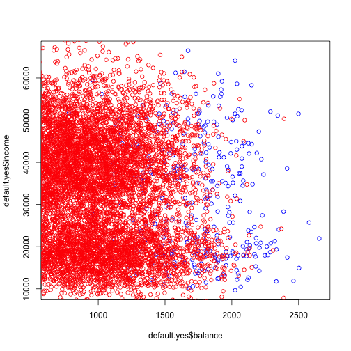

Week7 Notes
========================================================
author: Alexander Frieden 
date: 3/10/2016

Genetics Primer
========================================================

It has come to my attention that I need to go over some of the genetics we are doing


SNP
==========================================

Single nucleotide polymorphism

This is the result of a single basepair being swapped for a different one.  


Indel
=========================================

* This is any insertion deletion or any multi-basepair substitution (which is really a deletion or insertion). 

* Theoretically a structural variation such as the deletion of an entire gene can be thought of as an indel

* Practically, we keep them seperate.  This is usually due to the nature of how computational algorithms call small indels vs how they call structural variations.  

Gene vs Genome
=========================================

* The gene is one of the larger strucutres of cell biology and is the key of which we map proteins that are coded from them onto.  

* The genome is the union of all genes plus the sections between the genes.  

Reads
========================================
Multiple, fragmented sequence reads must be assembled together on the basis of their overlapping areas.

Variants are then called from this person.  


Reads (continued)
========================================


Classification
========================================

Sometimes we don't want to predict a value i.e. how much money will I have in a year but I want to estimate a qualitative value.  

This is called classifing a valitative response or **classification**.  

Examples
========================================

* A person arrives at the emergency room with a set of symptoms that could possibly be attributed to one of three medical conditions.  Which of the three conditions does the individual have?

* An online banking service must be able to determine whether or not a transaction being performing on the site is fraudulent, on the basis of a user's IP address, past transaction history, and other features.

* On the basis of DNA variation data for a number of patients with and without a given disease, we would like to discern which variants are deleterious (disease causing) and which are not.

Note
========================================

For the computer scientists in the room, a lot of this will sound very similar to machine learning, and that is because it is.  

Instead of finding a pattern or threshold, we are finding things that fall enough outside of our distribution that they qualify for or against a classification (such as GOOD or BAD) and we can process them as such.  


Training
========================================

Just like in regression, we have a set of training observations

$$
(x_1,y_1),(x_2,y_2),...,(x_n,y_n)
$$

that we can use to build a classifier.

Training Data
========================================

We want our classifier to perform well on our training data but also on our test data.  

As a matter of practice, you *never* use the same training set as your test set.  This creates a false sense of security in your classifier and you won't be accurately testing your data.  
Default data set
==========================================

For this we will use the **default** dataset


```r
library(ISLR)
#data("Default")
#attach(Default)
#
head(Default)
```

```
  default student   balance    income
1      No      No  729.5265 44361.625
2      No     Yes  817.1804 12106.135
3      No      No 1073.5492 31767.139
4      No      No  529.2506 35704.494
5      No      No  785.6559 38463.496
6      No     Yes  919.5885  7491.559
```


Plot difference
===========================


```r
default.yes <- subset(Default,default=="Yes")
default.no <- subset(Default,default=="No")
plot(default.yes$balance,default.yes$income, col="blue")
points(default.no$balance,default.no$income,col="red")
```



More clearly
===============================


Description of Default Data Set
===============================

This dataset describes the annual incomes and monthly credit card balances of a number of individuals.   

The individuals who defaulted on thei credit card payments are shown in orange and those who did not are shown in blue.  

Linear Regression Classifiers (part 1)
===============================

In cases where you have a qualitative classification, you can't use linear regression

Suppose we are trying to predict the medical condition of a patient in the emergency room on the basis of symptoms.  

We have three possible diagnoses: **stroke, drug overdose, and epileptic seizure**.  We encode them in response variable $Y$

$$
Y = \left\{
        \begin{array}{ll}
            1 & if\,stroke \\
            2 & if\,drug\,overdose \\
            3 & if\,epileptic\,seizure
        \end{array}
    \right.
$$


Linear Regression Classifiers (part 2)
===============================

Using this coding, we could use least squares to fit a linear regression model.  

From this we would get a set of predictors $X_1,...,X_n$.  

What is our incorrect assumption with this?

Linear Regression Classifiers (part 3)
===============================

The issue is we assume this map actually means something, but it doesn't.  The values we pick are arbitrary.  

Our model would assume the difference between **stroke** and **drug overdose** is not the same as **stroke** to **epileptic seizure** which may or may not be true.  

We could just have easily picked:

$$
Y^{\prime} = \left\{
        \begin{array}{ll}
            1 & if\,epileptic\,seizure \\
            2 & if\,stroke \\
            3 & if\,drug\,overdose
        \end{array}
    \right.
$$

Linear Regression Classifiers (part 3)
===============================

This new mapping would give a completely different set of the relationships and values.  

If we had something like **mild, moderate, and severe** then some values associated with them and an ordering would have been reasonable.  

That is not the case here. 

Linear Regression Classifiers (part 4)
===============================

We want to look at doing this with binary mapping, but for that we first need to understand **dummy variable** approach.

Dummy Variable Approach
===============================

* Suppose we wish to investigate difference in credit card balance between males and females.  

*  


Fisher's Exact Test
========================================


