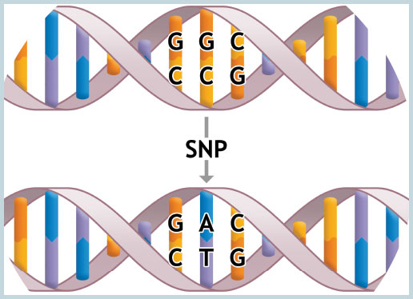
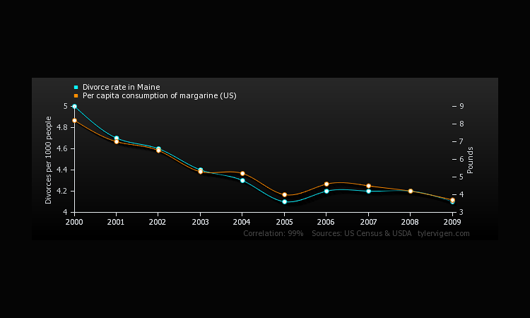
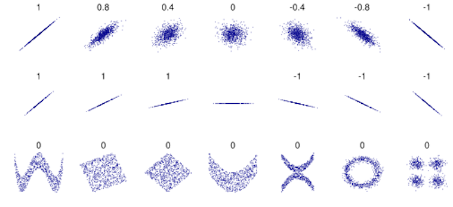
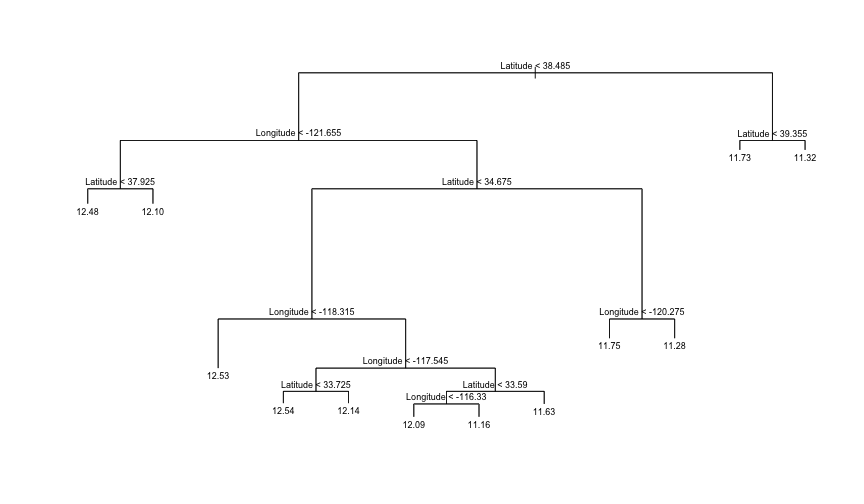
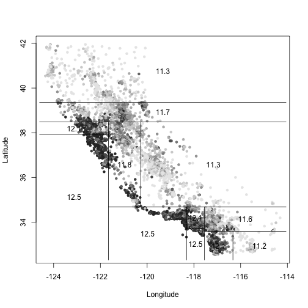
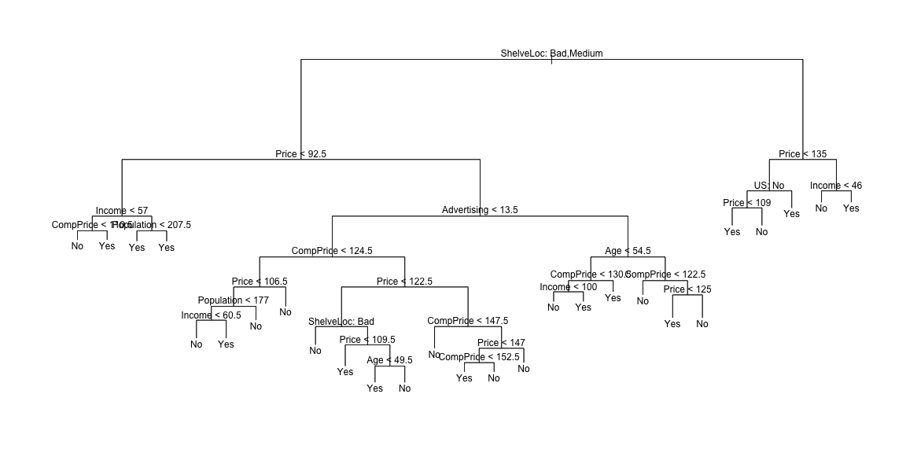

Week7 Notes
========================================================
author: Alexander Frieden 
date: 3/10/2016

Genetics Primer
========================================================

It has come to my attention that I need to go over some of the genetics we are doing


SNP
==========================================

Single nucleotide polymorphism

This is the result of a single basepair being swapped for a different one.  



Indel
=========================================

* This is any insertion deletion or any multi-basepair substitution (which is really a deletion or insertion). 

* Theoretically a structural variation such as the deletion of an entire gene can be thought of as an indel

* Practically, we keep them seperate.  This is usually due to the nature of how computational algorithms call small indels vs how they call structural variations.  

Gene vs Genome
=========================================

* The gene is one of the larger strucutres of cell biology and is the key of which we map proteins that are coded from them onto.  

* The genome is the union of all genes plus the sections between the genes.  

Reads
========================================
Multiple, fragmented sequence reads must be assembled together on the basis of their overlapping areas.

Variants are then called from this person.  


Reads (continued)
========================================


Classification
========================================

Sometimes we don't want to predict a value i.e. how much money will I have in a year but I want to estimate a qualitative value.  

This is called classifing a valitative response or **classification**.  

Examples
========================================

* A person arrives at the emergency room with a set of symptoms that could possibly be attributed to one of three medical conditions.  Which of the three conditions does the individual have?

* An online banking service must be able to determine whether or not a transaction being performing on the site is fraudulent, on the basis of a user's IP address, past transaction history, and other features.

* On the basis of DNA variation data for a number of patients with and without a given disease, we would like to discern which variants are deleterious (disease causing) and which are not.

Note
========================================

For the computer scientists in the room, a lot of this will sound very similar to machine learning, and that is because it is.  

Instead of finding a pattern or threshold, we are finding things that fall enough outside of our distribution that they qualify for or against a classification (such as GOOD or BAD) and we can process them as such.  


Training
========================================

Just like in regression, we have a set of training observations

$$
(x_1,y_1),(x_2,y_2),...,(x_n,y_n)
$$

that we can use to build a classifier.

Training Data
========================================

We want our classifier to perform well on our training data but also on our test data.  

As a matter of practice, you *never* use the same training set as your test set.  This creates a false sense of security in your classifier and you won't be accurately testing your data.  


Default data set
==========================================

For this we will use the **default** dataset


```r
install.packages("ISLR",repos="http://cran.rstudio.com/")
```

```

The downloaded binary packages are in
	/var/folders/tj/8dxhxfns3fb0fx5kswwdvjbr0000gp/T//RtmpZExqOU/downloaded_packages
```

```r
library(ISLR)
```


Default data set (part 2)
==========================================

```r
head(Default)
```

```
  default student   balance    income
1      No      No  729.5265 44361.625
2      No     Yes  817.1804 12106.135
3      No      No 1073.5492 31767.139
4      No      No  529.2506 35704.494
5      No      No  785.6559 38463.496
6      No     Yes  919.5885  7491.559
```


Plot difference
===========================


```r
default.yes <- subset(Default,default=="Yes")
default.no <- subset(Default,default=="No")
plot(default.yes$balance,default.yes$income, col="blue")
points(default.no$balance,default.no$income,col="red")
```


More clearly
===============================


Description of Default Data Set
===============================

This dataset describes the annual incomes and monthly credit card balances of a number of individuals.   

The individuals who defaulted on thei credit card payments are shown in orange and those who did not are shown in blue.  

Linear Regression Classifiers (part 1)
===============================

In cases where you have a qualitative classification, you can't use linear regression

Suppose we are trying to predict the medical condition of a patient in the emergency room on the basis of symptoms.  

We have three possible diagnoses: **stroke, drug overdose, and epileptic seizure**.  We encode them in response variable $Y$

$$
Y = \left\{
        \begin{array}{ll}
            1 & if\,stroke \\
            2 & if\,drug\,overdose \\
            3 & if\,epileptic\,seizure
        \end{array}
    \right.
$$


Linear Regression Classifiers (part 2)
===============================

Using this coding, we could use least squares to fit a linear regression model.  

From this we would get a set of predictors $X_1,...,X_n$.  

What is our incorrect assumption with this?

Linear Regression Classifiers (part 3)
===============================

The issue is we assume this map actually means something, but it doesn't.  The values we pick are arbitrary.  

Our model would assume the difference between **stroke** and **drug overdose** is not the same as **stroke** to **epileptic seizure** which may or may not be true.  

We could just have easily picked:

$$
Y^{\prime} = \left\{
        \begin{array}{ll}
            1 & if\,epileptic\,seizure \\
            2 & if\,stroke \\
            3 & if\,drug\,overdose
        \end{array}
    \right.
$$

Linear Regression Classifiers (part 3)
===============================

This new mapping would give a completely different set of the relationships and values.  

If we had something like **mild, moderate, and severe** then some values associated with them and an ordering would have been reasonable.  

That is not the case here. 

Linear Regression Classifiers (part 4)
===============================

We want to look at doing this with binary mapping, but for that we first need to understand **dummy variable** approach.

Dummy Variable Approach
===============================

* Suppose we wish to investigate difference in credit card balance between males and females.  

* We can simply create an indicator or *dummy variable*

$$
x_i = \left\{
        \begin{array}{ll}
            0 & if\,ith\,person\,is\,female \\
            1 & if\,ith\,person\,is\,male \\
        \end{array}
    \right.
$$

Dummy Variable Approach
===============================

If we did this and used $x_i$ as the predictor in linear regression then we would get the following model.

$$
y_i = \beta_0 + \beta_{1}x_i + \epsilon_i =  \\
\left\{
        \begin{array}{ll}
            \beta_0 + \beta_1 + \epsilon_i & if\,i^{th}\,person\,is\,female \\
            \beta_0 + \epsilon_i & if\,i^{th}\,person\,is\,male \\
        \end{array}
    \right.
$$

Interpretation
===============================

Now $\beta_0$ can be interpreted as the average credit card balance among males and $\beta_0 + \beta_1$  as the average credit card balance among females.  

When this actually gets computed on the **Credit** data set, you do get a very high p value, showing little statistical evidence of a difference in average credit balance between genders.

This same pattern can be done on systems of more than two levels.  

Back to example
===============================

so lets implement the dummy variable approach.

$$
Y = \left\{
        \begin{array}{ll}
            0 & if\,stroke \\
            1 & if\,drug\,overdose
        \end{array}
    \right.
$$

Doing this allows us to predict drug overdose if $\hat{Y} > 0.5$ and stroke overwise.  

The linear regression gives us a rough estimate of probability as some of the values are negative. 

Note
===============================

Its tough to extend the qualitative responses using linear regression for more than 2 levels.  

For this reason we try to avoid it. 

Logistic Regression
===============================

Consider the **Default** dataset where we annotate whether someone defaults with **Yes** or **No**.  Logistic regression models the *probability* that Y belongs to a particular category.  

Logistic Regression part 2
===============================


```

The downloaded binary packages are in
	/var/folders/tj/8dxhxfns3fb0fx5kswwdvjbr0000gp/T//RtmpZExqOU/downloaded_packages
```


Logistic Regression part 3
===============================

For the Default data set, logistic regression models the probability of default.  

For example: the probability of default given balance can be written as:

$$
P(default=Yes\,|\,balance)
$$

We might predict **default = yes** if the probability is greater than $0.5$.  We also might be more conservative and use $0.1$

R Regression Example part 1
========================================

We are going to examine stock market data from the S&P 500 from 2001 to 2005.  

For each date we have recorded the percentage of returns for each of the five previous trading days Lag1 through Lag5 and the **Volume* (number of billions of shares traded previous day).

**Today** is the percentage return on the date in question

**Direction** whether they market was up or down on the date

R Regression Example part 2
========================================

load our library and take a look at our data.


```r
library(ISLR)
names(Smarket)
```

```
[1] "Year"      "Lag1"      "Lag2"      "Lag3"      "Lag4"      "Lag5"     
[7] "Volume"    "Today"     "Direction"
```

R Regression Example part 3
========================================

Summary of our data to get a sense of data.  

```r
summary(Smarket)
```

```
      Year           Lag1                Lag2          
 Min.   :2001   Min.   :-4.922000   Min.   :-4.922000  
 1st Qu.:2002   1st Qu.:-0.639500   1st Qu.:-0.639500  
 Median :2003   Median : 0.039000   Median : 0.039000  
 Mean   :2003   Mean   : 0.003834   Mean   : 0.003919  
 3rd Qu.:2004   3rd Qu.: 0.596750   3rd Qu.: 0.596750  
 Max.   :2005   Max.   : 5.733000   Max.   : 5.733000  
      Lag3                Lag4                Lag5         
 Min.   :-4.922000   Min.   :-4.922000   Min.   :-4.92200  
 1st Qu.:-0.640000   1st Qu.:-0.640000   1st Qu.:-0.64000  
 Median : 0.038500   Median : 0.038500   Median : 0.03850  
 Mean   : 0.001716   Mean   : 0.001636   Mean   : 0.00561  
 3rd Qu.: 0.596750   3rd Qu.: 0.596750   3rd Qu.: 0.59700  
 Max.   : 5.733000   Max.   : 5.733000   Max.   : 5.73300  
     Volume           Today           Direction 
 Min.   :0.3561   Min.   :-4.922000   Down:602  
 1st Qu.:1.2574   1st Qu.:-0.639500   Up  :648  
 Median :1.4229   Median : 0.038500             
 Mean   :1.4783   Mean   : 0.003138             
 3rd Qu.:1.6417   3rd Qu.: 0.596750             
 Max.   :3.1525   Max.   : 5.733000             
```

R Regression Example part 4
========================================

Next we might want to look for a naive pearson correlation between pairwise correlations among the predictors in a data set.  


```r
#cor(Smarket)
```
We get the error:
Error in cor(Smarket) : 'x' must be numeric


R Regression Example part 5
========================================

What happened?  Well it broke because the values are qualitative


```r
head(Smarket)
```

```
  Year   Lag1   Lag2   Lag3   Lag4   Lag5 Volume  Today Direction
1 2001  0.381 -0.192 -2.624 -1.055  5.010 1.1913  0.959        Up
2 2001  0.959  0.381 -0.192 -2.624 -1.055 1.2965  1.032        Up
3 2001  1.032  0.959  0.381 -0.192 -2.624 1.4112 -0.623      Down
4 2001 -0.623  1.032  0.959  0.381 -0.192 1.2760  0.614        Up
5 2001  0.614 -0.623  1.032  0.959  0.381 1.2057  0.213        Up
6 2001  0.213  0.614 -0.623  1.032  0.959 1.3491  1.392        Up
```

R Regression Example part 6
========================================

We can fix this by subsetting our data.


```r
head(Smarket[,-9])
```

```
  Year   Lag1   Lag2   Lag3   Lag4   Lag5 Volume  Today
1 2001  0.381 -0.192 -2.624 -1.055  5.010 1.1913  0.959
2 2001  0.959  0.381 -0.192 -2.624 -1.055 1.2965  1.032
3 2001  1.032  0.959  0.381 -0.192 -2.624 1.4112 -0.623
4 2001 -0.623  1.032  0.959  0.381 -0.192 1.2760  0.614
5 2001  0.614 -0.623  1.032  0.959  0.381 1.2057  0.213
6 2001  0.213  0.614 -0.623  1.032  0.959 1.3491  1.392
```

R Regression Example part 7
========================================

Now lets look at the correlation


```r
cor(Smarket[,-9])
```

```
             Year         Lag1         Lag2         Lag3         Lag4
Year   1.00000000  0.029699649  0.030596422  0.033194581  0.035688718
Lag1   0.02969965  1.000000000 -0.026294328 -0.010803402 -0.002985911
Lag2   0.03059642 -0.026294328  1.000000000 -0.025896670 -0.010853533
Lag3   0.03319458 -0.010803402 -0.025896670  1.000000000 -0.024051036
Lag4   0.03568872 -0.002985911 -0.010853533 -0.024051036  1.000000000
Lag5   0.02978799 -0.005674606 -0.003557949 -0.018808338 -0.027083641
Volume 0.53900647  0.040909908 -0.043383215 -0.041823686 -0.048414246
Today  0.03009523 -0.026155045 -0.010250033 -0.002447647 -0.006899527
               Lag5      Volume        Today
Year    0.029787995  0.53900647  0.030095229
Lag1   -0.005674606  0.04090991 -0.026155045
Lag2   -0.003557949 -0.04338321 -0.010250033
Lag3   -0.018808338 -0.04182369 -0.002447647
Lag4   -0.027083641 -0.04841425 -0.006899527
Lag5    1.000000000 -0.02200231 -0.034860083
Volume -0.022002315  1.00000000  0.014591823
Today  -0.034860083  0.01459182  1.000000000
```

R Regression Example part 8
========================================

Unfortunately we don't get anything quite this fast, we need to do further investigation.  


Notes on Pearson Correlation
=========================================



Notes on Pearson Correlation (part 2)
=========================================

Obviously correlation does not imply causation.  

Notes on Pearson Correlation (part 3)
=========================================




Logistic Regression in R part 1
=========================================

Next we want to fit logistic regression model to predict **Direction** using **Lag1** through **Lag5** and volume.  
Logistic Regression in R part 2
=========================================

The **glm()** method functions a lot like **lm()** except tht we must pass in the argument **family=binomial** in order to tell R to run a logistic representation rather than some other type of generalized linear model.

Logistic Regression in R part 3
=========================================


```r
glm.fit=glm(Direction~Lag1+Lag2+Lag3+Lag4+Lag5+Volume,
            data=Smarket,family=binomial)
```

Logistic Regression in R part 4
=========================================

```r
summary(glm.fit)
```

```

Call:
glm(formula = Direction ~ Lag1 + Lag2 + Lag3 + Lag4 + Lag5 + 
    Volume, family = binomial, data = Smarket)

Deviance Residuals: 
   Min      1Q  Median      3Q     Max  
-1.446  -1.203   1.065   1.145   1.326  

Coefficients:
             Estimate Std. Error z value Pr(>|z|)
(Intercept) -0.126000   0.240736  -0.523    0.601
Lag1        -0.073074   0.050167  -1.457    0.145
Lag2        -0.042301   0.050086  -0.845    0.398
Lag3         0.011085   0.049939   0.222    0.824
Lag4         0.009359   0.049974   0.187    0.851
Lag5         0.010313   0.049511   0.208    0.835
Volume       0.135441   0.158360   0.855    0.392

(Dispersion parameter for binomial family taken to be 1)

    Null deviance: 1731.2  on 1249  degrees of freedom
Residual deviance: 1727.6  on 1243  degrees of freedom
AIC: 1741.6

Number of Fisher Scoring iterations: 3
```

```r
cat('\r\n\r\n')
```


Logistic Regression in R part 5
=========================================
The smallest p-value here is associated with **Lag1**.  

The negative coefficient for this predictor suggests that if the market had a positive return yesterday, then it less likely to go up today.  

Note:  the value is 0.15, the p-value is relatively high and so there is no CLEAR evidence of a real association between **Lag1** and **Direction**

Predicting 
=========================================

The **predict()** function can be used to predict the probability that the market will go up, given values of the predictors.  

The **type=response** option tells R to output probabilities of the form $P(Y=1|X)$.  

If no data set is provided **predict()** will then compute probabilies for the training datat that was used to fit the logistic regression model.  Why is this bad?

Predicting (part 2)
=========================================
In, the following, we have only pritned the first ten probabilities.  

We know the values correspond to the probability of the market going u rather than down because the **contrasts()** function indicates that R has created a dummy variable with a 1 for **Up**

Predicting (part 3)
=========================================


```r
attach(Smarket)
glm.probs=predict(glm.fit,type="response")
glm.probs[1:10]
```

```
        1         2         3         4         5         6         7 
0.5070841 0.4814679 0.4811388 0.5152224 0.5107812 0.5069565 0.4926509 
        8         9        10 
0.5092292 0.5176135 0.4888378 
```

```r
contrasts(Direction)
```

```
     Up
Down  0
Up    1
```


Predicting (part 4)
=========================================

In order to make an actual prediction we need to convert the predictions to proper labels.  


```r
glm.pred=rep("Down",1250)
glm.pred[glm.probs > 0.5]="Up"
```

Predicting (part 5)
=========================================

So this command first creates a vector of 1250 Down elements.  

The second line transforms to **Up** all the elements for which the predicted probability of a market increase exceeds 0.5.  

We can now use a tool known as a *confusion matrix* to see how good this prediction is

Predicting (part 6)
=========================================

```r
table(glm.pred, Direction)
```

```
        Direction
glm.pred Down  Up
    Down  145 141
    Up    457 507
```

```r
(507+145)/1250
```

```
[1] 0.5216
```

```r
mean(glm.pred==Direction)
```

```
[1] 0.5216
```

Predicting (part 7)
=========================================
The diagonal elements of the confusion matrix indicate correct predictions, off-diagonals are the incorrect ones.  

Our model did 652 correct predictions which correctly predicted the market 52.2% of the time.

The **mean()** function was used to compute the fraction of days for which the prediction was correct.  

Predicting (part 8)
=========================================

It appears logistic regression model did well.  

However result is misleading because we traomed amd tested the model on same set of 1250 observations.  

In other words $100 - 52.2 = 47.8%$ is the training error rate.  

Predicting (part 9)
=========================================

The training error rate is an overestimate of the test error rate.  

Our best bet here is to use part of the data to train the model then use the remaining data to test it, such that the data sets are disjoint.  

This will give us a more realistic error rate.

Predicting (part 10)
=========================================

First we need to subset our data.  We do this by creating a vector corresponding to observations from 2001 to 2004.  


```r
train=(Year<2005)
Smarket.2005 = Smarket[!train,]
dim(Smarket.2005)
```

```
[1] 252   9
```

```r
Direction.2005=Direction[!train]
```

Predicting (part 11)
=========================================

Now we fit a logistic regression model using the subset observations that correspond to dates before 2005.

We then get predicted probabilities for the market for days in 2005.

Predicting (part 12)
=========================================


```r
glm.fit=glm(Direction~Lag1+Lag2+Lag3+Lag4+Lag5+Volume,
            data=Smarket, family=binomial, subset=train)
glm.probs=predict(glm.fit, Smarket.2005,type="response")
```

Predicting (part 13)
=========================================
Notice we have trained and teted our model on two disjoint data sets: 2001-2005 and 2005

Now we compare to actual values.  

Predicting (part 14)
=========================================

```r
glm.pred=rep("Down",252)
glm.pred[glm.probs>0.5]="Up"
table(glm.pred,Direction.2005)
```

```
        Direction.2005
glm.pred Down Up
    Down   77 97
    Up     34 44
```

```r
mean(glm.pred==Direction.2005)
```

```
[1] 0.4801587
```

```r
mean(glm.pred!=Direction.2005)
```

```
[1] 0.5198413
```

Predicting (part 15)
=========================================

Sadly, results show we get 52% test error rate.

Predicting (part 16)
=========================================

Remember initially our smallest p-value for our model was very large which belonged to **Lag1**

We can try to remove the other variables to get a better model.  

This is due to when we use predictors that haveno relationship with the response tends to cause a deterioration in the test error rate by causing an increaes in the variance but no decrease in bias.  

the bias of an estimator is the difference between this estimator's expected value and the true value of the parameter being estimated

Predicting (part 17)
=========================================

Lets try using just **Lag1** and **Lag2**


```r
glm.fit=glm(Direction~Lag1+Lag2,data=Smarket,
            family=binomial,subset=train)
glm.probs=predict(glm.fit,Smarket.2005,type="response")
glm.pred=rep("Down",252)
glm.pred[glm.probs>0.5] = "Up"
table(glm.pred,Direction.2005)
```

```
        Direction.2005
glm.pred Down  Up
    Down   35  35
    Up     76 106
```

Predicting (part 18)
=========================================

* Now the results appear to be a little better: 56% of the daily movements have been correctly predicted.  

* It is worth noting that in this case, a much simpler strategy of predicting that the market will increase every day will also be correct 56% of the time.  

* In terms of overall error rate, the logistic regression method is no better than the naive approach.  However, the confusion matrix shows that on days when logistic regression predicts an incrase in the market, it has a 58% accuracy rate.  

Tree based Methods 
=========================================

* From graph theory, trees are undirected graphs in which any two vertices have exactly one path between them.  

* Tree based methods are a way of stratifying or segmenting the predictor space into a number of simpler regions.  

Tree based Methods (part 2)
=========================================

* Decision trees can be applied to both regression and classifications problems.  

* Trees in general are highly sensitive to changing parameters as a change in a parameters can cause early splits in the tree, thus **branching** all the way down.  

* We are going to start with regression trees


Predicting Trees
=========================================

* At a high level we want to predict a response or class $Y$ from inputs $X_1,...,X_p$. 

* We do this by growing a binary tree.

* BTW if any of you ever interview at Google, make sure you know binary trees like the back of your hand.  They love them.  Like, LOVE them.  

* At each internal node in the tree, we apply a test to one of the inputs $X_i$.

Predicting Trees (part 2)
=========================================

*  Depending on
the outcome of the test, we go to either the left or the right sub-branch of the tree.

* Eventually we come to a leaf node, where we make a prediction. This prediction aggregates or averages all the training data points which reach that leaf.

* So isn't this just a messy way to do regression?  Why do this?

Predicting Trees (part 3)
=========================================

* When we do linear, logistic, or other types of regression are **global models**.  Because they are global, a single predictive formula is supposed to hold over the entire data space. 

* When the data has lots of features which interact in complicated, nonlinear ways, assembling a single global model can be very difficult, and hopelessly confusing when you do succeed.  

Predicting Trees (part 4)
=========================================

* An alternative approach to nonlinear regression is to sub-divide, or partition, the space into smaller regions, where the interactions are more manageable.

* We then partition the sub-divisions again — this is recursive partitioning, as in hierarchical clustering — until finally we get to chunks of the space which are so tame that we can fit simple models to them. 

Predicting Trees (part 5)
=========================================

* Each of the terminal nodes, or leaves, of the tree represents a cell of the partition, and has attached to it a simple model which applies in that cell only. 

* A point $x$ belongs to a leaf if $x$ falls in the corresponding cell of the partition. To figure out which cell we are in, we start at the **root node** of the tree, and ask a sequence of questions
about the features.

Predicting Trees (part 6)
=========================================


Predicting Trees Example (Part 1)
=========================================

```r
calif = read.table("data/cadata.dat",header=TRUE)
require(tree)
treefit = tree(log(MedianHouseValue) ~ Longitude+Latitude,data=calif)
```

Predicting Trees Example (Part 2)
=========================================
This does a tree regression of the log price on longitude and latitude.

Predicting Trees Example (Part 3)
=========================================


Predicting Trees Example (Part 4)
=========================================
* Regression tree for predicting California housing prices from geographic coordinates. 

* At each internal node, we ask the associated question, and go to the left child if the answer is “yes”, to the right child if the answer is “no”.

* Note that leaves are labeled with log prices; the plotting function isn’t flexible enough, unfortunately, to apply transformations to the labels.

Predicting Trees Example (Part 5)
=========================================
Map of actual median house prices (color-coded by decile, darker
being more expensive), and the partition of the treefit tree.

Predicting Trees Example (Part 6)
=========================================


Predicting Trees Example (Part 7)
=========================================

```r
summary(treefit)
```

```

Regression tree:
tree(formula = log(MedianHouseValue) ~ Longitude + Latitude, 
    data = calif)
Number of terminal nodes:  12 
Residual mean deviance:  0.1662 = 3429 / 20630 
Distribution of residuals:
    Min.  1st Qu.   Median     Mean  3rd Qu.     Max. 
-2.75900 -0.26080 -0.01359  0.00000  0.26310  1.84100 
```

Predicting Trees Example (Part 8)
=========================================
Here “deviance” is just mean squared error; this gives us an root mean square error of 0.41, not shocking since we’re using only two variables, and have only twelve nodes.

Carseats Example
=========================================

For our second example, we are going to classify **Sales** in **Carseats** example.  

In the following, we use **ifelse()** function to create a variable called High which takes on a values of **Yes** if the **Sales** evariable exceeds 8 and takes on a **No** otherwise

Carseats Example (part 2)
=========================================

```r
attach(Carseats)
High=ifelse(Sales<=8,"No","Yes")
Carseats=data.frame(Carseats, High)
```

Carseats Example (part 3)
=========================================
We now use the tree() function to fit a classification tree in order to predict **High** using all variables but **Sales**.


```r
tree.carseats=tree(High~.-Sales,Carseats)
```

Carseats Example (part 4)
=========================================
Now lets look at the summary method.  This is going to list the internal nodes in the treee and the training (error) rate.  

Carseats Example (part 5)
=========================================


```r
summary(tree.carseats)
```

```

Classification tree:
tree(formula = High ~ . - Sales, data = Carseats)
Variables actually used in tree construction:
[1] "ShelveLoc"   "Price"       "Income"      "CompPrice"   "Population" 
[6] "Advertising" "Age"         "US"         
Number of terminal nodes:  27 
Residual mean deviance:  0.4575 = 170.7 / 373 
Misclassification error rate: 0.09 = 36 / 400 
```

Carseats Example (part 6)
=========================================

The small deviance indicates a tree that provides a good fit to the training data.  

The **residual mean deviance** reported is simply the deviance divded by $n - T_0$.

Carseats Example (part 7)
=========================================


Carseats Example (part 8)
=========================================
The most important indicator of **Sales** appears to be shelving location since the first branch differentiates **Good** locations from **Bad** and **Medium** locations
