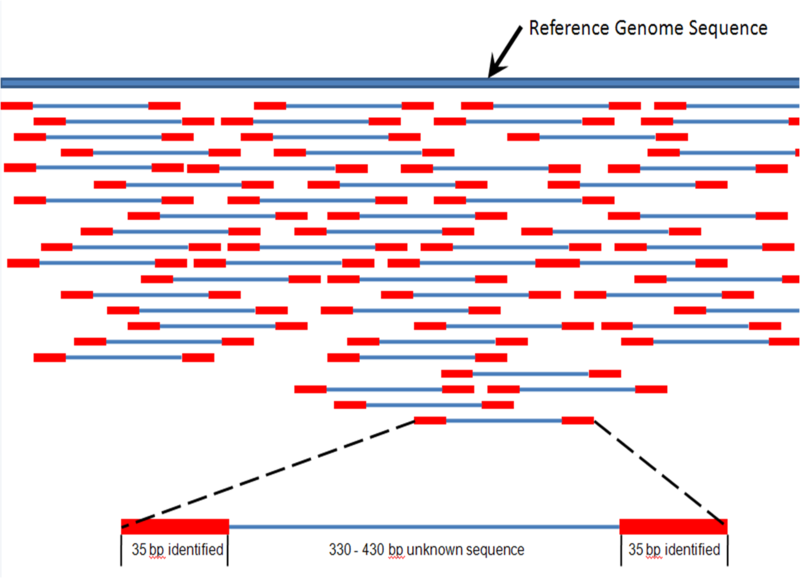

Week7 Notes
========================================================
author: Alexander Frieden 
date: 3/10/2016

Genetics Primer
========================================================

It has come to my attention that I need to go over some of the genetics we are doing

SNP
==========================================

Single nucleotide polymorphism

This is the result of a single basepair being swapped for a different one.  

Indel
=========================================

* This is any insertion deletion or any multi-basepair substitution (which is really a deletion or insertion). 

* Theoretically a structural variation such as the deletion of an entire gene can be thought of as an indel

* Practically, we keep them seperate.  This is usually due to the nature of how computational algorithms call small indels vs how they call structural variations.  

Gene vs Genome
=========================================

* The gene is one of the larger strucutres of cell biology and is the key of which we map proteins that are coded from them onto.  

* The genome is the union of all genes plus the sections between the genes.  

Reads
========================================
Multiple, fragmented sequence reads must be assembled together on the basis of their overlapping areas.

Variants are then called from this person.  

Reads (continued)
========================================

Fisher's Exact Test
========================================

