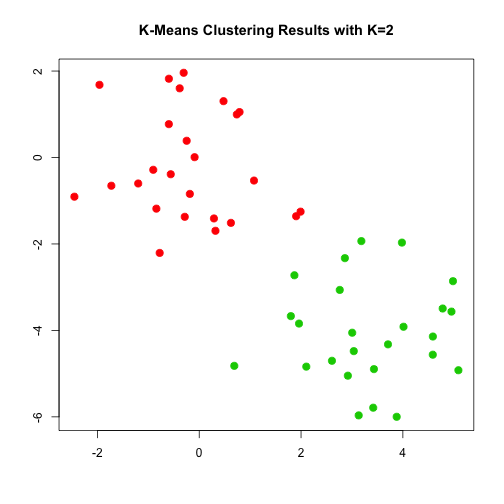

Week8 Notes
========================================================
author: Alexander Frieden 
date:  3/31/2016
autosize: true

Class Notes
========================================================

* 4/22 we are set to have class, need to reschedule for a different night that week

* Remember homework is due next week

Last Week
========================================================

* We covered trees, what they are

* We experimented with naive approaches in how to cut it up.  

K-Means Clustering
========================================================

* K-means clustering is a imple and elegant approach for partitioning a data set into K distinct and disjoint clusters.  

* This means none of these elements have any overlap.

* Requires input parameter of number of clusters.  

* Algorithm will assign each observation to exactly one of the K clusters.  

K-Means Clustering Algorithm
========================================================

Let $C_1,C2,...C_K$ denote the sets containing the indices of the observations in each cluster.  THese sets satisfy two properties:
$$
C_1\cup C_2 \cup\,...\,\cup\,C_K = \big\{1,...,n\big\}
$$

In other words, each observation belongs to at least one of the K clusters.  

$$
C_k \cap C_{k^\prime} = \emptyset
$$

For all $k\neq k^\prime$.  In other words, the clusters are non-overlapping.  No observation belongs to more than one cluster.  

K-Means Clustering Algorithm (part 2)
========================================================

For instance if the ith observation is in the kth cluster, then $i\in C_k$.  

The idea behind K-means clustering is that a *good* clustering is one for which the *winthin-cluster variation* is as small as possible.  The within-cluster variation.  

The within-cluster variation for cluster $C_k$ is a measure $W(C_k)$ of the amount by which the observations within a cluster differ from each other.  Hence we want to solve the problem.  


$$
\tag{1}
\min_{C_1,...,C_k}\big\{\sum_{k=1}^{K}W(C_k)\big\}
$$

K-Means Clustering Algorithm (part 3)
========================================================

In other words, this formula says that we want to partition the observations into K clusters such that the total within-cluster variation, summed over all K clusters is as small as possible. 

Solving (1) seems reasonable.  However, in order to make it actionable we need to define the within-cluster variation.  There are many possible ways to define this concept, but by far the most common choice involves *Squared Euclidean distance*. Thus:

$$
\tag{2}
W(C_k) = \frac{1}{|C_k|}\sum_{i,i^\prime\in C_k}\sum_{j=1}^p(x_{ij} - x_{i^\prime j})^2
$$

K-Means Clustering Algorithm (part 4)
========================================================

Where $|C_k|$ denotes the number of observations in the kth cluster.  In other words, the within-cluster variation for the kth cluster is the sum of all the pairwise Euclidean distnaces between the observations in the kth cluster divided by the total number of observations in the kth cluster.  

Combing (1) and (2) we arrive at the optimization that defines K-mean clustering. 

$$
\tag{3}
\min_{C_1,...,C_k}\big\{\sum_{k=1}^{K}\frac{1}{|C_k|}\sum_{i,i^{\prime}\in C_k}\sum_{j=1}^p(x_{ij}-x_{i^{\prime}j})^2\big\}
$$

K-Means Clustering Algorithm (part 5)
========================================================
Some of the figures in this presentation are taken from "An Introduction to Statistical Learning, with applications in R"  (Springer, 2013) with permission from the authors: G. James, D. Witten,  T. Hastie and R. Tibshirani

The following is a simulated data set with 150 observations in 2-d space.  Panels show K-means clustering with different values of K.  

K-Means Clustering Algorithm (part 6)
========================================================


K-Means Clustering Algorithm (part 7)
========================================================

Now we want to find an algorithm to solve (3).  

In general, this is very difficult to solve precisely.  There are at most $K^n$ ways to partition n observations into K clusters.  

Luckily, K-means clustering algorithm can proivde a local optimum.  

K-means Cluster Algorithm Steps
========================================================

1.  Randomly assin a number from 1 to $K$ to each of the observations.  These serve as initial cluster assignments for the observations . 

2.  Iterate until the cluster asignments stop changing:
  +  For each of the $K$ clusters, compute the cluster centroid.  The kth cluster centroid is the vector of the p feature means for the observations in the kth cluster.  
  + Assign each observation to the cluster whose centroid is closest (where closest is defined using Euclidean distance)
  
K-Means Clustering Algorithm (part 8)
========================================================  


K-Means Clustering Algorithm (part 9)
========================================================  
The algorithm is guaranteed to decrease the value of objective (3) at each step.

To understand why, the following is illuminating:
$$
\tag{4}
\frac{1}{|C_k|}\sum_{i,i^{\prime}\in C_k}\sum_{j=1}^{p}(x_{ij} - x_{i^{\prime}j})^2 = 2\sum_{i\in C_k}\sum_{j=1}^p(x_ij - \bar{x}_{kj})^2
$$

K-Means Clustering Algorithm (part 10)
========================================================  

Here  $\,\bar{x}_{kj} = \frac{1}{|C_k|}\sum_{i\in C_k}x_{ij}$ is the mean for feature j in cluster $C_k$.  

In step 2a of our algorithm the cluster means for each feature are teh contants that minimize the sum-of-squared deviations.  

In step 2b reallocating the observations can only improve (4).  This means that as the algorithm is run, the clustering will continue to improve a local optimum is reached.  

The name of the algorithm's name comes from that in step 2a the cluster centroids are computed as the mean of the observations assigned to each cluster.  

K-Means Clustering Algorithm Notes
========================================================  

* Because the K-means algorithm finds a local rather than a global optimum, the results obtained are a function of the initial conditions, in particular the random cluster assignment.  

* For this reason it is important to run your algorithm multiple times.  

* It turns out that iteratively arriving at the optimum doesn't take very many iterations, thus finding the number of iterations takes some experimenting, as running some of these computations can take a very long time.  

* After different initial conditions, one can select the best solution, i.e. one that minimizes (3).  

K-Means Clustering Algorithm (part 11)
========================================================  


K-Means Clustering Algorithm (part 12)
========================================================  
The previous is K-means clustering with K=3 from slide 10.5, each with different random value input from step 1.  

Considerations
========================================================  
Some decisions needs to be made when planning on clustering

* Should the observations or features first be standardized in some way?  For instance, maybe the variables should be centered to have mean zero and scaled to have standard deviation one.  

* In the case of K-means clustering, how many clusters should we look for in the data?

In practice we try several different choices and experiment with parameters for various data sets.  

Considerations (part 2)
========================================================  

Clustering methods are generally not very good at being robust against perturbations.  

For example, suppose we cluster $n$ observaitons and then remove at random one of the clusters.  We then perform K-means on our new dataset.  We would expect the clusters to be the same minus the one removed.  

However, this is not often the case.  

K-means in R (part 1)
========================================================  

The function **kmeans()** performs K-means clustering in R.  We begin a simple simulated example in which there truly are two clusters in the data.  

The first twenty five observations have a mean shift relative to the twenty five observations


```r
set.seed(2)
x=matrix(rnorm(50*2), ncol=2)
head(x)
```

```
            [,1]       [,2]
[1,] -0.89691455 -0.8382871
[2,]  0.18484918  2.0663014
[3,]  1.58784533 -0.5622471
[4,] -1.13037567  1.2757155
[5,] -0.08025176 -1.0475726
[6,]  0.13242028 -1.9658782
```

K-means in R (part 2)
========================================================  

Shift the entries

```r
x[1:25,1]=x[1:25,1] + 3
x[1:25,2]=x[1:25,2] - 4
```

K-means in R (part 3)
========================================================  
Now perform K-means clustering with $K = 2$

```r
km.out=kmeans(x,2,nstart=20)
```

K-means in R (part 4)
========================================================  
The cluster assignments of the 50 observations are contained in

```r
km.out$cluster
```

```
 [1] 2 2 2 2 2 2 2 2 2 2 2 2 2 2 2 2 2 2 2 2 2 2 2 2 2 1 1 1 1 1 1 1 1 1 1
[36] 1 1 1 1 1 1 1 1 1 1 1 1 1 1 1
```

K-means in R (part 5)
========================================================  
The K-means clustering perfectly seperated the observations into two clusters even though we did not supply any group information to **kmeans()**.  

K-means in R (part 6)
========================================================  

We can plot the data, with each observation colored according to its cluster assignment

```r
plot(x,col=(km.out$cluster+1), main="K-Means Clustering Results with K=2", xlab = "", ylab = "", pch=20, cex=2)
```



K-means in R (part 7)
========================================================  

Here the we are able to plot this because our data is two dimensional.  

If it was greater than two dimensional than we could instead run PCA and look at first two prinicpal components.  

K-means in R (part 8)
========================================================  

In general we don't know how many clusters, so lets try this with three clusters.  


```r
set.seed(4)
km.out=kmeans(x,3,nstart=20)
```

K-means in R (part 9)
========================================================

```
K-means clustering with 3 clusters of sizes 10, 23, 17

Cluster means:
        [,1]        [,2]
1  2.3001545 -2.69622023
2 -0.3820397 -0.08740753
3  3.7789567 -4.56200798

Clustering vector:
 [1] 3 1 3 1 3 3 3 1 3 1 3 1 3 1 3 1 3 3 3 3 3 1 3 3 3 2 2 2 2 2 2 2 2 2 2
[36] 2 2 2 2 2 2 2 2 1 2 1 2 2 2 2

Within cluster sum of squares by cluster:
[1] 19.56137 52.67700 25.74089
 (between_SS / total_SS =  79.3 %)

Available components:

[1] "cluster"      "centers"      "totss"        "withinss"    
[5] "tot.withinss" "betweenss"    "size"         "iter"        
[9] "ifault"      
```

K-means in R (part 10)
========================================================
While its tough to see, when we set $K=3$, K-means clustering splits up the two clusters.

To run **kmeans()** with multple initial cluster assignments, we use the **nstart** argument.  

If the nstart argument is greater than one, then K-means clustering will use multiple random assignments for intiial observation assignment.  

K-means in R (part 11)
========================================================
Here we are comparing **nstart=1** vs **nstart=20**.  


```r
set.seed(3)
km.out=kmeans(x,3,nstart=1)
km.out$tot.withinss
```

```
[1] 104.3319
```

```r
km.out=kmeans(x,3,nstart=20)
km.out$tot.withinss
```

```
[1] 97.97927
```

K-means in R (part 12)
========================================================

Note that **km.out$tot.withinss** is the total within-cluster sum of squares which we seek to minimize by performing K-means clustering.

The individual within-cluster sum-of-squares are contaied in the vector **km.out$tot.withinss**

It is *always* recommended to run K-means clustering with a large value of **nstart** such as 20 or 50.  Otherwise local optimums that are misrepresenting our data can be obtained.  

It is also important to use the **set.seed()** function so that the results are reproducible.  

Hierarchial Clustering
========================================================

One potential disadvantage of K-means clustering is that it requires us to pre-specify the number of clusteres K.  

Hierarchial clustering is an alternative approach which does not require that we commit to a particular choice of K.  

Hierarchial clustering has the added advantage over K-means clustering in that it results in an attractive tree-based representation of the observation, called a *dendrogram*.  

Hierarchial Clustering (part 2)
========================================================

We will be looking at bottom up clustering which refers to the idea that the leaves are built first then we combine clusters to get the trunk.  

Reading Dendrogram
========================================================

In the following figure, each leaf of the dendrogram respresents one of the 45 observations from our earlier example.  

As we move up the tree, some leaves begin to fuse into branches.  These correspond to observations that are similar to eacah other.  

Fusions further down correspond to groupings that are similar, where as the higher up fusions correspond to groupings that are not similar.  

Reading Dendrogram (part 2)
========================================================

We can make this precise:

For any two observations, we can look at the point in the tree where branches containing those two observations are first fused.  

The height of the fusion, as measured on the vertical axis, indicates how difficult the two observations are. 

Reading Dendrogram (part 3)
========================================================


Reading Dendrogram (part 4)
========================================================

We can read this by seeing that points 5 and 7 are close so they are branched together at a low point.  

7 and 9 are far away from each other so they are branched very high, in fact at the trunk.  

It is tempting but incorrect to conclude from the figure that observations 9 and 2 are quite similar to each other on the bais that they are located near each other on the dendrogram.  

In fact, observation 9 is no more similar to observation 2 than it is to observations 8, 5, and 7.

Reading Dendrogram (part 5)
========================================================

There are $2^{n-1}$ possible reorderings of the denodrogram, where $n$ is the number of leafs.  

This is because at each of the $n-1$ points where fusions occur the positions of the two fused branches could be swapped without affecting the meaning of the dendrogram.

We cannot draw conclusions based on their proximity along the horizontal axis.  We have to use vertical axis.  

Reading Dendrogram (part 6)
========================================================

In order to cluster the dendrogram, we perform a horizontal cut across the tree.  

The height of the cut serves the same role as the K in K-means clustering.  It controls how many clusters are available.  

Reading Dendrogram (part 7)
========================================================


Hierarchial Clustering Algorithm part 1
========================================================

We begin by defining some sort of dissiilarity measure between each pair of observations.  Most often Euclidean distance is used.  

The algorithm proceeds iteratively.  Starting out at the bottom of the dendrogram, each of the n observations is treated as its own cluster.  

The two clusters that are the most similar to each other are then fused so that there now are $n-1$ clusters.  

Do this again for the next two that are most similar.  Now there are $n-2$ clusters.  The algorithm proceeds in this fashion.  

Hierarchial Clustering Algorithm part 2
========================================================

One potential problem: How do we determine if a cluster should be fused to a pair of observations?  We need to extend our idea of dissimilarity to groups of observations.  

We can do this by developing the notion of **linkage**, which defines the similarity between two groups of observations.  

The four most commmon types of linkage: complete, average, single, and centroid.  Average, complete, and single linkage are most popular among statisticians.  

Hierarchial Clustering Algorithm part 3
========================================================

