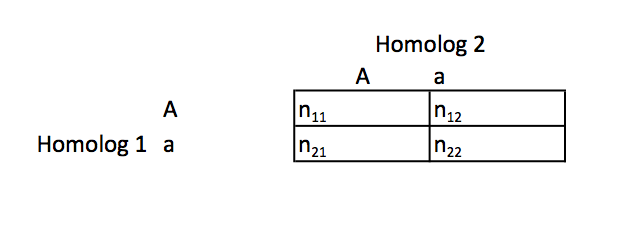

Week9_Notes
========================================================
author: Alexander Frieden
date: 4/4/2016
autosize: true

Motivating Question
========================================================
Suppose I have a set of variants found in a sick population $S$.  I also have another population of the variants found in the general population $G$.  How can I use $S$ and $G$ to infer which variants are deleterious (disease causing), and which are not.

New Tools
========================================================
To do this, we will need some new tools to do this


Fisher's Exact Test
========================================================
* The test is useful for categorical data that result from classifying objects in two different ways

* It is used to examine the significance of the association (contingency) between the two kinds of classification.

Fisher's Exact Test (part 2)
========================================================
* Chi Square Test is based on approximation that works best when $n$ is large

* We can conduct a hypothesis comparing two proprotions using Fisher's Exact Test.  

* This test lets us compute the exact probability of the occurrence of the observed frequencies in the contingency table  

* Technique is very useful in that we can do this for small $n$.  

Basic FET Example (part 1)
========================================================
Set up data frame.

```r
challenge.df = matrix(c(1,4,7,4), nrow = 2)
```

Basic FET Example (part 2)
========================================================
Run Fisher's Exact Test

```r
fisher.test(challenge.df)
```

```

	Fisher's Exact Test for Count Data

data:  challenge.df
p-value = 0.2821
alternative hypothesis: true odds ratio is not equal to 1
95 percent confidence interval:
 0.002553456 2.416009239
sample estimates:
odds ratio 
 0.1624254 
```

Basic FET Example (part 3)
========================================================
The p-value calculated for the test does not provide any evidence against the assumption of independence. In this example this means that we cannot confidently claim any difference in performance for the two challengers.


Drosophilia Example
=========================================================
McDonald and Kreitman (1991) sequenced the alcohol dehydrogenase gene in several individuals of three species of Drosophila. Varying sites were classified as synonymous (the nucleotide variation does not change an amino acid) or amino acid replacements, and they were also classified as polymorphic (varying within a species) or fixed differences between species. 

The two nominal variables are thus synonymicity ("synonymous" or "replacement") and fixity ("polymorphic" or "fixed"). In the absence of natural selection, the ratio of synonymous to replacement sites should be the same for polymorphisms and fixed differences. 

There were 43 synonymous polymorphisms, 2 replacement polymorphisms, 17 synonymous fixed differences, and 7 replacement fixed differences.

Drosophilia Example (part 2)
=========================================================  
|              |  synonymous|  replacement|
|-------------:|------------:|-------------:|
| polymorphisms|          43 |             2|
|         fixed|          17 |             7|

The result is $P=0.0067$, indicating that the null hypothesis can be rejected; there is a significant difference in synonymous/replacement ratio between polymorphisms and fixed differences.

Note
========================================================= 

A number of the following are taken from Andrea S. Foulkes "Applied Statistical Genetics with R"
Back to Hardy Weinberg 
========================================================= 
* Tests of Hardy Weinberg include Pearson's chi squared test.  The $\chi^2$ test is computationally advantageous.  

* This is because it relies an asymptotic assumptions, hence why it likes large $n$.  

* For example, when more than 20% of expected counts are less than five, it is better to use Fisher's Exact Test. 

* For the following example, a homologous gene (or homolog) is a gene inherited in two species by a common ancestor

Back to Hardy Weinberg (part 2)
========================================================= 
Consider the following:



Back to Hardy Weinberg (part 3)
========================================================= 

* This is a genotype table about a single locus.  

* Here $n_{11}$ and $n_{22}$ be the number of inidividuals with AA and aa respectively. 

* Note that Aa and aA are indistinguishable in population based investigations.

Back to Hardy Weinberg (part 4)
========================================================= 

We can only get the observed sum 

$$
n^*_{12} = n_{12} + n_{21}
$$

Back to Hardy Weinberg (part 5)
========================================================= 
The expected counts correspond to these three observed counts

Let 
$$
E_{11} = Np_A^2 \\
E_{12} = 2Np_A(1-p_A) \\
E_{22} = N(1-p_A)^2
$$

Where

$$
p_A = \frac{2n_{11} + n_{12}^*}{2N}
$$

Back to Hardy Weinberg (part 6)
========================================================= 

We can then construct the chi-square statistic 

$$
\tag{9.1}
\chi^2 = \sum_{(i,j)\in C} \frac{(O_{ij}-E_{ij})^2}{E_{ij}}
$$

Where $C$ is the set of our three alleles from the previous table. 

Back to Hardy Weinberg (part 7)
========================================================= 

* As with any chi-square test, we have a number of degrees of freedom.  

* In this case we have a single degree of freedom because knowledge of the counts in one of the cells fully determines the counts in the rest of them, conditional on the marginal totals.

Back to Hardy Weinberg (part 8)
========================================================= 
For example, suppose we know $n_{12}^*$.  

Then we can get $n_{11}$ and $n_{22}$ from earlier summation.  

Note that a statistically significant test result of HWE suggests that the SNP we are investigating is in Hardy-Weinberg *disequilibrium*. HWD is often called *non-random mating*

R comparison example (part 1)
========================================================= 
* Suppose we are interested in testing for HWE for the SNP labeled **AKT1.C0756A** in HGDP (Human Genome Diversity Project)

* To do this, we need to calculate observed and expected genotype counts

R comparison example (part 2)
========================================================= 


```r
hgdp <- read.delim("http://stat-gen.org/book.e1/data/HGDP_AKT1.txt", header=T, sep="\t")
attach(hgdp)
Akt1Snp1 <- AKT1.C0756A
ObsCount <- table(Akt1Snp1)
Nobs <- sum(ObsCount)
ObsCount
```

```
Akt1Snp1
 AA  CA  CC 
 48 291 724 
```

R comparison example (part 3)
========================================================= 

```r
FreqC <- (2 * ObsCount[3] + ObsCount[2])/(2*Nobs)
ExpCount <- c(Nobs*(1-FreqC)^2,2*Nobs*FreqC*(1-FreqC),Nobs*FreqC^2)
ExpCount
```

```
       CC        CC        CC 
 35.22319 316.55362 711.22319 
```

R comparison example (part 4)
=========================================================
* In this example, vectors of observed and expected are for AA,CA, CC.

* The $\chi^2$-statistic is calculated using equation (9.1).

* We now implement it.

R comparison example (part 5)
=========================================================

```r
ChiSqStat <- sum((ObsCount - ExpCount)^2/ExpCount)
ChiSqStat
```

```
[1] 6.926975
```

R comparison example (part 6)
=========================================================

Lets now compute the $\chi^2$-statistic needed for statistical significance at 5%.  We can compute this by looking at the quantile generated by $1-\alpha$ where $\alpha = 0.05$


```r
qchisq(1-0.05,df=1)
```

```
[1] 3.841459
```

R comparison example (part 7)
=========================================================
* Since 6.93 > 3.84, based on this we would **reject** the null hypothesis of HWE.  

* We would instead conclude that the alleles on two homologous chromosomes are associated with one another.  

* Alternatively the **HWE.chisq()** function in the genetics packagr can be used to calculate this statistic.  

R comparison example (part 8)
=========================================================
Use **genotype()** to create genotype objects

```r
install.packages("genetics", repos = "http://cran.us.r-project.org")
```

```

The downloaded binary packages are in
	/var/folders/tj/8dxhxfns3fb0fx5kswwdvjbr0000gp/T//RtmpYmQpTD/downloaded_packages
```

```r
library(genetics)
Akt1Snp1 <- genotype(AKT1.C0756A, sep="")
```

R comparison example (part 9)
=========================================================

```r
HWE.chisq(Akt1Snp1)
```

```

	Pearson's Chi-squared test with simulated p-value (based on 10000
	replicates)

data:  tab
X-squared = 6.927, df = NA, p-value = 0.0106
```

R comparison example (part 10)
=========================================================

* Note that we are returned both a $\chi^2$ statistic and a p-value.  The p-value is still above the 0.05 that we are looking for so we fail to reject null hypothesis.

* The p-value from Fisher's exact testis based on summing the exact probabilities of seeing the observed count data or something more extreme in the direction of the alternative hypothesis.  

R comparison example (part 11)
=========================================================

Fisher showed the exact probability from a contingency table (froom the one presented earlier) is given by:

$$
p_A = \frac{{n_{1.} \choose n_{11}}{n_{2.} \choose n_{21}}}{{N \choose n_{.1}}} = \frac{n_{1.}!n_{2.}!n_{.1}!n_{.2}!}{N!n_{11}!n_{12}!n_{21}!n_{22}!}
$$

Where
$$
n_{.1} = n_{11} + n_{21} \\
n_{1.} = n_{11} + n_{12} \\
n_{.2} = n_{12} + n_{22} \\
n_{2.} = n_{21} + n_{22} \\
n = n_{11} + n_{12} + n_{21} + n_{22}
$$

R comparison example (part 12)
=========================================================

It was showen by Emigh (1980) for the genetics setting that if we let $n_1 = 2 * n_{11} + n_{12}^*$, we can write the probability as:

$$
\tag{9.2}
p_A = \frac{n \choose n_{11},n_{12}^*,n_{22}}{2n \choose n_1}2^{n_{12}^*}
$$

If you are unfamiliar with permutation and combination notation, please see:
https://en.wikipedia.org/wiki/Permutation

R comparison example (part 13)
=========================================================
Now lets compute exact probability and exact p-value of HWE.  

Suppose we are interested in testing for a departure from HWE for the same SNP from previous example but only within the Maya population.  This is a group of 25 individuals.  

R comparison example (part 14)
=========================================================

```r
attach(hgdp)
Akt1Snp1Maya <- AKT1.C0756A[Population == "Maya"]
ObsCount <- table(Akt1Snp1Maya)
ObsCount
```

```
Akt1Snp1Maya
AA CA CC 
 1  6 18 
```

R comparison example (part 15)
=========================================================

```r
Nobs<-sum(ObsCount)
FreqC <- (2 * ObsCount[3] + ObsCount[2])/(2*Nobs)
ExpCount <- c(Nobs*(1-FreqC)^2, 2*Nobs*FreqC*(1-FreqC), Nobs*FreqC^2)
ExpCount
```

```
   CC    CC    CC 
 0.64  6.72 17.64 
```

R comparison example (part 16)
=========================================================
Since the expected count for the first cell is less than 5, using Fisher's Exact Test to test for HWE is most appropriate.  

An exact probability of eseing the observed counts, as described in (9.2) is given by **FisherP1**.  

R comparison example (part 17)
=========================================================
First set our values

```r
n11 <- ObsCount[3]
n12 <- ObsCount[2]
n22 <- ObsCount[1]
n1 <- 2*n11+n12
```

R comparison example (part 18)
=========================================================
calculate numerator and denominator of (9.2)then compute $p_A$

```r
Num <- 2^n12 * factorial(Nobs)/prod(factorial(ObsCount))
Denom <- factorial(2*Nobs) / (factorial(n1)*factorial(2*Nobs-n1))
FisherP1 <- Num/Denom
FisherP1
```

```
       CA 
0.4011216 
```

R comparison example (part 19)
=========================================================

Fisher's Exact p-value is given by summing over all probabilities of seeing something as extreme as or *more* extreme than the observed data.  

Thus to arrive at this p-value, we need to perform the calculation above for the more extreme situations as well, given by $n_{11} = 19$,$n_{11} = 20$, and $n_{11} = 21$.  Adjust $n_{12}$ and $n_{22}$ accordingly.  

We can do this by using the **HWE.exact()** method in the genetics package.  

R comparison example (part 20)
=========================================================


```r
library(genetics)
Akt1Snp1Maya <- genotype(AKT1.C0756A[Population == "Maya"],sep = "")
HWE.exact(Akt1Snp1Maya)
```

```

	Exact Test for Hardy-Weinberg Equilibrium

data:  Akt1Snp1Maya
N11 = 18, N12 = 6, N22 = 1, N1 = 42, N2 = 8, p-value = 0.4843
```

R comparison example (part 21)
=========================================================

Based on this output, we see that the exact p-value is 0.4843.

Thus, we are unable to reject the null hypothesis that there is a departure from HWE in this population.  

Bootstrapping
=========================================================
For the next couple of tools, we will need to use a tool that I am going to skim over called bootstrapping.  

The basic idea of bootstrapping is that inference about a population from sample data (sample → population) can be modeled by resampling the sample data and performing inference on (resample → sample). 

Bootstrapping Example part 1
=========================================================
As an example, assume we are interested in the average (or mean) height of people worldwide. 

We cannot measure all the people in the global population, so instead we sample only a tiny part of it, and measure that. 

Assume the sample is of size N; that is, we measure the heights of N individuals. From that single sample, only one estimate of the mean can be obtained. 

In order to reason about the population, we need some sense of the variability of the mean that we have computed.


Bootstrapping Example part 2
=========================================================
The simplest bootstrap method involves taking the original data set of N heights, and, using a computer, sampling from it to form a new sample (called a 'resample' or bootstrap sample) that is also of size N. 

The bootstrap sample is taken from the original using sampling with replacement so, assuming N is sufficiently large, for all practical purposes there is virtually zero probability that it will be identical to the original "real" sample. 

This process is repeated a large number of times (typically 1,000 or 10,000 times), and for each of these bootstrap samples we compute its mean (or some other statistic that we want)

Boosting part 1
=========================================================

In the example provided we were able to compute mean of a sample or approximate it for something we can't know directly.  

We are now going to use bootstrap to do something completely different: improve statistical learning methods such as decision trees.  

Boosting part 2
=========================================================

Two weeks ago we discussed decision trees.  However, those trees in general suffer from high variance.  
This means that if we split the training data into two parts at random, and fit a decision tree to both halves, the results that we get could be quite different.  

Again, this goes back to a lot of tree methods are unfortunately not very robust.  In contrast, if we had a low variance method we would get results have some robust way of computing a model.

Boosting part 3
=========================================================

Bootstrap aggregation or "bagging" is a general purpose procedure for reducing variance of a statistical learning method.  

Boosting part 4
=========================================================

Recall that given a set of $n$ independent observations $Z_1,...,Z_n$ each with variance $\sigma^2$, the variance of the mean $\bar{Z}$ of the observations is given by $\sigma^2/n$  

In other words, when we average a set of observations, this reduces variance. 

Boosting part 5
=========================================================
In this way, we could take many training sets, make many predictions, then average the models in some way.  

So suppose we calculate predictors $\hat{f^1}(x),\hat{f^2}(x),...,\hat{f^B}(x)$ using $B$ seperate training sets and average them in order to obtain a single low-variance statistical learning model:

$$
\hat{f}_{avg}(x) = \frac{1}{B}\sum_{b=1}^B\hat{f^b}(x)
$$

Boosting part 6
=========================================================

Because we do not have access to many training sets, we can generate those sets using bootstrapping from the single training data set.  

Doing this we generate $B$ different bootstrapped training data sets.  We then train our method on $b^{th}$ bootstrapped training set in order to get $\hat{f^{*b}}(x)$ to arrive at our average.  

$$
\hat{f}_{bag}(x) = \frac{1}{B}\sum_{b=1}^B \hat{f^{*b}}(x)
$$


Random Forests
=========================================================

Stepping back to trees, we are going to look at some popular tree-based methods.  

Random forests start by building a number of decision trees.  At each split in a tree that is considered, a random sample of $m$ predictors is chosen as split candidates from the full set of $p$ predictors.  

The split is allowed to use only one of those $m$ predictors .  A fresh sample of $m$ predicators is taken at each split.  

Typically we choose $m \approx \sqrt{p}$

Random Forests (part 2): Important Notes
=========================================================

As a result of this, the algorithm is not even allowed to consider a majority of available predictors.  
This may sound crazy, but it has a rationale.  Suppose there is a very strong predictor in $p$, among other moderately strong predictors.  In other methods, the method would have opted for this strong one.

As a consequence of this, we would get a number of trees (in this case I am talking about the bagging algorithm) that are similar.

Random Forests (part 3)
=========================================================
* These many trees will be highly correlated.

* Unfortunately, averaging many highly correlated quantities does not lead to as large a reduction of variance as averaging many uncorrelate quantities.  

Random Forests (part 4)
=========================================================

In random forests, this is done by using the predictor subset $m$.  

When we set $m=\sqrt{p}$, this results in a reduction of test error over setting $m = p$

Another advantage we get is if we have highly correlated predictors, choosing an even smaller $m$ can allow us to get trees with more unsimiliarity.  

Boosting (part 1)
=========================================================

* Boosting is an approach to improving the resulting predictions from a decision tree.  

* Like Like bagging, boosting is a general approach that can be applied to many different statistical learning methods for learning or classification. 


Boosting (part 2)
=========================================================

* In bagging, we create multiple copies of the original training data set sing the bootstrap, fitting a seperate decision tree to each copy, and then combining all the trees in order to create a single predictive model.

* Note that each tree is built using data that is independent from other trees.  

Boosting (part 3)
=========================================================

* In Boosting, we do the same thing except that the trees are grown **sequentially**.  

* This means each tree is grown using information from other previously grown trees.  

* Boosting does not involve boosttrap sampling.  Instead each tree is fit on a modified version of the original data set.  

Boosting algorithm
=========================================================

1.  St $\hat{f}(x) = 0$ and $r_i  = y_i$ for all $i$ in the training set.  

2.  For $b = 1, 2,...,B$, repeat:  
    + Fit a tree $\,\hat{f^b}$ with $d$ splits ($d+1$ terminal nodes) to the training data $(X,r)$.  
    + Update $\hat{f}$ by adding in a shrunken version of the new tree.  
    
$$
\tag{9.3}
\hat{f}(x) \leftarrow \hat{f}(x) + \lambda\hat{f^{b}}
$$
      
 Update the residuals
    
$$
r_i \leftarrow r_i - \lambda\hat{f^{b}}(x_i)
$$

Boosting algorithm (part 2)
=========================================================

And finally output the boosted model

$$
\hat{f}(x) = \sum_{b=1}^B\lambda\hat{f^{b}}(x)
$$

Boosting general idea
=========================================================

Unlike fitting a single large decision tree to the data, boosting approach instead learns slowly.  

We fit a tree to the current residuals rather than the outcome of the tree.  

We then add this new decision tree into the fitted function in order to update the residuals.  

Each of these trees can be small, as the number of terminal nodes can be made small by making $d$ small

Boosting general idea (part 2)
=========================================================

Having a small value for $\lambda$, the shrinkage parameter, slows the process of learning down and allows for more and different shaped trees.  

These trees attack the residuals that are tough to learn.  

In general approaches that learn slowly tend to perform well.  

Decision Trees using Tree-Based Methods (part 1)
=========================================================

We are going to use the **Boston** data using the **randomForest** package in R.  

Note that bagging and random forest are the same when $m=p$ so we are going to use the **randomForest()** method for both. 

Decision Trees using Tree-Based Methods (part 2)
=========================================================


```r
install.packages("randomForest", repos = "http://cran.us.r-project.org")
```

```

The downloaded binary packages are in
	/var/folders/tj/8dxhxfns3fb0fx5kswwdvjbr0000gp/T//RtmpYmQpTD/downloaded_packages
```

```r
library(randomForest)
set.seed(1)
```

Decision Trees using Tree-Based Methods (part 3)
=========================================================
Lets take a look at what the data looks like.  These are housing values in suburbs of Boston.  

```r
head(Boston)
```

```
     crim zn indus chas   nox    rm  age    dis rad tax ptratio  black
1 0.00632 18  2.31    0 0.538 6.575 65.2 4.0900   1 296    15.3 396.90
2 0.02731  0  7.07    0 0.469 6.421 78.9 4.9671   2 242    17.8 396.90
3 0.02729  0  7.07    0 0.469 7.185 61.1 4.9671   2 242    17.8 392.83
4 0.03237  0  2.18    0 0.458 6.998 45.8 6.0622   3 222    18.7 394.63
5 0.06905  0  2.18    0 0.458 7.147 54.2 6.0622   3 222    18.7 396.90
6 0.02985  0  2.18    0 0.458 6.430 58.7 6.0622   3 222    18.7 394.12
  lstat medv
1  4.98 24.0
2  9.14 21.6
3  4.03 34.7
4  2.94 33.4
5  5.33 36.2
6  5.21 28.7
```

Decision Trees using Tree-Based Methods (part 4)
=========================================================
Here we are using the median home value in our random forest.


```
Error in eval(expr, envir, enclos) : object 'train' not found
```
